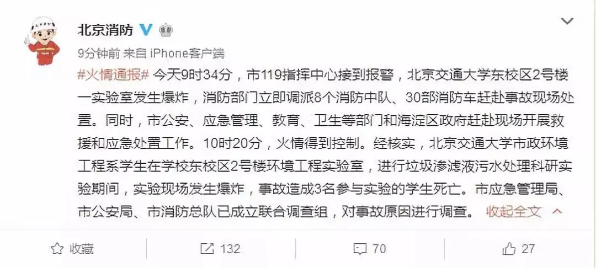
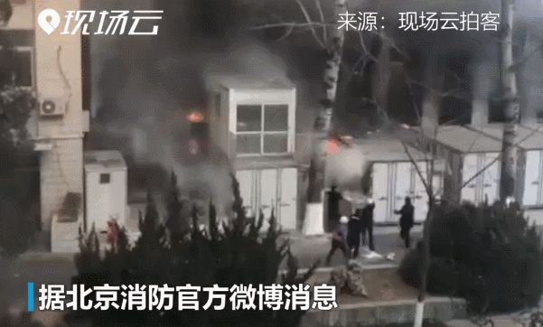
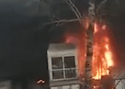
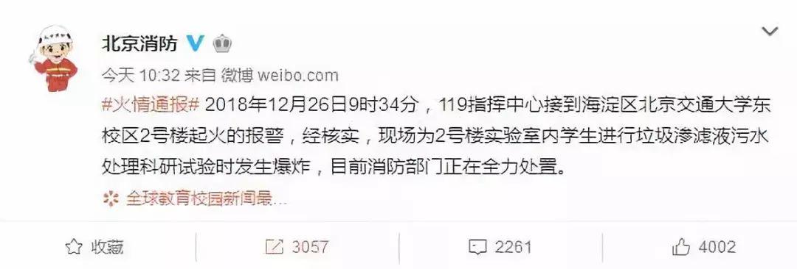

# 无标题

**链接地址:** http://mp.weixin.qq.com/s?__biz=MzA4MjQxNjQzMA==&mid=2768402186&idx=1&sn=f45357d44dfa221eb70d3e7e89173d46&chksm=bf70d14b8807585db68c8961e489edba0e3a3a8588396b894278f013f5c68880856cec7db754&mpshare=1&scene=2&srcid=1227PBNLUVSs51xWFigZLtO4#rd
**作者:** 
**获取时间:** 2025/8/28 20:56:33
**图片数量:** 5

---

## 原始HTML内容

 

据<strong>@北京消防</strong> 消息，

 
<blockquote>
<strong>今天9时34分，市119指挥中心接到报警，北京交通大学东校区2号楼一实验室发生爆炸，消防部门立即调派8个消防中队、30部消防车赶赴事故现场处置。</strong>

 

<strong>同时，市公安、应急管理、教育、卫生等部门和海淀区政府赶赴现场开展救援和应急处置工作。</strong>

 

<strong>10时20分，火情得到控制。</strong>

 

<strong>经核实，北京交通大学市政环境工程系学生在学校东校区2号楼环境工程实验室，进行垃圾渗滤液污水处理科研实验期间，实验现场发生爆炸，事故造成3名参与实验的学生死亡。</strong>

 

<strong>市应急管理局、市公安局、市消防总队已成立联合调查组，对事故原因进行调查。</strong>
</blockquote>
 

 

 

<strong style="max-width: 100%;color: rgb(255, 255, 255);letter-spacing: 0.544px;white-space: normal;box-sizing: border-box !important;word-wrap: break-word !important;">早前报道：</strong>

 

 

<strong>@北京消防</strong>

 
<blockquote>
<strong>2018年12月26日9时34分，119指挥中心接到海淀区北京交通大学东校区2号楼起火的报警，经核实，现场为2号楼实验室内学生进行垃圾渗滤液污水处理科研试验时发生爆炸，目前消防部门正在全力处置。</strong>
</blockquote>
 

来源：新华网综合@北京消防

监制：刘洪 周庚虎
<section neue="neue" pingfang="pingfang" sc="sc" hiragino="hiragino" gb="gb" ui="ui" microsoft="microsoft" arial="arial" sans-serif="sans-serif" normal="normal" important="important" rgb="rgb" helvetica="helvetica" sans="sans" yahei="yahei" break-word="break-word" border-box="border-box" style="max-width: 100%;white-space: normal;background-color: rgb(255, 255, 255);letter-spacing: 0.54px;box-sizing: border-box !important;word-wrap: break-word !important;">编辑：梁甜甜</section><section neue="neue" pingfang="pingfang" sc="sc" hiragino="hiragino" gb="gb" ui="ui" microsoft="microsoft" arial="arial" sans-serif="sans-serif" normal="normal" important="important" rgb="rgb" helvetica="helvetica" sans="sans" yahei="yahei" break-word="break-word" border-box="border-box" style="max-width: 100%;white-space: normal;background-color: rgb(255, 255, 255);letter-spacing: 0.54px;box-sizing: border-box !important;word-wrap: break-word !important;">校对：王帅 赵冰</section><section neue="neue" pingfang="pingfang" sc="sc" hiragino="hiragino" gb="gb" ui="ui" microsoft="microsoft" arial="arial" sans-serif="sans-serif" normal="normal" important="important" rgb="rgb" helvetica="helvetica" sans="sans" yahei="yahei" break-word="break-word" border-box="border-box" style="max-width: 100%;white-space: normal;background-color: rgb(255, 255, 255);letter-spacing: 0.54px;box-sizing: border-box !important;word-wrap: break-word !important;"> </section>

<strong style="max-width: 100%;box-sizing: border-box !important;word-wrap: break-word !important;">关注！</strong>

---

## 纯文本内容

据@北京消防 消息，今天9时34分，市119指挥中心接到报警，北京交通大学东校区2号楼一实验室发生爆炸，消防部门立即调派8个消防中队、30部消防车赶赴事故现场处置。同时，市公安、应急管理、教育、卫生等部门和海淀区政府赶赴现场开展救援和应急处置工作。10时20分，火情得到控制。经核实，北京交通大学市政环境工程系学生在学校东校区2号楼环境工程实验室，进行垃圾渗滤液污水处理科研实验期间，实验现场发生爆炸，事故造成3名参与实验的学生死亡。市应急管理局、市公安局、市消防总队已成立联合调查组，对事故原因进行调查。早前报道：@北京消防2018年12月26日9时34分，119指挥中心接到海淀区北京交通大学东校区2号楼起火的报警，经核实，现场为2号楼实验室内学生进行垃圾渗滤液污水处理科研试验时发生爆炸，目前消防部门正在全力处置。来源：新华网综合@北京消防监制：刘洪 周庚虎编辑：梁甜甜校对：王帅 赵冰关注！

---

## 图片列表

-  (原始链接: https://mmbiz.qpic.cn/mmbiz_jpg/O9F3NTo58yqjK65UAOz7lSytK7aibgyFhick6uwnIpgj0XvMuz5ibia11sBPcco5Jdf8X7AZgial8oGXWZUbEgz6cnA/640?wx_fmt=jpeg)
-  (原始链接: https://mmbiz.qpic.cn/mmbiz_gif/O9F3NTo58yqjK65UAOz7lSytK7aibgyFhAibWYrBKD3bxa1zvzFzn2BOhEuUUvZxVufibwg9PkgLupibJkicETCyFLw/640?wx_fmt=gif)
-  (原始链接: https://mmbiz.qpic.cn/mmbiz_gif/O9F3NTo58yqjK65UAOz7lSytK7aibgyFhgksnRCGNV6m1GLmDBAiaYr1ib7qf1AWeO6p0O6nBnqI8CMReKp3JkfnA/640?wx_fmt=gif)
-  (原始链接: https://mmbiz.qpic.cn/mmbiz_jpg/O9F3NTo58yqjK65UAOz7lSytK7aibgyFhIgib6ia8RRuxaTtEjXzEgluDrOTPjudXEOcgN27d5yIoHtcmZiaevoAIw/640?wx_fmt=jpeg)
-  (原始链接: https://mmbiz.qpic.cn/mmbiz_jpg/O9F3NTo58yrz0eZXHptggTSlFR12tl5jCjLGSpKy9FfsWibz0AasiaN1WTwCodZVl5F4H9P7ewjgqPzmBxkzpILg/640?wx_fmt=jpeg)
