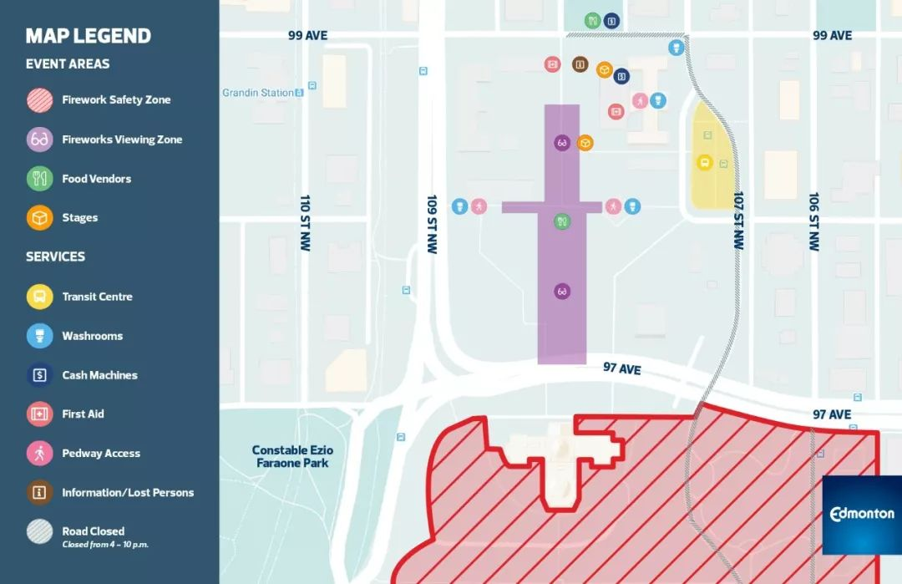
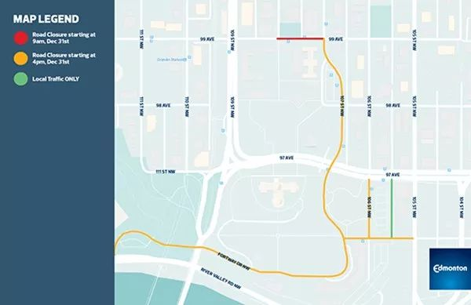
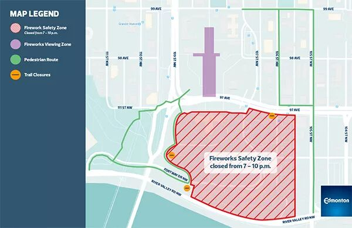

# 无标题

**链接地址:** http://mp.weixin.qq.com/s?__biz=MzI2NTE1ODgwOQ==&mid=2649605771&idx=1&sn=73fb5a171606e1f31a45ad47a1de94b2&chksm=f2b8cf7dc5cf466b7f95c66826f00f55ec701007deea060923d7d2b4a0f3dcd91364ec4fbc18&mpshare=1&scene=2&srcid=#rd
**作者:** 雪糊
**获取时间:** 2025/8/28 20:55:04
**图片数量:** 19

---

## 原始HTML内容

<section style="box-sizing: border-box;"><section class="V5" style="box-sizing: border-box;" powered-by="xiumi.us"><section style="margin-right: 0%;margin-left: 0%;box-sizing: border-box;"><section style="display: inline-block;vertical-align: middle;width: 80%;box-sizing: border-box;"><section class="V5" style="box-sizing: border-box;" powered-by="xiumi.us"><section style="margin-top: 10px;margin-bottom: 10px;text-align: center;box-sizing: border-box;"><section style="display: inline-block;box-sizing: border-box;"><section style="max-width: 100%;font-size: 0px;padding-bottom: 3px;box-sizing: border-box;"><section style="display: inline-block;vertical-align: middle;box-sizing: border-box;"><section style="width: 5px;height: 1px;background-color: rgb(217, 217, 217);box-sizing: border-box;"></section><section style="width: 1px;height: 5px;margin-top: -3px;margin-right: auto;margin-left: auto;background-color: rgb(217, 217, 217);box-sizing: border-box;"></section></section><section style="margin-top: -1px;margin-right: -5px;margin-left: -5px;width: 100%;display: inline-block;vertical-align: middle;padding-right: 8px;padding-left: 8px;box-sizing: border-box;"><section style="width: 100%;height: 1px;background-color: rgb(217, 217, 217);box-sizing: border-box;"></section></section><section style="display: inline-block;vertical-align: middle;box-sizing: border-box;"><section style="width: 5px;height: 1px;background-color: rgb(217, 217, 217);box-sizing: border-box;"></section><section style="width: 1px;height: 5px;margin-top: -3px;margin-right: auto;margin-left: auto;background-color: rgb(217, 217, 217);box-sizing: border-box;"></section></section></section><section style="padding-left: 15px;padding-right: 15px;color: rgb(161, 161, 161);font-size: 14px;box-sizing: border-box;">
点击上方<strong style="box-sizing: border-box;">蓝字</strong>关注我们哟~
</section><section style="max-width: 100%;font-size: 0px;box-sizing: border-box;"><section style="display: inline-block;vertical-align: middle;box-sizing: border-box;"><section style="width: 5px;height: 1px;background-color: rgb(217, 217, 217);box-sizing: border-box;"></section><section style="width: 1px;height: 5px;margin-top: -3px;margin-right: auto;margin-left: auto;background-color: rgb(217, 217, 217);box-sizing: border-box;"></section></section><section style="margin-top: -1px;margin-right: -5px;margin-left: -5px;width: 100%;display: inline-block;vertical-align: middle;padding-right: 8px;padding-left: 8px;box-sizing: border-box;"><section style="width: 100%;height: 1px;background-color: rgb(217, 217, 217);box-sizing: border-box;"></section></section><section style="display: inline-block;vertical-align: middle;box-sizing: border-box;"><section style="width: 5px;height: 1px;background-color: rgb(217, 217, 217);box-sizing: border-box;"></section><section style="width: 1px;height: 5px;margin-top: -3px;margin-right: auto;margin-left: auto;background-color: rgb(217, 217, 217);box-sizing: border-box;"></section></section></section></section></section></section></section><section style="display: inline-block;vertical-align: middle;width: 20%;box-sizing: border-box;"><section class="V5" style="box-sizing: border-box;" powered-by="xiumi.us"><section style="text-align: center;margin: -10px 0% 10px;box-sizing: border-box;"><section style="max-width: 100%;vertical-align: middle;display: inline-block;width: 100%;box-sizing: border-box;"></section></section></section></section></section></section><section class="V5" style="box-sizing: border-box;" powered-by="xiumi.us"><section style="margin: 10px 0%;box-sizing: border-box;"><section style="display: inline-block;width: 100%;vertical-align: top;box-sizing: border-box;"><section class="V5" style="box-sizing: border-box;" powered-by="xiumi.us"><section style="box-sizing: border-box;"><section style="display: inline-block;vertical-align: bottom;width: 75%;padding-right: 10px;box-sizing: border-box;"><section class="V5" style="box-sizing: border-box;" powered-by="xiumi.us"><section style="margin: 10px 0% 3px;box-sizing: border-box;"><section style="display: inline-block;vertical-align: middle;box-sizing: border-box;"><section style="display: inline-block;vertical-align: bottom;padding-left: 5px;padding-right: 5px;line-height: 1.2em;margin-bottom: 2px;color: rgba(80, 182, 201, 0.72);box-sizing: border-box;">
<strong style="box-sizing: border-box;">仔细看下图，有惊喜！</strong>
</section><section style="max-width: 100%;display: inline-block;vertical-align: bottom;width: 1.6em;box-sizing: border-box;"></section></section></section></section></section><section style="display: inline-block;vertical-align: bottom;width: 25%;box-sizing: border-box;"><section class="V5" style="box-sizing: border-box;" powered-by="xiumi.us"><section style="margin-right: 0%;margin-bottom: 3px;margin-left: 0%;text-align: right;box-sizing: border-box;"><section style="display: inline-block;border-bottom: 0.15em solid rgba(80, 182, 201, 0.72);padding-bottom: 3px;box-sizing: border-box;"><section style="display: inline-block;padding: 3px;border-bottom: 0.15em solid rgba(80, 182, 201, 0.72);font-size: 12px;line-height: 1.4;color: rgb(255, 143, 47);box-sizing: border-box;">
<strong style="box-sizing: border-box;">金主大大</strong>
</section></section></section></section></section></section></section><section class="V5" style="box-sizing: border-box;" powered-by="xiumi.us"><section style="margin-right: 0%;margin-left: 0%;box-sizing: border-box;"><section style="background-color: rgba(80, 182, 201, 0.72);height: 2px;box-sizing: border-box;"></section></section></section></section></section></section><section class="V5" style="box-sizing: border-box;" powered-by="xiumi.us"><section style="text-align: center;margin-top: 10px;margin-bottom: 10px;box-sizing: border-box;"><section style="max-width: 100%;vertical-align: middle;display: inline-block;box-sizing: border-box;"></section></section></section><section class="V5" style="box-sizing: border-box;" powered-by="xiumi.us"><section style="text-align: center;margin-top: 10px;margin-bottom: 10px;box-sizing: border-box;"><section style="max-width: 100%;vertical-align: middle;display: inline-block;box-sizing: border-box;"></section></section></section><section class="V5" style="box-sizing: border-box;" powered-by="xiumi.us"><section style="text-align: center;margin-top: 10px;margin-bottom: 10px;box-sizing: border-box;"><section style="max-width: 100%;vertical-align: middle;display: inline-block;box-sizing: border-box;"></section></section></section><section class="V5" style="box-sizing: border-box;" powered-by="xiumi.us"><section style="text-align: center;margin-top: 10px;margin-bottom: 10px;box-sizing: border-box;"><section style="max-width: 100%;vertical-align: middle;display: inline-block;box-sizing: border-box;"></section></section></section><section class="V5" style="box-sizing: border-box;" powered-by="xiumi.us"><section style="text-align: center;margin-top: 10px;margin-bottom: 10px;box-sizing: border-box;"><section style="max-width: 100%;vertical-align: middle;display: inline-block;box-sizing: border-box;"></section></section></section><section class="V5" style="box-sizing: border-box;" powered-by="xiumi.us"><section style="text-align: center;margin-top: 10px;margin-bottom: 10px;box-sizing: border-box;"><section style="max-width: 100%;vertical-align: middle;display: inline-block;box-sizing: border-box;"><svg xmlns="http://www.w3.org/2000/svg" x="0px" y="0px" viewBox="0 0 902.1 38.2" style="vertical-align: middle;max-width: 100%;box-sizing: border-box;" width="902.1"><g style="box-sizing: border-box;"><path style="box-sizing: border-box;" d="M18.4,1.4c0.9-1.9,2.4-1.9,3.4,0l3.4,6.9c0.9,1.9,3.4,3.7,5.4,4l7.6,1.1c2.1,0.3,2.5,1.7,1,3.2   l-5.5,5.4c-1.5,1.5-2.4,4.3-2.1,6.4l1.3,7.6c0.4,2.1-0.9,2.9-2.7,2l-6.8-3.6c-1.8-1-4.9-1-6.7,0l-6.8,3.6c-1.9,1-3.1,0.1-2.7-2   l1.3-7.6c0.4-2.1-0.6-4.9-2.1-6.4l-5.5-5.4c-1.5-1.5-1-2.9,1-3.2l7.6-1.1c2.1-0.3,4.5-2.1,5.4-4L18.4,1.4z" fill="rgb(178, 243, 230)"></path><path style="box-sizing: border-box;" d="M90.6,5.4c0.7-1.4,1.9-1.4,2.6,0l2.6,5.3c0.7,1.4,2.6,2.8,4.2,3.1l5.9,0.9c1.6,0.2,2,1.3,0.8,2.5   l-4.2,4.1c-1.2,1.1-1.9,3.3-1.6,4.9l1,5.8c0.3,1.6-0.7,2.3-2.1,1.5l-5.2-2.8c-1.4-0.8-3.8-0.8-5.2,0L84,33.6   c-1.4,0.8-2.4,0.1-2.1-1.5l1-5.8c0.3-1.6-0.5-3.8-1.6-4.9l-4.2-4.1c-1.2-1.1-0.8-2.2,0.8-2.5l5.9-0.9c1.6-0.2,3.5-1.6,4.2-3.1   L90.6,5.4z" fill="rgb(190, 204, 246)"></path><path style="box-sizing: border-box;" d="M162.6,7.5c0.6-1.2,1.6-1.2,2.2,0l2.2,4.5c0.6,1.2,2.2,2.4,3.6,2.6l5,0.7c1.4,0.2,1.7,1.1,0.7,2.1   l-3.6,3.5c-1,1-1.6,2.9-1.4,4.2l0.9,5c0.2,1.4-0.6,1.9-1.8,1.3l-4.5-2.4c-1.2-0.6-3.2-0.6-4.4,0l-4.5,2.4c-1.2,0.6-2,0.1-1.8-1.3   l0.9-5c0.2-1.4-0.4-3.3-1.4-4.2l-3.6-3.5c-1-1-0.7-1.9,0.7-2.1l5-0.7c1.4-0.2,3-1.4,3.6-2.6L162.6,7.5z" fill="rgb(150, 208, 240)"></path><path style="box-sizing: border-box;" d="M60.1,19.1c0,2.3-1.9,4.2-4.2,4.2c-2.3,0-4.2-1.9-4.2-4.2s1.9-4.2,4.2-4.2   C58.3,14.9,60.1,16.8,60.1,19.1z" fill="rgb(218, 240, 224)"></path><path style="box-sizing: border-box;" d="M203.8,19.1c0,2.3-1.9,4.2-4.2,4.2c-2.3,0-4.2-1.9-4.2-4.2s1.9-4.2,4.2-4.2   C201.9,14.9,203.8,16.8,203.8,19.1z" fill="rgb(218, 240, 224)"></path><path style="box-sizing: border-box;" d="M130.9,19.1c0,1.7-1.4,3.1-3.1,3.1c-1.7,0-3.1-1.4-3.1-3.1c0-1.7,1.4-3.1,3.1-3.1   C129.5,16.1,130.9,17.4,130.9,19.1z" fill="rgb(218, 240, 224)"></path><path style="box-sizing: border-box;" d="M233.9,1.4c0.9-1.9,2.4-1.9,3.4,0l3.4,6.9c0.9,1.9,3.4,3.7,5.4,4l7.6,1.1c2.1,0.3,2.5,1.7,1,3.2   l-5.5,5.4c-1.5,1.5-2.4,4.3-2.1,6.4l1.3,7.6c0.4,2.1-0.9,2.9-2.7,2l-6.8-3.6c-1.8-1-4.9-1-6.7,0l-6.8,3.6c-1.9,1-3.1,0.1-2.7-2   l1.3-7.6c0.4-2.1-0.6-4.9-2.1-6.4l-5.5-5.4c-1.5-1.5-1-2.9,1-3.2l7.6-1.1c2.1-0.3,4.5-2.1,5.4-4L233.9,1.4z" fill="rgb(178, 243, 230)"></path><path style="box-sizing: border-box;" d="M306.1,5.4c0.7-1.4,1.9-1.4,2.6,0l2.6,5.3c0.7,1.4,2.6,2.8,4.2,3.1l5.9,0.9c1.6,0.2,2,1.3,0.8,2.5   l-4.2,4.1c-1.2,1.1-1.9,3.3-1.6,4.9l1,5.8c0.3,1.6-0.7,2.3-2.1,1.5l-5.2-2.8c-1.4-0.8-3.8-0.8-5.2,0l-5.2,2.8   c-1.4,0.8-2.4,0.1-2.1-1.5l1-5.8c0.3-1.6-0.4-3.8-1.6-4.9l-4.2-4.1c-1.2-1.1-0.8-2.2,0.8-2.5l5.9-0.9c1.6-0.2,3.5-1.6,4.2-3.1   L306.1,5.4z" fill="rgb(190, 204, 246)"></path><path style="box-sizing: border-box;" d="M378.1,7.5c0.6-1.2,1.6-1.2,2.2,0l2.2,4.5c0.6,1.2,2.2,2.4,3.6,2.6l5,0.7c1.4,0.2,1.7,1.1,0.7,2.1   l-3.6,3.5c-1,1-1.6,2.9-1.4,4.2l0.9,5c0.2,1.4-0.6,1.9-1.8,1.3l-4.5-2.4c-1.2-0.6-3.2-0.6-4.4,0l-4.5,2.4c-1.2,0.6-2,0.1-1.8-1.3   l0.9-5c0.2-1.4-0.4-3.3-1.4-4.2l-3.6-3.5c-1-1-0.7-1.9,0.7-2.1l5-0.7c1.4-0.2,3-1.4,3.6-2.6L378.1,7.5z" fill="rgb(150, 208, 240)"></path><path style="box-sizing: border-box;" d="M275.7,19.1c0,2.3-1.9,4.2-4.2,4.2c-2.3,0-4.2-1.9-4.2-4.2s1.9-4.2,4.2-4.2   C273.8,14.9,275.7,16.8,275.7,19.1z" fill="rgb(218, 240, 224)"></path><path style="box-sizing: border-box;" d="M419.3,19.1c0,2.3-1.9,4.2-4.2,4.2c-2.3,0-4.2-1.9-4.2-4.2s1.9-4.2,4.2-4.2   C417.5,14.9,419.3,16.8,419.3,19.1z" fill="rgb(218, 240, 224)"></path><path style="box-sizing: border-box;" d="M346.4,19.1c0,1.7-1.4,3.1-3.1,3.1c-1.7,0-3.1-1.4-3.1-3.1c0-1.7,1.4-3.1,3.1-3.1   C345,16.1,346.4,17.4,346.4,19.1z" fill="rgb(218, 240, 224)"></path><path style="box-sizing: border-box;" d="M449.4,1.4c0.9-1.9,2.4-1.9,3.4,0l3.4,6.9c0.9,1.9,3.4,3.7,5.4,4l7.6,1.1c2.1,0.3,2.5,1.7,1,3.2   l-5.5,5.4c-1.5,1.5-2.4,4.3-2.1,6.4l1.3,7.6c0.4,2.1-0.9,2.9-2.7,2l-6.8-3.6c-1.8-1-4.9-1-6.7,0l-6.8,3.6c-1.9,1-3.1,0.1-2.7-2   l1.3-7.6c0.4-2.1-0.6-4.9-2.1-6.4l-5.5-5.4c-1.5-1.5-1-2.9,1-3.2l7.6-1.1c2.1-0.3,4.5-2.1,5.4-4L449.4,1.4z" fill="rgb(178, 243, 230)"></path><path style="box-sizing: border-box;" d="M521.6,5.4c0.7-1.4,1.9-1.4,2.6,0l2.6,5.3c0.7,1.4,2.6,2.8,4.2,3.1l5.9,0.9c1.6,0.2,2,1.3,0.8,2.5   l-4.2,4.1c-1.2,1.1-1.9,3.3-1.6,4.9l1,5.8c0.3,1.6-0.7,2.3-2.1,1.5l-5.2-2.8c-1.4-0.8-3.8-0.8-5.2,0l-5.2,2.8   c-1.4,0.8-2.4,0.1-2.1-1.5l1-5.8c0.3-1.6-0.5-3.8-1.6-4.9l-4.2-4.1c-1.2-1.1-0.8-2.2,0.8-2.5l5.9-0.9c1.6-0.2,3.5-1.6,4.2-3.1   L521.6,5.4z" fill="rgb(190, 204, 246)"></path><path style="box-sizing: border-box;" d="M593.6,7.5c0.6-1.2,1.6-1.2,2.2,0l2.2,4.5c0.6,1.2,2.2,2.4,3.6,2.6l5,0.7c1.4,0.2,1.7,1.1,0.7,2.1   l-3.6,3.5c-1,1-1.6,2.9-1.4,4.2l0.9,5c0.2,1.4-0.6,1.9-1.8,1.3l-4.5-2.4c-1.2-0.6-3.2-0.6-4.4,0l-4.5,2.4c-1.2,0.6-2,0.1-1.8-1.3   l0.9-5c0.2-1.4-0.4-3.3-1.4-4.2l-3.6-3.5c-1-1-0.7-1.9,0.7-2.1l5-0.7c1.4-0.2,3-1.4,3.6-2.6L593.6,7.5z" fill="rgb(150, 208, 240)"></path><path style="box-sizing: border-box;" d="M491.2,19.1c0,2.3-1.9,4.2-4.2,4.2c-2.3,0-4.2-1.9-4.2-4.2s1.9-4.2,4.2-4.2   C489.3,14.9,491.2,16.8,491.2,19.1z" fill="rgb(218, 240, 224)"></path><path style="box-sizing: border-box;" d="M634.9,19.1c0,2.3-1.9,4.2-4.2,4.2c-2.3,0-4.2-1.9-4.2-4.2s1.9-4.2,4.2-4.2   C633,14.9,634.9,16.8,634.9,19.1z" fill="rgb(218, 240, 224)"></path><path style="box-sizing: border-box;" d="M561.9,19.1c0,1.7-1.4,3.1-3.1,3.1c-1.7,0-3.1-1.4-3.1-3.1c0-1.7,1.4-3.1,3.1-3.1   C560.5,16.1,561.9,17.4,561.9,19.1z" fill="rgb(218, 240, 224)"></path><path style="box-sizing: border-box;" d="M664.9,1.4c0.9-1.9,2.4-1.9,3.4,0l3.4,6.9c0.9,1.9,3.4,3.7,5.4,4l7.6,1.1c2.1,0.3,2.5,1.7,1,3.2   l-5.5,5.4c-1.5,1.5-2.4,4.3-2.1,6.4l1.3,7.6c0.4,2.1-0.9,2.9-2.7,2l-6.8-3.6c-1.8-1-4.9-1-6.7,0l-6.8,3.6c-1.9,1-3.1,0.1-2.7-2   l1.3-7.6c0.4-2.1-0.6-4.9-2.1-6.4l-5.5-5.4c-1.5-1.5-1-2.9,1-3.2l7.6-1.1c2.1-0.3,4.5-2.1,5.4-4L664.9,1.4z" fill="rgb(178, 243, 230)"></path><path style="box-sizing: border-box;" d="M737.1,5.4c0.7-1.4,1.9-1.4,2.6,0l2.6,5.3c0.7,1.4,2.6,2.8,4.2,3.1l5.9,0.9c1.6,0.2,2,1.3,0.8,2.5   l-4.2,4.1c-1.2,1.1-1.9,3.3-1.6,4.9l1,5.8c0.3,1.6-0.7,2.3-2.1,1.5l-5.2-2.8c-1.4-0.8-3.8-0.8-5.2,0l-5.2,2.8   c-1.4,0.8-2.4,0.1-2.1-1.5l1-5.8c0.3-1.6-0.5-3.8-1.6-4.9l-4.2-4.1c-1.2-1.1-0.8-2.2,0.8-2.5l5.9-0.9c1.6-0.2,3.5-1.6,4.2-3.1   L737.1,5.4z" fill="rgb(190, 204, 246)"></path><path style="box-sizing: border-box;" d="M809.2,7.5c0.6-1.2,1.6-1.2,2.2,0l2.2,4.5c0.6,1.2,2.2,2.4,3.6,2.6l5,0.7c1.4,0.2,1.7,1.1,0.7,2.1   l-3.6,3.5c-1,1-1.6,2.9-1.4,4.2l0.9,5c0.2,1.4-0.6,1.9-1.8,1.3l-4.5-2.4c-1.2-0.6-3.2-0.6-4.4,0l-4.5,2.4c-1.2,0.6-2,0.1-1.8-1.3   l0.9-5c0.2-1.4-0.4-3.3-1.4-4.2l-3.6-3.5c-1-1-0.7-1.9,0.7-2.1l5-0.7c1.4-0.2,3-1.4,3.6-2.6L809.2,7.5z" fill="rgb(150, 208, 240)"></path><path style="box-sizing: border-box;" d="M706.7,19.1c0,2.3-1.9,4.2-4.2,4.2c-2.3,0-4.2-1.9-4.2-4.2s1.9-4.2,4.2-4.2   C704.8,14.9,706.7,16.8,706.7,19.1z" fill="rgb(218, 240, 224)"></path><path style="box-sizing: border-box;" d="M850.4,19.1c0,2.3-1.9,4.2-4.2,4.2c-2.3,0-4.2-1.9-4.2-4.2s1.9-4.2,4.2-4.2   C848.5,14.9,850.4,16.8,850.4,19.1z" fill="rgb(218, 240, 224)"></path><path style="box-sizing: border-box;" d="M777.4,19.1c0,1.7-1.4,3.1-3.1,3.1c-1.7,0-3.1-1.4-3.1-3.1c0-1.7,1.4-3.1,3.1-3.1   C776,16.1,777.4,17.4,777.4,19.1z" fill="rgb(218, 240, 224)"></path><path style="box-sizing: border-box;" d="M880.4,1.4c0.9-1.9,2.4-1.9,3.4,0l3.4,6.9c0.9,1.9,3.4,3.7,5.4,4l7.6,1.1c2.1,0.3,2.5,1.7,1,3.2   l-5.5,5.4c-1.5,1.5-2.4,4.3-2.1,6.4l1.3,7.6c0.4,2.1-0.9,2.9-2.7,2l-6.8-3.6c-1.8-1-4.9-1-6.7,0l-6.8,3.6c-1.8,1-3.1,0.1-2.7-2   l1.3-7.6c0.4-2.1-0.6-4.9-2.1-6.4l-5.5-5.4c-1.5-1.5-1-2.9,1-3.2l7.6-1.1c2.1-0.3,4.5-2.1,5.4-4L880.4,1.4z" fill="rgb(178, 243, 230)"></path></g></svg></section></section></section><section class="V5" style="box-sizing: border-box;" powered-by="xiumi.us"><section style="box-sizing: border-box;"><section style="text-align: center;box-sizing: border-box;">

 

一年一度的新年前夜即将在明日到来，埃德蒙顿的大家是否都已经计划好了<strong>跨年夜当晚的精彩活动</strong>呢？和亲朋好友一起暖烘烘地在家吃一顿火锅？还是在KTV里欢唱通宵？抑或是一起打个狼人杀扑克牌？

 

如果你还还没有计划好跨年夜的活动，请赶紧仔细阅读这篇文章。因为整个埃德蒙顿市民每到年底都十分期待并且一定会参加的声势最浩大<strong>由政府举办</strong>的<strong>全民跨年活动“市中心烟火表演”</strong>即将上演！请跟着<strong> 埃德蒙顿微生活</strong> 一起去一探究竟吧！

 

 

<strong style="box-sizing: border-box;color: rgb(68, 68, 68);font-family: Calibri, Arial, Verdana, sans-serif;font-size: 19.2px;text-align: start;white-space: normal;background-color: rgb(255, 255, 255);">日期：</strong>&nbsp;2018年12月31日星期一 <strong style="box-sizing: border-box;color: rgb(68, 68, 68);font-family: Calibri, Arial, Verdana, sans-serif;font-size: 19.2px;text-align: start;white-space: normal;background-color: rgb(255, 255, 255);">时间：</strong>下午6-9&nbsp;点&nbsp;<strong style="box-sizing: border-box;color: rgb(68, 68, 68);font-family: Calibri, Arial, Verdana, sans-serif;font-size: 19.2px;text-align: start;white-space: normal;background-color: rgb(255, 255, 255);">烟花：</strong>晚上9点 <strong style="box-sizing: border-box;color: rgb(68, 68, 68);font-family: Calibri, Arial, Verdana, sans-serif;font-size: 19.2px;text-align: start;white-space: normal;background-color: rgb(255, 255, 255);">地点：</strong>联邦大厦（9820-107街），游客中心和首都广场 <strong style="box-sizing: border-box;color: rgb(68, 68, 68);font-family: Calibri, Arial, Verdana, sans-serif;font-size: 19.2px;text-align: start;white-space: normal;background-color: rgb(255, 255, 255);">门票：</strong>免费

 

 
<h2 style="box-sizing: border-box;font-family: Prelo, Helvetica, Arial, Verdana, sans-serif;font-weight: bold;line-height: 1.2em;font-size: 1.7em;padding-bottom: 5px;margin-bottom: 16px;border-bottom: 3px solid rgb(236, 236, 236);color: rgb(68, 68, 68);text-align: start;white-space: normal;">家庭娱乐活动</h2>
<strong style="box-sizing: border-box;">下午6-9点：</strong>晚饭后汇聚到<strong>联邦大楼附近，带领全家享受丰富精彩的活动！</strong>包括现场音乐，舞台表演，刺激游戏，彩灯展览等等！庆祝活动在首都广场继续进行！

还将有冰雕展览和篝火舞蹈！丰富的美食摊位将位于107 Avenue和108 Street之间的99 Avenue。欢迎游客前往品尝最新鲜潮流的2019爱屯美食！ 

 
<h2 style="box-sizing: border-box;font-family: Prelo, Helvetica, Arial, Verdana, sans-serif;font-weight: bold;line-height: 1.2em;font-size: 1.7em;padding-bottom: 5px;margin-bottom: 16px;border-bottom: 3px solid rgb(236, 236, 236);color: rgb(68, 68, 68);text-align: start;white-space: normal;">烟花观看区域</h2>
今年的烟花表演将会有现场音乐伴奏！<strong>效果那是杠杠滴</strong>！最佳的烟花观赏地点将位于首都广场和艾伯塔省立法机构的前面（北侧喷水池广场）。

请考虑到寒冷的天气，穿上你的秋裤chill cool，毛裤more cool，和棉毛裤me more cool！如果你跟我一样懒，也可以宅在家里通过<strong>Edmotnon&nbsp;City的Facebook</strong>的官方页面查看烟火表演的直播！ 

<em style="box-sizing: border-box;">请注意：强风或恶劣天气可能会导致一些户外活动被取消。致电311以获取最新的活动信息。</em>

 
<h2 style="box-sizing: border-box;font-family: Prelo, Helvetica, Arial, Verdana, sans-serif;font-weight: bold;line-height: 1.2em;font-size: 1.7em;padding-bottom: 5px;margin-bottom: 16px;border-bottom: 3px solid rgb(255, 255, 255);color: rgb(68, 68, 68);text-align: start;white-space: normal;background-color: rgb(243, 244, 245);">道路封闭</h2>
以下封路措施将于2018年12月31日至活动结束时生效：
<h6 style="box-sizing: border-box;font-family: Prelo, Helvetica, Arial, Verdana, sans-serif;font-weight: bold;line-height: 1.2em;margin-top: 1em;margin-bottom: 0.25em;font-size: 1em;color: rgb(68, 68, 68);text-align: start;white-space: normal;background-color: rgb(243, 244, 245);">早上9点以后：</h6>
全程关闭99大道，从107街到108街
<h6 style="box-sizing: border-box;font-family: Prelo, Helvetica, Arial, Verdana, sans-serif;font-weight: bold;line-height: 1.2em;margin-top: 1em;margin-bottom: 0.25em;font-size: 1em;color: rgb(68, 68, 68);text-align: start;white-space: normal;background-color: rgb(243, 244, 245);">下午4点以后：</h6>
完全关闭107街，从99大道到Fortway Drive

完全关闭107街，从96大道到99大道

完全关闭106街，从96大道到97大道

完全关闭96大道，从105街到107街。（附近住户可以进入小巷。）

完全关闭皇家格兰诺拉俱乐部北部的Fortway Drive

河谷路的露台大楼全面关闭

 

 
<h2 style="box-sizing: border-box;font-family: Prelo, Helvetica, Arial, Verdana, sans-serif;font-weight: bold;line-height: 1.2em;font-size: 1.7em;padding-bottom: 5px;margin-bottom: 16px;border-bottom: 3px solid rgb(255, 255, 255);color: rgb(68, 68, 68);text-align: start;white-space: normal;background-color: rgb(243, 244, 245);">停车处</h2>
新年前夜将实施多项停车限制。<strong style="box-sizing: border-box;">请遵守所有标志，禁停标牌和拖车法令生效。</strong>

12月31日星期一，烟花安全区的艾伯塔省立法机构（南面）地面将被全部关闭。这包括露台大楼停车场，沿107街的艾伯塔省立法机构的后方地段，以及位于106街和96大道的停车场。

艾伯塔省立法机关的地下停车场只为持证人提供泊车服务。

以下地点提供付费停车：

Impark Lot＃237，位于9901 108 Street

Impark Lot＃477，位于9707 110 Street

Impark Lot＃389，位于9907 106 Street

Impark Lot＃383，位于10001 107 Street

钻石停车场，位于9928 105 Street

 

有限的免费停车场位于：

REMAX Field Lot，位于罗斯代尔路9603号

Royal Glenora&nbsp;overflow lot，位于河谷路11160号（请注意，Royal Glenora&nbsp; Club的主要停车场不可用于公共停车场。）

 

 
<h2 style="box-sizing: border-box;font-family: Prelo, Helvetica, Arial, Verdana, sans-serif;font-weight: bold;line-height: 1.2em;font-size: 1.7em;padding-bottom: 5px;margin-bottom: 16px;border-bottom: 3px solid rgb(236, 236, 236);color: rgb(68, 68, 68);text-align: start;white-space: normal;">行人通道</h2>
为确保公众安全，烟花安全范围将于晚上7点准时关闭，直至晚上10点焰火燃放后才能进入。各种多用途步道和人行道也将关闭。

<h2 style="box-sizing: border-box;font-family: Prelo, Helvetica, Arial, Verdana, sans-serif;font-weight: bold;line-height: 1.2em;font-size: 1.7em;padding-bottom: 5px;margin-bottom: 16px;border-bottom: 3px solid rgb(255, 255, 255);text-align: left;">免费ETS巴士和轻轨服务</h2>
<strong>欢迎搭乘免费的ETS参加新年前夜的庆祝活动！</strong>为减轻全球变暖和交通堵塞贡献自己小小的贡献！

免费ETS服务于12月31日下午5点至1月1日凌晨3:30开始。DATS从12月31日下午5点至1月1日凌晨2点免费。

<strong style="box-sizing: border-box;">注意：</strong>&nbsp;747号公路到埃德蒙顿国际机场不是新年前夜免费服务的一部分。

最后一班Capital Line列车将于凌晨3:10从Century Park和Clareview出发。最后一班Metro Line列车于凌晨2:42离开Health Sciences，而NAIT则于凌晨3:03离开。

 

 

希望大家注意安全！玩得开心！ 

 
<section style="box-sizing: border-box;"><section class="V5" style="box-sizing: border-box;" powered-by="xiumi.us"><section style="text-align: center;margin-top: 10px;margin-bottom: 10px;box-sizing: border-box;"><section style="max-width: 100%;vertical-align: middle;display: inline-block;width: 25%;box-sizing: border-box;"></section></section></section><section class="V5" style="box-sizing: border-box;" powered-by="xiumi.us"><section style="margin: 30px 0% 20px;text-align: center;box-sizing: border-box;"><section style="display: inline-block;width: 95%;vertical-align: top;background-color: rgb(242, 209, 207);border-width: 0px;border-radius: 6px;border-style: none;border-color: rgb(62, 62, 62);padding: 15px;box-shadow: rgb(246, 208, 207) 0px 0px 6px;box-sizing: border-box;"><section class="V5" style="box-sizing: border-box;" powered-by="xiumi.us"><section style="box-sizing: border-box;"><section style="display: inline-block;vertical-align: top;width: 28%;box-sizing: border-box;"><section class="V5" style="box-sizing: border-box;" powered-by="xiumi.us"><section style="text-align: left;margin: -40px 0% 10px;box-sizing: border-box;"><section style="max-width: 100%;vertical-align: middle;display: inline-block;width: 70%;box-sizing: border-box;"></section></section></section></section><section style="display: inline-block;vertical-align: top;width: 72%;box-sizing: border-box;"><section class="V5" style="box-sizing: border-box;" powered-by="xiumi.us"><section style="box-sizing: border-box;"><section style="text-align: left;font-size: 18px;color: rgb(251, 249, 249);box-sizing: border-box;">
<strong style="box-sizing: border-box;">新年快乐！</strong>
</section></section></section></section></section></section><section class="V5" style="box-sizing: border-box;" powered-by="xiumi.us"><section style="box-sizing: border-box;"><section style="text-align: left;box-sizing: border-box;">
 
</section></section></section><section class="V5" style="box-sizing: border-box;" powered-by="xiumi.us"><section style="margin: 10px 0%;box-sizing: border-box;"><section style="text-align: justify;font-size: 14px;color: rgb(251, 249, 249);box-sizing: border-box;">
<strong style="box-sizing: border-box;">埃德蒙顿微生活</strong><strong style="box-sizing: border-box;"> 全体工作人员在这里祝愿大家：</strong>

 

<strong style="box-sizing: border-box;">新年就快到，送你最“新”的祝福，愿你在新的一年里，工作顺利，升职加薪；爱情顺心，甜蜜温馨；生活舒心，幸福开心！</strong>

 

<strong style="box-sizing: border-box;">要记得多多关注和支持我们公众号哦！</strong>

 

<strong style="box-sizing: border-box;">祝你新年快乐！</strong>
</section></section></section></section></section></section><section class="V5" style="box-sizing: border-box;" powered-by="xiumi.us"><section style="box-sizing: border-box;"><section style="box-sizing: border-box;">
<strong style="box-sizing: border-box;">&nbsp;- 更多精彩内容，欢迎关注我们 -</strong>
</section></section></section></section></section></section></section><section class="V5" style="box-sizing: border-box;" powered-by="xiumi.us"><section style="box-sizing: border-box;"><section style="box-sizing: border-box;">
 

文章信息来源：https://www.edmonton.ca/attractions_events/schedule_festivals_events/new-years-eve-downtown.aspx
</section></section></section><section class="V5" style="box-sizing: border-box;" powered-by="xiumi.us"><section style="box-sizing: border-box;"><section style="box-sizing: border-box;">
 
</section></section></section><section class="V5" style="box-sizing: border-box;" powered-by="xiumi.us"><section style="margin: 40px 0% 10px;text-align: center;box-sizing: border-box;"><section style="display: inline-block;width: 90%;border-width: 1px;border-style: dotted;border-color: rgba(80, 182, 201, 0.72);padding: 10px;border-radius: 0px;box-sizing: border-box;"><section class="V5" style="box-sizing: border-box;" powered-by="xiumi.us"><section style="transform: translate3d(20px, 0px, 0px);text-align: left;font-size: 11px;margin-top: -55px;margin-right: 0%;margin-left: 0%;box-sizing: border-box;"><section style="box-sizing: border-box;width: 7em;height: 7em;display: inline-block;vertical-align: bottom;border-radius: 100%;border-width: 5px;border-style: none;border-color: rgba(80, 182, 201, 0.72);background-position: center center;background-repeat: no-repeat;background-size: cover;background-image: url(&quot;https://mmbiz.qpic.cn/mmbiz_jpg/D1nJqnhkPyL2ruic0YLicy3tR6MN5icSqibZWjx6EZEs94Sk5g1MM90fBGjviclMv8uDgRYHZuM1atTYvVf92O2Z4PA/640?wx_fmt=jpeg&quot;);"><section style="width: 100%;height: 100%;overflow: hidden;line-height: 0;box-sizing: border-box;"></section></section></section></section><section class="V5" style="box-sizing: border-box;" powered-by="xiumi.us"><section style="box-sizing: border-box;"><section class="group-empty" style="display: inline-block;vertical-align: top;width: 38.2%;box-sizing: border-box;height: 1px;"></section><section style="display: inline-block;vertical-align: top;width: 61.8%;box-sizing: border-box;"><section class="V5" style="box-sizing: border-box;" powered-by="xiumi.us"><section style="margin-right: 0%;margin-left: 0%;box-sizing: border-box;"><section style="font-size: 18px;color: rgb(67, 103, 117);line-height: 1.6;letter-spacing: 1px;box-sizing: border-box;">
<strong style="box-sizing: border-box;">埃德蒙顿微生活</strong>
</section></section></section><section class="V5" style="box-sizing: border-box;" powered-by="xiumi.us"><section style="margin-top: 0.5em;margin-bottom: 0.5em;box-sizing: border-box;"><section style="background-color: rgba(80, 182, 201, 0.72);height: 1px;box-sizing: border-box;"></section></section></section></section></section></section><section class="V5" style="box-sizing: border-box;" powered-by="xiumi.us"><section style="box-sizing: border-box;"><section style="text-align: justify;font-size: 14px;color: rgba(62, 62, 62, 0.72);letter-spacing: 2px;box-sizing: border-box;">
<strong style="box-sizing: border-box;">关心埃德蒙顿民生，</strong>

<strong style="box-sizing: border-box;">关注埃德蒙顿的发展。</strong>

 

埃德蒙顿微生活是“吃喝玩乐埃德蒙顿”旗下，为埃德蒙顿地区的居民提供每日最新的吃喝玩乐、工作学习、商业投资的媒体平台 。
</section></section></section><section class="V5" style="box-sizing: border-box;" powered-by="xiumi.us"><section style="box-sizing: border-box;"><section style="text-align: left;box-sizing: border-box;">
 
</section></section></section><section class="V5" style="box-sizing: border-box;" powered-by="xiumi.us"><section style="box-sizing: border-box;"><section style="display: inline-block;vertical-align: middle;width: 61.8%;box-sizing: border-box;"><section class="V5" style="box-sizing: border-box;" powered-by="xiumi.us"><section style="box-sizing: border-box;"><section style="text-align: justify;font-size: 12px;color: rgba(62, 62, 62, 0.37);line-height: 1.9;letter-spacing: 0px;box-sizing: border-box;">
我们的目标是以最新、最快、最及时的方式 报道埃德蒙顿的新鲜事 。 
</section></section></section></section><section style="display: inline-block;vertical-align: middle;width: 38.2%;box-sizing: border-box;"><section class="V5" style="box-sizing: border-box;" powered-by="xiumi.us"><section style="margin-right: 0%;margin-left: 0%;box-sizing: border-box;"><section style="max-width: 100%;vertical-align: middle;display: inline-block;width: 70%;box-sizing: border-box;"></section></section></section></section></section></section></section></section></section></section>
 

---

## 纯文本内容

点击上方蓝字关注我们哟~仔细看下图，有惊喜！金主大大一年一度的新年前夜即将在明日到来，埃德蒙顿的大家是否都已经计划好了跨年夜当晚的精彩活动呢？和亲朋好友一起暖烘烘地在家吃一顿火锅？还是在KTV里欢唱通宵？抑或是一起打个狼人杀扑克牌？如果你还还没有计划好跨年夜的活动，请赶紧仔细阅读这篇文章。因为整个埃德蒙顿市民每到年底都十分期待并且一定会参加的声势最浩大由政府举办的全民跨年活动“市中心烟火表演”即将上演！请跟着 埃德蒙顿微生活 一起去一探究竟吧！日期： 2018年12月31日星期一时间：下午6-9 点 烟花：晚上9点地点：联邦大厦（9820-107街），游客中心和首都广场门票：免费家庭娱乐活动下午6-9点：晚饭后汇聚到联邦大楼附近，带领全家享受丰富精彩的活动！包括现场音乐，舞台表演，刺激游戏，彩灯展览等等！庆祝活动在首都广场继续进行！还将有冰雕展览和篝火舞蹈！丰富的美食摊位将位于107 Avenue和108 Street之间的99 Avenue。欢迎游客前往品尝最新鲜潮流的2019爱屯美食！烟花观看区域今年的烟花表演将会有现场音乐伴奏！效果那是杠杠滴！最佳的烟花观赏地点将位于首都广场和艾伯塔省立法机构的前面（北侧喷水池广场）。请考虑到寒冷的天气，穿上你的秋裤chill cool，毛裤more cool，和棉毛裤me more cool！如果你跟我一样懒，也可以宅在家里通过Edmotnon City的Facebook的官方页面查看烟火表演的直播！请注意：强风或恶劣天气可能会导致一些户外活动被取消。致电311以获取最新的活动信息。道路封闭以下封路措施将于2018年12月31日至活动结束时生效：早上9点以后：全程关闭99大道，从107街到108街下午4点以后：完全关闭107街，从99大道到Fortway Drive完全关闭107街，从96大道到99大道完全关闭106街，从96大道到97大道完全关闭96大道，从105街到107街。（附近住户可以进入小巷。）完全关闭皇家格兰诺拉俱乐部北部的Fortway Drive河谷路的露台大楼全面关闭停车处新年前夜将实施多项停车限制。请遵守所有标志，禁停标牌和拖车法令生效。12月31日星期一，烟花安全区的艾伯塔省立法机构（南面）地面将被全部关闭。这包括露台大楼停车场，沿107街的艾伯塔省立法机构的后方地段，以及位于106街和96大道的停车场。艾伯塔省立法机关的地下停车场只为持证人提供泊车服务。以下地点提供付费停车：Impark Lot＃237，位于9901 108 StreetImpark Lot＃477，位于9707 110 StreetImpark Lot＃389，位于9907 106 StreetImpark Lot＃383，位于10001 107 Street钻石停车场，位于9928 105 Street有限的免费停车场位于：REMAX Field Lot，位于罗斯代尔路9603号Royal Glenora overflow lot，位于河谷路11160号（请注意，Royal Glenora  Club的主要停车场不可用于公共停车场。）行人通道为确保公众安全，烟花安全范围将于晚上7点准时关闭，直至晚上10点焰火燃放后才能进入。各种多用途步道和人行道也将关闭。免费ETS巴士和轻轨服务欢迎搭乘免费的ETS参加新年前夜的庆祝活动！为减轻全球变暖和交通堵塞贡献自己小小的贡献！免费ETS服务于12月31日下午5点至1月1日凌晨3:30开始。DATS从12月31日下午5点至1月1日凌晨2点免费。注意： 747号公路到埃德蒙顿国际机场不是新年前夜免费服务的一部分。最后一班Capital Line列车将于凌晨3:10从Century Park和Clareview出发。最后一班Metro Line列车于凌晨2:42离开Health Sciences，而NAIT则于凌晨3:03离开。希望大家注意安全！玩得开心！新年快乐！埃德蒙顿微生活 全体工作人员在这里祝愿大家：新年就快到，送你最“新”的祝福，愿你在新的一年里，工作顺利，升职加薪；爱情顺心，甜蜜温馨；生活舒心，幸福开心！要记得多多关注和支持我们公众号哦！祝你新年快乐！ - 更多精彩内容，欢迎关注我们 -文章信息来源：https://www.edmonton.ca/attractions_events/schedule_festivals_events/new-years-eve-downtown.aspx埃德蒙顿微生活关心埃德蒙顿民生，关注埃德蒙顿的发展。埃德蒙顿微生活是“吃喝玩乐埃德蒙顿”旗下，为埃德蒙顿地区的居民提供每日最新的吃喝玩乐、工作学习、商业投资的媒体平台 。我们的目标是以最新、最快、最及时的方式 报道埃德蒙顿的新鲜事 。

---

## 图片列表

-  (原始链接: https://mmbiz.qpic.cn/mmbiz_gif/D1nJqnhkPyL2ruic0YLicy3tR6MN5icSqibZh9q3Ksm8oaXMRPJFroVykzPLjfiaJmX0Xv0Iia2SlqYo1mXcUdE20rsQ/640?wx_fmt=gif)
-  (原始链接: https://mmbiz.qpic.cn/mmbiz_gif/D1nJqnhkPyL2ruic0YLicy3tR6MN5icSqibZ2WfibpVtXKIATlzoUlKQ1G4E21etn1L653olYGJ80S0ZoGTE4cD6nuQ/640?wx_fmt=gif)
-  (原始链接: https://mmbiz.qpic.cn/mmbiz_jpg/D1nJqnhkPyL2ruic0YLicy3tR6MN5icSqibZmeb8e3Yoybx5ubJGEibSXtYIADRDTYGTgc24Sj8SUBbrlbfgXDSBdRw/640?wx_fmt=jpeg)
-  (原始链接: https://mmbiz.qpic.cn/mmbiz_jpg/D1nJqnhkPyL2ruic0YLicy3tR6MN5icSqibZxVg0HNxduEUWDiaNWicQAWkvzUYwgTTXUY1ibwumeoibicMcib0LlOD8dYKA/640?wx_fmt=jpeg)
-  (原始链接: https://mmbiz.qpic.cn/mmbiz_jpg/D1nJqnhkPyL2ruic0YLicy3tR6MN5icSqibZkJWJKWVO4WWl1630QAxtjGnuLZyT7eIIicEmlTxfWd9UiaHZLlFQV9yg/640?wx_fmt=jpeg)
-  (原始链接: https://mmbiz.qpic.cn/mmbiz_jpg/D1nJqnhkPyL2ruic0YLicy3tR6MN5icSqibZme57GqpdWqSW7rLoh1qR2kvrw4GyD6SvU2xjFXctx5wdjlXRJlMC8g/640?wx_fmt=jpeg)
-  (原始链接: https://mmbiz.qpic.cn/mmbiz_jpg/D1nJqnhkPyL2ruic0YLicy3tR6MN5icSqibZ4zgibDbKO0XOtFSRmOjXkndKgGtmcFHL0DIiaibg6MbjjKhV3I1s0UqpQ/640?wx_fmt=jpeg)
-  (原始链接: https://mmbiz.qpic.cn/mmbiz_jpg/D1nJqnhkPyL2ruic0YLicy3tR6MN5icSqibZJ2oAVDCHnEXrgqZQg9T5tswXRW601bicTXrElNU3BBzDvRiaReDU6ibkw/640?wx_fmt=jpeg)
-  (原始链接: https://mmbiz.qpic.cn/mmbiz_jpg/D1nJqnhkPyL2ruic0YLicy3tR6MN5icSqibZLygj1a1thc80GbsGVM4knWPJ8htPgH1VQv1BGsKfskcRGLERwhGZkw/640?wx_fmt=jpeg)
-  (原始链接: https://mmbiz.qpic.cn/mmbiz_jpg/D1nJqnhkPyL2ruic0YLicy3tR6MN5icSqibZzsgN1paYJZWS1S82OLGZdKmTUrbicANFicdwM249Q4XRPSsiao2TG5c5g/640?wx_fmt=jpeg)
-  (原始链接: https://mmbiz.qpic.cn/mmbiz_png/D1nJqnhkPyL2ruic0YLicy3tR6MN5icSqibZNoWUvichTUicicXibmxKS9DuwzEJydyEhvIKpW2YTYhUJZu2COVDiaBiaoeQ/640?wx_fmt=png)
-  (原始链接: https://mmbiz.qpic.cn/mmbiz_jpg/D1nJqnhkPyL2ruic0YLicy3tR6MN5icSqibZmWb6Ly03HqaeSWGd7riaAV8LuexRxCt2McicWrJXAot4ohRy0rxLOT9A/640?wx_fmt=jpeg)
-  (原始链接: https://mmbiz.qpic.cn/mmbiz_jpg/D1nJqnhkPyL2ruic0YLicy3tR6MN5icSqibZZrdsiat9zPKDEyj3PlujHh0qvwqjWJdjsMBLxZUPQgCibWBSXkwMCjSw/640?wx_fmt=jpeg)
-  (原始链接: https://mmbiz.qpic.cn/mmbiz_jpg/D1nJqnhkPyL2ruic0YLicy3tR6MN5icSqibZYo3ZmvUDLfx8amfA1AbUM5fsL3Iv0LoSj0tTCwW8g9wQxialLY2D9mQ/640?wx_fmt=jpeg)
-  (原始链接: https://mmbiz.qpic.cn/mmbiz_png/D1nJqnhkPyL2ruic0YLicy3tR6MN5icSqibZzDRh2CJcAJTrrK7LSlc1ONJkL7yibub8Irr8E8BtOPJ5VrvD3pJN9icA/640?wx_fmt=png)
-  (原始链接: https://mmbiz.qpic.cn/mmbiz_gif/D1nJqnhkPyL2ruic0YLicy3tR6MN5icSqibZTOEvlHJ8boS5WyLl4ySAMbRSGaNyZOKlhKdxAe3OrnCayky8aT5VhA/640?wx_fmt=gif)
-  (原始链接: https://mmbiz.qpic.cn/mmbiz_png/D1nJqnhkPyL2ruic0YLicy3tR6MN5icSqibZWT8FzR9SwL4bl3oHLpU2xasgichmoE2I3B6iaNx0nL5xFop4EMPPPxPQ/640?wx_fmt=png)
-  (原始链接: https://mmbiz.qpic.cn/mmbiz_jpg/D1nJqnhkPyL2ruic0YLicy3tR6MN5icSqibZWjx6EZEs94Sk5g1MM90fBGjviclMv8uDgRYHZuM1atTYvVf92O2Z4PA/640?wx_fmt=jpeg)
-  (原始链接: https://mmbiz.qpic.cn/mmbiz_jpg/D1nJqnhkPyL2ruic0YLicy3tR6MN5icSqibZeNsgeEd8z7cMibDFU11IbqibT0rxKnwShFghVNg6oFSlRM76996woIFw/640?wx_fmt=jpeg)
