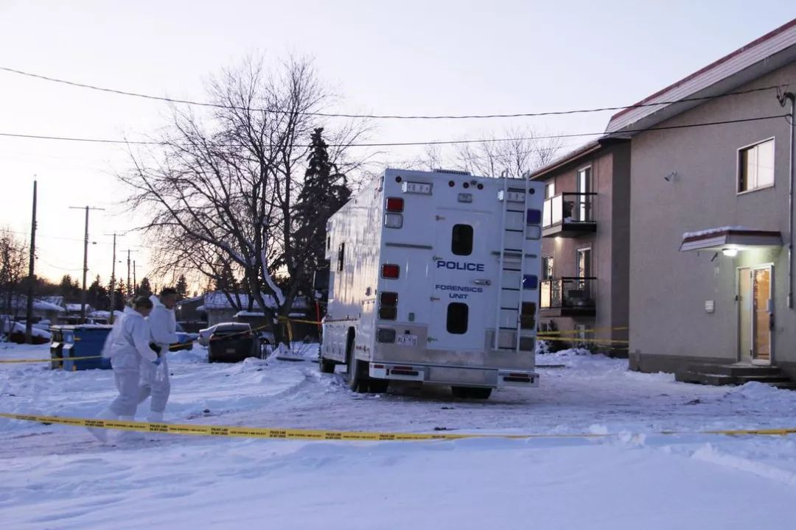
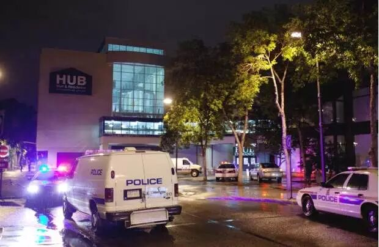

# 无标题

**链接地址:** http://mp.weixin.qq.com/s?__biz=MzI2NTE1ODgwOQ==&mid=2649605868&idx=1&sn=ca2da1e9a86b2c6e1e0dd1571e1cd834&chksm=f2b8cf1ac5cf460c8dd0466cd645c4c6e81168494058392d2d1e371d8bc21669829936346b54&mpshare=1&scene=2&srcid=#rd
**作者:** 副局
**获取时间:** 2025/8/28 20:53:45
**图片数量:** 15

---

## 原始HTML内容

<section style="box-sizing: border-box;"><section class="V5" style="box-sizing: border-box;" powered-by="xiumi.us"><section style="margin-right: 0%;margin-left: 0%;box-sizing: border-box;"><section style="display: inline-block;vertical-align: middle;width: 80%;box-sizing: border-box;"><section class="V5" style="box-sizing: border-box;" powered-by="xiumi.us"><section style="margin-top: 10px;margin-bottom: 10px;text-align: center;box-sizing: border-box;"><section style="display: inline-block;box-sizing: border-box;"><section style="max-width: 100%;font-size: 0px;padding-bottom: 3px;box-sizing: border-box;"><section style="display: inline-block;vertical-align: middle;box-sizing: border-box;"><section style="width: 5px;height: 1px;background-color: rgb(217, 217, 217);box-sizing: border-box;"></section><section style="width: 1px;height: 5px;margin-top: -3px;margin-right: auto;margin-left: auto;background-color: rgb(217, 217, 217);box-sizing: border-box;"></section></section><section style="margin-top: -1px;margin-right: -5px;margin-left: -5px;width: 100%;display: inline-block;vertical-align: middle;padding-right: 8px;padding-left: 8px;box-sizing: border-box;"><section style="width: 100%;height: 1px;background-color: rgb(217, 217, 217);box-sizing: border-box;"></section></section><section style="display: inline-block;vertical-align: middle;box-sizing: border-box;"><section style="width: 5px;height: 1px;background-color: rgb(217, 217, 217);box-sizing: border-box;"></section><section style="width: 1px;height: 5px;margin-top: -3px;margin-right: auto;margin-left: auto;background-color: rgb(217, 217, 217);box-sizing: border-box;"></section></section></section><section style="padding-left: 15px;padding-right: 15px;color: rgb(161, 161, 161);font-size: 14px;box-sizing: border-box;">
点击上方<strong style="box-sizing: border-box;">蓝字</strong>关注我们哟~
</section><section style="max-width: 100%;font-size: 0px;box-sizing: border-box;"><section style="display: inline-block;vertical-align: middle;box-sizing: border-box;"><section style="width: 5px;height: 1px;background-color: rgb(217, 217, 217);box-sizing: border-box;"></section><section style="width: 1px;height: 5px;margin-top: -3px;margin-right: auto;margin-left: auto;background-color: rgb(217, 217, 217);box-sizing: border-box;"></section></section><section style="margin-top: -1px;margin-right: -5px;margin-left: -5px;width: 100%;display: inline-block;vertical-align: middle;padding-right: 8px;padding-left: 8px;box-sizing: border-box;"><section style="width: 100%;height: 1px;background-color: rgb(217, 217, 217);box-sizing: border-box;"></section></section><section style="display: inline-block;vertical-align: middle;box-sizing: border-box;"><section style="width: 5px;height: 1px;background-color: rgb(217, 217, 217);box-sizing: border-box;"></section><section style="width: 1px;height: 5px;margin-top: -3px;margin-right: auto;margin-left: auto;background-color: rgb(217, 217, 217);box-sizing: border-box;"></section></section></section></section></section></section></section><section style="display: inline-block;vertical-align: middle;width: 20%;box-sizing: border-box;"><section class="V5" style="box-sizing: border-box;" powered-by="xiumi.us"><section style="text-align: center;margin: -10px 0% 10px;box-sizing: border-box;"><section style="max-width: 100%;vertical-align: middle;display: inline-block;width: 100%;box-sizing: border-box;"></section></section></section></section></section></section><section class="V5" style="box-sizing: border-box;" powered-by="xiumi.us"><section style="margin: 10px 0%;box-sizing: border-box;"><section style="display: inline-block;width: 100%;vertical-align: top;box-sizing: border-box;"><section class="V5" style="box-sizing: border-box;" powered-by="xiumi.us"><section style="box-sizing: border-box;"><section style="display: inline-block;vertical-align: bottom;width: 75%;padding-right: 10px;box-sizing: border-box;"><section class="V5" style="box-sizing: border-box;" powered-by="xiumi.us"><section style="margin: 10px 0% 3px;box-sizing: border-box;"><section style="display: inline-block;vertical-align: middle;box-sizing: border-box;"><section style="display: inline-block;vertical-align: bottom;padding-left: 5px;padding-right: 5px;line-height: 1.2em;margin-bottom: 2px;color: rgba(80, 182, 201, 0.72);box-sizing: border-box;">
<strong style="box-sizing: border-box;">仔细看下图，有惊喜！</strong>
</section><section style="max-width: 100%;display: inline-block;vertical-align: bottom;width: 1.6em;box-sizing: border-box;"></section></section></section></section></section><section style="display: inline-block;vertical-align: bottom;width: 25%;box-sizing: border-box;"><section class="V5" style="box-sizing: border-box;" powered-by="xiumi.us"><section style="margin-right: 0%;margin-bottom: 3px;margin-left: 0%;text-align: right;box-sizing: border-box;"><section style="display: inline-block;border-bottom: 0.15em solid rgba(80, 182, 201, 0.72);padding-bottom: 3px;box-sizing: border-box;"><section style="display: inline-block;padding: 3px;border-bottom: 0.15em solid rgba(80, 182, 201, 0.72);font-size: 12px;line-height: 1.4;color: rgb(255, 143, 47);box-sizing: border-box;">
<strong style="box-sizing: border-box;">金主大大</strong>
</section></section></section></section></section></section></section><section class="V5" style="box-sizing: border-box;" powered-by="xiumi.us"><section style="margin-right: 0%;margin-left: 0%;box-sizing: border-box;"><section style="background-color: rgba(80, 182, 201, 0.72);height: 2px;box-sizing: border-box;"></section></section></section></section></section></section><section class="V5" style="box-sizing: border-box;" powered-by="xiumi.us"><section style="text-align: center;margin-top: 10px;margin-bottom: 10px;box-sizing: border-box;"><section style="max-width: 100%;vertical-align: middle;display: inline-block;box-sizing: border-box;"></section></section></section><section class="V5" style="box-sizing: border-box;" powered-by="xiumi.us"><section style="text-align: center;margin-top: 10px;margin-bottom: 10px;box-sizing: border-box;"><section style="max-width: 100%;vertical-align: middle;display: inline-block;box-sizing: border-box;"></section></section></section><section class="V5" style="box-sizing: border-box;" powered-by="xiumi.us"><section style="text-align: center;margin-top: 10px;margin-bottom: 10px;box-sizing: border-box;"><section style="max-width: 100%;vertical-align: middle;display: inline-block;box-sizing: border-box;"></section></section></section><section class="V5" style="box-sizing: border-box;" powered-by="xiumi.us"><section style="text-align: center;margin-top: 10px;margin-bottom: 10px;box-sizing: border-box;"><section style="max-width: 100%;vertical-align: middle;display: inline-block;box-sizing: border-box;"></section></section></section><section class="V5" style="box-sizing: border-box;" powered-by="xiumi.us"><section style="text-align: center;margin-top: 10px;margin-bottom: 10px;box-sizing: border-box;"><section style="max-width: 100%;vertical-align: middle;display: inline-block;box-sizing: border-box;"></section></section></section><section class="V5" style="box-sizing: border-box;" powered-by="xiumi.us"><section style="text-align: center;margin-top: 10px;margin-bottom: 10px;box-sizing: border-box;"><section style="max-width: 100%;vertical-align: middle;display: inline-block;box-sizing: border-box;"><svg xmlns="http://www.w3.org/2000/svg" x="0px" y="0px" viewBox="0 0 902.1 38.2" style="vertical-align: middle;max-width: 100%;box-sizing: border-box;" width="902.1"><g style="box-sizing: border-box;"><path style="box-sizing: border-box;" d="M18.4,1.4c0.9-1.9,2.4-1.9,3.4,0l3.4,6.9c0.9,1.9,3.4,3.7,5.4,4l7.6,1.1c2.1,0.3,2.5,1.7,1,3.2   l-5.5,5.4c-1.5,1.5-2.4,4.3-2.1,6.4l1.3,7.6c0.4,2.1-0.9,2.9-2.7,2l-6.8-3.6c-1.8-1-4.9-1-6.7,0l-6.8,3.6c-1.9,1-3.1,0.1-2.7-2   l1.3-7.6c0.4-2.1-0.6-4.9-2.1-6.4l-5.5-5.4c-1.5-1.5-1-2.9,1-3.2l7.6-1.1c2.1-0.3,4.5-2.1,5.4-4L18.4,1.4z" fill="rgb(178, 243, 230)"></path><path style="box-sizing: border-box;" d="M90.6,5.4c0.7-1.4,1.9-1.4,2.6,0l2.6,5.3c0.7,1.4,2.6,2.8,4.2,3.1l5.9,0.9c1.6,0.2,2,1.3,0.8,2.5   l-4.2,4.1c-1.2,1.1-1.9,3.3-1.6,4.9l1,5.8c0.3,1.6-0.7,2.3-2.1,1.5l-5.2-2.8c-1.4-0.8-3.8-0.8-5.2,0L84,33.6   c-1.4,0.8-2.4,0.1-2.1-1.5l1-5.8c0.3-1.6-0.5-3.8-1.6-4.9l-4.2-4.1c-1.2-1.1-0.8-2.2,0.8-2.5l5.9-0.9c1.6-0.2,3.5-1.6,4.2-3.1   L90.6,5.4z" fill="rgb(190, 204, 246)"></path><path style="box-sizing: border-box;" d="M162.6,7.5c0.6-1.2,1.6-1.2,2.2,0l2.2,4.5c0.6,1.2,2.2,2.4,3.6,2.6l5,0.7c1.4,0.2,1.7,1.1,0.7,2.1   l-3.6,3.5c-1,1-1.6,2.9-1.4,4.2l0.9,5c0.2,1.4-0.6,1.9-1.8,1.3l-4.5-2.4c-1.2-0.6-3.2-0.6-4.4,0l-4.5,2.4c-1.2,0.6-2,0.1-1.8-1.3   l0.9-5c0.2-1.4-0.4-3.3-1.4-4.2l-3.6-3.5c-1-1-0.7-1.9,0.7-2.1l5-0.7c1.4-0.2,3-1.4,3.6-2.6L162.6,7.5z" fill="rgb(150, 208, 240)"></path><path style="box-sizing: border-box;" d="M60.1,19.1c0,2.3-1.9,4.2-4.2,4.2c-2.3,0-4.2-1.9-4.2-4.2s1.9-4.2,4.2-4.2   C58.3,14.9,60.1,16.8,60.1,19.1z" fill="rgb(218, 240, 224)"></path><path style="box-sizing: border-box;" d="M203.8,19.1c0,2.3-1.9,4.2-4.2,4.2c-2.3,0-4.2-1.9-4.2-4.2s1.9-4.2,4.2-4.2   C201.9,14.9,203.8,16.8,203.8,19.1z" fill="rgb(218, 240, 224)"></path><path style="box-sizing: border-box;" d="M130.9,19.1c0,1.7-1.4,3.1-3.1,3.1c-1.7,0-3.1-1.4-3.1-3.1c0-1.7,1.4-3.1,3.1-3.1   C129.5,16.1,130.9,17.4,130.9,19.1z" fill="rgb(218, 240, 224)"></path><path style="box-sizing: border-box;" d="M233.9,1.4c0.9-1.9,2.4-1.9,3.4,0l3.4,6.9c0.9,1.9,3.4,3.7,5.4,4l7.6,1.1c2.1,0.3,2.5,1.7,1,3.2   l-5.5,5.4c-1.5,1.5-2.4,4.3-2.1,6.4l1.3,7.6c0.4,2.1-0.9,2.9-2.7,2l-6.8-3.6c-1.8-1-4.9-1-6.7,0l-6.8,3.6c-1.9,1-3.1,0.1-2.7-2   l1.3-7.6c0.4-2.1-0.6-4.9-2.1-6.4l-5.5-5.4c-1.5-1.5-1-2.9,1-3.2l7.6-1.1c2.1-0.3,4.5-2.1,5.4-4L233.9,1.4z" fill="rgb(178, 243, 230)"></path><path style="box-sizing: border-box;" d="M306.1,5.4c0.7-1.4,1.9-1.4,2.6,0l2.6,5.3c0.7,1.4,2.6,2.8,4.2,3.1l5.9,0.9c1.6,0.2,2,1.3,0.8,2.5   l-4.2,4.1c-1.2,1.1-1.9,3.3-1.6,4.9l1,5.8c0.3,1.6-0.7,2.3-2.1,1.5l-5.2-2.8c-1.4-0.8-3.8-0.8-5.2,0l-5.2,2.8   c-1.4,0.8-2.4,0.1-2.1-1.5l1-5.8c0.3-1.6-0.4-3.8-1.6-4.9l-4.2-4.1c-1.2-1.1-0.8-2.2,0.8-2.5l5.9-0.9c1.6-0.2,3.5-1.6,4.2-3.1   L306.1,5.4z" fill="rgb(190, 204, 246)"></path><path style="box-sizing: border-box;" d="M378.1,7.5c0.6-1.2,1.6-1.2,2.2,0l2.2,4.5c0.6,1.2,2.2,2.4,3.6,2.6l5,0.7c1.4,0.2,1.7,1.1,0.7,2.1   l-3.6,3.5c-1,1-1.6,2.9-1.4,4.2l0.9,5c0.2,1.4-0.6,1.9-1.8,1.3l-4.5-2.4c-1.2-0.6-3.2-0.6-4.4,0l-4.5,2.4c-1.2,0.6-2,0.1-1.8-1.3   l0.9-5c0.2-1.4-0.4-3.3-1.4-4.2l-3.6-3.5c-1-1-0.7-1.9,0.7-2.1l5-0.7c1.4-0.2,3-1.4,3.6-2.6L378.1,7.5z" fill="rgb(150, 208, 240)"></path><path style="box-sizing: border-box;" d="M275.7,19.1c0,2.3-1.9,4.2-4.2,4.2c-2.3,0-4.2-1.9-4.2-4.2s1.9-4.2,4.2-4.2   C273.8,14.9,275.7,16.8,275.7,19.1z" fill="rgb(218, 240, 224)"></path><path style="box-sizing: border-box;" d="M419.3,19.1c0,2.3-1.9,4.2-4.2,4.2c-2.3,0-4.2-1.9-4.2-4.2s1.9-4.2,4.2-4.2   C417.5,14.9,419.3,16.8,419.3,19.1z" fill="rgb(218, 240, 224)"></path><path style="box-sizing: border-box;" d="M346.4,19.1c0,1.7-1.4,3.1-3.1,3.1c-1.7,0-3.1-1.4-3.1-3.1c0-1.7,1.4-3.1,3.1-3.1   C345,16.1,346.4,17.4,346.4,19.1z" fill="rgb(218, 240, 224)"></path><path style="box-sizing: border-box;" d="M449.4,1.4c0.9-1.9,2.4-1.9,3.4,0l3.4,6.9c0.9,1.9,3.4,3.7,5.4,4l7.6,1.1c2.1,0.3,2.5,1.7,1,3.2   l-5.5,5.4c-1.5,1.5-2.4,4.3-2.1,6.4l1.3,7.6c0.4,2.1-0.9,2.9-2.7,2l-6.8-3.6c-1.8-1-4.9-1-6.7,0l-6.8,3.6c-1.9,1-3.1,0.1-2.7-2   l1.3-7.6c0.4-2.1-0.6-4.9-2.1-6.4l-5.5-5.4c-1.5-1.5-1-2.9,1-3.2l7.6-1.1c2.1-0.3,4.5-2.1,5.4-4L449.4,1.4z" fill="rgb(178, 243, 230)"></path><path style="box-sizing: border-box;" d="M521.6,5.4c0.7-1.4,1.9-1.4,2.6,0l2.6,5.3c0.7,1.4,2.6,2.8,4.2,3.1l5.9,0.9c1.6,0.2,2,1.3,0.8,2.5   l-4.2,4.1c-1.2,1.1-1.9,3.3-1.6,4.9l1,5.8c0.3,1.6-0.7,2.3-2.1,1.5l-5.2-2.8c-1.4-0.8-3.8-0.8-5.2,0l-5.2,2.8   c-1.4,0.8-2.4,0.1-2.1-1.5l1-5.8c0.3-1.6-0.5-3.8-1.6-4.9l-4.2-4.1c-1.2-1.1-0.8-2.2,0.8-2.5l5.9-0.9c1.6-0.2,3.5-1.6,4.2-3.1   L521.6,5.4z" fill="rgb(190, 204, 246)"></path><path style="box-sizing: border-box;" d="M593.6,7.5c0.6-1.2,1.6-1.2,2.2,0l2.2,4.5c0.6,1.2,2.2,2.4,3.6,2.6l5,0.7c1.4,0.2,1.7,1.1,0.7,2.1   l-3.6,3.5c-1,1-1.6,2.9-1.4,4.2l0.9,5c0.2,1.4-0.6,1.9-1.8,1.3l-4.5-2.4c-1.2-0.6-3.2-0.6-4.4,0l-4.5,2.4c-1.2,0.6-2,0.1-1.8-1.3   l0.9-5c0.2-1.4-0.4-3.3-1.4-4.2l-3.6-3.5c-1-1-0.7-1.9,0.7-2.1l5-0.7c1.4-0.2,3-1.4,3.6-2.6L593.6,7.5z" fill="rgb(150, 208, 240)"></path><path style="box-sizing: border-box;" d="M491.2,19.1c0,2.3-1.9,4.2-4.2,4.2c-2.3,0-4.2-1.9-4.2-4.2s1.9-4.2,4.2-4.2   C489.3,14.9,491.2,16.8,491.2,19.1z" fill="rgb(218, 240, 224)"></path><path style="box-sizing: border-box;" d="M634.9,19.1c0,2.3-1.9,4.2-4.2,4.2c-2.3,0-4.2-1.9-4.2-4.2s1.9-4.2,4.2-4.2   C633,14.9,634.9,16.8,634.9,19.1z" fill="rgb(218, 240, 224)"></path><path style="box-sizing: border-box;" d="M561.9,19.1c0,1.7-1.4,3.1-3.1,3.1c-1.7,0-3.1-1.4-3.1-3.1c0-1.7,1.4-3.1,3.1-3.1   C560.5,16.1,561.9,17.4,561.9,19.1z" fill="rgb(218, 240, 224)"></path><path style="box-sizing: border-box;" d="M664.9,1.4c0.9-1.9,2.4-1.9,3.4,0l3.4,6.9c0.9,1.9,3.4,3.7,5.4,4l7.6,1.1c2.1,0.3,2.5,1.7,1,3.2   l-5.5,5.4c-1.5,1.5-2.4,4.3-2.1,6.4l1.3,7.6c0.4,2.1-0.9,2.9-2.7,2l-6.8-3.6c-1.8-1-4.9-1-6.7,0l-6.8,3.6c-1.9,1-3.1,0.1-2.7-2   l1.3-7.6c0.4-2.1-0.6-4.9-2.1-6.4l-5.5-5.4c-1.5-1.5-1-2.9,1-3.2l7.6-1.1c2.1-0.3,4.5-2.1,5.4-4L664.9,1.4z" fill="rgb(178, 243, 230)"></path><path style="box-sizing: border-box;" d="M737.1,5.4c0.7-1.4,1.9-1.4,2.6,0l2.6,5.3c0.7,1.4,2.6,2.8,4.2,3.1l5.9,0.9c1.6,0.2,2,1.3,0.8,2.5   l-4.2,4.1c-1.2,1.1-1.9,3.3-1.6,4.9l1,5.8c0.3,1.6-0.7,2.3-2.1,1.5l-5.2-2.8c-1.4-0.8-3.8-0.8-5.2,0l-5.2,2.8   c-1.4,0.8-2.4,0.1-2.1-1.5l1-5.8c0.3-1.6-0.5-3.8-1.6-4.9l-4.2-4.1c-1.2-1.1-0.8-2.2,0.8-2.5l5.9-0.9c1.6-0.2,3.5-1.6,4.2-3.1   L737.1,5.4z" fill="rgb(190, 204, 246)"></path><path style="box-sizing: border-box;" d="M809.2,7.5c0.6-1.2,1.6-1.2,2.2,0l2.2,4.5c0.6,1.2,2.2,2.4,3.6,2.6l5,0.7c1.4,0.2,1.7,1.1,0.7,2.1   l-3.6,3.5c-1,1-1.6,2.9-1.4,4.2l0.9,5c0.2,1.4-0.6,1.9-1.8,1.3l-4.5-2.4c-1.2-0.6-3.2-0.6-4.4,0l-4.5,2.4c-1.2,0.6-2,0.1-1.8-1.3   l0.9-5c0.2-1.4-0.4-3.3-1.4-4.2l-3.6-3.5c-1-1-0.7-1.9,0.7-2.1l5-0.7c1.4-0.2,3-1.4,3.6-2.6L809.2,7.5z" fill="rgb(150, 208, 240)"></path><path style="box-sizing: border-box;" d="M706.7,19.1c0,2.3-1.9,4.2-4.2,4.2c-2.3,0-4.2-1.9-4.2-4.2s1.9-4.2,4.2-4.2   C704.8,14.9,706.7,16.8,706.7,19.1z" fill="rgb(218, 240, 224)"></path><path style="box-sizing: border-box;" d="M850.4,19.1c0,2.3-1.9,4.2-4.2,4.2c-2.3,0-4.2-1.9-4.2-4.2s1.9-4.2,4.2-4.2   C848.5,14.9,850.4,16.8,850.4,19.1z" fill="rgb(218, 240, 224)"></path><path style="box-sizing: border-box;" d="M777.4,19.1c0,1.7-1.4,3.1-3.1,3.1c-1.7,0-3.1-1.4-3.1-3.1c0-1.7,1.4-3.1,3.1-3.1   C776,16.1,777.4,17.4,777.4,19.1z" fill="rgb(218, 240, 224)"></path><path style="box-sizing: border-box;" d="M880.4,1.4c0.9-1.9,2.4-1.9,3.4,0l3.4,6.9c0.9,1.9,3.4,3.7,5.4,4l7.6,1.1c2.1,0.3,2.5,1.7,1,3.2   l-5.5,5.4c-1.5,1.5-2.4,4.3-2.1,6.4l1.3,7.6c0.4,2.1-0.9,2.9-2.7,2l-6.8-3.6c-1.8-1-4.9-1-6.7,0l-6.8,3.6c-1.8,1-3.1,0.1-2.7-2   l1.3-7.6c0.4-2.1-0.6-4.9-2.1-6.4l-5.5-5.4c-1.5-1.5-1-2.9,1-3.2l7.6-1.1c2.1-0.3,4.5-2.1,5.4-4L880.4,1.4z" fill="rgb(178, 243, 230)"></path></g></svg></section></section></section><section class="V5" style="box-sizing: border-box;" powered-by="xiumi.us"><section style="box-sizing: border-box;"><section style="text-align: center;box-sizing: border-box;">

位于79 Ave.的King Edward Park公寓楼。这是2018年12月5日涉及两名儿童的双重凶杀案调查现场。 

 

2019年已经来到，回首过去的2018年，小编有一个微妙又奇特的感觉。每天都需要很努力地在新闻网上扒啦扒啦，也很难给大家找出那种<strong>人神共愤瞠目结舌目瞪口呆惊掉下巴的市内凶杀案奇闻</strong>。 

 

这是为啥涅？难道是因为去年本来埃德蒙顿这个全加拿大一贯凶杀案数量排名前三的的“罪恶之都”突然洗心革面了？突然不搞事情了？突然就消停了？

 

 

根据Star Edmonton发回的最新报告，<strong>2018年埃德蒙顿一共发生了28起凶杀案</strong>，而2017年却有45起！其中还不包括两起涉嫌枪击事件。而2016年这一数字是41。

 

从淡出的数据上可以看出，这是<strong>过去两年以来埃德蒙顿市凶杀案首次经历显着下降</strong>。然而这却让分析犯罪报告和走向的分析师们犯了难。介，到底是为嘛呢？

 

 

“我们现在很难确定凶杀案数量每年波动的原因。”MacEwan大学心理学副教授Sandy Jung说，她在2007年至2012年期间在埃德蒙顿研究了124起凶杀案，特别是那些反复出现的犯罪原因。

 

她重点提到： “数字是一方面，但我们更加应该关注的暴力事件以及这些暴力事件事发缘由和严重程度。“

 

2017年，埃德蒙顿在全国范围内的暴力犯罪严重程度指数排名全加第四。 在2018年的28起凶杀案中有6起，警方没有透露死因。但其中至少有<strong>11人是由枪支射杀死亡，8人是因为刺伤死亡</strong>。

 

 

埃德蒙顿警方已对2018年的28起凶杀案中的<strong>15起提出指控</strong>。 不过警方目前决定不公布28名受害者中的13人的身份，这种做法在埃德蒙顿引起了争议。

 

独立艾伯塔省参议员和前报纸专栏作家Paula Simons呼吁埃德蒙顿警察对案件向公众的信息公布更加透明化。即将上任的警察局长Dale McFee表示，警察局会根据这个请愿在今年二月份以后，考虑逐步施行这一做法。

 

2018年，22名凶杀案受害者为男性，<strong>6名为女性，其中包括两名年轻女孩</strong>。 最年轻的受害者是6个月大的Mary Lafleche Petawaysin，她于12月5日在埃德蒙顿南部的一间公寓里与她的姐姐，3岁的Mackenzie Petawaysin一起被刺杀。

 

 

Ashton Brian Lafleche被控两项罪名与死亡有关的二级谋杀案。<strong style="text-align: justify;">最年长的凶杀案受害者是74岁</strong>的乔治·特奥，他于9月15日在Central Social Hall遭到殴打后去世。&nbsp;

 

另外值得注意的是：涉及女性受害者的<strong>所有六起事件都被裁定属于家庭暴力性质</strong>。这个结果让人既感到欣慰又感到痛心。欣慰的是爱城的社会大环境对于女性还是比较安全的，但让人伤怀的就是，往往身边最亲密最熟悉的人当中，正隐藏着这些最残暴凶恶的人。

 

 

现在就让我们回顾一下由<strong style="text-align: justify;">本</strong><strong style="text-align: justify;">公众号发布的独家报道</strong>：让这些惊悚危险的恶行事件给这个看似和平的社会敲响警钟：

 

<a href="http://mp.weixin.qq.com/s?__biz=MzI2NTE1ODgwOQ==&amp;mid=2649603867&amp;idx=1&amp;sn=d7bdf305a14ccbb94264d623fee294b9&amp;chksm=f2b8b6edc5cf3ffb5ce141081fecf91148d65c4ae7d14b053cce7a65e58f8e61794dbf480033&amp;scene=21#wechat_redirect" target="_blank" style="font-size: 14px;text-decoration: underline;" data-linktype="2">【突发】埃德蒙顿 西贸 West Edmonton Mall发生刺杀事件！女子被男子随机恶意刺伤！当时Mall内有上千人！</a> 

<a href="http://mp.weixin.qq.com/s?__biz=MzI2NTE1ODgwOQ==&amp;mid=2649603668&amp;idx=1&amp;sn=6e7effe7f12232b06462f3bd3791e667&amp;chksm=f2b8b7a2c5cf3eb4481afba556ace99356443b326c4bffca29dc02d267e79d1ac145b7e4c514&amp;scene=21#wechat_redirect" target="_blank" style="font-size: 14px;text-decoration: underline;" data-linktype="2">【突发】埃德蒙顿 突发持刀冲入屋内杀人事件！事发突然！嫌犯携危险武器在逃！市民小心！切勿随意开门给陌生人！</a> 

<a href="http://mp.weixin.qq.com/s?__biz=MzI2NTE1ODgwOQ==&amp;mid=2649603567&amp;idx=1&amp;sn=f71896094c9b60741d91eaba9d567d6d&amp;chksm=f2b8b419c5cf3d0f6c8e615be983b73d3769d9ab012f3a89555b03b8eb082798aa8119a8e86b&amp;scene=21#wechat_redirect" target="_blank" style="font-size: 14px;text-decoration: underline;" data-linktype="2">【突发】谋杀？！刚到2018年！埃德蒙顿 就死人了！而且还是在华人最爱的 南部地区！EPS提醒大家小心！</a> 

<a href="http://mp.weixin.qq.com/s?__biz=MzI2NTE1ODgwOQ==&amp;mid=2649605460&amp;idx=1&amp;sn=d1a4f49182222274d50954bdf92f131d&amp;chksm=f2b8cca2c5cf45b414fc95ed2e3bda14713af658e3dba428f34fe3e9710ce0481d1996ff91ec&amp;scene=21#wechat_redirect" target="_blank" style="font-size: 14px;text-decoration: underline;" data-linktype="2">【神秘】事隔一年，两名爱城男子在酒吧外同一位置离奇死亡。酒吧表示：这锅我不背。</a> 

<a href="http://mp.weixin.qq.com/s?__biz=MzI2NTE1ODgwOQ==&amp;mid=2649605026&amp;idx=1&amp;sn=dca7ad7877e6639b12645d46ab62b710&amp;chksm=f2b8ca54c5cf4342bb741db74003cf82242161f40536f2a7729d38f2741fe11e42ab3ceea299&amp;scene=21#wechat_redirect" target="_blank" style="font-size: 14px;text-decoration: underline;" data-linktype="2">【重磅】多事之秋！埃德蒙顿LRT又出大事儿了！横穿铁轨男子被撞死！一天两起车站案件！</a> 

<a href="http://mp.weixin.qq.com/s?__biz=MzI2NTE1ODgwOQ==&amp;mid=2649603974&amp;idx=1&amp;sn=870b1f1a068894694b44c228f19c9fa4&amp;chksm=f2b8b670c5cf3f660fea8b31308f05188b997c449507c32ec1cc2ff5c55d22694841977c9b7b&amp;scene=21#wechat_redirect" target="_blank" style="font-size: 14px;text-decoration: underline;" data-linktype="2">【突发】阿省卫生部紧急警告！在 埃德蒙顿 这家餐厅就餐的人，1死11人隔离！大家小心！！</a> 

<a href="http://mp.weixin.qq.com/s?__biz=MzI2NTE1ODgwOQ==&amp;mid=2649603949&amp;idx=1&amp;sn=28f7794dc736adb21024c72eccebb675&amp;chksm=f2b8b69bc5cf3f8df3722fbaf02c89412d88f53005acc372c10ea2024bba4a8a2e5fabcd5a30&amp;scene=21#wechat_redirect" target="_blank" style="font-size: 14px;text-decoration: underline;" data-linktype="2">【突发】埃德蒙顿 又死人了！大雪中发现男性尸体！原来这个社区，治安这么乱！！</a> 

 

<strong>- 更多精彩内容，欢迎关注我们 -</strong>

 
</section></section></section><section class="V5" style="box-sizing: border-box;" powered-by="xiumi.us"><section style="box-sizing: border-box;"><section style="box-sizing: border-box;">
 
</section></section></section><section class="V5" style="box-sizing: border-box;" powered-by="xiumi.us"><section style="box-sizing: border-box;"><section style="box-sizing: border-box;">
 
</section></section></section><section class="V5" style="box-sizing: border-box;" powered-by="xiumi.us"><section style="margin: 40px 0% 10px;text-align: center;box-sizing: border-box;"><section style="display: inline-block;width: 90%;border-width: 1px;border-style: dotted;border-color: rgba(80, 182, 201, 0.72);padding: 10px;border-radius: 0px;box-sizing: border-box;"><section class="V5" style="box-sizing: border-box;" powered-by="xiumi.us"><section style="transform: translate3d(20px, 0px, 0px);text-align: left;font-size: 11px;margin-top: -55px;margin-right: 0%;margin-left: 0%;box-sizing: border-box;"><section style="box-sizing: border-box;width: 7em;height: 7em;display: inline-block;vertical-align: bottom;border-radius: 100%;border-width: 5px;border-style: none;border-color: rgba(80, 182, 201, 0.72);background-position: center center;background-repeat: no-repeat;background-size: cover;background-image: url(&quot;https://mmbiz.qpic.cn/mmbiz_jpg/D1nJqnhkPyIZdZOFYtUyKM5e8vFGqD1wNDDBEEP7OLPfcT9nMsMhoemyTdYXO51ySIZvibibpmh9V2z0CsiceNvag/640?wx_fmt=jpeg&quot;);"><section style="width: 100%;height: 100%;overflow: hidden;line-height: 0;box-sizing: border-box;"></section></section></section></section><section class="V5" style="box-sizing: border-box;" powered-by="xiumi.us"><section style="box-sizing: border-box;"><section class="group-empty" style="display: inline-block;vertical-align: top;width: 38.2%;box-sizing: border-box;height: 1px;"></section><section style="display: inline-block;vertical-align: top;width: 61.8%;box-sizing: border-box;"><section class="V5" style="box-sizing: border-box;" powered-by="xiumi.us"><section style="margin-right: 0%;margin-left: 0%;box-sizing: border-box;"><section style="font-size: 18px;color: rgb(67, 103, 117);line-height: 1.6;letter-spacing: 1px;box-sizing: border-box;">
<strong style="box-sizing: border-box;">埃德蒙顿微生活</strong>
</section></section></section><section class="V5" style="box-sizing: border-box;" powered-by="xiumi.us"><section style="margin-top: 0.5em;margin-bottom: 0.5em;box-sizing: border-box;"><section style="background-color: rgba(80, 182, 201, 0.72);height: 1px;box-sizing: border-box;"></section></section></section></section></section></section><section class="V5" style="box-sizing: border-box;" powered-by="xiumi.us"><section style="box-sizing: border-box;"><section style="text-align: justify;font-size: 14px;color: rgba(62, 62, 62, 0.72);letter-spacing: 2px;box-sizing: border-box;">
<strong style="box-sizing: border-box;">关心埃德蒙顿民生，</strong>

<strong style="box-sizing: border-box;">关注埃德蒙顿的发展。</strong>

 

埃德蒙顿微生活是“吃喝玩乐埃德蒙顿”旗下，为埃德蒙顿地区的居民提供每日最新的吃喝玩乐、工作学习、商业投资的媒体平台 。
</section></section></section><section class="V5" style="box-sizing: border-box;" powered-by="xiumi.us"><section style="box-sizing: border-box;"><section style="text-align: left;box-sizing: border-box;">
 
</section></section></section><section class="V5" style="box-sizing: border-box;" powered-by="xiumi.us"><section style="box-sizing: border-box;"><section style="display: inline-block;vertical-align: middle;width: 61.8%;box-sizing: border-box;"><section class="V5" style="box-sizing: border-box;" powered-by="xiumi.us"><section style="box-sizing: border-box;"><section style="text-align: justify;font-size: 12px;color: rgba(62, 62, 62, 0.37);line-height: 1.9;letter-spacing: 0px;box-sizing: border-box;">
我们的目标是以最新、最快、最及时的方式 报道埃德蒙顿的新鲜事 。 
</section></section></section></section><section style="display: inline-block;vertical-align: middle;width: 38.2%;box-sizing: border-box;"><section class="V5" style="box-sizing: border-box;" powered-by="xiumi.us"><section style="margin-right: 0%;margin-left: 0%;box-sizing: border-box;"><section style="max-width: 100%;vertical-align: middle;display: inline-block;width: 70%;box-sizing: border-box;"></section></section></section></section></section></section></section></section></section></section>
 

---

## 纯文本内容

点击上方蓝字关注我们哟~仔细看下图，有惊喜！金主大大位于79 Ave.的King Edward Park公寓楼。这是2018年12月5日涉及两名儿童的双重凶杀案调查现场。2019年已经来到，回首过去的2018年，小编有一个微妙又奇特的感觉。每天都需要很努力地在新闻网上扒啦扒啦，也很难给大家找出那种人神共愤瞠目结舌目瞪口呆惊掉下巴的市内凶杀案奇闻。这是为啥涅？难道是因为去年本来埃德蒙顿这个全加拿大一贯凶杀案数量排名前三的的“罪恶之都”突然洗心革面了？突然不搞事情了？突然就消停了？根据Star Edmonton发回的最新报告，2018年埃德蒙顿一共发生了28起凶杀案，而2017年却有45起！其中还不包括两起涉嫌枪击事件。而2016年这一数字是41。从淡出的数据上可以看出，这是过去两年以来埃德蒙顿市凶杀案首次经历显着下降。然而这却让分析犯罪报告和走向的分析师们犯了难。介，到底是为嘛呢？“我们现在很难确定凶杀案数量每年波动的原因。”MacEwan大学心理学副教授Sandy Jung说，她在2007年至2012年期间在埃德蒙顿研究了124起凶杀案，特别是那些反复出现的犯罪原因。她重点提到： “数字是一方面，但我们更加应该关注的暴力事件以及这些暴力事件事发缘由和严重程度。“2017年，埃德蒙顿在全国范围内的暴力犯罪严重程度指数排名全加第四。 在2018年的28起凶杀案中有6起，警方没有透露死因。但其中至少有11人是由枪支射杀死亡，8人是因为刺伤死亡。埃德蒙顿警方已对2018年的28起凶杀案中的15起提出指控。 不过警方目前决定不公布28名受害者中的13人的身份，这种做法在埃德蒙顿引起了争议。独立艾伯塔省参议员和前报纸专栏作家Paula Simons呼吁埃德蒙顿警察对案件向公众的信息公布更加透明化。即将上任的警察局长Dale McFee表示，警察局会根据这个请愿在今年二月份以后，考虑逐步施行这一做法。2018年，22名凶杀案受害者为男性，6名为女性，其中包括两名年轻女孩。 最年轻的受害者是6个月大的Mary Lafleche Petawaysin，她于12月5日在埃德蒙顿南部的一间公寓里与她的姐姐，3岁的Mackenzie Petawaysin一起被刺杀。Ashton Brian Lafleche被控两项罪名与死亡有关的二级谋杀案。最年长的凶杀案受害者是74岁的乔治·特奥，他于9月15日在Central Social Hall遭到殴打后去世。 另外值得注意的是：涉及女性受害者的所有六起事件都被裁定属于家庭暴力性质。这个结果让人既感到欣慰又感到痛心。欣慰的是爱城的社会大环境对于女性还是比较安全的，但让人伤怀的就是，往往身边最亲密最熟悉的人当中，正隐藏着这些最残暴凶恶的人。现在就让我们回顾一下由本公众号发布的独家报道：让这些惊悚危险的恶行事件给这个看似和平的社会敲响警钟：【突发】埃德蒙顿 西贸 West Edmonton Mall发生刺杀事件！女子被男子随机恶意刺伤！当时Mall内有上千人！【突发】埃德蒙顿 突发持刀冲入屋内杀人事件！事发突然！嫌犯携危险武器在逃！市民小心！切勿随意开门给陌生人！【突发】谋杀？！刚到2018年！埃德蒙顿 就死人了！而且还是在华人最爱的 南部地区！EPS提醒大家小心！【神秘】事隔一年，两名爱城男子在酒吧外同一位置离奇死亡。酒吧表示：这锅我不背。【重磅】多事之秋！埃德蒙顿LRT又出大事儿了！横穿铁轨男子被撞死！一天两起车站案件！【突发】阿省卫生部紧急警告！在 埃德蒙顿 这家餐厅就餐的人，1死11人隔离！大家小心！！【突发】埃德蒙顿 又死人了！大雪中发现男性尸体！原来这个社区，治安这么乱！！- 更多精彩内容，欢迎关注我们 -埃德蒙顿微生活关心埃德蒙顿民生，关注埃德蒙顿的发展。埃德蒙顿微生活是“吃喝玩乐埃德蒙顿”旗下，为埃德蒙顿地区的居民提供每日最新的吃喝玩乐、工作学习、商业投资的媒体平台 。我们的目标是以最新、最快、最及时的方式 报道埃德蒙顿的新鲜事 。

---

## 图片列表

-  (原始链接: https://mmbiz.qpic.cn/mmbiz_gif/D1nJqnhkPyIZdZOFYtUyKM5e8vFGqD1w30r4q9Og7bPeXKGRCh78tHXcz0XYkET9c6ZMnKuKFB58lhicibIkVL7Q/640?wx_fmt=gif)
-  (原始链接: https://mmbiz.qpic.cn/mmbiz_gif/D1nJqnhkPyIZdZOFYtUyKM5e8vFGqD1wEibUFKJ3uJEicVn7icEGeIv3J8TiaoFoPbzwVnKk1npzA7E5NSfhy8kTUA/640?wx_fmt=gif)
-  (原始链接: https://mmbiz.qpic.cn/mmbiz_jpg/D1nJqnhkPyIZdZOFYtUyKM5e8vFGqD1wf1sSSE6hmaiapibTc7ZKMdmgmzdQWNGLurktpgmE98JzlvtoEJPDSYtA/640?wx_fmt=jpeg)
-  (原始链接: https://mmbiz.qpic.cn/mmbiz_jpg/D1nJqnhkPyIZdZOFYtUyKM5e8vFGqD1wt2H1RIlzIL9zUSwZrTbXoQlHia2fD6jQg2w2gRqtg4npM5QciclkLu4A/640?wx_fmt=jpeg)
-  (原始链接: https://mmbiz.qpic.cn/mmbiz_jpg/D1nJqnhkPyIZdZOFYtUyKM5e8vFGqD1wPcV7ucPMy4iaavzyxVCLNKJE3fq4luKwhVGgny9uicrgiaezwPaHwebHQ/640?wx_fmt=jpeg)
-  (原始链接: https://mmbiz.qpic.cn/mmbiz_jpg/D1nJqnhkPyIZdZOFYtUyKM5e8vFGqD1wjPPs8tWNAGWOkcZq8CAhCkHvSPib4xJrnGwjomKsq4578O7gym1HydQ/640?wx_fmt=jpeg)
-  (原始链接: https://mmbiz.qpic.cn/mmbiz_jpg/D1nJqnhkPyIZdZOFYtUyKM5e8vFGqD1wRQj6B0iawVRjQPAm6libib4YMgXKB2P2HeR2cOejVLjW8OSvGgMiapshuA/640?wx_fmt=jpeg)
-  (原始链接: https://mmbiz.qpic.cn/mmbiz_jpg/D1nJqnhkPyIZdZOFYtUyKM5e8vFGqD1wXIwZeCK6pOxYpuQO6lx8YOOsWjIuuqaWEhM6PzS3vuu8toKW5z5XqQ/640?wx_fmt=jpeg)
-  (原始链接: https://mmbiz.qpic.cn/mmbiz_jpg/D1nJqnhkPyIZdZOFYtUyKM5e8vFGqD1wiaHG8QJHiaOa4Gkgujwh666NNPQTGeCG0hFghKWicExDtp7cvCUkicHxNA/640?wx_fmt=jpeg)
-  (原始链接: https://mmbiz.qpic.cn/mmbiz_jpg/D1nJqnhkPyIZdZOFYtUyKM5e8vFGqD1wle4dLbiaGXqKoEJqricSzvZ8xPYKUycibZCsVHtIsUiaFibic4G6a8jk3Dpg/640?wx_fmt=jpeg)
-  (原始链接: https://mmbiz.qpic.cn/mmbiz_jpg/D1nJqnhkPyIZdZOFYtUyKM5e8vFGqD1w6U94peeBSxOF1UcmXicXahrNuzia8JbaYqB7QIbQIJo9s13LnibkSdiaibg/640?wx_fmt=jpeg)
-  (原始链接: https://mmbiz.qpic.cn/mmbiz_jpg/D1nJqnhkPyIZdZOFYtUyKM5e8vFGqD1wIDnKEuq4kygFCQATOzA4ibJEVk2uiaOJ1uTgtXod5XglpTbAONm5uqaQ/640?wx_fmt=jpeg)
-  (原始链接: https://mmbiz.qpic.cn/mmbiz_jpg/D1nJqnhkPyIZdZOFYtUyKM5e8vFGqD1wxqVYr3q4MicMVl8XdKh0Kk1GOB6ImDszYyQOVgLtYRLUhjFQ8libv0FQ/640?wx_fmt=jpeg)
-  (原始链接: https://mmbiz.qpic.cn/mmbiz_jpg/D1nJqnhkPyIZdZOFYtUyKM5e8vFGqD1wNDDBEEP7OLPfcT9nMsMhoemyTdYXO51ySIZvibibpmh9V2z0CsiceNvag/640?wx_fmt=jpeg)
-  (原始链接: https://mmbiz.qpic.cn/mmbiz_jpg/D1nJqnhkPyIZdZOFYtUyKM5e8vFGqD1wKqN00XBBeRiabOtLMhjV3BSouib4Qo98hThaXcuXaUMjK9B1CNkIst8Q/640?wx_fmt=jpeg)
