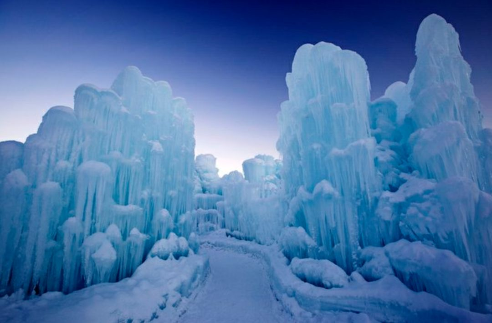
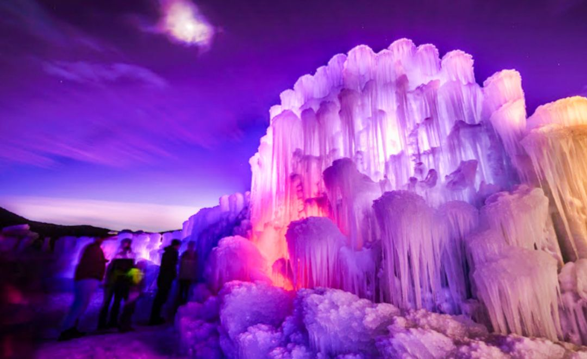
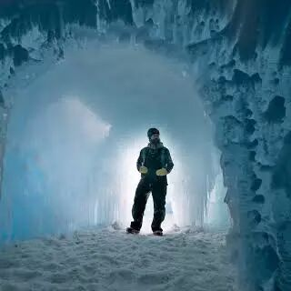
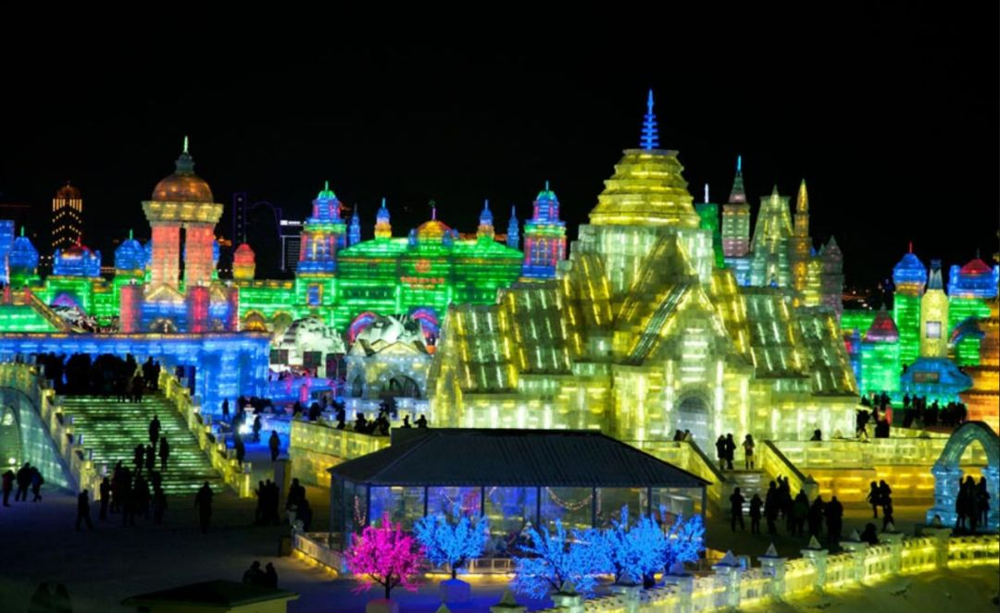
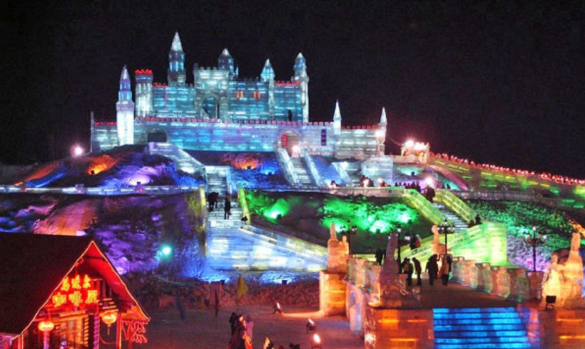
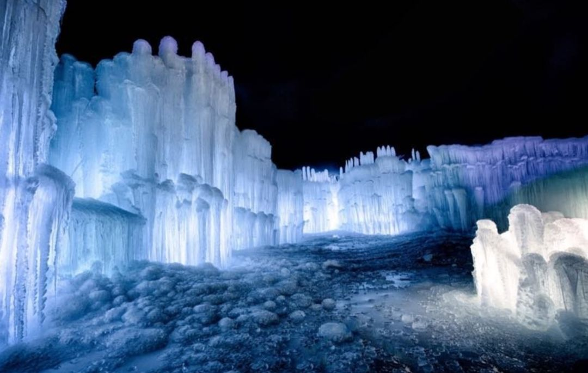

# 无标题

**链接地址:** http://mp.weixin.qq.com/s?__biz=MzI2NTE1ODgwOQ==&mid=2649605883&idx=1&sn=55cc4fe7e696c3f86637fb3411d9c8fc&chksm=f2b8cf0dc5cf461bc89d48b93dd644d25c788b581b26f9fc0456f2bc366368bc51430a431388&mpshare=1&scene=2&srcid=#rd
**作者:** 雪糊
**获取时间:** 2025/8/28 20:53:23
**图片数量:** 22

---

## 原始HTML内容

<section style="box-sizing: border-box;"><section class="V5" style="box-sizing: border-box;" powered-by="xiumi.us"><section style="margin-right: 0%;margin-left: 0%;box-sizing: border-box;"><section style="display: inline-block;vertical-align: middle;width: 80%;box-sizing: border-box;"><section class="V5" style="box-sizing: border-box;" powered-by="xiumi.us"><section style="margin-top: 10px;margin-bottom: 10px;text-align: center;box-sizing: border-box;"><section style="display: inline-block;box-sizing: border-box;"><section style="max-width: 100%;font-size: 0px;padding-bottom: 3px;box-sizing: border-box;"><section style="display: inline-block;vertical-align: middle;box-sizing: border-box;"><section style="width: 5px;height: 1px;background-color: rgb(217, 217, 217);box-sizing: border-box;"></section><section style="width: 1px;height: 5px;margin-top: -3px;margin-right: auto;margin-left: auto;background-color: rgb(217, 217, 217);box-sizing: border-box;"></section></section><section style="margin-top: -1px;margin-right: -5px;margin-left: -5px;width: 100%;display: inline-block;vertical-align: middle;padding-right: 8px;padding-left: 8px;box-sizing: border-box;"><section style="width: 100%;height: 1px;background-color: rgb(217, 217, 217);box-sizing: border-box;"></section></section><section style="display: inline-block;vertical-align: middle;box-sizing: border-box;"><section style="width: 5px;height: 1px;background-color: rgb(217, 217, 217);box-sizing: border-box;"></section><section style="width: 1px;height: 5px;margin-top: -3px;margin-right: auto;margin-left: auto;background-color: rgb(217, 217, 217);box-sizing: border-box;"></section></section></section><section style="padding-left: 15px;padding-right: 15px;color: rgb(161, 161, 161);font-size: 14px;box-sizing: border-box;">
点击上方<strong style="box-sizing: border-box;">蓝字</strong>关注我们哟~
</section><section style="max-width: 100%;font-size: 0px;box-sizing: border-box;"><section style="display: inline-block;vertical-align: middle;box-sizing: border-box;"><section style="width: 5px;height: 1px;background-color: rgb(217, 217, 217);box-sizing: border-box;"></section><section style="width: 1px;height: 5px;margin-top: -3px;margin-right: auto;margin-left: auto;background-color: rgb(217, 217, 217);box-sizing: border-box;"></section></section><section style="margin-top: -1px;margin-right: -5px;margin-left: -5px;width: 100%;display: inline-block;vertical-align: middle;padding-right: 8px;padding-left: 8px;box-sizing: border-box;"><section style="width: 100%;height: 1px;background-color: rgb(217, 217, 217);box-sizing: border-box;"></section></section><section style="display: inline-block;vertical-align: middle;box-sizing: border-box;"><section style="width: 5px;height: 1px;background-color: rgb(217, 217, 217);box-sizing: border-box;"></section><section style="width: 1px;height: 5px;margin-top: -3px;margin-right: auto;margin-left: auto;background-color: rgb(217, 217, 217);box-sizing: border-box;"></section></section></section></section></section></section></section><section style="display: inline-block;vertical-align: middle;width: 20%;box-sizing: border-box;"><section class="V5" style="box-sizing: border-box;" powered-by="xiumi.us"><section style="text-align: center;margin: -10px 0% 10px;box-sizing: border-box;"><section style="max-width: 100%;vertical-align: middle;display: inline-block;width: 100%;box-sizing: border-box;"></section></section></section></section></section></section><section class="V5" style="box-sizing: border-box;" powered-by="xiumi.us"><section style="margin: 10px 0%;box-sizing: border-box;"><section style="display: inline-block;width: 100%;vertical-align: top;box-sizing: border-box;"><section class="V5" style="box-sizing: border-box;" powered-by="xiumi.us"><section style="box-sizing: border-box;"><section style="display: inline-block;vertical-align: bottom;width: 75%;padding-right: 10px;box-sizing: border-box;"><section class="V5" style="box-sizing: border-box;" powered-by="xiumi.us"><section style="margin: 10px 0% 3px;box-sizing: border-box;"><section style="display: inline-block;vertical-align: middle;box-sizing: border-box;"><section style="display: inline-block;vertical-align: bottom;padding-left: 5px;padding-right: 5px;line-height: 1.2em;margin-bottom: 2px;color: rgba(80, 182, 201, 0.72);box-sizing: border-box;">
<strong style="box-sizing: border-box;">仔细看下图，有惊喜！</strong>
</section><section style="max-width: 100%;display: inline-block;vertical-align: bottom;width: 1.6em;box-sizing: border-box;"></section></section></section></section></section><section style="display: inline-block;vertical-align: bottom;width: 25%;box-sizing: border-box;"><section class="V5" style="box-sizing: border-box;" powered-by="xiumi.us"><section style="margin-right: 0%;margin-bottom: 3px;margin-left: 0%;text-align: right;box-sizing: border-box;"><section style="display: inline-block;border-bottom: 0.15em solid rgba(80, 182, 201, 0.72);padding-bottom: 3px;box-sizing: border-box;"><section style="display: inline-block;padding: 3px;border-bottom: 0.15em solid rgba(80, 182, 201, 0.72);font-size: 12px;line-height: 1.4;color: rgb(255, 143, 47);box-sizing: border-box;">
<strong style="box-sizing: border-box;">金主大大</strong>
</section></section></section></section></section></section></section><section class="V5" style="box-sizing: border-box;" powered-by="xiumi.us"><section style="margin-right: 0%;margin-left: 0%;box-sizing: border-box;"><section style="background-color: rgba(80, 182, 201, 0.72);height: 2px;box-sizing: border-box;"></section></section></section></section></section></section><section class="V5" style="box-sizing: border-box;" powered-by="xiumi.us"><section style="text-align: center;margin-top: 10px;margin-bottom: 10px;box-sizing: border-box;"><section style="max-width: 100%;vertical-align: middle;display: inline-block;box-sizing: border-box;"></section></section></section><section class="V5" style="box-sizing: border-box;" powered-by="xiumi.us"><section style="text-align: center;margin-top: 10px;margin-bottom: 10px;box-sizing: border-box;"><section style="max-width: 100%;vertical-align: middle;display: inline-block;box-sizing: border-box;"></section></section></section><section class="V5" style="box-sizing: border-box;" powered-by="xiumi.us"><section style="text-align: center;margin-top: 10px;margin-bottom: 10px;box-sizing: border-box;"><section style="max-width: 100%;vertical-align: middle;display: inline-block;box-sizing: border-box;"></section></section></section><section class="V5" style="box-sizing: border-box;" powered-by="xiumi.us"><section style="text-align: center;margin-top: 10px;margin-bottom: 10px;box-sizing: border-box;"><section style="max-width: 100%;vertical-align: middle;display: inline-block;box-sizing: border-box;"></section></section></section><section class="V5" style="box-sizing: border-box;" powered-by="xiumi.us"><section style="text-align: center;margin-top: 10px;margin-bottom: 10px;box-sizing: border-box;"><section style="max-width: 100%;vertical-align: middle;display: inline-block;box-sizing: border-box;"></section></section></section><section class="V5" style="box-sizing: border-box;" powered-by="xiumi.us"><section style="text-align: center;margin-top: 10px;margin-bottom: 10px;box-sizing: border-box;"><section style="max-width: 100%;vertical-align: middle;display: inline-block;box-sizing: border-box;"><svg xmlns="http://www.w3.org/2000/svg" x="0px" y="0px" viewBox="0 0 902.1 38.2" style="vertical-align: middle;max-width: 100%;box-sizing: border-box;" width="902.1"><g style="box-sizing: border-box;"><path style="box-sizing: border-box;" d="M18.4,1.4c0.9-1.9,2.4-1.9,3.4,0l3.4,6.9c0.9,1.9,3.4,3.7,5.4,4l7.6,1.1c2.1,0.3,2.5,1.7,1,3.2   l-5.5,5.4c-1.5,1.5-2.4,4.3-2.1,6.4l1.3,7.6c0.4,2.1-0.9,2.9-2.7,2l-6.8-3.6c-1.8-1-4.9-1-6.7,0l-6.8,3.6c-1.9,1-3.1,0.1-2.7-2   l1.3-7.6c0.4-2.1-0.6-4.9-2.1-6.4l-5.5-5.4c-1.5-1.5-1-2.9,1-3.2l7.6-1.1c2.1-0.3,4.5-2.1,5.4-4L18.4,1.4z" fill="rgb(178, 243, 230)"></path><path style="box-sizing: border-box;" d="M90.6,5.4c0.7-1.4,1.9-1.4,2.6,0l2.6,5.3c0.7,1.4,2.6,2.8,4.2,3.1l5.9,0.9c1.6,0.2,2,1.3,0.8,2.5   l-4.2,4.1c-1.2,1.1-1.9,3.3-1.6,4.9l1,5.8c0.3,1.6-0.7,2.3-2.1,1.5l-5.2-2.8c-1.4-0.8-3.8-0.8-5.2,0L84,33.6   c-1.4,0.8-2.4,0.1-2.1-1.5l1-5.8c0.3-1.6-0.5-3.8-1.6-4.9l-4.2-4.1c-1.2-1.1-0.8-2.2,0.8-2.5l5.9-0.9c1.6-0.2,3.5-1.6,4.2-3.1   L90.6,5.4z" fill="rgb(190, 204, 246)"></path><path style="box-sizing: border-box;" d="M162.6,7.5c0.6-1.2,1.6-1.2,2.2,0l2.2,4.5c0.6,1.2,2.2,2.4,3.6,2.6l5,0.7c1.4,0.2,1.7,1.1,0.7,2.1   l-3.6,3.5c-1,1-1.6,2.9-1.4,4.2l0.9,5c0.2,1.4-0.6,1.9-1.8,1.3l-4.5-2.4c-1.2-0.6-3.2-0.6-4.4,0l-4.5,2.4c-1.2,0.6-2,0.1-1.8-1.3   l0.9-5c0.2-1.4-0.4-3.3-1.4-4.2l-3.6-3.5c-1-1-0.7-1.9,0.7-2.1l5-0.7c1.4-0.2,3-1.4,3.6-2.6L162.6,7.5z" fill="rgb(150, 208, 240)"></path><path style="box-sizing: border-box;" d="M60.1,19.1c0,2.3-1.9,4.2-4.2,4.2c-2.3,0-4.2-1.9-4.2-4.2s1.9-4.2,4.2-4.2   C58.3,14.9,60.1,16.8,60.1,19.1z" fill="rgb(218, 240, 224)"></path><path style="box-sizing: border-box;" d="M203.8,19.1c0,2.3-1.9,4.2-4.2,4.2c-2.3,0-4.2-1.9-4.2-4.2s1.9-4.2,4.2-4.2   C201.9,14.9,203.8,16.8,203.8,19.1z" fill="rgb(218, 240, 224)"></path><path style="box-sizing: border-box;" d="M130.9,19.1c0,1.7-1.4,3.1-3.1,3.1c-1.7,0-3.1-1.4-3.1-3.1c0-1.7,1.4-3.1,3.1-3.1   C129.5,16.1,130.9,17.4,130.9,19.1z" fill="rgb(218, 240, 224)"></path><path style="box-sizing: border-box;" d="M233.9,1.4c0.9-1.9,2.4-1.9,3.4,0l3.4,6.9c0.9,1.9,3.4,3.7,5.4,4l7.6,1.1c2.1,0.3,2.5,1.7,1,3.2   l-5.5,5.4c-1.5,1.5-2.4,4.3-2.1,6.4l1.3,7.6c0.4,2.1-0.9,2.9-2.7,2l-6.8-3.6c-1.8-1-4.9-1-6.7,0l-6.8,3.6c-1.9,1-3.1,0.1-2.7-2   l1.3-7.6c0.4-2.1-0.6-4.9-2.1-6.4l-5.5-5.4c-1.5-1.5-1-2.9,1-3.2l7.6-1.1c2.1-0.3,4.5-2.1,5.4-4L233.9,1.4z" fill="rgb(178, 243, 230)"></path><path style="box-sizing: border-box;" d="M306.1,5.4c0.7-1.4,1.9-1.4,2.6,0l2.6,5.3c0.7,1.4,2.6,2.8,4.2,3.1l5.9,0.9c1.6,0.2,2,1.3,0.8,2.5   l-4.2,4.1c-1.2,1.1-1.9,3.3-1.6,4.9l1,5.8c0.3,1.6-0.7,2.3-2.1,1.5l-5.2-2.8c-1.4-0.8-3.8-0.8-5.2,0l-5.2,2.8   c-1.4,0.8-2.4,0.1-2.1-1.5l1-5.8c0.3-1.6-0.4-3.8-1.6-4.9l-4.2-4.1c-1.2-1.1-0.8-2.2,0.8-2.5l5.9-0.9c1.6-0.2,3.5-1.6,4.2-3.1   L306.1,5.4z" fill="rgb(190, 204, 246)"></path><path style="box-sizing: border-box;" d="M378.1,7.5c0.6-1.2,1.6-1.2,2.2,0l2.2,4.5c0.6,1.2,2.2,2.4,3.6,2.6l5,0.7c1.4,0.2,1.7,1.1,0.7,2.1   l-3.6,3.5c-1,1-1.6,2.9-1.4,4.2l0.9,5c0.2,1.4-0.6,1.9-1.8,1.3l-4.5-2.4c-1.2-0.6-3.2-0.6-4.4,0l-4.5,2.4c-1.2,0.6-2,0.1-1.8-1.3   l0.9-5c0.2-1.4-0.4-3.3-1.4-4.2l-3.6-3.5c-1-1-0.7-1.9,0.7-2.1l5-0.7c1.4-0.2,3-1.4,3.6-2.6L378.1,7.5z" fill="rgb(150, 208, 240)"></path><path style="box-sizing: border-box;" d="M275.7,19.1c0,2.3-1.9,4.2-4.2,4.2c-2.3,0-4.2-1.9-4.2-4.2s1.9-4.2,4.2-4.2   C273.8,14.9,275.7,16.8,275.7,19.1z" fill="rgb(218, 240, 224)"></path><path style="box-sizing: border-box;" d="M419.3,19.1c0,2.3-1.9,4.2-4.2,4.2c-2.3,0-4.2-1.9-4.2-4.2s1.9-4.2,4.2-4.2   C417.5,14.9,419.3,16.8,419.3,19.1z" fill="rgb(218, 240, 224)"></path><path style="box-sizing: border-box;" d="M346.4,19.1c0,1.7-1.4,3.1-3.1,3.1c-1.7,0-3.1-1.4-3.1-3.1c0-1.7,1.4-3.1,3.1-3.1   C345,16.1,346.4,17.4,346.4,19.1z" fill="rgb(218, 240, 224)"></path><path style="box-sizing: border-box;" d="M449.4,1.4c0.9-1.9,2.4-1.9,3.4,0l3.4,6.9c0.9,1.9,3.4,3.7,5.4,4l7.6,1.1c2.1,0.3,2.5,1.7,1,3.2   l-5.5,5.4c-1.5,1.5-2.4,4.3-2.1,6.4l1.3,7.6c0.4,2.1-0.9,2.9-2.7,2l-6.8-3.6c-1.8-1-4.9-1-6.7,0l-6.8,3.6c-1.9,1-3.1,0.1-2.7-2   l1.3-7.6c0.4-2.1-0.6-4.9-2.1-6.4l-5.5-5.4c-1.5-1.5-1-2.9,1-3.2l7.6-1.1c2.1-0.3,4.5-2.1,5.4-4L449.4,1.4z" fill="rgb(178, 243, 230)"></path><path style="box-sizing: border-box;" d="M521.6,5.4c0.7-1.4,1.9-1.4,2.6,0l2.6,5.3c0.7,1.4,2.6,2.8,4.2,3.1l5.9,0.9c1.6,0.2,2,1.3,0.8,2.5   l-4.2,4.1c-1.2,1.1-1.9,3.3-1.6,4.9l1,5.8c0.3,1.6-0.7,2.3-2.1,1.5l-5.2-2.8c-1.4-0.8-3.8-0.8-5.2,0l-5.2,2.8   c-1.4,0.8-2.4,0.1-2.1-1.5l1-5.8c0.3-1.6-0.5-3.8-1.6-4.9l-4.2-4.1c-1.2-1.1-0.8-2.2,0.8-2.5l5.9-0.9c1.6-0.2,3.5-1.6,4.2-3.1   L521.6,5.4z" fill="rgb(190, 204, 246)"></path><path style="box-sizing: border-box;" d="M593.6,7.5c0.6-1.2,1.6-1.2,2.2,0l2.2,4.5c0.6,1.2,2.2,2.4,3.6,2.6l5,0.7c1.4,0.2,1.7,1.1,0.7,2.1   l-3.6,3.5c-1,1-1.6,2.9-1.4,4.2l0.9,5c0.2,1.4-0.6,1.9-1.8,1.3l-4.5-2.4c-1.2-0.6-3.2-0.6-4.4,0l-4.5,2.4c-1.2,0.6-2,0.1-1.8-1.3   l0.9-5c0.2-1.4-0.4-3.3-1.4-4.2l-3.6-3.5c-1-1-0.7-1.9,0.7-2.1l5-0.7c1.4-0.2,3-1.4,3.6-2.6L593.6,7.5z" fill="rgb(150, 208, 240)"></path><path style="box-sizing: border-box;" d="M491.2,19.1c0,2.3-1.9,4.2-4.2,4.2c-2.3,0-4.2-1.9-4.2-4.2s1.9-4.2,4.2-4.2   C489.3,14.9,491.2,16.8,491.2,19.1z" fill="rgb(218, 240, 224)"></path><path style="box-sizing: border-box;" d="M634.9,19.1c0,2.3-1.9,4.2-4.2,4.2c-2.3,0-4.2-1.9-4.2-4.2s1.9-4.2,4.2-4.2   C633,14.9,634.9,16.8,634.9,19.1z" fill="rgb(218, 240, 224)"></path><path style="box-sizing: border-box;" d="M561.9,19.1c0,1.7-1.4,3.1-3.1,3.1c-1.7,0-3.1-1.4-3.1-3.1c0-1.7,1.4-3.1,3.1-3.1   C560.5,16.1,561.9,17.4,561.9,19.1z" fill="rgb(218, 240, 224)"></path><path style="box-sizing: border-box;" d="M664.9,1.4c0.9-1.9,2.4-1.9,3.4,0l3.4,6.9c0.9,1.9,3.4,3.7,5.4,4l7.6,1.1c2.1,0.3,2.5,1.7,1,3.2   l-5.5,5.4c-1.5,1.5-2.4,4.3-2.1,6.4l1.3,7.6c0.4,2.1-0.9,2.9-2.7,2l-6.8-3.6c-1.8-1-4.9-1-6.7,0l-6.8,3.6c-1.9,1-3.1,0.1-2.7-2   l1.3-7.6c0.4-2.1-0.6-4.9-2.1-6.4l-5.5-5.4c-1.5-1.5-1-2.9,1-3.2l7.6-1.1c2.1-0.3,4.5-2.1,5.4-4L664.9,1.4z" fill="rgb(178, 243, 230)"></path><path style="box-sizing: border-box;" d="M737.1,5.4c0.7-1.4,1.9-1.4,2.6,0l2.6,5.3c0.7,1.4,2.6,2.8,4.2,3.1l5.9,0.9c1.6,0.2,2,1.3,0.8,2.5   l-4.2,4.1c-1.2,1.1-1.9,3.3-1.6,4.9l1,5.8c0.3,1.6-0.7,2.3-2.1,1.5l-5.2-2.8c-1.4-0.8-3.8-0.8-5.2,0l-5.2,2.8   c-1.4,0.8-2.4,0.1-2.1-1.5l1-5.8c0.3-1.6-0.5-3.8-1.6-4.9l-4.2-4.1c-1.2-1.1-0.8-2.2,0.8-2.5l5.9-0.9c1.6-0.2,3.5-1.6,4.2-3.1   L737.1,5.4z" fill="rgb(190, 204, 246)"></path><path style="box-sizing: border-box;" d="M809.2,7.5c0.6-1.2,1.6-1.2,2.2,0l2.2,4.5c0.6,1.2,2.2,2.4,3.6,2.6l5,0.7c1.4,0.2,1.7,1.1,0.7,2.1   l-3.6,3.5c-1,1-1.6,2.9-1.4,4.2l0.9,5c0.2,1.4-0.6,1.9-1.8,1.3l-4.5-2.4c-1.2-0.6-3.2-0.6-4.4,0l-4.5,2.4c-1.2,0.6-2,0.1-1.8-1.3   l0.9-5c0.2-1.4-0.4-3.3-1.4-4.2l-3.6-3.5c-1-1-0.7-1.9,0.7-2.1l5-0.7c1.4-0.2,3-1.4,3.6-2.6L809.2,7.5z" fill="rgb(150, 208, 240)"></path><path style="box-sizing: border-box;" d="M706.7,19.1c0,2.3-1.9,4.2-4.2,4.2c-2.3,0-4.2-1.9-4.2-4.2s1.9-4.2,4.2-4.2   C704.8,14.9,706.7,16.8,706.7,19.1z" fill="rgb(218, 240, 224)"></path><path style="box-sizing: border-box;" d="M850.4,19.1c0,2.3-1.9,4.2-4.2,4.2c-2.3,0-4.2-1.9-4.2-4.2s1.9-4.2,4.2-4.2   C848.5,14.9,850.4,16.8,850.4,19.1z" fill="rgb(218, 240, 224)"></path><path style="box-sizing: border-box;" d="M777.4,19.1c0,1.7-1.4,3.1-3.1,3.1c-1.7,0-3.1-1.4-3.1-3.1c0-1.7,1.4-3.1,3.1-3.1   C776,16.1,777.4,17.4,777.4,19.1z" fill="rgb(218, 240, 224)"></path><path style="box-sizing: border-box;" d="M880.4,1.4c0.9-1.9,2.4-1.9,3.4,0l3.4,6.9c0.9,1.9,3.4,3.7,5.4,4l7.6,1.1c2.1,0.3,2.5,1.7,1,3.2   l-5.5,5.4c-1.5,1.5-2.4,4.3-2.1,6.4l1.3,7.6c0.4,2.1-0.9,2.9-2.7,2l-6.8-3.6c-1.8-1-4.9-1-6.7,0l-6.8,3.6c-1.8,1-3.1,0.1-2.7-2   l1.3-7.6c0.4-2.1-0.6-4.9-2.1-6.4l-5.5-5.4c-1.5-1.5-1-2.9,1-3.2l7.6-1.1c2.1-0.3,4.5-2.1,5.4-4L880.4,1.4z" fill="rgb(178, 243, 230)"></path></g></svg></section></section></section><section class="V5" style="box-sizing: border-box;" powered-by="xiumi.us"><section style="box-sizing: border-box;"><section style="text-align: center;box-sizing: border-box;">

 

三个月以前，经给大家预告过今年爱城冬日的一大胜景：鸭子湖<strong>冰雪城堡</strong>： 

<a href="http://mp.weixin.qq.com/s?__biz=MzI2NTE1ODgwOQ==&amp;mid=2649605142&amp;idx=1&amp;sn=42252db324e51e0d57b381f12dcd5dab&amp;chksm=f2b8cde0c5cf44f69b2c73a699d25b42eddd2dd0ee6a47344462d2ac99e04408ef3c3279b1b7&amp;scene=21#wechat_redirect" target="_blank" data-linktype="2">【重磅】埃德蒙顿冬季奇观“冰雪城堡”即将如期回归！抢票热线开启！今年更加精彩！</a> 

在经历了一个温度<strong>异常温暖</strong>的暖冬以后，迟迟没有开幕的冰雪城堡一定让爱屯的居民们等待地<strong>异常焦急</strong>。毕竟在这个冬日严寒冰雪覆盖的城市，冬天可以参与的活动实在不多。

不过好消息是，这个大家等待已久的冬日奇观已经于上周五在鸭子湖千呼万唤始出来的开始营业了！&nbsp;<strong>埃德蒙顿微生活</strong>&nbsp;也在上一周的《周末去哪玩儿》小栏目给大家做了预告：

<a href="http://mp.weixin.qq.com/s?__biz=MzI2NTE1ODgwOQ==&amp;mid=2649605839&amp;idx=1&amp;sn=a24de42a8acd0fb6fdd109fd0fc8c00e&amp;chksm=f2b8cf39c5cf462fe933296d14d5607bd3877470200876d07ceaac4a00d78ef5d05e37267cf6&amp;scene=21#wechat_redirect" target="_blank" data-linktype="2">第33期《爱屯周末去哪儿》|新年新气象，新的一年活动当然要更加精彩了啦！</a> 

不知道大家有<strong>第一时间前往打卡</strong>吗？

 

 

这已经是Hawrelak Park的冬季著名景点：冰雪城堡 （Ice Castle）连续第四年回归埃德蒙顿啦！

 

 

专业制冰工匠<strong>于11月中旬抵达埃德蒙顿</strong>，连续工作了长达一个半月为该项目设计并制作大批的冰柱群。该艺术建造凝聚了<strong>超过20名工人的劳动结晶</strong>。

 

 

大约<strong>九百万公斤的冰层</strong>被铺成到William Hawrelak Park占地近一公顷的冰雪高塔和隧道中。

 

他们使用洒水器在架子上灌注了<strong>至少10,000个冰柱</strong>，并使用软管从消防栓中抽出2300万升水。然后手工将这些冰柱的顶部用喷洒器融化并凝固到位，以确保建造的美观和安全性。

 

 

城堡仅使用冰柱和自来水手工建造。不过这座城堡的维护却是除去建造外更为令人头疼的事情。艺术家们将<strong>不断地重新塑造这个结构</strong>，因为它会因天气而冻结和融化。

 

 

<strong>“我们是世界上唯一以这种方式建造的人。”</strong>该项目的首席工匠Cory Livingood说到。

 

建造城堡的理想温度范围从大约<strong>-8℃到-17℃</strong>。正是这样对温度严格的要求，导致今年的冰雪展览迟迟不能开幕。

 

 

这座城堡将使用嵌入<strong>变色LED灯</strong>的约2500万磅冰块来制造令人惊叹的结构，包括全新设计的隧道，喷泉和层叠冰塔。<strong>绝对比你往年看到的还要雄伟壮阔和令人叹服。</strong>

 

 

自2009年以来，冰雪城堡首次在美国被建造以供游人参观。该项目一经推出就变成冬季整个城市最吸引客流量的景点，大获好评。

 

埃德蒙顿是北美在冬季拥有冰雪城堡六个城市之一，也是<strong>第一个举办展览的加拿大城市</strong>。去年冬天，加拿大的温尼伯也首次被列入拥有冰雪城堡城市的行列。

 

 

该活动负责人表示，门票可以通过Ice Castles的官方网站：

 

<strong style="max-width: 100%;box-sizing: border-box !important;overflow-wrap: break-word !important;">https://icecastles-ab.business.site/</strong>

 

进行购买。 

 

希望市民们可以提前购买门票去观赏这冬日里的一片奇妙景色。

 

 

每年排队参观这个活动的人极多，因为冰雪城堡的游客接待能力十分有限。为了保证自己能够第一时间领略到冰雪城堡的神奇瑰丽，不如提前买票为自己预留一席之地哟~ 

 

欣赏完了埃德蒙顿冰雪城堡的美景，远在海外的你们是否会想念中国北方每到冬天都会举行的盛大冰雕展览？不过跟加拿大冰雪城堡不太一样的是，中国的冰雕展览更注重精湛技艺的演示和整体建筑群体的构架，和<strong>加拿大的流派完全不同</strong>。

 

 

就在上周的同一时间，<strong>埃德蒙顿的中国友好城市哈尔滨</strong>也举办了冰雪节。

1月5日，中国北方城市哈尔滨也开幕了一年一度的冰雪节，烟花照亮了冰冷的仙境。每当夜晚来临时，缤纷的彩色灯光照亮了成千上万艺术家制作的冰雪雕塑。

这已经是哈尔滨市连续举办的<strong>第35届哈尔滨国际冰雪雕塑节</strong>，主题为20年的盛大典礼和回顾。

自1<strong>983年活动创立以来</strong>，该节日每年吸引了来自世界各地的数百万游客。今年的活动将于1月5日至2月5日举行。

自1月7日起，来自世界各地的<strong>34支艺术家团队</strong>完成他们的大型冰雕作品，为期三天的比赛激烈升温。该作品由来自16个国家的冰雕艺术家雕刻而成，包括俄罗斯，<strong>加拿大</strong>，西班牙，英国和中国，而且每一件作品都是从松花江中取出的坚固冰块<strong>从零开始创作</strong>的。

 

不知道对比两种风格的冰雕艺术，大家更喜欢哪一种呢？不过说起这两座城市的渊源，可不止冰雕艺术这么简单。自1985年起，哈尔滨就已经被选定为<strong>埃德蒙顿的姐妹友好城市</strong>，至今<strong>已经有30多年的历史</strong>。而竖立在唐人街上的哈尔滨门，虽然在去年因为修建地铁线路而拆除，但这并不影响两个城市的友好情谊。

 

同时哈尔滨也有一条埃德蒙顿路。还是很大的一条路！

 

两个城市就经济发展，文化传播和旅游业务等不同的方面签订了很多利国利民双向发展的协约。不仅促进了两个城市的经济发展，更为两个城市的文化带来了<strong>更多多元可能性</strong>。

 

 

这几天气温较低，希望前往游览冰雪城堡的市民们注意防寒保暖措施，在游玩过程<strong style="text-align: justify;">注意安全，玩得开心</strong>！可以把游览的<strong>经历和心得</strong>在留言栏中和我们一起分享哦！
</section></section></section><section class="V5" style="box-sizing: border-box;" powered-by="xiumi.us"><section style="box-sizing: border-box;"><section style="box-sizing: border-box;">
 
</section></section></section><section class="V5" style="box-sizing: border-box;" powered-by="xiumi.us"><section style="box-sizing: border-box;"><section style="box-sizing: border-box;">
 
</section></section></section><section class="V5" style="box-sizing: border-box;" powered-by="xiumi.us"><section style="margin: 40px 0% 10px;text-align: center;box-sizing: border-box;"><section style="display: inline-block;width: 90%;border-width: 1px;border-style: dotted;border-color: rgba(80, 182, 201, 0.72);padding: 10px;border-radius: 0px;box-sizing: border-box;"><section class="V5" style="box-sizing: border-box;" powered-by="xiumi.us"><section style="transform: translate3d(20px, 0px, 0px);text-align: left;font-size: 11px;margin-top: -55px;margin-right: 0%;margin-left: 0%;box-sizing: border-box;"><section style="box-sizing: border-box;width: 7em;height: 7em;display: inline-block;vertical-align: bottom;border-radius: 100%;border-width: 5px;border-style: none;border-color: rgba(80, 182, 201, 0.72);background-position: center center;background-repeat: no-repeat;background-size: cover;background-image: url(&quot;https://mmbiz.qpic.cn/mmbiz_jpg/D1nJqnhkPyItyDSF6NicfQ2WPSkuLGVd2I3Kblg75vyOZsNiaVJ0HqhoVLFgmKOWASOQOJv4Lj5KFn0YfB4G3VIg/640?wx_fmt=jpeg&quot;);"><section style="width: 100%;height: 100%;overflow: hidden;line-height: 0;box-sizing: border-box;"></section></section></section></section><section class="V5" style="box-sizing: border-box;" powered-by="xiumi.us"><section style="box-sizing: border-box;"><section class="group-empty" style="display: inline-block;vertical-align: top;width: 38.2%;box-sizing: border-box;height: 1px;"></section><section style="display: inline-block;vertical-align: top;width: 61.8%;box-sizing: border-box;"><section class="V5" style="box-sizing: border-box;" powered-by="xiumi.us"><section style="margin-right: 0%;margin-left: 0%;box-sizing: border-box;"><section style="font-size: 18px;color: rgb(67, 103, 117);line-height: 1.6;letter-spacing: 1px;box-sizing: border-box;">
<strong style="box-sizing: border-box;">埃德蒙顿微生活</strong>
</section></section></section><section class="V5" style="box-sizing: border-box;" powered-by="xiumi.us"><section style="margin-top: 0.5em;margin-bottom: 0.5em;box-sizing: border-box;"><section style="background-color: rgba(80, 182, 201, 0.72);height: 1px;box-sizing: border-box;"></section></section></section></section></section></section><section class="V5" style="box-sizing: border-box;" powered-by="xiumi.us"><section style="box-sizing: border-box;"><section style="text-align: justify;font-size: 14px;color: rgba(62, 62, 62, 0.72);letter-spacing: 2px;box-sizing: border-box;">
<strong style="box-sizing: border-box;">关心埃德蒙顿民生，</strong>

<strong style="box-sizing: border-box;">关注埃德蒙顿的发展。</strong>

 

埃德蒙顿微生活是“吃喝玩乐埃德蒙顿”旗下，为埃德蒙顿地区的居民提供每日最新的吃喝玩乐、工作学习、商业投资的媒体平台 。
</section></section></section><section class="V5" style="box-sizing: border-box;" powered-by="xiumi.us"><section style="box-sizing: border-box;"><section style="text-align: left;box-sizing: border-box;">
 
</section></section></section><section class="V5" style="box-sizing: border-box;" powered-by="xiumi.us"><section style="box-sizing: border-box;"><section style="display: inline-block;vertical-align: middle;width: 61.8%;box-sizing: border-box;"><section class="V5" style="box-sizing: border-box;" powered-by="xiumi.us"><section style="box-sizing: border-box;"><section style="text-align: justify;font-size: 12px;color: rgba(62, 62, 62, 0.37);line-height: 1.9;letter-spacing: 0px;box-sizing: border-box;">
我们的目标是以最新、最快、最及时的方式 报道埃德蒙顿的新鲜事 。 
</section></section></section></section><section style="display: inline-block;vertical-align: middle;width: 38.2%;box-sizing: border-box;"><section class="V5" style="box-sizing: border-box;" powered-by="xiumi.us"><section style="margin-right: 0%;margin-left: 0%;box-sizing: border-box;"><section style="max-width: 100%;vertical-align: middle;display: inline-block;width: 70%;box-sizing: border-box;"></section></section></section></section></section></section></section></section></section></section>
 

---

## 纯文本内容

点击上方蓝字关注我们哟~仔细看下图，有惊喜！金主大大三个月以前，经给大家预告过今年爱城冬日的一大胜景：鸭子湖冰雪城堡：【重磅】埃德蒙顿冬季奇观“冰雪城堡”即将如期回归！抢票热线开启！今年更加精彩！在经历了一个温度异常温暖的暖冬以后，迟迟没有开幕的冰雪城堡一定让爱屯的居民们等待地异常焦急。毕竟在这个冬日严寒冰雪覆盖的城市，冬天可以参与的活动实在不多。不过好消息是，这个大家等待已久的冬日奇观已经于上周五在鸭子湖千呼万唤始出来的开始营业了！ 埃德蒙顿微生活 也在上一周的《周末去哪玩儿》小栏目给大家做了预告：第33期《爱屯周末去哪儿》|新年新气象，新的一年活动当然要更加精彩了啦！不知道大家有第一时间前往打卡吗？这已经是Hawrelak Park的冬季著名景点：冰雪城堡 （Ice Castle）连续第四年回归埃德蒙顿啦！专业制冰工匠于11月中旬抵达埃德蒙顿，连续工作了长达一个半月为该项目设计并制作大批的冰柱群。该艺术建造凝聚了超过20名工人的劳动结晶。大约九百万公斤的冰层被铺成到William Hawrelak Park占地近一公顷的冰雪高塔和隧道中。他们使用洒水器在架子上灌注了至少10,000个冰柱，并使用软管从消防栓中抽出2300万升水。然后手工将这些冰柱的顶部用喷洒器融化并凝固到位，以确保建造的美观和安全性。城堡仅使用冰柱和自来水手工建造。不过这座城堡的维护却是除去建造外更为令人头疼的事情。艺术家们将不断地重新塑造这个结构，因为它会因天气而冻结和融化。“我们是世界上唯一以这种方式建造的人。”该项目的首席工匠Cory Livingood说到。建造城堡的理想温度范围从大约-8℃到-17℃。正是这样对温度严格的要求，导致今年的冰雪展览迟迟不能开幕。这座城堡将使用嵌入变色LED灯的约2500万磅冰块来制造令人惊叹的结构，包括全新设计的隧道，喷泉和层叠冰塔。绝对比你往年看到的还要雄伟壮阔和令人叹服。自2009年以来，冰雪城堡首次在美国被建造以供游人参观。该项目一经推出就变成冬季整个城市最吸引客流量的景点，大获好评。埃德蒙顿是北美在冬季拥有冰雪城堡六个城市之一，也是第一个举办展览的加拿大城市。去年冬天，加拿大的温尼伯也首次被列入拥有冰雪城堡城市的行列。该活动负责人表示，门票可以通过Ice Castles的官方网站：https://icecastles-ab.business.site/进行购买。希望市民们可以提前购买门票去观赏这冬日里的一片奇妙景色。每年排队参观这个活动的人极多，因为冰雪城堡的游客接待能力十分有限。为了保证自己能够第一时间领略到冰雪城堡的神奇瑰丽，不如提前买票为自己预留一席之地哟~欣赏完了埃德蒙顿冰雪城堡的美景，远在海外的你们是否会想念中国北方每到冬天都会举行的盛大冰雕展览？不过跟加拿大冰雪城堡不太一样的是，中国的冰雕展览更注重精湛技艺的演示和整体建筑群体的构架，和加拿大的流派完全不同。就在上周的同一时间，埃德蒙顿的中国友好城市哈尔滨也举办了冰雪节。1月5日，中国北方城市哈尔滨也开幕了一年一度的冰雪节，烟花照亮了冰冷的仙境。每当夜晚来临时，缤纷的彩色灯光照亮了成千上万艺术家制作的冰雪雕塑。这已经是哈尔滨市连续举办的第35届哈尔滨国际冰雪雕塑节，主题为20年的盛大典礼和回顾。自1983年活动创立以来，该节日每年吸引了来自世界各地的数百万游客。今年的活动将于1月5日至2月5日举行。自1月7日起，来自世界各地的34支艺术家团队完成他们的大型冰雕作品，为期三天的比赛激烈升温。该作品由来自16个国家的冰雕艺术家雕刻而成，包括俄罗斯，加拿大，西班牙，英国和中国，而且每一件作品都是从松花江中取出的坚固冰块从零开始创作的。不知道对比两种风格的冰雕艺术，大家更喜欢哪一种呢？不过说起这两座城市的渊源，可不止冰雕艺术这么简单。自1985年起，哈尔滨就已经被选定为埃德蒙顿的姐妹友好城市，至今已经有30多年的历史。而竖立在唐人街上的哈尔滨门，虽然在去年因为修建地铁线路而拆除，但这并不影响两个城市的友好情谊。同时哈尔滨也有一条埃德蒙顿路。还是很大的一条路！两个城市就经济发展，文化传播和旅游业务等不同的方面签订了很多利国利民双向发展的协约。不仅促进了两个城市的经济发展，更为两个城市的文化带来了更多多元可能性。这几天气温较低，希望前往游览冰雪城堡的市民们注意防寒保暖措施，在游玩过程注意安全，玩得开心！可以把游览的经历和心得在留言栏中和我们一起分享哦！埃德蒙顿微生活关心埃德蒙顿民生，关注埃德蒙顿的发展。埃德蒙顿微生活是“吃喝玩乐埃德蒙顿”旗下，为埃德蒙顿地区的居民提供每日最新的吃喝玩乐、工作学习、商业投资的媒体平台 。我们的目标是以最新、最快、最及时的方式 报道埃德蒙顿的新鲜事 。

---

## 图片列表

-  (原始链接: https://mmbiz.qpic.cn/mmbiz_gif/D1nJqnhkPyItyDSF6NicfQ2WPSkuLGVd200KxJFEfLmdyWbEaibjjWdxcLncC3ZzkUia7Br2OgdaNCuqjhLUhYukA/640?wx_fmt=gif)
-  (原始链接: https://mmbiz.qpic.cn/mmbiz_gif/D1nJqnhkPyItyDSF6NicfQ2WPSkuLGVd2EdSSWLdPq0epVN14QpibrgkSZazIfwJ07chGERiayoBiaKntOSX6ehttQ/640?wx_fmt=gif)
-  (原始链接: https://mmbiz.qpic.cn/mmbiz_jpg/D1nJqnhkPyItyDSF6NicfQ2WPSkuLGVd2CvXhdUoUicGpRejiaJD2WJSsyZw9CnBkV72uQDIHics60GMm9WyfyZwicg/640?wx_fmt=jpeg)
-  (原始链接: https://mmbiz.qpic.cn/mmbiz_jpg/D1nJqnhkPyItyDSF6NicfQ2WPSkuLGVd2WSk0DldAOykpwHbmNMAia10dJQGkwQibQNfSxPyfH1BZFVPBQxCXFNaQ/640?wx_fmt=jpeg)
-  (原始链接: https://mmbiz.qpic.cn/mmbiz_jpg/D1nJqnhkPyItyDSF6NicfQ2WPSkuLGVd2tibLHf8YhhP9T1haRJrNSibJPtuXlicomvqiaMgqP65yKS0kGicc13aFDUw/640?wx_fmt=jpeg)
-  (原始链接: https://mmbiz.qpic.cn/mmbiz_jpg/D1nJqnhkPyItyDSF6NicfQ2WPSkuLGVd2B6g3DKFutPrIibdJIj0By4KJvgiaGm3xdMSAbpianwS3VeYc8nIXmN36g/640?wx_fmt=jpeg)
-  (原始链接: https://mmbiz.qpic.cn/mmbiz_jpg/D1nJqnhkPyItyDSF6NicfQ2WPSkuLGVd2gaWGEcKKvdXkib6oMs6Btbicw6ZhhhqfMPZeA5n2t3b1u09uudiczATZg/640?wx_fmt=jpeg)
-  (原始链接: https://mmbiz.qpic.cn/mmbiz_png/D1nJqnhkPyItyDSF6NicfQ2WPSkuLGVd2rjry7qHoNjrjQFicE3yTF54dVK9eReyg9B4t7PAjVmAEKMWNzcmCQ1w/640?wx_fmt=png)
-  (原始链接: https://mmbiz.qpic.cn/mmbiz_png/D1nJqnhkPyItyDSF6NicfQ2WPSkuLGVd2ZadyofrfzXBric8jJfX4NYRxNiaPJzzoIZlfNJwI9tPN8O0zBiaoFGIyw/640?wx_fmt=png)
-  (原始链接: https://mmbiz.qpic.cn/mmbiz_jpg/D1nJqnhkPyIFwicxdzCu6wsiaKdKzEzouR6licQKWFFqsq5ZvZDBHrOlZP5HL1BRib6Yx37xHZuNBo5RFEV0xp9MGw/640?wx_fmt=jpeg)
-  (原始链接: https://mmbiz.qpic.cn/mmbiz_jpg/D1nJqnhkPyIFwicxdzCu6wsiaKdKzEzouRX9IbRX908icOVTFalwicjMFFSQ5V37Y1j7c3ibOeRdtSKHzLYXl6T6FRA/640?wx_fmt=jpeg)
-  (原始链接: https://mmbiz.qpic.cn/mmbiz_jpg/D1nJqnhkPyIFwicxdzCu6wsiaKdKzEzouRBc2LBV8y76Kz1rdXRw3iar8LP643YHH7kpLtYFR5shrRuiaPVib8B66Tg/640?wx_fmt=jpeg)
-  (原始链接: https://mmbiz.qpic.cn/mmbiz_jpg/D1nJqnhkPyIFwicxdzCu6wsiaKdKzEzouRjNptCQwON8Qf6LFsamrvEF9z3IvKEQHnHibiaNaJZIkNzXibrzqEf3aQQ/640?wx_fmt=jpeg)
-  (原始链接: https://mmbiz.qpic.cn/mmbiz_jpg/D1nJqnhkPyIFwicxdzCu6wsiaKdKzEzouRgzDmFA1ZHKLB9qa1mlU9ibu7z0euvxIsD9CGFTCDRj5lORwuzSQ2j7g/640?wx_fmt=jpeg)
-  (原始链接: https://mmbiz.qpic.cn/mmbiz_jpg/D1nJqnhkPyIFwicxdzCu6wsiaKdKzEzouRIYncNictQOiaWHMwEBe3PAfIEy63GWpQYcTH4SeF8eHTqgeEIKGX4J0A/640?wx_fmt=jpeg)
-  (原始链接: https://mmbiz.qpic.cn/mmbiz_jpg/D1nJqnhkPyIFwicxdzCu6wsiaKdKzEzouRq3ZF7OOzbv9P6EZ87WWe94kcJp9Gkq0DVVTmsqX903IDLzzrEkmysw/640?wx_fmt=jpeg)
-  (原始链接: https://mmbiz.qpic.cn/mmbiz_png/D1nJqnhkPyIFwicxdzCu6wsiaKdKzEzouRCnDL39s42BOnI4jQbQncs5Sllz3lvbkuFOcSNafC00qU42EZPvrxNw/640?wx_fmt=png)
-  (原始链接: https://mmbiz.qpic.cn/mmbiz_png/D1nJqnhkPyItyDSF6NicfQ2WPSkuLGVd2HAMzjicCvBgCWqbEc9OtoeXeHbuJNpqlpwK0AbjhhRa5SNlda02b9LQ/640?wx_fmt=png)
-  (原始链接: https://mmbiz.qpic.cn/mmbiz_png/D1nJqnhkPyItyDSF6NicfQ2WPSkuLGVd2WA0TCB0nCaMQfAc2tS0s7xxzwReovtia9yUA88YJSpAnxtvwgCxyBFA/640?wx_fmt=png)
-  (原始链接: https://mmbiz.qpic.cn/mmbiz_png/D1nJqnhkPyItyDSF6NicfQ2WPSkuLGVd2mIww2BkoyApp3X1lzmHwgqko3DCr5ibJWkQh92an7me9LibUyyNvD23w/640?wx_fmt=png)
-  (原始链接: https://mmbiz.qpic.cn/mmbiz_jpg/D1nJqnhkPyItyDSF6NicfQ2WPSkuLGVd2I3Kblg75vyOZsNiaVJ0HqhoVLFgmKOWASOQOJv4Lj5KFn0YfB4G3VIg/640?wx_fmt=jpeg)
-  (原始链接: https://mmbiz.qpic.cn/mmbiz_jpg/D1nJqnhkPyItyDSF6NicfQ2WPSkuLGVd2icRS4yWz8MVqKEpxyuksFMcZqD5IXptbO8UgV5IBWuyEnUiamnLnJRng/640?wx_fmt=jpeg)
