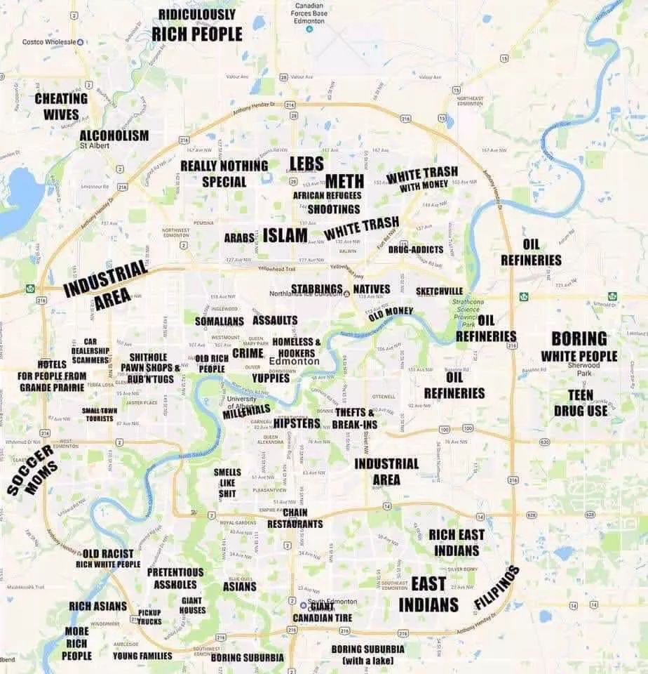
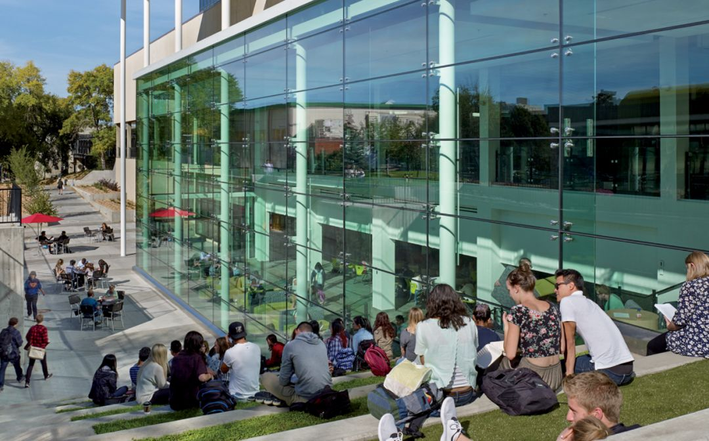
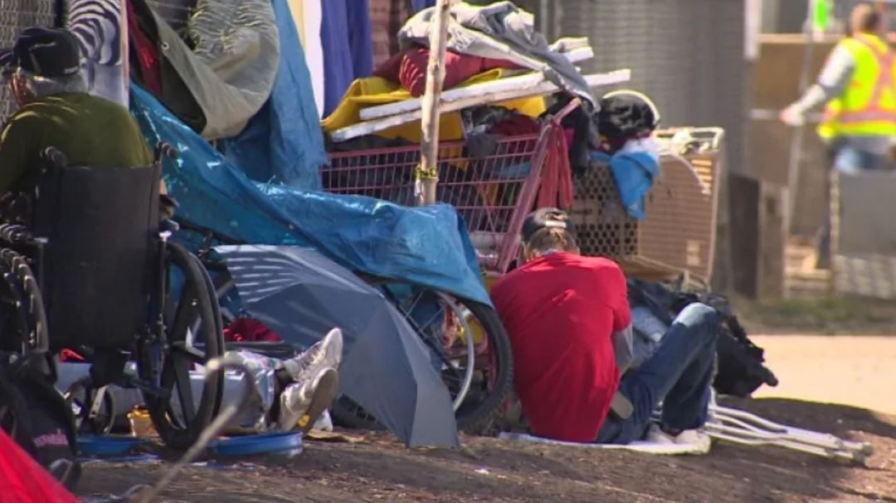
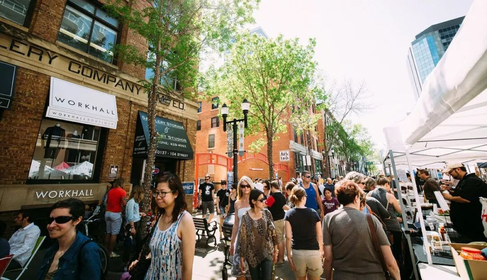
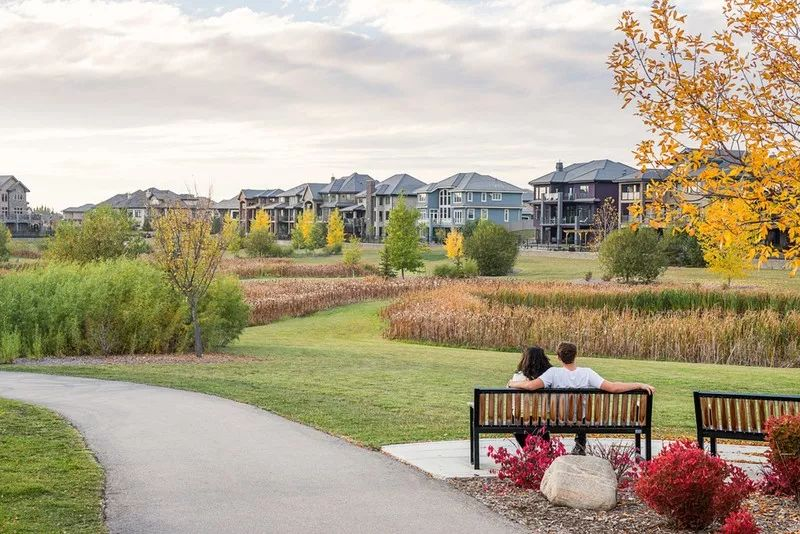
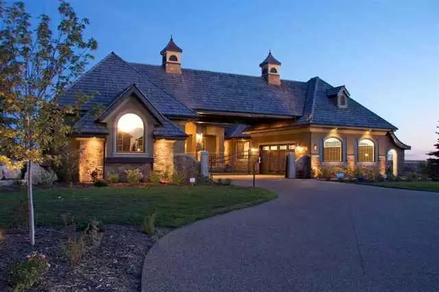
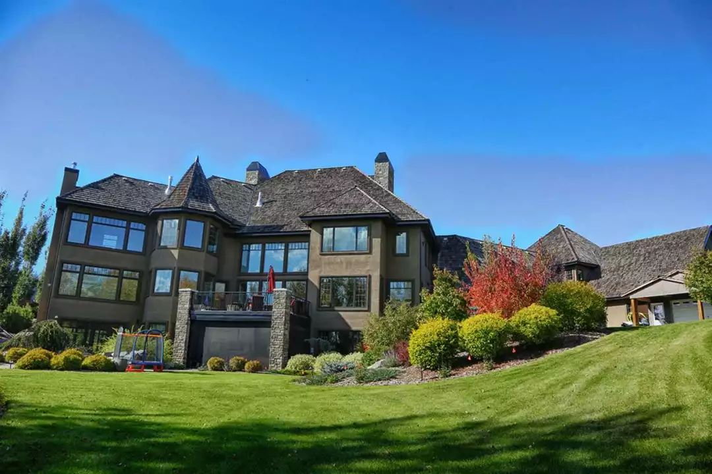
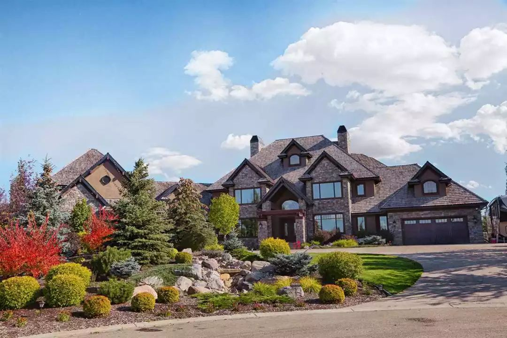

# 无标题

**链接地址:** http://mp.weixin.qq.com/s?__biz=MzI2NTE1ODgwOQ==&mid=2649605901&idx=1&sn=3447b6749c5e0590dff7682ab23d0c37&chksm=f2b8cefbc5cf47ed4b68a68e5745dede94d91a0219714eb564f926e6102e5144547dbe463565&mpshare=1&scene=2&srcid=#rd
**作者:** 雪糊
**获取时间:** 2025/8/28 20:53:00
**图片数量:** 21

---

## 原始HTML内容

<section style="box-sizing: border-box;"><section style="box-sizing: border-box;" powered-by="xiumi.us"><section style="margin-right: 0%;margin-left: 0%;box-sizing: border-box;"><section style="display: inline-block;vertical-align: middle;width: 80%;box-sizing: border-box;"><section style="box-sizing: border-box;" powered-by="xiumi.us"><section style="margin-top: 10px;margin-bottom: 10px;text-align: center;box-sizing: border-box;"><section style="display: inline-block;box-sizing: border-box;"><section style="max-width: 100%;font-size: 0px;padding-bottom: 3px;box-sizing: border-box;"><section style="display: inline-block;vertical-align: middle;box-sizing: border-box;"><section style="width: 5px;height: 1px;background-color: rgb(217, 217, 217);box-sizing: border-box;"></section><section style="width: 1px;height: 5px;margin-top: -3px;margin-right: auto;margin-left: auto;background-color: rgb(217, 217, 217);box-sizing: border-box;"></section></section><section style="margin-top: -1px;margin-right: -5px;margin-left: -5px;width: 100%;display: inline-block;vertical-align: middle;padding-right: 8px;padding-left: 8px;box-sizing: border-box;"><section style="width: 100%;height: 1px;background-color: rgb(217, 217, 217);box-sizing: border-box;"></section></section><section style="display: inline-block;vertical-align: middle;box-sizing: border-box;"><section style="width: 5px;height: 1px;background-color: rgb(217, 217, 217);box-sizing: border-box;"></section><section style="width: 1px;height: 5px;margin-top: -3px;margin-right: auto;margin-left: auto;background-color: rgb(217, 217, 217);box-sizing: border-box;"></section></section></section><section style="padding-left: 15px;padding-right: 15px;color: rgb(161, 161, 161);font-size: 14px;box-sizing: border-box;">
点击上方<strong style="box-sizing: border-box;">蓝字</strong>关注我们哟~
</section><section style="max-width: 100%;font-size: 0px;box-sizing: border-box;"><section style="display: inline-block;vertical-align: middle;box-sizing: border-box;"><section style="width: 5px;height: 1px;background-color: rgb(217, 217, 217);box-sizing: border-box;"></section><section style="width: 1px;height: 5px;margin-top: -3px;margin-right: auto;margin-left: auto;background-color: rgb(217, 217, 217);box-sizing: border-box;"></section></section><section style="margin-top: -1px;margin-right: -5px;margin-left: -5px;width: 100%;display: inline-block;vertical-align: middle;padding-right: 8px;padding-left: 8px;box-sizing: border-box;"><section style="width: 100%;height: 1px;background-color: rgb(217, 217, 217);box-sizing: border-box;"></section></section><section style="display: inline-block;vertical-align: middle;box-sizing: border-box;"><section style="width: 5px;height: 1px;background-color: rgb(217, 217, 217);box-sizing: border-box;"></section><section style="width: 1px;height: 5px;margin-top: -3px;margin-right: auto;margin-left: auto;background-color: rgb(217, 217, 217);box-sizing: border-box;"></section></section></section></section></section></section></section><section style="display: inline-block;vertical-align: middle;width: 20%;box-sizing: border-box;"><section style="box-sizing: border-box;" powered-by="xiumi.us"><section style="text-align: center;margin: -10px 0% 10px;box-sizing: border-box;"><section style="max-width: 100%;vertical-align: middle;display: inline-block;line-height: 0;width: 100%;box-sizing: border-box;"></section></section></section></section></section></section><section style="box-sizing: border-box;" powered-by="xiumi.us"><section style="margin: 10px 0%;box-sizing: border-box;"><section style="display: inline-block;width: 100%;vertical-align: top;box-sizing: border-box;"><section style="box-sizing: border-box;" powered-by="xiumi.us"><section style="box-sizing: border-box;"><section style="display: inline-block;vertical-align: bottom;width: 75%;padding-right: 10px;box-sizing: border-box;"><section style="box-sizing: border-box;" powered-by="xiumi.us"><section style="margin: 10px 0% 3px;box-sizing: border-box;"><section style="display: inline-block;vertical-align: middle;box-sizing: border-box;"><section style="display: inline-block;vertical-align: bottom;padding-left: 5px;padding-right: 5px;line-height: 1.2em;margin-bottom: 2px;color: rgba(80, 182, 201, 0.72);box-sizing: border-box;">
<strong style="box-sizing: border-box;">仔细看下图，有惊喜！</strong>
</section><section style="max-width: 100%;display: inline-block;vertical-align: bottom;line-height: 0;width: 1.6em;box-sizing: border-box;"></section></section></section></section></section><section style="display: inline-block;vertical-align: bottom;width: 25%;box-sizing: border-box;"><section style="box-sizing: border-box;" powered-by="xiumi.us"><section style="margin-right: 0%;margin-bottom: 3px;margin-left: 0%;text-align: right;box-sizing: border-box;"><section style="display: inline-block;border-bottom: 0.15em solid rgba(80, 182, 201, 0.72);padding-bottom: 3px;box-sizing: border-box;"><section style="display: inline-block;padding: 3px;border-bottom: 0.15em solid rgba(80, 182, 201, 0.72);font-size: 12px;line-height: 1.4;color: rgb(255, 143, 47);box-sizing: border-box;">
<strong style="box-sizing: border-box;">金主大大</strong>
</section></section></section></section></section></section></section><section style="box-sizing: border-box;" powered-by="xiumi.us"><section style="margin-right: 0%;margin-left: 0%;box-sizing: border-box;"><section style="background-color: rgba(80, 182, 201, 0.72);height: 2px;box-sizing: border-box;"></section></section></section></section></section></section><section style="box-sizing: border-box;" powered-by="xiumi.us"><section style="text-align: center;margin-top: 10px;margin-bottom: 10px;box-sizing: border-box;"><section style="max-width: 100%;vertical-align: middle;display: inline-block;line-height: 0;box-sizing: border-box;"></section></section></section><section style="box-sizing: border-box;" powered-by="xiumi.us"><section style="text-align: center;margin-top: 10px;margin-bottom: 10px;box-sizing: border-box;"><section style="max-width: 100%;vertical-align: middle;display: inline-block;line-height: 0;box-sizing: border-box;"></section></section></section><section style="box-sizing: border-box;" powered-by="xiumi.us"><section style="text-align: center;margin-top: 10px;margin-bottom: 10px;box-sizing: border-box;"><section style="max-width: 100%;vertical-align: middle;display: inline-block;line-height: 0;box-sizing: border-box;"></section></section></section><section style="box-sizing: border-box;" powered-by="xiumi.us"><section style="text-align: center;margin-top: 10px;margin-bottom: 10px;box-sizing: border-box;"><section style="max-width: 100%;vertical-align: middle;display: inline-block;line-height: 0;box-sizing: border-box;"></section></section></section><section style="box-sizing: border-box;" powered-by="xiumi.us"><section style="text-align: center;margin-top: 10px;margin-bottom: 10px;box-sizing: border-box;"><section style="max-width: 100%;vertical-align: middle;display: inline-block;line-height: 0;box-sizing: border-box;"></section></section></section><section style="box-sizing: border-box;" powered-by="xiumi.us"><section style="text-align: center;margin-top: 10px;margin-bottom: 10px;box-sizing: border-box;"><section style="max-width: 100%;vertical-align: middle;display: inline-block;line-height: 0;box-sizing: border-box;"><svg class="svg" xmlns="http://www.w3.org/2000/svg" x="0px" y="0px" viewBox="0 0 902.1 38.2" style="vertical-align: middle;max-width: 100%;box-sizing: border-box;" width="100%"><g style="box-sizing: border-box;"><path style="box-sizing: border-box;" d="M18.4,1.4c0.9-1.9,2.4-1.9,3.4,0l3.4,6.9c0.9,1.9,3.4,3.7,5.4,4l7.6,1.1c2.1,0.3,2.5,1.7,1,3.2   l-5.5,5.4c-1.5,1.5-2.4,4.3-2.1,6.4l1.3,7.6c0.4,2.1-0.9,2.9-2.7,2l-6.8-3.6c-1.8-1-4.9-1-6.7,0l-6.8,3.6c-1.9,1-3.1,0.1-2.7-2   l1.3-7.6c0.4-2.1-0.6-4.9-2.1-6.4l-5.5-5.4c-1.5-1.5-1-2.9,1-3.2l7.6-1.1c2.1-0.3,4.5-2.1,5.4-4L18.4,1.4z" fill="rgb(178, 243, 230)"></path><path style="box-sizing: border-box;" d="M90.6,5.4c0.7-1.4,1.9-1.4,2.6,0l2.6,5.3c0.7,1.4,2.6,2.8,4.2,3.1l5.9,0.9c1.6,0.2,2,1.3,0.8,2.5   l-4.2,4.1c-1.2,1.1-1.9,3.3-1.6,4.9l1,5.8c0.3,1.6-0.7,2.3-2.1,1.5l-5.2-2.8c-1.4-0.8-3.8-0.8-5.2,0L84,33.6   c-1.4,0.8-2.4,0.1-2.1-1.5l1-5.8c0.3-1.6-0.5-3.8-1.6-4.9l-4.2-4.1c-1.2-1.1-0.8-2.2,0.8-2.5l5.9-0.9c1.6-0.2,3.5-1.6,4.2-3.1   L90.6,5.4z" fill="rgb(190, 204, 246)"></path><path style="box-sizing: border-box;" d="M162.6,7.5c0.6-1.2,1.6-1.2,2.2,0l2.2,4.5c0.6,1.2,2.2,2.4,3.6,2.6l5,0.7c1.4,0.2,1.7,1.1,0.7,2.1   l-3.6,3.5c-1,1-1.6,2.9-1.4,4.2l0.9,5c0.2,1.4-0.6,1.9-1.8,1.3l-4.5-2.4c-1.2-0.6-3.2-0.6-4.4,0l-4.5,2.4c-1.2,0.6-2,0.1-1.8-1.3   l0.9-5c0.2-1.4-0.4-3.3-1.4-4.2l-3.6-3.5c-1-1-0.7-1.9,0.7-2.1l5-0.7c1.4-0.2,3-1.4,3.6-2.6L162.6,7.5z" fill="rgb(150, 208, 240)"></path><path style="box-sizing: border-box;" d="M60.1,19.1c0,2.3-1.9,4.2-4.2,4.2c-2.3,0-4.2-1.9-4.2-4.2s1.9-4.2,4.2-4.2   C58.3,14.9,60.1,16.8,60.1,19.1z" fill="rgb(218, 240, 224)"></path><path style="box-sizing: border-box;" d="M203.8,19.1c0,2.3-1.9,4.2-4.2,4.2c-2.3,0-4.2-1.9-4.2-4.2s1.9-4.2,4.2-4.2   C201.9,14.9,203.8,16.8,203.8,19.1z" fill="rgb(218, 240, 224)"></path><path style="box-sizing: border-box;" d="M130.9,19.1c0,1.7-1.4,3.1-3.1,3.1c-1.7,0-3.1-1.4-3.1-3.1c0-1.7,1.4-3.1,3.1-3.1   C129.5,16.1,130.9,17.4,130.9,19.1z" fill="rgb(218, 240, 224)"></path><path style="box-sizing: border-box;" d="M233.9,1.4c0.9-1.9,2.4-1.9,3.4,0l3.4,6.9c0.9,1.9,3.4,3.7,5.4,4l7.6,1.1c2.1,0.3,2.5,1.7,1,3.2   l-5.5,5.4c-1.5,1.5-2.4,4.3-2.1,6.4l1.3,7.6c0.4,2.1-0.9,2.9-2.7,2l-6.8-3.6c-1.8-1-4.9-1-6.7,0l-6.8,3.6c-1.9,1-3.1,0.1-2.7-2   l1.3-7.6c0.4-2.1-0.6-4.9-2.1-6.4l-5.5-5.4c-1.5-1.5-1-2.9,1-3.2l7.6-1.1c2.1-0.3,4.5-2.1,5.4-4L233.9,1.4z" fill="rgb(178, 243, 230)"></path><path style="box-sizing: border-box;" d="M306.1,5.4c0.7-1.4,1.9-1.4,2.6,0l2.6,5.3c0.7,1.4,2.6,2.8,4.2,3.1l5.9,0.9c1.6,0.2,2,1.3,0.8,2.5   l-4.2,4.1c-1.2,1.1-1.9,3.3-1.6,4.9l1,5.8c0.3,1.6-0.7,2.3-2.1,1.5l-5.2-2.8c-1.4-0.8-3.8-0.8-5.2,0l-5.2,2.8   c-1.4,0.8-2.4,0.1-2.1-1.5l1-5.8c0.3-1.6-0.4-3.8-1.6-4.9l-4.2-4.1c-1.2-1.1-0.8-2.2,0.8-2.5l5.9-0.9c1.6-0.2,3.5-1.6,4.2-3.1   L306.1,5.4z" fill="rgb(190, 204, 246)"></path><path style="box-sizing: border-box;" d="M378.1,7.5c0.6-1.2,1.6-1.2,2.2,0l2.2,4.5c0.6,1.2,2.2,2.4,3.6,2.6l5,0.7c1.4,0.2,1.7,1.1,0.7,2.1   l-3.6,3.5c-1,1-1.6,2.9-1.4,4.2l0.9,5c0.2,1.4-0.6,1.9-1.8,1.3l-4.5-2.4c-1.2-0.6-3.2-0.6-4.4,0l-4.5,2.4c-1.2,0.6-2,0.1-1.8-1.3   l0.9-5c0.2-1.4-0.4-3.3-1.4-4.2l-3.6-3.5c-1-1-0.7-1.9,0.7-2.1l5-0.7c1.4-0.2,3-1.4,3.6-2.6L378.1,7.5z" fill="rgb(150, 208, 240)"></path><path style="box-sizing: border-box;" d="M275.7,19.1c0,2.3-1.9,4.2-4.2,4.2c-2.3,0-4.2-1.9-4.2-4.2s1.9-4.2,4.2-4.2   C273.8,14.9,275.7,16.8,275.7,19.1z" fill="rgb(218, 240, 224)"></path><path style="box-sizing: border-box;" d="M419.3,19.1c0,2.3-1.9,4.2-4.2,4.2c-2.3,0-4.2-1.9-4.2-4.2s1.9-4.2,4.2-4.2   C417.5,14.9,419.3,16.8,419.3,19.1z" fill="rgb(218, 240, 224)"></path><path style="box-sizing: border-box;" d="M346.4,19.1c0,1.7-1.4,3.1-3.1,3.1c-1.7,0-3.1-1.4-3.1-3.1c0-1.7,1.4-3.1,3.1-3.1   C345,16.1,346.4,17.4,346.4,19.1z" fill="rgb(218, 240, 224)"></path><path style="box-sizing: border-box;" d="M449.4,1.4c0.9-1.9,2.4-1.9,3.4,0l3.4,6.9c0.9,1.9,3.4,3.7,5.4,4l7.6,1.1c2.1,0.3,2.5,1.7,1,3.2   l-5.5,5.4c-1.5,1.5-2.4,4.3-2.1,6.4l1.3,7.6c0.4,2.1-0.9,2.9-2.7,2l-6.8-3.6c-1.8-1-4.9-1-6.7,0l-6.8,3.6c-1.9,1-3.1,0.1-2.7-2   l1.3-7.6c0.4-2.1-0.6-4.9-2.1-6.4l-5.5-5.4c-1.5-1.5-1-2.9,1-3.2l7.6-1.1c2.1-0.3,4.5-2.1,5.4-4L449.4,1.4z" fill="rgb(178, 243, 230)"></path><path style="box-sizing: border-box;" d="M521.6,5.4c0.7-1.4,1.9-1.4,2.6,0l2.6,5.3c0.7,1.4,2.6,2.8,4.2,3.1l5.9,0.9c1.6,0.2,2,1.3,0.8,2.5   l-4.2,4.1c-1.2,1.1-1.9,3.3-1.6,4.9l1,5.8c0.3,1.6-0.7,2.3-2.1,1.5l-5.2-2.8c-1.4-0.8-3.8-0.8-5.2,0l-5.2,2.8   c-1.4,0.8-2.4,0.1-2.1-1.5l1-5.8c0.3-1.6-0.5-3.8-1.6-4.9l-4.2-4.1c-1.2-1.1-0.8-2.2,0.8-2.5l5.9-0.9c1.6-0.2,3.5-1.6,4.2-3.1   L521.6,5.4z" fill="rgb(190, 204, 246)"></path><path style="box-sizing: border-box;" d="M593.6,7.5c0.6-1.2,1.6-1.2,2.2,0l2.2,4.5c0.6,1.2,2.2,2.4,3.6,2.6l5,0.7c1.4,0.2,1.7,1.1,0.7,2.1   l-3.6,3.5c-1,1-1.6,2.9-1.4,4.2l0.9,5c0.2,1.4-0.6,1.9-1.8,1.3l-4.5-2.4c-1.2-0.6-3.2-0.6-4.4,0l-4.5,2.4c-1.2,0.6-2,0.1-1.8-1.3   l0.9-5c0.2-1.4-0.4-3.3-1.4-4.2l-3.6-3.5c-1-1-0.7-1.9,0.7-2.1l5-0.7c1.4-0.2,3-1.4,3.6-2.6L593.6,7.5z" fill="rgb(150, 208, 240)"></path><path style="box-sizing: border-box;" d="M491.2,19.1c0,2.3-1.9,4.2-4.2,4.2c-2.3,0-4.2-1.9-4.2-4.2s1.9-4.2,4.2-4.2   C489.3,14.9,491.2,16.8,491.2,19.1z" fill="rgb(218, 240, 224)"></path><path style="box-sizing: border-box;" d="M634.9,19.1c0,2.3-1.9,4.2-4.2,4.2c-2.3,0-4.2-1.9-4.2-4.2s1.9-4.2,4.2-4.2   C633,14.9,634.9,16.8,634.9,19.1z" fill="rgb(218, 240, 224)"></path><path style="box-sizing: border-box;" d="M561.9,19.1c0,1.7-1.4,3.1-3.1,3.1c-1.7,0-3.1-1.4-3.1-3.1c0-1.7,1.4-3.1,3.1-3.1   C560.5,16.1,561.9,17.4,561.9,19.1z" fill="rgb(218, 240, 224)"></path><path style="box-sizing: border-box;" d="M664.9,1.4c0.9-1.9,2.4-1.9,3.4,0l3.4,6.9c0.9,1.9,3.4,3.7,5.4,4l7.6,1.1c2.1,0.3,2.5,1.7,1,3.2   l-5.5,5.4c-1.5,1.5-2.4,4.3-2.1,6.4l1.3,7.6c0.4,2.1-0.9,2.9-2.7,2l-6.8-3.6c-1.8-1-4.9-1-6.7,0l-6.8,3.6c-1.9,1-3.1,0.1-2.7-2   l1.3-7.6c0.4-2.1-0.6-4.9-2.1-6.4l-5.5-5.4c-1.5-1.5-1-2.9,1-3.2l7.6-1.1c2.1-0.3,4.5-2.1,5.4-4L664.9,1.4z" fill="rgb(178, 243, 230)"></path><path style="box-sizing: border-box;" d="M737.1,5.4c0.7-1.4,1.9-1.4,2.6,0l2.6,5.3c0.7,1.4,2.6,2.8,4.2,3.1l5.9,0.9c1.6,0.2,2,1.3,0.8,2.5   l-4.2,4.1c-1.2,1.1-1.9,3.3-1.6,4.9l1,5.8c0.3,1.6-0.7,2.3-2.1,1.5l-5.2-2.8c-1.4-0.8-3.8-0.8-5.2,0l-5.2,2.8   c-1.4,0.8-2.4,0.1-2.1-1.5l1-5.8c0.3-1.6-0.5-3.8-1.6-4.9l-4.2-4.1c-1.2-1.1-0.8-2.2,0.8-2.5l5.9-0.9c1.6-0.2,3.5-1.6,4.2-3.1   L737.1,5.4z" fill="rgb(190, 204, 246)"></path><path style="box-sizing: border-box;" d="M809.2,7.5c0.6-1.2,1.6-1.2,2.2,0l2.2,4.5c0.6,1.2,2.2,2.4,3.6,2.6l5,0.7c1.4,0.2,1.7,1.1,0.7,2.1   l-3.6,3.5c-1,1-1.6,2.9-1.4,4.2l0.9,5c0.2,1.4-0.6,1.9-1.8,1.3l-4.5-2.4c-1.2-0.6-3.2-0.6-4.4,0l-4.5,2.4c-1.2,0.6-2,0.1-1.8-1.3   l0.9-5c0.2-1.4-0.4-3.3-1.4-4.2l-3.6-3.5c-1-1-0.7-1.9,0.7-2.1l5-0.7c1.4-0.2,3-1.4,3.6-2.6L809.2,7.5z" fill="rgb(150, 208, 240)"></path><path style="box-sizing: border-box;" d="M706.7,19.1c0,2.3-1.9,4.2-4.2,4.2c-2.3,0-4.2-1.9-4.2-4.2s1.9-4.2,4.2-4.2   C704.8,14.9,706.7,16.8,706.7,19.1z" fill="rgb(218, 240, 224)"></path><path style="box-sizing: border-box;" d="M850.4,19.1c0,2.3-1.9,4.2-4.2,4.2c-2.3,0-4.2-1.9-4.2-4.2s1.9-4.2,4.2-4.2   C848.5,14.9,850.4,16.8,850.4,19.1z" fill="rgb(218, 240, 224)"></path><path style="box-sizing: border-box;" d="M777.4,19.1c0,1.7-1.4,3.1-3.1,3.1c-1.7,0-3.1-1.4-3.1-3.1c0-1.7,1.4-3.1,3.1-3.1   C776,16.1,777.4,17.4,777.4,19.1z" fill="rgb(218, 240, 224)"></path><path style="box-sizing: border-box;" d="M880.4,1.4c0.9-1.9,2.4-1.9,3.4,0l3.4,6.9c0.9,1.9,3.4,3.7,5.4,4l7.6,1.1c2.1,0.3,2.5,1.7,1,3.2   l-5.5,5.4c-1.5,1.5-2.4,4.3-2.1,6.4l1.3,7.6c0.4,2.1-0.9,2.9-2.7,2l-6.8-3.6c-1.8-1-4.9-1-6.7,0l-6.8,3.6c-1.8,1-3.1,0.1-2.7-2   l1.3-7.6c0.4-2.1-0.6-4.9-2.1-6.4l-5.5-5.4c-1.5-1.5-1-2.9,1-3.2l7.6-1.1c2.1-0.3,4.5-2.1,5.4-4L880.4,1.4z" fill="rgb(178, 243, 230)"></path></g></svg></section></section></section><section style="box-sizing: border-box;" powered-by="xiumi.us"><section style="box-sizing: border-box;"><section style="text-align: center;box-sizing: border-box;">
最近雪糊在网上闲逛的时候，

看到一张让人笑得满地找牙的

 

<strong>（非官方）埃德蒙顿区域分布图</strong>

 

发上来给大家品品

大家也可以对号入座，

看看自己<strong>生活居住的区域的关键词</strong>属性是什么。

 

 

找不到自己的位置？

没关系，雪糊带着你一起来<strong>正确打开咱埃德蒙顿</strong>：

首先咱就从我们留学生聚集的<strong>阿尔伯塔大学主校区</strong>开始

 

<strong>1. UA主校区 - 00后的天下！</strong>

<strong> </strong>

UA附近居住的小伙伴们！

恭喜你们，住进了<strong>整个城市最活力最年轻的“00后社区”</strong>！

你千万不要惊讶，

现在已经是2019年了，

也就是说，

<strong>2001年出生的孩子都已经到了18岁上大学的年纪。</strong>

再加上附近大量的优质的小学和中学，

果然已经是00后的天下了，

让我们这种<strong>离开校园n年的老阿姨情何以堪</strong>？

 

<strong style="font-size: 18px;text-align: center;white-space: normal;">2. 当烫 - 犯罪，流浪汉，妓女，雅痞~</strong>

<strong style="font-size: 18px;text-align: center;white-space: normal;"> </strong>

<strong style="font-size: 18px;text-align: center;white-space: normal;"></strong> 

另外一个留学生聚集的区域downtown就是一个<strong>成分复杂的区域</strong>了。

Grandin/Goverment Centre那个教堂遍布，林荫小道的区域

就是这个城市<strong>老牌富人聚集区</strong>和养老区，

 

然而紧邻的麦科文大学附近就是<strong>犯罪高发地带</strong>了。

 

再往东边的唐人街一走，

遍地<strong>流浪汉和妓女还有吸毒者</strong>。

每次走到附近都阴森森心里发毛怕怕的。

 

 

不过往河边方向过渡，

就是这个城市<strong>小资群体雅痞聚集地</strong>，

是这个城市<strong>文化艺术气息最浓郁</strong>的地方。

有很多有品位的小商店和小餐厅。

所以各位留学生们，

找公寓的时候心里有谱了吗？

 

<strong style="font-size: 18px;text-align: center;white-space: normal;">3. Windermere，Blue Quill - 华人聚集区</strong>

<strong style="font-size: 18px;text-align: center;white-space: normal;"> </strong>

 
</section></section></section><section style="box-sizing: border-box;" powered-by="xiumi.us"><section style="box-sizing: border-box;"><section style="box-sizing: border-box;">
现在很多新移民朋友们，

都喜欢把房子买在windermer区，

于是乎，

这个区的（有钱）华人朋友们越来越多，

同理，南边不少优质的社区，

都<strong>被财大气粗的亚洲人占领</strong>。

爱城的南部和西南部是整个城市发展最快的区域，

靠近机场，毗邻south common等购物区和优质学区，

发展飞速，房价飙升，

只能说俺们<strong>亚洲人的眼光那必须是雪亮</strong>的！

 

<strong style="font-size: 18px;text-align: center;white-space: normal;">4. South Gate - 找个饭店搓一顿吧~</strong>

 

 

近些年城市的南边发展越来越好，

咱们财大气粗的亚裔朋友们功不可没，

<strong>各种便利的设施拔地而起</strong>，

同时也让这个区域变成了华人留学生的聚集地。

这个地区在地图上被标注为：

<strong>“连锁饭店区”</strong>

想想还真是，

state &amp; mian, sorrentino's, moxie's…

不少出名的饭店在这个区域都有分店，

让南边的居民可以不用去到dt或者大学也可以<strong>一饱口福</strong>。

 

<strong>5. 不同族裔，分散居住</strong>

<strong> </strong>

 

埃德蒙顿虽然外来移民很多

不过大家都默默遵循着一个友好的界限，

就是基本都会<strong>默契地选择和本族群的人一起居住</strong>。

比如，

东南的millwoods区就是典型的印度人聚集区，

而菲律宾人则聚集在东南的meadows区，

信奉伊斯兰教的人群会住在城市正北的Eaux Claires，

而土著人都喜欢居住在东北部的stadium附近，

北边就是各种<strong>亚洲小种族人群的聚集地</strong>，

各种各样的毒品，犯罪问题，

只有你想不到，没有他们办不到，

反正就俩字描述：<strong>别去！</strong>

<strong> </strong>

<strong>5. 白人分布，金钱和教育</strong>

 

 

不过说到底，

埃德蒙顿的主要居住者还是白人。

但白人的分类就比较搞笑的，

然而万变不离其宗，

<strong>白人的分布基本依靠金钱和素质</strong>来排布，

通常有钱的白人(rich white）都会有点排外(racist）

和高傲（pretentious）

 

而中产阶级通常比较无聊（boring），

他们集中在城市的东部sherwoodpark

和南部的ruthford, summerside

 

而低收入低素质的白人(white trash）则聚集在东北的clarview附近，

和那些吸毒，斗殴，诈骗，偷盗等等<strong>犯罪问题绑定</strong>在一起。

 

不过这个地图也打开了雪糊的新世界，

毕竟<strong>被贫穷限制了想象力</strong>的我，

从来都不知道这个城市<strong>大北边还隐藏着一个</strong>

<strong>”壕无人性“</strong>（ridiculously roich people）的居住区！

上网搜几张图片给大家开开眼，

 

 

草坪，假山，流水，瀑布，小森林…

这些房子<strong>佣人房的厕所都比我的卧室大</strong>！

每家每户都阔气得像皇宫一样，

周边更是被奢华的高尔夫球场和景色优美的山谷环绕。

传说中这就是北边<strong>油田上的开发商大老板</strong>住的地方。

最近真是太膨胀了，

连这样的房产listing都感打开了。

顿时感觉码字都码得有动力了！  

<strong><strong style="text-align: center;white-space: normal;">6. 亮点自寻</strong></strong>

<strong><strong style="text-align: center;white-space: normal;"> </strong></strong>

<strong><strong style="text-align: center;white-space: normal;"></strong></strong> 

这张地图上的亮点还是很多的，

比如callingwood区是传统的<strong>贤妻良母</strong>区，

而不远处的st.alberta却以<strong>偷吃出轨</strong>的家庭主妇而出名。

而那些st.alberta的丈夫们呢？当然是在<strong>忙着酗酒</strong>啦！

 

不过这张非官方的地图是搞笑的，

其中不乏一些以偏概全的描述，

希望大家在对号入座的同时，

不要过分认真对待。

 

如果觉得它说的有道理，

不妨<strong>转发给朋友们看看</strong>。

如果你觉得它说得不对，

或者你对埃德蒙顿的人口区域划分有自己的心得，

也欢迎<strong>留言告诉我们</strong>。

 

<strong>- 更多精彩内容，欢迎关注我们 -</strong>

 
</section></section></section><section style="box-sizing: border-box;" powered-by="xiumi.us"><section style="box-sizing: border-box;"><section style="box-sizing: border-box;">
 
</section></section></section><section style="box-sizing: border-box;" powered-by="xiumi.us"><section style="margin: 40px 0% 10px;text-align: center;box-sizing: border-box;"><section style="display: inline-block;width: 90%;border-width: 1px;border-style: dotted;border-color: rgba(80, 182, 201, 0.72);padding: 10px;border-radius: 0px;box-sizing: border-box;"><section style="box-sizing: border-box;" powered-by="xiumi.us"><section style="transform: translate3d(20px, 0px, 0px);text-align: left;font-size: 11px;margin-top: -55px;margin-right: 0%;margin-left: 0%;box-sizing: border-box;"><section style="box-sizing: border-box;width: 7em;height: 7em;display: inline-block;vertical-align: bottom;border-radius: 100%;border-width: 5px;border-style: none;border-color: rgba(80, 182, 201, 0.72);background-position: center center;background-repeat: no-repeat;background-size: cover;overflow: hidden;background-image: url(&quot;https://mmbiz.qpic.cn/mmbiz_jpg/D1nJqnhkPyLN9ibXny9TiamVIMxsSckksqaicoibWI7RnSf4Riavn4WfVdVhwG1BVz976iaCictI2jf7BujTsjVjrfhdg/640?wx_fmt=jpeg&quot;);"><section style="height: 100%;overflow: hidden;line-height: 0;vertical-align: middle;max-width: 100%;box-sizing: border-box;"></section></section></section></section><section style="box-sizing: border-box;" powered-by="xiumi.us"><section style="box-sizing: border-box;"><section class="group-empty" style="display: inline-block;vertical-align: top;width: 38.2%;box-sizing: border-box;height: 1px;"></section><section style="display: inline-block;vertical-align: top;width: 61.8%;box-sizing: border-box;"><section style="box-sizing: border-box;" powered-by="xiumi.us"><section style="margin-right: 0%;margin-left: 0%;box-sizing: border-box;"><section style="font-size: 18px;color: rgb(67, 103, 117);line-height: 1.6;letter-spacing: 1px;box-sizing: border-box;">
<strong style="box-sizing: border-box;">埃德蒙顿微生活</strong>
</section></section></section><section style="box-sizing: border-box;" powered-by="xiumi.us"><section style="margin-top: 0.5em;margin-bottom: 0.5em;box-sizing: border-box;"><section style="background-color: rgba(80, 182, 201, 0.72);height: 1px;box-sizing: border-box;"></section></section></section></section></section></section><section style="box-sizing: border-box;" powered-by="xiumi.us"><section style="box-sizing: border-box;"><section style="text-align: justify;font-size: 14px;color: rgba(62, 62, 62, 0.72);letter-spacing: 2px;box-sizing: border-box;">
<strong style="box-sizing: border-box;">关心埃德蒙顿民生，</strong>

<strong style="box-sizing: border-box;">关注埃德蒙顿的发展。</strong>

 

埃德蒙顿微生活是“吃喝玩乐埃德蒙顿”旗下，为埃德蒙顿地区的居民提供每日最新的吃喝玩乐、工作学习、商业投资的媒体平台 。
</section></section></section><section style="box-sizing: border-box;" powered-by="xiumi.us"><section style="box-sizing: border-box;"><section style="text-align: left;box-sizing: border-box;">
 
</section></section></section><section style="box-sizing: border-box;" powered-by="xiumi.us"><section style="box-sizing: border-box;"><section style="display: inline-block;vertical-align: middle;width: 61.8%;box-sizing: border-box;"><section style="box-sizing: border-box;" powered-by="xiumi.us"><section style="box-sizing: border-box;"><section style="text-align: justify;font-size: 12px;color: rgba(62, 62, 62, 0.37);line-height: 1.9;letter-spacing: 0px;box-sizing: border-box;">
我们的目标是以最新、最快、最及时的方式 报道埃德蒙顿的新鲜事 。 
</section></section></section></section><section style="display: inline-block;vertical-align: middle;width: 38.2%;box-sizing: border-box;"><section style="box-sizing: border-box;" powered-by="xiumi.us"><section style="margin-right: 0%;margin-left: 0%;box-sizing: border-box;"><section style="max-width: 100%;vertical-align: middle;display: inline-block;line-height: 0;width: 70%;box-sizing: border-box;"></section></section></section></section></section></section></section></section></section></section>
 

---

## 纯文本内容

点击上方蓝字关注我们哟~仔细看下图，有惊喜！金主大大最近雪糊在网上闲逛的时候，看到一张让人笑得满地找牙的（非官方）埃德蒙顿区域分布图发上来给大家品品大家也可以对号入座，看看自己生活居住的区域的关键词属性是什么。找不到自己的位置？没关系，雪糊带着你一起来正确打开咱埃德蒙顿：首先咱就从我们留学生聚集的阿尔伯塔大学主校区开始1. UA主校区 - 00后的天下！UA附近居住的小伙伴们！恭喜你们，住进了整个城市最活力最年轻的“00后社区”！你千万不要惊讶，现在已经是2019年了，也就是说，2001年出生的孩子都已经到了18岁上大学的年纪。再加上附近大量的优质的小学和中学，果然已经是00后的天下了，让我们这种离开校园n年的老阿姨情何以堪？2. 当烫 - 犯罪，流浪汉，妓女，雅痞~另外一个留学生聚集的区域downtown就是一个成分复杂的区域了。Grandin/Goverment Centre那个教堂遍布，林荫小道的区域就是这个城市老牌富人聚集区和养老区，然而紧邻的麦科文大学附近就是犯罪高发地带了。再往东边的唐人街一走，遍地流浪汉和妓女还有吸毒者。每次走到附近都阴森森心里发毛怕怕的。不过往河边方向过渡，就是这个城市小资群体雅痞聚集地，是这个城市文化艺术气息最浓郁的地方。有很多有品位的小商店和小餐厅。所以各位留学生们，找公寓的时候心里有谱了吗？3. Windermere，Blue Quill - 华人聚集区现在很多新移民朋友们，都喜欢把房子买在windermer区，于是乎，这个区的（有钱）华人朋友们越来越多，同理，南边不少优质的社区，都被财大气粗的亚洲人占领。爱城的南部和西南部是整个城市发展最快的区域，靠近机场，毗邻south common等购物区和优质学区，发展飞速，房价飙升，只能说俺们亚洲人的眼光那必须是雪亮的！4. South Gate - 找个饭店搓一顿吧~近些年城市的南边发展越来越好，咱们财大气粗的亚裔朋友们功不可没，各种便利的设施拔地而起，同时也让这个区域变成了华人留学生的聚集地。这个地区在地图上被标注为：“连锁饭店区”想想还真是，state & mian, sorrentino's, moxie's…不少出名的饭店在这个区域都有分店，让南边的居民可以不用去到dt或者大学也可以一饱口福。5. 不同族裔，分散居住埃德蒙顿虽然外来移民很多不过大家都默默遵循着一个友好的界限，就是基本都会默契地选择和本族群的人一起居住。比如，东南的millwoods区就是典型的印度人聚集区，而菲律宾人则聚集在东南的meadows区，信奉伊斯兰教的人群会住在城市正北的Eaux Claires，而土著人都喜欢居住在东北部的stadium附近，北边就是各种亚洲小种族人群的聚集地，各种各样的毒品，犯罪问题，只有你想不到，没有他们办不到，反正就俩字描述：别去！5. 白人分布，金钱和教育不过说到底，埃德蒙顿的主要居住者还是白人。但白人的分类就比较搞笑的，然而万变不离其宗，白人的分布基本依靠金钱和素质来排布，通常有钱的白人(rich white）都会有点排外(racist）和高傲（pretentious）而中产阶级通常比较无聊（boring），他们集中在城市的东部sherwoodpark和南部的ruthford, summerside而低收入低素质的白人(white trash）则聚集在东北的clarview附近，和那些吸毒，斗殴，诈骗，偷盗等等犯罪问题绑定在一起。不过这个地图也打开了雪糊的新世界，毕竟被贫穷限制了想象力的我，从来都不知道这个城市大北边还隐藏着一个”壕无人性“（ridiculously roich people）的居住区！上网搜几张图片给大家开开眼，草坪，假山，流水，瀑布，小森林…这些房子佣人房的厕所都比我的卧室大！每家每户都阔气得像皇宫一样，周边更是被奢华的高尔夫球场和景色优美的山谷环绕。传说中这就是北边油田上的开发商大老板住的地方。最近真是太膨胀了，连这样的房产listing都感打开了。顿时感觉码字都码得有动力了！6. 亮点自寻这张地图上的亮点还是很多的，比如callingwood区是传统的贤妻良母区，而不远处的st.alberta却以偷吃出轨的家庭主妇而出名。而那些st.alberta的丈夫们呢？当然是在忙着酗酒啦！不过这张非官方的地图是搞笑的，其中不乏一些以偏概全的描述，希望大家在对号入座的同时，不要过分认真对待。如果觉得它说的有道理，不妨转发给朋友们看看。如果你觉得它说得不对，或者你对埃德蒙顿的人口区域划分有自己的心得，也欢迎留言告诉我们。- 更多精彩内容，欢迎关注我们 -埃德蒙顿微生活关心埃德蒙顿民生，关注埃德蒙顿的发展。埃德蒙顿微生活是“吃喝玩乐埃德蒙顿”旗下，为埃德蒙顿地区的居民提供每日最新的吃喝玩乐、工作学习、商业投资的媒体平台 。我们的目标是以最新、最快、最及时的方式 报道埃德蒙顿的新鲜事 。

---

## 图片列表

-  (原始链接: https://mmbiz.qpic.cn/mmbiz_gif/D1nJqnhkPyLN9ibXny9TiamVIMxsSckksqwdhicyPIXdIC8bgEN2UqiaewhVvLkJao41ia0L5RMeaIYRmPjWx2XRRxg/640?wx_fmt=gif)
-  (原始链接: https://mmbiz.qpic.cn/mmbiz_gif/D1nJqnhkPyLN9ibXny9TiamVIMxsSckksq76w68egWEFbQenKnHUcKaaY7SgibSrL264ALOEppP3BvkOibSibtgKlNQ/640?wx_fmt=gif)
-  (原始链接: https://mmbiz.qpic.cn/mmbiz_jpg/D1nJqnhkPyLN9ibXny9TiamVIMxsSckksqRVkcwSRiaicFVibTehgyvm3Hut9qmvb6TC2CSenib1boZ6IPrOvjOJOia0Q/640?wx_fmt=jpeg)
-  (原始链接: https://mmbiz.qpic.cn/mmbiz_jpg/D1nJqnhkPyLN9ibXny9TiamVIMxsSckksqibMrgGCia8epicds3d2yBOTryQBmicqibkwNib1EG4xwN3aG5Lf9oN0eZbMA/640?wx_fmt=jpeg)
-  (原始链接: https://mmbiz.qpic.cn/mmbiz_jpg/D1nJqnhkPyLN9ibXny9TiamVIMxsSckksq9ticbRvDyeosdP5oYiclj3AJMLKmyia2a6ReSyktvZgicZZibEep041H1Xw/640?wx_fmt=jpeg)
-  (原始链接: https://mmbiz.qpic.cn/mmbiz_jpg/D1nJqnhkPyLN9ibXny9TiamVIMxsSckksq0maQTo4Hf78OKosuteHtgBH68M4mWQicG8UBnBmkdOAb1B3Bgvx7u5w/640?wx_fmt=jpeg)
-  (原始链接: https://mmbiz.qpic.cn/mmbiz_jpg/D1nJqnhkPyLN9ibXny9TiamVIMxsSckksqvR5z1HzEuHgLgib8micbEvTuE9rBUgssPYpB9aibxIvdGncQk4UR41qKw/640?wx_fmt=jpeg)
-  (原始链接: https://mmbiz.qpic.cn/mmbiz_jpg/D1nJqnhkPyLN9ibXny9TiamVIMxsSckksqIJCKVibtmXDf3YN3HBMnBcpHg39H0cmYiao3t5n7DibTQE7ibiaIYtDa30g/640?wx_fmt=jpeg)
-  (原始链接: https://mmbiz.qpic.cn/mmbiz_png/D1nJqnhkPyLN9ibXny9TiamVIMxsSckksqGUauFf1nxMkkWpRRRsrRXGcj4iasMOBM3PUzTWVxFAKNpqy7144TW5Q/640?wx_fmt=png)
-  (原始链接: https://mmbiz.qpic.cn/mmbiz_png/D1nJqnhkPyLN9ibXny9TiamVIMxsSckksqibPkn5hCxMvCm9Ms4iamlicXBvwzX5IdBngUmtmBJic2Nibk0SwxnJYyqNw/640?wx_fmt=png)
-  (原始链接: https://mmbiz.qpic.cn/mmbiz_jpg/D1nJqnhkPyLN9ibXny9TiamVIMxsSckksqibsQK9jl2TlGGXZDicW0Mbz8s4k2Tn8iar1ZAEeBqIxonfH7eq12mnCvA/640?wx_fmt=jpeg)
-  (原始链接: https://mmbiz.qpic.cn/mmbiz_jpg/D1nJqnhkPyLN9ibXny9TiamVIMxsSckksq8qWMD93gcc30TX9uqUVGViaHd4eEntGV6VJiaIibSmDFe9aWbRGUX5gvw/640?wx_fmt=jpeg)
-  (原始链接: https://mmbiz.qpic.cn/mmbiz_jpg/D1nJqnhkPyLN9ibXny9TiamVIMxsSckksqK6UfWicTWc8lYFZnptvBTEUp8MSga2CuBC5dC0ghsW5nKtmSMUaFIew/640?wx_fmt=jpeg)
-  (原始链接: https://mmbiz.qpic.cn/mmbiz_jpg/D1nJqnhkPyLN9ibXny9TiamVIMxsSckksqk4UtYjfHd1ibxh1ibXMbxLznO0K10O1d1e4dMBurvWrfB3Sa78vZzJjA/640?wx_fmt=jpeg)
-  (原始链接: https://mmbiz.qpic.cn/mmbiz_jpg/D1nJqnhkPyLN9ibXny9TiamVIMxsSckksq3lo1WxDz2d0ZicRsedSdK2qWf4Vc5tHdMcYcBGdiaKicczsBPaM5NSe3A/640?wx_fmt=jpeg)
-  (原始链接: https://mmbiz.qpic.cn/mmbiz_jpg/D1nJqnhkPyLN9ibXny9TiamVIMxsSckksqcNOzSa0nV9m2mep6FR0yWk3rsOU8jOoRKVjdNNUdaF6aTaBjqGSFWQ/640?wx_fmt=jpeg)
-  (原始链接: https://mmbiz.qpic.cn/mmbiz_jpg/D1nJqnhkPyLN9ibXny9TiamVIMxsSckksqXqicDg8KZqyhmwS71w4ibpvcnhvvJ0Lt7O6n3RmUUdENkHRuv7HjGiaxA/640?wx_fmt=jpeg)
-  (原始链接: https://mmbiz.qpic.cn/mmbiz_jpg/D1nJqnhkPyLN9ibXny9TiamVIMxsSckksq4tyyeduYf1tdryiatXh4l4b0xzUIoIvEEwT90HhbHrYDIenyNLy1Q8Q/640?wx_fmt=jpeg)
-  (原始链接: https://mmbiz.qpic.cn/mmbiz_jpg/D1nJqnhkPyLN9ibXny9TiamVIMxsSckksq5FUYcRlDt7LseDmxBdbNwbPB1bRR3yicaOicKXHRVmKsbOunRp20cytw/640?wx_fmt=jpeg)
-  (原始链接: https://mmbiz.qpic.cn/mmbiz_jpg/D1nJqnhkPyLN9ibXny9TiamVIMxsSckksqaicoibWI7RnSf4Riavn4WfVdVhwG1BVz976iaCictI2jf7BujTsjVjrfhdg/640?wx_fmt=jpeg)
-  (原始链接: https://mmbiz.qpic.cn/mmbiz_jpg/D1nJqnhkPyLN9ibXny9TiamVIMxsSckksqEt575FMSghnG8DicTbaMs3ebuHlz0yV9n9AnHZd4l2QrK8gRWOoA1RA/640?wx_fmt=jpeg)
