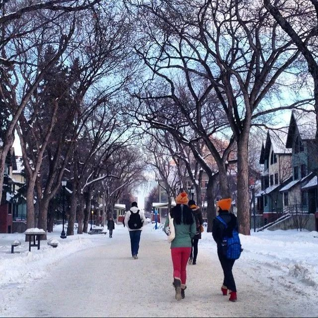
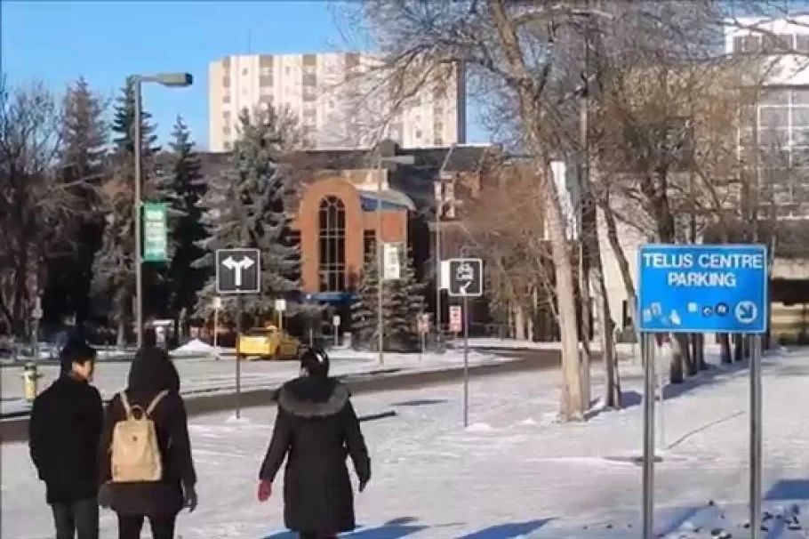
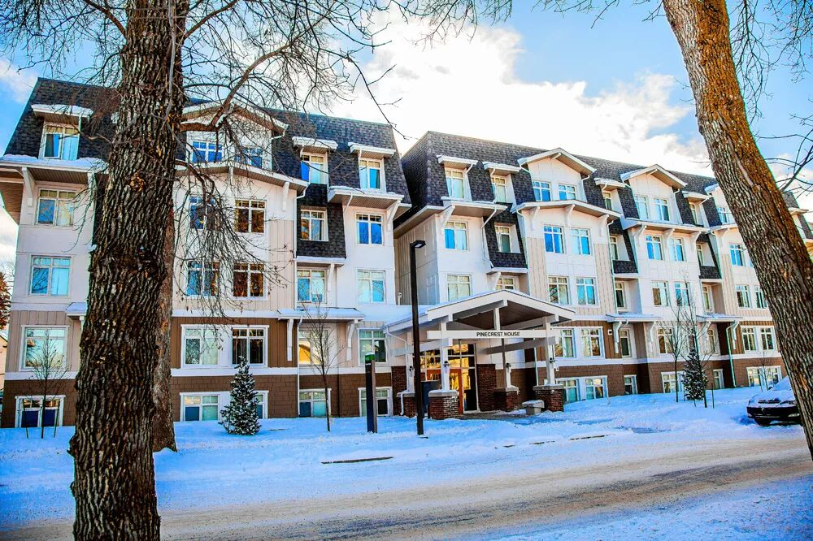
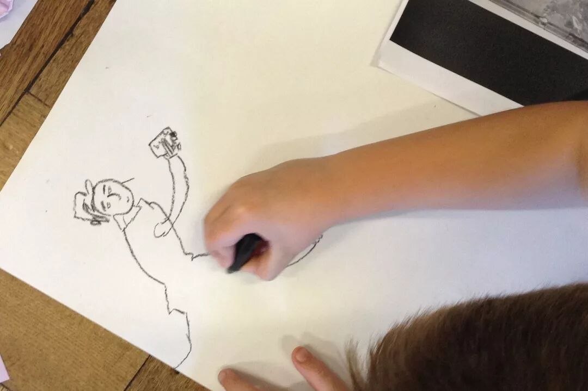
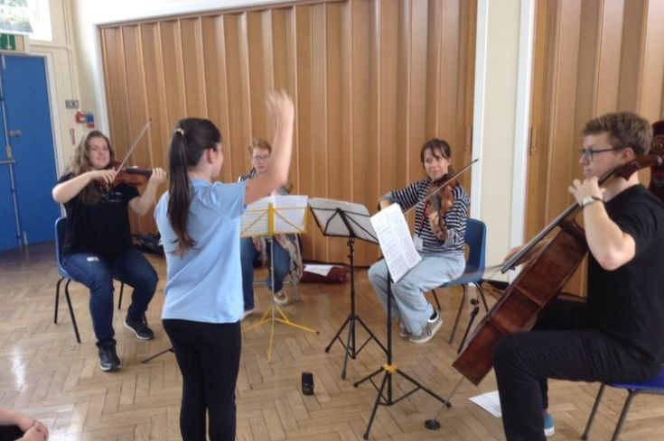
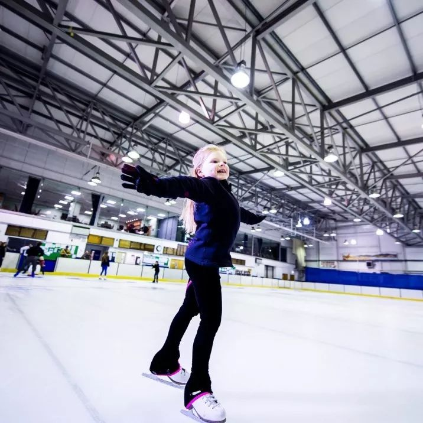
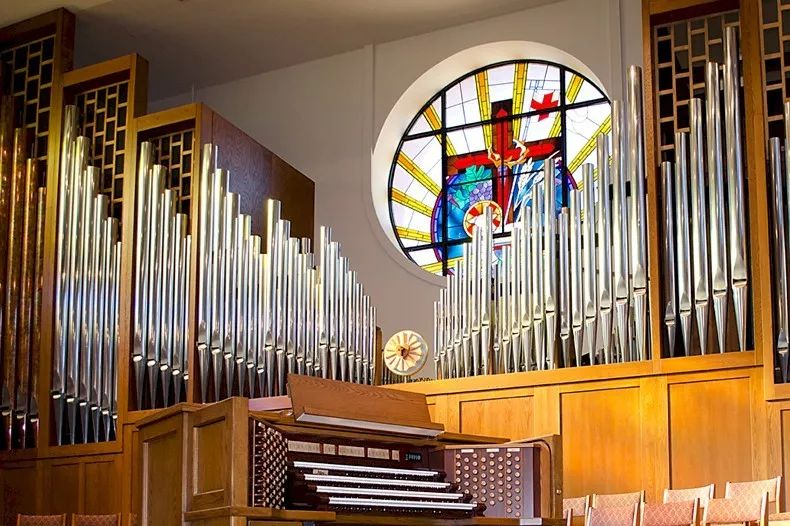
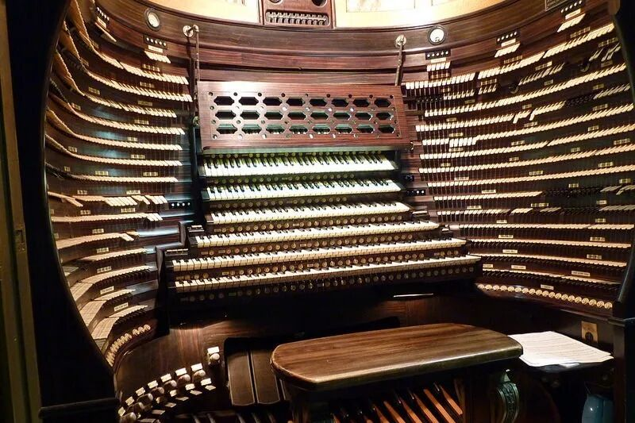
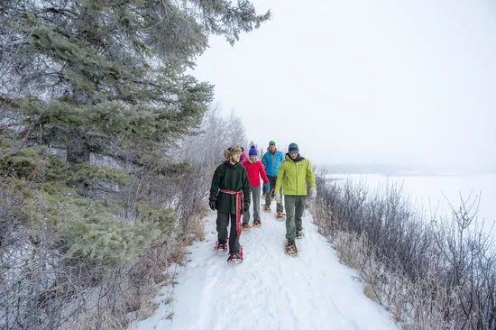
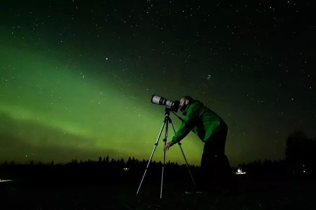

# 无标题

**链接地址:** http://mp.weixin.qq.com/s?__biz=MzI2NTE1ODgwOQ==&mid=2649605951&idx=1&sn=f9a84f6428257f3dc56baaf49c76b1bf&chksm=f2b8cec9c5cf47df73423c605c31ab2bb70a6ef078e7615cddbdcce04383b8a122b342667ae7&mpshare=1&scene=2&srcid=#rd
**作者:** 雪糊
**获取时间:** 2025/8/28 20:51:11
**图片数量:** 20

---

## 原始HTML内容

<section style="box-sizing: border-box;font-size: 16px;"><section style="box-sizing: border-box;" powered-by="xiumi.us"><section style="margin-right: 0%;margin-left: 0%;box-sizing: border-box;"><section style="display: inline-block;vertical-align: middle;width: 80%;box-sizing: border-box;"><section style="box-sizing: border-box;" powered-by="xiumi.us"><section style="margin-top: 10px;margin-bottom: 10px;text-align: center;box-sizing: border-box;"><section style="display: inline-block;box-sizing: border-box;"><section style="max-width: 100%;font-size: 0px;padding-bottom: 3px;box-sizing: border-box;"><section style="display: inline-block;vertical-align: middle;box-sizing: border-box;"><section style="width: 5px;height: 1px;background-color: rgb(217, 217, 217);box-sizing: border-box;"></section><section style="width: 1px;height: 5px;margin-top: -3px;margin-right: auto;margin-left: auto;background-color: rgb(217, 217, 217);box-sizing: border-box;"></section></section><section style="margin-top: -1px;margin-right: -5px;margin-left: -5px;width: 100%;display: inline-block;vertical-align: middle;padding-right: 8px;padding-left: 8px;box-sizing: border-box;"><section style="width: 100%;height: 1px;background-color: rgb(217, 217, 217);box-sizing: border-box;"></section></section><section style="display: inline-block;vertical-align: middle;box-sizing: border-box;"><section style="width: 5px;height: 1px;background-color: rgb(217, 217, 217);box-sizing: border-box;"></section><section style="width: 1px;height: 5px;margin-top: -3px;margin-right: auto;margin-left: auto;background-color: rgb(217, 217, 217);box-sizing: border-box;"></section></section></section><section style="padding-left: 15px;padding-right: 15px;color: rgb(161, 161, 161);font-size: 14px;box-sizing: border-box;">
点击上方<strong style="box-sizing: border-box;">蓝字</strong>关注我们哟~
</section><section style="max-width: 100%;font-size: 0px;box-sizing: border-box;"><section style="display: inline-block;vertical-align: middle;box-sizing: border-box;"><section style="width: 5px;height: 1px;background-color: rgb(217, 217, 217);box-sizing: border-box;"></section><section style="width: 1px;height: 5px;margin-top: -3px;margin-right: auto;margin-left: auto;background-color: rgb(217, 217, 217);box-sizing: border-box;"></section></section><section style="margin-top: -1px;margin-right: -5px;margin-left: -5px;width: 100%;display: inline-block;vertical-align: middle;padding-right: 8px;padding-left: 8px;box-sizing: border-box;"><section style="width: 100%;height: 1px;background-color: rgb(217, 217, 217);box-sizing: border-box;"></section></section><section style="display: inline-block;vertical-align: middle;box-sizing: border-box;"><section style="width: 5px;height: 1px;background-color: rgb(217, 217, 217);box-sizing: border-box;"></section><section style="width: 1px;height: 5px;margin-top: -3px;margin-right: auto;margin-left: auto;background-color: rgb(217, 217, 217);box-sizing: border-box;"></section></section></section></section></section></section></section><section style="display: inline-block;vertical-align: middle;width: 20%;box-sizing: border-box;"><section style="box-sizing: border-box;" powered-by="xiumi.us"><section style="text-align: center;margin: -10px 0% 10px;box-sizing: border-box;"><section style="max-width: 100%;vertical-align: middle;display: inline-block;line-height: 0;width: 100%;box-sizing: border-box;"></section></section></section></section></section></section><section style="box-sizing: border-box;" powered-by="xiumi.us"><section style="margin: 10px 0%;box-sizing: border-box;"><section style="display: inline-block;width: 100%;vertical-align: top;box-sizing: border-box;"><section style="box-sizing: border-box;" powered-by="xiumi.us"><section style="box-sizing: border-box;"><section style="display: inline-block;vertical-align: bottom;width: 75%;padding-right: 10px;box-sizing: border-box;"><section style="box-sizing: border-box;" powered-by="xiumi.us"><section style="margin: 10px 0% 3px;box-sizing: border-box;"><section style="display: inline-block;vertical-align: middle;box-sizing: border-box;"><section style="display: inline-block;vertical-align: bottom;padding-left: 5px;padding-right: 5px;line-height: 1.2em;margin-bottom: 2px;color: rgba(80, 182, 201, 0.72);box-sizing: border-box;">
<strong style="box-sizing: border-box;">仔细看下图，有惊喜！</strong>
</section><section style="max-width: 100%;display: inline-block;vertical-align: bottom;line-height: 0;width: 1.6em;box-sizing: border-box;"></section></section></section></section></section><section style="display: inline-block;vertical-align: bottom;width: 25%;box-sizing: border-box;"><section style="box-sizing: border-box;" powered-by="xiumi.us"><section style="margin-right: 0%;margin-bottom: 3px;margin-left: 0%;text-align: right;box-sizing: border-box;"><section style="display: inline-block;border-bottom: 0.15em solid rgba(80, 182, 201, 0.72);padding-bottom: 3px;box-sizing: border-box;"><section style="display: inline-block;padding: 3px;border-bottom: 0.15em solid rgba(80, 182, 201, 0.72);font-size: 12px;line-height: 1.4;color: rgb(255, 143, 47);box-sizing: border-box;">
<strong style="box-sizing: border-box;">金主大大</strong>
</section></section></section></section></section></section></section><section style="box-sizing: border-box;" powered-by="xiumi.us"><section style="margin-right: 0%;margin-left: 0%;box-sizing: border-box;"><section style="background-color: rgba(80, 182, 201, 0.72);height: 2px;box-sizing: border-box;"></section></section></section></section></section></section><section style="box-sizing: border-box;" powered-by="xiumi.us"><section style="text-align: center;margin-top: 10px;margin-bottom: 10px;box-sizing: border-box;"><section style="max-width: 100%;vertical-align: middle;display: inline-block;line-height: 0;box-sizing: border-box;"></section></section></section><section style="box-sizing: border-box;" powered-by="xiumi.us"><section style="text-align: center;margin-top: 10px;margin-bottom: 10px;box-sizing: border-box;"><section style="max-width: 100%;vertical-align: middle;display: inline-block;line-height: 0;box-sizing: border-box;"></section></section></section><section style="box-sizing: border-box;" powered-by="xiumi.us"><section style="text-align: center;margin-top: 10px;margin-bottom: 10px;box-sizing: border-box;"><section style="max-width: 100%;vertical-align: middle;display: inline-block;line-height: 0;box-sizing: border-box;"></section></section></section><section style="box-sizing: border-box;" powered-by="xiumi.us"><section style="text-align: center;margin-top: 10px;margin-bottom: 10px;box-sizing: border-box;"><section style="max-width: 100%;vertical-align: middle;display: inline-block;line-height: 0;box-sizing: border-box;"></section></section></section><section style="box-sizing: border-box;" powered-by="xiumi.us"><section style="text-align: center;margin-top: 10px;margin-bottom: 10px;box-sizing: border-box;"><section style="max-width: 100%;vertical-align: middle;display: inline-block;line-height: 0;box-sizing: border-box;"><svg class="svg" xmlns="http://www.w3.org/2000/svg" x="0px" y="0px" viewBox="0 0 902.1 38.2" style="vertical-align: middle;max-width: 100%;box-sizing: border-box;" width="100%"><g style="box-sizing: border-box;"><path style="box-sizing: border-box;" d="M18.4,1.4c0.9-1.9,2.4-1.9,3.4,0l3.4,6.9c0.9,1.9,3.4,3.7,5.4,4l7.6,1.1c2.1,0.3,2.5,1.7,1,3.2   l-5.5,5.4c-1.5,1.5-2.4,4.3-2.1,6.4l1.3,7.6c0.4,2.1-0.9,2.9-2.7,2l-6.8-3.6c-1.8-1-4.9-1-6.7,0l-6.8,3.6c-1.9,1-3.1,0.1-2.7-2   l1.3-7.6c0.4-2.1-0.6-4.9-2.1-6.4l-5.5-5.4c-1.5-1.5-1-2.9,1-3.2l7.6-1.1c2.1-0.3,4.5-2.1,5.4-4L18.4,1.4z" fill="rgb(178, 243, 230)"></path><path style="box-sizing: border-box;" d="M90.6,5.4c0.7-1.4,1.9-1.4,2.6,0l2.6,5.3c0.7,1.4,2.6,2.8,4.2,3.1l5.9,0.9c1.6,0.2,2,1.3,0.8,2.5   l-4.2,4.1c-1.2,1.1-1.9,3.3-1.6,4.9l1,5.8c0.3,1.6-0.7,2.3-2.1,1.5l-5.2-2.8c-1.4-0.8-3.8-0.8-5.2,0L84,33.6   c-1.4,0.8-2.4,0.1-2.1-1.5l1-5.8c0.3-1.6-0.5-3.8-1.6-4.9l-4.2-4.1c-1.2-1.1-0.8-2.2,0.8-2.5l5.9-0.9c1.6-0.2,3.5-1.6,4.2-3.1   L90.6,5.4z" fill="rgb(190, 204, 246)"></path><path style="box-sizing: border-box;" d="M162.6,7.5c0.6-1.2,1.6-1.2,2.2,0l2.2,4.5c0.6,1.2,2.2,2.4,3.6,2.6l5,0.7c1.4,0.2,1.7,1.1,0.7,2.1   l-3.6,3.5c-1,1-1.6,2.9-1.4,4.2l0.9,5c0.2,1.4-0.6,1.9-1.8,1.3l-4.5-2.4c-1.2-0.6-3.2-0.6-4.4,0l-4.5,2.4c-1.2,0.6-2,0.1-1.8-1.3   l0.9-5c0.2-1.4-0.4-3.3-1.4-4.2l-3.6-3.5c-1-1-0.7-1.9,0.7-2.1l5-0.7c1.4-0.2,3-1.4,3.6-2.6L162.6,7.5z" fill="rgb(150, 208, 240)"></path><path style="box-sizing: border-box;" d="M60.1,19.1c0,2.3-1.9,4.2-4.2,4.2c-2.3,0-4.2-1.9-4.2-4.2s1.9-4.2,4.2-4.2   C58.3,14.9,60.1,16.8,60.1,19.1z" fill="rgb(218, 240, 224)"></path><path style="box-sizing: border-box;" d="M203.8,19.1c0,2.3-1.9,4.2-4.2,4.2c-2.3,0-4.2-1.9-4.2-4.2s1.9-4.2,4.2-4.2   C201.9,14.9,203.8,16.8,203.8,19.1z" fill="rgb(218, 240, 224)"></path><path style="box-sizing: border-box;" d="M130.9,19.1c0,1.7-1.4,3.1-3.1,3.1c-1.7,0-3.1-1.4-3.1-3.1c0-1.7,1.4-3.1,3.1-3.1   C129.5,16.1,130.9,17.4,130.9,19.1z" fill="rgb(218, 240, 224)"></path><path style="box-sizing: border-box;" d="M233.9,1.4c0.9-1.9,2.4-1.9,3.4,0l3.4,6.9c0.9,1.9,3.4,3.7,5.4,4l7.6,1.1c2.1,0.3,2.5,1.7,1,3.2   l-5.5,5.4c-1.5,1.5-2.4,4.3-2.1,6.4l1.3,7.6c0.4,2.1-0.9,2.9-2.7,2l-6.8-3.6c-1.8-1-4.9-1-6.7,0l-6.8,3.6c-1.9,1-3.1,0.1-2.7-2   l1.3-7.6c0.4-2.1-0.6-4.9-2.1-6.4l-5.5-5.4c-1.5-1.5-1-2.9,1-3.2l7.6-1.1c2.1-0.3,4.5-2.1,5.4-4L233.9,1.4z" fill="rgb(178, 243, 230)"></path><path style="box-sizing: border-box;" d="M306.1,5.4c0.7-1.4,1.9-1.4,2.6,0l2.6,5.3c0.7,1.4,2.6,2.8,4.2,3.1l5.9,0.9c1.6,0.2,2,1.3,0.8,2.5   l-4.2,4.1c-1.2,1.1-1.9,3.3-1.6,4.9l1,5.8c0.3,1.6-0.7,2.3-2.1,1.5l-5.2-2.8c-1.4-0.8-3.8-0.8-5.2,0l-5.2,2.8   c-1.4,0.8-2.4,0.1-2.1-1.5l1-5.8c0.3-1.6-0.4-3.8-1.6-4.9l-4.2-4.1c-1.2-1.1-0.8-2.2,0.8-2.5l5.9-0.9c1.6-0.2,3.5-1.6,4.2-3.1   L306.1,5.4z" fill="rgb(190, 204, 246)"></path><path style="box-sizing: border-box;" d="M378.1,7.5c0.6-1.2,1.6-1.2,2.2,0l2.2,4.5c0.6,1.2,2.2,2.4,3.6,2.6l5,0.7c1.4,0.2,1.7,1.1,0.7,2.1   l-3.6,3.5c-1,1-1.6,2.9-1.4,4.2l0.9,5c0.2,1.4-0.6,1.9-1.8,1.3l-4.5-2.4c-1.2-0.6-3.2-0.6-4.4,0l-4.5,2.4c-1.2,0.6-2,0.1-1.8-1.3   l0.9-5c0.2-1.4-0.4-3.3-1.4-4.2l-3.6-3.5c-1-1-0.7-1.9,0.7-2.1l5-0.7c1.4-0.2,3-1.4,3.6-2.6L378.1,7.5z" fill="rgb(150, 208, 240)"></path><path style="box-sizing: border-box;" d="M275.7,19.1c0,2.3-1.9,4.2-4.2,4.2c-2.3,0-4.2-1.9-4.2-4.2s1.9-4.2,4.2-4.2   C273.8,14.9,275.7,16.8,275.7,19.1z" fill="rgb(218, 240, 224)"></path><path style="box-sizing: border-box;" d="M419.3,19.1c0,2.3-1.9,4.2-4.2,4.2c-2.3,0-4.2-1.9-4.2-4.2s1.9-4.2,4.2-4.2   C417.5,14.9,419.3,16.8,419.3,19.1z" fill="rgb(218, 240, 224)"></path><path style="box-sizing: border-box;" d="M346.4,19.1c0,1.7-1.4,3.1-3.1,3.1c-1.7,0-3.1-1.4-3.1-3.1c0-1.7,1.4-3.1,3.1-3.1   C345,16.1,346.4,17.4,346.4,19.1z" fill="rgb(218, 240, 224)"></path><path style="box-sizing: border-box;" d="M449.4,1.4c0.9-1.9,2.4-1.9,3.4,0l3.4,6.9c0.9,1.9,3.4,3.7,5.4,4l7.6,1.1c2.1,0.3,2.5,1.7,1,3.2   l-5.5,5.4c-1.5,1.5-2.4,4.3-2.1,6.4l1.3,7.6c0.4,2.1-0.9,2.9-2.7,2l-6.8-3.6c-1.8-1-4.9-1-6.7,0l-6.8,3.6c-1.9,1-3.1,0.1-2.7-2   l1.3-7.6c0.4-2.1-0.6-4.9-2.1-6.4l-5.5-5.4c-1.5-1.5-1-2.9,1-3.2l7.6-1.1c2.1-0.3,4.5-2.1,5.4-4L449.4,1.4z" fill="rgb(178, 243, 230)"></path><path style="box-sizing: border-box;" d="M521.6,5.4c0.7-1.4,1.9-1.4,2.6,0l2.6,5.3c0.7,1.4,2.6,2.8,4.2,3.1l5.9,0.9c1.6,0.2,2,1.3,0.8,2.5   l-4.2,4.1c-1.2,1.1-1.9,3.3-1.6,4.9l1,5.8c0.3,1.6-0.7,2.3-2.1,1.5l-5.2-2.8c-1.4-0.8-3.8-0.8-5.2,0l-5.2,2.8   c-1.4,0.8-2.4,0.1-2.1-1.5l1-5.8c0.3-1.6-0.5-3.8-1.6-4.9l-4.2-4.1c-1.2-1.1-0.8-2.2,0.8-2.5l5.9-0.9c1.6-0.2,3.5-1.6,4.2-3.1   L521.6,5.4z" fill="rgb(190, 204, 246)"></path><path style="box-sizing: border-box;" d="M593.6,7.5c0.6-1.2,1.6-1.2,2.2,0l2.2,4.5c0.6,1.2,2.2,2.4,3.6,2.6l5,0.7c1.4,0.2,1.7,1.1,0.7,2.1   l-3.6,3.5c-1,1-1.6,2.9-1.4,4.2l0.9,5c0.2,1.4-0.6,1.9-1.8,1.3l-4.5-2.4c-1.2-0.6-3.2-0.6-4.4,0l-4.5,2.4c-1.2,0.6-2,0.1-1.8-1.3   l0.9-5c0.2-1.4-0.4-3.3-1.4-4.2l-3.6-3.5c-1-1-0.7-1.9,0.7-2.1l5-0.7c1.4-0.2,3-1.4,3.6-2.6L593.6,7.5z" fill="rgb(150, 208, 240)"></path><path style="box-sizing: border-box;" d="M491.2,19.1c0,2.3-1.9,4.2-4.2,4.2c-2.3,0-4.2-1.9-4.2-4.2s1.9-4.2,4.2-4.2   C489.3,14.9,491.2,16.8,491.2,19.1z" fill="rgb(218, 240, 224)"></path><path style="box-sizing: border-box;" d="M634.9,19.1c0,2.3-1.9,4.2-4.2,4.2c-2.3,0-4.2-1.9-4.2-4.2s1.9-4.2,4.2-4.2   C633,14.9,634.9,16.8,634.9,19.1z" fill="rgb(218, 240, 224)"></path><path style="box-sizing: border-box;" d="M561.9,19.1c0,1.7-1.4,3.1-3.1,3.1c-1.7,0-3.1-1.4-3.1-3.1c0-1.7,1.4-3.1,3.1-3.1   C560.5,16.1,561.9,17.4,561.9,19.1z" fill="rgb(218, 240, 224)"></path><path style="box-sizing: border-box;" d="M664.9,1.4c0.9-1.9,2.4-1.9,3.4,0l3.4,6.9c0.9,1.9,3.4,3.7,5.4,4l7.6,1.1c2.1,0.3,2.5,1.7,1,3.2   l-5.5,5.4c-1.5,1.5-2.4,4.3-2.1,6.4l1.3,7.6c0.4,2.1-0.9,2.9-2.7,2l-6.8-3.6c-1.8-1-4.9-1-6.7,0l-6.8,3.6c-1.9,1-3.1,0.1-2.7-2   l1.3-7.6c0.4-2.1-0.6-4.9-2.1-6.4l-5.5-5.4c-1.5-1.5-1-2.9,1-3.2l7.6-1.1c2.1-0.3,4.5-2.1,5.4-4L664.9,1.4z" fill="rgb(178, 243, 230)"></path><path style="box-sizing: border-box;" d="M737.1,5.4c0.7-1.4,1.9-1.4,2.6,0l2.6,5.3c0.7,1.4,2.6,2.8,4.2,3.1l5.9,0.9c1.6,0.2,2,1.3,0.8,2.5   l-4.2,4.1c-1.2,1.1-1.9,3.3-1.6,4.9l1,5.8c0.3,1.6-0.7,2.3-2.1,1.5l-5.2-2.8c-1.4-0.8-3.8-0.8-5.2,0l-5.2,2.8   c-1.4,0.8-2.4,0.1-2.1-1.5l1-5.8c0.3-1.6-0.5-3.8-1.6-4.9l-4.2-4.1c-1.2-1.1-0.8-2.2,0.8-2.5l5.9-0.9c1.6-0.2,3.5-1.6,4.2-3.1   L737.1,5.4z" fill="rgb(190, 204, 246)"></path><path style="box-sizing: border-box;" d="M809.2,7.5c0.6-1.2,1.6-1.2,2.2,0l2.2,4.5c0.6,1.2,2.2,2.4,3.6,2.6l5,0.7c1.4,0.2,1.7,1.1,0.7,2.1   l-3.6,3.5c-1,1-1.6,2.9-1.4,4.2l0.9,5c0.2,1.4-0.6,1.9-1.8,1.3l-4.5-2.4c-1.2-0.6-3.2-0.6-4.4,0l-4.5,2.4c-1.2,0.6-2,0.1-1.8-1.3   l0.9-5c0.2-1.4-0.4-3.3-1.4-4.2l-3.6-3.5c-1-1-0.7-1.9,0.7-2.1l5-0.7c1.4-0.2,3-1.4,3.6-2.6L809.2,7.5z" fill="rgb(150, 208, 240)"></path><path style="box-sizing: border-box;" d="M706.7,19.1c0,2.3-1.9,4.2-4.2,4.2c-2.3,0-4.2-1.9-4.2-4.2s1.9-4.2,4.2-4.2   C704.8,14.9,706.7,16.8,706.7,19.1z" fill="rgb(218, 240, 224)"></path><path style="box-sizing: border-box;" d="M850.4,19.1c0,2.3-1.9,4.2-4.2,4.2c-2.3,0-4.2-1.9-4.2-4.2s1.9-4.2,4.2-4.2   C848.5,14.9,850.4,16.8,850.4,19.1z" fill="rgb(218, 240, 224)"></path><path style="box-sizing: border-box;" d="M777.4,19.1c0,1.7-1.4,3.1-3.1,3.1c-1.7,0-3.1-1.4-3.1-3.1c0-1.7,1.4-3.1,3.1-3.1   C776,16.1,777.4,17.4,777.4,19.1z" fill="rgb(218, 240, 224)"></path><path style="box-sizing: border-box;" d="M880.4,1.4c0.9-1.9,2.4-1.9,3.4,0l3.4,6.9c0.9,1.9,3.4,3.7,5.4,4l7.6,1.1c2.1,0.3,2.5,1.7,1,3.2   l-5.5,5.4c-1.5,1.5-2.4,4.3-2.1,6.4l1.3,7.6c0.4,2.1-0.9,2.9-2.7,2l-6.8-3.6c-1.8-1-4.9-1-6.7,0l-6.8,3.6c-1.8,1-3.1,0.1-2.7-2   l1.3-7.6c0.4-2.1-0.6-4.9-2.1-6.4l-5.5-5.4c-1.5-1.5-1-2.9,1-3.2l7.6-1.1c2.1-0.3,4.5-2.1,5.4-4L880.4,1.4z" fill="rgb(178, 243, 230)"></path></g></svg></section></section></section><section style="box-sizing: border-box;" powered-by="xiumi.us"><section style="box-sizing: border-box;"><section style="text-align: center;box-sizing: border-box;"><section style="box-sizing: border-box;font-size: 16px;"><section style="box-sizing: border-box;" powered-by="xiumi.us"><section style="margin: 40px 0% -60px;box-sizing: border-box;"><section style="display: inline-block;width: 90%;vertical-align: top;box-sizing: border-box;"><section style="box-sizing: border-box;" powered-by="xiumi.us"><section style="box-sizing: border-box;"><section style="display: inline-block;width: 100%;vertical-align: top;background-color: rgb(253, 236, 211);padding-right: 8px;padding-bottom: 3px;padding-left: 8px;box-sizing: border-box;"><section style="box-sizing: border-box;" powered-by="xiumi.us"><section style="margin-top: -15px;margin-right: 0%;margin-left: 0%;box-sizing: border-box;"><section style="font-size: 18px;color: rgb(186, 141, 74);box-sizing: border-box;">
<strong style="box-sizing: border-box;">开学季丨拼搏吧！孩儿们！</strong>
</section></section></section></section></section></section><section style="box-sizing: border-box;" powered-by="xiumi.us"><section style="margin-top: 10px;margin-right: 0%;margin-left: 0%;box-sizing: border-box;"><section style="width: 100%;height: 5px;background-color: rgb(249, 110, 87);box-sizing: border-box;"></section></section></section></section></section></section><section style="box-sizing: border-box;" powered-by="xiumi.us"><section style="font-size: 59px;text-align: right;margin-right: 0%;margin-bottom: -5px;margin-left: 0%;box-sizing: border-box;"><section style="display: inline-block;vertical-align: top;box-sizing: border-box;"><section style="box-sizing: border-box;width: 3em;height: 1.5em;border-radius: 3em 3em 0px 0px;background-position: center center;background-repeat: no-repeat;background-size: cover;overflow: hidden;background-image: url(&quot;https://mmbiz.qpic.cn/mmbiz_jpg/D1nJqnhkPyLXuZkNficxxgFHPDq4ZwHcC0ft21fBr8brEqvDr41gWRibU6iaiasq3W8anoSX2ia1nWbPTlAheeuHz1g/640?wx_fmt=jpeg&quot;);"><section style="height: 100%;overflow: hidden;line-height: 0;vertical-align: middle;max-width: 100%;box-sizing: border-box;"></section></section></section></section></section><section style="box-sizing: border-box;" powered-by="xiumi.us"><section style="margin-right: 0%;margin-bottom: 10px;margin-left: 0%;box-sizing: border-box;"><section style="display: inline-block;width: 100%;vertical-align: top;border-style: solid;border-width: 1px;border-radius: 0px;border-color: rgb(225, 193, 146);background-color: rgb(255, 255, 255);box-sizing: border-box;"><section style="box-sizing: border-box;" powered-by="xiumi.us"><section style="margin-top: 8px;margin-right: 0%;margin-left: 0%;box-sizing: border-box;"><section style="background-color: rgb(249, 110, 87);height: 1px;box-sizing: border-box;"></section></section></section><section style="box-sizing: border-box;" powered-by="xiumi.us"><section style="box-sizing: border-box;"><section style="display: inline-block;width: 100%;vertical-align: top;padding: 10px;box-sizing: border-box;"><section style="box-sizing: border-box;" powered-by="xiumi.us"><section style="text-align: center;margin: 140px 0% 10px;box-sizing: border-box;"><section style="display: inline-block;width: 95%;vertical-align: middle;background-color: rgb(253, 236, 211);padding-bottom: 10px;padding-left: 10px;box-sizing: border-box;"><section style="height: auto;box-sizing: border-box;" powered-by="xiumi.us"><section style="min-height: 40px;margin-top: -130px;margin-right: 0%;margin-left: 0%;box-sizing: border-box;"><section style="width: 100%;margin-right: auto;margin-left: auto;box-sizing: border-box;"><table class="table-box" width="100%"><tbody style="box-sizing: border-box;"><tr style="box-sizing: border-box;" powered-by="xiumi.us"><td colspan="1" rowspan="1" style="border-color: rgb(62, 62, 62);border-radius: 0px;border-style: none;vertical-align: bottom;box-sizing: border-box;padding: 0px;" width="80.0000%"><section style="box-sizing: border-box;" powered-by="xiumi.us"><section style="margin-right: 0%;margin-left: 0%;box-sizing: border-box;"><section style="max-width: 100%;vertical-align: middle;display: inline-block;line-height: 0;box-sizing: border-box;"></section></section></section></td><td colspan="1" rowspan="1" style="border-color: rgb(62, 62, 62);border-radius: 0px;border-style: none;vertical-align: bottom;box-sizing: border-box;padding: 0px;" width="20.0000%"><section style="box-sizing: border-box;" powered-by="xiumi.us"><section style="margin-right: 0%;margin-left: 0%;box-sizing: border-box;"><section style="display: inline-block;border-width: 2px;border-style: solid;border-color: transparent;padding: 0.1em 0.3em;color: rgb(225, 193, 146);box-sizing: border-box;">
<strong style="box-sizing: border-box;">开学季</strong>

 
</section></section></section><section style="box-sizing: border-box;" powered-by="xiumi.us"><section style="line-height: 0;overflow: hidden;box-sizing: border-box;"><section style="display: inline-block;box-sizing: border-box;"><section style="box-sizing: border-box;" powered-by="xiumi.us"><section style="box-sizing: border-box;"><section style="width: 2px;height: 1em;margin: auto;background-color: rgb(225, 193, 146);box-sizing: border-box;"></section></section></section><section style="box-sizing: border-box;" powered-by="xiumi.us"><section style="box-sizing: border-box;"><section style="width: 2px;height: 1em;margin: auto;background-color: rgb(225, 193, 146);box-sizing: border-box;"></section></section></section><section style="box-sizing: border-box;" powered-by="xiumi.us"><section style="box-sizing: border-box;"><section style="width: 2px;height: 1em;margin: auto;background-color: rgb(225, 193, 146);box-sizing: border-box;"></section></section></section><section style="box-sizing: border-box;" powered-by="xiumi.us"><section style="box-sizing: border-box;"><section style="width: 2px;height: 1em;margin: auto;background-color: rgb(225, 193, 146);box-sizing: border-box;"></section></section></section><section style="box-sizing: border-box;" powered-by="xiumi.us"><section style="box-sizing: border-box;"><section style="width: 2px;height: 1em;margin: auto;background-color: rgb(225, 193, 146);box-sizing: border-box;"></section></section></section><section style="box-sizing: border-box;" powered-by="xiumi.us"><section style="box-sizing: border-box;"><section style="width: 2px;height: 1em;margin: auto;background-color: rgb(225, 193, 146);box-sizing: border-box;"></section></section></section></section></section></section></td></tr></tbody></table></section></section></section></section></section></section><section style="box-sizing: border-box;" powered-by="xiumi.us"><section style="margin: 20px 0%;box-sizing: border-box;"><section style="font-size: 14px;color: rgb(70, 69, 69);letter-spacing: 2px;padding-right: 10px;padding-left: 10px;line-height: 1.8;box-sizing: border-box;">
2019年的冬季开学季来临了，学生们都陆续从假期中归来。不知道在匆匆过去的<strong style="box-sizing: border-box;">圣诞+新年假期大家都去哪里玩了呢？</strong>

 

雪糊的朋友圈可是已经被去<strong style="box-sizing: border-box;">墨西哥坎昆</strong>度假的照片刷屏无数次了。就算没有回国或者出去旅游的同学，也跑去了埃德蒙顿的<strong style="box-sizing: border-box;">Glow彩灯展</strong>去打卡了美美的照片回来。
</section></section></section><section style="box-sizing: border-box;" powered-by="xiumi.us"><section style="text-align: center;margin: 140px 0% 10px;box-sizing: border-box;"><section style="display: inline-block;width: 95%;vertical-align: middle;background-color: rgb(254, 230, 226);padding-right: 10px;padding-bottom: 10px;box-sizing: border-box;"><section style="height: auto;box-sizing: border-box;" powered-by="xiumi.us"><section style="min-height: 40px;margin-top: -130px;margin-right: 0%;margin-left: 0%;box-sizing: border-box;"><section style="width: 100%;margin-right: auto;margin-left: auto;box-sizing: border-box;"><table class="table-box" width="100%"><tbody style="box-sizing: border-box;"><tr style="box-sizing: border-box;" powered-by="xiumi.us"><td colspan="1" rowspan="1" style="border-color: rgb(62, 62, 62);border-radius: 0px;border-style: none;vertical-align: bottom;box-sizing: border-box;padding: 0px;" width="20.0000%"><section style="box-sizing: border-box;" powered-by="xiumi.us"><section style="margin-right: 0%;margin-left: 0%;box-sizing: border-box;"><section style="display: inline-block;border-width: 2px;border-style: solid;border-color: transparent;padding: 0.1em 0.3em;color: rgb(211, 152, 152);box-sizing: border-box;">
腊八

 
</section></section></section><section style="box-sizing: border-box;" powered-by="xiumi.us"><section style="line-height: 0;overflow: hidden;box-sizing: border-box;"><section style="display: inline-block;box-sizing: border-box;"><section style="box-sizing: border-box;" powered-by="xiumi.us"><section style="box-sizing: border-box;"><section style="width: 2px;height: 1em;margin: auto;background-color: rgb(211, 152, 152);box-sizing: border-box;"></section></section></section><section style="box-sizing: border-box;" powered-by="xiumi.us"><section style="box-sizing: border-box;"><section style="width: 2px;height: 1em;margin: auto;background-color: rgb(211, 152, 152);box-sizing: border-box;"></section></section></section><section style="box-sizing: border-box;" powered-by="xiumi.us"><section style="box-sizing: border-box;"><section style="width: 2px;height: 1em;margin: auto;background-color: rgb(211, 152, 152);box-sizing: border-box;"></section></section></section><section style="box-sizing: border-box;" powered-by="xiumi.us"><section style="box-sizing: border-box;"><section style="width: 2px;height: 1em;margin: auto;background-color: rgb(211, 152, 152);box-sizing: border-box;"></section></section></section><section style="box-sizing: border-box;" powered-by="xiumi.us"><section style="box-sizing: border-box;"><section style="width: 2px;height: 1em;margin: auto;background-color: rgb(211, 152, 152);box-sizing: border-box;"></section></section></section><section style="box-sizing: border-box;" powered-by="xiumi.us"><section style="box-sizing: border-box;"><section style="width: 2px;height: 1em;margin: auto;background-color: rgb(211, 152, 152);box-sizing: border-box;"></section></section></section></section></section></section></td><td colspan="1" rowspan="1" style="border-color: rgb(62, 62, 62);border-radius: 0px;border-style: none;vertical-align: bottom;box-sizing: border-box;padding: 0px;" width="80.0000%"><section style="box-sizing: border-box;" powered-by="xiumi.us"><section style="margin-right: 0%;margin-left: 0%;box-sizing: border-box;"><section style="max-width: 100%;vertical-align: middle;display: inline-block;line-height: 0;box-sizing: border-box;"></section></section></section></td></tr></tbody></table></section></section></section></section></section></section><section style="box-sizing: border-box;" powered-by="xiumi.us"><section style="margin: 20px 0%;box-sizing: border-box;"><section style="font-size: 14px;color: rgb(70, 69, 69);letter-spacing: 2px;padding-right: 10px;padding-left: 10px;line-height: 1.8;box-sizing: border-box;">
不过就算错过了精彩丰富的年初活动，也不要灰心丧气。这周趁着大家都回来了，刚<strong style="box-sizing: border-box;">开学课业压力又没有这么繁重</strong>，才是约着朋友们一起出去开展更多新鲜丰富活动的<strong style="box-sizing: border-box;">最佳时机</strong>！

 

如果你发现了什么新奇好玩的埃德蒙顿新活动，不妨也在<strong style="box-sizing: border-box;">留言栏里面和我们分享</strong>。大家都感兴趣的新活动，我们会<strong style="box-sizing: border-box;">专门撰写文章和组织大家参加</strong>的。一个人参加不如一群人参加，关注我们也可以<strong style="box-sizing: border-box;">帮助你在新学期交到更多的新朋友</strong>哦！
</section></section></section></section></section></section><section style="box-sizing: border-box;" powered-by="xiumi.us"><section style="margin-right: 0%;margin-bottom: 8px;margin-left: 0%;box-sizing: border-box;"><section style="background-color: rgb(249, 110, 87);height: 1px;box-sizing: border-box;"></section></section></section></section></section></section><section style="box-sizing: border-box;" powered-by="xiumi.us"><section style="margin: 10px 0%;box-sizing: border-box;"><section style="display: inline-block;width: 100%;vertical-align: top;border-style: solid;border-width: 1px;border-radius: 0px;border-color: rgb(225, 193, 146);box-sizing: border-box;"><section style="box-sizing: border-box;" powered-by="xiumi.us"><section style="margin-top: 5px;margin-right: 0%;margin-left: 0%;box-sizing: border-box;"><section style="color: rgb(142, 56, 54);padding-right: 10px;padding-left: 10px;box-sizing: border-box;">
<strong style="box-sizing: border-box;">精彩纷呈的彩绘舞蹈！</strong>
</section></section></section><section style="box-sizing: border-box;" powered-by="xiumi.us"><section style="margin-top: 8px;margin-right: 0%;margin-left: 0%;box-sizing: border-box;"><section style="background-color: rgb(225, 193, 146);height: 1px;box-sizing: border-box;"></section></section></section><section style="box-sizing: border-box;" powered-by="xiumi.us"><section style="box-sizing: border-box;"><section style="display: inline-block;width: 100%;vertical-align: top;padding: 10px;box-sizing: border-box;"><section style="box-sizing: border-box;" powered-by="xiumi.us"><section style="text-align: center;margin-top: 10px;margin-bottom: 10px;box-sizing: border-box;"><section style="max-width: 100%;vertical-align: middle;display: inline-block;line-height: 0;box-sizing: border-box;"></section></section></section><section style="box-sizing: border-box;" powered-by="xiumi.us"><section style="box-sizing: border-box;"><section style="font-size: 14px;color: rgb(117, 117, 117);line-height: 1.8;padding-right: 10px;padding-left: 10px;letter-spacing: 2px;box-sizing: border-box;">
你的孩子拥有可塑性极强的艺术天赋，但找不到地方让他学习施展？不如带他们去埃德蒙顿最新的<strong style="box-sizing: border-box;">艺术主题之夜</strong>——Make Paint Dance！

 

手工制作，绘画，舞蹈，音乐…各种各样的<strong style="box-sizing: border-box;">艺术活动爱好者们在这里汇聚一堂</strong>，而这次的活动主题是西非艺术文化。充满民族特色让人遐想万千！

 

孤芳独赏？NO！让你的小组成员们聚在一起，让<strong style="box-sizing: border-box;">我们共度一个难忘的夜晚</strong>！请在IG和Facebook上关注我们：Make Paint Dance。
</section></section></section><section style="box-sizing: border-box;" powered-by="xiumi.us"><section style="text-align: center;margin-top: 10px;margin-bottom: 10px;box-sizing: border-box;"><section style="max-width: 100%;vertical-align: middle;display: inline-block;line-height: 0;box-sizing: border-box;"></section></section></section><section style="box-sizing: border-box;" powered-by="xiumi.us"><section style="margin-top: 10px;margin-bottom: 10px;box-sizing: border-box;"><section style="display: inline-block;width: 100%;border-width: 0px;border-style: none;border-color: rgb(192, 200, 209);padding: 10px;box-shadow: rgb(0, 0, 0) 0px 0px 0px;border-radius: 0px;box-sizing: border-box;"><section style="box-sizing: border-box;" powered-by="xiumi.us"><section style="box-sizing: border-box;"><section style="color: rgba(62, 62, 62, 0.72);font-size: 14px;letter-spacing: 2px;box-sizing: border-box;">
 

<strong style="box-sizing: border-box;">Influence/Confluence Showcase-Alberta Branded</strong>

 

📍 Legislative Assembly Visitor Centre 9820 107 Street

⏰ Jan 24, 2019 to Jan 17, 2020

10:00 AM until 05:00 PM

🎫 Free

📞&nbsp;780-427-7362

🌐https://www.assembly.ab.ca/visitorcentre/abBranded.html
</section></section></section></section></section></section></section></section></section><section style="box-sizing: border-box;" powered-by="xiumi.us"><section style="margin-right: 0%;margin-bottom: 8px;margin-left: 0%;box-sizing: border-box;"><section style="background-color: rgb(225, 193, 146);height: 1px;box-sizing: border-box;"></section></section></section></section></section></section><section style="box-sizing: border-box;" powered-by="xiumi.us"><section style="margin: 10px 0%;box-sizing: border-box;"><section style="display: inline-block;width: 100%;vertical-align: top;border-style: solid;border-width: 1px;border-radius: 0px;border-color: rgb(225, 193, 146);box-sizing: border-box;"><section style="box-sizing: border-box;" powered-by="xiumi.us"><section style="margin-top: 5px;margin-right: 0%;margin-left: 0%;box-sizing: border-box;"><section style="color: rgb(117, 117, 117);padding-right: 10px;padding-left: 10px;font-size: 15px;box-sizing: border-box;">
<strong style="box-sizing: border-box;">在冰上狂舞起来吧！</strong> 
</section></section></section><section style="box-sizing: border-box;" powered-by="xiumi.us"><section style="margin-top: 8px;margin-right: 0%;margin-left: 0%;box-sizing: border-box;"><section style="background-color: rgb(225, 193, 146);height: 1px;box-sizing: border-box;"></section></section></section><section style="box-sizing: border-box;" powered-by="xiumi.us"><section style="box-sizing: border-box;"><section style="display: inline-block;width: 100%;vertical-align: top;padding: 10px;box-sizing: border-box;"><section style="box-sizing: border-box;" powered-by="xiumi.us"><section style="text-align: center;margin-top: 10px;margin-bottom: 10px;box-sizing: border-box;"><section style="max-width: 100%;vertical-align: middle;display: inline-block;line-height: 0;box-sizing: border-box;"></section></section></section><section style="box-sizing: border-box;" powered-by="xiumi.us"><section style="box-sizing: border-box;"><section style="font-size: 14px;color: rgb(117, 117, 117);line-height: 1.8;padding-right: 10px;padding-left: 10px;letter-spacing: 2px;box-sizing: border-box;">
冬季就是一个冰雪飘飘的凉快季节，然而这个时间我们最应该做的，无非是<strong style="box-sizing: border-box;">享受一些清凉的冬季乐趣</strong>！

 

您可以租用免费滑冰装备去蛇舞溜冰场滑冰，或者在<strong style="box-sizing: border-box;">Sugar Swing宴会厅</strong>欣赏激动的现场音乐和舞蹈课程。和家人朋友们享受这场冰上奇缘。

 

更重要的是：<strong style="box-sizing: border-box;">活动是免费的</strong>，适合所有年龄段。欢迎所有人参加！&nbsp;你不需要成为主办社区/社区联盟的成员，所以，来吧！
</section></section></section><section style="box-sizing: border-box;" powered-by="xiumi.us"><section style="text-align: center;margin-top: 10px;margin-bottom: 10px;box-sizing: border-box;"><section style="max-width: 100%;vertical-align: middle;display: inline-block;line-height: 0;box-sizing: border-box;"></section></section></section><section style="box-sizing: border-box;" powered-by="xiumi.us"><section style="margin-top: 10px;margin-bottom: 10px;box-sizing: border-box;"><section style="display: inline-block;width: 100%;border-width: 0px;border-style: none;border-color: rgb(192, 200, 209);padding: 10px;box-shadow: rgb(0, 0, 0) 0px 0px 0px;border-radius: 0px;box-sizing: border-box;"><section style="box-sizing: border-box;" powered-by="xiumi.us"><section style="box-sizing: border-box;"><section style="color: rgba(62, 62, 62, 0.72);font-size: 14px;letter-spacing: 2px;box-sizing: border-box;">
<strong style="box-sizing: border-box;">Community Swing and Skate</strong>

 

📍 Belmead Community Hall 9109 182 St Edmonton, AB

⏰ Jan 19, 2019 12:00 PM until 04:00 PM

🎫 Free

📞&nbsp;780-427-7362

🌐https://www.avenueedmonton.com/Calendar/index.php/name/Community-Swing-and-Skate/event/11833/requiressl/true/

 

</section></section></section></section></section></section></section></section></section><section style="box-sizing: border-box;" powered-by="xiumi.us"><section style="margin-right: 0%;margin-bottom: 8px;margin-left: 0%;box-sizing: border-box;"><section style="background-color: rgb(225, 193, 146);height: 1px;box-sizing: border-box;"></section></section></section></section></section></section><section style="box-sizing: border-box;" powered-by="xiumi.us"><section style="margin: 10px 0%;box-sizing: border-box;"><section style="display: inline-block;width: 100%;vertical-align: top;border-style: solid;border-width: 1px;border-radius: 0px;border-color: rgb(225, 193, 146);box-sizing: border-box;"><section style="box-sizing: border-box;" powered-by="xiumi.us"><section style="margin-top: 5px;margin-right: 0%;margin-left: 0%;box-sizing: border-box;"><section style="color: rgb(117, 117, 117);padding-right: 10px;padding-left: 10px;font-size: 15px;box-sizing: border-box;">
<strong style="box-sizing: border-box;">感受管风琴古典音乐的魅力</strong> 
</section></section></section><section style="box-sizing: border-box;" powered-by="xiumi.us"><section style="margin-top: 8px;margin-right: 0%;margin-left: 0%;box-sizing: border-box;"><section style="background-color: rgb(225, 193, 146);height: 1px;box-sizing: border-box;"></section></section></section><section style="box-sizing: border-box;" powered-by="xiumi.us"><section style="box-sizing: border-box;"><section style="display: inline-block;width: 100%;vertical-align: top;padding: 10px;box-sizing: border-box;"><section style="box-sizing: border-box;" powered-by="xiumi.us"><section style="text-align: center;margin-top: 10px;margin-bottom: 10px;box-sizing: border-box;"><section style="max-width: 100%;vertical-align: middle;display: inline-block;line-height: 0;box-sizing: border-box;"></section></section></section><section style="box-sizing: border-box;" powered-by="xiumi.us"><section style="box-sizing: border-box;"><section style="font-size: 14px;color: rgb(117, 117, 117);line-height: 1.8;padding-right: 10px;padding-left: 10px;letter-spacing: 2px;box-sizing: border-box;">
埃德蒙顿<strong style="box-sizing: border-box;">RCCO管风琴音乐会</strong>将与阿尔伯塔大学音乐系合作，合作演出Louis-NicolasClérambault，Nicolas Bruhns和Johann Sebastian Bach的独奏乐章。

 

喜爱古典音乐的你请千万不要错过Johann Schobert的Harpsichord三重奏的首次演出; 还有大量神秘的古老瑰宝——一部古典英国作曲家（Anon c.1780）<strong style="box-sizing: border-box;">新近发现的未发表的大提琴和音乐剧作品</strong>。

 

表演者阵容强大，而且阿尔伯塔的学生朋友们会有<strong style="box-sizing: border-box;">10$ Off</strong>的打折门票购买哦！
</section></section></section><section style="box-sizing: border-box;" powered-by="xiumi.us"><section style="text-align: center;margin-top: 10px;margin-bottom: 10px;box-sizing: border-box;"><section style="max-width: 100%;vertical-align: middle;display: inline-block;line-height: 0;box-sizing: border-box;"></section></section></section><section style="box-sizing: border-box;" powered-by="xiumi.us"><section style="margin-top: 10px;margin-bottom: 10px;box-sizing: border-box;text-align: justify;"><section style="display: inline-block;width: 100%;border-width: 0px;border-style: none;border-color: rgb(192, 200, 209);padding: 10px;box-shadow: rgb(0, 0, 0) 0px 0px 0px;border-radius: 0px;box-sizing: border-box;"><section style="box-sizing: border-box;" powered-by="xiumi.us"><section style="box-sizing: border-box;"><section style="color: rgba(62, 62, 62, 0.72);font-size: 14px;letter-spacing: 2px;box-sizing: border-box;">
<strong style="box-sizing: border-box;">Edmonton RCCO Organic - Organ in Concert Series Presents Organ Solo and Organ Chamber Music</strong>

 

📍 Convocation Hall, Old Arts Building,&nbsp;University of Alberta

⏰

Jan 19, 2019 07:30 PM until 09:30 PM

🎫 25.00

🌐https://www.avenueedmonton.com/Calendar/index.php/name/Edmonton-RCCO-Organic-Organ-in-Concert-Series-Presents-Organ-Solo-and-Organ-Chamber-Music/event/11842/requiressl/true/
</section></section></section></section></section></section></section></section></section><section style="box-sizing: border-box;" powered-by="xiumi.us"><section style="margin-right: 0%;margin-bottom: 8px;margin-left: 0%;box-sizing: border-box;"><section style="background-color: rgb(225, 193, 146);height: 1px;box-sizing: border-box;"></section></section></section></section></section></section><section style="box-sizing: border-box;" powered-by="xiumi.us"><section style="margin: 10px 0%;box-sizing: border-box;"><section style="display: inline-block;width: 100%;vertical-align: top;border-style: solid;border-width: 1px;border-radius: 0px;border-color: rgb(225, 193, 146);box-sizing: border-box;"><section style="box-sizing: border-box;" powered-by="xiumi.us"><section style="margin-top: 5px;margin-right: 0%;margin-left: 0%;box-sizing: border-box;"><section style="color: rgb(117, 117, 117);padding-right: 10px;padding-left: 10px;font-size: 15px;box-sizing: border-box;">
<strong style="box-sizing: border-box;">仰望星河和徒步旅行</strong> 
</section></section></section><section style="box-sizing: border-box;" powered-by="xiumi.us"><section style="margin-top: 8px;margin-right: 0%;margin-left: 0%;box-sizing: border-box;"><section style="background-color: rgb(225, 193, 146);height: 1px;box-sizing: border-box;"></section></section></section><section style="box-sizing: border-box;" powered-by="xiumi.us"><section style="box-sizing: border-box;"><section style="display: inline-block;width: 100%;vertical-align: top;padding: 10px;box-sizing: border-box;"><section style="box-sizing: border-box;" powered-by="xiumi.us"><section style="text-align: center;margin-top: 10px;margin-bottom: 10px;box-sizing: border-box;"><section style="max-width: 100%;vertical-align: middle;display: inline-block;line-height: 0;box-sizing: border-box;"></section></section></section><section style="box-sizing: border-box;" powered-by="xiumi.us"><section style="box-sizing: border-box;"><section style="font-size: 15px;color: rgb(117, 117, 117);line-height: 1.8;padding-right: 10px;padding-left: 10px;letter-spacing: 2px;box-sizing: border-box;">
前往麋鹿岛国家公园（Elk Island National Park）游玩，是冬季埃德蒙顿市民们最不可错过的活动之一。这里有<strong style="box-sizing: border-box;">浩瀚的冬季美景和广阔的视野</strong>。

 

在Astotin Lake湖周围进行由导游带领的雪鞋徒步旅行。当您了解<strong style="box-sizing: border-box;">海狸山保护区上方夜晚的星座时</strong>，将有一个和朋友围着篝火热身舞蹈的机会。

 

活动还会贴心地为你<strong style="box-sizing: border-box;">将提供温暖的茶点</strong>。该活动将于2018年12月22日至2019年的2月23日每周六举行。<strong style="box-sizing: border-box;">需要持有有效的公园通行证</strong>。
</section></section></section><section style="box-sizing: border-box;" powered-by="xiumi.us"><section style="text-align: center;margin-top: 10px;margin-bottom: 10px;box-sizing: border-box;"><section style="max-width: 100%;vertical-align: middle;display: inline-block;line-height: 0;box-sizing: border-box;"></section></section></section><section style="box-sizing: border-box;" powered-by="xiumi.us"><section style="margin-top: 10px;margin-bottom: 10px;box-sizing: border-box;"><section style="display: inline-block;width: 100%;border-width: 0px;border-style: none;border-color: rgb(192, 200, 209);padding: 10px;box-shadow: rgb(0, 0, 0) 0px 0px 0px;border-radius: 0px;box-sizing: border-box;"><section style="box-sizing: border-box;" powered-by="xiumi.us"><section style="box-sizing: border-box;"><section style="color: rgba(62, 62, 62, 0.72);font-size: 14px;letter-spacing: 2px;box-sizing: border-box;">
<strong style="box-sizing: border-box;">Snowshoe＆Stargaze</strong>

 

📍 Elk Island National Park&nbsp;54401 Range Rd 20&nbsp;Fort Saskatchewan

⏰ Dec 22, 2018 to Feb 23, 2019

07:00 PM until 09:00 PM

🎫 $29.80

📞&nbsp;780-922-5790

🌐

https：//www.pc.gc.ca/en/pn-np/ab/elkisland/activ/activ5
</section></section></section></section></section></section></section></section></section><section style="box-sizing: border-box;" powered-by="xiumi.us"><section style="margin-right: 0%;margin-bottom: 8px;margin-left: 0%;box-sizing: border-box;"><section style="background-color: rgb(225, 193, 146);height: 1px;box-sizing: border-box;"></section></section></section></section></section></section><section style="box-sizing: border-box;" powered-by="xiumi.us"><section style="box-sizing: border-box;"><section style="text-align: center;font-size: 14px;box-sizing: border-box;">
<strong style="box-sizing: border-box;">&nbsp;- 更多精彩内容，欢迎关注我们 -&nbsp;</strong>
</section></section></section></section>
 
</section></section></section><section style="box-sizing: border-box;" powered-by="xiumi.us"><section style="box-sizing: border-box;"><section style="box-sizing: border-box;">
 
</section></section></section><section style="box-sizing: border-box;" powered-by="xiumi.us"><section style="margin: 40px 0% 10px;text-align: center;box-sizing: border-box;"><section style="display: inline-block;width: 90%;border-width: 1px;border-style: dotted;border-color: rgba(80, 182, 201, 0.72);padding: 10px;border-radius: 0px;box-sizing: border-box;"><section style="box-sizing: border-box;" powered-by="xiumi.us"><section style="transform: translate3d(20px, 0px, 0px);text-align: left;font-size: 11px;margin-top: -55px;margin-right: 0%;margin-left: 0%;box-sizing: border-box;"><section style="box-sizing: border-box;width: 7em;height: 7em;display: inline-block;vertical-align: bottom;border-radius: 100%;border-width: 5px;border-style: none;border-color: rgba(80, 182, 201, 0.72);background-position: center center;background-repeat: no-repeat;background-size: cover;overflow: hidden;background-image: url(&quot;https://mmbiz.qpic.cn/mmbiz_jpg/D1nJqnhkPyLXuZkNficxxgFHPDq4ZwHcCQX3V2oQxDtXXtBdibWyTIAgsvketZNewiaNyJW7j6G4LOUO3xia22H4PA/640?wx_fmt=jpeg&quot;);"><section style="height: 100%;overflow: hidden;line-height: 0;vertical-align: middle;max-width: 100%;box-sizing: border-box;"></section></section></section></section><section style="box-sizing: border-box;" powered-by="xiumi.us"><section style="box-sizing: border-box;"><section class="group-empty" style="display: inline-block;vertical-align: top;width: 38.2%;box-sizing: border-box;height: 1px;"></section><section style="display: inline-block;vertical-align: top;width: 61.8%;box-sizing: border-box;"><section style="box-sizing: border-box;" powered-by="xiumi.us"><section style="margin-right: 0%;margin-left: 0%;box-sizing: border-box;"><section style="font-size: 18px;color: rgb(67, 103, 117);line-height: 1.6;letter-spacing: 1px;box-sizing: border-box;">
<strong style="box-sizing: border-box;">埃德蒙顿微生活</strong>
</section></section></section><section style="box-sizing: border-box;" powered-by="xiumi.us"><section style="margin-top: 0.5em;margin-bottom: 0.5em;box-sizing: border-box;"><section style="background-color: rgba(80, 182, 201, 0.72);height: 1px;box-sizing: border-box;"></section></section></section></section></section></section><section style="box-sizing: border-box;" powered-by="xiumi.us"><section style="box-sizing: border-box;"><section style="text-align: justify;font-size: 14px;color: rgba(62, 62, 62, 0.72);letter-spacing: 2px;box-sizing: border-box;">
<strong style="box-sizing: border-box;">关心埃德蒙顿民生，</strong>

<strong style="box-sizing: border-box;">关注埃德蒙顿的发展。</strong>

 

埃德蒙顿微生活是“吃喝玩乐埃德蒙顿”旗下，为埃德蒙顿地区的居民提供每日最新的吃喝玩乐、工作学习、商业投资的媒体平台 。
</section></section></section><section style="box-sizing: border-box;" powered-by="xiumi.us"><section style="box-sizing: border-box;"><section style="text-align: left;box-sizing: border-box;">
 
</section></section></section><section style="box-sizing: border-box;" powered-by="xiumi.us"><section style="box-sizing: border-box;"><section style="display: inline-block;vertical-align: middle;width: 61.8%;box-sizing: border-box;"><section style="box-sizing: border-box;" powered-by="xiumi.us"><section style="box-sizing: border-box;"><section style="text-align: justify;font-size: 12px;color: rgba(62, 62, 62, 0.37);line-height: 1.9;letter-spacing: 0px;box-sizing: border-box;">
我们的目标是以最新、最快、最及时的方式 报道埃德蒙顿的新鲜事 。 
</section></section></section></section><section style="display: inline-block;vertical-align: middle;width: 38.2%;box-sizing: border-box;"><section style="box-sizing: border-box;" powered-by="xiumi.us"><section style="margin-right: 0%;margin-left: 0%;box-sizing: border-box;"><section style="max-width: 100%;vertical-align: middle;display: inline-block;line-height: 0;width: 70%;box-sizing: border-box;"></section></section></section></section></section></section></section></section></section></section>
 

---

## 纯文本内容

点击上方蓝字关注我们哟~仔细看下图，有惊喜！金主大大开学季丨拼搏吧！孩儿们！开学季2019年的冬季开学季来临了，学生们都陆续从假期中归来。不知道在匆匆过去的圣诞+新年假期大家都去哪里玩了呢？雪糊的朋友圈可是已经被去墨西哥坎昆度假的照片刷屏无数次了。就算没有回国或者出去旅游的同学，也跑去了埃德蒙顿的Glow彩灯展去打卡了美美的照片回来。腊八不过就算错过了精彩丰富的年初活动，也不要灰心丧气。这周趁着大家都回来了，刚开学课业压力又没有这么繁重，才是约着朋友们一起出去开展更多新鲜丰富活动的最佳时机！如果你发现了什么新奇好玩的埃德蒙顿新活动，不妨也在留言栏里面和我们分享。大家都感兴趣的新活动，我们会专门撰写文章和组织大家参加的。一个人参加不如一群人参加，关注我们也可以帮助你在新学期交到更多的新朋友哦！精彩纷呈的彩绘舞蹈！你的孩子拥有可塑性极强的艺术天赋，但找不到地方让他学习施展？不如带他们去埃德蒙顿最新的艺术主题之夜——Make Paint Dance！手工制作，绘画，舞蹈，音乐…各种各样的艺术活动爱好者们在这里汇聚一堂，而这次的活动主题是西非艺术文化。充满民族特色让人遐想万千！孤芳独赏？NO！让你的小组成员们聚在一起，让我们共度一个难忘的夜晚！请在IG和Facebook上关注我们：Make Paint Dance。Influence/Confluence Showcase-Alberta Branded📍 Legislative Assembly Visitor Centre9820 107 Street⏰ Jan 24, 2019 to Jan 17, 202010:00 AM until 05:00 PM🎫 Free📞 780-427-7362🌐https://www.assembly.ab.ca/visitorcentre/abBranded.html在冰上狂舞起来吧！冬季就是一个冰雪飘飘的凉快季节，然而这个时间我们最应该做的，无非是享受一些清凉的冬季乐趣！您可以租用免费滑冰装备去蛇舞溜冰场滑冰，或者在Sugar Swing宴会厅欣赏激动的现场音乐和舞蹈课程。和家人朋友们享受这场冰上奇缘。更重要的是：活动是免费的，适合所有年龄段。欢迎所有人参加！ 你不需要成为主办社区/社区联盟的成员，所以，来吧！Community Swing and Skate📍 Belmead Community Hall9109 182 St Edmonton, AB⏰ Jan 19, 2019 12:00 PM until 04:00 PM🎫 Free📞 780-427-7362🌐https://www.avenueedmonton.com/Calendar/index.php/name/Community-Swing-and-Skate/event/11833/requiressl/true/感受管风琴古典音乐的魅力埃德蒙顿RCCO管风琴音乐会将与阿尔伯塔大学音乐系合作，合作演出Louis-NicolasClérambault，Nicolas Bruhns和Johann Sebastian Bach的独奏乐章。喜爱古典音乐的你请千万不要错过Johann Schobert的Harpsichord三重奏的首次演出; 还有大量神秘的古老瑰宝——一部古典英国作曲家（Anon c.1780）新近发现的未发表的大提琴和音乐剧作品。表演者阵容强大，而且阿尔伯塔的学生朋友们会有10$ Off的打折门票购买哦！Edmonton RCCO Organic - Organ in Concert Series Presents Organ Solo and Organ Chamber Music📍 Convocation Hall, Old Arts Building, University of Alberta⏰Jan 19, 201907:30 PM until 09:30 PM🎫 25.00🌐https://www.avenueedmonton.com/Calendar/index.php/name/Edmonton-RCCO-Organic-Organ-in-Concert-Series-Presents-Organ-Solo-and-Organ-Chamber-Music/event/11842/requiressl/true/仰望星河和徒步旅行前往麋鹿岛国家公园（Elk Island National Park）游玩，是冬季埃德蒙顿市民们最不可错过的活动之一。这里有浩瀚的冬季美景和广阔的视野。在Astotin Lake湖周围进行由导游带领的雪鞋徒步旅行。当您了解海狸山保护区上方夜晚的星座时，将有一个和朋友围着篝火热身舞蹈的机会。活动还会贴心地为你将提供温暖的茶点。该活动将于2018年12月22日至2019年的2月23日每周六举行。需要持有有效的公园通行证。Snowshoe＆Stargaze📍 Elk Island National Park 54401 Range Rd 20 Fort Saskatchewan⏰ Dec 22, 2018 to Feb 23, 201907:00 PM until 09:00 PM🎫 $29.80📞 780-922-5790🌐https：//www.pc.gc.ca/en/pn-np/ab/elkisland/activ/activ5 - 更多精彩内容，欢迎关注我们 - 埃德蒙顿微生活关心埃德蒙顿民生，关注埃德蒙顿的发展。埃德蒙顿微生活是“吃喝玩乐埃德蒙顿”旗下，为埃德蒙顿地区的居民提供每日最新的吃喝玩乐、工作学习、商业投资的媒体平台 。我们的目标是以最新、最快、最及时的方式 报道埃德蒙顿的新鲜事 。

---

## 图片列表

-  (原始链接: https://mmbiz.qpic.cn/mmbiz_gif/D1nJqnhkPyLXuZkNficxxgFHPDq4ZwHcC44pU5tGJBBKvHS11Tibd6JpSwR4Wa9jWiciaQ7SvDC7kxVOlZTA3Iup7g/640?wx_fmt=gif)
-  (原始链接: https://mmbiz.qpic.cn/mmbiz_gif/D1nJqnhkPyLXuZkNficxxgFHPDq4ZwHcCug6x73McACAzu1QEL6icM8wicpoEfyqVeSYIxnxPhUJpxZK1rrYfLvmQ/640?wx_fmt=gif)
-  (原始链接: https://mmbiz.qpic.cn/mmbiz_jpg/D1nJqnhkPyLXuZkNficxxgFHPDq4ZwHcCvEbRA8HD1cIgUW83ulboYgcWGTcXMO1emBGsPXFiaQDews7wzdtRt7w/640?wx_fmt=jpeg)
-  (原始链接: https://mmbiz.qpic.cn/mmbiz_jpg/D1nJqnhkPyLXuZkNficxxgFHPDq4ZwHcCN4xib8yXWaS3OrxNPUiaZ8jmXmJjWiaUhZa1TcSjVicfZT0bkWb0QfhFaQ/640?wx_fmt=jpeg)
-  (原始链接: https://mmbiz.qpic.cn/mmbiz_jpg/D1nJqnhkPyLXuZkNficxxgFHPDq4ZwHcC3RkPUKD579Z8UM4bhgNqkUmBvVPFcTfZxKtPXPZTibhrMCjg1le85icg/640?wx_fmt=jpeg)
-  (原始链接: https://mmbiz.qpic.cn/mmbiz_jpg/D1nJqnhkPyLXuZkNficxxgFHPDq4ZwHcCib9QdUY9qpdC1qaHhj9QrLa4ia98geebq04Qbibu2MmdLGuiczrGY9iaiaFQ/640?wx_fmt=jpeg)
-  (原始链接: https://mmbiz.qpic.cn/mmbiz_jpg/D1nJqnhkPyLXuZkNficxxgFHPDq4ZwHcC0ft21fBr8brEqvDr41gWRibU6iaiasq3W8anoSX2ia1nWbPTlAheeuHz1g/640?wx_fmt=jpeg)
-  (原始链接: https://mmbiz.qpic.cn/mmbiz_jpg/D1nJqnhkPyLXuZkNficxxgFHPDq4ZwHcCQKB87tqKIibia7RjGpFKnysHInaRl9AouhhYjLhuLotM4NtDz9WceMmw/640?wx_fmt=jpeg)
-  (原始链接: https://mmbiz.qpic.cn/mmbiz_jpg/D1nJqnhkPyLXuZkNficxxgFHPDq4ZwHcC3w7nfpSYicwTlRhiaptJRuBnndiaGjkGjUZVOV1lV7VI6R8NLWb3euWZQ/640?wx_fmt=jpeg)
-  (原始链接: https://mmbiz.qpic.cn/mmbiz_jpg/D1nJqnhkPyLXuZkNficxxgFHPDq4ZwHcCu85bqGRpGyFZPfWvPIpWGMiclwiaHCK5h4JBOKvcFjxuWFf9Sib2qDLhA/640?wx_fmt=jpeg)
-  (原始链接: https://mmbiz.qpic.cn/mmbiz_png/D1nJqnhkPyLXuZkNficxxgFHPDq4ZwHcCvA9n6UAbzFNia4iasvgIZ2EnOnrn2mZ1zvibmDIcUGwF5LeMx2icH0VeeA/640?wx_fmt=png)
-  (原始链接: https://mmbiz.qpic.cn/mmbiz_jpg/D1nJqnhkPyLXuZkNficxxgFHPDq4ZwHcCBkVRlW1SG71rXhkxU9ibDibps0K3HHFwzI4ClwNsUZCqUOppfbiaiazUow/640?wx_fmt=jpeg)
-  (原始链接: https://mmbiz.qpic.cn/mmbiz_jpg/D1nJqnhkPyLXuZkNficxxgFHPDq4ZwHcCLOO9nic2bkdoiaLtSQeVZ0BB2aVgibX652HDZq3iank8RCWpo0jbphe4gg/640?wx_fmt=jpeg)
-  (原始链接: https://mmbiz.qpic.cn/mmbiz_jpg/D1nJqnhkPyLXuZkNficxxgFHPDq4ZwHcCqPZ5icI1GcS9YcYuW30yphZ8jpBeqANsQpaXYwI7xGuOEpl5mMmzRLw/640?wx_fmt=jpeg)
-  (原始链接: https://mmbiz.qpic.cn/mmbiz_jpg/D1nJqnhkPyLXuZkNficxxgFHPDq4ZwHcC5iafBkxJsHhhdTexQGxLkGfEicSMDuGq9zS617BAibX21HoS0KWd2kLDA/640?wx_fmt=jpeg)
-  (原始链接: https://mmbiz.qpic.cn/mmbiz_jpg/D1nJqnhkPyLXuZkNficxxgFHPDq4ZwHcCHVLXTG0zEP0OmhbooZIgtSibrmWBYlc74oZFyNDOH2oUoIawxXic95YA/640?wx_fmt=jpeg)
-  (原始链接: https://mmbiz.qpic.cn/mmbiz_jpg/D1nJqnhkPyLXuZkNficxxgFHPDq4ZwHcCVbzWvOmUiaNOtGzVaBvhF9dYkKvK5oPVTiavfgWKpAv7IwY0fibTiaReicg/640?wx_fmt=jpeg)
-  (原始链接: https://mmbiz.qpic.cn/mmbiz_jpg/D1nJqnhkPyLXuZkNficxxgFHPDq4ZwHcC3xBW6va52L8csJWLj39WmhXxZDzMhxy1VeFQxnD1NABbMrcnuwQrCA/640?wx_fmt=jpeg)
-  (原始链接: https://mmbiz.qpic.cn/mmbiz_jpg/D1nJqnhkPyLXuZkNficxxgFHPDq4ZwHcCQX3V2oQxDtXXtBdibWyTIAgsvketZNewiaNyJW7j6G4LOUO3xia22H4PA/640?wx_fmt=jpeg)
-  (原始链接: https://mmbiz.qpic.cn/mmbiz_jpg/D1nJqnhkPyLXuZkNficxxgFHPDq4ZwHcCz1YJyicvaUm0lWdibXohwFVPEP7UaywF51YYeXn7OaibT9iavfvLMxzy1Q/640?wx_fmt=jpeg)
