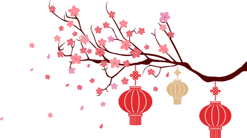

# 无标题

**链接地址:** http://mp.weixin.qq.com/s?__biz=MzI2NTE1ODgwOQ==&mid=2649605957&idx=1&sn=4ccdb74617d8e8c0aac9609a8da8139b&chksm=f2b8ceb3c5cf47a5446f1333774c4f058b506a14e477aebd5d4856fd4ac99af088de634cb32a&mpshare=1&scene=2&srcid=#rd
**作者:** 
**获取时间:** 2025/8/28 20:49:41
**图片数量:** 35

---

## 原始HTML内容

<section style="box-sizing: border-box;font-size: 16px;"><section style="box-sizing: border-box;" powered-by="xiumi.us"><section style="text-align: center;box-sizing: border-box;"><section style="display: inline-block;vertical-align: top;width: 18%;box-sizing: border-box;"><section style="box-sizing: border-box;" powered-by="xiumi.us"><section style="box-sizing: border-box;"><section style="display: inline-block;width: 50px;height: 50px;vertical-align: top;overflow: hidden;background-position: 50% 50%;background-repeat: no-repeat;background-size: contain;background-attachment: scroll;background-image: url(&quot;https://mmbiz.qpic.cn/mmbiz_png/D1nJqnhkPyIuDF3hmq00uJQMefDbQYguWT3icGibiblkfj8p0mZhdyhibEQbuboMDlUJericX5viaTqmOOV9rCvpvM0Q/640?wx_fmt=png&quot;);box-sizing: border-box;"><section style="box-sizing: border-box;" powered-by="xiumi.us"><section style="margin-top: 16px;margin-right: 0%;margin-left: 0%;box-sizing: border-box;"><section style="font-size: 18px;color: rgb(255, 255, 255);box-sizing: border-box;">
恭
</section></section></section></section></section></section></section><section style="display: inline-block;vertical-align: top;width: 18%;box-sizing: border-box;"><section style="box-sizing: border-box;" powered-by="xiumi.us"><section style="box-sizing: border-box;"><section style="display: inline-block;width: 50px;height: 50px;vertical-align: top;overflow: hidden;background-position: 50% 50%;background-repeat: no-repeat;background-size: contain;background-attachment: scroll;background-image: url(&quot;https://mmbiz.qpic.cn/mmbiz_png/D1nJqnhkPyIuDF3hmq00uJQMefDbQYguWT3icGibiblkfj8p0mZhdyhibEQbuboMDlUJericX5viaTqmOOV9rCvpvM0Q/640?wx_fmt=png&quot;);box-sizing: border-box;"><section style="box-sizing: border-box;" powered-by="xiumi.us"><section style="margin-top: 16px;margin-right: 0%;margin-left: 0%;box-sizing: border-box;"><section style="font-size: 18px;color: rgb(255, 255, 255);box-sizing: border-box;">
贺
</section></section></section></section></section></section></section><section style="display: inline-block;vertical-align: top;width: 18%;box-sizing: border-box;"><section style="box-sizing: border-box;" powered-by="xiumi.us"><section style="box-sizing: border-box;"><section style="display: inline-block;width: 50px;height: 50px;vertical-align: top;overflow: hidden;background-position: 50% 50%;background-repeat: no-repeat;background-size: contain;background-attachment: scroll;background-image: url(&quot;https://mmbiz.qpic.cn/mmbiz_png/D1nJqnhkPyIuDF3hmq00uJQMefDbQYguWT3icGibiblkfj8p0mZhdyhibEQbuboMDlUJericX5viaTqmOOV9rCvpvM0Q/640?wx_fmt=png&quot;);box-sizing: border-box;"><section style="box-sizing: border-box;" powered-by="xiumi.us"><section style="margin-top: 16px;margin-right: 0%;margin-left: 0%;box-sizing: border-box;"><section style="font-size: 18px;color: rgb(255, 255, 255);box-sizing: border-box;">
新
</section></section></section></section></section></section></section><section style="display: inline-block;vertical-align: top;width: 18%;box-sizing: border-box;"><section style="box-sizing: border-box;" powered-by="xiumi.us"><section style="box-sizing: border-box;"><section style="display: inline-block;width: 50px;height: 50px;vertical-align: top;overflow: hidden;background-position: 50% 50%;background-repeat: no-repeat;background-size: contain;background-attachment: scroll;background-image: url(&quot;https://mmbiz.qpic.cn/mmbiz_png/D1nJqnhkPyIuDF3hmq00uJQMefDbQYguWT3icGibiblkfj8p0mZhdyhibEQbuboMDlUJericX5viaTqmOOV9rCvpvM0Q/640?wx_fmt=png&quot;);box-sizing: border-box;"><section style="box-sizing: border-box;" powered-by="xiumi.us"><section style="margin-top: 16px;margin-right: 0%;margin-left: 0%;box-sizing: border-box;"><section style="font-size: 18px;color: rgb(255, 255, 255);box-sizing: border-box;">
春
</section></section></section></section></section></section></section></section></section><section style="box-sizing: border-box;" powered-by="xiumi.us"><section style="margin-top: 10px;margin-right: 0%;margin-left: 0%;box-sizing: border-box;"><section style="display: inline-block;vertical-align: bottom;width: 30%;box-sizing: border-box;"><section style="box-sizing: border-box;" powered-by="xiumi.us"><section style="text-align: right;margin-right: 0%;margin-left: 0%;box-sizing: border-box;"><section style="max-width: 100%;vertical-align: middle;display: inline-block;line-height: 0;width: 100%;box-sizing: border-box;"><svg class="svg" xmlns="http://www.w3.org/2000/svg" x="0px" y="0px" viewBox="0 0 404.7 104.2" style="vertical-align: middle;max-width: 100%;width: 100%;box-sizing: border-box;" width="100%"><g style="box-sizing: border-box;"><path style="box-sizing: border-box;" d="M70.4,67.5C70.4,31.9,99.3,3,134.9,3s64.5,28.9,64.5,64.5l-64.5,32L70.4,67.5z" fill="rgb(218,5,5)"></path><path style="box-sizing: border-box;" d="M205.3,67.5c0-35.6,28.9-64.5,64.5-64.5s64.5,28.9,64.5,64.5l-63.4,32L205.3,67.5z" fill="rgb(218,5,5)"></path><path style="box-sizing: border-box;" d="M137.8,104.2c0-35.6,28.9-64.5,64.5-64.5s64.5,28.9,64.5,64.5H137.8z" fill="rgb(218,5,5)"></path><path style="box-sizing: border-box;" d="M3,104.2c0-35.6,28.9-64.5,64.5-64.5S132,68.6,132,104.2H3z" fill="rgb(218,5,5)"></path><path style="box-sizing: border-box;" d="M272.8,104.2c0-35.6,28.9-64.5,64.5-64.5s64.5,28.9,64.5,64.5H272.8z" fill="rgb(218,5,5)"></path><g style="box-sizing: border-box;"><path style="box-sizing: border-box;" d="M67.5,54.4c-27.5,0-49.9,22.4-49.9,49.9h2.9c0-25.9,21.1-46.9,46.9-46.9    c25.9,0,46.9,21.1,46.9,46.9h2.9C117.3,76.7,94.9,54.4,67.5,54.4z" fill="rgb(255,183,102)"></path><path style="box-sizing: border-box;" d="M67.5,69.5c-19.2,0-34.7,15.6-34.7,34.7h2.9c0-17.5,14.3-31.8,31.8-31.8s31.8,14.3,31.8,31.8h2.9    C102.2,85.1,86.6,69.5,67.5,69.5z" fill="rgb(255,183,102)"></path><path style="box-sizing: border-box;" d="M67.5,83.7c-11.3,0-20.5,9.2-20.5,20.5h2.9c0-9.7,7.9-17.6,17.6-17.6s17.6,7.9,17.6,17.6H88    C88,92.9,78.8,83.7,67.5,83.7z" fill="rgb(255,183,102)"></path><path style="box-sizing: border-box;" d="M202.4,54.4c-27.5,0-49.9,22.4-49.9,49.9h2.9c0-25.9,21.1-46.9,46.9-46.9    c25.9,0,46.9,21.1,46.9,46.9h2.9C252.2,76.7,229.9,54.4,202.4,54.4z" fill="rgb(255,183,102)"></path><path style="box-sizing: border-box;" d="M202.4,69.5c-19.2,0-34.7,15.6-34.7,34.7h2.9c0-17.5,14.3-31.8,31.8-31.8s31.8,14.3,31.8,31.8h2.9    C237.1,85.1,221.5,69.5,202.4,69.5z" fill="rgb(255,183,102)"></path><path style="box-sizing: border-box;" d="M202.4,83.7c-11.3,0-20.5,9.2-20.5,20.5h2.9c0-9.7,7.9-17.6,17.6-17.6c9.7,0,17.6,7.9,17.6,17.6    h2.9C222.9,92.9,213.7,83.7,202.4,83.7z" fill="rgb(255,183,102)"></path><path style="box-sizing: border-box;" d="M337.3,36.8c-2.4,0-4.9,0.1-7.2,0.4C318.9,15.1,296.1,0,269.8,0s-49.1,15.1-60.2,37.2    c-2.4-0.3-4.8-0.4-7.2-0.4s-4.9,0.1-7.2,0.4C184,15.1,161.2,0,134.9,0S85.8,15.1,74.7,37.2c-2.4-0.3-4.8-0.4-7.2-0.4    C30.3,36.8,0,67,0,104.2h5.9c0-34,27.6-61.6,61.6-61.6c1.9,0,3.7,0.1,5.6,0.3l2,0.2c30.4,3.8,54,29.7,54,61.1h5.9    c0-16.7-6.1-31.9-16.1-43.7c2.7-6.3,8.9-10.7,16.1-10.7s13.4,4.4,16.1,10.7c-10,11.8-16.1,27-16.1,43.7h5.9    c0-34,27.6-61.6,61.6-61.6s61.6,27.6,61.6,61.6h5.9c0-16.7-6.1-31.9-16.1-43.7c2.7-6.3,8.9-10.7,16.1-10.7s13.5,4.4,16.2,10.7    c-10,11.8-16.2,27-16.2,43.7h5.9c0-34,27.6-61.6,61.6-61.6s61.6,27.6,61.6,61.6h5.9C404.7,67,374.5,36.8,337.3,36.8z M134.9,5.9    c23.3,0,43.6,13.1,54.1,32.2c-4,0.8-7.9,2-11.6,3.5c-8.8-14.3-24.5-24-42.5-24s-33.8,9.6-42.5,24c-3.7-1.5-7.6-2.7-11.6-3.5    C91.3,18.9,111.6,5.9,134.9,5.9z M174.7,42.8c-3.7,1.7-7.3,3.7-10.6,6c-6.2-9.6-16.9-16-29.2-16c-12.2,0-23,6.4-29.2,16    c-3.3-2.3-6.9-4.3-10.6-6c8.3-13.3,23-22.2,39.8-22.2C151.7,20.5,166.4,29.5,174.7,42.8z M153.2,58.2    c-3.4-6.7-10.3-11.3-18.3-11.3s-14.9,4.6-18.3,11.3c-2.6-2.8-5.5-5.4-8.5-7.7c5.6-8.9,15.5-14.8,26.8-14.8s21.2,6,26.8,14.8    C158.7,52.8,155.8,55.4,153.2,58.2z M269.8,5.9c23.3,0,43.6,13.1,54.1,32.2c-4,0.8-7.9,2-11.6,3.5c-8.8-14.3-24.5-24-42.5-24    s-33.7,9.7-42.5,24c-3.7-1.5-7.6-2.7-11.6-3.5C226.2,18.9,246.5,5.9,269.8,5.9z M309.6,42.8c-3.7,1.7-7.3,3.7-10.6,6    c-6.2-9.6-16.9-16-29.2-16s-23,6.4-29.2,16c-3.3-2.3-6.9-4.3-10.6-6c8.3-13.3,23-22.2,39.8-22.2C286.6,20.5,301.3,29.5,309.6,42.8    z M288.1,58.2c-3.4-6.7-10.3-11.2-18.3-11.2s-14.9,4.6-18.3,11.2c-2.6-2.8-5.5-5.4-8.5-7.7c5.6-8.9,15.5-14.8,26.8-14.8    c11.3,0,21.2,6,26.8,14.8C293.6,52.8,290.7,55.4,288.1,58.2z" fill="rgb(255,183,102)"></path><path style="box-sizing: border-box;" d="M337.3,54.4c-27.5,0-49.9,22.4-49.9,49.9h2.9c0-25.9,21.1-46.9,46.9-46.9    c25.9,0,46.9,21.1,46.9,46.9h2.9C387.1,76.7,364.8,54.4,337.3,54.4z" fill="rgb(255,183,102)"></path><path style="box-sizing: border-box;" d="M337.3,69.5c-19.2,0-34.7,15.6-34.7,34.7h2.9c0-17.5,14.3-31.8,31.8-31.8s31.8,14.3,31.8,31.8h2.9    C372,85.1,356.4,69.5,337.3,69.5z" fill="rgb(255,183,102)"></path><path style="box-sizing: border-box;" d="M337.3,83.7c-11.3,0-20.5,9.2-20.5,20.5h2.9c0-9.7,7.9-17.6,17.6-17.6s17.6,7.9,17.6,17.6h2.9    C357.8,92.9,348.6,83.7,337.3,83.7z" fill="rgb(255,183,102)"></path></g></g></svg></section></section></section></section><section class="group-empty" style="display: inline-block;vertical-align: bottom;width: 40%;box-sizing: border-box;height: 1px;"></section><section style="display: inline-block;vertical-align: bottom;width: 30%;box-sizing: border-box;"><section style="box-sizing: border-box;" powered-by="xiumi.us"><section style="text-align: right;margin-right: 0%;margin-left: 0%;box-sizing: border-box;"><section style="max-width: 100%;vertical-align: middle;display: inline-block;line-height: 0;width: 100%;box-sizing: border-box;"><svg class="svg" xmlns="http://www.w3.org/2000/svg" x="0px" y="0px" viewBox="0 0 404.7 104.2" style="vertical-align: middle;max-width: 100%;width: 100%;box-sizing: border-box;" width="100%"><g style="box-sizing: border-box;"><path style="box-sizing: border-box;" d="M70.4,67.5C70.4,31.9,99.3,3,134.9,3s64.5,28.9,64.5,64.5l-64.5,32L70.4,67.5z" fill="rgb(218,5,5)"></path><path style="box-sizing: border-box;" d="M205.3,67.5c0-35.6,28.9-64.5,64.5-64.5s64.5,28.9,64.5,64.5l-63.4,32L205.3,67.5z" fill="rgb(218,5,5)"></path><path style="box-sizing: border-box;" d="M137.8,104.2c0-35.6,28.9-64.5,64.5-64.5s64.5,28.9,64.5,64.5H137.8z" fill="rgb(218,5,5)"></path><path style="box-sizing: border-box;" d="M3,104.2c0-35.6,28.9-64.5,64.5-64.5S132,68.6,132,104.2H3z" fill="rgb(218,5,5)"></path><path style="box-sizing: border-box;" d="M272.8,104.2c0-35.6,28.9-64.5,64.5-64.5s64.5,28.9,64.5,64.5H272.8z" fill="rgb(218,5,5)"></path><g style="box-sizing: border-box;"><path style="box-sizing: border-box;" d="M67.5,54.4c-27.5,0-49.9,22.4-49.9,49.9h2.9c0-25.9,21.1-46.9,46.9-46.9    c25.9,0,46.9,21.1,46.9,46.9h2.9C117.3,76.7,94.9,54.4,67.5,54.4z" fill="rgb(255,183,102)"></path><path style="box-sizing: border-box;" d="M67.5,69.5c-19.2,0-34.7,15.6-34.7,34.7h2.9c0-17.5,14.3-31.8,31.8-31.8s31.8,14.3,31.8,31.8h2.9    C102.2,85.1,86.6,69.5,67.5,69.5z" fill="rgb(255,183,102)"></path><path style="box-sizing: border-box;" d="M67.5,83.7c-11.3,0-20.5,9.2-20.5,20.5h2.9c0-9.7,7.9-17.6,17.6-17.6s17.6,7.9,17.6,17.6H88    C88,92.9,78.8,83.7,67.5,83.7z" fill="rgb(255,183,102)"></path><path style="box-sizing: border-box;" d="M202.4,54.4c-27.5,0-49.9,22.4-49.9,49.9h2.9c0-25.9,21.1-46.9,46.9-46.9    c25.9,0,46.9,21.1,46.9,46.9h2.9C252.2,76.7,229.9,54.4,202.4,54.4z" fill="rgb(255,183,102)"></path><path style="box-sizing: border-box;" d="M202.4,69.5c-19.2,0-34.7,15.6-34.7,34.7h2.9c0-17.5,14.3-31.8,31.8-31.8s31.8,14.3,31.8,31.8h2.9    C237.1,85.1,221.5,69.5,202.4,69.5z" fill="rgb(255,183,102)"></path><path style="box-sizing: border-box;" d="M202.4,83.7c-11.3,0-20.5,9.2-20.5,20.5h2.9c0-9.7,7.9-17.6,17.6-17.6c9.7,0,17.6,7.9,17.6,17.6    h2.9C222.9,92.9,213.7,83.7,202.4,83.7z" fill="rgb(255,183,102)"></path><path style="box-sizing: border-box;" d="M337.3,36.8c-2.4,0-4.9,0.1-7.2,0.4C318.9,15.1,296.1,0,269.8,0s-49.1,15.1-60.2,37.2    c-2.4-0.3-4.8-0.4-7.2-0.4s-4.9,0.1-7.2,0.4C184,15.1,161.2,0,134.9,0S85.8,15.1,74.7,37.2c-2.4-0.3-4.8-0.4-7.2-0.4    C30.3,36.8,0,67,0,104.2h5.9c0-34,27.6-61.6,61.6-61.6c1.9,0,3.7,0.1,5.6,0.3l2,0.2c30.4,3.8,54,29.7,54,61.1h5.9    c0-16.7-6.1-31.9-16.1-43.7c2.7-6.3,8.9-10.7,16.1-10.7s13.4,4.4,16.1,10.7c-10,11.8-16.1,27-16.1,43.7h5.9    c0-34,27.6-61.6,61.6-61.6s61.6,27.6,61.6,61.6h5.9c0-16.7-6.1-31.9-16.1-43.7c2.7-6.3,8.9-10.7,16.1-10.7s13.5,4.4,16.2,10.7    c-10,11.8-16.2,27-16.2,43.7h5.9c0-34,27.6-61.6,61.6-61.6s61.6,27.6,61.6,61.6h5.9C404.7,67,374.5,36.8,337.3,36.8z M134.9,5.9    c23.3,0,43.6,13.1,54.1,32.2c-4,0.8-7.9,2-11.6,3.5c-8.8-14.3-24.5-24-42.5-24s-33.8,9.6-42.5,24c-3.7-1.5-7.6-2.7-11.6-3.5    C91.3,18.9,111.6,5.9,134.9,5.9z M174.7,42.8c-3.7,1.7-7.3,3.7-10.6,6c-6.2-9.6-16.9-16-29.2-16c-12.2,0-23,6.4-29.2,16    c-3.3-2.3-6.9-4.3-10.6-6c8.3-13.3,23-22.2,39.8-22.2C151.7,20.5,166.4,29.5,174.7,42.8z M153.2,58.2    c-3.4-6.7-10.3-11.3-18.3-11.3s-14.9,4.6-18.3,11.3c-2.6-2.8-5.5-5.4-8.5-7.7c5.6-8.9,15.5-14.8,26.8-14.8s21.2,6,26.8,14.8    C158.7,52.8,155.8,55.4,153.2,58.2z M269.8,5.9c23.3,0,43.6,13.1,54.1,32.2c-4,0.8-7.9,2-11.6,3.5c-8.8-14.3-24.5-24-42.5-24    s-33.7,9.7-42.5,24c-3.7-1.5-7.6-2.7-11.6-3.5C226.2,18.9,246.5,5.9,269.8,5.9z M309.6,42.8c-3.7,1.7-7.3,3.7-10.6,6    c-6.2-9.6-16.9-16-29.2-16s-23,6.4-29.2,16c-3.3-2.3-6.9-4.3-10.6-6c8.3-13.3,23-22.2,39.8-22.2C286.6,20.5,301.3,29.5,309.6,42.8    z M288.1,58.2c-3.4-6.7-10.3-11.2-18.3-11.2s-14.9,4.6-18.3,11.2c-2.6-2.8-5.5-5.4-8.5-7.7c5.6-8.9,15.5-14.8,26.8-14.8    c11.3,0,21.2,6,26.8,14.8C293.6,52.8,290.7,55.4,288.1,58.2z" fill="rgb(255,183,102)"></path><path style="box-sizing: border-box;" d="M337.3,54.4c-27.5,0-49.9,22.4-49.9,49.9h2.9c0-25.9,21.1-46.9,46.9-46.9    c25.9,0,46.9,21.1,46.9,46.9h2.9C387.1,76.7,364.8,54.4,337.3,54.4z" fill="rgb(255,183,102)"></path><path style="box-sizing: border-box;" d="M337.3,69.5c-19.2,0-34.7,15.6-34.7,34.7h2.9c0-17.5,14.3-31.8,31.8-31.8s31.8,14.3,31.8,31.8h2.9    C372,85.1,356.4,69.5,337.3,69.5z" fill="rgb(255,183,102)"></path><path style="box-sizing: border-box;" d="M337.3,83.7c-11.3,0-20.5,9.2-20.5,20.5h2.9c0-9.7,7.9-17.6,17.6-17.6s17.6,7.9,17.6,17.6h2.9    C357.8,92.9,348.6,83.7,337.3,83.7z" fill="rgb(255,183,102)"></path></g></g></svg></section></section></section></section></section></section><section style="box-sizing: border-box;" powered-by="xiumi.us"><section style="margin-right: 0%;margin-bottom: 10px;margin-left: 0%;box-sizing: border-box;"><section style="display: inline-block;width: 100%;vertical-align: top;background-color: rgb(218, 5, 5);border-color: rgb(255, 183, 102);border-width: 2px;border-radius: 0px;border-style: solid;letter-spacing: 0px;padding: 5px;box-sizing: border-box;"><section style="box-sizing: border-box;" powered-by="xiumi.us"><section style="box-sizing: border-box;"><section style="display: inline-block;width: 100%;vertical-align: top;padding: 5px;border-style: solid;border-width: 1px;border-radius: 0px;border-color: rgb(255, 183, 102);box-sizing: border-box;"><section style="box-sizing: border-box;" powered-by="xiumi.us"><section style="text-align: center;margin-right: 0%;margin-left: 0%;box-sizing: border-box;"><section style="max-width: 100%;vertical-align: middle;display: inline-block;line-height: 0;border-color: rgb(255, 183, 102);border-width: 1px;border-radius: 0px;border-style: solid;box-sizing: border-box;"></section></section></section></section></section></section></section></section></section><section style="box-sizing: border-box;" powered-by="xiumi.us"><section style="margin: 20px 0%;box-sizing: border-box;"><section style="display: inline-block;vertical-align: middle;width: 20%;box-sizing: border-box;"><section style="box-sizing: border-box;" powered-by="xiumi.us"><section style="margin-right: 0%;margin-left: 0%;text-align: center;font-size: 10px;box-sizing: border-box;"><section style="display: inline-block;vertical-align: middle;padding: 5px;box-sizing: border-box;"><section style="width: 1.2em;height: 1.2em;border-width: 2px;border-style: solid;border-color: rgb(249, 110, 87);transform: rotate(45deg);box-sizing: border-box;"></section><section style="width: 1.2em;height: 1.2em;border-width: 2px;border-style: solid;border-color: rgb(249, 110, 87);margin-top: -0.5em;transform: rotate(45deg);box-sizing: border-box;"></section></section></section></section><section style="box-sizing: border-box;" powered-by="xiumi.us"><section style="margin-top: 3px;margin-bottom: 3px;text-align: center;box-sizing: border-box;"><section style="display: inline-block;border-width: 1px;border-style: solid;border-color: rgb(249, 110, 87);background-color: rgb(197, 36, 36);width: 1.8em;height: 1.8em;line-height: 1.8em;border-radius: 100%;margin-left: auto;margin-right: auto;font-size: 18px;color: rgb(255, 255, 255);box-sizing: border-box;">
春
</section></section></section><section style="box-sizing: border-box;" powered-by="xiumi.us"><section style="margin-top: 3px;margin-bottom: 3px;text-align: center;box-sizing: border-box;"><section style="display: inline-block;border-width: 1px;border-style: solid;border-color: rgb(249, 110, 87);background-color: rgb(197, 36, 36);width: 1.8em;height: 1.8em;line-height: 1.8em;border-radius: 100%;margin-left: auto;margin-right: auto;font-size: 18px;color: rgb(255, 255, 255);box-sizing: border-box;">
节
</section></section></section><section style="box-sizing: border-box;" powered-by="xiumi.us"><section style="margin-top: 3px;margin-bottom: 3px;text-align: center;box-sizing: border-box;"><section style="display: inline-block;border-width: 1px;border-style: solid;border-color: rgb(249, 110, 87);background-color: rgb(197, 36, 36);width: 1.8em;height: 1.8em;line-height: 1.8em;border-radius: 100%;margin-left: auto;margin-right: auto;font-size: 18px;color: rgb(255, 255, 255);box-sizing: border-box;">
到
</section></section></section><section style="box-sizing: border-box;" powered-by="xiumi.us"><section style="margin-right: 0%;margin-left: 0%;text-align: center;font-size: 10px;box-sizing: border-box;"><section style="display: inline-block;vertical-align: middle;padding: 5px;box-sizing: border-box;"><section style="width: 1.2em;height: 1.2em;border-width: 2px;border-style: solid;border-color: rgb(249, 110, 87);transform: rotate(45deg);box-sizing: border-box;"></section><section style="width: 1.2em;height: 1.2em;border-width: 2px;border-style: solid;border-color: rgb(249, 110, 87);margin-top: -0.5em;transform: rotate(45deg);box-sizing: border-box;"></section></section></section></section></section><section style="display: inline-block;vertical-align: middle;width: 80%;border-width: 0px;border-radius: 0px;padding-left: 5px;box-sizing: border-box;"><section style="box-sizing: border-box;" powered-by="xiumi.us"><section style="margin: 10px 0%;text-align: right;box-sizing: border-box;"><section style="display: inline-block;width: 100%;vertical-align: top;border-width: 1px;border-radius: 2px;background-color: rgb(227, 206, 139);padding: 10px;border-style: solid;border-color: rgba(255, 255, 255, 0);box-sizing: border-box;"><section style="box-sizing: border-box;" powered-by="xiumi.us"><section style="box-sizing: border-box;"><section style="text-align: justify;font-size: 14px;color: rgb(85, 18, 18);letter-spacing: 2px;box-sizing: border-box;">
春节，对于身在海外的华人来说是情结，是对故土的眷恋牵挂，它不仅仅是一个节日，而是<strong style="box-sizing: border-box;">普天下炎黄子孙对美好明天的祝福和期待</strong>，它就像纽带，把我们的心和祖国紧紧联系在一起。
</section></section></section></section></section></section></section></section></section><section style="height: auto;box-sizing: border-box;" powered-by="xiumi.us"><section style="min-height: 40px;margin: 25px 0% 10px;box-sizing: border-box;"><section style="width: 100%;margin-right: auto;margin-left: auto;box-sizing: border-box;"><table class="table-box" width="100%"><tbody style="box-sizing: border-box;"><tr style="box-sizing: border-box;" powered-by="xiumi.us"><td colspan="1" rowspan="1" style="border-width: 0px;border-color: rgb(62, 62, 62);border-radius: 8px;border-style: none;vertical-align: middle;background-color: rgb(255, 224, 130);overflow: hidden;box-sizing: border-box;padding: 0px;" width="2.0000%"> </td><td colspan="1" rowspan="1" style="border-top-width: 10px;border-bottom-width: 10px;border-color: rgb(255, 255, 255) rgb(62, 62, 62);border-radius: 0px;border-right-style: none;border-left-style: none;padding-top: 0px;padding-bottom: 10px;vertical-align: middle;background-color: rgb(255, 193, 7);box-sizing: border-box;" width="92.3800%"><section style="box-sizing: border-box;" powered-by="xiumi.us"><section style="text-align: center;margin-top: -25px;margin-right: 0%;margin-left: 0%;box-sizing: border-box;"><section style="display: inline-block;vertical-align: top;width: 18%;box-sizing: border-box;"><section style="box-sizing: border-box;" powered-by="xiumi.us"><section style="margin-right: 0%;margin-left: 0%;font-size: 10px;box-sizing: border-box;"><section style="padding: 4px;display: inline-block;border-radius: 100%;background-color: rgb(196, 41, 28);box-sizing: border-box;"><section style="border-radius: 100%;border-color: rgb(244, 201, 146);width: 2em;height: 2em;border-style: solid;border-width: 2px;font-size: 18px;line-height: 1.8em;color: rgb(255, 255, 255);box-sizing: border-box;">
恭
</section></section></section></section></section><section style="display: inline-block;vertical-align: top;width: 18%;box-sizing: border-box;"><section style="box-sizing: border-box;" powered-by="xiumi.us"><section style="margin-right: 0%;margin-left: 0%;font-size: 10px;box-sizing: border-box;"><section style="padding: 4px;display: inline-block;border-radius: 100%;background-color: rgb(196, 41, 28);box-sizing: border-box;"><section style="border-radius: 100%;border-color: rgb(244, 201, 146);width: 2em;height: 2em;border-style: solid;border-width: 2px;font-size: 18px;line-height: 1.8em;color: rgb(255, 255, 255);box-sizing: border-box;">
贺
</section></section></section></section></section><section style="display: inline-block;vertical-align: top;width: 18%;box-sizing: border-box;"><section style="box-sizing: border-box;" powered-by="xiumi.us"><section style="margin-right: 0%;margin-left: 0%;font-size: 10px;box-sizing: border-box;"><section style="padding: 4px;display: inline-block;border-radius: 100%;background-color: rgb(196, 41, 28);box-sizing: border-box;"><section style="border-radius: 100%;border-color: rgb(244, 201, 146);width: 2em;height: 2em;border-style: solid;border-width: 2px;font-size: 18px;line-height: 1.8em;color: rgb(255, 255, 255);box-sizing: border-box;">
新
</section></section></section></section></section><section style="display: inline-block;vertical-align: top;width: 18%;box-sizing: border-box;"><section style="box-sizing: border-box;" powered-by="xiumi.us"><section style="margin-right: 0%;margin-left: 0%;font-size: 10px;box-sizing: border-box;"><section style="padding: 4px;display: inline-block;border-radius: 100%;background-color: rgb(196, 41, 28);box-sizing: border-box;"><section style="border-radius: 100%;border-color: rgb(244, 201, 146);width: 2em;height: 2em;border-style: solid;border-width: 2px;font-size: 18px;line-height: 1.8em;color: rgb(255, 255, 255);box-sizing: border-box;">
春
</section></section></section></section></section></section></section><section style="box-sizing: border-box;" powered-by="xiumi.us"><section style="text-align: center;margin-top: 10px;margin-right: 0%;margin-left: 0%;box-sizing: border-box;"><section style="max-width: 100%;vertical-align: middle;display: inline-block;line-height: 0;border-color: rgb(255, 183, 102);border-width: 0px;border-radius: 0px;border-style: none;box-sizing: border-box;"></section></section></section></td><td colspan="1" rowspan="1" style="border-width: 0px;border-color: rgb(62, 62, 62);border-radius: 8px;border-style: none;vertical-align: middle;background-color: rgb(255, 224, 130);overflow: hidden;box-sizing: border-box;padding: 0px;" width="2.0000%"> </td></tr></tbody></table></section></section></section><section style="box-sizing: border-box;" powered-by="xiumi.us"><section style="margin: 20px 0%;box-sizing: border-box;"><section style="font-size: 14px;letter-spacing: 2px;padding-right: 10px;padding-left: 10px;box-sizing: border-box;">
<strong style="box-sizing: border-box;">2019爱城春晚</strong>已经盛大启动，热切期待您和亲朋好友成为欢聚一堂的重要成员，在暖暖的氛围中欢送猴年，<strong style="box-sizing: border-box;">迎来吉祥如意的金猪年</strong>。
</section></section></section><section style="box-sizing: border-box;" powered-by="xiumi.us"><section style="margin-top: 10px;margin-bottom: 10px;text-align: center;box-sizing: border-box;"><section style="width: 3em;margin-right: -1.2em;margin-top: 2px;display: inline-block;vertical-align: middle;transform: rotate(0deg);-webkit-transform: rotate(0deg);-moz-transform: rotate(0deg);-o-transform: rotate(0deg);line-height: 0;box-sizing: border-box;"></section><section style="border-radius: 100%;display: inline-block;vertical-align: middle;background-color: rgb(249, 110, 87);width: 1.8em;height: 1.8em;font-size: 42px;line-height: 1.8em;color: rgb(255, 255, 255);box-sizing: border-box;">
贺
</section></section></section><section style="box-sizing: border-box;" powered-by="xiumi.us"><section style="margin-top: 10px;margin-bottom: 10px;box-sizing: border-box;"><section style="line-height: 1em;box-sizing: border-box;"><section style="display: inline-block;vertical-align: middle;transform: rotate(0deg);width: 1em;height: 1em;padding: 0.2em;border-width: 0.14em;border-style: solid;border-color: rgb(249, 110, 87);background-color: rgb(255, 255, 255);box-sizing: border-box;"><section style="width: 100%;height: 100%;background-color: rgb(249, 110, 87);box-sizing: border-box;"></section></section><section style="display: inline-block;vertical-align: middle;width: 100%;height: 0.14em;margin-right: -1em;margin-left: -1em;background-color: rgb(249, 110, 87);box-sizing: border-box;"></section><section style="display: inline-block;vertical-align: middle;width: 1em;height: 1em;padding: 0.2em;border-width: 0.14em;border-style: solid;border-color: rgb(249, 110, 87);background-color: rgb(255, 255, 255);box-sizing: border-box;"><section style="width: 100%;height: 100%;background-color: rgb(249, 110, 87);box-sizing: border-box;"></section></section></section><section style="padding-right: 0.5em;padding-left: 0.5em;margin-top: -0.14em;margin-bottom: -0.21em;box-sizing: border-box;"><section style="border-width: 2px;border-style: solid;border-color: rgb(249, 110, 87);box-sizing: border-box;"><section style="box-sizing: border-box;" powered-by="xiumi.us"><section style="padding: 10px;box-sizing: border-box;"><section style="text-align: center;font-size: 14px;padding-right: 10px;padding-left: 10px;letter-spacing: 2px;box-sizing: border-box;">
由<strong style="box-sizing: border-box;">16</strong><strong style="box-sizing: border-box;">家爱城新老社团联合鼎力打造</strong>，<strong style="box-sizing: border-box;">由孔子学院、中华会馆、统促会、加中友协、潮州同乡会、美旋律、爱城京剧研习社等16家新老社团联合30余家文艺团体的近300名演员鼎力打造。</strong>最高比例的爱城卡城温哥华三地专业演员参演的「2019爱城春晚」消息三周前一公布，立刻<strong style="box-sizing: border-box;">引起爱城华人圈的强烈关注和热议</strong>，售票速度也扶摇直上！目前售票已经接近尾声，相信很快将会出现一票难求、洛阳纸贵的局面。

 

大家的热心和支持，极大地鼓舞了春晚两位总导演的工作热情，他们<strong style="box-sizing: border-box;">圣诞元旦假期都没有休息</strong>，一直在审核节目和策划晚会内容。
</section></section></section></section></section><section style="line-height: 1em;box-sizing: border-box;"><section style="display: inline-block;vertical-align: middle;transform: rotate(0deg);width: 1em;height: 1em;padding: 0.2em;border-width: 0.14em;border-style: solid;border-color: rgb(249, 110, 87);background-color: rgb(255, 255, 255);box-sizing: border-box;"><section style="width: 100%;height: 100%;background-color: rgb(249, 110, 87);box-sizing: border-box;"></section></section><section style="display: inline-block;vertical-align: middle;width: 100%;height: 0.14em;margin-right: -1em;margin-left: -1em;background-color: rgb(249, 110, 87);box-sizing: border-box;"></section><section style="display: inline-block;vertical-align: middle;width: 1em;height: 1em;padding: 0.2em;border-width: 0.14em;border-style: solid;border-color: rgb(249, 110, 87);background-color: rgb(255, 255, 255);box-sizing: border-box;"><section style="width: 100%;height: 100%;background-color: rgb(249, 110, 87);box-sizing: border-box;"></section></section></section></section></section><section style="box-sizing: border-box;" powered-by="xiumi.us"><section style="margin: 20px 0%;box-sizing: border-box;"><section style="display: inline-block;vertical-align: middle;width: 85%;box-sizing: border-box;"><section style="box-sizing: border-box;" powered-by="xiumi.us"><section style="text-align: right;margin-right: 0%;margin-left: 0%;box-sizing: border-box;"><section style="max-width: 100%;vertical-align: middle;display: inline-block;line-height: 0;width: 100%;box-sizing: border-box;"></section></section></section></section><section style="display: inline-block;vertical-align: middle;width: 15%;box-sizing: border-box;"><section style="box-sizing: border-box;" powered-by="xiumi.us"><section style="margin-right: 0%;margin-left: 0%;padding-top: 8px;padding-bottom: 8px;text-align: center;font-size: 11px;box-sizing: border-box;"><section style="padding: 4px;display: inline-block;transform: rotate(45deg);-webkit-transform: rotate(45deg);-moz-transform: rotate(45deg);-o-transform: rotate(45deg);background-color: rgb(249, 110, 87);box-sizing: border-box;"><section style="border-width: 1px;border-style: solid;border-color: rgba(255, 255, 255, 0);box-sizing: border-box;"><section style="transform: rotate(-45deg);-webkit-transform: rotate(-45deg);-moz-transform: rotate(-45deg);-o-transform: rotate(-45deg);width: 1.3em;height: 1.3em;font-size: 13px;line-height: 1.5em;color: rgb(255, 255, 255);box-sizing: border-box;">
欢
</section></section></section></section></section><section style="box-sizing: border-box;" powered-by="xiumi.us"><section style="margin-right: 0%;margin-left: 0%;padding-top: 8px;padding-bottom: 8px;text-align: center;font-size: 11px;box-sizing: border-box;"><section style="padding: 4px;display: inline-block;transform: rotate(45deg);-webkit-transform: rotate(45deg);-moz-transform: rotate(45deg);-o-transform: rotate(45deg);background-color: rgb(249, 110, 87);box-sizing: border-box;"><section style="border-width: 1px;border-style: solid;border-color: rgba(255, 255, 255, 0);box-sizing: border-box;"><section style="transform: rotate(-45deg);-webkit-transform: rotate(-45deg);-moz-transform: rotate(-45deg);-o-transform: rotate(-45deg);width: 1.3em;height: 1.3em;font-size: 13px;line-height: 1.5em;color: rgb(255, 255, 255);box-sizing: border-box;">
度
</section></section></section></section></section><section style="box-sizing: border-box;" powered-by="xiumi.us"><section style="margin-right: 0%;margin-left: 0%;padding-top: 8px;padding-bottom: 8px;text-align: center;font-size: 11px;box-sizing: border-box;"><section style="padding: 4px;display: inline-block;transform: rotate(45deg);-webkit-transform: rotate(45deg);-moz-transform: rotate(45deg);-o-transform: rotate(45deg);background-color: rgb(249, 110, 87);box-sizing: border-box;"><section style="border-width: 1px;border-style: solid;border-color: rgba(255, 255, 255, 0);box-sizing: border-box;"><section style="transform: rotate(-45deg);-webkit-transform: rotate(-45deg);-moz-transform: rotate(-45deg);-o-transform: rotate(-45deg);width: 1.3em;height: 1.3em;font-size: 13px;line-height: 1.5em;color: rgb(255, 255, 255);box-sizing: border-box;">
佳
</section></section></section></section></section><section style="box-sizing: border-box;" powered-by="xiumi.us"><section style="margin-right: 0%;margin-left: 0%;padding-top: 8px;padding-bottom: 8px;text-align: center;font-size: 11px;box-sizing: border-box;"><section style="padding: 4px;display: inline-block;transform: rotate(45deg);-webkit-transform: rotate(45deg);-moz-transform: rotate(45deg);-o-transform: rotate(45deg);background-color: rgb(249, 110, 87);box-sizing: border-box;"><section style="border-width: 1px;border-style: solid;border-color: rgba(255, 255, 255, 0);box-sizing: border-box;"><section style="transform: rotate(-45deg);-webkit-transform: rotate(-45deg);-moz-transform: rotate(-45deg);-o-transform: rotate(-45deg);width: 1.3em;height: 1.3em;font-size: 13px;line-height: 1.5em;color: rgb(255, 255, 255);box-sizing: border-box;">
节
</section></section></section></section></section></section></section></section><section style="box-sizing: border-box;" powered-by="xiumi.us"><section style="margin-top: 10px;margin-bottom: 10px;text-align: center;box-sizing: border-box;"><section style="width: 2.2em;margin-right: -1.1em;transform: rotate(0deg);-webkit-transform: rotate(0deg);-moz-transform: rotate(0deg);-o-transform: rotate(0deg);display: inline-block;vertical-align: top;box-sizing: border-box;"><section style="max-width: 100%;display: inline-block;line-height: 0;box-sizing: border-box;"></section></section><section style="border-width: 1px;border-style: solid;border-color: rgb(249, 110, 87);padding: 2px;margin-top: 0.9em;display: inline-block;vertical-align: middle;box-sizing: border-box;"><section style="border-width: 1px;border-style: solid;border-color: rgb(249, 110, 87);color: rgb(217, 162, 97);padding-left: 5px;padding-right: 5px;letter-spacing: 2px;box-sizing: border-box;">
<strong style="box-sizing: border-box;">组织团队</strong>
</section></section></section></section><section style="box-sizing: border-box;" powered-by="xiumi.us"><section style="box-sizing: border-box;"><section style="display: inline-block;width: 100%;vertical-align: top;padding: 5px;border-style: solid;border-width: 1px;border-radius: 0px;border-color: rgb(255, 183, 102);box-sizing: border-box;"><section style="box-sizing: border-box;" powered-by="xiumi.us"><section style="text-align: center;margin-right: 0%;margin-left: 0%;box-sizing: border-box;"><section style="max-width: 100%;vertical-align: middle;display: inline-block;line-height: 0;border-color: rgb(255, 183, 102);border-width: 2px;border-radius: 0px;border-style: solid;box-shadow: rgb(0, 0, 0) 0px 0px 0px;box-sizing: border-box;"></section></section></section></section></section></section><section style="box-sizing: border-box;" powered-by="xiumi.us"><section style="margin: 20px 0%;box-sizing: border-box;"><section style="font-size: 14px;letter-spacing: 2px;padding-right: 10px;padding-left: 10px;box-sizing: border-box;">
<strong style="box-sizing: border-box;">杜晓鹂</strong>，原中国歌剧舞剧院著名<strong style="box-sizing: border-box;">女高音歌唱家</strong>，并以此身份<strong style="box-sizing: border-box;">多次</strong><strong style="box-sizing: border-box;">参加每年一度的央视春晚</strong>。曾于美国纽约茱莉亚音乐学院进修，在意大利专家班学习声乐。

 

其在世界亚洲歌剧节经典舞台剧《天鹅之死》中担任女主角，曾在美国加拿大等多个城市举办个人音乐会、多次参加大型音乐节演出，温州大学声乐系客座教授、中国艺术家音响出版社出版其个人专辑。

 

在爱城其执教<strong style="box-sizing: border-box;">四个成人音乐社团</strong>，并参与创办了“<strong style="box-sizing: border-box;">北辰组合社团</strong>”，其中成立了“<strong style="box-sizing: border-box;">小百花少儿合唱团</strong>。”
</section></section></section><section style="box-sizing: border-box;" powered-by="xiumi.us"><section style="box-sizing: border-box;"><section style="display: inline-block;width: 100%;vertical-align: top;padding: 5px;border-style: solid;border-width: 1px;border-radius: 0px;border-color: rgb(255, 183, 102);box-sizing: border-box;"><section style="box-sizing: border-box;" powered-by="xiumi.us"><section style="text-align: center;margin-right: 0%;margin-left: 0%;box-sizing: border-box;"><section style="max-width: 100%;vertical-align: middle;display: inline-block;line-height: 0;border-color: rgb(255, 183, 102);border-width: 1px;border-radius: 0px;border-style: solid;box-shadow: rgb(0, 0, 0) 0px 0px 0px;box-sizing: border-box;"></section></section></section></section></section></section><section style="box-sizing: border-box;" powered-by="xiumi.us"><section style="margin: 20px 0%;box-sizing: border-box;"><section style="font-size: 14px;letter-spacing: 2px;padding-right: 10px;padding-left: 10px;box-sizing: border-box;">
<strong style="box-sizing: border-box;">张振农</strong>，阿省<strong style="box-sizing: border-box;">著名钢琴表演艺术家</strong>，2010年<strong style="box-sizing: border-box;">埃德蒙顿惟一艺术成就奖获者</strong>。上海音乐学院钢琴系毕业，先后师从著名演奏家李民铎教授和阿省大学音乐系 Dr. Helmut Brauss 【德】教授。

 

在埃德蒙顿和卡尔加里音乐厅、歌剧院<strong style="box-sizing: border-box;">成功组织过几十场大型晚会和音乐会</strong>。现定居温哥华，其参与创办的温哥华音乐团队“<strong style="box-sizing: border-box;">音符乐队</strong>”在当地颇负盛名，并多次举办慈善演出。
</section></section></section><section style="height: auto;box-sizing: border-box;" powered-by="xiumi.us"><section style="min-height: 40px;margin: 10px 0%;box-sizing: border-box;"><section style="width: 100%;margin-right: auto;margin-left: auto;box-sizing: border-box;"><table class="table-box" width="100%"><tbody style="box-sizing: border-box;"><tr style="box-sizing: border-box;" powered-by="xiumi.us"><td colspan="1" rowspan="1" style="border-width: 0px;border-color: rgb(62, 62, 62);border-radius: 8px;border-style: none;vertical-align: middle;background-color: rgb(226, 29, 29);overflow: hidden;box-sizing: border-box;padding: 0px;" width="2.0000%"> </td><td colspan="1" rowspan="1" style="border-top-width: 10px;border-bottom-width: 10px;border-color: rgb(255, 255, 255) rgb(62, 62, 62);border-radius: 0px;border-right-style: none;border-left-style: none;padding-top: 10px;padding-bottom: 10px;vertical-align: middle;background-color: rgb(255, 237, 214);box-sizing: border-box;" width="92.3800%"><section style="box-sizing: border-box;" powered-by="xiumi.us"><section style="box-sizing: border-box;"><section style="font-size: 14px;color: rgb(62, 62, 62);line-height: 1.8;letter-spacing: 2px;box-sizing: border-box;">
据了解，总导演杜晓鹂与舞台总监张振农先生并不是第一次合作，早在十年前二人合作导演并监制了“爱城华人共庆60周年华诞音乐会”，那台晚会的经典呈现，至今仍被观众深记：音乐、旋律、舞台与辉煌，被烘托得恰到好处，晚会主题也在那一夜深入人心。十年前的经典，埋下了十年后的祈盼，两位艺术家的再度握手，令人无限期待会碰撞出怎样一幕的火花四溅、激情飞扬……
</section></section></section></td><td colspan="1" rowspan="1" style="border-width: 0px;border-color: rgb(62, 62, 62);border-radius: 8px;border-style: none;vertical-align: middle;background-color: rgb(226, 29, 29);overflow: hidden;box-sizing: border-box;padding: 0px;" width="2.0000%"> </td></tr></tbody></table></section></section></section><section style="box-sizing: border-box;" powered-by="xiumi.us"><section style="box-sizing: border-box;"><section style="box-sizing: border-box;">
 
</section></section></section><section style="box-sizing: border-box;" powered-by="xiumi.us"><section style="margin-top: 10px;margin-bottom: 10px;text-align: center;box-sizing: border-box;"><section style="width: 2.2em;margin-right: -1.1em;transform: rotate(0deg);-webkit-transform: rotate(0deg);-moz-transform: rotate(0deg);-o-transform: rotate(0deg);display: inline-block;vertical-align: top;box-sizing: border-box;"><section style="max-width: 100%;display: inline-block;line-height: 0;box-sizing: border-box;"></section></section><section style="border-width: 1px;border-style: solid;border-color: rgb(249, 110, 87);padding: 2px;margin-top: 0.9em;display: inline-block;vertical-align: middle;box-sizing: border-box;"><section style="border-width: 1px;border-style: solid;border-color: rgb(249, 110, 87);color: rgb(217, 162, 97);padding-left: 5px;padding-right: 5px;letter-spacing: 2px;box-sizing: border-box;">
<strong style="box-sizing: border-box;">重磅表演嘉宾</strong>
</section></section></section></section><section style="box-sizing: border-box;" powered-by="xiumi.us"><section style="box-sizing: border-box;"><section style="display: inline-block;width: 100%;vertical-align: top;padding: 5px;border-style: solid;border-width: 1px;border-radius: 0px;border-color: rgb(255, 183, 102);box-sizing: border-box;"><section style="box-sizing: border-box;" powered-by="xiumi.us"><section style="text-align: center;margin-right: 0%;margin-left: 0%;box-sizing: border-box;"><section style="max-width: 100%;vertical-align: middle;display: inline-block;line-height: 0;border-color: rgb(255, 183, 102);border-width: 1px;border-radius: 0px;border-style: solid;box-shadow: rgb(0, 0, 0) 0px 0px 0px;box-sizing: border-box;"></section></section></section></section></section></section><section style="box-sizing: border-box;" powered-by="xiumi.us"><section style="margin: 20px 0%;box-sizing: border-box;"><section style="font-size: 14px;letter-spacing: 2px;padding-right: 10px;padding-left: 10px;box-sizing: border-box;">
<strong style="box-sizing: border-box;">邹阿梅（Anna Chau）</strong>，是<strong style="box-sizing: border-box;">香港首位女变脸大师</strong>，她的变脸表演身手敏捷，出神入化。不但变脸快捷，数几十张脸谱面面出奇，并且更加神奇地在瞬间变换出多种不同颜色的衣服，不仅变脸还变服装！令人目不暇接，拍手叫绝！
</section></section></section><section style="box-sizing: border-box;" powered-by="xiumi.us"><section style="text-align: center;margin-top: 10px;margin-bottom: 10px;box-sizing: border-box;"><section style="max-width: 100%;vertical-align: middle;display: inline-block;line-height: 0;box-sizing: border-box;"></section></section></section><section style="box-sizing: border-box;" powered-by="xiumi.us"><section style="margin: 20px 0%;box-sizing: border-box;"><section style="font-size: 14px;letter-spacing: 2px;padding-right: 10px;padding-left: 10px;box-sizing: border-box;">
不仅如此，她还可以<strong style="box-sizing: border-box;">走下舞台与观众互动</strong>，握手时瞬间在毫无遮掩下频繁变脸！她不断突破自我，推陈出新，第一个把<strong style="box-sizing: border-box;">传统技术塑造万圣节</strong>」女巫百变「的新形式在现代音乐和舞蹈的配合下，变出<strong style="box-sizing: border-box;">西方神话故事里的各种脸谱</strong>，令人叹为观止！邹阿梅技艺出众，在香港和国际舞台上都颇受赞誉，曾被香港无线电视、now新闻台、香港电台第一第二台及香港商业电台直播采访众被广为推介。 
</section></section></section><section style="box-sizing: border-box;" powered-by="xiumi.us"><section style="box-sizing: border-box;"><section style="display: inline-block;width: 100%;vertical-align: top;padding: 5px;border-style: solid;border-width: 1px;border-radius: 0px;border-color: rgb(255, 183, 102);box-sizing: border-box;"><section style="box-sizing: border-box;" powered-by="xiumi.us"><section style="text-align: center;margin-right: 0%;margin-left: 0%;box-sizing: border-box;"><section style="max-width: 100%;vertical-align: middle;display: inline-block;line-height: 0;border-color: rgb(255, 183, 102);border-width: 1px;border-radius: 0px;border-style: solid;box-shadow: rgb(0, 0, 0) 0px 0px 0px;box-sizing: border-box;"></section></section></section></section></section></section><section style="box-sizing: border-box;" powered-by="xiumi.us"><section style="margin: 20px 0%;box-sizing: border-box;"><section style="font-size: 14px;letter-spacing: 2px;padding-right: 10px;padding-left: 10px;box-sizing: border-box;">
她曾作为特邀嘉宾到当年香港特首董建华府上表演，当年香港旅游发展局邀请随当年香港特首曾阴权<strong style="box-sizing: border-box;">赴日本参加宣传香港活动</strong>。曾受香港贸发局邀请随当年香港财政司司长曾俊华赴英国伦敦参加宣传香港活动；由香港卫生署邀请参加西亚太卫生署高官会议晚宴上表演，2011年中央电视台4台国际频道<strong style="box-sizing: border-box;">《华人世界》</strong>栏目邀请她进京专访上下集拍摄并多次重播。 

 

多年来她一直活跃在国内外舞台和晚会上，曾赴荷兰参加荷兰政府与<strong style="box-sizing: border-box;">中国政府合作项目的宣传演出</strong>，以《中国女孩的故事》表演及加场近达20场演出。<strong style="box-sizing: border-box;">山东青岛电视台及内地多家电视台邀请她作为演出嘉宾</strong>，2015年【廉政公署第六届国际会议】晚宴上被邀出任演出嘉宾，受到各国贵宾的赞扬和好评。
</section></section></section><section style="box-sizing: border-box;" powered-by="xiumi.us"><section style="box-sizing: border-box;"><section style="display: inline-block;width: 100%;vertical-align: top;padding: 5px;border-style: solid;border-width: 1px;border-radius: 0px;border-color: rgb(255, 183, 102);box-sizing: border-box;"><section style="box-sizing: border-box;" powered-by="xiumi.us"><section style="text-align: center;margin-right: 0%;margin-left: 0%;box-sizing: border-box;"><section style="max-width: 100%;vertical-align: middle;display: inline-block;line-height: 0;border-color: rgb(255, 183, 102);border-width: 1px;border-radius: 0px;border-style: solid;box-shadow: rgb(0, 0, 0) 0px 0px 0px;box-sizing: border-box;"></section></section></section></section></section></section><section style="box-sizing: border-box;" powered-by="xiumi.us"><section style="margin: 20px 0%;box-sizing: border-box;"><section style="font-size: 14px;letter-spacing: 2px;padding-right: 10px;padding-left: 10px;box-sizing: border-box;">
她从事变脸技艺以来，多次前往美国、英国、法国、荷兰、瑞士、加拿大、澳大利亚、新加坡、日本、韩国、印尼、泰国<strong style="box-sizing: border-box;">等数几十个国家演出</strong>，誉满海内外，为推介中国传统艺术做出了杰出的贡献。此次爱城春晚，有幸邀请到这位国际大师出任特邀嘉宾，将在舞台上呈现她<strong style="box-sizing: border-box;">精彩拿手的变脸技艺</strong>。
</section></section></section><section style="box-sizing: border-box;" powered-by="xiumi.us"><section style="transform: translate3d(1px, 0px, 0px);margin-top: 10px;margin-right: 0%;margin-left: 0%;box-sizing: border-box;"><section style="display: inline-block;width: 100%;vertical-align: top;box-shadow: rgb(0, 0, 0) 0px 0px 0px;box-sizing: border-box;"><section style="box-sizing: border-box;" powered-by="xiumi.us"><section style="text-align: center;box-sizing: border-box;"><section style="display: inline-block;vertical-align: top;width: 48%;box-shadow: rgb(0, 0, 0) 0px 0px 0px;padding: 4px;box-sizing: border-box;"><section style="box-sizing: border-box;" powered-by="xiumi.us"><section style="margin-top: 10px;margin-bottom: 10px;box-sizing: border-box;"><section style="max-width: 100%;vertical-align: middle;display: inline-block;line-height: 0;width: 20%;box-sizing: border-box;"></section></section></section></section><section style="display: inline-block;vertical-align: top;width: 48%;padding: 4px;box-sizing: border-box;"><section style="box-sizing: border-box;" powered-by="xiumi.us"><section style="margin-top: 10px;margin-bottom: 10px;box-sizing: border-box;"><section style="max-width: 100%;vertical-align: middle;display: inline-block;line-height: 0;width: 20%;box-sizing: border-box;"></section></section></section></section></section></section></section></section></section><section style="box-sizing: border-box;" powered-by="xiumi.us"><section style="margin-top: 10px;margin-bottom: 10px;text-align: center;box-sizing: border-box;"><section style="width: 2.2em;margin-right: -1.1em;transform: rotate(0deg);-webkit-transform: rotate(0deg);-moz-transform: rotate(0deg);-o-transform: rotate(0deg);display: inline-block;vertical-align: top;box-sizing: border-box;"><section style="max-width: 100%;display: inline-block;line-height: 0;box-sizing: border-box;"></section></section><section style="border-width: 1px;border-style: solid;border-color: rgb(249, 110, 87);padding: 2px;margin-top: 0.9em;display: inline-block;vertical-align: middle;box-sizing: border-box;"><section style="border-width: 1px;border-style: solid;border-color: rgb(249, 110, 87);color: rgb(217, 162, 97);padding-left: 5px;padding-right: 5px;letter-spacing: 2px;box-sizing: border-box;">
<strong style="box-sizing: border-box;">顶级剧院，视听享受！</strong>
</section></section></section></section><section style="box-sizing: border-box;" powered-by="xiumi.us"><section style="margin: 10px 0%;box-sizing: border-box;"><section style="display: inline-block;width: 100%;vertical-align: top;box-sizing: border-box;"><section style="box-sizing: border-box;" powered-by="xiumi.us"><section style="box-sizing: border-box;"><section style="display: inline-block;vertical-align: top;width: 50%;padding-right: 5px;border-width: 0px;box-shadow: rgb(0, 0, 0) 0px 0px 0px;box-sizing: border-box;"><section style="box-sizing: border-box;" powered-by="xiumi.us"><section style="text-align: center;margin-right: 0%;margin-left: 0%;box-sizing: border-box;"><section style="max-width: 100%;vertical-align: middle;display: inline-block;line-height: 0;box-sizing: border-box;"></section></section></section></section><section style="display: inline-block;vertical-align: top;width: 50%;padding-left: 5px;box-sizing: border-box;"><section style="box-sizing: border-box;" powered-by="xiumi.us"><section style="text-align: center;margin-right: 0%;margin-left: 0%;box-sizing: border-box;"><section style="max-width: 100%;vertical-align: middle;display: inline-block;line-height: 0;box-sizing: border-box;"></section></section></section></section></section></section><section style="box-sizing: border-box;" powered-by="xiumi.us"><section style="text-align: center;margin: -25px 0%;transform: translate3d(1px, 0px, 0px);-webkit-transform: translate3d(1px, 0px, 0px);-moz-transform: translate3d(1px, 0px, 0px);-o-transform: translate3d(1px, 0px, 0px);box-sizing: border-box;"><section style="display: inline-block;width: 80px;height: 60px;vertical-align: top;overflow: hidden;box-shadow: rgb(0, 0, 0) 0px 0px 0px;box-sizing: border-box;"><section style="box-sizing: border-box;" powered-by="xiumi.us"><section style="margin-right: 0%;margin-left: 0%;font-size: 13px;box-sizing: border-box;"><section style="padding: 4px;display: inline-block;border-radius: 100%;background-color: rgb(212, 51, 33);box-sizing: border-box;"><section style="border-radius: 100%;border-color: white;width: 2em;height: 2em;border-style: solid;border-width: 2px;font-size: 23px;line-height: 1.8em;color: rgb(255, 255, 255);box-sizing: border-box;">
春
</section></section></section></section></section></section></section><section style="box-sizing: border-box;" powered-by="xiumi.us"><section style="box-sizing: border-box;"><section style="display: inline-block;vertical-align: top;width: 50%;padding-right: 5px;box-sizing: border-box;"><section style="box-sizing: border-box;" powered-by="xiumi.us"><section style="text-align: center;margin-right: 0%;margin-left: 0%;box-sizing: border-box;"><section style="max-width: 100%;vertical-align: middle;display: inline-block;line-height: 0;box-sizing: border-box;"></section></section></section></section><section style="display: inline-block;vertical-align: top;width: 50%;padding-left: 5px;box-sizing: border-box;"><section style="box-sizing: border-box;" powered-by="xiumi.us"><section style="text-align: center;margin-right: 0%;margin-left: 0%;box-sizing: border-box;"><section style="max-width: 100%;vertical-align: middle;display: inline-block;line-height: 0;box-sizing: border-box;"></section></section></section></section></section></section></section></section></section><section style="box-sizing: border-box;" powered-by="xiumi.us"><section style="margin: 20px 0%;box-sizing: border-box;"><section style="font-size: 14px;letter-spacing: 2px;padding-right: 10px;padding-left: 10px;box-sizing: border-box;">
为了向观众呈现最好的视听效果，爱城春晚组委会精挑细选了<strong style="box-sizing: border-box;">顶级的剧场为演出场地</strong>。同时，还另外斥资3000元租下剧场最好的电子灯光。

 

舞台总监张振农先生亲自<strong style="box-sizing: border-box;">为所有演员进行对光</strong>，设计最佳的舞台效果表达，如此精雕细刻的高质量备功，力求给观众带去难忘的视听感受。

 

Triffo剧院是位于麦克文大学Allard Hall最大的活动空间，拥有最先进的照明，音响和舞台视觉设备。剧院<strong style="box-sizing: border-box;">可容纳415人</strong>，拥有主楼，夹层楼和阳台楼层的奢华构造。营造出极其宏达隆重的视听享受！ 
</section></section></section><section style="box-sizing: border-box;" powered-by="xiumi.us"><section style="box-sizing: border-box;"><section style="display: inline-block;width: 100%;vertical-align: top;padding: 5px;border-style: solid;border-width: 1px;border-radius: 0px;border-color: rgb(255, 183, 102);box-sizing: border-box;"><section style="box-sizing: border-box;" powered-by="xiumi.us"><section style="text-align: center;margin-right: 0%;margin-left: 0%;box-sizing: border-box;"><section style="max-width: 100%;vertical-align: middle;display: inline-block;line-height: 0;border-color: rgb(255, 183, 102);border-width: 1px;border-radius: 0px;border-style: solid;box-shadow: rgb(0, 0, 0) 0px 0px 0px;box-sizing: border-box;"></section></section></section></section></section></section><section style="box-sizing: border-box;" powered-by="xiumi.us"><section style="box-sizing: border-box;"><section style="box-sizing: border-box;">
 
</section></section></section><section style="box-sizing: border-box;" powered-by="xiumi.us"><section style="margin-top: 10px;margin-bottom: 10px;text-align: center;box-sizing: border-box;"><section style="width: 2.2em;margin-right: -1.1em;transform: rotate(0deg);-webkit-transform: rotate(0deg);-moz-transform: rotate(0deg);-o-transform: rotate(0deg);display: inline-block;vertical-align: top;box-sizing: border-box;"><section style="max-width: 100%;display: inline-block;line-height: 0;box-sizing: border-box;"></section></section><section style="border-width: 1px;border-style: solid;border-color: rgb(249, 110, 87);padding: 2px;margin-top: 0.9em;display: inline-block;vertical-align: middle;box-sizing: border-box;"><section style="border-width: 1px;border-style: solid;border-color: rgb(249, 110, 87);color: rgb(217, 162, 97);padding-left: 5px;padding-right: 5px;letter-spacing: 2px;box-sizing: border-box;">
<strong style="box-sizing: border-box;">建国70周年大庆</strong>
</section></section></section></section><section style="box-sizing: border-box;" powered-by="xiumi.us"><section style="box-sizing: border-box;"><section style="display: inline-block;width: 100%;vertical-align: top;padding: 5px;border-style: solid;border-width: 1px;border-radius: 0px;border-color: rgb(255, 183, 102);box-sizing: border-box;"><section style="box-sizing: border-box;" powered-by="xiumi.us"><section style="text-align: center;margin-right: 0%;margin-left: 0%;box-sizing: border-box;"><section style="max-width: 100%;vertical-align: middle;display: inline-block;line-height: 0;border-color: rgb(255, 183, 102);border-width: 1px;border-radius: 0px;border-style: solid;box-shadow: rgb(0, 0, 0) 0px 0px 0px;box-sizing: border-box;"></section></section></section></section></section></section><section style="box-sizing: border-box;" powered-by="xiumi.us"><section style="margin: 20px 0%;box-sizing: border-box;"><section style="font-size: 14px;letter-spacing: 2px;padding-right: 10px;padding-left: 10px;box-sizing: border-box;">
据悉，<strong style="box-sizing: border-box;">以喜迎新中国成立70周年为新起点</strong>，2019爱城春晚的盛大隆重，与国内的热闹活动遥相呼应。为的是带给海外华人家的感觉。纵使我们身处异国他乡，也可以<strong style="box-sizing: border-box;">感受到祖国母亲的温暖和国内春节的热闹</strong>。

 

对海外华人华侨来说，<strong style="box-sizing: border-box;">春晚是一种象征，是一种感情寄托</strong>。实现中华民族伟大复兴，就是中华民族近代以来最伟大的梦想。这个梦想，凝聚了几代中国人的夙愿，体现了中华民族和中国人民的整体利益，<strong style="box-sizing: border-box;">是每一个中华儿女的共同期盼。</strong>

 

实现中华民族伟大复兴的中国梦反映了<strong style="box-sizing: border-box;">华人华侨的心声</strong>，中国综合国力大幅提升、国际地位显著提高，也成为华人华侨的自豪与骄傲，华人华侨的归属感和荣誉感比以往任何时候都更强烈。<strong style="box-sizing: border-box;">共享春晚“家宴”，就是这种感情最好的落脚点。</strong>

 
</section></section></section><section style="box-sizing: border-box;" powered-by="xiumi.us"><section style="margin: 20px 0%;box-sizing: border-box;"><section style="display: inline-block;vertical-align: middle;width: 15%;box-sizing: border-box;"><section style="box-sizing: border-box;" powered-by="xiumi.us"><section style="margin-right: 0%;margin-left: 0%;padding-top: 8px;padding-bottom: 8px;text-align: center;font-size: 11px;box-sizing: border-box;"><section style="padding: 4px;display: inline-block;transform: rotate(45deg);-webkit-transform: rotate(45deg);-moz-transform: rotate(45deg);-o-transform: rotate(45deg);background-color: rgb(249, 110, 87);box-sizing: border-box;"><section style="border-width: 1px;border-style: solid;border-color: rgba(255, 255, 255, 0);box-sizing: border-box;"><section style="transform: rotate(-45deg);-webkit-transform: rotate(-45deg);-moz-transform: rotate(-45deg);-o-transform: rotate(-45deg);width: 1.3em;height: 1.3em;font-size: 13px;line-height: 1.5em;color: rgb(255, 255, 255);box-sizing: border-box;">
喜
</section></section></section></section></section><section style="box-sizing: border-box;" powered-by="xiumi.us"><section style="margin-right: 0%;margin-left: 0%;padding-top: 8px;padding-bottom: 8px;text-align: center;font-size: 11px;box-sizing: border-box;"><section style="padding: 4px;display: inline-block;transform: rotate(45deg);-webkit-transform: rotate(45deg);-moz-transform: rotate(45deg);-o-transform: rotate(45deg);background-color: rgb(249, 110, 87);box-sizing: border-box;"><section style="border-width: 1px;border-style: solid;border-color: rgba(255, 255, 255, 0);box-sizing: border-box;"><section style="transform: rotate(-45deg);-webkit-transform: rotate(-45deg);-moz-transform: rotate(-45deg);-o-transform: rotate(-45deg);width: 1.3em;height: 1.3em;font-size: 13px;line-height: 1.5em;color: rgb(255, 255, 255);box-sizing: border-box;">
迎
</section></section></section></section></section><section style="box-sizing: border-box;" powered-by="xiumi.us"><section style="margin-right: 0%;margin-left: 0%;padding-top: 8px;padding-bottom: 8px;text-align: center;font-size: 11px;box-sizing: border-box;"><section style="padding: 4px;display: inline-block;transform: rotate(45deg);-webkit-transform: rotate(45deg);-moz-transform: rotate(45deg);-o-transform: rotate(45deg);background-color: rgb(249, 110, 87);box-sizing: border-box;"><section style="border-width: 1px;border-style: solid;border-color: rgba(255, 255, 255, 0);box-sizing: border-box;"><section style="transform: rotate(-45deg);-webkit-transform: rotate(-45deg);-moz-transform: rotate(-45deg);-o-transform: rotate(-45deg);width: 1.3em;height: 1.3em;font-size: 13px;line-height: 1.5em;color: rgb(255, 255, 255);box-sizing: border-box;">
春
</section></section></section></section></section><section style="box-sizing: border-box;" powered-by="xiumi.us"><section style="margin-right: 0%;margin-left: 0%;padding-top: 8px;padding-bottom: 8px;text-align: center;font-size: 11px;box-sizing: border-box;"><section style="padding: 4px;display: inline-block;transform: rotate(45deg);-webkit-transform: rotate(45deg);-moz-transform: rotate(45deg);-o-transform: rotate(45deg);background-color: rgb(249, 110, 87);box-sizing: border-box;"><section style="border-width: 1px;border-style: solid;border-color: rgba(255, 255, 255, 0);box-sizing: border-box;"><section style="transform: rotate(-45deg);-webkit-transform: rotate(-45deg);-moz-transform: rotate(-45deg);-o-transform: rotate(-45deg);width: 1.3em;height: 1.3em;font-size: 13px;line-height: 1.5em;color: rgb(255, 255, 255);box-sizing: border-box;">
节
</section></section></section></section></section></section><section style="display: inline-block;vertical-align: middle;width: 85%;box-sizing: border-box;"><section style="box-sizing: border-box;" powered-by="xiumi.us"><section style="text-align: right;margin-right: 0%;margin-left: 0%;box-sizing: border-box;"><section style="max-width: 100%;vertical-align: middle;display: inline-block;line-height: 0;width: 100%;box-shadow: rgb(0, 0, 0) 0px 0px 0px;box-sizing: border-box;"></section></section></section></section></section></section><section style="box-sizing: border-box;" powered-by="xiumi.us"><section style="margin-top: 10px;margin-bottom: 10px;text-align: center;box-sizing: border-box;"><section style="width: 2.2em;margin-right: -1.1em;transform: rotate(0deg);-webkit-transform: rotate(0deg);-moz-transform: rotate(0deg);-o-transform: rotate(0deg);display: inline-block;vertical-align: top;box-sizing: border-box;"><section style="max-width: 100%;display: inline-block;line-height: 0;box-sizing: border-box;"></section></section><section style="border-width: 1px;border-style: solid;border-color: rgb(249, 110, 87);padding: 2px;margin-top: 0.9em;display: inline-block;vertical-align: middle;box-sizing: border-box;"><section style="border-width: 1px;border-style: solid;border-color: rgb(249, 110, 87);color: rgb(217, 162, 97);padding-left: 5px;padding-right: 5px;letter-spacing: 2px;box-sizing: border-box;">
<strong style="box-sizing: border-box;">购票信息</strong>
</section></section></section></section><section style="box-sizing: border-box;" powered-by="xiumi.us"><section style="margin-top: 10px;margin-bottom: 10px;box-sizing: border-box;"><section style="line-height: 1em;box-sizing: border-box;"><section style="display: inline-block;vertical-align: middle;transform: rotate(0deg);width: 1em;height: 1em;padding: 0.2em;border-width: 0.14em;border-style: solid;border-color: rgb(249, 110, 87);background-color: rgb(255, 255, 255);box-sizing: border-box;"><section style="width: 100%;height: 100%;background-color: rgb(249, 110, 87);box-sizing: border-box;"></section></section><section style="display: inline-block;vertical-align: middle;width: 100%;height: 0.14em;margin-right: -1em;margin-left: -1em;background-color: rgb(249, 110, 87);box-sizing: border-box;"></section><section style="display: inline-block;vertical-align: middle;width: 1em;height: 1em;padding: 0.2em;border-width: 0.14em;border-style: solid;border-color: rgb(249, 110, 87);background-color: rgb(255, 255, 255);box-sizing: border-box;"><section style="width: 100%;height: 100%;background-color: rgb(249, 110, 87);box-sizing: border-box;"></section></section></section><section style="padding-right: 0.5em;padding-left: 0.5em;margin-top: -0.14em;margin-bottom: -0.21em;box-sizing: border-box;"><section style="border-width: 2px;border-style: solid;border-color: rgb(249, 110, 87);box-sizing: border-box;"><section style="box-sizing: border-box;" powered-by="xiumi.us"><section style="text-align: center;box-sizing: border-box;"><section style="display: inline-block;vertical-align: top;width: 18%;box-sizing: border-box;"><section style="box-sizing: border-box;" powered-by="xiumi.us"><section style="box-sizing: border-box;"><section style="display: inline-block;width: 50px;height: 50px;vertical-align: top;overflow: hidden;background-position: 50% 50%;background-repeat: no-repeat;background-size: contain;background-attachment: scroll;background-image: url(&quot;https://mmbiz.qpic.cn/mmbiz_png/D1nJqnhkPyIuDF3hmq00uJQMefDbQYguWT3icGibiblkfj8p0mZhdyhibEQbuboMDlUJericX5viaTqmOOV9rCvpvM0Q/640?wx_fmt=png&quot;);box-sizing: border-box;"><section style="box-sizing: border-box;" powered-by="xiumi.us"><section style="margin-top: 16px;margin-right: 0%;margin-left: 0%;box-sizing: border-box;"><section style="font-size: 18px;color: rgb(255, 255, 255);box-sizing: border-box;">
恭
</section></section></section></section></section></section></section><section style="display: inline-block;vertical-align: top;width: 18%;box-sizing: border-box;"><section style="box-sizing: border-box;" powered-by="xiumi.us"><section style="box-sizing: border-box;"><section style="display: inline-block;width: 50px;height: 50px;vertical-align: top;overflow: hidden;background-position: 50% 50%;background-repeat: no-repeat;background-size: contain;background-attachment: scroll;background-image: url(&quot;https://mmbiz.qpic.cn/mmbiz_png/D1nJqnhkPyIuDF3hmq00uJQMefDbQYguWT3icGibiblkfj8p0mZhdyhibEQbuboMDlUJericX5viaTqmOOV9rCvpvM0Q/640?wx_fmt=png&quot;);box-sizing: border-box;"><section style="box-sizing: border-box;" powered-by="xiumi.us"><section style="margin-top: 16px;margin-right: 0%;margin-left: 0%;box-sizing: border-box;"><section style="font-size: 18px;color: rgb(255, 255, 255);box-sizing: border-box;">
贺
</section></section></section></section></section></section></section><section style="display: inline-block;vertical-align: top;width: 18%;box-sizing: border-box;"><section style="box-sizing: border-box;" powered-by="xiumi.us"><section style="box-sizing: border-box;"><section style="display: inline-block;width: 50px;height: 50px;vertical-align: top;overflow: hidden;background-position: 50% 50%;background-repeat: no-repeat;background-size: contain;background-attachment: scroll;background-image: url(&quot;https://mmbiz.qpic.cn/mmbiz_png/D1nJqnhkPyIuDF3hmq00uJQMefDbQYguWT3icGibiblkfj8p0mZhdyhibEQbuboMDlUJericX5viaTqmOOV9rCvpvM0Q/640?wx_fmt=png&quot;);box-sizing: border-box;"><section style="box-sizing: border-box;" powered-by="xiumi.us"><section style="margin-top: 16px;margin-right: 0%;margin-left: 0%;box-sizing: border-box;"><section style="font-size: 18px;color: rgb(255, 255, 255);box-sizing: border-box;">
新
</section></section></section></section></section></section></section><section style="display: inline-block;vertical-align: top;width: 18%;box-sizing: border-box;"><section style="box-sizing: border-box;" powered-by="xiumi.us"><section style="box-sizing: border-box;"><section style="display: inline-block;width: 50px;height: 50px;vertical-align: top;overflow: hidden;background-position: 50% 50%;background-repeat: no-repeat;background-size: contain;background-attachment: scroll;background-image: url(&quot;https://mmbiz.qpic.cn/mmbiz_png/D1nJqnhkPyIuDF3hmq00uJQMefDbQYguWT3icGibiblkfj8p0mZhdyhibEQbuboMDlUJericX5viaTqmOOV9rCvpvM0Q/640?wx_fmt=png&quot;);box-sizing: border-box;"><section style="box-sizing: border-box;" powered-by="xiumi.us"><section style="margin-top: 16px;margin-right: 0%;margin-left: 0%;box-sizing: border-box;"><section style="font-size: 18px;color: rgb(255, 255, 255);box-sizing: border-box;">
春
</section></section></section></section></section></section></section></section></section><section style="box-sizing: border-box;" powered-by="xiumi.us"><section style="box-sizing: border-box;"><section style="box-sizing: border-box;">
 
</section></section></section><section style="box-sizing: border-box;" powered-by="xiumi.us"><section style="text-align: center;margin-top: 10px;margin-bottom: 10px;box-sizing: border-box;"><section style="max-width: 100%;vertical-align: middle;display: inline-block;line-height: 0;width: 90%;box-sizing: border-box;"></section></section></section><section style="box-sizing: border-box;" powered-by="xiumi.us"><section style="text-align: center;box-sizing: border-box;"><section style="display: inline-block;width: 240px;height: 70px;vertical-align: top;overflow: hidden;background-position: 50% 50%;background-repeat: no-repeat;background-size: contain;background-attachment: scroll;background-image: url(&quot;https://mmbiz.qpic.cn/mmbiz_png/D1nJqnhkPyIuDF3hmq00uJQMefDbQYguYRr3iaibwoYosn5FAibKicNNKWyCs8AGWtpmRiaO6DuKLBEsODYibEZ8fp1w/640?wx_fmt=png&quot;);box-sizing: border-box;"><section style="box-sizing: border-box;" powered-by="xiumi.us"><section style="margin-top: 22px;margin-right: 0%;margin-left: 0%;box-sizing: border-box;"><section style="color: rgb(255, 255, 255);box-sizing: border-box;">
<strong style="box-sizing: border-box;">2019年爱城春晚</strong>
</section></section></section></section></section></section><section style="box-sizing: border-box;" powered-by="xiumi.us"><section style="padding: 10px;box-sizing: border-box;"><section style="text-align: center;font-size: 14px;padding-right: 10px;padding-left: 10px;letter-spacing: 2px;box-sizing: border-box;">
普通票：$ 20

贵宾票：$ 40

时间：2019/2/10 <strong style="box-sizing: border-box;">周日两场</strong>

日场2:30PM | 夜场 7PM

地点：MacEwan University Triffo 剧场
</section></section></section><section style="box-sizing: border-box;" powered-by="xiumi.us"><section style="text-align: center;margin-top: 10px;margin-bottom: 10px;box-sizing: border-box;"><section style="max-width: 100%;vertical-align: middle;display: inline-block;line-height: 0;width: 90%;box-sizing: border-box;"></section></section></section><section style="box-sizing: border-box;" powered-by="xiumi.us"><section style="padding: 10px;box-sizing: border-box;"><section style="text-align: center;font-size: 14px;padding-right: 10px;padding-left: 10px;letter-spacing: 2px;box-sizing: border-box;">
 

<strong style="box-sizing: border-box;">抓紧购票 座位有限</strong>

 

2019爱城春晚留位<strong style="box-sizing: border-box;">订票方式</strong>：

1.扫下方<strong style="box-sizing: border-box;">二维码</strong>预订座位

2.复制以下链接到浏览器

&nbsp;https://goo.gl/LD8jEf&nbsp;打开购票

3.点击文章左下角“<strong style="box-sizing: border-box;">阅读原文</strong>”购买

4.电话购票

VIP 席 780-802-8484

普通票 587-982-1228

 

<strong style="box-sizing: border-box;">注意：目前VIP票已全部售罄，因剧场不大，每个位置的普通票都有很好的视觉。</strong>
</section></section></section><section style="box-sizing: border-box;" powered-by="xiumi.us"><section style="text-align: center;margin-top: 10px;margin-right: 0%;margin-left: 0%;box-sizing: border-box;"><section style="max-width: 100%;vertical-align: middle;display: inline-block;line-height: 0;width: 50%;box-sizing: border-box;"></section></section></section><section style="box-sizing: border-box;" powered-by="xiumi.us"><section style="text-align: center;box-sizing: border-box;"><section style="display: inline-block;width: 50%;vertical-align: top;padding: 10px;background-color: rgb(218, 5, 5);box-sizing: border-box;"><section style="box-sizing: border-box;" powered-by="xiumi.us"><section style="margin: 5px 0%;box-sizing: border-box;"><section style="max-width: 100%;vertical-align: middle;display: inline-block;line-height: 0;width: 90%;box-sizing: border-box;"></section></section></section><section style="box-sizing: border-box;" powered-by="xiumi.us"><section style="margin-top: 10px;margin-right: 0%;margin-left: 0%;box-sizing: border-box;"><section style="display: inline-block;vertical-align: top;width: 25%;box-sizing: border-box;"><section style="box-sizing: border-box;" powered-by="xiumi.us"><section style="margin: 3px 0%;font-size: 11px;box-sizing: border-box;"><section style="display: inline-block;border-width: 1px;border-style: solid;border-color: rgba(0, 149, 130, 0);background-color: rgb(255, 221, 157);width: 1.8em;height: 1.8em;line-height: 1.8em;border-radius: 100%;margin-left: auto;margin-right: auto;font-size: 12px;color: rgb(218, 5, 5);box-sizing: border-box;">
财
</section></section></section></section><section style="display: inline-block;vertical-align: top;width: 25%;box-sizing: border-box;"><section style="box-sizing: border-box;" powered-by="xiumi.us"><section style="margin-top: 3px;margin-bottom: 3px;font-size: 11px;box-sizing: border-box;"><section style="display: inline-block;border-width: 1px;border-style: solid;border-color: rgba(0, 149, 130, 0);background-color: rgb(255, 221, 157);width: 1.8em;height: 1.8em;line-height: 1.8em;border-radius: 100%;margin-left: auto;margin-right: auto;font-size: 12px;color: rgb(218, 5, 5);box-sizing: border-box;">
运
</section></section></section></section><section style="display: inline-block;vertical-align: top;width: 25%;box-sizing: border-box;"><section style="box-sizing: border-box;" powered-by="xiumi.us"><section style="margin-top: 3px;margin-bottom: 3px;font-size: 11px;box-sizing: border-box;"><section style="display: inline-block;border-width: 1px;border-style: solid;border-color: rgba(0, 149, 130, 0);background-color: rgb(255, 221, 157);width: 1.8em;height: 1.8em;line-height: 1.8em;border-radius: 100%;margin-left: auto;margin-right: auto;font-size: 12px;color: rgb(218, 5, 5);box-sizing: border-box;">
亨
</section></section></section></section><section style="display: inline-block;vertical-align: top;width: 25%;box-sizing: border-box;"><section style="box-sizing: border-box;" powered-by="xiumi.us"><section style="margin-top: 3px;margin-bottom: 3px;font-size: 11px;box-sizing: border-box;"><section style="display: inline-block;border-width: 1px;border-style: solid;border-color: rgba(0, 149, 130, 0);background-color: rgb(255, 221, 157);width: 1.8em;height: 1.8em;line-height: 1.8em;border-radius: 100%;margin-left: auto;margin-right: auto;font-size: 12px;color: rgb(218, 5, 5);box-sizing: border-box;">
通
</section></section></section></section></section></section></section></section></section><section style="box-sizing: border-box;" powered-by="xiumi.us"><section style="padding: 10px;box-sizing: border-box;"><section style="text-align: center;font-size: 14px;padding-right: 10px;padding-left: 10px;letter-spacing: 2px;box-sizing: border-box;">
 
</section></section></section></section></section><section style="line-height: 1em;box-sizing: border-box;"><section style="display: inline-block;vertical-align: middle;transform: rotate(0deg);width: 1em;height: 1em;padding: 0.2em;border-width: 0.14em;border-style: solid;border-color: rgb(249, 110, 87);background-color: rgb(255, 255, 255);box-sizing: border-box;"><section style="width: 100%;height: 100%;background-color: rgb(249, 110, 87);box-sizing: border-box;"></section></section><section style="display: inline-block;vertical-align: middle;width: 100%;height: 0.14em;margin-right: -1em;margin-left: -1em;background-color: rgb(249, 110, 87);box-sizing: border-box;"></section><section style="display: inline-block;vertical-align: middle;width: 1em;height: 1em;padding: 0.2em;border-width: 0.14em;border-style: solid;border-color: rgb(249, 110, 87);background-color: rgb(255, 255, 255);box-sizing: border-box;"><section style="width: 100%;height: 100%;background-color: rgb(249, 110, 87);box-sizing: border-box;"></section></section></section></section></section><section style="box-sizing: border-box;" powered-by="xiumi.us"><section style="box-sizing: border-box;"><section style="display: inline-block;width: 100%;vertical-align: top;padding: 5px;border-style: solid;border-width: 1px;border-radius: 0px;border-color: rgb(255, 183, 102);box-sizing: border-box;"><section style="box-sizing: border-box;" powered-by="xiumi.us"><section style="text-align: center;margin-right: 0%;margin-left: 0%;box-sizing: border-box;"><section style="max-width: 100%;vertical-align: middle;display: inline-block;line-height: 0;border-color: rgb(255, 183, 102);border-width: 1px;border-radius: 0px;border-style: solid;box-shadow: rgb(0, 0, 0) 0px 0px 0px;box-sizing: border-box;"></section></section></section></section></section></section><section style="box-sizing: border-box;" powered-by="xiumi.us"><section style="margin: 10px 0%;box-sizing: border-box;"><section style="display: inline-block;vertical-align: middle;width: 80%;box-sizing: border-box;"><section style="box-sizing: border-box;" powered-by="xiumi.us"><section style="box-sizing: border-box;"><section style="display: inline-block;width: 100%;vertical-align: top;border-width: 1px;border-radius: 2px;background-color: rgb(227, 206, 139);padding: 10px;border-style: solid;border-color: rgba(255, 255, 255, 0);box-sizing: border-box;"><section style="box-sizing: border-box;" powered-by="xiumi.us"><section style="box-sizing: border-box;"><section style="font-size: 14px;color: rgb(85, 18, 18);letter-spacing: 0px;box-sizing: border-box;">
<strong style="box-sizing: border-box;">所有节目都经过严格筛选，既有艺术水准，又有认真态度，更有艺术创新，汇聚爱城、卡城、温哥华三地艺术家的表演定让您不虚此行！</strong>

 

<strong style="box-sizing: border-box;">最专业的水平，最认真的态度，最酷炫的舞台，最舒心的欣赏，外加最耀眼的变脸大师——2019爱城春晚期待您的参与和光临！</strong>
</section></section></section></section></section></section></section><section style="display: inline-block;vertical-align: middle;width: 20%;border-width: 0px;border-radius: 0px;padding-left: 5px;box-sizing: border-box;"><section style="box-sizing: border-box;" powered-by="xiumi.us"><section style="margin-right: 0%;margin-left: 0%;text-align: center;font-size: 10px;box-sizing: border-box;"><section style="display: inline-block;vertical-align: middle;padding: 5px;box-sizing: border-box;"><section style="width: 1.2em;height: 1.2em;border-width: 2px;border-style: solid;border-color: rgb(249, 110, 87);transform: rotate(45deg);box-sizing: border-box;"></section><section style="width: 1.2em;height: 1.2em;border-width: 2px;border-style: solid;border-color: rgb(249, 110, 87);margin-top: -0.5em;transform: rotate(45deg);box-sizing: border-box;"></section></section></section></section><section style="box-sizing: border-box;" powered-by="xiumi.us"><section style="margin-top: 3px;margin-bottom: 3px;text-align: center;box-sizing: border-box;"><section style="display: inline-block;border-width: 1px;border-style: solid;border-color: rgb(249, 110, 87);background-color: rgb(197, 36, 36);width: 1.8em;height: 1.8em;line-height: 1.8em;border-radius: 100%;margin-left: auto;margin-right: auto;font-size: 18px;color: rgb(255, 255, 255);box-sizing: border-box;">
迎 
</section></section></section><section style="box-sizing: border-box;" powered-by="xiumi.us"><section style="margin-top: 3px;margin-bottom: 3px;text-align: center;box-sizing: border-box;"><section style="display: inline-block;border-width: 1px;border-style: solid;border-color: rgb(249, 110, 87);background-color: rgb(197, 36, 36);width: 1.8em;height: 1.8em;line-height: 1.8em;border-radius: 100%;margin-left: auto;margin-right: auto;font-size: 18px;color: rgb(255, 255, 255);box-sizing: border-box;">
新
</section></section></section><section style="box-sizing: border-box;" powered-by="xiumi.us"><section style="margin-top: 3px;margin-bottom: 3px;text-align: center;box-sizing: border-box;"><section style="display: inline-block;border-width: 1px;border-style: solid;border-color: rgb(249, 110, 87);background-color: rgb(197, 36, 36);width: 1.8em;height: 1.8em;line-height: 1.8em;border-radius: 100%;margin-left: auto;margin-right: auto;font-size: 18px;color: rgb(255, 255, 255);box-sizing: border-box;">
春
</section></section></section><section style="box-sizing: border-box;" powered-by="xiumi.us"><section style="margin-right: 0%;margin-left: 0%;text-align: center;font-size: 10px;box-sizing: border-box;"><section style="display: inline-block;vertical-align: middle;padding: 5px;box-sizing: border-box;"><section style="width: 1.2em;height: 1.2em;border-width: 2px;border-style: solid;border-color: rgb(249, 110, 87);transform: rotate(45deg);box-sizing: border-box;"></section><section style="width: 1.2em;height: 1.2em;border-width: 2px;border-style: solid;border-color: rgb(249, 110, 87);margin-top: -0.5em;transform: rotate(45deg);box-sizing: border-box;"></section></section></section></section></section></section></section><section style="box-sizing: border-box;" powered-by="xiumi.us"><section style="box-sizing: border-box;"><section style="box-sizing: border-box;">
<strong style="box-sizing: border-box;">文章文字和信息来源：寻梦起点，停不住俱乐部，爱城华人网。 </strong>
</section></section></section><section style="box-sizing: border-box;" powered-by="xiumi.us"><section style="margin: 10px 0%;box-sizing: border-box;"><section style="display: inline-block;vertical-align: middle;width: 50%;padding-right: 5px;padding-left: 5px;box-sizing: border-box;"><section style="box-sizing: border-box;" powered-by="xiumi.us"><section style="margin-right: 0%;margin-bottom: 10px;margin-left: 0%;text-align: right;font-size: 26px;box-sizing: border-box;"><section style="padding: 4px;display: inline-block;background-color: rgb(224, 64, 45);box-sizing: border-box;"><section style="border-color: white;width: 1.6em;height: 1.6em;border-style: solid;border-width: 1px;text-align: center;font-size: 39px;line-height: 1.5em;color: rgb(255, 255, 255);box-sizing: border-box;">
<strong style="box-sizing: border-box;">恭</strong>
</section></section></section></section><section style="box-sizing: border-box;" powered-by="xiumi.us"><section style="margin-right: 0%;margin-left: 0%;text-align: right;font-size: 26px;box-sizing: border-box;"><section style="padding: 4px;display: inline-block;background-color: rgb(239, 238, 234);box-sizing: border-box;"><section style="border-color: rgb(193, 154, 107);width: 1.6em;height: 1.6em;border-style: solid;border-width: 1px;text-align: center;font-size: 39px;line-height: 1.5em;color: rgb(193, 154, 107);box-sizing: border-box;">
<strong style="box-sizing: border-box;">新</strong>
</section></section></section></section></section><section style="display: inline-block;vertical-align: middle;width: 50%;padding-right: 5px;padding-left: 5px;box-shadow: rgb(0, 0, 0) 0px 0px 0px;box-sizing: border-box;"><section style="box-sizing: border-box;" powered-by="xiumi.us"><section style="box-sizing: border-box;"><section style="box-sizing: border-box;">
 
</section></section></section><section style="box-sizing: border-box;" powered-by="xiumi.us"><section style="margin-right: 0%;margin-bottom: 10px;margin-left: 0%;font-size: 26px;box-sizing: border-box;"><section style="padding: 4px;display: inline-block;background-color: rgb(239, 238, 234);box-sizing: border-box;"><section style="border-color: rgb(193, 154, 107);width: 1.6em;height: 1.6em;border-style: solid;border-width: 1px;text-align: center;font-size: 39px;line-height: 1.5em;color: rgb(193, 154, 107);box-sizing: border-box;">
<strong style="box-sizing: border-box;">贺</strong>
</section></section></section></section><section style="box-sizing: border-box;" powered-by="xiumi.us"><section style="margin-right: 0%;margin-left: 0%;font-size: 26px;box-sizing: border-box;"><section style="padding: 4px;display: inline-block;background-color: rgb(224, 64, 45);box-sizing: border-box;"><section style="border-color: white;width: 1.6em;height: 1.6em;border-style: solid;border-width: 1px;text-align: center;font-size: 39px;line-height: 1.5em;color: rgb(255, 255, 255);box-sizing: border-box;">
<strong style="box-sizing: border-box;">春</strong>
</section></section></section></section></section></section></section><section style="box-sizing: border-box;" powered-by="xiumi.us"><section style="margin: 20px 0%;box-sizing: border-box;"><section style="font-size: 14px;letter-spacing: 2px;padding-right: 10px;padding-left: 10px;box-sizing: border-box;">
<strong style="box-sizing: border-box;">春节将至</strong>，舞狮舞龙的鼓声再次敲起，红灯笼绽放着节日的浓重与热烈，扭秧歌的队伍舞动着欢乐与喜庆，久违的歌声飘入海外游子的耳旁。在这种似曾相识的热闹中，“常回家看看”的声音不断地拨动着<strong style="box-sizing: border-box;">海外游子的心弦</strong>。

 

在埃德蒙顿其乐融融的华人文化环境下，这样的<strong style="box-sizing: border-box;">乡愁</strong>将会很容易被排解。2019爱城春节晚会，你准<strong style="box-sizing: border-box;">备好和我们一起欢庆</strong>了吗？
</section></section></section><section style="box-sizing: border-box;" powered-by="xiumi.us"><section style="box-sizing: border-box;"><section style="display: inline-block;width: 100%;vertical-align: top;padding: 5px;border-style: solid;border-width: 1px;border-radius: 0px;border-color: rgb(255, 183, 102);box-sizing: border-box;"><section style="box-sizing: border-box;" powered-by="xiumi.us"><section style="text-align: center;margin-right: 0%;margin-left: 0%;box-sizing: border-box;"><section style="max-width: 100%;vertical-align: middle;display: inline-block;line-height: 0;border-color: rgb(255, 183, 102);border-width: 1px;border-radius: 0px;border-style: solid;box-shadow: rgb(0, 0, 0) 0px 0px 0px;box-sizing: border-box;"></section></section></section></section></section></section><section style="box-sizing: border-box;" powered-by="xiumi.us"><section style="margin: 10px 0%;box-sizing: border-box;"><section style="display: inline-block;width: 100%;vertical-align: top;border-color: rgb(224, 64, 45);border-width: 1px;border-radius: 0px;border-style: solid;box-sizing: border-box;"><section style="box-sizing: border-box;" powered-by="xiumi.us"><section style="box-sizing: border-box;"><section style="display: inline-block;vertical-align: top;width: 15%;box-sizing: border-box;"><section style="box-sizing: border-box;" powered-by="xiumi.us"><section style="font-size: 13px;text-align: center;box-sizing: border-box;"><section style="overflow: hidden;vertical-align: top;display: inline-block;box-sizing: border-box;"><section style="width: 1px;height: 20px;margin-left: 50%;background-color: rgb(224, 64, 45);box-sizing: border-box;"></section><section style="border-width: 1px;border-style: solid;border-color: rgb(224, 64, 45);background-color: rgb(224, 64, 45);width: 1.8em;height: 1.8em;line-height: 1.8em;border-radius: 100%;margin-left: auto;margin-right: auto;font-size: 15px;color: rgb(255, 255, 255);box-sizing: border-box;">
新
</section></section></section></section><section style="box-sizing: border-box;" powered-by="xiumi.us"><section style="margin-right: 0%;margin-left: 0%;text-align: center;font-size: 13px;box-sizing: border-box;"><section style="display: inline-block;border-width: 1px;border-style: solid;border-color: rgb(224, 64, 45);background-color: rgb(224, 64, 45);width: 1.8em;height: 1.8em;line-height: 1.8em;border-radius: 100%;margin-left: auto;margin-right: auto;font-size: 15px;color: rgb(255, 255, 255);box-sizing: border-box;">
春
</section></section></section><section style="box-sizing: border-box;" powered-by="xiumi.us"><section style="margin-right: 0%;margin-left: 0%;text-align: center;font-size: 13px;box-sizing: border-box;"><section style="display: inline-block;border-width: 1px;border-style: solid;border-color: rgb(224, 64, 45);background-color: rgb(224, 64, 45);width: 1.8em;height: 1.8em;line-height: 1.8em;border-radius: 100%;margin-left: auto;margin-right: auto;font-size: 15px;color: rgb(255, 255, 255);box-sizing: border-box;">
贺
</section></section></section><section style="box-sizing: border-box;" powered-by="xiumi.us"><section style="margin-right: 0%;margin-left: 0%;text-align: center;font-size: 13px;box-sizing: border-box;"><section style="display: inline-block;border-width: 1px;border-style: solid;border-color: rgb(224, 64, 45);background-color: rgb(224, 64, 45);width: 1.8em;height: 1.8em;line-height: 1.8em;border-radius: 100%;margin-left: auto;margin-right: auto;font-size: 15px;color: rgb(255, 255, 255);box-sizing: border-box;">
词
</section></section></section></section><section style="display: inline-block;vertical-align: top;width: 85%;box-sizing: border-box;"><section style="box-sizing: border-box;" powered-by="xiumi.us"><section style="box-sizing: border-box;"><section style="display: inline-block;width: 100%;vertical-align: top;padding: 10px;box-sizing: border-box;"><section style="box-sizing: border-box;" powered-by="xiumi.us"><section style="padding: 10px;box-sizing: border-box;"><section style="text-align: center;box-sizing: border-box;">
<strong style="box-sizing: border-box;">埃德蒙顿微生活</strong>&nbsp;全体工作人员在这里祝愿大家：

 

春节问声好，祝福要趁早：愿您年轻永不老，薪水月月攀新高，生活每天有欢笑，佳人相伴夕与朝，朋友增多不减少，新年好运把你找！愿欢快的歌声，时刻萦绕你；愿欢乐年华，永远伴随您；愿欢乐的祝福，永远追随您。祝福您：<strong style="box-sizing: border-box;">春节愉快，身体健康，阖家欢乐，万事顺意！</strong>

 

抱着平安，拥着健康，揣着幸福，携着快乐，搂着温馨，带着甜蜜，牵着财运，拽着吉祥，迈入新年，快乐度过每一天！

 

<strong style="box-sizing: border-box;">要记得多多关注和支持我们公众号哦！</strong>

 

<strong style="box-sizing: border-box;">新春快乐！</strong>
</section></section></section></section></section></section></section></section></section></section></section></section><section style="box-sizing: border-box;" powered-by="xiumi.us"><section style="box-sizing: border-box;"><section style="display: inline-block;width: 100%;vertical-align: top;padding: 5px;border-style: solid;border-width: 1px;border-radius: 0px;border-color: rgb(255, 183, 102);box-sizing: border-box;"><section style="box-sizing: border-box;" powered-by="xiumi.us"><section style="text-align: center;margin-right: 0%;margin-left: 0%;box-sizing: border-box;"><section style="max-width: 100%;vertical-align: middle;display: inline-block;line-height: 0;border-color: rgb(255, 183, 102);border-width: 1px;border-radius: 0px;border-style: solid;box-shadow: rgb(0, 0, 0) 0px 0px 0px;box-sizing: border-box;"></section></section></section></section></section></section><section style="box-sizing: border-box;" powered-by="xiumi.us"><section style="margin-top: 0.5em;margin-bottom: 0.5em;box-sizing: border-box;"><section style="width: 100%;margin-right: -1em;border-bottom: 2px solid rgb(228, 61, 24);display: inline-block;vertical-align: middle;box-sizing: border-box;"></section><section style="width: 0px;display: inline-block;vertical-align: middle;border-left: 1em solid transparent;border-top: 0.5em solid transparent !important;border-bottom: 0.5em solid transparent !important;box-sizing: border-box;"></section></section></section><section style="box-sizing: border-box;" powered-by="xiumi.us"><section style="box-sizing: border-box;"><section style="display: inline-block;vertical-align: top;width: 24%;box-sizing: border-box;"><section style="box-sizing: border-box;" powered-by="xiumi.us"><section style="text-align: center;margin-top: -20px;margin-right: 0%;margin-left: 0%;box-sizing: border-box;"><section style="max-width: 100%;display: inline-block;line-height: 0;width: 100%;box-sizing: border-box;"></section></section></section></section><section style="display: inline-block;vertical-align: top;width: 52%;box-sizing: border-box;"><section style="box-sizing: border-box;" powered-by="xiumi.us"><section style="margin-right: 0%;margin-left: 0%;box-sizing: border-box;"><section style="text-align: center;color: rgb(189, 24, 19);box-sizing: border-box;">
<strong style="box-sizing: border-box;">该活动由</strong>
</section></section></section><section style="box-sizing: border-box;" powered-by="xiumi.us"><section style="box-sizing: border-box;"><section style="box-sizing: border-box;">
 
</section></section></section><section style="box-sizing: border-box;" powered-by="xiumi.us"><section style="margin-top: -10px;margin-right: 0%;margin-left: 0%;box-sizing: border-box;"><section style="font-size: 24px;color: rgb(236, 126, 51);box-sizing: border-box;">
<strong style="box-sizing: border-box;">埃德蒙顿微生活</strong>
</section></section></section><section style="box-sizing: border-box;" powered-by="xiumi.us"><section style="box-sizing: border-box;"><section style="box-sizing: border-box;">
 
</section></section></section><section style="box-sizing: border-box;" powered-by="xiumi.us"><section style="margin-right: 0%;margin-left: 0%;box-sizing: border-box;"><section style="text-align: center;font-size: 20px;color: rgb(189, 24, 19);box-sizing: border-box;">
<strong style="box-sizing: border-box;">特约赞助</strong>
</section></section></section></section><section style="display: inline-block;vertical-align: top;width: 24%;box-sizing: border-box;"><section style="box-sizing: border-box;" powered-by="xiumi.us"><section style="text-align: center;margin-top: -20px;margin-right: 0%;margin-left: 0%;box-sizing: border-box;"><section style="max-width: 100%;display: inline-block;line-height: 0;width: 100%;box-sizing: border-box;"></section></section></section></section></section></section><section style="box-sizing: border-box;" powered-by="xiumi.us"><section style="margin: 40px 0% 10px;text-align: center;box-sizing: border-box;"><section style="display: inline-block;width: 90%;border-width: 1px;border-style: dotted;border-color: rgb(212, 51, 33);padding: 10px;border-radius: 0px;box-sizing: border-box;"><section style="box-sizing: border-box;" powered-by="xiumi.us"><section style="transform: translate3d(20px, 0px, 0px);text-align: left;font-size: 11px;margin-top: -55px;margin-right: 0%;margin-left: 0%;box-sizing: border-box;"><section style="box-sizing: border-box;width: 7em;height: 7em;display: inline-block;vertical-align: bottom;border-radius: 100%;border-width: 5px;border-style: none;border-color: rgb(212, 51, 33);background-position: center center;background-repeat: no-repeat;background-size: cover;overflow: hidden;background-image: url(&quot;https://mmbiz.qpic.cn/mmbiz_jpg/D1nJqnhkPyIuDF3hmq00uJQMefDbQYguDn0JibRiamL65VBictPgC4txPuXzWuibUTjGNLCs1tJ6IaZwbf55wwkTcA/640?wx_fmt=jpeg&quot;);"><section style="height: 100%;overflow: hidden;line-height: 0;vertical-align: middle;max-width: 100%;box-sizing: border-box;"></section></section></section></section><section style="box-sizing: border-box;" powered-by="xiumi.us"><section style="box-sizing: border-box;"><section class="group-empty" style="display: inline-block;vertical-align: top;width: 38.2%;box-sizing: border-box;height: 1px;"></section><section style="display: inline-block;vertical-align: top;width: 61.8%;box-sizing: border-box;"><section style="box-sizing: border-box;" powered-by="xiumi.us"><section style="margin-right: 0%;margin-left: 0%;box-sizing: border-box;"><section style="font-size: 18px;color: rgb(67, 103, 117);line-height: 1.6;letter-spacing: 1px;box-sizing: border-box;">
<strong style="box-sizing: border-box;">埃德蒙顿微生活</strong>
</section></section></section><section style="box-sizing: border-box;" powered-by="xiumi.us"><section style="margin-top: 0.5em;margin-bottom: 0.5em;box-sizing: border-box;"><section style="background-color: rgb(212, 51, 33);height: 1px;box-sizing: border-box;"></section></section></section></section></section></section><section style="box-sizing: border-box;" powered-by="xiumi.us"><section style="box-sizing: border-box;"><section style="text-align: justify;font-size: 14px;color: rgba(62, 62, 62, 0.72);letter-spacing: 2px;box-sizing: border-box;">
<strong style="box-sizing: border-box;">关心埃德蒙顿民生，</strong>

<strong style="box-sizing: border-box;">关注埃德蒙顿的发展。</strong>

 

埃德蒙顿微生活是“吃喝玩乐埃德蒙顿”旗下，为埃德蒙顿地区的居民提供每日最新的吃喝玩乐、工作学习、商业投资的媒体平台 。
</section></section></section><section style="box-sizing: border-box;" powered-by="xiumi.us"><section style="box-sizing: border-box;"><section style="text-align: left;box-sizing: border-box;">
 
</section></section></section><section style="box-sizing: border-box;" powered-by="xiumi.us"><section style="box-sizing: border-box;"><section style="display: inline-block;vertical-align: middle;width: 61.8%;box-sizing: border-box;"><section style="box-sizing: border-box;" powered-by="xiumi.us"><section style="box-sizing: border-box;"><section style="text-align: justify;font-size: 12px;color: rgba(62, 62, 62, 0.37);line-height: 1.9;letter-spacing: 0px;box-sizing: border-box;">
我们的目标是以最新、最快、最及时的方式 报道埃德蒙顿的新鲜事 。 
</section></section></section></section><section style="display: inline-block;vertical-align: middle;width: 38.2%;box-sizing: border-box;"><section style="box-sizing: border-box;" powered-by="xiumi.us"><section style="margin-right: 0%;margin-left: 0%;box-sizing: border-box;"><section style="max-width: 100%;vertical-align: middle;display: inline-block;line-height: 0;width: 70%;box-sizing: border-box;"></section></section></section></section></section></section></section></section></section></section>
 

---

## 纯文本内容

恭贺新春春节到春节，对于身在海外的华人来说是情结，是对故土的眷恋牵挂，它不仅仅是一个节日，而是普天下炎黄子孙对美好明天的祝福和期待，它就像纽带，把我们的心和祖国紧紧联系在一起。恭贺新春2019爱城春晚已经盛大启动，热切期待您和亲朋好友成为欢聚一堂的重要成员，在暖暖的氛围中欢送猴年，迎来吉祥如意的金猪年。贺由16家爱城新老社团联合鼎力打造，由孔子学院、中华会馆、统促会、加中友协、潮州同乡会、美旋律、爱城京剧研习社等16家新老社团联合30余家文艺团体的近300名演员鼎力打造。最高比例的爱城卡城温哥华三地专业演员参演的「2019爱城春晚」消息三周前一公布，立刻引起爱城华人圈的强烈关注和热议，售票速度也扶摇直上！目前售票已经接近尾声，相信很快将会出现一票难求、洛阳纸贵的局面。大家的热心和支持，极大地鼓舞了春晚两位总导演的工作热情，他们圣诞元旦假期都没有休息，一直在审核节目和策划晚会内容。欢度佳节组织团队杜晓鹂，原中国歌剧舞剧院著名女高音歌唱家，并以此身份多次参加每年一度的央视春晚。曾于美国纽约茱莉亚音乐学院进修，在意大利专家班学习声乐。其在世界亚洲歌剧节经典舞台剧《天鹅之死》中担任女主角，曾在美国加拿大等多个城市举办个人音乐会、多次参加大型音乐节演出，温州大学声乐系客座教授、中国艺术家音响出版社出版其个人专辑。在爱城其执教四个成人音乐社团，并参与创办了“北辰组合社团”，其中成立了“小百花少儿合唱团。”张振农，阿省著名钢琴表演艺术家，2010年埃德蒙顿惟一艺术成就奖获者。上海音乐学院钢琴系毕业，先后师从著名演奏家李民铎教授和阿省大学音乐系 Dr. Helmut Brauss 【德】教授。在埃德蒙顿和卡尔加里音乐厅、歌剧院成功组织过几十场大型晚会和音乐会。现定居温哥华，其参与创办的温哥华音乐团队“音符乐队”在当地颇负盛名，并多次举办慈善演出。据了解，总导演杜晓鹂与舞台总监张振农先生并不是第一次合作，早在十年前二人合作导演并监制了“爱城华人共庆60周年华诞音乐会”，那台晚会的经典呈现，至今仍被观众深记：音乐、旋律、舞台与辉煌，被烘托得恰到好处，晚会主题也在那一夜深入人心。十年前的经典，埋下了十年后的祈盼，两位艺术家的再度握手，令人无限期待会碰撞出怎样一幕的火花四溅、激情飞扬……重磅表演嘉宾邹阿梅（Anna Chau），是香港首位女变脸大师，她的变脸表演身手敏捷，出神入化。不但变脸快捷，数几十张脸谱面面出奇，并且更加神奇地在瞬间变换出多种不同颜色的衣服，不仅变脸还变服装！令人目不暇接，拍手叫绝！不仅如此，她还可以走下舞台与观众互动，握手时瞬间在毫无遮掩下频繁变脸！她不断突破自我，推陈出新，第一个把传统技术塑造万圣节」女巫百变「的新形式在现代音乐和舞蹈的配合下，变出西方神话故事里的各种脸谱，令人叹为观止！邹阿梅技艺出众，在香港和国际舞台上都颇受赞誉，曾被香港无线电视、now新闻台、香港电台第一第二台及香港商业电台直播采访众被广为推介。她曾作为特邀嘉宾到当年香港特首董建华府上表演，当年香港旅游发展局邀请随当年香港特首曾阴权赴日本参加宣传香港活动。曾受香港贸发局邀请随当年香港财政司司长曾俊华赴英国伦敦参加宣传香港活动；由香港卫生署邀请参加西亚太卫生署高官会议晚宴上表演，2011年中央电视台4台国际频道《华人世界》栏目邀请她进京专访上下集拍摄并多次重播。多年来她一直活跃在国内外舞台和晚会上，曾赴荷兰参加荷兰政府与中国政府合作项目的宣传演出，以《中国女孩的故事》表演及加场近达20场演出。山东青岛电视台及内地多家电视台邀请她作为演出嘉宾，2015年【廉政公署第六届国际会议】晚宴上被邀出任演出嘉宾，受到各国贵宾的赞扬和好评。她从事变脸技艺以来，多次前往美国、英国、法国、荷兰、瑞士、加拿大、澳大利亚、新加坡、日本、韩国、印尼、泰国等数几十个国家演出，誉满海内外，为推介中国传统艺术做出了杰出的贡献。此次爱城春晚，有幸邀请到这位国际大师出任特邀嘉宾，将在舞台上呈现她精彩拿手的变脸技艺。顶级剧院，视听享受！春为了向观众呈现最好的视听效果，爱城春晚组委会精挑细选了顶级的剧场为演出场地。同时，还另外斥资3000元租下剧场最好的电子灯光。舞台总监张振农先生亲自为所有演员进行对光，设计最佳的舞台效果表达，如此精雕细刻的高质量备功，力求给观众带去难忘的视听感受。Triffo剧院是位于麦克文大学Allard Hall最大的活动空间，拥有最先进的照明，音响和舞台视觉设备。剧院可容纳415人，拥有主楼，夹层楼和阳台楼层的奢华构造。营造出极其宏达隆重的视听享受！建国70周年大庆据悉，以喜迎新中国成立70周年为新起点，2019爱城春晚的盛大隆重，与国内的热闹活动遥相呼应。为的是带给海外华人家的感觉。纵使我们身处异国他乡，也可以感受到祖国母亲的温暖和国内春节的热闹。对海外华人华侨来说，春晚是一种象征，是一种感情寄托。实现中华民族伟大复兴，就是中华民族近代以来最伟大的梦想。这个梦想，凝聚了几代中国人的夙愿，体现了中华民族和中国人民的整体利益，是每一个中华儿女的共同期盼。实现中华民族伟大复兴的中国梦反映了华人华侨的心声，中国综合国力大幅提升、国际地位显著提高，也成为华人华侨的自豪与骄傲，华人华侨的归属感和荣誉感比以往任何时候都更强烈。共享春晚“家宴”，就是这种感情最好的落脚点。喜迎春节购票信息恭贺新春2019年爱城春晚普通票：$ 20贵宾票：$ 40时间：2019/2/10 周日两场日场2:30PM | 夜场 7PM地点：MacEwan University Triffo 剧场抓紧购票 座位有限2019爱城春晚留位订票方式：1.扫下方二维码预订座位2.复制以下链接到浏览器 https://goo.gl/LD8jEf 打开购票3.点击文章左下角“阅读原文”购买4.电话购票VIP 席 780-802-8484普通票 587-982-1228注意：目前VIP票已全部售罄，因剧场不大，每个位置的普通票都有很好的视觉。财运亨通所有节目都经过严格筛选，既有艺术水准，又有认真态度，更有艺术创新，汇聚爱城、卡城、温哥华三地艺术家的表演定让您不虚此行！最专业的水平，最认真的态度，最酷炫的舞台，最舒心的欣赏，外加最耀眼的变脸大师——2019爱城春晚期待您的参与和光临！迎新春文章文字和信息来源：寻梦起点，停不住俱乐部，爱城华人网。恭新贺春春节将至，舞狮舞龙的鼓声再次敲起，红灯笼绽放着节日的浓重与热烈，扭秧歌的队伍舞动着欢乐与喜庆，久违的歌声飘入海外游子的耳旁。在这种似曾相识的热闹中，“常回家看看”的声音不断地拨动着海外游子的心弦。在埃德蒙顿其乐融融的华人文化环境下，这样的乡愁将会很容易被排解。2019爱城春节晚会，你准备好和我们一起欢庆了吗？新春贺词埃德蒙顿微生活 全体工作人员在这里祝愿大家：春节问声好，祝福要趁早：愿您年轻永不老，薪水月月攀新高，生活每天有欢笑，佳人相伴夕与朝，朋友增多不减少，新年好运把你找！愿欢快的歌声，时刻萦绕你；愿欢乐年华，永远伴随您；愿欢乐的祝福，永远追随您。祝福您：春节愉快，身体健康，阖家欢乐，万事顺意！抱着平安，拥着健康，揣着幸福，携着快乐，搂着温馨，带着甜蜜，牵着财运，拽着吉祥，迈入新年，快乐度过每一天！要记得多多关注和支持我们公众号哦！新春快乐！该活动由埃德蒙顿微生活特约赞助埃德蒙顿微生活关心埃德蒙顿民生，关注埃德蒙顿的发展。埃德蒙顿微生活是“吃喝玩乐埃德蒙顿”旗下，为埃德蒙顿地区的居民提供每日最新的吃喝玩乐、工作学习、商业投资的媒体平台 。我们的目标是以最新、最快、最及时的方式 报道埃德蒙顿的新鲜事 。

---

## 图片列表

-  (原始链接: https://mmbiz.qpic.cn/mmbiz_jpg/D1nJqnhkPyIuDF3hmq00uJQMefDbQYguvOLTXibKPZXOXT0kDKwdw7oQmakhjfVb6KuAwNPR3ViafrNusIgsvibpw/640?wx_fmt=jpeg)
-  (原始链接: https://mmbiz.qpic.cn/mmbiz_jpg/D1nJqnhkPyIuDF3hmq00uJQMefDbQYgucxVibsGpSfudhEBWLwysRibLJtjN51EyEHtzMqNWb97osicxp9VialAvuw/640?wx_fmt=jpeg)
-  (原始链接: https://mmbiz.qpic.cn/mmbiz_png/D1nJqnhkPyIuDF3hmq00uJQMefDbQYgukZBUVfTuDRHyTNsooohxMQtCtuPmiaJ0HI9s00xLtu1sh8y9oMe3bNA/640?wx_fmt=png)
-  (原始链接: https://mmbiz.qpic.cn/mmbiz_png/D1nJqnhkPyIuDF3hmq00uJQMefDbQYguaEap2LcVICck8RGr1pFUDv1SdNqBEYL6P3oibhogLLg5KAszH5oibXPQ/640?wx_fmt=png)
-  (原始链接: https://mmbiz.qpic.cn/mmbiz_png/D1nJqnhkPyIuDF3hmq00uJQMefDbQYguZWZIxOy80K0sqLzBgD5zeM4Mm6ABhIhzFz56ggAp4ziaxxdB7Glr5Jw/640?wx_fmt=png)
-  (原始链接: https://mmbiz.qpic.cn/mmbiz_jpg/D1nJqnhkPyIuDF3hmq00uJQMefDbQYguKP2YAwJbKe6tE8LlCRUvIqodI8bxmyoQI0GtmE0wdqLXIUElb0y3TA/640?wx_fmt=jpeg)
-  (原始链接: https://mmbiz.qpic.cn/mmbiz_png/D1nJqnhkPyIuDF3hmq00uJQMefDbQYguiaAnBCCY4bXa8zA8m2yfIxDDwZAQzMpaPNvqoicj0DHqOUGTeHS2dBdg/640?wx_fmt=png)
-  (原始链接: https://mmbiz.qpic.cn/mmbiz_png/D1nJqnhkPyIuDF3hmq00uJQMefDbQYguZWZIxOy80K0sqLzBgD5zeM4Mm6ABhIhzFz56ggAp4ziaxxdB7Glr5Jw/640?wx_fmt=png)
-  (原始链接: https://mmbiz.qpic.cn/mmbiz_png/D1nJqnhkPyIuDF3hmq00uJQMefDbQYgufXiajKwxlnm9j1N9NRvG5Xf0rIkJcGlkCcz63wTVpAKibtjMoQtkaTsg/640?wx_fmt=png)
-  (原始链接: https://mmbiz.qpic.cn/mmbiz_png/D1nJqnhkPyIuDF3hmq00uJQMefDbQYgucKMgZiacGR8NXgswO8cSWaN93yxwKO12Ltq8ibgEPCkIQ4TqsYrmNVSg/640?wx_fmt=png)
-  (原始链接: https://mmbiz.qpic.cn/mmbiz_jpg/D1nJqnhkPyIuDF3hmq00uJQMefDbQYgu5yJ8gnkrYWOBmIiadiabGWdFTibticz7CtKyVKOpcpHvB01Uibj0miaxgSPQ/640?wx_fmt=jpeg)
-  (原始链接: https://mmbiz.qpic.cn/mmbiz_jpg/D1nJqnhkPyIuDF3hmq00uJQMefDbQYguR8jE78WnkIKn8IficibqOkcaiaUlFYoeiaajH7cBAupicXY66kUwt5mehiaA/640?wx_fmt=jpeg)
-  (原始链接: https://mmbiz.qpic.cn/mmbiz_png/D1nJqnhkPyIuDF3hmq00uJQMefDbQYguEBlMhk9lmkIWblZfVTQ5oHQ8nzv1F0LKeItkKgyVh2aibmOm1DfQR8w/640?wx_fmt=png)
-  (原始链接: https://mmbiz.qpic.cn/mmbiz_png/D1nJqnhkPyIuDF3hmq00uJQMefDbQYgu95c7vHDpyibHoH3uwic7dfLW8mG52BnianXOEJG5iaNqp2W1Ms8MX6F3Qw/640?wx_fmt=png)
-  (原始链接: https://mmbiz.qpic.cn/mmbiz_png/D1nJqnhkPyIuDF3hmq00uJQMefDbQYguZWZIxOy80K0sqLzBgD5zeM4Mm6ABhIhzFz56ggAp4ziaxxdB7Glr5Jw/640?wx_fmt=png)
-  (原始链接: https://mmbiz.qpic.cn/mmbiz_jpg/D1nJqnhkPyIuDF3hmq00uJQMefDbQYguWtffAAds6pAUbf6d3j3mSF2uZqhT1iavx2UNIO5UXwaEX5qH1vnDvxA/640?wx_fmt=jpeg)
-  (原始链接: https://mmbiz.qpic.cn/mmbiz_jpg/D1nJqnhkPyIuDF3hmq00uJQMefDbQYgup466BRCyt1ZuKHqMOg3iawoPbI8B18NQHv7gAtXibicicEYukop67SpVRw/640?wx_fmt=jpeg)
-  (原始链接: https://mmbiz.qpic.cn/mmbiz_jpg/D1nJqnhkPyIuDF3hmq00uJQMefDbQYgul0Qf0hojLnCSVnHzjjN28oP7m7MuT5qwVHSjEorTYrcHGhQj5icqRlA/640?wx_fmt=jpeg)
-  (原始链接: https://mmbiz.qpic.cn/mmbiz_jpg/D1nJqnhkPyIuDF3hmq00uJQMefDbQYguNkKGZu5BBAXrPjZibCJ7YkTMdLeGZbCDSuoFMpNZUkjy0vwxYiaYgHpA/640?wx_fmt=jpeg)
-  (原始链接: https://mmbiz.qpic.cn/mmbiz_jpg/D1nJqnhkPyIuDF3hmq00uJQMefDbQYgug5q7ClahBVzY1qXADCeZ6icl6aoF4EySia68nicqZytZHnn53dPOWnCbA/640?wx_fmt=jpeg)
-  (原始链接: https://mmbiz.qpic.cn/mmbiz_png/D1nJqnhkPyIuDF3hmq00uJQMefDbQYguZWZIxOy80K0sqLzBgD5zeM4Mm6ABhIhzFz56ggAp4ziaxxdB7Glr5Jw/640?wx_fmt=png)
-  (原始链接: https://mmbiz.qpic.cn/mmbiz_png/D1nJqnhkPyIuDF3hmq00uJQMefDbQYguZ3qVfOiaMnUiccqUFx4icvyMSU4oKS9l4SaallB2qYrDicOJQwex3kic1cA/640?wx_fmt=png)
-  (原始链接: https://mmbiz.qpic.cn/mmbiz_png/D1nJqnhkPyIuDF3hmq00uJQMefDbQYguKBAWUwbAJ0WbBntibXS1VxXzHrvBRsQHfDxv3UCuw85gK96sKNt1eJw/640?wx_fmt=png)
-  (原始链接: https://mmbiz.qpic.cn/mmbiz_png/D1nJqnhkPyIuDF3hmq00uJQMefDbQYguZWZIxOy80K0sqLzBgD5zeM4Mm6ABhIhzFz56ggAp4ziaxxdB7Glr5Jw/640?wx_fmt=png)
-  (原始链接: https://mmbiz.qpic.cn/mmbiz_jpg/D1nJqnhkPyIuDF3hmq00uJQMefDbQYgu2U0TXujPHGbc8Cj11QlagwvTJAO4I6lbwMWbr6vguiaye8iazMOzl9ug/640?wx_fmt=jpeg)
-  (原始链接: https://mmbiz.qpic.cn/mmbiz_jpg/D1nJqnhkPyIuDF3hmq00uJQMefDbQYguhSMTNibJ2W5iaA3rjRX7ISzBZkZftvUIJMF5qoNSvRZCZ83Uc9ia2ELvg/640?wx_fmt=jpeg)
-  (原始链接: https://mmbiz.qpic.cn/mmbiz_png/D1nJqnhkPyIuDF3hmq00uJQMefDbQYguKxffDV3bs51dHf8TH4jbp7dgbfK2tWvKHg9QSVo8YJz2RSbe2WSdpg/640?wx_fmt=png)
-  (原始链接: https://mmbiz.qpic.cn/mmbiz_png/D1nJqnhkPyIuDF3hmq00uJQMefDbQYguIxialLtBbA8icq1Y880HAwGuvtU0hARusYQtT90pVwdicevmHchEm4ldQ/640?wx_fmt=png)
-  (原始链接: https://mmbiz.qpic.cn/mmbiz_png/D1nJqnhkPyIuDF3hmq00uJQMefDbQYgucSoosOzfebAz9ncOgTYqPGnfoj6jSm8AxjA0xQJeM6rHHD2qhjRrZg/640?wx_fmt=png)
-  (原始链接: https://mmbiz.qpic.cn/mmbiz_jpg/D1nJqnhkPyIuDF3hmq00uJQMefDbQYgudIiaoib5e98iaIPqm7N2O3AVo5ibj3mjiayAbpuylqiajSXkGOsgeagWmdgQ/640?wx_fmt=jpeg)
-  (原始链接: https://mmbiz.qpic.cn/mmbiz_jpg/D1nJqnhkPyIuDF3hmq00uJQMefDbQYguNCtk69sI7k9ykCuSmRZChXSPlpa9G1Xib8mGP8qbyzFGcwWtZiabJSIA/640?wx_fmt=jpeg)
-  (原始链接: https://mmbiz.qpic.cn/mmbiz_png/D1nJqnhkPyIuDF3hmq00uJQMefDbQYguib5GtejOs9D87Ys8PPnPWcNtPMlPQkubicGvE6xlkOefkIH6sD0QVc1Q/640?wx_fmt=png)
-  (原始链接: https://mmbiz.qpic.cn/mmbiz_png/D1nJqnhkPyIuDF3hmq00uJQMefDbQYguib5GtejOs9D87Ys8PPnPWcNtPMlPQkubicGvE6xlkOefkIH6sD0QVc1Q/640?wx_fmt=png)
-  (原始链接: https://mmbiz.qpic.cn/mmbiz_jpg/D1nJqnhkPyIuDF3hmq00uJQMefDbQYguDn0JibRiamL65VBictPgC4txPuXzWuibUTjGNLCs1tJ6IaZwbf55wwkTcA/640?wx_fmt=jpeg)
-  (原始链接: https://mmbiz.qpic.cn/mmbiz_jpg/D1nJqnhkPyIuDF3hmq00uJQMefDbQYguhwEnr68tQbdHpwJwMXkHFicj7CHpONPic1ic71fGBqnLMsOibVTeafVWBw/640?wx_fmt=jpeg)
