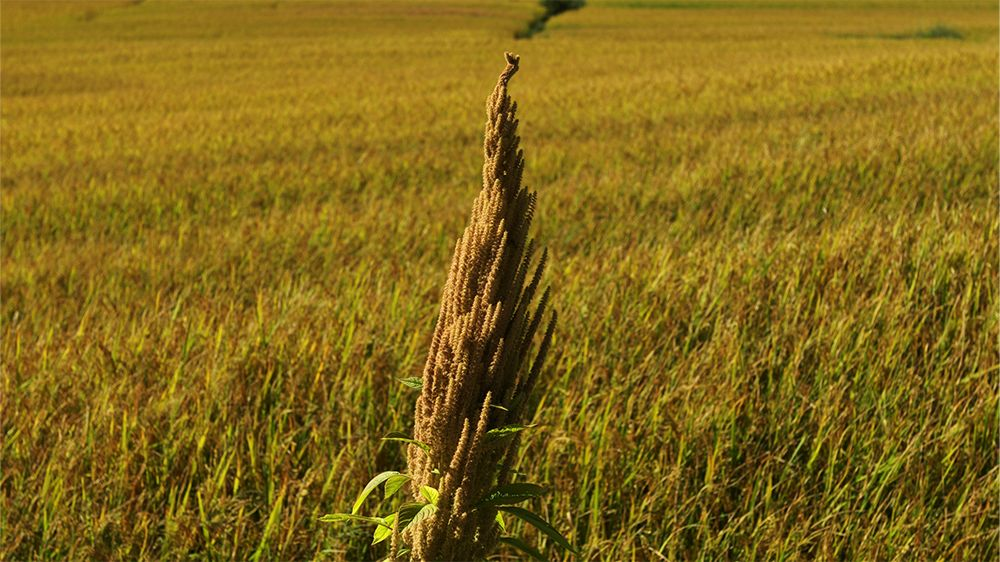

# 无标题

**链接地址:** http://mp.weixin.qq.com/s?__biz=MjM5NjYyMjM0MA==&mid=2650882734&idx=1&sn=248b8bc871ddbd356912fa20b2e7245d&chksm=bd139bc58a6412d32fdb25a07374f4f4d20d8f12d30a96dee64ddf6d8b633200319bbe0ca165&mpshare=1&scene=2&srcid=0130UpegCa9LKdiXumLEzIlF#rd
**作者:** 敢于胡乱
**获取时间:** 2025/8/28 20:46:57
**图片数量:** 50

---

## 原始HTML内容

 

<strong>敢于胡乱，云南饮食长期田野调查者，《风味人间》《舌尖》美食顾问。</strong>

 
<blockquote>
汕头的张新民老师是非常喜欢干巴菌的，他用干巴菌去提干海鲜的香气，我觉得这也是一个好的尝试。我是非常希望云南以外的朋友，用不同的烹饪方法来烹饪云南食材，这就可以获得更多的可能性。
</blockquote>
 

<iframe class="video_iframe" data-vidtype="1" data-cover="http%3A%2F%2Fshp.qpic.cn%2Fqqvideo_ori%2F0%2Fz0832kgnims_496_280%2F0" allowfullscreen="" frameborder="0" data-ratio="1.7777777777777777" data-w="480" data-src="https://v.qq.com/iframe/preview.html?width=500&amp;height=375&amp;auto=0&amp;vid=z0832kgnims"></iframe>

 

踏遍青山吃饭去

 

大家好，感谢大家来听我讲云南，感谢一席。我是敢于胡乱，云南昆明人，是云南饮食的调查者。我用25年时间跑遍了云南去了解饮食，出版了两本书《绿了芭蕉红了花》和《山水坝子探食记》。我了解云南饮食的时间越长，就越发觉云南饮食的复杂性，不能简单归纳。

我们说它辣，它和四川、贵州一样辣。说它的食材稀奇古怪，它又和两广不相上下。说它保守，它又大量种植咖啡。说它封闭，它又和内地、周边东南亚国家有着密切的联系。它非常杂糅，无体系而成一体。

 

下面和大家分享我的云南饮食见闻。去年年底，《人生一串》的导演陈英杰和我在昆明约了台烧烤，那天我和他谈了一下我看他片子的感受，我就说你六集下来全是晚上的黑镜头，但是我们云南的烧烤不仅晚上“黑干”，白天甚至大清早就操办的也不在少数。

 

 

夜间烧烤有一个问题要解决，就是照明问题。在没有电灯的时代，油灯、松明、蜡烛等等除了不够明亮以外，还有一个硬伤——不防风，烟子还大。还好滇越铁路来了，带来了两样东西，一个是煤油，一个是煤油灯，照明问题解决了。

 

 

这是我拍摄的滇越铁路的一些图片。这条铁路现在使用率已经很低了。滇越铁路上上下下带来的都是人，所以在建水这个地方，烧烤白天也吃，晚上也吃。当地人还很会做菜，物产也丰富。时间一长，建水烧烤想不出名都很困难。

 

▲ 建水烧豆腐摊

 

建水烧烤的头牌烧豆腐，那也是名声在外。烧豆腐是用纱布包裹成型的，成型以后还要发酵几天，烤出来非常香。

 

▲ 建水烧豆腐

 

吃的时候用手一分为二，一手蘸干料，一手蘸潮料，吃起来层次分明。这种发酵食物一吃是最容易上瘾的，物美价廉，花不了几个钱就可以喝上一台小酒。

 

建水有一种特殊的蔬菜，叫草芽。

 

 

这是一种香蒲的水下速生茎，夏天长得最快，一天可以蹿出十几二十公分，生吃鲜嫩多汁有点甜，烤出来鲜甜柔软又带一点爽脆，口感是很对立的，但是毫无违和。

 

离建水不远，红河河谷也有一种水下速生茎，叫弯根，是当地的一种芋头。这种芋头在夏天的时候可以蹿出十几二十公分，但是红河谷这个地方一年四季都是夏天。

 

 

当地人是非常喜欢弯根的，炒着吃，煮汤，还腌制成一种叫弯根鲊的食物。弯根鲊是用炒熟的碎米加上辣椒、盐腌出来的，植物纤维和淀粉协同发酵，就产生一种酸味物质。当地人喜欢吃糯米，吃糯米配上带酸味的咸菜，吃下去是很舒服的，不会胀气。

 

云南当地的水果很多，水果一多，水果菜就多。不成熟的嫩果，像小芒果，加盐和辣椒可以做成凉拌小芒果。

 

▲ 凉拌青芒果块

 

番木瓜也是这样，拌成凉拌番木瓜。成熟的果实可以做成油炸芒果，加面粉、鸡蛋，这个是甜口。

 

▲ 油炸芒果

 

这是咸鸭蛋拌芒果。这一盘是我做的。

 

 

因为芒果含有一定的生物碱，盐和它一中和，生物碱就中和了。这碗是西红柿炒甘蔗尖，也是很好吃的。一开始我还不太注意，觉得这个很一般，一吃，比甘蔗好吃。 

 

▲ 西红柿炒甘蔗尖

 

还有很多水果，像菠萝、草莓这些，加盐和辣椒腌制成泡菜，这在云南是很普及的一个做法。其实这种做派和沿海地区的菠萝蘸酱油有异曲同工之妙。

 

红河河谷终年炎热，但是很奇怪，这个地方盛行牛汤锅。云南吃牛，你把皮拿掉，他不干，要拼命。牛汤锅是将牛带皮分解成大块以后一锅混，然后用篓子捞起来，骨头继续熬汤。客人来了以后，每部分肉，包括肠子，各个部位都切上一块，另一锅煮成汤肉打蘸水吃。

 

 

汤锅做得最好的地方都在交通线上，因为吃的人多，慢慢地水平才提得高，在偏僻的地方吃的人少，可能就会越来越没落。接下来，我要说一说史迪威公路。

 

关于这条公路，一般的叙述是这样的：1937年，云南人民用短短9个月时间就修通了滇缅公路（史迪威公路）。我听到的故事是这样的：汽车开过去的时候，当地人抱着青草、稻草去喂，他们认为这种大动物力气这么大，胃口肯定不会小。

 

我第一次跑这条公路是在90年代初期，两个驾驶员轮流开，加上打尖吃饭，整整跑了两天三夜。现在是全程高速，跑得快也要8小时，跑得慢要9小时。当年有两个比较惊险的路段，我还记忆犹新，第一个是怒江红旗桥，旁边是惠通桥，还有一个是永平坡。

 

▲ 澜沧江边山区公路

 

永平坡一上一下是70公里，跑起来要4个小时，刚好是两个吃饭点的时间。所以永平坡周边散布了很多食宿店，俗称“大货车司机之家”，它的招牌菜就是黄焖鸡。这个也是我做的。

 

 

黄焖鸡来得很快，从杀鸡到炒好上桌，快手的师傅20分钟就搞好了，所以很受欢迎。黄焖鸡还有一个特点，就是下饭佐酒都不错，所以早在清代它就在昆明流行，到了史迪威公路时代，云南很多地方都有了黄焖鸡。

 

▲ 澜沧炒鸡的配料

 

云南另外一条公路，从昆明到西双版纳景洪有一条213国道，起点是兰州。从兰州到景洪，213国道的山区路段，黄焖鸡也是看家菜。最有名的是叫安定黄焖鸡。汽车翻过哀牢山之后，这是云南重要的气候带，一般都要停车吃饭，吃安定黄焖鸡。

 

 

这里的店家比较好玩，都要问：老板，你是加洋芋还是加山药？加洋芋的叫洋芋黄焖鸡，加山药就叫山药黄焖鸡，还有一种是加板栗，那就叫板栗黄焖鸡。这些黄焖鸡做法上都略微有些不同，这个略微不同就形成了不同的风味。

 

云南因为受地形地理限制，长期交通不便，即便是两个很近的地方，饮食风格都有差异，这也算是云南饮食的一个小魅力吧。

 

王小波在云南当过知青，他写了一篇散文叫《一只特立独行的猪》。他写的这只特立独行的猪，是一只情商智商双高的猪。我觉得这个双高不是随便高的，是用时间堆出来的。王小波说他喂它的时候，这只猪已经四五岁了，已经是老司机了。

 

 

现在排着整齐的队伍走过来的就是云南迪庆的藏猪。这是很早的一个清晨，7点左右，它们就排着队过河去找食。这样的藏猪要养上三年。这个藏猪情商智商如何我搞不清，但是有一点我是知道的，猪肉很香，比小时候的味道还要小时候的味道。我觉得这个滋味也是要靠时间去堆积的。

 

哈巴的登山伙食不错，就靠土猪腊肉。高山向导先用高压锅煮饭，因为海拔一高压力就不够，煮得差不多的时候就下腊肉，下蔬菜，煮成一锅腊肉蔬菜焖饭，我们都亲切地称它为“哈巴雪山煲仔饭”。

 

 

2011年的时候我去维西叶枝镇，发现小镇上的小市场上，土猪肉、洋猪肉都有在卖。我上去打听了一下行情，发现价格是一样的。我当时很惊讶，土猪是要放养的，短一点两年，长一点三年，饲料猪只要一年不到，价格怎么会一样呢？在昆明市场上，土猪肉要贵出洋猪肉两三倍。 

 

 

我就问杀猪匠老师傅，老师傅跟我说，买饲料是要花钱的，放养不花钱，他们没有人工费这个概念。一路上我看到了很多放猪的小女孩、妇女，搞半天在当地，她们是白干的。我有点想不通，当地放养的土猪实际上也不喂什么东西，和山羊的待遇是相当的。

 

 

叶枝这个地方是民族和食物准垂直分布的地点，不同海拔居住着不同的民族，生产不同的食物。维西县攀天阁就在这附近，它是全世界种植海拔最高的地方，种到了2700公尺，水冷，海拔高，稻谷成熟的时候不是一片金黄，是一片黑压压。

 

▲ 苋米

 

当地的这种稻谷叫黑谷红米，谷壳是黑的，因为海拔太高了，早晚温差又大，但是打出来的米是红米。维西这个地方喜欢种一种植物，苋米。苋米就是苋菜结的籽，苋菜大家应该都吃过，是很通俗的一种蔬菜。 

 

▲ 苋米粑粑

 

当地人喜欢用苋菜的籽做苋米粑粑，味道有点淡，但是回味还是比较长，越吃越有感觉。苋米在其他地方都是蔬菜，我目前只知道它在维西这个地方是一种粮食作物。

 

云南是火塘最多的地方。火塘的火长年不熄灭，这是保留火种的一种习惯，也是火崇拜。但是云南丰富的食材遇到那么简陋的火塘，其实是没有办法精细操作的。

 

▲ 火塘

 

火塘不仅仅是做饭的地方，也是客厅和社交场所。傈僳族认为祖先的灵魂就住在火塘上，是有禁忌的，三角架是不能跨越的。傈僳族是一个采集民族，松茸值钱，他们也采松茸，但是他们并不觉得松茸是一种多么好吃的野生菌。

 

 

云南大部分地区，不仅仅是傈僳族，包括当年昆明也不吃这个东西，把它叫作“臭鸡枞”，它都没有个正式的名字。傈僳族还很奇怪，为什么有人愿意花那么大的价钱去买这么一个东西呢？

 

关于松茸有一个传说，说是日本原子弹爆炸以后，在爆炸点附近第一个长出来的生物就是松茸。这个传说传回傈僳族采集者那里，以讹传讹，傈僳族人互相就说，搞半天日本人买松茸是去造原子弹的。

 

▲ 鸡枞菌世界分布图

 

云南那么多野生菌，几百种，谁排第一呢？综合调查下来，鸡枞排第一。各地有各地的偏好，各地还不太一样。鸡枞起源于非洲，因为和鸡枞共生的白蚁起源于非洲。鸡枞全世界有40种，云南有20种，占一半。

 

云南这边就很简单粗暴，把鸡枞分成青鸡枞、黄鸡枞、白皮鸡枞、火把鸡枞，还有鸡枞花，分得很简单很简单。青鸡枞和黄鸡枞味道鲜甜，个头很大，有的一公斤一棵。

 

 

青鸡枞、黄鸡枞是可以生吃的，方法很简单，就是用一个刀子或者竹片，最好是不用金属的，把表面刮干净，当然现在的条件更好了，有瓷刀，吃一口是满嘴的清甜爽脆。我上山的时候也这么干，碰到好的鸡枞也买一棵，刮出来边走边吃。

 

我们做鸡枞菜，城市里一般是喜欢炒着吃，或者炒了以后做汤。乡村就不一样，乡村油水少，一般是蒸着吃或者烧着吃。在火塘有明火，烧一下，然后加点辣椒，加点盐或者酱油，拌一拌。大家都有个习惯，就是煮一锅鸡汤，撒一把鸡枞，就叫“双鸡”。

 

▲ 炒鸡枞和油鸡枞（左）、鸡枞牛肝菌拌面（右）

 

鸡枞油一般是用火把鸡枞来炼，这个是成片成片生长的，价格相对比较便宜，黄鸡枞和青鸡枞用不起。农历7月半，雷雨天气最多，一打雷又来了，一片一片就来了，最好的火把鸡枞也是在那个时间的。

 

可能很多人想象采鸡枞很复杂，其实很简单。鸡枞和白蚁共生，它可以跟鸡枞窝在一起，上面出子实体的地方就叫鸡枞窝子。鸡枞窝子每年会发一次或者两三次不等，每年到那采到那挖，地面就有一个很明显的土坑，你去那个土坑里看一看有没有鸡枞就可以了。

 

 

这个要赶早，你去看别人也去看，有的山民是3点多钟戴着头灯就去看了，但赶早也不一定有，鸡枞出土的时间没个定数，有时候我下午过去看看又有了。采鸡枞有个要点是不能挖到鸡枞窝（白蚁窝），挖到鸡枞窝（白蚁窝）白蚁就搬家了，这个窝子就废了。

 

滇中地区，就是昆明周边地区，野生菌的老大就不是鸡枞了，而是干巴菌，这一带的干巴菌品质是最好的。干巴菌的子实体生长的速度很慢，它从出土到成熟要20天左右，这个在野生菌里不多见，一般的野生菌就是子实体一冒出来，早上就出。

 

”朝菌不知晦朔“，这就出现个什么问题呢？它有很多杂质。这20天，如果你不加以管理，让它自由生长，它就会进入到菌体里，它的品质就会受影响，所以一般品质好的干巴菌都是包山菌。

 

▲ 滇中干巴菌

 

菌农每年6月到10月就住在菌山上，一发现地面有小的干巴菌出来，马上就把周边的杂草清理干净，并用蕨菜的叶子做一个遮挡，给它搭一个小帐篷，防止这些杂质进入，这样就可以获得比较高品质的干巴菌。

 

为什么叫干巴菌呢？我们一般是把腌制发酵的风干肉类叫作干巴，它香气浓郁，所以就把这种香气浓郁的菌子命名为干巴菌。我们自己很明白，这个命名法则是很云南、很合适的，但是到了其他地方就费工夫了，就像我今天讲起来就很困难。

 

▲ 牛干巴（左）、羊干巴（右）

 

干巴菌越新鲜越好吃，最好是早上采，当天吃。这几年我每年都带一大口美食旅行团到云南菌山采菌子吃菌子，大家熟悉了干巴菌的味道以后，第二天到了木水花野生菌市场闻一闻，马上就能分辨出哪些新鲜哪些不新鲜。

 

云南烹饪干巴菌的方法并不多。第一个是加大量的辣椒炒，这个就是最传统的方法。第二个就是焙熟菌丁凉拌。第三个是干巴菌炒饭，这个不太辣。现在有的餐厅在做干巴菌天妇罗，我觉得很好，适合不吃辣的朋友。

 

汕头的张新民老师是非常喜欢干巴菌的，他用干巴菌去提干海鲜的香气，我觉得这也是一个好的尝试。我是非常希望云南以外的朋友用不同的烹饪方法来烹饪云南食材，这就可以获得更多的可能性。

 

 

传说每一个云南人都有一个吃见手青中毒的朋友，很荣幸，我也有一位。去年夏天有一个北京的朋友到云南吃菌子，来了以后他就非常想尝试一下吃菌子中毒的感觉，他想知道中毒之后眼前出现的小人到底是什么颜色。

&nbsp;

他吃了大概有三四天吧，回到北京，然后就出问题了，不敢闭眼睛，一闭眼睛就出现幻视。据他描述，是有白色的絮状物老是在飘动。到了医院，医生也搞不清楚什么叫见手青中毒，没听说过。在云南昆明，医生连头都不抬就看了。

 

后来我才知道，他是吃了整整一盘红见手，这个是毒性相对较大的。其实见手青这个东西，早年主要是滇中地区吃，其他地方很少吃，因为山区油水少，就很少吃。

 

见手青中毒也是因为烹饪不当，没有炒熟，或者干脆就炒得过头了，炒糊了。所以现在采用的烹饪方法都是二次烹饪，先蒸熟再去炒，这个就安全多了。比如说这一盘也是我炒的，就是二次烹饪。

 

 

云南人一手摘花一手捉虫，两手都很硬。云南的虫子常见的也就二三十种，也不多，比如说水蜻蜓、蜂蛹等等。这个小女孩前面是一盘巨大的蜂蛹，常见的还有竹虫、水蜻蜓、黑甲虫、爬沙虫这些。

 

 

虫子的烹饪方法实际上太简单了，基本都是进油锅，用油炸一炸，蜂蛹也是这样。但是蜂蛹有个问题，就是它炸出来很香，但容易上火，菜花腌菜凉拌的就没有这个问题，不容易上火。

 

▲ 菜花腌菜拌蜂蛹

 

一般说到吃虫，我心里联想到的是什么？好吃、香脆、酥香、香死了。接着很快意江湖地来杯酒。可能大家的心理感受会和我完全不一样。

 

比如这个蜂蛹，200年前有一个叫作檀萃的人，来云南做官，他吃了蜂蛹以后，写了一本很出名的书叫《滇海虞衡志》，预测说蜂蛹将来会和燕窝一样很流行。但是现在200年过去了，蜂蛹还是我们云南人民自产自销，没有太大的改变。

 

这个叫凉拌蚂蚁蛋。这是德宏的一个特殊的虫子菜，我觉得很特别。这个菜要每年的三四月才有，其他季节还没有。它的口感是很特殊的，我觉得非常好吃，有股苏子的清香。苏子你们知道吗？苏麻，是很清香的一种香料。

 

 

▲ 凉拌蚂蚁蛋

 

这个蚂蚁蛋一般是什么地方多呢？甘蔗地。在甘蔗地里发现了蚂蚁窝，要掏下去50公分左右，然后用手把蚂蚁蛋从蚂蚁窝里掏出来，但是那个手就够呛了，别看蚂蚁小，蚂蚁是很凶残的。把蛋掏出来以后用水冲洗，蚂蚁蛋轻，就会往上浮，泥土往下沉，就清理干净了。

 

云南各民族吃的花卉加起来有300多种，而且大部分是野生的。我觉得云南采集花卉吃花的习俗，是采集习惯的一个延续，像傈僳族就把能采到花的月份叫作采花月。

 

春天到茶山就可以看到漫山遍野的高大花树，这种高大花树叫作羊蹄甲，有白花、粉花、紫花，紫花就是紫荆花。在当地是可以喝到花汤的，这个花汤是和蚕豆共煮的。羊蹄甲花瓣贡献了纤维，蚕豆贡献了淀粉，这是一对好搭档。

 

▲ 羊蹄甲

 

这是一种人工栽培的花菜，叫芋头花，有绿色和紫色两种，紫色的比较多见，是老品种。云南谚语是这样说的：茄子芋头花，洋芋老麦瓜。

 

 

“茄子芋头花，洋芋老麦瓜”，它实际上是两道菜，茄子焖芋头花和洋芋焖老麦瓜，老麦瓜就是南瓜。茄子和芋头花也是一个搭档，卖就在一起卖，卖芋头花的旁边摆一个茄子摊，放在一起配，连比例都配好了。下锅的时候也是一起下锅酱炒，然后一起被蒸到汃烂，是一道下饭菜。

 

这个是海菜花。海菜花当年滇池就很多，人吃都已经嫌多了，有的时候也做一点饲料，也做成腌咸菜、腌海菜鲊。海菜鲊只有昆明地区有，现在滇池污染了以后，只有上游盘龙江还有少量。

 

 

 

这个花菜现在大理多，大理一年四季都有这个，随时吃得到。所有的餐厅都将它作为一个常备菜，跟青菜一样。海菜花和芋头是搭档，芋头炒海菜花、芋头海菜花汤。花有纤维无淀粉，芋头贡献了淀粉。

 

芭蕉花在云南乡村是一种重要的植物，为什么说它重要呢？芭蕉的秆很高，两米多，最高三米，它是一种饲料。芭蕉的果实是水果，芭蕉芯和芭蕉花是蔬菜，芭蕉的叶子是烹饪容器，也是包装材料，甚至可以做垫子。

 

 

 

云南很多往南走的乡村，街面赶集的时候没有用塑料袋，都是用芭蕉叶子。当地的傣族人家最喜欢用芭蕉叶包烧芭蕉花，这是很奇特的一个组合。

 

我们不仅吃花还吃花粉。这个是松花糕。当年这个东西昆明是很多的，现在没有了，腾冲有。但吃这个松花糕要小心，不能听笑话，否则就很麻烦。

 

 

 

云南的饮食实在太多，稀奇的事情实在太多，一下子讲不完，今后有机会再讲。

 

谢谢大家。

 

 

 

▼ 推荐阅读

 

 

 

 

 

<a href="https://mp.weixin.qq.com/s?__biz=MzA5NzMxODMxNg==&amp;mid=2650457168&amp;idx=1&amp;sn=a1b98bdbd83b30ba9772898a8872ca34&amp;scene=21#wechat_redirect" target="_blank" data-linktype="1"></a>

---

## 纯文本内容

敢于胡乱，云南饮食长期田野调查者，《风味人间》《舌尖》美食顾问。汕头的张新民老师是非常喜欢干巴菌的，他用干巴菌去提干海鲜的香气，我觉得这也是一个好的尝试。我是非常希望云南以外的朋友，用不同的烹饪方法来烹饪云南食材，这就可以获得更多的可能性。踏遍青山吃饭去大家好，感谢大家来听我讲云南，感谢一席。我是敢于胡乱，云南昆明人，是云南饮食的调查者。我用25年时间跑遍了云南去了解饮食，出版了两本书《绿了芭蕉红了花》和《山水坝子探食记》。我了解云南饮食的时间越长，就越发觉云南饮食的复杂性，不能简单归纳。我们说它辣，它和四川、贵州一样辣。说它的食材稀奇古怪，它又和两广不相上下。说它保守，它又大量种植咖啡。说它封闭，它又和内地、周边东南亚国家有着密切的联系。它非常杂糅，无体系而成一体。下面和大家分享我的云南饮食见闻。去年年底，《人生一串》的导演陈英杰和我在昆明约了台烧烤，那天我和他谈了一下我看他片子的感受，我就说你六集下来全是晚上的黑镜头，但是我们云南的烧烤不仅晚上“黑干”，白天甚至大清早就操办的也不在少数。夜间烧烤有一个问题要解决，就是照明问题。在没有电灯的时代，油灯、松明、蜡烛等等除了不够明亮以外，还有一个硬伤——不防风，烟子还大。还好滇越铁路来了，带来了两样东西，一个是煤油，一个是煤油灯，照明问题解决了。这是我拍摄的滇越铁路的一些图片。这条铁路现在使用率已经很低了。滇越铁路上上下下带来的都是人，所以在建水这个地方，烧烤白天也吃，晚上也吃。当地人还很会做菜，物产也丰富。时间一长，建水烧烤想不出名都很困难。▲ 建水烧豆腐摊建水烧烤的头牌烧豆腐，那也是名声在外。烧豆腐是用纱布包裹成型的，成型以后还要发酵几天，烤出来非常香。▲ 建水烧豆腐吃的时候用手一分为二，一手蘸干料，一手蘸潮料，吃起来层次分明。这种发酵食物一吃是最容易上瘾的，物美价廉，花不了几个钱就可以喝上一台小酒。建水有一种特殊的蔬菜，叫草芽。这是一种香蒲的水下速生茎，夏天长得最快，一天可以蹿出十几二十公分，生吃鲜嫩多汁有点甜，烤出来鲜甜柔软又带一点爽脆，口感是很对立的，但是毫无违和。离建水不远，红河河谷也有一种水下速生茎，叫弯根，是当地的一种芋头。这种芋头在夏天的时候可以蹿出十几二十公分，但是红河谷这个地方一年四季都是夏天。当地人是非常喜欢弯根的，炒着吃，煮汤，还腌制成一种叫弯根鲊的食物。弯根鲊是用炒熟的碎米加上辣椒、盐腌出来的，植物纤维和淀粉协同发酵，就产生一种酸味物质。当地人喜欢吃糯米，吃糯米配上带酸味的咸菜，吃下去是很舒服的，不会胀气。云南当地的水果很多，水果一多，水果菜就多。不成熟的嫩果，像小芒果，加盐和辣椒可以做成凉拌小芒果。▲ 凉拌青芒果块番木瓜也是这样，拌成凉拌番木瓜。成熟的果实可以做成油炸芒果，加面粉、鸡蛋，这个是甜口。▲ 油炸芒果这是咸鸭蛋拌芒果。这一盘是我做的。因为芒果含有一定的生物碱，盐和它一中和，生物碱就中和了。这碗是西红柿炒甘蔗尖，也是很好吃的。一开始我还不太注意，觉得这个很一般，一吃，比甘蔗好吃。▲ 西红柿炒甘蔗尖还有很多水果，像菠萝、草莓这些，加盐和辣椒腌制成泡菜，这在云南是很普及的一个做法。其实这种做派和沿海地区的菠萝蘸酱油有异曲同工之妙。红河河谷终年炎热，但是很奇怪，这个地方盛行牛汤锅。云南吃牛，你把皮拿掉，他不干，要拼命。牛汤锅是将牛带皮分解成大块以后一锅混，然后用篓子捞起来，骨头继续熬汤。客人来了以后，每部分肉，包括肠子，各个部位都切上一块，另一锅煮成汤肉打蘸水吃。汤锅做得最好的地方都在交通线上，因为吃的人多，慢慢地水平才提得高，在偏僻的地方吃的人少，可能就会越来越没落。接下来，我要说一说史迪威公路。关于这条公路，一般的叙述是这样的：1937年，云南人民用短短9个月时间就修通了滇缅公路（史迪威公路）。我听到的故事是这样的：汽车开过去的时候，当地人抱着青草、稻草去喂，他们认为这种大动物力气这么大，胃口肯定不会小。我第一次跑这条公路是在90年代初期，两个驾驶员轮流开，加上打尖吃饭，整整跑了两天三夜。现在是全程高速，跑得快也要8小时，跑得慢要9小时。当年有两个比较惊险的路段，我还记忆犹新，第一个是怒江红旗桥，旁边是惠通桥，还有一个是永平坡。▲ 澜沧江边山区公路永平坡一上一下是70公里，跑起来要4个小时，刚好是两个吃饭点的时间。所以永平坡周边散布了很多食宿店，俗称“大货车司机之家”，它的招牌菜就是黄焖鸡。这个也是我做的。黄焖鸡来得很快，从杀鸡到炒好上桌，快手的师傅20分钟就搞好了，所以很受欢迎。黄焖鸡还有一个特点，就是下饭佐酒都不错，所以早在清代它就在昆明流行，到了史迪威公路时代，云南很多地方都有了黄焖鸡。▲ 澜沧炒鸡的配料云南另外一条公路，从昆明到西双版纳景洪有一条213国道，起点是兰州。从兰州到景洪，213国道的山区路段，黄焖鸡也是看家菜。最有名的是叫安定黄焖鸡。汽车翻过哀牢山之后，这是云南重要的气候带，一般都要停车吃饭，吃安定黄焖鸡。这里的店家比较好玩，都要问：老板，你是加洋芋还是加山药？加洋芋的叫洋芋黄焖鸡，加山药就叫山药黄焖鸡，还有一种是加板栗，那就叫板栗黄焖鸡。这些黄焖鸡做法上都略微有些不同，这个略微不同就形成了不同的风味。云南因为受地形地理限制，长期交通不便，即便是两个很近的地方，饮食风格都有差异，这也算是云南饮食的一个小魅力吧。王小波在云南当过知青，他写了一篇散文叫《一只特立独行的猪》。他写的这只特立独行的猪，是一只情商智商双高的猪。我觉得这个双高不是随便高的，是用时间堆出来的。王小波说他喂它的时候，这只猪已经四五岁了，已经是老司机了。现在排着整齐的队伍走过来的就是云南迪庆的藏猪。这是很早的一个清晨，7点左右，它们就排着队过河去找食。这样的藏猪要养上三年。这个藏猪情商智商如何我搞不清，但是有一点我是知道的，猪肉很香，比小时候的味道还要小时候的味道。我觉得这个滋味也是要靠时间去堆积的。哈巴的登山伙食不错，就靠土猪腊肉。高山向导先用高压锅煮饭，因为海拔一高压力就不够，煮得差不多的时候就下腊肉，下蔬菜，煮成一锅腊肉蔬菜焖饭，我们都亲切地称它为“哈巴雪山煲仔饭”。2011年的时候我去维西叶枝镇，发现小镇上的小市场上，土猪肉、洋猪肉都有在卖。我上去打听了一下行情，发现价格是一样的。我当时很惊讶，土猪是要放养的，短一点两年，长一点三年，饲料猪只要一年不到，价格怎么会一样呢？在昆明市场上，土猪肉要贵出洋猪肉两三倍。我就问杀猪匠老师傅，老师傅跟我说，买饲料是要花钱的，放养不花钱，他们没有人工费这个概念。一路上我看到了很多放猪的小女孩、妇女，搞半天在当地，她们是白干的。我有点想不通，当地放养的土猪实际上也不喂什么东西，和山羊的待遇是相当的。叶枝这个地方是民族和食物准垂直分布的地点，不同海拔居住着不同的民族，生产不同的食物。维西县攀天阁就在这附近，它是全世界种植海拔最高的地方，种到了2700公尺，水冷，海拔高，稻谷成熟的时候不是一片金黄，是一片黑压压。▲ 苋米当地的这种稻谷叫黑谷红米，谷壳是黑的，因为海拔太高了，早晚温差又大，但是打出来的米是红米。维西这个地方喜欢种一种植物，苋米。苋米就是苋菜结的籽，苋菜大家应该都吃过，是很通俗的一种蔬菜。▲ 苋米粑粑当地人喜欢用苋菜的籽做苋米粑粑，味道有点淡，但是回味还是比较长，越吃越有感觉。苋米在其他地方都是蔬菜，我目前只知道它在维西这个地方是一种粮食作物。云南是火塘最多的地方。火塘的火长年不熄灭，这是保留火种的一种习惯，也是火崇拜。但是云南丰富的食材遇到那么简陋的火塘，其实是没有办法精细操作的。▲ 火塘火塘不仅仅是做饭的地方，也是客厅和社交场所。傈僳族认为祖先的灵魂就住在火塘上，是有禁忌的，三角架是不能跨越的。傈僳族是一个采集民族，松茸值钱，他们也采松茸，但是他们并不觉得松茸是一种多么好吃的野生菌。云南大部分地区，不仅仅是傈僳族，包括当年昆明也不吃这个东西，把它叫作“臭鸡枞”，它都没有个正式的名字。傈僳族还很奇怪，为什么有人愿意花那么大的价钱去买这么一个东西呢？关于松茸有一个传说，说是日本原子弹爆炸以后，在爆炸点附近第一个长出来的生物就是松茸。这个传说传回傈僳族采集者那里，以讹传讹，傈僳族人互相就说，搞半天日本人买松茸是去造原子弹的。▲ 鸡枞菌世界分布图云南那么多野生菌，几百种，谁排第一呢？综合调查下来，鸡枞排第一。各地有各地的偏好，各地还不太一样。鸡枞起源于非洲，因为和鸡枞共生的白蚁起源于非洲。鸡枞全世界有40种，云南有20种，占一半。云南这边就很简单粗暴，把鸡枞分成青鸡枞、黄鸡枞、白皮鸡枞、火把鸡枞，还有鸡枞花，分得很简单很简单。青鸡枞和黄鸡枞味道鲜甜，个头很大，有的一公斤一棵。青鸡枞、黄鸡枞是可以生吃的，方法很简单，就是用一个刀子或者竹片，最好是不用金属的，把表面刮干净，当然现在的条件更好了，有瓷刀，吃一口是满嘴的清甜爽脆。我上山的时候也这么干，碰到好的鸡枞也买一棵，刮出来边走边吃。我们做鸡枞菜，城市里一般是喜欢炒着吃，或者炒了以后做汤。乡村就不一样，乡村油水少，一般是蒸着吃或者烧着吃。在火塘有明火，烧一下，然后加点辣椒，加点盐或者酱油，拌一拌。大家都有个习惯，就是煮一锅鸡汤，撒一把鸡枞，就叫“双鸡”。▲ 炒鸡枞和油鸡枞（左）、鸡枞牛肝菌拌面（右）鸡枞油一般是用火把鸡枞来炼，这个是成片成片生长的，价格相对比较便宜，黄鸡枞和青鸡枞用不起。农历7月半，雷雨天气最多，一打雷又来了，一片一片就来了，最好的火把鸡枞也是在那个时间的。可能很多人想象采鸡枞很复杂，其实很简单。鸡枞和白蚁共生，它可以跟鸡枞窝在一起，上面出子实体的地方就叫鸡枞窝子。鸡枞窝子每年会发一次或者两三次不等，每年到那采到那挖，地面就有一个很明显的土坑，你去那个土坑里看一看有没有鸡枞就可以了。这个要赶早，你去看别人也去看，有的山民是3点多钟戴着头灯就去看了，但赶早也不一定有，鸡枞出土的时间没个定数，有时候我下午过去看看又有了。采鸡枞有个要点是不能挖到鸡枞窝（白蚁窝），挖到鸡枞窝（白蚁窝）白蚁就搬家了，这个窝子就废了。滇中地区，就是昆明周边地区，野生菌的老大就不是鸡枞了，而是干巴菌，这一带的干巴菌品质是最好的。干巴菌的子实体生长的速度很慢，它从出土到成熟要20天左右，这个在野生菌里不多见，一般的野生菌就是子实体一冒出来，早上就出。”朝菌不知晦朔“，这就出现个什么问题呢？它有很多杂质。这20天，如果你不加以管理，让它自由生长，它就会进入到菌体里，它的品质就会受影响，所以一般品质好的干巴菌都是包山菌。▲ 滇中干巴菌菌农每年6月到10月就住在菌山上，一发现地面有小的干巴菌出来，马上就把周边的杂草清理干净，并用蕨菜的叶子做一个遮挡，给它搭一个小帐篷，防止这些杂质进入，这样就可以获得比较高品质的干巴菌。为什么叫干巴菌呢？我们一般是把腌制发酵的风干肉类叫作干巴，它香气浓郁，所以就把这种香气浓郁的菌子命名为干巴菌。我们自己很明白，这个命名法则是很云南、很合适的，但是到了其他地方就费工夫了，就像我今天讲起来就很困难。▲ 牛干巴（左）、羊干巴（右）干巴菌越新鲜越好吃，最好是早上采，当天吃。这几年我每年都带一大口美食旅行团到云南菌山采菌子吃菌子，大家熟悉了干巴菌的味道以后，第二天到了木水花野生菌市场闻一闻，马上就能分辨出哪些新鲜哪些不新鲜。云南烹饪干巴菌的方法并不多。第一个是加大量的辣椒炒，这个就是最传统的方法。第二个就是焙熟菌丁凉拌。第三个是干巴菌炒饭，这个不太辣。现在有的餐厅在做干巴菌天妇罗，我觉得很好，适合不吃辣的朋友。汕头的张新民老师是非常喜欢干巴菌的，他用干巴菌去提干海鲜的香气，我觉得这也是一个好的尝试。我是非常希望云南以外的朋友用不同的烹饪方法来烹饪云南食材，这就可以获得更多的可能性。传说每一个云南人都有一个吃见手青中毒的朋友，很荣幸，我也有一位。去年夏天有一个北京的朋友到云南吃菌子，来了以后他就非常想尝试一下吃菌子中毒的感觉，他想知道中毒之后眼前出现的小人到底是什么颜色。 他吃了大概有三四天吧，回到北京，然后就出问题了，不敢闭眼睛，一闭眼睛就出现幻视。据他描述，是有白色的絮状物老是在飘动。到了医院，医生也搞不清楚什么叫见手青中毒，没听说过。在云南昆明，医生连头都不抬就看了。后来我才知道，他是吃了整整一盘红见手，这个是毒性相对较大的。其实见手青这个东西，早年主要是滇中地区吃，其他地方很少吃，因为山区油水少，就很少吃。见手青中毒也是因为烹饪不当，没有炒熟，或者干脆就炒得过头了，炒糊了。所以现在采用的烹饪方法都是二次烹饪，先蒸熟再去炒，这个就安全多了。比如说这一盘也是我炒的，就是二次烹饪。云南人一手摘花一手捉虫，两手都很硬。云南的虫子常见的也就二三十种，也不多，比如说水蜻蜓、蜂蛹等等。这个小女孩前面是一盘巨大的蜂蛹，常见的还有竹虫、水蜻蜓、黑甲虫、爬沙虫这些。虫子的烹饪方法实际上太简单了，基本都是进油锅，用油炸一炸，蜂蛹也是这样。但是蜂蛹有个问题，就是它炸出来很香，但容易上火，菜花腌菜凉拌的就没有这个问题，不容易上火。▲ 菜花腌菜拌蜂蛹一般说到吃虫，我心里联想到的是什么？好吃、香脆、酥香、香死了。接着很快意江湖地来杯酒。可能大家的心理感受会和我完全不一样。比如这个蜂蛹，200年前有一个叫作檀萃的人，来云南做官，他吃了蜂蛹以后，写了一本很出名的书叫《滇海虞衡志》，预测说蜂蛹将来会和燕窝一样很流行。但是现在200年过去了，蜂蛹还是我们云南人民自产自销，没有太大的改变。这个叫凉拌蚂蚁蛋。这是德宏的一个特殊的虫子菜，我觉得很特别。这个菜要每年的三四月才有，其他季节还没有。它的口感是很特殊的，我觉得非常好吃，有股苏子的清香。苏子你们知道吗？苏麻，是很清香的一种香料。▲ 凉拌蚂蚁蛋这个蚂蚁蛋一般是什么地方多呢？甘蔗地。在甘蔗地里发现了蚂蚁窝，要掏下去50公分左右，然后用手把蚂蚁蛋从蚂蚁窝里掏出来，但是那个手就够呛了，别看蚂蚁小，蚂蚁是很凶残的。把蛋掏出来以后用水冲洗，蚂蚁蛋轻，就会往上浮，泥土往下沉，就清理干净了。云南各民族吃的花卉加起来有300多种，而且大部分是野生的。我觉得云南采集花卉吃花的习俗，是采集习惯的一个延续，像傈僳族就把能采到花的月份叫作采花月。春天到茶山就可以看到漫山遍野的高大花树，这种高大花树叫作羊蹄甲，有白花、粉花、紫花，紫花就是紫荆花。在当地是可以喝到花汤的，这个花汤是和蚕豆共煮的。羊蹄甲花瓣贡献了纤维，蚕豆贡献了淀粉，这是一对好搭档。▲ 羊蹄甲这是一种人工栽培的花菜，叫芋头花，有绿色和紫色两种，紫色的比较多见，是老品种。云南谚语是这样说的：茄子芋头花，洋芋老麦瓜。“茄子芋头花，洋芋老麦瓜”，它实际上是两道菜，茄子焖芋头花和洋芋焖老麦瓜，老麦瓜就是南瓜。茄子和芋头花也是一个搭档，卖就在一起卖，卖芋头花的旁边摆一个茄子摊，放在一起配，连比例都配好了。下锅的时候也是一起下锅酱炒，然后一起被蒸到汃烂，是一道下饭菜。这个是海菜花。海菜花当年滇池就很多，人吃都已经嫌多了，有的时候也做一点饲料，也做成腌咸菜、腌海菜鲊。海菜鲊只有昆明地区有，现在滇池污染了以后，只有上游盘龙江还有少量。这个花菜现在大理多，大理一年四季都有这个，随时吃得到。所有的餐厅都将它作为一个常备菜，跟青菜一样。海菜花和芋头是搭档，芋头炒海菜花、芋头海菜花汤。花有纤维无淀粉，芋头贡献了淀粉。芭蕉花在云南乡村是一种重要的植物，为什么说它重要呢？芭蕉的秆很高，两米多，最高三米，它是一种饲料。芭蕉的果实是水果，芭蕉芯和芭蕉花是蔬菜，芭蕉的叶子是烹饪容器，也是包装材料，甚至可以做垫子。云南很多往南走的乡村，街面赶集的时候没有用塑料袋，都是用芭蕉叶子。当地的傣族人家最喜欢用芭蕉叶包烧芭蕉花，这是很奇特的一个组合。我们不仅吃花还吃花粉。这个是松花糕。当年这个东西昆明是很多的，现在没有了，腾冲有。但吃这个松花糕要小心，不能听笑话，否则就很麻烦。云南的饮食实在太多，稀奇的事情实在太多，一下子讲不完，今后有机会再讲。谢谢大家。▼ 推荐阅读

---

## 图片列表

-  (原始链接: https://mmbiz.qpic.cn/mmbiz_jpg/DDSSkL2T0uOSAPpSVfRXhvkk5mPOZP9zlkFgIndQGqfEW1wcoldvnUWrRINLjFLwc4ZIwWZYd9x3yM8Trq6geg/640?wx_fmt=jpeg)
-  (原始链接: https://mmbiz.qpic.cn/mmbiz_jpg/DDSSkL2T0uPGoRpjcrcGwIBDxzvQGx33FVJctKOsJQO1m9f3Aad5beo2w0Zes3wcT7wJsOUnEo5m4Jcg2sEFicw/640?wx_fmt=jpeg)
-  (原始链接: https://mmbiz.qpic.cn/mmbiz_gif/DDSSkL2T0uPGoRpjcrcGwIBDxzvQGx335zykSHkibQcn0lQggjtM4XY9beibPlp7XkXmdC964jDOqs4cXFMRzcQA/640?wx_fmt=gif)
-  (原始链接: https://mmbiz.qpic.cn/mmbiz_jpg/DDSSkL2T0uNItibx1ic0bJaZNWKN525ibWAFQIIajSUiceB3vZf5AJSlphlLyXHPrSVpWCPzELRA2jTdZHOEwRI1Ug/640?wx_fmt=jpeg)
-  (原始链接: https://mmbiz.qpic.cn/mmbiz_png/DDSSkL2T0uNItibx1ic0bJaZNWKN525ibWApIeCe8sAYCkOs9pdhH4jcbWBB0l98jXY1EOcmzia1Ov60lxNRFictWxQ/640?wx_fmt=png)
-  (原始链接: https://mmbiz.qpic.cn/mmbiz_jpg/DDSSkL2T0uNItibx1ic0bJaZNWKN525ibWABUoyEfr9ibh1mqib16iayvuRKgo9DsibVicbBNUUDnfXr4IVBpT5djz4ibcg/640?wx_fmt=jpeg)
-  (原始链接: https://mmbiz.qpic.cn/mmbiz_png/DDSSkL2T0uNItibx1ic0bJaZNWKN525ibWAu61ZzqLHGrSrhMxmGl08dMUMnRMURAHw65USRGYngHaP59F9JMyCYA/640?wx_fmt=png)
-  (原始链接: https://mmbiz.qpic.cn/mmbiz_png/DDSSkL2T0uNItibx1ic0bJaZNWKN525ibWAhsulBaHsIO2KANbGEyq3TdW1jdV7icCWFXq0gmuIO8xvvZFNnXuTNxQ/640?wx_fmt=png)
-  (原始链接: https://mmbiz.qpic.cn/mmbiz_png/DDSSkL2T0uNItibx1ic0bJaZNWKN525ibWAsIfSX8FWTrKkLI3nicbUnXwpY1jB6Ey9sqop1y63nxic6A86ctnTxOWg/640?wx_fmt=png)
-  (原始链接: https://mmbiz.qpic.cn/mmbiz_png/DDSSkL2T0uNItibx1ic0bJaZNWKN525ibWA9KqS3gia0MDuCAsMfLpSZTjiaKyia3Rvek9Vn4we5dgdRagWxsMj32bTQ/640?wx_fmt=png)
-  (原始链接: https://mmbiz.qpic.cn/mmbiz_jpg/DDSSkL2T0uNItibx1ic0bJaZNWKN525ibWAnfibOYzjqHe8KvjzgqsibyWc02ohOcR1oFQic8SSLicOsH94jL0PlpVPhg/640?wx_fmt=jpeg)
-  (原始链接: https://mmbiz.qpic.cn/mmbiz_jpg/DDSSkL2T0uNItibx1ic0bJaZNWKN525ibWAIeeFibjY6I4VYj3XTxAByWjpKfjGwMxdsj4hvp8G1qQvYvqLlwbUryQ/640?wx_fmt=jpeg)
-  (原始链接: https://mmbiz.qpic.cn/mmbiz_jpg/DDSSkL2T0uNItibx1ic0bJaZNWKN525ibWA4d5WGFn3CEgibYhSRrwTjh7JO4BXCMQbXXUs4JiaZ48j1S7m2BO9J1Ug/640?wx_fmt=jpeg)
-  (原始链接: https://mmbiz.qpic.cn/mmbiz_png/DDSSkL2T0uNItibx1ic0bJaZNWKN525ibWAJiaeGTnXllvTwLutGxExK7HZtK5BpSugc3gs5kQ9vjqzeibQrSWCxXvw/640?wx_fmt=png)
-  (原始链接: https://mmbiz.qpic.cn/mmbiz_png/DDSSkL2T0uNItibx1ic0bJaZNWKN525ibWAzhOY6lrcceX0dvsELEvXiczCrILxlwL8GjY4BfpelJlkT1tmQ9WpEibg/640?wx_fmt=png)
-  (原始链接: https://mmbiz.qpic.cn/mmbiz_png/DDSSkL2T0uNItibx1ic0bJaZNWKN525ibWAgQIY1uX5gT8owxqH04VWshLD0QAQicfMicnqOrHyw2W7G84FNyfNvchw/640?wx_fmt=png)
-  (原始链接: https://mmbiz.qpic.cn/mmbiz_png/DDSSkL2T0uNItibx1ic0bJaZNWKN525ibWATfUeWocWvVLdUZA5aQRAHnbzcuiaAwC68xkSUvq3QjibQfqMfKL5pJ9A/640?wx_fmt=png)
-  (原始链接: https://mmbiz.qpic.cn/mmbiz_png/DDSSkL2T0uNItibx1ic0bJaZNWKN525ibWAhdxBTur8wxRmyicNibDnjW10TqZia8OVNXV5dsmc1pgyB2jogQk0Wd9CQ/640?wx_fmt=png)
-  (原始链接: https://mmbiz.qpic.cn/mmbiz_png/DDSSkL2T0uNItibx1ic0bJaZNWKN525ibWABEz6KEHfIHglUk6YjkhtlyDrJcCBYK7O9O74QmIFWJITU9ZkKWBUjw/640?wx_fmt=png)
-  (原始链接: https://mmbiz.qpic.cn/mmbiz_png/DDSSkL2T0uNItibx1ic0bJaZNWKN525ibWAGmibocT9uZibxLHicv5coe5an5icUPzYAUR2BfSBtCqdN6Zdr2Mp8wIHYg/640?wx_fmt=png)
-  (原始链接: https://mmbiz.qpic.cn/mmbiz_png/DDSSkL2T0uNItibx1ic0bJaZNWKN525ibWAEUWe6kJdRHRKcVBicedw9SyibicaJCHRoVzHKgB0RDg57zJuhJPNwjCxA/640?wx_fmt=png)
-  (原始链接: https://mmbiz.qpic.cn/mmbiz_jpg/DDSSkL2T0uNItibx1ic0bJaZNWKN525ibWA21wvoLedZMjyRRtibcOIaNHnicfmlT1EoYCo5lCJa5MB0MpgicicAcyvBA/640?wx_fmt=jpeg)
-  (原始链接: https://mmbiz.qpic.cn/mmbiz_png/DDSSkL2T0uNItibx1ic0bJaZNWKN525ibWAxZQtOty05Qqw9Cuk1PsokKkUGQ6xbzmVVZrgMH1swg2dLMHndCjxWg/640?wx_fmt=png)
-  (原始链接: https://mmbiz.qpic.cn/mmbiz_png/DDSSkL2T0uNItibx1ic0bJaZNWKN525ibWAsoj6N55rCVCic3Ah9rZxX2E3cz2p8kKkhd4H5FaJnKp9gDOVuPDjpHQ/640?wx_fmt=png)
-  (原始链接: https://mmbiz.qpic.cn/mmbiz_png/DDSSkL2T0uNItibx1ic0bJaZNWKN525ibWAmthP9gcsn7EkkUUy30nY1JKk7KyMDIib5ZicJibk4Eibvp4YgElqu5gvDA/640?wx_fmt=png)
-  (原始链接: https://mmbiz.qpic.cn/mmbiz_jpg/DDSSkL2T0uNItibx1ic0bJaZNWKN525ibWAiaXldNCcruP5icZWjUJ1sxSRYuSrnmhHLkwPNufmsnqN9F9JicS34qzOw/640?wx_fmt=jpeg)
-  (原始链接: https://mmbiz.qpic.cn/mmbiz_png/DDSSkL2T0uNItibx1ic0bJaZNWKN525ibWA8e5ggDdVic6E1uoCDD69KIC2kGrLq71QgQlrXbkh4sRHhKOJGTibA3Aw/640?wx_fmt=png)
-  (原始链接: https://mmbiz.qpic.cn/mmbiz_png/DDSSkL2T0uNItibx1ic0bJaZNWKN525ibWAZsFIbiaWGaBDkg76pD23y6QOibhGdHuhDTwj9A8ibrmib6FkI32evZsRlg/640?wx_fmt=png)
-  (原始链接: https://mmbiz.qpic.cn/mmbiz_png/DDSSkL2T0uNItibx1ic0bJaZNWKN525ibWAViakcaibXccK8O7Osib9XWsCpCVoPibaKb3nicCH58f8ypN6Jhzx6zaPGFw/640?wx_fmt=png)
-  (原始链接: https://mmbiz.qpic.cn/mmbiz_png/DDSSkL2T0uNItibx1ic0bJaZNWKN525ibWA5Eiboc1Y893UkSv9OOYJkN6wp1iaxd1DgdudrO5PHibNAVsPHYgAadU5g/640?wx_fmt=png)
-  (原始链接: https://mmbiz.qpic.cn/mmbiz_png/DDSSkL2T0uNItibx1ic0bJaZNWKN525ibWAQKKGGQZ2kErd9sESq0fHTHeQiaLdicTMRyOKkoSVYXJxRTtwKQicgvHfg/640?wx_fmt=png)
-  (原始链接: https://mmbiz.qpic.cn/mmbiz_png/DDSSkL2T0uNItibx1ic0bJaZNWKN525ibWAHIpZ4jEYbuy4c4nn75ibcp6CpNraFyNZNsC8z6Q1mBBzxvbM3icRB44A/640?wx_fmt=png)
-  (原始链接: https://mmbiz.qpic.cn/mmbiz_png/DDSSkL2T0uNItibx1ic0bJaZNWKN525ibWALOUQ3JQQAQMONvc3V1zGqOVlan7ZklWHAbqJhce1TKVWQBDh6E8JbQ/640?wx_fmt=png)
-  (原始链接: https://mmbiz.qpic.cn/mmbiz_png/DDSSkL2T0uNItibx1ic0bJaZNWKN525ibWAXxS9OgltMBicLxWRKMAUzpBsqkPT0uh3Sz4HeJiasGYzibuIWRzJdB5Ag/640?wx_fmt=png)
-  (原始链接: https://mmbiz.qpic.cn/mmbiz_png/DDSSkL2T0uNItibx1ic0bJaZNWKN525ibWAGbzV9UMBNuuzKyZjXzVIxXZYicxL9CT35yI2icODOxPQeWl7pTopmV4A/640?wx_fmt=png)
-  (原始链接: https://mmbiz.qpic.cn/mmbiz_png/DDSSkL2T0uNItibx1ic0bJaZNWKN525ibWAWFzyDIyyN3wv7KqHicIWWzPqFiaXhOxAhpapvY4n3zYjczWg3uFrGsKA/640?wx_fmt=png)
-  (原始链接: https://mmbiz.qpic.cn/mmbiz_png/DDSSkL2T0uNItibx1ic0bJaZNWKN525ibWAibkxXOy4Y7tDiaxq99mx8I1WIBtxxSFsv8zGghrYIhDUs9r0nht5lQVQ/640?wx_fmt=png)
-  (原始链接: https://mmbiz.qpic.cn/mmbiz_png/DDSSkL2T0uNItibx1ic0bJaZNWKN525ibWAvCk8wKgBIgDsCMwnOYo6jDcq9267JcxhMFe3a807MayFXibVqFwaXbA/640?wx_fmt=png)
-  (原始链接: https://mmbiz.qpic.cn/mmbiz_jpg/DDSSkL2T0uNItibx1ic0bJaZNWKN525ibWA38SYLmic4L11Fa5499tHuJbqOjo1Pw3SIpd7bTUczMoGMiaicrz5O9STQ/640?wx_fmt=jpeg)
-  (原始链接: https://mmbiz.qpic.cn/mmbiz_png/DDSSkL2T0uNItibx1ic0bJaZNWKN525ibWA0twonZRUbfrKJJx22mlMb6KNPDCawnErK8bG45WicpvEvTUjuQVCw5Q/640?wx_fmt=png)
-  (原始链接: https://mmbiz.qpic.cn/mmbiz_png/DDSSkL2T0uNItibx1ic0bJaZNWKN525ibWA40EtouicdicHmyXEDz5wC9tbLxzmLkxUKgcoicVKwicXDdDSbFEianHGWCA/640?wx_fmt=png)
-  (原始链接: https://mmbiz.qpic.cn/mmbiz_png/DDSSkL2T0uNItibx1ic0bJaZNWKN525ibWA5IiavOffp8xAgeEgXjm2kQx7gXic8EhCrWTToEeRzUEENPsvic811SItQ/640?wx_fmt=png)
-  (原始链接: https://mmbiz.qpic.cn/mmbiz_png/DDSSkL2T0uNItibx1ic0bJaZNWKN525ibWAl5OIXXLhI84yAJGNtmVNibEqROoZReM5VLAcHYyZZWXaygcuFfCF48A/640?wx_fmt=png)
-  (原始链接: https://mmbiz.qpic.cn/mmbiz_jpg/DDSSkL2T0uPGoRpjcrcGwIBDxzvQGx33k6vy6VicsdR4IdtyDXUMZRzO3rlhH1qib1rne19Y9QDjTrUuiaC78qThg/640?wx_fmt=jpeg)
-  (原始链接: https://mmbiz.qpic.cn/mmbiz_jpg/DDSSkL2T0uOSAPpSVfRXhvkk5mPOZP9zBjibRZAFhI5ddeicdzWx2AxD8xPw92AI0V7CejrzG2FgY5vemGwWwUgw/640?wx_fmt=jpeg)
-  (原始链接: https://mmbiz.qpic.cn/mmbiz_jpg/DDSSkL2T0uPGoRpjcrcGwIBDxzvQGx33mhLuyDic9miaWKIxXHXTHkoUUaW2wSp4R57jicibyaZraicyvriaeq21Te8g/640?wx_fmt=jpeg)
-  (原始链接: https://mmbiz.qpic.cn/mmbiz_jpg/DDSSkL2T0uPGoRpjcrcGwIBDxzvQGx33VdRDhRNJhjYcoMb8BAkoPickjYDUqrObjMMGbSyYEcRryibyqFN0RHSg/640?wx_fmt=jpeg)
-  (原始链接: https://mmbiz.qpic.cn/mmbiz_jpg/DDSSkL2T0uPGoRpjcrcGwIBDxzvQGx33WqvUAYfPv43105eNv0unibOQe8PdBWQM3taOvcVNkic3VdC6Xzgwe5BA/640?wx_fmt=jpeg)
-  (原始链接: https://mmbiz.qpic.cn/mmbiz_jpg/DDSSkL2T0uPGoRpjcrcGwIBDxzvQGx33jKJOxG9hAzh4nYgq1sv0Bm0N3k8mVUoRKcjFiaOprJvu8NnfCXGibqwQ/640?wx_fmt=jpeg)
-  (原始链接: https://mmbiz.qpic.cn/mmbiz_jpg/DDSSkL2T0uPDzaEicAvHddj7tsrFD1jPtPPZwJSfV8cjkQ5j5s4EnU4zFF9iaOs0L4Mm7cNPPkwg8xUFRKQ9umBQ/640?)
