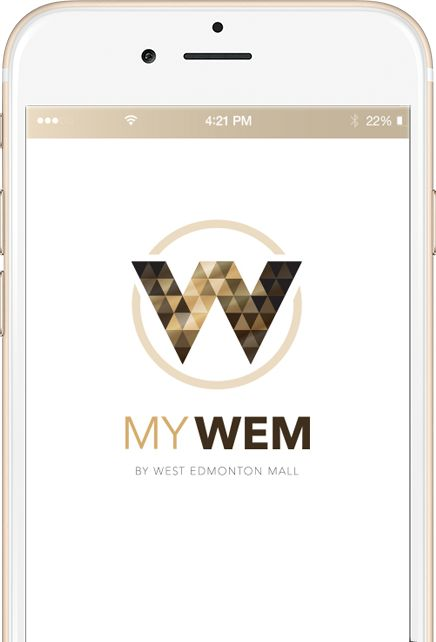
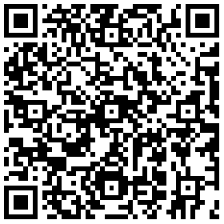
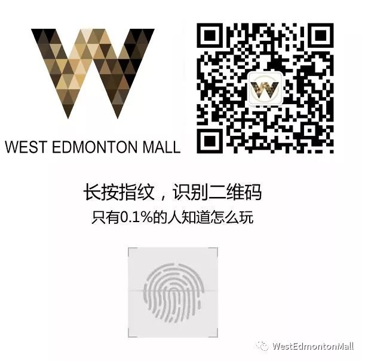

# 无标题

**链接地址:** http://mp.weixin.qq.com/s?__biz=MzAwMjYxNTQ1Nw==&mid=2247485470&idx=1&sn=4903b08f6a27dd37d72f5f5d702e0454&chksm=9ac6f9d0adb170c69f8d59761944cbcd8007cb50d1d589b6888607d230b8069ceea8819315e3&mpshare=1&scene=2&srcid=02031a23ItCUrp3zJZXHKbRa#rd
**作者:** 
**获取时间:** 2025/8/28 20:45:27
**图片数量:** 16

---

## 原始HTML内容

 

1988年，洪金宝，张曼玉，钱嘉乐，狄威和 世界华人拳王周比利 在 埃德蒙顿 拍摄了一部电影，名字叫 过埠新娘。

 

大家一起来回顾一下，你们一定会被这1988年的功夫电影所震撼，而且拍摄地点就在我们West Edmonton Mall！

 

若想观看完整介绍

请进入

Best Edmonton Mall&nbsp;http://bit.ly/2FCZMfD

（或点击左下方阅读原文）

进行观看！

 

<iframe class="video_iframe" data-vidtype="1" data-cover="http%3A%2F%2Fshp.qpic.cn%2Fqqvideo_ori%2F0%2Fk08315abzim_496_280%2F0" allowfullscreen="" frameborder="0" style="  z-index:1; " data-ratio="1.7777777777777777" data-w="864" data-src="https://v.qq.com/iframe/preview.html?width=500&amp;height=375&amp;auto=0&amp;vid=k08315abzim"></iframe>

 

 

 

对了对了 

 

切勿忘记下载West Edmonton Mall&nbsp;的神级APP

<strong style="max-width: 100%;box-sizing: border-box !important;overflow-wrap: break-word !important;">MyWEM APP</strong>

 

<strong style="max-width: 100%;box-sizing: border-box !important;overflow-wrap: break-word !important;">购物后，小票拍照</strong>

<strong style="max-width: 100%;box-sizing: border-box !important;overflow-wrap: break-word !important;">上传积分哟</strong>

 

 

 

 

 
<section class="" powered-by="xiumi.us" style="max-width: 100%;letter-spacing: 0.544px;white-space: normal;background-color: rgb(255, 255, 255);box-sizing: border-box !important;overflow-wrap: break-word !important;"><section style="margin-top: 10px;margin-bottom: 10px;max-width: 100%;box-sizing: border-box;text-align: center;overflow-wrap: break-word !important;"><section style="max-width: 100%;box-sizing: border-box;vertical-align: middle;display: inline-block;overflow-wrap: break-word !important;overflow: hidden !important;"></section></section></section><section class="" powered-by="xiumi.us" style="max-width: 100%;letter-spacing: 0.544px;white-space: normal;background-color: rgb(255, 255, 255);box-sizing: border-box !important;overflow-wrap: break-word !important;"><section style="max-width: 100%;box-sizing: border-box;text-align: center;overflow-wrap: break-word !important;"><section style="max-width: 100%;box-sizing: border-box;display: inline-block;vertical-align: top;overflow: hidden;height: 75px;width: 668px;overflow-wrap: break-word !important;"><section class="" powered-by="xiumi.us" style="max-width: 100%;box-sizing: border-box;overflow-wrap: break-word !important;"><section style="margin-top: 10px;margin-bottom: 10px;max-width: 100%;box-sizing: border-box;overflow-wrap: break-word !important;"><section style="max-width: 100%;box-sizing: border-box;vertical-align: middle;display: inline-block;overflow-wrap: break-word !important;overflow: hidden !important;"></section></section></section></section><section style="max-width: 100%;box-sizing: border-box;font-size: 0px;overflow-wrap: break-word !important;"></section></section></section><section class="" powered-by="xiumi.us" style="max-width: 100%;letter-spacing: 0.544px;white-space: normal;background-color: rgb(255, 255, 255);box-sizing: border-box !important;overflow-wrap: break-word !important;"><section style="max-width: 100%;box-sizing: border-box;text-align: center;overflow-wrap: break-word !important;"><section style="max-width: 100%;box-sizing: border-box;display: inline-block;vertical-align: top;overflow: hidden;height: 85px;width: 668px;overflow-wrap: break-word !important;"><section class="" powered-by="xiumi.us" style="max-width: 100%;box-sizing: border-box;overflow-wrap: break-word !important;"><section style="margin-top: 10px;max-width: 100%;box-sizing: border-box;overflow-wrap: break-word !important;"><section style="max-width: 100%;box-sizing: border-box;vertical-align: middle;display: inline-block;width: 394.109px;overflow-wrap: break-word !important;overflow: hidden !important;"></section></section></section></section><section style="max-width: 100%;box-sizing: border-box;font-size: 0px;overflow-wrap: break-word !important;"></section></section></section>
 

 

 

 

 
<section class="" powered-by="xiumi.us" style="max-width: 100%;letter-spacing: 0.544px;white-space: normal;background-color: rgb(255, 255, 255);box-sizing: border-box !important;overflow-wrap: break-word !important;"><section style="margin-top: 10px;margin-bottom: 10px;max-width: 100%;box-sizing: border-box;text-align: center;overflow-wrap: break-word !important;"><section style="max-width: 100%;box-sizing: border-box;display: inline-block;vertical-align: top;box-shadow: rgb(0, 0, 0) 0px 0px 0px;width: 668px;overflow-wrap: break-word !important;"><section class="" powered-by="xiumi.us" style="max-width: 100%;box-sizing: border-box;overflow-wrap: break-word !important;"><section style="max-width: 100%;box-sizing: border-box;overflow-wrap: break-word !important;"><section style="padding-right: 10px;padding-left: 10px;max-width: 100%;box-sizing: border-box;font-size: 14px;color: rgba(62, 62, 62, 0.66);letter-spacing: 2px;overflow-wrap: break-word !important;">
另外，在进入APP后，点击MyWEM的左上角的“Enter Promo Code”，输入折扣码“<strong style="max-width: 100%;box-sizing: border-box;overflow-wrap: break-word !important;">Wechat</strong>”可以立即获得<strong style="max-width: 100%;box-sizing: border-box;overflow-wrap: break-word !important;">10点积分</strong>哦！亲测好用！

 

大家快开始下载&nbsp;<strong style="max-width: 100%;box-sizing: border-box;overflow-wrap: break-word !important;">MyWEM</strong>&nbsp;APP，

添加微信<strong style="max-width: 100%;box-sizing: border-box;overflow-wrap: break-word !important;">WEMWechat</strong>公众号，

还有吃喝玩乐埃德蒙顿的微信服务号

 

去获取更多的<strong style="max-width: 100%;box-sizing: border-box;overflow-wrap: break-word !important;">独家福利</strong>吧！

 

 
<section class="" powered-by="xiumi.us" style="max-width: 100%;color: rgb(51, 51, 51);box-sizing: border-box !important;overflow-wrap: break-word !important;"><section style="margin-top: 10px;margin-bottom: 10px;max-width: 100%;box-sizing: border-box;overflow-wrap: break-word !important;"><section style="max-width: 100%;box-sizing: border-box;vertical-align: middle;display: inline-block;box-shadow: rgb(0, 0, 0) 0px 0px 0px;overflow-wrap: break-word !important;overflow: hidden !important;"></section></section>
 

 
</section>
 

 

<strong style="max-width: 100%;box-sizing: border-box !important;overflow-wrap: break-word !important;">West Edmonton Mall&nbsp;简介</strong>

 

 

 

<strong style="max-width: 100%;box-sizing: border-box !important;overflow-wrap: break-word !important;">购物、嬉水、住宿——再来一遍！</strong>

<strong style="max-width: 100%;box-sizing: border-box !important;overflow-wrap: break-word !important;">西埃德蒙顿购物中心</strong><strong style="max-width: 100%;box-sizing: border-box !important;overflow-wrap: break-word !important;">应有尽有。</strong>

 

<strong style="max-width: 100%;box-sizing: border-box !important;overflow-wrap: break-word !important;">800 家商店和 100 家餐饮场所</strong>

<strong style="max-width: 100%;box-sizing: border-box !important;overflow-wrap: break-word !important;">49公顷的购物和娱乐空间</strong>

<strong style="max-width: 100%;box-sizing: border-box !important;overflow-wrap: break-word !important;">每年 3,000 万游客</strong>

 

有多少购物中心敢于宣称自己拥有世界上最大的室内游乐园、最大的室内湖泊、最大的室内造浪池、最高的室内永久蹦极塔，还有一个溜冰场和一个动物园呢？哦，还有 800 多家商店？只有一个。西埃德蒙顿购物中心（西贸）每年可吸引 3,000 多万游客，这使其成为艾伯塔省最大的旅游景点。它的面积超过 49 公顷，为北美之最，据说其规模相当于一个小型城市。

 

 

拥有 800 多家商店，可确保您找到所需的商品。从牛仔裤到钻石，从冬装大衣到宠物狗的外套——都可以购买到。其次，您还可以参与各种活动。游客可以花上一两天的时间享受室内迷你高尔夫运动的乐趣，在闪闪发光的玻璃穹顶下学习如何滑冰，或者在三级绳索障碍课程上测试自己的平衡能力。

 

 

滑水公园拥有 17 个充满挑战性的滑梯，人们非常喜欢在这里度过美好的一天；游乐园则提供从巨型过山车到棉花糖等一切游乐设施，可让您留下非常美好的回忆。

 

 

购物和游玩都需要补充能量，购物中心可提供从美食广场到现场剧院等 100 多种休闲选择。一天结束时，不妨光顾其中一个特色水疗中心，或者入住梦想世界酒店(Fantasyland Hotel)梦幻般的好莱坞主题客房或卡车房(Truck Room)、火车房(Train Room)等疯狂主题客房，以延续一整天的欢乐情绪。西埃德蒙顿购物中心可为您提供独一无二的体验。

 

 

<strong style="max-width: 100%;box-sizing: border-box !important;overflow-wrap: break-word !important;">独一无二的 West Edmonton Mall</strong>

 

800 家商店和 100 家餐厅任君选择<strong style="max-width: 100%;box-sizing: border-box !important;overflow-wrap: break-word !important;">。</strong>超过 17 个独特的嬉水滑梯和各种游乐设施将让您全家人在世界水上乐园(World Waterpark)度过非常充实的一整天。当您的孩子在波浪中玩耍时，您可坐在海滩椅上放松休息，或观看勇敢的人们挑战蹦极。

 

 

银河系乐园(Galaxyland)是世界最大的室内游乐园，拥有超过 24 个游乐设施和景点。

 

 

在海洋生物水族馆(Marine Life Aquarium)观看海狮和 100 多种其他海洋生物的滑稽表演。

 

1492 年克里斯托弗•哥伦布(Christopher Columbus)所乘船只的精确复制品——圣玛利亚号(Santa Maria)停泊在世界最大的室内湖泊中。不妨登上该船，畅想探险家们在海上乘风破浪的惊险场面。

 

 

入住幻想乐园酒店（Fantsland Hotel）的奇幻主题客房，外太空空间，各类体育主题房间，多种不同文化主题类房间，好莱坞巨星主题房间，更有适合孩子们的孩童汽车及不同主题房间！

 

 

<strong style="max-width: 100%;box-sizing: border-box !important;overflow-wrap: break-word !important;">West Edmonton Mall&nbsp;西埃德蒙顿购物中心，欢迎您的光临！</strong>

 

 
</section></section></section><section class="" powered-by="xiumi.us" style="max-width: 100%;box-sizing: border-box;overflow-wrap: break-word !important;"><section style="max-width: 100%;box-sizing: border-box;overflow-wrap: break-word !important;"><section style="max-width: 100%;box-sizing: border-box;overflow-wrap: break-word !important;">
 
</section></section></section><section class="" powered-by="xiumi.us" style="max-width: 100%;box-sizing: border-box;overflow-wrap: break-word !important;"><section style="max-width: 100%;box-sizing: border-box;overflow-wrap: break-word !important;"><section style="padding-right: 10px;padding-left: 10px;max-width: 100%;box-sizing: border-box;font-size: 14px;color: rgba(62, 62, 62, 0.66);letter-spacing: 2px;overflow-wrap: break-word !important;">
- END - 
</section></section></section></section></section></section><section class="" powered-by="xiumi.us" style="max-width: 100%;letter-spacing: 0.544px;white-space: normal;background-color: rgb(255, 255, 255);box-sizing: border-box !important;overflow-wrap: break-word !important;"><section style="margin-top: 10px;margin-bottom: 10px;max-width: 100%;box-sizing: border-box;text-align: center;overflow-wrap: break-word !important;"><section style="max-width: 100%;box-sizing: border-box;vertical-align: middle;display: inline-block;box-shadow: rgb(0, 0, 0) 0px 0px 0px;overflow-wrap: break-word !important;overflow: hidden !important;"></section></section></section><section class="" powered-by="xiumi.us" style="max-width: 100%;letter-spacing: 0.544px;white-space: normal;background-color: rgb(255, 255, 255);box-sizing: border-box !important;overflow-wrap: break-word !important;"><section style="max-width: 100%;box-sizing: border-box;overflow-wrap: break-word !important;"><section style="max-width: 100%;box-sizing: border-box;text-align: center;font-size: 14px;color: rgb(160, 160, 160);overflow-wrap: break-word !important;">
West Edmonton Mall 微信公众号

由

吃喝玩乐埃德蒙顿 Edmonton Explorer 营运管理

 

</section></section></section>
 

---

## 纯文本内容

1988年，洪金宝，张曼玉，钱嘉乐，狄威和 世界华人拳王周比利 在 埃德蒙顿 拍摄了一部电影，名字叫 过埠新娘。大家一起来回顾一下，你们一定会被这1988年的功夫电影所震撼，而且拍摄地点就在我们West Edmonton Mall！若想观看完整介绍请进入Best Edmonton Mall http://bit.ly/2FCZMfD（或点击左下方阅读原文）进行观看！对了对了切勿忘记下载West Edmonton Mall 的神级APPMyWEM APP购物后，小票拍照上传积分哟另外，在进入APP后，点击MyWEM的左上角的“Enter Promo Code”，输入折扣码“Wechat”可以立即获得10点积分哦！亲测好用！大家快开始下载 MyWEM APP，添加微信WEMWechat公众号，还有吃喝玩乐埃德蒙顿的微信服务号去获取更多的独家福利吧！West Edmonton Mall 简介购物、嬉水、住宿——再来一遍！西埃德蒙顿购物中心应有尽有。800 家商店和 100 家餐饮场所49公顷的购物和娱乐空间每年 3,000 万游客有多少购物中心敢于宣称自己拥有世界上最大的室内游乐园、最大的室内湖泊、最大的室内造浪池、最高的室内永久蹦极塔，还有一个溜冰场和一个动物园呢？哦，还有 800 多家商店？只有一个。西埃德蒙顿购物中心（西贸）每年可吸引 3,000 多万游客，这使其成为艾伯塔省最大的旅游景点。它的面积超过 49 公顷，为北美之最，据说其规模相当于一个小型城市。拥有 800 多家商店，可确保您找到所需的商品。从牛仔裤到钻石，从冬装大衣到宠物狗的外套——都可以购买到。其次，您还可以参与各种活动。游客可以花上一两天的时间享受室内迷你高尔夫运动的乐趣，在闪闪发光的玻璃穹顶下学习如何滑冰，或者在三级绳索障碍课程上测试自己的平衡能力。滑水公园拥有 17 个充满挑战性的滑梯，人们非常喜欢在这里度过美好的一天；游乐园则提供从巨型过山车到棉花糖等一切游乐设施，可让您留下非常美好的回忆。购物和游玩都需要补充能量，购物中心可提供从美食广场到现场剧院等 100 多种休闲选择。一天结束时，不妨光顾其中一个特色水疗中心，或者入住梦想世界酒店(Fantasyland Hotel)梦幻般的好莱坞主题客房或卡车房(Truck Room)、火车房(Train Room)等疯狂主题客房，以延续一整天的欢乐情绪。西埃德蒙顿购物中心可为您提供独一无二的体验。独一无二的 West Edmonton Mall800 家商店和 100 家餐厅任君选择。超过 17 个独特的嬉水滑梯和各种游乐设施将让您全家人在世界水上乐园(World Waterpark)度过非常充实的一整天。当您的孩子在波浪中玩耍时，您可坐在海滩椅上放松休息，或观看勇敢的人们挑战蹦极。银河系乐园(Galaxyland)是世界最大的室内游乐园，拥有超过 24 个游乐设施和景点。在海洋生物水族馆(Marine Life Aquarium)观看海狮和 100 多种其他海洋生物的滑稽表演。1492 年克里斯托弗•哥伦布(Christopher Columbus)所乘船只的精确复制品——圣玛利亚号(Santa Maria)停泊在世界最大的室内湖泊中。不妨登上该船，畅想探险家们在海上乘风破浪的惊险场面。入住幻想乐园酒店（Fantsland Hotel）的奇幻主题客房，外太空空间，各类体育主题房间，多种不同文化主题类房间，好莱坞巨星主题房间，更有适合孩子们的孩童汽车及不同主题房间！West Edmonton Mall 西埃德蒙顿购物中心，欢迎您的光临！- END -West Edmonton Mall 微信公众号由吃喝玩乐埃德蒙顿 Edmonton Explorer 营运管理

---

## 图片列表

-  (原始链接: https://mmbiz.qpic.cn/mmbiz_png/Zk111LsPykURB6aPjic3I2Av7MAfWZlSQFxTAKx1lqG6S709PD4kXQa5B9VxCXUcVqEoZ5rpL4OUOl6eMzicnr3w/640?wx_fmt=png)
-  (原始链接: https://mmbiz.qpic.cn/mmbiz_png/Zk111LsPykXZjqKFALfgPacz0JtOLum5LQicrJDhjZbyNRAo54noGNM2HTsG9g94Qjia4vLicoYWSj9q3cHzibic91Q/640?wx_fmt=png)
-  (原始链接: https://mmbiz.qpic.cn/mmbiz_png/Zk111LsPykXZjqKFALfgPacz0JtOLum5WtQcndVkFVVSuvvWDquhmVSEic31n6xuibDyghAM7WFyIJcAvhqabdyg/640?wx_fmt=png)
-  (原始链接: https://mmbiz.qpic.cn/mmbiz_png/Zk111LsPykXZjqKFALfgPacz0JtOLum5mFngEGXeZRcM6VgmWlYk7HsuwltIK7L6D7dBGqpCPkjVdE6y7BIAsw/640?wx_fmt=png)
-  (原始链接: https://mmbiz.qpic.cn/mmbiz_png/Zk111LsPykXZjqKFALfgPacz0JtOLum5qJQsomM9ocUOrI6430mbcNRJxn3eaKlS6MAD8jicCUlPclkUBbnqzsQ/640?wx_fmt=png)
-  (原始链接: https://mmbiz.qpic.cn/mmbiz_png/Zk111LsPykXZjqKFALfgPacz0JtOLum5s1w5wnfSz9fCIicBicucFOecwNYTItIXiaOTRpaibux4G7bbHnsylqFERQ/640?wx_fmt=png)
-  (原始链接: https://mmbiz.qpic.cn/mmbiz_png/PMSb9pENrhbAkNBhJWTFxMbOcsx8Ficza8YQefJbjKe0moiajvuJfwZXzoSOpjoX9ibcvjFhrhfzqOGvNr6mNVK6Q/640?wx_fmt=png)
-  (原始链接: https://mmbiz.qpic.cn/mmbiz_jpg/Zk111LsPykXpRQZY1hFE5nCZbLUnx4zPCzJ62NbT1k02BNcEDJX9L7dXDLzicEo8YZemJ9XlMtbicS6Jr7S9r7Pg/640?wx_fmt=jpeg)
-  (原始链接: https://mmbiz.qpic.cn/mmbiz_jpg/Zk111LsPykXpRQZY1hFE5nCZbLUnx4zPBFSLRbUNaRuermN94SFu9zzSVBMLgtmsicqyWqK9ZFqiat6MQkoEQq2Q/640?wx_fmt=jpeg)
-  (原始链接: https://mmbiz.qpic.cn/mmbiz_jpg/Zk111LsPykXpRQZY1hFE5nCZbLUnx4zPAeE5JICyOAWkRkCLYHyyPJJolbdC6UhsLBZt1ibzm6H3nRNEzhoFUiaA/640?wx_fmt=jpeg)
-  (原始链接: https://mmbiz.qpic.cn/mmbiz_jpg/Zk111LsPykXpRQZY1hFE5nCZbLUnx4zP2RkWqfCCibB1hicpS3CMFCuBvTZHPqGFV9oric9cXrZWlqxDvEgUeL0Nw/640?wx_fmt=jpeg)
-  (原始链接: https://mmbiz.qpic.cn/mmbiz_jpg/Zk111LsPykXpRQZY1hFE5nCZbLUnx4zPaoWHibZXsN112MzEd0JaP8k6ac6icBAariamdXj1zwnsZRqrM30Tlpshg/640?wx_fmt=jpeg)
-  (原始链接: https://mmbiz.qpic.cn/mmbiz_jpg/Zk111LsPykXpRQZY1hFE5nCZbLUnx4zPpoweicu820u1MPKDaZJSZS8wUeyfawlwGX1ZL4QeOuWeQjNX5h9ktsg/640?wx_fmt=jpeg)
-  (原始链接: https://mmbiz.qpic.cn/mmbiz_jpg/Zk111LsPykXpRQZY1hFE5nCZbLUnx4zPr8o0fScnwTVfLYJqWhFCInX0WicNFF6cMichYlE4EODKfsKFwqRD22ibg/640?wx_fmt=jpeg)
-  (原始链接: https://mmbiz.qpic.cn/mmbiz_png/PMSb9pENrhbAkNBhJWTFxMbOcsx8Ficza8YQefJbjKe0moiajvuJfwZXzoSOpjoX9ibcvjFhrhfzqOGvNr6mNVK6Q/640?wx_fmt=png)
-  (原始链接: https://mmbiz.qpic.cn/mmbiz_jpg/Zk111LsPykURB6aPjic3I2Av7MAfWZlSQ1Xic5QUf03BgRWiavoonXsGdNkqF3SfQdErgLIXYMkNiaNtvV5WrE089A/640?wx_fmt=jpeg)
