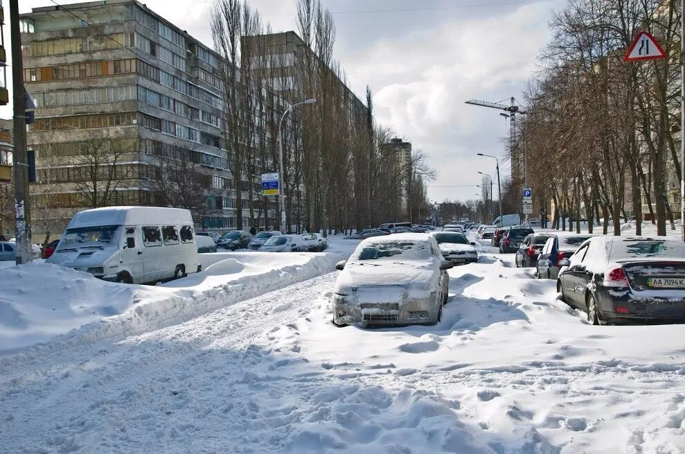
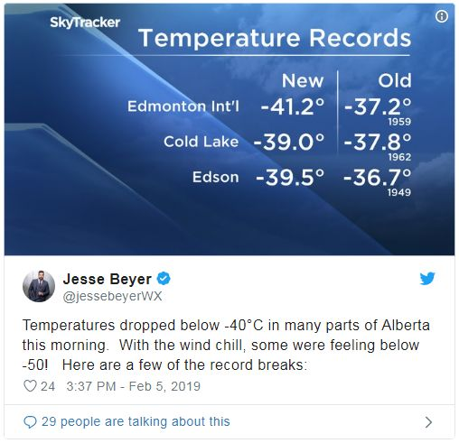
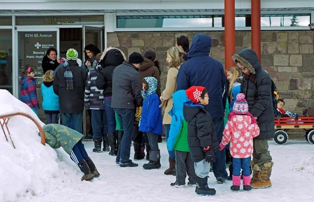
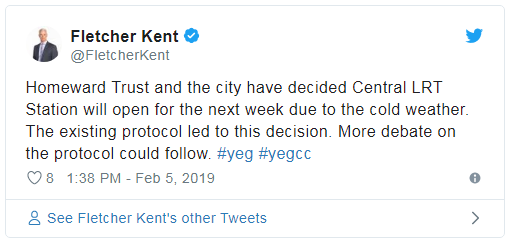
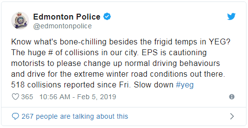
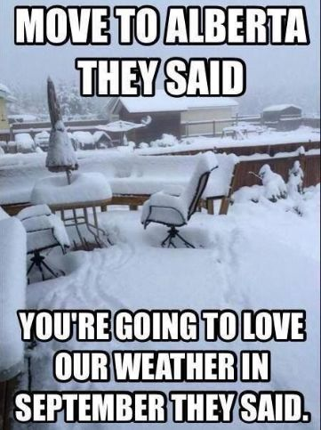

# 无标题

**链接地址:** http://mp.weixin.qq.com/s?__biz=MzI2NTE1ODgwOQ==&mid=2649606090&idx=1&sn=4a8ba06bfbc3a9b707a07ff26dd08be1&chksm=f2b8ce3cc5cf472aea0358a1e0049baae21ce3d8101447160649e2310c53711a629bcf547f4e&mpshare=1&scene=2&srcid=#rd
**作者:** 人见人爱的副局长
**获取时间:** 2025/8/28 20:44:06
**图片数量:** 16

---

## 原始HTML内容

<section style="box-sizing: border-box;"><section style="font-size: 16px;box-sizing: border-box;" powered-by="xiumi.us"><section style="margin-right: 0%;margin-left: 0%;box-sizing: border-box;"><section style="display: inline-block;vertical-align: middle;width: 80%;box-sizing: border-box;"><section style="box-sizing: border-box;" powered-by="xiumi.us"><section style="margin-top: 10px;margin-bottom: 10px;text-align: center;box-sizing: border-box;"><section style="display: inline-block;box-sizing: border-box;"><section style="max-width: 100%;font-size: 0px;padding-bottom: 3px;box-sizing: border-box;"><section style="display: inline-block;vertical-align: middle;box-sizing: border-box;"><section style="width: 5px;height: 1px;background-color: rgb(217, 217, 217);box-sizing: border-box;"></section><section style="width: 1px;height: 5px;margin-top: -3px;margin-right: auto;margin-left: auto;background-color: rgb(217, 217, 217);box-sizing: border-box;"></section></section><section style="margin-top: -1px;margin-right: -5px;margin-left: -5px;width: 100%;display: inline-block;vertical-align: middle;padding-right: 8px;padding-left: 8px;box-sizing: border-box;"><section style="width: 100%;height: 1px;background-color: rgb(217, 217, 217);box-sizing: border-box;"></section></section><section style="display: inline-block;vertical-align: middle;box-sizing: border-box;"><section style="width: 5px;height: 1px;background-color: rgb(217, 217, 217);box-sizing: border-box;"></section><section style="width: 1px;height: 5px;margin-top: -3px;margin-right: auto;margin-left: auto;background-color: rgb(217, 217, 217);box-sizing: border-box;"></section></section></section><section style="padding-left: 15px;padding-right: 15px;color: rgb(161, 161, 161);font-size: 14px;box-sizing: border-box;">
点击上方<strong style="box-sizing: border-box;">蓝字</strong>关注我们哟~
</section><section style="max-width: 100%;font-size: 0px;box-sizing: border-box;"><section style="display: inline-block;vertical-align: middle;box-sizing: border-box;"><section style="width: 5px;height: 1px;background-color: rgb(217, 217, 217);box-sizing: border-box;"></section><section style="width: 1px;height: 5px;margin-top: -3px;margin-right: auto;margin-left: auto;background-color: rgb(217, 217, 217);box-sizing: border-box;"></section></section><section style="margin-top: -1px;margin-right: -5px;margin-left: -5px;width: 100%;display: inline-block;vertical-align: middle;padding-right: 8px;padding-left: 8px;box-sizing: border-box;"><section style="width: 100%;height: 1px;background-color: rgb(217, 217, 217);box-sizing: border-box;"></section></section><section style="display: inline-block;vertical-align: middle;box-sizing: border-box;"><section style="width: 5px;height: 1px;background-color: rgb(217, 217, 217);box-sizing: border-box;"></section><section style="width: 1px;height: 5px;margin-top: -3px;margin-right: auto;margin-left: auto;background-color: rgb(217, 217, 217);box-sizing: border-box;"></section></section></section></section></section></section></section><section style="display: inline-block;vertical-align: middle;width: 20%;box-sizing: border-box;"><section style="box-sizing: border-box;" powered-by="xiumi.us"><section style="text-align: center;margin: -10px 0% 10px;box-sizing: border-box;"><section style="max-width: 100%;vertical-align: middle;display: inline-block;line-height: 0;width: 100%;box-sizing: border-box;"></section></section></section></section></section></section><section style="font-size: 16px;box-sizing: border-box;" powered-by="xiumi.us"><section style="margin: 10px 0%;box-sizing: border-box;"><section style="display: inline-block;width: 100%;vertical-align: top;box-sizing: border-box;"><section style="box-sizing: border-box;" powered-by="xiumi.us"><section style="box-sizing: border-box;"><section style="display: inline-block;vertical-align: bottom;width: 75%;padding-right: 10px;box-sizing: border-box;"><section style="box-sizing: border-box;" powered-by="xiumi.us"><section style="margin: 10px 0% 3px;box-sizing: border-box;"><section style="display: inline-block;vertical-align: middle;box-sizing: border-box;"><section style="display: inline-block;vertical-align: bottom;padding-left: 5px;padding-right: 5px;line-height: 1.2em;margin-bottom: 2px;color: rgba(80, 182, 201, 0.72);box-sizing: border-box;">
<strong style="box-sizing: border-box;">仔细看下图，有惊喜！</strong>
</section><section style="max-width: 100%;display: inline-block;vertical-align: bottom;line-height: 0;width: 1.6em;box-sizing: border-box;"></section></section></section></section></section><section style="display: inline-block;vertical-align: bottom;width: 25%;box-sizing: border-box;"><section style="box-sizing: border-box;" powered-by="xiumi.us"><section style="margin-right: 0%;margin-bottom: 3px;margin-left: 0%;text-align: right;box-sizing: border-box;"><section style="display: inline-block;border-bottom: 0.15em solid rgba(80, 182, 201, 0.72);padding-bottom: 3px;box-sizing: border-box;"><section style="display: inline-block;padding: 3px;border-bottom: 0.15em solid rgba(80, 182, 201, 0.72);font-size: 12px;line-height: 1.4;color: rgb(255, 143, 47);box-sizing: border-box;">
<strong style="box-sizing: border-box;">金主大大</strong>
</section></section></section></section></section></section></section><section style="box-sizing: border-box;" powered-by="xiumi.us"><section style="margin-right: 0%;margin-left: 0%;box-sizing: border-box;"><section style="background-color: rgba(80, 182, 201, 0.72);height: 2px;box-sizing: border-box;"></section></section></section></section></section></section><section style="font-size: 16px;box-sizing: border-box;" powered-by="xiumi.us"><section style="text-align: center;margin-top: 10px;margin-bottom: 10px;box-sizing: border-box;"><section style="max-width: 100%;vertical-align: middle;display: inline-block;line-height: 0;box-sizing: border-box;"></section></section></section><section style="font-size: 16px;box-sizing: border-box;" powered-by="xiumi.us"><section style="text-align: center;margin-top: 10px;margin-bottom: 10px;box-sizing: border-box;"><section style="max-width: 100%;vertical-align: middle;display: inline-block;line-height: 0;box-sizing: border-box;"></section></section></section><section style="font-size: 16px;box-sizing: border-box;" powered-by="xiumi.us"><section style="text-align: center;margin-top: 10px;margin-bottom: 10px;box-sizing: border-box;"><section style="max-width: 100%;vertical-align: middle;display: inline-block;line-height: 0;box-sizing: border-box;"></section></section></section><section style="font-size: 16px;box-sizing: border-box;" powered-by="xiumi.us"><section style="text-align: center;margin-top: 10px;margin-bottom: 10px;box-sizing: border-box;"><section style="max-width: 100%;vertical-align: middle;display: inline-block;line-height: 0;box-sizing: border-box;"></section></section></section><section style="font-size: 16px;box-sizing: border-box;" powered-by="xiumi.us"><section style="text-align: center;margin-top: 10px;margin-bottom: 10px;box-sizing: border-box;"><section style="max-width: 100%;vertical-align: middle;display: inline-block;line-height: 0;box-sizing: border-box;"><svg class="svg" xmlns="http://www.w3.org/2000/svg" x="0px" y="0px" viewBox="0 0 902.1 38.2" style="vertical-align: middle;max-width: 100%;box-sizing: border-box;" width="100%"><g style="box-sizing: border-box;"><path style="box-sizing: border-box;" d="M18.4,1.4c0.9-1.9,2.4-1.9,3.4,0l3.4,6.9c0.9,1.9,3.4,3.7,5.4,4l7.6,1.1c2.1,0.3,2.5,1.7,1,3.2   l-5.5,5.4c-1.5,1.5-2.4,4.3-2.1,6.4l1.3,7.6c0.4,2.1-0.9,2.9-2.7,2l-6.8-3.6c-1.8-1-4.9-1-6.7,0l-6.8,3.6c-1.9,1-3.1,0.1-2.7-2   l1.3-7.6c0.4-2.1-0.6-4.9-2.1-6.4l-5.5-5.4c-1.5-1.5-1-2.9,1-3.2l7.6-1.1c2.1-0.3,4.5-2.1,5.4-4L18.4,1.4z" fill="rgb(178, 243, 230)"></path><path style="box-sizing: border-box;" d="M90.6,5.4c0.7-1.4,1.9-1.4,2.6,0l2.6,5.3c0.7,1.4,2.6,2.8,4.2,3.1l5.9,0.9c1.6,0.2,2,1.3,0.8,2.5   l-4.2,4.1c-1.2,1.1-1.9,3.3-1.6,4.9l1,5.8c0.3,1.6-0.7,2.3-2.1,1.5l-5.2-2.8c-1.4-0.8-3.8-0.8-5.2,0L84,33.6   c-1.4,0.8-2.4,0.1-2.1-1.5l1-5.8c0.3-1.6-0.5-3.8-1.6-4.9l-4.2-4.1c-1.2-1.1-0.8-2.2,0.8-2.5l5.9-0.9c1.6-0.2,3.5-1.6,4.2-3.1   L90.6,5.4z" fill="rgb(190, 204, 246)"></path><path style="box-sizing: border-box;" d="M162.6,7.5c0.6-1.2,1.6-1.2,2.2,0l2.2,4.5c0.6,1.2,2.2,2.4,3.6,2.6l5,0.7c1.4,0.2,1.7,1.1,0.7,2.1   l-3.6,3.5c-1,1-1.6,2.9-1.4,4.2l0.9,5c0.2,1.4-0.6,1.9-1.8,1.3l-4.5-2.4c-1.2-0.6-3.2-0.6-4.4,0l-4.5,2.4c-1.2,0.6-2,0.1-1.8-1.3   l0.9-5c0.2-1.4-0.4-3.3-1.4-4.2l-3.6-3.5c-1-1-0.7-1.9,0.7-2.1l5-0.7c1.4-0.2,3-1.4,3.6-2.6L162.6,7.5z" fill="rgb(150, 208, 240)"></path><path style="box-sizing: border-box;" d="M60.1,19.1c0,2.3-1.9,4.2-4.2,4.2c-2.3,0-4.2-1.9-4.2-4.2s1.9-4.2,4.2-4.2   C58.3,14.9,60.1,16.8,60.1,19.1z" fill="rgb(218, 240, 224)"></path><path style="box-sizing: border-box;" d="M203.8,19.1c0,2.3-1.9,4.2-4.2,4.2c-2.3,0-4.2-1.9-4.2-4.2s1.9-4.2,4.2-4.2   C201.9,14.9,203.8,16.8,203.8,19.1z" fill="rgb(218, 240, 224)"></path><path style="box-sizing: border-box;" d="M130.9,19.1c0,1.7-1.4,3.1-3.1,3.1c-1.7,0-3.1-1.4-3.1-3.1c0-1.7,1.4-3.1,3.1-3.1   C129.5,16.1,130.9,17.4,130.9,19.1z" fill="rgb(218, 240, 224)"></path><path style="box-sizing: border-box;" d="M233.9,1.4c0.9-1.9,2.4-1.9,3.4,0l3.4,6.9c0.9,1.9,3.4,3.7,5.4,4l7.6,1.1c2.1,0.3,2.5,1.7,1,3.2   l-5.5,5.4c-1.5,1.5-2.4,4.3-2.1,6.4l1.3,7.6c0.4,2.1-0.9,2.9-2.7,2l-6.8-3.6c-1.8-1-4.9-1-6.7,0l-6.8,3.6c-1.9,1-3.1,0.1-2.7-2   l1.3-7.6c0.4-2.1-0.6-4.9-2.1-6.4l-5.5-5.4c-1.5-1.5-1-2.9,1-3.2l7.6-1.1c2.1-0.3,4.5-2.1,5.4-4L233.9,1.4z" fill="rgb(178, 243, 230)"></path><path style="box-sizing: border-box;" d="M306.1,5.4c0.7-1.4,1.9-1.4,2.6,0l2.6,5.3c0.7,1.4,2.6,2.8,4.2,3.1l5.9,0.9c1.6,0.2,2,1.3,0.8,2.5   l-4.2,4.1c-1.2,1.1-1.9,3.3-1.6,4.9l1,5.8c0.3,1.6-0.7,2.3-2.1,1.5l-5.2-2.8c-1.4-0.8-3.8-0.8-5.2,0l-5.2,2.8   c-1.4,0.8-2.4,0.1-2.1-1.5l1-5.8c0.3-1.6-0.4-3.8-1.6-4.9l-4.2-4.1c-1.2-1.1-0.8-2.2,0.8-2.5l5.9-0.9c1.6-0.2,3.5-1.6,4.2-3.1   L306.1,5.4z" fill="rgb(190, 204, 246)"></path><path style="box-sizing: border-box;" d="M378.1,7.5c0.6-1.2,1.6-1.2,2.2,0l2.2,4.5c0.6,1.2,2.2,2.4,3.6,2.6l5,0.7c1.4,0.2,1.7,1.1,0.7,2.1   l-3.6,3.5c-1,1-1.6,2.9-1.4,4.2l0.9,5c0.2,1.4-0.6,1.9-1.8,1.3l-4.5-2.4c-1.2-0.6-3.2-0.6-4.4,0l-4.5,2.4c-1.2,0.6-2,0.1-1.8-1.3   l0.9-5c0.2-1.4-0.4-3.3-1.4-4.2l-3.6-3.5c-1-1-0.7-1.9,0.7-2.1l5-0.7c1.4-0.2,3-1.4,3.6-2.6L378.1,7.5z" fill="rgb(150, 208, 240)"></path><path style="box-sizing: border-box;" d="M275.7,19.1c0,2.3-1.9,4.2-4.2,4.2c-2.3,0-4.2-1.9-4.2-4.2s1.9-4.2,4.2-4.2   C273.8,14.9,275.7,16.8,275.7,19.1z" fill="rgb(218, 240, 224)"></path><path style="box-sizing: border-box;" d="M419.3,19.1c0,2.3-1.9,4.2-4.2,4.2c-2.3,0-4.2-1.9-4.2-4.2s1.9-4.2,4.2-4.2   C417.5,14.9,419.3,16.8,419.3,19.1z" fill="rgb(218, 240, 224)"></path><path style="box-sizing: border-box;" d="M346.4,19.1c0,1.7-1.4,3.1-3.1,3.1c-1.7,0-3.1-1.4-3.1-3.1c0-1.7,1.4-3.1,3.1-3.1   C345,16.1,346.4,17.4,346.4,19.1z" fill="rgb(218, 240, 224)"></path><path style="box-sizing: border-box;" d="M449.4,1.4c0.9-1.9,2.4-1.9,3.4,0l3.4,6.9c0.9,1.9,3.4,3.7,5.4,4l7.6,1.1c2.1,0.3,2.5,1.7,1,3.2   l-5.5,5.4c-1.5,1.5-2.4,4.3-2.1,6.4l1.3,7.6c0.4,2.1-0.9,2.9-2.7,2l-6.8-3.6c-1.8-1-4.9-1-6.7,0l-6.8,3.6c-1.9,1-3.1,0.1-2.7-2   l1.3-7.6c0.4-2.1-0.6-4.9-2.1-6.4l-5.5-5.4c-1.5-1.5-1-2.9,1-3.2l7.6-1.1c2.1-0.3,4.5-2.1,5.4-4L449.4,1.4z" fill="rgb(178, 243, 230)"></path><path style="box-sizing: border-box;" d="M521.6,5.4c0.7-1.4,1.9-1.4,2.6,0l2.6,5.3c0.7,1.4,2.6,2.8,4.2,3.1l5.9,0.9c1.6,0.2,2,1.3,0.8,2.5   l-4.2,4.1c-1.2,1.1-1.9,3.3-1.6,4.9l1,5.8c0.3,1.6-0.7,2.3-2.1,1.5l-5.2-2.8c-1.4-0.8-3.8-0.8-5.2,0l-5.2,2.8   c-1.4,0.8-2.4,0.1-2.1-1.5l1-5.8c0.3-1.6-0.5-3.8-1.6-4.9l-4.2-4.1c-1.2-1.1-0.8-2.2,0.8-2.5l5.9-0.9c1.6-0.2,3.5-1.6,4.2-3.1   L521.6,5.4z" fill="rgb(190, 204, 246)"></path><path style="box-sizing: border-box;" d="M593.6,7.5c0.6-1.2,1.6-1.2,2.2,0l2.2,4.5c0.6,1.2,2.2,2.4,3.6,2.6l5,0.7c1.4,0.2,1.7,1.1,0.7,2.1   l-3.6,3.5c-1,1-1.6,2.9-1.4,4.2l0.9,5c0.2,1.4-0.6,1.9-1.8,1.3l-4.5-2.4c-1.2-0.6-3.2-0.6-4.4,0l-4.5,2.4c-1.2,0.6-2,0.1-1.8-1.3   l0.9-5c0.2-1.4-0.4-3.3-1.4-4.2l-3.6-3.5c-1-1-0.7-1.9,0.7-2.1l5-0.7c1.4-0.2,3-1.4,3.6-2.6L593.6,7.5z" fill="rgb(150, 208, 240)"></path><path style="box-sizing: border-box;" d="M491.2,19.1c0,2.3-1.9,4.2-4.2,4.2c-2.3,0-4.2-1.9-4.2-4.2s1.9-4.2,4.2-4.2   C489.3,14.9,491.2,16.8,491.2,19.1z" fill="rgb(218, 240, 224)"></path><path style="box-sizing: border-box;" d="M634.9,19.1c0,2.3-1.9,4.2-4.2,4.2c-2.3,0-4.2-1.9-4.2-4.2s1.9-4.2,4.2-4.2   C633,14.9,634.9,16.8,634.9,19.1z" fill="rgb(218, 240, 224)"></path><path style="box-sizing: border-box;" d="M561.9,19.1c0,1.7-1.4,3.1-3.1,3.1c-1.7,0-3.1-1.4-3.1-3.1c0-1.7,1.4-3.1,3.1-3.1   C560.5,16.1,561.9,17.4,561.9,19.1z" fill="rgb(218, 240, 224)"></path><path style="box-sizing: border-box;" d="M664.9,1.4c0.9-1.9,2.4-1.9,3.4,0l3.4,6.9c0.9,1.9,3.4,3.7,5.4,4l7.6,1.1c2.1,0.3,2.5,1.7,1,3.2   l-5.5,5.4c-1.5,1.5-2.4,4.3-2.1,6.4l1.3,7.6c0.4,2.1-0.9,2.9-2.7,2l-6.8-3.6c-1.8-1-4.9-1-6.7,0l-6.8,3.6c-1.9,1-3.1,0.1-2.7-2   l1.3-7.6c0.4-2.1-0.6-4.9-2.1-6.4l-5.5-5.4c-1.5-1.5-1-2.9,1-3.2l7.6-1.1c2.1-0.3,4.5-2.1,5.4-4L664.9,1.4z" fill="rgb(178, 243, 230)"></path><path style="box-sizing: border-box;" d="M737.1,5.4c0.7-1.4,1.9-1.4,2.6,0l2.6,5.3c0.7,1.4,2.6,2.8,4.2,3.1l5.9,0.9c1.6,0.2,2,1.3,0.8,2.5   l-4.2,4.1c-1.2,1.1-1.9,3.3-1.6,4.9l1,5.8c0.3,1.6-0.7,2.3-2.1,1.5l-5.2-2.8c-1.4-0.8-3.8-0.8-5.2,0l-5.2,2.8   c-1.4,0.8-2.4,0.1-2.1-1.5l1-5.8c0.3-1.6-0.5-3.8-1.6-4.9l-4.2-4.1c-1.2-1.1-0.8-2.2,0.8-2.5l5.9-0.9c1.6-0.2,3.5-1.6,4.2-3.1   L737.1,5.4z" fill="rgb(190, 204, 246)"></path><path style="box-sizing: border-box;" d="M809.2,7.5c0.6-1.2,1.6-1.2,2.2,0l2.2,4.5c0.6,1.2,2.2,2.4,3.6,2.6l5,0.7c1.4,0.2,1.7,1.1,0.7,2.1   l-3.6,3.5c-1,1-1.6,2.9-1.4,4.2l0.9,5c0.2,1.4-0.6,1.9-1.8,1.3l-4.5-2.4c-1.2-0.6-3.2-0.6-4.4,0l-4.5,2.4c-1.2,0.6-2,0.1-1.8-1.3   l0.9-5c0.2-1.4-0.4-3.3-1.4-4.2l-3.6-3.5c-1-1-0.7-1.9,0.7-2.1l5-0.7c1.4-0.2,3-1.4,3.6-2.6L809.2,7.5z" fill="rgb(150, 208, 240)"></path><path style="box-sizing: border-box;" d="M706.7,19.1c0,2.3-1.9,4.2-4.2,4.2c-2.3,0-4.2-1.9-4.2-4.2s1.9-4.2,4.2-4.2   C704.8,14.9,706.7,16.8,706.7,19.1z" fill="rgb(218, 240, 224)"></path><path style="box-sizing: border-box;" d="M850.4,19.1c0,2.3-1.9,4.2-4.2,4.2c-2.3,0-4.2-1.9-4.2-4.2s1.9-4.2,4.2-4.2   C848.5,14.9,850.4,16.8,850.4,19.1z" fill="rgb(218, 240, 224)"></path><path style="box-sizing: border-box;" d="M777.4,19.1c0,1.7-1.4,3.1-3.1,3.1c-1.7,0-3.1-1.4-3.1-3.1c0-1.7,1.4-3.1,3.1-3.1   C776,16.1,777.4,17.4,777.4,19.1z" fill="rgb(218, 240, 224)"></path><path style="box-sizing: border-box;" d="M880.4,1.4c0.9-1.9,2.4-1.9,3.4,0l3.4,6.9c0.9,1.9,3.4,3.7,5.4,4l7.6,1.1c2.1,0.3,2.5,1.7,1,3.2   l-5.5,5.4c-1.5,1.5-2.4,4.3-2.1,6.4l1.3,7.6c0.4,2.1-0.9,2.9-2.7,2l-6.8-3.6c-1.8-1-4.9-1-6.7,0l-6.8,3.6c-1.8,1-3.1,0.1-2.7-2   l1.3-7.6c0.4-2.1-0.6-4.9-2.1-6.4l-5.5-5.4c-1.5-1.5-1-2.9,1-3.2l7.6-1.1c2.1-0.3,4.5-2.1,5.4-4L880.4,1.4z" fill="rgb(178, 243, 230)"></path></g></svg></section></section></section><section style="box-sizing: border-box;" powered-by="xiumi.us"><section style="box-sizing: border-box;"><section style="box-sizing: border-box;">
<em><strong>大年初一头一天，冻炸！</strong></em>

 

大年初一的埃德蒙顿是今年<strong>连续发出低温警告的第三天</strong>，刚进入猪年埃德蒙顿的天气就给大家来了个下马威。而且这个<strong>下马威的威力十足</strong>，在室外站几秒就冻得上气不接下气。

 

你要干感觉：“哇，<strong>这是我在埃德蒙顿经历过最冷的一天啦！</strong>”那么我只能说：你的感觉是对的！因为昨天埃德蒙顿的<strong>最低气温确实打破了以往检测到最低气温纪录</strong>！

 

前段时间，我们公众号播报过埃德蒙顿今年冬天即将遭遇低温袭击的神预言，一些小伙伴还私信说农夫年历的预测都是扯淡，这不全球变暖得好好的么？现在知道自己错了吧！这温度，就是<strong>两件加拿大鹅也扛不住</strong>啊！

 

 

<em><strong>轻松打破最低温度记录</strong></em>

 

可千万别<strong>被昨天阳光明媚的天气欺骗了感情</strong>。昨天埃德蒙顿&nbsp;Blatchford&nbsp;气象站的温度测量仪显示城区的最低温度已经降至了<strong> -32.8℃</strong>。根据埃德蒙顿首席气象学家Jesse Beyer的说法，埃德蒙顿最近一次被低于零下三十度的低温袭击还要追溯到2009年12月13日，当时城市的最低温度降至了 -36.7℃。

 

但如果你周二早上在身处城市南部，那里的气温就更冷了。埃德蒙顿国际机场附近检测到的最低温度为<strong> -41.2℃</strong>。伴随着风寒效应，<strong>体感温度已经低达 -50℃ </strong>。这样恐怖的低温<strong>一举打破了埃德蒙顿机场检测到的最低气温记录</strong>。

 

<em><strong>10人因寒冷被送往医院</strong></em>

<em><strong> </strong></em>

让人难以置信的是，在埃德蒙顿这个大家对寒冷已经习以为常的地方，遇到如此极寒的天气，还是引发了很多由寒冷引起的健康问题。随着气温下降到危险的最低水平，EMS工作人员表示冻伤已成为今日埃德蒙顿市民面临的一大健康问题。

 

自周五以来，埃德蒙顿地区的EMS工作人员已接到<strong>18次</strong>因暴露在寒冷空气下造成的冻伤呼叫，至少有<strong>10人被送往医院</strong>。

艾伯塔省卫生服务部公共教育官员Connor Erickson说：“许多弱势群体 - 例如流浪汉，慢性病患者，年长者和幼童都因寒冷引发了许多健康问题。”

</section></section></section><section style="font-size: 16px;box-sizing: border-box;" powered-by="xiumi.us"><section style="text-align: center;margin-top: 10px;margin-bottom: 10px;box-sizing: border-box;"><section style="max-width: 100%;vertical-align: middle;display: inline-block;line-height: 0;box-sizing: border-box;"></section></section></section><section style="box-sizing: border-box;" powered-by="xiumi.us"><section style="box-sizing: border-box;"><section style="box-sizing: border-box;">
 

<strong><em>冻伤成了大问题</em></strong>
</section></section></section><section style="font-size: 16px;box-sizing: border-box;" powered-by="xiumi.us"><section style="box-sizing: border-box;"><section style="box-sizing: border-box;">
 
</section></section></section><section style="font-size: 16px;box-sizing: border-box;" powered-by="xiumi.us"><section style="box-sizing: border-box;"><section style="box-sizing: border-box;">
 

寒冷的气流依然袭击着该省的大部分地区，预计直到下周才能得到缓解，周二早上的风寒值在 -40℃ 到 -50℃ 之间。如此低的温度意味着在<strong>人的肌肤暴露在这样的冷空气下会在几分钟内就形成冻伤</strong>。

艾伯塔省卫生服务部公共教育官员Connor Erickson向公众呼吁到：“我们只是建议大家尽可能多地穿厚实点。除非你必须要外出，请尽可能的待在家里避免严寒的侵袭。”

周二，市议会厅通过临时决策，决定让<strong>中央轻轨站全天候开放</strong>，为那些寻求庇护或无家可归的人们提供临时住所以抵御严寒。它将在整个星期保持开放。

 

 

<strong><em>518次碰撞，20000个求助电话</em></strong>

 

截至周二上午11点，警方表示自上周五以来已接收到了<strong>518次碰撞事故</strong>的报警电话。埃德蒙顿警方提醒司机朋友们根据天气情况适当减速慢行。

艾伯塔省汽车协会（AMA）表示，由于极度寒冷的气候条件，已收到创纪录的路边援助电话：周日，AMA收到超过11,100个电话。周一，该机构收到了<strong>超过20,000个电话</strong>。

在周二早间的新闻发布会上，AMA的发言人提到：“在艾伯塔省的部分农村地区，因电池电量不足而无法启动车辆的求助电话的数量几乎是<strong>平时求助电话数量的九倍</strong>。”就算在市区里，埃德蒙顿和卡尔加里该类型求助故电话的数量也暴涨到了平日的<strong>五倍有余</strong>。

AMA已召集更多调度员，呼叫中心员工和服务车辆运营商来处理增加的工作量。为了让驾驶者和车辆可以更加安全地行使在道路上，AMA呼吁市民们尽可能互相帮助，一同度过这个难关。

<strong style="color: rgb(0, 0, 0);font-size: 20px;letter-spacing: 2px;white-space: normal;"><em>滑雪场关闭，校车停运</em></strong> 

同时极度寒冷也迫使埃德蒙顿的几个著名滑雪场暂时关闭了服务和业务；一些学校的校车也选择了停摆，<strong>然而学校还没有停课</strong>，孩子们还是要冒着零下三十多度的低温去学校上课。

 

不得不说，咱埃德蒙顿市民也逐渐在<strong>往战斗名族的道路上前进</strong>。一些公共设施和娱乐设施都因寒冷受到不同程度的影响，选择了暂时停止运营。但是该上班和上学的你们，可是逃不过去的。

 

谁叫咱<strong>生活在”挨得猛冻“</strong>呢？你不挨冻谁挨冻呢？想想咱们夏天那几个月二十来度不用开空调的舒爽劲儿，冬天这几天零下二十几度的日子<strong>咬咬牙也就挺过去了</strong>！

 

这都大年初二了，春天应该也不会太远了吧…（想得美）

 

 

文章信息来源：Globalnews

 
</section></section></section><section style="font-size: 16px;box-sizing: border-box;" powered-by="xiumi.us"><section style="margin: 40px 0% 10px;text-align: center;box-sizing: border-box;"><section style="display: inline-block;width: 90%;border-width: 1px;border-style: dotted;border-color: rgba(80, 182, 201, 0.72);padding: 10px;border-radius: 0px;box-sizing: border-box;"><section style="box-sizing: border-box;" powered-by="xiumi.us"><section style="transform: translate3d(20px, 0px, 0px);text-align: left;font-size: 11px;margin-top: -55px;margin-right: 0%;margin-left: 0%;box-sizing: border-box;"><section style="box-sizing: border-box;width: 7em;height: 7em;display: inline-block;vertical-align: bottom;border-radius: 100%;border-width: 5px;border-style: none;border-color: rgba(80, 182, 201, 0.72);background-position: center center;background-repeat: no-repeat;background-size: cover;overflow: hidden;background-image: url(&quot;https://mmbiz.qpic.cn/mmbiz_jpg/D1nJqnhkPyJtEfTJVYnDXGdAXpj3jWNBUfdmlbetkSsvU1ndibK4JKOty2clISVkIxSt09SGyqhpPzAcjXtTBuw/640?wx_fmt=jpeg&quot;);"><section style="height: 100%;overflow: hidden;line-height: 0;vertical-align: middle;max-width: 100%;box-sizing: border-box;">顾</section></section></section></section><section style="box-sizing: border-box;" powered-by="xiumi.us"><section style="box-sizing: border-box;"><section class="group-empty" style="display: inline-block;vertical-align: top;width: 38.2%;box-sizing: border-box;height: 1px;"></section><section style="display: inline-block;vertical-align: top;width: 61.8%;box-sizing: border-box;"><section style="box-sizing: border-box;" powered-by="xiumi.us"><section style="margin-right: 0%;margin-left: 0%;box-sizing: border-box;"><section style="font-size: 18px;color: rgb(67, 103, 117);line-height: 1.6;letter-spacing: 1px;box-sizing: border-box;">
<strong style="box-sizing: border-box;">埃德蒙顿微生活</strong>
</section></section></section><section style="box-sizing: border-box;" powered-by="xiumi.us"><section style="margin-top: 0.5em;margin-bottom: 0.5em;box-sizing: border-box;"><section style="background-color: rgba(80, 182, 201, 0.72);height: 1px;box-sizing: border-box;"></section></section></section></section></section></section><section style="box-sizing: border-box;" powered-by="xiumi.us"><section style="box-sizing: border-box;"><section style="text-align: justify;font-size: 14px;color: rgba(62, 62, 62, 0.72);letter-spacing: 2px;box-sizing: border-box;">
<strong style="box-sizing: border-box;">关心埃德蒙顿民生，</strong>

<strong style="box-sizing: border-box;">关注埃德蒙顿的发展。</strong>

 

埃德蒙顿微生活是“吃喝玩乐埃德蒙顿”旗下，为埃德蒙顿地区的居民提供每日最新的吃喝玩乐、工作学习、商业投资的媒体平台 。
</section></section></section><section style="box-sizing: border-box;" powered-by="xiumi.us"><section style="box-sizing: border-box;"><section style="text-align: left;box-sizing: border-box;">
 
</section></section></section><section style="box-sizing: border-box;" powered-by="xiumi.us"><section style="box-sizing: border-box;"><section style="display: inline-block;vertical-align: middle;width: 61.8%;box-sizing: border-box;"><section style="box-sizing: border-box;" powered-by="xiumi.us"><section style="box-sizing: border-box;"><section style="text-align: justify;font-size: 12px;color: rgba(62, 62, 62, 0.37);line-height: 1.9;letter-spacing: 0px;box-sizing: border-box;">
我们的目标是以最新、最快、最及时的方式 报道埃德蒙顿的新鲜事 。 
</section></section></section></section><section style="display: inline-block;vertical-align: middle;width: 38.2%;box-sizing: border-box;"><section style="box-sizing: border-box;" powered-by="xiumi.us"><section style="margin-right: 0%;margin-left: 0%;box-sizing: border-box;"><section style="max-width: 100%;vertical-align: middle;display: inline-block;line-height: 0;width: 70%;box-sizing: border-box;"></section></section></section></section></section></section></section></section></section></section>
 

---

## 纯文本内容

点击上方蓝字关注我们哟~仔细看下图，有惊喜！金主大大大年初一头一天，冻炸！大年初一的埃德蒙顿是今年连续发出低温警告的第三天，刚进入猪年埃德蒙顿的天气就给大家来了个下马威。而且这个下马威的威力十足，在室外站几秒就冻得上气不接下气。你要干感觉：“哇，这是我在埃德蒙顿经历过最冷的一天啦！”那么我只能说：你的感觉是对的！因为昨天埃德蒙顿的最低气温确实打破了以往检测到最低气温纪录！前段时间，我们公众号播报过埃德蒙顿今年冬天即将遭遇低温袭击的神预言，一些小伙伴还私信说农夫年历的预测都是扯淡，这不全球变暖得好好的么？现在知道自己错了吧！这温度，就是两件加拿大鹅也扛不住啊！轻松打破最低温度记录可千万别被昨天阳光明媚的天气欺骗了感情。昨天埃德蒙顿 Blatchford 气象站的温度测量仪显示城区的最低温度已经降至了 -32.8℃。根据埃德蒙顿首席气象学家Jesse Beyer的说法，埃德蒙顿最近一次被低于零下三十度的低温袭击还要追溯到2009年12月13日，当时城市的最低温度降至了 -36.7℃。但如果你周二早上在身处城市南部，那里的气温就更冷了。埃德蒙顿国际机场附近检测到的最低温度为 -41.2℃。伴随着风寒效应，体感温度已经低达 -50℃ 。这样恐怖的低温一举打破了埃德蒙顿机场检测到的最低气温记录。10人因寒冷被送往医院让人难以置信的是，在埃德蒙顿这个大家对寒冷已经习以为常的地方，遇到如此极寒的天气，还是引发了很多由寒冷引起的健康问题。随着气温下降到危险的最低水平，EMS工作人员表示冻伤已成为今日埃德蒙顿市民面临的一大健康问题。自周五以来，埃德蒙顿地区的EMS工作人员已接到18次因暴露在寒冷空气下造成的冻伤呼叫，至少有10人被送往医院。艾伯塔省卫生服务部公共教育官员Connor Erickson说：“许多弱势群体 - 例如流浪汉，慢性病患者，年长者和幼童都因寒冷引发了许多健康问题。”冻伤成了大问题寒冷的气流依然袭击着该省的大部分地区，预计直到下周才能得到缓解，周二早上的风寒值在 -40℃ 到 -50℃ 之间。如此低的温度意味着在人的肌肤暴露在这样的冷空气下会在几分钟内就形成冻伤。艾伯塔省卫生服务部公共教育官员Connor Erickson向公众呼吁到：“我们只是建议大家尽可能多地穿厚实点。除非你必须要外出，请尽可能的待在家里避免严寒的侵袭。”周二，市议会厅通过临时决策，决定让中央轻轨站全天候开放，为那些寻求庇护或无家可归的人们提供临时住所以抵御严寒。它将在整个星期保持开放。518次碰撞，20000个求助电话截至周二上午11点，警方表示自上周五以来已接收到了518次碰撞事故的报警电话。埃德蒙顿警方提醒司机朋友们根据天气情况适当减速慢行。艾伯塔省汽车协会（AMA）表示，由于极度寒冷的气候条件，已收到创纪录的路边援助电话：周日，AMA收到超过11,100个电话。周一，该机构收到了超过20,000个电话。在周二早间的新闻发布会上，AMA的发言人提到：“在艾伯塔省的部分农村地区，因电池电量不足而无法启动车辆的求助电话的数量几乎是平时求助电话数量的九倍。”就算在市区里，埃德蒙顿和卡尔加里该类型求助故电话的数量也暴涨到了平日的五倍有余。AMA已召集更多调度员，呼叫中心员工和服务车辆运营商来处理增加的工作量。为了让驾驶者和车辆可以更加安全地行使在道路上，AMA呼吁市民们尽可能互相帮助，一同度过这个难关。滑雪场关闭，校车停运同时极度寒冷也迫使埃德蒙顿的几个著名滑雪场暂时关闭了服务和业务；一些学校的校车也选择了停摆，然而学校还没有停课，孩子们还是要冒着零下三十多度的低温去学校上课。不得不说，咱埃德蒙顿市民也逐渐在往战斗名族的道路上前进。一些公共设施和娱乐设施都因寒冷受到不同程度的影响，选择了暂时停止运营。但是该上班和上学的你们，可是逃不过去的。谁叫咱生活在”挨得猛冻“呢？你不挨冻谁挨冻呢？想想咱们夏天那几个月二十来度不用开空调的舒爽劲儿，冬天这几天零下二十几度的日子咬咬牙也就挺过去了！这都大年初二了，春天应该也不会太远了吧…（想得美）文章信息来源：Globalnews顾埃德蒙顿微生活关心埃德蒙顿民生，关注埃德蒙顿的发展。埃德蒙顿微生活是“吃喝玩乐埃德蒙顿”旗下，为埃德蒙顿地区的居民提供每日最新的吃喝玩乐、工作学习、商业投资的媒体平台 。我们的目标是以最新、最快、最及时的方式 报道埃德蒙顿的新鲜事 。

---

## 图片列表

-  (原始链接: https://mmbiz.qpic.cn/mmbiz_gif/D1nJqnhkPyJtEfTJVYnDXGdAXpj3jWNBltr9nbvW3zmbKPic3OLNFbFHHyG6jlH553fljhVeozS18Hv0qia8gruA/640?wx_fmt=gif)
-  (原始链接: https://mmbiz.qpic.cn/mmbiz_gif/D1nJqnhkPyJtEfTJVYnDXGdAXpj3jWNByCwOak00icvrK7DysdoVKevjY75jPwffE6nU3bdXEk3kQ3xbKWXqsmA/640?wx_fmt=gif)
-  (原始链接: https://mmbiz.qpic.cn/mmbiz_jpg/D1nJqnhkPyJtEfTJVYnDXGdAXpj3jWNBseR2e8jmSs9ejQx7r2Vn4HaaPQ2b8FeK4lR5ZuN9QugFiaeKwtzbFvQ/640?wx_fmt=jpeg)
-  (原始链接: https://mmbiz.qpic.cn/mmbiz_jpg/D1nJqnhkPyJtEfTJVYnDXGdAXpj3jWNBWVku10OFkq0RAdlseDhfnQdSsEYArVVG0zNHBL7wgYtHh5xHLOSdyg/640?wx_fmt=jpeg)
-  (原始链接: https://mmbiz.qpic.cn/mmbiz_jpg/D1nJqnhkPyJtEfTJVYnDXGdAXpj3jWNBwLg2qr7eJApXbjS3ogDaFb85DfqmDJIs69YV9ia8Qe8F4jTTMRibZJjg/640?wx_fmt=jpeg)
-  (原始链接: https://mmbiz.qpic.cn/mmbiz_jpg/D1nJqnhkPyJtEfTJVYnDXGdAXpj3jWNBaG5GIbYMs83Ep8FcvOqNKC7FDQ1H0mvqF9rQCJ660W8ku8I7yvJX2w/640?wx_fmt=jpeg)
-  (原始链接: https://mmbiz.qpic.cn/mmbiz_jpg/D1nJqnhkPyJtEfTJVYnDXGdAXpj3jWNBu8Y7qHn62kusJn9esJz5cRtYcncRN9RdMVS0x33RXFm6KX3Rkoibsxw/640?wx_fmt=jpeg)
-  (原始链接: https://mmbiz.qpic.cn/mmbiz_png/D1nJqnhkPyJtEfTJVYnDXGdAXpj3jWNB0BLV7UicRrbTicMsq23pafxhibfK1xm8Tdd6PYh4T9unR4jQM4SAGIA0Q/640?wx_fmt=png)
-  (原始链接: https://mmbiz.qpic.cn/mmbiz_png/D1nJqnhkPyJtEfTJVYnDXGdAXpj3jWNBh2pomlT2XkNwWRViauPnTvzvJg7l2kVsXSick3f9WWqQT3fd8u3qOHeQ/640?wx_fmt=png)
-  (原始链接: https://mmbiz.qpic.cn/mmbiz_jpg/D1nJqnhkPyJtEfTJVYnDXGdAXpj3jWNBPqTx9szicWt8fiaaF2aibAOZGyeyr1C4tsRqhMt3WTc5WicCYcShS4WzOw/640?wx_fmt=jpeg)
-  (原始链接: https://mmbiz.qpic.cn/mmbiz_png/D1nJqnhkPyJtEfTJVYnDXGdAXpj3jWNBdWXnRJ03ATIXV7ag6nFJt0FkaK2lcx16ibPCgxEbA4x5Bc8eXkiazwdg/640?wx_fmt=png)
-  (原始链接: https://mmbiz.qpic.cn/mmbiz_png/D1nJqnhkPyJtEfTJVYnDXGdAXpj3jWNBOaOFyaom3Mt9zbOCs38dXSl3RCR9GoebsGvHTGyvJDfXUCJQiaZlAPw/640?wx_fmt=png)
-  (原始链接: https://mmbiz.qpic.cn/mmbiz_png/D1nJqnhkPyJtEfTJVYnDXGdAXpj3jWNBF2o4he897ibxyhFwCytzretFDo9mzrxzgSibTu1ENfHgYy5QmlPNyujQ/640?wx_fmt=png)
-  (原始链接: https://mmbiz.qpic.cn/mmbiz_png/D1nJqnhkPyJtEfTJVYnDXGdAXpj3jWNBF5K7p1fX0AicFia3rqwsEBotl1QWdBZlq2CtQjgx8FvLnkeXPOAkbbzg/640?wx_fmt=png)
-  (原始链接: https://mmbiz.qpic.cn/mmbiz_jpg/D1nJqnhkPyJtEfTJVYnDXGdAXpj3jWNBUfdmlbetkSsvU1ndibK4JKOty2clISVkIxSt09SGyqhpPzAcjXtTBuw/640?wx_fmt=jpeg)
-  (原始链接: https://mmbiz.qpic.cn/mmbiz_jpg/D1nJqnhkPyJtEfTJVYnDXGdAXpj3jWNBibwDUHpqzicOQ0ibRcRsAwu211hNGna0KuOj2TqLrpHSicNiaNfV9DnLFMQ/640?wx_fmt=jpeg)
