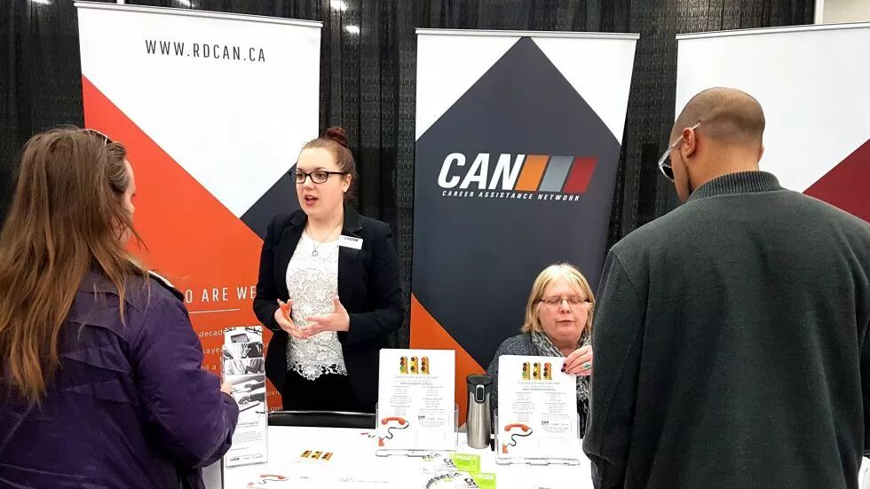
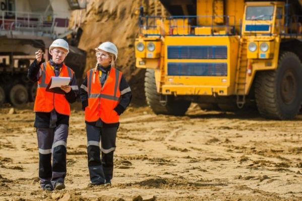

# 无标题

**链接地址:** http://mp.weixin.qq.com/s?__biz=MzI2NTE1ODgwOQ==&mid=2649606131&idx=1&sn=a407e31b72c5af79f0b7d7b1c1118782&chksm=f2b8ce05c5cf47137cedebaed6124df0a9490e52ffe8547cbef169b78064655019a6d4141f45&mpshare=1&scene=2&srcid=#rd
**作者:** 不思进取的副局
**获取时间:** 2025/8/28 20:43:04
**图片数量:** 16

---

## 原始HTML内容

<section style="box-sizing: border-box;"><section style="font-size: 16px;box-sizing: border-box;" powered-by="xiumi.us"><section style="margin-right: 0%;margin-left: 0%;box-sizing: border-box;"><section style="display: inline-block;vertical-align: middle;width: 80%;box-sizing: border-box;"><section style="box-sizing: border-box;" powered-by="xiumi.us"><section style="margin-top: 10px;margin-bottom: 10px;text-align: center;box-sizing: border-box;"><section style="display: inline-block;box-sizing: border-box;"><section style="max-width: 100%;font-size: 0px;padding-bottom: 3px;box-sizing: border-box;"><section style="display: inline-block;vertical-align: middle;box-sizing: border-box;"><section style="width: 5px;height: 1px;background-color: rgb(217, 217, 217);box-sizing: border-box;"></section><section style="width: 1px;height: 5px;margin-top: -3px;margin-right: auto;margin-left: auto;background-color: rgb(217, 217, 217);box-sizing: border-box;"></section></section><section style="margin-top: -1px;margin-right: -5px;margin-left: -5px;width: 100%;display: inline-block;vertical-align: middle;padding-right: 8px;padding-left: 8px;box-sizing: border-box;"><section style="width: 100%;height: 1px;background-color: rgb(217, 217, 217);box-sizing: border-box;"></section></section><section style="display: inline-block;vertical-align: middle;box-sizing: border-box;"><section style="width: 5px;height: 1px;background-color: rgb(217, 217, 217);box-sizing: border-box;"></section><section style="width: 1px;height: 5px;margin-top: -3px;margin-right: auto;margin-left: auto;background-color: rgb(217, 217, 217);box-sizing: border-box;"></section></section></section><section style="padding-left: 15px;padding-right: 15px;color: rgb(161, 161, 161);font-size: 14px;box-sizing: border-box;">
点击上方<strong style="box-sizing: border-box;">蓝字</strong>关注我们哟~
</section><section style="max-width: 100%;font-size: 0px;box-sizing: border-box;"><section style="display: inline-block;vertical-align: middle;box-sizing: border-box;"><section style="width: 5px;height: 1px;background-color: rgb(217, 217, 217);box-sizing: border-box;"></section><section style="width: 1px;height: 5px;margin-top: -3px;margin-right: auto;margin-left: auto;background-color: rgb(217, 217, 217);box-sizing: border-box;"></section></section><section style="margin-top: -1px;margin-right: -5px;margin-left: -5px;width: 100%;display: inline-block;vertical-align: middle;padding-right: 8px;padding-left: 8px;box-sizing: border-box;"><section style="width: 100%;height: 1px;background-color: rgb(217, 217, 217);box-sizing: border-box;"></section></section><section style="display: inline-block;vertical-align: middle;box-sizing: border-box;"><section style="width: 5px;height: 1px;background-color: rgb(217, 217, 217);box-sizing: border-box;"></section><section style="width: 1px;height: 5px;margin-top: -3px;margin-right: auto;margin-left: auto;background-color: rgb(217, 217, 217);box-sizing: border-box;"></section></section></section></section></section></section></section><section style="display: inline-block;vertical-align: middle;width: 20%;box-sizing: border-box;"><section style="box-sizing: border-box;" powered-by="xiumi.us"><section style="text-align: center;margin: -10px 0% 10px;box-sizing: border-box;"><section style="max-width: 100%;vertical-align: middle;display: inline-block;line-height: 0;width: 100%;box-sizing: border-box;"></section></section></section></section></section></section><section style="font-size: 16px;box-sizing: border-box;" powered-by="xiumi.us"><section style="margin: 10px 0%;box-sizing: border-box;"><section style="display: inline-block;width: 100%;vertical-align: top;box-sizing: border-box;"><section style="box-sizing: border-box;" powered-by="xiumi.us"><section style="box-sizing: border-box;"><section style="display: inline-block;vertical-align: bottom;width: 75%;padding-right: 10px;box-sizing: border-box;"><section style="box-sizing: border-box;" powered-by="xiumi.us"><section style="margin: 10px 0% 3px;box-sizing: border-box;"><section style="display: inline-block;vertical-align: middle;box-sizing: border-box;"><section style="display: inline-block;vertical-align: bottom;padding-left: 5px;padding-right: 5px;line-height: 1.2em;margin-bottom: 2px;color: rgba(80, 182, 201, 0.72);box-sizing: border-box;">
<strong style="box-sizing: border-box;">仔细看下图，有惊喜！</strong>
</section><section style="max-width: 100%;display: inline-block;vertical-align: bottom;line-height: 0;width: 1.6em;box-sizing: border-box;"></section></section></section></section></section><section style="display: inline-block;vertical-align: bottom;width: 25%;box-sizing: border-box;"><section style="box-sizing: border-box;" powered-by="xiumi.us"><section style="margin-right: 0%;margin-bottom: 3px;margin-left: 0%;text-align: right;box-sizing: border-box;"><section style="display: inline-block;border-bottom: 0.15em solid rgba(80, 182, 201, 0.72);padding-bottom: 3px;box-sizing: border-box;"><section style="display: inline-block;padding: 3px;border-bottom: 0.15em solid rgba(80, 182, 201, 0.72);font-size: 12px;line-height: 1.4;color: rgb(255, 143, 47);box-sizing: border-box;">
<strong style="box-sizing: border-box;">金主大大</strong>
</section></section></section></section></section></section></section><section style="box-sizing: border-box;" powered-by="xiumi.us"><section style="margin-right: 0%;margin-left: 0%;box-sizing: border-box;"><section style="background-color: rgba(80, 182, 201, 0.72);height: 2px;box-sizing: border-box;"></section></section></section></section></section></section><section style="font-size: 16px;box-sizing: border-box;" powered-by="xiumi.us"><section style="text-align: center;margin-top: 10px;margin-bottom: 10px;box-sizing: border-box;"><section style="max-width: 100%;vertical-align: middle;display: inline-block;line-height: 0;box-sizing: border-box;"></section></section></section><section style="font-size: 16px;box-sizing: border-box;" powered-by="xiumi.us"><section style="text-align: center;margin-top: 10px;margin-bottom: 10px;box-sizing: border-box;"><section style="max-width: 100%;vertical-align: middle;display: inline-block;line-height: 0;box-sizing: border-box;"></section></section></section><section style="font-size: 16px;box-sizing: border-box;" powered-by="xiumi.us"><section style="text-align: center;margin-top: 10px;margin-bottom: 10px;box-sizing: border-box;"><section style="max-width: 100%;vertical-align: middle;display: inline-block;line-height: 0;box-sizing: border-box;"></section></section></section><section style="font-size: 16px;box-sizing: border-box;" powered-by="xiumi.us"><section style="text-align: center;margin-top: 10px;margin-bottom: 10px;box-sizing: border-box;"><section style="max-width: 100%;vertical-align: middle;display: inline-block;line-height: 0;box-sizing: border-box;"></section></section></section><section style="font-size: 16px;box-sizing: border-box;" powered-by="xiumi.us"><section style="text-align: center;margin-top: 10px;margin-bottom: 10px;box-sizing: border-box;"><section style="max-width: 100%;vertical-align: middle;display: inline-block;line-height: 0;box-sizing: border-box;"><svg class="svg" xmlns="http://www.w3.org/2000/svg" x="0px" y="0px" viewBox="0 0 902.1 38.2" style="vertical-align: middle;max-width: 100%;box-sizing: border-box;" width="100%"><g style="box-sizing: border-box;"><path style="box-sizing: border-box;" d="M18.4,1.4c0.9-1.9,2.4-1.9,3.4,0l3.4,6.9c0.9,1.9,3.4,3.7,5.4,4l7.6,1.1c2.1,0.3,2.5,1.7,1,3.2   l-5.5,5.4c-1.5,1.5-2.4,4.3-2.1,6.4l1.3,7.6c0.4,2.1-0.9,2.9-2.7,2l-6.8-3.6c-1.8-1-4.9-1-6.7,0l-6.8,3.6c-1.9,1-3.1,0.1-2.7-2   l1.3-7.6c0.4-2.1-0.6-4.9-2.1-6.4l-5.5-5.4c-1.5-1.5-1-2.9,1-3.2l7.6-1.1c2.1-0.3,4.5-2.1,5.4-4L18.4,1.4z" fill="rgb(178, 243, 230)"></path><path style="box-sizing: border-box;" d="M90.6,5.4c0.7-1.4,1.9-1.4,2.6,0l2.6,5.3c0.7,1.4,2.6,2.8,4.2,3.1l5.9,0.9c1.6,0.2,2,1.3,0.8,2.5   l-4.2,4.1c-1.2,1.1-1.9,3.3-1.6,4.9l1,5.8c0.3,1.6-0.7,2.3-2.1,1.5l-5.2-2.8c-1.4-0.8-3.8-0.8-5.2,0L84,33.6   c-1.4,0.8-2.4,0.1-2.1-1.5l1-5.8c0.3-1.6-0.5-3.8-1.6-4.9l-4.2-4.1c-1.2-1.1-0.8-2.2,0.8-2.5l5.9-0.9c1.6-0.2,3.5-1.6,4.2-3.1   L90.6,5.4z" fill="rgb(190, 204, 246)"></path><path style="box-sizing: border-box;" d="M162.6,7.5c0.6-1.2,1.6-1.2,2.2,0l2.2,4.5c0.6,1.2,2.2,2.4,3.6,2.6l5,0.7c1.4,0.2,1.7,1.1,0.7,2.1   l-3.6,3.5c-1,1-1.6,2.9-1.4,4.2l0.9,5c0.2,1.4-0.6,1.9-1.8,1.3l-4.5-2.4c-1.2-0.6-3.2-0.6-4.4,0l-4.5,2.4c-1.2,0.6-2,0.1-1.8-1.3   l0.9-5c0.2-1.4-0.4-3.3-1.4-4.2l-3.6-3.5c-1-1-0.7-1.9,0.7-2.1l5-0.7c1.4-0.2,3-1.4,3.6-2.6L162.6,7.5z" fill="rgb(150, 208, 240)"></path><path style="box-sizing: border-box;" d="M60.1,19.1c0,2.3-1.9,4.2-4.2,4.2c-2.3,0-4.2-1.9-4.2-4.2s1.9-4.2,4.2-4.2   C58.3,14.9,60.1,16.8,60.1,19.1z" fill="rgb(218, 240, 224)"></path><path style="box-sizing: border-box;" d="M203.8,19.1c0,2.3-1.9,4.2-4.2,4.2c-2.3,0-4.2-1.9-4.2-4.2s1.9-4.2,4.2-4.2   C201.9,14.9,203.8,16.8,203.8,19.1z" fill="rgb(218, 240, 224)"></path><path style="box-sizing: border-box;" d="M130.9,19.1c0,1.7-1.4,3.1-3.1,3.1c-1.7,0-3.1-1.4-3.1-3.1c0-1.7,1.4-3.1,3.1-3.1   C129.5,16.1,130.9,17.4,130.9,19.1z" fill="rgb(218, 240, 224)"></path><path style="box-sizing: border-box;" d="M233.9,1.4c0.9-1.9,2.4-1.9,3.4,0l3.4,6.9c0.9,1.9,3.4,3.7,5.4,4l7.6,1.1c2.1,0.3,2.5,1.7,1,3.2   l-5.5,5.4c-1.5,1.5-2.4,4.3-2.1,6.4l1.3,7.6c0.4,2.1-0.9,2.9-2.7,2l-6.8-3.6c-1.8-1-4.9-1-6.7,0l-6.8,3.6c-1.9,1-3.1,0.1-2.7-2   l1.3-7.6c0.4-2.1-0.6-4.9-2.1-6.4l-5.5-5.4c-1.5-1.5-1-2.9,1-3.2l7.6-1.1c2.1-0.3,4.5-2.1,5.4-4L233.9,1.4z" fill="rgb(178, 243, 230)"></path><path style="box-sizing: border-box;" d="M306.1,5.4c0.7-1.4,1.9-1.4,2.6,0l2.6,5.3c0.7,1.4,2.6,2.8,4.2,3.1l5.9,0.9c1.6,0.2,2,1.3,0.8,2.5   l-4.2,4.1c-1.2,1.1-1.9,3.3-1.6,4.9l1,5.8c0.3,1.6-0.7,2.3-2.1,1.5l-5.2-2.8c-1.4-0.8-3.8-0.8-5.2,0l-5.2,2.8   c-1.4,0.8-2.4,0.1-2.1-1.5l1-5.8c0.3-1.6-0.4-3.8-1.6-4.9l-4.2-4.1c-1.2-1.1-0.8-2.2,0.8-2.5l5.9-0.9c1.6-0.2,3.5-1.6,4.2-3.1   L306.1,5.4z" fill="rgb(190, 204, 246)"></path><path style="box-sizing: border-box;" d="M378.1,7.5c0.6-1.2,1.6-1.2,2.2,0l2.2,4.5c0.6,1.2,2.2,2.4,3.6,2.6l5,0.7c1.4,0.2,1.7,1.1,0.7,2.1   l-3.6,3.5c-1,1-1.6,2.9-1.4,4.2l0.9,5c0.2,1.4-0.6,1.9-1.8,1.3l-4.5-2.4c-1.2-0.6-3.2-0.6-4.4,0l-4.5,2.4c-1.2,0.6-2,0.1-1.8-1.3   l0.9-5c0.2-1.4-0.4-3.3-1.4-4.2l-3.6-3.5c-1-1-0.7-1.9,0.7-2.1l5-0.7c1.4-0.2,3-1.4,3.6-2.6L378.1,7.5z" fill="rgb(150, 208, 240)"></path><path style="box-sizing: border-box;" d="M275.7,19.1c0,2.3-1.9,4.2-4.2,4.2c-2.3,0-4.2-1.9-4.2-4.2s1.9-4.2,4.2-4.2   C273.8,14.9,275.7,16.8,275.7,19.1z" fill="rgb(218, 240, 224)"></path><path style="box-sizing: border-box;" d="M419.3,19.1c0,2.3-1.9,4.2-4.2,4.2c-2.3,0-4.2-1.9-4.2-4.2s1.9-4.2,4.2-4.2   C417.5,14.9,419.3,16.8,419.3,19.1z" fill="rgb(218, 240, 224)"></path><path style="box-sizing: border-box;" d="M346.4,19.1c0,1.7-1.4,3.1-3.1,3.1c-1.7,0-3.1-1.4-3.1-3.1c0-1.7,1.4-3.1,3.1-3.1   C345,16.1,346.4,17.4,346.4,19.1z" fill="rgb(218, 240, 224)"></path><path style="box-sizing: border-box;" d="M449.4,1.4c0.9-1.9,2.4-1.9,3.4,0l3.4,6.9c0.9,1.9,3.4,3.7,5.4,4l7.6,1.1c2.1,0.3,2.5,1.7,1,3.2   l-5.5,5.4c-1.5,1.5-2.4,4.3-2.1,6.4l1.3,7.6c0.4,2.1-0.9,2.9-2.7,2l-6.8-3.6c-1.8-1-4.9-1-6.7,0l-6.8,3.6c-1.9,1-3.1,0.1-2.7-2   l1.3-7.6c0.4-2.1-0.6-4.9-2.1-6.4l-5.5-5.4c-1.5-1.5-1-2.9,1-3.2l7.6-1.1c2.1-0.3,4.5-2.1,5.4-4L449.4,1.4z" fill="rgb(178, 243, 230)"></path><path style="box-sizing: border-box;" d="M521.6,5.4c0.7-1.4,1.9-1.4,2.6,0l2.6,5.3c0.7,1.4,2.6,2.8,4.2,3.1l5.9,0.9c1.6,0.2,2,1.3,0.8,2.5   l-4.2,4.1c-1.2,1.1-1.9,3.3-1.6,4.9l1,5.8c0.3,1.6-0.7,2.3-2.1,1.5l-5.2-2.8c-1.4-0.8-3.8-0.8-5.2,0l-5.2,2.8   c-1.4,0.8-2.4,0.1-2.1-1.5l1-5.8c0.3-1.6-0.5-3.8-1.6-4.9l-4.2-4.1c-1.2-1.1-0.8-2.2,0.8-2.5l5.9-0.9c1.6-0.2,3.5-1.6,4.2-3.1   L521.6,5.4z" fill="rgb(190, 204, 246)"></path><path style="box-sizing: border-box;" d="M593.6,7.5c0.6-1.2,1.6-1.2,2.2,0l2.2,4.5c0.6,1.2,2.2,2.4,3.6,2.6l5,0.7c1.4,0.2,1.7,1.1,0.7,2.1   l-3.6,3.5c-1,1-1.6,2.9-1.4,4.2l0.9,5c0.2,1.4-0.6,1.9-1.8,1.3l-4.5-2.4c-1.2-0.6-3.2-0.6-4.4,0l-4.5,2.4c-1.2,0.6-2,0.1-1.8-1.3   l0.9-5c0.2-1.4-0.4-3.3-1.4-4.2l-3.6-3.5c-1-1-0.7-1.9,0.7-2.1l5-0.7c1.4-0.2,3-1.4,3.6-2.6L593.6,7.5z" fill="rgb(150, 208, 240)"></path><path style="box-sizing: border-box;" d="M491.2,19.1c0,2.3-1.9,4.2-4.2,4.2c-2.3,0-4.2-1.9-4.2-4.2s1.9-4.2,4.2-4.2   C489.3,14.9,491.2,16.8,491.2,19.1z" fill="rgb(218, 240, 224)"></path><path style="box-sizing: border-box;" d="M634.9,19.1c0,2.3-1.9,4.2-4.2,4.2c-2.3,0-4.2-1.9-4.2-4.2s1.9-4.2,4.2-4.2   C633,14.9,634.9,16.8,634.9,19.1z" fill="rgb(218, 240, 224)"></path><path style="box-sizing: border-box;" d="M561.9,19.1c0,1.7-1.4,3.1-3.1,3.1c-1.7,0-3.1-1.4-3.1-3.1c0-1.7,1.4-3.1,3.1-3.1   C560.5,16.1,561.9,17.4,561.9,19.1z" fill="rgb(218, 240, 224)"></path><path style="box-sizing: border-box;" d="M664.9,1.4c0.9-1.9,2.4-1.9,3.4,0l3.4,6.9c0.9,1.9,3.4,3.7,5.4,4l7.6,1.1c2.1,0.3,2.5,1.7,1,3.2   l-5.5,5.4c-1.5,1.5-2.4,4.3-2.1,6.4l1.3,7.6c0.4,2.1-0.9,2.9-2.7,2l-6.8-3.6c-1.8-1-4.9-1-6.7,0l-6.8,3.6c-1.9,1-3.1,0.1-2.7-2   l1.3-7.6c0.4-2.1-0.6-4.9-2.1-6.4l-5.5-5.4c-1.5-1.5-1-2.9,1-3.2l7.6-1.1c2.1-0.3,4.5-2.1,5.4-4L664.9,1.4z" fill="rgb(178, 243, 230)"></path><path style="box-sizing: border-box;" d="M737.1,5.4c0.7-1.4,1.9-1.4,2.6,0l2.6,5.3c0.7,1.4,2.6,2.8,4.2,3.1l5.9,0.9c1.6,0.2,2,1.3,0.8,2.5   l-4.2,4.1c-1.2,1.1-1.9,3.3-1.6,4.9l1,5.8c0.3,1.6-0.7,2.3-2.1,1.5l-5.2-2.8c-1.4-0.8-3.8-0.8-5.2,0l-5.2,2.8   c-1.4,0.8-2.4,0.1-2.1-1.5l1-5.8c0.3-1.6-0.5-3.8-1.6-4.9l-4.2-4.1c-1.2-1.1-0.8-2.2,0.8-2.5l5.9-0.9c1.6-0.2,3.5-1.6,4.2-3.1   L737.1,5.4z" fill="rgb(190, 204, 246)"></path><path style="box-sizing: border-box;" d="M809.2,7.5c0.6-1.2,1.6-1.2,2.2,0l2.2,4.5c0.6,1.2,2.2,2.4,3.6,2.6l5,0.7c1.4,0.2,1.7,1.1,0.7,2.1   l-3.6,3.5c-1,1-1.6,2.9-1.4,4.2l0.9,5c0.2,1.4-0.6,1.9-1.8,1.3l-4.5-2.4c-1.2-0.6-3.2-0.6-4.4,0l-4.5,2.4c-1.2,0.6-2,0.1-1.8-1.3   l0.9-5c0.2-1.4-0.4-3.3-1.4-4.2l-3.6-3.5c-1-1-0.7-1.9,0.7-2.1l5-0.7c1.4-0.2,3-1.4,3.6-2.6L809.2,7.5z" fill="rgb(150, 208, 240)"></path><path style="box-sizing: border-box;" d="M706.7,19.1c0,2.3-1.9,4.2-4.2,4.2c-2.3,0-4.2-1.9-4.2-4.2s1.9-4.2,4.2-4.2   C704.8,14.9,706.7,16.8,706.7,19.1z" fill="rgb(218, 240, 224)"></path><path style="box-sizing: border-box;" d="M850.4,19.1c0,2.3-1.9,4.2-4.2,4.2c-2.3,0-4.2-1.9-4.2-4.2s1.9-4.2,4.2-4.2   C848.5,14.9,850.4,16.8,850.4,19.1z" fill="rgb(218, 240, 224)"></path><path style="box-sizing: border-box;" d="M777.4,19.1c0,1.7-1.4,3.1-3.1,3.1c-1.7,0-3.1-1.4-3.1-3.1c0-1.7,1.4-3.1,3.1-3.1   C776,16.1,777.4,17.4,777.4,19.1z" fill="rgb(218, 240, 224)"></path><path style="box-sizing: border-box;" d="M880.4,1.4c0.9-1.9,2.4-1.9,3.4,0l3.4,6.9c0.9,1.9,3.4,3.7,5.4,4l7.6,1.1c2.1,0.3,2.5,1.7,1,3.2   l-5.5,5.4c-1.5,1.5-2.4,4.3-2.1,6.4l1.3,7.6c0.4,2.1-0.9,2.9-2.7,2l-6.8-3.6c-1.8-1-4.9-1-6.7,0l-6.8,3.6c-1.8,1-3.1,0.1-2.7-2   l1.3-7.6c0.4-2.1-0.6-4.9-2.1-6.4l-5.5-5.4c-1.5-1.5-1-2.9,1-3.2l7.6-1.1c2.1-0.3,4.5-2.1,5.4-4L880.4,1.4z" fill="rgb(178, 243, 230)"></path></g></svg></section></section></section><section style="box-sizing: border-box;" powered-by="xiumi.us"><section style="box-sizing: border-box;"><section style="box-sizing: border-box;">
 

<em style="font-size: 17px;"><strong>阿尔伯塔正在经历气温和经济的双重寒冬</strong></em> 

阿尔伯塔省的居民近日一定已经被各类标题惊悚的阿省创纪录性的低温文章刷了屏。各种“零下五十摄氏度”，“史上最冷寒冬”“比北极还冷”的字眼充斥着网络。然而<strong>创纪录的却并不只限于阿尔伯塔省的天气</strong>。

“恭喜”阿省人，我们刚刚又创下了一个纪录。但这与我们的寒冷天气无关。这<strong>与失业率有关</strong>。

根据2019年1月分的最新市场调查数据表明，虽然加拿大的就业人数有所上升，但阿尔伯塔省的<strong>就业数据却在不断下降</strong>，终于在上个月触底，<strong>超过自1967年数据统计起始以来的最低记录</strong>。

<strong>是的，这个寒冬，可能比你想象地还要冷。</strong>

这不仅是阿尔伯塔省的坏消息，<strong>对于加拿大整个国家来说，这也是一个坏消息</strong>。

<em style="color: rgb(0, 0, 0);font-family: Shift-Book, Georgia, Times, &quot;Times New Roman&quot;, serif;text-align: start;white-space: normal;"><strong> </strong></em>

<em style="color: rgb(0, 0, 0);font-family: Shift-Book, Georgia, Times, &quot;Times New Roman&quot;, serif;text-align: start;white-space: normal;"><strong>半数的年轻人，找不到工作！</strong></em>

<strong>卡尔加里大学副经济学教授</strong>特雷弗·汤姆（Trevor Tombe）对加拿大统计局于上周五公布的最新数据进行了调查和研究，他发现1月份阿省就业年轻人的比例达到了<strong>历史最低水平</strong>。自从1967年开始记录以来，没有工作的年轻人数量从未如此高。 

调查显示，年龄在15至24岁之间的年轻男性中，<strong>只有不到55％的人有工作</strong>。这份数据已经刨除了全日制上学的适龄学生。这意味着有约半数的年轻人还在为寻求一个工作岗位而犯愁，更谈不上职业发展和生活质量了。

这无疑是一个<strong>可怕的数据</strong>。整个阿省社会和家庭的经济的负担，<strong>从未像这个冬天这般沉重过</strong>。

 

<em style="color: rgb(0, 0, 0);font-family: Shift-Book, Georgia, Times, &quot;Times New Roman&quot;, serif;text-align: start;white-space: normal;"><strong>石油产业崩盘后的四年，高失业率愈演愈烈！</strong></em>

当2014年10月由石油危机引发的经济衰退刚开始时，15至24岁的男性中有67％有工作。2016年，当经济衰退正式结束时，该年龄段的男性中有60％的人有工作。

然而在经济危机结束的两年多以后，高失业率并没有得到好转，反而<strong>愈演愈烈再创新高</strong>。当加拿大的其他大部分地区似乎从2016年经济低迷时期开始反弹复苏后的今天，<strong>人均年龄偏低的阿尔伯塔省却经历着历史性新高的年轻人失业率</strong>。

根据加拿大统计局的数据，阿尔伯塔省的就业人数连续第二个月下降，2018年12月份削除了15,000个职位，2019年1月份继续损失16,000个职位。<strong>失业率上升0.4个百分点至6.8％，位居全国失业率最高水平</strong>。

曾经的就业市场繁荣大省，如今落得个<strong>就业老大难的下场</strong>。

 

<em style="color: rgb(0, 0, 0);font-family: Shift-Book, Georgia, Times, &quot;Times New Roman&quot;, serif;text-align: start;white-space: normal;"><strong>心理问题高发的源头 —— 高失业率！</strong></em>

高失业率不仅造成了年轻人的物质生活不受保障的问题，更变成了<strong>社会的一块心病和福利机构的负累</strong>。

来自卡尔加里的22岁年轻人Josh（化名）向记者提到：他不得不<strong>因找不到工作的问题寻求抑郁症的咨询</strong>。

“虽然我不擅长在学校的考试里拿高分，但我在学习技能方面可是一把好手。”他非常擅长木工和土木建造。但他的擅长的房屋建造工作却在去年九月份以后嘎然而止——在做完上一个项目后就戏剧化地再也找不到项目可做。之后的小半年，他除了辗转多处打几个解决温饱的小零工，一直只能坐在家里被迫“享用”<strong>即将耗尽的就业保险福利</strong>。

他说。“我觉得自己是一个失败者。”

然而Josh是幸运的，他有一个支持他的家庭作为后盾。他的家人<strong>愿意帮他支付学费以帮助他获得更好的教育</strong>，以改善他的职业前景。

然而这是阿尔伯塔省经济衰退期间所有<strong>年轻人经历的一个缩影</strong>。在经济萧条时期，年轻人会在<strong>停工期间入学深造</strong>，企图在经济反弹时能够申请到更有发展潜力的职业。

但这并不能解决本质的就业问题。现在的求职市场已经充斥着大量<strong>“overqualified”的简历</strong>。一个小小的仓库管理员工作都可以得到上百份的石油工程毕业生的简历；一个入门级的销售工作，多得是拥有超过五年工作经验的部门经理前来应聘。这在如今的就业市场并不罕见。

令人骄傲的学位，丰富的工作经验，各类资格证书，甚至辛苦打点的人际关系，<strong>都不能为成为你职业饭碗的保障</strong>。因为，在这个特殊的时期，<strong>工作岗位稀缺是一个无法改变的事实</strong>。

 

<em style="color: rgb(0, 0, 0);font-family: Shift-Book, Georgia, Times, &quot;Times New Roman&quot;, serif;text-align: start;white-space: normal;"><strong>税率，年轻人就业的一大杀手</strong></em>

<strong>卡尔加里大学公共政策学院院长</strong>，著名经济学家杰克·明茨（Jack Mintz）像媒体发表了他的见解：鉴于石油油价低弥和产量削减的一系列连锁反应，就业人数下降的趋势不足为奇。然而隐藏在油价崩盘之外的因素，才是造成阿尔伯塔省如今举步维艰进退两难困境的真凶。

当Rachel Notley于2015年5月首次宣布成为阿省总理时，她要求<strong>审查评估了阿尔伯塔省能源部门的税率</strong>。这一举措创造了巨大的不确定性并且吓坏了投资者。

Notley虽然没有提高税率，但在近一年的审查期内，<strong>投资方对阿省的能源产业方向深感不安。</strong>与其举棋不定上错贼船，不如静观其变保守投资。这导致了投资来源的日益枯竭。

同时，<strong>碳税和上涨的个人税收</strong>也给阿省的能源经济产业增加了新的枷锁和更为沉重的负担。

 

<strong><em>能源项目的监管宛若泥潭</em></strong>

<strong><em> </em></strong>

另一个造成阿省经济和求职市场寒冬的因素在于阿省支柱能源产业的项目监管<strong>长期以来的拖沓不</strong><strong>前</strong>。虽然管道项目的大多数监管方都是联邦政府，但即使是省级监管小项目的审批，都是一个<strong>耗时甚久的拉锯战</strong>。

在麦克默里堡附近的阿斯本油砂开发项目<strong>花了五年时间</strong>才得到阿尔伯塔省政府的批准。而在美国的德克萨斯州，同样的项目却可以在<strong>一两个月内获得批准</strong>。

这样<strong>无休止的拖沓让问题演变地棘手混乱</strong>。但本质的问题却从未得到真正的解决。

 

<strong><em>政策背锅，内忧外患</em></strong>

即使所有的省级问题将在明年春天的政府选举换届中被讨论，但不要指望激进的政策变化可以解决实质的问题。投资者都对联邦政府这些根深蒂固的问题了若指掌。特别<strong>法案C-69《联邦环境评估法案》</strong>的颁布，是对<strong>阿省能源行业“灾难性的”打击毁灭</strong>。 

另外是加拿大的西海岸的<strong>油轮禁令</strong>。即使Trans Mountain Pipeline的扩建最终（奇迹般地）达成，<strong>阿尔伯塔省仍然不是一个投资的好地方</strong>。没有对商业投资者友好的税率和法案，这样的一天可以说<strong>永远不会来到</strong>。

在短短五年内，阿尔伯塔省已经从世界上最好的投资地区之一逐步转换成<strong>资本家避之不及纷纷逃离的鬼地方</strong>。日子不好过的不仅是投资者们，更是这些无处可逃的阿省居民。

 

“我希望社会能给予我们这些年轻人们更多的就业机会！”Josh对我们这样说。

谁又不想呢？

<strong>然而，阿省经济的明天在哪里？曾经为阿省提供发展就业机会的能源产业何时能够重振雄风？阿省年轻人就业的春天是否会在这个经济和气温的双重寒冬后出现？看完这篇文章的你或许心中已经有了自己的答案。 </strong>

 

文章信息来源：calgaryherald
</section></section></section><section style="font-size: 16px;box-sizing: border-box;" powered-by="xiumi.us"><section style="text-align: center;margin-top: 10px;margin-bottom: 10px;box-sizing: border-box;"><section style="max-width: 100%;vertical-align: middle;display: inline-block;line-height: 0;box-shadow: rgb(0, 0, 0) 0px 0px 0px;box-sizing: border-box;"></section></section></section><section style="font-size: 16px;box-sizing: border-box;" powered-by="xiumi.us"><section style="box-sizing: border-box;"><section style="text-align: center;font-size: 14px;color: rgb(160, 160, 160);box-sizing: border-box;">
各类商业广告投放推广，请联系微信ID：haoxue_nina
</section></section></section><section style="font-size: 16px;box-sizing: border-box;" powered-by="xiumi.us"><section style="box-sizing: border-box;"><section style="box-sizing: border-box;">
 
</section></section></section><section style="font-size: 16px;box-sizing: border-box;" powered-by="xiumi.us"><section style="box-sizing: border-box;"><section style="box-sizing: border-box;">
 
</section></section></section><section style="font-size: 16px;box-sizing: border-box;" powered-by="xiumi.us"><section style="margin: 40px 0% 10px;text-align: center;box-sizing: border-box;"><section style="display: inline-block;width: 90%;border-width: 1px;border-style: dotted;border-color: rgba(80, 182, 201, 0.72);padding: 10px;border-radius: 0px;box-sizing: border-box;"><section style="box-sizing: border-box;" powered-by="xiumi.us"><section style="transform: translate3d(20px, 0px, 0px);text-align: left;font-size: 11px;margin-top: -55px;margin-right: 0%;margin-left: 0%;box-sizing: border-box;"><section style="box-sizing: border-box;width: 7em;height: 7em;display: inline-block;vertical-align: bottom;border-radius: 100%;border-width: 5px;border-style: none;border-color: rgba(80, 182, 201, 0.72);background-position: center center;background-repeat: no-repeat;background-size: cover;overflow: hidden;background-image: url(&quot;https://mmbiz.qpic.cn/mmbiz_jpg/D1nJqnhkPyIxUovicL6pxJ3bcKKUfx5SJpObicfVRtK0emmxbcM6lbwYqZ0bCTUFlJonEW7LnIdsh41NKJm9Awug/640?wx_fmt=jpeg&quot;);"><section style="height: 100%;overflow: hidden;line-height: 0;vertical-align: middle;max-width: 100%;box-sizing: border-box;"></section></section></section></section><section style="box-sizing: border-box;" powered-by="xiumi.us"><section style="box-sizing: border-box;"><section class="group-empty" style="display: inline-block;vertical-align: top;width: 38.2%;box-sizing: border-box;height: 1px;"></section><section style="display: inline-block;vertical-align: top;width: 61.8%;box-sizing: border-box;"><section style="box-sizing: border-box;" powered-by="xiumi.us"><section style="margin-right: 0%;margin-left: 0%;box-sizing: border-box;"><section style="font-size: 18px;color: rgb(67, 103, 117);line-height: 1.6;letter-spacing: 1px;box-sizing: border-box;">
<strong style="box-sizing: border-box;">埃德蒙顿微生活</strong>
</section></section></section><section style="box-sizing: border-box;" powered-by="xiumi.us"><section style="margin-top: 0.5em;margin-bottom: 0.5em;box-sizing: border-box;"><section style="background-color: rgba(80, 182, 201, 0.72);height: 1px;box-sizing: border-box;"></section></section></section></section></section></section><section style="box-sizing: border-box;" powered-by="xiumi.us"><section style="box-sizing: border-box;"><section style="text-align: justify;font-size: 14px;color: rgba(62, 62, 62, 0.72);letter-spacing: 2px;box-sizing: border-box;">
<strong style="box-sizing: border-box;">关心埃德蒙顿民生，</strong>

<strong style="box-sizing: border-box;">关注埃德蒙顿的发展。</strong>

 

埃德蒙顿微生活是“吃喝玩乐埃德蒙顿”旗下，为埃德蒙顿地区的居民提供每日最新的吃喝玩乐、工作学习、商业投资的媒体平台 。
</section></section></section><section style="box-sizing: border-box;" powered-by="xiumi.us"><section style="box-sizing: border-box;"><section style="text-align: left;box-sizing: border-box;">
 
</section></section></section><section style="box-sizing: border-box;" powered-by="xiumi.us"><section style="box-sizing: border-box;"><section style="display: inline-block;vertical-align: middle;width: 61.8%;box-sizing: border-box;"><section style="box-sizing: border-box;" powered-by="xiumi.us"><section style="box-sizing: border-box;"><section style="text-align: justify;font-size: 12px;color: rgba(62, 62, 62, 0.37);line-height: 1.9;letter-spacing: 0px;box-sizing: border-box;">
我们的目标是以最新、最快、最及时的方式 报道埃德蒙顿的新鲜事 。 
</section></section></section></section><section style="display: inline-block;vertical-align: middle;width: 38.2%;box-sizing: border-box;"><section style="box-sizing: border-box;" powered-by="xiumi.us"><section style="margin-right: 0%;margin-left: 0%;box-sizing: border-box;"><section style="max-width: 100%;vertical-align: middle;display: inline-block;line-height: 0;width: 70%;box-sizing: border-box;"></section></section></section></section></section></section></section></section></section></section>
 

---

## 纯文本内容

点击上方蓝字关注我们哟~仔细看下图，有惊喜！金主大大阿尔伯塔正在经历气温和经济的双重寒冬阿尔伯塔省的居民近日一定已经被各类标题惊悚的阿省创纪录性的低温文章刷了屏。各种“零下五十摄氏度”，“史上最冷寒冬”“比北极还冷”的字眼充斥着网络。然而创纪录的却并不只限于阿尔伯塔省的天气。“恭喜”阿省人，我们刚刚又创下了一个纪录。但这与我们的寒冷天气无关。这与失业率有关。根据2019年1月分的最新市场调查数据表明，虽然加拿大的就业人数有所上升，但阿尔伯塔省的就业数据却在不断下降，终于在上个月触底，超过自1967年数据统计起始以来的最低记录。是的，这个寒冬，可能比你想象地还要冷。这不仅是阿尔伯塔省的坏消息，对于加拿大整个国家来说，这也是一个坏消息。半数的年轻人，找不到工作！卡尔加里大学副经济学教授特雷弗·汤姆（Trevor Tombe）对加拿大统计局于上周五公布的最新数据进行了调查和研究，他发现1月份阿省就业年轻人的比例达到了历史最低水平。自从1967年开始记录以来，没有工作的年轻人数量从未如此高。调查显示，年龄在15至24岁之间的年轻男性中，只有不到55％的人有工作。这份数据已经刨除了全日制上学的适龄学生。这意味着有约半数的年轻人还在为寻求一个工作岗位而犯愁，更谈不上职业发展和生活质量了。这无疑是一个可怕的数据。整个阿省社会和家庭的经济的负担，从未像这个冬天这般沉重过。石油产业崩盘后的四年，高失业率愈演愈烈！当2014年10月由石油危机引发的经济衰退刚开始时，15至24岁的男性中有67％有工作。2016年，当经济衰退正式结束时，该年龄段的男性中有60％的人有工作。然而在经济危机结束的两年多以后，高失业率并没有得到好转，反而愈演愈烈再创新高。当加拿大的其他大部分地区似乎从2016年经济低迷时期开始反弹复苏后的今天，人均年龄偏低的阿尔伯塔省却经历着历史性新高的年轻人失业率。根据加拿大统计局的数据，阿尔伯塔省的就业人数连续第二个月下降，2018年12月份削除了15,000个职位，2019年1月份继续损失16,000个职位。失业率上升0.4个百分点至6.8％，位居全国失业率最高水平。曾经的就业市场繁荣大省，如今落得个就业老大难的下场。心理问题高发的源头 —— 高失业率！高失业率不仅造成了年轻人的物质生活不受保障的问题，更变成了社会的一块心病和福利机构的负累。来自卡尔加里的22岁年轻人Josh（化名）向记者提到：他不得不因找不到工作的问题寻求抑郁症的咨询。“虽然我不擅长在学校的考试里拿高分，但我在学习技能方面可是一把好手。”他非常擅长木工和土木建造。但他的擅长的房屋建造工作却在去年九月份以后嘎然而止——在做完上一个项目后就戏剧化地再也找不到项目可做。之后的小半年，他除了辗转多处打几个解决温饱的小零工，一直只能坐在家里被迫“享用”即将耗尽的就业保险福利。他说。“我觉得自己是一个失败者。”然而Josh是幸运的，他有一个支持他的家庭作为后盾。他的家人愿意帮他支付学费以帮助他获得更好的教育，以改善他的职业前景。然而这是阿尔伯塔省经济衰退期间所有年轻人经历的一个缩影。在经济萧条时期，年轻人会在停工期间入学深造，企图在经济反弹时能够申请到更有发展潜力的职业。但这并不能解决本质的就业问题。现在的求职市场已经充斥着大量“overqualified”的简历。一个小小的仓库管理员工作都可以得到上百份的石油工程毕业生的简历；一个入门级的销售工作，多得是拥有超过五年工作经验的部门经理前来应聘。这在如今的就业市场并不罕见。令人骄傲的学位，丰富的工作经验，各类资格证书，甚至辛苦打点的人际关系，都不能为成为你职业饭碗的保障。因为，在这个特殊的时期，工作岗位稀缺是一个无法改变的事实。税率，年轻人就业的一大杀手卡尔加里大学公共政策学院院长，著名经济学家杰克·明茨（Jack Mintz）像媒体发表了他的见解：鉴于石油油价低弥和产量削减的一系列连锁反应，就业人数下降的趋势不足为奇。然而隐藏在油价崩盘之外的因素，才是造成阿尔伯塔省如今举步维艰进退两难困境的真凶。当Rachel Notley于2015年5月首次宣布成为阿省总理时，她要求审查评估了阿尔伯塔省能源部门的税率。这一举措创造了巨大的不确定性并且吓坏了投资者。Notley虽然没有提高税率，但在近一年的审查期内，投资方对阿省的能源产业方向深感不安。与其举棋不定上错贼船，不如静观其变保守投资。这导致了投资来源的日益枯竭。同时，碳税和上涨的个人税收也给阿省的能源经济产业增加了新的枷锁和更为沉重的负担。能源项目的监管宛若泥潭另一个造成阿省经济和求职市场寒冬的因素在于阿省支柱能源产业的项目监管长期以来的拖沓不前。虽然管道项目的大多数监管方都是联邦政府，但即使是省级监管小项目的审批，都是一个耗时甚久的拉锯战。在麦克默里堡附近的阿斯本油砂开发项目花了五年时间才得到阿尔伯塔省政府的批准。而在美国的德克萨斯州，同样的项目却可以在一两个月内获得批准。这样无休止的拖沓让问题演变地棘手混乱。但本质的问题却从未得到真正的解决。政策背锅，内忧外患即使所有的省级问题将在明年春天的政府选举换届中被讨论，但不要指望激进的政策变化可以解决实质的问题。投资者都对联邦政府这些根深蒂固的问题了若指掌。特别法案C-69《联邦环境评估法案》的颁布，是对阿省能源行业“灾难性的”打击毁灭。另外是加拿大的西海岸的油轮禁令。即使Trans Mountain Pipeline的扩建最终（奇迹般地）达成，阿尔伯塔省仍然不是一个投资的好地方。没有对商业投资者友好的税率和法案，这样的一天可以说永远不会来到。在短短五年内，阿尔伯塔省已经从世界上最好的投资地区之一逐步转换成资本家避之不及纷纷逃离的鬼地方。日子不好过的不仅是投资者们，更是这些无处可逃的阿省居民。“我希望社会能给予我们这些年轻人们更多的就业机会！”Josh对我们这样说。谁又不想呢？然而，阿省经济的明天在哪里？曾经为阿省提供发展就业机会的能源产业何时能够重振雄风？阿省年轻人就业的春天是否会在这个经济和气温的双重寒冬后出现？看完这篇文章的你或许心中已经有了自己的答案。文章信息来源：calgaryherald各类商业广告投放推广，请联系微信ID：haoxue_nina埃德蒙顿微生活关心埃德蒙顿民生，关注埃德蒙顿的发展。埃德蒙顿微生活是“吃喝玩乐埃德蒙顿”旗下，为埃德蒙顿地区的居民提供每日最新的吃喝玩乐、工作学习、商业投资的媒体平台 。我们的目标是以最新、最快、最及时的方式 报道埃德蒙顿的新鲜事 。

---

## 图片列表

-  (原始链接: https://mmbiz.qpic.cn/mmbiz_gif/D1nJqnhkPyIxUovicL6pxJ3bcKKUfx5SJwyZkjKkEeDqdvWIOh8Hc7UbbUDVJz9F7QTV10fxoLUJ6lia3WWzcCrw/640?wx_fmt=gif)
-  (原始链接: https://mmbiz.qpic.cn/mmbiz_gif/D1nJqnhkPyIxUovicL6pxJ3bcKKUfx5SJCF6WgGvIDBefFCLDomDOylg1TuGrg2X3ia6ERTQ7gLJNAY0oBlczPicg/640?wx_fmt=gif)
-  (原始链接: https://mmbiz.qpic.cn/mmbiz_jpg/D1nJqnhkPyIxUovicL6pxJ3bcKKUfx5SJo6vddInRS6DHPoOb9W0pmkV26h9tXic015pY6Y4epNqmATqf9aqPOzQ/640?wx_fmt=jpeg)
-  (原始链接: https://mmbiz.qpic.cn/mmbiz_jpg/D1nJqnhkPyIxUovicL6pxJ3bcKKUfx5SJ15sqq51fHKMeYJP6akFcN3CaEOmWn8iapAwI7psCicgoxQDHia8hy0sZg/640?wx_fmt=jpeg)
-  (原始链接: https://mmbiz.qpic.cn/mmbiz_jpg/D1nJqnhkPyIxUovicL6pxJ3bcKKUfx5SJIVYiaaCIqWTZ01Ue1qKc0LLVzHUltpyVnJQyAmhqIeEpAicaLkM4g2HA/640?wx_fmt=jpeg)
-  (原始链接: https://mmbiz.qpic.cn/mmbiz_jpg/D1nJqnhkPyIxUovicL6pxJ3bcKKUfx5SJrsMExky7TIIR5aE14IruVVZnApbicmFiahrnsG5BWicfZs7enWePWkENg/640?wx_fmt=jpeg)
-  (原始链接: https://mmbiz.qpic.cn/mmbiz_jpg/D1nJqnhkPyIxUovicL6pxJ3bcKKUfx5SJjVDmQiaXKPvwr0CuG5PsqTPiaeGp9tTWib5BqZib0NfFiaicGm46fs9LP9eg/640?wx_fmt=jpeg)
-  (原始链接: https://mmbiz.qpic.cn/mmbiz_jpg/D1nJqnhkPyIxUovicL6pxJ3bcKKUfx5SJq3blzxs4rLvxm4mSh9hqHtpUn6CRHGNibar3UDwZsDia0pQReb5SzZ4Q/640?wx_fmt=jpeg)
-  (原始链接: https://mmbiz.qpic.cn/mmbiz_jpg/D1nJqnhkPyIxUovicL6pxJ3bcKKUfx5SJmzH3FndUdrlic8bKHiagFgyJjfenOyO8ReJSsCkvBCd64OIj7NPDTGJg/640?wx_fmt=jpeg)
-  (原始链接: https://mmbiz.qpic.cn/mmbiz_jpg/D1nJqnhkPyIxUovicL6pxJ3bcKKUfx5SJyezkj10XibJibJVWpZ0TicaZzibshhh0tv6aoGjEDaahSC7YIU9QgfrGPQ/640?wx_fmt=jpeg)
-  (原始链接: https://mmbiz.qpic.cn/mmbiz_jpg/D1nJqnhkPyIxUovicL6pxJ3bcKKUfx5SJcHLp2GjbanV5ZoQyx8ho44ou2EO4fLQsReCnib32icQqc2GBYAHZTQKg/640?wx_fmt=jpeg)
-  (原始链接: https://mmbiz.qpic.cn/mmbiz_jpg/D1nJqnhkPyIxUovicL6pxJ3bcKKUfx5SJmsTezDicxM6ne33gm5hzxTSicibibmfncnYHpkvcJsKicr09fHUjianljlcw/640?wx_fmt=jpeg)
-  (原始链接: https://mmbiz.qpic.cn/mmbiz_png/D1nJqnhkPyIxUovicL6pxJ3bcKKUfx5SJmXLPAfqrMo70GbiaHG74YrgoB6piaPwZNEu9KwDLlAzUQYchqHbkUbbg/640?wx_fmt=png)
-  (原始链接: https://mmbiz.qpic.cn/mmbiz_png/D1nJqnhkPyIxUovicL6pxJ3bcKKUfx5SJLWusdBAdHR6zVeBsyd77Gic309hTVHOHt2F2ibPpicfpvOGwIwSoTCrtg/640?wx_fmt=png)
-  (原始链接: https://mmbiz.qpic.cn/mmbiz_jpg/D1nJqnhkPyIxUovicL6pxJ3bcKKUfx5SJpObicfVRtK0emmxbcM6lbwYqZ0bCTUFlJonEW7LnIdsh41NKJm9Awug/640?wx_fmt=jpeg)
-  (原始链接: https://mmbiz.qpic.cn/mmbiz_jpg/D1nJqnhkPyIxUovicL6pxJ3bcKKUfx5SJYXjaEP75016nft5DiaagQrkNXnt5PWPnqauvwTwdqHqIbl9DE8rZiagw/640?wx_fmt=jpeg)
