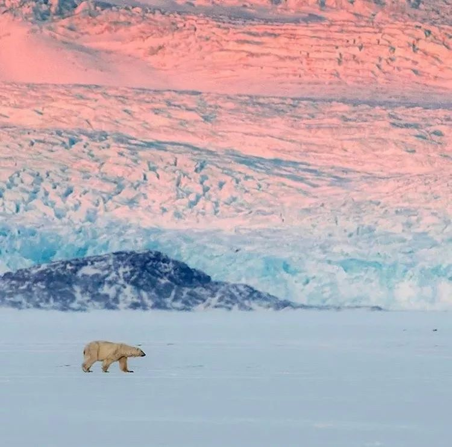
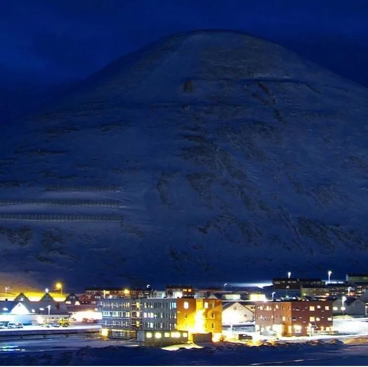
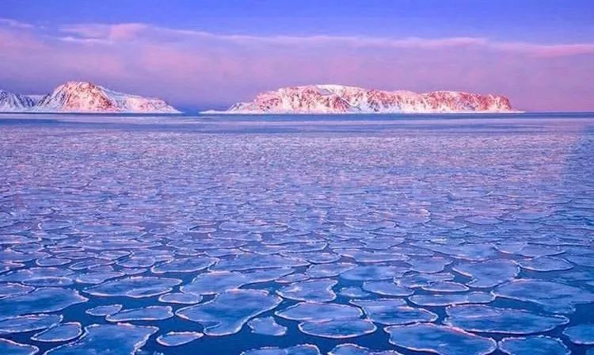

# 无标题

**链接地址:** http://mp.weixin.qq.com/s?__biz=MzI2MTcxMjI0MQ==&mid=2247499784&idx=1&sn=1dc7d8005c940975d12fa814a5181609&chksm=ea54b016dd233900812505f44efe11ed50c17c4d1c8efb52c2a19679ce118eb07b0e0da67c14&mpshare=1&scene=2&srcid=0221An5F3g3IGC10iSBMqGi2#rd
**作者:** 
**获取时间:** 2025/8/28 20:41:55
**图片数量:** 56

---

## 原始HTML内容

<strong style="white-space: normal; margin: 0px; padding: 0px; max-width: 100%; color: rgb(215, 171, 169); line-height: 1.5em; box-sizing: border-box !important; word-wrap: break-word !important;">InsDaily-每日lns新資訊</strong>

本文授权转自：环球旅行 

ID：Viphuanqiu

 

世界之大无奇不有

在地球上有这么一个地方

<strong>禁止出生和死亡</strong>

 

 

听起来不可思议

但是确有其地

这里不仅景色壮观 

<strong>而且北极熊的数量比人都多</strong>

 

 

它就是

<strong>斯瓦尔巴群岛</strong>

 

 
<section class="xmt-style-block" data-tools="新媒体排版" style="white-space: normal;font-family: 'PingFang SC', 'Source Sans Pro', 'Hiragino Sans GB', 'Helvetica Neue', Helvetica, 'Microsoft Yahei', arial, sans-serif;font-size: 14px;text-align: start;background-color: rgb(255, 255, 255);"><section class="KolEditor" style="font-family: Arial;border-width: 0px;border-style: none;border-color: initial;color: rgb(49, 147, 105);"><section style="margin-top: 10px;margin-bottom: 10px;text-align: center;"><section data-style="background: -webkit-linear-gradient(left, #3dade9, #bf2fcb);  -webkit-background-clip: text;  -webkit-text-fill-color: transparent;" style="margin-right: auto;margin-left: auto;padding: 5px 15px;display: inline-block;box-shadow: rgba(61, 173, 233, 0.75) -1px 0px 0px 1px, rgba(94, 142, 226, 0.25) -1px -1px 0px 1px, rgba(94, 142, 226, 0.25) -1px 1px 0px 1px, rgba(126, 110, 218, 0.5) 0px -1px 0px 1px, rgba(126, 110, 218, 0.5) 0px 1px 0px 1px, rgba(159, 79, 211, 0.25) 1px -1px 0px 1px, rgba(159, 79, 211, 0.25) 1px 1px 0px 1px, rgba(191, 47, 203, 0.75) 1px 0px 0px 1px;">
01 全年都可以看极光的城市
</section></section></section></section>
 

斯瓦尔巴群岛，位于北极地区的群岛，是<strong>挪威最北界</strong>国土范围的属地。

 

其中<strong>朗伊尔城</strong>距离北极点只有1300公里，<strong>是世界上距离北极最近的城市，</strong>也被列入世界纪录。

 

 

由于靠近北极，所以<strong>全年</strong>都可以看到极光。

 

 

<em>「据说在极光下许愿比流星还要灵验，而若是两个人可以一起看到极光的话，则会一直在一起。」</em>

 

 

虽说是一个美好的传说，但是每年来此看极光的人络绎不绝...

 

 

这里没有高楼大厦

没有喧嚣

只有自然界最壮观的景象伴你入眠

 

 
<section class="xmt-style-block" data-tools="新媒体排版" style="white-space: normal;font-family: 'PingFang SC', 'Source Sans Pro', 'Hiragino Sans GB', 'Helvetica Neue', Helvetica, 'Microsoft Yahei', arial, sans-serif;font-size: 14px;text-align: start;background-color: rgb(255, 255, 255);"><section class="KolEditor" style="font-family: Arial;border-width: 0px;border-style: none;border-color: initial;color: rgb(49, 147, 105);"><section style="margin-top: 10px;margin-bottom: 10px;text-align: center;"><section data-style="background: -webkit-linear-gradient(left, #3dade9, #bf2fcb);  -webkit-background-clip: text;  -webkit-text-fill-color: transparent;" style="margin-right: auto;margin-left: auto;padding: 5px 15px;display: inline-block;box-shadow: rgba(61, 173, 233, 0.75) -1px 0px 0px 1px, rgba(94, 142, 226, 0.25) -1px -1px 0px 1px, rgba(94, 142, 226, 0.25) -1px 1px 0px 1px, rgba(126, 110, 218, 0.5) 0px -1px 0px 1px, rgba(126, 110, 218, 0.5) 0px 1px 0px 1px, rgba(159, 79, 211, 0.25) 1px -1px 0px 1px, rgba(159, 79, 211, 0.25) 1px 1px 0px 1px, rgba(191, 47, 203, 0.75) 1px 0px 0px 1px;">
02 全球唯一禁止出生和死亡的城市
</section></section></section></section>
 

在朗伊尔城有一个看似不人性的规定，<strong>就是无人有权死在这里。</strong>

 

（飞机飞过朗伊尔城上空）

 

就算你身患重病乃至绝症都必须回到挪威本土的医院去，除非猝死。<strong>孕妇临产前一个月必须离开这里。</strong>

 

 

其实这项规定也是这里严酷的环境决定的。

 

<strong><em>「温度低，地表下基本都是冻土层，尸体不会腐烂，细菌也不会死亡，如果有害细菌泛滥，会带来意想不到的严重后果。」</em></strong>

 

 

所以这里就成了世界上唯一禁止死亡和出生的城市。

 

 

这样极端的气候有不好的一面，也有好的一面。

 

1918年，当时肆虐欧洲的'西班牙流感'传到斯瓦尔巴，7个年轻的矿工长眠在这里。1998年，科学家从冻土层的遗体中<strong>提取了珍贵的病毒样本。</strong>

 

 
<section class="xmt-style-block" data-tools="新媒体排版" style="white-space: normal;font-family: 'PingFang SC', 'Source Sans Pro', 'Hiragino Sans GB', 'Helvetica Neue', Helvetica, 'Microsoft Yahei', arial, sans-serif;font-size: 14px;text-align: start;background-color: rgb(255, 255, 255);"><section class="KolEditor" style="font-family: Arial;border-width: 0px;border-style: none;border-color: initial;color: rgb(49, 147, 105);"><section style="margin-top: 10px;margin-bottom: 10px;text-align: center;"><section data-style="background: -webkit-linear-gradient(left, #3dade9, #bf2fcb);  -webkit-background-clip: text;  -webkit-text-fill-color: transparent;" style="margin-right: auto;margin-left: auto;padding: 5px 15px;display: inline-block;box-shadow: rgba(61, 173, 233, 0.75) -1px 0px 0px 1px, rgba(94, 142, 226, 0.25) -1px -1px 0px 1px, rgba(94, 142, 226, 0.25) -1px 1px 0px 1px, rgba(126, 110, 218, 0.5) 0px -1px 0px 1px, rgba(126, 110, 218, 0.5) 0px 1px 0px 1px, rgba(159, 79, 211, 0.25) 1px -1px 0px 1px, rgba(159, 79, 211, 0.25) 1px 1px 0px 1px, rgba(191, 47, 203, 0.75) 1px 0px 0px 1px;">
03 北极熊是居住人口的3倍
</section></section></section></section>
 

虽然说斯瓦尔巴群岛是一个岛，但是由于气候等多项因素，整个岛上的居民也不过<strong>3000人，</strong>而朗伊尔城就占据了近乎一半的人数，<strong>约1800人。</strong>

 

 

因为靠近北极，所以这里最出名的动物就是<strong>北极熊。</strong>而北极熊的数量都远远大于居民数，据调查，现在朗伊尔城的北极熊数量达到了<strong>约5000头。</strong>

 

 

按照概率来说，你在这片广袤的土地上遇见北极熊的概率可要<strong>远远大于</strong>你遇见人的概率。

 

 

所以来此游玩或者居住的人们都会参加一个“培训”，<strong>学会如何应对北极熊。</strong>当然猎杀北极熊是绝对不被允许的。

 

（北极熊出没的标志）

 
<section class="xmt-style-block" data-tools="新媒体排版" style="white-space: normal;font-family: 'PingFang SC', 'Source Sans Pro', 'Hiragino Sans GB', 'Helvetica Neue', Helvetica, 'Microsoft Yahei', arial, sans-serif;font-size: 14px;text-align: start;background-color: rgb(255, 255, 255);"><section class="KolEditor" style="font-family: Arial;border-width: 0px;border-style: none;border-color: initial;color: rgb(49, 147, 105);"><section style="margin-top: 10px;margin-bottom: 10px;text-align: center;"><section data-style="background: -webkit-linear-gradient(left, #3dade9, #bf2fcb);  -webkit-background-clip: text;  -webkit-text-fill-color: transparent;" style="margin-right: auto;margin-left: auto;padding: 5px 15px;display: inline-block;box-shadow: rgba(61, 173, 233, 0.75) -1px 0px 0px 1px, rgba(94, 142, 226, 0.25) -1px -1px 0px 1px, rgba(94, 142, 226, 0.25) -1px 1px 0px 1px, rgba(126, 110, 218, 0.5) 0px -1px 0px 1px, rgba(126, 110, 218, 0.5) 0px 1px 0px 1px, rgba(159, 79, 211, 0.25) 1px -1px 0px 1px, rgba(159, 79, 211, 0.25) 1px 1px 0px 1px, rgba(191, 47, 203, 0.75) 1px 0px 0px 1px;">
04 没有白天和黑夜的城市
</section></section></section></section>
 

由于处于北极圈，所以朗伊尔城在每年的11月到第二年的2月都是<strong>处于极夜的状态。</strong>

 

 

听着很恐怖，3、4个月的时间都处于黑暗当中。但是对于当地的居民来说，<strong>这确是一种浪漫。</strong>

 

 

居民将自己的房子都刷成<strong>五颜六色的，</strong>并且用各式各样的灯带装饰自己的房子，所以不管什么时候，这里都是“灯火通明”。

 

 

 

从远处看，就像是童话世界里圣诞老人居住的地方，被大雪包围，却格外温馨。

 

 

而这里的极昼时间是每年的4月中到8月中，<strong>也是旅游的旺季。</strong>

 

 

这个时候气候温和，全天都可以感受这里的美景。除此之外，你还可以玩一玩<strong>皮划艇，试一试机动雪橇。</strong>

 

 

如果不过瘾的话，那就让可爱的<strong>雪橇犬</strong>带你游览这个纯白的琉璃世界吧。

 

 
<section class="xmt-style-block" data-tools="新媒体排版" style="white-space: normal;font-family: 'PingFang SC', 'Source Sans Pro', 'Hiragino Sans GB', 'Helvetica Neue', Helvetica, 'Microsoft Yahei', arial, sans-serif;font-size: 14px;text-align: start;background-color: rgb(255, 255, 255);"><section class="KolEditor" style="font-family: Arial;border-width: 0px;border-style: none;border-color: initial;color: rgb(49, 147, 105);"><section style="margin-top: 10px;margin-bottom: 10px;text-align: center;"><section data-style="background: -webkit-linear-gradient(left, #3dade9, #bf2fcb);  -webkit-background-clip: text;  -webkit-text-fill-color: transparent;" style="margin-right: auto;margin-left: auto;padding: 5px 15px;display: inline-block;box-shadow: rgba(61, 173, 233, 0.75) -1px 0px 0px 1px, rgba(94, 142, 226, 0.25) -1px -1px 0px 1px, rgba(94, 142, 226, 0.25) -1px 1px 0px 1px, rgba(126, 110, 218, 0.5) 0px -1px 0px 1px, rgba(126, 110, 218, 0.5) 0px 1px 0px 1px, rgba(159, 79, 211, 0.25) 1px -1px 0px 1px, rgba(159, 79, 211, 0.25) 1px 1px 0px 1px, rgba(191, 47, 203, 0.75) 1px 0px 0px 1px;">
05 这里保留了人类最后的希望
</section></section></section></section>
 

在朗伊尔有一座<strong>“全球农业的诺亚方舟”，</strong>就是朗伊尔城的“种子库”。

 

这里保存了来自世界各国<strong>150万</strong>种农业样本。如果遇上了世界末日，它就是全人类最后的希望。

 

 

种子库建在斯瓦尔巴群岛永久冻土带区的一座砂岩山内部120米处，高出海平面130米，使得<strong>即使冰川融化仍然能够保持其干燥环境。</strong>

 

 

由于特殊的地理环境，斯瓦尔巴群岛也成了重要的科研地点。<strong>中国北极黄河站就建立在此。</strong>

 

 
<section class="xmt-style-block" data-tools="新媒体排版" style="white-space: normal;font-family: 'PingFang SC', 'Source Sans Pro', 'Hiragino Sans GB', 'Helvetica Neue', Helvetica, 'Microsoft Yahei', arial, sans-serif;font-size: 14px;text-align: start;background-color: rgb(255, 255, 255);"><section class="KolEditor" style="font-family: Arial;border-width: 0px;border-style: none;border-color: initial;color: rgb(49, 147, 105);"><section style="margin-top: 10px;margin-bottom: 10px;text-align: center;"><section data-style="background: -webkit-linear-gradient(left, #3dade9, #bf2fcb);  -webkit-background-clip: text;  -webkit-text-fill-color: transparent;" style="margin-right: auto;margin-left: auto;padding: 5px 15px;display: inline-block;box-shadow: rgba(61, 173, 233, 0.75) -1px 0px 0px 1px, rgba(94, 142, 226, 0.25) -1px -1px 0px 1px, rgba(94, 142, 226, 0.25) -1px 1px 0px 1px, rgba(126, 110, 218, 0.5) 0px -1px 0px 1px, rgba(126, 110, 218, 0.5) 0px 1px 0px 1px, rgba(159, 79, 211, 0.25) 1px -1px 0px 1px, rgba(159, 79, 211, 0.25) 1px 1px 0px 1px, rgba(191, 47, 203, 0.75) 1px 0px 0px 1px;">
06&nbsp; 被遗忘的“世界之巅”
</section></section></section></section>
 

很多人一听这么陌生的名字，而且这么远，就觉得这个地方极难到达。

 

但其实，<strong>这里对中国公民免签！</strong>

 

 

因为中国政府在1925年曾经签署了一份<strong>《斯瓦尔巴条约》</strong>国际公约，所以中国公民至今都可以在这里自由出入，<strong>在无需工作签证的基础上就可以来这里工作。</strong>

 

 

<strong>这里虽然地方不大，但是“五脏俱全”。</strong>这里酒吧、酒店、游泳馆，杂货铺应有尽有，虽然规模都不大，但是完全可以满足日常所需。

 

 

而且因为地理原因，这里可以看到其他地方不容易看到的景象。

 

▼

<strong>超级月亮</strong>

 

▼

<strong>冰洞</strong>

 

▼

<strong>多色的极光</strong>

 

▼

<strong>野生动物</strong>

 

▼ 

<strong>蓝冰和气泡冰</strong>

 

来到这里你就不用跑到贝加尔湖看蓝冰

也不用满世界的找极光

更不需要担心人多拥挤

 

 

这里60%都被冰川所覆盖 

这里处处都是惊喜

这里才是真正的纯净圣地

 

 
<section class="" style=";padding: 0px;max-width: 100%;box-sizing: border-box;color: rgb(62, 62, 62);line-height: 25px;word-wrap: break-word !important"><section class="" style=";padding: 0px;max-width: 100%;box-sizing: border-box;color: inherit;font-family: inherit;font-size: 1em;letter-spacing: 0.544px;line-height: 25px;border-width: 0px;border-style: initial;border-color: initial;clear: both;word-wrap: break-word !important"><section class="" style=";padding: 0px;max-width: 100%;box-sizing: border-box;word-wrap: break-word !important;color: inherit;font-family: inherit;font-size: 1em;border-width: 0px;border-style: initial;border-color: initial;clear: both"><section class="" style=";padding: 0px;max-width: 100%;box-sizing: border-box;word-wrap: break-word !important;color: inherit;font-family: inherit;font-size: 1em;border-width: 0px;border-style: initial;border-color: initial;clear: both"><section class="" style=";padding: 0px;max-width: 100%;box-sizing: border-box;line-height: 25px;word-wrap: break-word !important"><section class="" style=";padding: 0px;max-width: 100%;box-sizing: border-box;word-wrap: break-word !important;color: inherit;font-family: inherit;font-size: 1em;letter-spacing: 0.544px;line-height: 25px;border-width: 0px;border-style: initial;border-color: initial;clear: both"><section class="" style=";padding: 0px;max-width: 100%;box-sizing: border-box;word-wrap: break-word !important;color: inherit;font-family: inherit;font-size: 1em;border-width: 0px;border-style: initial;border-color: initial;clear: both"><section class="" style=";padding: 0px;max-width: 100%;box-sizing: border-box;word-wrap: break-word !important;color: inherit;font-family: inherit;font-size: 1em;border-width: 0px;border-style: initial;border-color: initial;clear: both">
 

</section></section></section></section>
<strong style=";padding: 0px;max-width: 100%;box-sizing: border-box !important;word-wrap: break-word !important;color: rgb(215, 171, 169);font-size: 14px;line-height: 1.5em">今天要跟大家介紹下小IN</strong>

<strong style=";padding: 0px;max-width: 100%;box-sizing: border-box !important;word-wrap: break-word !important;color: rgb(215, 171, 169);font-size: 14px;line-height: 1.5em">因為某種众所周知的原因，改名了</strong>

<strong style=";padding: 0px;max-width: 100%;box-sizing: border-box !important;word-wrap: break-word !important;color: rgb(215, 171, 169);font-size: 14px;line-height: 1.5em">但他還是<strong style=";padding: 0px;max-width: 100%;box-sizing: border-box !important;word-wrap: break-word !important;line-height: 1.5em">會</strong>每天分享lns的新資訊</strong>

<strong style=";padding: 0px;max-width: 100%;box-sizing: border-box !important;word-wrap: break-word !important;color: rgb(215, 171, 169);font-size: 14px;line-height: 1.5em">長按添加訂閱</strong>

<strong style=";padding: 0px;max-width: 100%;box-sizing: border-box !important;word-wrap: break-word !important;color: rgb(215, 171, 169);font-size: 14px;line-height: 1.5em">Share the World's Moments</strong> 

<strong style=";padding: 0px;max-width: 100%;box-sizing: border-box !important;word-wrap: break-word !important;line-height: 21px"><strong style=";padding: 0px;max-width: 100%;box-sizing: border-box !important;word-wrap: break-word !important;line-height: 21px">InstaChina</strong></strong>

<strong style=";padding: 0px;max-width: 100%;box-sizing: border-box !important;word-wrap: break-word !important;font-size: 20px;line-height: 21px">▼</strong>

</section></section></section></section>

---

## 纯文本内容

InsDaily-每日lns新資訊本文授权转自：环球旅行ID：Viphuanqiu世界之大无奇不有在地球上有这么一个地方禁止出生和死亡听起来不可思议但是确有其地这里不仅景色壮观而且北极熊的数量比人都多它就是斯瓦尔巴群岛01 全年都可以看极光的城市斯瓦尔巴群岛，位于北极地区的群岛，是挪威最北界国土范围的属地。其中朗伊尔城距离北极点只有1300公里，是世界上距离北极最近的城市，也被列入世界纪录。由于靠近北极，所以全年都可以看到极光。「据说在极光下许愿比流星还要灵验，而若是两个人可以一起看到极光的话，则会一直在一起。」虽说是一个美好的传说，但是每年来此看极光的人络绎不绝...这里没有高楼大厦没有喧嚣只有自然界最壮观的景象伴你入眠02 全球唯一禁止出生和死亡的城市在朗伊尔城有一个看似不人性的规定，就是无人有权死在这里。（飞机飞过朗伊尔城上空）就算你身患重病乃至绝症都必须回到挪威本土的医院去，除非猝死。孕妇临产前一个月必须离开这里。其实这项规定也是这里严酷的环境决定的。「温度低，地表下基本都是冻土层，尸体不会腐烂，细菌也不会死亡，如果有害细菌泛滥，会带来意想不到的严重后果。」所以这里就成了世界上唯一禁止死亡和出生的城市。这样极端的气候有不好的一面，也有好的一面。1918年，当时肆虐欧洲的'西班牙流感'传到斯瓦尔巴，7个年轻的矿工长眠在这里。1998年，科学家从冻土层的遗体中提取了珍贵的病毒样本。03 北极熊是居住人口的3倍虽然说斯瓦尔巴群岛是一个岛，但是由于气候等多项因素，整个岛上的居民也不过3000人，而朗伊尔城就占据了近乎一半的人数，约1800人。因为靠近北极，所以这里最出名的动物就是北极熊。而北极熊的数量都远远大于居民数，据调查，现在朗伊尔城的北极熊数量达到了约5000头。按照概率来说，你在这片广袤的土地上遇见北极熊的概率可要远远大于你遇见人的概率。所以来此游玩或者居住的人们都会参加一个“培训”，学会如何应对北极熊。当然猎杀北极熊是绝对不被允许的。（北极熊出没的标志）04 没有白天和黑夜的城市由于处于北极圈，所以朗伊尔城在每年的11月到第二年的2月都是处于极夜的状态。听着很恐怖，3、4个月的时间都处于黑暗当中。但是对于当地的居民来说，这确是一种浪漫。居民将自己的房子都刷成五颜六色的，并且用各式各样的灯带装饰自己的房子，所以不管什么时候，这里都是“灯火通明”。从远处看，就像是童话世界里圣诞老人居住的地方，被大雪包围，却格外温馨。而这里的极昼时间是每年的4月中到8月中，也是旅游的旺季。这个时候气候温和，全天都可以感受这里的美景。除此之外，你还可以玩一玩皮划艇，试一试机动雪橇。如果不过瘾的话，那就让可爱的雪橇犬带你游览这个纯白的琉璃世界吧。05 这里保留了人类最后的希望在朗伊尔有一座“全球农业的诺亚方舟”，就是朗伊尔城的“种子库”。这里保存了来自世界各国150万种农业样本。如果遇上了世界末日，它就是全人类最后的希望。种子库建在斯瓦尔巴群岛永久冻土带区的一座砂岩山内部120米处，高出海平面130米，使得即使冰川融化仍然能够保持其干燥环境。由于特殊的地理环境，斯瓦尔巴群岛也成了重要的科研地点。中国北极黄河站就建立在此。06  被遗忘的“世界之巅”很多人一听这么陌生的名字，而且这么远，就觉得这个地方极难到达。但其实，这里对中国公民免签！因为中国政府在1925年曾经签署了一份《斯瓦尔巴条约》国际公约，所以中国公民至今都可以在这里自由出入，在无需工作签证的基础上就可以来这里工作。这里虽然地方不大，但是“五脏俱全”。这里酒吧、酒店、游泳馆，杂货铺应有尽有，虽然规模都不大，但是完全可以满足日常所需。而且因为地理原因，这里可以看到其他地方不容易看到的景象。▼超级月亮▼冰洞▼多色的极光▼野生动物▼蓝冰和气泡冰来到这里你就不用跑到贝加尔湖看蓝冰也不用满世界的找极光更不需要担心人多拥挤这里60%都被冰川所覆盖这里处处都是惊喜这里才是真正的纯净圣地今天要跟大家介紹下小IN因為某種众所周知的原因，改名了但他還是會每天分享lns的新資訊長按添加訂閱Share the World's MomentsInstaChina▼

---

## 图片列表

-  (原始链接: https://mmbiz.qpic.cn/mmbiz_gif/eEGaHAIFFJ4B8yStOJSI97bGO45xqBaKYgIMd026eTNFCEwib87ao6rHMGXu6ADbVlMm2HFhwtHHGibOpZEia3t2A/640)
-  (原始链接: http://mmbiz.qpic.cn/mmbiz_jpg/NtxWP6NNL30JyJ2HhXXO3pgHqvZhJeULteibAEkxvqZtmCFuvB1RehGGPho2etdbZfQ9lkLxkNFQgDEK0MMcQQg/640?wx_fmt=jpeg)
-  (原始链接: http://mmbiz.qpic.cn/mmbiz_jpg/NtxWP6NNL30JyJ2HhXXO3pgHqvZhJeULGwQ5K1UdjDuWBuH7p3oBibFyFbxF0IDvYV2bcoiaPu2YCI5anj8sYWWg/640?wx_fmt=jpeg)
-  (原始链接: http://mmbiz.qpic.cn/mmbiz_jpg/NtxWP6NNL30JyJ2HhXXO3pgHqvZhJeULmIqPeodkQwrC42r2ECA2lPORAQfMPrSK4iauhv0RGfia53Bgl37gic9mA/640?wx_fmt=jpeg)
-  (原始链接: http://mmbiz.qpic.cn/mmbiz_jpg/NtxWP6NNL30JyJ2HhXXO3pgHqvZhJeULu7qGYJlDKUNOD3xXeEb1SibaW0IYQwoIiaK5Qs9vO5CcDtQsnJW37QjA/640?wx_fmt=jpeg)
-  (原始链接: http://mmbiz.qpic.cn/mmbiz_jpg/NtxWP6NNL30JyJ2HhXXO3pgHqvZhJeULqBb2mAlvHn54f1wQhCfpU8zbCAxQhwH99e0QeloaE8HsWJPkBQvwLQ/640?wx_fmt=jpeg)
-  (原始链接: http://mmbiz.qpic.cn/mmbiz_jpg/NtxWP6NNL30JyJ2HhXXO3pgHqvZhJeULAucjYLVI2Eo3FFQrhVQ35Le7gaVmPH3oUCQKTl19ECwGoBicLRopxkA/640?wx_fmt=jpeg)
-  (原始链接: http://mmbiz.qpic.cn/mmbiz_jpg/NtxWP6NNL30JyJ2HhXXO3pgHqvZhJeULISvhQzhV4Of80mShYh9OzooRXwpVibRMLSyDibsGONxWmECSNlp3qpHw/640?wx_fmt=jpeg)
-  (原始链接: http://mmbiz.qpic.cn/mmbiz_jpg/NtxWP6NNL30JyJ2HhXXO3pgHqvZhJeULRVBnMUo7vtzuIuaTbVau4Vjxz6lpIKibKQZIICbyN1icGRPyncC63vaw/640?wx_fmt=jpeg)
-  (原始链接: http://mmbiz.qpic.cn/mmbiz_jpg/NtxWP6NNL30JyJ2HhXXO3pgHqvZhJeULJTfCnVMwdJrdmrqaUQiakHMZHFsDbkR44vWrvPoyGaZFRMcIKic3n0hQ/640?wx_fmt=jpeg)
-  (原始链接: http://mmbiz.qpic.cn/mmbiz_jpg/NtxWP6NNL30JyJ2HhXXO3pgHqvZhJeULjM9MYLNBkY1pVCEx3ArvcKdA1GeyK0sxcmQf7CGHSiavkXg8icpjTORg/640?wx_fmt=jpeg)
-  (原始链接: http://mmbiz.qpic.cn/mmbiz_jpg/NtxWP6NNL30JyJ2HhXXO3pgHqvZhJeULnTGsu5ibkib2WpqQn1svKSFqyWOAnibZCeq2seR1adCGclERDpan0Ad5Q/640?wx_fmt=jpeg)
-  (原始链接: http://mmbiz.qpic.cn/mmbiz_jpg/NtxWP6NNL30JyJ2HhXXO3pgHqvZhJeULibLoyZE1MTpzy20oldbGtuL0xIuBNDEvAQaBrXwGmEmibVvnOhwZia1ew/640?wx_fmt=jpeg)
-  (原始链接: http://mmbiz.qpic.cn/mmbiz_jpg/NtxWP6NNL30JyJ2HhXXO3pgHqvZhJeULa3FkkOSGTNafT8pFfuwG0GLpZ0xjaskzDLib5Jib70TsHTqqGqmAazWw/640?wx_fmt=jpeg)
-  (原始链接: http://mmbiz.qpic.cn/mmbiz_jpg/NtxWP6NNL30JyJ2HhXXO3pgHqvZhJeUL2mtqbWOqRtTZFlLcytXmGOUDEjtTvPlSP4OQ79tJPKCzv4ib5HqibYcw/640?wx_fmt=jpeg)
-  (原始链接: http://mmbiz.qpic.cn/mmbiz_jpg/NtxWP6NNL30JyJ2HhXXO3pgHqvZhJeULH89kF0AdAX9H8niaOsFzAKaIjNpNibdVQuG1uZ7YN25TPCriaUm1x0ojQ/640?wx_fmt=jpeg)
-  (原始链接: http://mmbiz.qpic.cn/mmbiz_jpg/NtxWP6NNL30JyJ2HhXXO3pgHqvZhJeULEiaHicKH9l9STlOQeQYhe3g0MjibmlznZfUZ3loGSl0WuLdfgTQbkKOibA/640?wx_fmt=jpeg)
-  (原始链接: http://mmbiz.qpic.cn/mmbiz_jpg/NtxWP6NNL30JyJ2HhXXO3pgHqvZhJeUL5OAR1AYR3GwU2RCmtZbdgicBLocsaLSNd8ibicDaK69t0Rzp8vLLnvpbw/640?wx_fmt=jpeg)
-  (原始链接: http://mmbiz.qpic.cn/mmbiz_jpg/NtxWP6NNL30JyJ2HhXXO3pgHqvZhJeULOnicV8xd5GTZmtz7LupIatQ26TAnzVp1eq68GXcaCeJEcesyr7Xj6LQ/640?wx_fmt=jpeg)
-  (原始链接: http://mmbiz.qpic.cn/mmbiz_jpg/NtxWP6NNL30JyJ2HhXXO3pgHqvZhJeULFXRo7CEicXkhW0yOCWGWP6FcBb9Y3UCiaxkWDOZbW7KGeic7nS7P5qXYQ/640?wx_fmt=jpeg)
-  (原始链接: http://mmbiz.qpic.cn/mmbiz_jpg/NtxWP6NNL30JyJ2HhXXO3pgHqvZhJeULmQp9oNruDOfxGTJJa3IHxicUcrJxAVbF2iaAofVXya2sAh2icsmaPQwWQ/640?wx_fmt=jpeg)
-  (原始链接: http://mmbiz.qpic.cn/mmbiz_jpg/NtxWP6NNL30JyJ2HhXXO3pgHqvZhJeULYBEwsqia1jmmrx36S4swxzWicAnWUn8066JxaL8rNpQ4cWXAwOAUtggA/640?wx_fmt=jpeg)
-  (原始链接: http://mmbiz.qpic.cn/mmbiz_jpg/NtxWP6NNL30JyJ2HhXXO3pgHqvZhJeULvvLw9Uo07FoiapFNrFbv1lEostEDwP8oeFWqyYgFLlzQiaKHgNFZUaTQ/640?wx_fmt=jpeg)
-  (原始链接: http://mmbiz.qpic.cn/mmbiz_jpg/NtxWP6NNL30JyJ2HhXXO3pgHqvZhJeULI3X1fJcwnHbFECe2qzJ8UrpLfVZicWc2SyDvEFkwfre76COBSfbh5Sw/640?wx_fmt=jpeg)
-  (原始链接: http://mmbiz.qpic.cn/mmbiz_jpg/NtxWP6NNL30JyJ2HhXXO3pgHqvZhJeULeZ8MhN8ptOiaeKVaAHP3XHzRBoX75kjypibaNkxbfpTODbQlyVAsS19g/640?wx_fmt=jpeg)
-  (原始链接: http://mmbiz.qpic.cn/mmbiz_jpg/NtxWP6NNL30JyJ2HhXXO3pgHqvZhJeULnO6Wj3sa3pE4wibA3AddENbdribYtmdLYAD9O6sJvWBsMoIOsFnP0EUA/640?wx_fmt=jpeg)
-  (原始链接: http://mmbiz.qpic.cn/mmbiz_jpg/NtxWP6NNL30JyJ2HhXXO3pgHqvZhJeULZNdXqIXAFvJnNejgj9EIQ9AQp43TWXI9kAaYAPcXhY79fGgn0U80sQ/640?wx_fmt=jpeg)
-  (原始链接: http://mmbiz.qpic.cn/mmbiz_jpg/NtxWP6NNL30JyJ2HhXXO3pgHqvZhJeULz7ceqicsZS74TVJEWx54fesbm9jqynpxPsvdWj2Wcxhgc329UrLHwicA/640?wx_fmt=jpeg)
-  (原始链接: http://mmbiz.qpic.cn/mmbiz_jpg/NtxWP6NNL30JyJ2HhXXO3pgHqvZhJeULxgjhXHhYazEhhyLWpK8V0AzsHSyb9k8U9vv2YSIQqzicSqlBUlLZXRw/640?wx_fmt=jpeg)
-  (原始链接: http://mmbiz.qpic.cn/mmbiz_jpg/NtxWP6NNL30JyJ2HhXXO3pgHqvZhJeULACODCff1ecLIGtlrfLBS7xe1dGzGyy4uN0HtpFmIkCu1RfpFmUNVpg/640?wx_fmt=jpeg)
-  (原始链接: http://mmbiz.qpic.cn/mmbiz_jpg/NtxWP6NNL30JyJ2HhXXO3pgHqvZhJeULgwmfngIU1RnkfYwyOzJ3U3vOU8NfWIfGD5MVkZm7AqicFEYbFcczrIQ/640?wx_fmt=jpeg)
-  (原始链接: http://mmbiz.qpic.cn/mmbiz_jpg/NtxWP6NNL30JyJ2HhXXO3pgHqvZhJeUL9BiaibsGxdORrnPyAfQhOxSRT1klhfBbPt8ukSaTJAY71Yf2el62v0TA/640?wx_fmt=jpeg)
-  (原始链接: http://mmbiz.qpic.cn/mmbiz_jpg/NtxWP6NNL30JyJ2HhXXO3pgHqvZhJeULNd4XXd265EIicIJgexqlBtsiaRnhzIUfHEcvo1BdlFAFtVOxuGFQmP9g/640?wx_fmt=jpeg)
-  (原始链接: http://mmbiz.qpic.cn/mmbiz_jpg/NtxWP6NNL30JyJ2HhXXO3pgHqvZhJeULXBPDjQ01f7xsQFRMl24JwCZ07hl1SsCCQSdibbBXNcicvS0XvQc8yn8A/640?wx_fmt=jpeg)
-  (原始链接: http://mmbiz.qpic.cn/mmbiz_jpg/NtxWP6NNL30JyJ2HhXXO3pgHqvZhJeULUCC2fK0uP4MURvwXLzIIKLkZMVDoyYTpj8icaLicfuurPbAFFBSfBHRg/640?wx_fmt=jpeg)
-  (原始链接: http://mmbiz.qpic.cn/mmbiz_jpg/NtxWP6NNL30JyJ2HhXXO3pgHqvZhJeULHLwicED84oRzcPSRKEQia34sym1SSibT5aicqNBricDQjf5zqZPkTsBtGFg/640?wx_fmt=jpeg)
-  (原始链接: http://mmbiz.qpic.cn/mmbiz_jpg/NtxWP6NNL30JyJ2HhXXO3pgHqvZhJeULzibaBiaeosS1t1eFIO624ialBtefwdXKylM63jUJzoM9dN1J4YTHeJorQ/640?wx_fmt=jpeg)
-  (原始链接: http://mmbiz.qpic.cn/mmbiz_jpg/NtxWP6NNL30JyJ2HhXXO3pgHqvZhJeULJZ1coBGG1Xneib44rpeUYLh3XC62mq9RZDcZRmOrFut7CBjYXS9NgfA/640?wx_fmt=jpeg)
-  (原始链接: http://mmbiz.qpic.cn/mmbiz_jpg/NtxWP6NNL30JyJ2HhXXO3pgHqvZhJeULhfXPFPu3jSkfBl0EQHpfNpsMKDvCTsgml7vPiaOMAUmkvuHOXTdAHnw/640?wx_fmt=jpeg)
-  (原始链接: http://mmbiz.qpic.cn/mmbiz_jpg/NtxWP6NNL30JyJ2HhXXO3pgHqvZhJeULmseSibodh9IuibiaeAJmFvkoY5w7wRy63HDLgQftFeAGbV70YCnp1exlA/640?wx_fmt=jpeg)
-  (原始链接: http://mmbiz.qpic.cn/mmbiz_jpg/NtxWP6NNL30JyJ2HhXXO3pgHqvZhJeULJwCbrFEljfgW3IpKxPcQtE91vjHic6Xic5ptV31cZVeq2Cicf6fXibArnw/640?wx_fmt=jpeg)
-  (原始链接: http://mmbiz.qpic.cn/mmbiz_jpg/NtxWP6NNL30JyJ2HhXXO3pgHqvZhJeUL3H4R7DdwiabSibs5yO2lXYVGXw07C779CxSCjJM55hVG9t7HCNwmGT2w/640?wx_fmt=jpeg)
-  (原始链接: http://mmbiz.qpic.cn/mmbiz_jpg/NtxWP6NNL30JyJ2HhXXO3pgHqvZhJeULMARc8GdSpxAnL4dsrbpnsVVRO3aSicYuFSkHERB9qms8Z0YFfxCxyMg/640?wx_fmt=jpeg)
-  (原始链接: http://mmbiz.qpic.cn/mmbiz_jpg/NtxWP6NNL30JyJ2HhXXO3pgHqvZhJeUL1THsRI401ibButRuHTlTlDbUiasQ3LXgZYthtNuf7YnTHc925tJkgRyQ/640?wx_fmt=jpeg)
-  (原始链接: http://mmbiz.qpic.cn/mmbiz_jpg/NtxWP6NNL30JyJ2HhXXO3pgHqvZhJeULO1AnwAXo1glN6m5k9dlQHJRFzppe9dB1WwdibIXUlD8LibKyVtZP0wrQ/640?wx_fmt=jpeg)
-  (原始链接: http://mmbiz.qpic.cn/mmbiz_jpg/NtxWP6NNL30JyJ2HhXXO3pgHqvZhJeUL0MfTZtV45SKKlfAJHNNYPWkchucKw4O9ynk4aKyUeYZgt4oZE2msSA/640?wx_fmt=jpeg)
-  (原始链接: http://mmbiz.qpic.cn/mmbiz_jpg/NtxWP6NNL30JyJ2HhXXO3pgHqvZhJeULJTfCnVMwdJrdmrqaUQiakHMZHFsDbkR44vWrvPoyGaZFRMcIKic3n0hQ/640?wx_fmt=jpeg)
-  (原始链接: http://mmbiz.qpic.cn/mmbiz_jpg/NtxWP6NNL30JyJ2HhXXO3pgHqvZhJeULZdS7Pe7IVOGe4tcMrmvxgaOM31ILvNAne3HYgNlYJ8ib2gRjfK7h9Sg/640?wx_fmt=jpeg)
-  (原始链接: http://mmbiz.qpic.cn/mmbiz_jpg/NtxWP6NNL30JyJ2HhXXO3pgHqvZhJeULkFdwvqu99QpwYLNS18LKK7weUYh0A8HCJ4jQcfxUBJsECJyw8ibCrnw/640?wx_fmt=jpeg)
-  (原始链接: http://mmbiz.qpic.cn/mmbiz_jpg/NtxWP6NNL30JyJ2HhXXO3pgHqvZhJeULBEk5Szib6d49jjcOJBEocAjM1l7A7sEF8ZzhoTTOmnqZKy9ibOzABMZA/640?wx_fmt=jpeg)
-  (原始链接: http://mmbiz.qpic.cn/mmbiz_jpg/NtxWP6NNL30JyJ2HhXXO3pgHqvZhJeUL8n4vVzjTSN5jOv6nbp1icCKmUKMt2hQAiaEF7oACbjMQcFBiavibLBrjdw/640?wx_fmt=jpeg)
-  (原始链接: http://mmbiz.qpic.cn/mmbiz_jpg/NtxWP6NNL30JyJ2HhXXO3pgHqvZhJeULjeyVO2t4M6gZYLjxlHsfx6VoA9Wsqpic7e5Jbcy3qDLx6XDIlkibfykA/640?wx_fmt=jpeg)
-  (原始链接: http://mmbiz.qpic.cn/mmbiz_jpg/NtxWP6NNL30JyJ2HhXXO3pgHqvZhJeULoE0ibIO2lPX84HSTdibTfEQiaLUZ0FRDGsRe5Xp7v3KCcCPiasmOALmvSA/640?wx_fmt=jpeg)
-  (原始链接: http://mmbiz.qpic.cn/mmbiz_jpg/NtxWP6NNL30JyJ2HhXXO3pgHqvZhJeULvmiaTs61a3EkYusEeiaypTHTcY7CUptNtIY5qt0uHm39AAYQVdyj2ESQ/640?wx_fmt=jpeg)
-  (原始链接: https://mmbiz.qpic.cn/mmbiz_png/eEGaHAIFFJ7AibibIRRkBmqichv5pQHR2WhKD5PsxJXbNcvgmicGSGET2XPTV2VBJc4EEiaibFB9BYiaSE0D3jZ5IeiaXw/640)
-  (原始链接: https://mmbiz.qpic.cn/mmbiz_gif/eEGaHAIFFJ7AibibIRRkBmqichv5pQHR2WhrLsko5psl2mLf4ALRdPJ1l6rRmu2SNxXsqxX9j8w6SP5lcfofK12oA/640)
