# 无标题

**链接地址:** http://mp.weixin.qq.com/s?__biz=MzUyNjczNzM3NQ==&mid=2247503776&idx=1&sn=af800cdd2b5d2deaa948fd8f9a7c3ee3&chksm=fa08c510cd7f4c06e5f5dd3a7ce04d53564868de85283175a742258879e53ffaefb288918db1&mpshare=1&scene=2&srcid=#rd
**作者:** 木糸口
**获取时间:** 2025/8/28 20:34:55
**图片数量:** 42

---

## 原始HTML内容

 

可口可乐最近搞了件大事，那就是在133周年之际，决定卖酒了。

 

 

消息刚出就窜上热搜，评论的网友非常忙碌：

 

“死忠粉表示想喝！（破音）”

“133岁终于踏入成人社会，长大啦！@百事，你看着办。”

 

 

这边厢可乐党“喜迎新春”，那边厢官方继续解释：

 

其实也不算纯酒啦，我们是把酒混进可乐里，像调和鸡尾酒，“长岛冰茶”那样~

 

 

而且一共有四种口味：<strong>烟熏味（Smoky）、烈性香味（Spicy）、香草味（Herbal）、木质香味（Woody）</strong>。

 

乍一听名字，大家都很期待，直到看完配方，粉丝仿佛一夜梦回被樱桃味可乐支配的那段时光。

 

 

“烟熏味夹杂橡木气息”这种操作莫名其妙就算了，烈性香味是“用柠檬、生姜、墨西哥胡椒、迷迭香、茉莉花混酒”？

 

一口闷下去上头来是又酸又辣又甜的味道……这酒的名字难道叫爱情吗？

 

 

木质香味那款也是一绝：“为了营造清新中带着温暖的感觉，我们加入了广藿香^^”

 

嗯？？再给你一个机会好好加料。

 

 

这些年，就是这些迷之口味一直在刷新大家的忍耐度，才会有越来越多人逐渐接受“万事皆可可口可乐”这种奇怪的设定。

 

跟强行拉水果+可乐，咖啡+可乐这种CP的混蛋行为一比，这次的混酒好像还容易接受一点？

 

毕竟曾经可乐汽水的来源就是酒啊，说的好听点还能叫“文艺复兴”。

 

 

在1886年5月8日，可口可乐汽水正式问世之前，他的发明者John Stith Pemberton其实正沉迷制酒，不可自拔。

 

 

那时候欧洲流行着一种波尔多葡萄酒，由古柯叶提取的可卡因混酒而制成，口味销魂，从教皇到法国总理再到发明家爱迪生都为它疯狂应援。

 

 

阿John自然也是拥趸，但他聪明地挖出了商机。

 

修改一下配方，往里添上自备的两个灵魂成分，然后蹭个热度，一款拥有“打鸡血”功效的“古柯酒（French Wine Coca）”就此诞生。

 

 

再打个广告：灵魂成分非洲可乐果，提取可得咖啡因，提神醒脑抗疲劳。

 

重点是传说它很高贵：攒够10颗果子献给国王，就能升官加爵走上人生巅峰。而现在，果子被他拿来制酒……

 

（喝完变武松，狮子都吓跑）

 

它的另外一个成分叫damiana，功效比较单一但很强劲，是zhuangyang。

 

嘘

 

有了这种光环加持，古柯酒一度在上层知识分子圈卖得很火。大家管它叫“万能药”，专治各种耗神。

 

 

直到1885年，美国一纸禁酒令结束了“神酒”生涯，可乐酒不得不转型，就有了可口可乐汽水。

 

之后配方又经过几次修改，汽水生意做得起落起落起，最后终是被它做成了可乐界的扛把子。

 

 

从那至今133年过去，说短不短的时间里，可口可乐一边发展一边悟出了不少道理。

 

比如高处不胜寒，但很爽。（咳）比如专一，比拉CP重要。

 

 

再比如枪打出头鸟。因为“不健康”的天然缺陷，它隔三差五就会被攻击。

 

什么喝了会骨质疏松、长不高、烂牙、糖尿病……

 

 

可是就算一口毁所有，世界人民依然为它沉醉。

 

头号粉丝<strong>巴菲特</strong>就曾公开打call：可乐使我长寿，令我快乐！

 

 

出差很累，来一杯可乐配薯条，烦恼全忘掉~

 

 

开个股东大会，“这届班子做事不行，气得我，哎……嘬一口~”

 

 

有钱真的可以为所欲为，巴爷表达喜欢的方式就很霸道总裁——“我要让全世界都知道：

 

每天5罐可口可乐，补充水分和所需能量，樱桃口味真的很棒，请大家pick pick看。”

 

 

如此这般疯狂安利，跟他私交甚好的<strong>比尔盖茨</strong>就被成功洗脑种草了。

 

 

残存的理智提醒他要健康，所以他选择低卡路里的健怡可乐。

 

低卡≈0卡=没负担，小算盘打得噼啪响，盖茨每天也就来个3、4罐。

 

 

巾帼不让须眉，年薪1.5亿的苹果前零售主管安吉拉·阿伦茨也把命给了可乐。

 

她竞选粉丝站站姐的至理名言是：“我的血都变成棕色的了。”（振聋发聩，此处应有掌声）

 

 

会说还是大佬们会说。

 

不过民间力量也不容小觑。那些年，你仍未知道小小一瓶可乐在youtuber手里，可以制造出多少倍数级的快乐。

 

 

油管搜索Coca-Cola，你能看到600万粉的博主TechRax制造的皇家级的享受——可乐泳池。

 

倾注几千瓶可乐，以93:7的比例将可口可乐与百事可乐混合于一池，才有如此盛况。

 

 

接着按自己喜欢的口味，加入曼妥思、冰块……

 

静待池面平静后，徒手搅拌池水至冰块均匀分布，你就可以一个加速跑冲刺跳进泳池……

 

 

浸入式体验古人“酒池肉林”的快乐。

 

 

往下一刷，还有坐拥500万粉丝的AWESMR kids教你如何制作可乐果冻： 

 

先把可乐倒在碗里，在瓶身上用刀划一个口子，再拿胶布封好。

 

 

把做蛋糕用的凝固剂和水在量杯里按比例混合好，再把它们倒到装着可乐的碗里。

 

 

自由搅拌过后，把粘稠液体倒回可乐瓶中，放进冰箱等一个小时。

 

拿出来后，撕掉胶布，拆掉瓶身，就能得到一个完整的可乐果冻啦。

 

 

重新粘上标签条可以以假乱真拿去骗人，骗完再吃掉，不浪费，美滋滋。

 

 

手巧的小姐姐们还做出过可乐彩虹瓶布丁、可乐巧克力……一句话，没有什么零食是可乐转变不了的。

 

 

但以上这都是外国网友的脑洞，看我们中国网友的贡献：

 

作为大吃货国，有我们搞不定的食材吗？没有。所以姜汁可乐了解一下，这可是令无数歪国人“OMG”的神药。

 

姜片+柠檬（爱加不加都可以）+可乐放一起煮热，然后一杯下肚，出一身汗，感冒病除。

 

 

还有“不好吃我手给你打掉”的可乐鸡翅，留学网友表示，一只小小的鸡翼助力了她们整层楼的国际交流。

 

 

走亲访友，吹一瓶给劲，娱乐消遣，吸一口过瘾。小小一瓶可乐，为阿宅带去了快乐世界，

 

 

令我们用最低成本体验到了富豪生活。

 

富豪喝可乐

我也喝可乐

 

试问谁能不爱它？不说了，干杯吧。

 

 

<strong style="margin: 0px;padding: 0px;max-width: 100%;box-sizing: border-box !important;overflow-wrap: break-word !important;color: rgb(215, 171, 169);font-size: 14px;line-height: 1.5em;">今天要跟大家介绍下小IN</strong>

<strong style="margin: 0px;padding: 0px;max-width: 100%;box-sizing: border-box !important;overflow-wrap: break-word !important;color: rgb(215, 171, 169);font-size: 14px;line-height: 1.5em;">每天会分享Instagram的新资讯</strong> 

<strong style="margin: 0px;padding: 0px;max-width: 100%;box-sizing: border-box !important;overflow-wrap: break-word !important;color: rgb(215, 171, 169);font-size: 14px;line-height: 1.5em;">长按添加订阅</strong> 

<strong style="margin: 0px;padding: 0px;max-width: 100%;box-sizing: border-box !important;overflow-wrap: break-word !important;color: rgb(215, 171, 169);font-size: 14px;line-height: 1.5em;">Share the World's Moments</strong> 

<strong style="margin: 0px;padding: 0px;max-width: 100%;box-sizing: border-box !important;overflow-wrap: break-word !important;line-height: 21px;"><strong style="margin: 0px;padding: 0px;max-width: 100%;box-sizing: border-box !important;overflow-wrap: break-word !important;line-height: 21px;">InstaChina</strong></strong>

<strong style="margin: 0px;padding: 0px;max-width: 100%;box-sizing: border-box !important;overflow-wrap: break-word !important;font-size: 20px;line-height: 21px;">▼</strong>

---

## 纯文本内容

可口可乐最近搞了件大事，那就是在133周年之际，决定卖酒了。消息刚出就窜上热搜，评论的网友非常忙碌：“死忠粉表示想喝！（破音）”“133岁终于踏入成人社会，长大啦！@百事，你看着办。”这边厢可乐党“喜迎新春”，那边厢官方继续解释：其实也不算纯酒啦，我们是把酒混进可乐里，像调和鸡尾酒，“长岛冰茶”那样~而且一共有四种口味：烟熏味（Smoky）、烈性香味（Spicy）、香草味（Herbal）、木质香味（Woody）。乍一听名字，大家都很期待，直到看完配方，粉丝仿佛一夜梦回被樱桃味可乐支配的那段时光。“烟熏味夹杂橡木气息”这种操作莫名其妙就算了，烈性香味是“用柠檬、生姜、墨西哥胡椒、迷迭香、茉莉花混酒”？一口闷下去上头来是又酸又辣又甜的味道……这酒的名字难道叫爱情吗？木质香味那款也是一绝：“为了营造清新中带着温暖的感觉，我们加入了广藿香^^”嗯？？再给你一个机会好好加料。这些年，就是这些迷之口味一直在刷新大家的忍耐度，才会有越来越多人逐渐接受“万事皆可可口可乐”这种奇怪的设定。跟强行拉水果+可乐，咖啡+可乐这种CP的混蛋行为一比，这次的混酒好像还容易接受一点？毕竟曾经可乐汽水的来源就是酒啊，说的好听点还能叫“文艺复兴”。在1886年5月8日，可口可乐汽水正式问世之前，他的发明者John Stith Pemberton其实正沉迷制酒，不可自拔。那时候欧洲流行着一种波尔多葡萄酒，由古柯叶提取的可卡因混酒而制成，口味销魂，从教皇到法国总理再到发明家爱迪生都为它疯狂应援。阿John自然也是拥趸，但他聪明地挖出了商机。修改一下配方，往里添上自备的两个灵魂成分，然后蹭个热度，一款拥有“打鸡血”功效的“古柯酒（French Wine Coca）”就此诞生。再打个广告：灵魂成分非洲可乐果，提取可得咖啡因，提神醒脑抗疲劳。重点是传说它很高贵：攒够10颗果子献给国王，就能升官加爵走上人生巅峰。而现在，果子被他拿来制酒……（喝完变武松，狮子都吓跑）它的另外一个成分叫damiana，功效比较单一但很强劲，是zhuangyang。嘘有了这种光环加持，古柯酒一度在上层知识分子圈卖得很火。大家管它叫“万能药”，专治各种耗神。直到1885年，美国一纸禁酒令结束了“神酒”生涯，可乐酒不得不转型，就有了可口可乐汽水。之后配方又经过几次修改，汽水生意做得起落起落起，最后终是被它做成了可乐界的扛把子。从那至今133年过去，说短不短的时间里，可口可乐一边发展一边悟出了不少道理。比如高处不胜寒，但很爽。（咳）比如专一，比拉CP重要。再比如枪打出头鸟。因为“不健康”的天然缺陷，它隔三差五就会被攻击。什么喝了会骨质疏松、长不高、烂牙、糖尿病……可是就算一口毁所有，世界人民依然为它沉醉。头号粉丝巴菲特就曾公开打call：可乐使我长寿，令我快乐！出差很累，来一杯可乐配薯条，烦恼全忘掉~开个股东大会，“这届班子做事不行，气得我，哎……嘬一口~”有钱真的可以为所欲为，巴爷表达喜欢的方式就很霸道总裁——“我要让全世界都知道：每天5罐可口可乐，补充水分和所需能量，樱桃口味真的很棒，请大家pick pick看。”如此这般疯狂安利，跟他私交甚好的比尔盖茨就被成功洗脑种草了。残存的理智提醒他要健康，所以他选择低卡路里的健怡可乐。低卡≈0卡=没负担，小算盘打得噼啪响，盖茨每天也就来个3、4罐。巾帼不让须眉，年薪1.5亿的苹果前零售主管安吉拉·阿伦茨也把命给了可乐。她竞选粉丝站站姐的至理名言是：“我的血都变成棕色的了。”（振聋发聩，此处应有掌声）会说还是大佬们会说。不过民间力量也不容小觑。那些年，你仍未知道小小一瓶可乐在youtuber手里，可以制造出多少倍数级的快乐。油管搜索Coca-Cola，你能看到600万粉的博主TechRax制造的皇家级的享受——可乐泳池。倾注几千瓶可乐，以93:7的比例将可口可乐与百事可乐混合于一池，才有如此盛况。接着按自己喜欢的口味，加入曼妥思、冰块……静待池面平静后，徒手搅拌池水至冰块均匀分布，你就可以一个加速跑冲刺跳进泳池……浸入式体验古人“酒池肉林”的快乐。往下一刷，还有坐拥500万粉丝的AWESMR kids教你如何制作可乐果冻：先把可乐倒在碗里，在瓶身上用刀划一个口子，再拿胶布封好。把做蛋糕用的凝固剂和水在量杯里按比例混合好，再把它们倒到装着可乐的碗里。自由搅拌过后，把粘稠液体倒回可乐瓶中，放进冰箱等一个小时。拿出来后，撕掉胶布，拆掉瓶身，就能得到一个完整的可乐果冻啦。重新粘上标签条可以以假乱真拿去骗人，骗完再吃掉，不浪费，美滋滋。手巧的小姐姐们还做出过可乐彩虹瓶布丁、可乐巧克力……一句话，没有什么零食是可乐转变不了的。但以上这都是外国网友的脑洞，看我们中国网友的贡献：作为大吃货国，有我们搞不定的食材吗？没有。所以姜汁可乐了解一下，这可是令无数歪国人“OMG”的神药。姜片+柠檬（爱加不加都可以）+可乐放一起煮热，然后一杯下肚，出一身汗，感冒病除。还有“不好吃我手给你打掉”的可乐鸡翅，留学网友表示，一只小小的鸡翼助力了她们整层楼的国际交流。走亲访友，吹一瓶给劲，娱乐消遣，吸一口过瘾。小小一瓶可乐，为阿宅带去了快乐世界，令我们用最低成本体验到了富豪生活。富豪喝可乐我也喝可乐试问谁能不爱它？不说了，干杯吧。今天要跟大家介绍下小IN每天会分享Instagram的新资讯长按添加订阅Share the World's MomentsInstaChina▼

---

## 图片列表

-  (原始链接: https://mmbiz.qpic.cn/mmbiz_gif/jU085vtLnq0JCEsRp7icbQxnWUyW98SCKBsoMehjaxjtm5nnVcricibrB7yZolFicByIqx4ngjR9ClsJ9PKrdkfwIQ/640)
- 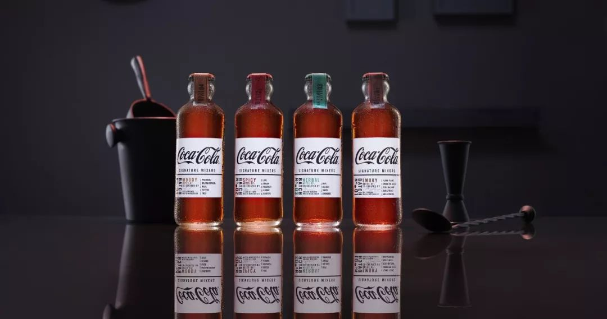 (原始链接: https://mmbiz.qpic.cn/mmbiz_jpg/F9YwhEHC8cZUHVRlk7PcvLicDdz7d1hnX8aHZfNFunGRvWsscWZoCsMW7WWQGiaSicYAZJ0wcqj9pwVjW760g45qQ/640?wx_fmt=jpeg)
- 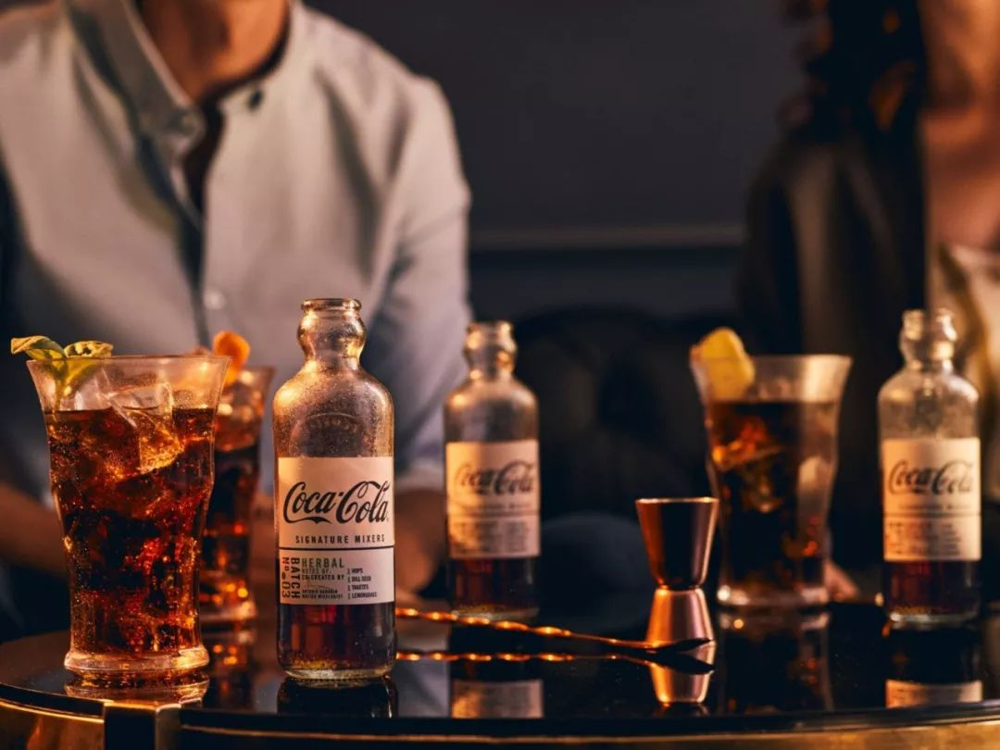 (原始链接: https://mmbiz.qpic.cn/mmbiz_jpg/F9YwhEHC8cZXYvUywkmkibAr1C61eFFa1yapULPVhhR7b7ibuSFQCKooISP9h5PTRBIBmXyh8Pe7YJCicaZ8rL1Fg/640?wx_fmt=jpeg)
- 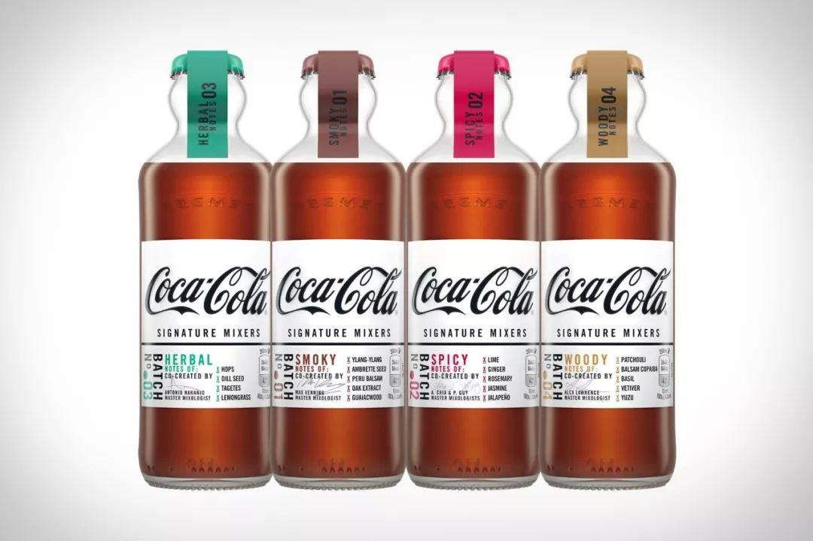 (原始链接: https://mmbiz.qpic.cn/mmbiz_jpg/F9YwhEHC8cZUHVRlk7PcvLicDdz7d1hnXYZ5PAickDKQiciaR2nOGibfibibACVTDVLDP6jYznL0bEI1HIkBFXkMWyZAg/640?wx_fmt=jpeg)
- 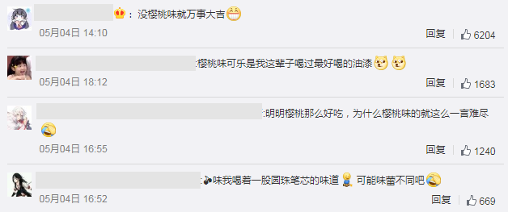 (原始链接: https://mmbiz.qpic.cn/mmbiz_png/F9YwhEHC8cZXYvUywkmkibAr1C61eFFa1BBeHGia1DugWyFl3AB6vTnk6OMbDxkD7jic4rvnCXZd57cQbqEUXze7g/640?wx_fmt=png)
-  (原始链接: https://mmbiz.qpic.cn/mmbiz_jpg/F9YwhEHC8cZUHVRlk7PcvLicDdz7d1hnXVELtRsEIezwSM872XBej2H4B9QoLGUicqxovfajBwYicHAAeZw74V6dQ/640?wx_fmt=jpeg)
-  (原始链接: https://mmbiz.qpic.cn/mmbiz_png/F9YwhEHC8cZXYvUywkmkibAr1C61eFFa161mzb7N13ia24h38fJeOibMDruDuPZhOIyWEH1RqnKmhF992PUOvycjQ/640?wx_fmt=png)
- 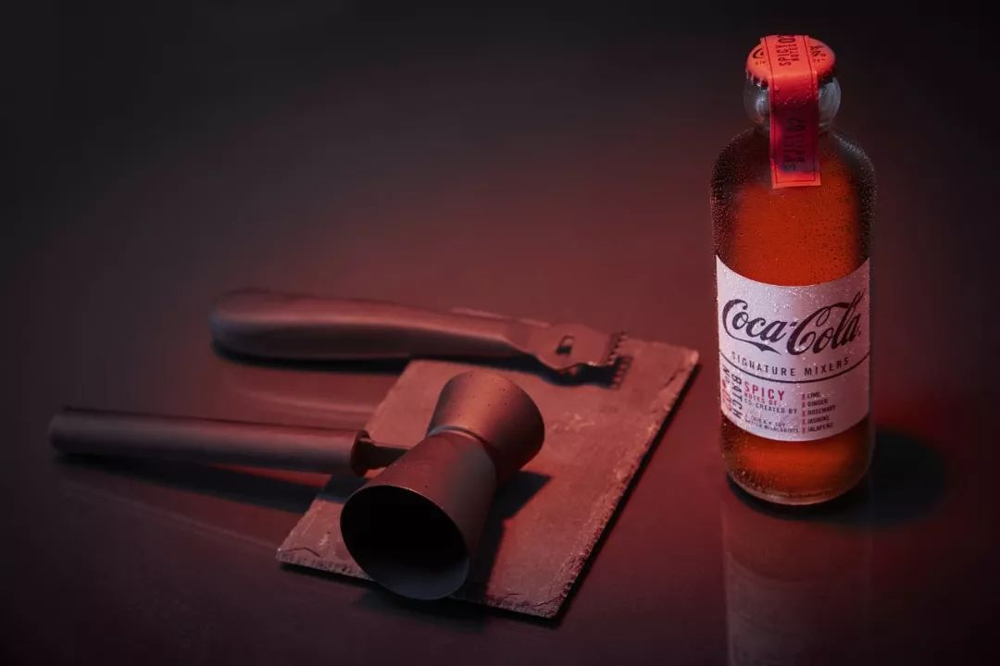 (原始链接: https://mmbiz.qpic.cn/mmbiz_jpg/F9YwhEHC8cZUHVRlk7PcvLicDdz7d1hnXibVWskjTv7fH2AlG78cntSz9GRU5LdJicJfPkicJmLzTphlEeLwqWviaqw/640?wx_fmt=jpeg)
- 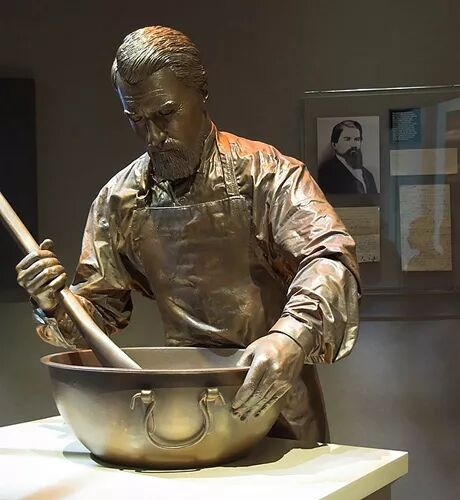 (原始链接: https://mmbiz.qpic.cn/mmbiz_jpg/F9YwhEHC8cZUHVRlk7PcvLicDdz7d1hnXwYicSbGUJykFNu5GuIgMb8gMlGLz8C3ogWADMw3q1pSxV4CmItibxm7A/640?wx_fmt=jpeg)
-  (原始链接: https://mmbiz.qpic.cn/mmbiz_png/F9YwhEHC8cZUHVRlk7PcvLicDdz7d1hnXhKGZlLgiaUH3dGW99sZd8BicpXYPfH7QlS78Z9vDngnx0wYzhGynnicPw/640?wx_fmt=png)
-  (原始链接: https://mmbiz.qpic.cn/mmbiz_jpg/F9YwhEHC8cZUHVRlk7PcvLicDdz7d1hnXjpbqtR2fiaNUh6RCmnbuhkx0oLeEZODYRI9cWzplt6BXzic7nTLx3AnQ/640?wx_fmt=jpeg)
- 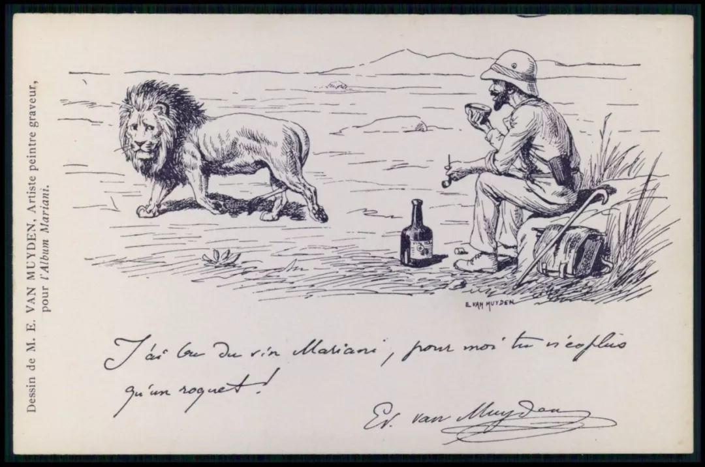 (原始链接: https://mmbiz.qpic.cn/mmbiz_jpg/F9YwhEHC8cZUHVRlk7PcvLicDdz7d1hnX5fOpRe22SezPvhK1IiaibAnJqD1CBHjrGKDBqqia5aluQC75UlyaTmc2A/640?wx_fmt=jpeg)
-  (原始链接: https://mmbiz.qpic.cn/mmbiz_png/GROugpxt9eFgflZU7tlcYtpfalicdcnl0icGe30Enu8ia0I8ZFGBHMicLMIiawLhaj3Rp5O5LIzWa0s6xzbg9D5icDWg/640)
- 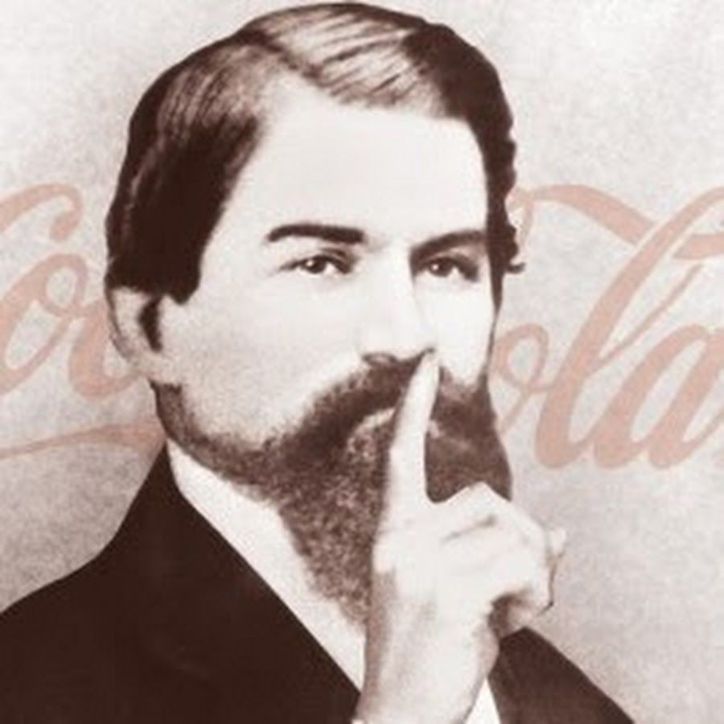 (原始链接: https://mmbiz.qpic.cn/mmbiz_png/F9YwhEHC8cZUHVRlk7PcvLicDdz7d1hnXpLaQNqkRh1QgdZcwrmE9Y55CpxP4wYeMpkxxf2e36qY6iaPwXUgFtWg/640?wx_fmt=png)
- 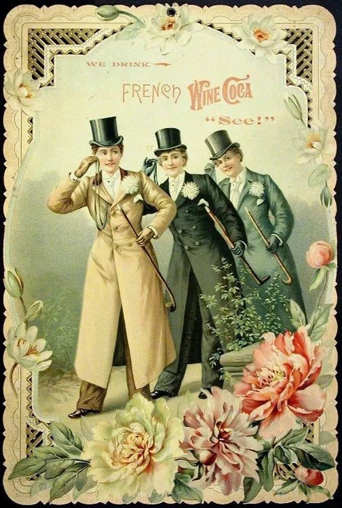 (原始链接: https://mmbiz.qpic.cn/mmbiz_jpg/F9YwhEHC8cZUHVRlk7PcvLicDdz7d1hnXgZats9vYR4EdX2oiaEia4iaia3jEZGzF1gmFx6WdZUNiazOQb5cVNta7qtA/640?wx_fmt=jpeg)
- 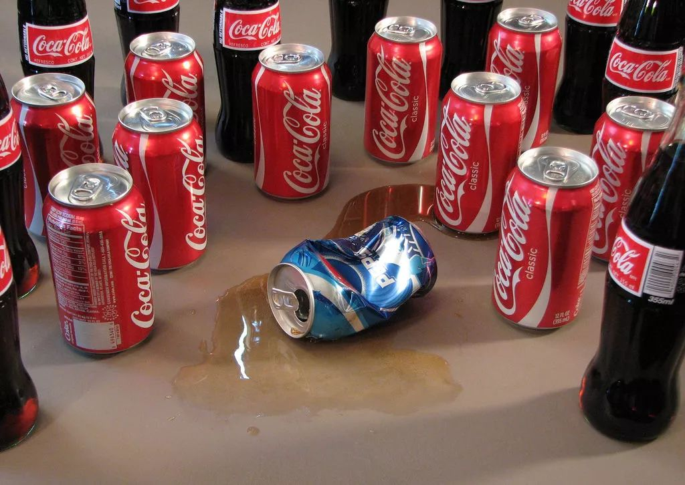 (原始链接: https://mmbiz.qpic.cn/mmbiz_jpg/F9YwhEHC8cZUHVRlk7PcvLicDdz7d1hnXrIIdEgvwhks1nD1DrbAq807Qdlu9DicEkTKic3b9Q3Ger2zMr5OiaiaYcA/640?wx_fmt=jpeg)
- 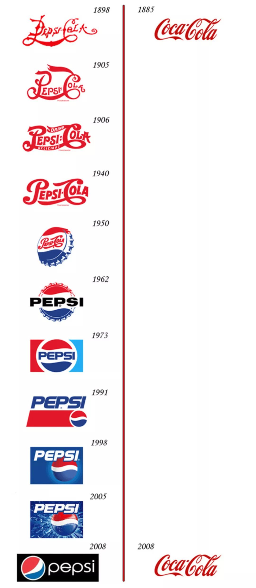 (原始链接: https://mmbiz.qpic.cn/mmbiz_jpg/F9YwhEHC8cZUHVRlk7PcvLicDdz7d1hnXJVhZ5SzrhAAiamXXLH0ic0f3Zwl5FM91bgJHYGu0BAASESnGiahiavlvew/640?wx_fmt=jpeg)
- 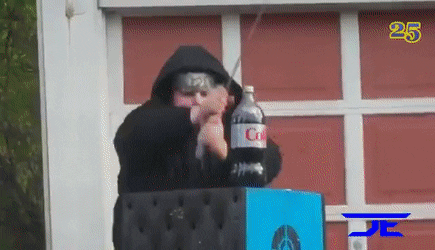 (原始链接: https://mmbiz.qpic.cn/mmbiz_gif/F9YwhEHC8cZUHVRlk7PcvLicDdz7d1hnXIxbVgIJbibpyXJvb5GKhQJlq6vsE4DgyTAa0AoRlR2BZROud67RHW3w/640?wx_fmt=gif)
-  (原始链接: https://mmbiz.qpic.cn/mmbiz_jpg/F9YwhEHC8cZXYvUywkmkibAr1C61eFFa16eiaFRVog3KibnuRnSBJcZc37UicMaLC6gpp5KEia3roYD29AFxv8qb0rg/640?wx_fmt=jpeg)
-  (原始链接: https://mmbiz.qpic.cn/mmbiz_jpg/F9YwhEHC8cZXYvUywkmkibAr1C61eFFa1tuTcYFXPkqTxn1jJnicHWJMksLpDVDk88OMxEMuNgiaCp1ux2tfeG5hg/640?wx_fmt=jpeg)
- 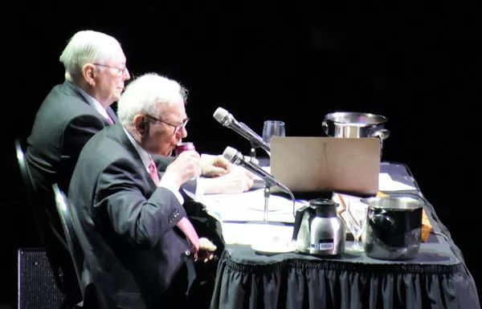 (原始链接: https://mmbiz.qpic.cn/mmbiz_jpg/F9YwhEHC8cZXYvUywkmkibAr1C61eFFa1d1EN2u1nK79NJ44At85BMdh6RKf6AYowpL1BYo33duicZK3wXBGg9Jg/640?wx_fmt=jpeg)
- 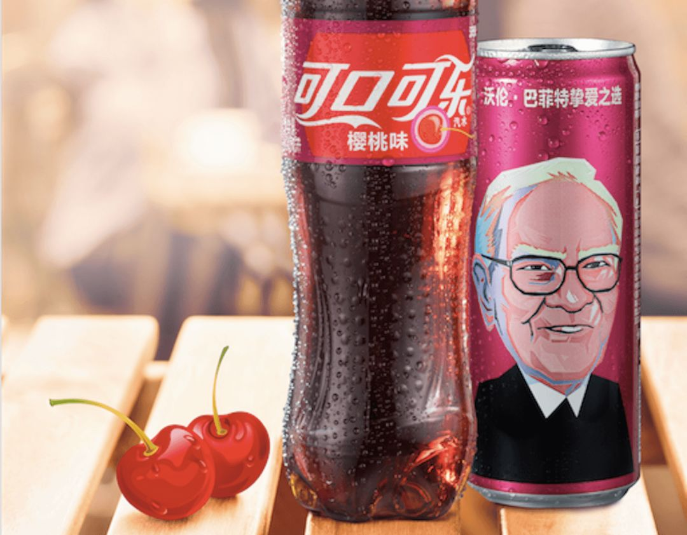 (原始链接: https://mmbiz.qpic.cn/mmbiz_png/F9YwhEHC8cZXYvUywkmkibAr1C61eFFa1g0ad625CzPdsvKZibFcpsAcPkjiayLHvV8xgxp6bia9s7zLu7zjxUUDew/640?wx_fmt=png)
-  (原始链接: https://mmbiz.qpic.cn/mmbiz_jpg/F9YwhEHC8cZXYvUywkmkibAr1C61eFFa1ZTX8ZK2tsnGIvrcOnicpNfkFYz2mice3wdEBpiasm8sQYeBqHWrJNibpsw/640?wx_fmt=jpeg)
-  (原始链接: https://mmbiz.qpic.cn/mmbiz_jpg/F9YwhEHC8cZXYvUywkmkibAr1C61eFFa1ghAH95IGwwawUnmuRcREKW48QJNEZlufXp9E0h7vURlRhQmnG61IMQ/640?wx_fmt=jpeg)
-  (原始链接: https://mmbiz.qpic.cn/mmbiz_jpg/F9YwhEHC8cZXYvUywkmkibAr1C61eFFa15XIeBtVdS6RribmJO3UJuhyyeu576XMvicZkMsWte6L5LqUZmb7xvz1A/640?wx_fmt=jpeg)
- 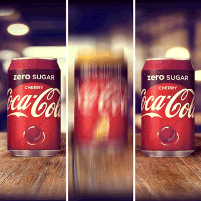 (原始链接: https://mmbiz.qpic.cn/mmbiz_gif/F9YwhEHC8cZXYvUywkmkibAr1C61eFFa1fTJibQFPDicvq9ezs1oQmRqye35qVcaMI2Fpj0m5HFNxAoibng1icMHTwA/640?wx_fmt=gif)
- 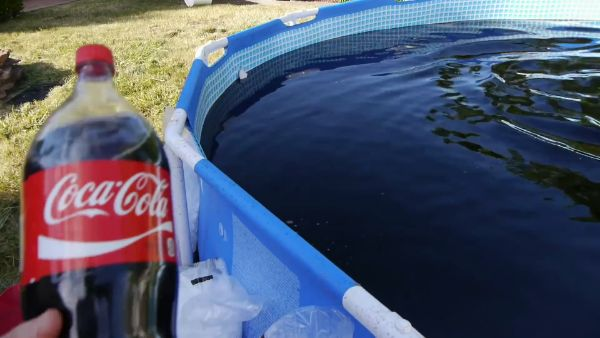 (原始链接: https://mmbiz.qpic.cn/mmbiz_png/F9YwhEHC8cZXYvUywkmkibAr1C61eFFa11DgzYp3bbC4xWlxY8E1icG6ZBY9Tht8TJpz8OtbxN5wPMhPo1lYZM0Q/640?wx_fmt=png)
- 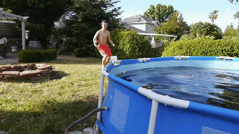 (原始链接: https://mmbiz.qpic.cn/mmbiz_gif/F9YwhEHC8cZXYvUywkmkibAr1C61eFFa1g413XHn2KMS1LKeJZdYPpQ0jms8KCajENA19EUNXJ7yw7BBl8AYUZQ/640?wx_fmt=gif)
- 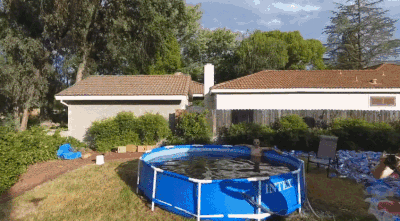 (原始链接: https://mmbiz.qpic.cn/mmbiz_gif/F9YwhEHC8cZUHVRlk7PcvLicDdz7d1hnXXNa7C2ibJaoh08xibybAE1kyRblc33vvdxoiaf0aPxHEloeFpaxuNg25w/640?wx_fmt=gif)
- 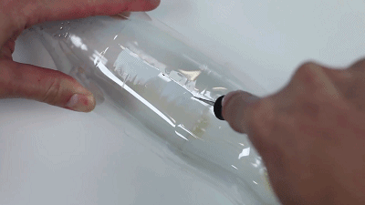 (原始链接: https://mmbiz.qpic.cn/mmbiz_gif/F9YwhEHC8cZXYvUywkmkibAr1C61eFFa1uh6Yficw8zyQI97Y5KH0OzzEVUl5wcG2ADBIbZgsa6L1nF74BFRGGAw/640?wx_fmt=gif)
- 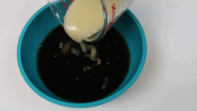 (原始链接: https://mmbiz.qpic.cn/mmbiz_gif/F9YwhEHC8cZXYvUywkmkibAr1C61eFFa1EKYAdrTGW3bCUggicEYJkNQcIYic59oRtoN7yrAd0E26lRkl4V0YdXnQ/640?wx_fmt=gif)
- 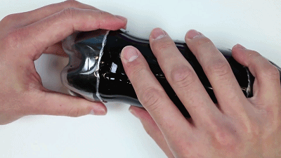 (原始链接: https://mmbiz.qpic.cn/mmbiz_gif/F9YwhEHC8cZXYvUywkmkibAr1C61eFFa1nxXKriaM7wvLx3JxBUF9x4EDrzZibQJ66tQW2uOZ17k9wNvJvj7Yd3Nw/640?wx_fmt=gif)
- 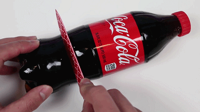 (原始链接: https://mmbiz.qpic.cn/mmbiz_gif/F9YwhEHC8cZXYvUywkmkibAr1C61eFFa160s0chzibuwUVXn0WrhnyeRficEyBvxiapToqibv9JNujQVbKp5ib02fQDA/640?wx_fmt=gif)
- 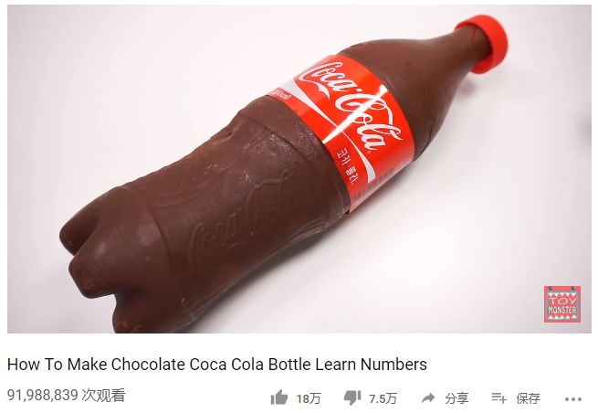 (原始链接: https://mmbiz.qpic.cn/mmbiz_png/F9YwhEHC8cZUHVRlk7PcvLicDdz7d1hnXNc24mrVQ3ghficGN5icWw9wyu6cT1yHkkjuK44UuOXTYsMo7icJ10hBfg/640?wx_fmt=png)
- 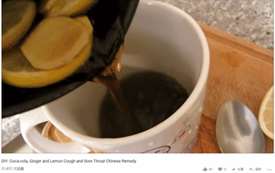 (原始链接: https://mmbiz.qpic.cn/mmbiz_gif/F9YwhEHC8cZXYvUywkmkibAr1C61eFFa1uuwWus4dbaCQgM7mbpR6mqTcJbBuKU8vDQEhOkWxt1LTuCFTKu1TaA/640?wx_fmt=gif)
- 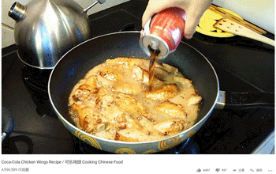 (原始链接: https://mmbiz.qpic.cn/mmbiz_gif/F9YwhEHC8cZXYvUywkmkibAr1C61eFFa1D9RicssgaJa4OPpiaJ9icBzofmDVnHaCibUCZicoClM6iaeFyg1j2lAgjvQQ/640?wx_fmt=gif)
-  (原始链接: https://mmbiz.qpic.cn/mmbiz_gif/F9YwhEHC8cZUHVRlk7PcvLicDdz7d1hnXbT0wjJy7w6DItk3BxWADOUSicugbjJX8sVX15T5iaJgoyp7iaHphl6kew/640?wx_fmt=gif)
-  (原始链接: https://mmbiz.qpic.cn/mmbiz_jpg/F9YwhEHC8cZUHVRlk7PcvLicDdz7d1hnXHQ5IZyInA4Mu6MA4Zqy6eVnyBBEfsyBzTdWnOT8KyvGxNQnwpGqrrg/640?wx_fmt=jpeg)
-  (原始链接: https://mmbiz.qpic.cn/mmbiz_gif/F9YwhEHC8cZUHVRlk7PcvLicDdz7d1hnXvHDGtnGaUuJdQefE61icp2eaHQu7f95bJonGYerRRRbSTtiaSF8SZMzA/640?wx_fmt=gif)
- 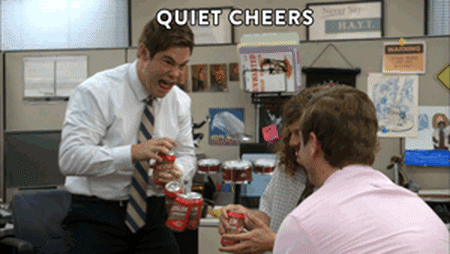 (原始链接: https://mmbiz.qpic.cn/mmbiz_gif/F9YwhEHC8cZUHVRlk7PcvLicDdz7d1hnXNzPX1tDVXCzrQK1fAumKGvmv9a9icwPPbiaxSKKwVEmZHFrNhK6nldibg/640?wx_fmt=gif)
-  (原始链接: https://mmbiz.qpic.cn/mmbiz_png/jU085vtLnq1bR14pHAKkMwyTJML4Z8KyC0UFv2licn8qJQNIHxNPfdkyK31O9PUmRfwr9lP8PicWzzumjn4XsoZQ/640?)
- 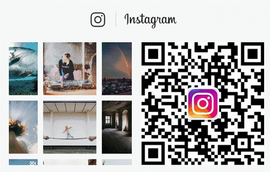 (原始链接: https://mmbiz.qpic.cn/mmbiz_gif/jU085vtLnq1bR14pHAKkMwyTJML4Z8KyuicWiaUL8x90k0UQe3EgpPteOLtNasxyKJx0NB89lkugVC3oDmt3nqDg/640?)
