# 无标题

**链接地址:** http://mp.weixin.qq.com/s?__biz=MzUzNDY0NzQwMQ==&mid=2247516559&idx=1&sn=61039b294f3bc9ad841eaccc126694f1&chksm=fa934689cde4cf9fabc33af053d87db2565bde03914e4048ac95c8272a051104ff4483957e35&mpshare=1&scene=2&srcid=#rd
**作者:** Zoe
**获取时间:** 2025/8/28 20:34:20
**图片数量:** 40

---

## 原始HTML内容

文/金错刀频道 &nbsp;Zoe

 

论一家网红餐厅如何在24小时内把自己作死？

 

——拍一个高大上的宣传片。 

 

这是一家名叫柒本味的网红餐厅，位于南京，主营日料，早在2015年，就被冠上中国“寿司之神”的美誉。

 

 

据某视频大号描述，这是一家有规矩、高格调的日料餐厅，体现在哪呢？

 

店内采取私人定制模式，没有菜单，店面大字写着“私人餐厅，非请莫入”。 

 

 

店里有一系列变态规矩：人不到齐不开席、每餐只接待10人、不接待陌生人、食物必须一分钟内吃完…… 

 

因为“柒本味”就是要追寻食物“本来的味道”。

 

目前此视频已被删除

 

但戏剧性的一幕发生了，在视频爆火24小时后，“寿司之神”竟然被当地市场监管部门查封了。。

 

发生了什么？

 
<section style="box-sizing: border-box;font-size: 16px;"><section style="box-sizing: border-box;" powered-by="xiumi.us"><section style="margin-top: 0.5em;margin-bottom: 0.5em;overflow: hidden;text-align: center;box-sizing: border-box;"><section style="width: 2em;height: 2em;margin-right: auto;margin-left: auto;border-radius: 100%;background-color: rgb(0, 35, 161);line-height: 2em;color: rgb(255, 255, 255);box-sizing: border-box;max-width: 20% !important;"><section style="box-sizing: border-box;">1</section></section><section style="margin-top: -1em;margin-bottom: 1em;box-sizing: border-box;"><section style="border-top: 1px solid rgb(0, 35, 161);width: 35%;float: left;box-sizing: border-box;"></section><section style="border-top: 1px solid rgb(0, 35, 161);width: 35%;float: right;box-sizing: border-box;"></section></section><section style="clear: both;box-sizing: border-box;"></section></section></section></section>
<strong>大力出悲剧！</strong>

<strong>花100万把自己作死</strong> 

 

事情得从5月2号的一则视频说起。

 

 

视频拍的是一家南京高级寿司店，名叫柒本味。视频一播出就获得了一百多万观看。

 

视频充满了一种匠人情怀：主打老板对美味有着极致追求，厨艺好，脾气大。

 

这家店有七大变态规矩。

 

规矩一：不允许打包，也不接受外卖服务，来店即食；

 

规矩二：拒绝批量生产；

 

规矩三：每一餐同时用餐的人数不能超过10人，因为他们要保证顾客用餐的舒适度和体验；

 

规矩四：就是人不到齐不开席，就算你饿到前胸贴后背，那也得别废话，忍着。

 

规矩五：必须在食物呈上后1分钟内吃完。

 

 

规矩六：没有菜单，只接受预订，如果没有预定，大厨做什么你吃什么。 

 

规矩七：如果不是老客带新客，不接受陌生客人。

 

 

有顾客评价说：其他地方的日料，我不碰的。

 

 

也有顾客说：如果不是店长开的，柒本味就不会有今天。

 

 

溜了溜了，这么“高逼格”的馆子一看就不是给我们这些普通人准备的。

 

视频一发出来，立即引起全网的热议（群嘲）。 

 

为什么？

 

因为他们给顾客定那么多规矩，自己一点规矩不守。

 

槽点一:不能堂食打包，却做外卖

 

比如必须要老客带新客，那不认识老客想吃怎么办？老板说：私信我。

 

说不接受打包外卖，美其名曰破坏口感，可却被扒出去年还在做外卖。

 

 

槽点2：用酱油泡米饭

 

不光说过的话啪啪打脸，做的事也很不专业。

 

例如，酱油应该是刷寿司上层的，可他直接倒下去，米饭都散开了。 

 

 

资深吃货网友吐槽说：这一管子倒下去，下面的米全被酱油泡散开了。

 

 

芥末也不是直接放在米饭上的，而是应该抹在鱼生内侧。

 

 

时代变了，现在大家装X连草稿都不打了。

 

槽点3：浓疮手做日料

 

手法不专业就算了，料理过程也极其随意。不戴厨师帽，手上还戴着手表。

 

 

食品安全条例中明确规定，人员上岗时，不能带着饰物料理。

 

因为手可以随时洗干净，饰物却长时间不会清理，极易滋生细菌。

 

怎么也不像中国版“寿司之神”能干出的事，越扒越深，网友在老板做虾的视频里发现，他的手上有一颗疮。 

 

 

这种水准怕是开的不是日料店，是韭菜田吧。

 

事情闹大之后，有媒体前去采访，老板段磊称自己遭遇了网络暴力，很委屈：

 
<blockquote class="" data-type="2" data-url="" data-author-name="" data-content-utf8-length="77" data-source-title="">
伤口是被烫的，而且都是4个月前了，现在拿出来说是恶意放大；

 

戴手表为看时间制作料理，国外厨师也戴手表啊；

 

做料理是创意料理，并非是日本料理，好吃就是标准
</blockquote>
前面还是寿司之神，这会倒变成创意料理了。

 

对于这种解释，网友当然不买账。

 

 

看到大家的讨论，视频爆火一天后，南京鼓楼区市场监管局来了，发现柒本味没有营业执照和食品经营许可证，责令闭店。 

 

 

据说，段磊为了拍这个宣传片，砸出去100万。

 

&nbsp;

这配置还打广告，真是富贵险中求

 

 

要是真的花了100万做营销的话，段磊这会估计肠子都悔青了。

 

有知乎网友在“历史上有哪些大力出悲剧的产品”问题下，提名柒本味。

 

真是一段神奇的宣传片，硬是拍广告把自己给捶死了。

 
<section style="box-sizing: border-box;font-size: 16px;"><section style="box-sizing: border-box;" powered-by="xiumi.us"><section style="margin-top: 0.5em;margin-bottom: 0.5em;overflow: hidden;text-align: center;box-sizing: border-box;"><section style="width: 2em;height: 2em;margin-right: auto;margin-left: auto;border-radius: 100%;background-color: rgb(0, 35, 161);line-height: 2em;color: rgb(255, 255, 255);box-sizing: border-box;max-width: 20% !important;"><section style="box-sizing: border-box;">2</section></section><section style="margin-top: -1em;margin-bottom: 1em;box-sizing: border-box;"><section style="border-top: 1px solid rgb(0, 35, 161);width: 35%;float: left;box-sizing: border-box;"></section><section style="border-top: 1px solid rgb(0, 35, 161);width: 35%;float: right;box-sizing: border-box;"></section></section><section style="clear: both;box-sizing: border-box;"></section></section></section></section>
<strong>24小时内猝死，</strong>

<strong>柒本味做错了2两点</strong> 

 

在柒本味刚刚开业的时候，可不是这样。 

 

未经包装之前，柒本味只是一家人均81块钱的创意饭团店，价格比现在的398、498、698人性多了，6片三文鱼才19。

 

但开着开着就变了味，规矩越来越多，人均消费价格越来越高。

 

在这过程中柒本味犯了很多网红餐厅最容易犯的两点致命错。

 

<strong>1.营销＞产品</strong> 

 

在营销方面，柒本味一向大胆。报纸上曾给柒本味的定位是“寿司之神”。

 

 

 

2016 年，在一新闻频道上变身“高冷”老板的创意饭团店。

 

 

在营销上没少下功夫，但在产品口碑上，柒本味任性到底。

 

对一些慕名而来的顾客，老板一句“你没预约”就把人轰回去。

 

有顾客因为不中意这里的口味，没有吃完，老板脸色就变了，追着问人家为什么不吃完？（心里没点数么？）

 

还有人更可怜，剩了俩饭团，被老板逼着要吃完。

 

有网友爆料自己给餐厅打过差评后，遭到了老板的骚扰。

 

 

要是能把这种为难顾客的精神用在做料理上，柒本味应该不会这么快玩砸。

 

<strong>2.匠心≠别有用心</strong>

 

柒本味爱通过给顾客立各种规矩，体现自己在做料理上的“匠心”，但实则连专业都算不上，何谈匠心？

 

日本“寿司之王”小野二郎同样爱立规矩，但那些规矩是用来约束自己、约束学徒的，而不是用来苛责顾客的。

 

在小野二郎的店里做学徒，首先必须学会用手拧烫毛巾，没学会拧毛巾，就不可能碰鱼；

 

然后，要学会用刀和料理鱼。10年之后，他们才会让学徒煎蛋。

 

在处理食材上要求也很高，例如按摩章鱼就要按40~50分钟。

 

 

在对待双手的态度上，他说：

 
<blockquote style="margin-top: 0px;margin-bottom: 0px;color: rgba(0, 0, 0, 0.498039);max-width: 100%;letter-spacing: 0.544px;white-space: normal;box-sizing: border-box !important;word-wrap: break-word !important;">
这四十年，我只要离开这家店，我都带着手套。

 

我永远，保持我的手是健康的。
</blockquote>
 

 

 

在做了五十五年寿司之后，他终于成为了“寿司之神”。

 

他之所以能封神，不是因为脾气大、规矩多，而是从心底尊重客人，这才是将真正的匠心精神。

 

匠心和别有用心还是有差别的。柒本味尬吹什么工匠精神，其实就是割韭菜的。

 
<section style="box-sizing: border-box;font-size: 16px;"><section style="box-sizing: border-box;" powered-by="xiumi.us"><section style="margin-top: 0.5em;margin-bottom: 0.5em;overflow: hidden;text-align: center;box-sizing: border-box;"><section style="width: 2em;height: 2em;margin-right: auto;margin-left: auto;border-radius: 100%;background-color: rgb(0, 35, 161);line-height: 2em;color: rgb(255, 255, 255);box-sizing: border-box;max-width: 20% !important;"><section style="box-sizing: border-box;">3</section></section><section style="margin-top: -1em;margin-bottom: 1em;box-sizing: border-box;"><section style="border-top: 1px solid rgb(0, 35, 161);width: 35%;float: left;box-sizing: border-box;"></section><section style="border-top: 1px solid rgb(0, 35, 161);width: 35%;float: right;box-sizing: border-box;"></section></section><section style="clear: both;box-sizing: border-box;"></section></section></section></section>
<strong>为何网红餐厅逃不过</strong>

<strong>“一炮而红，一下就死”的魔咒？</strong> 

 

柒本味从一夜爆红到口碑暴跌，只有短短24小时，实在是让人唏嘘不已。

 

但“一年红火，两年稳中有降，三年就撑不下去”仿佛是网红餐饮们逃不过的魔咒。

 

据国家统计局2017年的数据，在网红餐厅盛行的北上广，每天都有800多家餐厅关门大吉，其中不乏一些曾红极一时的网红餐厅。

 

去年兴起的泡面食堂，几十块一碗的泡面，和家里煮的一模一样，加两个火腿一个蛋，换个漂亮碗一装，一碗能卖到几十块。

 

微博抖音小红书上，铺天盖地的，全都是安利泡面小食堂的文案。

 

 

 

然而，从全网吹捧到全网嘲讽，泡面小食堂也就花了几个月的时间。

 

还有前两年的顺德牛展，以老板脾气极差闻名互联网，还上了舌尖上的中国，态度差到什么地步？

 

店里不让用手机，价格贵的离谱（两份煲仔饭要290元），老板还整天发脾气：

 
<blockquote style="margin-top: 0px;margin-bottom: 0px;color: rgba(0, 0, 0, 0.498039);max-width: 100%;letter-spacing: 0.544px;white-space: normal;box-sizing: border-box !important;word-wrap: break-word !important;">
“经济有困难就别吃”！

 

“煲仔饭不是那么吃的！你要不会吃的放下钱就可以直接滚蛋了”！
</blockquote>
 

 

可以看出这些年，网红店大体走两个套路，一是在创意和外观上下功夫，吸引你去拍照，像刚刚提到的泡面小食堂，或是网红沙皮狗。

 

 

还有一种就是像柒本味、顺德牛展一样的，包装老板脾气差的人设，再加些店内服务差、排队3小时、来晚了就吃不到等噱头。

 

但现在的顾客一点也不傻，装逼只能一时火。这些网红店不是倒下了，就是正在倒下的路上。

 

<strong>今天，你把用户当傻子、冤大头，</strong>

<strong>明天就离死不远了。</strong>

 

你都去过哪些网红餐厅，坑不？

 

参考资料：

宣传片刚火，这家网红店就被查了.澎湃新闻

天下苦网红店久矣.Vista看天下

 

 
<h2 class="" style="max-width: 100%;letter-spacing: 0.544px;text-align: center;box-sizing: border-box !important;word-wrap: break-word !important;overflow-wrap: break-word !important;"><strong style="max-width: 100%;letter-spacing: 0.544px;font-size: 17px;widows: 1;color: rgb(89, 89, 89);box-sizing: border-box !important;word-wrap: break-word !important;overflow-wrap: break-word !important;"> </strong></h2><h2 class="" style="max-width: 100%;letter-spacing: 0.544px;text-align: center;box-sizing: border-box !important;word-wrap: break-word !important;overflow-wrap: break-word !important;"><strong style="max-width: 100%;letter-spacing: 0.544px;font-size: 17px;widows: 1;color: rgb(89, 89, 89);box-sizing: border-box !important;word-wrap: break-word !important;overflow-wrap: break-word !important;">©THE END</strong></h2>
本账号系网易新闻·网易号“各有态度”签约账号
<section style="margin-right: 0.5em;margin-left: 0.5em;padding-right: 0.5em;padding-left: 0.5em;max-width: 100%;letter-spacing: 0.544px;box-sizing: border-box !important;word-wrap: break-word !important;overflow-wrap: break-word !important;"><section powered-by="xiumi.us" style="margin-right: 0em;margin-left: 0em;max-width: 100%;box-sizing: border-box !important;word-wrap: break-word !important;overflow-wrap: break-word !important;"><section style="margin: 10px 0em;max-width: 100%;text-align: center;line-height: 1;box-sizing: border-box !important;word-wrap: break-word !important;overflow-wrap: break-word !important;"><section style="margin-right: 0em;margin-left: 0em;max-width: 100%;font-size: 16px;display: inline-block;vertical-align: top;box-sizing: border-box !important;word-wrap: break-word !important;overflow-wrap: break-word !important;"></section><section style="margin-right: 0em;margin-left: 0em;padding-right: 3px;padding-left: 3px;max-width: 100%;font-size: 14px;display: inline-block;vertical-align: top;line-height: 1.2;color: rgb(0, 35, 161);box-sizing: border-box !important;word-wrap: break-word !important;overflow-wrap: break-word !important;">
<strong style="max-width: 100%;box-sizing: border-box !important;word-wrap: break-word !important;overflow-wrap: break-word !important;">刀哥重磅推荐&nbsp;</strong>
</section><section style="margin-right: 0em;margin-left: 0em;max-width: 100%;font-size: 16px;display: inline-block;vertical-align: top;box-sizing: border-box !important;word-wrap: break-word !important;overflow-wrap: break-word !important;"></section>&nbsp;&nbsp;</section><section style="margin: 10px 0em;max-width: 100%;text-align: center;line-height: 1;box-sizing: border-box !important;word-wrap: break-word !important;overflow-wrap: break-word !important;">点击图片直接阅读</section>
<a href="http://mp.weixin.qq.com/s?__biz=MzUzNDY0NzQwMQ==&amp;mid=2247516418&amp;idx=1&amp;sn=bb2520bd345de296f7749cec1db8b1b1&amp;chksm=fa934604cde4cf12e431a630716a4c8aaacf9363c610eebcc7af67e4f755c35a62b70c8fdafd&amp;scene=21#wechat_redirect" target="_blank" data-linktype="1"></a>

<a href="http://mp.weixin.qq.com/s?__biz=MzUzNDY0NzQwMQ==&amp;mid=2247516519&amp;idx=1&amp;sn=cd7a286f60e5cde7ac5c63d362129292&amp;chksm=fa934661cde4cf773869792f3ebde5a065bb58dab2d40652627861f3dba04f2b2d4325dcefbf&amp;scene=21#wechat_redirect" target="_blank" data-linktype="1"></a>

<a href="http://mp.weixin.qq.com/s?__biz=MzUzNDY0NzQwMQ==&amp;mid=2247516271&amp;idx=1&amp;sn=10d23cec1acbb1efd4de2aa67a327d3a&amp;chksm=fa934769cde4ce7fecf370bfd02aa3904bdecab84cc0deb4b9061517c8cabfed39b9e0f7ab36&amp;scene=21#wechat_redirect" target="_blank" data-linktype="1"></a>

</section></section>

---

## 纯文本内容

文/金错刀频道  Zoe论一家网红餐厅如何在24小时内把自己作死？——拍一个高大上的宣传片。这是一家名叫柒本味的网红餐厅，位于南京，主营日料，早在2015年，就被冠上中国“寿司之神”的美誉。据某视频大号描述，这是一家有规矩、高格调的日料餐厅，体现在哪呢？店内采取私人定制模式，没有菜单，店面大字写着“私人餐厅，非请莫入”。店里有一系列变态规矩：人不到齐不开席、每餐只接待10人、不接待陌生人、食物必须一分钟内吃完……因为“柒本味”就是要追寻食物“本来的味道”。目前此视频已被删除但戏剧性的一幕发生了，在视频爆火24小时后，“寿司之神”竟然被当地市场监管部门查封了。。发生了什么？1大力出悲剧！花100万把自己作死事情得从5月2号的一则视频说起。视频拍的是一家南京高级寿司店，名叫柒本味。视频一播出就获得了一百多万观看。视频充满了一种匠人情怀：主打老板对美味有着极致追求，厨艺好，脾气大。这家店有七大变态规矩。规矩一：不允许打包，也不接受外卖服务，来店即食；规矩二：拒绝批量生产；规矩三：每一餐同时用餐的人数不能超过10人，因为他们要保证顾客用餐的舒适度和体验；规矩四：就是人不到齐不开席，就算你饿到前胸贴后背，那也得别废话，忍着。规矩五：必须在食物呈上后1分钟内吃完。规矩六：没有菜单，只接受预订，如果没有预定，大厨做什么你吃什么。规矩七：如果不是老客带新客，不接受陌生客人。有顾客评价说：其他地方的日料，我不碰的。也有顾客说：如果不是店长开的，柒本味就不会有今天。溜了溜了，这么“高逼格”的馆子一看就不是给我们这些普通人准备的。视频一发出来，立即引起全网的热议（群嘲）。为什么？因为他们给顾客定那么多规矩，自己一点规矩不守。槽点一:不能堂食打包，却做外卖比如必须要老客带新客，那不认识老客想吃怎么办？老板说：私信我。说不接受打包外卖，美其名曰破坏口感，可却被扒出去年还在做外卖。槽点2：用酱油泡米饭不光说过的话啪啪打脸，做的事也很不专业。例如，酱油应该是刷寿司上层的，可他直接倒下去，米饭都散开了。资深吃货网友吐槽说：这一管子倒下去，下面的米全被酱油泡散开了。芥末也不是直接放在米饭上的，而是应该抹在鱼生内侧。时代变了，现在大家装X连草稿都不打了。槽点3：浓疮手做日料手法不专业就算了，料理过程也极其随意。不戴厨师帽，手上还戴着手表。食品安全条例中明确规定，人员上岗时，不能带着饰物料理。因为手可以随时洗干净，饰物却长时间不会清理，极易滋生细菌。怎么也不像中国版“寿司之神”能干出的事，越扒越深，网友在老板做虾的视频里发现，他的手上有一颗疮。这种水准怕是开的不是日料店，是韭菜田吧。事情闹大之后，有媒体前去采访，老板段磊称自己遭遇了网络暴力，很委屈：伤口是被烫的，而且都是4个月前了，现在拿出来说是恶意放大；戴手表为看时间制作料理，国外厨师也戴手表啊；做料理是创意料理，并非是日本料理，好吃就是标准前面还是寿司之神，这会倒变成创意料理了。对于这种解释，网友当然不买账。看到大家的讨论，视频爆火一天后，南京鼓楼区市场监管局来了，发现柒本味没有营业执照和食品经营许可证，责令闭店。据说，段磊为了拍这个宣传片，砸出去100万。 这配置还打广告，真是富贵险中求要是真的花了100万做营销的话，段磊这会估计肠子都悔青了。有知乎网友在“历史上有哪些大力出悲剧的产品”问题下，提名柒本味。真是一段神奇的宣传片，硬是拍广告把自己给捶死了。224小时内猝死，柒本味做错了2两点在柒本味刚刚开业的时候，可不是这样。未经包装之前，柒本味只是一家人均81块钱的创意饭团店，价格比现在的398、498、698人性多了，6片三文鱼才19。但开着开着就变了味，规矩越来越多，人均消费价格越来越高。在这过程中柒本味犯了很多网红餐厅最容易犯的两点致命错。1.营销＞产品在营销方面，柒本味一向大胆。报纸上曾给柒本味的定位是“寿司之神”。2016 年，在一新闻频道上变身“高冷”老板的创意饭团店。在营销上没少下功夫，但在产品口碑上，柒本味任性到底。对一些慕名而来的顾客，老板一句“你没预约”就把人轰回去。有顾客因为不中意这里的口味，没有吃完，老板脸色就变了，追着问人家为什么不吃完？（心里没点数么？）还有人更可怜，剩了俩饭团，被老板逼着要吃完。有网友爆料自己给餐厅打过差评后，遭到了老板的骚扰。要是能把这种为难顾客的精神用在做料理上，柒本味应该不会这么快玩砸。2.匠心≠别有用心柒本味爱通过给顾客立各种规矩，体现自己在做料理上的“匠心”，但实则连专业都算不上，何谈匠心？日本“寿司之王”小野二郎同样爱立规矩，但那些规矩是用来约束自己、约束学徒的，而不是用来苛责顾客的。在小野二郎的店里做学徒，首先必须学会用手拧烫毛巾，没学会拧毛巾，就不可能碰鱼；然后，要学会用刀和料理鱼。10年之后，他们才会让学徒煎蛋。在处理食材上要求也很高，例如按摩章鱼就要按40~50分钟。在对待双手的态度上，他说：这四十年，我只要离开这家店，我都带着手套。我永远，保持我的手是健康的。在做了五十五年寿司之后，他终于成为了“寿司之神”。他之所以能封神，不是因为脾气大、规矩多，而是从心底尊重客人，这才是将真正的匠心精神。匠心和别有用心还是有差别的。柒本味尬吹什么工匠精神，其实就是割韭菜的。3为何网红餐厅逃不过“一炮而红，一下就死”的魔咒？柒本味从一夜爆红到口碑暴跌，只有短短24小时，实在是让人唏嘘不已。但“一年红火，两年稳中有降，三年就撑不下去”仿佛是网红餐饮们逃不过的魔咒。据国家统计局2017年的数据，在网红餐厅盛行的北上广，每天都有800多家餐厅关门大吉，其中不乏一些曾红极一时的网红餐厅。去年兴起的泡面食堂，几十块一碗的泡面，和家里煮的一模一样，加两个火腿一个蛋，换个漂亮碗一装，一碗能卖到几十块。微博抖音小红书上，铺天盖地的，全都是安利泡面小食堂的文案。然而，从全网吹捧到全网嘲讽，泡面小食堂也就花了几个月的时间。还有前两年的顺德牛展，以老板脾气极差闻名互联网，还上了舌尖上的中国，态度差到什么地步？店里不让用手机，价格贵的离谱（两份煲仔饭要290元），老板还整天发脾气：“经济有困难就别吃”！“煲仔饭不是那么吃的！你要不会吃的放下钱就可以直接滚蛋了”！可以看出这些年，网红店大体走两个套路，一是在创意和外观上下功夫，吸引你去拍照，像刚刚提到的泡面小食堂，或是网红沙皮狗。还有一种就是像柒本味、顺德牛展一样的，包装老板脾气差的人设，再加些店内服务差、排队3小时、来晚了就吃不到等噱头。但现在的顾客一点也不傻，装逼只能一时火。这些网红店不是倒下了，就是正在倒下的路上。今天，你把用户当傻子、冤大头，明天就离死不远了。你都去过哪些网红餐厅，坑不？参考资料：宣传片刚火，这家网红店就被查了.澎湃新闻天下苦网红店久矣.Vista看天下©THE END本账号系网易新闻·网易号“各有态度”签约账号刀哥重磅推荐   点击图片直接阅读

---

## 图片列表

-  (原始链接: https://mmbiz.qpic.cn/mmbiz_gif/f8qQDVOfjhyNDlz7sc4a8yibtjXkILoknyibibiabMjlnuEBkfTT7VT1QJqpTX0KMibLiccv6YQryVgoYGeMXfbYHqDw/640?)
-  (原始链接: https://mmbiz.qpic.cn/mmbiz_jpg/HsGdorCWARVICgrYiajmk2gLw44yqA1ovp6FuIguAHeH2Dcpo7yMLj1vBKib5atvibEFlicibGicuagE8UJHrBBbbGyQ/640?wx_fmt=jpeg)
-  (原始链接: https://mmbiz.qpic.cn/mmbiz_jpg/f8qQDVOfjhzGG1FBvflBtQx2YEgXDADE0LTDtgYo1ANrm7Zo2sVG4ZoElpkVnLRPJRZsDCjPfMThWze2xaNbKA/640?wx_fmt=jpeg)
- 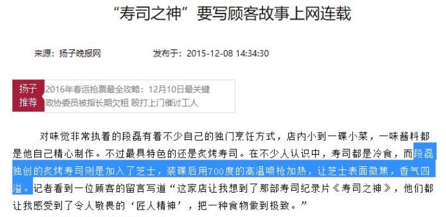 (原始链接: https://mmbiz.qpic.cn/mmbiz_png/icdHpHMYRdfoSPy3rVYW7iaDJtFAhpgfXLtCQYgjv5NIarNs3SV3KMLVzCCVszp2Vz1T46PSrfCCJSpdnuXOMibicA/640?wx_fmt=png)
- 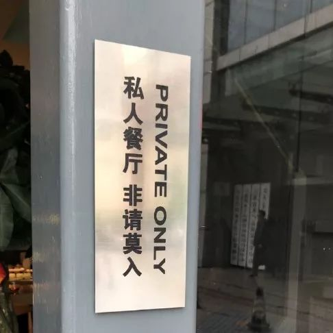 (原始链接: https://mmbiz.qpic.cn/mmbiz_jpg/HsGdorCWARVICgrYiajmk2gLw44yqA1ovNjVibGgJibYdyg8bHicFDeK23ibPhMbMO0Vql6vsyM8uyz6yd3ZC726DAA/640?wx_fmt=jpeg)
- 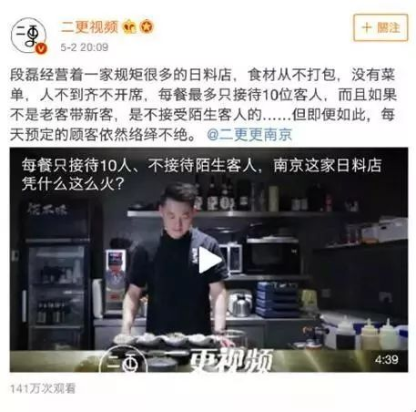 (原始链接: https://mmbiz.qpic.cn/mmbiz_jpg/9icx4533GF7xh1XzLNMEAUqicuhZ1yaAKcT8M0cPDnWEccwibLXFoIRhxYicMe5bLR2NDaKzP5XKCVmmTP9QtY3MjQ/640?wx_fmt=jpeg)
- 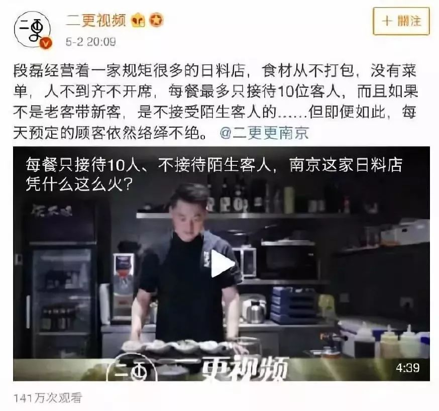 (原始链接: https://mmbiz.qpic.cn/mmbiz_jpg/HsGdorCWARVICgrYiajmk2gLw44yqA1ovhUJ0SoXrLu2piciadYnvYJU4fHRpJuUu7AUKM3gIE6TgLxsnBEXW3sYg/640?wx_fmt=jpeg)
- 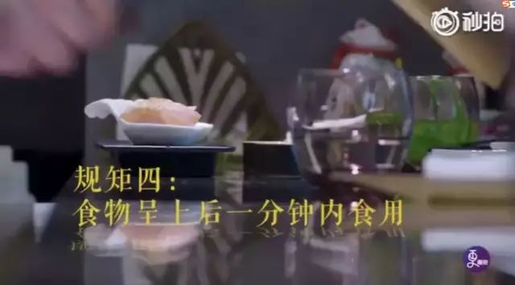 (原始链接: https://mmbiz.qpic.cn/mmbiz/9icx4533GF7xh1XzLNMEAUqicuhZ1yaAKcp15icnLollfdc72H5UolndAA7VzibvNh8GEUs8icGhHMk5czcgvyHibeZg/640?wx_fmt=other)
- 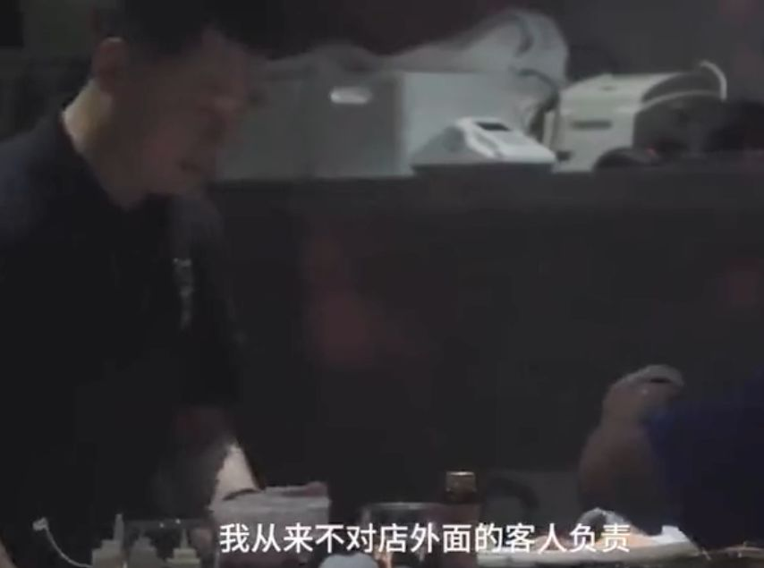 (原始链接: https://mmbiz.qpic.cn/mmbiz_png/icdHpHMYRdfoSPy3rVYW7iaDJtFAhpgfXLtIXNYo26ia29YDw2ib2A952RmOKylibkiaUAkziaza4hm1w02pwCMGmcXog/640?wx_fmt=png)
-  (原始链接: https://mmbiz.qpic.cn/mmbiz_png/10vgqjurV8YdWEo7uFvoH5RZCHugmILxoXC5HTjXpKtIcrSibUso1gbbfkpNaeBjLX9FsfkGek5dSL6nfJreJSQ/640?wx_fmt=png)
-  (原始链接: https://mmbiz.qpic.cn/mmbiz_png/10vgqjurV8YdWEo7uFvoH5RZCHugmILxJ5NqsjekedcfxJGad4EOft5hBHEfALLibc3dxYAL9TtpsBnDdlDW0aA/640?wx_fmt=png)
-  (原始链接: https://mmbiz.qpic.cn/mmbiz_jpg/9icx4533GF7xh1XzLNMEAUqicuhZ1yaAKc2hwrEaiaJ0VZGia0BibeictCZtCz1BIJjm2XkibXcBb1WUSWSmNy5vD16YQ/640?wx_fmt=jpeg)
- 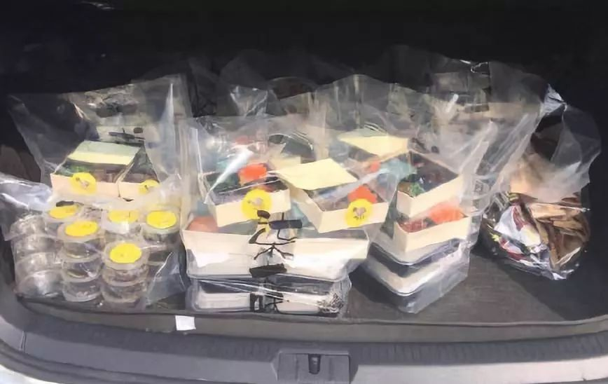 (原始链接: https://mmbiz.qpic.cn/mmbiz_jpg/9icx4533GF7xh1XzLNMEAUqicuhZ1yaAKcUMkBicQHoIx9YCeCNnOg8qyHficgNrO1D362NqZQFFHTmdHa2icJLvX5w/640?wx_fmt=jpeg)
- 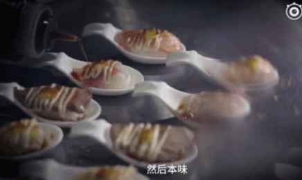 (原始链接: https://mmbiz.qpic.cn/mmbiz_gif/10vgqjurV8YdWEo7uFvoH5RZCHugmILxjFzcnrEthS95RMWo51FskIaVUrbF2sx9T57eV8U0YvUKN4iaSiakpXmg/640?wx_fmt=gif)
- 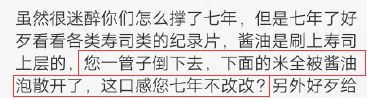 (原始链接: https://mmbiz.qpic.cn/mmbiz_png/10vgqjurV8YdWEo7uFvoH5RZCHugmILxZ5c3GTpV5Libtt6U5YJ3WlJcYpfuAtDQE66XibNpfIewKNLXqSf2bFPw/640?wx_fmt=png)
-  (原始链接: https://mmbiz.qpic.cn/mmbiz_png/10vgqjurV8YdWEo7uFvoH5RZCHugmILxNIYCA4icaobdjyW3NFtV6wOibd5h3HrhsUTc7sdicfibYRop5ic0zEJ0x6g/640?wx_fmt=png)
-  (原始链接: https://mmbiz.qpic.cn/mmbiz_png/10vgqjurV8YdWEo7uFvoH5RZCHugmILx1lHSpGazMUsDeoFY13ep4LMK0WpPT5I0kMlCngfpf9TAKdgkcTB5gw/640?wx_fmt=png)
-  (原始链接: https://mmbiz.qpic.cn/mmbiz_png/10vgqjurV8YdWEo7uFvoH5RZCHugmILxVcekEY2HAiaGQLJZy6vAe7Dyds6OzTFIcsUVOmQmKTJZrkvUcyycvwA/640?wx_fmt=png)
- 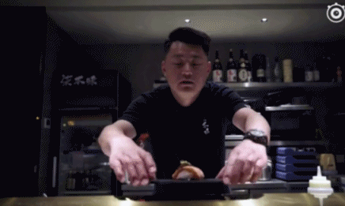 (原始链接: https://mmbiz.qpic.cn/mmbiz_gif/10vgqjurV8YdWEo7uFvoH5RZCHugmILxoiaxZGiaFEa86Nib7StFicibicicVu32NsEKIS1OtB5K5QiaicGROia7PL9r0iaPQ/640?wx_fmt=gif)
- 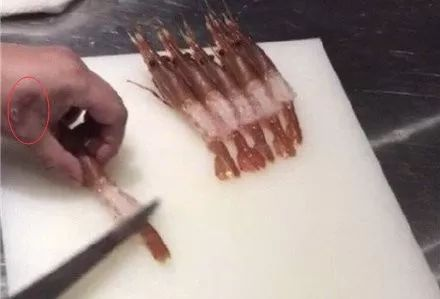 (原始链接: https://mmbiz.qpic.cn/mmbiz_jpg/HsGdorCWARVICgrYiajmk2gLw44yqA1ovME7S3XTgjLkB8UibyicwVzNLYtIK3eoPUoPxRspiaWgaETbxffEo9ExMA/640?wx_fmt=jpeg)
- 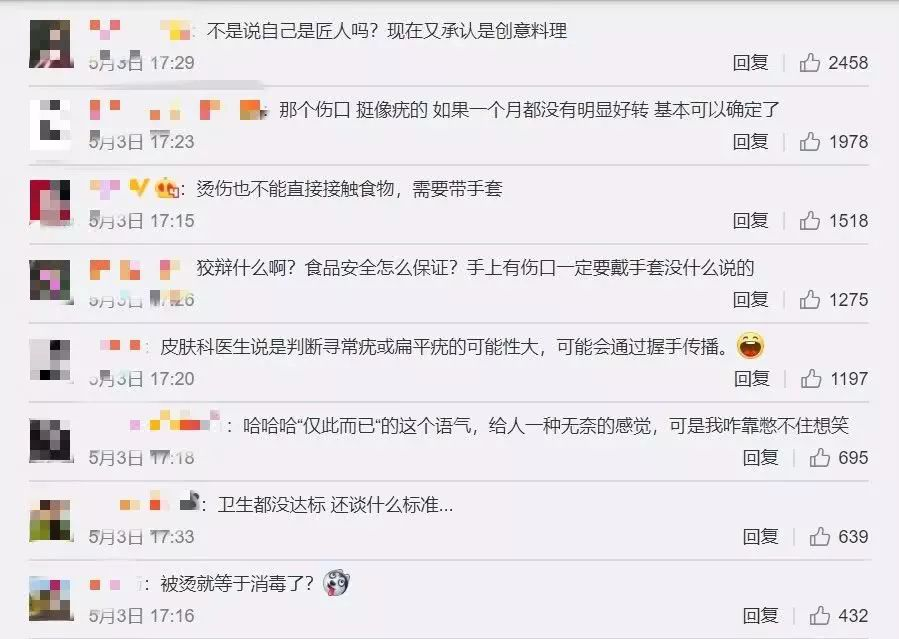 (原始链接: https://mmbiz.qpic.cn/mmbiz_jpg/9icx4533GF7xh1XzLNMEAUqicuhZ1yaAKcptZkOPRmaBDticgWpVVnkbRWo3psJ1LP9FGBdcO0Pe3hDQKjfbPMK0A/640?wx_fmt=jpeg)
- 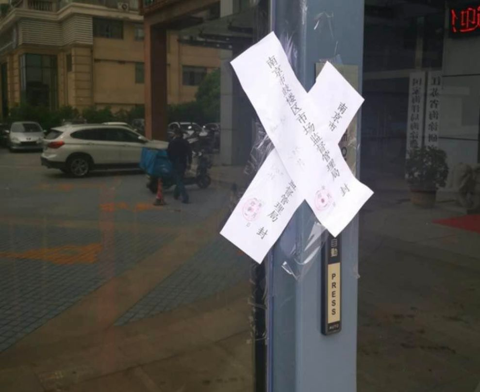 (原始链接: https://mmbiz.qpic.cn/mmbiz_png/icdHpHMYRdfoSPy3rVYW7iaDJtFAhpgfXLicAU2mNNX57JyMmOgZuBF5RdicchUhnJ0tqe7FbLoGhRuOXUiaM7hfPpw/640?wx_fmt=png)
-  (原始链接: https://mmbiz.qpic.cn/mmbiz_jpg/HsGdorCWARVICgrYiajmk2gLw44yqA1ov15I6khuDLPs31ZhcY7nJZKljsYgduInK8M1oaN9cRjucqnIR9dTLoA/640?wx_fmt=jpeg)
- 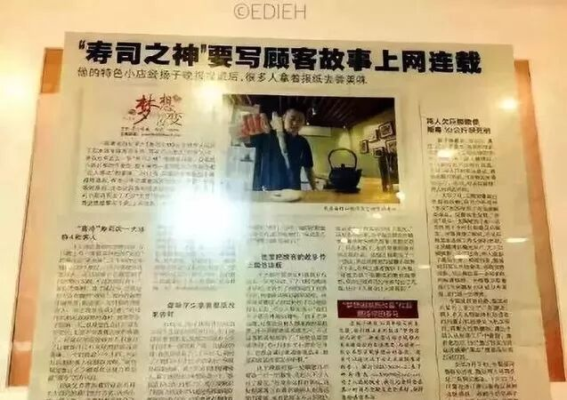 (原始链接: https://mmbiz.qpic.cn/mmbiz_jpg/9icx4533GF7xh1XzLNMEAUqicuhZ1yaAKcTqTwnNRVQgPVz1CnqGDI43jgFwoGCNQ1g4zW39T0qXWTZLF37J3CPQ/640?wx_fmt=jpeg)
-  (原始链接: https://mmbiz.qpic.cn/mmbiz_png/Opud1ia6QxJEKRNEZk1W59ek1Xtt9UibjWtDFy4jYicYTkQvttr4M2yOdCNoh8Gs0tZ9dMoOCdx9DnTyFSVlC3q4w/640?wx_fmt=png)
- 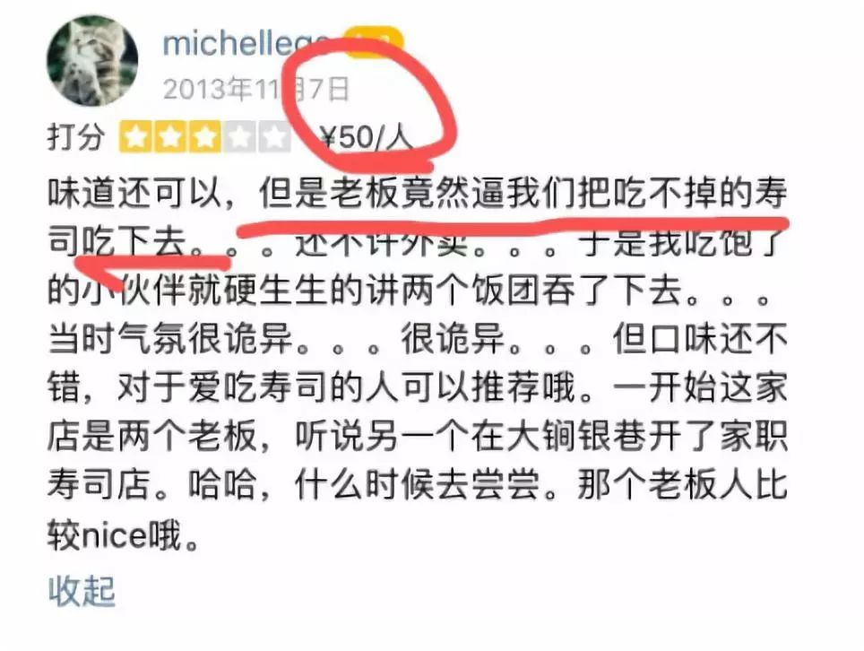 (原始链接: https://mmbiz.qpic.cn/mmbiz_jpg/DLggCz8L0WF9yOsL9GGayhzSymTAZJIYWEpdGmqPQAfmaBpQ2bCbicD6QKuIZk8EhSIKxwwf9bZMY6YDHIhXqDA/640?wx_fmt=jpeg)
- 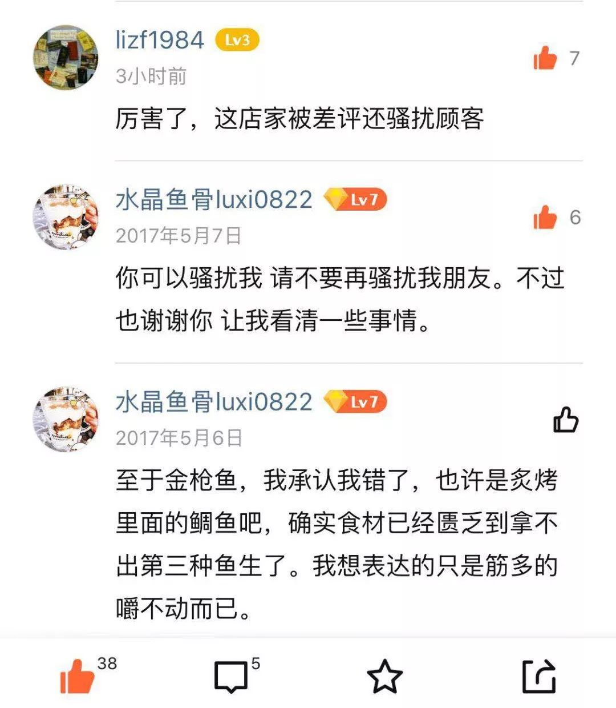 (原始链接: https://mmbiz.qpic.cn/mmbiz_jpg/9icx4533GF7xxuFbMdMKCsyYgSptThyaiaXHiamOk5TmdNfwsTDr6FT1XxuMrwbvscybzTCHXGSBk3ygMjHYLj4VQ/640?wx_fmt=jpeg)
-  (原始链接: https://mmbiz.qpic.cn/mmbiz_png/icdFiaxvXxvJBIT8X8IaH9nU2aRqyRvwdNjgaibFz6lfWGpiaTVM39X9hZ9N8KcTrLkAlaIWibiaYJfAJopIia5g1knpg/640?wx_fmt=png)
-  (原始链接: https://mmbiz.qpic.cn/mmbiz_jpg/icdFiaxvXxvJBIT8X8IaH9nU2aRqyRvwdNIYhnR3FptomcLuicYdDGqR6HuqklkjHKGksQWuT4nQvXjjaFacNxI9w/640?wx_fmt=jpeg)
- 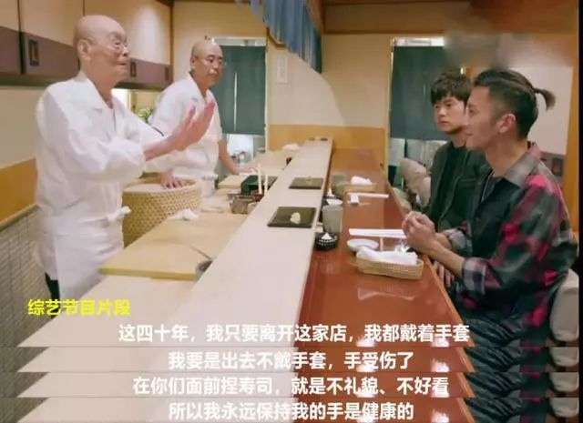 (原始链接: https://mmbiz.qpic.cn/mmbiz_jpg/HsGdorCWARVICgrYiajmk2gLw44yqA1ovBC56CXeyW4QfTcMTicbCGN9DrQ9DJtBoOYMl5gz9c2YHpqIBGUB1DHA/640?wx_fmt=jpeg)
- 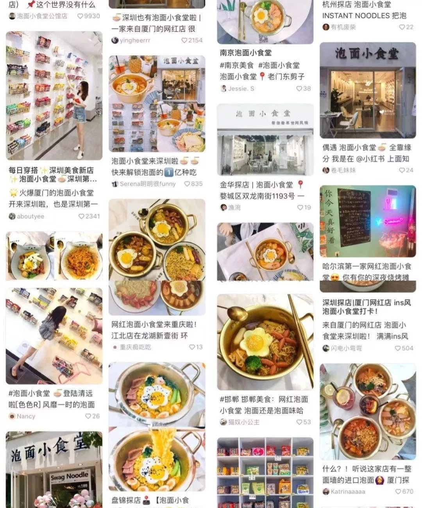 (原始链接: https://mmbiz.qpic.cn/mmbiz_jpg/pXNtcJnoKHY1b57uIPgSel5ZMRG3EXicXf1gmmTWlgj8cOSR7E7v4RxwVQ46Eicg398mZ4GCeGTXIKiaFtrXW1DwQ/640?wx_fmt=jpeg)
- 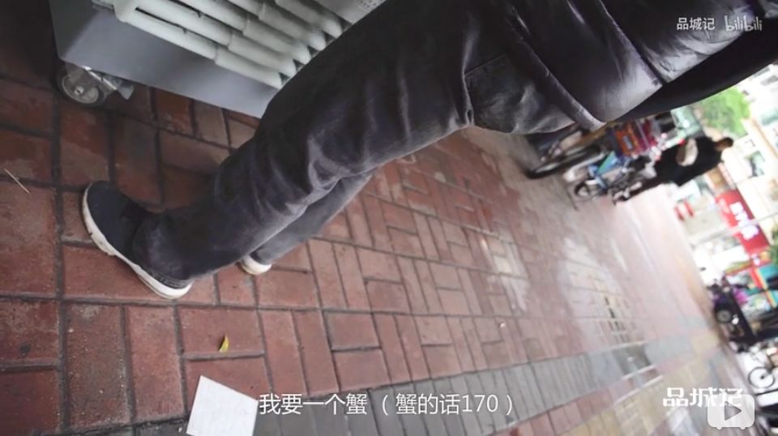 (原始链接: https://mmbiz.qpic.cn/mmbiz_png/icdFiaxvXxvJBIT8X8IaH9nU2aRqyRvwdNscwsjmvDlhqBsrQJibJ9r22EdkA23tia5vr2icAxLHASDCAGrC0AmGXaw/640?wx_fmt=png)
-  (原始链接: https://mmbiz.qpic.cn/mmbiz_jpg/icdFiaxvXxvJBIT8X8IaH9nU2aRqyRvwdNScqm8MLJNrY4eiaFJxkpXUSxGibaNfoxM6KynIV7ViadE7aaTXow1FBNQ/640?wx_fmt=jpeg)
-  (原始链接: https://mmbiz.qpic.cn/mmbiz_jpg/icdFiaxvXxvJBIT8X8IaH9nU2aRqyRvwdNG6k98tkTciboqOmVBn6HlXiaorpqT8ic4YXwqjwNGULWWeLBHpnBRdtXA/640?wx_fmt=jpeg)
- 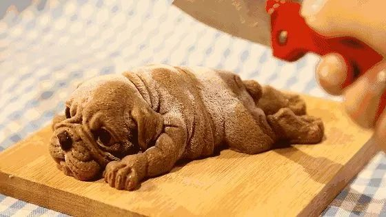 (原始链接: https://mmbiz.qpic.cn/mmbiz_jpg/HsGdorCWARVICgrYiajmk2gLw44yqA1ovwV5bk5xxwBZRZDNfQic1ibpK0CXNY4OugGM4ZcvEfX00pwhutn8eU4Ww/640?wx_fmt=jpeg)
-  (原始链接: https://mmbiz.qpic.cn/mmbiz_jpg/HsGdorCWARVICgrYiajmk2gLw44yqA1ov5U3yz9NDkn45KeD5UYicmeBGPbg2tS7ReC52TATiaiaiaYicZW7IibeY3qEg/640?wx_fmt=jpeg)
-  (原始链接: https://mmbiz.qpic.cn/mmbiz_jpg/HsGdorCWARVICgrYiajmk2gLw44yqA1ovELCdas4b5ICVFsL6wicaic46q7pjia3RTqJfkOMvgSZ9EYvwPlemQxHYQ/640?wx_fmt=jpeg)
-  (原始链接: https://mmbiz.qpic.cn/mmbiz_jpg/HsGdorCWARVICgrYiajmk2gLw44yqA1ovHdbHZX6GHoOKdJSbqibZkpu0or2kFlGOtyBiabiaTgEN0wGXPn5ia0ECTw/640?wx_fmt=jpeg)
-  (原始链接: https://mmbiz.qpic.cn/mmbiz_jpg/HsGdorCWARVICgrYiajmk2gLw44yqA1ov29vpK8a42Fdyt9m78peBGicQKUuRfH5HDM0EC1PiapohDbXBjlvhW79w/640?wx_fmt=jpeg)
-  (原始链接: https://mmbiz.qpic.cn/mmbiz_jpg/HsGdorCWARUtpLK8SSFy66IibRgRYSMa5tNExqOGukiavhIRqO91SlkaWotkerAT6LS9EN33CPd1ricDw9vct8eKw/640?wx_fmt=jpeg)
