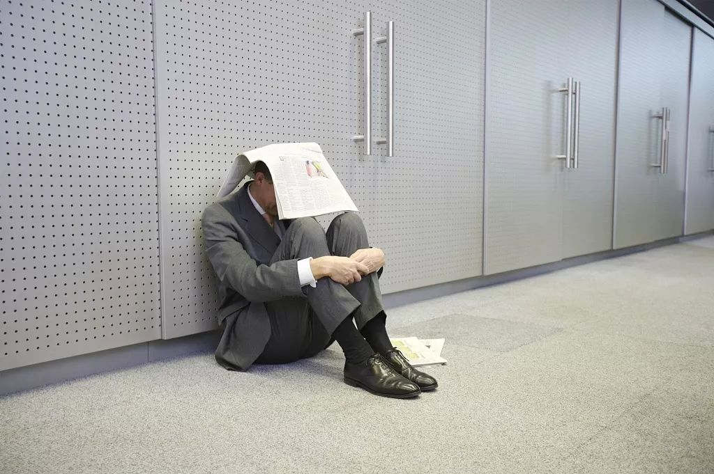
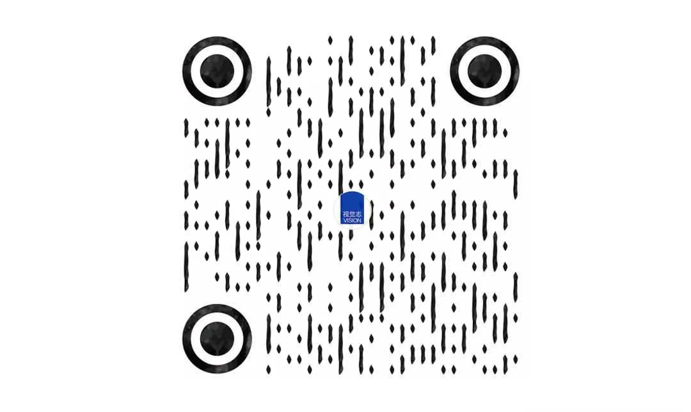

# 无标题

**链接地址:** http://mp.weixin.qq.com/s?__biz=MjM5NTAyODc2MA==&mid=2654558040&idx=6&sn=145e388bf21d633d978859e854870754&chksm=bd333d2f8a44b43939fd771a922792b8fc9aa568512a109b542fe868b45ce17d9e0b99810437&mpshare=1&scene=2&srcid=#rd
**作者:** 布呐呐
**获取时间:** 2025/8/28 20:33:41
**图片数量:** 10

---

## 原始HTML内容

作者 | 布呐呐

 
<section style="white-space: normal;box-sizing: border-box;font-size: 16px;"><section powered-by="xiumi.us" style="box-sizing: border-box;">
 
<section style="padding: 5px;display: inline-block;border-radius: 16px;vertical-align: top;line-height: 1;background-color: rgb(182, 30, 5);box-sizing: border-box;"><section style="padding-right: 6px;padding-left: 8px;display: inline-block;vertical-align: top;color: rgb(255, 255, 255);height: 18px;line-height: 18px;box-sizing: border-box;"><section style="box-sizing: border-box;"><strong>01</strong></section></section><section style="width: 18px;height: 18px;border-width: 4px;border-style: solid;border-color: rgb(255, 255, 255);border-radius: 50%;box-sizing: border-box;display: inline-block;vertical-align: top;background-color: rgb(181, 30, 5);"></section></section>
 
</section></section>
“我们要工作！” 

“孩子要上学！”

“为何下如此狠手！”

说出这些话的人，不是讨薪的民工，

而是毕业于各大名校，年薪几十万甚至上百万，

身上被无数光环加持的社会精英。

曾经他们是天之骄子，如今只能沦落到街头抗议。

挺意外的。

 

早在5月初，市值1867亿美元，

全球最大的企业软件公司甲骨文，

裁掉中国研发区员工900人。

中枪的人多是37岁左右的工程师。

 

很明显，在互联网行业，

这批被裁掉的人处境非常尴尬，

没有任何年龄优势。

何况他们还上有老，下有小。

还着房贷，背着车贷。

这下子，啥都凉了。

 

<section style="white-space: normal;box-sizing: border-box;font-size: 16px;"><section powered-by="xiumi.us" style="box-sizing: border-box;">
 
<section style="padding: 5px;display: inline-block;border-radius: 16px;vertical-align: top;line-height: 1;background-color: rgb(182, 30, 5);box-sizing: border-box;"><section style="padding-right: 6px;padding-left: 8px;display: inline-block;vertical-align: top;color: rgb(255, 255, 255);height: 18px;line-height: 18px;box-sizing: border-box;"><section style="box-sizing: border-box;"><strong>02</strong></section></section><section style="width: 18px;height: 18px;border-width: 4px;border-style: solid;border-color: rgb(255, 255, 255);border-radius: 50%;box-sizing: border-box;display: inline-block;vertical-align: top;background-color: rgb(181, 30, 5);"></section></section>
 
</section></section>
然而，很多人却说这些人完全不值得同情。

为什么？

 

先说说甲骨文这家公司，

它是仅次于微软的世界第二大软件公司，

全球最大的企业级软件公司。

但这些头衔都不重要。

因为比起那些头衔，

他最响亮的还是“北京最大的养老院”。

 

讲真在互联网界，这已经算是一股清流了。

已经很让那些996的社畜们羡慕了。

 

再说说裁员的补偿方案吧。

甲骨文给出的赔偿方案为&nbsp;N+6(N为入职年限)。

当员工工资超过当地平均工资的3倍时， 

按照N * 3倍社会平均工资 + 6 * 员工工资计算。

据说这次被裁的员工，

有相当一部分是工作十来年的老员工，

平均年薪50万左右。

所以有人说，一些老员工可获赔超100万。

讲真，这个赔偿真的很良心了。

当年滴滴裁员补偿为N+2：

这样的条件，很多人都说裁出了幸福感。

挤破了脑袋想被裁。

 

当然，甲骨文的要人门槛也是很高的。

听说必须是名校的硕士。

这些被裁的人拿着让人羡慕的高工资，

从毕业的那一刻，就过上了没有压力的生活。

但是，长时间沉浸在舒适区里。

结果就是温水煮青蛙，早晚都要死的啊。

 

所以，被裁这件事情，真的别怪公司。

有时间拉横幅抗议，还不如反思反思自己。

为什么公司偏偏裁掉你，不裁掉别人？

<strong>这个世界永远没有稳定的环境，</strong><strong style="color: rgb(123, 12, 0);">只有稳定的能力。</strong>

<strong>你要是牛逼了，在哪都稳定。</strong>

<strong>你要是没能耐，在哪都高危。</strong>

 

<section style="white-space: normal;box-sizing: border-box;font-size: 16px;"><section powered-by="xiumi.us" style="box-sizing: border-box;">
 
<section style="padding: 5px;display: inline-block;border-radius: 16px;vertical-align: top;line-height: 1;background-color: rgb(182, 30, 5);box-sizing: border-box;"><section style="padding-right: 6px;padding-left: 8px;display: inline-block;vertical-align: top;color: rgb(255, 255, 255);height: 18px;line-height: 18px;box-sizing: border-box;"><section><strong>03</strong></section></section><section style="width: 18px;height: 18px;border-width: 4px;border-style: solid;border-color: rgb(255, 255, 255);border-radius: 50%;box-sizing: border-box;display: inline-block;vertical-align: top;background-color: rgb(181, 30, 5);"></section></section>
 
</section></section>
看过一个新闻。 

唐山市政府把各个地方的收费站都取消了。

这本来是一个相当大块人心的消息。

但是有的人却不乐意了。

很多收费站的员工强烈反对。

印象深刻的是一位收费站大姐说的话：

“我今年36岁了，青春都交给收费站了。

我现在啥也不会，我也学不了什么东西了。”

 

这话乍一听挺可怜的。

人家好端端的，为啥把“铁饭碗”给端走了。

但仔细想想，这话完全就是在甩锅啊。

这些年她就是过得太安稳了，

一项简单的工作重复十几年，

到点就下班，每月按时发工资。

看似稳定，

其实大好的时光都被自己消磨没了。 

倒头来还说工作耽误自己的青春。

这个时代最怕的就是，

<strong>没有改变的决心，还偏偏是颗玻璃心。</strong>&nbsp; &nbsp; &nbsp;

 

我认识一个朋友，

在世界500强工作将近2年了。

在他看来，公司规模大就代表稳定。

每月工资6000，

加上各种杂七杂八的奖金和补贴，

1个月到手8000左右。

可是这对于一个生活在省会城市，

还着房贷，还有1个小孩的男人来说，

也只能是凑活。

 

今年，他听同事议论最近公司要裁员。

他后悔，这些年只是单纯的图个安逸。

整个人也没什么斗志，工作技能早就荒废了。

面对一件件意外，

他丝毫没有反抗的余地。

 

<section style="white-space: normal;box-sizing: border-box;font-size: 16px;"><section powered-by="xiumi.us" style="box-sizing: border-box;">
 
<section style="padding: 5px;display: inline-block;border-radius: 16px;vertical-align: top;line-height: 1;background-color: rgb(182, 30, 5);box-sizing: border-box;"><section style="padding-right: 6px;padding-left: 8px;display: inline-block;vertical-align: top;color: rgb(255, 255, 255);height: 18px;line-height: 18px;box-sizing: border-box;"><section style="box-sizing: border-box;"><strong>04</strong></section></section><section style="width: 18px;height: 18px;border-width: 4px;border-style: solid;border-color: rgb(255, 255, 255);border-radius: 50%;box-sizing: border-box;display: inline-block;vertical-align: top;background-color: rgb(181, 30, 5);"></section></section>
 
</section></section>
在你印象中，月薪8万的都是什么人？

在cbd的写字楼，

穿着高级的西装，喝着现磨咖啡。

或者是穿着格子衫，

整天敲代码的高级工程师。

但你能想象，那些常年骑着电动车，

脸晒的黢黑的快递小哥，

也可以拿到月薪8万吗？

 

广州的快递员黄少波晒了自己8万的月工资单。

很多人看了之后瞬间化成柠檬精。

那段时间正值春节，发货量猛增。

最高的一天揽件3万多件，

一个月下来揽收了13万单。

这其中，有很多都是之前的大客户，

关系都维护得很好。

时间久了，客户都信任他。

都愿意把自己的快递留给黄少波发。

 

现在，黄少波已经有了自己的团队。

按照他的收入水平，

可以在老家轻轻松松买套学区房了。

小日子过得美滋滋。

不过，也别光看到数字。

这背后付出的苦，别人也想象不到。

你看，

<strong>他干的不是一份稳定的工作。</strong>

<strong>但是他却有让生活稳定的本事。</strong>

这就是实力，这才叫牛逼。

这样的人，完全不用担心失业，

因为他到哪都饿不着。

 

 
<section style="white-space: normal;box-sizing: border-box;font-size: 16px;"><section powered-by="xiumi.us" style="box-sizing: border-box;"><section style="padding: 5px;display: inline-block;border-radius: 16px;vertical-align: top;line-height: 1;background-color: rgb(182, 30, 5);box-sizing: border-box;"><section style="padding-right: 6px;padding-left: 8px;display: inline-block;vertical-align: top;color: rgb(255, 255, 255);height: 18px;line-height: 18px;box-sizing: border-box;"><section style="box-sizing: border-box;"><strong>05</strong></section></section><section style="width: 18px;height: 18px;border-width: 4px;border-style: solid;border-color: rgb(255, 255, 255);border-radius: 50%;box-sizing: border-box;display: inline-block;vertical-align: top;background-color: rgb(181, 30, 5);"></section></section>
 
</section></section>
那这个社会到底有没有稳定的工作？ 

很抱歉，真的没有。

 

大润发号称是一家19年不关一家店的传奇商场。

它打败了沃尔玛话和家乐福。

然而还是被阿里巴巴收购，

高层集体卷铺盖走人。

大润发创始人只好凉凉地说，

“战胜了所有对手，却输给了时代。”

我上高中的时候，班里基本用的都是诺基亚。

现在还有几个人用？

再看看柯达，现在都成了老古董？

就算国企也招架不住，

国企供销社不也说没就没了。

别看BAT风头正猛，

哪个每天不是在胆战心惊地过日子。

 

所以说，

现在这个时代已经快到完全不按套路出牌了。

但是很多人期望的还是稳定。

在他们的观念里，只要进了一个稳定的单位，

就可以安稳的坐吃等死。

<strong>只是世事难料。</strong>

<strong>越是追求稳定，越要承受更高的风险性。</strong>

 

<strong>一旦一个人在舒适的环境里过久了，</strong>

<strong>除了能挣点小钱，其他的什么都得不到。</strong>

那些甲骨文裁掉的精英想不到，

那个唐山收费站的大姐更没想到……

结果就是在稳定中死去。

 

<section style="white-space: normal;box-sizing: border-box;font-size: 16px;"><section powered-by="xiumi.us" style="box-sizing: border-box;">
 
<section style="padding: 5px;display: inline-block;border-radius: 16px;vertical-align: top;line-height: 1;background-color: rgb(182, 30, 5);box-sizing: border-box;"><section style="padding-right: 6px;padding-left: 8px;display: inline-block;vertical-align: top;color: rgb(255, 255, 255);height: 18px;line-height: 18px;box-sizing: border-box;"><section style="box-sizing: border-box;"><strong>06</strong></section></section><section style="width: 18px;height: 18px;border-width: 4px;border-style: solid;border-color: rgb(255, 255, 255);border-radius: 50%;box-sizing: border-box;display: inline-block;vertical-align: top;background-color: rgb(181, 30, 5);"></section></section>
 
</section></section>
说实话，很多人对稳定这个词都有误解。 

以为每天朝九晚五的上班，

每月按时领固定的工资，

没有压力，也不用担心失业，

这就叫稳定。

其实这不叫稳定，只能叫稳定的做个穷人。

当别人住着大房子，开着好车，浑身名牌的时候，

他们一边羡慕，一边又酸。

追求稳定本身没有错，但是如果你是稳定思维。

那就大错特错！

多少人嘴上说着找个稳定的工作，

心里就是想图个一劳永逸的日子？

 

到底什么是真正的稳定？ 

读研究生的时候，导师给我说过一句话。

<strong>这年头，稳定不是你一辈子拴在一个单位</strong>

<strong>而是你自己有本事，能去任何单位。</strong>

所以说，

只有自己牛逼了，那才叫真稳定。

才不用担心失业了，房贷怎么还，

孩子怎么养，老人怎么照顾……

 

 

而做到这一切的前提

首先要有居安思危的意识。

虽然这话是老生常谈，但多少人能做到。

没有危机感的人，注定是要被淘汰的。

其次，要有持续性的输入。

<strong>一个人一旦生活固化了，</strong>

<strong>就会失去对外界的敏感。</strong>

雷军说，“站在风口，猪都能飞。”

关键是，有多少人能察觉到风口？

再好的技能和脑子都被一天天的耗没了。

所以，千万别偷懒。

<strong>凡事都有因果</strong>

<strong>年轻时偷的懒，中年时都要哭着还。</strong>

 

 

看更多走心文章

请长按下方图片扫码关注

视 觉 志

你努力挣钱的样子

真好看

<strong style="max-width: 100%;letter-spacing: 0.544px;font-size: 16px;box-sizing: border-box !important;word-wrap: break-word !important;overflow-wrap: break-word !important;"></strong>

---

## 纯文本内容

作者 | 布呐呐01“我们要工作！”“孩子要上学！”“为何下如此狠手！”说出这些话的人，不是讨薪的民工，而是毕业于各大名校，年薪几十万甚至上百万，身上被无数光环加持的社会精英。曾经他们是天之骄子，如今只能沦落到街头抗议。挺意外的。早在5月初，市值1867亿美元，全球最大的企业软件公司甲骨文，裁掉中国研发区员工900人。中枪的人多是37岁左右的工程师。很明显，在互联网行业，这批被裁掉的人处境非常尴尬，没有任何年龄优势。何况他们还上有老，下有小。还着房贷，背着车贷。这下子，啥都凉了。02然而，很多人却说这些人完全不值得同情。为什么？先说说甲骨文这家公司，它是仅次于微软的世界第二大软件公司，全球最大的企业级软件公司。但这些头衔都不重要。因为比起那些头衔，他最响亮的还是“北京最大的养老院”。讲真在互联网界，这已经算是一股清流了。已经很让那些996的社畜们羡慕了。再说说裁员的补偿方案吧。甲骨文给出的赔偿方案为 N+6(N为入职年限)。当员工工资超过当地平均工资的3倍时，按照N * 3倍社会平均工资 + 6 * 员工工资计算。据说这次被裁的员工，有相当一部分是工作十来年的老员工，平均年薪50万左右。所以有人说，一些老员工可获赔超100万。讲真，这个赔偿真的很良心了。当年滴滴裁员补偿为N+2：这样的条件，很多人都说裁出了幸福感。挤破了脑袋想被裁。当然，甲骨文的要人门槛也是很高的。听说必须是名校的硕士。这些被裁的人拿着让人羡慕的高工资，从毕业的那一刻，就过上了没有压力的生活。但是，长时间沉浸在舒适区里。结果就是温水煮青蛙，早晚都要死的啊。所以，被裁这件事情，真的别怪公司。有时间拉横幅抗议，还不如反思反思自己。为什么公司偏偏裁掉你，不裁掉别人？这个世界永远没有稳定的环境，只有稳定的能力。你要是牛逼了，在哪都稳定。你要是没能耐，在哪都高危。03看过一个新闻。唐山市政府把各个地方的收费站都取消了。这本来是一个相当大块人心的消息。但是有的人却不乐意了。很多收费站的员工强烈反对。印象深刻的是一位收费站大姐说的话：“我今年36岁了，青春都交给收费站了。我现在啥也不会，我也学不了什么东西了。”这话乍一听挺可怜的。人家好端端的，为啥把“铁饭碗”给端走了。但仔细想想，这话完全就是在甩锅啊。这些年她就是过得太安稳了，一项简单的工作重复十几年，到点就下班，每月按时发工资。看似稳定，其实大好的时光都被自己消磨没了。倒头来还说工作耽误自己的青春。这个时代最怕的就是，没有改变的决心，还偏偏是颗玻璃心。     我认识一个朋友，在世界500强工作将近2年了。在他看来，公司规模大就代表稳定。每月工资6000，加上各种杂七杂八的奖金和补贴，1个月到手8000左右。可是这对于一个生活在省会城市，还着房贷，还有1个小孩的男人来说，也只能是凑活。今年，他听同事议论最近公司要裁员。他后悔，这些年只是单纯的图个安逸。整个人也没什么斗志，工作技能早就荒废了。面对一件件意外，他丝毫没有反抗的余地。04在你印象中，月薪8万的都是什么人？在cbd的写字楼，穿着高级的西装，喝着现磨咖啡。或者是穿着格子衫，整天敲代码的高级工程师。但你能想象，那些常年骑着电动车，脸晒的黢黑的快递小哥，也可以拿到月薪8万吗？广州的快递员黄少波晒了自己8万的月工资单。很多人看了之后瞬间化成柠檬精。那段时间正值春节，发货量猛增。最高的一天揽件3万多件，一个月下来揽收了13万单。这其中，有很多都是之前的大客户，关系都维护得很好。时间久了，客户都信任他。都愿意把自己的快递留给黄少波发。现在，黄少波已经有了自己的团队。按照他的收入水平，可以在老家轻轻松松买套学区房了。小日子过得美滋滋。不过，也别光看到数字。这背后付出的苦，别人也想象不到。你看，他干的不是一份稳定的工作。但是他却有让生活稳定的本事。这就是实力，这才叫牛逼。这样的人，完全不用担心失业，因为他到哪都饿不着。05那这个社会到底有没有稳定的工作？很抱歉，真的没有。大润发号称是一家19年不关一家店的传奇商场。它打败了沃尔玛话和家乐福。然而还是被阿里巴巴收购，高层集体卷铺盖走人。大润发创始人只好凉凉地说，“战胜了所有对手，却输给了时代。”我上高中的时候，班里基本用的都是诺基亚。现在还有几个人用？再看看柯达，现在都成了老古董？就算国企也招架不住，国企供销社不也说没就没了。别看BAT风头正猛，哪个每天不是在胆战心惊地过日子。所以说，现在这个时代已经快到完全不按套路出牌了。但是很多人期望的还是稳定。在他们的观念里，只要进了一个稳定的单位，就可以安稳的坐吃等死。只是世事难料。越是追求稳定，越要承受更高的风险性。一旦一个人在舒适的环境里过久了，除了能挣点小钱，其他的什么都得不到。那些甲骨文裁掉的精英想不到，那个唐山收费站的大姐更没想到……结果就是在稳定中死去。06说实话，很多人对稳定这个词都有误解。以为每天朝九晚五的上班，每月按时领固定的工资，没有压力，也不用担心失业，这就叫稳定。其实这不叫稳定，只能叫稳定的做个穷人。当别人住着大房子，开着好车，浑身名牌的时候，他们一边羡慕，一边又酸。追求稳定本身没有错，但是如果你是稳定思维。那就大错特错！多少人嘴上说着找个稳定的工作，心里就是想图个一劳永逸的日子？到底什么是真正的稳定？读研究生的时候，导师给我说过一句话。这年头，稳定不是你一辈子拴在一个单位而是你自己有本事，能去任何单位。所以说，只有自己牛逼了，那才叫真稳定。才不用担心失业了，房贷怎么还，孩子怎么养，老人怎么照顾……而做到这一切的前提首先要有居安思危的意识。虽然这话是老生常谈，但多少人能做到。没有危机感的人，注定是要被淘汰的。其次，要有持续性的输入。一个人一旦生活固化了，就会失去对外界的敏感。雷军说，“站在风口，猪都能飞。”关键是，有多少人能察觉到风口？再好的技能和脑子都被一天天的耗没了。所以，千万别偷懒。凡事都有因果年轻时偷的懒，中年时都要哭着还。看更多走心文章请长按下方图片扫码关注视 觉 志你努力挣钱的样子真好看

---

## 图片列表

-  (原始链接: https://mmbiz.qpic.cn/mmbiz_gif/zKBwDdu8U8FEibC53KNuBc9IRFcyiaaIuty9SyU5DNsVWVkKxiaj3iboicunLwT90hKhJFmKibmicgFbjZiahQyXkXEtLg/640?wx_fmt=gif)
-  (原始链接: https://mmbiz.qpic.cn/mmbiz_jpg/zKBwDdu8U8EmORNfBic5xyrSj9y8siceB0CsCUznoLbfNAKWZ3c7UMPGmaiaKbUHkzj993FthC0sXfe5fBbcutNxg/640?wx_fmt=jpeg)
-  (原始链接: https://mmbiz.qpic.cn/mmbiz_jpg/zKBwDdu8U8ExKuMKbSWhQEN0e6tlDKzq1ugUkictEoSOvhf9wqtGrmtohGVyqp4DIl396G4SDP4K9FuEXmFicvOw/640?wx_fmt=jpeg)
-  (原始链接: https://mmbiz.qpic.cn/mmbiz_jpg/zKBwDdu8U8ExKuMKbSWhQEN0e6tlDKzqugmM8nfBxr870rxRjh5flibdhwRkWCUukX3jO6J9VKG6Q5WWWiaicg1Ow/640?wx_fmt=jpeg)
-  (原始链接: https://mmbiz.qpic.cn/mmbiz_jpg/zKBwDdu8U8ExKuMKbSWhQEN0e6tlDKzqsK4NibFicZjbboJnWRMHPwAmVdOVicFIQOJA2y0YbSU0Yt9UtMlwDCoicA/640?wx_fmt=jpeg)
-  (原始链接: https://mmbiz.qpic.cn/mmbiz_jpg/zKBwDdu8U8ExKuMKbSWhQEN0e6tlDKzq89ZgJiaQTdSGibytpLomxvMfukLcKRUyQJ0Wmlc55c22Un2FSHAPXeMA/640?wx_fmt=jpeg)
-  (原始链接: https://mmbiz.qpic.cn/mmbiz_jpg/zKBwDdu8U8ExKuMKbSWhQEN0e6tlDKzqicwysRrMynjicgO2iceiaRmrjsIhOlo0NPqdEYKs60sDd7iahRoLQaIUccg/640?wx_fmt=jpeg)
-  (原始链接: https://mmbiz.qpic.cn/mmbiz/wyice8kFQhf7WrYjynsDMjRbgCwiack4E9nqoERbCmDibsRhEpUq58oKwIEyc4VuxVGROQSQL7lXIrSo2yr3no1IA/640?wx_fmt=gif)
-  (原始链接: https://mmbiz.qpic.cn/mmbiz_jpg/zKBwDdu8U8EgXV4QKDXGyhVXTkbnhHWSHPpBL1cg8uETlyDZB240XaCsJZukiaJmkQSicLKXTyAJdpVCmTgXR7NA/640?wx_fmt=jpeg)
-  (原始链接: https://mmbiz.qpic.cn/mmbiz_gif/zKBwDdu8U8EUh2cNXvZRZk1BULmyeYnjKibyKbx9SH0gAoXiadVhTta41Zh1It88iaKnreX0AtLApdUGgVfrYRVTg/640?wx_fmt=gif)
