# 无标题

**链接地址:** http://mp.weixin.qq.com/s?__biz=MzIyNzQ3ODU3OQ==&mid=2247499938&idx=1&sn=b0dc609157c1c3fe90f89d175b7cb974&chksm=e8621dfedf1594e818a6ae9861b16095046ae53f7ea09b35e8061e274156edc447553f034032&mpshare=1&scene=2&srcid=#rd
**作者:** 阿怡，小哥
**获取时间:** 2025/8/28 20:33:28
**图片数量:** 28

---

## 原始HTML内容

<section class="xmteditor" style="display:none;" data-tools="新媒体管家" data-label="powered by xmt.cn"></section>

<mpvoice frameborder="0" class="rich_pages res_iframe js_editor_audio audio_iframe place_audio_area" src="/cgi-bin/readtemplate?t=tmpl/audio_tmpl&amp;name=Hall%203%20Soundtrack&amp;play_length=04:33" isaac2="1" low_size="515.91" source_size="515.9" high_size="2139.13" name="Hall&nbsp;3&nbsp;Soundtrack" play_length="273000" voice_encode_fileid="MzIyNzQ3ODU3OV8yMjQ3NDk5OTM3"></mpvoice>

<strong> </strong>

<strong>写在前面</strong> 

<strong> </strong>

我其实很感谢米未和爱奇艺做了这一档关于摇滚乐队的综艺。

&nbsp;

哪怕我后面会出现非常剧烈的批评，但这第一句话的立场始终不会改变。

&nbsp;

它不是国内第一档这类综艺。

&nbsp;

但毫无疑问，它是最有勇气的一档：

 

<strong>《乐队的夏天》</strong>

 

 

<strong>所有人都很清楚，</strong><strong>在目前这样的环境中去谈摇滚乐需要勇气；</strong>

<strong> </strong>

<strong>以这样的传播声势去帮摇滚乐队争取更好的名声和收入，更需要勇气。</strong>

&nbsp;

这种勇气是双向挤压出来的。

 

 

上面笼罩的是日益严苛的文化审查环境。

 

那个偶像派歌手的消失才刚刚过去两个月，而他们让痛仰站上了舞台。

 

 

下面刺痛的，是一群自称“摇滚圈”的人绑着头巾扛着大旗在愤懑，在哀嚎，在冷嘲热讽：

&nbsp;

“以后就蹦不起XXX乐队了”

&nbsp;

“小心饭圈母狗”

&nbsp;

“饭圈文化快速入侵摇滚乐指南”

&nbsp;

“嘻哈完了，下一个就是摇滚圈”

<strong>&nbsp;</strong>

<strong>他们满嘴圈圈圆圆圈圈，天天年年天天希望把摇滚永远定死在小众地下。</strong>

 

好像当乐队吃饱饭再唱摇滚，就不是摇滚了似的；好像当主流女性受众开始喜欢摇滚乐，摇滚就变味了似的。

 

 

这是我听摇滚乐的第八年，正好可以整除出我现有人生的三分之一。

&nbsp;

我不属于什么狗屎的摇滚圈，也没有他们的优越感。

<strong> </strong>

<strong>但是我比他们更加希望某些摇滚乐队可以被更多人知道，可以有更好的收入。</strong>

<strong>&nbsp;</strong>

<strong>他们需要夏天，更需要春天。</strong>

&nbsp;

带着这样的立场，我一直以为这档综艺可以在某种程度上可以将曾经辉煌的中国摇滚乐带进主流视线。

&nbsp;

很可惜，它让我大失所望。

&nbsp;

<strong>一</strong>

&nbsp;

<strong>在宣传前期，这档综艺的视觉风格就非常奇怪。</strong>

&nbsp;

它太像《奇葩说》了。

&nbsp;

大量<strong>“可爱系”</strong>的色彩充斥整个视觉系统，就像是马上要到六一节，幼稚园在和小朋友一起准备游园活动。

&nbsp;

当节目的KV和乐队的宣传照放出的时候，我恍惚都觉得这是一档少儿节目。

 

 

这种视觉在《奇葩说》可以，因为其本身定位，就是用轻松去结构严肃，用奇葩来消解庸常，所以这种视觉上的反差，是契合的。

&nbsp;

<strong>但摇滚远远不是这样的。</strong>

 

当你看到宣传图上话筒变成甜甜圈，冰淇淋，吉他变成芭蕉叶，架子鼓变成大西瓜。

<strong> </strong>

<strong>再有味道的摇滚乐，摇滚氛围，都会被节目的这种调性彻底消解了。</strong>

&nbsp;

我们谈《这！就是街舞2》的那篇文就说过：<strong>“</strong><strong>做一档亚文化节目，首要前提是去吃透这种文化。”</strong>

&nbsp;

但很显然，《乐队的夏天》别说吃透了，更是连嘴巴都没有碰到。

 

 

 

<strong>二</strong> 

 

<strong>这点不仅体现在视觉上，还有赛制。</strong>

&nbsp;

国产综艺会犯的通病，《乐队的夏天》几乎全部犯了一遍。

&nbsp;

 

<strong>首先，放着满场乐迷不用，莫名去设置了几个毫无意义的“超级</strong><strong>乐迷”</strong>。

&nbsp;

马东，欧阳娜娜，张亚东，高晓松，乔衫，这几个人虽然名义上是“超级乐迷”，但看过节目的都知道，这不过就是为了防止被骂的说辞。

 

他们实际发挥的还是每场表演之后进行点评的串场作用。

&nbsp;

可这几个人里，真正有点评资格的有几个呢？

&nbsp;

是喜剧演员乔衫？

 

还是学古典大提琴的欧阳娜娜？

 

唯一一个真正在一线玩流行摇滚乐的吴青峰，反而一整期节目被剪得不到二十句话。

 

 

<strong>接着，再放着国内那么多的摇滚老炮儿不用，让那满场的观众当评审投票。</strong>

&nbsp;

在第一赛段将会淘汰将近一半的乐队，乐队的去留则是直接由台下的100名现场观众投票决定。

&nbsp;

很明显，<strong>这个结果很大程度上取决于乐队的知名程度和音乐风格。</strong>

&nbsp; 

所以当看到马东他们在台下面面相觑，奇怪为什么面孔这样真正的老炮儿乐队会几乎垫底的时候，我只觉得虚伪。

 

&nbsp;

他们在设定出这种赛制的时候，就很清楚了。

<strong> </strong>

<strong>这根本不是乐队和乐队的比赛，只要哪一种音乐风格受众更广，更有粉丝基础，那支相对应的乐队便会容易获胜。</strong>

&nbsp;

所有人的起点都不同，这种竞赛也早已和摇滚乐无关了。

 

 

就像马东在一开始说的那样，《乐队的夏天》最终要选出的不是<strong>“TOP&nbsp;5”</strong>，而是<strong>“HOT 5”</strong>。

&nbsp;

<strong>可摇滚哪有什么“HOT”可比？</strong>

<strong>&nbsp;</strong>

也许是为了节目效果，也许是出于太专业化会减弱节目传播效果的考量。

&nbsp;

他们就是这样，在方方面面都可劲儿往不专业了做。

&nbsp;

<strong>三</strong>

&nbsp;

当然，比起<strong>剪辑的不专业</strong>，上面这些真的都是小问题。

&nbsp;

<strong>这档综艺的剪辑从头到尾，都不是在为摇滚乐服务，而是在为制造笑点和冲突服务。</strong>

 

<strong></strong>

 

节目的初衷是推广乐队和独立音乐。

 

那么重点呈现的内容就应该是乐队的演出和音乐本身，包括灯光、音效、编曲、演奏技术、成员之间的默契配合这些小的细节。

&nbsp;

用音乐去打动人，吸引真正爱音乐的人。

&nbsp;

然而，《乐队的夏天》第一期看下来给我的整体感觉是，<strong>剪辑非常得零碎。</strong>

&nbsp;

一期节目总共两个小时，光是片头的乐队出场，互相客套就占了半个小时。

 

 

在乐队表演的过程中，又大量插入了几个“超级乐迷”之间的尬聊互动，其他乐队成员的反应，制造一些没有必要的笑点和冲突。

&nbsp;

<strong>有一种本末倒置的感觉。</strong>

 

<strong></strong>

 

&nbsp; 

而最让我无法接受的是，<strong>为了保留这些聊天互动环节的片段，演出的部分仅仅只放出了五支高人气乐队的完整表演。</strong>

<strong> </strong>

<strong>其余的乐队演出都只保留了半首歌的时间，有的甚至一闪而过。</strong>

&nbsp;

你们口口声声在谈我们要推广那些生存困境中的独立乐队，可又用剪辑直接依据人气的高低代替观众决定了他们的喜好和选择。

&nbsp;

玩呢？

 

 

&nbsp;

<strong>如此一来，不仅影响演出的连贯性，造成了不舒适的观感，这种对乐队和音乐作品不尊重的行为更是令人极其反感。</strong>

<strong>&nbsp;</strong>

打着乐队的旗号做节目，对音乐的呈现却又不够纯粹，这似乎与节目最初的初衷背道而驰。

&nbsp;

我看不懂，也想不通，更不喜欢。

&nbsp;

<strong>写在最后</strong>

&nbsp;

我知道一定会有人认为，这并不是一档面向摇滚乐迷的综艺，而是一档面向主流听众的推广综艺，没必要苛求。

&nbsp;

我当然明白这点。

 

<strong>恰恰就是因为我明白这点，所以我希望它可以更好更精准地去把真正的摇滚乐推向主流人群。</strong>

&nbsp;

如果主流观众是因为现在这种节目，这种假象偏差，才开始听摇滚乐，那这种推广真的毫无意义。

 

音乐/痛仰-再见杰克

配图/《乐队的夏天》

本文系网易新闻·网易号

“各有态度”特色内容

 

 

<a href="http://mp.weixin.qq.com/s?__biz=MzIyNzQ3ODU3OQ==&amp;mid=2247499890&amp;idx=1&amp;sn=0338083ba6797d2228a6d01745b7f997&amp;chksm=e8621d2edf159438a6b89853e976a9bf7ffd941c14122f7f61cbd2b9d06e29bf0b1fefdd4826&amp;scene=21#wechat_redirect" target="_blank" data-itemshowtype="0" data-linktype="1"></a>

<a href="http://mp.weixin.qq.com/s?__biz=MzIyNzQ3ODU3OQ==&amp;mid=2247499874&amp;idx=1&amp;sn=aa62d9ed65fd7f5aa166fef5825e91f7&amp;chksm=e8621d3edf1594285cd404a010ea23b499735a45979738ec112c4bb37c694927da1fc1a89ea6&amp;scene=21#wechat_redirect" target="_blank" data-itemshowtype="0" data-linktype="1"></a>

<a href="http://mp.weixin.qq.com/s?__biz=MzIyNzQ3ODU3OQ==&amp;mid=2247499849&amp;idx=1&amp;sn=bc833178d76bc5bec3bd6d4ec94e8c21&amp;chksm=e8621d15df159403048073540449671dd14d3f7e76e7d973e5a24dfc395c35d6cb1d0e623f89&amp;scene=21#wechat_redirect" target="_blank" data-itemshowtype="0" data-linktype="1"></a>
<section class="V5" powered-by="xiumi.us" style="padding-right: 1em;padding-left: 1em;white-space: normal;color: rgb(57, 60, 59);box-sizing: border-box;"><section style="box-sizing: border-box;"><section style="box-sizing: border-box;">

</section></section></section>

---

## 纯文本内容

写在前面我其实很感谢米未和爱奇艺做了这一档关于摇滚乐队的综艺。 哪怕我后面会出现非常剧烈的批评，但这第一句话的立场始终不会改变。 它不是国内第一档这类综艺。 但毫无疑问，它是最有勇气的一档：《乐队的夏天》所有人都很清楚，在目前这样的环境中去谈摇滚乐需要勇气；以这样的传播声势去帮摇滚乐队争取更好的名声和收入，更需要勇气。 这种勇气是双向挤压出来的。上面笼罩的是日益严苛的文化审查环境。那个偶像派歌手的消失才刚刚过去两个月，而他们让痛仰站上了舞台。下面刺痛的，是一群自称“摇滚圈”的人绑着头巾扛着大旗在愤懑，在哀嚎，在冷嘲热讽： “以后就蹦不起XXX乐队了” “小心饭圈母狗” “饭圈文化快速入侵摇滚乐指南” “嘻哈完了，下一个就是摇滚圈” 他们满嘴圈圈圆圆圈圈，天天年年天天希望把摇滚永远定死在小众地下。好像当乐队吃饱饭再唱摇滚，就不是摇滚了似的；好像当主流女性受众开始喜欢摇滚乐，摇滚就变味了似的。这是我听摇滚乐的第八年，正好可以整除出我现有人生的三分之一。 我不属于什么狗屎的摇滚圈，也没有他们的优越感。但是我比他们更加希望某些摇滚乐队可以被更多人知道，可以有更好的收入。 他们需要夏天，更需要春天。 带着这样的立场，我一直以为这档综艺可以在某种程度上可以将曾经辉煌的中国摇滚乐带进主流视线。 很可惜，它让我大失所望。 一 在宣传前期，这档综艺的视觉风格就非常奇怪。 它太像《奇葩说》了。 大量“可爱系”的色彩充斥整个视觉系统，就像是马上要到六一节，幼稚园在和小朋友一起准备游园活动。 当节目的KV和乐队的宣传照放出的时候，我恍惚都觉得这是一档少儿节目。这种视觉在《奇葩说》可以，因为其本身定位，就是用轻松去结构严肃，用奇葩来消解庸常，所以这种视觉上的反差，是契合的。 但摇滚远远不是这样的。当你看到宣传图上话筒变成甜甜圈，冰淇淋，吉他变成芭蕉叶，架子鼓变成大西瓜。再有味道的摇滚乐，摇滚氛围，都会被节目的这种调性彻底消解了。 我们谈《这！就是街舞2》的那篇文就说过：“做一档亚文化节目，首要前提是去吃透这种文化。” 但很显然，《乐队的夏天》别说吃透了，更是连嘴巴都没有碰到。二这点不仅体现在视觉上，还有赛制。 国产综艺会犯的通病，《乐队的夏天》几乎全部犯了一遍。 首先，放着满场乐迷不用，莫名去设置了几个毫无意义的“超级乐迷”。 马东，欧阳娜娜，张亚东，高晓松，乔衫，这几个人虽然名义上是“超级乐迷”，但看过节目的都知道，这不过就是为了防止被骂的说辞。他们实际发挥的还是每场表演之后进行点评的串场作用。 可这几个人里，真正有点评资格的有几个呢？ 是喜剧演员乔衫？还是学古典大提琴的欧阳娜娜？唯一一个真正在一线玩流行摇滚乐的吴青峰，反而一整期节目被剪得不到二十句话。接着，再放着国内那么多的摇滚老炮儿不用，让那满场的观众当评审投票。 在第一赛段将会淘汰将近一半的乐队，乐队的去留则是直接由台下的100名现场观众投票决定。 很明显，这个结果很大程度上取决于乐队的知名程度和音乐风格。 所以当看到马东他们在台下面面相觑，奇怪为什么面孔这样真正的老炮儿乐队会几乎垫底的时候，我只觉得虚伪。 他们在设定出这种赛制的时候，就很清楚了。这根本不是乐队和乐队的比赛，只要哪一种音乐风格受众更广，更有粉丝基础，那支相对应的乐队便会容易获胜。 所有人的起点都不同，这种竞赛也早已和摇滚乐无关了。就像马东在一开始说的那样，《乐队的夏天》最终要选出的不是“TOP 5”，而是“HOT 5”。 可摇滚哪有什么“HOT”可比？ 也许是为了节目效果，也许是出于太专业化会减弱节目传播效果的考量。 他们就是这样，在方方面面都可劲儿往不专业了做。 三 当然，比起剪辑的不专业，上面这些真的都是小问题。 这档综艺的剪辑从头到尾，都不是在为摇滚乐服务，而是在为制造笑点和冲突服务。节目的初衷是推广乐队和独立音乐。那么重点呈现的内容就应该是乐队的演出和音乐本身，包括灯光、音效、编曲、演奏技术、成员之间的默契配合这些小的细节。 用音乐去打动人，吸引真正爱音乐的人。 然而，《乐队的夏天》第一期看下来给我的整体感觉是，剪辑非常得零碎。 一期节目总共两个小时，光是片头的乐队出场，互相客套就占了半个小时。在乐队表演的过程中，又大量插入了几个“超级乐迷”之间的尬聊互动，其他乐队成员的反应，制造一些没有必要的笑点和冲突。 有一种本末倒置的感觉。 而最让我无法接受的是，为了保留这些聊天互动环节的片段，演出的部分仅仅只放出了五支高人气乐队的完整表演。其余的乐队演出都只保留了半首歌的时间，有的甚至一闪而过。 你们口口声声在谈我们要推广那些生存困境中的独立乐队，可又用剪辑直接依据人气的高低代替观众决定了他们的喜好和选择。 玩呢？ 如此一来，不仅影响演出的连贯性，造成了不舒适的观感，这种对乐队和音乐作品不尊重的行为更是令人极其反感。 打着乐队的旗号做节目，对音乐的呈现却又不够纯粹，这似乎与节目最初的初衷背道而驰。 我看不懂，也想不通，更不喜欢。 写在最后 我知道一定会有人认为，这并不是一档面向摇滚乐迷的综艺，而是一档面向主流听众的推广综艺，没必要苛求。 我当然明白这点。恰恰就是因为我明白这点，所以我希望它可以更好更精准地去把真正的摇滚乐推向主流人群。 如果主流观众是因为现在这种节目，这种假象偏差，才开始听摇滚乐，那这种推广真的毫无意义。音乐/痛仰-再见杰克配图/《乐队的夏天》本文系网易新闻·网易号“各有态度”特色内容

---

## 图片列表

- 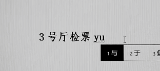 (原始链接: https://mmbiz.qpic.cn/mmbiz_gif/76VlEREHvOwluP9Jgwc0GMU4Wfhmuiakia2t7wzsqtq1QxfdyxtCEwE4RFPM2ozvylO8kPNKdglicw1xric2Zg7gng/640?wx_fmt=gif)
-  (原始链接: https://mmbiz.qpic.cn/mmbiz_jpg/76VlEREHvOz2vx7giaWiaTdT2zIv1p3LVwLibicGHkYXDD1pXgA6zSem3CmLhOohN4kibv4WXszHZ7n9uzp4pEucILg/640?wx_fmt=jpeg)
-  (原始链接: https://mmbiz.qpic.cn/mmbiz_jpg/76VlEREHvOwFnWj2u80dLfr4po0sIfJfqGicEQMj2iapuiaUbI9NRE0Qezv3gXEKSmdnVsxt4Mjbib5Lgy57WJSdNA/640?wx_fmt=jpeg)
- 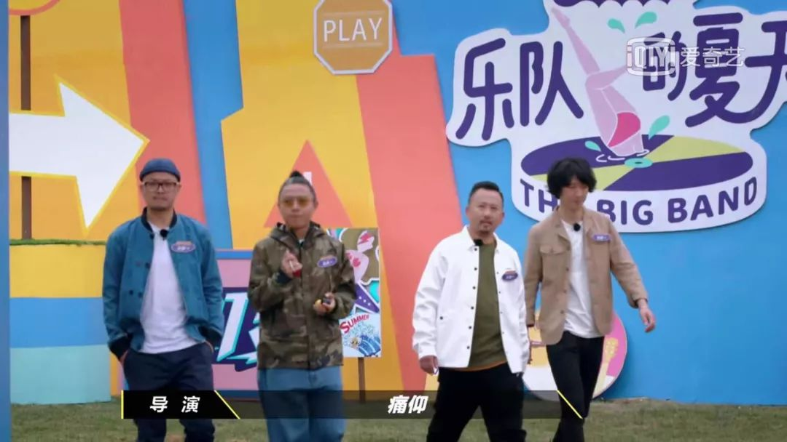 (原始链接: https://mmbiz.qpic.cn/mmbiz_jpg/76VlEREHvOwFnWj2u80dLfr4po0sIfJfbFbth2FYiajOU3zFfj2fnCSHNp68sCMM5NwHQutpKtFyyyjAytd7Xxw/640?wx_fmt=jpeg)
-  (原始链接: https://mmbiz.qpic.cn/mmbiz_png/76VlEREHvOwFnWj2u80dLfr4po0sIfJffVDPwPjLEWnc7SpG54JcsX7R09kd8hiaHKhaC6wibYSRKFupnRr22PRg/640?wx_fmt=png)
-  (原始链接: https://mmbiz.qpic.cn/mmbiz_png/76VlEREHvOwFnWj2u80dLfr4po0sIfJf2bWkTuHNLp0lwpR64NLLRs03yjnf9DxXL2XzKcACHMibOxcgK0a4NeQ/640?wx_fmt=png)
- 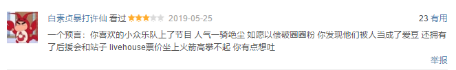 (原始链接: https://mmbiz.qpic.cn/mmbiz_png/76VlEREHvOwFnWj2u80dLfr4po0sIfJfvHxIvIZZD0rYVd16sDshmUAXZUlEyTzjo7rJpYPuk9dc0fIuUqVxbg/640?wx_fmt=png)
- 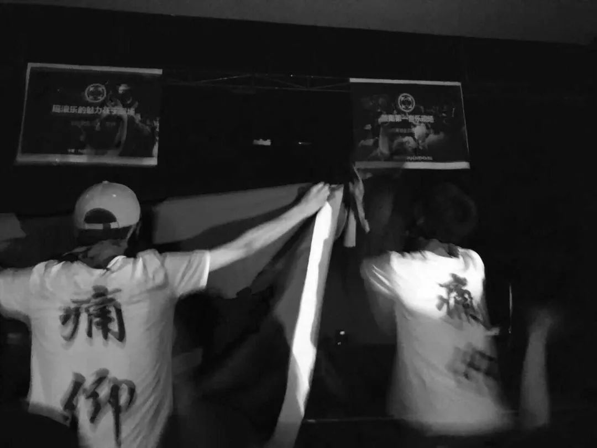 (原始链接: https://mmbiz.qpic.cn/mmbiz_jpg/76VlEREHvOwFnWj2u80dLfr4po0sIfJf3NqOswRXE7zWqUq5L5EcbBeeLB4dg7x6raBYhuUMic3xTVnASeDqibqA/640?wx_fmt=jpeg)
- 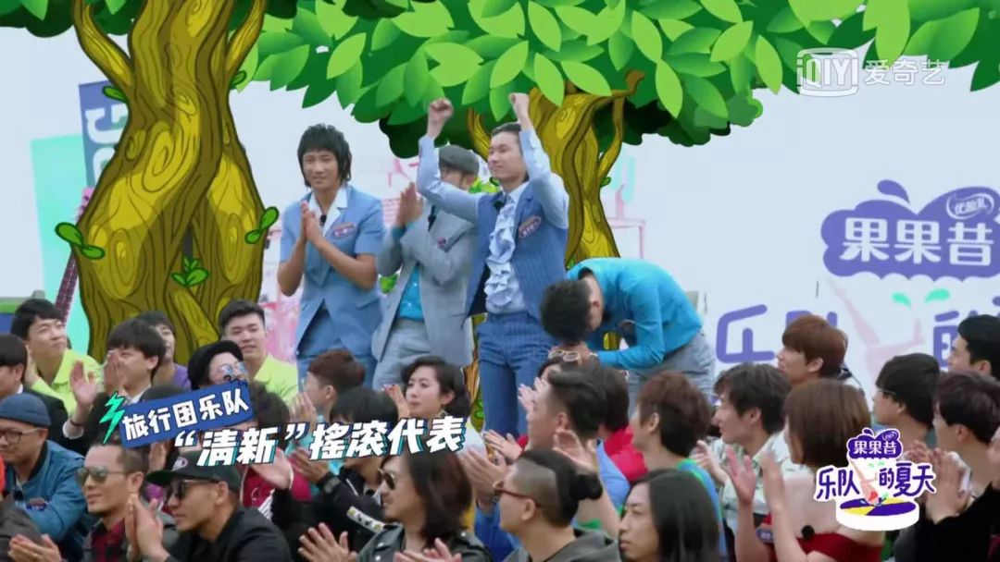 (原始链接: https://mmbiz.qpic.cn/mmbiz_jpg/76VlEREHvOwFnWj2u80dLfr4po0sIfJfj6CVxOOuQq50r7gILquOVoFWzQXLnyynXL5YH344DpibspzIgxZzuuA/640?wx_fmt=jpeg)
- 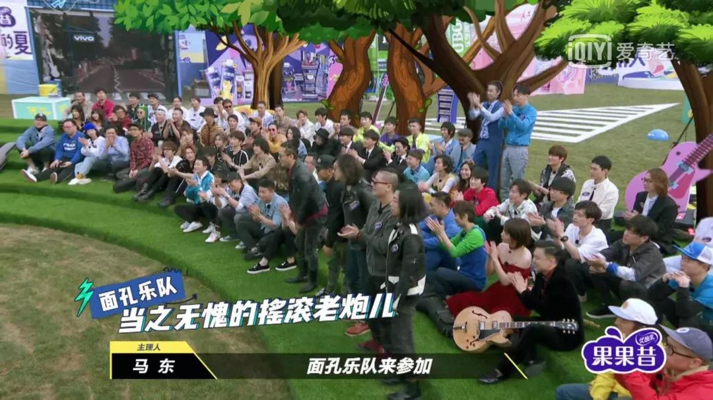 (原始链接: https://mmbiz.qpic.cn/mmbiz_jpg/76VlEREHvOwFnWj2u80dLfr4po0sIfJfGE0okOhSOumaLq6cj1Tnf4WTLULGDiatvdwS4LEfiaXumOWmF9btgngw/640?wx_fmt=jpeg)
-  (原始链接: https://mmbiz.qpic.cn/mmbiz_jpg/76VlEREHvOwFnWj2u80dLfr4po0sIfJffnXicx8qUoahHKSibatEkIiawK7B12q2zAKzMTHS4qhjaU1lnWBqZuGXw/640?wx_fmt=jpeg)
-  (原始链接: https://mmbiz.qpic.cn/mmbiz_jpg/76VlEREHvOwFnWj2u80dLfr4po0sIfJf95gK8m3ZkqEibpic52Gte9c2PONV3ggK7uqPqdTzHGRlichP6mFCZSCKQ/640?wx_fmt=jpeg)
- 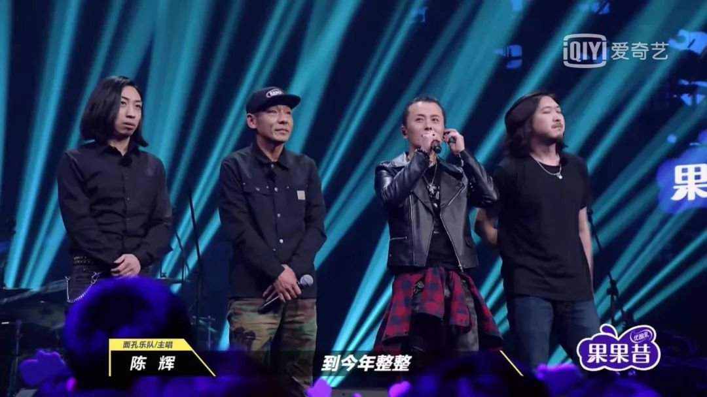 (原始链接: https://mmbiz.qpic.cn/mmbiz_jpg/76VlEREHvOwFnWj2u80dLfr4po0sIfJfIq41jWgicUfqibcPicujSXDhvrIMwzUzmQM0fpibRCfbZnVO9wb7Yykicrw/640?wx_fmt=jpeg)
- 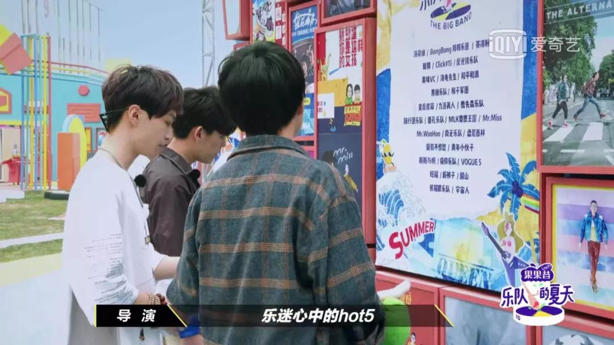 (原始链接: https://mmbiz.qpic.cn/mmbiz_jpg/76VlEREHvOwFnWj2u80dLfr4po0sIfJfmAyHVbLXu1YTl0AkA6qKhhjm5JPniaOsOhqh3SiaR6tBW9RLVO1IdtOw/640?wx_fmt=jpeg)
- 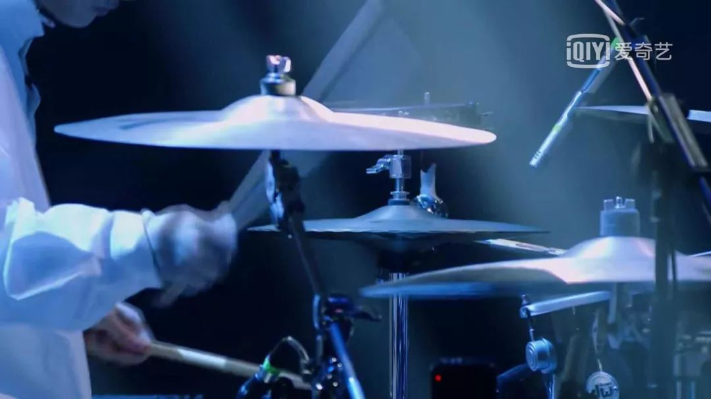 (原始链接: https://mmbiz.qpic.cn/mmbiz_jpg/76VlEREHvOwFnWj2u80dLfr4po0sIfJffCLFtA8TZmT9fm6IRf0iawpEV81IOt1hhtVicsIjibEo7PR3FlsQZ0Kbw/640?wx_fmt=jpeg)
- 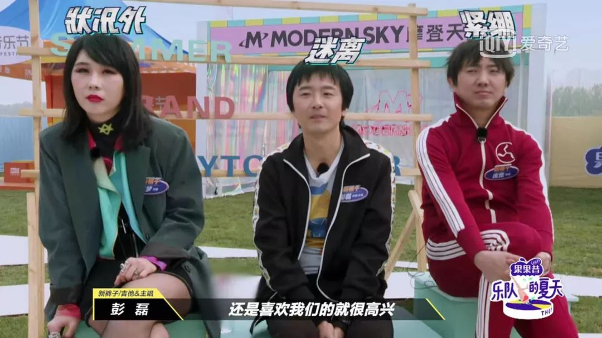 (原始链接: https://mmbiz.qpic.cn/mmbiz_jpg/76VlEREHvOwFnWj2u80dLfr4po0sIfJfvRrib72tBZ1gcO5d9Ecd0CyRfrBgzRE679qjd3iaEkIZjHQcFW6khRzw/640?wx_fmt=jpeg)
- 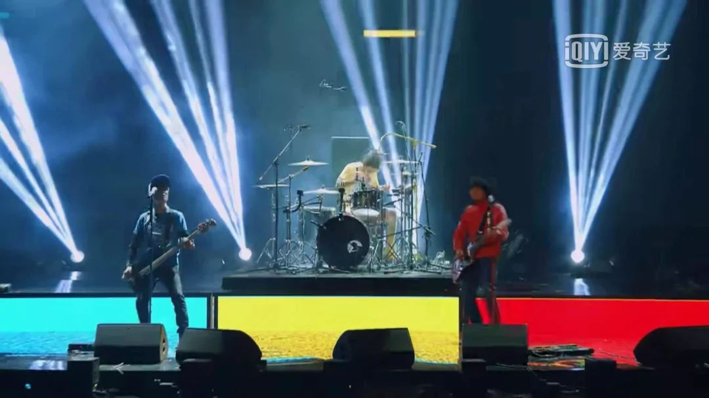 (原始链接: https://mmbiz.qpic.cn/mmbiz_jpg/76VlEREHvOwFnWj2u80dLfr4po0sIfJftbCIHeG0GHEJUNT5vwicDJoU7b6G40EXd5YKSdTLMyws2dKCzC6oG0Q/640?wx_fmt=jpeg)
- 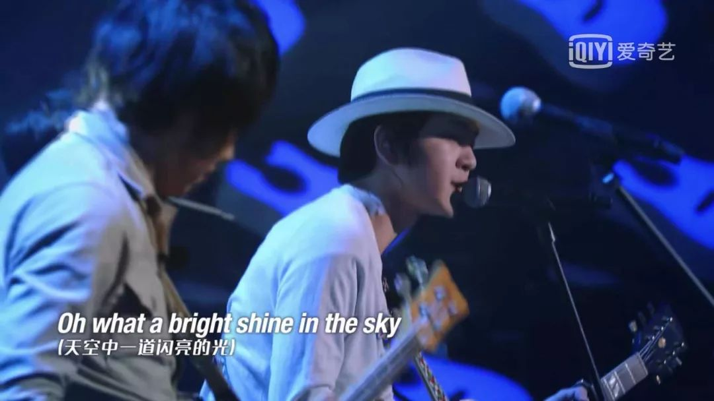 (原始链接: https://mmbiz.qpic.cn/mmbiz_jpg/76VlEREHvOwFnWj2u80dLfr4po0sIfJf3wHqX3GrqSJlHVHu8RrfR7pfYzp3wPjdBUYRgWX3NWywtW0VoeibKRg/640?wx_fmt=jpeg)
-  (原始链接: https://mmbiz.qpic.cn/mmbiz_jpg/76VlEREHvOwluP9Jgwc0GMU4WfhmuiakiaxPanOOmxxZ6xqbnBk16XvDRXMLibhRHlsBUXBt6ic0963huJwViclB5QQ/640?wx_fmt=jpeg)
-  (原始链接: https://mmbiz.qpic.cn/mmbiz_jpg/76VlEREHvOwANs84xyrYPpNtpgbIvvojJicZ5xBRX4USBVqC4aP2Mu864t68hianUKib6txSL25dTrpSIyricic3m9g/640?wx_fmt=jpeg)
-  (原始链接: https://mmbiz.qpic.cn/mmbiz_jpg/76VlEREHvOwluP9Jgwc0GMU4WfhmuiakiaDMWmXicpuz8vnUdbZasmicCH7DHzRB9iaq9cTmR7G2xPz2ib8YlN4BBImQ/640?wx_fmt=jpeg)
-  (原始链接: https://mmbiz.qpic.cn/mmbiz_jpg/76VlEREHvOyPAXfsLE7ttqwH5COwG5cOGtIY6LmyV9xgYzbmF11YFTzFOH60jtyhS7EldSKCUH66rSfkZRtQLg/640?wx_fmt=jpeg)
- 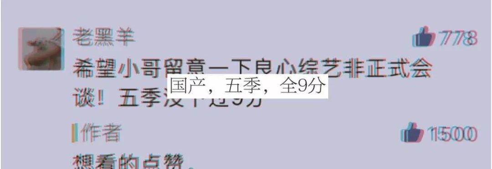 (原始链接: https://mmbiz.qpic.cn/mmbiz_jpg/76VlEREHvOyiapVjT0CVlgt28rq2QZaQvRIMiaDqA3VF08tyT2b6oXaVdxPZpfgicJeueGiaMGePVFhNfr5e1UkTZQ/640?wx_fmt=jpeg)
- 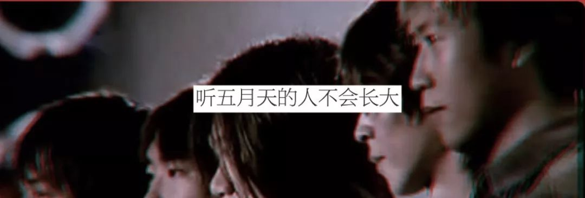 (原始链接: https://mmbiz.qpic.cn/mmbiz_jpg/76VlEREHvOyiapVjT0CVlgt28rq2QZaQvZibH7xYSFrZgqjNZXWyhbTzQp0xibjuXMuOErCuicSsdm9a1slTbRVYFA/640?wx_fmt=jpeg)
- 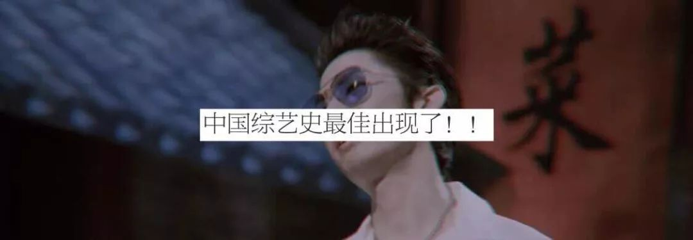 (原始链接: https://mmbiz.qpic.cn/mmbiz_jpg/76VlEREHvOwTUibpVOKITO6yPwCImICFPvdaBH1IV5de7meV2xyjjcBmanSYWzxjps0icAEC2nLb2HEJWwiauawYQ/640?wx_fmt=jpeg)
- 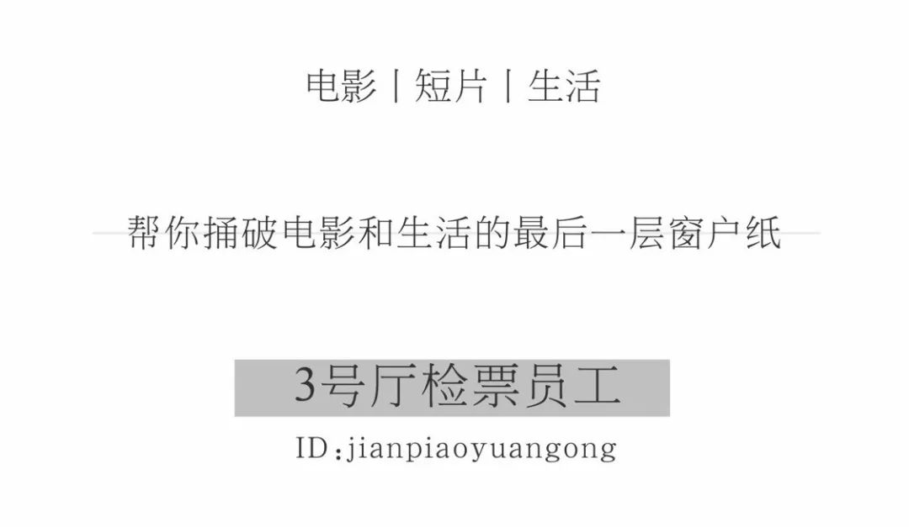 (原始链接: https://mmbiz.qpic.cn/mmbiz_jpg/76VlEREHvOwluP9Jgwc0GMU4WfhmuiakiaNPx6j7Me58Fj48CJWMfYgHFCOqSrrMp0bQNFsKLXtE0SAxo8xlmp6g/640?wx_fmt=jpeg)
- 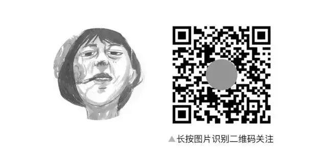 (原始链接: https://mmbiz.qpic.cn/mmbiz_jpg/76VlEREHvOxStmcwIrLHezqTJzQ9wN1da9fEhHrA3hUoL2ibGn7GEiaNFx6aN4ibChDrkPibQw2SmfE7KofUTMu4Bw/640?wx_fmt=jpeg)
-  (原始链接: https://mmbiz.qpic.cn/mmbiz_jpg/76VlEREHvOyPAXfsLE7ttqwH5COwG5cOW5icQQgI7YnOVbJlEElUPVJNiczCxajPlQ98ymv4w9dm8eibP6xPhJIEA/640?wx_fmt=jpeg)
