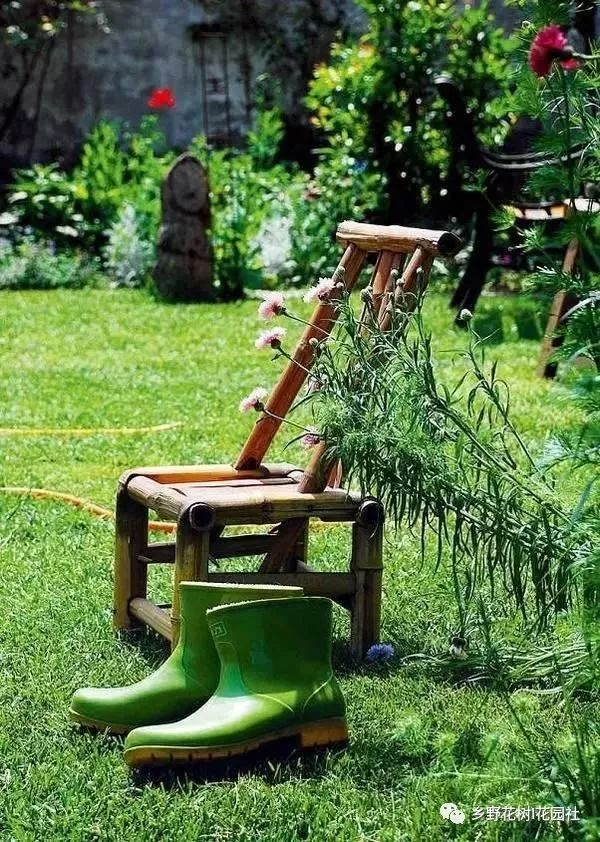

# 无标题

**链接地址:** http://mp.weixin.qq.com/s?__biz=MzI0NjAwMTU0Nw==&mid=2650084371&idx=1&sn=d663706a9f6c2042e0f30e897ba7cd85&chksm=f1444ef7c633c7e12662d4fbc5f6e81c9d82d7d1cc8e5bc9ccf271cb1519b902f87cbcd90510&mpshare=1&scene=2&srcid=0602CxcVmWqC5s4iQUaKKsln#rd
**作者:** 成都溪山园林
**获取时间:** 2025/8/28 20:32:44
**图片数量:** 19

---

## 原始HTML内容

 &nbsp;<strong style="max-width: 100%;box-sizing: border-box !important;word-wrap: break-word !important;">提示</strong>：▲ 点击上方蓝字"<strong style="max-width: 100%;color: rgb(62, 62, 62);font-size: 13.3333px;line-height: 19.2px;box-sizing: border-box !important;word-wrap: break-word !important;">【乡野花树<strong style="line-height: 19.2px;max-width: 100%;font-size: 13.3333px;box-sizing: border-box !important;word-wrap: break-word !important;"> ▎</strong>花园社<strong style="line-height: 19.2px;max-width: 100%;font-size: 13.3333px;box-sizing: border-box !important;word-wrap: break-word !important;">】</strong></strong><strong style="max-width: 100%;color: rgb(62, 62, 62);font-size: 13.3333px;line-height: 19.2px;box-sizing: border-box !important;word-wrap: break-word !important;"><strong style="line-height: 19.2px;max-width: 100%;font-size: 13.3333px;box-sizing: border-box !important;word-wrap: break-word !important;">"</strong></strong>免费订阅本刊 &nbsp;

1.&nbsp;问题1：不一样的花园，您享受过吗？&nbsp; 

&nbsp; &nbsp; 问题2：花园也是主角，您对它含糊了吗、忽视了吗？&nbsp;

&nbsp; &nbsp; 问题3：您的花园有个性、有品质、温馨吗？&nbsp;

<strong>PS</strong>：总有一天，您会找（成都溪山园林）装修花园，给您不一样的生活、不一样的享受，价格再低，不如懂您，期待下一位有品质的您！

2.&nbsp;服务范围：别墅庭院、私家花园、屋顶花园，露台花园，以及高端别墅花园养护管理。

3.&nbsp;服务理念：<strong>品质第一，只为更好！</strong>

“我喜欢养花，后半辈子的理想就是要有一个自己的花园。”

 

当我们每天忙忙碌碌，为了房子、车子、票子奔波的时候，总有一些人过上了我们向往而不可及的生活。

 

 

 

 

 

△图源：一条视频

 

曾在德国生活6年的张小平，对园艺十分热爱，被当地自然环境吸引的她，梦想回国后能有自己的花园。

2002年，回国已4年的她，在安徽合肥买下一个拥有400m²院子的别墅，开始慢慢实现自己的梦想。

 

 

 

 

 

△图源：一条视频

 

房子还没开始装潢，张小平就迫不及待地动手做这个园子，花园的设计基本上都是她一个人完成的。

 

从草图开始，哪些地方需要硬质地面，哪些地方要盖一间阳光房，整个花园的区域分布，月季园、小水池、阳光房等等，都体现了她的心思。

 

 

 

 

 

 

如今十几年过去，她亲手打造的花园已生机勃勃，美若仙境。去过她家的人都说，她把“莫奈花园”搬到了中国，这样说也并不是没有道理。

 

张小平是个“花疯子”，而她的老公杨重光是个著名的画家，夫妇二人同时喜欢法国绘画大师莫奈，他们也索性直接给花园起名为“莫奈花园”。

 

 

 

 

从外面看，张小平的园子也许跟别的地方没有什么不同，但一旦你跨进院子，就会被它深深吸引。

 

满眼的花花世界，各种陶罐、铁艺、石头雕塑点缀其中；有狗，有猫，有鸡，有小鱼戏水，还有蝴蝶飞舞。似无意摆放又似精心布局，自然而和谐。

 

 

 

 

和莫奈故居一样，这里一年四季都能见到鲜花，品种最多的时候有将近800种，园艺大师或许都没有见过这么多种类的花。

 

一年365天每天都有鲜花绽放，连寒冷的冬天也不例外，而且草坪也一年四季都是绿的，夫妻俩就在这样的园子里生活。

 

 

 

 

早晨，张小平的先生把咖啡做好，面包烤香，然后两个人就到阳光房，边吃边聊，从8点钟吃到10点钟。

 

吃完早饭，两个人就各自进入工作状态，先生去工作室画画，她就去花园修剪乔木、草坪、宿根花卉，在她眼里，打理花园是一件累并快乐的事。

 

 

 

 

 

△图源：一条视频

 

在家里，张小平还有一个硕大的书橱，里面全是园艺方面的书，而挂在墙上的栽种、修剪工具都多达上百种。

 

这么大的花园，全都她是自己打理的，偶尔发烧感冒，她也不去医院，在园子里干一天活，发发汗自然就好了。

 

 

 

 

她对园艺的热爱也并不是一两天，年轻的时候到农村去劳动改造，别人都苦不堪言，她却认为终于有了亲近土地的机会，感到很快乐。

 

早年先生留学德国的时候，她就去上植物学校，空闲时就去参观各家的花园，她对于花草的情感，这么多年经久不衰。

 

 

 

 

现在张小平已经退休了，过着舒适的半隐居生活。偶尔她会以花会友，在园子里和朋友们喝茶、聊天，园子里有什么当季的花开，她就剪下来插在瓶子里。

 

对她来说花园不是摆设，而是享受生活和劳作的地方，更是家的延伸，花园生活就是她的主要生活。

 

 

 

 

 

 

或许，精神上的富足才是最简单的幸福来源；或许，在我们每一个人的心里都有一所秘密的花园，那里香草旺盛，果实丰盈。

正如张小平，她建造了自己的莫奈花园，种植了各种各样的花花草草，在浇水施肥中体会到了最简单的快乐。

 

 

 

 

其实无论是画家还是普通人，无论是400㎡的院子，还是5㎡的阳台，只有懂得花草的美，才能种出自己的莫奈花园。

如果不能寻一处暖地，剪一下心里的杂草，那不如就选一个小小的露台，让它四季灿烂，春暖花开。

欢迎转发

&nbsp; &nbsp; &nbsp;

<strong>公众号二维码</strong><strong style="text-indent: 2em;color: rgb(127, 127, 127);line-height: 25.6px;white-space: normal;max-width: 100%;box-sizing: border-box !important;word-wrap: break-word !important;">&nbsp; &nbsp; &nbsp;&nbsp;设计主管二维码</strong>

<strong style="color: rgb(127, 127, 127);line-height: 25.6px;white-space: normal;max-width: 100%;box-sizing: border-box !important;word-wrap: break-word !important;"><strong style="color: rgb(127, 127, 127);line-height: 25.6px;max-width: 100%;box-sizing: border-box !important;word-wrap: break-word !important;"></strong></strong>

微信平台&nbsp;||<strong style="line-height: 19.2px;text-align: right;white-space: pre-wrap;max-width: 100%;font-family: 微软雅黑;font-size: 13.3333px;box-sizing: border-box !important;word-wrap: break-word !important;">【乡野 · 花树】</strong> 

服务热线：158-8216-3683（杜老师），028-6521 9096

官方网站：www.cdxishan.com 

咨询QQ：519269498

公司地址：成都<strong> · </strong>锦江区<strong> ·</strong> 佳霖孵化园

<strong style="color: rgb(127, 127, 127);line-height: 25.6px;white-space: normal;max-width: 100%;box-sizing: border-box !important;word-wrap: break-word !important;"><strong style="color: rgb(127, 127, 127);line-height: 25.6px;max-width: 100%;box-sizing: border-box !important;word-wrap: break-word !important;"></strong></strong> 

 

---

## 纯文本内容

提示：▲ 点击上方蓝字"【乡野花树 ▎花园社】"免费订阅本刊  1. 问题1：不一样的花园，您享受过吗？     问题2：花园也是主角，您对它含糊了吗、忽视了吗？     问题3：您的花园有个性、有品质、温馨吗？ PS：总有一天，您会找（成都溪山园林）装修花园，给您不一样的生活、不一样的享受，价格再低，不如懂您，期待下一位有品质的您！2. 服务范围：别墅庭院、私家花园、屋顶花园，露台花园，以及高端别墅花园养护管理。3. 服务理念：品质第一，只为更好！“我喜欢养花，后半辈子的理想就是要有一个自己的花园。”当我们每天忙忙碌碌，为了房子、车子、票子奔波的时候，总有一些人过上了我们向往而不可及的生活。△图源：一条视频曾在德国生活6年的张小平，对园艺十分热爱，被当地自然环境吸引的她，梦想回国后能有自己的花园。2002年，回国已4年的她，在安徽合肥买下一个拥有400m²院子的别墅，开始慢慢实现自己的梦想。△图源：一条视频房子还没开始装潢，张小平就迫不及待地动手做这个园子，花园的设计基本上都是她一个人完成的。从草图开始，哪些地方需要硬质地面，哪些地方要盖一间阳光房，整个花园的区域分布，月季园、小水池、阳光房等等，都体现了她的心思。如今十几年过去，她亲手打造的花园已生机勃勃，美若仙境。去过她家的人都说，她把“莫奈花园”搬到了中国，这样说也并不是没有道理。张小平是个“花疯子”，而她的老公杨重光是个著名的画家，夫妇二人同时喜欢法国绘画大师莫奈，他们也索性直接给花园起名为“莫奈花园”。从外面看，张小平的园子也许跟别的地方没有什么不同，但一旦你跨进院子，就会被它深深吸引。满眼的花花世界，各种陶罐、铁艺、石头雕塑点缀其中；有狗，有猫，有鸡，有小鱼戏水，还有蝴蝶飞舞。似无意摆放又似精心布局，自然而和谐。和莫奈故居一样，这里一年四季都能见到鲜花，品种最多的时候有将近800种，园艺大师或许都没有见过这么多种类的花。一年365天每天都有鲜花绽放，连寒冷的冬天也不例外，而且草坪也一年四季都是绿的，夫妻俩就在这样的园子里生活。早晨，张小平的先生把咖啡做好，面包烤香，然后两个人就到阳光房，边吃边聊，从8点钟吃到10点钟。吃完早饭，两个人就各自进入工作状态，先生去工作室画画，她就去花园修剪乔木、草坪、宿根花卉，在她眼里，打理花园是一件累并快乐的事。△图源：一条视频在家里，张小平还有一个硕大的书橱，里面全是园艺方面的书，而挂在墙上的栽种、修剪工具都多达上百种。这么大的花园，全都她是自己打理的，偶尔发烧感冒，她也不去医院，在园子里干一天活，发发汗自然就好了。她对园艺的热爱也并不是一两天，年轻的时候到农村去劳动改造，别人都苦不堪言，她却认为终于有了亲近土地的机会，感到很快乐。早年先生留学德国的时候，她就去上植物学校，空闲时就去参观各家的花园，她对于花草的情感，这么多年经久不衰。现在张小平已经退休了，过着舒适的半隐居生活。偶尔她会以花会友，在园子里和朋友们喝茶、聊天，园子里有什么当季的花开，她就剪下来插在瓶子里。对她来说花园不是摆设，而是享受生活和劳作的地方，更是家的延伸，花园生活就是她的主要生活。或许，精神上的富足才是最简单的幸福来源；或许，在我们每一个人的心里都有一所秘密的花园，那里香草旺盛，果实丰盈。正如张小平，她建造了自己的莫奈花园，种植了各种各样的花花草草，在浇水施肥中体会到了最简单的快乐。其实无论是画家还是普通人，无论是400㎡的院子，还是5㎡的阳台，只有懂得花草的美，才能种出自己的莫奈花园。如果不能寻一处暖地，剪一下心里的杂草，那不如就选一个小小的露台，让它四季灿烂，春暖花开。欢迎转发     公众号二维码      设计主管二维码微信平台 ||【乡野 · 花树】服务热线：158-8216-3683（杜老师），028-6521 9096官方网站：www.cdxishan.com咨询QQ：519269498公司地址：成都 · 锦江区 · 佳霖孵化园

---

## 图片列表

-  (原始链接: https://mmbiz.qpic.cn/mmbiz/4CTW7BWv1L264d39qktfYRFtoDhJSVnYETwBYTZuTBc9Hn8MmVXWxvWYRSTUv9lWob2D64wLpbYnXQa0RiaLSUQ/640?wx_fmt=gif)
-  (原始链接: https://mmbiz.qpic.cn/mmbiz_jpg/TrnsADJvnuW2EmB4mb7xtSv3XyORJGcoSpYdDchaz1kY6zBw2xkqYgHkWMxIfyuW03AKyuUHyOrPUDT7Rj6yKA/640?wx_fmt=jpeg)
-  (原始链接: https://mmbiz.qpic.cn/mmbiz_jpg/TrnsADJvnuW2EmB4mb7xtSv3XyORJGcoeicicXzNDrrC4ia7lbBWszdP9n0TIOJb7o3lHUuHkZfaaqFgMZvFrGiayA/640?wx_fmt=jpeg)
-  (原始链接: https://mmbiz.qpic.cn/mmbiz_jpg/TrnsADJvnuW2EmB4mb7xtSv3XyORJGcodCh9ZnmibqQQibyBpMKdMdFUhxwxr8Qia2Eic1Qg3EI2hyibtP5Wc1AHCaA/640?wx_fmt=jpeg)
-  (原始链接: https://mmbiz.qpic.cn/mmbiz_jpg/TrnsADJvnuW2EmB4mb7xtSv3XyORJGcofp2R4LSbmpWruia62FPHXiaXWjiaEjyziaaKvbhQJoIhm0Yrn91RErSWVQ/640?wx_fmt=jpeg)
-  (原始链接: https://mmbiz.qpic.cn/mmbiz_jpg/TrnsADJvnuW2EmB4mb7xtSv3XyORJGcoUSUZjYGbnjDNUUiaeictFJ51T4mj44X1pYtbOZLoLLUzOfo2Y3Adg1RQ/640?wx_fmt=jpeg)
-  (原始链接: https://mmbiz.qpic.cn/mmbiz_jpg/TrnsADJvnuW2EmB4mb7xtSv3XyORJGco1CruC6iap2Z97uIqsAvpiaszXS5IFZWicj3mOo6zKmGYtChMIC9HjOMTw/640?wx_fmt=jpeg)
-  (原始链接: https://mmbiz.qpic.cn/mmbiz_jpg/TrnsADJvnuW2EmB4mb7xtSv3XyORJGcoWLYZ3yLv947Hq9ERBxDVrJrKOhUiaWIW5JRK6Jc4z3lj1JgbNUibBfgw/640?wx_fmt=jpeg)
-  (原始链接: https://mmbiz.qpic.cn/mmbiz_jpg/TrnsADJvnuW2EmB4mb7xtSv3XyORJGcoKnZdymCNz2fAJqB1RVwoqicuX0o6OpMj9d76za4R4MvpopYGmMkbkWg/640?wx_fmt=jpeg)
-  (原始链接: https://mmbiz.qpic.cn/mmbiz_jpg/TrnsADJvnuW2EmB4mb7xtSv3XyORJGcoX8vB5HibXYGBQBgDhfzZNlvogDoBc5icZbUmxriayCMmqLzXZ2RgrEcTA/640?wx_fmt=jpeg)
-  (原始链接: https://mmbiz.qpic.cn/mmbiz_jpg/TrnsADJvnuW2EmB4mb7xtSv3XyORJGcoZwG69HVeAuFYH0oXITbX9hphJ97vKDZg78GYaHEjj766BVeE8Ie9Xg/640?wx_fmt=jpeg)
-  (原始链接: https://mmbiz.qpic.cn/mmbiz_jpg/TrnsADJvnuW2EmB4mb7xtSv3XyORJGcoDiaqwC4ufBozmEZIIEj19es75QXyU2kCuIgXvVKMBcy9h3OJD2sGZzA/640?wx_fmt=jpeg)
-  (原始链接: https://mmbiz.qpic.cn/mmbiz_jpg/TrnsADJvnuW2EmB4mb7xtSv3XyORJGcoExwIIpPYncBpTm5Wk7xGCq40NVEiaQkYnA8uLyYsa13GNFw9nZJ7yUw/640?wx_fmt=jpeg)
-  (原始链接: https://mmbiz.qpic.cn/mmbiz_jpg/TrnsADJvnuW2EmB4mb7xtSv3XyORJGcoQgCibFTspFuZlmS3eXoibZvsMPibQKic9La9ndPr3XfpU7Lmkibiba3OymvQ/640?wx_fmt=jpeg)
-  (原始链接: https://mmbiz.qpic.cn/mmbiz_jpg/TrnsADJvnuW2EmB4mb7xtSv3XyORJGco1TOJH6yBYQlrX2oniaVGp8WibjQdrqHTTfup17X0lwqsgYzpesNp9j6A/640?wx_fmt=jpeg)
-  (原始链接: https://mmbiz.qpic.cn/mmbiz_jpg/TrnsADJvnuW2EmB4mb7xtSv3XyORJGcoaadlSmgqbHPk5KrmK4t4JY6I0QcX8AurHII13yvQXq1JhaQNhWLhgg/640?wx_fmt=jpeg)
-  (原始链接: https://mmbiz.qpic.cn/mmbiz_jpg/TrnsADJvnuW2EmB4mb7xtSv3XyORJGcoibozMvy5BkHVKHBE3vSDYWxPJN2CHcnibfemib2liaSicOPdo6AapqAhibFw/640?wx_fmt=jpeg)
-  (原始链接: https://mmbiz.qpic.cn/mmbiz_jpg/TrnsADJvnuXia7olQmREAm9Ggn25DMDiaGtmQrp3OEJiccDNXtmNbsvdkLoAD58ZVdqeF7HeicpEwbLMeABF71OuXQ/640?wx_fmt=jpeg)
-  (原始链接: https://mmbiz.qpic.cn/mmbiz_jpg/TrnsADJvnuXia7olQmREAm9Ggn25DMDiaGYq9ylPAn641qGwdwpZzG1ianQAPhrjiaibzJtERqVWPUcVYopaUTic2W7A/640?wx_fmt=jpeg)
