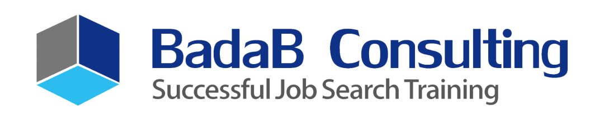
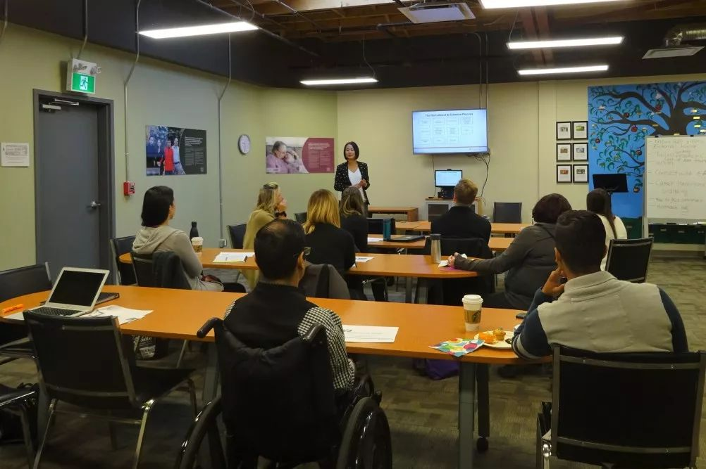
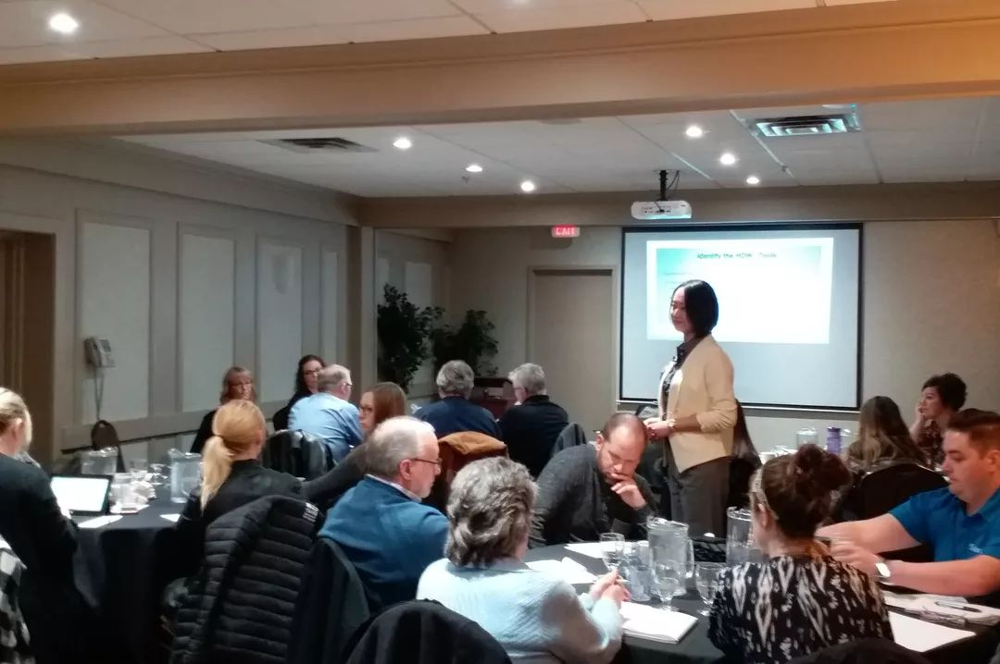
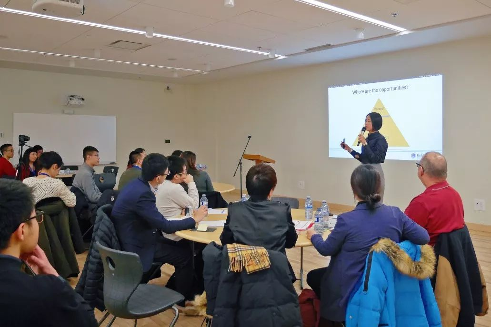
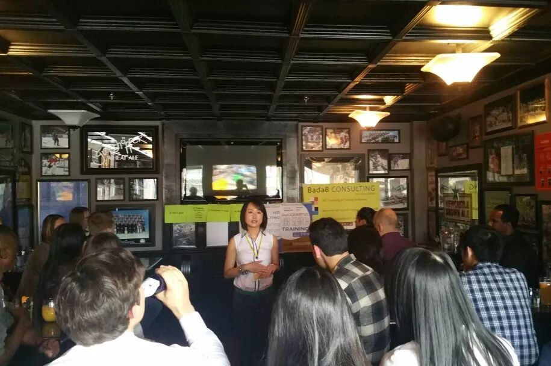
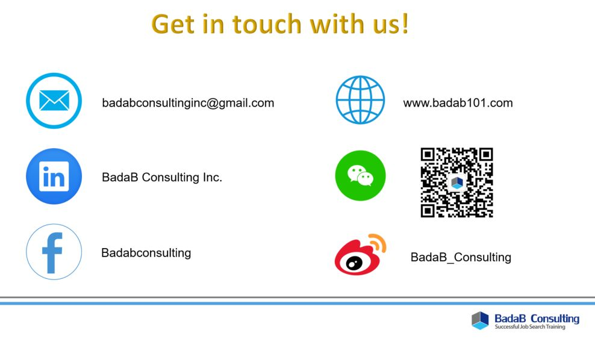

# 无标题

**链接地址:** http://mp.weixin.qq.com/s?__biz=MzI4NDYyNjAwNw==&mid=2247483903&idx=1&sn=9ee273e64b47e92bb136c1674ba7f71e&chksm=ebf9dcc7dc8e55d14b4a7427a0da3fe7495661b481e6501924de9ed607e1f4e7174eb8bfe86a&mpshare=1&scene=2&srcid=#rd
**作者:** 欢迎关注我们
**获取时间:** 2025/8/28 20:32:16
**图片数量:** 35

---

## 原始HTML内容

<section style="box-sizing: border-box;font-size: 16px;"><section style="margin-right: 0%;margin-left: 0%;box-sizing: border-box;" powered-by="xiumi.us"><section style="display: inline-block;width: 100%;vertical-align: top;padding: 20px;background-color: rgba(215, 237, 253, 0.45);box-shadow: rgb(0, 0, 0) 0px 0px 0px;box-sizing: border-box;"><section style="text-align: center;box-sizing: border-box;" powered-by="xiumi.us"><section style="display: inline-block;min-width: 10%;max-width: 100%;vertical-align: top;box-sizing: border-box;"><section style="box-sizing: border-box;" powered-by="xiumi.us"><section style="display: inline-block;width: 100%;vertical-align: top;border-width: 3px;border-radius: 0px;border-style: solid;border-color: rgba(255, 255, 255, 0);background-color: rgb(215, 237, 253);box-shadow: rgba(0, 135, 227, 0.52) 0px 0px 15px;box-sizing: border-box;"><section style="box-sizing: border-box;" powered-by="xiumi.us"><section style="display: inline-block;width: 100%;vertical-align: top;box-shadow: rgba(0, 135, 227, 0.52) 0px 0px 15px inset;border-width: 0px;border-radius: 17px;border-style: none;border-color: rgb(255, 251, 247);overflow: hidden;padding-right: 40px;padding-left: 40px;box-sizing: border-box;"><section style="text-align: left;margin: -7px 0% -5px;transform: translate3d(-40px, 0px, 0px);-webkit-transform: translate3d(-40px, 0px, 0px);-moz-transform: translate3d(-40px, 0px, 0px);-o-transform: translate3d(-40px, 0px, 0px);box-sizing: border-box;" powered-by="xiumi.us"><section style="display: inline-block;width: 57px;height: 30px;vertical-align: top;overflow: hidden;border-width: 0px;box-sizing: border-box;"><section style="text-align: center;margin-right: 0%;margin-left: 0%;transform: rotateX(180deg) rotateY(180deg);box-sizing: border-box;" powered-by="xiumi.us"><section style="max-width: 100%;vertical-align: middle;display: inline-block;line-height: 0;box-shadow: rgb(0, 0, 0) 0px 0px 0px;box-sizing: border-box;"></section></section></section></section><section style="font-size: 15px;color: rgb(0, 135, 227);letter-spacing: 2px;line-height: 1;box-sizing: border-box;" powered-by="xiumi.us">
<strong style="box-sizing: border-box;">怎样解读工作offer</strong>
</section><section style="text-align: right;margin: -5px 0% -8px;transform: translate3d(40px, 0px, 0px);-webkit-transform: translate3d(40px, 0px, 0px);-moz-transform: translate3d(40px, 0px, 0px);-o-transform: translate3d(40px, 0px, 0px);box-sizing: border-box;" powered-by="xiumi.us"><section style="display: inline-block;width: 57px;height: 30px;vertical-align: top;overflow: hidden;border-width: 0px;box-sizing: border-box;"><section style="text-align: center;margin-right: 0%;margin-left: 0%;box-sizing: border-box;" powered-by="xiumi.us"><section style="max-width: 100%;vertical-align: middle;display: inline-block;line-height: 0;box-sizing: border-box;"></section></section></section></section></section></section></section></section></section></section><section style="box-sizing: border-box;" powered-by="xiumi.us">
 
</section><section style="text-align: center;margin: 10px 0%;box-sizing: border-box;" powered-by="xiumi.us"><section style="display: inline-block;width: 95%;vertical-align: top;padding: 5px;background-position: 50% 50%;background-repeat: no-repeat;background-size: cover;background-attachment: scroll;border-width: 0px;border-radius: 10px;border-style: none;border-color: rgb(39, 165, 224);overflow: hidden;box-shadow: rgb(123, 172, 163) 0px 0px 5px;background-image: url(&quot;https://mmbiz.qpic.cn/mmbiz_jpg/cY0qSDjdkFdNEibEL6QvuuTiarV9cWpDxia9LeIicUPNL8HKv4T20oH5ZEMAjMb3OXPxdqNL0bPhvaaYzAIVcfE6RQ/640?wx_fmt=jpeg&quot;);box-sizing: border-box;"><section style="box-sizing: border-box;" powered-by="xiumi.us"><section style="display: inline-block;width: 100%;vertical-align: top;background-color: rgb(255, 255, 255);padding: 15px;border-width: 0px;border-radius: 10px;border-style: none;border-color: rgb(62, 62, 62);overflow: hidden;box-shadow: rgb(173, 173, 173) 0px 0px 3px inset;box-sizing: border-box;"><section style="margin-top: 10px;margin-right: 0%;margin-left: 0%;box-sizing: border-box;" powered-by="xiumi.us"><section style="display: inline-block;vertical-align: top;width: 50%;border-style: solid;border-width: 3px;border-radius: 0px;border-color: rgb(255, 255, 255);padding: 5px;background-color: rgb(39, 165, 224);box-sizing: border-box;"><section style="margin-right: 0%;margin-left: 0%;box-sizing: border-box;" powered-by="xiumi.us"><section style="max-width: 100%;vertical-align: middle;display: inline-block;line-height: 0;border-style: solid;border-width: 2px;border-radius: 8px;border-color: rgb(255, 255, 255);overflow: hidden;box-shadow: rgb(0, 0, 0) 0px 0px 0px;box-sizing: border-box;"></section></section></section><section style="display: inline-block;vertical-align: top;width: 50%;border-style: solid;border-width: 3px;border-radius: 0px;border-color: rgb(255, 255, 255);padding: 5px;box-shadow: rgb(0, 0, 0) 0px 0px 0px;background-color: rgba(76, 186, 238, 0.82);box-sizing: border-box;"><section style="margin-right: 0%;margin-left: 0%;box-sizing: border-box;" powered-by="xiumi.us"><section style="max-width: 100%;vertical-align: middle;display: inline-block;line-height: 0;border-style: solid;border-width: 2px;border-radius: 8px;border-color: rgb(255, 255, 255);overflow: hidden;box-shadow: rgb(0, 0, 0) 0px 0px 0px;box-sizing: border-box;"></section></section></section></section><section style="margin-top: 10px;margin-right: 0%;margin-left: 0%;box-sizing: border-box;" powered-by="xiumi.us"><section style="display: inline-block;vertical-align: top;width: 50%;border-style: solid;border-width: 3px;border-radius: 0px;border-color: rgb(255, 255, 255);padding: 5px;background-color: rgb(39, 165, 224);box-sizing: border-box;"><section style="margin-right: 0%;margin-left: 0%;box-sizing: border-box;" powered-by="xiumi.us"><section style="max-width: 100%;vertical-align: middle;display: inline-block;line-height: 0;border-style: solid;border-width: 2px;border-radius: 8px;border-color: rgb(255, 255, 255);overflow: hidden;box-shadow: rgb(0, 0, 0) 0px 0px 0px;box-sizing: border-box;"></section></section></section><section style="display: inline-block;vertical-align: top;width: 50%;border-style: solid;border-width: 3px;border-radius: 0px;border-color: rgb(255, 255, 255);padding: 5px;box-shadow: rgb(0, 0, 0) 0px 0px 0px;background-color: rgba(76, 186, 238, 0.82);box-sizing: border-box;"><section style="margin-right: 0%;margin-left: 0%;box-sizing: border-box;" powered-by="xiumi.us"><section style="max-width: 100%;vertical-align: middle;display: inline-block;line-height: 0;border-style: solid;border-width: 2px;border-radius: 8px;border-color: rgb(255, 255, 255);overflow: hidden;box-sizing: border-box;"></section></section></section></section><section style="margin: 20px 0%;box-sizing: border-box;" powered-by="xiumi.us"><section style="text-align: justify;font-size: 14px;color: rgba(51, 51, 51, 0.78);letter-spacing: 2px;box-sizing: border-box;">
转眼到了6月底，相信不少在春季完成学业的毕业生们在求职的猎场上已经收获了不少经验。经过了漫长的准备简历和面试过程，你们<strong style="box-sizing: border-box;">在求职道路上或许已经变得更加从容和自信</strong>。

 

幸运的你或许已经收到了<strong style="box-sizing: border-box;">心仪的单位和岗位的工作Offer</strong>，甚至可能还有好几份工作等待你挑选。BadaB Consulting的全体员工在这里先祝贺大家，希望你们可以在本文的留言栏内和我们一同<strong style="box-sizing: border-box;">分享求职路上的困难和喜悦</strong>。
</section></section><section style="margin: 10px 0%;box-sizing: border-box;" powered-by="xiumi.us"><section style="display: inline-block;width: 95%;vertical-align: top;padding: 5px;background-position: 0% 0%;background-repeat: repeat;background-size: auto;background-attachment: scroll;border-width: 0px;border-radius: 10px;border-style: none;border-color: rgba(41, 229, 255, 0.13);overflow: hidden;box-shadow: rgb(123, 172, 163) 0px 0px 5px;background-image: url(&quot;https://mmbiz.qpic.cn/mmbiz_jpg/cY0qSDjdkFdNEibEL6QvuuTiarV9cWpDxiaDK7rHv5ELicmSwPIuxSQe6lqzSBPunQJGt79vLSph36ZTxATKxXwnYA/640?wx_fmt=jpeg&quot;);box-sizing: border-box;"><section style="box-sizing: border-box;" powered-by="xiumi.us"><section style="display: inline-block;width: 100%;vertical-align: top;background-color: rgb(254, 255, 255);border-width: 0px;border-radius: 10px;border-style: none;border-color: rgba(76, 186, 238, 0.82);overflow: hidden;box-shadow: rgb(173, 173, 173) 0px 0px 3px inset;box-sizing: border-box;"><section style="margin-right: 0%;margin-left: 0%;box-sizing: border-box;" powered-by="xiumi.us"><section style="max-width: 100%;vertical-align: middle;display: inline-block;line-height: 0;box-shadow: rgba(76, 186, 238, 0.82) 0px 0px 0px;width: 100%;border-width: 0px;border-radius: 10px;border-style: none;border-color: rgba(76, 186, 238, 0.82);overflow: hidden;box-sizing: border-box;"></section></section></section></section></section></section><section style="margin: 20px 0%;box-sizing: border-box;" powered-by="xiumi.us"><section style="text-align: justify;font-size: 14px;color: rgba(51, 51, 51, 0.78);letter-spacing: 2px;box-sizing: border-box;">
然而在经过了层层闯关式的求职磨练，来到入职前最后关卡——签订合同时，作为求职新手的大家可能会感到犯难：工作合同上<strong style="box-sizing: border-box;">密密麻麻地全是陌生的单词</strong>。这些复杂的词汇<strong style="box-sizing: border-box;">到底是馅饼还是陷阱</strong>？作为菜鸟的我还真不知道如何去甄别。

 

今天，就请跟随我们在这篇文章里学习<strong style="box-sizing: border-box;">解读工作Offer和合同中这些常见条款和限制</strong>。为你选择合适的职位入职指清方向。
</section></section></section></section></section></section></section></section><section style="text-align: center;margin-top: 10px;margin-bottom: 10px;box-sizing: border-box;" powered-by="xiumi.us"><section style="max-width: 100%;vertical-align: middle;display: inline-block;line-height: 0;box-sizing: border-box;"></section></section><section style="margin-right: 0%;margin-left: 0%;box-sizing: border-box;" powered-by="xiumi.us"><section style="display: inline-block;width: 100%;vertical-align: top;background-color: rgba(41, 229, 255, 0.13);box-shadow: rgb(0, 0, 0) 0px 0px 0px;padding: 20px;box-sizing: border-box;"><section style="margin-right: 0%;margin-left: 0%;box-sizing: border-box;" powered-by="xiumi.us"><section style="display: inline-block;width: 100%;vertical-align: top;border-width: 0px;border-radius: 10px;border-style: none;border-color: rgb(62, 62, 62);overflow: hidden;box-shadow: rgba(41, 229, 255, 0.13) 0px 0px 15px;box-sizing: border-box;"><section style="box-sizing: border-box;" powered-by="xiumi.us"><section style="display: inline-block;width: 100%;vertical-align: top;border-width: 0px;border-radius: 10px;border-style: none;border-color: rgb(62, 62, 62);overflow: hidden;padding: 15px 20px;box-shadow: rgba(41, 229, 255, 0.13) 0px 5px 10px inset;background-position: 50% 50%;background-repeat: no-repeat;background-size: cover;background-attachment: scroll;background-image: url(&quot;https://mmbiz.qpic.cn/mmbiz_jpg/cY0qSDjdkFdNEibEL6QvuuTiarV9cWpDxiaDK7rHv5ELicmSwPIuxSQe6lqzSBPunQJGt79vLSph36ZTxATKxXwnYA/640?wx_fmt=jpeg&quot;);box-sizing: border-box;"><section style="text-align: right;margin: 20px 0% 50px;box-sizing: border-box;" powered-by="xiumi.us"><section style="display: inline-block;width: 95%;vertical-align: top;border-style: dashed;border-width: 1px;border-radius: 0px;border-color: rgb(123, 172, 163);box-sizing: border-box;"><section style="transform: translate3d(-20px, 0px, 0px);-webkit-transform: translate3d(-20px, 0px, 0px);-moz-transform: translate3d(-20px, 0px, 0px);-o-transform: translate3d(-20px, 0px, 0px);margin: -10px 0%;box-sizing: border-box;" powered-by="xiumi.us"><section style="display: inline-block;width: 100%;vertical-align: top;background-color: rgba(76, 186, 238, 0.82);padding-top: 15px;box-shadow: rgb(255, 255, 255) 0px 0px 0px;box-sizing: border-box;"><section style="text-align: center;margin-right: 0%;margin-bottom: -20px;margin-left: 0%;transform: translate3d(10px, 0px, 0px);box-sizing: border-box;" powered-by="xiumi.us"><section style="max-width: 100%;vertical-align: middle;display: inline-block;line-height: 0;border-top: 2px solid rgb(255, 255, 255);border-top-left-radius: 0px;box-shadow: rgb(0, 0, 0) 0px 0px 0px;box-sizing: border-box;"></section></section></section></section></section></section><section style="margin-right: 0%;margin-left: 0%;box-sizing: border-box;" powered-by="xiumi.us"><section style="display: inline-block;width: 100%;vertical-align: top;padding: 20px;background-color: rgba(255, 255, 255, 0);box-shadow: rgb(0, 0, 0) 0px 0px 0px;box-sizing: border-box;"><section style="text-align: center;box-sizing: border-box;" powered-by="xiumi.us"><section style="display: inline-block;min-width: 10%;max-width: 100%;vertical-align: top;box-sizing: border-box;"><section style="text-align: left;transform: translate3d(-10px, 0px, 0px);margin-right: 0%;margin-bottom: -30px;margin-left: 0%;box-sizing: border-box;" powered-by="xiumi.us"><section style="display: inline-block;width: 35px;height: 35px;vertical-align: top;overflow: hidden;border-width: 0px;border-radius: 50%;border-style: none;border-color: rgb(62, 62, 62);box-shadow: rgb(255, 255, 255) 0px 0px 20px;background-color: rgba(76, 186, 238, 0.82);box-sizing: border-box;"><section style="margin-top: 6px;margin-right: 0%;margin-left: 0%;box-sizing: border-box;" powered-by="xiumi.us"><section style="text-align: center;font-size: 22px;color: rgb(23, 51, 123);line-height: 1;box-sizing: border-box;">
<em style="box-sizing: border-box;"><strong style="box-sizing: border-box;">1</strong></em>
</section></section></section></section><section style="box-sizing: border-box;" powered-by="xiumi.us"><section style="display: inline-block;width: 100%;vertical-align: top;border-width: 7px 0px 8px;border-radius: 0px 25px 25px;border-style: none none solid;border-color: rgb(112, 188, 240) rgb(62, 62, 62);background-color: rgb(215, 237, 253);padding: 8px;box-shadow: rgba(0, 135, 227, 0.52) -1.41421px 1.41421px 15px;box-sizing: border-box;"><section style="box-sizing: border-box;" powered-by="xiumi.us"><section style="display: inline-block;width: 100%;vertical-align: top;box-shadow: rgba(0, 135, 227, 0.34) 0px 0px 10px inset;border-width: 2px;border-radius: 0px 15px 15px;border-style: solid;border-color: rgb(255, 251, 247);padding: 10px 15px 10px 25px;box-sizing: border-box;"><section style="font-size: 17px;color: rgb(0, 135, 227);letter-spacing: 2px;line-height: 1;box-sizing: border-box;" powered-by="xiumi.us">
<strong style="box-sizing: border-box;">Offer通常包括哪些内容</strong>
</section></section></section></section></section><section style="text-align: right;margin-top: -29px;margin-right: 0%;margin-left: 0%;transform: translate3d(10px, 0px, 0px);box-sizing: border-box;" powered-by="xiumi.us"><section style="display: inline-block;width: 57px;height: 30px;vertical-align: top;overflow: hidden;border-width: 0px;box-sizing: border-box;"><section style="text-align: center;margin-right: 0%;margin-left: 0%;box-sizing: border-box;" powered-by="xiumi.us"><section style="max-width: 100%;vertical-align: middle;display: inline-block;line-height: 0;box-sizing: border-box;"></section></section></section></section></section></section></section></section><section style="margin: 20px 0%;transform: translate3d(-1px, 0px, 0px);-webkit-transform: translate3d(-1px, 0px, 0px);-moz-transform: translate3d(-1px, 0px, 0px);-o-transform: translate3d(-1px, 0px, 0px);box-sizing: border-box;" powered-by="xiumi.us"><section style="font-size: 14px;color: rgba(51, 51, 51, 0.78);letter-spacing: 2px;box-sizing: border-box;">
面试后的同学如果在邮箱内收到一封标题为“Job&nbsp;Offer”，以“Dear XXX, Congratulations”这样的词汇开头的邮件，恭喜你，在你不懈地努力下，<strong style="box-sizing: border-box;">已经获得了一份新的工作Offer</strong>。不过在准备激动地入职之前，Offer中的一些内容还请坐下来，<strong style="box-sizing: border-box;">一字一句地仔细阅读</strong>。
</section></section><section style="text-align: center;margin: 10px 0%;box-sizing: border-box;" powered-by="xiumi.us"><section style="display: inline-block;width: 95%;vertical-align: top;padding: 5px;background-position: 0% 0%;background-repeat: repeat;background-size: auto;background-attachment: scroll;border-width: 0px;border-radius: 10px;border-style: none;border-color: rgba(41, 229, 255, 0.13);overflow: hidden;box-shadow: rgb(123, 172, 163) 0px 0px 5px;background-image: url(&quot;https://mmbiz.qpic.cn/mmbiz_jpg/cY0qSDjdkFdNEibEL6QvuuTiarV9cWpDxiaDK7rHv5ELicmSwPIuxSQe6lqzSBPunQJGt79vLSph36ZTxATKxXwnYA/640?wx_fmt=jpeg&quot;);box-sizing: border-box;"><section style="box-sizing: border-box;" powered-by="xiumi.us"><section style="display: inline-block;width: 100%;vertical-align: top;background-color: rgb(255, 255, 255);border-width: 0px;border-radius: 10px;border-style: none;border-color: rgba(76, 186, 238, 0.82);overflow: hidden;box-shadow: rgb(173, 173, 173) 0px 0px 3px inset;box-sizing: border-box;"><section style="margin-right: 0%;margin-left: 0%;box-sizing: border-box;" powered-by="xiumi.us"><section style="max-width: 100%;vertical-align: middle;display: inline-block;line-height: 0;box-shadow: rgba(76, 186, 238, 0.82) 0px 0px 0px;width: 100%;border-width: 0px;border-radius: 10px;border-style: none;border-color: rgba(76, 186, 238, 0.82);overflow: hidden;box-sizing: border-box;"></section></section></section></section></section></section><section style="margin: 20px 0%;transform: translate3d(-1px, 0px, 0px);-webkit-transform: translate3d(-1px, 0px, 0px);-moz-transform: translate3d(-1px, 0px, 0px);-o-transform: translate3d(-1px, 0px, 0px);box-sizing: border-box;" powered-by="xiumi.us"><section style="font-size: 14px;color: rgba(51, 51, 51, 0.78);letter-spacing: 2px;box-sizing: border-box;">
这封邮件中通常会以正式的文本格式发送给你包括但不仅限于你的<strong style="box-sizing: border-box;">职位，薪资，工作起始日期，Training或试用时间，工作职责</strong>等等内容的信息。

 

很多大家关心的保险，年假，医疗福利，和Bonus等<strong style="box-sizing: border-box;">更细节的信息，通常会出现在一些写得很仔细的Offer里</strong>。 
</section></section><section style="text-align: center;margin: 10px 0%;box-sizing: border-box;" powered-by="xiumi.us"><section style="display: inline-block;width: 95%;vertical-align: top;padding: 5px;background-position: 0% 0%;background-repeat: repeat;background-size: auto;background-attachment: scroll;border-width: 0px;border-radius: 10px;border-style: none;border-color: rgba(41, 229, 255, 0.13);overflow: hidden;box-shadow: rgb(123, 172, 163) 0px 0px 5px;background-image: url(&quot;https://mmbiz.qpic.cn/mmbiz_jpg/cY0qSDjdkFdNEibEL6QvuuTiarV9cWpDxiaDK7rHv5ELicmSwPIuxSQe6lqzSBPunQJGt79vLSph36ZTxATKxXwnYA/640?wx_fmt=jpeg&quot;);box-sizing: border-box;"><section style="box-sizing: border-box;" powered-by="xiumi.us"><section style="display: inline-block;width: 100%;vertical-align: top;background-color: rgb(255, 255, 255);border-width: 0px;border-radius: 10px;border-style: none;border-color: rgba(76, 186, 238, 0.82);overflow: hidden;box-shadow: rgb(173, 173, 173) 0px 0px 3px inset;box-sizing: border-box;"><section style="margin-right: 0%;margin-left: 0%;box-sizing: border-box;" powered-by="xiumi.us"><section style="max-width: 100%;vertical-align: middle;display: inline-block;line-height: 0;box-shadow: rgba(76, 186, 238, 0.82) 0px 0px 0px;width: 100%;border-width: 0px;border-radius: 10px;border-style: none;border-color: rgba(76, 186, 238, 0.82);overflow: hidden;box-sizing: border-box;"></section></section></section></section></section></section><section style="margin: 20px 0%;transform: translate3d(-1px, 0px, 0px);-webkit-transform: translate3d(-1px, 0px, 0px);-moz-transform: translate3d(-1px, 0px, 0px);-o-transform: translate3d(-1px, 0px, 0px);box-sizing: border-box;" powered-by="xiumi.us"><section style="font-size: 14px;color: rgba(51, 51, 51, 0.78);letter-spacing: 2px;box-sizing: border-box;">
一般公司会把Offer和合同一同发给你。如果你对Offer或者合同中的<strong style="box-sizing: border-box;">任何细节感到不满意</strong>，都请在同意或签订接受工作前和公司的HR或者相关负责人士<strong style="box-sizing: border-box;">交涉</strong>。在确定Offer和合同中所有的条款都同意之前，<strong style="box-sizing: border-box;">千万不要贸然回复或签字同意</strong>。 

 

Offer Letter是具有法律效应的法律合同，文件。请大家在签名之前，一定要仔细把每一字每一句都理解清楚。<strong style="box-sizing: border-box;">因为签了字，Offer的内容就不可以再商议</strong>。

 

签字的法律效应是表示你已经读懂了，理解了，会遵守公司的规章制度去做事。所以就建议大家签之前一定要好好地看清楚想明白。
</section></section><section style="margin-right: 0%;margin-left: 0%;box-sizing: border-box;" powered-by="xiumi.us"><section style="display: inline-block;width: 100%;vertical-align: top;padding: 20px;background-color: rgba(255, 255, 255, 0);box-shadow: rgb(0, 0, 0) 0px 0px 0px;box-sizing: border-box;"><section style="text-align: center;box-sizing: border-box;" powered-by="xiumi.us"><section style="display: inline-block;min-width: 10%;max-width: 100%;vertical-align: top;box-sizing: border-box;"><section style="text-align: left;transform: translate3d(-10px, 0px, 0px);margin-right: 0%;margin-bottom: -30px;margin-left: 0%;box-sizing: border-box;" powered-by="xiumi.us"><section style="display: inline-block;width: 35px;height: 35px;vertical-align: top;overflow: hidden;border-width: 0px;border-radius: 50%;border-style: none;border-color: rgb(62, 62, 62);box-shadow: rgb(255, 255, 255) 0px 0px 20px;background-color: rgba(76, 186, 238, 0.82);box-sizing: border-box;"><section style="margin-top: 6px;margin-right: 0%;margin-left: 0%;box-sizing: border-box;" powered-by="xiumi.us"><section style="text-align: center;font-size: 22px;color: rgb(23, 51, 123);line-height: 1;box-sizing: border-box;">
<em style="box-sizing: border-box;"><strong style="box-sizing: border-box;">2</strong></em>
</section></section></section></section><section style="box-sizing: border-box;" powered-by="xiumi.us"><section style="display: inline-block;width: 100%;vertical-align: top;border-width: 7px 0px 8px;border-radius: 0px 25px 25px;border-style: none none solid;border-color: rgb(112, 188, 240) rgb(62, 62, 62);background-color: rgb(215, 237, 253);padding: 8px;box-shadow: rgba(0, 135, 227, 0.52) -1.41421px 1.41421px 15px;box-sizing: border-box;"><section style="box-sizing: border-box;" powered-by="xiumi.us"><section style="display: inline-block;width: 100%;vertical-align: top;box-shadow: rgba(0, 135, 227, 0.34) 0px 0px 10px inset;border-width: 2px;border-radius: 0px 15px 15px;border-style: solid;border-color: rgb(255, 251, 247);padding: 10px 15px 10px 25px;box-sizing: border-box;"><section style="font-size: 15px;color: rgb(0, 135, 227);letter-spacing: 2px;line-height: 1;box-sizing: border-box;" powered-by="xiumi.us">
<strong style="box-sizing: border-box;">“口头Offer”有效吗？</strong>
</section></section></section></section></section><section style="text-align: right;margin-top: -29px;margin-right: 0%;margin-left: 0%;transform: translate3d(10px, 0px, 0px);box-sizing: border-box;" powered-by="xiumi.us"><section style="display: inline-block;width: 57px;height: 30px;vertical-align: top;overflow: hidden;border-width: 0px;box-sizing: border-box;"><section style="text-align: center;margin-right: 0%;margin-left: 0%;box-sizing: border-box;" powered-by="xiumi.us"><section style="max-width: 100%;vertical-align: middle;display: inline-block;line-height: 0;box-sizing: border-box;"></section></section></section></section></section></section></section></section><section style="margin: 20px 0%;transform: translate3d(-1px, 0px, 0px);-webkit-transform: translate3d(-1px, 0px, 0px);-moz-transform: translate3d(-1px, 0px, 0px);-o-transform: translate3d(-1px, 0px, 0px);box-sizing: border-box;" powered-by="xiumi.us"><section style="font-size: 14px;color: rgba(51, 51, 51, 0.78);letter-spacing: 2px;box-sizing: border-box;">
一些同学可能在申请工作的时候会遇到这个问题：申请的公司规模较小，上上下下不过几个人。没有专门负责招聘和人力资源管理的部门。仅凭老板一句话：“明天你来上班！”，就乐呵呵地跑去上班。<strong style="box-sizing: border-box;">对自己的工作待遇并不清楚</strong>，以致于后来想要辞职或被公司炒鱿鱼的时候一肚子怨气无处发泄，真要闹到法庭上见自己又没那个精力和时间，<strong style="box-sizing: border-box;">到头来只能怪自己当初碍于面子犯懒没有和公司立下白纸黑字的合同文件</strong>。

 

那么遇到这样的情况应该怎么办呢？
</section></section><section style="text-align: center;margin: 10px 0%;box-sizing: border-box;" powered-by="xiumi.us"><section style="display: inline-block;width: 95%;vertical-align: top;padding: 5px;background-position: 0% 0%;background-repeat: repeat;background-size: auto;background-attachment: scroll;border-width: 0px;border-radius: 10px;border-style: none;border-color: rgba(41, 229, 255, 0.13);overflow: hidden;box-shadow: rgb(123, 172, 163) 0px 0px 5px;background-image: url(&quot;https://mmbiz.qpic.cn/mmbiz_jpg/cY0qSDjdkFdNEibEL6QvuuTiarV9cWpDxiaDK7rHv5ELicmSwPIuxSQe6lqzSBPunQJGt79vLSph36ZTxATKxXwnYA/640?wx_fmt=jpeg&quot;);box-sizing: border-box;"><section style="box-sizing: border-box;" powered-by="xiumi.us"><section style="display: inline-block;width: 100%;vertical-align: top;background-color: rgb(255, 255, 255);border-width: 0px;border-radius: 10px;border-style: none;border-color: rgba(76, 186, 238, 0.82);overflow: hidden;box-shadow: rgb(173, 173, 173) 0px 0px 3px inset;box-sizing: border-box;"><section style="margin-right: 0%;margin-left: 0%;box-sizing: border-box;" powered-by="xiumi.us"><section style="max-width: 100%;vertical-align: middle;display: inline-block;line-height: 0;box-shadow: rgba(76, 186, 238, 0.82) 0px 0px 0px;width: 100%;border-width: 0px;border-radius: 10px;border-style: none;border-color: rgba(76, 186, 238, 0.82);overflow: hidden;box-sizing: border-box;"></section></section></section></section></section></section><section style="margin: 20px 0%;transform: translate3d(-1px, 0px, 0px);-webkit-transform: translate3d(-1px, 0px, 0px);-moz-transform: translate3d(-1px, 0px, 0px);-o-transform: translate3d(-1px, 0px, 0px);box-sizing: border-box;" powered-by="xiumi.us"><section style="font-size: 14px;color: rgba(51, 51, 51, 0.78);letter-spacing: 2px;box-sizing: border-box;">
根据加拿大的法律，<strong style="box-sizing: border-box;">无论是口头或书面的合同</strong>，只要具备了聘用、考虑因素例如同意以劳动换取报酬等，接受聘用这三个因素，<strong style="box-sizing: border-box;">都是有效的合同工</strong>。

 

但是，我们强烈建议同学们和工作单位签订详细的工作合同，以免出现劳务纠纷的时候出现<strong style="box-sizing: border-box;">难以举证</strong>的问题。
</section></section><section style="text-align: center;margin: 10px 0%;box-sizing: border-box;" powered-by="xiumi.us"><section style="display: inline-block;width: 95%;vertical-align: top;padding: 5px;background-position: 0% 0%;background-repeat: repeat;background-size: auto;background-attachment: scroll;border-width: 0px;border-radius: 10px;border-style: none;border-color: rgba(41, 229, 255, 0.13);overflow: hidden;box-shadow: rgb(123, 172, 163) 0px 0px 5px;background-image: url(&quot;https://mmbiz.qpic.cn/mmbiz_jpg/cY0qSDjdkFdNEibEL6QvuuTiarV9cWpDxiaDK7rHv5ELicmSwPIuxSQe6lqzSBPunQJGt79vLSph36ZTxATKxXwnYA/640?wx_fmt=jpeg&quot;);box-sizing: border-box;"><section style="box-sizing: border-box;" powered-by="xiumi.us"><section style="display: inline-block;width: 100%;vertical-align: top;background-color: rgb(255, 255, 255);border-width: 0px;border-radius: 10px;border-style: none;border-color: rgba(76, 186, 238, 0.82);overflow: hidden;box-shadow: rgb(173, 173, 173) 0px 0px 3px inset;box-sizing: border-box;"><section style="margin-right: 0%;margin-left: 0%;box-sizing: border-box;" powered-by="xiumi.us"><section style="max-width: 100%;vertical-align: middle;display: inline-block;line-height: 0;box-shadow: rgba(76, 186, 238, 0.82) 0px 0px 0px;width: 100%;border-width: 0px;border-radius: 10px;border-style: none;border-color: rgba(76, 186, 238, 0.82);overflow: hidden;box-sizing: border-box;"></section></section></section></section></section></section><section style="margin: 20px 0%;transform: translate3d(-1px, 0px, 0px);-webkit-transform: translate3d(-1px, 0px, 0px);-moz-transform: translate3d(-1px, 0px, 0px);-o-transform: translate3d(-1px, 0px, 0px);box-sizing: border-box;" powered-by="xiumi.us"><section style="font-size: 14px;color: rgba(51, 51, 51, 0.78);letter-spacing: 2px;box-sizing: border-box;">
如果出现了劳务纠纷，法官在判决时通常会使用加拿大就业相关法律去进行裁定。但不少对加拿大普通合同期限和解雇条款没什么概念的<strong style="box-sizing: border-box;">求职新手们还是容易吃亏</strong>。所以建议大家在这个求职的节骨眼上<strong style="box-sizing: border-box;">千万别犯懒</strong>。 
</section></section><section style="margin-right: 0%;margin-left: 0%;box-sizing: border-box;" powered-by="xiumi.us"><section style="display: inline-block;width: 100%;vertical-align: top;padding: 20px;background-color: rgba(255, 255, 255, 0);box-shadow: rgb(0, 0, 0) 0px 0px 0px;box-sizing: border-box;"><section style="text-align: center;box-sizing: border-box;" powered-by="xiumi.us"><section style="display: inline-block;min-width: 10%;max-width: 100%;vertical-align: top;box-sizing: border-box;"><section style="text-align: left;transform: translate3d(-10px, 0px, 0px);margin-right: 0%;margin-bottom: -30px;margin-left: 0%;box-sizing: border-box;" powered-by="xiumi.us"><section style="display: inline-block;width: 35px;height: 35px;vertical-align: top;overflow: hidden;border-width: 0px;border-radius: 50%;border-style: none;border-color: rgb(62, 62, 62);box-shadow: rgb(255, 255, 255) 0px 0px 20px;background-color: rgba(76, 186, 238, 0.82);box-sizing: border-box;"><section style="margin-top: 6px;margin-right: 0%;margin-left: 0%;box-sizing: border-box;" powered-by="xiumi.us"><section style="text-align: center;font-size: 22px;color: rgb(23, 51, 123);line-height: 1;box-sizing: border-box;">
<em style="box-sizing: border-box;"><strong style="box-sizing: border-box;">3</strong></em>
</section></section></section></section><section style="box-sizing: border-box;" powered-by="xiumi.us"><section style="display: inline-block;width: 100%;vertical-align: top;border-width: 7px 0px 8px;border-radius: 0px 25px 25px;border-style: none none solid;border-color: rgb(112, 188, 240) rgb(62, 62, 62);background-color: rgb(215, 237, 253);padding: 8px;box-shadow: rgba(0, 135, 227, 0.52) -1.41421px 1.41421px 15px;box-sizing: border-box;"><section style="box-sizing: border-box;" powered-by="xiumi.us"><section style="display: inline-block;width: 100%;vertical-align: top;box-shadow: rgba(0, 135, 227, 0.34) 0px 0px 10px inset;border-width: 2px;border-radius: 0px 15px 15px;border-style: solid;border-color: rgb(255, 251, 247);padding: 10px 15px 10px 25px;box-sizing: border-box;"><section style="font-size: 17px;color: rgb(0, 135, 227);letter-spacing: 2px;line-height: 1;box-sizing: border-box;" powered-by="xiumi.us">
<strong style="box-sizing: border-box;">合同的期限</strong>
</section></section></section></section></section><section style="text-align: right;margin-top: -29px;margin-right: 0%;margin-left: 0%;transform: translate3d(10px, 0px, 0px);box-sizing: border-box;" powered-by="xiumi.us"><section style="display: inline-block;width: 57px;height: 30px;vertical-align: top;overflow: hidden;border-width: 0px;box-sizing: border-box;"><section style="text-align: center;margin-right: 0%;margin-left: 0%;box-sizing: border-box;" powered-by="xiumi.us"><section style="max-width: 100%;vertical-align: middle;display: inline-block;line-height: 0;box-sizing: border-box;"></section></section></section></section></section></section></section></section><section style="margin: 20px 0%;transform: translate3d(-1px, 0px, 0px);-webkit-transform: translate3d(-1px, 0px, 0px);-moz-transform: translate3d(-1px, 0px, 0px);-o-transform: translate3d(-1px, 0px, 0px);box-sizing: border-box;" powered-by="xiumi.us"><section style="font-size: 14px;color: rgba(51, 51, 51, 0.78);letter-spacing: 2px;box-sizing: border-box;">
一些工作单位由于员工业务的性质等因素会发放<strong style="box-sizing: border-box;">规定雇佣期限的工作合同</strong>，那么这些有雇佣期限的工作合同应该如何解读呢？
</section></section><section style="text-align: center;margin: 10px 0%;box-sizing: border-box;" powered-by="xiumi.us"><section style="display: inline-block;width: 95%;vertical-align: top;padding: 5px;background-position: 0% 0%;background-repeat: repeat;background-size: auto;background-attachment: scroll;border-width: 0px;border-radius: 10px;border-style: none;border-color: rgba(41, 229, 255, 0.13);overflow: hidden;box-shadow: rgb(123, 172, 163) 0px 0px 5px;background-image: url(&quot;https://mmbiz.qpic.cn/mmbiz_jpg/cY0qSDjdkFdNEibEL6QvuuTiarV9cWpDxiaDK7rHv5ELicmSwPIuxSQe6lqzSBPunQJGt79vLSph36ZTxATKxXwnYA/640?wx_fmt=jpeg&quot;);box-sizing: border-box;"><section style="box-sizing: border-box;" powered-by="xiumi.us"><section style="display: inline-block;width: 100%;vertical-align: top;background-color: rgb(255, 255, 255);border-width: 0px;border-radius: 10px;border-style: none;border-color: rgba(76, 186, 238, 0.82);overflow: hidden;box-shadow: rgb(173, 173, 173) 0px 0px 3px inset;box-sizing: border-box;"><section style="margin-right: 0%;margin-left: 0%;box-sizing: border-box;" powered-by="xiumi.us"><section style="max-width: 100%;vertical-align: middle;display: inline-block;line-height: 0;box-shadow: rgba(76, 186, 238, 0.82) 0px 0px 0px;width: 100%;border-width: 0px;border-radius: 10px;border-style: none;border-color: rgba(76, 186, 238, 0.82);overflow: hidden;box-sizing: border-box;"></section></section></section></section></section></section><section style="margin: 20px 0%;transform: translate3d(-1px, 0px, 0px);-webkit-transform: translate3d(-1px, 0px, 0px);-moz-transform: translate3d(-1px, 0px, 0px);-o-transform: translate3d(-1px, 0px, 0px);box-sizing: border-box;" powered-by="xiumi.us"><section style="font-size: 14px;color: rgba(51, 51, 51, 0.78);letter-spacing: 2px;box-sizing: border-box;">
通常这些规定了雇佣期限的工作合同，雇主可以<strong style="box-sizing: border-box;">免除提前提供解聘通知期义务</strong>。加拿大的相关劳动法案为了保护劳动者的权利，规定雇主按照劳工从业时间在解雇前必须提前一定时长进行通知。

 

如果雇主在雇佣期限后继续雇佣该员工，并没有签订新的限期雇佣合同，则<strong style="box-sizing: border-box;">视为固定期限合同转变为无限期工作合同</strong>。
</section></section><section style="text-align: center;margin: 10px 0%;box-sizing: border-box;" powered-by="xiumi.us"><section style="display: inline-block;width: 95%;vertical-align: top;padding: 5px;background-position: 0% 0%;background-repeat: repeat;background-size: auto;background-attachment: scroll;border-width: 0px;border-radius: 10px;border-style: none;border-color: rgba(41, 229, 255, 0.13);overflow: hidden;box-shadow: rgb(123, 172, 163) 0px 0px 5px;background-image: url(&quot;https://mmbiz.qpic.cn/mmbiz_jpg/cY0qSDjdkFdNEibEL6QvuuTiarV9cWpDxiaDK7rHv5ELicmSwPIuxSQe6lqzSBPunQJGt79vLSph36ZTxATKxXwnYA/640?wx_fmt=jpeg&quot;);box-sizing: border-box;"><section style="box-sizing: border-box;" powered-by="xiumi.us"><section style="display: inline-block;width: 100%;vertical-align: top;background-color: rgb(255, 255, 255);border-width: 0px;border-radius: 10px;border-style: none;border-color: rgba(76, 186, 238, 0.82);overflow: hidden;box-shadow: rgb(173, 173, 173) 0px 0px 3px inset;box-sizing: border-box;"><section style="margin-right: 0%;margin-left: 0%;box-sizing: border-box;" powered-by="xiumi.us"><section style="max-width: 100%;vertical-align: middle;display: inline-block;line-height: 0;box-shadow: rgba(76, 186, 238, 0.82) 0px 0px 0px;width: 100%;border-width: 0px;border-radius: 10px;border-style: none;border-color: rgba(76, 186, 238, 0.82);overflow: hidden;box-sizing: border-box;"></section></section></section></section></section></section><section style="margin: 20px 0%;transform: translate3d(-1px, 0px, 0px);-webkit-transform: translate3d(-1px, 0px, 0px);-moz-transform: translate3d(-1px, 0px, 0px);-o-transform: translate3d(-1px, 0px, 0px);box-sizing: border-box;" powered-by="xiumi.us"><section style="font-size: 14px;color: rgba(51, 51, 51, 0.78);letter-spacing: 2px;box-sizing: border-box;">
拿到一份合同需要仔细解读”提前解除雇佣关系“相关条款。虽然人性化的加拿大对<strong style="box-sizing: border-box;">缺乏尊从《就业基本法案》的“霸王条款”视之无效</strong>，但为了避免在解除雇佣关系时造成麻烦，还是奉劝各位求职者在签署合同前将这些条款搞清楚。 
</section></section><section style="margin-right: 0%;margin-left: 0%;box-sizing: border-box;" powered-by="xiumi.us"><section style="display: inline-block;width: 100%;vertical-align: top;padding: 20px;background-color: rgba(255, 255, 255, 0);box-shadow: rgb(0, 0, 0) 0px 0px 0px;box-sizing: border-box;"><section style="text-align: center;box-sizing: border-box;" powered-by="xiumi.us"><section style="display: inline-block;min-width: 10%;max-width: 100%;vertical-align: top;box-sizing: border-box;"><section style="text-align: left;transform: translate3d(-10px, 0px, 0px);margin-right: 0%;margin-bottom: -30px;margin-left: 0%;box-sizing: border-box;" powered-by="xiumi.us"><section style="display: inline-block;width: 35px;height: 35px;vertical-align: top;overflow: hidden;border-width: 0px;border-radius: 50%;border-style: none;border-color: rgb(62, 62, 62);box-shadow: rgb(255, 255, 255) 0px 0px 20px;background-color: rgba(76, 186, 238, 0.82);box-sizing: border-box;"><section style="margin-top: 6px;margin-right: 0%;margin-left: 0%;box-sizing: border-box;" powered-by="xiumi.us"><section style="text-align: center;font-size: 22px;color: rgb(23, 51, 123);line-height: 1;box-sizing: border-box;">
<strong style="box-sizing: border-box;"><em style="box-sizing: border-box;">4</em></strong>
</section></section></section></section><section style="box-sizing: border-box;" powered-by="xiumi.us"><section style="display: inline-block;width: 100%;vertical-align: top;border-width: 7px 0px 8px;border-radius: 0px 25px 25px;border-style: none none solid;border-color: rgb(112, 188, 240) rgb(62, 62, 62);background-color: rgb(215, 237, 253);padding: 8px;box-shadow: rgba(0, 135, 227, 0.52) -1.41421px 1.41421px 15px;box-sizing: border-box;"><section style="box-sizing: border-box;" powered-by="xiumi.us"><section style="display: inline-block;width: 100%;vertical-align: top;box-shadow: rgba(0, 135, 227, 0.34) 0px 0px 10px inset;border-width: 2px;border-radius: 0px 15px 15px;border-style: solid;border-color: rgb(255, 251, 247);padding: 10px 15px 10px 25px;box-sizing: border-box;"><section style="font-size: 17px;color: rgb(0, 135, 227);letter-spacing: 2px;line-height: 1;box-sizing: border-box;" powered-by="xiumi.us">
<strong style="box-sizing: border-box;">福利，保险和养老金</strong>
</section></section></section></section></section><section style="text-align: right;margin-top: -29px;margin-right: 0%;margin-left: 0%;transform: translate3d(10px, 0px, 0px);box-sizing: border-box;" powered-by="xiumi.us"><section style="display: inline-block;width: 57px;height: 30px;vertical-align: top;overflow: hidden;border-width: 0px;box-sizing: border-box;"><section style="text-align: center;margin-right: 0%;margin-left: 0%;box-sizing: border-box;" powered-by="xiumi.us"><section style="max-width: 100%;vertical-align: middle;display: inline-block;line-height: 0;box-sizing: border-box;"></section></section></section></section></section></section></section></section><section style="text-align: center;margin: 10px 0%;box-sizing: border-box;" powered-by="xiumi.us"><section style="display: inline-block;width: 95%;vertical-align: top;padding: 5px;background-position: 0% 0%;background-repeat: repeat;background-size: auto;background-attachment: scroll;border-width: 0px;border-radius: 10px;border-style: none;border-color: rgba(41, 229, 255, 0.13);overflow: hidden;box-shadow: rgb(123, 172, 163) 0px 0px 5px;background-image: url(&quot;https://mmbiz.qpic.cn/mmbiz_jpg/cY0qSDjdkFdNEibEL6QvuuTiarV9cWpDxiaDK7rHv5ELicmSwPIuxSQe6lqzSBPunQJGt79vLSph36ZTxATKxXwnYA/640?wx_fmt=jpeg&quot;);box-sizing: border-box;"><section style="box-sizing: border-box;" powered-by="xiumi.us"><section style="display: inline-block;width: 100%;vertical-align: top;background-color: rgb(255, 255, 255);border-width: 0px;border-radius: 10px;border-style: none;border-color: rgba(76, 186, 238, 0.82);overflow: hidden;box-shadow: rgb(173, 173, 173) 0px 0px 3px inset;box-sizing: border-box;"><section style="margin-right: 0%;margin-left: 0%;box-sizing: border-box;" powered-by="xiumi.us"><section style="max-width: 100%;vertical-align: middle;display: inline-block;line-height: 0;box-shadow: rgba(76, 186, 238, 0.82) 0px 0px 0px;width: 100%;border-width: 0px;border-radius: 10px;border-style: none;border-color: rgba(76, 186, 238, 0.82);overflow: hidden;box-sizing: border-box;"></section></section></section></section></section></section><section style="margin: 20px 0%;box-sizing: border-box;" powered-by="xiumi.us"><section style="font-size: 14px;color: rgba(51, 51, 51, 0.78);letter-spacing: 2px;box-sizing: border-box;">
如果合同中没有标注被雇佣终止日期，则视为终身雇佣合同。这也是<strong style="box-sizing: border-box;">加拿大最常见的雇佣形式</strong>。作为公司的终身雇佣员工，你将享受到各种包括医疗保健和年假在内<strong style="box-sizing: border-box;">福利</strong>。在你的雇佣合同中还会陈述奖金，股权以及职业发展教育计划在内的信息。准备入职的同学一定要了解清楚。

 

当然，除了上述福利，公司将从你的<strong style="box-sizing: border-box;">工资中扣除一部分</strong>用来支付就业保险(Employment Insurance, EI)，加拿大联邦养老金计划和工会费等费用。这些费用是<strong style="box-sizing: border-box;">法律规定必须缴纳</strong>的，你不可以和公司商议是否可以减免。

 

但是<strong style="box-sizing: border-box;">医疗保险对于不同企业，法律规定有所不同</strong>，所以请大家在看合同的时候仔细阅读相关内容，了解清楚公司是否为员工缴纳医疗保险。
</section></section><section style="text-align: center;margin: 10px 0%;box-sizing: border-box;" powered-by="xiumi.us"><section style="display: inline-block;width: 95%;vertical-align: top;padding: 5px;background-position: 0% 0%;background-repeat: repeat;background-size: auto;background-attachment: scroll;border-width: 0px;border-radius: 10px;border-style: none;border-color: rgba(41, 229, 255, 0.13);overflow: hidden;box-shadow: rgb(123, 172, 163) 0px 0px 5px;background-image: url(&quot;https://mmbiz.qpic.cn/mmbiz_jpg/cY0qSDjdkFdNEibEL6QvuuTiarV9cWpDxiaDK7rHv5ELicmSwPIuxSQe6lqzSBPunQJGt79vLSph36ZTxATKxXwnYA/640?wx_fmt=jpeg&quot;);box-sizing: border-box;"><section style="box-sizing: border-box;" powered-by="xiumi.us"><section style="display: inline-block;width: 100%;vertical-align: top;background-color: rgb(255, 255, 255);border-width: 0px;border-radius: 10px;border-style: none;border-color: rgba(76, 186, 238, 0.82);overflow: hidden;box-shadow: rgb(173, 173, 173) 0px 0px 3px inset;box-sizing: border-box;"><section style="margin-right: 0%;margin-left: 0%;box-sizing: border-box;" powered-by="xiumi.us"><section style="max-width: 100%;vertical-align: middle;display: inline-block;line-height: 0;box-shadow: rgba(76, 186, 238, 0.82) 0px 0px 0px;width: 100%;border-width: 0px;border-radius: 10px;border-style: none;border-color: rgba(76, 186, 238, 0.82);overflow: hidden;box-sizing: border-box;"></section></section></section></section></section></section><section style="margin: 20px 0%;box-sizing: border-box;" powered-by="xiumi.us"><section style="font-size: 14px;color: rgba(51, 51, 51, 0.78);letter-spacing: 2px;box-sizing: border-box;">
虽然扣除了收入中很大的一部分所得，但如果你在工作中遇到一些情况，则可以享受这部分<strong style="box-sizing: border-box;">费用缴纳后带来的福利</strong>。比如，如果你因为工作的原因身体或精神受到伤害，都可以视伤害程度不同<strong style="box-sizing: border-box;">申请获得工伤赔偿金</strong>。

 

如果遭遇经济危机，公司经营不善，或遇到其他问题不得不将你<strong style="box-sizing: border-box;">解雇或者停工</strong>，你将会领取到<strong style="box-sizing: border-box;">就业保险金</strong>。该款项发放给因正当理由停工或遭到解雇的失业人员，也包括<strong style="box-sizing: border-box;">休产假、或病假的雇员</strong>等。

 

但<strong style="box-sizing: border-box;">失业保险金制度不包括自雇人员</strong>，所以请大家在阅读合同的时候注意。
</section></section><section style="margin-right: 0%;margin-left: 0%;box-sizing: border-box;" powered-by="xiumi.us"><section style="display: inline-block;width: 100%;vertical-align: top;padding: 20px;background-color: rgba(255, 255, 255, 0);box-shadow: rgb(0, 0, 0) 0px 0px 0px;box-sizing: border-box;"><section style="text-align: center;box-sizing: border-box;" powered-by="xiumi.us"><section style="display: inline-block;min-width: 10%;max-width: 100%;vertical-align: top;box-sizing: border-box;"><section style="text-align: left;transform: translate3d(-10px, 0px, 0px);margin-right: 0%;margin-bottom: -30px;margin-left: 0%;box-sizing: border-box;" powered-by="xiumi.us"><section style="display: inline-block;width: 35px;height: 35px;vertical-align: top;overflow: hidden;border-width: 0px;border-radius: 50%;border-style: none;border-color: rgb(62, 62, 62);box-shadow: rgb(255, 255, 255) 0px 0px 20px;background-color: rgba(76, 186, 238, 0.82);box-sizing: border-box;"><section style="margin-top: 6px;margin-right: 0%;margin-left: 0%;box-sizing: border-box;" powered-by="xiumi.us"><section style="text-align: center;font-size: 22px;color: rgb(23, 51, 123);line-height: 1;box-sizing: border-box;">
<em style="box-sizing: border-box;"><strong style="box-sizing: border-box;">5</strong></em>
</section></section></section></section><section style="box-sizing: border-box;" powered-by="xiumi.us"><section style="display: inline-block;width: 100%;vertical-align: top;border-width: 7px 0px 8px;border-radius: 0px 25px 25px;border-style: none none solid;border-color: rgb(112, 188, 240) rgb(62, 62, 62);background-color: rgb(215, 237, 253);padding: 8px;box-shadow: rgba(0, 135, 227, 0.52) -1.41421px 1.41421px 15px;box-sizing: border-box;"><section style="box-sizing: border-box;" powered-by="xiumi.us"><section style="display: inline-block;width: 100%;vertical-align: top;box-shadow: rgba(0, 135, 227, 0.34) 0px 0px 10px inset;border-width: 2px;border-radius: 0px 15px 15px;border-style: solid;border-color: rgb(255, 251, 247);padding: 10px 15px 10px 25px;box-sizing: border-box;"><section style="font-size: 17px;color: rgb(0, 135, 227);letter-spacing: 2px;line-height: 1;box-sizing: border-box;" powered-by="xiumi.us">
<strong style="box-sizing: border-box;">“试用期”怎样理解</strong>
</section></section></section></section></section><section style="text-align: right;margin-top: -29px;margin-right: 0%;margin-left: 0%;transform: translate3d(10px, 0px, 0px);box-sizing: border-box;" powered-by="xiumi.us"><section style="display: inline-block;width: 57px;height: 30px;vertical-align: top;overflow: hidden;border-width: 0px;box-sizing: border-box;"><section style="text-align: center;margin-right: 0%;margin-left: 0%;box-sizing: border-box;" powered-by="xiumi.us"><section style="max-width: 100%;vertical-align: middle;display: inline-block;line-height: 0;box-sizing: border-box;"></section></section></section></section></section></section></section></section><section style="margin: 20px 0%;box-sizing: border-box;" powered-by="xiumi.us"><section style="font-size: 14px;color: rgba(51, 51, 51, 0.78);letter-spacing: 2px;box-sizing: border-box;">
通常新入职的员工合同上都会标注一个“试用期”，在阿尔伯塔这个<strong style="box-sizing: border-box;">试用期通常为前90天时间</strong>。这三个月单位会考察你的适用能力和业务水平，如果考察不过关，单位即使和你签订了终生劳动合同，也依然可以在遵守合同中的条款的前提下和你<strong style="box-sizing: border-box;">直接说拜拜</strong>。
</section></section><section style="text-align: center;margin: 10px 0%;box-sizing: border-box;" powered-by="xiumi.us"><section style="display: inline-block;width: 95%;vertical-align: top;padding: 5px;background-position: 0% 0%;background-repeat: repeat;background-size: auto;background-attachment: scroll;border-width: 0px;border-radius: 10px;border-style: none;border-color: rgba(41, 229, 255, 0.13);overflow: hidden;box-shadow: rgb(123, 172, 163) 0px 0px 5px;background-image: url(&quot;https://mmbiz.qpic.cn/mmbiz_jpg/cY0qSDjdkFdNEibEL6QvuuTiarV9cWpDxiaDK7rHv5ELicmSwPIuxSQe6lqzSBPunQJGt79vLSph36ZTxATKxXwnYA/640?wx_fmt=jpeg&quot;);box-sizing: border-box;"><section style="box-sizing: border-box;" powered-by="xiumi.us"><section style="display: inline-block;width: 100%;vertical-align: top;background-color: rgb(255, 255, 255);border-width: 0px;border-radius: 10px;border-style: none;border-color: rgba(76, 186, 238, 0.82);overflow: hidden;box-shadow: rgb(173, 173, 173) 0px 0px 3px inset;box-sizing: border-box;"><section style="margin-right: 0%;margin-left: 0%;box-sizing: border-box;" powered-by="xiumi.us"><section style="max-width: 100%;vertical-align: middle;display: inline-block;line-height: 0;box-shadow: rgba(76, 186, 238, 0.82) 0px 0px 0px;width: 100%;border-width: 0px;border-radius: 10px;border-style: none;border-color: rgba(76, 186, 238, 0.82);overflow: hidden;box-sizing: border-box;"></section></section></section></section></section></section><section style="margin: 20px 0%;box-sizing: border-box;" powered-by="xiumi.us"><section style="font-size: 14px;color: rgba(51, 51, 51, 0.78);letter-spacing: 2px;box-sizing: border-box;">
 

因此这个所谓的试用期是考验许多求职者的一道门槛，也是<strong style="box-sizing: border-box;">十分容易藏有“猫腻”的一个条款</strong>。

 

如果你认为自己在工作中受到了不平等地对待，你随时都可以登录阿尔伯塔省的官方网站<strong style="box-sizing: border-box;">提起申诉</strong>。这个网站详细介绍了阿尔伯塔省的工作雇佣相关法律，在正式入职之前，都欢迎你可以<strong style="box-sizing: border-box;">花一点时间阅读这个网站上的内容</strong>，为更好的适应工作环境打下基础。

 

网站地址： 

<strong style="box-sizing: border-box;">https://www.alberta.ca/employment-standards-complaints-tips-appeals.aspx</strong>
</section></section><section style="text-align: center;margin: 10px 0%;box-sizing: border-box;" powered-by="xiumi.us"><section style="display: inline-block;width: 95%;vertical-align: top;padding: 5px;background-position: 0% 0%;background-repeat: repeat;background-size: auto;background-attachment: scroll;border-width: 0px;border-radius: 10px;border-style: none;border-color: rgba(41, 229, 255, 0.13);overflow: hidden;box-shadow: rgb(123, 172, 163) 0px 0px 5px;background-image: url(&quot;https://mmbiz.qpic.cn/mmbiz_jpg/cY0qSDjdkFdNEibEL6QvuuTiarV9cWpDxiaDK7rHv5ELicmSwPIuxSQe6lqzSBPunQJGt79vLSph36ZTxATKxXwnYA/640?wx_fmt=jpeg&quot;);box-sizing: border-box;"><section style="box-sizing: border-box;" powered-by="xiumi.us"><section style="display: inline-block;width: 100%;vertical-align: top;background-color: rgb(255, 255, 255);border-width: 0px;border-radius: 10px;border-style: none;border-color: rgba(76, 186, 238, 0.82);overflow: hidden;box-shadow: rgb(173, 173, 173) 0px 0px 3px inset;box-sizing: border-box;"><section style="margin-right: 0%;margin-left: 0%;box-sizing: border-box;" powered-by="xiumi.us"><section style="max-width: 100%;vertical-align: middle;display: inline-block;line-height: 0;box-shadow: rgba(76, 186, 238, 0.82) 0px 0px 0px;width: 100%;border-width: 0px;border-radius: 10px;border-style: none;border-color: rgba(76, 186, 238, 0.82);overflow: hidden;box-sizing: border-box;"></section></section></section></section></section></section><section style="margin: 20px 0%;box-sizing: border-box;" powered-by="xiumi.us"><section style="font-size: 14px;color: rgba(51, 51, 51, 0.78);letter-spacing: 2px;box-sizing: border-box;">
当然我们希望所有的求职者都可以幸运地避开这个环节。想要不经历这个痛苦的过程最重要地一点就是在阅读工作Offer和合同地时候“擦亮双眼”。 

 

如果你不确定你对收到的Offer或者合同的

 

<strong style="box-sizing: border-box;">任何条款是否解读正确，</strong>

 

或者你想要

 

<strong style="box-sizing: border-box;">修改部分Offer里的内容</strong><strong style="box-sizing: border-box;">，</strong>

<strong style="box-sizing: border-box;">和商议提升你的薪水，</strong>

 

都<strong style="box-sizing: border-box;">欢迎你联系BadaB&nbsp;Consulting获取帮助</strong>。我们曾经成功地帮助许多求职者和在职者<strong style="box-sizing: border-box;">在职场上争取了更多的福利</strong>。
</section></section><section style="margin-right: 0%;margin-bottom: 10px;margin-left: 0%;box-sizing: border-box;" powered-by="xiumi.us"><section style="display: inline-block;vertical-align: top;width: 50%;padding-right: 5px;box-sizing: border-box;"><section style="margin: 10px 0%;text-align: center;box-sizing: border-box;" powered-by="xiumi.us"><section style="width: 2.25em;height: 2.25em;border-top: 5px solid rgb(162, 204, 239);border-left: 5px solid rgb(162, 204, 239);transform: rotate(0deg);-webkit-transform: rotate(0deg);-moz-transform: rotate(0deg);-o-transform: rotate(0deg);box-sizing: border-box;"></section><section style="margin-top: -2.25em;box-sizing: border-box;"><section style="padding-top: 10px;padding-bottom: 10px;padding-left: 10px;background-color: rgba(255, 255, 255, 0);box-sizing: border-box;"><section style="margin-right: 0%;margin-left: 0%;box-sizing: border-box;" powered-by="xiumi.us"><section style="max-width: 100%;vertical-align: middle;display: inline-block;line-height: 0;box-sizing: border-box;"></section></section></section></section></section></section><section style="display: inline-block;vertical-align: top;width: 50%;padding-left: 5px;box-shadow: rgb(0, 0, 0) 0px 0px 0px;box-sizing: border-box;"><section style="margin: 10px 0%;text-align: center;box-sizing: border-box;" powered-by="xiumi.us"><section style="margin-bottom: -2.25em;box-sizing: border-box;"><section style="padding-top: 10px;padding-right: 10px;padding-bottom: 10px;background-color: rgba(255, 255, 255, 0);box-sizing: border-box;"><section style="margin-right: 0%;margin-left: 0%;box-sizing: border-box;" powered-by="xiumi.us"><section style="max-width: 100%;vertical-align: middle;display: inline-block;line-height: 0;box-sizing: border-box;"></section></section></section></section><section style="width: 2.25em;height: 2.25em;margin-left: auto;border-bottom: 5px solid rgb(162, 204, 239);border-right: 5px solid rgb(162, 204, 239);transform: rotate(0deg);-webkit-transform: rotate(0deg);-moz-transform: rotate(0deg);-o-transform: rotate(0deg);box-sizing: border-box;"></section></section></section></section><section style="margin: 20px 0%;box-sizing: border-box;" powered-by="xiumi.us"><section style="font-size: 14px;color: rgba(51, 51, 51, 0.78);letter-spacing: 2px;box-sizing: border-box;">
对了，忘记自我介绍啦！

我们是——
</section></section><section style="margin: 20px 0%;text-align: center;box-sizing: border-box;" powered-by="xiumi.us"><section style="display: inline-block;width: 95%;vertical-align: top;border-right: 0px none rgb(62, 62, 62);border-top-right-radius: 0px;box-shadow: rgb(39, 165, 224) 0px 0px 15px;border-left: 0px none rgb(62, 62, 62);border-bottom-left-radius: 0px;padding: 5px;box-sizing: border-box;"><section style="margin-right: 0%;margin-left: 0%;box-sizing: border-box;" powered-by="xiumi.us"><section style="display: inline-block;width: 100%;vertical-align: top;border-right: 0px none rgb(62, 62, 62);border-top-right-radius: 0px;box-shadow: rgb(39, 165, 224) 0px 0px 15px inset;border-left: 0px none rgb(62, 62, 62);border-bottom-left-radius: 0px;padding: 10px;box-sizing: border-box;"><section style="margin-right: 0%;margin-left: 0%;box-sizing: border-box;" powered-by="xiumi.us"><section style="max-width: 100%;vertical-align: middle;display: inline-block;line-height: 0;box-shadow: rgb(0, 0, 0) 0px 0px 0px;box-sizing: border-box;"></section></section></section></section></section></section><section style="margin: 20px 0%;box-sizing: border-box;" powered-by="xiumi.us"><section style="font-size: 13px;color: rgba(51, 51, 51, 0.61);letter-spacing: 2px;padding-right: 20px;padding-left: 20px;box-sizing: border-box;">
BADAB Consulting将从你个人事业愿景、优势特长、专业技能、成长经历、职业价值观、地域因素、行业因素、公司因素、职业发展远景等各种情况进行综合考量, 为你建议最适合的职业发展方向，并为实现这一目标做出行之有效的计划。
</section></section><section style="margin: 20px 0%;box-sizing: border-box;" powered-by="xiumi.us"><section style="font-size: 14px;color: rgba(51, 51, 51, 0.61);letter-spacing: 2px;padding-right: 20px;padding-left: 20px;box-sizing: border-box;">
<strong style="box-sizing: border-box;">资深人力资源顾问Ada Tai</strong>

 

将为你所有的问题量身定做解决方案！
</section></section><section style="text-align: center;margin: 10px 0%;box-sizing: border-box;" powered-by="xiumi.us"><section style="display: inline-block;width: 90%;vertical-align: top;border-style: solid;border-width: 2px;border-radius: 0px;border-color: rgb(23, 51, 123);letter-spacing: 0px;padding: 10px;box-sizing: border-box;"><section style="box-sizing: border-box;" powered-by="xiumi.us"><section style="display: inline-block;vertical-align: middle;width: 40%;box-sizing: border-box;"><section style="margin-right: 0%;margin-left: 0%;box-sizing: border-box;" powered-by="xiumi.us"><section style="max-width: 100%;vertical-align: middle;display: inline-block;line-height: 0;border-width: 0px;width: 100%;box-sizing: border-box;"></section></section></section><section style="display: inline-block;vertical-align: middle;width: 60%;padding-left: 10px;box-sizing: border-box;"><section style="margin-right: 0%;margin-bottom: 5px;margin-left: 0%;box-sizing: border-box;" powered-by="xiumi.us"><section style="display: inline-block;border-width: 2px;border-style: solid;border-color: rgb(23, 51, 123);padding: 0.1em 0.3em;background-color: rgb(23, 51, 123);color: rgb(255, 255, 255);font-size: 12px;box-sizing: border-box;">
<strong style="box-sizing: border-box;">Ada&nbsp; Tai</strong>
</section></section><section style="margin-right: 0%;margin-left: 0%;box-sizing: border-box;" powered-by="xiumi.us"><section style="font-size: 13px;box-sizing: border-box;">
<strong style="box-sizing: border-box;">MBA, CPHR, C.Mgr.</strong>
</section></section><section style="box-sizing: border-box;" powered-by="xiumi.us"><section style="display: inline-block;vertical-align: middle;width: 10%;border-width: 0px;box-sizing: border-box;"><section style="margin: 5px 0%;text-align: left;font-size: 0px;box-sizing: border-box;" powered-by="xiumi.us"><section style="padding: 4px;display: inline-block;background-color: rgb(23, 51, 123);box-sizing: border-box;"><section style="border-color: rgba(255, 255, 255, 0);width: 1.6em;height: 1.6em;border-style: solid;border-width: 1px;text-align: center;line-height: 1.5em;color: rgb(255, 255, 255);box-sizing: border-box;">
 
</section></section></section></section><section style="display: inline-block;vertical-align: middle;width: 90%;box-sizing: border-box;"><section style="text-align: justify;font-size: 12px;box-sizing: border-box;" powered-by="xiumi.us">
修改简历与求职信
</section></section></section><section style="box-sizing: border-box;" powered-by="xiumi.us"><section style="display: inline-block;vertical-align: middle;width: 10%;box-sizing: border-box;"><section style="margin: 5px 0%;text-align: left;font-size: 0px;box-sizing: border-box;" powered-by="xiumi.us"><section style="padding: 4px;display: inline-block;background-color: rgb(23, 51, 123);box-sizing: border-box;"><section style="border-color: rgba(255, 255, 255, 0);width: 1.6em;height: 1.6em;border-style: solid;border-width: 1px;text-align: center;line-height: 1.5em;color: rgb(255, 255, 255);box-sizing: border-box;">
 
</section></section></section></section><section style="display: inline-block;vertical-align: middle;width: 90%;box-sizing: border-box;"><section style="text-align: justify;font-size: 12px;box-sizing: border-box;" powered-by="xiumi.us">
培训面试
</section></section></section><section style="box-sizing: border-box;" powered-by="xiumi.us"><section style="display: inline-block;vertical-align: middle;width: 10%;border-width: 0px;box-sizing: border-box;"><section style="margin: 5px 0%;text-align: left;font-size: 0px;box-sizing: border-box;" powered-by="xiumi.us"><section style="padding: 4px;display: inline-block;background-color: rgb(23, 51, 123);box-sizing: border-box;"><section style="border-color: rgba(255, 255, 255, 0);width: 1.6em;height: 1.6em;border-style: solid;border-width: 1px;text-align: center;line-height: 1.5em;color: rgb(255, 255, 255);box-sizing: border-box;">
 
</section></section></section></section><section style="display: inline-block;vertical-align: middle;width: 90%;box-sizing: border-box;"><section style="text-align: justify;font-size: 12px;box-sizing: border-box;" powered-by="xiumi.us">
建立LinkedIn Profile
</section></section></section><section style="box-sizing: border-box;" powered-by="xiumi.us"><section style="display: inline-block;vertical-align: middle;width: 10%;box-sizing: border-box;"><section style="margin: 5px 0%;text-align: left;font-size: 0px;box-sizing: border-box;" powered-by="xiumi.us"><section style="padding: 4px;display: inline-block;background-color: rgb(23, 51, 123);box-sizing: border-box;"><section style="border-color: rgba(255, 255, 255, 0);width: 1.6em;height: 1.6em;border-style: solid;border-width: 1px;text-align: center;line-height: 1.5em;color: rgb(255, 255, 255);box-sizing: border-box;">
 
</section></section></section></section><section style="display: inline-block;vertical-align: middle;width: 90%;box-sizing: border-box;"><section style="text-align: justify;font-size: 12px;box-sizing: border-box;" powered-by="xiumi.us">
职业评估与规划、社交培训
</section></section></section><section style="box-sizing: border-box;" powered-by="xiumi.us"><section style="display: inline-block;vertical-align: middle;width: 10%;box-sizing: border-box;"><section style="margin: 5px 0%;text-align: left;font-size: 0px;box-sizing: border-box;" powered-by="xiumi.us"><section style="padding: 4px;display: inline-block;background-color: rgb(23, 51, 123);box-sizing: border-box;"><section style="border-color: rgba(255, 255, 255, 0);width: 1.6em;height: 1.6em;border-style: solid;border-width: 1px;text-align: center;line-height: 1.5em;color: rgb(255, 255, 255);box-sizing: border-box;">
 
</section></section></section></section><section style="display: inline-block;vertical-align: middle;width: 90%;box-sizing: border-box;"><section style="text-align: justify;font-size: 12px;box-sizing: border-box;" powered-by="xiumi.us">
求职、职场文化等多种讲座
</section></section></section></section></section></section></section><section style="margin: 20px 0%;box-sizing: border-box;" powered-by="xiumi.us"><section style="letter-spacing: 1.5px;font-size: 13px;color: rgba(51, 51, 51, 0.61);padding-right: 20px;padding-left: 20px;box-sizing: border-box;">
毕业于埃尔伯塔大学工商管理硕士学位,并拥有加拿大“注册人力资源管理师” 及“注册企业管理师”资格证，十几年来Ada一直在不同的领域从事人力资源的管理工作，包括大型企业、高科技产业、准政府、非营利组织、高等教育、商务管理等领域。
</section></section><section style="margin-top: 10px;margin-right: 0%;margin-left: 0%;box-sizing: border-box;" powered-by="xiumi.us"><section style="display: inline-block;vertical-align: top;width: 50%;border-style: solid;border-width: 3px;border-radius: 0px;border-color: rgb(255, 255, 255);padding: 5px;background-color: rgb(39, 165, 224);box-sizing: border-box;"><section style="text-align: center;margin-right: 0%;margin-left: 0%;box-sizing: border-box;" powered-by="xiumi.us"><section style="max-width: 100%;vertical-align: middle;display: inline-block;line-height: 0;border-style: solid;border-width: 2px;border-radius: 8px;border-color: rgb(255, 255, 255);overflow: hidden;box-shadow: rgb(0, 0, 0) 0px 0px 0px;box-sizing: border-box;"></section></section></section><section style="display: inline-block;vertical-align: top;width: 50%;border-style: solid;border-width: 3px;border-radius: 0px;border-color: rgb(255, 255, 255);padding: 5px;box-shadow: rgb(0, 0, 0) 0px 0px 0px;background-color: rgba(76, 186, 238, 0.82);box-sizing: border-box;"><section style="text-align: center;margin-right: 0%;margin-left: 0%;box-sizing: border-box;" powered-by="xiumi.us"><section style="max-width: 100%;vertical-align: middle;display: inline-block;line-height: 0;border-style: solid;border-width: 2px;border-radius: 8px;border-color: rgb(255, 255, 255);overflow: hidden;box-sizing: border-box;"></section></section></section></section><section style="margin-right: 0%;margin-bottom: 10px;margin-left: 0%;box-sizing: border-box;" powered-by="xiumi.us"><section style="display: inline-block;vertical-align: top;width: 50%;border-style: solid;border-width: 3px;border-radius: 0px;border-color: rgb(255, 255, 255);padding: 5px;background-color: rgba(76, 186, 238, 0.82);box-sizing: border-box;"><section style="text-align: center;margin-right: 0%;margin-left: 0%;box-sizing: border-box;" powered-by="xiumi.us"><section style="max-width: 100%;vertical-align: middle;display: inline-block;line-height: 0;border-style: solid;border-width: 2px;border-radius: 8px;border-color: rgb(255, 255, 255);overflow: hidden;box-sizing: border-box;"></section></section></section><section style="display: inline-block;vertical-align: top;width: 50%;border-style: solid;border-width: 3px;border-radius: 0px;border-color: rgb(255, 255, 255);padding: 5px;background-color: rgb(39, 165, 224);box-sizing: border-box;"><section style="text-align: center;margin-right: 0%;margin-left: 0%;box-sizing: border-box;" powered-by="xiumi.us"><section style="max-width: 100%;vertical-align: middle;display: inline-block;line-height: 0;border-style: solid;border-width: 2px;border-radius: 8px;border-color: rgb(255, 255, 255);overflow: hidden;box-sizing: border-box;"></section></section></section></section><section style="margin: 20px 0%;box-sizing: border-box;" powered-by="xiumi.us"><section style="letter-spacing: 1.5px;font-size: 13px;color: rgba(51, 51, 51, 0.61);padding-right: 20px;padding-left: 20px;box-sizing: border-box;">
她熟知人力资源管理过程，特别是对人才的招聘、培训、职业规划、新员工的指引等方面有独到的见解。她有多年于企业招聘人才、培训学生与专业人士如何成功的获取工作，及指导他们如何应对工作场合中棘手的问题的经验。更将心理学融入到人力资源管理之中，为人才应聘最适合自己的岗位提供最有效的建议和帮助。 
</section></section><section style="margin: 20px 0%;box-sizing: border-box;" powered-by="xiumi.us"><section style="letter-spacing: 1.5px;color: rgba(51, 51, 51, 0.61);padding-right: 20px;padding-left: 20px;box-sizing: border-box;">
如果你对我们的业务感兴趣，不妨<strong style="font-size: 13px;box-sizing: border-box;">联系我们</strong>获取更多信息！
</section></section><section style="text-align: center;margin: 10px 0%;box-sizing: border-box;" powered-by="xiumi.us"><section style="display: inline-block;width: 95%;vertical-align: top;padding: 5px;background-position: 0% 0%;background-repeat: repeat;background-size: auto;background-attachment: scroll;border-width: 0px;border-radius: 10px;border-style: none;border-color: rgba(41, 229, 255, 0.13);overflow: hidden;box-shadow: rgb(123, 172, 163) 0px 0px 5px;background-image: url(&quot;https://mmbiz.qpic.cn/mmbiz_jpg/cY0qSDjdkFdNEibEL6QvuuTiarV9cWpDxiaDK7rHv5ELicmSwPIuxSQe6lqzSBPunQJGt79vLSph36ZTxATKxXwnYA/640?wx_fmt=jpeg&quot;);box-sizing: border-box;"><section style="box-sizing: border-box;" powered-by="xiumi.us"><section style="display: inline-block;width: 100%;vertical-align: top;background-color: rgb(255, 255, 255);border-width: 0px;border-radius: 10px;border-style: none;border-color: rgba(76, 186, 238, 0.82);overflow: hidden;box-shadow: rgb(173, 173, 173) 0px 0px 3px inset;box-sizing: border-box;"><section style="margin-top: 10px;margin-bottom: 10px;box-sizing: border-box;" powered-by="xiumi.us"><section style="max-width: 100%;vertical-align: middle;display: inline-block;line-height: 0;box-shadow: rgb(0, 0, 0) 0px 0px 0px;box-sizing: border-box;"></section></section></section></section></section></section><section style="text-align: center;margin: 30px 0% 10px;box-sizing: border-box;" powered-by="xiumi.us"><section style="display: inline-block;width: 95%;vertical-align: top;box-shadow: rgb(185, 185, 185) 1.4px 1.4px 6px;padding: 5px;background-color: rgb(255, 255, 255);box-sizing: border-box;"><section style="margin: -20px 0% 5px;box-sizing: border-box;" powered-by="xiumi.us"><section style="max-width: 100%;vertical-align: middle;display: inline-block;line-height: 0;box-shadow: rgb(0, 0, 0) 0px 0px 0px;box-sizing: border-box;"></section></section><section style="margin: 10px 0%;box-sizing: border-box;" powered-by="xiumi.us"><section style="display: inline-block;vertical-align: middle;width: 38%;box-shadow: rgb(0, 0, 0) 0px 0px 0px;padding-left: 10px;box-sizing: border-box;"><section style="margin-right: 0%;margin-left: 0%;box-sizing: border-box;" powered-by="xiumi.us"><section style="max-width: 100%;vertical-align: middle;display: inline-block;line-height: 0;box-shadow: rgb(0, 0, 0) 0px 0px 0px;border-style: solid;border-width: 2px;border-radius: 0px;border-color: rgb(62, 62, 62);box-sizing: border-box;"></section></section></section><section style="display: inline-block;vertical-align: middle;width: 61.8%;box-sizing: border-box;"><section class="tn-yzk-fuid-text-90804-1531294310026" style="font-size: 14px;color: rgba(51, 51, 51, 0.61);box-sizing: border-box;" powered-by="xiumi.us">
<strong style="box-sizing: border-box;">BadaB</strong>

<strong style="box-sizing: border-box;">bright future ahead!</strong>

微信公众号：<strong style="box-sizing: border-box;">badab101</strong>
</section><section style="margin: 10px 0%;box-sizing: border-box;" powered-by="xiumi.us"><section style="display: inline-block;box-shadow: rgb(183, 28, 28) 0px 0px 0px inset;border-style: solid;border-width: 1px;border-radius: 5px;border-color: rgb(66, 66, 66);padding: 5px;background-color: rgba(76, 186, 238, 0.82);box-sizing: border-box;"><section class="tn-yzk-fuid-text-87776-1531294313353" style="text-align: justify;color: rgb(255, 255, 255);padding-right: 8px;padding-left: 8px;font-size: 12px;box-sizing: border-box;" powered-by="xiumi.us">
<strong style="box-sizing: border-box;">长按二维码关注我们</strong>
</section></section></section></section></section></section></section><section style="margin: 20px 0%;box-sizing: border-box;" powered-by="xiumi.us"><section style="font-size: 14px;color: rgba(51, 51, 51, 0.61);letter-spacing: 2px;padding-right: 20px;padding-left: 20px;box-sizing: border-box;">
<strong style="box-sizing: border-box;">好的工作机会不等人！</strong>

在你犹豫的片刻之间，

或许你心仪的Offer已经被发<strong style="box-sizing: border-box;">到了别人的手里</strong>！

如果你需要我们，

就请尽快<strong style="box-sizing: border-box;">联系我们</strong>吧！
</section></section></section></section></section></section></section></section><section style="box-sizing: border-box;" powered-by="xiumi.us">
 
</section><section style="margin-top: 10px;margin-bottom: 10px;text-align: center;box-sizing: border-box;" powered-by="xiumi.us"><section style="padding-left: 1em;padding-right: 1em;display: inline-block;box-sizing: border-box;">
<strong style="box-sizing: border-box;">预告</strong>
</section><section style="border-width: 1px;border-style: solid;border-color: rgb(192, 200, 209);margin-top: -1em;padding: 20px 10px 10px;background-color: rgb(239, 239, 239);box-sizing: border-box;"><section style="margin: 20px 0%;box-sizing: border-box;" powered-by="xiumi.us"><section style="text-align: justify;font-size: 14px;color: rgb(39, 165, 224);letter-spacing: 2px;padding-right: 20px;padding-left: 20px;box-sizing: border-box;">
我们会在今年下半年推出以求职为主题的<strong style="box-sizing: border-box;">网络课程</strong>。每一个制作精良内容丰富的网络课程视频，都由拥有十几年丰富人力资源管理经验的<strong style="box-sizing: border-box;">Ada Tai主讲</strong>。帮助你全方位提高简历修改，面试培训和职业社交等方面的技能，<strong style="box-sizing: border-box;">解决你求职和升职过程中遇到的难题</strong>。

 

在我们能的网络课程里面会有一期对<strong style="box-sizing: border-box;">“Networking”</strong>进行深入讲解，欢迎对该类信息感兴趣的同学到时候多加关注。

 

请关注我们的公众号和网站获取更多信息。
</section></section></section></section></section>

---

## 纯文本内容

怎样解读工作offer转眼到了6月底，相信不少在春季完成学业的毕业生们在求职的猎场上已经收获了不少经验。经过了漫长的准备简历和面试过程，你们在求职道路上或许已经变得更加从容和自信。幸运的你或许已经收到了心仪的单位和岗位的工作Offer，甚至可能还有好几份工作等待你挑选。BadaB Consulting的全体员工在这里先祝贺大家，希望你们可以在本文的留言栏内和我们一同分享求职路上的困难和喜悦。然而在经过了层层闯关式的求职磨练，来到入职前最后关卡——签订合同时，作为求职新手的大家可能会感到犯难：工作合同上密密麻麻地全是陌生的单词。这些复杂的词汇到底是馅饼还是陷阱？作为菜鸟的我还真不知道如何去甄别。今天，就请跟随我们在这篇文章里学习解读工作Offer和合同中这些常见条款和限制。为你选择合适的职位入职指清方向。1Offer通常包括哪些内容面试后的同学如果在邮箱内收到一封标题为“Job Offer”，以“Dear XXX, Congratulations”这样的词汇开头的邮件，恭喜你，在你不懈地努力下，已经获得了一份新的工作Offer。不过在准备激动地入职之前，Offer中的一些内容还请坐下来，一字一句地仔细阅读。这封邮件中通常会以正式的文本格式发送给你包括但不仅限于你的职位，薪资，工作起始日期，Training或试用时间，工作职责等等内容的信息。很多大家关心的保险，年假，医疗福利，和Bonus等更细节的信息，通常会出现在一些写得很仔细的Offer里。一般公司会把Offer和合同一同发给你。如果你对Offer或者合同中的任何细节感到不满意，都请在同意或签订接受工作前和公司的HR或者相关负责人士交涉。在确定Offer和合同中所有的条款都同意之前，千万不要贸然回复或签字同意。Offer Letter是具有法律效应的法律合同，文件。请大家在签名之前，一定要仔细把每一字每一句都理解清楚。因为签了字，Offer的内容就不可以再商议。签字的法律效应是表示你已经读懂了，理解了，会遵守公司的规章制度去做事。所以就建议大家签之前一定要好好地看清楚想明白。2“口头Offer”有效吗？一些同学可能在申请工作的时候会遇到这个问题：申请的公司规模较小，上上下下不过几个人。没有专门负责招聘和人力资源管理的部门。仅凭老板一句话：“明天你来上班！”，就乐呵呵地跑去上班。对自己的工作待遇并不清楚，以致于后来想要辞职或被公司炒鱿鱼的时候一肚子怨气无处发泄，真要闹到法庭上见自己又没那个精力和时间，到头来只能怪自己当初碍于面子犯懒没有和公司立下白纸黑字的合同文件。那么遇到这样的情况应该怎么办呢？根据加拿大的法律，无论是口头或书面的合同，只要具备了聘用、考虑因素例如同意以劳动换取报酬等，接受聘用这三个因素，都是有效的合同工。但是，我们强烈建议同学们和工作单位签订详细的工作合同，以免出现劳务纠纷的时候出现难以举证的问题。如果出现了劳务纠纷，法官在判决时通常会使用加拿大就业相关法律去进行裁定。但不少对加拿大普通合同期限和解雇条款没什么概念的求职新手们还是容易吃亏。所以建议大家在这个求职的节骨眼上千万别犯懒。3合同的期限一些工作单位由于员工业务的性质等因素会发放规定雇佣期限的工作合同，那么这些有雇佣期限的工作合同应该如何解读呢？通常这些规定了雇佣期限的工作合同，雇主可以免除提前提供解聘通知期义务。加拿大的相关劳动法案为了保护劳动者的权利，规定雇主按照劳工从业时间在解雇前必须提前一定时长进行通知。如果雇主在雇佣期限后继续雇佣该员工，并没有签订新的限期雇佣合同，则视为固定期限合同转变为无限期工作合同。拿到一份合同需要仔细解读”提前解除雇佣关系“相关条款。虽然人性化的加拿大对缺乏尊从《就业基本法案》的“霸王条款”视之无效，但为了避免在解除雇佣关系时造成麻烦，还是奉劝各位求职者在签署合同前将这些条款搞清楚。4福利，保险和养老金如果合同中没有标注被雇佣终止日期，则视为终身雇佣合同。这也是加拿大最常见的雇佣形式。作为公司的终身雇佣员工，你将享受到各种包括医疗保健和年假在内福利。在你的雇佣合同中还会陈述奖金，股权以及职业发展教育计划在内的信息。准备入职的同学一定要了解清楚。当然，除了上述福利，公司将从你的工资中扣除一部分用来支付就业保险(Employment Insurance, EI)，加拿大联邦养老金计划和工会费等费用。这些费用是法律规定必须缴纳的，你不可以和公司商议是否可以减免。但是医疗保险对于不同企业，法律规定有所不同，所以请大家在看合同的时候仔细阅读相关内容，了解清楚公司是否为员工缴纳医疗保险。虽然扣除了收入中很大的一部分所得，但如果你在工作中遇到一些情况，则可以享受这部分费用缴纳后带来的福利。比如，如果你因为工作的原因身体或精神受到伤害，都可以视伤害程度不同申请获得工伤赔偿金。如果遭遇经济危机，公司经营不善，或遇到其他问题不得不将你解雇或者停工，你将会领取到就业保险金。该款项发放给因正当理由停工或遭到解雇的失业人员，也包括休产假、或病假的雇员等。但失业保险金制度不包括自雇人员，所以请大家在阅读合同的时候注意。5“试用期”怎样理解通常新入职的员工合同上都会标注一个“试用期”，在阿尔伯塔这个试用期通常为前90天时间。这三个月单位会考察你的适用能力和业务水平，如果考察不过关，单位即使和你签订了终生劳动合同，也依然可以在遵守合同中的条款的前提下和你直接说拜拜。因此这个所谓的试用期是考验许多求职者的一道门槛，也是十分容易藏有“猫腻”的一个条款。如果你认为自己在工作中受到了不平等地对待，你随时都可以登录阿尔伯塔省的官方网站提起申诉。这个网站详细介绍了阿尔伯塔省的工作雇佣相关法律，在正式入职之前，都欢迎你可以花一点时间阅读这个网站上的内容，为更好的适应工作环境打下基础。网站地址：https://www.alberta.ca/employment-standards-complaints-tips-appeals.aspx当然我们希望所有的求职者都可以幸运地避开这个环节。想要不经历这个痛苦的过程最重要地一点就是在阅读工作Offer和合同地时候“擦亮双眼”。如果你不确定你对收到的Offer或者合同的任何条款是否解读正确，或者你想要修改部分Offer里的内容，和商议提升你的薪水，都欢迎你联系BadaB Consulting获取帮助。我们曾经成功地帮助许多求职者和在职者在职场上争取了更多的福利。对了，忘记自我介绍啦！我们是——BADAB Consulting将从你个人事业愿景、优势特长、专业技能、成长经历、职业价值观、地域因素、行业因素、公司因素、职业发展远景等各种情况进行综合考量, 为你建议最适合的职业发展方向，并为实现这一目标做出行之有效的计划。资深人力资源顾问Ada Tai将为你所有的问题量身定做解决方案！Ada  TaiMBA, CPHR, C.Mgr.修改简历与求职信培训面试建立LinkedIn Profile职业评估与规划、社交培训求职、职场文化等多种讲座毕业于埃尔伯塔大学工商管理硕士学位,并拥有加拿大“注册人力资源管理师” 及“注册企业管理师”资格证，十几年来Ada一直在不同的领域从事人力资源的管理工作，包括大型企业、高科技产业、准政府、非营利组织、高等教育、商务管理等领域。她熟知人力资源管理过程，特别是对人才的招聘、培训、职业规划、新员工的指引等方面有独到的见解。她有多年于企业招聘人才、培训学生与专业人士如何成功的获取工作，及指导他们如何应对工作场合中棘手的问题的经验。更将心理学融入到人力资源管理之中，为人才应聘最适合自己的岗位提供最有效的建议和帮助。如果你对我们的业务感兴趣，不妨联系我们获取更多信息！BadaBbright future ahead!微信公众号：badab101长按二维码关注我们好的工作机会不等人！在你犹豫的片刻之间，或许你心仪的Offer已经被发到了别人的手里！如果你需要我们，就请尽快联系我们吧！预告我们会在今年下半年推出以求职为主题的网络课程。每一个制作精良内容丰富的网络课程视频，都由拥有十几年丰富人力资源管理经验的Ada Tai主讲。帮助你全方位提高简历修改，面试培训和职业社交等方面的技能，解决你求职和升职过程中遇到的难题。在我们能的网络课程里面会有一期对“Networking”进行深入讲解，欢迎对该类信息感兴趣的同学到时候多加关注。请关注我们的公众号和网站获取更多信息。

---

## 图片列表

-  (原始链接: https://mmbiz.qpic.cn/mmbiz_png/cY0qSDjdkFdNEibEL6QvuuTiarV9cWpDxiaecj7vO9DsO1QLtFLnvwDmBT5nHaLbZ7K2P9ibgLl5sJibkKPOUccFpbQ/640?wx_fmt=png)
-  (原始链接: https://mmbiz.qpic.cn/mmbiz_png/cY0qSDjdkFdNEibEL6QvuuTiarV9cWpDxiaecj7vO9DsO1QLtFLnvwDmBT5nHaLbZ7K2P9ibgLl5sJibkKPOUccFpbQ/640?wx_fmt=png)
-  (原始链接: https://mmbiz.qpic.cn/mmbiz_jpg/cY0qSDjdkFdNEibEL6QvuuTiarV9cWpDxiajpVmqORgG9FafV8mQLta1jTd6vSw4PMGRlliaoBYyiavblbdEnPOicnjA/640?wx_fmt=jpeg)
-  (原始链接: https://mmbiz.qpic.cn/mmbiz_jpg/cY0qSDjdkFdNEibEL6QvuuTiarV9cWpDxiabvgkVkJbBg7LlhIvubIjxyOvtCN2GkCYcdML7QPlgEj12xHhcHLsYQ/640?wx_fmt=jpeg)
-  (原始链接: https://mmbiz.qpic.cn/mmbiz_jpg/cY0qSDjdkFdNEibEL6QvuuTiarV9cWpDxiatxzTdvOUHXaWS3ibL8UR5BWV2cJEMx7icywcUTRJAA9oUg2iaIxgXjUFg/640?wx_fmt=jpeg)
-  (原始链接: https://mmbiz.qpic.cn/mmbiz_jpg/cY0qSDjdkFdNEibEL6QvuuTiarV9cWpDxia8Wnsiaia7Rvq0ppCAL6EgZDFPY9kMBvEn0XxLmibDU5Fg7DUaQkf99SicA/640?wx_fmt=jpeg)
-  (原始链接: https://mmbiz.qpic.cn/mmbiz_jpg/cY0qSDjdkFdNEibEL6QvuuTiarV9cWpDxiaH0KQsZukAARd9KJxy64TkAeYMITpvwtu1ic6RZdWu47nX8JGPibCqialQ/640?wx_fmt=jpeg)
-  (原始链接: https://mmbiz.qpic.cn/mmbiz_png/cY0qSDjdkFdNEibEL6QvuuTiarV9cWpDxiaHOvqFCeVFkF8tQvrhiaxa81UK8xlnJmmibffCEfepVXPBoRyI1H2TBYQ/640?wx_fmt=png)
-  (原始链接: https://mmbiz.qpic.cn/mmbiz_jpg/cY0qSDjdkFdNEibEL6QvuuTiarV9cWpDxia9ZFpaXquzNuxF6IgPR8dvMfzYr15DlslYMvhb4daaCBvOVicqA4ias8A/640?wx_fmt=jpeg)
-  (原始链接: https://mmbiz.qpic.cn/mmbiz_png/cY0qSDjdkFdNEibEL6QvuuTiarV9cWpDxiaecj7vO9DsO1QLtFLnvwDmBT5nHaLbZ7K2P9ibgLl5sJibkKPOUccFpbQ/640?wx_fmt=png)
-  (原始链接: https://mmbiz.qpic.cn/mmbiz_jpg/cY0qSDjdkFdNEibEL6QvuuTiarV9cWpDxiaRF7cWvrQX2a7Uy7fed0Wne2T02Pdc4ibQX73eSG1h5oHog5Jln02pZQ/640?wx_fmt=jpeg)
-  (原始链接: https://mmbiz.qpic.cn/mmbiz_jpg/cY0qSDjdkFdNEibEL6QvuuTiarV9cWpDxiaf5QuLr4nwdXsZNzIyCHOnhClricUqudrLg1qJ3SKjnHdgacvhC3NQXw/640?wx_fmt=jpeg)
-  (原始链接: https://mmbiz.qpic.cn/mmbiz_png/cY0qSDjdkFdNEibEL6QvuuTiarV9cWpDxiaecj7vO9DsO1QLtFLnvwDmBT5nHaLbZ7K2P9ibgLl5sJibkKPOUccFpbQ/640?wx_fmt=png)
-  (原始链接: https://mmbiz.qpic.cn/mmbiz_jpg/cY0qSDjdkFdNEibEL6QvuuTiarV9cWpDxiakM7mgfm6icNdjc1AGialGnyuAniauibicsCs1Tiaa7c7GDQcDIDNibkiam4Y2Q/640?wx_fmt=jpeg)
-  (原始链接: https://mmbiz.qpic.cn/mmbiz_jpg/cY0qSDjdkFdNEibEL6QvuuTiarV9cWpDxiaZkY82IuRSBfibuK2rQahkrMibW7KOC86VNjRXX9NK8CYVibYMJmNDyx8A/640?wx_fmt=jpeg)
-  (原始链接: https://mmbiz.qpic.cn/mmbiz_png/cY0qSDjdkFdNEibEL6QvuuTiarV9cWpDxiaecj7vO9DsO1QLtFLnvwDmBT5nHaLbZ7K2P9ibgLl5sJibkKPOUccFpbQ/640?wx_fmt=png)
-  (原始链接: https://mmbiz.qpic.cn/mmbiz_jpg/cY0qSDjdkFdNEibEL6QvuuTiarV9cWpDxiaic9fwCBbX5JsKwUNmrHlzCJibEyial9GE5vMuYDDADDKPicQViapjxs8vIw/640?wx_fmt=jpeg)
-  (原始链接: https://mmbiz.qpic.cn/mmbiz_jpg/cY0qSDjdkFdNEibEL6QvuuTiarV9cWpDxia03O8lNQ9YDib48PetvCWjJasVgQCqf6OzXVLwPYkJic01hvzo5qEGB5w/640?wx_fmt=jpeg)
-  (原始链接: https://mmbiz.qpic.cn/mmbiz_png/cY0qSDjdkFdNEibEL6QvuuTiarV9cWpDxiaecj7vO9DsO1QLtFLnvwDmBT5nHaLbZ7K2P9ibgLl5sJibkKPOUccFpbQ/640?wx_fmt=png)
-  (原始链接: https://mmbiz.qpic.cn/mmbiz_jpg/cY0qSDjdkFdNEibEL6QvuuTiarV9cWpDxiat9Q2Bvpc5Cs6Mrj9D16E3rzI4uJZA88tsSWqgFJuRPHia6XliaokSfsA/640?wx_fmt=jpeg)
-  (原始链接: https://mmbiz.qpic.cn/mmbiz_jpg/cY0qSDjdkFdNEibEL6QvuuTiarV9cWpDxia7lovKL1XWia28zZUHObYjMrvIQBU0xIpuZ2R007vcgEc2n18OrAbibUQ/640?wx_fmt=jpeg)
-  (原始链接: https://mmbiz.qpic.cn/mmbiz_png/cY0qSDjdkFdNEibEL6QvuuTiarV9cWpDxiaecj7vO9DsO1QLtFLnvwDmBT5nHaLbZ7K2P9ibgLl5sJibkKPOUccFpbQ/640?wx_fmt=png)
-  (原始链接: https://mmbiz.qpic.cn/mmbiz_jpg/cY0qSDjdkFdNEibEL6QvuuTiarV9cWpDxiaApu2vWxibD1wuiavcDjpdbkdQSURYgz4y0PCtfp566giaGLg2duDOpWkQ/640?wx_fmt=jpeg)
-  (原始链接: https://mmbiz.qpic.cn/mmbiz_jpg/cY0qSDjdkFdNEibEL6QvuuTiarV9cWpDxiaJBwNbx1zQBt3qMUY8byd96XxmEtJqlb0HvWE8ulgqjXl3Hs4NHics6w/640?wx_fmt=jpeg)
-  (原始链接: https://mmbiz.qpic.cn/mmbiz_jpg/cY0qSDjdkFdNEibEL6QvuuTiarV9cWpDxialwlUIepAlibfFqF2ziahJzot4nvoVeMvca20cV8Q8ySNUKLZQhA9EMmA/640?wx_fmt=jpeg)
-  (原始链接: https://mmbiz.qpic.cn/mmbiz_jpg/cY0qSDjdkFdNEibEL6QvuuTiarV9cWpDxiaFxsafaqEmYYIzsiaJQGArBfBKpxs9L4XQTt2wsHF9MIfCaUs16nKm4w/640?wx_fmt=jpeg)
-  (原始链接: https://mmbiz.qpic.cn/mmbiz_png/cY0qSDjdkFdNEibEL6QvuuTiarV9cWpDxiaj23S9c8KcolBuFcqaXriaaicTbx22nfMH3DWUHibYS0dqvQ5lucvBNtjg/640?wx_fmt=png)
-  (原始链接: https://mmbiz.qpic.cn/mmbiz_jpg/cY0qSDjdkFdNEibEL6QvuuTiarV9cWpDxiaCdukUWocgM0Y7LHdwBupoLssh6HsQP6TzjOUibZVIoIsx2RTprbwXqw/640?wx_fmt=jpeg)
-  (原始链接: https://mmbiz.qpic.cn/mmbiz_jpg/cY0qSDjdkFdNEibEL6QvuuTiarV9cWpDxiayrpHBweTf0Tyz4ZWoYRm1hXlPMp3HtG3bmkYRnhQhkbMlDux8ymrhg/640?wx_fmt=jpeg)
-  (原始链接: https://mmbiz.qpic.cn/mmbiz_jpg/cY0qSDjdkFdNEibEL6QvuuTiarV9cWpDxiayupxFMc80uHzHHO9eqXGlg7IRemhjLv9fZnF8bkHLBm5rt8TdvY0bA/640?wx_fmt=jpeg)
-  (原始链接: https://mmbiz.qpic.cn/mmbiz_jpg/cY0qSDjdkFdNEibEL6QvuuTiarV9cWpDxiaL9bhYnHJ9DNib23HJ9jm7fSJJicwvJz4vgLqHWA5UF1ofSp2DOFMBmWA/640?wx_fmt=jpeg)
-  (原始链接: https://mmbiz.qpic.cn/mmbiz_jpg/cY0qSDjdkFdNEibEL6QvuuTiarV9cWpDxia7sU0ibFJZoelPmTibIzgdiboRx36lr2Qe0fXCsuBpwqcxFC504eEL3GUw/640?wx_fmt=jpeg)
-  (原始链接: https://mmbiz.qpic.cn/mmbiz_png/cY0qSDjdkFdNEibEL6QvuuTiarV9cWpDxiar6jicMOKP7A4YO1C1BWekhYsuxb2bNhBibRlbbGOL6GbdXuXSuWfWwnw/640?wx_fmt=png)
-  (原始链接: https://mmbiz.qpic.cn/mmbiz_png/cY0qSDjdkFdNEibEL6QvuuTiarV9cWpDxiaaPM1hMIcfDsW9YCVpga8c4hKyxrFWUiasp8dkaHLu2FE0UbVaZZXSibQ/640?wx_fmt=png)
-  (原始链接: https://mmbiz.qpic.cn/mmbiz_png/cY0qSDjdkFdNEibEL6QvuuTiarV9cWpDxia3iclzZp2BnHlc4wWYFHtvsvD4eBJbENlzK0ak5AQzNeJr7I2Fub7Tow/640?wx_fmt=png)
