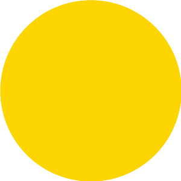

# 无标题

**链接地址:** http://mp.weixin.qq.com/s?__biz=MzUzNzQxOTI2MQ==&mid=2247484055&idx=2&sn=aca7b1e69d04006e95c1db6ec1ba5557&chksm=fae60e05cd918713953d13ae4cf9a2f7715eba3ee14977c67c935291ed4fbae744121bf4cb17&mpshare=1&scene=2&srcid=#rd
**作者:** 
**获取时间:** 2025/8/28 20:31:44
**图片数量:** 26

---

## 原始HTML内容

<section style="box-sizing: border-box;"><section style="font-size: 16px;box-sizing: border-box;" powered-by="xiumi.us"><section style="margin: 10px 0%;box-sizing: border-box;"><section style="display: inline-block;vertical-align: middle;width: 12%;box-sizing: border-box;"><section style="box-sizing: border-box;" powered-by="xiumi.us"><section style="text-align: center;margin-right: 0%;margin-left: 0%;box-sizing: border-box;"><section style="max-width: 100%;vertical-align: middle;display: inline-block;line-height: 0;width: 50%;box-sizing: border-box;"></section></section></section></section><section style="display: inline-block;vertical-align: middle;width: 88%;padding-left: 10px;box-sizing: border-box;"><section style="box-sizing: border-box;" powered-by="xiumi.us"><section style="margin-right: 0%;margin-left: 0%;box-sizing: border-box;"><section style="font-size: 14px;box-sizing: border-box;">
<strong style="box-sizing: border-box;">点击上方蓝字关注我们</strong>
</section></section></section></section></section></section><section style="box-sizing: border-box;" powered-by="xiumi.us"><section style="box-sizing: border-box;"><section style="box-sizing: border-box;">
 

<strong>来源：</strong><strong></strong><strong>多伦多华人圈&nbsp;&nbsp;&nbsp;微信号：</strong><strong></strong><strong>gtalife</strong><strong></strong> 

 

你知道吗？

加拿大蒙特利尔的西南20公里有一个小镇叫LACHINE，翻译成中文的名字就叫“中国”！可能很多人会觉得很奇怪，中国的英文名称不是“China”吗？

 

的确，一直以来西方就以china来称呼中国，与“瓷器”的英文单词是同一个。但是在加拿大，英语和法语同为官方语言，蒙特利尔则主要使用法语，法语中的“Lachine”一词并没有被机械地翻译成“The China”，即人们通常认识的英文的“中国”，而是保留了原来的Lachine的用法。所以Lachine在这里就是一个专有名词，专指“中国”。

400年前的小镇，并没有人去过中国，也没有与中国有贸易往来，“中国”之名的由来完全是源于当时人们心中的“中国梦”情结。

 

1689年，在蒙特利尔的法国皮毛商人在新法兰西政府（现在的魁北克）的支持下为了拓展其贸易通道，动议开通一条从蒙特利尔老港到蒙特利尔岛西南的直通水运航路。这就是“CHNAL LACHINE——中国运河”的最初创意。

1689年正值康熙28年，清初的中国是世界头号经济大国，被西方人看作是“天堂”。为了实现到中国的梦想，或许是为了炒作，就如同当下很多的楼盘都叫做“曼哈顿”一样，他们把运河的名字命名为“CANAL LACHINE”——中国运河。当地地名也被叫做“LACHINE——中国”。虽然法国人并没有真正修成这条运河，但它的名字却被保留下来。

<strong>- 真诚推荐 -&nbsp;</strong>

 

<strong style="font-size: 16px;white-space: normal;">- 真诚推荐 -&nbsp;</strong>

 

100多年后的1821年7月17日，英国人John Redpath开始修凿中国运河。1824年完工，1825年开始航运。上图左侧的石头房子是Lachine Fur Trade Museum——“中国毛皮贸易展览馆”。

中国运河于1960年代停止航运，运河和其停靠的船台已被加拿大政府列为国家保护历史遗址。

运河两岸被改造成风景秀丽的公园供游人参观。

运河边的这座石头房子就是毛皮贸易展览馆。1803年皮毛商人Alexander Gordon为了储运毛皮制品在此修建了这座石头仓库。

1833年该馆成为加拿大著名的哈德逊湾公司的财产。

The Fur Trade at Lachine——“中国毛皮贸易”，该馆已被列为加拿大历史遗址。

毛皮馆的后面。

在“中国”这个小镇里还有一个“Musee de Lachine”——“中国博物馆”。展出了当年的毛皮交易以及这个小城发展的历史。

该馆由皮毛商人Le Ber和 Le Moyne 于1669年-1671年所建完成，目的是为商人搭建的客栈和方便信使往来。几经转手，现已被当地政府买下，辟为博物馆。

该房已经被列为加拿大历史遗址。

石头房子是永久性展出馆，共有400多件收藏。包括锅碗瓢盆的日常用品；也有家具和钱币等早期贸易的遗迹。

“中国”小镇街里还有一个高大的“姐妹堂”——修道院。从很多的地方都可以望见这个气势磅礴的建筑。

从圣路易斯湖畔遥望对岸的姐妹堂。

如今小镇早已不再是皮毛的交易中心了，旅游已成为重要的产业，一个狭长的Rene Levesque岛嵌入蓝色圣路易斯湖中。

夏季来临，游人如织，骑单车是当地人最好的锻炼方式。

大片大片的草地，养眼的绿色。酒瓶子（男人），皮球小狗（孩子），高跟鞋（女人）象征一个和睦的家庭来此游玩。

成群的游艇可以顺着“中国运河”开出很远，一直开到圣劳伦斯河。

在天高云淡、鸟语蝉鸣的夏天，来这里走一走吧~

 

本文综合自：人文地理、天下家等

 
</section></section></section><section style="font-size: 16px;box-sizing: border-box;" powered-by="xiumi.us"><section style="text-align: center;margin-top: 10px;margin-bottom: 10px;box-sizing: border-box;"><section style="max-width: 100%;vertical-align: middle;display: inline-block;line-height: 0;box-sizing: border-box;"></section></section></section><section style="font-size: 16px;box-sizing: border-box;" powered-by="xiumi.us"><section style="margin: 34px 0% 8px;box-sizing: border-box;"><section style="background-color: rgb(105, 143, 187);height: 1px;box-sizing: border-box;"></section></section></section><section style="font-size: 16px;box-sizing: border-box;" powered-by="xiumi.us"><section style="margin: -24px 0% 10px;box-sizing: border-box;"><section style="display: inline-block;border-width: 2px;border-style: solid;border-color: rgba(255, 255, 255, 0);padding: 0.1em 0.3em;background-color: rgba(47, 101, 115, 0.85);color: rgb(255, 255, 255);font-size: 15px;line-height: 1.8;box-sizing: border-box;">
<strong style="box-sizing: border-box;">韩子鸿 / Henry</strong>
</section></section></section><section style="font-size: 16px;box-sizing: border-box;" powered-by="xiumi.us"><section style="box-sizing: border-box;"><section style="font-size: 14px;color: rgb(62, 62, 62);letter-spacing: 0px;line-height: 1.6;padding-right: 10px;padding-left: 10px;box-sizing: border-box;">
旅居加拿大17年，来到爱屯也有16年了。和大部分人一样，多年前以一个小留学生的身份来到这里，读书、打工，沉迷过游戏，也做过学生会（CSSA）会长。

 

毕业后第一份工作就职会计事务所，负责个人和企业财税会计。三年后，执着于心中对银行的热情，转投加拿大最大的银行皇家银行（Royal Bank of Canada），5年中先后就职前台，个人客户经理，资深客户经理，商业客户经理，贷款专家。多次获得嘉奖，2015年年度RBC Gold Award（Top 2%），2016年年度RBC Convention Cruise Award(Top 1%)，并负责牵头Edmonton地区华人市场企划。

 

2017年末进入房地产市场专职成为一名房地产经纪人，以自己多年生活和财税，银行方面的经验服务客户。帮助客户无论是买房卖房，还是新移民及留学生融入本地社会尽到自己力所能及的助力。对各大银行的贷款汇款政策非常熟悉，加拿大财税方面也有相当涉猎。
</section></section></section><section style="font-size: 16px;box-sizing: border-box;" powered-by="xiumi.us"><section style="margin: 10px 0%;box-sizing: border-box;"><section style="display: inline-block;width: 100%;vertical-align: top;background-color: rgba(47, 101, 115, 0.33);padding: 5px;border-width: 0px;box-sizing: border-box;"><section style="box-sizing: border-box;" powered-by="xiumi.us"><section style="box-sizing: border-box;"><section style="display: inline-block;width: 100%;vertical-align: top;padding: 5px;border-style: dashed;border-width: 1px;border-radius: 0px;border-color: rgb(255, 255, 255);box-sizing: border-box;"><section style="box-sizing: border-box;" powered-by="xiumi.us"><section style="box-sizing: border-box;"><section style="display: inline-block;width: 100%;vertical-align: top;background-color: rgb(255, 255, 255);padding: 10px;box-sizing: border-box;"><section style="box-sizing: border-box;" powered-by="xiumi.us"><section style="box-sizing: border-box;"><section style="text-align: center;font-size: 15px;color: rgb(0, 0, 0);line-height: 1.8;box-sizing: border-box;">
<strong style="box-sizing: border-box;">www.henryhanteam.com</strong>

<strong style="box-sizing: border-box;">欢迎访问我们的网站查询更多信息</strong>
</section></section></section></section></section></section></section></section></section></section></section></section><section style="font-size: 16px;box-sizing: border-box;" powered-by="xiumi.us"><section style="box-sizing: border-box;"><section style="box-sizing: border-box;">
 
</section></section></section><section style="font-size: 16px;box-sizing: border-box;" powered-by="xiumi.us"><section style="margin: 40px 0% 10px;box-sizing: border-box;"><section style="display: inline-block;width: 100%;border-width: 5px;border-style: double;border-color: rgba(47, 101, 115, 0.85);padding: 10px;border-radius: 2px;box-sizing: border-box;"><section style="box-sizing: border-box;" powered-by="xiumi.us"><section style="transform: translate3d(20px, 0px, 0px);font-size: 11px;margin-top: -50px;margin-right: 0%;margin-left: 0%;box-sizing: border-box;"><section style="box-sizing: border-box;width: 7em;height: 7em;display: inline-block;vertical-align: bottom;border-radius: 100%;border-width: 1px;border-style: double;border-color: rgba(47, 101, 115, 0.85);background-position: center center;background-repeat: no-repeat;background-size: cover;overflow: hidden;background-image: url(&quot;https://mmbiz.qpic.cn/mmbiz_png/z8ibtosSndj1YdibBLibKMaVXX5lNe14KcU43CJSZ5X9rtwxOC4xs4IkPDKoeSQ4zVRSHF80hM6y6ssE9L6wzEQicA/640?wx_fmt=png&quot;);"><section style="height: 100%;overflow: hidden;line-height: 0;vertical-align: middle;max-width: 100%;box-sizing: border-box;"></section></section></section></section><section style="box-sizing: border-box;" powered-by="xiumi.us"><section style="margin: -30px 0% 30px;box-sizing: border-box;"><section style="display: inline-block;vertical-align: top;width: 61.8%;padding-right: 15px;padding-left: 15px;box-sizing: border-box;"><section style="box-sizing: border-box;" powered-by="xiumi.us"><section style="margin: 40px 0% 10px;box-sizing: border-box;"><section style="color: rgb(160, 160, 160);font-size: 14px;box-sizing: border-box;">
<strong style="box-sizing: border-box;">爱城小喇叭</strong>

介绍埃德蒙顿生活，旅游，留学，出行，地产，商业，投资等信息。
</section></section></section></section><section style="display: inline-block;vertical-align: top;width: 38.2%;box-sizing: border-box;"><section style="box-sizing: border-box;" powered-by="xiumi.us"><section style="text-align: center;margin-top: 10px;margin-right: 0%;margin-left: 0%;box-sizing: border-box;"><section style="max-width: 100%;vertical-align: middle;display: inline-block;line-height: 0;border-width: 0px;border-radius: 0px;box-shadow: rgb(0, 0, 0) 0px 0px 0px;width: 90%;box-sizing: border-box;"></section></section></section></section></section></section><section style="box-sizing: border-box;" powered-by="xiumi.us"><section style="margin-top: -30px;margin-right: 0%;margin-left: 0%;box-sizing: border-box;"><section style="display: inline-block;vertical-align: top;width: 61.8%;padding-right: 15px;padding-left: 15px;box-sizing: border-box;"><section style="box-sizing: border-box;" powered-by="xiumi.us"><section style="transform: translate3d(5px, 0px, 0px);-webkit-transform: translate3d(5px, 0px, 0px);-moz-transform: translate3d(5px, 0px, 0px);-o-transform: translate3d(5px, 0px, 0px);box-sizing: border-box;"><section style="color: rgb(160, 160, 160);font-size: 14px;box-sizing: border-box;">
<strong style="box-sizing: border-box;">欢迎关注我们！</strong> 
</section></section></section></section><section style="display: inline-block;vertical-align: top;width: 38.2%;box-sizing: border-box;"><section style="box-sizing: border-box;" powered-by="xiumi.us"><section style="transform: translate3d(10px, 0px, 0px);-webkit-transform: translate3d(10px, 0px, 0px);-moz-transform: translate3d(10px, 0px, 0px);-o-transform: translate3d(10px, 0px, 0px);box-sizing: border-box;"><section style="text-align: center;color: rgb(160, 160, 160);font-size: 14px;box-sizing: border-box;">
 
</section></section></section></section></section></section></section></section></section></section>

---

## 纯文本内容

点击上方蓝字关注我们来源：多伦多华人圈   微信号：gtalife你知道吗？加拿大蒙特利尔的西南20公里有一个小镇叫LACHINE，翻译成中文的名字就叫“中国”！可能很多人会觉得很奇怪，中国的英文名称不是“China”吗？的确，一直以来西方就以china来称呼中国，与“瓷器”的英文单词是同一个。但是在加拿大，英语和法语同为官方语言，蒙特利尔则主要使用法语，法语中的“Lachine”一词并没有被机械地翻译成“The China”，即人们通常认识的英文的“中国”，而是保留了原来的Lachine的用法。所以Lachine在这里就是一个专有名词，专指“中国”。400年前的小镇，并没有人去过中国，也没有与中国有贸易往来，“中国”之名的由来完全是源于当时人们心中的“中国梦”情结。1689年，在蒙特利尔的法国皮毛商人在新法兰西政府（现在的魁北克）的支持下为了拓展其贸易通道，动议开通一条从蒙特利尔老港到蒙特利尔岛西南的直通水运航路。这就是“CHNAL LACHINE——中国运河”的最初创意。1689年正值康熙28年，清初的中国是世界头号经济大国，被西方人看作是“天堂”。为了实现到中国的梦想，或许是为了炒作，就如同当下很多的楼盘都叫做“曼哈顿”一样，他们把运河的名字命名为“CANAL LACHINE”——中国运河。当地地名也被叫做“LACHINE——中国”。虽然法国人并没有真正修成这条运河，但它的名字却被保留下来。- 真诚推荐 - - 真诚推荐 - 100多年后的1821年7月17日，英国人John Redpath开始修凿中国运河。1824年完工，1825年开始航运。上图左侧的石头房子是Lachine Fur Trade Museum——“中国毛皮贸易展览馆”。中国运河于1960年代停止航运，运河和其停靠的船台已被加拿大政府列为国家保护历史遗址。运河两岸被改造成风景秀丽的公园供游人参观。运河边的这座石头房子就是毛皮贸易展览馆。1803年皮毛商人Alexander Gordon为了储运毛皮制品在此修建了这座石头仓库。1833年该馆成为加拿大著名的哈德逊湾公司的财产。The Fur Trade at Lachine——“中国毛皮贸易”，该馆已被列为加拿大历史遗址。毛皮馆的后面。在“中国”这个小镇里还有一个“Musee de Lachine”——“中国博物馆”。展出了当年的毛皮交易以及这个小城发展的历史。该馆由皮毛商人Le Ber和 Le Moyne 于1669年-1671年所建完成，目的是为商人搭建的客栈和方便信使往来。几经转手，现已被当地政府买下，辟为博物馆。该房已经被列为加拿大历史遗址。石头房子是永久性展出馆，共有400多件收藏。包括锅碗瓢盆的日常用品；也有家具和钱币等早期贸易的遗迹。“中国”小镇街里还有一个高大的“姐妹堂”——修道院。从很多的地方都可以望见这个气势磅礴的建筑。从圣路易斯湖畔遥望对岸的姐妹堂。如今小镇早已不再是皮毛的交易中心了，旅游已成为重要的产业，一个狭长的Rene Levesque岛嵌入蓝色圣路易斯湖中。夏季来临，游人如织，骑单车是当地人最好的锻炼方式。大片大片的草地，养眼的绿色。酒瓶子（男人），皮球小狗（孩子），高跟鞋（女人）象征一个和睦的家庭来此游玩。成群的游艇可以顺着“中国运河”开出很远，一直开到圣劳伦斯河。在天高云淡、鸟语蝉鸣的夏天，来这里走一走吧~本文综合自：人文地理、天下家等韩子鸿 / Henry旅居加拿大17年，来到爱屯也有16年了。和大部分人一样，多年前以一个小留学生的身份来到这里，读书、打工，沉迷过游戏，也做过学生会（CSSA）会长。毕业后第一份工作就职会计事务所，负责个人和企业财税会计。三年后，执着于心中对银行的热情，转投加拿大最大的银行皇家银行（Royal Bank of Canada），5年中先后就职前台，个人客户经理，资深客户经理，商业客户经理，贷款专家。多次获得嘉奖，2015年年度RBC Gold Award（Top 2%），2016年年度RBC Convention Cruise Award(Top 1%)，并负责牵头Edmonton地区华人市场企划。2017年末进入房地产市场专职成为一名房地产经纪人，以自己多年生活和财税，银行方面的经验服务客户。帮助客户无论是买房卖房，还是新移民及留学生融入本地社会尽到自己力所能及的助力。对各大银行的贷款汇款政策非常熟悉，加拿大财税方面也有相当涉猎。www.henryhanteam.com欢迎访问我们的网站查询更多信息爱城小喇叭介绍埃德蒙顿生活，旅游，留学，出行，地产，商业，投资等信息。欢迎关注我们！

---

## 图片列表

-  (原始链接: https://mmbiz.qpic.cn/mmbiz_gif/z8ibtosSndj1YdibBLibKMaVXX5lNe14KcUCkyrJnC1IOeySVYf7uoN3Fa1feWg6P583MyZPcWRobSWI3d2s2dYyg/640?wx_fmt=gif)
-  (原始链接: https://mmbiz.qpic.cn/mmbiz_jpg/s8JrfwJOBZcYBggIXCFr1gwnWtjkqkicnpdOnqoJPrRrZdjHgRTSugC0DCETJqLyJhXrPRFD3R5wMic2SrWNlibdQ/640?wx_fmt=jpeg)
-  (原始链接: https://mmbiz.qpic.cn/mmbiz_jpg/s8JrfwJOBZcYBggIXCFr1gwnWtjkqkicnjJR9wOEYEyBNYibItPwUx9rPpflJDSVI0qvr2IpnJficic6Ajriac3knTQ/640?wx_fmt=jpeg)
-  (原始链接: https://mmbiz.qpic.cn/mmbiz_jpg/z8ibtosSndj0ibBVeflRTibY2c3shfRzKRgIMCAn124ccwiboPXQfg4l4S2B0rRukiaq5DxNIGNBcly0woUvEetG4qA/640?wx_fmt=jpeg)
-  (原始链接: https://mmbiz.qpic.cn/mmbiz_jpg/s8JrfwJOBZcYBggIXCFr1gwnWtjkqkicnVt5iauQu6SANtK9k3zYoLCkjXbzKSxB5PEuWntwzwpiaYK8UAonh8uXQ/640?wx_fmt=jpeg)
-  (原始链接: https://mmbiz.qpic.cn/mmbiz_jpg/s8JrfwJOBZcYBggIXCFr1gwnWtjkqkicnPH8jk9YU2ZuNw5Gx7cWs9ibZrsT0TrJDTZiaaZW3sxml2qO7hxickls8A/640?wx_fmt=jpeg)
-  (原始链接: https://mmbiz.qpic.cn/mmbiz_jpg/s8JrfwJOBZcYBggIXCFr1gwnWtjkqkicnhribZnQPdkWmicJUI1kibiaO441YdxvbHKHibdkGGfpu2lYaIu1hDlLkuuw/640?wx_fmt=jpeg)
-  (原始链接: https://mmbiz.qpic.cn/mmbiz_jpg/s8JrfwJOBZcYBggIXCFr1gwnWtjkqkicnOcMIbhwlkt0WbdBoMfb04Cj3ZicjWUcqe4BLYSFY41tZ1Fialrn6tNaw/640?wx_fmt=jpeg)
-  (原始链接: https://mmbiz.qpic.cn/mmbiz_jpg/s8JrfwJOBZcYBggIXCFr1gwnWtjkqkicnQCVuq0w2z4oINQOpibrzqhxw6ECOc27HfGfYckkPnmhfia754oht0TkA/640?wx_fmt=jpeg)
-  (原始链接: https://mmbiz.qpic.cn/mmbiz_jpg/s8JrfwJOBZcYBggIXCFr1gwnWtjkqkicnbibUkSE8CdYLhVU8Ll8DBmjicGnpQbuMRqXOVmYicax7BnyAEOBKA6RgA/640?wx_fmt=jpeg)
-  (原始链接: https://mmbiz.qpic.cn/mmbiz_jpg/s8JrfwJOBZcYBggIXCFr1gwnWtjkqkicnicqeiao89ZIs2R2aMoZiabLxFE0w81iaajuGicicvZut5RwZUd1rXlMxrsRg/640?wx_fmt=jpeg)
-  (原始链接: https://mmbiz.qpic.cn/mmbiz_jpg/s8JrfwJOBZcYBggIXCFr1gwnWtjkqkicnJgxVDWoWKVvXyrz7pjSub13wdf6CiarsDcldb9kPZlLxL52YMRfzEkg/640?wx_fmt=jpeg)
-  (原始链接: https://mmbiz.qpic.cn/mmbiz_jpg/s8JrfwJOBZcYBggIXCFr1gwnWtjkqkicnmV5oYhE2u9GUyLvrxTWConnxLGFlLeU2TLBtZXgtdRj91C3rwhCGdw/640?wx_fmt=jpeg)
-  (原始链接: https://mmbiz.qpic.cn/mmbiz_jpg/s8JrfwJOBZcYBggIXCFr1gwnWtjkqkicnCMG4p38Mlibb6zqNibibHVLuhr6llBFTJ55xXSfwhzyicWRuh0iaXeO481w/640?wx_fmt=jpeg)
-  (原始链接: https://mmbiz.qpic.cn/mmbiz_jpg/s8JrfwJOBZcYBggIXCFr1gwnWtjkqkicnfYDFN3HZsu92XlCl75cjCaDUwjjKA6MEOG61SGKNLiaEkTDoia0sVudA/640?wx_fmt=jpeg)
-  (原始链接: https://mmbiz.qpic.cn/mmbiz_jpg/s8JrfwJOBZcYBggIXCFr1gwnWtjkqkicnA16CM3wDNqeOaUVZLFJWzlPdKXjuP5pPI39ZCGeUcXWNQ6DxPn2EvQ/640?wx_fmt=jpeg)
-  (原始链接: https://mmbiz.qpic.cn/mmbiz_jpg/s8JrfwJOBZcYBggIXCFr1gwnWtjkqkicnOoTh3nRy9xLZ1bW5wSQn4NicUCEKWuC2YvibYnODKnsU3PQbDWZIJib9g/640?wx_fmt=jpeg)
-  (原始链接: https://mmbiz.qpic.cn/mmbiz_jpg/s8JrfwJOBZcYBggIXCFr1gwnWtjkqkicnriclNWGniaX8JvV1tzgMpkArhUiaznKNISRRFs6XWqIcwh1frUUXFu0XA/640?wx_fmt=jpeg)
-  (原始链接: https://mmbiz.qpic.cn/mmbiz_jpg/s8JrfwJOBZcYBggIXCFr1gwnWtjkqkicnp15Dm3qhiah187HLtdMwCxI4lTmmiatIQq8Tp6ia4tko5nQNGAqNKhZEQ/640?wx_fmt=jpeg)
-  (原始链接: https://mmbiz.qpic.cn/mmbiz_jpg/s8JrfwJOBZcYBggIXCFr1gwnWtjkqkicnHr8d8eCUzINtcK4hbFBpriaZo59MyF8icBXRjKe2ibgialPN8Q7OgWCqWQ/640?wx_fmt=jpeg)
-  (原始链接: https://mmbiz.qpic.cn/mmbiz_jpg/s8JrfwJOBZcYBggIXCFr1gwnWtjkqkicnBaeEITEnt1gPMBwacPqtgUL9rpGb9iaYEWU2jhA3PbDsVh3jhAic0RdQ/640?wx_fmt=jpeg)
-  (原始链接: https://mmbiz.qpic.cn/mmbiz_jpg/s8JrfwJOBZcYBggIXCFr1gwnWtjkqkicn7vXib09XGuY0wp76Co6FIiaM3HoqMhmOhHmFiaVUaKT9xxY3RVtoiatx0Q/640?wx_fmt=jpeg)
-  (原始链接: https://mmbiz.qpic.cn/mmbiz_jpg/s8JrfwJOBZcYBggIXCFr1gwnWtjkqkicn8UXSpe6xch5Oiad4NyEFFyALibRibO7aEeEyDzwx53Uibdbzw7SibCX3QSg/640?wx_fmt=jpeg)
-  (原始链接: https://mmbiz.qpic.cn/mmbiz_jpg/z8ibtosSndj1YdibBLibKMaVXX5lNe14KcUIaUZEqO7jNzo4CIguxOFZh4ibicKuwogcqdPc5nqibUsqzFial7icGib4hhw/640?wx_fmt=jpeg)
-  (原始链接: https://mmbiz.qpic.cn/mmbiz_png/z8ibtosSndj1YdibBLibKMaVXX5lNe14KcU43CJSZ5X9rtwxOC4xs4IkPDKoeSQ4zVRSHF80hM6y6ssE9L6wzEQicA/640?wx_fmt=png)
-  (原始链接: https://mmbiz.qpic.cn/mmbiz_jpg/z8ibtosSndj1YdibBLibKMaVXX5lNe14KcUVVrtdiaMv2q2XCY5AmmzRYFX5J9HPYZVxuzQJhRr8icpfCPHTK0vpv4Q/640?wx_fmt=jpeg)
