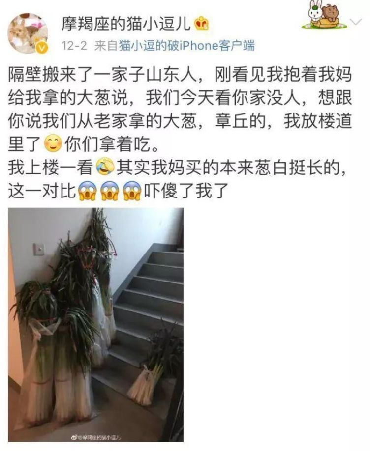

# 无标题

**链接地址:** http://mp.weixin.qq.com/s?__biz=MzI2OTA3MTA5Mg==&mid=2651803270&idx=1&sn=b6e8e9bfae9d11fe430dd714da19ed3b&chksm=f11e091dc669800bb3a96b318f87022657d209e6d2637b560773103a5872eed304162c952719&mpshare=1&scene=2&srcid=&sharer_sharetime=1564085164565&sharer_shareid=be1c8edd6c93eec155a61c876e41d26a#rd
**作者:** 宋温暖
**获取时间:** 2025/8/28 20:31:03
**图片数量:** 34

---

## 原始HTML内容

这是&nbsp;新世相&nbsp;的第&nbsp;1015&nbsp;篇文章 

 

 

<strong>Sayings：</strong> 

<strong> </strong>

今天想讨论一个神秘的现象：

 

山东人到底有多大。

 

从身高体型到饭量酒量，

从气场脾气到心胸格局，

<strong>山东人，整体就一个字，大。</strong>

 

<strong>（当然，我们在群里还讨论出了一些别的）</strong>

 

如果只是表面的大就没什么可多说的了，关键是——

 

山东人表达对世人的爱，一个重要的尺度就是，要够大。

 

这一点，是我的同事宋温暖发现的。这个从小在山东长大的姑娘，伟岸地站在我身边，基本没怎么费力，就发出了很大一声：

 

“来！让你们看看，山东人怎么挖掘你们的心。”

<strong> </strong>

 

<strong>山东人为什么这么大</strong> 

作者：宋温暖

 

 

一 

 

作为一个在外地的山东人，我听说过这么一句话：

 

<strong>你的人际圈子混得怎么样，就看这几天有没有人给你送山东大樱桃了。</strong> 

 

在微博上搜了一下，果然如此。

 

按我们山东的礼仪，就是送你的樱桃越大，对你情谊越重的意思。

 

比硬币还要大：

 

大到盆里都放不下：

 

比起你自己平时吃的樱桃，更是大上加大：

说实话，这个道理我也是这几年才反应过来：

 

<strong>山东人表达爱，最重要的尺度，就是&nbsp;“大”。</strong><strong></strong> 

 

如果山东人要送你煎饼，那会是一张世界地图那么大的煎饼。 

 

如果山东人要送你大葱，那必然是一根能在外地称王的大葱。 

 

如果你的山东同事要给你吃大枣，那必定是一个能让你吃饱的大枣。

 

 

前阵子有个选秀，选手在青岛录了几个月的封闭式节目，终于要结束离开了。

 

临别前，热情的山东粉丝送了他们三个大馒头。

 

比头还大的馒头。

 

我查了一下，发现类似的馒头确实很厚重。

 

实心的，戳都戳不动。

 

 

山东人大，也许就在于山东人的大爱。 

 

喜欢你，我就把最大的东西都给你。 

 

 

 

二

 

据不权威统计，山东人的平均身高还是全国第一。

 

 

<strong>所以，山东人的饭量确实也很大。</strong> 

 

黄渤早些年吃大饼，形容词是“这么大一张”。 

黄晓明上综艺，吃饭时永远表现出意犹未尽的渴望。 

 

 

一位南方朋友，经常跟山东同事一起搭伙。

 

结果就是，聊天记录最常出现的是“点个大的”。

 

 

点的最大的一次，他们在公司休息区吃了一套鲍鱼饭、一份猪肚鸡、一份焖排骨。

 

进食时间长达 1 个小时。 

 

朋友 Dora 的山东老板，还会热情叮嘱大家： 

 

“早餐不去食堂不吃两个馒头加一个鸡蛋不用来上班了，都别给我省！”&nbsp;

 

 

连带着山东人的咬合肌都变大了。 

 

说起吃，我就想起了喝。

 

东北人敢喝，但山东人才是能喝。能喝还不够，关键是能一直喝。

 

在山东，没有3个小时能结束的酒局。

 

俗话说的好，青岛不倒我不倒，雪花不飘我不飘。

 

在山东的酒桌上，敬酒，他们是认真的。我们山东人的口号是：喝酒不喝醉，安排不到位。

 

头陪敬，三口喝干一杯，二陪敬，两口喝干一杯，三陪敬，一口干一杯。你以为这一轮告一段落了，四陪这时候就会站起来说，“一条大河波浪宽，端起这杯咱就干”，你说干不干。

 

有个姑娘去山东同学家玩，突然口渴，对方直接递过来一罐啤酒，渴了就继续喝！

 

如果说四川人的妥协是“好嘛，那就鸳鸯锅”，那青岛人的妥协则是“行行行，换啤的”。

 

——了解他们的酒量之后，你就能体会，这是山东人能说出的最感人的一句话。充分体现了他们对外地人的体谅和迁就。

 

<strong style="font-family: mp-quote, -apple-system-font, BlinkMacSystemFont, &quot;Helvetica Neue&quot;, &quot;PingFang SC&quot;, &quot;Hiragino Sans GB&quot;, &quot;Microsoft YaHei UI&quot;, &quot;Microsoft YaHei&quot;, Arial, sans-serif;">当然，在吃喝方面，山东人最大的还是胆子。</strong> 

 

崂山白花蛇草水你知道吧，就是那个喝下去像抹布，又像 50 个大汉腋下汗水，同时又像“带刺的尿”&nbsp;的饮料。

 

崂山白花蛇草水，记住，made in山东。

 

如果你觉得人生很失败，饮下此水，山东人把胆子借你。

 

 

 

三 

 

山东男孩的心也很大。黄子韬是表现最为显著的代表。

 

只有你想不到的夸奖，没有他们不敢接受的称赞。

 

——你家里最酷最宝贝的东西是什么？ 

——我。

 

——别人说你是天才怎么办？ 

——我也把我自己当天才。

 

——我觉得鹿晗比你帅一点点。

——但我的魅力独一无二。

 

别的明星的爆料都是生活八卦，情感绯闻，再看山东男孩的爆料，长这样： 

这要求朴实得让人想落泪。

 

而且，山东男孩心大到，连谈恋爱都阻挡不了他的发挥。 

 

 

更让人佩服的是，作为全中国存在感不相上下的两个竞争群体，

<strong> </strong>

<strong>山东人心大起来，连东北人都怕。</strong>

 

正常人卖蜂蜜是这样的：

 

 

东北人卖蜂蜜是这样的：

 

 

而我们山东人，是这样的：

 

 

<strong>你见过把实在写到脸上的人吗？</strong>

<strong> </strong>

<strong>我们山东人就是这样。</strong>

 

当然了，我们实在也实在得很有底气。

 

比如那些山东籍女明星： 

 

巩俐，范冰冰，张雨绮，宋佳......

 

光听名字，你就感受到这股气场了吧？

 

刚刚公布的威尼斯电影节片单里，巩俐出演的《兰心大剧院》入围主竞赛单元。

 

算上今年，这已经是她第十二次入围了。

 

巩皇，果然不是随便叫叫的。

 

 

张雨绮在《我和我的经纪人》里说，自己八十岁，还会站在舞台上的。 

 

我们大山东人，就是这么有自信。 

 

 

 

四

 

总之，跟山东人在一起，没听两句，你由衷的敬佩就来了。

 

<strong>因为山东人敢想敢做，雄心大，目标大。</strong>

 

《水浒传》一百零八条好汉里，山东籍就有38人，占1/3。 

 

你可能不知道这有多不容易，山东人参加的任何场合，都是“神仙打架”。

 

比如高考，如果一个山东人说自己只考了 550 多分，那他一定是咬牙切齿地考砸了。

&nbsp; 

&nbsp; &nbsp; &nbsp; &nbsp;

 

山东还是公务员报考大省，今年省考，山东的竞争比是 80：1，这背后是无数山东学子的厮杀。

 

&nbsp; &nbsp; &nbsp;&nbsp;&nbsp;&nbsp; &nbsp; &nbsp;&nbsp;

所以，如果你找了一个山东女朋友，你要注意，你很快也会被传染这种强大的意志力。

 

因为，一个山东爹第一次见女婿，就会直击人心地刺激他。 

 

女婿说：我努力买套房。

<strong>山东爹说：什么叫努力买套房，是<strong style="max-width: 100%;box-sizing: border-box !important;overflow-wrap: break-word !important;">一定</strong>买套房。</strong>

然后你就说：好，一定买套房。

<strong>山东爹说：<strong style="max-width: 100%;box-sizing: border-box !important;overflow-wrap: break-word !important;">一套能够吗。</strong><strong style="max-width: 100%;box-sizing: border-box !important;overflow-wrap: break-word !important;"></strong></strong>

然后女婿就斩钉截铁地说：那起码买两套！

 

 

五

 

如果你是山东人的朋友，那山东人会让你一秒回到家。

 

<strong>因为他们的热情太大了。</strong>

<strong> </strong>

我的一位同事，曾经加班后发现没带家门钥匙，无奈之下，向山东女同事发出了微信求助。

 

接下来发生的事情，总共分三步。

 

—— 她来到小区，发现山东女孩已经来小区门口迎接了。

 

—— 进屋之后，山东女孩已经给她准备好新的睡衣、眼罩了。

 

—— 洗完脸刚从厕所出来，山东女孩冲她欢快地伸出手，手里是擦脸巾和护肤品，“来，擦！”

 

这一切都是在凌晨 4 点发生的。

 

从此大家对整个山东地区都充满了敬意：

 

 

 

<strong>这就是山东人，俗称大好人。</strong>

 

如果你来了山东，更得让你宾至如归。

 

比如说，我家在泰安，我已经分别陪 15 个朋友上上下下来来回回爬过泰山了，吃住全包，全程陪同。

 

山东人其实从不满足于自己独大。

 

山东人希望你也能一起享受大大的快乐。

 

在山东的时候，我曾经也摸摸地嫌弃过山东的质朴。

 

直到我来到其他地方，才发现只有山东人能挖掘我的心。

 

没人能和山东人比大。

 

山东人最深沉的爱，都用大来表示了。

 

 

<strong style="max-width: 100%;font-size: 15px;box-sizing: border-box !important;overflow-wrap: break-word !important;"></strong> 

 

<strong style="max-width: 100%;box-sizing: border-box !important;overflow-wrap: break-word !important;"><strong style="max-width: 100%;box-sizing: border-box !important;overflow-wrap: break-word !important;">晚祷时刻：</strong></strong>

 

<strong>比大，山东人就没输过。</strong>

<strong style="max-width: 100%;font-family: mp-quote, -apple-system-font, BlinkMacSystemFont, &quot;Helvetica Neue&quot;, &quot;PingFang SC&quot;, &quot;Hiragino Sans GB&quot;, &quot;Microsoft YaHei UI&quot;, &quot;Microsoft YaHei&quot;, Arial, sans-serif;letter-spacing: 0.544px;font-size: 15px;box-sizing: border-box !important;overflow-wrap: break-word !important;"><strong style="max-width: 100%;letter-spacing: 2px;color: rgb(255, 255, 255);box-sizing: border-box !important;overflow-wrap: break-word !important;">谢谢山东人，</strong></strong>

<strong style="max-width: 100%;font-family: mp-quote, -apple-system-font, BlinkMacSystemFont, &quot;Helvetica Neue&quot;, &quot;PingFang SC&quot;, &quot;Hiragino Sans GB&quot;, &quot;Microsoft YaHei UI&quot;, &quot;Microsoft YaHei&quot;, Arial, sans-serif;letter-spacing: 0.544px;font-size: 15px;box-sizing: border-box !important;overflow-wrap: break-word !important;"><strong style="max-width: 100%;letter-spacing: 2px;color: rgb(255, 255, 255);box-sizing: border-box !important;overflow-wrap: break-word !important;">你</strong></strong><strong style="letter-spacing: 0.544px;max-width: 100%;font-family: mp-quote, -apple-system-font, BlinkMacSystemFont, &quot;Helvetica Neue&quot;, &quot;PingFang SC&quot;, &quot;Hiragino Sans GB&quot;, &quot;Microsoft YaHei UI&quot;, &quot;Microsoft YaHei&quot;, Arial, sans-serif;font-size: 15px;box-sizing: border-box !important;overflow-wrap: break-word !important;"><strong style="max-width: 100%;letter-spacing: 2px;color: rgb(255, 255, 255);box-sizing: border-box !important;overflow-wrap: break-word !important;">挖掘了我的心</strong></strong><strong style="letter-spacing: 0.544px;font-family: mp-quote, -apple-system-font, BlinkMacSystemFont, &quot;Helvetica Neue&quot;, &quot;PingFang SC&quot;, &quot;Hiragino Sans GB&quot;, &quot;Microsoft YaHei UI&quot;, &quot;Microsoft YaHei&quot;, Arial, sans-serif;max-width: 100%;font-size: 15px;box-sizing: border-box !important;overflow-wrap: break-word !important;"><strong style="max-width: 100%;letter-spacing: 2px;color: rgb(255, 255, 255);box-sizing: border-box !important;overflow-wrap: break-word !important;"><strong style="max-width: 100%;letter-spacing: 0.544px;font-family: mp-quote, -apple-system-font, BlinkMacSystemFont, &quot;Helvetica Neue&quot;, &quot;PingFang SC&quot;, &quot;Hiragino Sans GB&quot;, &quot;Microsoft YaHei UI&quot;, &quot;Microsoft YaHei&quot;, Arial, sans-serif;font-size: 15px;box-sizing: border-box !important;overflow-wrap: break-word !important;"><strong style="max-width: 100%;letter-spacing: 2px;box-sizing: border-box !important;overflow-wrap: break-word !important;">↓</strong></strong><strong style="max-width: 100%;letter-spacing: 0.544px;font-family: mp-quote, -apple-system-font, BlinkMacSystemFont, &quot;Helvetica Neue&quot;, &quot;PingFang SC&quot;, &quot;Hiragino Sans GB&quot;, &quot;Microsoft YaHei UI&quot;, &quot;Microsoft YaHei&quot;, Arial, sans-serif;font-size: 15px;box-sizing: border-box !important;overflow-wrap: break-word !important;"><strong style="max-width: 100%;letter-spacing: 2px;box-sizing: border-box !important;overflow-wrap: break-word !important;">↓</strong></strong><strong style="max-width: 100%;letter-spacing: 0.544px;font-family: mp-quote, -apple-system-font, BlinkMacSystemFont, &quot;Helvetica Neue&quot;, &quot;PingFang SC&quot;, &quot;Hiragino Sans GB&quot;, &quot;Microsoft YaHei UI&quot;, &quot;Microsoft YaHei&quot;, Arial, sans-serif;font-size: 15px;box-sizing: border-box !important;overflow-wrap: break-word !important;"><strong style="max-width: 100%;letter-spacing: 2px;box-sizing: border-box !important;overflow-wrap: break-word !important;">↓</strong></strong></strong></strong>

---

## 纯文本内容

这是 新世相 的第 1015 篇文章Sayings：今天想讨论一个神秘的现象：山东人到底有多大。从身高体型到饭量酒量，从气场脾气到心胸格局，山东人，整体就一个字，大。（当然，我们在群里还讨论出了一些别的）如果只是表面的大就没什么可多说的了，关键是——山东人表达对世人的爱，一个重要的尺度就是，要够大。这一点，是我的同事宋温暖发现的。这个从小在山东长大的姑娘，伟岸地站在我身边，基本没怎么费力，就发出了很大一声：“来！让你们看看，山东人怎么挖掘你们的心。”山东人为什么这么大作者：宋温暖一作为一个在外地的山东人，我听说过这么一句话：你的人际圈子混得怎么样，就看这几天有没有人给你送山东大樱桃了。在微博上搜了一下，果然如此。按我们山东的礼仪，就是送你的樱桃越大，对你情谊越重的意思。比硬币还要大：大到盆里都放不下：比起你自己平时吃的樱桃，更是大上加大：说实话，这个道理我也是这几年才反应过来：山东人表达爱，最重要的尺度，就是 “大”。如果山东人要送你煎饼，那会是一张世界地图那么大的煎饼。如果山东人要送你大葱，那必然是一根能在外地称王的大葱。如果你的山东同事要给你吃大枣，那必定是一个能让你吃饱的大枣。前阵子有个选秀，选手在青岛录了几个月的封闭式节目，终于要结束离开了。临别前，热情的山东粉丝送了他们三个大馒头。比头还大的馒头。我查了一下，发现类似的馒头确实很厚重。实心的，戳都戳不动。山东人大，也许就在于山东人的大爱。喜欢你，我就把最大的东西都给你。二据不权威统计，山东人的平均身高还是全国第一。所以，山东人的饭量确实也很大。黄渤早些年吃大饼，形容词是“这么大一张”。黄晓明上综艺，吃饭时永远表现出意犹未尽的渴望。一位南方朋友，经常跟山东同事一起搭伙。结果就是，聊天记录最常出现的是“点个大的”。点的最大的一次，他们在公司休息区吃了一套鲍鱼饭、一份猪肚鸡、一份焖排骨。进食时间长达 1 个小时。朋友 Dora 的山东老板，还会热情叮嘱大家：“早餐不去食堂不吃两个馒头加一个鸡蛋不用来上班了，都别给我省！” 连带着山东人的咬合肌都变大了。说起吃，我就想起了喝。东北人敢喝，但山东人才是能喝。能喝还不够，关键是能一直喝。在山东，没有3个小时能结束的酒局。俗话说的好，青岛不倒我不倒，雪花不飘我不飘。在山东的酒桌上，敬酒，他们是认真的。我们山东人的口号是：喝酒不喝醉，安排不到位。头陪敬，三口喝干一杯，二陪敬，两口喝干一杯，三陪敬，一口干一杯。你以为这一轮告一段落了，四陪这时候就会站起来说，“一条大河波浪宽，端起这杯咱就干”，你说干不干。有个姑娘去山东同学家玩，突然口渴，对方直接递过来一罐啤酒，渴了就继续喝！如果说四川人的妥协是“好嘛，那就鸳鸯锅”，那青岛人的妥协则是“行行行，换啤的”。——了解他们的酒量之后，你就能体会，这是山东人能说出的最感人的一句话。充分体现了他们对外地人的体谅和迁就。当然，在吃喝方面，山东人最大的还是胆子。崂山白花蛇草水你知道吧，就是那个喝下去像抹布，又像 50 个大汉腋下汗水，同时又像“带刺的尿” 的饮料。崂山白花蛇草水，记住，made in山东。如果你觉得人生很失败，饮下此水，山东人把胆子借你。三山东男孩的心也很大。黄子韬是表现最为显著的代表。只有你想不到的夸奖，没有他们不敢接受的称赞。——你家里最酷最宝贝的东西是什么？——我。——别人说你是天才怎么办？——我也把我自己当天才。——我觉得鹿晗比你帅一点点。——但我的魅力独一无二。别的明星的爆料都是生活八卦，情感绯闻，再看山东男孩的爆料，长这样：这要求朴实得让人想落泪。而且，山东男孩心大到，连谈恋爱都阻挡不了他的发挥。更让人佩服的是，作为全中国存在感不相上下的两个竞争群体，山东人心大起来，连东北人都怕。正常人卖蜂蜜是这样的：东北人卖蜂蜜是这样的：而我们山东人，是这样的：你见过把实在写到脸上的人吗？我们山东人就是这样。当然了，我们实在也实在得很有底气。比如那些山东籍女明星：巩俐，范冰冰，张雨绮，宋佳......光听名字，你就感受到这股气场了吧？刚刚公布的威尼斯电影节片单里，巩俐出演的《兰心大剧院》入围主竞赛单元。算上今年，这已经是她第十二次入围了。巩皇，果然不是随便叫叫的。张雨绮在《我和我的经纪人》里说，自己八十岁，还会站在舞台上的。我们大山东人，就是这么有自信。四总之，跟山东人在一起，没听两句，你由衷的敬佩就来了。因为山东人敢想敢做，雄心大，目标大。《水浒传》一百零八条好汉里，山东籍就有38人，占1/3。你可能不知道这有多不容易，山东人参加的任何场合，都是“神仙打架”。比如高考，如果一个山东人说自己只考了 550 多分，那他一定是咬牙切齿地考砸了。        山东还是公务员报考大省，今年省考，山东的竞争比是 80：1，这背后是无数山东学子的厮杀。             所以，如果你找了一个山东女朋友，你要注意，你很快也会被传染这种强大的意志力。因为，一个山东爹第一次见女婿，就会直击人心地刺激他。女婿说：我努力买套房。山东爹说：什么叫努力买套房，是一定买套房。然后你就说：好，一定买套房。山东爹说：一套能够吗。然后女婿就斩钉截铁地说：那起码买两套！五如果你是山东人的朋友，那山东人会让你一秒回到家。因为他们的热情太大了。我的一位同事，曾经加班后发现没带家门钥匙，无奈之下，向山东女同事发出了微信求助。接下来发生的事情，总共分三步。—— 她来到小区，发现山东女孩已经来小区门口迎接了。—— 进屋之后，山东女孩已经给她准备好新的睡衣、眼罩了。—— 洗完脸刚从厕所出来，山东女孩冲她欢快地伸出手，手里是擦脸巾和护肤品，“来，擦！”这一切都是在凌晨 4 点发生的。从此大家对整个山东地区都充满了敬意：这就是山东人，俗称大好人。如果你来了山东，更得让你宾至如归。比如说，我家在泰安，我已经分别陪 15 个朋友上上下下来来回回爬过泰山了，吃住全包，全程陪同。山东人其实从不满足于自己独大。山东人希望你也能一起享受大大的快乐。在山东的时候，我曾经也摸摸地嫌弃过山东的质朴。直到我来到其他地方，才发现只有山东人能挖掘我的心。没人能和山东人比大。山东人最深沉的爱，都用大来表示了。晚祷时刻：比大，山东人就没输过。谢谢山东人，你挖掘了我的心↓↓↓

---

## 图片列表

-  (原始链接: https://mmbiz.qpic.cn/mmbiz_png/5ROs96OaibIkFbSM1lSCmtrNqflsxyhOmjFpoZ3YCSnhDC6C4CLVx6w7Z0pjMTpbGez0mmxR5a7ah5fQ2MIOfGA/640?wx_fmt=png)
-  (原始链接: https://mmbiz.qpic.cn/mmbiz_jpg/5ROs96OaibIkFbSM1lSCmtrNqflsxyhOmIwtOOwqHXb1h0qGqkDD3TxLCTNJ9kfHvIobHRCZ21hk2ia3YVXyvg1Q/640?wx_fmt=jpeg)
-  (原始链接: https://mmbiz.qpic.cn/mmbiz_jpg/5ROs96OaibIkFbSM1lSCmtrNqflsxyhOmzXOlUgI2qgNVMbdTzHU9icdO3Fr5ial5GUf6OXmw3qATlgEUslBcAVEg/640?wx_fmt=jpeg)
-  (原始链接: https://mmbiz.qpic.cn/mmbiz_png/5ROs96OaibIkFbSM1lSCmtrNqflsxyhOm0pPHTGJibDsLfrkVDZYvGBCeQpyG5KNiaCLb5moygaR1ILicicDJlP5k8A/640?wx_fmt=png)
-  (原始链接: https://mmbiz.qpic.cn/mmbiz_jpg/5ROs96OaibIkFbSM1lSCmtrNqflsxyhOmaH5Lp99mNcnnLs41zFpDAuuR21ibU3GM367amQX9QQgFce1WLJJfcbA/640?wx_fmt=jpeg)
-  (原始链接: https://mmbiz.qpic.cn/mmbiz_png/5ROs96OaibIkFbSM1lSCmtrNqflsxyhOmUk3ITnR1O189uuuqibKlUdkHOjerwETaTtZHLianASblpSyZ3BFCygdQ/640?wx_fmt=png)
-  (原始链接: https://mmbiz.qpic.cn/mmbiz_png/5ROs96OaibIkFbSM1lSCmtrNqflsxyhOmzicUyOaKnvodnCXvrTo03icUSRMpBOiaJndoy2nYbVPWlkM94s5JHsetQ/640?wx_fmt=png)
-  (原始链接: https://mmbiz.qpic.cn/mmbiz_jpg/5ROs96OaibIkFbSM1lSCmtrNqflsxyhOmTyVxWwOJoVWswxxcJ5eQ7JEibwbfyHYxlPUrxLk2BG9HuibGiakrsUv2g/640?wx_fmt=jpeg)
-  (原始链接: https://mmbiz.qpic.cn/mmbiz_jpg/5ROs96OaibIkFbSM1lSCmtrNqflsxyhOmibe5aNyLVKK7H2PHVy9sias8ysC1AngwQ7PibeQ8XVIlaOGG6HFqSj0Bw/640?wx_fmt=jpeg)
-  (原始链接: https://mmbiz.qpic.cn/mmbiz_png/5ROs96OaibIkFbSM1lSCmtrNqflsxyhOmVrSxTK0ercl5vrOKsA3vUDkpiaP7OGEjTibLdOAdNVrzCh1Yg7jxPCLQ/640?wx_fmt=png)
-  (原始链接: https://mmbiz.qpic.cn/mmbiz_jpg/5ROs96OaibIkFbSM1lSCmtrNqflsxyhOmAc3iasSuFUQIC1QIue6FEdjqsjSnAUhE8mOOm1iartcJBI14oCPlT61w/640?wx_fmt=jpeg)
-  (原始链接: https://mmbiz.qpic.cn/mmbiz_gif/5ROs96OaibIkFbSM1lSCmtrNqflsxyhOmAzhSSfppCwnFKQGy5sMbu1CEOzGWXib3203h9icZib8YxyfDeOaWgLuTg/640?wx_fmt=gif)
-  (原始链接: https://mmbiz.qpic.cn/mmbiz_gif/5ROs96OaibIkFbSM1lSCmtrNqflsxyhOmchBic3ggxoyH26BCibVz88JV7iaKdfxyZiaxSfFVUeM0aKkicSUZscVWN8A/640?wx_fmt=gif)
-  (原始链接: https://mmbiz.qpic.cn/mmbiz_gif/5ROs96OaibIkFbSM1lSCmtrNqflsxyhOmhibtsEUwEkFZI3I6sWKDXMx0s4qNZ34iaBx8FYWRqnhXUYiaDbnwwVgYg/640?wx_fmt=gif)
-  (原始链接: https://mmbiz.qpic.cn/mmbiz_jpg/5ROs96OaibIkFbSM1lSCmtrNqflsxyhOmwogjnNjSrcA2hnkH931vOmtrnT7IXfHo3Ju8VQBhzYD1ccP1XIGQCA/640?wx_fmt=jpeg)
-  (原始链接: https://mmbiz.qpic.cn/mmbiz_jpg/5ROs96OaibIkFbSM1lSCmtrNqflsxyhOmYA13VbK6FibHc5DbsDyBmly2icncjl3iaXfvDlxbK6mUw32B5nic4VUyicg/640?wx_fmt=jpeg)
-  (原始链接: https://mmbiz.qpic.cn/mmbiz_jpg/5ROs96OaibIkFbSM1lSCmtrNqflsxyhOmuRufBKbJaY2zATefDmGFLpdfWqeVZSZ4I3pDVKCfFE2Rkiaa0ianiaSBA/640?wx_fmt=jpeg)
-  (原始链接: https://mmbiz.qpic.cn/mmbiz_png/5ROs96OaibIkFbSM1lSCmtrNqflsxyhOmKGmUwaSGrftSO6LlGQxtrYJZLauPDEwl8q4jZknMYP2s7YLdk9SOLg/640?wx_fmt=png)
-  (原始链接: https://mmbiz.qpic.cn/mmbiz_png/5ROs96OaibIkFbSM1lSCmtrNqflsxyhOm4CjVHLhiaM9wkyfniaVPyF0oga0ON86uJjv0kFE4QfAkj5LoxwibPoWrw/640?wx_fmt=png)
-  (原始链接: https://mmbiz.qpic.cn/mmbiz_png/5ROs96OaibIkFbSM1lSCmtrNqflsxyhOmNNp9tbRE7oGYYswR8jiaibVGDicev7MjLb13Xc7dwBxXVJ4dOU1iaodVKA/640?wx_fmt=png)
-  (原始链接: https://mmbiz.qpic.cn/mmbiz_png/5ROs96OaibIkFbSM1lSCmtrNqflsxyhOmlicicep53pzDdKyd618AicxgibA0AxiaKKS3VL0WyHsicoa1TjgmwGPrsSOw/640?wx_fmt=png)
-  (原始链接: https://mmbiz.qpic.cn/mmbiz_jpg/5ROs96OaibIkFbSM1lSCmtrNqflsxyhOmVXjibRCZUUlyjp9TltIFicv4WeGXd4k9DSOt90lrP355XqxYq91o1bicg/640?wx_fmt=jpeg)
-  (原始链接: https://mmbiz.qpic.cn/mmbiz_jpg/5ROs96OaibIkFbSM1lSCmtrNqflsxyhOmDbQWysc1kibcTM2RrBpkzTmRJIG90fl4Wz8oLKvU8zWjQExmL01q83Q/640?wx_fmt=jpeg)
-  (原始链接: https://mmbiz.qpic.cn/mmbiz_jpg/5ROs96OaibIkFbSM1lSCmtrNqflsxyhOmnhG6g5oNu5x2RDYUlMPRtAgUTFrNoN31qmTdyDLT6nmlXnpMcjF8kg/640?wx_fmt=jpeg)
-  (原始链接: https://mmbiz.qpic.cn/mmbiz_jpg/5ROs96OaibIkFbSM1lSCmtrNqflsxyhOmMqtxnpd30XOmuGRHFaRmyUZibelicxlnUtSgMLUVNZPazTUO3iaibfk5hg/640?wx_fmt=jpeg)
-  (原始链接: https://mmbiz.qpic.cn/mmbiz_jpg/5ROs96OaibIkFbSM1lSCmtrNqflsxyhOmwMzCNhMVZ6fpEXnq3GJvsvk9M3ywAKaSD2noQ0icgjd5W9rSlN9AoxA/640?wx_fmt=jpeg)
-  (原始链接: https://mmbiz.qpic.cn/mmbiz_jpg/5ROs96OaibIkFbSM1lSCmtrNqflsxyhOmE2tc2iaCdTOhpFlq1Nkla4RzPludB9vVKkkM46WXkeV4JURauJAYnZA/640?wx_fmt=jpeg)
-  (原始链接: https://mmbiz.qpic.cn/mmbiz_jpg/5ROs96OaibIkFbSM1lSCmtrNqflsxyhOmTaxfab6ic1N3xll5ymyufEYVfQyciaC2Gn347CL9H64ZNLzOx0gqI1ug/640?wx_fmt=jpeg)
-  (原始链接: https://mmbiz.qpic.cn/mmbiz_jpg/5ROs96OaibIkFbSM1lSCmtrNqflsxyhOmxGkL9vamhGbMnuFt38pa7EhO3m8ZDd0ra77mAbHsC2TiaXh7BA6azJg/640?wx_fmt=jpeg)
-  (原始链接: https://mmbiz.qpic.cn/mmbiz_png/5ROs96OaibIkFbSM1lSCmtrNqflsxyhOmcLXfEQkkQHuZVBYdYMu5zYlZBBnaZDzKib1Zl2sCjibruU2o8YAiaYvRg/640?wx_fmt=png)
-  (原始链接: https://mmbiz.qpic.cn/mmbiz_png/5ROs96OaibIkFbSM1lSCmtrNqflsxyhOmmibqncXs0utib8FTpdvibkmZ0bJicCQSicKaDyoB0NeZh4A6Hf24dbb2f6w/640?wx_fmt=png)
-  (原始链接: https://mmbiz.qpic.cn/mmbiz_jpg/5ROs96OaibIkFbSM1lSCmtrNqflsxyhOmoOl1O0e6qjUOf0o6D0F8yWocibNZJUK69yiaBeU97BaWia1q7lQwWGSOw/640?wx_fmt=jpeg)
-  (原始链接: https://mmbiz.qpic.cn/mmbiz_jpg/5ROs96OaibIkFbSM1lSCmtrNqflsxyhOmCibX3kBhAiaasf8NsKcbygHYjupVgkVQD8CEycf74jcfYA8XRjGEUtBw/640?wx_fmt=jpeg)
-  (原始链接: https://mmbiz.qpic.cn/mmbiz_jpg/5ROs96OaibIllQ4U5eTZSgb9CiamtmIIL8bkC9HRticTTA5iaSXvEJ1DDsSqwLxX5S7pY2MFm1QVa1ibaywOLwWKyMA/640?wx_fmt=jpeg)
