# 无标题

**链接地址:** http://mp.weixin.qq.com/s?__biz=MzA4MDQzNDk0MQ==&mid=2650447946&idx=1&sn=b92611e866648e7314fc4b63e164a2e9&chksm=87aa43d8b0ddcace35df682089c9463426a3d9dff2fd074d750674b2e3f83bf4ffa7ec6eec2c&mpshare=1&scene=2&srcid=&sharer_sharetime=1565319040409&sharer_shareid=be1c8edd6c93eec155a61c876e41d26a#rd
**作者:** 韦嗯
**获取时间:** 2025/8/28 20:29:48
**图片数量:** 50

---

## 原始HTML内容

<section class="xmteditor" style="display:none;" data-tools="新媒体管家" data-label="powered by xmt.cn"></section>
 
<section style="text-align: center;line-height: normal;"> </section>

飞机落地一刻，已经准备好了迎接8月的热浪，结果走出来，诶？原来成都比北京上海凉爽这么多？ 更让人嫉妒了。 成都的人和食物，自带一种快耍慢活的悠哉感，比起工作会议和PPT，在这里更值得关注的是一碗红油抄手的味道，一片毛肚的涮烫时间。

每次来成都，跟朋友总会默契地约在成都远洋太古里，接下来的几天，我们去了一些不错的馆子，更多时候只是在练习，如何像一个成都人一样，消磨掉整个暑假。 
<section style="letter-spacing: 1.5px;line-height: 2em;">这次找了 6 家适合夏日的餐厅，川菜火锅日料酒馆……最好带上饭搭子，在这个城市，一个胃永远不太够用。</section>
 
<section class="" data-style-type="2" data-tools="新媒体排版" data-id="2331" style="font-variant-numeric: normal;font-variant-east-asian: normal;white-space: normal;font-family: -apple-system-font, BlinkMacSystemFont, &quot;Helvetica Neue&quot;, &quot;PingFang SC&quot;, &quot;Hiragino Sans GB&quot;, &quot;Microsoft YaHei UI&quot;, &quot;Microsoft YaHei&quot;, Arial, sans-serif;max-width: 100%;caret-color: rgb(51, 51, 51);letter-spacing: 0.544px;text-size-adjust: auto;line-height: 27.2px;widows: 1;background-color: rgb(255, 255, 255);box-sizing: border-box !important;overflow-wrap: break-word !important;"><section class="" data-css="border-color: initial;border-style: none;border-width: 0px;padding: 0px" style="max-width: 100%;border-width: 0px;border-style: none;border-color: initial;box-sizing: border-box !important;overflow-wrap: break-word !important;"><section data-css="border-color: initial;border-style: none;border-width: 0px;position: static" style="max-width: 100%;border-width: 0px;border-style: none;border-color: initial;box-sizing: border-box !important;overflow-wrap: break-word !important;"><section data-css="border-color: rgb(120, 128, 200);border-style: solid;border-width: 3px;margin: 5px auto;padding: 5px" style="margin: 5px auto;padding: 5px;max-width: 100%;border-width: 3px;border-style: solid;border-color: rgb(0, 1, 1);box-sizing: border-box !important;overflow-wrap: break-word !important;">
☀️成都夏日美食地图&nbsp; 
</section></section></section></section><section style="text-align: center;margin-top: 10px;"> </section>
<strong> 私 飨&nbsp;</strong>

<strong>九 斗 碗</strong>
<section style="letter-spacing: 1.5px;line-height: 2em;margin-bottom: 15px;">这套一上桌，差点以为是成都版的英式下午茶，但抹了果酱的司康，哪里比得上这些？ 九斗碗原是四川办桌时的大菜，私飨做成迷你版，集齐了经典川味，按照从下往上的顺序来吃—— 咸：甜烧白、夫妻肺片、粉蒸牛肉、一品扣碗、翡翠椒麻土鸡、藿香川味白肉 甜：三大炮、醪糟粉子、糖油丸子</section><section style="letter-spacing: 1.5px;line-height: 2em;margin-bottom: 15px;"></section><section style="letter-spacing: 1.5px;line-height: 2em;margin-bottom: 15px;"></section><section style="letter-spacing: 1.5px;line-height: 2em;margin-bottom: 15px;"></section>

<section style="letter-spacing: 1.5px;line-height: 2em;margin-top: 5px;">来成都，怎么可以不吃兔兔？ 竹筒升起，现出一碟椒麻鲜辣的龙都逍遥兔肉，滑嫩得很；滋拉冒油的糊辣串串虾，爽到欲罢不能。</section><section style="letter-spacing: 1.5px;line-height: 2em;margin-bottom: 15px;">压轴一碗红糖冰粉，用甜润安抚一下燃烧的舌尖。</section><section></section><section style="font-variant-numeric: normal;font-variant-east-asian: normal;white-space: normal;font-family: -apple-system-font, BlinkMacSystemFont, &quot;Helvetica Neue&quot;, &quot;PingFang SC&quot;, &quot;Hiragino Sans GB&quot;, &quot;Microsoft YaHei UI&quot;, &quot;Microsoft YaHei&quot;, Arial, sans-serif;max-width: 100%;box-sizing: border-box;caret-color: rgb(51, 51, 51);letter-spacing: 0.544px;text-size-adjust: auto;widows: 1;font-size: 16px;background-color: rgb(255, 255, 255);overflow-wrap: break-word !important;"><section powered-by="xiumi.us" style="max-width: 100%;box-sizing: border-box;overflow-wrap: break-word !important;"><section style="margin-top: 10px;margin-bottom: 10px;max-width: 100%;box-sizing: border-box;overflow-wrap: break-word !important;"><section style="max-width: 100%;box-sizing: border-box;background-color: rgba(160, 160, 160, 0.17);overflow-wrap: break-word !important;"><section style="padding: 10px;max-width: 100%;box-sizing: border-box;overflow-wrap: break-word !important;"><section powered-by="xiumi.us" style="max-width: 100%;box-sizing: border-box;overflow-wrap: break-word !important;"><section style="max-width: 100%;box-sizing: border-box;overflow-wrap: break-word !important;"><section style="max-width: 100%;box-sizing: border-box;text-align: center;color: rgb(255, 255, 255);overflow-wrap: break-word !important;">
📍成都远洋太古里2层2306号

🕕营业时间：11:30~22:00

💰人均：106元
</section></section></section></section></section></section></section></section><section style="line-height: 2em;"> </section><section style="text-align: center;line-height: 1.5em;"></section><section style="text-align: center;line-height: 1.5em;margin-bottom: 5px;font-family: Futura-Medium;">&nbsp;FOAM RANGER<strong></strong> </section>

<section style="font-family: Optima-Regular, PingFangTC-light;text-align: center;letter-spacing: 2px;line-height: 1.75em;"><strong>泡沫游侠精酿</strong></section><section style="letter-spacing: 1.5px;line-height: 2em;">除了泡麻将馆，成都的啤酒吧也很好玩。 </section>
FOAM RANGER 泡沫游侠是一间专注啤酒的餐吧，30+ 款精酿，随机选了四杯—— 吉馥红苹果酒、打嗝海狸世涛、迷信阿芙拉葡萄混酿蜂蜜酒，以及我最爱的林德曼水蜜桃兰比克，入口有迸发的气泡感，在嘴里多停留一会，淡淡的桃子香气会弥漫整个口腔。

<section style="letter-spacing: 1.5px;line-height: 2em;margin-top: 5px;margin-bottom: 15px;">作为一间精酿吧，配酒小吃也没敷衍： 麻婆豆腐薯条，希望可以在全国范围内推广；炸脑花我也是第一次尝，外酥里嫩，搭配鲜啤正好解腻。 成都远洋太古里很多餐厅都有室外露台位，拿一杯酒吹吹风，顺便商量下一趴去哪。 </section><section style="letter-spacing: 1.5px;line-height: 2em;"></section><section style="font-variant-numeric: normal;font-variant-east-asian: normal;white-space: normal;font-family: -apple-system-font, BlinkMacSystemFont, &quot;Helvetica Neue&quot;, &quot;PingFang SC&quot;, &quot;Hiragino Sans GB&quot;, &quot;Microsoft YaHei UI&quot;, &quot;Microsoft YaHei&quot;, Arial, sans-serif;max-width: 100%;box-sizing: border-box;caret-color: rgb(51, 51, 51);letter-spacing: 0.544px;text-size-adjust: auto;widows: 1;font-size: 16px;background-color: rgb(255, 255, 255);overflow-wrap: break-word !important;"><section powered-by="xiumi.us" style="max-width: 100%;box-sizing: border-box;overflow-wrap: break-word !important;"><section style="margin-top: 10px;margin-bottom: 10px;max-width: 100%;box-sizing: border-box;overflow-wrap: break-word !important;"><section style="max-width: 100%;box-sizing: border-box;background-color: rgba(160, 160, 160, 0.17);overflow-wrap: break-word !important;"><section style="padding: 10px;max-width: 100%;box-sizing: border-box;overflow-wrap: break-word !important;"><section powered-by="xiumi.us" style="max-width: 100%;box-sizing: border-box;overflow-wrap: break-word !important;"><section style="max-width: 100%;box-sizing: border-box;overflow-wrap: break-word !important;"><section style="max-width: 100%;box-sizing: border-box;text-align: center;color: rgb(255, 255, 255);overflow-wrap: break-word !important;">
📍成都远洋太古里2-3层2316号

🕕营业时间：10:00~01:30

💰人均：124元

即日起至8/31&nbsp;20:00前十款精酿生啤买一赠一
</section></section></section></section></section></section></section></section>
 
<section style="text-align: center;line-height: 1.5em;"></section>
<strong>皇城老妈壹小馆</strong><strong></strong> 
<section style="text-align: center;line-height: 1.5em;"></section><section style="letter-spacing: 1.5px;line-height: 2em;margin-top: 5px;">在成都最不敢写就是火锅，每个人都有自己的至爱和雷区，但说实话随便排一家，我都觉得好吃。 </section><section style="letter-spacing: 1.5px;line-height: 2em;margin-bottom: 15px;">皇城老妈算是火锅老字号了，成都远洋太古里都壹小馆是他们主打迷你小火锅的年轻品牌，设计清爽，口味靠谱。 对不起，我又点鸳鸯了。 </section><section></section>

<section style="text-align: left;letter-spacing: 1.5px;line-height: 2em;margin-top: 5px;margin-bottom: 15px;">店内提供回转自助和套餐两种形式，每个小碟装的分量都不多，一个人吃火锅也可以十分自在。 毛肚、藤椒鸡片、午餐肉、酥肉……都是我的必点菜，强推肉质鲜嫩、薄厚均匀的嫩牛肉，先拿10碟再说。 </section>

<section style="letter-spacing: 1.5px;line-height: 2em;"></section><section style="font-variant-numeric: normal;font-variant-east-asian: normal;white-space: normal;font-family: -apple-system-font, BlinkMacSystemFont, &quot;Helvetica Neue&quot;, &quot;PingFang SC&quot;, &quot;Hiragino Sans GB&quot;, &quot;Microsoft YaHei UI&quot;, &quot;Microsoft YaHei&quot;, Arial, sans-serif;max-width: 100%;box-sizing: border-box;caret-color: rgb(51, 51, 51);letter-spacing: 0.544px;text-size-adjust: auto;widows: 1;font-size: 16px;background-color: rgb(255, 255, 255);overflow-wrap: break-word !important;"><section powered-by="xiumi.us" style="max-width: 100%;box-sizing: border-box;overflow-wrap: break-word !important;"><section style="margin-top: 10px;margin-bottom: 10px;max-width: 100%;box-sizing: border-box;overflow-wrap: break-word !important;"><section style="max-width: 100%;box-sizing: border-box;background-color: rgba(160, 160, 160, 0.17);overflow-wrap: break-word !important;"><section style="padding: 10px;max-width: 100%;box-sizing: border-box;overflow-wrap: break-word !important;"><section powered-by="xiumi.us" style="max-width: 100%;box-sizing: border-box;overflow-wrap: break-word !important;"><section style="max-width: 100%;box-sizing: border-box;overflow-wrap: break-word !important;"><section style="max-width: 100%;box-sizing: border-box;text-align: center;color: rgb(255, 255, 255);overflow-wrap: break-word !important;">
📍成都远洋太古里2层2331号

🕕营业时间：11:30~02:00

💰人均：139元

即日起22:00-02:00自助小火锅118/人 
</section></section></section></section></section></section></section></section>
 
<section style="text-align: center;line-height: 1.5em;"></section>
<strong>客从何处来</strong><strong></strong> 

<section style="letter-spacing: 1.5px;line-height: 2em;margin-top: 5px;margin-bottom: 15px;">客从何处来从北京吃到成都，每一季都有新品。 现在主打的「天空之城」，整个甜品飘在半空中旋转，上方是牛奶雪芭、白巧克力和抹茶奶油，用柚子慕斯配燕麦碎片做底。 配上天空之城的BGM，很有画面感。</section>

海胆布丁是这一季新款，把鲜咸和甜香处理得微妙；杨枝甘露是改良后的经典版，把液氮冻干的芒果和西柚洒上，层次立即丰富许多。 吃完逛进成都远洋太古里的爱马仕，还看到刚才装甜品用的餐盘，多少钱你猜？

<section style="line-height: 2em;letter-spacing: 1.5px;margin-bottom: 10px;"></section><section style="font-variant-numeric: normal;font-variant-east-asian: normal;white-space: normal;font-family: -apple-system-font, BlinkMacSystemFont, &quot;Helvetica Neue&quot;, &quot;PingFang SC&quot;, &quot;Hiragino Sans GB&quot;, &quot;Microsoft YaHei UI&quot;, &quot;Microsoft YaHei&quot;, Arial, sans-serif;max-width: 100%;box-sizing: border-box;caret-color: rgb(51, 51, 51);letter-spacing: 0.544px;text-size-adjust: auto;widows: 1;font-size: 16px;background-color: rgb(255, 255, 255);overflow-wrap: break-word !important;"><section powered-by="xiumi.us" style="max-width: 100%;box-sizing: border-box;overflow-wrap: break-word !important;"><section style="margin-top: 10px;margin-bottom: 10px;max-width: 100%;box-sizing: border-box;overflow-wrap: break-word !important;"><section style="max-width: 100%;box-sizing: border-box;background-color: rgba(160, 160, 160, 0.17);overflow-wrap: break-word !important;"><section style="padding: 10px;max-width: 100%;box-sizing: border-box;overflow-wrap: break-word !important;"><section powered-by="xiumi.us" style="max-width: 100%;box-sizing: border-box;overflow-wrap: break-word !important;"><section style="max-width: 100%;box-sizing: border-box;overflow-wrap: break-word !important;"><section style="max-width: 100%;box-sizing: border-box;text-align: center;color: rgb(255, 255, 255);overflow-wrap: break-word !important;">
📍成都远洋太古里1118号

🕕营业时间：11:00~23:00

💰人均：120元
</section></section></section></section></section></section></section></section><section style="line-height: 2em;"> </section><section style="text-align: center;line-height: 1.5em;"></section>
<strong>大德酒肴</strong>
<section></section>
听成都朋友说这边日料店水准都挺好的，成都远洋太古里就有两间名声不错的大德。 一间专做顶级会席料理的大德·会席，提供应时应季的菜单，人均在2000+；另一间是居酒屋风格的大德·酒肴，主打新鲜空运的海鲜+正宗日式清酒，价格亲民许多，气氛更加轻松。

大德·酒肴内部以杏色为主调，还原日式素雅洁净的风格。 

酒单类别很丰富，清酒和烧酒都有详细介绍，请服务生推荐一瓶，再加简单几碟下酒菜就好。 一碗海鲜盖饭，一盘蓝鳍金枪刺身，赤身、中腹、大腹，脂香逐级在口中递增。

<section style="font-variant-numeric: normal;font-variant-east-asian: normal;white-space: normal;font-family: -apple-system-font, BlinkMacSystemFont, &quot;Helvetica Neue&quot;, &quot;PingFang SC&quot;, &quot;Hiragino Sans GB&quot;, &quot;Microsoft YaHei UI&quot;, &quot;Microsoft YaHei&quot;, Arial, sans-serif;max-width: 100%;box-sizing: border-box;caret-color: rgb(51, 51, 51);letter-spacing: 0.544px;text-size-adjust: auto;widows: 1;font-size: 16px;background-color: rgb(255, 255, 255);overflow-wrap: break-word !important;"><section powered-by="xiumi.us" style="max-width: 100%;box-sizing: border-box;overflow-wrap: break-word !important;"><section style="margin-top: 10px;margin-bottom: 10px;max-width: 100%;box-sizing: border-box;overflow-wrap: break-word !important;"><section style="max-width: 100%;box-sizing: border-box;background-color: rgba(160, 160, 160, 0.17);overflow-wrap: break-word !important;"><section style="padding: 10px;max-width: 100%;box-sizing: border-box;overflow-wrap: break-word !important;"><section powered-by="xiumi.us" style="max-width: 100%;box-sizing: border-box;overflow-wrap: break-word !important;"><section style="max-width: 100%;box-sizing: border-box;overflow-wrap: break-word !important;"><section style="max-width: 100%;box-sizing: border-box;text-align: center;color: rgb(255, 255, 255);overflow-wrap: break-word !important;">
📍成都远洋太古里2层2206号

🕕营业时间：11:30~22:00

💰人均：345元

即日起至8/31 21:00-24:00

日本直送蓝鳍金枪鱼赤身半价
</section></section></section></section></section></section></section></section>
 
<section style="text-align: center;line-height: 1.5em;"></section>
&nbsp;LIQUID GOLD<strong></strong>

 
<section style="letter-spacing: 1.5px;line-height: 2em;margin-top: 5px;">成年人的世界，需要酒精供给快乐。 </section><section style="letter-spacing: 1.5px;line-height: 2em;margin-bottom: 15px;">LIQUID GOLD 至醇酒库是个囤酒的好地方，内地首店开在成都远洋太古里，主要卖葡萄酒、威士忌及日本酒，可以买回家办酒趴，也可以点单杯，直接坐在室外吧台小酌。</section>

<section style="letter-spacing: 1.5px;line-height: 2em;margin-top: 5px;">店里能找到罗曼尼·康帝、波都古堡等一级酒庄的葡萄酒，当中不乏优质年份；也有轻井泽、旧版麦卡伦这些限量威士忌。</section><section style="letter-spacing: 1.5px;line-height: 2em;margin-bottom: 15px;">我选了一瓶和歌山县的鹤梅柚子酒，2年陈年冷藏，果汁含量超过50%，酸甜适口很好喝，准备带去给川菜做配酒。</section>

<section style="margin-bottom: 10px;letter-spacing: 1.5px;line-height: 2em;"></section><section style="font-variant-numeric: normal;font-variant-east-asian: normal;white-space: normal;font-family: -apple-system-font, BlinkMacSystemFont, &quot;Helvetica Neue&quot;, &quot;PingFang SC&quot;, &quot;Hiragino Sans GB&quot;, &quot;Microsoft YaHei UI&quot;, &quot;Microsoft YaHei&quot;, Arial, sans-serif;max-width: 100%;box-sizing: border-box;caret-color: rgb(51, 51, 51);letter-spacing: 0.544px;text-size-adjust: auto;widows: 1;font-size: 16px;background-color: rgb(255, 255, 255);overflow-wrap: break-word !important;"><section powered-by="xiumi.us" style="max-width: 100%;box-sizing: border-box;overflow-wrap: break-word !important;"><section style="margin-top: 10px;margin-bottom: 10px;max-width: 100%;box-sizing: border-box;overflow-wrap: break-word !important;"><section style="max-width: 100%;box-sizing: border-box;background-color: rgba(160, 160, 160, 0.17);overflow-wrap: break-word !important;"><section style="padding: 10px;max-width: 100%;box-sizing: border-box;overflow-wrap: break-word !important;"><section powered-by="xiumi.us" style="max-width: 100%;box-sizing: border-box;overflow-wrap: break-word !important;"><section style="max-width: 100%;box-sizing: border-box;overflow-wrap: break-word !important;"><section style="max-width: 100%;box-sizing: border-box;text-align: center;color: rgb(255, 255, 255);overflow-wrap: break-word !important;">
📍成都远洋太古里1117号

即日起至8/31购买清酒或果酒享95折 
</section></section></section></section></section></section></section></section><section style="text-align: center;line-height: 3em;margin-bottom: 10px;">🥢 </section>

成都人的快乐，真的不只麻将跟火锅。 那些从小吃到大的味道被很好传承下来，年轻新鲜的料理也足够满足这个城市的好奇心，所有中西结合的热闹体验，在成都远洋太古里就能感受得到。
<section style="letter-spacing: 1.5px;line-height: 2em;">这个夏天，你想从哪家吃起？</section>
 
<section class="" powered-by="xiumi.us" style="font-variant-numeric: normal;font-variant-east-asian: normal;white-space: normal;max-width: 100%;box-sizing: border-box;text-size-adjust: auto;line-height: 27.2px;widows: 1;overflow-wrap: break-word !important;"><section class="" style="margin-top: 10px;margin-bottom: 10px;max-width: 100%;box-sizing: border-box;overflow-wrap: break-word !important;"><section class="" style="padding: 3px;max-width: 100%;box-sizing: border-box;border-width: 3px;border-style: solid;border-color: rgb(212, 158, 15);overflow-wrap: break-word !important;"><section class="" style="padding: 10px;max-width: 100%;box-sizing: border-box;border-width: 1px;border-style: solid;border-color: rgb(212, 158, 15);overflow-wrap: break-word !important;"><section class="" powered-by="xiumi.us" style="max-width: 100%;box-sizing: border-box;overflow-wrap: break-word !important;"><section class="" style="max-width: 100%;box-sizing: border-box;overflow-wrap: break-word !important;"><section class="">
✨今日福利✨

即日起至8月31日

成都远洋太古里

「夏至里巷 乐食成双」消夏活动

美食 + 美酒 + 音乐
<section style="font-family: &quot;Helvetica Neue&quot;, Helvetica, &quot;Hiragino Sans GB&quot;, &quot;Microsoft YaHei&quot;, Arial, sans-serif;letter-spacing: 1.5px;white-space: normal;text-align: center;line-height: 1.75em;margin-bottom: 10px;">一起来体验仲夏趣生活 </section>

⭐️40+家餐厅独家菜品折扣，好吃不贵的美食盛宴！ 
<section style="letter-spacing: 1.5px;line-height: 1.75em;margin-bottom: 10px;">⭐️20+家餐厅延长营业时间+宵夜计划，玩到深夜不打烊！ ⭐️每周六、日还有知名音乐人及乐队汇集成都远洋太古里进行夏日音乐表演，陪你度过愉快夏天。 </section><section style="text-align: center;letter-spacing: 3px;"><strong style="color: rgb(255, 255, 255);font-size: 12px;font-family: -apple-system-font, system-ui, &quot;Helvetica Neue&quot;, &quot;PingFang SC&quot;, &quot;Hiragino Sans GB&quot;, &quot;Microsoft YaHei UI&quot;, &quot;Microsoft YaHei&quot;, Arial, sans-serif;letter-spacing: 2px;text-align: center;">&nbsp;更多好味餐厅&nbsp;</strong></section><section style="font-family: &quot;Helvetica Neue&quot;, Helvetica, &quot;Hiragino Sans GB&quot;, &quot;Microsoft YaHei&quot;, Arial, sans-serif;letter-spacing: 1.5px;">🥢中餐 | Let's Taipei、香料集市新疆餐厅、宽三、高宅、小藏云、新仙清汤牛腩、吞川汤饭…</section><section style="font-family: &quot;Helvetica Neue&quot;, Helvetica, &quot;Hiragino Sans GB&quot;, &quot;Microsoft YaHei&quot;, Arial, sans-serif;letter-spacing: 1.5px;">🍴西餐 |&nbsp;TIVANO意大利餐厅、蓝蛙、新元素、爱杯比利时餐厅、玩者火焰薄饼…</section><section style="font-family: &quot;Helvetica Neue&quot;, Helvetica, &quot;Hiragino Sans GB&quot;, &quot;Microsoft YaHei&quot;, Arial, sans-serif;letter-spacing: 1.5px;">🍣亚洲美食 | 苏坦中东料理、小山日本料理、GO GO&nbsp;Plate…</section><section style="font-family: &quot;Helvetica Neue&quot;, Helvetica, &quot;Hiragino Sans GB&quot;, &quot;Microsoft YaHei&quot;, Arial, sans-serif;letter-spacing: 1.5px;">🍰甜品咖啡&nbsp;|&nbsp;The Temple&nbsp;Cafe、Cafe&amp;Meal MUJI、悦诗风吟咖啡店、蜜桃家、酥妃皇后…</section><section style="font-family: &quot;Helvetica Neue&quot;, Helvetica, &quot;Hiragino Sans GB&quot;, &quot;Microsoft YaHei&quot;, Arial, sans-serif;letter-spacing: 1.5px;text-align: center;">👇领取福利，请看留言区&nbsp;</section>

</section></section></section></section></section></section></section><section style="line-height: 1.5em;"> </section>
▼点击看看成都指南
<section style="line-height: normal;"><a href="http://mp.weixin.qq.com/s?__biz=MzA4MDQzNDk0MQ==&amp;mid=2650445767&amp;idx=1&amp;sn=95ca359e3f825a4997cb969416a5fdad&amp;chksm=87aa7455b0ddfd431838310b436c261593b234a95b7fda8e741c6174169dd2222bc39682d59a&amp;scene=21#wechat_redirect" target="_blank" data-itemshowtype="0" data-linktype="1"></a></section>
50元在成都可以吃到什么 
<section style="line-height: normal;"><a href="http://mp.weixin.qq.com/s?__biz=MzA4MDQzNDk0MQ==&amp;mid=2650445239&amp;idx=1&amp;sn=f20ed1f2d96fb1e774745c67daf87c4f&amp;chksm=87aa7625b0ddff33eb0deab95b341d928d633cfd3b4b17a35c6fb25d6ee31d0231495f0dd692&amp;scene=21#wechat_redirect" target="_blank" data-itemshowtype="0" data-linktype="1"></a></section>
四方三川 | 奔驰里的精致川菜 
<section style="line-height: normal;"><a href="http://mp.weixin.qq.com/s?__biz=MzA4MDQzNDk0MQ==&amp;mid=2650446861&amp;idx=1&amp;sn=87b804b2cc2a7d6b9bd4a640c6930c57&amp;chksm=87aa7f9fb0ddf6899a57442b1b2fa4a1599f89f9aa6bcdbbbc560b99d1486ffb0ee705961a9d&amp;scene=21#wechat_redirect" target="_blank" data-itemshowtype="0" data-linktype="1"></a></section>
玉芝兰 |&nbsp;人均1000+的私房馆子

 

---

## 纯文本内容

飞机落地一刻，已经准备好了迎接8月的热浪，结果走出来，诶？原来成都比北京上海凉爽这么多？更让人嫉妒了。成都的人和食物，自带一种快耍慢活的悠哉感，比起工作会议和PPT，在这里更值得关注的是一碗红油抄手的味道，一片毛肚的涮烫时间。每次来成都，跟朋友总会默契地约在成都远洋太古里，接下来的几天，我们去了一些不错的馆子，更多时候只是在练习，如何像一个成都人一样，消磨掉整个暑假。这次找了 6 家适合夏日的餐厅，川菜火锅日料酒馆……最好带上饭搭子，在这个城市，一个胃永远不太够用。☀️成都夏日美食地图  私 飨 九 斗 碗这套一上桌，差点以为是成都版的英式下午茶，但抹了果酱的司康，哪里比得上这些？九斗碗原是四川办桌时的大菜，私飨做成迷你版，集齐了经典川味，按照从下往上的顺序来吃——咸：甜烧白、夫妻肺片、粉蒸牛肉、一品扣碗、翡翠椒麻土鸡、藿香川味白肉甜：三大炮、醪糟粉子、糖油丸子来成都，怎么可以不吃兔兔？竹筒升起，现出一碟椒麻鲜辣的龙都逍遥兔肉，滑嫩得很；滋拉冒油的糊辣串串虾，爽到欲罢不能。压轴一碗红糖冰粉，用甜润安抚一下燃烧的舌尖。📍成都远洋太古里2层2306号🕕营业时间：11:30~22:00💰人均：106元 FOAM RANGER泡沫游侠精酿除了泡麻将馆，成都的啤酒吧也很好玩。FOAM RANGER 泡沫游侠是一间专注啤酒的餐吧，30+ 款精酿，随机选了四杯——吉馥红苹果酒、打嗝海狸世涛、迷信阿芙拉葡萄混酿蜂蜜酒，以及我最爱的林德曼水蜜桃兰比克，入口有迸发的气泡感，在嘴里多停留一会，淡淡的桃子香气会弥漫整个口腔。作为一间精酿吧，配酒小吃也没敷衍：麻婆豆腐薯条，希望可以在全国范围内推广；炸脑花我也是第一次尝，外酥里嫩，搭配鲜啤正好解腻。成都远洋太古里很多餐厅都有室外露台位，拿一杯酒吹吹风，顺便商量下一趴去哪。📍成都远洋太古里2-3层2316号🕕营业时间：10:00~01:30💰人均：124元即日起至8/31 20:00前十款精酿生啤买一赠一皇城老妈壹小馆在成都最不敢写就是火锅，每个人都有自己的至爱和雷区，但说实话随便排一家，我都觉得好吃。皇城老妈算是火锅老字号了，成都远洋太古里都壹小馆是他们主打迷你小火锅的年轻品牌，设计清爽，口味靠谱。对不起，我又点鸳鸯了。店内提供回转自助和套餐两种形式，每个小碟装的分量都不多，一个人吃火锅也可以十分自在。毛肚、藤椒鸡片、午餐肉、酥肉……都是我的必点菜，强推肉质鲜嫩、薄厚均匀的嫩牛肉，先拿10碟再说。📍成都远洋太古里2层2331号🕕营业时间：11:30~02:00💰人均：139元即日起22:00-02:00自助小火锅118/人客从何处来客从何处来从北京吃到成都，每一季都有新品。现在主打的「天空之城」，整个甜品飘在半空中旋转，上方是牛奶雪芭、白巧克力和抹茶奶油，用柚子慕斯配燕麦碎片做底。配上天空之城的BGM，很有画面感。海胆布丁是这一季新款，把鲜咸和甜香处理得微妙；杨枝甘露是改良后的经典版，把液氮冻干的芒果和西柚洒上，层次立即丰富许多。吃完逛进成都远洋太古里的爱马仕，还看到刚才装甜品用的餐盘，多少钱你猜？📍成都远洋太古里1118号🕕营业时间：11:00~23:00💰人均：120元大德酒肴听成都朋友说这边日料店水准都挺好的，成都远洋太古里就有两间名声不错的大德。一间专做顶级会席料理的大德·会席，提供应时应季的菜单，人均在2000+；另一间是居酒屋风格的大德·酒肴，主打新鲜空运的海鲜+正宗日式清酒，价格亲民许多，气氛更加轻松。大德·酒肴内部以杏色为主调，还原日式素雅洁净的风格。酒单类别很丰富，清酒和烧酒都有详细介绍，请服务生推荐一瓶，再加简单几碟下酒菜就好。一碗海鲜盖饭，一盘蓝鳍金枪刺身，赤身、中腹、大腹，脂香逐级在口中递增。📍成都远洋太古里2层2206号🕕营业时间：11:30~22:00💰人均：345元即日起至8/31 21:00-24:00日本直送蓝鳍金枪鱼赤身半价 LIQUID GOLD成年人的世界，需要酒精供给快乐。LIQUID GOLD 至醇酒库是个囤酒的好地方，内地首店开在成都远洋太古里，主要卖葡萄酒、威士忌及日本酒，可以买回家办酒趴，也可以点单杯，直接坐在室外吧台小酌。店里能找到罗曼尼·康帝、波都古堡等一级酒庄的葡萄酒，当中不乏优质年份；也有轻井泽、旧版麦卡伦这些限量威士忌。我选了一瓶和歌山县的鹤梅柚子酒，2年陈年冷藏，果汁含量超过50%，酸甜适口很好喝，准备带去给川菜做配酒。📍成都远洋太古里1117号即日起至8/31购买清酒或果酒享95折🥢成都人的快乐，真的不只麻将跟火锅。那些从小吃到大的味道被很好传承下来，年轻新鲜的料理也足够满足这个城市的好奇心，所有中西结合的热闹体验，在成都远洋太古里就能感受得到。这个夏天，你想从哪家吃起？✨今日福利✨即日起至8月31日成都远洋太古里「夏至里巷 乐食成双」消夏活动美食 + 美酒 + 音乐一起来体验仲夏趣生活⭐️40+家餐厅独家菜品折扣，好吃不贵的美食盛宴！⭐️20+家餐厅延长营业时间+宵夜计划，玩到深夜不打烊！⭐️每周六、日还有知名音乐人及乐队汇集成都远洋太古里进行夏日音乐表演，陪你度过愉快夏天。 更多好味餐厅 🥢中餐 | Let's Taipei、香料集市新疆餐厅、宽三、高宅、小藏云、新仙清汤牛腩、吞川汤饭…🍴西餐 | TIVANO意大利餐厅、蓝蛙、新元素、爱杯比利时餐厅、玩者火焰薄饼…🍣亚洲美食 | 苏坦中东料理、小山日本料理、GO GO Plate…🍰甜品咖啡 | The Temple Cafe、Cafe&Meal MUJI、悦诗风吟咖啡店、蜜桃家、酥妃皇后…👇领取福利，请看留言区 ▼点击看看成都指南50元在成都可以吃到什么四方三川 | 奔驰里的精致川菜玉芝兰 | 人均1000+的私房馆子

---

## 图片列表

- 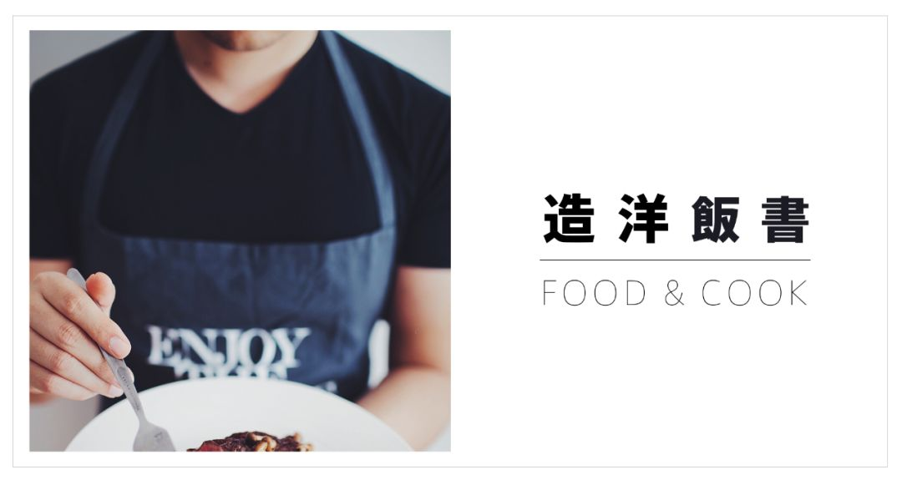 (原始链接: https://mmbiz.qpic.cn/mmbiz_png/WLqYuh6tqhEeUh6yxBq9TJyopguR9GFwWxjdzB9s6RoDx3aufsayFGqEjq1a4j4iaahbH7iapoBViaTx84GREEqaA/640?wx_fmt=png)
- 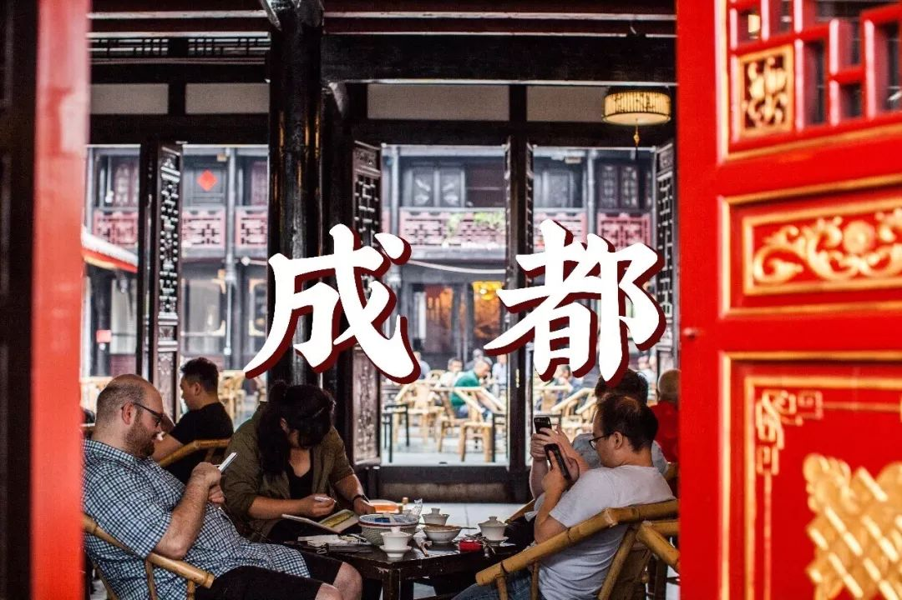 (原始链接: https://mmbiz.qpic.cn/mmbiz_jpg/WLqYuh6tqhFzCLT5htlOvPOicjFibG5R04Td7lEbdicwljTjUt78udHhibaNc2rTJibY93xTQlqY7thEYVwQmLwjdxw/640?wx_fmt=jpeg)
- 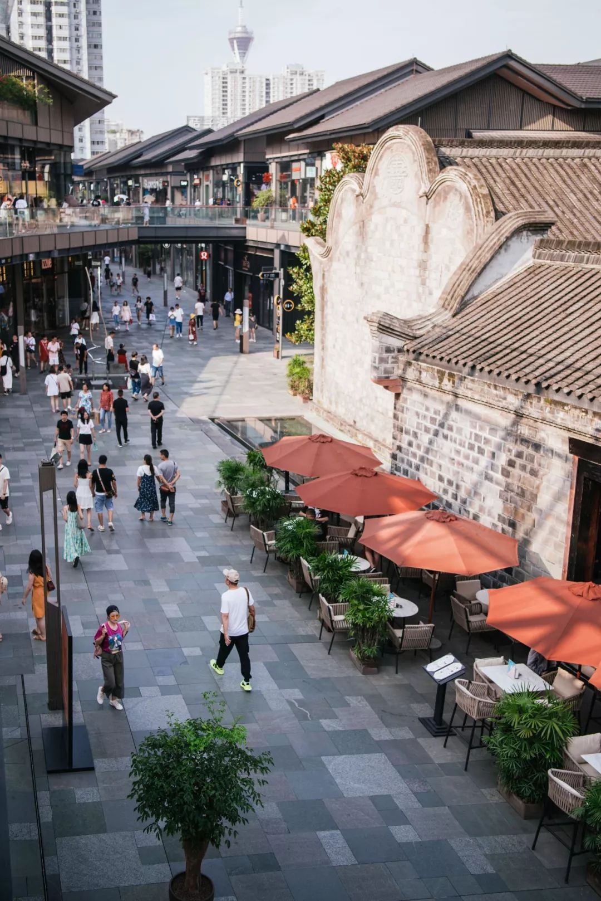 (原始链接: https://mmbiz.qpic.cn/mmbiz_jpg/WLqYuh6tqhF9Taibsl5w6zvC5mylQRSIOoRyAHcc33GfibcY3iaX8Hbsib6GmfCwC9k6YGrVqibUFico4k7DGBR48HSw/640?wx_fmt=jpeg)
-  (原始链接: https://mmbiz.qpic.cn/mmbiz_png/WLqYuh6tqhFjFtosGOW2NZ1xwZQwxCt1IaZCn09iaJt1ibarv5LspCg2MXQRamTBU4anyL3SXJjeaDGn4bcmdfyA/640?wx_fmt=png)
- 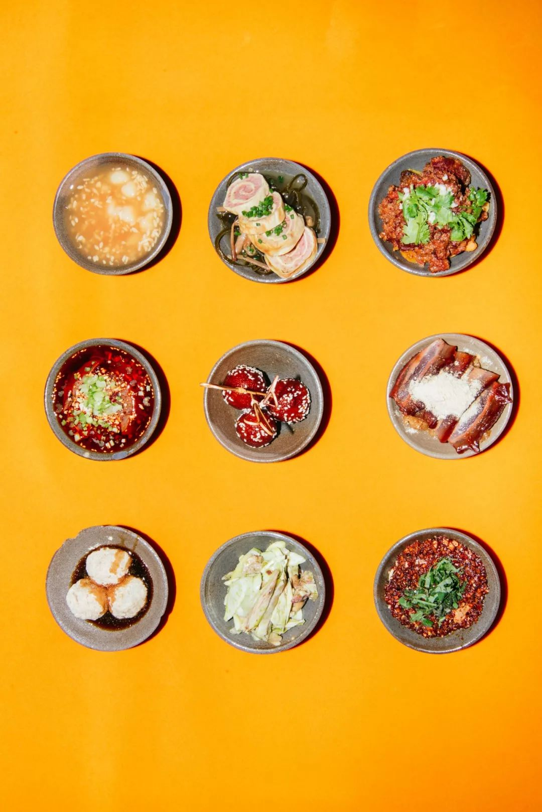 (原始链接: https://mmbiz.qpic.cn/mmbiz_jpg/WLqYuh6tqhF9Taibsl5w6zvC5mylQRSIO9zrC7v6jklOYjnSYEFYXibko6nkDI7cDdia6mlTTM29QibGmYEXI7pSGg/640?wx_fmt=jpeg)
- 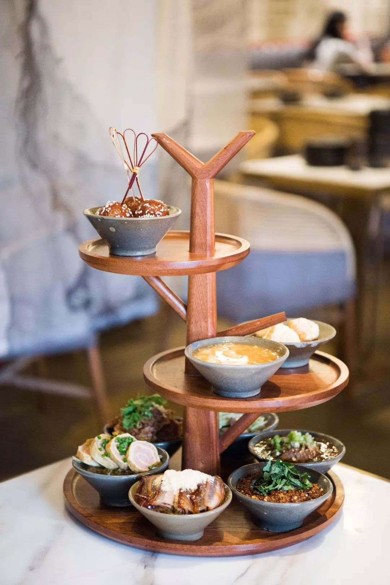 (原始链接: https://mmbiz.qpic.cn/mmbiz_jpg/WLqYuh6tqhHic42zVicwzrEuF11yx6Yia2mCUGHAPUWns6bVVXOXjzP4FjkbGFjTQhzXE3dDkNkd2klZnFbTW7Y2Q/640?wx_fmt=jpeg)
- 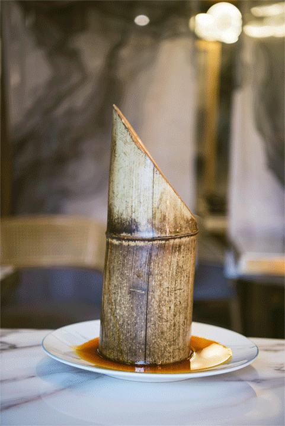 (原始链接: https://mmbiz.qpic.cn/mmbiz_gif/WLqYuh6tqhHic42zVicwzrEuF11yx6Yia2mAby4ojGucicvrjYjQFNgojgCGLTia529T7J5yJHgIsMpicJuZfNh5Qxwg/640?wx_fmt=gif)
- 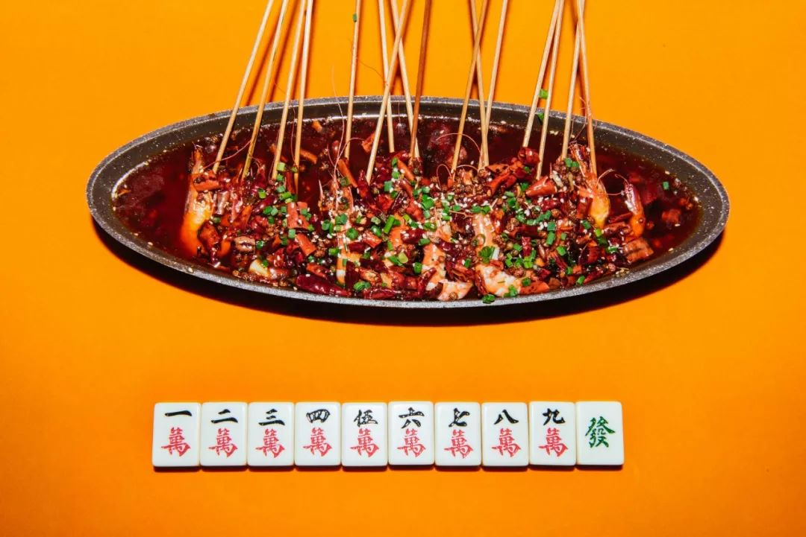 (原始链接: https://mmbiz.qpic.cn/mmbiz_jpg/WLqYuh6tqhHTiaxucFfkqyMAp6TVozauDYeKxGeKAFjH6yChovTlMHicTXYbKvozhUBl4XEJUF05aHdiczGeqFfCg/640?wx_fmt=jpeg)
- 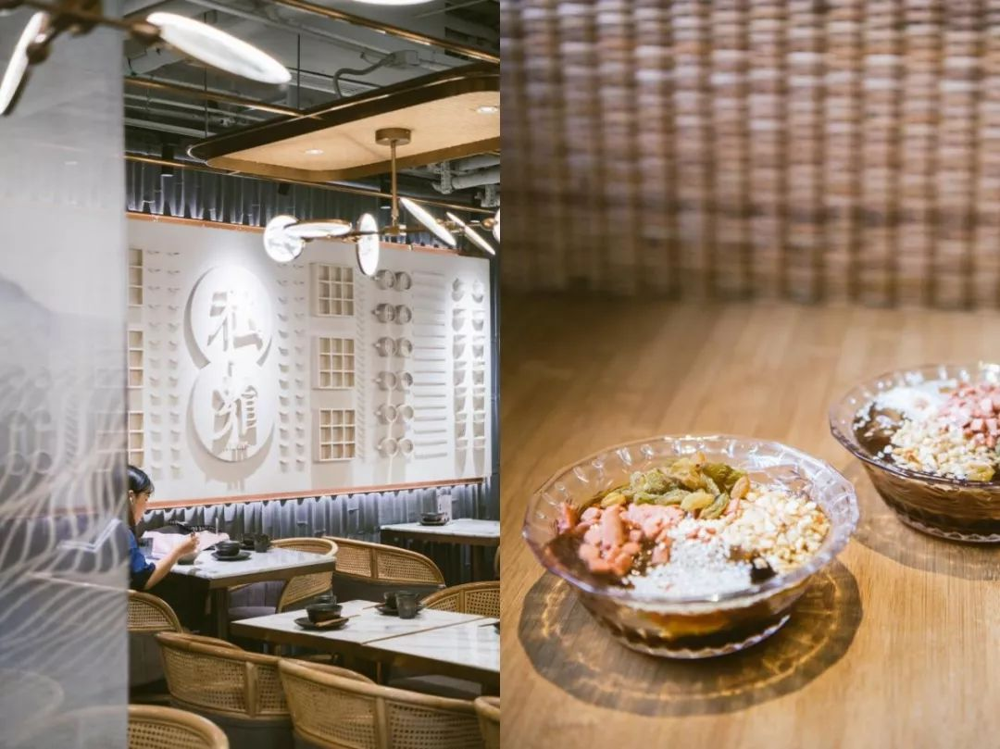 (原始链接: https://mmbiz.qpic.cn/mmbiz_jpg/WLqYuh6tqhF9Taibsl5w6zvC5mylQRSIO8q7m8yG1ZPUddhhTboaZqKd8ZfKmdCVl5gDrsvSYMjmD02aO5vptOw/640?wx_fmt=jpeg)
- 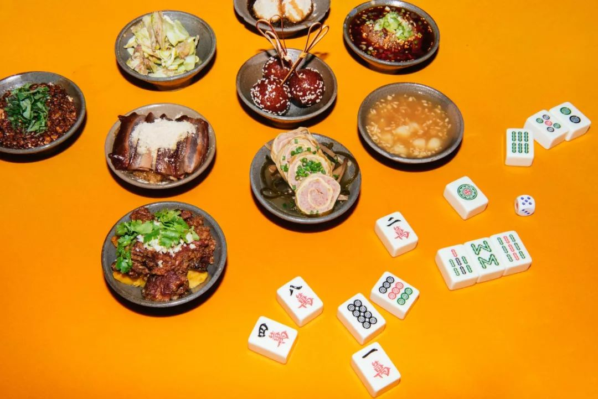 (原始链接: https://mmbiz.qpic.cn/mmbiz_jpg/WLqYuh6tqhHic42zVicwzrEuF11yx6Yia2m7G7HYayPZAYRvzruljtwBUcnQPXAZQvLSsYGJC8bubziahgUJXMiaEMA/640?wx_fmt=jpeg)
-  (原始链接: https://mmbiz.qpic.cn/mmbiz_png/WLqYuh6tqhFjFtosGOW2NZ1xwZQwxCt1Va9swOLQia03fsQ654yq2raWfj5hxwUQDLFpPlnF1OGYw2B8MzZdVJQ/640?wx_fmt=png)
- 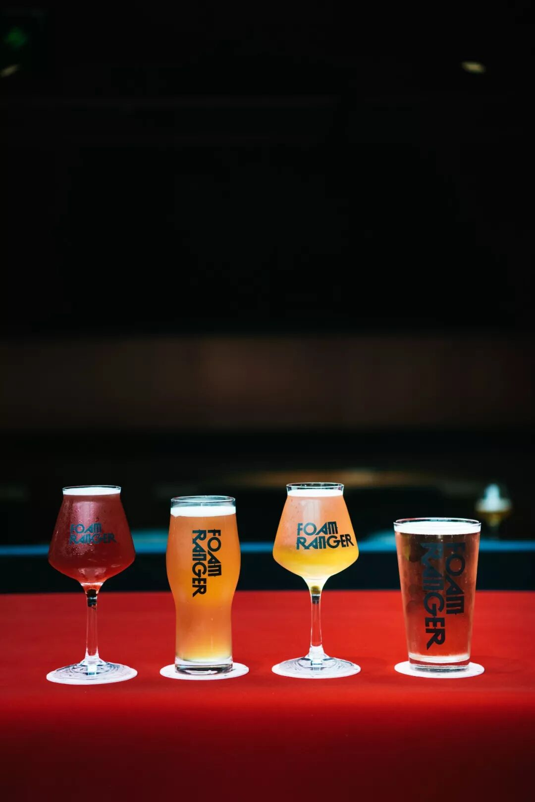 (原始链接: https://mmbiz.qpic.cn/mmbiz_jpg/WLqYuh6tqhHkCWzHh4mPryu7xRtOiaLdLDX9vzJSIYSL8bEAwajQRVYR01iaic3YC52C5VQthFoqbz9FnEMAbicpuQ/640?wx_fmt=jpeg)
- 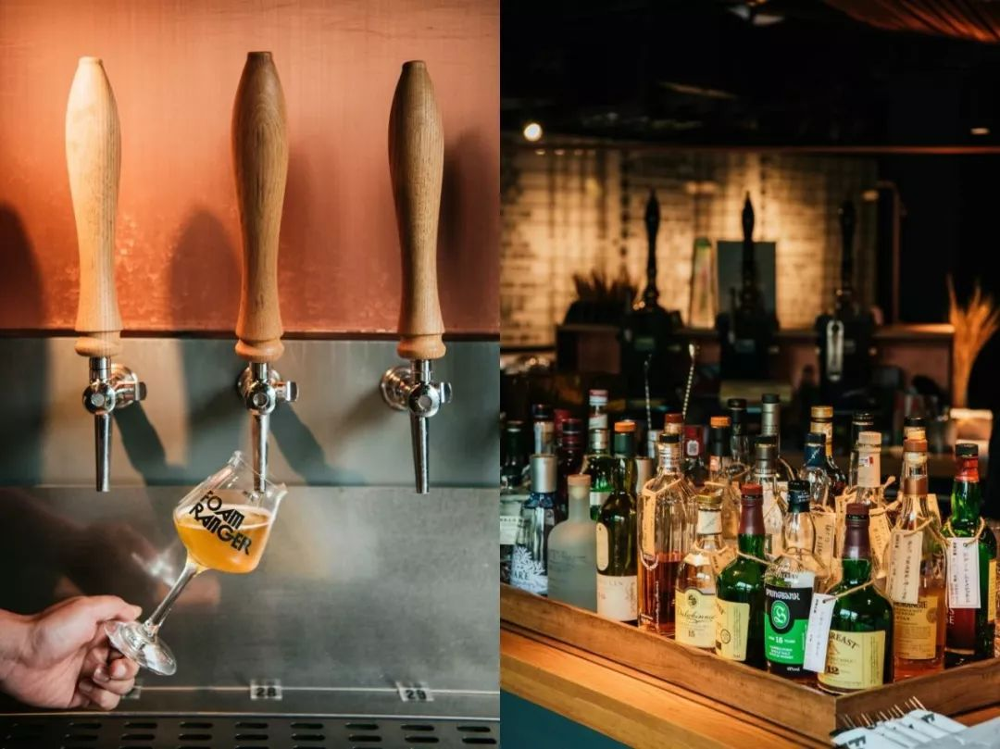 (原始链接: https://mmbiz.qpic.cn/mmbiz_jpg/WLqYuh6tqhFjFtosGOW2NZ1xwZQwxCt1lpVF8eaLUzclyMVLZmkkiabG81Y7V9nBrRcKOqv3355ticID6KlNO2jw/640?wx_fmt=jpeg)
- 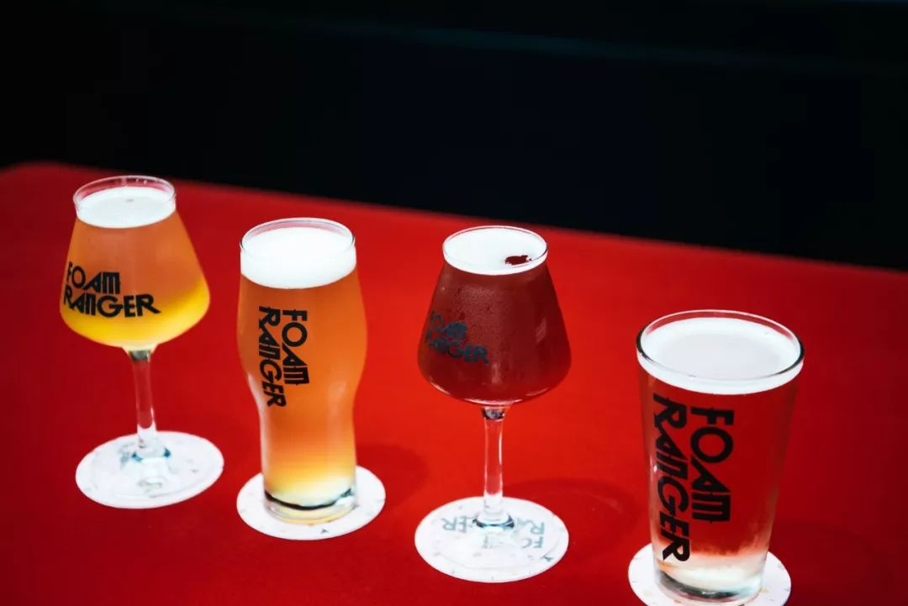 (原始链接: https://mmbiz.qpic.cn/mmbiz_jpg/WLqYuh6tqhHic42zVicwzrEuF11yx6Yia2mb6xicEfWj7lTvkvBPpIgcLbruNmEp6VzcyLw3TupAX5rib1f4YqQHoCw/640?wx_fmt=jpeg)
- 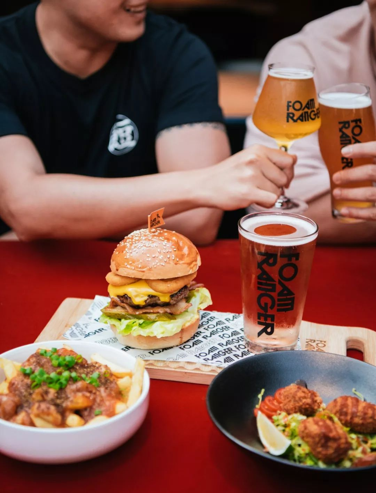 (原始链接: https://mmbiz.qpic.cn/mmbiz_jpg/WLqYuh6tqhF9Taibsl5w6zvC5mylQRSIONYe1sYticRoqjvaVq8q3K1zVZ2uDglmNB5S6QC3kYgh3WmVpUTgiantA/640?wx_fmt=jpeg)
- 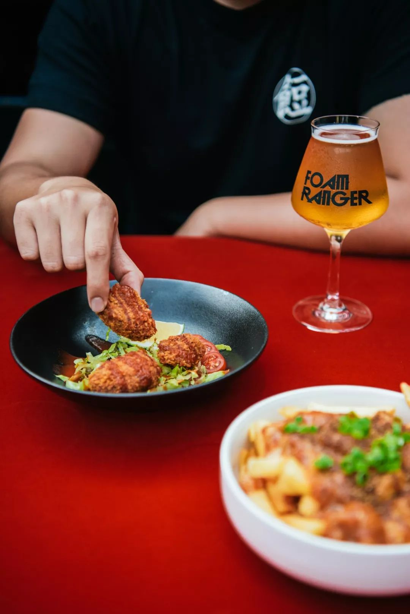 (原始链接: https://mmbiz.qpic.cn/mmbiz_jpg/WLqYuh6tqhFjFtosGOW2NZ1xwZQwxCt13e90efvSlaoQjSPwJA3tIqYQOA13l8UojK8soiac15pTRePqBZSGvZw/640?wx_fmt=jpeg)
- 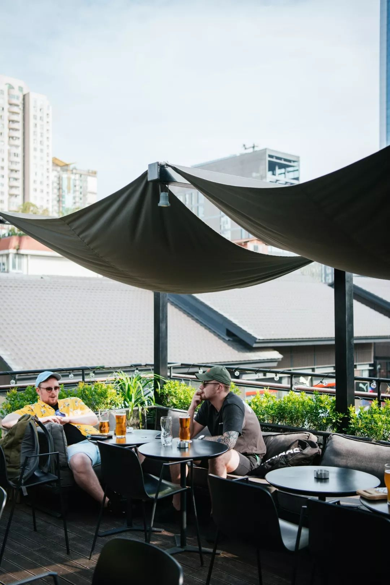 (原始链接: https://mmbiz.qpic.cn/mmbiz_jpg/WLqYuh6tqhHic42zVicwzrEuF11yx6Yia2mXiaMzbc1AckJuEMB7x4hw1vJwyS4nnq3pyy6ganOaAIZp6GceDI0P9g/640?wx_fmt=jpeg)
-  (原始链接: https://mmbiz.qpic.cn/mmbiz_png/WLqYuh6tqhFjFtosGOW2NZ1xwZQwxCt1QGOrEUTichUyYYhUAQusNtHxN9nLxdSwMxuxKGE1spAONAyVUKPYYdw/640?wx_fmt=png)
- 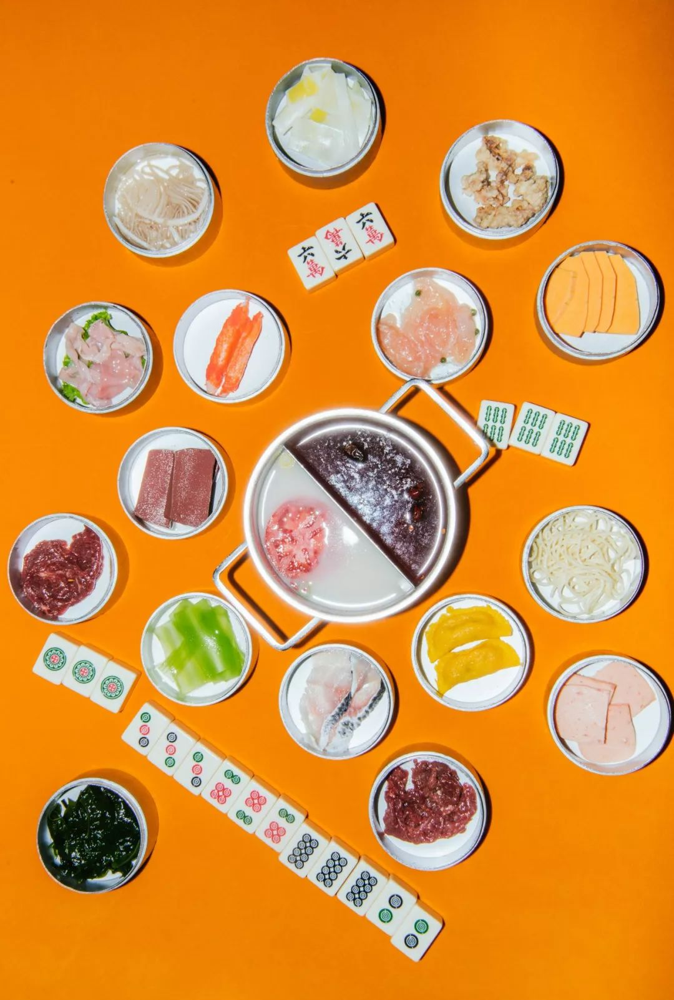 (原始链接: https://mmbiz.qpic.cn/mmbiz_jpg/WLqYuh6tqhHic42zVicwzrEuF11yx6Yia2mpHwpricQS04TqozR5e9icMbahdlgVGsExzn4OjfV7Q5EabcrBAevbnkw/640?wx_fmt=jpeg)
- 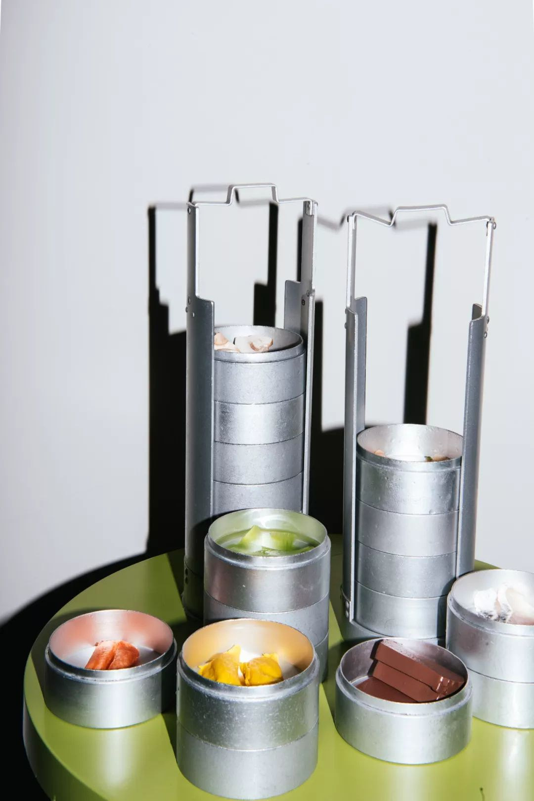 (原始链接: https://mmbiz.qpic.cn/mmbiz_jpg/WLqYuh6tqhHTiaxucFfkqyMAp6TVozauDGZgCNZu6ewVHEm1Wmf40HKP11CsxzqKanBMDB6bpVb4Nl6NKQd3dQQ/640?wx_fmt=jpeg)
- 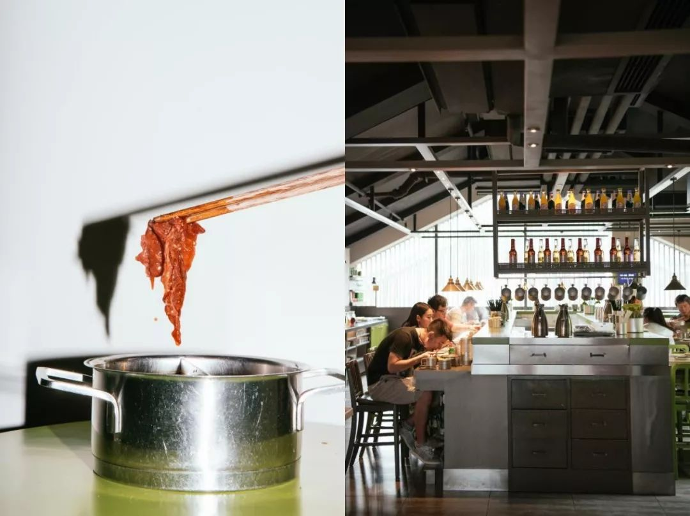 (原始链接: https://mmbiz.qpic.cn/mmbiz_jpg/WLqYuh6tqhHTiaxucFfkqyMAp6TVozauDeuqFkrNZpIRnnMPJ1d36epTPQYTIRG47eXADKXhiaIicmgAyZS6ugkSQ/640?wx_fmt=jpeg)
- 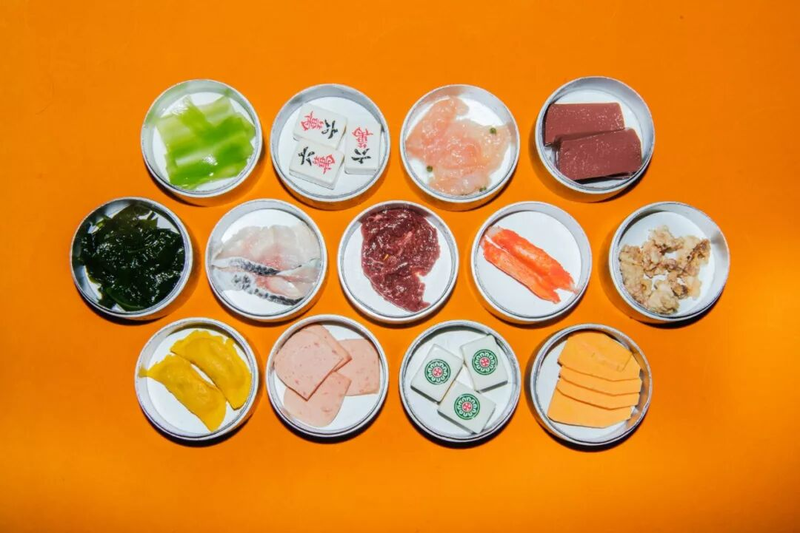 (原始链接: https://mmbiz.qpic.cn/mmbiz_jpg/WLqYuh6tqhF9Taibsl5w6zvC5mylQRSIOVR6XcQX5PGM5epia88s7gfpqo98TJHIND6Vu7afibF7yYxJWIlXjyGibQ/640?wx_fmt=jpeg)
-  (原始链接: https://mmbiz.qpic.cn/mmbiz_png/WLqYuh6tqhFjFtosGOW2NZ1xwZQwxCt15HiceF93Wzj2IqZJAo80rRvvCtUicfBywjEqiaDwMyicX3YOQassS92WdA/640?wx_fmt=png)
-  (原始链接: https://mmbiz.qpic.cn/mmbiz_jpg/WLqYuh6tqhHic42zVicwzrEuF11yx6Yia2mnibEXOGVWCc45JHO473wPEvtCW6pCqMHAOMabjJNHT8ricSLbJqHfaPg/640?wx_fmt=jpeg)
- 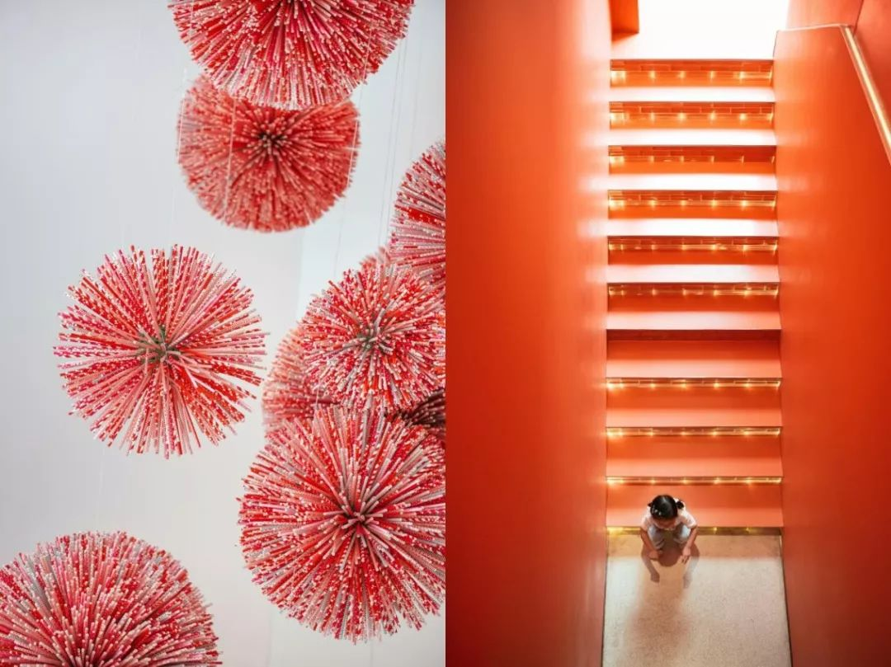 (原始链接: https://mmbiz.qpic.cn/mmbiz_jpg/WLqYuh6tqhF9Taibsl5w6zvC5mylQRSIOf6icWRxDFaEm5KQ35j1Tw09Dya7tgia3YTfY13msiby5bAibicfkknSYy7A/640?wx_fmt=jpeg)
- 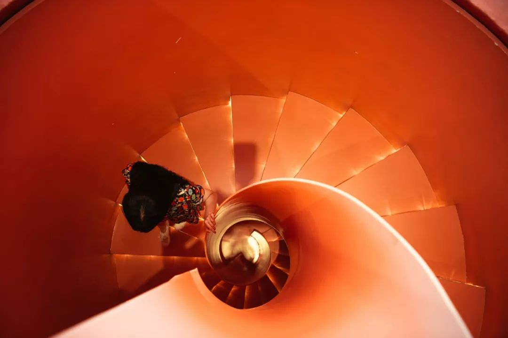 (原始链接: https://mmbiz.qpic.cn/mmbiz_jpg/WLqYuh6tqhF9Taibsl5w6zvC5mylQRSIO58nKxu2aZFGwtf8icNXmDXF1trAyAHKnSNraEr1qqvic5tZibJbicm3Tsw/640?wx_fmt=jpeg)
- 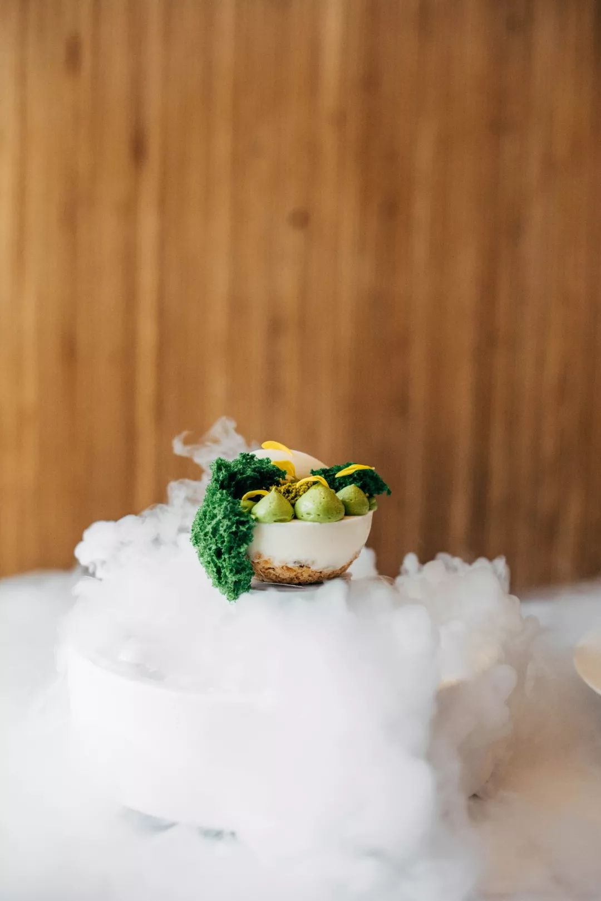 (原始链接: https://mmbiz.qpic.cn/mmbiz_jpg/WLqYuh6tqhHic42zVicwzrEuF11yx6Yia2msNDL77paJWurEPxya6GaM1Fnh8kDiccwuwpia0hlKv3IZSdFE9iadCdbg/640?wx_fmt=jpeg)
- 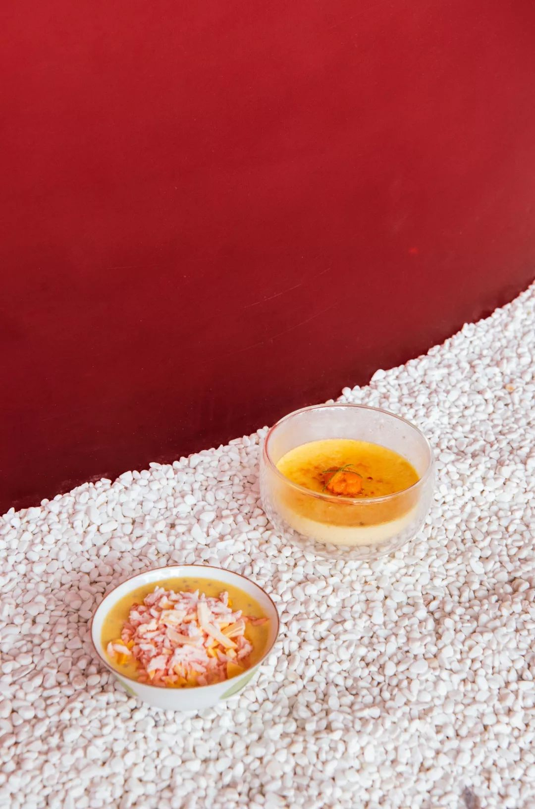 (原始链接: https://mmbiz.qpic.cn/mmbiz_jpg/WLqYuh6tqhHic42zVicwzrEuF11yx6Yia2muZPhmDvmf3u4mJTQo9cmPxbjXzgKHnCcDhLVQ9fJG9dj2wkAPxeHhQ/640?wx_fmt=jpeg)
- 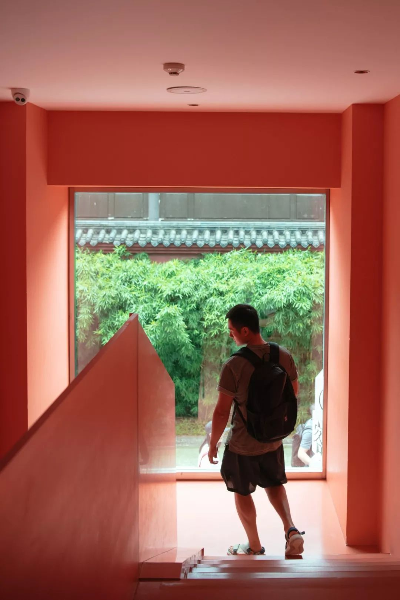 (原始链接: https://mmbiz.qpic.cn/mmbiz_jpg/WLqYuh6tqhHic42zVicwzrEuF11yx6Yia2maEMicRfh6no6LjVzlBSHVSglJxd8VUXILuwlcKDobzArdH0rIQN7iayw/640?wx_fmt=jpeg)
-  (原始链接: https://mmbiz.qpic.cn/mmbiz_png/WLqYuh6tqhFjFtosGOW2NZ1xwZQwxCt1P7t558AcOARqKy7D8y1xDqS2aSOD6HAkDjZjpzY35rm5juXT4BWhXg/640?wx_fmt=png)
- 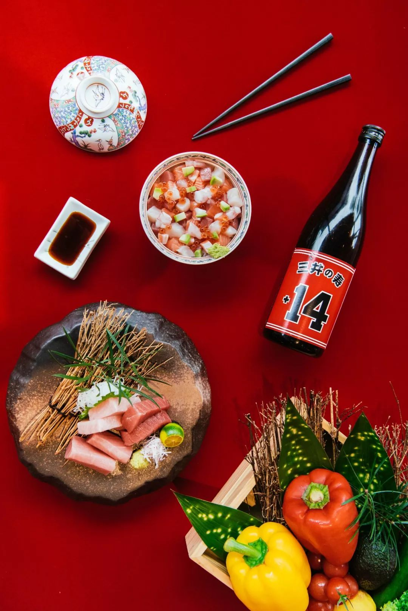 (原始链接: https://mmbiz.qpic.cn/mmbiz_jpg/WLqYuh6tqhF9Taibsl5w6zvC5mylQRSIOI3jTgtqDnjicLch1iahHnsq0rZZTaia4CcSeBcUOVOXFbc66J9OhdOoicw/640?wx_fmt=jpeg)
- 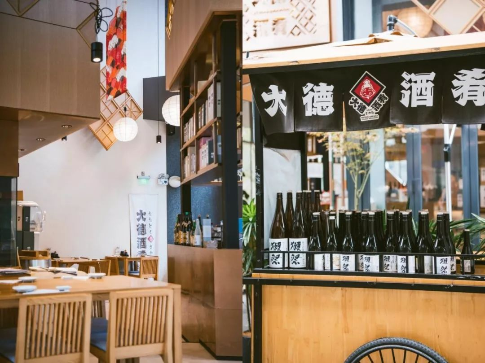 (原始链接: https://mmbiz.qpic.cn/mmbiz_jpg/WLqYuh6tqhF9Taibsl5w6zvC5mylQRSIO6AL0SicjIekyaOL3oiazHtasxcTg36JKR2BhQsWlPkD22GxewoLsoATg/640?wx_fmt=jpeg)
- 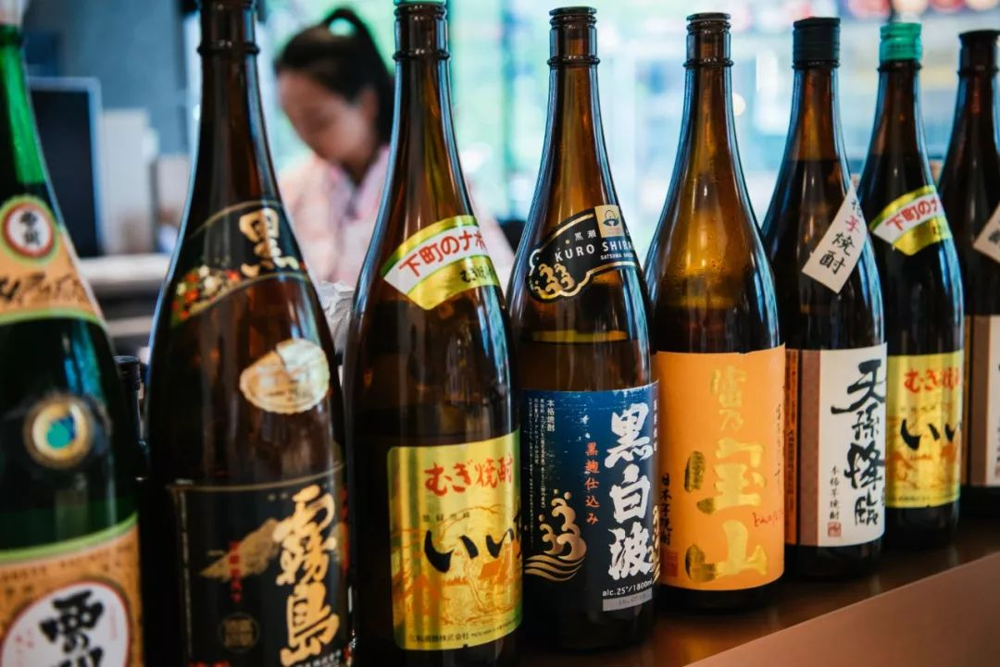 (原始链接: https://mmbiz.qpic.cn/mmbiz_jpg/WLqYuh6tqhHic42zVicwzrEuF11yx6Yia2mG3Bzpq3nAVibED06xic6ZujxGshqoH35fx2TQDyQGnEwPgPFZGibX7fZA/640?wx_fmt=jpeg)
- 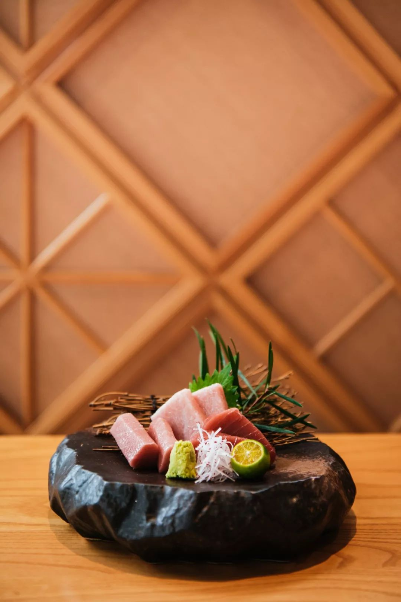 (原始链接: https://mmbiz.qpic.cn/mmbiz_jpg/WLqYuh6tqhHic42zVicwzrEuF11yx6Yia2mAwEoaxToNEcIk2jhmjEL7SWGQ0oFs0sq2yxiaUl9qpibGQQmYeojd1XQ/640?wx_fmt=jpeg)
- 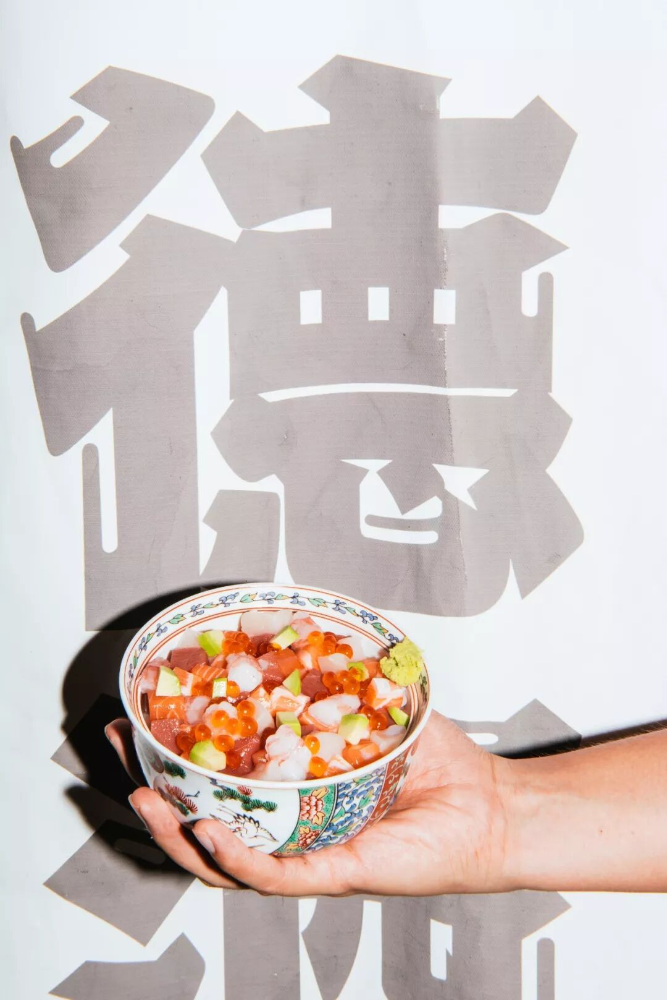 (原始链接: https://mmbiz.qpic.cn/mmbiz_jpg/WLqYuh6tqhFjFtosGOW2NZ1xwZQwxCt1kLKuUB1QLXLwzwUK2MRRTKSXSRp4icHHm3QAFr0fA8KqzCELTA2jJEQ/640?wx_fmt=jpeg)
- 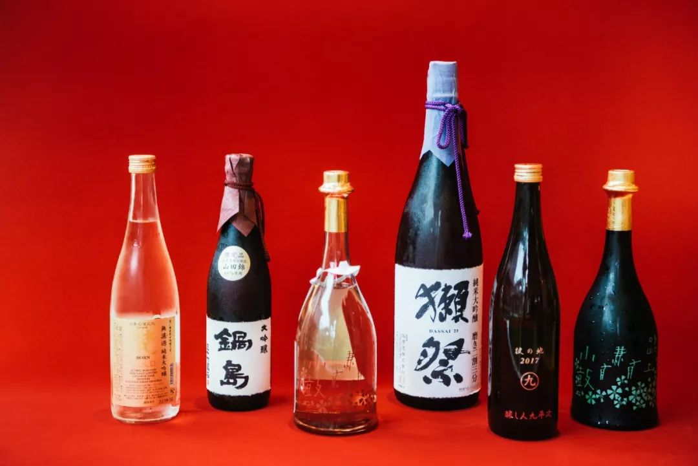 (原始链接: https://mmbiz.qpic.cn/mmbiz_jpg/WLqYuh6tqhFjFtosGOW2NZ1xwZQwxCt1VAsicjPQ0F8Y71nfQSgzPicBw7LwlhwgZK2Qia4NCIMlZ4XFibInwNcicnw/640?wx_fmt=jpeg)
-  (原始链接: https://mmbiz.qpic.cn/mmbiz_png/WLqYuh6tqhFjFtosGOW2NZ1xwZQwxCt1ia8kstoWMWd5SuibbwtHNOda6dRibNiboGGm9l0LBPGHXqoKXqahcngWVQ/640?wx_fmt=png)
- 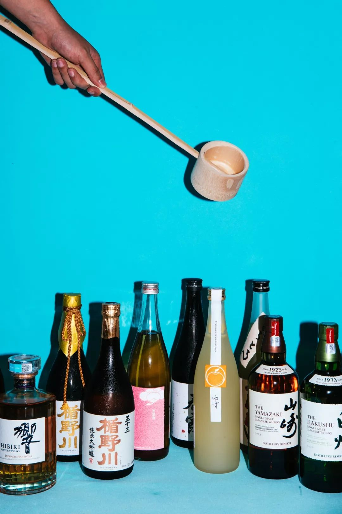 (原始链接: https://mmbiz.qpic.cn/mmbiz_jpg/WLqYuh6tqhF9Taibsl5w6zvC5mylQRSIOgnmXFaib2UGngZRVSkuyYZRfEiaBqcibIZNgj7piaGylGicM9DsqvQnHUsg/640?wx_fmt=jpeg)
- 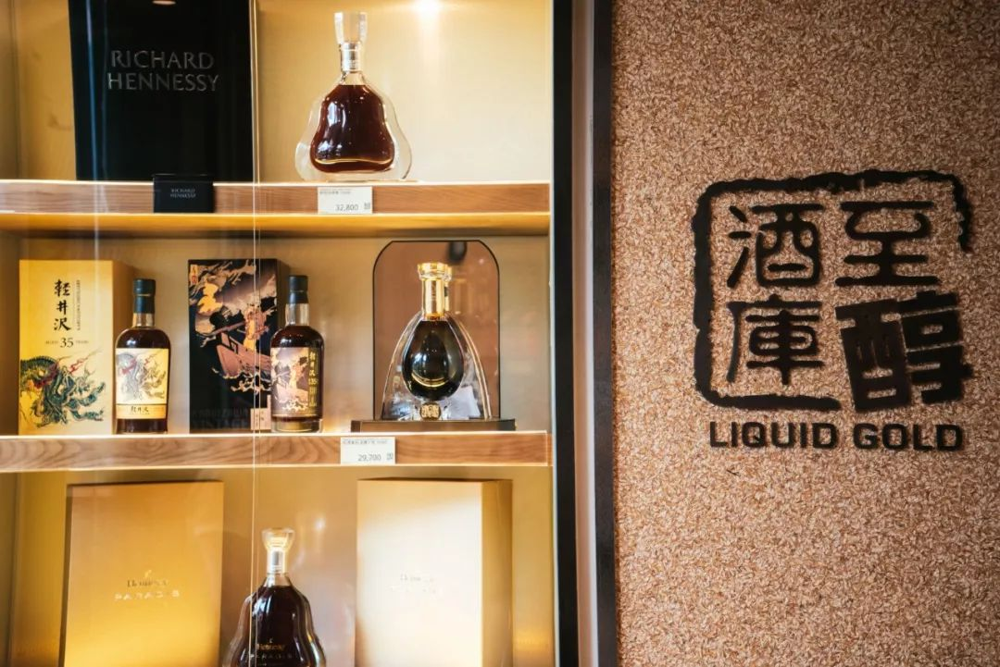 (原始链接: https://mmbiz.qpic.cn/mmbiz_jpg/WLqYuh6tqhF9Taibsl5w6zvC5mylQRSIOgT0W1HXsa1CADhjx6wg81HomAYeIa0jNOgV3icDI2d7RvHUVhTZVBdg/640?wx_fmt=jpeg)
- 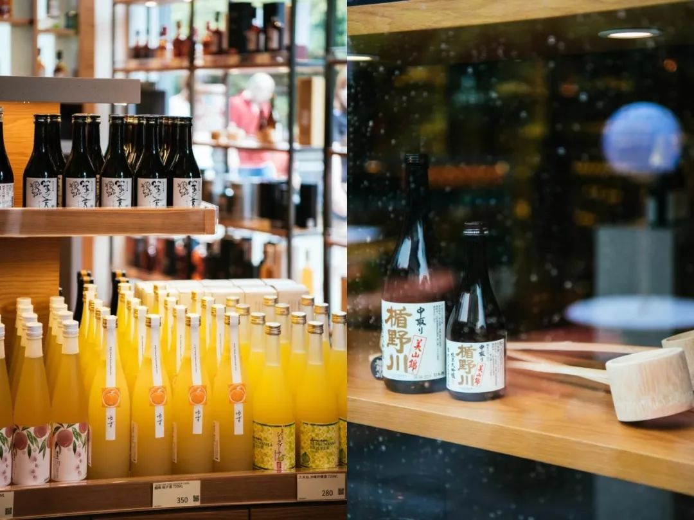 (原始链接: https://mmbiz.qpic.cn/mmbiz_jpg/WLqYuh6tqhHic42zVicwzrEuF11yx6Yia2mp0R7QgibAApdNbqYg3E33cpVYROqXIX2rHq1zAYbAdynXLPnficcBMHw/640?wx_fmt=jpeg)
- 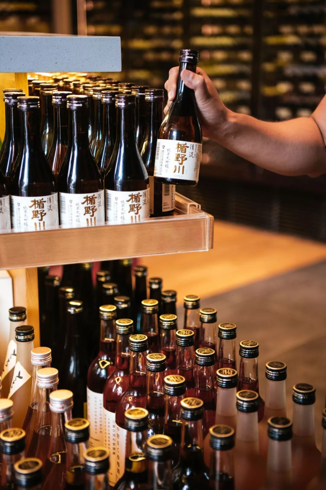 (原始链接: https://mmbiz.qpic.cn/mmbiz_jpg/WLqYuh6tqhF9Taibsl5w6zvC5mylQRSIOv2lAaG0PZsGODJ65Wn8AnsB86iapPxm0c8Pf0F3haU5XYfxiaRSMWoPA/640?wx_fmt=jpeg)
- 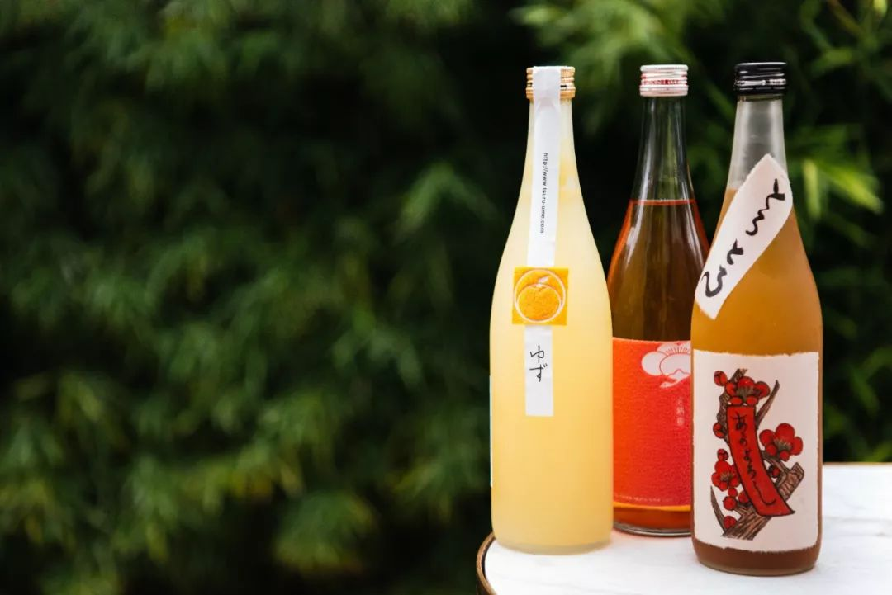 (原始链接: https://mmbiz.qpic.cn/mmbiz_jpg/WLqYuh6tqhHic42zVicwzrEuF11yx6Yia2mh9RnMib6gCxicMSYzGTD05ibrZYZX3x1jhibSAq0ribpCDGqiahLJtICUJmA/640?wx_fmt=jpeg)
- 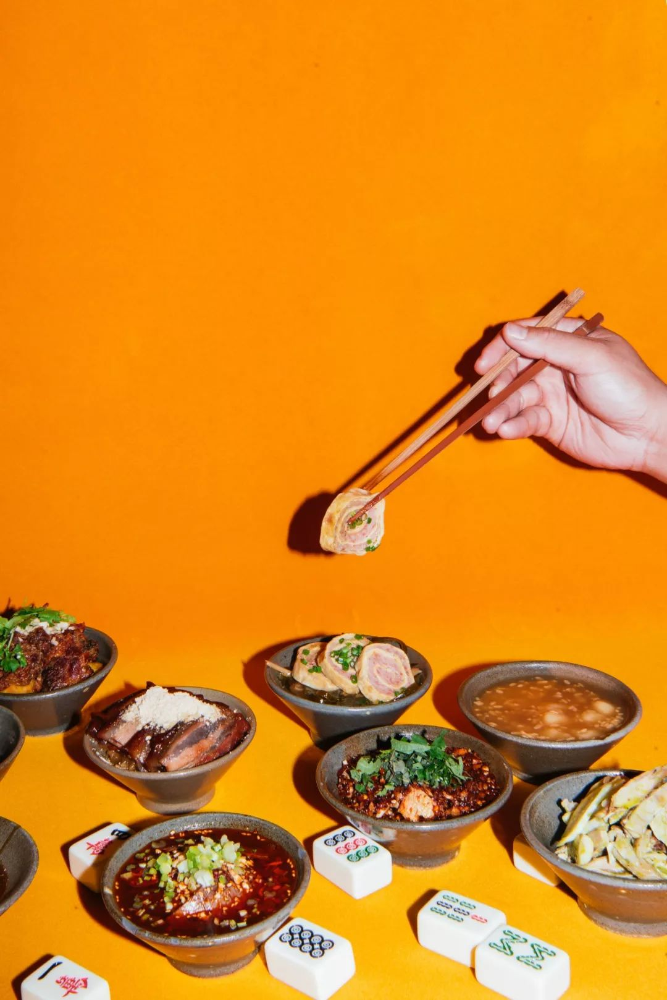 (原始链接: https://mmbiz.qpic.cn/mmbiz_jpg/WLqYuh6tqhHic42zVicwzrEuF11yx6Yia2mbnhdL52zHe3icv4rI5UIA1YialxAEXS8I6Wg2Ow1oSNiagxBnWPSrb7cw/640?wx_fmt=jpeg)
- 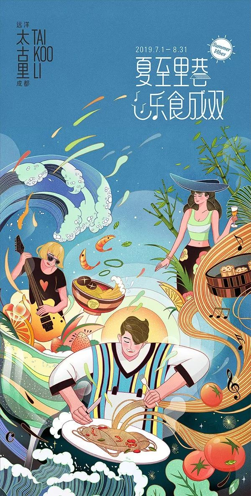 (原始链接: https://mmbiz.qpic.cn/mmbiz_jpg/WLqYuh6tqhEb5gDKUCAsFUvAJjqyic1gKAt3PkrIBiaXSHTqSLls2kwiaDgKqACRjYQfJrwCp6a3kiaibyyWWwynIKA/640?wx_fmt=jpeg)
-  (原始链接: https://mmbiz.qpic.cn/mmbiz_jpg/WLqYuh6tqhFpeJ89w7n9KxYWoGqfelDsGu8o9cDhKbFfhBfm3nxF8nla4klGfLoxEU87pQwslkiaMh5SsP1YtrQ/640?wx_fmt=jpeg)
-  (原始链接: https://mmbiz.qpic.cn/mmbiz_jpg/WLqYuh6tqhFpeJ89w7n9KxYWoGqfelDsFT3crNp1EeNy0AJOZ9ceXaKOZ9DI67U4OK1dDtt6mRjyPYEouz60Kg/640?wx_fmt=jpeg)
- 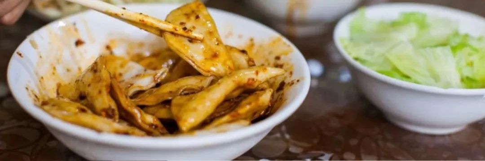 (原始链接: https://mmbiz.qpic.cn/mmbiz_jpg/WLqYuh6tqhHTiaxucFfkqyMAp6TVozauDr0mLDp44A4U290TZlIN5ClaozI0NmgENXhibiaKUzlQsUVt2cRUnn03w/640?wx_fmt=jpeg)
- 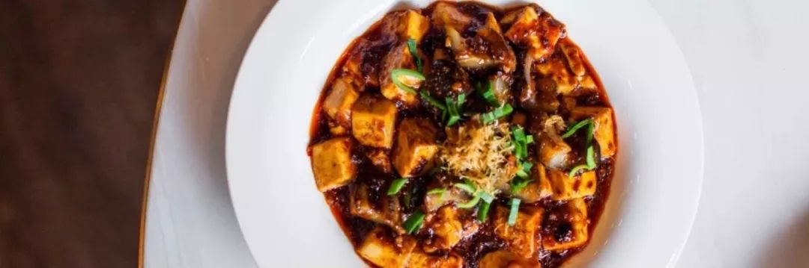 (原始链接: https://mmbiz.qpic.cn/mmbiz_jpg/WLqYuh6tqhHTiaxucFfkqyMAp6TVozauDxiciahUACRC0Xk6zp1YeHic2NFkD4zkpxRZ5mvNS3ibUT55WwrkbiaAXysQ/640?wx_fmt=jpeg)
-  (原始链接: https://mmbiz.qpic.cn/mmbiz_jpg/WLqYuh6tqhHTiaxucFfkqyMAp6TVozauDoem1r33ibk0qoOC7WUnV2NyFIXFIgp4cOiaJmdibicJVVSibjhsVY1Q7Ymg/640?wx_fmt=jpeg)
-  (原始链接: https://mmbiz.qpic.cn/mmbiz_png/WLqYuh6tqhEeUh6yxBq9TJyopguR9GFwydkSIGAknKZtBNnRELYbbFNJQ6kt4AZKVI3ahQ8jzuHQ1psVORib0QA/640?wx_fmt=png)
