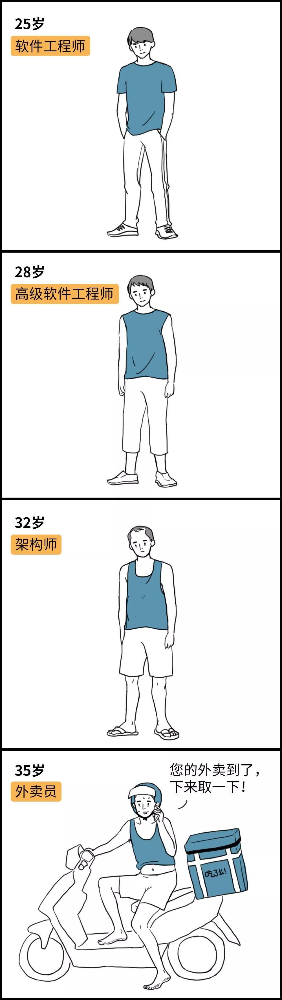
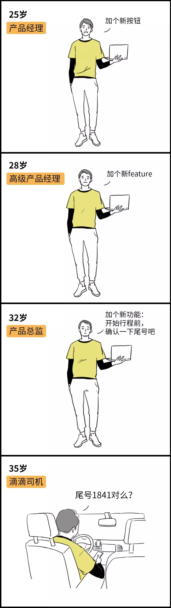
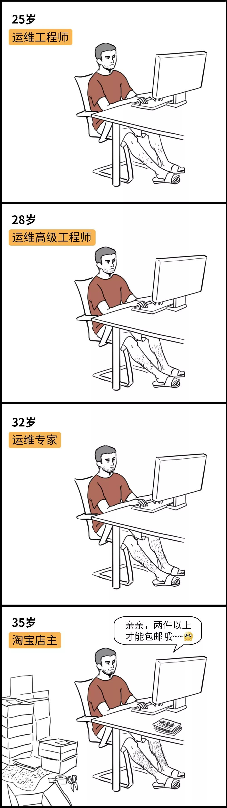
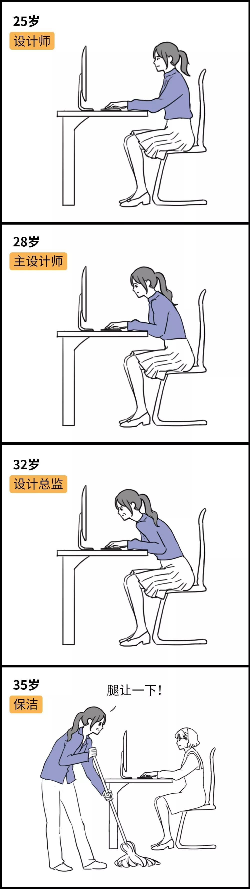
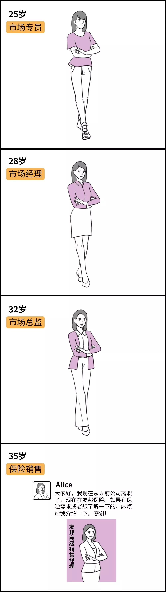
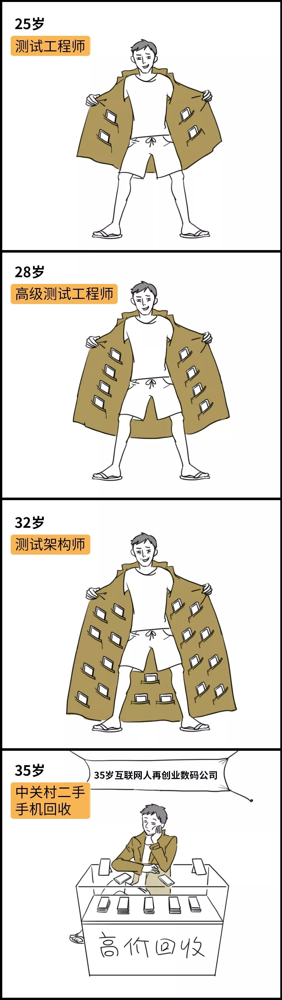
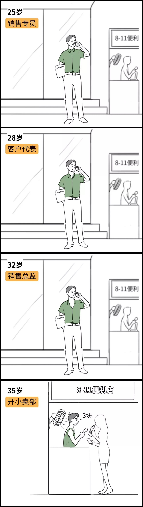
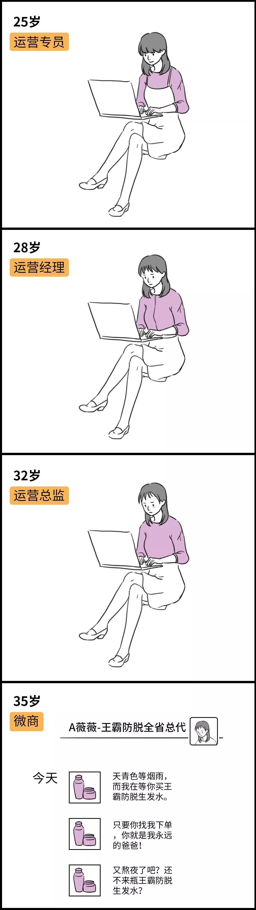
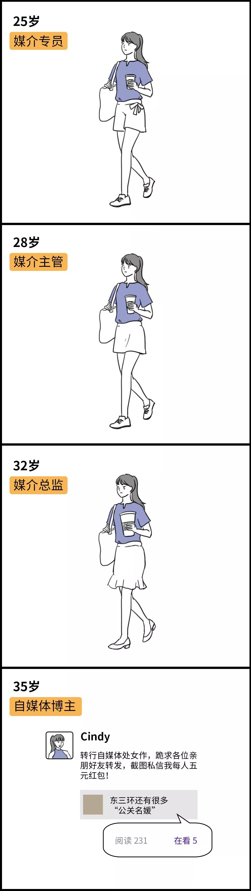
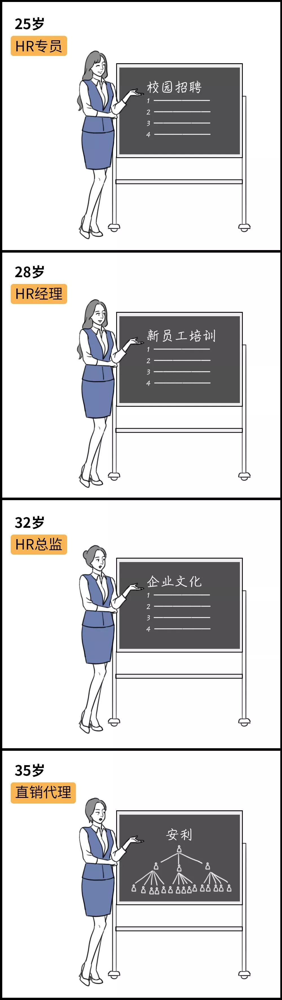

# 无标题

**链接地址:** http://mp.weixin.qq.com/s?__biz=MzI3MzM2ODMzOQ==&mid=2247488729&idx=1&sn=0b2a5d7c82ccbd6d740422cecc7adea8&chksm=eb2500a5dc5289b38aee7f0073cd35400288515787dac63841ade39110ed6b730e839b0a29fe&mpshare=1&scene=2&srcid=&sharer_sharetime=1566007978377&sharer_shareid=be1c8edd6c93eec155a61c876e41d26a#rd
**作者:** 景岁
**获取时间:** 2025/8/28 20:29:09
**图片数量:** 11

---

## 原始HTML内容

前段时间虎扑上有一篇热帖，

 

叫<strong>《一年前我月薪两万被叫老总，如今35岁在美团送外卖》</strong>，

 

讲的是一个新媒体公司从业者人到中年的人生境遇，

 

互联网行业里一直有一种说法，

 

叫做<strong>“互联网公司没有35岁以上的中年人”</strong>，

 

那过了35岁的互联网人都去哪儿了呢？

 

今天我们就帮大家畅想一下，

 

互联网人25岁到35岁的职业发展之路——

 

 

<strong>01. 程序员</strong>

 

 

<strong style="text-align: center;white-space: normal;">02. 产品</strong><strong style="text-align: center;white-space: normal;"></strong>

 

 

<strong style="text-align: center;white-space: normal;">03</strong><strong style="font-family: mp-quote, -apple-system-font, BlinkMacSystemFont, &quot;Helvetica Neue&quot;, &quot;PingFang SC&quot;, &quot;Hiragino Sans GB&quot;, &quot;Microsoft YaHei UI&quot;, &quot;Microsoft YaHei&quot;, Arial, sans-serif;text-align: center;">. 运维</strong><strong style="font-family: mp-quote, -apple-system-font, BlinkMacSystemFont, &quot;Helvetica Neue&quot;, &quot;PingFang SC&quot;, &quot;Hiragino Sans GB&quot;, &quot;Microsoft YaHei UI&quot;, &quot;Microsoft YaHei&quot;, Arial, sans-serif;text-align: center;"></strong>

 

 

<strong style="text-align: center;white-space: normal;">04. 设计</strong><strong style="text-align: center;white-space: normal;"></strong>

 

 

<strong style="text-align: center;white-space: normal;">05. 市场</strong><strong style="text-align: center;white-space: normal;"></strong>

 

 

<strong style="text-align: center;white-space: normal;">06. 测试</strong><strong style="text-align: center;white-space: normal;"></strong>

 

 

<strong style="text-align: center;white-space: normal;">07. 销售</strong><strong style="text-align: center;white-space: normal;"></strong>

 

 

<strong style="text-align: center;white-space: normal;">08. 运营</strong><strong style="text-align: center;white-space: normal;"></strong>

 

 

<strong style="text-align: center;white-space: normal;">09. 媒介</strong><strong style="text-align: center;white-space: normal;"></strong>

 

 

<strong style="text-align: center;white-space: normal;">10. HR</strong><strong style="text-align: center;white-space: normal;"></strong> 

 

 
<section style="text-align: center;margin-left: 8px;margin-right: 8px;">互联网人到中年的转型原则—— </section>
 
<section style="text-align: center;margin-left: 8px;margin-right: 8px;"><strong>好友多的卖保险，好友少的开滴滴，实在不行再送外卖。</strong></section>
 
<section style="text-align: center;margin-left: 8px;margin-right: 8px;">总之，在互联网公司，35岁真的是个坎，</section>
 
<section style="text-align: center;margin-left: 8px;margin-right: 8px;">各家大厂都在优化年龄段，为了让“团队年轻化”，首先淘汰的就是35岁以上的人，</section>
 
<section style="text-align: center;margin-left: 8px;margin-right: 8px;">更可怕的是跳槽的时候，即使明面不说，暗中也会“35岁以上的简历直接pass”，</section>
 
<section style="text-align: center;margin-left: 8px;margin-right: 8px;">这也是很多互联网人总是省吃俭用舍不得花钱的一个原因。</section>
 
<section style="text-align: center;margin-left: 8px;margin-right: 8px;"><strong>35岁以后的人生就像是一团迷雾，</strong><strong style="font-family: mp-quote, -apple-system-font, BlinkMacSystemFont, &quot;Helvetica Neue&quot;, &quot;PingFang SC&quot;, &quot;Hiragino Sans GB&quot;, &quot;Microsoft YaHei UI&quot;, &quot;Microsoft YaHei&quot;, Arial, sans-serif;color: rgb(63, 63, 63);">趁着年轻的时候能攒一点是一点，</strong></section>
 
<section style="text-align: center;margin-left: 8px;margin-right: 8px;"><strong>现在多攒点钱，以后兴许大热天可以少接几单外卖呢。</strong><strong></strong></section>
 

 

&lt; END &gt;

 
<section style="margin-right: 16px;margin-left: 16px;white-space: normal;text-align: center;line-height: 1.5em;"></section>
脚本：景岁

漫画：冬麦麦

微博：西二旗生活指北

 

---

## 纯文本内容

前段时间虎扑上有一篇热帖，叫《一年前我月薪两万被叫老总，如今35岁在美团送外卖》，讲的是一个新媒体公司从业者人到中年的人生境遇，互联网行业里一直有一种说法，叫做“互联网公司没有35岁以上的中年人”，那过了35岁的互联网人都去哪儿了呢？今天我们就帮大家畅想一下，互联网人25岁到35岁的职业发展之路——01. 程序员02. 产品03. 运维04. 设计05. 市场06. 测试07. 销售08. 运营09. 媒介10. HR互联网人到中年的转型原则——好友多的卖保险，好友少的开滴滴，实在不行再送外卖。总之，在互联网公司，35岁真的是个坎，各家大厂都在优化年龄段，为了让“团队年轻化”，首先淘汰的就是35岁以上的人，更可怕的是跳槽的时候，即使明面不说，暗中也会“35岁以上的简历直接pass”，这也是很多互联网人总是省吃俭用舍不得花钱的一个原因。35岁以后的人生就像是一团迷雾，趁着年轻的时候能攒一点是一点，现在多攒点钱，以后兴许大热天可以少接几单外卖呢。< END >脚本：景岁漫画：冬麦麦微博：西二旗生活指北

---

## 图片列表

-  (原始链接: https://mmbiz.qpic.cn/mmbiz_jpg/EwZI82u0uvFxS1fCyDwiaH512mAPo50b4WfSN9h6O8kRWhAclnjJ1leBicVFa0R8ibvRxjU2Z3g4HeZCdmCvCicr7Q/640?wx_fmt=jpeg)
-  (原始链接: https://mmbiz.qpic.cn/mmbiz_jpg/EwZI82u0uvFxS1fCyDwiaH512mAPo50b4KcVguWU3B1EJKVPR9Y6XxQKKCLOMtaynLmK3IB1AaYdYtSVLePMm6A/640?wx_fmt=jpeg)
-  (原始链接: https://mmbiz.qpic.cn/mmbiz_jpg/EwZI82u0uvFxS1fCyDwiaH512mAPo50b4mC6mE7WQkVBLU96M7dU6WLUlkkHb0t360T1Zib2uFFnl0OrjiaQasCbw/640?wx_fmt=jpeg)
-  (原始链接: https://mmbiz.qpic.cn/mmbiz_jpg/EwZI82u0uvEpszKyK3cE7QCxkVXs38DRRRgxjcrkV08I77lH8F7PhKCE6ibxHViaeWgExUh1VurZRWdUh9nBU5LQ/640?wx_fmt=jpeg)
-  (原始链接: https://mmbiz.qpic.cn/mmbiz_jpg/EwZI82u0uvFxS1fCyDwiaH512mAPo50b4uOQnY9sRJQqeXcSB9cKmd61neWuB5WhmKQoYO6cicdo2QYUG1mVibibKg/640?wx_fmt=jpeg)
-  (原始链接: https://mmbiz.qpic.cn/mmbiz_jpg/EwZI82u0uvFxS1fCyDwiaH512mAPo50b4MYcx44MZd1FpFricUicveWJo5iaX4Z5iaJzM99sicQLLjIxT2GvJqJHjfibQ/640?wx_fmt=jpeg)
-  (原始链接: https://mmbiz.qpic.cn/mmbiz_jpg/EwZI82u0uvFxS1fCyDwiaH512mAPo50b4YLVT9vO1XRR6O8ibo0DvPFufor4EYuJLDZKia7icm1BLrmtnsHicfun5Qw/640?wx_fmt=jpeg)
-  (原始链接: https://mmbiz.qpic.cn/mmbiz_jpg/EwZI82u0uvFxS1fCyDwiaH512mAPo50b4mOn7JficTrsjDj688PmvrTbt4iaTASscvXlVjxictkq11Ua0oXQqZGiavQ/640?wx_fmt=jpeg)
-  (原始链接: https://mmbiz.qpic.cn/mmbiz_jpg/EwZI82u0uvFxS1fCyDwiaH512mAPo50b4sbbPHH88S0xuGMybYZ9yyWUH7mW5xr2Op5ec4FGzycTfxicuMHRerSQ/640?wx_fmt=jpeg)
-  (原始链接: https://mmbiz.qpic.cn/mmbiz_jpg/EwZI82u0uvFxS1fCyDwiaH512mAPo50b4dEW7wcL9dKI5SrtibozEV5MKDTBAmuQfibKPLkiaOnQaZGhnaq2OBQiaFA/640?wx_fmt=jpeg)
-  (原始链接: https://mmbiz.qpic.cn/mmbiz_jpg/EwZI82u0uvHsQpJdpicQS9y9ibxHFbUp4ic5OSFyj9u5T22wVkxvol9icgMPNxc7FdYAayTruMT3ohKO7UQzSibfhpg/640?wx_fmt=jpeg)
