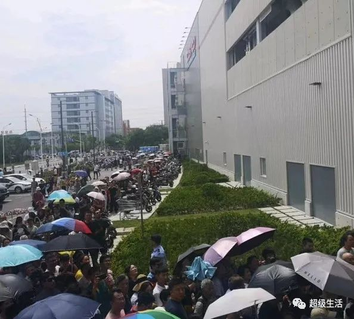
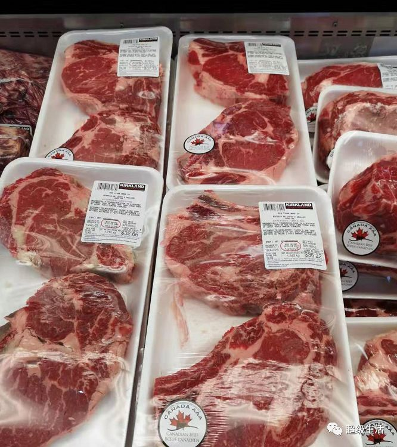
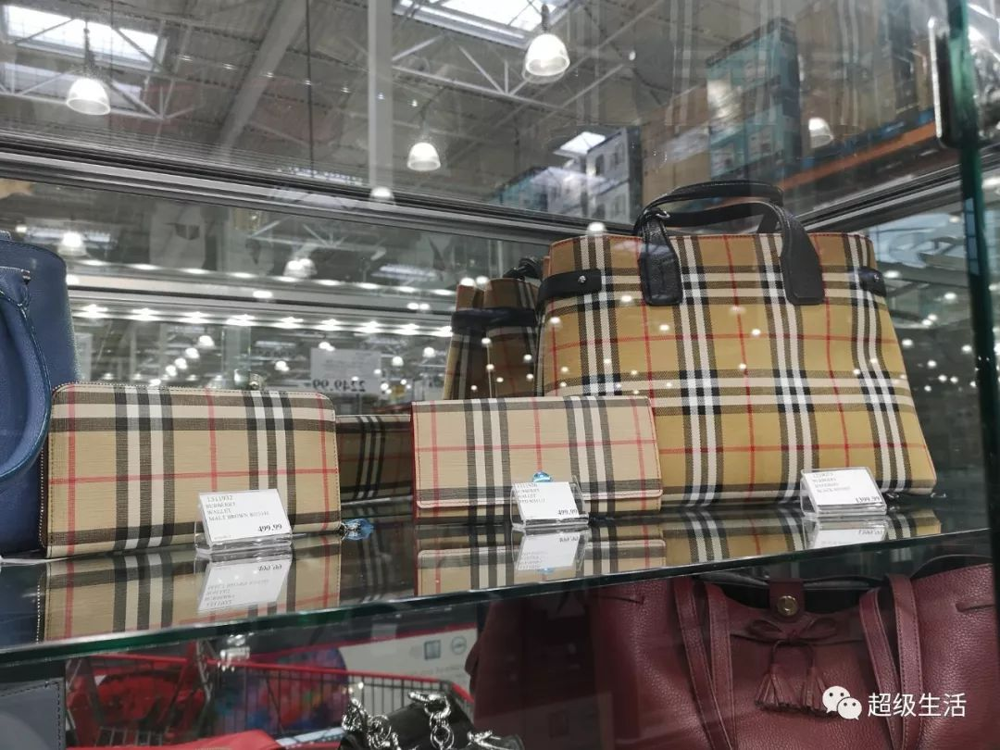

# 无标题

**链接地址:** http://mp.weixin.qq.com/s?__biz=MjM5MDEzNzY2NQ==&mid=2652765648&idx=1&sn=1c09d343be97a87ed59875b7c1b94c4d&chksm=bda031fe8ad7b8e8087e392f6425c6552dfe299583065544f6c376b0bb192445dcb90c5c9a60&mpshare=1&scene=2&srcid=&sharer_sharetime=1566926961066&sharer_shareid=be1c8edd6c93eec155a61c876e41d26a#rd
**作者:** 陈圆圆/丁其
**获取时间:** 2025/8/28 20:26:54
**图片数量:** 43

---

## 原始HTML内容

<section class="xmteditor" style="display:none;" data-tools="新媒体管家" data-label="powered by xmt.cn"></section>
超级君从昨晚开始
<section style="text-align: center;line-height: 2em;">就被中国上海开业的<strong>第一家</strong><strong>Costco</strong>刷频了～</section><section style="text-align: center;line-height: 2em;">简直看到晕眩。。。</section><section style="text-align: center;line-height: 2em;">只能说场面太High！</section><section style="text-align: center;line-height: 2em;">出国太久没见识过这种噶闹忙的场面了...</section><section style="text-align: center;line-height: 2em;"> </section><section style="text-align: center;line-height: 2em;"></section>
 
<section style="text-align: center;line-height: 2em;">不得不说。。。不愧是<strong>魔都</strong>...</section><section style="text-align: center;line-height: 2em;"><strong>Costco买东西的场面堪比春运！</strong></section><section style="text-align: center;line-height: 2em;">结果开业5小时后就不得不暂停营业了...</section><section style="text-align: center;line-height: 2em;"> </section>

 
<section style="text-align: center;line-height: 2em;">作为经常去加拿大Costco买买买的忠死粉</section><section style="text-align: center;line-height: 2em;">我们来感受下</section><section style="text-align: center;line-height: 2em;"><strong>上海德阿姨，牙叔们的购物热情吧~</strong></section><section style="text-align: center;line-height: 2em;"> </section><section style="text-align: center;line-height: 2em;"></section>
 
<section style="text-align: center;line-height: 2em;">开业当天</section><section style="text-align: center;line-height: 2em;">进停车场的<strong>车排队排到1公里以外</strong>去了～</section><section style="text-align: center;line-height: 2em;">据说700米要开3小时...</section><section style="text-align: center;line-height: 2em;"> </section>

 
<section style="text-align: center;line-height: 2em;">停车场爆满就不用说了</section><section style="text-align: center;line-height: 2em;"><strong>周边交通一度瘫痪啊！</strong></section><section style="text-align: center;line-height: 2em;"> </section><section style="text-align: center;line-height: 2em;"></section>
 
<section style="text-align: center;line-height: 2em;">再来看看开门的场景</section><section style="text-align: center;line-height: 2em;"><strong>比加拿大和美国的黑五有过之而不及！</strong></section><section style="text-align: center;line-height: 2em;"> </section>

 
<section style="text-align: center;line-height: 2em;">好不容易进去了<strong>被挤到怀疑人生</strong>～</section><section style="text-align: center;line-height: 2em;"> </section><section style="text-align: center;line-height: 2em;"></section>
 
<section style="text-align: center;line-height: 2em;">结账都要排队2小时！</section>
 

在加拿大的你们
<section style="text-align: center;line-height: 2em;">有没有隔着屏幕都感到窒息。。。</section>
 
<section style="text-align: center;line-height: 2em;">这么多人去抢东西</section><section style="text-align: center;line-height: 2em;">大家最关心的莫过于价格</section><section style="text-align: center;line-height: 2em;">先感受下</section><section style="text-align: center;line-height: 2em;"><strong>加拿大望尘莫及系列！</strong></section><section style="text-align: center;line-height: 2em;"> </section><section style="text-align: center;line-height: 2em;"><strong>爱马仕！！！</strong> </section><section style="text-align: center;line-height: 2em;">不用配货～直接买（抢）</section><section style="text-align: center;line-height: 2em;"> </section><section style="text-align: center;line-height: 2em;"></section><section style="text-align: center;line-height: 2em;"> </section><section style="text-align: center;line-height: 2em;">居然还是爆款！金刚色的爱马仕BK</section><section style="text-align: center;line-height: 2em;">售价￥101,999</section><section style="text-align: center;line-height: 2em;"> </section>

 

还有这个，售价￥103,999 

 

<section style="text-align: center;line-height: 2em;"> 不过。。。10万人名币的爱马仕</section><section style="text-align: center;line-height: 2em;">没一会儿就抢光了！</section><section style="text-align: center;line-height: 2em;"> </section>

 
<section style="text-align: center;line-height: 2em;">没关系！还有劳力士！</section><section style="text-align: center;line-height: 2em;">不贵，也就11万4人民币～</section><section style="text-align: center;line-height: 2em;"> </section>

 
<section style="text-align: center;line-height: 2em;">劳力士剩下也不多了～ </section><section style="text-align: center;line-height: 2em;">好在还有香奈儿！2万7千9人民币</section>
 

<section style="text-align: center;line-height: 2em;"> </section><section style="text-align: center;line-height: 2em;"><strong>永远不打折系列</strong>除了香奈儿还有LV！ </section><section style="text-align: center;line-height: 2em;">售价￥41999.9元起</section><section style="text-align: center;line-height: 2em;"> </section><section style="text-align: center;line-height: 2em;"></section><section style="text-align: center;line-height: 2em;"> </section><section style="text-align: center;line-height: 2em;">其他名牌还有Prada～售价￥13,999</section><section style="text-align: center;line-height: 2em;"> </section><section style="text-align: center;line-height: 2em;"></section><section style="text-align: center;line-height: 2em;"> </section><section style="text-align: center;line-height: 2em;">MCM款式也不少！</section><section style="text-align: center;line-height: 2em;"> </section><section style="text-align: center;line-height: 2em;"></section><section style="text-align: center;line-height: 2em;"> </section><section style="text-align: center;line-height: 2em;">然而抢到就是赚到。。。<strong></strong></section><section style="text-align: center;line-height: 2em;"><strong>10万人民币的包</strong><strong>一开门就被</strong><strong>秒光</strong><strong>了！</strong></section><section style="text-align: center;line-height: 2em;"> </section><section style="text-align: center;line-height: 2em;">不管买多贵的东西都要靠抢！</section><section style="text-align: center;line-height: 2em;"> </section>

 
<section style="text-align: center;line-height: 2em;">很快被抢光的<strong>还有茅台</strong>！</section><section style="text-align: center;line-height: 2em;"> </section><section style="text-align: center;line-height: 2em;"> </section><section style="text-align: center;line-height: 2em;"> </section><section style="white-space: normal;text-align: center;line-height: 2em;">茅台￥1498 五粮液￥919</section><section style="white-space: normal;text-align: center;line-height: 2em;"><strong>国内市面上炒到3千人民币一瓶！</strong></section><section style="white-space: normal;text-align: center;line-height: 2em;">是我也会去抢啊...</section><section style="white-space: normal;text-align: center;line-height: 2em;"> </section><section style="white-space: normal;text-align: center;line-height: 2em;">再来看下吃货篇。。。</section><section style="white-space: normal;text-align: center;line-height: 2em;">上海的Costco居然还有德国猪肘～</section><section style="text-align: center;line-height: 2em;"> </section><section style="text-align: center;line-height: 2em;"></section><section style="text-align: center;line-height: 2em;"> </section><section style="text-align: center;line-height: 2em;">火龙果！</section>
 

 
<section style="text-align: center;line-height: 2em;">另外，大家都想买...INS风比人大的</section><section style="text-align: center;line-height: 2em;">网红大熊，售价￥1199.9</section>
 

<section style="text-align: center;line-height: 2em;"> </section><section style="text-align: center;line-height: 2em;">再来看看</section><section style="text-align: center;line-height: 2em;"><strong>加拿大也有同款系列+实拍比价！</strong></section><section style="text-align: center;line-height: 2em;"> </section>
Costco经典烤鸡

上海价格：￥37.90

 

 

加拿大价格：$7.99

 

 

Kirkland综合果仁（包装不同）

上海价格:￥129.90

 

 

加拿大价格：$20.99

 

 

大盒牛角包

上海价格：￥42.90

 

 

加拿大价格：$5.99

 

 

 

盒装奇异果（猕猴桃） 

上海价格：￥199.90

 

 

加拿大价格：$6.99

 

 
<section style="text-align: center;line-height: 2em;">和牛西冷牛排</section><section style="white-space: normal;text-align: center;line-height: 2em;">上海的是澳大利亚产的，价格：￥549.90/公斤</section>
 

 
<section style="text-align: center;line-height: 2em;">虽然和牛牛排在加拿大Costco不经常有</section><section style="text-align: center;line-height: 2em;">不过<strong>超级君在2015年就买到过</strong>，</section><section style="text-align: center;line-height: 2em;">当时也激动地实拍分享过！</section><section style="text-align: center;line-height: 2em;"><strong>当时只要$60加币一公斤</strong></section><section style="text-align: center;line-height: 2em;">现在已经找不到这么便宜了～</section><section style="text-align: center;line-height: 2em;"> </section>

<section style="text-align: center;line-height: 2em;"></section><section style="text-align: center;line-height: 2em;"> </section><section style="text-align: center;line-height: 2em;">Costco店里在售的加拿大西冷牛扒（不是和牛）</section><section style="text-align: center;line-height: 2em;">价格：$25.99/公斤</section>
 

 

液体骨胶原（牌子不同）

上海价格：￥589.90 (4500g)

 

 

加拿大价格：$22.99 &nbsp;(4000g)

 

 

上海的Burberry价格8千起～

 

 

加拿大价格皮夹$499，手提包$1399

 

 
<section style="text-align: center;line-height: 2em;">氮！素！</section><section style="text-align: center;line-height: 2em;">人家上海Costco里有成排的Buberry大衣～</section><section style="text-align: center;line-height: 2em;"> </section>

<section style="text-align: center;line-height: 2em;"> </section>
<strong>上海￥10.9的热狗</strong>，队伍排疯了
<section style="white-space: normal;text-align: center;line-height: 2em;">吃到的都是真勇士！！！</section><section style="white-space: normal;text-align: center;line-height: 2em;"> </section>

<section style="white-space: normal;text-align: center;line-height: 2em;"> </section><section style="white-space: normal;text-align: center;line-height: 2em;">店里还有表示教你怎么放热狗酱料～</section><section style="white-space: normal;text-align: center;line-height: 2em;"> </section><section style="white-space: normal;text-align: center;line-height: 2em;"></section><section style="white-space: normal;text-align: center;line-height: 2em;"> </section><section style="white-space: normal;text-align: center;line-height: 2em;">￥65.9的超大海鲜披萨。。。</section><section style="white-space: normal;text-align: center;line-height: 2em;"> </section>

 
<section style="text-align: center;line-height: 2em;">相比看下加拿大的美食廊价格</section><section style="text-align: center;line-height: 2em;">热狗$1.50，香肠pizza&nbsp;$12.99/个（非海鲜）</section>
 

<section style="text-align: center;line-height: 2em;"> </section><section style="text-align: center;line-height: 2em;">和加拿大的Costco一样 </section><section style="text-align: center;line-height: 2em;"><strong>上海Costco会员享受无理由退货服务！</strong></section><section style="text-align: center;line-height: 2em;">甚至连￥299的会员费，</section><section style="text-align: center;line-height: 2em;">如有不满意，在会员卡到期前</section><section style="text-align: center;line-height: 2em;">也可以申请全额退还会费！</section>
 

 
<section style="text-align: center;line-height: 2em;">最后来看下会员费</section><section style="text-align: center;line-height: 2em;">Costco上海店开业前有￥199特价优惠</section><section style="text-align: center;line-height: 2em;"> </section>

<section style="text-align: center;line-height: 2em;"> </section>
即便是恢复到原价￥299

比加拿大60刀加币（约￥310）稍有价格优势！
<section style="text-align: center;line-height: 2em;"><strong>要不然下次回国去中国办卡吧～</strong></section><section style="text-align: center;line-height: 2em;">只要你有勇气和耐心排队。。。</section>
 

---

## 纯文本内容

超级君从昨晚开始就被中国上海开业的第一家Costco刷频了～简直看到晕眩。。。只能说场面太High！出国太久没见识过这种噶闹忙的场面了...不得不说。。。不愧是魔都...Costco买东西的场面堪比春运！结果开业5小时后就不得不暂停营业了...作为经常去加拿大Costco买买买的忠死粉我们来感受下上海德阿姨，牙叔们的购物热情吧~开业当天进停车场的车排队排到1公里以外去了～据说700米要开3小时...停车场爆满就不用说了周边交通一度瘫痪啊！再来看看开门的场景比加拿大和美国的黑五有过之而不及！好不容易进去了被挤到怀疑人生～结账都要排队2小时！在加拿大的你们有没有隔着屏幕都感到窒息。。。这么多人去抢东西大家最关心的莫过于价格先感受下加拿大望尘莫及系列！爱马仕！！！不用配货～直接买（抢）居然还是爆款！金刚色的爱马仕BK售价￥101,999还有这个，售价￥103,999不过。。。10万人名币的爱马仕没一会儿就抢光了！没关系！还有劳力士！不贵，也就11万4人民币～劳力士剩下也不多了～好在还有香奈儿！2万7千9人民币永远不打折系列除了香奈儿还有LV！售价￥41999.9元起其他名牌还有Prada～售价￥13,999MCM款式也不少！然而抢到就是赚到。。。10万人民币的包一开门就被秒光了！不管买多贵的东西都要靠抢！很快被抢光的还有茅台！茅台￥1498 五粮液￥919国内市面上炒到3千人民币一瓶！是我也会去抢啊...再来看下吃货篇。。。上海的Costco居然还有德国猪肘～火龙果！另外，大家都想买...INS风比人大的网红大熊，售价￥1199.9再来看看加拿大也有同款系列+实拍比价！Costco经典烤鸡上海价格：￥37.90加拿大价格：$7.99Kirkland综合果仁（包装不同）上海价格:￥129.90加拿大价格：$20.99大盒牛角包上海价格：￥42.90加拿大价格：$5.99盒装奇异果（猕猴桃）上海价格：￥199.90加拿大价格：$6.99和牛西冷牛排上海的是澳大利亚产的，价格：￥549.90/公斤虽然和牛牛排在加拿大Costco不经常有不过超级君在2015年就买到过，当时也激动地实拍分享过！当时只要$60加币一公斤现在已经找不到这么便宜了～Costco店里在售的加拿大西冷牛扒（不是和牛）价格：$25.99/公斤液体骨胶原（牌子不同）上海价格：￥589.90 (4500g)加拿大价格：$22.99  (4000g)上海的Burberry价格8千起～加拿大价格皮夹$499，手提包$1399氮！素！人家上海Costco里有成排的Buberry大衣～上海￥10.9的热狗，队伍排疯了吃到的都是真勇士！！！店里还有表示教你怎么放热狗酱料～￥65.9的超大海鲜披萨。。。相比看下加拿大的美食廊价格热狗$1.50，香肠pizza $12.99/个（非海鲜）和加拿大的Costco一样上海Costco会员享受无理由退货服务！甚至连￥299的会员费，如有不满意，在会员卡到期前也可以申请全额退还会费！最后来看下会员费Costco上海店开业前有￥199特价优惠即便是恢复到原价￥299比加拿大60刀加币（约￥310）稍有价格优势！要不然下次回国去中国办卡吧～只要你有勇气和耐心排队。。。

---

## 图片列表

-  (原始链接: https://mmbiz.qpic.cn/mmbiz_png/szJas1pFaJflnV6I7UibtGibiag5tjImLgHibvrMxGO2NpkXtwlysBqs1RVNHnYjFqMY7YJdy5smPuZicm8NVPatukg/640?wx_fmt=png)
-  (原始链接: https://mmbiz.qpic.cn/mmbiz_jpg/szJas1pFaJflnV6I7UibtGibiag5tjImLgHKhn7C8Gv8zo3bQLXxCp7lHLdOUTCe7y1Zb7oo6YUpkssDa53H4F7lQ/640?wx_fmt=jpeg)
-  (原始链接: https://mmbiz.qpic.cn/mmbiz_jpg/szJas1pFaJflnV6I7UibtGibiag5tjImLgH1RekCcqpt7ViaqdTSYKweVehwrqEFdm4Dibf52m4pKDJeE05130ohVxA/640?wx_fmt=jpeg)
-  (原始链接: https://mmbiz.qpic.cn/mmbiz_jpg/szJas1pFaJflnV6I7UibtGibiag5tjImLgHHR1bJStWd3ibYoOBDTlmOHZxKViam0rwS13wy83e1ThjuLffibxB5Jmog/640?wx_fmt=jpeg)
-  (原始链接: https://mmbiz.qpic.cn/mmbiz_gif/szJas1pFaJflnV6I7UibtGibiag5tjImLgHUFbPm1nN3ibIpeECMPakbAp5R1nMw7HVOVJ60ibH9mXdcsfCFRQ0xSSA/640?wx_fmt=gif)
-  (原始链接: https://mmbiz.qpic.cn/mmbiz_gif/szJas1pFaJflnV6I7UibtGibiag5tjImLgH1Gq9OvTcX1rDg7hia7mhN7e4ic8NqR83AQK5pLdOSmlE0hJCW0BtiayMg/640?wx_fmt=gif)
-  (原始链接: https://mmbiz.qpic.cn/mmbiz_gif/szJas1pFaJflnV6I7UibtGibiag5tjImLgHbvE2qyHWu4pbmEniavDsRBhsMiaA8hru1StsU6nSNcaviczlw5LBr5a0Q/640?wx_fmt=gif)
-  (原始链接: https://mmbiz.qpic.cn/mmbiz_png/szJas1pFaJflnV6I7UibtGibiag5tjImLgHxJuicYd5AZFXicBpqicqvXtBbKZOj8yIWicxlkLuDYPJQNrdHtBrNOTJgg/640?wx_fmt=png)
-  (原始链接: https://mmbiz.qpic.cn/mmbiz_jpg/szJas1pFaJflnV6I7UibtGibiag5tjImLgHibRHUaO6u8BicRL0qXjgeXPG1KiaRJ5X641WCbOHiasSvlZ7Mj9icfQ1rAg/640?wx_fmt=jpeg)
-  (原始链接: https://mmbiz.qpic.cn/mmbiz_jpg/szJas1pFaJflnV6I7UibtGibiag5tjImLgH1hLEzL2yp11ZqUzp62gJ0XADJoLrPx3HOURqhrzUjyoibA1JqYGxD1g/640?wx_fmt=jpeg)
-  (原始链接: https://mmbiz.qpic.cn/mmbiz_jpg/szJas1pFaJflnV6I7UibtGibiag5tjImLgHNXaia0o89rWicKoxjVEfYBgtzYU2SFfDOlzEn9NMr0xOrbWnONGI8lFw/640?wx_fmt=jpeg)
-  (原始链接: https://mmbiz.qpic.cn/mmbiz_png/szJas1pFaJflnV6I7UibtGibiag5tjImLgH2Z6GByDnuDV99L30verYNicarZGLwiaUXWSLILjRzQobhffVvt9FrOdA/640?wx_fmt=png)
-  (原始链接: https://mmbiz.qpic.cn/mmbiz_png/szJas1pFaJflnV6I7UibtGibiag5tjImLgHibwECOoAUfgHR7G4nqTxV3BYZInkwibBY5victBXKu22icEtNYR2DiajIbw/640?wx_fmt=png)
-  (原始链接: https://mmbiz.qpic.cn/mmbiz_png/szJas1pFaJflnV6I7UibtGibiag5tjImLgHsbGCTCgyXeJkaLCQlBPLsY1EA0xqTTvqkwibI8iaZ7ulCQQrfXdIwMVg/640?wx_fmt=png)
-  (原始链接: https://mmbiz.qpic.cn/mmbiz_jpg/szJas1pFaJflnV6I7UibtGibiag5tjImLgHzNaDNSpqMYGMSum3lzGoywW7acShLMuwRXTmwaN8uHwMhT3KdGOvdQ/640?wx_fmt=jpeg)
-  (原始链接: https://mmbiz.qpic.cn/mmbiz_png/szJas1pFaJflnV6I7UibtGibiag5tjImLgHbKSGKyKKgtLRsaSBwVtu8LlfUX46weoVibvhAASP585BHTv6WxLLzmg/640?wx_fmt=png)
-  (原始链接: https://mmbiz.qpic.cn/mmbiz_gif/szJas1pFaJflnV6I7UibtGibiag5tjImLgHWslnbibCYQtpGiagdaxO0wwT0wPhF3FIAGkibsvt6EaN28u5TtvqdzW7A/640?wx_fmt=gif)
-  (原始链接: https://mmbiz.qpic.cn/mmbiz_png/szJas1pFaJflnV6I7UibtGibiag5tjImLgHPAWtwqsjOztAMZELk09y99bqbUsgkWPu8B1yqMo00M7RFFIxHIYM3A/640?wx_fmt=png)
-  (原始链接: https://mmbiz.qpic.cn/mmbiz_png/szJas1pFaJflnV6I7UibtGibiag5tjImLgHciaAaoJOJ6uxRchW33ftGEowGEEHjTgFhhicykaJwoJjvAhlHicxSGmHw/640?wx_fmt=png)
-  (原始链接: https://mmbiz.qpic.cn/mmbiz_png/szJas1pFaJflnV6I7UibtGibiag5tjImLgHZBvTdKJdcjDcuSj4wOTeP7dI5bS27Ln756JpQSLiaxEzChRk7FWTbRQ/640?wx_fmt=png)
-  (原始链接: https://mmbiz.qpic.cn/mmbiz_png/szJas1pFaJflnV6I7UibtGibiag5tjImLgH83kQfo3CxskrtcecIXTLZzWmlcUUrAV6aNlIWys9EQEaOL6g5uL3nw/640?wx_fmt=png)
-  (原始链接: https://mmbiz.qpic.cn/mmbiz_png/szJas1pFaJflnV6I7UibtGibiag5tjImLgHYj5gbeF1cvic6XI9cG0ABOUgDhXvNHibJ5yIM94ukQSHH091EJaMfKvw/640?wx_fmt=png)
-  (原始链接: https://mmbiz.qpic.cn/mmbiz_jpg/szJas1pFaJflnV6I7UibtGibiag5tjImLgH8wLziaVKOWS3rGe9dEuQYatFRsuWQdrGJ42Lhj8MxSCfhIjYPSS5R5Q/640?wx_fmt=jpeg)
-  (原始链接: https://mmbiz.qpic.cn/mmbiz_jpg/szJas1pFaJflnV6I7UibtGibiag5tjImLgHvI4ndta1lXicicus0P9VXfM8M6h29gVce1x1g4Yibw14jo8R4SdpWgCow/640?wx_fmt=jpeg)
-  (原始链接: https://mmbiz.qpic.cn/mmbiz_jpg/szJas1pFaJflnV6I7UibtGibiag5tjImLgH80QX0TGQ4iaHTbSRGD6mhWhrMiaeSXs7oicrrrKmypgC8eK1F1wdz7Xkg/640?wx_fmt=jpeg)
-  (原始链接: https://mmbiz.qpic.cn/mmbiz_png/szJas1pFaJflnV6I7UibtGibiag5tjImLgHPfVcvgM7nNVjkEVjdc1WarViaT5y3RkZ9B7aqXiauX07n4dC2Hb97Y1g/640?wx_fmt=png)
-  (原始链接: https://mmbiz.qpic.cn/mmbiz_png/szJas1pFaJflnV6I7UibtGibiag5tjImLgHogQjePeIy5Cccq5RO5eU7eOicIgmv8xAIQI0blym5NdflmkG2HY39Og/640?wx_fmt=png)
-  (原始链接: https://mmbiz.qpic.cn/mmbiz_png/szJas1pFaJflnV6I7UibtGibiag5tjImLgHqXyfO4lbAJRjKwOOfibtgS741NlcSIRCxJOZicxsYhkXuHu9WVJdmc8g/640?wx_fmt=png)
-  (原始链接: https://mmbiz.qpic.cn/mmbiz_png/szJas1pFaJflnV6I7UibtGibiag5tjImLgHMhxxt0QHj04AewgAjPLroWDnVtslmibZDQbjZA5hAIXAqIcBXvUrsXA/640?wx_fmt=png)
-  (原始链接: https://mmbiz.qpic.cn/mmbiz_png/szJas1pFaJflnV6I7UibtGibiag5tjImLgHViclxmoAUvqXGLRNUd8YOPD6UaaH7oOKlqskvmwtqyM6dtEYrRq4wgA/640?wx_fmt=png)
-  (原始链接: https://mmbiz.qpic.cn/mmbiz_jpg/szJas1pFaJflnV6I7UibtGibiag5tjImLgHcEiaiazygKDQaP8jlnVicJpDiaXxlN2Ylo0nHJMYVrcr3Bg8uia5QQDkg9g/640?wx_fmt=jpeg)
-  (原始链接: https://mmbiz.qpic.cn/mmbiz_png/szJas1pFaJflnV6I7UibtGibiag5tjImLgHxuZRhF3GanSQiasd7HYTjiccgO6NfnvkvFyyXXXPDlnEIU6lcCDlLJQg/640?wx_fmt=png)
-  (原始链接: https://mmbiz.qpic.cn/mmbiz_png/szJas1pFaJflnV6I7UibtGibiag5tjImLgHcGw7693VyXOZn6icAibb4HwTn4oYIFAwsejINaxzYcTuT2dbx01I8cOw/640?wx_fmt=png)
-  (原始链接: https://mmbiz.qpic.cn/mmbiz_png/szJas1pFaJflnV6I7UibtGibiag5tjImLgHTCOyz9aGVoAubaTLLbqRALyye20Ppsx99ge9OnRSbfpicvxGHMoYo8w/640?wx_fmt=png)
-  (原始链接: https://mmbiz.qpic.cn/mmbiz_png/szJas1pFaJflnV6I7UibtGibiag5tjImLgHhGibwIwXeicWicKWXTbF3f8OpNC4cDBicBDFtMnicqqbK9vjyjY3DiaRa2vg/640?wx_fmt=png)
-  (原始链接: https://mmbiz.qpic.cn/mmbiz_jpg/szJas1pFaJflnV6I7UibtGibiag5tjImLgHMZvgAQtlcib27zDTV8uqVI4VibI6Q5651Sxf51ibwib4pePZ5GBu1kJMIg/640?wx_fmt=jpeg)
-  (原始链接: https://mmbiz.qpic.cn/mmbiz_png/szJas1pFaJflnV6I7UibtGibiag5tjImLgHbficFTm71Ua0uplJRS30BLW0gexBZsIwvsr001NguTzQFWwkicbgcKPA/640?wx_fmt=png)
-  (原始链接: https://mmbiz.qpic.cn/mmbiz_jpg/szJas1pFaJflnV6I7UibtGibiag5tjImLgHaBuYICicZWEvD35PqQjBBPd8Qky9todLTfGBrsuYvzdDmSOYJN2AAXw/640?wx_fmt=jpeg)
-  (原始链接: https://mmbiz.qpic.cn/mmbiz_jpg/szJas1pFaJflnV6I7UibtGibiag5tjImLgHC4gxj8Xahp4rzZclVpNnoDfplFENzA7wPWZejYUW01BVja6GZavQuQ/640?wx_fmt=jpeg)
-  (原始链接: https://mmbiz.qpic.cn/mmbiz_png/szJas1pFaJflnV6I7UibtGibiag5tjImLgH9C2kaMmqNY0GJAkSoqkP6oWUHu1S1K0nibuaibP52MMzJ1xMgdHOtBFA/640?wx_fmt=png)
-  (原始链接: https://mmbiz.qpic.cn/mmbiz_png/szJas1pFaJflnV6I7UibtGibiag5tjImLgHjJra2icFHKfibkGicCe9UYlNcQYTDLuiaBxLdr13cslibtPqjvNleIFZNGg/640?wx_fmt=png)
-  (原始链接: https://mmbiz.qpic.cn/mmbiz_png/szJas1pFaJflnV6I7UibtGibiag5tjImLgHn5WqPWicKPyibLfrVWsmkq1ws7okHOCwnTQGxtXNqJSUYqK1cxnGzCJA/640?wx_fmt=png)
-  (原始链接: https://mmbiz.qpic.cn/mmbiz_gif/szJas1pFaJeghNbRZ4laqI1wicDp4CS7jHXEHr3QHcDJmia8GdVHj5hibNUKgOyABlmzAjMZgvgsAErCFATomLicKg/640?wx_fmt=gif)
