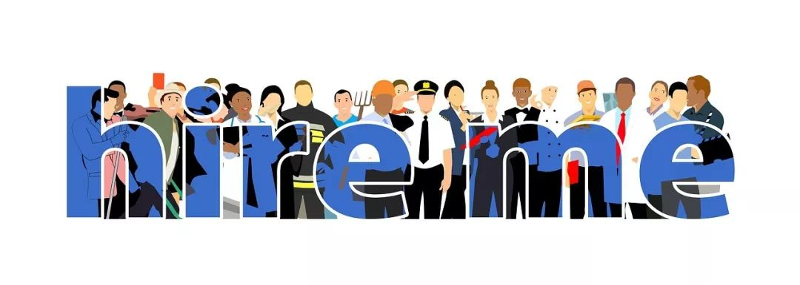

# 无标题

**链接地址:** http://mp.weixin.qq.com/s?__biz=MzI4NDYyNjAwNw==&mid=2247483932&idx=1&sn=14be73d87a91056c96d260996dd6f5f2&chksm=ebf9df24dc8e56327c9530c92b61302232e07fd0d71866fed70dc2101358ce20e23425a93396&mpshare=1&scene=2&srcid=&sharer_sharetime=1571363957816&sharer_shareid=be1c8edd6c93eec155a61c876e41d26a#rd
**作者:** 关注我们
**获取时间:** 2025/8/28 20:25:44
**图片数量:** 21

---

## 原始HTML内容

<section style="box-sizing: border-box;font-size: 16px;"><section style=" text-align: center;transform: translate3d(10px, 0px, 0px);-webkit-transform: translate3d(10px, 0px, 0px);-moz-transform: translate3d(10px, 0px, 0px);-o-transform: translate3d(10px, 0px, 0px);margin: 20px 0%; box-sizing: border-box; " powered-by="xiumi.us"><section style="display: inline-block;min-width: 10%;max-width: 100%;vertical-align: top;box-sizing: border-box;"><section style=" margin-right: 0%;margin-left: 0%;transform: translate3d(-10px, 0px, 0px) rotateY(180deg);opacity: 0.4; box-sizing: border-box; " powered-by="xiumi.us"><section style="display: flex;align-items: center;box-sizing: border-box;"><section style="flex: 1 1 auto;height: 2px;background-color: rgb(125, 192, 232);box-sizing: border-box;"></section><section style="flex: 0 0 auto;height: 10px;width: 10px;border-width: 2px;border-style: solid;border-color: rgb(48, 117, 153);border-radius: 50%;box-sizing: border-box;"></section></section></section><section class="horizontal-tb" style="text-align: justify;font-size: 17px;color: rgb(26, 82, 145);letter-spacing: 2px;line-height: 1.3;box-sizing: border-box;" powered-by="xiumi.us">
<strong style="box-sizing: border-box;">交换生项目</strong><strong style="box-sizing: border-box;">知多少</strong>
</section><section class="horizontal-tb" style="letter-spacing: 2.4px;font-size: 12px;color: rgba(48, 117, 153, 0.46);box-sizing: border-box;" powered-by="xiumi.us">
国家 / 学校 / 专业 / 课程 / 生活
</section><section style=" margin-top: -4px;margin-right: 0%;margin-left: 0%;transform: translate3d(10px, 0px, 0px);opacity: 0.4; box-sizing: border-box; " powered-by="xiumi.us"><section style="display: flex;align-items: center;box-sizing: border-box;"><section style="flex: 1 1 auto;height: 2px;background-color: rgb(125, 192, 232);box-sizing: border-box;"></section><section style="flex: 0 0 auto;height: 10px;width: 10px;border-width: 2px;border-style: solid;border-color: rgb(48, 117, 153);border-radius: 50%;box-sizing: border-box;"></section></section></section></section></section><section style=" margin: 40px 0% 30px; box-sizing: border-box; " powered-by="xiumi.us"><section style="display: inline-block;width: 100%;vertical-align: top;border-width: 0px 15px;border-radius: 0px;border-style: none solid;border-color: rgb(62, 62, 62) rgb(125, 192, 232);padding-right: 10px;padding-left: 10px;box-sizing: border-box;"><section class="horizontal-tb" style="box-sizing: border-box;" powered-by="xiumi.us">
 
</section><section style=" text-align: center;margin: -20px 0%; box-sizing: border-box; " powered-by="xiumi.us"><section style="max-width: 100%;vertical-align: middle;display: inline-block;line-height: 0;box-sizing: border-box;"></section></section></section></section><section style=" text-align: left;margin: 10px 0% -40px; box-sizing: border-box; " powered-by="xiumi.us"><section class="group-empty" style="display: inline-block;width: 60px;height: 40px;vertical-align: top;overflow: hidden;border-left: 10px solid rgb(125, 192, 232);border-bottom-left-radius: 0px;box-sizing: border-box;"></section></section><section class="horizontal-tb" style="font-size: 14px;color: rgb(121, 121, 121);padding-right: 30px;padding-left: 30px;line-height: 1.8;letter-spacing: 2px;box-sizing: border-box;" powered-by="xiumi.us">
还在校上课的同学们从今年10月份开始，陆续就可以收到来自学校或专业部门的邮件或海报——每年的<strong style="box-sizing: border-box;">交换生项目的报名即将开始</strong>。

 

同学们或许或感到新鲜好奇：每年这么多交流项目，涉及到不同的<strong style="box-sizing: border-box;">国家，学校，学科和课程</strong>。怎样选择会<strong style="box-sizing: border-box;">最大限度地帮助我不浪费不辜负这短短几个月的课程时间</strong>呢？

 

一些同学取巧地想到：既然中国内地有这么多丰富的交换生项目，<strong style="box-sizing: border-box;">为何我不选择一个离家近一点的国内城市和学校</strong>呢？不仅语言没有隔阂，生活方式也不需要磨合，甚至一个高兴我每周末都可以回家住一下。轻轻松松用母语修几门儿课，何乐而不为？

 
</section><section style="  box-sizing: border-box; " powered-by="xiumi.us"><section style="display: inline-block;vertical-align: middle;width: 50%;border-width: 0px;box-sizing: border-box;"><section style=" margin: 30px 0%; box-sizing: border-box; " powered-by="xiumi.us"><section style="display: inline-block;width: 100%;vertical-align: top;border-width: 0px 30px 0px 15px;border-radius: 0px;border-style: none none none solid;border-color: rgb(62, 62, 62) rgb(244, 220, 50) rgb(62, 62, 62) rgb(125, 192, 232);padding-right: 5px;padding-left: 10px;box-sizing: border-box;"><section style=" text-align: center;margin: -20px 0%; box-sizing: border-box; " powered-by="xiumi.us"><section style="max-width: 100%;vertical-align: middle;display: inline-block;line-height: 0;border-width: 5px;border-radius: 0px;border-style: solid;border-color: rgb(255, 255, 255);box-sizing: border-box;"></section></section></section></section></section><section style="display: inline-block;vertical-align: middle;width: 50%;border-width: 0px;box-sizing: border-box;"><section style=" margin: 30px 0%;text-align: right; box-sizing: border-box; " powered-by="xiumi.us"><section style="display: inline-block;width: 100%;vertical-align: top;border-width: 0px 15px 0px 30px;border-radius: 0px;border-style: none solid none none;border-color: rgb(62, 62, 62) rgb(125, 192, 232) rgb(62, 62, 62) rgb(244, 220, 50);padding-right: 10px;padding-left: 5px;box-sizing: border-box;"><section style=" text-align: center;margin: -20px 0%; box-sizing: border-box; " powered-by="xiumi.us"><section style="max-width: 100%;vertical-align: middle;display: inline-block;line-height: 0;border-width: 5px;border-radius: 0px;border-style: solid;border-color: rgb(255, 255, 255);box-sizing: border-box;"></section></section></section></section></section></section><section class="horizontal-tb" style="font-size: 14px;color: rgb(121, 121, 121);padding-right: 30px;padding-left: 30px;line-height: 1.8;letter-spacing: 2px;box-sizing: border-box;" powered-by="xiumi.us">
 

同学，你要是这么想，啧啧，<strong style="box-sizing: border-box;">那是很危险的！</strong><strong style="box-sizing: border-box;">那就大大浪费了这个交换学</strong><strong style="box-sizing: border-box;">习，丰富自己眼界见识，锻炼自己生存能力的好机会了。</strong> 
</section><section style=" text-align: right;margin: -40px 0% 10px; box-sizing: border-box; " powered-by="xiumi.us"><section class="group-empty" style="display: inline-block;width: 60px;height: 40px;vertical-align: top;overflow: hidden;border-left: 10px none rgb(125, 192, 232);border-bottom-left-radius: 0px;border-right: 10px solid rgb(125, 192, 232);border-top-right-radius: 0px;box-sizing: border-box;"></section></section><section class="horizontal-tb" style="box-sizing: border-box;" powered-by="xiumi.us">
 
</section><section style=" text-align: center;margin: 15px 0% 10px;transform: translate3d(3px, 0px, 0px);-webkit-transform: translate3d(3px, 0px, 0px);-moz-transform: translate3d(3px, 0px, 0px);-o-transform: translate3d(3px, 0px, 0px); box-sizing: border-box; " powered-by="xiumi.us"><section style="display: inline-block;width: 93%;vertical-align: top;border-style: solid;border-width: 1px;border-radius: 0px;border-color: rgba(48, 117, 153, 0.34);box-sizing: border-box;"><section style=" margin: -5px 0% 4px;transform: translate3d(-5px, 0px, 0px);-webkit-transform: translate3d(-5px, 0px, 0px);-moz-transform: translate3d(-5px, 0px, 0px);-o-transform: translate3d(-5px, 0px, 0px); box-sizing: border-box; " powered-by="xiumi.us"><section style="display: inline-block;width: 100%;vertical-align: top;border-style: solid;border-width: 1px;border-radius: 0px;border-color: rgba(48, 117, 153, 0.34);box-sizing: border-box;"><section style=" margin: 10px 0%;transform: translate3d(-20px, 0px, 0px);-webkit-transform: translate3d(-20px, 0px, 0px);-moz-transform: translate3d(-20px, 0px, 0px);-o-transform: translate3d(-20px, 0px, 0px); box-sizing: border-box; " powered-by="xiumi.us"><section style="display: inline-block;vertical-align: middle;width: auto;background-color: rgba(255, 255, 255, 0);box-sizing: border-box;"><section style=" margin-right: 0%;margin-left: 0%;transform: translate3d(25px, 0px, 0px); box-sizing: border-box; " powered-by="xiumi.us"><section style="display: inline-block;width: 50px;height: 40px;vertical-align: top;overflow: hidden;background-position: 50% 50%;background-repeat: no-repeat;background-size: contain;background-attachment: scroll;background-image: url(&quot;https://mmbiz.qpic.cn/mmbiz_png/cY0qSDjdkFdX2ibcNFvvcjx9etTzTXnNzicQzBYa6H4Zdq9gIia11dUAgc8jGtPXgTkmpon19ZSFV77qCWsUo2KYQ/640?wx_fmt=png&quot;);box-sizing: border-box;"><section class="horizontal-tb" style="text-align: justify;box-sizing: border-box;" powered-by="xiumi.us">
 
</section></section></section></section><section style="display: inline-block;vertical-align: middle;width: auto;background-color: rgba(255, 255, 255, 0);box-sizing: border-box;"><section style="  box-sizing: border-box; " powered-by="xiumi.us"><section style="display: inline-block;width: 100%;vertical-align: top;border-width: 1px;border-radius: 100px;border-style: solid;border-color: rgb(164, 198, 188);overflow: hidden;padding-left: 20px;background-image: linear-gradient(270deg, rgb(197, 217, 201) 0%, rgba(197, 217, 201, 0) 99%);box-sizing: border-box;"><section class="horizontal-tb" style="text-align: justify;font-size: 17px;letter-spacing: 3px;padding-right: 10px;padding-left: 10px;box-sizing: border-box;" powered-by="xiumi.us">
<strong style="box-sizing: border-box;">Ada的故事</strong>
</section></section></section></section></section><section style=" margin: 15px 0%; box-sizing: border-box; " powered-by="xiumi.us"><section class="horizontal-tb" style="text-align: justify;font-size: 14px;color: rgb(95, 104, 117);line-height: 1.8;letter-spacing: 2px;padding-right: 20px;padding-left: 20px;box-sizing: border-box;">
在开始今天的话题之前，让我们先来听Ada讲述发生在她身上的<strong style="box-sizing: border-box;">真实故事</strong>：
</section></section><section style=" margin: 10px 0%; box-sizing: border-box; " powered-by="xiumi.us"><section style="display: inline-block;width: 95%;vertical-align: top;line-height: 0;letter-spacing: 0px;box-sizing: border-box;"><section style="  box-sizing: border-box; " powered-by="xiumi.us"><section style="display: inline-block;width: 100%;vertical-align: top;background-color: rgba(211, 226, 242, 0.89);border-style: none solid solid;border-width: 1px;border-radius: 0px;border-color: rgba(206, 175, 151, 0.84) rgba(211, 226, 242, 0.89) rgba(211, 226, 242, 0.89);line-height: 1.8;letter-spacing: 1.8px;padding-right: 10px;padding-left: 10px;box-sizing: border-box;"><section class="horizontal-tb" style="text-align: justify;font-size: 14px;letter-spacing: 2px;padding-right: 20px;padding-left: 20px;box-sizing: border-box;" powered-by="xiumi.us">
 

我们的求职培训师Ada在就读U of A MBA的时候就有一段毕生受益的交换机会。

 

那个时候她是part time读MBA， <strong style="box-sizing: border-box;">白天上班晚上上课很辛苦</strong>。即使是这样，带着对异国文化的好奇和扩展社交圈的目的，Ada向当时公司的老板<strong style="box-sizing: border-box;">请假几个月去法国做交换生</strong>。

 

为什么要<strong style="box-sizing: border-box;">冒着可能职位不保还要去交换</strong>呢？

 

因为当时Ada在U of A和法国两方学校都多次了解这个交流项目的情况以后，发觉这次的交换不仅能够<strong style="box-sizing: border-box;">在短时间内满足学分的要求</strong>，更主要的是在这个项目中她将要接触到的同学、将要参观的公司都会为当时的她<strong style="box-sizing: border-box;">提供更多的知识和更高的社交平台</strong>。

 

在短短的两个月之内，Ada结交了多个国家来交换的学生，到现在为止还都保持联系，交流专业领域的进展。

 

与此同时，由于这个交换项目的声誉和学习的内容，Ada的<strong style="box-sizing: border-box;">简历也得到了极大的丰富</strong>，在她为跨国企业提供人力资源咨询时起到了作用。

 
</section><section style=" margin-right: 0%;margin-left: 0%; box-sizing: border-box; " powered-by="xiumi.us"><section style="background-color: rgba(210, 226, 242, 0.89);height: 1px;box-sizing: border-box;"></section></section></section></section></section></section><section style=" margin: 15px 0%; box-sizing: border-box; " powered-by="xiumi.us"><section class="horizontal-tb" style="text-align: justify;font-size: 14px;color: rgb(95, 104, 117);line-height: 1.8;letter-spacing: 2px;padding-right: 20px;padding-left: 20px;box-sizing: border-box;">
听完这个故事，是不是对你选择交流项目起到了启发作用呢？那么到底该怎样挑选适合自己的交流项目呢？今天就来积极参与我们BADAB Consulting这个月为大家精心准备的话题吧！
</section></section><section style=" margin: 10px 0%; box-sizing: border-box; " powered-by="xiumi.us"><section style="display: inline-block;min-width: 10%;max-width: 100%;vertical-align: top;padding-right: 20px;padding-left: 20px;box-sizing: border-box;"><section style=" text-align: right;margin-right: 0%;margin-bottom: -10px;margin-left: 0%;transform: translate3d(20px, 0px, 0px); box-sizing: border-box; " powered-by="xiumi.us"><section style="display: inline-block;width: 30px;height: 30px;vertical-align: top;overflow: hidden;box-sizing: border-box;"><section style=" text-align: center;margin-right: 0%;margin-left: 0%; box-sizing: border-box; " powered-by="xiumi.us"><section style="max-width: 100%;vertical-align: middle;display: inline-block;line-height: 0;width: 100%;box-sizing: border-box;"></section></section></section></section><section style=" margin-right: 0%;margin-left: 0%; box-sizing: border-box; " powered-by="xiumi.us"><section style="display: inline-block;min-width: 10%;max-width: 100%;vertical-align: top;padding-right: 5px;padding-left: 5px;border-width: 3px;border-radius: 0px;border-style: solid;border-color: rgba(0, 0, 0, 0);box-shadow: rgb(51, 167, 233) 0px 0px 0px;background-color: rgb(125, 192, 232);box-sizing: border-box;"><section style=" transform: translate3d(1px, 0px, 0px);-webkit-transform: translate3d(1px, 0px, 0px);-moz-transform: translate3d(1px, 0px, 0px);-o-transform: translate3d(1px, 0px, 0px); box-sizing: border-box; " powered-by="xiumi.us"><section class="horizontal-tb" style="text-align: justify;color: rgb(255, 255, 255);box-sizing: border-box;">
<strong style="box-sizing: border-box;">#交换生项目知多少</strong>
</section></section></section></section></section></section><section class="horizontal-tb" style="text-align: justify;box-sizing: border-box;" powered-by="xiumi.us">
 
</section></section></section></section></section><section class="horizontal-tb" style="box-sizing: border-box;" powered-by="xiumi.us">
 
</section><section class="horizontal-tb" style="box-sizing: border-box;" powered-by="xiumi.us">
 
</section><section style="  box-sizing: border-box; " powered-by="xiumi.us"><section style="display: inline-block;width: 100%;vertical-align: top;border-width: 0px 30px;border-radius: 0px;border-style: none solid;border-color: rgb(62, 62, 62) rgb(40, 115, 200);padding-right: 10px;padding-left: 10px;box-sizing: border-box;"><section class="horizontal-tb" style="text-align: center;font-size: 18px;line-height: 1;box-sizing: border-box;" powered-by="xiumi.us">
<strong style="box-sizing: border-box;">1. 对课程有所了解</strong>
</section></section></section><section style=" margin: 30px 0%; box-sizing: border-box; " powered-by="xiumi.us"><section style="display: inline-block;width: 60%;vertical-align: top;border-width: 0px 30px 0px 15px;border-radius: 0px;border-style: none none none solid;border-color: rgb(62, 62, 62) rgb(125, 192, 232);padding-right: 10px;padding-left: 10px;box-sizing: border-box;"><section style=" text-align: center;margin: -20px 0%; box-sizing: border-box; " powered-by="xiumi.us"><section style="max-width: 100%;vertical-align: middle;display: inline-block;line-height: 0;border-width: 5px;border-radius: 0px;border-style: solid;border-color: rgb(255, 255, 255);box-sizing: border-box;"></section></section></section></section><section style=" margin: -20px 0% 40px;text-align: right; box-sizing: border-box; " powered-by="xiumi.us"><section style="display: inline-block;width: 75%;vertical-align: top;border-width: 0px 15px 0px 30px;border-radius: 0px;border-style: none solid none none;border-color: rgb(62, 62, 62) rgb(125, 192, 232);padding-right: 10px;padding-left: 10px;box-sizing: border-box;"><section style=" text-align: center;margin: -20px 0%; box-sizing: border-box; " powered-by="xiumi.us"><section style="max-width: 100%;vertical-align: middle;display: inline-block;line-height: 0;border-width: 5px;border-radius: 0px;border-style: solid;border-color: rgb(255, 255, 255);box-sizing: border-box;"></section></section></section></section><section style=" text-align: left;margin: 10px 0% -40px; box-sizing: border-box; " powered-by="xiumi.us"><section class="group-empty" style="display: inline-block;width: 60px;height: 40px;vertical-align: top;overflow: hidden;border-left: 10px solid rgb(125, 192, 232);border-bottom-left-radius: 0px;box-sizing: border-box;"></section></section><section class="horizontal-tb" style="font-size: 14px;color: rgb(121, 121, 121);padding-right: 30px;padding-left: 30px;line-height: 1.8;letter-spacing: 2px;box-sizing: border-box;" powered-by="xiumi.us">
在选择课程前，也应该和项目负责人充分沟通交流，获取所选课程的资料，<strong style="box-sizing: border-box;">确定课程的内容是否是自己想要修习的内容，是否会阻碍或者限制后续课程的进修。</strong> 

 

当然，如果你想对自己进行挑战，或者有非常感兴趣的领域想要深入了解，也可以<strong style="box-sizing: border-box;">在条件允许的情况下报名参加一些和自己所学专业并非直接相关的课程</strong>去丰富自己的阅历。

 

不过在决定前还是要注意，<strong style="box-sizing: border-box;">掂量一下自己是否有顺利通过课程的把握</strong>。毕竟交流学习的主要目的还是学习。如果因为什么原因无法顺利完成课程，一定要及时和负责人请求援助。
</section><section style=" text-align: right;margin: -40px 0% 10px; box-sizing: border-box; " powered-by="xiumi.us"><section class="group-empty" style="display: inline-block;width: 60px;height: 40px;vertical-align: top;overflow: hidden;border-left: 10px none rgb(125, 192, 232);border-bottom-left-radius: 0px;border-right: 10px solid rgb(125, 192, 232);border-top-right-radius: 0px;box-sizing: border-box;"></section></section><section class="horizontal-tb" style="box-sizing: border-box;" powered-by="xiumi.us">
 
</section><section style="  box-sizing: border-box; " powered-by="xiumi.us"><section style="display: inline-block;width: 100%;vertical-align: top;border-width: 0px 30px;border-radius: 0px;border-style: none solid;border-color: rgb(62, 62, 62) rgb(40, 115, 200);padding-right: 10px;padding-left: 10px;box-sizing: border-box;"><section class="horizontal-tb" style="text-align: center;font-size: 18px;line-height: 1;box-sizing: border-box;" powered-by="xiumi.us">
<strong style="box-sizing: border-box;">2. 为求职就业铺路</strong>
</section></section></section><section style=" margin: 30px 0%; box-sizing: border-box; " powered-by="xiumi.us"><section style="display: inline-block;width: 75%;vertical-align: top;border-width: 0px 30px 0px 15px;border-radius: 0px;border-style: none none none solid;border-color: rgb(62, 62, 62) rgb(125, 192, 232);padding-right: 10px;padding-left: 10px;box-sizing: border-box;"><section style=" text-align: center;margin: -20px 0%; box-sizing: border-box; " powered-by="xiumi.us"><section style="max-width: 100%;vertical-align: middle;display: inline-block;line-height: 0;border-width: 5px;border-radius: 0px;border-style: solid;border-color: rgb(255, 255, 255);box-sizing: border-box;"></section></section></section></section><section style=" margin: -20px 0% 30px;text-align: right; box-sizing: border-box; " powered-by="xiumi.us"><section style="display: inline-block;width: 60%;vertical-align: top;border-width: 0px 15px 0px 30px;border-radius: 0px;border-style: none solid none none;border-color: rgb(62, 62, 62) rgb(125, 192, 232);padding-right: 10px;padding-left: 10px;box-sizing: border-box;"><section style=" text-align: center;margin: -20px 0%; box-sizing: border-box; " powered-by="xiumi.us"><section style="max-width: 100%;vertical-align: middle;display: inline-block;line-height: 0;border-width: 5px;border-radius: 0px;border-style: solid;border-color: rgb(255, 255, 255);box-sizing: border-box;"></section></section></section></section><section style=" text-align: left;margin: 10px 0% -40px; box-sizing: border-box; " powered-by="xiumi.us"><section class="group-empty" style="display: inline-block;width: 60px;height: 40px;vertical-align: top;overflow: hidden;border-left: 10px solid rgb(125, 192, 232);border-bottom-left-radius: 0px;box-sizing: border-box;"></section></section><section class="horizontal-tb" style="font-size: 14px;color: rgb(121, 121, 121);padding-right: 30px;padding-left: 30px;line-height: 1.8;letter-spacing: 2px;box-sizing: border-box;" powered-by="xiumi.us">
很多同学选择参加交流项目的原因除了自己感兴趣以外，或许也考虑到<strong style="box-sizing: border-box;">为自己的求职就业打下基础</strong>。通常公司的人力资源部门在招聘时会都会<strong style="box-sizing: border-box;">留意应届毕业生在异国交流学习的经历</strong>，特别是对于工作经验不算丰富的同学，<strong style="box-sizing: border-box;">这是一个弯道超车的好机会</strong>。

 

因此在交流期间努力学习的同时，也要<strong style="box-sizing: border-box;">兼顾进行丰富的社交活动</strong>，参加丰富的社会实践。参与激烈的辩论赛，推广艺术文化交流，挑战运动项目，或是参与环保活动……这些精彩丰富的活动<strong style="box-sizing: border-box;">不仅可以丰富你在交流期间的课余生活，更可能成为你简历上的闪光点</strong>。
</section><section style=" text-align: right;margin: -40px 0% 10px; box-sizing: border-box; " powered-by="xiumi.us"><section class="group-empty" style="display: inline-block;width: 60px;height: 40px;vertical-align: top;overflow: hidden;border-left: 10px none rgb(125, 192, 232);border-bottom-left-radius: 0px;border-right: 10px solid rgb(125, 192, 232);border-top-right-radius: 0px;box-sizing: border-box;"></section></section><section class="horizontal-tb" style="box-sizing: border-box;" powered-by="xiumi.us">
 
</section><section style=" margin: 40px 0% 30px; box-sizing: border-box; " powered-by="xiumi.us"><section style="display: inline-block;width: 100%;vertical-align: top;border-width: 0px 15px;border-radius: 0px;border-style: none solid;border-color: rgb(62, 62, 62) rgb(125, 192, 232);padding-right: 10px;padding-left: 10px;box-sizing: border-box;"><section style=" text-align: center;margin: -20px 0%; box-sizing: border-box; " powered-by="xiumi.us"><section style="max-width: 100%;vertical-align: middle;display: inline-block;line-height: 0;box-sizing: border-box;"></section></section></section></section><section class="horizontal-tb" style="box-sizing: border-box;" powered-by="xiumi.us">
 
</section><section style="  box-sizing: border-box; " powered-by="xiumi.us"><section style="display: inline-block;width: 100%;vertical-align: top;border-width: 0px 30px;border-radius: 0px;border-style: none solid;border-color: rgb(62, 62, 62) rgb(40, 115, 200);padding-right: 10px;padding-left: 10px;box-sizing: border-box;"><section class="horizontal-tb" style="text-align: center;font-size: 18px;line-height: 1;box-sizing: border-box;" powered-by="xiumi.us">
<strong style="box-sizing: border-box;">3. 感受异国文化</strong>
</section></section></section><section style=" margin: 30px 0%; box-sizing: border-box; " powered-by="xiumi.us"><section style="display: inline-block;width: 75%;vertical-align: top;border-width: 0px 30px 0px 15px;border-radius: 0px;border-style: none none none solid;border-color: rgb(62, 62, 62) rgb(40, 115, 200);padding-right: 10px;padding-left: 10px;box-sizing: border-box;"><section style=" text-align: center;margin: -20px 0%; box-sizing: border-box; " powered-by="xiumi.us"><section style="max-width: 100%;vertical-align: middle;display: inline-block;line-height: 0;border-width: 5px;border-radius: 0px;border-style: solid;border-color: rgb(255, 255, 255);box-sizing: border-box;"></section></section></section></section><section style=" margin: -20px 0% 30px;text-align: right; box-sizing: border-box; " powered-by="xiumi.us"><section style="display: inline-block;width: 60%;vertical-align: top;border-width: 0px 15px 0px 30px;border-radius: 0px;border-style: none solid none none;border-color: rgb(62, 62, 62) rgb(125, 192, 232);padding-right: 10px;padding-left: 10px;box-sizing: border-box;"><section style=" text-align: center;margin: -20px 0%; box-sizing: border-box; " powered-by="xiumi.us"><section style="max-width: 100%;vertical-align: middle;display: inline-block;line-height: 0;border-width: 5px;border-radius: 0px;border-style: solid;border-color: rgb(255, 255, 255);box-sizing: border-box;"></section></section></section></section><section style=" text-align: left;margin: 10px 0% -40px; box-sizing: border-box; " powered-by="xiumi.us"><section class="group-empty" style="display: inline-block;width: 60px;height: 40px;vertical-align: top;overflow: hidden;border-left: 10px solid rgb(125, 192, 232);border-bottom-left-radius: 0px;box-sizing: border-box;"></section></section><section class="horizontal-tb" style="font-size: 14px;color: rgb(121, 121, 121);padding-right: 30px;padding-left: 30px;line-height: 1.8;letter-spacing: 2px;box-sizing: border-box;" powered-by="xiumi.us">
首先，在选择交流目的地之前，请你明确作为交换生想要达到的目的。如果你在这段经历中，更<strong style="box-sizing: border-box;">看重的是感受异域文化，丰富自己的生活经历</strong>，那么在选择目的地国家和城市时可以考虑选择<strong style="box-sizing: border-box;">历史文化悠久且对外来文化又相对接纳的地区</strong>。

 

在这样的城市进行交流学习，你收获的不仅仅是文化知识，更是丰富的阅历和新奇的体验。不过也请注意，在选择项目时<strong style="box-sizing: border-box;">搞清楚选择课程的授课语言和当地本地人使用的语言</strong>，如果这些语言既非自己的母语也非英语，请<strong style="box-sizing: border-box;">仔细掂量一下自己这些语言的使用熟练程度</strong>。

 

如果你无法熟练使用这些语言，不能顺利完成所选课程，那么在成绩单上留下不好的印记而影响之后的学业甚至毕业的话，则得不偿失啦。
</section><section style=" text-align: right;margin: -40px 0% 10px; box-sizing: border-box; " powered-by="xiumi.us"><section class="group-empty" style="display: inline-block;width: 60px;height: 40px;vertical-align: top;overflow: hidden;border-left: 10px none rgb(125, 192, 232);border-bottom-left-radius: 0px;border-right: 10px solid rgb(125, 192, 232);border-top-right-radius: 0px;box-sizing: border-box;"></section></section><section class="horizontal-tb" style="box-sizing: border-box;" powered-by="xiumi.us">
 
</section><section style="  box-sizing: border-box; " powered-by="xiumi.us"><section style="display: inline-block;width: 100%;vertical-align: top;border-width: 0px 30px;border-radius: 0px;border-style: none solid;border-color: rgb(62, 62, 62) rgb(40, 115, 200);padding-right: 10px;padding-left: 10px;box-sizing: border-box;"><section class="horizontal-tb" style="text-align: center;font-size: 18px;line-height: 1;box-sizing: border-box;" powered-by="xiumi.us">
<strong style="box-sizing: border-box;">4. 接触不同的思维方式</strong>
</section></section></section><section style=" margin: 30px 0%; box-sizing: border-box; " powered-by="xiumi.us"><section style="display: inline-block;width: 60%;vertical-align: top;border-width: 0px 30px 0px 15px;border-radius: 0px;border-style: none none none solid;border-color: rgb(62, 62, 62) rgb(51, 167, 233);padding-right: 10px;padding-left: 10px;box-sizing: border-box;"><section style=" text-align: center;margin: -20px 0%; box-sizing: border-box; " powered-by="xiumi.us"><section style="max-width: 100%;vertical-align: middle;display: inline-block;line-height: 0;border-width: 5px;border-radius: 0px;border-style: solid;border-color: rgb(255, 255, 255);box-sizing: border-box;"></section></section></section></section><section style=" margin: -20px 0% 40px;text-align: right; box-sizing: border-box; " powered-by="xiumi.us"><section style="display: inline-block;width: 75%;vertical-align: top;border-width: 0px 15px 0px 30px;border-radius: 0px;border-style: none solid none none;border-color: rgb(62, 62, 62) rgb(51, 167, 233);padding-right: 10px;padding-left: 10px;box-sizing: border-box;"><section style=" text-align: center;margin: -20px 0%; box-sizing: border-box; " powered-by="xiumi.us"><section style="max-width: 100%;vertical-align: middle;display: inline-block;line-height: 0;border-width: 5px;border-radius: 0px;border-style: solid;border-color: rgb(255, 255, 255);box-sizing: border-box;"></section></section></section></section><section style=" text-align: left;margin: 10px 0% -40px; box-sizing: border-box; " powered-by="xiumi.us"><section class="group-empty" style="display: inline-block;width: 60px;height: 40px;vertical-align: top;overflow: hidden;border-left: 10px solid rgb(125, 192, 232);border-bottom-left-radius: 0px;box-sizing: border-box;"></section></section><section class="horizontal-tb" style="font-size: 14px;color: rgb(121, 121, 121);padding-right: 30px;padding-left: 30px;line-height: 1.8;letter-spacing: 2px;box-sizing: border-box;" powered-by="xiumi.us">
另外，大家在选择交流项目时请尽量<strong style="box-sizing: border-box;">避免中国留学生占比数量极大的学校或城市</strong>。方便的华人市场，可口的家乡食物和随处耳闻的乡音固然亲切，但这样的交流学习能让你交流到什么呢？

 

如果你去到交流项目的国家和学校，依然和中国留学生整天混在一起，这不仅对你学习本地语言，感受当地风情毫无益处；更重要的是，你<strong style="box-sizing: border-box;">错失了许多感受和学习本地人思维方式的机会</strong>。

 

每一个国家甚至学校的教育系统，都会有其独特之处。交流学习的一大优点就是<strong style="box-sizing: border-box;">鼓励学生在新的教育体系中取长补短，培养自身创造力和想象力，发掘自身新的潜力</strong>。
</section><section style=" text-align: right;margin: -40px 0% 10px; box-sizing: border-box; " powered-by="xiumi.us"><section class="group-empty" style="display: inline-block;width: 60px;height: 40px;vertical-align: top;overflow: hidden;border-left: 10px none rgb(125, 192, 232);border-bottom-left-radius: 0px;border-right: 10px solid rgb(125, 192, 232);border-top-right-radius: 0px;box-sizing: border-box;"></section></section><section class="horizontal-tb" style="box-sizing: border-box;" powered-by="xiumi.us">
 
</section><section style="  box-sizing: border-box; " powered-by="xiumi.us"><section style="display: inline-block;width: 100%;vertical-align: top;border-width: 0px 30px;border-radius: 0px;border-style: none solid;border-color: rgb(62, 62, 62) rgb(40, 115, 200);padding-right: 10px;padding-left: 10px;box-sizing: border-box;"><section class="horizontal-tb" style="text-align: center;font-size: 18px;line-height: 1;box-sizing: border-box;" powered-by="xiumi.us">
<strong style="box-sizing: border-box;">5. 培养自我管理能力</strong>
</section></section></section><section style=" margin: 30px 0%; box-sizing: border-box; " powered-by="xiumi.us"><section style="display: inline-block;width: 60%;vertical-align: top;border-width: 0px 30px 0px 15px;border-radius: 0px;border-style: none none none solid;border-color: rgb(62, 62, 62) rgb(125, 192, 232);padding-right: 10px;padding-left: 10px;box-sizing: border-box;"><section style=" text-align: center;margin: -20px 0%; box-sizing: border-box; " powered-by="xiumi.us"><section style="max-width: 100%;vertical-align: middle;display: inline-block;line-height: 0;border-width: 5px;border-radius: 0px;border-style: solid;border-color: rgb(255, 255, 255);box-sizing: border-box;"></section></section></section></section><section style=" margin: -20px 0% 40px;text-align: right; box-sizing: border-box; " powered-by="xiumi.us"><section style="display: inline-block;width: 75%;vertical-align: top;border-width: 0px 15px 0px 30px;border-radius: 0px;border-style: none solid none none;border-color: rgb(62, 62, 62) rgb(125, 192, 232);padding-right: 10px;padding-left: 10px;box-sizing: border-box;"><section style=" text-align: center;margin: -20px 0%; box-sizing: border-box; " powered-by="xiumi.us"><section style="max-width: 100%;vertical-align: middle;display: inline-block;line-height: 0;border-width: 5px;border-radius: 0px;border-style: solid;border-color: rgb(255, 255, 255);box-sizing: border-box;"></section></section></section></section><section style=" text-align: left;margin: 10px 0% -40px; box-sizing: border-box; " powered-by="xiumi.us"><section class="group-empty" style="display: inline-block;width: 60px;height: 40px;vertical-align: top;overflow: hidden;border-left: 10px solid rgb(125, 192, 232);border-bottom-left-radius: 0px;box-sizing: border-box;"></section></section><section class="horizontal-tb" style="font-size: 14px;color: rgb(121, 121, 121);padding-right: 30px;padding-left: 30px;line-height: 1.8;letter-spacing: 2px;box-sizing: border-box;" powered-by="xiumi.us">
一些同学在选择交流项目时可能会遇到一些<strong style="box-sizing: border-box;">收费高昂，活动丰富的项目</strong>。不仅连学生的课程内容安排妥当，连学生的住宿，餐饮，接泊，甚至生活娱乐项目都规划完善。

 

这样的项目乍一看省心省力，实际上则<strong style="box-sizing: border-box;">扼杀了学生培养自我管理协调能力的成长空间</strong>。他们没有机会和本地人交流接触，根本无法达到交流学习的目的。

 

遇到任何的突发情况，只需要找配备辅导员就可以顺利解决。花了一大笔钱却等同于坐在宿舍里和认识的朋友们修了一门远程课程。<strong style="box-sizing: border-box;">这样交流学习的经历想必不是各位想要的。</strong>
</section><section class="horizontal-tb" style="box-sizing: border-box;" powered-by="xiumi.us">
 
</section><section style=" margin: 10px 0%;text-align: center;transform: translate3d(-20px, 0px, 0px);-webkit-transform: translate3d(-20px, 0px, 0px);-moz-transform: translate3d(-20px, 0px, 0px);-o-transform: translate3d(-20px, 0px, 0px); box-sizing: border-box; " powered-by="xiumi.us"><section style="display: inline-block;vertical-align: middle;width: auto;background-color: rgba(255, 255, 255, 0);box-sizing: border-box;"><section style=" margin-right: 0%;margin-left: 0%;transform: translate3d(25px, 0px, 0px); box-sizing: border-box; " powered-by="xiumi.us"><section style="display: inline-block;width: 40px;height: 40px;vertical-align: top;overflow: hidden;box-sizing: border-box;"><section style="  transform: rotateZ(298deg);-webkit-transform: rotateZ(298deg);-moz-transform: rotateZ(298deg);-o-transform: rotateZ(298deg);box-sizing: border-box; " powered-by="xiumi.us"><section style=" margin: 5px 0% 10px; box-sizing: border-box; "><section style="max-width: 100%;vertical-align: middle;display: inline-block;line-height: 0;width: 80%;box-sizing: border-box;"></section></section></section></section></section></section><section style="display: inline-block;vertical-align: middle;width: auto;background-color: rgba(255, 255, 255, 0);box-sizing: border-box;"><section style="  box-sizing: border-box; " powered-by="xiumi.us"><section style="display: inline-block;width: 100%;vertical-align: top;background-color: rgb(217, 237, 244);border-width: 1px;border-radius: 100px;border-style: solid;border-color: rgb(167, 193, 184);overflow: hidden;padding-left: 20px;box-sizing: border-box;"><section class="horizontal-tb" style="text-align: justify;color: rgb(89, 153, 163);letter-spacing: 3px;padding-right: 10px;padding-left: 10px;box-sizing: border-box;" powered-by="xiumi.us">
<strong style="box-sizing: border-box;">总结</strong>
</section></section></section></section></section><section style=" margin: 20px 0%; box-sizing: border-box; " powered-by="xiumi.us"><section class="horizontal-tb" style="font-size: 13px;color: rgba(51, 51, 51, 0.61);letter-spacing: 2px;padding-right: 20px;padding-left: 20px;box-sizing: border-box;">
在这里 BadaB Consulting 给同学们提出了很多选择交流项目的建议，希望大家根据自身的情况选择合适自己的采纳。希望能够有幸参与交流项目的同学们可以在这段快乐的学习期间里收获有用的知识，纯真的友谊，丰富的经历和难忘的回忆。
</section></section><section style=" margin: 10px 0%; box-sizing: border-box; " powered-by="xiumi.us"><section style="display: inline-block;width: 100%;vertical-align: top;background-position: 50% 50%;background-repeat: no-repeat;background-size: cover;background-attachment: scroll;background-image: url(&quot;https://mmbiz.qpic.cn/mmbiz_jpg/cY0qSDjdkFdX2ibcNFvvcjx9etTzTXnNznoaPeDCedfzViau0ArqqSa7KUK5oBAKGF65XllkglIZ64dcE2VmmAnw/640?wx_fmt=jpeg&quot;);box-sizing: border-box;"><section style=" text-align: center;margin-top: 10px;margin-right: 0%;margin-left: 0%; box-sizing: border-box; " powered-by="xiumi.us"><section style="display: inline-block;width: 95%;vertical-align: top;border-style: none;border-width: 0px;border-radius: 0px;border-color: rgba(48, 117, 153, 0.34);padding: 2px;background-image: linear-gradient(rgba(48, 117, 153, 0.3) 0%, rgba(48, 117, 153, 0) 100%);box-sizing: border-box;"><section style="  box-sizing: border-box; " powered-by="xiumi.us"><section style="display: inline-block;width: 100%;vertical-align: top;padding: 4px;background-position: 50% 50%;background-repeat: no-repeat;background-size: cover;background-attachment: scroll;background-image: url(&quot;https://mmbiz.qpic.cn/mmbiz_jpg/cY0qSDjdkFdX2ibcNFvvcjx9etTzTXnNznoaPeDCedfzViau0ArqqSa7KUK5oBAKGF65XllkglIZ64dcE2VmmAnw/640?wx_fmt=jpeg&quot;);box-sizing: border-box;"><section style=" margin-right: 0%;margin-left: 0%; box-sizing: border-box; " powered-by="xiumi.us"><section style="max-width: 100%;vertical-align: middle;display: inline-block;line-height: 0;box-sizing: border-box;"></section></section></section></section></section></section></section></section><section style=" margin: 20px 0%; box-sizing: border-box; " powered-by="xiumi.us"><section class="horizontal-tb" style="font-size: 13px;color: rgba(51, 51, 51, 0.61);letter-spacing: 2px;padding-right: 20px;padding-left: 20px;box-sizing: border-box;">
<strong style="font-size: 16px;box-sizing: border-box;">如果你对交换生项目有更多的心得和建议，也请在文章下方的留言栏中和我们分享。</strong> 

 

如果你在选择交流项目上有任何的问题，也请随时联系我们帮助你做出最合适的选择。

 

最后，请允许我隆重地介绍一下， 
</section></section><section style=" margin: 20px 0%; box-sizing: border-box; " powered-by="xiumi.us"><section class="horizontal-tb" style="font-size: 14px;color: rgba(51, 51, 51, 0.61);letter-spacing: 2px;padding-right: 20px;padding-left: 20px;box-sizing: border-box;">
<strong style="box-sizing: border-box;">资深人力资源顾问Ada Tai</strong>
</section></section><section style=" text-align: center;margin: 10px 0%; box-sizing: border-box; " powered-by="xiumi.us"><section style="display: inline-block;width: 90%;vertical-align: top;border-style: solid;border-width: 2px;border-radius: 0px;border-color: rgb(23, 51, 123);letter-spacing: 0px;padding: 10px;box-sizing: border-box;"><section style="  box-sizing: border-box; " powered-by="xiumi.us"><section style="display: inline-block;vertical-align: middle;width: 40%;box-sizing: border-box;"><section style=" margin-right: 0%;margin-left: 0%; box-sizing: border-box; " powered-by="xiumi.us"><section style="max-width: 100%;vertical-align: middle;display: inline-block;line-height: 0;border-width: 0px;width: 100%;box-sizing: border-box;"></section></section></section><section style="display: inline-block;vertical-align: middle;width: 60%;padding-left: 10px;box-sizing: border-box;"><section style=" margin-right: 0%;margin-bottom: 5px;margin-left: 0%; box-sizing: border-box; " powered-by="xiumi.us"><section class="horizontal-tb" style="display: inline-block;border-width: 2px;border-style: solid;border-color: rgb(23, 51, 123);padding: 0.1em 0.3em;background-color: rgb(23, 51, 123);color: rgb(255, 255, 255);font-size: 12px;box-sizing: border-box;">
<strong style="box-sizing: border-box;">Ada&nbsp; Tai</strong>
</section></section><section style=" margin-right: 0%;margin-left: 0%; box-sizing: border-box; " powered-by="xiumi.us"><section class="horizontal-tb" style="font-size: 13px;box-sizing: border-box;">
<strong style="box-sizing: border-box;">MBA, CPHR, C.Mgr.</strong>
</section></section><section style="  box-sizing: border-box; " powered-by="xiumi.us"><section style="display: inline-block;vertical-align: middle;width: 10%;border-width: 0px;box-sizing: border-box;"><section style=" margin: 5px 0%;text-align: left;font-size: 0px; box-sizing: border-box; " powered-by="xiumi.us"><section style="padding: 4px;display: inline-block;background-color: rgb(23, 51, 123);box-sizing: border-box;"><section class="horizontal-tb" style="border-color: rgba(255, 255, 255, 0);width: 1.6em;height: 1.6em;border-style: solid;border-width: 1px;text-align: center;line-height: 1.5em;color: rgb(255, 255, 255);box-sizing: border-box;">
 
</section></section></section></section><section style="display: inline-block;vertical-align: middle;width: 90%;box-sizing: border-box;"><section class="horizontal-tb" style="text-align: justify;font-size: 12px;box-sizing: border-box;" powered-by="xiumi.us">
修改简历与求职信
</section></section></section><section style="  box-sizing: border-box; " powered-by="xiumi.us"><section style="display: inline-block;vertical-align: middle;width: 10%;box-sizing: border-box;"><section style=" margin: 5px 0%;text-align: left;font-size: 0px; box-sizing: border-box; " powered-by="xiumi.us"><section style="padding: 4px;display: inline-block;background-color: rgb(23, 51, 123);box-sizing: border-box;"><section class="horizontal-tb" style="border-color: rgba(255, 255, 255, 0);width: 1.6em;height: 1.6em;border-style: solid;border-width: 1px;text-align: center;line-height: 1.5em;color: rgb(255, 255, 255);box-sizing: border-box;">
 
</section></section></section></section><section style="display: inline-block;vertical-align: middle;width: 90%;box-sizing: border-box;"><section class="horizontal-tb" style="text-align: justify;font-size: 12px;box-sizing: border-box;" powered-by="xiumi.us">
培训面试
</section></section></section><section style="  box-sizing: border-box; " powered-by="xiumi.us"><section style="display: inline-block;vertical-align: middle;width: 10%;border-width: 0px;box-sizing: border-box;"><section style=" margin: 5px 0%;text-align: left;font-size: 0px; box-sizing: border-box; " powered-by="xiumi.us"><section style="padding: 4px;display: inline-block;background-color: rgb(23, 51, 123);box-sizing: border-box;"><section class="horizontal-tb" style="border-color: rgba(255, 255, 255, 0);width: 1.6em;height: 1.6em;border-style: solid;border-width: 1px;text-align: center;line-height: 1.5em;color: rgb(255, 255, 255);box-sizing: border-box;">
 
</section></section></section></section><section style="display: inline-block;vertical-align: middle;width: 90%;box-sizing: border-box;"><section class="horizontal-tb" style="text-align: justify;font-size: 12px;box-sizing: border-box;" powered-by="xiumi.us">
建立LinkedIn Profile
</section></section></section><section style="  box-sizing: border-box; " powered-by="xiumi.us"><section style="display: inline-block;vertical-align: middle;width: 10%;box-sizing: border-box;"><section style=" margin: 5px 0%;text-align: left;font-size: 0px; box-sizing: border-box; " powered-by="xiumi.us"><section style="padding: 4px;display: inline-block;background-color: rgb(23, 51, 123);box-sizing: border-box;"><section class="horizontal-tb" style="border-color: rgba(255, 255, 255, 0);width: 1.6em;height: 1.6em;border-style: solid;border-width: 1px;text-align: center;line-height: 1.5em;color: rgb(255, 255, 255);box-sizing: border-box;">
 
</section></section></section></section><section style="display: inline-block;vertical-align: middle;width: 90%;box-sizing: border-box;"><section class="horizontal-tb" style="text-align: justify;font-size: 12px;box-sizing: border-box;" powered-by="xiumi.us">
职业评估与规划、社交培训
</section></section></section><section style="  box-sizing: border-box; " powered-by="xiumi.us"><section style="display: inline-block;vertical-align: middle;width: 10%;box-sizing: border-box;"><section style=" margin: 5px 0%;text-align: left;font-size: 0px; box-sizing: border-box; " powered-by="xiumi.us"><section style="padding: 4px;display: inline-block;background-color: rgb(23, 51, 123);box-sizing: border-box;"><section class="horizontal-tb" style="border-color: rgba(255, 255, 255, 0);width: 1.6em;height: 1.6em;border-style: solid;border-width: 1px;text-align: center;line-height: 1.5em;color: rgb(255, 255, 255);box-sizing: border-box;">
 
</section></section></section></section><section style="display: inline-block;vertical-align: middle;width: 90%;box-sizing: border-box;"><section class="horizontal-tb" style="text-align: justify;font-size: 12px;box-sizing: border-box;" powered-by="xiumi.us">
求职、职场文化等多种讲座
</section></section></section></section></section></section></section><section style=" margin: 20px 0%; box-sizing: border-box; " powered-by="xiumi.us"><section class="horizontal-tb" style="letter-spacing: 1.5px;font-size: 13px;color: rgba(51, 51, 51, 0.61);padding-right: 20px;padding-left: 20px;box-sizing: border-box;">
毕业于埃尔伯塔大学工商管理硕士学位,并拥有加拿大“注册人力资源管理师” 及“注册企业管理师”资格证，十几年来Ada一直在不同的领域从事人力资源的管理工作，包括大型企业、高科技产业、准政府、非营利组织、高等教育、商务管理等领域。

 

她熟知人力资源管理过程，特别是对人才的招聘、培训、职业规划、新员工的指引等方面有独到的见解。她有多年于企业招聘人才、培训学生与专业人士如何成功的获取工作，及指导他们如何应对工作场合中棘手的问题的经验。更将心理学融入到人力资源管理之中，为人才应聘最适合自己的岗位提供最有效的建议和帮助。
</section></section><section style=" margin: 10px 0%;text-align: center; box-sizing: border-box; " powered-by="xiumi.us"><section style="display: inline-block;width: 95%;vertical-align: top;border-right: 0px none rgb(62, 62, 62);border-top-right-radius: 0px;box-shadow: rgb(187, 222, 251) 0px 0px 15px;border-left: 0px none rgb(62, 62, 62);border-bottom-left-radius: 0px;padding: 5px;box-sizing: border-box;"><section style=" margin-right: 0%;margin-left: 0%; box-sizing: border-box; " powered-by="xiumi.us"><section style="display: inline-block;width: 100%;vertical-align: top;border-right: 0px none rgb(62, 62, 62);border-top-right-radius: 0px;box-shadow: rgb(187, 222, 251) 0px 0px 15px inset;border-left: 0px none rgb(62, 62, 62);border-bottom-left-radius: 0px;padding: 10px;box-sizing: border-box;"><section style=" margin-right: 0%;margin-left: 0%; box-sizing: border-box; " powered-by="xiumi.us"><section style="max-width: 100%;vertical-align: middle;display: inline-block;line-height: 0;box-shadow: rgb(0, 0, 0) 0px 0px 0px;box-sizing: border-box;"></section></section></section></section></section></section><section style=" margin: 20px 0%; box-sizing: border-box; " powered-by="xiumi.us"><section class="horizontal-tb" style="letter-spacing: 1.5px;color: rgba(51, 51, 51, 0.61);padding-right: 20px;padding-left: 20px;box-sizing: border-box;">
BadaB的服务包括但不仅限于一对一咨询，修改和更新简历，Cover Letter，面试培训，以及帮你打造一个出色的LinkedIn Profile等等。
</section></section><section style=" text-align: center;margin: 30px 0% 10px; box-sizing: border-box; " powered-by="xiumi.us"><section style="display: inline-block;width: 95%;vertical-align: top;box-shadow: rgb(185, 185, 185) 1.41421px 1.41421px 6px;padding: 5px;box-sizing: border-box;"><section style=" margin: -20px 0% 5px; box-sizing: border-box; " powered-by="xiumi.us"><section style="max-width: 100%;vertical-align: middle;display: inline-block;line-height: 0;box-shadow: rgb(0, 0, 0) 0px 0px 0px;box-sizing: border-box;"></section></section><section style=" margin: 10px 0%; box-sizing: border-box; " powered-by="xiumi.us"><section style="display: inline-block;vertical-align: middle;width: 38%;box-shadow: rgb(0, 0, 0) 0px 0px 0px;padding-left: 10px;box-sizing: border-box;"><section style=" margin-right: 0%;margin-left: 0%; box-sizing: border-box; " powered-by="xiumi.us"><section style="max-width: 100%;vertical-align: middle;display: inline-block;line-height: 0;box-shadow: rgb(0, 0, 0) 0px 0px 0px;border-style: solid;border-width: 2px;border-radius: 0px;border-color: rgb(62, 62, 62);box-sizing: border-box;"></section></section></section><section style="display: inline-block;vertical-align: middle;width: 61.8%;box-sizing: border-box;"><section class="horizontal-tb tn-yzk-fuid-text-90804-1531294310026" style="font-size: 14px;color: rgba(51, 51, 51, 0.61);box-sizing: border-box;" powered-by="xiumi.us">
<strong style="box-sizing: border-box;">BadaB</strong>

<strong style="box-sizing: border-box;">bright future ahead!</strong>

微信公众号：<strong style="box-sizing: border-box;">badab101</strong>
</section><section style=" margin: 10px 0%; box-sizing: border-box; " powered-by="xiumi.us"><section style="display: inline-block;box-shadow: rgb(183, 28, 28) 0px 0px 0px inset;border-style: solid;border-width: 1px;border-radius: 5px;border-color: rgb(66, 66, 66);padding: 5px;background-color: rgba(76, 186, 238, 0.82);box-sizing: border-box;"><section class="horizontal-tb tn-yzk-fuid-text-87776-1531294313353" style="text-align: justify;color: rgb(255, 255, 255);padding-right: 8px;padding-left: 8px;font-size: 14px;box-sizing: border-box;" powered-by="xiumi.us">
<strong style="box-sizing: border-box;">长按二维码关注我们</strong>
</section></section></section></section></section></section></section><section style=" margin: 20px 0%; box-sizing: border-box; " powered-by="xiumi.us"><section class="horizontal-tb" style="font-size: 14px;color: rgba(51, 51, 51, 0.61);letter-spacing: 2px;padding-right: 20px;padding-left: 20px;box-sizing: border-box;">
<strong style="box-sizing: border-box;">好的工作机会不等人！</strong>

在你犹豫的片刻之间，

或许你心仪的Offer已经被发<strong style="box-sizing: border-box;">到了别人的手里</strong>！

如果你需要我们，

就请尽快<strong style="box-sizing: border-box;">联系我们</strong>吧！
</section></section><section class="horizontal-tb" style="box-sizing: border-box;" powered-by="xiumi.us">
<strong style="box-sizing: border-box;">- END -</strong> 
</section><section class="horizontal-tb" style="box-sizing: border-box;" powered-by="xiumi.us">
 
</section><section style=" margin-top: 10px;margin-bottom: 10px;text-align: center; box-sizing: border-box; " powered-by="xiumi.us"><section style="padding-left: 1em;padding-right: 1em;display: inline-block;box-sizing: border-box;">
<strong style="box-sizing: border-box;">预告</strong>
 </section><section style="border-width: 1px;border-style: solid;border-color: rgb(192, 200, 209);margin-top: -1em;padding: 20px 10px 10px;background-color: rgb(239, 239, 239);box-sizing: border-box;"><section style=" margin: 20px 0%; box-sizing: border-box; " powered-by="xiumi.us"><section class="horizontal-tb" style="text-align: justify;font-size: 14px;color: rgb(39, 165, 224);letter-spacing: 2px;padding-right: 20px;padding-left: 20px;box-sizing: border-box;">
我们会在今年下半年推出以求职为主题的<strong style="box-sizing: border-box;">网络课程</strong>。每一个制作精良内容丰富的网络课程视频，都由拥有十几年丰富人力资源管理经验的<strong style="box-sizing: border-box;">Ada Tai主讲</strong>。帮助你全方位提高简历修改，面试培训和职业社交等方面的技能，<strong style="box-sizing: border-box;">解决你求职和升职过程中遇到的难题</strong>。
</section></section></section></section></section>
 

---

## 纯文本内容

交换生项目知多少国家 / 学校 / 专业 / 课程 / 生活还在校上课的同学们从今年10月份开始，陆续就可以收到来自学校或专业部门的邮件或海报——每年的交换生项目的报名即将开始。同学们或许或感到新鲜好奇：每年这么多交流项目，涉及到不同的国家，学校，学科和课程。怎样选择会最大限度地帮助我不浪费不辜负这短短几个月的课程时间呢？一些同学取巧地想到：既然中国内地有这么多丰富的交换生项目，为何我不选择一个离家近一点的国内城市和学校呢？不仅语言没有隔阂，生活方式也不需要磨合，甚至一个高兴我每周末都可以回家住一下。轻轻松松用母语修几门儿课，何乐而不为？同学，你要是这么想，啧啧，那是很危险的！那就大大浪费了这个交换学习，丰富自己眼界见识，锻炼自己生存能力的好机会了。Ada的故事在开始今天的话题之前，让我们先来听Ada讲述发生在她身上的真实故事：我们的求职培训师Ada在就读U of A MBA的时候就有一段毕生受益的交换机会。那个时候她是part time读MBA， 白天上班晚上上课很辛苦。即使是这样，带着对异国文化的好奇和扩展社交圈的目的，Ada向当时公司的老板请假几个月去法国做交换生。为什么要冒着可能职位不保还要去交换呢？因为当时Ada在U of A和法国两方学校都多次了解这个交流项目的情况以后，发觉这次的交换不仅能够在短时间内满足学分的要求，更主要的是在这个项目中她将要接触到的同学、将要参观的公司都会为当时的她提供更多的知识和更高的社交平台。在短短的两个月之内，Ada结交了多个国家来交换的学生，到现在为止还都保持联系，交流专业领域的进展。与此同时，由于这个交换项目的声誉和学习的内容，Ada的简历也得到了极大的丰富，在她为跨国企业提供人力资源咨询时起到了作用。听完这个故事，是不是对你选择交流项目起到了启发作用呢？那么到底该怎样挑选适合自己的交流项目呢？今天就来积极参与我们BADAB Consulting这个月为大家精心准备的话题吧！#交换生项目知多少1. 对课程有所了解在选择课程前，也应该和项目负责人充分沟通交流，获取所选课程的资料，确定课程的内容是否是自己想要修习的内容，是否会阻碍或者限制后续课程的进修。当然，如果你想对自己进行挑战，或者有非常感兴趣的领域想要深入了解，也可以在条件允许的情况下报名参加一些和自己所学专业并非直接相关的课程去丰富自己的阅历。不过在决定前还是要注意，掂量一下自己是否有顺利通过课程的把握。毕竟交流学习的主要目的还是学习。如果因为什么原因无法顺利完成课程，一定要及时和负责人请求援助。2. 为求职就业铺路很多同学选择参加交流项目的原因除了自己感兴趣以外，或许也考虑到为自己的求职就业打下基础。通常公司的人力资源部门在招聘时会都会留意应届毕业生在异国交流学习的经历，特别是对于工作经验不算丰富的同学，这是一个弯道超车的好机会。因此在交流期间努力学习的同时，也要兼顾进行丰富的社交活动，参加丰富的社会实践。参与激烈的辩论赛，推广艺术文化交流，挑战运动项目，或是参与环保活动……这些精彩丰富的活动不仅可以丰富你在交流期间的课余生活，更可能成为你简历上的闪光点。3. 感受异国文化首先，在选择交流目的地之前，请你明确作为交换生想要达到的目的。如果你在这段经历中，更看重的是感受异域文化，丰富自己的生活经历，那么在选择目的地国家和城市时可以考虑选择历史文化悠久且对外来文化又相对接纳的地区。在这样的城市进行交流学习，你收获的不仅仅是文化知识，更是丰富的阅历和新奇的体验。不过也请注意，在选择项目时搞清楚选择课程的授课语言和当地本地人使用的语言，如果这些语言既非自己的母语也非英语，请仔细掂量一下自己这些语言的使用熟练程度。如果你无法熟练使用这些语言，不能顺利完成所选课程，那么在成绩单上留下不好的印记而影响之后的学业甚至毕业的话，则得不偿失啦。4. 接触不同的思维方式另外，大家在选择交流项目时请尽量避免中国留学生占比数量极大的学校或城市。方便的华人市场，可口的家乡食物和随处耳闻的乡音固然亲切，但这样的交流学习能让你交流到什么呢？如果你去到交流项目的国家和学校，依然和中国留学生整天混在一起，这不仅对你学习本地语言，感受当地风情毫无益处；更重要的是，你错失了许多感受和学习本地人思维方式的机会。每一个国家甚至学校的教育系统，都会有其独特之处。交流学习的一大优点就是鼓励学生在新的教育体系中取长补短，培养自身创造力和想象力，发掘自身新的潜力。5. 培养自我管理能力一些同学在选择交流项目时可能会遇到一些收费高昂，活动丰富的项目。不仅连学生的课程内容安排妥当，连学生的住宿，餐饮，接泊，甚至生活娱乐项目都规划完善。这样的项目乍一看省心省力，实际上则扼杀了学生培养自我管理协调能力的成长空间。他们没有机会和本地人交流接触，根本无法达到交流学习的目的。遇到任何的突发情况，只需要找配备辅导员就可以顺利解决。花了一大笔钱却等同于坐在宿舍里和认识的朋友们修了一门远程课程。这样交流学习的经历想必不是各位想要的。总结在这里 BadaB Consulting 给同学们提出了很多选择交流项目的建议，希望大家根据自身的情况选择合适自己的采纳。希望能够有幸参与交流项目的同学们可以在这段快乐的学习期间里收获有用的知识，纯真的友谊，丰富的经历和难忘的回忆。如果你对交换生项目有更多的心得和建议，也请在文章下方的留言栏中和我们分享。如果你在选择交流项目上有任何的问题，也请随时联系我们帮助你做出最合适的选择。最后，请允许我隆重地介绍一下，资深人力资源顾问Ada TaiAda  TaiMBA, CPHR, C.Mgr.修改简历与求职信培训面试建立LinkedIn Profile职业评估与规划、社交培训求职、职场文化等多种讲座毕业于埃尔伯塔大学工商管理硕士学位,并拥有加拿大“注册人力资源管理师” 及“注册企业管理师”资格证，十几年来Ada一直在不同的领域从事人力资源的管理工作，包括大型企业、高科技产业、准政府、非营利组织、高等教育、商务管理等领域。她熟知人力资源管理过程，特别是对人才的招聘、培训、职业规划、新员工的指引等方面有独到的见解。她有多年于企业招聘人才、培训学生与专业人士如何成功的获取工作，及指导他们如何应对工作场合中棘手的问题的经验。更将心理学融入到人力资源管理之中，为人才应聘最适合自己的岗位提供最有效的建议和帮助。BadaB的服务包括但不仅限于一对一咨询，修改和更新简历，Cover Letter，面试培训，以及帮你打造一个出色的LinkedIn Profile等等。BadaBbright future ahead!微信公众号：badab101长按二维码关注我们好的工作机会不等人！在你犹豫的片刻之间，或许你心仪的Offer已经被发到了别人的手里！如果你需要我们，就请尽快联系我们吧！- END -预告 我们会在今年下半年推出以求职为主题的网络课程。每一个制作精良内容丰富的网络课程视频，都由拥有十几年丰富人力资源管理经验的Ada Tai主讲。帮助你全方位提高简历修改，面试培训和职业社交等方面的技能，解决你求职和升职过程中遇到的难题。

---

## 图片列表

-  (原始链接: https://mmbiz.qpic.cn/mmbiz_jpg/cY0qSDjdkFdX2ibcNFvvcjx9etTzTXnNzmLwANXnJ7MXEDWdjhSulW0tqFWJ5ic9jEvtdRJOUaSlS7IMgqH7KWug/640?wx_fmt=jpeg)
-  (原始链接: https://mmbiz.qpic.cn/mmbiz_jpg/cY0qSDjdkFdX2ibcNFvvcjx9etTzTXnNzUbFenMicTwaZOMOHyC4vu3vPsa1vrwfLoHqK5X5T7PMCl57DY96kBZQ/640?wx_fmt=jpeg)
-  (原始链接: https://mmbiz.qpic.cn/mmbiz_jpg/cY0qSDjdkFdX2ibcNFvvcjx9etTzTXnNzPIG5Mrftk8ebdtXcsl98iaM15p36sDB89n4vhLcAPgbDgXCiaomxYM1g/640?wx_fmt=jpeg)
-  (原始链接: https://mmbiz.qpic.cn/mmbiz_gif/cY0qSDjdkFdX2ibcNFvvcjx9etTzTXnNz7RjDZLVMaAkhxtiaZ1QKP3TpJUMQbiczJ8WrP8THzPQCviaXtD5FeP12A/640?wx_fmt=gif)
-  (原始链接: https://mmbiz.qpic.cn/mmbiz_jpg/cY0qSDjdkFdX2ibcNFvvcjx9etTzTXnNz7IG5Ym11u6hd4Q6YwEOe3jRibPKrvF2TbR8ntmpNDjWXYcvUbLFEMYQ/640?wx_fmt=jpeg)
-  (原始链接: https://mmbiz.qpic.cn/mmbiz_jpg/cY0qSDjdkFdX2ibcNFvvcjx9etTzTXnNzXMYQ58hOg4LP4sPaZ73sQ9peYj3iaF7vvLZG5m61hDSA5TREaZoicibsw/640?wx_fmt=jpeg)
-  (原始链接: https://mmbiz.qpic.cn/mmbiz_jpg/cY0qSDjdkFdX2ibcNFvvcjx9etTzTXnNz6FmBLbS7XPX46qGs35uv5UCNlQibQJGjjicQDlTibkkzAL7NNRIptULpA/640?wx_fmt=jpeg)
-  (原始链接: https://mmbiz.qpic.cn/mmbiz_jpg/cY0qSDjdkFdX2ibcNFvvcjx9etTzTXnNzh43xFNOQxLU8ndz23acg4wJS1CjQUjf5CoG26fZPqgndxMict6eHzVA/640?wx_fmt=jpeg)
-  (原始链接: https://mmbiz.qpic.cn/mmbiz_jpg/cY0qSDjdkFdX2ibcNFvvcjx9etTzTXnNzzxSqkGPbkoc39IPwXb7JUM61TAfnvFwCiblmYJwrDywBFL7hYDrlvkg/640?wx_fmt=jpeg)
-  (原始链接: https://mmbiz.qpic.cn/mmbiz_jpg/cY0qSDjdkFdX2ibcNFvvcjx9etTzTXnNzh8oIU8HtsibWAYSA44ziceLP4lUpfvFsveSYBPQ4I2xULuefvJzUAMJg/640?wx_fmt=jpeg)
-  (原始链接: https://mmbiz.qpic.cn/mmbiz_jpg/cY0qSDjdkFdX2ibcNFvvcjx9etTzTXnNz1aicpFnQvdUVG55CMHkol7x10G4qibRDAZHozzibOX57QUaC3OmuS7oGA/640?wx_fmt=jpeg)
-  (原始链接: https://mmbiz.qpic.cn/mmbiz_jpg/cY0qSDjdkFdX2ibcNFvvcjx9etTzTXnNzzN7BygMDlRSh8mtITXEw7RE7jcd1uCuIEEGtia3Zias0icH9Es3g3Tuhg/640?wx_fmt=jpeg)
-  (原始链接: https://mmbiz.qpic.cn/mmbiz_jpg/cY0qSDjdkFdX2ibcNFvvcjx9etTzTXnNzD1udty9HWBoyhYmnteewKibFD1U1ia6r9A7ZicbrrMYfQpMN2udRHfBpw/640?wx_fmt=jpeg)
-  (原始链接: https://mmbiz.qpic.cn/mmbiz_jpg/cY0qSDjdkFdX2ibcNFvvcjx9etTzTXnNz5lm59vUaCB7IKIHZRMQZiax8DicljzY5DKeeylA3nZZvYNUxM7zornUQ/640?wx_fmt=jpeg)
-  (原始链接: https://mmbiz.qpic.cn/mmbiz_jpg/cY0qSDjdkFdX2ibcNFvvcjx9etTzTXnNzwOuNl9gYsk7LtRZdwKWerKiby4slKib1a43fAmH5j6IeCm6SCZAMcXXA/640?wx_fmt=jpeg)
-  (原始链接: https://mmbiz.qpic.cn/mmbiz_png/cY0qSDjdkFdX2ibcNFvvcjx9etTzTXnNzJeLLbuVviajxWTJYNUjQaheEOVmJPvO88TXSsx4XJ06VfPaOs5iaMP0A/640?wx_fmt=png)
-  (原始链接: https://mmbiz.qpic.cn/mmbiz_jpg/cY0qSDjdkFdX2ibcNFvvcjx9etTzTXnNzibEvxePJv9GMazPdPdFFJhic3ib7EPVDWgjXNX5Bxuep7H54HTQ2HMOOw/640?wx_fmt=jpeg)
-  (原始链接: https://mmbiz.qpic.cn/mmbiz_jpg/cY0qSDjdkFdX2ibcNFvvcjx9etTzTXnNzichyHGWZ39gA9rRNqjlE9PMtzJXiaWUkDhUxX4rLVwr9wzQMf5iavAysw/640?wx_fmt=jpeg)
-  (原始链接: https://mmbiz.qpic.cn/mmbiz_jpg/cY0qSDjdkFdX2ibcNFvvcjx9etTzTXnNzKYFauNemokG9pvXdLb2EL8CzufgVp12UP1sa0spxFsGmwLw7Et4CZA/640?wx_fmt=jpeg)
-  (原始链接: https://mmbiz.qpic.cn/mmbiz_png/cY0qSDjdkFdX2ibcNFvvcjx9etTzTXnNzZLu6FJoutqroKop2gm23YSLibcviayP5qtYeJWAnVhm7Jyxu3qWd9EMQ/640?wx_fmt=png)
-  (原始链接: https://mmbiz.qpic.cn/mmbiz_png/cY0qSDjdkFdX2ibcNFvvcjx9etTzTXnNztGnwtcM4oGn0t3Z4t4Prv7AyXr8qfn4Jbzwhs8eiaoBswRaJ5zFb3qA/640?wx_fmt=png)
