# 无标题

**链接地址:** http://mp.weixin.qq.com/s?__biz=MzU1NjQ2MDczMQ==&mid=2247484654&idx=1&sn=17df2aa5c6a2305d7b25082054f5584a&chksm=fbc5fb3accb2722c57ac8356a8ca6550cefa846363891a65561ee0fa0815711361cb2b01a15c&mpshare=1&scene=2&srcid=&sharer_sharetime=1573677610137&sharer_shareid=be1c8edd6c93eec155a61c876e41d26a#rd
**作者:** 陈雪原
**获取时间:** 2025/8/28 20:23:20
**图片数量:** 39

---

## 原始HTML内容

<section style="box-sizing: border-box;font-size: 16px;"><section style="text-align: center;margin-right: 0%;margin-left: 0%;box-sizing: border-box;" powered-by="xiumi.us"><section style="max-width: 100%;vertical-align: middle;display: inline-block;line-height: 0;box-sizing: border-box;"></section></section><section style="box-sizing: border-box;" powered-by="xiumi.us"><section style="display: inline-block;width: 100%;vertical-align: top;border-width: 3px;border-radius: 0px;border-style: solid;border-color: rgba(0, 0, 0, 0.29);padding-right: 25px;padding-left: 25px;box-shadow: rgba(0, 0, 0, 0.29) 0px 0px 0px;box-sizing: border-box;"><section class="horizontal-tb" style="box-sizing: border-box;" powered-by="xiumi.us">
 
</section><section style="box-sizing: border-box;" powered-by="xiumi.us"><section style="display: inline-block;width: 100%;vertical-align: top;border-width: 3px;border-radius: 0px;border-style: solid;border-color: rgba(0, 0, 0, 0.29);box-sizing: border-box;"><section style="text-align: center;margin-right: 0%;margin-left: 0%;box-sizing: border-box;" powered-by="xiumi.us"><section style="max-width: 100%;vertical-align: middle;display: inline-block;line-height: 0;border-style: solid;border-width: 0px;border-radius: 0px;border-color: rgb(29, 29, 29);box-sizing: border-box;"></section></section></section></section><section class="horizontal-tb" style="box-sizing: border-box;" powered-by="xiumi.us">
 
</section><section style="margin: 5px 0% 8px;text-align: center;box-sizing: border-box;" powered-by="xiumi.us"><section style="display: inline-block;width: 90%;vertical-align: top;box-sizing: border-box;"><section style="margin-top: 0.5em;margin-bottom: 0.5em;box-sizing: border-box;" powered-by="xiumi.us"><section style="background-color: rgba(0, 0, 0, 0.290196);height: 3px;box-sizing: border-box;"></section></section></section></section><section class="horizontal-tb" style="text-align: center;line-height: 1.6;letter-spacing: 0px;font-size: 14px;color: rgb(0, 0, 26);box-sizing: border-box;" powered-by="xiumi.us">
<strong style="box-sizing: border-box;">中国汾酒集团&nbsp;</strong>

<strong style="box-sizing: border-box;">携凌览文化X嘻哈公社3.0</strong>
</section><section style="margin-right: 0%;margin-left: 0%;box-sizing: border-box;" powered-by="xiumi.us"><section class="horizontal-tb" style="text-align: center;font-size: 21px;color: rgb(0, 0, 26);box-sizing: border-box;">
<strong style="box-sizing: border-box;">燃</strong><strong style="box-sizing: border-box;">遍埃德蒙顿</strong> 
</section></section><section class="horizontal-tb" style="box-sizing: border-box;" powered-by="xiumi.us">
 
</section><section class="horizontal-tb" style="line-height: 1.8;font-size: 15px;letter-spacing: 2px;box-sizing: border-box;" powered-by="xiumi.us">
或许你并没有听说过加拿大这个名叫“<strong style="box-sizing: border-box;">埃德蒙顿</strong>”的，拥有7万多华裔，占比城市人口的6%的加拿大第五大城市[注1]。这个被当地华人戏称为“<strong style="box-sizing: border-box;">挨得猛冻</strong>”的地方，总是急着在每年的11月初就气温骤降，披上银白的冬装。
</section><section class="horizontal-tb" style="box-sizing: border-box;" powered-by="xiumi.us">
 
</section><section style="box-sizing: border-box;" powered-by="xiumi.us"><section style="display: inline-block;width: 100%;vertical-align: top;border-width: 3px;border-radius: 0px;border-style: solid;border-color: rgba(0, 0, 0, 0.29);box-sizing: border-box;"><section style="text-align: center;margin-right: 0%;margin-left: 0%;box-sizing: border-box;" powered-by="xiumi.us"><section style="max-width: 100%;vertical-align: middle;display: inline-block;line-height: 0;border-style: solid;border-width: 0px;border-radius: 0px;border-color: rgb(29, 29, 29);box-sizing: border-box;"></section></section></section></section><section style="margin-top: 10px;margin-right: 0%;margin-left: 0%;box-sizing: border-box;" powered-by="xiumi.us"><section class="horizontal-tb" style="font-size: 14px;color: rgb(182, 182, 182);box-sizing: border-box;">
<strong style="box-sizing: border-box;">埃德蒙顿的初冬</strong>

<strong style="box-sizing: border-box;">（图片来源：escapismmagazine）</strong>
</section></section><section class="horizontal-tb" style="line-height: 1.8;font-size: 15px;letter-spacing: 2px;box-sizing: border-box;" powered-by="xiumi.us">
 

然而这个提前来临的冬天并没有浇灭埃德蒙顿华人朋友们火热的激情，因为他们翘首期盼着的今年<strong style="box-sizing: border-box;">开冬盛宴，</strong>正要在11月8日周五的夜晚在本地最潮流火爆的夜店<strong style="box-sizing: border-box;">Union Hall</strong>激情唱响。
</section><section style="margin-top: 10px;margin-right: 0%;margin-left: 0%;transform: translate3d(1px, 0px, 0px);text-align: right;box-sizing: border-box;" powered-by="xiumi.us"><section style="display: inline-block;vertical-align: bottom;width: 50%;padding: 5px;box-sizing: border-box;"><section style="margin-right: 0%;margin-left: 0%;transform: translate3d(-1px, 0px, 0px);box-sizing: border-box;" powered-by="xiumi.us"><section style="display: inline-block;width: 100%;vertical-align: top;border-width: 2px;border-radius: 0px;border-style: solid;border-color: rgba(0, 0, 0, 0.290196);padding: 10px;box-sizing: border-box;"><section style="text-align: center;margin-right: 0%;margin-left: 0%;box-sizing: border-box;" powered-by="xiumi.us"><section style="max-width: 100%;vertical-align: middle;display: inline-block;line-height: 0;box-sizing: border-box;"></section></section></section></section></section><section style="display: inline-block;vertical-align: bottom;width: 50%;padding: 5px;border-width: 0px;box-sizing: border-box;"><section style="margin-right: 0%;margin-left: 0%;transform: translate3d(1px, 0px, 0px);text-align: left;box-sizing: border-box;" powered-by="xiumi.us"><section style="display: inline-block;width: 100%;vertical-align: top;border-width: 2px;border-radius: 0px;border-style: solid;border-color: rgba(0, 0, 0, 0.290196);padding: 10px;box-sizing: border-box;"><section style="text-align: center;margin-right: 0%;margin-left: 0%;box-sizing: border-box;" powered-by="xiumi.us"><section style="max-width: 100%;vertical-align: middle;display: inline-block;line-height: 0;box-sizing: border-box;"></section></section></section></section></section></section><section style="margin-top: 10px;margin-right: 0%;margin-left: 0%;transform: translate3d(1px, 0px, 0px);text-align: right;box-sizing: border-box;" powered-by="xiumi.us"><section style="display: inline-block;vertical-align: bottom;width: 50%;padding: 5px;box-sizing: border-box;"><section style="margin-right: 0%;margin-left: 0%;transform: translate3d(-1px, 0px, 0px);box-sizing: border-box;" powered-by="xiumi.us"><section style="display: inline-block;width: 100%;vertical-align: top;border-width: 2px;border-radius: 0px;border-style: solid;border-color: rgba(0, 0, 0, 0.290196);padding: 10px;box-sizing: border-box;"><section style="text-align: center;margin-right: 0%;margin-left: 0%;box-sizing: border-box;" powered-by="xiumi.us"><section style="max-width: 100%;vertical-align: middle;display: inline-block;line-height: 0;box-sizing: border-box;"></section></section></section></section></section><section style="display: inline-block;vertical-align: bottom;width: 50%;padding: 5px;border-width: 0px;box-sizing: border-box;"><section style="margin-right: 0%;margin-left: 0%;transform: translate3d(1px, 0px, 0px);text-align: left;box-sizing: border-box;" powered-by="xiumi.us"><section style="display: inline-block;width: 100%;vertical-align: top;border-width: 2px;border-radius: 0px;border-style: solid;border-color: rgba(0, 0, 0, 0.290196);padding: 10px;box-sizing: border-box;"><section style="text-align: center;margin-right: 0%;margin-left: 0%;box-sizing: border-box;" powered-by="xiumi.us"><section style="max-width: 100%;vertical-align: middle;display: inline-block;line-height: 0;width: 100%;border-width: 0px;box-sizing: border-box;"></section></section></section></section></section></section><section style="margin-top: 10px;margin-right: 0%;margin-left: 0%;box-sizing: border-box;" powered-by="xiumi.us"><section class="horizontal-tb" style="font-size: 14px;color: rgb(182, 182, 182);box-sizing: border-box;">
<strong style="box-sizing: border-box;">演出当晚实景拍摄</strong>

<strong style="box-sizing: border-box;">（图片来源：unionhall官方网站）</strong> 
</section></section><section class="horizontal-tb" style="box-sizing: border-box;" powered-by="xiumi.us">
 
</section><section class="horizontal-tb" style="line-height: 1.8;font-size: 15px;letter-spacing: 2px;box-sizing: border-box;" powered-by="xiumi.us">
作为本地嘻哈文化盛行的集中营和全城最专业的嘻哈演出舞台，当晚晚饭时间刚过，Union Hall的门口已经被提前数周买好门票的观众们围了个水泄不通。无论是留学生，新移民，CBC甚至其他族裔的朋友们，是对嘻哈音乐的热爱将他们汇集在一起，一同期盼着今晚四位主角的闪亮登场。<strong style="box-sizing: border-box;">他们是谁？！</strong>
</section><section class="horizontal-tb" style="box-sizing: border-box;" powered-by="xiumi.us">
 
</section><section style="margin: 5px 0% 8px;text-align: center;box-sizing: border-box;" powered-by="xiumi.us"><section style="display: inline-block;width: 90%;vertical-align: top;box-sizing: border-box;"><section style="margin-top: 0.5em;margin-bottom: 0.5em;box-sizing: border-box;" powered-by="xiumi.us"><section style="background-color: rgba(0, 0, 0, 0.290196);height: 3px;box-sizing: border-box;"></section></section></section></section><section class="horizontal-tb" style="text-align: center;line-height: 1.6;letter-spacing: 0px;font-size: 14px;color: rgb(0, 0, 26);box-sizing: border-box;" powered-by="xiumi.us">
<strong style="box-sizing: border-box;">中国汾酒集团&nbsp;</strong>

<strong style="box-sizing: border-box;">携凌览文化X嘻哈公社3.0&nbsp;</strong>
</section><section style="margin-right: 0%;margin-left: 0%;box-sizing: border-box;" powered-by="xiumi.us"><section class="horizontal-tb" style="text-align: center;font-size: 21px;color: rgb(0, 0, 26);box-sizing: border-box;">
<strong style="box-sizing: border-box;">Slay</strong><strong style="box-sizing: border-box;">全场</strong>
</section></section><section class="horizontal-tb" style="box-sizing: border-box;" powered-by="xiumi.us">
 
</section><section style="text-align: center;box-sizing: border-box;" powered-by="xiumi.us"><section style="display: inline-block;width: 95%;vertical-align: top;padding: 10px;border-width: 0px;border-radius: 10px;border-style: none;border-color: rgb(62, 62, 62);overflow: hidden;box-shadow: rgb(231, 231, 231) 0px 0px 6px;box-sizing: border-box;"><section style="box-sizing: border-box;" powered-by="xiumi.us"><section style="display: inline-block;vertical-align: middle;width: 50%;box-shadow: rgba(0, 0, 0, 0.290196) 0px 0px 0px;box-sizing: border-box;"><section style="transform: rotateZ(358deg);-webkit-transform: rotateZ(358deg);-moz-transform: rotateZ(358deg);-o-transform: rotateZ(358deg);box-sizing: border-box;" powered-by="xiumi.us"><section style="margin-top: 0.5em;margin-bottom: 0.5em;padding-left: 0.5em;padding-right: 0.5em;box-sizing: border-box;"><section style="box-sizing: border-box;width: 100%;border-width: 4px;border-style: solid;border-color: white;box-shadow: rgb(102, 102, 102) 3.5px 3.5px 8px;display: inline-block;line-height: 0;height: auto !important;"></section></section></section></section><section style="display: inline-block;vertical-align: middle;width: 50%;padding-left: 10px;box-sizing: border-box;"><section style="margin-right: 0%;margin-bottom: 5px;margin-left: 0%;box-sizing: border-box;" powered-by="xiumi.us"><section class="horizontal-tb" style="line-height: 1.6;letter-spacing: 0px;text-shadow: rgba(0, 0, 0, 0.290196) 1px 1px 1px;box-sizing: border-box;">
<strong style="box-sizing: border-box;">Lil Castles</strong>
</section></section><section class="horizontal-tb" style="text-align: justify;font-size: 14px;color: rgb(114, 114, 114);padding-right: 5px;padding-left: 5px;line-height: 1.4;box-sizing: border-box;" powered-by="xiumi.us">
在纽约电影学院学习表演和导演。《中国新说唱》北美赛区三强。能导能演，更会嘻哈！
</section></section></section></section></section><section class="horizontal-tb" style="box-sizing: border-box;" powered-by="xiumi.us">
 
</section><section style="text-align: center;box-sizing: border-box;" powered-by="xiumi.us"><section style="display: inline-block;width: 95%;vertical-align: top;padding: 10px;border-width: 0px;border-radius: 10px;border-style: none;border-color: rgb(62, 62, 62);overflow: hidden;box-shadow: rgb(231, 231, 231) 0px 0px 6px;box-sizing: border-box;"><section style="box-sizing: border-box;" powered-by="xiumi.us"><section style="display: inline-block;vertical-align: middle;width: 50%;box-shadow: rgba(0, 0, 0, 0.29) 0px 0px 0px;padding-right: 10px;box-sizing: border-box;"><section style="margin-right: 0%;margin-bottom: 5px;margin-left: 0%;box-sizing: border-box;" powered-by="xiumi.us"><section class="horizontal-tb" style="line-height: 1.6;letter-spacing: 0px;text-shadow: rgba(0, 0, 0, 0.290196) 1px 1px 1px;box-sizing: border-box;">
<strong style="box-sizing: border-box;">Cream D</strong>
</section></section><section class="horizontal-tb" style="text-align: justify;font-size: 14px;color: rgb(114, 114, 114);padding-right: 5px;padding-left: 5px;line-height: 1.6;box-sizing: border-box;" powered-by="xiumi.us">
Nous厂牌创始人和制作人之一，Rapper圈儿老资格，低调实力派。嘻哈音乐全才！
</section></section><section style="display: inline-block;vertical-align: middle;width: 50%;box-shadow: rgba(0, 0, 0, 0.29) 0px 0px 0px;box-sizing: border-box;"><section style="transform: rotateZ(2deg);-webkit-transform: rotateZ(2deg);-moz-transform: rotateZ(2deg);-o-transform: rotateZ(2deg);box-sizing: border-box;" powered-by="xiumi.us"><section style="margin-top: 0.5em;margin-bottom: 0.5em;padding-left: 0.5em;padding-right: 0.5em;box-sizing: border-box;"><section style="box-sizing: border-box;width: 100%;border-width: 4px;border-style: solid;border-color: white;box-shadow: rgb(102, 102, 102) 3.5px 3.5px 8px;display: inline-block;line-height: 0;height: auto !important;"></section></section></section></section></section></section></section><section class="horizontal-tb" style="box-sizing: border-box;" powered-by="xiumi.us">
 
</section><section style="text-align: center;box-sizing: border-box;" powered-by="xiumi.us"><section style="display: inline-block;width: 95%;vertical-align: top;padding: 10px;border-width: 0px;border-radius: 10px;border-style: none;border-color: rgb(62, 62, 62);overflow: hidden;box-shadow: rgb(231, 231, 231) 0px 0px 6px;box-sizing: border-box;"><section style="box-sizing: border-box;" powered-by="xiumi.us"><section style="display: inline-block;vertical-align: middle;width: 50%;box-shadow: rgba(0, 0, 0, 0.290196) 0px 0px 0px;box-sizing: border-box;"><section style="transform: rotateZ(358deg);-webkit-transform: rotateZ(358deg);-moz-transform: rotateZ(358deg);-o-transform: rotateZ(358deg);box-sizing: border-box;" powered-by="xiumi.us"><section style="margin-top: 0.5em;margin-bottom: 0.5em;padding-left: 0.5em;padding-right: 0.5em;box-sizing: border-box;"><section style="box-sizing: border-box;width: 100%;border-width: 4px;border-style: solid;border-color: white;box-shadow: rgb(102, 102, 102) 3.5px 3.5px 8px;display: inline-block;line-height: 0;height: auto !important;"></section></section></section></section><section style="display: inline-block;vertical-align: middle;width: 50%;padding-left: 10px;box-sizing: border-box;"><section style="margin-right: 0%;margin-bottom: 5px;margin-left: 0%;box-sizing: border-box;" powered-by="xiumi.us"><section class="horizontal-tb" style="line-height: 1.6;letter-spacing: 0px;text-shadow: rgba(0, 0, 0, 0.290196) 1px 1px 1px;box-sizing: border-box;">
<strong style="box-sizing: border-box;">派克特</strong>
</section></section><section class="horizontal-tb" style="text-align: justify;font-size: 14px;color: rgb(114, 114, 114);padding-right: 5px;padding-left: 5px;line-height: 1.4;box-sizing: border-box;" powered-by="xiumi.us">
Nous厂牌创始人和制作人之一，玩说唱十多年却依然领先潮流，真正的“Young OG”。“No School”的头号玩家！
</section></section></section></section></section><section class="horizontal-tb" style="box-sizing: border-box;" powered-by="xiumi.us">
 
</section><section style="text-align: center;box-sizing: border-box;" powered-by="xiumi.us"><section style="display: inline-block;width: 95%;vertical-align: top;padding: 10px;border-width: 0px;border-radius: 10px;border-style: none;border-color: rgb(62, 62, 62);overflow: hidden;box-shadow: rgb(231, 231, 231) 0px 0px 6px;box-sizing: border-box;"><section style="box-sizing: border-box;" powered-by="xiumi.us"><section style="display: inline-block;vertical-align: middle;width: 50%;box-shadow: rgba(0, 0, 0, 0.29) 0px 0px 0px;padding-right: 10px;box-sizing: border-box;"><section style="margin-right: 0%;margin-bottom: 5px;margin-left: 0%;box-sizing: border-box;" powered-by="xiumi.us"><section class="horizontal-tb" style="line-height: 1.6;letter-spacing: 0px;text-shadow: rgba(0, 0, 0, 0.290196) 1px 1px 1px;box-sizing: border-box;">
<strong style="box-sizing: border-box;">王以太</strong>
</section></section><section class="horizontal-tb" style="text-align: justify;font-size: 14px;color: rgb(114, 114, 114);padding-right: 5px;padding-left: 5px;line-height: 1.6;box-sizing: border-box;" powered-by="xiumi.us">
《中国新说唱》全国六强，华人歌曲音乐盛典年度最受欢迎说唱歌手，歌曲《目不转睛》获年度金曲奖。
</section></section><section style="display: inline-block;vertical-align: middle;width: 50%;box-shadow: rgba(0, 0, 0, 0.29) 0px 0px 0px;box-sizing: border-box;"><section style="transform: rotateZ(2deg);-webkit-transform: rotateZ(2deg);-moz-transform: rotateZ(2deg);-o-transform: rotateZ(2deg);box-sizing: border-box;" powered-by="xiumi.us"><section style="margin-top: 0.5em;margin-bottom: 0.5em;padding-left: 0.5em;padding-right: 0.5em;box-sizing: border-box;"><section style="box-sizing: border-box;width: 100%;border-width: 4px;border-style: solid;border-color: white;box-shadow: rgb(102, 102, 102) 3.5px 3.5px 8px;display: inline-block;line-height: 0;height: auto !important;"></section></section></section></section></section></section></section><section style="margin-top: 10px;margin-right: 0%;margin-left: 0%;box-sizing: border-box;" powered-by="xiumi.us"><section class="horizontal-tb" style="font-size: 12px;color: rgb(182, 182, 182);box-sizing: border-box;">
<strong style="box-sizing: border-box;">（以上信息来源详见 [注2][注3][注4][注5])</strong>
</section></section><section style="margin: 5px 0% 8px;text-align: center;box-sizing: border-box;" powered-by="xiumi.us"><section style="display: inline-block;width: 90%;vertical-align: top;box-sizing: border-box;"><section style="margin-top: 0.5em;margin-bottom: 0.5em;box-sizing: border-box;" powered-by="xiumi.us"><section style="background-color: rgba(0, 0, 0, 0.290196);height: 3px;box-sizing: border-box;"></section></section></section></section><section class="horizontal-tb" style="text-align: center;line-height: 1.6;letter-spacing: 0px;font-size: 14px;color: rgb(0, 0, 26);box-sizing: border-box;" powered-by="xiumi.us">
<strong style="box-sizing: border-box;">嘻哈顶级视听盛宴</strong>
</section><section style="margin-right: 0%;margin-left: 0%;box-sizing: border-box;" powered-by="xiumi.us"><section class="horizontal-tb" style="text-align: center;font-size: 21px;color: rgb(0, 0, 26);box-sizing: border-box;">
<strong style="box-sizing: border-box;">带你</strong><strong style="box-sizing: border-box;">嗨爆</strong><strong style="box-sizing: border-box;">整晚</strong>
</section></section><section style="margin-top: 10px;margin-right: 0%;margin-left: 0%;transform: translate3d(1px, 0px, 0px);text-align: right;box-sizing: border-box;" powered-by="xiumi.us"><section style="display: inline-block;vertical-align: bottom;width: 50%;padding: 5px;box-sizing: border-box;"><section style="margin-right: 0%;margin-left: 0%;transform: translate3d(-1px, 0px, 0px);box-sizing: border-box;" powered-by="xiumi.us"><section style="display: inline-block;width: 100%;vertical-align: top;border-width: 2px;border-radius: 0px;border-style: solid;border-color: rgba(0, 0, 0, 0.290196);padding: 10px;box-sizing: border-box;"><section style="text-align: center;margin-right: 0%;margin-left: 0%;box-sizing: border-box;" powered-by="xiumi.us"><section style="max-width: 100%;vertical-align: middle;display: inline-block;line-height: 0;box-sizing: border-box;"></section></section></section></section></section><section style="display: inline-block;vertical-align: bottom;width: 50%;padding: 5px;border-width: 0px;box-sizing: border-box;"><section style="margin-right: 0%;margin-left: 0%;transform: translate3d(1px, 0px, 0px);text-align: left;box-sizing: border-box;" powered-by="xiumi.us"><section style="display: inline-block;width: 100%;vertical-align: top;border-width: 2px;border-radius: 0px;border-style: solid;border-color: rgba(0, 0, 0, 0.290196);padding: 10px;box-sizing: border-box;"><section style="text-align: center;margin-right: 0%;margin-left: 0%;box-sizing: border-box;" powered-by="xiumi.us"><section style="max-width: 100%;vertical-align: middle;display: inline-block;line-height: 0;box-sizing: border-box;"></section></section></section></section></section></section><section class="horizontal-tb" style="line-height: 1.8;font-size: 15px;letter-spacing: 2px;box-sizing: border-box;" powered-by="xiumi.us">
随着嘻哈音乐电视节目在国内的热播，嘻哈文化得以在中国年轻人的圈子里以火速蔓延开来。 
</section><section style="margin-top: 10px;margin-right: 0%;margin-left: 0%;transform: translate3d(1px, 0px, 0px);text-align: right;box-sizing: border-box;" powered-by="xiumi.us"><section style="display: inline-block;vertical-align: bottom;width: 50%;padding: 5px;box-sizing: border-box;"><section style="margin-right: 0%;margin-left: 0%;transform: translate3d(-1px, 0px, 0px);box-sizing: border-box;" powered-by="xiumi.us"><section style="display: inline-block;width: 100%;vertical-align: top;border-width: 2px;border-radius: 0px;border-style: solid;border-color: rgba(0, 0, 0, 0.290196);padding: 10px;box-sizing: border-box;"><section style="text-align: center;margin-right: 0%;margin-left: 0%;box-sizing: border-box;" powered-by="xiumi.us"><section style="max-width: 100%;vertical-align: middle;display: inline-block;line-height: 0;box-sizing: border-box;"></section></section></section></section></section><section style="display: inline-block;vertical-align: bottom;width: 50%;padding: 5px;border-width: 0px;box-sizing: border-box;"><section style="margin-right: 0%;margin-left: 0%;transform: translate3d(1px, 0px, 0px);text-align: left;box-sizing: border-box;" powered-by="xiumi.us"><section style="display: inline-block;width: 100%;vertical-align: top;border-width: 2px;border-radius: 0px;border-style: solid;border-color: rgba(0, 0, 0, 0.290196);padding: 10px;box-sizing: border-box;"><section style="text-align: center;margin-right: 0%;margin-left: 0%;box-sizing: border-box;" powered-by="xiumi.us"><section style="max-width: 100%;vertical-align: middle;display: inline-block;line-height: 0;box-sizing: border-box;"></section></section></section></section></section></section><section class="horizontal-tb" style="line-height: 1.8;font-size: 15px;letter-spacing: 2px;box-sizing: border-box;" powered-by="xiumi.us">
这群<strong style="box-sizing: border-box;">来自中国炙手可热的Rapper们</strong>陆续登场，带领埃德蒙顿的Homie们驱赶冬日的寒冷，从枯燥的生活中释放！让年轻人拿出自我随性的态度，在最swag的flow中摇摆放肆绽放！
</section><section style="margin-top: 15px;margin-right: 0%;margin-left: 0%;transform: translate3d(1px, 0px, 0px);text-align: center;box-sizing: border-box;" powered-by="xiumi.us"><section style="display: inline-block;width: 98%;vertical-align: middle;border-width: 2px;border-radius: 0px;border-style: solid;border-color: rgba(0, 0, 0, 0.290196);padding: 10px;box-sizing: border-box;"><section style="margin-right: 0%;margin-left: 0%;box-sizing: border-box;" powered-by="xiumi.us"><section style="max-width: 100%;vertical-align: middle;display: inline-block;line-height: 0;box-sizing: border-box;"></section></section></section></section><section style="margin-top: 10px;margin-right: 0%;margin-left: 0%;box-sizing: border-box;" powered-by="xiumi.us"><section class="horizontal-tb" style="font-size: 14px;color: rgb(182, 182, 182);box-sizing: border-box;">
<strong style="box-sizing: border-box;">演出当晚实景拍摄</strong>

<strong style="box-sizing: border-box;">（图片来源：unionhall官方网站）</strong> 
</section></section><section class="horizontal-tb" style="box-sizing: border-box;" powered-by="xiumi.us">
 
</section><section class="horizontal-tb" style="line-height: 1.8;font-size: 15px;letter-spacing: 2px;box-sizing: border-box;" powered-by="xiumi.us">
演出的门票早早就被抢购一空，长达150分钟的纯干货表演要的就是一个<strong style="box-sizing: border-box;">“狠”</strong>字！现场氛围火爆掀翻屋顶，燥翻全场。
</section><section style="margin-top: 10px;margin-right: 0%;margin-left: 0%;transform: translate3d(1px, 0px, 0px);text-align: right;box-sizing: border-box;" powered-by="xiumi.us"><section style="display: inline-block;vertical-align: bottom;width: 40%;padding: 5px;border-width: 0px;box-sizing: border-box;"><section style="margin-right: 0%;margin-left: 0%;transform: translate3d(-1px, 0px, 0px);box-sizing: border-box;" powered-by="xiumi.us"><section style="display: inline-block;width: 100%;vertical-align: top;border-width: 2px;border-radius: 0px;border-style: solid;border-color: rgba(0, 0, 0, 0.290196);padding: 10px;box-sizing: border-box;"><section style="text-align: center;margin-right: 0%;margin-left: 0%;box-sizing: border-box;" powered-by="xiumi.us"><section style="max-width: 100%;vertical-align: middle;display: inline-block;line-height: 0;box-sizing: border-box;"></section></section></section></section></section><section style="display: inline-block;vertical-align: bottom;width: 60%;padding: 5px;border-width: 0px;box-sizing: border-box;"><section style="margin-right: 0%;margin-left: 0%;transform: translate3d(1px, 0px, 0px);text-align: left;box-sizing: border-box;" powered-by="xiumi.us"><section style="display: inline-block;width: 100%;vertical-align: bottom;border-width: 2px;border-radius: 0px;border-style: solid;border-color: rgba(0, 0, 0, 0.290196);padding: 10px;box-sizing: border-box;"><section style="text-align: center;margin-right: 0%;margin-left: 0%;box-sizing: border-box;" powered-by="xiumi.us"><section style="max-width: 100%;vertical-align: middle;display: inline-block;line-height: 0;width: 100%;border-width: 0px;box-sizing: border-box;"></section></section></section></section></section></section><section style="margin-top: 10px;margin-right: 0%;margin-left: 0%;transform: translate3d(1px, 0px, 0px);text-align: right;box-sizing: border-box;" powered-by="xiumi.us"><section style="display: inline-block;vertical-align: top;width: 60%;padding: 5px;border-width: 0px;box-sizing: border-box;"><section style="margin-right: 0%;margin-left: 0%;transform: translate3d(-1px, 0px, 0px);box-sizing: border-box;" powered-by="xiumi.us"><section style="display: inline-block;width: 100%;vertical-align: top;border-width: 2px;border-radius: 0px;border-style: solid;border-color: rgba(0, 0, 0, 0.290196);padding: 10px;box-sizing: border-box;"><section style="text-align: center;margin-right: 0%;margin-left: 0%;box-sizing: border-box;" powered-by="xiumi.us"><section style="max-width: 100%;vertical-align: middle;display: inline-block;line-height: 0;box-sizing: border-box;"></section></section></section></section></section><section style="display: inline-block;vertical-align: top;width: 40%;padding: 5px;border-width: 0px;box-sizing: border-box;"><section style="margin-right: 0%;margin-left: 0%;transform: translate3d(1px, 0px, 0px);text-align: left;box-sizing: border-box;" powered-by="xiumi.us"><section style="display: inline-block;width: 100%;vertical-align: top;border-width: 2px;border-radius: 0px;border-style: solid;border-color: rgba(0, 0, 0, 0.290196);padding: 10px;box-sizing: border-box;"><section style="text-align: center;margin-right: 0%;margin-left: 0%;box-sizing: border-box;" powered-by="xiumi.us"><section style="max-width: 100%;vertical-align: middle;display: inline-block;line-height: 0;box-sizing: border-box;"></section></section></section></section></section></section><section style="margin-top: 10px;margin-right: 0%;margin-left: 0%;box-sizing: border-box;" powered-by="xiumi.us"><section class="horizontal-tb" style="font-size: 14px;color: rgb(182, 182, 182);box-sizing: border-box;">
<strong style="box-sizing: border-box;">演出当晚实景拍摄</strong>

<strong style="box-sizing: border-box;">（图片来源：热心现场观众提供）</strong> 
</section></section><section class="horizontal-tb" style="box-sizing: border-box;" powered-by="xiumi.us">
 
</section><section style="text-align: center;margin: 10px 0%;box-sizing: border-box;" powered-by="xiumi.us"><section style="display: inline-block;min-width: 10%;max-width: 100%;vertical-align: top;padding-right: 10px;box-sizing: border-box;"><section style="text-align: right;margin-right: 0%;margin-bottom: -20px;margin-left: 0%;transform: translate3d(10px, 0px, 0px);box-sizing: border-box;" powered-by="xiumi.us"><section style="display: inline-block;width: 30px;height: 30px;vertical-align: top;overflow: hidden;box-sizing: border-box;"><section style="text-align: center;margin-right: 0%;margin-left: 0%;box-sizing: border-box;" powered-by="xiumi.us"><section style="max-width: 100%;vertical-align: middle;display: inline-block;line-height: 0;width: 100%;box-sizing: border-box;"></section></section></section></section><section style="margin-right: 0%;margin-left: 0%;box-sizing: border-box;" powered-by="xiumi.us"><section style="display: inline-block;min-width: 10%;max-width: 100%;vertical-align: top;padding-right: 5px;padding-left: 5px;border-width: 3px;border-radius: 10px;border-style: solid;border-color: rgba(0, 0, 0, 0);overflow: hidden;box-shadow: rgba(0, 0, 0, 0.29) 0px 0px 0px;box-sizing: border-box;"><section style="transform: translate3d(1px, 0px, 0px);-webkit-transform: translate3d(1px, 0px, 0px);-moz-transform: translate3d(1px, 0px, 0px);-o-transform: translate3d(1px, 0px, 0px);box-sizing: border-box;" powered-by="xiumi.us"><section class="horizontal-tb" style="color: rgb(41, 50, 57);font-size: 18px;box-sizing: border-box;">
<strong style="box-sizing: border-box;">等等，是不是忘记介绍</strong>

<strong style="box-sizing: border-box;">今晚的C位了？</strong>
</section></section></section></section></section></section><section style="box-sizing: border-box;" powered-by="xiumi.us"><section style="display: inline-block;width: 100%;vertical-align: top;border-width: 3px;border-radius: 0px;border-style: solid;border-color: rgba(0, 0, 0, 0.29);box-sizing: border-box;"><section style="text-align: center;margin-right: 0%;margin-left: 0%;box-sizing: border-box;" powered-by="xiumi.us"><section style="max-width: 100%;vertical-align: middle;display: inline-block;line-height: 0;border-style: solid;border-width: 0px;border-radius: 0px;border-color: rgb(29, 29, 29);box-sizing: border-box;"></section></section></section></section><section style="margin-top: 10px;margin-right: 0%;margin-left: 0%;box-sizing: border-box;" powered-by="xiumi.us"><section class="horizontal-tb" style="font-size: 14px;color: rgb(182, 182, 182);box-sizing: border-box;">
<strong style="box-sizing: border-box;">汾酒集团，C位出道</strong>
</section></section><section class="horizontal-tb" style="line-height: 1.8;font-size: 15px;letter-spacing: 2px;box-sizing: border-box;" powered-by="xiumi.us">
 

除了前面介绍的这几位Rapper，我们更有一位从中国远道而来，派头不小的稀客！要说今晚让在场的观众朋友们<strong style="box-sizing: border-box;">血液贲张又神魂颠倒</strong>的这位朋友，那才是

 

<strong style="box-sizing: border-box;">真正的C位</strong>

<strong style="box-sizing: border-box;">国酒中的瑰宝</strong>
</section><section class="horizontal-tb" style="box-sizing: border-box;" powered-by="xiumi.us">
 
</section><section style="margin: 5px 0% 8px;text-align: center;box-sizing: border-box;" powered-by="xiumi.us"><section style="display: inline-block;width: 90%;vertical-align: top;box-sizing: border-box;"><section style="margin-top: 0.5em;margin-bottom: 0.5em;box-sizing: border-box;" powered-by="xiumi.us"><section style="background-color: rgba(0, 0, 0, 0.290196);height: 3px;box-sizing: border-box;"></section></section></section></section><section class="horizontal-tb" style="text-align: center;line-height: 1.6;letter-spacing: 0px;font-size: 14px;color: rgb(0, 0, 26);box-sizing: border-box;" powered-by="xiumi.us">
<strong style="box-sizing: border-box;">国际汾</strong>
</section><section style="margin-right: 0%;margin-left: 0%;box-sizing: border-box;" powered-by="xiumi.us"><section class="horizontal-tb" style="text-align: center;font-size: 24px;color: rgb(0, 0, 26);text-shadow: rgba(0, 0, 0, 0.290196) 1px 1px 1px;box-sizing: border-box;">
<strong style="box-sizing: border-box;">中国汾酒，畅享全球</strong>
</section></section><section class="horizontal-tb" style="box-sizing: border-box;" powered-by="xiumi.us">
 
</section><section style="margin-right: 0%;margin-left: 0%;transform: translate3d(1px, 0px, 0px);text-align: left;box-sizing: border-box;" powered-by="xiumi.us"><section style="display: inline-block;width: 100%;vertical-align: top;border-width: 2px;border-radius: 0px;border-style: solid;border-color: rgba(0, 0, 0, 0.290196);padding: 10px;box-sizing: border-box;"><section style="text-align: center;margin-right: 0%;margin-left: 0%;box-sizing: border-box;" powered-by="xiumi.us"><section style="max-width: 100%;vertical-align: middle;display: inline-block;line-height: 0;box-sizing: border-box;"></section></section></section></section><section style="margin-top: 10px;margin-right: 0%;margin-left: 0%;box-sizing: border-box;" powered-by="xiumi.us"><section class="horizontal-tb" style="font-size: 14px;color: rgb(182, 182, 182);box-sizing: border-box;">
<strong style="box-sizing: border-box;">富含传统韵味的包装，简单大气上档次</strong>
</section></section><section class="horizontal-tb" style="line-height: 1.8;font-size: 15px;letter-spacing: 2px;box-sizing: border-box;" powered-by="xiumi.us">
 

中国汾酒集团携匠心国际酒业及天津凌览文化为所有热爱嘻哈音乐的朋友们带来了一份<strong style="box-sizing: border-box;">来自家乡的珍藏</strong>。这一次，<strong style="box-sizing: border-box;">中国的青花汾酒30</strong>系列和其他耳熟能详的世界名酒一同摆上了酒吧的酒柜，和他们同台竞技，<strong style="box-sizing: border-box;">舞出了别样的文化底蕴和国风风采</strong>！
</section><section class="horizontal-tb" style="box-sizing: border-box;" powered-by="xiumi.us">
 
</section><section style="margin-right: 0%;margin-left: 0%;transform: translate3d(1px, 0px, 0px);text-align: left;box-sizing: border-box;" powered-by="xiumi.us"><section style="display: inline-block;width: 100%;vertical-align: top;border-width: 2px;border-radius: 0px;border-style: solid;border-color: rgba(0, 0, 0, 0.290196);padding: 10px;box-sizing: border-box;"><section style="text-align: center;margin-right: 0%;margin-left: 0%;box-sizing: border-box;" powered-by="xiumi.us"><section style="max-width: 100%;vertical-align: middle;display: inline-block;line-height: 0;box-sizing: border-box;"></section></section></section></section><section style="margin-top: 10px;margin-right: 0%;margin-left: 0%;box-sizing: border-box;" powered-by="xiumi.us"><section class="horizontal-tb" style="font-size: 14px;color: rgb(182, 182, 182);box-sizing: border-box;">
<strong style="box-sizing: border-box;">同系列的竹叶青更是颜值和口味的实力担当</strong>
</section></section><section class="horizontal-tb" style="box-sizing: border-box;" powered-by="xiumi.us">
 
</section><section class="horizontal-tb" style="line-height: 1.8;font-size: 15px;letter-spacing: 2px;box-sizing: border-box;" powered-by="xiumi.us">
有歌必有酒，有酒必须喝。对于生活在海外的年轻人，<strong style="box-sizing: border-box;">酒饮品已是生活交友圈中的必需品</strong>。然而过去迫于国产白酒在海外销售渠道的局限和文化传统的偏好，国产白酒在加国年轻消费群体中的普及度和消费比还有很大的上升空间。
</section><section class="horizontal-tb" style="box-sizing: border-box;" powered-by="xiumi.us">
 
</section><section style="margin-right: 0%;margin-left: 0%;transform: translate3d(1px, 0px, 0px);text-align: left;box-sizing: border-box;" powered-by="xiumi.us"><section style="display: inline-block;width: 100%;vertical-align: top;border-width: 2px;border-radius: 0px;border-style: solid;border-color: rgba(0, 0, 0, 0.290196);padding: 10px;box-sizing: border-box;"><section style="text-align: center;margin-right: 0%;margin-left: 0%;box-sizing: border-box;" powered-by="xiumi.us"><section style="max-width: 100%;vertical-align: middle;display: inline-block;line-height: 0;box-sizing: border-box;"></section></section></section></section><section style="margin-top: 10px;margin-right: 0%;margin-left: 0%;box-sizing: border-box;" powered-by="xiumi.us"><section class="horizontal-tb" style="font-size: 14px;color: rgb(182, 182, 182);box-sizing: border-box;">
<strong style="box-sizing: border-box;">吧台的酒保为顾客用Shot杯斟酒</strong>
</section></section><section class="horizontal-tb" style="line-height: 1.8;font-size: 15px;letter-spacing: 2px;box-sizing: border-box;" powered-by="xiumi.us">
 

或许是由于汾酒入口绵甜，回味悠长的特点，让快节奏的年轻人们在这样燥热的场合难以耐下性子细细品味。如今汾酒也<strong style="box-sizing: border-box;">“入乡随俗”</strong>，采用北美传统的洋酒<strong style="box-sizing: border-box;">“shot”饮法</strong>（60ml）的“粗暴”方式承载，一杯干下去直接唤醒体内躁动的灵魂，融入现场动次打次的节奏！
</section><section class="horizontal-tb" style="box-sizing: border-box;" powered-by="xiumi.us">
 
</section><section style="margin-right: 0%;margin-left: 0%;transform: translate3d(1px, 0px, 0px);text-align: left;box-sizing: border-box;" powered-by="xiumi.us"><section style="display: inline-block;width: 100%;vertical-align: top;border-width: 2px;border-radius: 0px;border-style: solid;border-color: rgba(0, 0, 0, 0.290196);padding: 10px;box-sizing: border-box;"><section style="text-align: center;margin-right: 0%;margin-left: 0%;box-sizing: border-box;" powered-by="xiumi.us"><section style="max-width: 100%;vertical-align: middle;display: inline-block;line-height: 0;box-sizing: border-box;"></section></section></section></section><section style="margin-top: 10px;margin-right: 0%;margin-left: 0%;box-sizing: border-box;" powered-by="xiumi.us"><section class="horizontal-tb" style="font-size: 14px;color: rgb(182, 182, 182);box-sizing: border-box;">
<strong style="box-sizing: border-box;">留学生们踊跃品尝咱国酒的魅力</strong>
</section></section><section class="horizontal-tb" style="box-sizing: border-box;" powered-by="xiumi.us">
 
</section><section class="horizontal-tb" style="line-height: 1.8;font-size: 15px;letter-spacing: 2px;box-sizing: border-box;" powered-by="xiumi.us">
这样符合年轻群体消费方式的操作果然深受他们的喜爱：绵软不燥辣，醇香回味甘，浑身上下都暖和了起来。一杯不够再满上，<strong style="box-sizing: border-box;">几杯下肚情绪立马到位，嗨翻的节奏这就走起来</strong>！ 
</section><section class="horizontal-tb" style="box-sizing: border-box;" powered-by="xiumi.us">
 
</section><section style="margin-right: 0%;margin-left: 0%;transform: translate3d(1px, 0px, 0px);text-align: left;box-sizing: border-box;" powered-by="xiumi.us"><section style="display: inline-block;width: 100%;vertical-align: top;border-width: 2px;border-radius: 0px;border-style: solid;border-color: rgba(0, 0, 0, 0.290196);padding: 10px;box-sizing: border-box;"><section style="text-align: center;margin-right: 0%;margin-left: 0%;box-sizing: border-box;" powered-by="xiumi.us"><section style="max-width: 100%;vertical-align: middle;display: inline-block;line-height: 0;box-sizing: border-box;"></section></section></section></section><section style="margin-top: 10px;margin-right: 0%;margin-left: 0%;box-sizing: border-box;" powered-by="xiumi.us"><section class="horizontal-tb" style="font-size: 14px;color: rgb(182, 182, 182);box-sizing: border-box;">
<strong style="box-sizing: border-box;">传承中国文化，勇于开拓疆土。</strong>
</section></section><section class="horizontal-tb" style="box-sizing: border-box;" powered-by="xiumi.us">
 
</section><section class="horizontal-tb" style="line-height: 1.8;font-size: 15px;letter-spacing: 2px;box-sizing: border-box;" powered-by="xiumi.us">
<strong style="box-sizing: border-box;">一口芬芳的青花汾酒，</strong> 

<strong style="box-sizing: border-box;">勾起了大家对于故土的眷恋；</strong>

<strong style="box-sizing: border-box;">一口清甜的青花汾酒，</strong>

<strong style="box-sizing: border-box;">让每一个漂泊在海外的中华游子</strong>

<strong style="box-sizing: border-box;">湿润了眼眶。</strong>

<strong style="box-sizing: border-box;">一口甘醇的青花汾酒，</strong>

<strong style="box-sizing: border-box;">传承着每一位炎黄子孙的血脉中流淌的骄傲！</strong>

 

<strong style="box-sizing: border-box;">原来咱爸那辈人喜欢喝的白酒</strong>

<strong style="box-sizing: border-box;">居然可以这么潮！</strong>

<strong style="box-sizing: border-box;">原来咱国酒也可以在世界名酒的舞台上</strong>

<strong style="box-sizing: border-box;">占据着如此重要的国际地位！</strong>

 

<strong style="box-sizing: border-box;">原来咱们的汾酒那么醇，那么香！</strong> 
</section><section class="horizontal-tb" style="box-sizing: border-box;" powered-by="xiumi.us">
 
</section><section style="margin-right: 0%;margin-left: 0%;transform: translate3d(1px, 0px, 0px);text-align: left;box-sizing: border-box;" powered-by="xiumi.us"><section style="display: inline-block;width: 100%;vertical-align: top;border-width: 2px;border-radius: 0px;border-style: solid;border-color: rgba(0, 0, 0, 0.290196);padding: 10px;box-sizing: border-box;"><section style="text-align: center;margin-right: 0%;margin-left: 0%;box-sizing: border-box;" powered-by="xiumi.us"><section style="max-width: 100%;vertical-align: middle;display: inline-block;line-height: 0;box-sizing: border-box;"></section></section></section></section><section class="horizontal-tb" style="box-sizing: border-box;" powered-by="xiumi.us">
 
</section><section class="horizontal-tb" style="line-height: 1.8;font-size: 15px;letter-spacing: 2px;box-sizing: border-box;" powered-by="xiumi.us">
不仅是咱海外的留学生对汾酒感兴趣，不少<strong style="box-sizing: border-box;">外国友人</strong>也对摆在柜上气质高雅的汾酒投来了好奇的眼光，勇敢尝试下纷纷给出了极高的评价。这神秘的包装和独特的口味，既满足了他们对于神秘东方文化的想象，又突破了他们略带保守的认知。
</section><section class="horizontal-tb" style="box-sizing: border-box;" powered-by="xiumi.us">
 
</section><section style="margin: 5px 0% 8px;text-align: center;box-sizing: border-box;" powered-by="xiumi.us"><section style="display: inline-block;width: 90%;vertical-align: top;box-sizing: border-box;"><section style="margin-top: 0.5em;margin-bottom: 0.5em;box-sizing: border-box;" powered-by="xiumi.us"><section style="background-color: rgba(0, 0, 0, 0.290196);height: 3px;box-sizing: border-box;"></section></section></section></section><section class="horizontal-tb" style="text-align: center;line-height: 1.6;letter-spacing: 0px;font-size: 14px;color: rgb(0, 0, 26);box-sizing: border-box;" powered-by="xiumi.us">
<strong style="box-sizing: border-box;">活动续场</strong>
</section><section style="margin-right: 0%;margin-left: 0%;box-sizing: border-box;" powered-by="xiumi.us"><section class="horizontal-tb" style="text-align: center;font-size: 21px;color: rgb(0, 0, 26);text-shadow: rgba(0, 0, 0, 0.290196) 1px 1px 1px;box-sizing: border-box;">
<strong style="box-sizing: border-box;">把酒言欢，海外飘香</strong>
</section></section><section class="horizontal-tb" style="box-sizing: border-box;" powered-by="xiumi.us">
 
</section><section style="margin-right: 0%;margin-left: 0%;transform: translate3d(1px, 0px, 0px);text-align: left;box-sizing: border-box;" powered-by="xiumi.us"><section style="display: inline-block;width: 100%;vertical-align: top;border-width: 2px;border-radius: 0px;border-style: solid;border-color: rgba(0, 0, 0, 0.290196);padding: 10px;box-sizing: border-box;"><section style="text-align: center;margin-right: 0%;margin-left: 0%;box-sizing: border-box;" powered-by="xiumi.us"><section style="max-width: 100%;vertical-align: middle;display: inline-block;line-height: 0;box-sizing: border-box;"></section></section></section></section><section style="margin-top: 10px;margin-right: 0%;margin-left: 0%;box-sizing: border-box;" powered-by="xiumi.us"><section class="horizontal-tb" style="font-size: 14px;color: rgb(182, 182, 182);box-sizing: border-box;">
<strong style="box-sizing: border-box;">在海外饮一口咱家乡酒，这滋味绝了！</strong>
</section></section><section class="horizontal-tb" style="box-sizing: border-box;" powered-by="xiumi.us">
 
</section><section class="horizontal-tb" style="line-height: 1.8;font-size: 15px;letter-spacing: 2px;box-sizing: border-box;" powered-by="xiumi.us">
演出活动后第二天，四位来自中国的说唱歌手和活动的主办方组织团队在埃德蒙顿本地知名中餐馆<strong style="box-sizing: border-box;">北仔记</strong>用餐。甚至<strong style="box-sizing: border-box;">世界拳王</strong><strong style="box-sizing: border-box;">周比利</strong>先生都特别赶来一同庆祝演出的圆满成功。

 

在纵享家乡美食的同时，更是<strong style="box-sizing: border-box;">在异国他乡品鉴到了国酒汾酒的芳醇</strong>。让这些走南闯北多年的年轻小伙子们倍感亲切暖心。
</section><section class="horizontal-tb" style="box-sizing: border-box;" powered-by="xiumi.us">
 
</section><section style="margin-right: 0%;margin-left: 0%;transform: translate3d(1px, 0px, 0px);text-align: left;box-sizing: border-box;" powered-by="xiumi.us"><section style="display: inline-block;width: 100%;vertical-align: top;border-width: 2px;border-radius: 0px;border-style: solid;border-color: rgba(0, 0, 0, 0.290196);padding: 10px;box-sizing: border-box;"><section style="text-align: center;margin-right: 0%;margin-left: 0%;box-sizing: border-box;" powered-by="xiumi.us"><section style="max-width: 100%;vertical-align: middle;display: inline-block;line-height: 0;box-sizing: border-box;"></section></section></section></section><section style="margin-top: 10px;margin-right: 0%;margin-left: 0%;box-sizing: border-box;" powered-by="xiumi.us"><section class="horizontal-tb" style="font-size: 14px;color: rgb(182, 182, 182);box-sizing: border-box;">
<strong style="box-sizing: border-box;">感谢包括汾酒集团在内的各界协办方的共同努力</strong>
</section></section><section class="horizontal-tb" style="box-sizing: border-box;" powered-by="xiumi.us">
 
</section><section class="horizontal-tb" style="line-height: 1.8;font-size: 15px;letter-spacing: 2px;box-sizing: border-box;" powered-by="xiumi.us">
这次活动的圆满成功<strong style="box-sizing: border-box;">离不开社会各界杰出的团队和组织的共同努力</strong>。从活动的策划安排到宣传销售再到活动当天的接洽调节，各个团队组织都展现出了一流的职业素养和积极态度。

 

这场活动不仅<strong style="box-sizing: border-box;">凝聚了埃德蒙顿华人社区集体的力量</strong>，更是一次<strong style="box-sizing: border-box;">在加国本地对多元化的中华文化的完美输出</strong>。
</section><section class="horizontal-tb" style="box-sizing: border-box;" powered-by="xiumi.us">
 
</section><section style="margin-right: 0%;margin-left: 0%;transform: translate3d(1px, 0px, 0px);text-align: left;box-sizing: border-box;" powered-by="xiumi.us"><section style="display: inline-block;width: 100%;vertical-align: top;border-width: 2px;border-radius: 0px;border-style: solid;border-color: rgba(0, 0, 0, 0.290196);padding: 10px;box-sizing: border-box;"><section style="text-align: center;margin-right: 0%;margin-left: 0%;box-sizing: border-box;" powered-by="xiumi.us"><section style="max-width: 100%;vertical-align: middle;display: inline-block;line-height: 0;box-sizing: border-box;"></section></section></section></section><section style="margin-top: 10px;margin-right: 0%;margin-left: 0%;box-sizing: border-box;" powered-by="xiumi.us"><section class="horizontal-tb" style="font-size: 14px;color: rgb(182, 182, 182);box-sizing: border-box;">
<strong style="box-sizing: border-box;">加拿大匠心国际酒业董事长田屹先生</strong>

<strong style="box-sizing: border-box;">和四位中国说唱歌手合影</strong>
</section></section><section class="horizontal-tb" style="box-sizing: border-box;" powered-by="xiumi.us">
 
</section><section class="horizontal-tb" style="line-height: 1.8;font-size: 15px;letter-spacing: 2px;color: rgb(62, 62, 62);box-sizing: border-box;" powered-by="xiumi.us">
当然，活动的成功也包含着加拿大匠心国际酒业董事长田屹先生在策划和组织活动中的不懈努力。同时作为山西省侨联青年委员会常委的他，誓把产自自己家乡的美酒传播到海外，在开拓汾酒国际市场的战略进程中贡献自己的力量。
</section><section class="horizontal-tb" style="box-sizing: border-box;" powered-by="xiumi.us">
 
</section><section style="margin-right: 0%;margin-left: 0%;transform: translate3d(1px, 0px, 0px);text-align: left;box-sizing: border-box;" powered-by="xiumi.us"><section style="display: inline-block;width: 100%;vertical-align: top;border-width: 2px;border-radius: 0px;border-style: solid;border-color: rgba(0, 0, 0, 0.290196);padding: 10px;box-sizing: border-box;"><section style="text-align: center;margin-right: 0%;margin-left: 0%;box-sizing: border-box;" powered-by="xiumi.us"><section style="max-width: 100%;vertical-align: middle;display: inline-block;line-height: 0;box-sizing: border-box;"></section></section></section></section><section style="margin-top: 10px;margin-right: 0%;margin-left: 0%;box-sizing: border-box;" powered-by="xiumi.us"><section class="horizontal-tb" style="font-size: 14px;color: rgb(182, 182, 182);box-sizing: border-box;">
<strong style="box-sizing: border-box;">汾酒集团加拿大清香型白酒酒庄项目新闻发布会</strong>

<strong style="box-sizing: border-box;">（图片来源：创业家搜狐频道）</strong> 
</section></section><section class="horizontal-tb" style="line-height: 1.8;font-size: 15px;letter-spacing: 2px;box-sizing: border-box;" powered-by="xiumi.us">
 

在白酒年轻化，国际化的道路中，汾酒今天又跨出了坚实的一步，这也绝不是汾酒在加国市场中的第一次尝试。2018年9月7日，<strong style="box-sizing: border-box;">汾酒集团加拿大清香型白酒酒庄项目</strong>新闻发布会在太原汾酒大厦举行，标志着白酒名酒企业首个海外生产基地项目启动[注6] 。
</section><section class="horizontal-tb" style="box-sizing: border-box;" powered-by="xiumi.us">
 
</section><section style="margin-right: 0%;margin-left: 0%;transform: translate3d(1px, 0px, 0px);text-align: left;box-sizing: border-box;" powered-by="xiumi.us"><section style="display: inline-block;width: 100%;vertical-align: top;border-width: 2px;border-radius: 0px;border-style: solid;border-color: rgba(0, 0, 0, 0.290196);padding: 10px;box-sizing: border-box;"><section style="text-align: center;margin-right: 0%;margin-left: 0%;box-sizing: border-box;" powered-by="xiumi.us"><section style="max-width: 100%;vertical-align: middle;display: inline-block;line-height: 0;box-sizing: border-box;"></section></section></section></section><section style="margin-top: 10px;margin-right: 0%;margin-left: 0%;box-sizing: border-box;" powered-by="xiumi.us"><section class="horizontal-tb" style="font-size: 14px;color: rgb(182, 182, 182);box-sizing: border-box;">
<strong style="box-sizing: border-box;">汾酒集团党委书记、董事长李秋喜先生</strong>

<strong style="box-sizing: border-box;">（图片来源：创业家搜狐频道）</strong> 
</section></section><section class="horizontal-tb" style="line-height: 1.8;font-size: 15px;letter-spacing: 2px;box-sizing: border-box;" powered-by="xiumi.us">
 

“当然白酒的国际化不是一朝一夕的事，汾酒的国际化要整体性布局，分步式实施”。<strong style="box-sizing: border-box;">汾酒集团党委书记、董事长</strong><strong style="box-sizing: border-box;">李秋喜</strong>先生表示，国外葡萄酒进入中国，用了几十年的时间才让中国人接受其口感。而我们白酒进入海外市场，或许有更漫长的道路等待我们砥砺前行。
</section><section style="margin-top: 10px;margin-right: 0%;margin-left: 0%;transform: translate3d(1px, 0px, 0px);text-align: right;box-sizing: border-box;" powered-by="xiumi.us"><section style="display: inline-block;vertical-align: bottom;width: 50%;padding: 5px;box-sizing: border-box;"><section style="margin-right: 0%;margin-left: 0%;transform: translate3d(-1px, 0px, 0px);box-sizing: border-box;" powered-by="xiumi.us"><section style="display: inline-block;width: 100%;vertical-align: top;border-width: 2px;border-radius: 0px;border-style: solid;border-color: rgba(0, 0, 0, 0.290196);padding: 10px;box-sizing: border-box;"><section style="text-align: center;margin-right: 0%;margin-left: 0%;box-sizing: border-box;" powered-by="xiumi.us"><section style="max-width: 100%;vertical-align: middle;display: inline-block;line-height: 0;box-sizing: border-box;"></section></section></section></section></section><section style="display: inline-block;vertical-align: bottom;width: 50%;padding: 5px;border-width: 0px;box-sizing: border-box;"><section style="margin-right: 0%;margin-left: 0%;transform: translate3d(1px, 0px, 0px);text-align: left;box-sizing: border-box;" powered-by="xiumi.us"><section style="display: inline-block;width: 100%;vertical-align: top;border-width: 2px;border-radius: 0px;border-style: solid;border-color: rgba(0, 0, 0, 0.290196);padding: 10px;box-sizing: border-box;"><section style="text-align: center;margin-right: 0%;margin-left: 0%;box-sizing: border-box;" powered-by="xiumi.us"><section style="max-width: 100%;vertical-align: middle;display: inline-block;line-height: 0;box-sizing: border-box;"></section></section></section></section></section></section><section style="margin-top: 20px;margin-right: 0%;margin-left: 0%;transform: translate3d(1px, 0px, 0px);text-align: left;box-sizing: border-box;" powered-by="xiumi.us"><section style="display: inline-block;width: 100%;vertical-align: top;border-width: 2px;border-radius: 0px;border-style: solid;border-color: rgba(0, 0, 0, 0.290196);padding: 10px;box-sizing: border-box;"><section style="text-align: center;margin-right: 0%;margin-left: 0%;box-sizing: border-box;" powered-by="xiumi.us"><section style="max-width: 100%;vertical-align: middle;display: inline-block;line-height: 0;box-sizing: border-box;"></section></section></section></section><section style="margin-top: 10px;margin-right: 0%;margin-left: 0%;box-sizing: border-box;" powered-by="xiumi.us"><section class="horizontal-tb" style="font-size: 14px;color: rgb(182, 182, 182);box-sizing: border-box;">
<strong style="box-sizing: border-box;">2019年3月中国汾酒集团联合说唱歌手小青龙</strong>

<strong style="box-sizing: border-box;">在加拿大举办的专场演唱会</strong>

<strong style="box-sizing: border-box;">（图片来源：山西杏花村国际贸易公司）</strong> 
</section></section><section class="horizontal-tb" style="line-height: 1.8;font-size: 15px;letter-spacing: 2px;box-sizing: border-box;" powered-by="xiumi.us">
 

而在汾酒向加拿大进一步拓展，深入发展国际化品牌的路程中，汾酒集团旗下负责海外市场的杏花村汾酒国际贸易公司对加拿大市场的开发与指导提供了先见性和可行性的方针。

 

创新的商业合作模式，在不同市场定位的尝试，对于包装，文化，品质，宣传等方面的全方位革新，<strong style="box-sizing: border-box;">必然会有更多不同喜好，不同国家，不同年龄层的消费者爱上汾酒文化</strong>。
</section><section class="horizontal-tb" style="box-sizing: border-box;" powered-by="xiumi.us">
 
</section><section style="margin-right: 0%;margin-left: 0%;transform: translate3d(1px, 0px, 0px);text-align: left;box-sizing: border-box;" powered-by="xiumi.us"><section style="display: inline-block;width: 100%;vertical-align: top;border-width: 2px;border-radius: 0px;border-style: solid;border-color: rgba(0, 0, 0, 0.290196);padding: 10px;box-sizing: border-box;"><section style="text-align: center;margin-right: 0%;margin-left: 0%;box-sizing: border-box;" powered-by="xiumi.us"><section style="max-width: 100%;vertical-align: middle;display: inline-block;line-height: 0;box-sizing: border-box;"></section></section></section></section><section style="margin-top: 10px;margin-right: 0%;margin-left: 0%;box-sizing: border-box;" powered-by="xiumi.us"><section class="horizontal-tb" style="font-size: 14px;color: rgb(182, 182, 182);box-sizing: border-box;">
<strong style="box-sizing: border-box;">中国汾酒，畅享全球</strong>
</section></section><section class="horizontal-tb" style="line-height: 1.8;font-size: 15px;letter-spacing: 2px;box-sizing: border-box;" powered-by="xiumi.us">
 

从1915到2019，一百多年的世纪轮回，一百多年的历史脚印，刻下的是<strong style="box-sizing: border-box;">汾酒从一而终、初心不改的国际化探索足迹</strong>。

 

<strong style="box-sizing: border-box;">这就是“国际汾”的价值与魅力。</strong>
</section><section class="horizontal-tb" style="box-sizing: border-box;" powered-by="xiumi.us">
 
</section><section style="margin: 5px 0% 8px;text-align: center;box-sizing: border-box;" powered-by="xiumi.us"><section style="display: inline-block;width: 90%;vertical-align: top;box-sizing: border-box;"><section style="margin-top: 0.5em;margin-bottom: 0.5em;box-sizing: border-box;" powered-by="xiumi.us"><section style="background-color: rgba(0, 0, 0, 0.290196);height: 3px;box-sizing: border-box;"></section></section></section></section></section></section><section style="text-align: center;margin-right: 0%;margin-left: 0%;box-sizing: border-box;" powered-by="xiumi.us"><section style="max-width: 100%;vertical-align: middle;display: inline-block;line-height: 0;box-sizing: border-box;"></section></section><section class="horizontal-tb" style="box-sizing: border-box;" powered-by="xiumi.us">
 
</section><section style="box-sizing: border-box;" powered-by="xiumi.us"><section style="display: inline-block;width: 100%;vertical-align: top;border-width: 3px;border-radius: 0px;border-style: none;border-color: rgb(29, 29, 29);background-position: 0% 0%;background-repeat: repeat;background-size: 99.6914%;background-attachment: scroll;background-image: url(&quot;https://mmbiz.qpic.cn/mmbiz_png/n8wFx0EvzO8sLdTBc0PQ3USpeXPNQeK4OHkc9tSpu0Bm37HTF8vm1kWtfdMEcoRiaFTLcYvc0LqqhHfukABvfNQ/640?wx_fmt=png&quot;);box-sizing: border-box;"><section style="text-align: center;box-sizing: border-box;" powered-by="xiumi.us"><section style="display: inline-block;width: 100%;vertical-align: top;border-width: 3px;border-radius: 0px;border-style: solid;border-color: rgb(29, 29, 29);padding-right: 25px;padding-left: 25px;background-color: rgb(255, 255, 255);box-sizing: border-box;"><section style="margin: 10px 0%;box-sizing: border-box;" powered-by="xiumi.us"><section style="display: inline-block;width: 100%;vertical-align: top;border-width: 1px;border-radius: 0px;border-style: solid none;border-color: rgb(62, 62, 62);box-sizing: border-box;"><section style="box-sizing: border-box;" powered-by="xiumi.us"><section style="align-items: center;display: flex;margin: -3px 0%;box-sizing: border-box;"><section style="display: inline-block;vertical-align: bottom;width: auto;flex: 0 0 auto;border-width: 0px 0px 0px 2px;border-radius: 1px;border-style: none none none solid;border-color: rgb(62, 62, 62);overflow: hidden;box-sizing: border-box;"><section style="margin-right: 0%;margin-left: 0%;transform: translate3d(-10px, 0px, 0px);box-sizing: border-box;" powered-by="xiumi.us"><section style="display: inline-block;min-width: 10%;max-width: 100%;vertical-align: top;transform: matrix(1, 0, -0.2, 1, 0, 0);-webkit-transform: matrix(1, 0, -0.2, 1, 0, 0);-moz-transform: matrix(1, 0, -0.2, 1, 0, 0);-o-transform: matrix(1, 0, -0.2, 1, 0, 0);border-style: solid;border-width: 2px;border-radius: 0px;border-color: rgb(62, 62, 62);padding: 6px 10px 6px 20px;background-color: rgb(243, 184, 94);box-sizing: border-box;"><section class="horizontal-tb" style="text-align: justify;line-height: 1;letter-spacing: 0px;text-shadow: rgba(0, 0, 0, 0.29) 1px 1px 1px;box-sizing: border-box;" powered-by="xiumi.us">
<strong style="box-sizing: border-box;">资料来源</strong>
</section></section></section></section><section style="display: inline-block;vertical-align: bottom;width: auto;flex: 1 1 auto;border-width: 0px;box-sizing: border-box;"><section class="horizontal-tb" style="text-align: left;font-size: 12px;line-height: 1;letter-spacing: 2px;box-sizing: border-box;" powered-by="xiumi.us">
如有版权限制，请联系删除。
</section></section><section style="display: inline-block;vertical-align: bottom;width: auto;flex: 0 0 auto;border-width: 0px;border-radius: 1px;border-style: none;border-color: rgb(62, 62, 62);overflow: hidden;box-sizing: border-box;"><section style="margin: -2px 0%;transform: translate3d(10px, 0px, 0px);-webkit-transform: translate3d(10px, 0px, 0px);-moz-transform: translate3d(10px, 0px, 0px);-o-transform: translate3d(10px, 0px, 0px);box-sizing: border-box;" powered-by="xiumi.us"><section style="display: inline-block;min-width: 10%;max-width: 100%;vertical-align: top;transform: matrix(1, 0, -0.2, 1, 0, 0);-webkit-transform: matrix(1, 0, -0.2, 1, 0, 0);-moz-transform: matrix(1, 0, -0.2, 1, 0, 0);-o-transform: matrix(1, 0, -0.2, 1, 0, 0);border-style: solid;border-width: 2px;border-radius: 0px;border-color: rgb(62, 62, 62);padding: 6px 10px;background-color: rgb(243, 184, 94);box-sizing: border-box;"><section class="horizontal-tb" style="text-align: justify;line-height: 1;letter-spacing: 0px;box-sizing: border-box;" powered-by="xiumi.us">
 
</section></section></section></section></section></section></section></section><section style="margin-top: 20px;margin-right: 0%;margin-left: 0%;box-sizing: border-box;" powered-by="xiumi.us"><section class="horizontal-tb" style="text-align: left;line-height: 1.4;font-size: 14px;color: rgb(134, 132, 132);box-sizing: border-box;">
[注1] 埃德蒙顿中文网，

http://edmontonchina.ca/forum.php?mod=viewthread&amp;tid=799905

 

[注2] 时讯吧，编辑：Hao，

http://www.shixun8.com/xinwen/871108.html

 

[注3] 冰棍儿网，编辑：冰冰，

https://www.bingguner.com/zongyi/201807/983.html

 

[注4] 知乎专栏，作者：曹石，

https://zhuanlan.zhihu.com/p/46069268

 

[注5] 百度百科词条，

https://baike.baidu.com/item/%E7%8E%8B%E4%BB%A5%E5%A4%AA/22814015

 

[注6] 创业家搜狐频道

http://www.sohu.com/a/252677418_117373
</section></section><section class="horizontal-tb" style="text-align: justify;box-sizing: border-box;" powered-by="xiumi.us">
 
</section></section></section></section></section><section style="text-align: center;margin-right: 0%;margin-left: 0%;box-sizing: border-box;" powered-by="xiumi.us"><section style="max-width: 100%;vertical-align: middle;display: inline-block;line-height: 0;box-sizing: border-box;"></section></section><section style="margin: 5px 0% 8px;text-align: center;box-sizing: border-box;" powered-by="xiumi.us"><section style="display: inline-block;width: 90%;vertical-align: top;box-sizing: border-box;"><section style="margin-top: 0.5em;margin-bottom: 0.5em;box-sizing: border-box;" powered-by="xiumi.us"><section style="background-color: rgb(29, 29, 29);height: 3px;box-sizing: border-box;"></section></section></section></section><section class="horizontal-tb" style="text-align: center;line-height: 1.6;letter-spacing: 0px;font-size: 14px;color: rgb(0, 0, 26);box-sizing: border-box;" powered-by="xiumi.us">
<strong style="box-sizing: border-box;">责任编辑：陈雪原</strong>
</section></section>
 

---

## 纯文本内容

中国汾酒集团 携凌览文化X嘻哈公社3.0燃遍埃德蒙顿或许你并没有听说过加拿大这个名叫“埃德蒙顿”的，拥有7万多华裔，占比城市人口的6%的加拿大第五大城市[注1]。这个被当地华人戏称为“挨得猛冻”的地方，总是急着在每年的11月初就气温骤降，披上银白的冬装。埃德蒙顿的初冬（图片来源：escapismmagazine）然而这个提前来临的冬天并没有浇灭埃德蒙顿华人朋友们火热的激情，因为他们翘首期盼着的今年开冬盛宴，正要在11月8日周五的夜晚在本地最潮流火爆的夜店Union Hall激情唱响。演出当晚实景拍摄（图片来源：unionhall官方网站）作为本地嘻哈文化盛行的集中营和全城最专业的嘻哈演出舞台，当晚晚饭时间刚过，Union Hall的门口已经被提前数周买好门票的观众们围了个水泄不通。无论是留学生，新移民，CBC甚至其他族裔的朋友们，是对嘻哈音乐的热爱将他们汇集在一起，一同期盼着今晚四位主角的闪亮登场。他们是谁？！中国汾酒集团 携凌览文化X嘻哈公社3.0 Slay全场Lil Castles在纽约电影学院学习表演和导演。《中国新说唱》北美赛区三强。能导能演，更会嘻哈！Cream DNous厂牌创始人和制作人之一，Rapper圈儿老资格，低调实力派。嘻哈音乐全才！派克特Nous厂牌创始人和制作人之一，玩说唱十多年却依然领先潮流，真正的“Young OG”。“No School”的头号玩家！王以太《中国新说唱》全国六强，华人歌曲音乐盛典年度最受欢迎说唱歌手，歌曲《目不转睛》获年度金曲奖。（以上信息来源详见 [注2][注3][注4][注5])嘻哈顶级视听盛宴带你嗨爆整晚随着嘻哈音乐电视节目在国内的热播，嘻哈文化得以在中国年轻人的圈子里以火速蔓延开来。这群来自中国炙手可热的Rapper们陆续登场，带领埃德蒙顿的Homie们驱赶冬日的寒冷，从枯燥的生活中释放！让年轻人拿出自我随性的态度，在最swag的flow中摇摆放肆绽放！演出当晚实景拍摄（图片来源：unionhall官方网站）演出的门票早早就被抢购一空，长达150分钟的纯干货表演要的就是一个“狠”字！现场氛围火爆掀翻屋顶，燥翻全场。演出当晚实景拍摄（图片来源：热心现场观众提供）等等，是不是忘记介绍今晚的C位了？汾酒集团，C位出道除了前面介绍的这几位Rapper，我们更有一位从中国远道而来，派头不小的稀客！要说今晚让在场的观众朋友们血液贲张又神魂颠倒的这位朋友，那才是真正的C位国酒中的瑰宝国际汾中国汾酒，畅享全球富含传统韵味的包装，简单大气上档次中国汾酒集团携匠心国际酒业及天津凌览文化为所有热爱嘻哈音乐的朋友们带来了一份来自家乡的珍藏。这一次，中国的青花汾酒30系列和其他耳熟能详的世界名酒一同摆上了酒吧的酒柜，和他们同台竞技，舞出了别样的文化底蕴和国风风采！同系列的竹叶青更是颜值和口味的实力担当有歌必有酒，有酒必须喝。对于生活在海外的年轻人，酒饮品已是生活交友圈中的必需品。然而过去迫于国产白酒在海外销售渠道的局限和文化传统的偏好，国产白酒在加国年轻消费群体中的普及度和消费比还有很大的上升空间。吧台的酒保为顾客用Shot杯斟酒或许是由于汾酒入口绵甜，回味悠长的特点，让快节奏的年轻人们在这样燥热的场合难以耐下性子细细品味。如今汾酒也“入乡随俗”，采用北美传统的洋酒“shot”饮法（60ml）的“粗暴”方式承载，一杯干下去直接唤醒体内躁动的灵魂，融入现场动次打次的节奏！留学生们踊跃品尝咱国酒的魅力这样符合年轻群体消费方式的操作果然深受他们的喜爱：绵软不燥辣，醇香回味甘，浑身上下都暖和了起来。一杯不够再满上，几杯下肚情绪立马到位，嗨翻的节奏这就走起来！传承中国文化，勇于开拓疆土。一口芬芳的青花汾酒，勾起了大家对于故土的眷恋；一口清甜的青花汾酒，让每一个漂泊在海外的中华游子湿润了眼眶。一口甘醇的青花汾酒，传承着每一位炎黄子孙的血脉中流淌的骄傲！原来咱爸那辈人喜欢喝的白酒居然可以这么潮！原来咱国酒也可以在世界名酒的舞台上占据着如此重要的国际地位！原来咱们的汾酒那么醇，那么香！不仅是咱海外的留学生对汾酒感兴趣，不少外国友人也对摆在柜上气质高雅的汾酒投来了好奇的眼光，勇敢尝试下纷纷给出了极高的评价。这神秘的包装和独特的口味，既满足了他们对于神秘东方文化的想象，又突破了他们略带保守的认知。活动续场把酒言欢，海外飘香在海外饮一口咱家乡酒，这滋味绝了！演出活动后第二天，四位来自中国的说唱歌手和活动的主办方组织团队在埃德蒙顿本地知名中餐馆北仔记用餐。甚至世界拳王周比利先生都特别赶来一同庆祝演出的圆满成功。在纵享家乡美食的同时，更是在异国他乡品鉴到了国酒汾酒的芳醇。让这些走南闯北多年的年轻小伙子们倍感亲切暖心。感谢包括汾酒集团在内的各界协办方的共同努力这次活动的圆满成功离不开社会各界杰出的团队和组织的共同努力。从活动的策划安排到宣传销售再到活动当天的接洽调节，各个团队组织都展现出了一流的职业素养和积极态度。这场活动不仅凝聚了埃德蒙顿华人社区集体的力量，更是一次在加国本地对多元化的中华文化的完美输出。加拿大匠心国际酒业董事长田屹先生和四位中国说唱歌手合影当然，活动的成功也包含着加拿大匠心国际酒业董事长田屹先生在策划和组织活动中的不懈努力。同时作为山西省侨联青年委员会常委的他，誓把产自自己家乡的美酒传播到海外，在开拓汾酒国际市场的战略进程中贡献自己的力量。汾酒集团加拿大清香型白酒酒庄项目新闻发布会（图片来源：创业家搜狐频道）在白酒年轻化，国际化的道路中，汾酒今天又跨出了坚实的一步，这也绝不是汾酒在加国市场中的第一次尝试。2018年9月7日，汾酒集团加拿大清香型白酒酒庄项目新闻发布会在太原汾酒大厦举行，标志着白酒名酒企业首个海外生产基地项目启动[注6] 。汾酒集团党委书记、董事长李秋喜先生（图片来源：创业家搜狐频道）“当然白酒的国际化不是一朝一夕的事，汾酒的国际化要整体性布局，分步式实施”。汾酒集团党委书记、董事长李秋喜先生表示，国外葡萄酒进入中国，用了几十年的时间才让中国人接受其口感。而我们白酒进入海外市场，或许有更漫长的道路等待我们砥砺前行。2019年3月中国汾酒集团联合说唱歌手小青龙在加拿大举办的专场演唱会（图片来源：山西杏花村国际贸易公司）而在汾酒向加拿大进一步拓展，深入发展国际化品牌的路程中，汾酒集团旗下负责海外市场的杏花村汾酒国际贸易公司对加拿大市场的开发与指导提供了先见性和可行性的方针。创新的商业合作模式，在不同市场定位的尝试，对于包装，文化，品质，宣传等方面的全方位革新，必然会有更多不同喜好，不同国家，不同年龄层的消费者爱上汾酒文化。中国汾酒，畅享全球从1915到2019，一百多年的世纪轮回，一百多年的历史脚印，刻下的是汾酒从一而终、初心不改的国际化探索足迹。这就是“国际汾”的价值与魅力。资料来源如有版权限制，请联系删除。[注1] 埃德蒙顿中文网，http://edmontonchina.ca/forum.php?mod=viewthread&tid=799905[注2] 时讯吧，编辑：Hao，http://www.shixun8.com/xinwen/871108.html[注3] 冰棍儿网，编辑：冰冰，https://www.bingguner.com/zongyi/201807/983.html[注4] 知乎专栏，作者：曹石，https://zhuanlan.zhihu.com/p/46069268[注5] 百度百科词条，https://baike.baidu.com/item/%E7%8E%8B%E4%BB%A5%E5%A4%AA/22814015[注6] 创业家搜狐频道http://www.sohu.com/a/252677418_117373责任编辑：陈雪原

---

## 图片列表

-  (原始链接: https://mmbiz.qpic.cn/mmbiz_png/n8wFx0EvzO8sLdTBc0PQ3USpeXPNQeK47C8JJDDqbJ2Zz9JnqzUzwcnKM27xKqM0MhIAD5qYKuufebicD5hNKgw/640?wx_fmt=png)
-  (原始链接: https://mmbiz.qpic.cn/mmbiz_jpg/n8wFx0EvzO8sLdTBc0PQ3USpeXPNQeK4Z6icOu1jWK83LHOniaoajhBk2ic9bibicfC34a65slJaF5xvKVmTQtI8ichA/640?wx_fmt=jpeg)
-  (原始链接: https://mmbiz.qpic.cn/mmbiz_jpg/n8wFx0EvzO8sLdTBc0PQ3USpeXPNQeK4OMRgCPPkWIGJgVwTcE6GOtVJ3sHKGM8XF7ToLQqDd1YZB3zu2WzHpQ/640?wx_fmt=jpeg)
-  (原始链接: https://mmbiz.qpic.cn/mmbiz_jpg/n8wFx0EvzO8sLdTBc0PQ3USpeXPNQeK4sqnkwM9ZNFSicmRw27TiaPhaFYeZ2gUkswLeJH1ibXzvhV7IeVt8ff77w/640?wx_fmt=jpeg)
-  (原始链接: https://mmbiz.qpic.cn/mmbiz_jpg/n8wFx0EvzO8sLdTBc0PQ3USpeXPNQeK4ZPrVj7tfrIA4yNjmU4iaA79uuyaET8SAeXEv8VOMxJ1P5620vp4jwNw/640?wx_fmt=jpeg)
-  (原始链接: https://mmbiz.qpic.cn/mmbiz_jpg/n8wFx0EvzO8sLdTBc0PQ3USpeXPNQeK4ReSSIngaxGpoBdIcjwG4VicHemZLqKWqkkr94DeLfe99dfQGtIlEHCg/640?wx_fmt=jpeg)
-  (原始链接: https://mmbiz.qpic.cn/mmbiz_jpg/n8wFx0EvzO8sLdTBc0PQ3USpeXPNQeK45Qv22r6CDmR2jroyNHKia16qfIlYvricDhwztyzzyMqRsjphS7BsT2icQ/640?wx_fmt=jpeg)
-  (原始链接: https://mmbiz.qpic.cn/mmbiz_jpg/n8wFx0EvzO8sLdTBc0PQ3USpeXPNQeK4ctGzAbO2uichp6GwRHnjJfMqlTsia1wJGggLkicaCeFaM9UbqjxFVpVzw/640?wx_fmt=jpeg)
-  (原始链接: https://mmbiz.qpic.cn/mmbiz_jpg/n8wFx0EvzO8sLdTBc0PQ3USpeXPNQeK4eKvP4z3DpS2Dyrmvm2qtuRHSmdU99ibtRbI1qPmDmB2m3d3bKExp2Kw/640?wx_fmt=jpeg)
-  (原始链接: https://mmbiz.qpic.cn/mmbiz_jpg/n8wFx0EvzO8sLdTBc0PQ3USpeXPNQeK4JFhk4yTrJDSgxyoQrSN92VicicQVe8ZX57oduH5RH0DjJrLyKibWHGWlw/640?wx_fmt=jpeg)
-  (原始链接: https://mmbiz.qpic.cn/mmbiz_jpg/n8wFx0EvzO8sLdTBc0PQ3USpeXPNQeK4hPbISYoUsd0iaddQiaIbmwkbFT0cxXKGfNgZVdlFrk59p9icSYmZv9nPQ/640?wx_fmt=jpeg)
-  (原始链接: https://mmbiz.qpic.cn/mmbiz_jpg/n8wFx0EvzO8sLdTBc0PQ3USpeXPNQeK4gVsqibU6hgw5P4hCzYP36z2wNIFXxFAbBxQ5lIm8hpDvAib7bwQmbl7A/640?wx_fmt=jpeg)
-  (原始链接: https://mmbiz.qpic.cn/mmbiz_jpg/n8wFx0EvzO8sLdTBc0PQ3USpeXPNQeK4ojJIJlHNEazG8j9BsOJv078yttGeCseq2icSERxwcDPlFh2Lz7lb1XQ/640?wx_fmt=jpeg)
-  (原始链接: https://mmbiz.qpic.cn/mmbiz_jpg/n8wFx0EvzO8sLdTBc0PQ3USpeXPNQeK4NFfUCvVDDTOpSvOvvUnz9e80O9qanVnhh9pDmJz6Vhxxbn8MP7oflQ/640?wx_fmt=jpeg)
-  (原始链接: https://mmbiz.qpic.cn/mmbiz_jpg/n8wFx0EvzO8sLdTBc0PQ3USpeXPNQeK40h5obnwDZ1asa8YUlv4XbNeiaAqicj6UQnIHMdWHuPxjOkiaQwIOtq1zw/640?wx_fmt=jpeg)
- 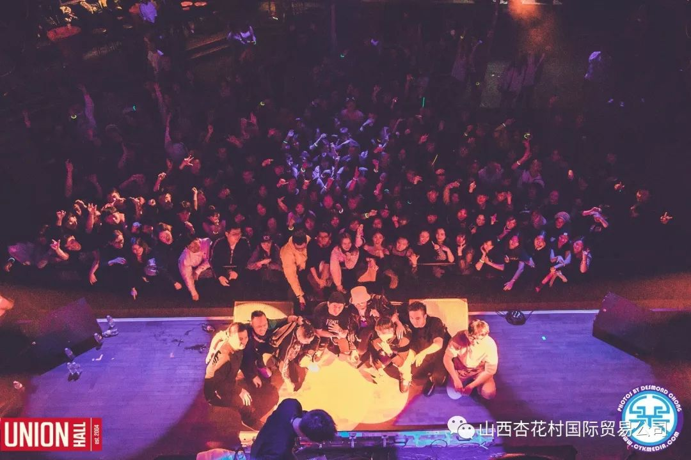 (原始链接: https://mmbiz.qpic.cn/mmbiz_jpg/n8wFx0EvzO8sLdTBc0PQ3USpeXPNQeK4vGZib4bQBgV0R25GNNCsSLyE8d10c2tm3NgQrH1wMwIRt64lhCqia9zQ/640?wx_fmt=jpeg)
- 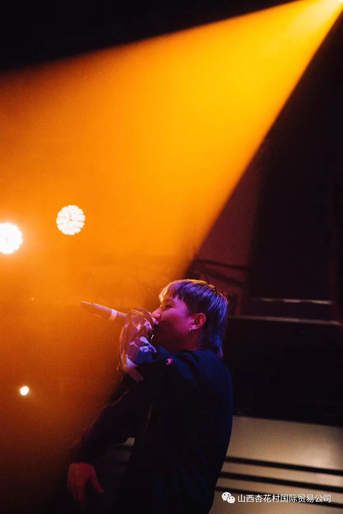 (原始链接: https://mmbiz.qpic.cn/mmbiz_jpg/n8wFx0EvzO8sLdTBc0PQ3USpeXPNQeK4tGe5OEMw0faicvMLvyQZXoDrjo5lRkf5pTX71A9zNE8v7HwIxKicv9mA/640?wx_fmt=jpeg)
- 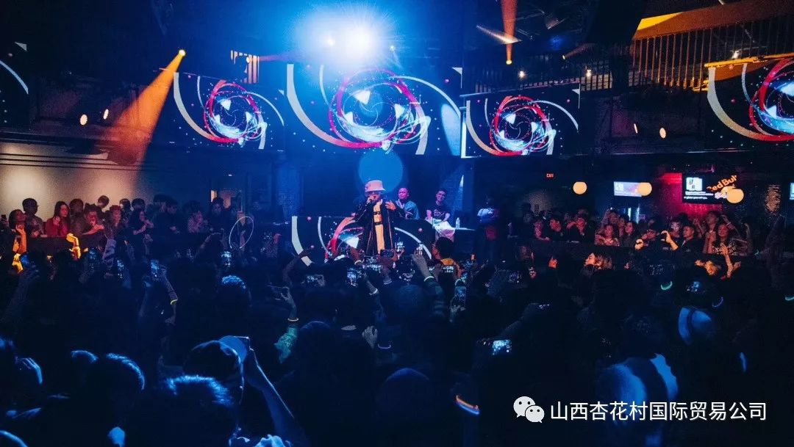 (原始链接: https://mmbiz.qpic.cn/mmbiz_jpg/n8wFx0EvzO8sLdTBc0PQ3USpeXPNQeK4OibWIfV1DcFz26fEL6hp2SD3VzryIGUs0YuGQib9VRdVK1zqCfK65Srw/640?wx_fmt=jpeg)
- 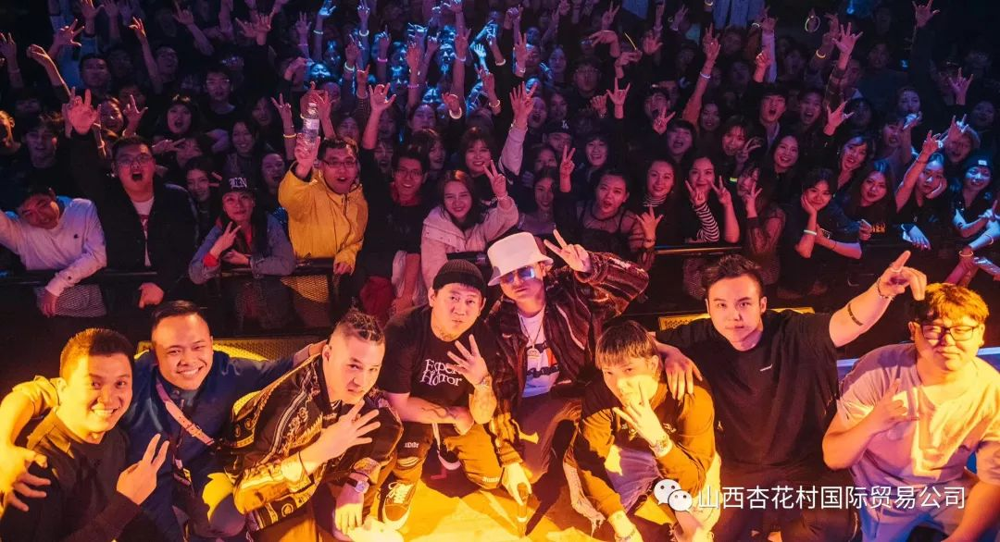 (原始链接: https://mmbiz.qpic.cn/mmbiz_jpg/n8wFx0EvzO8sLdTBc0PQ3USpeXPNQeK4knmLibDrB4wJ368aumEanQCBf07qKrhjlQLZFaJHg5pmtaUVHIORgPg/640?wx_fmt=jpeg)
- 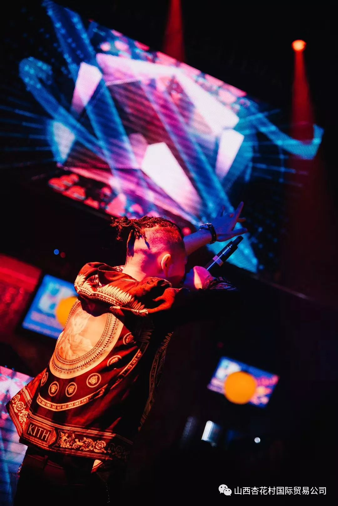 (原始链接: https://mmbiz.qpic.cn/mmbiz_jpg/n8wFx0EvzO8sLdTBc0PQ3USpeXPNQeK4IGUzjv6gqAhVQwl7icNHXRQC7m1icy5ylHwrnt3yibyBqB8nSeYTgHAFQ/640?wx_fmt=jpeg)
- 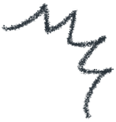 (原始链接: https://mmbiz.qpic.cn/mmbiz_gif/n8wFx0EvzO8sLdTBc0PQ3USpeXPNQeK4aCiaQib433f6XgL4kt7SYLuDQiaLNdTblhiaraVQzwXDvoiczGpv4nibia3uw/640?wx_fmt=gif)
- 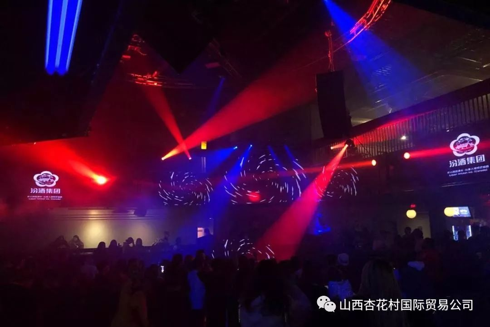 (原始链接: https://mmbiz.qpic.cn/mmbiz_jpg/n8wFx0EvzO8sLdTBc0PQ3USpeXPNQeK4GlaEzTsAcspgFKVBKCBkibZBpU46HUUEibESgKbXnsDc8tjLVib5uXIdw/640?wx_fmt=jpeg)
- 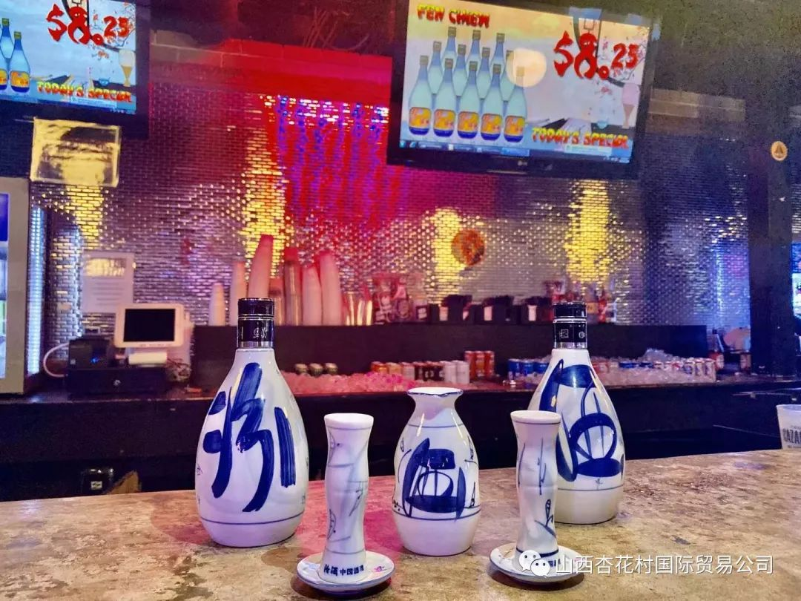 (原始链接: https://mmbiz.qpic.cn/mmbiz_jpg/n8wFx0EvzO8sLdTBc0PQ3USpeXPNQeK4bNdYDdviafNPoIZjIEOtSKdDSLg3YPaiaWG91R9vPa0baCkMX2mr8Ricg/640?wx_fmt=jpeg)
- 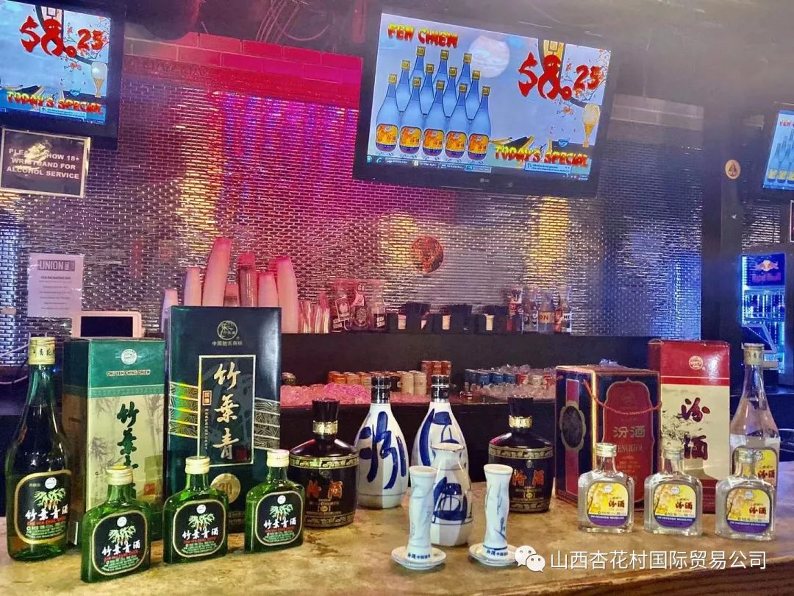 (原始链接: https://mmbiz.qpic.cn/mmbiz_jpg/n8wFx0EvzO8sLdTBc0PQ3USpeXPNQeK47UibPaF2y4umq1Cb4dDBuB08UEIWZlicxzynD1w2icpNdBudquxNKEngw/640?wx_fmt=jpeg)
- 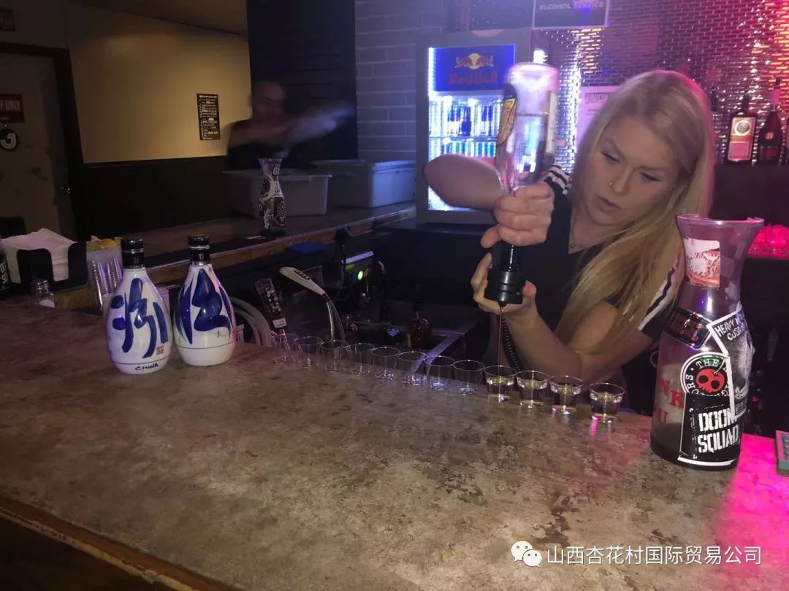 (原始链接: https://mmbiz.qpic.cn/mmbiz_jpg/n8wFx0EvzO8sLdTBc0PQ3USpeXPNQeK4B2N4y7gtNicNUdricaJOSn2O5CElTeks4t9rDCbI0bayG0e2FGLnAmgQ/640?wx_fmt=jpeg)
- 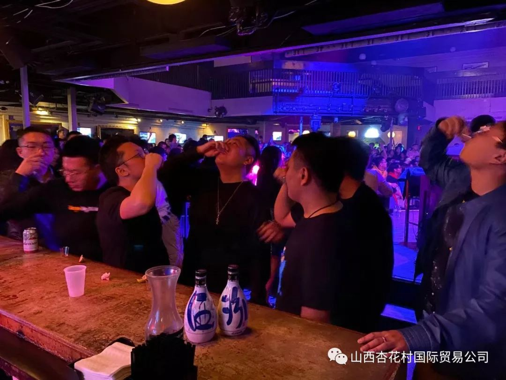 (原始链接: https://mmbiz.qpic.cn/mmbiz_jpg/n8wFx0EvzO8sLdTBc0PQ3USpeXPNQeK4iaef4dp70zia7IPNvVyla9g9Y4tTXS426IzR9PTcvIiaJOUnnybGszM2Q/640?wx_fmt=jpeg)
- 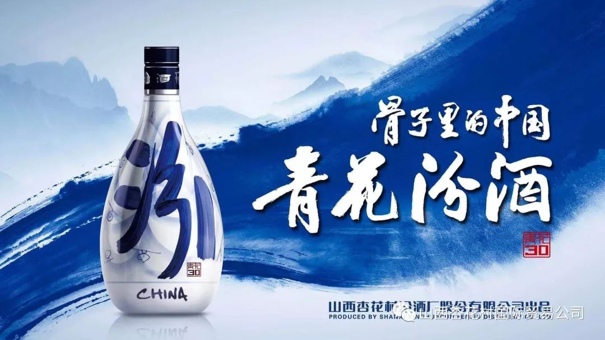 (原始链接: https://mmbiz.qpic.cn/mmbiz_jpg/n8wFx0EvzO8sLdTBc0PQ3USpeXPNQeK4FuicNDRNerianIJU0wuBGNGUK5B2jnTJqwUhdWy4AFwjTiaGr3FbGBp6Q/640?wx_fmt=jpeg)
- 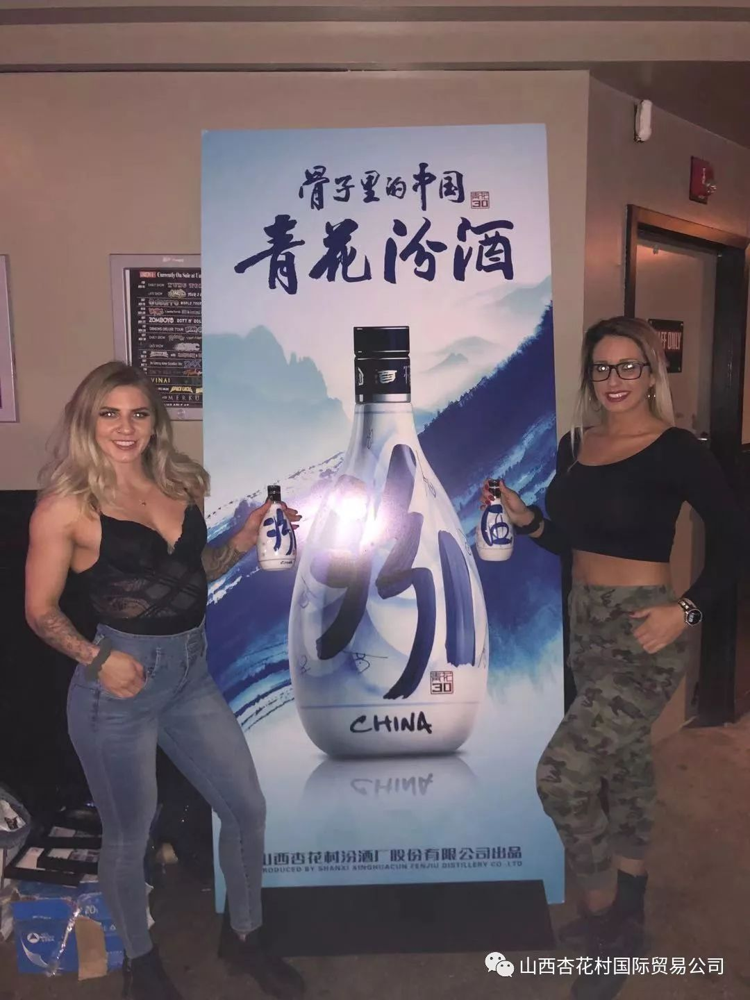 (原始链接: https://mmbiz.qpic.cn/mmbiz_jpg/n8wFx0EvzO8sLdTBc0PQ3USpeXPNQeK4kLTyyHgXyKIJJdaX9jxcfvG1xM2hfHKR2YAgj98BRXsaDGwygQ4Eicw/640?wx_fmt=jpeg)
- 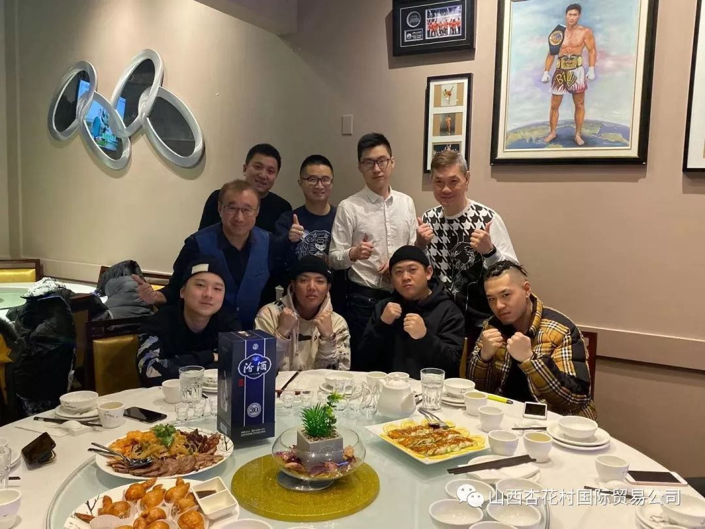 (原始链接: https://mmbiz.qpic.cn/mmbiz_jpg/n8wFx0EvzO8sLdTBc0PQ3USpeXPNQeK4D55OGmgcrnp0lycePC50jL43iaDyuv4iaoibb4TMfOpficSSicVfybftBtQ/640?wx_fmt=jpeg)
- 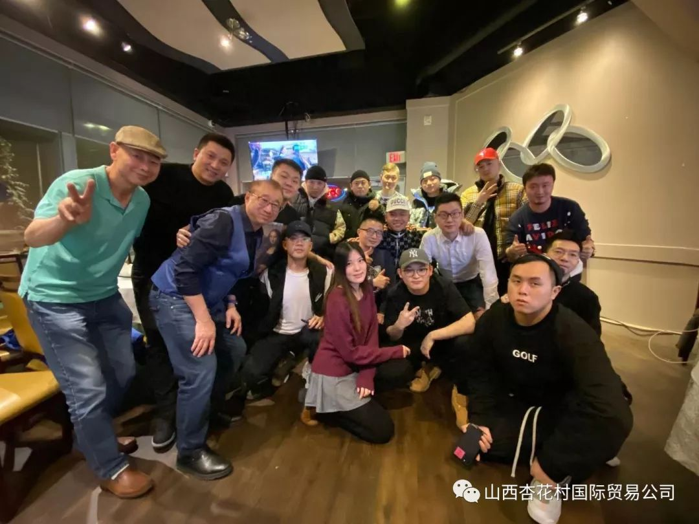 (原始链接: https://mmbiz.qpic.cn/mmbiz_jpg/n8wFx0EvzO8sLdTBc0PQ3USpeXPNQeK46R6UoaMZ2sVavcn6Aah6aQOjFfgulHGeZEbHSYPBOZ4acLOxUeCfCw/640?wx_fmt=jpeg)
- 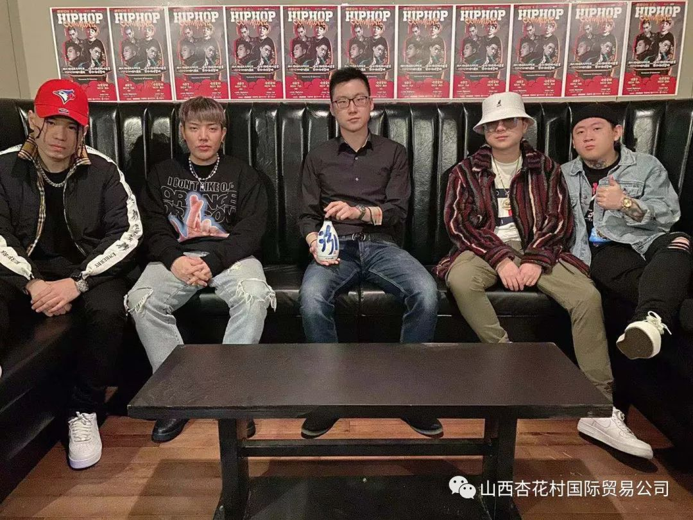 (原始链接: https://mmbiz.qpic.cn/mmbiz_jpg/n8wFx0EvzO8sLdTBc0PQ3USpeXPNQeK4lRxf1MvDkfYD1WlEiasJQKiaolswIFkibfnZ7YjLJOWCSdyUc518Nrk5A/640?wx_fmt=jpeg)
- 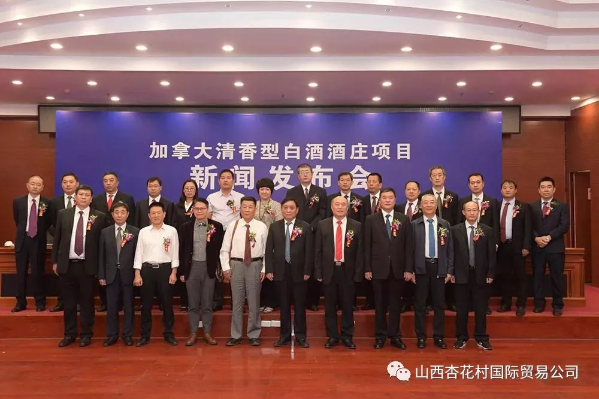 (原始链接: https://mmbiz.qpic.cn/mmbiz_jpg/n8wFx0EvzO8sLdTBc0PQ3USpeXPNQeK42Wa8ceRRpEG9Uqg86CuDK0icX7XOv3E6ib8Sxs9xb9LaVlDSicsaxaxNQ/640?wx_fmt=jpeg)
-  (原始链接: https://mmbiz.qpic.cn/mmbiz_jpg/n8wFx0EvzO8sLdTBc0PQ3USpeXPNQeK4zsOA1FTFkMB1NOMydvTWibUibUSKsnYibe2dkeviah1l0uRQDb43ia5BEPQ/640?wx_fmt=jpeg)
- 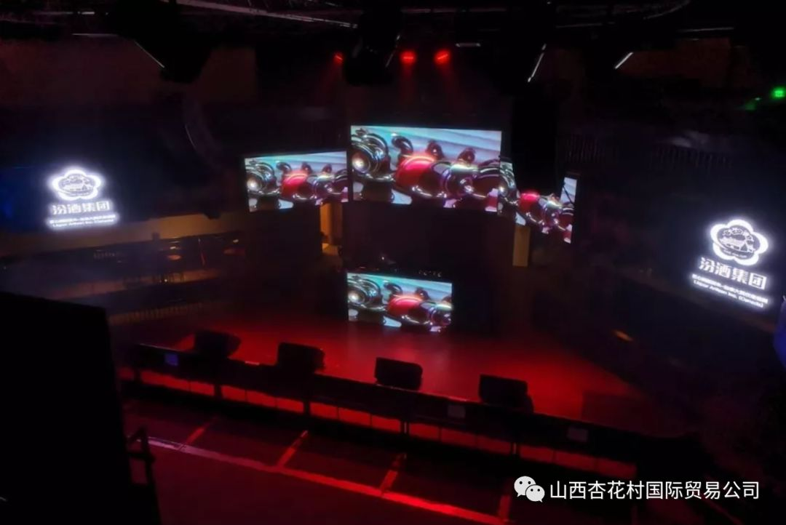 (原始链接: https://mmbiz.qpic.cn/mmbiz_png/n8wFx0EvzO8sLdTBc0PQ3USpeXPNQeK4zubLpPeLRFiaIxuZY7HGLLu26D2E408WaYFmqiaSxbicicrYSasGglAHqA/640?wx_fmt=png)
-  (原始链接: https://mmbiz.qpic.cn/mmbiz_png/n8wFx0EvzO8sLdTBc0PQ3USpeXPNQeK4ibFcs84ckDUHGKEAT2ohe9nxLqSO7TVbxRZbxu5AzZac4kv9E2zn66A/640?wx_fmt=png)
- 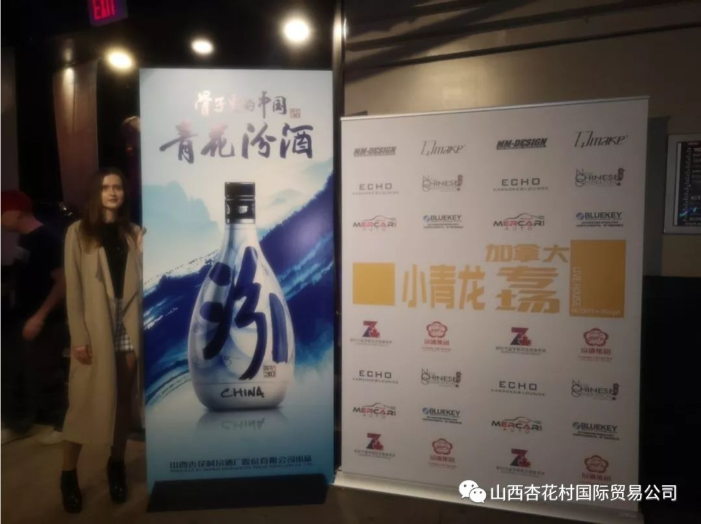 (原始链接: https://mmbiz.qpic.cn/mmbiz_png/n8wFx0EvzO8sLdTBc0PQ3USpeXPNQeK40raOw7A8eaptdtbjCgEXG9YlbQ8FiaBqLlmyqQhl5Qe0nTdLIvHffUw/640?wx_fmt=png)
- 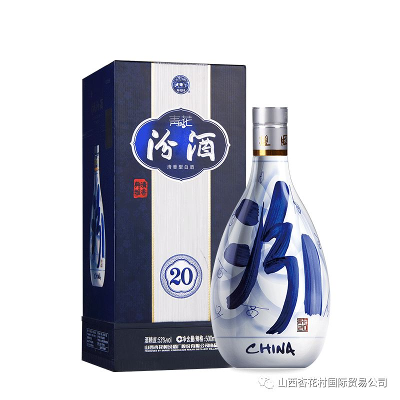 (原始链接: https://mmbiz.qpic.cn/mmbiz_png/n8wFx0EvzO8sLdTBc0PQ3USpeXPNQeK4cZSKc579QOYD2OtdtxzibiahGvJKNOU8MMynPYk1B03J00icQl6c2X9nQ/640?wx_fmt=png)
-  (原始链接: https://mmbiz.qpic.cn/mmbiz_png/n8wFx0EvzO8sLdTBc0PQ3USpeXPNQeK47C8JJDDqbJ2Zz9JnqzUzwcnKM27xKqM0MhIAD5qYKuufebicD5hNKgw/640?wx_fmt=png)
-  (原始链接: https://mmbiz.qpic.cn/mmbiz_png/n8wFx0EvzO8sLdTBc0PQ3USpeXPNQeK47C8JJDDqbJ2Zz9JnqzUzwcnKM27xKqM0MhIAD5qYKuufebicD5hNKgw/640?wx_fmt=png)
