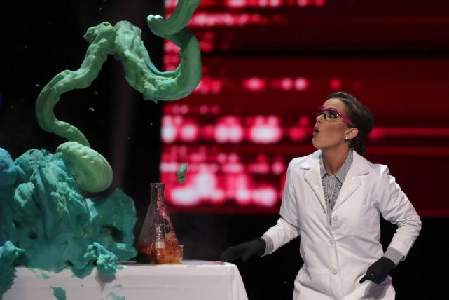
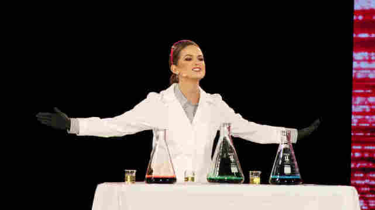

# 硬核！24岁女博士赢得2020美国小姐 选美现场表演做实验_腾讯内容开放平台

**链接地址:** https://page.om.qq.com/page/OjkrCk5WxbPtWzNRFoR8jJRg0?refer=cp_1021&ADTAG=tgi.wx.share.timeline
**作者:** 海外网
**获取时间:** 2025/8/28 20:21:46
**图片数量:** 4

---

## 原始HTML内容

  

    <header class="header">
      <!-- 微信通用头部-->
      <h1 class="title" align="left">硬核！24岁女博士赢得2020美国小姐 选美现场表演做实验</h1>
      

        
        海外网
        2019-12-22
      

      <!-- 微信通用头部-->
    </header>
    <section class="article normal-article">
      <!-- 摘要-->
      
      
        <section><section style="padding-bottom: 1px;margin-bottom: 1px;"></section><section class="imagenote" type="om-image-desc"></section><section>卡米尔·施里尔表演做实验。（图：纽约时报）</section><section><strong>海外网12月22日电</strong>2020年“美国小姐”选美比赛日前落下帷幕，24岁的卡米尔·施里尔（Camille Schrier）摘得桂冠。值得一提的是，施里尔是一名在读药学博士，她的才艺展示环节更是十分“硬核”。</section><section>综合《纽约时报》《每日邮报》报道，当地时间19日晚，2020年“美国小姐”出炉，来自美国弗吉尼亚州的24岁佳丽施里尔夺冠。在才艺表演环节，施里尔身穿白色实验服，在舞台上表演了“过氧化氢的催化分解”实验。</section><section style="padding-bottom: 1px;margin-bottom: 1px;"></section><section class="imagenote" type="om-image-desc"></section><section>图：美国全国公共广播电台</section><section>最终，施里尔通过别具一格的才艺表演打动了评委，也战胜了其他50名佳丽，成为2020年“美国小姐”，并且赢得5万美元（约合人民币35万元）的奖金。她在接受采访时表示，将致力于倡导药物安全和防止滥用药物。</section><section style="padding-bottom: 1px;margin-bottom: 1px;"></section><section class="imagenote" type="om-image-desc"></section><section>2020年“美国小姐”卡米尔·施里尔（图：今日美国）</section><section>施里尔承认自己的表演有一些不合常规，是在“冒风险”，但她也表示，想要“突破界限，打破人们对于‘美国小姐’才艺的刻板印象”。她还补充说，自己是第一个通过科学实验获胜的“美国小姐”。</section><section>施里尔的介绍中称，她拥有系统生物学和生物化学双学士学位，目前是弗吉尼亚联邦大学药学专业的一名在读博士。（海外网 张敏）</section></section>
        
      
      
      <!-- 结语-->
    </section>
    

  <!-- content/ -->
    <!--评论-->
    

    

  

  
  <!-- container/ -->
  
  
  <!--分享js-->

---

## 纯文本内容

硬核！24岁女博士赢得2020美国小姐 选美现场表演做实验
      
        
        海外网
        2019-12-22
      
      
    
    
      
      
      
        卡米尔·施里尔表演做实验。（图：纽约时报）海外网12月22日电2020年“美国小姐”选美比赛日前落下帷幕，24岁的卡米尔·施里尔（Camille Schrier）摘得桂冠。值得一提的是，施里尔是一名在读药学博士，她的才艺展示环节更是十分“硬核”。综合《纽约时报》《每日邮报》报道，当地时间19日晚，2020年“美国小姐”出炉，来自美国弗吉尼亚州的24岁佳丽施里尔夺冠。在才艺表演环节，施里尔身穿白色实验服，在舞台上表演了“过氧化氢的催化分解”实验。图：美国全国公共广播电台最终，施里尔通过别具一格的才艺表演打动了评委，也战胜了其他50名佳丽，成为2020年“美国小姐”，并且赢得5万美元（约合人民币35万元）的奖金。她在接受采访时表示，将致力于倡导药物安全和防止滥用药物。2020年“美国小姐”卡米尔·施里尔（图：今日美国）施里尔承认自己的表演有一些不合常规，是在“冒风险”，但她也表示，想要“突破界限，打破人们对于‘美国小姐’才艺的刻板印象”。她还补充说，自己是第一个通过科学实验获胜的“美国小姐”。施里尔的介绍中称，她拥有系统生物学和生物化学双学士学位，目前是弗吉尼亚联邦大学药学专业的一名在读博士。（海外网 张敏）
        
      
      
      
    
    
  
    
    
    
  
  
  
  
    var configs = {
      hasMusic: "",
      hasVideo: ""
    };

---

## 图片列表

-  (原始链接: //om.gtimg.cn/om/om_3.0/h5_detail/images/logo_qiehao.png)
-  (原始链接: http://inews.gtimg.com/newsapp_bt/0/11033371266/641)
-  (原始链接: http://inews.gtimg.com/newsapp_bt/0/11033371267/641)
-  (原始链接: http://inews.gtimg.com/newsapp_bt/0/11033371268/641)
