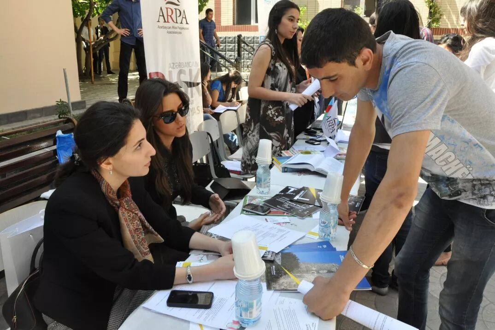
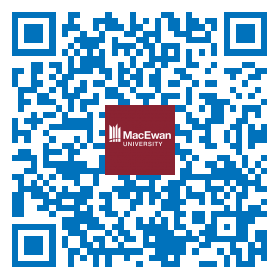
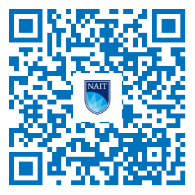
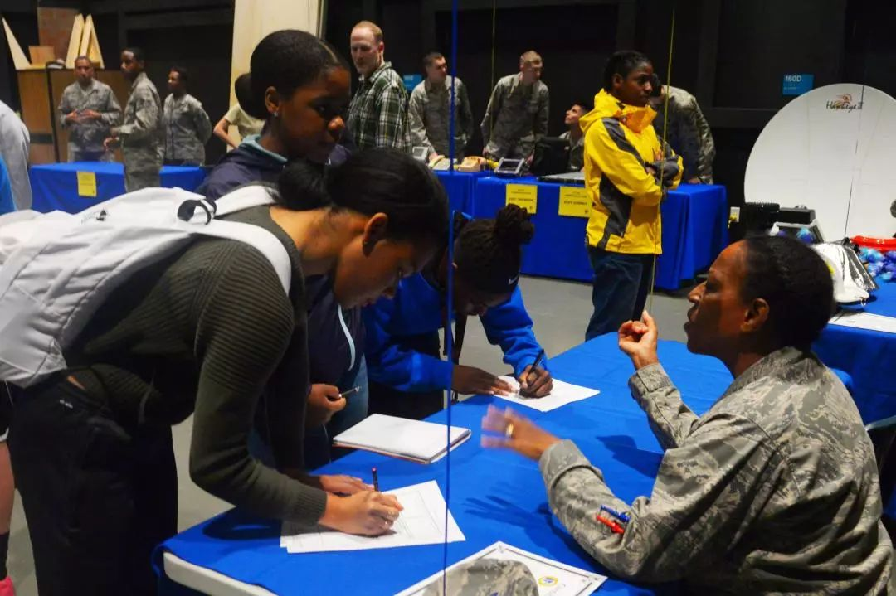
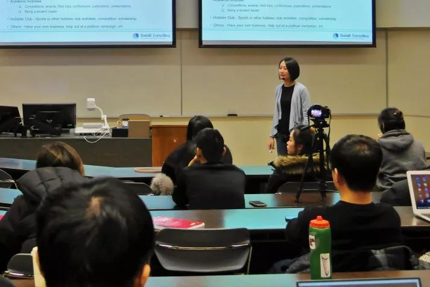
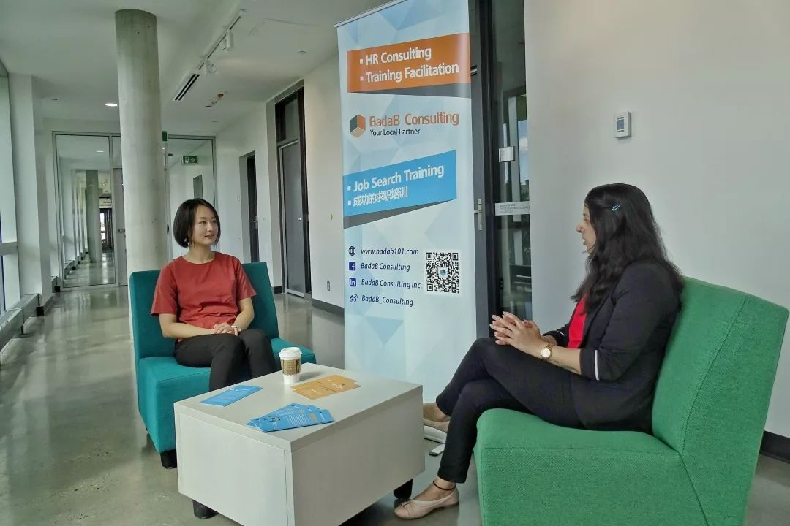
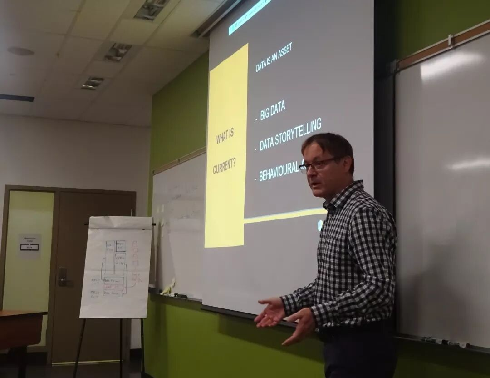
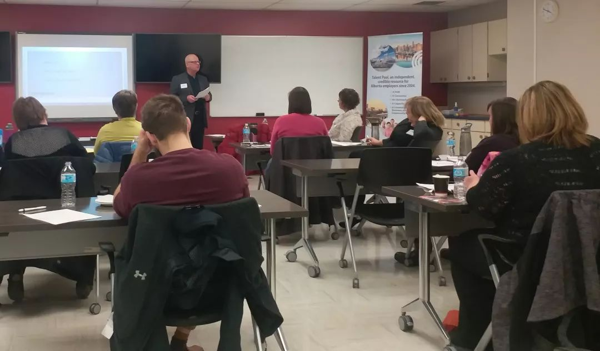
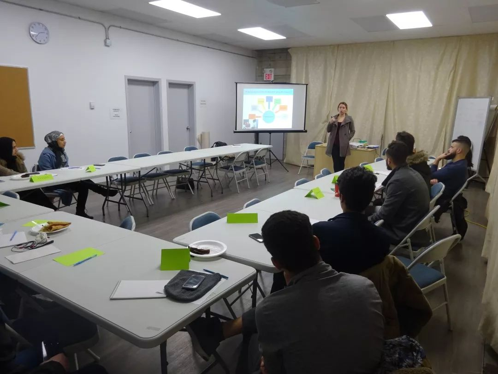

# 无标题

**链接地址:** http://mp.weixin.qq.com/s?__biz=MzI4NDYyNjAwNw==&mid=2247483961&idx=1&sn=c0aad070576589f479de433b272917c8&chksm=ebf9df01dc8e5617679b97ca284f4c9d104c6468e9f6a3ebba1c1b7adb1cdc8ef3dfc90e3eb7&mpshare=1&scene=2&srcid=&sharer_sharetime=1579751897733&sharer_shareid=be1c8edd6c93eec155a61c876e41d26a#rd
**作者:** 关注我们：
**获取时间:** 2025/8/28 20:20:38
**图片数量:** 33

---

## 原始HTML内容

<section style="box-sizing: border-box;font-size: 16px;"><section style="margin-top: 10px;margin-right: 0%;margin-left: 0%;box-sizing: border-box;" powered-by="xiumi.us"><section style="display: inline-block;width: 100%;vertical-align: top;background-color: rgb(220, 231, 246);box-sizing: border-box;"><section style="box-sizing: border-box;" powered-by="xiumi.us"><section style="display: inline-block;vertical-align: middle;width: 70%;height: auto;align-self: center;box-sizing: border-box;"><section style="font-size: 14px;color: rgb(139, 161, 197);letter-spacing: 2px;padding-right: 20px;padding-left: 20px;line-height: 1.9;box-sizing: border-box;" powered-by="xiumi.us">
点击<strong style="box-sizing: border-box;">蓝字</strong>关注我们
</section></section><section style="display: inline-block;vertical-align: middle;width: 30%;height: 1px;align-self: center;box-sizing: border-box;line-height: 0;"> </section></section></section></section><section style="margin: 10px 0%;box-sizing: border-box;" powered-by="xiumi.us"><section style="display: inline-block;width: 100%;vertical-align: top;height: auto;padding: 10px;background-color: rgb(220, 231, 246);box-sizing: border-box;"><section style="margin-right: 0%;margin-left: 0%;box-sizing: border-box;" powered-by="xiumi.us"><section style="display: inline-block;width: 100%;vertical-align: top;background-color: rgb(255, 255, 255);padding: 3px;border-width: 1px;border-radius: 0px;border-style: none;border-color: rgb(220, 231, 246);box-sizing: border-box;"><section style="box-sizing: border-box;" powered-by="xiumi.us"><section style="display: inline-block;width: 100%;vertical-align: top;background-color: rgb(254, 255, 255);border-style: solid;border-width: 1px;border-radius: 1px;border-color: rgb(220, 231, 246);padding-right: 10px;padding-left: 10px;overflow: hidden;box-sizing: border-box;"><section style="margin: 10px 0%;box-sizing: border-box;" powered-by="xiumi.us"><section style="text-align: center;font-size: 14px;color: rgb(164, 193, 234);line-height: 1.8;letter-spacing: 2px;box-sizing: border-box;">
Hi亲爱的朋友们，感谢大家如约和我们在2020年相见！

 

新年新气象，准备在职场道路上大展拳脚的你们是否已经<strong style="box-sizing: border-box;">为新年的职业道路做好了周全的规划</strong>呢？
</section></section><section style="text-align: center;box-sizing: border-box;" powered-by="xiumi.us"><section style="display: inline-block;width: 80%;vertical-align: top;height: auto;box-shadow: rgb(0, 0, 0) 0px 0px 0px;box-sizing: border-box;"><section style="opacity: 0.51;margin-right: 0%;margin-left: 0%;transform: rotateX(180deg);box-sizing: border-box;" powered-by="xiumi.us"><section style="display: inline-block;width: 100%;vertical-align: top;box-shadow: rgb(0, 0, 0) 0px 0px 0px;background-position: 0% 0%;background-repeat: repeat-x;background-size: auto 100%;background-attachment: scroll;line-height: 0;background-image: url(&quot;https://mmbiz.qpic.cn/mmbiz_png/cY0qSDjdkFfC8Xypz1wVm1icXTbLsJDyTj4uUQ1ALjqWp63gP9VDraxdormZJZb1SC0Rq230Fx5GqxJHTEdPhgg/640?wx_fmt=png&quot;);box-sizing: border-box;"><section style="box-sizing: border-box;" powered-by="xiumi.us"><section style="display: inline-block;width: 10px;height: 10px;vertical-align: top;overflow: hidden;box-sizing: border-box;line-height: 0;"> </section></section></section></section><section style="margin-right: 0%;margin-left: 0%;box-sizing: border-box;" powered-by="xiumi.us"><section style="max-width: 100%;vertical-align: middle;display: inline-block;line-height: 0;width: 98%;height: auto;box-sizing: border-box;"></section></section><section style="opacity: 0.51;margin-right: 0%;margin-left: 0%;box-sizing: border-box;" powered-by="xiumi.us"><section style="display: inline-block;width: 100%;vertical-align: top;box-shadow: rgb(0, 0, 0) 0px 0px 0px;background-position: 0% 0%;background-repeat: repeat-x;background-size: auto 100%;background-attachment: scroll;line-height: 0;background-image: url(&quot;https://mmbiz.qpic.cn/mmbiz_png/cY0qSDjdkFfC8Xypz1wVm1icXTbLsJDyTj4uUQ1ALjqWp63gP9VDraxdormZJZb1SC0Rq230Fx5GqxJHTEdPhgg/640?wx_fmt=png&quot;);box-sizing: border-box;"><section style="box-sizing: border-box;" powered-by="xiumi.us"><section style="display: inline-block;width: 10px;height: 10px;vertical-align: top;overflow: hidden;box-sizing: border-box;line-height: 0;"> </section></section></section></section></section></section><section style="margin: 10px 0%;box-sizing: border-box;" powered-by="xiumi.us"><section style="text-align: center;font-size: 14px;color: rgb(164, 193, 234);line-height: 1.8;letter-spacing: 2px;box-sizing: border-box;">
在经历了12月的求职淡季后，1月初始各个企业和组织的<strong style="box-sizing: border-box;">不同部门都相继都进入了正常的运转</strong>。

 

而<strong style="box-sizing: border-box;">应届毕业</strong><strong style="box-sizing: border-box;">生</strong>们除了为新学期的学习生活做好准备，一定也注意到了不少学校的学院和专业都开始相继宣传和组织起了校内招聘活动，<strong style="box-sizing: border-box;">传说中的“春招”逐渐吹响了激烈竞争的号角</strong>！
</section></section><section style="text-align: center;box-sizing: border-box;" powered-by="xiumi.us"><section style="display: inline-block;width: 80%;vertical-align: top;height: auto;box-shadow: rgb(0, 0, 0) 0px 0px 0px;box-sizing: border-box;"><section style="opacity: 0.51;margin-right: 0%;margin-left: 0%;transform: rotateX(180deg);box-sizing: border-box;" powered-by="xiumi.us"><section style="display: inline-block;width: 100%;vertical-align: top;box-shadow: rgb(0, 0, 0) 0px 0px 0px;background-position: 0% 0%;background-repeat: repeat-x;background-size: auto 100%;background-attachment: scroll;line-height: 0;background-image: url(&quot;https://mmbiz.qpic.cn/mmbiz_png/cY0qSDjdkFfC8Xypz1wVm1icXTbLsJDyTj4uUQ1ALjqWp63gP9VDraxdormZJZb1SC0Rq230Fx5GqxJHTEdPhgg/640?wx_fmt=png&quot;);box-sizing: border-box;"><section style="box-sizing: border-box;" powered-by="xiumi.us"><section style="display: inline-block;width: 10px;height: 10px;vertical-align: top;overflow: hidden;box-sizing: border-box;line-height: 0;"> </section></section></section></section><section style="margin-right: 0%;margin-left: 0%;box-sizing: border-box;" powered-by="xiumi.us"><section style="max-width: 100%;vertical-align: middle;display: inline-block;line-height: 0;width: 98%;height: auto;box-sizing: border-box;"></section></section><section style="opacity: 0.51;margin-right: 0%;margin-left: 0%;box-sizing: border-box;" powered-by="xiumi.us"><section style="display: inline-block;width: 100%;vertical-align: top;box-shadow: rgb(0, 0, 0) 0px 0px 0px;background-position: 0% 0%;background-repeat: repeat-x;background-size: auto 100%;background-attachment: scroll;line-height: 0;background-image: url(&quot;https://mmbiz.qpic.cn/mmbiz_png/cY0qSDjdkFfC8Xypz1wVm1icXTbLsJDyTj4uUQ1ALjqWp63gP9VDraxdormZJZb1SC0Rq230Fx5GqxJHTEdPhgg/640?wx_fmt=png&quot;);box-sizing: border-box;"><section style="box-sizing: border-box;" powered-by="xiumi.us"><section style="display: inline-block;width: 10px;height: 10px;vertical-align: top;overflow: hidden;box-sizing: border-box;line-height: 0;"> </section></section></section></section></section></section><section style="margin: 10px 0%;box-sizing: border-box;" powered-by="xiumi.us"><section style="text-align: center;font-size: 14px;color: rgb(164, 193, 234);line-height: 1.8;letter-spacing: 2px;box-sizing: border-box;">
今天我们会为你提供如何搜索<strong style="box-sizing: border-box;">校招活动信息的渠道</strong>，并为你参加校招活动提供许多<strong style="box-sizing: border-box;">实用的建议</strong>。

 

如果你是从没有参加过校招活动的求职小白，请一定要<strong style="box-sizing: border-box;">仔细阅读以及马克这篇文章</strong>哦！ 
</section></section></section></section></section></section></section></section><section style="box-sizing: border-box;" powered-by="xiumi.us">
 
</section><section style="margin-top: 0.5em;margin-bottom: 0.5em;box-sizing: border-box;" powered-by="xiumi.us"><section style="display: inline-block;vertical-align: top;width: 20%;box-sizing: border-box;"><section style="font-size: 19px;text-align: center;box-sizing: border-box;" powered-by="xiumi.us"><section style="box-sizing: border-box;margin: auto;width: 3em;height: 3em;vertical-align: top;background-position: center center;background-repeat: no-repeat;background-size: cover;display: inline-block;background-image: url(&quot;https://mmbiz.qpic.cn/mmbiz_jpg/cY0qSDjdkFfC8Xypz1wVm1icXTbLsJDyTIKTicmv0vibpicZBc5bZtyoSrc0WQiaic9vHhpBQM6J3bdPgibvWwicTlvQ5Q/640?wx_fmt=jpeg&quot;);"><section style="height: 100%;overflow: hidden;line-height: 0;vertical-align: middle;max-width: 100%;box-sizing: border-box;"></section></section></section></section><section style="display: inline-block;vertical-align: top;width: 80%;text-align: left;padding-right: 10px;padding-left: 10px;box-sizing: border-box;"><section style="text-align: justify;font-size: 14px;box-sizing: border-box;" powered-by="xiumi.us">
<strong style="box-sizing: border-box;">求职小白</strong>
</section><section style="box-sizing: border-box;" powered-by="xiumi.us"><section style="width: 0px;border-right: 10px solid rgb(26, 82, 145);display: inline-block;margin-top: 1em;vertical-align: top;box-sizing: border-box;height: 1px;line-height: 0;border-top: 6px solid transparent !important;border-bottom: 6px solid transparent !important;"> </section><section style="display: inline-block;vertical-align: middle;background-color: rgb(26, 82, 145);padding: 8px;border-radius: 0.5em;max-width: 90% !important;box-sizing: border-box;"><section style="text-align: justify;color: rgb(255, 255, 255);font-size: 14px;box-sizing: border-box;" powered-by="xiumi.us">
什么是校招？春招又是什么？和社招的区别是什么呢？
</section></section></section></section></section><section style="box-sizing: border-box;" powered-by="xiumi.us">
 
</section><section style="margin: 10px 0%;box-sizing: border-box;" powered-by="xiumi.us"><section style="display: inline-block;width: 100%;vertical-align: top;height: auto;padding: 10px;background-color: rgb(220, 231, 246);box-sizing: border-box;"><section style="margin-right: 0%;margin-left: 0%;box-sizing: border-box;" powered-by="xiumi.us"><section style="display: inline-block;width: 100%;vertical-align: top;background-color: rgb(255, 255, 255);padding: 3px;border-width: 1px;border-radius: 0px;border-style: none;border-color: rgb(220, 231, 246);box-sizing: border-box;"><section style="box-sizing: border-box;" powered-by="xiumi.us"><section style="display: inline-block;width: 100%;vertical-align: top;background-color: rgb(254, 255, 255);border-style: solid;border-width: 1px;border-radius: 1px;border-color: rgb(220, 231, 246);padding-right: 10px;padding-left: 10px;overflow: hidden;box-sizing: border-box;"><section style="text-align: center;margin: 10px 0%;box-sizing: border-box;" powered-by="xiumi.us"><section style="display: inline-block;min-width: 10%;max-width: 100%;vertical-align: top;box-sizing: border-box;"><section style="text-align: right;font-size: 0px;margin-right: 0%;margin-bottom: -5px;margin-left: 0%;transform: translate3d(-20px, 0px, 0px);box-sizing: border-box;" powered-by="xiumi.us"><section style="display: inline-block;width: 9px;height: 9px;vertical-align: top;overflow: hidden;line-height: 0;letter-spacing: 0px;border-width: 0px;border-radius: 50px;border-style: none;border-color: rgb(62, 62, 62);background-color: rgba(211, 226, 242, 0.89);box-sizing: border-box;"> </section></section><section style="margin-right: 0%;margin-left: 0%;box-sizing: border-box;" powered-by="xiumi.us"><section style="display: inline-block;min-width: 10%;max-width: 100%;vertical-align: top;background-color: rgb(203, 220, 244);border-width: 0px;border-radius: 5px;border-style: none;border-color: rgb(62, 62, 62);overflow: hidden;box-sizing: border-box;"><section style="box-sizing: border-box;" powered-by="xiumi.us"><section style="display: inline-block;vertical-align: middle;width: auto;background-color: rgba(255, 255, 255, 0);box-sizing: border-box;"><section style="margin-right: 0%;margin-left: 0%;box-sizing: border-box;" powered-by="xiumi.us"><section style="display: inline-block;min-width: 10%;max-width: 100%;vertical-align: top;transform: matrix(1, 0, -0.2, 1, 0, 0);-webkit-transform: matrix(1, 0, -0.2, 1, 0, 0);-moz-transform: matrix(1, 0, -0.2, 1, 0, 0);-o-transform: matrix(1, 0, -0.2, 1, 0, 0);transform-origin: 0px 0px;-webkit-transform-origin: 0px 0px;-moz-transform-origin: 0px 0px;-o-transform-origin: 0px 0px;border-style: none;border-width: 2px;border-radius: 0px;border-color: rgb(62, 62, 62);padding: 10px 10px 10px 20px;background-color: rgb(125, 192, 232);box-sizing: border-box;"><section style="text-align: justify;line-height: 1;letter-spacing: 0px;color: rgba(255, 255, 255, 0.8);font-size: 18px;box-sizing: border-box;" powered-by="xiumi.us">
<strong style="box-sizing: border-box;">No.1</strong>
</section></section></section></section><section style="display: inline-block;vertical-align: middle;width: auto;background-color: rgba(255, 255, 255, 0);padding-right: 10px;padding-left: 10px;box-sizing: border-box;"><section style="text-align: justify;font-size: 17px;color: rgb(26, 82, 145);letter-spacing: 2px;line-height: 1;box-sizing: border-box;" powered-by="xiumi.us">
<strong style="box-sizing: border-box;">什么是校招？</strong>
</section></section></section></section></section><section style="text-align: left;font-size: 0px;margin-top: -7px;margin-right: 0%;margin-left: 0%;transform: translate3d(12px, 0px, 0px);box-sizing: border-box;" powered-by="xiumi.us"><section style="display: inline-block;width: 13px;height: 13px;vertical-align: top;overflow: hidden;line-height: 0;letter-spacing: 0px;border-width: 0px;border-radius: 50px;border-style: none;border-color: rgb(62, 62, 62);background-color: rgb(40, 115, 200);box-sizing: border-box;"> </section></section></section></section><section style="margin: 10px 0%;box-sizing: border-box;" powered-by="xiumi.us"><section style="text-align: center;font-size: 14px;color: rgb(164, 193, 234);line-height: 1.8;letter-spacing: 2px;box-sizing: border-box;">
所谓的校招就是每年学校的不同学院会在春秋两季为<strong style="box-sizing: border-box;">应届毕业生</strong>和需要<strong style="box-sizing: border-box;">Co-op实习机会</strong>的同学们举行<strong style="box-sizing: border-box;">专门面向在校学生</strong>的招聘会。
</section></section><section style="text-align: center;box-sizing: border-box;" powered-by="xiumi.us"><section style="display: inline-block;width: 80%;vertical-align: top;height: auto;box-shadow: rgb(0, 0, 0) 0px 0px 0px;box-sizing: border-box;"><section style="opacity: 0.51;margin-right: 0%;margin-left: 0%;transform: rotateX(180deg);box-sizing: border-box;" powered-by="xiumi.us"><section style="display: inline-block;width: 100%;vertical-align: top;box-shadow: rgb(0, 0, 0) 0px 0px 0px;background-position: 0% 0%;background-repeat: repeat-x;background-size: auto 100%;background-attachment: scroll;line-height: 0;background-image: url(&quot;https://mmbiz.qpic.cn/mmbiz_png/cY0qSDjdkFfC8Xypz1wVm1icXTbLsJDyTj4uUQ1ALjqWp63gP9VDraxdormZJZb1SC0Rq230Fx5GqxJHTEdPhgg/640?wx_fmt=png&quot;);box-sizing: border-box;"><section style="box-sizing: border-box;" powered-by="xiumi.us"><section style="display: inline-block;width: 10px;height: 10px;vertical-align: top;overflow: hidden;box-sizing: border-box;line-height: 0;"> </section></section></section></section><section style="margin-right: 0%;margin-left: 0%;box-sizing: border-box;" powered-by="xiumi.us"><section style="max-width: 100%;vertical-align: middle;display: inline-block;line-height: 0;width: 98%;height: auto;box-sizing: border-box;"></section></section><section style="opacity: 0.51;margin-right: 0%;margin-left: 0%;box-sizing: border-box;" powered-by="xiumi.us"><section style="display: inline-block;width: 100%;vertical-align: top;box-shadow: rgb(0, 0, 0) 0px 0px 0px;background-position: 0% 0%;background-repeat: repeat-x;background-size: auto 100%;background-attachment: scroll;line-height: 0;background-image: url(&quot;https://mmbiz.qpic.cn/mmbiz_png/cY0qSDjdkFfC8Xypz1wVm1icXTbLsJDyTj4uUQ1ALjqWp63gP9VDraxdormZJZb1SC0Rq230Fx5GqxJHTEdPhgg/640?wx_fmt=png&quot;);box-sizing: border-box;"><section style="box-sizing: border-box;" powered-by="xiumi.us"><section style="display: inline-block;width: 10px;height: 10px;vertical-align: top;overflow: hidden;box-sizing: border-box;line-height: 0;"> </section></section></section></section></section></section><section style="margin: 10px 0%;box-sizing: border-box;" powered-by="xiumi.us"><section style="text-align: center;font-size: 14px;color: rgb(164, 193, 234);line-height: 1.8;letter-spacing: 2px;box-sizing: border-box;">
根据时间不同，在每年9月-11月举行的被称为<strong style="box-sizing: border-box;">“秋招”</strong>，而每年1月- 3月举行的，则被称为<strong style="box-sizing: border-box;">“春招”</strong>。

 

通常来说，<strong style="box-sizing: border-box;">春招的活动规模和职位提供数量都会比秋招要小</strong>，但对于还没有被职位Offer锁定的同学们来说，这是涉及到毕业后能否顺利入职并开启人生职业道路之<strong style="box-sizing: border-box;">不可错过的机会</strong>！
</section></section><section style="text-align: center;box-sizing: border-box;" powered-by="xiumi.us"><section style="display: inline-block;width: 80%;vertical-align: top;height: auto;box-shadow: rgb(0, 0, 0) 0px 0px 0px;box-sizing: border-box;"><section style="opacity: 0.51;margin-right: 0%;margin-left: 0%;transform: rotateX(180deg);box-sizing: border-box;" powered-by="xiumi.us"><section style="display: inline-block;width: 100%;vertical-align: top;box-shadow: rgb(0, 0, 0) 0px 0px 0px;background-position: 0% 0%;background-repeat: repeat-x;background-size: auto 100%;background-attachment: scroll;line-height: 0;background-image: url(&quot;https://mmbiz.qpic.cn/mmbiz_png/cY0qSDjdkFfC8Xypz1wVm1icXTbLsJDyTj4uUQ1ALjqWp63gP9VDraxdormZJZb1SC0Rq230Fx5GqxJHTEdPhgg/640?wx_fmt=png&quot;);box-sizing: border-box;"><section style="box-sizing: border-box;" powered-by="xiumi.us"><section style="display: inline-block;width: 10px;height: 10px;vertical-align: top;overflow: hidden;box-sizing: border-box;line-height: 0;"> </section></section></section></section><section style="margin-right: 0%;margin-left: 0%;box-sizing: border-box;" powered-by="xiumi.us"><section style="max-width: 100%;vertical-align: middle;display: inline-block;line-height: 0;width: 98%;height: auto;box-sizing: border-box;"></section></section><section style="opacity: 0.51;margin-right: 0%;margin-left: 0%;box-sizing: border-box;" powered-by="xiumi.us"><section style="display: inline-block;width: 100%;vertical-align: top;box-shadow: rgb(0, 0, 0) 0px 0px 0px;background-position: 0% 0%;background-repeat: repeat-x;background-size: auto 100%;background-attachment: scroll;line-height: 0;background-image: url(&quot;https://mmbiz.qpic.cn/mmbiz_png/cY0qSDjdkFfC8Xypz1wVm1icXTbLsJDyTj4uUQ1ALjqWp63gP9VDraxdormZJZb1SC0Rq230Fx5GqxJHTEdPhgg/640?wx_fmt=png&quot;);box-sizing: border-box;"><section style="box-sizing: border-box;" powered-by="xiumi.us"><section style="display: inline-block;width: 10px;height: 10px;vertical-align: top;overflow: hidden;box-sizing: border-box;line-height: 0;"> </section></section></section></section></section></section><section style="margin: 10px 0%;box-sizing: border-box;" powered-by="xiumi.us"><section style="text-align: center;font-size: 14px;color: rgb(164, 193, 234);line-height: 1.8;letter-spacing: 2px;box-sizing: border-box;">
校招和社招<strong style="box-sizing: border-box;">最大的区别</strong>在于校招面向的通常是<strong style="box-sizing: border-box;">工作经验不太丰富的学生党</strong>，而所提供的职业也多为需要一定<strong style="box-sizing: border-box;">学历要求和专业背景</strong>的工作。

 

也就是说，招聘企业在入场时已经提前为你筛选好了对于工作经验，学历和专业背景的求职<strong style="box-sizing: border-box;">门槛</strong>，帮你节约了不少在网上海投简历所需要的大量搜索时间。

 

而且最重要的是，通常来说校招对于<strong style="box-sizing: border-box;">在校学生和校友</strong>都是<strong style="box-sizing: border-box;">免费参与</strong>的！

 

所以对于期望在北美开启自己职业道路的应届毕业生们来说，请务必参与即将到来的春招活动。
</section></section></section></section></section></section></section></section><section style="box-sizing: border-box;" powered-by="xiumi.us">
 
</section><section style="margin-top: 0.5em;margin-bottom: 0.5em;box-sizing: border-box;" powered-by="xiumi.us"><section style="display: inline-block;vertical-align: top;width: 20%;box-sizing: border-box;"><section style="font-size: 19px;text-align: center;box-sizing: border-box;" powered-by="xiumi.us"><section style="box-sizing: border-box;margin: auto;width: 3em;height: 3em;vertical-align: top;background-position: center center;background-repeat: no-repeat;background-size: cover;display: inline-block;background-image: url(&quot;https://mmbiz.qpic.cn/mmbiz_jpg/cY0qSDjdkFfC8Xypz1wVm1icXTbLsJDyTIKTicmv0vibpicZBc5bZtyoSrc0WQiaic9vHhpBQM6J3bdPgibvWwicTlvQ5Q/640?wx_fmt=jpeg&quot;);"><section style="height: 100%;overflow: hidden;line-height: 0;vertical-align: middle;max-width: 100%;box-sizing: border-box;"></section></section></section></section><section style="display: inline-block;vertical-align: top;width: 80%;text-align: left;padding-right: 10px;padding-left: 10px;box-sizing: border-box;"><section style="text-align: justify;font-size: 14px;box-sizing: border-box;" powered-by="xiumi.us">
<strong style="box-sizing: border-box;">求职小白</strong>
</section><section style="box-sizing: border-box;" powered-by="xiumi.us"><section style="width: 0px;border-right: 10px solid rgb(26, 82, 145);display: inline-block;margin-top: 1em;vertical-align: top;box-sizing: border-box;height: 1px;line-height: 0;border-top: 6px solid transparent !important;border-bottom: 6px solid transparent !important;"> </section><section style="display: inline-block;vertical-align: middle;background-color: rgb(26, 82, 145);padding: 8px;border-radius: 0.5em;max-width: 90% !important;box-sizing: border-box;"><section style="text-align: justify;color: rgb(255, 255, 255);font-size: 14px;box-sizing: border-box;" powered-by="xiumi.us">
在哪里找校招信息？
</section></section></section></section></section><section style="box-sizing: border-box;" powered-by="xiumi.us">
 
</section><section style="margin: 10px 0%;box-sizing: border-box;" powered-by="xiumi.us"><section style="display: inline-block;width: 100%;vertical-align: top;height: auto;padding: 10px;background-color: rgb(220, 231, 246);box-sizing: border-box;"><section style="margin-right: 0%;margin-left: 0%;box-sizing: border-box;" powered-by="xiumi.us"><section style="display: inline-block;width: 100%;vertical-align: top;background-color: rgb(255, 255, 255);padding: 3px;border-width: 1px;border-radius: 0px;border-style: none;border-color: rgb(220, 231, 246);box-sizing: border-box;"><section style="box-sizing: border-box;" powered-by="xiumi.us"><section style="display: inline-block;width: 100%;vertical-align: top;background-color: rgb(254, 255, 255);border-style: solid;border-width: 1px;border-radius: 1px;border-color: rgb(220, 231, 246);padding-right: 10px;padding-left: 10px;overflow: hidden;box-shadow: rgb(0, 0, 0) 0px 0px 0px;box-sizing: border-box;"><section style="text-align: center;margin: 10px 0%;box-sizing: border-box;" powered-by="xiumi.us"><section style="display: inline-block;min-width: 10%;max-width: 100%;vertical-align: top;box-sizing: border-box;"><section style="text-align: right;font-size: 0px;margin-right: 0%;margin-bottom: -5px;margin-left: 0%;transform: translate3d(-20px, 0px, 0px);box-sizing: border-box;" powered-by="xiumi.us"><section style="display: inline-block;width: 9px;height: 9px;vertical-align: top;overflow: hidden;line-height: 0;letter-spacing: 0px;border-width: 0px;border-radius: 50px;border-style: none;border-color: rgb(62, 62, 62);background-color: rgba(211, 226, 242, 0.89);box-sizing: border-box;"> </section></section><section style="margin-right: 0%;margin-left: 0%;box-sizing: border-box;" powered-by="xiumi.us"><section style="display: inline-block;min-width: 10%;max-width: 100%;vertical-align: top;background-color: rgb(203, 220, 244);border-width: 0px;border-radius: 5px;border-style: none;border-color: rgb(62, 62, 62);overflow: hidden;box-sizing: border-box;"><section style="box-sizing: border-box;" powered-by="xiumi.us"><section style="display: inline-block;vertical-align: middle;width: auto;background-color: rgba(255, 255, 255, 0);box-sizing: border-box;"><section style="margin-right: 0%;margin-left: 0%;box-sizing: border-box;" powered-by="xiumi.us"><section style="display: inline-block;min-width: 10%;max-width: 100%;vertical-align: top;transform: matrix(1, 0, -0.2, 1, 0, 0);-webkit-transform: matrix(1, 0, -0.2, 1, 0, 0);-moz-transform: matrix(1, 0, -0.2, 1, 0, 0);-o-transform: matrix(1, 0, -0.2, 1, 0, 0);transform-origin: 0px 0px;-webkit-transform-origin: 0px 0px;-moz-transform-origin: 0px 0px;-o-transform-origin: 0px 0px;border-style: none;border-width: 2px;border-radius: 0px;border-color: rgb(62, 62, 62);padding: 10px 10px 10px 20px;background-color: rgb(125, 192, 232);box-sizing: border-box;"><section style="text-align: justify;line-height: 1;letter-spacing: 0px;color: rgba(255, 255, 255, 0.8);font-size: 18px;box-sizing: border-box;" powered-by="xiumi.us">
<strong style="box-sizing: border-box;">No.2</strong>
</section></section></section></section><section style="display: inline-block;vertical-align: middle;width: auto;background-color: rgba(255, 255, 255, 0);padding-right: 10px;padding-left: 10px;box-sizing: border-box;"><section style="text-align: justify;font-size: 17px;color: rgb(26, 82, 145);letter-spacing: 2px;line-height: 1;box-sizing: border-box;" powered-by="xiumi.us">
<strong style="box-sizing: border-box;">在哪里get校招信息？</strong>
</section></section></section></section></section><section style="text-align: left;font-size: 0px;margin-top: -7px;margin-right: 0%;margin-left: 0%;transform: translate3d(12px, 0px, 0px);box-sizing: border-box;" powered-by="xiumi.us"><section style="display: inline-block;width: 13px;height: 13px;vertical-align: top;overflow: hidden;line-height: 0;letter-spacing: 0px;border-width: 0px;border-radius: 50px;border-style: none;border-color: rgb(62, 62, 62);background-color: rgb(40, 115, 200);box-sizing: border-box;"> </section></section></section></section><section style="margin: 10px 0%;box-sizing: border-box;" powered-by="xiumi.us"><section style="text-align: center;font-size: 14px;color: rgb(164, 193, 234);line-height: 1.8;letter-spacing: 2px;box-sizing: border-box;">
通常学生会在活动开始前几周就收到<strong style="box-sizing: border-box;">来自学院的邮件</strong>，而校招活动的海报也会被贴在<strong style="box-sizing: border-box;">教学楼内人流集中的告示板</strong>上。如果你不小心把以上消息来源渠道都miss掉了，登录<strong style="box-sizing: border-box;">学院的官网和相关专题主页</strong>，都可以轻松获取校招时间和地点的信息哦！
</section></section><section style="text-align: center;box-sizing: border-box;" powered-by="xiumi.us"><section style="display: inline-block;width: 80%;vertical-align: top;height: auto;box-shadow: rgb(0, 0, 0) 0px 0px 0px;box-sizing: border-box;"><section style="opacity: 0.51;margin-right: 0%;margin-left: 0%;transform: rotateX(180deg);box-sizing: border-box;" powered-by="xiumi.us"><section style="display: inline-block;width: 100%;vertical-align: top;box-shadow: rgb(0, 0, 0) 0px 0px 0px;background-position: 0% 0%;background-repeat: repeat-x;background-size: auto 100%;background-attachment: scroll;line-height: 0;background-image: url(&quot;https://mmbiz.qpic.cn/mmbiz_png/cY0qSDjdkFfC8Xypz1wVm1icXTbLsJDyTj4uUQ1ALjqWp63gP9VDraxdormZJZb1SC0Rq230Fx5GqxJHTEdPhgg/640?wx_fmt=png&quot;);box-sizing: border-box;"><section style="box-sizing: border-box;" powered-by="xiumi.us"><section style="display: inline-block;width: 10px;height: 10px;vertical-align: top;overflow: hidden;box-sizing: border-box;line-height: 0;"> </section></section></section></section><section style="margin-right: 0%;margin-left: 0%;box-sizing: border-box;" powered-by="xiumi.us"><section style="max-width: 100%;vertical-align: middle;display: inline-block;line-height: 0;width: 98%;height: auto;box-sizing: border-box;"></section></section><section style="opacity: 0.51;margin-right: 0%;margin-left: 0%;box-sizing: border-box;" powered-by="xiumi.us"><section style="display: inline-block;width: 100%;vertical-align: top;box-shadow: rgb(0, 0, 0) 0px 0px 0px;background-position: 0% 0%;background-repeat: repeat-x;background-size: auto 100%;background-attachment: scroll;line-height: 0;background-image: url(&quot;https://mmbiz.qpic.cn/mmbiz_png/cY0qSDjdkFfC8Xypz1wVm1icXTbLsJDyTj4uUQ1ALjqWp63gP9VDraxdormZJZb1SC0Rq230Fx5GqxJHTEdPhgg/640?wx_fmt=png&quot;);box-sizing: border-box;"><section style="box-sizing: border-box;" powered-by="xiumi.us"><section style="display: inline-block;width: 10px;height: 10px;vertical-align: top;overflow: hidden;box-sizing: border-box;line-height: 0;"> </section></section></section></section></section></section><section style="margin: 10px 0%;box-sizing: border-box;" powered-by="xiumi.us"><section style="text-align: center;font-size: 14px;color: rgb(164, 193, 234);line-height: 1.8;letter-spacing: 2px;box-sizing: border-box;">
BADAB帮大家节省了这个搜索程序，已经为你们整理好了<strong style="box-sizing: border-box;">埃德蒙顿市三大高校</strong><strong style="letter-spacing: 1.8px;box-sizing: border-box;">的校招专题主页</strong>链接，请不要客气地戳进阅读吧！
</section></section><section style="margin: 10px 0%;box-sizing: border-box;" powered-by="xiumi.us"><section style="display: inline-block;width: 100%;vertical-align: top;padding: 20px 10px;box-shadow: rgb(0, 0, 0) 0px 0px 0px;background-color: rgb(203, 220, 244);box-sizing: border-box;"><section style="margin-top: 8px;margin-right: 0%;margin-left: 0%;box-sizing: border-box;" powered-by="xiumi.us"><section style="display: inline-block;vertical-align: bottom;width: 38.2%;padding-right: 10px;box-sizing: border-box;"><section style="text-align: center;margin-right: 0%;margin-left: 0%;box-sizing: border-box;" powered-by="xiumi.us"><section style="max-width: 100%;vertical-align: middle;display: inline-block;line-height: 0;box-sizing: border-box;"></section></section></section><section style="display: inline-block;vertical-align: bottom;width: 61.8%;background-color: rgb(202, 220, 244);box-sizing: border-box;"><section style="margin: -10px 0% 5px;text-align: left;box-sizing: border-box;" powered-by="xiumi.us"><section style="display: inline-block;border-width: 2px;border-style: solid;border-color: rgba(0, 0, 0, 0);padding: 0.1em 0.3em;background-color: rgb(125, 192, 232);color: rgb(255, 255, 255);font-size: 15px;box-sizing: border-box;">
<strong style="box-sizing: border-box;">University of Alberta</strong>
</section></section><section style="margin-top: 5px;margin-right: 0%;margin-left: 0%;box-sizing: border-box;" powered-by="xiumi.us"><section style="padding-right: 5px;padding-left: 5px;font-size: 12px;line-height: 1.8;box-sizing: border-box;">
 

https://www.ualberta.ca/career-centre/programs-events/
</section></section></section></section></section></section><section style="margin: 10px 0%;box-sizing: border-box;" powered-by="xiumi.us"><section style="display: inline-block;width: 100%;vertical-align: top;padding: 20px 10px;box-shadow: rgb(0, 0, 0) 0px 0px 0px;background-color: rgb(203, 220, 244);box-sizing: border-box;"><section style="margin-top: 8px;margin-right: 0%;margin-left: 0%;box-sizing: border-box;" powered-by="xiumi.us"><section style="display: inline-block;vertical-align: bottom;width: 61%;background-color: rgb(202, 220, 244);box-sizing: border-box;"><section style="margin: -10px 0% 5px;text-align: right;box-sizing: border-box;" powered-by="xiumi.us"><section style="display: inline-block;border-width: 2px;border-style: solid;border-color: rgba(0, 0, 0, 0);padding: 0.1em 0.3em;background-color: rgb(40, 115, 200);color: rgb(255, 255, 255);font-size: 15px;box-sizing: border-box;">
<strong style="box-sizing: border-box;">MacEwan University</strong>
</section></section><section style="margin-top: 5px;margin-right: 0%;margin-left: 0%;box-sizing: border-box;" powered-by="xiumi.us"><section style="padding-right: 5px;padding-left: 5px;font-size: 12px;line-height: 1.8;box-sizing: border-box;">
 

https://www.macewan.ca/wcm/MacEwanEvents/CAREERFAIR
</section></section></section><section style="display: inline-block;vertical-align: bottom;width: 38%;padding-left: 10px;box-sizing: border-box;"><section style="text-align: center;margin-right: 0%;margin-left: 0%;box-sizing: border-box;" powered-by="xiumi.us"><section style="max-width: 100%;vertical-align: middle;display: inline-block;line-height: 0;box-sizing: border-box;"></section></section></section></section></section></section><section style="margin: 10px 0%;box-sizing: border-box;" powered-by="xiumi.us"><section style="display: inline-block;width: 100%;vertical-align: top;padding: 20px 10px;box-shadow: rgb(0, 0, 0) 0px 0px 0px;background-color: rgb(203, 220, 244);box-sizing: border-box;"><section style="margin-top: 8px;margin-right: 0%;margin-left: 0%;box-sizing: border-box;" powered-by="xiumi.us"><section style="display: inline-block;vertical-align: bottom;width: 38.2%;padding-right: 10px;box-sizing: border-box;"><section style="text-align: center;margin-right: 0%;margin-left: 0%;box-sizing: border-box;" powered-by="xiumi.us"><section style="max-width: 100%;vertical-align: middle;display: inline-block;line-height: 0;box-sizing: border-box;"></section></section></section><section style="display: inline-block;vertical-align: bottom;width: 61.8%;background-color: rgb(202, 220, 244);box-sizing: border-box;"><section style="margin: -10px 0% 5px;text-align: left;box-sizing: border-box;" powered-by="xiumi.us"><section style="display: inline-block;border-width: 2px;border-style: solid;border-color: rgba(0, 0, 0, 0);padding: 0.1em 0.3em;background-color: rgb(125, 192, 232);color: rgb(255, 255, 255);font-size: 15px;box-sizing: border-box;">
<strong style="box-sizing: border-box;">NAIT</strong>
</section></section><section style="margin-top: 5px;margin-right: 0%;margin-left: 0%;box-sizing: border-box;" powered-by="xiumi.us"><section style="padding-right: 5px;padding-left: 5px;font-size: 12px;line-height: 1.8;box-sizing: border-box;">
 

https://www.ualberta.ca/career-centre/programs-events/
</section></section></section></section></section></section><section style="margin: 10px 0%;box-sizing: border-box;" powered-by="xiumi.us"><section style="text-align: center;font-size: 14px;color: rgb(164, 193, 234);line-height: 1.8;letter-spacing: 2px;box-sizing: border-box;">
2020年1月份的求职招聘活动就非常丰富，还没来得及参加的同学们请戳下面的链接：
</section></section><section style="margin: 20px 0%;box-sizing: border-box;" powered-by="xiumi.us"><section style="box-sizing: border-box;width: 7em;height: 7em;display: inline-block;vertical-align: bottom;border-radius: 100%;border-width: 5px;border-style: solid;float: right;margin-left: 5px;box-shadow: rgb(204, 204, 204) 0.7px 0.7px 2px;border-color: rgb(255, 255, 255);background-position: center center;background-repeat: no-repeat;background-size: cover;overflow: hidden;background-image: url(&quot;https://mmbiz.qpic.cn/mmbiz_jpg/cY0qSDjdkFfC8Xypz1wVm1icXTbLsJDyTv7RobLb8pWsVOpaEFhdBuYsoq3j8ibA6S0icRQic5FCLibTrT8pcK1Uicbw/640?wx_fmt=jpeg&quot;);"><section style="height: 100%;overflow: hidden;line-height: 0;vertical-align: middle;max-width: 100%;box-sizing: border-box;"></section></section><section style="border-color: rgb(249, 110, 87);background-color: rgb(239, 239, 239);padding: 10px;margin-right: 3.5em;border-style: none;border-width: 2px;border-radius: 4px;box-shadow: rgb(0, 0, 0) 0px 0px 0px;letter-spacing: 0px;box-sizing: border-box;"><section style="box-sizing: border-box;" powered-by="xiumi.us">
<strong style="box-sizing: border-box;">2020年1月求职招聘活动</strong>
</section><section style="font-size: 12px;box-sizing: border-box;" powered-by="xiumi.us">
<strong style="box-sizing: border-box;">埃德蒙顿地区</strong>

<em style="box-sizing: border-box;"><strong style="box-sizing: border-box;">各类求职活动帮你一网打尽！</strong></em>
</section><section style="margin-top: 10px;margin-right: 0%;margin-left: 0%;box-sizing: border-box;" powered-by="xiumi.us"><section style="font-size: 12px;box-sizing: border-box;">
点击<a target="_blank" href="http://mp.weixin.qq.com/s?__biz=MzI4NDYyNjAwNw==&amp;mid=2247483957&amp;idx=1&amp;sn=4a5c468c0068b1b18da61cc0c8c9f625&amp;chksm=ebf9df0ddc8e561b8ba75010fa6b68f1f5ce2e1bb118d4163c79dd9c8477c33c4fdf65361350&amp;scene=21#wechat_redirect" textvalue="这里" data-itemshowtype="0" tab="innerlink" data-linktype="2"><strong style="box-sizing: border-box;">这里</strong></a>阅读
</section></section></section></section><section style="margin: 10px 0%;box-sizing: border-box;" powered-by="xiumi.us"><section style="text-align: center;font-size: 14px;color: rgb(164, 193, 234);line-height: 1.8;letter-spacing: 2px;box-sizing: border-box;">
另外，我们每个月月末都会推出<strong style="box-sizing: border-box;">包括校招在内</strong>的<strong style="box-sizing: border-box;">下个月的招聘活动总结</strong>，请感兴趣的同学一定要<strong style="box-sizing: border-box;">关注我们的公众号</strong>更新！ 
</section></section></section></section></section></section></section></section><section style="box-sizing: border-box;" powered-by="xiumi.us">
 
</section><section style="margin-top: 0.5em;margin-bottom: 0.5em;box-sizing: border-box;" powered-by="xiumi.us"><section style="display: inline-block;vertical-align: top;width: 20%;box-sizing: border-box;"><section style="font-size: 19px;text-align: center;box-sizing: border-box;" powered-by="xiumi.us"><section style="box-sizing: border-box;margin: auto;width: 3em;height: 3em;vertical-align: top;background-position: center center;background-repeat: no-repeat;background-size: cover;display: inline-block;background-image: url(&quot;https://mmbiz.qpic.cn/mmbiz_jpg/cY0qSDjdkFfC8Xypz1wVm1icXTbLsJDyTIKTicmv0vibpicZBc5bZtyoSrc0WQiaic9vHhpBQM6J3bdPgibvWwicTlvQ5Q/640?wx_fmt=jpeg&quot;);"><section style="height: 100%;overflow: hidden;line-height: 0;vertical-align: middle;max-width: 100%;box-sizing: border-box;"></section></section></section></section><section style="display: inline-block;vertical-align: top;width: 80%;text-align: left;padding-right: 10px;padding-left: 10px;box-sizing: border-box;"><section style="text-align: justify;font-size: 14px;box-sizing: border-box;" powered-by="xiumi.us">
<strong style="box-sizing: border-box;">求职小白</strong>
</section><section style="box-sizing: border-box;" powered-by="xiumi.us"><section style="width: 0px;border-right: 10px solid rgb(26, 82, 145);display: inline-block;margin-top: 1em;vertical-align: top;box-sizing: border-box;height: 1px;line-height: 0;border-top: 6px solid transparent !important;border-bottom: 6px solid transparent !important;"> </section><section style="display: inline-block;vertical-align: middle;background-color: rgb(26, 82, 145);padding: 8px;border-radius: 0.5em;max-width: 90% !important;box-sizing: border-box;"><section style="text-align: justify;color: rgb(255, 255, 255);font-size: 14px;box-sizing: border-box;" powered-by="xiumi.us">
如何参加校招？需要准备什么？羞涩拘谨如何破？
</section></section></section></section></section><section style="box-sizing: border-box;" powered-by="xiumi.us">
 
</section><section style="margin: 10px 0%;box-sizing: border-box;" powered-by="xiumi.us"><section style="display: inline-block;width: 100%;vertical-align: top;height: auto;padding: 10px;background-color: rgb(220, 231, 246);box-sizing: border-box;"><section style="margin-right: 0%;margin-left: 0%;box-sizing: border-box;" powered-by="xiumi.us"><section style="display: inline-block;width: 100%;vertical-align: top;background-color: rgb(255, 255, 255);padding: 3px;border-width: 1px;border-radius: 0px;border-style: none;border-color: rgb(220, 231, 246);box-sizing: border-box;"><section style="box-sizing: border-box;" powered-by="xiumi.us"><section style="display: inline-block;width: 100%;vertical-align: top;background-color: rgb(254, 255, 255);border-style: solid;border-width: 1px;border-radius: 1px;border-color: rgb(220, 231, 246);padding-right: 10px;padding-left: 10px;overflow: hidden;box-sizing: border-box;"><section style="text-align: center;margin: 10px 0%;box-sizing: border-box;" powered-by="xiumi.us"><section style="display: inline-block;min-width: 10%;max-width: 100%;vertical-align: top;box-sizing: border-box;"><section style="text-align: right;font-size: 0px;margin-right: 0%;margin-bottom: -5px;margin-left: 0%;transform: translate3d(-20px, 0px, 0px);box-sizing: border-box;" powered-by="xiumi.us"><section style="display: inline-block;width: 9px;height: 9px;vertical-align: top;overflow: hidden;line-height: 0;letter-spacing: 0px;border-width: 0px;border-radius: 50px;border-style: none;border-color: rgb(62, 62, 62);background-color: rgba(211, 226, 242, 0.89);box-sizing: border-box;"> </section></section><section style="margin-right: 0%;margin-left: 0%;box-sizing: border-box;" powered-by="xiumi.us"><section style="display: inline-block;min-width: 10%;max-width: 100%;vertical-align: top;background-color: rgb(203, 220, 244);border-width: 0px;border-radius: 5px;border-style: none;border-color: rgb(62, 62, 62);overflow: hidden;box-sizing: border-box;"><section style="box-sizing: border-box;" powered-by="xiumi.us"><section style="display: inline-block;vertical-align: middle;width: auto;background-color: rgba(255, 255, 255, 0);box-sizing: border-box;"><section style="margin-right: 0%;margin-left: 0%;box-sizing: border-box;" powered-by="xiumi.us"><section style="display: inline-block;min-width: 10%;max-width: 100%;vertical-align: top;transform: matrix(1, 0, -0.2, 1, 0, 0);-webkit-transform: matrix(1, 0, -0.2, 1, 0, 0);-moz-transform: matrix(1, 0, -0.2, 1, 0, 0);-o-transform: matrix(1, 0, -0.2, 1, 0, 0);transform-origin: 0px 0px;-webkit-transform-origin: 0px 0px;-moz-transform-origin: 0px 0px;-o-transform-origin: 0px 0px;border-style: none;border-width: 2px;border-radius: 0px;border-color: rgb(62, 62, 62);padding: 10px 10px 10px 20px;background-color: rgb(125, 192, 232);box-sizing: border-box;"><section style="text-align: justify;line-height: 1;letter-spacing: 0px;color: rgba(255, 255, 255, 0.8);font-size: 18px;box-sizing: border-box;" powered-by="xiumi.us">
<strong style="box-sizing: border-box;">No.3</strong>
</section></section></section></section><section style="display: inline-block;vertical-align: middle;width: auto;background-color: rgba(255, 255, 255, 0);padding-right: 10px;padding-left: 10px;box-sizing: border-box;"><section style="text-align: justify;font-size: 17px;color: rgb(26, 82, 145);letter-spacing: 2px;line-height: 1;box-sizing: border-box;" powered-by="xiumi.us">
<strong style="box-sizing: border-box;">如何准备校招？</strong>
</section></section></section></section></section><section style="text-align: left;font-size: 0px;margin-top: -7px;margin-right: 0%;margin-left: 0%;transform: translate3d(12px, 0px, 0px);box-sizing: border-box;" powered-by="xiumi.us"><section style="display: inline-block;width: 13px;height: 13px;vertical-align: top;overflow: hidden;line-height: 0;letter-spacing: 0px;border-width: 0px;border-radius: 50px;border-style: none;border-color: rgb(62, 62, 62);background-color: rgb(40, 115, 200);box-sizing: border-box;"> </section></section></section></section><section style="margin: 10px 0%;box-sizing: border-box;" powered-by="xiumi.us"><section style="text-align: center;font-size: 14px;color: rgb(164, 193, 234);line-height: 1.8;letter-spacing: 2px;box-sizing: border-box;">
BADAB曾经收到过一位朋友的“抱怨”：
</section></section><section style="transform: rotateZ(2deg);-webkit-transform: rotateZ(2deg);-moz-transform: rotateZ(2deg);-o-transform: rotateZ(2deg);box-sizing: border-box;" powered-by="xiumi.us"><section style="text-align: center;margin: 20px 0%;box-sizing: border-box;"><section style="display: inline-block;width: 95%;vertical-align: top;border-width: 1px;border-radius: 0px;border-style: solid;border-color: rgb(203, 220, 244);background-color: rgba(217, 78, 58, 0.03);box-sizing: border-box;"><section style="transform: rotateZ(358deg);-webkit-transform: rotateZ(358deg);-moz-transform: rotateZ(358deg);-o-transform: rotateZ(358deg);box-sizing: border-box;" powered-by="xiumi.us"><section style="box-sizing: border-box;"><section style="display: inline-block;width: 100%;vertical-align: top;border-width: 1px;border-radius: 0px;border-style: solid;border-color: rgb(203, 220, 244);box-sizing: border-box;"><section style="transform: rotateZ(1deg);-webkit-transform: rotateZ(1deg);-moz-transform: rotateZ(1deg);-o-transform: rotateZ(1deg);box-sizing: border-box;" powered-by="xiumi.us"><section style="box-sizing: border-box;"><section style="display: inline-block;width: 100%;vertical-align: top;background-color: rgba(211, 226, 242, 0.89);box-sizing: border-box;"><section style="margin-top: 10px;margin-bottom: 10px;box-sizing: border-box;" powered-by="xiumi.us"><section style="width: 100%;box-sizing: border-box;"><section style="float: left;padding-right: 3px;line-height: 1;width: 20%;box-sizing: border-box;"><section style="margin-right: 0%;margin-left: 0%;box-sizing: border-box;" powered-by="xiumi.us"><section style="max-width: 100%;vertical-align: middle;display: inline-block;line-height: 0;width: 85%;box-sizing: border-box;"><svg xmlns="http://www.w3.org/2000/svg" x="0px" y="0px" viewBox="0 0 108.54 70" style="vertical-align: middle;max-width: 100%;width: 100%;box-sizing: border-box;" width="100%"><g style="box-sizing: border-box;"><path style="box-sizing: border-box;" d="M56.65,49c1.8,9.84,9.99,18.14,19.69,20.35c10.49,2.39,21.34-1.97,27.48-10.74   c5.67-8.1,6.4-19.38,1.31-27.94c-5.49-9.23-16.5-14.16-27.06-12.52c2.31-2.91,4.5-5.9,6.74-8.85c1.41-1.86,5.28-5.28,3.75-7.88   c-2.03-3.45-5.06,0.21-6.63,1.86c-2.61,2.73-5.32,5.37-7.89,8.14C64.65,21.51,53.95,34.31,56.65,49z" fill="rgb(40,115,200)"></path><path style="box-sizing: border-box;" d="M0.42,49c1.8,9.84,9.99,18.14,19.69,20.35c10.49,2.39,21.34-1.97,27.48-10.74   c5.67-8.1,6.4-19.38,1.31-27.94c-5.49-9.23-16.5-14.16-27.06-12.52c2.31-2.91,4.5-5.9,6.74-8.85c1.41-1.86,5.28-5.28,3.75-7.88   c-2.03-3.45-5.06,0.21-6.63,1.86c-2.61,2.73-5.32,5.37-7.89,8.14C8.42,21.51-2.27,34.31,0.42,49z" fill="rgb(40,115,200)"></path></g></svg></section></section></section><section style="clear: right;box-sizing: border-box;min-height: 4.5em !important;"><section style="text-align: justify;line-height: 1.8;font-size: 14px;letter-spacing: 2px;padding-right: 20px;padding-left: 20px;box-sizing: border-box;" powered-by="xiumi.us">
我在校招活动上<strong style="box-sizing: border-box;">转了个遍</strong>，和几乎每家公司的代表都<strong style="box-sizing: border-box;">搭了个话</strong>，拿回家的<strong style="box-sizing: border-box;">公司介绍宣传册</strong>都快抱不动；手里的<strong style="box-sizing: border-box;">几十份儿简历</strong>全都发出去了。但是回家等了一个月，怎么<strong style="box-sizing: border-box;">一家联系我的公司都没有</strong>呢？
</section></section><section style="clear: both;box-sizing: border-box;height: 1px;line-height: 0;"> </section></section></section></section></section></section></section></section></section></section></section></section><section style="margin: 10px 0%;box-sizing: border-box;" powered-by="xiumi.us"><section style="text-align: center;font-size: 14px;color: rgb(164, 193, 234);line-height: 1.8;letter-spacing: 2px;box-sizing: border-box;">
同学们，这样<strong style="box-sizing: border-box;">逛庙会式的活动参与</strong>和<strong style="box-sizing: border-box;">发广告式的简历投放</strong>，能找到工作的概率简直<strong style="box-sizing: border-box;">跟大海捞针一样渺茫</strong>。

 

那么怎样准备校招才能最大化地利用这些资源来增加自己获取心仪职位的可能性呢？
</section></section><section style="text-align: left;margin-right: 0%;margin-bottom: 30px;margin-left: 0%;box-sizing: border-box;" powered-by="xiumi.us"><section style="display: inline-block;min-width: 10%;max-width: 100%;vertical-align: top;padding-right: 5px;padding-left: 50px;box-sizing: border-box;"><section style="margin: 10px 0% -55px;transform: translate3d(-50px, 0px, 0px);-webkit-transform: translate3d(-50px, 0px, 0px);-moz-transform: translate3d(-50px, 0px, 0px);-o-transform: translate3d(-50px, 0px, 0px);box-sizing: border-box;" powered-by="xiumi.us"><section style="display: inline-block;width: 70px;height: 80px;vertical-align: top;overflow: hidden;background-position: 50% 50%;background-repeat: no-repeat;background-size: contain;background-attachment: scroll;padding-left: 11px;background-image: url(&quot;https://mmbiz.qpic.cn/mmbiz_gif/cY0qSDjdkFfC8Xypz1wVm1icXTbLsJDyTSuPoqfrIlicG00vicqXuuIfH8dyxMldpcGz5aUmY2GTYRaPssXrwKOJw/640?wx_fmt=gif&quot;);box-sizing: border-box;"><section style="margin-top: 25px;margin-right: 0%;margin-left: 0%;box-sizing: border-box;" powered-by="xiumi.us"><section style="text-align: justify;color: rgb(255, 255, 255);font-size: 18px;box-sizing: border-box;">
<strong style="box-sizing: border-box;">01 </strong>
</section></section></section></section><section style="transform: translate3d(-5px, 0px, 0px);margin-right: 0%;margin-left: 0%;box-sizing: border-box;" powered-by="xiumi.us"><section style="display: inline-block;min-width: 10%;max-width: 100%;vertical-align: top;padding-top: 3px;padding-bottom: 3px;border-width: 1px 1px 0px;border-radius: 0px;border-style: none none dashed;border-color: rgb(62, 62, 62);box-sizing: border-box;"><section style="text-align: justify;font-size: 14px;color: rgb(55, 80, 114);letter-spacing: 5px;box-sizing: border-box;" powered-by="xiumi.us">
<strong style="box-sizing: border-box;">背景调查</strong>
</section></section></section></section></section><section style="margin: 10px 0%;box-sizing: border-box;" powered-by="xiumi.us"><section style="text-align: center;font-size: 14px;color: rgb(164, 193, 234);line-height: 1.8;letter-spacing: 2px;box-sizing: border-box;">
说到如何准备校招，第一步就是对参加活动的公司进行一定的<strong style="box-sizing: border-box;">背景了解</strong>。
</section></section><section style="text-align: center;box-sizing: border-box;" powered-by="xiumi.us"><section style="display: inline-block;width: 80%;vertical-align: top;height: auto;box-shadow: rgb(0, 0, 0) 0px 0px 0px;box-sizing: border-box;"><section style="opacity: 0.51;margin-right: 0%;margin-left: 0%;transform: rotateX(180deg);box-sizing: border-box;" powered-by="xiumi.us"><section style="display: inline-block;width: 100%;vertical-align: top;box-shadow: rgb(0, 0, 0) 0px 0px 0px;background-position: 0% 0%;background-repeat: repeat-x;background-size: auto 100%;background-attachment: scroll;line-height: 0;background-image: url(&quot;https://mmbiz.qpic.cn/mmbiz_png/cY0qSDjdkFfC8Xypz1wVm1icXTbLsJDyTj4uUQ1ALjqWp63gP9VDraxdormZJZb1SC0Rq230Fx5GqxJHTEdPhgg/640?wx_fmt=png&quot;);box-sizing: border-box;"><section style="box-sizing: border-box;" powered-by="xiumi.us"><section style="display: inline-block;width: 10px;height: 10px;vertical-align: top;overflow: hidden;box-sizing: border-box;line-height: 0;"> </section></section></section></section><section style="margin-right: 0%;margin-left: 0%;box-sizing: border-box;" powered-by="xiumi.us"><section style="max-width: 100%;vertical-align: middle;display: inline-block;line-height: 0;width: 98%;height: auto;box-sizing: border-box;"></section></section><section style="opacity: 0.51;margin-right: 0%;margin-left: 0%;box-sizing: border-box;" powered-by="xiumi.us"><section style="display: inline-block;width: 100%;vertical-align: top;box-shadow: rgb(0, 0, 0) 0px 0px 0px;background-position: 0% 0%;background-repeat: repeat-x;background-size: auto 100%;background-attachment: scroll;line-height: 0;background-image: url(&quot;https://mmbiz.qpic.cn/mmbiz_png/cY0qSDjdkFfC8Xypz1wVm1icXTbLsJDyTj4uUQ1ALjqWp63gP9VDraxdormZJZb1SC0Rq230Fx5GqxJHTEdPhgg/640?wx_fmt=png&quot;);box-sizing: border-box;"><section style="box-sizing: border-box;" powered-by="xiumi.us"><section style="display: inline-block;width: 10px;height: 10px;vertical-align: top;overflow: hidden;box-sizing: border-box;line-height: 0;"> </section></section></section></section></section></section><section style="margin: 10px 0%;box-sizing: border-box;" powered-by="xiumi.us"><section style="text-align: center;font-size: 14px;color: rgb(164, 193, 234);line-height: 1.8;letter-spacing: 2px;box-sizing: border-box;">
你可以在活动的专页上收集到参与这次校招活动的公司信息，大致了解一下<strong style="box-sizing: border-box;">公司的业务范围和公司文化等信息</strong>，并以此筛选出<strong style="box-sizing: border-box;">重点“栽培”的心愿清单</strong>，再去修改你的简历和准备面试，这样会<strong style="box-sizing: border-box;">极大地提升你的自信心和被录取的概率</strong>。

 

另外也可以应对各个公司去<strong style="box-sizing: border-box;">准备几个针对性的问题</strong>，因为这样的问题可能是你在真正的面试过程中无法寻求到答案的。而且还能给雇公司代表留下你是<strong style="box-sizing: border-box;">认真积极地考虑参与公司招聘</strong>的好印象。
</section></section><section style="text-align: left;margin-right: 0%;margin-bottom: 30px;margin-left: 0%;box-sizing: border-box;" powered-by="xiumi.us"><section style="display: inline-block;min-width: 10%;max-width: 100%;vertical-align: top;padding-right: 5px;padding-left: 50px;box-sizing: border-box;"><section style="margin: 10px 0% -55px;transform: translate3d(-50px, 0px, 0px);-webkit-transform: translate3d(-50px, 0px, 0px);-moz-transform: translate3d(-50px, 0px, 0px);-o-transform: translate3d(-50px, 0px, 0px);box-sizing: border-box;" powered-by="xiumi.us"><section style="display: inline-block;width: 70px;height: 80px;vertical-align: top;overflow: hidden;background-position: 50% 50%;background-repeat: no-repeat;background-size: contain;background-attachment: scroll;padding-left: 11px;background-image: url(&quot;https://mmbiz.qpic.cn/mmbiz_gif/cY0qSDjdkFfC8Xypz1wVm1icXTbLsJDyTSuPoqfrIlicG00vicqXuuIfH8dyxMldpcGz5aUmY2GTYRaPssXrwKOJw/640?wx_fmt=gif&quot;);box-sizing: border-box;"><section style="margin-top: 25px;margin-right: 0%;margin-left: 0%;box-sizing: border-box;" powered-by="xiumi.us"><section style="text-align: justify;color: rgb(255, 255, 255);font-size: 18px;box-sizing: border-box;">
<strong style="box-sizing: border-box;">02 </strong>
</section></section></section></section><section style="transform: translate3d(-5px, 0px, 0px);margin-right: 0%;margin-left: 0%;box-sizing: border-box;" powered-by="xiumi.us"><section style="display: inline-block;min-width: 10%;max-width: 100%;vertical-align: top;padding-top: 3px;padding-bottom: 3px;border-width: 1px 1px 0px;border-radius: 0px;border-style: none none dashed;border-color: rgb(62, 62, 62);box-sizing: border-box;"><section style="text-align: justify;font-size: 14px;color: rgb(55, 80, 114);letter-spacing: 5px;box-sizing: border-box;" powered-by="xiumi.us">
<strong style="box-sizing: border-box;">修改简历&amp;和自我介绍</strong>
</section></section></section></section></section><section style="margin: 10px 0%;box-sizing: border-box;" powered-by="xiumi.us"><section style="text-align: center;font-size: 14px;color: rgb(164, 193, 234);line-height: 1.8;letter-spacing: 2px;box-sizing: border-box;">
当你决定了你想要重点面试的几家公司后，可以根据你对公司的了解对自己的简历进行<strong style="box-sizing: border-box;">润色加工</strong>，<strong style="box-sizing: border-box;">突出你尤其符合公司运营理念和人才需求的部分</strong>。

 

同时也请准备好一段<strong style="box-sizing: border-box;">简短的自我介绍</strong>，着重突出自己的特长，在短短几分钟内给公司代表<strong style="box-sizing: border-box;">留下一个好的印象</strong>，让他们更愿意向你分享展示公司的信息。
</section></section><section style="text-align: center;box-sizing: border-box;" powered-by="xiumi.us"><section style="display: inline-block;width: 80%;vertical-align: top;height: auto;box-shadow: rgb(0, 0, 0) 0px 0px 0px;box-sizing: border-box;"><section style="opacity: 0.51;margin-right: 0%;margin-left: 0%;transform: rotateX(180deg);box-sizing: border-box;" powered-by="xiumi.us"><section style="display: inline-block;width: 100%;vertical-align: top;box-shadow: rgb(0, 0, 0) 0px 0px 0px;background-position: 0% 0%;background-repeat: repeat-x;background-size: auto 100%;background-attachment: scroll;line-height: 0;background-image: url(&quot;https://mmbiz.qpic.cn/mmbiz_png/cY0qSDjdkFfC8Xypz1wVm1icXTbLsJDyTj4uUQ1ALjqWp63gP9VDraxdormZJZb1SC0Rq230Fx5GqxJHTEdPhgg/640?wx_fmt=png&quot;);box-sizing: border-box;"><section style="box-sizing: border-box;" powered-by="xiumi.us"><section style="display: inline-block;width: 10px;height: 10px;vertical-align: top;overflow: hidden;box-sizing: border-box;line-height: 0;"> </section></section></section></section><section style="margin-right: 0%;margin-left: 0%;box-sizing: border-box;" powered-by="xiumi.us"><section style="max-width: 100%;vertical-align: middle;display: inline-block;line-height: 0;width: 98%;height: auto;box-sizing: border-box;"></section></section><section style="opacity: 0.51;margin-right: 0%;margin-left: 0%;box-sizing: border-box;" powered-by="xiumi.us"><section style="display: inline-block;width: 100%;vertical-align: top;box-shadow: rgb(0, 0, 0) 0px 0px 0px;background-position: 0% 0%;background-repeat: repeat-x;background-size: auto 100%;background-attachment: scroll;line-height: 0;background-image: url(&quot;https://mmbiz.qpic.cn/mmbiz_png/cY0qSDjdkFfC8Xypz1wVm1icXTbLsJDyTj4uUQ1ALjqWp63gP9VDraxdormZJZb1SC0Rq230Fx5GqxJHTEdPhgg/640?wx_fmt=png&quot;);box-sizing: border-box;"><section style="box-sizing: border-box;" powered-by="xiumi.us"><section style="display: inline-block;width: 10px;height: 10px;vertical-align: top;overflow: hidden;box-sizing: border-box;line-height: 0;"> </section></section></section></section></section></section><section style="margin: 10px 0%;box-sizing: border-box;" powered-by="xiumi.us"><section style="text-align: center;font-size: 14px;color: rgb(164, 193, 234);line-height: 1.8;letter-spacing: 2px;box-sizing: border-box;">
要把参加校招看成面试的一种模式。不过和普通面试相比不同的是，校招活动上你手握更多的<strong style="box-sizing: border-box;">主动权</strong>，可以<strong style="box-sizing: border-box;">更加高效地去推销展示你自己的亮点</strong>。

 

同时你也可以从公司派出的HR或者负责人那里直接了解到<strong style="box-sizing: border-box;">许多有用的信息</strong>，去帮助你甄别该公司的<strong style="box-sizing: border-box;">企业文化和职位提供</strong>是否符合你<strong style="box-sizing: border-box;">自我的发展规划和成长需求</strong>。
</section></section><section style="text-align: left;margin-right: 0%;margin-bottom: 30px;margin-left: 0%;box-sizing: border-box;" powered-by="xiumi.us"><section style="display: inline-block;min-width: 10%;max-width: 100%;vertical-align: top;padding-right: 5px;padding-left: 50px;box-sizing: border-box;"><section style="margin: 10px 0% -55px;transform: translate3d(-50px, 0px, 0px);-webkit-transform: translate3d(-50px, 0px, 0px);-moz-transform: translate3d(-50px, 0px, 0px);-o-transform: translate3d(-50px, 0px, 0px);box-sizing: border-box;" powered-by="xiumi.us"><section style="display: inline-block;width: 70px;height: 80px;vertical-align: top;overflow: hidden;background-position: 50% 50%;background-repeat: no-repeat;background-size: contain;background-attachment: scroll;padding-left: 11px;background-image: url(&quot;https://mmbiz.qpic.cn/mmbiz_gif/cY0qSDjdkFfC8Xypz1wVm1icXTbLsJDyTSuPoqfrIlicG00vicqXuuIfH8dyxMldpcGz5aUmY2GTYRaPssXrwKOJw/640?wx_fmt=gif&quot;);box-sizing: border-box;"><section style="margin-top: 25px;margin-right: 0%;margin-left: 0%;box-sizing: border-box;" powered-by="xiumi.us"><section style="text-align: justify;color: rgb(255, 255, 255);font-size: 18px;box-sizing: border-box;">
<strong style="box-sizing: border-box;">03 </strong>
</section></section></section></section><section style="transform: translate3d(-5px, 0px, 0px);margin-right: 0%;margin-left: 0%;box-sizing: border-box;" powered-by="xiumi.us"><section style="display: inline-block;min-width: 10%;max-width: 100%;vertical-align: top;padding-top: 3px;padding-bottom: 3px;border-width: 1px 1px 0px;border-radius: 0px;border-style: none none dashed;border-color: rgb(62, 62, 62);box-sizing: border-box;"><section style="text-align: justify;font-size: 14px;color: rgb(55, 80, 114);letter-spacing: 5px;box-sizing: border-box;" powered-by="xiumi.us">
<strong style="box-sizing: border-box;">活动着装</strong>
</section></section></section></section></section><section style="text-align: center;box-sizing: border-box;" powered-by="xiumi.us"><section style="display: inline-block;width: 80%;vertical-align: top;height: auto;box-shadow: rgb(0, 0, 0) 0px 0px 0px;box-sizing: border-box;"><section style="opacity: 0.51;margin-right: 0%;margin-left: 0%;transform: rotateX(180deg);box-sizing: border-box;" powered-by="xiumi.us"><section style="display: inline-block;width: 100%;vertical-align: top;box-shadow: rgb(0, 0, 0) 0px 0px 0px;background-position: 0% 0%;background-repeat: repeat-x;background-size: auto 100%;background-attachment: scroll;line-height: 0;background-image: url(&quot;https://mmbiz.qpic.cn/mmbiz_png/cY0qSDjdkFfC8Xypz1wVm1icXTbLsJDyTj4uUQ1ALjqWp63gP9VDraxdormZJZb1SC0Rq230Fx5GqxJHTEdPhgg/640?wx_fmt=png&quot;);box-sizing: border-box;"><section style="box-sizing: border-box;" powered-by="xiumi.us"><section style="display: inline-block;width: 10px;height: 10px;vertical-align: top;overflow: hidden;box-sizing: border-box;line-height: 0;"> </section></section></section></section><section style="margin-right: 0%;margin-left: 0%;box-sizing: border-box;" powered-by="xiumi.us"><section style="max-width: 100%;vertical-align: middle;display: inline-block;line-height: 0;width: 98%;height: auto;box-sizing: border-box;"></section></section><section style="opacity: 0.51;margin-right: 0%;margin-left: 0%;box-sizing: border-box;" powered-by="xiumi.us"><section style="display: inline-block;width: 100%;vertical-align: top;box-shadow: rgb(0, 0, 0) 0px 0px 0px;background-position: 0% 0%;background-repeat: repeat-x;background-size: auto 100%;background-attachment: scroll;line-height: 0;background-image: url(&quot;https://mmbiz.qpic.cn/mmbiz_png/cY0qSDjdkFfC8Xypz1wVm1icXTbLsJDyTj4uUQ1ALjqWp63gP9VDraxdormZJZb1SC0Rq230Fx5GqxJHTEdPhgg/640?wx_fmt=png&quot;);box-sizing: border-box;"><section style="box-sizing: border-box;" powered-by="xiumi.us"><section style="display: inline-block;width: 10px;height: 10px;vertical-align: top;overflow: hidden;box-sizing: border-box;line-height: 0;"> </section></section></section></section></section></section><section style="margin: 10px 0%;box-sizing: border-box;" powered-by="xiumi.us"><section style="text-align: center;font-size: 14px;color: rgb(164, 193, 234);line-height: 1.8;letter-spacing: 2px;box-sizing: border-box;">
千万别觉得校招是在学校里举行的活动，所以平常对待，穿着休闲服饰前往。

 

仪表也是第一印象中很重要的一部分。穿着<strong style="box-sizing: border-box;">正式的西服</strong>可以向公司人员<strong style="box-sizing: border-box;">表达出你对活动和公司的尊重</strong>，给他们留下一个你为人可靠的<strong style="box-sizing: border-box;">好印象</strong>。 
</section></section><section style="text-align: center;box-sizing: border-box;" powered-by="xiumi.us"><section style="display: inline-block;width: 80%;vertical-align: top;height: auto;box-shadow: rgb(0, 0, 0) 0px 0px 0px;box-sizing: border-box;"><section style="opacity: 0.51;margin-right: 0%;margin-left: 0%;transform: rotateX(180deg);box-sizing: border-box;" powered-by="xiumi.us"><section style="display: inline-block;width: 100%;vertical-align: top;box-shadow: rgb(0, 0, 0) 0px 0px 0px;background-position: 0% 0%;background-repeat: repeat-x;background-size: auto 100%;background-attachment: scroll;line-height: 0;background-image: url(&quot;https://mmbiz.qpic.cn/mmbiz_png/cY0qSDjdkFfC8Xypz1wVm1icXTbLsJDyTj4uUQ1ALjqWp63gP9VDraxdormZJZb1SC0Rq230Fx5GqxJHTEdPhgg/640?wx_fmt=png&quot;);box-sizing: border-box;"><section style="box-sizing: border-box;" powered-by="xiumi.us"><section style="display: inline-block;width: 10px;height: 10px;vertical-align: top;overflow: hidden;box-sizing: border-box;line-height: 0;"> </section></section></section></section><section style="margin-right: 0%;margin-left: 0%;box-sizing: border-box;" powered-by="xiumi.us"><section style="max-width: 100%;vertical-align: middle;display: inline-block;line-height: 0;width: 98%;height: auto;box-sizing: border-box;"></section></section><section style="opacity: 0.51;margin-right: 0%;margin-left: 0%;box-sizing: border-box;" powered-by="xiumi.us"><section style="display: inline-block;width: 100%;vertical-align: top;box-shadow: rgb(0, 0, 0) 0px 0px 0px;background-position: 0% 0%;background-repeat: repeat-x;background-size: auto 100%;background-attachment: scroll;line-height: 0;background-image: url(&quot;https://mmbiz.qpic.cn/mmbiz_png/cY0qSDjdkFfC8Xypz1wVm1icXTbLsJDyTj4uUQ1ALjqWp63gP9VDraxdormZJZb1SC0Rq230Fx5GqxJHTEdPhgg/640?wx_fmt=png&quot;);box-sizing: border-box;"><section style="box-sizing: border-box;" powered-by="xiumi.us"><section style="display: inline-block;width: 10px;height: 10px;vertical-align: top;overflow: hidden;box-sizing: border-box;line-height: 0;"> </section></section></section></section></section></section><section style="margin: 10px 0%;box-sizing: border-box;" powered-by="xiumi.us"><section style="text-align: center;font-size: 14px;color: rgb(164, 193, 234);line-height: 1.8;letter-spacing: 2px;box-sizing: border-box;">
同时要注意自己的仪表仪态，<strong style="box-sizing: border-box;">多微笑，多握手</strong>，让自己展现出最自信最具亲和力的姿态。
</section></section><section style="text-align: left;margin-right: 0%;margin-bottom: 30px;margin-left: 0%;box-sizing: border-box;" powered-by="xiumi.us"><section style="display: inline-block;min-width: 10%;max-width: 100%;vertical-align: top;padding-right: 5px;padding-left: 50px;box-sizing: border-box;"><section style="margin: 10px 0% -55px;transform: translate3d(-50px, 0px, 0px);-webkit-transform: translate3d(-50px, 0px, 0px);-moz-transform: translate3d(-50px, 0px, 0px);-o-transform: translate3d(-50px, 0px, 0px);box-sizing: border-box;" powered-by="xiumi.us"><section style="display: inline-block;width: 70px;height: 80px;vertical-align: top;overflow: hidden;background-position: 50% 50%;background-repeat: no-repeat;background-size: contain;background-attachment: scroll;padding-left: 11px;background-image: url(&quot;https://mmbiz.qpic.cn/mmbiz_gif/cY0qSDjdkFfC8Xypz1wVm1icXTbLsJDyTSuPoqfrIlicG00vicqXuuIfH8dyxMldpcGz5aUmY2GTYRaPssXrwKOJw/640?wx_fmt=gif&quot;);box-sizing: border-box;"><section style="margin-top: 25px;margin-right: 0%;margin-left: 0%;box-sizing: border-box;" powered-by="xiumi.us"><section style="text-align: justify;color: rgb(255, 255, 255);font-size: 18px;box-sizing: border-box;">
<strong style="box-sizing: border-box;">04 </strong>
</section></section></section></section><section style="transform: translate3d(-5px, 0px, 0px);margin-right: 0%;margin-left: 0%;box-sizing: border-box;" powered-by="xiumi.us"><section style="display: inline-block;min-width: 10%;max-width: 100%;vertical-align: top;padding-top: 3px;padding-bottom: 3px;border-width: 1px 1px 0px;border-radius: 0px;border-style: none none dashed;border-color: rgb(62, 62, 62);box-sizing: border-box;"><section style="text-align: justify;font-size: 14px;color: rgb(55, 80, 114);letter-spacing: 5px;box-sizing: border-box;" powered-by="xiumi.us">
<strong style="box-sizing: border-box;">如何开口</strong>
</section></section></section></section></section><section style="margin: 10px 0%;box-sizing: border-box;" powered-by="xiumi.us"><section style="text-align: center;font-size: 14px;color: rgb(164, 193, 234);line-height: 1.8;letter-spacing: 2px;box-sizing: border-box;">
一些同学会害怕自己的英语口语不够优秀而<strong style="box-sizing: border-box;">不好意思开口</strong>和校招活动上的公司代表人员攀谈。其实千万不用抱有这样的心理压力。

 

对比起参加正式的面试，<strong style="box-sizing: border-box;">公司的代表更像是被面试对象</strong>。
</section></section><section style="text-align: center;box-sizing: border-box;" powered-by="xiumi.us"><section style="display: inline-block;width: 80%;vertical-align: top;height: auto;box-shadow: rgb(0, 0, 0) 0px 0px 0px;box-sizing: border-box;"><section style="opacity: 0.51;margin-right: 0%;margin-left: 0%;transform: rotateX(180deg);box-sizing: border-box;" powered-by="xiumi.us"><section style="display: inline-block;width: 100%;vertical-align: top;box-shadow: rgb(0, 0, 0) 0px 0px 0px;background-position: 0% 0%;background-repeat: repeat-x;background-size: auto 100%;background-attachment: scroll;line-height: 0;background-image: url(&quot;https://mmbiz.qpic.cn/mmbiz_png/cY0qSDjdkFfC8Xypz1wVm1icXTbLsJDyTj4uUQ1ALjqWp63gP9VDraxdormZJZb1SC0Rq230Fx5GqxJHTEdPhgg/640?wx_fmt=png&quot;);box-sizing: border-box;"><section style="box-sizing: border-box;" powered-by="xiumi.us"><section style="display: inline-block;width: 10px;height: 10px;vertical-align: top;overflow: hidden;box-sizing: border-box;line-height: 0;"> </section></section></section></section><section style="margin-right: 0%;margin-left: 0%;box-sizing: border-box;" powered-by="xiumi.us"><section style="max-width: 100%;vertical-align: middle;display: inline-block;line-height: 0;width: 98%;height: auto;box-sizing: border-box;"></section></section><section style="opacity: 0.51;margin-right: 0%;margin-left: 0%;box-sizing: border-box;" powered-by="xiumi.us"><section style="display: inline-block;width: 100%;vertical-align: top;box-shadow: rgb(0, 0, 0) 0px 0px 0px;background-position: 0% 0%;background-repeat: repeat-x;background-size: auto 100%;background-attachment: scroll;line-height: 0;background-image: url(&quot;https://mmbiz.qpic.cn/mmbiz_png/cY0qSDjdkFfC8Xypz1wVm1icXTbLsJDyTj4uUQ1ALjqWp63gP9VDraxdormZJZb1SC0Rq230Fx5GqxJHTEdPhgg/640?wx_fmt=png&quot;);box-sizing: border-box;"><section style="box-sizing: border-box;" powered-by="xiumi.us"><section style="display: inline-block;width: 10px;height: 10px;vertical-align: top;overflow: hidden;box-sizing: border-box;line-height: 0;"> </section></section></section></section></section></section><section style="margin: 10px 0%;box-sizing: border-box;" powered-by="xiumi.us"><section style="text-align: center;font-size: 14px;color: rgb(164, 193, 234);line-height: 1.8;letter-spacing: 2px;box-sizing: border-box;">
你可以向他们提问任何和公司，产业及就业相关的问题，而他们代表公司也<strong style="box-sizing: border-box;">十分乐意向你展示公司的亮点，塑造良好的公司形象以吸引优质人才的入驻</strong>。
</section></section><section style="text-align: center;box-sizing: border-box;" powered-by="xiumi.us"><section style="display: inline-block;width: 80%;vertical-align: top;height: auto;box-shadow: rgb(0, 0, 0) 0px 0px 0px;box-sizing: border-box;"><section style="opacity: 0.51;margin-right: 0%;margin-left: 0%;transform: rotateX(180deg);box-sizing: border-box;" powered-by="xiumi.us"><section style="display: inline-block;width: 100%;vertical-align: top;box-shadow: rgb(0, 0, 0) 0px 0px 0px;background-position: 0% 0%;background-repeat: repeat-x;background-size: auto 100%;background-attachment: scroll;line-height: 0;background-image: url(&quot;https://mmbiz.qpic.cn/mmbiz_png/cY0qSDjdkFfC8Xypz1wVm1icXTbLsJDyTj4uUQ1ALjqWp63gP9VDraxdormZJZb1SC0Rq230Fx5GqxJHTEdPhgg/640?wx_fmt=png&quot;);box-sizing: border-box;"><section style="box-sizing: border-box;" powered-by="xiumi.us"><section style="display: inline-block;width: 10px;height: 10px;vertical-align: top;overflow: hidden;box-sizing: border-box;line-height: 0;"> </section></section></section></section><section style="margin-right: 0%;margin-left: 0%;box-sizing: border-box;" powered-by="xiumi.us"><section style="max-width: 100%;vertical-align: middle;display: inline-block;line-height: 0;width: 98%;height: auto;box-sizing: border-box;"></section></section><section style="opacity: 0.51;margin-right: 0%;margin-left: 0%;box-sizing: border-box;" powered-by="xiumi.us"><section style="display: inline-block;width: 100%;vertical-align: top;box-shadow: rgb(0, 0, 0) 0px 0px 0px;background-position: 0% 0%;background-repeat: repeat-x;background-size: auto 100%;background-attachment: scroll;line-height: 0;background-image: url(&quot;https://mmbiz.qpic.cn/mmbiz_png/cY0qSDjdkFfC8Xypz1wVm1icXTbLsJDyTj4uUQ1ALjqWp63gP9VDraxdormZJZb1SC0Rq230Fx5GqxJHTEdPhgg/640?wx_fmt=png&quot;);box-sizing: border-box;"><section style="box-sizing: border-box;" powered-by="xiumi.us"><section style="display: inline-block;width: 10px;height: 10px;vertical-align: top;overflow: hidden;box-sizing: border-box;line-height: 0;"> </section></section></section></section></section></section><section style="margin: 10px 0%;box-sizing: border-box;" powered-by="xiumi.us"><section style="text-align: center;font-size: 14px;color: rgb(164, 193, 234);line-height: 1.8;letter-spacing: 2px;box-sizing: border-box;">
一些同学十分担心自己没有优秀的成绩作为基础，也没有丰富的工作经验加持。那么参加校招的时候如何向公司代表去展示自己呢？

 

其实放眼望去整个活动现场，都是和你一样<strong style="box-sizing: border-box;">攥着单薄简历还尚未获得心仪Offer的普通学生</strong>。而企业也深知你们在<strong style="box-sizing: border-box;">工作技能和职场经验上的欠缺</strong>。所以公司在这里发掘人才的标准更多地是对于你<strong style="box-sizing: border-box;">未来发展潜力的评估</strong>，他们也做好了对应届毕业人才的<strong style="box-sizing: border-box;">培训</strong>准备。
</section></section><section style="text-align: center;box-sizing: border-box;" powered-by="xiumi.us"><section style="display: inline-block;width: 80%;vertical-align: top;height: auto;box-shadow: rgb(0, 0, 0) 0px 0px 0px;box-sizing: border-box;"><section style="opacity: 0.51;margin-right: 0%;margin-left: 0%;transform: rotateX(180deg);box-sizing: border-box;" powered-by="xiumi.us"><section style="display: inline-block;width: 100%;vertical-align: top;box-shadow: rgb(0, 0, 0) 0px 0px 0px;background-position: 0% 0%;background-repeat: repeat-x;background-size: auto 100%;background-attachment: scroll;line-height: 0;background-image: url(&quot;https://mmbiz.qpic.cn/mmbiz_png/cY0qSDjdkFfC8Xypz1wVm1icXTbLsJDyTj4uUQ1ALjqWp63gP9VDraxdormZJZb1SC0Rq230Fx5GqxJHTEdPhgg/640?wx_fmt=png&quot;);box-sizing: border-box;"><section style="box-sizing: border-box;" powered-by="xiumi.us"><section style="display: inline-block;width: 10px;height: 10px;vertical-align: top;overflow: hidden;box-sizing: border-box;line-height: 0;"> </section></section></section></section><section style="margin-right: 0%;margin-left: 0%;box-sizing: border-box;" powered-by="xiumi.us"><section style="max-width: 100%;vertical-align: middle;display: inline-block;line-height: 0;width: 98%;height: auto;box-sizing: border-box;"></section></section><section style="opacity: 0.51;margin-right: 0%;margin-left: 0%;box-sizing: border-box;" powered-by="xiumi.us"><section style="display: inline-block;width: 100%;vertical-align: top;box-shadow: rgb(0, 0, 0) 0px 0px 0px;background-position: 0% 0%;background-repeat: repeat-x;background-size: auto 100%;background-attachment: scroll;line-height: 0;background-image: url(&quot;https://mmbiz.qpic.cn/mmbiz_png/cY0qSDjdkFfC8Xypz1wVm1icXTbLsJDyTj4uUQ1ALjqWp63gP9VDraxdormZJZb1SC0Rq230Fx5GqxJHTEdPhgg/640?wx_fmt=png&quot;);box-sizing: border-box;"><section style="box-sizing: border-box;" powered-by="xiumi.us"><section style="display: inline-block;width: 10px;height: 10px;vertical-align: top;overflow: hidden;box-sizing: border-box;line-height: 0;"> </section></section></section></section></section></section><section style="margin: 10px 0%;box-sizing: border-box;" powered-by="xiumi.us"><section style="text-align: center;font-size: 14px;color: rgb(164, 193, 234);line-height: 1.8;letter-spacing: 2px;box-sizing: border-box;">
另外，也并非所有的职业都需要极佳的口才和强大的个人魅力。你可以<strong style="box-sizing: border-box;">结合自己专业背景和目标职位的特性</strong>，挑选出几项自己在今后的职业发展中所<strong style="box-sizing: border-box;">必须要具备的能力去进行重点集训</strong>。在校招活动中向公司代表去展示这些亮点，更能帮助你获取心仪的职位。
</section></section><section style="text-align: left;margin-right: 0%;margin-bottom: 30px;margin-left: 0%;box-sizing: border-box;" powered-by="xiumi.us"><section style="display: inline-block;min-width: 10%;max-width: 100%;vertical-align: top;padding-right: 5px;padding-left: 50px;box-sizing: border-box;"><section style="margin: 10px 0% -55px;transform: translate3d(-50px, 0px, 0px);-webkit-transform: translate3d(-50px, 0px, 0px);-moz-transform: translate3d(-50px, 0px, 0px);-o-transform: translate3d(-50px, 0px, 0px);box-sizing: border-box;" powered-by="xiumi.us"><section style="display: inline-block;width: 70px;height: 80px;vertical-align: top;overflow: hidden;background-position: 50% 50%;background-repeat: no-repeat;background-size: contain;background-attachment: scroll;padding-left: 11px;background-image: url(&quot;https://mmbiz.qpic.cn/mmbiz_gif/cY0qSDjdkFfC8Xypz1wVm1icXTbLsJDyTSuPoqfrIlicG00vicqXuuIfH8dyxMldpcGz5aUmY2GTYRaPssXrwKOJw/640?wx_fmt=gif&quot;);box-sizing: border-box;"><section style="margin-top: 25px;margin-right: 0%;margin-left: 0%;box-sizing: border-box;" powered-by="xiumi.us"><section style="text-align: justify;color: rgb(255, 255, 255);font-size: 18px;box-sizing: border-box;">
<strong style="box-sizing: border-box;">05 </strong>
</section></section></section></section><section style="transform: translate3d(-5px, 0px, 0px);margin-right: 0%;margin-left: 0%;box-sizing: border-box;" powered-by="xiumi.us"><section style="display: inline-block;min-width: 10%;max-width: 100%;vertical-align: top;padding-top: 3px;padding-bottom: 3px;border-width: 1px 1px 0px;border-radius: 0px;border-style: none none dashed;border-color: rgb(62, 62, 62);box-sizing: border-box;"><section style="text-align: justify;font-size: 14px;color: rgb(55, 80, 114);letter-spacing: 5px;box-sizing: border-box;" powered-by="xiumi.us">
<strong style="box-sizing: border-box;">重在互动</strong>
</section></section></section></section></section><section style="margin: 10px 0%;box-sizing: border-box;" powered-by="xiumi.us"><section style="text-align: center;font-size: 14px;color: rgb(164, 193, 234);line-height: 1.8;letter-spacing: 2px;box-sizing: border-box;">
校招活动上公司冷淡地拒绝接受我的简历，是因为看不上我的能力吗？

 

不是的，一些大公司拥有<strong style="box-sizing: border-box;">完善的招聘系统</strong>，所以不会选择在校招活动上直接收取简历，而是要求你网上投递。

 

不要灰心丧气，要<strong style="box-sizing: border-box;">珍惜这个和公司内部人员面对面交谈的机会</strong>。在这里你可以相对轻松的方式向他们询问一些你在网上查不到的，也无法在面试中问出口的公司信息。
</section></section><section style="text-align: center;box-sizing: border-box;" powered-by="xiumi.us"><section style="display: inline-block;width: 80%;vertical-align: top;height: auto;box-shadow: rgb(0, 0, 0) 0px 0px 0px;box-sizing: border-box;"><section style="opacity: 0.51;margin-right: 0%;margin-left: 0%;transform: rotateX(180deg);box-sizing: border-box;" powered-by="xiumi.us"><section style="display: inline-block;width: 100%;vertical-align: top;box-shadow: rgb(0, 0, 0) 0px 0px 0px;background-position: 0% 0%;background-repeat: repeat-x;background-size: auto 100%;background-attachment: scroll;line-height: 0;background-image: url(&quot;https://mmbiz.qpic.cn/mmbiz_png/cY0qSDjdkFfC8Xypz1wVm1icXTbLsJDyTj4uUQ1ALjqWp63gP9VDraxdormZJZb1SC0Rq230Fx5GqxJHTEdPhgg/640?wx_fmt=png&quot;);box-sizing: border-box;"><section style="box-sizing: border-box;" powered-by="xiumi.us"><section style="display: inline-block;width: 10px;height: 10px;vertical-align: top;overflow: hidden;box-sizing: border-box;line-height: 0;"> </section></section></section></section><section style="margin-right: 0%;margin-left: 0%;box-sizing: border-box;" powered-by="xiumi.us"><section style="max-width: 100%;vertical-align: middle;display: inline-block;line-height: 0;width: 98%;height: auto;box-sizing: border-box;"></section></section><section style="opacity: 0.51;margin-right: 0%;margin-left: 0%;box-sizing: border-box;" powered-by="xiumi.us"><section style="display: inline-block;width: 100%;vertical-align: top;box-shadow: rgb(0, 0, 0) 0px 0px 0px;background-position: 0% 0%;background-repeat: repeat-x;background-size: auto 100%;background-attachment: scroll;line-height: 0;background-image: url(&quot;https://mmbiz.qpic.cn/mmbiz_png/cY0qSDjdkFfC8Xypz1wVm1icXTbLsJDyTj4uUQ1ALjqWp63gP9VDraxdormZJZb1SC0Rq230Fx5GqxJHTEdPhgg/640?wx_fmt=png&quot;);box-sizing: border-box;"><section style="box-sizing: border-box;" powered-by="xiumi.us"><section style="display: inline-block;width: 10px;height: 10px;vertical-align: top;overflow: hidden;box-sizing: border-box;line-height: 0;"> </section></section></section></section></section></section><section style="margin: 10px 0%;box-sizing: border-box;" powered-by="xiumi.us"><section style="text-align: center;font-size: 14px;color: rgb(164, 193, 234);line-height: 1.8;letter-spacing: 2px;box-sizing: border-box;">
在校招活动中，每位公司的代表都要面对成百上千个学生的面孔，收到的<strong style="box-sizing: border-box;">简历更是不计其数</strong>。所以不要期待光是打个招呼他们就能记住你；更不要试图和每一个展位的代表都发展出能<strong style="box-sizing: border-box;">直接决定你是否能拿到Offer</strong>的交谈。
</section></section><section style="text-align: center;box-sizing: border-box;" powered-by="xiumi.us"><section style="display: inline-block;width: 80%;vertical-align: top;height: auto;box-shadow: rgb(0, 0, 0) 0px 0px 0px;box-sizing: border-box;"><section style="opacity: 0.51;margin-right: 0%;margin-left: 0%;transform: rotateX(180deg);box-sizing: border-box;" powered-by="xiumi.us"><section style="display: inline-block;width: 100%;vertical-align: top;box-shadow: rgb(0, 0, 0) 0px 0px 0px;background-position: 0% 0%;background-repeat: repeat-x;background-size: auto 100%;background-attachment: scroll;line-height: 0;background-image: url(&quot;https://mmbiz.qpic.cn/mmbiz_png/cY0qSDjdkFfC8Xypz1wVm1icXTbLsJDyTj4uUQ1ALjqWp63gP9VDraxdormZJZb1SC0Rq230Fx5GqxJHTEdPhgg/640?wx_fmt=png&quot;);box-sizing: border-box;"><section style="box-sizing: border-box;" powered-by="xiumi.us"><section style="display: inline-block;width: 10px;height: 10px;vertical-align: top;overflow: hidden;box-sizing: border-box;line-height: 0;"> </section></section></section></section><section style="margin-right: 0%;margin-left: 0%;box-sizing: border-box;" powered-by="xiumi.us"><section style="max-width: 100%;vertical-align: middle;display: inline-block;line-height: 0;width: 98%;height: auto;box-sizing: border-box;"></section></section><section style="opacity: 0.51;margin-right: 0%;margin-left: 0%;box-sizing: border-box;" powered-by="xiumi.us"><section style="display: inline-block;width: 100%;vertical-align: top;box-shadow: rgb(0, 0, 0) 0px 0px 0px;background-position: 0% 0%;background-repeat: repeat-x;background-size: auto 100%;background-attachment: scroll;line-height: 0;background-image: url(&quot;https://mmbiz.qpic.cn/mmbiz_png/cY0qSDjdkFfC8Xypz1wVm1icXTbLsJDyTj4uUQ1ALjqWp63gP9VDraxdormZJZb1SC0Rq230Fx5GqxJHTEdPhgg/640?wx_fmt=png&quot;);box-sizing: border-box;"><section style="box-sizing: border-box;" powered-by="xiumi.us"><section style="display: inline-block;width: 10px;height: 10px;vertical-align: top;overflow: hidden;box-sizing: border-box;line-height: 0;"> </section></section></section></section></section></section><section style="margin: 10px 0%;box-sizing: border-box;" powered-by="xiumi.us"><section style="text-align: center;font-size: 14px;color: rgb(164, 193, 234);line-height: 1.8;letter-spacing: 2px;box-sizing: border-box;">
参加校招活动就好比是提供给你一个在公司代表面前<strong style="box-sizing: border-box;">混个眼熟的机会</strong>。大部分情况下，你还是要经历复杂的网申和几轮面试这个<strong style="box-sizing: border-box;">残酷的竞聘过程</strong>。

 

但不同的是，在校招活动中你已经和公司的人员建立了一定的<strong style="box-sizing: border-box;">社交关系</strong>。如果你在他们心中留下的是良好的<strong style="box-sizing: border-box;">正面形象</strong>，在之后的工作申请中，你可以通过这次活动经历去帮助你从其他几位可能他们<strong style="box-sizing: border-box;">从未谋面过的候选人中脱颖而出</strong>。
</section></section></section></section></section></section></section></section><section style="box-sizing: border-box;" powered-by="xiumi.us">
 
</section><section style="margin-top: 0.5em;margin-bottom: 0.5em;box-sizing: border-box;" powered-by="xiumi.us"><section style="display: inline-block;vertical-align: top;width: 20%;box-sizing: border-box;"><section style="font-size: 19px;text-align: center;box-sizing: border-box;" powered-by="xiumi.us"><section style="box-sizing: border-box;margin: auto;width: 3em;height: 3em;vertical-align: top;background-position: center center;background-repeat: no-repeat;background-size: cover;display: inline-block;background-image: url(&quot;https://mmbiz.qpic.cn/mmbiz_jpg/cY0qSDjdkFfC8Xypz1wVm1icXTbLsJDyTIKTicmv0vibpicZBc5bZtyoSrc0WQiaic9vHhpBQM6J3bdPgibvWwicTlvQ5Q/640?wx_fmt=jpeg&quot;);"><section style="height: 100%;overflow: hidden;line-height: 0;vertical-align: middle;max-width: 100%;box-sizing: border-box;"></section></section></section></section><section style="display: inline-block;vertical-align: top;width: 80%;text-align: left;padding-right: 10px;padding-left: 10px;box-sizing: border-box;"><section style="text-align: justify;font-size: 14px;box-sizing: border-box;" powered-by="xiumi.us">
<strong style="box-sizing: border-box;">求职小白</strong>
</section><section style="box-sizing: border-box;" powered-by="xiumi.us"><section style="width: 0px;border-right: 10px solid rgb(26, 82, 145);display: inline-block;margin-top: 1em;vertical-align: top;box-sizing: border-box;height: 1px;line-height: 0;border-top: 6px solid transparent !important;border-bottom: 6px solid transparent !important;"> </section><section style="display: inline-block;vertical-align: middle;padding: 8px;border-radius: 0.5em;box-sizing: border-box;max-width: 90% !important;"><section style="text-align: justify;color: rgb(255, 255, 255);font-size: 14px;box-sizing: border-box;" powered-by="xiumi.us">
毕业设计已经做得我想死，还要腾出精力准备校招材料…忙到飞起！谁能帮帮我？？？
</section></section></section></section></section><section style="box-sizing: border-box;" powered-by="xiumi.us">
 
</section><section style="margin: 10px 0%;box-sizing: border-box;" powered-by="xiumi.us"><section style="display: inline-block;width: 100%;vertical-align: top;height: auto;padding: 10px;background-color: rgb(220, 231, 246);box-sizing: border-box;"><section style="margin-right: 0%;margin-left: 0%;box-sizing: border-box;" powered-by="xiumi.us"><section style="display: inline-block;width: 100%;vertical-align: top;background-color: rgb(255, 255, 255);padding: 3px;border-width: 1px;border-radius: 0px;border-style: none;border-color: rgb(220, 231, 246);box-sizing: border-box;"><section style="box-sizing: border-box;" powered-by="xiumi.us"><section style="display: inline-block;width: 100%;vertical-align: top;background-color: rgb(254, 255, 255);border-style: solid;border-width: 1px;border-radius: 1px;border-color: rgb(220, 231, 246);padding-right: 10px;padding-left: 10px;overflow: hidden;box-sizing: border-box;"><section style="text-align: center;margin: 10px 0%;box-sizing: border-box;" powered-by="xiumi.us"><section style="display: inline-block;min-width: 10%;max-width: 100%;vertical-align: top;box-sizing: border-box;"><section style="text-align: right;font-size: 0px;margin-right: 0%;margin-bottom: -5px;margin-left: 0%;transform: translate3d(-20px, 0px, 0px);box-sizing: border-box;" powered-by="xiumi.us"><section style="display: inline-block;width: 9px;height: 9px;vertical-align: top;overflow: hidden;line-height: 0;letter-spacing: 0px;border-width: 0px;border-radius: 50px;border-style: none;border-color: rgb(62, 62, 62);background-color: rgba(211, 226, 242, 0.89);box-sizing: border-box;"> </section></section><section style="margin-right: 0%;margin-left: 0%;box-sizing: border-box;" powered-by="xiumi.us"><section style="display: inline-block;min-width: 10%;max-width: 100%;vertical-align: top;background-color: rgb(203, 220, 244);border-width: 0px;border-radius: 5px;border-style: none;border-color: rgb(62, 62, 62);overflow: hidden;box-sizing: border-box;"><section style="box-sizing: border-box;" powered-by="xiumi.us"><section style="display: inline-block;vertical-align: middle;width: auto;background-color: rgba(255, 255, 255, 0);box-sizing: border-box;"><section style="margin-right: 0%;margin-left: 0%;box-sizing: border-box;" powered-by="xiumi.us"><section style="display: inline-block;min-width: 10%;max-width: 100%;vertical-align: top;transform: matrix(1, 0, -0.2, 1, 0, 0);-webkit-transform: matrix(1, 0, -0.2, 1, 0, 0);-moz-transform: matrix(1, 0, -0.2, 1, 0, 0);-o-transform: matrix(1, 0, -0.2, 1, 0, 0);transform-origin: 0px 0px;-webkit-transform-origin: 0px 0px;-moz-transform-origin: 0px 0px;-o-transform-origin: 0px 0px;border-style: none;border-width: 2px;border-radius: 0px;border-color: rgb(62, 62, 62);padding: 10px 10px 10px 20px;background-color: rgb(125, 192, 232);box-sizing: border-box;"><section style="text-align: justify;line-height: 1;letter-spacing: 0px;color: rgba(255, 255, 255, 0.8);font-size: 18px;box-sizing: border-box;" powered-by="xiumi.us">
<strong style="box-sizing: border-box;">No.4</strong>
</section></section></section></section><section style="display: inline-block;vertical-align: middle;width: auto;background-color: rgba(255, 255, 255, 0);padding-right: 10px;padding-left: 10px;box-sizing: border-box;"><section style="text-align: justify;font-size: 17px;color: rgb(26, 82, 145);letter-spacing: 2px;line-height: 1;box-sizing: border-box;" powered-by="xiumi.us">
<strong style="box-sizing: border-box;">总结</strong>
</section></section></section></section></section><section style="text-align: left;font-size: 0px;margin-top: -7px;margin-right: 0%;margin-left: 0%;transform: translate3d(12px, 0px, 0px);box-sizing: border-box;" powered-by="xiumi.us"><section style="display: inline-block;width: 13px;height: 13px;vertical-align: top;overflow: hidden;line-height: 0;letter-spacing: 0px;border-width: 0px;border-radius: 50px;border-style: none;border-color: rgb(62, 62, 62);background-color: rgb(40, 115, 200);box-sizing: border-box;"> </section></section></section></section><section style="margin: 10px 0%;box-sizing: border-box;" powered-by="xiumi.us"><section style="text-align: center;font-size: 14px;color: rgb(164, 193, 234);line-height: 1.8;letter-spacing: 2px;box-sizing: border-box;">
一边应付令人焦头烂额的毕业设计，一边还需要为校招准备材料…我们也理解毕业生在最后一个冬季学期将会<strong style="box-sizing: border-box;">面临多大的压力与挑战</strong>。
</section></section><section style="text-align: center;box-sizing: border-box;" powered-by="xiumi.us"><section style="display: inline-block;width: 80%;vertical-align: top;height: auto;box-shadow: rgb(0, 0, 0) 0px 0px 0px;box-sizing: border-box;"><section style="opacity: 0.51;margin-right: 0%;margin-left: 0%;transform: rotateX(180deg);box-sizing: border-box;" powered-by="xiumi.us"><section style="display: inline-block;width: 100%;vertical-align: top;box-shadow: rgb(0, 0, 0) 0px 0px 0px;background-position: 0% 0%;background-repeat: repeat-x;background-size: auto 100%;background-attachment: scroll;line-height: 0;background-image: url(&quot;https://mmbiz.qpic.cn/mmbiz_png/cY0qSDjdkFfC8Xypz1wVm1icXTbLsJDyTj4uUQ1ALjqWp63gP9VDraxdormZJZb1SC0Rq230Fx5GqxJHTEdPhgg/640?wx_fmt=png&quot;);box-sizing: border-box;"><section style="box-sizing: border-box;" powered-by="xiumi.us"><section style="display: inline-block;width: 10px;height: 10px;vertical-align: top;overflow: hidden;box-sizing: border-box;line-height: 0;"> </section></section></section></section><section style="margin-right: 0%;margin-left: 0%;box-sizing: border-box;" powered-by="xiumi.us"><section style="max-width: 100%;vertical-align: middle;display: inline-block;line-height: 0;width: 98%;height: auto;box-sizing: border-box;"></section></section><section style="opacity: 0.51;margin-right: 0%;margin-left: 0%;box-sizing: border-box;" powered-by="xiumi.us"><section style="display: inline-block;width: 100%;vertical-align: top;box-shadow: rgb(0, 0, 0) 0px 0px 0px;background-position: 0% 0%;background-repeat: repeat-x;background-size: auto 100%;background-attachment: scroll;line-height: 0;background-image: url(&quot;https://mmbiz.qpic.cn/mmbiz_png/cY0qSDjdkFfC8Xypz1wVm1icXTbLsJDyTj4uUQ1ALjqWp63gP9VDraxdormZJZb1SC0Rq230Fx5GqxJHTEdPhgg/640?wx_fmt=png&quot;);box-sizing: border-box;"><section style="box-sizing: border-box;" powered-by="xiumi.us"><section style="display: inline-block;width: 10px;height: 10px;vertical-align: top;overflow: hidden;box-sizing: border-box;line-height: 0;"> </section></section></section></section></section></section><section style="margin: 10px 0%;box-sizing: border-box;" powered-by="xiumi.us"><section style="text-align: center;font-size: 14px;color: rgb(164, 193, 234);line-height: 1.8;letter-spacing: 2px;box-sizing: border-box;">
如果你希望有<strong style="box-sizing: border-box;">专业人士可以指导你完成校招材料的准备，选择适合你的职业规划，帮助你少走弯路，节省更多的时间精力去圆满完成学业。欢迎你联系我们——</strong>
</section></section><section style="margin: 20px 0%;box-sizing: border-box;" powered-by="xiumi.us"><section style="font-size: 14px;color: rgba(51, 51, 51, 0.61);letter-spacing: 2px;padding-right: 20px;padding-left: 20px;box-sizing: border-box;">
<strong style="box-sizing: border-box;">资深人力资源顾问Ada Tai</strong>

 

为你所有的问题量身定做解决方案！
</section></section><section style="text-align: center;margin: 10px 0%;box-sizing: border-box;" powered-by="xiumi.us"><section style="display: inline-block;width: 90%;vertical-align: top;border-style: solid;border-width: 4px;border-radius: 0px;border-color: rgb(15, 76, 129);letter-spacing: 0px;padding: 10px;box-sizing: border-box;"><section style="box-sizing: border-box;" powered-by="xiumi.us"><section style="display: inline-block;vertical-align: middle;width: 40%;box-sizing: border-box;"><section style="margin-right: 0%;margin-left: 0%;box-sizing: border-box;" powered-by="xiumi.us"><section style="max-width: 100%;vertical-align: middle;display: inline-block;line-height: 0;border-width: 0px;width: 100%;box-sizing: border-box;"></section></section></section><section style="display: inline-block;vertical-align: middle;width: 60%;padding-left: 10px;box-sizing: border-box;"><section style="margin-right: 0%;margin-bottom: 5px;margin-left: 0%;box-sizing: border-box;" powered-by="xiumi.us"><section style="display: inline-block;border-width: 2px;border-style: solid;border-color: rgb(15, 76, 129);padding: 0.1em 0.3em;background-color: rgb(15, 76, 129);color: rgb(255, 255, 255);font-size: 12px;box-sizing: border-box;">
<strong style="box-sizing: border-box;">Ada&nbsp; Tai</strong>
</section></section><section style="margin-right: 0%;margin-left: 0%;box-sizing: border-box;" powered-by="xiumi.us"><section style="font-size: 13px;box-sizing: border-box;">
<strong style="box-sizing: border-box;">MBA, CPHR, C.Mgr.</strong>
</section></section><section style="box-sizing: border-box;" powered-by="xiumi.us"><section style="display: inline-block;vertical-align: middle;width: 10%;border-width: 0px;box-sizing: border-box;"><section style="margin: 5px 0%;text-align: left;font-size: 0px;box-sizing: border-box;" powered-by="xiumi.us"><section style="padding: 4px;display: inline-block;background-color: rgb(15, 76, 129);box-sizing: border-box;"><section style="border-color: rgba(255, 255, 255, 0);width: 1.6em;height: 1.6em;border-style: solid;border-width: 1px;text-align: center;line-height: 1.5em;color: rgb(255, 255, 255);box-sizing: border-box;">
 
</section></section></section></section><section style="display: inline-block;vertical-align: middle;width: 90%;box-sizing: border-box;"><section style="text-align: justify;font-size: 12px;box-sizing: border-box;" powered-by="xiumi.us">
修改简历与求职信
</section></section></section><section style="box-sizing: border-box;" powered-by="xiumi.us"><section style="display: inline-block;vertical-align: middle;width: 10%;box-sizing: border-box;"><section style="margin: 5px 0%;text-align: left;font-size: 0px;box-sizing: border-box;" powered-by="xiumi.us"><section style="padding: 4px;display: inline-block;background-color: rgb(15, 76, 129);box-sizing: border-box;"><section style="border-color: rgba(255, 255, 255, 0);width: 1.6em;height: 1.6em;border-style: solid;border-width: 1px;text-align: center;line-height: 1.5em;color: rgb(255, 255, 255);box-sizing: border-box;">
 
</section></section></section></section><section style="display: inline-block;vertical-align: middle;width: 90%;box-sizing: border-box;"><section style="text-align: justify;font-size: 12px;box-sizing: border-box;" powered-by="xiumi.us">
培训面试
</section></section></section><section style="box-sizing: border-box;" powered-by="xiumi.us"><section style="display: inline-block;vertical-align: middle;width: 10%;border-width: 0px;box-sizing: border-box;"><section style="margin: 5px 0%;text-align: left;font-size: 0px;box-sizing: border-box;" powered-by="xiumi.us"><section style="padding: 4px;display: inline-block;background-color: rgb(15, 76, 129);box-sizing: border-box;"><section style="border-color: rgba(255, 255, 255, 0);width: 1.6em;height: 1.6em;border-style: solid;border-width: 1px;text-align: center;line-height: 1.5em;color: rgb(255, 255, 255);box-sizing: border-box;">
 
</section></section></section></section><section style="display: inline-block;vertical-align: middle;width: 90%;box-sizing: border-box;"><section style="text-align: justify;font-size: 12px;box-sizing: border-box;" powered-by="xiumi.us">
建立LinkedIn Profile
</section></section></section><section style="box-sizing: border-box;" powered-by="xiumi.us"><section style="display: inline-block;vertical-align: middle;width: 10%;box-sizing: border-box;"><section style="margin: 5px 0%;text-align: left;font-size: 0px;box-sizing: border-box;" powered-by="xiumi.us"><section style="padding: 4px;display: inline-block;background-color: rgb(15, 76, 129);box-sizing: border-box;"><section style="border-color: rgba(255, 255, 255, 0);width: 1.6em;height: 1.6em;border-style: solid;border-width: 1px;text-align: center;line-height: 1.5em;color: rgb(255, 255, 255);box-sizing: border-box;">
 
</section></section></section></section><section style="display: inline-block;vertical-align: middle;width: 90%;box-sizing: border-box;"><section style="text-align: justify;font-size: 12px;box-sizing: border-box;" powered-by="xiumi.us">
职业评估与规划、社交培训
</section></section></section><section style="box-sizing: border-box;" powered-by="xiumi.us"><section style="display: inline-block;vertical-align: middle;width: 10%;box-sizing: border-box;"><section style="margin: 5px 0%;text-align: left;font-size: 0px;box-sizing: border-box;" powered-by="xiumi.us"><section style="padding: 4px;display: inline-block;background-color: rgb(15, 76, 129);box-sizing: border-box;"><section style="border-color: rgba(255, 255, 255, 0);width: 1.6em;height: 1.6em;border-style: solid;border-width: 1px;text-align: center;line-height: 1.5em;color: rgb(255, 255, 255);box-sizing: border-box;">
 
</section></section></section></section><section style="display: inline-block;vertical-align: middle;width: 90%;box-sizing: border-box;"><section style="text-align: justify;font-size: 12px;box-sizing: border-box;" powered-by="xiumi.us">
求职、职场文化等多种讲座
</section></section></section></section></section></section></section><section style="margin: 20px 0%;box-sizing: border-box;" powered-by="xiumi.us"><section style="letter-spacing: 2px;font-size: 14px;color: rgba(51, 51, 51, 0.61);padding-right: 20px;padding-left: 20px;line-height: 2;box-sizing: border-box;">
毕业于埃尔伯塔大学工商管理硕士学位,并拥有加拿大“注册人力资源管理师” 及“注册企业管理师”资格证，十几年来Ada一直在不同的领域从事人力资源的管理工作，包括大型企业、高科技产业、准政府、非营利组织、高等教育、商务管理等领域。
</section></section><section style="margin: 10px 0%;text-align: center;justify-content: center;box-sizing: border-box;" powered-by="xiumi.us"><section style="display: inline-block;vertical-align: top;width: 40%;padding-right: 5px;height: auto;box-sizing: border-box;"><section style="box-sizing: border-box;" powered-by="xiumi.us"><section style="display: inline-block;width: 100%;vertical-align: top;background-position: 50% 50%;background-repeat: no-repeat;background-size: cover;background-attachment: scroll;background-image: url(&quot;https://mmbiz.qpic.cn/mmbiz_jpg/cY0qSDjdkFfC8Xypz1wVm1icXTbLsJDyTexic5fqxL4fApibRpXNrAUaz60zmu3SMdfJH85cTbQVJseh37zIQcYiaA/640?wx_fmt=jpeg&quot;);box-sizing: border-box;"><section style="margin-right: 0%;margin-left: 0%;box-sizing: border-box;" powered-by="xiumi.us"><section style="max-width: 100%;vertical-align: middle;display: inline-block;line-height: 0;box-sizing: border-box;"></section></section></section></section></section><section style="display: inline-block;vertical-align: top;width: 40%;padding-left: 5px;height: auto;box-sizing: border-box;"><section style="box-sizing: border-box;" powered-by="xiumi.us"><section style="display: inline-block;width: 100%;vertical-align: top;background-position: 50% 50%;background-repeat: no-repeat;background-size: cover;background-attachment: scroll;background-image: url(&quot;https://mmbiz.qpic.cn/mmbiz_jpg/cY0qSDjdkFfC8Xypz1wVm1icXTbLsJDyTexic5fqxL4fApibRpXNrAUaz60zmu3SMdfJH85cTbQVJseh37zIQcYiaA/640?wx_fmt=jpeg&quot;);box-sizing: border-box;"><section style="margin-right: 0%;margin-left: 0%;box-sizing: border-box;" powered-by="xiumi.us"><section style="max-width: 100%;vertical-align: middle;display: inline-block;line-height: 0;box-sizing: border-box;"></section></section></section></section></section></section><section style="margin: 10px 0%;text-align: center;justify-content: center;box-sizing: border-box;" powered-by="xiumi.us"><section style="display: inline-block;vertical-align: top;width: 40%;padding-right: 5px;height: auto;box-sizing: border-box;"><section style="box-sizing: border-box;" powered-by="xiumi.us"><section style="display: inline-block;width: 100%;vertical-align: top;background-position: 50% 50%;background-repeat: no-repeat;background-size: cover;background-attachment: scroll;background-image: url(&quot;https://mmbiz.qpic.cn/mmbiz_jpg/cY0qSDjdkFfC8Xypz1wVm1icXTbLsJDyTexic5fqxL4fApibRpXNrAUaz60zmu3SMdfJH85cTbQVJseh37zIQcYiaA/640?wx_fmt=jpeg&quot;);box-sizing: border-box;"><section style="margin-right: 0%;margin-left: 0%;box-sizing: border-box;" powered-by="xiumi.us"><section style="max-width: 100%;vertical-align: middle;display: inline-block;line-height: 0;box-sizing: border-box;"></section></section></section></section></section><section style="display: inline-block;vertical-align: top;width: 40%;padding-left: 5px;height: auto;box-sizing: border-box;"><section style="box-sizing: border-box;" powered-by="xiumi.us"><section style="display: inline-block;width: 100%;vertical-align: top;background-position: 50% 50%;background-repeat: no-repeat;background-size: cover;background-attachment: scroll;background-image: url(&quot;https://mmbiz.qpic.cn/mmbiz_jpg/cY0qSDjdkFfC8Xypz1wVm1icXTbLsJDyTexic5fqxL4fApibRpXNrAUaz60zmu3SMdfJH85cTbQVJseh37zIQcYiaA/640?wx_fmt=jpeg&quot;);box-sizing: border-box;"><section style="margin-right: 0%;margin-left: 0%;box-sizing: border-box;" powered-by="xiumi.us"><section style="max-width: 100%;vertical-align: middle;display: inline-block;line-height: 0;box-sizing: border-box;"></section></section></section></section></section></section><section style="text-align: center;font-size: 12px;color: rgba(101, 101, 101, 0.46);letter-spacing: 1px;box-sizing: border-box;" powered-by="xiumi.us">
Ada Tai 出席各类职业培训活动
</section><section style="margin: 20px 0%;box-sizing: border-box;" powered-by="xiumi.us"><section style="letter-spacing: 2px;font-size: 14px;color: rgba(51, 51, 51, 0.61);padding-right: 20px;padding-left: 20px;line-height: 2;box-sizing: border-box;">
她熟知人力资源管理过程，特别是对人才的招聘、培训、职业规划、新员工的指引等方面有独到的见解。她有多年于企业招聘人才、培训学生与专业人士如何成功的获取工作，及指导他们如何应对工作场合中棘手的问题的经验。更将心理学融入到人力资源管理之中，为人才应聘最适合自己的岗位提供最有效的建议和帮助。 
</section></section><section style="text-align: center;margin-right: 0%;margin-left: 0%;box-sizing: border-box;" powered-by="xiumi.us"><section style="max-width: 100%;vertical-align: middle;display: inline-block;line-height: 0;box-shadow: rgb(15, 76, 129) 0px 0px 0px;box-sizing: border-box;"></section></section><section style="margin: 20px 0%;box-sizing: border-box;" powered-by="xiumi.us"><section style="letter-spacing: 2px;font-size: 14px;color: rgba(51, 51, 51, 0.61);padding-right: 20px;padding-left: 20px;line-height: 2;box-sizing: border-box;">
<strong style="box-sizing: border-box;">BadaB的服务包括但不仅限于一对一咨询，修改和更新简历，Cover Letter，面试培训，以及帮你打造一个出色的LinkedIn Profile等等。</strong>
</section></section><section style="margin: 10px 0% 6px;box-sizing: border-box;" powered-by="xiumi.us"><section style="display: inline-block;vertical-align: middle;width: 33.33%;padding-right: 3px;padding-left: 3px;box-sizing: border-box;"><section style="font-size: 35px;text-align: center;margin-right: 0%;margin-left: 0%;box-sizing: border-box;" powered-by="xiumi.us"><section style="box-sizing: border-box;display: inline-block;vertical-align: bottom;margin: auto;width: 3em;height: 3em;border-radius: 100%;background-position: 91.4715% 100%;background-repeat: no-repeat;background-size: 153.075%;border-style: solid;border-width: 2px;border-color: rgb(125, 192, 232);overflow: hidden;background-image: url(&quot;https://mmbiz.qpic.cn/mmbiz_jpg/cY0qSDjdkFfC8Xypz1wVm1icXTbLsJDyT5ZiaO4tNibaLj1AMLSHia6VPRMib67THHGRQu3r1T00AmJxqUjzZMTbXTg/640?wx_fmt=jpeg&quot;);"><section style="height: 100%;overflow: hidden;line-height: 0;vertical-align: middle;max-width: 100%;box-sizing: border-box;"></section></section></section><section style="margin-top: 10px;margin-right: 0%;margin-left: 0%;box-sizing: border-box;" powered-by="xiumi.us"><section style="text-align: center;font-size: 14px;color: rgb(15, 76, 129);box-sizing: border-box;">
<strong style="box-sizing: border-box;">Boris&nbsp;</strong>

<strong style="box-sizing: border-box;">Bokov</strong>
</section></section></section><section style="display: inline-block;vertical-align: middle;width: 33.33%;padding-right: 3px;padding-left: 3px;box-sizing: border-box;"><section style="font-size: 35px;text-align: center;margin-right: 0%;margin-left: 0%;box-sizing: border-box;" powered-by="xiumi.us"><section style="box-sizing: border-box;display: inline-block;vertical-align: bottom;margin: auto;width: 3em;height: 3em;border-radius: 100%;background-position: 30.61% 5.88235%;background-repeat: no-repeat;background-size: 280.511%;border-style: solid;border-width: 2px;border-color: rgb(125, 192, 232);overflow: hidden;background-image: url(&quot;https://mmbiz.qpic.cn/mmbiz_jpg/cY0qSDjdkFfC8Xypz1wVm1icXTbLsJDyTK8QXPszHNJ2DsWaSN0qT4lbpv2uFvzU5VgEIrkm8DmjJ9p2QW4sNww/640?wx_fmt=jpeg&quot;);"><section style="height: 100%;overflow: hidden;line-height: 0;vertical-align: middle;max-width: 100%;box-sizing: border-box;"></section></section></section><section style="margin-top: 10px;margin-right: 0%;margin-left: 0%;box-sizing: border-box;" powered-by="xiumi.us"><section style="text-align: center;font-size: 14px;color: rgb(15, 76, 129);box-sizing: border-box;">
<strong style="box-sizing: border-box;">Doug&nbsp;</strong>

<strong style="box-sizing: border-box;">Alloway</strong>
</section></section></section><section style="display: inline-block;vertical-align: middle;width: 33.33%;padding-right: 3px;padding-left: 3px;box-sizing: border-box;"><section style="font-size: 35px;text-align: center;margin-right: 0%;margin-left: 0%;box-sizing: border-box;" powered-by="xiumi.us"><section style="box-sizing: border-box;display: inline-block;vertical-align: bottom;margin: auto;width: 3em;height: 3em;border-radius: 100%;background-position: 79.5129% 32.4324%;background-repeat: no-repeat;background-size: 319.497%;border-width: 2px;border-style: solid;border-color: rgb(125, 192, 232);overflow: hidden;background-image: url(&quot;https://mmbiz.qpic.cn/mmbiz_jpg/cY0qSDjdkFfC8Xypz1wVm1icXTbLsJDyTZa2f00hgZ5yKO59FLj7rCickb09F5WnCER1e6aQtb191qibTISPZIZlA/640?wx_fmt=jpeg&quot;);"><section style="height: 100%;overflow: hidden;line-height: 0;vertical-align: middle;max-width: 100%;box-sizing: border-box;"></section></section></section><section style="margin-top: 10px;margin-right: 0%;margin-left: 0%;box-sizing: border-box;" powered-by="xiumi.us"><section style="text-align: center;color: rgb(15, 76, 129);box-sizing: border-box;">
<strong style="box-sizing: border-box;">Amber</strong>

<strong style="box-sizing: border-box;"> Lautischer</strong>
</section></section></section></section><section style="margin-top: 10px;margin-right: 0%;margin-left: 0%;box-sizing: border-box;" powered-by="xiumi.us"><section style="text-align: center;font-size: 12px;color: rgba(101, 101, 101, 0.46);letter-spacing: 1px;box-sizing: border-box;">
公司其他成员出席各类职业培训类活动
</section></section><section style="margin: 20px 0%;box-sizing: border-box;" powered-by="xiumi.us"><section style="letter-spacing: 2px;font-size: 14px;color: rgba(51, 51, 51, 0.61);padding-right: 20px;padding-left: 20px;line-height: 2;box-sizing: border-box;">
如果你对我们的业务感兴趣，不妨<strong style="box-sizing: border-box;">联系我们</strong>获取更多信息！ 
</section></section><section style="box-sizing: border-box;" powered-by="xiumi.us"><section style="display: flex;flex-flow: row nowrap;margin: 10px 0%;box-sizing: border-box;"><section style="display: inline-block;vertical-align: middle;width: auto;flex: 0 0 0%;align-self: center;height: auto;box-sizing: border-box;"><section style="text-align: center;box-sizing: border-box;" powered-by="xiumi.us"><section style="display: inline-block;width: 90px;height: 150px;vertical-align: top;overflow: hidden;border-style: solid;border-width: 4px;border-radius: 0px;border-color: rgb(15, 76, 129);box-sizing: border-box;line-height: 0;"> </section></section></section><section style="display: inline-block;vertical-align: middle;width: auto;flex: 89.2857 89.2857 0%;align-self: center;height: auto;background-color: rgb(255, 255, 255);margin-left: -65px;box-sizing: border-box;"><section style="box-sizing: border-box;" powered-by="xiumi.us"><section style="display: flex;flex-flow: row nowrap;box-sizing: border-box;"><section style="display: inline-block;vertical-align: middle;width: auto;padding-right: 5px;flex: 0 0 0%;height: auto;align-self: center;box-sizing: border-box;"><section style="box-sizing: border-box;" powered-by="xiumi.us"><section style="display: flex;flex-flow: row nowrap;box-sizing: border-box;"><section style="display: inline-block;width: 120px;vertical-align: top;flex: 0 0 auto;height: auto;align-self: flex-start;box-sizing: border-box;"><section style="text-align: center;margin-right: 0%;margin-left: 0%;box-sizing: border-box;" powered-by="xiumi.us"><section style="max-width: 100%;vertical-align: middle;display: inline-block;line-height: 0;width: 100%;border-color: rgba(118, 178, 124, 0);border-width: 5px;border-radius: 0px;border-style: solid;box-shadow: rgb(0, 0, 0) 0px 0px 0px;box-sizing: border-box;"></section></section></section></section></section></section><section style="display: inline-block;vertical-align: middle;width: auto;padding-left: 5px;flex: 100 100 0%;height: auto;align-self: center;box-sizing: border-box;"><section style="margin-right: 0%;margin-left: 0%;box-sizing: border-box;" powered-by="xiumi.us"><section style="color: rgb(121, 121, 121);font-size: 15px;box-sizing: border-box;">
<strong style="box-sizing: border-box;">Badab Consulting Inc.</strong>

微信号 : badab101

新浪微博：BadaB_Consulting
</section></section></section></section></section></section></section></section><section style="margin: 20px 0%;box-sizing: border-box;" powered-by="xiumi.us"><section style="font-size: 14px;color: rgba(51, 51, 51, 0.61);letter-spacing: 2px;padding-right: 20px;padding-left: 20px;line-height: 2;box-sizing: border-box;">
<strong style="box-sizing: border-box;">好的工作机会不等人！</strong>

在你犹豫的片刻之间，

或许你心仪的Offer已经被<strong style="box-sizing: border-box;">发到了别人的手里</strong>！

如果你需要我们，

就请尽快<strong style="box-sizing: border-box;">联系我们</strong>吧！
</section></section><section style="box-sizing: border-box;" powered-by="xiumi.us">
 
</section><section style="margin-top: 10px;margin-bottom: 10px;text-align: center;box-sizing: border-box;" powered-by="xiumi.us"><section style="padding-left: 1em;padding-right: 1em;display: inline-block;box-sizing: border-box;">
<strong style="box-sizing: border-box;">预告</strong>
 </section><section style="border-width: 1px;border-style: solid;border-color: rgb(192, 200, 209);margin-top: -1em;padding: 20px 10px 10px;background-color: rgb(239, 239, 239);box-sizing: border-box;"><section style="margin: 20px 0%;box-sizing: border-box;" powered-by="xiumi.us"><section style="text-align: justify;font-size: 14px;color: rgb(39, 165, 224);letter-spacing: 2px;padding-right: 20px;padding-left: 20px;box-sizing: border-box;">
我们会在2020年年初推出以求职为主题的<strong style="box-sizing: border-box;">网络课程</strong>。每一个制作精良内容丰富的网络课程视频，都由拥有十几年丰富人力资源管理经验的<strong style="box-sizing: border-box;">Ada Tai主讲</strong>。帮助你全方位提高简历修改，面试培训和职业社交等方面的技能，<strong style="box-sizing: border-box;">解决你求职和升职过程中遇到的难题</strong>。关注我们获取更多信息！
</section></section></section></section><section style="box-sizing: border-box;" powered-by="xiumi.us">
 
</section><section style="text-align: center;margin: 10px 0%;box-sizing: border-box;" powered-by="xiumi.us"><section style="display: inline-block;width: auto;vertical-align: top;min-width: 10%;max-width: 100%;height: auto;border-style: none;border-left-width: 0px;border-radius: 0px;border-left-color: rgb(15, 76, 129);padding-right: 10px;padding-left: 10px;line-height: 0;border-right-width: 0px;border-right-color: rgb(15, 76, 129);box-sizing: border-box;"><section style="margin-right: 0%;margin-left: 0%;box-sizing: border-box;" powered-by="xiumi.us"><section style="display: inline-block;width: 25px;height: 10px;vertical-align: top;overflow: hidden;line-height: 0;border-style: solid solid none;border-width: 3px 3px 2px;border-radius: 0px;border-color: rgb(15, 76, 129);box-sizing: border-box;"> </section></section><section style="box-sizing: border-box;" powered-by="xiumi.us"><section style="display: flex;flex-flow: row nowrap;box-sizing: border-box;"><section style="display: inline-block;vertical-align: middle;width: auto;flex: 100 100 0%;align-self: center;height: auto;padding-right: 10px;box-sizing: border-box;"><section style="transform: translate3d(-1px, 0px, 0px);-webkit-transform: translate3d(-1px, 0px, 0px);-moz-transform: translate3d(-1px, 0px, 0px);-o-transform: translate3d(-1px, 0px, 0px);text-align: right;box-sizing: border-box;" powered-by="xiumi.us"><section style="text-align: center;color: rgba(15, 76, 129, 0.4);font-size: 12px;line-height: 1.5;box-sizing: border-box;">
<strong style="box-sizing: border-box;">点击在看</strong>
</section></section></section><section style="display: inline-block;vertical-align: middle;width: auto;flex: 0 0 auto;align-self: center;min-width: 10%;max-width: 100%;height: auto;box-sizing: border-box;"><section style="transform: translate3d(1px, 0px, 0px);-webkit-transform: translate3d(1px, 0px, 0px);-moz-transform: translate3d(1px, 0px, 0px);-o-transform: translate3d(1px, 0px, 0px);box-sizing: border-box;" powered-by="xiumi.us"><section style="color: rgb(15, 76, 129);font-size: 20px;line-height: 1.5;box-sizing: border-box;">
<strong style="box-sizing: border-box;">END</strong>
</section></section></section><section style="display: inline-block;vertical-align: middle;width: auto;flex: 100 100 0%;align-self: center;height: auto;padding-left: 10px;box-sizing: border-box;"><section style="transform: translate3d(-1px, 0px, 0px);-webkit-transform: translate3d(-1px, 0px, 0px);-moz-transform: translate3d(-1px, 0px, 0px);-o-transform: translate3d(-1px, 0px, 0px);text-align: right;box-sizing: border-box;" powered-by="xiumi.us"><section style="text-align: center;color: rgba(15, 76, 129, 0.4);font-size: 12px;line-height: 1.5;box-sizing: border-box;">
<strong style="box-sizing: border-box;">支持我们</strong>
</section></section></section></section></section><section style="margin-right: 0%;margin-left: 0%;transform: rotateX(180deg);box-sizing: border-box;" powered-by="xiumi.us"><section style="display: inline-block;width: 24px;height: 10px;vertical-align: top;overflow: hidden;line-height: 0;border-style: solid solid none;border-width: 3px 3px 2px;border-radius: 0px;border-color: rgb(15, 76, 129);box-sizing: border-box;"> </section></section></section></section><section style="box-sizing: border-box;" powered-by="xiumi.us">
 
</section></section></section></section></section></section></section></section>
 

---

## 纯文本内容

点击蓝字关注我们Hi亲爱的朋友们，感谢大家如约和我们在2020年相见！新年新气象，准备在职场道路上大展拳脚的你们是否已经为新年的职业道路做好了周全的规划呢？在经历了12月的求职淡季后，1月初始各个企业和组织的不同部门都相继都进入了正常的运转。而应届毕业生们除了为新学期的学习生活做好准备，一定也注意到了不少学校的学院和专业都开始相继宣传和组织起了校内招聘活动，传说中的“春招”逐渐吹响了激烈竞争的号角！今天我们会为你提供如何搜索校招活动信息的渠道，并为你参加校招活动提供许多实用的建议。如果你是从没有参加过校招活动的求职小白，请一定要仔细阅读以及马克这篇文章哦！求职小白什么是校招？春招又是什么？和社招的区别是什么呢？No.1什么是校招？所谓的校招就是每年学校的不同学院会在春秋两季为应届毕业生和需要Co-op实习机会的同学们举行专门面向在校学生的招聘会。根据时间不同，在每年9月-11月举行的被称为“秋招”，而每年1月- 3月举行的，则被称为“春招”。通常来说，春招的活动规模和职位提供数量都会比秋招要小，但对于还没有被职位Offer锁定的同学们来说，这是涉及到毕业后能否顺利入职并开启人生职业道路之不可错过的机会！校招和社招最大的区别在于校招面向的通常是工作经验不太丰富的学生党，而所提供的职业也多为需要一定学历要求和专业背景的工作。也就是说，招聘企业在入场时已经提前为你筛选好了对于工作经验，学历和专业背景的求职门槛，帮你节约了不少在网上海投简历所需要的大量搜索时间。而且最重要的是，通常来说校招对于在校学生和校友都是免费参与的！所以对于期望在北美开启自己职业道路的应届毕业生们来说，请务必参与即将到来的春招活动。求职小白在哪里找校招信息？No.2在哪里get校招信息？通常学生会在活动开始前几周就收到来自学院的邮件，而校招活动的海报也会被贴在教学楼内人流集中的告示板上。如果你不小心把以上消息来源渠道都miss掉了，登录学院的官网和相关专题主页，都可以轻松获取校招时间和地点的信息哦！BADAB帮大家节省了这个搜索程序，已经为你们整理好了埃德蒙顿市三大高校的校招专题主页链接，请不要客气地戳进阅读吧！University of Albertahttps://www.ualberta.ca/career-centre/programs-events/MacEwan Universityhttps://www.macewan.ca/wcm/MacEwanEvents/CAREERFAIRNAIThttps://www.ualberta.ca/career-centre/programs-events/2020年1月份的求职招聘活动就非常丰富，还没来得及参加的同学们请戳下面的链接：2020年1月求职招聘活动埃德蒙顿地区各类求职活动帮你一网打尽！点击这里阅读另外，我们每个月月末都会推出包括校招在内的下个月的招聘活动总结，请感兴趣的同学一定要关注我们的公众号更新！求职小白如何参加校招？需要准备什么？羞涩拘谨如何破？No.3如何准备校招？BADAB曾经收到过一位朋友的“抱怨”：我在校招活动上转了个遍，和几乎每家公司的代表都搭了个话，拿回家的公司介绍宣传册都快抱不动；手里的几十份儿简历全都发出去了。但是回家等了一个月，怎么一家联系我的公司都没有呢？同学们，这样逛庙会式的活动参与和发广告式的简历投放，能找到工作的概率简直跟大海捞针一样渺茫。那么怎样准备校招才能最大化地利用这些资源来增加自己获取心仪职位的可能性呢？01背景调查说到如何准备校招，第一步就是对参加活动的公司进行一定的背景了解。你可以在活动的专页上收集到参与这次校招活动的公司信息，大致了解一下公司的业务范围和公司文化等信息，并以此筛选出重点“栽培”的心愿清单，再去修改你的简历和准备面试，这样会极大地提升你的自信心和被录取的概率。另外也可以应对各个公司去准备几个针对性的问题，因为这样的问题可能是你在真正的面试过程中无法寻求到答案的。而且还能给雇公司代表留下你是认真积极地考虑参与公司招聘的好印象。02修改简历&和自我介绍当你决定了你想要重点面试的几家公司后，可以根据你对公司的了解对自己的简历进行润色加工，突出你尤其符合公司运营理念和人才需求的部分。同时也请准备好一段简短的自我介绍，着重突出自己的特长，在短短几分钟内给公司代表留下一个好的印象，让他们更愿意向你分享展示公司的信息。要把参加校招看成面试的一种模式。不过和普通面试相比不同的是，校招活动上你手握更多的主动权，可以更加高效地去推销展示你自己的亮点。同时你也可以从公司派出的HR或者负责人那里直接了解到许多有用的信息，去帮助你甄别该公司的企业文化和职位提供是否符合你自我的发展规划和成长需求。03活动着装千万别觉得校招是在学校里举行的活动，所以平常对待，穿着休闲服饰前往。仪表也是第一印象中很重要的一部分。穿着正式的西服可以向公司人员表达出你对活动和公司的尊重，给他们留下一个你为人可靠的好印象。同时要注意自己的仪表仪态，多微笑，多握手，让自己展现出最自信最具亲和力的姿态。04如何开口一些同学会害怕自己的英语口语不够优秀而不好意思开口和校招活动上的公司代表人员攀谈。其实千万不用抱有这样的心理压力。对比起参加正式的面试，公司的代表更像是被面试对象。你可以向他们提问任何和公司，产业及就业相关的问题，而他们代表公司也十分乐意向你展示公司的亮点，塑造良好的公司形象以吸引优质人才的入驻。一些同学十分担心自己没有优秀的成绩作为基础，也没有丰富的工作经验加持。那么参加校招的时候如何向公司代表去展示自己呢？其实放眼望去整个活动现场，都是和你一样攥着单薄简历还尚未获得心仪Offer的普通学生。而企业也深知你们在工作技能和职场经验上的欠缺。所以公司在这里发掘人才的标准更多地是对于你未来发展潜力的评估，他们也做好了对应届毕业人才的培训准备。另外，也并非所有的职业都需要极佳的口才和强大的个人魅力。你可以结合自己专业背景和目标职位的特性，挑选出几项自己在今后的职业发展中所必须要具备的能力去进行重点集训。在校招活动中向公司代表去展示这些亮点，更能帮助你获取心仪的职位。05重在互动校招活动上公司冷淡地拒绝接受我的简历，是因为看不上我的能力吗？不是的，一些大公司拥有完善的招聘系统，所以不会选择在校招活动上直接收取简历，而是要求你网上投递。不要灰心丧气，要珍惜这个和公司内部人员面对面交谈的机会。在这里你可以相对轻松的方式向他们询问一些你在网上查不到的，也无法在面试中问出口的公司信息。在校招活动中，每位公司的代表都要面对成百上千个学生的面孔，收到的简历更是不计其数。所以不要期待光是打个招呼他们就能记住你；更不要试图和每一个展位的代表都发展出能直接决定你是否能拿到Offer的交谈。参加校招活动就好比是提供给你一个在公司代表面前混个眼熟的机会。大部分情况下，你还是要经历复杂的网申和几轮面试这个残酷的竞聘过程。但不同的是，在校招活动中你已经和公司的人员建立了一定的社交关系。如果你在他们心中留下的是良好的正面形象，在之后的工作申请中，你可以通过这次活动经历去帮助你从其他几位可能他们从未谋面过的候选人中脱颖而出。求职小白毕业设计已经做得我想死，还要腾出精力准备校招材料…忙到飞起！谁能帮帮我？？？No.4总结一边应付令人焦头烂额的毕业设计，一边还需要为校招准备材料…我们也理解毕业生在最后一个冬季学期将会面临多大的压力与挑战。如果你希望有专业人士可以指导你完成校招材料的准备，选择适合你的职业规划，帮助你少走弯路，节省更多的时间精力去圆满完成学业。欢迎你联系我们——资深人力资源顾问Ada Tai为你所有的问题量身定做解决方案！Ada  TaiMBA, CPHR, C.Mgr.修改简历与求职信培训面试建立LinkedIn Profile职业评估与规划、社交培训求职、职场文化等多种讲座毕业于埃尔伯塔大学工商管理硕士学位,并拥有加拿大“注册人力资源管理师” 及“注册企业管理师”资格证，十几年来Ada一直在不同的领域从事人力资源的管理工作，包括大型企业、高科技产业、准政府、非营利组织、高等教育、商务管理等领域。Ada Tai 出席各类职业培训活动她熟知人力资源管理过程，特别是对人才的招聘、培训、职业规划、新员工的指引等方面有独到的见解。她有多年于企业招聘人才、培训学生与专业人士如何成功的获取工作，及指导他们如何应对工作场合中棘手的问题的经验。更将心理学融入到人力资源管理之中，为人才应聘最适合自己的岗位提供最有效的建议和帮助。BadaB的服务包括但不仅限于一对一咨询，修改和更新简历，Cover Letter，面试培训，以及帮你打造一个出色的LinkedIn Profile等等。Boris BokovDoug AllowayAmber Lautischer公司其他成员出席各类职业培训类活动如果你对我们的业务感兴趣，不妨联系我们获取更多信息！Badab Consulting Inc.微信号 : badab101新浪微博：BadaB_Consulting好的工作机会不等人！在你犹豫的片刻之间，或许你心仪的Offer已经被发到了别人的手里！如果你需要我们，就请尽快联系我们吧！预告 我们会在2020年年初推出以求职为主题的网络课程。每一个制作精良内容丰富的网络课程视频，都由拥有十几年丰富人力资源管理经验的Ada Tai主讲。帮助你全方位提高简历修改，面试培训和职业社交等方面的技能，解决你求职和升职过程中遇到的难题。关注我们获取更多信息！点击在看END支持我们

---

## 图片列表

-  (原始链接: https://mmbiz.qpic.cn/mmbiz_jpg/cY0qSDjdkFfC8Xypz1wVm1icXTbLsJDyTolsRibic1CdiaKdG0HorlroMicqsdYv6WGFsMAZt85ic8nqMtnaCWNnHH6g/640?wx_fmt=jpeg)
-  (原始链接: https://mmbiz.qpic.cn/mmbiz_jpg/cY0qSDjdkFfC8Xypz1wVm1icXTbLsJDyTia39Jr8efMldzn4cSTZ8jGXkG9OYQvg431libU8U1II0pvulruH4kaaQ/640?wx_fmt=jpeg)
-  (原始链接: https://mmbiz.qpic.cn/mmbiz_jpg/cY0qSDjdkFfC8Xypz1wVm1icXTbLsJDyTIKTicmv0vibpicZBc5bZtyoSrc0WQiaic9vHhpBQM6J3bdPgibvWwicTlvQ5Q/640?wx_fmt=jpeg)
-  (原始链接: https://mmbiz.qpic.cn/mmbiz_jpg/cY0qSDjdkFfC8Xypz1wVm1icXTbLsJDyTk4Mvp2ktS0QNeNnJ4nUYsLTtic7rjvvg9iacLxau3RKtJbe7famDSHFA/640?wx_fmt=jpeg)
-  (原始链接: https://mmbiz.qpic.cn/mmbiz_jpg/cY0qSDjdkFfC8Xypz1wVm1icXTbLsJDyTlCcOfsT0FxBqJ9gULP3S2uY2Y0cUFibAIj6ZuiaG2ziaG3Ms4Hf4iaEbQQ/640?wx_fmt=jpeg)
-  (原始链接: https://mmbiz.qpic.cn/mmbiz_jpg/cY0qSDjdkFfC8Xypz1wVm1icXTbLsJDyTIKTicmv0vibpicZBc5bZtyoSrc0WQiaic9vHhpBQM6J3bdPgibvWwicTlvQ5Q/640?wx_fmt=jpeg)
-  (原始链接: https://mmbiz.qpic.cn/mmbiz_jpg/cY0qSDjdkFfC8Xypz1wVm1icXTbLsJDyTjr5qhIZgU5CXvynrwkStRTfRLRh8PFjuXrMvR0e7ytvOHUggBI02XQ/640?wx_fmt=jpeg)
-  (原始链接: https://mmbiz.qpic.cn/mmbiz_png/cY0qSDjdkFfC8Xypz1wVm1icXTbLsJDyT3oqibUhNrOZJrr92KFCt8dhLI68RHDNV8ZO8c8WAtQQE3KQRxokt15w/640?wx_fmt=png)
-  (原始链接: https://mmbiz.qpic.cn/mmbiz_png/cY0qSDjdkFfC8Xypz1wVm1icXTbLsJDyTs37YwrKc7dtTUuRG35WM5B1oGQqH57ntriajThua874y3mX0NSUavlQ/640?wx_fmt=png)
-  (原始链接: https://mmbiz.qpic.cn/mmbiz_png/cY0qSDjdkFfC8Xypz1wVm1icXTbLsJDyTZWZS3cicDvDaAzhxBhvZb0r6Iibeb7icQ83K9K5Ng1Jj5KJWAEGphMTpA/640?wx_fmt=png)
-  (原始链接: https://mmbiz.qpic.cn/mmbiz_jpg/cY0qSDjdkFfC8Xypz1wVm1icXTbLsJDyTv7RobLb8pWsVOpaEFhdBuYsoq3j8ibA6S0icRQic5FCLibTrT8pcK1Uicbw/640?wx_fmt=jpeg)
-  (原始链接: https://mmbiz.qpic.cn/mmbiz_jpg/cY0qSDjdkFfC8Xypz1wVm1icXTbLsJDyTIKTicmv0vibpicZBc5bZtyoSrc0WQiaic9vHhpBQM6J3bdPgibvWwicTlvQ5Q/640?wx_fmt=jpeg)
-  (原始链接: https://mmbiz.qpic.cn/mmbiz_jpg/cY0qSDjdkFfC8Xypz1wVm1icXTbLsJDyTPqGv7wXrqdeC0g8H5Po2yKlaKMyibrqvic95QmkibwWF2aaIYiaL1Z3eEQ/640?wx_fmt=jpeg)
-  (原始链接: https://mmbiz.qpic.cn/mmbiz_png/cY0qSDjdkFfC8Xypz1wVm1icXTbLsJDyTiaqE9zpTKUMSwe7IN6vjTszFia88YozDZCibUSjyFR48Rn0YaM0oJibVtA/640?wx_fmt=png)
-  (原始链接: https://mmbiz.qpic.cn/mmbiz_jpg/cY0qSDjdkFfC8Xypz1wVm1icXTbLsJDyTMUaaHe1dSyMgAd9btENXRawgxEBFGlvpvkcMv8Rb0QU3w6MmztW0bg/640?wx_fmt=jpeg)
-  (原始链接: https://mmbiz.qpic.cn/mmbiz_jpg/cY0qSDjdkFfC8Xypz1wVm1icXTbLsJDyT5v1VffF3qX7Kuultdh7s8j9Reb2WIibWX9jPkBYSm7FJHGAvK6owPRQ/640?wx_fmt=jpeg)
-  (原始链接: https://mmbiz.qpic.cn/mmbiz_jpg/cY0qSDjdkFfC8Xypz1wVm1icXTbLsJDyTOkvbJLwRCjaMacpNWqMYQ7q3Y0VTiaW2gnqEfeicykVARbRrgxN4rnkA/640?wx_fmt=jpeg)
-  (原始链接: https://mmbiz.qpic.cn/mmbiz_jpg/cY0qSDjdkFfC8Xypz1wVm1icXTbLsJDyT3FdRYA8boj46OIQbDUBb2j3DHrGaoo1iar9zXLqhUlCibG2iaJWfLwq2Q/640?wx_fmt=jpeg)
-  (原始链接: https://mmbiz.qpic.cn/mmbiz_jpg/cY0qSDjdkFfC8Xypz1wVm1icXTbLsJDyTpuEWj78M3kh28KIB7Xa9vSqthnKe5lMT8IzgXOiaEYxicCBv5hrW3yoQ/640?wx_fmt=jpeg)
-  (原始链接: https://mmbiz.qpic.cn/mmbiz_jpg/cY0qSDjdkFfC8Xypz1wVm1icXTbLsJDyTcZATetIDTxibgEOfXTic09aPrYR4icVoKZY8hytEtmEvwvic7HXyKapHBQ/640?wx_fmt=jpeg)
-  (原始链接: https://mmbiz.qpic.cn/mmbiz_jpg/cY0qSDjdkFfC8Xypz1wVm1icXTbLsJDyTTwXAWO1Z5SDT7fZo0LnIJSX5gKib5S0AzOJOAyxHIU0cYnAupLOzGwg/640?wx_fmt=jpeg)
-  (原始链接: https://mmbiz.qpic.cn/mmbiz_jpg/cY0qSDjdkFfC8Xypz1wVm1icXTbLsJDyTIKTicmv0vibpicZBc5bZtyoSrc0WQiaic9vHhpBQM6J3bdPgibvWwicTlvQ5Q/640?wx_fmt=jpeg)
-  (原始链接: https://mmbiz.qpic.cn/mmbiz_jpg/cY0qSDjdkFfC8Xypz1wVm1icXTbLsJDyTicDezAZvhoppDlCKjUxhOgQ3NHFhnEcicuxiavDSJ8qHWELGxzudq0BZw/640?wx_fmt=jpeg)
-  (原始链接: https://mmbiz.qpic.cn/mmbiz_jpg/cY0qSDjdkFfC8Xypz1wVm1icXTbLsJDyTNwj6SWIqqnKeDr0807x6TmnxOqP7qQcMXkXibOjic3n8zpicBxyjryiaow/640?wx_fmt=jpeg)
-  (原始链接: https://mmbiz.qpic.cn/mmbiz_jpg/cY0qSDjdkFfC8Xypz1wVm1icXTbLsJDyTiavZas9HmFI7qHI2PxsLISZyHtD7F59QILtdQDyibMGrt8Ag11slUfdw/640?wx_fmt=jpeg)
-  (原始链接: https://mmbiz.qpic.cn/mmbiz_jpg/cY0qSDjdkFfC8Xypz1wVm1icXTbLsJDyTckprd50kK6OmfgtiaUjHVuogLanFzibrYujyGyBRfUejE6MtCgsvozqQ/640?wx_fmt=jpeg)
-  (原始链接: https://mmbiz.qpic.cn/mmbiz_jpg/cY0qSDjdkFfC8Xypz1wVm1icXTbLsJDyTdMwRb3NUcULxXwb8o7diaTDhuTOCjAK8ONv2eibR9poSaLrI8ibvTx6IQ/640?wx_fmt=jpeg)
-  (原始链接: https://mmbiz.qpic.cn/mmbiz_jpg/cY0qSDjdkFfC8Xypz1wVm1icXTbLsJDyTa4YdTaM2OCRIMrVA6gPLX6icrMMhc9EFuwP4IOJCfAIgtXp9o4cdEqg/640?wx_fmt=jpeg)
-  (原始链接: https://mmbiz.qpic.cn/mmbiz_jpg/cY0qSDjdkFfC8Xypz1wVm1icXTbLsJDyTibTUekT7PoveJmJYiaLB5f3icm4fVy9Lep3VyvOwCBTQ8UxNic7lg7Tvrg/640?wx_fmt=jpeg)
-  (原始链接: https://mmbiz.qpic.cn/mmbiz_jpg/cY0qSDjdkFfC8Xypz1wVm1icXTbLsJDyT5ZiaO4tNibaLj1AMLSHia6VPRMib67THHGRQu3r1T00AmJxqUjzZMTbXTg/640?wx_fmt=jpeg)
-  (原始链接: https://mmbiz.qpic.cn/mmbiz_jpg/cY0qSDjdkFfC8Xypz1wVm1icXTbLsJDyTK8QXPszHNJ2DsWaSN0qT4lbpv2uFvzU5VgEIrkm8DmjJ9p2QW4sNww/640?wx_fmt=jpeg)
-  (原始链接: https://mmbiz.qpic.cn/mmbiz_jpg/cY0qSDjdkFfC8Xypz1wVm1icXTbLsJDyTZa2f00hgZ5yKO59FLj7rCickb09F5WnCER1e6aQtb191qibTISPZIZlA/640?wx_fmt=jpeg)
-  (原始链接: https://mmbiz.qpic.cn/mmbiz_jpg/cY0qSDjdkFfC8Xypz1wVm1icXTbLsJDyT0ibhJDKf9CbkqFVg6WMicibZkZ5eQznl7erocI8ONvEDLb8nrbzm3qWvg/640?wx_fmt=jpeg)
