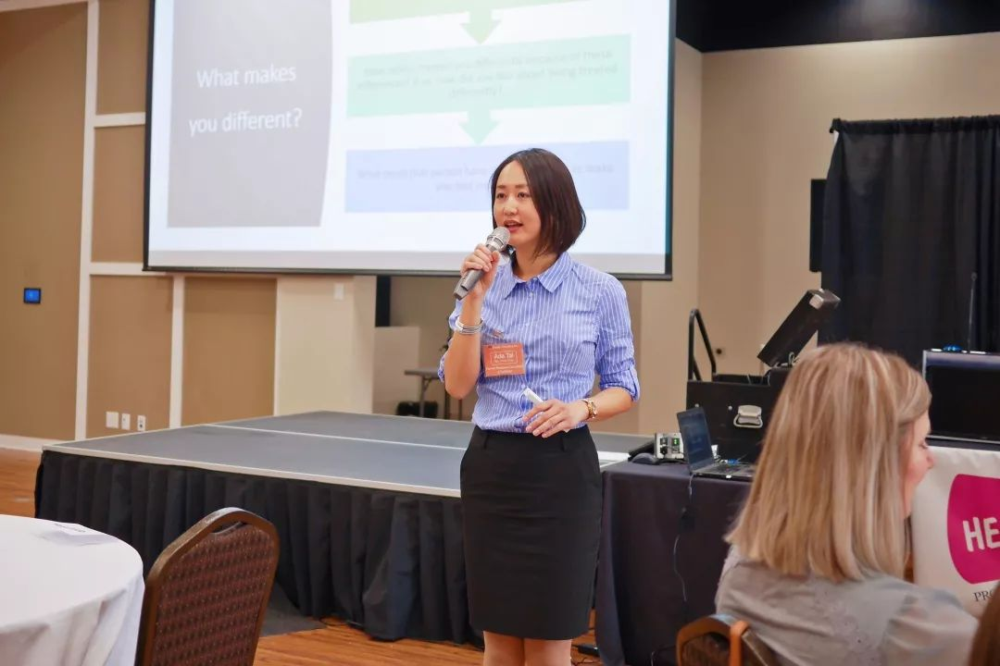
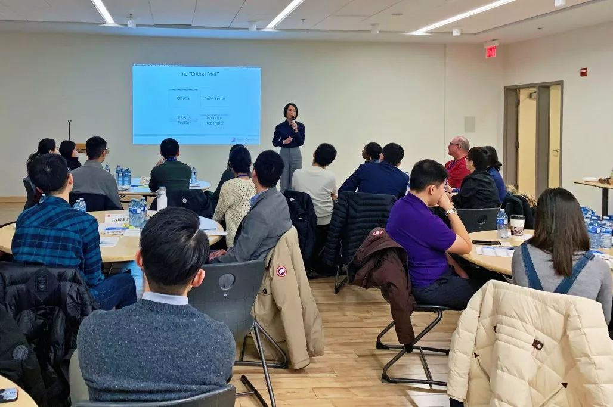
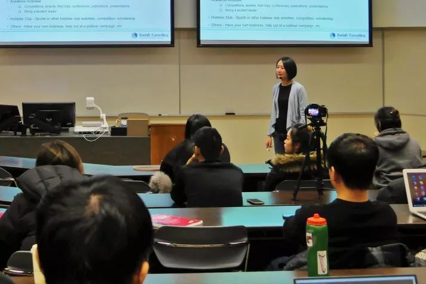
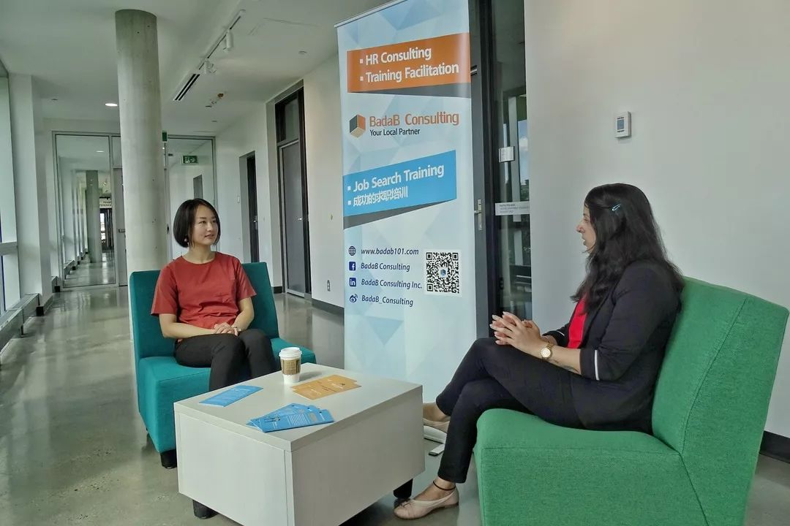

# 无标题

**链接地址:** http://mp.weixin.qq.com/s?__biz=MzI4NDYyNjAwNw==&mid=2247483995&idx=1&sn=e7df01970d81cb6eda8f57fec3b1f9d9&chksm=ebf9df63dc8e5675a7db500856c2604bf10a21ecc03628e8f24f9444e1312ccef1ed11ecd3e0&mpshare=1&scene=2&srcid=&sharer_sharetime=1581961469811&sharer_shareid=be1c8edd6c93eec155a61c876e41d26a#rd
**作者:** 关注我们
**获取时间:** 2025/8/28 20:19:31
**图片数量:** 23

---

## 原始HTML内容

<section style="box-sizing: border-box;font-size: 16px;"><section style="margin-top: 10px;margin-right: 0%;margin-left: 0%;box-sizing: border-box;" powered-by="xiumi.us"><section style="display: inline-block;width: 100%;vertical-align: top;background-color: rgb(220, 231, 246);box-sizing: border-box;"><section style="box-sizing: border-box;" powered-by="xiumi.us"><section style="display: inline-block;vertical-align: middle;width: 70%;height: auto;align-self: center;box-sizing: border-box;"><section style="font-size: 14px;color: rgb(139, 161, 197);letter-spacing: 2px;padding-right: 20px;padding-left: 20px;line-height: 1.9;box-sizing: border-box;" powered-by="xiumi.us">
点击<strong style="box-sizing: border-box;">蓝字</strong>关注我们
</section></section><section style="display: inline-block;vertical-align: middle;width: 30%;height: auto;align-self: center;box-sizing: border-box;line-height: 0;"><section style="line-height: 0;width: 0px;"><svg viewBox="0 0 1 1" style="vertical-align:top;"></svg></section></section></section></section></section><section style="box-sizing: border-box;" powered-by="xiumi.us"><section style="margin: 10px 0%;box-sizing: border-box;"><section style="display: inline-block;width: 100%;vertical-align: top;height: auto;padding: 10px;background-color: rgb(220, 231, 246);box-shadow: rgb(0, 0, 0) 0px 0px 0px;box-sizing: border-box;"><section style="margin-right: 0%;margin-left: 0%;box-sizing: border-box;" powered-by="xiumi.us"><section style="display: inline-block;width: 100%;vertical-align: top;background-color: rgb(255, 255, 255);padding: 3px;border-width: 1px;border-radius: 0px;border-style: none;border-color: rgb(220, 231, 246);box-sizing: border-box;"><section style="box-sizing: border-box;" powered-by="xiumi.us"><section style="display: inline-block;width: 100%;vertical-align: top;background-color: rgb(254, 255, 255);border-style: solid;border-width: 1px;border-radius: 1px;border-color: rgb(220, 231, 246);padding-right: 10px;padding-left: 10px;overflow: hidden;box-sizing: border-box;"><section style="text-align: center;box-sizing: border-box;" powered-by="xiumi.us"><section style="display: inline-block;width: 80%;vertical-align: top;height: auto;box-shadow: rgb(0, 0, 0) 0px 0px 0px;box-sizing: border-box;"><section style="opacity: 0.51;margin-right: 0%;margin-left: 0%;transform: rotateX(180deg);box-sizing: border-box;" powered-by="xiumi.us"><section style="display: inline-block;width: 100%;vertical-align: top;box-shadow: rgb(0, 0, 0) 0px 0px 0px;background-position: 0% 0%;background-repeat: repeat-x;background-size: auto 100%;background-attachment: scroll;line-height: 0;background-image: url(&quot;https://mmbiz.qpic.cn/mmbiz_png/cY0qSDjdkFetAfSFnAIyUpQSFHdVvxCToZgOV6Dfibex3x5YwHp9K5ia7TyEZ3j7MjDhuTuNvCQtWA5ialIrvpPFA/640?wx_fmt=png&quot;);box-sizing: border-box;"><section style="box-sizing: border-box;" powered-by="xiumi.us"><section style="display: inline-block;width: 10px;height: 10px;vertical-align: top;overflow: hidden;box-sizing: border-box;line-height: 0;"> </section></section></section></section><section style="margin-right: 0%;margin-left: 0%;box-sizing: border-box;" powered-by="xiumi.us"><section style="max-width: 100%;vertical-align: middle;display: inline-block;line-height: 0;width: 98%;height: auto;box-sizing: border-box;"></section></section><section style="opacity: 0.51;margin-right: 0%;margin-left: 0%;box-sizing: border-box;" powered-by="xiumi.us"><section style="display: inline-block;width: 100%;vertical-align: top;box-shadow: rgb(0, 0, 0) 0px 0px 0px;background-position: 0% 0%;background-repeat: repeat-x;background-size: auto 100%;background-attachment: scroll;line-height: 0;background-image: url(&quot;https://mmbiz.qpic.cn/mmbiz_png/cY0qSDjdkFetAfSFnAIyUpQSFHdVvxCToZgOV6Dfibex3x5YwHp9K5ia7TyEZ3j7MjDhuTuNvCQtWA5ialIrvpPFA/640?wx_fmt=png&quot;);box-sizing: border-box;"><section style="box-sizing: border-box;" powered-by="xiumi.us"><section style="display: inline-block;width: 10px;height: 10px;vertical-align: top;overflow: hidden;box-sizing: border-box;line-height: 0;"> </section></section></section></section></section></section><section style="margin: 10px 0%;box-sizing: border-box;" powered-by="xiumi.us"><section style="text-align: center;font-size: 14px;color: rgb(164, 193, 234);line-height: 1.8;letter-spacing: 2px;box-sizing: border-box;">
Hi，亲爱的朋友们！从去年下半年开始，我们就在每个月发送的推文中<strong style="box-sizing: border-box;">预告了即将推出的求职教育主题网络课程</strong>。
</section></section><section style="margin-top: 10px;margin-bottom: 10px;text-align: center;box-sizing: border-box;" powered-by="xiumi.us"><section style="padding-left: 1em;padding-right: 1em;display: inline-block;box-sizing: border-box;">
<strong style="box-sizing: border-box;">预告</strong>
 </section><section style="border-width: 1px;border-style: solid;border-color: rgb(192, 200, 209);margin-top: -1em;padding: 20px 10px 10px;background-color: rgb(239, 239, 239);box-sizing: border-box;"><section style="margin: 20px 0%;box-sizing: border-box;" powered-by="xiumi.us"><section style="text-align: justify;font-size: 14px;color: rgb(39, 165, 224);letter-spacing: 2px;padding-right: 20px;padding-left: 20px;box-sizing: border-box;">
我们会在2020年年初推出以求职为主题的<strong style="box-sizing: border-box;">网络课程</strong>。每一个制作精良内容丰富的网络课程视频，都由拥有十几年丰富人力资源管理经验的<strong style="box-sizing: border-box;">Ada Tai主讲</strong>。帮助你全方位提高简历修改，面试培训和职业社交等方面的技能，<strong style="box-sizing: border-box;">解决你求职和升职过程中遇到的难题</strong>。关注我们获取更多信息！
</section></section></section></section><section style="margin: 10px 0%;box-sizing: border-box;" powered-by="xiumi.us"><section style="text-align: center;font-size: 14px;color: rgb(164, 193, 234);line-height: 1.8;letter-spacing: 2px;box-sizing: border-box;">
不少朋友对这套课程抱有<strong style="box-sizing: border-box;">浓厚的兴趣</strong>！我们也收到许多私信催我们赶快推出这套课程。

 

2020年年初这就到来，我们<strong style="box-sizing: border-box;">去年立好的Flag到了兑现的时刻</strong>！

 

经过BADAB<strong style="box-sizing: border-box;">两年半的精心创作</strong>和<strong style="box-sizing: border-box;">反复的筛选和修改</strong>，这套千呼万唤使出来的网络课程终于在2020年2月中旬和大家见面了！
</section></section><section style="box-sizing: border-box;" powered-by="xiumi.us">
 
</section><section style="text-align: center;margin: 10px 0%;box-sizing: border-box;" powered-by="xiumi.us"><section style="display: inline-block;width: 80%;vertical-align: top;height: auto;box-shadow: rgb(0, 0, 0) 0px 0px 0px;letter-spacing: 0px;padding: 2px;border-width: 1px;border-radius: 4px;border-style: dashed;border-color: rgba(157, 187, 254, 0.46);overflow: hidden;box-sizing: border-box;"><section style="margin-right: 0%;margin-left: 0%;box-sizing: border-box;" powered-by="xiumi.us"><section style="max-width: 100%;vertical-align: middle;display: inline-block;line-height: 0;width: 100%;height: auto;border-width: 0px;border-radius: 2px;border-style: none;border-color: rgb(62, 62, 62);overflow: hidden;box-sizing: border-box;"></section></section></section></section><section style="margin: 10px 0%;box-sizing: border-box;" powered-by="xiumi.us"><section style="text-align: center;font-size: 14px;color: rgb(164, 193, 234);line-height: 1.8;letter-spacing: 2px;box-sizing: border-box;">
 

这套课程包含多少课题？会以怎样的形式同我们见面？又能带给我们怎样的收获呢？今天就让我们<strong style="box-sizing: border-box;">一起揭开它神秘的面纱</strong>吧！
</section></section><section style="box-sizing: border-box;" powered-by="xiumi.us">
 
</section><section style="margin: 10px 0% 20px;text-align: center;box-sizing: border-box;" powered-by="xiumi.us"><section style="display: inline-block;width: auto;vertical-align: top;line-height: 0;letter-spacing: 0px;min-width: 10%;max-width: 100%;height: auto;box-sizing: border-box;"><section style="margin-right: 0%;margin-left: 0%;box-sizing: border-box;" powered-by="xiumi.us"><section style="background-image: linear-gradient(90deg, rgba(159, 186, 253, 0) 0%, rgb(159, 186, 253) 50%, rgba(159, 186, 253, 0) 100%);height: 2px;box-sizing: border-box;line-height: 0;"> </section></section><section style="box-sizing: border-box;" powered-by="xiumi.us"><section style="display: inline-block;width: auto;vertical-align: top;min-width: 10%;max-width: 100%;height: auto;padding: 5px 25px;background-position: 50% 50%;background-repeat: no-repeat;background-size: cover;background-attachment: scroll;background-image: url(&quot;https://mmbiz.qpic.cn/mmbiz_png/cY0qSDjdkFetAfSFnAIyUpQSFHdVvxCTMibfEk9nWDY4OcmH9UYGzcnsBmfiagXHGicIIBv2taQQ4j4eCGV8xpLBg/640?wx_fmt=png&quot;);box-sizing: border-box;"><section style="box-sizing: border-box;" powered-by="xiumi.us"><section style="display: inline-block;width: 100%;vertical-align: top;line-height: 1;letter-spacing: 0px;box-sizing: border-box;"><section style="margin-right: 0%;margin-left: 0%;box-sizing: border-box;" powered-by="xiumi.us"><section style="color: rgb(40, 115, 200);font-size: 17px;line-height: 1.1;letter-spacing: 4px;text-shadow: rgb(255, 255, 255) 1px -1px, rgb(157, 187, 254) 1px 1px, rgb(157, 187, 254) -1px 1px, rgb(157, 187, 254) -1px -1px, rgb(157, 187, 254) 1px 0px, rgb(157, 187, 254) 0px 1px, rgb(157, 187, 254) -1px 0px, rgb(157, 187, 254) 0px -1px;box-sizing: border-box;">
<strong style="box-sizing: border-box;">网络课程简介</strong>
</section></section></section></section></section></section><section style="margin-right: 0%;margin-left: 0%;box-sizing: border-box;" powered-by="xiumi.us"><section style="background-image: linear-gradient(90deg, rgba(159, 186, 253, 0) 0%, rgb(159, 186, 253) 50%, rgba(159, 186, 253, 0) 100%);height: 2px;box-sizing: border-box;line-height: 0;"> </section></section></section></section><section style="margin: 10px 0%;box-sizing: border-box;" powered-by="xiumi.us"><section style="text-align: center;font-size: 14px;color: rgb(164, 193, 234);line-height: 1.8;letter-spacing: 2px;box-sizing: border-box;">
BADAB推出的这套课程包含<strong style="box-sizing: border-box;">三个部分</strong>，一共<strong style="box-sizing: border-box;">二十课时</strong>。每次课程的时长约<strong style="box-sizing: border-box;">20分钟，</strong>将以<strong style="box-sizing: border-box;">视频</strong>的形式放送。

 

<iframe class="video_iframe rich_pages" data-vidtype="2" data-mpvid="wxv_1211542811808497664" data-cover="http%3A%2F%2Fmmbiz.qpic.cn%2Fmmbiz_jpg%2FcY0qSDjdkFetAfSFnAIyUpQSFHdVvxCTzEeltJXjucKLd0icZw9eicTicPFBUxZibyiaD18PwpqMbUQdWFia6YpPvB7A%2F0%3Fwx_fmt%3Djpeg" allowfullscreen="" frameborder="0" data-ratio="1.7777777777777777" data-w="1920" data-src="https://mp.weixin.qq.com/mp/readtemplate?t=pages/video_player_tmpl&amp;action=mpvideo&amp;auto=0&amp;vid=wxv_1211542811808497664"></iframe>

 
</section></section><section style="margin: 10px 0%;box-sizing: border-box;" powered-by="xiumi.us"><section style="text-align: center;font-size: 14px;color: rgb(164, 193, 234);line-height: 1.8;letter-spacing: 2px;box-sizing: border-box;">
课程将由<strong style="letter-spacing: 1.8px;box-sizing: border-box;">四位资历丰富的人力资源导师</strong>从各种角度为你详细讲解。全方位帮你解答在求职和就职过程中遇到的各种问题！
</section></section><section style="box-sizing: border-box;" powered-by="xiumi.us">
 
</section><section style="text-align: center;margin: 10px 0%;box-sizing: border-box;" powered-by="xiumi.us"><section style="display: inline-block;width: auto;vertical-align: top;min-width: 10%;max-width: 100%;height: auto;box-sizing: border-box;"><section style="text-align: left;font-size: 17px;color: rgb(154, 194, 240);letter-spacing: 2px;line-height: 1.6;text-shadow: rgb(255, 255, 255) 1px 1px, rgba(157, 187, 254, 0.46) 3px 3px;box-sizing: border-box;" powered-by="xiumi.us">
<strong style="box-sizing: border-box;">导师阵容</strong>
</section><section style="opacity: 0.51;margin-right: 0%;margin-bottom: -10px;margin-left: 0%;box-sizing: border-box;" powered-by="xiumi.us"><section style="display: inline-block;width: 100%;vertical-align: top;box-shadow: rgb(0, 0, 0) 0px 0px 0px;background-position: 0% 0%;background-repeat: repeat-x;background-size: auto 100%;background-attachment: scroll;line-height: 0;background-image: url(&quot;https://mmbiz.qpic.cn/mmbiz_png/cY0qSDjdkFetAfSFnAIyUpQSFHdVvxCToZgOV6Dfibex3x5YwHp9K5ia7TyEZ3j7MjDhuTuNvCQtWA5ialIrvpPFA/640?wx_fmt=png&quot;);box-sizing: border-box;"><section style="box-sizing: border-box;" powered-by="xiumi.us"><section style="display: inline-block;width: 10px;height: 10px;vertical-align: top;overflow: hidden;box-sizing: border-box;line-height: 0;"> </section></section></section></section></section></section><section style="margin: 10px 0%;box-sizing: border-box;" powered-by="xiumi.us"><section style="display: inline-block;width: 100%;vertical-align: top;background-color: rgb(160, 184, 224);padding: 10px;box-sizing: border-box;"><section style="box-sizing: border-box;" powered-by="xiumi.us"><section style="display: inline-block;width: 100%;vertical-align: top;border-style: solid;border-width: 2px;border-radius: 0px;border-color: rgb(66, 94, 142);background-color: rgb(255, 255, 255);padding: 10px;box-sizing: border-box;"><section style="margin-top: 10px;margin-right: 0%;margin-left: 0%;text-align: center;justify-content: center;box-sizing: border-box;" powered-by="xiumi.us"><section style="display: inline-block;vertical-align: top;width: 45%;padding-right: 4px;height: auto;box-sizing: border-box;"><section style="font-size: 26px;box-sizing: border-box;" powered-by="xiumi.us"><section style="box-sizing: border-box;display: inline-block;vertical-align: bottom;margin: auto;width: 3em;height: 3em;border-radius: 100%;background-position: 46.1053% 0%;background-repeat: no-repeat;background-size: 142.252%;overflow: hidden;background-image: url(&quot;https://mmbiz.qpic.cn/mmbiz_jpg/cY0qSDjdkFetAfSFnAIyUpQSFHdVvxCTbRkhibVJ0w30pxllI6yNu2DEWNR2eX8TQhg1W9wgdIN0SgeZ5GfuMfA/640?wx_fmt=jpeg&quot;);"><section style="height: 100%;overflow: hidden;line-height: 0;vertical-align: middle;max-width: 100%;box-sizing: border-box;"></section></section></section><section style="margin-top: 8px;margin-right: 0%;margin-left: 0%;box-sizing: border-box;" powered-by="xiumi.us"><section style="font-size: 14px;color: rgb(66, 94, 142);box-sizing: border-box;">
<strong style="box-sizing: border-box;">Ada&nbsp;</strong><strong style="box-sizing: border-box;">Tai</strong>
</section></section><section style="margin-right: 0%;margin-bottom: 8px;margin-left: 0%;box-sizing: border-box;" powered-by="xiumi.us"><section style="font-size: 12px;color: rgb(121, 121, 121);box-sizing: border-box;">
MBA, CPHR, C.Mgr.
</section></section></section><section style="display: inline-block;vertical-align: top;width: 0%;padding-right: 2px;padding-left: 2px;height: auto;box-sizing: border-box;line-height: 0;"><section style="line-height: 0;width: 0px;"><svg viewBox="0 0 1 1" style="vertical-align:top;"></svg></section></section><section style="display: inline-block;vertical-align: top;width: 45%;letter-spacing: 0px;padding-left: 4px;height: auto;box-sizing: border-box;"><section style="font-size: 26px;box-sizing: border-box;" powered-by="xiumi.us"><section style="box-sizing: border-box;display: inline-block;vertical-align: bottom;margin: auto;width: 3em;height: 3em;border-radius: 100%;background-position: 0% 0%;background-repeat: no-repeat;background-size: 100%;overflow: hidden;background-image: url(&quot;https://mmbiz.qpic.cn/mmbiz_jpg/cY0qSDjdkFetAfSFnAIyUpQSFHdVvxCTAwqy2gFnVL0lAaLibbnhtpZfHwickNJbnSvgDd2RKeD0evUoTua8ON0A/640?wx_fmt=jpeg&quot;);"><section style="height: 100%;overflow: hidden;line-height: 0;vertical-align: middle;max-width: 100%;box-sizing: border-box;"></section></section></section><section style="margin-top: 8px;margin-right: 0%;margin-left: 0%;box-sizing: border-box;" powered-by="xiumi.us"><section style="font-size: 14px;color: rgb(66, 94, 142);box-sizing: border-box;">
<strong style="box-sizing: border-box;">Doug&nbsp;</strong><strong style="letter-spacing: 0px;box-sizing: border-box;">Alloway</strong>
</section></section><section style="margin-right: 0%;margin-bottom: 8px;margin-left: 0%;box-sizing: border-box;" powered-by="xiumi.us"><section style="font-size: 12px;color: rgb(121, 121, 121);box-sizing: border-box;">
B.A, CPHR
</section></section></section></section><section style="margin-top: 10px;margin-right: 0%;margin-left: 0%;text-align: center;justify-content: center;box-sizing: border-box;" powered-by="xiumi.us"><section style="display: inline-block;vertical-align: top;width: 45%;padding-right: 4px;height: auto;box-sizing: border-box;"><section style="font-size: 26px;box-sizing: border-box;" powered-by="xiumi.us"><section style="box-sizing: border-box;display: inline-block;vertical-align: bottom;margin: auto;width: 3em;height: 3em;border-radius: 100%;background-position: 54.486% 13.6453%;background-repeat: no-repeat;background-size: 164.356%;overflow: hidden;background-image: url(&quot;https://mmbiz.qpic.cn/mmbiz_jpg/cY0qSDjdkFetAfSFnAIyUpQSFHdVvxCT97QJ2nc3XWSdhxD4Sw1icgOJHUngGGVuSXC4DrpZduIlH5uLjRO1KFw/640?wx_fmt=jpeg&quot;);"><section style="height: 100%;overflow: hidden;line-height: 0;vertical-align: middle;max-width: 100%;box-sizing: border-box;"></section></section></section><section style="margin-top: 8px;margin-right: 0%;margin-left: 0%;box-sizing: border-box;" powered-by="xiumi.us"><section style="font-size: 14px;color: rgb(66, 94, 142);box-sizing: border-box;">
<strong style="box-sizing: border-box;">Amber Lautischer</strong>
</section></section><section style="margin-right: 0%;margin-bottom: 8px;margin-left: 0%;box-sizing: border-box;" powered-by="xiumi.us"><section style="font-size: 12px;box-sizing: border-box;">
B.Com
</section></section></section><section style="display: inline-block;vertical-align: top;width: 0%;padding-right: 2px;padding-left: 2px;height: auto;box-sizing: border-box;line-height: 0;"><section style="line-height: 0;width: 0px;"><svg viewBox="0 0 1 1" style="vertical-align:top;"></svg></section></section><section style="display: inline-block;vertical-align: top;width: 45%;letter-spacing: 0px;padding-left: 4px;height: auto;box-sizing: border-box;"><section style="font-size: 26px;justify-content: center;box-sizing: border-box;" powered-by="xiumi.us"><section style="box-sizing: border-box;display: inline-block;vertical-align: bottom;margin: auto;width: 3em;height: 3em;border-radius: 100%;background-position: 49.3204% 19.0912%;background-repeat: no-repeat;background-size: 152.664%;overflow: hidden;background-image: url(&quot;https://mmbiz.qpic.cn/mmbiz_jpg/cY0qSDjdkFetAfSFnAIyUpQSFHdVvxCTKBgNsMdpyyPf4eQ4KdRr6MLyldibLqW1arZAiazbiaOvBATefDBhyGqtA/640?wx_fmt=jpeg&quot;);"><section style="height: 100%;overflow: hidden;line-height: 0;vertical-align: middle;max-width: 100%;box-sizing: border-box;"></section></section></section><section style="margin-top: 8px;margin-right: 0%;margin-left: 0%;box-sizing: border-box;" powered-by="xiumi.us"><section style="font-size: 15px;color: rgb(66, 94, 142);box-sizing: border-box;">
<strong style="box-sizing: border-box;">Shruti&nbsp;</strong><strong style="letter-spacing: 0px;box-sizing: border-box;">Arora</strong>
</section></section><section style="margin-right: 0%;margin-bottom: 8px;margin-left: 0%;box-sizing: border-box;" powered-by="xiumi.us"><section style="font-size: 12px;color: rgb(121, 121, 121);box-sizing: border-box;">
MBA
</section></section></section></section></section></section></section></section><section style="box-sizing: border-box;" powered-by="xiumi.us">
 
</section><section style="text-align: center;justify-content: center;margin: 10px 0%;box-sizing: border-box;" powered-by="xiumi.us"><section style="display: inline-block;width: 95%;vertical-align: top;height: auto;border-width: 0px;border-radius: 5px;border-style: none;border-color: rgb(115, 115, 115);overflow: hidden;background-color: rgba(241, 247, 255, 0.92);box-shadow: rgba(183, 217, 255, 0.39) 0px 5px 5px;box-sizing: border-box;"><section style="justify-content: center;margin-right: 0%;margin-bottom: 5px;margin-left: 0%;box-sizing: border-box;" powered-by="xiumi.us"><section style="display: inline-block;width: 100%;vertical-align: top;height: auto;border-width: 0px;border-radius: 5px;border-style: none;border-color: rgb(115, 115, 115);overflow: hidden;background-color: rgba(240, 247, 255, 0.92);box-shadow: rgb(183, 217, 255) 0px 0px 4px;padding-right: 20px;padding-left: 20px;box-sizing: border-box;"><section style="text-align: justify;box-sizing: border-box;" powered-by="xiumi.us">
 
</section><section style="text-align: left;justify-content: flex-start;box-sizing: border-box;" powered-by="xiumi.us"><section style="display: inline-block;vertical-align: middle;width: auto;min-width: 10%;max-width: 100%;height: auto;align-self: center;line-height: 0;letter-spacing: 0px;box-sizing: border-box;"><section style="text-align: center;box-sizing: border-box;" powered-by="xiumi.us"><section style="display: inline-block;width: 25px;height: 25px;vertical-align: top;overflow: hidden;background-position: 50% 50%;background-repeat: no-repeat;background-size: contain;background-attachment: scroll;background-image: url(&quot;https://mmbiz.qpic.cn/mmbiz_png/cY0qSDjdkFetAfSFnAIyUpQSFHdVvxCT2qricwjMmxB3XI9b3mNEWekpE7N6urhME99ogsFia1AFtuSdgibK8Rlhg/640?wx_fmt=png&quot;);box-sizing: border-box;line-height: 0;"> </section></section></section><section style="display: inline-block;vertical-align: middle;width: auto;min-width: 10%;max-width: 100%;height: auto;box-shadow: rgb(0, 0, 0) 0px 0px 0px;align-self: center;box-sizing: border-box;"><section style="text-align: justify;font-size: 18px;color: rgba(87, 164, 255, 0.64);padding-right: 10px;padding-left: 10px;letter-spacing: 1.8px;line-height: 1.6;box-sizing: border-box;" powered-by="xiumi.us">
<strong style="box-sizing: border-box;">网络课程内容</strong>
</section></section></section><section style="margin: 10px 0%;box-sizing: border-box;" powered-by="xiumi.us"><section style="display: inline-block;width: auto;vertical-align: top;min-width: 10%;max-width: 100%;height: auto;box-sizing: border-box;"><section style="text-align: left;font-size: 17px;color: rgb(154, 194, 240);letter-spacing: 2px;line-height: 1.6;text-shadow: rgb(255, 255, 255) 1px 1px, rgba(157, 187, 254, 0.46) 3px 3px;box-sizing: border-box;" powered-by="xiumi.us">
 

<strong style="box-sizing: border-box;"> </strong>

<strong style="box-sizing: border-box;">第一部分课程介绍</strong>
</section><section style="opacity: 0.51;margin-right: 0%;margin-bottom: -10px;margin-left: 0%;box-sizing: border-box;" powered-by="xiumi.us"><section style="display: inline-block;width: 100%;vertical-align: top;box-shadow: rgb(0, 0, 0) 0px 0px 0px;background-position: 0% 0%;background-repeat: repeat-x;background-size: auto 100%;background-attachment: scroll;line-height: 0;background-image: url(&quot;https://mmbiz.qpic.cn/mmbiz_png/cY0qSDjdkFetAfSFnAIyUpQSFHdVvxCToZgOV6Dfibex3x5YwHp9K5ia7TyEZ3j7MjDhuTuNvCQtWA5ialIrvpPFA/640?wx_fmt=png&quot;);box-sizing: border-box;"><section style="box-sizing: border-box;" powered-by="xiumi.us"><section style="display: inline-block;width: 10px;height: 10px;vertical-align: top;overflow: hidden;box-sizing: border-box;line-height: 0;"> </section></section></section></section></section></section><section style="box-sizing: border-box;" powered-by="xiumi.us"><section style="display: flex;flex-flow: row nowrap;box-sizing: border-box;"><section style="display: inline-block;width: auto;vertical-align: top;flex: 100 100 0%;align-self: flex-start;height: auto;z-index: 2;box-shadow: rgb(0, 0, 0) 0px 0px 0px;box-sizing: border-box;"><section style="min-height: 40px;margin-right: 0%;margin-bottom: 10px;margin-left: 0%;box-sizing: border-box;" powered-by="xiumi.us"><section style="width: 100%;margin-right: auto;margin-bottom: -10px;margin-left: auto;box-sizing: border-box;"><table width="100%"><tbody style="box-sizing: border-box;"><tr opera-tn-ra-comp="_$.pages:0.layers:0.comps:1.col1:0.col1:0.col1:17.col1:0.col1:5.col1:0.classicTable1:0" style="box-sizing: border-box;" powered-by="xiumi.us"><td colspan="1" rowspan="1" opera-tn-ra-cell="_$.pages:0.layers:0.comps:1.col1:0.col1:0.col1:17.col1:0.col1:5.col1:0.classicTable1:0.td@@0" style="border-width: 0px;border-color: rgb(255, 255, 255);border-radius: 6px 0px 0px 6px;border-style: none;background-color: rgb(183, 217, 255);overflow: hidden;box-sizing: border-box;padding: 0px;" width="25.0000%"><section style="margin: 5px 0%;box-sizing: border-box;" powered-by="xiumi.us"><section style="padding-right: 5px;padding-left: 5px;font-size: 15px;color: rgb(255, 255, 255);text-shadow: rgba(0, 0, 0, 0.24) 1px 1px 1px;box-sizing: border-box;">
<strong style="box-sizing: border-box;">课号</strong>
</section></section></td><td colspan="1" rowspan="1" opera-tn-ra-cell="_$.pages:0.layers:0.comps:1.col1:0.col1:0.col1:17.col1:0.col1:5.col1:0.classicTable1:0.td@@1" style="border-width: 2px;border-color: rgb(255, 255, 255);border-radius: 0px;border-style: none;background-color: rgb(183, 217, 255);box-sizing: border-box;padding: 0px;" width="74.0000%"><section style="margin: 5px 0%;box-sizing: border-box;" powered-by="xiumi.us"><section style="padding-right: 5px;padding-left: 5px;font-size: 15px;color: rgb(255, 255, 255);text-shadow: rgba(0, 0, 0, 0.24) 1px 1px 1px;box-sizing: border-box;">
<strong style="box-sizing: border-box;">课程内容</strong>
</section></section></td></tr><tr opera-tn-ra-comp="_$.pages:0.layers:0.comps:1.col1:0.col1:0.col1:17.col1:0.col1:5.col1:0.classicTable1:1" style="box-sizing: border-box;" powered-by="xiumi.us"><td colspan="1" rowspan="1" opera-tn-ra-cell="_$.pages:0.layers:0.comps:1.col1:0.col1:0.col1:17.col1:0.col1:5.col1:0.classicTable1:1.td@@0" style="border-top: 2px none rgb(255, 255, 255);border-right: 2px none rgb(255, 255, 255);border-left: 2px none rgb(255, 255, 255);border-bottom-color: rgba(183, 217, 255, 0.73);border-radius: 0px;background-color: rgba(255, 255, 255, 0);box-sizing: border-box;padding: 0px;" width="25.0000%"><section style="margin: 5px 0%;box-sizing: border-box;" powered-by="xiumi.us"><section style="padding-right: 5px;padding-left: 5px;font-size: 14px;color: rgb(115, 115, 115);box-sizing: border-box;">
1
</section></section></td><td colspan="1" rowspan="1" opera-tn-ra-cell="_$.pages:0.layers:0.comps:1.col1:0.col1:0.col1:17.col1:0.col1:5.col1:0.classicTable1:1.td@@1" style="border-top: 2px none rgb(255, 255, 255);border-right: 2px none rgb(255, 255, 255);border-left: 2px none rgb(255, 255, 255);border-bottom-color: rgba(183, 217, 255, 0.73);border-radius: 0px;background-color: rgba(255, 255, 255, 0);box-sizing: border-box;padding: 0px;" width="74.0000%"><section style="margin: 5px 0%;box-sizing: border-box;" powered-by="xiumi.us"><section style="text-align: left;padding-right: 5px;padding-left: 5px;font-size: 12px;color: rgb(115, 115, 115);box-sizing: border-box;">
The Entire Job Search Process
</section></section></td></tr><tr opera-tn-ra-comp="_$.pages:0.layers:0.comps:1.col1:0.col1:0.col1:17.col1:0.col1:5.col1:0.classicTable1:2" style="box-sizing: border-box;" powered-by="xiumi.us"><td colspan="1" rowspan="1" opera-tn-ra-cell="_$.pages:0.layers:0.comps:1.col1:0.col1:0.col1:17.col1:0.col1:5.col1:0.classicTable1:2.td@@0" style="border-top: 2px none rgb(255, 255, 255);border-right: 2px none rgb(255, 255, 255);border-left: 2px none rgb(255, 255, 255);border-bottom-color: rgba(183, 217, 255, 0.73);border-radius: 0px;background-color: rgba(255, 255, 255, 0);box-sizing: border-box;padding: 0px;" width="25.0000%"><section style="margin: 5px 0%;box-sizing: border-box;" powered-by="xiumi.us"><section style="padding-right: 5px;padding-left: 5px;font-size: 14px;color: rgb(115, 115, 115);box-sizing: border-box;">
2
</section></section></td><td colspan="1" rowspan="1" opera-tn-ra-cell="_$.pages:0.layers:0.comps:1.col1:0.col1:0.col1:17.col1:0.col1:5.col1:0.classicTable1:2.td@@1" style="border-top: 2px none rgb(255, 255, 255);border-right: 2px none rgb(255, 255, 255);border-left: 2px none rgb(255, 255, 255);border-bottom-color: rgba(183, 217, 255, 0.73);border-radius: 0px;background-color: rgba(255, 255, 255, 0);box-sizing: border-box;padding: 0px;" width="74.0000%"><section style="margin: 5px 0%;box-sizing: border-box;" powered-by="xiumi.us"><section style="text-align: left;padding-right: 5px;padding-left: 5px;font-size: 12px;color: rgb(115, 115, 115);box-sizing: border-box;">
Have A Clear Plan to Grow Your Career
</section></section></td></tr><tr opera-tn-ra-comp="_$.pages:0.layers:0.comps:1.col1:0.col1:0.col1:17.col1:0.col1:5.col1:0.classicTable1:3" style="box-sizing: border-box;" powered-by="xiumi.us"><td colspan="1" rowspan="1" opera-tn-ra-cell="_$.pages:0.layers:0.comps:1.col1:0.col1:0.col1:17.col1:0.col1:5.col1:0.classicTable1:3.td@@0" style="border-top: 2px none rgb(255, 255, 255);border-right: 2px none rgb(255, 255, 255);border-left: 2px none rgb(255, 255, 255);border-bottom-color: rgba(183, 217, 255, 0.73);border-radius: 0px;background-color: rgba(255, 255, 255, 0);box-sizing: border-box;padding: 0px;" width="25.0000%"><section style="margin: 5px 0%;box-sizing: border-box;" powered-by="xiumi.us"><section style="padding-right: 5px;padding-left: 5px;font-size: 14px;color: rgb(115, 115, 115);box-sizing: border-box;">
3
</section></section></td><td colspan="1" rowspan="1" opera-tn-ra-cell="_$.pages:0.layers:0.comps:1.col1:0.col1:0.col1:17.col1:0.col1:5.col1:0.classicTable1:3.td@@1" style="border-top: 2px none rgb(255, 255, 255);border-right: 2px none rgb(255, 255, 255);border-left: 2px none rgb(255, 255, 255);border-bottom-color: rgba(183, 217, 255, 0.73);border-radius: 0px;background-color: rgba(255, 255, 255, 0);box-sizing: border-box;padding: 0px;" width="74.0000%"><section style="margin: 5px 0%;box-sizing: border-box;" powered-by="xiumi.us"><section style="text-align: left;padding-right: 5px;padding-left: 5px;font-size: 12px;color: rgb(115, 115, 115);box-sizing: border-box;">
Where Do I look for Job Information
</section></section></td></tr><tr opera-tn-ra-comp="_$.pages:0.layers:0.comps:1.col1:0.col1:0.col1:17.col1:0.col1:5.col1:0.classicTable1:4" style="box-sizing: border-box;" powered-by="xiumi.us"><td colspan="1" rowspan="1" opera-tn-ra-cell="_$.pages:0.layers:0.comps:1.col1:0.col1:0.col1:17.col1:0.col1:5.col1:0.classicTable1:4.td@@0" style="border-width: 0px;border-color: rgb(255, 255, 255) rgb(255, 255, 255) rgba(183, 217, 255, 0.73);border-radius: 0px;border-style: none;background-color: rgba(255, 255, 255, 0);box-sizing: border-box;padding: 0px;" width="25.0000%"><section style="margin: 5px 0%;box-sizing: border-box;" powered-by="xiumi.us"><section style="padding-right: 5px;padding-left: 5px;font-size: 14px;color: rgb(115, 115, 115);box-sizing: border-box;">
4
</section></section></td><td colspan="1" rowspan="1" opera-tn-ra-cell="_$.pages:0.layers:0.comps:1.col1:0.col1:0.col1:17.col1:0.col1:5.col1:0.classicTable1:4.td@@1" style="border-width: 0px;border-color: rgb(255, 255, 255) rgb(255, 255, 255) rgba(183, 217, 255, 0.73);border-radius: 0px;border-style: none;background-color: rgba(255, 255, 255, 0);box-sizing: border-box;padding: 0px;" width="74.0000%"><section style="margin: 5px 0%;box-sizing: border-box;" powered-by="xiumi.us"><section style="text-align: left;padding-right: 5px;padding-left: 5px;font-size: 12px;color: rgb(115, 115, 115);box-sizing: border-box;">
Tips and Tricks of Applying for Jobs Online
</section></section></td></tr></tbody></table> </section>
<iframe class="video_iframe rich_pages" data-vidtype="2" data-mpvid="wxv_1211552322745139200" data-cover="http%3A%2F%2Fmmbiz.qpic.cn%2Fmmbiz_jpg%2FcY0qSDjdkFetAfSFnAIyUpQSFHdVvxCTAFSCDoH2tNzJCgC94TeUD7LghWxib8ib0f5Ts4cT53L3FFgXiauNLIyJA%2F0%3Fwx_fmt%3Djpeg" allowfullscreen="" frameborder="0" data-ratio="1.7777777777777777" data-w="1280" data-src="https://mp.weixin.qq.com/mp/readtemplate?t=pages/video_player_tmpl&amp;action=mpvideo&amp;auto=0&amp;vid=wxv_1211552322745139200"></iframe>
<section style="width: 100%;margin-right: auto;margin-bottom: -10px;margin-left: auto;box-sizing: border-box;"> </section></section></section></section></section><section style="margin: 10px 0%;box-sizing: border-box;" powered-by="xiumi.us"><section style="display: inline-block;width: auto;vertical-align: top;min-width: 10%;max-width: 100%;height: auto;box-sizing: border-box;"><section style="text-align: left;font-size: 17px;color: rgb(154, 194, 240);letter-spacing: 2px;line-height: 1.6;text-shadow: rgb(255, 255, 255) 1px 1px, rgba(157, 187, 254, 0.46) 3px 3px;box-sizing: border-box;" powered-by="xiumi.us">
<strong style="box-sizing: border-box;">第一部分试课尝鲜</strong>
</section><section style="opacity: 0.51;margin-right: 0%;margin-bottom: -10px;margin-left: 0%;box-sizing: border-box;" powered-by="xiumi.us"><section style="display: inline-block;width: 100%;vertical-align: top;box-shadow: rgb(0, 0, 0) 0px 0px 0px;background-position: 0% 0%;background-repeat: repeat-x;background-size: auto 100%;background-attachment: scroll;line-height: 0;background-image: url(&quot;https://mmbiz.qpic.cn/mmbiz_png/cY0qSDjdkFetAfSFnAIyUpQSFHdVvxCToZgOV6Dfibex3x5YwHp9K5ia7TyEZ3j7MjDhuTuNvCQtWA5ialIrvpPFA/640?wx_fmt=png&quot;);box-sizing: border-box;"><section style="box-sizing: border-box;" powered-by="xiumi.us"><section style="display: inline-block;width: 10px;height: 10px;vertical-align: top;overflow: hidden;box-sizing: border-box;line-height: 0;"> </section></section></section></section></section></section><section style="font-size: 12px;color: rgb(26, 82, 145);box-sizing: border-box;" powered-by="xiumi.us">
欢迎选购课程前试看我们的课程内容哦！
</section><section style="text-align: justify;box-sizing: border-box;" powered-by="xiumi.us">
 
</section><section style="text-align: justify;box-sizing: border-box;" powered-by="xiumi.us">
 
</section><section style="margin-top: 10px;margin-bottom: 10px;padding-right: 3px;padding-left: 3px;overflow: hidden;box-sizing: border-box;" powered-by="xiumi.us"><section style="height: 2.6em;box-sizing: border-box;"><section style="transform: rotate(-45deg);-webkit-transform: rotate(-45deg);-moz-transform: rotate(-45deg);-o-transform: rotate(-45deg);margin-top: -1em;box-sizing: border-box;"><section style="width: 2em;height: 2em;margin: auto;display: inline-block;box-sizing: border-box;"><section style="height: 100%;border-left: 0.2em solid rgb(40, 115, 200);border-bottom: 0.2em solid rgb(40, 115, 200);box-sizing: border-box;line-height: 0;background-color: transparent !important;"> </section></section></section></section></section><section style="text-align: justify;box-sizing: border-box;" powered-by="xiumi.us">
 
</section><section style="margin: 10px 0%;box-sizing: border-box;" powered-by="xiumi.us"><section style="display: inline-block;width: auto;vertical-align: top;min-width: 10%;max-width: 100%;height: auto;box-sizing: border-box;"><section style="text-align: left;font-size: 17px;color: rgb(154, 194, 240);letter-spacing: 2px;line-height: 1.6;text-shadow: rgb(255, 255, 255) 1px 1px, rgba(157, 187, 254, 0.46) 3px 3px;box-sizing: border-box;" powered-by="xiumi.us">
<strong style="box-sizing: border-box;">第二部分课程介绍</strong>
</section><section style="opacity: 0.51;margin-right: 0%;margin-bottom: -10px;margin-left: 0%;box-sizing: border-box;" powered-by="xiumi.us"><section style="display: inline-block;width: 100%;vertical-align: top;box-shadow: rgb(0, 0, 0) 0px 0px 0px;background-position: 0% 0%;background-repeat: repeat-x;background-size: auto 100%;background-attachment: scroll;line-height: 0;background-image: url(&quot;https://mmbiz.qpic.cn/mmbiz_png/cY0qSDjdkFetAfSFnAIyUpQSFHdVvxCToZgOV6Dfibex3x5YwHp9K5ia7TyEZ3j7MjDhuTuNvCQtWA5ialIrvpPFA/640?wx_fmt=png&quot;);box-sizing: border-box;"><section style="box-sizing: border-box;" powered-by="xiumi.us"><section style="display: inline-block;width: 10px;height: 10px;vertical-align: top;overflow: hidden;box-sizing: border-box;line-height: 0;"> </section></section></section></section></section></section><section style="box-sizing: border-box;" powered-by="xiumi.us"><section style="display: flex;flex-flow: row nowrap;box-sizing: border-box;"><section style="display: inline-block;width: auto;vertical-align: top;flex: 100 100 0%;align-self: flex-start;height: auto;z-index: 2;box-shadow: rgb(0, 0, 0) 0px 0px 0px;box-sizing: border-box;"><section style="min-height: 40px;margin-right: 0%;margin-bottom: 10px;margin-left: 0%;box-sizing: border-box;" powered-by="xiumi.us"><section style="width: 100%;margin-right: auto;margin-bottom: -10px;margin-left: auto;box-sizing: border-box;"><table width="100%"><tbody style="box-sizing: border-box;"><tr opera-tn-ra-comp="_$.pages:0.layers:0.comps:1.col1:0.col1:0.col1:17.col1:0.col1:16.col1:0.classicTable1:0" style="box-sizing: border-box;" powered-by="xiumi.us"><td colspan="1" rowspan="1" opera-tn-ra-cell="_$.pages:0.layers:0.comps:1.col1:0.col1:0.col1:17.col1:0.col1:16.col1:0.classicTable1:0.td@@0" style="border-width: 0px;border-color: rgb(255, 255, 255);border-radius: 6px 0px 0px 6px;border-style: none;background-color: rgb(183, 217, 255);overflow: hidden;box-sizing: border-box;padding: 0px;" width="25.0000%"><section style="margin: 5px 0%;box-sizing: border-box;" powered-by="xiumi.us"><section style="padding-right: 5px;padding-left: 5px;font-size: 15px;color: rgb(255, 255, 255);text-shadow: rgba(0, 0, 0, 0.24) 1px 1px 1px;box-sizing: border-box;">
<strong style="box-sizing: border-box;">课号</strong>
</section></section></td><td colspan="1" rowspan="1" opera-tn-ra-cell="_$.pages:0.layers:0.comps:1.col1:0.col1:0.col1:17.col1:0.col1:16.col1:0.classicTable1:0.td@@1" style="border-width: 2px;border-color: rgb(255, 255, 255);border-radius: 0px;border-style: none;background-color: rgb(183, 217, 255);box-sizing: border-box;padding: 0px;" width="74.0000%"><section style="margin: 5px 0%;box-sizing: border-box;" powered-by="xiumi.us"><section style="padding-right: 5px;padding-left: 5px;font-size: 15px;color: rgb(255, 255, 255);text-shadow: rgba(0, 0, 0, 0.24) 1px 1px 1px;box-sizing: border-box;">
<strong style="box-sizing: border-box;">课程内容</strong>
</section></section></td></tr><tr opera-tn-ra-comp="_$.pages:0.layers:0.comps:1.col1:0.col1:0.col1:17.col1:0.col1:16.col1:0.classicTable1:1" style="box-sizing: border-box;" powered-by="xiumi.us"><td colspan="1" rowspan="1" opera-tn-ra-cell="_$.pages:0.layers:0.comps:1.col1:0.col1:0.col1:17.col1:0.col1:16.col1:0.classicTable1:1.td@@0" style="border-top: 2px none rgb(255, 255, 255);border-right: 2px none rgb(255, 255, 255);border-left: 2px none rgb(255, 255, 255);border-bottom-color: rgba(183, 217, 255, 0.73);border-radius: 0px;background-color: rgba(255, 255, 255, 0);box-sizing: border-box;padding: 0px;" width="25.0000%"><section style="margin: 5px 0%;box-sizing: border-box;" powered-by="xiumi.us"><section style="padding-right: 5px;padding-left: 5px;font-size: 14px;color: rgb(115, 115, 115);box-sizing: border-box;">
5
</section></section></td><td colspan="1" rowspan="1" opera-tn-ra-cell="_$.pages:0.layers:0.comps:1.col1:0.col1:0.col1:17.col1:0.col1:16.col1:0.classicTable1:1.td@@1" style="border-top: 2px none rgb(255, 255, 255);border-right: 2px none rgb(255, 255, 255);border-left: 2px none rgb(255, 255, 255);border-bottom-color: rgba(183, 217, 255, 0.73);border-radius: 0px;background-color: rgba(255, 255, 255, 0);box-sizing: border-box;padding: 0px;" width="74.0000%"><section style="margin: 5px 0%;box-sizing: border-box;" powered-by="xiumi.us"><section style="text-align: left;padding-right: 5px;padding-left: 5px;font-size: 12px;color: rgb(115, 115, 115);box-sizing: border-box;">
Creating a Winning Resume
</section></section></td></tr><tr opera-tn-ra-comp="_$.pages:0.layers:0.comps:1.col1:0.col1:0.col1:17.col1:0.col1:16.col1:0.classicTable1:2" style="box-sizing: border-box;" powered-by="xiumi.us"><td colspan="1" rowspan="1" opera-tn-ra-cell="_$.pages:0.layers:0.comps:1.col1:0.col1:0.col1:17.col1:0.col1:16.col1:0.classicTable1:2.td@@0" style="border-top: 2px none rgb(255, 255, 255);border-right: 2px none rgb(255, 255, 255);border-left: 2px none rgb(255, 255, 255);border-bottom-color: rgba(183, 217, 255, 0.73);border-radius: 0px;background-color: rgba(255, 255, 255, 0);box-sizing: border-box;padding: 0px;" width="25.0000%"><section style="margin: 5px 0%;box-sizing: border-box;" powered-by="xiumi.us"><section style="padding-right: 5px;padding-left: 5px;font-size: 14px;color: rgb(115, 115, 115);box-sizing: border-box;">
6
</section></section></td><td colspan="1" rowspan="1" opera-tn-ra-cell="_$.pages:0.layers:0.comps:1.col1:0.col1:0.col1:17.col1:0.col1:16.col1:0.classicTable1:2.td@@1" style="border-top: 2px none rgb(255, 255, 255);border-right: 2px none rgb(255, 255, 255);border-left: 2px none rgb(255, 255, 255);border-bottom-color: rgba(183, 217, 255, 0.73);border-radius: 0px;background-color: rgba(255, 255, 255, 0);box-sizing: border-box;padding: 0px;" width="74.0000%"><section style="margin: 5px 0%;box-sizing: border-box;" powered-by="xiumi.us"><section style="text-align: left;padding-right: 5px;padding-left: 5px;font-size: 12px;color: rgb(115, 115, 115);box-sizing: border-box;">
Creating a Catchy Cover Letter
</section></section></td></tr><tr opera-tn-ra-comp="_$.pages:0.layers:0.comps:1.col1:0.col1:0.col1:17.col1:0.col1:16.col1:0.classicTable1:3" style="box-sizing: border-box;" powered-by="xiumi.us"><td colspan="1" rowspan="1" opera-tn-ra-cell="_$.pages:0.layers:0.comps:1.col1:0.col1:0.col1:17.col1:0.col1:16.col1:0.classicTable1:3.td@@0" style="border-top: 2px none rgb(255, 255, 255);border-right: 2px none rgb(255, 255, 255);border-left: 2px none rgb(255, 255, 255);border-bottom-color: rgba(183, 217, 255, 0.73);border-radius: 0px;background-color: rgba(255, 255, 255, 0);box-sizing: border-box;padding: 0px;" width="25.0000%"><section style="margin: 5px 0%;box-sizing: border-box;" powered-by="xiumi.us"><section style="padding-right: 5px;padding-left: 5px;font-size: 14px;color: rgb(115, 115, 115);box-sizing: border-box;">
7
</section></section></td><td colspan="1" rowspan="1" opera-tn-ra-cell="_$.pages:0.layers:0.comps:1.col1:0.col1:0.col1:17.col1:0.col1:16.col1:0.classicTable1:3.td@@1" style="border-top: 2px none rgb(255, 255, 255);border-right: 2px none rgb(255, 255, 255);border-left: 2px none rgb(255, 255, 255);border-bottom-color: rgba(183, 217, 255, 0.73);border-radius: 0px;background-color: rgba(255, 255, 255, 0);box-sizing: border-box;padding: 0px;" width="74.0000%"><section style="margin: 5px 0%;box-sizing: border-box;" powered-by="xiumi.us"><section style="text-align: left;padding-right: 5px;padding-left: 5px;font-size: 12px;color: rgb(115, 115, 115);box-sizing: border-box;">
LinkedIn 101
</section></section></td></tr><tr opera-tn-ra-comp="_$.pages:0.layers:0.comps:1.col1:0.col1:0.col1:17.col1:0.col1:16.col1:0.classicTable1:4" style="box-sizing: border-box;" powered-by="xiumi.us"><td colspan="1" rowspan="1" opera-tn-ra-cell="_$.pages:0.layers:0.comps:1.col1:0.col1:0.col1:17.col1:0.col1:16.col1:0.classicTable1:4.td@@0" style="border-top: 2px none rgb(255, 255, 255);border-right: 2px none rgb(255, 255, 255);border-left: 2px none rgb(255, 255, 255);border-bottom-color: rgba(183, 217, 255, 0.73);border-radius: 0px;background-color: rgba(255, 255, 255, 0);box-sizing: border-box;padding: 0px;" width="25.0000%"><section style="margin: 5px 0%;box-sizing: border-box;" powered-by="xiumi.us"><section style="padding-right: 5px;padding-left: 5px;font-size: 14px;color: rgb(115, 115, 115);box-sizing: border-box;">
8
</section></section></td><td colspan="1" rowspan="1" opera-tn-ra-cell="_$.pages:0.layers:0.comps:1.col1:0.col1:0.col1:17.col1:0.col1:16.col1:0.classicTable1:4.td@@1" style="border-top: 2px none rgb(255, 255, 255);border-right: 2px none rgb(255, 255, 255);border-left: 2px none rgb(255, 255, 255);border-bottom-color: rgba(183, 217, 255, 0.73);border-radius: 0px;background-color: rgba(255, 255, 255, 0);box-sizing: border-box;padding: 0px;" width="74.0000%"><section style="margin: 5px 0%;box-sizing: border-box;" powered-by="xiumi.us"><section style="text-align: left;padding-right: 5px;padding-left: 5px;font-size: 12px;color: rgb(115, 115, 115);box-sizing: border-box;">
Ace the Interview
</section></section></td></tr><tr opera-tn-ra-comp="_$.pages:0.layers:0.comps:1.col1:0.col1:0.col1:17.col1:0.col1:16.col1:0.classicTable1:5" style="box-sizing: border-box;" powered-by="xiumi.us"><td colspan="1" rowspan="1" opera-tn-ra-cell="_$.pages:0.layers:0.comps:1.col1:0.col1:0.col1:17.col1:0.col1:16.col1:0.classicTable1:5.td@@0" style="border-top: 2px none rgb(255, 255, 255);border-right: 2px none rgb(255, 255, 255);border-left: 2px none rgb(255, 255, 255);border-bottom-color: rgba(183, 217, 255, 0.73);border-radius: 0px;background-color: rgba(255, 255, 255, 0);box-sizing: border-box;padding: 0px;" width="25.0000%"><section style="margin: 5px 0%;box-sizing: border-box;" powered-by="xiumi.us"><section style="padding-right: 5px;padding-left: 5px;font-size: 14px;color: rgb(115, 115, 115);box-sizing: border-box;">
9
</section></section></td><td colspan="1" rowspan="1" opera-tn-ra-cell="_$.pages:0.layers:0.comps:1.col1:0.col1:0.col1:17.col1:0.col1:16.col1:0.classicTable1:5.td@@1" style="border-top: 2px none rgb(255, 255, 255);border-right: 2px none rgb(255, 255, 255);border-left: 2px none rgb(255, 255, 255);border-bottom-color: rgba(183, 217, 255, 0.73);border-radius: 0px;background-color: rgba(255, 255, 255, 0);box-sizing: border-box;padding: 0px;" width="74.0000%"><section style="margin: 5px 0%;box-sizing: border-box;" powered-by="xiumi.us"><section style="text-align: left;padding-right: 5px;padding-left: 5px;font-size: 12px;color: rgb(115, 115, 115);box-sizing: border-box;">
Follow Up After Interviews
</section></section></td></tr><tr opera-tn-ra-comp="_$.pages:0.layers:0.comps:1.col1:0.col1:0.col1:17.col1:0.col1:16.col1:0.classicTable1:6" style="box-sizing: border-box;" powered-by="xiumi.us"><td colspan="1" rowspan="1" opera-tn-ra-cell="_$.pages:0.layers:0.comps:1.col1:0.col1:0.col1:17.col1:0.col1:16.col1:0.classicTable1:6.td@@0" style="border-top: 2px none rgb(255, 255, 255);border-right: 2px none rgb(255, 255, 255);border-left: 2px none rgb(255, 255, 255);border-bottom-color: rgba(183, 217, 255, 0.73);border-radius: 0px;background-color: rgba(255, 255, 255, 0);box-sizing: border-box;padding: 0px;" width="25.0000%"><section style="margin: 5px 0%;box-sizing: border-box;" powered-by="xiumi.us"><section style="padding-right: 5px;padding-left: 5px;font-size: 14px;color: rgb(115, 115, 115);box-sizing: border-box;">
10
</section></section></td><td colspan="1" rowspan="1" opera-tn-ra-cell="_$.pages:0.layers:0.comps:1.col1:0.col1:0.col1:17.col1:0.col1:16.col1:0.classicTable1:6.td@@1" style="border-top: 2px none rgb(255, 255, 255);border-right: 2px none rgb(255, 255, 255);border-left: 2px none rgb(255, 255, 255);border-bottom-color: rgba(183, 217, 255, 0.73);border-radius: 0px;background-color: rgba(255, 255, 255, 0);box-sizing: border-box;padding: 0px;" width="74.0000%"><section style="margin: 5px 0%;box-sizing: border-box;" powered-by="xiumi.us"><section style="text-align: left;padding-right: 5px;padding-left: 5px;font-size: 12px;color: rgb(115, 115, 115);box-sizing: border-box;">
Employment Tests
</section></section></td></tr><tr opera-tn-ra-comp="_$.pages:0.layers:0.comps:1.col1:0.col1:0.col1:17.col1:0.col1:16.col1:0.classicTable1:7" style="box-sizing: border-box;" powered-by="xiumi.us"><td colspan="1" rowspan="1" opera-tn-ra-cell="_$.pages:0.layers:0.comps:1.col1:0.col1:0.col1:17.col1:0.col1:16.col1:0.classicTable1:7.td@@0" style="border-top: 2px none rgb(255, 255, 255);border-right: 2px none rgb(255, 255, 255);border-left: 2px none rgb(255, 255, 255);border-bottom-color: rgba(183, 217, 255, 0.73);border-radius: 0px;background-color: rgba(255, 255, 255, 0);box-sizing: border-box;padding: 0px;" width="25.0000%"><section style="margin: 5px 0%;box-sizing: border-box;" powered-by="xiumi.us"><section style="padding-right: 5px;padding-left: 5px;font-size: 14px;color: rgb(115, 115, 115);box-sizing: border-box;">
11
</section></section></td><td colspan="1" rowspan="1" opera-tn-ra-cell="_$.pages:0.layers:0.comps:1.col1:0.col1:0.col1:17.col1:0.col1:16.col1:0.classicTable1:7.td@@1" style="border-top: 2px none rgb(255, 255, 255);border-right: 2px none rgb(255, 255, 255);border-left: 2px none rgb(255, 255, 255);border-bottom-color: rgba(183, 217, 255, 0.73);border-radius: 0px;background-color: rgba(255, 255, 255, 0);box-sizing: border-box;padding: 0px;" width="74.0000%"><section style="margin: 5px 0%;box-sizing: border-box;" powered-by="xiumi.us"><section style="text-align: left;padding-right: 5px;padding-left: 5px;font-size: 12px;color: rgb(115, 115, 115);box-sizing: border-box;">
Background Checks
</section></section></td></tr><tr opera-tn-ra-comp="_$.pages:0.layers:0.comps:1.col1:0.col1:0.col1:17.col1:0.col1:16.col1:0.classicTable1:8" style="box-sizing: border-box;" powered-by="xiumi.us"><td colspan="1" rowspan="1" opera-tn-ra-cell="_$.pages:0.layers:0.comps:1.col1:0.col1:0.col1:17.col1:0.col1:16.col1:0.classicTable1:8.td@@0" style="border-top: 2px none rgb(255, 255, 255);border-right: 2px none rgb(255, 255, 255);border-left: 2px none rgb(255, 255, 255);border-bottom-color: rgba(183, 217, 255, 0.73);border-radius: 0px;background-color: rgba(255, 255, 255, 0);box-sizing: border-box;padding: 0px;" width="25.0000%"><section style="margin: 5px 0%;box-sizing: border-box;" powered-by="xiumi.us"><section style="padding-right: 5px;padding-left: 5px;font-size: 14px;color: rgb(115, 115, 115);box-sizing: border-box;">
12
</section></section></td><td colspan="1" rowspan="1" opera-tn-ra-cell="_$.pages:0.layers:0.comps:1.col1:0.col1:0.col1:17.col1:0.col1:16.col1:0.classicTable1:8.td@@1" style="border-top: 2px none rgb(255, 255, 255);border-right: 2px none rgb(255, 255, 255);border-left: 2px none rgb(255, 255, 255);border-bottom-color: rgba(183, 217, 255, 0.73);border-radius: 0px;background-color: rgba(255, 255, 255, 0);box-sizing: border-box;padding: 0px;" width="74.0000%"><section style="margin: 5px 0%;box-sizing: border-box;" powered-by="xiumi.us"><section style="text-align: left;padding-right: 5px;padding-left: 5px;font-size: 12px;color: rgb(115, 115, 115);box-sizing: border-box;">
What Do I Do After Receiving an Offer Letter
</section></section></td></tr><tr opera-tn-ra-comp="_$.pages:0.layers:0.comps:1.col1:0.col1:0.col1:17.col1:0.col1:16.col1:0.classicTable1:9" style="box-sizing: border-box;" powered-by="xiumi.us"><td colspan="1" rowspan="1" opera-tn-ra-cell="_$.pages:0.layers:0.comps:1.col1:0.col1:0.col1:17.col1:0.col1:16.col1:0.classicTable1:9.td@@0" style="border-top: 2px none rgb(255, 255, 255);border-right: 2px none rgb(255, 255, 255);border-left: 2px none rgb(255, 255, 255);border-bottom-color: rgba(183, 217, 255, 0.73);border-radius: 0px;background-color: rgba(255, 255, 255, 0);box-sizing: border-box;padding: 0px;" width="25.0000%"><section style="margin: 5px 0%;box-sizing: border-box;" powered-by="xiumi.us"><section style="padding-right: 5px;padding-left: 5px;font-size: 14px;color: rgb(115, 115, 115);box-sizing: border-box;">
13
</section></section></td><td colspan="1" rowspan="1" opera-tn-ra-cell="_$.pages:0.layers:0.comps:1.col1:0.col1:0.col1:17.col1:0.col1:16.col1:0.classicTable1:9.td@@1" style="border-top: 2px none rgb(255, 255, 255);border-right: 2px none rgb(255, 255, 255);border-left: 2px none rgb(255, 255, 255);border-bottom-color: rgba(183, 217, 255, 0.73);border-radius: 0px;background-color: rgba(255, 255, 255, 0);box-sizing: border-box;padding: 0px;" width="74.0000%"><section style="margin: 5px 0%;box-sizing: border-box;" powered-by="xiumi.us"><section style="text-align: left;padding-right: 5px;padding-left: 5px;font-size: 12px;color: rgb(115, 115, 115);box-sizing: border-box;">
Salary Negotiations
</section></section></td></tr><tr opera-tn-ra-comp="_$.pages:0.layers:0.comps:1.col1:0.col1:0.col1:17.col1:0.col1:16.col1:0.classicTable1:10" style="box-sizing: border-box;" powered-by="xiumi.us"><td colspan="1" rowspan="1" opera-tn-ra-cell="_$.pages:0.layers:0.comps:1.col1:0.col1:0.col1:17.col1:0.col1:16.col1:0.classicTable1:10.td@@0" style="border-top: 2px none rgb(255, 255, 255);border-right: 2px none rgb(255, 255, 255);border-left: 2px none rgb(255, 255, 255);border-bottom-color: rgba(183, 217, 255, 0.73);border-radius: 0px;background-color: rgba(255, 255, 255, 0);box-sizing: border-box;padding: 0px;" width="25.0000%"><section style="margin: 5px 0%;box-sizing: border-box;" powered-by="xiumi.us"><section style="padding-right: 5px;padding-left: 5px;font-size: 14px;color: rgb(115, 115, 115);box-sizing: border-box;">
14
</section></section></td><td colspan="1" rowspan="1" opera-tn-ra-cell="_$.pages:0.layers:0.comps:1.col1:0.col1:0.col1:17.col1:0.col1:16.col1:0.classicTable1:10.td@@1" style="border-top: 2px none rgb(255, 255, 255);border-right: 2px none rgb(255, 255, 255);border-left: 2px none rgb(255, 255, 255);border-bottom-color: rgba(183, 217, 255, 0.73);border-radius: 0px;background-color: rgba(255, 255, 255, 0);box-sizing: border-box;padding: 0px;" width="74.0000%"><section style="margin: 5px 0%;box-sizing: border-box;" powered-by="xiumi.us"><section style="text-align: left;padding-right: 5px;padding-left: 5px;font-size: 12px;color: rgb(115, 115, 115);box-sizing: border-box;">
The First 90 Days of Starting Your New Job
</section></section></td></tr><tr opera-tn-ra-comp="_$.pages:0.layers:0.comps:1.col1:0.col1:0.col1:17.col1:0.col1:16.col1:0.classicTable1:11" style="box-sizing: border-box;" powered-by="xiumi.us"><td colspan="1" rowspan="1" opera-tn-ra-cell="_$.pages:0.layers:0.comps:1.col1:0.col1:0.col1:17.col1:0.col1:16.col1:0.classicTable1:11.td@@0" style="border-top: 2px none rgb(255, 255, 255);border-right: 2px none rgb(255, 255, 255);border-left: 2px none rgb(255, 255, 255);border-bottom-color: rgba(183, 217, 255, 0.73);border-radius: 0px;background-color: rgba(255, 255, 255, 0);box-sizing: border-box;padding: 0px;" width="25.0000%"><section style="margin: 5px 0%;box-sizing: border-box;" powered-by="xiumi.us"><section style="padding-right: 5px;padding-left: 5px;font-size: 14px;color: rgb(115, 115, 115);box-sizing: border-box;">
15
</section></section></td><td colspan="1" rowspan="1" opera-tn-ra-cell="_$.pages:0.layers:0.comps:1.col1:0.col1:0.col1:17.col1:0.col1:16.col1:0.classicTable1:11.td@@1" style="border-top: 2px none rgb(255, 255, 255);border-right: 2px none rgb(255, 255, 255);border-left: 2px none rgb(255, 255, 255);border-bottom-color: rgba(183, 217, 255, 0.73);border-radius: 0px;background-color: rgba(255, 255, 255, 0);box-sizing: border-box;padding: 0px;" width="74.0000%"><section style="margin: 5px 0%;box-sizing: border-box;" powered-by="xiumi.us"><section style="text-align: left;padding-right: 5px;padding-left: 5px;font-size: 12px;color: rgb(115, 115, 115);box-sizing: border-box;">
Ending employment
</section></section></td></tr></tbody></table> </section>
<iframe class="video_iframe rich_pages" data-vidtype="2" data-mpvid="wxv_1211563683738943488" data-cover="http%3A%2F%2Fmmbiz.qpic.cn%2Fmmbiz_jpg%2FcY0qSDjdkFetAfSFnAIyUpQSFHdVvxCTHQfibDYzEuGpJtP2sf7msYhSQ2vQexrD2HtDoaEC6LepXBes9gHrywQ%2F0%3Fwx_fmt%3Djpeg" allowfullscreen="" frameborder="0" data-ratio="1.7786458333333333" data-w="1366" data-src="https://mp.weixin.qq.com/mp/readtemplate?t=pages/video_player_tmpl&amp;action=mpvideo&amp;auto=0&amp;vid=wxv_1211563683738943488"></iframe>
<section style="width: 100%;margin-right: auto;margin-bottom: -10px;margin-left: auto;box-sizing: border-box;"> </section></section></section></section></section><section style="margin: 10px 0%;box-sizing: border-box;" powered-by="xiumi.us"><section style="display: inline-block;width: auto;vertical-align: top;min-width: 10%;max-width: 100%;height: auto;box-sizing: border-box;"><section style="text-align: left;font-size: 17px;color: rgb(154, 194, 240);letter-spacing: 2px;line-height: 1.6;text-shadow: rgb(255, 255, 255) 1px 1px, rgba(157, 187, 254, 0.46) 3px 3px;box-sizing: border-box;" powered-by="xiumi.us">
<strong style="box-sizing: border-box;">第二部分试课尝鲜</strong>
</section><section style="opacity: 0.51;margin-right: 0%;margin-bottom: -10px;margin-left: 0%;box-sizing: border-box;" powered-by="xiumi.us"><section style="display: inline-block;width: 100%;vertical-align: top;box-shadow: rgb(0, 0, 0) 0px 0px 0px;background-position: 0% 0%;background-repeat: repeat-x;background-size: auto 100%;background-attachment: scroll;line-height: 0;background-image: url(&quot;https://mmbiz.qpic.cn/mmbiz_png/cY0qSDjdkFetAfSFnAIyUpQSFHdVvxCToZgOV6Dfibex3x5YwHp9K5ia7TyEZ3j7MjDhuTuNvCQtWA5ialIrvpPFA/640?wx_fmt=png&quot;);box-sizing: border-box;"><section style="box-sizing: border-box;" powered-by="xiumi.us"><section style="display: inline-block;width: 10px;height: 10px;vertical-align: top;overflow: hidden;box-sizing: border-box;line-height: 0;"> </section></section></section></section></section></section><section style="font-size: 12px;color: rgb(26, 82, 145);box-sizing: border-box;" powered-by="xiumi.us">
欢迎选购课程前试看我们的课程内容哦！
</section><section style="text-align: justify;box-sizing: border-box;" powered-by="xiumi.us">
 
</section><section style="text-align: justify;box-sizing: border-box;" powered-by="xiumi.us">
 
</section><section style="margin-top: 10px;margin-bottom: 10px;padding-right: 3px;padding-left: 3px;overflow: hidden;box-sizing: border-box;" powered-by="xiumi.us"><section style="height: 2.6em;box-sizing: border-box;"><section style="transform: rotate(-45deg);-webkit-transform: rotate(-45deg);-moz-transform: rotate(-45deg);-o-transform: rotate(-45deg);margin-top: -1em;box-sizing: border-box;"><section style="width: 2em;height: 2em;margin: auto;display: inline-block;box-sizing: border-box;"><section style="height: 100%;border-left: 0.2em solid rgb(26, 82, 145);border-bottom: 0.2em solid rgb(26, 82, 145);box-sizing: border-box;line-height: 0;background-color: transparent !important;"> </section></section></section></section></section><section style="text-align: justify;box-sizing: border-box;" powered-by="xiumi.us">
 
</section><section style="margin: 10px 0%;box-sizing: border-box;" powered-by="xiumi.us"><section style="display: inline-block;width: auto;vertical-align: top;min-width: 10%;max-width: 100%;height: auto;box-sizing: border-box;"><section style="text-align: left;font-size: 17px;color: rgb(154, 194, 240);letter-spacing: 2px;line-height: 1.6;text-shadow: rgb(255, 255, 255) 1px 1px, rgba(157, 187, 254, 0.46) 3px 3px;box-sizing: border-box;" powered-by="xiumi.us">
<strong style="box-sizing: border-box;">第三部分课程介绍</strong>
</section><section style="opacity: 0.51;margin-right: 0%;margin-bottom: -10px;margin-left: 0%;box-sizing: border-box;" powered-by="xiumi.us"><section style="display: inline-block;width: 100%;vertical-align: top;box-shadow: rgb(0, 0, 0) 0px 0px 0px;background-position: 0% 0%;background-repeat: repeat-x;background-size: auto 100%;background-attachment: scroll;line-height: 0;background-image: url(&quot;https://mmbiz.qpic.cn/mmbiz_png/cY0qSDjdkFetAfSFnAIyUpQSFHdVvxCToZgOV6Dfibex3x5YwHp9K5ia7TyEZ3j7MjDhuTuNvCQtWA5ialIrvpPFA/640?wx_fmt=png&quot;);box-sizing: border-box;"><section style="box-sizing: border-box;" powered-by="xiumi.us"><section style="display: inline-block;width: 10px;height: 10px;vertical-align: top;overflow: hidden;box-sizing: border-box;line-height: 0;"> </section></section></section></section></section></section><section style="box-sizing: border-box;" powered-by="xiumi.us"><section style="display: flex;flex-flow: row nowrap;box-sizing: border-box;"><section style="display: inline-block;width: auto;vertical-align: top;flex: 100 100 0%;align-self: flex-start;height: auto;z-index: 2;box-shadow: rgb(0, 0, 0) 0px 0px 0px;box-sizing: border-box;"><section style="min-height: 40px;margin-right: 0%;margin-bottom: 10px;margin-left: 0%;box-sizing: border-box;" powered-by="xiumi.us"><section style="width: 100%;margin-right: auto;margin-bottom: -10px;margin-left: auto;box-sizing: border-box;"><table width="100%"><tbody style="box-sizing: border-box;"><tr opera-tn-ra-comp="_$.pages:0.layers:0.comps:1.col1:0.col1:0.col1:17.col1:0.col1:26.col1:0.classicTable1:0" style="box-sizing: border-box;" powered-by="xiumi.us"><td colspan="1" rowspan="1" opera-tn-ra-cell="_$.pages:0.layers:0.comps:1.col1:0.col1:0.col1:17.col1:0.col1:26.col1:0.classicTable1:0.td@@0" style="border-width: 0px;border-color: rgb(255, 255, 255);border-radius: 6px 0px 0px 6px;border-style: none;background-color: rgb(183, 217, 255);overflow: hidden;box-sizing: border-box;padding: 0px;" width="25.0000%"><section style="margin: 5px 0%;box-sizing: border-box;" powered-by="xiumi.us"><section style="padding-right: 5px;padding-left: 5px;font-size: 15px;color: rgb(255, 255, 255);text-shadow: rgba(0, 0, 0, 0.24) 1px 1px 1px;box-sizing: border-box;">
<strong style="box-sizing: border-box;">课号</strong>
</section></section></td><td colspan="1" rowspan="1" opera-tn-ra-cell="_$.pages:0.layers:0.comps:1.col1:0.col1:0.col1:17.col1:0.col1:26.col1:0.classicTable1:0.td@@1" style="border-width: 2px;border-color: rgb(255, 255, 255);border-radius: 0px;border-style: none;background-color: rgb(183, 217, 255);box-sizing: border-box;padding: 0px;" width="74.0000%"><section style="margin: 5px 0%;box-sizing: border-box;" powered-by="xiumi.us"><section style="padding-right: 5px;padding-left: 5px;font-size: 15px;color: rgb(255, 255, 255);text-shadow: rgba(0, 0, 0, 0.24) 1px 1px 1px;box-sizing: border-box;">
<strong style="box-sizing: border-box;">课程内容</strong>
</section></section></td></tr><tr opera-tn-ra-comp="_$.pages:0.layers:0.comps:1.col1:0.col1:0.col1:17.col1:0.col1:26.col1:0.classicTable1:1" style="box-sizing: border-box;" powered-by="xiumi.us"><td colspan="1" rowspan="1" opera-tn-ra-cell="_$.pages:0.layers:0.comps:1.col1:0.col1:0.col1:17.col1:0.col1:26.col1:0.classicTable1:1.td@@0" style="border-top: 2px none rgb(255, 255, 255);border-right: 2px none rgb(255, 255, 255);border-left: 2px none rgb(255, 255, 255);border-bottom-color: rgba(183, 217, 255, 0.73);border-radius: 0px;background-color: rgba(255, 255, 255, 0);box-sizing: border-box;padding: 0px;" width="25.0000%"><section style="margin: 5px 0%;box-sizing: border-box;" powered-by="xiumi.us"><section style="padding-right: 5px;padding-left: 5px;font-size: 14px;color: rgb(115, 115, 115);box-sizing: border-box;">
16
</section></section></td><td colspan="1" rowspan="1" opera-tn-ra-cell="_$.pages:0.layers:0.comps:1.col1:0.col1:0.col1:17.col1:0.col1:26.col1:0.classicTable1:1.td@@1" style="border-top: 2px none rgb(255, 255, 255);border-right: 2px none rgb(255, 255, 255);border-left: 2px none rgb(255, 255, 255);border-bottom-color: rgba(183, 217, 255, 0.73);border-radius: 0px;background-color: rgba(255, 255, 255, 0);box-sizing: border-box;padding: 0px;" width="74.0000%"><section style="margin: 5px 0%;box-sizing: border-box;" powered-by="xiumi.us"><section style="text-align: left;padding-right: 5px;padding-left: 5px;font-size: 12px;color: rgb(115, 115, 115);box-sizing: border-box;">
Are You Aware of Your Dress Code and Body Language
</section></section></td></tr><tr opera-tn-ra-comp="_$.pages:0.layers:0.comps:1.col1:0.col1:0.col1:17.col1:0.col1:26.col1:0.classicTable1:2" style="box-sizing: border-box;" powered-by="xiumi.us"><td colspan="1" rowspan="1" opera-tn-ra-cell="_$.pages:0.layers:0.comps:1.col1:0.col1:0.col1:17.col1:0.col1:26.col1:0.classicTable1:2.td@@0" style="border-top: 2px none rgb(255, 255, 255);border-right: 2px none rgb(255, 255, 255);border-left: 2px none rgb(255, 255, 255);border-bottom-color: rgba(183, 217, 255, 0.73);border-radius: 0px;background-color: rgba(255, 255, 255, 0);box-sizing: border-box;padding: 0px;" width="25.0000%"><section style="margin: 5px 0%;box-sizing: border-box;" powered-by="xiumi.us"><section style="padding-right: 5px;padding-left: 5px;font-size: 14px;color: rgb(115, 115, 115);box-sizing: border-box;">
17
</section></section></td><td colspan="1" rowspan="1" opera-tn-ra-cell="_$.pages:0.layers:0.comps:1.col1:0.col1:0.col1:17.col1:0.col1:26.col1:0.classicTable1:2.td@@1" style="border-top: 2px none rgb(255, 255, 255);border-right: 2px none rgb(255, 255, 255);border-left: 2px none rgb(255, 255, 255);border-bottom-color: rgba(183, 217, 255, 0.73);border-radius: 0px;background-color: rgba(255, 255, 255, 0);box-sizing: border-box;padding: 0px;" width="74.0000%"><section style="margin: 5px 0%;box-sizing: border-box;" powered-by="xiumi.us"><section style="text-align: left;padding-right: 5px;padding-left: 5px;font-size: 12px;color: rgb(115, 115, 115);box-sizing: border-box;">
Networking for the Job Seekers
</section></section></td></tr><tr opera-tn-ra-comp="_$.pages:0.layers:0.comps:1.col1:0.col1:0.col1:17.col1:0.col1:26.col1:0.classicTable1:3" style="box-sizing: border-box;" powered-by="xiumi.us"><td colspan="1" rowspan="1" opera-tn-ra-cell="_$.pages:0.layers:0.comps:1.col1:0.col1:0.col1:17.col1:0.col1:26.col1:0.classicTable1:3.td@@0" style="border-top: 2px none rgb(255, 255, 255);border-right: 2px none rgb(255, 255, 255);border-left: 2px none rgb(255, 255, 255);border-bottom-color: rgba(183, 217, 255, 0.73);border-radius: 0px;background-color: rgba(255, 255, 255, 0);box-sizing: border-box;padding: 0px;" width="25.0000%"><section style="margin: 5px 0%;box-sizing: border-box;" powered-by="xiumi.us"><section style="padding-right: 5px;padding-left: 5px;font-size: 14px;color: rgb(115, 115, 115);box-sizing: border-box;">
18
</section></section></td><td colspan="1" rowspan="1" opera-tn-ra-cell="_$.pages:0.layers:0.comps:1.col1:0.col1:0.col1:17.col1:0.col1:26.col1:0.classicTable1:3.td@@1" style="border-top: 2px none rgb(255, 255, 255);border-right: 2px none rgb(255, 255, 255);border-left: 2px none rgb(255, 255, 255);border-bottom-color: rgba(183, 217, 255, 0.73);border-radius: 0px;background-color: rgba(255, 255, 255, 0);box-sizing: border-box;padding: 0px;" width="74.0000%"><section style="margin: 5px 0%;box-sizing: border-box;" powered-by="xiumi.us"><section style="text-align: left;padding-right: 5px;padding-left: 5px;font-size: 12px;color: rgb(115, 115, 115);box-sizing: border-box;">
Networking in the Workplace
</section></section></td></tr><tr opera-tn-ra-comp="_$.pages:0.layers:0.comps:1.col1:0.col1:0.col1:17.col1:0.col1:26.col1:0.classicTable1:4" style="box-sizing: border-box;" powered-by="xiumi.us"><td colspan="1" rowspan="1" opera-tn-ra-cell="_$.pages:0.layers:0.comps:1.col1:0.col1:0.col1:17.col1:0.col1:26.col1:0.classicTable1:4.td@@0" style="border-top: 2px none rgb(255, 255, 255);border-right: 2px none rgb(255, 255, 255);border-left: 2px none rgb(255, 255, 255);border-bottom-color: rgba(183, 217, 255, 0.73);border-radius: 0px;background-color: rgba(255, 255, 255, 0);box-sizing: border-box;padding: 0px;" width="25.0000%"><section style="margin: 5px 0%;box-sizing: border-box;" powered-by="xiumi.us"><section style="padding-right: 5px;padding-left: 5px;font-size: 14px;color: rgb(115, 115, 115);box-sizing: border-box;">
19
</section></section></td><td colspan="1" rowspan="1" opera-tn-ra-cell="_$.pages:0.layers:0.comps:1.col1:0.col1:0.col1:17.col1:0.col1:26.col1:0.classicTable1:4.td@@1" style="border-top: 2px none rgb(255, 255, 255);border-right: 2px none rgb(255, 255, 255);border-left: 2px none rgb(255, 255, 255);border-bottom-color: rgba(183, 217, 255, 0.73);border-radius: 0px;background-color: rgba(255, 255, 255, 0);box-sizing: border-box;padding: 0px;" width="74.0000%"><section style="margin: 5px 0%;box-sizing: border-box;" powered-by="xiumi.us"><section style="text-align: left;padding-right: 5px;padding-left: 5px;font-size: 12px;color: rgb(115, 115, 115);box-sizing: border-box;">
Have You Volunteered?
</section></section></td></tr><tr opera-tn-ra-comp="_$.pages:0.layers:0.comps:1.col1:0.col1:0.col1:17.col1:0.col1:26.col1:0.classicTable1:5" style="box-sizing: border-box;" powered-by="xiumi.us"><td colspan="1" rowspan="1" opera-tn-ra-cell="_$.pages:0.layers:0.comps:1.col1:0.col1:0.col1:17.col1:0.col1:26.col1:0.classicTable1:5.td@@0" style="border-top: 2px none rgb(255, 255, 255);border-right: 2px none rgb(255, 255, 255);border-left: 2px none rgb(255, 255, 255);border-bottom-color: rgba(183, 217, 255, 0.73);border-radius: 0px;background-color: rgba(255, 255, 255, 0);box-sizing: border-box;padding: 0px;" width="25.0000%"><section style="margin: 5px 0%;box-sizing: border-box;" powered-by="xiumi.us"><section style="padding-right: 5px;padding-left: 5px;font-size: 14px;color: rgb(115, 115, 115);box-sizing: border-box;">
20
</section></section></td><td colspan="1" rowspan="1" opera-tn-ra-cell="_$.pages:0.layers:0.comps:1.col1:0.col1:0.col1:17.col1:0.col1:26.col1:0.classicTable1:5.td@@1" style="border-top: 2px none rgb(255, 255, 255);border-right: 2px none rgb(255, 255, 255);border-left: 2px none rgb(255, 255, 255);border-bottom-color: rgba(183, 217, 255, 0.73);border-radius: 0px;background-color: rgba(255, 255, 255, 0);box-sizing: border-box;padding: 0px;" width="74.0000%"><section style="margin: 5px 0%;box-sizing: border-box;" powered-by="xiumi.us"><section style="text-align: left;padding-right: 5px;padding-left: 5px;font-size: 12px;color: rgb(115, 115, 115);box-sizing: border-box;">
Should I Go to Graduate School
</section></section></td></tr></tbody></table> </section></section></section></section></section><section style="margin: 10px 0%;box-sizing: border-box;" powered-by="xiumi.us"><section style="display: inline-block;width: auto;vertical-align: top;min-width: 10%;max-width: 100%;height: auto;box-sizing: border-box;"><section style="opacity: 0.51;margin-right: 0%;margin-bottom: -10px;margin-left: 0%;box-sizing: border-box;" powered-by="xiumi.us"><section style="display: inline-block;width: 100%;vertical-align: top;box-shadow: rgb(0, 0, 0) 0px 0px 0px;background-position: 0% 0%;background-repeat: repeat-x;background-size: auto 100%;background-attachment: scroll;line-height: 0;background-image: url(&quot;https://mmbiz.qpic.cn/mmbiz_png/cY0qSDjdkFetAfSFnAIyUpQSFHdVvxCToZgOV6Dfibex3x5YwHp9K5ia7TyEZ3j7MjDhuTuNvCQtWA5ialIrvpPFA/640?wx_fmt=png&quot;);box-sizing: border-box;"><section style="box-sizing: border-box;" powered-by="xiumi.us"><section style="display: inline-block;width: 10px;height: 10px;vertical-align: top;overflow: hidden;box-sizing: border-box;line-height: 0;"> </section></section></section></section></section></section><section style="font-size: 12px;color: rgb(26, 82, 145);box-sizing: border-box;" powered-by="xiumi.us">
欢迎选购课程前试看我们的课程内容哦！
</section><section style="text-align: justify;box-sizing: border-box;" powered-by="xiumi.us">
 
</section><section style="text-align: justify;box-sizing: border-box;" powered-by="xiumi.us">
 
</section><section style="margin-top: 10px;margin-bottom: 10px;box-sizing: border-box;" powered-by="xiumi.us"><section style="padding-left: 1em;padding-right: 1em;display: inline-block;box-sizing: border-box;">
<strong style="box-sizing: border-box;">课程哪里找？</strong>
 </section><section style="border-width: 1px;border-style: solid;border-color: rgb(255, 255, 255);margin-top: -1em;padding: 20px 10px 10px;background-color: rgb(255, 255, 255);box-shadow: rgb(0, 0, 0) 0px 0px 0px;box-sizing: border-box;"><section style="text-align: justify;box-sizing: border-box;" powered-by="xiumi.us">
 
</section><section style="font-size: 14px;color: rgb(40, 115, 200);box-sizing: border-box;" powered-by="xiumi.us">
<strong style="box-sizing: border-box;">访问我们的官方网站</strong>
</section><section style="text-align: left;font-size: 14px;color: rgb(121, 121, 121);box-sizing: border-box;" powered-by="xiumi.us">
<strong style="box-sizing: border-box;">https://www.badab101.com/onlinetrainingforjobseekers</strong>
</section><section style="text-align: justify;box-sizing: border-box;" powered-by="xiumi.us">
 
</section><section style="color: rgb(121, 121, 121);font-size: 12px;box-sizing: border-box;" powered-by="xiumi.us">
或者扫描下方二维码访问网页
</section><section style="justify-content: center;margin: 10px 0%;opacity: 0.99;box-sizing: border-box;" powered-by="xiumi.us"><section style="display: inline-block;vertical-align: middle;width: auto;min-width: 10%;max-width: 100%;height: auto;align-self: center;line-height: 0;letter-spacing: 0px;box-sizing: border-box;"><section style="line-height: 0;width: 0px;"><svg viewBox="0 0 1 1" style="vertical-align:top;"></svg></section></section><section style="display: inline-block;vertical-align: middle;width: auto;min-width: 10%;max-width: 100%;height: auto;align-self: center;line-height: 0;letter-spacing: 0px;border-bottom: 1px solid rgb(255, 255, 255);border-bottom-right-radius: 0px;box-sizing: border-box;"><section style="box-sizing: border-box;" powered-by="xiumi.us"><section style="display: inline-block;width: 120px;height: 120px;vertical-align: top;overflow: hidden;box-sizing: border-box;"><section style="margin-right: 0%;margin-left: 0%;box-sizing: border-box;" powered-by="xiumi.us"><section style="max-width: 100%;vertical-align: middle;display: inline-block;line-height: 0;width: 100%;height: auto;box-sizing: border-box;"></section></section></section></section></section><section style="display: inline-block;vertical-align: middle;width: auto;min-width: 10%;max-width: 100%;height: auto;align-self: center;box-shadow: rgb(0, 0, 0) 0px 0px 0px;line-height: 0;letter-spacing: 0px;box-sizing: border-box;"><section style="line-height: 0;width: 0px;"><svg viewBox="0 0 1 1" style="vertical-align:top;"></svg></section></section></section><section style="text-align: justify;box-sizing: border-box;" powered-by="xiumi.us">
 
</section></section></section><section style="text-align: justify;box-sizing: border-box;" powered-by="xiumi.us">
 
</section><section style="margin-right: 0%;margin-left: 0%;box-sizing: border-box;" powered-by="xiumi.us"><section style="max-width: 100%;vertical-align: middle;display: inline-block;line-height: 0;box-sizing: border-box;"></section></section><section style="box-sizing: border-box;" powered-by="xiumi.us"><section style="display: inline-block;width: 100%;vertical-align: top;border-width: 3px;border-radius: 0px;border-style: none;border-color: rgb(29, 29, 29);background-position: 0% 0%;background-repeat: repeat;background-size: 99.6914%;background-attachment: scroll;background-image: url(&quot;https://mmbiz.qpic.cn/mmbiz_png/cY0qSDjdkFetAfSFnAIyUpQSFHdVvxCTbqUrZeadfL7ficfnTqGryFyNaCepjDMoHdjrPVxLrCcT58ibUPibgI9hQ/640?wx_fmt=png&quot;);box-sizing: border-box;"><section style="text-align: left;box-sizing: border-box;" powered-by="xiumi.us"><section style="display: inline-block;min-width: 10%;max-width: 100%;vertical-align: top;padding: 5px 15px;background-color: rgb(125, 192, 232);border-style: solid;border-width: 3px;border-radius: 0px;border-color: rgb(125, 192, 232);box-sizing: border-box;"><section style="text-align: justify;color: rgb(255, 255, 255);box-sizing: border-box;" powered-by="xiumi.us">
<strong style="box-sizing: border-box;">每月订阅制</strong>
</section></section></section><section style="text-align: justify;box-sizing: border-box;" powered-by="xiumi.us">
 
</section><section style="margin-right: 0%;margin-left: 0%;text-align: right;box-sizing: border-box;" powered-by="xiumi.us"><section style="display: inline-block;width: 80%;vertical-align: top;border-style: solid;border-width: 3px;border-radius: 0px;border-color: rgb(26, 82, 145);box-sizing: border-box;"><section style="text-align: center;margin-right: 0%;margin-left: 0%;box-sizing: border-box;" powered-by="xiumi.us"><section style="max-width: 100%;vertical-align: middle;display: inline-block;line-height: 0;box-sizing: border-box;"></section></section></section></section><section style="text-align: right;box-sizing: border-box;" powered-by="xiumi.us"><section style="display: inline-block;min-width: 10%;max-width: 100%;vertical-align: top;padding: 5px 15px;background-color: rgb(40, 115, 200);border-style: solid;border-width: 3px;border-radius: 0px;border-color: rgb(40, 115, 200);box-sizing: border-box;"><section style="text-align: justify;color: rgb(255, 255, 255);letter-spacing: 2px;box-sizing: border-box;" powered-by="xiumi.us">
<strong style="box-sizing: border-box;">$79/月 （含税）</strong>
</section></section></section><section style="text-align: justify;box-sizing: border-box;" powered-by="xiumi.us">
 
</section><section style="box-sizing: border-box;" powered-by="xiumi.us"><section style="display: inline-block;width: 80%;vertical-align: top;border-width: 3px;border-radius: 0px;border-style: solid;border-color: rgb(154, 194, 240);padding-right: 25px;padding-left: 25px;background-color: rgb(255, 255, 255);box-sizing: border-box;"><section style="text-align: right;margin: 5px 0% 10px;transform: translate3d(20px, 0px, 0px);-webkit-transform: translate3d(20px, 0px, 0px);-moz-transform: translate3d(20px, 0px, 0px);-o-transform: translate3d(20px, 0px, 0px);box-sizing: border-box;" powered-by="xiumi.us"><section style="max-width: 100%;vertical-align: middle;display: inline-block;line-height: 0;width: 20%;box-sizing: border-box;"><svg xmlns="http://www.w3.org/2000/svg" x="0px" y="0px" viewBox="0 0 105 25" style="vertical-align: middle;max-width: 100%;width: 100%;box-sizing: border-box;" width="100%"><g style="box-sizing: border-box;"><polygon points="20,20 15,20 10,20 5,20 0,20 0,25 5,25 10,25 15,25 20,25 25,25 25,20" fill="#000000" style="box-sizing: border-box;"></polygon><g style="box-sizing: border-box;"><rect x="80" y="20" width="5" height="5" fill="#000000" style="box-sizing: border-box;"></rect><rect x="85" y="15" width="5" height="5" fill="#000000" style="box-sizing: border-box;"></rect><rect x="85" y="5" width="5" height="5" fill="#000000" style="box-sizing: border-box;"></rect><rect x="80" width="5" height="5" fill="#000000" style="box-sizing: border-box;"></rect><rect x="95" y="15" width="5" height="5" fill="#000000" style="box-sizing: border-box;"></rect><rect x="100" y="20" width="5" height="5" fill="#000000" style="box-sizing: border-box;"></rect><rect x="90" y="10" width="5" height="5" fill="#000000" style="box-sizing: border-box;"></rect><rect x="95" y="5" width="5" height="5" fill="#000000" style="box-sizing: border-box;"></rect><rect x="100" width="5" height="5" fill="#000000" style="box-sizing: border-box;"></rect></g><path d="M60,0h-5h-5h-5h-5v5v5v5v5v5h5h5h5h5h5v-5v-5v-5V5V0H60z M60,10v5v5h-5h-5h-5v-5v-5V5h5h5h5V10z" fill="#000000" style="box-sizing: border-box;"></path></g></svg></section></section><section style="text-align: justify;line-height: 1.8;font-size: 14px;color: rgb(121, 121, 121);box-sizing: border-box;" powered-by="xiumi.us">
课程收费采取订阅制度，每月订阅费<strong style="box-sizing: border-box;">79加币</strong>，可于次月起<strong style="box-sizing: border-box;">随时取消</strong>订阅。

 

我们会在今后<strong style="box-sizing: border-box;">不断更新</strong>精品课程的内容，包括<strong style="box-sizing: border-box;">《和企业雇主面对面》的访谈系列</strong>！

 

请时刻关注我们的系列更新！
</section><section style="text-align: justify;box-sizing: border-box;" powered-by="xiumi.us">
 
</section></section></section></section></section><section style="margin-right: 0%;margin-left: 0%;box-sizing: border-box;" powered-by="xiumi.us"><section style="max-width: 100%;vertical-align: middle;display: inline-block;line-height: 0;box-sizing: border-box;"></section></section><section style="text-align: justify;box-sizing: border-box;" powered-by="xiumi.us">
 
</section><section style="text-align: justify;box-sizing: border-box;" powered-by="xiumi.us">
 
</section></section></section></section></section><section style="box-sizing: border-box;" powered-by="xiumi.us">
 
</section><section style="margin: 10px 0% 20px;text-align: center;box-sizing: border-box;" powered-by="xiumi.us"><section style="display: inline-block;width: auto;vertical-align: top;line-height: 0;letter-spacing: 0px;min-width: 10%;max-width: 100%;height: auto;box-sizing: border-box;"><section style="margin-right: 0%;margin-left: 0%;box-sizing: border-box;" powered-by="xiumi.us"><section style="background-image: linear-gradient(90deg, rgba(159, 186, 253, 0) 0%, rgb(159, 186, 253) 50%, rgba(159, 186, 253, 0) 100%);height: 2px;box-sizing: border-box;line-height: 0;"> </section></section><section style="box-sizing: border-box;" powered-by="xiumi.us"><section style="display: inline-block;width: auto;vertical-align: top;min-width: 10%;max-width: 100%;height: auto;padding: 5px 25px;background-position: 50% 50%;background-repeat: no-repeat;background-size: cover;background-attachment: scroll;background-image: url(&quot;https://mmbiz.qpic.cn/mmbiz_png/cY0qSDjdkFetAfSFnAIyUpQSFHdVvxCTMibfEk9nWDY4OcmH9UYGzcnsBmfiagXHGicIIBv2taQQ4j4eCGV8xpLBg/640?wx_fmt=png&quot;);box-sizing: border-box;"><section style="box-sizing: border-box;" powered-by="xiumi.us"><section style="display: inline-block;width: 100%;vertical-align: top;line-height: 1;letter-spacing: 0px;box-sizing: border-box;"><section style="margin-right: 0%;margin-left: 0%;box-sizing: border-box;" powered-by="xiumi.us"><section style="color: rgb(40, 115, 200);font-size: 17px;line-height: 1.1;letter-spacing: 4px;text-shadow: rgb(255, 255, 255) 1px -1px, rgb(157, 187, 254) 1px 1px, rgb(157, 187, 254) -1px 1px, rgb(157, 187, 254) -1px -1px, rgb(157, 187, 254) 1px 0px, rgb(157, 187, 254) 0px 1px, rgb(157, 187, 254) -1px 0px, rgb(157, 187, 254) 0px -1px;box-sizing: border-box;">
<strong style="box-sizing: border-box;">为什么要选择</strong>

<strong style="box-sizing: border-box;">我们的网络课程？</strong>
</section></section></section></section></section></section><section style="margin-right: 0%;margin-left: 0%;box-sizing: border-box;" powered-by="xiumi.us"><section style="background-image: linear-gradient(90deg, rgba(159, 186, 253, 0) 0%, rgb(159, 186, 253) 50%, rgba(159, 186, 253, 0) 100%);height: 2px;box-sizing: border-box;line-height: 0;"> </section></section></section></section><section style="text-align: center;margin: 10px 0%;box-sizing: border-box;" powered-by="xiumi.us"><section style="display: inline-block;vertical-align: middle;width: auto;background-color: rgba(255, 255, 255, 0);box-sizing: border-box;"><section style="margin-right: 0%;margin-left: 0%;box-sizing: border-box;" powered-by="xiumi.us"><section style="display: inline-block;vertical-align: middle;width: auto;background-color: rgb(255, 255, 255);line-height: 0;letter-spacing: 0px;box-sizing: border-box;"><section style="box-sizing: border-box;" powered-by="xiumi.us"><section style="display: inline-block;width: 100%;vertical-align: top;background-color: rgb(254, 255, 255);border-width: 1px;border-radius: 6px;border-style: solid;border-color: rgb(126, 83, 183);overflow: hidden;letter-spacing: 0px;padding: 3px;line-height: 1;box-shadow: rgb(142, 232, 253) 0px 2px 0px;box-sizing: border-box;"><section style="margin-right: 0%;margin-left: 0%;font-size: 13px;box-sizing: border-box;" powered-by="xiumi.us"><section style="text-align: justify;color: rgb(126, 83, 183);letter-spacing: 0px;font-size: 11px;text-shadow: rgb(142, 232, 253) 1.28558px 1.53209px 0px;line-height: 1;box-sizing: border-box;">
<strong style="box-sizing: border-box;">No.1</strong>
</section></section></section></section></section><section style="display: inline-block;vertical-align: middle;width: auto;background-color: rgb(255, 255, 255);line-height: 0;letter-spacing: 0px;box-sizing: border-box;"><section style="text-align: left;transform: translate3d(-1px, 0px, 0px) rotateY(180deg);margin-right: 0%;margin-left: 0%;box-sizing: border-box;" powered-by="xiumi.us"><section style="display: inline-block;width: 8px;height: 8px;vertical-align: top;overflow: hidden;line-height: 0;letter-spacing: 0px;box-shadow: rgb(0, 0, 0) 0px 0px 0px;box-sizing: border-box;"><section style="text-align: center;margin-right: 0%;margin-left: 0%;box-sizing: border-box;" powered-by="xiumi.us"><section style="max-width: 100%;vertical-align: middle;display: inline-block;line-height: 0;width: 100%;box-sizing: border-box;"><svg xmlns="http://www.w3.org/2000/svg" x="0px" y="0px" viewBox="0 0 174 114.3" style="vertical-align: middle;max-width: 100%;width: 100%;box-sizing: border-box;" width="100%"><g style="box-sizing: border-box;"><path style="box-sizing: border-box;" d="M174,17.2c0,0-61.9,18-156.2-3c36.6,78,119.1,91.2,156.2,90" fill="rgb(255,255,255)"></path><path d="M174,114.3c0,0-52-2.1-83.8-16.2c-37-16.4-64.4-43.2-81.5-79.6L0,0l19.9,4.4C110.6,24.7,173.4,7.8,174,7.7v19.1   c-2.3,0.7-53.8,15.9-137.1,1.4C51.8,51,72.3,68.3,98.2,79.8c31.9,14.1,64.5,14.8,75.7,14.4V114.3z" fill="rgb(126,83,183)" style="box-sizing: border-box;"></path></g></svg></section></section></section></section></section></section></section><section style="display: inline-block;vertical-align: middle;width: auto;background-color: rgba(255, 255, 255, 0);box-sizing: border-box;"><section style="text-align: justify;padding-right: 6px;padding-left: 6px;letter-spacing: 3px;color: rgb(255, 255, 255);text-shadow: rgb(126, 83, 183) 1px 1px 0px, rgb(126, 83, 183) 1px -1px 0px, rgb(126, 83, 183) -1px 1px 0px, rgb(126, 83, 183) -1px -1px 0px, rgb(126, 83, 183) 0px 1.4px 0px, rgb(126, 83, 183) 0px -1.4px 0px, rgb(126, 83, 183) -1.4px 0px 0px, rgb(126, 83, 183) 1.4px 0px 0px, rgb(100, 220, 251) 2px 2px 0px, rgb(100, 220, 251) 3px 3px 0px, rgb(100, 220, 251) 3px 1px 0px, rgb(100, 220, 251) 1px 3px 0px, rgb(100, 220, 251) 1px 1px 0px, rgb(100, 220, 251) 2px 3.4px 0px, rgb(100, 220, 251) 2px 0.6px 0px, rgb(100, 220, 251) 0.6px 2px 0px, rgb(100, 220, 251) 3.4px 2px 0px;line-height: 1;box-sizing: border-box;" powered-by="xiumi.us">
<strong style="box-sizing: border-box;">独家经验，受益终身</strong>
</section></section></section><section style="margin: 10px 0%;box-sizing: border-box;" powered-by="xiumi.us"><section style="text-align: center;font-size: 14px;color: rgb(164, 193, 234);line-height: 1.8;letter-spacing: 2px;box-sizing: border-box;">
我们推出的网课，是由几位<strong style="box-sizing: border-box;">资深人力管理专家通过数年到数十年丰富的工作经验精心制作</strong>而成，是他们在面对过成千上万的求职者后<strong style="box-sizing: border-box;">浓缩提炼出的心得体会</strong>。
</section></section><section style="text-align: center;box-sizing: border-box;" powered-by="xiumi.us"><section style="display: inline-block;width: 80%;vertical-align: top;height: auto;box-shadow: rgb(0, 0, 0) 0px 0px 0px;box-sizing: border-box;"><section style="opacity: 0.51;margin-right: 0%;margin-left: 0%;transform: rotateX(180deg);box-sizing: border-box;" powered-by="xiumi.us"><section style="display: inline-block;width: 100%;vertical-align: top;box-shadow: rgb(0, 0, 0) 0px 0px 0px;background-position: 0% 0%;background-repeat: repeat-x;background-size: auto 100%;background-attachment: scroll;line-height: 0;background-image: url(&quot;https://mmbiz.qpic.cn/mmbiz_png/cY0qSDjdkFetAfSFnAIyUpQSFHdVvxCToZgOV6Dfibex3x5YwHp9K5ia7TyEZ3j7MjDhuTuNvCQtWA5ialIrvpPFA/640?wx_fmt=png&quot;);box-sizing: border-box;"><section style="box-sizing: border-box;" powered-by="xiumi.us"><section style="display: inline-block;width: 10px;height: 10px;vertical-align: top;overflow: hidden;box-sizing: border-box;line-height: 0;"> </section></section></section></section><section style="margin-right: 0%;margin-left: 0%;box-sizing: border-box;" powered-by="xiumi.us"><section style="max-width: 100%;vertical-align: middle;display: inline-block;line-height: 0;width: 98%;height: auto;box-sizing: border-box;"></section></section><section style="opacity: 0.51;margin-right: 0%;margin-left: 0%;box-sizing: border-box;" powered-by="xiumi.us"><section style="display: inline-block;width: 100%;vertical-align: top;box-shadow: rgb(0, 0, 0) 0px 0px 0px;background-position: 0% 0%;background-repeat: repeat-x;background-size: auto 100%;background-attachment: scroll;line-height: 0;background-image: url(&quot;https://mmbiz.qpic.cn/mmbiz_png/cY0qSDjdkFetAfSFnAIyUpQSFHdVvxCToZgOV6Dfibex3x5YwHp9K5ia7TyEZ3j7MjDhuTuNvCQtWA5ialIrvpPFA/640?wx_fmt=png&quot;);box-sizing: border-box;"><section style="box-sizing: border-box;" powered-by="xiumi.us"><section style="display: inline-block;width: 10px;height: 10px;vertical-align: top;overflow: hidden;box-sizing: border-box;line-height: 0;"> </section></section></section></section></section></section><section style="margin: 10px 0%;box-sizing: border-box;" powered-by="xiumi.us"><section style="text-align: center;font-size: 14px;color: rgb(164, 193, 234);line-height: 1.8;letter-spacing: 2px;box-sizing: border-box;">
不管你是毫无工作经验的菜鸟，还是初入职场的新人，甚至百经磨砺的老将，这些在网上绝对搜不到的宝贵经验都会<strong style="box-sizing: border-box;">帮助你在职场规划进行质的提升</strong>。
</section></section><section style="text-align: center;margin: 10px 0%;box-sizing: border-box;" powered-by="xiumi.us"><section style="display: inline-block;vertical-align: middle;width: auto;background-color: rgba(255, 255, 255, 0);box-sizing: border-box;"><section style="margin-right: 0%;margin-left: 0%;box-sizing: border-box;" powered-by="xiumi.us"><section style="display: inline-block;vertical-align: middle;width: auto;background-color: rgb(255, 255, 255);line-height: 0;letter-spacing: 0px;box-sizing: border-box;"><section style="box-sizing: border-box;" powered-by="xiumi.us"><section style="display: inline-block;width: 100%;vertical-align: top;background-color: rgb(254, 255, 255);border-width: 1px;border-radius: 6px;border-style: solid;border-color: rgb(126, 83, 183);overflow: hidden;letter-spacing: 0px;padding: 3px;line-height: 1;box-shadow: rgb(142, 232, 253) 0px 2px 0px;box-sizing: border-box;"><section style="margin-right: 0%;margin-left: 0%;font-size: 13px;box-sizing: border-box;" powered-by="xiumi.us"><section style="text-align: justify;color: rgb(126, 83, 183);letter-spacing: 0px;font-size: 11px;text-shadow: rgb(142, 232, 253) 1.28558px 1.53209px 0px;line-height: 1;box-sizing: border-box;">
<strong style="box-sizing: border-box;">No.2</strong>
</section></section></section></section></section><section style="display: inline-block;vertical-align: middle;width: auto;background-color: rgb(255, 255, 255);line-height: 0;letter-spacing: 0px;box-sizing: border-box;"><section style="text-align: left;transform: translate3d(-1px, 0px, 0px) rotateY(180deg);margin-right: 0%;margin-left: 0%;box-sizing: border-box;" powered-by="xiumi.us"><section style="display: inline-block;width: 8px;height: 8px;vertical-align: top;overflow: hidden;line-height: 0;letter-spacing: 0px;box-shadow: rgb(0, 0, 0) 0px 0px 0px;box-sizing: border-box;"><section style="text-align: center;margin-right: 0%;margin-left: 0%;box-sizing: border-box;" powered-by="xiumi.us"><section style="max-width: 100%;vertical-align: middle;display: inline-block;line-height: 0;width: 100%;box-sizing: border-box;"><svg xmlns="http://www.w3.org/2000/svg" x="0px" y="0px" viewBox="0 0 174 114.3" style="vertical-align: middle;max-width: 100%;width: 100%;box-sizing: border-box;" width="100%"><g style="box-sizing: border-box;"><path style="box-sizing: border-box;" d="M174,17.2c0,0-61.9,18-156.2-3c36.6,78,119.1,91.2,156.2,90" fill="rgb(255,255,255)"></path><path d="M174,114.3c0,0-52-2.1-83.8-16.2c-37-16.4-64.4-43.2-81.5-79.6L0,0l19.9,4.4C110.6,24.7,173.4,7.8,174,7.7v19.1   c-2.3,0.7-53.8,15.9-137.1,1.4C51.8,51,72.3,68.3,98.2,79.8c31.9,14.1,64.5,14.8,75.7,14.4V114.3z" fill="rgb(126,83,183)" style="box-sizing: border-box;"></path></g></svg></section></section></section></section></section></section></section><section style="display: inline-block;vertical-align: middle;width: auto;background-color: rgba(255, 255, 255, 0);box-sizing: border-box;"><section style="text-align: justify;padding-right: 6px;padding-left: 6px;letter-spacing: 3px;color: rgb(255, 255, 255);text-shadow: rgb(126, 83, 183) 1px 1px 0px, rgb(126, 83, 183) 1px -1px 0px, rgb(126, 83, 183) -1px 1px 0px, rgb(126, 83, 183) -1px -1px 0px, rgb(126, 83, 183) 0px 1.4px 0px, rgb(126, 83, 183) 0px -1.4px 0px, rgb(126, 83, 183) -1.4px 0px 0px, rgb(126, 83, 183) 1.4px 0px 0px, rgb(100, 220, 251) 2px 2px 0px, rgb(100, 220, 251) 3px 3px 0px, rgb(100, 220, 251) 3px 1px 0px, rgb(100, 220, 251) 1px 3px 0px, rgb(100, 220, 251) 1px 1px 0px, rgb(100, 220, 251) 2px 3.4px 0px, rgb(100, 220, 251) 2px 0.6px 0px, rgb(100, 220, 251) 0.6px 2px 0px, rgb(100, 220, 251) 3.4px 2px 0px;line-height: 1;box-sizing: border-box;" powered-by="xiumi.us">
<strong style="box-sizing: border-box;">适应本地求职市场</strong>
</section></section></section><section style="margin: 10px 0%;box-sizing: border-box;" powered-by="xiumi.us"><section style="text-align: center;font-size: 14px;color: rgb(164, 193, 234);line-height: 1.8;letter-spacing: 2px;box-sizing: border-box;">
BADAB作为人力资源顾问的合作对象既有本地小型公司，也有国际知名企业。不同的企业文化造就不同的求职方式，我们更能<strong style="box-sizing: border-box;">根据你的特长为你打造最适合你的求职方案</strong>。
</section></section><section style="text-align: center;box-sizing: border-box;" powered-by="xiumi.us"><section style="display: inline-block;width: 80%;vertical-align: top;height: auto;box-shadow: rgb(0, 0, 0) 0px 0px 0px;box-sizing: border-box;"><section style="opacity: 0.51;margin-right: 0%;margin-left: 0%;transform: rotateX(180deg);box-sizing: border-box;" powered-by="xiumi.us"><section style="display: inline-block;width: 100%;vertical-align: top;box-shadow: rgb(0, 0, 0) 0px 0px 0px;background-position: 0% 0%;background-repeat: repeat-x;background-size: auto 100%;background-attachment: scroll;line-height: 0;background-image: url(&quot;https://mmbiz.qpic.cn/mmbiz_png/cY0qSDjdkFetAfSFnAIyUpQSFHdVvxCToZgOV6Dfibex3x5YwHp9K5ia7TyEZ3j7MjDhuTuNvCQtWA5ialIrvpPFA/640?wx_fmt=png&quot;);box-sizing: border-box;"><section style="box-sizing: border-box;" powered-by="xiumi.us"><section style="display: inline-block;width: 10px;height: 10px;vertical-align: top;overflow: hidden;box-sizing: border-box;line-height: 0;"> </section></section></section></section><section style="margin-right: 0%;margin-left: 0%;box-sizing: border-box;" powered-by="xiumi.us"><section style="max-width: 100%;vertical-align: middle;display: inline-block;line-height: 0;width: 98%;height: auto;box-sizing: border-box;"></section></section><section style="opacity: 0.51;margin-right: 0%;margin-left: 0%;box-sizing: border-box;" powered-by="xiumi.us"><section style="display: inline-block;width: 100%;vertical-align: top;box-shadow: rgb(0, 0, 0) 0px 0px 0px;background-position: 0% 0%;background-repeat: repeat-x;background-size: auto 100%;background-attachment: scroll;line-height: 0;background-image: url(&quot;https://mmbiz.qpic.cn/mmbiz_png/cY0qSDjdkFetAfSFnAIyUpQSFHdVvxCToZgOV6Dfibex3x5YwHp9K5ia7TyEZ3j7MjDhuTuNvCQtWA5ialIrvpPFA/640?wx_fmt=png&quot;);box-sizing: border-box;"><section style="box-sizing: border-box;" powered-by="xiumi.us"><section style="display: inline-block;width: 10px;height: 10px;vertical-align: top;overflow: hidden;box-sizing: border-box;line-height: 0;"> </section></section></section></section></section></section><section style="margin: 10px 0%;box-sizing: border-box;" powered-by="xiumi.us"><section style="text-align: center;font-size: 14px;color: rgb(164, 193, 234);line-height: 1.8;letter-spacing: 2px;box-sizing: border-box;">
同时，我们的网络求职课程更能根据<strong style="box-sizing: border-box;">加国</strong><strong style="box-sizing: border-box;">本地企业的特色出发</strong>，帮助你逐步适应北美求职市场的，带领你稳扎稳打地<strong style="box-sizing: border-box;">寻求到自己心仪的工作职位</strong>！
</section></section><section style="box-sizing: border-box;" powered-by="xiumi.us">
 
</section><section style="text-align: center;margin: 10px 0%;box-sizing: border-box;" powered-by="xiumi.us"><section style="display: inline-block;vertical-align: middle;width: auto;background-color: rgba(255, 255, 255, 0);box-sizing: border-box;"><section style="margin-right: 0%;margin-left: 0%;box-sizing: border-box;" powered-by="xiumi.us"><section style="display: inline-block;vertical-align: middle;width: auto;background-color: rgb(255, 255, 255);line-height: 0;letter-spacing: 0px;box-sizing: border-box;"><section style="box-sizing: border-box;" powered-by="xiumi.us"><section style="display: inline-block;width: 100%;vertical-align: top;background-color: rgb(254, 255, 255);border-width: 1px;border-radius: 6px;border-style: solid;border-color: rgb(126, 83, 183);overflow: hidden;letter-spacing: 0px;padding: 3px;line-height: 1;box-shadow: rgb(142, 232, 253) 0px 2px 0px;box-sizing: border-box;"><section style="margin-right: 0%;margin-left: 0%;font-size: 13px;box-sizing: border-box;" powered-by="xiumi.us"><section style="text-align: justify;color: rgb(126, 83, 183);letter-spacing: 0px;font-size: 11px;text-shadow: rgb(142, 232, 253) 1.28558px 1.53209px 0px;line-height: 1;box-sizing: border-box;">
<strong style="box-sizing: border-box;">No.3</strong>
</section></section></section></section></section><section style="display: inline-block;vertical-align: middle;width: auto;background-color: rgb(255, 255, 255);line-height: 0;letter-spacing: 0px;box-sizing: border-box;"><section style="text-align: left;transform: translate3d(-1px, 0px, 0px) rotateY(180deg);margin-right: 0%;margin-left: 0%;box-sizing: border-box;" powered-by="xiumi.us"><section style="display: inline-block;width: 8px;height: 8px;vertical-align: top;overflow: hidden;line-height: 0;letter-spacing: 0px;box-shadow: rgb(0, 0, 0) 0px 0px 0px;box-sizing: border-box;"><section style="text-align: center;margin-right: 0%;margin-left: 0%;box-sizing: border-box;" powered-by="xiumi.us"><section style="max-width: 100%;vertical-align: middle;display: inline-block;line-height: 0;width: 100%;box-sizing: border-box;"><svg xmlns="http://www.w3.org/2000/svg" x="0px" y="0px" viewBox="0 0 174 114.3" style="vertical-align: middle;max-width: 100%;width: 100%;box-sizing: border-box;" width="100%"><g style="box-sizing: border-box;"><path style="box-sizing: border-box;" d="M174,17.2c0,0-61.9,18-156.2-3c36.6,78,119.1,91.2,156.2,90" fill="rgb(255,255,255)"></path><path d="M174,114.3c0,0-52-2.1-83.8-16.2c-37-16.4-64.4-43.2-81.5-79.6L0,0l19.9,4.4C110.6,24.7,173.4,7.8,174,7.7v19.1   c-2.3,0.7-53.8,15.9-137.1,1.4C51.8,51,72.3,68.3,98.2,79.8c31.9,14.1,64.5,14.8,75.7,14.4V114.3z" fill="rgb(126,83,183)" style="box-sizing: border-box;"></path></g></svg></section></section></section></section></section></section></section><section style="display: inline-block;vertical-align: middle;width: auto;background-color: rgba(255, 255, 255, 0);box-sizing: border-box;"><section style="text-align: justify;padding-right: 6px;padding-left: 6px;letter-spacing: 3px;color: rgb(255, 255, 255);text-shadow: rgb(126, 83, 183) 1px 1px 0px, rgb(126, 83, 183) 1px -1px 0px, rgb(126, 83, 183) -1px 1px 0px, rgb(126, 83, 183) -1px -1px 0px, rgb(126, 83, 183) 0px 1.4px 0px, rgb(126, 83, 183) 0px -1.4px 0px, rgb(126, 83, 183) -1.4px 0px 0px, rgb(126, 83, 183) 1.4px 0px 0px, rgb(100, 220, 251) 2px 2px 0px, rgb(100, 220, 251) 3px 3px 0px, rgb(100, 220, 251) 3px 1px 0px, rgb(100, 220, 251) 1px 3px 0px, rgb(100, 220, 251) 1px 1px 0px, rgb(100, 220, 251) 2px 3.4px 0px, rgb(100, 220, 251) 2px 0.6px 0px, rgb(100, 220, 251) 0.6px 2px 0px, rgb(100, 220, 251) 3.4px 2px 0px;line-height: 1;box-sizing: border-box;" powered-by="xiumi.us">
<strong style="box-sizing: border-box;">利用碎片化时间学习吧！</strong>
</section></section></section><section style="margin: 10px 0%;box-sizing: border-box;" powered-by="xiumi.us"><section style="text-align: center;font-size: 14px;color: rgb(164, 193, 234);line-height: 1.8;letter-spacing: 2px;box-sizing: border-box;">
“时间就是金钱”这句话不假，但是你真的有<strong style="box-sizing: border-box;">利用好自己的时间</strong>吗？其实人的一生中有大部分零散的时间都在发呆和无聊中度过，为什么不利用好这些时间来<strong style="box-sizing: border-box;">充实自己</strong>呢？
</section></section><section style="text-align: center;box-sizing: border-box;" powered-by="xiumi.us"><section style="display: inline-block;width: 80%;vertical-align: top;height: auto;box-shadow: rgb(0, 0, 0) 0px 0px 0px;box-sizing: border-box;"><section style="opacity: 0.51;margin-right: 0%;margin-left: 0%;transform: rotateX(180deg);box-sizing: border-box;" powered-by="xiumi.us"><section style="display: inline-block;width: 100%;vertical-align: top;box-shadow: rgb(0, 0, 0) 0px 0px 0px;background-position: 0% 0%;background-repeat: repeat-x;background-size: auto 100%;background-attachment: scroll;line-height: 0;background-image: url(&quot;https://mmbiz.qpic.cn/mmbiz_png/cY0qSDjdkFetAfSFnAIyUpQSFHdVvxCToZgOV6Dfibex3x5YwHp9K5ia7TyEZ3j7MjDhuTuNvCQtWA5ialIrvpPFA/640?wx_fmt=png&quot;);box-sizing: border-box;"><section style="box-sizing: border-box;" powered-by="xiumi.us"><section style="display: inline-block;width: 10px;height: 10px;vertical-align: top;overflow: hidden;box-sizing: border-box;line-height: 0;"> </section></section></section></section><section style="margin-right: 0%;margin-left: 0%;box-sizing: border-box;" powered-by="xiumi.us"><section style="max-width: 100%;vertical-align: middle;display: inline-block;line-height: 0;width: 98%;height: auto;box-sizing: border-box;"></section></section><section style="opacity: 0.51;margin-right: 0%;margin-left: 0%;box-sizing: border-box;" powered-by="xiumi.us"><section style="display: inline-block;width: 100%;vertical-align: top;box-shadow: rgb(0, 0, 0) 0px 0px 0px;background-position: 0% 0%;background-repeat: repeat-x;background-size: auto 100%;background-attachment: scroll;line-height: 0;background-image: url(&quot;https://mmbiz.qpic.cn/mmbiz_png/cY0qSDjdkFetAfSFnAIyUpQSFHdVvxCToZgOV6Dfibex3x5YwHp9K5ia7TyEZ3j7MjDhuTuNvCQtWA5ialIrvpPFA/640?wx_fmt=png&quot;);box-sizing: border-box;"><section style="box-sizing: border-box;" powered-by="xiumi.us"><section style="display: inline-block;width: 10px;height: 10px;vertical-align: top;overflow: hidden;box-sizing: border-box;line-height: 0;"> </section></section></section></section></section></section><section style="margin: 10px 0%;box-sizing: border-box;" powered-by="xiumi.us"><section style="text-align: center;font-size: 14px;color: rgb(164, 193, 234);line-height: 1.8;letter-spacing: 2px;box-sizing: border-box;">
等地铁无聊的时候，一个人吃午餐的时候，或者晚上睡觉前的几分钟…快把这些碎片时间利用起来学习我们的网络课程！<strong style="box-sizing: border-box;">足不出户</strong><strong style="box-sizing: border-box;">随时随地播放，轻松get求职技能</strong>！ 
</section></section><section style="box-sizing: border-box;" powered-by="xiumi.us">
 
</section><section style="text-align: center;margin: 10px 0%;box-sizing: border-box;" powered-by="xiumi.us"><section style="display: inline-block;vertical-align: middle;width: auto;background-color: rgba(255, 255, 255, 0);box-sizing: border-box;"><section style="margin-right: 0%;margin-left: 0%;box-sizing: border-box;" powered-by="xiumi.us"><section style="display: inline-block;vertical-align: middle;width: auto;background-color: rgb(255, 255, 255);line-height: 0;letter-spacing: 0px;box-sizing: border-box;"><section style="box-sizing: border-box;" powered-by="xiumi.us"><section style="display: inline-block;width: 100%;vertical-align: top;background-color: rgb(254, 255, 255);border-width: 1px;border-radius: 6px;border-style: solid;border-color: rgb(126, 83, 183);overflow: hidden;letter-spacing: 0px;padding: 3px;line-height: 1;box-shadow: rgb(142, 232, 253) 0px 2px 0px;box-sizing: border-box;"><section style="margin-right: 0%;margin-left: 0%;font-size: 13px;box-sizing: border-box;" powered-by="xiumi.us"><section style="text-align: justify;color: rgb(126, 83, 183);letter-spacing: 0px;font-size: 11px;text-shadow: rgb(142, 232, 253) 1.28558px 1.53209px 0px;line-height: 1;box-sizing: border-box;">
<strong style="box-sizing: border-box;">No.4</strong>
</section></section></section></section></section><section style="display: inline-block;vertical-align: middle;width: auto;background-color: rgb(255, 255, 255);line-height: 0;letter-spacing: 0px;box-sizing: border-box;"><section style="text-align: left;transform: translate3d(-1px, 0px, 0px) rotateY(180deg);margin-right: 0%;margin-left: 0%;box-sizing: border-box;" powered-by="xiumi.us"><section style="display: inline-block;width: 8px;height: 8px;vertical-align: top;overflow: hidden;line-height: 0;letter-spacing: 0px;box-shadow: rgb(0, 0, 0) 0px 0px 0px;box-sizing: border-box;"><section style="text-align: center;margin-right: 0%;margin-left: 0%;box-sizing: border-box;" powered-by="xiumi.us"><section style="max-width: 100%;vertical-align: middle;display: inline-block;line-height: 0;width: 100%;box-sizing: border-box;"><svg xmlns="http://www.w3.org/2000/svg" x="0px" y="0px" viewBox="0 0 174 114.3" style="vertical-align: middle;max-width: 100%;width: 100%;box-sizing: border-box;" width="100%"><g style="box-sizing: border-box;"><path style="box-sizing: border-box;" d="M174,17.2c0,0-61.9,18-156.2-3c36.6,78,119.1,91.2,156.2,90" fill="rgb(255,255,255)"></path><path d="M174,114.3c0,0-52-2.1-83.8-16.2c-37-16.4-64.4-43.2-81.5-79.6L0,0l19.9,4.4C110.6,24.7,173.4,7.8,174,7.7v19.1   c-2.3,0.7-53.8,15.9-137.1,1.4C51.8,51,72.3,68.3,98.2,79.8c31.9,14.1,64.5,14.8,75.7,14.4V114.3z" fill="rgb(126,83,183)" style="box-sizing: border-box;"></path></g></svg></section></section></section></section></section></section></section><section style="display: inline-block;vertical-align: middle;width: auto;background-color: rgba(255, 255, 255, 0);box-sizing: border-box;"><section style="text-align: justify;padding-right: 6px;padding-left: 6px;letter-spacing: 3px;color: rgb(255, 255, 255);text-shadow: rgb(126, 83, 183) 1px 1px 0px, rgb(126, 83, 183) 1px -1px 0px, rgb(126, 83, 183) -1px 1px 0px, rgb(126, 83, 183) -1px -1px 0px, rgb(126, 83, 183) 0px 1.4px 0px, rgb(126, 83, 183) 0px -1.4px 0px, rgb(126, 83, 183) -1.4px 0px 0px, rgb(126, 83, 183) 1.4px 0px 0px, rgb(100, 220, 251) 2px 2px 0px, rgb(100, 220, 251) 3px 3px 0px, rgb(100, 220, 251) 3px 1px 0px, rgb(100, 220, 251) 1px 3px 0px, rgb(100, 220, 251) 1px 1px 0px, rgb(100, 220, 251) 2px 3.4px 0px, rgb(100, 220, 251) 2px 0.6px 0px, rgb(100, 220, 251) 0.6px 2px 0px, rgb(100, 220, 251) 3.4px 2px 0px;line-height: 1;box-sizing: border-box;" powered-by="xiumi.us">
<strong style="box-sizing: border-box;">无需抄录，随时温习</strong>
</section></section></section><section style="margin: 10px 0%;box-sizing: border-box;" powered-by="xiumi.us"><section style="text-align: center;font-size: 14px;color: rgb(164, 193, 234);line-height: 1.8;letter-spacing: 2px;box-sizing: border-box;">
网络课程的优点在于你可以<strong style="box-sizing: border-box;">同时保留课件的内容和演讲的信息</strong>。不用抄笔记也不用录语音，将我们传递的内容有机结合在一起，帮助你更有效地消化吸收知识点！
</section></section><section style="text-align: center;box-sizing: border-box;" powered-by="xiumi.us"><section style="display: inline-block;width: 80%;vertical-align: top;height: auto;box-shadow: rgb(0, 0, 0) 0px 0px 0px;box-sizing: border-box;"><section style="opacity: 0.51;margin-right: 0%;margin-left: 0%;transform: rotateX(180deg);box-sizing: border-box;" powered-by="xiumi.us"><section style="display: inline-block;width: 100%;vertical-align: top;box-shadow: rgb(0, 0, 0) 0px 0px 0px;background-position: 0% 0%;background-repeat: repeat-x;background-size: auto 100%;background-attachment: scroll;line-height: 0;background-image: url(&quot;https://mmbiz.qpic.cn/mmbiz_png/cY0qSDjdkFetAfSFnAIyUpQSFHdVvxCToZgOV6Dfibex3x5YwHp9K5ia7TyEZ3j7MjDhuTuNvCQtWA5ialIrvpPFA/640?wx_fmt=png&quot;);box-sizing: border-box;"><section style="box-sizing: border-box;" powered-by="xiumi.us"><section style="display: inline-block;width: 10px;height: 10px;vertical-align: top;overflow: hidden;box-sizing: border-box;line-height: 0;"> </section></section></section></section><section style="margin-right: 0%;margin-left: 0%;box-sizing: border-box;" powered-by="xiumi.us"><section style="max-width: 100%;vertical-align: middle;display: inline-block;line-height: 0;width: 98%;height: auto;box-sizing: border-box;"></section></section><section style="opacity: 0.51;margin-right: 0%;margin-left: 0%;box-sizing: border-box;" powered-by="xiumi.us"><section style="display: inline-block;width: 100%;vertical-align: top;box-shadow: rgb(0, 0, 0) 0px 0px 0px;background-position: 0% 0%;background-repeat: repeat-x;background-size: auto 100%;background-attachment: scroll;line-height: 0;background-image: url(&quot;https://mmbiz.qpic.cn/mmbiz_png/cY0qSDjdkFetAfSFnAIyUpQSFHdVvxCToZgOV6Dfibex3x5YwHp9K5ia7TyEZ3j7MjDhuTuNvCQtWA5ialIrvpPFA/640?wx_fmt=png&quot;);box-sizing: border-box;"><section style="box-sizing: border-box;" powered-by="xiumi.us"><section style="display: inline-block;width: 10px;height: 10px;vertical-align: top;overflow: hidden;box-sizing: border-box;line-height: 0;"> </section></section></section></section></section></section><section style="margin: 10px 0%;box-sizing: border-box;" powered-by="xiumi.us"><section style="text-align: center;font-size: 14px;color: rgb(164, 193, 234);line-height: 1.8;letter-spacing: 2px;box-sizing: border-box;">
另外，订阅网课后你可以在当月<strong style="box-sizing: border-box;">随时观看和学习课程的内容</strong>，<strong style="box-sizing: border-box;">不限观看浏览次数</strong>有助于你<strong style="box-sizing: border-box;">重复温习课程内容</strong>。如果需要返回去寻找任何参考信息，也可以轻松搜寻。
</section></section><section style="box-sizing: border-box;" powered-by="xiumi.us">
 
</section><section style="text-align: center;margin: 10px 0%;box-sizing: border-box;" powered-by="xiumi.us"><section style="display: inline-block;vertical-align: middle;width: auto;background-color: rgba(255, 255, 255, 0);box-sizing: border-box;"><section style="margin-right: 0%;margin-left: 0%;box-sizing: border-box;" powered-by="xiumi.us"><section style="display: inline-block;vertical-align: middle;width: auto;background-color: rgb(255, 255, 255);line-height: 0;letter-spacing: 0px;box-sizing: border-box;"><section style="box-sizing: border-box;" powered-by="xiumi.us"><section style="display: inline-block;width: 100%;vertical-align: top;background-color: rgb(254, 255, 255);border-width: 1px;border-radius: 6px;border-style: solid;border-color: rgb(126, 83, 183);overflow: hidden;letter-spacing: 0px;padding: 3px;line-height: 1;box-shadow: rgb(142, 232, 253) 0px 2px 0px;box-sizing: border-box;"><section style="margin-right: 0%;margin-left: 0%;font-size: 13px;box-sizing: border-box;" powered-by="xiumi.us"><section style="text-align: justify;color: rgb(126, 83, 183);letter-spacing: 0px;font-size: 11px;text-shadow: rgb(142, 232, 253) 1.28558px 1.53209px 0px;line-height: 1;box-sizing: border-box;">
<strong style="box-sizing: border-box;">No.5</strong>
</section></section></section></section></section><section style="display: inline-block;vertical-align: middle;width: auto;background-color: rgb(255, 255, 255);line-height: 0;letter-spacing: 0px;box-sizing: border-box;"><section style="text-align: left;transform: translate3d(-1px, 0px, 0px) rotateY(180deg);margin-right: 0%;margin-left: 0%;box-sizing: border-box;" powered-by="xiumi.us"><section style="display: inline-block;width: 8px;height: 8px;vertical-align: top;overflow: hidden;line-height: 0;letter-spacing: 0px;box-shadow: rgb(0, 0, 0) 0px 0px 0px;box-sizing: border-box;"><section style="text-align: center;margin-right: 0%;margin-left: 0%;box-sizing: border-box;" powered-by="xiumi.us"><section style="max-width: 100%;vertical-align: middle;display: inline-block;line-height: 0;width: 100%;box-sizing: border-box;"><svg xmlns="http://www.w3.org/2000/svg" x="0px" y="0px" viewBox="0 0 174 114.3" style="vertical-align: middle;max-width: 100%;width: 100%;box-sizing: border-box;" width="100%"><g style="box-sizing: border-box;"><path style="box-sizing: border-box;" d="M174,17.2c0,0-61.9,18-156.2-3c36.6,78,119.1,91.2,156.2,90" fill="rgb(255,255,255)"></path><path d="M174,114.3c0,0-52-2.1-83.8-16.2c-37-16.4-64.4-43.2-81.5-79.6L0,0l19.9,4.4C110.6,24.7,173.4,7.8,174,7.7v19.1   c-2.3,0.7-53.8,15.9-137.1,1.4C51.8,51,72.3,68.3,98.2,79.8c31.9,14.1,64.5,14.8,75.7,14.4V114.3z" fill="rgb(126,83,183)" style="box-sizing: border-box;"></path></g></svg></section></section></section></section></section></section></section><section style="display: inline-block;vertical-align: middle;width: auto;background-color: rgba(255, 255, 255, 0);box-sizing: border-box;"><section style="text-align: justify;padding-right: 6px;padding-left: 6px;letter-spacing: 3px;color: rgb(255, 255, 255);text-shadow: rgb(126, 83, 183) 1px 1px 0px, rgb(126, 83, 183) 1px -1px 0px, rgb(126, 83, 183) -1px 1px 0px, rgb(126, 83, 183) -1px -1px 0px, rgb(126, 83, 183) 0px 1.4px 0px, rgb(126, 83, 183) 0px -1.4px 0px, rgb(126, 83, 183) -1.4px 0px 0px, rgb(126, 83, 183) 1.4px 0px 0px, rgb(100, 220, 251) 2px 2px 0px, rgb(100, 220, 251) 3px 3px 0px, rgb(100, 220, 251) 3px 1px 0px, rgb(100, 220, 251) 1px 3px 0px, rgb(100, 220, 251) 1px 1px 0px, rgb(100, 220, 251) 2px 3.4px 0px, rgb(100, 220, 251) 2px 0.6px 0px, rgb(100, 220, 251) 0.6px 2px 0px, rgb(100, 220, 251) 3.4px 2px 0px;line-height: 1;box-sizing: border-box;" powered-by="xiumi.us">
<strong style="box-sizing: border-box;">灵活购买，提供试课</strong>
</section></section></section><section style="margin: 10px 0%;box-sizing: border-box;" powered-by="xiumi.us"><section style="text-align: center;font-size: 14px;color: rgb(164, 193, 234);line-height: 1.8;letter-spacing: 2px;box-sizing: border-box;">
我们的课程采取<strong style="box-sizing: border-box;">每月订阅制</strong>，可于次月起<strong style="box-sizing: border-box;">随时取消</strong>订阅。并且我们会在今后<strong style="box-sizing: border-box;">不断更新</strong>精品课程的内容，包括<strong style="box-sizing: border-box;">《和企业雇主面对面》的访谈系列</strong>！
</section></section><section style="text-align: center;box-sizing: border-box;" powered-by="xiumi.us"><section style="display: inline-block;width: 80%;vertical-align: top;height: auto;box-shadow: rgb(0, 0, 0) 0px 0px 0px;box-sizing: border-box;"><section style="opacity: 0.51;margin-right: 0%;margin-left: 0%;transform: rotateX(180deg);box-sizing: border-box;" powered-by="xiumi.us"><section style="display: inline-block;width: 100%;vertical-align: top;box-shadow: rgb(0, 0, 0) 0px 0px 0px;background-position: 0% 0%;background-repeat: repeat-x;background-size: auto 100%;background-attachment: scroll;line-height: 0;background-image: url(&quot;https://mmbiz.qpic.cn/mmbiz_png/cY0qSDjdkFetAfSFnAIyUpQSFHdVvxCToZgOV6Dfibex3x5YwHp9K5ia7TyEZ3j7MjDhuTuNvCQtWA5ialIrvpPFA/640?wx_fmt=png&quot;);box-sizing: border-box;"><section style="box-sizing: border-box;" powered-by="xiumi.us"><section style="display: inline-block;width: 10px;height: 10px;vertical-align: top;overflow: hidden;box-sizing: border-box;line-height: 0;"> </section></section></section></section><section style="margin-right: 0%;margin-left: 0%;box-sizing: border-box;" powered-by="xiumi.us"><section style="max-width: 100%;vertical-align: middle;display: inline-block;line-height: 0;width: 98%;height: auto;box-sizing: border-box;"></section></section><section style="opacity: 0.51;margin-right: 0%;margin-left: 0%;box-sizing: border-box;" powered-by="xiumi.us"><section style="display: inline-block;width: 100%;vertical-align: top;box-shadow: rgb(0, 0, 0) 0px 0px 0px;background-position: 0% 0%;background-repeat: repeat-x;background-size: auto 100%;background-attachment: scroll;line-height: 0;background-image: url(&quot;https://mmbiz.qpic.cn/mmbiz_png/cY0qSDjdkFetAfSFnAIyUpQSFHdVvxCToZgOV6Dfibex3x5YwHp9K5ia7TyEZ3j7MjDhuTuNvCQtWA5ialIrvpPFA/640?wx_fmt=png&quot;);box-sizing: border-box;"><section style="box-sizing: border-box;" powered-by="xiumi.us"><section style="display: inline-block;width: 10px;height: 10px;vertical-align: top;overflow: hidden;box-sizing: border-box;line-height: 0;"> </section></section></section></section></section></section><section style="margin: 10px 0%;box-sizing: border-box;" powered-by="xiumi.us"><section style="text-align: center;font-size: 14px;color: rgb(164, 193, 234);line-height: 1.8;letter-spacing: 2px;box-sizing: border-box;">
如果你不确定想要购买的课程内容是否适合自己，我们也欢迎你观看我们的<strong style="box-sizing: border-box;">试课视频</strong>。视频就在上方课程介绍里，点击就能观看哦！
</section></section><section style="box-sizing: border-box;" powered-by="xiumi.us">
 
</section><section style="text-align: center;margin: 10px 0%;opacity: 0.25;box-sizing: border-box;" powered-by="xiumi.us"><section style="max-width: 100%;vertical-align: middle;display: inline-block;line-height: 0;box-sizing: border-box;"></section></section><section style="box-sizing: border-box;" powered-by="xiumi.us">
 
</section><section style="margin: 10px 0%;box-sizing: border-box;" powered-by="xiumi.us"><section style="text-align: center;font-size: 14px;color: rgb(164, 193, 234);line-height: 1.8;letter-spacing: 2px;box-sizing: border-box;">
<strong style="box-sizing: border-box;">BADAB十分了解作为母语非英语的你在北美求职市场所面临的巨大挑战和困境，我们希望能用这样高效又轻松的方式带领你了解北美职场文化，为自己的职业规划打下良好基础！</strong>
</section></section><section style="text-align: center;box-sizing: border-box;" powered-by="xiumi.us"><section style="display: inline-block;width: 80%;vertical-align: top;height: auto;box-shadow: rgb(0, 0, 0) 0px 0px 0px;box-sizing: border-box;"><section style="opacity: 0.51;margin-right: 0%;margin-left: 0%;transform: rotateX(180deg);box-sizing: border-box;" powered-by="xiumi.us"><section style="display: inline-block;width: 100%;vertical-align: top;box-shadow: rgb(0, 0, 0) 0px 0px 0px;background-position: 0% 0%;background-repeat: repeat-x;background-size: auto 100%;background-attachment: scroll;line-height: 0;background-image: url(&quot;https://mmbiz.qpic.cn/mmbiz_png/cY0qSDjdkFetAfSFnAIyUpQSFHdVvxCToZgOV6Dfibex3x5YwHp9K5ia7TyEZ3j7MjDhuTuNvCQtWA5ialIrvpPFA/640?wx_fmt=png&quot;);box-sizing: border-box;"><section style="box-sizing: border-box;" powered-by="xiumi.us"><section style="display: inline-block;width: 10px;height: 10px;vertical-align: top;overflow: hidden;box-sizing: border-box;line-height: 0;"> </section></section></section></section><section style="margin-right: 0%;margin-left: 0%;box-sizing: border-box;" powered-by="xiumi.us"><section style="max-width: 100%;vertical-align: middle;display: inline-block;line-height: 0;width: 98%;height: auto;box-sizing: border-box;"></section></section><section style="opacity: 0.51;margin-right: 0%;margin-left: 0%;box-sizing: border-box;" powered-by="xiumi.us"><section style="display: inline-block;width: 100%;vertical-align: top;box-shadow: rgb(0, 0, 0) 0px 0px 0px;background-position: 0% 0%;background-repeat: repeat-x;background-size: auto 100%;background-attachment: scroll;line-height: 0;background-image: url(&quot;https://mmbiz.qpic.cn/mmbiz_png/cY0qSDjdkFetAfSFnAIyUpQSFHdVvxCToZgOV6Dfibex3x5YwHp9K5ia7TyEZ3j7MjDhuTuNvCQtWA5ialIrvpPFA/640?wx_fmt=png&quot;);box-sizing: border-box;"><section style="box-sizing: border-box;" powered-by="xiumi.us"><section style="display: inline-block;width: 10px;height: 10px;vertical-align: top;overflow: hidden;box-sizing: border-box;line-height: 0;"> </section></section></section></section></section></section><section style="margin: 10px 0%;box-sizing: border-box;" powered-by="xiumi.us"><section style="text-align: center;font-size: 14px;color: rgb(164, 193, 234);line-height: 1.8;letter-spacing: 2px;box-sizing: border-box;">
懒得出门？不怕， 

懒得见人？也不怕！

即使你对求职<strong style="box-sizing: border-box;">行</strong><strong style="box-sizing: border-box;">动力为负</strong>，

BADAB也可以帮助你

<strong style="box-sizing: border-box;">学习求职应聘技能</strong>

<strong style="box-sizing: border-box;">增长职场社交信心</strong>

 

<strong style="box-sizing: border-box;">对我们的网络课程感兴趣？</strong>

<strong style="box-sizing: border-box;">或者想要了解BADAB更多？</strong>
</section></section><section style="margin-top: 10px;margin-bottom: 10px;text-align: center;box-sizing: border-box;" powered-by="xiumi.us"><section style="padding-left: 1em;padding-right: 1em;display: inline-block;box-sizing: border-box;">
 
 </section><section style="border-width: 1px;border-style: solid;border-color: rgb(255, 255, 255);margin-top: -1em;padding: 20px 10px 10px;background-color: rgb(255, 255, 255);box-sizing: border-box;"><section style="font-size: 14px;color: rgb(40, 115, 200);box-sizing: border-box;" powered-by="xiumi.us">
<strong style="box-sizing: border-box;">请访问我们的官方网站</strong>
</section><section style="text-align: justify;font-size: 14px;color: rgb(121, 121, 121);box-sizing: border-box;" powered-by="xiumi.us">
<strong style="box-sizing: border-box;">https://www.badab101.com/</strong>
</section><section style="text-align: justify;box-sizing: border-box;" powered-by="xiumi.us">
 
</section><section style="color: rgb(121, 121, 121);font-size: 12px;box-sizing: border-box;" powered-by="xiumi.us">
或者扫描下方二维码访问网页
</section><section style="justify-content: center;margin: 10px 0%;opacity: 0.99;box-sizing: border-box;" powered-by="xiumi.us"><section style="display: inline-block;vertical-align: middle;width: auto;min-width: 10%;max-width: 100%;height: auto;align-self: center;line-height: 0;letter-spacing: 0px;box-sizing: border-box;"><section style="line-height: 0;width: 0px;"><svg viewBox="0 0 1 1" style="vertical-align:top;"></svg></section></section><section style="display: inline-block;vertical-align: middle;width: auto;min-width: 10%;max-width: 100%;height: auto;align-self: center;line-height: 0;letter-spacing: 0px;border-bottom: 1px solid rgb(255, 255, 255);border-bottom-right-radius: 0px;box-sizing: border-box;"><section style="box-sizing: border-box;" powered-by="xiumi.us"><section style="display: inline-block;width: 120px;height: 120px;vertical-align: top;overflow: hidden;box-sizing: border-box;"><section style="margin-right: 0%;margin-left: 0%;box-sizing: border-box;" powered-by="xiumi.us"><section style="max-width: 100%;vertical-align: middle;display: inline-block;line-height: 0;width: 100%;height: auto;box-sizing: border-box;"></section></section></section></section></section><section style="display: inline-block;vertical-align: middle;width: auto;min-width: 10%;max-width: 100%;height: auto;align-self: center;box-shadow: rgb(0, 0, 0) 0px 0px 0px;line-height: 0;letter-spacing: 0px;box-sizing: border-box;"><section style="line-height: 0;width: 0px;"><svg viewBox="0 0 1 1" style="vertical-align:top;"></svg></section></section></section></section></section><section style="box-sizing: border-box;" powered-by="xiumi.us">
 
</section><section style="margin: 10px 0%;text-align: center;justify-content: center;box-sizing: border-box;" powered-by="xiumi.us"><section style="display: inline-block;vertical-align: top;width: 40%;padding-right: 5px;height: auto;box-sizing: border-box;"><section style="box-sizing: border-box;" powered-by="xiumi.us"><section style="display: inline-block;width: 100%;vertical-align: top;background-position: 50% 50%;background-repeat: no-repeat;background-size: cover;background-attachment: scroll;background-image: url(&quot;https://mmbiz.qpic.cn/mmbiz_jpg/cY0qSDjdkFetAfSFnAIyUpQSFHdVvxCTjDwTOmWIotgTMkEzITGQPR36H4iaJUHkvqwslr9mpa4ic1lYM4YOYkkg/640?wx_fmt=jpeg&quot;);box-sizing: border-box;"><section style="margin-right: 0%;margin-left: 0%;box-sizing: border-box;" powered-by="xiumi.us"><section style="max-width: 100%;vertical-align: middle;display: inline-block;line-height: 0;box-sizing: border-box;"></section></section></section></section></section><section style="display: inline-block;vertical-align: top;width: 40%;padding-left: 5px;height: auto;box-sizing: border-box;"><section style="box-sizing: border-box;" powered-by="xiumi.us"><section style="display: inline-block;width: 100%;vertical-align: top;background-position: 50% 50%;background-repeat: no-repeat;background-size: cover;background-attachment: scroll;background-image: url(&quot;https://mmbiz.qpic.cn/mmbiz_jpg/cY0qSDjdkFetAfSFnAIyUpQSFHdVvxCTjDwTOmWIotgTMkEzITGQPR36H4iaJUHkvqwslr9mpa4ic1lYM4YOYkkg/640?wx_fmt=jpeg&quot;);box-sizing: border-box;"><section style="margin-right: 0%;margin-left: 0%;box-sizing: border-box;" powered-by="xiumi.us"><section style="max-width: 100%;vertical-align: middle;display: inline-block;line-height: 0;box-sizing: border-box;"></section></section></section></section></section></section><section style="margin: 10px 0%;text-align: center;justify-content: center;box-sizing: border-box;" powered-by="xiumi.us"><section style="display: inline-block;vertical-align: top;width: 40%;padding-right: 5px;height: auto;box-sizing: border-box;"><section style="box-sizing: border-box;" powered-by="xiumi.us"><section style="display: inline-block;width: 100%;vertical-align: top;background-position: 50% 50%;background-repeat: no-repeat;background-size: cover;background-attachment: scroll;background-image: url(&quot;https://mmbiz.qpic.cn/mmbiz_jpg/cY0qSDjdkFetAfSFnAIyUpQSFHdVvxCTjDwTOmWIotgTMkEzITGQPR36H4iaJUHkvqwslr9mpa4ic1lYM4YOYkkg/640?wx_fmt=jpeg&quot;);box-sizing: border-box;"><section style="margin-right: 0%;margin-left: 0%;box-sizing: border-box;" powered-by="xiumi.us"><section style="max-width: 100%;vertical-align: middle;display: inline-block;line-height: 0;box-sizing: border-box;"></section></section></section></section></section><section style="display: inline-block;vertical-align: top;width: 40%;padding-left: 5px;height: auto;box-sizing: border-box;"><section style="box-sizing: border-box;" powered-by="xiumi.us"><section style="display: inline-block;width: 100%;vertical-align: top;background-position: 50% 50%;background-repeat: no-repeat;background-size: cover;background-attachment: scroll;background-image: url(&quot;https://mmbiz.qpic.cn/mmbiz_jpg/cY0qSDjdkFetAfSFnAIyUpQSFHdVvxCTjDwTOmWIotgTMkEzITGQPR36H4iaJUHkvqwslr9mpa4ic1lYM4YOYkkg/640?wx_fmt=jpeg&quot;);box-sizing: border-box;"><section style="margin-right: 0%;margin-left: 0%;box-sizing: border-box;" powered-by="xiumi.us"><section style="max-width: 100%;vertical-align: middle;display: inline-block;line-height: 0;box-sizing: border-box;"></section></section></section></section></section></section><section style="box-sizing: border-box;" powered-by="xiumi.us">
 
</section><section style="margin: 20px 0%;box-sizing: border-box;" powered-by="xiumi.us"><section style="letter-spacing: 2px;font-size: 14px;color: rgb(40, 115, 200);padding-right: 20px;padding-left: 20px;line-height: 2;box-sizing: border-box;">
<strong style="box-sizing: border-box;">BadaB的服务包括但不仅限于一对一咨询，修改和更新简历，Cover Letter，面试培训，以及帮你打造一个出色的LinkedIn Profile等等。</strong>
</section></section><section style="box-sizing: border-box;" powered-by="xiumi.us">
 
</section><section style="box-sizing: border-box;" powered-by="xiumi.us"><section style="display: flex;flex-flow: row nowrap;margin: 10px 0%;box-sizing: border-box;"><section style="display: inline-block;vertical-align: middle;width: auto;flex: 0 0 0%;align-self: center;height: auto;box-sizing: border-box;"><section style="text-align: center;box-sizing: border-box;" powered-by="xiumi.us"><section style="display: inline-block;width: 90px;height: 150px;vertical-align: top;overflow: hidden;border-style: solid;border-width: 4px;border-radius: 0px;border-color: rgb(15, 76, 129);box-sizing: border-box;line-height: 0;"> </section></section></section><section style="display: inline-block;vertical-align: middle;width: auto;flex: 89.2857 89.2857 0%;align-self: center;height: auto;background-color: rgb(255, 255, 255);margin-left: -65px;box-sizing: border-box;"><section style="box-sizing: border-box;" powered-by="xiumi.us"><section style="display: flex;flex-flow: row nowrap;box-sizing: border-box;"><section style="display: inline-block;vertical-align: middle;width: auto;padding-right: 5px;flex: 0 0 0%;height: auto;align-self: center;box-sizing: border-box;"><section style="box-sizing: border-box;" powered-by="xiumi.us"><section style="display: flex;flex-flow: row nowrap;box-sizing: border-box;"><section style="display: inline-block;width: 120px;vertical-align: top;flex: 0 0 auto;height: auto;align-self: flex-start;box-sizing: border-box;"><section style="text-align: center;margin-right: 0%;margin-left: 0%;box-sizing: border-box;" powered-by="xiumi.us"><section style="max-width: 100%;vertical-align: middle;display: inline-block;line-height: 0;width: 100%;border-color: rgba(118, 178, 124, 0);border-width: 5px;border-radius: 0px;border-style: solid;box-shadow: rgb(0, 0, 0) 0px 0px 0px;box-sizing: border-box;"></section></section></section></section></section></section><section style="display: inline-block;vertical-align: middle;width: auto;padding-left: 5px;flex: 100 100 0%;height: auto;align-self: center;box-sizing: border-box;"><section style="margin-right: 0%;margin-left: 0%;box-sizing: border-box;" powered-by="xiumi.us"><section style="color: rgb(121, 121, 121);font-size: 15px;box-sizing: border-box;">
<strong style="box-sizing: border-box;">Badab Consulting Inc.</strong>

微信号 : badab101

新浪微博：BadaB_Consulting
</section></section></section></section></section></section></section></section><section style="margin: 20px 0%;box-sizing: border-box;" powered-by="xiumi.us"><section style="font-size: 14px;color: rgba(51, 51, 51, 0.61);letter-spacing: 2px;padding-right: 20px;padding-left: 20px;line-height: 2;box-sizing: border-box;">
<strong style="box-sizing: border-box;">好的工作机会不等人！</strong>

在你犹豫的片刻之间，

或许你心仪的Offer已经被<strong style="box-sizing: border-box;">发到了别人的手里</strong>！

如果你需要我们，

就请尽快<strong style="box-sizing: border-box;">联系我们</strong>吧！
</section></section><section style="box-sizing: border-box;" powered-by="xiumi.us">
 
</section><section style="text-align: center;margin: 10px 0%;box-sizing: border-box;" powered-by="xiumi.us"><section style="display: inline-block;width: auto;vertical-align: top;min-width: 10%;max-width: 100%;height: auto;border-style: none;border-left-width: 0px;border-radius: 0px;border-left-color: rgb(15, 76, 129);padding-right: 10px;padding-left: 10px;line-height: 0;border-right-width: 0px;border-right-color: rgb(15, 76, 129);box-sizing: border-box;"><section style="margin-right: 0%;margin-left: 0%;box-sizing: border-box;" powered-by="xiumi.us"><section style="display: inline-block;width: 25px;height: 10px;vertical-align: top;overflow: hidden;line-height: 0;border-style: solid solid none;border-width: 3px 3px 2px;border-radius: 0px;border-color: rgb(15, 76, 129);box-sizing: border-box;"> </section></section><section style="box-sizing: border-box;" powered-by="xiumi.us"><section style="display: flex;flex-flow: row nowrap;box-sizing: border-box;"><section style="display: inline-block;vertical-align: middle;width: auto;flex: 100 100 0%;align-self: center;height: auto;padding-right: 10px;box-sizing: border-box;"><section style="transform: translate3d(-1px, 0px, 0px);-webkit-transform: translate3d(-1px, 0px, 0px);-moz-transform: translate3d(-1px, 0px, 0px);-o-transform: translate3d(-1px, 0px, 0px);text-align: right;box-sizing: border-box;" powered-by="xiumi.us"><section style="text-align: center;color: rgba(15, 76, 129, 0.4);font-size: 12px;line-height: 1.5;box-sizing: border-box;">
<strong style="box-sizing: border-box;">点击在看</strong>
</section></section></section><section style="display: inline-block;vertical-align: middle;width: auto;flex: 0 0 auto;align-self: center;min-width: 10%;max-width: 100%;height: auto;box-sizing: border-box;"><section style="transform: translate3d(1px, 0px, 0px);-webkit-transform: translate3d(1px, 0px, 0px);-moz-transform: translate3d(1px, 0px, 0px);-o-transform: translate3d(1px, 0px, 0px);box-sizing: border-box;" powered-by="xiumi.us"><section style="color: rgb(15, 76, 129);font-size: 20px;line-height: 1.5;box-sizing: border-box;">
<strong style="box-sizing: border-box;">END</strong>
</section></section></section><section style="display: inline-block;vertical-align: middle;width: auto;flex: 100 100 0%;align-self: center;height: auto;padding-left: 10px;box-sizing: border-box;"><section style="transform: translate3d(-1px, 0px, 0px);-webkit-transform: translate3d(-1px, 0px, 0px);-moz-transform: translate3d(-1px, 0px, 0px);-o-transform: translate3d(-1px, 0px, 0px);text-align: right;box-sizing: border-box;" powered-by="xiumi.us"><section style="text-align: center;color: rgba(15, 76, 129, 0.4);font-size: 12px;line-height: 1.5;box-sizing: border-box;">
<strong style="box-sizing: border-box;">支持我们</strong>
</section></section></section></section></section><section style="margin-right: 0%;margin-left: 0%;transform: rotateX(180deg);box-sizing: border-box;" powered-by="xiumi.us"><section style="display: inline-block;width: 24px;height: 10px;vertical-align: top;overflow: hidden;line-height: 0;border-style: solid solid none;border-width: 3px 3px 2px;border-radius: 0px;border-color: rgb(15, 76, 129);box-sizing: border-box;"> </section></section></section></section><section style="box-sizing: border-box;" powered-by="xiumi.us">
 
</section></section></section></section></section></section></section></section></section>
 

---

## 纯文本内容

点击蓝字关注我们Hi，亲爱的朋友们！从去年下半年开始，我们就在每个月发送的推文中预告了即将推出的求职教育主题网络课程。预告 我们会在2020年年初推出以求职为主题的网络课程。每一个制作精良内容丰富的网络课程视频，都由拥有十几年丰富人力资源管理经验的Ada Tai主讲。帮助你全方位提高简历修改，面试培训和职业社交等方面的技能，解决你求职和升职过程中遇到的难题。关注我们获取更多信息！不少朋友对这套课程抱有浓厚的兴趣！我们也收到许多私信催我们赶快推出这套课程。2020年年初这就到来，我们去年立好的Flag到了兑现的时刻！经过BADAB两年半的精心创作和反复的筛选和修改，这套千呼万唤使出来的网络课程终于在2020年2月中旬和大家见面了！这套课程包含多少课题？会以怎样的形式同我们见面？又能带给我们怎样的收获呢？今天就让我们一起揭开它神秘的面纱吧！网络课程简介BADAB推出的这套课程包含三个部分，一共二十课时。每次课程的时长约20分钟，将以视频的形式放送。课程将由四位资历丰富的人力资源导师从各种角度为你详细讲解。全方位帮你解答在求职和就职过程中遇到的各种问题！导师阵容Ada TaiMBA, CPHR, C.Mgr.Doug AllowayB.A, CPHRAmber LautischerB.ComShruti AroraMBA网络课程内容第一部分课程介绍课号课程内容1The Entire Job Search Process2Have A Clear Plan to Grow Your Career3Where Do I look for Job Information4Tips and Tricks of Applying for Jobs Online第一部分试课尝鲜欢迎选购课程前试看我们的课程内容哦！第二部分课程介绍课号课程内容5Creating a Winning Resume6Creating a Catchy Cover Letter7LinkedIn 1018Ace the Interview9Follow Up After Interviews10Employment Tests11Background Checks12What Do I Do After Receiving an Offer Letter13Salary Negotiations14The First 90 Days of Starting Your New Job15Ending employment第二部分试课尝鲜欢迎选购课程前试看我们的课程内容哦！第三部分课程介绍课号课程内容16Are You Aware of Your Dress Code and Body Language17Networking for the Job Seekers18Networking in the Workplace19Have You Volunteered?20Should I Go to Graduate School欢迎选购课程前试看我们的课程内容哦！课程哪里找？ 访问我们的官方网站https://www.badab101.com/onlinetrainingforjobseekers或者扫描下方二维码访问网页每月订阅制$79/月 （含税）课程收费采取订阅制度，每月订阅费79加币，可于次月起随时取消订阅。我们会在今后不断更新精品课程的内容，包括《和企业雇主面对面》的访谈系列！请时刻关注我们的系列更新！为什么要选择我们的网络课程？No.1独家经验，受益终身我们推出的网课，是由几位资深人力管理专家通过数年到数十年丰富的工作经验精心制作而成，是他们在面对过成千上万的求职者后浓缩提炼出的心得体会。不管你是毫无工作经验的菜鸟，还是初入职场的新人，甚至百经磨砺的老将，这些在网上绝对搜不到的宝贵经验都会帮助你在职场规划进行质的提升。No.2适应本地求职市场BADAB作为人力资源顾问的合作对象既有本地小型公司，也有国际知名企业。不同的企业文化造就不同的求职方式，我们更能根据你的特长为你打造最适合你的求职方案。同时，我们的网络求职课程更能根据加国本地企业的特色出发，帮助你逐步适应北美求职市场的，带领你稳扎稳打地寻求到自己心仪的工作职位！No.3利用碎片化时间学习吧！“时间就是金钱”这句话不假，但是你真的有利用好自己的时间吗？其实人的一生中有大部分零散的时间都在发呆和无聊中度过，为什么不利用好这些时间来充实自己呢？等地铁无聊的时候，一个人吃午餐的时候，或者晚上睡觉前的几分钟…快把这些碎片时间利用起来学习我们的网络课程！足不出户随时随地播放，轻松get求职技能！No.4无需抄录，随时温习网络课程的优点在于你可以同时保留课件的内容和演讲的信息。不用抄笔记也不用录语音，将我们传递的内容有机结合在一起，帮助你更有效地消化吸收知识点！另外，订阅网课后你可以在当月随时观看和学习课程的内容，不限观看浏览次数有助于你重复温习课程内容。如果需要返回去寻找任何参考信息，也可以轻松搜寻。No.5灵活购买，提供试课我们的课程采取每月订阅制，可于次月起随时取消订阅。并且我们会在今后不断更新精品课程的内容，包括《和企业雇主面对面》的访谈系列！如果你不确定想要购买的课程内容是否适合自己，我们也欢迎你观看我们的试课视频。视频就在上方课程介绍里，点击就能观看哦！BADAB十分了解作为母语非英语的你在北美求职市场所面临的巨大挑战和困境，我们希望能用这样高效又轻松的方式带领你了解北美职场文化，为自己的职业规划打下良好基础！懒得出门？不怕，懒得见人？也不怕！即使你对求职行动力为负，BADAB也可以帮助你学习求职应聘技能增长职场社交信心对我们的网络课程感兴趣？或者想要了解BADAB更多？ 请访问我们的官方网站https://www.badab101.com/或者扫描下方二维码访问网页BadaB的服务包括但不仅限于一对一咨询，修改和更新简历，Cover Letter，面试培训，以及帮你打造一个出色的LinkedIn Profile等等。Badab Consulting Inc.微信号 : badab101新浪微博：BadaB_Consulting好的工作机会不等人！在你犹豫的片刻之间，或许你心仪的Offer已经被发到了别人的手里！如果你需要我们，就请尽快联系我们吧！点击在看END支持我们

---

## 图片列表

-  (原始链接: https://mmbiz.qpic.cn/mmbiz_jpg/cY0qSDjdkFetAfSFnAIyUpQSFHdVvxCTNqZmMWkLmicD48cicrm4sSNA2BNGOIib5QL7EypOtff8PzvRSZLFanIzA/640?wx_fmt=jpeg)
-  (原始链接: https://mmbiz.qpic.cn/mmbiz_jpg/cY0qSDjdkFetAfSFnAIyUpQSFHdVvxCTGxztSNxQYPJMJRjBuiaibVu5YiawhoVpldssnLOQ1NHaFElleV5OAp2Dg/640?wx_fmt=jpeg)
-  (原始链接: https://mmbiz.qpic.cn/mmbiz_jpg/cY0qSDjdkFetAfSFnAIyUpQSFHdVvxCTbRkhibVJ0w30pxllI6yNu2DEWNR2eX8TQhg1W9wgdIN0SgeZ5GfuMfA/640?wx_fmt=jpeg)
-  (原始链接: https://mmbiz.qpic.cn/mmbiz_jpg/cY0qSDjdkFetAfSFnAIyUpQSFHdVvxCTAwqy2gFnVL0lAaLibbnhtpZfHwickNJbnSvgDd2RKeD0evUoTua8ON0A/640?wx_fmt=jpeg)
-  (原始链接: https://mmbiz.qpic.cn/mmbiz_jpg/cY0qSDjdkFetAfSFnAIyUpQSFHdVvxCT97QJ2nc3XWSdhxD4Sw1icgOJHUngGGVuSXC4DrpZduIlH5uLjRO1KFw/640?wx_fmt=jpeg)
-  (原始链接: https://mmbiz.qpic.cn/mmbiz_jpg/cY0qSDjdkFetAfSFnAIyUpQSFHdVvxCTKBgNsMdpyyPf4eQ4KdRr6MLyldibLqW1arZAiazbiaOvBATefDBhyGqtA/640?wx_fmt=jpeg)
-  (原始链接: https://mmbiz.qpic.cn/mmbiz_png/cY0qSDjdkFetAfSFnAIyUpQSFHdVvxCTXr46ILiaBEG7p8c4sqW7vkQgAIOiaGDUsMuKKUZXsJnA1icR705aBbvqQ/640?wx_fmt=png)
-  (原始链接: https://mmbiz.qpic.cn/mmbiz_png/cY0qSDjdkFetAfSFnAIyUpQSFHdVvxCTT7byAyTeDzaqGEiax2pKwUBojvlq8VrAB1N9UWRIc6nqwUSYgKkP5SA/640?wx_fmt=png)
-  (原始链接: https://mmbiz.qpic.cn/mmbiz_jpg/cY0qSDjdkFetAfSFnAIyUpQSFHdVvxCTGxztSNxQYPJMJRjBuiaibVu5YiawhoVpldssnLOQ1NHaFElleV5OAp2Dg/640?wx_fmt=jpeg)
-  (原始链接: https://mmbiz.qpic.cn/mmbiz_png/cY0qSDjdkFetAfSFnAIyUpQSFHdVvxCTT7byAyTeDzaqGEiax2pKwUBojvlq8VrAB1N9UWRIc6nqwUSYgKkP5SA/640?wx_fmt=png)
-  (原始链接: https://mmbiz.qpic.cn/mmbiz_jpg/cY0qSDjdkFetAfSFnAIyUpQSFHdVvxCTnELEcefviamiblxaam5pPrLnnbg0g7aqY1VRxibbcoquusFQSfJ8gsmfQ/640?wx_fmt=jpeg)
-  (原始链接: https://mmbiz.qpic.cn/mmbiz_jpg/cY0qSDjdkFetAfSFnAIyUpQSFHdVvxCT5VVusFuXC6rUwA70RxTictGCGyCSWpKfehuOYNEa8Z23UKKHZ7Chujg/640?wx_fmt=jpeg)
-  (原始链接: https://mmbiz.qpic.cn/mmbiz_jpg/cY0qSDjdkFetAfSFnAIyUpQSFHdVvxCTicWvCIajaibyHeo1hnOiaMeGsibexaNZTW3EI0LJ7YRbalEn4INicG1T7mA/640?wx_fmt=jpeg)
-  (原始链接: https://mmbiz.qpic.cn/mmbiz_jpg/cY0qSDjdkFetAfSFnAIyUpQSFHdVvxCTFASuVB6TNJnWG4X9QBIO9xVQOvBhslDicFrOp2ricvTxyMZttGJKRWzQ/640?wx_fmt=jpeg)
-  (原始链接: https://mmbiz.qpic.cn/mmbiz_jpg/cY0qSDjdkFetAfSFnAIyUpQSFHdVvxCTVTiaUsHevofP64fPiaeG2TdLzQVvPM3mQ2L0bH21bS7xOUUbRlccibEaA/640?wx_fmt=jpeg)
-  (原始链接: https://mmbiz.qpic.cn/mmbiz_gif/cY0qSDjdkFetAfSFnAIyUpQSFHdVvxCT8uZuAjgfwGVRAYuMVwTroibFSKLzoQKFKBRKBjPntfoia6AsuaJzEhkQ/640?wx_fmt=gif)
-  (原始链接: https://mmbiz.qpic.cn/mmbiz_jpg/cY0qSDjdkFetAfSFnAIyUpQSFHdVvxCTJIcleD1CPzeH8pZDLtcfaYB6efOcqEsLhNwvgOg2VgPtMlWuNSaOeQ/640?wx_fmt=jpeg)
-  (原始链接: https://mmbiz.qpic.cn/mmbiz_png/cY0qSDjdkFetAfSFnAIyUpQSFHdVvxCTVSm8hMDfTsDZe0HAPVC6HDbb5ib9106UqKXCMhqtmLSwmxQypshvltw/640?wx_fmt=png)
-  (原始链接: https://mmbiz.qpic.cn/mmbiz_jpg/cY0qSDjdkFetAfSFnAIyUpQSFHdVvxCTa4hJm374qqp92YJduZfcQV6DEQ1AnFGT65EibLV0AfOxxk8RBe0bDQg/640?wx_fmt=jpeg)
-  (原始链接: https://mmbiz.qpic.cn/mmbiz_jpg/cY0qSDjdkFetAfSFnAIyUpQSFHdVvxCTPCpEAIt9ngVfZAuvNwBEgjkzGyptYmY8HbibtKib6UJcV1NuT76pXr7A/640?wx_fmt=jpeg)
-  (原始链接: https://mmbiz.qpic.cn/mmbiz_jpg/cY0qSDjdkFetAfSFnAIyUpQSFHdVvxCTQMrMqUXAlBI5wwicqqhj7XibYJHCKEeICOtyvia0nmTtzljxqkAzRofpw/640?wx_fmt=jpeg)
-  (原始链接: https://mmbiz.qpic.cn/mmbiz_jpg/cY0qSDjdkFetAfSFnAIyUpQSFHdVvxCTyhFiamxXjwADhLEnk8Eib3WVMpSpOTR8Hf6kI5J1ZE4yVKe5dqf8KZPA/640?wx_fmt=jpeg)
-  (原始链接: https://mmbiz.qpic.cn/mmbiz_jpg/cY0qSDjdkFetAfSFnAIyUpQSFHdVvxCTWH51JBkvIwUyYb8BWdujMwtkvA7PFAl6O11QhiakpClMZiaMGMRKXwIw/640?wx_fmt=jpeg)
