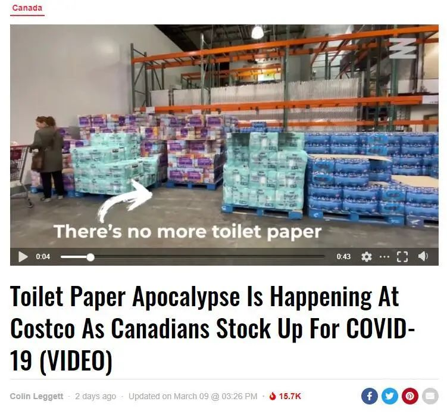
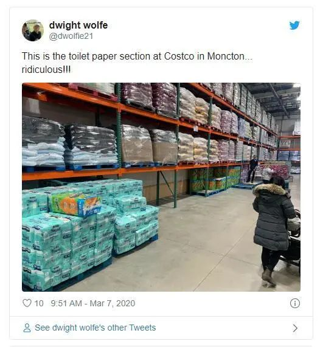
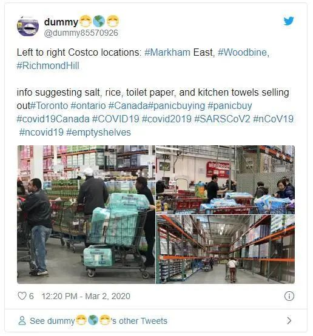
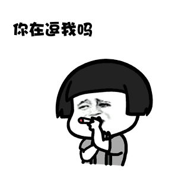
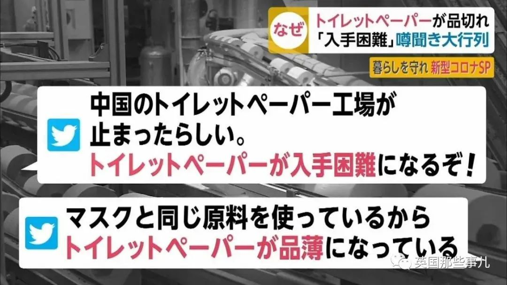
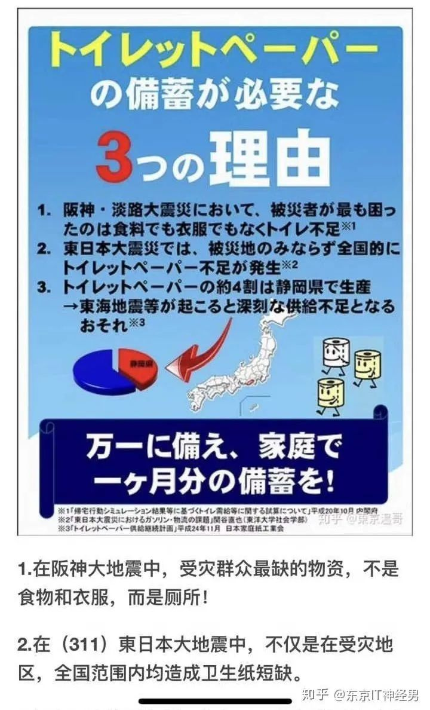
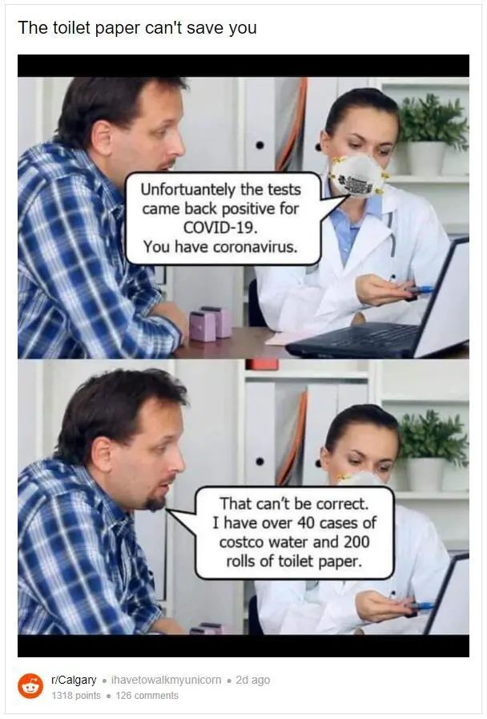
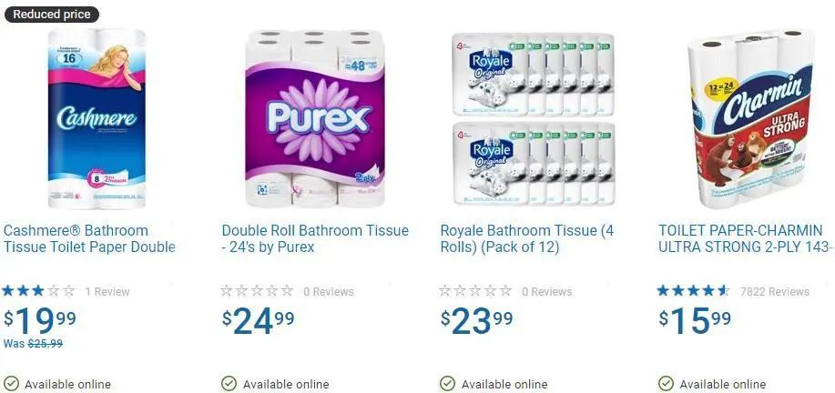
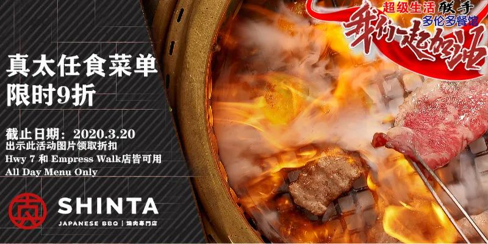

# 无标题

**链接地址:** http://mp.weixin.qq.com/s?__biz=MjM5MDEzNzY2NQ==&mid=2652775788&idx=7&sn=37106f0e2e876100d4d52312a40ee501&chksm=bda3e9428ad4605456c303869aef2bd462631d71c80f72476f2f1ca710f10860a8f3ca7f850d&mpshare=1&scene=2&srcid=&sharer_sharetime=1583866491219&sharer_shareid=be1c8edd6c93eec155a61c876e41d26a#rd
**作者:** 妮娜
**获取时间:** 2025/8/28 20:17:45
**图片数量:** 28

---

## 原始HTML内容

 

 

 

 
<section style="box-sizing: border-box;font-size: 16px;"><section style="margin: 10px 0%;box-sizing: border-box;" powered-by="xiumi.us"><section style="font-size: 15px;letter-spacing: 0px;line-height: 2;padding-right: 15px;padding-left: 15px;box-sizing: border-box;"><section style="text-align: center;white-space: normal;box-sizing: border-box;line-height: 2em;">近日加拿大的各个超市</section><section style="text-align: center;white-space: normal;box-sizing: border-box;line-height: 2em;">因为一样<strong style="box-sizing: border-box;">常见的日用产品的缺货</strong></section><section style="text-align: center;white-space: normal;box-sizing: border-box;line-height: 2em;">而轮番登上各大媒体报道的头条</section><section style="text-align: center;white-space: normal;box-sizing: border-box;line-height: 2em;"> </section></section></section><section style="text-align: center;margin-top: 10px;margin-bottom: 10px;box-sizing: border-box;line-height: 2em;"><section style="max-width: 100%;vertical-align: middle;display: inline-block;line-height: 0;box-sizing: border-box;"></section></section><section style="margin: 10px 0%;box-sizing: border-box;" powered-by="xiumi.us"><section style="font-size: 15px;letter-spacing: 0px;line-height: 2;padding-right: 15px;padding-left: 15px;box-sizing: border-box;"><section style="text-align: center;white-space: normal;box-sizing: border-box;line-height: 2em;"> </section><section style="text-align: center;white-space: normal;box-sizing: border-box;line-height: 2em;">根据不少参与囤货的民众</section><section style="text-align: center;white-space: normal;box-sizing: border-box;line-height: 2em;">发来的<strong style="box-sizing: border-box;">前线报道</strong></section><section style="text-align: center;white-space: normal;box-sizing: border-box;line-height: 2em;">加拿大如Costco这样大超市的卫生纸货架</section><section style="text-align: center;white-space: normal;box-sizing: border-box;line-height: 2em;"><strong style="box-sizing: border-box;">已经被全部搬空了！</strong></section><section style="text-align: center;white-space: normal;box-sizing: border-box;line-height: 2em;"><strong style="box-sizing: border-box;"> </strong></section></section></section><section style="text-align: center;margin-top: 10px;margin-bottom: 10px;box-sizing: border-box;line-height: 2em;"><section style="max-width: 100%;vertical-align: middle;display: inline-block;line-height: 0;box-sizing: border-box;"></section></section><section style="text-align: center;margin-top: 10px;margin-bottom: 10px;box-sizing: border-box;line-height: 2em;"><section style="max-width: 100%;vertical-align: middle;display: inline-block;line-height: 0;box-sizing: border-box;"> </section></section><section style="margin: 10px 0%;box-sizing: border-box;" powered-by="xiumi.us"><section style="font-size: 15px;letter-spacing: 0px;line-height: 2;padding-right: 15px;padding-left: 15px;box-sizing: border-box;"><section style="text-align: center;white-space: normal;box-sizing: border-box;line-height: 2em;">就连NB省的<strong style="box-sizing: border-box;"> Moncton </strong>这种</section><section style="text-align: center;white-space: normal;box-sizing: border-box;line-height: 2em;">人口只有8.5万</section><section style="text-align: center;white-space: normal;box-sizing: border-box;line-height: 2em;">且<strong style="box-sizing: border-box;">没有任何新冠肺炎确诊病例</strong>的</section><section style="text-align: center;white-space: normal;box-sizing: border-box;line-height: 2em;">加国小城市</section><section style="text-align: center;white-space: normal;box-sizing: border-box;line-height: 2em;">的超市卫生纸货架</section><section style="text-align: center;white-space: normal;box-sizing: border-box;line-height: 2em;"><strong style="box-sizing: border-box;">也被彻！底！搬！空！</strong></section><section style="text-align: center;white-space: normal;box-sizing: border-box;line-height: 2em;"><strong style="box-sizing: border-box;"> </strong></section></section></section><section style="text-align: center;margin-top: 10px;margin-bottom: 10px;box-sizing: border-box;line-height: 2em;"><section style="max-width: 100%;vertical-align: middle;display: inline-block;line-height: 0;box-sizing: border-box;"></section></section><section style="margin: 10px 0%;box-sizing: border-box;" powered-by="xiumi.us"><section style="font-size: 15px;letter-spacing: 0px;line-height: 2;padding-right: 15px;padding-left: 15px;box-sizing: border-box;"><section style="text-align: center;white-space: normal;box-sizing: border-box;line-height: 2em;"> </section><section style="text-align: center;white-space: normal;box-sizing: border-box;line-height: 2em;">卫生纸就算了</section><section style="text-align: center;white-space: normal;box-sizing: border-box;line-height: 2em;">连厨房纸都抢？！</section><section style="text-align: center;white-space: normal;box-sizing: border-box;line-height: 2em;">是不是下一步就开始抢</section><section style="text-align: center;white-space: normal;box-sizing: border-box;line-height: 2em;">隔壁Staples的<strong style="box-sizing: border-box;">打印纸</strong>了呢？</section><section style="text-align: center;white-space: normal;box-sizing: border-box;line-height: 2em;"> </section></section></section><section style="text-align: center;margin-top: 10px;margin-bottom: 10px;box-sizing: border-box;line-height: 2em;"><section style="max-width: 100%;vertical-align: middle;display: inline-block;line-height: 0;width: 50%;height: auto;box-sizing: border-box;"></section></section><section style="text-align: center;margin-top: 10px;margin-bottom: 10px;box-sizing: border-box;line-height: 2em;"><section style="max-width: 100%;vertical-align: middle;display: inline-block;line-height: 0;width: 50%;height: auto;box-sizing: border-box;"> </section></section><section style="margin: 10px 0%;box-sizing: border-box;" powered-by="xiumi.us"><section style="font-size: 15px;letter-spacing: 0px;line-height: 2;padding-right: 15px;padding-left: 15px;box-sizing: border-box;"><section style="text-align: center;white-space: normal;box-sizing: border-box;line-height: 2em;">而且抢卫生纸这件事</section><section style="text-align: center;white-space: normal;box-sizing: border-box;line-height: 2em;">就像一种<strong style="box-sizing: border-box;">神秘的传统</strong>一样</section><section style="text-align: center;white-space: normal;box-sizing: border-box;line-height: 2em;">这些日子在不同国家间</section><section style="text-align: center;white-space: normal;box-sizing: border-box;line-height: 2em;"><strong style="box-sizing: border-box;">延续</strong></section><section style="text-align: center;white-space: normal;box-sizing: border-box;line-height: 2em;"><strong style="box-sizing: border-box;">流传</strong></section><section style="text-align: center;white-space: normal;box-sizing: border-box;line-height: 2em;"><strong style="box-sizing: border-box;">源远流长长长长长…</strong></section><section style="text-align: center;white-space: normal;box-sizing: border-box;line-height: 2em;"> </section></section></section><section style="margin: 10px 0%;box-sizing: border-box;" powered-by="xiumi.us"><section style="font-size: 15px;letter-spacing: 0px;line-height: 2;padding-right: 15px;padding-left: 15px;box-sizing: border-box;"><section style="white-space: normal;box-sizing: border-box;text-align: center;line-height: 2em;">最开始是2月初开始，</section><section style="white-space: normal;box-sizing: border-box;text-align: center;line-height: 2em;">网上疯传“<strong style="box-sizing: border-box;">中国暂停生产厕纸</strong>”的消息，</section><section style="white-space: normal;box-sizing: border-box;text-align: center;line-height: 2em;">不少人信以为真，奔赴超市搜罗厕纸，</section><section style="white-space: normal;box-sizing: border-box;text-align: center;line-height: 2em;">店内排满人龙、抢购的厕纸堆满手推车。</section><section style="white-space: normal;box-sizing: border-box;line-height: 2em;"></section><section style="white-space: normal;box-sizing: border-box;line-height: 2em;"> </section></section></section><section style="text-align: center;margin-top: 10px;margin-bottom: 10px;box-sizing: border-box;line-height: 2em;"><section style="max-width: 100%;vertical-align: middle;display: inline-block;line-height: 0;box-sizing: border-box;"></section></section><section style="text-align: center;margin-top: 10px;margin-bottom: 10px;box-sizing: border-box;line-height: 2em;"><section style="max-width: 100%;vertical-align: middle;display: inline-block;line-height: 0;box-sizing: border-box;"> </section></section><section style="margin: 10px 0%;box-sizing: border-box;" powered-by="xiumi.us"><section style="font-size: 15px;letter-spacing: 0px;line-height: 2;padding-right: 15px;padding-left: 15px;box-sizing: border-box;"><section style="white-space: normal;box-sizing: border-box;text-align: center;line-height: 2em;">很快这股抢手纸风<strong>传</strong><strong style="letter-spacing: 0px;box-sizing: border-box;">到了日本</strong>！</section></section></section><section style="margin: 10px 0%;box-sizing: border-box;" powered-by="xiumi.us"><section style="font-size: 15px;letter-spacing: 0px;line-height: 2;padding-right: 15px;padding-left: 15px;box-sizing: border-box;"><section style="white-space: normal;box-sizing: border-box;text-align: center;line-height: 2em;">对于在疫情初期就广受波及的日本民众来说，</section><section style="white-space: normal;box-sizing: border-box;text-align: center;line-height: 2em;">面对疫情的第一反应居然不是屯米屯油，</section><section style="white-space: normal;box-sizing: border-box;text-align: center;line-height: 2em;">而是…屯厕纸？</section><section style="white-space: normal;box-sizing: border-box;text-align: center;line-height: 2em;"> </section></section></section><section style="text-align: center;margin-top: 10px;margin-bottom: 10px;box-sizing: border-box;line-height: 2em;"><section style="max-width: 100%;vertical-align: middle;display: inline-block;line-height: 0;width: 50%;height: auto;box-sizing: border-box;"></section></section><section style="text-align: center;margin-top: 10px;margin-bottom: 10px;box-sizing: border-box;line-height: 2em;"><section style="max-width: 100%;vertical-align: middle;display: inline-block;line-height: 0;width: 50%;height: auto;box-sizing: border-box;"> </section></section><section style="margin: 10px 0%;box-sizing: border-box;" powered-by="xiumi.us"><section style="font-size: 15px;letter-spacing: 0px;line-height: 2;padding-right: 15px;padding-left: 15px;box-sizing: border-box;"><section style="text-align: center;white-space: normal;box-sizing: border-box;line-height: 2em;">喂！在智能冲洗马桶普及率如此高的国度</section><section style="text-align: center;white-space: normal;box-sizing: border-box;line-height: 2em;"><strong style="box-sizing: border-box;">你们屯那么多厕纸是为了啥？</strong> </section><section style="text-align: center;white-space: normal;box-sizing: border-box;line-height: 2em;">宝宝我真是不懂你们了！</section><section style="text-align: center;white-space: normal;box-sizing: border-box;line-height: 2em;">说！到底是为了啥？！</section></section></section><section style="box-sizing: border-box;" powered-by="xiumi.us"><section style="white-space: normal;box-sizing: border-box;line-height: 2em;"> </section><section style="white-space: normal;box-sizing: border-box;line-height: 2em;"> </section></section><section style="text-align: center;margin-top: 10px;margin-bottom: 10px;box-sizing: border-box;line-height: 2em;"><section style="max-width: 100%;vertical-align: middle;display: inline-block;line-height: 0;box-sizing: border-box;"> </section></section><section style="margin: 10px 0%;box-sizing: border-box;" powered-by="xiumi.us"><section style="font-size: 15px;letter-spacing: 0px;line-height: 2;padding-right: 15px;padding-left: 15px;box-sizing: border-box;"><section style="white-space: normal;box-sizing: border-box;text-align: center;line-height: 2em;">这次事件的起因是网上2月27日传出的</section><section style="white-space: normal;box-sizing: border-box;text-align: center;line-height: 2em;"><strong style="box-sizing: border-box;">“纸制品缺货”</strong>的谣言。</section><section style="white-space: normal;box-sizing: border-box;text-align: center;line-height: 2em;">谣言说日本纸制品原材料的木材</section><section style="white-space: normal;box-sizing: border-box;text-align: center;line-height: 2em;">大多依赖于从中国进口，</section><section style="white-space: normal;box-sizing: border-box;text-align: center;line-height: 2em;">而中国疫情爆发后</section><section style="white-space: normal;box-sizing: border-box;text-align: center;line-height: 2em;">木材资源转而被用于制造口罩上了，</section><section style="white-space: normal;box-sizing: border-box;text-align: center;line-height: 2em;">因此造成了木材短缺和纸制品生产的停滞。</section><section style="white-space: normal;box-sizing: border-box;line-height: 2em;"> </section></section></section><section style="text-align: center;margin-top: 10px;margin-bottom: 10px;box-sizing: border-box;line-height: 2em;"><section style="max-width: 100%;vertical-align: middle;display: inline-block;line-height: 0;box-sizing: border-box;"></section></section><section style="text-align: center;margin-top: 10px;margin-bottom: 10px;box-sizing: border-box;line-height: 2em;"><section style="max-width: 100%;vertical-align: middle;display: inline-block;line-height: 0;box-sizing: border-box;"> </section></section><section style="margin: 10px 0%;box-sizing: border-box;" powered-by="xiumi.us"><section style="font-size: 15px;letter-spacing: 0px;line-height: 2;padding-right: 15px;padding-left: 15px;box-sizing: border-box;"><section style="text-align: center;white-space: normal;box-sizing: border-box;line-height: 2em;">至于这个消息的可信度… </section><section style="text-align: center;white-space: normal;box-sizing: border-box;line-height: 2em;">群众们</section><section style="text-align: center;white-space: normal;box-sizing: border-box;line-height: 2em;">你们自己品品？</section><section style="text-align: center;white-space: normal;box-sizing: border-box;line-height: 2em;"> </section><section style="text-align: center;white-space: normal;box-sizing: border-box;line-height: 2em;">如果口罩和纸用的是一样的材料</section><section style="text-align: center;white-space: normal;box-sizing: border-box;line-height: 2em;">如果造纸厂都跑去造了口罩…</section><section style="text-align: center;white-space: normal;box-sizing: border-box;line-height: 2em;"> </section><section style="text-align: center;white-space: normal;box-sizing: border-box;line-height: 2em;">我们现在<strong style="box-sizing: border-box;">至于那么缺口罩</strong>？</section></section></section><section style="text-align: center;margin-top: 10px;margin-bottom: 10px;box-sizing: border-box;line-height: 2em;"><section style="max-width: 100%;vertical-align: middle;display: inline-block;line-height: 0;box-sizing: border-box;"></section></section><section style="margin: 10px 0%;box-sizing: border-box;" powered-by="xiumi.us"><section style="font-size: 15px;letter-spacing: 0px;line-height: 2;padding-right: 15px;padding-left: 15px;box-sizing: border-box;"><section style="white-space: normal;box-sizing: border-box;line-height: 2em;"><strong style="box-sizing: border-box;">抢厕纸并非亚洲国家的专利。</strong></section><section style="white-space: normal;box-sizing: border-box;line-height: 2em;"> </section><section style="white-space: normal;box-sizing: border-box;line-height: 2em;">3月初，澳大利亚的一条新闻让厕纸在<strong style="box-sizing: border-box;">疫情硬通货产品</strong>中的地位更是脱颖而出，C位出道。</section><section style="white-space: normal;box-sizing: border-box;line-height: 2em;"> </section><section style="white-space: normal;box-sizing: border-box;line-height: 2em;">英国《卫报》报道，当地时间7日稍早时候，两名澳大利亚女子在悉尼一家超市为抢购卫生纸与另一人<strong style="box-sizing: border-box;">打了起来</strong>。</section></section></section><section style="text-align: center;margin-top: 10px;margin-bottom: 10px;box-sizing: border-box;line-height: 2em;"><section style="max-width: 100%;vertical-align: middle;display: inline-block;line-height: 0;box-sizing: border-box;"></section></section><section style="margin: 10px 0%;box-sizing: border-box;" powered-by="xiumi.us"><section style="font-size: 15px;letter-spacing: 0px;line-height: 2;padding-right: 15px;padding-left: 15px;box-sizing: border-box;"><section style="white-space: normal;box-sizing: border-box;line-height: 2em;">周围的顾客和工作人员把她们拉开后，被打的女子一脸不可置信地问到：</section><section style="white-space: normal;box-sizing: border-box;line-height: 2em;">“你在逗我吗？我就想要一袋厕纸，就一袋！”</section><section style="white-space: normal;box-sizing: border-box;line-height: 2em;">而购物车中装满卫生纸的母女则无情回应道：“一袋都不行！”</section><section style="white-space: normal;box-sizing: border-box;line-height: 2em;"> </section></section></section><section style="text-align: center;margin-top: 10px;margin-bottom: 10px;box-sizing: border-box;line-height: 2em;"><section style="max-width: 100%;vertical-align: middle;display: inline-block;line-height: 0;width: 50%;height: auto;box-sizing: border-box;"></section></section><section style="margin: 10px 0%;box-sizing: border-box;" powered-by="xiumi.us"><section style="text-align: center;font-size: 15px;letter-spacing: 0px;line-height: 2;padding-right: 15px;padding-left: 15px;box-sizing: border-box;"><section style="box-sizing: border-box;line-height: 2em;"> </section><section style="box-sizing: border-box;line-height: 2em;">可能卫生纸君这辈子都没想过</section><section style="box-sizing: border-box;line-height: 2em;">自己还能有这么<strong style="box-sizing: border-box;">光宗耀祖的一天</strong>吧</section><section style="box-sizing: border-box;line-height: 2em;">这样的崇拜和追捧，</section><section style="box-sizing: border-box;line-height: 2em;">真是本纸过去想都不敢想的呀！</section></section></section><section style="margin: 10px 0%;box-sizing: border-box;" powered-by="xiumi.us"><section style="font-size: 15px;letter-spacing: 0px;line-height: 2;padding-right: 15px;padding-left: 15px;box-sizing: border-box;"><section style="text-align: center;white-space: normal;box-sizing: border-box;line-height: 2em;"> </section><section style="text-align: center;white-space: normal;box-sizing: border-box;line-height: 2em;">你屯点口罩</section><section style="text-align: center;white-space: normal;box-sizing: border-box;line-height: 2em;">酒精和洗手液</section><section style="text-align: center;white-space: normal;box-sizing: border-box;line-height: 2em;">甚至双黄连！！！</section><section style="text-align: center;white-space: normal;box-sizing: border-box;line-height: 2em;">都能够理解。。。</section><section style="text-align: center;white-space: normal;box-sizing: border-box;line-height: 2em;"> </section></section></section><section style="text-align: center;margin-top: 10px;margin-bottom: 10px;box-sizing: border-box;line-height: 2em;"><section style="max-width: 100%;vertical-align: middle;display: inline-block;line-height: 0;width: 50%;height: auto;box-sizing: border-box;"></section></section><section style="margin: 10px 0%;box-sizing: border-box;" powered-by="xiumi.us"><section style="font-size: 15px;letter-spacing: 0px;line-height: 2;padding-right: 15px;padding-left: 15px;box-sizing: border-box;"><section style="text-align: center;white-space: normal;box-sizing: border-box;line-height: 2em;"> </section><section style="text-align: center;white-space: normal;box-sizing: border-box;line-height: 2em;">但你们在这抢购卫生纸… </section><section style="text-align: center;white-space: normal;box-sizing: border-box;line-height: 2em;">让小编我不禁深思</section><section style="text-align: center;white-space: normal;box-sizing: border-box;line-height: 2em;">这新冠肺炎什么时候</section><section style="text-align: center;white-space: normal;box-sizing: border-box;line-height: 2em;"><strong style="box-sizing: border-box;">变异出了</strong><strong style="box-sizing: border-box;">新的症状</strong></section><section style="text-align: center;white-space: normal;box-sizing: border-box;line-height: 2em;"> </section><section style="text-align: center;white-space: normal;box-sizing: border-box;line-height: 2em;"><strong style="box-sizing: border-box;">拉肚子？</strong></section><section style="text-align: center;white-space: normal;box-sizing: border-box;line-height: 2em;"> </section></section></section><section style="text-align: center;margin-top: 10px;margin-bottom: 10px;box-sizing: border-box;line-height: 2em;"><section style="max-width: 100%;vertical-align: middle;display: inline-block;line-height: 0;box-sizing: border-box;"></section></section><section style="margin: 10px 0%;box-sizing: border-box;" powered-by="xiumi.us"><section style="text-align: center;font-size: 15px;letter-spacing: 0px;line-height: 2;padding-right: 15px;padding-left: 15px;box-sizing: border-box;"><section style="box-sizing: border-box;line-height: 2em;">难道你们就不好奇</section><section style="box-sizing: border-box;line-height: 2em;">加拿大人这跟风抢厕纸的毛病</section><section style="box-sizing: border-box;line-height: 2em;">到底是怎么来的呢？</section></section></section><section style="text-align: center;margin-top: 10px;margin-bottom: 10px;box-sizing: border-box;line-height: 2em;"><section style="max-width: 100%;vertical-align: middle;display: inline-block;line-height: 0;box-sizing: border-box;"></section></section><section style="text-align: center;font-size: 12px;color: rgb(121, 121, 121);box-sizing: border-box;" powered-by="xiumi.us"><section style="box-sizing: border-box;line-height: 2em;">台湾民众抢购厕纸，taihainet</section></section><section style="margin: 10px 0%;box-sizing: border-box;" powered-by="xiumi.us"><section style="text-align: center;font-size: 15px;letter-spacing: 0px;line-height: 2;padding-right: 15px;padding-left: 15px;box-sizing: border-box;"><section style="box-sizing: border-box;line-height: 2em;">这其貌不扬的厕纸 </section><section style="box-sizing: border-box;line-height: 2em;">到底又是如何成为了</section><section style="box-sizing: border-box;line-height: 2em;">疫情期间</section><section style="box-sizing: border-box;line-height: 2em;"><strong style="box-sizing: border-box;">全球民众疯狂排队抢购的</strong></section><section style="box-sizing: border-box;line-height: 2em;"><strong style="box-sizing: border-box;">硬通货？？？</strong></section></section></section><section style="text-align: center;margin-top: 10px;margin-bottom: 10px;box-sizing: border-box;line-height: 2em;"><section style="max-width: 100%;vertical-align: middle;display: inline-block;line-height: 0;box-sizing: border-box;"></section></section><section style="text-align: center;font-size: 12px;color: rgb(121, 121, 121);box-sizing: border-box;" powered-by="xiumi.us"><section style="box-sizing: border-box;line-height: 2em;">马来西亚民众抢购厕纸，cctvpic</section></section><section style="margin: 10px 0%;box-sizing: border-box;" powered-by="xiumi.us"><section style="text-align: center;font-size: 15px;letter-spacing: 0px;line-height: 2;padding-right: 15px;padding-left: 15px;box-sizing: border-box;"><section style="box-sizing: border-box;line-height: 2em;"><strong style="box-sizing: border-box;">是何种神秘的未知力量？ </strong></section><section style="box-sizing: border-box;line-height: 2em;"><strong style="box-sizing: border-box;">还是精心策划的阴谋？</strong></section><section style="box-sizing: border-box;line-height: 2em;"> </section><section style="box-sizing: border-box;line-height: 2em;">今天小编就带着大家的这个疑问</section><section style="box-sizing: border-box;line-height: 2em;"><strong style="box-sizing: border-box;">走近科学</strong></section><section style="box-sizing: border-box;line-height: 2em;">向你们揭开——</section></section></section><section style="text-align: center;margin-top: 10px;margin-bottom: 10px;box-sizing: border-box;line-height: 2em;"><section style="max-width: 100%;vertical-align: middle;display: inline-block;line-height: 0;box-sizing: border-box;"></section></section><section style="box-sizing: border-box;" powered-by="xiumi.us"><section style="white-space: normal;box-sizing: border-box;line-height: 2em;"> </section></section><section style="margin: 10px 0%;box-sizing: border-box;" powered-by="xiumi.us"><section style="text-align: center;font-size: 18px;letter-spacing: 0px;line-height: 2;padding-right: 15px;padding-left: 15px;box-sizing: border-box;"><section style="box-sizing: border-box;line-height: 2em;"><strong style="box-sizing: border-box;">卫生纸上位之谜！</strong> </section></section></section><section style="text-align: center;margin: 10px 0%;box-sizing: border-box;line-height: 2em;"><section style="display: inline-block;vertical-align: middle;width: 42%;height: auto;box-sizing: border-box;"><section style="margin-top: 0.5em;margin-bottom: 0.5em;box-sizing: border-box;" powered-by="xiumi.us"><section style="border-top: 1px dotted rgb(249, 110, 87);box-sizing: border-box;line-height: 0;"><section style="line-height: 0;width: 0px;"><svg viewBox="0 0 1 1" style="vertical-align:top;"></svg></section></section></section></section><section style="display: inline-block;vertical-align: middle;width: 16%;height: auto;box-sizing: border-box;line-height: 0;"><section style="line-height: 0;width: 0px;"><svg viewBox="0 0 1 1" style="vertical-align:top;"></svg></section></section><section style="display: inline-block;vertical-align: middle;width: 42%;height: auto;box-sizing: border-box;"><section style="margin-top: 0.5em;margin-bottom: 0.5em;box-sizing: border-box;" powered-by="xiumi.us"><section style="border-top: 1px dotted rgb(249, 110, 87);box-sizing: border-box;line-height: 0;"><section style="line-height: 0;width: 0px;"><svg viewBox="0 0 1 1" style="vertical-align:top;"></svg></section></section></section></section></section><section style="text-align: center;margin: 10px 0% 8px;box-sizing: border-box;line-height: 2em;"><section style="display: inline-block;width: auto;vertical-align: top;min-width: 10%;max-width: 100%;height: auto;padding-right: 15px;border-width: 0px 0px 5px;border-radius: 30px;border-style: none none solid;border-color: rgb(62, 62, 62) rgb(62, 62, 62) rgb(228, 77, 0);overflow: hidden;background-color: rgb(255, 108, 68);box-sizing: border-box;"><section style="box-sizing: border-box;" powered-by="xiumi.us"><section style="display: flex;flex-flow: row nowrap;box-sizing: border-box;"><section style="display: inline-block;vertical-align: top;width: 50px;flex: 0 0 auto;height: auto;align-self: stretch;padding-top: 3px;padding-bottom: 3px;padding-left: 10px;background-color: rgb(255, 228, 214);box-sizing: border-box;"><section style="margin-right: 0%;margin-left: 0%;box-sizing: border-box;" powered-by="xiumi.us"><section style="font-size: 18px;color: rgb(255, 108, 68);letter-spacing: 2px;line-height: 1.6;text-shadow: rgb(255, 255, 255) 1px -1px, rgb(255, 255, 255) 1px 1px, rgb(255, 255, 255) -1px 1px, rgb(255, 255, 255) -1px -1px, rgb(255, 255, 255) 1px 0px, rgb(255, 255, 255) 0px 1px, rgb(255, 255, 255) -1px 0px, rgb(255, 255, 255) 0px -1px;box-sizing: border-box;">
<strong style="box-sizing: border-box;">01</strong>
</section></section></section><section style="display: inline-block;vertical-align: top;width: auto;flex: 100 100 0%;height: auto;align-self: stretch;border-width: 0px;padding-top: 3px;padding-bottom: 3px;padding-left: 10px;box-sizing: border-box;"><section style="margin-right: 0%;margin-left: 0%;box-sizing: border-box;" powered-by="xiumi.us"><section style="color: rgb(255, 108, 68);font-size: 17px;letter-spacing: 2px;line-height: 1.6;text-shadow: rgb(255, 255, 255) 1px -1px, rgb(255, 255, 255) 1px 1px, rgb(255, 255, 255) -1px 1px, rgb(255, 255, 255) -1px -1px, rgb(255, 255, 255) 1px 0px, rgb(255, 255, 255) 0px 1px, rgb(255, 255, 255) -1px 0px, rgb(255, 255, 255) 0px -1px;box-sizing: border-box;">
<strong style="box-sizing: border-box;">听信谣言</strong>
</section></section></section></section></section></section></section><section style="text-align: center;margin-top: 10px;margin-bottom: 10px;box-sizing: border-box;line-height: 2em;"><section style="max-width: 100%;vertical-align: middle;display: inline-block;line-height: 0;box-sizing: border-box;"></section></section><section style="margin: 10px 0%;box-sizing: border-box;" powered-by="xiumi.us"><section style="font-size: 15px;letter-spacing: 0px;line-height: 2;padding-right: 15px;padding-left: 15px;box-sizing: border-box;"><section style="white-space: normal;box-sizing: border-box;line-height: 2em;"> </section><section style="white-space: normal;box-sizing: border-box;line-height: 2em;text-align: center;">其实谣言这个事情，</section><section style="white-space: normal;box-sizing: border-box;line-height: 2em;text-align: center;">在疫情全程发展中都扮演着<strong style="box-sizing: border-box;">“掀起波澜”</strong>的角色，</section><section style="white-space: normal;box-sizing: border-box;line-height: 2em;text-align: center;">而且在一些问题没有被调查清楚之前，</section><section style="white-space: normal;box-sizing: border-box;line-height: 2em;text-align: center;">也确实很难去确认言论的真实可靠程度。</section><section style="white-space: normal;box-sizing: border-box;line-height: 2em;text-align: center;"> </section><section style="white-space: normal;box-sizing: border-box;line-height: 2em;text-align: center;">被疫情吓得不轻的恐慌的民众</section><section style="white-space: normal;box-sizing: border-box;line-height: 2em;text-align: center;">会对骇人听闻的过激言论反应过度也可以解释。</section><section style="white-space: normal;box-sizing: border-box;line-height: 2em;"> </section></section></section><section style="text-align: center;margin-top: 10px;margin-bottom: 10px;box-sizing: border-box;line-height: 2em;"><section style="max-width: 100%;vertical-align: middle;display: inline-block;line-height: 0;box-sizing: border-box;"></section></section><section style="margin: 10px 0%;box-sizing: border-box;" powered-by="xiumi.us"><section style="font-size: 15px;letter-spacing: 0px;line-height: 2;padding-right: 15px;padding-left: 15px;box-sizing: border-box;"><section style="white-space: normal;box-sizing: border-box;line-height: 2em;"> </section><section style="white-space: normal;box-sizing: border-box;line-height: 2em;text-align: center;">屯口罩，屯酒精甚至屯药都可以理解。</section><section style="white-space: normal;box-sizing: border-box;line-height: 2em;text-align: center;"><strong style="box-sizing: border-box;">但卫生纸这种产能高，</strong></section><section style="white-space: normal;box-sizing: border-box;line-height: 2em;text-align: center;"><strong style="box-sizing: border-box;">且世界上大部分国家都具备</strong></section><section style="white-space: normal;box-sizing: border-box;line-height: 2em;text-align: center;"><strong style="box-sizing: border-box;">独立生产技术条件的产品是最不需要囤积的。</strong> </section></section></section><section style="box-sizing: border-box;" powered-by="xiumi.us"><section style="white-space: normal;box-sizing: border-box;line-height: 2em;"> </section></section><section style="text-align: center;margin: 10px 0% 8px;box-sizing: border-box;line-height: 2em;"><section style="display: inline-block;width: auto;vertical-align: top;min-width: 10%;max-width: 100%;height: auto;padding-right: 15px;border-width: 0px 0px 5px;border-radius: 30px;border-style: none none solid;border-color: rgb(62, 62, 62) rgb(62, 62, 62) rgb(228, 77, 0);overflow: hidden;background-color: rgb(255, 108, 68);box-sizing: border-box;"><section style="box-sizing: border-box;" powered-by="xiumi.us"><section style="display: flex;flex-flow: row nowrap;box-sizing: border-box;"><section style="display: inline-block;vertical-align: top;width: 50px;flex: 0 0 auto;height: auto;align-self: stretch;padding-top: 3px;padding-bottom: 3px;padding-left: 10px;background-color: rgb(255, 228, 214);box-sizing: border-box;"><section style="margin-right: 0%;margin-left: 0%;box-sizing: border-box;" powered-by="xiumi.us"><section style="font-size: 18px;color: rgb(255, 108, 68);letter-spacing: 2px;line-height: 1.6;text-shadow: rgb(255, 255, 255) 1px -1px, rgb(255, 255, 255) 1px 1px, rgb(255, 255, 255) -1px 1px, rgb(255, 255, 255) -1px -1px, rgb(255, 255, 255) 1px 0px, rgb(255, 255, 255) 0px 1px, rgb(255, 255, 255) -1px 0px, rgb(255, 255, 255) 0px -1px;box-sizing: border-box;">
<strong style="box-sizing: border-box;">02</strong>
</section></section></section><section style="display: inline-block;vertical-align: top;width: auto;flex: 100 100 0%;height: auto;align-self: stretch;border-width: 0px;padding-top: 3px;padding-bottom: 3px;padding-left: 10px;box-sizing: border-box;"><section style="margin-right: 0%;margin-left: 0%;box-sizing: border-box;" powered-by="xiumi.us"><section style="color: rgb(255, 108, 68);font-size: 17px;letter-spacing: 2px;line-height: 1.6;text-shadow: rgb(255, 255, 255) 1px -1px, rgb(255, 255, 255) 1px 1px, rgb(255, 255, 255) -1px 1px, rgb(255, 255, 255) -1px -1px, rgb(255, 255, 255) 1px 0px, rgb(255, 255, 255) 0px 1px, rgb(255, 255, 255) -1px 0px, rgb(255, 255, 255) 0px -1px;box-sizing: border-box;">
<strong style="box-sizing: border-box;">历史遗留</strong>
</section></section></section></section></section></section></section><section style="text-align: center;margin-top: 10px;margin-bottom: 10px;box-sizing: border-box;line-height: 2em;"><section style="max-width: 100%;vertical-align: middle;display: inline-block;line-height: 0;box-sizing: border-box;"> </section></section><section style="text-align: center;margin-top: 10px;margin-bottom: 10px;box-sizing: border-box;line-height: 2em;"><section style="max-width: 100%;vertical-align: middle;display: inline-block;line-height: 0;box-sizing: border-box;"> </section></section><section style="text-align: center;margin-top: 10px;margin-bottom: 10px;box-sizing: border-box;line-height: 2em;"><section style="max-width: 100%;vertical-align: middle;display: inline-block;line-height: 0;box-sizing: border-box;"></section></section><section style="box-sizing: border-box;" powered-by="xiumi.us"><section style="white-space: normal;box-sizing: border-box;line-height: 2em;"> </section></section><section style="margin: 10px 0%;box-sizing: border-box;" powered-by="xiumi.us"><section style="font-size: 15px;letter-spacing: 0px;line-height: 2;padding-right: 15px;padding-left: 15px;box-sizing: border-box;"><section style="white-space: normal;box-sizing: border-box;line-height: 2em;">其实日本人会抢购卫生纸还是可以理解的，毕竟<strong style="box-sizing: border-box;">实</strong><strong style="box-sizing: border-box;">实在在经历过卫生纸短缺</strong>。这算是饱受磨难的日本人总结出来的经验教训。</section><section style="white-space: normal;box-sizing: border-box;line-height: 2em;"> </section><section style="text-align: center;white-space: normal;box-sizing: border-box;line-height: 2em;"><strong style="box-sizing: border-box;">甭管这灾难性质一不一样，</strong></section><section style="text-align: center;white-space: normal;box-sizing: border-box;line-height: 2em;"><strong style="box-sizing: border-box;">屯！可劲屯！准没错！</strong></section></section></section><section style="box-sizing: border-box;" powered-by="xiumi.us"><section style="white-space: normal;box-sizing: border-box;line-height: 2em;"> </section></section><section style="text-align: center;margin: 10px 0% 8px;box-sizing: border-box;line-height: 2em;"><section style="display: inline-block;width: auto;vertical-align: top;min-width: 10%;max-width: 100%;height: auto;padding-right: 15px;border-width: 0px 0px 5px;border-radius: 30px;border-style: none none solid;border-color: rgb(62, 62, 62) rgb(62, 62, 62) rgb(228, 77, 0);overflow: hidden;background-color: rgb(255, 108, 68);box-sizing: border-box;"><section style="box-sizing: border-box;" powered-by="xiumi.us"><section style="display: flex;flex-flow: row nowrap;box-sizing: border-box;"><section style="display: inline-block;vertical-align: top;width: 50px;flex: 0 0 auto;height: auto;align-self: stretch;padding-top: 3px;padding-bottom: 3px;padding-left: 10px;background-color: rgb(255, 228, 214);box-sizing: border-box;"><section style="margin-right: 0%;margin-left: 0%;box-sizing: border-box;" powered-by="xiumi.us"><section style="font-size: 18px;color: rgb(255, 108, 68);letter-spacing: 2px;line-height: 1.6;text-shadow: rgb(255, 255, 255) 1px -1px, rgb(255, 255, 255) 1px 1px, rgb(255, 255, 255) -1px 1px, rgb(255, 255, 255) -1px -1px, rgb(255, 255, 255) 1px 0px, rgb(255, 255, 255) 0px 1px, rgb(255, 255, 255) -1px 0px, rgb(255, 255, 255) 0px -1px;box-sizing: border-box;">
<strong style="box-sizing: border-box;">03</strong>
</section></section></section><section style="display: inline-block;vertical-align: top;width: auto;flex: 100 100 0%;height: auto;align-self: stretch;border-width: 0px;padding-top: 3px;padding-bottom: 3px;padding-left: 10px;box-sizing: border-box;"><section style="margin-right: 0%;margin-left: 0%;box-sizing: border-box;" powered-by="xiumi.us"><section style="color: rgb(255, 108, 68);font-size: 17px;letter-spacing: 2px;line-height: 1.6;text-shadow: rgb(255, 255, 255) 1px -1px, rgb(255, 255, 255) 1px 1px, rgb(255, 255, 255) -1px 1px, rgb(255, 255, 255) -1px -1px, rgb(255, 255, 255) 1px 0px, rgb(255, 255, 255) 0px 1px, rgb(255, 255, 255) -1px 0px, rgb(255, 255, 255) 0px -1px;box-sizing: border-box;">
<strong style="box-sizing: border-box;">错失恐惧症</strong>
</section></section></section></section></section></section></section><section style="margin: 10px 0%;box-sizing: border-box;" powered-by="xiumi.us"><section style="font-size: 15px;letter-spacing: 0px;line-height: 2;padding-right: 15px;padding-left: 15px;box-sizing: border-box;"><section style="white-space: normal;box-sizing: border-box;line-height: 2em;"><strong style="box-sizing: border-box;">错失恐惧症</strong>（Fear of missing out，简称：<strong style="box-sizing: border-box;">FOMO</strong>），一种由患得患失所产生持续性的焦虑，也是酿成此次厕纸抢购大风波的重要因素之一。</section></section></section><section style="text-align: center;margin-top: 10px;margin-bottom: 10px;box-sizing: border-box;line-height: 2em;"><section style="max-width: 100%;vertical-align: middle;display: inline-block;line-height: 0;box-sizing: border-box;"></section></section><section style="margin: 10px 0%;box-sizing: border-box;" powered-by="xiumi.us"><section style="font-size: 15px;letter-spacing: 0px;line-height: 2;padding-right: 15px;padding-left: 15px;box-sizing: border-box;"><section style="white-space: normal;box-sizing: border-box;text-align: center;line-height: 2em;"> </section><section style="white-space: normal;box-sizing: border-box;text-align: center;line-height: 2em;">这些抢购卫生纸的民众的内心戏是：</section><section style="white-space: normal;box-sizing: border-box;text-align: center;line-height: 2em;">如果自己不小心罹患了新冠肺炎，</section><section style="white-space: normal;box-sizing: border-box;text-align: center;line-height: 2em;">那一定是我当时没第一时间去抢<strong style="box-sizing: border-box;">卫生纸的锅</strong>！</section><section style="white-space: normal;box-sizing: border-box;text-align: center;line-height: 2em;"> </section></section></section><section style="text-align: center;margin-top: 10px;margin-bottom: 10px;box-sizing: border-box;line-height: 2em;"><section style="max-width: 100%;vertical-align: middle;display: inline-block;line-height: 0;box-sizing: border-box;"></section></section><section style="text-align: center;margin-top: 10px;margin-bottom: 10px;box-sizing: border-box;line-height: 2em;"><section style="max-width: 100%;vertical-align: middle;display: inline-block;line-height: 0;box-sizing: border-box;"> </section></section><section style="margin: 10px 0%;box-sizing: border-box;" powered-by="xiumi.us"><section style="font-size: 15px;letter-spacing: 0px;line-height: 2;padding-right: 15px;padding-left: 15px;box-sizing: border-box;"><section style="text-align: center;white-space: normal;box-sizing: border-box;line-height: 2em;">不行！！！</section><section style="text-align: center;white-space: normal;box-sizing: border-box;line-height: 2em;">我就算是为了自己安心</section><section style="text-align: center;white-space: normal;box-sizing: border-box;line-height: 2em;">我也去抢！ </section></section></section><section style="box-sizing: border-box;" powered-by="xiumi.us"><section style="white-space: normal;box-sizing: border-box;line-height: 2em;"> </section></section><section style="text-align: center;margin: 10px 0% 8px;box-sizing: border-box;line-height: 2em;"><section style="display: inline-block;width: auto;vertical-align: top;min-width: 10%;max-width: 100%;height: auto;padding-right: 15px;border-width: 0px 0px 5px;border-radius: 30px;border-style: none none solid;border-color: rgb(62, 62, 62) rgb(62, 62, 62) rgb(228, 77, 0);overflow: hidden;background-color: rgb(255, 108, 68);box-sizing: border-box;"><section style="box-sizing: border-box;" powered-by="xiumi.us"><section style="display: flex;flex-flow: row nowrap;box-sizing: border-box;"><section style="display: inline-block;vertical-align: top;width: 50px;flex: 0 0 auto;height: auto;align-self: stretch;padding-top: 3px;padding-bottom: 3px;padding-left: 10px;background-color: rgb(255, 228, 214);box-sizing: border-box;"><section style="margin-right: 0%;margin-left: 0%;box-sizing: border-box;" powered-by="xiumi.us"><section style="font-size: 18px;color: rgb(255, 108, 68);letter-spacing: 2px;line-height: 1.6;text-shadow: rgb(255, 255, 255) 1px -1px, rgb(255, 255, 255) 1px 1px, rgb(255, 255, 255) -1px 1px, rgb(255, 255, 255) -1px -1px, rgb(255, 255, 255) 1px 0px, rgb(255, 255, 255) 0px 1px, rgb(255, 255, 255) -1px 0px, rgb(255, 255, 255) 0px -1px;box-sizing: border-box;">
<strong style="box-sizing: border-box;">04</strong>
</section></section></section><section style="display: inline-block;vertical-align: top;width: auto;flex: 100 100 0%;height: auto;align-self: stretch;border-width: 0px;padding-top: 3px;padding-bottom: 3px;padding-left: 10px;box-sizing: border-box;"><section style="margin-right: 0%;margin-left: 0%;box-sizing: border-box;" powered-by="xiumi.us"><section style="color: rgb(255, 108, 68);font-size: 17px;letter-spacing: 2px;line-height: 1.6;text-shadow: rgb(255, 255, 255) 1px -1px, rgb(255, 255, 255) 1px 1px, rgb(255, 255, 255) -1px 1px, rgb(255, 255, 255) -1px -1px, rgb(255, 255, 255) 1px 0px, rgb(255, 255, 255) 0px 1px, rgb(255, 255, 255) -1px 0px, rgb(255, 255, 255) 0px -1px;box-sizing: border-box;">
<strong style="box-sizing: border-box;">羊群效应</strong>
</section></section></section></section></section></section></section><section style="text-align: center;margin-top: 10px;margin-bottom: 10px;box-sizing: border-box;line-height: 2em;"><section style="max-width: 100%;vertical-align: middle;display: inline-block;line-height: 0;box-sizing: border-box;"> </section></section><section style="text-align: center;margin-top: 10px;margin-bottom: 10px;box-sizing: border-box;line-height: 2em;"><section style="max-width: 100%;vertical-align: middle;display: inline-block;line-height: 0;box-sizing: border-box;"></section></section><section style="margin: 10px 0%;box-sizing: border-box;" powered-by="xiumi.us"><section style="font-size: 15px;letter-spacing: 0px;line-height: 2;padding-right: 15px;padding-left: 15px;box-sizing: border-box;"><section style="white-space: normal;box-sizing: border-box;line-height: 2em;text-align: center;">羊群效应，也就是<strong style="box-sizing: border-box;">从众效应</strong>，</section><section style="white-space: normal;box-sizing: border-box;line-height: 2em;text-align: center;">也在这从抢购大潮中扮演着重要角色。</section><section style="white-space: normal;box-sizing: border-box;line-height: 2em;text-align: center;"> </section><section style="white-space: normal;box-sizing: border-box;line-height: 2em;text-align: center;">哇，别人都在抢！</section><section style="white-space: normal;box-sizing: border-box;line-height: 2em;text-align: center;">肯定是这个东西很需要啊！</section><section style="white-space: normal;box-sizing: border-box;line-height: 2em;text-align: center;"><strong style="box-sizing: border-box;">不管三七二十一，四舍五入一个亿，</strong></section><section style="white-space: normal;box-sizing: border-box;line-height: 2em;text-align: center;"><strong style="box-sizing: border-box;">我先抢它个一打再说。</strong></section><section style="white-space: normal;box-sizing: border-box;line-height: 2em;text-align: center;"> </section><section style="white-space: normal;box-sizing: border-box;line-height: 2em;text-align: center;">实在不行，我<strong style="box-sizing: border-box;">卖黄牛卫生纸</strong>我还能赚钱呢！</section><section style="white-space: normal;box-sizing: border-box;line-height: 2em;text-align: center;">不说了，我先去抢纸了！</section></section></section><section style="box-sizing: border-box;" powered-by="xiumi.us"><section style="white-space: normal;box-sizing: border-box;line-height: 2em;"> </section></section><section style="text-align: center;margin: 10px 0% 8px;box-sizing: border-box;line-height: 2em;"><section style="display: inline-block;width: auto;vertical-align: top;min-width: 10%;max-width: 100%;height: auto;padding-right: 15px;border-width: 0px 0px 5px;border-radius: 30px;border-style: none none solid;border-color: rgb(62, 62, 62) rgb(62, 62, 62) rgb(228, 77, 0);overflow: hidden;background-color: rgb(255, 108, 68);box-sizing: border-box;"><section style="box-sizing: border-box;" powered-by="xiumi.us"><section style="display: flex;flex-flow: row nowrap;box-sizing: border-box;"><section style="display: inline-block;vertical-align: top;width: 50px;flex: 0 0 auto;height: auto;align-self: stretch;padding-top: 3px;padding-bottom: 3px;padding-left: 10px;background-color: rgb(255, 228, 214);box-sizing: border-box;"><section style="margin-right: 0%;margin-left: 0%;box-sizing: border-box;" powered-by="xiumi.us"><section style="font-size: 18px;color: rgb(255, 108, 68);letter-spacing: 2px;line-height: 1.6;text-shadow: rgb(255, 255, 255) 1px -1px, rgb(255, 255, 255) 1px 1px, rgb(255, 255, 255) -1px 1px, rgb(255, 255, 255) -1px -1px, rgb(255, 255, 255) 1px 0px, rgb(255, 255, 255) 0px 1px, rgb(255, 255, 255) -1px 0px, rgb(255, 255, 255) 0px -1px;box-sizing: border-box;">
<strong style="box-sizing: border-box;">05</strong>
</section></section></section><section style="display: inline-block;vertical-align: top;width: auto;flex: 100 100 0%;height: auto;align-self: stretch;border-width: 0px;padding-top: 3px;padding-bottom: 3px;padding-left: 10px;box-sizing: border-box;"><section style="margin-right: 0%;margin-left: 0%;box-sizing: border-box;" powered-by="xiumi.us"><section style="color: rgb(255, 108, 68);font-size: 17px;letter-spacing: 2px;line-height: 1.6;text-shadow: rgb(255, 255, 255) 1px -1px, rgb(255, 255, 255) 1px 1px, rgb(255, 255, 255) -1px 1px, rgb(255, 255, 255) -1px -1px, rgb(255, 255, 255) 1px 0px, rgb(255, 255, 255) 0px 1px, rgb(255, 255, 255) -1px 0px, rgb(255, 255, 255) 0px -1px;box-sizing: border-box;">
<strong style="box-sizing: border-box;">存在感太强</strong>
</section></section></section></section></section></section></section><section style="margin: 10px 0%;box-sizing: border-box;" powered-by="xiumi.us"><section style="font-size: 15px;letter-spacing: 0px;line-height: 2;padding-right: 15px;padding-left: 15px;box-sizing: border-box;"><section style="white-space: normal;box-sizing: border-box;line-height: 2em;text-align: center;"> </section><section style="white-space: normal;box-sizing: border-box;line-height: 2em;text-align: center;">这个论点十分奇怪是不是？</section><section style="white-space: normal;box-sizing: border-box;line-height: 2em;text-align: center;">但这恰恰是引起<strong style="box-sizing: border-box;">最大视觉冲击</strong>的问题所在。</section><section style="white-space: normal;box-sizing: border-box;line-height: 2em;text-align: center;">卫生纸，一提少则12卷，多则24卷48卷。</section><section style="white-space: normal;box-sizing: border-box;line-height: 2em;text-align: center;">那放在货架上多显眼啊！</section><section style="white-space: normal;box-sizing: border-box;line-height: 2em;text-align: center;"> </section></section></section><section style="text-align: center;margin-top: 10px;margin-bottom: 10px;box-sizing: border-box;line-height: 2em;"><section style="max-width: 100%;vertical-align: middle;display: inline-block;line-height: 0;box-sizing: border-box;"></section></section><section style="margin: 10px 0%;box-sizing: border-box;" powered-by="xiumi.us"><section style="font-size: 15px;letter-spacing: 0px;line-height: 2;padding-right: 15px;padding-left: 15px;box-sizing: border-box;"><section style="white-space: normal;box-sizing: border-box;line-height: 2em;text-align: center;"> </section><section style="white-space: normal;box-sizing: border-box;line-height: 2em;text-align: center;">按照一人一周用一卷，</section><section style="white-space: normal;box-sizing: border-box;line-height: 2em;text-align: center;">那么一个四口之家</section><section style="white-space: normal;box-sizing: border-box;line-height: 2em;text-align: center;">一个月就需要用超过一提12卷的量。</section><section style="white-space: normal;box-sizing: border-box;line-height: 2em;text-align: center;">就算是<strong style="box-sizing: border-box;">日常使用</strong>也是很需购买的商品。</section><section style="white-space: normal;box-sizing: border-box;line-height: 2em;text-align: center;"> </section><section style="white-space: normal;box-sizing: border-box;line-height: 2em;text-align: center;">如果十名顾客，一人各买两提卫生纸，</section><section style="white-space: normal;box-sizing: border-box;line-height: 2em;text-align: center;">那么货架上瞬间就会空出</section><section style="white-space: normal;box-sizing: border-box;line-height: 2em;text-align: center;">二十提卫生纸的巨大空间来，</section><section style="white-space: normal;box-sizing: border-box;line-height: 2em;text-align: center;">给人造成一种<strong style="box-sizing: border-box;">“卫生纸都被抢完了”的假象</strong>！</section></section></section><section style="text-align: center;margin: 10px 0%;box-sizing: border-box;line-height: 2em;"><section style="display: inline-block;vertical-align: middle;width: 42%;height: auto;box-sizing: border-box;"><section style="margin-top: 0.5em;margin-bottom: 0.5em;box-sizing: border-box;" powered-by="xiumi.us"><section style="border-top: 1px dotted rgb(249, 110, 87);box-sizing: border-box;line-height: 0;"><section style="line-height: 0;width: 0px;"><svg viewBox="0 0 1 1" style="vertical-align:top;"></svg></section></section></section></section><section style="display: inline-block;vertical-align: middle;width: 16%;height: auto;box-sizing: border-box;line-height: 0;"><section style="line-height: 0;width: 0px;"><svg viewBox="0 0 1 1" style="vertical-align:top;"></svg></section></section><section style="display: inline-block;vertical-align: middle;width: 42%;height: auto;box-sizing: border-box;"><section style="margin-top: 0.5em;margin-bottom: 0.5em;box-sizing: border-box;" powered-by="xiumi.us"><section style="border-top: 1px dotted rgb(249, 110, 87);box-sizing: border-box;line-height: 0;"><section style="line-height: 0;width: 0px;"><svg viewBox="0 0 1 1" style="vertical-align:top;"></svg></section></section></section></section></section><section style="margin: 10px 0%;box-sizing: border-box;" powered-by="xiumi.us"><section style="font-size: 15px;letter-spacing: 0px;line-height: 2;padding-right: 15px;padding-left: 15px;box-sizing: border-box;"><section style="white-space: normal;box-sizing: border-box;line-height: 2em;text-align: center;"><strong style="box-sizing: border-box;">一波理性分析</strong>之后，</section><section style="white-space: normal;box-sizing: border-box;line-height: 2em;text-align: center;">是不是你也开始可以明白</section><section style="white-space: normal;box-sizing: border-box;line-height: 2em;text-align: center;">为什么那么多人要“抢购”卫生纸了吧？</section></section></section><section style="text-align: center;margin-top: 10px;margin-bottom: 10px;box-sizing: border-box;line-height: 2em;"><section style="max-width: 100%;vertical-align: middle;display: inline-block;line-height: 0;box-sizing: border-box;"></section></section><section style="margin: 10px 0%;box-sizing: border-box;" powered-by="xiumi.us"><section style="font-size: 15px;letter-spacing: 0px;line-height: 2;padding-right: 15px;padding-left: 15px;box-sizing: border-box;"><section style="white-space: normal;box-sizing: border-box;line-height: 2em;">说到底，卫生纸对于抗击新冠疫情上是<strong style="box-sizing: border-box;">没有任何作用</strong>的。但如果你觉得家里多屯点卫生纸能让你<strong style="box-sizing: border-box;">增添更多安全感</strong>更心安，<strong style="box-sizing: border-box;">欢迎屯购，随时屯够！</strong> </section><section style="white-space: normal;box-sizing: border-box;line-height: 2em;"> </section><section style="white-space: normal;box-sizing: border-box;line-height: 2em;">以加国自己生产和进口的卫生纸库存来看，2020年疫情能否控制得住不知道，但<strong style="box-sizing: border-box;">卫生纸，管够！</strong></section><section style="white-space: normal;box-sizing: border-box;line-height: 2em;"><strong style="box-sizing: border-box;"> </strong></section></section></section><section style="text-align: center;margin-top: 10px;margin-bottom: 10px;box-sizing: border-box;line-height: 2em;"><section style="max-width: 100%;vertical-align: middle;display: inline-block;line-height: 0;box-sizing: border-box;"></section></section><section style="margin: 10px 0%;box-sizing: border-box;" powered-by="xiumi.us"><section style="text-align: center;font-size: 15px;letter-spacing: 0px;line-height: 2;padding-right: 15px;padding-left: 15px;box-sizing: border-box;"><section style="box-sizing: border-box;line-height: 2em;"> </section><section style="box-sizing: border-box;line-height: 2em;">你抢购，你开心。</section><section style="box-sizing: border-box;line-height: 2em;"> </section><section style="box-sizing: border-box;line-height: 2em;">不仅你开心，</section><section style="box-sizing: border-box;line-height: 2em;"><strong style="box-sizing: border-box;">Cashmere</strong> 开心，</section><section style="box-sizing: border-box;line-height: 2em;"><strong style="box-sizing: border-box;">Purex&nbsp;</strong>开心，</section><section style="box-sizing: border-box;line-height: 2em;"><strong style="box-sizing: border-box;">Royale </strong>开心，</section><section style="box-sizing: border-box;line-height: 2em;"><strong style="box-sizing: border-box;">Charmin</strong> 也开心。</section><section style="box-sizing: border-box;line-height: 2em;">大家都开心。</section></section></section><section style="text-align: center;margin-top: 10px;margin-bottom: 10px;box-sizing: border-box;line-height: 2em;"><section style="max-width: 100%;vertical-align: middle;display: inline-block;line-height: 0;width: 50%;height: auto;box-sizing: border-box;"></section></section></section><section style="line-height: 2em;"> </section><section style="max-width: 100%;font-family: -apple-system-font, BlinkMacSystemFont, &quot;Helvetica Neue&quot;, &quot;PingFang SC&quot;, &quot;Hiragino Sans GB&quot;, &quot;Microsoft YaHei UI&quot;, &quot;Microsoft YaHei&quot;, Arial, sans-serif;letter-spacing: 0.544px;white-space: normal;background-color: rgb(255, 255, 255);line-height: 2em;text-align: center;box-sizing: border-box !important;overflow-wrap: break-word !important;">+++免费广告，餐馆加油+++</section>

<section style="max-width: 100%;box-sizing: border-box;font-family: -apple-system-font, BlinkMacSystemFont, &quot;Helvetica Neue&quot;, &quot;PingFang SC&quot;, &quot;Hiragino Sans GB&quot;, &quot;Microsoft YaHei UI&quot;, &quot;Microsoft YaHei&quot;, Arial, sans-serif;letter-spacing: 0.544px;white-space: normal;color: rgb(0, 0, 0);min-height: 1em;background-color: rgb(255, 255, 255);font-size: 16px;text-align: center;line-height: 1.75em;overflow-wrap: break-word !important;">+++全加拿大华人都在关注超级生活，就差你了+++ </section><section style="max-width: 100%;box-sizing: border-box;font-family: -apple-system-font, BlinkMacSystemFont, &quot;Helvetica Neue&quot;, &quot;PingFang SC&quot;, &quot;Hiragino Sans GB&quot;, &quot;Microsoft YaHei UI&quot;, &quot;Microsoft YaHei&quot;, Arial, sans-serif;letter-spacing: 0.544px;white-space: normal;color: rgb(0, 0, 0);min-height: 1em;background-color: rgb(255, 255, 255);font-size: 16px;text-align: center;line-height: 1.75em;overflow-wrap: break-word !important;"> </section><section style="max-width: 100%;box-sizing: border-box;font-family: -apple-system-font, BlinkMacSystemFont, &quot;Helvetica Neue&quot;, &quot;PingFang SC&quot;, &quot;Hiragino Sans GB&quot;, &quot;Microsoft YaHei UI&quot;, &quot;Microsoft YaHei&quot;, Arial, sans-serif;letter-spacing: 0.544px;white-space: normal;color: rgb(0, 0, 0);min-height: 1em;background-color: rgb(255, 255, 255);font-size: 16px;text-align: center;line-height: 1.75em;overflow-wrap: break-word !important;"></section><section style="margin-right: 8px;margin-left: 8px;max-width: 100%;font-family: -apple-system-font, BlinkMacSystemFont, &quot;Helvetica Neue&quot;, &quot;PingFang SC&quot;, &quot;Hiragino Sans GB&quot;, &quot;Microsoft YaHei UI&quot;, &quot;Microsoft YaHei&quot;, Arial, sans-serif;letter-spacing: 0.544px;white-space: normal;background-color: rgb(255, 255, 255);line-height: 2em;text-align: right;box-sizing: border-box !important;overflow-wrap: break-word !important;"><strong style="max-width: 100%;letter-spacing: 0.544px;box-sizing: border-box !important;overflow-wrap: break-word !important;">喜欢点个“在看” ↓↓</strong></section>

---

## 纯文本内容

近日加拿大的各个超市因为一样常见的日用产品的缺货而轮番登上各大媒体报道的头条根据不少参与囤货的民众发来的前线报道加拿大如Costco这样大超市的卫生纸货架已经被全部搬空了！就连NB省的 Moncton 这种人口只有8.5万且没有任何新冠肺炎确诊病例的加国小城市的超市卫生纸货架也被彻！底！搬！空！卫生纸就算了连厨房纸都抢？！是不是下一步就开始抢隔壁Staples的打印纸了呢？而且抢卫生纸这件事就像一种神秘的传统一样这些日子在不同国家间延续流传源远流长长长长长…最开始是2月初开始，网上疯传“中国暂停生产厕纸”的消息，不少人信以为真，奔赴超市搜罗厕纸，店内排满人龙、抢购的厕纸堆满手推车。很快这股抢手纸风传到了日本！对于在疫情初期就广受波及的日本民众来说，面对疫情的第一反应居然不是屯米屯油，而是…屯厕纸？喂！在智能冲洗马桶普及率如此高的国度你们屯那么多厕纸是为了啥？宝宝我真是不懂你们了！说！到底是为了啥？！这次事件的起因是网上2月27日传出的“纸制品缺货”的谣言。谣言说日本纸制品原材料的木材大多依赖于从中国进口，而中国疫情爆发后木材资源转而被用于制造口罩上了，因此造成了木材短缺和纸制品生产的停滞。至于这个消息的可信度…群众们你们自己品品？如果口罩和纸用的是一样的材料如果造纸厂都跑去造了口罩…我们现在至于那么缺口罩？抢厕纸并非亚洲国家的专利。3月初，澳大利亚的一条新闻让厕纸在疫情硬通货产品中的地位更是脱颖而出，C位出道。英国《卫报》报道，当地时间7日稍早时候，两名澳大利亚女子在悉尼一家超市为抢购卫生纸与另一人打了起来。周围的顾客和工作人员把她们拉开后，被打的女子一脸不可置信地问到：“你在逗我吗？我就想要一袋厕纸，就一袋！”而购物车中装满卫生纸的母女则无情回应道：“一袋都不行！”可能卫生纸君这辈子都没想过自己还能有这么光宗耀祖的一天吧这样的崇拜和追捧，真是本纸过去想都不敢想的呀！你屯点口罩酒精和洗手液甚至双黄连！！！都能够理解。。。但你们在这抢购卫生纸…让小编我不禁深思这新冠肺炎什么时候变异出了新的症状拉肚子？难道你们就不好奇加拿大人这跟风抢厕纸的毛病到底是怎么来的呢？台湾民众抢购厕纸，taihainet这其貌不扬的厕纸到底又是如何成为了疫情期间全球民众疯狂排队抢购的硬通货？？？马来西亚民众抢购厕纸，cctvpic是何种神秘的未知力量？还是精心策划的阴谋？今天小编就带着大家的这个疑问走近科学向你们揭开——卫生纸上位之谜！01听信谣言其实谣言这个事情，在疫情全程发展中都扮演着“掀起波澜”的角色，而且在一些问题没有被调查清楚之前，也确实很难去确认言论的真实可靠程度。被疫情吓得不轻的恐慌的民众会对骇人听闻的过激言论反应过度也可以解释。屯口罩，屯酒精甚至屯药都可以理解。但卫生纸这种产能高，且世界上大部分国家都具备独立生产技术条件的产品是最不需要囤积的。02历史遗留其实日本人会抢购卫生纸还是可以理解的，毕竟实实在在经历过卫生纸短缺。这算是饱受磨难的日本人总结出来的经验教训。甭管这灾难性质一不一样，屯！可劲屯！准没错！03错失恐惧症错失恐惧症（Fear of missing out，简称：FOMO），一种由患得患失所产生持续性的焦虑，也是酿成此次厕纸抢购大风波的重要因素之一。这些抢购卫生纸的民众的内心戏是：如果自己不小心罹患了新冠肺炎，那一定是我当时没第一时间去抢卫生纸的锅！不行！！！我就算是为了自己安心我也去抢！04羊群效应羊群效应，也就是从众效应，也在这从抢购大潮中扮演着重要角色。哇，别人都在抢！肯定是这个东西很需要啊！不管三七二十一，四舍五入一个亿，我先抢它个一打再说。实在不行，我卖黄牛卫生纸我还能赚钱呢！不说了，我先去抢纸了！05存在感太强这个论点十分奇怪是不是？但这恰恰是引起最大视觉冲击的问题所在。卫生纸，一提少则12卷，多则24卷48卷。那放在货架上多显眼啊！按照一人一周用一卷，那么一个四口之家一个月就需要用超过一提12卷的量。就算是日常使用也是很需购买的商品。如果十名顾客，一人各买两提卫生纸，那么货架上瞬间就会空出二十提卫生纸的巨大空间来，给人造成一种“卫生纸都被抢完了”的假象！一波理性分析之后，是不是你也开始可以明白为什么那么多人要“抢购”卫生纸了吧？说到底，卫生纸对于抗击新冠疫情上是没有任何作用的。但如果你觉得家里多屯点卫生纸能让你增添更多安全感更心安，欢迎屯购，随时屯够！以加国自己生产和进口的卫生纸库存来看，2020年疫情能否控制得住不知道，但卫生纸，管够！你抢购，你开心。不仅你开心，Cashmere 开心，Purex 开心，Royale 开心，Charmin 也开心。大家都开心。+++免费广告，餐馆加油++++++全加拿大华人都在关注超级生活，就差你了+++喜欢点个“在看” ↓↓

---

## 图片列表

-  (原始链接: https://mmbiz.qpic.cn/mmbiz_jpg/szJas1pFaJcO6t6gWDIQ6BCGFeNickXJmFJmVwUabic8KngI5ZuasSia5XhAzIEEnwTElfdlJW4d71EoP6uaML5mw/640?wx_fmt=jpeg)
-  (原始链接: https://mmbiz.qpic.cn/mmbiz_jpg/szJas1pFaJcO6t6gWDIQ6BCGFeNickXJmbroDxKE53Vhibx84XpzGbCewdMCEgAlnUGPgMWq8YicTpBXalHV9WibGA/640?wx_fmt=jpeg)
-  (原始链接: https://mmbiz.qpic.cn/mmbiz_jpg/szJas1pFaJcO6t6gWDIQ6BCGFeNickXJm5LibY3Q4AuG8h2OclOKPUibpt9V76TDkVCCTvYfPKACTDoPwxfy4SySw/640?wx_fmt=jpeg)
-  (原始链接: https://mmbiz.qpic.cn/mmbiz_jpg/szJas1pFaJcO6t6gWDIQ6BCGFeNickXJmXOB7ibsXLnJQb75znpic8WiaicMtPqXtWg9iboRIlUwiaDicE3XibVdhmUb0nw/640?wx_fmt=jpeg)
-  (原始链接: https://mmbiz.qpic.cn/mmbiz_jpg/szJas1pFaJcO6t6gWDIQ6BCGFeNickXJmIeqoZcakZT9KLYJJUs6l6gPMjv2HtvyCW8ialLicAU4QMoaqe7qZVBvg/640?wx_fmt=jpeg)
-  (原始链接: https://mmbiz.qpic.cn/mmbiz_jpg/szJas1pFaJcO6t6gWDIQ6BCGFeNickXJm0VfSj1PRtKmicGw22IzsDTL2FNWkezibfNYUQpmBibapGucnZgxjDgRxg/640?wx_fmt=jpeg)
-  (原始链接: https://mmbiz.qpic.cn/mmbiz_jpg/szJas1pFaJcO6t6gWDIQ6BCGFeNickXJmicUrns2I85DibVib01O0QZgB6ypZoM8VwibEjlXMgVPOibPf2licpuhbBNZg/640?wx_fmt=jpeg)
-  (原始链接: https://mmbiz.qpic.cn/mmbiz_jpg/szJas1pFaJcO6t6gWDIQ6BCGFeNickXJmFKlxp7p2kztKL9OVBZLYXbx0VSKVicB8w22icI4iaibtA4DsDChaXzibUow/640?wx_fmt=jpeg)
-  (原始链接: https://mmbiz.qpic.cn/mmbiz_jpg/szJas1pFaJcO6t6gWDIQ6BCGFeNickXJmNy19mqaicBs4fDXfy4BHWwz5mFyPnntUpGOvzx1iaZydwHInj6srvKbA/640?wx_fmt=jpeg)
-  (原始链接: https://mmbiz.qpic.cn/mmbiz_gif/szJas1pFaJcO6t6gWDIQ6BCGFeNickXJmFdn7TooBmZ3rqSPmV0QR7o14XKupKqF0mSxDV0f5pnWyvEFL5d8hBg/640?wx_fmt=gif)
-  (原始链接: https://mmbiz.qpic.cn/mmbiz_jpg/szJas1pFaJcO6t6gWDIQ6BCGFeNickXJmZCEEx5JTK8rdMqyqr3mVNLdE0dOoYbBrNPGU75MxaOeclPib8TAqE4Q/640?wx_fmt=jpeg)
-  (原始链接: https://mmbiz.qpic.cn/mmbiz_png/szJas1pFaJcO6t6gWDIQ6BCGFeNickXJmxY3e4mKUyPZyUg9WiayoSUACpLnwjQ9iaD9gI1knpktCTgcfg7B7mVfw/640?wx_fmt=png)
-  (原始链接: https://mmbiz.qpic.cn/mmbiz_jpg/szJas1pFaJcO6t6gWDIQ6BCGFeNickXJmlJiaHCHgR4yOuiambRaP6JJz0Cv8G3lWerkH2CY1GuMicmNQVuSnpcvUg/640?wx_fmt=jpeg)
-  (原始链接: https://mmbiz.qpic.cn/mmbiz_jpg/szJas1pFaJcO6t6gWDIQ6BCGFeNickXJmdOEJpdKLk0UwDTY2rrJIRqKciaOWiaTkUNmnJKY0lruUhiaYwMqFb3aAA/640?wx_fmt=jpeg)
-  (原始链接: https://mmbiz.qpic.cn/mmbiz_png/szJas1pFaJcO6t6gWDIQ6BCGFeNickXJmiarGqbibmVRrD4KG869VjHjZ23ARZ6wzstS7W2IuNB2rBmXcPFSicr1pg/640?wx_fmt=png)
-  (原始链接: https://mmbiz.qpic.cn/mmbiz_jpg/szJas1pFaJcO6t6gWDIQ6BCGFeNickXJmKk4iajYppNvRx3uricqamqKKd8H3ibiciblbjIbHiaaDUrxxJxhFs39a4PHw/640?wx_fmt=jpeg)
-  (原始链接: https://mmbiz.qpic.cn/mmbiz_jpg/szJas1pFaJcO6t6gWDIQ6BCGFeNickXJmB25oAcOR1VibQPwVZesfxoDW6aNoRian5qia6J9wKT1Wt6kxkeEh1NUMw/640?wx_fmt=jpeg)
-  (原始链接: https://mmbiz.qpic.cn/mmbiz_jpg/szJas1pFaJcO6t6gWDIQ6BCGFeNickXJmkZ2d6QyMKw02EOfyIqApSkA9JQrImicdGn8CQQ51e2SqPXiaHNoHBCuA/640?wx_fmt=jpeg)
-  (原始链接: https://mmbiz.qpic.cn/mmbiz_jpg/szJas1pFaJcO6t6gWDIQ6BCGFeNickXJmzna8Jk1pKw5iaqQyP6dETXolY5e7v1Y9a8owecmvJH15JacpSXjMrPg/640?wx_fmt=jpeg)
-  (原始链接: https://mmbiz.qpic.cn/mmbiz_jpg/szJas1pFaJcO6t6gWDIQ6BCGFeNickXJmTPNWM7vAhCwvm7grHPialukuxicoy0KiatAiayicP1RAkib416uufxYdticjw/640?wx_fmt=jpeg)
-  (原始链接: https://mmbiz.qpic.cn/mmbiz_jpg/szJas1pFaJcO6t6gWDIQ6BCGFeNickXJmW7x65XkYibic8nebuicleGpbX0vGI6QjZtRibk6PKe8icew6WxSsNpkZJlg/640?wx_fmt=jpeg)
-  (原始链接: https://mmbiz.qpic.cn/mmbiz_jpg/szJas1pFaJcO6t6gWDIQ6BCGFeNickXJmt3rrlXRNuC4Sv7U1uC8Sgq9vjSo4VCj7HSliayTMMFB74GSmZ3lKwZw/640?wx_fmt=jpeg)
-  (原始链接: https://mmbiz.qpic.cn/mmbiz_jpg/szJas1pFaJcO6t6gWDIQ6BCGFeNickXJm6ppxDQRBH2C7I8NH7DiaZ5I3NBX03n1gdMiak0GKUFuwW6k1ibQZGfk9A/640?wx_fmt=jpeg)
-  (原始链接: https://mmbiz.qpic.cn/mmbiz_jpg/szJas1pFaJcO6t6gWDIQ6BCGFeNickXJmN5qnZEQMRDubgJiagftJrFiaPbz4c57dIHHQXogbzhxtqUqs7kYBbTeg/640?wx_fmt=jpeg)
-  (原始链接: https://mmbiz.qpic.cn/mmbiz_gif/szJas1pFaJcO6t6gWDIQ6BCGFeNickXJmgRib8TWSE8ic22xJObTC229GpOicCFicQrRgWgUVmPXN7icusFjz7MOyMNQ/640?wx_fmt=gif)
-  (原始链接: https://mmbiz.qpic.cn/mmbiz_jpg/szJas1pFaJcO6t6gWDIQ6BCGFeNickXJmlF4Bqykjn8bWV3EcIRMAuhl9JLo10icst4YFBIrg6c28hacgpJdahNw/640?wx_fmt=jpeg)
-  (原始链接: https://mmbiz.qpic.cn/mmbiz_jpg/szJas1pFaJcO6t6gWDIQ6BCGFeNickXJmica12qDDdfhJGo0OtniaMdXVEUdQEdcAZAUflL7F8GxQWB6CpLJCF53Q/640?wx_fmt=jpeg)
-  (原始链接: https://mmbiz.qpic.cn/mmbiz_gif/szJas1pFaJdUFDPEKnLrCyGC4WgrAvl6lSC2beZFt6icTnXfebnRzcRialMg5VZujw1AhX9ribkSDQNZZukk8HX9w/640?wx_fmt=gif)
