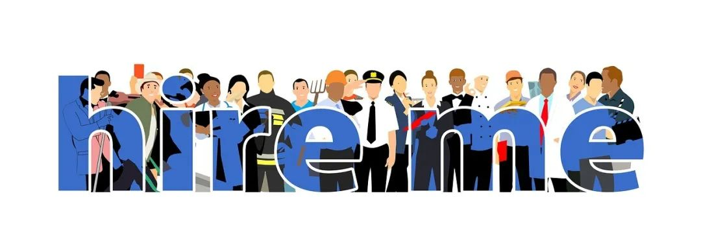

# 无标题

**链接地址:** http://mp.weixin.qq.com/s?__biz=MzI4NDYyNjAwNw==&mid=2247484003&idx=1&sn=0429f26cfaf5b05a4c3a8a99524080eb&chksm=ebf9df5bdc8e564de19551dca6a19fea4372c050ae540dd1bfbbd399387a930ea1930d449040&mpshare=1&scene=2&srcid=&sharer_sharetime=1583981208608&sharer_shareid=be1c8edd6c93eec155a61c876e41d26a#rd
**作者:** 关注我们
**获取时间:** 2025/8/28 20:17:24
**图片数量:** 23

---

## 原始HTML内容

<section style="box-sizing: border-box;font-size: 16px;"><section style="margin-right: 0%;margin-bottom: 10px;margin-left: 0%;box-sizing: border-box;" powered-by="xiumi.us"><section style="display: inline-block;width: 100%;vertical-align: top;border-width: 3px;border-radius: 0px;border-style: solid none;border-color: rgb(125, 192, 232) rgb(209, 194, 255);box-shadow: rgb(0, 0, 0) 0px 0px 0px;box-sizing: border-box;"><section style="margin: 30px 0% 10px;text-align: center;justify-content: center;box-sizing: border-box;" powered-by="xiumi.us"><section style="display: inline-block;width: auto;vertical-align: top;background-color: rgba(211, 226, 242, 0.89);min-width: 10%;max-width: 100%;height: auto;box-sizing: border-box;"><section style="margin: -6px 0% 5px;transform: translate3d(6px, 0px, 0px);-webkit-transform: translate3d(6px, 0px, 0px);-moz-transform: translate3d(6px, 0px, 0px);-o-transform: translate3d(6px, 0px, 0px);box-sizing: border-box;" powered-by="xiumi.us"><section style="display: inline-block;width: 100%;vertical-align: top;border-style: solid;border-width: 2px;border-radius: 0px;border-color: rgb(125, 192, 232);box-sizing: border-box;"><section style="box-sizing: border-box;" powered-by="xiumi.us"><section style="display: flex;flex-flow: row nowrap;box-sizing: border-box;"><section style="display: inline-block;vertical-align: top;width: auto;flex: 100 100 0%;align-self: flex-start;height: auto;box-sizing: border-box;"><section style="box-sizing: border-box;" powered-by="xiumi.us"><section style="display: flex;flex-flow: row nowrap;box-sizing: border-box;"><section style="display: inline-block;width: auto;vertical-align: top;flex: 100 100 0%;height: auto;padding: 8px 10px;line-height: 0;letter-spacing: 0px;align-self: flex-start;border-width: 0px;box-sizing: border-box;"><section style="margin-right: 0%;margin-left: 0%;box-sizing: border-box;" powered-by="xiumi.us"><section style="text-align: justify;font-size: 17px;color: rgb(40, 115, 200);line-height: 1;letter-spacing: 3px;text-shadow: rgb(255, 255, 255) 1px 1px, rgba(141, 113, 229, 0.5) 2.3px 2.3px;box-sizing: border-box;">
<strong style="box-sizing: border-box;">求职就业者的寒冬到了吗？</strong>
</section></section></section></section></section></section><section style="display: inline-block;vertical-align: top;width: auto;align-self: flex-start;flex: 0 0 0%;height: auto;margin-left: -10px;box-sizing: border-box;"><section style="text-align: right;justify-content: flex-end;box-sizing: border-box;" powered-by="xiumi.us"><section style="display: inline-block;width: 10px;height: 3px;vertical-align: top;overflow: hidden;background-color: rgb(125, 192, 232);box-sizing: border-box;line-height: 0;"> </section></section></section></section></section></section></section></section></section><section style="margin: 12px 0%;box-sizing: border-box;" powered-by="xiumi.us"><section style="font-size: 14px;color: rgb(121, 121, 121);padding-right: 10px;padding-left: 10px;line-height: 1.8;letter-spacing: 2px;box-sizing: border-box;">
这些天坐在家中观看新闻的同学们，应该都感受到<strong style="box-sizing: border-box;">强烈的不安</strong>：新冠疫情全球爆发，美股熔断，油价闪崩…

 

一个接一个的<strong style="box-sizing: border-box;">坏消息</strong>，就算你不需要为求职就业担忧，也难免手心中捏把冷汗。
</section></section><section style="text-align: center;box-sizing: border-box;" powered-by="xiumi.us"><section style="display: inline-block;width: 80%;vertical-align: top;height: auto;box-shadow: rgb(0, 0, 0) 0px 0px 0px;box-sizing: border-box;"><section style="opacity: 0.51;margin-right: 0%;margin-left: 0%;transform: rotateX(180deg);box-sizing: border-box;" powered-by="xiumi.us"><section style="display: inline-block;width: 100%;vertical-align: top;box-shadow: rgb(0, 0, 0) 0px 0px 0px;background-position: 0% 0%;background-repeat: repeat-x;background-size: auto 100%;background-attachment: scroll;line-height: 0;background-image: url(&quot;https://mmbiz.qpic.cn/mmbiz_png/cY0qSDjdkFdDXoXibsGp0gnRabKDyiamAskVWO9080U8PRKayBS5onu0AkcPbNbswzpVAY3sibI4EqLJfOpyuQIeQ/640?wx_fmt=png&quot;);box-sizing: border-box;"><section style="box-sizing: border-box;" powered-by="xiumi.us"><section style="display: inline-block;width: 10px;height: 10px;vertical-align: top;overflow: hidden;box-sizing: border-box;line-height: 0;"> </section></section></section></section><section style="margin-right: 0%;margin-left: 0%;box-sizing: border-box;" powered-by="xiumi.us"><section style="max-width: 100%;vertical-align: middle;display: inline-block;line-height: 0;width: 98%;height: auto;box-sizing: border-box;"></section></section><section style="opacity: 0.51;margin-right: 0%;margin-left: 0%;box-sizing: border-box;" powered-by="xiumi.us"><section style="display: inline-block;width: 100%;vertical-align: top;box-shadow: rgb(0, 0, 0) 0px 0px 0px;background-position: 0% 0%;background-repeat: repeat-x;background-size: auto 100%;background-attachment: scroll;line-height: 0;background-image: url(&quot;https://mmbiz.qpic.cn/mmbiz_png/cY0qSDjdkFdDXoXibsGp0gnRabKDyiamAskVWO9080U8PRKayBS5onu0AkcPbNbswzpVAY3sibI4EqLJfOpyuQIeQ/640?wx_fmt=png&quot;);box-sizing: border-box;"><section style="box-sizing: border-box;" powered-by="xiumi.us"><section style="display: inline-block;width: 10px;height: 10px;vertical-align: top;overflow: hidden;box-sizing: border-box;line-height: 0;"> </section></section></section></section></section></section><section style="margin: 12px 0%;box-sizing: border-box;" powered-by="xiumi.us"><section style="font-size: 14px;color: rgb(121, 121, 121);padding-right: 10px;padding-left: 10px;line-height: 1.8;letter-spacing: 2px;box-sizing: border-box;">
没错，全球经济大环境在年初的重重打击下必将遭受重创，而对于加国应届毕业生和求职者们来说，这无疑是一场<strong style="box-sizing: border-box;">难捱的经济寒冬</strong>。

 

在这个特殊时期的求职就业难度，无疑<strong style="box-sizing: border-box;">更上一个台阶</strong>。
</section></section><section style="text-align: center;margin: 10px 0%;box-sizing: border-box;" powered-by="xiumi.us"><section style="display: inline-block;width: 80%;vertical-align: top;height: auto;box-shadow: rgb(0, 0, 0) 0px 0px 0px;letter-spacing: 0px;padding: 2px;border-width: 1px;border-radius: 4px;border-style: dashed;border-color: rgba(157, 187, 254, 0.46);overflow: hidden;box-sizing: border-box;"><section style="margin-right: 0%;margin-left: 0%;box-sizing: border-box;" powered-by="xiumi.us"><section style="max-width: 100%;vertical-align: middle;display: inline-block;line-height: 0;width: 100%;height: auto;border-width: 0px;border-radius: 2px;border-style: none;border-color: rgb(62, 62, 62);overflow: hidden;box-sizing: border-box;"></section></section></section></section><section style="margin: 12px 0%;box-sizing: border-box;" powered-by="xiumi.us"><section style="font-size: 14px;color: rgb(121, 121, 121);padding-right: 10px;padding-left: 10px;line-height: 1.8;letter-spacing: 2px;box-sizing: border-box;">
然而，躺在家中无所事事颓废度日并<strong style="box-sizing: border-box;">不能降低你心中的焦虑感</strong>。

 

如何在疫情和经济危机的双重打击下，<strong style="box-sizing: border-box;">更好地提升准备自己的求职和职业技能</strong>，正是我们今天要深度解析的话题。
</section></section><section style="text-align: center;box-sizing: border-box;" powered-by="xiumi.us"><section style="display: inline-block;width: 80%;vertical-align: top;height: auto;box-shadow: rgb(0, 0, 0) 0px 0px 0px;box-sizing: border-box;"><section style="opacity: 0.51;margin-right: 0%;margin-left: 0%;transform: rotateX(180deg);box-sizing: border-box;" powered-by="xiumi.us"><section style="display: inline-block;width: 100%;vertical-align: top;box-shadow: rgb(0, 0, 0) 0px 0px 0px;background-position: 0% 0%;background-repeat: repeat-x;background-size: auto 100%;background-attachment: scroll;line-height: 0;background-image: url(&quot;https://mmbiz.qpic.cn/mmbiz_png/cY0qSDjdkFdDXoXibsGp0gnRabKDyiamAskVWO9080U8PRKayBS5onu0AkcPbNbswzpVAY3sibI4EqLJfOpyuQIeQ/640?wx_fmt=png&quot;);box-sizing: border-box;"><section style="box-sizing: border-box;" powered-by="xiumi.us"><section style="display: inline-block;width: 10px;height: 10px;vertical-align: top;overflow: hidden;box-sizing: border-box;line-height: 0;"> </section></section></section></section><section style="margin-right: 0%;margin-left: 0%;box-sizing: border-box;" powered-by="xiumi.us"><section style="max-width: 100%;vertical-align: middle;display: inline-block;line-height: 0;width: 98%;height: auto;box-sizing: border-box;"></section></section><section style="opacity: 0.51;margin-right: 0%;margin-left: 0%;box-sizing: border-box;" powered-by="xiumi.us"><section style="display: inline-block;width: 100%;vertical-align: top;box-shadow: rgb(0, 0, 0) 0px 0px 0px;background-position: 0% 0%;background-repeat: repeat-x;background-size: auto 100%;background-attachment: scroll;line-height: 0;background-image: url(&quot;https://mmbiz.qpic.cn/mmbiz_png/cY0qSDjdkFdDXoXibsGp0gnRabKDyiamAskVWO9080U8PRKayBS5onu0AkcPbNbswzpVAY3sibI4EqLJfOpyuQIeQ/640?wx_fmt=png&quot;);box-sizing: border-box;"><section style="box-sizing: border-box;" powered-by="xiumi.us"><section style="display: inline-block;width: 10px;height: 10px;vertical-align: top;overflow: hidden;box-sizing: border-box;line-height: 0;"> </section></section></section></section></section></section><section style="margin: 12px 0%;box-sizing: border-box;" powered-by="xiumi.us"><section style="font-size: 14px;color: rgb(121, 121, 121);padding-right: 10px;padding-left: 10px;line-height: 1.8;letter-spacing: 2px;box-sizing: border-box;">
<strong style="box-sizing: border-box;">挑战往往伴随机遇。</strong>

 

如果你想要通过这段迷茫的时期去更好地<strong style="box-sizing: border-box;">磨砺打造自己</strong>，在经济复苏之时成为求职市场中<strong style="box-sizing: border-box;">更具竞争力的狠角色</strong>，请和 <strong style="box-sizing: border-box;">BADAB</strong> 一同探讨：
</section></section><section style="box-sizing: border-box;" powered-by="xiumi.us">
 
</section><section style="margin-top: 10px;margin-bottom: 10px;text-align: center;justify-content: center;box-sizing: border-box;" powered-by="xiumi.us"><section style="display: inline-block;width: 80%;border-width: 1px;border-style: solid;border-color: rgba(211, 226, 242, 0.89);padding: 10px;background-color: rgba(211, 226, 242, 0.89);box-shadow: rgb(204, 204, 204) 3.2px 3.2px 4px;height: auto;box-sizing: border-box;"><section style="text-align: justify;box-sizing: border-box;" powered-by="xiumi.us">
 
</section><section style="justify-content: center;margin: 10px 0%;box-sizing: border-box;" powered-by="xiumi.us"><section style="display: inline-block;width: auto;vertical-align: top;background-position: 50% 50%;background-repeat: no-repeat;background-size: 100% 100%;background-attachment: scroll;min-width: 10%;max-width: 100%;height: auto;background-image: url(&quot;https://mmbiz.qpic.cn/mmbiz_png/cY0qSDjdkFdDXoXibsGp0gnRabKDyiamAsVSrD2UkDTuUdyOGNXFZ2ic6SA09He77WVgKciayz8u2Oymeg1ibKricictQ/640?wx_fmt=png&quot;);box-sizing: border-box;"><section style="text-align: justify;font-size: 18px;color: rgb(26, 82, 145);letter-spacing: 1px;padding-right: 10px;padding-left: 10px;line-height: 2;text-shadow: rgb(255, 255, 255) 1px 1px 1px;box-sizing: border-box;" powered-by="xiumi.us">
<em style="box-sizing: border-box;"><strong style="box-sizing: border-box;">如何在市场低迷时抓住机遇</strong></em>

<em style="box-sizing: border-box;"><strong style="box-sizing: border-box;">打造自己获得更大的竞争力</strong></em>
</section></section></section><section style="text-align: justify;box-sizing: border-box;" powered-by="xiumi.us">
 
</section></section></section><section style="box-sizing: border-box;" powered-by="xiumi.us">
 
</section><section style="box-sizing: border-box;" powered-by="xiumi.us">
 
</section><section style="margin: 30px 0%;box-sizing: border-box;" powered-by="xiumi.us"><section style="display: inline-block;width: 100%;vertical-align: top;border-width: 1px;border-radius: 0px;border-style: none;border-color: rgb(76, 68, 71);background-color: rgba(211, 226, 242, 0.89);box-sizing: border-box;"><section style="box-sizing: border-box;" powered-by="xiumi.us"><section style="align-items: center;display: flex;margin: -3px 0%;box-sizing: border-box;"><section style="display: inline-block;vertical-align: bottom;width: auto;flex: 0 0 auto;border-width: 0px;border-radius: 0px;border-style: none;border-color: rgb(76, 68, 71);margin-top: -10px;margin-bottom: -10px;margin-left: 20px;box-sizing: border-box;"><section style="text-align: center;margin-right: 0%;margin-left: 0%;transform: translate3d(-10px, 0px, 0px);box-sizing: border-box;" powered-by="xiumi.us"><section style="display: inline-block;min-width: 10%;max-width: 100%;vertical-align: top;transform: matrix(1, 0, -0.2, 1, 0, 0);-webkit-transform: matrix(1, 0, -0.2, 1, 0, 0);-moz-transform: matrix(1, 0, -0.2, 1, 0, 0);-o-transform: matrix(1, 0, -0.2, 1, 0, 0);border-style: solid;border-width: 0px;border-radius: 0px;border-color: rgb(76, 68, 71);padding: 6px 10px;background-color: rgb(125, 192, 232);box-sizing: border-box;"><section style="line-height: 1;letter-spacing: 0px;font-size: 32px;color: rgb(255, 255, 255);box-sizing: border-box;" powered-by="xiumi.us">
<strong style="box-sizing: border-box;">01</strong>
</section></section></section></section><section style="display: inline-block;vertical-align: bottom;width: auto;flex: 1 1 auto;border-width: 0px;padding-top: 10px;padding-bottom: 10px;box-sizing: border-box;"><section style="text-align: left;line-height: 1.5;letter-spacing: 0px;color: rgb(40, 115, 200);text-shadow: rgba(0, 0, 0, 0.24) 1px 1px 1px;box-sizing: border-box;" powered-by="xiumi.us">
<strong style="box-sizing: border-box;">整理和美化自己的个人主页</strong>
</section></section></section></section></section></section><section style="margin: 12px 0%;box-sizing: border-box;" powered-by="xiumi.us"><section style="font-size: 14px;color: rgb(121, 121, 121);padding-right: 10px;padding-left: 10px;line-height: 1.8;letter-spacing: 2px;box-sizing: border-box;">
现代社会网络信息化技术发达。疫情让大家无法面对面相见，<strong style="box-sizing: border-box;">网络上的沟通联系就变得更加重要</strong>。

 

你在&nbsp;<strong style="box-sizing: border-box;">LinkedIn&nbsp;</strong>或其他职业社交网站上的主页在很大程度上会反应你<strong style="box-sizing: border-box;">真实的性格和状态</strong>。
</section></section><section style="text-align: center;box-sizing: border-box;" powered-by="xiumi.us"><section style="display: inline-block;width: 80%;vertical-align: top;height: auto;box-shadow: rgb(0, 0, 0) 0px 0px 0px;box-sizing: border-box;"><section style="opacity: 0.51;margin-right: 0%;margin-left: 0%;transform: rotateX(180deg);box-sizing: border-box;" powered-by="xiumi.us"><section style="display: inline-block;width: 100%;vertical-align: top;box-shadow: rgb(0, 0, 0) 0px 0px 0px;background-position: 0% 0%;background-repeat: repeat-x;background-size: auto 100%;background-attachment: scroll;line-height: 0;background-image: url(&quot;https://mmbiz.qpic.cn/mmbiz_png/cY0qSDjdkFdDXoXibsGp0gnRabKDyiamAskVWO9080U8PRKayBS5onu0AkcPbNbswzpVAY3sibI4EqLJfOpyuQIeQ/640?wx_fmt=png&quot;);box-sizing: border-box;"><section style="box-sizing: border-box;" powered-by="xiumi.us"><section style="display: inline-block;width: 10px;height: 10px;vertical-align: top;overflow: hidden;box-sizing: border-box;line-height: 0;"> </section></section></section></section><section style="margin-right: 0%;margin-left: 0%;box-sizing: border-box;" powered-by="xiumi.us"><section style="max-width: 100%;vertical-align: middle;display: inline-block;line-height: 0;width: 98%;height: auto;box-sizing: border-box;"></section></section><section style="opacity: 0.51;margin-right: 0%;margin-left: 0%;box-sizing: border-box;" powered-by="xiumi.us"><section style="display: inline-block;width: 100%;vertical-align: top;box-shadow: rgb(0, 0, 0) 0px 0px 0px;background-position: 0% 0%;background-repeat: repeat-x;background-size: auto 100%;background-attachment: scroll;line-height: 0;background-image: url(&quot;https://mmbiz.qpic.cn/mmbiz_png/cY0qSDjdkFdDXoXibsGp0gnRabKDyiamAskVWO9080U8PRKayBS5onu0AkcPbNbswzpVAY3sibI4EqLJfOpyuQIeQ/640?wx_fmt=png&quot;);box-sizing: border-box;"><section style="box-sizing: border-box;" powered-by="xiumi.us"><section style="display: inline-block;width: 10px;height: 10px;vertical-align: top;overflow: hidden;box-sizing: border-box;line-height: 0;"> </section></section></section></section></section></section><section style="margin: 12px 0%;box-sizing: border-box;" powered-by="xiumi.us"><section style="font-size: 14px;color: rgb(121, 121, 121);padding-right: 10px;padding-left: 10px;line-height: 1.8;letter-spacing: 2px;box-sizing: border-box;">
这些职业社交网站也是你有在<strong style="box-sizing: border-box;">精心维护个人形象</strong>的象征。

 

所以请趁着这些日子抽点时间去<strong style="box-sizing: border-box;">丰富和美化一下上面的内容</strong>，给通过这些媒介联系你的人<strong style="box-sizing: border-box;">留下更好的印象。</strong>

 
</section></section><section style="margin: 10px 0%;text-align: center;justify-content: center;box-sizing: border-box;" powered-by="xiumi.us"><section style="display: inline-block;border-width: 1px;border-style: solid;border-color: rgb(192, 200, 209);padding: 10px;background-color: rgba(211, 226, 242, 0.89);box-shadow: rgb(170, 170, 170) 0px 0px 10px;width: 90%;height: auto;box-sizing: border-box;"><section style="text-align: left;letter-spacing: 0px;padding-right: 10px;padding-left: 10px;box-sizing: border-box;" powered-by="xiumi.us">
<strong style="box-sizing: border-box;">如何美化和修改自己的LinkedIn界面？</strong>

 

点击连接阅读：

<a target="_blank" href="http://mp.weixin.qq.com/s?__biz=MzI4NDYyNjAwNw==&amp;mid=2247483868&amp;idx=1&amp;sn=234a8d704664ab64402ebe01160197b7&amp;chksm=ebf9dce4dc8e55f2d55c474a0bb5ec0ef1bf9434d43cfe5a9eed0ed276291049f365d4a11d8c&amp;scene=21#wechat_redirect" textvalue="《求职&nbsp; | 北美求职神器LinkedIn到底怎么用？让这10个小Tips来告诉你！》" data-itemshowtype="0" tab="innerlink" data-linktype="2"><em style="box-sizing: border-box;"><strong style="box-sizing: border-box;">《求职&nbsp; | 北美求职神器LinkedIn到底怎么用？让这10个小Tips来告诉你！》</strong></em></a><em style="box-sizing: border-box;"><strong style="box-sizing: border-box;"></strong></em>
</section></section></section><section style="box-sizing: border-box;" powered-by="xiumi.us">
 
</section><section style="margin: 30px 0%;box-sizing: border-box;" powered-by="xiumi.us"><section style="display: inline-block;width: 100%;vertical-align: top;border-width: 1px;border-radius: 0px;border-style: none;border-color: rgb(76, 68, 71);background-color: rgba(211, 226, 242, 0.89);box-sizing: border-box;"><section style="box-sizing: border-box;" powered-by="xiumi.us"><section style="align-items: center;display: flex;margin: -3px 0%;box-sizing: border-box;"><section style="display: inline-block;vertical-align: bottom;width: auto;flex: 0 0 auto;border-width: 0px;border-radius: 0px;border-style: none;border-color: rgb(76, 68, 71);margin-top: -10px;margin-bottom: -10px;margin-left: 20px;box-sizing: border-box;"><section style="text-align: center;margin-right: 0%;margin-left: 0%;transform: translate3d(-10px, 0px, 0px);box-sizing: border-box;" powered-by="xiumi.us"><section style="display: inline-block;min-width: 10%;max-width: 100%;vertical-align: top;transform: matrix(1, 0, -0.2, 1, 0, 0);-webkit-transform: matrix(1, 0, -0.2, 1, 0, 0);-moz-transform: matrix(1, 0, -0.2, 1, 0, 0);-o-transform: matrix(1, 0, -0.2, 1, 0, 0);border-style: solid;border-width: 0px;border-radius: 0px;border-color: rgb(76, 68, 71);padding: 6px 10px;background-color: rgb(125, 192, 232);box-sizing: border-box;"><section style="line-height: 1;letter-spacing: 0px;font-size: 32px;color: rgb(255, 255, 255);box-sizing: border-box;" powered-by="xiumi.us">
<strong style="box-sizing: border-box;">02</strong>
</section></section></section></section><section style="display: inline-block;vertical-align: bottom;width: auto;flex: 1 1 auto;border-width: 0px;padding-top: 10px;padding-bottom: 10px;box-sizing: border-box;"><section style="text-align: center;line-height: 1.5;letter-spacing: 0px;color: rgb(40, 115, 200);text-shadow: rgba(0, 0, 0, 0.24) 1px 1px 1px;box-sizing: border-box;" powered-by="xiumi.us">
<strong style="box-sizing: border-box;">给同事和朋友送去祝福</strong>
</section></section></section></section></section></section><section style="margin: 12px 0%;box-sizing: border-box;" powered-by="xiumi.us"><section style="font-size: 14px;color: rgb(121, 121, 121);padding-right: 10px;padding-left: 10px;line-height: 1.8;letter-spacing: 2px;box-sizing: border-box;">
在这个特殊的时刻，花点时间去<strong style="box-sizing: border-box;">经营自己的职业社交圈</strong>绝对是正确的选择。

 

以疫情作为契机向同事朋友发出<strong style="box-sizing: border-box;">真挚的问候</strong>，能够很快帮助你们建立感情和联系。
</section></section><section style="text-align: center;margin: 10px 0%;box-sizing: border-box;" powered-by="xiumi.us"><section style="display: inline-block;width: 80%;vertical-align: top;height: auto;box-shadow: rgb(0, 0, 0) 0px 0px 0px;letter-spacing: 0px;padding: 2px;border-width: 1px;border-radius: 4px;border-style: dashed;border-color: rgba(157, 187, 254, 0.46);overflow: hidden;box-sizing: border-box;"><section style="margin-right: 0%;margin-left: 0%;box-sizing: border-box;" powered-by="xiumi.us"><section style="max-width: 100%;vertical-align: middle;display: inline-block;line-height: 0;width: 100%;height: auto;border-width: 0px;border-radius: 2px;border-style: none;border-color: rgb(62, 62, 62);overflow: hidden;box-sizing: border-box;"></section></section></section></section><section style="margin: 12px 0%;box-sizing: border-box;" powered-by="xiumi.us"><section style="font-size: 14px;color: rgb(121, 121, 121);padding-right: 10px;padding-left: 10px;line-height: 1.8;letter-spacing: 2px;box-sizing: border-box;">
问问他们最近在做些什么，谈谈疫情和经济冲击带来的烦恼。释放一下情绪，<strong style="box-sizing: border-box;">互相鼓励和支持</strong>。

 

这样的情谊在当下的经济环境中可能会对你有着<strong style="box-sizing: border-box;">意想不到的帮助。</strong>比起节假日群发的祝福可<strong style="box-sizing: border-box;">有效果太多</strong>啦！
</section></section><section style="box-sizing: border-box;" powered-by="xiumi.us">
 
</section><section style="margin: 10px 0%;text-align: center;justify-content: center;box-sizing: border-box;" powered-by="xiumi.us"><section style="display: inline-block;width: 90%;border-width: 1px;border-style: solid;border-color: rgb(192, 200, 209);padding: 10px;background-color: rgba(211, 226, 242, 0.89);box-shadow: rgb(170, 170, 170) 0px 0px 10px;height: auto;box-sizing: border-box;"><section style="text-align: left;letter-spacing: 0px;padding-right: 10px;padding-left: 10px;box-sizing: border-box;" powered-by="xiumi.us">
<strong style="box-sizing: border-box;">如何进行职场社交？</strong>

 

点击连接阅读：

<a target="_blank" href="http://mp.weixin.qq.com/s?__biz=MzI4NDYyNjAwNw==&amp;mid=2247483899&amp;idx=1&amp;sn=af09188fabb802cc8e56ffe402a39514&amp;chksm=ebf9dcc3dc8e55d53a21ca0483e48291dc238f069fbd6acf4175ccd129bc3eb2d0e5dae2b4e9&amp;scene=21#wechat_redirect" textvalue="《求职 | 如何踏出第一步？害羞的你也能自如地Networking！》" data-itemshowtype="0" tab="innerlink" data-linktype="2"><em style="box-sizing: border-box;"><strong style="box-sizing: border-box;">《求职 | 如何踏出第一步？害羞的你也能自如地Networking！》</strong></em></a><em style="box-sizing: border-box;"><strong style="box-sizing: border-box;"></strong></em>
</section></section></section><section style="box-sizing: border-box;" powered-by="xiumi.us">
 
</section><section style="margin: 30px 0%;box-sizing: border-box;" powered-by="xiumi.us"><section style="display: inline-block;width: 100%;vertical-align: top;border-width: 1px;border-radius: 0px;border-style: none;border-color: rgb(76, 68, 71);background-color: rgba(211, 226, 242, 0.89);box-sizing: border-box;"><section style="box-sizing: border-box;" powered-by="xiumi.us"><section style="align-items: center;display: flex;margin: -3px 0%;box-sizing: border-box;"><section style="display: inline-block;vertical-align: bottom;width: auto;flex: 0 0 auto;border-width: 0px;border-radius: 0px;border-style: none;border-color: rgb(76, 68, 71);margin-top: -10px;margin-bottom: -10px;margin-left: 20px;box-sizing: border-box;"><section style="text-align: center;margin-right: 0%;margin-left: 0%;transform: translate3d(-10px, 0px, 0px);box-sizing: border-box;" powered-by="xiumi.us"><section style="display: inline-block;min-width: 10%;max-width: 100%;vertical-align: top;transform: matrix(1, 0, -0.2, 1, 0, 0);-webkit-transform: matrix(1, 0, -0.2, 1, 0, 0);-moz-transform: matrix(1, 0, -0.2, 1, 0, 0);-o-transform: matrix(1, 0, -0.2, 1, 0, 0);border-style: solid;border-width: 0px;border-radius: 0px;border-color: rgb(76, 68, 71);padding: 6px 10px;background-color: rgb(125, 192, 232);box-sizing: border-box;"><section style="line-height: 1;letter-spacing: 0px;font-size: 32px;color: rgb(255, 255, 255);box-sizing: border-box;" powered-by="xiumi.us">
<strong style="box-sizing: border-box;">03</strong>
</section></section></section></section><section style="display: inline-block;vertical-align: bottom;width: auto;flex: 1 1 auto;border-width: 0px;padding-top: 10px;padding-bottom: 10px;box-sizing: border-box;"><section style="text-align: center;line-height: 1.5;letter-spacing: 0px;color: rgb(40, 115, 200);text-shadow: rgba(0, 0, 0, 0.24) 1px 1px 1px;box-sizing: border-box;" powered-by="xiumi.us">
<strong style="box-sizing: border-box;">提高自己的职业情商</strong>
</section></section></section></section></section></section><section style="margin: 12px 0%;box-sizing: border-box;" powered-by="xiumi.us"><section style="font-size: 14px;color: rgb(121, 121, 121);padding-right: 10px;padding-left: 10px;line-height: 1.8;letter-spacing: 2px;box-sizing: border-box;">
经济低迷环境下产生的焦虑心态很难调整，活动受限的情况下选择观看一些轻松的娱乐影视也是必要的。

 

但是什么样的影视<strong style="box-sizing: border-box;">既能够放松情绪又能够提升自己</strong>呢？不妨从一些以<strong style="box-sizing: border-box;">北美职场为背景的影视剧</strong>入手。
</section></section><section style="text-align: center;box-sizing: border-box;" powered-by="xiumi.us"><section style="display: inline-block;width: 80%;vertical-align: top;height: auto;box-shadow: rgb(0, 0, 0) 0px 0px 0px;box-sizing: border-box;"><section style="opacity: 0.51;margin-right: 0%;margin-left: 0%;transform: rotateX(180deg);box-sizing: border-box;" powered-by="xiumi.us"><section style="display: inline-block;width: 100%;vertical-align: top;box-shadow: rgb(0, 0, 0) 0px 0px 0px;background-position: 0% 0%;background-repeat: repeat-x;background-size: auto 100%;background-attachment: scroll;line-height: 0;background-image: url(&quot;https://mmbiz.qpic.cn/mmbiz_png/cY0qSDjdkFdDXoXibsGp0gnRabKDyiamAskVWO9080U8PRKayBS5onu0AkcPbNbswzpVAY3sibI4EqLJfOpyuQIeQ/640?wx_fmt=png&quot;);box-sizing: border-box;"><section style="box-sizing: border-box;" powered-by="xiumi.us"><section style="display: inline-block;width: 10px;height: 10px;vertical-align: top;overflow: hidden;box-sizing: border-box;line-height: 0;"> </section></section></section></section><section style="margin-right: 0%;margin-left: 0%;box-sizing: border-box;" powered-by="xiumi.us"><section style="max-width: 100%;vertical-align: middle;display: inline-block;line-height: 0;width: 98%;height: auto;box-sizing: border-box;"></section></section><section style="opacity: 0.51;margin-right: 0%;margin-left: 0%;box-sizing: border-box;" powered-by="xiumi.us"><section style="display: inline-block;width: 100%;vertical-align: top;box-shadow: rgb(0, 0, 0) 0px 0px 0px;background-position: 0% 0%;background-repeat: repeat-x;background-size: auto 100%;background-attachment: scroll;line-height: 0;background-image: url(&quot;https://mmbiz.qpic.cn/mmbiz_png/cY0qSDjdkFdDXoXibsGp0gnRabKDyiamAskVWO9080U8PRKayBS5onu0AkcPbNbswzpVAY3sibI4EqLJfOpyuQIeQ/640?wx_fmt=png&quot;);box-sizing: border-box;"><section style="box-sizing: border-box;" powered-by="xiumi.us"><section style="display: inline-block;width: 10px;height: 10px;vertical-align: top;overflow: hidden;box-sizing: border-box;line-height: 0;"> </section></section></section></section></section></section><section style="margin-top: -10px;margin-right: 0%;margin-left: 0%;box-sizing: border-box;" powered-by="xiumi.us"><section style="font-size: 12px;box-sizing: border-box;">
电影 《实习生》 
</section></section><section style="text-align: center;margin: 10px 0%;box-sizing: border-box;" powered-by="xiumi.us"><section style="display: inline-block;width: 80%;vertical-align: top;height: auto;box-shadow: rgb(0, 0, 0) 0px 0px 0px;letter-spacing: 0px;padding: 2px;border-width: 1px;border-radius: 4px;border-style: dashed;border-color: rgba(157, 187, 254, 0.46);overflow: hidden;box-sizing: border-box;"><section style="margin-right: 0%;margin-left: 0%;box-sizing: border-box;" powered-by="xiumi.us"><section style="max-width: 100%;vertical-align: middle;display: inline-block;line-height: 0;width: 100%;height: auto;border-width: 0px;border-radius: 2px;border-style: none;border-color: rgb(62, 62, 62);overflow: hidden;box-sizing: border-box;"></section></section></section></section><section style="font-size: 12px;box-sizing: border-box;" powered-by="xiumi.us">
电视剧 《新闻编辑室》 
</section><section style="text-align: center;box-sizing: border-box;" powered-by="xiumi.us"><section style="display: inline-block;width: 80%;vertical-align: top;height: auto;box-shadow: rgb(0, 0, 0) 0px 0px 0px;box-sizing: border-box;"><section style="opacity: 0.51;margin-right: 0%;margin-left: 0%;transform: rotateX(180deg);box-sizing: border-box;" powered-by="xiumi.us"><section style="display: inline-block;width: 100%;vertical-align: top;box-shadow: rgb(0, 0, 0) 0px 0px 0px;background-position: 0% 0%;background-repeat: repeat-x;background-size: auto 100%;background-attachment: scroll;line-height: 0;background-image: url(&quot;https://mmbiz.qpic.cn/mmbiz_png/cY0qSDjdkFdDXoXibsGp0gnRabKDyiamAskVWO9080U8PRKayBS5onu0AkcPbNbswzpVAY3sibI4EqLJfOpyuQIeQ/640?wx_fmt=png&quot;);box-sizing: border-box;"><section style="box-sizing: border-box;" powered-by="xiumi.us"><section style="display: inline-block;width: 10px;height: 10px;vertical-align: top;overflow: hidden;box-sizing: border-box;line-height: 0;"> </section></section></section></section><section style="margin-right: 0%;margin-left: 0%;box-sizing: border-box;" powered-by="xiumi.us"><section style="max-width: 100%;vertical-align: middle;display: inline-block;line-height: 0;width: 98%;height: auto;box-sizing: border-box;"></section></section><section style="opacity: 0.51;margin-right: 0%;margin-left: 0%;box-sizing: border-box;" powered-by="xiumi.us"><section style="display: inline-block;width: 100%;vertical-align: top;box-shadow: rgb(0, 0, 0) 0px 0px 0px;background-position: 0% 0%;background-repeat: repeat-x;background-size: auto 100%;background-attachment: scroll;line-height: 0;background-image: url(&quot;https://mmbiz.qpic.cn/mmbiz_png/cY0qSDjdkFdDXoXibsGp0gnRabKDyiamAskVWO9080U8PRKayBS5onu0AkcPbNbswzpVAY3sibI4EqLJfOpyuQIeQ/640?wx_fmt=png&quot;);box-sizing: border-box;"><section style="box-sizing: border-box;" powered-by="xiumi.us"><section style="display: inline-block;width: 10px;height: 10px;vertical-align: top;overflow: hidden;box-sizing: border-box;line-height: 0;"> </section></section></section></section></section></section><section style="margin-top: -10px;margin-right: 0%;margin-left: 0%;box-sizing: border-box;" powered-by="xiumi.us"><section style="font-size: 12px;box-sizing: border-box;">
真人秀 《谁是接班人》 
</section></section><section style="margin: 12px 0%;box-sizing: border-box;" powered-by="xiumi.us"><section style="font-size: 14px;color: rgb(121, 121, 121);padding-right: 10px;padding-left: 10px;line-height: 1.8;letter-spacing: 2px;box-sizing: border-box;">
你可以通过观看这些影视作品，去了解<strong style="box-sizing: border-box;">北美职场文化的潜规则，适应本地人工作和社交的方式</strong>。

 

也可以通过这些优秀的影视作品<strong style="box-sizing: border-box;">锻炼你的英语听力和口语</strong>，为你今后在职场上发展打下基础。
</section></section><section style="box-sizing: border-box;" powered-by="xiumi.us">
 
</section><section style="margin: 10px 0%;text-align: center;justify-content: center;box-sizing: border-box;" powered-by="xiumi.us"><section style="display: inline-block;width: 90%;border-width: 1px;border-style: solid;border-color: rgb(192, 200, 209);padding: 10px;background-color: rgba(211, 226, 242, 0.89);box-shadow: rgb(170, 170, 170) 0px 0px 10px;height: auto;box-sizing: border-box;"><section style="text-align: left;letter-spacing: 0px;padding-right: 10px;padding-left: 10px;box-sizing: border-box;" powered-by="xiumi.us">
<strong style="box-sizing: border-box;">职场社交到底有多重要？</strong>

 

点击连接阅读：

<a target="_blank" href="http://mp.weixin.qq.com/s?__biz=MzI4NDYyNjAwNw==&amp;mid=2247483895&amp;idx=1&amp;sn=2bd9119d4f70c4a3e9520fe78e8f7f86&amp;chksm=ebf9dccfdc8e55d9e61f2858d445de29b789b4489627af97b5443a4727c45c5702907d0f787e&amp;scene=21#wechat_redirect" textvalue="《求职 | 北美 Networking / 职场社交到底有多重要？》" data-itemshowtype="0" tab="innerlink" data-linktype="2"><em style="box-sizing: border-box;"><strong style="box-sizing: border-box;">《求职 | 北美 Networking / 职场社交到底有多重要？》</strong></em></a><em style="box-sizing: border-box;"><strong style="box-sizing: border-box;"></strong></em>
</section></section></section><section style="box-sizing: border-box;" powered-by="xiumi.us">
 
</section><section style="margin: 30px 0%;box-sizing: border-box;" powered-by="xiumi.us"><section style="display: inline-block;width: 100%;vertical-align: top;border-width: 1px;border-radius: 0px;border-style: none;border-color: rgb(76, 68, 71);background-color: rgba(211, 226, 242, 0.89);box-sizing: border-box;"><section style="box-sizing: border-box;" powered-by="xiumi.us"><section style="align-items: center;display: flex;margin: -3px 0%;box-sizing: border-box;"><section style="display: inline-block;vertical-align: bottom;width: auto;flex: 0 0 auto;border-width: 0px;border-radius: 0px;border-style: none;border-color: rgb(76, 68, 71);margin-top: -10px;margin-bottom: -10px;margin-left: 20px;box-sizing: border-box;"><section style="text-align: center;margin-right: 0%;margin-left: 0%;transform: translate3d(-10px, 0px, 0px);box-sizing: border-box;" powered-by="xiumi.us"><section style="display: inline-block;min-width: 10%;max-width: 100%;vertical-align: top;transform: matrix(1, 0, -0.2, 1, 0, 0);-webkit-transform: matrix(1, 0, -0.2, 1, 0, 0);-moz-transform: matrix(1, 0, -0.2, 1, 0, 0);-o-transform: matrix(1, 0, -0.2, 1, 0, 0);border-style: solid;border-width: 0px;border-radius: 0px;border-color: rgb(76, 68, 71);padding: 6px 10px;background-color: rgb(125, 192, 232);box-sizing: border-box;"><section style="line-height: 1;letter-spacing: 0px;font-size: 32px;color: rgb(255, 255, 255);box-sizing: border-box;" powered-by="xiumi.us">
<strong style="box-sizing: border-box;">04</strong>
</section></section></section></section><section style="display: inline-block;vertical-align: bottom;width: auto;flex: 1 1 auto;border-width: 0px;padding-top: 10px;padding-bottom: 10px;box-sizing: border-box;"><section style="text-align: center;line-height: 1.5;letter-spacing: 0px;color: rgb(40, 115, 200);text-shadow: rgba(0, 0, 0, 0.24) 1px 1px 1px;box-sizing: border-box;" powered-by="xiumi.us">
<strong style="box-sizing: border-box;">关注时事，适时调整就业方向</strong>
</section></section></section></section></section></section><section style="margin: 12px 0%;box-sizing: border-box;" powered-by="xiumi.us"><section style="font-size: 14px;color: rgb(121, 121, 121);padding-right: 10px;padding-left: 10px;line-height: 1.8;letter-spacing: 2px;box-sizing: border-box;">
03年的非典在中国孕育出了以淘宝和京东为首的庞大的网络销售帝国；

 

而今年的新冠也催生出了大批包括在线配送和网络教育在内的<strong style="box-sizing: border-box;">风口行业</strong>。
</section></section><section style="text-align: center;box-sizing: border-box;" powered-by="xiumi.us"><section style="display: inline-block;width: 80%;vertical-align: top;height: auto;box-shadow: rgb(0, 0, 0) 0px 0px 0px;box-sizing: border-box;"><section style="opacity: 0.51;margin-right: 0%;margin-left: 0%;transform: rotateX(180deg);box-sizing: border-box;" powered-by="xiumi.us"><section style="display: inline-block;width: 100%;vertical-align: top;box-shadow: rgb(0, 0, 0) 0px 0px 0px;background-position: 0% 0%;background-repeat: repeat-x;background-size: auto 100%;background-attachment: scroll;line-height: 0;background-image: url(&quot;https://mmbiz.qpic.cn/mmbiz_png/cY0qSDjdkFdDXoXibsGp0gnRabKDyiamAskVWO9080U8PRKayBS5onu0AkcPbNbswzpVAY3sibI4EqLJfOpyuQIeQ/640?wx_fmt=png&quot;);box-sizing: border-box;"><section style="box-sizing: border-box;" powered-by="xiumi.us"><section style="display: inline-block;width: 10px;height: 10px;vertical-align: top;overflow: hidden;box-sizing: border-box;line-height: 0;"> </section></section></section></section><section style="margin-right: 0%;margin-left: 0%;box-sizing: border-box;" powered-by="xiumi.us"><section style="max-width: 100%;vertical-align: middle;display: inline-block;line-height: 0;width: 98%;height: auto;box-sizing: border-box;"></section></section><section style="opacity: 0.51;margin-right: 0%;margin-left: 0%;box-sizing: border-box;" powered-by="xiumi.us"><section style="display: inline-block;width: 100%;vertical-align: top;box-shadow: rgb(0, 0, 0) 0px 0px 0px;background-position: 0% 0%;background-repeat: repeat-x;background-size: auto 100%;background-attachment: scroll;line-height: 0;background-image: url(&quot;https://mmbiz.qpic.cn/mmbiz_png/cY0qSDjdkFdDXoXibsGp0gnRabKDyiamAskVWO9080U8PRKayBS5onu0AkcPbNbswzpVAY3sibI4EqLJfOpyuQIeQ/640?wx_fmt=png&quot;);box-sizing: border-box;"><section style="box-sizing: border-box;" powered-by="xiumi.us"><section style="display: inline-block;width: 10px;height: 10px;vertical-align: top;overflow: hidden;box-sizing: border-box;line-height: 0;"> </section></section></section></section></section></section><section style="margin: 12px 0%;box-sizing: border-box;" powered-by="xiumi.us"><section style="font-size: 14px;color: rgb(121, 121, 121);padding-right: 10px;padding-left: 10px;line-height: 1.8;letter-spacing: 2px;box-sizing: border-box;">
这些日子可以更多地<strong style="box-sizing: border-box;">关注时事新闻</strong>，<strong style="box-sizing: border-box;">了解产业结构和市场需求的改变，以适时地调整自己的就业方向</strong>。

 

危机往往伴随着机遇。不做等待机遇的人，去做<strong style="box-sizing: border-box;">抓住机遇的人</strong>。
</section></section><section style="box-sizing: border-box;" powered-by="xiumi.us">
 
</section><section style="margin: 30px 0%;box-sizing: border-box;" powered-by="xiumi.us"><section style="display: inline-block;width: 100%;vertical-align: top;border-width: 1px;border-radius: 0px;border-style: none;border-color: rgb(76, 68, 71);background-color: rgba(211, 226, 242, 0.89);box-sizing: border-box;"><section style="box-sizing: border-box;" powered-by="xiumi.us"><section style="align-items: center;display: flex;margin: -3px 0%;box-sizing: border-box;"><section style="display: inline-block;vertical-align: bottom;width: auto;flex: 0 0 auto;border-width: 0px;border-radius: 0px;border-style: none;border-color: rgb(76, 68, 71);margin-top: -10px;margin-bottom: -10px;margin-left: 20px;box-sizing: border-box;"><section style="text-align: center;margin-right: 0%;margin-left: 0%;transform: translate3d(-10px, 0px, 0px);box-sizing: border-box;" powered-by="xiumi.us"><section style="display: inline-block;min-width: 10%;max-width: 100%;vertical-align: top;transform: matrix(1, 0, -0.2, 1, 0, 0);-webkit-transform: matrix(1, 0, -0.2, 1, 0, 0);-moz-transform: matrix(1, 0, -0.2, 1, 0, 0);-o-transform: matrix(1, 0, -0.2, 1, 0, 0);border-style: solid;border-width: 0px;border-radius: 0px;border-color: rgb(76, 68, 71);padding: 6px 10px;background-color: rgb(125, 192, 232);box-sizing: border-box;"><section style="line-height: 1;letter-spacing: 0px;font-size: 32px;color: rgb(255, 255, 255);box-sizing: border-box;" powered-by="xiumi.us">
<strong style="box-sizing: border-box;">05</strong>
</section></section></section></section><section style="display: inline-block;vertical-align: bottom;width: auto;flex: 1 1 auto;border-width: 0px;padding-top: 10px;padding-bottom: 10px;box-sizing: border-box;"><section style="text-align: center;line-height: 1.5;letter-spacing: 0px;color: rgb(40, 115, 200);text-shadow: rgba(0, 0, 0, 0.24) 1px 1px 1px;box-sizing: border-box;" powered-by="xiumi.us">
<strong style="box-sizing: border-box;">提升自己的技能</strong>
</section></section></section></section></section></section><section style="margin: 12px 0%;box-sizing: border-box;" powered-by="xiumi.us"><section style="font-size: 14px;color: rgb(121, 121, 121);padding-right: 10px;padding-left: 10px;line-height: 1.8;letter-spacing: 2px;box-sizing: border-box;">
如果之前你因为工作学习太忙，无暇完成一些<strong style="box-sizing: border-box;">职业技能的提升</strong>，那么现在就是不容错过的最佳的时机！

 

认真思考一下自己的<strong style="box-sizing: border-box;">职业技能短板</strong>，在哪些方面还可以进行提高？
</section></section><section style="text-align: center;margin: 10px 0%;box-sizing: border-box;" powered-by="xiumi.us"><section style="display: inline-block;width: 80%;vertical-align: top;height: auto;box-shadow: rgb(0, 0, 0) 0px 0px 0px;letter-spacing: 0px;padding: 2px;border-width: 1px;border-radius: 4px;border-style: dashed;border-color: rgba(157, 187, 254, 0.46);overflow: hidden;box-sizing: border-box;"><section style="margin-right: 0%;margin-left: 0%;box-sizing: border-box;" powered-by="xiumi.us"><section style="max-width: 100%;vertical-align: middle;display: inline-block;line-height: 0;width: 100%;height: auto;border-width: 0px;border-radius: 2px;border-style: none;border-color: rgb(62, 62, 62);overflow: hidden;box-sizing: border-box;"></section></section></section></section><section style="margin: 12px 0%;box-sizing: border-box;" powered-by="xiumi.us"><section style="font-size: 14px;color: rgb(121, 121, 121);padding-right: 10px;padding-left: 10px;line-height: 1.8;letter-spacing: 2px;box-sizing: border-box;">
<strong style="box-sizing: border-box;">查漏补缺，提纯自己的含金量。</strong>对自己进行<strong style="box-sizing: border-box;">短期集训</strong>，显著的效果会让你终身受益！

 

除了职业技能，<strong style="box-sizing: border-box;">求职技能</strong>也是你可以快速集中提高的一个方面。如果你还不知道该选择什么求职技能课程的话！请看——

 
</section></section><section style="margin: 10px 0% 20px;text-align: center;box-sizing: border-box;" powered-by="xiumi.us"><section style="display: inline-block;width: auto;vertical-align: top;line-height: 0;letter-spacing: 0px;min-width: 10%;max-width: 100%;height: auto;box-sizing: border-box;"><section style="margin-right: 0%;margin-left: 0%;box-sizing: border-box;" powered-by="xiumi.us"><section style="background-image: linear-gradient(90deg, rgba(159, 186, 253, 0) 0%, rgb(159, 186, 253) 50%, rgba(159, 186, 253, 0) 100%);height: 2px;box-sizing: border-box;line-height: 0;"> </section></section><section style="box-sizing: border-box;" powered-by="xiumi.us"><section style="display: inline-block;width: auto;vertical-align: top;min-width: 10%;max-width: 100%;height: auto;padding: 5px 25px;background-position: 50% 50%;background-repeat: no-repeat;background-size: cover;background-attachment: scroll;background-image: url(&quot;https://mmbiz.qpic.cn/mmbiz_png/cY0qSDjdkFdDXoXibsGp0gnRabKDyiamAsAMOa4AKMtnSYseMjCe8RQWjrbiazBNIrrwzn2cTOUtfLjtfPwj067Zw/640?wx_fmt=png&quot;);box-sizing: border-box;"><section style="box-sizing: border-box;" powered-by="xiumi.us"><section style="display: inline-block;width: 100%;vertical-align: top;line-height: 1;letter-spacing: 0px;box-sizing: border-box;"><section style="margin-right: 0%;margin-left: 0%;box-sizing: border-box;" powered-by="xiumi.us"><section style="color: rgb(40, 115, 200);font-size: 17px;line-height: 1.1;letter-spacing: 4px;text-shadow: rgb(255, 255, 255) 1px -1px, rgb(157, 187, 254) 1px 1px, rgb(157, 187, 254) -1px 1px, rgb(157, 187, 254) -1px -1px, rgb(157, 187, 254) 1px 0px, rgb(157, 187, 254) 0px 1px, rgb(157, 187, 254) -1px 0px, rgb(157, 187, 254) 0px -1px;box-sizing: border-box;">
<strong style="box-sizing: border-box;">网络课程简介</strong>
</section></section></section></section></section></section><section style="margin-right: 0%;margin-left: 0%;box-sizing: border-box;" powered-by="xiumi.us"><section style="background-image: linear-gradient(90deg, rgba(159, 186, 253, 0) 0%, rgb(159, 186, 253) 50%, rgba(159, 186, 253, 0) 100%);height: 2px;box-sizing: border-box;line-height: 0;"> </section></section></section></section><section style="margin: 10px 0%;box-sizing: border-box;" powered-by="xiumi.us"><section style="text-align: center;font-size: 14px;color: rgb(164, 193, 234);line-height: 1.8;letter-spacing: 2px;padding-right: 10px;padding-left: 10px;box-sizing: border-box;">
BADAB推出的这套在线求职课程包含<strong style="box-sizing: border-box;">三个部分</strong>，一共<strong style="box-sizing: border-box;">二十课时</strong>。每次课程的时长约<strong style="box-sizing: border-box;">20分钟，</strong>将以<strong style="box-sizing: border-box;">视频</strong>的形式放送。
</section></section><section style="text-align: center;margin: 10px 0%;box-sizing: border-box;" powered-by="xiumi.us"><section style="display: inline-block;width: 80%;vertical-align: top;height: auto;box-shadow: rgb(0, 0, 0) 0px 0px 0px;letter-spacing: 0px;padding: 2px;border-width: 1px;border-radius: 4px;border-style: dashed;border-color: rgba(157, 187, 254, 0.46);overflow: hidden;box-sizing: border-box;"><section style="margin-right: 0%;margin-left: 0%;box-sizing: border-box;" powered-by="xiumi.us"><section style="max-width: 100%;vertical-align: middle;display: inline-block;line-height: 0;width: 100%;height: auto;border-width: 0px;border-radius: 2px;border-style: none;border-color: rgb(62, 62, 62);overflow: hidden;box-sizing: border-box;"></section></section></section></section><section style="margin: 10px 0%;box-sizing: border-box;" powered-by="xiumi.us"><section style="text-align: center;font-size: 14px;color: rgb(164, 193, 234);line-height: 1.8;letter-spacing: 2px;padding-right: 10px;padding-left: 10px;box-sizing: border-box;">
课程将由<strong style="letter-spacing: 1.8px;box-sizing: border-box;">四位资历丰富的人力资源导师</strong>从各种角度为你详细讲解。全方位帮你解答在求职和就职过程中遇到的各种问题！ 
</section></section><section style="box-sizing: border-box;" powered-by="xiumi.us">
 
</section><section style="text-align: center;margin: 10px 0%;box-sizing: border-box;" powered-by="xiumi.us"><section style="display: inline-block;width: auto;vertical-align: top;min-width: 10%;max-width: 100%;height: auto;box-sizing: border-box;"><section style="text-align: left;font-size: 17px;color: rgb(154, 194, 240);letter-spacing: 2px;line-height: 1.6;text-shadow: rgb(255, 255, 255) 1px 1px, rgba(157, 187, 254, 0.46) 3px 3px;box-sizing: border-box;" powered-by="xiumi.us">
<strong style="box-sizing: border-box;">导师阵容</strong>
</section><section style="opacity: 0.51;margin-right: 0%;margin-bottom: -10px;margin-left: 0%;box-sizing: border-box;" powered-by="xiumi.us"><section style="display: inline-block;width: 100%;vertical-align: top;box-shadow: rgb(0, 0, 0) 0px 0px 0px;background-position: 0% 0%;background-repeat: repeat-x;background-size: auto 100%;background-attachment: scroll;line-height: 0;background-image: url(&quot;https://mmbiz.qpic.cn/mmbiz_png/cY0qSDjdkFdDXoXibsGp0gnRabKDyiamAskVWO9080U8PRKayBS5onu0AkcPbNbswzpVAY3sibI4EqLJfOpyuQIeQ/640?wx_fmt=png&quot;);box-sizing: border-box;"><section style="box-sizing: border-box;" powered-by="xiumi.us"><section style="display: inline-block;width: 10px;height: 10px;vertical-align: top;overflow: hidden;box-sizing: border-box;line-height: 0;"> </section></section></section></section></section></section><section style="margin: 10px 0%;box-sizing: border-box;" powered-by="xiumi.us"><section style="display: inline-block;width: 100%;vertical-align: top;background-color: rgb(160, 184, 224);padding: 10px;box-sizing: border-box;"><section style="box-sizing: border-box;" powered-by="xiumi.us"><section style="display: inline-block;width: 100%;vertical-align: top;border-style: solid;border-width: 2px;border-radius: 0px;border-color: rgb(66, 94, 142);background-color: rgb(255, 255, 255);padding: 10px;box-sizing: border-box;"><section style="margin-top: 10px;margin-right: 0%;margin-left: 0%;text-align: center;justify-content: center;box-sizing: border-box;" powered-by="xiumi.us"><section style="display: inline-block;vertical-align: top;width: 45%;padding-right: 4px;height: auto;box-sizing: border-box;"><section style="font-size: 26px;box-sizing: border-box;" powered-by="xiumi.us"><section style="box-sizing: border-box;display: inline-block;vertical-align: bottom;margin: auto;width: 3em;height: 3em;border-radius: 100%;background-position: 46.1053% 0%;background-repeat: no-repeat;background-size: 142.252%;overflow: hidden;background-image: url(&quot;https://mmbiz.qpic.cn/mmbiz_jpg/cY0qSDjdkFdDXoXibsGp0gnRabKDyiamAsfxMRVedC9KsWNPJUP7jpjxic2AGaagT1gTnhYlCt8U3fhnuJSUfy69w/640?wx_fmt=jpeg&quot;);"><section style="height: 100%;overflow: hidden;line-height: 0;vertical-align: middle;max-width: 100%;box-sizing: border-box;"></section></section></section><section style="margin-top: 8px;margin-right: 0%;margin-left: 0%;box-sizing: border-box;" powered-by="xiumi.us"><section style="font-size: 14px;color: rgb(66, 94, 142);box-sizing: border-box;">
<strong style="box-sizing: border-box;">Ada&nbsp;</strong><strong style="box-sizing: border-box;">Tai</strong>
</section></section><section style="margin-right: 0%;margin-bottom: 8px;margin-left: 0%;box-sizing: border-box;" powered-by="xiumi.us"><section style="font-size: 12px;color: rgb(121, 121, 121);box-sizing: border-box;">
MBA, CPHR, C.Mgr.
</section></section></section><section style="display: inline-block;vertical-align: top;width: 0%;padding-right: 2px;padding-left: 2px;height: auto;box-sizing: border-box;line-height: 0;"><section style="line-height: 0;width: 0px;"><svg viewBox="0 0 1 1" style="vertical-align:top;"></svg></section></section><section style="display: inline-block;vertical-align: top;width: 45%;letter-spacing: 0px;padding-left: 4px;height: auto;box-sizing: border-box;"><section style="font-size: 26px;box-sizing: border-box;" powered-by="xiumi.us"><section style="box-sizing: border-box;display: inline-block;vertical-align: bottom;margin: auto;width: 3em;height: 3em;border-radius: 100%;background-position: 0% 0%;background-repeat: no-repeat;background-size: 100%;overflow: hidden;background-image: url(&quot;https://mmbiz.qpic.cn/mmbiz_jpg/cY0qSDjdkFdDXoXibsGp0gnRabKDyiamAstiaWIlg54qcTmCdvkoPQ3WcxgwnEcfU7iah7zWx017JmUVyp9bYib3rTQ/640?wx_fmt=jpeg&quot;);"><section style="height: 100%;overflow: hidden;line-height: 0;vertical-align: middle;max-width: 100%;box-sizing: border-box;"></section></section></section><section style="margin-top: 8px;margin-right: 0%;margin-left: 0%;box-sizing: border-box;" powered-by="xiumi.us"><section style="font-size: 14px;color: rgb(66, 94, 142);box-sizing: border-box;">
<strong style="box-sizing: border-box;">Doug&nbsp;</strong><strong style="letter-spacing: 0px;box-sizing: border-box;">Alloway</strong>
</section></section><section style="margin-right: 0%;margin-bottom: 8px;margin-left: 0%;box-sizing: border-box;" powered-by="xiumi.us"><section style="font-size: 12px;color: rgb(121, 121, 121);box-sizing: border-box;">
B.A, CPHR
</section></section></section></section><section style="margin-top: 10px;margin-right: 0%;margin-left: 0%;text-align: center;justify-content: center;box-sizing: border-box;" powered-by="xiumi.us"><section style="display: inline-block;vertical-align: top;width: 45%;padding-right: 4px;height: auto;box-sizing: border-box;"><section style="font-size: 26px;box-sizing: border-box;" powered-by="xiumi.us"><section style="box-sizing: border-box;display: inline-block;vertical-align: bottom;margin: auto;width: 3em;height: 3em;border-radius: 100%;background-position: 54.486% 13.6453%;background-repeat: no-repeat;background-size: 164.356%;overflow: hidden;background-image: url(&quot;https://mmbiz.qpic.cn/mmbiz_jpg/cY0qSDjdkFdDXoXibsGp0gnRabKDyiamAsRSbBHxKHZ0Ld4wSWn0GTEnIccPDOUASVAycnTiatxy0Iia3dlk5tib06g/640?wx_fmt=jpeg&quot;);"><section style="height: 100%;overflow: hidden;line-height: 0;vertical-align: middle;max-width: 100%;box-sizing: border-box;"></section></section></section><section style="margin-top: 8px;margin-right: 0%;margin-left: 0%;box-sizing: border-box;" powered-by="xiumi.us"><section style="font-size: 14px;color: rgb(66, 94, 142);box-sizing: border-box;">
<strong style="box-sizing: border-box;">Amber Lautischer</strong>
</section></section><section style="margin-right: 0%;margin-bottom: 8px;margin-left: 0%;box-sizing: border-box;" powered-by="xiumi.us"><section style="font-size: 12px;box-sizing: border-box;">
B.Com
</section></section></section><section style="display: inline-block;vertical-align: top;width: 0%;padding-right: 2px;padding-left: 2px;height: auto;box-sizing: border-box;line-height: 0;"><section style="line-height: 0;width: 0px;"><svg viewBox="0 0 1 1" style="vertical-align:top;"></svg></section></section><section style="display: inline-block;vertical-align: top;width: 45%;letter-spacing: 0px;padding-left: 4px;height: auto;box-sizing: border-box;"><section style="font-size: 26px;justify-content: center;box-sizing: border-box;" powered-by="xiumi.us"><section style="box-sizing: border-box;display: inline-block;vertical-align: bottom;margin: auto;width: 3em;height: 3em;border-radius: 100%;background-position: 49.3204% 19.0912%;background-repeat: no-repeat;background-size: 152.664%;overflow: hidden;background-image: url(&quot;https://mmbiz.qpic.cn/mmbiz_jpg/cY0qSDjdkFdDXoXibsGp0gnRabKDyiamAs54ImVaH8HWI7jqtq4QO5oiaGwm6AhlZqEbnJVQdxCj8Nn1sTnqdW3rQ/640?wx_fmt=jpeg&quot;);"><section style="height: 100%;overflow: hidden;line-height: 0;vertical-align: middle;max-width: 100%;box-sizing: border-box;"></section></section></section><section style="margin-top: 8px;margin-right: 0%;margin-left: 0%;box-sizing: border-box;" powered-by="xiumi.us"><section style="font-size: 15px;color: rgb(66, 94, 142);box-sizing: border-box;">
<strong style="box-sizing: border-box;">Shruti&nbsp;</strong><strong style="letter-spacing: 0px;box-sizing: border-box;">Arora</strong>
</section></section><section style="margin-right: 0%;margin-bottom: 8px;margin-left: 0%;box-sizing: border-box;" powered-by="xiumi.us"><section style="font-size: 12px;color: rgb(121, 121, 121);box-sizing: border-box;">
MBA
</section></section></section></section></section></section></section></section><section style="text-align: center;justify-content: center;margin: 10px 0%;box-sizing: border-box;" powered-by="xiumi.us"><section style="display: inline-block;width: 95%;vertical-align: top;height: auto;border-width: 0px;border-radius: 5px;border-style: none;border-color: rgb(115, 115, 115);overflow: hidden;background-color: rgba(241, 247, 255, 0.92);box-shadow: rgba(183, 217, 255, 0.39) 0px 5px 5px;box-sizing: border-box;"><section style="justify-content: center;margin-right: 0%;margin-bottom: 5px;margin-left: 0%;box-sizing: border-box;" powered-by="xiumi.us"><section style="display: inline-block;width: 100%;vertical-align: top;height: auto;border-width: 0px;border-radius: 5px;border-style: none;border-color: rgb(115, 115, 115);overflow: hidden;background-color: rgba(240, 247, 255, 0.92);box-shadow: rgb(183, 217, 255) 0px 0px 4px;padding-right: 20px;padding-left: 20px;box-sizing: border-box;"><section style="text-align: justify;box-sizing: border-box;" powered-by="xiumi.us">
 
</section><section style="margin: 10px 0%;box-sizing: border-box;" powered-by="xiumi.us"><section style="display: inline-block;width: auto;vertical-align: top;min-width: 10%;max-width: 100%;height: auto;box-sizing: border-box;"><section style="text-align: left;font-size: 17px;color: rgb(154, 194, 240);letter-spacing: 2px;line-height: 1.6;text-shadow: rgb(255, 255, 255) 1px 1px, rgba(157, 187, 254, 0.46) 3px 3px;box-sizing: border-box;" powered-by="xiumi.us">
<strong style="box-sizing: border-box;">第一部分课程介绍</strong>
</section><section style="opacity: 0.51;margin-right: 0%;margin-bottom: -10px;margin-left: 0%;box-sizing: border-box;" powered-by="xiumi.us"><section style="display: inline-block;width: 100%;vertical-align: top;box-shadow: rgb(0, 0, 0) 0px 0px 0px;background-position: 0% 0%;background-repeat: repeat-x;background-size: auto 100%;background-attachment: scroll;line-height: 0;background-image: url(&quot;https://mmbiz.qpic.cn/mmbiz_png/cY0qSDjdkFdDXoXibsGp0gnRabKDyiamAskVWO9080U8PRKayBS5onu0AkcPbNbswzpVAY3sibI4EqLJfOpyuQIeQ/640?wx_fmt=png&quot;);box-sizing: border-box;"><section style="box-sizing: border-box;" powered-by="xiumi.us"><section style="display: inline-block;width: 10px;height: 10px;vertical-align: top;overflow: hidden;box-sizing: border-box;line-height: 0;"> </section></section></section></section></section></section><section style="box-sizing: border-box;" powered-by="xiumi.us"><section style="display: flex;flex-flow: row nowrap;box-sizing: border-box;"><section style="display: inline-block;width: auto;vertical-align: top;flex: 100 100 0%;align-self: flex-start;height: auto;z-index: 2;box-shadow: rgb(0, 0, 0) 0px 0px 0px;box-sizing: border-box;"><section style="min-height: 40px;margin-right: 0%;margin-bottom: 10px;margin-left: 0%;box-sizing: border-box;" powered-by="xiumi.us"><section style="width: 100%;margin-right: auto;margin-bottom: -10px;margin-left: auto;box-sizing: border-box;"><table width="100%"><tbody style="box-sizing: border-box;"><tr opera-tn-ra-comp="_$.pages:0.layers:0.comps:0.col1:53.col1:0.col1:2.col1:0.classicTable1:0" style="box-sizing: border-box;" powered-by="xiumi.us"><td colspan="1" rowspan="1" opera-tn-ra-cell="_$.pages:0.layers:0.comps:0.col1:53.col1:0.col1:2.col1:0.classicTable1:0.td@@0" style="border-width: 0px;border-color: rgb(255, 255, 255);border-radius: 6px 0px 0px 6px;border-style: none;background-color: rgb(183, 217, 255);overflow: hidden;box-sizing: border-box;padding: 0px;" width="25.0000%"><section style="margin: 5px 0%;box-sizing: border-box;" powered-by="xiumi.us"><section style="padding-right: 5px;padding-left: 5px;font-size: 15px;color: rgb(255, 255, 255);text-shadow: rgba(0, 0, 0, 0.24) 1px 1px 1px;box-sizing: border-box;">
<strong style="box-sizing: border-box;">课号</strong>
</section></section></td><td colspan="1" rowspan="1" opera-tn-ra-cell="_$.pages:0.layers:0.comps:0.col1:53.col1:0.col1:2.col1:0.classicTable1:0.td@@1" style="border-width: 2px;border-color: rgb(255, 255, 255);border-radius: 0px;border-style: none;background-color: rgb(183, 217, 255);box-sizing: border-box;padding: 0px;" width="74.0000%"><section style="margin: 5px 0%;box-sizing: border-box;" powered-by="xiumi.us"><section style="padding-right: 5px;padding-left: 5px;font-size: 15px;color: rgb(255, 255, 255);text-shadow: rgba(0, 0, 0, 0.24) 1px 1px 1px;box-sizing: border-box;">
<strong style="box-sizing: border-box;">课程内容</strong>
</section></section></td></tr><tr opera-tn-ra-comp="_$.pages:0.layers:0.comps:0.col1:53.col1:0.col1:2.col1:0.classicTable1:1" style="box-sizing: border-box;" powered-by="xiumi.us"><td colspan="1" rowspan="1" opera-tn-ra-cell="_$.pages:0.layers:0.comps:0.col1:53.col1:0.col1:2.col1:0.classicTable1:1.td@@0" style="border-top: 2px none rgb(255, 255, 255);border-right: 2px none rgb(255, 255, 255);border-left: 2px none rgb(255, 255, 255);border-bottom-color: rgba(183, 217, 255, 0.73);border-radius: 0px;background-color: rgba(255, 255, 255, 0);box-sizing: border-box;padding: 0px;" width="25.0000%"><section style="margin: 5px 0%;box-sizing: border-box;" powered-by="xiumi.us"><section style="padding-right: 5px;padding-left: 5px;font-size: 14px;color: rgb(115, 115, 115);box-sizing: border-box;">
1
</section></section></td><td colspan="1" rowspan="1" opera-tn-ra-cell="_$.pages:0.layers:0.comps:0.col1:53.col1:0.col1:2.col1:0.classicTable1:1.td@@1" style="border-top: 2px none rgb(255, 255, 255);border-right: 2px none rgb(255, 255, 255);border-left: 2px none rgb(255, 255, 255);border-bottom-color: rgba(183, 217, 255, 0.73);border-radius: 0px;background-color: rgba(255, 255, 255, 0);box-sizing: border-box;padding: 0px;" width="74.0000%"><section style="margin: 5px 0%;box-sizing: border-box;" powered-by="xiumi.us"><section style="text-align: left;padding-right: 5px;padding-left: 5px;font-size: 12px;color: rgb(115, 115, 115);box-sizing: border-box;">
The Entire Job Search Process
</section></section></td></tr><tr opera-tn-ra-comp="_$.pages:0.layers:0.comps:0.col1:53.col1:0.col1:2.col1:0.classicTable1:2" style="box-sizing: border-box;" powered-by="xiumi.us"><td colspan="1" rowspan="1" opera-tn-ra-cell="_$.pages:0.layers:0.comps:0.col1:53.col1:0.col1:2.col1:0.classicTable1:2.td@@0" style="border-top: 2px none rgb(255, 255, 255);border-right: 2px none rgb(255, 255, 255);border-left: 2px none rgb(255, 255, 255);border-bottom-color: rgba(183, 217, 255, 0.73);border-radius: 0px;background-color: rgba(255, 255, 255, 0);box-sizing: border-box;padding: 0px;" width="25.0000%"><section style="margin: 5px 0%;box-sizing: border-box;" powered-by="xiumi.us"><section style="padding-right: 5px;padding-left: 5px;font-size: 14px;color: rgb(115, 115, 115);box-sizing: border-box;">
2
</section></section></td><td colspan="1" rowspan="1" opera-tn-ra-cell="_$.pages:0.layers:0.comps:0.col1:53.col1:0.col1:2.col1:0.classicTable1:2.td@@1" style="border-top: 2px none rgb(255, 255, 255);border-right: 2px none rgb(255, 255, 255);border-left: 2px none rgb(255, 255, 255);border-bottom-color: rgba(183, 217, 255, 0.73);border-radius: 0px;background-color: rgba(255, 255, 255, 0);box-sizing: border-box;padding: 0px;" width="74.0000%"><section style="margin: 5px 0%;box-sizing: border-box;" powered-by="xiumi.us"><section style="text-align: left;padding-right: 5px;padding-left: 5px;font-size: 12px;color: rgb(213, 9, 9);box-sizing: border-box;">
<strong style="box-sizing: border-box;">Have A Clear Plan to Grow Your Career</strong>
</section></section></td></tr><tr opera-tn-ra-comp="_$.pages:0.layers:0.comps:0.col1:53.col1:0.col1:2.col1:0.classicTable1:3" style="box-sizing: border-box;" powered-by="xiumi.us"><td colspan="1" rowspan="1" opera-tn-ra-cell="_$.pages:0.layers:0.comps:0.col1:53.col1:0.col1:2.col1:0.classicTable1:3.td@@0" style="border-top: 2px none rgb(255, 255, 255);border-right: 2px none rgb(255, 255, 255);border-left: 2px none rgb(255, 255, 255);border-bottom-color: rgba(183, 217, 255, 0.73);border-radius: 0px;background-color: rgba(255, 255, 255, 0);box-sizing: border-box;padding: 0px;" width="25.0000%"><section style="margin: 5px 0%;box-sizing: border-box;" powered-by="xiumi.us"><section style="padding-right: 5px;padding-left: 5px;font-size: 14px;color: rgb(115, 115, 115);box-sizing: border-box;">
3
</section></section></td><td colspan="1" rowspan="1" opera-tn-ra-cell="_$.pages:0.layers:0.comps:0.col1:53.col1:0.col1:2.col1:0.classicTable1:3.td@@1" style="border-top: 2px none rgb(255, 255, 255);border-right: 2px none rgb(255, 255, 255);border-left: 2px none rgb(255, 255, 255);border-bottom-color: rgba(183, 217, 255, 0.73);border-radius: 0px;background-color: rgba(255, 255, 255, 0);box-sizing: border-box;padding: 0px;" width="74.0000%"><section style="margin: 5px 0%;box-sizing: border-box;" powered-by="xiumi.us"><section style="text-align: left;padding-right: 5px;padding-left: 5px;font-size: 12px;color: rgb(115, 115, 115);box-sizing: border-box;">
Where Do I look for Job Information
</section></section></td></tr><tr opera-tn-ra-comp="_$.pages:0.layers:0.comps:0.col1:53.col1:0.col1:2.col1:0.classicTable1:4" style="box-sizing: border-box;" powered-by="xiumi.us"><td colspan="1" rowspan="1" opera-tn-ra-cell="_$.pages:0.layers:0.comps:0.col1:53.col1:0.col1:2.col1:0.classicTable1:4.td@@0" style="border-width: 0px;border-color: rgb(255, 255, 255) rgb(255, 255, 255) rgba(183, 217, 255, 0.73);border-radius: 0px;border-style: none;background-color: rgba(255, 255, 255, 0);box-sizing: border-box;padding: 0px;" width="25.0000%"><section style="margin: 5px 0%;box-sizing: border-box;" powered-by="xiumi.us"><section style="padding-right: 5px;padding-left: 5px;font-size: 14px;color: rgb(115, 115, 115);box-sizing: border-box;">
4
</section></section></td><td colspan="1" rowspan="1" opera-tn-ra-cell="_$.pages:0.layers:0.comps:0.col1:53.col1:0.col1:2.col1:0.classicTable1:4.td@@1" style="border-width: 0px;border-color: rgb(255, 255, 255) rgb(255, 255, 255) rgba(183, 217, 255, 0.73);border-radius: 0px;border-style: none;background-color: rgba(255, 255, 255, 0);box-sizing: border-box;padding: 0px;" width="74.0000%"><section style="margin: 5px 0%;box-sizing: border-box;" powered-by="xiumi.us"><section style="text-align: left;padding-right: 5px;padding-left: 5px;font-size: 12px;color: rgb(115, 115, 115);box-sizing: border-box;">
Tips and Tricks of Applying for Jobs Online
</section></section></td></tr></tbody></table></section></section></section></section></section><section style="font-size: 12px;color: rgb(26, 82, 145);box-sizing: border-box;" powered-by="xiumi.us">
欢迎选购课程前试看我们的课程内容哦！
</section><section style="text-align: justify;box-sizing: border-box;" powered-by="xiumi.us">
 
</section><section style="text-align: justify;box-sizing: border-box;" powered-by="xiumi.us">
 
</section><section style="margin-top: 10px;margin-bottom: 10px;padding-right: 3px;padding-left: 3px;overflow: hidden;box-sizing: border-box;" powered-by="xiumi.us"><section style="height: 2.6em;box-sizing: border-box;"><section style="transform: rotate(-45deg);-webkit-transform: rotate(-45deg);-moz-transform: rotate(-45deg);-o-transform: rotate(-45deg);margin-top: -1em;box-sizing: border-box;"><section style="width: 2em;height: 2em;margin: auto;display: inline-block;box-sizing: border-box;"><section style="height: 100%;border-left: 0.2em solid rgb(40, 115, 200);border-bottom: 0.2em solid rgb(40, 115, 200);box-sizing: border-box;line-height: 0;background-color: transparent !important;"> </section></section></section></section></section><section style="text-align: justify;box-sizing: border-box;" powered-by="xiumi.us">
 
</section><section style="margin: 10px 0%;box-sizing: border-box;" powered-by="xiumi.us"><section style="display: inline-block;width: auto;vertical-align: top;min-width: 10%;max-width: 100%;height: auto;box-sizing: border-box;"><section style="text-align: left;font-size: 17px;color: rgb(154, 194, 240);letter-spacing: 2px;line-height: 1.6;text-shadow: rgb(255, 255, 255) 1px 1px, rgba(157, 187, 254, 0.46) 3px 3px;box-sizing: border-box;" powered-by="xiumi.us">
<strong style="box-sizing: border-box;">第二部分课程介绍</strong>
</section><section style="opacity: 0.51;margin-right: 0%;margin-bottom: -10px;margin-left: 0%;box-sizing: border-box;" powered-by="xiumi.us"><section style="display: inline-block;width: 100%;vertical-align: top;box-shadow: rgb(0, 0, 0) 0px 0px 0px;background-position: 0% 0%;background-repeat: repeat-x;background-size: auto 100%;background-attachment: scroll;line-height: 0;background-image: url(&quot;https://mmbiz.qpic.cn/mmbiz_png/cY0qSDjdkFdDXoXibsGp0gnRabKDyiamAskVWO9080U8PRKayBS5onu0AkcPbNbswzpVAY3sibI4EqLJfOpyuQIeQ/640?wx_fmt=png&quot;);box-sizing: border-box;"><section style="box-sizing: border-box;" powered-by="xiumi.us"><section style="display: inline-block;width: 10px;height: 10px;vertical-align: top;overflow: hidden;box-sizing: border-box;line-height: 0;"> </section></section></section></section></section></section><section style="box-sizing: border-box;" powered-by="xiumi.us"><section style="display: flex;flex-flow: row nowrap;box-sizing: border-box;"><section style="display: inline-block;width: auto;vertical-align: top;flex: 100 100 0%;align-self: flex-start;height: auto;z-index: 2;box-shadow: rgb(0, 0, 0) 0px 0px 0px;box-sizing: border-box;"><section style="min-height: 40px;margin-right: 0%;margin-bottom: 10px;margin-left: 0%;box-sizing: border-box;" powered-by="xiumi.us"><section style="width: 100%;margin-right: auto;margin-bottom: -10px;margin-left: auto;box-sizing: border-box;"><table width="100%"><tbody style="box-sizing: border-box;"><tr opera-tn-ra-comp="_$.pages:0.layers:0.comps:0.col1:53.col1:0.col1:9.col1:0.classicTable1:0" style="box-sizing: border-box;" powered-by="xiumi.us"><td colspan="1" rowspan="1" opera-tn-ra-cell="_$.pages:0.layers:0.comps:0.col1:53.col1:0.col1:9.col1:0.classicTable1:0.td@@0" style="border-width: 0px;border-color: rgb(255, 255, 255);border-radius: 6px 0px 0px 6px;border-style: none;background-color: rgb(183, 217, 255);overflow: hidden;box-sizing: border-box;padding: 0px;" width="25.0000%"><section style="margin: 5px 0%;box-sizing: border-box;" powered-by="xiumi.us"><section style="padding-right: 5px;padding-left: 5px;font-size: 15px;color: rgb(255, 255, 255);text-shadow: rgba(0, 0, 0, 0.24) 1px 1px 1px;box-sizing: border-box;">
<strong style="box-sizing: border-box;">课号</strong>
</section></section></td><td colspan="1" rowspan="1" opera-tn-ra-cell="_$.pages:0.layers:0.comps:0.col1:53.col1:0.col1:9.col1:0.classicTable1:0.td@@1" style="border-width: 2px;border-color: rgb(255, 255, 255);border-radius: 0px;border-style: none;background-color: rgb(183, 217, 255);box-sizing: border-box;padding: 0px;" width="74.0000%"><section style="margin: 5px 0%;box-sizing: border-box;" powered-by="xiumi.us"><section style="padding-right: 5px;padding-left: 5px;font-size: 15px;color: rgb(255, 255, 255);text-shadow: rgba(0, 0, 0, 0.24) 1px 1px 1px;box-sizing: border-box;">
<strong style="box-sizing: border-box;">课程内容</strong>
</section></section></td></tr><tr opera-tn-ra-comp="_$.pages:0.layers:0.comps:0.col1:53.col1:0.col1:9.col1:0.classicTable1:1" style="box-sizing: border-box;" powered-by="xiumi.us"><td colspan="1" rowspan="1" opera-tn-ra-cell="_$.pages:0.layers:0.comps:0.col1:53.col1:0.col1:9.col1:0.classicTable1:1.td@@0" style="border-top: 2px none rgb(255, 255, 255);border-right: 2px none rgb(255, 255, 255);border-left: 2px none rgb(255, 255, 255);border-bottom-color: rgba(183, 217, 255, 0.73);border-radius: 0px;background-color: rgba(255, 255, 255, 0);box-sizing: border-box;padding: 0px;" width="25.0000%"><section style="margin: 5px 0%;box-sizing: border-box;" powered-by="xiumi.us"><section style="padding-right: 5px;padding-left: 5px;font-size: 14px;color: rgb(115, 115, 115);box-sizing: border-box;">
5
</section></section></td><td colspan="1" rowspan="1" opera-tn-ra-cell="_$.pages:0.layers:0.comps:0.col1:53.col1:0.col1:9.col1:0.classicTable1:1.td@@1" style="border-top: 2px none rgb(255, 255, 255);border-right: 2px none rgb(255, 255, 255);border-left: 2px none rgb(255, 255, 255);border-bottom-color: rgba(183, 217, 255, 0.73);border-radius: 0px;background-color: rgba(255, 255, 255, 0);box-sizing: border-box;padding: 0px;" width="74.0000%"><section style="margin: 5px 0%;box-sizing: border-box;" powered-by="xiumi.us"><section style="text-align: left;padding-right: 5px;padding-left: 5px;font-size: 12px;color: rgb(115, 115, 115);box-sizing: border-box;">
Creating a Winning Resume
</section></section></td></tr><tr opera-tn-ra-comp="_$.pages:0.layers:0.comps:0.col1:53.col1:0.col1:9.col1:0.classicTable1:2" style="box-sizing: border-box;" powered-by="xiumi.us"><td colspan="1" rowspan="1" opera-tn-ra-cell="_$.pages:0.layers:0.comps:0.col1:53.col1:0.col1:9.col1:0.classicTable1:2.td@@0" style="border-top: 2px none rgb(255, 255, 255);border-right: 2px none rgb(255, 255, 255);border-left: 2px none rgb(255, 255, 255);border-bottom-color: rgba(183, 217, 255, 0.73);border-radius: 0px;background-color: rgba(255, 255, 255, 0);box-sizing: border-box;padding: 0px;" width="25.0000%"><section style="margin: 5px 0%;box-sizing: border-box;" powered-by="xiumi.us"><section style="padding-right: 5px;padding-left: 5px;font-size: 14px;color: rgb(115, 115, 115);box-sizing: border-box;">
6
</section></section></td><td colspan="1" rowspan="1" opera-tn-ra-cell="_$.pages:0.layers:0.comps:0.col1:53.col1:0.col1:9.col1:0.classicTable1:2.td@@1" style="border-top: 2px none rgb(255, 255, 255);border-right: 2px none rgb(255, 255, 255);border-left: 2px none rgb(255, 255, 255);border-bottom-color: rgba(183, 217, 255, 0.73);border-radius: 0px;background-color: rgba(255, 255, 255, 0);box-sizing: border-box;padding: 0px;" width="74.0000%"><section style="margin: 5px 0%;box-sizing: border-box;" powered-by="xiumi.us"><section style="text-align: left;padding-right: 5px;padding-left: 5px;font-size: 12px;color: rgb(115, 115, 115);box-sizing: border-box;">
Creating a Catchy Cover Letter
</section></section></td></tr><tr opera-tn-ra-comp="_$.pages:0.layers:0.comps:0.col1:53.col1:0.col1:9.col1:0.classicTable1:3" style="box-sizing: border-box;" powered-by="xiumi.us"><td colspan="1" rowspan="1" opera-tn-ra-cell="_$.pages:0.layers:0.comps:0.col1:53.col1:0.col1:9.col1:0.classicTable1:3.td@@0" style="border-top: 2px none rgb(255, 255, 255);border-right: 2px none rgb(255, 255, 255);border-left: 2px none rgb(255, 255, 255);border-bottom-color: rgba(183, 217, 255, 0.73);border-radius: 0px;background-color: rgba(255, 255, 255, 0);box-sizing: border-box;padding: 0px;" width="25.0000%"><section style="margin: 5px 0%;box-sizing: border-box;" powered-by="xiumi.us"><section style="padding-right: 5px;padding-left: 5px;font-size: 14px;color: rgb(115, 115, 115);box-sizing: border-box;">
7
</section></section></td><td colspan="1" rowspan="1" opera-tn-ra-cell="_$.pages:0.layers:0.comps:0.col1:53.col1:0.col1:9.col1:0.classicTable1:3.td@@1" style="border-top: 2px none rgb(255, 255, 255);border-right: 2px none rgb(255, 255, 255);border-left: 2px none rgb(255, 255, 255);border-bottom-color: rgba(183, 217, 255, 0.73);border-radius: 0px;background-color: rgba(255, 255, 255, 0);box-sizing: border-box;padding: 0px;" width="74.0000%"><section style="margin: 5px 0%;box-sizing: border-box;" powered-by="xiumi.us"><section style="text-align: left;padding-right: 5px;padding-left: 5px;font-size: 12px;color: rgb(213, 9, 9);box-sizing: border-box;">
<strong style="box-sizing: border-box;">LinkedIn 101</strong>
</section></section></td></tr><tr opera-tn-ra-comp="_$.pages:0.layers:0.comps:0.col1:53.col1:0.col1:9.col1:0.classicTable1:4" style="box-sizing: border-box;" powered-by="xiumi.us"><td colspan="1" rowspan="1" opera-tn-ra-cell="_$.pages:0.layers:0.comps:0.col1:53.col1:0.col1:9.col1:0.classicTable1:4.td@@0" style="border-top: 2px none rgb(255, 255, 255);border-right: 2px none rgb(255, 255, 255);border-left: 2px none rgb(255, 255, 255);border-bottom-color: rgba(183, 217, 255, 0.73);border-radius: 0px;background-color: rgba(255, 255, 255, 0);box-sizing: border-box;padding: 0px;" width="25.0000%"><section style="margin: 5px 0%;box-sizing: border-box;" powered-by="xiumi.us"><section style="padding-right: 5px;padding-left: 5px;font-size: 14px;color: rgb(115, 115, 115);box-sizing: border-box;">
8
</section></section></td><td colspan="1" rowspan="1" opera-tn-ra-cell="_$.pages:0.layers:0.comps:0.col1:53.col1:0.col1:9.col1:0.classicTable1:4.td@@1" style="border-top: 2px none rgb(255, 255, 255);border-right: 2px none rgb(255, 255, 255);border-left: 2px none rgb(255, 255, 255);border-bottom-color: rgba(183, 217, 255, 0.73);border-radius: 0px;background-color: rgba(255, 255, 255, 0);box-sizing: border-box;padding: 0px;" width="74.0000%"><section style="margin: 5px 0%;box-sizing: border-box;" powered-by="xiumi.us"><section style="text-align: left;padding-right: 5px;padding-left: 5px;font-size: 12px;color: rgb(115, 115, 115);box-sizing: border-box;">
Ace the Interview
</section></section></td></tr><tr opera-tn-ra-comp="_$.pages:0.layers:0.comps:0.col1:53.col1:0.col1:9.col1:0.classicTable1:5" style="box-sizing: border-box;" powered-by="xiumi.us"><td colspan="1" rowspan="1" opera-tn-ra-cell="_$.pages:0.layers:0.comps:0.col1:53.col1:0.col1:9.col1:0.classicTable1:5.td@@0" style="border-top: 2px none rgb(255, 255, 255);border-right: 2px none rgb(255, 255, 255);border-left: 2px none rgb(255, 255, 255);border-bottom-color: rgba(183, 217, 255, 0.73);border-radius: 0px;background-color: rgba(255, 255, 255, 0);box-sizing: border-box;padding: 0px;" width="25.0000%"><section style="margin: 5px 0%;box-sizing: border-box;" powered-by="xiumi.us"><section style="padding-right: 5px;padding-left: 5px;font-size: 14px;color: rgb(115, 115, 115);box-sizing: border-box;">
9
</section></section></td><td colspan="1" rowspan="1" opera-tn-ra-cell="_$.pages:0.layers:0.comps:0.col1:53.col1:0.col1:9.col1:0.classicTable1:5.td@@1" style="border-top: 2px none rgb(255, 255, 255);border-right: 2px none rgb(255, 255, 255);border-left: 2px none rgb(255, 255, 255);border-bottom-color: rgba(183, 217, 255, 0.73);border-radius: 0px;background-color: rgba(255, 255, 255, 0);box-sizing: border-box;padding: 0px;" width="74.0000%"><section style="margin: 5px 0%;box-sizing: border-box;" powered-by="xiumi.us"><section style="text-align: left;padding-right: 5px;padding-left: 5px;font-size: 12px;color: rgb(115, 115, 115);box-sizing: border-box;">
Follow Up After Interviews
</section></section></td></tr><tr opera-tn-ra-comp="_$.pages:0.layers:0.comps:0.col1:53.col1:0.col1:9.col1:0.classicTable1:6" style="box-sizing: border-box;" powered-by="xiumi.us"><td colspan="1" rowspan="1" opera-tn-ra-cell="_$.pages:0.layers:0.comps:0.col1:53.col1:0.col1:9.col1:0.classicTable1:6.td@@0" style="border-top: 2px none rgb(255, 255, 255);border-right: 2px none rgb(255, 255, 255);border-left: 2px none rgb(255, 255, 255);border-bottom-color: rgba(183, 217, 255, 0.73);border-radius: 0px;background-color: rgba(255, 255, 255, 0);box-sizing: border-box;padding: 0px;" width="25.0000%"><section style="margin: 5px 0%;box-sizing: border-box;" powered-by="xiumi.us"><section style="padding-right: 5px;padding-left: 5px;font-size: 14px;color: rgb(115, 115, 115);box-sizing: border-box;">
10
</section></section></td><td colspan="1" rowspan="1" opera-tn-ra-cell="_$.pages:0.layers:0.comps:0.col1:53.col1:0.col1:9.col1:0.classicTable1:6.td@@1" style="border-top: 2px none rgb(255, 255, 255);border-right: 2px none rgb(255, 255, 255);border-left: 2px none rgb(255, 255, 255);border-bottom-color: rgba(183, 217, 255, 0.73);border-radius: 0px;background-color: rgba(255, 255, 255, 0);box-sizing: border-box;padding: 0px;" width="74.0000%"><section style="margin: 5px 0%;box-sizing: border-box;" powered-by="xiumi.us"><section style="text-align: left;padding-right: 5px;padding-left: 5px;font-size: 12px;color: rgb(115, 115, 115);box-sizing: border-box;">
Employment Tests
</section></section></td></tr><tr opera-tn-ra-comp="_$.pages:0.layers:0.comps:0.col1:53.col1:0.col1:9.col1:0.classicTable1:7" style="box-sizing: border-box;" powered-by="xiumi.us"><td colspan="1" rowspan="1" opera-tn-ra-cell="_$.pages:0.layers:0.comps:0.col1:53.col1:0.col1:9.col1:0.classicTable1:7.td@@0" style="border-top: 2px none rgb(255, 255, 255);border-right: 2px none rgb(255, 255, 255);border-left: 2px none rgb(255, 255, 255);border-bottom-color: rgba(183, 217, 255, 0.73);border-radius: 0px;background-color: rgba(255, 255, 255, 0);box-sizing: border-box;padding: 0px;" width="25.0000%"><section style="margin: 5px 0%;box-sizing: border-box;" powered-by="xiumi.us"><section style="padding-right: 5px;padding-left: 5px;font-size: 14px;color: rgb(115, 115, 115);box-sizing: border-box;">
11
</section></section></td><td colspan="1" rowspan="1" opera-tn-ra-cell="_$.pages:0.layers:0.comps:0.col1:53.col1:0.col1:9.col1:0.classicTable1:7.td@@1" style="border-top: 2px none rgb(255, 255, 255);border-right: 2px none rgb(255, 255, 255);border-left: 2px none rgb(255, 255, 255);border-bottom-color: rgba(183, 217, 255, 0.73);border-radius: 0px;background-color: rgba(255, 255, 255, 0);box-sizing: border-box;padding: 0px;" width="74.0000%"><section style="margin: 5px 0%;box-sizing: border-box;" powered-by="xiumi.us"><section style="text-align: left;padding-right: 5px;padding-left: 5px;font-size: 12px;color: rgb(115, 115, 115);box-sizing: border-box;">
Background Checks
</section></section></td></tr><tr opera-tn-ra-comp="_$.pages:0.layers:0.comps:0.col1:53.col1:0.col1:9.col1:0.classicTable1:8" style="box-sizing: border-box;" powered-by="xiumi.us"><td colspan="1" rowspan="1" opera-tn-ra-cell="_$.pages:0.layers:0.comps:0.col1:53.col1:0.col1:9.col1:0.classicTable1:8.td@@0" style="border-top: 2px none rgb(255, 255, 255);border-right: 2px none rgb(255, 255, 255);border-left: 2px none rgb(255, 255, 255);border-bottom-color: rgba(183, 217, 255, 0.73);border-radius: 0px;background-color: rgba(255, 255, 255, 0);box-sizing: border-box;padding: 0px;" width="25.0000%"><section style="margin: 5px 0%;box-sizing: border-box;" powered-by="xiumi.us"><section style="padding-right: 5px;padding-left: 5px;font-size: 14px;color: rgb(115, 115, 115);box-sizing: border-box;">
12
</section></section></td><td colspan="1" rowspan="1" opera-tn-ra-cell="_$.pages:0.layers:0.comps:0.col1:53.col1:0.col1:9.col1:0.classicTable1:8.td@@1" style="border-top: 2px none rgb(255, 255, 255);border-right: 2px none rgb(255, 255, 255);border-left: 2px none rgb(255, 255, 255);border-bottom-color: rgba(183, 217, 255, 0.73);border-radius: 0px;background-color: rgba(255, 255, 255, 0);box-sizing: border-box;padding: 0px;" width="74.0000%"><section style="margin: 5px 0%;box-sizing: border-box;" powered-by="xiumi.us"><section style="text-align: left;padding-right: 5px;padding-left: 5px;font-size: 12px;color: rgb(115, 115, 115);box-sizing: border-box;">
What Do I Do After Receiving an Offer Letter
</section></section></td></tr><tr opera-tn-ra-comp="_$.pages:0.layers:0.comps:0.col1:53.col1:0.col1:9.col1:0.classicTable1:9" style="box-sizing: border-box;" powered-by="xiumi.us"><td colspan="1" rowspan="1" opera-tn-ra-cell="_$.pages:0.layers:0.comps:0.col1:53.col1:0.col1:9.col1:0.classicTable1:9.td@@0" style="border-top: 2px none rgb(255, 255, 255);border-right: 2px none rgb(255, 255, 255);border-left: 2px none rgb(255, 255, 255);border-bottom-color: rgba(183, 217, 255, 0.73);border-radius: 0px;background-color: rgba(255, 255, 255, 0);box-sizing: border-box;padding: 0px;" width="25.0000%"><section style="margin: 5px 0%;box-sizing: border-box;" powered-by="xiumi.us"><section style="padding-right: 5px;padding-left: 5px;font-size: 14px;color: rgb(115, 115, 115);box-sizing: border-box;">
13
</section></section></td><td colspan="1" rowspan="1" opera-tn-ra-cell="_$.pages:0.layers:0.comps:0.col1:53.col1:0.col1:9.col1:0.classicTable1:9.td@@1" style="border-top: 2px none rgb(255, 255, 255);border-right: 2px none rgb(255, 255, 255);border-left: 2px none rgb(255, 255, 255);border-bottom-color: rgba(183, 217, 255, 0.73);border-radius: 0px;background-color: rgba(255, 255, 255, 0);box-sizing: border-box;padding: 0px;" width="74.0000%"><section style="margin: 5px 0%;box-sizing: border-box;" powered-by="xiumi.us"><section style="text-align: left;padding-right: 5px;padding-left: 5px;font-size: 12px;color: rgb(115, 115, 115);box-sizing: border-box;">
Salary Negotiations
</section></section></td></tr><tr opera-tn-ra-comp="_$.pages:0.layers:0.comps:0.col1:53.col1:0.col1:9.col1:0.classicTable1:10" style="box-sizing: border-box;" powered-by="xiumi.us"><td colspan="1" rowspan="1" opera-tn-ra-cell="_$.pages:0.layers:0.comps:0.col1:53.col1:0.col1:9.col1:0.classicTable1:10.td@@0" style="border-top: 2px none rgb(255, 255, 255);border-right: 2px none rgb(255, 255, 255);border-left: 2px none rgb(255, 255, 255);border-bottom-color: rgba(183, 217, 255, 0.73);border-radius: 0px;background-color: rgba(255, 255, 255, 0);box-sizing: border-box;padding: 0px;" width="25.0000%"><section style="margin: 5px 0%;box-sizing: border-box;" powered-by="xiumi.us"><section style="padding-right: 5px;padding-left: 5px;font-size: 14px;color: rgb(115, 115, 115);box-sizing: border-box;">
14
</section></section></td><td colspan="1" rowspan="1" opera-tn-ra-cell="_$.pages:0.layers:0.comps:0.col1:53.col1:0.col1:9.col1:0.classicTable1:10.td@@1" style="border-top: 2px none rgb(255, 255, 255);border-right: 2px none rgb(255, 255, 255);border-left: 2px none rgb(255, 255, 255);border-bottom-color: rgba(183, 217, 255, 0.73);border-radius: 0px;background-color: rgba(255, 255, 255, 0);box-sizing: border-box;padding: 0px;" width="74.0000%"><section style="margin: 5px 0%;box-sizing: border-box;" powered-by="xiumi.us"><section style="text-align: left;padding-right: 5px;padding-left: 5px;font-size: 12px;color: rgb(115, 115, 115);box-sizing: border-box;">
The First 90 Days of Starting Your New Job
</section></section></td></tr><tr opera-tn-ra-comp="_$.pages:0.layers:0.comps:0.col1:53.col1:0.col1:9.col1:0.classicTable1:11" style="box-sizing: border-box;" powered-by="xiumi.us"><td colspan="1" rowspan="1" opera-tn-ra-cell="_$.pages:0.layers:0.comps:0.col1:53.col1:0.col1:9.col1:0.classicTable1:11.td@@0" style="border-top: 2px none rgb(255, 255, 255);border-right: 2px none rgb(255, 255, 255);border-left: 2px none rgb(255, 255, 255);border-bottom-color: rgba(183, 217, 255, 0.73);border-radius: 0px;background-color: rgba(255, 255, 255, 0);box-sizing: border-box;padding: 0px;" width="25.0000%"><section style="margin: 5px 0%;box-sizing: border-box;" powered-by="xiumi.us"><section style="padding-right: 5px;padding-left: 5px;font-size: 14px;color: rgb(115, 115, 115);box-sizing: border-box;">
15
</section></section></td><td colspan="1" rowspan="1" opera-tn-ra-cell="_$.pages:0.layers:0.comps:0.col1:53.col1:0.col1:9.col1:0.classicTable1:11.td@@1" style="border-top: 2px none rgb(255, 255, 255);border-right: 2px none rgb(255, 255, 255);border-left: 2px none rgb(255, 255, 255);border-bottom-color: rgba(183, 217, 255, 0.73);border-radius: 0px;background-color: rgba(255, 255, 255, 0);box-sizing: border-box;padding: 0px;" width="74.0000%"><section style="margin: 5px 0%;box-sizing: border-box;" powered-by="xiumi.us"><section style="text-align: left;padding-right: 5px;padding-left: 5px;font-size: 12px;color: rgb(115, 115, 115);box-sizing: border-box;">
Ending employment
</section></section></td></tr></tbody></table></section></section></section></section></section><section style="font-size: 12px;color: rgb(26, 82, 145);box-sizing: border-box;" powered-by="xiumi.us">
欢迎选购课程前试看我们的课程内容哦！
</section><section style="text-align: justify;box-sizing: border-box;" powered-by="xiumi.us">
 
</section><section style="text-align: justify;box-sizing: border-box;" powered-by="xiumi.us">
 
</section><section style="margin-top: 10px;margin-bottom: 10px;padding-right: 3px;padding-left: 3px;overflow: hidden;box-sizing: border-box;" powered-by="xiumi.us"><section style="height: 2.6em;box-sizing: border-box;"><section style="transform: rotate(-45deg);-webkit-transform: rotate(-45deg);-moz-transform: rotate(-45deg);-o-transform: rotate(-45deg);margin-top: -1em;box-sizing: border-box;"><section style="width: 2em;height: 2em;margin: auto;display: inline-block;box-sizing: border-box;"><section style="height: 100%;border-left: 0.2em solid rgb(26, 82, 145);border-bottom: 0.2em solid rgb(26, 82, 145);box-sizing: border-box;line-height: 0;background-color: transparent !important;"> </section></section></section></section></section><section style="text-align: justify;box-sizing: border-box;" powered-by="xiumi.us">
 
</section><section style="margin: 10px 0%;box-sizing: border-box;" powered-by="xiumi.us"><section style="display: inline-block;width: auto;vertical-align: top;min-width: 10%;max-width: 100%;height: auto;box-sizing: border-box;"><section style="text-align: left;font-size: 17px;color: rgb(154, 194, 240);letter-spacing: 2px;line-height: 1.6;text-shadow: rgb(255, 255, 255) 1px 1px, rgba(157, 187, 254, 0.46) 3px 3px;box-sizing: border-box;" powered-by="xiumi.us">
<strong style="box-sizing: border-box;">第三部分课程介绍</strong>
</section><section style="opacity: 0.51;margin-right: 0%;margin-bottom: -10px;margin-left: 0%;box-sizing: border-box;" powered-by="xiumi.us"><section style="display: inline-block;width: 100%;vertical-align: top;box-shadow: rgb(0, 0, 0) 0px 0px 0px;background-position: 0% 0%;background-repeat: repeat-x;background-size: auto 100%;background-attachment: scroll;line-height: 0;background-image: url(&quot;https://mmbiz.qpic.cn/mmbiz_png/cY0qSDjdkFdDXoXibsGp0gnRabKDyiamAskVWO9080U8PRKayBS5onu0AkcPbNbswzpVAY3sibI4EqLJfOpyuQIeQ/640?wx_fmt=png&quot;);box-sizing: border-box;"><section style="box-sizing: border-box;" powered-by="xiumi.us"><section style="display: inline-block;width: 10px;height: 10px;vertical-align: top;overflow: hidden;box-sizing: border-box;line-height: 0;"> </section></section></section></section></section></section><section style="box-sizing: border-box;" powered-by="xiumi.us"><section style="display: flex;flex-flow: row nowrap;box-sizing: border-box;"><section style="display: inline-block;width: auto;vertical-align: top;flex: 100 100 0%;align-self: flex-start;height: auto;z-index: 2;box-shadow: rgb(0, 0, 0) 0px 0px 0px;box-sizing: border-box;"><section style="min-height: 40px;margin-right: 0%;margin-bottom: 10px;margin-left: 0%;box-sizing: border-box;" powered-by="xiumi.us"><section style="width: 100%;margin-right: auto;margin-bottom: -10px;margin-left: auto;box-sizing: border-box;"><table width="100%"><tbody style="box-sizing: border-box;"><tr opera-tn-ra-comp="_$.pages:0.layers:0.comps:0.col1:53.col1:0.col1:16.col1:0.classicTable1:0" style="box-sizing: border-box;" powered-by="xiumi.us"><td colspan="1" rowspan="1" opera-tn-ra-cell="_$.pages:0.layers:0.comps:0.col1:53.col1:0.col1:16.col1:0.classicTable1:0.td@@0" style="border-width: 0px;border-color: rgb(255, 255, 255);border-radius: 6px 0px 0px 6px;border-style: none;background-color: rgb(183, 217, 255);overflow: hidden;box-sizing: border-box;padding: 0px;" width="25.0000%"><section style="margin: 5px 0%;box-sizing: border-box;" powered-by="xiumi.us"><section style="padding-right: 5px;padding-left: 5px;font-size: 15px;color: rgb(255, 255, 255);text-shadow: rgba(0, 0, 0, 0.24) 1px 1px 1px;box-sizing: border-box;">
<strong style="box-sizing: border-box;">课号</strong>
</section></section></td><td colspan="1" rowspan="1" opera-tn-ra-cell="_$.pages:0.layers:0.comps:0.col1:53.col1:0.col1:16.col1:0.classicTable1:0.td@@1" style="border-width: 2px;border-color: rgb(255, 255, 255);border-radius: 0px;border-style: none;background-color: rgb(183, 217, 255);box-sizing: border-box;padding: 0px;" width="74.0000%"><section style="margin: 5px 0%;box-sizing: border-box;" powered-by="xiumi.us"><section style="padding-right: 5px;padding-left: 5px;font-size: 15px;color: rgb(255, 255, 255);text-shadow: rgba(0, 0, 0, 0.24) 1px 1px 1px;box-sizing: border-box;">
<strong style="box-sizing: border-box;">课程内容</strong>
</section></section></td></tr><tr opera-tn-ra-comp="_$.pages:0.layers:0.comps:0.col1:53.col1:0.col1:16.col1:0.classicTable1:1" style="box-sizing: border-box;" powered-by="xiumi.us"><td colspan="1" rowspan="1" opera-tn-ra-cell="_$.pages:0.layers:0.comps:0.col1:53.col1:0.col1:16.col1:0.classicTable1:1.td@@0" style="border-top: 2px none rgb(255, 255, 255);border-right: 2px none rgb(255, 255, 255);border-left: 2px none rgb(255, 255, 255);border-bottom-color: rgba(183, 217, 255, 0.73);border-radius: 0px;background-color: rgba(255, 255, 255, 0);box-sizing: border-box;padding: 0px;" width="25.0000%"><section style="margin: 5px 0%;box-sizing: border-box;" powered-by="xiumi.us"><section style="padding-right: 5px;padding-left: 5px;font-size: 14px;color: rgb(115, 115, 115);box-sizing: border-box;">
16
</section></section></td><td colspan="1" rowspan="1" opera-tn-ra-cell="_$.pages:0.layers:0.comps:0.col1:53.col1:0.col1:16.col1:0.classicTable1:1.td@@1" style="border-top: 2px none rgb(255, 255, 255);border-right: 2px none rgb(255, 255, 255);border-left: 2px none rgb(255, 255, 255);border-bottom-color: rgba(183, 217, 255, 0.73);border-radius: 0px;background-color: rgba(255, 255, 255, 0);box-sizing: border-box;padding: 0px;" width="74.0000%"><section style="margin: 5px 0%;box-sizing: border-box;" powered-by="xiumi.us"><section style="text-align: left;padding-right: 5px;padding-left: 5px;font-size: 12px;color: rgb(115, 115, 115);box-sizing: border-box;">
Are You Aware of Your Dress Code and Body Language
</section></section></td></tr><tr opera-tn-ra-comp="_$.pages:0.layers:0.comps:0.col1:53.col1:0.col1:16.col1:0.classicTable1:2" style="box-sizing: border-box;" powered-by="xiumi.us"><td colspan="1" rowspan="1" opera-tn-ra-cell="_$.pages:0.layers:0.comps:0.col1:53.col1:0.col1:16.col1:0.classicTable1:2.td@@0" style="border-top: 2px none rgb(255, 255, 255);border-right: 2px none rgb(255, 255, 255);border-left: 2px none rgb(255, 255, 255);border-bottom-color: rgba(183, 217, 255, 0.73);border-radius: 0px;background-color: rgba(255, 255, 255, 0);box-sizing: border-box;padding: 0px;" width="25.0000%"><section style="margin: 5px 0%;box-sizing: border-box;" powered-by="xiumi.us"><section style="padding-right: 5px;padding-left: 5px;font-size: 14px;color: rgb(115, 115, 115);box-sizing: border-box;">
17
</section></section></td><td colspan="1" rowspan="1" opera-tn-ra-cell="_$.pages:0.layers:0.comps:0.col1:53.col1:0.col1:16.col1:0.classicTable1:2.td@@1" style="border-top: 2px none rgb(255, 255, 255);border-right: 2px none rgb(255, 255, 255);border-left: 2px none rgb(255, 255, 255);border-bottom-color: rgba(183, 217, 255, 0.73);border-radius: 0px;background-color: rgba(255, 255, 255, 0);box-sizing: border-box;padding: 0px;" width="74.0000%"><section style="margin: 5px 0%;box-sizing: border-box;" powered-by="xiumi.us"><section style="text-align: left;padding-right: 5px;padding-left: 5px;font-size: 12px;color: rgb(115, 115, 115);box-sizing: border-box;">
Networking for the Job Seekers
</section></section></td></tr><tr opera-tn-ra-comp="_$.pages:0.layers:0.comps:0.col1:53.col1:0.col1:16.col1:0.classicTable1:3" style="box-sizing: border-box;" powered-by="xiumi.us"><td colspan="1" rowspan="1" opera-tn-ra-cell="_$.pages:0.layers:0.comps:0.col1:53.col1:0.col1:16.col1:0.classicTable1:3.td@@0" style="border-top: 2px none rgb(255, 255, 255);border-right: 2px none rgb(255, 255, 255);border-left: 2px none rgb(255, 255, 255);border-bottom-color: rgba(183, 217, 255, 0.73);border-radius: 0px;background-color: rgba(255, 255, 255, 0);box-sizing: border-box;padding: 0px;" width="25.0000%"><section style="margin: 5px 0%;box-sizing: border-box;" powered-by="xiumi.us"><section style="padding-right: 5px;padding-left: 5px;font-size: 14px;color: rgb(115, 115, 115);box-sizing: border-box;">
18
</section></section></td><td colspan="1" rowspan="1" opera-tn-ra-cell="_$.pages:0.layers:0.comps:0.col1:53.col1:0.col1:16.col1:0.classicTable1:3.td@@1" style="border-top: 2px none rgb(255, 255, 255);border-right: 2px none rgb(255, 255, 255);border-left: 2px none rgb(255, 255, 255);border-bottom-color: rgba(183, 217, 255, 0.73);border-radius: 0px;background-color: rgba(255, 255, 255, 0);box-sizing: border-box;padding: 0px;" width="74.0000%"><section style="margin: 5px 0%;box-sizing: border-box;" powered-by="xiumi.us"><section style="text-align: left;padding-right: 5px;padding-left: 5px;font-size: 12px;color: rgb(213, 9, 9);box-sizing: border-box;">
<strong style="box-sizing: border-box;">Networking in the Workplace</strong>
</section></section></td></tr><tr opera-tn-ra-comp="_$.pages:0.layers:0.comps:0.col1:53.col1:0.col1:16.col1:0.classicTable1:4" style="box-sizing: border-box;" powered-by="xiumi.us"><td colspan="1" rowspan="1" opera-tn-ra-cell="_$.pages:0.layers:0.comps:0.col1:53.col1:0.col1:16.col1:0.classicTable1:4.td@@0" style="border-top: 2px none rgb(255, 255, 255);border-right: 2px none rgb(255, 255, 255);border-left: 2px none rgb(255, 255, 255);border-bottom-color: rgba(183, 217, 255, 0.73);border-radius: 0px;background-color: rgba(255, 255, 255, 0);box-sizing: border-box;padding: 0px;" width="25.0000%"><section style="margin: 5px 0%;box-sizing: border-box;" powered-by="xiumi.us"><section style="padding-right: 5px;padding-left: 5px;font-size: 14px;color: rgb(115, 115, 115);box-sizing: border-box;">
19
</section></section></td><td colspan="1" rowspan="1" opera-tn-ra-cell="_$.pages:0.layers:0.comps:0.col1:53.col1:0.col1:16.col1:0.classicTable1:4.td@@1" style="border-top: 2px none rgb(255, 255, 255);border-right: 2px none rgb(255, 255, 255);border-left: 2px none rgb(255, 255, 255);border-bottom-color: rgba(183, 217, 255, 0.73);border-radius: 0px;background-color: rgba(255, 255, 255, 0);box-sizing: border-box;padding: 0px;" width="74.0000%"><section style="margin: 5px 0%;box-sizing: border-box;" powered-by="xiumi.us"><section style="text-align: left;padding-right: 5px;padding-left: 5px;font-size: 12px;color: rgb(115, 115, 115);box-sizing: border-box;">
Have You Volunteered?
</section></section></td></tr><tr opera-tn-ra-comp="_$.pages:0.layers:0.comps:0.col1:53.col1:0.col1:16.col1:0.classicTable1:5" style="box-sizing: border-box;" powered-by="xiumi.us"><td colspan="1" rowspan="1" opera-tn-ra-cell="_$.pages:0.layers:0.comps:0.col1:53.col1:0.col1:16.col1:0.classicTable1:5.td@@0" style="border-top: 2px none rgb(255, 255, 255);border-right: 2px none rgb(255, 255, 255);border-left: 2px none rgb(255, 255, 255);border-bottom-color: rgba(183, 217, 255, 0.73);border-radius: 0px;background-color: rgba(255, 255, 255, 0);box-sizing: border-box;padding: 0px;" width="25.0000%"><section style="margin: 5px 0%;box-sizing: border-box;" powered-by="xiumi.us"><section style="padding-right: 5px;padding-left: 5px;font-size: 14px;color: rgb(115, 115, 115);box-sizing: border-box;">
20
</section></section></td><td colspan="1" rowspan="1" opera-tn-ra-cell="_$.pages:0.layers:0.comps:0.col1:53.col1:0.col1:16.col1:0.classicTable1:5.td@@1" style="border-top: 2px none rgb(255, 255, 255);border-right: 2px none rgb(255, 255, 255);border-left: 2px none rgb(255, 255, 255);border-bottom-color: rgba(183, 217, 255, 0.73);border-radius: 0px;background-color: rgba(255, 255, 255, 0);box-sizing: border-box;padding: 0px;" width="74.0000%"><section style="margin: 5px 0%;box-sizing: border-box;" powered-by="xiumi.us"><section style="text-align: left;padding-right: 5px;padding-left: 5px;font-size: 12px;color: rgb(115, 115, 115);box-sizing: border-box;">
Should I Go to Graduate School
</section></section></td></tr></tbody></table></section></section></section></section></section><section style="font-size: 12px;color: rgb(26, 82, 145);box-sizing: border-box;" powered-by="xiumi.us">
欢迎选购课程前试看我们的课程内容哦！
</section><section style="text-align: justify;box-sizing: border-box;" powered-by="xiumi.us">
 
</section><section style="margin-top: 10px;margin-bottom: 10px;box-sizing: border-box;" powered-by="xiumi.us"><section style="display: inline-block;width: 100%;border-width: 1px;border-style: solid;border-color: rgb(125, 192, 232);padding: 10px;background-color: rgba(211, 226, 242, 0.89);box-shadow: rgb(204, 204, 204) 3.2px 3.2px 4px;box-sizing: border-box;"><section style="font-size: 14px;color: rgb(40, 115, 200);text-align: justify;box-sizing: border-box;" powered-by="xiumi.us">
<strong style="box-sizing: border-box;">我们之前提到的</strong><strong style="box-sizing: border-box;">如何美化自己的LinkedIn</strong><strong style="box-sizing: border-box;">，</strong><strong style="box-sizing: border-box;">如何跟工作中的同事社交</strong><strong style="box-sizing: border-box;">，以及</strong><strong style="box-sizing: border-box;">如何规划自己的职业道路</strong><strong style="box-sizing: border-box;">的建议，在这套网络课程中都有专题详解，千万不要错过！</strong>
</section></section></section><section style="text-align: justify;box-sizing: border-box;" powered-by="xiumi.us">
 
</section><section style="margin-top: 10px;margin-bottom: 10px;box-sizing: border-box;" powered-by="xiumi.us"><section style="padding-left: 1em;padding-right: 1em;display: inline-block;box-sizing: border-box;">
<strong style="box-sizing: border-box;">课程哪里找？</strong>
 </section><section style="border-width: 1px;border-style: solid;border-color: rgb(255, 255, 255);margin-top: -1em;padding: 20px 10px 10px;background-color: rgb(255, 255, 255);box-shadow: rgb(0, 0, 0) 0px 0px 0px;box-sizing: border-box;"><section style="text-align: justify;box-sizing: border-box;" powered-by="xiumi.us">
 
</section><section style="font-size: 14px;color: rgb(40, 115, 200);box-sizing: border-box;" powered-by="xiumi.us">
<strong style="box-sizing: border-box;">访问我们的官方网站</strong>
</section><section style="text-align: left;font-size: 14px;color: rgb(121, 121, 121);box-sizing: border-box;" powered-by="xiumi.us">
<strong style="box-sizing: border-box;">https://www.badab101.com/onlinetrainingforjobseekers</strong>
</section><section style="text-align: justify;box-sizing: border-box;" powered-by="xiumi.us">
 
</section><section style="color: rgb(121, 121, 121);font-size: 12px;box-sizing: border-box;" powered-by="xiumi.us">
或者扫描下方二维码访问网页
</section><section style="justify-content: center;margin: 10px 0%;opacity: 0.99;box-sizing: border-box;" powered-by="xiumi.us"><section style="display: inline-block;vertical-align: middle;width: auto;min-width: 10%;max-width: 100%;height: auto;align-self: center;line-height: 0;letter-spacing: 0px;box-sizing: border-box;"><section style="line-height: 0;width: 0px;"><svg viewBox="0 0 1 1" style="vertical-align:top;"></svg></section></section><section style="display: inline-block;vertical-align: middle;width: auto;min-width: 10%;max-width: 100%;height: auto;align-self: center;line-height: 0;letter-spacing: 0px;border-bottom: 1px solid rgb(255, 255, 255);border-bottom-right-radius: 0px;box-sizing: border-box;"><section style="box-sizing: border-box;" powered-by="xiumi.us"><section style="display: inline-block;width: 120px;height: 120px;vertical-align: top;overflow: hidden;box-sizing: border-box;"><section style="margin-right: 0%;margin-left: 0%;box-sizing: border-box;" powered-by="xiumi.us"><section style="max-width: 100%;vertical-align: middle;display: inline-block;line-height: 0;width: 100%;height: auto;box-sizing: border-box;"></section></section></section></section></section><section style="display: inline-block;vertical-align: middle;width: auto;min-width: 10%;max-width: 100%;height: auto;align-self: center;box-shadow: rgb(0, 0, 0) 0px 0px 0px;line-height: 0;letter-spacing: 0px;box-sizing: border-box;"><section style="line-height: 0;width: 0px;"><svg viewBox="0 0 1 1" style="vertical-align:top;"></svg></section></section></section><section style="text-align: justify;box-sizing: border-box;" powered-by="xiumi.us">
 
</section></section></section><section style="text-align: justify;box-sizing: border-box;" powered-by="xiumi.us">
 
</section><section style="margin-right: 0%;margin-left: 0%;box-sizing: border-box;" powered-by="xiumi.us"><section style="max-width: 100%;vertical-align: middle;display: inline-block;line-height: 0;box-sizing: border-box;"></section></section><section style="box-sizing: border-box;" powered-by="xiumi.us"><section style="display: inline-block;width: 100%;vertical-align: top;border-width: 3px;border-radius: 0px;border-style: none;border-color: rgb(29, 29, 29);background-position: 0% 0%;background-repeat: repeat;background-size: 99.6914%;background-attachment: scroll;background-image: url(&quot;https://mmbiz.qpic.cn/mmbiz_png/cY0qSDjdkFdDXoXibsGp0gnRabKDyiamAsSRNyAETGgvxFagseIEGcGInxEaib7LK74osRHGaR62qicJEx56ejxvEg/640?wx_fmt=png&quot;);box-sizing: border-box;"><section style="text-align: left;box-sizing: border-box;" powered-by="xiumi.us"><section style="display: inline-block;min-width: 10%;max-width: 100%;vertical-align: top;padding: 5px 15px;background-color: rgb(125, 192, 232);border-style: solid;border-width: 3px;border-radius: 0px;border-color: rgb(125, 192, 232);box-sizing: border-box;"><section style="text-align: justify;color: rgb(255, 255, 255);box-sizing: border-box;" powered-by="xiumi.us">
<strong style="box-sizing: border-box;">每月订阅制</strong>
</section></section></section><section style="text-align: justify;box-sizing: border-box;" powered-by="xiumi.us">
 
</section><section style="margin-right: 0%;margin-left: 0%;text-align: right;box-sizing: border-box;" powered-by="xiumi.us"><section style="display: inline-block;width: 80%;vertical-align: top;border-style: solid;border-width: 3px;border-radius: 0px;border-color: rgb(26, 82, 145);box-sizing: border-box;"><section style="text-align: center;margin-right: 0%;margin-left: 0%;box-sizing: border-box;" powered-by="xiumi.us"><section style="max-width: 100%;vertical-align: middle;display: inline-block;line-height: 0;box-sizing: border-box;"></section></section></section></section><section style="text-align: right;box-sizing: border-box;" powered-by="xiumi.us"><section style="display: inline-block;min-width: 10%;max-width: 100%;vertical-align: top;padding: 5px 15px;background-color: rgb(40, 115, 200);border-style: solid;border-width: 3px;border-radius: 0px;border-color: rgb(40, 115, 200);box-sizing: border-box;"><section style="text-align: justify;color: rgb(255, 255, 255);letter-spacing: 2px;box-sizing: border-box;" powered-by="xiumi.us">
<strong style="box-sizing: border-box;">$79/月 （含税）</strong>
</section></section></section><section style="text-align: justify;box-sizing: border-box;" powered-by="xiumi.us">
 
</section><section style="box-sizing: border-box;" powered-by="xiumi.us"><section style="display: inline-block;width: 80%;vertical-align: top;border-width: 3px;border-radius: 0px;border-style: solid;border-color: rgb(154, 194, 240);padding-right: 25px;padding-left: 25px;background-color: rgb(255, 255, 255);box-sizing: border-box;"><section style="text-align: right;margin: 5px 0% 10px;transform: translate3d(20px, 0px, 0px);-webkit-transform: translate3d(20px, 0px, 0px);-moz-transform: translate3d(20px, 0px, 0px);-o-transform: translate3d(20px, 0px, 0px);box-sizing: border-box;" powered-by="xiumi.us"><section style="max-width: 100%;vertical-align: middle;display: inline-block;line-height: 0;width: 20%;box-sizing: border-box;"><svg xmlns="http://www.w3.org/2000/svg" x="0px" y="0px" viewBox="0 0 105 25" style="vertical-align: middle;max-width: 100%;width: 100%;box-sizing: border-box;" width="100%"><g style="box-sizing: border-box;"><polygon points="20,20 15,20 10,20 5,20 0,20 0,25 5,25 10,25 15,25 20,25 25,25 25,20" fill="#000000" style="box-sizing: border-box;"></polygon><g style="box-sizing: border-box;"><rect x="80" y="20" width="5" height="5" fill="#000000" style="box-sizing: border-box;"></rect><rect x="85" y="15" width="5" height="5" fill="#000000" style="box-sizing: border-box;"></rect><rect x="85" y="5" width="5" height="5" fill="#000000" style="box-sizing: border-box;"></rect><rect x="80" width="5" height="5" fill="#000000" style="box-sizing: border-box;"></rect><rect x="95" y="15" width="5" height="5" fill="#000000" style="box-sizing: border-box;"></rect><rect x="100" y="20" width="5" height="5" fill="#000000" style="box-sizing: border-box;"></rect><rect x="90" y="10" width="5" height="5" fill="#000000" style="box-sizing: border-box;"></rect><rect x="95" y="5" width="5" height="5" fill="#000000" style="box-sizing: border-box;"></rect><rect x="100" width="5" height="5" fill="#000000" style="box-sizing: border-box;"></rect></g><path d="M60,0h-5h-5h-5h-5v5v5v5v5v5h5h5h5h5h5v-5v-5v-5V5V0H60z M60,10v5v5h-5h-5h-5v-5v-5V5h5h5h5V10z" fill="#000000" style="box-sizing: border-box;"></path></g></svg></section></section><section style="text-align: justify;line-height: 1.8;font-size: 14px;color: rgb(121, 121, 121);box-sizing: border-box;" powered-by="xiumi.us">
课程收费采取订阅制度，每月订阅费<strong style="box-sizing: border-box;">79加币</strong>，可于次月起<strong style="box-sizing: border-box;">随时取消</strong>订阅。

 

我们会在今后<strong style="box-sizing: border-box;">不断更新</strong>精品课程的内容，包括<strong style="box-sizing: border-box;">《和企业雇主面对面》的访谈系列</strong>！

 

请时刻关注我们的系列更新！
</section><section style="text-align: justify;box-sizing: border-box;" powered-by="xiumi.us">
 
</section></section></section></section></section><section style="margin-right: 0%;margin-left: 0%;box-sizing: border-box;" powered-by="xiumi.us"><section style="max-width: 100%;vertical-align: middle;display: inline-block;line-height: 0;box-sizing: border-box;"></section></section><section style="text-align: justify;box-sizing: border-box;" powered-by="xiumi.us">
 
</section><section style="text-align: justify;box-sizing: border-box;" powered-by="xiumi.us">
 
</section></section></section></section></section><section style="box-sizing: border-box;" powered-by="xiumi.us">
 
</section><section style="text-align: center;margin: 10px 0%;box-sizing: border-box;" powered-by="xiumi.us"><section style="display: inline-block;width: 80%;vertical-align: top;height: auto;box-shadow: rgb(0, 0, 0) 0px 0px 0px;letter-spacing: 0px;padding: 2px;border-width: 1px;border-radius: 4px;border-style: dashed;border-color: rgba(157, 187, 254, 0.46);overflow: hidden;box-sizing: border-box;"><section style="margin-right: 0%;margin-left: 0%;box-sizing: border-box;" powered-by="xiumi.us"><section style="max-width: 100%;vertical-align: middle;display: inline-block;line-height: 0;width: 100%;height: auto;border-width: 0px;border-radius: 2px;border-style: none;border-color: rgb(62, 62, 62);overflow: hidden;box-sizing: border-box;"></section></section></section></section><section style="margin: 12px 0%;box-sizing: border-box;" powered-by="xiumi.us"><section style="font-size: 14px;color: rgb(121, 121, 121);padding-right: 10px;padding-left: 10px;line-height: 1.8;letter-spacing: 2px;box-sizing: border-box;">
我们提供的网络课程，不仅可以<strong style="box-sizing: border-box;">独自在家完成学习</strong>，还可以帮助你收集碎片时间，<strong style="box-sizing: border-box;">提高学习效率</strong>。

 

如果你对未来求职规划感到迷茫，请赶快订阅我们的求职技巧类网络课程！

 

它会极大地<strong style="box-sizing: border-box;">增加你在就业市场的竞争力</strong>，让你在<strong style="box-sizing: border-box;">理想的行业和职位上发光发亮</strong>。
</section></section><section style="box-sizing: border-box;" powered-by="xiumi.us">
 
</section><section style="margin: 30px 0% 10px;text-align: center;justify-content: center;box-sizing: border-box;" powered-by="xiumi.us"><section style="display: inline-block;width: auto;vertical-align: top;background-color: rgba(211, 226, 242, 0.89);min-width: 10%;max-width: 100%;height: auto;box-sizing: border-box;"><section style="margin: -6px 0% 5px;transform: translate3d(6px, 0px, 0px);-webkit-transform: translate3d(6px, 0px, 0px);-moz-transform: translate3d(6px, 0px, 0px);-o-transform: translate3d(6px, 0px, 0px);box-sizing: border-box;" powered-by="xiumi.us"><section style="display: inline-block;width: 100%;vertical-align: top;border-style: solid;border-width: 2px;border-radius: 0px;border-color: rgb(125, 192, 232);box-sizing: border-box;"><section style="box-sizing: border-box;" powered-by="xiumi.us"><section style="display: flex;flex-flow: row nowrap;box-sizing: border-box;"><section style="display: inline-block;vertical-align: top;width: auto;flex: 100 100 0%;align-self: flex-start;height: auto;box-sizing: border-box;"><section style="box-sizing: border-box;" powered-by="xiumi.us"><section style="display: flex;flex-flow: row nowrap;box-sizing: border-box;"><section style="display: inline-block;width: auto;vertical-align: top;flex: 100 100 0%;height: auto;padding: 8px 10px;line-height: 0;letter-spacing: 0px;align-self: flex-start;border-width: 0px;box-sizing: border-box;"><section style="margin-right: 0%;margin-left: 0%;box-sizing: border-box;" powered-by="xiumi.us"><section style="text-align: justify;font-size: 17px;color: rgb(40, 115, 200);line-height: 1;letter-spacing: 3px;text-shadow: rgb(255, 255, 255) 1px 1px, rgba(141, 113, 229, 0.5) 2.3px 2.3px;box-sizing: border-box;">
<strong style="box-sizing: border-box;">逆风起航 心怀希望</strong>
</section></section></section></section></section></section><section style="display: inline-block;vertical-align: top;width: auto;align-self: flex-start;flex: 0 0 0%;height: auto;margin-left: -10px;box-sizing: border-box;"><section style="text-align: right;justify-content: flex-end;box-sizing: border-box;" powered-by="xiumi.us"><section style="display: inline-block;width: 10px;height: 3px;vertical-align: top;overflow: hidden;background-color: rgb(125, 192, 232);box-sizing: border-box;line-height: 0;"> </section></section></section></section></section></section></section></section></section><section style="margin: 12px 0%;box-sizing: border-box;" powered-by="xiumi.us"><section style="font-size: 14px;color: rgb(121, 121, 121);padding-right: 10px;padding-left: 10px;line-height: 1.8;letter-spacing: 2px;box-sizing: border-box;">
虽然经济环境下行引起的连锁反应，让这个求职寒冬寒冷而漫长，但这也给了我们<strong style="box-sizing: border-box;">更多的时间去充实和提升自己</strong>。
</section></section><section style="text-align: center;margin: 10px 0%;box-sizing: border-box;" powered-by="xiumi.us"><section style="display: inline-block;width: 80%;vertical-align: top;height: auto;box-shadow: rgb(0, 0, 0) 0px 0px 0px;letter-spacing: 0px;padding: 2px;border-width: 1px;border-radius: 4px;border-style: dashed;border-color: rgba(157, 187, 254, 0.46);overflow: hidden;box-sizing: border-box;"><section style="margin-right: 0%;margin-left: 0%;box-sizing: border-box;" powered-by="xiumi.us"><section style="max-width: 100%;vertical-align: middle;display: inline-block;line-height: 0;width: 100%;height: auto;border-width: 0px;border-radius: 2px;border-style: none;border-color: rgb(62, 62, 62);overflow: hidden;box-sizing: border-box;"></section></section></section></section><section style="margin: 12px 0%;box-sizing: border-box;" powered-by="xiumi.us"><section style="font-size: 14px;color: rgb(121, 121, 121);padding-right: 10px;padding-left: 10px;line-height: 1.8;letter-spacing: 2px;box-sizing: border-box;">
千万不要荒废掉能够足以让你<strong style="box-sizing: border-box;">破茧成蝶的珍贵时光</strong>。等事后回望，你定会感谢当时自己那<strong style="box-sizing: border-box;">可贵的努力与坚持</strong>！
</section></section><section style="text-align: center;margin-right: 0%;margin-left: 0%;box-sizing: border-box;" powered-by="xiumi.us"><section style="max-width: 100%;vertical-align: middle;display: inline-block;line-height: 0;box-shadow: rgb(15, 76, 129) 0px 0px 0px;box-sizing: border-box;"></section></section><section style="margin: 20px 0%;box-sizing: border-box;" powered-by="xiumi.us"><section style="letter-spacing: 2px;font-size: 14px;color: rgba(51, 51, 51, 0.61);padding-right: 20px;padding-left: 20px;line-height: 2;box-sizing: border-box;">
<strong style="box-sizing: border-box;">BadaB的服务包括但不仅限于一对一咨询，修改和更新简历，Cover Letter，面试培训，以及帮你打造一个出色的LinkedIn Profile等等。</strong>
</section></section><section style="margin: 20px 0%;box-sizing: border-box;" powered-by="xiumi.us"><section style="letter-spacing: 2px;font-size: 14px;color: rgba(51, 51, 51, 0.61);padding-right: 20px;padding-left: 20px;line-height: 2;box-sizing: border-box;">
如果你对我们的业务感兴趣，不妨<strong style="box-sizing: border-box;">联系我们</strong>获取更多信息！ 
</section></section><section style="box-sizing: border-box;" powered-by="xiumi.us"><section style="display: flex;flex-flow: row nowrap;margin: 10px 0%;box-sizing: border-box;"><section style="display: inline-block;vertical-align: middle;width: auto;flex: 0 0 0%;align-self: center;height: auto;box-sizing: border-box;"><section style="text-align: center;box-sizing: border-box;" powered-by="xiumi.us"><section style="display: inline-block;width: 90px;height: 150px;vertical-align: top;overflow: hidden;border-style: solid;border-width: 4px;border-radius: 0px;border-color: rgb(125, 192, 232);box-sizing: border-box;line-height: 0;"> </section></section></section><section style="display: inline-block;vertical-align: middle;width: auto;flex: 89.2857 89.2857 0%;align-self: center;height: auto;background-color: rgb(255, 255, 255);margin-left: -65px;box-sizing: border-box;"><section style="box-sizing: border-box;" powered-by="xiumi.us"><section style="display: flex;flex-flow: row nowrap;box-sizing: border-box;"><section style="display: inline-block;vertical-align: middle;width: auto;padding-right: 5px;flex: 0 0 0%;height: auto;align-self: center;box-sizing: border-box;"><section style="box-sizing: border-box;" powered-by="xiumi.us"><section style="display: flex;flex-flow: row nowrap;box-sizing: border-box;"><section style="display: inline-block;width: 120px;vertical-align: top;flex: 0 0 auto;height: auto;align-self: flex-start;box-sizing: border-box;"><section style="text-align: center;margin-right: 0%;margin-left: 0%;box-sizing: border-box;" powered-by="xiumi.us"><section style="max-width: 100%;vertical-align: middle;display: inline-block;line-height: 0;width: 100%;border-color: rgba(118, 178, 124, 0);border-width: 5px;border-radius: 0px;border-style: solid;box-shadow: rgb(0, 0, 0) 0px 0px 0px;box-sizing: border-box;"></section></section></section></section></section></section><section style="display: inline-block;vertical-align: middle;width: auto;padding-left: 5px;flex: 100 100 0%;height: auto;align-self: center;box-sizing: border-box;"><section style="margin-right: 0%;margin-left: 0%;box-sizing: border-box;" powered-by="xiumi.us"><section style="color: rgb(121, 121, 121);font-size: 15px;box-sizing: border-box;">
<strong style="box-sizing: border-box;">Badab Consulting Inc.</strong>

微信号 : badab101

新浪微博：BadaB_Consulting
</section></section></section></section></section></section></section></section><section style="margin: 20px 0%;box-sizing: border-box;" powered-by="xiumi.us"><section style="font-size: 14px;color: rgba(51, 51, 51, 0.61);letter-spacing: 2px;padding-right: 20px;padding-left: 20px;line-height: 2;box-sizing: border-box;">
<strong style="box-sizing: border-box;">好的工作机会不等人！</strong>

在你犹豫的片刻之间，

或许你心仪的Offer已经被<strong style="box-sizing: border-box;">发到了别人的手里</strong>！

如果你需要我们，

就请尽快<strong style="box-sizing: border-box;">联系我们</strong>吧！
</section></section><section style="box-sizing: border-box;" powered-by="xiumi.us">
 
</section><section style="text-align: center;margin: 10px 0%;box-sizing: border-box;" powered-by="xiumi.us"><section style="display: inline-block;width: auto;vertical-align: top;min-width: 10%;max-width: 100%;height: auto;border-style: none;border-left-width: 0px;border-radius: 0px;border-left-color: rgb(15, 76, 129);padding-right: 10px;padding-left: 10px;line-height: 0;border-right-width: 0px;border-right-color: rgb(15, 76, 129);box-sizing: border-box;"><section style="margin-right: 0%;margin-left: 0%;box-sizing: border-box;" powered-by="xiumi.us"><section style="display: inline-block;width: 25px;height: 10px;vertical-align: top;overflow: hidden;line-height: 0;border-style: solid solid none;border-width: 3px 3px 2px;border-radius: 0px;border-color: rgb(125, 192, 232) rgb(125, 192, 232) rgb(15, 76, 129);box-sizing: border-box;"> </section></section><section style="box-sizing: border-box;" powered-by="xiumi.us"><section style="display: flex;flex-flow: row nowrap;box-sizing: border-box;"><section style="display: inline-block;vertical-align: middle;width: auto;flex: 100 100 0%;align-self: center;height: auto;padding-right: 10px;box-sizing: border-box;"><section style="transform: translate3d(-1px, 0px, 0px);-webkit-transform: translate3d(-1px, 0px, 0px);-moz-transform: translate3d(-1px, 0px, 0px);-o-transform: translate3d(-1px, 0px, 0px);text-align: right;box-sizing: border-box;" powered-by="xiumi.us"><section style="text-align: center;color: rgba(15, 76, 129, 0.4);font-size: 12px;line-height: 1.5;box-sizing: border-box;">
<strong style="box-sizing: border-box;">点击在看</strong>
</section></section></section><section style="display: inline-block;vertical-align: middle;width: auto;flex: 0 0 auto;align-self: center;min-width: 10%;max-width: 100%;height: auto;box-sizing: border-box;"><section style="transform: translate3d(1px, 0px, 0px);-webkit-transform: translate3d(1px, 0px, 0px);-moz-transform: translate3d(1px, 0px, 0px);-o-transform: translate3d(1px, 0px, 0px);box-sizing: border-box;" powered-by="xiumi.us"><section style="color: rgb(125, 192, 232);font-size: 20px;line-height: 1.5;box-sizing: border-box;">
<strong style="box-sizing: border-box;">END</strong>
</section></section></section><section style="display: inline-block;vertical-align: middle;width: auto;flex: 100 100 0%;align-self: center;height: auto;padding-left: 10px;box-sizing: border-box;"><section style="transform: translate3d(-1px, 0px, 0px);-webkit-transform: translate3d(-1px, 0px, 0px);-moz-transform: translate3d(-1px, 0px, 0px);-o-transform: translate3d(-1px, 0px, 0px);text-align: right;box-sizing: border-box;" powered-by="xiumi.us"><section style="text-align: center;color: rgba(15, 76, 129, 0.4);font-size: 12px;line-height: 1.5;box-sizing: border-box;">
<strong style="box-sizing: border-box;">支持我们</strong>
</section></section></section></section></section><section style="margin-right: 0%;margin-left: 0%;transform: rotateX(180deg);box-sizing: border-box;" powered-by="xiumi.us"><section style="display: inline-block;width: 24px;height: 10px;vertical-align: top;overflow: hidden;line-height: 0;border-style: solid solid none;border-width: 3px 3px 2px;border-radius: 0px;border-color: rgb(125, 192, 232) rgb(125, 192, 232) rgb(15, 76, 129);box-sizing: border-box;"> </section></section></section></section><section style="box-sizing: border-box;" powered-by="xiumi.us">
 
</section></section></section></section>
 

---

## 纯文本内容

求职就业者的寒冬到了吗？这些天坐在家中观看新闻的同学们，应该都感受到强烈的不安：新冠疫情全球爆发，美股熔断，油价闪崩…一个接一个的坏消息，就算你不需要为求职就业担忧，也难免手心中捏把冷汗。没错，全球经济大环境在年初的重重打击下必将遭受重创，而对于加国应届毕业生和求职者们来说，这无疑是一场难捱的经济寒冬。在这个特殊时期的求职就业难度，无疑更上一个台阶。然而，躺在家中无所事事颓废度日并不能降低你心中的焦虑感。如何在疫情和经济危机的双重打击下，更好地提升准备自己的求职和职业技能，正是我们今天要深度解析的话题。挑战往往伴随机遇。如果你想要通过这段迷茫的时期去更好地磨砺打造自己，在经济复苏之时成为求职市场中更具竞争力的狠角色，请和 BADAB 一同探讨：如何在市场低迷时抓住机遇打造自己获得更大的竞争力01整理和美化自己的个人主页现代社会网络信息化技术发达。疫情让大家无法面对面相见，网络上的沟通联系就变得更加重要。你在 LinkedIn 或其他职业社交网站上的主页在很大程度上会反应你真实的性格和状态。这些职业社交网站也是你有在精心维护个人形象的象征。所以请趁着这些日子抽点时间去丰富和美化一下上面的内容，给通过这些媒介联系你的人留下更好的印象。如何美化和修改自己的LinkedIn界面？点击连接阅读：《求职  | 北美求职神器LinkedIn到底怎么用？让这10个小Tips来告诉你！》02给同事和朋友送去祝福在这个特殊的时刻，花点时间去经营自己的职业社交圈绝对是正确的选择。以疫情作为契机向同事朋友发出真挚的问候，能够很快帮助你们建立感情和联系。问问他们最近在做些什么，谈谈疫情和经济冲击带来的烦恼。释放一下情绪，互相鼓励和支持。这样的情谊在当下的经济环境中可能会对你有着意想不到的帮助。比起节假日群发的祝福可有效果太多啦！如何进行职场社交？点击连接阅读：《求职 | 如何踏出第一步？害羞的你也能自如地Networking！》03提高自己的职业情商经济低迷环境下产生的焦虑心态很难调整，活动受限的情况下选择观看一些轻松的娱乐影视也是必要的。但是什么样的影视既能够放松情绪又能够提升自己呢？不妨从一些以北美职场为背景的影视剧入手。电影 《实习生》电视剧 《新闻编辑室》真人秀 《谁是接班人》你可以通过观看这些影视作品，去了解北美职场文化的潜规则，适应本地人工作和社交的方式。也可以通过这些优秀的影视作品锻炼你的英语听力和口语，为你今后在职场上发展打下基础。职场社交到底有多重要？点击连接阅读：《求职 | 北美 Networking / 职场社交到底有多重要？》04关注时事，适时调整就业方向03年的非典在中国孕育出了以淘宝和京东为首的庞大的网络销售帝国；而今年的新冠也催生出了大批包括在线配送和网络教育在内的风口行业。这些日子可以更多地关注时事新闻，了解产业结构和市场需求的改变，以适时地调整自己的就业方向。危机往往伴随着机遇。不做等待机遇的人，去做抓住机遇的人。05提升自己的技能如果之前你因为工作学习太忙，无暇完成一些职业技能的提升，那么现在就是不容错过的最佳的时机！认真思考一下自己的职业技能短板，在哪些方面还可以进行提高？查漏补缺，提纯自己的含金量。对自己进行短期集训，显著的效果会让你终身受益！除了职业技能，求职技能也是你可以快速集中提高的一个方面。如果你还不知道该选择什么求职技能课程的话！请看——网络课程简介BADAB推出的这套在线求职课程包含三个部分，一共二十课时。每次课程的时长约20分钟，将以视频的形式放送。课程将由四位资历丰富的人力资源导师从各种角度为你详细讲解。全方位帮你解答在求职和就职过程中遇到的各种问题！导师阵容Ada TaiMBA, CPHR, C.Mgr.Doug AllowayB.A, CPHRAmber LautischerB.ComShruti AroraMBA第一部分课程介绍课号课程内容1The Entire Job Search Process2Have A Clear Plan to Grow Your Career3Where Do I look for Job Information4Tips and Tricks of Applying for Jobs Online欢迎选购课程前试看我们的课程内容哦！第二部分课程介绍课号课程内容5Creating a Winning Resume6Creating a Catchy Cover Letter7LinkedIn 1018Ace the Interview9Follow Up After Interviews10Employment Tests11Background Checks12What Do I Do After Receiving an Offer Letter13Salary Negotiations14The First 90 Days of Starting Your New Job15Ending employment欢迎选购课程前试看我们的课程内容哦！第三部分课程介绍课号课程内容16Are You Aware of Your Dress Code and Body Language17Networking for the Job Seekers18Networking in the Workplace19Have You Volunteered?20Should I Go to Graduate School欢迎选购课程前试看我们的课程内容哦！我们之前提到的如何美化自己的LinkedIn，如何跟工作中的同事社交，以及如何规划自己的职业道路的建议，在这套网络课程中都有专题详解，千万不要错过！课程哪里找？ 访问我们的官方网站https://www.badab101.com/onlinetrainingforjobseekers或者扫描下方二维码访问网页每月订阅制$79/月 （含税）课程收费采取订阅制度，每月订阅费79加币，可于次月起随时取消订阅。我们会在今后不断更新精品课程的内容，包括《和企业雇主面对面》的访谈系列！请时刻关注我们的系列更新！我们提供的网络课程，不仅可以独自在家完成学习，还可以帮助你收集碎片时间，提高学习效率。如果你对未来求职规划感到迷茫，请赶快订阅我们的求职技巧类网络课程！它会极大地增加你在就业市场的竞争力，让你在理想的行业和职位上发光发亮。逆风起航 心怀希望虽然经济环境下行引起的连锁反应，让这个求职寒冬寒冷而漫长，但这也给了我们更多的时间去充实和提升自己。千万不要荒废掉能够足以让你破茧成蝶的珍贵时光。等事后回望，你定会感谢当时自己那可贵的努力与坚持！BadaB的服务包括但不仅限于一对一咨询，修改和更新简历，Cover Letter，面试培训，以及帮你打造一个出色的LinkedIn Profile等等。如果你对我们的业务感兴趣，不妨联系我们获取更多信息！Badab Consulting Inc.微信号 : badab101新浪微博：BadaB_Consulting好的工作机会不等人！在你犹豫的片刻之间，或许你心仪的Offer已经被发到了别人的手里！如果你需要我们，就请尽快联系我们吧！点击在看END支持我们

---

## 图片列表

-  (原始链接: https://mmbiz.qpic.cn/mmbiz_jpg/cY0qSDjdkFdDXoXibsGp0gnRabKDyiamAsOib1VunlBYvicdotQDuKl10ic00GrZPqG5ImKxbO4g8HK09toH6366oyA/640?wx_fmt=jpeg)
-  (原始链接: https://mmbiz.qpic.cn/mmbiz_jpg/cY0qSDjdkFdDXoXibsGp0gnRabKDyiamAscYlrib6Ztb9lwicibC0OlKBueXib7fIOCJ8elpGlicnpdTXSCGCvQr7hHpA/640?wx_fmt=jpeg)
-  (原始链接: https://mmbiz.qpic.cn/mmbiz_jpg/cY0qSDjdkFdDXoXibsGp0gnRabKDyiamAsCesyXYIrCKfiaoy9KkMK1dlrJvCK5lrOVyYJmxwtmOS3Ce3sA9t1ic0g/640?wx_fmt=jpeg)
-  (原始链接: https://mmbiz.qpic.cn/mmbiz_jpg/cY0qSDjdkFdDXoXibsGp0gnRabKDyiamAsb5VvZUNGP0JL7vqJJ0jXlN9KPNvZaHWgicqLE9gfWicet30JwIKLCQuA/640?wx_fmt=jpeg)
-  (原始链接: https://mmbiz.qpic.cn/mmbiz_jpg/cY0qSDjdkFdDXoXibsGp0gnRabKDyiamAsZ1M1HWgolZ7EXLrd8O9Z8mcWgXTiaBHsvuibaL00h8hrnjXPbW5AKSgA/640?wx_fmt=jpeg)
-  (原始链接: https://mmbiz.qpic.cn/mmbiz_jpg/cY0qSDjdkFdDXoXibsGp0gnRabKDyiamAsTSsXr4qBQWxKnmibmvtxqGg0rYLpOkdW1mZj9ibHgGs3uC8nFJNwXu0g/640?wx_fmt=jpeg)
-  (原始链接: https://mmbiz.qpic.cn/mmbiz_png/cY0qSDjdkFdDXoXibsGp0gnRabKDyiamAsmepCgAU0vJ3PJg3eWAcRk5KbhEhuUC0UKnEzf1Iqe1v1ZlzUlAFR8g/640?wx_fmt=png)
-  (原始链接: https://mmbiz.qpic.cn/mmbiz_jpg/cY0qSDjdkFdDXoXibsGp0gnRabKDyiamAssqwJhQyzhnlgxS1ZDwMqJUicJ9OkI57JFwvCMrPAbFo0yvzmYtn8EMw/640?wx_fmt=jpeg)
-  (原始链接: https://mmbiz.qpic.cn/mmbiz_jpg/cY0qSDjdkFdDXoXibsGp0gnRabKDyiamAsapSHIgibYak5ygDF6EqsrRcCIUicsicQqrwOLqvNN4mXDCX4l0AhicG1ibQ/640?wx_fmt=jpeg)
-  (原始链接: https://mmbiz.qpic.cn/mmbiz_jpg/cY0qSDjdkFdDXoXibsGp0gnRabKDyiamAsMsOxOpFkWvxnWDhicck77qsVBqSlmGaKJvI0Zg9c5nwBWnHMIick9iacg/640?wx_fmt=jpeg)
-  (原始链接: https://mmbiz.qpic.cn/mmbiz_jpg/cY0qSDjdkFdDXoXibsGp0gnRabKDyiamAs4OjpzcfbgpRh70naXwoGYl9vxHicib3R6DkKwtj4zWDfp0fibMXSLEhfQ/640?wx_fmt=jpeg)
-  (原始链接: https://mmbiz.qpic.cn/mmbiz_jpg/cY0qSDjdkFdDXoXibsGp0gnRabKDyiamAsfxMRVedC9KsWNPJUP7jpjxic2AGaagT1gTnhYlCt8U3fhnuJSUfy69w/640?wx_fmt=jpeg)
-  (原始链接: https://mmbiz.qpic.cn/mmbiz_jpg/cY0qSDjdkFdDXoXibsGp0gnRabKDyiamAstiaWIlg54qcTmCdvkoPQ3WcxgwnEcfU7iah7zWx017JmUVyp9bYib3rTQ/640?wx_fmt=jpeg)
-  (原始链接: https://mmbiz.qpic.cn/mmbiz_jpg/cY0qSDjdkFdDXoXibsGp0gnRabKDyiamAsRSbBHxKHZ0Ld4wSWn0GTEnIccPDOUASVAycnTiatxy0Iia3dlk5tib06g/640?wx_fmt=jpeg)
-  (原始链接: https://mmbiz.qpic.cn/mmbiz_jpg/cY0qSDjdkFdDXoXibsGp0gnRabKDyiamAs54ImVaH8HWI7jqtq4QO5oiaGwm6AhlZqEbnJVQdxCj8Nn1sTnqdW3rQ/640?wx_fmt=jpeg)
-  (原始链接: https://mmbiz.qpic.cn/mmbiz_png/cY0qSDjdkFdDXoXibsGp0gnRabKDyiamAsWUpqjWm03Nt8GfUNPe3LVE1dlic0LIG3hgwwe0CmibeqQXiciaZVlRoWgA/640?wx_fmt=png)
-  (原始链接: https://mmbiz.qpic.cn/mmbiz_png/cY0qSDjdkFdDXoXibsGp0gnRabKDyiamAsGAl7Tq2KKu7RQKbMMHRYhBZVibKSAsMPFprdibM1vSWAwNHia5qAeZY6g/640?wx_fmt=png)
-  (原始链接: https://mmbiz.qpic.cn/mmbiz_jpg/cY0qSDjdkFdDXoXibsGp0gnRabKDyiamAs4OjpzcfbgpRh70naXwoGYl9vxHicib3R6DkKwtj4zWDfp0fibMXSLEhfQ/640?wx_fmt=jpeg)
-  (原始链接: https://mmbiz.qpic.cn/mmbiz_png/cY0qSDjdkFdDXoXibsGp0gnRabKDyiamAsGAl7Tq2KKu7RQKbMMHRYhBZVibKSAsMPFprdibM1vSWAwNHia5qAeZY6g/640?wx_fmt=png)
-  (原始链接: https://mmbiz.qpic.cn/mmbiz_jpg/cY0qSDjdkFdDXoXibsGp0gnRabKDyiamAscniaE1wO14LgtH6tuvKNOMT54aQeZ7FQRhsOVwiaglb7Rf2WKH7NczrA/640?wx_fmt=jpeg)
-  (原始链接: https://mmbiz.qpic.cn/mmbiz_jpg/cY0qSDjdkFdDXoXibsGp0gnRabKDyiamAsnWRO48ibQ6beJpSktNzQh0yibebDznAQ65giaVSQHs68wlGKicE0TvKPDg/640?wx_fmt=jpeg)
-  (原始链接: https://mmbiz.qpic.cn/mmbiz_jpg/cY0qSDjdkFdDXoXibsGp0gnRabKDyiamAsSLUwCz8w9M9dibDDJqPzya2QTmEFMAibatEolP2zdDiaHqQTX6YXn8NDw/640?wx_fmt=jpeg)
-  (原始链接: https://mmbiz.qpic.cn/mmbiz_jpg/cY0qSDjdkFdDXoXibsGp0gnRabKDyiamAsxR4ZKpicx56SS7ibCMdY99XRlLf7puy5W5kyvZ5EALP9ZJVaWYPRpe2w/640?wx_fmt=jpeg)
