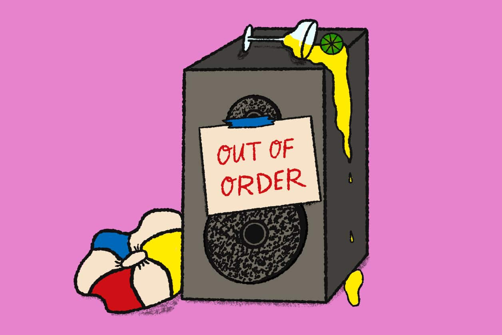

# The Washington Post - Breaking news and latest headlines, U.S. news, world news, and video - The Washington PostLoading...Loading...Loading...Loading...Loading...Loading...Loading...Loading...Loading...Loading...Loading...Loading...Loading...Loading...Loading...Loading...Loading...Loading...Loading...Loading...Loading...Loading...Loading...Loading...Loading...Loading...

**链接地址:** https://www.washingtonpost.com/world/the_americas/canadian-prime-minister-justin-trudeaus-wife-has-tested-positive-for-the-new-coronavirus/2020/03/12/d573660a-64cd-11ea-8a8e-5c5336b32760_story.html
**作者:** 
**获取时间:** 2025/8/28 20:17:02
**图片数量:** 10

---

## 原始HTML内容

<ul data-qa="header-nav-links-ul" class="wpds-c-bYGFCh"><li class="wpds-c-bcokwb"><a href="https://www.washingtonpost.com/politics/?itid=hp_top_nav_politics" class="wpds-c-kSOqLF wpds-c-kSOqLF-eFpUDx-variant-secondary wpds-c-kSOqLF-biynoz-density-compact wpds-c-kSOqLF-ejCoEP-icon-left wpds-c-kSOqLF-iobFYN-css">
Politics
</a></li><li class="wpds-c-bcokwb"><a href="https://www.washingtonpost.com/opinions/?itid=hp_top_nav_opinions" class="wpds-c-kSOqLF wpds-c-kSOqLF-eFpUDx-variant-secondary wpds-c-kSOqLF-biynoz-density-compact wpds-c-kSOqLF-ejCoEP-icon-left wpds-c-kSOqLF-iobFYN-css">
Opinions
</a></li><li class="wpds-c-bcokwb"><a href="https://www.washingtonpost.com/style/?itid=hp_top_nav_style" class="wpds-c-kSOqLF wpds-c-kSOqLF-eFpUDx-variant-secondary wpds-c-kSOqLF-biynoz-density-compact wpds-c-kSOqLF-ejCoEP-icon-left wpds-c-kSOqLF-iobFYN-css">
Style
</a></li><li class="wpds-c-bcokwb"><a href="https://www.washingtonpost.com/national/investigations/?itid=hp_top_nav_investigations" class="wpds-c-kSOqLF wpds-c-kSOqLF-eFpUDx-variant-secondary wpds-c-kSOqLF-biynoz-density-compact wpds-c-kSOqLF-ejCoEP-icon-left wpds-c-kSOqLF-iobFYN-css">
Investigations
</a></li><li class="wpds-c-bcokwb"><a href="https://www.washingtonpost.com/climate-environment/?itid=hp_top_nav_climate" class="wpds-c-kSOqLF wpds-c-kSOqLF-eFpUDx-variant-secondary wpds-c-kSOqLF-biynoz-density-compact wpds-c-kSOqLF-ejCoEP-icon-left wpds-c-kSOqLF-iobFYN-css">
Climate
</a></li><li class="wpds-c-bcokwb"><a href="https://www.washingtonpost.com/wellbeing/?itid=hp_top_nav_well+being" class="wpds-c-kSOqLF wpds-c-kSOqLF-eFpUDx-variant-secondary wpds-c-kSOqLF-biynoz-density-compact wpds-c-kSOqLF-ejCoEP-icon-left wpds-c-kSOqLF-iobFYN-css">
Well+Being
</a></li><li class="wpds-c-bcokwb"><a href="https://www.washingtonpost.com/business/?itid=hp_top_nav_business" class="wpds-c-kSOqLF wpds-c-kSOqLF-eFpUDx-variant-secondary wpds-c-kSOqLF-biynoz-density-compact wpds-c-kSOqLF-ejCoEP-icon-left wpds-c-kSOqLF-iobFYN-css">
Business
</a></li><li class="wpds-c-bcokwb"><a href="https://www.washingtonpost.com/business/technology/?itid=hp_top_nav_tech" class="wpds-c-kSOqLF wpds-c-kSOqLF-eFpUDx-variant-secondary wpds-c-kSOqLF-biynoz-density-compact wpds-c-kSOqLF-ejCoEP-icon-left wpds-c-kSOqLF-iobFYN-css">
Tech
</a></li><li class="wpds-c-bcokwb"><a href="https://www.washingtonpost.com/world/?itid=hp_top_nav_world" class="wpds-c-kSOqLF wpds-c-kSOqLF-eFpUDx-variant-secondary wpds-c-kSOqLF-biynoz-density-compact wpds-c-kSOqLF-ejCoEP-icon-left wpds-c-kSOqLF-iobFYN-css">
World
</a></li><li class="wpds-c-bcokwb"><a href="https://www.washingtonpost.com/local/?itid=hp_top_nav_d.c., md. &amp; va." class="wpds-c-kSOqLF wpds-c-kSOqLF-eFpUDx-variant-secondary wpds-c-kSOqLF-biynoz-density-compact wpds-c-kSOqLF-ejCoEP-icon-left wpds-c-kSOqLF-iobFYN-css">
D.C., Md. &amp; Va.
</a></li><li class="wpds-c-bcokwb"><a href="https://www.washingtonpost.com/sports/?itid=hp_top_nav_sports" class="wpds-c-kSOqLF wpds-c-kSOqLF-eFpUDx-variant-secondary wpds-c-kSOqLF-biynoz-density-compact wpds-c-kSOqLF-ejCoEP-icon-left wpds-c-kSOqLF-iobFYN-css">
Sports
</a></li><li class="wpds-c-bcokwb"><a href="https://www.washingtonpost.com/games/?itid=hp_top_nav_crosswords &amp; games" class="wpds-c-kSOqLF wpds-c-kSOqLF-eFpUDx-variant-secondary wpds-c-kSOqLF-biynoz-density-compact wpds-c-kSOqLF-ejCoEP-icon-left wpds-c-kSOqLF-iobFYN-css">
Crosswords &amp; Games
</a></li><li class="wpds-c-bcokwb"><a href="https://www.washingtonpost.com/ask-the-post-ai/?itid=hp_top_nav_ask the post ai" class="wpds-c-kSOqLF wpds-c-kSOqLF-eFpUDx-variant-secondary wpds-c-kSOqLF-biynoz-density-compact wpds-c-kSOqLF-ejCoEP-icon-left wpds-c-kSOqLF-iobFYN-css">
Ask The Post AI
</a></li></ul>

<h2 class="wpds-c-iiQaMf wpds-c-iiQaMf-iiBDqjX-css"><a data-pb-local-content-field="web_headline" href="https://www.washingtonpost.com/politics/2025/08/28/cdc-director-jim-oneill/">White House taps top RFK Jr. deputy as acting CDC director</a></h2>

<a href="https://www.washingtonpost.com/politics/2025/08/28/cdc-director-jim-oneill/">The selection of Jim O’Neill reflects Robert F. Kennedy Jr.’s influence as he seeks to remake federal vaccine policy.</a>

By <a href="https://www.washingtonpost.com/people/dan-diamond/">Dan Diamond</a>

<h2 class="wpds-c-iiQaMf wpds-c-iiQaMf-ihMULTC-css"><a data-pb-local-content-field="web_headline" href="https://www.washingtonpost.com/health/2025/08/28/rfk-cdc-director-susan-monarez-fired/">CDC leaders who resigned said RFK Jr. undermined vaccine science, risking lives</a></h2>

<h2 class="wpds-c-iiQaMf wpds-c-iiQaMf-ihMULTC-css"><a data-pb-local-content-field="web_headline" href="https://www.washingtonpost.com/health/2025/08/28/cdc-rfk-jr-susan-monarez-tensions-vaccines/">5 big collisions between RFK Jr. and CDC scientists before director was fired</a></h2>

<figure class="flex-feature mb-xxs is-vertical-art">
<!--$-->
<figure class="wpds-c-gPjxah">

</figure>
<!--/$-->
</figure>
(HyoJung Kim/The Post)

<a class="font-xxxxs font-bold   uppercase dib white label-link" href="https://www.washingtonpost.com/sports/2025/08/28/jim-irsay-colts-addiction-death/"><svg xmlns="http://www.w3.org/2000/svg" viewBox="0 0 93 81" fill="var(--wpds-colors-gray600)" aria-hidden="true" focusable="false" role="img" class="wpds-c-dqHmuS wpds-c-dqHmuS-icCXbrh-css hover-inherit" width="16" height="16"><path fill="var(--wpds-colors-primary, #111)" fill-rule="evenodd" d="m42.2 24.27-4.28-4.32-3.28 3.32v26.65l7.47 6.62.08-.07v-32.2zm-17.25 1-5.34-5.32-3.51 3.62V50l6.48 5.62 2.37-2.7zm59.4-13.49 8.65 8v33.76L79.61 63.78c-1.3-1.63-2.9-3.02-4.81-3.57v16.15l-.16.08-4.2-3.96-8.87 8.3-.16-.08V59.82a14.37 14.37 0 0 0-7.8 5.13l-.61-.39c.53-5.98 3.44-10.4 8.41-12.1V37.31h-1.6a4.03 4.03 0 0 0-4.06 3.26h-.91A9.6 9.6 0 0 1 54.3 37c0-3.8 2.52-6.68 6.65-6.68h.46v-8.38l-2.75-2.48-2.14 2.17-1.07-1.01 8.49-8.85 7.19 6.68v7.6l2.22-2.4v-8.93h1.45v7.37l9.56-10.32zm-11 13.35-2.22 2.33v43.7l2.22 2.1V25.12zM15.1 0l.68.62c-2.51 1.23-4.57 2.77-4.57 6.08 0 5.09 4.88 3.78 4.88 11.79v3.08l8.92-9.47 9.39 9.32 8.85-9.33 8.54 8.48v28.5L36.1 63.71l-10.6-9.25-8.1 9.25-10.98-9.55v-15.1H4.27c-1.9 0-2.82 1.15-3.13 2.7H.38c-.15-.62-.38-1.7-.38-2.93 0-2 .84-7.24 6.4-7.24V19.88c0-4.55-2.97-4.78-2.97-8.7C3.43 6.77 7.55 2.7 15.11 0zm63.74 19.16L74.8 23.5v28.18c3.6.46 6.27 1.7 8.49 4.11l.07-.08V23.35l-4.5-4.2z"></path></svg>Exclusive</a>

<h2 class="wpds-c-iiQaMf wpds-c-iiQaMf-iiBDqjX-css"><a data-pb-local-content-field="web_headline" href="https://www.washingtonpost.com/sports/2025/08/28/jim-irsay-colts-addiction-death/">In his final years, NFL owner secretly relapsed, got ketamine from private doctor</a></h2>

<a href="https://www.washingtonpost.com/sports/2025/08/28/jim-irsay-colts-addiction-death/">Colts owner Jim Irsay’s&nbsp;relapse and death came as he was under the care of a “luxury” recovery doctor prescribing opioids and, eventually, ketamine at amounts that worried people close to him, The Post found.</a>

By <a href="https://www.washingtonpost.com/people/will-hobson/">Will Hobson</a>, <a href="https://www.washingtonpost.com/people/albert-samaha/">Albert Samaha</a> and <a href="https://www.washingtonpost.com/people/sam-fortier/">Sam Fortier</a>

<figure class="flex-feature mb-xxs is-vertical-art">
<!--$-->
<figure class="wpds-c-gPjxah">

</figure>
<!--/$-->
</figure>
(Sam Fortier, Kyle Russo, Emma Grazado/The Post)

<h2 class="wpds-c-iiQaMf wpds-c-iiQaMf-ihMULTC-css"><a data-pb-local-content-field="web_headline" href="https://www.washingtonpost.com/newsletters/sportsmoment/">Sign up for the&nbsp;Sports Moment newsletter and get the most engaging sports stories of the week</a></h2>

<figure class="flex-feature mb-xxs">
<!--$-->
<figure class="wpds-c-gPjxah">

</figure>
<!--/$-->
</figure>
(Reuters)

<h2 class="wpds-c-iiQaMf wpds-c-iiQaMf-iiBDqjX-css"><a data-pb-local-content-field="web_headline" href="https://www.washingtonpost.com/nation/2025/08/28/minneapolis-catholic-school-shooting-victims-motive/">Minneapolis grieves for young shooting victims as police investigate motive</a></h2>

<a href="https://www.washingtonpost.com/nation/2025/08/28/minneapolis-catholic-school-shooting-victims-motive/">The father of one of the children killed in the attack at Annunciation Catholic Church in Minneapolis identified him as 8-year-old Fletcher Merkel.&nbsp;The second child who died was identified as 10-year-old Harper Moyski.</a>

By <a href="https://www.washingtonpost.com/people/hannah-knowles/">Hannah Knowles</a>, <!-- -->Sheila Regan<!-- -->, <a href="https://www.washingtonpost.com/people/praveena-somasundaram/">Praveena Somasundaram</a> and <a href="https://www.washingtonpost.com/people/kim-bellware/">Kim Bellware</a>1 hour ago

<figure data-qa="art-wrapper" class="w-100 mw-100 overflow-hidden relative pb-xs lh-0">

<figcaption class="gray-dark font-xxxxs left mt-xs font--meta-text lh-sm  mt-xs">(Post illustration; iStock)</figcaption></figure>

<h2 class="wpds-c-iiQaMf wpds-c-iiQaMf-iiBDqjX-css"><a data-pb-local-content-field="web_headline" href="https://www.washingtonpost.com/health/2025/08/28/fake-nurse-impostor-healthcare/">States are tracking ‘impostor’ nurses, a growing problem since the pandemic</a></h2>

<a href="https://www.washingtonpost.com/health/2025/08/28/fake-nurse-impostor-healthcare/">Aliases in different states. A contract under a classmate’s name. Experts say a challenging form of health-care fraud is endangering patients.</a>

By <a href="https://www.washingtonpost.com/people/annabelle-timsit/">Annabelle Timsit</a>

<a class="font-xxxs font-bold     offblack hover-gray-dark label-link" href="https://www.washingtonpost.com/nation/2024/05/01/school-cellphones-confiscate/">From the Archives</a>

<h2 class="wpds-c-iiQaMf wpds-c-iiQaMf-ihMULTC-css"><a data-pb-local-content-field="web_headline" href="https://www.washingtonpost.com/nation/2024/05/01/school-cellphones-confiscate/">How a Connecticut middle school won the battle against cellphones — with unexpected results</a></h2>

<h2 class="wpds-c-iiQaMf wpds-c-iiQaMf-iiBDqjX-css"><a data-pb-local-content-field="web_headline" href="https://www.washingtonpost.com/education/2025/08/27/school-cellphone-bans-analog-entertainment-games/">In phone-free schools, analog entertainment brings lunchrooms to life</a></h2>

<a href="https://www.washingtonpost.com/education/2025/08/27/school-cellphone-bans-analog-entertainment-games/">“Our cafeteria is loud again,” said one social studies teacher whose school offers foosball, ping-pong and more.</a>

By <a href="https://www.washingtonpost.com/people/marie-rose-sheinerman/">Marie-Rose Sheinerman</a>

<figure class="flex-feature mb-xxs is-vertical-art">
<!--$-->
<figure class="wpds-c-gPjxah">

</figure>
<!--/$-->
</figure>
(HyoJung Kim/The Post)

<figure data-qa="art-wrapper" class="w-100 mw-100 overflow-hidden relative pb-xs lh-0">

<figcaption class="gray-dark font-xxxxs left mt-xs font--meta-text lh-sm  mt-xs">(Chelsea Conrad/The Post)</figcaption></figure>

<a class="font-xxxs font-bold    dib mr-xs offblack hover-gray-dark label-link" href="https://www.washingtonpost.com/entertainment/music/2025/08/28/song-of-the-summer/">Column</a> <a href="https://www.washingtonpost.com/people/michael-brodeur/">Michael Andor Brodeur</a>

<h2 class="wpds-c-iiQaMf wpds-c-iiQaMf-iiBDqjX-css"><a data-pb-local-content-field="web_headline" href="https://www.washingtonpost.com/entertainment/music/2025/08/28/song-of-the-summer/">You’ll never, ever guess this year’s song of the summer. (Hint: It’s from 2015.)</a></h2>

<a href="https://www.washingtonpost.com/entertainment/music/2025/08/28/song-of-the-summer/">Last year had “Espresso.” This year ... did not. But one glorious song — one sound, anyway — has captured this summer′s strange vibes.</a>

<figure class="flex-feature mb-xxs">
<!--$-->
<figure class="wpds-c-gPjxah">

</figure>
<!--/$-->
</figure>
(TikTok @baileyupchurchmua, @flutterhabit, @coopsauce)

<h2 class="wpds-c-iiQaMf wpds-c-iiQaMf-iiBDqjX-css"><a data-pb-local-content-field="web_headline" href="https://www.washingtonpost.com/style/trends/2025/08/28/taylor-swift-engagement-freakout/">Why the world flipped out when Taylor Swift got engaged</a></h2>

<a href="https://www.washingtonpost.com/style/trends/2025/08/28/taylor-swift-engagement-freakout/">Fans are naturally interested in celebrity love lives. But this was different: “Why am I crying over someone I don’t even know?”</a>

By <a href="https://www.washingtonpost.com/people/emily-yahr/">Emily Yahr</a>

<a class="font-xxxs font-bold     offblack hover-gray-dark label-link" href="https://www.washingtonpost.com/ask-the-post-ai/">Ask The Post AI</a>

<h2 class="wpds-c-iiQaMf wpds-c-iiQaMf-igAanjn-css"><a data-pb-local-content-field="web_headline" href="https://www.washingtonpost.com/ask-the-post-ai/">Answers to your questions, powered by our reporting</a></h2>

<a href="https://www.washingtonpost.com/ask-the-post-ai/">Chat with Ask The Post to learn more, dig deeper, and explore what matters to you.</a>

<a class="font-xxs font-bold    is-opinion black hover-gray-dark label-link" href="https://www.washingtonpost.com/opinions/">Opinions<svg xmlns="http://www.w3.org/2000/svg" viewBox="0 0 16 16" fill="var(--wpds-colors-gray0)" aria-hidden="true" focusable="false" role="img" class="wpds-c-cBCHDh wpds-c-cBCHDh-iPJLV-css hover-inherit hover-fill-gray-dark" width="16" height="16"><path d="m6 12.62-.71-.71L9.25 8 5.33 4.09 6 3.38 10.67 8Z"></path></svg></a>

 <a href="https://www.washingtonpost.com/people/ramesh-ponnuru/">Ramesh Ponnuru</a>

<h2 class="wpds-c-iiQaMf wpds-c-iiQaMf-ihMULTC-css"><a data-pb-local-content-field="web_headline" href="https://www.washingtonpost.com/opinions/2025/08/28/taylor-swift-travis-kelce-capstone-marriage/">Taylor Swift and Travis Kelce are the ultimate capstone marriage</a></h2>

 <a href="https://www.washingtonpost.com/opinions/the-posts-view/">Editorial Board</a>

<h2 class="wpds-c-iiQaMf wpds-c-iiQaMf-ihMULTC-css"><a data-pb-local-content-field="web_headline" href="https://www.washingtonpost.com/opinions/2025/08/28/kennedy-monarez-cdc-director-vaccines/">RFK Jr. cannot be contained</a></h2>

 Eddie Ellis

<h2 class="wpds-c-iiQaMf wpds-c-iiQaMf-ihMULTC-css"><a data-pb-local-content-field="web_headline" href="https://www.washingtonpost.com/opinions/2025/08/28/dc-juvenile-crime-second-chance-law/">I was incarcerated as a child. D.C.’s second-chance laws changed my life.</a></h2>

 Ian Birrell

<h2 class="wpds-c-iiQaMf wpds-c-iiQaMf-ihMULTC-css"><a data-pb-local-content-field="web_headline" href="https://www.washingtonpost.com/opinions/2025/08/28/new-orleans-schools-hurricane-katrina/">‘Never seen before’: How Katrina set off an education revolution</a></h2>

 Letters to the Editor

<h2 class="wpds-c-iiQaMf wpds-c-iiQaMf-ihMULTC-css"><a data-pb-local-content-field="web_headline" href="https://www.washingtonpost.com/opinions/2025/08/28/trump-artificial-intelligence-college-athletes/">AI is teaching students in Virginia. I’m concerned. </a></h2>

 <a href="https://www.washingtonpost.com/people/michael-ramirez/">Michael Ramirez</a>

<h2 class="wpds-c-iiQaMf wpds-c-iiQaMf-ihMULTC-css"><a data-pb-local-content-field="web_headline" href="https://www.washingtonpost.com/opinions/2025/08/28/michael-ramirez-cartoon-kennedy-cdc-vaccines/">Cartoon: Bad medicine</a></h2>

 <a href="https://www.washingtonpost.com/opinions/the-posts-view/">Editorial Board</a>

<h2 class="wpds-c-iiQaMf wpds-c-iiQaMf-ihMULTC-css"><a data-pb-local-content-field="web_headline" href="https://www.washingtonpost.com/opinions/2025/08/28/de-minimis-exemption-removal-trump-imports/">Ending the ‘de minimis’ tax exemption didn’t need to be so chaotic</a></h2>

 <a href="https://www.washingtonpost.com/people/marc-fisher/">Marc Fisher</a>

<h2 class="wpds-c-iiQaMf wpds-c-iiQaMf-ihMULTC-css"><a data-pb-local-content-field="web_headline" href="https://www.washingtonpost.com/opinions/2025/08/28/trump-dc-crime-police/">Trump’s bravado is no match for crooks and rats</a></h2>

Advertisement

Advertisement

Advertisement

More Top Stories

<figure data-qa="art-wrapper" class="w-100 mw-100 overflow-hidden relative pb-xs lh-0">
<a href="https://www.washingtonpost.com/politics/2025/08/28/newsom-trump-crime-red-states/" class="art-link">
<svg aria-labelledby="ImageLoader-496x331-aria" role="img" viewBox="0 0 496 331"><title id="ImageLoader-496x331-aria">Loading...</title><rect role="presentation" x="0" y="0" width="100%" height="100%" clip-path="url(#ImageLoader-496x331-diff)" style="fill:url(#ImageLoader-496x331-animated-diff)"></rect><defs><clipPath id="ImageLoader-496x331-diff"><rect x="0" y="0" width="496" height="331"></rect></clipPath><linearGradient id="ImageLoader-496x331-animated-diff"><stop offset="0%" stop-color="var(--wpds-colors-gray400)" stop-opacity="1"></stop><stop offset="50%" stop-color="var(--wpds-colors-gray400)" stop-opacity="1"></stop><stop offset="100%" stop-color="var(--wpds-colors-gray400)" stop-opacity="1"></stop></linearGradient></defs></svg>
</a>
<figcaption class="gray-dark font-xxxxs left mt-xs font--meta-text lh-sm  mt-xs">(Fred Greaves/Reuters)</figcaption></figure>
<h2 class="wpds-c-iiQaMf wpds-c-iiQaMf-igAanjn-css"><a data-pb-local-content-field="web_headline" href="https://www.washingtonpost.com/politics/2025/08/28/newsom-trump-crime-red-states/">Newsom: Crime is a larger problem in GOP-led areas than Democratic-led ones</a></h2>

<h2 class="wpds-c-iiQaMf wpds-c-iiQaMf-ikPypom-css"><a data-pb-local-content-field="web_headline" href="https://www.washingtonpost.com/world/2025/08/28/kyiv-attack-russia-trump-putin/">E.U. furious as deadly Russian attack damages its Kyiv offices</a></h2>

<h2 class="wpds-c-iiQaMf wpds-c-iiQaMf-ikPypom-css"><a data-pb-local-content-field="web_headline" href="https://www.washingtonpost.com/business/2025/08/28/voa-director-kari-lake-trump/">Judge blocks Kari Lake, tasked to dismantle VOA, from firing its director</a></h2>

<h2 class="wpds-c-iiQaMf wpds-c-iiQaMf-ikPypom-css"><a data-pb-local-content-field="web_headline" href="https://www.washingtonpost.com/dc-md-va/2025/08/28/cold-case-killing-dna/">Cold case killer gets 22 years for murdering ex-girlfriend’s mother </a></h2>

<h2 class="wpds-c-iiQaMf wpds-c-iiQaMf-ikPypom-css"><a data-pb-local-content-field="web_headline" href="https://www.washingtonpost.com/dc-md-va/2025/08/28/ashli-babbitt-military-honors-funeral/">Air Force offers military funeral honors to Ashli Babbitt, who was shot while breaching Capitol on Jan. 6</a></h2>

<h2 class="wpds-c-iiQaMf wpds-c-iiQaMf-ikPypom-css"><a data-pb-local-content-field="web_headline" href="https://www.washingtonpost.com/politics/2025/08/28/trump-republican-convention-midterm-elections/">Trump floats unusual Republican National Convention before midterms</a></h2>

<h2 class="wpds-c-iiQaMf wpds-c-iiQaMf-ikPypom-css"><a data-pb-local-content-field="web_headline" href="https://www.washingtonpost.com/business/2025/08/28/de-minimis-expiration-shipping-prices-consumers/">‘De minimis’ loophole is ending; here’s what it means for online orders </a></h2>

Most Read

1

<h2 class="wpds-c-iiQaMf wpds-c-iiQaMf-iciJYMJ-css"><a data-pb-local-content-field="web_headline" href="https://www.washingtonpost.com/politics/2025/08/28/cdc-director-jim-oneill/">White House taps top RFK Jr. deputy as acting CDC director</a></h2>

2

<a class="font-xxxxs font-bold   uppercase dib white label-link" href="https://www.washingtonpost.com/sports/2025/08/28/jim-irsay-colts-addiction-death/"><svg xmlns="http://www.w3.org/2000/svg" viewBox="0 0 93 81" fill="var(--wpds-colors-gray600)" aria-hidden="true" focusable="false" role="img" class="wpds-c-dqHmuS wpds-c-dqHmuS-icCXbrh-css hover-inherit" width="16" height="16"><path fill="var(--wpds-colors-primary, #111)" fill-rule="evenodd" d="m42.2 24.27-4.28-4.32-3.28 3.32v26.65l7.47 6.62.08-.07v-32.2zm-17.25 1-5.34-5.32-3.51 3.62V50l6.48 5.62 2.37-2.7zm59.4-13.49 8.65 8v33.76L79.61 63.78c-1.3-1.63-2.9-3.02-4.81-3.57v16.15l-.16.08-4.2-3.96-8.87 8.3-.16-.08V59.82a14.37 14.37 0 0 0-7.8 5.13l-.61-.39c.53-5.98 3.44-10.4 8.41-12.1V37.31h-1.6a4.03 4.03 0 0 0-4.06 3.26h-.91A9.6 9.6 0 0 1 54.3 37c0-3.8 2.52-6.68 6.65-6.68h.46v-8.38l-2.75-2.48-2.14 2.17-1.07-1.01 8.49-8.85 7.19 6.68v7.6l2.22-2.4v-8.93h1.45v7.37l9.56-10.32zm-11 13.35-2.22 2.33v43.7l2.22 2.1V25.12zM15.1 0l.68.62c-2.51 1.23-4.57 2.77-4.57 6.08 0 5.09 4.88 3.78 4.88 11.79v3.08l8.92-9.47 9.39 9.32 8.85-9.33 8.54 8.48v28.5L36.1 63.71l-10.6-9.25-8.1 9.25-10.98-9.55v-15.1H4.27c-1.9 0-2.82 1.15-3.13 2.7H.38c-.15-.62-.38-1.7-.38-2.93 0-2 .84-7.24 6.4-7.24V19.88c0-4.55-2.97-4.78-2.97-8.7C3.43 6.77 7.55 2.7 15.11 0zm63.74 19.16L74.8 23.5v28.18c3.6.46 6.27 1.7 8.49 4.11l.07-.08V23.35l-4.5-4.2z"></path></svg>Exclusive</a>

<h2 class="wpds-c-iiQaMf wpds-c-iiQaMf-iciJYMJ-css"><a data-pb-local-content-field="web_headline" href="https://www.washingtonpost.com/sports/2025/08/28/jim-irsay-colts-addiction-death/">NFL owner secretly relapsed, got ketamine from private doctor before death </a></h2>

3

<a class="font-xxxs font-bold    dib mr-xs is-opinion offblack hover-gray-dark label-link" href="https://www.washingtonpost.com/opinions/2025/08/28/kennedy-monarez-cdc-director-vaccines/">Opinion</a> <a href="https://www.washingtonpost.com/opinions/the-posts-view/">Editorial Board</a>

<h2 class="wpds-c-iiQaMf wpds-c-iiQaMf-iciJYMJ-css"><a data-pb-local-content-field="web_headline" href="https://www.washingtonpost.com/opinions/2025/08/28/kennedy-monarez-cdc-director-vaccines/">RFK Jr. cannot be contained</a></h2>

4

<h2 class="wpds-c-iiQaMf wpds-c-iiQaMf-iciJYMJ-css"><a data-pb-local-content-field="web_headline" href="https://www.washingtonpost.com/health/2025/08/28/rfk-cdc-director-susan-monarez-fired/">CDC leaders who resigned said RFK Jr. undermined vaccine science, risking lives</a></h2>

<a class="font-xxs font-bold     black hover-gray-dark label-link" href="https://www.washingtonpost.com/latest-headlines/">Latest from The Post<svg xmlns="http://www.w3.org/2000/svg" viewBox="0 0 16 16" fill="var(--wpds-colors-gray0)" aria-hidden="true" focusable="false" role="img" class="wpds-c-cBCHDh wpds-c-cBCHDh-iPJLV-css hover-inherit hover-fill-gray-dark" width="16" height="16"><path d="m6 12.62-.71-.71L9.25 8 5.33 4.09 6 3.38 10.67 8Z"></path></svg></a>

<a href="https://www.washingtonpost.com/nation/2025/08/28/minneapolis-catholic-school-shooting-victims-motive/" class="art-link">
<svg aria-labelledby="ImageLoader-100x100-aria" role="img" viewBox="0 0 100 100"><title id="ImageLoader-100x100-aria">Loading...</title><rect role="presentation" x="0" y="0" width="100%" height="100%" clip-path="url(#ImageLoader-100x100-diff)" style="fill:url(#ImageLoader-100x100-animated-diff)"></rect><defs><clipPath id="ImageLoader-100x100-diff"><rect x="0" y="0" width="100" height="100"></rect></clipPath><linearGradient id="ImageLoader-100x100-animated-diff"><stop offset="0%" stop-color="var(--wpds-colors-gray400)" stop-opacity="1"></stop><stop offset="50%" stop-color="var(--wpds-colors-gray400)" stop-opacity="1"></stop><stop offset="100%" stop-color="var(--wpds-colors-gray400)" stop-opacity="1"></stop></linearGradient></defs></svg>
</a>

<h2 class="wpds-c-iiQaMf wpds-c-iiQaMf-ihMULTC-css"><a data-pb-local-content-field="web_headline" href="https://www.washingtonpost.com/nation/2025/08/28/minneapolis-catholic-school-shooting-victims-motive/">Minneapolis grieves for young shooting victims as police investigate motive</a></h2>

1 hour ago

<a href="https://www.washingtonpost.com/entertainment/2025/08/28/trump-executive-order-classical-architecture/" class="art-link">
<svg aria-labelledby="ImageLoader-100x100-aria" role="img" viewBox="0 0 100 100"><title id="ImageLoader-100x100-aria">Loading...</title><rect role="presentation" x="0" y="0" width="100%" height="100%" clip-path="url(#ImageLoader-100x100-diff)" style="fill:url(#ImageLoader-100x100-animated-diff)"></rect><defs><clipPath id="ImageLoader-100x100-diff"><rect x="0" y="0" width="100" height="100"></rect></clipPath><linearGradient id="ImageLoader-100x100-animated-diff"><stop offset="0%" stop-color="var(--wpds-colors-gray400)" stop-opacity="1"></stop><stop offset="50%" stop-color="var(--wpds-colors-gray400)" stop-opacity="1"></stop><stop offset="100%" stop-color="var(--wpds-colors-gray400)" stop-opacity="1"></stop></linearGradient></defs></svg>
</a>

<h2 class="wpds-c-iiQaMf wpds-c-iiQaMf-ihMULTC-css"><a data-pb-local-content-field="web_headline" href="https://www.washingtonpost.com/entertainment/2025/08/28/trump-executive-order-classical-architecture/">Trump orders classical architecture for federal buildings</a></h2>

<a href="https://www.washingtonpost.com/dc-md-va/2025/08/28/ashli-babbitt-military-honors-funeral/" class="art-link">
<svg aria-labelledby="ImageLoader-100x100-aria" role="img" viewBox="0 0 100 100"><title id="ImageLoader-100x100-aria">Loading...</title><rect role="presentation" x="0" y="0" width="100%" height="100%" clip-path="url(#ImageLoader-100x100-diff)" style="fill:url(#ImageLoader-100x100-animated-diff)"></rect><defs><clipPath id="ImageLoader-100x100-diff"><rect x="0" y="0" width="100" height="100"></rect></clipPath><linearGradient id="ImageLoader-100x100-animated-diff"><stop offset="0%" stop-color="var(--wpds-colors-gray400)" stop-opacity="1"></stop><stop offset="50%" stop-color="var(--wpds-colors-gray400)" stop-opacity="1"></stop><stop offset="100%" stop-color="var(--wpds-colors-gray400)" stop-opacity="1"></stop></linearGradient></defs></svg>
</a>

<h2 class="wpds-c-iiQaMf wpds-c-iiQaMf-ihMULTC-css"><a data-pb-local-content-field="web_headline" href="https://www.washingtonpost.com/dc-md-va/2025/08/28/ashli-babbitt-military-honors-funeral/">Air Force offers military funeral honors to Ashli Babbitt </a></h2>

<a href="https://www.washingtonpost.com/wellness/2025/08/28/board-games-knee-pain-eczema/" class="art-link">
<svg aria-labelledby="ImageLoader-100x100-aria" role="img" viewBox="0 0 100 100"><title id="ImageLoader-100x100-aria">Loading...</title><rect role="presentation" x="0" y="0" width="100%" height="100%" clip-path="url(#ImageLoader-100x100-diff)" style="fill:url(#ImageLoader-100x100-animated-diff)"></rect><defs><clipPath id="ImageLoader-100x100-diff"><rect x="0" y="0" width="100" height="100"></rect></clipPath><linearGradient id="ImageLoader-100x100-animated-diff"><stop offset="0%" stop-color="var(--wpds-colors-gray400)" stop-opacity="1"></stop><stop offset="50%" stop-color="var(--wpds-colors-gray400)" stop-opacity="1"></stop><stop offset="100%" stop-color="var(--wpds-colors-gray400)" stop-opacity="1"></stop></linearGradient></defs></svg>
</a>

<h2 class="wpds-c-iiQaMf wpds-c-iiQaMf-ihMULTC-css"><a data-pb-local-content-field="web_headline" href="https://www.washingtonpost.com/wellness/2025/08/28/board-games-knee-pain-eczema/">Board games, knee pain and itchy eczema: The Week in Well+Being</a></h2>

<a href="https://www.washingtonpost.com/sports/2025/08/28/mclaurin-daniels-relationship/" class="art-link">
<svg aria-labelledby="ImageLoader-100x100-aria" role="img" viewBox="0 0 100 100"><title id="ImageLoader-100x100-aria">Loading...</title><rect role="presentation" x="0" y="0" width="100%" height="100%" clip-path="url(#ImageLoader-100x100-diff)" style="fill:url(#ImageLoader-100x100-animated-diff)"></rect><defs><clipPath id="ImageLoader-100x100-diff"><rect x="0" y="0" width="100" height="100"></rect></clipPath><linearGradient id="ImageLoader-100x100-animated-diff"><stop offset="0%" stop-color="var(--wpds-colors-gray400)" stop-opacity="1"></stop><stop offset="50%" stop-color="var(--wpds-colors-gray400)" stop-opacity="1"></stop><stop offset="100%" stop-color="var(--wpds-colors-gray400)" stop-opacity="1"></stop></linearGradient></defs></svg>
</a>

<h2 class="wpds-c-iiQaMf wpds-c-iiQaMf-ihMULTC-css"><a data-pb-local-content-field="web_headline" href="https://www.washingtonpost.com/sports/2025/08/28/mclaurin-daniels-relationship/">During choppy summer, Terry McLaurin never lost connection with Jayden Daniels</a></h2>

<a href="https://www.washingtonpost.com/politics/2025/08/28/newsom-trump-crime-red-states/" class="art-link">
<svg aria-labelledby="ImageLoader-100x100-aria" role="img" viewBox="0 0 100 100"><title id="ImageLoader-100x100-aria">Loading...</title><rect role="presentation" x="0" y="0" width="100%" height="100%" clip-path="url(#ImageLoader-100x100-diff)" style="fill:url(#ImageLoader-100x100-animated-diff)"></rect><defs><clipPath id="ImageLoader-100x100-diff"><rect x="0" y="0" width="100" height="100"></rect></clipPath><linearGradient id="ImageLoader-100x100-animated-diff"><stop offset="0%" stop-color="var(--wpds-colors-gray400)" stop-opacity="1"></stop><stop offset="50%" stop-color="var(--wpds-colors-gray400)" stop-opacity="1"></stop><stop offset="100%" stop-color="var(--wpds-colors-gray400)" stop-opacity="1"></stop></linearGradient></defs></svg>
</a>

<h2 class="wpds-c-iiQaMf wpds-c-iiQaMf-ihMULTC-css"><a data-pb-local-content-field="web_headline" href="https://www.washingtonpost.com/politics/2025/08/28/newsom-trump-crime-red-states/">Newsom: Crime is a larger problem in GOP-led areas than Democratic-led ones</a></h2>

<a href="https://www.washingtonpost.com/dc-md-va/2025/08/28/schools-youngkin-virginia-george-mason/" class="art-link">
<svg aria-labelledby="ImageLoader-100x100-aria" role="img" viewBox="0 0 100 100"><title id="ImageLoader-100x100-aria">Loading...</title><rect role="presentation" x="0" y="0" width="100%" height="100%" clip-path="url(#ImageLoader-100x100-diff)" style="fill:url(#ImageLoader-100x100-animated-diff)"></rect><defs><clipPath id="ImageLoader-100x100-diff"><rect x="0" y="0" width="100" height="100"></rect></clipPath><linearGradient id="ImageLoader-100x100-animated-diff"><stop offset="0%" stop-color="var(--wpds-colors-gray400)" stop-opacity="1"></stop><stop offset="50%" stop-color="var(--wpds-colors-gray400)" stop-opacity="1"></stop><stop offset="100%" stop-color="var(--wpds-colors-gray400)" stop-opacity="1"></stop></linearGradient></defs></svg>
</a>

<h2 class="wpds-c-iiQaMf wpds-c-iiQaMf-ihMULTC-css"><a data-pb-local-content-field="web_headline" href="https://www.washingtonpost.com/dc-md-va/2025/08/28/schools-youngkin-virginia-george-mason/">Virginia Democrats reject more of Youngkin’s picks for college boards</a></h2>

<a href="https://www.washingtonpost.com/politics/2025/08/28/trump-utah-congress-redistricting/" class="art-link">
<svg aria-labelledby="ImageLoader-100x100-aria" role="img" viewBox="0 0 100 100"><title id="ImageLoader-100x100-aria">Loading...</title><rect role="presentation" x="0" y="0" width="100%" height="100%" clip-path="url(#ImageLoader-100x100-diff)" style="fill:url(#ImageLoader-100x100-animated-diff)"></rect><defs><clipPath id="ImageLoader-100x100-diff"><rect x="0" y="0" width="100" height="100"></rect></clipPath><linearGradient id="ImageLoader-100x100-animated-diff"><stop offset="0%" stop-color="var(--wpds-colors-gray400)" stop-opacity="1"></stop><stop offset="50%" stop-color="var(--wpds-colors-gray400)" stop-opacity="1"></stop><stop offset="100%" stop-color="var(--wpds-colors-gray400)" stop-opacity="1"></stop></linearGradient></defs></svg>
</a>

<h2 class="wpds-c-iiQaMf wpds-c-iiQaMf-ihMULTC-css"><a data-pb-local-content-field="web_headline" href="https://www.washingtonpost.com/politics/2025/08/28/trump-utah-congress-redistricting/">Utah to proceed with redrawing map that could help Dems, despite pressure from Trump</a></h2>

Your Weekend

<a href="https://www.washingtonpost.com/entertainment/movies/2025/08/28/roses-cumberbatch-colman-remake-review/" class="art-link">
<svg aria-labelledby="ImageLoader-298x199-aria" role="img" viewBox="0 0 298 199"><title id="ImageLoader-298x199-aria">Loading...</title><rect role="presentation" x="0" y="0" width="100%" height="100%" clip-path="url(#ImageLoader-298x199-diff)" style="fill:url(#ImageLoader-298x199-animated-diff)"></rect><defs><clipPath id="ImageLoader-298x199-diff"><rect x="0" y="0" width="298" height="199"></rect></clipPath><linearGradient id="ImageLoader-298x199-animated-diff"><stop offset="0%" stop-color="var(--wpds-colors-gray400)" stop-opacity="1"></stop><stop offset="50%" stop-color="var(--wpds-colors-gray400)" stop-opacity="1"></stop><stop offset="100%" stop-color="var(--wpds-colors-gray400)" stop-opacity="1"></stop></linearGradient></defs></svg>
</a>

<a class="font-xxxs font-bold    dib mr-xs offblack hover-gray-dark label-link" href="https://www.washingtonpost.com/entertainment/movies/2025/08/28/roses-cumberbatch-colman-remake-review/">Movie Review</a> <a href="https://www.washingtonpost.com/people/ty-burr/">Ty Burr</a>

<h2 class="wpds-c-iiQaMf wpds-c-iiQaMf-ihMULTC-css"><a data-pb-local-content-field="web_headline" href="https://www.washingtonpost.com/entertainment/movies/2025/08/28/roses-cumberbatch-colman-remake-review/">‘The Roses’ is a mismatch of British wit and American slapstick</a></h2>

<a href="https://www.washingtonpost.com/entertainment/movies/2025/08/28/wizard-of-oz-sphere-vegas/" class="art-link">
<svg aria-labelledby="ImageLoader-298x199-aria" role="img" viewBox="0 0 298 199"><title id="ImageLoader-298x199-aria">Loading...</title><rect role="presentation" x="0" y="0" width="100%" height="100%" clip-path="url(#ImageLoader-298x199-diff)" style="fill:url(#ImageLoader-298x199-animated-diff)"></rect><defs><clipPath id="ImageLoader-298x199-diff"><rect x="0" y="0" width="298" height="199"></rect></clipPath><linearGradient id="ImageLoader-298x199-animated-diff"><stop offset="0%" stop-color="var(--wpds-colors-gray400)" stop-opacity="1"></stop><stop offset="50%" stop-color="var(--wpds-colors-gray400)" stop-opacity="1"></stop><stop offset="100%" stop-color="var(--wpds-colors-gray400)" stop-opacity="1"></stop></linearGradient></defs></svg>
</a>

<h2 class="wpds-c-iiQaMf wpds-c-iiQaMf-ihMULTC-css"><a data-pb-local-content-field="web_headline" href="https://www.washingtonpost.com/entertainment/movies/2025/08/28/wizard-of-oz-sphere-vegas/">How do you make ‘Wizard of Oz’ work at the Sphere? We had to see for ourselves.</a></h2>

<a href="https://www.washingtonpost.com/entertainment/tv/2025/08/23/alien-earth-series-movies-lore-explained/" class="art-link">
<svg aria-labelledby="ImageLoader-298x199-aria" role="img" viewBox="0 0 298 199"><title id="ImageLoader-298x199-aria">Loading...</title><rect role="presentation" x="0" y="0" width="100%" height="100%" clip-path="url(#ImageLoader-298x199-diff)" style="fill:url(#ImageLoader-298x199-animated-diff)"></rect><defs><clipPath id="ImageLoader-298x199-diff"><rect x="0" y="0" width="298" height="199"></rect></clipPath><linearGradient id="ImageLoader-298x199-animated-diff"><stop offset="0%" stop-color="var(--wpds-colors-gray400)" stop-opacity="1"></stop><stop offset="50%" stop-color="var(--wpds-colors-gray400)" stop-opacity="1"></stop><stop offset="100%" stop-color="var(--wpds-colors-gray400)" stop-opacity="1"></stop></linearGradient></defs></svg>
</a>

<a class="font-xxxs font-bold    dib mr-xs offblack hover-gray-dark label-link" href="https://www.washingtonpost.com/entertainment/tv/2025/08/23/alien-earth-series-movies-lore-explained/">Analysis</a> <a href="https://www.washingtonpost.com/people/chris-klimek/">Chris Klimek</a>

<h2 class="wpds-c-iiQaMf wpds-c-iiQaMf-ihMULTC-css"><a data-pb-local-content-field="web_headline" href="https://www.washingtonpost.com/entertainment/tv/2025/08/23/alien-earth-series-movies-lore-explained/">There are decades of Alien lore. Here’s where the new series fits in.</a></h2>

<a href="https://www.washingtonpost.com/books/2025/08/24/cazalet-chronicles/" class="art-link">
<svg aria-labelledby="ImageLoader-298x199-aria" role="img" viewBox="0 0 298 199"><title id="ImageLoader-298x199-aria">Loading...</title><rect role="presentation" x="0" y="0" width="100%" height="100%" clip-path="url(#ImageLoader-298x199-diff)" style="fill:url(#ImageLoader-298x199-animated-diff)"></rect><defs><clipPath id="ImageLoader-298x199-diff"><rect x="0" y="0" width="298" height="199"></rect></clipPath><linearGradient id="ImageLoader-298x199-animated-diff"><stop offset="0%" stop-color="var(--wpds-colors-gray400)" stop-opacity="1"></stop><stop offset="50%" stop-color="var(--wpds-colors-gray400)" stop-opacity="1"></stop><stop offset="100%" stop-color="var(--wpds-colors-gray400)" stop-opacity="1"></stop></linearGradient></defs></svg>
</a>

<h2 class="wpds-c-iiQaMf wpds-c-iiQaMf-ihMULTC-css"><a data-pb-local-content-field="web_headline" href="https://www.washingtonpost.com/books/2025/08/24/cazalet-chronicles/">Why is everyone reading these hard-to-find British war novels?</a></h2>

Advertisement

Advertisement

<a class="font-xxs font-bold     black hover-gray-dark label-link" href="https://www.washingtonpost.com/politics/">Politics &amp; Government<svg xmlns="http://www.w3.org/2000/svg" viewBox="0 0 16 16" fill="var(--wpds-colors-gray0)" aria-hidden="true" focusable="false" role="img" class="wpds-c-cBCHDh wpds-c-cBCHDh-iPJLV-css hover-inherit hover-fill-gray-dark" width="16" height="16"><path d="m6 12.62-.71-.71L9.25 8 5.33 4.09 6 3.38 10.67 8Z"></path></svg></a>

<figure data-qa="art-wrapper" class="w-100 mw-100 overflow-hidden relative pb-xs lh-0">
<a href="https://www.washingtonpost.com/politics/2025/08/28/cook-sues-trump-fed-firing/" class="art-link">
<svg aria-labelledby="ImageLoader-496x331-aria" role="img" viewBox="0 0 496 331"><title id="ImageLoader-496x331-aria">Loading...</title><rect role="presentation" x="0" y="0" width="100%" height="100%" clip-path="url(#ImageLoader-496x331-diff)" style="fill:url(#ImageLoader-496x331-animated-diff)"></rect><defs><clipPath id="ImageLoader-496x331-diff"><rect x="0" y="0" width="496" height="331"></rect></clipPath><linearGradient id="ImageLoader-496x331-animated-diff"><stop offset="0%" stop-color="var(--wpds-colors-gray400)" stop-opacity="1"></stop><stop offset="50%" stop-color="var(--wpds-colors-gray400)" stop-opacity="1"></stop><stop offset="100%" stop-color="var(--wpds-colors-gray400)" stop-opacity="1"></stop></linearGradient></defs></svg>
</a>
<figcaption class="gray-dark font-xxxxs left mt-xs font--meta-text lh-sm  mt-xs">(Mark Schiefelbein/AP)</figcaption></figure>

<h2 class="wpds-c-iiQaMf wpds-c-iiQaMf-igAanjn-css"><a data-pb-local-content-field="web_headline" href="https://www.washingtonpost.com/politics/2025/08/28/cook-sues-trump-fed-firing/">Fed governor Lisa Cook sues Trump to block effort to remove her</a></h2>

<a href="https://www.washingtonpost.com/politics/2025/08/28/cook-sues-trump-fed-firing/">The move sets up a legal clash that could determine the Fed’s ability to continue operating outside White House control.</a>

By <a href="https://www.washingtonpost.com/people/andrew-ackerman/">Andrew Ackerman</a> and <a href="https://www.washingtonpost.com/people/rachel-siegel/">Rachel Siegel</a>

<h2 class="wpds-c-iiQaMf wpds-c-iiQaMf-ikPypom-css"><a data-pb-local-content-field="web_headline" href="https://www.washingtonpost.com/politics/2025/08/28/trump-utah-congress-redistricting/">Utah to proceed with redrawing map that could help Democrats, despite pressure from Trump</a></h2>

<a class="font-xxxs font-bold    dib mr-xs offblack hover-gray-dark label-link" href="https://www.washingtonpost.com/politics/2025/08/28/tariffs-trump-india-de-minimis-voters/">Column</a> <a href="https://www.washingtonpost.com/people/paul-kane/">Paul Kane</a>

<h2 class="wpds-c-iiQaMf wpds-c-iiQaMf-ikPypom-css"><a data-pb-local-content-field="web_headline" href="https://www.washingtonpost.com/politics/2025/08/28/tariffs-trump-india-de-minimis-voters/">Trump’s tariffs remain unpopular, a warning sign for Republicans</a></h2>

<h2 class="wpds-c-iiQaMf wpds-c-iiQaMf-ikPypom-css"><a data-pb-local-content-field="web_headline" href="https://www.washingtonpost.com/national-security/2025/08/27/cia-officer-russia-trump-gabbard/">Trump, Gabbard fired top CIA Russia expert days after Alaska summit </a></h2>

<h2 class="wpds-c-iiQaMf wpds-c-iiQaMf-ikPypom-css"><a data-pb-local-content-field="web_headline" href="https://www.washingtonpost.com/politics/2025/08/27/poll-republicans-view-key-federal-agencies-has-improved-last-year/">Poll: Republicans’ view of key federal agencies has improved in the last year</a></h2>

<h2 class="wpds-c-iiQaMf wpds-c-iiQaMf-ikPypom-css"><a data-pb-local-content-field="web_headline" href="https://www.washingtonpost.com/national-security/2025/08/27/michael-anton-trump-state-department/">Michael Anton, longtime MAGA intellectual, to exit State Dept.</a></h2>

<h2 class="wpds-c-iiQaMf wpds-c-iiQaMf-ikPypom-css"><a data-pb-local-content-field="web_headline" href="https://www.washingtonpost.com/climate-environment/2025/08/26/fema-employees-leave-trump-administration-letter/">FEMA employees put on leave after criticizing Trump administration in open letter</a></h2>

Advertisement

<a class="font-xxs font-bold     black hover-gray-dark label-link" href="https://www.washingtonpost.com/business/">Business &amp; Technology<svg xmlns="http://www.w3.org/2000/svg" viewBox="0 0 16 16" fill="var(--wpds-colors-gray0)" aria-hidden="true" focusable="false" role="img" class="wpds-c-cBCHDh wpds-c-cBCHDh-iPJLV-css hover-inherit hover-fill-gray-dark" width="16" height="16"><path d="m6 12.62-.71-.71L9.25 8 5.33 4.09 6 3.38 10.67 8Z"></path></svg></a>

<a href="https://www.washingtonpost.com/business/2025/08/28/mortgage-fraud-trump-cook/" class="art-link">
<svg aria-labelledby="ImageLoader-298x199-aria" role="img" viewBox="0 0 298 199"><title id="ImageLoader-298x199-aria">Loading...</title><rect role="presentation" x="0" y="0" width="100%" height="100%" clip-path="url(#ImageLoader-298x199-diff)" style="fill:url(#ImageLoader-298x199-animated-diff)"></rect><defs><clipPath id="ImageLoader-298x199-diff"><rect x="0" y="0" width="298" height="199"></rect></clipPath><linearGradient id="ImageLoader-298x199-animated-diff"><stop offset="0%" stop-color="var(--wpds-colors-gray400)" stop-opacity="1"></stop><stop offset="50%" stop-color="var(--wpds-colors-gray400)" stop-opacity="1"></stop><stop offset="100%" stop-color="var(--wpds-colors-gray400)" stop-opacity="1"></stop></linearGradient></defs></svg>
</a>

<h2 class="wpds-c-iiQaMf wpds-c-iiQaMf-igAanjn-css"><a data-pb-local-content-field="web_headline" href="https://www.washingtonpost.com/business/2025/08/28/mortgage-fraud-trump-cook/">What is mortgage fraud? And how often does it happen?</a></h2>

<a class="font-xxxs font-bold    dib mr-xs offblack hover-gray-dark label-link" href="https://www.washingtonpost.com/business/2025/08/27/trump-reagan-intel-government-private-companies/">Analysis</a> <a href="https://www.washingtonpost.com/people/david-j-lynch/">David J. Lynch</a>

<h2 class="wpds-c-iiQaMf wpds-c-iiQaMf-ikPypom-css"><a data-pb-local-content-field="web_headline" href="https://www.washingtonpost.com/business/2025/08/27/trump-reagan-intel-government-private-companies/">The death of Reaganomics: Trump breaks with longtime GOP economic doctrine</a></h2>

<h2 class="wpds-c-iiQaMf wpds-c-iiQaMf-ikPypom-css"><a data-pb-local-content-field="web_headline" href="https://www.washingtonpost.com/business/2025/08/28/taylor-swift-travis-kelce-digital-decay/">First report of Taylor Swift and Travis Kelce’s romance is gone from the web</a></h2>

<a class="font-xxxs font-bold    dib mr-xs offblack hover-gray-dark label-link" href="https://www.washingtonpost.com/business/2025/08/27/splitting-bill-etiquette/">Column</a> <a href="https://www.washingtonpost.com/people/michelle-singletary/">Michelle Singletary</a>

<h2 class="wpds-c-iiQaMf wpds-c-iiQaMf-ikPypom-css"><a data-pb-local-content-field="web_headline" href="https://www.washingtonpost.com/business/2025/08/27/splitting-bill-etiquette/">5 couples go to dinner. And yes, how the bill gets settled matters.</a></h2>

<a class="font-xxxs font-bold     offblack hover-gray-dark label-link" href="https://www.washingtonpost.com/technology/2025/08/28/meta-ai-chatbot-safety-teens/">Help Desk</a>

<h2 class="wpds-c-iiQaMf wpds-c-iiQaMf-ikPypom-css"><a data-pb-local-content-field="web_headline" href="https://www.washingtonpost.com/technology/2025/08/28/meta-ai-chatbot-safety-teens/">Instagram’s chatbot helped teen accounts plan suicide — and parents can’t disable it</a></h2>

<a class="font-xxs font-bold     black hover-gray-dark label-link" href="https://www.washingtonpost.com/national/">National<svg xmlns="http://www.w3.org/2000/svg" viewBox="0 0 16 16" fill="var(--wpds-colors-gray0)" aria-hidden="true" focusable="false" role="img" class="wpds-c-cBCHDh wpds-c-cBCHDh-iPJLV-css hover-inherit hover-fill-gray-dark" width="16" height="16"><path d="m6 12.62-.71-.71L9.25 8 5.33 4.09 6 3.38 10.67 8Z"></path></svg></a>

<a href="https://www.washingtonpost.com/nation/2025/08/28/cracker-barrel-logo-design-bill-holley/" class="art-link">
<svg aria-labelledby="ImageLoader-298x199-aria" role="img" viewBox="0 0 298 199"><title id="ImageLoader-298x199-aria">Loading...</title><rect role="presentation" x="0" y="0" width="100%" height="100%" clip-path="url(#ImageLoader-298x199-diff)" style="fill:url(#ImageLoader-298x199-animated-diff)"></rect><defs><clipPath id="ImageLoader-298x199-diff"><rect x="0" y="0" width="298" height="199"></rect></clipPath><linearGradient id="ImageLoader-298x199-animated-diff"><stop offset="0%" stop-color="var(--wpds-colors-gray400)" stop-opacity="1"></stop><stop offset="50%" stop-color="var(--wpds-colors-gray400)" stop-opacity="1"></stop><stop offset="100%" stop-color="var(--wpds-colors-gray400)" stop-opacity="1"></stop></linearGradient></defs></svg>
</a>

<h2 class="wpds-c-iiQaMf wpds-c-iiQaMf-igAanjn-css"><a data-pb-local-content-field="web_headline" href="https://www.washingtonpost.com/nation/2025/08/28/cracker-barrel-logo-design-bill-holley/">He designed the Cracker Barrel logo. Now it’s caught in a culture war.</a></h2>

<h2 class="wpds-c-iiQaMf wpds-c-iiQaMf-ikPypom-css"><a data-pb-local-content-field="web_headline" href="https://www.washingtonpost.com/weather/2025/08/28/katrina-doomsday-statement-hurricane-warning/">It’s been 20 years since forecasters issued the Katrina ‘doomsday’ statement</a></h2>

<h2 class="wpds-c-iiQaMf wpds-c-iiQaMf-ikPypom-css"><a data-pb-local-content-field="web_headline" href="https://www.washingtonpost.com/nation/2025/08/27/alligator-alcatraz-detainees-florida-desantis/">Alligator Alcatraz being emptied of immigrant detainees, Florida says</a></h2>

<h2 class="wpds-c-iiQaMf wpds-c-iiQaMf-ikPypom-css"><a data-pb-local-content-field="web_headline" href="https://www.washingtonpost.com/national-security/2025/08/27/trump-chicago-ice-military/">ICE asks for access to Chicago-area Navy base to assist operations</a></h2>

<h2 class="wpds-c-iiQaMf wpds-c-iiQaMf-ikPypom-css"><a data-pb-local-content-field="web_headline" href="https://www.washingtonpost.com/weather/2025/08/27/dhs-fema-undocumented-immigrants-aid-groups-grants/">DHS moves to bar aid groups from serving undocumented immigrants </a></h2>

Advertisement

Advertisement

<a class="font-xxs font-bold     black hover-gray-dark label-link" href="https://www.washingtonpost.com/world/">World<svg xmlns="http://www.w3.org/2000/svg" viewBox="0 0 16 16" fill="var(--wpds-colors-gray0)" aria-hidden="true" focusable="false" role="img" class="wpds-c-cBCHDh wpds-c-cBCHDh-iPJLV-css hover-inherit hover-fill-gray-dark" width="16" height="16"><path d="m6 12.62-.71-.71L9.25 8 5.33 4.09 6 3.38 10.67 8Z"></path></svg></a>

<a href="https://www.washingtonpost.com/world/2025/08/28/north-korea-russia-nuclear-missile-advances/" class="art-link">
<svg aria-labelledby="ImageLoader-298x199-aria" role="img" viewBox="0 0 298 199"><title id="ImageLoader-298x199-aria">Loading...</title><rect role="presentation" x="0" y="0" width="100%" height="100%" clip-path="url(#ImageLoader-298x199-diff)" style="fill:url(#ImageLoader-298x199-animated-diff)"></rect><defs><clipPath id="ImageLoader-298x199-diff"><rect x="0" y="0" width="298" height="199"></rect></clipPath><linearGradient id="ImageLoader-298x199-animated-diff"><stop offset="0%" stop-color="var(--wpds-colors-gray400)" stop-opacity="1"></stop><stop offset="50%" stop-color="var(--wpds-colors-gray400)" stop-opacity="1"></stop><stop offset="100%" stop-color="var(--wpds-colors-gray400)" stop-opacity="1"></stop></linearGradient></defs></svg>
</a>

<h2 class="wpds-c-iiQaMf wpds-c-iiQaMf-igAanjn-css"><a data-pb-local-content-field="web_headline" href="https://www.washingtonpost.com/world/2025/08/28/north-korea-russia-nuclear-missile-advances/">With Russia’s help, North Korea expands its nuclear weapons capability</a></h2>

<h2 class="wpds-c-iiQaMf wpds-c-iiQaMf-ikPypom-css"><a data-pb-local-content-field="web_headline" href="https://www.washingtonpost.com/world/2025/08/28/trump-intel-public-ownership-china-chips/">Trump’s Intel stake, rare for U.S., looks more like state ownership abroad</a></h2>

<h2 class="wpds-c-iiQaMf wpds-c-iiQaMf-ikPypom-css"><a data-pb-local-content-field="web_headline" href="https://www.washingtonpost.com/national-security/2025/08/27/us-warships-venezuela-maduro-trump/">U.S. sends 8 warships south on anti-cartel mission, unsettling Venezuela </a></h2>

<h2 class="wpds-c-iiQaMf wpds-c-iiQaMf-ikPypom-css"><a data-pb-local-content-field="web_headline" href="https://www.washingtonpost.com/politics/2025/08/27/white-house-trade-adviser-says-india-tariffs-can-drop-if-it-stops-buying-russian-oil/">White House trade adviser says India tariffs can drop if it ‘stops buying Russian oil’</a></h2>

<h2 class="wpds-c-iiQaMf wpds-c-iiQaMf-ikPypom-css"><a data-pb-local-content-field="web_headline" href="https://www.washingtonpost.com/national-security/2025/08/27/iran-nuclear-program-snapback-sanctions/">European countries notify U.N. of ‘snapback’ sanctions on Iran</a></h2>

<a class="font-xxs font-bold     black hover-gray-dark label-link" href="https://www.washingtonpost.com/climate-environment/">Climate, Health &amp; Science<svg xmlns="http://www.w3.org/2000/svg" viewBox="0 0 16 16" fill="var(--wpds-colors-gray0)" aria-hidden="true" focusable="false" role="img" class="wpds-c-cBCHDh wpds-c-cBCHDh-iPJLV-css hover-inherit hover-fill-gray-dark" width="16" height="16"><path d="m6 12.62-.71-.71L9.25 8 5.33 4.09 6 3.38 10.67 8Z"></path></svg></a>

<a href="https://www.washingtonpost.com/climate-solutions/interactive/2025/bug-farm-insect-protein-innovafeed/" class="art-link">
<svg aria-labelledby="ImageLoader-298x199-aria" role="img" viewBox="0 0 298 199"><title id="ImageLoader-298x199-aria">Loading...</title><rect role="presentation" x="0" y="0" width="100%" height="100%" clip-path="url(#ImageLoader-298x199-diff)" style="fill:url(#ImageLoader-298x199-animated-diff)"></rect><defs><clipPath id="ImageLoader-298x199-diff"><rect x="0" y="0" width="298" height="199"></rect></clipPath><linearGradient id="ImageLoader-298x199-animated-diff"><stop offset="0%" stop-color="var(--wpds-colors-gray400)" stop-opacity="1"></stop><stop offset="50%" stop-color="var(--wpds-colors-gray400)" stop-opacity="1"></stop><stop offset="100%" stop-color="var(--wpds-colors-gray400)" stop-opacity="1"></stop></linearGradient></defs></svg>
</a>

<h2 class="wpds-c-iiQaMf wpds-c-iiQaMf-igAanjn-css"><a data-pb-local-content-field="web_headline" href="https://www.washingtonpost.com/climate-solutions/interactive/2025/bug-farm-insect-protein-innovafeed/">At the world’s biggest bug farm, 10 billion maggots recycle food waste</a></h2>

<h2 class="wpds-c-iiQaMf wpds-c-iiQaMf-ikPypom-css"><a data-pb-local-content-field="web_headline" href="https://www.washingtonpost.com/climate-environment/2025/08/28/new-zealand-snail-ned-rare-gardening-wairarapa/">Ned the lefty snail has a 1-in-40,000 shot at a mate. Cue a national search.</a></h2>

<h2 class="wpds-c-iiQaMf wpds-c-iiQaMf-ikPypom-css"><a data-pb-local-content-field="web_headline" href="https://www.washingtonpost.com/science/2025/08/28/ancient-dna-horse-domestication/">How wild horses became rideable, according to ancient DNA</a></h2>

<h2 class="wpds-c-iiQaMf wpds-c-iiQaMf-ikPypom-css"><a data-pb-local-content-field="web_headline" href="https://www.washingtonpost.com/wellness/2025/08/28/ultra-processed-sperm-quality-male-fertility/">Ultra-processed diet decreases male sex hormones, new study suggests</a></h2>

<a class="font-xxxs font-bold    dib mr-xs offblack hover-gray-dark label-link" href="https://www.washingtonpost.com/wellness/2025/08/28/best-treatments-eczema/">Guest column</a> April W. Armstrong, MD

<h2 class="wpds-c-iiQaMf wpds-c-iiQaMf-ikPypom-css"><a data-pb-local-content-field="web_headline" href="https://www.washingtonpost.com/wellness/2025/08/28/best-treatments-eczema/">I’m a dermatologist. Here’s what the latest science says about eczema.</a></h2>

Advertisement

Advertisement

<a class="font-xxs font-bold     black hover-gray-dark label-link" href="https://www.washingtonpost.com/local/?itid=nb_dc-md-and-va">D.C., Md. &amp; Va.<svg xmlns="http://www.w3.org/2000/svg" viewBox="0 0 16 16" fill="var(--wpds-colors-gray0)" aria-hidden="true" focusable="false" role="img" class="wpds-c-cBCHDh wpds-c-cBCHDh-iPJLV-css hover-inherit hover-fill-gray-dark" width="16" height="16"><path d="m6 12.62-.71-.71L9.25 8 5.33 4.09 6 3.38 10.67 8Z"></path></svg></a>

<a href="https://www.washingtonpost.com/dc-md-va/2025/08/28/dc-sandwich-guy-misdemeanor/" class="art-link">
<svg aria-labelledby="ImageLoader-298x199-aria" role="img" viewBox="0 0 298 199"><title id="ImageLoader-298x199-aria">Loading...</title><rect role="presentation" x="0" y="0" width="100%" height="100%" clip-path="url(#ImageLoader-298x199-diff)" style="fill:url(#ImageLoader-298x199-animated-diff)"></rect><defs><clipPath id="ImageLoader-298x199-diff"><rect x="0" y="0" width="298" height="199"></rect></clipPath><linearGradient id="ImageLoader-298x199-animated-diff"><stop offset="0%" stop-color="var(--wpds-colors-gray400)" stop-opacity="1"></stop><stop offset="50%" stop-color="var(--wpds-colors-gray400)" stop-opacity="1"></stop><stop offset="100%" stop-color="var(--wpds-colors-gray400)" stop-opacity="1"></stop></linearGradient></defs></svg>
</a>

<h2 class="wpds-c-iiQaMf wpds-c-iiQaMf-igAanjn-css"><a data-pb-local-content-field="web_headline" href="https://www.washingtonpost.com/dc-md-va/2025/08/28/dc-sandwich-guy-misdemeanor/">Prosecutors charge D.C. sandwich thrower with misdemeanor</a></h2>

1 hour ago

<h2 class="wpds-c-iiQaMf wpds-c-iiQaMf-ikPypom-css"><a data-pb-local-content-field="web_headline" href="https://www.washingtonpost.com/dc-md-va/2025/08/28/schools-youngkin-virginia-george-mason/">Virginia Democrats reject more of Youngkin’s picks for college boards</a></h2>

<h2 class="wpds-c-iiQaMf wpds-c-iiQaMf-ikPypom-css"><a data-pb-local-content-field="web_headline" href="https://www.washingtonpost.com/dc-md-va/2025/08/28/federal-police-surge-mayor-bowser-crime-decrease/">D.C. mayor praises federal surge, angering residents and pleasing Trump</a></h2>

<h2 class="wpds-c-iiQaMf wpds-c-iiQaMf-ikPypom-css"><a data-pb-local-content-field="web_headline" href="https://www.washingtonpost.com/education/2025/08/27/virginia-sol-scores-pandemic-learning-loss/">Virginia struggles to make up pandemic learning loss, new data shows</a></h2>

<h2 class="wpds-c-iiQaMf wpds-c-iiQaMf-ikPypom-css"><a data-pb-local-content-field="web_headline" href="https://www.washingtonpost.com/weather/2025/08/28/dc-weather-live-updates-comfortable-sunshine/">CWG Live updates: Comfortable with mainly clear skies through Labor Day</a></h2>

<a class="font-xxs font-bold     black hover-gray-dark label-link" href="https://www.washingtonpost.com/sports/">Sports<svg xmlns="http://www.w3.org/2000/svg" viewBox="0 0 16 16" fill="var(--wpds-colors-gray0)" aria-hidden="true" focusable="false" role="img" class="wpds-c-cBCHDh wpds-c-cBCHDh-iPJLV-css hover-inherit hover-fill-gray-dark" width="16" height="16"><path d="m6 12.62-.71-.71L9.25 8 5.33 4.09 6 3.38 10.67 8Z"></path></svg></a>

<a href="https://www.washingtonpost.com/sports/2025/08/28/micah-parsons-trade-cowboys-packers/" class="art-link">
<svg aria-labelledby="ImageLoader-298x199-aria" role="img" viewBox="0 0 298 199"><title id="ImageLoader-298x199-aria">Loading...</title><rect role="presentation" x="0" y="0" width="100%" height="100%" clip-path="url(#ImageLoader-298x199-diff)" style="fill:url(#ImageLoader-298x199-animated-diff)"></rect><defs><clipPath id="ImageLoader-298x199-diff"><rect x="0" y="0" width="298" height="199"></rect></clipPath><linearGradient id="ImageLoader-298x199-animated-diff"><stop offset="0%" stop-color="var(--wpds-colors-gray400)" stop-opacity="1"></stop><stop offset="50%" stop-color="var(--wpds-colors-gray400)" stop-opacity="1"></stop><stop offset="100%" stop-color="var(--wpds-colors-gray400)" stop-opacity="1"></stop></linearGradient></defs></svg>
</a>

<h2 class="wpds-c-iiQaMf wpds-c-iiQaMf-igAanjn-css"><a data-pb-local-content-field="web_headline" href="https://www.washingtonpost.com/sports/2025/08/28/micah-parsons-trade-cowboys-packers/">Cowboys trade Micah Parsons to Packers in NFL blockbuster</a></h2>

1 hour ago

<h2 class="wpds-c-iiQaMf wpds-c-iiQaMf-ikPypom-css"><a data-pb-local-content-field="web_headline" href="https://www.washingtonpost.com/sports/2025/08/28/mclaurin-daniels-relationship/">During choppy summer, Terry McLaurin never lost connection with Jayden Daniels</a></h2>

<a class="font-xxxxs font-bold   uppercase dib white label-link" href="https://www.washingtonpost.com/sports/2025/08/28/jim-irsay-colts-addiction-death/"><svg xmlns="http://www.w3.org/2000/svg" viewBox="0 0 93 81" fill="var(--wpds-colors-gray600)" aria-hidden="true" focusable="false" role="img" class="wpds-c-dqHmuS wpds-c-dqHmuS-icCXbrh-css hover-inherit" width="16" height="16"><path fill="var(--wpds-colors-primary, #111)" fill-rule="evenodd" d="m42.2 24.27-4.28-4.32-3.28 3.32v26.65l7.47 6.62.08-.07v-32.2zm-17.25 1-5.34-5.32-3.51 3.62V50l6.48 5.62 2.37-2.7zm59.4-13.49 8.65 8v33.76L79.61 63.78c-1.3-1.63-2.9-3.02-4.81-3.57v16.15l-.16.08-4.2-3.96-8.87 8.3-.16-.08V59.82a14.37 14.37 0 0 0-7.8 5.13l-.61-.39c.53-5.98 3.44-10.4 8.41-12.1V37.31h-1.6a4.03 4.03 0 0 0-4.06 3.26h-.91A9.6 9.6 0 0 1 54.3 37c0-3.8 2.52-6.68 6.65-6.68h.46v-8.38l-2.75-2.48-2.14 2.17-1.07-1.01 8.49-8.85 7.19 6.68v7.6l2.22-2.4v-8.93h1.45v7.37l9.56-10.32zm-11 13.35-2.22 2.33v43.7l2.22 2.1V25.12zM15.1 0l.68.62c-2.51 1.23-4.57 2.77-4.57 6.08 0 5.09 4.88 3.78 4.88 11.79v3.08l8.92-9.47 9.39 9.32 8.85-9.33 8.54 8.48v28.5L36.1 63.71l-10.6-9.25-8.1 9.25-10.98-9.55v-15.1H4.27c-1.9 0-2.82 1.15-3.13 2.7H.38c-.15-.62-.38-1.7-.38-2.93 0-2 .84-7.24 6.4-7.24V19.88c0-4.55-2.97-4.78-2.97-8.7C3.43 6.77 7.55 2.7 15.11 0zm63.74 19.16L74.8 23.5v28.18c3.6.46 6.27 1.7 8.49 4.11l.07-.08V23.35l-4.5-4.2z"></path></svg>Exclusive</a>

<h2 class="wpds-c-iiQaMf wpds-c-iiQaMf-ikPypom-css"><a data-pb-local-content-field="web_headline" href="https://www.washingtonpost.com/sports/2025/08/28/jim-irsay-colts-addiction-death/">NFL owner secretly relapsed, got ketamine from private doctor before death </a></h2>

<h2 class="wpds-c-iiQaMf wpds-c-iiQaMf-ikPypom-css"><a data-pb-local-content-field="web_headline" href="https://www.washingtonpost.com/sports/2025/08/28/college-football-revenue-sharing/">The great college sports revenue hunt</a></h2>

<a class="font-xxxs font-bold    dib mr-xs offblack hover-gray-dark label-link" href="https://www.washingtonpost.com/sports/2025/08/28/college-football-week-1-preview/">Analysis</a> Patrick Stevens

<h2 class="wpds-c-iiQaMf wpds-c-iiQaMf-ikPypom-css"><a data-pb-local-content-field="web_headline" href="https://www.washingtonpost.com/sports/2025/08/28/college-football-week-1-preview/">College football season has arrived to save college football from itself</a></h2>

Featured Videos

Advertisement

Advertisement

Advertisement

<a class="font-xxs font-bold     black hover-gray-dark label-link" href="https://www.washingtonpost.com/lifestyle/advice/">Advice<svg xmlns="http://www.w3.org/2000/svg" viewBox="0 0 16 16" fill="var(--wpds-colors-gray0)" aria-hidden="true" focusable="false" role="img" class="wpds-c-cBCHDh wpds-c-cBCHDh-iPJLV-css hover-inherit hover-fill-gray-dark" width="16" height="16"><path d="m6 12.62-.71-.71L9.25 8 5.33 4.09 6 3.38 10.67 8Z"></path></svg></a>

<a href="https://www.washingtonpost.com/advice/2025/08/28/carolyn-hax-frugal-wife-worn-out-clothes/" class="art-link">
<svg aria-labelledby="ImageLoader-298x199-aria" role="img" viewBox="0 0 298 199"><title id="ImageLoader-298x199-aria">Loading...</title><rect role="presentation" x="0" y="0" width="100%" height="100%" clip-path="url(#ImageLoader-298x199-diff)" style="fill:url(#ImageLoader-298x199-animated-diff)"></rect><defs><clipPath id="ImageLoader-298x199-diff"><rect x="0" y="0" width="298" height="199"></rect></clipPath><linearGradient id="ImageLoader-298x199-animated-diff"><stop offset="0%" stop-color="var(--wpds-colors-gray400)" stop-opacity="1"></stop><stop offset="50%" stop-color="var(--wpds-colors-gray400)" stop-opacity="1"></stop><stop offset="100%" stop-color="var(--wpds-colors-gray400)" stop-opacity="1"></stop></linearGradient></defs></svg>
</a>

<h2 class="wpds-c-iiQaMf wpds-c-iiQaMf-igAanjn-css"><a data-pb-local-content-field="web_headline" href="https://www.washingtonpost.com/advice/2025/08/28/carolyn-hax-frugal-wife-worn-out-clothes/">Frugal wife won’t replace her worn-out clothes. Give advice to this Hax question.</a></h2>

 <a href="https://www.washingtonpost.com/people/r-eric-thomas/">R. Eric Thomas</a>

<h2 class="wpds-c-iiQaMf wpds-c-iiQaMf-ikPypom-css"><a data-pb-local-content-field="web_headline" href="https://www.washingtonpost.com/advice/2025/08/28/asking-eric-ingenuine-offer-help/">Asking Eric: Friend always offers help and then flakes</a></h2>

 <a href="https://www.washingtonpost.com/people/sahaj-kaur-kohli/">Sahaj Kaur Kohli</a>

<h2 class="wpds-c-iiQaMf wpds-c-iiQaMf-ikPypom-css"><a data-pb-local-content-field="web_headline" href="https://www.washingtonpost.com/advice/2025/08/28/ask-sahaj-trans-pronouns-heartbroken-mom/">Ask Sahaj: ‘Heartbroken’ mom doesn’t believe her adult kid is trans</a></h2>

 <a href="https://www.washingtonpost.com/people/meghan-leahy/">Meghan Leahy</a>

<h2 class="wpds-c-iiQaMf wpds-c-iiQaMf-ikPypom-css"><a data-pb-local-content-field="web_headline" href="https://www.washingtonpost.com/advice/2025/08/27/meghan-leahy-potty-training-toddler/">I am trying to potty-train my 3-year-old. I’m running out of ideas!</a></h2>

 <a href="https://www.washingtonpost.com/lifestyle/advice/miss-manners/">Judith Martin</a>, Nicholas Martin and Jacobina Martin

<h2 class="wpds-c-iiQaMf wpds-c-iiQaMf-ikPypom-css"><a data-pb-local-content-field="web_headline" href="https://www.washingtonpost.com/advice/2025/08/28/miss-manners-escalator-passing-etiquette/">Miss Manners: Drama on the escalator</a></h2>

<a class="font-xxs font-bold     black hover-gray-dark label-link" href="https://www.washingtonpost.com/community/">Live Chats<svg xmlns="http://www.w3.org/2000/svg" viewBox="0 0 16 16" fill="var(--wpds-colors-gray0)" aria-hidden="true" focusable="false" role="img" class="wpds-c-cBCHDh wpds-c-cBCHDh-iPJLV-css hover-inherit hover-fill-gray-dark" width="16" height="16"><path d="m6 12.62-.71-.71L9.25 8 5.33 4.09 6 3.38 10.67 8Z"></path></svg></a>

<a href="https://www.washingtonpost.com/health/2025/08/29/covid-vaccines-rfk-questions-answers/" class="art-link">
<svg aria-labelledby="ImageLoader-298x199-aria" role="img" viewBox="0 0 298 199"><title id="ImageLoader-298x199-aria">Loading...</title><rect role="presentation" x="0" y="0" width="100%" height="100%" clip-path="url(#ImageLoader-298x199-diff)" style="fill:url(#ImageLoader-298x199-animated-diff)"></rect><defs><clipPath id="ImageLoader-298x199-diff"><rect x="0" y="0" width="298" height="199"></rect></clipPath><linearGradient id="ImageLoader-298x199-animated-diff"><stop offset="0%" stop-color="var(--wpds-colors-gray400)" stop-opacity="1"></stop><stop offset="50%" stop-color="var(--wpds-colors-gray400)" stop-opacity="1"></stop><stop offset="100%" stop-color="var(--wpds-colors-gray400)" stop-opacity="1"></stop></linearGradient></defs></svg>
</a>

<h2 class="wpds-c-iiQaMf wpds-c-iiQaMf-igAanjn-css"><a data-pb-local-content-field="web_headline" href="https://www.washingtonpost.com/health/2025/08/29/covid-vaccines-rfk-questions-answers/">How do you get the new coronavirus vaccine? Ask our health team your questions.</a></h2>

13 hours from now

<h2 class="wpds-c-iiQaMf wpds-c-iiQaMf-ikPypom-css"><a data-pb-local-content-field="web_headline" href="https://www.washingtonpost.com/food/2025/08/27/questions-recipe-cooking-advice/">Cooking chat: Are no-boil lasagna noodles a good shortcut or a mistake?</a></h2>

<h2 class="wpds-c-iiQaMf wpds-c-iiQaMf-ikPypom-css"><a data-pb-local-content-field="web_headline" href="https://www.washingtonpost.com/food/2025/08/27/tom-sietsema-live-chat/">Dining chat: A D.C. diner’s response to the city’s ‘occupation’ is to … boycott restaurants</a></h2>

<h2 class="wpds-c-iiQaMf wpds-c-iiQaMf-ikPypom-css"><a data-pb-local-content-field="web_headline" href="https://www.washingtonpost.com/politics/2025/08/21/karen-tumulty-live-chat/">Do Democrats have a version of Project 2025? Karen Tumulty took your questions. </a></h2>

<h2 class="wpds-c-iiQaMf wpds-c-iiQaMf-ikPypom-css"><a data-pb-local-content-field="web_headline" href="https://www.washingtonpost.com/food/2025/08/20/questions-recipe-cooking-advice/">Cooking chat: I found a 3-year-old turkey in the freezer. What should I make?</a></h2>

<a class="font-xxs font-bold     black hover-gray-dark label-link" href="https://www.washingtonpost.com/style/">Style<svg xmlns="http://www.w3.org/2000/svg" viewBox="0 0 16 16" fill="var(--wpds-colors-gray0)" aria-hidden="true" focusable="false" role="img" class="wpds-c-cBCHDh wpds-c-cBCHDh-iPJLV-css hover-inherit hover-fill-gray-dark" width="16" height="16"><path d="m6 12.62-.71-.71L9.25 8 5.33 4.09 6 3.38 10.67 8Z"></path></svg></a>

<a href="https://www.washingtonpost.com/entertainment/art/2025/08/27/trump-gold-white-house-oval-ballroom/" class="art-link">
<svg aria-labelledby="ImageLoader-298x199-aria" role="img" viewBox="0 0 298 199"><title id="ImageLoader-298x199-aria">Loading...</title><rect role="presentation" x="0" y="0" width="100%" height="100%" clip-path="url(#ImageLoader-298x199-diff)" style="fill:url(#ImageLoader-298x199-animated-diff)"></rect><defs><clipPath id="ImageLoader-298x199-diff"><rect x="0" y="0" width="298" height="199"></rect></clipPath><linearGradient id="ImageLoader-298x199-animated-diff"><stop offset="0%" stop-color="var(--wpds-colors-gray400)" stop-opacity="1"></stop><stop offset="50%" stop-color="var(--wpds-colors-gray400)" stop-opacity="1"></stop><stop offset="100%" stop-color="var(--wpds-colors-gray400)" stop-opacity="1"></stop></linearGradient></defs></svg>
</a>

<a class="font-xxxs font-bold    dib mr-xs offblack hover-gray-dark label-link" href="https://www.washingtonpost.com/entertainment/art/2025/08/27/trump-gold-white-house-oval-ballroom/">Column</a> <a href="https://www.washingtonpost.com/people/philip-kennicott/">Philip Kennicott</a>

<h2 class="wpds-c-iiQaMf wpds-c-iiQaMf-igAanjn-css"><a data-pb-local-content-field="web_headline" href="https://www.washingtonpost.com/entertainment/art/2025/08/27/trump-gold-white-house-oval-ballroom/">When it comes to gilding the White House, Trump is just getting started</a></h2>

<h2 class="wpds-c-iiQaMf wpds-c-iiQaMf-ikPypom-css"><a data-pb-local-content-field="web_headline" href="https://www.washingtonpost.com/style/trends/2025/08/28/taylor-swift-engagement-freakout/">Why the world flipped out when Taylor Swift got engaged</a></h2>

<h2 class="wpds-c-iiQaMf wpds-c-iiQaMf-ikPypom-css"><a data-pb-local-content-field="web_headline" href="https://www.washingtonpost.com/lifestyle/2025/08/28/wedding-ring-lost-found-trash-compost/">Husband scours 18 tons of rotten food waste to find wife’s wedding rings</a></h2>

<h2 class="wpds-c-iiQaMf wpds-c-iiQaMf-ikPypom-css"><a data-pb-local-content-field="web_headline" href="https://www.washingtonpost.com/style/2025/08/27/travis-kelce-taylor-swift-proposal-knee/">Did Travis propose to Taylor on the wrong knee? We went to the experts.</a></h2>

<a class="font-xxs font-bold     black hover-gray-dark label-link" href="https://www.washingtonpost.com/entertainment/">Arts &amp; Entertainment<svg xmlns="http://www.w3.org/2000/svg" viewBox="0 0 16 16" fill="var(--wpds-colors-gray0)" aria-hidden="true" focusable="false" role="img" class="wpds-c-cBCHDh wpds-c-cBCHDh-iPJLV-css hover-inherit hover-fill-gray-dark" width="16" height="16"><path d="m6 12.62-.71-.71L9.25 8 5.33 4.09 6 3.38 10.67 8Z"></path></svg></a>

<a href="https://www.washingtonpost.com/entertainment/tv/2025/08/28/thursday-murder-club-netflix-review/" class="art-link">
<svg aria-labelledby="ImageLoader-298x199-aria" role="img" viewBox="0 0 298 199"><title id="ImageLoader-298x199-aria">Loading...</title><rect role="presentation" x="0" y="0" width="100%" height="100%" clip-path="url(#ImageLoader-298x199-diff)" style="fill:url(#ImageLoader-298x199-animated-diff)"></rect><defs><clipPath id="ImageLoader-298x199-diff"><rect x="0" y="0" width="298" height="199"></rect></clipPath><linearGradient id="ImageLoader-298x199-animated-diff"><stop offset="0%" stop-color="var(--wpds-colors-gray400)" stop-opacity="1"></stop><stop offset="50%" stop-color="var(--wpds-colors-gray400)" stop-opacity="1"></stop><stop offset="100%" stop-color="var(--wpds-colors-gray400)" stop-opacity="1"></stop></linearGradient></defs></svg>
</a>

<a class="font-xxxs font-bold    dib mr-xs offblack hover-gray-dark label-link" href="https://www.washingtonpost.com/entertainment/tv/2025/08/28/thursday-murder-club-netflix-review/">TV Review</a> <a href="https://www.washingtonpost.com/people/lili-loofbourow/">Lili Loofbourow</a>

<h2 class="wpds-c-iiQaMf wpds-c-iiQaMf-igAanjn-css"><a data-pb-local-content-field="web_headline" href="https://www.washingtonpost.com/entertainment/tv/2025/08/28/thursday-murder-club-netflix-review/">‘Thursday Murder Club’ delivers a middling whodunit in a very shiny package</a></h2>

<h2 class="wpds-c-iiQaMf wpds-c-iiQaMf-ikPypom-css"><a data-pb-local-content-field="web_headline" href="https://www.washingtonpost.com/entertainment/movies/2025/08/28/wizard-of-oz-sphere-vegas/">How do you make ‘Wizard of Oz’ work at the Sphere? We had to see for ourselves.</a></h2>

<h2 class="wpds-c-iiQaMf wpds-c-iiQaMf-ikPypom-css"><a data-pb-local-content-field="web_headline" href="https://www.washingtonpost.com/entertainment/movies/2025/08/27/francis-ford-coppola-venice/">Coppola, weeks after hospitalization, thrills crowd at Venice Film Festival</a></h2>

<a class="font-xxxs font-bold    dib mr-xs offblack hover-gray-dark label-link" href="https://www.washingtonpost.com/books/2025/08/27/greyhound-joanna-pocock-memoir-review/">Book Review</a> Melissa Holbrook Pierson

<h2 class="wpds-c-iiQaMf wpds-c-iiQaMf-ikPypom-css"><a data-pb-local-content-field="web_headline" href="https://www.washingtonpost.com/books/2025/08/27/greyhound-joanna-pocock-memoir-review/">‘Greyhound’ sees America changing through the bus windows</a></h2>

Advertisement

Advertisement

<a class="font-xxs font-bold     black hover-gray-dark label-link" href="https://www.washingtonpost.com/travel/">Travel<svg xmlns="http://www.w3.org/2000/svg" viewBox="0 0 16 16" fill="var(--wpds-colors-gray0)" aria-hidden="true" focusable="false" role="img" class="wpds-c-cBCHDh wpds-c-cBCHDh-iPJLV-css hover-inherit hover-fill-gray-dark" width="16" height="16"><path d="m6 12.62-.71-.71L9.25 8 5.33 4.09 6 3.38 10.67 8Z"></path></svg></a>

<a href="https://www.washingtonpost.com/travel/tips/rental-car-tips-europe/" class="art-link">
<svg aria-labelledby="ImageLoader-298x199-aria" role="img" viewBox="0 0 298 199"><title id="ImageLoader-298x199-aria">Loading...</title><rect role="presentation" x="0" y="0" width="100%" height="100%" clip-path="url(#ImageLoader-298x199-diff)" style="fill:url(#ImageLoader-298x199-animated-diff)"></rect><defs><clipPath id="ImageLoader-298x199-diff"><rect x="0" y="0" width="298" height="199"></rect></clipPath><linearGradient id="ImageLoader-298x199-animated-diff"><stop offset="0%" stop-color="var(--wpds-colors-gray400)" stop-opacity="1"></stop><stop offset="50%" stop-color="var(--wpds-colors-gray400)" stop-opacity="1"></stop><stop offset="100%" stop-color="var(--wpds-colors-gray400)" stop-opacity="1"></stop></linearGradient></defs></svg>
</a>

<h2 class="wpds-c-iiQaMf wpds-c-iiQaMf-igAanjn-css"><a data-pb-local-content-field="web_headline" href="https://www.washingtonpost.com/travel/tips/rental-car-tips-europe/">Think you’re brave enough to rent a car in Europe? 5 survival tips.</a></h2>

<h2 class="wpds-c-iiQaMf wpds-c-iiQaMf-ikPypom-css"><a data-pb-local-content-field="web_headline" href="https://www.washingtonpost.com/travel/interactive/2025/best-college-football-towns/">The 10 best college football towns in America</a></h2>

<h2 class="wpds-c-iiQaMf wpds-c-iiQaMf-ikPypom-css"><a data-pb-local-content-field="web_headline" href="https://www.washingtonpost.com/travel/2025/08/27/bayou-classic-bands-history-tradition/">The HBCU football weekend that’s ‘like a family reunion’ in New Orleans</a></h2>

<a class="font-xxxs font-bold    dib mr-xs offblack hover-gray-dark label-link" href="https://www.washingtonpost.com/travel/tips/college-football-road-trip/">Guest column</a> Rodger Sherman

<h2 class="wpds-c-iiQaMf wpds-c-iiQaMf-ikPypom-css"><a data-pb-local-content-field="web_headline" href="https://www.washingtonpost.com/travel/tips/college-football-road-trip/">8 essential tips for planning a college football road trip</a></h2>

<a class="font-xxs font-bold     black hover-gray-dark label-link" href="https://www.washingtonpost.com/food/">Food<svg xmlns="http://www.w3.org/2000/svg" viewBox="0 0 16 16" fill="var(--wpds-colors-gray0)" aria-hidden="true" focusable="false" role="img" class="wpds-c-cBCHDh wpds-c-cBCHDh-iPJLV-css hover-inherit hover-fill-gray-dark" width="16" height="16"><path d="m6 12.62-.71-.71L9.25 8 5.33 4.09 6 3.38 10.67 8Z"></path></svg></a>

<a href="https://www.washingtonpost.com/food/2025/08/28/vegetable-chickpea-korma-meera-sodha/" class="art-link">
<svg aria-labelledby="ImageLoader-298x199-aria" role="img" viewBox="0 0 298 199"><title id="ImageLoader-298x199-aria">Loading...</title><rect role="presentation" x="0" y="0" width="100%" height="100%" clip-path="url(#ImageLoader-298x199-diff)" style="fill:url(#ImageLoader-298x199-animated-diff)"></rect><defs><clipPath id="ImageLoader-298x199-diff"><rect x="0" y="0" width="298" height="199"></rect></clipPath><linearGradient id="ImageLoader-298x199-animated-diff"><stop offset="0%" stop-color="var(--wpds-colors-gray400)" stop-opacity="1"></stop><stop offset="50%" stop-color="var(--wpds-colors-gray400)" stop-opacity="1"></stop><stop offset="100%" stop-color="var(--wpds-colors-gray400)" stop-opacity="1"></stop></linearGradient></defs></svg>
</a>

<a class="font-xxxs font-bold    dib mr-xs offblack hover-gray-dark label-link" href="https://www.washingtonpost.com/food/2025/08/28/vegetable-chickpea-korma-meera-sodha/">Column</a> <a href="https://www.washingtonpost.com/people/g-daniela-galarza/">G. Daniela Galarza</a>

<h2 class="wpds-c-iiQaMf wpds-c-iiQaMf-igAanjn-css"><a data-pb-local-content-field="web_headline" href="https://www.washingtonpost.com/food/2025/08/28/vegetable-chickpea-korma-meera-sodha/">Turn summer’s best vegetables into a colorful, gently spiced korma</a></h2>

<h2 class="wpds-c-iiQaMf wpds-c-iiQaMf-ikPypom-css"><a data-pb-local-content-field="web_headline" href="https://www.washingtonpost.com/food/2025/08/27/questions-recipe-cooking-advice/">Cooking chat: Are no-boil lasagna noodles a good shortcut or a mistake?</a></h2>

<h2 class="wpds-c-iiQaMf wpds-c-iiQaMf-ikPypom-css"><a data-pb-local-content-field="web_headline" href="https://www.washingtonpost.com/food/2025/08/27/tom-sietsema-live-chat/">Dining chat: A D.C. diner’s response to the city’s ‘occupation’ is to … boycott restaurants</a></h2>

<h2 class="wpds-c-iiQaMf wpds-c-iiQaMf-ikPypom-css"><a data-pb-local-content-field="web_headline" href="https://www.washingtonpost.com/food/2025/08/27/eleven-madison-park-vegan-meat-menu/">Is Eleven Madison Park’s return to meat a sign of the times?</a></h2>

Advertisement

Advertisement

<a class="font-xxs font-bold     black hover-gray-dark label-link" href="https://www.washingtonpost.com/recipes/">Recipes<svg xmlns="http://www.w3.org/2000/svg" viewBox="0 0 16 16" fill="var(--wpds-colors-gray0)" aria-hidden="true" focusable="false" role="img" class="wpds-c-cBCHDh wpds-c-cBCHDh-iPJLV-css hover-inherit hover-fill-gray-dark" width="16" height="16"><path d="m6 12.62-.71-.71L9.25 8 5.33 4.09 6 3.38 10.67 8Z"></path></svg></a>What do you want to cook today?
<form role="search" method="GET" action="https://www.washingtonpost.com/recipes/" data-link-detail="inline-search">

Find a recipe<input id="react-aria-:Rq71id6H2:" type="search" aria-describedby="react-aria-:Rq71id6H5: react-aria-:Rq71id6H6:" aria-label="Find a recipe" aria-autocomplete="list" autocomplete="off" name="q" aria-labelledby="react-aria-:Rq71id6H2: react-aria-:Rq71id6H3:" role="combobox" aria-expanded="false" autocorrect="off" spellcheck="false" class="wpds-c-djFMBQ wpds-c-djFMBQ-igEepcy-css" value="">
<button type="submit" class="wpds-c-kSOqLF wpds-c-cOMYQT wpds-c-kSOqLF-uTUwn-variant-primary wpds-c-kSOqLF-eHdizY-density-default wpds-c-kSOqLF-hZSyid-isOutline-true wpds-c-kSOqLF-hGNJMA-icon-center wpds-c-kSOqLF-qcJLL-cv wpds-c-kSOqLF-eezhJm-cv wpds-c-kSOqLF-idWLbXD-css">Search<svg xmlns="http://www.w3.org/2000/svg" viewBox="0 0 16 16" fill="currentColor" aria-hidden="true" focusable="false" role="img" class="wpds-c-fBqPWp "><path d="M7 11.52A4.5 4.5 0 1 1 11.52 7 4.51 4.51 0 0 1 7 11.52m0-8A3.5 3.5 0 1 0 10.52 7 3.5 3.5 0 0 0 7 3.52"></path><path d="m9.653 10.36.707-.708 3.995 3.996-.707.707z"></path></svg></button>

<input type="hidden" data-testid="_focus" id="_focus" name="_focus" value="term"></form>

<a class="font-xxs font-bold     black hover-gray-dark label-link" href="https://www.washingtonpost.com/games/">Diversions<svg xmlns="http://www.w3.org/2000/svg" viewBox="0 0 16 16" fill="var(--wpds-colors-gray0)" aria-hidden="true" focusable="false" role="img" class="wpds-c-cBCHDh wpds-c-cBCHDh-iPJLV-css hover-inherit hover-fill-gray-dark" width="16" height="16"><path d="m6 12.62-.71-.71L9.25 8 5.33 4.09 6 3.38 10.67 8Z"></path></svg></a>

<a class="inline-flex items-center black pr-lgmod pointer" href="https://www.washingtonpost.com/entertainment/comics/" style="white-space:nowrap"><svg xmlns="http://www.w3.org/2000/svg" viewBox="0 0 16 16" fill="currentColor" aria-hidden="true" focusable="false" role="img" class="wpds-c-fBqPWp " style="margin-right:var(--wpds-space-025);color:var(--wpds-colors-gray40)"><path d="M14 14V2H2v9.47h8.18L12.43 13ZM3 10.52V3h10v9.23l-2.5-1.66Z"></path></svg>Comics</a>

<a class="inline-flex items-center black pr-lgmod pointer" href="https://www.washingtonpost.com/crossword-puzzles/" style="white-space:nowrap"><svg xmlns="http://www.w3.org/2000/svg" fill="currentColor" viewBox="0 0 16 16" aria-hidden="true" focusable="false" role="img" class="wpds-c-fBqPWp " style="margin-right:var(--wpds-space-025);color:var(--wpds-colors-gray40)"><path fill-rule="evenodd" d="M3 13h2.55v-2.75H3zm3.55 1V9.25H2v4.25a.5.5 0 0 0 .5.5z" clip-rule="evenodd"></path><path d="M10.4 13.5a.5.5 0 0 1-.5.5H5.6v-3.9h4.8z"></path><path fill-rule="evenodd" d="M9.4 13v-1.9H6.6V13zm.5 1a.5.5 0 0 0 .5-.5v-3.4H5.6V14z" clip-rule="evenodd"></path><path fill-rule="evenodd" d="M3 9.2h2.55V6.6H3zm3.55 1V5.6H2.5a.5.5 0 0 0-.5.5v4.1z" clip-rule="evenodd"></path><path fill-rule="evenodd" d="M9.4 6.6H6.6v2.6h2.8zm-3.8-1v4.6h4.8V5.6z" clip-rule="evenodd"></path><path d="M9.55 2h3.95a.5.5 0 0 1 .5.5v3.75H9.55z"></path><path fill-rule="evenodd" d="M13 3h-2.45v2.25H13zM9.55 2v4.25H14V2.5a.5.5 0 0 0-.5-.5z" clip-rule="evenodd"></path><path fill-rule="evenodd" d="M6.6 3v2.6h2.8V3zm-.5-1a.5.5 0 0 0-.5.5v4.1h4.8V2z" clip-rule="evenodd"></path><path fill-rule="evenodd" d="M13 6.6h-2.6v2.6H13zm-3.6-1v4.6h4.1a.5.5 0 0 0 .5-.5V5.6z" clip-rule="evenodd"></path><path d="M2 5.6h5v1H2zm7 3.6h5v1H9z"></path><path d="M6.55 2v5h-1V2zm3.85 7v5h-1V9zM14 2v5h-1V2z"></path><path d="M14 2.5v5h-1v-5zM3 9v5H2V9z"></path></svg>Crosswords</a>

<a class="inline-flex items-center black pr-lgmod pointer" href="https://www.washingtonpost.com/games/keyword/" style="white-space:nowrap"><svg xmlns="http://www.w3.org/2000/svg" fill="currentColor" viewBox="0 0 16 16" aria-hidden="true" focusable="false" role="img" class="wpds-c-fBqPWp " style="margin-right:var(--wpds-space-025);color:var(--wpds-colors-gray40)"><path fill-rule="evenodd" d="m9.26 6.652-.096-.894A3.091 3.091 0 0 0 3 6.091v.166A3.09 3.09 0 0 0 5.884 9.34l.934.062V13H13V6.652zM5.818 10.34v3.636c0 .014.011.025.025.025h8.132a.025.025 0 0 0 .025-.025V5.677a.025.025 0 0 0-.025-.025h-3.816A4.091 4.091 0 0 0 2 6.091v.166a4.09 4.09 0 0 0 3.818 4.082Z" clip-rule="evenodd"></path><path fill-rule="evenodd" d="M6.818 13H13V6.652H6.818zm-1 .975c0 .014.012.025.025.025h8.132a.025.025 0 0 0 .025-.025V5.677a.025.025 0 0 0-.025-.025H5.843a.025.025 0 0 0-.025.025z" clip-rule="evenodd"></path><path fill-rule="evenodd" d="m9.26 6.652-.096-.894A3.091 3.091 0 0 0 3 6.091v.166A3.09 3.09 0 0 0 5.884 9.34l.934.062V13H13V6.652zM5.818 10.34v3.636c0 .014.011.025.025.025h8.132a.025.025 0 0 0 .025-.025V5.677a.025.025 0 0 0-.025-.025h-3.816A4.091 4.091 0 0 0 2 6.091v.166a4.09 4.09 0 0 0 3.818 4.082Z" clip-rule="evenodd"></path><path fill-rule="evenodd" d="M6.818 13H13V6.652H6.818zm-1 .975c0 .014.012.025.025.025h8.132a.025.025 0 0 0 .025-.025V5.677a.025.025 0 0 0-.025-.025H5.843a.025.025 0 0 0-.025.025z" clip-rule="evenodd"></path><path d="m9.15 11.15.375-1.5h.75l.375 1.5z"></path><path d="M9.9 10.05a.75.75 0 1 0 0-1.5.75.75 0 0 0 0 1.5"></path></svg>Keyword</a>

<a class="inline-flex items-center black pr-lgmod pointer" href="https://www.washingtonpost.com/games/wridges/" style="white-space:nowrap"><svg xmlns="http://www.w3.org/2000/svg" viewBox="0 0 16 16" fill="currentColor" aria-hidden="true" focusable="false" role="img" class="wpds-c-fBqPWp " style="margin-right:var(--wpds-space-025);color:var(--wpds-colors-gray40)"><path fill-rule="evenodd" d="M2.938 5.077 8 2.155l5.062 2.922v5.846L8 13.845l-5.062-2.922zM8 1l6.062 3.5v7L8 15l-6.062-3.5v-7zm1.125 5.875-1.13-2.812-1.126 2.806H4.063l2.25 1.694-.569 2.812L8 9.688l2.244 1.687-.556-2.812 2.25-1.694z" clip-rule="evenodd"></path></svg>Wridges</a>

<a class="inline-flex items-center black pr-lgmod pointer" href="https://www.washingtonpost.com/news-quiz/" style="white-space:nowrap"><svg xmlns="http://www.w3.org/2000/svg" viewBox="0 0 16 16" fill="currentColor" aria-hidden="true" focusable="false" role="img" class="wpds-c-fBqPWp " style="margin-right:var(--wpds-space-025);color:var(--wpds-colors-gray40)"><path d="M7.13 5.932c.909 2.619-.528 5.508-4.477 6.213l-.082-.377-.052-.251-.052-.242s2.378-.058 3.484-2.174c-.259.261-.951.513-1.21.56a3 3 0 0 1-.6.059c-1.467 0-2.79-.976-3.08-2.367-.34-1.595.776-3.13 2.46-3.44a3.4 3.4 0 0 1 1.251 0q.203.032.404.106l.027.01c.026.01.054.02.076.02.362.144.693.337.961.579.135.097.248.212.362.338.166.203.32.435.424.686.041.087.072.184.103.28M14.72 5.88q.008.027.018.052c.91 2.619-.538 5.508-4.487 6.213l-.082-.377-.052-.251-.052-.242s2.378-.058 3.484-2.174c-.258.261-.951.513-1.21.56-1.695.31-3.349-.724-3.68-2.308-.33-1.585.786-3.13 2.481-3.44a3.4 3.4 0 0 1 1.313.014c.109.025.227.052.331.092l.027.01c.026.01.054.02.076.02.352.144.693.337.962.579.134.106.248.222.361.348a2.8 2.8 0 0 1 .51.904"></path></svg>Quiz</a>

<a class="inline-flex items-center black pr-lgmod pointer" href="http://games.washingtonpost.com/games/mahjongg-dark-dimensions/" style="white-space:nowrap"><svg xmlns="http://www.w3.org/2000/svg" fill="currentColor" viewBox="0 0 16 17" aria-hidden="true" focusable="false" role="img" class="wpds-c-fBqPWp " style="margin-right:var(--wpds-space-025);color:var(--wpds-colors-gray40)"><path fill-rule="evenodd" d="M7.5 3.5h1v2H11v5h-1v-1H8.5v4h-1v-4H6v1H5v-5h2.5zm2.5 3v2H8.5v-2zm-4 2h1.5v-2H6z" clip-rule="evenodd"></path><path fill-rule="evenodd" d="M2 2.5a1 1 0 0 1 1-1h10a1 1 0 0 1 1 1v12a1 1 0 0 1-1 1H3a1 1 0 0 1-1-1zm1 0h10v12H3z" clip-rule="evenodd"></path></svg>Mah Jongg</a>

<a class="inline-flex items-center black pr-lgmod pointer" href="https://washingtonpost.com/games/sudoku/" style="white-space:nowrap"><svg xmlns="http://www.w3.org/2000/svg" fill="currentColor" viewBox="0 0 16 16" aria-hidden="true" focusable="false" role="img" class="wpds-c-fBqPWp " style="margin-right:var(--wpds-space-025);color:var(--wpds-colors-gray40)"><path d="M2 2h1v12H2zm3.6 0h1v12h-1zm3.8 0h1v12h-1z"></path><path d="M14 5.6v1H2v-1zm0 3.8v1H2v-1z"></path><path d="M13 2h1v12h-1z"></path><path d="M14 13v1H2v-1zm0-11v1H2V2z"></path></svg>Sudoku</a>

<a class="inline-flex items-center black pr-lgmod pointer" href="https://www.washingtonpost.com/entertainment/horoscopes/" style="white-space:nowrap"><svg xmlns="http://www.w3.org/2000/svg" fill="currentColor" viewBox="0 0 16 16" aria-hidden="true" focusable="false" role="img" class="wpds-c-fBqPWp " style="margin-right:var(--wpds-space-025);color:var(--wpds-colors-gray40)"><path fill-rule="evenodd" d="M2 7.955c.005-.72.118-1.416.325-2.07l-.404-.806-.23-.116A7 7 0 0 0 8.5 14.982 7 7 0 0 1 2 8.045zm.667-3.622-.477-.238L1 3.5l1.667-.854L3.5 1l.833 1.667L6 3.5l-1.667.833L3.5 6l-.662-1.324zm11.412 6.588-.404-.807c.206-.652.32-1.345.325-2.064v-.1a7 7 0 0 0-6.5-6.932 7 7 0 0 1 6.809 10.019zm-.746.746L15 12.5l-1.667.833L12.5 15l-.833-1.667L10 12.5l1.667-.854L12.5 10zM11 8a3 3 0 1 1-5.95-.551 2 2 0 1 0 2.4-2.399A3 3 0 0 1 11 8" clip-rule="evenodd"></path></svg>Horoscopes</a>

<a class="inline-flex items-center black pr-lgmod pointer" href="http://games.washingtonpost.com/games/klondike-solitaire/" style="white-space:nowrap"><svg xmlns="http://www.w3.org/2000/svg" fill="currentColor" viewBox="0 0 17 16" aria-hidden="true" focusable="false" role="img" class="wpds-c-fBqPWp " style="margin-right:var(--wpds-space-025);color:var(--wpds-colors-gray40)"><path d="M14.45 13.6a.4.4 0 0 1-.4.4h-1.6v-.95h2zm0-11.65v11.1h-.95V1.95zm-8.05 0V3h-.95V1.95zm8.05 0h-9V1.4c0-.22.18-.4.4-.4h8.2c.22 0 .4.18.4.4zM2.5 4.35c0-.22.18-.4.4-.4h8.2c.22 0 .4.18.4.4v.55h-9zm0 9.65V4.9h.95V14zm8.05 0V4.9h.95V14zM2.5 14h9v.55a.4.4 0 0 1-.4.4H2.9a.4.4 0 0 1-.4-.4zm5.99-4.503C8.411 8.92 7.267 7.4 7 7.4c-.269 0-1.412 1.521-1.489 2.097-.083.618.312 1.103.825 1.103.2 0 .368-.139.498-.278l-.43.908c-.037.076.01.17.084.17h1.024c.074 0 .12-.094.085-.17l-.43-.908c.13.14.297.278.497.278.513 0 .908-.485.825-1.103Z"></path></svg>Solitaire</a>

---

## 纯文本内容

PoliticsOpinionsStyleInvestigationsClimateWell+BeingBusinessTechWorldD.C., Md. & Va.SportsCrosswords & GamesAsk The Post AIWhite House taps top RFK Jr. deputy as acting CDC directorThe selection of Jim O’Neill reflects Robert F. Kennedy Jr.’s influence as he seeks to remake federal vaccine policy.By Dan DiamondCDC leaders who resigned said RFK Jr. undermined vaccine science, risking lives5 big collisions between RFK Jr. and CDC scientists before director was fired(HyoJung Kim/The Post)ExclusiveIn his final years, NFL owner secretly relapsed, got ketamine from private doctorColts owner Jim Irsay’s relapse and death came as he was under the care of a “luxury” recovery doctor prescribing opioids and, eventually, ketamine at amounts that worried people close to him, The Post found.By Will Hobson, Albert Samaha and Sam Fortier(Sam Fortier, Kyle Russo, Emma Grazado/The Post)Sign up for the Sports Moment newsletter and get the most engaging sports stories of the week(Reuters)Minneapolis grieves for young shooting victims as police investigate motiveThe father of one of the children killed in the attack at Annunciation Catholic Church in Minneapolis identified him as 8-year-old Fletcher Merkel. The second child who died was identified as 10-year-old Harper Moyski.By Hannah Knowles, Sheila Regan, Praveena Somasundaram and Kim Bellware1 hour ago(Post illustration; iStock)States are tracking ‘impostor’ nurses, a growing problem since the pandemicAliases in different states. A contract under a classmate’s name. Experts say a challenging form of health-care fraud is endangering patients.By Annabelle TimsitFrom the ArchivesHow a Connecticut middle school won the battle against cellphones — with unexpected resultsIn phone-free schools, analog entertainment brings lunchrooms to life“Our cafeteria is loud again,” said one social studies teacher whose school offers foosball, ping-pong and more.By Marie-Rose Sheinerman(HyoJung Kim/The Post)(Chelsea Conrad/The Post)Column Michael Andor BrodeurYou’ll never, ever guess this year’s song of the summer. (Hint: It’s from 2015.)Last year had “Espresso.” This year ... did not. But one glorious song — one sound, anyway — has captured this summer′s strange vibes.(TikTok @baileyupchurchmua, @flutterhabit, @coopsauce)Why the world flipped out when Taylor Swift got engagedFans are naturally interested in celebrity love lives. But this was different: “Why am I crying over someone I don’t even know?”By Emily YahrAsk The Post AIAnswers to your questions, powered by our reportingChat with Ask The Post to learn more, dig deeper, and explore what matters to you.Opinions Ramesh PonnuruTaylor Swift and Travis Kelce are the ultimate capstone marriage Editorial BoardRFK Jr. cannot be contained Eddie EllisI was incarcerated as a child. D.C.’s second-chance laws changed my life. Ian Birrell‘Never seen before’: How Katrina set off an education revolution Letters to the EditorAI is teaching students in Virginia. I’m concerned.  Michael RamirezCartoon: Bad medicine Editorial BoardEnding the ‘de minimis’ tax exemption didn’t need to be so chaotic Marc FisherTrump’s bravado is no match for crooks and ratsAdvertisementAdvertisementAdvertisementMore Top StoriesLoading...(Fred Greaves/Reuters)Newsom: Crime is a larger problem in GOP-led areas than Democratic-led onesE.U. furious as deadly Russian attack damages its Kyiv officesJudge blocks Kari Lake, tasked to dismantle VOA, from firing its directorCold case killer gets 22 years for murdering ex-girlfriend’s mother Air Force offers military funeral honors to Ashli Babbitt, who was shot while breaching Capitol on Jan. 6Trump floats unusual Republican National Convention before midterms‘De minimis’ loophole is ending; here’s what it means for online orders Most Read1White House taps top RFK Jr. deputy as acting CDC director2ExclusiveNFL owner secretly relapsed, got ketamine from private doctor before death 3Opinion Editorial BoardRFK Jr. cannot be contained4CDC leaders who resigned said RFK Jr. undermined vaccine science, risking livesLatest from The PostLoading...Minneapolis grieves for young shooting victims as police investigate motive1 hour agoLoading...Trump orders classical architecture for federal buildingsLoading...Air Force offers military funeral honors to Ashli Babbitt Loading...Board games, knee pain and itchy eczema: The Week in Well+BeingLoading...During choppy summer, Terry McLaurin never lost connection with Jayden DanielsLoading...Newsom: Crime is a larger problem in GOP-led areas than Democratic-led onesLoading...Virginia Democrats reject more of Youngkin’s picks for college boardsLoading...Utah to proceed with redrawing map that could help Dems, despite pressure from TrumpYour WeekendLoading...Movie Review Ty Burr‘The Roses’ is a mismatch of British wit and American slapstickLoading...How do you make ‘Wizard of Oz’ work at the Sphere? We had to see for ourselves.Loading...Analysis Chris KlimekThere are decades of Alien lore. Here’s where the new series fits in.Loading...Why is everyone reading these hard-to-find British war novels?AdvertisementAdvertisementPolitics & GovernmentLoading...(Mark Schiefelbein/AP)Fed governor Lisa Cook sues Trump to block effort to remove herThe move sets up a legal clash that could determine the Fed’s ability to continue operating outside White House control.By Andrew Ackerman and Rachel SiegelUtah to proceed with redrawing map that could help Democrats, despite pressure from TrumpColumn Paul KaneTrump’s tariffs remain unpopular, a warning sign for RepublicansTrump, Gabbard fired top CIA Russia expert days after Alaska summit Poll: Republicans’ view of key federal agencies has improved in the last yearMichael Anton, longtime MAGA intellectual, to exit State Dept.FEMA employees put on leave after criticizing Trump administration in open letterAdvertisementBusiness & TechnologyLoading...What is mortgage fraud? And how often does it happen?Analysis David J. LynchThe death of Reaganomics: Trump breaks with longtime GOP economic doctrineFirst report of Taylor Swift and Travis Kelce’s romance is gone from the webColumn Michelle Singletary5 couples go to dinner. And yes, how the bill gets settled matters.Help DeskInstagram’s chatbot helped teen accounts plan suicide — and parents can’t disable itNationalLoading...He designed the Cracker Barrel logo. Now it’s caught in a culture war.It’s been 20 years since forecasters issued the Katrina ‘doomsday’ statementAlligator Alcatraz being emptied of immigrant detainees, Florida saysICE asks for access to Chicago-area Navy base to assist operationsDHS moves to bar aid groups from serving undocumented immigrants AdvertisementAdvertisementWorldLoading...With Russia’s help, North Korea expands its nuclear weapons capabilityTrump’s Intel stake, rare for U.S., looks more like state ownership abroadU.S. sends 8 warships south on anti-cartel mission, unsettling Venezuela White House trade adviser says India tariffs can drop if it ‘stops buying Russian oil’European countries notify U.N. of ‘snapback’ sanctions on IranClimate, Health & ScienceLoading...At the world’s biggest bug farm, 10 billion maggots recycle food wasteNed the lefty snail has a 1-in-40,000 shot at a mate. Cue a national search.How wild horses became rideable, according to ancient DNAUltra-processed diet decreases male sex hormones, new study suggestsGuest column April W. Armstrong, MDI’m a dermatologist. Here’s what the latest science says about eczema.AdvertisementAdvertisementD.C., Md. & Va.Loading...Prosecutors charge D.C. sandwich thrower with misdemeanor1 hour agoVirginia Democrats reject more of Youngkin’s picks for college boardsD.C. mayor praises federal surge, angering residents and pleasing TrumpVirginia struggles to make up pandemic learning loss, new data showsCWG Live updates: Comfortable with mainly clear skies through Labor DaySportsLoading...Cowboys trade Micah Parsons to Packers in NFL blockbuster1 hour agoDuring choppy summer, Terry McLaurin never lost connection with Jayden DanielsExclusiveNFL owner secretly relapsed, got ketamine from private doctor before death The great college sports revenue huntAnalysis Patrick StevensCollege football season has arrived to save college football from itselfFeatured VideosAdvertisementAdvertisementAdvertisementAdviceLoading...Frugal wife won’t replace her worn-out clothes. Give advice to this Hax question. R. Eric ThomasAsking Eric: Friend always offers help and then flakes Sahaj Kaur KohliAsk Sahaj: ‘Heartbroken’ mom doesn’t believe her adult kid is trans Meghan LeahyI am trying to potty-train my 3-year-old. I’m running out of ideas! Judith Martin, Nicholas Martin and Jacobina MartinMiss Manners: Drama on the escalatorLive ChatsLoading...How do you get the new coronavirus vaccine? Ask our health team your questions.13 hours from nowCooking chat: Are no-boil lasagna noodles a good shortcut or a mistake?Dining chat: A D.C. diner’s response to the city’s ‘occupation’ is to … boycott restaurantsDo Democrats have a version of Project 2025? Karen Tumulty took your questions. Cooking chat: I found a 3-year-old turkey in the freezer. What should I make?StyleLoading...Column Philip KennicottWhen it comes to gilding the White House, Trump is just getting startedWhy the world flipped out when Taylor Swift got engagedHusband scours 18 tons of rotten food waste to find wife’s wedding ringsDid Travis propose to Taylor on the wrong knee? We went to the experts.Arts & EntertainmentLoading...TV Review Lili Loofbourow‘Thursday Murder Club’ delivers a middling whodunit in a very shiny packageHow do you make ‘Wizard of Oz’ work at the Sphere? We had to see for ourselves.Coppola, weeks after hospitalization, thrills crowd at Venice Film FestivalBook Review Melissa Holbrook Pierson‘Greyhound’ sees America changing through the bus windowsAdvertisementAdvertisementTravelLoading...Think you’re brave enough to rent a car in Europe? 5 survival tips.The 10 best college football towns in Ameri...

---

## 图片列表

-  (原始链接: https://www.washingtonpost.com/wp-apps/imrs.php?src=https%3A%2F%2Farc-anglerfish-washpost-prod-washpost%252Es3%252Eamazonaws%252Ecom%2Fpublic%2F7VKH2PV6H5GQJCMY27AJKV3TZQ%252Ejpg&w=100&h=100)
-  (原始链接: https://www.washingtonpost.com/wp-apps/imrs.php?src=https%3A%2F%2Farc-anglerfish-washpost-prod-washpost%252Es3%252Eamazonaws%252Ecom%2Fpublic%2F3P636652BZDAFHOLS6AJL7YJP4%252Ejpg&w=1256&h=838)
-  (原始链接: https://www.washingtonpost.com/wp-apps/imrs.php?src=https%3A%2F%2Farc-anglerfish-washpost-prod-washpost%252Es3%252Eamazonaws%252Ecom%2Fpublic%2FPP3OJJHTGBCS7AWFYY2TMOYF64%252Ejpg&w=1256&h=838)
-  (原始链接: https://www.washingtonpost.com/wp-apps/imrs.php?src=https%3A%2F%2Farc-anglerfish-washpost-prod-washpost%252Es3%252Eamazonaws%252Ecom%2Fpublic%2FN3DAELIGIVAHXBGWI27SHHKJKI%252Epng&w=128&h=128)
-  (原始链接: https://www.washingtonpost.com/wp-apps/imrs.php?src=https%3A%2F%2Fs3%252Eamazonaws%252Ecom%2Farc-authors%2Fwashpost%2Ff5218b5b-db6e-4cd7-8a9c-fa5ff348863a%252Epng&w=48&h=48)
-  (原始链接: https://www.washingtonpost.com/wp-apps/imrs.php?src=https%3A%2F%2Fs3%252Eamazonaws%252Ecom%2Farc-authors%2Fwashpost%2F57aa87fc-8ff4-4233-bc94-0c1be2f37140%252Epng&w=48&h=48)
-  (原始链接: https://www.washingtonpost.com/wp-apps/imrs.php?src=https%3A%2F%2Fs3%252Eamazonaws%252Ecom%2Farc-authors%2Fwashpost%2Ffb06b8b4-2e66-45d1-8527-a2cd46cfa0c0%252Epng&w=48&h=48)
-  (原始链接: https://www.washingtonpost.com/wp-apps/imrs.php?src=https%3A%2F%2Fs3%252Eamazonaws%252Ecom%2Farc-authors%2Fwashpost%2Fe850b02d-0fa0-43f6-8b04-ba758d559c85%252Epng&w=48&h=48)
-  (原始链接: https://www.washingtonpost.com/wp-apps/imrs.php?src=https%3A%2F%2Fs3%252Eamazonaws%252Ecom%2Farc-authors%2Fwashpost%2F57aa87fc-8ff4-4233-bc94-0c1be2f37140%252Epng&w=48&h=48)
-  (原始链接: https://www.washingtonpost.com/wp-apps/imrs.php?src=https%3A%2F%2Fs3%252Eamazonaws%252Ecom%2Farc-authors%2Fwashpost%2Fb9c044c7-9b60-451e-86eb-056699407ced%252Epng&w=48&h=48)
