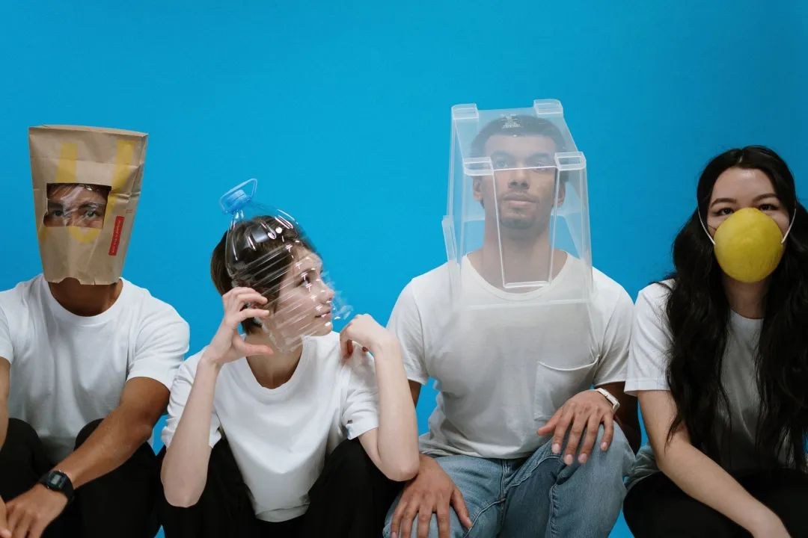
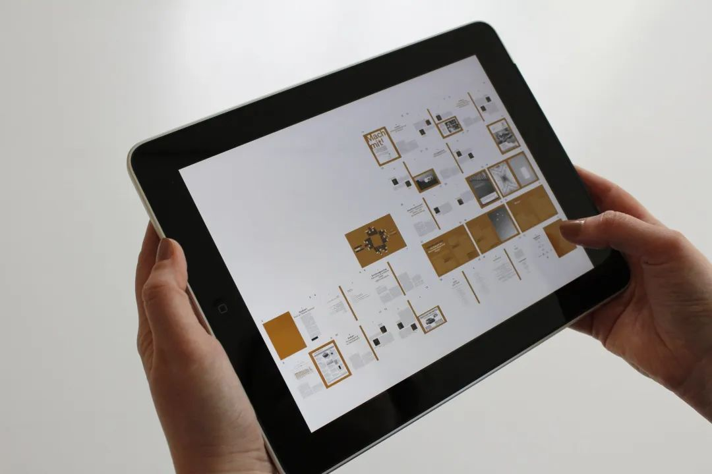
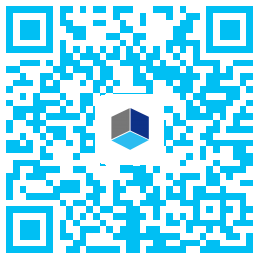
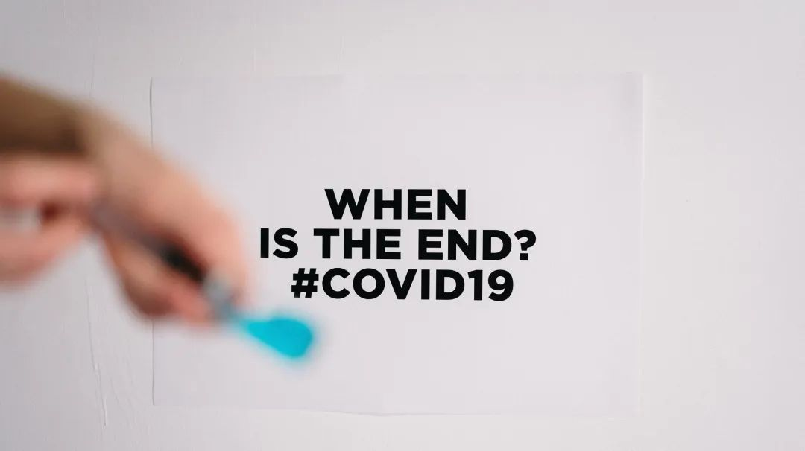

# 无标题

**链接地址:** http://mp.weixin.qq.com/s?__biz=MzI4NDYyNjAwNw==&mid=2247484011&idx=1&sn=15f85781415c17696f14606e5b07bbe7&chksm=ebf9df53dc8e5645e36c520cdcc0730b4aad25ca4e80ab461853eedbbe03d8464ae06742dbd6&mpshare=1&scene=2&srcid=&sharer_sharetime=1587000831108&sharer_shareid=be1c8edd6c93eec155a61c876e41d26a#rd
**作者:** 关注我们
**获取时间:** 2025/8/28 20:13:58
**图片数量:** 23

---

## 原始HTML内容

<section style="box-sizing: border-box;font-size: 16px;"><section style="box-sizing: border-box;" powered-by="xiumi.us"><section style="display: flex;flex-flow: row nowrap;margin: 10px 0%;box-sizing: border-box;"><section style="display: inline-block;vertical-align: bottom;width: auto;align-self: flex-end;flex: 100 100 0%;height: auto;margin-right: -10px;box-sizing: border-box;"><section style="text-align: center;margin-right: 0%;margin-left: 0%;box-sizing: border-box;" powered-by="xiumi.us"><section style="display: inline-block;vertical-align: top;transform: matrix(1, 0, -0.2, 1, 0, 0);border-style: none;border-width: 0px;border-radius: 0px 0px 10px;border-color: rgb(62, 62, 62);background-color: rgba(255, 255, 255, 0);overflow: hidden;width: 100%;height: auto;box-sizing: border-box;"><section style="transform: translate3d(10px, 0px, 0px);-webkit-transform: translate3d(10px, 0px, 0px);-moz-transform: translate3d(10px, 0px, 0px);-o-transform: translate3d(10px, 0px, 0px);box-sizing: border-box;" powered-by="xiumi.us"><section style="display: inline-block;width: 100%;vertical-align: top;box-shadow: rgb(0, 0, 0) 0px 0px 0px inset;box-sizing: border-box;"><section style="transform: matrix(1, 0, 0.2, 1, 0, 0);-webkit-transform: matrix(1, 0, 0.2, 1, 0, 0);-moz-transform: matrix(1, 0, 0.2, 1, 0, 0);-o-transform: matrix(1, 0, 0.2, 1, 0, 0);box-sizing: border-box;" powered-by="xiumi.us"><section style="display: inline-block;width: 100%;vertical-align: top;border-top: 0px none rgb(62, 62, 62);border-top-left-radius: 10px;overflow: hidden;background-image: linear-gradient(315deg, rgb(34, 163, 254) 0%, rgb(189, 232, 255) 100%);border-left: 0px none rgb(62, 62, 62);border-bottom-left-radius: 10px;box-shadow: rgb(222, 240, 255) -3px 0px 3px inset;box-sizing: border-box;"><section style="transform: translate3d(-5px, 0px, 0px);margin-right: 0%;margin-left: 0%;box-sizing: border-box;" powered-by="xiumi.us"><section style="text-align: justify;color: rgb(255, 255, 255);padding-right: 17px;padding-left: 17px;text-shadow: rgb(82, 175, 255) 1px 1px;letter-spacing: 1px;box-sizing: border-box;">
<strong style="box-sizing: border-box;"><em style="box-sizing: border-box;">点击蓝字</em></strong>
</section></section></section></section></section></section></section></section></section><section style="display: inline-block;vertical-align: bottom;width: auto;border-width: 0px;border-radius: 0px;border-style: none;border-color: rgb(62, 62, 62);background-color: rgba(255, 255, 255, 0);flex: 100 100 0%;align-self: flex-end;height: auto;line-height: 0;letter-spacing: 0px;box-sizing: border-box;"><section style="box-sizing: border-box;" powered-by="xiumi.us"><section style="display: inline-block;width: 100%;vertical-align: top;padding-left: 10px;box-sizing: border-box;"><section style="text-align: center;box-sizing: border-box;" powered-by="xiumi.us"><section style="display: inline-block;width: 100%;height: 15px;vertical-align: top;overflow: hidden;border-width: 0px;border-radius: 10px 10px 0px 0px;border-style: none;border-color: rgb(62, 62, 62);background-color: rgb(222, 240, 255);box-sizing: border-box;line-height: 0;"> </section></section></section></section><section style="box-sizing: border-box;" powered-by="xiumi.us"><section style="display: flex;flex-flow: row nowrap;box-sizing: border-box;"><section style="display: inline-block;width: auto;vertical-align: bottom;border-width: 0px;border-radius: 0px 0px 10px;border-style: none;border-color: rgb(62, 62, 62);flex: 100 100 0%;align-self: flex-end;height: auto;background-color: rgb(222, 240, 255);box-sizing: border-box;"><section style="margin: -5px 0% 6px;transform: translate3d(8px, 0px, 0px);-webkit-transform: translate3d(8px, 0px, 0px);-moz-transform: translate3d(8px, 0px, 0px);-o-transform: translate3d(8px, 0px, 0px);box-sizing: border-box;" powered-by="xiumi.us"><section style="font-size: 15px;color: rgb(82, 175, 255);letter-spacing: 2px;line-height: 1;padding-right: 10px;padding-left: 10px;box-sizing: border-box;">
<em style="box-sizing: border-box;">关注我们</em>
</section></section></section></section></section></section></section></section><section style="box-sizing: border-box;" powered-by="xiumi.us"><section style="display: flex;flex-flow: row nowrap;margin-top: 10px;margin-right: 0%;margin-left: 0%;box-sizing: border-box;"><section style="display: inline-block;vertical-align: bottom;width: auto;align-self: flex-end;flex: 100 100 0%;height: auto;margin-right: -10px;box-sizing: border-box;"><section style="text-align: center;margin-right: 0%;margin-left: 0%;box-sizing: border-box;" powered-by="xiumi.us"><section style="display: inline-block;vertical-align: top;transform: matrix(1, 0, -0.2, 1, 0, 0);border-style: none;border-width: 0px;border-radius: 0px 0px 10px;border-color: rgb(62, 62, 62);background-color: rgba(255, 255, 255, 0);overflow: hidden;width: 100%;height: auto;box-sizing: border-box;"><section style="transform: translate3d(10px, 0px, 0px);-webkit-transform: translate3d(10px, 0px, 0px);-moz-transform: translate3d(10px, 0px, 0px);-o-transform: translate3d(10px, 0px, 0px);box-sizing: border-box;" powered-by="xiumi.us"><section style="display: inline-block;width: 100%;vertical-align: top;box-sizing: border-box;"><section style="transform: matrix(1, 0, 0.2, 1, 0, 0);-webkit-transform: matrix(1, 0, 0.2, 1, 0, 0);-moz-transform: matrix(1, 0, 0.2, 1, 0, 0);-o-transform: matrix(1, 0, 0.2, 1, 0, 0);box-sizing: border-box;" powered-by="xiumi.us"><section style="display: inline-block;width: 100%;vertical-align: top;border-top: 0px none rgb(62, 62, 62);border-top-left-radius: 10px;overflow: hidden;background-image: linear-gradient(315deg, rgb(34, 163, 254) 0%, rgb(189, 232, 255) 100%);box-sizing: border-box;"><section style="transform: translate3d(-5px, 0px, 0px);margin-right: 0%;margin-left: 0%;box-sizing: border-box;" powered-by="xiumi.us"><section style="text-align: justify;color: rgb(255, 255, 255);padding-right: 17px;padding-left: 17px;text-shadow: rgb(82, 175, 255) 1px 1px;letter-spacing: 1px;box-sizing: border-box;">
<strong style="box-sizing: border-box;"><em style="box-sizing: border-box;">网课正确的打开方式？</em></strong>
</section></section></section></section></section></section></section></section></section><section style="display: inline-block;vertical-align: bottom;width: auto;border-width: 0px;border-radius: 0px;border-style: none;border-color: rgb(62, 62, 62);background-color: rgba(255, 255, 255, 0);flex: 0 0 auto;align-self: flex-end;min-width: 10%;max-width: 100%;height: auto;line-height: 0;letter-spacing: 0px;box-sizing: border-box;"><section style="box-sizing: border-box;" powered-by="xiumi.us"><section style="display: inline-block;width: 100%;vertical-align: top;padding-left: 10px;box-sizing: border-box;"><section style="text-align: center;box-sizing: border-box;" powered-by="xiumi.us"><section style="display: inline-block;width: 100%;height: 15px;vertical-align: top;overflow: hidden;border-width: 0px;border-radius: 10px 10px 0px 0px;border-style: none;border-color: rgb(62, 62, 62);background-color: rgb(238, 248, 255);box-sizing: border-box;line-height: 0;"> </section></section></section></section><section style="box-sizing: border-box;" powered-by="xiumi.us"><section style="display: flex;flex-flow: row nowrap;box-sizing: border-box;"><section style="display: inline-block;width: auto;vertical-align: bottom;border-width: 0px;border-radius: 0px;border-style: none;border-color: rgb(62, 62, 62);background-color: rgb(238, 248, 255);flex: 100 100 0%;align-self: flex-end;height: auto;box-sizing: border-box;"><section style="text-align: center;box-sizing: border-box;" powered-by="xiumi.us"><section style="display: inline-block;width: 80px;height: 16px;vertical-align: top;overflow: hidden;box-sizing: border-box;line-height: 0;"> </section></section></section></section></section></section></section></section><section style="margin-right: 0%;margin-bottom: 10px;margin-left: 0%;box-sizing: border-box;" powered-by="xiumi.us"><section style="display: inline-block;width: 100%;vertical-align: top;border-width: 0px;border-radius: 10px 0px 10px 10px;border-style: none;border-color: rgb(62, 62, 62);background-color: rgb(238, 248, 255);padding: 10px 15px 15px;box-shadow: rgb(0, 0, 0) 0px 0px 0px;box-sizing: border-box;"><section style="margin: 15px 0%;box-sizing: border-box;" powered-by="xiumi.us"><section style="font-size: 14px;color: rgb(121, 121, 121);line-height: 1.8;letter-spacing: 2px;box-sizing: border-box;">
随着加拿大新冠疫情的爆发和蔓延，不少学校都采取了<strong style="box-sizing: border-box;">网上授课的方式代替现场集体授课</strong>，但是对于不少学生来说，网课的初体验可能是<strong style="box-sizing: border-box;">新奇又不适的</strong>。

 
</section></section><section style="box-sizing: border-box;" powered-by="xiumi.us"><section style="display: flex;flex-flow: row nowrap;margin: 10px 0%;box-sizing: border-box;"><section style="display: inline-block;width: auto;vertical-align: top;flex: 100 100 0%;align-self: flex-start;height: auto;padding-right: 20px;padding-left: 20px;box-sizing: border-box;"><section style="box-sizing: border-box;" powered-by="xiumi.us"><section style="margin-right: 0%;margin-left: 0%;display: flex;flex-flow: row nowrap;box-sizing: border-box;"><section style="display: inline-block;vertical-align: top;width: auto;min-width: 10%;max-width: 100%;flex: 0 0 auto;height: auto;background-color: rgb(232, 244, 255);border-width: 0px;border-radius: 10px 0px 10px 10px;border-style: none;border-color: rgb(62, 62, 62);align-self: flex-start;z-index: 2;margin-left: -10px;box-sizing: border-box;"><section style="text-align: center;box-sizing: border-box;" powered-by="xiumi.us"><section style="display: inline-block;width: 100%;height: 30px;vertical-align: top;overflow: hidden;box-sizing: border-box;"><section style="text-align: justify;font-size: 15px;color: rgb(82, 175, 255);padding-right: 10px;padding-left: 10px;line-height: 2;letter-spacing: 1px;box-sizing: border-box;" powered-by="xiumi.us">
<strong style="box-sizing: border-box;">注意你的社交距离</strong>
</section></section></section></section><section style="display: inline-block;vertical-align: top;width: auto;flex: 100 100 0%;height: auto;align-self: flex-start;z-index: 2;line-height: 0;letter-spacing: 0px;box-sizing: border-box;"><section style="text-align: left;justify-content: flex-start;box-sizing: border-box;" powered-by="xiumi.us"><section style="display: inline-block;width: 10px;height: 10px;vertical-align: top;overflow: hidden;box-sizing: border-box;"><section style="text-align: center;margin-right: 0%;margin-left: 0%;box-sizing: border-box;" powered-by="xiumi.us"><section style="max-width: 100%;vertical-align: middle;display: inline-block;line-height: 0;box-sizing: border-box;"><svg xmlns="http://www.w3.org/2000/svg" x="0px" y="0px" viewBox="0 0 14.1 14.1" style="vertical-align: middle;max-width: 100%;box-sizing: border-box;" width="100%"><g style="box-sizing: border-box;"><path d="M14.1,0H0v14.1C0,6.3,6.3,0,14.1,0z" fill="rgb(232,244,255)" style="box-sizing: border-box;"></path></g></svg></section></section></section></section></section></section></section><section style="text-align: center;margin-top: -30px;margin-right: 0%;margin-left: 0%;box-sizing: border-box;" powered-by="xiumi.us"><section style="max-width: 100%;vertical-align: middle;display: inline-block;line-height: 0;border-width: 0px;border-radius: 6px;border-style: none;border-color: rgb(62, 62, 62);overflow: hidden;box-sizing: border-box;"></section></section></section></section></section><section style="margin: 15px 0%;box-sizing: border-box;" powered-by="xiumi.us"><section style="font-size: 14px;color: rgb(121, 121, 121);line-height: 1.8;letter-spacing: 2px;box-sizing: border-box;">
 

网课的<strong style="box-sizing: border-box;">好处</strong>是，你可以<strong style="box-sizing: border-box;">节约时间交通成本</strong>，宅在熟悉的环境中安心舒适地接受<strong style="box-sizing: border-box;">高效率的教育资源</strong>，并且可以通过<strong style="box-sizing: border-box;">数码记录</strong>的方式更方便地温习到课程内容。
</section></section><section style="text-align: center;transform: translate3d(0px, 0px, 1px) rotateX(180deg);margin-right: 0%;margin-left: 0%;opacity: 0.43;box-sizing: border-box;" powered-by="xiumi.us"><section style="display: inline-block;width: 90%;height: 7px;vertical-align: top;overflow: hidden;border-width: 0px;border-radius: 0px 0px 100px 100px;border-style: none;border-color: rgb(62, 62, 62);background-image: linear-gradient(315deg, rgb(34, 163, 254) 0%, rgb(189, 232, 255) 100%);box-sizing: border-box;line-height: 0;"> </section></section><section style="text-align: center;margin: 3px 0%;box-sizing: border-box;" powered-by="xiumi.us"><section style="max-width: 100%;vertical-align: middle;display: inline-block;line-height: 0;border-width: 0px;border-radius: 6px;border-style: none;border-color: rgb(62, 62, 62);overflow: hidden;width: 95%;height: auto;box-sizing: border-box;"></section></section><section style="text-align: center;transform: translate3d(0px, 0px, 1px) rotateY(180deg);margin-right: 0%;margin-left: 0%;opacity: 0.44;box-sizing: border-box;" powered-by="xiumi.us"><section style="display: inline-block;width: 90%;height: 7px;vertical-align: top;overflow: hidden;border-width: 0px;border-radius: 0px 0px 100px 100px;border-style: none;border-color: rgb(62, 62, 62);background-image: linear-gradient(315deg, rgb(34, 163, 254) 0%, rgb(189, 232, 255) 100%);box-sizing: border-box;line-height: 0;"> </section></section><section style="margin: 15px 0%;box-sizing: border-box;" powered-by="xiumi.us"><section style="font-size: 14px;color: rgb(121, 121, 121);line-height: 1.8;letter-spacing: 2px;box-sizing: border-box;">
但过于舒适的环境反而让人<strong style="box-sizing: border-box;">容易分心</strong>，因为缺少同僚和教师的督导，上课过程中走神发呆和学习效率低下的问题就容易凸显。<strong style="box-sizing: border-box;">自制力差的同学学习效果就会大打折扣</strong>。 

 

根据 NORTH ESSAY 公司的调查显示，17.27%的同学直接打开浏览器之后去干别的事，而<strong style="box-sizing: border-box;">只有8.18%的同学会认真地听每一节课</strong>。

 

这样的网课学习方式是<strong style="box-sizing: border-box;">浪费国家社会的资源和自己宝贵的时间</strong>！这样下去可不行！

 

<strong style="box-sizing: border-box;">那么网课的正确打开方式到底是怎样的呢？</strong>
</section></section><section style="box-sizing: border-box;" powered-by="xiumi.us">
 
</section><section style="box-sizing: border-box;" powered-by="xiumi.us"><section style="display: flex;flex-flow: row nowrap;margin-top: 10px;margin-right: 0%;margin-left: 0%;box-sizing: border-box;"><section style="display: inline-block;vertical-align: bottom;width: auto;align-self: flex-end;flex: 100 100 0%;height: auto;margin-right: -10px;line-height: 0;letter-spacing: 0px;box-sizing: border-box;"><section style="text-align: center;margin-right: 0%;margin-left: 0%;box-sizing: border-box;" powered-by="xiumi.us"><section style="display: inline-block;vertical-align: top;transform: matrix(1, 0, -0.2, 1, 0, 0);border-style: none;border-width: 0px;border-radius: 0px 0px 10px;border-color: rgb(62, 62, 62);background-color: rgba(255, 255, 255, 0);overflow: hidden;width: 100%;height: auto;box-sizing: border-box;"><section style="transform: translate3d(10px, 0px, 0px);-webkit-transform: translate3d(10px, 0px, 0px);-moz-transform: translate3d(10px, 0px, 0px);-o-transform: translate3d(10px, 0px, 0px);box-sizing: border-box;" powered-by="xiumi.us"><section style="display: inline-block;width: 100%;vertical-align: top;box-sizing: border-box;"><section style="transform: matrix(1, 0, 0.2, 1, 0, 0);-webkit-transform: matrix(1, 0, 0.2, 1, 0, 0);-moz-transform: matrix(1, 0, 0.2, 1, 0, 0);-o-transform: matrix(1, 0, 0.2, 1, 0, 0);box-sizing: border-box;" powered-by="xiumi.us"><section style="display: inline-block;width: 100%;vertical-align: top;border-top: 0px none rgb(62, 62, 62);border-top-left-radius: 10px;overflow: hidden;background-image: linear-gradient(315deg, rgb(34, 163, 254) 0%, rgb(189, 232, 255) 100%);box-sizing: border-box;"><section style="transform: translate3d(-5px, 0px, 0px);margin-right: 0%;margin-left: 0%;box-sizing: border-box;" powered-by="xiumi.us"><section style="text-align: justify;color: rgb(255, 255, 255);padding-right: 17px;padding-left: 17px;text-shadow: rgb(82, 175, 255) 1px 1px;letter-spacing: 1px;line-height: 1.5;font-size: 12px;box-sizing: border-box;">
<em style="box-sizing: border-box;"><strong style="box-sizing: border-box;">收起你的娱乐设备，提高自制力</strong></em>
</section></section></section></section></section></section></section></section></section><section style="display: inline-block;vertical-align: bottom;width: auto;border-width: 0px;border-radius: 0px;border-style: none;border-color: rgb(62, 62, 62);background-color: rgba(255, 255, 255, 0);flex: 0 0 auto;align-self: flex-end;min-width: 10%;max-width: 100%;height: auto;line-height: 0;letter-spacing: 0px;box-shadow: rgb(0, 0, 0) 0px 0px 0px;box-sizing: border-box;"><section style="box-sizing: border-box;" powered-by="xiumi.us"><section style="display: inline-block;width: 100%;vertical-align: top;padding-left: 10px;box-sizing: border-box;"><section style="text-align: center;box-sizing: border-box;" powered-by="xiumi.us"><section style="display: inline-block;width: 100%;height: 8px;vertical-align: top;overflow: hidden;border-width: 0px;border-radius: 10px 10px 0px 0px;border-style: none;border-color: rgb(62, 62, 62);box-sizing: border-box;line-height: 0;"> </section></section></section></section><section style="box-sizing: border-box;" powered-by="xiumi.us"><section style="display: flex;flex-flow: row nowrap;box-sizing: border-box;"><section style="display: inline-block;width: auto;vertical-align: bottom;border-width: 0px;border-radius: 0px;border-style: none;border-color: rgb(62, 62, 62);flex: 100 100 0%;align-self: flex-end;height: auto;box-sizing: border-box;"><section style="margin-right: 0%;margin-bottom: 3px;margin-left: 0%;transform: translate3d(7px, 0px, 0px);box-sizing: border-box;" powered-by="xiumi.us"><section style="font-size: 12px;color: rgb(132, 198, 255);letter-spacing: 2px;line-height: 1;padding-right: 20px;padding-left: 20px;box-sizing: border-box;">
<em style="box-sizing: border-box;">01</em>
</section></section></section></section></section></section></section></section><section style="margin-right: 0%;margin-bottom: 10px;margin-left: 0%;box-sizing: border-box;" powered-by="xiumi.us"><section style="display: inline-block;width: 100%;vertical-align: top;border-width: 0px;border-radius: 10px 0px 10px 10px;border-style: none;border-color: rgb(62, 62, 62);background-color: rgb(237, 248, 255);padding: 10px 15px 15px;box-sizing: border-box;"><section style="text-align: center;margin-top: 5px;margin-right: 0%;margin-left: 0%;box-sizing: border-box;" powered-by="xiumi.us"><section style="max-width: 100%;vertical-align: middle;display: inline-block;line-height: 0;border-width: 0px;border-radius: 5px;border-style: none;border-color: rgb(62, 62, 62);overflow: hidden;box-shadow: rgb(173, 217, 255) 0px 0px 6px;box-sizing: border-box;"></section></section></section></section><section style="margin: 15px 0%;box-sizing: border-box;" powered-by="xiumi.us"><section style="font-size: 14px;color: rgb(121, 121, 121);line-height: 1.8;letter-spacing: 2px;box-sizing: border-box;">
网课和现场授课很不同的一点就是，你<strong style="box-sizing: border-box;">很难受到来自环境的监督</strong>，也<strong style="box-sizing: border-box;">无法受到学习氛围的感染</strong>。这时候对于<strong style="box-sizing: border-box;">个人自制力的提升</strong>绝对是利用网课进行高效学习的关键。

 

如果你觉得难以集中精力，不妨试试把自己的<strong style="box-sizing: border-box;">娱乐设施先暂时放置起来</strong>。游戏机和电视机这些娱乐设备都放在其他的房间里。这样所谓的<strong style="box-sizing: border-box;">眼不见心不烦，看不到就想不起</strong>，或许会对你集中精力有所帮助。
</section></section><section style="text-align: center;transform: translate3d(0px, 0px, 1px) rotateX(180deg);margin-right: 0%;margin-left: 0%;opacity: 0.43;box-sizing: border-box;" powered-by="xiumi.us"><section style="display: inline-block;width: 90%;height: 7px;vertical-align: top;overflow: hidden;border-width: 0px;border-radius: 0px 0px 100px 100px;border-style: none;border-color: rgb(62, 62, 62);background-image: linear-gradient(315deg, rgb(34, 163, 254) 0%, rgb(189, 232, 255) 100%);box-sizing: border-box;line-height: 0;"> </section></section><section style="text-align: center;margin: 3px 0%;box-sizing: border-box;" powered-by="xiumi.us"><section style="max-width: 100%;vertical-align: middle;display: inline-block;line-height: 0;border-width: 0px;border-radius: 6px;border-style: none;border-color: rgb(62, 62, 62);overflow: hidden;width: 95%;height: auto;box-sizing: border-box;"></section></section><section style="text-align: center;transform: translate3d(0px, 0px, 1px) rotateY(180deg);margin-right: 0%;margin-left: 0%;opacity: 0.44;box-sizing: border-box;" powered-by="xiumi.us"><section style="display: inline-block;width: 90%;height: 7px;vertical-align: top;overflow: hidden;border-width: 0px;border-radius: 0px 0px 100px 100px;border-style: none;border-color: rgb(62, 62, 62);background-image: linear-gradient(315deg, rgb(34, 163, 254) 0%, rgb(189, 232, 255) 100%);box-sizing: border-box;line-height: 0;"> </section></section><section style="box-sizing: border-box;" powered-by="xiumi.us"><section style="display: flex;flex-flow: row nowrap;margin-top: 10px;margin-right: 0%;margin-left: 0%;box-sizing: border-box;"><section style="display: inline-block;vertical-align: bottom;width: auto;align-self: flex-end;flex: 100 100 0%;height: auto;margin-right: -10px;line-height: 0;letter-spacing: 0px;box-sizing: border-box;"><section style="text-align: center;margin-right: 0%;margin-left: 0%;box-sizing: border-box;" powered-by="xiumi.us"><section style="display: inline-block;vertical-align: top;transform: matrix(1, 0, -0.2, 1, 0, 0);border-style: none;border-width: 0px;border-radius: 0px 0px 10px;border-color: rgb(62, 62, 62);background-color: rgba(255, 255, 255, 0);overflow: hidden;width: 100%;height: auto;box-sizing: border-box;"><section style="transform: translate3d(10px, 0px, 0px);-webkit-transform: translate3d(10px, 0px, 0px);-moz-transform: translate3d(10px, 0px, 0px);-o-transform: translate3d(10px, 0px, 0px);box-sizing: border-box;" powered-by="xiumi.us"><section style="display: inline-block;width: 100%;vertical-align: top;box-sizing: border-box;"><section style="transform: matrix(1, 0, 0.2, 1, 0, 0);-webkit-transform: matrix(1, 0, 0.2, 1, 0, 0);-moz-transform: matrix(1, 0, 0.2, 1, 0, 0);-o-transform: matrix(1, 0, 0.2, 1, 0, 0);box-sizing: border-box;" powered-by="xiumi.us"><section style="display: inline-block;width: 100%;vertical-align: top;border-top: 0px none rgb(62, 62, 62);border-top-left-radius: 10px;overflow: hidden;background-image: linear-gradient(315deg, rgb(34, 163, 254) 0%, rgb(189, 232, 255) 100%);box-sizing: border-box;"><section style="transform: translate3d(-5px, 0px, 0px);margin-right: 0%;margin-left: 0%;box-sizing: border-box;" powered-by="xiumi.us"><section style="text-align: justify;color: rgb(255, 255, 255);padding-right: 17px;padding-left: 17px;text-shadow: rgb(82, 175, 255) 1px 1px;letter-spacing: 1px;line-height: 1.5;font-size: 12px;box-sizing: border-box;">
<em style="box-sizing: border-box;"><strong style="box-sizing: border-box;">巧用回放功能，温故知新</strong></em>
</section></section></section></section></section></section></section></section></section><section style="display: inline-block;vertical-align: bottom;width: auto;border-width: 0px;border-radius: 0px;border-style: none;border-color: rgb(62, 62, 62);background-color: rgba(255, 255, 255, 0);flex: 0 0 auto;align-self: flex-end;min-width: 10%;max-width: 100%;height: auto;line-height: 0;letter-spacing: 0px;box-shadow: rgb(0, 0, 0) 0px 0px 0px;box-sizing: border-box;"><section style="box-sizing: border-box;" powered-by="xiumi.us"><section style="display: inline-block;width: 100%;vertical-align: top;padding-left: 10px;box-sizing: border-box;"><section style="text-align: center;box-sizing: border-box;" powered-by="xiumi.us"><section style="display: inline-block;width: 100%;height: 8px;vertical-align: top;overflow: hidden;border-width: 0px;border-radius: 10px 10px 0px 0px;border-style: none;border-color: rgb(62, 62, 62);box-sizing: border-box;line-height: 0;"> </section></section></section></section><section style="box-sizing: border-box;" powered-by="xiumi.us"><section style="display: flex;flex-flow: row nowrap;box-sizing: border-box;"><section style="display: inline-block;width: auto;vertical-align: bottom;border-width: 0px;border-radius: 0px;border-style: none;border-color: rgb(62, 62, 62);flex: 100 100 0%;align-self: flex-end;height: auto;box-sizing: border-box;"><section style="margin-right: 0%;margin-bottom: 3px;margin-left: 0%;transform: translate3d(7px, 0px, 0px);box-sizing: border-box;" powered-by="xiumi.us"><section style="font-size: 12px;color: rgb(132, 198, 255);letter-spacing: 2px;line-height: 1;padding-right: 20px;padding-left: 20px;box-sizing: border-box;">
<em style="box-sizing: border-box;">02</em>
</section></section></section></section></section></section></section></section><section style="margin-right: 0%;margin-bottom: 10px;margin-left: 0%;box-sizing: border-box;" powered-by="xiumi.us"><section style="display: inline-block;width: 100%;vertical-align: top;border-width: 0px;border-radius: 10px 0px 10px 10px;border-style: none;border-color: rgb(62, 62, 62);background-color: rgb(237, 248, 255);padding: 10px 15px 15px;box-sizing: border-box;"><section style="text-align: center;margin-top: 5px;margin-right: 0%;margin-left: 0%;box-sizing: border-box;" powered-by="xiumi.us"><section style="max-width: 100%;vertical-align: middle;display: inline-block;line-height: 0;border-width: 0px;border-radius: 5px;border-style: none;border-color: rgb(62, 62, 62);overflow: hidden;box-shadow: rgb(173, 217, 255) 0px 0px 6px;box-sizing: border-box;"></section></section></section></section><section style="margin: 15px 0%;box-sizing: border-box;" powered-by="xiumi.us"><section style="font-size: 14px;color: rgb(121, 121, 121);line-height: 1.8;letter-spacing: 2px;box-sizing: border-box;">
无论你使用的是任何软件或者应用程序，能够<strong style="box-sizing: border-box;">重复浏览网络课程信息</strong>都应该是基础设计。那么相对于现场授课，网络课程在这一方面则有着<strong style="box-sizing: border-box;">无可替代的优越性</strong>。

 

可以重复浏览的课程信息可以帮助同学们<strong style="box-sizing: border-box;">更好的消化吸收和巩固知识</strong>，就算你记忆力不佳，也可以通过重复观看课件的方式进行多次学习，<strong style="box-sizing: border-box;">温故而知新</strong>。
</section></section><section style="text-align: center;transform: translate3d(0px, 0px, 1px) rotateX(180deg);margin-right: 0%;margin-left: 0%;opacity: 0.43;box-sizing: border-box;" powered-by="xiumi.us"><section style="display: inline-block;width: 90%;height: 7px;vertical-align: top;overflow: hidden;border-width: 0px;border-radius: 0px 0px 100px 100px;border-style: none;border-color: rgb(62, 62, 62);background-image: linear-gradient(315deg, rgb(34, 163, 254) 0%, rgb(189, 232, 255) 100%);box-sizing: border-box;line-height: 0;"> </section></section><section style="text-align: center;margin: 3px 0%;box-sizing: border-box;" powered-by="xiumi.us"><section style="max-width: 100%;vertical-align: middle;display: inline-block;line-height: 0;border-width: 0px;border-radius: 6px;border-style: none;border-color: rgb(62, 62, 62);overflow: hidden;width: 95%;height: auto;box-shadow: rgb(0, 0, 0) 0px 0px 0px;box-sizing: border-box;"></section></section><section style="text-align: center;transform: translate3d(0px, 0px, 1px) rotateY(180deg);margin-right: 0%;margin-left: 0%;opacity: 0.44;box-sizing: border-box;" powered-by="xiumi.us"><section style="display: inline-block;width: 90%;height: 7px;vertical-align: top;overflow: hidden;border-width: 0px;border-radius: 0px 0px 100px 100px;border-style: none;border-color: rgb(62, 62, 62);background-image: linear-gradient(315deg, rgb(34, 163, 254) 0%, rgb(189, 232, 255) 100%);box-sizing: border-box;line-height: 0;"> </section></section><section style="margin: 15px 0%;box-sizing: border-box;" powered-by="xiumi.us"><section style="font-size: 14px;color: rgb(121, 121, 121);line-height: 1.8;letter-spacing: 2px;box-sizing: border-box;">
但是千万别认为网课的内容放在那里不会消失，就<strong style="box-sizing: border-box;">一拖再拖</strong>，最后变成收藏夹底部从来没有被打开过的文件。

 

网络会帮你保留信息数据，但却<strong style="box-sizing: border-box;">不能代替你进行学习</strong>。只有自己学到的知识才会真正跟随你。 
</section></section><section style="box-sizing: border-box;" powered-by="xiumi.us">
 
</section><section style="box-sizing: border-box;" powered-by="xiumi.us"><section style="display: flex;flex-flow: row nowrap;margin-top: 10px;margin-right: 0%;margin-left: 0%;box-sizing: border-box;"><section style="display: inline-block;vertical-align: bottom;width: auto;align-self: flex-end;flex: 100 100 0%;height: auto;margin-right: -10px;line-height: 0;letter-spacing: 0px;box-sizing: border-box;"><section style="text-align: center;margin-right: 0%;margin-left: 0%;box-sizing: border-box;" powered-by="xiumi.us"><section style="display: inline-block;vertical-align: top;transform: matrix(1, 0, -0.2, 1, 0, 0);border-style: none;border-width: 0px;border-radius: 0px 0px 10px;border-color: rgb(62, 62, 62);background-color: rgba(255, 255, 255, 0);overflow: hidden;width: 100%;height: auto;box-sizing: border-box;"><section style="transform: translate3d(10px, 0px, 0px);-webkit-transform: translate3d(10px, 0px, 0px);-moz-transform: translate3d(10px, 0px, 0px);-o-transform: translate3d(10px, 0px, 0px);box-sizing: border-box;" powered-by="xiumi.us"><section style="display: inline-block;width: 100%;vertical-align: top;box-sizing: border-box;"><section style="transform: matrix(1, 0, 0.2, 1, 0, 0);-webkit-transform: matrix(1, 0, 0.2, 1, 0, 0);-moz-transform: matrix(1, 0, 0.2, 1, 0, 0);-o-transform: matrix(1, 0, 0.2, 1, 0, 0);box-sizing: border-box;" powered-by="xiumi.us"><section style="display: inline-block;width: 100%;vertical-align: top;border-top: 0px none rgb(62, 62, 62);border-top-left-radius: 10px;overflow: hidden;background-image: linear-gradient(315deg, rgb(34, 163, 254) 0%, rgb(189, 232, 255) 100%);box-sizing: border-box;"><section style="transform: translate3d(-5px, 0px, 0px);margin-right: 0%;margin-left: 0%;box-sizing: border-box;" powered-by="xiumi.us"><section style="text-align: justify;color: rgb(255, 255, 255);padding-right: 17px;padding-left: 17px;text-shadow: rgb(82, 175, 255) 1px 1px;letter-spacing: 1px;line-height: 1.5;font-size: 12px;box-sizing: border-box;">
<em style="box-sizing: border-box;"><strong style="box-sizing: border-box;">懒得学？巧妙利用自己的拖延症！</strong></em>
</section></section></section></section></section></section></section></section></section><section style="display: inline-block;vertical-align: bottom;width: auto;border-width: 0px;border-radius: 0px;border-style: none;border-color: rgb(62, 62, 62);background-color: rgba(255, 255, 255, 0);flex: 0 0 auto;align-self: flex-end;min-width: 10%;max-width: 100%;height: auto;line-height: 0;letter-spacing: 0px;box-shadow: rgb(0, 0, 0) 0px 0px 0px;box-sizing: border-box;"><section style="box-sizing: border-box;" powered-by="xiumi.us"><section style="display: inline-block;width: 100%;vertical-align: top;padding-left: 10px;box-sizing: border-box;"><section style="text-align: center;box-sizing: border-box;" powered-by="xiumi.us"><section style="display: inline-block;width: 100%;height: 8px;vertical-align: top;overflow: hidden;border-width: 0px;border-radius: 10px 10px 0px 0px;border-style: none;border-color: rgb(62, 62, 62);box-sizing: border-box;line-height: 0;"> </section></section></section></section><section style="box-sizing: border-box;" powered-by="xiumi.us"><section style="display: flex;flex-flow: row nowrap;box-sizing: border-box;"><section style="display: inline-block;width: auto;vertical-align: bottom;border-width: 0px;border-radius: 0px;border-style: none;border-color: rgb(62, 62, 62);flex: 100 100 0%;align-self: flex-end;height: auto;box-sizing: border-box;"><section style="margin-right: 0%;margin-bottom: 3px;margin-left: 0%;transform: translate3d(7px, 0px, 0px);box-sizing: border-box;" powered-by="xiumi.us"><section style="font-size: 12px;color: rgb(132, 198, 255);letter-spacing: 2px;line-height: 1;padding-right: 20px;padding-left: 20px;box-sizing: border-box;">
<em style="box-sizing: border-box;">03</em>
</section></section></section></section></section></section></section></section><section style="margin-right: 0%;margin-bottom: 10px;margin-left: 0%;box-sizing: border-box;" powered-by="xiumi.us"><section style="display: inline-block;width: 100%;vertical-align: top;border-width: 0px;border-radius: 10px 0px 10px 10px;border-style: none;border-color: rgb(62, 62, 62);background-color: rgb(237, 248, 255);padding: 10px 15px 15px;box-sizing: border-box;"><section style="text-align: center;margin-top: 5px;margin-right: 0%;margin-left: 0%;box-sizing: border-box;" powered-by="xiumi.us"><section style="max-width: 100%;vertical-align: middle;display: inline-block;line-height: 0;border-width: 0px;border-radius: 5px;border-style: none;border-color: rgb(62, 62, 62);overflow: hidden;box-shadow: rgb(173, 217, 255) 0px 0px 6px;box-sizing: border-box;"></section></section></section></section><section style="margin: 15px 0%;box-sizing: border-box;" powered-by="xiumi.us"><section style="font-size: 14px;color: rgb(121, 121, 121);line-height: 1.8;letter-spacing: 2px;box-sizing: border-box;">
一些同学总觉得网络课程由于缺乏督导，导致自己总是<strong style="box-sizing: border-box;">没有开始学习的动力</strong>。今天的任务拖到明天，明天的任务再接着拖下去。这样的学习进度谈何进步，学习效率谈何提升呢？

 

所谓的<strong style="box-sizing: border-box;">“厌学拖延症”</strong>在居家隔离期间或许会<strong style="box-sizing: border-box;">集中爆发</strong>地十分明显，那么如何<strong style="box-sizing: border-box;">利用自己的惰性督促自己</strong>学习呢？
</section></section><section style="box-sizing: border-box;" powered-by="xiumi.us"><section style="display: flex;flex-flow: row nowrap;margin: 10px 0%;box-sizing: border-box;"><section style="display: inline-block;width: auto;vertical-align: top;flex: 100 100 0%;align-self: flex-start;height: auto;padding-right: 20px;padding-left: 20px;box-sizing: border-box;"><section style="box-sizing: border-box;" powered-by="xiumi.us"><section style="margin-right: 0%;margin-left: 0%;display: flex;flex-flow: row nowrap;box-sizing: border-box;"><section style="display: inline-block;vertical-align: top;width: auto;min-width: 10%;max-width: 100%;flex: 0 0 auto;height: auto;background-color: rgb(232, 244, 255);border-width: 0px;border-radius: 10px 0px 10px 10px;border-style: none;border-color: rgb(62, 62, 62);align-self: flex-start;z-index: 2;margin-left: -10px;box-sizing: border-box;"><section style="text-align: center;box-sizing: border-box;" powered-by="xiumi.us"><section style="display: inline-block;width: 100%;height: 30px;vertical-align: top;overflow: hidden;box-sizing: border-box;"><section style="text-align: justify;font-size: 15px;color: rgb(82, 175, 255);padding-right: 10px;padding-left: 10px;line-height: 2;letter-spacing: 1px;box-sizing: border-box;" powered-by="xiumi.us">
<strong style="box-sizing: border-box;">和同学们在线组团吧！</strong>
</section></section></section></section><section style="display: inline-block;vertical-align: top;width: auto;flex: 100 100 0%;height: auto;align-self: flex-start;z-index: 2;line-height: 0;letter-spacing: 0px;box-sizing: border-box;"><section style="text-align: left;justify-content: flex-start;box-sizing: border-box;" powered-by="xiumi.us"><section style="display: inline-block;width: 10px;height: 10px;vertical-align: top;overflow: hidden;box-sizing: border-box;"><section style="text-align: center;margin-right: 0%;margin-left: 0%;box-sizing: border-box;" powered-by="xiumi.us"><section style="max-width: 100%;vertical-align: middle;display: inline-block;line-height: 0;box-sizing: border-box;"><svg xmlns="http://www.w3.org/2000/svg" x="0px" y="0px" viewBox="0 0 14.1 14.1" style="vertical-align: middle;max-width: 100%;box-sizing: border-box;" width="100%"><g style="box-sizing: border-box;"><path d="M14.1,0H0v14.1C0,6.3,6.3,0,14.1,0z" fill="rgb(232,244,255)" style="box-sizing: border-box;"></path></g></svg></section></section></section></section></section></section></section><section style="text-align: center;margin-top: -30px;margin-right: 0%;margin-left: 0%;box-sizing: border-box;" powered-by="xiumi.us"><section style="max-width: 100%;vertical-align: middle;display: inline-block;line-height: 0;border-width: 0px;border-radius: 6px;border-style: none;border-color: rgb(62, 62, 62);overflow: hidden;box-sizing: border-box;"></section></section></section></section></section><section style="box-sizing: border-box;" powered-by="xiumi.us">
 
</section><section style="margin: 15px 0%;box-sizing: border-box;" powered-by="xiumi.us"><section style="font-size: 14px;color: rgb(121, 121, 121);line-height: 1.8;letter-spacing: 2px;box-sizing: border-box;">
其实一个克服惰性的好办法就是找一个或几个同学一起组队，形成<strong style="box-sizing: border-box;">在线学习小组</strong>，<strong style="box-sizing: border-box;">为每日的学习计划制定目标</strong>。相互监督，互相打气。

 

交互检查对方学习进度的跟进，利用<strong style="box-sizing: border-box;">Peer Pressure</strong>可以更加有效地帮助各自完成学习目标。
</section></section><section style="text-align: center;transform: translate3d(0px, 0px, 1px) rotateX(180deg);margin-right: 0%;margin-left: 0%;opacity: 0.43;box-sizing: border-box;" powered-by="xiumi.us"><section style="display: inline-block;width: 90%;height: 7px;vertical-align: top;overflow: hidden;border-width: 0px;border-radius: 0px 0px 100px 100px;border-style: none;border-color: rgb(62, 62, 62);background-image: linear-gradient(315deg, rgb(34, 163, 254) 0%, rgb(189, 232, 255) 100%);box-sizing: border-box;line-height: 0;"> </section></section><section style="text-align: center;margin: 3px 0%;box-sizing: border-box;" powered-by="xiumi.us"><section style="max-width: 100%;vertical-align: middle;display: inline-block;line-height: 0;border-width: 0px;border-radius: 6px;border-style: none;border-color: rgb(62, 62, 62);overflow: hidden;width: 95%;height: auto;box-sizing: border-box;"></section></section><section style="text-align: center;transform: translate3d(0px, 0px, 1px) rotateY(180deg);margin-right: 0%;margin-left: 0%;opacity: 0.44;box-sizing: border-box;" powered-by="xiumi.us"><section style="display: inline-block;width: 90%;height: 7px;vertical-align: top;overflow: hidden;border-width: 0px;border-radius: 0px 0px 100px 100px;border-style: none;border-color: rgb(62, 62, 62);background-image: linear-gradient(315deg, rgb(34, 163, 254) 0%, rgb(189, 232, 255) 100%);box-sizing: border-box;line-height: 0;"> </section></section><section style="margin: 15px 0%;box-sizing: border-box;" powered-by="xiumi.us"><section style="font-size: 14px;color: rgb(121, 121, 121);line-height: 1.8;letter-spacing: 2px;box-sizing: border-box;">
 

另外一个办法就是：把每天的学习任务按照自己认为<strong style="box-sizing: border-box;">最擅长和最不擅长的进行分类</strong>，从最擅长的开始做起，逐步建立自己在学习过程中取得的<strong style="box-sizing: border-box;">成就感和满足感</strong>。

 

同时为每个类别设立<strong style="box-sizing: border-box;">不同的奖励</strong>。完成最不擅长的项目后奖励最优厚的内容，比如多玩半个小时游戏。
</section></section><section style="text-align: center;transform: translate3d(0px, 0px, 1px) rotateX(180deg);margin-right: 0%;margin-left: 0%;opacity: 0.43;box-sizing: border-box;" powered-by="xiumi.us"><section style="display: inline-block;width: 90%;height: 7px;vertical-align: top;overflow: hidden;border-width: 0px;border-radius: 0px 0px 100px 100px;border-style: none;border-color: rgb(62, 62, 62);background-image: linear-gradient(315deg, rgb(34, 163, 254) 0%, rgb(189, 232, 255) 100%);box-sizing: border-box;line-height: 0;"> </section></section><section style="text-align: center;margin: 3px 0%;box-sizing: border-box;" powered-by="xiumi.us"><section style="max-width: 100%;vertical-align: middle;display: inline-block;line-height: 0;border-width: 0px;border-radius: 6px;border-style: none;border-color: rgb(62, 62, 62);overflow: hidden;width: 95%;height: auto;box-sizing: border-box;"></section></section><section style="text-align: center;transform: translate3d(0px, 0px, 1px) rotateY(180deg);margin-right: 0%;margin-left: 0%;opacity: 0.44;box-sizing: border-box;" powered-by="xiumi.us"><section style="display: inline-block;width: 90%;height: 7px;vertical-align: top;overflow: hidden;border-width: 0px;border-radius: 0px 0px 100px 100px;border-style: none;border-color: rgb(62, 62, 62);background-image: linear-gradient(315deg, rgb(34, 163, 254) 0%, rgb(189, 232, 255) 100%);box-sizing: border-box;line-height: 0;"> </section></section><section style="margin: 15px 0%;box-sizing: border-box;" powered-by="xiumi.us"><section style="font-size: 14px;color: rgb(121, 121, 121);line-height: 1.8;letter-spacing: 2px;box-sizing: border-box;">
 

当然，没有完成任务不仅不能享受奖励，还可以<strong style="box-sizing: border-box;">根据自身的情况计划进行一些惩罚措施</strong>。

 

这样的方法可以轻松帮你循序渐进有条不紊的完成学习任务，并且可以达到<strong style="box-sizing: border-box;">劳逸结合的目的</strong>，快去试试吧！
</section></section><section style="box-sizing: border-box;" powered-by="xiumi.us">
 
</section><section style="box-sizing: border-box;" powered-by="xiumi.us"><section style="display: flex;flex-flow: row nowrap;margin-top: 10px;margin-right: 0%;margin-left: 0%;box-sizing: border-box;"><section style="display: inline-block;vertical-align: bottom;width: auto;align-self: flex-end;flex: 100 100 0%;height: auto;margin-right: -10px;line-height: 0;letter-spacing: 0px;box-sizing: border-box;"><section style="text-align: center;margin-right: 0%;margin-left: 0%;box-sizing: border-box;" powered-by="xiumi.us"><section style="display: inline-block;vertical-align: top;transform: matrix(1, 0, -0.2, 1, 0, 0);border-style: none;border-width: 0px;border-radius: 0px 0px 10px;border-color: rgb(62, 62, 62);background-color: rgba(255, 255, 255, 0);overflow: hidden;width: 100%;height: auto;box-sizing: border-box;"><section style="transform: translate3d(10px, 0px, 0px);-webkit-transform: translate3d(10px, 0px, 0px);-moz-transform: translate3d(10px, 0px, 0px);-o-transform: translate3d(10px, 0px, 0px);box-sizing: border-box;" powered-by="xiumi.us"><section style="display: inline-block;width: 100%;vertical-align: top;box-sizing: border-box;"><section style="transform: matrix(1, 0, 0.2, 1, 0, 0);-webkit-transform: matrix(1, 0, 0.2, 1, 0, 0);-moz-transform: matrix(1, 0, 0.2, 1, 0, 0);-o-transform: matrix(1, 0, 0.2, 1, 0, 0);box-sizing: border-box;" powered-by="xiumi.us"><section style="display: inline-block;width: 100%;vertical-align: top;border-top: 0px none rgb(62, 62, 62);border-top-left-radius: 10px;overflow: hidden;background-image: linear-gradient(315deg, rgb(34, 163, 254) 0%, rgb(189, 232, 255) 100%);box-sizing: border-box;"><section style="transform: translate3d(-5px, 0px, 0px);margin-right: 0%;margin-left: 0%;box-sizing: border-box;" powered-by="xiumi.us"><section style="text-align: justify;color: rgb(255, 255, 255);padding-right: 17px;padding-left: 17px;text-shadow: rgb(82, 175, 255) 1px 1px;letter-spacing: 1px;line-height: 1.5;font-size: 12px;box-sizing: border-box;">
<em style="box-sizing: border-box;"><strong style="box-sizing: border-box;">请善用电子方式交流吧！</strong></em>
</section></section></section></section></section></section></section></section></section><section style="display: inline-block;vertical-align: bottom;width: auto;border-width: 0px;border-radius: 0px;border-style: none;border-color: rgb(62, 62, 62);background-color: rgba(255, 255, 255, 0);flex: 0 0 auto;align-self: flex-end;min-width: 10%;max-width: 100%;height: auto;line-height: 0;letter-spacing: 0px;box-shadow: rgb(0, 0, 0) 0px 0px 0px;box-sizing: border-box;"><section style="box-sizing: border-box;" powered-by="xiumi.us"><section style="display: inline-block;width: 100%;vertical-align: top;padding-left: 10px;box-sizing: border-box;"><section style="text-align: center;box-sizing: border-box;" powered-by="xiumi.us"><section style="display: inline-block;width: 100%;height: 8px;vertical-align: top;overflow: hidden;border-width: 0px;border-radius: 10px 10px 0px 0px;border-style: none;border-color: rgb(62, 62, 62);box-sizing: border-box;line-height: 0;"> </section></section></section></section><section style="box-sizing: border-box;" powered-by="xiumi.us"><section style="display: flex;flex-flow: row nowrap;box-sizing: border-box;"><section style="display: inline-block;width: auto;vertical-align: bottom;border-width: 0px;border-radius: 0px;border-style: none;border-color: rgb(62, 62, 62);flex: 100 100 0%;align-self: flex-end;height: auto;box-sizing: border-box;"><section style="margin-right: 0%;margin-bottom: 3px;margin-left: 0%;transform: translate3d(7px, 0px, 0px);box-sizing: border-box;" powered-by="xiumi.us"><section style="font-size: 12px;color: rgb(132, 198, 255);letter-spacing: 2px;line-height: 1;padding-right: 20px;padding-left: 20px;box-sizing: border-box;">
<em style="box-sizing: border-box;">04</em>
</section></section></section></section></section></section></section></section><section style="margin-right: 0%;margin-bottom: 10px;margin-left: 0%;box-sizing: border-box;" powered-by="xiumi.us"><section style="display: inline-block;width: 100%;vertical-align: top;border-width: 0px;border-radius: 10px 0px 10px 10px;border-style: none;border-color: rgb(62, 62, 62);background-color: rgb(237, 248, 255);padding: 10px 15px 15px;box-sizing: border-box;"><section style="text-align: center;margin-top: 5px;margin-right: 0%;margin-left: 0%;box-sizing: border-box;" powered-by="xiumi.us"><section style="max-width: 100%;vertical-align: middle;display: inline-block;line-height: 0;border-width: 0px;border-radius: 5px;border-style: none;border-color: rgb(62, 62, 62);overflow: hidden;box-shadow: rgb(173, 217, 255) 0px 0px 6px;box-sizing: border-box;"></section></section></section></section><section style="margin: 15px 0%;box-sizing: border-box;" powered-by="xiumi.us"><section style="font-size: 14px;color: rgb(121, 121, 121);line-height: 1.8;letter-spacing: 2px;box-sizing: border-box;">
许多同学最担心的，可能是难以习惯在网上进行交流。特别是课程中的一些<strong style="box-sizing: border-box;">互动行为</strong>。“感觉同学们的注意力全在自己身上，尴尬的发言和错误的观点不小心<strong style="box-sizing: border-box;">被同学录屏或者截图嘲笑</strong>可怎么办？”

 

别怕，其实在网络上发言并没有现实生活中更容易出糗；相反，你拥有<strong style="box-sizing: border-box;">更多的时间去思考组织自己的发言和发达的网络去验证自己的观点</strong>。
</section></section><section style="text-align: center;transform: translate3d(0px, 0px, 1px) rotateX(180deg);margin-right: 0%;margin-left: 0%;opacity: 0.43;box-sizing: border-box;" powered-by="xiumi.us"><section style="display: inline-block;width: 90%;height: 7px;vertical-align: top;overflow: hidden;border-width: 0px;border-radius: 0px 0px 100px 100px;border-style: none;border-color: rgb(62, 62, 62);background-image: linear-gradient(315deg, rgb(34, 163, 254) 0%, rgb(189, 232, 255) 100%);box-sizing: border-box;line-height: 0;"> </section></section><section style="text-align: center;margin: 3px 0%;box-sizing: border-box;" powered-by="xiumi.us"><section style="max-width: 100%;vertical-align: middle;display: inline-block;line-height: 0;border-width: 0px;border-radius: 6px;border-style: none;border-color: rgb(62, 62, 62);overflow: hidden;width: 95%;height: auto;box-shadow: rgb(0, 0, 0) 0px 0px 0px;box-sizing: border-box;"></section></section><section style="text-align: center;transform: translate3d(0px, 0px, 1px) rotateY(180deg);margin-right: 0%;margin-left: 0%;opacity: 0.44;box-sizing: border-box;" powered-by="xiumi.us"><section style="display: inline-block;width: 90%;height: 7px;vertical-align: top;overflow: hidden;border-width: 0px;border-radius: 0px 0px 100px 100px;border-style: none;border-color: rgb(62, 62, 62);background-image: linear-gradient(315deg, rgb(34, 163, 254) 0%, rgb(189, 232, 255) 100%);box-sizing: border-box;line-height: 0;"> </section></section><section style="margin: 15px 0%;box-sizing: border-box;" powered-by="xiumi.us"><section style="font-size: 14px;color: rgb(121, 121, 121);line-height: 1.8;letter-spacing: 2px;box-sizing: border-box;">
另外，对于一些不是<strong style="box-sizing: border-box;">即时放送的网络课程</strong>，也要留意<strong style="box-sizing: border-box;">不要错过了类似于考试和作业的重要信息</strong>。

 

要<strong style="box-sizing: border-box;">善于利用网络教学的特点</strong>。看看，是不是你的老师和同学比平时更容易找到了呢？

 

对课程有任何的问题，可以轻松地在群体里向老师发问；作业需要帮助的地方也可以轻松地向同学求助。

 
</section></section><section style="box-sizing: border-box;" powered-by="xiumi.us"><section style="display: flex;flex-flow: row nowrap;margin-top: 10px;margin-right: 0%;margin-left: 0%;box-sizing: border-box;"><section style="display: inline-block;vertical-align: bottom;width: auto;align-self: flex-end;flex: 100 100 0%;height: auto;margin-right: -10px;line-height: 0;letter-spacing: 0px;box-sizing: border-box;"><section style="text-align: center;margin-right: 0%;margin-left: 0%;box-sizing: border-box;" powered-by="xiumi.us"><section style="display: inline-block;vertical-align: top;transform: matrix(1, 0, -0.2, 1, 0, 0);border-style: none;border-width: 0px;border-radius: 0px 0px 10px;border-color: rgb(62, 62, 62);background-color: rgba(255, 255, 255, 0);overflow: hidden;width: 100%;height: auto;box-sizing: border-box;"><section style="transform: translate3d(10px, 0px, 0px);-webkit-transform: translate3d(10px, 0px, 0px);-moz-transform: translate3d(10px, 0px, 0px);-o-transform: translate3d(10px, 0px, 0px);box-sizing: border-box;" powered-by="xiumi.us"><section style="display: inline-block;width: 100%;vertical-align: top;box-sizing: border-box;"><section style="transform: matrix(1, 0, 0.2, 1, 0, 0);-webkit-transform: matrix(1, 0, 0.2, 1, 0, 0);-moz-transform: matrix(1, 0, 0.2, 1, 0, 0);-o-transform: matrix(1, 0, 0.2, 1, 0, 0);box-sizing: border-box;" powered-by="xiumi.us"><section style="display: inline-block;width: 100%;vertical-align: top;border-top: 0px none rgb(62, 62, 62);border-top-left-radius: 10px;overflow: hidden;background-image: linear-gradient(315deg, rgb(34, 163, 254) 0%, rgb(189, 232, 255) 100%);box-sizing: border-box;"><section style="transform: translate3d(-5px, 0px, 0px);margin-right: 0%;margin-left: 0%;box-sizing: border-box;" powered-by="xiumi.us"><section style="text-align: justify;color: rgb(255, 255, 255);padding-right: 17px;padding-left: 17px;text-shadow: rgb(82, 175, 255) 1px 1px;letter-spacing: 1px;line-height: 1.5;font-size: 12px;box-sizing: border-box;">
<em style="box-sizing: border-box;"><strong style="box-sizing: border-box;">远程学习会成为未来趋势吗？</strong></em>
</section></section></section></section></section></section></section></section></section><section style="display: inline-block;vertical-align: bottom;width: auto;border-width: 0px;border-radius: 0px;border-style: none;border-color: rgb(62, 62, 62);background-color: rgba(255, 255, 255, 0);flex: 0 0 auto;align-self: flex-end;min-width: 10%;max-width: 100%;height: auto;line-height: 0;letter-spacing: 0px;box-shadow: rgb(0, 0, 0) 0px 0px 0px;box-sizing: border-box;"><section style="box-sizing: border-box;" powered-by="xiumi.us"><section style="display: inline-block;width: 100%;vertical-align: top;padding-left: 10px;box-sizing: border-box;"><section style="text-align: center;box-sizing: border-box;" powered-by="xiumi.us"><section style="display: inline-block;width: 100%;height: 8px;vertical-align: top;overflow: hidden;border-width: 0px;border-radius: 10px 10px 0px 0px;border-style: none;border-color: rgb(62, 62, 62);box-sizing: border-box;line-height: 0;"> </section></section></section></section><section style="box-sizing: border-box;" powered-by="xiumi.us"><section style="display: flex;flex-flow: row nowrap;box-sizing: border-box;"><section style="display: inline-block;width: auto;vertical-align: bottom;border-width: 0px;border-radius: 0px;border-style: none;border-color: rgb(62, 62, 62);flex: 100 100 0%;align-self: flex-end;height: auto;box-sizing: border-box;"><section style="margin-right: 0%;margin-bottom: 3px;margin-left: 0%;transform: translate3d(7px, 0px, 0px);box-sizing: border-box;" powered-by="xiumi.us"><section style="font-size: 12px;color: rgb(132, 198, 255);letter-spacing: 2px;line-height: 1;padding-right: 20px;padding-left: 20px;box-sizing: border-box;">
<em style="box-sizing: border-box;">05</em>
</section></section></section></section></section></section></section></section><section style="margin-right: 0%;margin-bottom: 10px;margin-left: 0%;box-sizing: border-box;" powered-by="xiumi.us"><section style="display: inline-block;width: 100%;vertical-align: top;border-width: 0px;border-radius: 10px 0px 10px 10px;border-style: none;border-color: rgb(62, 62, 62);background-color: rgb(237, 248, 255);padding: 10px 15px 15px;box-sizing: border-box;"><section style="text-align: center;margin-top: 5px;margin-right: 0%;margin-left: 0%;box-sizing: border-box;" powered-by="xiumi.us"><section style="max-width: 100%;vertical-align: middle;display: inline-block;line-height: 0;border-width: 0px;border-radius: 5px;border-style: none;border-color: rgb(62, 62, 62);overflow: hidden;box-shadow: rgb(173, 217, 255) 0px 0px 6px;box-sizing: border-box;"></section></section></section></section><section style="margin: 15px 0%;box-sizing: border-box;" powered-by="xiumi.us"><section style="font-size: 14px;color: rgb(121, 121, 121);line-height: 1.8;letter-spacing: 2px;box-sizing: border-box;">
不知道或许已经开始经历远程学习和远程办公的你们对于这样新的学习和工作方式<strong style="box-sizing: border-box;">适应地如何</strong>呢？

 

这次的疫情改变了许多我们平时习以为常的生活方式。给我们的交流沟通增加困难的同时，也<strong style="box-sizing: border-box;">催生出了许多新行业的发展和我们对于科技应用在生活在的尝试</strong>。
</section></section><section style="box-sizing: border-box;" powered-by="xiumi.us"><section style="display: flex;flex-flow: row nowrap;margin: 10px 0%;box-sizing: border-box;"><section style="display: inline-block;width: auto;vertical-align: top;flex: 100 100 0%;align-self: flex-start;height: auto;padding-right: 20px;padding-left: 20px;box-sizing: border-box;"><section style="box-sizing: border-box;" powered-by="xiumi.us"><section style="margin-right: 0%;margin-left: 0%;display: flex;flex-flow: row nowrap;box-sizing: border-box;"><section style="display: inline-block;vertical-align: top;width: auto;min-width: 10%;max-width: 100%;flex: 0 0 auto;height: auto;background-color: rgb(232, 244, 255);border-width: 0px;border-radius: 10px 0px 10px 10px;border-style: none;border-color: rgb(62, 62, 62);align-self: flex-start;z-index: 2;margin-left: -10px;box-sizing: border-box;"><section style="text-align: center;box-sizing: border-box;" powered-by="xiumi.us"><section style="display: inline-block;width: 100%;height: 30px;vertical-align: top;overflow: hidden;box-sizing: border-box;"><section style="text-align: justify;font-size: 15px;color: rgb(82, 175, 255);padding-right: 10px;padding-left: 10px;line-height: 2;letter-spacing: 1px;box-sizing: border-box;" powered-by="xiumi.us">
<strong style="box-sizing: border-box;">Zoom软件的使用</strong>
</section></section></section></section><section style="display: inline-block;vertical-align: top;width: auto;flex: 100 100 0%;height: auto;align-self: flex-start;z-index: 2;line-height: 0;letter-spacing: 0px;box-sizing: border-box;"><section style="text-align: left;justify-content: flex-start;box-sizing: border-box;" powered-by="xiumi.us"><section style="display: inline-block;width: 10px;height: 10px;vertical-align: top;overflow: hidden;box-sizing: border-box;"><section style="text-align: center;margin-right: 0%;margin-left: 0%;box-sizing: border-box;" powered-by="xiumi.us"><section style="max-width: 100%;vertical-align: middle;display: inline-block;line-height: 0;box-sizing: border-box;"><svg xmlns="http://www.w3.org/2000/svg" x="0px" y="0px" viewBox="0 0 14.1 14.1" style="vertical-align: middle;max-width: 100%;box-sizing: border-box;" width="100%"><g style="box-sizing: border-box;"><path d="M14.1,0H0v14.1C0,6.3,6.3,0,14.1,0z" fill="rgb(232,244,255)" style="box-sizing: border-box;"></path></g></svg></section></section></section></section></section></section></section><section style="text-align: center;margin-top: -30px;margin-right: 0%;margin-left: 0%;box-sizing: border-box;" powered-by="xiumi.us"><section style="max-width: 100%;vertical-align: middle;display: inline-block;line-height: 0;border-width: 0px;border-radius: 6px;border-style: none;border-color: rgb(62, 62, 62);overflow: hidden;box-sizing: border-box;"></section></section></section></section></section><section style="margin: 15px 0%;box-sizing: border-box;" powered-by="xiumi.us"><section style="font-size: 14px;color: rgb(121, 121, 121);line-height: 1.8;letter-spacing: 2px;box-sizing: border-box;">
 

主要业务为提供远程会议服务的美国软件Zoom的使用量，曾因为各国要求远程办公的命令下达而一夕之间暴增，<strong style="box-sizing: border-box;">成为数以百万被隔离在家的人工作和社交的窗口</strong>。

 

同时线上教学也成为大家探讨的<strong style="box-sizing: border-box;">新兴热门教育方式</strong>。对于时间效率的优化，不受空间地域条件的限制，和具备数据储存重复利用的特点，让很多人<strong style="box-sizing: border-box;">看好在线教育的未来发展</strong>。
</section></section><section style="text-align: center;transform: translate3d(0px, 0px, 1px) rotateX(180deg);margin-right: 0%;margin-left: 0%;opacity: 0.43;box-sizing: border-box;" powered-by="xiumi.us"><section style="display: inline-block;width: 90%;height: 7px;vertical-align: top;overflow: hidden;border-width: 0px;border-radius: 0px 0px 100px 100px;border-style: none;border-color: rgb(62, 62, 62);background-image: linear-gradient(315deg, rgb(34, 163, 254) 0%, rgb(189, 232, 255) 100%);box-sizing: border-box;line-height: 0;"> </section></section><section style="text-align: center;margin: 3px 0%;box-sizing: border-box;" powered-by="xiumi.us"><section style="max-width: 100%;vertical-align: middle;display: inline-block;line-height: 0;border-width: 0px;border-radius: 6px;border-style: none;border-color: rgb(62, 62, 62);overflow: hidden;width: 95%;height: auto;box-sizing: border-box;"></section></section><section style="text-align: center;transform: translate3d(0px, 0px, 1px) rotateY(180deg);margin-right: 0%;margin-left: 0%;opacity: 0.44;box-sizing: border-box;" powered-by="xiumi.us"><section style="display: inline-block;width: 90%;height: 7px;vertical-align: top;overflow: hidden;border-width: 0px;border-radius: 0px 0px 100px 100px;border-style: none;border-color: rgb(62, 62, 62);background-image: linear-gradient(315deg, rgb(34, 163, 254) 0%, rgb(189, 232, 255) 100%);box-sizing: border-box;line-height: 0;"> </section></section><section style="margin: 15px 0%;box-sizing: border-box;" powered-by="xiumi.us"><section style="font-size: 14px;color: rgb(121, 121, 121);line-height: 1.8;letter-spacing: 2px;box-sizing: border-box;">
而此时坐在屏幕前的你，是否已经<strong style="box-sizing: border-box;">尝鲜</strong>过线上教育了呢？ 
</section></section><section style="box-sizing: border-box;" powered-by="xiumi.us">
 
</section><section style="box-sizing: border-box;" powered-by="xiumi.us"><section style="display: flex;flex-flow: row nowrap;margin-top: 10px;margin-right: 0%;margin-left: 0%;box-sizing: border-box;"><section style="display: inline-block;vertical-align: bottom;width: auto;align-self: flex-end;flex: 100 100 0%;height: auto;margin-right: -10px;line-height: 0;letter-spacing: 0px;box-sizing: border-box;"><section style="text-align: center;margin-right: 0%;margin-left: 0%;box-sizing: border-box;" powered-by="xiumi.us"><section style="display: inline-block;vertical-align: top;transform: matrix(1, 0, -0.2, 1, 0, 0);border-style: none;border-width: 0px;border-radius: 0px 0px 10px;border-color: rgb(62, 62, 62);background-color: rgba(255, 255, 255, 0);overflow: hidden;width: 100%;height: auto;box-sizing: border-box;"><section style="transform: translate3d(10px, 0px, 0px);-webkit-transform: translate3d(10px, 0px, 0px);-moz-transform: translate3d(10px, 0px, 0px);-o-transform: translate3d(10px, 0px, 0px);box-sizing: border-box;" powered-by="xiumi.us"><section style="display: inline-block;width: 100%;vertical-align: top;box-sizing: border-box;"><section style="transform: matrix(1, 0, 0.2, 1, 0, 0);-webkit-transform: matrix(1, 0, 0.2, 1, 0, 0);-moz-transform: matrix(1, 0, 0.2, 1, 0, 0);-o-transform: matrix(1, 0, 0.2, 1, 0, 0);box-sizing: border-box;" powered-by="xiumi.us"><section style="display: inline-block;width: 100%;vertical-align: top;border-top: 0px none rgb(62, 62, 62);border-top-left-radius: 10px;overflow: hidden;background-image: linear-gradient(315deg, rgb(34, 163, 254) 0%, rgb(189, 232, 255) 100%);box-sizing: border-box;"><section style="transform: translate3d(-5px, 0px, 0px);margin-right: 0%;margin-left: 0%;box-sizing: border-box;" powered-by="xiumi.us"><section style="text-align: justify;color: rgb(255, 255, 255);padding-right: 17px;padding-left: 17px;text-shadow: rgb(82, 175, 255) 1px 1px;letter-spacing: 1px;line-height: 1.5;font-size: 12px;box-sizing: border-box;">
<em style="box-sizing: border-box;"><strong style="box-sizing: border-box;">充分利用学习时间</strong></em>
</section></section></section></section></section></section></section></section></section><section style="display: inline-block;vertical-align: bottom;width: auto;border-width: 0px;border-radius: 0px;border-style: none;border-color: rgb(62, 62, 62);background-color: rgba(255, 255, 255, 0);flex: 0 0 auto;align-self: flex-end;min-width: 10%;max-width: 100%;height: auto;line-height: 0;letter-spacing: 0px;box-shadow: rgb(0, 0, 0) 0px 0px 0px;box-sizing: border-box;"><section style="box-sizing: border-box;" powered-by="xiumi.us"><section style="display: inline-block;width: 100%;vertical-align: top;padding-left: 10px;box-sizing: border-box;"><section style="text-align: center;box-sizing: border-box;" powered-by="xiumi.us"><section style="display: inline-block;width: 100%;height: 8px;vertical-align: top;overflow: hidden;border-width: 0px;border-radius: 10px 10px 0px 0px;border-style: none;border-color: rgb(62, 62, 62);box-sizing: border-box;line-height: 0;"> </section></section></section></section><section style="box-sizing: border-box;" powered-by="xiumi.us"><section style="display: flex;flex-flow: row nowrap;box-sizing: border-box;"><section style="display: inline-block;width: auto;vertical-align: bottom;border-width: 0px;border-radius: 0px;border-style: none;border-color: rgb(62, 62, 62);flex: 100 100 0%;align-self: flex-end;height: auto;box-sizing: border-box;"><section style="margin-right: 0%;margin-bottom: 3px;margin-left: 0%;transform: translate3d(7px, 0px, 0px);box-sizing: border-box;" powered-by="xiumi.us"><section style="font-size: 12px;color: rgb(132, 198, 255);letter-spacing: 2px;line-height: 1;padding-right: 20px;padding-left: 20px;box-sizing: border-box;">
<strong style="box-sizing: border-box;"><em style="box-sizing: border-box;">06</em></strong>
</section></section></section></section></section></section></section></section><section style="margin-right: 0%;margin-bottom: 10px;margin-left: 0%;box-sizing: border-box;" powered-by="xiumi.us"><section style="display: inline-block;width: 100%;vertical-align: top;border-width: 0px;border-radius: 10px 0px 10px 10px;border-style: none;border-color: rgb(62, 62, 62);background-color: rgb(237, 248, 255);padding: 10px 15px 15px;box-sizing: border-box;"><section style="text-align: center;margin-top: 5px;margin-right: 0%;margin-left: 0%;box-sizing: border-box;" powered-by="xiumi.us"><section style="max-width: 100%;vertical-align: middle;display: inline-block;line-height: 0;border-width: 0px;border-radius: 5px;border-style: none;border-color: rgb(62, 62, 62);overflow: hidden;box-shadow: rgb(173, 217, 255) 0px 0px 6px;box-sizing: border-box;"></section></section></section></section><section style="margin: 15px 0%;box-sizing: border-box;" powered-by="xiumi.us"><section style="font-size: 14px;color: rgb(121, 121, 121);line-height: 1.8;letter-spacing: 2px;box-sizing: border-box;">
冬季学期即将结束，不少同学即将开始<strong style="box-sizing: border-box;">春夏季的在线课程</strong>。但是在这个特殊的春夏季学期，我们<strong style="box-sizing: border-box;">既不能外出游玩，也不能兼职打工</strong>。

 

所以何尝不在条件允许的情况下，充分有效利用时间，<strong style="box-sizing: border-box;">尝试多选修几门课程</strong>，争取早日完成学业呢？现在正是完成那些<strong style="box-sizing: border-box;">选修课程或难度较大的课程</strong>的最佳时机！
</section></section><section style="box-sizing: border-box;" powered-by="xiumi.us">
 
</section><section style="box-sizing: border-box;" powered-by="xiumi.us"><section style="display: flex;flex-flow: row nowrap;text-align: center;justify-content: center;margin: 10px 0%;box-sizing: border-box;"><section style="display: inline-block;width: auto;vertical-align: top;min-width: 10%;max-width: 100%;flex: 0 0 auto;height: auto;align-self: flex-start;box-sizing: border-box;"><section style="box-sizing: border-box;" powered-by="xiumi.us"><section style="display: flex;flex-flow: row nowrap;margin-top: 10px;margin-right: 0%;margin-left: 0%;box-sizing: border-box;"><section style="display: inline-block;vertical-align: bottom;width: auto;align-self: flex-end;flex: 0 0 auto;min-width: 10%;max-width: 100%;height: auto;margin-right: -10px;box-sizing: border-box;"><section style="margin-right: 0%;margin-left: 0%;box-sizing: border-box;" powered-by="xiumi.us"><section style="display: inline-block;vertical-align: top;transform: matrix(1, 0, -0.2, 1, 0, 0);border-style: none;border-width: 0px;border-radius: 0px 0px 10px;border-color: rgb(62, 62, 62);background-color: rgba(255, 255, 255, 0);overflow: hidden;width: 100%;height: auto;box-sizing: border-box;"><section style="transform: translate3d(10px, 0px, 0px);-webkit-transform: translate3d(10px, 0px, 0px);-moz-transform: translate3d(10px, 0px, 0px);-o-transform: translate3d(10px, 0px, 0px);box-sizing: border-box;" powered-by="xiumi.us"><section style="display: inline-block;width: 100%;vertical-align: top;box-shadow: rgb(0, 0, 0) 0px 0px 0px inset;box-sizing: border-box;"><section style="transform: matrix(1, 0, 0.2, 1, 0, 0);-webkit-transform: matrix(1, 0, 0.2, 1, 0, 0);-moz-transform: matrix(1, 0, 0.2, 1, 0, 0);-o-transform: matrix(1, 0, 0.2, 1, 0, 0);box-sizing: border-box;" powered-by="xiumi.us"><section style="display: inline-block;width: 100%;vertical-align: top;border-top: 0px none rgb(62, 62, 62);border-top-left-radius: 10px;overflow: hidden;background-image: linear-gradient(315deg, rgb(34, 163, 254) 0%, rgb(189, 232, 255) 100%);border-left: 0px none rgb(62, 62, 62);border-bottom-left-radius: 10px;box-shadow: rgb(222, 240, 255) -3px 0px 3px inset;box-sizing: border-box;"><section style="transform: translate3d(-5px, 0px, 0px);margin-right: 0%;margin-left: 0%;box-sizing: border-box;" powered-by="xiumi.us"><section style="text-align: justify;color: rgb(255, 255, 255);padding-right: 17px;padding-left: 17px;text-shadow: rgb(82, 175, 255) 1px 1px;letter-spacing: 1px;box-sizing: border-box;">
<strong style="box-sizing: border-box;"><em style="box-sizing: border-box;">07</em></strong>
</section></section></section></section></section></section></section></section></section><section style="display: inline-block;vertical-align: bottom;width: auto;border-width: 0px;border-radius: 0px;border-style: none;border-color: rgb(62, 62, 62);background-color: rgba(255, 255, 255, 0);flex: 0 0 auto;align-self: flex-end;min-width: 10%;max-width: 100%;height: auto;line-height: 0;letter-spacing: 0px;box-sizing: border-box;"><section style="box-sizing: border-box;" powered-by="xiumi.us"><section style="display: inline-block;width: 100%;vertical-align: top;padding-left: 10px;box-sizing: border-box;"><section style="box-sizing: border-box;" powered-by="xiumi.us"><section style="display: inline-block;width: 100%;height: 15px;vertical-align: top;overflow: hidden;border-width: 0px;border-radius: 10px 10px 0px 0px;border-style: none;border-color: rgb(62, 62, 62);background-color: rgb(222, 240, 255);box-sizing: border-box;line-height: 0;"> </section></section></section></section><section style="box-sizing: border-box;" powered-by="xiumi.us"><section style="display: flex;flex-flow: row nowrap;box-sizing: border-box;"><section style="display: inline-block;width: auto;vertical-align: bottom;border-width: 0px;border-radius: 0px 0px 10px;border-style: none;border-color: rgb(62, 62, 62);flex: 100 100 0%;align-self: flex-end;height: auto;background-color: rgb(222, 240, 255);box-sizing: border-box;"><section style="margin: -5px 0% 6px;transform: translate3d(6px, 0px, 0px);-webkit-transform: translate3d(6px, 0px, 0px);-moz-transform: translate3d(6px, 0px, 0px);-o-transform: translate3d(6px, 0px, 0px);box-sizing: border-box;" powered-by="xiumi.us"><section style="text-align: justify;font-size: 15px;color: rgb(82, 175, 255);letter-spacing: 2px;line-height: 1;padding-right: 20px;padding-left: 20px;box-sizing: border-box;">
<strong style="box-sizing: border-box;">隔离在家是弯道超车的好机会</strong>
</section></section></section></section></section></section></section></section></section></section></section><section style="margin: 15px 0%;box-sizing: border-box;" powered-by="xiumi.us"><section style="font-size: 14px;color: rgb(121, 121, 121);line-height: 1.8;letter-spacing: 2px;box-sizing: border-box;">
新冠隔离时期，教育行业不得不调整授课形式让大家可以在更安全舒适的环境中接受教育，但这样无限放松沉沦于舒适的环境中则浪费了这个促使自己<strong style="box-sizing: border-box;">“闭关修炼，修为大增”</strong>的好机会！

 

<strong style="box-sizing: border-box;">如果你还在为疫情和经济危机的双重影响造成的失业潮发愁；</strong>

 

<strong style="box-sizing: border-box;">如果你希望通过这段时间的学习增加自己的求职知识和经验，在疫情结束后成为求职市场上炙手可热的职业人才…</strong>

 

<strong style="box-sizing: border-box;">请千万不要错过——</strong>
</section></section><section style="box-sizing: border-box;" powered-by="xiumi.us">
 
</section><section style="margin: 10px 0% 20px;text-align: center;box-sizing: border-box;" powered-by="xiumi.us"><section style="display: inline-block;width: auto;vertical-align: top;line-height: 0;letter-spacing: 0px;min-width: 10%;max-width: 100%;height: auto;box-sizing: border-box;"><section style="margin-right: 0%;margin-left: 0%;box-sizing: border-box;" powered-by="xiumi.us"><section style="background-image: linear-gradient(90deg, rgba(159, 186, 253, 0) 0%, rgb(159, 186, 253) 50%, rgba(159, 186, 253, 0) 100%);height: 2px;box-sizing: border-box;line-height: 0;"> </section></section><section style="box-sizing: border-box;" powered-by="xiumi.us"><section style="display: inline-block;width: auto;vertical-align: top;min-width: 10%;max-width: 100%;height: auto;padding: 5px 25px;background-position: 50% 50%;background-repeat: no-repeat;background-size: cover;background-attachment: scroll;background-image: url(&quot;https://mmbiz.qpic.cn/mmbiz_png/cY0qSDjdkFeyfQyo8RMsfTl4fauXGHCcCyzia1pHPH5HeadOf1ibQNwhhFVYshAeCJEibic1l8DqRlm2qAQbqiaoGJQ/640?wx_fmt=png&quot;);box-sizing: border-box;"><section style="box-sizing: border-box;" powered-by="xiumi.us"><section style="display: inline-block;width: 100%;vertical-align: top;line-height: 1;letter-spacing: 0px;box-sizing: border-box;"><section style="margin-right: 0%;margin-left: 0%;box-sizing: border-box;" powered-by="xiumi.us"><section style="color: rgb(0, 0, 0);font-size: 17px;line-height: 1.1;letter-spacing: 4px;text-shadow: rgb(255, 255, 255) 1px -1px, rgb(157, 187, 254) 1px 1px, rgb(157, 187, 254) -1px 1px, rgb(157, 187, 254) -1px -1px, rgb(157, 187, 254) 1px 0px, rgb(157, 187, 254) 0px 1px, rgb(157, 187, 254) -1px 0px, rgb(157, 187, 254) 0px -1px;box-sizing: border-box;">
<strong style="box-sizing: border-box;">14-day Job Search Campaign</strong>
</section></section></section></section></section></section><section style="margin-right: 0%;margin-left: 0%;box-sizing: border-box;" powered-by="xiumi.us"><section style="background-image: linear-gradient(90deg, rgba(159, 186, 253, 0) 0%, rgb(159, 186, 253) 50%, rgba(159, 186, 253, 0) 100%);height: 2px;box-sizing: border-box;line-height: 0;"> </section></section></section></section><section style="text-align: center;margin-top: 10px;margin-bottom: 10px;box-sizing: border-box;" powered-by="xiumi.us"><section style="max-width: 100%;vertical-align: middle;display: inline-block;line-height: 0;box-sizing: border-box;"></section></section><section style="margin: 15px 0% 10px;box-sizing: border-box;" powered-by="xiumi.us"><section style="text-align: center;font-size: 14px;color: rgb(164, 193, 234);line-height: 1.8;letter-spacing: 2px;box-sizing: border-box;">
在这个<strong style="box-sizing: border-box;">免费</strong>的<strong style="box-sizing: border-box;">14天求职指导系列视频</strong>中，<strong style="box-sizing: border-box;">资深人力资源顾问Ada Tai</strong>将帮助大家按照自身的能力和特长，精心打造出一套<strong style="box-sizing: border-box;">14天内大幅提升求职技能和职场竞争力的方案</strong>。

 

通过每日约<strong style="box-sizing: border-box;">10分钟的视频讲解</strong>，配合<strong style="box-sizing: border-box;">线上作业</strong>，让你在疫情宅家期间也可以<strong style="box-sizing: border-box;">拓展自己的职业社交圈子，学习实用的求职技能，帮今后的职业规划奠定基础。</strong>
</section></section><section style="box-sizing: border-box;" powered-by="xiumi.us">
 
</section><section style="box-sizing: border-box;" powered-by="xiumi.us"><section style="display: flex;flex-flow: row nowrap;text-align: center;justify-content: center;margin: 10px 0%;box-sizing: border-box;"><section style="display: inline-block;width: auto;vertical-align: top;min-width: 10%;max-width: 100%;flex: 0 0 auto;height: auto;align-self: flex-start;box-sizing: border-box;"><section style="box-sizing: border-box;" powered-by="xiumi.us"><section style="display: flex;flex-flow: row nowrap;margin-top: 10px;margin-right: 0%;margin-left: 0%;box-sizing: border-box;"><section style="display: inline-block;vertical-align: bottom;width: auto;align-self: flex-end;flex: 0 0 auto;min-width: 10%;max-width: 100%;height: auto;margin-right: -10px;box-sizing: border-box;"><section style="margin-right: 0%;margin-left: 0%;box-sizing: border-box;" powered-by="xiumi.us"><section style="display: inline-block;vertical-align: top;transform: matrix(1, 0, -0.2, 1, 0, 0);border-style: none;border-width: 0px;border-radius: 0px 0px 10px;border-color: rgb(62, 62, 62);background-color: rgba(255, 255, 255, 0);overflow: hidden;width: 100%;height: auto;box-sizing: border-box;"><section style="transform: translate3d(10px, 0px, 0px);-webkit-transform: translate3d(10px, 0px, 0px);-moz-transform: translate3d(10px, 0px, 0px);-o-transform: translate3d(10px, 0px, 0px);box-sizing: border-box;" powered-by="xiumi.us"><section style="display: inline-block;width: 100%;vertical-align: top;box-shadow: rgb(0, 0, 0) 0px 0px 0px inset;box-sizing: border-box;"><section style="transform: matrix(1, 0, 0.2, 1, 0, 0);-webkit-transform: matrix(1, 0, 0.2, 1, 0, 0);-moz-transform: matrix(1, 0, 0.2, 1, 0, 0);-o-transform: matrix(1, 0, 0.2, 1, 0, 0);box-sizing: border-box;" powered-by="xiumi.us"><section style="display: inline-block;width: 100%;vertical-align: top;border-top: 0px none rgb(62, 62, 62);border-top-left-radius: 10px;overflow: hidden;background-image: linear-gradient(315deg, rgb(34, 163, 254) 0%, rgb(189, 232, 255) 100%);border-left: 0px none rgb(62, 62, 62);border-bottom-left-radius: 10px;box-shadow: rgb(222, 240, 255) -3px 0px 3px inset;box-sizing: border-box;"><section style="box-sizing: border-box;" powered-by="xiumi.us"><section style="display: inline-block;width: 30px;height: 10px;vertical-align: top;overflow: hidden;box-shadow: rgb(0, 0, 0) 0px 0px 0px;box-sizing: border-box;line-height: 0;"> </section></section></section></section></section></section></section></section></section><section style="display: inline-block;vertical-align: bottom;width: auto;border-width: 0px;border-radius: 0px;border-style: none;border-color: rgb(62, 62, 62);background-color: rgba(255, 255, 255, 0);flex: 0 0 auto;align-self: flex-end;min-width: 10%;max-width: 100%;height: auto;line-height: 0;letter-spacing: 0px;box-sizing: border-box;"><section style="box-sizing: border-box;" powered-by="xiumi.us"><section style="display: inline-block;width: 100%;vertical-align: top;padding-left: 10px;box-sizing: border-box;"><section style="box-sizing: border-box;" powered-by="xiumi.us"><section style="display: inline-block;width: 100%;height: 15px;vertical-align: top;overflow: hidden;border-width: 0px;border-radius: 10px 10px 0px 0px;border-style: none;border-color: rgb(62, 62, 62);background-color: rgb(222, 240, 255);box-sizing: border-box;line-height: 0;"> </section></section></section></section><section style="box-sizing: border-box;" powered-by="xiumi.us"><section style="display: flex;flex-flow: row nowrap;box-sizing: border-box;"><section style="display: inline-block;width: auto;vertical-align: bottom;border-width: 0px;border-radius: 0px 0px 10px;border-style: none;border-color: rgb(62, 62, 62);flex: 100 100 0%;align-self: flex-end;height: auto;background-color: rgb(222, 240, 255);box-sizing: border-box;"><section style="margin: -5px 0% 6px;transform: translate3d(6px, 0px, 0px);-webkit-transform: translate3d(6px, 0px, 0px);-moz-transform: translate3d(6px, 0px, 0px);-o-transform: translate3d(6px, 0px, 0px);box-sizing: border-box;" powered-by="xiumi.us"><section style="text-align: justify;font-size: 15px;color: rgb(82, 175, 255);letter-spacing: 2px;line-height: 1;padding-right: 20px;padding-left: 20px;box-sizing: border-box;">
<strong style="box-sizing: border-box;">每日话题</strong>
</section></section></section></section></section></section></section></section></section></section></section><section style="margin: 10px 0%;box-sizing: border-box;" powered-by="xiumi.us"><section style="display: inline-block;width: 100%;vertical-align: top;background-color: rgb(160, 184, 224);padding: 10px;box-sizing: border-box;"><section style="box-sizing: border-box;" powered-by="xiumi.us"><section style="display: inline-block;width: 100%;vertical-align: top;border-style: solid;border-width: 2px;border-radius: 0px;border-color: rgb(66, 94, 142);background-color: rgb(255, 255, 255);padding: 10px;box-sizing: border-box;"><section style="margin: 10px 0%;box-sizing: border-box;" powered-by="xiumi.us"><section style="font-size: 14px;line-height: 1.4;letter-spacing: 0px;box-sizing: border-box;">
<strong style="box-sizing: border-box;">Day 1 -&nbsp;14-day Job Search Project Plan</strong>

<strong style="box-sizing: border-box;">Day 2&nbsp; -&nbsp;&nbsp;My&nbsp;Job Search Priorities&nbsp;</strong>

<strong style="box-sizing: border-box;">Day 3&nbsp; -&nbsp;&nbsp;Reading a Job Posting</strong>

<strong style="box-sizing: border-box;">Day 4&nbsp; -&nbsp;&nbsp;Researching Companies&nbsp;</strong>

<strong style="box-sizing: border-box;">Day 5&nbsp; -&nbsp;&nbsp;Updating My Resume&nbsp;</strong>

<strong style="box-sizing: border-box;">Day 6&nbsp; -&nbsp;&nbsp;Updating My LinkedIn Profile&nbsp;</strong>

<strong style="box-sizing: border-box;">Day 7&nbsp; -&nbsp;&nbsp;Week One Reflection</strong>

<strong style="box-sizing: border-box;">Day 8&nbsp; -&nbsp;&nbsp;Networking Starts with People We Know</strong>

<strong style="box-sizing: border-box;">Day 9 -&nbsp;Networking While at Home</strong>

<strong style="box-sizing: border-box;">Day 10 -&nbsp;Preparing My Elevator Pitch </strong>

<strong style="box-sizing: border-box;">Day 11 -&nbsp;Sharpening My Interview Skills </strong>

<strong style="box-sizing: border-box;">Day 12 -&nbsp;Improving My Employability Post Pandemic </strong>

<strong style="box-sizing: border-box;">Day 13 -&nbsp;Exploring Different Career Options&nbsp; </strong>

<strong style="box-sizing: border-box;">Day 14 -&nbsp;Week Two Reflection&nbsp;</strong>
</section></section></section></section></section></section><section style="box-sizing: border-box;" powered-by="xiumi.us">
 
</section><section style="margin: 15px 0% 10px;box-sizing: border-box;" powered-by="xiumi.us"><section style="text-align: center;font-size: 14px;color: rgb(164, 193, 234);line-height: 1.8;letter-spacing: 2px;box-sizing: border-box;">
在这个完全免费的14天求职指导系列视频中，Ada还将独家为大家解读当下最热门的几个议题，包括<strong style="box-sizing: border-box;">“如何提升疫情过后的求职竞争力”</strong>和<strong style="box-sizing: border-box;">“如何在自我隔离期间发掘更多的职业可能性”</strong>等。

 
</section></section><section style="text-align: center;margin-top: 10px;margin-bottom: 10px;box-sizing: border-box;" powered-by="xiumi.us"><section style="max-width: 100%;vertical-align: middle;display: inline-block;line-height: 0;box-sizing: border-box;"></section></section><section style="text-align: center;margin-top: 10px;margin-bottom: 10px;box-sizing: border-box;" powered-by="xiumi.us"><section style="max-width: 100%;vertical-align: middle;display: inline-block;line-height: 0;box-sizing: border-box;"></section></section><section style="margin: 15px 0% 10px;box-sizing: border-box;" powered-by="xiumi.us"><section style="text-align: center;font-size: 14px;color: rgb(164, 193, 234);line-height: 1.8;letter-spacing: 2px;box-sizing: border-box;">
 

另外，BADAB还将重磅放送我们的<strong style="box-sizing: border-box;">《和企业主面对面系列》的第一弹</strong>

 

<strong style="box-sizing: border-box;">《Leadership &amp; Career》</strong>

 
</section></section><section style="text-align: center;margin-top: 10px;margin-bottom: 10px;box-sizing: border-box;" powered-by="xiumi.us"><section style="max-width: 100%;vertical-align: middle;display: inline-block;line-height: 0;box-sizing: border-box;"></section></section><section style="margin: 15px 0% 10px;box-sizing: border-box;" powered-by="xiumi.us"><section style="text-align: center;font-size: 14px;color: rgb(164, 193, 234);line-height: 1.8;letter-spacing: 2px;box-sizing: border-box;">
 

在这一期的节目中，我们特别邀请到了<strong style="box-sizing: border-box;">最具影响力的加拿大女性供应商中的百强人物</strong>—— BBE EXPEDITING LTD.的主席，<strong style="box-sizing: border-box;">Heather Stewart</strong>，为我们讲解她的企业是如何从加国西北地区物流行业中脱颖而出的故事。

 

这部分信息也是<strong style="box-sizing: border-box;">免费放送</strong>的哦！请对加拿大物流行业和如何领导企业团队等话题感兴趣的朋友们千万不要错过！

 
</section></section><section style="margin-top: 10px;margin-right: 0%;margin-left: 0%;box-sizing: border-box;" powered-by="xiumi.us"><section style="text-align: center;color: rgb(36, 154, 255);text-shadow: rgb(255, 255, 255) 1px 1px, rgb(180, 221, 255) 2.3px 2.3px;letter-spacing: 2px;line-height: 1.4;padding-right: 3px;padding-left: 3px;box-sizing: border-box;">
<strong style="box-sizing: border-box;">视频地址在这里</strong>
</section></section><section style="box-sizing: border-box;" powered-by="xiumi.us"><section style="display: flex;flex-flow: row nowrap;box-sizing: border-box;"><section style="display: inline-block;width: auto;vertical-align: top;flex: 100 100 0%;align-self: flex-start;height: auto;line-height: 0;letter-spacing: 0px;box-sizing: border-box;"><section style="text-align: left;justify-content: flex-start;margin-top: 4px;margin-right: 0%;margin-left: 0%;box-sizing: border-box;" powered-by="xiumi.us"><section style="display: inline-block;width: 22px;height: 6px;vertical-align: top;overflow: hidden;background-image: linear-gradient(-45deg, rgb(34, 163, 254) 0%, rgb(189, 232, 255) 100%);border-width: 0px;border-radius: 2px;border-style: none;border-color: rgb(62, 62, 62);box-sizing: border-box;line-height: 0;"> </section></section></section></section></section><section style="box-sizing: border-box;" powered-by="xiumi.us"><section style="display: flex;flex-flow: row nowrap;box-sizing: border-box;"><section style="display: inline-block;vertical-align: top;width: 1px;flex: 0 0 auto;height: auto;align-self: stretch;background-image: linear-gradient(rgb(128, 218, 253) 0%, rgba(189, 232, 255, 0) 100%);margin-left: 11px;box-sizing: border-box;line-height: 0;"><section style="line-height: 0;width: 0px;"><svg viewBox="0 0 1 1" style="vertical-align:top;"></svg></section></section><section style="display: inline-block;vertical-align: top;width: auto;flex: 100 100 0%;height: auto;align-self: stretch;box-sizing: border-box;"><section style="box-sizing: border-box;" powered-by="xiumi.us">
 

<strong style="box-sizing: border-box;">https://www.badab101.com/14daycampaign</strong> 

 
</section><section style="margin-top: -10px;margin-right: 0%;margin-left: 0%;transform: translate3d(-10px, 0px, 0px);box-sizing: border-box;" powered-by="xiumi.us"><section style="display: inline-block;width: 100%;vertical-align: top;line-height: 0;letter-spacing: 0px;box-sizing: border-box;"><section style="text-align: right;justify-content: flex-end;transform: translate3d(0px, 0px, 1px) rotateX(180deg);margin-right: 0%;margin-left: 0%;opacity: 0.6;box-sizing: border-box;" powered-by="xiumi.us"><section style="display: inline-block;width: 40px;height: 6px;vertical-align: top;overflow: hidden;background-image: linear-gradient(45deg, rgb(49, 67, 244) 0%, rgb(166, 172, 251) 100%);border-width: 0px;border-radius: 2px;border-style: none;border-color: rgb(62, 62, 62);box-sizing: border-box;line-height: 0;"> </section></section><section style="text-align: right;justify-content: flex-end;margin-top: 4px;margin-right: 0%;margin-left: 0%;transform: translate3d(-22px, 0px, 0px);box-sizing: border-box;" powered-by="xiumi.us"><section style="display: inline-block;width: 27px;height: 5px;vertical-align: top;overflow: hidden;background-image: linear-gradient(-45deg, rgb(34, 163, 254) 0%, rgb(189, 232, 255) 100%);border-width: 0px;border-radius: 2px;border-style: none;border-color: rgb(62, 62, 62);box-sizing: border-box;line-height: 0;"> </section></section></section></section></section></section></section><section style="text-align: center;margin-top: 10px;margin-bottom: 10px;box-sizing: border-box;" powered-by="xiumi.us"><section style="max-width: 100%;vertical-align: middle;display: inline-block;line-height: 0;width: 30%;height: auto;box-sizing: border-box;"></section></section><section style="margin: 15px 0% 10px;box-sizing: border-box;" powered-by="xiumi.us"><section style="text-align: center;font-size: 14px;color: rgb(164, 193, 234);line-height: 1.8;letter-spacing: 2px;box-sizing: border-box;">
复制链接进入浏览器

或扫描上面二维码免费观看哦！
</section></section><section style="margin: 15px 0% 10px;box-sizing: border-box;" powered-by="xiumi.us"><section style="text-align: center;font-size: 14px;color: rgb(164, 193, 234);line-height: 1.8;letter-spacing: 2px;box-sizing: border-box;">
 
</section></section><section style="box-sizing: border-box;" powered-by="xiumi.us"><section style="align-items: center;display: flex;margin-top: 15px;margin-bottom: 15px;text-align: left;justify-content: flex-start;box-sizing: border-box;"><section style="display: inline-block;vertical-align: bottom;width: 50%;flex: 0 0 auto;height: auto;padding-left: 3px;box-sizing: border-box;"><section style="box-sizing: border-box;" powered-by="xiumi.us"><section style="align-items: center;display: flex;transform: rotateY(180deg);-webkit-transform: rotateY(180deg);-moz-transform: rotateY(180deg);-o-transform: rotateY(180deg);box-sizing: border-box;"><section style="display: inline-block;vertical-align: bottom;width: auto;flex: 1 1 auto;box-shadow: rgb(0, 0, 0) 0px 0px 0px;box-sizing: border-box;"><section style="margin-top: 0.5em;margin-bottom: 0.5em;box-sizing: border-box;" powered-by="xiumi.us"><section style="border-top: 1px dashed rgb(62, 62, 62);box-sizing: border-box;line-height: 0;"><section style="line-height: 0;width: 0px;"><svg viewBox="0 0 1 1" style="vertical-align:top;"></svg></section></section></section></section><section style="display: inline-block;vertical-align: bottom;width: auto;flex: 0 0 auto;box-shadow: rgb(0, 0, 0) 0px 0px 0px;line-height: 0;letter-spacing: 0px;box-sizing: border-box;"><section style="transform: rotateZ(45deg);-webkit-transform: rotateZ(45deg);-moz-transform: rotateZ(45deg);-o-transform: rotateZ(45deg);box-sizing: border-box;" powered-by="xiumi.us"><section style="text-align: center;margin-right: 0%;margin-left: 0%;box-sizing: border-box;"><section style="display: inline-block;width: 10px;height: 10px;vertical-align: top;overflow: hidden;background-color: rgb(125, 192, 232);border-width: 1px;border-radius: 0px;border-style: solid;border-color: rgb(62, 62, 62);box-shadow: rgb(255, 255, 255) 1px 1px 0px inset;line-height: 0;letter-spacing: 0px;box-sizing: border-box;"><section style="text-align: justify;box-sizing: border-box;" powered-by="xiumi.us">
 
</section></section></section></section></section></section></section></section><section style="display: inline-block;vertical-align: bottom;width: 50%;flex: 0 0 auto;height: auto;box-shadow: rgb(0, 0, 0) 0px 0px 0px;padding-right: 3px;box-sizing: border-box;"><section style="box-sizing: border-box;" powered-by="xiumi.us"><section style="align-items: center;display: flex;box-sizing: border-box;"><section style="display: inline-block;vertical-align: bottom;width: auto;flex: 1 1 auto;border-width: 0px;box-shadow: rgb(0, 0, 0) 0px 0px 0px;box-sizing: border-box;"><section style="margin-top: 0.5em;margin-bottom: 0.5em;box-sizing: border-box;" powered-by="xiumi.us"><section style="border-top: 1px dashed rgb(62, 62, 62);box-sizing: border-box;line-height: 0;"><section style="line-height: 0;width: 0px;"><svg viewBox="0 0 1 1" style="vertical-align:top;"></svg></section></section></section></section><section style="display: inline-block;vertical-align: bottom;width: auto;flex: 0 0 auto;box-shadow: rgb(0, 0, 0) 0px 0px 0px;line-height: 0;letter-spacing: 0px;box-sizing: border-box;"><section style="transform: rotateZ(45deg);-webkit-transform: rotateZ(45deg);-moz-transform: rotateZ(45deg);-o-transform: rotateZ(45deg);box-sizing: border-box;" powered-by="xiumi.us"><section style="text-align: center;box-sizing: border-box;"><section style="display: inline-block;width: 10px;height: 10px;vertical-align: top;overflow: hidden;background-color: rgb(125, 192, 232);border-width: 1px;border-radius: 0px;border-style: solid;border-color: rgb(62, 62, 62);box-shadow: rgb(255, 255, 255) 1px 1px 0px inset;line-height: 0;letter-spacing: 0px;box-sizing: border-box;"><section style="text-align: justify;box-sizing: border-box;" powered-by="xiumi.us">
 
</section></section></section></section></section></section></section></section></section></section><section style="text-align: center;margin-top: 10px;margin-bottom: 10px;box-sizing: border-box;" powered-by="xiumi.us"><section style="max-width: 100%;vertical-align: middle;display: inline-block;line-height: 0;box-sizing: border-box;"></section></section><section style="margin: 15px 0% 10px;box-sizing: border-box;" powered-by="xiumi.us"><section style="text-align: center;font-size: 14px;color: rgb(164, 193, 234);line-height: 1.8;letter-spacing: 2px;box-sizing: border-box;">
新冠的疫情还在持续，隔离的生活还没有结束。但我们不希望这样非常态的生活方式<strong style="box-sizing: border-box;">浇灭大家自我塑造的信心和积极生活的热情</strong>。

 

BADAB希望尽可能帮助大家不要浪费这段可以不受干扰在家提升自己的黄金时期，把这段难得的时间好好利用起来，<strong style="box-sizing: border-box;">认真思考自己的职业规划方向，为自己今后的职业道路拓宽方向</strong>。

 
</section></section><section style="text-align: center;margin-top: 10px;margin-bottom: 10px;box-sizing: border-box;" powered-by="xiumi.us"><section style="max-width: 100%;vertical-align: middle;display: inline-block;line-height: 0;box-sizing: border-box;"></section></section><section style="margin: 15px 0% 10px;box-sizing: border-box;" powered-by="xiumi.us"><section style="text-align: center;font-size: 14px;color: rgb(164, 193, 234);line-height: 1.8;letter-spacing: 2px;box-sizing: border-box;">
 

<strong style="box-sizing: border-box;">危机危机，危险与机遇并存。</strong>

<strong style="box-sizing: border-box;">让我们抓紧机遇，绝地逢生。</strong>

<strong style="box-sizing: border-box;">用这次难得的历练机会，</strong>

<strong style="box-sizing: border-box;">打磨出更优秀，更具价值的自己！</strong>
</section></section><section style="box-sizing: border-box;" powered-by="xiumi.us">
 
</section><section style="text-align: center;margin-right: 0%;margin-left: 0%;box-sizing: border-box;" powered-by="xiumi.us"><section style="display: inline-block;width: 140px;height: 70px;vertical-align: top;overflow: hidden;background-position: 50% 50%;background-repeat: no-repeat;background-size: contain;background-attachment: scroll;background-image: url(&quot;https://mmbiz.qpic.cn/mmbiz_gif/cY0qSDjdkFeyfQyo8RMsfTl4fauXGHCcibibnwP0IfKSxH2GDePRjJUzkNYicjclu7KjPMKO8n9UWc7kFicJPWqkLA/640?wx_fmt=gif&quot;);box-sizing: border-box;"><section style="margin-top: 20px;margin-right: 0%;margin-left: 0%;box-sizing: border-box;" powered-by="xiumi.us"><section style="color: rgb(255, 255, 255);font-size: 18px;box-sizing: border-box;">
<strong style="box-sizing: border-box;">END </strong>
</section></section></section></section><section style="box-sizing: border-box;" powered-by="xiumi.us">
 
</section><section style="margin-top: 10px;margin-right: 0%;margin-left: 0%;box-sizing: border-box;" powered-by="xiumi.us"><section style="text-align: right;font-size: 14px;color: rgb(82, 175, 255);letter-spacing: 1px;line-height: 1.2;box-sizing: border-box;">
我知道你&nbsp;&nbsp;在看&nbsp;&nbsp;哦
</section></section></section></section></section>
 

---

## 纯文本内容

点击蓝字关注我们网课正确的打开方式？随着加拿大新冠疫情的爆发和蔓延，不少学校都采取了网上授课的方式代替现场集体授课，但是对于不少学生来说，网课的初体验可能是新奇又不适的。注意你的社交距离网课的好处是，你可以节约时间交通成本，宅在熟悉的环境中安心舒适地接受高效率的教育资源，并且可以通过数码记录的方式更方便地温习到课程内容。但过于舒适的环境反而让人容易分心，因为缺少同僚和教师的督导，上课过程中走神发呆和学习效率低下的问题就容易凸显。自制力差的同学学习效果就会大打折扣。根据 NORTH ESSAY 公司的调查显示，17.27%的同学直接打开浏览器之后去干别的事，而只有8.18%的同学会认真地听每一节课。这样的网课学习方式是浪费国家社会的资源和自己宝贵的时间！这样下去可不行！那么网课的正确打开方式到底是怎样的呢？收起你的娱乐设备，提高自制力01网课和现场授课很不同的一点就是，你很难受到来自环境的监督，也无法受到学习氛围的感染。这时候对于个人自制力的提升绝对是利用网课进行高效学习的关键。如果你觉得难以集中精力，不妨试试把自己的娱乐设施先暂时放置起来。游戏机和电视机这些娱乐设备都放在其他的房间里。这样所谓的眼不见心不烦，看不到就想不起，或许会对你集中精力有所帮助。巧用回放功能，温故知新02无论你使用的是任何软件或者应用程序，能够重复浏览网络课程信息都应该是基础设计。那么相对于现场授课，网络课程在这一方面则有着无可替代的优越性。可以重复浏览的课程信息可以帮助同学们更好的消化吸收和巩固知识，就算你记忆力不佳，也可以通过重复观看课件的方式进行多次学习，温故而知新。但是千万别认为网课的内容放在那里不会消失，就一拖再拖，最后变成收藏夹底部从来没有被打开过的文件。网络会帮你保留信息数据，但却不能代替你进行学习。只有自己学到的知识才会真正跟随你。懒得学？巧妙利用自己的拖延症！03一些同学总觉得网络课程由于缺乏督导，导致自己总是没有开始学习的动力。今天的任务拖到明天，明天的任务再接着拖下去。这样的学习进度谈何进步，学习效率谈何提升呢？所谓的“厌学拖延症”在居家隔离期间或许会集中爆发地十分明显，那么如何利用自己的惰性督促自己学习呢？和同学们在线组团吧！其实一个克服惰性的好办法就是找一个或几个同学一起组队，形成在线学习小组，为每日的学习计划制定目标。相互监督，互相打气。交互检查对方学习进度的跟进，利用Peer Pressure可以更加有效地帮助各自完成学习目标。另外一个办法就是：把每天的学习任务按照自己认为最擅长和最不擅长的进行分类，从最擅长的开始做起，逐步建立自己在学习过程中取得的成就感和满足感。同时为每个类别设立不同的奖励。完成最不擅长的项目后奖励最优厚的内容，比如多玩半个小时游戏。当然，没有完成任务不仅不能享受奖励，还可以根据自身的情况计划进行一些惩罚措施。这样的方法可以轻松帮你循序渐进有条不紊的完成学习任务，并且可以达到劳逸结合的目的，快去试试吧！请善用电子方式交流吧！04许多同学最担心的，可能是难以习惯在网上进行交流。特别是课程中的一些互动行为。“感觉同学们的注意力全在自己身上，尴尬的发言和错误的观点不小心被同学录屏或者截图嘲笑可怎么办？”别怕，其实在网络上发言并没有现实生活中更容易出糗；相反，你拥有更多的时间去思考组织自己的发言和发达的网络去验证自己的观点。另外，对于一些不是即时放送的网络课程，也要留意不要错过了类似于考试和作业的重要信息。要善于利用网络教学的特点。看看，是不是你的老师和同学比平时更容易找到了呢？对课程有任何的问题，可以轻松地在群体里向老师发问；作业需要帮助的地方也可以轻松地向同学求助。远程学习会成为未来趋势吗？05不知道或许已经开始经历远程学习和远程办公的你们对于这样新的学习和工作方式适应地如何呢？这次的疫情改变了许多我们平时习以为常的生活方式。给我们的交流沟通增加困难的同时，也催生出了许多新行业的发展和我们对于科技应用在生活在的尝试。Zoom软件的使用主要业务为提供远程会议服务的美国软件Zoom的使用量，曾因为各国要求远程办公的命令下达而一夕之间暴增，成为数以百万被隔离在家的人工作和社交的窗口。同时线上教学也成为大家探讨的新兴热门教育方式。对于时间效率的优化，不受空间地域条件的限制，和具备数据储存重复利用的特点，让很多人看好在线教育的未来发展。而此时坐在屏幕前的你，是否已经尝鲜过线上教育了呢？充分利用学习时间06冬季学期即将结束，不少同学即将开始春夏季的在线课程。但是在这个特殊的春夏季学期，我们既不能外出游玩，也不能兼职打工。所以何尝不在条件允许的情况下，充分有效利用时间，尝试多选修几门课程，争取早日完成学业呢？现在正是完成那些选修课程或难度较大的课程的最佳时机！07隔离在家是弯道超车的好机会新冠隔离时期，教育行业不得不调整授课形式让大家可以在更安全舒适的环境中接受教育，但这样无限放松沉沦于舒适的环境中则浪费了这个促使自己“闭关修炼，修为大增”的好机会！如果你还在为疫情和经济危机的双重影响造成的失业潮发愁；如果你希望通过这段时间的学习增加自己的求职知识和经验，在疫情结束后成为求职市场上炙手可热的职业人才…请千万不要错过——14-day Job Search Campaign在这个免费的14天求职指导系列视频中，资深人力资源顾问Ada Tai将帮助大家按照自身的能力和特长，精心打造出一套14天内大幅提升求职技能和职场竞争力的方案。通过每日约10分钟的视频讲解，配合线上作业，让你在疫情宅家期间也可以拓展自己的职业社交圈子，学习实用的求职技能，帮今后的职业规划奠定基础。每日话题Day 1 - 14-day Job Search Project PlanDay 2  -  My Job Search Priorities Day 3  -  Reading a Job PostingDay 4  -  Researching Companies Day 5  -  Updating My Resume Day 6  -  Updating My LinkedIn Profile Day 7  -  Week One ReflectionDay 8  -  Networking Starts with People We KnowDay 9 - Networking While at HomeDay 10 - Preparing My Elevator PitchDay 11 - Sharpening My Interview SkillsDay 12 - Improving My Employability Post PandemicDay 13 - Exploring Different Career Options Day 14 - Week Two Reflection 在这个完全免费的14天求职指导系列视频中，Ada还将独家为大家解读当下最热门的几个议题，包括“如何提升疫情过后的求职竞争力”和“如何在自我隔离期间发掘更多的职业可能性”等。另外，BADAB还将重磅放送我们的《和企业主面对面系列》的第一弹《Leadership & Career》在这一期的节目中，我们特别邀请到了最具影响力的加拿大女性供应商中的百强人物—— BBE EXPEDITING LTD.的主席，Heather Stewart，为我们讲解她的企业是如何从加国西北地区物流行业中脱颖而出的故事。这部分信息也是免费放送的哦！请对加拿大物流行业和如何领导企业团队等话题感兴趣的朋友们千万不要错过！视频地址在这里https://www.badab101.com/14daycampaign 复制链接进入浏览器或扫描上面二维码免费观看哦！新冠的疫情还在持续，隔离的生活还没有结束。但我们不希望这样非常态的生活方式浇灭大家自我塑造的信心和积极生活的热情。BADAB希望尽可能帮助大家不要浪费这段可以不受干扰在家提升自己的黄金时期，把这段难得的时间好好利用起来，认真思考自己的职业规划方向，为自己今后的职业道路拓宽方向。危机危机，危险与机遇并存。让我们抓紧机遇，绝地逢生。用这次难得的历练机会，打磨出更优秀，更具价值的自己！END我知道你  在看  哦

---

## 图片列表

-  (原始链接: https://mmbiz.qpic.cn/mmbiz_jpg/cY0qSDjdkFeyfQyo8RMsfTl4fauXGHCcXsQJQHdSNogXDlUH2cEkiaIljFKKic5VWXujGBWvDr0neK3ibwzHxl2rg/640?wx_fmt=jpeg)
-  (原始链接: https://mmbiz.qpic.cn/mmbiz_jpg/cY0qSDjdkFeyfQyo8RMsfTl4fauXGHCcKbIKlZMLEnVzOXQyL1d9wEyd2OrCIYn1MC9q0MYpESlb5ajs2Db1Ag/640?wx_fmt=jpeg)
-  (原始链接: https://mmbiz.qpic.cn/mmbiz_jpg/cY0qSDjdkFeyfQyo8RMsfTl4fauXGHCcFK6bk35RU3ob1c13Eiboc9iauJBWBQOAMtsqtcveRD1KFpUyIUqIVkSw/640?wx_fmt=jpeg)
-  (原始链接: https://mmbiz.qpic.cn/mmbiz_jpg/cY0qSDjdkFeyfQyo8RMsfTl4fauXGHCclO2kictJTxdYGG89CsdjyfOcUScO8BMecCCbswYzGOafgwfzfFptRiaQ/640?wx_fmt=jpeg)
-  (原始链接: https://mmbiz.qpic.cn/mmbiz_jpg/cY0qSDjdkFeyfQyo8RMsfTl4fauXGHCcL0jvwWK1OtcYrndibTSxQ7eXvRZp09Vm9s1licjW76YkjSuJR8HOBGPQ/640?wx_fmt=jpeg)
-  (原始链接: https://mmbiz.qpic.cn/mmbiz_jpg/cY0qSDjdkFeyfQyo8RMsfTl4fauXGHCcNQ6ZevlhQsdUFicIjcggDIWAdgw21dLS8L0EqbavibZQmwk7bv9xiaKdA/640?wx_fmt=jpeg)
-  (原始链接: https://mmbiz.qpic.cn/mmbiz_jpg/cY0qSDjdkFeyfQyo8RMsfTl4fauXGHCcaibt3p1dVwpHrTl5uibgE2UUrkAInZPpFibj05Nrwd8bZUh9ZlDQ5nBhQ/640?wx_fmt=jpeg)
-  (原始链接: https://mmbiz.qpic.cn/mmbiz_jpg/cY0qSDjdkFeyfQyo8RMsfTl4fauXGHCcSU8icWIdpVINGtXXaRvYPianjmBQcReibiaCgd7fibgfehlWnPhLQDJygibw/640?wx_fmt=jpeg)
-  (原始链接: https://mmbiz.qpic.cn/mmbiz_jpg/cY0qSDjdkFeyfQyo8RMsfTl4fauXGHCcFmoyIiaamw6TBb6Aj0PVjbkbeYGnRYqP2fpFGny5gG6kZeRAqwUZxyg/640?wx_fmt=jpeg)
-  (原始链接: https://mmbiz.qpic.cn/mmbiz_jpg/cY0qSDjdkFeyfQyo8RMsfTl4fauXGHCcoJs17ia5bvlntSoIu2gjnWbgzOyUAlcHBqP3vmY7WQhQ8ZOKjNSTZ2w/640?wx_fmt=jpeg)
-  (原始链接: https://mmbiz.qpic.cn/mmbiz_jpg/cY0qSDjdkFeyfQyo8RMsfTl4fauXGHCc9XgsYcicJ3fkTPbde1gejT17eDYZlOcvFtgtbjBmhibld7kVcSZWaohA/640?wx_fmt=jpeg)
-  (原始链接: https://mmbiz.qpic.cn/mmbiz_jpg/cY0qSDjdkFeyfQyo8RMsfTl4fauXGHCc7V2JSCaNfYOcdsdj6gloOvBm2D9spcuwPLCibA2z2GOpuQOsia3eWMQA/640?wx_fmt=jpeg)
-  (原始链接: https://mmbiz.qpic.cn/mmbiz_jpg/cY0qSDjdkFeyfQyo8RMsfTl4fauXGHCcaeiceWibBibSjPKIalMPibibpn4iaiaGWGuhcIiaEb1O1tbea0DFOe3BNsbrMw/640?wx_fmt=jpeg)
-  (原始链接: https://mmbiz.qpic.cn/mmbiz_jpg/cY0qSDjdkFeyfQyo8RMsfTl4fauXGHCcz7aTS5QOlHnDhvxII2DKiaPPllPfy1Xbbzj3bMnicc14UAtlRGLQP52A/640?wx_fmt=jpeg)
-  (原始链接: https://mmbiz.qpic.cn/mmbiz_jpg/cY0qSDjdkFeyfQyo8RMsfTl4fauXGHCcL0XicGUdMUgTmq4wxsbmKHCrqVfpYJUmxxeUoMuNxAiayfyFVNUq7A6w/640?wx_fmt=jpeg)
-  (原始链接: https://mmbiz.qpic.cn/mmbiz_jpg/cY0qSDjdkFeyfQyo8RMsfTl4fauXGHCcWeVtTl7y9enEEhaYnicIDynszppp2mIWRhelwTwl5ew4ZG539eLYGGg/640?wx_fmt=jpeg)
-  (原始链接: https://mmbiz.qpic.cn/mmbiz_jpg/cY0qSDjdkFeyfQyo8RMsfTl4fauXGHCco144zjbPsPrnVPjTicl8qBib8hbJoiaU0Amxic0CI4OgkvU5WuVtfxYjPA/640?wx_fmt=jpeg)
-  (原始链接: https://mmbiz.qpic.cn/mmbiz_jpg/cY0qSDjdkFeyfQyo8RMsfTl4fauXGHCcSbia9rhO3rDqibsOuFX6vShDm3Jh3FcrXePM4IQXMSn7C5ib6pVfV6zFg/640?wx_fmt=jpeg)
-  (原始链接: https://mmbiz.qpic.cn/mmbiz_jpg/cY0qSDjdkFeyfQyo8RMsfTl4fauXGHCcgJvI5D9cq4KtUna91o2uNphoFicQO0VPia5h6c9R6ZwSfkCeIeicm9x3g/640?wx_fmt=jpeg)
-  (原始链接: https://mmbiz.qpic.cn/mmbiz_jpg/cY0qSDjdkFeyfQyo8RMsfTl4fauXGHCcGHaea9ArHiciaf0s6DGJXxT631aLNxibRyIqlY5Ee57jkZaBQvgMUQLeA/640?wx_fmt=jpeg)
-  (原始链接: https://mmbiz.qpic.cn/mmbiz_png/cY0qSDjdkFeyfQyo8RMsfTl4fauXGHCcdSbgEbQeCApylaNMd7nANQHCHjSShdD1bm6klicWO79ibiaA9yzTh1KibQ/640?wx_fmt=png)
-  (原始链接: https://mmbiz.qpic.cn/mmbiz_jpg/cY0qSDjdkFeyfQyo8RMsfTl4fauXGHCc9XsXXjjK5nR5GPU36SJAmRSgUIRLownI0iclSkurT14Tc5FNUFTauaQ/640?wx_fmt=jpeg)
-  (原始链接: https://mmbiz.qpic.cn/mmbiz_jpg/cY0qSDjdkFeyfQyo8RMsfTl4fauXGHCcaxUTsZHhMWuhgRycicCmvmJfMHc0azicFsgJNgl9lialca7qpTEbeNiaPg/640?wx_fmt=jpeg)
