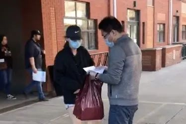

# 无标题

**链接地址:** http://mp.weixin.qq.com/s?__biz=MzUzNzQxOTI2MQ==&mid=2247484904&idx=1&sn=b1e75dd73c513438c267e896ec78b190&chksm=fae6097acd91806cb5274867cc6d39ac4df727b9555828f04f01df52659b6eb88b35b5c0c9c5&mpshare=1&scene=2&srcid=&sharer_sharetime=1590123938154&sharer_shareid=be1c8edd6c93eec155a61c876e41d26a#rd
**作者:** 
**获取时间:** 2025/8/28 20:13:06
**图片数量:** 16

---

## 原始HTML内容

<section style="box-sizing: border-box;font-size: 16px;"><section style="text-align: center;margin: 7px 0%;box-sizing: border-box;" powered-by="xiumi.us"><section style="display: inline-block;width: 50px;height: 50px;vertical-align: top;overflow: hidden;background-color: rgb(255, 255, 255);border-radius: 100%;border-width: 3px;border-style: solid;border-color: rgb(192, 228, 240) rgb(192, 228, 240) rgb(135, 211, 216) rgb(135, 211, 216);box-sizing: border-box;"><section style="margin-top: 10px;margin-right: 0%;margin-left: 0%;box-sizing: border-box;" powered-by="xiumi.us"><section style="font-size: 20px;color: rgb(255, 255, 255);text-shadow: rgb(96, 177, 205) 1px -1px, rgb(96, 177, 205) 1px 1px, rgb(96, 177, 205) -1px 1px, rgb(96, 177, 205) -1px -1px, rgb(96, 177, 205) 1px 0px, rgb(96, 177, 205) 0px 1px, rgb(96, 177, 205) -1px 0px, rgb(96, 177, 205) 0px -1px;letter-spacing: 4px;line-height: 1;box-sizing: border-box;">
<strong style="box-sizing: border-box;">01</strong>
</section></section></section></section><section style="text-align: center;justify-content: center;margin-top: 10px;margin-right: 0%;margin-left: 0%;box-sizing: border-box;" powered-by="xiumi.us"><section style="display: inline-block;width: auto;vertical-align: top;min-width: 10%;max-width: 100%;height: auto;box-sizing: border-box;"><section style="margin-right: 0%;margin-left: 0%;text-align: left;justify-content: flex-start;box-sizing: border-box;" powered-by="xiumi.us"><section style="text-align: right;font-size: 17px;color: rgb(255, 255, 255);letter-spacing: 4px;line-height: 1.5;text-shadow: rgba(66, 164, 199, 0.86) 1px -1px, rgba(66, 164, 199, 0.86) 1px 1px, rgba(66, 164, 199, 0.86) -1px 1px, rgba(66, 164, 199, 0.86) -1px -1px, rgba(66, 164, 199, 0.86) 1px 0px, rgba(66, 164, 199, 0.86) 0px 1px, rgba(66, 164, 199, 0.86) -1px 0px, rgba(66, 164, 199, 0.86) 0px -1px;box-sizing: border-box;">
<strong style="box-sizing: border-box;">祖国不会忘记你</strong>
</section></section><section style="box-sizing: border-box;" powered-by="xiumi.us"><section style="display: inline-block;vertical-align: top;width: auto;min-width: 10%;max-width: 100%;height: auto;padding-right: 5px;box-sizing: border-box;"><section style="font-size: 0px;box-sizing: border-box;" powered-by="xiumi.us"><section style="display: inline-block;width: 50px;height: 3px;vertical-align: top;overflow: hidden;background-color: rgb(199, 227, 239);box-sizing: border-box;line-height: 0;"> </section></section></section><section style="display: inline-block;vertical-align: top;width: auto;min-width: 10%;max-width: 100%;height: auto;letter-spacing: 0px;padding-left: 5px;box-sizing: border-box;"><section style="font-size: 0px;box-sizing: border-box;" powered-by="xiumi.us"><section style="display: inline-block;width: 50px;height: 3px;vertical-align: top;overflow: hidden;background-color: rgb(199, 227, 239);box-sizing: border-box;line-height: 0;"> </section></section></section></section></section></section><section style="margin: 15px 0%;box-sizing: border-box;" powered-by="xiumi.us"><section style="font-size: 14px;color: rgb(79, 140, 173);letter-spacing: 2px;padding-right: 15px;padding-left: 15px;line-height: 2;box-sizing: border-box;">
2020年对于生活在海外的炎黄子孙来说，是充满了<strong style="box-sizing: border-box;">艰巨挑战</strong>的一年。

 

年初新冠疫情在国内爆发，海外的华人华侨们迅速地自发加入了采购海外医用物资的行列。<strong style="box-sizing: border-box;">没日没夜地为国内抗击疫情的前线提供了支持与帮助</strong>。 

 
</section></section><section style="text-align: center;justify-content: center;margin: 10px 0%;box-sizing: border-box;" powered-by="xiumi.us"><section style="display: inline-block;width: 90%;vertical-align: top;padding: 10px;height: auto;background-image: linear-gradient(135deg, rgb(199, 227, 239) 0%, rgb(190, 230, 232) 100%);box-sizing: border-box;"><section style="box-sizing: border-box;" powered-by="xiumi.us"><section style="display: flex;flex-flow: row nowrap;box-sizing: border-box;"><section style="display: inline-block;vertical-align: middle;width: auto;flex: 5 5 0%;align-self: center;height: auto;margin-left: -16px;background-color: rgb(161, 203, 222);box-sizing: border-box;"><section style="text-align: justify;box-sizing: border-box;" powered-by="xiumi.us">
 
</section><section style="text-align: justify;box-sizing: border-box;" powered-by="xiumi.us">
 
</section><section style="text-align: justify;box-sizing: border-box;" powered-by="xiumi.us">
 
</section></section><section style="display: inline-block;vertical-align: top;width: auto;flex: 97.0452 97.0452 0%;align-self: flex-start;height: auto;box-sizing: border-box;"><section style="margin-right: 0%;margin-left: 0%;box-sizing: border-box;" powered-by="xiumi.us"><section style="max-width: 100%;vertical-align: middle;display: inline-block;line-height: 0;border-width: 4px;border-style: solid;border-radius: 0px;border-color: rgb(255, 255, 255);box-sizing: border-box;"></section></section></section><section style="display: inline-block;vertical-align: middle;width: auto;flex: 5 5 0%;align-self: center;height: auto;margin-right: -16px;background-color: rgb(161, 203, 222);box-sizing: border-box;"><section style="text-align: justify;box-sizing: border-box;" powered-by="xiumi.us">
 
</section><section style="text-align: justify;box-sizing: border-box;" powered-by="xiumi.us">
 
</section><section style="text-align: justify;box-sizing: border-box;" powered-by="xiumi.us">
 
</section></section></section></section></section></section><section style="text-align: center;font-size: 12px;color: rgba(62, 62, 62, 0.59);box-sizing: border-box;" powered-by="xiumi.us">
从海外寄回的医用物资（来源：后厂村7号）
</section><section style="margin: 15px 0%;box-sizing: border-box;" powered-by="xiumi.us"><section style="font-size: 14px;color: rgb(79, 140, 173);letter-spacing: 2px;padding-right: 15px;padding-left: 15px;line-height: 2;box-sizing: border-box;">
 

然而随着新冠病毒在全球的广泛传播，不少华侨华人所处的国家和地区也爆发出严重的疫情。

 

然而国内的疫情尚未完全消灭，海外的华侨华人却不得不面对<strong style="box-sizing: border-box;">卫生物资短缺，学校停课，工作停工和航班停飞等严峻问题</strong>。

 
</section></section><section style="margin: 10px 0%;box-sizing: border-box;" powered-by="xiumi.us"><section style="display: inline-block;width: 100%;vertical-align: top;border-width: 0px;padding-left: 6px;height: auto;background-image: linear-gradient(135deg, rgb(199, 227, 239) 0%, rgb(190, 230, 232) 100%);box-sizing: border-box;"><section style="display: inline-block;width: 100%;vertical-align: top;border-left: 2px solid rgb(255, 255, 255);border-bottom-left-radius: 0px;padding-left: 4px;box-sizing: border-box;" powered-by="xiumi.us"><section style="display: inline-block;width: 100%;vertical-align: top;border-left: 2px solid rgb(255, 255, 255);border-bottom-left-radius: 0px;padding: 8px;border-bottom-width: 0px;box-sizing: border-box;" powered-by="xiumi.us"><section style="text-align: center;margin-right: 0%;margin-left: 0%;box-sizing: border-box;" powered-by="xiumi.us"><section style="max-width: 100%;vertical-align: middle;display: inline-block;line-height: 0;box-sizing: border-box;"></section></section></section></section></section></section><section style="margin: 15px 0%;box-sizing: border-box;" powered-by="xiumi.us"><section style="font-size: 14px;color: rgb(79, 140, 173);letter-spacing: 2px;padding-right: 15px;padding-left: 15px;line-height: 2;box-sizing: border-box;">
 

中国外交部副部长马朝旭表示，据教育部门统计，截止到四月初，尚有约142万留学生滞留海外。而分布在<strong style="box-sizing: border-box;">加拿大就有23万人之多</strong>（来源：中国新闻网）。

 
</section></section><section style="text-align: center;justify-content: center;margin: 10px 0%;box-sizing: border-box;" powered-by="xiumi.us"><section style="display: inline-block;width: 90%;vertical-align: top;padding: 10px;height: auto;background-image: linear-gradient(135deg, rgb(199, 227, 239) 0%, rgb(190, 230, 232) 100%);box-sizing: border-box;"><section style="box-sizing: border-box;" powered-by="xiumi.us"><section style="display: flex;flex-flow: row nowrap;box-sizing: border-box;"><section style="display: inline-block;vertical-align: middle;width: auto;flex: 5 5 0%;align-self: center;height: auto;margin-left: -16px;background-color: rgb(161, 203, 222);box-sizing: border-box;"><section style="text-align: justify;box-sizing: border-box;" powered-by="xiumi.us">
 
</section><section style="text-align: justify;box-sizing: border-box;" powered-by="xiumi.us">
 
</section><section style="text-align: justify;box-sizing: border-box;" powered-by="xiumi.us">
 
</section></section><section style="display: inline-block;vertical-align: top;width: auto;flex: 97.0452 97.0452 0%;align-self: flex-start;height: auto;box-sizing: border-box;"><section style="margin-right: 0%;margin-left: 0%;box-sizing: border-box;" powered-by="xiumi.us"><section style="max-width: 100%;vertical-align: middle;display: inline-block;line-height: 0;border-width: 4px;border-style: solid;border-radius: 0px;border-color: rgb(255, 255, 255);box-sizing: border-box;"></section></section></section><section style="display: inline-block;vertical-align: middle;width: auto;flex: 5 5 0%;align-self: center;height: auto;margin-right: -16px;background-color: rgb(161, 203, 222);box-sizing: border-box;"><section style="text-align: justify;box-sizing: border-box;" powered-by="xiumi.us">
 
</section><section style="text-align: justify;box-sizing: border-box;" powered-by="xiumi.us">
 
</section><section style="text-align: justify;box-sizing: border-box;" powered-by="xiumi.us">
 
</section></section></section></section></section></section><section style="text-align: center;font-size: 12px;color: rgba(62, 62, 62, 0.59);box-sizing: border-box;" powered-by="xiumi.us">
中国驻卡尔加里总领馆总领事陆旭
</section><section style="margin: 15px 0%;box-sizing: border-box;" powered-by="xiumi.us"><section style="font-size: 14px;color: rgb(79, 140, 173);letter-spacing: 2px;padding-right: 15px;padding-left: 15px;line-height: 2;box-sizing: border-box;">
 

然而，<strong style="box-sizing: border-box;">中国驻卡尔加里总领馆</strong>并没有忘记这些身处异国他乡的中国留学生们！自新冠疫情爆发以来，中国驻卡尔加里总领馆对中国留学生的健康与生活状态更是提高了重视。

 
</section></section><section style="margin: 15px 0%;box-sizing: border-box;" powered-by="xiumi.us"><section style="font-size: 14px;color: rgb(79, 140, 173);letter-spacing: 2px;padding-right: 15px;padding-left: 15px;line-height: 2;box-sizing: border-box;">
不仅安排了中国驻卡尔加里总领馆领区留学生登记、在热线中为他们解读安全条例与政策、帮助协调安排归国航班……更是<strong style="box-sizing: border-box;">组织发放抗疫物资</strong>，将祖国对待海外学子的关照亲手传递到他们手中。 

 
</section></section><section style="box-sizing: border-box;" powered-by="xiumi.us">
 
</section><section style="text-align: center;margin: 7px 0%;box-sizing: border-box;" powered-by="xiumi.us"><section style="display: inline-block;width: 50px;height: 50px;vertical-align: top;overflow: hidden;background-color: rgb(255, 255, 255);border-radius: 100%;border-width: 3px;border-style: solid;border-color: rgb(192, 228, 240) rgb(192, 228, 240) rgb(135, 211, 216) rgb(135, 211, 216);box-sizing: border-box;"><section style="margin-top: 10px;margin-right: 0%;margin-left: 0%;box-sizing: border-box;" powered-by="xiumi.us"><section style="font-size: 20px;color: rgb(255, 255, 255);text-shadow: rgb(96, 177, 205) 1px -1px, rgb(96, 177, 205) 1px 1px, rgb(96, 177, 205) -1px 1px, rgb(96, 177, 205) -1px -1px, rgb(96, 177, 205) 1px 0px, rgb(96, 177, 205) 0px 1px, rgb(96, 177, 205) -1px 0px, rgb(96, 177, 205) 0px -1px;letter-spacing: 4px;line-height: 1;box-sizing: border-box;">
<strong style="box-sizing: border-box;">02</strong>
</section></section></section></section><section style="text-align: center;justify-content: center;margin-top: 10px;margin-right: 0%;margin-left: 0%;box-sizing: border-box;" powered-by="xiumi.us"><section style="display: inline-block;width: auto;vertical-align: top;min-width: 10%;max-width: 100%;height: auto;box-sizing: border-box;"><section style="margin-right: 0%;margin-left: 0%;text-align: left;justify-content: flex-start;box-sizing: border-box;" powered-by="xiumi.us"><section style="text-align: right;font-size: 17px;color: rgb(255, 255, 255);letter-spacing: 4px;line-height: 1.5;text-shadow: rgba(66, 164, 199, 0.86) 1px -1px, rgba(66, 164, 199, 0.86) 1px 1px, rgba(66, 164, 199, 0.86) -1px 1px, rgba(66, 164, 199, 0.86) -1px -1px, rgba(66, 164, 199, 0.86) 1px 0px, rgba(66, 164, 199, 0.86) 0px 1px, rgba(66, 164, 199, 0.86) -1px 0px, rgba(66, 164, 199, 0.86) 0px -1px;box-sizing: border-box;">
<strong style="box-sizing: border-box;">三千公里的爱心传递</strong>
</section></section><section style="box-sizing: border-box;" powered-by="xiumi.us"><section style="display: inline-block;vertical-align: top;width: auto;min-width: 10%;max-width: 100%;height: auto;padding-right: 5px;box-sizing: border-box;"><section style="font-size: 0px;box-sizing: border-box;" powered-by="xiumi.us"><section style="display: inline-block;width: 50px;height: 3px;vertical-align: top;overflow: hidden;background-color: rgb(199, 227, 239);box-sizing: border-box;line-height: 0;"> </section></section></section><section style="display: inline-block;vertical-align: top;width: auto;min-width: 10%;max-width: 100%;height: auto;letter-spacing: 0px;padding-left: 5px;box-sizing: border-box;"><section style="font-size: 0px;box-sizing: border-box;" powered-by="xiumi.us"><section style="display: inline-block;width: 50px;height: 3px;vertical-align: top;overflow: hidden;background-color: rgb(199, 227, 239);box-sizing: border-box;line-height: 0;"> </section></section></section></section></section></section><section style="text-align: center;justify-content: center;margin: 10px 0%;box-sizing: border-box;" powered-by="xiumi.us"><section style="display: inline-block;width: 90%;vertical-align: top;padding: 10px;height: auto;background-image: linear-gradient(135deg, rgb(199, 227, 239) 0%, rgb(190, 230, 232) 100%);box-sizing: border-box;"><section style="box-sizing: border-box;" powered-by="xiumi.us"><section style="display: flex;flex-flow: row nowrap;box-sizing: border-box;"><section style="display: inline-block;vertical-align: middle;width: auto;flex: 5 5 0%;align-self: center;height: auto;margin-left: -16px;background-color: rgb(161, 203, 222);box-sizing: border-box;"><section style="text-align: justify;box-sizing: border-box;" powered-by="xiumi.us">
 
</section><section style="text-align: justify;box-sizing: border-box;" powered-by="xiumi.us">
 
</section><section style="text-align: justify;box-sizing: border-box;" powered-by="xiumi.us">
 
</section></section><section style="display: inline-block;vertical-align: top;width: auto;flex: 97.0452 97.0452 0%;align-self: flex-start;height: auto;box-sizing: border-box;"><section style="margin-right: 0%;margin-left: 0%;box-sizing: border-box;" powered-by="xiumi.us"><section style="max-width: 100%;vertical-align: middle;display: inline-block;line-height: 0;border-width: 4px;border-style: solid;border-radius: 0px;border-color: rgb(255, 255, 255);box-sizing: border-box;"></section></section></section><section style="display: inline-block;vertical-align: middle;width: auto;flex: 5 5 0%;align-self: center;height: auto;margin-right: -16px;background-color: rgb(161, 203, 222);box-sizing: border-box;"><section style="text-align: justify;box-sizing: border-box;" powered-by="xiumi.us">
 
</section><section style="text-align: justify;box-sizing: border-box;" powered-by="xiumi.us">
 
</section><section style="text-align: justify;box-sizing: border-box;" powered-by="xiumi.us">
 
</section></section></section></section></section></section><section style="margin: 15px 0%;box-sizing: border-box;" powered-by="xiumi.us"><section style="font-size: 14px;color: rgb(79, 140, 173);letter-spacing: 2px;padding-right: 15px;padding-left: 15px;line-height: 2;box-sizing: border-box;">
 

4月18日分由中国驻卡尔加里使馆分装完毕的“健康包”被及时运往包括埃德蒙顿大学在内的五所学校。
</section></section><section style="text-align: center;margin-top: 10px;margin-bottom: 10px;box-sizing: border-box;" powered-by="xiumi.us"><section style="max-width: 100%;vertical-align: middle;display: inline-block;line-height: 0;width: 90%;height: auto;box-sizing: border-box;"></section></section><section style="margin: 15px 0%;box-sizing: border-box;" powered-by="xiumi.us"><section style="font-size: 14px;color: rgb(79, 140, 173);letter-spacing: 2px;padding-right: 15px;padding-left: 15px;line-height: 2;box-sizing: border-box;">
 

外交部，驻卡尔加里总领馆，学生及社会热心志愿者们完成了一场<strong style="box-sizing: border-box;">总里程近3000公里的“爱心接力”</strong>。

 
</section></section><section style="margin: 10px 0%;box-sizing: border-box;" powered-by="xiumi.us"><section style="display: inline-block;width: 100%;vertical-align: top;border-width: 0px;padding-left: 6px;height: auto;background-image: linear-gradient(135deg, rgb(199, 227, 239) 0%, rgb(190, 230, 232) 100%);box-sizing: border-box;"><section style="display: inline-block;width: 100%;vertical-align: top;border-left: 2px solid rgb(255, 255, 255);border-bottom-left-radius: 0px;padding-left: 4px;box-sizing: border-box;" powered-by="xiumi.us"><section style="display: inline-block;width: 100%;vertical-align: top;border-left: 2px solid rgb(255, 255, 255);border-bottom-left-radius: 0px;padding: 8px;border-bottom-width: 0px;box-sizing: border-box;" powered-by="xiumi.us"><section style="text-align: center;margin-right: 0%;margin-left: 0%;box-sizing: border-box;" powered-by="xiumi.us"><section style="max-width: 100%;vertical-align: middle;display: inline-block;line-height: 0;box-sizing: border-box;"></section></section></section></section></section></section><section style="box-sizing: border-box;" powered-by="xiumi.us">
 
</section><section style="text-align: center;margin: 7px 0%;box-sizing: border-box;" powered-by="xiumi.us"><section style="display: inline-block;width: 50px;height: 50px;vertical-align: top;overflow: hidden;background-color: rgb(255, 255, 255);border-radius: 100%;border-width: 3px;border-style: solid;border-color: rgb(192, 228, 240) rgb(192, 228, 240) rgb(135, 211, 216) rgb(135, 211, 216);box-sizing: border-box;"><section style="margin-top: 10px;margin-right: 0%;margin-left: 0%;box-sizing: border-box;" powered-by="xiumi.us"><section style="font-size: 20px;color: rgb(255, 255, 255);text-shadow: rgb(96, 177, 205) 1px -1px, rgb(96, 177, 205) 1px 1px, rgb(96, 177, 205) -1px 1px, rgb(96, 177, 205) -1px -1px, rgb(96, 177, 205) 1px 0px, rgb(96, 177, 205) 0px 1px, rgb(96, 177, 205) -1px 0px, rgb(96, 177, 205) 0px -1px;letter-spacing: 4px;line-height: 1;box-sizing: border-box;">
<strong style="box-sizing: border-box;">03</strong>
</section></section></section></section><section style="text-align: center;justify-content: center;margin-top: 10px;margin-right: 0%;margin-left: 0%;box-sizing: border-box;" powered-by="xiumi.us"><section style="display: inline-block;width: auto;vertical-align: top;min-width: 10%;max-width: 100%;height: auto;box-sizing: border-box;"><section style="margin-right: 0%;margin-left: 0%;text-align: left;justify-content: flex-start;box-sizing: border-box;" powered-by="xiumi.us"><section style="text-align: right;font-size: 17px;color: rgb(255, 255, 255);letter-spacing: 4px;line-height: 1.5;text-shadow: rgba(66, 164, 199, 0.86) 1px -1px, rgba(66, 164, 199, 0.86) 1px 1px, rgba(66, 164, 199, 0.86) -1px 1px, rgba(66, 164, 199, 0.86) -1px -1px, rgba(66, 164, 199, 0.86) 1px 0px, rgba(66, 164, 199, 0.86) 0px 1px, rgba(66, 164, 199, 0.86) -1px 0px, rgba(66, 164, 199, 0.86) 0px -1px;box-sizing: border-box;">
<strong style="box-sizing: border-box;">志愿者们是最可爱的人</strong>
</section></section><section style="box-sizing: border-box;" powered-by="xiumi.us"><section style="display: inline-block;vertical-align: top;width: auto;min-width: 10%;max-width: 100%;height: auto;padding-right: 5px;box-sizing: border-box;"><section style="font-size: 0px;box-sizing: border-box;" powered-by="xiumi.us"><section style="display: inline-block;width: 50px;height: 3px;vertical-align: top;overflow: hidden;background-color: rgb(199, 227, 239);box-sizing: border-box;line-height: 0;"> </section></section></section><section style="display: inline-block;vertical-align: top;width: auto;min-width: 10%;max-width: 100%;height: auto;letter-spacing: 0px;padding-left: 5px;box-sizing: border-box;"><section style="font-size: 0px;box-sizing: border-box;" powered-by="xiumi.us"><section style="display: inline-block;width: 50px;height: 3px;vertical-align: top;overflow: hidden;background-color: rgb(199, 227, 239);box-sizing: border-box;line-height: 0;"> </section></section></section></section></section></section><section style="margin: 15px 0%;box-sizing: border-box;" powered-by="xiumi.us"><section style="font-size: 14px;color: rgb(79, 140, 173);letter-spacing: 2px;padding-right: 15px;padding-left: 15px;line-height: 2;box-sizing: border-box;">
 

然而这次爱心的接力，更多的是要感谢来自各大学中国留学生组织志愿者和<strong style="box-sizing: border-box;">埃德蒙顿侨界组织热心参与者</strong>的无私奉献。

 
</section></section><section style="text-align: center;margin-top: 10px;margin-bottom: 10px;box-sizing: border-box;" powered-by="xiumi.us"><section style="max-width: 100%;vertical-align: middle;display: inline-block;line-height: 0;box-sizing: border-box;"></section></section><section style="margin: 15px 0%;box-sizing: border-box;" powered-by="xiumi.us"><section style="font-size: 14px;color: rgb(79, 140, 173);letter-spacing: 2px;padding-right: 15px;padding-left: 15px;line-height: 2;box-sizing: border-box;">
 

其中，<strong style="box-sizing: border-box;">埃德蒙顿加中友好协会</strong>就是参与发放“健康包”活动的社会组织之一。

 
</section></section><section style="margin: 10px 0%;box-sizing: border-box;" powered-by="xiumi.us"><section style="display: inline-block;width: 100%;vertical-align: top;border-width: 0px;padding-left: 6px;height: auto;background-image: linear-gradient(135deg, rgb(199, 227, 239) 0%, rgb(190, 230, 232) 100%);box-sizing: border-box;"><section style="display: inline-block;width: 100%;vertical-align: top;border-left: 2px solid rgb(255, 255, 255);border-bottom-left-radius: 0px;padding-left: 4px;box-sizing: border-box;" powered-by="xiumi.us"><section style="display: inline-block;width: 100%;vertical-align: top;border-left: 2px solid rgb(255, 255, 255);border-bottom-left-radius: 0px;padding: 8px;border-bottom-width: 0px;box-sizing: border-box;" powered-by="xiumi.us"><section style="text-align: center;margin-right: 0%;margin-left: 0%;box-sizing: border-box;" powered-by="xiumi.us"><section style="max-width: 100%;vertical-align: middle;display: inline-block;line-height: 0;box-sizing: border-box;"></section></section></section></section></section></section><section style="text-align: center;box-sizing: border-box;" powered-by="xiumi.us">
协会副会长马麟和留学生确认领取细节 
</section><section style="margin: 15px 0%;box-sizing: border-box;" powered-by="xiumi.us"><section style="font-size: 14px;color: rgb(79, 140, 173);letter-spacing: 2px;padding-right: 15px;padding-left: 15px;line-height: 2;box-sizing: border-box;">
 

他们不计酬劳，不辞辛苦。牺牲了大量休息的时间，作为爱的使者，将祖国关怀和温暖送达留学生的<strong style="box-sizing: border-box;">“最后一公里”</strong>。

 

这批抵达埃德蒙顿的抗疫物资，截止到目前已经分发了<strong style="box-sizing: border-box;">四次</strong>。从尚未成年的高中生，到麦克文大学的留学生，再到访加的公派学者…依次根据登记，都从埃德蒙顿加中友好协会志愿者手中，领取到了<strong style="box-sizing: border-box;">来自数千公里外祖国母亲的心意</strong>。
</section></section><section style="box-sizing: border-box;" powered-by="xiumi.us">
 
</section><section style="text-align: center;justify-content: center;margin: 10px 0%;box-sizing: border-box;" powered-by="xiumi.us"><section style="display: inline-block;width: 90%;vertical-align: top;padding: 10px;height: auto;background-image: linear-gradient(135deg, rgb(199, 227, 239) 0%, rgb(190, 230, 232) 100%);box-sizing: border-box;"><section style="box-sizing: border-box;" powered-by="xiumi.us"><section style="display: flex;flex-flow: row nowrap;box-sizing: border-box;"><section style="display: inline-block;vertical-align: middle;width: auto;flex: 5 5 0%;align-self: center;height: auto;margin-left: -16px;background-color: rgb(161, 203, 222);box-sizing: border-box;"><section style="text-align: justify;box-sizing: border-box;" powered-by="xiumi.us">
 
</section><section style="text-align: justify;box-sizing: border-box;" powered-by="xiumi.us">
 
</section><section style="text-align: justify;box-sizing: border-box;" powered-by="xiumi.us">
 
</section></section><section style="display: inline-block;vertical-align: top;width: auto;flex: 97.0452 97.0452 0%;align-self: flex-start;height: auto;box-sizing: border-box;"><section style="margin-right: 0%;margin-left: 0%;box-sizing: border-box;" powered-by="xiumi.us"><section style="max-width: 100%;vertical-align: middle;display: inline-block;line-height: 0;border-width: 4px;border-style: solid;border-radius: 0px;border-color: rgb(255, 255, 255);box-sizing: border-box;"></section></section></section><section style="display: inline-block;vertical-align: middle;width: auto;flex: 5 5 0%;align-self: center;height: auto;margin-right: -16px;background-color: rgb(161, 203, 222);box-sizing: border-box;"><section style="text-align: justify;box-sizing: border-box;" powered-by="xiumi.us">
 
</section><section style="text-align: justify;box-sizing: border-box;" powered-by="xiumi.us">
 
</section><section style="text-align: justify;box-sizing: border-box;" powered-by="xiumi.us">
 
</section></section></section></section></section></section><section style="text-align: right;box-sizing: border-box;" powered-by="xiumi.us">
协会财务和理事韩子鸿协调分发计划
</section><section style="margin: 15px 0%;box-sizing: border-box;" powered-by="xiumi.us"><section style="font-size: 14px;color: rgb(79, 140, 173);letter-spacing: 2px;padding-right: 15px;padding-left: 15px;line-height: 2;box-sizing: border-box;">
 

这批健康物资从运输，调配和分发的每个环节，都<strong style="box-sizing: border-box;">离不开这些志愿者的不懈坚持与努力</strong>。

 

根据统计，共有近<strong style="box-sizing: border-box;">1</strong><strong style="box-sizing: border-box;">00位志愿者</strong>参加了这次“健康包”的分发活动，并在长达一个月的活动期间内将<strong style="box-sizing: border-box;">3300余份</strong>“健康包”亲手送到了留学生手中。

 
</section></section><section style="text-align: center;justify-content: center;margin: 10px 0%;box-sizing: border-box;" powered-by="xiumi.us"><section style="display: inline-block;width: 90%;vertical-align: top;padding: 10px;height: auto;background-image: linear-gradient(135deg, rgb(199, 227, 239) 0%, rgb(190, 230, 232) 100%);box-sizing: border-box;"><section style="box-sizing: border-box;" powered-by="xiumi.us"><section style="display: flex;flex-flow: row nowrap;box-sizing: border-box;"><section style="display: inline-block;vertical-align: middle;width: auto;flex: 5 5 0%;align-self: center;height: auto;margin-left: -16px;background-color: rgb(161, 203, 222);box-sizing: border-box;"><section style="text-align: justify;box-sizing: border-box;" powered-by="xiumi.us">
 
</section><section style="text-align: justify;box-sizing: border-box;" powered-by="xiumi.us">
 
</section><section style="text-align: justify;box-sizing: border-box;" powered-by="xiumi.us">
 
</section></section><section style="display: inline-block;vertical-align: top;width: auto;flex: 97.0452 97.0452 0%;align-self: flex-start;height: auto;box-sizing: border-box;"><section style="margin-right: 0%;margin-left: 0%;box-sizing: border-box;" powered-by="xiumi.us"><section style="max-width: 100%;vertical-align: middle;display: inline-block;line-height: 0;border-width: 4px;border-style: solid;border-radius: 0px;border-color: rgb(255, 255, 255);box-sizing: border-box;"></section></section></section><section style="display: inline-block;vertical-align: middle;width: auto;flex: 5 5 0%;align-self: center;height: auto;margin-right: -16px;background-color: rgb(161, 203, 222);box-sizing: border-box;"><section style="text-align: justify;box-sizing: border-box;" powered-by="xiumi.us">
 
</section><section style="text-align: justify;box-sizing: border-box;" powered-by="xiumi.us">
 
</section><section style="text-align: justify;box-sizing: border-box;" powered-by="xiumi.us">
 
</section></section></section></section></section></section><section style="text-align: center;box-sizing: border-box;" powered-by="xiumi.us">
协会秘书长田屹和收到“健康包”留学生合影 
</section><section style="box-sizing: border-box;" powered-by="xiumi.us">
 
</section><section style="margin: 10px 0%;text-align: center;justify-content: center;box-sizing: border-box;" powered-by="xiumi.us"><section style="display: inline-block;width: 80%;vertical-align: top;background-color: rgba(255, 255, 255, 0);padding-top: 10px;padding-bottom: 10px;height: auto;border-style: solid;border-width: 1px;border-radius: 0px;border-color: rgba(66, 164, 199, 0.52);box-sizing: border-box;"><section style="box-sizing: border-box;" powered-by="xiumi.us"><section style="margin-right: 0%;margin-left: 0%;display: flex;flex-flow: row nowrap;box-sizing: border-box;"><section style="display: inline-block;vertical-align: top;width: auto;padding-right: 5px;margin-left: -40px;flex: 50 50 0%;align-self: flex-start;height: auto;box-sizing: border-box;"><section style="margin-right: 0%;margin-left: 0%;box-sizing: border-box;" powered-by="xiumi.us"><section style="max-width: 100%;vertical-align: middle;display: inline-block;line-height: 0;box-sizing: border-box;"></section></section></section><section style="display: inline-block;vertical-align: bottom;width: auto;padding-left: 5px;margin-right: -40px;align-self: flex-end;flex: 50 50 0%;height: auto;box-sizing: border-box;"><section style="margin-right: 0%;margin-left: 0%;box-sizing: border-box;" powered-by="xiumi.us"><section style="max-width: 100%;vertical-align: middle;display: inline-block;line-height: 0;box-sizing: border-box;"></section></section></section></section></section></section></section><section style="text-align: center;box-sizing: border-box;" powered-by="xiumi.us">
左图：志愿者何应锴和留学生确认领取细节 

右图：志愿者吴本鑫和收到“健康包”留学生合影
</section><section style="margin: 15px 0%;box-sizing: border-box;" powered-by="xiumi.us"><section style="font-size: 14px;color: rgb(79, 140, 173);letter-spacing: 2px;padding-right: 15px;padding-left: 15px;line-height: 2;box-sizing: border-box;">
 

4月的埃德蒙顿还尚未迎来春的暖意，但对于<strong style="box-sizing: border-box;">社会的大爱和</strong><strong style="box-sizing: border-box;">祖国母亲的感恩之心</strong>将海外华侨组织和留学生群体们再次汇聚在一起。

 

接过“健康包”的留学生们眼中泛起了激动的泪光，从祖国漂洋过海而来的温暖，<strong style="box-sizing: border-box;">通过埃德蒙顿加中友好协会志愿者的双手，驱散了埃城的寒冬，将春意注入留学生们的心坎里</strong>。

 
</section></section><section style="text-align: center;margin: 7px 0%;box-sizing: border-box;" powered-by="xiumi.us"><section style="display: inline-block;width: 50px;height: 50px;vertical-align: top;overflow: hidden;background-color: rgb(255, 255, 255);border-radius: 100%;border-width: 3px;border-style: solid;border-color: rgb(192, 228, 240) rgb(192, 228, 240) rgb(135, 211, 216) rgb(135, 211, 216);box-sizing: border-box;"><section style="margin-top: 10px;margin-right: 0%;margin-left: 0%;box-sizing: border-box;" powered-by="xiumi.us"><section style="font-size: 20px;color: rgb(255, 255, 255);text-shadow: rgb(96, 177, 205) 1px -1px, rgb(96, 177, 205) 1px 1px, rgb(96, 177, 205) -1px 1px, rgb(96, 177, 205) -1px -1px, rgb(96, 177, 205) 1px 0px, rgb(96, 177, 205) 0px 1px, rgb(96, 177, 205) -1px 0px, rgb(96, 177, 205) 0px -1px;letter-spacing: 4px;line-height: 1;box-sizing: border-box;">
<strong style="box-sizing: border-box;">04</strong>
</section></section></section></section><section style="text-align: center;justify-content: center;margin-top: 10px;margin-right: 0%;margin-left: 0%;box-sizing: border-box;" powered-by="xiumi.us"><section style="display: inline-block;width: auto;vertical-align: top;min-width: 10%;max-width: 100%;height: auto;box-sizing: border-box;"><section style="margin-right: 0%;margin-left: 0%;text-align: left;justify-content: flex-start;box-sizing: border-box;" powered-by="xiumi.us"><section style="text-align: right;font-size: 17px;color: rgb(255, 255, 255);letter-spacing: 4px;line-height: 1.5;text-shadow: rgba(66, 164, 199, 0.86) 1px -1px, rgba(66, 164, 199, 0.86) 1px 1px, rgba(66, 164, 199, 0.86) -1px 1px, rgba(66, 164, 199, 0.86) -1px -1px, rgba(66, 164, 199, 0.86) 1px 0px, rgba(66, 164, 199, 0.86) 0px 1px, rgba(66, 164, 199, 0.86) -1px 0px, rgba(66, 164, 199, 0.86) 0px -1px;box-sizing: border-box;">
<strong style="box-sizing: border-box;">用团结的力量传递爱心</strong>
</section></section><section style="box-sizing: border-box;" powered-by="xiumi.us"><section style="display: inline-block;vertical-align: top;width: auto;min-width: 10%;max-width: 100%;height: auto;padding-right: 5px;box-sizing: border-box;"><section style="font-size: 0px;box-sizing: border-box;" powered-by="xiumi.us"><section style="display: inline-block;width: 50px;height: 3px;vertical-align: top;overflow: hidden;background-color: rgb(199, 227, 239);box-sizing: border-box;line-height: 0;"> </section></section></section><section style="display: inline-block;vertical-align: top;width: auto;min-width: 10%;max-width: 100%;height: auto;letter-spacing: 0px;padding-left: 5px;box-sizing: border-box;"><section style="font-size: 0px;box-sizing: border-box;" powered-by="xiumi.us"><section style="display: inline-block;width: 50px;height: 3px;vertical-align: top;overflow: hidden;background-color: rgb(199, 227, 239);box-sizing: border-box;line-height: 0;"> </section></section></section></section></section></section><section style="margin: 15px 0%;box-sizing: border-box;" powered-by="xiumi.us"><section style="font-size: 14px;color: rgb(79, 140, 173);letter-spacing: 2px;padding-right: 15px;padding-left: 15px;line-height: 2;box-sizing: border-box;">
 

他们曾经在危难关头帮助祖国采集物资抗击疫情的光荣事迹，<strong style="box-sizing: border-box;">祖国不会忘记</strong>；如今祖国作为他们最坚实的后盾，必将在他们身后陪伴和帮助他们共渡难关！
</section></section><section style="margin: 15px 0%;box-sizing: border-box;" powered-by="xiumi.us"><section style="font-size: 14px;color: rgb(79, 140, 173);letter-spacing: 2px;padding-right: 15px;padding-left: 15px;line-height: 2;box-sizing: border-box;">
“健康包”内装有的是连花清瘟胶囊、防疫指南、医用外科口罩、N95型口罩、消毒湿。<strong style="box-sizing: border-box;">这些全是在海外已经较难买到，但又必备的防疫物品</strong>。 

 
</section></section><section style="margin: 10px 0%;box-sizing: border-box;" powered-by="xiumi.us"><section style="display: inline-block;width: 100%;vertical-align: top;border-width: 0px;padding-left: 6px;height: auto;background-image: linear-gradient(135deg, rgb(199, 227, 239) 0%, rgb(190, 230, 232) 100%);box-sizing: border-box;"><section style="display: inline-block;width: 100%;vertical-align: top;border-left: 2px solid rgb(255, 255, 255);border-bottom-left-radius: 0px;padding-left: 4px;box-sizing: border-box;" powered-by="xiumi.us"><section style="display: inline-block;width: 100%;vertical-align: top;border-left: 2px solid rgb(255, 255, 255);border-bottom-left-radius: 0px;padding: 8px;border-bottom-width: 0px;box-sizing: border-box;" powered-by="xiumi.us"><section style="text-align: center;margin-right: 0%;margin-left: 0%;box-sizing: border-box;" powered-by="xiumi.us"><section style="max-width: 100%;vertical-align: middle;display: inline-block;line-height: 0;box-sizing: border-box;"></section></section></section></section></section></section><section style="box-sizing: border-box;" powered-by="xiumi.us">
 
</section><section style="margin: 15px 0%;box-sizing: border-box;" powered-by="xiumi.us"><section style="font-size: 14px;color: rgb(79, 140, 173);letter-spacing: 2px;padding-right: 15px;padding-left: 15px;line-height: 2;box-sizing: border-box;">
领到“健康包”的留学生纷纷当面和在社交媒体上发表了对于<strong style="box-sizing: border-box;">祖国母亲和志愿者们的感谢</strong>。 

 

虽然他们与祖国相隔千山万水，但是祖国和他们的心意却始终连在一起的。 

 
</section></section><section style="text-align: center;justify-content: center;margin: 10px 0%;box-sizing: border-box;" powered-by="xiumi.us"><section style="display: inline-block;width: 90%;vertical-align: top;padding: 10px;height: auto;background-image: linear-gradient(135deg, rgb(199, 227, 239) 0%, rgb(190, 230, 232) 100%);box-sizing: border-box;"><section style="box-sizing: border-box;" powered-by="xiumi.us"><section style="display: flex;flex-flow: row nowrap;box-sizing: border-box;"><section style="display: inline-block;vertical-align: middle;width: auto;flex: 5 5 0%;align-self: center;height: auto;margin-left: -16px;background-color: rgb(161, 203, 222);box-sizing: border-box;"><section style="text-align: justify;box-sizing: border-box;" powered-by="xiumi.us">
 
</section><section style="text-align: justify;box-sizing: border-box;" powered-by="xiumi.us">
 
</section><section style="text-align: justify;box-sizing: border-box;" powered-by="xiumi.us">
 
</section></section><section style="display: inline-block;vertical-align: top;width: auto;flex: 97.0452 97.0452 0%;align-self: flex-start;height: auto;box-sizing: border-box;"><section style="margin-right: 0%;margin-left: 0%;box-sizing: border-box;" powered-by="xiumi.us"><section style="max-width: 100%;vertical-align: middle;display: inline-block;line-height: 0;border-width: 4px;border-style: solid;border-radius: 0px;border-color: rgb(255, 255, 255);box-sizing: border-box;"></section></section></section><section style="display: inline-block;vertical-align: middle;width: auto;flex: 5 5 0%;align-self: center;height: auto;margin-right: -16px;background-color: rgb(161, 203, 222);box-sizing: border-box;"><section style="text-align: justify;box-sizing: border-box;" powered-by="xiumi.us">
 
</section><section style="text-align: justify;box-sizing: border-box;" powered-by="xiumi.us">
 
</section><section style="text-align: justify;box-sizing: border-box;" powered-by="xiumi.us">
 
</section></section></section></section></section></section><section style="margin: 15px 0%;box-sizing: border-box;" powered-by="xiumi.us"><section style="font-size: 14px;color: rgb(79, 140, 173);letter-spacing: 2px;padding-right: 15px;padding-left: 15px;line-height: 2;box-sizing: border-box;">
 

“健康包”是<strong style="box-sizing: border-box;">“及时雨”</strong>，是“<strong style="box-sizing: border-box;">雪中炭”</strong>，承载了祖国之爱，饱含着牵挂情怀。

 

然而这次公益活动，也绝不是加中友好协会第一次或最后一次为社会做出这样的贡献。

 
</section></section><section style="margin: 15px 0%;box-sizing: border-box;" powered-by="xiumi.us"><section style="font-size: 14px;color: rgb(79, 140, 173);letter-spacing: 2px;padding-right: 15px;padding-left: 15px;line-height: 2;box-sizing: border-box;">
早在国内新冠疫情爆发伊始，埃德蒙顿加中友好协会和爱城和阿省其他团体组织于1月25日正月初一上午10点半发起的<strong style="box-sizing: border-box;">“心系武汉 - 为祖国赠送物资抗击疫情“</strong>活动。 

 
</section></section><section style="text-align: center;margin-top: 10px;margin-bottom: 10px;box-sizing: border-box;" powered-by="xiumi.us"><section style="max-width: 100%;vertical-align: middle;display: inline-block;line-height: 0;box-sizing: border-box;"></section></section><section style="margin: 15px 0%;box-sizing: border-box;" powered-by="xiumi.us"><section style="font-size: 14px;color: rgb(79, 140, 173);letter-spacing: 2px;padding-right: 15px;padding-left: 15px;line-height: 2;box-sizing: border-box;">
 

<strong style="box-sizing: border-box;">成立于1973年加拿大埃德蒙顿的加中友好协会，以做加中友好的民间桥梁作为使命。</strong>

 

不管是中国还是加国的人民受到疫情的侵袭，加中友好协会都将责无旁贷地为两地积极搜集物资，竭尽全力地动用人力和物力互相帮助度过难关。冲在最前线抗击疫情的最前线，<strong style="box-sizing: border-box;">为加国华人组织和社区团体做好榜样</strong>！

 
</section></section><section style="text-align: center;margin: 7px 0%;box-sizing: border-box;" powered-by="xiumi.us"><section style="display: inline-block;width: 50px;height: 50px;vertical-align: top;overflow: hidden;background-color: rgb(255, 255, 255);border-radius: 100%;border-width: 3px;border-style: solid;border-color: rgb(192, 228, 240) rgb(192, 228, 240) rgb(135, 211, 216) rgb(135, 211, 216);box-sizing: border-box;"><section style="margin-top: 10px;margin-right: 0%;margin-left: 0%;box-sizing: border-box;" powered-by="xiumi.us"><section style="font-size: 20px;color: rgb(255, 255, 255);text-shadow: rgb(96, 177, 205) 1px -1px, rgb(96, 177, 205) 1px 1px, rgb(96, 177, 205) -1px 1px, rgb(96, 177, 205) -1px -1px, rgb(96, 177, 205) 1px 0px, rgb(96, 177, 205) 0px 1px, rgb(96, 177, 205) -1px 0px, rgb(96, 177, 205) 0px -1px;letter-spacing: 4px;line-height: 1;box-sizing: border-box;">
<strong style="box-sizing: border-box;">05</strong>
</section></section></section></section><section style="text-align: center;justify-content: center;margin-top: 10px;margin-right: 0%;margin-left: 0%;box-sizing: border-box;" powered-by="xiumi.us"><section style="display: inline-block;width: auto;vertical-align: top;min-width: 10%;max-width: 100%;height: auto;box-sizing: border-box;"><section style="margin-right: 0%;margin-left: 0%;text-align: left;justify-content: flex-start;box-sizing: border-box;" powered-by="xiumi.us"><section style="text-align: right;font-size: 17px;color: rgb(255, 255, 255);letter-spacing: 4px;line-height: 1.5;text-shadow: rgba(66, 164, 199, 0.86) 1px -1px, rgba(66, 164, 199, 0.86) 1px 1px, rgba(66, 164, 199, 0.86) -1px 1px, rgba(66, 164, 199, 0.86) -1px -1px, rgba(66, 164, 199, 0.86) 1px 0px, rgba(66, 164, 199, 0.86) 0px 1px, rgba(66, 164, 199, 0.86) -1px 0px, rgba(66, 164, 199, 0.86) 0px -1px;box-sizing: border-box;">
<strong style="box-sizing: border-box;">加中友好协会 与你同在</strong>
</section></section><section style="box-sizing: border-box;" powered-by="xiumi.us"><section style="display: inline-block;vertical-align: top;width: auto;min-width: 10%;max-width: 100%;height: auto;padding-right: 5px;box-sizing: border-box;"><section style="font-size: 0px;box-sizing: border-box;" powered-by="xiumi.us"><section style="display: inline-block;width: 50px;height: 3px;vertical-align: top;overflow: hidden;background-color: rgb(199, 227, 239);box-sizing: border-box;line-height: 0;"> </section></section></section><section style="display: inline-block;vertical-align: top;width: auto;min-width: 10%;max-width: 100%;height: auto;letter-spacing: 0px;padding-left: 5px;box-sizing: border-box;"><section style="font-size: 0px;box-sizing: border-box;" powered-by="xiumi.us"><section style="display: inline-block;width: 50px;height: 3px;vertical-align: top;overflow: hidden;background-color: rgb(199, 227, 239);box-sizing: border-box;line-height: 0;"> </section></section></section></section></section></section><section style="box-sizing: border-box;" powered-by="xiumi.us">
 
</section><section style="margin: 15px 0%;box-sizing: border-box;" powered-by="xiumi.us"><section style="font-size: 14px;color: rgb(79, 140, 173);letter-spacing: 2px;padding-right: 15px;padding-left: 15px;line-height: 2;box-sizing: border-box;">
如今抗击新冠疫情已变成全球性的艰巨任务，埃德蒙顿中加友好协会愿意陪伴外海的每一位留学生，华侨和华人同胞一同打赢这场没有硝烟的战疫！ 

 
</section></section><section style="text-align: center;justify-content: center;margin: 10px 0%;box-sizing: border-box;" powered-by="xiumi.us"><section style="display: inline-block;width: 90%;vertical-align: top;padding: 10px;height: auto;background-image: linear-gradient(135deg, rgb(199, 227, 239) 0%, rgb(190, 230, 232) 100%);box-sizing: border-box;"><section style="box-sizing: border-box;" powered-by="xiumi.us"><section style="display: flex;flex-flow: row nowrap;box-sizing: border-box;"><section style="display: inline-block;vertical-align: middle;width: auto;flex: 5 5 0%;align-self: center;height: auto;margin-left: -16px;background-color: rgb(161, 203, 222);box-sizing: border-box;"><section style="text-align: justify;box-sizing: border-box;" powered-by="xiumi.us">
 
</section><section style="text-align: justify;box-sizing: border-box;" powered-by="xiumi.us">
 
</section><section style="text-align: justify;box-sizing: border-box;" powered-by="xiumi.us">
 
</section></section><section style="display: inline-block;vertical-align: top;width: auto;flex: 97.0452 97.0452 0%;align-self: flex-start;height: auto;box-sizing: border-box;"><section style="margin-right: 0%;margin-left: 0%;box-sizing: border-box;" powered-by="xiumi.us"><section style="max-width: 100%;vertical-align: middle;display: inline-block;line-height: 0;border-width: 4px;border-style: solid;border-radius: 0px;border-color: rgb(255, 255, 255);box-sizing: border-box;"></section></section></section><section style="display: inline-block;vertical-align: middle;width: auto;flex: 5 5 0%;align-self: center;height: auto;margin-right: -16px;background-color: rgb(161, 203, 222);box-sizing: border-box;"><section style="text-align: justify;box-sizing: border-box;" powered-by="xiumi.us">
 
</section><section style="text-align: justify;box-sizing: border-box;" powered-by="xiumi.us">
 
</section><section style="text-align: justify;box-sizing: border-box;" powered-by="xiumi.us">
 
</section></section></section></section></section></section><section style="margin: 15px 0%;box-sizing: border-box;" powered-by="xiumi.us"><section style="font-size: 14px;color: rgb(79, 140, 173);letter-spacing: 2px;padding-right: 15px;padding-left: 15px;line-height: 2;box-sizing: border-box;">
 

希望身在海外的各位高度重视疫情防范，严格遵守加各级政府和卫生部门的防疫要求，加强个人卫生防护，保证好自身的身体健康。 

 

请平平安安地度过身在海外的每一天，这就是对我们埃德蒙顿加中友好协会，参与“健康包”分发的志愿者们，和中国驻卡尔加里总领馆，还有对祖国母亲恩情最好的回馈！
</section></section></section>

---

## 纯文本内容

01祖国不会忘记你2020年对于生活在海外的炎黄子孙来说，是充满了艰巨挑战的一年。年初新冠疫情在国内爆发，海外的华人华侨们迅速地自发加入了采购海外医用物资的行列。没日没夜地为国内抗击疫情的前线提供了支持与帮助。从海外寄回的医用物资（来源：后厂村7号）然而随着新冠病毒在全球的广泛传播，不少华侨华人所处的国家和地区也爆发出严重的疫情。然而国内的疫情尚未完全消灭，海外的华侨华人却不得不面对卫生物资短缺，学校停课，工作停工和航班停飞等严峻问题。中国外交部副部长马朝旭表示，据教育部门统计，截止到四月初，尚有约142万留学生滞留海外。而分布在加拿大就有23万人之多（来源：中国新闻网）。中国驻卡尔加里总领馆总领事陆旭然而，中国驻卡尔加里总领馆并没有忘记这些身处异国他乡的中国留学生们！自新冠疫情爆发以来，中国驻卡尔加里总领馆对中国留学生的健康与生活状态更是提高了重视。不仅安排了中国驻卡尔加里总领馆领区留学生登记、在热线中为他们解读安全条例与政策、帮助协调安排归国航班……更是组织发放抗疫物资，将祖国对待海外学子的关照亲手传递到他们手中。02三千公里的爱心传递4月18日分由中国驻卡尔加里使馆分装完毕的“健康包”被及时运往包括埃德蒙顿大学在内的五所学校。外交部，驻卡尔加里总领馆，学生及社会热心志愿者们完成了一场总里程近3000公里的“爱心接力”。03志愿者们是最可爱的人然而这次爱心的接力，更多的是要感谢来自各大学中国留学生组织志愿者和埃德蒙顿侨界组织热心参与者的无私奉献。其中，埃德蒙顿加中友好协会就是参与发放“健康包”活动的社会组织之一。协会副会长马麟和留学生确认领取细节他们不计酬劳，不辞辛苦。牺牲了大量休息的时间，作为爱的使者，将祖国关怀和温暖送达留学生的“最后一公里”。这批抵达埃德蒙顿的抗疫物资，截止到目前已经分发了四次。从尚未成年的高中生，到麦克文大学的留学生，再到访加的公派学者…依次根据登记，都从埃德蒙顿加中友好协会志愿者手中，领取到了来自数千公里外祖国母亲的心意。协会财务和理事韩子鸿协调分发计划这批健康物资从运输，调配和分发的每个环节，都离不开这些志愿者的不懈坚持与努力。根据统计，共有近100位志愿者参加了这次“健康包”的分发活动，并在长达一个月的活动期间内将3300余份“健康包”亲手送到了留学生手中。协会秘书长田屹和收到“健康包”留学生合影左图：志愿者何应锴和留学生确认领取细节右图：志愿者吴本鑫和收到“健康包”留学生合影4月的埃德蒙顿还尚未迎来春的暖意，但对于社会的大爱和祖国母亲的感恩之心将海外华侨组织和留学生群体们再次汇聚在一起。接过“健康包”的留学生们眼中泛起了激动的泪光，从祖国漂洋过海而来的温暖，通过埃德蒙顿加中友好协会志愿者的双手，驱散了埃城的寒冬，将春意注入留学生们的心坎里。04用团结的力量传递爱心他们曾经在危难关头帮助祖国采集物资抗击疫情的光荣事迹，祖国不会忘记；如今祖国作为他们最坚实的后盾，必将在他们身后陪伴和帮助他们共渡难关！“健康包”内装有的是连花清瘟胶囊、防疫指南、医用外科口罩、N95型口罩、消毒湿。这些全是在海外已经较难买到，但又必备的防疫物品。领到“健康包”的留学生纷纷当面和在社交媒体上发表了对于祖国母亲和志愿者们的感谢。虽然他们与祖国相隔千山万水，但是祖国和他们的心意却始终连在一起的。“健康包”是“及时雨”，是“雪中炭”，承载了祖国之爱，饱含着牵挂情怀。然而这次公益活动，也绝不是加中友好协会第一次或最后一次为社会做出这样的贡献。早在国内新冠疫情爆发伊始，埃德蒙顿加中友好协会和爱城和阿省其他团体组织于1月25日正月初一上午10点半发起的“心系武汉 - 为祖国赠送物资抗击疫情“活动。成立于1973年加拿大埃德蒙顿的加中友好协会，以做加中友好的民间桥梁作为使命。不管是中国还是加国的人民受到疫情的侵袭，加中友好协会都将责无旁贷地为两地积极搜集物资，竭尽全力地动用人力和物力互相帮助度过难关。冲在最前线抗击疫情的最前线，为加国华人组织和社区团体做好榜样！05加中友好协会 与你同在如今抗击新冠疫情已变成全球性的艰巨任务，埃德蒙顿中加友好协会愿意陪伴外海的每一位留学生，华侨和华人同胞一同打赢这场没有硝烟的战疫！希望身在海外的各位高度重视疫情防范，严格遵守加各级政府和卫生部门的防疫要求，加强个人卫生防护，保证好自身的身体健康。请平平安安地度过身在海外的每一天，这就是对我们埃德蒙顿加中友好协会，参与“健康包”分发的志愿者们，和中国驻卡尔加里总领馆，还有对祖国母亲恩情最好的回馈！

---

## 图片列表

-  (原始链接: https://mmbiz.qpic.cn/mmbiz_jpg/z8ibtosSndj1KCIVPoZQXTmbibHhuzGe9nyojkWgbclY1Knz8qXI9dLNHhc9x0p1JIrk7Xichib6yKC95Vibq5beW3Q/640?wx_fmt=jpeg)
-  (原始链接: https://mmbiz.qpic.cn/mmbiz_jpg/z8ibtosSndj1KCIVPoZQXTmbibHhuzGe9nfKwySnHA3iaXXOB5qDQVv0ibx67VNZ0SbpibuUnBcexRg3lcRoj6iaD9vQ/640?wx_fmt=jpeg)
-  (原始链接: https://mmbiz.qpic.cn/mmbiz_jpg/z8ibtosSndj1KCIVPoZQXTmbibHhuzGe9nib7ybibt2ByNxWbia6fLVOe0iav41MJBn9Ip2TMzC49AaUyS11ld2d3Akg/640?wx_fmt=jpeg)
-  (原始链接: https://mmbiz.qpic.cn/mmbiz_jpg/z8ibtosSndj1KCIVPoZQXTmbibHhuzGe9nZAJII24Jp45yZyxqeo1HlxsFQAyN4gOZEsaZXTboKkbC20fnbwMItg/640?wx_fmt=jpeg)
-  (原始链接: https://mmbiz.qpic.cn/mmbiz_jpg/z8ibtosSndj1KCIVPoZQXTmbibHhuzGe9nvTwg9SyTCSic8deZ5Nicr4DcoAnY0CibCAYK2GiaQ5aD77vwI8EYCrXHLg/640?wx_fmt=jpeg)
-  (原始链接: https://mmbiz.qpic.cn/mmbiz_jpg/z8ibtosSndj1KCIVPoZQXTmbibHhuzGe9nmAlwMNic4BiaF5Q9hycASBIGA0rwTnTA2R7NnOdZvAHbBEjyw700GQvQ/640?wx_fmt=jpeg)
-  (原始链接: https://mmbiz.qpic.cn/mmbiz_png/z8ibtosSndj1KCIVPoZQXTmbibHhuzGe9njulkRmyJWMuFBXBI9TE6MJaL83IzNzHOLKic8v28rZlYcbqT2ubNyIg/640?wx_fmt=png)
-  (原始链接: https://mmbiz.qpic.cn/mmbiz_jpg/z8ibtosSndj1KCIVPoZQXTmbibHhuzGe9nIRwoiaETRRSp8ULXpm89kXwvgqaIFfoevPut10ibdOBJrH9ZC7O6IXbQ/640?wx_fmt=jpeg)
-  (原始链接: https://mmbiz.qpic.cn/mmbiz_jpg/z8ibtosSndj1KCIVPoZQXTmbibHhuzGe9nCiaBOAnP51hF9VwW3F9TXrU8WSFDg9wYGhfricMjh76kPU0lTDRmLZibA/640?wx_fmt=jpeg)
-  (原始链接: https://mmbiz.qpic.cn/mmbiz_jpg/z8ibtosSndj1KCIVPoZQXTmbibHhuzGe9nCibrqmZU1jVSgvroticXJnqNuJvTbST0DH2qEoe4m5xEGat1sETLp6iaQ/640?wx_fmt=jpeg)
-  (原始链接: https://mmbiz.qpic.cn/mmbiz_jpg/z8ibtosSndj1KCIVPoZQXTmbibHhuzGe9nIIEW5qiaK0wRyqq4psNq4KMqMiap8yVnwyO8ib1d8IKxiawzWD7XNUHeSg/640?wx_fmt=jpeg)
-  (原始链接: https://mmbiz.qpic.cn/mmbiz_jpg/z8ibtosSndj1KCIVPoZQXTmbibHhuzGe9nBT0yic0unhOESqdkRcQmH19Fj4lPL07HqibAAAZLeRpYiaMsOC07mIxibA/640?wx_fmt=jpeg)
-  (原始链接: https://mmbiz.qpic.cn/mmbiz_jpg/z8ibtosSndj1KCIVPoZQXTmbibHhuzGe9nRrMV59U60UQz5ELqpjRLFxRtrWjxVhucARwgxtbxcLftfu7o2f6aBg/640?wx_fmt=jpeg)
-  (原始链接: https://mmbiz.qpic.cn/mmbiz_jpg/z8ibtosSndj1KCIVPoZQXTmbibHhuzGe9nRyHMSckSCnH3ibibmMGZmhdMqLkvOuKVOTuibYouM512ofJdKPQGs1FLg/640?wx_fmt=jpeg)
-  (原始链接: https://mmbiz.qpic.cn/mmbiz_png/z8ibtosSndj1KCIVPoZQXTmbibHhuzGe9njulkRmyJWMuFBXBI9TE6MJaL83IzNzHOLKic8v28rZlYcbqT2ubNyIg/640?wx_fmt=png)
-  (原始链接: https://mmbiz.qpic.cn/mmbiz_jpg/z8ibtosSndj1KCIVPoZQXTmbibHhuzGe9nLGBHEicNT2kFpuCERa6zWjlTjZRgBMtXWHuSz2bmSSKK3Nh9M5UVlCQ/640?wx_fmt=jpeg)
