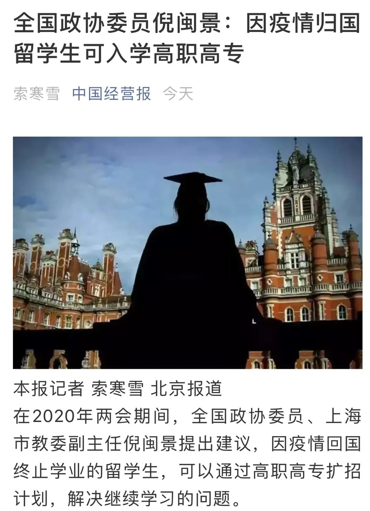

# 无标题

**链接地址:** http://mp.weixin.qq.com/s?__biz=MzU5ODQzMTk2NA==&mid=2247529961&idx=1&sn=d569d82ec85f1328c12c40483fd2ddcb&chksm=fe46745ac931fd4c454151828479bc676ca2b38ef20e695881006c974ace61629397bf1badbf&mpshare=1&scene=2&srcid=&sharer_sharetime=1590444504426&sharer_shareid=be1c8edd6c93eec155a61c876e41d26a#rd
**作者:** 哦吼吼
**获取时间:** 2025/8/28 20:12:49
**图片数量:** 8

---

## 原始HTML内容

 

 
<section data-mpa-template="t" mpa-from-tpl="t" style="margin-left: 0.5em;margin-right: 0.5em;"><section data-style="font-size: 14px; color: rgb(160, 160, 160); line-height: 1.8;" mpa-from-tpl="t"><section data-role="outer" style="font-size: 16px;" mpa-from-tpl="t"><section data-id="90744" style="border-width: 0px;border-style: none;border-color: initial;" mpa-from-tpl="t"><section style="width: 100%;text-align: center;" data-width="100%" mpa-from-tpl="t"><section style="border-width: 0px;border-style: none;border-color: initial;" mpa-from-tpl="t"><section style="margin: 10px auto;" mpa-from-tpl="t"><section style="font-size: 14px;color: rgb(176, 176, 177);padding: 35px 15px 15px;background-color: rgb(242, 244, 245);border-radius: 10px;margin-top: -16px;" mpa-from-tpl="t">
受到疫情的影响，很多同学似乎不得不放弃国外的学业了。悲伤之余，我们其实还有一条新的道路可走，那就是回国后进入大专学习。

 

今天，小编带大家先来了解一下，作为留学生，如何才能挑选一所最适合自己的大专。
</section></section></section></section></section></section></section></section>
 
<section data-mpa-template="t" mpa-from-tpl="t" style="margin-left: 0.5em;margin-right: 0.5em;"><section style="background-color: rgb(255, 255, 255);" mpa-from-tpl="t"><section powered-by="xiumi.us" mpa-from-tpl="t"><section style="margin-top: 10px;margin-bottom: 10px;text-align: center;transform: translate3d(0px, 0px, 0px);" mpa-from-tpl="t"><section style="display: inline-block;vertical-align: middle;" mpa-from-tpl="t"><section style="border-left: 2px solid rgb(27, 160, 133);border-top: 2px solid rgb(27, 160, 133);width: 12px;height: 12px;border-right-color: rgb(27, 160, 133);border-bottom-color: rgb(27, 160, 133);" mpa-from-tpl="t"> </section><section style="padding: 0px 10px;margin: -8px 0px;" mpa-from-tpl="t"><section mpa-from-tpl="t">
<strong mpa-from-tpl="t">为什么要读大专</strong>
</section></section><section style="border-right: 2px solid rgb(27, 160, 133);margin-left: auto;border-bottom: 2px solid rgb(27, 160, 133);width: 12px;height: 12px;border-top-color: rgb(27, 160, 133);border-left-color: rgb(27, 160, 133);" mpa-from-tpl="t"> </section></section></section></section></section>
 
</section>

 

新闻中报道的提案内容是这样的： 

 
<blockquote class="js_blockquote_wrap" data-type="2" data-url="" data-author-name="" data-content-utf8-length="295" data-source-title=""><section class="js_blockquote_digest">
一是全面开放高职高专学校，对于高年级学生采取降一年级直接入学，进入相关专业的办法。未满1年的归国留学生，可以通过高职高专扩招计划，解决继续学习的问题。

 二是启用插班生考试政策，每个学期开学前，在不同年级设大专业组插班生考试，通过插班生考试的学生可进入普通高校试读，1年后成绩正常，可转为正式学生。

 

三是建立国外高校学业成绩转换机制，按国际通用规则，把在国外已经完成的学分部分认可，纳入转入学校的学分当中。&nbsp;

 

四是采取先试点再扩大的方式推进此工作，可以选定部分公办高校试点，对转入学生进行学习情况评估，适时调整政策。也可以把相关权限给民办高校，由民办高校自主制定政策，满足未完成学业留学生学习需要。
</section></blockquote>
 
<section data-mpa-template="t" mpa-from-tpl="t" style="margin-left: 0.5em;margin-right: 0.5em;"><section style="background-color: rgb(255, 255, 255);" mpa-from-tpl="t"><section powered-by="xiumi.us" mpa-from-tpl="t"><section style="margin-top: 10px;margin-bottom: 10px;text-align: center;transform: translate3d(0px, 0px, 0px);" mpa-from-tpl="t"><section style="display: inline-block;vertical-align: middle;" mpa-from-tpl="t"><section style="border-left: 2px solid rgb(27, 160, 133);border-top: 2px solid rgb(27, 160, 133);width: 12px;height: 12px;border-right-color: rgb(27, 160, 133);border-bottom-color: rgb(27, 160, 133);" mpa-from-tpl="t"> </section><section style="padding: 0px 10px;margin: -8px 0px;" mpa-from-tpl="t"><section mpa-from-tpl="t">
<strong mpa-from-tpl="t">靠知名度闯天地</strong>
</section></section><section style="border-right: 2px solid rgb(27, 160, 133);margin-left: auto;border-bottom: 2px solid rgb(27, 160, 133);width: 12px;height: 12px;border-top-color: rgb(27, 160, 133);border-left-color: rgb(27, 160, 133);" mpa-from-tpl="t"> </section></section></section></section></section>
 
</section>
挑选大专时，根据知名度去选择学校总是没有错误的。当你拿着一张闪亮的毕业证书去应聘时，老板肯定会愿意因为你的毕业院校给你发一张offer出去。 

 

其实根据不同大专的涉猎面不同，我们主要需要考虑以下三所学校： 

 
<section mpa-from-tpl="t" style="margin-left: 0.5em;margin-right: 0.5em;"><section mpa-from-tpl="t"><section powered-by="xiumi.us" mpa-from-tpl="t"><section mpa-from-tpl="t"><section mpa-from-tpl="t"><section mpa-from-tpl="t"><section data-mpa-template="t" mpa-from-tpl="t"><section style="margin: 0px;padding: 0px;background-color: rgb(255, 255, 255);" mpa-from-tpl="t"><section powered-by="xiumi.us" style="margin: 0px;padding: 0px;" mpa-from-tpl="t"><section style="margin: 10px 0px;padding: 0px;transform: translate3d(0px, 0px, 0px);opacity: 0.8;" mpa-from-tpl="t"><section style="margin: 0px;padding: 0px;display: inline-block;" mpa-from-tpl="t"><section style="margin: 0.5em 5px 0px 0px;padding: 0px;width: 0.7em;height: 0.7em;display: inline-block;vertical-align: top;background-color: rgb(27, 160, 133);" mpa-from-tpl="t"> </section><section style="margin: 0px;padding: 0px;display: inline-block;vertical-align: top;text-align: center;" mpa-from-tpl="t">
<strong style="margin: 0px;padding: 0px;" mpa-from-tpl="t" mpa-is-content="t">广轻工</strong>
</section></section></section></section></section></section>
 
</section></section></section></section></section></section>
知名校友：带篮子先生 

全国排名：第8

 

 

广东轻工职业技术学院是1999年经教育部批准成立的全日制高等职业技术学院，由广东省人民政府主办、广东省教育厅直接管理。学校前身是创建于1933年的“广东省立第一职业学校”，至今已有80年的职业教育历史。 

 

如果你是一名<strong>立志学习机械专业、电气工程等理工专业</strong>的学生，我认为广轻工会是你的不二之选。同说这个学校里毕业的学生可以直接在应聘时晋升为队长。相信我，进入这个学校，明年就可以在你喜欢的人在的公司找到合适工作！如果应聘失败，你的专业知识也可以让你一天多赚300块。 

 

<strong>适应专业：</strong> 

 

电气工程、计算机工程、材料科学、机械工程、工业设计、化学等理工类专业。 

 

<strong>对口国外大学：</strong>

 

MIT、Caltech、UC Berkeley、CMU、UMich、UIUC、佐治亚理工、OSU

 
<section mpa-from-tpl="t" style="margin-left: 0.5em;margin-right: 0.5em;"><section mpa-from-tpl="t"><section powered-by="xiumi.us" mpa-from-tpl="t"><section mpa-from-tpl="t"><section mpa-from-tpl="t"><section mpa-from-tpl="t"><section data-mpa-template="t" mpa-from-tpl="t"><section style="margin: 0px;padding: 0px;background-color: rgb(255, 255, 255);" mpa-from-tpl="t"><section powered-by="xiumi.us" style="margin: 0px;padding: 0px;" mpa-from-tpl="t"><section style="margin: 10px 0px;padding: 0px;transform: translate3d(0px, 0px, 0px);opacity: 0.8;" mpa-from-tpl="t"><section style="margin: 0px;padding: 0px;display: inline-block;" mpa-from-tpl="t"><section style="margin: 0.5em 5px 0px 0px;padding: 0px;width: 0.7em;height: 0.7em;display: inline-block;vertical-align: top;background-color: rgb(27, 160, 133);" mpa-from-tpl="t"> </section><section style="margin: 0px;padding: 0px;display: inline-block;vertical-align: top;text-align: center;" mpa-from-tpl="t">
<strong style="margin: 0px;padding: 0px;" mpa-from-tpl="t" mpa-is-content="t">山东蓝翔技师学院</strong>
</section></section></section></section></section></section>
 

 

如果所有的大专构成了一座金字塔，那么山东蓝翔技师学院就是金字塔尖的那一位。它创办于1984年10月,是经国家人力资源和社会保障部批准成立的一所现代化、综合性的民办职业技术院校。近些年，蓝翔更是以“学挖掘机技术哪家强，中国山东找蓝翔”这句口号，成为了全国最知名的大专之一。<strong>它的影响力、知名度是不会低于哈佛大学、麻省理工的。</strong> 

 

不过虽然蓝翔的专业设置比广轻工更加全面，可是蓝翔的名声更多是在实际操作课程上。比如你想成为一名挖掘机车手的话，那么蓝翔就是你的不二之选。据说每一个从蓝翔毕业的车手都有个F1的梦想。他们开过的挖掘机，都闪闪发光。 
</section></section></section></section></section></section>
 

<strong>适应专业：</strong>土木工程 

 
<section mpa-from-tpl="t" style="margin-left: 0.5em;margin-right: 0.5em;"><section mpa-from-tpl="t"><section powered-by="xiumi.us" mpa-from-tpl="t"><section mpa-from-tpl="t"><section mpa-from-tpl="t"><section mpa-from-tpl="t"><section data-mpa-template="t" mpa-from-tpl="t"><section style="margin: 0px;padding: 0px;background-color: rgb(255, 255, 255);" mpa-from-tpl="t"><section powered-by="xiumi.us" style="margin: 0px;padding: 0px;" mpa-from-tpl="t"><section style="margin: 10px 0px;padding: 0px;transform: translate3d(0px, 0px, 0px);opacity: 0.8;" mpa-from-tpl="t"><section style="margin: 0px;padding: 0px;display: inline-block;" mpa-from-tpl="t"><section style="margin: 0.5em 5px 0px 0px;padding: 0px;width: 0.7em;height: 0.7em;display: inline-block;vertical-align: top;background-color: rgb(27, 160, 133);" mpa-from-tpl="t"> </section><section style="margin: 0px;padding: 0px;display: inline-block;vertical-align: top;text-align: center;" mpa-from-tpl="t">
<strong style="margin: 0px;padding: 0px;" mpa-from-tpl="t" mpa-is-content="t">新东方烹饪教育</strong>
</section></section></section></section></section></section>
 

 

新东方烹饪教育虽然不一定培养出了全世界最优秀的厨师，但是众所周知：“遇到新东方的厨师就嫁了吧”。这也就代表着，新东方的学生<strong>都特别受异性欢迎</strong>。这其实和很多学习艺术、影视制作专业的学生不谋而合，所以如果你也有一颗成为明星的心，那么加入新东方烹饪教育的大家庭一定是没错的！ 

 

<strong>适应专业：</strong> 

 

艺术、表演、制片、设计等专业。

 

<strong>对口国外大学：</strong> 

 

UCLA、USC、NYU、RISE
</section></section></section></section></section></section>
 
<section data-mpa-template="t" mpa-from-tpl="t" style="margin-left: 0.5em;margin-right: 0.5em;"><section style="box-sizing: border-box !important;" mpa-from-tpl="t"><section powered-by="xiumi.us" style="box-sizing: border-box !important;" mpa-from-tpl="t"><section style="margin-top: 10px;margin-bottom: 10px;text-align: center;transform: translate3d(0px, 0px, 0px);box-sizing: border-box !important;" mpa-from-tpl="t"><section style="display: inline-block;vertical-align: middle;box-sizing: border-box !important;" mpa-from-tpl="t"><section style="border-left: 2px solid rgb(27, 160, 133);border-top: 2px solid rgb(27, 160, 133);width: 12px;height: 12px;border-right-color: rgb(27, 160, 133);border-bottom-color: rgb(27, 160, 133);box-sizing: border-box !important;" mpa-from-tpl="t"> </section><section style="margin-top: -8px;margin-bottom: -8px;padding-right: 10px;padding-left: 10px;box-sizing: border-box !important;" mpa-from-tpl="t"><section style="box-sizing: border-box !important;" mpa-from-tpl="t">
<strong mpa-from-tpl="t" mpa-is-content="t" style="box-sizing: border-box !important;">稳扎稳打，做学术先锋</strong>
</section></section><section style="margin-left: auto;border-right: 2px solid rgb(27, 160, 133);border-bottom: 2px solid rgb(27, 160, 133);width: 12px;height: 12px;border-top-color: rgb(27, 160, 133);border-left-color: rgb(27, 160, 133);box-sizing: border-box !important;" mpa-from-tpl="t"> </section></section></section></section></section></section>
 

有些同学可能并不喜欢成为一个浮躁的“偶像派大专生”，只是靠知名度吃饭。那么相信我，你一定需要一份不同专业的优秀大专排行。在留学前你可能<strong>做足了school research</strong>，那么今天就让我来帮你完成这一份工作吧！下面是2020年大专排行榜：

 
<section mpa-from-tpl="t" style="margin-left: 0.5em;margin-right: 0.5em;"><section mpa-from-tpl="t"><section powered-by="xiumi.us" mpa-from-tpl="t"><section mpa-from-tpl="t"><section mpa-from-tpl="t"><section mpa-from-tpl="t"><section data-mpa-template="t" mpa-from-tpl="t"><section style="margin: 0px;padding: 0px;background-color: rgb(255, 255, 255);" mpa-from-tpl="t"><section powered-by="xiumi.us" style="margin: 0px;padding: 0px;" mpa-from-tpl="t"><section style="margin: 10px 0px;padding: 0px;transform: translate3d(0px, 0px, 0px);opacity: 0.8;" mpa-from-tpl="t"><section style="margin: 0px;padding: 0px;display: inline-block;" mpa-from-tpl="t"><section style="margin: 0.5em 5px 0px 0px;padding: 0px;width: 0.7em;height: 0.7em;display: inline-block;vertical-align: top;background-color: rgb(27, 160, 133);" mpa-from-tpl="t"> </section><section style="margin: 0px;padding: 0px;display: inline-block;vertical-align: top;text-align: center;" mpa-from-tpl="t">
<strong style="margin: 0px;padding: 0px;" mpa-from-tpl="t" mpa-is-content="t">综合排名Top10</strong>
</section></section></section></section></section></section></section></section></section></section></section></section>
 

本排行打分标准：办学条件25%、师资力量22.5%、科教产出32.5%、学校声誉20%。 

 
<section data-mpa-template="t" mpa-from-tpl="t" style="margin-left: 0.5em;margin-right: 0.5em;"><section data-id="94709" mpa-from-tpl="t"><section style="width: 100%;" data-width="100%" mpa-from-tpl="t"><section mpa-from-tpl="t" style="background: url(&quot;https://mmbiz.qpic.cn/mmbiz_gif/b96CibCt70iaZVWLqKWYqToBBoLTeNc2NmkjKzNXvPpA9RuZkhnELwGqocSCgD9vvWqQ51pZc1oVmfcCYapXyT8w/640?wx_fmt=gif&quot;) left top / 6px repeat-y;"><section data-autoskip="1" style="font-size: 14px;text-align: justify;letter-spacing: 1.5px;line-height: 1.75em;color: rgb(63, 62, 63);padding: 0px 1em;" mpa-from-tpl="t">
深圳职业技术学院

南京工业职业技术学院

金华职业技术学院

无锡职业技术学院

北京电子科技职业学院

山东商业职业技术学院

淄博职业学院

广州轻工职业技术学院

重庆工业职业技术学院

浙江金融职业技术学院
</section></section></section></section>
 
</section>
这些大专就相当于美国留学生熟悉的常青藤学校。虽然很多没有那么知名，<strong>但是实力都非常强</strong>！在选择学校的时候都是不容错过的！这些学校唯一的缺点就是招生范围比较小，竞争压力过高。 

 

 
<section data-mpa-template="t" mpa-from-tpl="t" style="margin-left: 0.5em;margin-right: 0.5em;"><section style="margin: 0px;padding: 0px;background-color: rgb(255, 255, 255);" mpa-from-tpl="t"><section powered-by="xiumi.us" style="margin: 0px;padding: 0px;" mpa-from-tpl="t"><section style="margin: 10px 0px;padding: 0px;transform: translate3d(0px, 0px, 0px);opacity: 0.8;" mpa-from-tpl="t"><section style="margin: 0px;padding: 0px;display: inline-block;" mpa-from-tpl="t"><section style="margin: 0.5em 5px 0px 0px;padding: 0px;width: 0.7em;height: 0.7em;display: inline-block;vertical-align: top;background-color: rgb(27, 160, 133);" mpa-from-tpl="t"> </section><section style="margin: 0px;padding: 0px;display: inline-block;vertical-align: top;text-align: center;" mpa-from-tpl="t">
<strong style="margin: 0px;padding: 0px;" mpa-from-tpl="t" mpa-is-content="t">专业排名Top3</strong>
</section></section></section></section></section></section>
 

<strong>财经类（UPenn、NYU学生推荐）</strong>：山东商业职业技术学院、浙江金融职业学院、江苏经贸职业技术学院 

 

<strong>理工类（MIT、斯坦福学生推荐</strong>）：南京工业职业技术学院、无锡职业技术学院、北京电子科技职业学院 

 

<strong>民族类（人类学专业、历史类专业学生推荐）</strong>：湖南民族职业学院、湘西民族职业技术学院、黔西南民族职业技术学院 

 

<strong>农林类（UCD学生</strong><strong>强烈推荐</strong><strong>）</strong>：新疆农业职业技术学院、江苏农牧科技职业技术学院、江苏农林职业技术学院 

 

<strong>师范类（哈佛学生推荐、教育学学生推荐）</strong>：宝鸡职业技术学院、新疆师范高等专科学校、桂林师范高等专科学校

 

<strong>语言类（MIT学生推荐）</strong>：河北对外经贸职业学院、北京青年政治学院、山东外国语职业技术大学 

 

<strong>医药类（JHU、普林斯顿医学院学生推荐）</strong>：天津医学高等专科学校、漯河医学高等专科学校、南阳医学高等专科学校

 

<strong>艺术类：</strong>上海工艺美术职业学院、苏州工艺美术职业技术学院、湖南工艺美术职业学院

 

政法类由于留学生无法报考，暂不列举

 

所以留学生小伙伴们，你们的梦校是哪一所呢？欢迎大家在评论区留言哦！ 

 

 

👉<a target="_blank" href="http://mp.weixin.qq.com/s?__biz=MzU5ODQzMTk2NA==&amp;mid=2247529713&amp;idx=1&amp;sn=51f8bedbb82cbb9ba4b007254624727e&amp;chksm=fe467542c931fc540e5f997e4b275e5925e653649f62113487a20aa95852fd9bf02a957df914&amp;scene=21#wechat_redirect" data-itemshowtype="0" tab="innerlink" data-linktype="2" hasload="1" style="-webkit-tap-highlight-color: rgba(0, 0, 0, 0);cursor: pointer;font-size: 14px;">高二被迫脱产后，我成了“北漂留学党”</a> 

 

<a target="_blank" href="http://mp.weixin.qq.com/s?__biz=MzU5ODQzMTk2NA==&amp;mid=2247529609&amp;idx=1&amp;sn=7e36946cb41d80998be650ead69ae33e&amp;chksm=fe46753ac931fc2c77f328ccc132d55064b82548bfe604825f36a428e6f7f6fe6ca18bd8b60e&amp;scene=21#wechat_redirect" data-itemshowtype="0" tab="innerlink" data-linktype="2" hasload="1" style="-webkit-tap-highlight-color: rgba(0, 0, 0, 0);cursor: pointer;letter-spacing: 0.544px;font-size: 14px;">👉美国大学营业图鉴：为了吸引花心大萝卜们申请和入学，拼了！</a> 

 

👉<a target="_blank" href="http://mp.weixin.qq.com/s?__biz=MzU5ODQzMTk2NA==&amp;mid=2247528984&amp;idx=1&amp;sn=3d27a7272e24dc39b24c0b4f38097a60&amp;chksm=fe4673abc931fabdfb6df90247369c54a2abbc1d7610cad96ab20c3d4456c0f6ca397591e471&amp;scene=21#wechat_redirect" data-itemshowtype="0" tab="innerlink" data-linktype="2" hasload="1" style="-webkit-tap-highlight-color: rgba(0, 0, 0, 0);cursor: pointer;">QS首次推出美国大学排行：UCB/UCLA冲进前10，UCSB竟被挤出top70？</a>

 
<section data-mpa-template="t" mpa-from-tpl="t" style="margin-left: 0.5em;margin-right: 0.5em;"><section data-mpa-template="t" mpa-from-tpl="t">
* TestDaily是由北美留学领域的教学和申请专家创立的线上教育团队，专注于为北美留学生的备考和申请提供优质的信息和服务，至今已经服务超过20万人次。 
<section data-mpa-template-id="1251" data-mpa-color="#ffffff" data-mpa-category="divider" style="color: rgb(51, 51, 51);font-size: 17px;text-align: justify;" mpa-from-tpl="t"><section mpa-from-tpl="t"> </section>
团队本着专业、务实、可靠的工作品质，设计了一系列质优价廉的留学语培和申请产品，受到广泛认可。产品和服务详情，请查看公众号菜单「TD好课」了解。

 

</section><section data-mpa-template-id="1251" data-mpa-color="#ffffff" data-mpa-category="divider" style="margin-right: 0.5em;margin-left: 0.5em;color: rgb(51, 51, 51);font-size: 17px;text-align: justify;letter-spacing: 0.544px;" mpa-from-tpl="t">
 

<strong mpa-from-tpl="t">戳戳「在看」叭！👇</strong>
</section></section></section>

---

## 纯文本内容

受到疫情的影响，很多同学似乎不得不放弃国外的学业了。悲伤之余，我们其实还有一条新的道路可走，那就是回国后进入大专学习。今天，小编带大家先来了解一下，作为留学生，如何才能挑选一所最适合自己的大专。为什么要读大专新闻中报道的提案内容是这样的：一是全面开放高职高专学校，对于高年级学生采取降一年级直接入学，进入相关专业的办法。未满1年的归国留学生，可以通过高职高专扩招计划，解决继续学习的问题。二是启用插班生考试政策，每个学期开学前，在不同年级设大专业组插班生考试，通过插班生考试的学生可进入普通高校试读，1年后成绩正常，可转为正式学生。三是建立国外高校学业成绩转换机制，按国际通用规则，把在国外已经完成的学分部分认可，纳入转入学校的学分当中。 四是采取先试点再扩大的方式推进此工作，可以选定部分公办高校试点，对转入学生进行学习情况评估，适时调整政策。也可以把相关权限给民办高校，由民办高校自主制定政策，满足未完成学业留学生学习需要。靠知名度闯天地挑选大专时，根据知名度去选择学校总是没有错误的。当你拿着一张闪亮的毕业证书去应聘时，老板肯定会愿意因为你的毕业院校给你发一张offer出去。其实根据不同大专的涉猎面不同，我们主要需要考虑以下三所学校：广轻工知名校友：带篮子先生全国排名：第8广东轻工职业技术学院是1999年经教育部批准成立的全日制高等职业技术学院，由广东省人民政府主办、广东省教育厅直接管理。学校前身是创建于1933年的“广东省立第一职业学校”，至今已有80年的职业教育历史。如果你是一名立志学习机械专业、电气工程等理工专业的学生，我认为广轻工会是你的不二之选。同说这个学校里毕业的学生可以直接在应聘时晋升为队长。相信我，进入这个学校，明年就可以在你喜欢的人在的公司找到合适工作！如果应聘失败，你的专业知识也可以让你一天多赚300块。适应专业：电气工程、计算机工程、材料科学、机械工程、工业设计、化学等理工类专业。对口国外大学：MIT、Caltech、UC Berkeley、CMU、UMich、UIUC、佐治亚理工、OSU山东蓝翔技师学院如果所有的大专构成了一座金字塔，那么山东蓝翔技师学院就是金字塔尖的那一位。它创办于1984年10月,是经国家人力资源和社会保障部批准成立的一所现代化、综合性的民办职业技术院校。近些年，蓝翔更是以“学挖掘机技术哪家强，中国山东找蓝翔”这句口号，成为了全国最知名的大专之一。它的影响力、知名度是不会低于哈佛大学、麻省理工的。不过虽然蓝翔的专业设置比广轻工更加全面，可是蓝翔的名声更多是在实际操作课程上。比如你想成为一名挖掘机车手的话，那么蓝翔就是你的不二之选。据说每一个从蓝翔毕业的车手都有个F1的梦想。他们开过的挖掘机，都闪闪发光。适应专业：土木工程新东方烹饪教育新东方烹饪教育虽然不一定培养出了全世界最优秀的厨师，但是众所周知：“遇到新东方的厨师就嫁了吧”。这也就代表着，新东方的学生都特别受异性欢迎。这其实和很多学习艺术、影视制作专业的学生不谋而合，所以如果你也有一颗成为明星的心，那么加入新东方烹饪教育的大家庭一定是没错的！适应专业：艺术、表演、制片、设计等专业。对口国外大学：UCLA、USC、NYU、RISE稳扎稳打，做学术先锋有些同学可能并不喜欢成为一个浮躁的“偶像派大专生”，只是靠知名度吃饭。那么相信我，你一定需要一份不同专业的优秀大专排行。在留学前你可能做足了school research，那么今天就让我来帮你完成这一份工作吧！下面是2020年大专排行榜：综合排名Top10本排行打分标准：办学条件25%、师资力量22.5%、科教产出32.5%、学校声誉20%。深圳职业技术学院南京工业职业技术学院金华职业技术学院无锡职业技术学院北京电子科技职业学院山东商业职业技术学院淄博职业学院广州轻工职业技术学院重庆工业职业技术学院浙江金融职业技术学院这些大专就相当于美国留学生熟悉的常青藤学校。虽然很多没有那么知名，但是实力都非常强！在选择学校的时候都是不容错过的！这些学校唯一的缺点就是招生范围比较小，竞争压力过高。专业排名Top3财经类（UPenn、NYU学生推荐）：山东商业职业技术学院、浙江金融职业学院、江苏经贸职业技术学院理工类（MIT、斯坦福学生推荐）：南京工业职业技术学院、无锡职业技术学院、北京电子科技职业学院民族类（人类学专业、历史类专业学生推荐）：湖南民族职业学院、湘西民族职业技术学院、黔西南民族职业技术学院农林类（UCD学生强烈推荐）：新疆农业职业技术学院、江苏农牧科技职业技术学院、江苏农林职业技术学院师范类（哈佛学生推荐、教育学学生推荐）：宝鸡职业技术学院、新疆师范高等专科学校、桂林师范高等专科学校语言类（MIT学生推荐）：河北对外经贸职业学院、北京青年政治学院、山东外国语职业技术大学医药类（JHU、普林斯顿医学院学生推荐）：天津医学高等专科学校、漯河医学高等专科学校、南阳医学高等专科学校艺术类：上海工艺美术职业学院、苏州工艺美术职业技术学院、湖南工艺美术职业学院政法类由于留学生无法报考，暂不列举所以留学生小伙伴们，你们的梦校是哪一所呢？欢迎大家在评论区留言哦！👉高二被迫脱产后，我成了“北漂留学党”👉美国大学营业图鉴：为了吸引花心大萝卜们申请和入学，拼了！👉QS首次推出美国大学排行：UCB/UCLA冲进前10，UCSB竟被挤出top70？* TestDaily是由北美留学领域的教学和申请专家创立的线上教育团队，专注于为北美留学生的备考和申请提供优质的信息和服务，至今已经服务超过20万人次。团队本着专业、务实、可靠的工作品质，设计了一系列质优价廉的留学语培和申请产品，受到广泛认可。产品和服务详情，请查看公众号菜单「TD好课」了解。戳戳「在看」叭！👇

---

## 图片列表

-  (原始链接: https://mmbiz.qpic.cn/mmbiz_gif/k22OockXJqId6UD6pzSauhLbrLKePGGFyTb925NZgmbSLQht4HssZM3XpvEPrZJfAVwKl12Z5EZP28RTNqfQmA/640?wx_fmt=gif)
-  (原始链接: https://mmbiz.qpic.cn/mmbiz_jpg/VhS945lefy1yFnGEgv6pFNvGRQb5P2ctcnmMiaDuAlMuh55recOlVgaj0Vngj0PribsD2J7vmufW9EZBLKibELxxQ/640?wx_fmt=jpeg)
-  (原始链接: https://mmbiz.qpic.cn/mmbiz_png/k22OockXJqKGpp8WMSnwj3UUibcMmlmiazicgkq6ePL4MEkdfEXSTNBDSdwuQIKXQ9vgfltD7GcmpRRpdpl7Yxqog/640?wx_fmt=png)
-  (原始链接: https://mmbiz.qpic.cn/mmbiz_png/k22OockXJqKGpp8WMSnwj3UUibcMmlmiazARmUqgJ3ZV824WpFQibibicnpv8l5rEg66ttVUu6EOQ4icSKomzxfqev5w/640?wx_fmt=png)
-  (原始链接: https://mmbiz.qpic.cn/mmbiz_png/k22OockXJqKGpp8WMSnwj3UUibcMmlmiazRLQryaaMfDP10DdAhibYopQGl0DLFzloBSyjicQ90ILFO9NW4DeXkojw/640?wx_fmt=png)
-  (原始链接: https://mmbiz.qpic.cn/mmbiz_png/k22OockXJqKGpp8WMSnwj3UUibcMmlmiazl66vtHHfdh1rttQXKxJx97FeBDndZM7RaSgBut3x1zPJmnS1aUfRpg/640?wx_fmt=png)
-  (原始链接: https://mmbiz.qpic.cn/mmbiz/jLhkzY0vJ4aHbCmNdsJwXXu6R68tmqias00QW19zKiafDzmj4SJRFsePTJ8Ct7WxAJ8SSID2ciccibu1gfFAmq4hxw/640.jpeg?wx_fmt=jpeg)
-  (原始链接: https://mmbiz.qpic.cn/mmbiz_gif/k22OockXJqKrFZiarnwv40ibwMPwCcEVqtUwfyeiaZoDiaHRODldR0Nn5ibTVpTvIiaTb3qicrJozLhXOKeLLEKKNNOnw/640?wx_fmt=gif)
