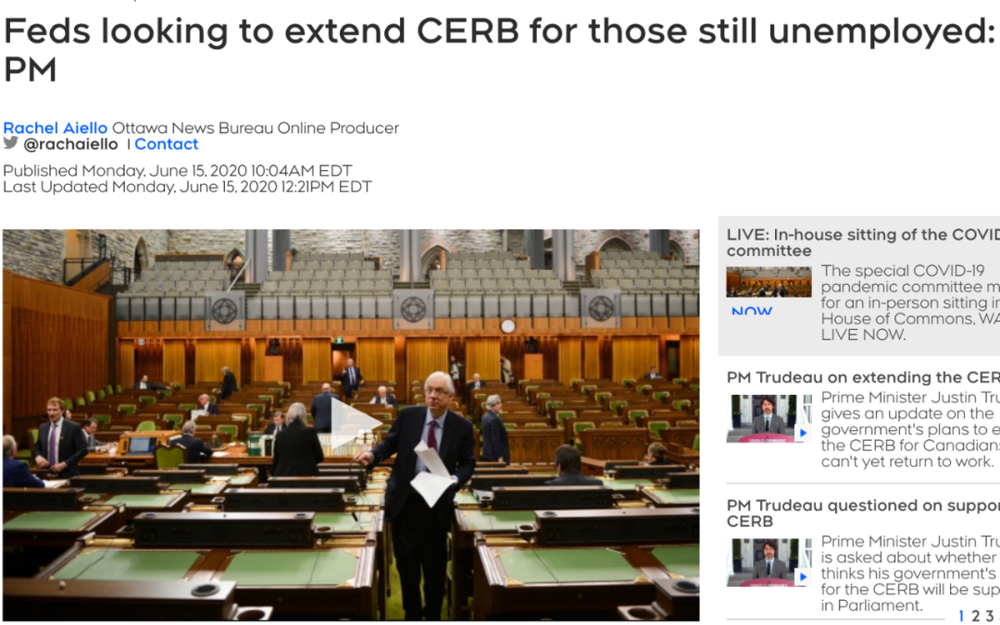

# 无标题

**链接地址:** http://mp.weixin.qq.com/s?__biz=MjM5MDEzNzY2NQ==&mid=2652783563&idx=3&sn=6c8f43284391bb1f9c135663c6671697&chksm=bda38fe58ad406f317f4f9b9bd8a443c4506ed23df62fd831d6999b1dbae7a8d4c2a04c15fd8&mpshare=1&scene=2&srcid=&sharer_sharetime=1592252948989&sharer_shareid=be1c8edd6c93eec155a61c876e41d26a#rd
**作者:** 七七
**获取时间:** 2025/8/28 20:12:05
**图片数量:** 5

---

## 原始HTML内容

 

 

 

 

 

 

 

 

 

 

 

 

 

 

 
<section style="margin-right: 8px;margin-left: 8px;white-space: normal;max-width: 100%;letter-spacing: 0.544px;font-size: 16px;font-family: -apple-system-font, system-ui, &quot;Helvetica Neue&quot;, &quot;PingFang SC&quot;, &quot;Hiragino Sans GB&quot;, &quot;Microsoft YaHei UI&quot;, &quot;Microsoft YaHei&quot;, Arial, sans-serif;background-color: rgb(255, 255, 255);text-align: center;line-height: 2em;box-sizing: border-box !important;overflow-wrap: break-word !important;"><a target="_blank" href="https://mp.weixin.qq.com/s?__biz=MzU3NTc2NjgwNA==&amp;mid=2247484060&amp;idx=1&amp;sn=6c827926cd929d4f5c4ce3e8e0091020&amp;chksm=fd1f6ae7ca68e3f1c9c580da60a6c02917beac8d5027ef28176ce2e766b2e06da256fa18f531&amp;mpshare=1&amp;scene=21&amp;srcid=0604sHofBVsrlvSUgfvPmvac&amp;sharer_sharetime=1591283935419&amp;sharer_shareid=a48a3c7f82214bcd7b74d3b4a20723f8&amp;exportkey=ApiMWBPN7gppXV5F3usmEyY=&amp;pass_ticket=lYYremY7rKJ8sxJw0GbgCwsM1e2Hi62xI7hhCs1AS/vkx5kr5KRHqYg7pt4leH9i#wechat_redirect" textvalue="你已选中了添加链接的内容" tab="innerlink" data-linktype="1" style="color: var(--weui-LINK);-webkit-tap-highlight-color: rgba(0, 0, 0, 0);cursor: pointer;max-width: 100%;letter-spacing: 0.544px;box-sizing: border-box !important;overflow-wrap: break-word !important;"></a></section><section style="margin-right: 8px;margin-left: 8px;white-space: normal;max-width: 100%;font-family: -apple-system-font, BlinkMacSystemFont, &quot;Helvetica Neue&quot;, &quot;PingFang SC&quot;, &quot;Hiragino Sans GB&quot;, &quot;Microsoft YaHei UI&quot;, &quot;Microsoft YaHei&quot;, Arial, sans-serif;letter-spacing: 0.544px;min-height: 1em;background-color: rgb(255, 255, 255);text-align: center;line-height: 2em;box-sizing: border-box !important;overflow-wrap: break-word !important;">+++我是可以点的广告+++</section><section style="line-height: 2em;"> </section><section style="line-height: 2em;">加拿大疫情爆发以来，CERB紧急救助金就成为了热门话题，据CTV报道，CERB可能又会发生重大变化，总理特鲁多表示，眼看自3月以来16周领取CERB福利金的时间接近尾声，他将计划为那些仍无法复工的人延长期限。 </section>
 

<strong>CERB延长计划</strong>

 
<section style="line-height: 2em;">特鲁多说：“过去几周，很多人情况开始有所好转，但我知道仍然还有一部分人面临困境”。他表示那些正在找工作的人不必太担心是否很快会达到CERB的限制，很快将研究新的计划帮助那些还未返岗的人扩大福利，延长计划的更多细节将在本周晚些时公布。 </section><section style="line-height: 2em;"> </section>

 
<section style="line-height: 2em;">自3月15日以来，将近120万人领取了16周长的CERB福利金后即将到达领取期限，截止6月4日政府一共支出了435亿加元，向840万加拿大每月支付2000加元，按计划延长期限将达到每月约170万加元。</section><section style="line-height: 2em;"> </section><section style="line-height: 2em;">新民主党领导人Jagmeet Singh表示希望在周三对这项重要的延长计划进行投票。他说：“有必要延长CERB让数百万加拿大人知道接下来发生什么，政府将发布新的计划告诉加拿大人政府将如何帮助他们”。 </section>
 

<strong>CEBA申请资格扩展</strong> 

 
<section style="line-height: 2em;">加拿大紧急企业账户CEBA于3月首次宣布，并在4月开始开放申请。作为企业或者政府担保贷款的一种方式，以支持在疫情大流行期间维持企业的生存。</section><section style="line-height: 2em;"> </section>

 
<section style="line-height: 2em;">特鲁多宣布，这项补助计划的申请资格将扩大，包括更多的公司，更多的细节将很快公布。这项计划提供了40000加元的第一年免息的政府担保贷款。如果公司能够在2022年年底前还清贷款余额，则最高可免赔10000加元。 </section>
 

<strong>食品盈余项目启动</strong>

 
<section style="line-height: 2em;">特鲁多宣布盈余食物计划申请已经开放，这项耗资5000万加元的计划于5月份首次承诺，政府将购买大量的盈余的食品，并将它们重新分配到粮食不安全问题所在的地区，以避免粮食浪费并让生产者得到相应补偿。 </section><section style="line-height: 2em;"> </section>

<section style="line-height: 2em;"> </section><section style="line-height: 2em;">渔民或农民有未收成的粮食也可以申请，联邦政府将把剩余的粮食送到北方社区或粮食库。特鲁多表示没有人能预料到今年春天会变成这样，对于农民来说，这几个月也是意想不到的挑战，他们为我们的餐馆提供粮食，为家庭提供食物来源。将会有人购买它们的产品，而食物将会送到那些粮食紧缺的家庭中。</section><section style="line-height: 2em;"> </section><section style="margin-right: 8px;margin-left: 8px;white-space: normal;max-width: 100%;box-sizing: border-box;letter-spacing: 0.544px;text-size-adjust: auto;min-height: 1em;color: rgb(0, 0, 0);font-size: 16px;text-align: center;line-height: 2em;overflow-wrap: break-word !important;">+++全加拿大华人都在关注超级生活，就差你了+++</section><section style="margin-right: 8px;margin-left: 8px;white-space: normal;max-width: 100%;box-sizing: border-box;letter-spacing: 0.544px;text-size-adjust: auto;min-height: 1em;color: rgb(0, 0, 0);font-size: 16px;text-align: center;line-height: 2em;overflow-wrap: break-word !important;"></section><section style="margin-right: 8px;margin-left: 8px;white-space: normal;max-width: 100%;letter-spacing: 0.544px;caret-color: rgb(51, 51, 51);text-size-adjust: auto;min-height: 1em;text-align: right;line-height: 2em;box-sizing: border-box !important;overflow-wrap: break-word !important;"><strong style="max-width: 100%;letter-spacing: 0.544px;box-sizing: border-box !important;overflow-wrap: break-word !important;">喜欢点个“在看” ↓↓</strong></section>

---

## 纯文本内容

+++我是可以点的广告+++加拿大疫情爆发以来，CERB紧急救助金就成为了热门话题，据CTV报道，CERB可能又会发生重大变化，总理特鲁多表示，眼看自3月以来16周领取CERB福利金的时间接近尾声，他将计划为那些仍无法复工的人延长期限。CERB延长计划特鲁多说：“过去几周，很多人情况开始有所好转，但我知道仍然还有一部分人面临困境”。他表示那些正在找工作的人不必太担心是否很快会达到CERB的限制，很快将研究新的计划帮助那些还未返岗的人扩大福利，延长计划的更多细节将在本周晚些时公布。自3月15日以来，将近120万人领取了16周长的CERB福利金后即将到达领取期限，截止6月4日政府一共支出了435亿加元，向840万加拿大每月支付2000加元，按计划延长期限将达到每月约170万加元。新民主党领导人Jagmeet Singh表示希望在周三对这项重要的延长计划进行投票。他说：“有必要延长CERB让数百万加拿大人知道接下来发生什么，政府将发布新的计划告诉加拿大人政府将如何帮助他们”。CEBA申请资格扩展加拿大紧急企业账户CEBA于3月首次宣布，并在4月开始开放申请。作为企业或者政府担保贷款的一种方式，以支持在疫情大流行期间维持企业的生存。特鲁多宣布，这项补助计划的申请资格将扩大，包括更多的公司，更多的细节将很快公布。这项计划提供了40000加元的第一年免息的政府担保贷款。如果公司能够在2022年年底前还清贷款余额，则最高可免赔10000加元。食品盈余项目启动特鲁多宣布盈余食物计划申请已经开放，这项耗资5000万加元的计划于5月份首次承诺，政府将购买大量的盈余的食品，并将它们重新分配到粮食不安全问题所在的地区，以避免粮食浪费并让生产者得到相应补偿。渔民或农民有未收成的粮食也可以申请，联邦政府将把剩余的粮食送到北方社区或粮食库。特鲁多表示没有人能预料到今年春天会变成这样，对于农民来说，这几个月也是意想不到的挑战，他们为我们的餐馆提供粮食，为家庭提供食物来源。将会有人购买它们的产品，而食物将会送到那些粮食紧缺的家庭中。+++全加拿大华人都在关注超级生活，就差你了+++喜欢点个“在看” ↓↓

---

## 图片列表

-  (原始链接: https://mmbiz.qpic.cn/mmbiz_gif/szJas1pFaJd76ibSxvGfBias6eDkj2tQ4V0onVq6Wq48eZmg57V4sYg30hKlcXSicfytZohhvYTibAFeHrr9ymXMBQ/640?wx_fmt=gif)
-  (原始链接: https://mmbiz.qpic.cn/mmbiz_png/X9ZwD6DyyJDeYAOLdap9jpQibr5ibiaMnxYbEQYQDzvZicE3UW0uNoA6UCZ42p4GQXj6VJPP5EaUkQgGWjbNndlgng/640?wx_fmt=png)
-  (原始链接: https://mmbiz.qpic.cn/mmbiz_png/X9ZwD6DyyJDeYAOLdap9jpQibr5ibiaMnxYpgh9JFpxNPFMiaNmF2vQnyckicXLPBYYcxE2I4cRyHM5cPlYVIGOSfWg/640?wx_fmt=png)
-  (原始链接: https://mmbiz.qpic.cn/mmbiz_png/X9ZwD6DyyJDeYAOLdap9jpQibr5ibiaMnxYaHRLSxc404BGqf9UgbaTic68xvGfGenJyBOibxv7xZib1nv1K7aciaoydQ/640?wx_fmt=png)
-  (原始链接: https://mmbiz.qpic.cn/mmbiz_gif/szJas1pFaJdUFDPEKnLrCyGC4WgrAvl6lSC2beZFt6icTnXfebnRzcRialMg5VZujw1AhX9ribkSDQNZZukk8HX9w/640?wx_fmt=gif)
