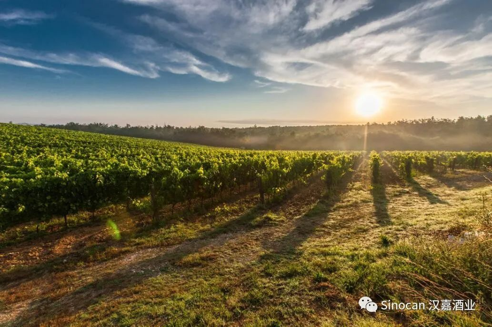

# 无标题

**链接地址:** http://mp.weixin.qq.com/s?__biz=MzIyMzU4OTc0MQ==&mid=2247484047&idx=1&sn=fd1fc9abbc011ab34e3815070b5eb1ec&chksm=e81aa68ddf6d2f9b2ddadf01d9b443d7302c975800550b8faec0cc973e9889abed1f9f302eba&mpshare=1&scene=2&srcid=0716s4e88sDrByjxJG4OgKih&sharer_sharetime=1594870358888&sharer_shareid=be1c8edd6c93eec155a61c876e41d26a#rd
**作者:** 
**获取时间:** 2025/8/28 20:11:07
**图片数量:** 19

---

## 原始HTML内容

<section style="box-sizing: border-box;font-size: 16px;"><section style="box-sizing: border-box;" powered-by="xiumi.us"><section style="display: flex;flex-flow: row nowrap;margin: 20px 0%;box-sizing: border-box;"><section style="display: inline-block;vertical-align: top;width: auto;background-color: rgb(255, 213, 195);flex: 50 50 0%;align-self: stretch;height: auto;padding-right: 10px;padding-left: 10px;box-shadow: rgb(0, 0, 0) 0px 0px 0px;box-sizing: border-box;"><section style="margin-top: 2px;margin-right: 0%;margin-left: 0%;box-sizing: border-box;" powered-by="xiumi.us"><section style="text-align: center;font-size: 14px;color: rgb(255, 255, 255);letter-spacing: 4px;line-height: 1.6;text-shadow: rgb(115, 115, 114) 1px -1px, rgb(115, 115, 114) 1px 1px, rgb(115, 115, 114) -1px 1px, rgb(115, 115, 114) -1px -1px, rgb(115, 115, 114) 1px 0px, rgb(233, 214, 57) 0px 1px, rgb(115, 115, 114) -1px 0px, rgb(115, 115, 114) 0px -1px;box-sizing: border-box;">
<strong style="box-sizing: border-box;">点击蓝字</strong>
</section></section></section><section style="display: inline-block;vertical-align: top;width: auto;align-self: flex-start;flex: 10 10 0%;height: auto;margin: -10px -25px;z-index: 1;border-top: 0px solid rgb(62, 62, 62);border-top-left-radius: 0px;box-sizing: border-box;"><section style="text-align: center;box-sizing: border-box;" powered-by="xiumi.us"><section style="display: inline-block;width: 50px;height: 50px;vertical-align: top;overflow: hidden;border-radius: 100%;border-width: 4px;border-style: solid;border-color: rgb(255, 255, 255);box-shadow: rgb(124, 190, 134) 0px 0px 4px;background-image: linear-gradient(135deg, rgb(254, 182, 146) 10%, rgb(234, 84, 85) 100%);box-sizing: border-box;"><section style="margin-top: 10px;margin-bottom: 10px;box-sizing: border-box;" powered-by="xiumi.us"><section style="max-width: 100%;vertical-align: middle;display: inline-block;line-height: 0;width: 50%;height: auto;box-sizing: border-box;"></section></section></section></section></section><section style="display: inline-block;vertical-align: top;width: auto;background-color: rgb(179, 179, 179);flex: 50 50 0%;align-self: stretch;height: auto;padding-right: 10px;padding-left: 10px;box-sizing: border-box;"><section style="margin-top: 2px;margin-right: 0%;margin-left: 0%;box-sizing: border-box;" powered-by="xiumi.us"><section style="text-align: center;font-size: 14px;color: rgb(255, 255, 255);letter-spacing: 4px;line-height: 1.6;text-shadow: rgb(219, 123, 123) 1px -1px, rgb(219, 123, 123) 1px 1px, rgb(219, 123, 123) -1px 1px, rgb(219, 123, 123) -1px -1px, rgb(219, 123, 123) 1px 0px, rgb(219, 123, 123) 0px 1px, rgb(219, 123, 123) -1px 0px, rgb(219, 123, 123) 0px -1px;box-sizing: border-box;">
<strong style="box-sizing: border-box;">关注我们</strong>
</section></section></section></section></section><section style="box-sizing: border-box;" powered-by="xiumi.us"><section style="display: flex;flex-flow: row nowrap;margin: 10px 0% 2px;box-sizing: border-box;"><section style="display: inline-block;vertical-align: bottom;width: auto;min-width: 10%;max-width: 100%;flex: 0 0 auto;height: auto;align-self: flex-end;padding-right: 2px;padding-left: 2px;box-sizing: border-box;"><section style="text-align: center;font-size: 27px;color: rgb(250, 81, 57);line-height: 1.2;letter-spacing: 0px;box-sizing: border-box;" powered-by="xiumi.us">
<strong style="box-sizing: border-box;">01</strong>
</section><section style="margin-right: 0%;margin-bottom: 8px;margin-left: 0%;box-sizing: border-box;" powered-by="xiumi.us"><section style="background-color: rgb(0, 0, 0);height: 2px;box-sizing: border-box;line-height: 0;"> </section></section></section><section style="display: inline-block;vertical-align: bottom;width: auto;flex: 100 100 0%;align-self: flex-end;height: auto;box-sizing: border-box;"><section style="box-sizing: border-box;" powered-by="xiumi.us">
 
</section><section style="box-sizing: border-box;" powered-by="xiumi.us">
 
</section><section style="margin-right: 0%;margin-left: 0%;box-sizing: border-box;" powered-by="xiumi.us"><section style="color: rgb(0, 0, 0);padding-right: 3px;padding-left: 3px;letter-spacing: 1px;line-height: 2;box-sizing: border-box;">
<strong style="box-sizing: border-box;">波尔多红酒闻名遐迩</strong>
</section></section><section style="margin-right: 0%;margin-bottom: 8px;margin-left: 0%;box-sizing: border-box;" powered-by="xiumi.us"><section style="background-color: rgb(0, 0, 0);height: 2px;box-sizing: border-box;line-height: 0;"> </section></section></section></section></section><section style="margin: 20px 0%;box-sizing: border-box;" powered-by="xiumi.us"><section style="display: inline-block;width: 100%;vertical-align: top;border-top: 1px dashed rgb(0, 0, 0);border-top-left-radius: 0px;border-bottom: 1px dashed rgb(0, 0, 0);border-bottom-right-radius: 0px;padding-right: 10px;padding-left: 10px;box-sizing: border-box;"><section style="margin: -10px 0%;box-sizing: border-box;" powered-by="xiumi.us"><section style="display: inline-block;width: 100%;vertical-align: top;border-left: 1px dashed rgb(0, 0, 0);border-bottom-left-radius: 0px;border-right: 1px dashed rgb(0, 0, 0);border-top-right-radius: 0px;padding: 20px 10px;box-sizing: border-box;"><section style="text-align: center;margin-right: 0%;margin-left: 0%;box-sizing: border-box;" powered-by="xiumi.us"><section style="max-width: 100%;vertical-align: middle;display: inline-block;line-height: 0;width: 100%;height: auto;box-sizing: border-box;"></section></section></section></section></section></section><section style="font-size: 14px;color: rgb(115, 115, 114);letter-spacing: 2px;line-height: 2;padding-right: 15px;padding-left: 15px;box-sizing: border-box;" powered-by="xiumi.us">
 

说起葡萄酒，大家都知道葡萄酒酿造和生产的中心在法国，而法国葡萄酒产地最出名的还数<strong style="box-sizing: border-box;">波尔多</strong>。

 

作为法国第四大城市及<strong style="box-sizing: border-box;">法国最大的法定葡萄酒产区</strong>，波尔多（Bordeaux）聚集了10,000多个生产商，是红葡萄酒爱好者们的<strong style="box-sizing: border-box;">“朝圣地”</strong>。

 
</section><section style="margin: 20px 0%;box-sizing: border-box;" powered-by="xiumi.us"><section style="display: inline-block;width: 100%;vertical-align: top;border-top: 1px dashed rgb(0, 0, 0);border-top-left-radius: 0px;border-bottom: 1px dashed rgb(0, 0, 0);border-bottom-right-radius: 0px;padding-right: 10px;padding-left: 10px;box-sizing: border-box;"><section style="margin: -10px 0%;box-sizing: border-box;" powered-by="xiumi.us"><section style="display: inline-block;width: 100%;vertical-align: top;border-left: 1px dashed rgb(0, 0, 0);border-bottom-left-radius: 0px;border-right: 1px dashed rgb(0, 0, 0);border-top-right-radius: 0px;padding: 20px 10px;box-sizing: border-box;"><section style="box-sizing: border-box;" powered-by="xiumi.us"><section style="display: inline-block;vertical-align: top;width: 50%;padding-right: 5px;border-width: 0px;box-sizing: border-box;"><section style="text-align: center;margin-right: 0%;margin-left: 0%;box-sizing: border-box;" powered-by="xiumi.us"><section style="max-width: 100%;vertical-align: middle;display: inline-block;line-height: 0;width: 100%;height: auto;box-sizing: border-box;"></section></section></section><section style="display: inline-block;vertical-align: top;width: 50%;padding-left: 5px;box-sizing: border-box;"><section style="text-align: center;margin-right: 0%;margin-left: 0%;box-sizing: border-box;" powered-by="xiumi.us"><section style="max-width: 100%;vertical-align: middle;display: inline-block;line-height: 0;box-sizing: border-box;"></section></section></section></section></section></section></section></section><section style="font-size: 14px;color: rgb(115, 115, 114);letter-spacing: 2px;line-height: 2;padding-right: 15px;padding-left: 15px;box-sizing: border-box;" powered-by="xiumi.us">
 

如果你对葡萄酒不太熟悉，对波尔多产区在葡萄酒界的地位没有概念，没关系，你一定听说过出产在波尔多地区的<strong style="box-sizing: border-box;">“82年的拉菲”</strong>。

 
</section><section style="margin: 20px 0%;box-sizing: border-box;" powered-by="xiumi.us"><section style="display: inline-block;vertical-align: top;width: 50%;padding-right: 8px;box-sizing: border-box;"><section style="margin-right: 0%;margin-left: 0%;box-sizing: border-box;" powered-by="xiumi.us"><section style="display: inline-block;width: 100%;vertical-align: top;border-left: 1px dashed rgb(0, 0, 0);border-bottom-left-radius: 0px;border-right: 1px dashed rgb(0, 0, 0);border-top-right-radius: 0px;padding: 5px 10px;box-sizing: border-box;"><section style="margin: -20px 0%;box-sizing: border-box;" powered-by="xiumi.us"><section style="display: inline-block;width: 100%;vertical-align: top;border-top: 1px dashed rgb(0, 0, 0);border-top-left-radius: 0px;padding-top: 10px;padding-bottom: 10px;border-bottom: 1px dashed rgb(0, 0, 0);border-bottom-right-radius: 0px;box-sizing: border-box;"><section style="text-align: center;margin-right: 0%;margin-left: 0%;box-sizing: border-box;" powered-by="xiumi.us"><section style="max-width: 100%;vertical-align: middle;display: inline-block;line-height: 0;border-width: 0px;box-sizing: border-box;"></section></section></section></section></section></section></section><section style="display: inline-block;vertical-align: top;width: 50%;padding-left: 8px;box-sizing: border-box;"><section style="margin-right: 0%;margin-left: 0%;box-sizing: border-box;" powered-by="xiumi.us"><section style="display: inline-block;width: 100%;vertical-align: top;border-left: 1px dashed rgb(0, 0, 0);border-bottom-left-radius: 0px;border-right: 1px dashed rgb(0, 0, 0);border-top-right-radius: 0px;padding: 5px 10px;box-sizing: border-box;"><section style="margin: -20px 0%;box-sizing: border-box;" powered-by="xiumi.us"><section style="display: inline-block;width: 100%;vertical-align: top;border-top: 1px dashed rgb(0, 0, 0);border-top-left-radius: 0px;padding-top: 10px;padding-bottom: 10px;border-bottom: 1px dashed rgb(0, 0, 0);border-bottom-right-radius: 0px;box-sizing: border-box;"><section style="text-align: center;margin-right: 0%;margin-left: 0%;box-sizing: border-box;" powered-by="xiumi.us"><section style="max-width: 100%;vertical-align: middle;display: inline-block;line-height: 0;border-width: 0px;box-sizing: border-box;"></section></section></section></section></section></section></section></section><section style="font-size: 14px;color: rgb(115, 115, 114);letter-spacing: 2px;line-height: 2;padding-right: 15px;padding-left: 15px;box-sizing: border-box;" powered-by="xiumi.us">
 

随着影视作品和网络的宣传，纵使世界上99.9999%的人都没有品尝过这款<strong style="box-sizing: border-box;">“网红名酒”</strong>，但这不妨碍拉菲酒庄，乃至整个波尔多地区生产的红酒享誉世界，成为<strong style="box-sizing: border-box;">品位、身份和财富的象征</strong>。

 

那么，身在加拿大的我们是否有幸能够品尝到这产自于世界著名葡萄酒产区的收藏级美酒呢？答案是：<strong style="box-sizing: border-box;">当然！</strong>

 
</section><section style="font-size: 14px;color: rgb(115, 115, 114);letter-spacing: 2px;line-height: 2;padding-right: 15px;padding-left: 15px;box-sizing: border-box;" powered-by="xiumi.us">
 
</section><section style="box-sizing: border-box;" powered-by="xiumi.us"><section style="display: flex;flex-flow: row nowrap;margin: 10px 0% 2px;box-sizing: border-box;"><section style="display: inline-block;vertical-align: bottom;width: auto;min-width: 10%;max-width: 100%;flex: 0 0 auto;height: auto;align-self: flex-end;padding-right: 2px;padding-left: 2px;box-sizing: border-box;"><section style="text-align: center;font-size: 27px;color: rgb(250, 81, 57);line-height: 1.2;letter-spacing: 0px;box-sizing: border-box;" powered-by="xiumi.us">
<strong style="box-sizing: border-box;">02</strong>
</section><section style="margin-right: 0%;margin-bottom: 8px;margin-left: 0%;box-sizing: border-box;" powered-by="xiumi.us"><section style="background-color: rgb(0, 0, 0);height: 2px;box-sizing: border-box;line-height: 0;"> </section></section></section><section style="display: inline-block;vertical-align: bottom;width: auto;flex: 100 100 0%;align-self: flex-end;height: auto;box-sizing: border-box;"><section style="margin-right: 0%;margin-left: 0%;box-sizing: border-box;" powered-by="xiumi.us"><section style="color: rgb(0, 0, 0);padding-right: 3px;padding-left: 3px;letter-spacing: 1px;line-height: 2;box-sizing: border-box;">
<strong style="box-sizing: border-box;">漂洋过海只为你</strong>
</section></section><section style="margin-right: 0%;margin-bottom: 8px;margin-left: 0%;box-sizing: border-box;" powered-by="xiumi.us"><section style="background-color: rgb(0, 0, 0);height: 2px;box-sizing: border-box;line-height: 0;"> </section></section></section></section></section><section style="font-size: 14px;color: rgb(115, 115, 114);letter-spacing: 2px;line-height: 2;padding-right: 15px;padding-left: 15px;box-sizing: border-box;" powered-by="xiumi.us">
 

为了回馈广大客户对于加拿大汉嘉酒业的喜爱与支持，同时丰富酒友们酒柜里的珍品葡萄酒收藏，我们近期从法国波尔多产区进口了一批<strong style="box-sizing: border-box;">收藏价值极高的顶级名庄葡萄酒</strong>！

 

这批精品葡萄酒被珍藏于精致木箱，储存在精心监管的环境中漂洋过海，目前已安全登录加拿大温哥华的港口。

 

这批红酒中包含了堪称<strong style="box-sizing: border-box;">“葡萄酒界艺术品”</strong>般的<strong style="box-sizing: border-box;">一级庄名酒</strong>，其收藏价值无需多言。

 
</section><section style="margin: 10px 0%;text-align: center;justify-content: center;box-sizing: border-box;" powered-by="xiumi.us"><section style="display: inline-block;width: 80%;vertical-align: top;background-color: rgb(243, 243, 243);height: auto;box-sizing: border-box;"><section style="box-sizing: border-box;" powered-by="xiumi.us"><section style="display: flex;flex-flow: row nowrap;transform: translate3d(3px, 0px, 0px);margin: 3px 0% -3px;box-sizing: border-box;"><section style="display: inline-block;vertical-align: bottom;width: auto;min-width: 10%;max-width: 100%;flex: 0 0 auto;height: auto;align-self: flex-end;box-sizing: border-box;"><section style="text-align: left;justify-content: flex-start;margin-right: 0%;margin-bottom: -25px;margin-left: 0%;box-sizing: border-box;" powered-by="xiumi.us"><section style="display: inline-block;width: 50px;height: 30px;vertical-align: top;overflow: hidden;box-shadow: rgb(0, 0, 0) 0px 0px 0px;border-style: solid;border-width: 5px;border-radius: 0px;border-color: rgb(255, 213, 195) rgba(255, 255, 255, 0) rgba(255, 255, 255, 0) rgb(255, 213, 195);box-sizing: border-box;line-height: 0;"> </section></section></section><section style="display: inline-block;vertical-align: bottom;width: auto;align-self: flex-end;flex: 0 0 0%;height: auto;box-sizing: border-box;"><section style="font-size: 0px;margin-right: 0%;margin-left: 0%;box-sizing: border-box;" powered-by="xiumi.us"><section style="display: inline-block;width: 0px;height: 0px;vertical-align: top;overflow: hidden;border-width: 3px;border-radius: 0px;border-style: solid;border-color: rgba(255, 255, 255, 0) rgb(255, 213, 195) rgb(255, 213, 195) rgba(255, 255, 255, 0);box-sizing: border-box;line-height: 0;"><section style="line-height: 0;width: 0px;"><svg viewBox="0 0 1 1" style="vertical-align:top;"></svg></section></section></section></section><section style="display: inline-block;vertical-align: bottom;width: auto;align-self: flex-end;flex: 0 0 0%;height: auto;box-sizing: border-box;"><section style="font-size: 0px;margin-right: 0%;margin-left: 0%;box-sizing: border-box;" powered-by="xiumi.us"><section style="display: inline-block;width: 0px;height: 0px;vertical-align: top;overflow: hidden;border-width: 3px;border-radius: 0px;border-style: solid;border-color: rgb(255, 213, 195) rgba(255, 255, 255, 0) rgba(255, 255, 255, 0) rgb(255, 213, 195);box-sizing: border-box;line-height: 0;"><section style="line-height: 0;width: 0px;"><svg viewBox="0 0 1 1" style="vertical-align:top;"></svg></section></section></section></section><section style="display: inline-block;vertical-align: bottom;width: auto;align-self: flex-end;flex: 0 0 0%;height: auto;box-sizing: border-box;"><section style="font-size: 0px;margin-right: 0%;margin-left: 0%;box-sizing: border-box;" powered-by="xiumi.us"><section style="display: inline-block;width: 0px;height: 0px;vertical-align: top;overflow: hidden;border-width: 3px;border-radius: 0px;border-style: solid;border-color: rgba(255, 255, 255, 0) rgb(255, 213, 195) rgb(255, 213, 195) rgba(255, 255, 255, 0);box-sizing: border-box;line-height: 0;"><section style="line-height: 0;width: 0px;"><svg viewBox="0 0 1 1" style="vertical-align:top;"></svg></section></section></section></section><section style="display: inline-block;vertical-align: bottom;width: auto;align-self: flex-end;flex: 0 0 0%;height: auto;box-sizing: border-box;"><section style="font-size: 0px;margin-right: 0%;margin-left: 0%;box-sizing: border-box;" powered-by="xiumi.us"><section style="display: inline-block;width: 0px;height: 0px;vertical-align: top;overflow: hidden;border-width: 3px;border-radius: 0px;border-style: solid;border-color: rgb(255, 213, 195) rgba(255, 255, 255, 0) rgba(255, 255, 255, 0) rgb(255, 213, 195);box-sizing: border-box;line-height: 0;"><section style="line-height: 0;width: 0px;"><svg viewBox="0 0 1 1" style="vertical-align:top;"></svg></section></section></section></section><section style="display: inline-block;vertical-align: bottom;width: auto;align-self: flex-end;flex: 0 0 0%;height: auto;box-sizing: border-box;"><section style="font-size: 0px;margin-right: 0%;margin-left: 0%;box-sizing: border-box;" powered-by="xiumi.us"><section style="display: inline-block;width: 0px;height: 0px;vertical-align: top;overflow: hidden;border-width: 3px;border-radius: 0px;border-style: solid;border-color: rgba(255, 255, 255, 0) rgb(255, 213, 195) rgb(255, 213, 195) rgba(255, 255, 255, 0);box-sizing: border-box;line-height: 0;"><section style="line-height: 0;width: 0px;"><svg viewBox="0 0 1 1" style="vertical-align:top;"></svg></section></section></section></section><section style="display: inline-block;vertical-align: bottom;width: auto;align-self: flex-end;flex: 0 0 0%;height: auto;box-sizing: border-box;"><section style="font-size: 0px;margin-right: 0%;margin-left: 0%;box-sizing: border-box;" powered-by="xiumi.us"><section style="display: inline-block;width: 0px;height: 0px;vertical-align: top;overflow: hidden;border-width: 3px;border-radius: 0px;border-style: solid;border-color: rgb(255, 213, 195) rgba(255, 255, 255, 0) rgba(255, 255, 255, 0) rgb(255, 213, 195);box-sizing: border-box;line-height: 0;"><section style="line-height: 0;width: 0px;"><svg viewBox="0 0 1 1" style="vertical-align:top;"></svg></section></section></section></section></section></section><section style="box-sizing: border-box;" powered-by="xiumi.us"><section style="display: flex;flex-flow: row nowrap;margin-right: 0%;margin-bottom: 5px;margin-left: 0%;box-sizing: border-box;"><section style="display: inline-block;width: auto;vertical-align: top;background-color: rgb(255, 255, 255);flex: 100 100 0%;align-self: flex-start;height: auto;margin-right: 5px;margin-left: 5px;border-width: 1px;border-radius: 0px;border-style: solid;border-color: rgba(223, 46, 0, 0.42);padding: 15px 20px;box-sizing: border-box;"><section style="opacity: 0.99;margin-right: 0%;margin-left: 0%;box-sizing: border-box;" powered-by="xiumi.us"><section style="text-align: justify;font-size: 14px;letter-spacing: 0px;line-height: 1.8;box-sizing: border-box;">
 

拉菲古堡（Chateau Lafite Rothschild）

侯伯王酒庄（Chateau Haut-Brion）

木桐酒庄（Chateau Mouton Rothschild）

 
</section></section></section></section></section></section></section><section style="font-size: 14px;color: rgb(115, 115, 114);letter-spacing: 2px;line-height: 2;padding-right: 15px;padding-left: 15px;box-sizing: border-box;" powered-by="xiumi.us">
 
</section><section style="font-size: 14px;color: rgb(115, 115, 114);letter-spacing: 2px;line-height: 2;padding-right: 15px;padding-left: 15px;box-sizing: border-box;" powered-by="xiumi.us">
也收录了近年来备受瞩目，在各种葡萄酒品鉴赛事中屡获嘉奖的<strong style="box-sizing: border-box;">名庄酒，</strong>极具升值空间！

 
</section><section style="margin: 10px 0%;text-align: center;justify-content: center;box-sizing: border-box;" powered-by="xiumi.us"><section style="display: inline-block;width: 80%;vertical-align: top;background-color: rgb(243, 243, 243);height: auto;box-sizing: border-box;"><section style="box-sizing: border-box;" powered-by="xiumi.us"><section style="display: flex;flex-flow: row nowrap;transform: translate3d(3px, 0px, 0px);margin: 3px 0% -3px;box-sizing: border-box;"><section style="display: inline-block;vertical-align: bottom;width: auto;min-width: 10%;max-width: 100%;flex: 0 0 auto;height: auto;align-self: flex-end;box-sizing: border-box;"><section style="text-align: left;justify-content: flex-start;margin-right: 0%;margin-bottom: -25px;margin-left: 0%;box-sizing: border-box;" powered-by="xiumi.us"><section style="display: inline-block;width: 50px;height: 30px;vertical-align: top;overflow: hidden;box-shadow: rgb(0, 0, 0) 0px 0px 0px;border-style: solid;border-width: 5px;border-radius: 0px;border-color: rgb(255, 213, 195) rgba(255, 255, 255, 0) rgba(255, 255, 255, 0) rgb(255, 213, 195);box-sizing: border-box;line-height: 0;"> </section></section></section><section style="display: inline-block;vertical-align: bottom;width: auto;align-self: flex-end;flex: 0 0 0%;height: auto;box-sizing: border-box;"><section style="font-size: 0px;margin-right: 0%;margin-left: 0%;box-sizing: border-box;" powered-by="xiumi.us"><section style="display: inline-block;width: 0px;height: 0px;vertical-align: top;overflow: hidden;border-width: 3px;border-radius: 0px;border-style: solid;border-color: rgba(255, 255, 255, 0) rgb(255, 213, 195) rgb(255, 213, 195) rgba(255, 255, 255, 0);box-sizing: border-box;line-height: 0;"><section style="line-height: 0;width: 0px;"><svg viewBox="0 0 1 1" style="vertical-align:top;"></svg></section></section></section></section><section style="display: inline-block;vertical-align: bottom;width: auto;align-self: flex-end;flex: 0 0 0%;height: auto;box-sizing: border-box;"><section style="font-size: 0px;margin-right: 0%;margin-left: 0%;box-sizing: border-box;" powered-by="xiumi.us"><section style="display: inline-block;width: 0px;height: 0px;vertical-align: top;overflow: hidden;border-width: 3px;border-radius: 0px;border-style: solid;border-color: rgb(255, 213, 195) rgba(255, 255, 255, 0) rgba(255, 255, 255, 0) rgb(255, 213, 195);box-sizing: border-box;line-height: 0;"><section style="line-height: 0;width: 0px;"><svg viewBox="0 0 1 1" style="vertical-align:top;"></svg></section></section></section></section><section style="display: inline-block;vertical-align: bottom;width: auto;align-self: flex-end;flex: 0 0 0%;height: auto;box-sizing: border-box;"><section style="font-size: 0px;margin-right: 0%;margin-left: 0%;box-sizing: border-box;" powered-by="xiumi.us"><section style="display: inline-block;width: 0px;height: 0px;vertical-align: top;overflow: hidden;border-width: 3px;border-radius: 0px;border-style: solid;border-color: rgba(255, 255, 255, 0) rgb(255, 213, 195) rgb(255, 213, 195) rgba(255, 255, 255, 0);box-sizing: border-box;line-height: 0;"><section style="line-height: 0;width: 0px;"><svg viewBox="0 0 1 1" style="vertical-align:top;"></svg></section></section></section></section><section style="display: inline-block;vertical-align: bottom;width: auto;align-self: flex-end;flex: 0 0 0%;height: auto;box-sizing: border-box;"><section style="font-size: 0px;margin-right: 0%;margin-left: 0%;box-sizing: border-box;" powered-by="xiumi.us"><section style="display: inline-block;width: 0px;height: 0px;vertical-align: top;overflow: hidden;border-width: 3px;border-radius: 0px;border-style: solid;border-color: rgb(255, 213, 195) rgba(255, 255, 255, 0) rgba(255, 255, 255, 0) rgb(255, 213, 195);box-sizing: border-box;line-height: 0;"><section style="line-height: 0;width: 0px;"><svg viewBox="0 0 1 1" style="vertical-align:top;"></svg></section></section></section></section><section style="display: inline-block;vertical-align: bottom;width: auto;align-self: flex-end;flex: 0 0 0%;height: auto;box-sizing: border-box;"><section style="font-size: 0px;margin-right: 0%;margin-left: 0%;box-sizing: border-box;" powered-by="xiumi.us"><section style="display: inline-block;width: 0px;height: 0px;vertical-align: top;overflow: hidden;border-width: 3px;border-radius: 0px;border-style: solid;border-color: rgba(255, 255, 255, 0) rgb(255, 213, 195) rgb(255, 213, 195) rgba(255, 255, 255, 0);box-sizing: border-box;line-height: 0;"><section style="line-height: 0;width: 0px;"><svg viewBox="0 0 1 1" style="vertical-align:top;"></svg></section></section></section></section><section style="display: inline-block;vertical-align: bottom;width: auto;align-self: flex-end;flex: 0 0 0%;height: auto;box-sizing: border-box;"><section style="font-size: 0px;margin-right: 0%;margin-left: 0%;box-sizing: border-box;" powered-by="xiumi.us"><section style="display: inline-block;width: 0px;height: 0px;vertical-align: top;overflow: hidden;border-width: 3px;border-radius: 0px;border-style: solid;border-color: rgb(255, 213, 195) rgba(255, 255, 255, 0) rgba(255, 255, 255, 0) rgb(255, 213, 195);box-sizing: border-box;line-height: 0;"><section style="line-height: 0;width: 0px;"><svg viewBox="0 0 1 1" style="vertical-align:top;"></svg></section></section></section></section></section></section><section style="box-sizing: border-box;" powered-by="xiumi.us"><section style="display: flex;flex-flow: row nowrap;margin-right: 0%;margin-bottom: 5px;margin-left: 0%;box-sizing: border-box;"><section style="display: inline-block;width: auto;vertical-align: top;background-color: rgb(255, 255, 255);flex: 100 100 0%;align-self: flex-start;height: auto;margin-right: 5px;margin-left: 5px;border-width: 1px;border-radius: 0px;border-style: solid;border-color: rgba(223, 46, 0, 0.42);padding: 15px 20px;box-sizing: border-box;"><section style="opacity: 0.99;margin-right: 0%;margin-left: 0%;box-sizing: border-box;" powered-by="xiumi.us"><section style="text-align: justify;font-size: 14px;letter-spacing: 0px;line-height: 1.8;box-sizing: border-box;">
 

奥松（Chateau Ausone）

金钟（Chateau Angelus） 

雄狮（Chateau Léoville-Las-Cases） 

宝嘉龙（Chateau Ducru-Beaucaillou） 

靓茨伯（Chateau Lynch-Bages） 

女爵（Chateau Pichon-Lalande） 

 
</section></section></section></section></section></section></section><section style="box-sizing: border-box;" powered-by="xiumi.us">
 
</section><section style="box-sizing: border-box;" powered-by="xiumi.us">
 
</section><section style="box-sizing: border-box;" powered-by="xiumi.us"><section style="display: flex;flex-flow: row nowrap;margin: 10px 0% 2px;box-sizing: border-box;"><section style="display: inline-block;vertical-align: bottom;width: auto;min-width: 10%;max-width: 100%;flex: 0 0 auto;height: auto;align-self: flex-end;padding-right: 2px;padding-left: 2px;box-sizing: border-box;"><section style="text-align: center;font-size: 27px;color: rgb(250, 81, 57);line-height: 1.2;letter-spacing: 0px;box-sizing: border-box;" powered-by="xiumi.us">
<strong style="box-sizing: border-box;">03</strong>
</section><section style="margin-right: 0%;margin-bottom: 8px;margin-left: 0%;box-sizing: border-box;" powered-by="xiumi.us"><section style="background-color: rgb(0, 0, 0);height: 2px;box-sizing: border-box;line-height: 0;"> </section></section></section><section style="display: inline-block;vertical-align: bottom;width: auto;flex: 100 100 0%;align-self: flex-end;height: auto;box-sizing: border-box;"><section style="margin-right: 0%;margin-left: 0%;box-sizing: border-box;" powered-by="xiumi.us"><section style="color: rgb(0, 0, 0);padding-right: 3px;padding-left: 3px;letter-spacing: 1px;line-height: 2;box-sizing: border-box;">
<strong style="box-sizing: border-box;">好酒还需细品</strong>
</section></section><section style="margin-right: 0%;margin-bottom: 8px;margin-left: 0%;box-sizing: border-box;" powered-by="xiumi.us"><section style="background-color: rgb(0, 0, 0);height: 2px;box-sizing: border-box;line-height: 0;"> </section></section></section></section></section><section style="font-size: 14px;color: rgb(115, 115, 114);letter-spacing: 2px;line-height: 2;padding-right: 15px;padding-left: 15px;box-sizing: border-box;" powered-by="xiumi.us">
 

在此，我们特意为您推荐几支<strong style="box-sizing: border-box;">品质绝佳的顶级酒庄珍品</strong>：

 
</section><section style="box-sizing: border-box;" powered-by="xiumi.us"><section style="margin-top: 10px;margin-right: 0%;margin-left: 0%;display: flex;flex-flow: row nowrap;box-sizing: border-box;"><section style="display: inline-block;vertical-align: top;width: auto;padding-right: 10px;padding-bottom: 10px;padding-left: 10px;flex: 150 150 0%;height: auto;align-self: stretch;background-color: rgba(255, 213, 195, 0.26);margin-right: 10px;box-sizing: border-box;"><section style="text-align: center;justify-content: center;margin: 20px 0%;box-sizing: border-box;" powered-by="xiumi.us"><section style="display: inline-block;width: auto;vertical-align: top;min-width: 10%;max-width: 100%;height: auto;box-sizing: border-box;"><section style="margin-right: 0%;margin-left: 0%;box-sizing: border-box;" powered-by="xiumi.us"><section style="text-align: justify;font-size: 12px;color: rgb(0, 0, 0);letter-spacing: 0px;line-height: 1.6;box-sizing: border-box;">
<strong style="box-sizing: border-box;">Château Lafite-Rothschild 2017</strong>
</section></section><section style="font-size: 0px;margin-right: 0%;margin-left: 0%;box-sizing: border-box;" powered-by="xiumi.us"><section style="display: inline-block;width: 100%;vertical-align: top;background-color: rgb(255, 255, 255);box-sizing: border-box;"><section style="margin-right: 0%;margin-left: 0%;box-sizing: border-box;" powered-by="xiumi.us"><section style="border-top: 3px dashed rgba(255, 213, 195, 0);box-sizing: border-box;line-height: 0;"><section style="line-height: 0;width: 0px;"><svg viewBox="0 0 1 1" style="vertical-align:top;"></svg></section></section></section></section></section></section></section><section style="display: inline-block;width: 100%;vertical-align: top;background-color: rgba(255, 213, 195, 0);border-width: 1px;border-radius: 0px;border-style: solid;border-color: rgba(255, 213, 195, 0);padding: 10px;box-sizing: border-box;" powered-by="xiumi.us"><section style="margin-right: 0%;margin-left: 0%;box-sizing: border-box;" powered-by="xiumi.us"><section style="font-size: 12px;color: rgb(80, 84, 86);letter-spacing: 0px;line-height: 1.8;box-sizing: border-box;">
酒庄：拉菲古堡

容量：750ml

级别：法国1855一级庄 

葡萄品种：&nbsp;赤霞珠 96% 、&nbsp;梅洛 3.5% 、&nbsp;味而多&nbsp;0.5%
</section></section></section></section><section style="display: inline-block;vertical-align: top;width: auto;flex: 100 100 0%;align-self: stretch;background-position: -115.068% -180.746%;background-repeat: repeat;background-size: 255.319%;background-attachment: scroll;height: auto;background-image: url(&quot;https://mmbiz.qpic.cn/mmbiz_jpg/7CNdqYbqvBLwibuFWfa3VR2wvoSRTFzYY4o8k1UbA0gdhXWUmp1WUpUlKlia6zGdD63cK2uGBdxgt2U6k6HjUhZw/640?wx_fmt=jpeg&quot;);box-sizing: border-box;line-height: 0;"><section style="line-height: 0;width: 0px;"><svg viewBox="0 0 1 1" style="vertical-align:top;"></svg></section></section></section></section><section style="box-sizing: border-box;" powered-by="xiumi.us"><section style="margin-right: 0%;margin-bottom: 10px;margin-left: 0%;display: flex;flex-flow: row nowrap;box-sizing: border-box;"><section style="display: inline-block;width: auto;vertical-align: top;padding-right: 10px;padding-bottom: 10px;padding-left: 10px;flex: 150 150 0%;height: auto;align-self: stretch;background-color: rgba(255, 213, 195, 0.26);box-sizing: border-box;"><section style="text-align: center;justify-content: center;margin: 20px 0%;box-sizing: border-box;" powered-by="xiumi.us"><section style="display: inline-block;width: auto;vertical-align: top;min-width: 10%;max-width: 100%;height: auto;box-sizing: border-box;"><section style="margin-right: 0%;margin-left: 0%;box-sizing: border-box;" powered-by="xiumi.us"><section style="text-align: justify;color: rgb(0, 0, 0);letter-spacing: 1px;line-height: 1.6;box-sizing: border-box;">
<strong style="box-sizing: border-box;">酒款综述</strong>
</section></section><section style="font-size: 0px;margin-right: 0%;margin-left: 0%;box-sizing: border-box;" powered-by="xiumi.us"><section style="display: inline-block;width: 100%;vertical-align: top;background-color: rgb(255, 255, 255);box-sizing: border-box;"><section style="margin-right: 0%;margin-left: 0%;box-sizing: border-box;" powered-by="xiumi.us"><section style="border-top: 3px dashed rgb(250, 254, 255);box-sizing: border-box;line-height: 0;"><section style="line-height: 0;width: 0px;"><svg viewBox="0 0 1 1" style="vertical-align:top;"></svg></section></section></section></section></section></section></section><section style="margin-top: -10px;margin-right: 0%;margin-left: 0%;box-sizing: border-box;" powered-by="xiumi.us"><section style="display: inline-block;width: 100%;vertical-align: top;background-color: rgba(255, 213, 195, 0);border-width: 1px;border-radius: 0px;border-style: solid;border-color: rgba(255, 213, 195, 0);padding: 10px;box-sizing: border-box;"><section style="margin-right: 0%;margin-left: 0%;box-sizing: border-box;" powered-by="xiumi.us"><section style="font-size: 14px;color: rgb(80, 84, 86);letter-spacing: 1.5px;line-height: 1.8;box-sizing: border-box;">
这款2017年的拉菲其酒液深邃，介于石榴红和紫红色之间。初品时，这款酒的香气稍显内敛，破碎的黑醋栗、黑樱桃以及温暖的黑李子香气逐渐释放，伴有一丝酵母粉、熟食、雪茄盒、肥沃的壤土和铁矿石的气息。

 

酒款酒体中等，口感优雅，但同时充满活泼的黑色水果风味以及潜在的多层次的花香，清新感极佳，单宁尤为精细，余味中矿物质风味持久，香气芬芳且具有层次感。真是一款令人惊艳的葡萄酒。
</section></section></section></section></section></section></section><section style="font-size: 0px;margin: 10px 0%;box-sizing: border-box;" powered-by="xiumi.us"><section style="display: inline-block;width: 100%;vertical-align: top;background-color: rgb(243, 243, 243);box-sizing: border-box;"><section style="box-sizing: border-box;" powered-by="xiumi.us"><section style="display: flex;flex-flow: row nowrap;text-align: center;justify-content: center;margin: -3px 0%;box-sizing: border-box;"><section style="display: inline-block;vertical-align: top;width: auto;align-self: flex-start;flex: 0 0 0%;padding-right: 4px;padding-left: 4px;height: auto;box-sizing: border-box;"><section style="box-sizing: border-box;" powered-by="xiumi.us"><section style="display: inline-block;width: 9px;height: 9px;vertical-align: top;overflow: hidden;border-style: solid;border-width: 1px;border-radius: 0px;border-color: rgba(223, 46, 0, 0.07);background-color: rgb(255, 255, 255);box-sizing: border-box;line-height: 0;"> </section></section></section><section style="display: inline-block;vertical-align: top;width: auto;flex: 0 0 0%;align-self: flex-start;height: auto;padding-right: 4px;padding-left: 4px;box-sizing: border-box;"><section style="box-sizing: border-box;" powered-by="xiumi.us"><section style="display: inline-block;width: 9px;height: 9px;vertical-align: top;overflow: hidden;border-style: solid;border-width: 1px;border-radius: 0px;border-color: rgba(223, 46, 0, 0.35);background-color: rgb(255, 255, 255);box-sizing: border-box;line-height: 0;"> </section></section></section><section style="display: inline-block;vertical-align: top;width: auto;align-self: flex-start;flex: 0 0 0%;height: auto;padding-right: 4px;padding-left: 4px;box-sizing: border-box;"><section style="box-sizing: border-box;" powered-by="xiumi.us"><section style="display: inline-block;width: 9px;height: 9px;vertical-align: top;overflow: hidden;border-style: solid;border-width: 1px;border-radius: 0px;border-color: rgba(223, 46, 0, 0.71);background-color: rgb(255, 255, 255);box-sizing: border-box;line-height: 0;"> </section></section></section><section style="display: inline-block;vertical-align: top;width: auto;align-self: flex-start;flex: 0 0 0%;height: auto;padding-right: 4px;padding-left: 4px;box-sizing: border-box;"><section style="box-sizing: border-box;" powered-by="xiumi.us"><section style="display: inline-block;width: 9px;height: 9px;vertical-align: top;overflow: hidden;border-style: solid;border-width: 1px;border-radius: 0px;border-color: rgb(223, 46, 0);background-color: rgb(255, 255, 255);box-sizing: border-box;line-height: 0;"> </section></section></section><section style="display: inline-block;vertical-align: top;width: auto;align-self: flex-start;flex: 0 0 0%;height: auto;padding-right: 4px;padding-left: 4px;box-sizing: border-box;"><section style="box-sizing: border-box;" powered-by="xiumi.us"><section style="display: inline-block;width: 9px;height: 9px;vertical-align: top;overflow: hidden;border-style: solid;border-width: 1px;border-radius: 0px;border-color: rgba(223, 46, 0, 0.71);background-color: rgb(255, 255, 255);box-sizing: border-box;line-height: 0;"> </section></section></section><section style="display: inline-block;vertical-align: top;width: auto;align-self: flex-start;flex: 0 0 0%;height: auto;padding-right: 4px;padding-left: 4px;box-sizing: border-box;"><section style="box-sizing: border-box;" powered-by="xiumi.us"><section style="display: inline-block;width: 9px;height: 9px;vertical-align: top;overflow: hidden;border-style: solid;border-width: 1px;border-radius: 0px;border-color: rgba(223, 46, 0, 0.35);background-color: rgb(255, 255, 255);box-sizing: border-box;line-height: 0;"> </section></section></section><section style="display: inline-block;vertical-align: top;width: auto;align-self: flex-start;flex: 0 0 0%;height: auto;padding-right: 4px;padding-left: 4px;box-sizing: border-box;"><section style="box-sizing: border-box;" powered-by="xiumi.us"><section style="display: inline-block;width: 9px;height: 9px;vertical-align: top;overflow: hidden;border-style: solid;border-width: 1px;border-radius: 0px;border-color: rgba(223, 46, 0, 0.07);background-color: rgb(255, 255, 255);box-sizing: border-box;line-height: 0;"> </section></section></section></section></section></section></section><section style="box-sizing: border-box;" powered-by="xiumi.us"><section style="margin-top: 10px;margin-right: 0%;margin-left: 0%;display: flex;flex-flow: row nowrap;box-sizing: border-box;"><section style="display: inline-block;vertical-align: top;width: auto;padding-right: 10px;padding-bottom: 10px;padding-left: 10px;flex: 150 150 0%;height: auto;align-self: stretch;background-color: rgba(255, 213, 195, 0.26);margin-right: 10px;box-sizing: border-box;"><section style="text-align: center;justify-content: center;margin: 20px 0%;box-sizing: border-box;" powered-by="xiumi.us"><section style="display: inline-block;width: auto;vertical-align: top;min-width: 10%;max-width: 100%;height: auto;box-sizing: border-box;"><section style="margin-right: 0%;margin-left: 0%;box-sizing: border-box;" powered-by="xiumi.us"><section style="text-align: justify;font-size: 12px;color: rgb(0, 0, 0);letter-spacing: 0px;line-height: 1.6;box-sizing: border-box;">
<strong style="box-sizing: border-box;">Chateau Haut-Brion&nbsp;2017&nbsp;</strong>
</section></section><section style="font-size: 0px;margin-right: 0%;margin-left: 0%;box-sizing: border-box;" powered-by="xiumi.us"><section style="display: inline-block;width: 100%;vertical-align: top;background-color: rgb(255, 255, 255);box-sizing: border-box;"><section style="margin-right: 0%;margin-left: 0%;box-sizing: border-box;" powered-by="xiumi.us"><section style="border-top: 3px dashed rgba(255, 213, 195, 0);box-sizing: border-box;line-height: 0;"><section style="line-height: 0;width: 0px;"><svg viewBox="0 0 1 1" style="vertical-align:top;"></svg></section></section></section></section></section></section></section><section style="display: inline-block;width: 100%;vertical-align: top;background-color: rgba(255, 213, 195, 0);border-width: 1px;border-radius: 0px;border-style: solid;border-color: rgba(255, 213, 195, 0);padding: 10px;box-sizing: border-box;" powered-by="xiumi.us"><section style="margin-right: 0%;margin-left: 0%;box-sizing: border-box;" powered-by="xiumi.us"><section style="font-size: 12px;color: rgb(80, 84, 86);letter-spacing: 0px;line-height: 1.8;box-sizing: border-box;">
酒庄：侯伯王庄园

容量：750ml

级别：法国1855一级庄 

葡萄品种：&nbsp;梅洛 53% 、&nbsp;赤霞珠 40.7% 、&nbsp;品丽珠 6.3%
</section></section></section></section><section style="display: inline-block;vertical-align: top;width: auto;flex: 100 100 0%;align-self: stretch;background-position: -115.068% -180.746%;background-repeat: repeat;background-size: 255.319%;background-attachment: scroll;height: auto;background-image: url(&quot;https://mmbiz.qpic.cn/mmbiz_jpg/7CNdqYbqvBLwibuFWfa3VR2wvoSRTFzYYxVMGKdt7vLJbnmr5iaT2HACictlicdOWlfiba8Y9wwPuicypvp7zM2foVGw/640?wx_fmt=jpeg&quot;);box-sizing: border-box;line-height: 0;"><section style="line-height: 0;width: 0px;"><svg viewBox="0 0 1 1" style="vertical-align:top;"></svg></section></section></section></section><section style="box-sizing: border-box;" powered-by="xiumi.us"><section style="margin-right: 0%;margin-bottom: 10px;margin-left: 0%;display: flex;flex-flow: row nowrap;box-sizing: border-box;"><section style="display: inline-block;width: auto;vertical-align: top;padding-right: 10px;padding-bottom: 10px;padding-left: 10px;flex: 150 150 0%;height: auto;align-self: stretch;background-color: rgba(255, 213, 195, 0.26);box-sizing: border-box;"><section style="text-align: center;justify-content: center;margin: 20px 0%;box-sizing: border-box;" powered-by="xiumi.us"><section style="display: inline-block;width: auto;vertical-align: top;min-width: 10%;max-width: 100%;height: auto;box-sizing: border-box;"><section style="margin-right: 0%;margin-left: 0%;box-sizing: border-box;" powered-by="xiumi.us"><section style="text-align: justify;color: rgb(0, 0, 0);letter-spacing: 1px;line-height: 1.6;box-sizing: border-box;">
<strong style="box-sizing: border-box;">酒款综述</strong>
</section></section><section style="font-size: 0px;margin-right: 0%;margin-left: 0%;box-sizing: border-box;" powered-by="xiumi.us"><section style="display: inline-block;width: 100%;vertical-align: top;background-color: rgb(255, 255, 255);box-sizing: border-box;"><section style="margin-right: 0%;margin-left: 0%;box-sizing: border-box;" powered-by="xiumi.us"><section style="border-top: 3px dashed rgb(250, 254, 255);box-sizing: border-box;line-height: 0;"><section style="line-height: 0;width: 0px;"><svg viewBox="0 0 1 1" style="vertical-align:top;"></svg></section></section></section></section></section></section></section><section style="margin-top: -10px;margin-right: 0%;margin-left: 0%;box-sizing: border-box;" powered-by="xiumi.us"><section style="display: inline-block;width: 100%;vertical-align: top;background-color: rgba(255, 213, 195, 0);border-width: 1px;border-radius: 0px;border-style: solid;border-color: rgba(255, 213, 195, 0);padding: 10px;box-sizing: border-box;"><section style="margin-right: 0%;margin-left: 0%;box-sizing: border-box;" powered-by="xiumi.us"><section style="font-size: 14px;color: rgb(80, 84, 86);letter-spacing: 1.5px;line-height: 1.8;box-sizing: border-box;">
这款2017年的侯伯王酒液呈现极深的紫色，近乎黑色，香气有些内敛，散发新鲜的黑莓、黑醋栗和黑巧克力的香气，还伴有铅笔屑、牛肉汁、新翻泥土、黑胡椒碎以及一缕薰衣草的气息。

 

酒体中等至饱满，单宁紧实成熟，且有颗粒感，富有活力的骨架支撑着紧密交织的泥土和黑色水果风味，收尾展现诱人的矿物质以及浓郁且有层次的风味。
</section></section></section></section></section></section></section><section style="font-size: 0px;margin: 10px 0%;box-sizing: border-box;" powered-by="xiumi.us"><section style="display: inline-block;width: 100%;vertical-align: top;background-color: rgb(243, 243, 243);box-sizing: border-box;"><section style="box-sizing: border-box;" powered-by="xiumi.us"><section style="display: flex;flex-flow: row nowrap;text-align: center;justify-content: center;margin: -3px 0%;box-sizing: border-box;"><section style="display: inline-block;vertical-align: top;width: auto;align-self: flex-start;flex: 0 0 0%;padding-right: 4px;padding-left: 4px;height: auto;box-sizing: border-box;"><section style="box-sizing: border-box;" powered-by="xiumi.us"><section style="display: inline-block;width: 9px;height: 9px;vertical-align: top;overflow: hidden;border-style: solid;border-width: 1px;border-radius: 0px;border-color: rgba(223, 46, 0, 0.07);background-color: rgb(255, 255, 255);box-sizing: border-box;line-height: 0;"> </section></section></section><section style="display: inline-block;vertical-align: top;width: auto;flex: 0 0 0%;align-self: flex-start;height: auto;padding-right: 4px;padding-left: 4px;box-sizing: border-box;"><section style="box-sizing: border-box;" powered-by="xiumi.us"><section style="display: inline-block;width: 9px;height: 9px;vertical-align: top;overflow: hidden;border-style: solid;border-width: 1px;border-radius: 0px;border-color: rgba(223, 46, 0, 0.35);background-color: rgb(255, 255, 255);box-sizing: border-box;line-height: 0;"> </section></section></section><section style="display: inline-block;vertical-align: top;width: auto;align-self: flex-start;flex: 0 0 0%;height: auto;padding-right: 4px;padding-left: 4px;box-sizing: border-box;"><section style="box-sizing: border-box;" powered-by="xiumi.us"><section style="display: inline-block;width: 9px;height: 9px;vertical-align: top;overflow: hidden;border-style: solid;border-width: 1px;border-radius: 0px;border-color: rgba(223, 46, 0, 0.71);background-color: rgb(255, 255, 255);box-sizing: border-box;line-height: 0;"> </section></section></section><section style="display: inline-block;vertical-align: top;width: auto;align-self: flex-start;flex: 0 0 0%;height: auto;padding-right: 4px;padding-left: 4px;box-sizing: border-box;"><section style="box-sizing: border-box;" powered-by="xiumi.us"><section style="display: inline-block;width: 9px;height: 9px;vertical-align: top;overflow: hidden;border-style: solid;border-width: 1px;border-radius: 0px;border-color: rgb(223, 46, 0);background-color: rgb(255, 255, 255);box-sizing: border-box;line-height: 0;"> </section></section></section><section style="display: inline-block;vertical-align: top;width: auto;align-self: flex-start;flex: 0 0 0%;height: auto;padding-right: 4px;padding-left: 4px;box-sizing: border-box;"><section style="box-sizing: border-box;" powered-by="xiumi.us"><section style="display: inline-block;width: 9px;height: 9px;vertical-align: top;overflow: hidden;border-style: solid;border-width: 1px;border-radius: 0px;border-color: rgba(223, 46, 0, 0.71);background-color: rgb(255, 255, 255);box-sizing: border-box;line-height: 0;"> </section></section></section><section style="display: inline-block;vertical-align: top;width: auto;align-self: flex-start;flex: 0 0 0%;height: auto;padding-right: 4px;padding-left: 4px;box-sizing: border-box;"><section style="box-sizing: border-box;" powered-by="xiumi.us"><section style="display: inline-block;width: 9px;height: 9px;vertical-align: top;overflow: hidden;border-style: solid;border-width: 1px;border-radius: 0px;border-color: rgba(223, 46, 0, 0.35);background-color: rgb(255, 255, 255);box-sizing: border-box;line-height: 0;"> </section></section></section><section style="display: inline-block;vertical-align: top;width: auto;align-self: flex-start;flex: 0 0 0%;height: auto;padding-right: 4px;padding-left: 4px;box-sizing: border-box;"><section style="box-sizing: border-box;" powered-by="xiumi.us"><section style="display: inline-block;width: 9px;height: 9px;vertical-align: top;overflow: hidden;border-style: solid;border-width: 1px;border-radius: 0px;border-color: rgba(223, 46, 0, 0.07);background-color: rgb(255, 255, 255);box-sizing: border-box;line-height: 0;"> </section></section></section></section></section></section></section><section style="box-sizing: border-box;" powered-by="xiumi.us"><section style="margin-top: 10px;margin-right: 0%;margin-left: 0%;display: flex;flex-flow: row nowrap;box-sizing: border-box;"><section style="display: inline-block;vertical-align: top;width: auto;padding-right: 10px;padding-bottom: 10px;padding-left: 10px;flex: 150 150 0%;height: auto;align-self: stretch;background-color: rgba(255, 213, 195, 0.26);margin-right: 10px;box-sizing: border-box;"><section style="text-align: center;justify-content: center;margin: 20px 0%;box-sizing: border-box;" powered-by="xiumi.us"><section style="display: inline-block;width: auto;vertical-align: top;min-width: 10%;max-width: 100%;height: auto;box-sizing: border-box;"><section style="margin-right: 0%;margin-left: 0%;box-sizing: border-box;" powered-by="xiumi.us"><section style="text-align: left;font-size: 12px;color: rgb(0, 0, 0);letter-spacing: 0px;line-height: 1.6;box-sizing: border-box;">
<strong style="box-sizing: border-box;">Château Mouton Rothschild 2017</strong>
</section></section><section style="font-size: 0px;margin-right: 0%;margin-left: 0%;box-sizing: border-box;" powered-by="xiumi.us"><section style="display: inline-block;width: 100%;vertical-align: top;background-color: rgb(255, 255, 255);box-sizing: border-box;"><section style="margin-right: 0%;margin-left: 0%;box-sizing: border-box;" powered-by="xiumi.us"><section style="border-top: 3px dashed rgba(255, 213, 195, 0);box-sizing: border-box;line-height: 0;"><section style="line-height: 0;width: 0px;"><svg viewBox="0 0 1 1" style="vertical-align:top;"></svg></section></section></section></section></section></section></section><section style="display: inline-block;width: 100%;vertical-align: top;background-color: rgba(255, 213, 195, 0);border-width: 1px;border-radius: 0px;border-style: solid;border-color: rgba(255, 213, 195, 0);padding: 10px;box-sizing: border-box;" powered-by="xiumi.us"><section style="margin-right: 0%;margin-left: 0%;box-sizing: border-box;" powered-by="xiumi.us"><section style="font-size: 12px;color: rgb(80, 84, 86);letter-spacing: 0px;line-height: 1.8;box-sizing: border-box;">
酒庄：木桐酒庄

容量：750ml

级别：法国1855一级庄 

葡萄品种：赤霞珠 90% 、&nbsp;梅洛 9% 、&nbsp;味而多 1%
</section></section></section></section><section style="display: inline-block;vertical-align: top;width: auto;flex: 100 100 0%;align-self: stretch;background-position: -115.068% -180.746%;background-repeat: repeat;background-size: 255.319%;background-attachment: scroll;height: auto;background-image: url(&quot;https://mmbiz.qpic.cn/mmbiz_jpg/7CNdqYbqvBLwibuFWfa3VR2wvoSRTFzYYkYPicUT4aUjickk9fd82E1F2GUJVLYyaic5VL8iaYcrpUziaTlHrqnODhoQ/640?wx_fmt=jpeg&quot;);box-sizing: border-box;line-height: 0;"><section style="line-height: 0;width: 0px;"><svg viewBox="0 0 1 1" style="vertical-align:top;"></svg></section></section></section></section><section style="box-sizing: border-box;" powered-by="xiumi.us"><section style="margin-right: 0%;margin-bottom: 10px;margin-left: 0%;display: flex;flex-flow: row nowrap;box-sizing: border-box;"><section style="display: inline-block;width: auto;vertical-align: top;padding-right: 10px;padding-bottom: 10px;padding-left: 10px;flex: 150 150 0%;height: auto;align-self: stretch;background-color: rgba(255, 213, 195, 0.26);box-sizing: border-box;"><section style="text-align: center;justify-content: center;margin: 20px 0%;box-sizing: border-box;" powered-by="xiumi.us"><section style="display: inline-block;width: auto;vertical-align: top;min-width: 10%;max-width: 100%;height: auto;box-sizing: border-box;"><section style="margin-right: 0%;margin-left: 0%;box-sizing: border-box;" powered-by="xiumi.us"><section style="text-align: justify;color: rgb(0, 0, 0);letter-spacing: 1px;line-height: 1.6;box-sizing: border-box;">
<strong style="box-sizing: border-box;">酒款综述</strong>
</section></section><section style="font-size: 0px;margin-right: 0%;margin-left: 0%;box-sizing: border-box;" powered-by="xiumi.us"><section style="display: inline-block;width: 100%;vertical-align: top;background-color: rgb(255, 255, 255);box-sizing: border-box;"><section style="margin-right: 0%;margin-left: 0%;box-sizing: border-box;" powered-by="xiumi.us"><section style="border-top: 3px dashed rgb(250, 254, 255);box-sizing: border-box;line-height: 0;"><section style="line-height: 0;width: 0px;"><svg viewBox="0 0 1 1" style="vertical-align:top;"></svg></section></section></section></section></section></section></section><section style="margin-top: -10px;margin-right: 0%;margin-left: 0%;box-sizing: border-box;" powered-by="xiumi.us"><section style="display: inline-block;width: 100%;vertical-align: top;background-color: rgba(255, 213, 195, 0);border-width: 1px;border-radius: 0px;border-style: solid;border-color: rgba(255, 213, 195, 0);padding: 10px;box-sizing: border-box;"><section style="margin-right: 0%;margin-left: 0%;box-sizing: border-box;" powered-by="xiumi.us"><section style="font-size: 14px;color: rgb(80, 84, 86);letter-spacing: 1.5px;line-height: 1.8;box-sizing: border-box;">
2017年木桐酒庄红葡萄酒介于紫红色与石榴红色之间，缓缓地散发出黑李子、烘烤黑樱桃、樱桃酒和新鲜破碎黑醋栗的气息，还有丝丝糖渍紫罗兰、烘烤肉桂、锡兰茶和铅笔芯的香气。

 

酒体中等，口感惊人地强劲，带有黑色和红色水果、烘烤香料以及矿物质的活泼风味，单宁成熟细腻，余味芳香悠长。由其浓郁的果味和坚实的结构看来，这款风格优雅的木桐酒庄红葡萄酒既可以在年轻时饮用，也具有优秀的陈年潜力。
</section></section></section></section></section></section></section><section style="box-sizing: border-box;" powered-by="xiumi.us">
 
</section><section style="box-sizing: border-box;" powered-by="xiumi.us">
 
</section><section style="box-sizing: border-box;" powered-by="xiumi.us"><section style="display: inline-block;vertical-align: bottom;width: 11.1111%;align-self: flex-end;box-sizing: border-box;"><section style="text-align: center;margin-top: 10px;margin-bottom: 10px;box-sizing: border-box;" powered-by="xiumi.us"><section style="max-width: 100%;vertical-align: middle;display: inline-block;line-height: 0;box-sizing: border-box;"></section></section><section style="box-sizing: border-box;" powered-by="xiumi.us">
 
</section></section><section style="display: inline-block;vertical-align: bottom;width: 11.1111%;box-shadow: rgb(0, 0, 0) 0px 0px 0px;align-self: flex-end;box-sizing: border-box;"><section style="text-align: center;margin-top: 10px;margin-bottom: 10px;box-sizing: border-box;" powered-by="xiumi.us"><section style="max-width: 100%;vertical-align: middle;display: inline-block;line-height: 0;box-sizing: border-box;"></section></section><section style="box-sizing: border-box;" powered-by="xiumi.us">
 
</section></section><section style="display: inline-block;vertical-align: bottom;width: 11.1111%;align-self: flex-end;box-sizing: border-box;"><section style="text-align: center;margin-top: 10px;margin-bottom: 10px;box-sizing: border-box;" powered-by="xiumi.us"><section style="max-width: 100%;vertical-align: middle;display: inline-block;line-height: 0;box-sizing: border-box;"></section></section><section style="box-sizing: border-box;" powered-by="xiumi.us">
 
</section></section><section style="display: inline-block;vertical-align: bottom;width: 11.1111%;box-shadow: rgb(0, 0, 0) 0px 0px 0px;align-self: flex-end;box-sizing: border-box;"><section style="text-align: center;margin-top: 10px;margin-bottom: 10px;box-sizing: border-box;" powered-by="xiumi.us"><section style="max-width: 100%;vertical-align: middle;display: inline-block;line-height: 0;box-sizing: border-box;"></section></section><section style="box-sizing: border-box;" powered-by="xiumi.us">
 
</section></section><section style="display: inline-block;vertical-align: bottom;width: 11.1111%;box-shadow: rgb(0, 0, 0) 0px 0px 0px;align-self: flex-end;box-sizing: border-box;"><section style="text-align: center;margin-top: 10px;margin-bottom: 10px;box-sizing: border-box;" powered-by="xiumi.us"><section style="max-width: 100%;vertical-align: middle;display: inline-block;line-height: 0;box-shadow: rgb(0, 0, 0) 0px 0px 0px;box-sizing: border-box;"></section></section><section style="box-sizing: border-box;" powered-by="xiumi.us">
 
</section></section><section style="display: inline-block;vertical-align: bottom;width: 11.1111%;align-self: flex-end;box-sizing: border-box;"><section style="text-align: center;margin-top: 10px;margin-bottom: 10px;box-sizing: border-box;" powered-by="xiumi.us"><section style="max-width: 100%;vertical-align: middle;display: inline-block;line-height: 0;box-sizing: border-box;"></section></section><section style="box-sizing: border-box;" powered-by="xiumi.us">
 
</section></section><section style="display: inline-block;vertical-align: bottom;width: 11.1111%;align-self: flex-end;box-sizing: border-box;"><section style="text-align: center;margin-top: 10px;margin-bottom: 10px;box-sizing: border-box;" powered-by="xiumi.us"><section style="max-width: 100%;vertical-align: middle;display: inline-block;line-height: 0;box-sizing: border-box;"></section></section><section style="box-sizing: border-box;" powered-by="xiumi.us">
 
</section></section><section style="display: inline-block;vertical-align: bottom;width: 11.1111%;align-self: flex-end;box-sizing: border-box;"><section style="text-align: center;margin-top: 10px;margin-bottom: 10px;box-sizing: border-box;" powered-by="xiumi.us"><section style="max-width: 100%;vertical-align: middle;display: inline-block;line-height: 0;box-sizing: border-box;"></section></section><section style="box-sizing: border-box;" powered-by="xiumi.us">
 
</section></section><section style="display: inline-block;vertical-align: bottom;width: 11.1111%;align-self: flex-end;box-sizing: border-box;"><section style="text-align: center;margin-top: 10px;margin-bottom: 10px;box-sizing: border-box;" powered-by="xiumi.us"><section style="max-width: 100%;vertical-align: middle;display: inline-block;line-height: 0;box-sizing: border-box;"></section></section><section style="box-sizing: border-box;" powered-by="xiumi.us">
 
</section></section></section><section style="font-size: 14px;color: rgb(115, 115, 114);letter-spacing: 2px;line-height: 2;padding-right: 15px;padding-left: 15px;box-sizing: border-box;" powered-by="xiumi.us">
更多名酒庄珍藏佳酿请移步我们的网站进行选购：
</section><section style="font-size: 14px;color: rgb(115, 115, 114);letter-spacing: 2px;line-height: 2;padding-right: 15px;padding-left: 15px;box-sizing: border-box;" powered-by="xiumi.us">
 

<strong style="box-sizing: border-box;">http://www.scwineimport.com/</strong>

 
</section><section style="box-sizing: border-box;" powered-by="xiumi.us">
 
</section><section style="box-sizing: border-box;" powered-by="xiumi.us"><section style="display: flex;flex-flow: row nowrap;margin: 10px 0% 2px;box-sizing: border-box;"><section style="display: inline-block;vertical-align: bottom;width: auto;min-width: 10%;max-width: 100%;flex: 0 0 auto;height: auto;align-self: flex-end;padding-right: 2px;padding-left: 2px;box-sizing: border-box;"><section style="text-align: center;font-size: 27px;color: rgb(250, 81, 57);line-height: 1.2;letter-spacing: 0px;box-sizing: border-box;" powered-by="xiumi.us">
<strong style="box-sizing: border-box;">04</strong>
</section><section style="margin-right: 0%;margin-bottom: 8px;margin-left: 0%;box-sizing: border-box;" powered-by="xiumi.us"><section style="background-color: rgb(0, 0, 0);height: 2px;box-sizing: border-box;line-height: 0;"> </section></section></section><section style="display: inline-block;vertical-align: bottom;width: auto;flex: 100 100 0%;align-self: flex-end;height: auto;box-sizing: border-box;"><section style="margin-right: 0%;margin-left: 0%;box-sizing: border-box;" powered-by="xiumi.us"><section style="color: rgb(0, 0, 0);padding-right: 3px;padding-left: 3px;letter-spacing: 1px;line-height: 2;box-sizing: border-box;">
<strong style="box-sizing: border-box;">汉嘉开拓红酒业务的里程碑</strong>
</section></section><section style="margin-right: 0%;margin-bottom: 8px;margin-left: 0%;box-sizing: border-box;" powered-by="xiumi.us"><section style="background-color: rgb(0, 0, 0);height: 2px;box-sizing: border-box;line-height: 0;"> </section></section></section></section></section><section style="box-sizing: border-box;" powered-by="xiumi.us">
 
</section><section style="font-size: 14px;color: rgb(115, 115, 114);letter-spacing: 2px;line-height: 2;padding-right: 15px;padding-left: 15px;box-sizing: border-box;" powered-by="xiumi.us">
长久以来，我们一直收到支持汉嘉酒业的消费者朋友们的建议，他们希望我们能够从世界各地搜罗到<strong style="box-sizing: border-box;">更多品牌和品种的美酒佳酿</strong>。

 
</section><section style="margin: 20px 0%;box-sizing: border-box;" powered-by="xiumi.us"><section style="display: inline-block;width: 100%;vertical-align: top;border-left: 1px dashed rgb(0, 0, 0);border-bottom-left-radius: 0px;border-right: 1px dashed rgb(0, 0, 0);border-top-right-radius: 0px;padding: 5px 10px;box-sizing: border-box;"><section style="margin: -20px 0%;box-sizing: border-box;" powered-by="xiumi.us"><section style="display: inline-block;width: 100%;vertical-align: top;border-top: 1px dashed rgb(0, 0, 0);border-top-left-radius: 0px;padding-top: 10px;padding-bottom: 10px;border-bottom: 1px dashed rgb(0, 0, 0);border-bottom-right-radius: 0px;box-sizing: border-box;"><section style="text-align: center;margin-right: 0%;margin-left: 0%;box-sizing: border-box;" powered-by="xiumi.us"><section style="max-width: 100%;vertical-align: middle;display: inline-block;line-height: 0;border-width: 0px;box-sizing: border-box;"></section></section></section></section></section></section><section style="font-size: 14px;color: rgb(115, 115, 114);letter-spacing: 2px;line-height: 2;padding-right: 15px;padding-left: 15px;box-sizing: border-box;" powered-by="xiumi.us">
 

这批不远万里从法国进口的波尔多顶级酒庄红酒的到货，不仅能够帮助加国本地酒类爱好者<strong style="box-sizing: border-box;">拓展视野</strong>，更能丰富酒类品鉴家的<strong style="box-sizing: border-box;">窖藏</strong>。

 

同时，这也标志着汉嘉酒业在成功代理中国白酒的基础上，勇敢且坚实地向更辽阔的疆土迈出步伐。这是汉嘉酒业<strong style="box-sizing: border-box;">红酒业务拓展上的又一里程丰碑</strong>。

 
</section><section style="margin: 20px 0%;box-sizing: border-box;" powered-by="xiumi.us"><section style="display: inline-block;width: 100%;vertical-align: top;border-top: 1px dashed rgb(0, 0, 0);border-top-left-radius: 0px;border-bottom: 1px dashed rgb(0, 0, 0);border-bottom-right-radius: 0px;padding-right: 10px;padding-left: 10px;box-sizing: border-box;"><section style="margin: -10px 0%;box-sizing: border-box;" powered-by="xiumi.us"><section style="display: inline-block;width: 100%;vertical-align: top;border-left: 1px dashed rgb(0, 0, 0);border-bottom-left-radius: 0px;border-right: 1px dashed rgb(0, 0, 0);border-top-right-radius: 0px;padding: 20px 10px;box-sizing: border-box;"><section style="text-align: center;margin-right: 0%;margin-left: 0%;box-sizing: border-box;" powered-by="xiumi.us"><section style="max-width: 100%;vertical-align: middle;display: inline-block;line-height: 0;width: 100%;height: auto;box-sizing: border-box;"></section></section></section></section></section></section><section style="box-sizing: border-box;" powered-by="xiumi.us">
 
</section><section style="box-sizing: border-box;" powered-by="xiumi.us"><section style="text-align: center;display: flex;flex-flow: row nowrap;justify-content: center;margin: 10px 0%;box-sizing: border-box;"><section style="display: inline-block;width: auto;vertical-align: top;min-width: 10%;max-width: 100%;flex: 0 0 auto;height: auto;border-width: 2px 3px;border-radius: 0px;border-style: solid none;border-color: rgb(255, 213, 195) rgb(202, 29, 24);align-self: flex-start;box-sizing: border-box;"><section style="box-sizing: border-box;" powered-by="xiumi.us"><section style="display: flex;flex-flow: row nowrap;box-sizing: border-box;"><section style="display: inline-block;vertical-align: middle;width: auto;align-self: center;flex: 0 0 0%;height: auto;border-width: 0px;box-sizing: border-box;"><section style="font-size: 0px;margin-right: 0%;margin-left: 0%;box-sizing: border-box;" powered-by="xiumi.us"><section style="display: inline-block;width: 4px;height: 4px;vertical-align: top;overflow: hidden;background-color: rgb(115, 115, 114);box-sizing: border-box;line-height: 0;"> </section></section></section><section style="display: inline-block;vertical-align: middle;width: auto;align-self: center;min-width: 10%;max-width: 100%;flex: 0 0 auto;height: auto;box-sizing: border-box;"><section style="margin-right: 0%;margin-left: 0%;box-sizing: border-box;" powered-by="xiumi.us"><section style="text-align: justify;color: rgb(0, 0, 0);padding-right: 10px;padding-left: 10px;letter-spacing: 10px;line-height: 2;box-sizing: border-box;"><strong style="box-sizing: border-box;">关于我们</strong></section></section></section><section style="display: inline-block;vertical-align: middle;width: auto;flex: 0 0 0%;height: auto;align-self: center;box-sizing: border-box;"><section style="font-size: 0px;margin-right: 0%;margin-left: 0%;box-sizing: border-box;" powered-by="xiumi.us"><section style="display: inline-block;width: 4px;height: 4px;vertical-align: top;overflow: hidden;background-color: rgb(115, 115, 114);box-sizing: border-box;line-height: 0;"> </section></section></section></section></section></section></section></section><section style="display: inline-block;width: 100%;vertical-align: top;border-left: 5px solid rgba(255, 213, 195, 0);border-bottom-left-radius: 0px;padding: 10px;border-right: 5px solid rgba(255, 213, 195, 0);border-top-right-radius: 0px;box-sizing: border-box;" powered-by="xiumi.us"><section style="display: inline-block;width: 100%;vertical-align: top;border-left: 5px solid rgba(255, 213, 195, 0);border-bottom-left-radius: 0px;padding: 10px;border-right: 5px solid rgba(255, 213, 195, 0);border-top-right-radius: 0px;box-sizing: border-box;" powered-by="xiumi.us"><section style="text-align: center;margin-top: 10px;margin-bottom: 10px;box-sizing: border-box;" powered-by="xiumi.us"><section style="max-width: 100%;vertical-align: middle;display: inline-block;line-height: 0;box-sizing: border-box;"></section></section></section><section style="padding-right: 5px;padding-left: 5px;color: rgb(115, 115, 114);line-height: 2;font-size: 15px;letter-spacing: 2px;box-sizing: border-box;" powered-by="xiumi.us">
<strong style="box-sizing: border-box;">http://www.sinocansupply.com/</strong> 

 

加拿大汉嘉酒业，专注于为加国消费者提供优质的顶级名酿！

 

欢迎浏览我们的网页，从遍及各省的经销商处订购您心仪的酒类收藏！也欢迎感兴趣的经销商联系我们，让国酒的醇香香飘世界，让各国的美酒汇聚一堂！

 
</section><section style="padding-right: 5px;padding-left: 5px;color: rgb(115, 115, 114);line-height: 2;font-size: 15px;letter-spacing: 2px;box-sizing: border-box;" powered-by="xiumi.us">
 

<strong style="box-sizing: border-box;">传播酒文化，我们是认真的。</strong>

 

<strong style="box-sizing: border-box;">汉嘉酒业愿与你携手，让家乡的酒离我们更近，让中国文化走得更远。</strong>

 
</section></section><section style="margin: 10px 0%;box-sizing: border-box;" powered-by="xiumi.us"><section style="display: inline-block;width: 100%;vertical-align: top;background-color: rgba(255, 213, 195, 0.26);border-width: 1px 4px;border-radius: 0px;border-style: solid none;border-color: rgba(255, 213, 195, 0.26) rgb(205, 240, 255);box-sizing: border-box;"><section style="box-sizing: border-box;" powered-by="xiumi.us"><section style="display: inline-block;vertical-align: middle;width: 33%;align-self: center;height: auto;box-shadow: rgba(255, 213, 195, 0.26) 0px 0px 0px;box-sizing: border-box;"><section style="text-align: right;margin: -4px 0%;justify-content: flex-end;box-sizing: border-box;" powered-by="xiumi.us"><section style="max-width: 100%;vertical-align: middle;display: inline-block;line-height: 0;width: 90%;height: auto;box-shadow: rgb(219, 123, 123) 0px 0px 0px;border-style: solid none;border-width: 6px 4px;border-radius: 0px;border-color: rgb(219, 123, 123) rgb(255, 211, 44);box-sizing: border-box;"></section></section></section><section style="display: inline-block;vertical-align: middle;width: 66%;height: auto;align-self: center;box-sizing: border-box;"><section style="margin-right: 0%;margin-left: 0%;box-sizing: border-box;" powered-by="xiumi.us"><section style="text-align: center;font-size: 14px;color: rgb(124, 119, 219);letter-spacing: 0px;line-height: 1.6;padding-right: 20px;padding-left: 20px;box-sizing: border-box;">
<strong style="box-sizing: border-box;">汉嘉酒业</strong>

<strong style="box-sizing: border-box;">扫描二维码</strong><strong style="letter-spacing: 0px;box-sizing: border-box;">关注我们</strong>

http://www.sinocansupply.com/

&nbsp;http://www.scwineimport.com/

Email: info@sinocansupply.com 

 
</section></section></section></section></section></section></section>
 

---

## 纯文本内容

点击蓝字关注我们01波尔多红酒闻名遐迩说起葡萄酒，大家都知道葡萄酒酿造和生产的中心在法国，而法国葡萄酒产地最出名的还数波尔多。作为法国第四大城市及法国最大的法定葡萄酒产区，波尔多（Bordeaux）聚集了10,000多个生产商，是红葡萄酒爱好者们的“朝圣地”。如果你对葡萄酒不太熟悉，对波尔多产区在葡萄酒界的地位没有概念，没关系，你一定听说过出产在波尔多地区的“82年的拉菲”。随着影视作品和网络的宣传，纵使世界上99.9999%的人都没有品尝过这款“网红名酒”，但这不妨碍拉菲酒庄，乃至整个波尔多地区生产的红酒享誉世界，成为品位、身份和财富的象征。那么，身在加拿大的我们是否有幸能够品尝到这产自于世界著名葡萄酒产区的收藏级美酒呢？答案是：当然！02漂洋过海只为你为了回馈广大客户对于加拿大汉嘉酒业的喜爱与支持，同时丰富酒友们酒柜里的珍品葡萄酒收藏，我们近期从法国波尔多产区进口了一批收藏价值极高的顶级名庄葡萄酒！这批精品葡萄酒被珍藏于精致木箱，储存在精心监管的环境中漂洋过海，目前已安全登录加拿大温哥华的港口。这批红酒中包含了堪称“葡萄酒界艺术品”般的一级庄名酒，其收藏价值无需多言。拉菲古堡（Chateau Lafite Rothschild）侯伯王酒庄（Chateau Haut-Brion）木桐酒庄（Chateau Mouton Rothschild）也收录了近年来备受瞩目，在各种葡萄酒品鉴赛事中屡获嘉奖的名庄酒，极具升值空间！奥松（Chateau Ausone）金钟（Chateau Angelus）雄狮（Chateau Léoville-Las-Cases）宝嘉龙（Chateau Ducru-Beaucaillou）靓茨伯（Chateau Lynch-Bages）女爵（Chateau Pichon-Lalande）03好酒还需细品在此，我们特意为您推荐几支品质绝佳的顶级酒庄珍品：Château Lafite-Rothschild 2017酒庄：拉菲古堡容量：750ml级别：法国1855一级庄葡萄品种： 赤霞珠 96% 、 梅洛 3.5% 、 味而多 0.5%酒款综述这款2017年的拉菲其酒液深邃，介于石榴红和紫红色之间。初品时，这款酒的香气稍显内敛，破碎的黑醋栗、黑樱桃以及温暖的黑李子香气逐渐释放，伴有一丝酵母粉、熟食、雪茄盒、肥沃的壤土和铁矿石的气息。酒款酒体中等，口感优雅，但同时充满活泼的黑色水果风味以及潜在的多层次的花香，清新感极佳，单宁尤为精细，余味中矿物质风味持久，香气芬芳且具有层次感。真是一款令人惊艳的葡萄酒。Chateau Haut-Brion 2017 酒庄：侯伯王庄园容量：750ml级别：法国1855一级庄葡萄品种： 梅洛 53% 、 赤霞珠 40.7% 、 品丽珠 6.3%酒款综述这款2017年的侯伯王酒液呈现极深的紫色，近乎黑色，香气有些内敛，散发新鲜的黑莓、黑醋栗和黑巧克力的香气，还伴有铅笔屑、牛肉汁、新翻泥土、黑胡椒碎以及一缕薰衣草的气息。酒体中等至饱满，单宁紧实成熟，且有颗粒感，富有活力的骨架支撑着紧密交织的泥土和黑色水果风味，收尾展现诱人的矿物质以及浓郁且有层次的风味。Château Mouton Rothschild 2017酒庄：木桐酒庄容量：750ml级别：法国1855一级庄葡萄品种：赤霞珠 90% 、 梅洛 9% 、 味而多 1%酒款综述2017年木桐酒庄红葡萄酒介于紫红色与石榴红色之间，缓缓地散发出黑李子、烘烤黑樱桃、樱桃酒和新鲜破碎黑醋栗的气息，还有丝丝糖渍紫罗兰、烘烤肉桂、锡兰茶和铅笔芯的香气。酒体中等，口感惊人地强劲，带有黑色和红色水果、烘烤香料以及矿物质的活泼风味，单宁成熟细腻，余味芳香悠长。由其浓郁的果味和坚实的结构看来，这款风格优雅的木桐酒庄红葡萄酒既可以在年轻时饮用，也具有优秀的陈年潜力。更多名酒庄珍藏佳酿请移步我们的网站进行选购：http://www.scwineimport.com/04汉嘉开拓红酒业务的里程碑长久以来，我们一直收到支持汉嘉酒业的消费者朋友们的建议，他们希望我们能够从世界各地搜罗到更多品牌和品种的美酒佳酿。这批不远万里从法国进口的波尔多顶级酒庄红酒的到货，不仅能够帮助加国本地酒类爱好者拓展视野，更能丰富酒类品鉴家的窖藏。同时，这也标志着汉嘉酒业在成功代理中国白酒的基础上，勇敢且坚实地向更辽阔的疆土迈出步伐。这是汉嘉酒业红酒业务拓展上的又一里程丰碑。关于我们http://www.sinocansupply.com/ 加拿大汉嘉酒业，专注于为加国消费者提供优质的顶级名酿！欢迎浏览我们的网页，从遍及各省的经销商处订购您心仪的酒类收藏！也欢迎感兴趣的经销商联系我们，让国酒的醇香香飘世界，让各国的美酒汇聚一堂！传播酒文化，我们是认真的。汉嘉酒业愿与你携手，让家乡的酒离我们更近，让中国文化走得更远。汉嘉酒业扫描二维码关注我们http://www.sinocansupply.com/ http://www.scwineimport.com/Email: info@sinocansupply.com

---

## 图片列表

-  (原始链接: https://mmbiz.qpic.cn/mmbiz_gif/7CNdqYbqvBLwibuFWfa3VR2wvoSRTFzYYrmzjImHuFpNSvz2QribaIxiaUfHI1DrwmUQbYMsiacUx1NKAp3Xn0WicNA/640?wx_fmt=gif)
-  (原始链接: https://mmbiz.qpic.cn/mmbiz_jpg/7CNdqYbqvBLwibuFWfa3VR2wvoSRTFzYYloMC25Tu35fjJJ5Wr2BNicwm0uxIuezZe3Fl2RL6U1ia2Skv0PofRDXQ/640?wx_fmt=jpeg)
-  (原始链接: https://mmbiz.qpic.cn/mmbiz_jpg/7CNdqYbqvBLwibuFWfa3VR2wvoSRTFzYYjWPBib7EZeh1LRBjXcyoYsfQDSakIlElF8D8s5syic9uaIVqYae2dFRg/640?wx_fmt=jpeg)
-  (原始链接: https://mmbiz.qpic.cn/mmbiz_jpg/7CNdqYbqvBLwibuFWfa3VR2wvoSRTFzYYKQJZcevDHC6QsMYVqFzNuDxPbFtsJaL02UVgX9EMC9L3EljWNWVTlQ/640?wx_fmt=jpeg)
-  (原始链接: https://mmbiz.qpic.cn/mmbiz_jpg/7CNdqYbqvBLwibuFWfa3VR2wvoSRTFzYYl0RwXeictsq2mAMLIffD6YmFRaibVSe6Miajrdj3dNAq0PlyZGLKrSDHA/640?wx_fmt=jpeg)
-  (原始链接: https://mmbiz.qpic.cn/mmbiz_jpg/7CNdqYbqvBLwibuFWfa3VR2wvoSRTFzYYJ0Zia9mDLuESK42HonZDWxLodTsibxicUgWGIukvic6cvZonue6gbMeNOQ/640?wx_fmt=jpeg)
-  (原始链接: https://mmbiz.qpic.cn/mmbiz_png/7CNdqYbqvBLwibuFWfa3VR2wvoSRTFzYY5zlK2PDibAIOtlIyZWRGH6nyvtJ8KRxVr2jm9bMcCU47icIFEUPCFrWg/640?wx_fmt=png)
-  (原始链接: https://mmbiz.qpic.cn/mmbiz_png/7CNdqYbqvBLwibuFWfa3VR2wvoSRTFzYYdrQRbnaCr44Yzn8dmHaQhiaSZ2KmFUgjv9g5OJ2bhs4P3KuHDs4mpHw/640?wx_fmt=png)
-  (原始链接: https://mmbiz.qpic.cn/mmbiz_png/7CNdqYbqvBLwibuFWfa3VR2wvoSRTFzYYC5WDtl8UqM9TnvmYY0VBMb4a5sHJfbESc3uXjxJUj16ia46XEnqb2GA/640?wx_fmt=png)
-  (原始链接: https://mmbiz.qpic.cn/mmbiz_png/7CNdqYbqvBLwibuFWfa3VR2wvoSRTFzYYibsLcHk0eCYyCPELqEJpQt1Bwkiaoibp4PiaicHAVep5M9OElUpciavhjC6g/640?wx_fmt=png)
-  (原始链接: https://mmbiz.qpic.cn/mmbiz_png/7CNdqYbqvBLwibuFWfa3VR2wvoSRTFzYYib5zicgxiaTqsA6VyHcF5L48WZaZtOBR1VSXCR2AfSvGkOKaMBu9fcfXw/640?wx_fmt=png)
-  (原始链接: https://mmbiz.qpic.cn/mmbiz_png/7CNdqYbqvBLwibuFWfa3VR2wvoSRTFzYYRILDB8UFdblmu5FGl2eD71qoduc1WmdIxYXh9EtHaOAamDXKIAHA7Q/640?wx_fmt=png)
-  (原始链接: https://mmbiz.qpic.cn/mmbiz_png/7CNdqYbqvBLwibuFWfa3VR2wvoSRTFzYYVasRCqiaahJQxl6E0ibl6aKia4Q0RiacU5KuwQ4u4icbeR9XcQOOYgicFuvw/640?wx_fmt=png)
-  (原始链接: https://mmbiz.qpic.cn/mmbiz_png/7CNdqYbqvBLwibuFWfa3VR2wvoSRTFzYYPMibSXjwsMlia6Ws0ugVnOuWbSW0oQn5WqALv9Zv2mC1S1CXTngFsPIg/640?wx_fmt=png)
-  (原始链接: https://mmbiz.qpic.cn/mmbiz_png/7CNdqYbqvBLwibuFWfa3VR2wvoSRTFzYYhwn9vIyEAU0ITpGJGIIjdmY3bX0LD8ibZHmlJRfIl3gI8HOjejFlzTA/640?wx_fmt=png)
-  (原始链接: https://mmbiz.qpic.cn/mmbiz_jpg/7CNdqYbqvBLwibuFWfa3VR2wvoSRTFzYYj8javlYp5JKfjbD0aSic7nqb6D9akRAEyYicQmZowTiatcOUzglicncicgw/640?wx_fmt=jpeg)
-  (原始链接: https://mmbiz.qpic.cn/mmbiz_jpg/7CNdqYbqvBLwibuFWfa3VR2wvoSRTFzYYRoAE75pPFAicOdkYNicejRMkLB81y7YAwtamc4B5n50TQc8iaRMnj4TKA/640?wx_fmt=jpeg)
-  (原始链接: https://mmbiz.qpic.cn/mmbiz_png/7CNdqYbqvBLwibuFWfa3VR2wvoSRTFzYYZSKK511lc2aHtUraokW68INvY3ucGzCW0OgoicEm2JCOyX738YjIIVg/640?wx_fmt=png)
-  (原始链接: https://mmbiz.qpic.cn/mmbiz_jpg/7CNdqYbqvBLwibuFWfa3VR2wvoSRTFzYYoibY1Shlhf3d9tmTnLQKQmST5TIhWpESwozdZiaBVt41RaufNkPLnLsw/640?wx_fmt=jpeg)
