# 无标题

**链接地址:** http://mp.weixin.qq.com/s?__biz=MjM5MDEzNzY2NQ==&mid=2652786769&idx=1&sn=429289dda2619f308f0302f535ace7dd&chksm=bda39c7f8ad41569faf91c8ef3e31b8ddfc2a04d93ebd177846465577b33f1c6b5c2202f89a9&mpshare=1&scene=2&srcid=0719VVKjhpHJIZxyF4lgLiUk&sharer_sharetime=1595104725155&sharer_shareid=be1c8edd6c93eec155a61c876e41d26a#rd
**作者:** 祝福加拿大
**获取时间:** 2025/8/28 20:10:45
**图片数量:** 16

---

## 原始HTML内容

 

 

 

 

 

 
<section style="margin-left: 8px;margin-right: 8px;"><section style="display: none;line-height: 2em;"> </section><section style="display: none;line-height: 2em;"> </section><section style="display: none;line-height: 2em;"> </section><section style="display: none;line-height: 2em;"> </section><section style="display: none;line-height: 2em;"> </section><section style="display: none;line-height: 2em;"> </section><section style="display: none;line-height: 2em;"> </section><section style="display: none;line-height: 2em;"> </section><section style="display: none;line-height: 2em;"> </section><section style="display: none;line-height: 2em;"> </section><section style="display: none;line-height: 2em;"> </section><section style="display: none;line-height: 2em;"> </section><section style="display: none;line-height: 2em;"> </section><section style="display: none;line-height: 2em;"> </section><section style="display: none;line-height: 2em;"> </section><section style="display: none;line-height: 2em;"> </section></section><section style="line-height: 2em;margin-left: 8px;margin-right: 8px;"><section style="display: none;margin-left: 8px;margin-right: 8px;"> </section><section style="display: none;margin-left: 8px;margin-right: 8px;"> </section><section style="display: none;margin-left: 8px;margin-right: 8px;"> </section><section style="display: none;margin-left: 8px;margin-right: 8px;"> </section><section style="display: none;margin-left: 8px;margin-right: 8px;"> </section></section><section style="max-width: 100%;font-family: -apple-system-font, BlinkMacSystemFont, &quot;Helvetica Neue&quot;, &quot;PingFang SC&quot;, &quot;Hiragino Sans GB&quot;, &quot;Microsoft YaHei UI&quot;, &quot;Microsoft YaHei&quot;, Arial, sans-serif;letter-spacing: 0.544px;white-space: normal;background-color: rgb(255, 255, 255);text-align: left;line-height: 2em;margin-left: 8px;margin-right: 8px;box-sizing: border-box !important;overflow-wrap: break-word !important;">加拿大不断开始解封重启，社会各界一片乐观，很多人认为加拿大已经抗议胜利，但解封重启后，魁省、阿尔伯特省、卑诗省、萨省和曼省纷纷创下本月最高记录，而安省则创本周新高，将加拿大日增数字有200多例推高至400多例，并且多地纷纷爆发疫情，数百人排长队接受检测，实在不容轻心。</section><section style="max-width: 100%;font-family: -apple-system-font, BlinkMacSystemFont, &quot;Helvetica Neue&quot;, &quot;PingFang SC&quot;, &quot;Hiragino Sans GB&quot;, &quot;Microsoft YaHei UI&quot;, &quot;Microsoft YaHei&quot;, Arial, sans-serif;letter-spacing: 0.544px;white-space: normal;background-color: rgb(255, 255, 255);text-align: left;line-height: 2em;margin-left: 8px;margin-right: 8px;box-sizing: border-box !important;overflow-wrap: break-word !important;"> </section><section style="max-width: 100%;font-family: -apple-system-font, BlinkMacSystemFont, &quot;Helvetica Neue&quot;, &quot;PingFang SC&quot;, &quot;Hiragino Sans GB&quot;, &quot;Microsoft YaHei UI&quot;, &quot;Microsoft YaHei&quot;, Arial, sans-serif;letter-spacing: 0.544px;white-space: normal;background-color: rgb(255, 255, 255);text-align: left;line-height: 2em;margin-left: 8px;margin-right: 8px;box-sizing: border-box !important;overflow-wrap: break-word !important;"></section><section style="max-width: 100%;font-family: -apple-system-font, BlinkMacSystemFont, &quot;Helvetica Neue&quot;, &quot;PingFang SC&quot;, &quot;Hiragino Sans GB&quot;, &quot;Microsoft YaHei UI&quot;, &quot;Microsoft YaHei&quot;, Arial, sans-serif;letter-spacing: 0.544px;white-space: normal;background-color: rgb(255, 255, 255);text-align: left;line-height: 2em;margin-left: 8px;margin-right: 8px;box-sizing: border-box !important;overflow-wrap: break-word !important;"> </section><section style="max-width: 100%;font-family: -apple-system-font, BlinkMacSystemFont, &quot;Helvetica Neue&quot;, &quot;PingFang SC&quot;, &quot;Hiragino Sans GB&quot;, &quot;Microsoft YaHei UI&quot;, &quot;Microsoft YaHei&quot;, Arial, sans-serif;letter-spacing: 0.544px;white-space: normal;background-color: rgb(255, 255, 255);text-align: left;line-height: 2em;margin-left: 8px;margin-right: 8px;box-sizing: border-box !important;overflow-wrap: break-word !important;">安省新增创一周新高</section><section style="max-width: 100%;font-family: -apple-system-font, BlinkMacSystemFont, &quot;Helvetica Neue&quot;, &quot;PingFang SC&quot;, &quot;Hiragino Sans GB&quot;, &quot;Microsoft YaHei UI&quot;, &quot;Microsoft YaHei&quot;, Arial, sans-serif;letter-spacing: 0.544px;white-space: normal;background-color: rgb(255, 255, 255);text-align: left;line-height: 2em;margin-left: 8px;margin-right: 8px;box-sizing: border-box !important;overflow-wrap: break-word !important;"> </section><section style="max-width: 100%;font-family: -apple-system-font, BlinkMacSystemFont, &quot;Helvetica Neue&quot;, &quot;PingFang SC&quot;, &quot;Hiragino Sans GB&quot;, &quot;Microsoft YaHei UI&quot;, &quot;Microsoft YaHei&quot;, Arial, sans-serif;letter-spacing: 0.544px;white-space: normal;background-color: rgb(255, 255, 255);text-align: left;line-height: 2em;margin-left: 8px;margin-right: 8px;box-sizing: border-box !important;overflow-wrap: break-word !important;">今天安省宣布新增166例，比前两天增加55例，创本周最高记录。</section><section style="max-width: 100%;font-family: -apple-system-font, BlinkMacSystemFont, &quot;Helvetica Neue&quot;, &quot;PingFang SC&quot;, &quot;Hiragino Sans GB&quot;, &quot;Microsoft YaHei UI&quot;, &quot;Microsoft YaHei&quot;, Arial, sans-serif;letter-spacing: 0.544px;white-space: normal;background-color: rgb(255, 255, 255);text-align: left;line-height: 2em;margin-left: 8px;margin-right: 8px;box-sizing: border-box !important;overflow-wrap: break-word !important;"> </section><section style="text-align: center;line-height: 2em;margin-left: 8px;margin-right: 8px;"></section><section style="max-width: 100%;font-family: -apple-system-font, BlinkMacSystemFont, &quot;Helvetica Neue&quot;, &quot;PingFang SC&quot;, &quot;Hiragino Sans GB&quot;, &quot;Microsoft YaHei UI&quot;, &quot;Microsoft YaHei&quot;, Arial, sans-serif;letter-spacing: 0.544px;white-space: normal;background-color: rgb(255, 255, 255);text-align: left;line-height: 2em;margin-left: 8px;margin-right: 8px;box-sizing: border-box !important;overflow-wrap: break-word !important;"> </section><section style="max-width: 100%;font-family: -apple-system-font, BlinkMacSystemFont, &quot;Helvetica Neue&quot;, &quot;PingFang SC&quot;, &quot;Hiragino Sans GB&quot;, &quot;Microsoft YaHei UI&quot;, &quot;Microsoft YaHei&quot;, Arial, sans-serif;letter-spacing: 0.544px;white-space: normal;min-height: 1em;background-color: rgb(255, 255, 255);line-height: 2em;margin-left: 8px;margin-right: 8px;box-sizing: border-box !important;overflow-wrap: break-word !important;">先看看安省34个卫生地区今天的具体情况。</section><section style="max-width: 100%;min-height: 1em;font-family: -apple-system-font, BlinkMacSystemFont, &quot;Helvetica Neue&quot;, &quot;PingFang SC&quot;, &quot;Hiragino Sans GB&quot;, &quot;Microsoft YaHei UI&quot;, &quot;Microsoft YaHei&quot;, Arial, sans-serif;letter-spacing: 0.544px;white-space: normal;background-color: rgb(255, 255, 255);text-align: center;line-height: 2em;margin-left: 8px;margin-right: 8px;box-sizing: border-box !important;overflow-wrap: break-word !important;"> </section><section style="text-align: center;line-height: 2em;margin-left: 8px;margin-right: 8px;"></section><section style="max-width: 100%;font-family: -apple-system-font, BlinkMacSystemFont, &quot;Helvetica Neue&quot;, &quot;PingFang SC&quot;, &quot;Hiragino Sans GB&quot;, &quot;Microsoft YaHei UI&quot;, &quot;Microsoft YaHei&quot;, Arial, sans-serif;letter-spacing: 0.544px;white-space: normal;min-height: 1em;background-color: rgb(255, 255, 255);line-height: 2em;margin-left: 8px;margin-right: 8px;box-sizing: border-box !important;overflow-wrap: break-word !important;">1、西北2区：0新增</section><section style="max-width: 100%;font-family: -apple-system-font, BlinkMacSystemFont, &quot;Helvetica Neue&quot;, &quot;PingFang SC&quot;, &quot;Hiragino Sans GB&quot;, &quot;Microsoft YaHei UI&quot;, &quot;Microsoft YaHei&quot;, Arial, sans-serif;letter-spacing: 0.544px;white-space: normal;min-height: 1em;background-color: rgb(255, 255, 255);line-height: 2em;margin-left: 8px;margin-right: 8px;box-sizing: border-box !important;overflow-wrap: break-word !important;"> </section><section style="max-width: 100%;font-family: -apple-system-font, BlinkMacSystemFont, &quot;Helvetica Neue&quot;, &quot;PingFang SC&quot;, &quot;Hiragino Sans GB&quot;, &quot;Microsoft YaHei UI&quot;, &quot;Microsoft YaHei&quot;, Arial, sans-serif;letter-spacing: 0.544px;white-space: normal;min-height: 1em;background-color: rgb(255, 255, 255);line-height: 2em;margin-left: 8px;margin-right: 8px;box-sizing: border-box !important;overflow-wrap: break-word !important;">2、东北5区：新增1例，来自阿岗昆区，Sudbury则核减1例。</section><section style="max-width: 100%;font-family: -apple-system-font, BlinkMacSystemFont, &quot;Helvetica Neue&quot;, &quot;PingFang SC&quot;, &quot;Hiragino Sans GB&quot;, &quot;Microsoft YaHei UI&quot;, &quot;Microsoft YaHei&quot;, Arial, sans-serif;letter-spacing: 0.544px;white-space: normal;min-height: 1em;background-color: rgb(255, 255, 255);line-height: 2em;margin-left: 8px;margin-right: 8px;box-sizing: border-box !important;overflow-wrap: break-word !important;"> </section><section style="max-width: 100%;font-family: -apple-system-font, BlinkMacSystemFont, &quot;Helvetica Neue&quot;, &quot;PingFang SC&quot;, &quot;Hiragino Sans GB&quot;, &quot;Microsoft YaHei UI&quot;, &quot;Microsoft YaHei&quot;, Arial, sans-serif;letter-spacing: 0.544px;white-space: normal;min-height: 1em;background-color: rgb(255, 255, 255);line-height: 2em;margin-left: 8px;margin-right: 8px;box-sizing: border-box !important;overflow-wrap: break-word !important;">3、东部6区：新增20例（+11），其中首都渥太华大幅增加至19例，京士顿0新增</section><section style="max-width: 100%;font-family: -apple-system-font, BlinkMacSystemFont, &quot;Helvetica Neue&quot;, &quot;PingFang SC&quot;, &quot;Hiragino Sans GB&quot;, &quot;Microsoft YaHei UI&quot;, &quot;Microsoft YaHei&quot;, Arial, sans-serif;letter-spacing: 0.544px;white-space: normal;min-height: 1em;background-color: rgb(255, 255, 255);line-height: 2em;margin-left: 8px;margin-right: 8px;box-sizing: border-box !important;overflow-wrap: break-word !important;"> </section><section style="max-width: 100%;font-family: -apple-system-font, BlinkMacSystemFont, &quot;Helvetica Neue&quot;, &quot;PingFang SC&quot;, &quot;Hiragino Sans GB&quot;, &quot;Microsoft YaHei UI&quot;, &quot;Microsoft YaHei&quot;, Arial, sans-serif;letter-spacing: 0.544px;white-space: normal;min-height: 1em;background-color: rgb(255, 255, 255);line-height: 2em;margin-left: 8px;margin-right: 8px;box-sizing: border-box !important;overflow-wrap: break-word !important;">4、中东部6区：新增25例（-1例）</section><section style="max-width: 100%;font-family: -apple-system-font, BlinkMacSystemFont, &quot;Helvetica Neue&quot;, &quot;PingFang SC&quot;, &quot;Hiragino Sans GB&quot;, &quot;Microsoft YaHei UI&quot;, &quot;Microsoft YaHei&quot;, Arial, sans-serif;letter-spacing: 0.544px;white-space: normal;min-height: 1em;background-color: rgb(255, 255, 255);line-height: 2em;margin-left: 8px;margin-right: 8px;box-sizing: border-box !important;overflow-wrap: break-word !important;">其中： </section><section style="max-width: 100%;font-family: -apple-system-font, BlinkMacSystemFont, &quot;Helvetica Neue&quot;, &quot;PingFang SC&quot;, &quot;Hiragino Sans GB&quot;, &quot;Microsoft YaHei UI&quot;, &quot;Microsoft YaHei&quot;, Arial, sans-serif;letter-spacing: 0.544px;white-space: normal;min-height: 1em;background-color: rgb(255, 255, 255);line-height: 2em;margin-left: 8px;margin-right: 8px;box-sizing: border-box !important;overflow-wrap: break-word !important;">皮尔区：13例（+10），刚好了一天又反弹了</section><section style="max-width: 100%;font-family: -apple-system-font, BlinkMacSystemFont, &quot;Helvetica Neue&quot;, &quot;PingFang SC&quot;, &quot;Hiragino Sans GB&quot;, &quot;Microsoft YaHei UI&quot;, &quot;Microsoft YaHei&quot;, Arial, sans-serif;letter-spacing: 0.544px;white-space: normal;min-height: 1em;background-color: rgb(255, 255, 255);line-height: 2em;margin-left: 8px;margin-right: 8px;box-sizing: border-box !important;overflow-wrap: break-word !important;">约克区：6例（-1）</section><section style="max-width: 100%;font-family: -apple-system-font, BlinkMacSystemFont, &quot;Helvetica Neue&quot;, &quot;PingFang SC&quot;, &quot;Hiragino Sans GB&quot;, &quot;Microsoft YaHei UI&quot;, &quot;Microsoft YaHei&quot;, Arial, sans-serif;letter-spacing: 0.544px;white-space: normal;min-height: 1em;background-color: rgb(255, 255, 255);line-height: 2em;margin-left: 8px;margin-right: 8px;box-sizing: border-box !important;overflow-wrap: break-word !important;">杜林区：2例（-9）</section><section style="max-width: 100%;font-family: -apple-system-font, BlinkMacSystemFont, &quot;Helvetica Neue&quot;, &quot;PingFang SC&quot;, &quot;Hiragino Sans GB&quot;, &quot;Microsoft YaHei UI&quot;, &quot;Microsoft YaHei&quot;, Arial, sans-serif;letter-spacing: 0.544px;white-space: normal;min-height: 1em;background-color: rgb(255, 255, 255);line-height: 2em;margin-left: 8px;margin-right: 8px;box-sizing: border-box !important;overflow-wrap: break-word !important;"> </section><section style="max-width: 100%;font-family: -apple-system-font, BlinkMacSystemFont, &quot;Helvetica Neue&quot;, &quot;PingFang SC&quot;, &quot;Hiragino Sans GB&quot;, &quot;Microsoft YaHei UI&quot;, &quot;Microsoft YaHei&quot;, Arial, sans-serif;letter-spacing: 0.544px;white-space: normal;min-height: 1em;background-color: rgb(255, 255, 255);line-height: 2em;margin-left: 8px;margin-right: 8px;box-sizing: border-box !important;overflow-wrap: break-word !important;">5、多伦多市：新增47例&nbsp;（+9例）。多伦多连续2天反弹，日增从20多例回升至50附近</section><section style="text-align: center;line-height: 2em;margin-left: 8px;margin-right: 8px;"> </section><section style="text-align: center;line-height: 2em;margin-left: 8px;margin-right: 8px;"></section><section style="text-align: center;line-height: 2em;margin-left: 8px;margin-right: 8px;"></section><section style="max-width: 100%;font-family: -apple-system-font, BlinkMacSystemFont, &quot;Helvetica Neue&quot;, &quot;PingFang SC&quot;, &quot;Hiragino Sans GB&quot;, &quot;Microsoft YaHei UI&quot;, &quot;Microsoft YaHei&quot;, Arial, sans-serif;letter-spacing: 0.544px;white-space: normal;background-color: rgb(255, 255, 255);text-align: center;line-height: 2em;margin-left: 8px;margin-right: 8px;box-sizing: border-box !important;overflow-wrap: break-word !important;"> </section><section style="max-width: 100%;font-family: -apple-system-font, BlinkMacSystemFont, &quot;Helvetica Neue&quot;, &quot;PingFang SC&quot;, &quot;Hiragino Sans GB&quot;, &quot;Microsoft YaHei UI&quot;, &quot;Microsoft YaHei&quot;, Arial, sans-serif;letter-spacing: 0.544px;white-space: normal;min-height: 1em;background-color: rgb(255, 255, 255);line-height: 2em;margin-left: 8px;margin-right: 8px;box-sizing: border-box !important;overflow-wrap: break-word !important;">6、西南部7区：新增55例（+22），其中温莎地区47例</section><section style="max-width: 100%;font-family: -apple-system-font, BlinkMacSystemFont, &quot;Helvetica Neue&quot;, &quot;PingFang SC&quot;, &quot;Hiragino Sans GB&quot;, &quot;Microsoft YaHei UI&quot;, &quot;Microsoft YaHei&quot;, Arial, sans-serif;letter-spacing: 0.544px;white-space: normal;min-height: 1em;background-color: rgb(255, 255, 255);line-height: 2em;margin-left: 8px;margin-right: 8px;box-sizing: border-box !important;overflow-wrap: break-word !important;"> </section><section style="max-width: 100%;font-family: -apple-system-font, BlinkMacSystemFont, &quot;Helvetica Neue&quot;, &quot;PingFang SC&quot;, &quot;Hiragino Sans GB&quot;, &quot;Microsoft YaHei UI&quot;, &quot;Microsoft YaHei&quot;, Arial, sans-serif;letter-spacing: 0.544px;white-space: normal;min-height: 1em;background-color: rgb(255, 255, 255);line-height: 2em;margin-left: 8px;margin-right: 8px;box-sizing: border-box !important;overflow-wrap: break-word !important;">7、中西部7区：新增19例（+4），其中滑铁卢新增4例，哈密尔顿4例，大瀑布3例，荷顿区1例，圭尔夫地区7例。</section><section style="max-width: 100%;font-family: -apple-system-font, BlinkMacSystemFont, &quot;Helvetica Neue&quot;, &quot;PingFang SC&quot;, &quot;Hiragino Sans GB&quot;, &quot;Microsoft YaHei UI&quot;, &quot;Microsoft YaHei&quot;, Arial, sans-serif;letter-spacing: 0.544px;white-space: normal;min-height: 1em;background-color: rgb(255, 255, 255);line-height: 2em;margin-left: 8px;margin-right: 8px;box-sizing: border-box !important;overflow-wrap: break-word !important;"> </section><section style="max-width: 100%;font-family: -apple-system-font, BlinkMacSystemFont, &quot;Helvetica Neue&quot;, &quot;PingFang SC&quot;, &quot;Hiragino Sans GB&quot;, &quot;Microsoft YaHei UI&quot;, &quot;Microsoft YaHei&quot;, Arial, sans-serif;letter-spacing: 0.544px;white-space: normal;min-height: 1em;background-color: rgb(255, 255, 255);line-height: 2em;margin-left: 8px;margin-right: 8px;box-sizing: border-box !important;overflow-wrap: break-word !important;">安省今天新增166例，是过去7天的最高日增数字。</section><section style="max-width: 100%;font-family: -apple-system-font, BlinkMacSystemFont, &quot;Helvetica Neue&quot;, &quot;PingFang SC&quot;, &quot;Hiragino Sans GB&quot;, &quot;Microsoft YaHei UI&quot;, &quot;Microsoft YaHei&quot;, Arial, sans-serif;letter-spacing: 0.544px;white-space: normal;min-height: 1em;background-color: rgb(255, 255, 255);line-height: 2em;margin-left: 8px;margin-right: 8px;box-sizing: border-box !important;overflow-wrap: break-word !important;"> </section><section style="text-align: center;line-height: 2em;margin-left: 8px;margin-right: 8px;"></section><section style="max-width: 100%;font-family: -apple-system-font, BlinkMacSystemFont, &quot;Helvetica Neue&quot;, &quot;PingFang SC&quot;, &quot;Hiragino Sans GB&quot;, &quot;Microsoft YaHei UI&quot;, &quot;Microsoft YaHei&quot;, Arial, sans-serif;letter-spacing: 0.544px;white-space: normal;min-height: 1em;background-color: rgb(255, 255, 255);line-height: 2em;margin-left: 8px;margin-right: 8px;box-sizing: border-box !important;overflow-wrap: break-word !important;">加拿大目前确诊总数接近11万。 </section><section style="max-width: 100%;font-family: -apple-system-font, BlinkMacSystemFont, &quot;Helvetica Neue&quot;, &quot;PingFang SC&quot;, &quot;Hiragino Sans GB&quot;, &quot;Microsoft YaHei UI&quot;, &quot;Microsoft YaHei&quot;, Arial, sans-serif;letter-spacing: 0.544px;white-space: normal;min-height: 1em;background-color: rgb(255, 255, 255);line-height: 2em;margin-left: 8px;margin-right: 8px;box-sizing: border-box !important;overflow-wrap: break-word !important;"> </section><section style="max-width: 100%;font-family: -apple-system-font, BlinkMacSystemFont, &quot;Helvetica Neue&quot;, &quot;PingFang SC&quot;, &quot;Hiragino Sans GB&quot;, &quot;Microsoft YaHei UI&quot;, &quot;Microsoft YaHei&quot;, Arial, sans-serif;letter-spacing: 0.544px;white-space: normal;min-height: 1em;background-color: rgb(255, 255, 255);line-height: 2em;margin-left: 8px;margin-right: 8px;box-sizing: border-box !important;overflow-wrap: break-word !important;">加拿大6省创新高</section><section style="max-width: 100%;font-family: -apple-system-font, BlinkMacSystemFont, &quot;Helvetica Neue&quot;, &quot;PingFang SC&quot;, &quot;Hiragino Sans GB&quot;, &quot;Microsoft YaHei UI&quot;, &quot;Microsoft YaHei&quot;, Arial, sans-serif;letter-spacing: 0.544px;white-space: normal;min-height: 1em;background-color: rgb(255, 255, 255);line-height: 2em;margin-left: 8px;margin-right: 8px;box-sizing: border-box !important;overflow-wrap: break-word !important;"> </section><section style="max-width: 100%;font-family: -apple-system-font, BlinkMacSystemFont, &quot;Helvetica Neue&quot;, &quot;PingFang SC&quot;, &quot;Hiragino Sans GB&quot;, &quot;Microsoft YaHei UI&quot;, &quot;Microsoft YaHei&quot;, Arial, sans-serif;letter-spacing: 0.544px;white-space: normal;min-height: 1em;background-color: rgb(255, 255, 255);line-height: 2em;margin-left: 8px;margin-right: 8px;box-sizing: border-box !important;overflow-wrap: break-word !important;">最令人揪心的是，加拿大各省纷纷开始出现明显的反弹趋势。</section><section style="max-width: 100%;font-family: -apple-system-font, BlinkMacSystemFont, &quot;Helvetica Neue&quot;, &quot;PingFang SC&quot;, &quot;Hiragino Sans GB&quot;, &quot;Microsoft YaHei UI&quot;, &quot;Microsoft YaHei&quot;, Arial, sans-serif;letter-spacing: 0.544px;white-space: normal;min-height: 1em;background-color: rgb(255, 255, 255);line-height: 2em;margin-left: 8px;margin-right: 8px;box-sizing: border-box !important;overflow-wrap: break-word !important;"> </section><section style="max-width: 100%;font-family: -apple-system-font, BlinkMacSystemFont, &quot;Helvetica Neue&quot;, &quot;PingFang SC&quot;, &quot;Hiragino Sans GB&quot;, &quot;Microsoft YaHei UI&quot;, &quot;Microsoft YaHei&quot;, Arial, sans-serif;letter-spacing: 0.544px;white-space: normal;min-height: 1em;background-color: rgb(255, 255, 255);line-height: 2em;margin-left: 8px;margin-right: 8px;box-sizing: border-box !important;overflow-wrap: break-word !important;">看俺7月加拿大各省的新增数字。</section><section style="max-width: 100%;font-family: -apple-system-font, BlinkMacSystemFont, &quot;Helvetica Neue&quot;, &quot;PingFang SC&quot;, &quot;Hiragino Sans GB&quot;, &quot;Microsoft YaHei UI&quot;, &quot;Microsoft YaHei&quot;, Arial, sans-serif;letter-spacing: 0.544px;white-space: normal;min-height: 1em;background-color: rgb(255, 255, 255);line-height: 2em;margin-left: 8px;margin-right: 8px;box-sizing: border-box !important;overflow-wrap: break-word !important;"> </section><section style="text-align: center;line-height: 2em;margin-left: 8px;margin-right: 8px;"></section><section style="max-width: 100%;font-family: -apple-system-font, BlinkMacSystemFont, &quot;Helvetica Neue&quot;, &quot;PingFang SC&quot;, &quot;Hiragino Sans GB&quot;, &quot;Microsoft YaHei UI&quot;, &quot;Microsoft YaHei&quot;, Arial, sans-serif;letter-spacing: 0.544px;white-space: normal;min-height: 1em;background-color: rgb(255, 255, 255);line-height: 2em;margin-left: 8px;margin-right: 8px;box-sizing: border-box !important;overflow-wrap: break-word !important;"> </section><section style="max-width: 100%;font-family: -apple-system-font, BlinkMacSystemFont, &quot;Helvetica Neue&quot;, &quot;PingFang SC&quot;, &quot;Hiragino Sans GB&quot;, &quot;Microsoft YaHei UI&quot;, &quot;Microsoft YaHei&quot;, Arial, sans-serif;letter-spacing: 0.544px;white-space: normal;min-height: 1em;background-color: rgb(255, 255, 255);line-height: 2em;margin-left: 8px;margin-right: 8px;box-sizing: border-box !important;overflow-wrap: break-word !important;"><strong>阿尔伯塔省：再度破百</strong></section><section style="max-width: 100%;font-family: -apple-system-font, BlinkMacSystemFont, &quot;Helvetica Neue&quot;, &quot;PingFang SC&quot;, &quot;Hiragino Sans GB&quot;, &quot;Microsoft YaHei UI&quot;, &quot;Microsoft YaHei&quot;, Arial, sans-serif;letter-spacing: 0.544px;white-space: normal;min-height: 1em;background-color: rgb(255, 255, 255);line-height: 2em;margin-left: 8px;margin-right: 8px;box-sizing: border-box !important;overflow-wrap: break-word !important;"><strong> </strong></section><section style="line-height: 2em;margin-left: 8px;margin-right: 8px;">阿省月初最低30例，然后一直走高，近两天回升至100例以上，7月16日创下120例的7月最高记录。</section><section style="max-width: 100%;font-family: -apple-system-font, BlinkMacSystemFont, &quot;Helvetica Neue&quot;, &quot;PingFang SC&quot;, &quot;Hiragino Sans GB&quot;, &quot;Microsoft YaHei UI&quot;, &quot;Microsoft YaHei&quot;, Arial, sans-serif;letter-spacing: 0.544px;white-space: normal;min-height: 1em;background-color: rgb(255, 255, 255);line-height: 2em;margin-left: 8px;margin-right: 8px;box-sizing: border-box !important;overflow-wrap: break-word !important;"><strong> </strong></section><section style="text-align: center;line-height: 2em;margin-left: 8px;margin-right: 8px;"></section><section style="max-width: 100%;font-family: -apple-system-font, BlinkMacSystemFont, &quot;Helvetica Neue&quot;, &quot;PingFang SC&quot;, &quot;Hiragino Sans GB&quot;, &quot;Microsoft YaHei UI&quot;, &quot;Microsoft YaHei&quot;, Arial, sans-serif;letter-spacing: 0.544px;white-space: normal;min-height: 1em;background-color: rgb(255, 255, 255);line-height: 2em;margin-left: 8px;margin-right: 8px;box-sizing: border-box !important;overflow-wrap: break-word !important;"><strong></strong> </section><section style="max-width: 100%;font-family: -apple-system-font, BlinkMacSystemFont, &quot;Helvetica Neue&quot;, &quot;PingFang SC&quot;, &quot;Hiragino Sans GB&quot;, &quot;Microsoft YaHei UI&quot;, &quot;Microsoft YaHei&quot;, Arial, sans-serif;letter-spacing: 0.544px;white-space: normal;min-height: 1em;background-color: rgb(255, 255, 255);line-height: 2em;margin-left: 8px;margin-right: 8px;box-sizing: border-box !important;overflow-wrap: break-word !important;">阿省重启后，不但出现公寓交叉感染及餐馆感染事件，近日，卡尔加里爆出仓库数十名工人集体感染事件，母公司加拿大轮胎公司（Canadian Tire Corporation）的发言人说：“为遏制疫情爆发，该建筑物将在本周关闭以进行深度清洁和消毒。”</section><section style="max-width: 100%;font-family: -apple-system-font, BlinkMacSystemFont, &quot;Helvetica Neue&quot;, &quot;PingFang SC&quot;, &quot;Hiragino Sans GB&quot;, &quot;Microsoft YaHei UI&quot;, &quot;Microsoft YaHei&quot;, Arial, sans-serif;letter-spacing: 0.544px;white-space: normal;min-height: 1em;background-color: rgb(255, 255, 255);line-height: 2em;margin-left: 8px;margin-right: 8px;box-sizing: border-box !important;overflow-wrap: break-word !important;"> </section><section style="text-align: center;line-height: 2em;margin-left: 8px;margin-right: 8px;"></section><section style="max-width: 100%;font-family: -apple-system-font, BlinkMacSystemFont, &quot;Helvetica Neue&quot;, &quot;PingFang SC&quot;, &quot;Hiragino Sans GB&quot;, &quot;Microsoft YaHei UI&quot;, &quot;Microsoft YaHei&quot;, Arial, sans-serif;letter-spacing: 0.544px;white-space: normal;min-height: 1em;line-height: 2em;margin-left: 8px;margin-right: 8px;box-sizing: border-box !important;overflow-wrap: break-word !important;">周五,卡尔加里还宣布了四起新病例爆发与休息室，餐厅有关。</section><section style="max-width: 100%;font-family: -apple-system-font, BlinkMacSystemFont, &quot;Helvetica Neue&quot;, &quot;PingFang SC&quot;, &quot;Hiragino Sans GB&quot;, &quot;Microsoft YaHei UI&quot;, &quot;Microsoft YaHei&quot;, Arial, sans-serif;letter-spacing: 0.544px;white-space: normal;min-height: 1em;background-color: rgb(255, 255, 255);line-height: 2em;margin-left: 8px;margin-right: 8px;box-sizing: border-box !important;overflow-wrap: break-word !important;"> </section><section style="max-width: 100%;font-family: -apple-system-font, BlinkMacSystemFont, &quot;Helvetica Neue&quot;, &quot;PingFang SC&quot;, &quot;Hiragino Sans GB&quot;, &quot;Microsoft YaHei UI&quot;, &quot;Microsoft YaHei&quot;, Arial, sans-serif;letter-spacing: 0.544px;white-space: normal;min-height: 1em;background-color: rgb(255, 255, 255);line-height: 2em;margin-left: 8px;margin-right: 8px;box-sizing: border-box !important;overflow-wrap: break-word !important;"><strong>卑诗省：创5月底以来新高</strong></section><section style="max-width: 100%;font-family: -apple-system-font, BlinkMacSystemFont, &quot;Helvetica Neue&quot;, &quot;PingFang SC&quot;, &quot;Hiragino Sans GB&quot;, &quot;Microsoft YaHei UI&quot;, &quot;Microsoft YaHei&quot;, Arial, sans-serif;letter-spacing: 0.544px;white-space: normal;min-height: 1em;background-color: rgb(255, 255, 255);line-height: 2em;margin-left: 8px;margin-right: 8px;box-sizing: border-box !important;overflow-wrap: break-word !important;"><strong> </strong></section><section style="line-height: 2em;margin-left: 8px;margin-right: 8px;">周五新增28例，不但创下本月新增最高的记录，还是5月底以来最高。 </section><section style="max-width: 100%;font-family: -apple-system-font, BlinkMacSystemFont, &quot;Helvetica Neue&quot;, &quot;PingFang SC&quot;, &quot;Hiragino Sans GB&quot;, &quot;Microsoft YaHei UI&quot;, &quot;Microsoft YaHei&quot;, Arial, sans-serif;letter-spacing: 0.544px;white-space: normal;min-height: 1em;background-color: rgb(255, 255, 255);line-height: 2em;margin-left: 8px;margin-right: 8px;box-sizing: border-box !important;overflow-wrap: break-word !important;"> </section><section style="text-align: center;line-height: 2em;margin-left: 8px;margin-right: 8px;"></section><section style="max-width: 100%;font-family: -apple-system-font, BlinkMacSystemFont, &quot;Helvetica Neue&quot;, &quot;PingFang SC&quot;, &quot;Hiragino Sans GB&quot;, &quot;Microsoft YaHei UI&quot;, &quot;Microsoft YaHei&quot;, Arial, sans-serif;letter-spacing: 0.544px;white-space: normal;min-height: 1em;background-color: rgb(255, 255, 255);line-height: 2em;margin-left: 8px;margin-right: 8px;box-sizing: border-box !important;overflow-wrap: break-word !important;"> </section><section style="max-width: 100%;font-family: -apple-system-font, BlinkMacSystemFont, &quot;Helvetica Neue&quot;, &quot;PingFang SC&quot;, &quot;Hiragino Sans GB&quot;, &quot;Microsoft YaHei UI&quot;, &quot;Microsoft YaHei&quot;, Arial, sans-serif;letter-spacing: 0.544px;white-space: normal;min-height: 1em;background-color: rgb(255, 255, 255);line-height: 2em;margin-left: 8px;margin-right: 8px;box-sizing: border-box !important;overflow-wrap: break-word !important;">卑诗省卫生官员邦妮·亨利（Bonnie Henry）博士在周五宣布，现在有35例与基洛纳疫情爆发有关。</section><section style="white-space: normal;max-width: 100%;font-family: -apple-system-font, BlinkMacSystemFont, &quot;Helvetica Neue&quot;, &quot;PingFang SC&quot;, &quot;Hiragino Sans GB&quot;, &quot;Microsoft YaHei UI&quot;, &quot;Microsoft YaHei&quot;, Arial, sans-serif;letter-spacing: 0.544px;min-height: 1em;background-color: rgb(255, 255, 255);line-height: 2em;margin-left: 8px;margin-right: 8px;box-sizing: border-box !important;overflow-wrap: break-word !important;"> </section><section style="white-space: normal;text-align: center;line-height: 2em;margin-left: 8px;margin-right: 8px;"></section><section style="white-space: normal;max-width: 100%;font-family: -apple-system-font, BlinkMacSystemFont, &quot;Helvetica Neue&quot;, &quot;PingFang SC&quot;, &quot;Hiragino Sans GB&quot;, &quot;Microsoft YaHei UI&quot;, &quot;Microsoft YaHei&quot;, Arial, sans-serif;letter-spacing: 0.544px;min-height: 1em;background-color: rgb(255, 255, 255);line-height: 2em;margin-left: 8px;margin-right: 8px;box-sizing: border-box !important;overflow-wrap: break-word !important;"> </section><section style="white-space: normal;max-width: 100%;font-family: -apple-system-font, BlinkMacSystemFont, &quot;Helvetica Neue&quot;, &quot;PingFang SC&quot;, &quot;Hiragino Sans GB&quot;, &quot;Microsoft YaHei UI&quot;, &quot;Microsoft YaHei&quot;, Arial, sans-serif;letter-spacing: 0.544px;min-height: 1em;background-color: rgb(255, 255, 255);line-height: 2em;margin-left: 8px;margin-right: 8px;box-sizing: border-box !important;overflow-wrap: break-word !important;">在加拿大国庆日周末举行的两次私人聚会之后，8人经过测试呈阳性，接着不断蔓延13日上升至13例，接着28例，昨天35，卑诗省卫生官称，未来会有更多病例。</section><section style="max-width: 100%;font-family: -apple-system-font, BlinkMacSystemFont, &quot;Helvetica Neue&quot;, &quot;PingFang SC&quot;, &quot;Hiragino Sans GB&quot;, &quot;Microsoft YaHei UI&quot;, &quot;Microsoft YaHei&quot;, Arial, sans-serif;letter-spacing: 0.544px;white-space: normal;min-height: 1em;background-color: rgb(255, 255, 255);line-height: 2em;margin-left: 8px;margin-right: 8px;box-sizing: border-box !important;overflow-wrap: break-word !important;"> </section><section style="max-width: 100%;font-family: -apple-system-font, BlinkMacSystemFont, &quot;Helvetica Neue&quot;, &quot;PingFang SC&quot;, &quot;Hiragino Sans GB&quot;, &quot;Microsoft YaHei UI&quot;, &quot;Microsoft YaHei&quot;, Arial, sans-serif;letter-spacing: 0.544px;white-space: normal;min-height: 1em;background-color: rgb(255, 255, 255);line-height: 2em;margin-left: 8px;margin-right: 8px;box-sizing: border-box !important;overflow-wrap: break-word !important;"><strong>魁省：不断创新本月新高</strong></section><section style="max-width: 100%;font-family: -apple-system-font, BlinkMacSystemFont, &quot;Helvetica Neue&quot;, &quot;PingFang SC&quot;, &quot;Hiragino Sans GB&quot;, &quot;Microsoft YaHei UI&quot;, &quot;Microsoft YaHei&quot;, Arial, sans-serif;letter-spacing: 0.544px;white-space: normal;min-height: 1em;background-color: rgb(255, 255, 255);line-height: 2em;margin-left: 8px;margin-right: 8px;box-sizing: border-box !important;overflow-wrap: break-word !important;"><strong> </strong></section><section style="line-height: 2em;margin-left: 8px;margin-right: 8px;">7月初已经回落至60多例，但是，近日开始反弹至日增100+，7月13日开始新增依次是100例、109例、129例、142例，今天158例，不断创下本月最高记录。</section><section style="max-width: 100%;font-family: -apple-system-font, BlinkMacSystemFont, &quot;Helvetica Neue&quot;, &quot;PingFang SC&quot;, &quot;Hiragino Sans GB&quot;, &quot;Microsoft YaHei UI&quot;, &quot;Microsoft YaHei&quot;, Arial, sans-serif;letter-spacing: 0.544px;white-space: normal;min-height: 1em;background-color: rgb(255, 255, 255);line-height: 2em;margin-left: 8px;margin-right: 8px;box-sizing: border-box !important;overflow-wrap: break-word !important;"><strong> </strong></section><section style="text-align: center;line-height: 2em;margin-left: 8px;margin-right: 8px;"></section><section style="max-width: 100%;font-family: -apple-system-font, BlinkMacSystemFont, &quot;Helvetica Neue&quot;, &quot;PingFang SC&quot;, &quot;Hiragino Sans GB&quot;, &quot;Microsoft YaHei UI&quot;, &quot;Microsoft YaHei&quot;, Arial, sans-serif;letter-spacing: 0.544px;white-space: normal;min-height: 1em;background-color: rgb(255, 255, 255);line-height: 2em;margin-left: 8px;margin-right: 8px;box-sizing: border-box !important;overflow-wrap: break-word !important;"> </section><section style="max-width: 100%;font-family: -apple-system-font, BlinkMacSystemFont, &quot;Helvetica Neue&quot;, &quot;PingFang SC&quot;, &quot;Hiragino Sans GB&quot;, &quot;Microsoft YaHei UI&quot;, &quot;Microsoft YaHei&quot;, Arial, sans-serif;letter-spacing: 0.544px;white-space: normal;min-height: 1em;background-color: rgb(255, 255, 255);line-height: 2em;margin-left: 8px;margin-right: 8px;box-sizing: border-box !important;overflow-wrap: break-word !important;">蒙特利尔重启后，公共卫生部门在周三证实，现在有30例确诊病例与酒吧有关。</section><section style="max-width: 100%;font-family: -apple-system-font, BlinkMacSystemFont, &quot;Helvetica Neue&quot;, &quot;PingFang SC&quot;, &quot;Hiragino Sans GB&quot;, &quot;Microsoft YaHei UI&quot;, &quot;Microsoft YaHei&quot;, Arial, sans-serif;letter-spacing: 0.544px;white-space: normal;min-height: 1em;background-color: rgb(255, 255, 255);line-height: 2em;margin-left: 8px;margin-right: 8px;box-sizing: border-box !important;overflow-wrap: break-word !important;"> </section><section style="max-width: 100%;font-family: -apple-system-font, BlinkMacSystemFont, &quot;Helvetica Neue&quot;, &quot;PingFang SC&quot;, &quot;Hiragino Sans GB&quot;, &quot;Microsoft YaHei UI&quot;, &quot;Microsoft YaHei&quot;, Arial, sans-serif;letter-spacing: 0.544px;white-space: normal;min-height: 1em;background-color: rgb(255, 255, 255);line-height: 2em;margin-left: 8px;margin-right: 8px;box-sizing: border-box !important;overflow-wrap: break-word !important;">当地卫生部门要求，7月1日起到过该地区5间酒吧的所有人需要接受COVID-19的检测。</section><section style="text-align: center;line-height: 2em;margin-left: 8px;margin-right: 8px;"></section><section style="max-width: 100%;font-family: -apple-system-font, BlinkMacSystemFont, &quot;Helvetica Neue&quot;, &quot;PingFang SC&quot;, &quot;Hiragino Sans GB&quot;, &quot;Microsoft YaHei UI&quot;, &quot;Microsoft YaHei&quot;, Arial, sans-serif;letter-spacing: 0.544px;white-space: normal;min-height: 1em;background-color: rgb(255, 255, 255);line-height: 2em;margin-left: 8px;margin-right: 8px;box-sizing: border-box !important;overflow-wrap: break-word !important;"> </section><section style="max-width: 100%;font-family: -apple-system-font, BlinkMacSystemFont, &quot;Helvetica Neue&quot;, &quot;PingFang SC&quot;, &quot;Hiragino Sans GB&quot;, &quot;Microsoft YaHei UI&quot;, &quot;Microsoft YaHei&quot;, Arial, sans-serif;letter-spacing: 0.544px;white-space: normal;min-height: 1em;background-color: rgb(255, 255, 255);line-height: 2em;margin-left: 8px;margin-right: 8px;box-sizing: border-box !important;overflow-wrap: break-word !important;">数百人排队去检测。。。。</section><section style="max-width: 100%;font-family: -apple-system-font, BlinkMacSystemFont, &quot;Helvetica Neue&quot;, &quot;PingFang SC&quot;, &quot;Hiragino Sans GB&quot;, &quot;Microsoft YaHei UI&quot;, &quot;Microsoft YaHei&quot;, Arial, sans-serif;letter-spacing: 0.544px;white-space: normal;min-height: 1em;background-color: rgb(255, 255, 255);line-height: 2em;margin-left: 8px;margin-right: 8px;box-sizing: border-box !important;overflow-wrap: break-word !important;"> </section><section style="text-align: center;line-height: 2em;margin-left: 8px;margin-right: 8px;"></section><section style="max-width: 100%;font-family: -apple-system-font, BlinkMacSystemFont, &quot;Helvetica Neue&quot;, &quot;PingFang SC&quot;, &quot;Hiragino Sans GB&quot;, &quot;Microsoft YaHei UI&quot;, &quot;Microsoft YaHei&quot;, Arial, sans-serif;letter-spacing: 0.544px;white-space: normal;min-height: 1em;background-color: rgb(255, 255, 255);line-height: 2em;margin-left: 8px;margin-right: 8px;box-sizing: border-box !important;overflow-wrap: break-word !important;"> </section><section style="max-width: 100%;font-family: -apple-system-font, BlinkMacSystemFont, &quot;Helvetica Neue&quot;, &quot;PingFang SC&quot;, &quot;Hiragino Sans GB&quot;, &quot;Microsoft YaHei UI&quot;, &quot;Microsoft YaHei&quot;, Arial, sans-serif;letter-spacing: 0.544px;white-space: normal;min-height: 1em;background-color: rgb(255, 255, 255);line-height: 2em;margin-left: 8px;margin-right: 8px;box-sizing: border-box !important;overflow-wrap: break-word !important;">萨斯喀彻温省：本来新增已控制在3例左右，但是近日非常严峻，7月16日新增42例，破了7月记录。</section><section style="max-width: 100%;font-family: -apple-system-font, BlinkMacSystemFont, &quot;Helvetica Neue&quot;, &quot;PingFang SC&quot;, &quot;Hiragino Sans GB&quot;, &quot;Microsoft YaHei UI&quot;, &quot;Microsoft YaHei&quot;, Arial, sans-serif;letter-spacing: 0.544px;white-space: normal;min-height: 1em;background-color: rgb(255, 255, 255);line-height: 2em;margin-left: 8px;margin-right: 8px;box-sizing: border-box !important;overflow-wrap: break-word !important;"> </section><section style="max-width: 100%;font-family: -apple-system-font, BlinkMacSystemFont, &quot;Helvetica Neue&quot;, &quot;PingFang SC&quot;, &quot;Hiragino Sans GB&quot;, &quot;Microsoft YaHei UI&quot;, &quot;Microsoft YaHei&quot;, Arial, sans-serif;letter-spacing: 0.544px;white-space: normal;min-height: 1em;background-color: rgb(255, 255, 255);line-height: 2em;margin-left: 8px;margin-right: 8px;box-sizing: border-box !important;overflow-wrap: break-word !important;">曼尼托巴省：本来已经维持10多天0增，但近两天有冒起10多例新增。</section><section style="max-width: 100%;font-family: -apple-system-font, BlinkMacSystemFont, &quot;Helvetica Neue&quot;, &quot;PingFang SC&quot;, &quot;Hiragino Sans GB&quot;, &quot;Microsoft YaHei UI&quot;, &quot;Microsoft YaHei&quot;, Arial, sans-serif;letter-spacing: 0.544px;white-space: normal;min-height: 1em;background-color: rgb(255, 255, 255);line-height: 2em;margin-left: 8px;margin-right: 8px;box-sizing: border-box !important;overflow-wrap: break-word !important;"> </section>

<section style="max-width: 100%;font-family: -apple-system-font, BlinkMacSystemFont, &quot;Helvetica Neue&quot;, &quot;PingFang SC&quot;, &quot;Hiragino Sans GB&quot;, &quot;Microsoft YaHei UI&quot;, &quot;Microsoft YaHei&quot;, Arial, sans-serif;letter-spacing: 0.544px;white-space: normal;min-height: 1em;background-color: rgb(255, 255, 255);line-height: 2em;margin-left: 8px;margin-right: 8px;box-sizing: border-box !important;overflow-wrap: break-word !important;"> </section><section style="max-width: 100%;font-family: -apple-system-font, BlinkMacSystemFont, &quot;Helvetica Neue&quot;, &quot;PingFang SC&quot;, &quot;Hiragino Sans GB&quot;, &quot;Microsoft YaHei UI&quot;, &quot;Microsoft YaHei&quot;, Arial, sans-serif;letter-spacing: 0.544px;white-space: normal;min-height: 1em;background-color: rgb(255, 255, 255);line-height: 2em;margin-left: 8px;margin-right: 8px;box-sizing: border-box !important;overflow-wrap: break-word !important;">占全国人口90%以上的加拿大6大省均破近日记录，疫情最严重的4大省份近日均创纪录反弹，全加拿大日增数字再7月初只有200+，目前已回升至400+，希望社会各界得到重视。</section><section style="max-width: 100%;font-family: -apple-system-font, BlinkMacSystemFont, &quot;Helvetica Neue&quot;, &quot;PingFang SC&quot;, &quot;Hiragino Sans GB&quot;, &quot;Microsoft YaHei UI&quot;, &quot;Microsoft YaHei&quot;, Arial, sans-serif;letter-spacing: 0.544px;white-space: normal;min-height: 1em;background-color: rgb(255, 255, 255);line-height: 2em;margin-left: 8px;margin-right: 8px;box-sizing: border-box !important;overflow-wrap: break-word !important;"> </section><section style="max-width: 100%;font-family: -apple-system-font, BlinkMacSystemFont, &quot;Helvetica Neue&quot;, &quot;PingFang SC&quot;, &quot;Hiragino Sans GB&quot;, &quot;Microsoft YaHei UI&quot;, &quot;Microsoft YaHei&quot;, Arial, sans-serif;letter-spacing: 0.544px;white-space: normal;min-height: 1em;background-color: rgb(255, 255, 255);line-height: 2em;margin-left: 8px;margin-right: 8px;box-sizing: border-box !important;overflow-wrap: break-word !important;">美国各州重新开放室内社交场所后，现在以每天6-7万新增病例恶化，加拿大是否在美国的后尘？</section><section style="max-width: 100%;font-family: -apple-system-font, BlinkMacSystemFont, &quot;Helvetica Neue&quot;, &quot;PingFang SC&quot;, &quot;Hiragino Sans GB&quot;, &quot;Microsoft YaHei UI&quot;, &quot;Microsoft YaHei&quot;, Arial, sans-serif;letter-spacing: 0.544px;white-space: normal;min-height: 1em;background-color: rgb(255, 255, 255);line-height: 2em;margin-left: 8px;margin-right: 8px;box-sizing: border-box !important;overflow-wrap: break-word !important;"> </section><section style="max-width: 100%;font-family: -apple-system-font, BlinkMacSystemFont, &quot;Helvetica Neue&quot;, &quot;PingFang SC&quot;, &quot;Hiragino Sans GB&quot;, &quot;Microsoft YaHei UI&quot;, &quot;Microsoft YaHei&quot;, Arial, sans-serif;letter-spacing: 0.544px;white-space: normal;min-height: 1em;background-color: rgb(255, 255, 255);line-height: 2em;margin-left: 8px;margin-right: 8px;box-sizing: border-box !important;overflow-wrap: break-word !important;">希望不会，如果再度重新封城，实在伤不起！</section><section style="max-width: 100%;font-family: -apple-system-font, BlinkMacSystemFont, &quot;Helvetica Neue&quot;, &quot;PingFang SC&quot;, &quot;Hiragino Sans GB&quot;, &quot;Microsoft YaHei UI&quot;, &quot;Microsoft YaHei&quot;, Arial, sans-serif;letter-spacing: 0.544px;white-space: normal;min-height: 1em;background-color: rgb(255, 255, 255);line-height: 2em;margin-left: 8px;margin-right: 8px;box-sizing: border-box !important;overflow-wrap: break-word !important;"> </section><section style="max-width: 100%;font-family: -apple-system-font, BlinkMacSystemFont, &quot;Helvetica Neue&quot;, &quot;PingFang SC&quot;, &quot;Hiragino Sans GB&quot;, &quot;Microsoft YaHei UI&quot;, &quot;Microsoft YaHei&quot;, Arial, sans-serif;letter-spacing: 0.544px;white-space: normal;background-color: rgb(255, 255, 255);line-height: 2em;margin-left: 8px;margin-right: 8px;box-sizing: border-box !important;overflow-wrap: break-word !important;"> </section><section style="max-width: 100%;box-sizing: border-box;font-family: -apple-system-font, BlinkMacSystemFont, &quot;Helvetica Neue&quot;, &quot;PingFang SC&quot;, &quot;Hiragino Sans GB&quot;, &quot;Microsoft YaHei UI&quot;, &quot;Microsoft YaHei&quot;, Arial, sans-serif;letter-spacing: 0.544px;white-space: normal;font-size: 16px;background-color: rgb(255, 255, 255);text-size-adjust: auto;min-height: 1em;color: rgb(0, 0, 0);text-align: center;line-height: 2em;margin-left: 8px;margin-right: 8px;overflow-wrap: break-word !important;">+++全加拿大华人都在关注超级生活，就差你了+++</section><section style="max-width: 100%;box-sizing: border-box;font-family: -apple-system-font, BlinkMacSystemFont, &quot;Helvetica Neue&quot;, &quot;PingFang SC&quot;, &quot;Hiragino Sans GB&quot;, &quot;Microsoft YaHei UI&quot;, &quot;Microsoft YaHei&quot;, Arial, sans-serif;letter-spacing: 0.544px;white-space: normal;font-size: 16px;background-color: rgb(255, 255, 255);text-size-adjust: auto;min-height: 1em;color: rgb(0, 0, 0);text-align: center;line-height: 2em;margin-left: 8px;margin-right: 8px;overflow-wrap: break-word !important;"></section><section style="max-width: 100%;font-family: -apple-system-font, BlinkMacSystemFont, &quot;Helvetica Neue&quot;, &quot;PingFang SC&quot;, &quot;Hiragino Sans GB&quot;, &quot;Microsoft YaHei UI&quot;, &quot;Microsoft YaHei&quot;, Arial, sans-serif;letter-spacing: 0.544px;white-space: normal;background-color: rgb(255, 255, 255);text-align: right;line-height: 2em;margin-left: 8px;margin-right: 8px;box-sizing: border-box !important;overflow-wrap: break-word !important;"><strong style="max-width: 100%;font-size: 16px;letter-spacing: 0.544px;caret-color: rgb(51, 51, 51);box-sizing: border-box !important;overflow-wrap: break-word !important;">喜欢点个“在看” ↓↓</strong></section>

---

## 纯文本内容

加拿大不断开始解封重启，社会各界一片乐观，很多人认为加拿大已经抗议胜利，但解封重启后，魁省、阿尔伯特省、卑诗省、萨省和曼省纷纷创下本月最高记录，而安省则创本周新高，将加拿大日增数字有200多例推高至400多例，并且多地纷纷爆发疫情，数百人排长队接受检测，实在不容轻心。安省新增创一周新高今天安省宣布新增166例，比前两天增加55例，创本周最高记录。先看看安省34个卫生地区今天的具体情况。1、西北2区：0新增2、东北5区：新增1例，来自阿岗昆区，Sudbury则核减1例。3、东部6区：新增20例（+11），其中首都渥太华大幅增加至19例，京士顿0新增4、中东部6区：新增25例（-1例）其中：皮尔区：13例（+10），刚好了一天又反弹了约克区：6例（-1）杜林区：2例（-9）5、多伦多市：新增47例 （+9例）。多伦多连续2天反弹，日增从20多例回升至50附近6、西南部7区：新增55例（+22），其中温莎地区47例7、中西部7区：新增19例（+4），其中滑铁卢新增4例，哈密尔顿4例，大瀑布3例，荷顿区1例，圭尔夫地区7例。安省今天新增166例，是过去7天的最高日增数字。加拿大目前确诊总数接近11万。加拿大6省创新高最令人揪心的是，加拿大各省纷纷开始出现明显的反弹趋势。看俺7月加拿大各省的新增数字。阿尔伯塔省：再度破百阿省月初最低30例，然后一直走高，近两天回升至100例以上，7月16日创下120例的7月最高记录。阿省重启后，不但出现公寓交叉感染及餐馆感染事件，近日，卡尔加里爆出仓库数十名工人集体感染事件，母公司加拿大轮胎公司（Canadian Tire Corporation）的发言人说：“为遏制疫情爆发，该建筑物将在本周关闭以进行深度清洁和消毒。”周五,卡尔加里还宣布了四起新病例爆发与休息室，餐厅有关。卑诗省：创5月底以来新高周五新增28例，不但创下本月新增最高的记录，还是5月底以来最高。卑诗省卫生官员邦妮·亨利（Bonnie Henry）博士在周五宣布，现在有35例与基洛纳疫情爆发有关。在加拿大国庆日周末举行的两次私人聚会之后，8人经过测试呈阳性，接着不断蔓延13日上升至13例，接着28例，昨天35，卑诗省卫生官称，未来会有更多病例。魁省：不断创新本月新高7月初已经回落至60多例，但是，近日开始反弹至日增100+，7月13日开始新增依次是100例、109例、129例、142例，今天158例，不断创下本月最高记录。蒙特利尔重启后，公共卫生部门在周三证实，现在有30例确诊病例与酒吧有关。当地卫生部门要求，7月1日起到过该地区5间酒吧的所有人需要接受COVID-19的检测。数百人排队去检测。。。。萨斯喀彻温省：本来新增已控制在3例左右，但是近日非常严峻，7月16日新增42例，破了7月记录。曼尼托巴省：本来已经维持10多天0增，但近两天有冒起10多例新增。占全国人口90%以上的加拿大6大省均破近日记录，疫情最严重的4大省份近日均创纪录反弹，全加拿大日增数字再7月初只有200+，目前已回升至400+，希望社会各界得到重视。美国各州重新开放室内社交场所后，现在以每天6-7万新增病例恶化，加拿大是否在美国的后尘？希望不会，如果再度重新封城，实在伤不起！+++全加拿大华人都在关注超级生活，就差你了+++喜欢点个“在看” ↓↓

---

## 图片列表

- 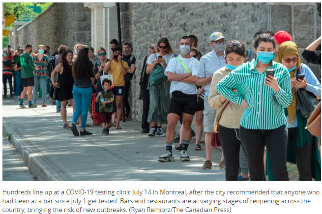 (原始链接: https://mmbiz.qpic.cn/mmbiz_png/szJas1pFaJfGdTibiceqUgG6ibhtlicYslAzaLTBDE7ribJ3Gjyia98a1FKfNhvxUmqlU5Uom255dIQysDUEXRYXeyzQ/640?wx_fmt=png)
- 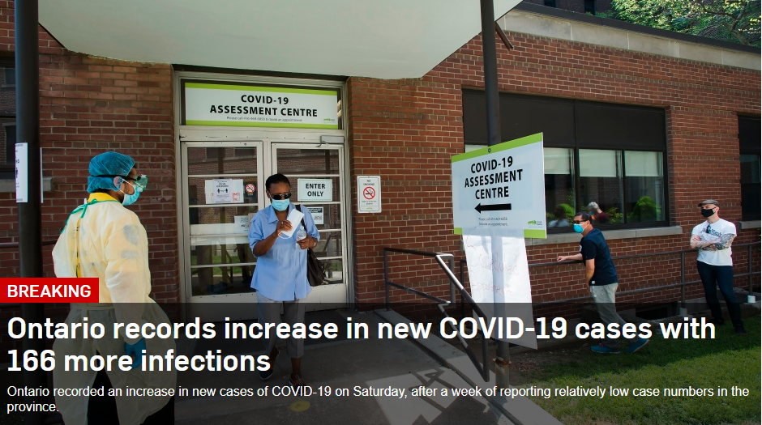 (原始链接: https://mmbiz.qpic.cn/mmbiz_png/icDcCacWsN1XLJxJ5V9R8tCsr6ia36me41Fhh0icCnhK7tuC4BduZJVxwNgqrnAlQXpBmnMSsv6sgS6NwT9WiafWxg/640?wx_fmt=png)
- 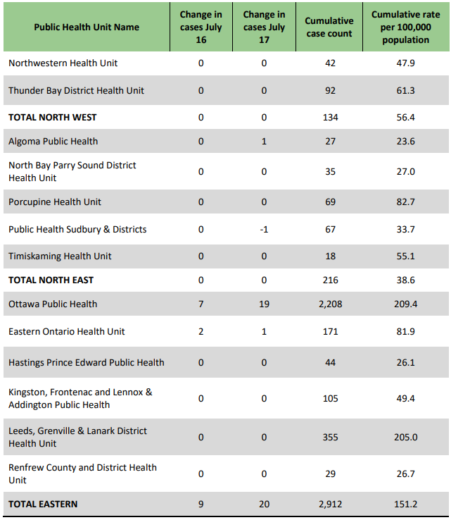 (原始链接: https://mmbiz.qpic.cn/mmbiz_png/icDcCacWsN1XLJxJ5V9R8tCsr6ia36me41BmjyQlMv0dB7FbOevicIX2UWnc0WgMyKibUSfwX0Q3pzJ1gibeRR55jBQ/640?wx_fmt=png)
- 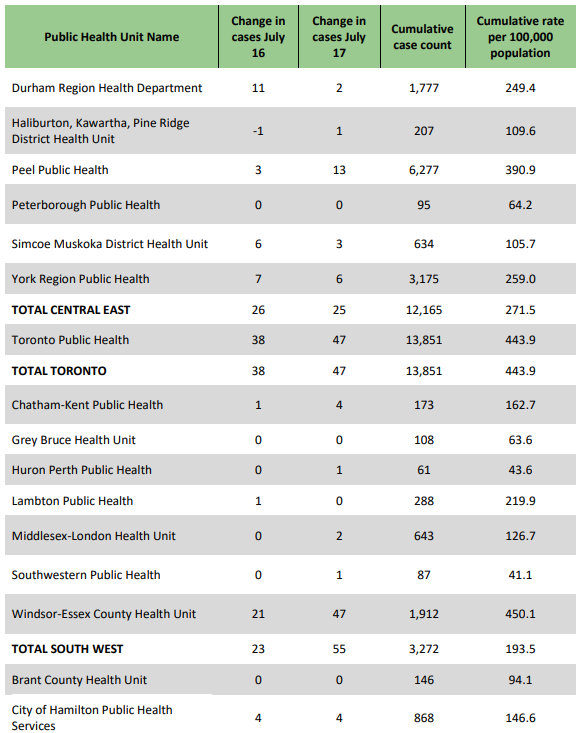 (原始链接: https://mmbiz.qpic.cn/mmbiz_png/icDcCacWsN1XLJxJ5V9R8tCsr6ia36me41ib96CPPFr5pR1Ywn4oulLbXfBj86jIFccgOlyibwFODvrtL0tSOwxyUw/640?wx_fmt=png)
- 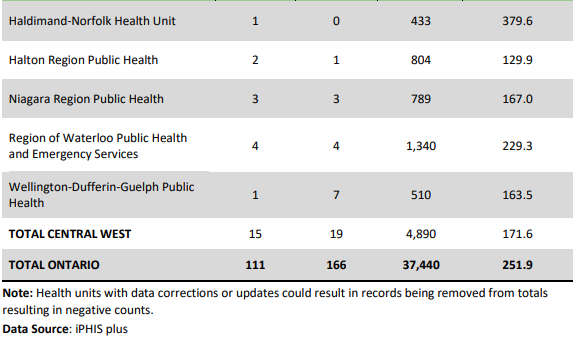 (原始链接: https://mmbiz.qpic.cn/mmbiz_png/icDcCacWsN1XLJxJ5V9R8tCsr6ia36me41ZY90SJjjlz0qYn96O3rwxh3MFbPZP2wlgejDGlVFMNWibiaibbzEA6PXA/640?wx_fmt=png)
- 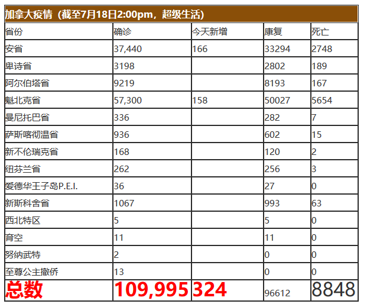 (原始链接: https://mmbiz.qpic.cn/mmbiz_png/szJas1pFaJfGdTibiceqUgG6ibhtlicYslAzKUvR6q3QKE5XZbvIKZ3S2eBJvt85Y5wawUuafFPicQCnxX6mcOg1JRw/640?wx_fmt=png)
- 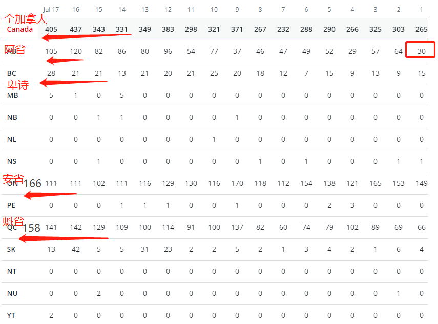 (原始链接: https://mmbiz.qpic.cn/mmbiz_png/szJas1pFaJfGdTibiceqUgG6ibhtlicYslAzhj60ibR68x5M0vOj4q3gQPLYcWVayfC5quFIaBlVT4coXpHww9HpSQg/640?wx_fmt=png)
- 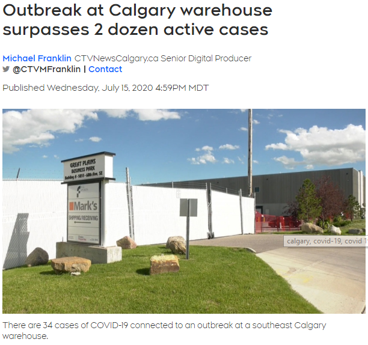 (原始链接: https://mmbiz.qpic.cn/mmbiz_png/szJas1pFaJfGdTibiceqUgG6ibhtlicYslAz36vMibTm9r7JaJSicrhSwj8lpCsmWiciar0QlUQ13OuQMEmEciaMTlYDwBQ/640?wx_fmt=png)
- 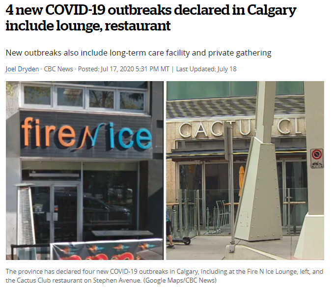 (原始链接: https://mmbiz.qpic.cn/mmbiz_png/szJas1pFaJfGdTibiceqUgG6ibhtlicYslAzO9lib1Sj8ic7UCib3MX3ytlV7SNfs8HWXldibE33Adl1KyZU1PMZ6U5zyQ/640?wx_fmt=png)
- 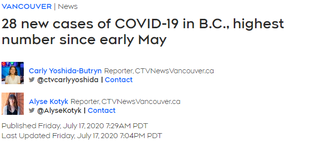 (原始链接: https://mmbiz.qpic.cn/mmbiz_png/szJas1pFaJfGdTibiceqUgG6ibhtlicYslAzLWJSB72oj07BOBrbGLqwnndMTvniaJHcv31tWvsf3UKmqNF1jXfMbPw/640?wx_fmt=png)
-  (原始链接: https://mmbiz.qpic.cn/mmbiz_png/szJas1pFaJfGdTibiceqUgG6ibhtlicYslAzPJu5RpRicSVxibeZX9BXFRvQKVfia26fdqI1RsmLLlFHP35XENBqscXMA/640?wx_fmt=png)
- 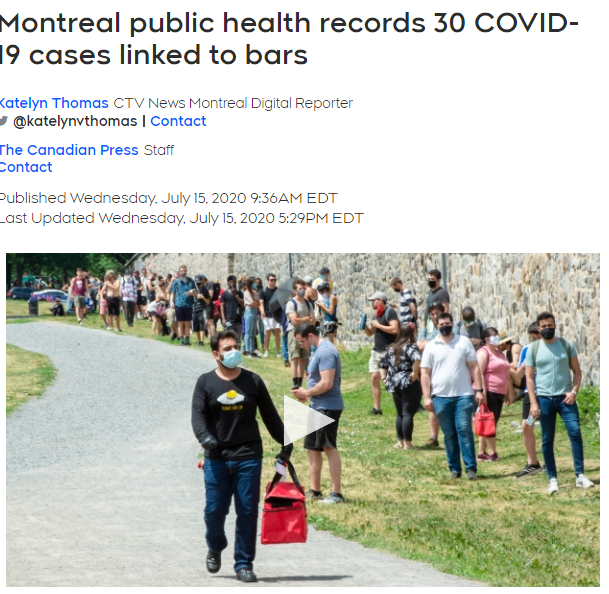 (原始链接: https://mmbiz.qpic.cn/mmbiz_png/szJas1pFaJfGdTibiceqUgG6ibhtlicYslAzgEYPt0BicpjNhkFrrKtNVREkvX2zrcxRZOIpicqq4blB7XVUMrAaxsaw/640?wx_fmt=png)
-  (原始链接: https://mmbiz.qpic.cn/mmbiz_gif/szJas1pFaJfGdTibiceqUgG6ibhtlicYslAzuPbAJYGyUTqjp5RnO0UrSPCFYjmfnc5AqevnwibeonhZF2xGdKtfI2A/640?wx_fmt=gif)
-  (原始链接: https://mmbiz.qpic.cn/mmbiz_png/szJas1pFaJfGdTibiceqUgG6ibhtlicYslAzgaAB9ibk9LVTrb0QuR3kS2GA2zhC7q1LgkCBg9ia8gKcvDZYEd0MJoYg/640?wx_fmt=png)
- 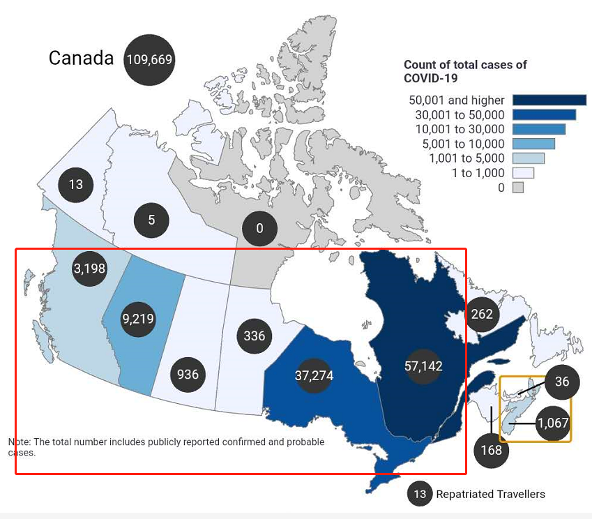 (原始链接: https://mmbiz.qpic.cn/mmbiz_png/szJas1pFaJfGdTibiceqUgG6ibhtlicYslAzh6erOLHyePbCX8gU5uSiaQFVxzQ0of5xYwJhqgPLm0fB1d6OU09esgA/640?wx_fmt=png)
-  (原始链接: https://mmbiz.qpic.cn/mmbiz_gif/szJas1pFaJdUFDPEKnLrCyGC4WgrAvl6lSC2beZFt6icTnXfebnRzcRialMg5VZujw1AhX9ribkSDQNZZukk8HX9w/640?wx_fmt=gif)
