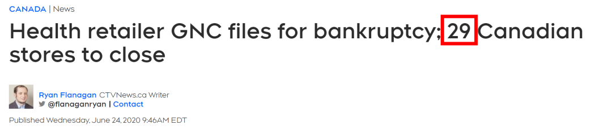

# 无标题

**链接地址:** http://mp.weixin.qq.com/s?__biz=MzIzODc2NzU4NA==&mid=2247520237&idx=1&sn=f97d3582b0c97fcfb73eb9555b229d60&chksm=e9369362de411a7441414260160628525eec1cb474ace217ea568ccdc3f1e07bf202bb795f88&mpshare=1&scene=2&srcid=0810UFmacakkB0A75KpeNZOo&sharer_sharetime=1597027709913&sharer_shareid=be1c8edd6c93eec155a61c876e41d26a#rd
**作者:** 妮娜
**获取时间:** 2025/8/28 20:10:16
**图片数量:** 20

---

## 原始HTML内容

<section style="display: none;" data-tools="新媒体管家" data-label="powered by xmt.cn"> </section><section style="box-sizing: border-box;font-style: normal;font-weight: 400;text-align: justify;font-size: 16px;"><section style="margin: 10px 0%;box-sizing: border-box;" powered-by="xiumi.us"><section style="font-size: 15px;letter-spacing: 0px;line-height: 2;padding: 0px 15px;box-sizing: border-box;">
加拿大这几年的零售业市场实在<strong style="letter-spacing: 0px;box-sizing: border-box;">不景气</strong>。前几年遭受到电商冲击，一些百年老牌因为跟不上时代潮流的变迁先是<strong style="letter-spacing: 0px;box-sizing: border-box;">垮了一片</strong>。现在遭受新冠疫情和经济危机的双重打击，更是<strong style="letter-spacing: 0px;box-sizing: border-box;">死伤无数</strong>。

 

倒闭的倒闭，关店的关店。就算是<strong style="box-sizing: border-box;">国际大牌一样不好使</strong>，哪怕硬撑着的几家也屡屡传出降薪裁员的新闻。

 
</section></section><section style="text-align: center;margin-top: 10px;margin-bottom: 10px;box-sizing: border-box;" powered-by="xiumi.us"><section style="max-width: 100%;vertical-align: middle;display: inline-block;line-height: 0;box-sizing: border-box;"></section></section><section style="margin: 10px 0%;box-sizing: border-box;" powered-by="xiumi.us"><section style="font-size: 15px;letter-spacing: 0px;line-height: 2;padding: 0px 15px;box-sizing: border-box;">
 

这些天来倒闭关店的新闻隔三岔五的爆出，吃瓜群众的心理从刚开始的<strong style="box-sizing: border-box;">震惊惋惜到现在的习以为常</strong>。今天就让小编特别总结了一下，自2020开年以来，加拿大本地的品牌和商铺的死伤惨状！

 

<strong style="box-sizing: border-box;">（名单略长，大家做好心理准备）</strong>

 
</section></section><section style="box-sizing: border-box;" powered-by="xiumi.us"><section style="display: flex;flex-flow: row nowrap;margin: 20px 0%;box-sizing: border-box;"><section style="display: inline-block;vertical-align: top;width: auto;align-self: stretch;flex: 10 10 0%;background-color: rgb(255, 248, 246);height: auto;padding: 5px 0px;box-sizing: border-box;"><section style="text-align: center;font-size: 21px;color: rgb(62, 62, 62);font-family: Optima-Regular, PingFangTC-light;line-height: 1.6;box-sizing: border-box;" powered-by="xiumi.us">
01
</section></section><section style="display: inline-block;vertical-align: top;width: 80px;border-style: solid;border-width: 3px;border-radius: 0px;border-color: rgb(255, 137, 89);flex: 0 0 auto;align-self: stretch;height: auto;margin: -15px -77px -15px 0px;box-sizing: border-box;line-height: 0;"><section style="line-height: 0;width: 0px;"><svg viewBox="0 0 1 1" style="vertical-align:top;"></svg></section></section><section style="display: inline-block;vertical-align: top;width: auto;background-color: rgb(255, 248, 246);flex: 100 100 0%;align-self: stretch;border-width: 0px;height: auto;padding: 5px 10px;border-top-style: solid;border-top-left-radius: 0px;border-top-color: rgb(62, 62, 62);box-sizing: border-box;"><section style="box-sizing: border-box;" powered-by="xiumi.us">
<strong style="box-sizing: border-box;">Victoria’s Secret&nbsp;</strong>
</section></section></section></section><section style="margin: 10px 0%;box-sizing: border-box;" powered-by="xiumi.us"><section style="font-size: 15px;letter-spacing: 0px;line-height: 2;padding: 0px 15px;box-sizing: border-box;">
 

美国著名内衣品牌维多利亚的秘密近几年在全球的销售表现并不理想。2019年停止扩张，世界范围内关店53家，甚至<strong style="box-sizing: border-box;">停办标志性的“维多利亚的秘密内衣大秀”</strong>。

 
</section></section><section style="text-align: center;margin-top: 10px;margin-bottom: 10px;box-sizing: border-box;" powered-by="xiumi.us"><section style="max-width: 100%;vertical-align: middle;display: inline-block;line-height: 0;box-sizing: border-box;"></section></section><section style="margin: 10px 0%;box-sizing: border-box;" powered-by="xiumi.us"><section style="font-size: 15px;letter-spacing: 0px;line-height: 2;padding: 0px 15px;box-sizing: border-box;">
 

今年全球范围内更是疯狂地进入缩减，关店250余家！其<strong style="box-sizing: border-box;">中加拿大独占13家！</strong>

 
</section></section><section style="box-sizing: border-box;" powered-by="xiumi.us"><section style="display: flex;flex-flow: row nowrap;margin: 20px 0%;box-sizing: border-box;"><section style="display: inline-block;vertical-align: top;width: auto;align-self: stretch;flex: 10 10 0%;background-color: rgb(255, 248, 246);height: auto;padding: 5px 0px;box-sizing: border-box;"><section style="text-align: center;font-size: 21px;color: rgb(62, 62, 62);font-family: Optima-Regular, PingFangTC-light;line-height: 1.6;box-sizing: border-box;" powered-by="xiumi.us">
02
</section></section><section style="display: inline-block;vertical-align: top;width: 80px;border-style: solid;border-width: 3px;border-radius: 0px;border-color: rgb(255, 137, 89);flex: 0 0 auto;align-self: stretch;height: auto;margin: -15px -77px -15px 0px;box-sizing: border-box;line-height: 0;"><section style="line-height: 0;width: 0px;"><svg viewBox="0 0 1 1" style="vertical-align:top;"></svg></section></section><section style="display: inline-block;vertical-align: top;width: auto;background-color: rgb(255, 248, 246);flex: 100 100 0%;align-self: stretch;border-width: 0px;height: auto;padding: 5px 10px;border-top-style: solid;border-top-left-radius: 0px;border-top-color: rgb(62, 62, 62);box-sizing: border-box;"><section style="box-sizing: border-box;" powered-by="xiumi.us">
<strong style="box-sizing: border-box;">Old Navy</strong>
</section></section></section></section><section style="margin: 10px 0%;box-sizing: border-box;" powered-by="xiumi.us"><section style="font-size: 15px;letter-spacing: 0px;line-height: 2;padding: 0px 15px;box-sizing: border-box;">
 

大家熟悉的Old Navy在疫情初期就传出了要大幅缩减店面的消息。此品牌向来以亲民的价格和日常实穿的设计出名。连这样<strong style="box-sizing: border-box;">群众基础稳固的品牌都撑不住疫情的影响</strong>，实在令人唏嘘。

 
</section></section><section style="text-align: center;margin-top: 10px;margin-bottom: 10px;box-sizing: border-box;" powered-by="xiumi.us"><section style="max-width: 100%;vertical-align: middle;display: inline-block;line-height: 0;box-sizing: border-box;"></section></section><section style="margin: 10px 0%;box-sizing: border-box;" powered-by="xiumi.us"><section style="font-size: 15px;letter-spacing: 0px;line-height: 2;padding: 0px 15px;box-sizing: border-box;">
 
</section></section><section style="box-sizing: border-box;" powered-by="xiumi.us"><section style="display: flex;flex-flow: row nowrap;margin: 20px 0%;box-sizing: border-box;"><section style="display: inline-block;vertical-align: top;width: auto;align-self: stretch;flex: 10 10 0%;background-color: rgb(255, 248, 246);height: auto;padding: 5px 0px;box-sizing: border-box;"><section style="text-align: center;font-size: 21px;color: rgb(62, 62, 62);font-family: Optima-Regular, PingFangTC-light;line-height: 1.6;box-sizing: border-box;" powered-by="xiumi.us">
03
</section></section><section style="display: inline-block;vertical-align: top;width: 80px;border-style: solid;border-width: 3px;border-radius: 0px;border-color: rgb(255, 137, 89);flex: 0 0 auto;align-self: stretch;height: auto;margin: -15px -77px -15px 0px;box-sizing: border-box;line-height: 0;"><section style="line-height: 0;width: 0px;"><svg viewBox="0 0 1 1" style="vertical-align:top;"></svg></section></section><section style="display: inline-block;vertical-align: top;width: auto;background-color: rgb(255, 248, 246);flex: 100 100 0%;align-self: stretch;border-width: 0px;height: auto;padding: 5px 10px;border-top-style: solid;border-top-left-radius: 0px;border-top-color: rgb(62, 62, 62);box-sizing: border-box;"><section style="box-sizing: border-box;" powered-by="xiumi.us">
<strong style="box-sizing: border-box;">La Senza</strong>
</section></section></section></section><section style="text-align: center;margin-top: 10px;margin-bottom: 10px;box-sizing: border-box;" powered-by="xiumi.us"><section style="max-width: 100%;vertical-align: middle;display: inline-block;line-height: 0;box-sizing: border-box;"></section></section><section style="margin: 10px 0%;box-sizing: border-box;" powered-by="xiumi.us"><section style="font-size: 15px;letter-spacing: 0px;line-height: 2;padding: 0px 15px;box-sizing: border-box;">
 

女士内衣巨头维多利亚的秘密不好过，始创于加拿大本地的著名内衣品牌也是如履薄冰。自年初北美尚未受到新冠疫情波及起，该品牌已存在<strong style="box-sizing: border-box;">900万美元的的债务</strong>，并且在疫情开始时就已决定关闭近30%的店铺。单在加国店铺的<strong style="box-sizing: border-box;">关闭数量就已达到30家</strong>。

 

 
</section></section><section style="box-sizing: border-box;" powered-by="xiumi.us"><section style="display: flex;flex-flow: row nowrap;margin: 20px 0%;box-sizing: border-box;"><section style="display: inline-block;vertical-align: top;width: auto;align-self: stretch;flex: 10 10 0%;background-color: rgb(255, 248, 246);height: auto;padding: 5px 0px;box-sizing: border-box;"><section style="text-align: center;font-size: 21px;color: rgb(62, 62, 62);font-family: Optima-Regular, PingFangTC-light;line-height: 1.6;box-sizing: border-box;" powered-by="xiumi.us">
04
</section></section><section style="display: inline-block;vertical-align: top;width: 80px;border-style: solid;border-width: 3px;border-radius: 0px;border-color: rgb(255, 137, 89);flex: 0 0 auto;align-self: stretch;height: auto;margin: -15px -77px -15px 0px;box-sizing: border-box;line-height: 0;"><section style="line-height: 0;width: 0px;"><svg viewBox="0 0 1 1" style="vertical-align:top;"></svg></section></section><section style="display: inline-block;vertical-align: top;width: auto;background-color: rgb(255, 248, 246);flex: 100 100 0%;align-self: stretch;border-width: 0px;height: auto;padding: 5px 10px;border-top-style: solid;border-top-left-radius: 0px;border-top-color: rgb(62, 62, 62);box-sizing: border-box;"><section style="box-sizing: border-box;" powered-by="xiumi.us">
<strong style="box-sizing: border-box;">Aldo</strong>
</section></section></section></section><section style="margin: 10px 0%;box-sizing: border-box;" powered-by="xiumi.us"><section style="font-size: 15px;letter-spacing: 0px;line-height: 2;padding: 0px 15px;box-sizing: border-box;">
 

创建于加拿大蒙特利尔市的鞋履及配饰品牌Aldo进入<strong style="box-sizing: border-box;">破产保护</strong>阶段可谓近期最为震惊的新闻之一，他们家在北美曾经拥有广泛的客户群体和良好的口碑。

 
</section></section><section style="text-align: center;margin-top: 10px;margin-bottom: 10px;box-sizing: border-box;" powered-by="xiumi.us"><section style="max-width: 100%;vertical-align: middle;display: inline-block;line-height: 0;box-sizing: border-box;"></section></section><section style="margin: 10px 0%;box-sizing: border-box;" powered-by="xiumi.us"><section style="font-size: 15px;letter-spacing: 0px;line-height: 2;padding: 0px 15px;box-sizing: border-box;">
 

然而这也扛不住疫情的凶猛冲击。据悉该公司自7月起计划<strong style="box-sizing: border-box;">关闭加拿大近一半的商铺</strong>，猛砍其线下销售的成本，并将大部分的业务转为线上经济。

 

 
</section></section><section style="box-sizing: border-box;" powered-by="xiumi.us"><section style="display: flex;flex-flow: row nowrap;margin: 20px 0%;box-sizing: border-box;"><section style="display: inline-block;vertical-align: top;width: auto;align-self: stretch;flex: 10 10 0%;background-color: rgb(255, 248, 246);height: auto;padding: 5px 0px;box-sizing: border-box;"><section style="text-align: center;font-size: 21px;color: rgb(62, 62, 62);font-family: Optima-Regular, PingFangTC-light;line-height: 1.6;box-sizing: border-box;" powered-by="xiumi.us">
05
</section></section><section style="display: inline-block;vertical-align: top;width: 80px;border-style: solid;border-width: 3px;border-radius: 0px;border-color: rgb(255, 137, 89);flex: 0 0 auto;align-self: stretch;height: auto;margin: -15px -77px -15px 0px;box-sizing: border-box;line-height: 0;"><section style="line-height: 0;width: 0px;"><svg viewBox="0 0 1 1" style="vertical-align:top;"></svg></section></section><section style="display: inline-block;vertical-align: top;width: auto;background-color: rgb(255, 248, 246);flex: 100 100 0%;align-self: stretch;border-width: 0px;height: auto;padding: 5px 10px;border-top-style: solid;border-top-left-radius: 0px;border-top-color: rgb(62, 62, 62);box-sizing: border-box;"><section style="box-sizing: border-box;" powered-by="xiumi.us">
<strong style="box-sizing: border-box;">Le Chateau</strong>
</section></section></section></section><section style="text-align: center;margin-top: 10px;margin-bottom: 10px;box-sizing: border-box;" powered-by="xiumi.us"><section style="max-width: 100%;vertical-align: middle;display: inline-block;line-height: 0;box-sizing: border-box;"></section></section><section style="box-sizing: border-box;" powered-by="xiumi.us">
 
</section><section style="margin: 10px 0%;box-sizing: border-box;" powered-by="xiumi.us"><section style="font-size: 15px;letter-spacing: 0px;line-height: 2;padding: 0px 15px;box-sizing: border-box;">
另一成立于加拿大蒙特利尔市的服装品牌Le Chateau早在<strong style="box-sizing: border-box;">2016年已经历过破产</strong>的经济危机，然而经过新一轮的疫情冲击，他们在去年<strong style="box-sizing: border-box;">已关闭40家店</strong>的基础上宣告，今年真得可能要撑不住了！

 

喜欢这个品牌的小礼服和小首饰的朋友们，真得别等了，用实际行动（购买力）去给与他们最后的支持吧！ 

 
</section></section><section style="box-sizing: border-box;" powered-by="xiumi.us"><section style="display: flex;flex-flow: row nowrap;margin: 20px 0%;box-sizing: border-box;"><section style="display: inline-block;vertical-align: top;width: auto;align-self: stretch;flex: 10 10 0%;background-color: rgb(255, 248, 246);height: auto;padding: 5px 0px;box-sizing: border-box;"><section style="text-align: center;font-size: 21px;color: rgb(62, 62, 62);font-family: Optima-Regular, PingFangTC-light;line-height: 1.6;box-sizing: border-box;" powered-by="xiumi.us">
06
</section></section><section style="display: inline-block;vertical-align: top;width: 80px;border-style: solid;border-width: 3px;border-radius: 0px;border-color: rgb(255, 137, 89);flex: 0 0 auto;align-self: stretch;height: auto;margin: -15px -77px -15px 0px;box-sizing: border-box;line-height: 0;"><section style="line-height: 0;width: 0px;"><svg viewBox="0 0 1 1" style="vertical-align:top;"></svg></section></section><section style="display: inline-block;vertical-align: top;width: auto;background-color: rgb(255, 248, 246);flex: 100 100 0%;align-self: stretch;border-width: 0px;height: auto;padding: 5px 10px;border-top-style: solid;border-top-left-radius: 0px;border-top-color: rgb(62, 62, 62);box-sizing: border-box;"><section style="box-sizing: border-box;" powered-by="xiumi.us">
<strong style="box-sizing: border-box;">The Gap &amp; The Gap Kids</strong>
</section></section></section></section><section style="margin: 10px 0%;box-sizing: border-box;" powered-by="xiumi.us"><section style="font-size: 15px;letter-spacing: 0px;line-height: 2;padding: 0px 15px;box-sizing: border-box;">
 

美国服装零售商Gap自2017年就步入了倒闭关店的程序，然而疫情更是让这个曾经旗舰店开满全全球一线城市的美国品牌失<strong style="box-sizing: border-box;">去了苟延残喘的机会</strong>。

 
</section></section><section style="text-align: center;margin-top: 10px;margin-bottom: 10px;box-sizing: border-box;" powered-by="xiumi.us"><section style="max-width: 100%;vertical-align: middle;display: inline-block;line-height: 0;box-sizing: border-box;"></section></section><section style="margin: 10px 0%;box-sizing: border-box;" powered-by="xiumi.us"><section style="font-size: 15px;letter-spacing: 0px;line-height: 2;padding: 0px 15px;box-sizing: border-box;">
 

这个品牌已经在今年年初关掉了40家商铺，平且准备在接下来的两年内在<strong style="box-sizing: border-box;">世界范围内关闭230家</strong>的商铺。

 

该公司上半年的财报显示，公司6月份的季度亏损约为<strong style="box-sizing: border-box;">10亿美元</strong>。这样高的亏损额，换做家底再厚的公司也撑不了几个月啊！

 
</section></section><section style="box-sizing: border-box;" powered-by="xiumi.us"><section style="display: flex;flex-flow: row nowrap;margin: 20px 0%;box-sizing: border-box;"><section style="display: inline-block;vertical-align: top;width: auto;align-self: stretch;flex: 10 10 0%;background-color: rgb(255, 248, 246);height: auto;padding: 5px 0px;box-sizing: border-box;"><section style="text-align: center;font-size: 21px;color: rgb(62, 62, 62);font-family: Optima-Regular, PingFangTC-light;line-height: 1.6;box-sizing: border-box;" powered-by="xiumi.us">
07
</section></section><section style="display: inline-block;vertical-align: top;width: 80px;border-style: solid;border-width: 3px;border-radius: 0px;border-color: rgb(255, 137, 89);flex: 0 0 auto;align-self: stretch;height: auto;margin: -15px -77px -15px 0px;box-sizing: border-box;line-height: 0;"><section style="line-height: 0;width: 0px;"><svg viewBox="0 0 1 1" style="vertical-align:top;"></svg></section></section><section style="display: inline-block;vertical-align: top;width: auto;background-color: rgb(255, 248, 246);flex: 100 100 0%;align-self: stretch;border-width: 0px;height: auto;padding: 5px 10px;border-top-style: solid;border-top-left-radius: 0px;border-top-color: rgb(62, 62, 62);box-sizing: border-box;"><section style="box-sizing: border-box;" powered-by="xiumi.us">
<strong style="box-sizing: border-box;">Forever 21&nbsp;</strong>
</section></section></section></section><section style="margin: 10px 0%;box-sizing: border-box;" powered-by="xiumi.us"><section style="font-size: 15px;letter-spacing: 0px;line-height: 2;padding: 0px 15px;box-sizing: border-box;">
 

大家青春时期的回忆，曾经一时风头无量的时装快销品牌Forever 21的在<strong style="box-sizing: border-box;">2019年轰然倒闭</strong>，曾经也让众人错愕震惊。公司在鼎盛时期在加拿大曾有超过50家店铺，如今已经<strong style="box-sizing: border-box;">全数进入结业关店的进程</strong>。

 
</section></section><section style="text-align: center;margin-top: 10px;margin-bottom: 10px;box-sizing: border-box;" powered-by="xiumi.us"><section style="max-width: 100%;vertical-align: middle;display: inline-block;line-height: 0;box-sizing: border-box;"></section></section><section style="box-sizing: border-box;" powered-by="xiumi.us">
 
</section><section style="box-sizing: border-box;" powered-by="xiumi.us"><section style="display: flex;flex-flow: row nowrap;margin: 20px 0%;box-sizing: border-box;"><section style="display: inline-block;vertical-align: top;width: auto;align-self: stretch;flex: 10 10 0%;background-color: rgb(255, 248, 246);height: auto;padding: 5px 0px;box-sizing: border-box;"><section style="text-align: center;font-size: 21px;color: rgb(62, 62, 62);font-family: Optima-Regular, PingFangTC-light;line-height: 1.6;box-sizing: border-box;" powered-by="xiumi.us">
07
</section></section><section style="display: inline-block;vertical-align: top;width: 80px;border-style: solid;border-width: 3px;border-radius: 0px;border-color: rgb(255, 137, 89);flex: 0 0 auto;align-self: stretch;height: auto;margin: -15px -77px -15px 0px;box-sizing: border-box;line-height: 0;"><section style="line-height: 0;width: 0px;"><svg viewBox="0 0 1 1" style="vertical-align:top;"></svg></section></section><section style="display: inline-block;vertical-align: top;width: auto;background-color: rgb(255, 248, 246);flex: 100 100 0%;align-self: stretch;border-width: 0px;height: auto;padding: 5px 10px;border-top-style: solid;border-top-left-radius: 0px;border-top-color: rgb(62, 62, 62);box-sizing: border-box;"><section style="box-sizing: border-box;" powered-by="xiumi.us">
<strong style="box-sizing: border-box;">GNC&nbsp;</strong>
</section></section></section></section><section style="margin: 10px 0%;box-sizing: border-box;" powered-by="xiumi.us"><section style="font-size: 15px;letter-spacing: 0px;line-height: 2;padding: 0px 15px;box-sizing: border-box;">
 

疫情对零售产业的冲击远不止时尚产业。成立于美国的著名健康营养品销售商GNC也于6月开始进入破产清算程序，并宣称要直接关闭<strong style="box-sizing: border-box;">加拿大的29家店铺</strong>。

 
</section></section><section style="text-align: center;margin-top: 10px;margin-bottom: 10px;box-sizing: border-box;" powered-by="xiumi.us"><section style="max-width: 100%;vertical-align: middle;display: inline-block;line-height: 0;box-sizing: border-box;"></section></section><section style="margin: 10px 0%;box-sizing: border-box;" powered-by="xiumi.us"><section style="font-size: 15px;letter-spacing: 0px;line-height: 2;padding: 0px 15px;box-sizing: border-box;">
 

疫情的来袭会影响时尚销售产业很好理解，但作为日常保健和运动产品的零售商GNC居然也难逃一劫，不由让人心生感慨。<strong style="box-sizing: border-box;">一荣俱荣，一损俱损</strong>的社会经济结构平衡正在发生着微妙的倾斜。

 
</section></section><section style="text-align: center;margin-top: 10px;margin-bottom: 10px;box-sizing: border-box;" powered-by="xiumi.us"><section style="max-width: 100%;vertical-align: middle;display: inline-block;line-height: 0;box-sizing: border-box;"></section></section><section style="margin: 10px 0%;box-sizing: border-box;" powered-by="xiumi.us"><section style="font-size: 15px;letter-spacing: 0px;line-height: 2;padding: 0px 15px;box-sizing: border-box;">
 

这家拥有85年历史的的公司背如今已负了<strong style="box-sizing: border-box;">近10亿美元的债务</strong>，并且将缩<strong style="box-sizing: border-box;">减全球约1/4的业务</strong>已度过这个难熬的黑夜。

 
</section></section><section style="box-sizing: border-box;" powered-by="xiumi.us"><section style="display: flex;flex-flow: row nowrap;margin: 20px 0%;box-sizing: border-box;"><section style="display: inline-block;vertical-align: top;width: auto;align-self: stretch;flex: 10 10 0%;background-color: rgb(255, 248, 246);height: auto;padding: 5px 0px;box-sizing: border-box;"><section style="text-align: center;font-size: 21px;color: rgb(62, 62, 62);font-family: Optima-Regular, PingFangTC-light;line-height: 1.6;box-sizing: border-box;" powered-by="xiumi.us">
08
</section></section><section style="display: inline-block;vertical-align: top;width: 80px;border-style: solid;border-width: 3px;border-radius: 0px;border-color: rgb(255, 137, 89);flex: 0 0 auto;align-self: stretch;height: auto;margin: -15px -77px -15px 0px;box-sizing: border-box;line-height: 0;"><section style="line-height: 0;width: 0px;"><svg viewBox="0 0 1 1" style="vertical-align:top;"></svg></section></section><section style="display: inline-block;vertical-align: top;width: auto;background-color: rgb(255, 248, 246);flex: 100 100 0%;align-self: stretch;border-width: 0px;height: auto;padding: 5px 10px;border-top-style: solid;border-top-left-radius: 0px;border-top-color: rgb(62, 62, 62);box-sizing: border-box;"><section style="box-sizing: border-box;" powered-by="xiumi.us">
<strong style="box-sizing: border-box;">Bed, Bath &amp; Beyond&nbsp;</strong>
</section></section></section></section><section style="margin: 10px 0%;box-sizing: border-box;" powered-by="xiumi.us"><section style="font-size: 15px;letter-spacing: 0px;line-height: 2;padding: 0px 15px;box-sizing: border-box;">
 

这家以销售居家产品出名的美国品牌在鼎盛时期曾在北美扩张至<strong style="box-sizing: border-box;">近1000家店铺</strong>，但近些年公司的财务表现堪忧，早已经进入了加速萎缩的发展轨迹。

 
</section></section><section style="text-align: center;margin-top: 10px;margin-bottom: 10px;box-sizing: border-box;" powered-by="xiumi.us"><section style="max-width: 100%;vertical-align: middle;display: inline-block;line-height: 0;box-sizing: border-box;"></section></section><section style="margin: 10px 0%;box-sizing: border-box;" powered-by="xiumi.us"><section style="font-size: 15px;letter-spacing: 0px;line-height: 2;padding: 0px 15px;box-sizing: border-box;">
 

该公司更是于上月直接宣布一次性在接下来的两年内关闭约<strong style="box-sizing: border-box;">200家店铺</strong>，占比公司店铺总量的21%，以达到节约至多3.5亿美金的支出。

 
</section></section><section style="box-sizing: border-box;" powered-by="xiumi.us"><section style="display: flex;flex-flow: row nowrap;margin: 20px 0%;box-sizing: border-box;"><section style="display: inline-block;vertical-align: top;width: auto;align-self: stretch;flex: 10 10 0%;background-color: rgb(255, 248, 246);height: auto;padding: 5px 0px;box-sizing: border-box;"><section style="text-align: center;font-size: 21px;color: rgb(62, 62, 62);font-family: Optima-Regular, PingFangTC-light;line-height: 1.6;box-sizing: border-box;" powered-by="xiumi.us">
09
</section></section><section style="display: inline-block;vertical-align: top;width: 80px;border-style: solid;border-width: 3px;border-radius: 0px;border-color: rgb(255, 137, 89);flex: 0 0 auto;align-self: stretch;height: auto;margin: -15px -77px -15px 0px;box-sizing: border-box;line-height: 0;"><section style="line-height: 0;width: 0px;"><svg viewBox="0 0 1 1" style="vertical-align:top;"></svg></section></section><section style="display: inline-block;vertical-align: top;width: auto;background-color: rgb(255, 248, 246);flex: 100 100 0%;align-self: stretch;border-width: 0px;height: auto;padding: 5px 10px;border-top-style: solid;border-top-left-radius: 0px;border-top-color: rgb(62, 62, 62);box-sizing: border-box;"><section style="box-sizing: border-box;" powered-by="xiumi.us">
<strong style="box-sizing: border-box;">Pier 1 Import&nbsp;</strong>
</section></section></section></section><section style="margin: 10px 0%;box-sizing: border-box;" powered-by="xiumi.us"><section style="font-size: 15px;letter-spacing: 0px;line-height: 2;padding: 0px 15px;box-sizing: border-box;">
 
</section></section><section style="margin: 10px 0%;box-sizing: border-box;" powered-by="xiumi.us"><section style="font-size: 15px;letter-spacing: 0px;line-height: 2;padding: 0px 15px;box-sizing: border-box;">
零一美国居家产品销售巨头Pier 1 Imports也在上月宣告了公司<strong style="box-sizing: border-box;">关闭全部门店的消息</strong>。这家已拥有58年历史的老牌公司，一口气计划关闭其麾下共<strong style="box-sizing: border-box;">580家店铺</strong>，完成线下实体销售到线上的一步式转型。

 
</section></section><section style="text-align: center;margin-top: 10px;margin-bottom: 10px;box-sizing: border-box;" powered-by="xiumi.us"><section style="max-width: 100%;vertical-align: middle;display: inline-block;line-height: 0;box-sizing: border-box;"></section></section><section style="box-sizing: border-box;" powered-by="xiumi.us">
 
</section><section style="box-sizing: border-box;" powered-by="xiumi.us"><section style="display: flex;flex-flow: row nowrap;margin: 20px 0%;box-sizing: border-box;"><section style="display: inline-block;vertical-align: top;width: auto;align-self: stretch;flex: 10 10 0%;background-color: rgb(255, 248, 246);height: auto;padding: 5px 0px;box-sizing: border-box;"><section style="text-align: center;font-size: 21px;color: rgb(62, 62, 62);font-family: Optima-Regular, PingFangTC-light;line-height: 1.6;box-sizing: border-box;" powered-by="xiumi.us">
10
</section></section><section style="display: inline-block;vertical-align: top;width: 80px;border-style: solid;border-width: 3px;border-radius: 0px;border-color: rgb(255, 137, 89);flex: 0 0 auto;align-self: stretch;height: auto;margin: -15px -77px -15px 0px;box-sizing: border-box;line-height: 0;"><section style="line-height: 0;width: 0px;"><svg viewBox="0 0 1 1" style="vertical-align:top;"></svg></section></section><section style="display: inline-block;vertical-align: top;width: auto;background-color: rgb(255, 248, 246);flex: 100 100 0%;align-self: stretch;border-width: 0px;height: auto;padding: 5px 10px;border-top-style: solid;border-top-left-radius: 0px;border-top-color: rgb(62, 62, 62);box-sizing: border-box;"><section style="box-sizing: border-box;" powered-by="xiumi.us">
<strong style="box-sizing: border-box;">David’s Tea</strong>
</section></section></section></section><section style="margin: 10px 0%;box-sizing: border-box;" powered-by="xiumi.us"><section style="font-size: 15px;letter-spacing: 0px;line-height: 2;padding: 0px 15px;box-sizing: border-box;">
 

加国本土曾经的网红品牌David's Tea这阵子日子也很不好过。在疫情导致的停业法令撤销后，该公司只重新开放了<strong style="box-sizing: border-box;">18家实体店铺</strong>，从原先的全家186家分店迅速缩减到目前的范围。

 
</section></section><section style="text-align: center;margin-top: 10px;margin-bottom: 10px;box-sizing: border-box;" powered-by="xiumi.us"><section style="max-width: 100%;vertical-align: middle;display: inline-block;line-height: 0;box-sizing: border-box;"></section></section><section style="margin: 10px 0%;box-sizing: border-box;" powered-by="xiumi.us"><section style="font-size: 15px;letter-spacing: 0px;line-height: 2;padding: 0px 15px;box-sizing: border-box;">
 

但是该公司并没有完全结业的计划，而是准备将所有业务<strong style="box-sizing: border-box;">转向线上销售</strong>，从互联网经济的大势中分一杯羹。

 

不知道在省去大部分铺面房租和雇员工资的该店铺，在网络上的销售又将有如何的表现呢？

 
</section></section><section style="box-sizing: border-box;" powered-by="xiumi.us"><section style="display: flex;flex-flow: row nowrap;margin: 20px 0%;box-sizing: border-box;"><section style="display: inline-block;vertical-align: top;width: auto;align-self: stretch;flex: 10 10 0%;background-color: rgb(255, 248, 246);height: auto;padding: 5px 0px;box-sizing: border-box;"><section style="text-align: center;font-size: 21px;color: rgb(62, 62, 62);font-family: Optima-Regular, PingFangTC-light;line-height: 1.6;box-sizing: border-box;" powered-by="xiumi.us">
11
</section></section><section style="display: inline-block;vertical-align: top;width: 80px;border-style: solid;border-width: 3px;border-radius: 0px;border-color: rgb(255, 137, 89);flex: 0 0 auto;align-self: stretch;height: auto;margin: -15px -77px -15px 0px;box-sizing: border-box;line-height: 0;"><section style="line-height: 0;width: 0px;"><svg viewBox="0 0 1 1" style="vertical-align:top;"></svg></section></section><section style="display: inline-block;vertical-align: top;width: auto;background-color: rgb(255, 248, 246);flex: 100 100 0%;align-self: stretch;border-width: 0px;height: auto;padding: 5px 10px;border-top-style: solid;border-top-left-radius: 0px;border-top-color: rgb(62, 62, 62);box-sizing: border-box;"><section style="box-sizing: border-box;" powered-by="xiumi.us">
<strong style="box-sizing: border-box;">其他品牌</strong>
</section></section></section></section><section style="margin: 10px 0%;box-sizing: border-box;" powered-by="xiumi.us"><section style="font-size: 15px;letter-spacing: 0px;line-height: 2;padding: 0px 15px;box-sizing: border-box;">
 

介于篇幅的原因，我们无法展开细节说明所有商铺的经营情况，以下列举几个在加拿大常见的品牌近期的关停计划：

 

Sail：6家商铺停业，2家在安大略省

Thyme Maternity：54家商铺停业

Addition Elle ：所有77家商铺停业

 
</section></section><section style="text-align: center;margin-top: 10px;margin-bottom: 10px;box-sizing: border-box;" powered-by="xiumi.us"><section style="max-width: 100%;vertical-align: middle;display: inline-block;line-height: 0;box-sizing: border-box;"></section></section><section style="margin: 10px 0%;box-sizing: border-box;" powered-by="xiumi.us"><section style="font-size: 15px;letter-spacing: 0px;line-height: 2;padding: 0px 15px;box-sizing: border-box;">
 

Nygard：所有169家商铺停业

Moore’s Men’s Wear：进入破产程序，大量商铺停业

Bootlegger：母公司破产，部分商铺停业

Ricki’s：母公司破产，部分商铺停业 

Cleo：母公司破产，部分商铺停业

 
</section></section><section style="text-align: center;margin-top: 10px;margin-bottom: 10px;box-sizing: border-box;" powered-by="xiumi.us"><section style="max-width: 100%;vertical-align: middle;display: inline-block;line-height: 0;box-sizing: border-box;"></section></section><section style="margin: 10px 0%;box-sizing: border-box;" powered-by="xiumi.us"><section style="font-size: 15px;letter-spacing: 0px;line-height: 2;padding: 0px 15px;box-sizing: border-box;">
 

Children’s Place：200家商铺停业，2021年将累计到300家。

Ann Taylor：母公司破产，全部商铺停业

Loft：母公司破产，全部商铺停业

Justice：母公司破产，全部商铺停业

 
</section></section><section style="text-align: center;margin-top: 10px;margin-bottom: 10px;box-sizing: border-box;" powered-by="xiumi.us"><section style="max-width: 100%;vertical-align: middle;display: inline-block;line-height: 0;box-sizing: border-box;"></section></section><section style="margin: 10px 0%;box-sizing: border-box;" powered-by="xiumi.us"><section style="font-size: 15px;letter-spacing: 0px;line-height: 2;padding: 0px 15px;box-sizing: border-box;">
 

Mendocino：全部商铺停业

Bench：全加拿大24家商铺停业

People’s Jewellers：部分商铺停业 

Scholar’s Choice ：13家商铺停业，缩减至3家实体商铺

Starbucks：近200家加拿大商铺停业

Carleton Cards ：全部商铺停业

Papyrus：全部商铺停业

 
</section></section><section style="text-align: center;margin-top: 10px;margin-bottom: 10px;box-sizing: border-box;" powered-by="xiumi.us"><section style="max-width: 100%;vertical-align: middle;display: inline-block;line-height: 0;box-sizing: border-box;"></section></section><section style="margin: 10px 0%;box-sizing: border-box;" powered-by="xiumi.us"><section style="font-size: 15px;letter-spacing: 0px;line-height: 2;padding: 0px 15px;box-sizing: border-box;">
 

Bath &amp; Body Works：1家加拿大商铺停业

Things Engraved：加拿大全部73家商铺停业 

……

<strong style="box-sizing: border-box;">更多信息我们会在今后持续报道，请大家关注超级爆料君获取更详尽更新。</strong>

<strong style="box-sizing: border-box;"> </strong>
</section></section><section style="box-sizing: border-box;" powered-by="xiumi.us"><section style="display: flex;flex-flow: row nowrap;margin: 10px 0%;box-sizing: border-box;"><section style="display: inline-block;vertical-align: middle;width: auto;align-self: center;flex: 100 100 0%;height: auto;box-sizing: border-box;"><section style="margin: 0px 0%;box-sizing: border-box;" powered-by="xiumi.us"><section style="background-color: rgb(224, 64, 66);height: 1px;box-sizing: border-box;line-height: 0;"> </section></section></section><section style="display: inline-block;vertical-align: middle;width: auto;min-width: 10%;max-width: 100%;flex: 0 0 auto;height: auto;align-self: center;z-index: 1;margin: 0px;box-sizing: border-box;"><section style="text-align: center;justify-content: center;font-size: 0px;margin: 0px 0%;box-sizing: border-box;" powered-by="xiumi.us"><section style="display: inline-block;width: 7px;height: 7px;vertical-align: top;overflow: hidden;border-style: solid;border-width: 1px;border-radius: 0px;border-color: rgb(224, 64, 66);line-height: 0;letter-spacing: 0px;box-sizing: border-box;"> </section></section></section><section style="display: inline-block;vertical-align: middle;width: auto;align-self: center;flex: 100 100 0%;height: auto;box-sizing: border-box;"><section style="margin: 0px 0%;box-sizing: border-box;" powered-by="xiumi.us"><section style="background-color: rgb(224, 64, 66);height: 1px;box-sizing: border-box;line-height: 0;"> </section></section></section></section></section><section style="margin: 10px 0%;box-sizing: border-box;" powered-by="xiumi.us"><section style="font-size: 15px;letter-spacing: 0px;line-height: 2;padding: 0px 15px;box-sizing: border-box;">
 

小编越写越是难过心碎，多少曾经陪伴我们成长的品牌在这一场无声的暴风雨之后默默消失；这么多曾经风光一时的商业帝国，竟然在一夕间悄然垮塌。

 

看着曾经人来人往的商场中，一个个商铺挂上清仓大甩卖的招牌，一个个品牌撤柜后留下空旷的铺面和紧锁的大门。或许世界真地彻底被疫情改变，<strong>今后的生活再也回不去从前了。</strong>

 

 

这个社会的运作总是一环套一环，销售行业和实体经济迅速萎缩，总是会动摇到不少社会群体的切身利益和经济体系的稳定。

 

这样的苦痛，全世界不少国家都正在痛苦的经历着，而我们生活的加拿大这片土地，自然也难逃这场劫难。我们作为普通的百姓，<strong style="box-sizing: border-box;">或许连通过消费来挽救自己心爱品牌的机会也不复存在。</strong>

 

最后告诫一下<strong>手里有各种礼品卡的朋友们，可千万别光顾着吃瓜了</strong>，<strong style="box-sizing: border-box;">赶紧把这些无法兑现的钱花掉才是正经事啊</strong>！如果有喜欢的品牌和产品的记得及时囤货！下一个倒下的真不知道是谁啦！

 

 

---大家快来关注爆料君↓↓---
<section powered-by="xiumi.us" style="margin-top: 10px;margin-bottom: 10px;max-width: 100%;box-sizing: border-box;white-space: normal;font-family: -apple-system-font, BlinkMacSystemFont, &quot;Helvetica Neue&quot;, &quot;PingFang SC&quot;, &quot;Hiragino Sans GB&quot;, &quot;Microsoft YaHei UI&quot;, &quot;Microsoft YaHei&quot;, Arial, sans-serif;letter-spacing: 0.544px;font-size: 16px;background-color: rgb(255, 255, 255);overflow-wrap: break-word !important;"><section style="padding-right: 15px;padding-left: 15px;max-width: 100%;box-sizing: border-box;font-size: 15px;letter-spacing: 0px;line-height: 2;overflow-wrap: break-word !important;">

</section></section><section style="margin-top: 10px;margin-bottom: 10px;max-width: 100%;box-sizing: border-box;white-space: normal;font-family: -apple-system-font, BlinkMacSystemFont, &quot;Helvetica Neue&quot;, &quot;PingFang SC&quot;, &quot;Hiragino Sans GB&quot;, &quot;Microsoft YaHei UI&quot;, &quot;Microsoft YaHei&quot;, Arial, sans-serif;letter-spacing: 0.544px;font-size: 16px;background-color: rgb(255, 255, 255);text-align: right;overflow-wrap: break-word !important;"><section style="max-width: 100%;box-sizing: border-box;display: inline-block;vertical-align: middle;overflow-wrap: break-word !important;"><section style="margin-bottom: 2px;padding-right: 5px;padding-left: 5px;max-width: 100%;box-sizing: border-box;display: inline-block;vertical-align: bottom;line-height: 1;color: rgb(223, 21, 21);font-size: 14px;overflow-wrap: break-word !important;">
我知道你<strong style="max-width: 100%;box-sizing: border-box;overflow-wrap: break-word !important;">在看</strong>哟
</section><section style="max-width: 100%;box-sizing: border-box;display: inline-block;vertical-align: bottom;line-height: 0;width: 52.0156px;overflow-wrap: break-word !important;"></section></section></section></section></section></section>

---

## 纯文本内容

加拿大这几年的零售业市场实在不景气。前几年遭受到电商冲击，一些百年老牌因为跟不上时代潮流的变迁先是垮了一片。现在遭受新冠疫情和经济危机的双重打击，更是死伤无数。倒闭的倒闭，关店的关店。就算是国际大牌一样不好使，哪怕硬撑着的几家也屡屡传出降薪裁员的新闻。这些天来倒闭关店的新闻隔三岔五的爆出，吃瓜群众的心理从刚开始的震惊惋惜到现在的习以为常。今天就让小编特别总结了一下，自2020开年以来，加拿大本地的品牌和商铺的死伤惨状！（名单略长，大家做好心理准备）01Victoria’s Secret 美国著名内衣品牌维多利亚的秘密近几年在全球的销售表现并不理想。2019年停止扩张，世界范围内关店53家，甚至停办标志性的“维多利亚的秘密内衣大秀”。今年全球范围内更是疯狂地进入缩减，关店250余家！其中加拿大独占13家！02Old Navy大家熟悉的Old Navy在疫情初期就传出了要大幅缩减店面的消息。此品牌向来以亲民的价格和日常实穿的设计出名。连这样群众基础稳固的品牌都撑不住疫情的影响，实在令人唏嘘。03La Senza女士内衣巨头维多利亚的秘密不好过，始创于加拿大本地的著名内衣品牌也是如履薄冰。自年初北美尚未受到新冠疫情波及起，该品牌已存在900万美元的的债务，并且在疫情开始时就已决定关闭近30%的店铺。单在加国店铺的关闭数量就已达到30家。04Aldo创建于加拿大蒙特利尔市的鞋履及配饰品牌Aldo进入破产保护阶段可谓近期最为震惊的新闻之一，他们家在北美曾经拥有广泛的客户群体和良好的口碑。然而这也扛不住疫情的凶猛冲击。据悉该公司自7月起计划关闭加拿大近一半的商铺，猛砍其线下销售的成本，并将大部分的业务转为线上经济。05Le Chateau另一成立于加拿大蒙特利尔市的服装品牌Le Chateau早在2016年已经历过破产的经济危机，然而经过新一轮的疫情冲击，他们在去年已关闭40家店的基础上宣告，今年真得可能要撑不住了！喜欢这个品牌的小礼服和小首饰的朋友们，真得别等了，用实际行动（购买力）去给与他们最后的支持吧！06The Gap & The Gap Kids美国服装零售商Gap自2017年就步入了倒闭关店的程序，然而疫情更是让这个曾经旗舰店开满全全球一线城市的美国品牌失去了苟延残喘的机会。这个品牌已经在今年年初关掉了40家商铺，平且准备在接下来的两年内在世界范围内关闭230家的商铺。该公司上半年的财报显示，公司6月份的季度亏损约为10亿美元。这样高的亏损额，换做家底再厚的公司也撑不了几个月啊！07Forever 21 大家青春时期的回忆，曾经一时风头无量的时装快销品牌Forever 21的在2019年轰然倒闭，曾经也让众人错愕震惊。公司在鼎盛时期在加拿大曾有超过50家店铺，如今已经全数进入结业关店的进程。07GNC 疫情对零售产业的冲击远不止时尚产业。成立于美国的著名健康营养品销售商GNC也于6月开始进入破产清算程序，并宣称要直接关闭加拿大的29家店铺。疫情的来袭会影响时尚销售产业很好理解，但作为日常保健和运动产品的零售商GNC居然也难逃一劫，不由让人心生感慨。一荣俱荣，一损俱损的社会经济结构平衡正在发生着微妙的倾斜。这家拥有85年历史的的公司背如今已负了近10亿美元的债务，并且将缩减全球约1/4的业务已度过这个难熬的黑夜。08Bed, Bath & Beyond 这家以销售居家产品出名的美国品牌在鼎盛时期曾在北美扩张至近1000家店铺，但近些年公司的财务表现堪忧，早已经进入了加速萎缩的发展轨迹。该公司更是于上月直接宣布一次性在接下来的两年内关闭约200家店铺，占比公司店铺总量的21%，以达到节约至多3.5亿美金的支出。09Pier 1 Import 零一美国居家产品销售巨头Pier 1 Imports也在上月宣告了公司关闭全部门店的消息。这家已拥有58年历史的老牌公司，一口气计划关闭其麾下共580家店铺，完成线下实体销售到线上的一步式转型。10David’s Tea加国本土曾经的网红品牌David's Tea这阵子日子也很不好过。在疫情导致的停业法令撤销后，该公司只重新开放了18家实体店铺，从原先的全家186家分店迅速缩减到目前的范围。但是该公司并没有完全结业的计划，而是准备将所有业务转向线上销售，从互联网经济的大势中分一杯羹。不知道在省去大部分铺面房租和雇员工资的该店铺，在网络上的销售又将有如何的表现呢？11其他品牌介于篇幅的原因，我们无法展开细节说明所有商铺的经营情况，以下列举几个在加拿大常见的品牌近期的关停计划：Sail：6家商铺停业，2家在安大略省Thyme Maternity：54家商铺停业Addition Elle ：所有77家商铺停业Nygard：所有169家商铺停业Moore’s Men’s Wear：进入破产程序，大量商铺停业Bootlegger：母公司破产，部分商铺停业Ricki’s：母公司破产，部分商铺停业Cleo：母公司破产，部分商铺停业Children’s Place：200家商铺停业，2021年将累计到300家。Ann Taylor：母公司破产，全部商铺停业Loft：母公司破产，全部商铺停业Justice：母公司破产，全部商铺停业Mendocino：全部商铺停业Bench：全加拿大24家商铺停业People’s Jewellers：部分商铺停业Scholar’s Choice ：13家商铺停业，缩减至3家实体商铺Starbucks：近200家加拿大商铺停业Carleton Cards ：全部商铺停业Papyrus：全部商铺停业Bath & Body Works：1家加拿大商铺停业Things Engraved：加拿大全部73家商铺停业……更多信息我们会在今后持续报道，请大家关注超级爆料君获取更详尽更新。小编越写越是难过心碎，多少曾经陪伴我们成长的品牌在这一场无声的暴风雨之后默默消失；这么多曾经风光一时的商业帝国，竟然在一夕间悄然垮塌。看着曾经人来人往的商场中，一个个商铺挂上清仓大甩卖的招牌，一个个品牌撤柜后留下空旷的铺面和紧锁的大门。或许世界真地彻底被疫情改变，今后的生活再也回不去从前了。这个社会的运作总是一环套一环，销售行业和实体经济迅速萎缩，总是会动摇到不少社会群体的切身利益和经济体系的稳定。这样的苦痛，全世界不少国家都正在痛苦的经历着，而我们生活的加拿大这片土地，自然也难逃这场劫难。我们作为普通的百姓，或许连通过消费来挽救自己心爱品牌的机会也不复存在。最后告诫一下手里有各种礼品卡的朋友们，可千万别光顾着吃瓜了，赶紧把这些无法兑现的钱花掉才是正经事啊！如果有喜欢的品牌和产品的记得及时囤货！下一个倒下的真不知道是谁啦！---大家快来关注爆料君↓↓---我知道你在看哟

---

## 图片列表

-  (原始链接: https://mmbiz.qpic.cn/mmbiz_jpg/4kibCXA1QiblSBfzdbPcTfvics8Hwr9kHbgbSrSTIfticdKJFqNyogRTRtG2kpz0j8iaiaDQnIQasUNaQCVS38iaAYUibQ/640?wx_fmt=jpeg)
-  (原始链接: https://mmbiz.qpic.cn/mmbiz_png/4kibCXA1QiblSBfzdbPcTfvics8Hwr9kHbgFlnkldiaRicKod7iatmRCD0IM7tN8C7Oc5LxQ7dAG2841NSLrwDc2lTEQ/640?wx_fmt=png)
-  (原始链接: https://mmbiz.qpic.cn/mmbiz_jpg/4kibCXA1QiblSBfzdbPcTfvics8Hwr9kHbgjPCw7b2rOwiaQVEKbwz4HRomGPq6YnAs4b3HKxpnbxXJoPVX6WP9r0A/640?wx_fmt=jpeg)
-  (原始链接: https://mmbiz.qpic.cn/mmbiz_png/4kibCXA1QiblSBfzdbPcTfvics8Hwr9kHbgMYmU9kjPygwVzXDiafhWiasbS7kAMnTQxNeAJt4kYKKle4x6UjM4DlDA/640?wx_fmt=png)
-  (原始链接: https://mmbiz.qpic.cn/mmbiz_png/4kibCXA1QiblSBfzdbPcTfvics8Hwr9kHbg6rfwjRiaZGXKj5c70DRNtSichGVISwYBwORDMskwtoFfdLsEqjCiamGfQ/640?wx_fmt=png)
-  (原始链接: https://mmbiz.qpic.cn/mmbiz_png/4kibCXA1QiblSBfzdbPcTfvics8Hwr9kHbgicmvWN9CtFQ5tXfbVCXWlfX3N33buicJt98N9ECibhaWlLNh76wR5cbeQ/640?wx_fmt=png)
-  (原始链接: https://mmbiz.qpic.cn/mmbiz_png/4kibCXA1QiblSBfzdbPcTfvics8Hwr9kHbgoo4MXHQicbPzHCBRo01w2OHNnygeBs7KmeBsqSAFI8cqHgkSJ2XGrdg/640?wx_fmt=png)
-  (原始链接: https://mmbiz.qpic.cn/mmbiz_png/4kibCXA1QiblSBfzdbPcTfvics8Hwr9kHbgH7RDuG0YxibvRQBbOQHkGzQWMCRRMfozXFKTIIsXiccQp23WnRYUKC9A/640?wx_fmt=png)
-  (原始链接: https://mmbiz.qpic.cn/mmbiz_png/4kibCXA1QiblSBfzdbPcTfvics8Hwr9kHbgVNEVwPU7ET94Yiay0Dag1KStTWExJI4S5CKe0JSFibcNajH9O4ia39ibLA/640?wx_fmt=png)
-  (原始链接: https://mmbiz.qpic.cn/mmbiz_png/4kibCXA1QiblSBfzdbPcTfvics8Hwr9kHbgVicLlxV9V0N6OswlicVSpLNbn7SIqYxfalMsmia3WPsJrqh4qD7ghZKSQ/640?wx_fmt=png)
-  (原始链接: https://mmbiz.qpic.cn/mmbiz_png/4kibCXA1QiblSBfzdbPcTfvics8Hwr9kHbgzKYREUgIyXmAVlZUo80t2p3CAYQ52skSgMgcNOZCfUy0THDXCNJTeA/640?wx_fmt=png)
-  (原始链接: https://mmbiz.qpic.cn/mmbiz_png/4kibCXA1QiblSBfzdbPcTfvics8Hwr9kHbg4NFzjP8M4zNYIgCNh99kMO1rMWcuqVEUDqQUxLmVtyhVlpVsESKiaYw/640?wx_fmt=png)
-  (原始链接: https://mmbiz.qpic.cn/mmbiz_png/4kibCXA1QiblSBfzdbPcTfvics8Hwr9kHbg6ZT4MMibHRpsTDqQ3QHFmI9KPibWUZficu893aPdyLpNa1h80icUPGKjFA/640?wx_fmt=png)
-  (原始链接: https://mmbiz.qpic.cn/mmbiz_png/4kibCXA1QiblSBfzdbPcTfvics8Hwr9kHbglFBPt3xQWF8racmAqqHG1ia6ZYznJ7ibpJXNtnfDYwicpDUxict25q1FHQ/640?wx_fmt=png)
-  (原始链接: https://mmbiz.qpic.cn/mmbiz_png/4kibCXA1QiblSBfzdbPcTfvics8Hwr9kHbgFe76B3EXQ8eOtticiajumk9icvVlKCBQQzzBR75Y6C0XZcNdDL7Zap4XA/640?wx_fmt=png)
-  (原始链接: https://mmbiz.qpic.cn/mmbiz_png/4kibCXA1QiblSBfzdbPcTfvics8Hwr9kHbgRdC5IEMX5GnhoTIFCbZiaW2B6229BGldic9q0ibS7Bgwndhh0rcgeJkuQ/640?wx_fmt=png)
-  (原始链接: https://mmbiz.qpic.cn/mmbiz_png/4kibCXA1QiblSBfzdbPcTfvics8Hwr9kHbgkWicIVs7qLxoh5ezUOpiccicFwk1SMPhOe0y5pva0anC0KwrLcOibpbpDg/640?wx_fmt=png)
-  (原始链接: https://mmbiz.qpic.cn/mmbiz_png/4kibCXA1QiblTrQXQB3UHEicCEWNlsGHGWKIafgxQzqJVophwUY3icflBVw1SR0xhLJSYM6QUrkicBrA9waQ5bfbiaew/640?wx_fmt=png)
-  (原始链接: https://mmbiz.qpic.cn/mmbiz_jpg/4kibCXA1QiblTBL8UtNoK5vrCnUIExUibiaLiaOAuocR7LvibeeabkEDRFqeMdiaxsZ18icWNc2Aoh8MVcFLyBQUIR3zxw/640?wx_fmt=jpeg)
-  (原始链接: https://mmbiz.qpic.cn/mmbiz_png/4kibCXA1QiblTCePmlRrEViaT39pQRvHteQHCJX0E0pQibzDrweJvHhgqYKeAdE0FnUnqiafEPWrYaNQNibb29KoDHCg/640?wx_fmt=png)
