# 无标题

**链接地址:** http://mp.weixin.qq.com/s?__biz=MzI2ODYyODQ0OA==&mid=2247514022&idx=3&sn=71bfff7d437b864f4815c72e1bece379&chksm=eaee4f29dd99c63f311d2ade8afd5b1d3e5b6a77bb08515332cd947633abc6dab7ee35789a5d&mpshare=1&scene=2&srcid=0902R6OfROF7iM2ySHiZRbuE&sharer_sharetime=1598991302901&sharer_shareid=be1c8edd6c93eec155a61c876e41d26a#rd
**作者:** 妮娜
**获取时间:** 2025/8/28 20:09:29
**图片数量:** 17

---

## 原始HTML内容

 

 

 

 

 

 

 

 
<section style="display: none;" data-tools="新媒体管家" data-label="powered by xmt.cn"> </section><section style="box-sizing: border-box;font-style: normal;font-weight: 400;text-align: justify;font-size: 16px;"><section style="margin: 10px 0%;box-sizing: border-box;" powered-by="xiumi.us"><section style="font-size: 15px;letter-spacing: 0px;line-height: 2;padding: 0px 15px;box-sizing: border-box;"><section style="margin-right: 8px;margin-left: 8px;max-width: 100%;font-family: -apple-system-font, BlinkMacSystemFont, &quot;Helvetica Neue&quot;, &quot;PingFang SC&quot;, &quot;Hiragino Sans GB&quot;, &quot;Microsoft YaHei UI&quot;, &quot;Microsoft YaHei&quot;, Arial, sans-serif;letter-spacing: 0.544px;white-space: normal;min-height: 1em;background-color: rgb(255, 255, 255);text-align: center;box-sizing: border-box !important;overflow-wrap: break-word !important;"></section><section style="margin-right: 8px;margin-left: 8px;max-width: 100%;font-family: -apple-system-font, BlinkMacSystemFont, &quot;Helvetica Neue&quot;, &quot;PingFang SC&quot;, &quot;Hiragino Sans GB&quot;, &quot;Microsoft YaHei UI&quot;, &quot;Microsoft YaHei&quot;, Arial, sans-serif;letter-spacing: 0.544px;white-space: normal;min-height: 1em;background-color: rgb(255, 255, 255);text-align: center;box-sizing: border-box !important;overflow-wrap: break-word !important;">------------以上广告-----------</section><section style="margin-right: 8px;margin-left: 8px;max-width: 100%;font-family: -apple-system-font, BlinkMacSystemFont, &quot;Helvetica Neue&quot;, &quot;PingFang SC&quot;, &quot;Hiragino Sans GB&quot;, &quot;Microsoft YaHei UI&quot;, &quot;Microsoft YaHei&quot;, Arial, sans-serif;letter-spacing: 0.544px;white-space: normal;min-height: 1em;background-color: rgb(255, 255, 255);text-align: center;box-sizing: border-box !important;overflow-wrap: break-word !important;"> </section>
2020年对于许多人来说都是充满变数和挑战的一年。持续不断的疫情和每况愈下的经济，不仅把我们牢牢圈锢在家中，还让大家的收入缩水，<strong style="box-sizing: border-box;">造成大幅的下跌的消费意愿和消费能力。</strong>
</section></section><section style="text-align: center;margin-top: 10px;margin-bottom: 10px;box-sizing: border-box;" powered-by="xiumi.us"><section style="max-width: 100%;vertical-align: middle;display: inline-block;line-height: 0;box-sizing: border-box;"></section></section><section style="margin: 10px 0%;box-sizing: border-box;" powered-by="xiumi.us"><section style="font-size: 15px;letter-spacing: 0px;line-height: 2;padding: 0px 15px;box-sizing: border-box;">
 

而作为相对保值的房地产市场在疫情初期也遭遇了猛烈冲击。2020年4月疫情正猛烈时，多伦多的独立屋的交易量一路<strong style="box-sizing: border-box;">跌至不到3000套</strong>，<strong style="box-sizing: border-box;">比去年同期缩水2/3还多</strong>。

 

然而随着疫情的好转，不少人也重新回到工作岗位上。或许是大家在家中憋的时间太久，许多人意识到<strong style="box-sizing: border-box;">拥有一个好房子的重要性</strong>！

 
</section></section><section style="text-align: center;margin-top: 10px;margin-bottom: 10px;box-sizing: border-box;" powered-by="xiumi.us"><section style="max-width: 100%;vertical-align: middle;display: inline-block;line-height: 0;box-sizing: border-box;"></section></section><section style="margin: 10px 0%;box-sizing: border-box;" powered-by="xiumi.us"><section style="font-size: 15px;letter-spacing: 0px;line-height: 2;padding: 0px 15px;box-sizing: border-box;">
 

这不，咱用数据说话，7月份大多去的房产交易量<strong style="box-sizing: border-box;">以创纪录的姿势强力反弹</strong>，共售出了<strong style="box-sizing: border-box;">11,081套房屋</strong>。与去年同期相比，增长了29.5％！房地产喜提疫<strong style="box-sizing: border-box;">情后最快速回暖行业</strong>第一！

 

特别是那些曾经停滞在挂牌市场上以年为计算单位，<strong style="box-sizing: border-box;">动辄以千万加币计价的郊区豪宅们</strong>，在这个提倡保持距离的特殊时期，目前正以史无前例的<strong style="box-sizing: border-box;">超高询问度</strong>活跃在排行榜之首。

 
</section></section><section style="text-align: center;margin-top: 10px;margin-bottom: 10px;box-sizing: border-box;" powered-by="xiumi.us"><section style="max-width: 100%;vertical-align: middle;display: inline-block;line-height: 0;box-sizing: border-box;"></section></section><section style="margin: 10px 0%;box-sizing: border-box;" powered-by="xiumi.us"><section style="font-size: 15px;letter-spacing: 0px;line-height: 2;padding: 0px 15px;box-sizing: border-box;">
 

<strong style="box-sizing: border-box;">哇塞，膨胀了膨胀了</strong>，买不起咱还问不起吗？问不起咱还看不起吗？今天膨胀的小编就带着大家康康，这<strong style="box-sizing: border-box;">大多地区目前挂牌在售的十套最贵豪宅</strong>！

 

随便挑随便选，选好了<strong style="box-sizing: border-box;">留言告诉大家</strong>！让大家陪着你一起做梦！

 
</section></section><section style="text-align: center;margin: 10px 0%;box-sizing: border-box;" powered-by="xiumi.us"><section style="display: inline-block;width: 33px;height: 33px;vertical-align: top;overflow: hidden;background-color: rgb(246, 246, 246);border-top: 4px solid rgb(232, 57, 57);border-top-left-radius: 0px;box-sizing: border-box;"><section style="color: rgb(232, 57, 57);font-size: 18px;line-height: 1.7;letter-spacing: 0px;box-sizing: border-box;" powered-by="xiumi.us">
10
</section></section></section><section style="text-align: center;margin: 10px 0% 0px;box-sizing: border-box;" powered-by="xiumi.us"><section style="max-width: 100%;vertical-align: middle;display: inline-block;line-height: 0;border-width: 0px;box-sizing: border-box;"></section></section><section style="margin: 0px 0% 10px;box-sizing: border-box;" powered-by="xiumi.us"><section style="display: inline-block;width: 100%;vertical-align: top;border-bottom: 1px solid rgb(232, 57, 57);border-bottom-right-radius: 0px;padding: 15px 20px;background-color: rgb(246, 246, 246);box-sizing: border-box;"><section style="box-sizing: border-box;" powered-by="xiumi.us"><section style="display: flex;flex-flow: row nowrap;margin: 15px 0% 10px;text-align: center;justify-content: center;box-sizing: border-box;"><section style="display: inline-block;vertical-align: top;width: auto;align-self: flex-start;flex: 0 0 0%;height: auto;box-sizing: border-box;"><section style="font-size: 0px;transform: translate3d(6px, 0px, 0px);-webkit-transform: translate3d(6px, 0px, 0px);-moz-transform: translate3d(6px, 0px, 0px);-o-transform: translate3d(6px, 0px, 0px);margin: -8px 0% 0px;box-sizing: border-box;" powered-by="xiumi.us"><section style="display: inline-block;width: 14px;height: 24px;vertical-align: top;overflow: hidden;background-color: rgb(224, 70, 70);box-shadow: rgb(255, 255, 255) 0px 0px 0px;border-style: solid;border-width: 3px;border-radius: 0px;border-color: rgb(255, 255, 255);box-sizing: border-box;line-height: 0;"> </section></section></section><section style="display: inline-block;vertical-align: top;width: auto;background-color: rgb(245, 246, 246);flex: 0 0 auto;align-self: flex-start;min-width: 10%;max-width: 100%;height: auto;box-shadow: rgb(0, 0, 0) 0px 0px 0px;box-sizing: border-box;"><section style="transform: translate3d(4px, 0px, 0px);-webkit-transform: translate3d(4px, 0px, 0px);-moz-transform: translate3d(4px, 0px, 0px);-o-transform: translate3d(4px, 0px, 0px);box-sizing: border-box;" powered-by="xiumi.us"><section style="text-align: justify;padding: 0px 17px;color: rgb(232, 57, 57);letter-spacing: 1px;line-height: 2;box-sizing: border-box;">
<strong style="box-sizing: border-box;">120 Forest Hill Road - $ 11,500,000</strong>
</section></section></section></section></section><section style="font-size: 15px;color: rgb(88, 88, 88);line-height: 2;letter-spacing: 0px;padding: 0px 15px;box-sizing: border-box;" powered-by="xiumi.us">
紧挨Upper Canada College的这栋经过修整的古老红砖庄园，设有私人健身房，宏伟的大理石楼梯和沉浸在英式花园环境中的豪华游泳池。

 

说它是大多<strong style="box-sizing: border-box;">最牛学区房</strong>一点不为过，但前提是您能够负担得起该学校每年超过30,000加币的学费，让你的孩子<strong style="box-sizing: border-box;">享受住在校园里的快感！</strong>

 

等等，住学生宿舍不也算是住在校园里吗？&nbsp;
</section></section></section><section style="box-sizing: border-box;" powered-by="xiumi.us">
 
</section><section style="box-sizing: border-box;" powered-by="xiumi.us">
 
</section><section style="text-align: center;margin: 10px 0%;box-sizing: border-box;" powered-by="xiumi.us"><section style="display: inline-block;width: 33px;height: 33px;vertical-align: top;overflow: hidden;background-color: rgb(246, 246, 246);border-top: 4px solid rgb(232, 57, 57);border-top-left-radius: 0px;box-sizing: border-box;"><section style="color: rgb(232, 57, 57);font-size: 18px;line-height: 1.7;letter-spacing: 0px;box-sizing: border-box;" powered-by="xiumi.us">
09
</section></section></section><section style="text-align: center;margin: 10px 0% 0px;box-sizing: border-box;" powered-by="xiumi.us"><section style="max-width: 100%;vertical-align: middle;display: inline-block;line-height: 0;border-width: 0px;box-sizing: border-box;"></section></section><section style="margin: 0px 0% 10px;box-sizing: border-box;" powered-by="xiumi.us"><section style="display: inline-block;width: 100%;vertical-align: top;border-bottom: 1px solid rgb(232, 57, 57);border-bottom-right-radius: 0px;padding: 15px 20px;background-color: rgb(246, 246, 246);box-sizing: border-box;"><section style="box-sizing: border-box;" powered-by="xiumi.us"><section style="display: flex;flex-flow: row nowrap;margin: 15px 0% 10px;text-align: center;justify-content: center;box-sizing: border-box;"><section style="display: inline-block;vertical-align: top;width: auto;align-self: flex-start;flex: 0 0 0%;height: auto;box-sizing: border-box;"><section style="font-size: 0px;transform: translate3d(6px, 0px, 0px);-webkit-transform: translate3d(6px, 0px, 0px);-moz-transform: translate3d(6px, 0px, 0px);-o-transform: translate3d(6px, 0px, 0px);margin: -8px 0% 0px;box-sizing: border-box;" powered-by="xiumi.us"><section style="display: inline-block;width: 14px;height: 24px;vertical-align: top;overflow: hidden;background-color: rgb(224, 70, 70);box-shadow: rgb(255, 255, 255) 0px 0px 0px;border-style: solid;border-width: 3px;border-radius: 0px;border-color: rgb(255, 255, 255);box-sizing: border-box;line-height: 0;"> </section></section></section><section style="display: inline-block;vertical-align: top;width: auto;background-color: rgb(245, 246, 246);flex: 0 0 auto;align-self: flex-start;min-width: 10%;max-width: 100%;height: auto;box-shadow: rgb(0, 0, 0) 0px 0px 0px;box-sizing: border-box;"><section style="transform: translate3d(4px, 0px, 0px);-webkit-transform: translate3d(4px, 0px, 0px);-moz-transform: translate3d(4px, 0px, 0px);-o-transform: translate3d(4px, 0px, 0px);box-sizing: border-box;" powered-by="xiumi.us"><section style="text-align: justify;padding: 0px 17px;color: rgb(232, 57, 57);letter-spacing: 0px;line-height: 2;box-sizing: border-box;">
<strong style="box-sizing: border-box;">＃5B-36 Hazelton Avenue-$ 13,500,000</strong>
</section></section></section></section></section><section style="font-size: 15px;color: rgb(88, 88, 88);line-height: 2;letter-spacing: 0px;padding: 0px 15px;box-sizing: border-box;" powered-by="xiumi.us">
豪宅的关键词不仅是庄园和泳池！还有千米高空望出去才有的绝美城市天际线！

 

这座约克维尔（Yorkville）中心的4,000平方英尺的顶层公寓设有两间卧室，三间浴室和<strong style="box-sizing: border-box;">1,000平方英尺的超奢华阳光露台！</strong>

 

而且配备全套顶级品质家居，无论从艺术品位还是实用性能都无可挑剔！嫌麻烦的富壕最爱，直接撒钱<strong style="box-sizing: border-box;">拎包入住</strong>吧！
</section></section></section><section style="box-sizing: border-box;" powered-by="xiumi.us">
 
</section><section style="box-sizing: border-box;" powered-by="xiumi.us">
 
</section><section style="text-align: center;margin: 10px 0%;box-sizing: border-box;" powered-by="xiumi.us"><section style="display: inline-block;width: 33px;height: 33px;vertical-align: top;overflow: hidden;background-color: rgb(246, 246, 246);border-top: 4px solid rgb(232, 57, 57);border-top-left-radius: 0px;box-sizing: border-box;"><section style="color: rgb(232, 57, 57);font-size: 18px;line-height: 1.7;letter-spacing: 0px;box-sizing: border-box;" powered-by="xiumi.us">
08
</section></section></section><section style="text-align: center;margin: 10px 0% 0px;box-sizing: border-box;" powered-by="xiumi.us"><section style="max-width: 100%;vertical-align: middle;display: inline-block;line-height: 0;border-width: 0px;box-sizing: border-box;"></section></section><section style="margin: 0px 0% 10px;box-sizing: border-box;" powered-by="xiumi.us"><section style="display: inline-block;width: 100%;vertical-align: top;border-bottom: 1px solid rgb(232, 57, 57);border-bottom-right-radius: 0px;padding: 15px 20px;background-color: rgb(246, 246, 246);box-sizing: border-box;"><section style="box-sizing: border-box;" powered-by="xiumi.us"><section style="display: flex;flex-flow: row nowrap;margin: 15px 0% 10px;text-align: center;justify-content: center;box-sizing: border-box;"><section style="display: inline-block;vertical-align: top;width: auto;align-self: flex-start;flex: 0 0 0%;height: auto;box-sizing: border-box;"><section style="font-size: 0px;transform: translate3d(6px, 0px, 0px);-webkit-transform: translate3d(6px, 0px, 0px);-moz-transform: translate3d(6px, 0px, 0px);-o-transform: translate3d(6px, 0px, 0px);margin: -8px 0% 0px;box-sizing: border-box;" powered-by="xiumi.us"><section style="display: inline-block;width: 14px;height: 24px;vertical-align: top;overflow: hidden;background-color: rgb(224, 70, 70);box-shadow: rgb(255, 255, 255) 0px 0px 0px;border-style: solid;border-width: 3px;border-radius: 0px;border-color: rgb(255, 255, 255);box-sizing: border-box;line-height: 0;"> </section></section></section><section style="display: inline-block;vertical-align: top;width: auto;background-color: rgb(245, 246, 246);flex: 0 0 auto;align-self: flex-start;min-width: 10%;max-width: 100%;height: auto;box-shadow: rgb(0, 0, 0) 0px 0px 0px;box-sizing: border-box;"><section style="transform: translate3d(4px, 0px, 0px);-webkit-transform: translate3d(4px, 0px, 0px);-moz-transform: translate3d(4px, 0px, 0px);-o-transform: translate3d(4px, 0px, 0px);box-sizing: border-box;" powered-by="xiumi.us"><section style="text-align: justify;padding: 0px 17px;color: rgb(232, 57, 57);letter-spacing: 1px;line-height: 2;box-sizing: border-box;">
<strong style="box-sizing: border-box;">21 High Point Road - $14,500,000</strong>
</section></section></section></section></section><section style="font-size: 15px;color: rgb(88, 88, 88);line-height: 2;letter-spacing: 0px;padding: 0px 15px;box-sizing: border-box;" powered-by="xiumi.us">
外表看上去普普通通？但架不住地大啊！这座隐藏在千万豪宅区的梦幻庄园，是园艺爱好者细心耕耘的天堂，是艺术家肆意挥洒创意的理想画布！

 

<strong style="box-sizing: border-box;">占地2.6英亩</strong>的广阔空间，<strong style="box-sizing: border-box;">扇形的后花园</strong>视野良好一览无余。给予房主无限打造自己梦幻家园的空间。
</section></section></section><section style="box-sizing: border-box;" powered-by="xiumi.us">
 
</section><section style="box-sizing: border-box;" powered-by="xiumi.us">
 
</section><section style="text-align: center;margin: 10px 0%;box-sizing: border-box;" powered-by="xiumi.us"><section style="display: inline-block;width: 33px;height: 33px;vertical-align: top;overflow: hidden;background-color: rgb(246, 246, 246);border-top: 4px solid rgb(232, 57, 57);border-top-left-radius: 0px;box-sizing: border-box;"><section style="color: rgb(232, 57, 57);font-size: 18px;line-height: 1.7;letter-spacing: 0px;box-sizing: border-box;" powered-by="xiumi.us">
07
</section></section></section><section style="text-align: center;margin: 10px 0% 0px;box-sizing: border-box;" powered-by="xiumi.us"><section style="max-width: 100%;vertical-align: middle;display: inline-block;line-height: 0;border-width: 0px;box-sizing: border-box;"></section></section><section style="margin: 0px 0% 10px;box-sizing: border-box;" powered-by="xiumi.us"><section style="display: inline-block;width: 100%;vertical-align: top;border-bottom: 1px solid rgb(232, 57, 57);border-bottom-right-radius: 0px;padding: 15px 20px;background-color: rgb(246, 246, 246);box-sizing: border-box;"><section style="box-sizing: border-box;" powered-by="xiumi.us"><section style="display: flex;flex-flow: row nowrap;margin: 15px 0% 10px;text-align: center;justify-content: center;box-sizing: border-box;"><section style="display: inline-block;vertical-align: top;width: auto;align-self: flex-start;flex: 0 0 0%;height: auto;box-sizing: border-box;"><section style="font-size: 0px;transform: translate3d(6px, 0px, 0px);-webkit-transform: translate3d(6px, 0px, 0px);-moz-transform: translate3d(6px, 0px, 0px);-o-transform: translate3d(6px, 0px, 0px);margin: -8px 0% 0px;box-sizing: border-box;" powered-by="xiumi.us"><section style="display: inline-block;width: 14px;height: 24px;vertical-align: top;overflow: hidden;background-color: rgb(224, 70, 70);box-shadow: rgb(255, 255, 255) 0px 0px 0px;border-style: solid;border-width: 3px;border-radius: 0px;border-color: rgb(255, 255, 255);box-sizing: border-box;line-height: 0;"> </section></section></section><section style="display: inline-block;vertical-align: top;width: auto;background-color: rgb(245, 246, 246);flex: 0 0 auto;align-self: flex-start;min-width: 10%;max-width: 100%;height: auto;box-shadow: rgb(0, 0, 0) 0px 0px 0px;box-sizing: border-box;"><section style="transform: translate3d(4px, 0px, 0px);-webkit-transform: translate3d(4px, 0px, 0px);-moz-transform: translate3d(4px, 0px, 0px);-o-transform: translate3d(4px, 0px, 0px);box-sizing: border-box;" powered-by="xiumi.us"><section style="text-align: justify;padding: 0px 17px;color: rgb(232, 57, 57);letter-spacing: 0px;line-height: 2;box-sizing: border-box;">
<strong style="box-sizing: border-box;">55 Old Forest Hill Road - $14,999,000</strong>
</section></section></section></section></section><section style="font-size: 15px;color: rgb(88, 88, 88);line-height: 2;letter-spacing: 0px;padding: 0px 15px;box-sizing: border-box;" powered-by="xiumi.us">
这座位于森林山的七居室翻新石材质地豪宅，拥有气派的门面和广阔的前院广场。装修包含一个奢华的室内游泳池，专门为女士打造的水疗室，温馨的家庭影院，甚至为了方便您爬上二楼还<strong style="box-sizing: border-box;">设置了电梯</strong>！

 

有钱人的世界果然我get不到，虽然卖家贴心地将电梯装修部分设置为<strong style="box-sizing: border-box;">Optional</strong>，但除掉电梯，也没能让这个标价看起来离1500万加币远到哪里去呀！
</section></section></section><section style="box-sizing: border-box;" powered-by="xiumi.us">
 
</section><section style="box-sizing: border-box;" powered-by="xiumi.us">
 
</section><section style="text-align: center;margin: 10px 0%;box-sizing: border-box;" powered-by="xiumi.us"><section style="display: inline-block;width: 33px;height: 33px;vertical-align: top;overflow: hidden;background-color: rgb(246, 246, 246);border-top: 4px solid rgb(232, 57, 57);border-top-left-radius: 0px;box-sizing: border-box;"><section style="color: rgb(232, 57, 57);font-size: 18px;line-height: 1.7;letter-spacing: 0px;box-sizing: border-box;" powered-by="xiumi.us">
06
</section></section></section><section style="text-align: center;margin: 10px 0% 0px;box-sizing: border-box;" powered-by="xiumi.us"><section style="max-width: 100%;vertical-align: middle;display: inline-block;line-height: 0;border-width: 0px;box-sizing: border-box;"></section></section><section style="margin: 0px 0% 10px;box-sizing: border-box;" powered-by="xiumi.us"><section style="display: inline-block;width: 100%;vertical-align: top;border-bottom: 1px solid rgb(232, 57, 57);border-bottom-right-radius: 0px;padding: 15px 20px;background-color: rgb(246, 246, 246);box-sizing: border-box;"><section style="box-sizing: border-box;" powered-by="xiumi.us"><section style="display: flex;flex-flow: row nowrap;margin: 15px 0% 10px;text-align: center;justify-content: center;box-sizing: border-box;"><section style="display: inline-block;vertical-align: top;width: auto;align-self: flex-start;flex: 0 0 0%;height: auto;box-sizing: border-box;"><section style="font-size: 0px;transform: translate3d(6px, 0px, 0px);-webkit-transform: translate3d(6px, 0px, 0px);-moz-transform: translate3d(6px, 0px, 0px);-o-transform: translate3d(6px, 0px, 0px);margin: -8px 0% 0px;box-sizing: border-box;" powered-by="xiumi.us"><section style="display: inline-block;width: 14px;height: 24px;vertical-align: top;overflow: hidden;background-color: rgb(224, 70, 70);box-shadow: rgb(255, 255, 255) 0px 0px 0px;border-style: solid;border-width: 3px;border-radius: 0px;border-color: rgb(255, 255, 255);box-sizing: border-box;line-height: 0;"> </section></section></section><section style="display: inline-block;vertical-align: top;width: auto;background-color: rgb(245, 246, 246);flex: 0 0 auto;align-self: flex-start;min-width: 10%;max-width: 100%;height: auto;box-shadow: rgb(0, 0, 0) 0px 0px 0px;box-sizing: border-box;"><section style="transform: translate3d(4px, 0px, 0px);-webkit-transform: translate3d(4px, 0px, 0px);-moz-transform: translate3d(4px, 0px, 0px);-o-transform: translate3d(4px, 0px, 0px);box-sizing: border-box;" powered-by="xiumi.us"><section style="text-align: justify;padding: 0px 17px;color: rgb(232, 57, 57);letter-spacing: 1px;line-height: 2;box-sizing: border-box;">
<strong style="box-sizing: border-box;">20 High Point Road - $15,000,000</strong>
</section></section></section></section></section><section style="font-size: 15px;color: rgb(88, 88, 88);line-height: 2;letter-spacing: 0px;padding: 0px 15px;box-sizing: border-box;" powered-by="xiumi.us">
地名看起来眼熟？没错，和8号豪宅正是邻居！

 

还记得由林赛·罗韩主演的电影《Mean Girls》？这部<strong style="box-sizing: border-box;">描写纸醉金迷的富二代生活电影</strong>的取景地就是在这个街区。这座位于森林山的红砖豪宅拥有极其广阔的空间，<strong style="box-sizing: border-box;">甚至为家里的佣人都配备了一座独栋公寓！</strong>

 

超过两英亩的土地，一个室外游泳池和一个宏伟的喷泉花园。好了，谁买了这套房子通知我一声儿，我去申请给你家清理喷泉池。
</section></section></section><section style="box-sizing: border-box;" powered-by="xiumi.us">
 
</section><section style="box-sizing: border-box;" powered-by="xiumi.us">
 
</section><section style="text-align: center;margin: 10px 0%;box-sizing: border-box;" powered-by="xiumi.us"><section style="display: inline-block;width: 33px;height: 33px;vertical-align: top;overflow: hidden;background-color: rgb(246, 246, 246);border-top: 4px solid rgb(232, 57, 57);border-top-left-radius: 0px;box-sizing: border-box;"><section style="color: rgb(232, 57, 57);font-size: 18px;line-height: 1.7;letter-spacing: 0px;box-sizing: border-box;" powered-by="xiumi.us">
05
</section></section></section><section style="text-align: center;margin: 10px 0% 0px;box-sizing: border-box;" powered-by="xiumi.us"><section style="max-width: 100%;vertical-align: middle;display: inline-block;line-height: 0;border-width: 0px;box-sizing: border-box;"></section></section><section style="margin: 0px 0% 10px;box-sizing: border-box;" powered-by="xiumi.us"><section style="display: inline-block;width: 100%;vertical-align: top;border-bottom: 1px solid rgb(232, 57, 57);border-bottom-right-radius: 0px;padding: 15px 20px;background-color: rgb(246, 246, 246);box-sizing: border-box;"><section style="box-sizing: border-box;" powered-by="xiumi.us"><section style="display: flex;flex-flow: row nowrap;margin: 15px 0% 10px;text-align: center;justify-content: center;box-sizing: border-box;"><section style="display: inline-block;vertical-align: top;width: auto;align-self: flex-start;flex: 0 0 0%;height: auto;box-sizing: border-box;"><section style="font-size: 0px;transform: translate3d(6px, 0px, 0px);-webkit-transform: translate3d(6px, 0px, 0px);-moz-transform: translate3d(6px, 0px, 0px);-o-transform: translate3d(6px, 0px, 0px);margin: -8px 0% 0px;box-sizing: border-box;" powered-by="xiumi.us"><section style="display: inline-block;width: 14px;height: 24px;vertical-align: top;overflow: hidden;background-color: rgb(224, 70, 70);box-shadow: rgb(255, 255, 255) 0px 0px 0px;border-style: solid;border-width: 3px;border-radius: 0px;border-color: rgb(255, 255, 255);box-sizing: border-box;line-height: 0;"> </section></section></section><section style="display: inline-block;vertical-align: top;width: auto;background-color: rgb(245, 246, 246);flex: 0 0 auto;align-self: flex-start;min-width: 10%;max-width: 100%;height: auto;box-shadow: rgb(0, 0, 0) 0px 0px 0px;box-sizing: border-box;"><section style="transform: translate3d(4px, 0px, 0px);-webkit-transform: translate3d(4px, 0px, 0px);-moz-transform: translate3d(4px, 0px, 0px);-o-transform: translate3d(4px, 0px, 0px);box-sizing: border-box;" powered-by="xiumi.us"><section style="text-align: justify;padding: 0px 17px;color: rgb(232, 57, 57);letter-spacing: 1px;line-height: 2;box-sizing: border-box;">
<strong style="box-sizing: border-box;">61 The Bridle Path - $16,880,000</strong>
</section></section></section></section></section><section style="font-size: 15px;color: rgb(88, 88, 88);line-height: 2;letter-spacing: 0px;padding: 0px 15px;box-sizing: border-box;" powered-by="xiumi.us">
<strong style="box-sizing: border-box;">这座宫殿曾经的主人是已故的音乐巨星Prince</strong>。但它已经闲置已久，被挂牌销售超过数年时间。

 

不同于普通的豪宅结构，这套房屋是由几座<strong style="box-sizing: border-box;">扩散分布的别墅群所组成</strong>。漫步在精心设计维护的庭院中，感受自然与艺术天衣无缝的交融。占地超过14,000平方英尺，设有台球室和适合名人聚会的私人沙龙。&nbsp;
</section></section></section><section style="box-sizing: border-box;" powered-by="xiumi.us">
 
</section><section style="box-sizing: border-box;" powered-by="xiumi.us">
 
</section><section style="text-align: center;margin: 10px 0%;box-sizing: border-box;" powered-by="xiumi.us"><section style="display: inline-block;width: 33px;height: 33px;vertical-align: top;overflow: hidden;background-color: rgb(246, 246, 246);border-top: 4px solid rgb(232, 57, 57);border-top-left-radius: 0px;box-sizing: border-box;"><section style="color: rgb(232, 57, 57);font-size: 18px;line-height: 1.7;letter-spacing: 0px;box-sizing: border-box;" powered-by="xiumi.us">
04
</section></section></section><section style="text-align: center;margin: 10px 0% 0px;box-sizing: border-box;" powered-by="xiumi.us"><section style="max-width: 100%;vertical-align: middle;display: inline-block;line-height: 0;border-width: 0px;box-sizing: border-box;"></section></section><section style="margin: 0px 0% 10px;box-sizing: border-box;" powered-by="xiumi.us"><section style="display: inline-block;width: 100%;vertical-align: top;border-bottom: 1px solid rgb(232, 57, 57);border-bottom-right-radius: 0px;padding: 15px 20px;background-color: rgb(246, 246, 246);box-sizing: border-box;"><section style="box-sizing: border-box;" powered-by="xiumi.us"><section style="display: flex;flex-flow: row nowrap;margin: 15px 0% 10px;text-align: center;justify-content: center;box-sizing: border-box;"><section style="display: inline-block;vertical-align: top;width: auto;align-self: flex-start;flex: 0 0 0%;height: auto;box-sizing: border-box;"><section style="font-size: 0px;transform: translate3d(6px, 0px, 0px);-webkit-transform: translate3d(6px, 0px, 0px);-moz-transform: translate3d(6px, 0px, 0px);-o-transform: translate3d(6px, 0px, 0px);margin: -8px 0% 0px;box-sizing: border-box;" powered-by="xiumi.us"><section style="display: inline-block;width: 14px;height: 24px;vertical-align: top;overflow: hidden;background-color: rgb(224, 70, 70);box-shadow: rgb(255, 255, 255) 0px 0px 0px;border-style: solid;border-width: 3px;border-radius: 0px;border-color: rgb(255, 255, 255);box-sizing: border-box;line-height: 0;"> </section></section></section><section style="display: inline-block;vertical-align: top;width: auto;background-color: rgb(245, 246, 246);flex: 0 0 auto;align-self: flex-start;min-width: 10%;max-width: 100%;height: auto;box-shadow: rgb(0, 0, 0) 0px 0px 0px;box-sizing: border-box;"><section style="transform: translate3d(4px, 0px, 0px);-webkit-transform: translate3d(4px, 0px, 0px);-moz-transform: translate3d(4px, 0px, 0px);-o-transform: translate3d(4px, 0px, 0px);box-sizing: border-box;" powered-by="xiumi.us"><section style="text-align: justify;padding: 0px 17px;color: rgb(232, 57, 57);letter-spacing: 1px;line-height: 2;box-sizing: border-box;">
<strong style="box-sizing: border-box;">71 The Bridle Path - $32,000,000</strong>
</section></section></section></section></section><section style="font-size: 15px;color: rgb(88, 88, 88);line-height: 2;letter-spacing: 0px;padding: 0px 15px;box-sizing: border-box;" powered-by="xiumi.us">
是你吗？<strong style="box-sizing: border-box;">冰雪女王爱莎的城堡？迪士尼在逃皇宫？</strong>

 

这个仿佛<strong style="box-sizing: border-box;">只会出现在童话里的豪宅</strong>建筑面积超过16,000平方英尺，拥有一个室内游泳池和豪华桑拿浴室。虽然挂牌多年，但依然没有任何要被出售的迹象。看来有钱人多，但配得起住这样城堡的有钱人还是不够多。<strong style="box-sizing: border-box;">毕竟魔法不是谁都会的啊！</strong>
</section></section></section><section style="box-sizing: border-box;" powered-by="xiumi.us">
 
</section><section style="box-sizing: border-box;" powered-by="xiumi.us">
 
</section><section style="text-align: center;margin: 10px 0%;box-sizing: border-box;" powered-by="xiumi.us"><section style="display: inline-block;width: 33px;height: 33px;vertical-align: top;overflow: hidden;background-color: rgb(246, 246, 246);border-top: 4px solid rgb(232, 57, 57);border-top-left-radius: 0px;box-sizing: border-box;"><section style="color: rgb(232, 57, 57);font-size: 18px;line-height: 1.7;letter-spacing: 0px;box-sizing: border-box;" powered-by="xiumi.us">
03
</section></section></section><section style="text-align: center;margin: 10px 0% 0px;box-sizing: border-box;" powered-by="xiumi.us"><section style="max-width: 100%;vertical-align: middle;display: inline-block;line-height: 0;border-width: 0px;box-sizing: border-box;"></section></section><section style="margin: 0px 0% 10px;box-sizing: border-box;" powered-by="xiumi.us"><section style="display: inline-block;width: 100%;vertical-align: top;border-bottom: 1px solid rgb(232, 57, 57);border-bottom-right-radius: 0px;padding: 15px 20px;background-color: rgb(246, 246, 246);box-sizing: border-box;"><section style="box-sizing: border-box;" powered-by="xiumi.us"><section style="display: flex;flex-flow: row nowrap;margin: 15px 0% 10px;text-align: center;justify-content: center;box-sizing: border-box;"><section style="display: inline-block;vertical-align: top;width: auto;align-self: flex-start;flex: 0 0 0%;height: auto;box-sizing: border-box;"><section style="font-size: 0px;transform: translate3d(6px, 0px, 0px);-webkit-transform: translate3d(6px, 0px, 0px);-moz-transform: translate3d(6px, 0px, 0px);-o-transform: translate3d(6px, 0px, 0px);margin: -8px 0% 0px;box-sizing: border-box;" powered-by="xiumi.us"><section style="display: inline-block;width: 14px;height: 24px;vertical-align: top;overflow: hidden;background-color: rgb(224, 70, 70);box-shadow: rgb(255, 255, 255) 0px 0px 0px;border-style: solid;border-width: 3px;border-radius: 0px;border-color: rgb(255, 255, 255);box-sizing: border-box;line-height: 0;"> </section></section></section><section style="display: inline-block;vertical-align: top;width: auto;background-color: rgb(245, 246, 246);flex: 0 0 auto;align-self: flex-start;min-width: 10%;max-width: 100%;height: auto;box-shadow: rgb(0, 0, 0) 0px 0px 0px;box-sizing: border-box;"><section style="transform: translate3d(4px, 0px, 0px);-webkit-transform: translate3d(4px, 0px, 0px);-moz-transform: translate3d(4px, 0px, 0px);-o-transform: translate3d(4px, 0px, 0px);box-sizing: border-box;" powered-by="xiumi.us"><section style="text-align: justify;padding: 0px 17px;color: rgb(232, 57, 57);letter-spacing: 1px;line-height: 2;box-sizing: border-box;">
<strong style="box-sizing: border-box;">101 Old Colony Road-$ 18,900,000</strong>
</section></section></section></section></section><section style="font-size: 15px;color: rgb(88, 88, 88);line-height: 2;letter-spacing: 0px;padding: 0px 15px;box-sizing: border-box;" powered-by="xiumi.us">
这座私密性极佳的庄园位于多伦多城市中<strong style="box-sizing: border-box;">最昂贵的街区中央</strong>，拥有大量精心设计和维护的户外园林空间和洛杉矶派对风格的泳池区。

 

住在这里的人<strong style="box-sizing: border-box;">不仅是需要有钱，还需要有闲</strong>。负担这样昂贵的物业已经不是一般有钱人的收入可以企及，而有时间精力去享受屋内大量的娱乐设施，建议是再多结交一些有钱的朋友。
</section></section></section><section style="box-sizing: border-box;" powered-by="xiumi.us">
 
</section><section style="box-sizing: border-box;" powered-by="xiumi.us">
 
</section><section style="text-align: center;margin: 10px 0%;box-sizing: border-box;" powered-by="xiumi.us"><section style="display: inline-block;width: 33px;height: 33px;vertical-align: top;overflow: hidden;background-color: rgb(246, 246, 246);border-top: 4px solid rgb(232, 57, 57);border-top-left-radius: 0px;box-sizing: border-box;"><section style="color: rgb(232, 57, 57);font-size: 18px;line-height: 1.7;letter-spacing: 0px;box-sizing: border-box;" powered-by="xiumi.us">
02
</section></section></section><section style="text-align: center;margin: 10px 0% 0px;box-sizing: border-box;" powered-by="xiumi.us"><section style="max-width: 100%;vertical-align: middle;display: inline-block;line-height: 0;border-width: 0px;box-sizing: border-box;"></section></section><section style="margin: 0px 0% 10px;box-sizing: border-box;" powered-by="xiumi.us"><section style="display: inline-block;width: 100%;vertical-align: top;border-bottom: 1px solid rgb(232, 57, 57);border-bottom-right-radius: 0px;padding: 15px 20px;background-color: rgb(246, 246, 246);box-sizing: border-box;"><section style="box-sizing: border-box;" powered-by="xiumi.us"><section style="display: flex;flex-flow: row nowrap;margin: 15px 0% 10px;text-align: center;justify-content: center;box-sizing: border-box;"><section style="display: inline-block;vertical-align: top;width: auto;align-self: flex-start;flex: 0 0 0%;height: auto;box-sizing: border-box;"><section style="font-size: 0px;transform: translate3d(6px, 0px, 0px);-webkit-transform: translate3d(6px, 0px, 0px);-moz-transform: translate3d(6px, 0px, 0px);-o-transform: translate3d(6px, 0px, 0px);margin: -8px 0% 0px;box-sizing: border-box;" powered-by="xiumi.us"><section style="display: inline-block;width: 14px;height: 24px;vertical-align: top;overflow: hidden;background-color: rgb(224, 70, 70);box-shadow: rgb(255, 255, 255) 0px 0px 0px;border-style: solid;border-width: 3px;border-radius: 0px;border-color: rgb(255, 255, 255);box-sizing: border-box;line-height: 0;"> </section></section></section><section style="display: inline-block;vertical-align: top;width: auto;background-color: rgb(245, 246, 246);flex: 0 0 auto;align-self: flex-start;min-width: 10%;max-width: 100%;height: auto;box-shadow: rgb(0, 0, 0) 0px 0px 0px;box-sizing: border-box;"><section style="transform: translate3d(4px, 0px, 0px);-webkit-transform: translate3d(4px, 0px, 0px);-moz-transform: translate3d(4px, 0px, 0px);-o-transform: translate3d(4px, 0px, 0px);box-sizing: border-box;" powered-by="xiumi.us"><section style="text-align: justify;padding: 0px 17px;color: rgb(232, 57, 57);letter-spacing: 1px;line-height: 2;box-sizing: border-box;">
<strong style="box-sizing: border-box;">124 Park Road - $19,800,000</strong>
</section></section></section></section></section><section style="font-size: 15px;color: rgb(88, 88, 88);line-height: 2;letter-spacing: 0px;padding: 0px 15px;box-sizing: border-box;" powered-by="xiumi.us">
这栋位于罗斯代尔（Rosedale）的建筑，<strong style="box-sizing: border-box;">始建于1850年</strong>，年纪比在座的爷爷的爷爷还要老。在经历过十数轮的翻修维护，如今以崭新的面貌和接近两千万加币的价格被重新挂在了网上。

 

复古的游泳池、冰球场，甚至还保留着颇具历史意义的那条<strong style="box-sizing: border-box;">将房屋与马车房相连的隐藏隧道</strong>。总之，被当做博物馆都没有什么违和感的这栋老宅，也算是<strong style="box-sizing: border-box;">Old Money的身份象征</strong>了。
</section></section></section><section style="box-sizing: border-box;" powered-by="xiumi.us">
 
</section><section style="text-align: center;margin: 10px 0%;box-sizing: border-box;" powered-by="xiumi.us"><section style="display: inline-block;width: 33px;height: 33px;vertical-align: top;overflow: hidden;background-color: rgb(246, 246, 246);border-top: 4px solid rgb(232, 57, 57);border-top-left-radius: 0px;box-sizing: border-box;"><section style="color: rgb(232, 57, 57);font-size: 18px;line-height: 1.7;letter-spacing: 0px;box-sizing: border-box;" powered-by="xiumi.us">
01
</section></section></section><section style="text-align: center;margin: 10px 0% 0px;box-sizing: border-box;" powered-by="xiumi.us"><section style="max-width: 100%;vertical-align: middle;display: inline-block;line-height: 0;border-width: 0px;box-sizing: border-box;"></section></section><section style="margin: 0px 0% 10px;box-sizing: border-box;" powered-by="xiumi.us"><section style="display: inline-block;width: 100%;vertical-align: top;border-bottom: 1px solid rgb(232, 57, 57);border-bottom-right-radius: 0px;padding: 15px 20px;background-color: rgb(246, 246, 246);box-sizing: border-box;"><section style="box-sizing: border-box;" powered-by="xiumi.us"><section style="display: flex;flex-flow: row nowrap;margin: 15px 0% 10px;text-align: center;justify-content: center;box-sizing: border-box;"><section style="display: inline-block;vertical-align: top;width: auto;align-self: flex-start;flex: 0 0 0%;height: auto;box-sizing: border-box;"><section style="font-size: 0px;transform: translate3d(6px, 0px, 0px);-webkit-transform: translate3d(6px, 0px, 0px);-moz-transform: translate3d(6px, 0px, 0px);-o-transform: translate3d(6px, 0px, 0px);margin: -8px 0% 0px;box-sizing: border-box;" powered-by="xiumi.us"><section style="display: inline-block;width: 14px;height: 24px;vertical-align: top;overflow: hidden;background-color: rgb(224, 70, 70);box-shadow: rgb(255, 255, 255) 0px 0px 0px;border-style: solid;border-width: 3px;border-radius: 0px;border-color: rgb(255, 255, 255);box-sizing: border-box;line-height: 0;"> </section></section></section><section style="display: inline-block;vertical-align: top;width: auto;background-color: rgb(245, 246, 246);flex: 0 0 auto;align-self: flex-start;min-width: 10%;max-width: 100%;height: auto;box-shadow: rgb(0, 0, 0) 0px 0px 0px;box-sizing: border-box;"><section style="transform: translate3d(4px, 0px, 0px);-webkit-transform: translate3d(4px, 0px, 0px);-moz-transform: translate3d(4px, 0px, 0px);-o-transform: translate3d(4px, 0px, 0px);box-sizing: border-box;" powered-by="xiumi.us"><section style="text-align: justify;padding: 0px 17px;color: rgb(232, 57, 57);letter-spacing: 1px;line-height: 2;box-sizing: border-box;">
<strong style="box-sizing: border-box;">71 The Bridle Path - $32,000,000</strong>
</section></section></section></section></section><section style="font-size: 15px;color: rgb(88, 88, 88);line-height: 2;letter-spacing: 0px;padding: 0px 15px;box-sizing: border-box;" powered-by="xiumi.us">
目前大多地区在售的房屋中<strong style="box-sizing: border-box;">最昂贵的一套！没有之一！</strong>这座豪宅已经停留在市场上数年时间，依然没有被心仪的买家相（买）中（起）。

 

<strong style="box-sizing: border-box;">是因为不喜欢吗？嗨~</strong>

<strong style="box-sizing: border-box;"> </strong>

<strong style="box-sizing: border-box;">抬头看了一下价格，怎么直接把2000万加币的区间给略过了呢？降维打击了啊！</strong>

 

这座9卧室，13浴室的宫殿占地35,000平方英尺，<strong style="box-sizing: border-box;">是多伦多公寓平均规模的近50倍！</strong>想想一下别人的家比你家大50倍！没错，你住的地方还不如别人的厕所大！
</section></section></section><section style="box-sizing: border-box;" powered-by="xiumi.us">
 
</section><section style="margin: 10px 0%;box-sizing: border-box;" powered-by="xiumi.us"><section style="font-size: 15px;letter-spacing: 0px;line-height: 2;padding: 0px 15px;box-sizing: border-box;">
 

根据安大略房地产协会（Ontario Real Estate Association）7月份的一份报告，安大略省<strong style="box-sizing: border-box;">&nbsp;60％以上的潜在购房者</strong>表示，这样的处于城市郊区的豪宅比以往任何时候都更具吸引力！比起居住在拥挤吵闹的市区，这样<strong style="box-sizing: border-box;">神仙般的低密度生活更让人向往！</strong> 

 

当人们意识到消费主义的内核是虚无，将钱投资进高风险的股票和期货也面临熔断甚至跌到负数的惨痛教训，只有<strong style="box-sizing: border-box;">保值甚至能够升值的房地产才是最稳妥的投资方式。</strong>

 

你是不是以为此处我们要插播房地产的广告了？不，本期文章并没有金主爸爸赞助（下次一定），纯属小编带着大家一起云做梦 …

 

好了房子也看完了，我就问问，<strong style="box-sizing: border-box;">你们喜欢哪一套？</strong>小编我嘛，哪一套都喜欢，给我哪一套都开心。

 
</section></section><section style="text-align: center;margin-top: 10px;margin-bottom: 10px;box-sizing: border-box;" powered-by="xiumi.us"><section style="max-width: 100%;vertical-align: middle;display: inline-block;line-height: 0;width: 50%;height: auto;box-sizing: border-box;"></section></section><section style="margin: 10px 0%;box-sizing: border-box;" powered-by="xiumi.us"><section style="font-size: 15px;letter-spacing: 0px;line-height: 2;padding: 0px 15px;box-sizing: border-box;">
 

虽然现在买不起，但梦想还是要有的，万一呢？万一<strong style="box-sizing: border-box;">通过你们努力转发点赞阅读量过了10W+</strong>。小编咱拿到编辑部终极大奖金，转头买它100张彩票，说不定就能中上那<strong style="box-sizing: border-box;">一个亿的头彩</strong>呢！

 
</section></section><section style="text-align: center;margin-top: 10px;margin-bottom: 10px;box-sizing: border-box;" powered-by="xiumi.us"><section style="max-width: 100%;vertical-align: middle;display: inline-block;line-height: 0;width: 50%;height: auto;box-sizing: border-box;"></section></section><section style="margin: 10px 0%;box-sizing: border-box;" powered-by="xiumi.us"><section style="font-size: 15px;letter-spacing: 0px;line-height: 2;padding: 0px 15px;box-sizing: border-box;">
 

<strong style="box-sizing: border-box;">到时候买这几栋房，不是轻轻松松~甚至还可以全款直付，拎包入住了呢~</strong>

 

（陷入幻想…）

 

<strong style="box-sizing: border-box;">文章信息来源：</strong>

https://www.blogto.com/real-estate-toronto/2020/08/most-expensive-homes-for-sale-toronto-august-2020/

 
</section></section><section style="margin: 10px 0%;box-sizing: border-box;" powered-by="xiumi.us"><section style="font-size: 15px;letter-spacing: 0px;line-height: 2;padding: 0px 15px;box-sizing: border-box;"><section style="margin-right: 8px;margin-left: 8px;max-width: 100%;font-family: -apple-system-font, BlinkMacSystemFont, &quot;Helvetica Neue&quot;, &quot;PingFang SC&quot;, &quot;Hiragino Sans GB&quot;, &quot;Microsoft YaHei UI&quot;, &quot;Microsoft YaHei&quot;, Arial, sans-serif;letter-spacing: 0.544px;white-space: normal;background-color: rgb(255, 255, 255);min-height: 1em;font-size: 16px;text-align: center;line-height: 2em;box-sizing: border-box !important;overflow-wrap: break-word !important;">---大家快来关注加国君↓↓---</section><section style="margin-right: 8px;margin-left: 8px;max-width: 100%;font-family: -apple-system-font, BlinkMacSystemFont, &quot;Helvetica Neue&quot;, &quot;PingFang SC&quot;, &quot;Hiragino Sans GB&quot;, &quot;Microsoft YaHei UI&quot;, &quot;Microsoft YaHei&quot;, Arial, sans-serif;letter-spacing: 0.544px;white-space: normal;background-color: rgb(255, 255, 255);min-height: 1em;font-size: 16px;outline: none;text-align: center;line-height: 2em;box-sizing: border-box !important;overflow-wrap: break-word !important;"></section><section style="margin-right: 8px;margin-left: 8px;max-width: 100%;font-family: -apple-system-font, BlinkMacSystemFont, &quot;Helvetica Neue&quot;, &quot;PingFang SC&quot;, &quot;Hiragino Sans GB&quot;, &quot;Microsoft YaHei UI&quot;, &quot;Microsoft YaHei&quot;, Arial, sans-serif;letter-spacing: 0.544px;white-space: normal;background-color: rgb(255, 255, 255);min-height: 1em;line-height: 2em;box-sizing: border-box !important;overflow-wrap: break-word !important;"> </section><section style="margin-right: 8px;margin-left: 8px;max-width: 100%;font-family: -apple-system-font, BlinkMacSystemFont, &quot;Helvetica Neue&quot;, &quot;PingFang SC&quot;, &quot;Hiragino Sans GB&quot;, &quot;Microsoft YaHei UI&quot;, &quot;Microsoft YaHei&quot;, Arial, sans-serif;letter-spacing: 0.544px;white-space: normal;background-color: rgb(255, 255, 255);min-height: 1em;text-align: right;line-height: 2em;box-sizing: border-box !important;overflow-wrap: break-word !important;"><strong style="max-width: 100%;font-size: 16px;letter-spacing: 0.544px;box-sizing: border-box !important;overflow-wrap: break-word !important;">喜欢点个“在看” ↓↓</strong></section></section></section></section>

---

## 纯文本内容

------------以上广告-----------2020年对于许多人来说都是充满变数和挑战的一年。持续不断的疫情和每况愈下的经济，不仅把我们牢牢圈锢在家中，还让大家的收入缩水，造成大幅的下跌的消费意愿和消费能力。而作为相对保值的房地产市场在疫情初期也遭遇了猛烈冲击。2020年4月疫情正猛烈时，多伦多的独立屋的交易量一路跌至不到3000套，比去年同期缩水2/3还多。然而随着疫情的好转，不少人也重新回到工作岗位上。或许是大家在家中憋的时间太久，许多人意识到拥有一个好房子的重要性！这不，咱用数据说话，7月份大多去的房产交易量以创纪录的姿势强力反弹，共售出了11,081套房屋。与去年同期相比，增长了29.5％！房地产喜提疫情后最快速回暖行业第一！特别是那些曾经停滞在挂牌市场上以年为计算单位，动辄以千万加币计价的郊区豪宅们，在这个提倡保持距离的特殊时期，目前正以史无前例的超高询问度活跃在排行榜之首。哇塞，膨胀了膨胀了，买不起咱还问不起吗？问不起咱还看不起吗？今天膨胀的小编就带着大家康康，这大多地区目前挂牌在售的十套最贵豪宅！随便挑随便选，选好了留言告诉大家！让大家陪着你一起做梦！10120 Forest Hill Road - $ 11,500,000紧挨Upper Canada College的这栋经过修整的古老红砖庄园，设有私人健身房，宏伟的大理石楼梯和沉浸在英式花园环境中的豪华游泳池。说它是大多最牛学区房一点不为过，但前提是您能够负担得起该学校每年超过30,000加币的学费，让你的孩子享受住在校园里的快感！等等，住学生宿舍不也算是住在校园里吗？ 09＃5B-36 Hazelton Avenue-$ 13,500,000豪宅的关键词不仅是庄园和泳池！还有千米高空望出去才有的绝美城市天际线！这座约克维尔（Yorkville）中心的4,000平方英尺的顶层公寓设有两间卧室，三间浴室和1,000平方英尺的超奢华阳光露台！而且配备全套顶级品质家居，无论从艺术品位还是实用性能都无可挑剔！嫌麻烦的富壕最爱，直接撒钱拎包入住吧！0821 High Point Road - $14,500,000外表看上去普普通通？但架不住地大啊！这座隐藏在千万豪宅区的梦幻庄园，是园艺爱好者细心耕耘的天堂，是艺术家肆意挥洒创意的理想画布！占地2.6英亩的广阔空间，扇形的后花园视野良好一览无余。给予房主无限打造自己梦幻家园的空间。0755 Old Forest Hill Road - $14,999,000这座位于森林山的七居室翻新石材质地豪宅，拥有气派的门面和广阔的前院广场。装修包含一个奢华的室内游泳池，专门为女士打造的水疗室，温馨的家庭影院，甚至为了方便您爬上二楼还设置了电梯！有钱人的世界果然我get不到，虽然卖家贴心地将电梯装修部分设置为Optional，但除掉电梯，也没能让这个标价看起来离1500万加币远到哪里去呀！0620 High Point Road - $15,000,000地名看起来眼熟？没错，和8号豪宅正是邻居！还记得由林赛·罗韩主演的电影《Mean Girls》？这部描写纸醉金迷的富二代生活电影的取景地就是在这个街区。这座位于森林山的红砖豪宅拥有极其广阔的空间，甚至为家里的佣人都配备了一座独栋公寓！超过两英亩的土地，一个室外游泳池和一个宏伟的喷泉花园。好了，谁买了这套房子通知我一声儿，我去申请给你家清理喷泉池。0561 The Bridle Path - $16,880,000这座宫殿曾经的主人是已故的音乐巨星Prince。但它已经闲置已久，被挂牌销售超过数年时间。不同于普通的豪宅结构，这套房屋是由几座扩散分布的别墅群所组成。漫步在精心设计维护的庭院中，感受自然与艺术天衣无缝的交融。占地超过14,000平方英尺，设有台球室和适合名人聚会的私人沙龙。 0471 The Bridle Path - $32,000,000是你吗？冰雪女王爱莎的城堡？迪士尼在逃皇宫？这个仿佛只会出现在童话里的豪宅建筑面积超过16,000平方英尺，拥有一个室内游泳池和豪华桑拿浴室。虽然挂牌多年，但依然没有任何要被出售的迹象。看来有钱人多，但配得起住这样城堡的有钱人还是不够多。毕竟魔法不是谁都会的啊！03101 Old Colony Road-$ 18,900,000这座私密性极佳的庄园位于多伦多城市中最昂贵的街区中央，拥有大量精心设计和维护的户外园林空间和洛杉矶派对风格的泳池区。住在这里的人不仅是需要有钱，还需要有闲。负担这样昂贵的物业已经不是一般有钱人的收入可以企及，而有时间精力去享受屋内大量的娱乐设施，建议是再多结交一些有钱的朋友。02124 Park Road - $19,800,000这栋位于罗斯代尔（Rosedale）的建筑，始建于1850年，年纪比在座的爷爷的爷爷还要老。在经历过十数轮的翻修维护，如今以崭新的面貌和接近两千万加币的价格被重新挂在了网上。复古的游泳池、冰球场，甚至还保留着颇具历史意义的那条将房屋与马车房相连的隐藏隧道。总之，被当做博物馆都没有什么违和感的这栋老宅，也算是Old Money的身份象征了。0171 The Bridle Path - $32,000,000目前大多地区在售的房屋中最昂贵的一套！没有之一！这座豪宅已经停留在市场上数年时间，依然没有被心仪的买家相（买）中（起）。是因为不喜欢吗？嗨~抬头看了一下价格，怎么直接把2000万加币的区间给略过了呢？降维打击了啊！这座9卧室，13浴室的宫殿占地35,000平方英尺，是多伦多公寓平均规模的近50倍！想想一下别人的家比你家大50倍！没错，你住的地方还不如别人的厕所大！根据安大略房地产协会（Ontario Real Estate Association）7月份的一份报告，安大略省 60％以上的潜在购房者表示，这样的处于城市郊区的豪宅比以往任何时候都更具吸引力！比起居住在拥挤吵闹的市区，这样神仙般的低密度生活更让人向往！当人们意识到消费主义的内核是虚无，将钱投资进高风险的股票和期货也面临熔断甚至跌到负数的惨痛教训，只有保值甚至能够升值的房地产才是最稳妥的投资方式。你是不是以为此处我们要插播房地产的广告了？不，本期文章并没有金主爸爸赞助（下次一定），纯属小编带着大家一起云做梦 …好了房子也看完了，我就问问，你们喜欢哪一套？小编我嘛，哪一套都喜欢，给我哪一套都开心。虽然现在买不起，但梦想还是要有的，万一呢？万一通过你们努力转发点赞阅读量过了10W+。小编咱拿到编辑部终极大奖金，转头买它100张彩票，说不定就能中上那一个亿的头彩呢！到时候买这几栋房，不是轻轻松松~甚至还可以全款直付，拎包入住了呢~（陷入幻想…）文章信息来源：https://www.blogto.com/real-estate-toronto/2020/08/most-expensive-homes-for-sale-toronto-august-2020/---大家快来关注加国君↓↓---喜欢点个“在看” ↓↓

---

## 图片列表

-  (原始链接: https://mmbiz.qpic.cn/mmbiz_jpg/icDcCacWsN1Ul4BibBV0yrzv3KvvVlQqIia3RM5Gb2FK4qTtFTHaEFhL0jFDBibY8EicGAeko84IQNAMMUYGKQyHcjQ/640?wx_fmt=jpeg)
- 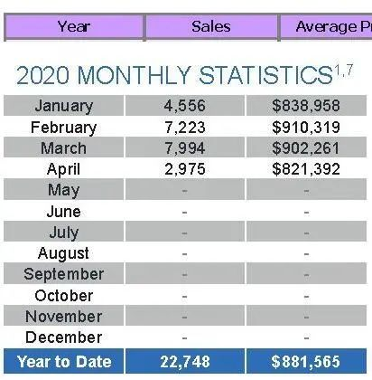 (原始链接: https://mmbiz.qpic.cn/mmbiz_jpg/4kibCXA1QiblRAIemKa5n6nFibH0TiaFzGkpzUKErF9860T9MnguGg45q3tZZKPg2f9AtQaLGodWOuaQGZaN9tAvcA/640?wx_fmt=jpeg)
- 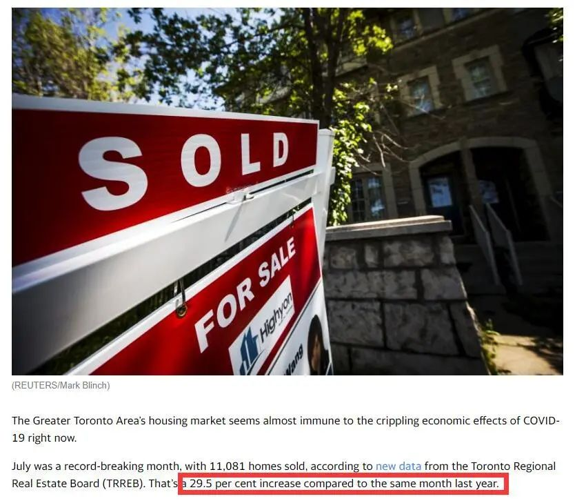 (原始链接: https://mmbiz.qpic.cn/mmbiz_jpg/4kibCXA1QiblRAIemKa5n6nFibH0TiaFzGkpnDsHIdtKia3gBcLSluibXWlqdHQWxD1MYNxO1yVHAOLMhPXuCbqE8QZw/640?wx_fmt=jpeg)
- 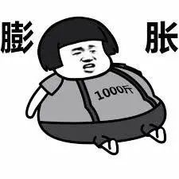 (原始链接: https://mmbiz.qpic.cn/mmbiz_jpg/4kibCXA1QiblRAIemKa5n6nFibH0TiaFzGkpnY2icajlzbOnUcQr4NGhmsyc6I8JXUC5ofEIVVZVE8Pp3Ej0xD3hmdA/640?wx_fmt=jpeg)
- 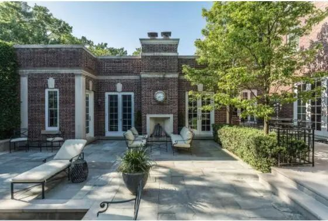 (原始链接: https://mmbiz.qpic.cn/mmbiz_jpg/4kibCXA1QiblRAIemKa5n6nFibH0TiaFzGkpYyVgtmcibR5HF88OPt2QtYeLZhjzSmFMXZOeqVnRGLiauSGk6bPE966A/640?wx_fmt=jpeg)
- 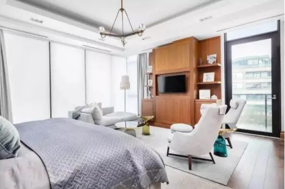 (原始链接: https://mmbiz.qpic.cn/mmbiz_jpg/4kibCXA1QiblRAIemKa5n6nFibH0TiaFzGkpDic9aWxuTIMjBic4wrEb6lv6cWsf15CHv0woAmATsplZEOnryfAwZg9g/640?wx_fmt=jpeg)
- 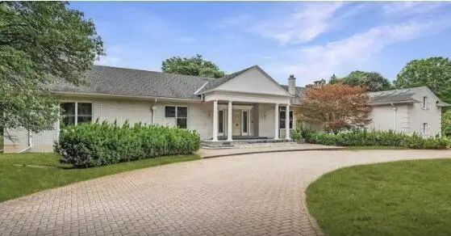 (原始链接: https://mmbiz.qpic.cn/mmbiz_jpg/4kibCXA1QiblRAIemKa5n6nFibH0TiaFzGkpibyen9wyfEMMDm6IYticWPULbKodXzcLFvXFt7iapGcEiaFbicFolb39lyw/640?wx_fmt=jpeg)
- 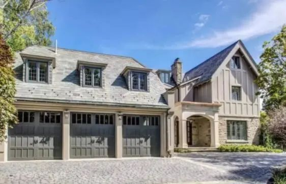 (原始链接: https://mmbiz.qpic.cn/mmbiz_jpg/4kibCXA1QiblRAIemKa5n6nFibH0TiaFzGkppzL3CKoibBibXcMJEiciaRiccYaIBs6DPjAbeMsOL8cKia2qfUseuqs0Ivew/640?wx_fmt=jpeg)
- 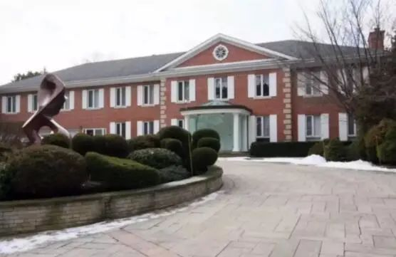 (原始链接: https://mmbiz.qpic.cn/mmbiz_jpg/4kibCXA1QiblRAIemKa5n6nFibH0TiaFzGkpBic4s3B8tKoegdliaWzvlUg2bZOBBpuiadm1nxkicZqDI06fCVGPHHnqHg/640?wx_fmt=jpeg)
- 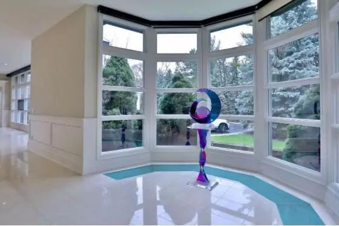 (原始链接: https://mmbiz.qpic.cn/mmbiz_jpg/4kibCXA1QiblRAIemKa5n6nFibH0TiaFzGkpIUnOCUJfibAeABNT0sic3lNLtrcrtrxiaib1VO5bDhDvCUgYicJpyKtP5RA/640?wx_fmt=jpeg)
- 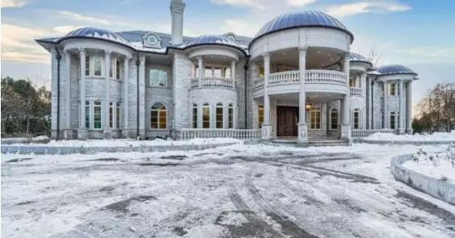 (原始链接: https://mmbiz.qpic.cn/mmbiz_jpg/4kibCXA1QiblRAIemKa5n6nFibH0TiaFzGkpbrAH5Y9w10UHd9Btq5BhsCChibvicxvH5E9gEULz15rTjOiaB32Yg1Ylw/640?wx_fmt=jpeg)
- 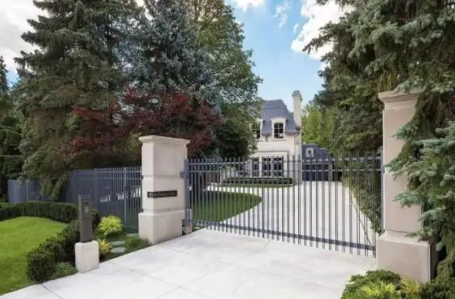 (原始链接: https://mmbiz.qpic.cn/mmbiz_jpg/4kibCXA1QiblRAIemKa5n6nFibH0TiaFzGkp9MAF1udiaTbXP6xIGOA3sEk9p3KxHGYRuN6LqkyVxS6g1d4FXPVLAnQ/640?wx_fmt=jpeg)
- 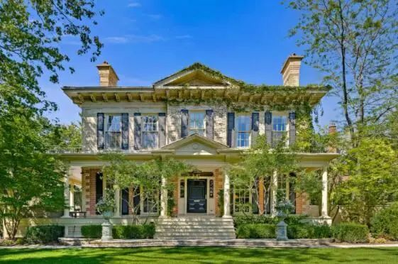 (原始链接: https://mmbiz.qpic.cn/mmbiz_jpg/4kibCXA1QiblRAIemKa5n6nFibH0TiaFzGkppRgXL92mtSGKQd51PH2U714IIxkIj5wmbUpIiazblIEvdzJaYzkGtwQ/640?wx_fmt=jpeg)
- 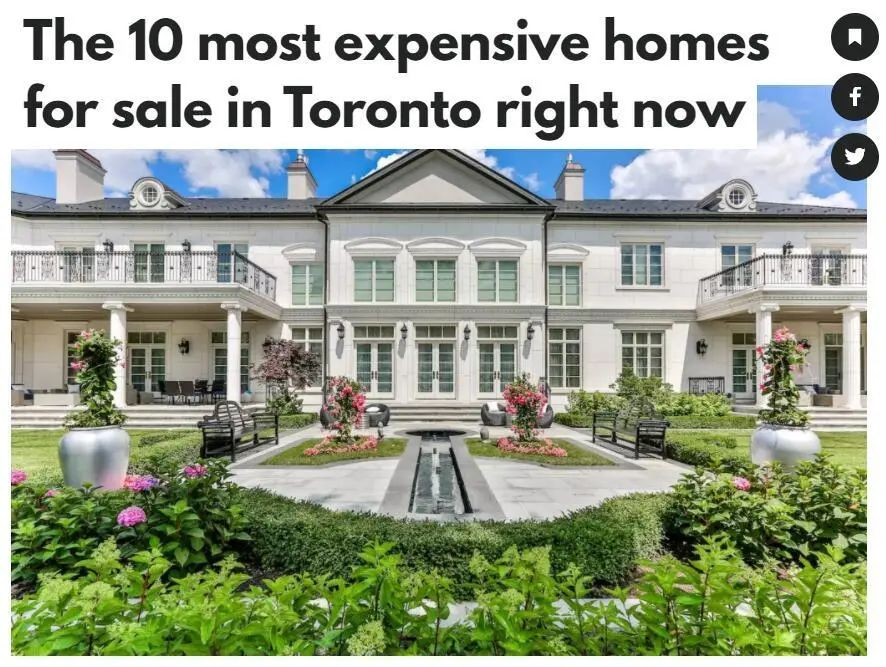 (原始链接: https://mmbiz.qpic.cn/mmbiz_jpg/4kibCXA1QiblRAIemKa5n6nFibH0TiaFzGkp74lsiaewRZnVr2tMtTJaEV9ORvojia1BvViayF2RicUarbGxe9OPSWNicVg/640?wx_fmt=jpeg)
-  (原始链接: https://mmbiz.qpic.cn/mmbiz_gif/4kibCXA1QiblRAIemKa5n6nFibH0TiaFzGkpCVltmKBXp8UBoeMA3hdwDfa4hzwvFZ3btRsbEuhwoIGaK3gRoYLpoQ/640?wx_fmt=gif)
- 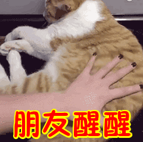 (原始链接: https://mmbiz.qpic.cn/mmbiz_gif/4kibCXA1QiblRAIemKa5n6nFibH0TiaFzGkpvz1uxp6ocEGghCskk6x8ne2AYIeiaBep8m5zOic7yIA5sNRK4fPfWNlA/640?wx_fmt=gif)
-  (原始链接: https://mmbiz.qpic.cn/mmbiz_jpg/icDcCacWsN1UzaPbWxuPgBicWNjwJysafia9PvUDXUnQicTgcHTmzgKmOdjibqmAyRzSZmcGYWbGR3HmLLmNSWotdIg/640?wx_fmt=jpeg)
