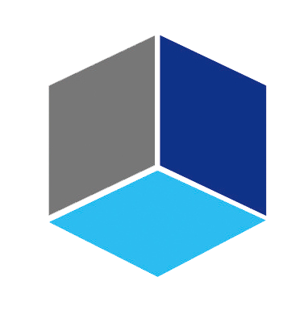
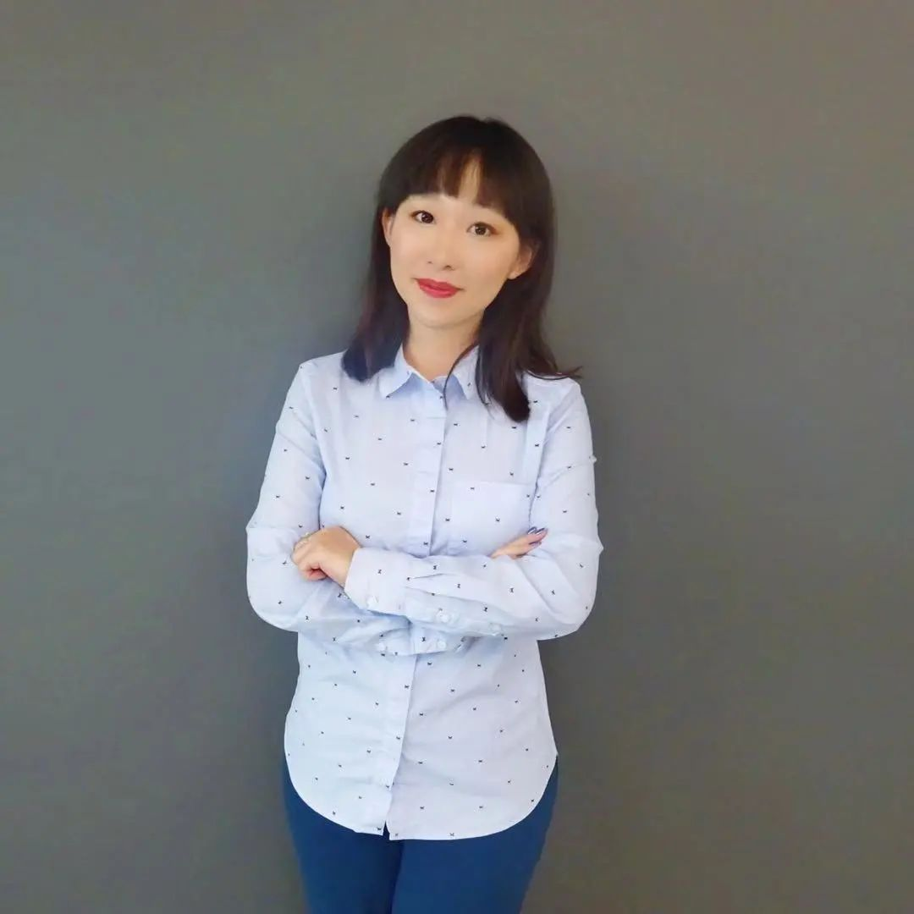
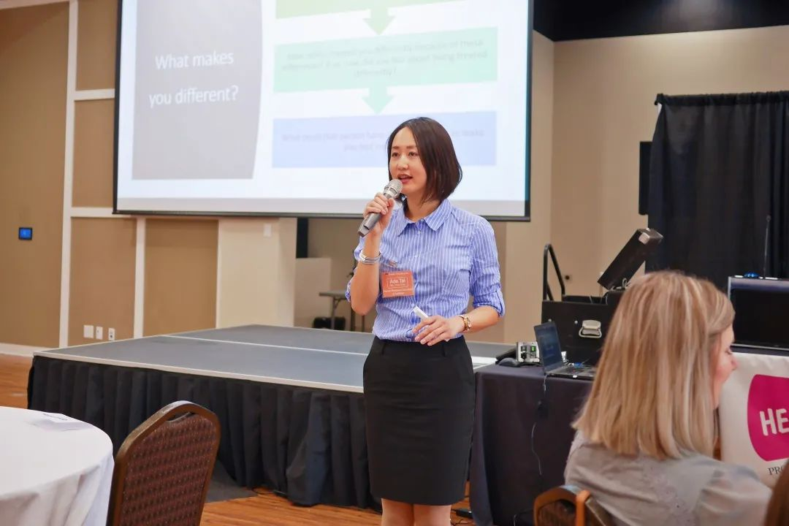
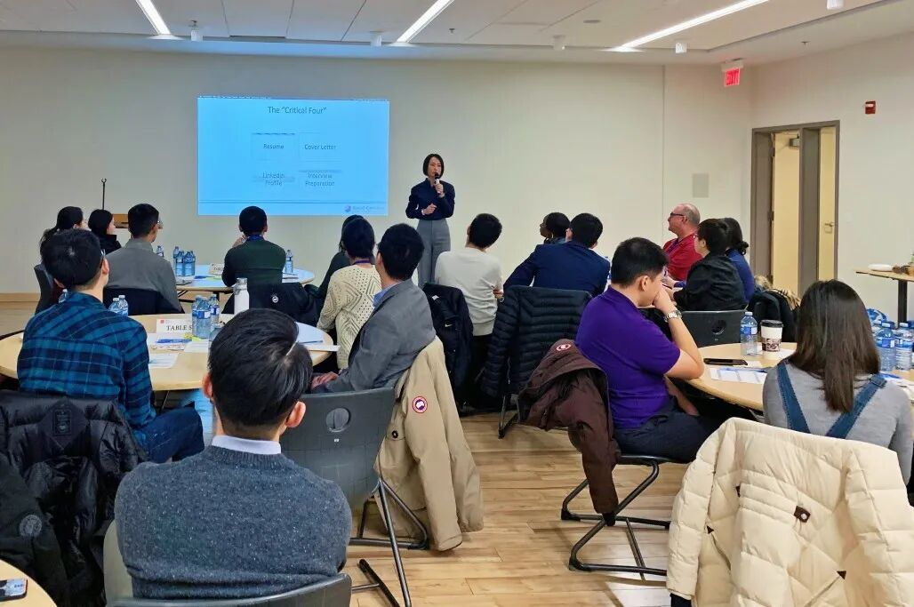
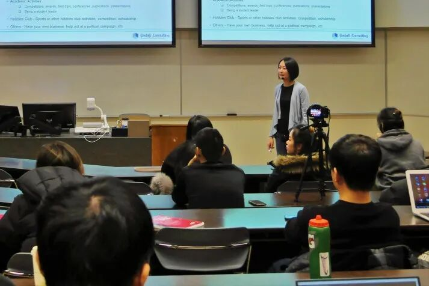
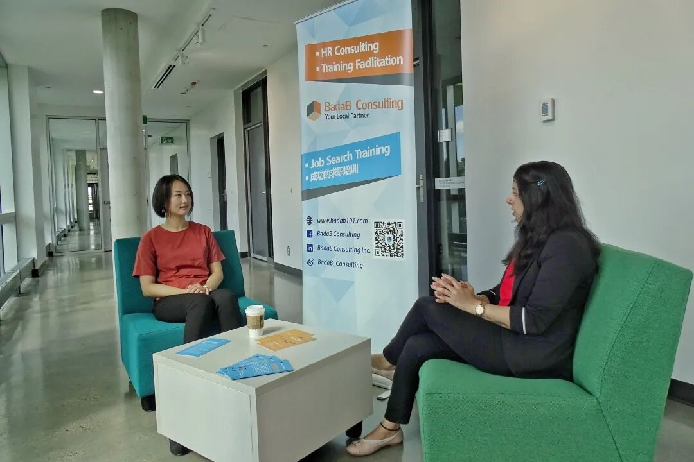
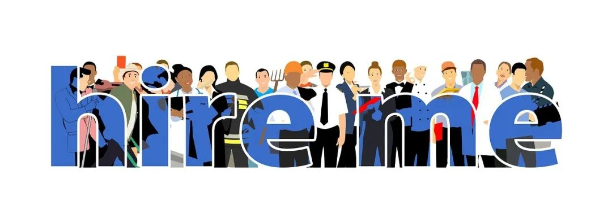
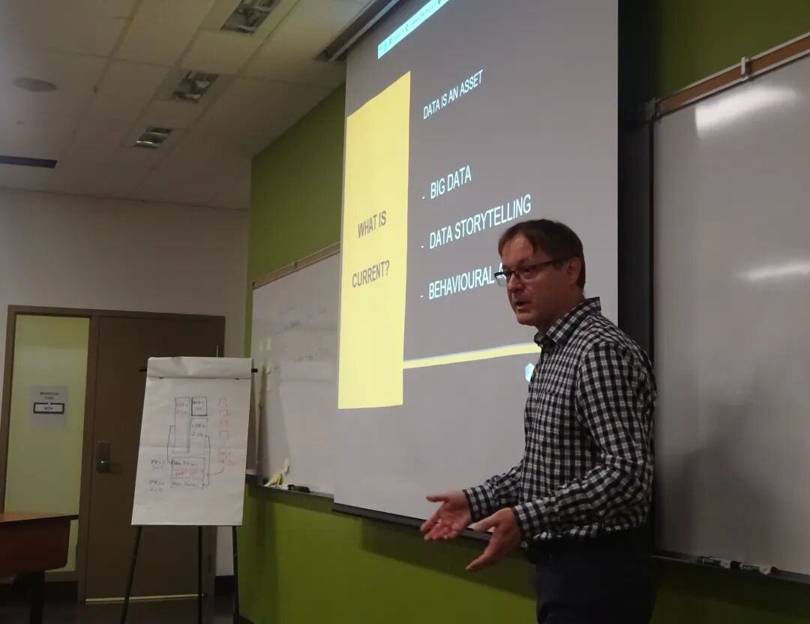
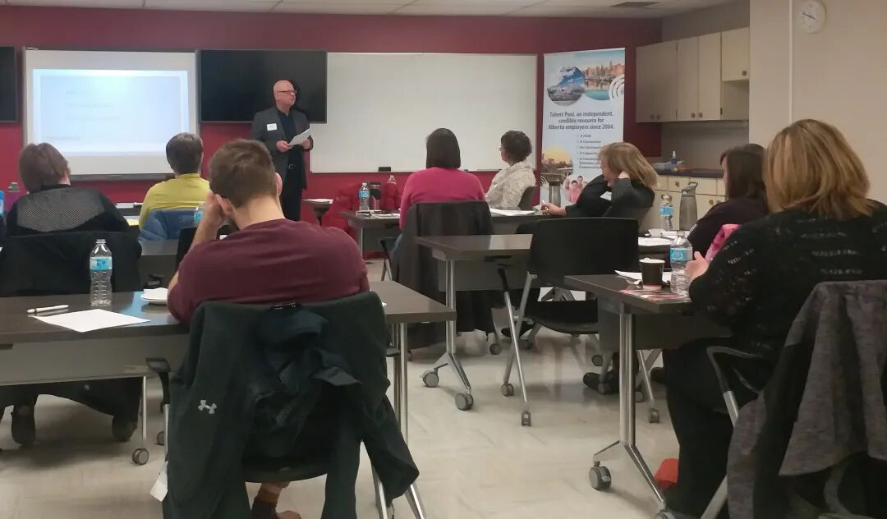
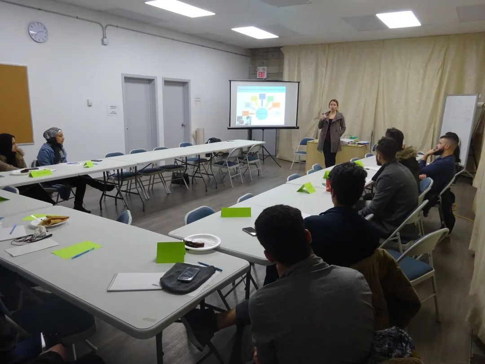

# 无标题

**链接地址:** http://mp.weixin.qq.com/s?__biz=MzI4NDYyNjAwNw==&mid=2247484386&idx=1&sn=49a66242a8ee6ce7366917376209c015&chksm=ebf9dedadc8e57ccb189b1a89481a48c0edfe11456d2ab8ee7e23234bcccc9890755a4027aed&mpshare=1&scene=2&srcid=09023qEr8yLgK48VpualFfed&sharer_sharetime=1599012870653&sharer_shareid=be1c8edd6c93eec155a61c876e41d26a#rd
**作者:** 关注我们
**获取时间:** 2025/8/28 20:09:14
**图片数量:** 51

---

## 原始HTML内容

<section style="box-sizing: border-box;font-size: 16px;"><section style="box-sizing: border-box;" powered-by="xiumi.us"><section style="display: flex;flex-flow: row nowrap;margin: 10px 0%;box-sizing: border-box;"><section style="display: inline-block;vertical-align: bottom;width: auto;flex: 0 0 auto;align-self: flex-end;min-width: 10%;max-width: 100%;height: auto;border-bottom: 1px solid rgb(40, 115, 200);border-bottom-right-radius: 0px;padding-right: 3px;padding-bottom: 3px;box-sizing: border-box;"><section style="display: inline-block;width: 100%;vertical-align: top;background-color: rgba(211, 226, 242, 0.43);border-width: 0px;box-sizing: border-box;" powered-by="xiumi.us"><section style="color: rgb(51, 167, 233);padding-right: 10px;padding-left: 10px;letter-spacing: 1px;box-sizing: border-box;" powered-by="xiumi.us">
<strong style="box-sizing: border-box;">点击蓝字 关注我们</strong>
</section></section></section><section style="display: inline-block;vertical-align: bottom;width: auto;align-self: flex-end;flex: 100 100 0%;box-sizing: border-box;"><section style="text-align: center;font-size: 0px;box-sizing: border-box;" powered-by="xiumi.us"><section style="display: inline-block;width: 100%;height: 15px;vertical-align: top;overflow: hidden;border-style: solid none none solid;border-width: 1px;border-radius: 0px;border-color: rgb(40, 115, 200) rgb(255, 164, 30) rgb(255, 164, 30) rgb(40, 115, 200);padding-top: 3px;padding-left: 3px;box-sizing: border-box;"><section style="display: inline-block;width: 100%;height: 22px;vertical-align: top;overflow: hidden;background-color: rgba(211, 226, 242, 0.43);box-sizing: border-box;line-height: 0;" powered-by="xiumi.us"> </section></section></section></section></section></section><section style="margin-top: 120px;margin-right: 0%;margin-left: 0%;box-sizing: border-box;" powered-by="xiumi.us"><section style="display: inline-block;width: 100%;vertical-align: top;padding-left: 10px;border-left: 1px solid rgb(40, 115, 200);border-bottom-left-radius: 0px;box-sizing: border-box;"><section style="text-align: center;margin-top: -110px;margin-right: 0%;margin-left: 0%;box-sizing: border-box;" powered-by="xiumi.us"><section style="max-width: 100%;vertical-align: middle;display: inline-block;line-height: 0;box-sizing: border-box;"></section></section></section></section><section style="box-sizing: border-box;" powered-by="xiumi.us"><section style="margin: 10px 0% 12px;display: flex;flex-flow: row nowrap;box-sizing: border-box;"><section style="display: inline-block;vertical-align: bottom;width: auto;background-color: rgba(211, 226, 242, 0.43);line-height: 1;letter-spacing: 0px;min-width: 10%;max-width: 100%;flex: 0 0 auto;height: auto;padding-right: 20px;align-self: flex-end;box-sizing: border-box;"><section style="margin-right: 0%;margin-bottom: 3px;margin-left: 0%;box-sizing: border-box;" powered-by="xiumi.us"><section style="line-height: 1;color: rgb(51, 167, 233);font-size: 22px;letter-spacing: 0px;padding-right: 6px;padding-left: 6px;box-sizing: border-box;">
<strong style="box-sizing: border-box;">前言</strong>
</section></section></section><section style="display: inline-block;vertical-align: bottom;width: auto;align-self: flex-end;flex: 0 0 0%;height: auto;margin-left: -13px;box-sizing: border-box;"><section style="text-align: center;font-size: 0px;margin-right: 0%;margin-bottom: 8px;margin-left: 0%;box-sizing: border-box;" powered-by="xiumi.us"><section style="display: inline-block;width: 20px;height: 7px;vertical-align: top;overflow: hidden;border-style: solid none solid solid;border-width: 1px;border-radius: 0px;border-color: rgb(40, 115, 200) rgb(255, 164, 30) rgb(40, 115, 200) rgb(40, 115, 200);box-sizing: border-box;line-height: 0;"> </section></section></section><section style="display: inline-block;vertical-align: bottom;width: auto;align-self: flex-end;flex: 100 100 0%;border-right: 1px solid rgb(40, 115, 200);border-top-right-radius: 0px;margin-bottom: -12px;box-sizing: border-box;"><section style="margin-right: 0%;margin-bottom: 26px;margin-left: 0%;box-sizing: border-box;" powered-by="xiumi.us"><section style="background-color: rgb(40, 115, 200);height: 1px;box-sizing: border-box;line-height: 0;"> </section></section></section></section></section><section style="margin-right: 0%;margin-bottom: 10px;margin-left: 0%;box-sizing: border-box;" powered-by="xiumi.us"><section style="display: inline-block;width: 100%;vertical-align: top;padding: 6px 20px 16px;border-width: 1px;border-style: none solid solid;border-radius: 0px;border-color: rgb(255, 164, 30) rgb(40, 115, 200) rgb(40, 115, 200);box-sizing: border-box;"><section style="font-size: 14px;color: rgb(121, 121, 121);line-height: 2;letter-spacing: 2px;box-sizing: border-box;" powered-by="xiumi.us">
随着人工智能和网络信息技术的发展，世界经济格局随之进行着天翻地覆的改变。这也孕育出了眼花缭乱的<strong style="box-sizing: border-box;">新型行业与工种</strong>，同时催生出了更多颠覆传统雇佣关系的<strong style="box-sizing: border-box;">自由职业(freelancer)</strong>。

 
</section><section style="text-align: center;margin-top: 10px;margin-bottom: 10px;box-sizing: border-box;" powered-by="xiumi.us"><section style="max-width: 100%;vertical-align: middle;display: inline-block;line-height: 0;width: 50%;height: auto;box-sizing: border-box;"></section></section><section style="font-size: 14px;color: rgb(121, 121, 121);line-height: 2;letter-spacing: 2px;box-sizing: border-box;" powered-by="xiumi.us">
 

对比起传统雇佣关系，自由职业从业者们可以通过自行安排工作时间去达到一种<strong style="box-sizing: border-box;">更理想舒适的生活平衡</strong>，于是不少人都希望能够跳脱出996的福报，去从事看似更加随性的自由职业。

 

然而，自由职业真如大家想象中的那般自由轻松吗？今天BadaB Consulting特别邀请到加拿大几位<strong style="box-sizing: border-box;">不同工作领域、不同从业时长的自由职业工作者</strong>们，为大家讲述作为自由职业从业者的心路历程。
</section></section></section><section style="box-sizing: border-box;" powered-by="xiumi.us">
 
</section><section style="box-sizing: border-box;" powered-by="xiumi.us">
 
</section><section style="text-align: center;justify-content: center;margin: 30px 0% 10px;box-sizing: border-box;" powered-by="xiumi.us"><section style="display: inline-block;width: auto;vertical-align: top;background-color: rgba(211, 226, 242, 0.43);border-width: 0px;min-width: 10%;max-width: 100%;height: auto;padding-right: 10px;padding-bottom: 5px;padding-left: 10px;box-sizing: border-box;"><section style="margin-top: -7px;margin-right: 0%;margin-left: 0%;box-sizing: border-box;" powered-by="xiumi.us"><section style="display: inline-block;width: 100%;vertical-align: top;border-style: solid;border-width: 1px;border-radius: 0px;border-color: rgb(40, 115, 200);box-sizing: border-box;"><section style="font-size: 0px;margin-top: -6px;margin-right: 0%;margin-left: 0%;box-sizing: border-box;" powered-by="xiumi.us"><section style="display: inline-block;width: 100%;vertical-align: top;border-top: 1px solid rgb(40, 115, 200);border-top-left-radius: 0px;box-sizing: border-box;"><section style="text-align: left;margin-top: -1px;margin-right: 0%;margin-left: 0%;justify-content: flex-start;transform: translate3d(-15px, 0px, 0px);box-sizing: border-box;" powered-by="xiumi.us"><section style="display: inline-block;width: 15px;height: 6px;vertical-align: top;overflow: hidden;border-style: none solid solid none;border-width: 1px;border-radius: 0px;border-color: rgb(255, 203, 72) rgb(40, 115, 200) rgb(40, 115, 200) rgb(255, 203, 72);box-sizing: border-box;line-height: 0;"> </section></section></section></section><section style="margin-top: 4px;margin-right: 0%;margin-left: 0%;box-sizing: border-box;" powered-by="xiumi.us"><section style="text-align: justify;color: rgb(51, 167, 233);padding-right: 10px;padding-left: 10px;line-height: 2;letter-spacing: 1.5px;box-sizing: border-box;">
<strong style="box-sizing: border-box;">做个自我介绍吧！</strong>
</section></section></section></section></section></section><section style="box-sizing: border-box;" powered-by="xiumi.us">
 
</section><section style="font-size: 14px;color: rgb(121, 121, 121);line-height: 2;letter-spacing: 2px;padding-right: 15px;padding-left: 15px;box-sizing: border-box;" powered-by="xiumi.us">
在开始今天的访谈前，我们先来了解一下接受采访的<strong style="box-sizing: border-box;">4位自由职业从业者</strong>吧！他们是——
</section><section style="font-size: 14px;color: rgb(121, 121, 121);line-height: 2;letter-spacing: 2px;padding-right: 15px;padding-left: 15px;box-sizing: border-box;" powered-by="xiumi.us">
 
</section><section style="text-align: center;margin: 10px 0%;box-sizing: border-box;" powered-by="xiumi.us"><section style="display: inline-block;width: 90%;vertical-align: top;border-style: solid;border-width: 2px;border-radius: 0px;border-color: rgb(40, 115, 200);letter-spacing: 0px;padding: 10px;box-sizing: border-box;"><section style="box-sizing: border-box;" powered-by="xiumi.us"><section style="display: inline-block;vertical-align: top;width: 40%;box-sizing: border-box;"><section style="text-align: justify;box-sizing: border-box;" powered-by="xiumi.us">
 
</section><section style="margin-top: 10px;margin-bottom: 10px;box-sizing: border-box;" powered-by="xiumi.us"><section style="max-width: 100%;vertical-align: middle;display: inline-block;line-height: 0;box-sizing: border-box;"></section></section><section style="text-align: justify;box-sizing: border-box;" powered-by="xiumi.us">
 
</section></section><section style="display: inline-block;vertical-align: top;width: 60%;padding-left: 10px;box-sizing: border-box;"><section style="margin: 10px 0%;text-align: left;box-sizing: border-box;" powered-by="xiumi.us"><section style="display: inline-block;border-width: 2px;border-style: solid;border-color: rgb(40, 115, 200);padding: 0.1em 0.3em;background-color: rgb(40, 115, 200);color: rgb(255, 255, 255);font-size: 12px;box-sizing: border-box;">
<strong style="box-sizing: border-box;">Robin Mao | 地产经纪 /&nbsp; 高级项目管理工程师</strong>
</section></section><section style="box-sizing: border-box;" powered-by="xiumi.us"><section style="display: inline-block;vertical-align: top;width: 10%;box-sizing: border-box;"><section style="margin: 5px 0%;text-align: left;font-size: 0px;box-sizing: border-box;" powered-by="xiumi.us"><section style="padding: 4px;display: inline-block;background-color: rgb(40, 115, 200);box-sizing: border-box;"><section style="border-color: rgba(255, 255, 255, 0);width: 1.6em;height: 1.6em;border-style: solid;border-width: 1px;text-align: center;line-height: 1.5em;color: rgb(255, 255, 255);box-sizing: border-box;">
 
</section></section></section></section><section style="display: inline-block;vertical-align: top;width: 90%;box-sizing: border-box;"><section style="text-align: justify;font-size: 12px;box-sizing: border-box;" powered-by="xiumi.us">
博士毕业于阿尔伯塔大学工程施工与项目管理专业
</section></section></section><section style="box-sizing: border-box;" powered-by="xiumi.us"><section style="display: inline-block;vertical-align: top;width: 10%;box-sizing: border-box;"><section style="margin: 5px 0%;text-align: left;font-size: 0px;box-sizing: border-box;" powered-by="xiumi.us"><section style="padding: 4px;display: inline-block;background-color: rgb(40, 115, 200);box-sizing: border-box;"><section style="border-color: rgba(255, 255, 255, 0);width: 1.6em;height: 1.6em;border-style: solid;border-width: 1px;text-align: center;line-height: 1.5em;color: rgb(255, 255, 255);box-sizing: border-box;">
 
</section></section></section></section><section style="display: inline-block;vertical-align: top;width: 90%;box-sizing: border-box;"><section style="text-align: justify;font-size: 12px;box-sizing: border-box;" powered-by="xiumi.us">
曾在中国，加拿大和美国参与和主持了多项大型工程项目的设计、施工与管理。
</section></section></section><section style="box-sizing: border-box;" powered-by="xiumi.us"><section style="display: inline-block;vertical-align: top;width: 10%;box-sizing: border-box;"><section style="margin: 5px 0%;text-align: left;font-size: 0px;box-sizing: border-box;" powered-by="xiumi.us"><section style="padding: 4px;display: inline-block;background-color: rgb(40, 115, 200);box-sizing: border-box;"><section style="border-color: rgba(255, 255, 255, 0);width: 1.6em;height: 1.6em;border-style: solid;border-width: 1px;text-align: center;line-height: 1.5em;color: rgb(255, 255, 255);box-sizing: border-box;">
 
</section></section></section></section><section style="display: inline-block;vertical-align: top;width: 90%;box-sizing: border-box;"><section style="text-align: justify;font-size: 12px;box-sizing: border-box;" powered-by="xiumi.us">
从业20余年，拥有丰富的阿省本地土地开发，地产开发和商业投资经历。
</section></section></section></section></section><section style="text-align: justify;box-sizing: border-box;" powered-by="xiumi.us">
 
</section></section></section><section style="text-align: center;margin: 10px 0%;box-sizing: border-box;" powered-by="xiumi.us"><section style="display: inline-block;width: 90%;vertical-align: top;border-style: solid;border-width: 2px;border-radius: 0px;border-color: rgb(237, 128, 15);letter-spacing: 0px;padding: 10px;box-sizing: border-box;"><section style="box-sizing: border-box;" powered-by="xiumi.us"><section style="display: inline-block;vertical-align: top;width: 60%;padding-right: 10px;box-sizing: border-box;"><section style="margin: 10px 0%;text-align: left;box-sizing: border-box;" powered-by="xiumi.us"><section style="display: inline-block;border-width: 2px;border-style: solid;border-color: rgb(237, 128, 15);padding: 0.1em 0.3em;background-color: rgb(237, 128, 15);color: rgb(255, 255, 255);font-size: 12px;box-sizing: border-box;">
<strong style="box-sizing: border-box;">Ting Tian | 摄影师 / 摄像师</strong>
</section></section><section style="box-sizing: border-box;" powered-by="xiumi.us"><section style="display: inline-block;vertical-align: top;width: 10%;box-sizing: border-box;"><section style="margin: 5px 0%;text-align: left;font-size: 0px;box-sizing: border-box;" powered-by="xiumi.us"><section style="padding: 4px;display: inline-block;background-color: rgb(237, 128, 15);box-sizing: border-box;"><section style="border-color: rgba(255, 255, 255, 0);width: 1.6em;height: 1.6em;border-style: solid;border-width: 1px;text-align: center;line-height: 1.5em;color: rgb(255, 255, 255);box-sizing: border-box;">
 
</section></section></section></section><section style="display: inline-block;vertical-align: top;width: 90%;box-sizing: border-box;"><section style="text-align: justify;font-size: 12px;box-sizing: border-box;" powered-by="xiumi.us">
毕业于阿尔伯塔大学经济学专业
</section></section></section><section style="box-sizing: border-box;" powered-by="xiumi.us"><section style="display: inline-block;vertical-align: top;width: 10%;box-sizing: border-box;"><section style="margin: 5px 0%;text-align: left;font-size: 0px;box-sizing: border-box;" powered-by="xiumi.us"><section style="padding: 4px;display: inline-block;background-color: rgb(237, 128, 15);box-sizing: border-box;"><section style="border-color: rgba(255, 255, 255, 0);width: 1.6em;height: 1.6em;border-style: solid;border-width: 1px;text-align: center;line-height: 1.5em;color: rgb(255, 255, 255);box-sizing: border-box;">
 
</section></section></section></section><section style="display: inline-block;vertical-align: top;width: 90%;box-sizing: border-box;"><section style="text-align: justify;font-size: 12px;box-sizing: border-box;" powered-by="xiumi.us">
自2011年起从事婚礼摄影，微电影，商业摄影，摄像的拍摄和创作
</section></section></section><section style="box-sizing: border-box;" powered-by="xiumi.us"><section style="display: inline-block;vertical-align: top;width: 10%;box-sizing: border-box;"><section style="margin: 5px 0%;text-align: left;font-size: 0px;box-sizing: border-box;" powered-by="xiumi.us"><section style="padding: 4px;display: inline-block;background-color: rgb(237, 128, 15);box-sizing: border-box;"><section style="border-color: rgba(255, 255, 255, 0);width: 1.6em;height: 1.6em;border-style: solid;border-width: 1px;text-align: center;line-height: 1.5em;color: rgb(255, 255, 255);box-sizing: border-box;">
 
</section></section></section></section><section style="display: inline-block;vertical-align: top;width: 90%;box-sizing: border-box;"><section style="text-align: justify;font-size: 12px;box-sizing: border-box;" powered-by="xiumi.us">
2016年成立TT Media Service摄影摄像公司
</section></section></section><section style="box-sizing: border-box;" powered-by="xiumi.us"><section style="display: inline-block;vertical-align: top;width: 10%;box-sizing: border-box;"><section style="margin: 5px 0%;text-align: left;font-size: 0px;box-sizing: border-box;" powered-by="xiumi.us"><section style="padding: 4px;display: inline-block;background-color: rgb(237, 128, 15);box-sizing: border-box;"><section style="border-color: rgba(255, 255, 255, 0);width: 1.6em;height: 1.6em;border-style: solid;border-width: 1px;text-align: center;line-height: 1.5em;color: rgb(255, 255, 255);box-sizing: border-box;">
 
</section></section></section></section><section style="display: inline-block;vertical-align: top;width: 90%;box-sizing: border-box;"><section style="text-align: justify;font-size: 12px;box-sizing: border-box;" powered-by="xiumi.us">
曾为Nikon Canada, ProLogic Constructions&nbsp;等公司拍摄商业视频和照片
</section></section></section></section><section style="display: inline-block;vertical-align: top;width: 40%;box-sizing: border-box;"><section style="text-align: justify;box-sizing: border-box;" powered-by="xiumi.us">
 
</section><section style="margin-right: 0%;margin-left: 0%;box-sizing: border-box;" powered-by="xiumi.us"><section style="max-width: 100%;vertical-align: middle;display: inline-block;line-height: 0;border-width: 0px;box-sizing: border-box;"></section></section><section style="text-align: justify;color: rgb(179, 179, 179);box-sizing: border-box;" powered-by="xiumi.us">
 
</section></section></section><section style="text-align: justify;box-sizing: border-box;" powered-by="xiumi.us">
 
</section><section style="text-align: justify;box-sizing: border-box;" powered-by="xiumi.us">
<strong style="box-sizing: border-box;">ttmediaservice.com</strong>
</section></section></section><section style="text-align: center;margin: 10px 0%;box-sizing: border-box;" powered-by="xiumi.us"><section style="display: inline-block;width: 90%;vertical-align: top;border-style: solid;border-width: 2px;border-radius: 0px;border-color: rgb(40, 115, 200);letter-spacing: 0px;padding: 10px;box-sizing: border-box;"><section style="text-align: justify;box-sizing: border-box;" powered-by="xiumi.us">
 
</section><section style="box-sizing: border-box;" powered-by="xiumi.us"><section style="display: inline-block;vertical-align: top;width: 40%;box-sizing: border-box;"><section style="text-align: justify;box-sizing: border-box;" powered-by="xiumi.us">
 
</section><section style="margin-right: 0%;margin-left: 0%;box-sizing: border-box;" powered-by="xiumi.us"><section style="max-width: 100%;vertical-align: middle;display: inline-block;line-height: 0;box-sizing: border-box;"></section></section></section><section style="display: inline-block;vertical-align: top;width: 60%;padding-left: 10px;border-width: 0px;box-sizing: border-box;"><section style="margin: 10px 0%;text-align: left;box-sizing: border-box;" powered-by="xiumi.us"><section style="display: inline-block;border-width: 2px;border-style: solid;border-color: rgb(40, 115, 200);padding: 0.1em 0.3em;background-color: rgb(40, 115, 200);color: rgb(255, 255, 255);font-size: 12px;box-sizing: border-box;">
<strong style="box-sizing: border-box;">陆娟 | 理财顾问</strong>
</section></section><section style="box-sizing: border-box;" powered-by="xiumi.us"><section style="display: inline-block;vertical-align: top;width: 10%;box-sizing: border-box;"><section style="margin: 5px 0%;text-align: left;font-size: 0px;box-sizing: border-box;" powered-by="xiumi.us"><section style="padding: 4px;display: inline-block;background-color: rgb(40, 115, 200);box-sizing: border-box;"><section style="border-color: rgba(255, 255, 255, 0);width: 1.6em;height: 1.6em;border-style: solid;border-width: 1px;text-align: center;line-height: 1.5em;color: rgb(255, 255, 255);box-sizing: border-box;">
 
</section></section></section></section><section style="display: inline-block;vertical-align: top;width: 90%;box-sizing: border-box;"><section style="text-align: justify;font-size: 12px;box-sizing: border-box;" powered-by="xiumi.us">
研究生毕业于加拿大戴尔豪斯大学电子商务专业
</section></section></section><section style="box-sizing: border-box;" powered-by="xiumi.us"><section style="display: inline-block;vertical-align: top;width: 10%;box-sizing: border-box;"><section style="margin: 5px 0%;text-align: left;font-size: 0px;box-sizing: border-box;" powered-by="xiumi.us"><section style="padding: 4px;display: inline-block;background-color: rgb(40, 115, 200);box-sizing: border-box;"><section style="border-color: rgba(255, 255, 255, 0);width: 1.6em;height: 1.6em;border-style: solid;border-width: 1px;text-align: center;line-height: 1.5em;color: rgb(255, 255, 255);box-sizing: border-box;">
 
</section></section></section></section><section style="display: inline-block;vertical-align: top;width: 90%;box-sizing: border-box;"><section style="text-align: justify;font-size: 12px;box-sizing: border-box;" powered-by="xiumi.us">
作为投资顾问从业五年，服务范围包含保险，理财计划等
</section></section></section><section style="box-sizing: border-box;" powered-by="xiumi.us"><section style="display: inline-block;vertical-align: top;width: 10%;box-sizing: border-box;"><section style="margin: 5px 0%;text-align: left;font-size: 0px;box-sizing: border-box;" powered-by="xiumi.us"><section style="padding: 4px;display: inline-block;background-color: rgb(40, 115, 200);box-sizing: border-box;"><section style="border-color: rgba(255, 255, 255, 0);width: 1.6em;height: 1.6em;border-style: solid;border-width: 1px;text-align: center;line-height: 1.5em;color: rgb(255, 255, 255);box-sizing: border-box;">
 
</section></section></section></section><section style="display: inline-block;vertical-align: top;width: 90%;box-sizing: border-box;"><section style="text-align: justify;font-size: 12px;box-sizing: border-box;" powered-by="xiumi.us">
Crius Financial Services公司业绩名列前茅，阿尔伯塔省顶级理财顾问
</section></section></section></section></section><section style="text-align: justify;box-sizing: border-box;" powered-by="xiumi.us">
 
</section><section style="text-align: justify;box-sizing: border-box;" powered-by="xiumi.us">
<strong style="box-sizing: border-box;">www.crius.ca/en/videos.html</strong> 
</section></section></section><section style="text-align: center;margin: 10px 0%;box-sizing: border-box;" powered-by="xiumi.us"><section style="display: inline-block;width: 90%;vertical-align: top;border-style: solid;border-width: 2px;border-radius: 0px;border-color: rgb(237, 128, 15);letter-spacing: 0px;padding: 10px;box-sizing: border-box;"><section style="box-sizing: border-box;" powered-by="xiumi.us"><section style="display: inline-block;vertical-align: top;width: 60%;padding-right: 10px;box-sizing: border-box;"><section style="margin: 10px 0%;text-align: left;box-sizing: border-box;" powered-by="xiumi.us"><section style="display: inline-block;border-width: 2px;border-style: solid;border-color: rgb(237, 128, 15);padding: 0.1em 0.3em;background-color: rgb(237, 128, 15);color: rgb(255, 255, 255);font-size: 12px;box-sizing: border-box;">
<strong style="box-sizing: border-box;">Nina Chen | 新媒体运营</strong>
</section></section><section style="box-sizing: border-box;" powered-by="xiumi.us"><section style="display: inline-block;vertical-align: top;width: 10%;box-sizing: border-box;"><section style="margin: 5px 0%;text-align: left;font-size: 0px;box-sizing: border-box;" powered-by="xiumi.us"><section style="padding: 4px;display: inline-block;background-color: rgb(237, 128, 15);box-sizing: border-box;"><section style="border-color: rgba(255, 255, 255, 0);width: 1.6em;height: 1.6em;border-style: solid;border-width: 1px;text-align: center;line-height: 1.5em;color: rgb(255, 255, 255);box-sizing: border-box;">
 
</section></section></section></section><section style="display: inline-block;vertical-align: top;width: 90%;box-sizing: border-box;"><section style="text-align: justify;font-size: 12px;box-sizing: border-box;" powered-by="xiumi.us">
毕业于阿尔伯塔大学材料工程专业
</section></section></section><section style="box-sizing: border-box;" powered-by="xiumi.us"><section style="display: inline-block;vertical-align: top;width: 10%;box-sizing: border-box;"><section style="margin: 5px 0%;text-align: left;font-size: 0px;box-sizing: border-box;" powered-by="xiumi.us"><section style="padding: 4px;display: inline-block;background-color: rgb(237, 128, 15);box-sizing: border-box;"><section style="border-color: rgba(255, 255, 255, 0);width: 1.6em;height: 1.6em;border-style: solid;border-width: 1px;text-align: center;line-height: 1.5em;color: rgb(255, 255, 255);box-sizing: border-box;">
 
</section></section></section></section><section style="display: inline-block;vertical-align: top;width: 90%;box-sizing: border-box;"><section style="text-align: justify;font-size: 12px;box-sizing: border-box;" powered-by="xiumi.us">
从事新媒体运营3年时间
</section></section></section><section style="box-sizing: border-box;" powered-by="xiumi.us"><section style="display: inline-block;vertical-align: top;width: 10%;box-sizing: border-box;"><section style="margin: 5px 0%;text-align: left;font-size: 0px;box-sizing: border-box;" powered-by="xiumi.us"><section style="padding: 4px;display: inline-block;background-color: rgb(237, 128, 15);box-sizing: border-box;"><section style="border-color: rgba(255, 255, 255, 0);width: 1.6em;height: 1.6em;border-style: solid;border-width: 1px;text-align: center;line-height: 1.5em;color: rgb(255, 255, 255);box-sizing: border-box;">
 
</section></section></section></section><section style="display: inline-block;vertical-align: top;width: 90%;box-sizing: border-box;"><section style="text-align: justify;font-size: 12px;box-sizing: border-box;" powered-by="xiumi.us">
先后帮助50余品牌运营网络平台，策划广告及活动
</section></section></section><section style="box-sizing: border-box;" powered-by="xiumi.us"><section style="display: inline-block;vertical-align: top;width: 10%;box-sizing: border-box;"><section style="margin: 5px 0%;text-align: left;font-size: 0px;box-sizing: border-box;" powered-by="xiumi.us"><section style="padding: 4px;display: inline-block;background-color: rgb(237, 128, 15);box-sizing: border-box;"><section style="border-color: rgba(255, 255, 255, 0);width: 1.6em;height: 1.6em;border-style: solid;border-width: 1px;text-align: center;line-height: 1.5em;color: rgb(255, 255, 255);box-sizing: border-box;">
 
</section></section></section></section><section style="display: inline-block;vertical-align: top;width: 90%;box-sizing: border-box;"><section style="text-align: justify;font-size: 12px;box-sizing: border-box;" powered-by="xiumi.us">
运营自己的IG美食家账号foodjoy.canada
</section></section></section></section><section style="display: inline-block;vertical-align: top;width: 40%;box-sizing: border-box;"><section style="text-align: justify;box-sizing: border-box;" powered-by="xiumi.us">
 
</section><section style="margin-right: 0%;margin-left: 0%;box-sizing: border-box;" powered-by="xiumi.us"><section style="max-width: 100%;vertical-align: middle;display: inline-block;line-height: 0;box-sizing: border-box;"></section></section></section></section><section style="text-align: justify;box-sizing: border-box;" powered-by="xiumi.us">
 
</section><section style="text-align: justify;box-sizing: border-box;" powered-by="xiumi.us">
<strong style="box-sizing: border-box;">www.instagram.com/foodjoy.canada/</strong> 
</section></section></section><section style="box-sizing: border-box;" powered-by="xiumi.us">
 
</section><section style="box-sizing: border-box;" powered-by="xiumi.us">
 
</section><section style="font-size: 14px;color: rgb(121, 121, 121);line-height: 2;letter-spacing: 2px;padding-right: 15px;padding-left: 15px;box-sizing: border-box;" powered-by="xiumi.us">
不同的行业领域，不同的从业时长，不同的职业生涯……是什么<strong style="box-sizing: border-box;">契机</strong>让他们选择了自由职业，自由职业又带给他们怎样的<strong style="box-sizing: border-box;">职业成长</strong>？废话不多说，让我们进入今天的正题——
</section><section style="box-sizing: border-box;" powered-by="xiumi.us">
 
</section><section style="text-align: center;justify-content: center;margin: 30px 0% 10px;box-sizing: border-box;" powered-by="xiumi.us"><section style="display: inline-block;width: auto;vertical-align: top;background-color: rgba(211, 226, 242, 0.43);border-width: 0px;min-width: 10%;max-width: 100%;height: auto;padding-right: 10px;padding-bottom: 5px;padding-left: 10px;box-sizing: border-box;"><section style="margin-top: -7px;margin-right: 0%;margin-left: 0%;box-sizing: border-box;" powered-by="xiumi.us"><section style="display: inline-block;width: 100%;vertical-align: top;border-style: solid;border-width: 1px;border-radius: 0px;border-color: rgb(40, 115, 200);box-sizing: border-box;"><section style="font-size: 0px;margin-top: -6px;margin-right: 0%;margin-left: 0%;box-sizing: border-box;" powered-by="xiumi.us"><section style="display: inline-block;width: 100%;vertical-align: top;border-top: 1px solid rgb(40, 115, 200);border-top-left-radius: 0px;box-sizing: border-box;"><section style="text-align: left;margin-top: -1px;margin-right: 0%;margin-left: 0%;justify-content: flex-start;transform: translate3d(-15px, 0px, 0px);box-sizing: border-box;" powered-by="xiumi.us"><section style="display: inline-block;width: 15px;height: 6px;vertical-align: top;overflow: hidden;border-style: none solid solid none;border-width: 1px;border-radius: 0px;border-color: rgb(255, 203, 72) rgb(40, 115, 200) rgb(40, 115, 200) rgb(255, 203, 72);box-sizing: border-box;line-height: 0;"> </section></section></section></section><section style="margin-top: 4px;margin-right: 0%;margin-left: 0%;box-sizing: border-box;" powered-by="xiumi.us"><section style="text-align: justify;color: rgb(51, 167, 233);padding-right: 10px;padding-left: 10px;line-height: 2;letter-spacing: 1.5px;box-sizing: border-box;">
<strong style="box-sizing: border-box;">关于自由职业的6个问题</strong>
</section></section></section></section></section></section><section style="box-sizing: border-box;" powered-by="xiumi.us">
 
</section><section style="box-sizing: border-box;" powered-by="xiumi.us"><section style="display: flex;flex-flow: row nowrap;margin-top: 10px;margin-right: 0%;margin-left: 0%;box-sizing: border-box;"><section style="display: inline-block;vertical-align: bottom;width: auto;flex: 0 0 auto;align-self: flex-end;min-width: 10%;max-width: 100%;height: auto;border-bottom: 1px solid rgb(51, 167, 233);border-bottom-right-radius: 0px;padding-bottom: 5px;line-height: 1;letter-spacing: 0px;box-sizing: border-box;"><section style="display: inline-block;width: 100%;vertical-align: top;background-color: rgba(211, 226, 242, 0.43);border-width: 0px;line-height: 1;letter-spacing: 0px;box-sizing: border-box;" powered-by="xiumi.us"><section style="color: rgb(51, 167, 233);padding-right: 10px;padding-left: 10px;letter-spacing: 1px;font-size: 19px;line-height: 1;box-sizing: border-box;" powered-by="xiumi.us">
<strong style="box-sizing: border-box;">01</strong>
</section></section></section><section style="display: inline-block;vertical-align: bottom;width: auto;align-self: flex-end;flex: 100 100 0%;height: auto;padding-left: 5px;box-sizing: border-box;"><section style="margin-right: 0%;margin-bottom: -5px;margin-left: 0%;box-sizing: border-box;" powered-by="xiumi.us"><section style="color: rgb(51, 167, 233);padding-right: 10px;padding-left: 10px;letter-spacing: 1px;line-height: 1;box-sizing: border-box;">
<strong style="box-sizing: border-box;">不忘初心</strong>
</section></section><section style="text-align: center;font-size: 0px;box-sizing: border-box;" powered-by="xiumi.us"><section style="display: inline-block;width: 100%;height: 9px;vertical-align: top;overflow: hidden;background-color: rgba(211, 226, 242, 0.43);box-sizing: border-box;line-height: 0;"> </section></section></section></section></section><section style="margin-right: 0%;margin-bottom: 10px;margin-left: 0%;box-sizing: border-box;" powered-by="xiumi.us"><section style="display: inline-block;width: 100%;vertical-align: top;border-left: 1px solid rgb(51, 167, 233);border-bottom-left-radius: 0px;padding-left: 4px;box-sizing: border-box;"><section style="margin-top: 4px;margin-right: 0%;margin-left: 0%;box-sizing: border-box;" powered-by="xiumi.us"><section style="display: inline-block;width: 100%;vertical-align: top;border-left: 7px solid rgba(211, 226, 242, 0.43);border-bottom-left-radius: 0px;padding-top: 10px;padding-left: 15px;box-sizing: border-box;"><section style="display: inline-block;width: 100%;vertical-align: top;border-style: none solid solid none;border-width: 1px;border-radius: 0px;border-color: rgb(255, 164, 30) rgb(40, 115, 200) rgb(40, 115, 200) rgb(255, 164, 30);padding-top: 6px;padding-right: 16px;padding-bottom: 20px;box-sizing: border-box;" powered-by="xiumi.us"><section style="margin-top: 0.5em;margin-bottom: 0.5em;box-sizing: border-box;" powered-by="xiumi.us"><section style="display: inline-block;vertical-align: top;width: 80%;text-align: right;padding-right: 10px;padding-left: 10px;box-sizing: border-box;"><section style="font-size: 14px;box-sizing: border-box;" powered-by="xiumi.us">
<strong style="box-sizing: border-box;">BadaB Consulting</strong>
</section><section style="box-sizing: border-box;" powered-by="xiumi.us"><section style="display: inline-block;vertical-align: middle;background-color: rgba(237, 146, 15, 0.1);padding: 8px;border-radius: 0.5em;max-width: 90% !important;box-sizing: border-box;"><section style="text-align: justify;color: rgb(84, 82, 82);font-size: 14px;box-sizing: border-box;" powered-by="xiumi.us">
为什么要选择目前从事的这份职业？
</section></section><section style="width: 0px;border-left: 10px solid rgba(237, 146, 15, 0.1);display: inline-block;margin-top: 1em;vertical-align: top;border-top: 6px solid transparent !important;border-bottom: 6px solid transparent !important;box-sizing: border-box;line-height: 0;"><section style="line-height: 0;width:0;"><svg viewBox="0 0 1 1" style="vertical-align:top;"></svg></section></section></section></section><section style="display: inline-block;vertical-align: top;width: 20%;box-sizing: border-box;"><section style="text-align: center;box-sizing: border-box;" powered-by="xiumi.us"><section style="max-width: 100%;vertical-align: middle;display: inline-block;line-height: 0;box-sizing: border-box;"></section></section></section></section><section style="box-sizing: border-box;" powered-by="xiumi.us">
 
</section><section style="margin-top: 0.5em;margin-bottom: 0.5em;box-sizing: border-box;" powered-by="xiumi.us"><section style="display: inline-block;vertical-align: top;width: 20%;box-sizing: border-box;"><section style="text-align: center;box-sizing: border-box;" powered-by="xiumi.us"><section style="max-width: 100%;vertical-align: middle;display: inline-block;line-height: 0;box-sizing: border-box;"></section></section></section><section style="display: inline-block;vertical-align: top;width: 80%;text-align: left;padding-right: 10px;padding-left: 10px;border-width: 0px;box-sizing: border-box;"><section style="text-align: justify;font-size: 14px;box-sizing: border-box;" powered-by="xiumi.us">
<strong style="box-sizing: border-box;">Robin Mao | 地产经纪 /&nbsp; 高级项目管理工程师</strong>
</section><section style="box-sizing: border-box;" powered-by="xiumi.us"><section style="width: 0px;border-right: 10px solid rgba(211, 226, 242, 0.43);display: inline-block;margin-top: 1em;vertical-align: top;border-top: 6px solid transparent !important;border-bottom: 6px solid transparent !important;box-sizing: border-box;line-height: 0;"><section style="line-height: 0;width:0;"><svg viewBox="0 0 1 1" style="vertical-align:top;"></svg></section></section><section style="display: inline-block;vertical-align: middle;background-color: rgba(211, 226, 242, 0.43);padding: 8px;border-radius: 0.5em;max-width: 90% !important;box-sizing: border-box;"><section style="text-align: justify;color: rgb(84, 82, 82);font-size: 14px;box-sizing: border-box;" powered-by="xiumi.us">
我所参与投资和管理的项目中涉及地产买卖。拥有地产经纪牌照，可以降低房地产项目的开发成本，加速流通环节。我的工程背景和项目开发经历可以帮助客户更加精准地选择合适的自住或投资地产。
</section></section></section></section></section><section style="box-sizing: border-box;" powered-by="xiumi.us">
 
</section><section style="margin-top: 0.5em;margin-bottom: 0.5em;box-sizing: border-box;" powered-by="xiumi.us"><section style="display: inline-block;vertical-align: top;width: 20%;box-sizing: border-box;"><section style="text-align: center;box-sizing: border-box;" powered-by="xiumi.us"><section style="max-width: 100%;vertical-align: middle;display: inline-block;line-height: 0;box-sizing: border-box;"></section></section></section><section style="display: inline-block;vertical-align: top;width: 80%;text-align: left;padding-right: 10px;padding-left: 10px;box-sizing: border-box;"><section style="text-align: justify;font-size: 14px;box-sizing: border-box;" powered-by="xiumi.us">
<strong style="box-sizing: border-box;">Ting Tian | 摄影师 / 摄像师</strong>
</section><section style="box-sizing: border-box;" powered-by="xiumi.us"><section style="width: 0px;border-right: 10px solid rgba(211, 226, 242, 0.43);display: inline-block;margin-top: 1em;vertical-align: top;border-top: 6px solid transparent !important;border-bottom: 6px solid transparent !important;box-sizing: border-box;line-height: 0;"><section style="line-height: 0;width:0;"><svg viewBox="0 0 1 1" style="vertical-align:top;"></svg></section></section><section style="display: inline-block;vertical-align: middle;background-color: rgba(211, 226, 242, 0.43);padding: 8px;border-radius: 0.5em;max-width: 90% !important;box-sizing: border-box;"><section style="text-align: justify;color: rgb(84, 82, 82);font-size: 14px;box-sizing: border-box;" powered-by="xiumi.us">
主要是对摄影与微电影创作的痴迷与喜爱。能把爱好与工作合二为一，何乐而不为？
</section></section></section></section></section><section style="box-sizing: border-box;" powered-by="xiumi.us">
 
</section><section style="margin-top: 0.5em;margin-bottom: 0.5em;box-sizing: border-box;" powered-by="xiumi.us"><section style="display: inline-block;vertical-align: top;width: 20%;box-sizing: border-box;"><section style="text-align: center;box-sizing: border-box;" powered-by="xiumi.us"><section style="max-width: 100%;vertical-align: middle;display: inline-block;line-height: 0;box-sizing: border-box;"></section></section></section><section style="display: inline-block;vertical-align: top;width: 80%;text-align: left;padding-right: 10px;padding-left: 10px;box-sizing: border-box;"><section style="text-align: justify;font-size: 14px;box-sizing: border-box;" powered-by="xiumi.us">
<strong style="box-sizing: border-box;">陆娟 | 理财顾问</strong>
</section><section style="box-sizing: border-box;" powered-by="xiumi.us"><section style="width: 0px;border-right: 10px solid rgba(211, 226, 242, 0.43);display: inline-block;margin-top: 1em;vertical-align: top;border-top: 6px solid transparent !important;border-bottom: 6px solid transparent !important;box-sizing: border-box;line-height: 0;"><section style="line-height: 0;width:0;"><svg viewBox="0 0 1 1" style="vertical-align:top;"></svg></section></section><section style="display: inline-block;vertical-align: middle;background-color: rgba(211, 226, 242, 0.43);padding: 8px;border-radius: 0.5em;max-width: 90% !important;box-sizing: border-box;"><section style="text-align: justify;color: rgb(84, 82, 82);font-size: 14px;box-sizing: border-box;" powered-by="xiumi.us">
生完孩子后做了一段时间的家庭主妇，后来希望开展一个相对自由，可以灵活安排自己工作时间的工作，于是选择进入了理财顾问的行业。
</section></section></section></section></section><section style="box-sizing: border-box;" powered-by="xiumi.us">
 
</section><section style="margin-top: 0.5em;margin-bottom: 0.5em;box-sizing: border-box;" powered-by="xiumi.us"><section style="display: inline-block;vertical-align: top;width: 20%;box-sizing: border-box;"><section style="text-align: center;box-sizing: border-box;" powered-by="xiumi.us"><section style="max-width: 100%;vertical-align: middle;display: inline-block;line-height: 0;box-sizing: border-box;"></section></section></section><section style="display: inline-block;vertical-align: top;width: 80%;text-align: left;padding-right: 10px;padding-left: 10px;box-sizing: border-box;"><section style="text-align: justify;font-size: 14px;box-sizing: border-box;" powered-by="xiumi.us">
<strong style="box-sizing: border-box;">Nina Chen | 新媒体运营</strong>
</section><section style="box-sizing: border-box;" powered-by="xiumi.us"><section style="width: 0px;border-right: 10px solid rgba(211, 226, 242, 0.43);display: inline-block;margin-top: 1em;vertical-align: top;border-top: 6px solid transparent !important;border-bottom: 6px solid transparent !important;box-sizing: border-box;line-height: 0;"><section style="line-height: 0;width:0;"><svg viewBox="0 0 1 1" style="vertical-align:top;"></svg></section></section><section style="display: inline-block;vertical-align: middle;background-color: rgba(211, 226, 242, 0.43);padding: 8px;border-radius: 0.5em;max-width: 90% !important;box-sizing: border-box;"><section style="text-align: justify;color: rgb(84, 82, 82);font-size: 14px;box-sizing: border-box;" powered-by="xiumi.us">
大学毕业后一直对新媒体运营这方面的工作感兴趣，后来因为前一份工作的原因也接触到一些圈内的资源。最重要且最实际的原因，不爱早起，不想上班。
</section></section></section></section></section><section style="box-sizing: border-box;" powered-by="xiumi.us">
 
</section><section style="box-sizing: border-box;" powered-by="xiumi.us"><section style="display: flex;flex-flow: row nowrap;margin: 10px 0%;box-sizing: border-box;"><section style="display: inline-block;vertical-align: middle;width: auto;flex: 100 100 0%;align-self: center;height: auto;box-sizing: border-box;"><section style="margin-right: 0%;margin-left: 0%;box-sizing: border-box;" powered-by="xiumi.us"><section style="background-color: rgb(51, 167, 233);height: 1px;box-sizing: border-box;line-height: 0;"> </section></section></section><section style="display: inline-block;vertical-align: middle;width: 88px;align-self: center;flex: 0 0 auto;background-color: rgba(211, 226, 242, 0.43);height: auto;margin-right: -20px;margin-left: -20px;box-sizing: border-box;"><section style="text-align: center;font-size: 0px;margin: 4px 0%;box-sizing: border-box;" powered-by="xiumi.us"><section style="display: inline-block;width: 4px;height: 4px;vertical-align: top;overflow: hidden;background-color: rgb(51, 167, 233);border-width: 0px;border-radius: 50%;border-style: none;border-color: rgb(62, 62, 62);box-sizing: border-box;line-height: 0;"> </section></section></section><section style="display: inline-block;vertical-align: middle;width: auto;align-self: center;flex: 100 100 0%;box-sizing: border-box;"><section style="margin-right: 0%;margin-left: 0%;box-sizing: border-box;" powered-by="xiumi.us"><section style="background-color: rgb(51, 167, 233);height: 1px;box-sizing: border-box;line-height: 0;"> </section></section></section></section></section><section style="font-size: 14px;color: rgb(121, 121, 121);line-height: 2;letter-spacing: 2px;padding-right: 15px;padding-left: 15px;box-sizing: border-box;" powered-by="xiumi.us">
 

<strong style="box-sizing: border-box;">工作经历，兴趣爱好，家庭生活…</strong>大家选择自由职业的原因各不相同，多种多样。弹性的工作时间和相对自由的工作环境是自由职业的<strong style="box-sizing: border-box;">一大优势</strong>！如此随性洒脱的自由职业，你要准备<strong style="box-sizing: border-box;">pick哪一款</strong>呢？

 
</section></section></section></section></section></section><section style="box-sizing: border-box;" powered-by="xiumi.us">
 
</section><section style="box-sizing: border-box;" powered-by="xiumi.us"><section style="display: flex;flex-flow: row nowrap;margin-top: 10px;margin-right: 0%;margin-left: 0%;box-sizing: border-box;"><section style="display: inline-block;vertical-align: bottom;width: auto;flex: 0 0 auto;align-self: flex-end;min-width: 10%;max-width: 100%;height: auto;border-bottom: 1px solid rgb(51, 167, 233);border-bottom-right-radius: 0px;padding-bottom: 5px;line-height: 1;letter-spacing: 0px;box-sizing: border-box;"><section style="display: inline-block;width: 100%;vertical-align: top;background-color: rgba(211, 226, 242, 0.43);border-width: 0px;line-height: 1;letter-spacing: 0px;box-sizing: border-box;" powered-by="xiumi.us"><section style="color: rgb(51, 167, 233);padding-right: 10px;padding-left: 10px;letter-spacing: 1px;font-size: 19px;line-height: 1;box-sizing: border-box;" powered-by="xiumi.us">
<strong style="box-sizing: border-box;">02</strong>
</section></section></section><section style="display: inline-block;vertical-align: bottom;width: auto;align-self: flex-end;flex: 100 100 0%;height: auto;padding-left: 5px;box-sizing: border-box;"><section style="margin-right: 0%;margin-bottom: -5px;margin-left: 0%;box-sizing: border-box;" powered-by="xiumi.us"><section style="color: rgb(51, 167, 233);padding-right: 10px;padding-left: 10px;letter-spacing: 1px;line-height: 1;box-sizing: border-box;">
<strong style="box-sizing: border-box;">万事开头难？</strong>
</section></section><section style="text-align: center;font-size: 0px;box-sizing: border-box;" powered-by="xiumi.us"><section style="display: inline-block;width: 100%;height: 9px;vertical-align: top;overflow: hidden;background-color: rgba(211, 226, 242, 0.43);box-sizing: border-box;line-height: 0;"> </section></section></section></section></section><section style="margin-right: 0%;margin-bottom: 10px;margin-left: 0%;box-sizing: border-box;" powered-by="xiumi.us"><section style="display: inline-block;width: 100%;vertical-align: top;border-left: 1px solid rgb(51, 167, 233);border-bottom-left-radius: 0px;padding-left: 4px;box-sizing: border-box;"><section style="margin-top: 4px;margin-right: 0%;margin-left: 0%;box-sizing: border-box;" powered-by="xiumi.us"><section style="display: inline-block;width: 100%;vertical-align: top;border-left: 7px solid rgba(211, 226, 242, 0.43);border-bottom-left-radius: 0px;padding-top: 10px;padding-left: 15px;box-sizing: border-box;"><section style="display: inline-block;width: 100%;vertical-align: top;border-style: none solid solid none;border-width: 1px;border-radius: 0px;border-color: rgb(255, 164, 30) rgb(40, 115, 200) rgb(40, 115, 200) rgb(255, 164, 30);padding-top: 6px;padding-right: 16px;padding-bottom: 20px;box-sizing: border-box;" powered-by="xiumi.us"><section style="margin-top: 0.5em;margin-bottom: 0.5em;box-sizing: border-box;" powered-by="xiumi.us"><section style="display: inline-block;vertical-align: top;width: 80%;text-align: right;padding-right: 10px;padding-left: 10px;box-sizing: border-box;"><section style="font-size: 14px;box-sizing: border-box;" powered-by="xiumi.us">
<strong style="box-sizing: border-box;">BadaB Consulting</strong>
</section><section style="box-sizing: border-box;" powered-by="xiumi.us"><section style="display: inline-block;vertical-align: middle;background-color: rgba(237, 146, 15, 0.1);padding: 8px;border-radius: 0.5em;max-width: 90% !important;box-sizing: border-box;"><section style="text-align: justify;color: rgb(84, 82, 82);font-size: 14px;box-sizing: border-box;" powered-by="xiumi.us">
是否全职从事该自由职业？如果全职的话，在进入自由职业初期是否使用过其他传统雇佣制度的工作进行过渡？是否发展了其他副业呢？
</section></section><section style="width: 0px;border-left: 10px solid rgba(237, 146, 15, 0.1);display: inline-block;margin-top: 1em;vertical-align: top;border-top: 6px solid transparent !important;border-bottom: 6px solid transparent !important;box-sizing: border-box;line-height: 0;"><section style="line-height: 0;width:0;"><svg viewBox="0 0 1 1" style="vertical-align:top;"></svg></section></section></section></section><section style="display: inline-block;vertical-align: top;width: 20%;box-sizing: border-box;"><section style="text-align: center;box-sizing: border-box;" powered-by="xiumi.us"><section style="max-width: 100%;vertical-align: middle;display: inline-block;line-height: 0;box-sizing: border-box;"></section></section></section></section><section style="box-sizing: border-box;" powered-by="xiumi.us">
 
</section><section style="margin-top: 0.5em;margin-bottom: 0.5em;box-sizing: border-box;" powered-by="xiumi.us"><section style="display: inline-block;vertical-align: top;width: 20%;box-sizing: border-box;"><section style="text-align: center;box-sizing: border-box;" powered-by="xiumi.us"><section style="max-width: 100%;vertical-align: middle;display: inline-block;line-height: 0;box-sizing: border-box;"></section></section></section><section style="display: inline-block;vertical-align: top;width: 80%;text-align: left;padding-right: 10px;padding-left: 10px;box-sizing: border-box;"><section style="text-align: justify;font-size: 14px;box-sizing: border-box;" powered-by="xiumi.us">
<strong style="box-sizing: border-box;">Robin Mao | 地产经纪 /&nbsp; 高级项目管理工程师</strong>
</section><section style="box-sizing: border-box;" powered-by="xiumi.us"><section style="width: 0px;border-right: 10px solid rgba(211, 226, 242, 0.43);display: inline-block;margin-top: 1em;vertical-align: top;border-top: 6px solid transparent !important;border-bottom: 6px solid transparent !important;box-sizing: border-box;line-height: 0;"><section style="line-height: 0;width:0;"><svg viewBox="0 0 1 1" style="vertical-align:top;"></svg></section></section><section style="display: inline-block;vertical-align: middle;background-color: rgba(211, 226, 242, 0.43);padding: 8px;border-radius: 0.5em;max-width: 90% !important;box-sizing: border-box;"><section style="text-align: justify;color: rgb(84, 82, 82);font-size: 14px;box-sizing: border-box;" powered-by="xiumi.us">
已经全职从事自由职业多年。在选择自雇职业之前，曾经在大型跨国工程咨询公司和石油及天然气管道公司供职。地产交易和项目管理咨询是我目前的主要业务。&nbsp;
</section></section></section></section></section><section style="box-sizing: border-box;" powered-by="xiumi.us">
 
</section><section style="margin-top: 0.5em;margin-bottom: 0.5em;box-sizing: border-box;" powered-by="xiumi.us"><section style="display: inline-block;vertical-align: top;width: 20%;box-sizing: border-box;"><section style="text-align: center;box-sizing: border-box;" powered-by="xiumi.us"><section style="max-width: 100%;vertical-align: middle;display: inline-block;line-height: 0;box-sizing: border-box;"></section></section></section><section style="display: inline-block;vertical-align: top;width: 80%;text-align: left;padding-right: 10px;padding-left: 10px;box-sizing: border-box;"><section style="text-align: justify;font-size: 14px;box-sizing: border-box;" powered-by="xiumi.us">
<strong style="box-sizing: border-box;">Ting Tian | 摄影师 / 摄像师</strong>
</section><section style="box-sizing: border-box;" powered-by="xiumi.us"><section style="width: 0px;border-right: 10px solid rgba(211, 226, 242, 0.43);display: inline-block;margin-top: 1em;vertical-align: top;border-top: 6px solid transparent !important;border-bottom: 6px solid transparent !important;box-sizing: border-box;line-height: 0;"><section style="line-height: 0;width:0;"><svg viewBox="0 0 1 1" style="vertical-align:top;"></svg></section></section><section style="display: inline-block;vertical-align: middle;background-color: rgba(211, 226, 242, 0.43);padding: 8px;border-radius: 0.5em;max-width: 90% !important;box-sizing: border-box;"><section style="text-align: justify;color: rgb(84, 82, 82);font-size: 14px;box-sizing: border-box;" powered-by="xiumi.us">
我目前是全职从事摄影摄像。在决定全职以前，我拥有一份摄影摄像器材销售管理的工作，可以认为是自由职业的过渡。从这些工作和经验也发展出了自己的副业YouTube频道TT Workshop，主要涉及摄影摄像技巧，器材以及其他相关电子产品。
</section></section></section></section></section><section style="box-sizing: border-box;" powered-by="xiumi.us">
 
</section><section style="margin-top: 0.5em;margin-bottom: 0.5em;box-sizing: border-box;" powered-by="xiumi.us"><section style="display: inline-block;vertical-align: top;width: 20%;box-sizing: border-box;"><section style="text-align: center;box-sizing: border-box;" powered-by="xiumi.us"><section style="max-width: 100%;vertical-align: middle;display: inline-block;line-height: 0;box-sizing: border-box;"></section></section></section><section style="display: inline-block;vertical-align: top;width: 80%;text-align: left;padding-right: 10px;padding-left: 10px;box-sizing: border-box;"><section style="text-align: justify;font-size: 14px;box-sizing: border-box;" powered-by="xiumi.us">
<strong style="box-sizing: border-box;">陆娟 | 理财顾问</strong>
</section><section style="box-sizing: border-box;" powered-by="xiumi.us"><section style="width: 0px;border-right: 10px solid rgba(211, 226, 242, 0.43);display: inline-block;margin-top: 1em;vertical-align: top;border-top: 6px solid transparent !important;border-bottom: 6px solid transparent !important;box-sizing: border-box;line-height: 0;"><section style="line-height: 0;width:0;"><svg viewBox="0 0 1 1" style="vertical-align:top;"></svg></section></section><section style="display: inline-block;vertical-align: middle;background-color: rgba(211, 226, 242, 0.43);padding: 8px;border-radius: 0.5em;max-width: 90% !important;box-sizing: border-box;"><section style="text-align: justify;color: rgb(84, 82, 82);font-size: 14px;box-sizing: border-box;" powered-by="xiumi.us">
一开始就进入Sun life公司直接按照公司要求进入全职状态，但现在所属公司Crius则允许兼职状态，但由于工作量一直十分饱和，手下团队人数众多，也无精力再开展其他的副业。不过由兼职进入全职对于许多人来说是较理想的状态。
</section></section></section></section></section><section style="box-sizing: border-box;" powered-by="xiumi.us">
 
</section><section style="margin-top: 0.5em;margin-bottom: 0.5em;box-sizing: border-box;" powered-by="xiumi.us"><section style="display: inline-block;vertical-align: top;width: 20%;box-sizing: border-box;"><section style="text-align: center;box-sizing: border-box;" powered-by="xiumi.us"><section style="max-width: 100%;vertical-align: middle;display: inline-block;line-height: 0;box-sizing: border-box;"></section></section></section><section style="display: inline-block;vertical-align: top;width: 80%;text-align: left;padding-right: 10px;padding-left: 10px;box-sizing: border-box;"><section style="text-align: justify;font-size: 14px;box-sizing: border-box;" powered-by="xiumi.us">
<strong style="box-sizing: border-box;">Nina Chen | 新媒体运营</strong>
</section><section style="box-sizing: border-box;" powered-by="xiumi.us"><section style="width: 0px;border-right: 10px solid rgba(211, 226, 242, 0.43);display: inline-block;margin-top: 1em;vertical-align: top;border-top: 6px solid transparent !important;border-bottom: 6px solid transparent !important;box-sizing: border-box;line-height: 0;"><section style="line-height: 0;width:0;"><svg viewBox="0 0 1 1" style="vertical-align:top;"></svg></section></section><section style="display: inline-block;vertical-align: middle;background-color: rgba(211, 226, 242, 0.43);padding: 8px;border-radius: 0.5em;max-width: 90% !important;box-sizing: border-box;"><section style="text-align: justify;color: rgb(84, 82, 82);font-size: 14px;box-sizing: border-box;" powered-by="xiumi.us">
目前全职从事新媒体行业。直到一年前才脱离了普通的雇佣关系进入彻底的自由职业模式。一直在发展副业，从未停歇，也从未靠副业赚到过可观收益，但依然乐观坚持。
</section></section></section></section></section><section style="box-sizing: border-box;" powered-by="xiumi.us">
 
</section><section style="box-sizing: border-box;" powered-by="xiumi.us"><section style="display: flex;flex-flow: row nowrap;margin: 10px 0%;box-sizing: border-box;"><section style="display: inline-block;vertical-align: middle;width: auto;flex: 100 100 0%;align-self: center;height: auto;box-sizing: border-box;"><section style="margin-right: 0%;margin-left: 0%;box-sizing: border-box;" powered-by="xiumi.us"><section style="background-color: rgb(51, 167, 233);height: 1px;box-sizing: border-box;line-height: 0;"> </section></section></section><section style="display: inline-block;vertical-align: middle;width: 88px;align-self: center;flex: 0 0 auto;background-color: rgba(211, 226, 242, 0.43);height: auto;margin-right: -20px;margin-left: -20px;box-sizing: border-box;"><section style="text-align: center;font-size: 0px;margin: 4px 0%;box-sizing: border-box;" powered-by="xiumi.us"><section style="display: inline-block;width: 4px;height: 4px;vertical-align: top;overflow: hidden;background-color: rgb(51, 167, 233);border-width: 0px;border-radius: 50%;border-style: none;border-color: rgb(62, 62, 62);box-sizing: border-box;line-height: 0;"> </section></section></section><section style="display: inline-block;vertical-align: middle;width: auto;align-self: center;flex: 100 100 0%;box-sizing: border-box;"><section style="margin-right: 0%;margin-left: 0%;box-sizing: border-box;" powered-by="xiumi.us"><section style="background-color: rgb(51, 167, 233);height: 1px;box-sizing: border-box;line-height: 0;"> </section></section></section></section></section><section style="font-size: 14px;color: rgb(121, 121, 121);line-height: 2;letter-spacing: 2px;padding-right: 15px;padding-left: 15px;box-sizing: border-box;" powered-by="xiumi.us">
 

<strong style="box-sizing: border-box;">自由职业并不等于轻松休闲</strong>，甚至比传统雇佣关系更加费神费力。然而自由职业的特点是你可以根据自身的特长和工作量安排工作结构，也能够及时参考外部环境对工作性质和内容进行调整。如此<strong style="box-sizing: border-box;">高效的时间利用</strong>模式，或许能帮助你产生更多的收益哦！

 
</section></section></section></section></section></section><section style="box-sizing: border-box;" powered-by="xiumi.us">
 
</section><section style="box-sizing: border-box;" powered-by="xiumi.us"><section style="display: flex;flex-flow: row nowrap;margin-top: 10px;margin-right: 0%;margin-left: 0%;box-sizing: border-box;"><section style="display: inline-block;vertical-align: bottom;width: auto;flex: 0 0 auto;align-self: flex-end;min-width: 10%;max-width: 100%;height: auto;border-bottom: 1px solid rgb(51, 167, 233);border-bottom-right-radius: 0px;padding-bottom: 5px;line-height: 1;letter-spacing: 0px;box-sizing: border-box;"><section style="display: inline-block;width: 100%;vertical-align: top;background-color: rgba(211, 226, 242, 0.43);border-width: 0px;line-height: 1;letter-spacing: 0px;box-sizing: border-box;" powered-by="xiumi.us"><section style="color: rgb(51, 167, 233);padding-right: 10px;padding-left: 10px;letter-spacing: 1px;font-size: 19px;line-height: 1;box-sizing: border-box;" powered-by="xiumi.us">
<strong style="box-sizing: border-box;">03</strong>
</section></section></section><section style="display: inline-block;vertical-align: bottom;width: auto;align-self: flex-end;flex: 100 100 0%;height: auto;padding-left: 5px;box-sizing: border-box;"><section style="margin-right: 0%;margin-bottom: -5px;margin-left: 0%;box-sizing: border-box;" powered-by="xiumi.us"><section style="color: rgb(51, 167, 233);padding-right: 10px;padding-left: 10px;letter-spacing: 1px;line-height: 1;box-sizing: border-box;">
<strong style="box-sizing: border-box;">关于收入</strong>
</section></section><section style="text-align: center;font-size: 0px;box-sizing: border-box;" powered-by="xiumi.us"><section style="display: inline-block;width: 100%;height: 9px;vertical-align: top;overflow: hidden;background-color: rgba(211, 226, 242, 0.43);box-sizing: border-box;line-height: 0;"> </section></section></section></section></section><section style="margin-right: 0%;margin-bottom: 10px;margin-left: 0%;box-sizing: border-box;" powered-by="xiumi.us"><section style="display: inline-block;width: 100%;vertical-align: top;border-left: 1px solid rgb(51, 167, 233);border-bottom-left-radius: 0px;padding-left: 4px;box-sizing: border-box;"><section style="margin-top: 4px;margin-right: 0%;margin-left: 0%;box-sizing: border-box;" powered-by="xiumi.us"><section style="display: inline-block;width: 100%;vertical-align: top;border-left: 7px solid rgba(211, 226, 242, 0.43);border-bottom-left-radius: 0px;padding-top: 10px;padding-left: 15px;box-sizing: border-box;"><section style="display: inline-block;width: 100%;vertical-align: top;border-style: none solid solid none;border-width: 1px;border-radius: 0px;border-color: rgb(255, 164, 30) rgb(40, 115, 200) rgb(40, 115, 200) rgb(255, 164, 30);padding-top: 6px;padding-right: 16px;padding-bottom: 20px;box-sizing: border-box;" powered-by="xiumi.us"><section style="margin-top: 0.5em;margin-bottom: 0.5em;box-sizing: border-box;" powered-by="xiumi.us"><section style="display: inline-block;vertical-align: top;width: 80%;text-align: right;padding-right: 10px;padding-left: 10px;box-sizing: border-box;"><section style="font-size: 14px;box-sizing: border-box;" powered-by="xiumi.us">
<strong style="box-sizing: border-box;">BadaB Consulting</strong>
</section><section style="box-sizing: border-box;" powered-by="xiumi.us"><section style="display: inline-block;vertical-align: middle;background-color: rgba(237, 146, 15, 0.1);padding: 8px;border-radius: 0.5em;max-width: 90% !important;box-sizing: border-box;"><section style="text-align: justify;color: rgb(84, 82, 82);font-size: 14px;box-sizing: border-box;" powered-by="xiumi.us">
自由职业给你带来的收入稳定吗？是否符合预期？
</section></section><section style="width: 0px;border-left: 10px solid rgba(237, 146, 15, 0.1);display: inline-block;margin-top: 1em;vertical-align: top;border-top: 6px solid transparent !important;border-bottom: 6px solid transparent !important;box-sizing: border-box;line-height: 0;"><section style="line-height: 0;width:0;"><svg viewBox="0 0 1 1" style="vertical-align:top;"></svg></section></section></section></section><section style="display: inline-block;vertical-align: top;width: 20%;box-sizing: border-box;"><section style="text-align: center;box-sizing: border-box;" powered-by="xiumi.us"><section style="max-width: 100%;vertical-align: middle;display: inline-block;line-height: 0;box-sizing: border-box;"></section></section></section></section><section style="box-sizing: border-box;" powered-by="xiumi.us">
 
</section><section style="margin-top: 0.5em;margin-bottom: 0.5em;box-sizing: border-box;" powered-by="xiumi.us"><section style="display: inline-block;vertical-align: top;width: 20%;box-sizing: border-box;"><section style="text-align: center;box-sizing: border-box;" powered-by="xiumi.us"><section style="max-width: 100%;vertical-align: middle;display: inline-block;line-height: 0;box-sizing: border-box;"></section></section></section><section style="display: inline-block;vertical-align: top;width: 80%;text-align: left;padding-right: 10px;padding-left: 10px;box-sizing: border-box;"><section style="text-align: justify;font-size: 14px;box-sizing: border-box;" powered-by="xiumi.us">
<strong style="box-sizing: border-box;">Robin Mao | 地产经纪 /&nbsp; 高级项目管理工程师</strong>
</section><section style="box-sizing: border-box;" powered-by="xiumi.us"><section style="width: 0px;border-right: 10px solid rgba(211, 226, 242, 0.43);display: inline-block;margin-top: 1em;vertical-align: top;border-top: 6px solid transparent !important;border-bottom: 6px solid transparent !important;box-sizing: border-box;line-height: 0;"><section style="line-height: 0;width:0;"><svg viewBox="0 0 1 1" style="vertical-align:top;"></svg></section></section><section style="display: inline-block;vertical-align: middle;background-color: rgba(211, 226, 242, 0.43);padding: 8px;border-radius: 0.5em;max-width: 90% !important;box-sizing: border-box;"><section style="text-align: justify;color: rgb(84, 82, 82);font-size: 14px;box-sizing: border-box;" powered-by="xiumi.us">
收入总体来讲还是满意的。但我更看重是工作带给我的充满挑战与机遇的新环境。我认为有些东西是不能拿钱去衡量的，这样丰富多彩的个人经历带给我更多成就感。
</section></section></section></section></section><section style="box-sizing: border-box;" powered-by="xiumi.us">
 
</section><section style="margin-top: 0.5em;margin-bottom: 0.5em;box-sizing: border-box;" powered-by="xiumi.us"><section style="display: inline-block;vertical-align: top;width: 20%;box-sizing: border-box;"><section style="text-align: center;box-sizing: border-box;" powered-by="xiumi.us"><section style="max-width: 100%;vertical-align: middle;display: inline-block;line-height: 0;box-sizing: border-box;"></section></section></section><section style="display: inline-block;vertical-align: top;width: 80%;text-align: left;padding-right: 10px;padding-left: 10px;box-sizing: border-box;"><section style="text-align: justify;font-size: 14px;box-sizing: border-box;" powered-by="xiumi.us">
<strong style="box-sizing: border-box;">Ting Tian | 摄影师 / 摄像师</strong>
</section><section style="box-sizing: border-box;" powered-by="xiumi.us"><section style="width: 0px;border-right: 10px solid rgba(211, 226, 242, 0.43);display: inline-block;margin-top: 1em;vertical-align: top;border-top: 6px solid transparent !important;border-bottom: 6px solid transparent !important;box-sizing: border-box;line-height: 0;"><section style="line-height: 0;width:0;"><svg viewBox="0 0 1 1" style="vertical-align:top;"></svg></section></section><section style="display: inline-block;vertical-align: middle;background-color: rgba(211, 226, 242, 0.43);padding: 8px;border-radius: 0.5em;max-width: 90% !important;box-sizing: border-box;"><section style="text-align: justify;color: rgb(84, 82, 82);font-size: 14px;box-sizing: border-box;" powered-by="xiumi.us">
在2020年3月之前都算稳定，比预期中要平稳很多。
</section></section></section></section></section><section style="box-sizing: border-box;" powered-by="xiumi.us">
 
</section><section style="margin-top: 0.5em;margin-bottom: 0.5em;box-sizing: border-box;" powered-by="xiumi.us"><section style="display: inline-block;vertical-align: top;width: 20%;box-sizing: border-box;"><section style="text-align: center;box-sizing: border-box;" powered-by="xiumi.us"><section style="max-width: 100%;vertical-align: middle;display: inline-block;line-height: 0;box-sizing: border-box;"></section></section></section><section style="display: inline-block;vertical-align: top;width: 80%;text-align: left;padding-right: 10px;padding-left: 10px;box-sizing: border-box;"><section style="text-align: justify;font-size: 14px;box-sizing: border-box;" powered-by="xiumi.us">
<strong style="box-sizing: border-box;">陆娟 | 理财顾问</strong>
</section><section style="box-sizing: border-box;" powered-by="xiumi.us"><section style="width: 0px;border-right: 10px solid rgba(211, 226, 242, 0.43);display: inline-block;margin-top: 1em;vertical-align: top;border-top: 6px solid transparent !important;border-bottom: 6px solid transparent !important;box-sizing: border-box;line-height: 0;"><section style="line-height: 0;width:0;"><svg viewBox="0 0 1 1" style="vertical-align:top;"></svg></section></section><section style="display: inline-block;vertical-align: middle;background-color: rgba(211, 226, 242, 0.43);padding: 8px;border-radius: 0.5em;max-width: 90% !important;box-sizing: border-box;"><section style="text-align: justify;color: rgb(84, 82, 82);font-size: 14px;box-sizing: border-box;" powered-by="xiumi.us">
投资顾问这份职业相对于传统雇佣关系来说，收入会根据业务量增长，且没有上限。而且还会有一部分“被动收入”，所以是相对更加稳定的。
</section></section></section></section></section><section style="box-sizing: border-box;" powered-by="xiumi.us">
 
</section><section style="margin-top: 0.5em;margin-bottom: 0.5em;box-sizing: border-box;" powered-by="xiumi.us"><section style="display: inline-block;vertical-align: top;width: 20%;box-sizing: border-box;"><section style="text-align: center;box-sizing: border-box;" powered-by="xiumi.us"><section style="max-width: 100%;vertical-align: middle;display: inline-block;line-height: 0;box-sizing: border-box;"></section></section></section><section style="display: inline-block;vertical-align: top;width: 80%;text-align: left;padding-right: 10px;padding-left: 10px;box-sizing: border-box;"><section style="text-align: justify;font-size: 14px;box-sizing: border-box;" powered-by="xiumi.us">
<strong style="box-sizing: border-box;">Nina Chen | 新媒体运营</strong>
</section><section style="box-sizing: border-box;" powered-by="xiumi.us"><section style="width: 0px;border-right: 10px solid rgba(211, 226, 242, 0.43);display: inline-block;margin-top: 1em;vertical-align: top;border-top: 6px solid transparent !important;border-bottom: 6px solid transparent !important;box-sizing: border-box;line-height: 0;"><section style="line-height: 0;width:0;"><svg viewBox="0 0 1 1" style="vertical-align:top;"></svg></section></section><section style="display: inline-block;vertical-align: middle;background-color: rgba(211, 226, 242, 0.43);padding: 8px;border-radius: 0.5em;max-width: 90% !important;box-sizing: border-box;"><section style="text-align: justify;color: rgb(84, 82, 82);font-size: 14px;box-sizing: border-box;" powered-by="xiumi.us">
对比起拿固定工资肯定是更不稳定的，也没有大家想象中的“网络红人”那般可观。如果不是头部流量，那么和普通社畜赚得差不多，甚至还需要用爱发电。
</section></section></section></section></section><section style="box-sizing: border-box;" powered-by="xiumi.us">
 
</section><section style="box-sizing: border-box;" powered-by="xiumi.us"><section style="display: flex;flex-flow: row nowrap;margin: 10px 0%;box-sizing: border-box;"><section style="display: inline-block;vertical-align: middle;width: auto;flex: 100 100 0%;align-self: center;height: auto;box-sizing: border-box;"><section style="margin-right: 0%;margin-left: 0%;box-sizing: border-box;" powered-by="xiumi.us"><section style="background-color: rgb(51, 167, 233);height: 1px;box-sizing: border-box;line-height: 0;"> </section></section></section><section style="display: inline-block;vertical-align: middle;width: 88px;align-self: center;flex: 0 0 auto;background-color: rgba(211, 226, 242, 0.43);height: auto;margin-right: -20px;margin-left: -20px;box-sizing: border-box;"><section style="text-align: center;font-size: 0px;margin: 4px 0%;box-sizing: border-box;" powered-by="xiumi.us"><section style="display: inline-block;width: 4px;height: 4px;vertical-align: top;overflow: hidden;background-color: rgb(51, 167, 233);border-width: 0px;border-radius: 50%;border-style: none;border-color: rgb(62, 62, 62);box-sizing: border-box;line-height: 0;"> </section></section></section><section style="display: inline-block;vertical-align: middle;width: auto;align-self: center;flex: 100 100 0%;box-sizing: border-box;"><section style="margin-right: 0%;margin-left: 0%;box-sizing: border-box;" powered-by="xiumi.us"><section style="background-color: rgb(51, 167, 233);height: 1px;box-sizing: border-box;line-height: 0;"> </section></section></section></section></section><section style="font-size: 14px;color: rgb(121, 121, 121);line-height: 2;letter-spacing: 2px;padding-right: 15px;padding-left: 15px;box-sizing: border-box;" powered-by="xiumi.us">
 

对比起传统雇佣关系的工作，自由职业最大的不稳定因素就是收入不稳定。但如果你喜欢冒险又愿意吃苦，<strong style="box-sizing: border-box;">“越努力越幸运”</strong>的<strong style="box-sizing: border-box;">“真香定律”</strong>一定会发生在你的身上！就让时间去证明一切吧！
</section><section style="box-sizing: border-box;" powered-by="xiumi.us">
 
</section></section></section></section></section></section><section style="box-sizing: border-box;" powered-by="xiumi.us">
 
</section><section style="box-sizing: border-box;" powered-by="xiumi.us"><section style="display: flex;flex-flow: row nowrap;margin-top: 10px;margin-right: 0%;margin-left: 0%;box-sizing: border-box;"><section style="display: inline-block;vertical-align: bottom;width: auto;flex: 0 0 auto;align-self: flex-end;min-width: 10%;max-width: 100%;height: auto;border-bottom: 1px solid rgb(51, 167, 233);border-bottom-right-radius: 0px;padding-bottom: 5px;line-height: 1;letter-spacing: 0px;box-sizing: border-box;"><section style="display: inline-block;width: 100%;vertical-align: top;background-color: rgba(211, 226, 242, 0.43);border-width: 0px;line-height: 1;letter-spacing: 0px;box-sizing: border-box;" powered-by="xiumi.us"><section style="color: rgb(51, 167, 233);padding-right: 10px;padding-left: 10px;letter-spacing: 1px;font-size: 19px;line-height: 1;box-sizing: border-box;" powered-by="xiumi.us">
<strong style="box-sizing: border-box;">04</strong>
</section></section></section><section style="display: inline-block;vertical-align: bottom;width: auto;align-self: flex-end;flex: 100 100 0%;height: auto;padding-left: 5px;box-sizing: border-box;"><section style="margin-right: 0%;margin-bottom: -5px;margin-left: 0%;box-sizing: border-box;" powered-by="xiumi.us"><section style="color: rgb(51, 167, 233);padding-right: 10px;padding-left: 10px;letter-spacing: 1px;line-height: 1;box-sizing: border-box;">
<strong style="box-sizing: border-box;">疫情的影响</strong>
</section></section><section style="text-align: center;font-size: 0px;box-sizing: border-box;" powered-by="xiumi.us"><section style="display: inline-block;width: 100%;height: 9px;vertical-align: top;overflow: hidden;background-color: rgba(211, 226, 242, 0.43);box-sizing: border-box;line-height: 0;"> </section></section></section></section></section><section style="margin-right: 0%;margin-bottom: 10px;margin-left: 0%;box-sizing: border-box;" powered-by="xiumi.us"><section style="display: inline-block;width: 100%;vertical-align: top;border-left: 1px solid rgb(51, 167, 233);border-bottom-left-radius: 0px;padding-left: 4px;box-sizing: border-box;"><section style="margin-top: 4px;margin-right: 0%;margin-left: 0%;box-sizing: border-box;" powered-by="xiumi.us"><section style="display: inline-block;width: 100%;vertical-align: top;border-left: 7px solid rgba(211, 226, 242, 0.43);border-bottom-left-radius: 0px;padding-top: 10px;padding-left: 15px;box-sizing: border-box;"><section style="display: inline-block;width: 100%;vertical-align: top;border-style: none solid solid none;border-width: 1px;border-radius: 0px;border-color: rgb(255, 164, 30) rgb(40, 115, 200) rgb(40, 115, 200) rgb(255, 164, 30);padding-top: 6px;padding-right: 16px;padding-bottom: 20px;box-sizing: border-box;" powered-by="xiumi.us"><section style="margin-top: 0.5em;margin-bottom: 0.5em;box-sizing: border-box;" powered-by="xiumi.us"><section style="display: inline-block;vertical-align: top;width: 80%;text-align: right;padding-right: 10px;padding-left: 10px;box-sizing: border-box;"><section style="font-size: 14px;box-sizing: border-box;" powered-by="xiumi.us">
<strong style="box-sizing: border-box;">BadaB Consulting</strong>
</section><section style="box-sizing: border-box;" powered-by="xiumi.us"><section style="display: inline-block;vertical-align: middle;background-color: rgba(237, 146, 15, 0.1);padding: 8px;border-radius: 0.5em;max-width: 90% !important;box-sizing: border-box;"><section style="text-align: justify;color: rgb(84, 82, 82);font-size: 14px;box-sizing: border-box;" powered-by="xiumi.us">
疫情对你从事的职业带来了怎样的影响？
</section></section><section style="width: 0px;border-left: 10px solid rgba(237, 146, 15, 0.1);display: inline-block;margin-top: 1em;vertical-align: top;border-top: 6px solid transparent !important;border-bottom: 6px solid transparent !important;box-sizing: border-box;line-height: 0;"><section style="line-height: 0;width:0;"><svg viewBox="0 0 1 1" style="vertical-align:top;"></svg></section></section></section></section><section style="display: inline-block;vertical-align: top;width: 20%;box-sizing: border-box;"><section style="text-align: center;box-sizing: border-box;" powered-by="xiumi.us"><section style="max-width: 100%;vertical-align: middle;display: inline-block;line-height: 0;box-sizing: border-box;"></section></section></section></section><section style="box-sizing: border-box;" powered-by="xiumi.us">
 
</section><section style="margin-top: 0.5em;margin-bottom: 0.5em;box-sizing: border-box;" powered-by="xiumi.us"><section style="display: inline-block;vertical-align: top;width: 20%;box-sizing: border-box;"><section style="text-align: center;box-sizing: border-box;" powered-by="xiumi.us"><section style="max-width: 100%;vertical-align: middle;display: inline-block;line-height: 0;box-sizing: border-box;"></section></section></section><section style="display: inline-block;vertical-align: top;width: 80%;text-align: left;padding-right: 10px;padding-left: 10px;box-sizing: border-box;"><section style="text-align: justify;font-size: 14px;box-sizing: border-box;" powered-by="xiumi.us">
<strong style="box-sizing: border-box;">Robin Mao | 地产经纪 /&nbsp; 高级项目管理工程师</strong>
</section><section style="box-sizing: border-box;" powered-by="xiumi.us"><section style="width: 0px;border-right: 10px solid rgba(211, 226, 242, 0.43);display: inline-block;margin-top: 1em;vertical-align: top;border-top: 6px solid transparent !important;border-bottom: 6px solid transparent !important;box-sizing: border-box;line-height: 0;"><section style="line-height: 0;width:0;"><svg viewBox="0 0 1 1" style="vertical-align:top;"></svg></section></section><section style="display: inline-block;vertical-align: middle;background-color: rgba(211, 226, 242, 0.43);padding: 8px;border-radius: 0.5em;max-width: 90% !important;box-sizing: border-box;"><section style="text-align: justify;color: rgb(84, 82, 82);font-size: 14px;box-sizing: border-box;" powered-by="xiumi.us">
我的地产客户稳定增长。参与管理的项目以城市基础设施为主，所以受到的影响不大。另外由于兼顾不同领域的投资，也相对平衡了疫情带来的冲击。&nbsp;
</section></section></section></section></section><section style="box-sizing: border-box;" powered-by="xiumi.us">
 
</section><section style="margin-top: 0.5em;margin-bottom: 0.5em;box-sizing: border-box;" powered-by="xiumi.us"><section style="display: inline-block;vertical-align: top;width: 20%;box-sizing: border-box;"><section style="text-align: center;box-sizing: border-box;" powered-by="xiumi.us"><section style="max-width: 100%;vertical-align: middle;display: inline-block;line-height: 0;box-sizing: border-box;"></section></section></section><section style="display: inline-block;vertical-align: top;width: 80%;text-align: left;padding-right: 10px;padding-left: 10px;box-sizing: border-box;"><section style="text-align: justify;font-size: 14px;box-sizing: border-box;" powered-by="xiumi.us">
<strong style="box-sizing: border-box;">Ting Tian | 摄影师 / 摄像师</strong>
</section><section style="box-sizing: border-box;" powered-by="xiumi.us"><section style="width: 0px;border-right: 10px solid rgba(211, 226, 242, 0.43);display: inline-block;margin-top: 1em;vertical-align: top;border-top: 6px solid transparent !important;border-bottom: 6px solid transparent !important;box-sizing: border-box;line-height: 0;"><section style="line-height: 0;width:0;"><svg viewBox="0 0 1 1" style="vertical-align:top;"></svg></section></section><section style="display: inline-block;vertical-align: middle;background-color: rgba(211, 226, 242, 0.43);padding: 8px;border-radius: 0.5em;max-width: 90% !important;box-sizing: border-box;"><section style="text-align: justify;color: rgb(84, 82, 82);font-size: 14px;box-sizing: border-box;" powered-by="xiumi.us">
疫情导致大量婚礼客户被迫延期或取消合约，其他商业和人像拍摄短期内完全暂停。在刚开始的几个月影响很大，近期情况开始好转。
</section></section></section></section></section><section style="box-sizing: border-box;" powered-by="xiumi.us">
 
</section><section style="margin-top: 0.5em;margin-bottom: 0.5em;box-sizing: border-box;" powered-by="xiumi.us"><section style="display: inline-block;vertical-align: top;width: 20%;box-sizing: border-box;"><section style="text-align: center;box-sizing: border-box;" powered-by="xiumi.us"><section style="max-width: 100%;vertical-align: middle;display: inline-block;line-height: 0;box-sizing: border-box;"></section></section></section><section style="display: inline-block;vertical-align: top;width: 80%;text-align: left;padding-right: 10px;padding-left: 10px;border-width: 0px;box-sizing: border-box;"><section style="text-align: justify;font-size: 14px;box-sizing: border-box;" powered-by="xiumi.us">
<strong style="box-sizing: border-box;">陆娟 | 理财顾问</strong>
</section><section style="box-sizing: border-box;" powered-by="xiumi.us"><section style="width: 0px;border-right: 10px solid rgba(211, 226, 242, 0.43);display: inline-block;margin-top: 1em;vertical-align: top;border-top: 6px solid transparent !important;border-bottom: 6px solid transparent !important;box-sizing: border-box;line-height: 0;"><section style="line-height: 0;width:0;"><svg viewBox="0 0 1 1" style="vertical-align:top;"></svg></section></section><section style="display: inline-block;vertical-align: middle;background-color: rgba(211, 226, 242, 0.43);padding: 8px;border-radius: 0.5em;max-width: 90% !important;box-sizing: border-box;"><section style="text-align: justify;color: rgb(84, 82, 82);font-size: 14px;box-sizing: border-box;" powered-by="xiumi.us">
疫情带给我从事工作的影响是两面的，而我更看重它从危机到转机再到契机的这个过程。比如最近我通过开展云端商务探索了新的传播模式，这样大规模的商务活动是传统模式配备下的人力物力难以完成的。
</section></section></section></section></section><section style="box-sizing: border-box;" powered-by="xiumi.us">
 
</section><section style="margin-top: 0.5em;margin-bottom: 0.5em;box-sizing: border-box;" powered-by="xiumi.us"><section style="display: inline-block;vertical-align: top;width: 20%;box-sizing: border-box;"><section style="text-align: center;box-sizing: border-box;" powered-by="xiumi.us"><section style="max-width: 100%;vertical-align: middle;display: inline-block;line-height: 0;box-sizing: border-box;"></section></section></section><section style="display: inline-block;vertical-align: top;width: 80%;text-align: left;padding-right: 10px;padding-left: 10px;box-sizing: border-box;"><section style="text-align: justify;font-size: 14px;box-sizing: border-box;" powered-by="xiumi.us">
<strong style="box-sizing: border-box;">Nina Chen | 新媒体运营</strong>
</section><section style="box-sizing: border-box;" powered-by="xiumi.us"><section style="width: 0px;border-right: 10px solid rgba(211, 226, 242, 0.43);display: inline-block;margin-top: 1em;vertical-align: top;border-top: 6px solid transparent !important;border-bottom: 6px solid transparent !important;box-sizing: border-box;line-height: 0;"><section style="line-height: 0;width:0;"><svg viewBox="0 0 1 1" style="vertical-align:top;"></svg></section></section><section style="display: inline-block;vertical-align: middle;background-color: rgba(211, 226, 242, 0.43);padding: 8px;border-radius: 0.5em;max-width: 90% !important;box-sizing: border-box;"><section style="text-align: justify;color: rgb(84, 82, 82);font-size: 14px;box-sizing: border-box;" powered-by="xiumi.us">
新媒体是少数因为疫情而迅速增长的行业之一，不少内容创作者通过这波行业红利驶入发展的快车道。但更多的点击率和关注度也催生了更激烈的行业竞争。
</section></section></section></section></section><section style="box-sizing: border-box;" powered-by="xiumi.us">
 
</section><section style="box-sizing: border-box;" powered-by="xiumi.us"><section style="display: flex;flex-flow: row nowrap;margin: 10px 0%;box-sizing: border-box;"><section style="display: inline-block;vertical-align: middle;width: auto;flex: 100 100 0%;align-self: center;height: auto;box-sizing: border-box;"><section style="margin-right: 0%;margin-left: 0%;box-sizing: border-box;" powered-by="xiumi.us"><section style="background-color: rgb(51, 167, 233);height: 1px;box-sizing: border-box;line-height: 0;"> </section></section></section><section style="display: inline-block;vertical-align: middle;width: 88px;align-self: center;flex: 0 0 auto;background-color: rgba(211, 226, 242, 0.43);height: auto;margin-right: -20px;margin-left: -20px;box-sizing: border-box;"><section style="text-align: center;font-size: 0px;margin: 4px 0%;box-sizing: border-box;" powered-by="xiumi.us"><section style="display: inline-block;width: 4px;height: 4px;vertical-align: top;overflow: hidden;background-color: rgb(51, 167, 233);border-width: 0px;border-radius: 50%;border-style: none;border-color: rgb(62, 62, 62);box-sizing: border-box;line-height: 0;"> </section></section></section><section style="display: inline-block;vertical-align: middle;width: auto;align-self: center;flex: 100 100 0%;box-sizing: border-box;"><section style="margin-right: 0%;margin-left: 0%;box-sizing: border-box;" powered-by="xiumi.us"><section style="background-color: rgb(51, 167, 233);height: 1px;box-sizing: border-box;line-height: 0;"> </section></section></section></section></section><section style="font-size: 14px;color: rgb(121, 121, 121);line-height: 2;letter-spacing: 2px;padding-right: 15px;padding-left: 15px;box-sizing: border-box;" powered-by="xiumi.us">
 

疫情对于各行各业的冲击十分广泛，但自由职业由于其<strong style="box-sizing: border-box;">弹性灵活的特质</strong>，在这样的危机面前却可以通过及时调整业务结构去平衡风险，<strong style="box-sizing: border-box;">提前进入复苏的趋势</strong>，甚至达到逆市增长的效果。
</section><section style="box-sizing: border-box;" powered-by="xiumi.us">
 
</section></section></section></section></section></section><section style="box-sizing: border-box;" powered-by="xiumi.us">
 
</section><section style="box-sizing: border-box;" powered-by="xiumi.us"><section style="display: flex;flex-flow: row nowrap;margin-top: 10px;margin-right: 0%;margin-left: 0%;box-sizing: border-box;"><section style="display: inline-block;vertical-align: bottom;width: auto;flex: 0 0 auto;align-self: flex-end;min-width: 10%;max-width: 100%;height: auto;border-bottom: 1px solid rgb(51, 167, 233);border-bottom-right-radius: 0px;padding-bottom: 5px;line-height: 1;letter-spacing: 0px;box-sizing: border-box;"><section style="display: inline-block;width: 100%;vertical-align: top;background-color: rgba(211, 226, 242, 0.43);border-width: 0px;line-height: 1;letter-spacing: 0px;box-sizing: border-box;" powered-by="xiumi.us"><section style="color: rgb(51, 167, 233);padding-right: 10px;padding-left: 10px;letter-spacing: 1px;font-size: 19px;line-height: 1;box-sizing: border-box;" powered-by="xiumi.us">
<strong style="box-sizing: border-box;">05</strong>
</section></section></section><section style="display: inline-block;vertical-align: bottom;width: auto;align-self: flex-end;flex: 100 100 0%;height: auto;padding-left: 5px;box-sizing: border-box;"><section style="margin-right: 0%;margin-bottom: -5px;margin-left: 0%;box-sizing: border-box;" powered-by="xiumi.us"><section style="color: rgb(51, 167, 233);padding-right: 10px;padding-left: 10px;letter-spacing: 1px;line-height: 1;box-sizing: border-box;">
<strong style="box-sizing: border-box;">挑战与机遇</strong>
</section></section><section style="text-align: center;font-size: 0px;box-sizing: border-box;" powered-by="xiumi.us"><section style="display: inline-block;width: 100%;height: 9px;vertical-align: top;overflow: hidden;background-color: rgba(211, 226, 242, 0.43);box-sizing: border-box;line-height: 0;"> </section></section></section></section></section><section style="margin-right: 0%;margin-bottom: 10px;margin-left: 0%;box-sizing: border-box;" powered-by="xiumi.us"><section style="display: inline-block;width: 100%;vertical-align: top;border-left: 1px solid rgb(51, 167, 233);border-bottom-left-radius: 0px;padding-left: 4px;box-sizing: border-box;"><section style="margin-top: 4px;margin-right: 0%;margin-left: 0%;box-sizing: border-box;" powered-by="xiumi.us"><section style="display: inline-block;width: 100%;vertical-align: top;border-left: 7px solid rgba(211, 226, 242, 0.43);border-bottom-left-radius: 0px;padding-top: 10px;padding-left: 15px;box-sizing: border-box;"><section style="display: inline-block;width: 100%;vertical-align: top;border-style: none solid solid none;border-width: 1px;border-radius: 0px;border-color: rgb(255, 164, 30) rgb(40, 115, 200) rgb(40, 115, 200) rgb(255, 164, 30);padding-top: 6px;padding-right: 16px;padding-bottom: 20px;box-sizing: border-box;" powered-by="xiumi.us"><section style="margin-top: 0.5em;margin-bottom: 0.5em;box-sizing: border-box;" powered-by="xiumi.us"><section style="display: inline-block;vertical-align: top;width: 80%;text-align: right;padding-right: 10px;padding-left: 10px;box-sizing: border-box;"><section style="font-size: 14px;box-sizing: border-box;" powered-by="xiumi.us">
<strong style="box-sizing: border-box;">BadaB Consulting</strong>
</section><section style="box-sizing: border-box;" powered-by="xiumi.us"><section style="display: inline-block;vertical-align: middle;background-color: rgba(237, 146, 15, 0.1);padding: 8px;border-radius: 0.5em;max-width: 90% !important;box-sizing: border-box;"><section style="text-align: justify;color: rgb(84, 82, 82);font-size: 14px;box-sizing: border-box;" powered-by="xiumi.us">
你认为自己从事的自由职业最具挑战的一点是什么？
</section></section><section style="width: 0px;border-left: 10px solid rgba(237, 146, 15, 0.1);display: inline-block;margin-top: 1em;vertical-align: top;border-top: 6px solid transparent !important;border-bottom: 6px solid transparent !important;box-sizing: border-box;line-height: 0;"><section style="line-height: 0;width:0;"><svg viewBox="0 0 1 1" style="vertical-align:top;"></svg></section></section></section></section><section style="display: inline-block;vertical-align: top;width: 20%;box-sizing: border-box;"><section style="text-align: center;box-sizing: border-box;" powered-by="xiumi.us"><section style="max-width: 100%;vertical-align: middle;display: inline-block;line-height: 0;box-sizing: border-box;"></section></section></section></section><section style="box-sizing: border-box;" powered-by="xiumi.us">
 
</section><section style="margin-top: 0.5em;margin-bottom: 0.5em;box-sizing: border-box;" powered-by="xiumi.us"><section style="display: inline-block;vertical-align: top;width: 20%;box-sizing: border-box;"><section style="text-align: center;box-sizing: border-box;" powered-by="xiumi.us"><section style="max-width: 100%;vertical-align: middle;display: inline-block;line-height: 0;box-sizing: border-box;"></section></section></section><section style="display: inline-block;vertical-align: top;width: 80%;text-align: left;padding-right: 10px;padding-left: 10px;box-sizing: border-box;"><section style="text-align: justify;font-size: 14px;box-sizing: border-box;" powered-by="xiumi.us">
<strong style="box-sizing: border-box;">Robin Mao | 地产经纪 /&nbsp; 高级项目管理工程师</strong>
</section><section style="box-sizing: border-box;" powered-by="xiumi.us"><section style="width: 0px;border-right: 10px solid rgba(211, 226, 242, 0.43);display: inline-block;margin-top: 1em;vertical-align: top;border-top: 6px solid transparent !important;border-bottom: 6px solid transparent !important;box-sizing: border-box;line-height: 0;"><section style="line-height: 0;width:0;"><svg viewBox="0 0 1 1" style="vertical-align:top;"></svg></section></section><section style="display: inline-block;vertical-align: middle;background-color: rgba(211, 226, 242, 0.43);padding: 8px;border-radius: 0.5em;max-width: 90% !important;box-sizing: border-box;"><section style="text-align: justify;color: rgb(84, 82, 82);font-size: 14px;box-sizing: border-box;" powered-by="xiumi.us">
最具挑战的是需要不断面对和适应新的客户群体、了解和跟踪客户需求、不断尝试为客户提供满意的产品和服务。同时也需要不断学习新的知识、自我充电。&nbsp;
</section></section></section></section></section><section style="box-sizing: border-box;" powered-by="xiumi.us">
 
</section><section style="margin-top: 0.5em;margin-bottom: 0.5em;box-sizing: border-box;" powered-by="xiumi.us"><section style="display: inline-block;vertical-align: top;width: 20%;box-sizing: border-box;"><section style="text-align: center;box-sizing: border-box;" powered-by="xiumi.us"><section style="max-width: 100%;vertical-align: middle;display: inline-block;line-height: 0;box-sizing: border-box;"></section></section></section><section style="display: inline-block;vertical-align: top;width: 80%;text-align: left;padding-right: 10px;padding-left: 10px;box-sizing: border-box;"><section style="text-align: justify;font-size: 14px;box-sizing: border-box;" powered-by="xiumi.us">
<strong style="box-sizing: border-box;">Ting Tian | 摄影师 / 摄像师</strong>
</section><section style="box-sizing: border-box;" powered-by="xiumi.us"><section style="width: 0px;border-right: 10px solid rgba(211, 226, 242, 0.43);display: inline-block;margin-top: 1em;vertical-align: top;border-top: 6px solid transparent !important;border-bottom: 6px solid transparent !important;box-sizing: border-box;line-height: 0;"><section style="line-height: 0;width:0;"><svg viewBox="0 0 1 1" style="vertical-align:top;"></svg></section></section><section style="display: inline-block;vertical-align: middle;background-color: rgba(211, 226, 242, 0.43);padding: 8px;border-radius: 0.5em;max-width: 90% !important;box-sizing: border-box;"><section style="text-align: justify;color: rgb(84, 82, 82);font-size: 14px;box-sizing: border-box;" powered-by="xiumi.us">
繁琐的非本职工作。在大型公司里，行政，财务，市场，技术，生产，客服部门各司其职。而自由职业者通常要一己之力承担所有相关工作。
</section></section></section></section></section><section style="box-sizing: border-box;" powered-by="xiumi.us">
 
</section><section style="margin-top: 0.5em;margin-bottom: 0.5em;box-sizing: border-box;" powered-by="xiumi.us"><section style="display: inline-block;vertical-align: top;width: 20%;box-sizing: border-box;"><section style="text-align: center;box-sizing: border-box;" powered-by="xiumi.us"><section style="max-width: 100%;vertical-align: middle;display: inline-block;line-height: 0;box-sizing: border-box;"></section></section></section><section style="display: inline-block;vertical-align: top;width: 80%;text-align: left;padding-right: 10px;padding-left: 10px;box-sizing: border-box;"><section style="text-align: justify;font-size: 14px;box-sizing: border-box;" powered-by="xiumi.us">
<strong style="box-sizing: border-box;">陆娟 | 理财顾问</strong>
</section><section style="box-sizing: border-box;" powered-by="xiumi.us"><section style="width: 0px;border-right: 10px solid rgba(211, 226, 242, 0.43);display: inline-block;margin-top: 1em;vertical-align: top;border-top: 6px solid transparent !important;border-bottom: 6px solid transparent !important;box-sizing: border-box;line-height: 0;"><section style="line-height: 0;width:0;"><svg viewBox="0 0 1 1" style="vertical-align:top;"></svg></section></section><section style="display: inline-block;vertical-align: middle;background-color: rgba(211, 226, 242, 0.43);padding: 8px;border-radius: 0.5em;max-width: 90% !important;box-sizing: border-box;"><section style="text-align: justify;color: rgb(84, 82, 82);font-size: 14px;box-sizing: border-box;" powered-by="xiumi.us">
工作带给我的挑战更多是在于自我的突破，如何迈出自己的舒适区去接触新的客户和项目, 从而不断挑战自己去获得更高的成就。
</section></section></section></section></section><section style="box-sizing: border-box;" powered-by="xiumi.us">
 
</section><section style="margin-top: 0.5em;margin-bottom: 0.5em;box-sizing: border-box;" powered-by="xiumi.us"><section style="display: inline-block;vertical-align: top;width: 20%;box-sizing: border-box;"><section style="text-align: center;box-sizing: border-box;" powered-by="xiumi.us"><section style="max-width: 100%;vertical-align: middle;display: inline-block;line-height: 0;box-sizing: border-box;"></section></section></section><section style="display: inline-block;vertical-align: top;width: 80%;text-align: left;padding-right: 10px;padding-left: 10px;box-sizing: border-box;"><section style="text-align: justify;font-size: 14px;box-sizing: border-box;" powered-by="xiumi.us">
<strong style="box-sizing: border-box;">Nina Chen | 新媒体运营</strong>
</section><section style="box-sizing: border-box;" powered-by="xiumi.us"><section style="width: 0px;border-right: 10px solid rgba(211, 226, 242, 0.43);display: inline-block;margin-top: 1em;vertical-align: top;border-top: 6px solid transparent !important;border-bottom: 6px solid transparent !important;box-sizing: border-box;line-height: 0;"><section style="line-height: 0;width:0;"><svg viewBox="0 0 1 1" style="vertical-align:top;"></svg></section></section><section style="display: inline-block;vertical-align: middle;background-color: rgba(211, 226, 242, 0.43);padding: 8px;border-radius: 0.5em;max-width: 90% !important;box-sizing: border-box;"><section style="text-align: justify;color: rgb(84, 82, 82);font-size: 14px;box-sizing: border-box;" powered-by="xiumi.us">
许多客户将长期销量或业绩寄希望于单次性的媒体宣传，而品牌的运营其实是一件耗费人力物力的持续投资。媒体运营不能被简单粗暴地理解为发广告，而是一种目标群体的“养成策略”。诸如此类的观念，难以向甲方爸爸们洗脑灌输。
</section></section></section></section></section><section style="box-sizing: border-box;" powered-by="xiumi.us">
 
</section><section style="box-sizing: border-box;" powered-by="xiumi.us"><section style="display: flex;flex-flow: row nowrap;margin: 10px 0%;box-sizing: border-box;"><section style="display: inline-block;vertical-align: middle;width: auto;flex: 100 100 0%;align-self: center;height: auto;box-sizing: border-box;"><section style="margin-right: 0%;margin-left: 0%;box-sizing: border-box;" powered-by="xiumi.us"><section style="background-color: rgb(51, 167, 233);height: 1px;box-sizing: border-box;line-height: 0;"> </section></section></section><section style="display: inline-block;vertical-align: middle;width: 88px;align-self: center;flex: 0 0 auto;background-color: rgba(211, 226, 242, 0.43);height: auto;margin-right: -20px;margin-left: -20px;box-sizing: border-box;"><section style="text-align: center;font-size: 0px;margin: 4px 0%;box-sizing: border-box;" powered-by="xiumi.us"><section style="display: inline-block;width: 4px;height: 4px;vertical-align: top;overflow: hidden;background-color: rgb(51, 167, 233);border-width: 0px;border-radius: 50%;border-style: none;border-color: rgb(62, 62, 62);box-sizing: border-box;line-height: 0;"> </section></section></section><section style="display: inline-block;vertical-align: middle;width: auto;align-self: center;flex: 100 100 0%;box-sizing: border-box;"><section style="margin-right: 0%;margin-left: 0%;box-sizing: border-box;" powered-by="xiumi.us"><section style="background-color: rgb(51, 167, 233);height: 1px;box-sizing: border-box;line-height: 0;"> </section></section></section></section></section><section style="font-size: 14px;color: rgb(121, 121, 121);line-height: 2;letter-spacing: 2px;padding-right: 15px;padding-left: 15px;box-sizing: border-box;" powered-by="xiumi.us">
 

每个行业和领域都有自己的辛秘，自由职业也不例外。然而从大家的回答中不难看出，<strong style="box-sizing: border-box;">最难攻克的挑战，还是“人”</strong>。无论是客户，还是自己，都让这个本就挑战重重的行业更加充满刺激。

 
</section><section style="text-align: center;margin-top: 10px;margin-bottom: 10px;box-sizing: border-box;" powered-by="xiumi.us"><section style="max-width: 100%;vertical-align: middle;display: inline-block;line-height: 0;box-sizing: border-box;"></section></section><section style="box-sizing: border-box;" powered-by="xiumi.us">
 
</section></section></section></section></section></section><section style="box-sizing: border-box;" powered-by="xiumi.us">
 
</section><section style="box-sizing: border-box;" powered-by="xiumi.us"><section style="display: flex;flex-flow: row nowrap;margin-top: 10px;margin-right: 0%;margin-left: 0%;box-sizing: border-box;"><section style="display: inline-block;vertical-align: bottom;width: auto;flex: 0 0 auto;align-self: flex-end;min-width: 10%;max-width: 100%;height: auto;border-bottom: 1px solid rgb(51, 167, 233);border-bottom-right-radius: 0px;padding-bottom: 5px;line-height: 1;letter-spacing: 0px;box-sizing: border-box;"><section style="display: inline-block;width: 100%;vertical-align: top;background-color: rgba(211, 226, 242, 0.43);border-width: 0px;line-height: 1;letter-spacing: 0px;box-sizing: border-box;" powered-by="xiumi.us"><section style="color: rgb(51, 167, 233);padding-right: 10px;padding-left: 10px;letter-spacing: 1px;font-size: 19px;line-height: 1;box-sizing: border-box;" powered-by="xiumi.us">
<strong style="box-sizing: border-box;">06</strong>
</section></section></section><section style="display: inline-block;vertical-align: bottom;width: auto;align-self: flex-end;flex: 100 100 0%;height: auto;padding-left: 5px;box-sizing: border-box;"><section style="margin-right: 0%;margin-bottom: -5px;margin-left: 0%;box-sizing: border-box;" powered-by="xiumi.us"><section style="color: rgb(51, 167, 233);padding-right: 10px;padding-left: 10px;letter-spacing: 1px;line-height: 1;box-sizing: border-box;">
<strong style="box-sizing: border-box;">说句真心话</strong>
</section></section><section style="text-align: center;font-size: 0px;box-sizing: border-box;" powered-by="xiumi.us"><section style="display: inline-block;width: 100%;height: 9px;vertical-align: top;overflow: hidden;background-color: rgba(211, 226, 242, 0.43);box-sizing: border-box;line-height: 0;"> </section></section></section></section></section><section style="margin-right: 0%;margin-bottom: 10px;margin-left: 0%;box-sizing: border-box;" powered-by="xiumi.us"><section style="display: inline-block;width: 100%;vertical-align: top;border-left: 1px solid rgb(51, 167, 233);border-bottom-left-radius: 0px;padding-left: 4px;box-sizing: border-box;"><section style="margin-top: 4px;margin-right: 0%;margin-left: 0%;box-sizing: border-box;" powered-by="xiumi.us"><section style="display: inline-block;width: 100%;vertical-align: top;border-left: 7px solid rgba(211, 226, 242, 0.43);border-bottom-left-radius: 0px;padding-top: 10px;padding-left: 15px;box-sizing: border-box;"><section style="display: inline-block;width: 100%;vertical-align: top;border-style: none solid solid none;border-width: 1px;border-radius: 0px;border-color: rgb(255, 164, 30) rgb(40, 115, 200) rgb(40, 115, 200) rgb(255, 164, 30);padding-top: 6px;padding-right: 16px;padding-bottom: 20px;box-sizing: border-box;" powered-by="xiumi.us"><section style="margin-top: 0.5em;margin-bottom: 0.5em;box-sizing: border-box;" powered-by="xiumi.us"><section style="display: inline-block;vertical-align: top;width: 80%;text-align: right;padding-right: 10px;padding-left: 10px;box-sizing: border-box;"><section style="font-size: 14px;box-sizing: border-box;" powered-by="xiumi.us">
<strong style="box-sizing: border-box;">BadaB Consulting</strong>
</section><section style="box-sizing: border-box;" powered-by="xiumi.us"><section style="display: inline-block;vertical-align: middle;background-color: rgba(237, 146, 15, 0.1);padding: 8px;border-radius: 0.5em;max-width: 90% !important;box-sizing: border-box;"><section style="text-align: justify;color: rgb(84, 82, 82);font-size: 14px;box-sizing: border-box;" powered-by="xiumi.us">
请对想要从事自由职业的朋友们说句心里话吧！
</section></section><section style="width: 0px;border-left: 10px solid rgba(237, 146, 15, 0.1);display: inline-block;margin-top: 1em;vertical-align: top;border-top: 6px solid transparent !important;border-bottom: 6px solid transparent !important;box-sizing: border-box;line-height: 0;"><section style="line-height: 0;width:0;"><svg viewBox="0 0 1 1" style="vertical-align:top;"></svg></section></section></section></section><section style="display: inline-block;vertical-align: top;width: 20%;box-sizing: border-box;"><section style="text-align: center;box-sizing: border-box;" powered-by="xiumi.us"><section style="max-width: 100%;vertical-align: middle;display: inline-block;line-height: 0;box-sizing: border-box;"></section></section></section></section><section style="box-sizing: border-box;" powered-by="xiumi.us">
 
</section><section style="margin-top: 0.5em;margin-bottom: 0.5em;box-sizing: border-box;" powered-by="xiumi.us"><section style="display: inline-block;vertical-align: top;width: 20%;box-sizing: border-box;"><section style="text-align: center;box-sizing: border-box;" powered-by="xiumi.us"><section style="max-width: 100%;vertical-align: middle;display: inline-block;line-height: 0;box-sizing: border-box;"></section></section></section><section style="display: inline-block;vertical-align: top;width: 80%;text-align: left;padding-right: 10px;padding-left: 10px;box-sizing: border-box;"><section style="text-align: justify;font-size: 14px;box-sizing: border-box;" powered-by="xiumi.us">
<strong style="box-sizing: border-box;">Robin Mao | 地产经纪 /&nbsp; 高级项目管理工程师</strong>
</section><section style="box-sizing: border-box;" powered-by="xiumi.us"><section style="width: 0px;border-right: 10px solid rgba(211, 226, 242, 0.43);display: inline-block;margin-top: 1em;vertical-align: top;border-top: 6px solid transparent !important;border-bottom: 6px solid transparent !important;box-sizing: border-box;line-height: 0;"><section style="line-height: 0;width:0;"><svg viewBox="0 0 1 1" style="vertical-align:top;"></svg></section></section><section style="display: inline-block;vertical-align: middle;background-color: rgba(211, 226, 242, 0.43);padding: 8px;border-radius: 0.5em;max-width: 90% !important;box-sizing: border-box;"><section style="text-align: justify;color: rgb(84, 82, 82);font-size: 14px;box-sizing: border-box;" powered-by="xiumi.us">
努力实现自己的想法，不要坐等明天。同时不断学习，因为永远有新的事物出现。机会是给有准备的人，用新的知识去武装自己，这样才能抓住机遇！
</section></section></section></section></section><section style="box-sizing: border-box;" powered-by="xiumi.us">
 
</section><section style="margin-top: 0.5em;margin-bottom: 0.5em;box-sizing: border-box;" powered-by="xiumi.us"><section style="display: inline-block;vertical-align: top;width: 20%;box-sizing: border-box;"><section style="text-align: center;box-sizing: border-box;" powered-by="xiumi.us"><section style="max-width: 100%;vertical-align: middle;display: inline-block;line-height: 0;box-sizing: border-box;"></section></section></section><section style="display: inline-block;vertical-align: top;width: 80%;text-align: left;padding-right: 10px;padding-left: 10px;box-sizing: border-box;"><section style="text-align: justify;font-size: 14px;box-sizing: border-box;" powered-by="xiumi.us">
<strong style="box-sizing: border-box;">Ting Tian | 摄影师 / 摄像师</strong>
</section><section style="box-sizing: border-box;" powered-by="xiumi.us"><section style="width: 0px;border-right: 10px solid rgba(211, 226, 242, 0.43);display: inline-block;margin-top: 1em;vertical-align: top;border-top: 6px solid transparent !important;border-bottom: 6px solid transparent !important;box-sizing: border-box;line-height: 0;"><section style="line-height: 0;width:0;"><svg viewBox="0 0 1 1" style="vertical-align:top;"></svg></section></section><section style="display: inline-block;vertical-align: middle;background-color: rgba(211, 226, 242, 0.43);padding: 8px;border-radius: 0.5em;max-width: 90% !important;box-sizing: border-box;"><section style="text-align: justify;color: rgb(84, 82, 82);font-size: 14px;box-sizing: border-box;" powered-by="xiumi.us">
自由职业是一条艰辛而又充满快乐的路。取得家人的支持，坚持自己的理想。
</section></section></section></section></section><section style="box-sizing: border-box;" powered-by="xiumi.us">
 
</section><section style="margin-top: 0.5em;margin-bottom: 0.5em;box-sizing: border-box;" powered-by="xiumi.us"><section style="display: inline-block;vertical-align: top;width: 20%;box-sizing: border-box;"><section style="text-align: center;box-sizing: border-box;" powered-by="xiumi.us"><section style="max-width: 100%;vertical-align: middle;display: inline-block;line-height: 0;box-sizing: border-box;"></section></section></section><section style="display: inline-block;vertical-align: top;width: 80%;text-align: left;padding-right: 10px;padding-left: 10px;box-sizing: border-box;"><section style="text-align: justify;font-size: 14px;box-sizing: border-box;" powered-by="xiumi.us">
<strong style="box-sizing: border-box;">陆娟 | 理财顾问</strong>
</section><section style="box-sizing: border-box;" powered-by="xiumi.us"><section style="width: 0px;border-right: 10px solid rgba(211, 226, 242, 0.43);display: inline-block;margin-top: 1em;vertical-align: top;border-top: 6px solid transparent !important;border-bottom: 6px solid transparent !important;box-sizing: border-box;line-height: 0;"><section style="line-height: 0;width:0;"><svg viewBox="0 0 1 1" style="vertical-align:top;"></svg></section></section><section style="display: inline-block;vertical-align: middle;background-color: rgba(211, 226, 242, 0.43);padding: 8px;border-radius: 0.5em;max-width: 90% !important;box-sizing: border-box;"><section style="text-align: justify;color: rgb(84, 82, 82);font-size: 14px;box-sizing: border-box;" powered-by="xiumi.us">
虽然对于许多自由职业来说，在从业初期有较长的learning curve，但只要你耐心地度过了这段艰难的时期，无论是收入的成长还是眼界的拓宽，都是传统工作难以企及的。做你自己的老板，没有上限！
</section></section></section></section></section><section style="box-sizing: border-box;" powered-by="xiumi.us">
 
</section><section style="margin-top: 0.5em;margin-bottom: 0.5em;box-sizing: border-box;" powered-by="xiumi.us"><section style="display: inline-block;vertical-align: top;width: 20%;box-sizing: border-box;"><section style="text-align: center;box-sizing: border-box;" powered-by="xiumi.us"><section style="max-width: 100%;vertical-align: middle;display: inline-block;line-height: 0;box-sizing: border-box;"></section></section></section><section style="display: inline-block;vertical-align: top;width: 80%;text-align: left;padding-right: 10px;padding-left: 10px;box-sizing: border-box;"><section style="text-align: justify;font-size: 14px;box-sizing: border-box;" powered-by="xiumi.us">
<strong style="box-sizing: border-box;">Nina Chen | 新媒体运营</strong>
</section><section style="box-sizing: border-box;" powered-by="xiumi.us"><section style="width: 0px;border-right: 10px solid rgba(211, 226, 242, 0.43);display: inline-block;margin-top: 1em;vertical-align: top;border-top: 6px solid transparent !important;border-bottom: 6px solid transparent !important;box-sizing: border-box;line-height: 0;"><section style="line-height: 0;width:0;"><svg viewBox="0 0 1 1" style="vertical-align:top;"></svg></section></section><section style="display: inline-block;vertical-align: middle;background-color: rgba(211, 226, 242, 0.43);padding: 8px;border-radius: 0.5em;max-width: 90% !important;box-sizing: border-box;"><section style="text-align: justify;color: rgb(84, 82, 82);font-size: 14px;box-sizing: border-box;" powered-by="xiumi.us">
自由职业在如今市场环境下将会变得更加普遍。这样的工作方式给予你更灵活的工作生活空间，但同时要求你必须更加好学和自律。“云打工”模式激励成长充满挑战，给你的眼界和人生不设限。
</section></section></section></section></section><section style="box-sizing: border-box;" powered-by="xiumi.us">
 
</section><section style="box-sizing: border-box;" powered-by="xiumi.us"><section style="display: flex;flex-flow: row nowrap;margin: 10px 0%;box-sizing: border-box;"><section style="display: inline-block;vertical-align: middle;width: auto;flex: 100 100 0%;align-self: center;height: auto;box-sizing: border-box;"><section style="margin-right: 0%;margin-left: 0%;box-sizing: border-box;" powered-by="xiumi.us"><section style="background-color: rgb(51, 167, 233);height: 1px;box-sizing: border-box;line-height: 0;"> </section></section></section><section style="display: inline-block;vertical-align: middle;width: 88px;align-self: center;flex: 0 0 auto;background-color: rgba(211, 226, 242, 0.43);height: auto;margin-right: -20px;margin-left: -20px;box-sizing: border-box;"><section style="text-align: center;font-size: 0px;margin: 4px 0%;box-sizing: border-box;" powered-by="xiumi.us"><section style="display: inline-block;width: 4px;height: 4px;vertical-align: top;overflow: hidden;background-color: rgb(51, 167, 233);border-width: 0px;border-radius: 50%;border-style: none;border-color: rgb(62, 62, 62);box-sizing: border-box;line-height: 0;"> </section></section></section><section style="display: inline-block;vertical-align: middle;width: auto;align-self: center;flex: 100 100 0%;box-sizing: border-box;"><section style="margin-right: 0%;margin-left: 0%;box-sizing: border-box;" powered-by="xiumi.us"><section style="background-color: rgb(51, 167, 233);height: 1px;box-sizing: border-box;line-height: 0;"> </section></section></section></section></section><section style="font-size: 14px;color: rgb(121, 121, 121);line-height: 2;letter-spacing: 2px;padding-right: 15px;padding-left: 15px;box-sizing: border-box;" powered-by="xiumi.us">
 

经济结构的变迁和新兴产业的发展，竞争愈发激烈的求职市场，以及对于自由生活态度的追求…各种因素都在推动这个社会<strong style="box-sizing: border-box;">创造出更多的自由职业的工种和从业机会</strong>，想要进入自由职业工作模式的人不在少数。

 
</section><section style="text-align: center;margin-top: 10px;margin-bottom: 10px;box-sizing: border-box;" powered-by="xiumi.us"><section style="max-width: 100%;vertical-align: middle;display: inline-block;line-height: 0;box-sizing: border-box;"></section></section><section style="font-size: 14px;color: rgb(121, 121, 121);line-height: 2;letter-spacing: 2px;padding-right: 15px;padding-left: 15px;box-sizing: border-box;" powered-by="xiumi.us">
 

然而看似随性的自由职业并非不需要上班地躺在家中睡懒觉就可以赚大钱。相反，充<strong style="box-sizing: border-box;">满挑战和不确定性</strong>的自由职业更是要求你为自己的职业发展和人生规划付全责任。

 
</section><section style="text-align: center;margin-top: 10px;margin-bottom: 10px;box-sizing: border-box;" powered-by="xiumi.us"><section style="max-width: 100%;vertical-align: middle;display: inline-block;line-height: 0;width: 50%;height: auto;box-sizing: border-box;"></section></section><section style="font-size: 14px;color: rgb(121, 121, 121);line-height: 2;letter-spacing: 2px;padding-right: 15px;padding-left: 15px;box-sizing: border-box;" powered-by="xiumi.us">
 

没有蛮不讲理老板上司的PUA，也没有虎视眈眈的同事需要竞争，甚至都不需要看甲方爸爸的脸色，一个不如意咱可以随时选择潇洒离开…这样的工作模式固然轻松，但<strong style="box-sizing: border-box;">没有明确的上升渠道和职业发展方向</strong>也让人缺乏安全感。

 
</section><section style="text-align: center;margin-top: 10px;margin-bottom: 10px;box-sizing: border-box;" powered-by="xiumi.us"><section style="max-width: 100%;vertical-align: middle;display: inline-block;line-height: 0;box-sizing: border-box;"></section></section><section style="font-size: 14px;color: rgb(121, 121, 121);line-height: 2;letter-spacing: 2px;padding-right: 15px;padding-left: 15px;box-sizing: border-box;" powered-by="xiumi.us">
 

不少自由职业从业者总会在事业发展到一定程度时感到迷茫，<strong style="box-sizing: border-box;">如何突破自身技能和经验的限制，如扩大自己的客户群体，让业务体量更上一个台阶</strong>变成了堵在自由职业道路上的一道高墙。

 
</section><section style="text-align: center;margin-top: 10px;margin-bottom: 10px;box-sizing: border-box;" powered-by="xiumi.us"><section style="max-width: 100%;vertical-align: middle;display: inline-block;line-height: 0;width: 50%;height: auto;box-sizing: border-box;"></section></section><section style="font-size: 14px;color: rgb(121, 121, 121);line-height: 2;letter-spacing: 2px;padding-right: 15px;padding-left: 15px;box-sizing: border-box;" powered-by="xiumi.us">
 

因此，自由职业相比传统雇佣模式，<strong style="box-sizing: border-box;">更需要未雨绸缪运筹帷幄的职业规划！</strong>如果你正在或想要从事自由职业，但对于自由职业的发展规划毫无头绪，<strong style="box-sizing: border-box;">请联系我们，让 BadaB Consulting 帮助你！</strong>

 

对了，忘了自我介绍了！
</section><section style="margin: 20px 0%;box-sizing: border-box;" powered-by="xiumi.us"><section style="font-size: 14px;color: rgba(51, 51, 51, 0.61);letter-spacing: 2px;padding-right: 20px;padding-left: 20px;box-sizing: border-box;">
<strong style="box-sizing: border-box;">资深人力资源顾问Ada Tai</strong>

 

为你所有的问题量身定做解决方案！
</section></section><section style="text-align: center;margin: 10px 0%;box-sizing: border-box;" powered-by="xiumi.us"><section style="display: inline-block;width: 90%;vertical-align: top;border-style: solid;border-width: 4px;border-radius: 0px;border-color: rgb(15, 76, 129);letter-spacing: 0px;padding: 10px;box-sizing: border-box;"><section style="box-sizing: border-box;" powered-by="xiumi.us"><section style="display: inline-block;vertical-align: middle;width: 40%;box-sizing: border-box;"><section style="margin-right: 0%;margin-left: 0%;box-sizing: border-box;" powered-by="xiumi.us"><section style="max-width: 100%;vertical-align: middle;display: inline-block;line-height: 0;border-width: 0px;width: 100%;box-sizing: border-box;"></section></section></section><section style="display: inline-block;vertical-align: middle;width: 60%;padding-left: 10px;box-sizing: border-box;"><section style="margin-right: 0%;margin-bottom: 5px;margin-left: 0%;box-sizing: border-box;" powered-by="xiumi.us"><section style="display: inline-block;border-width: 2px;border-style: solid;border-color: rgb(15, 76, 129);padding: 0.1em 0.3em;background-color: rgb(15, 76, 129);color: rgb(255, 255, 255);font-size: 12px;box-sizing: border-box;">
<strong style="box-sizing: border-box;">Ada&nbsp; Tai</strong>
</section></section><section style="margin-right: 0%;margin-left: 0%;box-sizing: border-box;" powered-by="xiumi.us"><section style="font-size: 13px;box-sizing: border-box;">
<strong style="box-sizing: border-box;">MBA, CPHR, SHRM-SCP</strong>
</section></section><section style="box-sizing: border-box;" powered-by="xiumi.us"><section style="display: inline-block;vertical-align: middle;width: 10%;border-width: 0px;box-sizing: border-box;"><section style="margin: 5px 0%;text-align: left;font-size: 0px;box-sizing: border-box;" powered-by="xiumi.us"><section style="padding: 4px;display: inline-block;background-color: rgb(15, 76, 129);box-sizing: border-box;"><section style="border-color: rgba(255, 255, 255, 0);width: 1.6em;height: 1.6em;border-style: solid;border-width: 1px;text-align: center;line-height: 1.5em;color: rgb(255, 255, 255);box-sizing: border-box;">
 
</section></section></section></section><section style="display: inline-block;vertical-align: middle;width: 90%;box-sizing: border-box;"><section style="text-align: justify;font-size: 12px;box-sizing: border-box;" powered-by="xiumi.us">
修改简历与求职信
</section></section></section><section style="box-sizing: border-box;" powered-by="xiumi.us"><section style="display: inline-block;vertical-align: middle;width: 10%;box-sizing: border-box;"><section style="margin: 5px 0%;text-align: left;font-size: 0px;box-sizing: border-box;" powered-by="xiumi.us"><section style="padding: 4px;display: inline-block;background-color: rgb(15, 76, 129);box-sizing: border-box;"><section style="border-color: rgba(255, 255, 255, 0);width: 1.6em;height: 1.6em;border-style: solid;border-width: 1px;text-align: center;line-height: 1.5em;color: rgb(255, 255, 255);box-sizing: border-box;">
 
</section></section></section></section><section style="display: inline-block;vertical-align: middle;width: 90%;box-sizing: border-box;"><section style="text-align: justify;font-size: 12px;box-sizing: border-box;" powered-by="xiumi.us">
培训面试
</section></section></section><section style="box-sizing: border-box;" powered-by="xiumi.us"><section style="display: inline-block;vertical-align: middle;width: 10%;border-width: 0px;box-sizing: border-box;"><section style="margin: 5px 0%;text-align: left;font-size: 0px;box-sizing: border-box;" powered-by="xiumi.us"><section style="padding: 4px;display: inline-block;background-color: rgb(15, 76, 129);box-sizing: border-box;"><section style="border-color: rgba(255, 255, 255, 0);width: 1.6em;height: 1.6em;border-style: solid;border-width: 1px;text-align: center;line-height: 1.5em;color: rgb(255, 255, 255);box-sizing: border-box;">
 
</section></section></section></section><section style="display: inline-block;vertical-align: middle;width: 90%;box-sizing: border-box;"><section style="text-align: justify;font-size: 12px;box-sizing: border-box;" powered-by="xiumi.us">
建立LinkedIn Profile
</section></section></section><section style="box-sizing: border-box;" powered-by="xiumi.us"><section style="display: inline-block;vertical-align: middle;width: 10%;box-sizing: border-box;"><section style="margin: 5px 0%;text-align: left;font-size: 0px;box-sizing: border-box;" powered-by="xiumi.us"><section style="padding: 4px;display: inline-block;background-color: rgb(15, 76, 129);box-sizing: border-box;"><section style="border-color: rgba(255, 255, 255, 0);width: 1.6em;height: 1.6em;border-style: solid;border-width: 1px;text-align: center;line-height: 1.5em;color: rgb(255, 255, 255);box-sizing: border-box;">
 
</section></section></section></section><section style="display: inline-block;vertical-align: middle;width: 90%;box-sizing: border-box;"><section style="text-align: justify;font-size: 12px;box-sizing: border-box;" powered-by="xiumi.us">
职业评估与规划、社交培训
</section></section></section><section style="box-sizing: border-box;" powered-by="xiumi.us"><section style="display: inline-block;vertical-align: middle;width: 10%;box-sizing: border-box;"><section style="margin: 5px 0%;text-align: left;font-size: 0px;box-sizing: border-box;" powered-by="xiumi.us"><section style="padding: 4px;display: inline-block;background-color: rgb(15, 76, 129);box-sizing: border-box;"><section style="border-color: rgba(255, 255, 255, 0);width: 1.6em;height: 1.6em;border-style: solid;border-width: 1px;text-align: center;line-height: 1.5em;color: rgb(255, 255, 255);box-sizing: border-box;">
 
</section></section></section></section><section style="display: inline-block;vertical-align: middle;width: 90%;box-sizing: border-box;"><section style="text-align: justify;font-size: 12px;box-sizing: border-box;" powered-by="xiumi.us">
求职、职场文化等多种讲座
</section></section></section></section></section></section></section><section style="margin: 20px 0%;box-sizing: border-box;" powered-by="xiumi.us"><section style="letter-spacing: 2px;font-size: 14px;color: rgba(51, 51, 51, 0.61);padding-right: 20px;padding-left: 20px;line-height: 2;box-sizing: border-box;">
毕业于埃尔伯塔大学工商管理硕士学位,并拥有加拿大“注册人力资源管理师” 及“注册企业管理师”资格证，十几年来Ada一直在不同的领域从事人力资源的管理工作，包括大型企业、高科技产业、准政府、非营利组织、高等教育、商务管理等领域。
</section></section><section style="margin: 10px 0%;text-align: center;justify-content: center;box-sizing: border-box;" powered-by="xiumi.us"><section style="display: inline-block;vertical-align: top;width: 40%;padding-right: 5px;height: auto;box-sizing: border-box;"><section powered-by="xiumi.us" style="display: inline-block;width: 100%;vertical-align: top;background-position: 50% 50%;background-repeat: no-repeat;background-size: cover;background-attachment: scroll;background-image: url(&quot;https://mmbiz.qpic.cn/mmbiz_jpg/cY0qSDjdkFcicDhQfvk5QTNIXxwJ1GFqWFUzWAkeHxuDricMGIw5uYH0ZyQGArVlI0xG74RibLibc1CmJFp1oxzkzw/640?wx_fmt=jpeg&quot;);box-sizing: border-box;"><section style="margin-right: 0%;margin-left: 0%;box-sizing: border-box;" powered-by="xiumi.us"><section style="max-width: 100%;vertical-align: middle;display: inline-block;line-height: 0;box-sizing: border-box;"></section></section></section></section><section style="display: inline-block;vertical-align: top;width: 40%;padding-left: 5px;height: auto;box-sizing: border-box;"><section powered-by="xiumi.us" style="display: inline-block;width: 100%;vertical-align: top;background-position: 50% 50%;background-repeat: no-repeat;background-size: cover;background-attachment: scroll;background-image: url(&quot;https://mmbiz.qpic.cn/mmbiz_jpg/cY0qSDjdkFcicDhQfvk5QTNIXxwJ1GFqWFUzWAkeHxuDricMGIw5uYH0ZyQGArVlI0xG74RibLibc1CmJFp1oxzkzw/640?wx_fmt=jpeg&quot;);box-sizing: border-box;"><section style="margin-right: 0%;margin-left: 0%;box-sizing: border-box;" powered-by="xiumi.us"><section style="max-width: 100%;vertical-align: middle;display: inline-block;line-height: 0;box-sizing: border-box;"></section></section></section></section></section><section style="margin: 10px 0%;text-align: center;justify-content: center;box-sizing: border-box;" powered-by="xiumi.us"><section style="display: inline-block;vertical-align: top;width: 40%;padding-right: 5px;height: auto;box-sizing: border-box;"><section powered-by="xiumi.us" style="display: inline-block;width: 100%;vertical-align: top;background-position: 50% 50%;background-repeat: no-repeat;background-size: cover;background-attachment: scroll;background-image: url(&quot;https://mmbiz.qpic.cn/mmbiz_jpg/cY0qSDjdkFcicDhQfvk5QTNIXxwJ1GFqWFUzWAkeHxuDricMGIw5uYH0ZyQGArVlI0xG74RibLibc1CmJFp1oxzkzw/640?wx_fmt=jpeg&quot;);box-sizing: border-box;"><section style="margin-right: 0%;margin-left: 0%;box-sizing: border-box;" powered-by="xiumi.us"><section style="max-width: 100%;vertical-align: middle;display: inline-block;line-height: 0;box-sizing: border-box;"></section></section></section></section><section style="display: inline-block;vertical-align: top;width: 40%;padding-left: 5px;height: auto;box-sizing: border-box;"><section powered-by="xiumi.us" style="display: inline-block;width: 100%;vertical-align: top;background-position: 50% 50%;background-repeat: no-repeat;background-size: cover;background-attachment: scroll;background-image: url(&quot;https://mmbiz.qpic.cn/mmbiz_jpg/cY0qSDjdkFcicDhQfvk5QTNIXxwJ1GFqWFUzWAkeHxuDricMGIw5uYH0ZyQGArVlI0xG74RibLibc1CmJFp1oxzkzw/640?wx_fmt=jpeg&quot;);box-sizing: border-box;"><section style="margin-right: 0%;margin-left: 0%;box-sizing: border-box;" powered-by="xiumi.us"><section style="max-width: 100%;vertical-align: middle;display: inline-block;line-height: 0;box-sizing: border-box;"></section></section></section></section></section><section style="text-align: center;font-size: 12px;color: rgba(101, 101, 101, 0.46);letter-spacing: 1px;box-sizing: border-box;" powered-by="xiumi.us">
Ada Tai 出席各类职业培训活动
</section><section style="margin: 20px 0%;box-sizing: border-box;" powered-by="xiumi.us"><section style="letter-spacing: 2px;font-size: 14px;color: rgba(51, 51, 51, 0.61);padding-right: 20px;padding-left: 20px;line-height: 2;box-sizing: border-box;">
她熟知人力资源管理过程，特别是对人才的招聘、培训、职业规划、新员工的指引等方面有独到的见解。她有多年于企业招聘人才、培训学生与专业人士如何成功的获取工作，及指导他们如何应对工作场合中棘手的问题的经验。更将心理学融入到人力资源管理之中，为人才应聘最适合自己的岗位提供最有效的建议和帮助。 
</section></section><section style="text-align: center;margin-right: 0%;margin-left: 0%;box-sizing: border-box;" powered-by="xiumi.us"><section style="max-width: 100%;vertical-align: middle;display: inline-block;line-height: 0;box-shadow: rgb(15, 76, 129) 0px 0px 0px;box-sizing: border-box;"></section></section><section style="margin: 20px 0%;box-sizing: border-box;" powered-by="xiumi.us"><section style="letter-spacing: 2px;font-size: 14px;color: rgba(51, 51, 51, 0.61);padding-right: 20px;padding-left: 20px;line-height: 2;box-sizing: border-box;">
<strong style="box-sizing: border-box;">BadaB的服务包括但不仅限于一对一咨询，修改和更新简历，Cover Letter，面试培训，以及帮你打造一个出色的LinkedIn Profile等等。</strong>
</section></section><section style="margin: 10px 0% 6px;box-sizing: border-box;" powered-by="xiumi.us"><section style="display: inline-block;vertical-align: middle;width: 33.33%;padding-right: 3px;padding-left: 3px;box-sizing: border-box;"><section style="font-size: 35px;text-align: center;margin-right: 0%;margin-left: 0%;box-sizing: border-box;" powered-by="xiumi.us"><section style="box-sizing: border-box;display: inline-block;vertical-align: bottom;margin: auto;width: 3em;height: 3em;border-radius: 100%;background-position: 91.4715% 100%;background-repeat: no-repeat;background-size: 153.075%;border-style: solid;border-width: 2px;border-color: rgb(125, 192, 232);overflow: hidden;background-image: url(&quot;https://mmbiz.qpic.cn/mmbiz_jpg/cY0qSDjdkFcicDhQfvk5QTNIXxwJ1GFqWtBhXKmY6hwQgiciaruqMHmstWqtBaBGWhojIN30jC3D1mepKjdr7MYqw/640?wx_fmt=jpeg&quot;);"><section style="height: 100%;overflow: hidden;line-height: 0;vertical-align: middle;max-width: 100%;box-sizing: border-box;"></section></section></section><section style="margin-top: 10px;margin-right: 0%;margin-left: 0%;box-sizing: border-box;" powered-by="xiumi.us"><section style="text-align: center;font-size: 14px;color: rgb(15, 76, 129);box-sizing: border-box;">
<strong style="box-sizing: border-box;">Boris&nbsp;</strong>

<strong style="box-sizing: border-box;">Bokov</strong>
</section></section></section><section style="display: inline-block;vertical-align: middle;width: 33.33%;padding-right: 3px;padding-left: 3px;box-sizing: border-box;"><section style="font-size: 35px;text-align: center;margin-right: 0%;margin-left: 0%;box-sizing: border-box;" powered-by="xiumi.us"><section style="box-sizing: border-box;display: inline-block;vertical-align: bottom;margin: auto;width: 3em;height: 3em;border-radius: 100%;background-position: 30.61% 5.88235%;background-repeat: no-repeat;background-size: 280.511%;border-style: solid;border-width: 2px;border-color: rgb(125, 192, 232);overflow: hidden;background-image: url(&quot;https://mmbiz.qpic.cn/mmbiz_jpg/cY0qSDjdkFcicDhQfvk5QTNIXxwJ1GFqW4CF8pQcmeG0CMBNVqboJNcbY3Mqm5zqicxrZ7eic15tqF3h29eZ1pVuQ/640?wx_fmt=jpeg&quot;);"><section style="height: 100%;overflow: hidden;line-height: 0;vertical-align: middle;max-width: 100%;box-sizing: border-box;"></section></section></section><section style="margin-top: 10px;margin-right: 0%;margin-left: 0%;box-sizing: border-box;" powered-by="xiumi.us"><section style="text-align: center;font-size: 14px;color: rgb(15, 76, 129);box-sizing: border-box;">
<strong style="box-sizing: border-box;">Doug&nbsp;</strong>

<strong style="box-sizing: border-box;">Alloway</strong>
</section></section></section><section style="display: inline-block;vertical-align: middle;width: 33.33%;padding-right: 3px;padding-left: 3px;box-sizing: border-box;"><section style="font-size: 35px;text-align: center;margin-right: 0%;margin-left: 0%;box-sizing: border-box;" powered-by="xiumi.us"><section style="box-sizing: border-box;display: inline-block;vertical-align: bottom;margin: auto;width: 3em;height: 3em;border-radius: 100%;background-position: 79.5129% 32.4324%;background-repeat: no-repeat;background-size: 319.497%;border-width: 2px;border-style: solid;border-color: rgb(125, 192, 232);overflow: hidden;background-image: url(&quot;https://mmbiz.qpic.cn/mmbiz_jpg/cY0qSDjdkFcicDhQfvk5QTNIXxwJ1GFqWlbN3aRBmJbQUPxAl6ic6icllk4SicVDvTT3kYkfa5QHHDbE8aLqknzxRw/640?wx_fmt=jpeg&quot;);"><section style="height: 100%;overflow: hidden;line-height: 0;vertical-align: middle;max-width: 100%;box-sizing: border-box;"></section></section></section><section style="margin-top: 10px;margin-right: 0%;margin-left: 0%;box-sizing: border-box;" powered-by="xiumi.us"><section style="text-align: center;color: rgb(15, 76, 129);box-sizing: border-box;">
<strong style="box-sizing: border-box;">Amber</strong>

<strong style="box-sizing: border-box;"> Lautischer</strong>
</section></section></section></section><section style="margin-top: 10px;margin-right: 0%;margin-left: 0%;box-sizing: border-box;" powered-by="xiumi.us"><section style="text-align: center;font-size: 12px;color: rgba(101, 101, 101, 0.46);letter-spacing: 1px;box-sizing: border-box;">
公司其他成员出席各类职业培训类活动
</section></section><section style="margin: 20px 0%;box-sizing: border-box;" powered-by="xiumi.us"><section style="letter-spacing: 2px;font-size: 14px;color: rgba(51, 51, 51, 0.61);padding-right: 20px;padding-left: 20px;line-height: 2;box-sizing: border-box;">
如果你对我们的业务感兴趣，不妨<strong style="box-sizing: border-box;">联系我们</strong>获取更多信息！ 
</section></section><section style="box-sizing: border-box;" powered-by="xiumi.us"><section style="display: flex;flex-flow: row nowrap;margin: 10px 0%;box-sizing: border-box;"><section style="display: inline-block;vertical-align: middle;width: auto;flex: 0 0 0%;align-self: center;height: auto;box-sizing: border-box;"><section style="text-align: center;box-sizing: border-box;" powered-by="xiumi.us"><section style="display: inline-block;width: 90px;height: 150px;vertical-align: top;overflow: hidden;border-style: solid;border-width: 4px;border-radius: 0px;border-color: rgb(15, 76, 129);box-sizing: border-box;line-height: 0;"> </section></section></section><section style="display: inline-block;vertical-align: middle;width: auto;flex: 89.2857 89.2857 0%;align-self: center;height: auto;background-color: rgb(255, 255, 255);margin-left: -65px;box-sizing: border-box;"><section style="box-sizing: border-box;" powered-by="xiumi.us"><section style="display: flex;flex-flow: row nowrap;box-sizing: border-box;"><section style="display: inline-block;vertical-align: middle;width: auto;padding-right: 5px;flex: 0 0 0%;height: auto;align-self: center;box-sizing: border-box;"><section style="box-sizing: border-box;" powered-by="xiumi.us"><section style="display: flex;flex-flow: row nowrap;box-sizing: border-box;"><section style="display: inline-block;width: 120px;vertical-align: top;flex: 0 0 auto;height: auto;align-self: flex-start;box-sizing: border-box;"><section style="text-align: center;margin-right: 0%;margin-left: 0%;box-sizing: border-box;" powered-by="xiumi.us"><section style="max-width: 100%;vertical-align: middle;display: inline-block;line-height: 0;width: 100%;border-color: rgba(118, 178, 124, 0);border-width: 5px;border-radius: 0px;border-style: solid;box-shadow: rgb(0, 0, 0) 0px 0px 0px;box-sizing: border-box;"></section></section></section></section></section></section><section style="display: inline-block;vertical-align: middle;width: auto;padding-left: 5px;flex: 100 100 0%;height: auto;align-self: center;box-sizing: border-box;"><section style="margin-right: 0%;margin-left: 0%;box-sizing: border-box;" powered-by="xiumi.us"><section style="color: rgb(121, 121, 121);font-size: 15px;box-sizing: border-box;">
<strong style="box-sizing: border-box;">Badab Consulting Inc.</strong>

微信号 : badab101

新浪微博：

BadaB_Consulting
</section></section></section></section></section></section></section></section></section></section></section></section></section><section style="box-sizing: border-box;" powered-by="xiumi.us">
 
</section><section style="box-sizing: border-box;" powered-by="xiumi.us">
 
</section><section style="margin-top: 10px;margin-right: 0%;margin-left: 0%;box-sizing: border-box;" powered-by="xiumi.us"><section style="display: inline-block;width: auto;vertical-align: top;min-width: 10%;max-width: 100%;height: auto;box-sizing: border-box;"><section style="margin-right: 0%;margin-bottom: 3px;margin-left: 0%;box-sizing: border-box;" powered-by="xiumi.us"><section style="background-color: rgb(125, 192, 232);height: 2px;box-sizing: border-box;line-height: 0;"> </section></section><section style="margin-right: 0%;margin-left: 0%;box-sizing: border-box;" powered-by="xiumi.us"><section style="color: rgb(125, 192, 232);letter-spacing: 1px;line-height: 1.4;box-sizing: border-box;">
<strong style="box-sizing: border-box;">更多优秀文章</strong>
</section></section></section></section><section style="min-height: 40px;margin: 10px 0%;box-sizing: border-box;" powered-by="xiumi.us"><section style="width: 100%;margin-right: auto;margin-bottom: -10px;margin-left: auto;box-sizing: border-box;"><table width="100%"><tbody style="box-sizing: border-box;"><tr opera-tn-ra-comp="_$.pages:0.layers:0.comps:41.classicTable1:0" style="box-sizing: border-box;" powered-by="xiumi.us"><td colspan="1" rowspan="1" opera-tn-ra-cell="_$.pages:0.layers:0.comps:41.classicTable1:0.td@@0" style="border-width: 0px;border-color: rgb(62, 62, 62) rgb(62, 62, 62) rgb(255, 255, 255);border-radius: 0px;border-style: none;box-sizing: border-box;padding: 0px;" width="100.0000%"><section style="min-height: 40px;margin-right: 0%;margin-bottom: 10px;margin-left: 0%;box-sizing: border-box;" powered-by="xiumi.us"><section style="width: 100%;margin-right: auto;margin-bottom: -10px;margin-left: auto;box-sizing: border-box;"><table width="100%"><tbody style="box-sizing: border-box;"><tr opera-tn-ra-comp="_$.pages:0.layers:0.comps:41.classicTable1:0.td@@0:0.classicTable1:0" style="box-sizing: border-box;" powered-by="xiumi.us"><td colspan="1" opera-tn-ra-cell="_$.pages:0.layers:0.comps:41.classicTable1:0.td@@0:0.classicTable1:0.td@@0" rowspan="2" style="border-color: rgb(62, 62, 62);border-radius: 0px;border-style: none;background-position: 50% 50%;background-repeat: no-repeat;background-size: cover;background-attachment: scroll;vertical-align: bottom;background-image: url(&quot;https://mmbiz.qpic.cn/mmbiz_jpg/cY0qSDjdkFcicDhQfvk5QTNIXxwJ1GFqWBb7icYXF8Ma5eRuibWyzicibYNcaPCoPc3b14Y2Fdd5qq8pHzVpyib48SMg/640?wx_fmt=jpeg&quot;);box-sizing: border-box;padding: 0px;" width="30.0000%"><section style="margin-right: 0%;margin-bottom: 4px;margin-left: 0%;box-sizing: border-box;" powered-by="xiumi.us"><section style="text-align: right;padding-right: 4px;padding-left: 4px;letter-spacing: 0px;color: rgb(255, 255, 255);font-size: 32px;line-height: 1;box-sizing: border-box;">
<strong style="box-sizing: border-box;">01</strong>
</section></section></td><td colspan="1" rowspan="1" opera-tn-ra-cell="_$.pages:0.layers:0.comps:41.classicTable1:0.td@@0:0.classicTable1:0.td@@1" style="border-color: rgb(62, 62, 62);border-radius: 0px;border-style: none;padding-top: 0px;padding-bottom: 0px;background-color: rgb(249, 249, 249);box-sizing: border-box;" width="70.0000%"><section style="margin-top: 10px;margin-right: 0%;margin-left: 0%;box-sizing: border-box;" powered-by="xiumi.us"><section style="font-size: 14px;letter-spacing: 1px;line-height: 1.6;color: rgb(140, 140, 140);box-sizing: border-box;">
<a target="_blank" href="http://mp.weixin.qq.com/s?__biz=MzI4NDYyNjAwNw==&amp;mid=2247484072&amp;idx=1&amp;sn=ee5eb5c24ac7a9e2fae1e04afe4d9b1a&amp;chksm=ebf9df90dc8e5686da1d42e58562d04cdecc6712cbf0123eaff9ed2adc46fd46621045829d56&amp;scene=21#wechat_redirect" textvalue="●&nbsp;消极复工综合症？你的心理健康状况还好吗？如何调整心态步入复工！" data-itemshowtype="0" tab="innerlink" data-linktype="2">●&nbsp;消极复工综合症？你的心理健康状况还好吗？如何调整心态步入复工！</a>

 
</section></section></td></tr><tr opera-tn-ra-comp="_$.pages:0.layers:0.comps:41.classicTable1:0.td@@0:0.classicTable1:1" style="box-sizing: border-box;" powered-by="xiumi.us"><td colspan="1" rowspan="1" opera-tn-ra-cell="_$.pages:0.layers:0.comps:41.classicTable1:0.td@@0:0.classicTable1:1.td@@0" style="border-color: rgb(62, 62, 62);border-radius: 0px;border-style: none;padding-top: 0px;padding-bottom: 0px;background-color: rgb(249, 249, 249);box-sizing: border-box;" width="70.0000%"><section style="margin: 10px 0%;box-sizing: border-box;" powered-by="xiumi.us"><section style="font-size: 14px;letter-spacing: 1px;line-height: 1;color: rgb(140, 140, 140);box-sizing: border-box;">
<a target="_blank" href="http://mp.weixin.qq.com/s?__biz=MzI4NDYyNjAwNw==&amp;mid=2247484072&amp;idx=1&amp;sn=ee5eb5c24ac7a9e2fae1e04afe4d9b1a&amp;chksm=ebf9df90dc8e5686da1d42e58562d04cdecc6712cbf0123eaff9ed2adc46fd46621045829d56&amp;scene=21#wechat_redirect" textvalue="► 点击阅读" data-itemshowtype="0" tab="innerlink" data-linktype="2">► 点击阅读</a>
</section></section></td></tr></tbody></table></section></section></td></tr><tr opera-tn-ra-comp="_$.pages:0.layers:0.comps:41.classicTable1:1" style="box-sizing: border-box;" powered-by="xiumi.us"><td colspan="1" rowspan="1" opera-tn-ra-cell="_$.pages:0.layers:0.comps:41.classicTable1:1.td@@0" style="border-width: 0px;border-color: rgb(62, 62, 62) rgb(62, 62, 62) rgb(255, 255, 255);border-radius: 0px;border-style: none;box-sizing: border-box;padding: 0px;" width="100.0000%"><section style="min-height: 40px;margin-right: 0%;margin-bottom: 10px;margin-left: 0%;box-sizing: border-box;" powered-by="xiumi.us"><section style="width: 100%;margin-right: auto;margin-bottom: -10px;margin-left: auto;box-sizing: border-box;"><table width="100%"><tbody style="box-sizing: border-box;"><tr opera-tn-ra-comp="_$.pages:0.layers:0.comps:41.classicTable1:1.td@@0:0.classicTable1:0" style="box-sizing: border-box;" powered-by="xiumi.us"><td colspan="1" opera-tn-ra-cell="_$.pages:0.layers:0.comps:41.classicTable1:1.td@@0:0.classicTable1:0.td@@0" rowspan="2" style="border-color: rgb(62, 62, 62);border-radius: 0px;border-style: none;background-position: 50% 50%;background-repeat: no-repeat;background-size: cover;background-attachment: scroll;vertical-align: bottom;background-image: url(&quot;https://mmbiz.qpic.cn/mmbiz_jpg/cY0qSDjdkFcicDhQfvk5QTNIXxwJ1GFqWTxyQjKuRxoQxkBiaAj10R2aMXrcGY1Qrrp9peibCfqHENl2Gwmib6xeiaA/640?wx_fmt=jpeg&quot;);box-sizing: border-box;padding: 0px;" width="30.0000%"><section style="margin-right: 0%;margin-bottom: 4px;margin-left: 0%;box-sizing: border-box;" powered-by="xiumi.us"><section style="text-align: right;padding-right: 4px;padding-left: 4px;letter-spacing: 0px;color: rgb(255, 255, 255);font-size: 32px;line-height: 1;box-sizing: border-box;">
<strong style="box-sizing: border-box;">02</strong>
</section></section></td><td colspan="1" rowspan="1" opera-tn-ra-cell="_$.pages:0.layers:0.comps:41.classicTable1:1.td@@0:0.classicTable1:0.td@@1" style="border-color: rgb(62, 62, 62);border-radius: 0px;border-style: none;padding-top: 0px;padding-bottom: 0px;background-color: rgb(249, 249, 249);box-sizing: border-box;" width="70.0000%"><section style="margin-top: 10px;margin-right: 0%;margin-left: 0%;box-sizing: border-box;" powered-by="xiumi.us"><section style="font-size: 14px;letter-spacing: 1px;line-height: 1.6;color: rgb(140, 140, 140);box-sizing: border-box;">
<a target="_blank" href="http://mp.weixin.qq.com/s?__biz=MzI4NDYyNjAwNw==&amp;mid=2247484015&amp;idx=1&amp;sn=71ffc395b4b99e949d9b4f52286be13d&amp;chksm=ebf9df57dc8e56413eac9cee47402d517f1d69902102d0de5b8cc5203d701702f276062f19e6&amp;scene=21#wechat_redirect" textvalue="●是时候重新出发？别大意！原来换职业前需要考虑的事情这么多！" data-itemshowtype="0" tab="innerlink" data-linktype="2">●是时候重新出发？别大意！原来换职业前需要考虑的事情这么多！</a>

 
</section></section></td></tr><tr opera-tn-ra-comp="_$.pages:0.layers:0.comps:41.classicTable1:1.td@@0:0.classicTable1:1" style="box-sizing: border-box;" powered-by="xiumi.us"><td colspan="1" rowspan="1" opera-tn-ra-cell="_$.pages:0.layers:0.comps:41.classicTable1:1.td@@0:0.classicTable1:1.td@@0" style="border-color: rgb(62, 62, 62);border-radius: 0px;border-style: none;padding-top: 0px;padding-bottom: 0px;background-color: rgb(249, 249, 249);box-sizing: border-box;" width="70.0000%"><section style="margin: 10px 0%;box-sizing: border-box;" powered-by="xiumi.us"><section style="font-size: 14px;letter-spacing: 1px;line-height: 1;color: rgb(140, 140, 140);box-sizing: border-box;">
<a target="_blank" href="http://mp.weixin.qq.com/s?__biz=MzI4NDYyNjAwNw==&amp;mid=2247484015&amp;idx=1&amp;sn=71ffc395b4b99e949d9b4f52286be13d&amp;chksm=ebf9df57dc8e56413eac9cee47402d517f1d69902102d0de5b8cc5203d701702f276062f19e6&amp;scene=21#wechat_redirect" textvalue="► 点击阅读" data-itemshowtype="0" tab="innerlink" data-linktype="2">► 点击阅读</a>
</section></section></td></tr></tbody></table></section></section></td></tr><tr opera-tn-ra-comp="_$.pages:0.layers:0.comps:41.classicTable1:2" style="box-sizing: border-box;" powered-by="xiumi.us"><td colspan="1" rowspan="1" opera-tn-ra-cell="_$.pages:0.layers:0.comps:41.classicTable1:2.td@@0" style="border-width: 0px;border-color: rgb(62, 62, 62) rgb(62, 62, 62) rgb(255, 255, 255);border-radius: 0px;border-style: none;box-sizing: border-box;padding: 0px;" width="100.0000%"><section style="min-height: 40px;margin-right: 0%;margin-bottom: 10px;margin-left: 0%;box-sizing: border-box;" powered-by="xiumi.us"><section style="width: 100%;margin-right: auto;margin-bottom: -10px;margin-left: auto;box-sizing: border-box;"><table width="100%"><tbody style="box-sizing: border-box;"><tr opera-tn-ra-comp="_$.pages:0.layers:0.comps:41.classicTable1:2.td@@0:0.classicTable1:0" style="box-sizing: border-box;" powered-by="xiumi.us"><td colspan="1" opera-tn-ra-cell="_$.pages:0.layers:0.comps:41.classicTable1:2.td@@0:0.classicTable1:0.td@@0" rowspan="2" style="border-color: rgb(62, 62, 62);border-radius: 0px;border-style: none;background-position: 50% 50%;background-repeat: no-repeat;background-size: cover;background-attachment: scroll;vertical-align: bottom;background-image: url(&quot;https://mmbiz.qpic.cn/mmbiz_jpg/cY0qSDjdkFcicDhQfvk5QTNIXxwJ1GFqW0alxgPl5JDLdMm4oJ1uj1AoaKDX9cynKsvCsTObSy3VcxB7VK91Zuw/640?wx_fmt=jpeg&quot;);box-sizing: border-box;padding: 0px;" width="30.0000%"><section style="margin-right: 0%;margin-bottom: 4px;margin-left: 0%;box-sizing: border-box;" powered-by="xiumi.us"><section style="text-align: right;padding-right: 4px;padding-left: 4px;letter-spacing: 0px;color: rgb(255, 255, 255);font-size: 32px;line-height: 1;box-sizing: border-box;">
<strong style="box-sizing: border-box;">03</strong>
</section></section></td><td colspan="1" rowspan="1" opera-tn-ra-cell="_$.pages:0.layers:0.comps:41.classicTable1:2.td@@0:0.classicTable1:0.td@@1" style="border-color: rgb(62, 62, 62);border-radius: 0px;border-style: none;padding-top: 0px;padding-bottom: 0px;background-color: rgb(249, 249, 249);box-sizing: border-box;" width="70.0000%"><section style="margin-top: 10px;margin-right: 0%;margin-left: 0%;box-sizing: border-box;" powered-by="xiumi.us"><section style="font-size: 14px;letter-spacing: 1px;line-height: 1.6;color: rgb(140, 140, 140);box-sizing: border-box;">
<a target="_blank" href="http://mp.weixin.qq.com/s?__biz=MzI4NDYyNjAwNw==&amp;mid=2247484011&amp;idx=1&amp;sn=15f85781415c17696f14606e5b07bbe7&amp;chksm=ebf9df53dc8e5645e36c520cdcc0730b4aad25ca4e80ab461853eedbbe03d8464ae06742dbd6&amp;scene=21#wechat_redirect" textvalue="●&nbsp;原来这样上网课最高效！内附免费求职网课系列，快收藏起来吧！" data-itemshowtype="0" tab="innerlink" data-linktype="2">●&nbsp;原来这样上网课最高效！内附免费求职网课系列，快收藏起来吧！</a>

 
</section></section></td></tr><tr opera-tn-ra-comp="_$.pages:0.layers:0.comps:41.classicTable1:2.td@@0:0.classicTable1:1" style="box-sizing: border-box;" powered-by="xiumi.us"><td colspan="1" rowspan="1" opera-tn-ra-cell="_$.pages:0.layers:0.comps:41.classicTable1:2.td@@0:0.classicTable1:1.td@@0" style="border-color: rgb(62, 62, 62);border-radius: 0px;border-style: none;padding-top: 0px;padding-bottom: 0px;background-color: rgb(249, 249, 249);box-sizing: border-box;" width="70.0000%"><section style="margin: 10px 0%;box-sizing: border-box;" powered-by="xiumi.us"><section style="font-size: 14px;letter-spacing: 1px;line-height: 1;color: rgb(140, 140, 140);box-sizing: border-box;">
<a target="_blank" href="http://mp.weixin.qq.com/s?__biz=MzI4NDYyNjAwNw==&amp;mid=2247484011&amp;idx=1&amp;sn=15f85781415c17696f14606e5b07bbe7&amp;chksm=ebf9df53dc8e5645e36c520cdcc0730b4aad25ca4e80ab461853eedbbe03d8464ae06742dbd6&amp;scene=21#wechat_redirect" textvalue="► 点击阅读" data-itemshowtype="0" tab="innerlink" data-linktype="2">► 点击阅读</a>
</section></section></td></tr></tbody></table></section></section></td></tr><tr opera-tn-ra-comp="_$.pages:0.layers:0.comps:41.classicTable1:3" style="box-sizing: border-box;" powered-by="xiumi.us"><td colspan="1" rowspan="1" opera-tn-ra-cell="_$.pages:0.layers:0.comps:41.classicTable1:3.td@@0" style="border-width: 0px;border-color: rgb(62, 62, 62) rgb(62, 62, 62) rgb(255, 255, 255);border-radius: 0px;border-style: none;box-sizing: border-box;padding: 0px;" width="100.0000%"><section style="margin-top: 10px;margin-right: 0%;margin-left: 0%;box-sizing: border-box;" powered-by="xiumi.us"><section style="text-align: right;font-size: 14px;color: rgb(82, 175, 255);letter-spacing: 1px;line-height: 1.2;box-sizing: border-box;">
 

我知道你&nbsp;&nbsp;在看&nbsp;&nbsp;哦
</section></section></td></tr></tbody></table></section></section></section>
 

---

## 纯文本内容

点击蓝字 关注我们前言随着人工智能和网络信息技术的发展，世界经济格局随之进行着天翻地覆的改变。这也孕育出了眼花缭乱的新型行业与工种，同时催生出了更多颠覆传统雇佣关系的自由职业(freelancer)。对比起传统雇佣关系，自由职业从业者们可以通过自行安排工作时间去达到一种更理想舒适的生活平衡，于是不少人都希望能够跳脱出996的福报，去从事看似更加随性的自由职业。然而，自由职业真如大家想象中的那般自由轻松吗？今天BadaB Consulting特别邀请到加拿大几位不同工作领域、不同从业时长的自由职业工作者们，为大家讲述作为自由职业从业者的心路历程。做个自我介绍吧！在开始今天的访谈前，我们先来了解一下接受采访的4位自由职业从业者吧！他们是——Robin Mao | 地产经纪 /  高级项目管理工程师博士毕业于阿尔伯塔大学工程施工与项目管理专业曾在中国，加拿大和美国参与和主持了多项大型工程项目的设计、施工与管理。从业20余年，拥有丰富的阿省本地土地开发，地产开发和商业投资经历。Ting Tian | 摄影师 / 摄像师毕业于阿尔伯塔大学经济学专业自2011年起从事婚礼摄影，微电影，商业摄影，摄像的拍摄和创作2016年成立TT Media Service摄影摄像公司曾为Nikon Canada, ProLogic Constructions 等公司拍摄商业视频和照片ttmediaservice.com陆娟 | 理财顾问研究生毕业于加拿大戴尔豪斯大学电子商务专业作为投资顾问从业五年，服务范围包含保险，理财计划等Crius Financial Services公司业绩名列前茅，阿尔伯塔省顶级理财顾问www.crius.ca/en/videos.htmlNina Chen | 新媒体运营毕业于阿尔伯塔大学材料工程专业从事新媒体运营3年时间先后帮助50余品牌运营网络平台，策划广告及活动运营自己的IG美食家账号foodjoy.canadawww.instagram.com/foodjoy.canada/不同的行业领域，不同的从业时长，不同的职业生涯……是什么契机让他们选择了自由职业，自由职业又带给他们怎样的职业成长？废话不多说，让我们进入今天的正题——关于自由职业的6个问题01不忘初心BadaB Consulting为什么要选择目前从事的这份职业？Robin Mao | 地产经纪 /  高级项目管理工程师我所参与投资和管理的项目中涉及地产买卖。拥有地产经纪牌照，可以降低房地产项目的开发成本，加速流通环节。我的工程背景和项目开发经历可以帮助客户更加精准地选择合适的自住或投资地产。Ting Tian | 摄影师 / 摄像师主要是对摄影与微电影创作的痴迷与喜爱。能把爱好与工作合二为一，何乐而不为？陆娟 | 理财顾问生完孩子后做了一段时间的家庭主妇，后来希望开展一个相对自由，可以灵活安排自己工作时间的工作，于是选择进入了理财顾问的行业。Nina Chen | 新媒体运营大学毕业后一直对新媒体运营这方面的工作感兴趣，后来因为前一份工作的原因也接触到一些圈内的资源。最重要且最实际的原因，不爱早起，不想上班。工作经历，兴趣爱好，家庭生活…大家选择自由职业的原因各不相同，多种多样。弹性的工作时间和相对自由的工作环境是自由职业的一大优势！如此随性洒脱的自由职业，你要准备pick哪一款呢？02万事开头难？BadaB Consulting是否全职从事该自由职业？如果全职的话，在进入自由职业初期是否使用过其他传统雇佣制度的工作进行过渡？是否发展了其他副业呢？Robin Mao | 地产经纪 /  高级项目管理工程师已经全职从事自由职业多年。在选择自雇职业之前，曾经在大型跨国工程咨询公司和石油及天然气管道公司供职。地产交易和项目管理咨询是我目前的主要业务。 Ting Tian | 摄影师 / 摄像师我目前是全职从事摄影摄像。在决定全职以前，我拥有一份摄影摄像器材销售管理的工作，可以认为是自由职业的过渡。从这些工作和经验也发展出了自己的副业YouTube频道TT Workshop，主要涉及摄影摄像技巧，器材以及其他相关电子产品。陆娟 | 理财顾问一开始就进入Sun life公司直接按照公司要求进入全职状态，但现在所属公司Crius则允许兼职状态，但由于工作量一直十分饱和，手下团队人数众多，也无精力再开展其他的副业。不过由兼职进入全职对于许多人来说是较理想的状态。Nina Chen | 新媒体运营目前全职从事新媒体行业。直到一年前才脱离了普通的雇佣关系进入彻底的自由职业模式。一直在发展副业，从未停歇，也从未靠副业赚到过可观收益，但依然乐观坚持。自由职业并不等于轻松休闲，甚至比传统雇佣关系更加费神费力。然而自由职业的特点是你可以根据自身的特长和工作量安排工作结构，也能够及时参考外部环境对工作性质和内容进行调整。如此高效的时间利用模式，或许能帮助你产生更多的收益哦！03关于收入BadaB Consulting自由职业给你带来的收入稳定吗？是否符合预期？Robin Mao | 地产经纪 /  高级项目管理工程师收入总体来讲还是满意的。但我更看重是工作带给我的充满挑战与机遇的新环境。我认为有些东西是不能拿钱去衡量的，这样丰富多彩的个人经历带给我更多成就感。Ting Tian | 摄影师 / 摄像师在2020年3月之前都算稳定，比预期中要平稳很多。陆娟 | 理财顾问投资顾问这份职业相对于传统雇佣关系来说，收入会根据业务量增长，且没有上限。而且还会有一部分“被动收入”，所以是相对更加稳定的。Nina Chen | 新媒体运营对比起拿固定工资肯定是更不稳定的，也没有大家想象中的“网络红人”那般可观。如果不是头部流量，那么和普通社畜赚得差不多，甚至还需要用爱发电。对比起传统雇佣关系的工作，自由职业最大的不稳定因素就是收入不稳定。但如果你喜欢冒险又愿意吃苦，“越努力越幸运”的“真香定律”一定会发生在你的身上！就让时间去证明一切吧！04疫情的影响BadaB Consulting疫情对你从事的职业带来了怎样的影响？Robin Mao | 地产经纪 /  高级项目管理工程师我的地产客户稳定增长。参与管理的项目以城市基础设施为主，所以受到的影响不大。另外由于兼顾不同领域的投资，也相对平衡了疫情带来的冲击。 Ting Tian | 摄影师 / 摄像师疫情导致大量婚礼客户被迫延期或取消合约，其他商业和人像拍摄短期内完全暂停。在刚开始的几个月影响很大，近期情况开始好转。陆娟 | 理财顾问疫情带给我从事工作的影响是两面的，而我更看重它从危机到转机再到契机的这个过程。比如最近我通过开展云端商务探索了新的传播模式，这样大规模的商务活动是传统模式配备下的人力物力难以完成的。Nina Chen | 新媒体运营新媒体是少数因为疫情而迅速增长的行业之一，不少内容创作者通过这波行业红利驶入发展的快车道。但更多的点击率和关注度也催生了更激烈的行业竞争。疫情对于各行各业的冲击十分广泛，但自由职业由于其弹性灵活的特质，在这样的危机面前却可以通过及时调整业务结构去平衡风险，提前进入复苏的趋势，甚至达到逆市增长的效果。05挑战与机遇BadaB Consulting你认为自己从事的自由职业最具挑战的一点是什么？Robin Mao | 地产经纪 /  高级项目管理工程师最具挑战的是需要不断面对和适应新的客户群体、了解和跟踪客户需求、不断尝试为客户提供满意的产品和服务。同时也需要不断学习新的知识、自我充电。 Ting Tian | 摄影师 / 摄像师繁琐的非本职工作。在大型公司里，行政，财务，市场，技术，生产，客服部门各司其职。而自由职业者通常要一己之力承担所有相关工作。陆娟 | 理财顾问工作带给我的挑战更多是在于自我的突破，如何迈出自己的舒适区去接触新的客户和项目, 从而不断挑战自己去获得更高的成就。Nina Chen | 新媒体运营许多客户将长期销量或业绩寄希望于单次性的媒体宣传，而品牌的运营其实是一件耗费人力物力的持续投资。媒体运营不能被简单粗暴地理解为发广告，而是一种目标群体的“养成策略”。诸如此类的观念，难以向甲方爸爸们洗脑灌输。每个行业和领域都有自己的辛秘，自由职业也不例外。然而从大家的回答中不难看出，最难攻克的挑战，还是“人”。无论是客户，还是自己，都让这个本就挑战重重的行业更加充满刺激。06说句真心话BadaB Consulting请对想要从事自由职业的朋友们说句心里话吧！Robin Mao | 地产经纪 /  高级项目管理工程师努力实现自己的想法，不要坐等明天。同时不断学习，因为永远有新的事物出现。机会是给有准备的人，用新的知识去武装自己，这样才能抓住机遇！Ting Tian | 摄影师 / 摄像师自由职业是一条艰辛而又充满快乐的路。取得家人的支持，坚持自己的理想。陆娟 | 理财顾问虽然对于许多自由职业来说，在从业初期有较长的learning curve，但只要你耐心地度过了这段艰难的时期，无论是收入的成长还是眼界的拓宽，都是传统工作难以企及的。做你自己的老板，没有上限！Nina Chen | 新媒体运营自由职业在如今市场环境下将会变得更加普遍。这样的工作方式给予你更灵活的工作生活空间，但同时要求你必须更加好学和自律。“云打工”模式激励成长充满挑战，给你的眼界和人生不设限。经济结构的变迁和新兴产业的发展，竞争愈发激烈的求职市场，以及对于自由生活态度的追求…各种因素都在推动这个社会创造出更多的自由职业的工种和从业机会，想要进入自由职业工作模式的人不在少数。然而看似随性的自由职业并非不需要上班地躺在家中睡懒觉就可以赚大钱。相反，充满挑战和不确定性的自由职业更是要求你为自己的职业发展和人生规划付全责任。没有蛮不讲理老板上司的PUA，也没有虎视眈眈的同事需要竞争，甚至都不需要看甲方爸爸的脸色，一个不如意咱可以随时选择潇洒离开…这样的工作模式固然轻松，但没有明确的上升渠道和职业发展方向也让人缺乏安全感。不少自由职业从业者总会在事业发展到一定程度时感到迷茫，如何突破自身技能和经验的限制，如扩大自己的客户群体，让业务体量更上一个台阶变成了堵在自由职业道路上的一道高墙。因此，自由职业相比传统雇佣模式，更需要未雨绸缪运筹帷幄的职业规划！如果你正在或想要从事自由职业，但对于自由职业的发展规划毫无头绪，请联系我们，让 BadaB Consulting 帮助你！对了，忘了自我介绍了！资深人力资源顾问Ada Tai为你所有的问题量身定做解决方案！Ada  TaiMBA, CPHR, SHRM-SCP修改简历与求职信培训面试建立LinkedIn Profile职业评估与规划、社交培训求职、职场文化等多种讲座毕业于埃尔伯塔大学工商管理硕士学位,并拥有加拿大“注册人力资源管理师” 及“注册企业管理师”资格证，十几年来Ada一直在不同的领域从事人力资源的管理工作，包括大型企业、高科技产业、准政府、非营利组织、高等教育、商务管理等领域。Ada Tai 出席各类职业培训活动她熟知人力资源管理过程，特别是对人才的招聘、培训、职业规划、新员工的指引等方面有独到的见解。她有多年于企业招聘人才、培训学生与专业人士如何成功的获取工作，及指导他们如何应对工作场合中棘手的问题的经验。更将心理学融入到人力资源管理之中，为人才应聘最适合自己的岗位提供最有效的建议和帮助。BadaB的服务包括但不仅限于一对一咨询，修改和更新简历，Cover Letter，面试培训，以及帮你打造一个出色的LinkedIn Profile等等。Boris BokovDoug AllowayAmber Lautischer公司其他成员出席各类职业培训类活动如果你对我们的业务感兴趣，不妨联系我们获取更多信息！Badab Consulting Inc.微信号 : badab101新浪微博：BadaB_Consulting更多优秀文章01● 消极复工综合症？你的心理健康状况还好吗？如何调整心态步入复工！► 点击阅读02●是时候重新出发？别大意！原来换职业前需要考虑的事情这么多！► 点击阅读03● 原来这样上网课最高效！内附免费求职网课系列，快收藏起来吧！► 点击阅读我知道你  在看  哦

---

## 图片列表

-  (原始链接: https://mmbiz.qpic.cn/mmbiz_jpg/cY0qSDjdkFcicDhQfvk5QTNIXxwJ1GFqWRuS9PZLcjRUuiatdpQE0Wia2QUo7QAGKRcQmCvYEqz0P9icgxMiaib3mfeg/640?wx_fmt=jpeg)
-  (原始链接: https://mmbiz.qpic.cn/mmbiz_gif/cY0qSDjdkFcicDhQfvk5QTNIXxwJ1GFqW59INQ0MnxnFA9hSdPOVE3LibBFQ1ZTtS3wQFiaXZarR3mVDMkqOWRVHQ/640?wx_fmt=gif)
-  (原始链接: https://mmbiz.qpic.cn/mmbiz_jpg/cY0qSDjdkFcicDhQfvk5QTNIXxwJ1GFqWGdyjUgSMSR89MNyRPT2MJuaWdo8icZMXUV4pFG5qUHAibaPIHcm6zfkw/640?wx_fmt=jpeg)
-  (原始链接: https://mmbiz.qpic.cn/mmbiz_jpg/cY0qSDjdkFcicDhQfvk5QTNIXxwJ1GFqWXaaia1fh5T4lKMKUIu2icoWHZhoJI6pFu3TRqd1w3beHkNqiaHicMP6aGw/640?wx_fmt=jpeg)
-  (原始链接: https://mmbiz.qpic.cn/mmbiz_jpg/cY0qSDjdkFcicDhQfvk5QTNIXxwJ1GFqWnyVzXkia40uhB10HANRPxibKxIvqQat3Y7relSiaTNfTXNyfAr9qt1Uicw/640?wx_fmt=jpeg)
-  (原始链接: https://mmbiz.qpic.cn/mmbiz_jpg/cY0qSDjdkFcicDhQfvk5QTNIXxwJ1GFqWWWAepAn8pCsEux1gIy0bakHeYsibH2cKibsia1mGiaag2cLeANBwSEMkGA/640?wx_fmt=jpeg)
-  (原始链接: https://mmbiz.qpic.cn/mmbiz_png/cY0qSDjdkFcicDhQfvk5QTNIXxwJ1GFqWMBx4rhmCRLWdPADrljFfsVcjPJic6DwEthL4mr4PAIPe6a9LiaxTGUNw/640?wx_fmt=png)
-  (原始链接: https://mmbiz.qpic.cn/mmbiz_jpg/cY0qSDjdkFcicDhQfvk5QTNIXxwJ1GFqWGdyjUgSMSR89MNyRPT2MJuaWdo8icZMXUV4pFG5qUHAibaPIHcm6zfkw/640?wx_fmt=jpeg)
-  (原始链接: https://mmbiz.qpic.cn/mmbiz_jpg/cY0qSDjdkFcicDhQfvk5QTNIXxwJ1GFqWTOVlQhNQb1KicJBHJEGicN7RnlnibvZGH0WthtnqPzTjLLEGKUhl7HECw/640?wx_fmt=jpeg)
-  (原始链接: https://mmbiz.qpic.cn/mmbiz_jpg/cY0qSDjdkFcicDhQfvk5QTNIXxwJ1GFqWnyVzXkia40uhB10HANRPxibKxIvqQat3Y7relSiaTNfTXNyfAr9qt1Uicw/640?wx_fmt=jpeg)
-  (原始链接: https://mmbiz.qpic.cn/mmbiz_jpg/cY0qSDjdkFcicDhQfvk5QTNIXxwJ1GFqWWWAepAn8pCsEux1gIy0bakHeYsibH2cKibsia1mGiaag2cLeANBwSEMkGA/640?wx_fmt=jpeg)
-  (原始链接: https://mmbiz.qpic.cn/mmbiz_png/cY0qSDjdkFcicDhQfvk5QTNIXxwJ1GFqWMBx4rhmCRLWdPADrljFfsVcjPJic6DwEthL4mr4PAIPe6a9LiaxTGUNw/640?wx_fmt=png)
-  (原始链接: https://mmbiz.qpic.cn/mmbiz_jpg/cY0qSDjdkFcicDhQfvk5QTNIXxwJ1GFqWGdyjUgSMSR89MNyRPT2MJuaWdo8icZMXUV4pFG5qUHAibaPIHcm6zfkw/640?wx_fmt=jpeg)
-  (原始链接: https://mmbiz.qpic.cn/mmbiz_jpg/cY0qSDjdkFcicDhQfvk5QTNIXxwJ1GFqW600ExQo1NWTFpvleeVO7U3psYIrLnH0xEq00AkcJrdddapckBOXDBw/640?wx_fmt=jpeg)
-  (原始链接: https://mmbiz.qpic.cn/mmbiz_jpg/cY0qSDjdkFcicDhQfvk5QTNIXxwJ1GFqWnyVzXkia40uhB10HANRPxibKxIvqQat3Y7relSiaTNfTXNyfAr9qt1Uicw/640?wx_fmt=jpeg)
-  (原始链接: https://mmbiz.qpic.cn/mmbiz_jpg/cY0qSDjdkFcicDhQfvk5QTNIXxwJ1GFqWWWAepAn8pCsEux1gIy0bakHeYsibH2cKibsia1mGiaag2cLeANBwSEMkGA/640?wx_fmt=jpeg)
-  (原始链接: https://mmbiz.qpic.cn/mmbiz_png/cY0qSDjdkFcicDhQfvk5QTNIXxwJ1GFqWMBx4rhmCRLWdPADrljFfsVcjPJic6DwEthL4mr4PAIPe6a9LiaxTGUNw/640?wx_fmt=png)
-  (原始链接: https://mmbiz.qpic.cn/mmbiz_jpg/cY0qSDjdkFcicDhQfvk5QTNIXxwJ1GFqWGdyjUgSMSR89MNyRPT2MJuaWdo8icZMXUV4pFG5qUHAibaPIHcm6zfkw/640?wx_fmt=jpeg)
-  (原始链接: https://mmbiz.qpic.cn/mmbiz_jpg/cY0qSDjdkFcicDhQfvk5QTNIXxwJ1GFqWTOVlQhNQb1KicJBHJEGicN7RnlnibvZGH0WthtnqPzTjLLEGKUhl7HECw/640?wx_fmt=jpeg)
-  (原始链接: https://mmbiz.qpic.cn/mmbiz_jpg/cY0qSDjdkFcicDhQfvk5QTNIXxwJ1GFqWnyVzXkia40uhB10HANRPxibKxIvqQat3Y7relSiaTNfTXNyfAr9qt1Uicw/640?wx_fmt=jpeg)
-  (原始链接: https://mmbiz.qpic.cn/mmbiz_jpg/cY0qSDjdkFcicDhQfvk5QTNIXxwJ1GFqWWWAepAn8pCsEux1gIy0bakHeYsibH2cKibsia1mGiaag2cLeANBwSEMkGA/640?wx_fmt=jpeg)
-  (原始链接: https://mmbiz.qpic.cn/mmbiz_png/cY0qSDjdkFcicDhQfvk5QTNIXxwJ1GFqWMBx4rhmCRLWdPADrljFfsVcjPJic6DwEthL4mr4PAIPe6a9LiaxTGUNw/640?wx_fmt=png)
-  (原始链接: https://mmbiz.qpic.cn/mmbiz_jpg/cY0qSDjdkFcicDhQfvk5QTNIXxwJ1GFqWGdyjUgSMSR89MNyRPT2MJuaWdo8icZMXUV4pFG5qUHAibaPIHcm6zfkw/640?wx_fmt=jpeg)
-  (原始链接: https://mmbiz.qpic.cn/mmbiz_jpg/cY0qSDjdkFcicDhQfvk5QTNIXxwJ1GFqWTOVlQhNQb1KicJBHJEGicN7RnlnibvZGH0WthtnqPzTjLLEGKUhl7HECw/640?wx_fmt=jpeg)
-  (原始链接: https://mmbiz.qpic.cn/mmbiz_jpg/cY0qSDjdkFcicDhQfvk5QTNIXxwJ1GFqWnyVzXkia40uhB10HANRPxibKxIvqQat3Y7relSiaTNfTXNyfAr9qt1Uicw/640?wx_fmt=jpeg)
-  (原始链接: https://mmbiz.qpic.cn/mmbiz_jpg/cY0qSDjdkFcicDhQfvk5QTNIXxwJ1GFqWWWAepAn8pCsEux1gIy0bakHeYsibH2cKibsia1mGiaag2cLeANBwSEMkGA/640?wx_fmt=jpeg)
-  (原始链接: https://mmbiz.qpic.cn/mmbiz_png/cY0qSDjdkFcicDhQfvk5QTNIXxwJ1GFqWMBx4rhmCRLWdPADrljFfsVcjPJic6DwEthL4mr4PAIPe6a9LiaxTGUNw/640?wx_fmt=png)
-  (原始链接: https://mmbiz.qpic.cn/mmbiz_jpg/cY0qSDjdkFcicDhQfvk5QTNIXxwJ1GFqWGdyjUgSMSR89MNyRPT2MJuaWdo8icZMXUV4pFG5qUHAibaPIHcm6zfkw/640?wx_fmt=jpeg)
-  (原始链接: https://mmbiz.qpic.cn/mmbiz_jpg/cY0qSDjdkFcicDhQfvk5QTNIXxwJ1GFqWTOVlQhNQb1KicJBHJEGicN7RnlnibvZGH0WthtnqPzTjLLEGKUhl7HECw/640?wx_fmt=jpeg)
-  (原始链接: https://mmbiz.qpic.cn/mmbiz_jpg/cY0qSDjdkFcicDhQfvk5QTNIXxwJ1GFqWnyVzXkia40uhB10HANRPxibKxIvqQat3Y7relSiaTNfTXNyfAr9qt1Uicw/640?wx_fmt=jpeg)
-  (原始链接: https://mmbiz.qpic.cn/mmbiz_jpg/cY0qSDjdkFcicDhQfvk5QTNIXxwJ1GFqWWWAepAn8pCsEux1gIy0bakHeYsibH2cKibsia1mGiaag2cLeANBwSEMkGA/640?wx_fmt=jpeg)
-  (原始链接: https://mmbiz.qpic.cn/mmbiz_jpg/cY0qSDjdkFcicDhQfvk5QTNIXxwJ1GFqWe48JUN2BHr6E5jhricZzz6L5lg3ibg4iaRX77l4MsVW34VdSSxm6dh6icg/640?wx_fmt=jpeg)
-  (原始链接: https://mmbiz.qpic.cn/mmbiz_png/cY0qSDjdkFcicDhQfvk5QTNIXxwJ1GFqWMBx4rhmCRLWdPADrljFfsVcjPJic6DwEthL4mr4PAIPe6a9LiaxTGUNw/640?wx_fmt=png)
-  (原始链接: https://mmbiz.qpic.cn/mmbiz_jpg/cY0qSDjdkFcicDhQfvk5QTNIXxwJ1GFqWGdyjUgSMSR89MNyRPT2MJuaWdo8icZMXUV4pFG5qUHAibaPIHcm6zfkw/640?wx_fmt=jpeg)
-  (原始链接: https://mmbiz.qpic.cn/mmbiz_jpg/cY0qSDjdkFcicDhQfvk5QTNIXxwJ1GFqWmiafmlFSTtWPByTkdUhgH2686FiaQfrShqr4l3HNa4ZWOImUS7ib3ylww/640?wx_fmt=jpeg)
-  (原始链接: https://mmbiz.qpic.cn/mmbiz_jpg/cY0qSDjdkFcicDhQfvk5QTNIXxwJ1GFqWnyVzXkia40uhB10HANRPxibKxIvqQat3Y7relSiaTNfTXNyfAr9qt1Uicw/640?wx_fmt=jpeg)
-  (原始链接: https://mmbiz.qpic.cn/mmbiz_jpg/cY0qSDjdkFcicDhQfvk5QTNIXxwJ1GFqWWWAepAn8pCsEux1gIy0bakHeYsibH2cKibsia1mGiaag2cLeANBwSEMkGA/640?wx_fmt=jpeg)
-  (原始链接: https://mmbiz.qpic.cn/mmbiz_jpg/cY0qSDjdkFcicDhQfvk5QTNIXxwJ1GFqWPnGEAXV6aUY9SGTz5alxfWe0zrK215UUf1rBBdEuNXEhr9vq0XkvibA/640?wx_fmt=jpeg)
-  (原始链接: https://mmbiz.qpic.cn/mmbiz_gif/cY0qSDjdkFcicDhQfvk5QTNIXxwJ1GFqWqngNiaXJibTKIh699BLuQpmfBPQaTL8p2sKPhYics5gF0oWoAVEhppL3Q/640?wx_fmt=gif)
-  (原始链接: https://mmbiz.qpic.cn/mmbiz_jpg/cY0qSDjdkFcicDhQfvk5QTNIXxwJ1GFqWfOOMQd4PKvZ0QYaTicuF7bXhe09Eyo3b7T9kUfCgEoT75mVdwjDfwnA/640?wx_fmt=jpeg)
-  (原始链接: https://mmbiz.qpic.cn/mmbiz_gif/cY0qSDjdkFcicDhQfvk5QTNIXxwJ1GFqWs6LQl48onTJQ2QfJMCNLfRjDsKYahpJjm287Jiao64RglepsjBJ2Hdg/640?wx_fmt=gif)
-  (原始链接: https://mmbiz.qpic.cn/mmbiz_jpg/cY0qSDjdkFcicDhQfvk5QTNIXxwJ1GFqWUlhhamEIiaFSOAmANfOAoXqicCwG9cibKJJ19SOcIxDgN8dKzW8iaiaejFA/640?wx_fmt=jpeg)
-  (原始链接: https://mmbiz.qpic.cn/mmbiz_jpg/cY0qSDjdkFcicDhQfvk5QTNIXxwJ1GFqW04RiaKVOadY5KhstWyHC4KlIf1eWXy1OaxTb9Sv5uM5UEMR1o7Yr0yg/640?wx_fmt=jpeg)
-  (原始链接: https://mmbiz.qpic.cn/mmbiz_jpg/cY0qSDjdkFcicDhQfvk5QTNIXxwJ1GFqW7EFT0DVAxXSfEgw0rIa8iajcYhPhmnzjO1Jib4ibyz0gxO53icYWBCQib5g/640?wx_fmt=jpeg)
-  (原始链接: https://mmbiz.qpic.cn/mmbiz_jpg/cY0qSDjdkFcicDhQfvk5QTNIXxwJ1GFqWwXqe4KozGRpwVGhIzCQmuUlESARq3D0uwLGZddH6zT5iaauwo0rMxTg/640?wx_fmt=jpeg)
-  (原始链接: https://mmbiz.qpic.cn/mmbiz_jpg/cY0qSDjdkFcicDhQfvk5QTNIXxwJ1GFqWPfLvqXVOZaq7bADhIt6ic4CgVzoRUzkQ3y0VOTJs4Yjv3pnhgAc57IA/640?wx_fmt=jpeg)
-  (原始链接: https://mmbiz.qpic.cn/mmbiz_jpg/cY0qSDjdkFcicDhQfvk5QTNIXxwJ1GFqWkLKSarny2HO1n7YpLYS0BwVdxIyNb2fmn6SG0WowG87KflticialWjCQ/640?wx_fmt=jpeg)
-  (原始链接: https://mmbiz.qpic.cn/mmbiz_jpg/cY0qSDjdkFcicDhQfvk5QTNIXxwJ1GFqWtBhXKmY6hwQgiciaruqMHmstWqtBaBGWhojIN30jC3D1mepKjdr7MYqw/640?wx_fmt=jpeg)
-  (原始链接: https://mmbiz.qpic.cn/mmbiz_jpg/cY0qSDjdkFcicDhQfvk5QTNIXxwJ1GFqW4CF8pQcmeG0CMBNVqboJNcbY3Mqm5zqicxrZ7eic15tqF3h29eZ1pVuQ/640?wx_fmt=jpeg)
-  (原始链接: https://mmbiz.qpic.cn/mmbiz_jpg/cY0qSDjdkFcicDhQfvk5QTNIXxwJ1GFqWlbN3aRBmJbQUPxAl6ic6icllk4SicVDvTT3kYkfa5QHHDbE8aLqknzxRw/640?wx_fmt=jpeg)
-  (原始链接: https://mmbiz.qpic.cn/mmbiz_jpg/cY0qSDjdkFcicDhQfvk5QTNIXxwJ1GFqWjRE4hWSI2pVCGALrSTBNLDcACpiczAKkIiaj7gp6XkZdpXHqueT980mQ/640?wx_fmt=jpeg)
