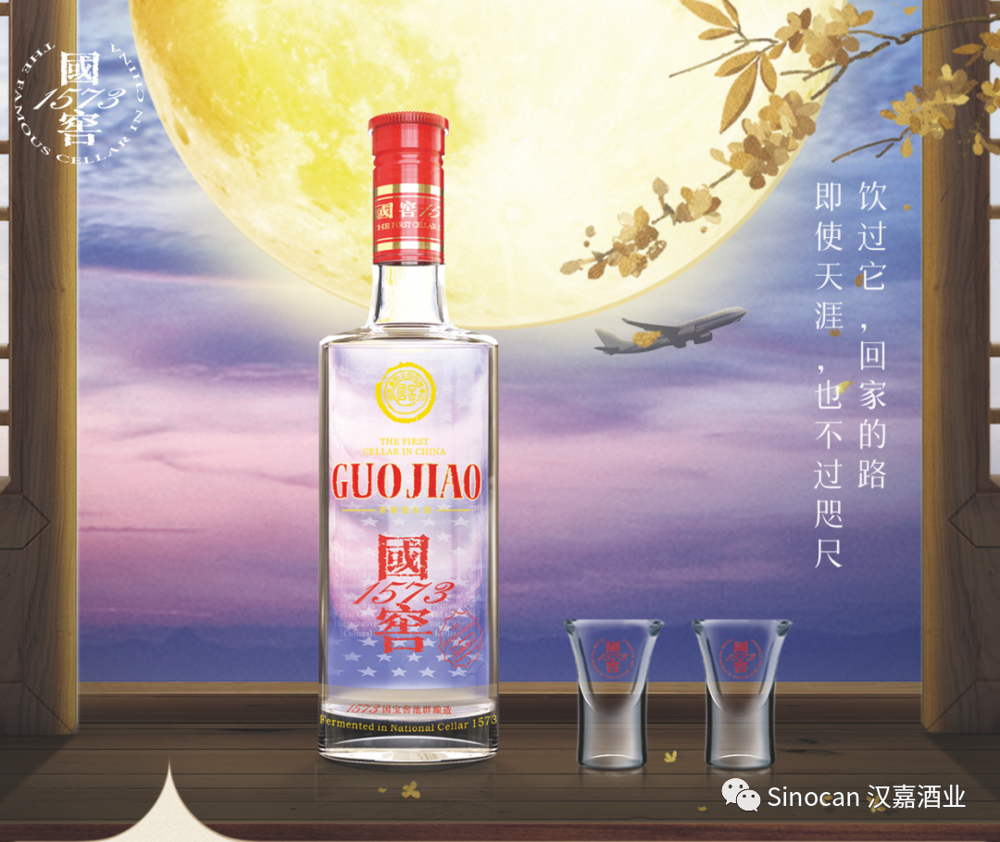
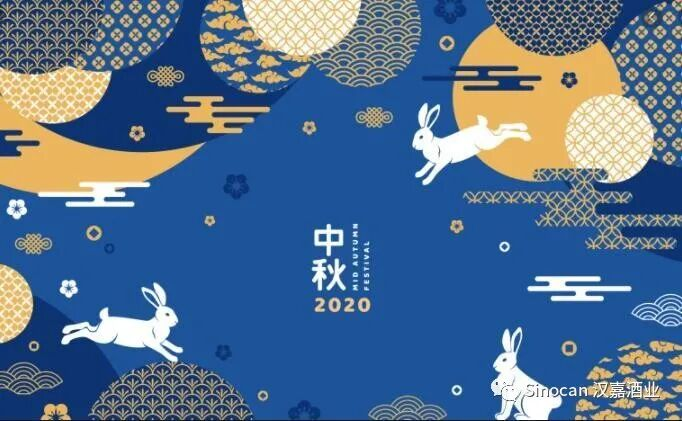
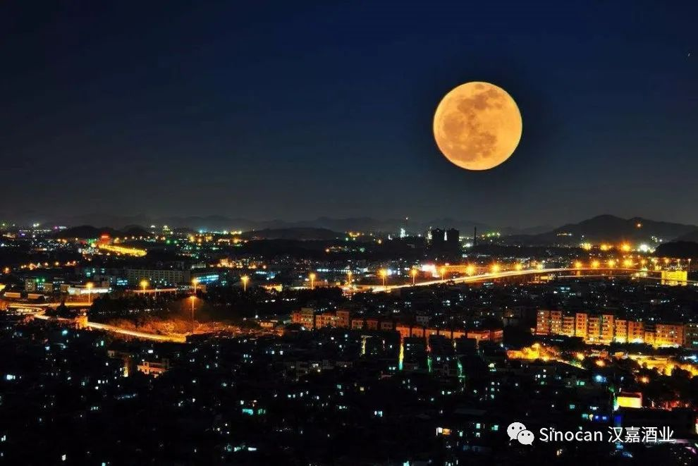
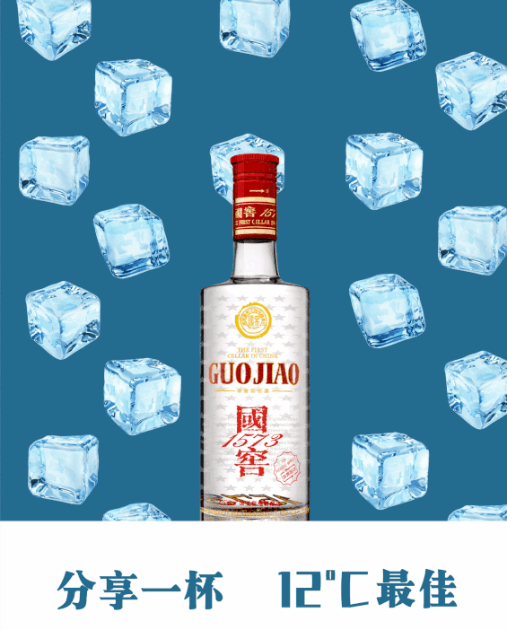
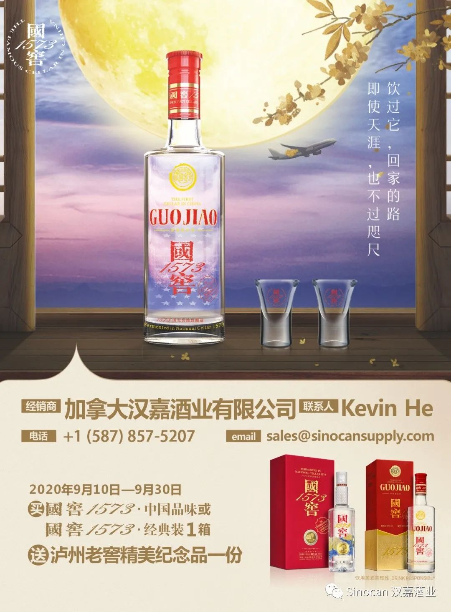
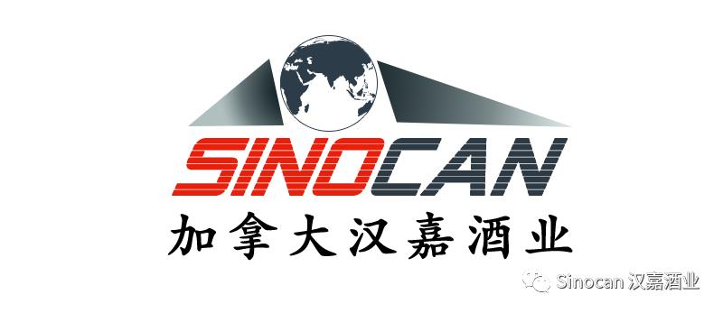

# 无标题

**链接地址:** http://mp.weixin.qq.com/s?__biz=MzIyMzU4OTc0MQ==&mid=2247484381&idx=1&sn=fb7badb45e8e204f1cd0df728adf7e96&chksm=e81aa7dfdf6d2ec99535d30674d6e5b17fac3f8d3ab811d8a9e8da8fa048b43b54b01622bc88&mpshare=1&scene=2&srcid=0911HEwTGN2U5pRuz2mOjWHg&sharer_sharetime=1599783420269&sharer_shareid=be1c8edd6c93eec155a61c876e41d26a#rd
**作者:** 汉嘉酒业
**获取时间:** 2025/8/28 20:08:42
**图片数量:** 11

---

## 原始HTML内容

<section style="box-sizing: border-box;font-size: 16px;"><section style="margin: 17px 0%;box-sizing: border-box;" powered-by="xiumi.us"><section style="display: inline-block;width: 100%;vertical-align: top;border-left: 3px solid rgb(195, 163, 142);border-bottom-left-radius: 0px;padding-right: 5px;padding-left: 5px;border-right: 3px solid rgb(195, 163, 142);border-top-right-radius: 0px;box-sizing: border-box;"><section style="margin: -7px 0%;box-sizing: border-box;" powered-by="xiumi.us"><section style="display: inline-block;width: 100%;vertical-align: top;background-color: rgb(255, 244, 226);padding: 5px 10px;box-sizing: border-box;"><section style="color: rgb(158, 114, 84);font-size: 14px;box-sizing: border-box;" powered-by="xiumi.us">
<strong style="box-sizing: border-box;">点击蓝字 关注我们</strong>
</section></section></section></section></section><section style="box-sizing: border-box;" powered-by="xiumi.us">
 
</section><section style="text-align: right;justify-content: flex-end;margin-top: 10px;margin-right: 0%;margin-left: 0%;box-sizing: border-box;" powered-by="xiumi.us"><section style="display: inline-block;width: auto;vertical-align: top;min-width: 10%;max-width: 100%;height: auto;background-color: rgb(195, 163, 142);padding: 5px 10px;box-sizing: border-box;"><section style="text-align: justify;color: rgb(255, 255, 255);font-size: 14px;box-sizing: border-box;" powered-by="xiumi.us">
<strong style="box-sizing: border-box;">活动专题《国窖1573中秋献礼》</strong>
</section></section></section><section style="display: inline-block;width: 100%;vertical-align: top;border-left: 2px none rgb(195, 163, 142);border-bottom-left-radius: 0px;background-color: rgb(255, 244, 226);padding: 10px;border-right: 2px solid rgb(195, 163, 142);border-top-right-radius: 0px;box-sizing: border-box;" powered-by="xiumi.us"><section style="text-align: center;margin-right: 0%;margin-left: 0%;box-sizing: border-box;" powered-by="xiumi.us"><section style="max-width: 100%;vertical-align: middle;display: inline-block;line-height: 0;box-sizing: border-box;"></section></section></section><section style="text-align: right;justify-content: flex-end;margin-right: 0%;margin-bottom: 10px;margin-left: 0%;font-size: 0px;box-sizing: border-box;" powered-by="xiumi.us"><section style="display: inline-block;width: 50%;vertical-align: top;height: auto;line-height: 0;box-sizing: border-box;"><section style="margin-top: 0.5em;margin-bottom: 0.5em;box-sizing: border-box;" powered-by="xiumi.us"><section style="background-color: rgb(195, 163, 142);height: 2px;box-sizing: border-box;"><svg viewBox="0 0 1 1" style="float:left;line-height:0;width:0;vertical-align:top;"></svg></section></section></section></section><section style="box-sizing: border-box;" powered-by="xiumi.us"><section style="display: flex;flex-flow: row nowrap;margin: -10px 0% 10px;box-sizing: border-box;"><section style="display: inline-block;vertical-align: top;width: auto;flex: 0 0 auto;align-self: flex-start;min-width: 10%;max-width: 100%;height: auto;box-sizing: border-box;"><section style="color: rgb(195, 163, 142);font-size: 12px;box-sizing: border-box;" powered-by="xiumi.us">
专题出品 |&nbsp;加拿大汉嘉酒业&nbsp;
</section></section><section style="display: inline-block;vertical-align: top;width: auto;align-self: flex-start;flex: 100 100 0%;box-sizing: border-box;"><section style="margin-top: 0.5em;margin-bottom: 0.5em;box-sizing: border-box;" powered-by="xiumi.us"><section style="background-color: rgba(255, 213, 195, 0);height: 1px;box-sizing: border-box;"><svg viewBox="0 0 1 1" style="float:left;line-height:0;width:0;vertical-align:top;"></svg></section></section></section></section></section><section style="box-sizing: border-box;" powered-by="xiumi.us">
 
</section><section style="box-sizing: border-box;" powered-by="xiumi.us">
 
</section><section style="text-align: center;margin: 10px 0%;box-sizing: border-box;" powered-by="xiumi.us"><section style="display: inline-block;vertical-align: middle;width: auto;background-color: rgba(255, 255, 255, 0);line-height: 0;letter-spacing: 0px;box-sizing: border-box;"><section style="box-sizing: border-box;" powered-by="xiumi.us"><section style="display: inline-block;width: 35px;height: 35px;vertical-align: top;overflow: hidden;line-height: 0;letter-spacing: 0px;box-sizing: border-box;"><section style="text-align: right;margin-top: 3px;margin-right: 0%;margin-left: 0%;transform: translate3d(12px, 0px, 0px);box-sizing: border-box;" powered-by="xiumi.us"> </section></section></section></section><section style="display: inline-block;vertical-align: middle;width: auto;padding-right: 1px;padding-left: 1px;border-width: 0px;background-image: linear-gradient(0deg, rgba(201, 156, 107, 0) 0%, rgb(201, 156, 107) 40%, rgb(201, 156, 107) 60%, rgba(201, 156, 107, 0) 100%);line-height: 0;letter-spacing: 0px;box-sizing: border-box;"><section style="display: inline-block;width: 100%;vertical-align: top;background-color: rgb(255, 255, 255);line-height: 1.5;letter-spacing: 0px;box-sizing: border-box;" powered-by="xiumi.us"><section style="margin: 15px 0%;box-sizing: border-box;" powered-by="xiumi.us"><section style="text-align: left;color: rgb(201, 156, 107);font-size: 17px;padding-right: 6px;padding-left: 6px;letter-spacing: 3px;line-height: 1;box-sizing: border-box;">
<strong style="box-sizing: border-box;">每逢佳节倍思亲</strong>
</section></section></section></section><section style="display: inline-block;vertical-align: middle;width: auto;background-color: rgba(255, 255, 255, 0);line-height: 0;letter-spacing: 0px;box-sizing: border-box;"><section style="transform: rotateY(180deg);-webkit-transform: rotateY(180deg);-moz-transform: rotateY(180deg);-o-transform: rotateY(180deg);box-sizing: border-box;" powered-by="xiumi.us"><section style="display: inline-block;width: 35px;height: 35px;vertical-align: top;overflow: hidden;line-height: 0;letter-spacing: 0px;box-sizing: border-box;"><section style="text-align: right;margin-top: 3px;margin-right: 0%;margin-left: 0%;transform: translate3d(12px, 0px, 0px);box-sizing: border-box;" powered-by="xiumi.us"> </section></section></section></section></section><section style="color: rgb(158, 114, 84);box-sizing: border-box;" powered-by="xiumi.us">
 
</section><section style="padding-right: 15px;padding-left: 15px;line-height: 2;font-size: 14px;box-sizing: border-box;" powered-by="xiumi.us">
中秋节又称仲秋节、团圆节，

时在<strong style="box-sizing: border-box;">农历八月十五日</strong>。

 

今年的中秋恰逢国庆，

<strong style="box-sizing: border-box;">双节合璧，与国同庆</strong>，更是妙哉。

 
</section><section style="text-align: left;justify-content: flex-start;margin-top: 10px;margin-right: 0%;margin-left: 0%;font-size: 0px;box-sizing: border-box;" powered-by="xiumi.us"><section style="display: inline-block;width: 50%;vertical-align: top;height: auto;line-height: 0;box-sizing: border-box;"><section style="margin-top: 0.5em;margin-bottom: 0.5em;box-sizing: border-box;" powered-by="xiumi.us"><section style="background-color: rgb(195, 163, 142);height: 2px;box-sizing: border-box;"><svg viewBox="0 0 1 1" style="float:left;line-height:0;width:0;vertical-align:top;"></svg></section></section></section></section><section style="display: inline-block;width: 100%;vertical-align: top;border-left: 2px none rgb(195, 163, 142);border-bottom-left-radius: 0px;background-color: rgb(255, 244, 226);padding: 10px;border-right: 2px none rgb(195, 163, 142);border-top-right-radius: 0px;box-sizing: border-box;" powered-by="xiumi.us"><section style="text-align: center;margin-right: 0%;margin-left: 0%;box-sizing: border-box;" powered-by="xiumi.us"><section style="max-width: 100%;vertical-align: middle;display: inline-block;line-height: 0;box-sizing: border-box;"></section></section></section><section style="text-align: right;justify-content: flex-end;margin-right: 0%;margin-bottom: 10px;margin-left: 0%;font-size: 0px;box-sizing: border-box;" powered-by="xiumi.us"><section style="display: inline-block;width: 50%;vertical-align: top;height: auto;line-height: 0;box-sizing: border-box;"><section style="margin-top: 0.5em;margin-bottom: 0.5em;box-sizing: border-box;" powered-by="xiumi.us"><section style="background-color: rgb(195, 163, 142);height: 2px;box-sizing: border-box;"><svg viewBox="0 0 1 1" style="float:left;line-height:0;width:0;vertical-align:top;"></svg></section></section></section></section><section style="padding-right: 15px;padding-left: 15px;line-height: 2;font-size: 14px;box-sizing: border-box;" powered-by="xiumi.us">
 

然而对于身处海外华人华侨来说，

今年的中秋和国内家人朋友的相聚，

却<strong style="box-sizing: border-box;">因为疫情的影响</strong>，变成了一桩难事。

 

然而距离斩不断对于家乡和亲人的思念，

您的好友<strong style="box-sizing: border-box;">国窖一五七三</strong>已携带上

承载着<strong style="box-sizing: border-box;">思乡之情的中秋好礼。</strong>

 

漂洋过海，来到您的身边，

<strong style="box-sizing: border-box;">和您共同庆祝这个特殊的中秋与国庆！</strong>
</section><section style="box-sizing: border-box;" powered-by="xiumi.us">
 
</section><section style="box-sizing: border-box;" powered-by="xiumi.us">
 
</section><section style="text-align: center;margin: 10px 0%;box-sizing: border-box;" powered-by="xiumi.us"><section style="display: inline-block;vertical-align: middle;width: auto;background-color: rgba(255, 255, 255, 0);line-height: 0;letter-spacing: 0px;box-sizing: border-box;"><section style="box-sizing: border-box;" powered-by="xiumi.us"><section style="display: inline-block;width: 35px;height: 35px;vertical-align: top;overflow: hidden;line-height: 0;letter-spacing: 0px;box-sizing: border-box;"><section style="text-align: right;margin-top: 3px;margin-right: 0%;margin-left: 0%;transform: translate3d(12px, 0px, 0px);box-sizing: border-box;" powered-by="xiumi.us"> </section></section></section></section><section style="display: inline-block;vertical-align: middle;width: auto;padding-right: 1px;padding-left: 1px;border-width: 0px;background-image: linear-gradient(0deg, rgba(201, 156, 107, 0) 0%, rgb(201, 156, 107) 40%, rgb(201, 156, 107) 60%, rgba(201, 156, 107, 0) 100%);line-height: 0;letter-spacing: 0px;box-sizing: border-box;"><section style="display: inline-block;width: 100%;vertical-align: top;background-color: rgb(255, 255, 255);line-height: 1.5;letter-spacing: 0px;box-sizing: border-box;" powered-by="xiumi.us"><section style="margin: 15px 0%;box-sizing: border-box;" powered-by="xiumi.us"><section style="text-align: left;color: rgb(201, 156, 107);font-size: 17px;padding-right: 6px;padding-left: 6px;letter-spacing: 3px;line-height: 1;box-sizing: border-box;">
<strong style="box-sizing: border-box;">有酒不饮奈明何？</strong>
</section></section></section></section><section style="display: inline-block;vertical-align: middle;width: auto;background-color: rgba(255, 255, 255, 0);line-height: 0;letter-spacing: 0px;box-sizing: border-box;"><section style="transform: rotateY(180deg);-webkit-transform: rotateY(180deg);-moz-transform: rotateY(180deg);-o-transform: rotateY(180deg);box-sizing: border-box;" powered-by="xiumi.us"><section style="display: inline-block;width: 35px;height: 35px;vertical-align: top;overflow: hidden;line-height: 0;letter-spacing: 0px;box-sizing: border-box;"><section style="text-align: right;margin-top: 3px;margin-right: 0%;margin-left: 0%;transform: translate3d(12px, 0px, 0px);box-sizing: border-box;" powered-by="xiumi.us"> </section></section></section></section></section><section style="padding-right: 15px;padding-left: 15px;line-height: 2;font-size: 14px;box-sizing: border-box;" powered-by="xiumi.us">
 

中秋佳节，无论是亲友聚会，还是登高赏月，全都<strong style="box-sizing: border-box;">离不开一个“酒”字</strong>。

 

中秋节饮酒的历史可以追溯至汉代，汉朝的天子在八月里要饮用酿制工艺及其复杂的“酎”酒。

 
</section><section style="text-align: left;justify-content: flex-start;margin-top: 10px;margin-right: 0%;margin-left: 0%;font-size: 0px;box-sizing: border-box;" powered-by="xiumi.us"><section style="display: inline-block;width: 50%;vertical-align: top;height: auto;line-height: 0;box-sizing: border-box;"><section style="margin-top: 0.5em;margin-bottom: 0.5em;box-sizing: border-box;" powered-by="xiumi.us"><section style="background-color: rgb(195, 163, 142);height: 2px;box-sizing: border-box;"><svg viewBox="0 0 1 1" style="float:left;line-height:0;width:0;vertical-align:top;"></svg></section></section></section></section><section style="display: inline-block;width: 100%;vertical-align: top;border-left: 2px none rgb(195, 163, 142);border-bottom-left-radius: 0px;background-color: rgb(255, 244, 226);padding: 10px;border-right: 2px none rgb(195, 163, 142);border-top-right-radius: 0px;box-sizing: border-box;" powered-by="xiumi.us"><section style="text-align: center;margin-right: 0%;margin-left: 0%;box-sizing: border-box;" powered-by="xiumi.us"><section style="max-width: 100%;vertical-align: middle;display: inline-block;line-height: 0;box-sizing: border-box;"></section></section></section><section style="text-align: right;justify-content: flex-end;margin-right: 0%;margin-bottom: 10px;margin-left: 0%;font-size: 0px;box-sizing: border-box;" powered-by="xiumi.us"><section style="display: inline-block;width: 50%;vertical-align: top;height: auto;line-height: 0;box-sizing: border-box;"><section style="margin-top: 0.5em;margin-bottom: 0.5em;box-sizing: border-box;" powered-by="xiumi.us"><section style="background-color: rgb(195, 163, 142);height: 2px;box-sizing: border-box;"><svg viewBox="0 0 1 1" style="float:left;line-height:0;width:0;vertical-align:top;"></svg></section></section></section></section><section style="padding-right: 15px;padding-left: 15px;line-height: 2;font-size: 14px;box-sizing: border-box;" powered-by="xiumi.us">
 

唐代已有了登台观月、饮酒对月的活动，《天宝遗事》 就记载了熄灭灯烛在夜色之下进行的<strong style="box-sizing: border-box;">“月饮”</strong>。

 

每逢中秋之夜，对月当歌，喝一杯酒，聚一家亲，已成为这个节日最令人期待的活动。 

 

然而对于不能归乡的海外华人华侨，这个<strong style="box-sizing: border-box;">稍显落寞的团圆之日</strong>，却也能舞出别样的风采。

 
</section><section style="text-align: left;justify-content: flex-start;margin-top: 10px;margin-right: 0%;margin-left: 0%;font-size: 0px;box-sizing: border-box;" powered-by="xiumi.us"><section style="display: inline-block;width: 50%;vertical-align: top;height: auto;line-height: 0;box-sizing: border-box;"><section style="margin-top: 0.5em;margin-bottom: 0.5em;box-sizing: border-box;" powered-by="xiumi.us"><section style="background-color: rgb(195, 163, 142);height: 2px;box-sizing: border-box;"><svg viewBox="0 0 1 1" style="float:left;line-height:0;width:0;vertical-align:top;"></svg></section></section></section></section><section style="display: inline-block;width: 100%;vertical-align: top;border-left: 2px none rgb(195, 163, 142);border-bottom-left-radius: 0px;background-color: rgb(255, 244, 226);padding: 10px;border-right: 2px none rgb(195, 163, 142);border-top-right-radius: 0px;box-sizing: border-box;" powered-by="xiumi.us"><section style="text-align: center;margin-right: 0%;margin-left: 0%;box-sizing: border-box;" powered-by="xiumi.us"><section style="max-width: 100%;vertical-align: middle;display: inline-block;line-height: 0;box-sizing: border-box;"></section></section></section><section style="text-align: right;justify-content: flex-end;margin-right: 0%;margin-bottom: 10px;margin-left: 0%;font-size: 0px;box-sizing: border-box;" powered-by="xiumi.us"><section style="display: inline-block;width: 50%;vertical-align: top;height: auto;line-height: 0;box-sizing: border-box;"><section style="margin-top: 0.5em;margin-bottom: 0.5em;box-sizing: border-box;" powered-by="xiumi.us"><section style="background-color: rgb(195, 163, 142);height: 2px;box-sizing: border-box;"><svg viewBox="0 0 1 1" style="float:left;line-height:0;width:0;vertical-align:top;"></svg></section></section></section></section><section style="padding-right: 15px;padding-left: 15px;line-height: 2;font-size: 14px;box-sizing: border-box;" powered-by="xiumi.us">
 

你一定还记得李在《月下独酌》中写下的那句经典的<strong style="box-sizing: border-box;">“举杯邀明月，对影成三人”</strong>。缺少了亲朋好友热闹的陪伴，或许独自静下心来与月共赏这一杯醇厚的美酒，也是今年中秋浪漫又情怀的一种打开方式。

 

<strong style="box-sizing: border-box;">但怎样的酒适合对月欢饮？让国窖1573来给您答案…</strong>

 

 
</section><section style="text-align: center;margin: 10px 0%;box-sizing: border-box;" powered-by="xiumi.us"><section style="display: inline-block;vertical-align: middle;width: auto;background-color: rgba(255, 255, 255, 0);line-height: 0;letter-spacing: 0px;box-sizing: border-box;"><section style="box-sizing: border-box;" powered-by="xiumi.us"><section style="display: inline-block;width: 35px;height: 35px;vertical-align: top;overflow: hidden;line-height: 0;letter-spacing: 0px;box-sizing: border-box;"><section style="text-align: right;margin-top: 3px;margin-right: 0%;margin-left: 0%;transform: translate3d(12px, 0px, 0px);box-sizing: border-box;" powered-by="xiumi.us"> </section></section></section></section><section style="display: inline-block;vertical-align: middle;width: auto;padding-right: 1px;padding-left: 1px;border-width: 0px;background-image: linear-gradient(0deg, rgba(201, 156, 107, 0) 0%, rgb(201, 156, 107) 40%, rgb(201, 156, 107) 60%, rgba(201, 156, 107, 0) 100%);line-height: 0;letter-spacing: 0px;box-sizing: border-box;"><section style="display: inline-block;width: 100%;vertical-align: top;background-color: rgb(255, 255, 255);line-height: 1.5;letter-spacing: 0px;box-sizing: border-box;" powered-by="xiumi.us"><section style="margin: 15px 0%;box-sizing: border-box;" powered-by="xiumi.us"><section style="text-align: left;color: rgb(201, 156, 107);font-size: 17px;padding-right: 6px;padding-left: 6px;letter-spacing: 3px;line-height: 1;box-sizing: border-box;">
<strong style="box-sizing: border-box;">12℃，是秋的清凉</strong>
</section></section></section></section><section style="display: inline-block;vertical-align: middle;width: auto;background-color: rgba(255, 255, 255, 0);line-height: 0;letter-spacing: 0px;box-sizing: border-box;"><section style="transform: rotateY(180deg);-webkit-transform: rotateY(180deg);-moz-transform: rotateY(180deg);-o-transform: rotateY(180deg);box-sizing: border-box;" powered-by="xiumi.us"><section style="display: inline-block;width: 35px;height: 35px;vertical-align: top;overflow: hidden;line-height: 0;letter-spacing: 0px;box-sizing: border-box;"><section style="text-align: right;margin-top: 3px;margin-right: 0%;margin-left: 0%;transform: translate3d(12px, 0px, 0px);box-sizing: border-box;" powered-by="xiumi.us"> </section></section></section></section></section><section style="padding-right: 15px;padding-left: 15px;line-height: 2;font-size: 14px;box-sizing: border-box;" powered-by="xiumi.us">
 

<strong style="box-sizing: border-box;">只有精心酿造的好酒才能经受住冰的考验。</strong>

 
</section><section style="text-align: left;justify-content: flex-start;margin-top: 10px;margin-right: 0%;margin-left: 0%;font-size: 0px;box-sizing: border-box;" powered-by="xiumi.us"><section style="display: inline-block;width: 50%;vertical-align: top;height: auto;line-height: 0;box-sizing: border-box;"><section style="margin-top: 0.5em;margin-bottom: 0.5em;box-sizing: border-box;" powered-by="xiumi.us"><section style="background-color: rgb(195, 163, 142);height: 2px;box-sizing: border-box;"><svg viewBox="0 0 1 1" style="float:left;line-height:0;width:0;vertical-align:top;"></svg></section></section></section></section><section style="display: inline-block;width: 100%;vertical-align: top;border-left: 2px none rgb(195, 163, 142);border-bottom-left-radius: 0px;background-color: rgb(255, 244, 226);padding: 10px;border-right: 2px none rgb(195, 163, 142);border-top-right-radius: 0px;box-sizing: border-box;" powered-by="xiumi.us"><section style="text-align: center;margin-right: 0%;margin-left: 0%;box-sizing: border-box;" powered-by="xiumi.us"><section style="max-width: 100%;vertical-align: middle;display: inline-block;line-height: 0;box-sizing: border-box;"></section></section></section><section style="text-align: right;justify-content: flex-end;margin-right: 0%;margin-bottom: 10px;margin-left: 0%;font-size: 0px;box-sizing: border-box;" powered-by="xiumi.us"><section style="display: inline-block;width: 50%;vertical-align: top;height: auto;line-height: 0;box-sizing: border-box;"><section style="margin-top: 0.5em;margin-bottom: 0.5em;box-sizing: border-box;" powered-by="xiumi.us"><section style="background-color: rgb(195, 163, 142);height: 2px;box-sizing: border-box;"><svg viewBox="0 0 1 1" style="float:left;line-height:0;width:0;vertical-align:top;"></svg></section></section></section></section><section style="padding-right: 15px;padding-left: 15px;line-height: 2;font-size: 14px;box-sizing: border-box;" powered-by="xiumi.us">
 

泸州老窖品鉴师经反复试验，

发现通过冰镇的方式令酒体温度达到<strong style="box-sizing: border-box;">12℃</strong>，

方能够获得最顺滑的口感。

 

此时香味物质得以保持完整，

层次丰盈<strong style="box-sizing: border-box;">入口绵甜、落口爽净</strong>的风格特点，

更加突出酒体在口腔里饱满有力的挥发释放。

 

在这个秋高气爽的时节，

举起一杯<strong style="box-sizing: border-box;">冰镇到12℃的国窖1573</strong>，

让这绵甜的醇香封藏秋的韵味

让这浑厚的酒香寄托对家乡的思念

飘向东方……

 
</section><section style="box-sizing: border-box;" powered-by="xiumi.us"><section style="align-items: center;display: flex;margin-top: 15px;margin-bottom: 15px;box-sizing: border-box;"><section style="display: inline-block;vertical-align: bottom;width: auto;flex: 1 0 1px;box-sizing: border-box;"><section style="box-sizing: border-box;" powered-by="xiumi.us"><section style="align-items: center;display: flex;box-sizing: border-box;"><section style="display: inline-block;vertical-align: bottom;width: auto;flex: 1 1 auto;box-shadow: rgba(0, 0, 0, 0) 0px 0px 0px;box-sizing: border-box;"><section style="margin-top: 0.5em;margin-bottom: 0.5em;box-sizing: border-box;" powered-by="xiumi.us"><section style="background-color: rgb(201, 156, 107);height: 1px;box-sizing: border-box;"><svg viewBox="0 0 1 1" style="float:left;line-height:0;width:0;vertical-align:top;"></svg></section></section></section><section style="display: inline-block;vertical-align: bottom;width: auto;flex: 0 0 auto;box-shadow: rgba(0, 0, 0, 0) 0px 0px 0px;line-height: 0;letter-spacing: 0px;box-sizing: border-box;"><section style="text-align: center;box-sizing: border-box;" powered-by="xiumi.us"><section style="display: inline-block;width: 9px;height: 9px;vertical-align: top;overflow: hidden;border-width: 1px;border-radius: 100px;border-style: solid;border-color: rgb(201, 156, 107);box-shadow: rgba(0, 0, 0, 0) 1px 1px 0px inset;line-height: 0;letter-spacing: 0px;box-sizing: border-box;"> </section></section></section></section></section></section><section style="display: inline-block;vertical-align: bottom;width: auto;flex: 0 1 auto;padding-right: 10px;padding-left: 10px;box-sizing: border-box;"><section style="text-align: center;box-sizing: border-box;" powered-by="xiumi.us"><section style="display: inline-block;width: 40px;height: 40px;vertical-align: top;overflow: hidden;box-shadow: rgb(0, 0, 0) 0px 0px 0px;box-sizing: border-box;"><section style="margin-right: 0%;margin-left: 0%;box-sizing: border-box;" powered-by="xiumi.us"> </section></section></section></section><section style="display: inline-block;vertical-align: bottom;width: auto;flex: 1 0 1px;box-sizing: border-box;"><section style="box-sizing: border-box;" powered-by="xiumi.us"><section style="align-items: center;display: flex;transform: rotateY(180deg);-webkit-transform: rotateY(180deg);-moz-transform: rotateY(180deg);-o-transform: rotateY(180deg);box-sizing: border-box;"><section style="display: inline-block;vertical-align: bottom;width: auto;flex: 1 1 auto;box-sizing: border-box;"><section style="margin-top: 0.5em;margin-bottom: 0.5em;box-sizing: border-box;" powered-by="xiumi.us"><section style="background-color: rgb(201, 156, 107);height: 1px;box-sizing: border-box;"><svg viewBox="0 0 1 1" style="float:left;line-height:0;width:0;vertical-align:top;"></svg></section></section></section><section style="display: inline-block;vertical-align: bottom;width: auto;flex: 0 0 auto;box-shadow: transparent 0px 0px 0px;line-height: 0;letter-spacing: 0px;box-sizing: border-box;"><section style="text-align: center;box-sizing: border-box;" powered-by="xiumi.us"><section style="display: inline-block;width: 9px;height: 9px;vertical-align: top;overflow: hidden;border-width: 1px;border-radius: 100px;border-style: solid;border-color: rgb(201, 156, 107);box-shadow: rgba(0, 0, 0, 0) 1px 1px 0px inset;line-height: 0;letter-spacing: 0px;box-sizing: border-box;"> </section></section></section></section></section></section></section></section><section style="padding-right: 15px;padding-left: 15px;line-height: 2;font-size: 14px;box-sizing: border-box;" powered-by="xiumi.us">
 

<strong style="box-sizing: border-box;">12℃，为什么是这个刁钻的温度？</strong>

 

因为精酿的白酒中含有只溶于酒精的

<strong style="box-sizing: border-box;">高级不饱和脂肪酸</strong>

过低的温度会降低它们的溶解度

造成脂肪酸析出

导致<strong style="box-sizing: border-box;">酒体浑浊失光</strong>

让口感和视觉效果大打折扣

 
</section><section style="text-align: left;justify-content: flex-start;margin-top: 10px;margin-right: 0%;margin-left: 0%;font-size: 0px;box-sizing: border-box;" powered-by="xiumi.us"><section style="display: inline-block;width: 50%;vertical-align: top;height: auto;line-height: 0;box-sizing: border-box;"><section style="margin-top: 0.5em;margin-bottom: 0.5em;box-sizing: border-box;" powered-by="xiumi.us"><section style="background-color: rgb(195, 163, 142);height: 2px;box-sizing: border-box;"><svg viewBox="0 0 1 1" style="float:left;line-height:0;width:0;vertical-align:top;"></svg></section></section></section></section><section style="display: inline-block;width: 100%;vertical-align: top;border-left: 2px none rgb(195, 163, 142);border-bottom-left-radius: 0px;background-color: rgb(255, 244, 226);padding: 10px;border-right: 2px none rgb(195, 163, 142);border-top-right-radius: 0px;box-sizing: border-box;" powered-by="xiumi.us"><section style="text-align: center;margin-right: 0%;margin-left: 0%;box-sizing: border-box;" powered-by="xiumi.us"><section style="max-width: 100%;vertical-align: middle;display: inline-block;line-height: 0;box-sizing: border-box;"></section></section></section><section style="text-align: right;justify-content: flex-end;margin-right: 0%;margin-bottom: 10px;margin-left: 0%;font-size: 0px;box-sizing: border-box;" powered-by="xiumi.us"><section style="display: inline-block;width: 50%;vertical-align: top;height: auto;line-height: 0;box-sizing: border-box;"><section style="margin-top: 0.5em;margin-bottom: 0.5em;box-sizing: border-box;" powered-by="xiumi.us"><section style="background-color: rgb(195, 163, 142);height: 2px;box-sizing: border-box;"><svg viewBox="0 0 1 1" style="float:left;line-height:0;width:0;vertical-align:top;"></svg></section></section></section></section><section style="padding-right: 15px;padding-left: 15px;line-height: 2;font-size: 14px;box-sizing: border-box;" powered-by="xiumi.us">
 

然而12℃不是一个好控制的温度范围，

放在<strong style="box-sizing: border-box;">冰箱中冷藏一个不小心就容易冰过了头</strong>。

怎么办？

不如让<strong style="box-sizing: border-box;">秋夜那清凉的微风帮你想想办法</strong>。

 

“秋夜凉风起，清气荡暄浊”

<strong style="box-sizing: border-box;">12℃的气温，</strong>

<strong style="box-sizing: border-box;">莫辜负自然节气带给我们这天时地利的好意。</strong>

 

中秋时节的夜风让人心神安宁，思绪沉淀。

也让咱手中这杯<strong style="box-sizing: border-box;">国窖1573的酒体出落得更加顺滑醇清</strong>。

 

在这样的秋风送爽，花香弥漫的环境中

一边赏月一边饮酒，

是这个中秋<strong style="box-sizing: border-box;">最独一无二的尊贵体验</strong>。

 
</section><section style="text-align: left;justify-content: flex-start;margin-top: 10px;margin-right: 0%;margin-left: 0%;font-size: 0px;box-sizing: border-box;" powered-by="xiumi.us"><section style="display: inline-block;width: 50%;vertical-align: top;height: auto;line-height: 0;box-sizing: border-box;"><section style="margin-top: 0.5em;margin-bottom: 0.5em;box-sizing: border-box;" powered-by="xiumi.us"><section style="background-color: rgb(195, 163, 142);height: 2px;box-sizing: border-box;"><svg viewBox="0 0 1 1" style="float:left;line-height:0;width:0;vertical-align:top;"></svg></section></section></section></section><section style="display: inline-block;width: 100%;vertical-align: top;border-left: 2px none rgb(195, 163, 142);border-bottom-left-radius: 0px;background-color: rgb(255, 244, 226);padding: 10px;border-right: 2px none rgb(195, 163, 142);border-top-right-radius: 0px;box-sizing: border-box;" powered-by="xiumi.us"><section style="text-align: center;margin-right: 0%;margin-left: 0%;box-sizing: border-box;" powered-by="xiumi.us"><section style="max-width: 100%;vertical-align: middle;display: inline-block;line-height: 0;box-sizing: border-box;"></section></section></section><section style="text-align: right;justify-content: flex-end;margin-right: 0%;margin-bottom: 10px;margin-left: 0%;font-size: 0px;box-sizing: border-box;" powered-by="xiumi.us"><section style="display: inline-block;width: 50%;vertical-align: top;height: auto;line-height: 0;box-sizing: border-box;"><section style="margin-top: 0.5em;margin-bottom: 0.5em;box-sizing: border-box;" powered-by="xiumi.us"><section style="background-color: rgb(195, 163, 142);height: 2px;box-sizing: border-box;"><svg viewBox="0 0 1 1" style="float:left;line-height:0;width:0;vertical-align:top;"></svg></section></section></section></section><section style="padding-right: 15px;padding-left: 15px;line-height: 2;font-size: 14px;box-sizing: border-box;" powered-by="xiumi.us">
 

想要让纯正的国窖1573香飘加拿大？

<strong style="box-sizing: border-box;">当然有办法！</strong>

 

请联系<strong style="box-sizing: border-box;">汉嘉酒业！</strong>
</section><section style="padding-right: 15px;padding-left: 15px;line-height: 2;font-size: 14px;box-sizing: border-box;" powered-by="xiumi.us">
 

在中秋活动期限内（2020年9月10日 - 9月30日）

凡 <strong style="box-sizing: border-box;">购买国窖1573 · 中国品味一箱</strong> 或

<strong style="box-sizing: border-box;">国窖1573 · 经典装一箱</strong>
</section><section style="text-align: left;justify-content: flex-start;margin-top: 10px;margin-right: 0%;margin-left: 0%;font-size: 0px;box-sizing: border-box;" powered-by="xiumi.us"><section style="display: inline-block;width: 50%;vertical-align: top;height: auto;line-height: 0;box-sizing: border-box;"><section style="margin-top: 0.5em;margin-bottom: 0.5em;box-sizing: border-box;" powered-by="xiumi.us"><section style="background-color: rgba(255, 213, 195, 0);height: 2px;box-sizing: border-box;"><svg viewBox="0 0 1 1" style="float:left;line-height:0;width:0;vertical-align:top;"></svg></section></section></section></section><section style="text-align: right;justify-content: flex-end;margin-right: 0%;margin-bottom: 10px;margin-left: 0%;font-size: 0px;box-sizing: border-box;" powered-by="xiumi.us"><section style="display: inline-block;width: 50%;vertical-align: top;height: auto;line-height: 0;box-sizing: border-box;"><section style="margin-top: 0.5em;margin-bottom: 0.5em;box-sizing: border-box;" powered-by="xiumi.us"><section style="background-color: rgba(255, 213, 195, 0);height: 2px;box-sizing: border-box;"><svg viewBox="0 0 1 1" style="float:left;line-height:0;width:0;vertical-align:top;"></svg></section></section></section></section><section style="padding-right: 15px;padding-left: 15px;line-height: 2;font-size: 14px;box-sizing: border-box;" powered-by="xiumi.us">
均可获得由泸州老窖赠送的 

<strong style="font-size: 18px;box-sizing: border-box;">中秋特别限定的收藏品一份！</strong> 

 
</section><section style="padding-right: 15px;padding-left: 15px;line-height: 2;font-size: 14px;box-sizing: border-box;" powered-by="xiumi.us">
爱酒，知酒，懂酒的您一定能够赏识到它的价值！ 

想要知道藏品到底是什么？

<strong style="box-sizing: border-box;">快联系我们吧！</strong>

 
</section><section style="text-align: left;justify-content: flex-start;margin-top: 10px;margin-right: 0%;margin-left: 0%;font-size: 0px;box-sizing: border-box;" powered-by="xiumi.us"><section style="display: inline-block;width: 50%;vertical-align: top;height: auto;line-height: 0;box-sizing: border-box;"><section style="margin-top: 0.5em;margin-bottom: 0.5em;box-sizing: border-box;" powered-by="xiumi.us"><section style="background-color: rgb(195, 163, 142);height: 2px;box-sizing: border-box;"><svg viewBox="0 0 1 1" style="float:left;line-height:0;width:0;vertical-align:top;"></svg></section></section></section></section><section style="display: inline-block;width: 100%;vertical-align: top;border-left: 2px none rgb(195, 163, 142);border-bottom-left-radius: 0px;background-color: rgb(255, 244, 226);padding: 10px;border-right: 2px none rgb(195, 163, 142);border-top-right-radius: 0px;box-sizing: border-box;" powered-by="xiumi.us"><section style="text-align: center;margin-right: 0%;margin-left: 0%;box-sizing: border-box;" powered-by="xiumi.us"><section style="max-width: 100%;vertical-align: middle;display: inline-block;line-height: 0;box-sizing: border-box;"></section></section></section><section style="text-align: right;justify-content: flex-end;margin-right: 0%;margin-bottom: 10px;margin-left: 0%;font-size: 0px;box-sizing: border-box;" powered-by="xiumi.us"><section style="display: inline-block;width: 50%;vertical-align: top;height: auto;line-height: 0;box-sizing: border-box;"><section style="margin-top: 0.5em;margin-bottom: 0.5em;box-sizing: border-box;" powered-by="xiumi.us"><section style="background-color: rgb(195, 163, 142);height: 2px;box-sizing: border-box;"><svg viewBox="0 0 1 1" style="float:left;line-height:0;width:0;vertical-align:top;"></svg></section></section></section></section><section style="padding-right: 15px;padding-left: 15px;line-height: 2;font-size: 14px;box-sizing: border-box;" powered-by="xiumi.us">
 

玉宇无尘，银河泻影，

月色横空，花荫满径，

中秋的夜晚格外温馨，

空气弥漫着酒的香醇，

月光浸透我们诚挚的祝福，

清秋的风捎去我们的美意。

 
</section><section style="text-align: left;justify-content: flex-start;margin-top: 10px;margin-right: 0%;margin-left: 0%;font-size: 0px;box-sizing: border-box;" powered-by="xiumi.us"><section style="display: inline-block;width: 50%;vertical-align: top;height: auto;line-height: 0;box-sizing: border-box;"><section style="margin-top: 0.5em;margin-bottom: 0.5em;box-sizing: border-box;" powered-by="xiumi.us"><section style="background-color: rgba(255, 213, 195, 0);height: 2px;box-sizing: border-box;"><svg viewBox="0 0 1 1" style="float:left;line-height:0;width:0;vertical-align:top;"></svg></section></section></section></section><section style="text-align: center;justify-content: center;box-sizing: border-box;" powered-by="xiumi.us"><section style="display: inline-block;width: 80%;vertical-align: top;border-left: 2px none rgb(195, 163, 142);border-bottom-left-radius: 0px;background-color: rgb(255, 244, 226);padding: 10px;border-right: 2px none rgb(195, 163, 142);border-top-right-radius: 0px;height: auto;box-sizing: border-box;"><section style="margin-right: 0%;margin-left: 0%;box-sizing: border-box;" powered-by="xiumi.us"><section style="max-width: 100%;vertical-align: middle;display: inline-block;line-height: 0;box-sizing: border-box;"></section></section></section></section><section style="text-align: right;justify-content: flex-end;margin-right: 0%;margin-bottom: 10px;margin-left: 0%;font-size: 0px;box-sizing: border-box;" powered-by="xiumi.us"><section style="display: inline-block;width: 50%;vertical-align: top;height: auto;line-height: 0;box-sizing: border-box;"><section style="margin-top: 0.5em;margin-bottom: 0.5em;box-sizing: border-box;" powered-by="xiumi.us"><section style="background-color: rgba(255, 213, 195, 0);height: 2px;box-sizing: border-box;"><svg viewBox="0 0 1 1" style="float:left;line-height:0;width:0;vertical-align:top;"></svg></section></section></section></section><section style="padding-right: 15px;padding-left: 15px;line-height: 2;font-size: 14px;box-sizing: border-box;" powered-by="xiumi.us">
 

<strong style="box-sizing: border-box;">汉嘉酒业全体员工在这里，真诚祝愿各位：</strong>

 

<strong style="box-sizing: border-box;">合家团圆，幸福美满。</strong>

<strong style="box-sizing: border-box;">前途顺利，事业高升。</strong>

<strong style="box-sizing: border-box;">身体健康，万事如意。</strong>

 

<strong style="box-sizing: border-box;">中秋快乐！</strong> 

 
</section><section style="box-sizing: border-box;" powered-by="xiumi.us">
 
</section><section style="box-sizing: border-box;" powered-by="xiumi.us"><section style="align-items: center;display: flex;margin-top: 15px;margin-bottom: 15px;box-sizing: border-box;"><section style="display: inline-block;vertical-align: bottom;width: auto;flex: 1 0 1px;box-sizing: border-box;"><section style="box-sizing: border-box;" powered-by="xiumi.us"><section style="align-items: center;display: flex;box-sizing: border-box;"><section style="display: inline-block;vertical-align: bottom;width: auto;flex: 1 1 auto;box-shadow: rgba(0, 0, 0, 0) 0px 0px 0px;box-sizing: border-box;"><section style="margin-top: 0.5em;margin-bottom: 0.5em;box-sizing: border-box;" powered-by="xiumi.us"><section style="background-color: rgb(201, 156, 107);height: 1px;box-sizing: border-box;"><svg viewBox="0 0 1 1" style="float:left;line-height:0;width:0;vertical-align:top;"></svg></section></section></section><section style="display: inline-block;vertical-align: bottom;width: auto;flex: 0 0 auto;box-shadow: rgba(0, 0, 0, 0) 0px 0px 0px;line-height: 0;letter-spacing: 0px;box-sizing: border-box;"><section style="text-align: center;box-sizing: border-box;" powered-by="xiumi.us"><section style="display: inline-block;width: 9px;height: 9px;vertical-align: top;overflow: hidden;border-width: 1px;border-radius: 100px;border-style: solid;border-color: rgb(201, 156, 107);box-shadow: rgba(0, 0, 0, 0) 1px 1px 0px inset;line-height: 0;letter-spacing: 0px;box-sizing: border-box;"> </section></section></section></section></section></section><section style="display: inline-block;vertical-align: bottom;width: auto;flex: 0 1 auto;padding-right: 10px;padding-left: 10px;box-sizing: border-box;"><section style="text-align: center;box-sizing: border-box;" powered-by="xiumi.us"><section style="display: inline-block;width: 40px;height: 40px;vertical-align: top;overflow: hidden;box-shadow: rgb(0, 0, 0) 0px 0px 0px;box-sizing: border-box;"><section style="margin-right: 0%;margin-left: 0%;box-sizing: border-box;" powered-by="xiumi.us"> </section></section></section></section><section style="display: inline-block;vertical-align: bottom;width: auto;flex: 1 0 1px;box-sizing: border-box;"><section style="box-sizing: border-box;" powered-by="xiumi.us"><section style="align-items: center;display: flex;transform: rotateY(180deg);-webkit-transform: rotateY(180deg);-moz-transform: rotateY(180deg);-o-transform: rotateY(180deg);box-sizing: border-box;"><section style="display: inline-block;vertical-align: bottom;width: auto;flex: 1 1 auto;box-sizing: border-box;"><section style="margin-top: 0.5em;margin-bottom: 0.5em;box-sizing: border-box;" powered-by="xiumi.us"><section style="background-color: rgb(201, 156, 107);height: 1px;box-sizing: border-box;"><svg viewBox="0 0 1 1" style="float:left;line-height:0;width:0;vertical-align:top;"></svg></section></section></section><section style="display: inline-block;vertical-align: bottom;width: auto;flex: 0 0 auto;box-shadow: transparent 0px 0px 0px;line-height: 0;letter-spacing: 0px;box-sizing: border-box;"><section style="text-align: center;box-sizing: border-box;" powered-by="xiumi.us"><section style="display: inline-block;width: 9px;height: 9px;vertical-align: top;overflow: hidden;border-width: 1px;border-radius: 100px;border-style: solid;border-color: rgb(201, 156, 107);box-shadow: rgba(0, 0, 0, 0) 1px 1px 0px inset;line-height: 0;letter-spacing: 0px;box-sizing: border-box;"> </section></section></section></section></section></section></section></section><section style="box-sizing: border-box;" powered-by="xiumi.us">
 
</section><section style="display: inline-block;width: 100%;vertical-align: top;border-left: 5px solid rgba(255, 213, 195, 0);border-bottom-left-radius: 0px;padding: 10px;border-right: 5px solid rgba(255, 213, 195, 0);border-top-right-radius: 0px;box-sizing: border-box;" powered-by="xiumi.us"><section style="display: inline-block;width: 100%;vertical-align: top;border-left: 5px solid rgba(255, 213, 195, 0);border-bottom-left-radius: 0px;padding: 10px;border-right: 5px solid rgba(255, 213, 195, 0);border-top-right-radius: 0px;box-sizing: border-box;" powered-by="xiumi.us"><section style="text-align: center;margin-top: 10px;margin-bottom: 10px;box-sizing: border-box;" powered-by="xiumi.us"><section style="max-width: 100%;vertical-align: middle;display: inline-block;line-height: 0;box-sizing: border-box;"></section></section></section><section style="padding-right: 5px;padding-left: 5px;color: rgb(115, 115, 114);line-height: 2;font-size: 15px;letter-spacing: 2px;box-sizing: border-box;" powered-by="xiumi.us">
<strong style="box-sizing: border-box;">http://www.sinocansupply.com/</strong> 

 

加拿大汉嘉酒业，专注于为加国消费者提供优质的顶级名酿！

 

欢迎浏览我们的网页，从遍及各省的经销商处订购您心仪的酒类收藏！也欢迎感兴趣的经销商联系我们，让国酒的醇香香飘世界，让各国的美酒汇聚一堂！

 
</section><section style="padding-right: 5px;padding-left: 5px;color: rgb(115, 115, 114);line-height: 2;font-size: 15px;letter-spacing: 2px;box-sizing: border-box;" powered-by="xiumi.us">
 

<strong style="box-sizing: border-box;">传播酒文化，我们是认真的。</strong>

 

<strong style="box-sizing: border-box;">汉嘉酒业愿与你携手，让家乡的酒离我们更近，让中国文化走得更远。</strong>

 
</section><section style="margin: 10px 0%;box-sizing: border-box;" powered-by="xiumi.us"><section style="display: inline-block;width: 100%;vertical-align: top;background-color: rgba(255, 213, 195, 0.26);border-width: 1px 4px;border-radius: 0px;border-style: solid none;border-color: rgba(255, 213, 195, 0.26) rgb(205, 240, 255);box-sizing: border-box;"><section style="box-sizing: border-box;" powered-by="xiumi.us"><section style="display: inline-block;vertical-align: middle;width: 33%;align-self: center;height: auto;box-shadow: rgba(255, 213, 195, 0.26) 0px 0px 0px;box-sizing: border-box;"><section style="text-align: right;margin: -4px 0%;justify-content: flex-end;box-sizing: border-box;" powered-by="xiumi.us"><section style="max-width: 100%;vertical-align: middle;display: inline-block;line-height: 0;width: 90%;height: auto;box-shadow: rgb(219, 123, 123) 0px 0px 0px;border-style: solid none;border-width: 6px 4px;border-radius: 0px;border-color: rgb(219, 123, 123) rgb(255, 211, 44);box-sizing: border-box;"></section></section></section><section style="display: inline-block;vertical-align: middle;width: 66%;height: auto;align-self: center;box-sizing: border-box;"><section style="margin-right: 0%;margin-left: 0%;box-sizing: border-box;" powered-by="xiumi.us"><section style="text-align: center;font-size: 14px;color: rgb(124, 119, 219);letter-spacing: 0px;line-height: 1.6;padding-right: 20px;padding-left: 20px;box-sizing: border-box;">
<strong style="box-sizing: border-box;">汉嘉酒业</strong>

<strong style="box-sizing: border-box;">扫描二维码</strong><strong style="letter-spacing: 0px;box-sizing: border-box;">关注我们</strong>

http://www.sinocansupply.com/

Email: info@sinocansupply.com
</section></section></section></section></section></section><section style="padding-right: 5px;padding-left: 5px;color: rgb(115, 115, 114);line-height: 2;font-size: 15px;letter-spacing: 2px;box-sizing: border-box;" powered-by="xiumi.us">
 
</section></section><section style="box-sizing: border-box;" powered-by="xiumi.us"><section style="align-items: center;display: flex;margin-top: 15px;margin-bottom: 15px;box-sizing: border-box;"><section style="display: inline-block;vertical-align: bottom;width: auto;flex: 1 0 1px;box-sizing: border-box;"><section style="box-sizing: border-box;" powered-by="xiumi.us"><section style="align-items: center;display: flex;box-sizing: border-box;"><section style="display: inline-block;vertical-align: bottom;width: auto;flex: 1 1 auto;box-shadow: rgba(0, 0, 0, 0) 0px 0px 0px;box-sizing: border-box;"><section style="margin-top: 0.5em;margin-bottom: 0.5em;box-sizing: border-box;" powered-by="xiumi.us"><section style="background-color: rgb(201, 156, 107);height: 1px;box-sizing: border-box;"><svg viewBox="0 0 1 1" style="float:left;line-height:0;width:0;vertical-align:top;"></svg></section></section></section><section style="display: inline-block;vertical-align: bottom;width: auto;flex: 0 0 auto;box-shadow: rgba(0, 0, 0, 0) 0px 0px 0px;line-height: 0;letter-spacing: 0px;box-sizing: border-box;"><section style="text-align: center;box-sizing: border-box;" powered-by="xiumi.us"><section style="display: inline-block;width: 9px;height: 9px;vertical-align: top;overflow: hidden;border-width: 1px;border-radius: 100px;border-style: solid;border-color: rgb(201, 156, 107);box-shadow: rgba(0, 0, 0, 0) 1px 1px 0px inset;line-height: 0;letter-spacing: 0px;box-sizing: border-box;"> </section></section></section></section></section></section><section style="display: inline-block;vertical-align: bottom;width: auto;flex: 0 1 auto;padding-right: 10px;padding-left: 10px;box-sizing: border-box;"><section style="text-align: center;box-sizing: border-box;" powered-by="xiumi.us"><section style="display: inline-block;width: 40px;height: 40px;vertical-align: top;overflow: hidden;box-shadow: rgb(0, 0, 0) 0px 0px 0px;box-sizing: border-box;"><section style="margin-right: 0%;margin-left: 0%;box-sizing: border-box;" powered-by="xiumi.us"> </section></section></section></section><section style="display: inline-block;vertical-align: bottom;width: auto;flex: 1 0 1px;box-sizing: border-box;"><section style="box-sizing: border-box;" powered-by="xiumi.us"><section style="align-items: center;display: flex;transform: rotateY(180deg);-webkit-transform: rotateY(180deg);-moz-transform: rotateY(180deg);-o-transform: rotateY(180deg);box-sizing: border-box;"><section style="display: inline-block;vertical-align: bottom;width: auto;flex: 1 1 auto;box-sizing: border-box;"><section style="margin-top: 0.5em;margin-bottom: 0.5em;box-sizing: border-box;" powered-by="xiumi.us"><section style="background-color: rgb(201, 156, 107);height: 1px;box-sizing: border-box;"><svg viewBox="0 0 1 1" style="float:left;line-height:0;width:0;vertical-align:top;"></svg></section></section></section><section style="display: inline-block;vertical-align: bottom;width: auto;flex: 0 0 auto;box-shadow: transparent 0px 0px 0px;line-height: 0;letter-spacing: 0px;box-sizing: border-box;"><section style="text-align: center;box-sizing: border-box;" powered-by="xiumi.us"><section style="display: inline-block;width: 9px;height: 9px;vertical-align: top;overflow: hidden;border-width: 1px;border-radius: 100px;border-style: solid;border-color: rgb(201, 156, 107);box-shadow: rgba(0, 0, 0, 0) 1px 1px 0px inset;line-height: 0;letter-spacing: 0px;box-sizing: border-box;"> </section></section></section></section></section></section></section></section><section style="padding-right: 15px;padding-left: 15px;line-height: 2;font-size: 14px;box-sizing: border-box;" powered-by="xiumi.us">
<strong style="text-align: justify;box-sizing: border-box;">文章部分信息参考</strong>： 

<strong style="box-sizing: border-box;">简书（作者：熊猫GO）</strong>

<strong style="box-sizing: border-box;">泸州老窖海外VIP&nbsp;</strong>

<strong style="box-sizing: border-box;">知乎 （作者：减肥）</strong>
</section><section style="box-sizing: border-box;" powered-by="xiumi.us">
 
</section><section style="margin-top: 10px;margin-bottom: 10px;text-align: right;box-sizing: border-box;" powered-by="xiumi.us"><section style="display: inline-block;vertical-align: middle;box-sizing: border-box;"><section style="display: inline-block;vertical-align: bottom;padding-left: 5px;padding-right: 5px;line-height: 1;margin-bottom: 2px;color: rgb(168, 123, 69);font-size: 14px;box-sizing: border-box;">
我知道你<strong style="box-sizing: border-box;">在看</strong>哟
</section> </section></section></section>
 

---

## 纯文本内容

点击蓝字 关注我们活动专题《国窖1573中秋献礼》专题出品 | 加拿大汉嘉酒业 每逢佳节倍思亲中秋节又称仲秋节、团圆节，时在农历八月十五日。今年的中秋恰逢国庆，双节合璧，与国同庆，更是妙哉。然而对于身处海外华人华侨来说，今年的中秋和国内家人朋友的相聚，却因为疫情的影响，变成了一桩难事。然而距离斩不断对于家乡和亲人的思念，您的好友国窖一五七三已携带上承载着思乡之情的中秋好礼。漂洋过海，来到您的身边，和您共同庆祝这个特殊的中秋与国庆！有酒不饮奈明何？中秋佳节，无论是亲友聚会，还是登高赏月，全都离不开一个“酒”字。中秋节饮酒的历史可以追溯至汉代，汉朝的天子在八月里要饮用酿制工艺及其复杂的“酎”酒。唐代已有了登台观月、饮酒对月的活动，《天宝遗事》 就记载了熄灭灯烛在夜色之下进行的“月饮”。每逢中秋之夜，对月当歌，喝一杯酒，聚一家亲，已成为这个节日最令人期待的活动。然而对于不能归乡的海外华人华侨，这个稍显落寞的团圆之日，却也能舞出别样的风采。你一定还记得李在《月下独酌》中写下的那句经典的“举杯邀明月，对影成三人”。缺少了亲朋好友热闹的陪伴，或许独自静下心来与月共赏这一杯醇厚的美酒，也是今年中秋浪漫又情怀的一种打开方式。但怎样的酒适合对月欢饮？让国窖1573来给您答案…12℃，是秋的清凉只有精心酿造的好酒才能经受住冰的考验。泸州老窖品鉴师经反复试验，发现通过冰镇的方式令酒体温度达到12℃，方能够获得最顺滑的口感。此时香味物质得以保持完整，层次丰盈入口绵甜、落口爽净的风格特点，更加突出酒体在口腔里饱满有力的挥发释放。在这个秋高气爽的时节，举起一杯冰镇到12℃的国窖1573，让这绵甜的醇香封藏秋的韵味让这浑厚的酒香寄托对家乡的思念飘向东方……12℃，为什么是这个刁钻的温度？因为精酿的白酒中含有只溶于酒精的高级不饱和脂肪酸过低的温度会降低它们的溶解度造成脂肪酸析出导致酒体浑浊失光让口感和视觉效果大打折扣然而12℃不是一个好控制的温度范围，放在冰箱中冷藏一个不小心就容易冰过了头。怎么办？不如让秋夜那清凉的微风帮你想想办法。“秋夜凉风起，清气荡暄浊”12℃的气温，莫辜负自然节气带给我们这天时地利的好意。中秋时节的夜风让人心神安宁，思绪沉淀。也让咱手中这杯国窖1573的酒体出落得更加顺滑醇清。在这样的秋风送爽，花香弥漫的环境中一边赏月一边饮酒，是这个中秋最独一无二的尊贵体验。想要让纯正的国窖1573香飘加拿大？当然有办法！请联系汉嘉酒业！在中秋活动期限内（2020年9月10日 - 9月30日）凡 购买国窖1573 · 中国品味一箱 或国窖1573 · 经典装一箱均可获得由泸州老窖赠送的中秋特别限定的收藏品一份！爱酒，知酒，懂酒的您一定能够赏识到它的价值！想要知道藏品到底是什么？快联系我们吧！玉宇无尘，银河泻影，月色横空，花荫满径，中秋的夜晚格外温馨，空气弥漫着酒的香醇，月光浸透我们诚挚的祝福，清秋的风捎去我们的美意。汉嘉酒业全体员工在这里，真诚祝愿各位：合家团圆，幸福美满。前途顺利，事业高升。身体健康，万事如意。中秋快乐！http://www.sinocansupply.com/ 加拿大汉嘉酒业，专注于为加国消费者提供优质的顶级名酿！欢迎浏览我们的网页，从遍及各省的经销商处订购您心仪的酒类收藏！也欢迎感兴趣的经销商联系我们，让国酒的醇香香飘世界，让各国的美酒汇聚一堂！传播酒文化，我们是认真的。汉嘉酒业愿与你携手，让家乡的酒离我们更近，让中国文化走得更远。汉嘉酒业扫描二维码关注我们http://www.sinocansupply.com/Email: info@sinocansupply.com文章部分信息参考：简书（作者：熊猫GO）泸州老窖海外VIP 知乎 （作者：减肥）我知道你在看哟

---

## 图片列表

-  (原始链接: https://mmbiz.qpic.cn/mmbiz_png/7CNdqYbqvBJweOgic21aIKrSzXmSaKWTEcibS7y7mibW6kRN1Ra6Zbu4KeW38yUN2CKYSsUIALYV38bcWYbOEB3qA/640?wx_fmt=png)
-  (原始链接: https://mmbiz.qpic.cn/mmbiz_jpg/7CNdqYbqvBJweOgic21aIKrSzXmSaKWTEp07gNM0c3KwUlW5OicNUl9V7s01ib11OWAIvUpZ5IDxkPtpw23UMBdSQ/640?wx_fmt=jpeg)
-  (原始链接: https://mmbiz.qpic.cn/mmbiz_jpg/7CNdqYbqvBJweOgic21aIKrSzXmSaKWTEKsUickicYvC0iazhzsFBSxicS8XFGQ0E4N5InI22lBtCPiaFDOO8cRChIsA/640?wx_fmt=jpeg)
-  (原始链接: https://mmbiz.qpic.cn/mmbiz_jpg/7CNdqYbqvBJweOgic21aIKrSzXmSaKWTE9GQtoSWb96OaIvIKicic9QQrwfj0YaZEKwgjcdia2FkPKC4hHZhjO28eA/640?wx_fmt=jpeg)
-  (原始链接: https://mmbiz.qpic.cn/mmbiz_gif/7CNdqYbqvBJweOgic21aIKrSzXmSaKWTEFIO49EgOKzWwUz7ZBKNqqiazowgFJnPUdz0hD361GLEHtIFzkgAbRmg/640?wx_fmt=gif)
-  (原始链接: https://mmbiz.qpic.cn/mmbiz_jpg/7CNdqYbqvBJweOgic21aIKrSzXmSaKWTE3icM6ibttVW31cqmrmSEA4RrXhXT49Gu2icuTmCAOcbqwQy02pZ2YXE8A/640?wx_fmt=jpeg)
-  (原始链接: https://mmbiz.qpic.cn/mmbiz_jpg/7CNdqYbqvBJweOgic21aIKrSzXmSaKWTEICfgaua58XlEqDWic0HgxzsEQibLrdJ4zE2Nibb5IafiaO0tAOqHXZZ6kg/640?wx_fmt=jpeg)
-  (原始链接: https://mmbiz.qpic.cn/mmbiz_png/7CNdqYbqvBJweOgic21aIKrSzXmSaKWTEiaafYEX5VHBmsAicqHr1NDglYibEDEpbmV6GqJILDK0h8Rl7Y7oHqviayw/640?wx_fmt=png)
-  (原始链接: https://mmbiz.qpic.cn/mmbiz_jpg/7CNdqYbqvBJweOgic21aIKrSzXmSaKWTE26SjbpAeTNZpufYeibniaDnqfTua1apB45MReoJflHkhF6302Ean0kjA/640?wx_fmt=jpeg)
-  (原始链接: https://mmbiz.qpic.cn/mmbiz_png/7CNdqYbqvBJweOgic21aIKrSzXmSaKWTEhfuMBrQo6G2NlSLaD8aaUjCbBJKvyHZPgq388XDHFATiavkgib3Nic2Eg/640?wx_fmt=png)
-  (原始链接: https://mmbiz.qpic.cn/mmbiz_jpg/7CNdqYbqvBJweOgic21aIKrSzXmSaKWTELb4xm3kzhDTe6ZQ9l2V8iazDIVfrJrusWAcH7JsOtQQEuP4QKTibicQmA/640?wx_fmt=jpeg)
