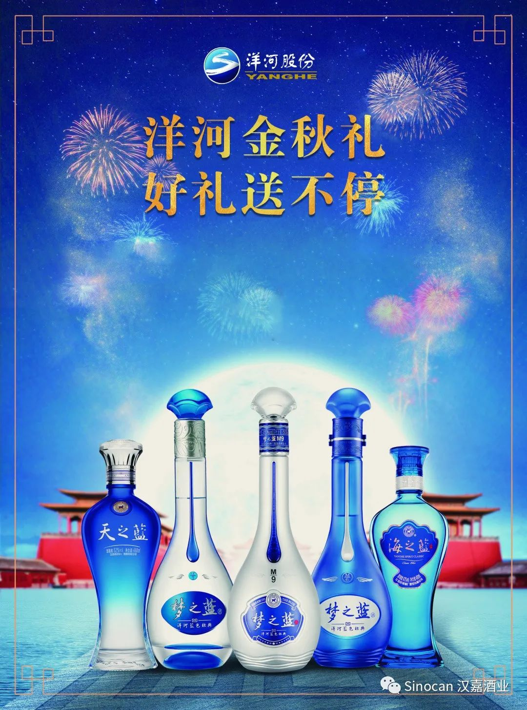
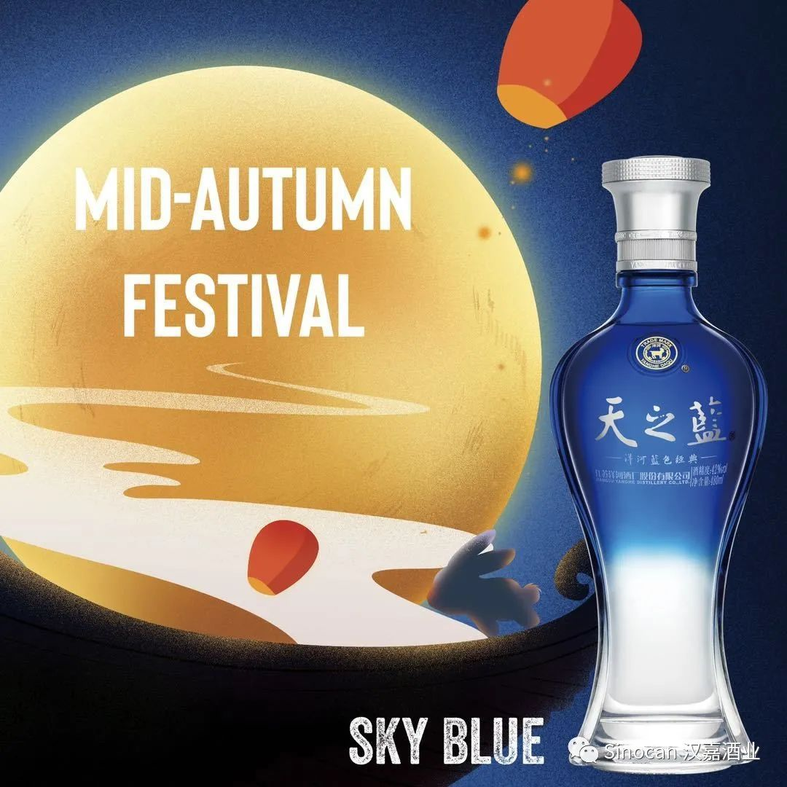
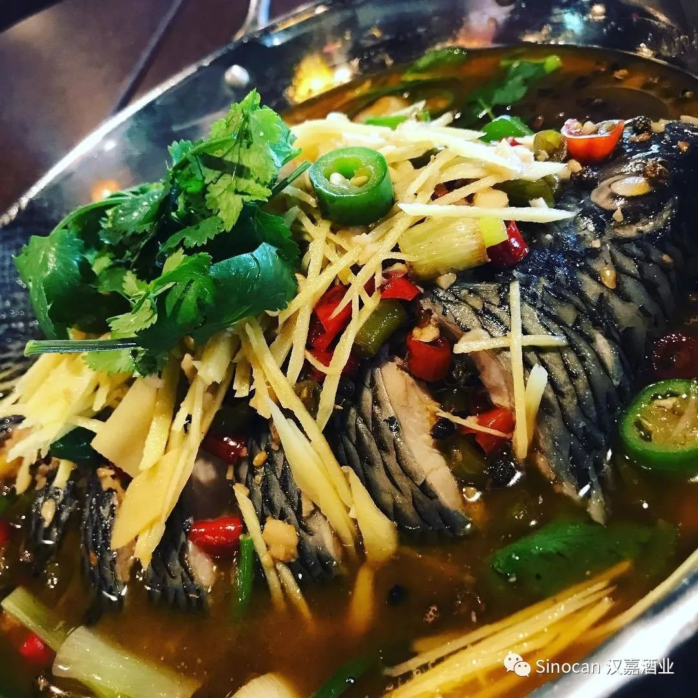
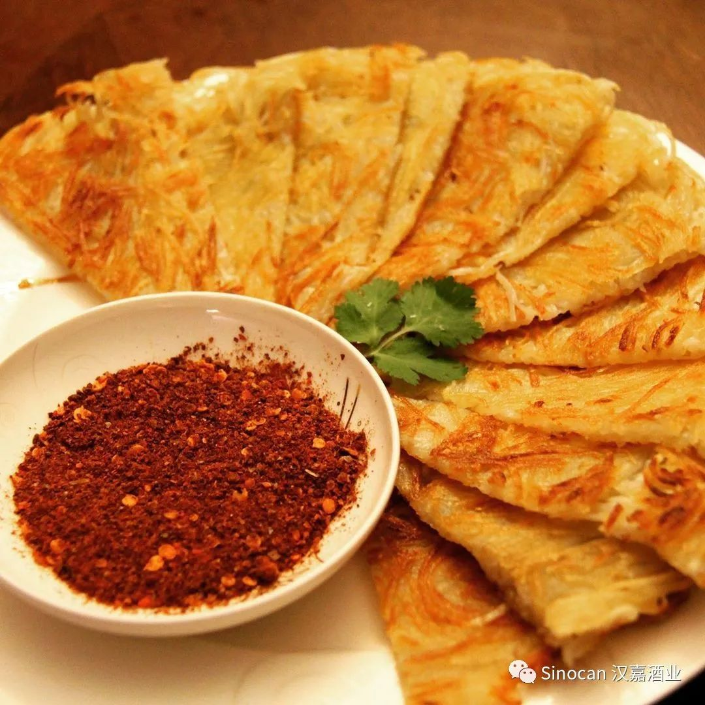
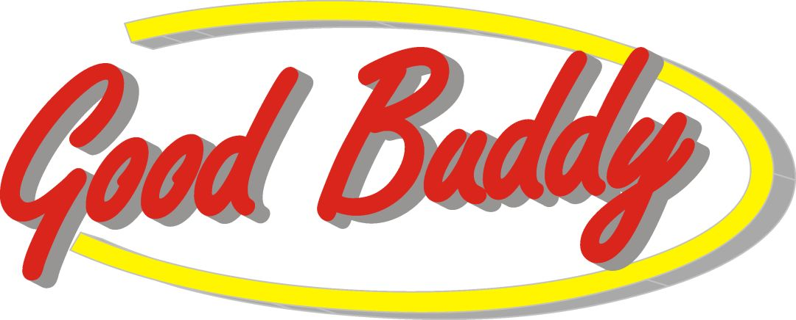
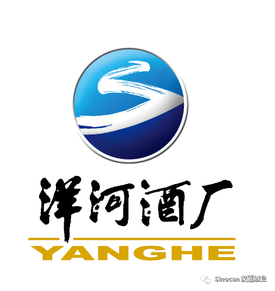
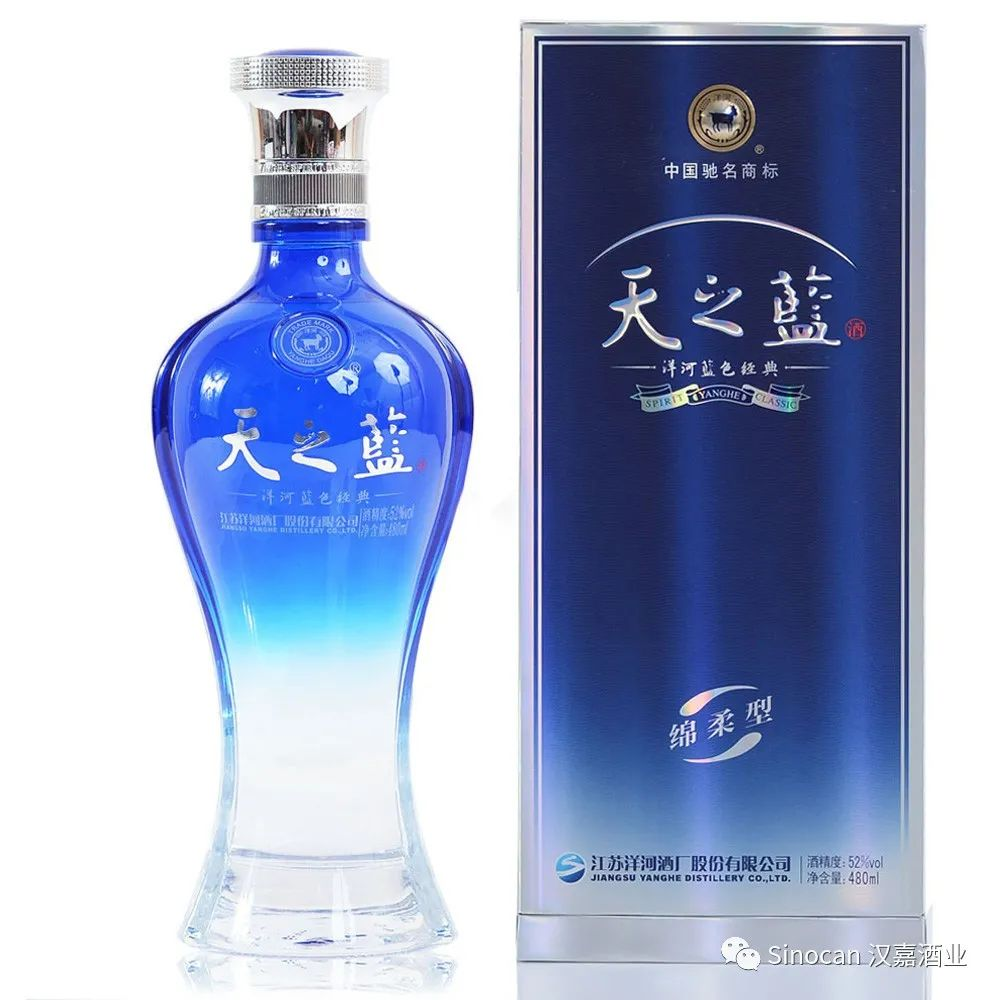

# 无标题

**链接地址:** http://mp.weixin.qq.com/s?__biz=MzIyMzU4OTc0MQ==&mid=2247484443&idx=1&sn=248f66b927d03815329f5615d753fdfc&chksm=e81aa019df6d290f92dfc2c871d7205d74ed969c9acd0386edeb70db723895749c1e61dec258&mpshare=1&scene=2&srcid=0928WMGIsYPqlMt7biydMe8K&sharer_sharetime=1601230395334&sharer_shareid=be1c8edd6c93eec155a61c876e41d26a#rd
**作者:** 关注我们
**获取时间:** 2025/8/28 20:06:35
**图片数量:** 30

---

## 原始HTML内容

<section style="box-sizing: border-box;font-size: 16px;"><section style="text-align: center;margin-top: 10px;margin-right: 0%;margin-left: 0%;box-sizing: border-box;" powered-by="xiumi.us"><section style="max-width: 100%;vertical-align: middle;display: inline-block;line-height: 0;width: 100%;height: auto;box-sizing: border-box;"></section></section><section style="text-align: left;justify-content: flex-start;margin: -30px 0% 10px;opacity: 0.99;box-sizing: border-box;" powered-by="xiumi.us"><section style="display: inline-block;width: 100%;height: 30px;vertical-align: top;overflow: hidden;background-color: rgba(246, 247, 242, 0.74);padding-right: 10px;padding-left: 10px;box-sizing: border-box;"><section style="box-sizing: border-box;" powered-by="xiumi.us"><section style="display: flex;flex-flow: row nowrap;margin-top: 5px;margin-right: 0%;margin-left: 0%;box-sizing: border-box;"><section style="display: inline-block;vertical-align: middle;width: 19px;align-self: center;flex: 0 0 auto;line-height: 0;letter-spacing: 0px;height: auto;box-sizing: border-box;"><section style="text-align: center;margin-right: 0%;margin-left: 0%;box-sizing: border-box;" powered-by="xiumi.us"><section style="max-width: 100%;vertical-align: middle;display: inline-block;line-height: 0;box-sizing: border-box;"></section></section></section><section style="display: inline-block;vertical-align: middle;width: auto;flex: 100 100 0%;align-self: center;height: auto;margin-left: 6px;box-sizing: border-box;"><section style="margin-right: 0%;margin-left: 0%;box-sizing: border-box;" powered-by="xiumi.us"><section style="text-align: justify;font-size: 13px;color: rgb(0, 0, 0);line-height: 1;letter-spacing: 0px;box-sizing: border-box;">
<strong style="box-sizing: border-box;">【中秋活动】当中秋遇上国庆，当洋河遇上你…</strong>
</section></section></section></section></section></section></section><section style="text-align: right;font-size: 12px;color: rgba(0, 0, 0, 0.24);box-sizing: border-box;" powered-by="xiumi.us">
<strong style="box-sizing: border-box;">活动出品：汉嘉酒业</strong>
</section><section style="box-sizing: border-box;" powered-by="xiumi.us">
 
</section><section style="margin: 10px 0%;box-sizing: border-box;" powered-by="xiumi.us"><section style="display: inline-block;width: 100%;vertical-align: top;background-color: rgba(160, 123, 249, 0);border-width: 0px;box-sizing: border-box;"><section style="box-sizing: border-box;" powered-by="xiumi.us"><section style="display: flex;flex-flow: row nowrap;margin-top: 5px;margin-right: 0%;margin-left: 0%;box-sizing: border-box;"><section style="display: inline-block;vertical-align: bottom;width: auto;flex: 0 0 0%;align-self: flex-end;height: auto;box-sizing: border-box;"><section style="text-align: center;color: rgb(242, 176, 69);font-size: 29px;line-height: 1;letter-spacing: 0px;box-sizing: border-box;" powered-by="xiumi.us">
<strong style="box-sizing: border-box;">01</strong>
</section><section style="box-sizing: border-box;" powered-by="xiumi.us"><section style="display: flex;flex-flow: row nowrap;margin-right: 0%;margin-left: 0%;box-sizing: border-box;"><section style="display: inline-block;vertical-align: top;width: 45px;align-self: flex-start;flex: 0 0 auto;height: auto;margin-right: -4px;box-sizing: border-box;"><section style="margin-right: 0%;margin-left: 0%;box-sizing: border-box;" powered-by="xiumi.us"><section style="background-color: rgb(255, 217, 156);height: 1px;box-sizing: border-box;"><svg viewBox="0 0 1 1" style="float:left;line-height:0;width:0;vertical-align:top;"></svg></section></section></section><section style="display: inline-block;vertical-align: bottom;width: auto;line-height: 0;letter-spacing: 0px;flex: 0 0 0%;align-self: flex-end;height: auto;border-top: 0px solid rgb(62, 62, 62);border-top-left-radius: 0px;box-sizing: border-box;"><section style="text-align: center;transform: translate3d(4px, 0px, 0px);margin-right: 0%;margin-bottom: -1px;margin-left: 0%;box-sizing: border-box;" powered-by="xiumi.us"><section style="display: inline-block;width: 4px;height: 4px;vertical-align: top;overflow: hidden;border-width: 1px;border-radius: 0px 50px 50px 0px;border-style: solid solid solid none;border-color: rgb(255, 217, 156) rgb(255, 217, 156) rgb(255, 217, 156) rgb(62, 62, 62);background-color: rgba(159, 123, 249, 0);box-sizing: border-box;"><svg viewBox="0 0 1 1" style="float:left;line-height:0;width:0;vertical-align:top;"></svg></section></section><section style="text-align: center;box-sizing: border-box;" powered-by="xiumi.us"><section style="display: inline-block;width: 4px;height: 4px;vertical-align: top;overflow: hidden;border-width: 1px;border-radius: 50px 0px 0px 50px;border-style: solid none solid solid;border-color: rgb(255, 217, 156) rgb(62, 62, 62) rgb(255, 217, 156) rgb(255, 217, 156);background-color: rgba(159, 123, 249, 0);box-sizing: border-box;"><svg viewBox="0 0 1 1" style="float:left;line-height:0;width:0;vertical-align:top;"></svg></section></section></section><section style="display: inline-block;vertical-align: bottom;width: 18px;align-self: flex-end;flex: 0 0 auto;line-height: 0;letter-spacing: 0px;height: auto;box-sizing: border-box;"><section style="margin-right: 0%;margin-left: 0%;box-sizing: border-box;" powered-by="xiumi.us"><section style="background-color: rgb(255, 217, 156);height: 1px;box-sizing: border-box;"><svg viewBox="0 0 1 1" style="float:left;line-height:0;width:0;vertical-align:top;"></svg></section></section></section></section></section></section><section style="display: inline-block;vertical-align: bottom;width: auto;align-self: flex-end;flex: 100 100 0%;box-sizing: border-box;"><section style="color: rgb(242, 176, 69);letter-spacing: 1px;box-sizing: border-box;" powered-by="xiumi.us">
<strong style="box-sizing: border-box;">中秋遇上国庆</strong>
</section><section style="margin-right: 0%;margin-left: 0%;box-sizing: border-box;" powered-by="xiumi.us"><section style="background-color: rgb(255, 217, 156);height: 1px;box-sizing: border-box;"><svg viewBox="0 0 1 1" style="float:left;line-height:0;width:0;vertical-align:top;"></svg></section></section></section></section></section><section style="display: inline-block;width: 100%;vertical-align: top;background-color: rgba(159, 123, 249, 0);border-style: none;border-width: 1px;border-radius: 0px;border-color: rgb(255, 217, 156);padding: 10px 20px;box-sizing: border-box;" powered-by="xiumi.us"><section style="opacity: 0.99;box-sizing: border-box;" powered-by="xiumi.us"><section style="font-size: 14px;color: rgb(106, 94, 59);letter-spacing: 2px;line-height: 1.8;box-sizing: border-box;">
 

<strong style="box-sizing: border-box;">2020年的中秋可太不一般！</strong>不仅淘气地“拖延”到了阳历的十月，还和<strong style="box-sizing: border-box;">国庆节撞到了同一天</strong>。虽然不少国内的朋友们都在感叹今年的假期算下来要少好几天，但这样双节同庆，双喜临门的大好日子，可是得好好庆祝一番。 

 

说到庆祝，<strong style="box-sizing: border-box;">怎么少得了美酒佳酿</strong>。而中秋恰好是一年中和酒最沾边儿的节日。

 
</section></section><section style="margin: 27px 0%;box-sizing: border-box;" powered-by="xiumi.us"><section style="display: inline-block;width: 100%;vertical-align: top;border-left: 3px solid rgb(195, 163, 142);border-bottom-left-radius: 0px;padding-right: 5px;padding-left: 5px;border-right: 3px solid rgb(195, 163, 142);border-top-right-radius: 0px;box-sizing: border-box;"><section style="margin: -17px 0%;box-sizing: border-box;" powered-by="xiumi.us"><section style="display: inline-block;width: 100%;vertical-align: top;background-color: rgb(255, 244, 226);padding: 10px;box-sizing: border-box;"><section style="text-align: center;margin-right: 0%;margin-left: 0%;box-sizing: border-box;" powered-by="xiumi.us"><section style="max-width: 100%;vertical-align: middle;display: inline-block;line-height: 0;box-sizing: border-box;"></section></section></section></section></section></section><section style="opacity: 0.99;box-sizing: border-box;" powered-by="xiumi.us"><section style="font-size: 14px;color: rgb(106, 94, 59);letter-spacing: 2px;line-height: 1.8;box-sizing: border-box;">
 

中秋节饮酒的历史可以追溯至汉代。汉朝的天子在八月里要饮用酿制工艺及其复杂的<strong style="box-sizing: border-box;">“酎”酒</strong>。

 

唐代已有了登台观月、饮酒对月的活动，《天宝遗事》 就记载了熄灭灯烛在夜色之下进行的<strong style="box-sizing: border-box;">“月饮”</strong>。

 
</section></section><section style="margin: 27px 0%;box-sizing: border-box;" powered-by="xiumi.us"><section style="display: inline-block;width: 100%;vertical-align: top;border-left: 3px solid rgb(195, 163, 142);border-bottom-left-radius: 0px;padding-right: 5px;padding-left: 5px;border-right: 3px solid rgb(195, 163, 142);border-top-right-radius: 0px;box-sizing: border-box;"><section style="margin: -17px 0%;box-sizing: border-box;" powered-by="xiumi.us"><section style="display: inline-block;width: 100%;vertical-align: top;background-color: rgb(255, 244, 226);padding: 10px;box-sizing: border-box;"><section style="text-align: center;margin-right: 0%;margin-left: 0%;box-sizing: border-box;" powered-by="xiumi.us"><section style="max-width: 100%;vertical-align: middle;display: inline-block;line-height: 0;box-sizing: border-box;"></section></section></section></section></section></section><section style="opacity: 0.99;box-sizing: border-box;" powered-by="xiumi.us"><section style="font-size: 14px;color: rgb(106, 94, 59);letter-spacing: 2px;line-height: 1.8;box-sizing: border-box;">
 

中秋月下饮酒，已成为了一种<strong style="box-sizing: border-box;">流传千百年的传统</strong>，承载着追忆往事思念家乡的涓涓情怀。

 

在这个团圆之夜，和亲朋好友欢聚一堂，共享一桌好菜，共赏一轮明月，共饮一壶好酒，已成为了中秋节<strong style="box-sizing: border-box;">最让人期待的活动</strong>。

 
</section></section><section style="margin: 27px 0%;box-sizing: border-box;" powered-by="xiumi.us"><section style="display: inline-block;width: 100%;vertical-align: top;border-left: 3px solid rgb(195, 163, 142);border-bottom-left-radius: 0px;padding-right: 5px;padding-left: 5px;border-right: 3px solid rgb(195, 163, 142);border-top-right-radius: 0px;box-sizing: border-box;"><section style="margin: -17px 0%;box-sizing: border-box;" powered-by="xiumi.us"><section style="display: inline-block;width: 100%;vertical-align: top;background-color: rgb(255, 244, 226);padding: 10px;box-sizing: border-box;"><section style="text-align: center;margin-right: 0%;margin-left: 0%;box-sizing: border-box;" powered-by="xiumi.us"><section style="max-width: 100%;vertical-align: middle;display: inline-block;line-height: 0;box-sizing: border-box;"></section></section></section></section></section></section><section style="opacity: 0.99;box-sizing: border-box;" powered-by="xiumi.us"><section style="font-size: 14px;color: rgb(121, 121, 121);letter-spacing: 2px;line-height: 1.8;box-sizing: border-box;">
 

然而突如其来的疫情，让不少滞留海外的华人华侨们无法回到祖国家乡的怀抱，和至亲们团圆共度中秋佳节。

 

为了给埃德蒙顿的华人华侨朋友们增添中秋佳节美满团圆的氛围，<strong style="box-sizing: border-box;">汉嘉酒业携中国江苏洋河酒业</strong>，为你们带来了承载着祖国温暖和家乡亲情的<strong style="box-sizing: border-box;">洋河天之蓝</strong>！
</section></section><section style="text-align: right;justify-content: flex-end;margin-top: -80px;margin-right: 0%;margin-left: 0%;box-sizing: border-box;" powered-by="xiumi.us"><section style="display: inline-block;width: 93px;vertical-align: top;height: auto;box-sizing: border-box;"><section style="text-align: center;margin-right: 0%;margin-left: 0%;box-sizing: border-box;" powered-by="xiumi.us"><section style="max-width: 100%;vertical-align: middle;display: inline-block;line-height: 0;box-sizing: border-box;"></section></section></section></section></section><section style="box-sizing: border-box;" powered-by="xiumi.us">
 
</section><section style="margin: 10px 0%;box-sizing: border-box;" powered-by="xiumi.us"><section style="display: inline-block;width: 100%;vertical-align: top;background-color: rgba(159, 123, 249, 0);border-width: 0px;box-sizing: border-box;"><section style="box-sizing: border-box;" powered-by="xiumi.us"><section style="display: flex;flex-flow: row nowrap;margin-top: 5px;margin-right: 0%;margin-left: 0%;box-sizing: border-box;"><section style="display: inline-block;vertical-align: bottom;width: auto;flex: 0 0 0%;align-self: flex-end;height: auto;box-sizing: border-box;"><section style="text-align: center;color: rgb(242, 176, 69);font-size: 29px;line-height: 1;letter-spacing: 0px;box-sizing: border-box;" powered-by="xiumi.us">
<strong style="box-sizing: border-box;">02</strong>
</section><section style="box-sizing: border-box;" powered-by="xiumi.us"><section style="display: flex;flex-flow: row nowrap;margin-right: 0%;margin-left: 0%;box-sizing: border-box;"><section style="display: inline-block;vertical-align: top;width: 45px;align-self: flex-start;flex: 0 0 auto;height: auto;margin-right: -4px;box-sizing: border-box;"><section style="margin-right: 0%;margin-left: 0%;box-sizing: border-box;" powered-by="xiumi.us"><section style="background-color: rgb(255, 217, 156);height: 1px;box-sizing: border-box;"><svg viewBox="0 0 1 1" style="float:left;line-height:0;width:0;vertical-align:top;"></svg></section></section></section><section style="display: inline-block;vertical-align: bottom;width: auto;line-height: 0;letter-spacing: 0px;flex: 0 0 0%;align-self: flex-end;height: auto;border-top: 0px solid rgb(62, 62, 62);border-top-left-radius: 0px;box-sizing: border-box;"><section style="text-align: center;transform: translate3d(4px, 0px, 0px);margin-right: 0%;margin-bottom: -1px;margin-left: 0%;box-sizing: border-box;" powered-by="xiumi.us"><section style="display: inline-block;width: 4px;height: 4px;vertical-align: top;overflow: hidden;border-width: 1px;border-radius: 0px 50px 50px 0px;border-style: solid solid solid none;border-color: rgb(255, 217, 156) rgb(255, 217, 156) rgb(255, 217, 156) rgb(62, 62, 62);background-color: rgba(160, 123, 249, 0);box-sizing: border-box;"><svg viewBox="0 0 1 1" style="float:left;line-height:0;width:0;vertical-align:top;"></svg></section></section><section style="text-align: center;box-sizing: border-box;" powered-by="xiumi.us"><section style="display: inline-block;width: 4px;height: 4px;vertical-align: top;overflow: hidden;border-width: 1px;border-radius: 50px 0px 0px 50px;border-style: solid none solid solid;border-color: rgb(255, 217, 156) rgb(62, 62, 62) rgb(255, 217, 156) rgb(255, 217, 156);background-color: rgba(160, 123, 249, 0);box-sizing: border-box;"><svg viewBox="0 0 1 1" style="float:left;line-height:0;width:0;vertical-align:top;"></svg></section></section></section><section style="display: inline-block;vertical-align: bottom;width: 18px;align-self: flex-end;flex: 0 0 auto;line-height: 0;letter-spacing: 0px;height: auto;box-sizing: border-box;"><section style="margin-right: 0%;margin-left: 0%;box-sizing: border-box;" powered-by="xiumi.us"><section style="background-color: rgb(255, 217, 156);height: 1px;box-sizing: border-box;"><svg viewBox="0 0 1 1" style="float:left;line-height:0;width:0;vertical-align:top;"></svg></section></section></section></section></section></section><section style="display: inline-block;vertical-align: bottom;width: auto;align-self: flex-end;flex: 100 100 0%;box-sizing: border-box;"><section style="color: rgb(242, 176, 69);letter-spacing: 1px;box-sizing: border-box;" powered-by="xiumi.us">
<strong style="box-sizing: border-box;">洋河金秋宴，好礼送不停！</strong>
</section><section style="margin-right: 0%;margin-left: 0%;box-sizing: border-box;" powered-by="xiumi.us"><section style="background-color: rgb(255, 217, 156);height: 1px;box-sizing: border-box;"><svg viewBox="0 0 1 1" style="float:left;line-height:0;width:0;vertical-align:top;"></svg></section></section></section></section></section><section style="display: inline-block;width: 100%;vertical-align: top;background-color: rgba(160, 123, 249, 0);border-style: none;border-width: 1px;border-radius: 0px;border-color: rgb(255, 217, 156);padding: 10px 20px;box-sizing: border-box;" powered-by="xiumi.us"><section style="opacity: 0.99;box-sizing: border-box;" powered-by="xiumi.us"><section style="font-size: 14px;color: rgb(121, 121, 121);letter-spacing: 2px;line-height: 1.8;box-sizing: border-box;">
 

俗话说得好，<strong style="box-sizing: border-box;">“无酒不成宴席”</strong>。中秋国庆期间少不了团圆饭，而团圆饭又怎能少得了美酒佳酿来助兴！

 

在我们<strong style="box-sizing: border-box;">“洋河金秋宴，中秋礼不停”</strong>活动期间，凡是在我们合作餐厅参与活动，<strong style="box-sizing: border-box;">均可免费获得由汉嘉酒业有限公司为您提供的洋河· 天之蓝经典480ml装一瓶！</strong>

 
</section></section><section style="margin: 10px 0%;text-align: center;justify-content: center;transform: translate3d(-9px, 0px, 0px);-webkit-transform: translate3d(-9px, 0px, 0px);-moz-transform: translate3d(-9px, 0px, 0px);-o-transform: translate3d(-9px, 0px, 0px);box-sizing: border-box;" powered-by="xiumi.us"><section style="display: inline-block;vertical-align: bottom;width: auto;align-self: flex-end;min-width: 10%;max-width: 100%;height: auto;line-height: 0;letter-spacing: 0px;margin-right: -13px;box-sizing: border-box;"><section style="text-align: right;margin-right: 0%;margin-bottom: -10px;margin-left: 0%;justify-content: flex-end;transform: translate3d(-4px, 0px, 0px);box-sizing: border-box;" powered-by="xiumi.us"><section style="display: inline-block;width: 20px;height: 20px;vertical-align: top;overflow: hidden;border-width: 0px;border-radius: 50%;border-style: none;border-color: rgb(62, 62, 62);background-color: rgb(255, 243, 224);box-sizing: border-box;"><svg viewBox="0 0 1 1" style="float:left;line-height:0;width:0;vertical-align:top;"></svg></section></section><section style="box-sizing: border-box;" powered-by="xiumi.us"><section style="display: flex;flex-flow: row nowrap;margin-right: 0%;margin-left: 0%;text-align: left;justify-content: flex-start;transform: translate3d(10px, 0px, 0px);box-sizing: border-box;"><section style="display: inline-block;vertical-align: top;width: 10px;align-self: flex-start;flex: 0 0 auto;height: auto;margin-right: -4px;box-sizing: border-box;"><section style="margin-right: 0%;margin-left: 0%;box-sizing: border-box;" powered-by="xiumi.us"><section style="background-color: rgb(255, 217, 156);height: 1px;box-sizing: border-box;"><svg viewBox="0 0 1 1" style="float:left;line-height:0;width:0;vertical-align:top;"></svg></section></section></section><section style="display: inline-block;vertical-align: bottom;width: auto;line-height: 0;letter-spacing: 0px;flex: 0 0 0%;align-self: flex-end;height: auto;border-top: 0px solid rgb(62, 62, 62);border-top-left-radius: 0px;box-sizing: border-box;"><section style="text-align: center;transform: translate3d(4px, 0px, 0px);margin-right: 0%;margin-bottom: -1px;margin-left: 0%;box-sizing: border-box;" powered-by="xiumi.us"><section style="display: inline-block;width: 4px;height: 4px;vertical-align: top;overflow: hidden;border-width: 1px;border-radius: 0px 50px 50px 0px;border-style: solid solid solid none;border-color: rgb(255, 217, 156) rgb(255, 217, 156) rgb(255, 217, 156) rgb(62, 62, 62);background-color: rgba(255, 255, 255, 0);box-sizing: border-box;"><svg viewBox="0 0 1 1" style="float:left;line-height:0;width:0;vertical-align:top;"></svg></section></section><section style="text-align: center;box-sizing: border-box;" powered-by="xiumi.us"><section style="display: inline-block;width: 4px;height: 4px;vertical-align: top;overflow: hidden;border-width: 1px;border-radius: 50px 0px 0px 50px;border-style: solid none solid solid;border-color: rgb(255, 217, 156) rgb(62, 62, 62) rgb(255, 217, 156) rgb(255, 217, 156);background-color: rgba(255, 255, 255, 0);box-sizing: border-box;"><svg viewBox="0 0 1 1" style="float:left;line-height:0;width:0;vertical-align:top;"></svg></section></section></section><section style="display: inline-block;vertical-align: bottom;width: 30px;align-self: flex-end;flex: 0 0 auto;line-height: 0;letter-spacing: 0px;height: auto;box-sizing: border-box;"><section style="margin-right: 0%;margin-left: 0%;box-sizing: border-box;" powered-by="xiumi.us"><section style="background-color: rgb(255, 217, 156);height: 1px;box-sizing: border-box;"><svg viewBox="0 0 1 1" style="float:left;line-height:0;width:0;vertical-align:top;"></svg></section></section></section></section></section></section><section style="display: inline-block;vertical-align: bottom;width: auto;border-style: none none solid;border-width: 1px;border-radius: 0px;border-color: rgb(255, 217, 156);padding-top: 5px;padding-right: 7px;padding-left: 16px;min-width: 10%;max-width: 100%;height: auto;align-self: flex-end;box-sizing: border-box;"><section style="opacity: 0.99;box-sizing: border-box;" powered-by="xiumi.us"><section style="text-align: justify;color: rgb(242, 176, 69);letter-spacing: 1px;line-height: 1.5;box-sizing: border-box;">
<strong style="box-sizing: border-box;">活动指定餐厅</strong>
</section></section></section></section><section style="box-sizing: border-box;" powered-by="xiumi.us">
 
</section><section style="box-sizing: border-box;" powered-by="xiumi.us"><section style="display: flex;flex-flow: row nowrap;margin-top: 10px;margin-right: 0%;margin-left: 0%;box-sizing: border-box;"><section style="display: inline-block;vertical-align: top;width: auto;flex: 100 100 0%;align-self: flex-start;height: auto;border-width: 0px;line-height: 0;z-index: 1;box-sizing: border-box;"><section style="box-sizing: border-box;" powered-by="xiumi.us"><section style="display: flex;flex-flow: row nowrap;box-sizing: border-box;"><section style="display: inline-block;vertical-align: bottom;width: auto;flex: 0 0 0%;align-self: flex-end;height: auto;box-sizing: border-box;"><section style="text-align: center;box-sizing: border-box;" powered-by="xiumi.us"><section style="display: inline-block;width: 8px;height: 6px;vertical-align: top;overflow: hidden;border-top: 2px solid rgb(255, 214, 88);border-top-left-radius: 3px;border-bottom-width: 0px;border-left: 2px solid rgb(255, 214, 88);border-bottom-left-radius: 0px;background-color: rgba(255, 214, 88, 0.11);box-sizing: border-box;"><svg viewBox="0 0 1 1" style="float:left;line-height:0;width:0;vertical-align:top;"></svg></section></section></section><section style="display: inline-block;vertical-align: top;width: auto;flex: 100 100 0%;align-self: flex-start;height: auto;border-top: 2px solid rgb(255, 214, 88);border-top-left-radius: 0px;background-color: rgba(255, 214, 88, 0.11);box-sizing: border-box;"><section style="text-align: left;justify-content: flex-start;box-sizing: border-box;" powered-by="xiumi.us"><section style="display: inline-block;width: 10px;height: 10px;vertical-align: top;overflow: hidden;border-style: none none solid solid;border-width: 1px 0px 2px 2px;border-radius: 0px;border-color: rgb(255, 64, 64) rgb(255, 64, 64) rgb(255, 214, 88) rgb(255, 214, 88);box-sizing: border-box;"><section style="text-align: right;justify-content: flex-end;margin-top: 3px;margin-right: 0%;margin-left: 0%;box-sizing: border-box;" powered-by="xiumi.us"><section style="display: inline-block;width: 6px;height: 8px;vertical-align: top;overflow: hidden;border-style: solid solid solid none;border-width: 2px 2px 1px 0px;border-radius: 0px;border-color: rgb(255, 214, 88) rgb(255, 214, 88) rgb(255, 214, 88) rgb(255, 64, 64);box-sizing: border-box;"><svg viewBox="0 0 1 1" style="float:left;line-height:0;width:0;vertical-align:top;"></svg></section></section></section></section></section></section></section></section><section style="display: inline-block;vertical-align: top;width: auto;align-self: flex-start;flex: 100 100 0%;line-height: 0;letter-spacing: 0px;z-index: 1;box-sizing: border-box;"><section style="box-sizing: border-box;" powered-by="xiumi.us"><section style="display: flex;flex-flow: row nowrap;text-align: right;justify-content: flex-end;box-sizing: border-box;"><section style="display: inline-block;vertical-align: bottom;width: auto;flex: 100 100 0%;align-self: flex-end;height: auto;border-top: 2px solid rgb(255, 214, 88);border-top-left-radius: 0px;background-color: rgba(255, 214, 88, 0.11);box-sizing: border-box;"><section style="justify-content: flex-end;box-sizing: border-box;" powered-by="xiumi.us"><section style="display: inline-block;width: 10px;height: 10px;vertical-align: top;overflow: hidden;border-style: none solid solid none;border-width: 1px 2px 2px 1px;border-radius: 0px;border-color: rgb(255, 64, 64) rgb(255, 214, 88) rgb(255, 214, 88) rgb(255, 64, 64);box-sizing: border-box;"><section style="text-align: left;justify-content: flex-start;margin-top: 3px;margin-right: 0%;margin-left: 0%;box-sizing: border-box;" powered-by="xiumi.us"><section style="display: inline-block;width: 6px;height: 8px;vertical-align: top;overflow: hidden;border-style: solid none solid solid;border-width: 2px 1px 1px 2px;border-radius: 0px;border-color: rgb(255, 214, 88) rgb(255, 64, 64) rgb(255, 214, 88) rgb(255, 214, 88);box-sizing: border-box;"><svg viewBox="0 0 1 1" style="float:left;line-height:0;width:0;vertical-align:top;"></svg></section></section></section></section></section><section style="display: inline-block;vertical-align: bottom;width: auto;flex: 0 0 0%;align-self: flex-end;height: auto;box-sizing: border-box;"><section style="text-align: center;box-sizing: border-box;" powered-by="xiumi.us"><section style="display: inline-block;width: 8px;height: 6px;vertical-align: top;overflow: hidden;border-width: 2px 2px 0px 0px;border-top-left-radius: 0px;border-top-style: solid;border-top-color: rgb(255, 214, 88);border-right-style: solid;border-top-right-radius: 3px;border-right-color: rgb(255, 214, 88);background-color: rgba(255, 214, 88, 0.11);box-sizing: border-box;"><svg viewBox="0 0 1 1" style="float:left;line-height:0;width:0;vertical-align:top;"></svg></section></section></section></section></section></section></section></section><section style="margin-right: 0%;margin-left: 0%;box-sizing: border-box;" powered-by="xiumi.us"><section style="display: inline-block;width: 100%;vertical-align: top;border-style: none solid;border-width: 2px;border-radius: 0px;border-color: rgb(255, 255, 255) rgb(255, 214, 88);background-color: rgba(255, 214, 88, 0.11);padding: 5px 10px;box-sizing: border-box;"><section style="box-sizing: border-box;" powered-by="xiumi.us"><section style="display: flex;flex-flow: row nowrap;margin: 10px 0% 15px;text-align: center;justify-content: center;transform: translate3d(-10px, 0px, 0px);-webkit-transform: translate3d(-10px, 0px, 0px);-moz-transform: translate3d(-10px, 0px, 0px);-o-transform: translate3d(-10px, 0px, 0px);box-sizing: border-box;"><section style="display: inline-block;vertical-align: bottom;width: auto;align-self: flex-end;flex: 0 0 0%;height: auto;box-sizing: border-box;"><section style="box-sizing: border-box;" powered-by="xiumi.us"><section style="display: flex;flex-flow: row nowrap;margin-right: 0%;margin-bottom: 13px;margin-left: 0%;transform: translate3d(1px, 0px, 0px);box-sizing: border-box;"><section style="display: inline-block;vertical-align: top;width: 14px;align-self: flex-start;flex: 0 0 auto;height: auto;margin-right: -4px;box-sizing: border-box;"><section style="margin-right: 0%;margin-left: 0%;box-sizing: border-box;" powered-by="xiumi.us"><section style="background-color: rgb(255, 217, 156);height: 1px;box-sizing: border-box;"><svg viewBox="0 0 1 1" style="float:left;line-height:0;width:0;vertical-align:top;"></svg></section></section></section><section style="display: inline-block;vertical-align: bottom;width: auto;line-height: 0;letter-spacing: 0px;flex: 0 0 0%;align-self: flex-end;height: auto;border-top: 0px solid rgb(62, 62, 62);border-top-left-radius: 0px;box-sizing: border-box;"><section style="transform: translate3d(4px, 0px, 0px);margin-right: 0%;margin-bottom: -1px;margin-left: 0%;box-sizing: border-box;" powered-by="xiumi.us"><section style="display: inline-block;width: 4px;height: 4px;vertical-align: top;overflow: hidden;border-width: 1px;border-radius: 0px 50px 50px 0px;border-style: solid solid solid none;border-color: rgb(255, 217, 156) rgb(255, 217, 156) rgb(255, 217, 156) rgb(62, 62, 62);background-color: rgba(255, 255, 255, 0);box-sizing: border-box;"><svg viewBox="0 0 1 1" style="float:left;line-height:0;width:0;vertical-align:top;"></svg></section></section><section style="box-sizing: border-box;" powered-by="xiumi.us"><section style="display: inline-block;width: 4px;height: 4px;vertical-align: top;overflow: hidden;border-width: 1px;border-radius: 50px 0px 0px 50px;border-style: solid none solid solid;border-color: rgb(255, 217, 156) rgb(62, 62, 62) rgb(255, 217, 156) rgb(255, 217, 156);background-color: rgba(255, 255, 255, 0);box-sizing: border-box;"><svg viewBox="0 0 1 1" style="float:left;line-height:0;width:0;vertical-align:top;"></svg></section></section></section><section style="display: inline-block;vertical-align: bottom;width: 6px;align-self: flex-end;flex: 0 0 auto;line-height: 0;letter-spacing: 0px;height: auto;box-sizing: border-box;"><section style="margin-right: 0%;margin-left: 0%;box-sizing: border-box;" powered-by="xiumi.us"><section style="background-color: rgb(255, 217, 156);height: 1px;box-sizing: border-box;"><svg viewBox="0 0 1 1" style="float:left;line-height:0;width:0;vertical-align:top;"></svg></section></section></section></section></section></section><section style="display: inline-block;vertical-align: bottom;width: 27px;flex: 0 0 auto;align-self: flex-end;height: auto;margin-right: 3px;margin-bottom: -4px;border-width: 0px;box-sizing: border-box;"><section style="margin-right: 0%;margin-left: 0%;box-sizing: border-box;" powered-by="xiumi.us"><section style="max-width: 100%;vertical-align: middle;display: inline-block;line-height: 0;box-sizing: border-box;"></section></section></section><section style="display: inline-block;vertical-align: bottom;width: auto;align-self: flex-end;min-width: 10%;max-width: 100%;flex: 0 0 auto;height: auto;border-bottom: 1px solid rgb(255, 217, 156);border-bottom-right-radius: 0px;box-sizing: border-box;"><section style="text-align: justify;color: rgb(242, 176, 69);padding-right: 8px;padding-left: 8px;line-height: 1.5;letter-spacing: 10px;box-sizing: border-box;" powered-by="xiumi.us"><strong style="box-sizing: border-box;">云之南埃德蒙顿店</strong></section><section style="box-sizing: border-box;" powered-by="xiumi.us"><section style="display: flex;flex-flow: row nowrap;box-sizing: border-box;"><section style="display: inline-block;width: 70%;vertical-align: top;flex: 0 0 auto;height: auto;line-height: 0;letter-spacing: 0px;align-self: flex-start;box-sizing: border-box;"><section style="margin-right: 0%;margin-bottom: 2px;margin-left: 0%;transform: translate3d(-5px, 0px, 0px);box-sizing: border-box;" powered-by="xiumi.us"><section style="background-color: rgb(255, 217, 156);height: 1px;box-sizing: border-box;"><svg viewBox="0 0 1 1" style="float:left;line-height:0;width:0;vertical-align:top;"></svg></section></section></section></section></section></section><section style="display: inline-block;vertical-align: bottom;width: auto;align-self: flex-end;flex: 0 0 0%;margin-left: -4px;height: auto;box-sizing: border-box;"><section style="transform: perspective(0px);-webkit-transform: perspective(0px);-moz-transform: perspective(0px);-o-transform: perspective(0px);transform-style: flat;box-sizing: border-box;" powered-by="xiumi.us"><section style="display: flex;flex-flow: row nowrap;transform: rotateX(180deg);-webkit-transform: rotateX(180deg);-moz-transform: rotateX(180deg);-o-transform: rotateX(180deg);box-sizing: border-box;"><section style="display: inline-block;vertical-align: bottom;width: auto;line-height: 0;letter-spacing: 0px;flex: 0 0 0%;align-self: flex-end;height: auto;border-top: 0px solid rgb(62, 62, 62);border-top-left-radius: 0px;box-sizing: border-box;"><section style="transform: translate3d(4px, 0px, 0px);margin-right: 0%;margin-bottom: -1px;margin-left: 0%;box-sizing: border-box;" powered-by="xiumi.us"><section style="display: inline-block;width: 4px;height: 4px;vertical-align: top;overflow: hidden;border-width: 1px;border-radius: 0px 50px 50px 0px;border-style: solid solid solid none;border-color: rgb(255, 217, 156) rgb(255, 217, 156) rgb(255, 217, 156) rgb(62, 62, 62);background-color: rgba(255, 255, 255, 0);box-sizing: border-box;"><svg viewBox="0 0 1 1" style="float:left;line-height:0;width:0;vertical-align:top;"></svg></section></section><section style="box-sizing: border-box;" powered-by="xiumi.us"><section style="display: inline-block;width: 4px;height: 4px;vertical-align: top;overflow: hidden;border-width: 1px;border-radius: 50px 0px 0px 50px;border-style: solid none solid solid;border-color: rgb(255, 217, 156) rgb(62, 62, 62) rgb(255, 217, 156) rgb(255, 217, 156);background-color: rgba(255, 255, 255, 0);box-sizing: border-box;"><svg viewBox="0 0 1 1" style="float:left;line-height:0;width:0;vertical-align:top;"></svg></section></section></section><section style="display: inline-block;vertical-align: bottom;width: 18px;align-self: flex-end;flex: 0 0 auto;line-height: 0;letter-spacing: 0px;height: auto;box-sizing: border-box;"><section style="margin-right: 0%;margin-left: 0%;box-sizing: border-box;" powered-by="xiumi.us"><section style="background-color: rgb(255, 217, 156);height: 1px;box-sizing: border-box;"><svg viewBox="0 0 1 1" style="float:left;line-height:0;width:0;vertical-align:top;"></svg></section></section></section></section></section></section></section></section><section style="opacity: 0.99;box-sizing: border-box;" powered-by="xiumi.us"><section style="font-size: 14px;color: rgb(121, 121, 121);letter-spacing: 2px;line-height: 1.8;padding-right: 10px;padding-left: 10px;box-sizing: border-box;">
 

您是要点上一坛鲜香的汽锅鸡，还是来一份焦脆麻辣的碳烤猪蹄？民族的就是世界的。甭管你口味多小众刁钻，云之南一定满足你挑剔的味蕾！想吃中国南部特色菜，找准阿省旅游局推荐中餐厅云之南！

 
</section></section><section style="text-align: center;justify-content: center;margin: 10px 0%;box-sizing: border-box;" powered-by="xiumi.us"><section style="display: inline-block;width: 90%;vertical-align: top;height: auto;box-shadow: rgb(237, 146, 15) 0px 0px 6px;box-sizing: border-box;"><section style="box-sizing: border-box;" powered-by="xiumi.us"><section style="display: inline-block;vertical-align: top;width: 50%;padding: 4px 2px 4px 4px;box-sizing: border-box;"><section style="text-align: right;margin-right: 0%;margin-left: 0%;justify-content: flex-end;box-sizing: border-box;" powered-by="xiumi.us"><section style="max-width: 100%;vertical-align: middle;display: inline-block;line-height: 0;box-shadow: rgb(0, 0, 0) 0px 0px 0px;border-width: 2px;border-radius: 0px;border-style: solid;border-color: rgba(255, 255, 255, 0.99);width: 100%;height: auto;box-sizing: border-box;"></section></section></section><section style="display: inline-block;vertical-align: top;width: 50%;padding: 4px 4px 4px 2px;box-shadow: rgb(0, 0, 0) 0px 0px 0px;box-sizing: border-box;"><section style="text-align: right;margin-right: 0%;margin-left: 0%;justify-content: flex-end;box-sizing: border-box;" powered-by="xiumi.us"><section style="max-width: 100%;vertical-align: middle;display: inline-block;line-height: 0;box-shadow: rgb(0, 0, 0) 0px 0px 0px;border-width: 2px;border-radius: 0px;border-style: solid;border-color: rgba(255, 255, 255, 0.99);width: 100%;height: auto;box-sizing: border-box;"></section></section></section></section><section style="box-sizing: border-box;" powered-by="xiumi.us"><section style="display: inline-block;vertical-align: top;width: 50%;padding: 2px 2px 4px 4px;box-sizing: border-box;"><section style="text-align: right;margin-right: 0%;margin-left: 0%;justify-content: flex-end;box-sizing: border-box;" powered-by="xiumi.us"><section style="max-width: 100%;vertical-align: middle;display: inline-block;line-height: 0;box-shadow: rgb(0, 0, 0) 0px 0px 0px;border-width: 2px;border-radius: 0px;border-style: solid;border-color: rgba(255, 255, 255, 0.99);width: 100%;height: auto;box-sizing: border-box;"></section></section></section><section style="display: inline-block;vertical-align: top;width: 50%;padding: 2px 4px 4px 2px;border-width: 0px;box-sizing: border-box;"><section style="text-align: right;margin-right: 0%;margin-left: 0%;justify-content: flex-end;box-sizing: border-box;" powered-by="xiumi.us"><section style="max-width: 100%;vertical-align: middle;display: inline-block;line-height: 0;box-shadow: rgb(0, 0, 0) 0px 0px 0px;border-width: 2px;border-radius: 0px;border-style: solid;border-color: rgba(255, 255, 255, 0.99);width: 100%;height: auto;box-sizing: border-box;"></section></section></section></section></section></section><section style="font-size: 14px;color: rgb(106, 94, 59);letter-spacing: 2px;line-height: 1.8;padding-right: 10px;padding-left: 10px;box-sizing: border-box;" powered-by="xiumi.us">
 
</section><section style="margin: 25px 0% 10px;text-align: left;justify-content: flex-start;box-sizing: border-box;" powered-by="xiumi.us"><section style="display: inline-block;width: 100%;vertical-align: top;border-style: solid;border-width: 1px;border-radius: 0px;border-color: rgb(255, 255, 255);padding-right: 10px;padding-bottom: 10px;padding-left: 10px;background-color: rgb(255, 255, 255);box-sizing: border-box;"><section style="justify-content: flex-start;margin: -16px 0% 10px;box-sizing: border-box;" powered-by="xiumi.us"><section style="display: inline-block;width: auto;vertical-align: top;min-width: 10%;max-width: 100%;height: auto;padding-left: 10px;box-sizing: border-box;"><section style="text-align: center;justify-content: center;box-sizing: border-box;" powered-by="xiumi.us"><section style="display: inline-block;vertical-align: top;width: auto;line-height: 1.8;min-width: 10%;max-width: 100%;height: auto;border-width: 0px;box-sizing: border-box;"><section style="box-sizing: border-box;" powered-by="xiumi.us"><section style="display: inline-block;width: 30px;height: 30px;vertical-align: top;overflow: hidden;border-radius: 100%;border-width: 1px;border-style: solid;border-color: rgb(255, 255, 255) rgba(237, 146, 15, 0.1) rgb(255, 255, 255) rgb(255, 255, 255);background-color: rgb(254, 255, 255);box-sizing: border-box;"><section style="margin-top: 2px;margin-right: 0%;margin-left: 0%;box-sizing: border-box;" powered-by="xiumi.us"><section style="color: rgb(213, 9, 9);box-sizing: border-box;">
<strong style="box-sizing: border-box;">活</strong>
</section></section></section></section></section><section style="display: inline-block;vertical-align: top;width: auto;line-height: 1.8;min-width: 10%;max-width: 100%;height: auto;margin-left: -9px;box-sizing: border-box;"><section style="box-sizing: border-box;" powered-by="xiumi.us"><section style="display: inline-block;width: 30px;height: 30px;vertical-align: top;overflow: hidden;border-radius: 100%;border-width: 1px;border-style: solid;border-color: rgb(255, 255, 255) rgba(237, 146, 15, 0.1);background-color: rgb(254, 255, 255);box-sizing: border-box;"><section style="margin-top: 2px;margin-right: 0%;margin-left: 0%;box-sizing: border-box;" powered-by="xiumi.us"><section style="color: rgb(213, 9, 9);box-sizing: border-box;">
<strong style="box-sizing: border-box;">动</strong>
</section></section></section></section></section><section style="display: inline-block;vertical-align: top;width: auto;align-self: flex-start;min-width: 10%;max-width: 100%;height: auto;line-height: 1.8;margin-left: -9px;box-sizing: border-box;"><section style="box-sizing: border-box;" powered-by="xiumi.us"><section style="display: inline-block;width: 30px;height: 30px;vertical-align: top;overflow: hidden;border-radius: 100%;border-width: 1px;border-style: solid;border-color: rgb(255, 255, 255) rgba(237, 146, 15, 0.1);background-color: rgb(254, 255, 255);box-sizing: border-box;"><section style="margin-top: 2px;margin-right: 0%;margin-left: 0%;box-sizing: border-box;" powered-by="xiumi.us"><section style="color: rgb(213, 9, 9);box-sizing: border-box;">
<strong style="box-sizing: border-box;">内</strong>
</section></section></section></section></section><section style="display: inline-block;vertical-align: top;width: auto;align-self: flex-start;min-width: 10%;max-width: 100%;height: auto;line-height: 1.8;margin-left: -9px;box-sizing: border-box;"><section style="box-sizing: border-box;" powered-by="xiumi.us"><section style="display: inline-block;width: 30px;height: 30px;vertical-align: top;overflow: hidden;border-radius: 100%;border-width: 1px;border-style: solid;border-color: rgb(255, 255, 255) rgb(255, 255, 255) rgb(255, 255, 255) rgba(237, 146, 15, 0.1);background-color: rgb(254, 255, 255);box-sizing: border-box;"><section style="margin-top: 2px;margin-right: 0%;margin-left: 0%;box-sizing: border-box;" powered-by="xiumi.us"><section style="color: rgb(213, 9, 9);box-sizing: border-box;">
<strong style="box-sizing: border-box;">容</strong>
</section></section></section></section></section></section></section></section><section style="margin-top: 10px;margin-right: 0%;margin-left: 0%;box-sizing: border-box;" powered-by="xiumi.us"><section style="text-align: justify;font-size: 14px;color: rgb(97, 97, 97);letter-spacing: 2px;padding-right: 10px;padding-left: 10px;box-sizing: border-box;">
活动期间<strong style="box-sizing: border-box;">（9月30 - 10月7日）</strong>，在云之南埃德蒙顿店一次性消费超<strong style="box-sizing: border-box;">过200$</strong>，即获得价值95$的洋河· 天之蓝480ml装白酒一瓶！
</section></section></section></section><section style="font-size: 14px;color: rgb(106, 94, 59);letter-spacing: 2px;line-height: 1.8;padding-right: 10px;padding-left: 10px;box-sizing: border-box;" powered-by="xiumi.us">
 
</section><section style="text-align: center;margin: 10px 0%;box-sizing: border-box;" powered-by="xiumi.us"><section style="display: inline-block;width: 150px;height: 150px;vertical-align: top;overflow: hidden;background-color: rgba(118, 178, 124, 0);border-radius: 100%;border-width: 1px;border-style: solid dashed;border-color: rgb(237, 146, 15);box-sizing: border-box;"><section style="margin-top: 5px;margin-right: 0%;margin-left: 0%;box-sizing: border-box;" powered-by="xiumi.us"><section style="display: inline-block;width: 138px;height: 138px;vertical-align: top;overflow: hidden;border-width: 0px;border-radius: 100%;border-style: none;border-color: rgb(62, 62, 62);box-sizing: border-box;"><section style="margin-right: 0%;margin-left: 0%;box-sizing: border-box;" powered-by="xiumi.us"><section style="max-width: 100%;vertical-align: middle;display: inline-block;line-height: 0;box-sizing: border-box;"></section></section></section></section></section></section><section style="text-align: left;font-size: 14px;color: rgb(106, 94, 59);letter-spacing: 0px;line-height: 1.8;padding-right: 10px;padding-left: 10px;box-sizing: border-box;" powered-by="xiumi.us">
 

<strong style="box-sizing: border-box;">地址：5552 Calgary Trail NW, Edmonton, AB T6H 4K1</strong>

<strong style="box-sizing: border-box;">电话：(780) 760-2222</strong>

<strong style="box-sizing: border-box;">网站：southsilkroadcuisine.com</strong>
</section><section style="box-sizing: border-box;" powered-by="xiumi.us">
 
</section></section></section><section style="transform: perspective(0px);-webkit-transform: perspective(0px);-moz-transform: perspective(0px);-o-transform: perspective(0px);transform-style: flat;box-sizing: border-box;" powered-by="xiumi.us"><section style="display: flex;flex-flow: row nowrap;transform: rotateX(180deg);margin-right: 0%;margin-bottom: 10px;margin-left: 0%;box-sizing: border-box;"><section style="display: inline-block;vertical-align: top;width: auto;flex: 100 100 0%;align-self: flex-start;height: auto;border-width: 0px;line-height: 0;box-sizing: border-box;"><section style="box-sizing: border-box;" powered-by="xiumi.us"><section style="display: flex;flex-flow: row nowrap;box-sizing: border-box;"><section style="display: inline-block;vertical-align: bottom;width: auto;flex: 0 0 0%;align-self: flex-end;height: auto;box-sizing: border-box;"><section style="text-align: center;box-sizing: border-box;" powered-by="xiumi.us"><section style="display: inline-block;width: 8px;height: 6px;vertical-align: top;overflow: hidden;border-top: 2px solid rgb(255, 214, 88);border-top-left-radius: 3px;border-bottom-width: 0px;border-left: 2px solid rgb(255, 214, 88);border-bottom-left-radius: 0px;background-color: rgba(255, 214, 88, 0.11);box-sizing: border-box;"><svg viewBox="0 0 1 1" style="float:left;line-height:0;width:0;vertical-align:top;"></svg></section></section></section><section style="display: inline-block;vertical-align: top;width: auto;flex: 100 100 0%;align-self: flex-start;height: auto;border-top: 2px solid rgb(255, 214, 88);border-top-left-radius: 0px;background-color: rgba(255, 214, 88, 0.11);box-sizing: border-box;"><section style="text-align: left;justify-content: flex-start;box-sizing: border-box;" powered-by="xiumi.us"><section style="display: inline-block;width: 10px;height: 10px;vertical-align: top;overflow: hidden;border-style: none none solid solid;border-width: 1px 0px 2px 2px;border-radius: 0px;border-color: rgb(255, 64, 64) rgb(255, 64, 64) rgb(255, 214, 88) rgb(255, 214, 88);box-sizing: border-box;"><section style="text-align: right;justify-content: flex-end;margin-top: 3px;margin-right: 0%;margin-left: 0%;box-sizing: border-box;" powered-by="xiumi.us"><section style="display: inline-block;width: 6px;height: 8px;vertical-align: top;overflow: hidden;border-style: solid solid solid none;border-width: 2px 2px 1px 0px;border-radius: 0px;border-color: rgb(255, 214, 88) rgb(255, 214, 88) rgb(255, 214, 88) rgb(255, 64, 64);box-sizing: border-box;"><svg viewBox="0 0 1 1" style="float:left;line-height:0;width:0;vertical-align:top;"></svg></section></section></section></section></section></section></section></section><section style="display: inline-block;vertical-align: top;width: auto;align-self: flex-start;flex: 100 100 0%;line-height: 0;letter-spacing: 0px;box-sizing: border-box;"><section style="box-sizing: border-box;" powered-by="xiumi.us"><section style="display: flex;flex-flow: row nowrap;text-align: right;justify-content: flex-end;box-sizing: border-box;"><section style="display: inline-block;vertical-align: bottom;width: auto;flex: 100 100 0%;align-self: flex-end;height: auto;border-top: 2px solid rgb(255, 214, 88);border-top-left-radius: 0px;background-color: rgba(255, 214, 88, 0.11);box-sizing: border-box;"><section style="justify-content: flex-end;box-sizing: border-box;" powered-by="xiumi.us"><section style="display: inline-block;width: 10px;height: 10px;vertical-align: top;overflow: hidden;border-style: none solid solid none;border-width: 1px 2px 2px 1px;border-radius: 0px;border-color: rgb(255, 64, 64) rgb(255, 214, 88) rgb(255, 214, 88) rgb(255, 64, 64);box-sizing: border-box;"><section style="text-align: left;justify-content: flex-start;margin-top: 3px;margin-right: 0%;margin-left: 0%;box-sizing: border-box;" powered-by="xiumi.us"><section style="display: inline-block;width: 6px;height: 8px;vertical-align: top;overflow: hidden;border-style: solid none solid solid;border-width: 2px 1px 1px 2px;border-radius: 0px;border-color: rgb(255, 214, 88) rgb(255, 64, 64) rgb(255, 214, 88) rgb(255, 214, 88);box-sizing: border-box;"><svg viewBox="0 0 1 1" style="float:left;line-height:0;width:0;vertical-align:top;"></svg></section></section></section></section></section><section style="display: inline-block;vertical-align: bottom;width: auto;flex: 0 0 0%;align-self: flex-end;height: auto;box-sizing: border-box;"><section style="text-align: center;box-sizing: border-box;" powered-by="xiumi.us"><section style="display: inline-block;width: 8px;height: 6px;vertical-align: top;overflow: hidden;border-width: 2px 2px 0px 0px;border-top-left-radius: 0px;border-top-style: solid;border-top-color: rgb(255, 214, 88);border-right-style: solid;border-top-right-radius: 3px;border-right-color: rgb(255, 214, 88);background-color: rgba(255, 214, 88, 0.11);box-sizing: border-box;"><svg viewBox="0 0 1 1" style="float:left;line-height:0;width:0;vertical-align:top;"></svg></section></section></section></section></section></section></section></section><section style="box-sizing: border-box;" powered-by="xiumi.us">
 
</section><section style="box-sizing: border-box;" powered-by="xiumi.us"><section style="display: flex;flex-flow: row nowrap;margin: 10px 0%;box-sizing: border-box;"><section style="display: inline-block;vertical-align: bottom;width: auto;align-self: flex-end;flex: 100 100 0%;box-sizing: border-box;"><section style="margin-right: 0%;margin-bottom: 6px;margin-left: 0%;box-sizing: border-box;" powered-by="xiumi.us"><section style="background-color: rgb(255, 217, 156);height: 1px;box-sizing: border-box;"><svg viewBox="0 0 1 1" style="float:left;line-height:0;width:0;vertical-align:top;"></svg></section></section></section><section style="display: inline-block;vertical-align: bottom;width: auto;flex: 0 0 0%;align-self: flex-end;height: auto;box-sizing: border-box;"><section style="text-align: center;margin-right: 0%;margin-bottom: -14px;margin-left: 0%;justify-content: center;box-sizing: border-box;" powered-by="xiumi.us"><section style="display: inline-block;width: 28px;height: 28px;vertical-align: top;overflow: hidden;border-width: 0px;border-radius: 50%;border-style: none;border-color: rgb(62, 62, 62);background-color: rgba(255, 217, 156, 0.24);box-sizing: border-box;"><svg viewBox="0 0 1 1" style="float:left;line-height:0;width:0;vertical-align:top;"></svg></section></section><section style="box-sizing: border-box;" powered-by="xiumi.us"><section style="display: flex;flex-flow: row nowrap;margin-right: 0%;margin-left: 0%;box-sizing: border-box;"><section style="display: inline-block;vertical-align: top;width: 16px;align-self: flex-start;flex: 0 0 auto;height: auto;margin-right: -4px;box-sizing: border-box;"><section style="margin-right: 0%;margin-left: 0%;box-sizing: border-box;" powered-by="xiumi.us"><section style="background-color: rgb(255, 217, 156);height: 1px;box-sizing: border-box;"><svg viewBox="0 0 1 1" style="float:left;line-height:0;width:0;vertical-align:top;"></svg></section></section></section><section style="display: inline-block;vertical-align: bottom;width: auto;line-height: 0;letter-spacing: 0px;flex: 0 0 0%;align-self: flex-end;height: auto;border-top: 0px solid rgb(62, 62, 62);border-top-left-radius: 0px;box-sizing: border-box;"><section style="text-align: center;transform: translate3d(4px, 0px, 0px);margin-right: 0%;margin-bottom: -1px;margin-left: 0%;box-sizing: border-box;" powered-by="xiumi.us"><section style="display: inline-block;width: 4px;height: 4px;vertical-align: top;overflow: hidden;border-width: 1px;border-radius: 0px 50px 50px 0px;border-style: solid solid solid none;border-color: rgb(255, 217, 156) rgb(255, 217, 156) rgb(255, 217, 156) rgb(62, 62, 62);background-color: rgba(255, 255, 255, 0);box-sizing: border-box;"><svg viewBox="0 0 1 1" style="float:left;line-height:0;width:0;vertical-align:top;"></svg></section></section><section style="text-align: center;box-sizing: border-box;" powered-by="xiumi.us"><section style="display: inline-block;width: 4px;height: 4px;vertical-align: top;overflow: hidden;border-width: 1px;border-radius: 50px 0px 0px 50px;border-style: solid none solid solid;border-color: rgb(255, 217, 156) rgb(62, 62, 62) rgb(255, 217, 156) rgb(255, 217, 156);background-color: rgba(255, 255, 255, 0);box-sizing: border-box;"><svg viewBox="0 0 1 1" style="float:left;line-height:0;width:0;vertical-align:top;"></svg></section></section></section><section style="display: inline-block;vertical-align: bottom;width: 18px;align-self: flex-end;flex: 0 0 auto;line-height: 0;letter-spacing: 0px;height: auto;box-sizing: border-box;"><section style="margin-right: 0%;margin-left: 0%;box-sizing: border-box;" powered-by="xiumi.us"><section style="background-color: rgb(255, 217, 156);height: 1px;box-sizing: border-box;"><svg viewBox="0 0 1 1" style="float:left;line-height:0;width:0;vertical-align:top;"></svg></section></section></section></section></section></section><section style="display: inline-block;vertical-align: bottom;width: auto;align-self: flex-end;flex: 100 100 0%;box-sizing: border-box;"><section style="margin-right: 0%;margin-left: 0%;box-sizing: border-box;" powered-by="xiumi.us"><section style="background-color: rgb(255, 217, 156);height: 1px;box-sizing: border-box;"><svg viewBox="0 0 1 1" style="float:left;line-height:0;width:0;vertical-align:top;"></svg></section></section></section></section></section><section style="box-sizing: border-box;" powered-by="xiumi.us">
 
</section><section style="box-sizing: border-box;" powered-by="xiumi.us"><section style="display: flex;flex-flow: row nowrap;margin-top: 10px;margin-right: 0%;margin-left: 0%;box-sizing: border-box;"><section style="display: inline-block;vertical-align: top;width: auto;flex: 100 100 0%;align-self: flex-start;height: auto;border-width: 0px;line-height: 0;z-index: 1;box-sizing: border-box;"><section style="box-sizing: border-box;" powered-by="xiumi.us"><section style="display: flex;flex-flow: row nowrap;box-sizing: border-box;"><section style="display: inline-block;vertical-align: bottom;width: auto;flex: 0 0 0%;align-self: flex-end;height: auto;box-sizing: border-box;"><section style="text-align: center;box-sizing: border-box;" powered-by="xiumi.us"><section style="display: inline-block;width: 8px;height: 6px;vertical-align: top;overflow: hidden;border-top: 2px solid rgb(255, 214, 88);border-top-left-radius: 3px;border-bottom-width: 0px;border-left: 2px solid rgb(255, 214, 88);border-bottom-left-radius: 0px;background-color: rgba(255, 214, 88, 0.11);box-sizing: border-box;"><svg viewBox="0 0 1 1" style="float:left;line-height:0;width:0;vertical-align:top;"></svg></section></section></section><section style="display: inline-block;vertical-align: top;width: auto;flex: 100 100 0%;align-self: flex-start;height: auto;border-top: 2px solid rgb(255, 214, 88);border-top-left-radius: 0px;background-color: rgba(255, 214, 88, 0.11);box-sizing: border-box;"><section style="text-align: left;justify-content: flex-start;box-sizing: border-box;" powered-by="xiumi.us"><section style="display: inline-block;width: 10px;height: 10px;vertical-align: top;overflow: hidden;border-style: none none solid solid;border-width: 1px 0px 2px 2px;border-radius: 0px;border-color: rgb(255, 64, 64) rgb(255, 64, 64) rgb(255, 214, 88) rgb(255, 214, 88);box-sizing: border-box;"><section style="text-align: right;justify-content: flex-end;margin-top: 3px;margin-right: 0%;margin-left: 0%;box-sizing: border-box;" powered-by="xiumi.us"><section style="display: inline-block;width: 6px;height: 8px;vertical-align: top;overflow: hidden;border-style: solid solid solid none;border-width: 2px 2px 1px 0px;border-radius: 0px;border-color: rgb(255, 214, 88) rgb(255, 214, 88) rgb(255, 214, 88) rgb(255, 64, 64);box-sizing: border-box;"><svg viewBox="0 0 1 1" style="float:left;line-height:0;width:0;vertical-align:top;"></svg></section></section></section></section></section></section></section></section><section style="display: inline-block;vertical-align: top;width: auto;align-self: flex-start;flex: 100 100 0%;line-height: 0;letter-spacing: 0px;z-index: 1;box-sizing: border-box;"><section style="box-sizing: border-box;" powered-by="xiumi.us"><section style="display: flex;flex-flow: row nowrap;text-align: right;justify-content: flex-end;box-sizing: border-box;"><section style="display: inline-block;vertical-align: bottom;width: auto;flex: 100 100 0%;align-self: flex-end;height: auto;border-top: 2px solid rgb(255, 214, 88);border-top-left-radius: 0px;background-color: rgba(255, 214, 88, 0.11);box-sizing: border-box;"><section style="justify-content: flex-end;box-sizing: border-box;" powered-by="xiumi.us"><section style="display: inline-block;width: 10px;height: 10px;vertical-align: top;overflow: hidden;border-style: none solid solid none;border-width: 1px 2px 2px 1px;border-radius: 0px;border-color: rgb(255, 64, 64) rgb(255, 214, 88) rgb(255, 214, 88) rgb(255, 64, 64);box-sizing: border-box;"><section style="text-align: left;justify-content: flex-start;margin-top: 3px;margin-right: 0%;margin-left: 0%;box-sizing: border-box;" powered-by="xiumi.us"><section style="display: inline-block;width: 6px;height: 8px;vertical-align: top;overflow: hidden;border-style: solid none solid solid;border-width: 2px 1px 1px 2px;border-radius: 0px;border-color: rgb(255, 214, 88) rgb(255, 64, 64) rgb(255, 214, 88) rgb(255, 214, 88);box-sizing: border-box;"><svg viewBox="0 0 1 1" style="float:left;line-height:0;width:0;vertical-align:top;"></svg></section></section></section></section></section><section style="display: inline-block;vertical-align: bottom;width: auto;flex: 0 0 0%;align-self: flex-end;height: auto;box-sizing: border-box;"><section style="text-align: center;box-sizing: border-box;" powered-by="xiumi.us"><section style="display: inline-block;width: 8px;height: 6px;vertical-align: top;overflow: hidden;border-width: 2px 2px 0px 0px;border-top-left-radius: 0px;border-top-style: solid;border-top-color: rgb(255, 214, 88);border-right-style: solid;border-top-right-radius: 3px;border-right-color: rgb(255, 214, 88);background-color: rgba(255, 214, 88, 0.11);box-sizing: border-box;"><svg viewBox="0 0 1 1" style="float:left;line-height:0;width:0;vertical-align:top;"></svg></section></section></section></section></section></section></section></section><section style="margin-right: 0%;margin-left: 0%;box-sizing: border-box;" powered-by="xiumi.us"><section style="display: inline-block;width: 100%;vertical-align: top;border-style: none solid;border-width: 2px;border-radius: 0px;border-color: rgb(255, 255, 255) rgb(255, 214, 88);background-color: rgba(255, 214, 88, 0.11);padding: 5px 10px;box-sizing: border-box;"><section style="box-sizing: border-box;" powered-by="xiumi.us"><section style="display: flex;flex-flow: row nowrap;margin: 10px 0% 15px;text-align: center;justify-content: center;transform: translate3d(-10px, 0px, 0px);-webkit-transform: translate3d(-10px, 0px, 0px);-moz-transform: translate3d(-10px, 0px, 0px);-o-transform: translate3d(-10px, 0px, 0px);box-sizing: border-box;"><section style="display: inline-block;vertical-align: bottom;width: auto;align-self: flex-end;flex: 0 0 0%;height: auto;box-sizing: border-box;"><section style="box-sizing: border-box;" powered-by="xiumi.us"><section style="display: flex;flex-flow: row nowrap;margin-right: 0%;margin-bottom: 13px;margin-left: 0%;transform: translate3d(1px, 0px, 0px);box-sizing: border-box;"><section style="display: inline-block;vertical-align: top;width: 14px;align-self: flex-start;flex: 0 0 auto;height: auto;margin-right: -4px;box-sizing: border-box;"><section style="margin-right: 0%;margin-left: 0%;box-sizing: border-box;" powered-by="xiumi.us"><section style="background-color: rgb(255, 217, 156);height: 1px;box-sizing: border-box;"><svg viewBox="0 0 1 1" style="float:left;line-height:0;width:0;vertical-align:top;"></svg></section></section></section><section style="display: inline-block;vertical-align: bottom;width: auto;line-height: 0;letter-spacing: 0px;flex: 0 0 0%;align-self: flex-end;height: auto;border-top: 0px solid rgb(62, 62, 62);border-top-left-radius: 0px;box-sizing: border-box;"><section style="transform: translate3d(4px, 0px, 0px);margin-right: 0%;margin-bottom: -1px;margin-left: 0%;box-sizing: border-box;" powered-by="xiumi.us"><section style="display: inline-block;width: 4px;height: 4px;vertical-align: top;overflow: hidden;border-width: 1px;border-radius: 0px 50px 50px 0px;border-style: solid solid solid none;border-color: rgb(255, 217, 156) rgb(255, 217, 156) rgb(255, 217, 156) rgb(62, 62, 62);background-color: rgba(255, 255, 255, 0);box-sizing: border-box;"><svg viewBox="0 0 1 1" style="float:left;line-height:0;width:0;vertical-align:top;"></svg></section></section><section style="box-sizing: border-box;" powered-by="xiumi.us"><section style="display: inline-block;width: 4px;height: 4px;vertical-align: top;overflow: hidden;border-width: 1px;border-radius: 50px 0px 0px 50px;border-style: solid none solid solid;border-color: rgb(255, 217, 156) rgb(62, 62, 62) rgb(255, 217, 156) rgb(255, 217, 156);background-color: rgba(255, 255, 255, 0);box-sizing: border-box;"><svg viewBox="0 0 1 1" style="float:left;line-height:0;width:0;vertical-align:top;"></svg></section></section></section><section style="display: inline-block;vertical-align: bottom;width: 6px;align-self: flex-end;flex: 0 0 auto;line-height: 0;letter-spacing: 0px;height: auto;box-sizing: border-box;"><section style="margin-right: 0%;margin-left: 0%;box-sizing: border-box;" powered-by="xiumi.us"><section style="background-color: rgb(255, 217, 156);height: 1px;box-sizing: border-box;"><svg viewBox="0 0 1 1" style="float:left;line-height:0;width:0;vertical-align:top;"></svg></section></section></section></section></section></section><section style="display: inline-block;vertical-align: bottom;width: 27px;flex: 0 0 auto;align-self: flex-end;height: auto;margin-right: 3px;margin-bottom: -4px;border-width: 0px;box-sizing: border-box;"><section style="margin-right: 0%;margin-left: 0%;box-sizing: border-box;" powered-by="xiumi.us"><section style="max-width: 100%;vertical-align: middle;display: inline-block;line-height: 0;box-sizing: border-box;"></section></section></section><section style="display: inline-block;vertical-align: bottom;width: auto;align-self: flex-end;min-width: 10%;max-width: 100%;flex: 0 0 auto;height: auto;border-bottom: 1px solid rgb(255, 217, 156);border-bottom-right-radius: 0px;box-sizing: border-box;"><section style="text-align: justify;color: rgb(242, 176, 69);padding-right: 8px;padding-left: 8px;line-height: 1.5;letter-spacing: 5px;box-sizing: border-box;" powered-by="xiumi.us"><strong style="box-sizing: border-box;">刘一手火锅埃德蒙顿店</strong></section><section style="box-sizing: border-box;" powered-by="xiumi.us"><section style="display: flex;flex-flow: row nowrap;box-sizing: border-box;"><section style="display: inline-block;width: 70%;vertical-align: top;flex: 0 0 auto;height: auto;line-height: 0;letter-spacing: 0px;align-self: flex-start;box-sizing: border-box;"><section style="margin-right: 0%;margin-bottom: 2px;margin-left: 0%;transform: translate3d(-5px, 0px, 0px);box-sizing: border-box;" powered-by="xiumi.us"><section style="background-color: rgb(255, 217, 156);height: 1px;box-sizing: border-box;"><svg viewBox="0 0 1 1" style="float:left;line-height:0;width:0;vertical-align:top;"></svg></section></section></section></section></section></section><section style="display: inline-block;vertical-align: bottom;width: auto;align-self: flex-end;flex: 0 0 0%;margin-left: -4px;height: auto;box-sizing: border-box;"><section style="transform: perspective(0px);-webkit-transform: perspective(0px);-moz-transform: perspective(0px);-o-transform: perspective(0px);transform-style: flat;box-sizing: border-box;" powered-by="xiumi.us"><section style="display: flex;flex-flow: row nowrap;transform: rotateX(180deg);-webkit-transform: rotateX(180deg);-moz-transform: rotateX(180deg);-o-transform: rotateX(180deg);box-sizing: border-box;"><section style="display: inline-block;vertical-align: bottom;width: auto;line-height: 0;letter-spacing: 0px;flex: 0 0 0%;align-self: flex-end;height: auto;border-top: 0px solid rgb(62, 62, 62);border-top-left-radius: 0px;box-sizing: border-box;"><section style="transform: translate3d(4px, 0px, 0px);margin-right: 0%;margin-bottom: -1px;margin-left: 0%;box-sizing: border-box;" powered-by="xiumi.us"><section style="display: inline-block;width: 4px;height: 4px;vertical-align: top;overflow: hidden;border-width: 1px;border-radius: 0px 50px 50px 0px;border-style: solid solid solid none;border-color: rgb(255, 217, 156) rgb(255, 217, 156) rgb(255, 217, 156) rgb(62, 62, 62);background-color: rgba(255, 255, 255, 0);box-sizing: border-box;"><svg viewBox="0 0 1 1" style="float:left;line-height:0;width:0;vertical-align:top;"></svg></section></section><section style="box-sizing: border-box;" powered-by="xiumi.us"><section style="display: inline-block;width: 4px;height: 4px;vertical-align: top;overflow: hidden;border-width: 1px;border-radius: 50px 0px 0px 50px;border-style: solid none solid solid;border-color: rgb(255, 217, 156) rgb(62, 62, 62) rgb(255, 217, 156) rgb(255, 217, 156);background-color: rgba(255, 255, 255, 0);box-sizing: border-box;"><svg viewBox="0 0 1 1" style="float:left;line-height:0;width:0;vertical-align:top;"></svg></section></section></section><section style="display: inline-block;vertical-align: bottom;width: 18px;align-self: flex-end;flex: 0 0 auto;line-height: 0;letter-spacing: 0px;height: auto;box-sizing: border-box;"><section style="margin-right: 0%;margin-left: 0%;box-sizing: border-box;" powered-by="xiumi.us"><section style="background-color: rgb(255, 217, 156);height: 1px;box-sizing: border-box;"><svg viewBox="0 0 1 1" style="float:left;line-height:0;width:0;vertical-align:top;"></svg></section></section></section></section></section></section></section></section><section style="opacity: 0.99;box-sizing: border-box;" powered-by="xiumi.us"><section style="font-size: 14px;color: rgb(121, 121, 121);letter-spacing: 2px;line-height: 1.8;padding-right: 10px;padding-left: 10px;box-sizing: border-box;">
 

亲友聚餐吃什么？火锅是最具有仪式感的好选择。跨出国门的国际连锁，品质有保障，口味更没得挑！辣的不辣的咱都有，还有更多你没尝过的新品上鲜！没有什么问题是一顿火锅不能解决的！有的话，就两顿！

 
</section></section><section style="text-align: center;justify-content: center;margin: 10px 0%;box-sizing: border-box;" powered-by="xiumi.us"><section style="display: inline-block;width: 90%;vertical-align: top;height: auto;box-shadow: rgb(237, 146, 15) 0px 0px 6px;box-sizing: border-box;"><section style="box-sizing: border-box;" powered-by="xiumi.us"><section style="display: inline-block;vertical-align: top;width: 50%;padding: 4px 2px 4px 4px;box-sizing: border-box;"><section style="text-align: right;margin-right: 0%;margin-left: 0%;justify-content: flex-end;box-sizing: border-box;" powered-by="xiumi.us"><section style="max-width: 100%;vertical-align: middle;display: inline-block;line-height: 0;box-shadow: rgb(0, 0, 0) 0px 0px 0px;border-width: 2px;border-radius: 0px;border-style: solid;border-color: rgba(255, 255, 255, 0.99);width: 100%;height: auto;box-sizing: border-box;"></section></section></section><section style="display: inline-block;vertical-align: top;width: 50%;padding: 4px 4px 4px 2px;box-shadow: rgb(0, 0, 0) 0px 0px 0px;box-sizing: border-box;"><section style="text-align: right;margin-right: 0%;margin-left: 0%;justify-content: flex-end;box-sizing: border-box;" powered-by="xiumi.us"><section style="max-width: 100%;vertical-align: middle;display: inline-block;line-height: 0;box-shadow: rgb(0, 0, 0) 0px 0px 0px;border-width: 2px;border-radius: 0px;border-style: solid;border-color: rgba(255, 255, 255, 0.99);width: 100%;height: auto;box-sizing: border-box;"></section></section></section></section><section style="box-sizing: border-box;" powered-by="xiumi.us"><section style="display: inline-block;vertical-align: top;width: 50%;padding: 2px 2px 4px 4px;box-sizing: border-box;"><section style="text-align: right;margin-right: 0%;margin-left: 0%;justify-content: flex-end;box-sizing: border-box;" powered-by="xiumi.us"><section style="max-width: 100%;vertical-align: middle;display: inline-block;line-height: 0;box-shadow: rgb(0, 0, 0) 0px 0px 0px;border-width: 2px;border-radius: 0px;border-style: solid;border-color: rgba(255, 255, 255, 0.99);width: 100%;height: auto;box-sizing: border-box;"></section></section></section><section style="display: inline-block;vertical-align: top;width: 50%;padding: 2px 4px 4px 2px;border-width: 0px;box-sizing: border-box;"><section style="text-align: right;margin-right: 0%;margin-left: 0%;justify-content: flex-end;box-sizing: border-box;" powered-by="xiumi.us"><section style="max-width: 100%;vertical-align: middle;display: inline-block;line-height: 0;box-shadow: rgb(0, 0, 0) 0px 0px 0px;border-width: 2px;border-radius: 0px;border-style: solid;border-color: rgba(255, 255, 255, 0.99);width: 100%;height: auto;box-sizing: border-box;"></section></section></section></section></section></section><section style="font-size: 14px;color: rgb(106, 94, 59);letter-spacing: 2px;line-height: 1.8;padding-right: 10px;padding-left: 10px;box-sizing: border-box;" powered-by="xiumi.us">
 
</section><section style="margin: 25px 0% 10px;text-align: left;justify-content: flex-start;box-sizing: border-box;" powered-by="xiumi.us"><section style="display: inline-block;width: 100%;vertical-align: top;border-style: solid;border-width: 1px;border-radius: 0px;border-color: rgb(255, 255, 255);padding-right: 10px;padding-bottom: 10px;padding-left: 10px;background-color: rgb(255, 255, 255);box-sizing: border-box;"><section style="justify-content: flex-start;margin: -16px 0% 10px;box-sizing: border-box;" powered-by="xiumi.us"><section style="display: inline-block;width: auto;vertical-align: top;min-width: 10%;max-width: 100%;height: auto;padding-left: 10px;box-sizing: border-box;"><section style="text-align: center;justify-content: center;box-sizing: border-box;" powered-by="xiumi.us"><section style="display: inline-block;vertical-align: top;width: auto;line-height: 1.8;min-width: 10%;max-width: 100%;height: auto;border-width: 0px;box-sizing: border-box;"><section style="box-sizing: border-box;" powered-by="xiumi.us"><section style="display: inline-block;width: 30px;height: 30px;vertical-align: top;overflow: hidden;border-radius: 100%;border-width: 1px;border-style: solid;border-color: rgb(255, 255, 255) rgba(237, 146, 15, 0.1) rgb(255, 255, 255) rgb(255, 255, 255);background-color: rgb(254, 255, 255);box-sizing: border-box;"><section style="margin-top: 2px;margin-right: 0%;margin-left: 0%;box-sizing: border-box;" powered-by="xiumi.us"><section style="color: rgb(213, 9, 9);box-sizing: border-box;">
<strong style="box-sizing: border-box;">活</strong>
</section></section></section></section></section><section style="display: inline-block;vertical-align: top;width: auto;line-height: 1.8;min-width: 10%;max-width: 100%;height: auto;margin-left: -9px;box-sizing: border-box;"><section style="box-sizing: border-box;" powered-by="xiumi.us"><section style="display: inline-block;width: 30px;height: 30px;vertical-align: top;overflow: hidden;border-radius: 100%;border-width: 1px;border-style: solid;border-color: rgb(255, 255, 255) rgba(237, 146, 15, 0.1);background-color: rgb(254, 255, 255);box-sizing: border-box;"><section style="margin-top: 2px;margin-right: 0%;margin-left: 0%;box-sizing: border-box;" powered-by="xiumi.us"><section style="color: rgb(213, 9, 9);box-sizing: border-box;">
<strong style="box-sizing: border-box;">动</strong>
</section></section></section></section></section><section style="display: inline-block;vertical-align: top;width: auto;align-self: flex-start;min-width: 10%;max-width: 100%;height: auto;line-height: 1.8;margin-left: -9px;box-sizing: border-box;"><section style="box-sizing: border-box;" powered-by="xiumi.us"><section style="display: inline-block;width: 30px;height: 30px;vertical-align: top;overflow: hidden;border-radius: 100%;border-width: 1px;border-style: solid;border-color: rgb(255, 255, 255) rgba(237, 146, 15, 0.1);background-color: rgb(254, 255, 255);box-sizing: border-box;"><section style="margin-top: 2px;margin-right: 0%;margin-left: 0%;box-sizing: border-box;" powered-by="xiumi.us"><section style="color: rgb(213, 9, 9);box-sizing: border-box;">
<strong style="box-sizing: border-box;">内</strong>
</section></section></section></section></section><section style="display: inline-block;vertical-align: top;width: auto;align-self: flex-start;min-width: 10%;max-width: 100%;height: auto;line-height: 1.8;margin-left: -9px;box-sizing: border-box;"><section style="box-sizing: border-box;" powered-by="xiumi.us"><section style="display: inline-block;width: 30px;height: 30px;vertical-align: top;overflow: hidden;border-radius: 100%;border-width: 1px;border-style: solid;border-color: rgb(255, 255, 255) rgb(255, 255, 255) rgb(255, 255, 255) rgba(237, 146, 15, 0.1);background-color: rgb(254, 255, 255);box-sizing: border-box;"><section style="margin-top: 2px;margin-right: 0%;margin-left: 0%;box-sizing: border-box;" powered-by="xiumi.us"><section style="color: rgb(213, 9, 9);box-sizing: border-box;">
<strong style="box-sizing: border-box;">容</strong>
</section></section></section></section></section></section></section></section><section style="margin-top: 10px;margin-right: 0%;margin-left: 0%;box-sizing: border-box;" powered-by="xiumi.us"><section style="text-align: justify;font-size: 14px;color: rgb(97, 97, 97);letter-spacing: 2px;padding-right: 10px;padding-left: 10px;box-sizing: border-box;">
活动期间<strong style="box-sizing: border-box;">（10月1 - 10月4日）</strong>，在刘一手火锅埃德蒙顿店一次性堂食消费超过<strong style="box-sizing: border-box;">150$</strong>，即获得价值95$的洋河· 天之蓝480ml装白酒一瓶！
</section></section></section></section><section style="box-sizing: border-box;" powered-by="xiumi.us">
 
</section><section style="text-align: center;margin-top: 10px;margin-bottom: 10px;box-sizing: border-box;" powered-by="xiumi.us"><section style="max-width: 100%;vertical-align: middle;display: inline-block;line-height: 0;box-sizing: border-box;"></section></section><section style="text-align: left;font-size: 14px;color: rgb(106, 94, 59);letter-spacing: 0px;line-height: 1.8;padding-right: 10px;padding-left: 10px;box-sizing: border-box;" powered-by="xiumi.us">
 

<strong style="box-sizing: border-box;">地址：9700 105 Ave NW #168, Edmonton, AB T5H 4J1</strong>

<strong style="box-sizing: border-box;">电话：(780) 425-8888</strong>

<strong style="box-sizing: border-box;">网站：liuyishouna.com</strong>
</section><section style="box-sizing: border-box;" powered-by="xiumi.us">
 
</section></section></section><section style="transform: perspective(0px);-webkit-transform: perspective(0px);-moz-transform: perspective(0px);-o-transform: perspective(0px);transform-style: flat;box-sizing: border-box;" powered-by="xiumi.us"><section style="display: flex;flex-flow: row nowrap;transform: rotateX(180deg);margin-right: 0%;margin-bottom: 10px;margin-left: 0%;box-sizing: border-box;"><section style="display: inline-block;vertical-align: top;width: auto;flex: 100 100 0%;align-self: flex-start;height: auto;border-width: 0px;line-height: 0;box-sizing: border-box;"><section style="box-sizing: border-box;" powered-by="xiumi.us"><section style="display: flex;flex-flow: row nowrap;box-sizing: border-box;"><section style="display: inline-block;vertical-align: bottom;width: auto;flex: 0 0 0%;align-self: flex-end;height: auto;box-sizing: border-box;"><section style="text-align: center;box-sizing: border-box;" powered-by="xiumi.us"><section style="display: inline-block;width: 8px;height: 6px;vertical-align: top;overflow: hidden;border-top: 2px solid rgb(255, 214, 88);border-top-left-radius: 3px;border-bottom-width: 0px;border-left: 2px solid rgb(255, 214, 88);border-bottom-left-radius: 0px;background-color: rgba(255, 214, 88, 0.11);box-sizing: border-box;"><svg viewBox="0 0 1 1" style="float:left;line-height:0;width:0;vertical-align:top;"></svg></section></section></section><section style="display: inline-block;vertical-align: top;width: auto;flex: 100 100 0%;align-self: flex-start;height: auto;border-top: 2px solid rgb(255, 214, 88);border-top-left-radius: 0px;background-color: rgba(255, 214, 88, 0.11);box-sizing: border-box;"><section style="text-align: left;justify-content: flex-start;box-sizing: border-box;" powered-by="xiumi.us"><section style="display: inline-block;width: 10px;height: 10px;vertical-align: top;overflow: hidden;border-style: none none solid solid;border-width: 1px 0px 2px 2px;border-radius: 0px;border-color: rgb(255, 64, 64) rgb(255, 64, 64) rgb(255, 214, 88) rgb(255, 214, 88);box-sizing: border-box;"><section style="text-align: right;justify-content: flex-end;margin-top: 3px;margin-right: 0%;margin-left: 0%;box-sizing: border-box;" powered-by="xiumi.us"><section style="display: inline-block;width: 6px;height: 8px;vertical-align: top;overflow: hidden;border-style: solid solid solid none;border-width: 2px 2px 1px 0px;border-radius: 0px;border-color: rgb(255, 214, 88) rgb(255, 214, 88) rgb(255, 214, 88) rgb(255, 64, 64);box-sizing: border-box;"><svg viewBox="0 0 1 1" style="float:left;line-height:0;width:0;vertical-align:top;"></svg></section></section></section></section></section></section></section></section><section style="display: inline-block;vertical-align: top;width: auto;align-self: flex-start;flex: 100 100 0%;line-height: 0;letter-spacing: 0px;box-sizing: border-box;"><section style="box-sizing: border-box;" powered-by="xiumi.us"><section style="display: flex;flex-flow: row nowrap;text-align: right;justify-content: flex-end;box-sizing: border-box;"><section style="display: inline-block;vertical-align: bottom;width: auto;flex: 100 100 0%;align-self: flex-end;height: auto;border-top: 2px solid rgb(255, 214, 88);border-top-left-radius: 0px;background-color: rgba(255, 214, 88, 0.11);box-sizing: border-box;"><section style="justify-content: flex-end;box-sizing: border-box;" powered-by="xiumi.us"><section style="display: inline-block;width: 10px;height: 10px;vertical-align: top;overflow: hidden;border-style: none solid solid none;border-width: 1px 2px 2px 1px;border-radius: 0px;border-color: rgb(255, 64, 64) rgb(255, 214, 88) rgb(255, 214, 88) rgb(255, 64, 64);box-sizing: border-box;"><section style="text-align: left;justify-content: flex-start;margin-top: 3px;margin-right: 0%;margin-left: 0%;box-sizing: border-box;" powered-by="xiumi.us"><section style="display: inline-block;width: 6px;height: 8px;vertical-align: top;overflow: hidden;border-style: solid none solid solid;border-width: 2px 1px 1px 2px;border-radius: 0px;border-color: rgb(255, 214, 88) rgb(255, 64, 64) rgb(255, 214, 88) rgb(255, 214, 88);box-sizing: border-box;"><svg viewBox="0 0 1 1" style="float:left;line-height:0;width:0;vertical-align:top;"></svg></section></section></section></section></section><section style="display: inline-block;vertical-align: bottom;width: auto;flex: 0 0 0%;align-self: flex-end;height: auto;box-sizing: border-box;"><section style="text-align: center;box-sizing: border-box;" powered-by="xiumi.us"><section style="display: inline-block;width: 8px;height: 6px;vertical-align: top;overflow: hidden;border-width: 2px 2px 0px 0px;border-top-left-radius: 0px;border-top-style: solid;border-top-color: rgb(255, 214, 88);border-right-style: solid;border-top-right-radius: 3px;border-right-color: rgb(255, 214, 88);background-color: rgba(255, 214, 88, 0.11);box-sizing: border-box;"><svg viewBox="0 0 1 1" style="float:left;line-height:0;width:0;vertical-align:top;"></svg></section></section></section></section></section></section></section></section><section style="box-sizing: border-box;" powered-by="xiumi.us">
 
</section><section style="box-sizing: border-box;" powered-by="xiumi.us"><section style="display: flex;flex-flow: row nowrap;margin: 10px 0%;box-sizing: border-box;"><section style="display: inline-block;vertical-align: bottom;width: auto;align-self: flex-end;flex: 100 100 0%;box-sizing: border-box;"><section style="margin-right: 0%;margin-bottom: 6px;margin-left: 0%;box-sizing: border-box;" powered-by="xiumi.us"><section style="background-color: rgb(255, 217, 156);height: 1px;box-sizing: border-box;"><svg viewBox="0 0 1 1" style="float:left;line-height:0;width:0;vertical-align:top;"></svg></section></section></section><section style="display: inline-block;vertical-align: bottom;width: auto;flex: 0 0 0%;align-self: flex-end;height: auto;box-sizing: border-box;"><section style="text-align: center;margin-right: 0%;margin-bottom: -14px;margin-left: 0%;justify-content: center;box-sizing: border-box;" powered-by="xiumi.us"><section style="display: inline-block;width: 28px;height: 28px;vertical-align: top;overflow: hidden;border-width: 0px;border-radius: 50%;border-style: none;border-color: rgb(62, 62, 62);background-color: rgba(255, 217, 156, 0.24);box-sizing: border-box;"><svg viewBox="0 0 1 1" style="float:left;line-height:0;width:0;vertical-align:top;"></svg></section></section><section style="box-sizing: border-box;" powered-by="xiumi.us"><section style="display: flex;flex-flow: row nowrap;margin-right: 0%;margin-left: 0%;box-sizing: border-box;"><section style="display: inline-block;vertical-align: top;width: 16px;align-self: flex-start;flex: 0 0 auto;height: auto;margin-right: -4px;box-sizing: border-box;"><section style="margin-right: 0%;margin-left: 0%;box-sizing: border-box;" powered-by="xiumi.us"><section style="background-color: rgb(255, 217, 156);height: 1px;box-sizing: border-box;"><svg viewBox="0 0 1 1" style="float:left;line-height:0;width:0;vertical-align:top;"></svg></section></section></section><section style="display: inline-block;vertical-align: bottom;width: auto;line-height: 0;letter-spacing: 0px;flex: 0 0 0%;align-self: flex-end;height: auto;border-top: 0px solid rgb(62, 62, 62);border-top-left-radius: 0px;box-sizing: border-box;"><section style="text-align: center;transform: translate3d(4px, 0px, 0px);margin-right: 0%;margin-bottom: -1px;margin-left: 0%;box-sizing: border-box;" powered-by="xiumi.us"><section style="display: inline-block;width: 4px;height: 4px;vertical-align: top;overflow: hidden;border-width: 1px;border-radius: 0px 50px 50px 0px;border-style: solid solid solid none;border-color: rgb(255, 217, 156) rgb(255, 217, 156) rgb(255, 217, 156) rgb(62, 62, 62);background-color: rgba(255, 255, 255, 0);box-sizing: border-box;"><svg viewBox="0 0 1 1" style="float:left;line-height:0;width:0;vertical-align:top;"></svg></section></section><section style="text-align: center;box-sizing: border-box;" powered-by="xiumi.us"><section style="display: inline-block;width: 4px;height: 4px;vertical-align: top;overflow: hidden;border-width: 1px;border-radius: 50px 0px 0px 50px;border-style: solid none solid solid;border-color: rgb(255, 217, 156) rgb(62, 62, 62) rgb(255, 217, 156) rgb(255, 217, 156);background-color: rgba(255, 255, 255, 0);box-sizing: border-box;"><svg viewBox="0 0 1 1" style="float:left;line-height:0;width:0;vertical-align:top;"></svg></section></section></section><section style="display: inline-block;vertical-align: bottom;width: 18px;align-self: flex-end;flex: 0 0 auto;line-height: 0;letter-spacing: 0px;height: auto;box-sizing: border-box;"><section style="margin-right: 0%;margin-left: 0%;box-sizing: border-box;" powered-by="xiumi.us"><section style="background-color: rgb(255, 217, 156);height: 1px;box-sizing: border-box;"><svg viewBox="0 0 1 1" style="float:left;line-height:0;width:0;vertical-align:top;"></svg></section></section></section></section></section></section><section style="display: inline-block;vertical-align: bottom;width: auto;align-self: flex-end;flex: 100 100 0%;box-sizing: border-box;"><section style="margin-right: 0%;margin-left: 0%;box-sizing: border-box;" powered-by="xiumi.us"><section style="background-color: rgb(255, 217, 156);height: 1px;box-sizing: border-box;"><svg viewBox="0 0 1 1" style="float:left;line-height:0;width:0;vertical-align:top;"></svg></section></section></section></section></section><section style="box-sizing: border-box;" powered-by="xiumi.us">
 
</section><section style="box-sizing: border-box;" powered-by="xiumi.us"><section style="display: flex;flex-flow: row nowrap;margin-top: 10px;margin-right: 0%;margin-left: 0%;box-sizing: border-box;"><section style="display: inline-block;vertical-align: top;width: auto;flex: 100 100 0%;align-self: flex-start;height: auto;border-width: 0px;line-height: 0;z-index: 1;box-sizing: border-box;"><section style="box-sizing: border-box;" powered-by="xiumi.us"><section style="display: flex;flex-flow: row nowrap;box-sizing: border-box;"><section style="display: inline-block;vertical-align: bottom;width: auto;flex: 0 0 0%;align-self: flex-end;height: auto;box-sizing: border-box;"><section style="text-align: center;box-sizing: border-box;" powered-by="xiumi.us"><section style="display: inline-block;width: 8px;height: 6px;vertical-align: top;overflow: hidden;border-top: 2px solid rgb(255, 214, 88);border-top-left-radius: 3px;border-bottom-width: 0px;border-left: 2px solid rgb(255, 214, 88);border-bottom-left-radius: 0px;background-color: rgba(255, 214, 88, 0.11);box-sizing: border-box;"><svg viewBox="0 0 1 1" style="float:left;line-height:0;width:0;vertical-align:top;"></svg></section></section></section><section style="display: inline-block;vertical-align: top;width: auto;flex: 100 100 0%;align-self: flex-start;height: auto;border-top: 2px solid rgb(255, 214, 88);border-top-left-radius: 0px;background-color: rgba(255, 214, 88, 0.11);box-sizing: border-box;"><section style="text-align: left;justify-content: flex-start;box-sizing: border-box;" powered-by="xiumi.us"><section style="display: inline-block;width: 10px;height: 10px;vertical-align: top;overflow: hidden;border-style: none none solid solid;border-width: 1px 0px 2px 2px;border-radius: 0px;border-color: rgb(255, 64, 64) rgb(255, 64, 64) rgb(255, 214, 88) rgb(255, 214, 88);box-sizing: border-box;"><section style="text-align: right;justify-content: flex-end;margin-top: 3px;margin-right: 0%;margin-left: 0%;box-sizing: border-box;" powered-by="xiumi.us"><section style="display: inline-block;width: 6px;height: 8px;vertical-align: top;overflow: hidden;border-style: solid solid solid none;border-width: 2px 2px 1px 0px;border-radius: 0px;border-color: rgb(255, 214, 88) rgb(255, 214, 88) rgb(255, 214, 88) rgb(255, 64, 64);box-sizing: border-box;"><svg viewBox="0 0 1 1" style="float:left;line-height:0;width:0;vertical-align:top;"></svg></section></section></section></section></section></section></section></section><section style="display: inline-block;vertical-align: top;width: auto;align-self: flex-start;flex: 100 100 0%;line-height: 0;letter-spacing: 0px;z-index: 1;box-sizing: border-box;"><section style="box-sizing: border-box;" powered-by="xiumi.us"><section style="display: flex;flex-flow: row nowrap;text-align: right;justify-content: flex-end;box-sizing: border-box;"><section style="display: inline-block;vertical-align: bottom;width: auto;flex: 100 100 0%;align-self: flex-end;height: auto;border-top: 2px solid rgb(255, 214, 88);border-top-left-radius: 0px;background-color: rgba(255, 214, 88, 0.11);box-sizing: border-box;"><section style="justify-content: flex-end;box-sizing: border-box;" powered-by="xiumi.us"><section style="display: inline-block;width: 10px;height: 10px;vertical-align: top;overflow: hidden;border-style: none solid solid none;border-width: 1px 2px 2px 1px;border-radius: 0px;border-color: rgb(255, 64, 64) rgb(255, 214, 88) rgb(255, 214, 88) rgb(255, 64, 64);box-sizing: border-box;"><section style="text-align: left;justify-content: flex-start;margin-top: 3px;margin-right: 0%;margin-left: 0%;box-sizing: border-box;" powered-by="xiumi.us"><section style="display: inline-block;width: 6px;height: 8px;vertical-align: top;overflow: hidden;border-style: solid none solid solid;border-width: 2px 1px 1px 2px;border-radius: 0px;border-color: rgb(255, 214, 88) rgb(255, 64, 64) rgb(255, 214, 88) rgb(255, 214, 88);box-sizing: border-box;"><svg viewBox="0 0 1 1" style="float:left;line-height:0;width:0;vertical-align:top;"></svg></section></section></section></section></section><section style="display: inline-block;vertical-align: bottom;width: auto;flex: 0 0 0%;align-self: flex-end;height: auto;box-sizing: border-box;"><section style="text-align: center;box-sizing: border-box;" powered-by="xiumi.us"><section style="display: inline-block;width: 8px;height: 6px;vertical-align: top;overflow: hidden;border-width: 2px 2px 0px 0px;border-top-left-radius: 0px;border-top-style: solid;border-top-color: rgb(255, 214, 88);border-right-style: solid;border-top-right-radius: 3px;border-right-color: rgb(255, 214, 88);background-color: rgba(255, 214, 88, 0.11);box-sizing: border-box;"><svg viewBox="0 0 1 1" style="float:left;line-height:0;width:0;vertical-align:top;"></svg></section></section></section></section></section></section></section></section><section style="margin-right: 0%;margin-left: 0%;box-sizing: border-box;" powered-by="xiumi.us"><section style="display: inline-block;width: 100%;vertical-align: top;border-style: none solid;border-width: 2px;border-radius: 0px;border-color: rgb(255, 255, 255) rgb(255, 214, 88);background-color: rgba(255, 214, 88, 0.11);padding: 5px 10px;box-sizing: border-box;"><section style="box-sizing: border-box;" powered-by="xiumi.us"><section style="display: flex;flex-flow: row nowrap;margin: 10px 0% 15px;text-align: center;justify-content: center;transform: translate3d(-10px, 0px, 0px);-webkit-transform: translate3d(-10px, 0px, 0px);-moz-transform: translate3d(-10px, 0px, 0px);-o-transform: translate3d(-10px, 0px, 0px);box-sizing: border-box;"><section style="display: inline-block;vertical-align: bottom;width: auto;align-self: flex-end;flex: 0 0 0%;height: auto;box-sizing: border-box;"><section style="box-sizing: border-box;" powered-by="xiumi.us"><section style="display: flex;flex-flow: row nowrap;margin-right: 0%;margin-bottom: 13px;margin-left: 0%;transform: translate3d(1px, 0px, 0px);box-sizing: border-box;"><section style="display: inline-block;vertical-align: top;width: 14px;align-self: flex-start;flex: 0 0 auto;height: auto;margin-right: -4px;box-sizing: border-box;"><section style="margin-right: 0%;margin-left: 0%;box-sizing: border-box;" powered-by="xiumi.us"><section style="background-color: rgb(255, 217, 156);height: 1px;box-sizing: border-box;"><svg viewBox="0 0 1 1" style="float:left;line-height:0;width:0;vertical-align:top;"></svg></section></section></section><section style="display: inline-block;vertical-align: bottom;width: auto;line-height: 0;letter-spacing: 0px;flex: 0 0 0%;align-self: flex-end;height: auto;border-top: 0px solid rgb(62, 62, 62);border-top-left-radius: 0px;box-sizing: border-box;"><section style="transform: translate3d(4px, 0px, 0px);margin-right: 0%;margin-bottom: -1px;margin-left: 0%;box-sizing: border-box;" powered-by="xiumi.us"><section style="display: inline-block;width: 4px;height: 4px;vertical-align: top;overflow: hidden;border-width: 1px;border-radius: 0px 50px 50px 0px;border-style: solid solid solid none;border-color: rgb(255, 217, 156) rgb(255, 217, 156) rgb(255, 217, 156) rgb(62, 62, 62);background-color: rgba(255, 255, 255, 0);box-sizing: border-box;"><svg viewBox="0 0 1 1" style="float:left;line-height:0;width:0;vertical-align:top;"></svg></section></section><section style="box-sizing: border-box;" powered-by="xiumi.us"><section style="display: inline-block;width: 4px;height: 4px;vertical-align: top;overflow: hidden;border-width: 1px;border-radius: 50px 0px 0px 50px;border-style: solid none solid solid;border-color: rgb(255, 217, 156) rgb(62, 62, 62) rgb(255, 217, 156) rgb(255, 217, 156);background-color: rgba(255, 255, 255, 0);box-sizing: border-box;"><svg viewBox="0 0 1 1" style="float:left;line-height:0;width:0;vertical-align:top;"></svg></section></section></section><section style="display: inline-block;vertical-align: bottom;width: 6px;align-self: flex-end;flex: 0 0 auto;line-height: 0;letter-spacing: 0px;height: auto;box-sizing: border-box;"><section style="margin-right: 0%;margin-left: 0%;box-sizing: border-box;" powered-by="xiumi.us"><section style="background-color: rgb(255, 217, 156);height: 1px;box-sizing: border-box;"><svg viewBox="0 0 1 1" style="float:left;line-height:0;width:0;vertical-align:top;"></svg></section></section></section></section></section></section><section style="display: inline-block;vertical-align: bottom;width: 27px;flex: 0 0 auto;align-self: flex-end;height: auto;margin-right: 3px;margin-bottom: -4px;border-width: 0px;box-sizing: border-box;"><section style="margin-right: 0%;margin-left: 0%;box-sizing: border-box;" powered-by="xiumi.us"><section style="max-width: 100%;vertical-align: middle;display: inline-block;line-height: 0;box-sizing: border-box;"></section></section></section><section style="display: inline-block;vertical-align: bottom;width: auto;align-self: flex-end;min-width: 10%;max-width: 100%;flex: 0 0 auto;height: auto;border-bottom: 1px solid rgb(255, 217, 156);border-bottom-right-radius: 0px;box-sizing: border-box;"><section style="text-align: justify;color: rgb(242, 176, 69);padding-right: 8px;padding-left: 8px;line-height: 1.5;letter-spacing: 10px;box-sizing: border-box;" powered-by="xiumi.us"><strong style="box-sizing: border-box;">北仔记北边店</strong></section><section style="box-sizing: border-box;" powered-by="xiumi.us"><section style="display: flex;flex-flow: row nowrap;box-sizing: border-box;"><section style="display: inline-block;width: 70%;vertical-align: top;flex: 0 0 auto;height: auto;line-height: 0;letter-spacing: 0px;align-self: flex-start;box-sizing: border-box;"><section style="margin-right: 0%;margin-bottom: 2px;margin-left: 0%;transform: translate3d(-5px, 0px, 0px);box-sizing: border-box;" powered-by="xiumi.us"><section style="background-color: rgb(255, 217, 156);height: 1px;box-sizing: border-box;"><svg viewBox="0 0 1 1" style="float:left;line-height:0;width:0;vertical-align:top;"></svg></section></section></section></section></section></section><section style="display: inline-block;vertical-align: bottom;width: auto;align-self: flex-end;flex: 0 0 0%;margin-left: -4px;height: auto;box-sizing: border-box;"><section style="transform: perspective(0px);-webkit-transform: perspective(0px);-moz-transform: perspective(0px);-o-transform: perspective(0px);transform-style: flat;box-sizing: border-box;" powered-by="xiumi.us"><section style="display: flex;flex-flow: row nowrap;transform: rotateX(180deg);-webkit-transform: rotateX(180deg);-moz-transform: rotateX(180deg);-o-transform: rotateX(180deg);box-sizing: border-box;"><section style="display: inline-block;vertical-align: bottom;width: auto;line-height: 0;letter-spacing: 0px;flex: 0 0 0%;align-self: flex-end;height: auto;border-top: 0px solid rgb(62, 62, 62);border-top-left-radius: 0px;box-sizing: border-box;"><section style="transform: translate3d(4px, 0px, 0px);margin-right: 0%;margin-bottom: -1px;margin-left: 0%;box-sizing: border-box;" powered-by="xiumi.us"><section style="display: inline-block;width: 4px;height: 4px;vertical-align: top;overflow: hidden;border-width: 1px;border-radius: 0px 50px 50px 0px;border-style: solid solid solid none;border-color: rgb(255, 217, 156) rgb(255, 217, 156) rgb(255, 217, 156) rgb(62, 62, 62);background-color: rgba(255, 255, 255, 0);box-sizing: border-box;"><svg viewBox="0 0 1 1" style="float:left;line-height:0;width:0;vertical-align:top;"></svg></section></section><section style="box-sizing: border-box;" powered-by="xiumi.us"><section style="display: inline-block;width: 4px;height: 4px;vertical-align: top;overflow: hidden;border-width: 1px;border-radius: 50px 0px 0px 50px;border-style: solid none solid solid;border-color: rgb(255, 217, 156) rgb(62, 62, 62) rgb(255, 217, 156) rgb(255, 217, 156);background-color: rgba(255, 255, 255, 0);box-sizing: border-box;"><svg viewBox="0 0 1 1" style="float:left;line-height:0;width:0;vertical-align:top;"></svg></section></section></section><section style="display: inline-block;vertical-align: bottom;width: 18px;align-self: flex-end;flex: 0 0 auto;line-height: 0;letter-spacing: 0px;height: auto;box-sizing: border-box;"><section style="margin-right: 0%;margin-left: 0%;box-sizing: border-box;" powered-by="xiumi.us"><section style="background-color: rgb(255, 217, 156);height: 1px;box-sizing: border-box;"><svg viewBox="0 0 1 1" style="float:left;line-height:0;width:0;vertical-align:top;"></svg></section></section></section></section></section></section></section></section><section style="opacity: 0.99;box-sizing: border-box;" powered-by="xiumi.us"><section style="font-size: 14px;color: rgb(121, 121, 121);letter-spacing: 2px;line-height: 1.8;padding-right: 10px;padding-left: 10px;box-sizing: border-box;">
 

经营超过二十年的埃德蒙顿老字号粤菜餐厅。用现代手法诠释经典粤菜菜肴，深受埃德蒙顿当地人民喜爱。高品质的新鲜食材，绝佳的烹饪技巧以及亲切友善的服务，都让北仔记成为本地华人朋友们节日聚餐的首选！

 
</section></section><section style="text-align: center;justify-content: center;margin: 10px 0%;box-sizing: border-box;" powered-by="xiumi.us"><section style="display: inline-block;width: 90%;vertical-align: top;height: auto;box-shadow: rgb(237, 146, 15) 0px 0px 6px;box-sizing: border-box;"><section style="box-sizing: border-box;" powered-by="xiumi.us"><section style="display: inline-block;vertical-align: top;width: 50%;padding: 4px 2px 4px 4px;box-sizing: border-box;"><section style="text-align: right;margin-right: 0%;margin-left: 0%;justify-content: flex-end;box-sizing: border-box;" powered-by="xiumi.us"><section style="max-width: 100%;vertical-align: middle;display: inline-block;line-height: 0;box-shadow: rgb(0, 0, 0) 0px 0px 0px;border-width: 2px;border-radius: 0px;border-style: solid;border-color: rgba(255, 255, 255, 0.99);width: 100%;height: auto;box-sizing: border-box;"></section></section></section><section style="display: inline-block;vertical-align: top;width: 50%;padding: 4px 4px 4px 2px;box-shadow: rgb(0, 0, 0) 0px 0px 0px;box-sizing: border-box;"><section style="text-align: right;margin-right: 0%;margin-left: 0%;justify-content: flex-end;box-sizing: border-box;" powered-by="xiumi.us"><section style="max-width: 100%;vertical-align: middle;display: inline-block;line-height: 0;box-shadow: rgb(0, 0, 0) 0px 0px 0px;border-width: 2px;border-radius: 0px;border-style: solid;border-color: rgba(255, 255, 255, 0.99);width: 100%;height: auto;box-sizing: border-box;"></section></section></section></section><section style="box-sizing: border-box;" powered-by="xiumi.us"><section style="display: inline-block;vertical-align: top;width: 50%;padding: 2px 2px 4px 4px;box-sizing: border-box;"><section style="text-align: right;margin-right: 0%;margin-left: 0%;justify-content: flex-end;box-sizing: border-box;" powered-by="xiumi.us"><section style="max-width: 100%;vertical-align: middle;display: inline-block;line-height: 0;box-shadow: rgb(0, 0, 0) 0px 0px 0px;border-width: 2px;border-radius: 0px;border-style: solid;border-color: rgba(255, 255, 255, 0.99);width: 100%;height: auto;box-sizing: border-box;"></section></section></section><section style="display: inline-block;vertical-align: top;width: 50%;padding: 2px 4px 4px 2px;border-width: 0px;box-sizing: border-box;"><section style="text-align: right;margin-right: 0%;margin-left: 0%;justify-content: flex-end;box-sizing: border-box;" powered-by="xiumi.us"><section style="max-width: 100%;vertical-align: middle;display: inline-block;line-height: 0;box-shadow: rgb(0, 0, 0) 0px 0px 0px;border-width: 2px;border-radius: 0px;border-style: solid;border-color: rgba(255, 255, 255, 0.99);width: 100%;height: auto;box-sizing: border-box;"></section></section></section></section></section></section><section style="font-size: 14px;color: rgb(106, 94, 59);letter-spacing: 2px;line-height: 1.8;padding-right: 10px;padding-left: 10px;box-sizing: border-box;" powered-by="xiumi.us">
 
</section><section style="margin: 25px 0% 10px;text-align: left;justify-content: flex-start;box-sizing: border-box;" powered-by="xiumi.us"><section style="display: inline-block;width: 100%;vertical-align: top;border-style: solid;border-width: 1px;border-radius: 0px;border-color: rgb(255, 255, 255);padding-right: 10px;padding-bottom: 10px;padding-left: 10px;background-color: rgb(255, 255, 255);box-sizing: border-box;"><section style="justify-content: flex-start;margin: -16px 0% 10px;box-sizing: border-box;" powered-by="xiumi.us"><section style="display: inline-block;width: auto;vertical-align: top;min-width: 10%;max-width: 100%;height: auto;padding-left: 10px;box-sizing: border-box;"><section style="text-align: center;justify-content: center;box-sizing: border-box;" powered-by="xiumi.us"><section style="display: inline-block;vertical-align: top;width: auto;line-height: 1.8;min-width: 10%;max-width: 100%;height: auto;border-width: 0px;box-sizing: border-box;"><section style="box-sizing: border-box;" powered-by="xiumi.us"><section style="display: inline-block;width: 30px;height: 30px;vertical-align: top;overflow: hidden;border-radius: 100%;border-width: 1px;border-style: solid;border-color: rgb(255, 255, 255) rgba(237, 146, 15, 0.1) rgb(255, 255, 255) rgb(255, 255, 255);background-color: rgb(254, 255, 255);box-sizing: border-box;"><section style="margin-top: 2px;margin-right: 0%;margin-left: 0%;box-sizing: border-box;" powered-by="xiumi.us"><section style="color: rgb(213, 9, 9);box-sizing: border-box;">
<strong style="box-sizing: border-box;">活</strong>
</section></section></section></section></section><section style="display: inline-block;vertical-align: top;width: auto;line-height: 1.8;min-width: 10%;max-width: 100%;height: auto;margin-left: -9px;box-sizing: border-box;"><section style="box-sizing: border-box;" powered-by="xiumi.us"><section style="display: inline-block;width: 30px;height: 30px;vertical-align: top;overflow: hidden;border-radius: 100%;border-width: 1px;border-style: solid;border-color: rgb(255, 255, 255) rgba(237, 146, 15, 0.1);background-color: rgb(254, 255, 255);box-sizing: border-box;"><section style="margin-top: 2px;margin-right: 0%;margin-left: 0%;box-sizing: border-box;" powered-by="xiumi.us"><section style="color: rgb(213, 9, 9);box-sizing: border-box;">
<strong style="box-sizing: border-box;">动</strong>
</section></section></section></section></section><section style="display: inline-block;vertical-align: top;width: auto;align-self: flex-start;min-width: 10%;max-width: 100%;height: auto;line-height: 1.8;margin-left: -9px;box-sizing: border-box;"><section style="box-sizing: border-box;" powered-by="xiumi.us"><section style="display: inline-block;width: 30px;height: 30px;vertical-align: top;overflow: hidden;border-radius: 100%;border-width: 1px;border-style: solid;border-color: rgb(255, 255, 255) rgba(237, 146, 15, 0.1);background-color: rgb(254, 255, 255);box-sizing: border-box;"><section style="margin-top: 2px;margin-right: 0%;margin-left: 0%;box-sizing: border-box;" powered-by="xiumi.us"><section style="color: rgb(213, 9, 9);box-sizing: border-box;">
<strong style="box-sizing: border-box;">内</strong>
</section></section></section></section></section><section style="display: inline-block;vertical-align: top;width: auto;align-self: flex-start;min-width: 10%;max-width: 100%;height: auto;line-height: 1.8;margin-left: -9px;box-sizing: border-box;"><section style="box-sizing: border-box;" powered-by="xiumi.us"><section style="display: inline-block;width: 30px;height: 30px;vertical-align: top;overflow: hidden;border-radius: 100%;border-width: 1px;border-style: solid;border-color: rgb(255, 255, 255) rgb(255, 255, 255) rgb(255, 255, 255) rgba(237, 146, 15, 0.1);background-color: rgb(254, 255, 255);box-sizing: border-box;"><section style="margin-top: 2px;margin-right: 0%;margin-left: 0%;box-sizing: border-box;" powered-by="xiumi.us"><section style="color: rgb(213, 9, 9);box-sizing: border-box;">
<strong style="box-sizing: border-box;">容</strong>
</section></section></section></section></section></section></section></section><section style="margin-top: 10px;margin-right: 0%;margin-left: 0%;box-sizing: border-box;" powered-by="xiumi.us"><section style="text-align: justify;font-size: 14px;color: rgb(97, 97, 97);letter-spacing: 2px;padding-right: 10px;padding-left: 10px;box-sizing: border-box;">
活动期间（9月30 - 10月7日），在北仔记北边店一次性消费超过200$，即获得价值95$的洋河· 天之蓝480ml装白酒一瓶！（外卖ONLY）
</section></section></section></section><section style="font-size: 14px;color: rgb(106, 94, 59);letter-spacing: 2px;line-height: 1.8;padding-right: 10px;padding-left: 10px;box-sizing: border-box;" powered-by="xiumi.us">
 
</section><section style="text-align: center;margin-top: 10px;margin-bottom: 10px;box-sizing: border-box;" powered-by="xiumi.us"><section style="max-width: 100%;vertical-align: middle;display: inline-block;line-height: 0;width: 50%;height: auto;box-sizing: border-box;"></section></section><section style="text-align: left;font-size: 14px;color: rgb(106, 94, 59);letter-spacing: 0px;line-height: 1.8;padding-right: 10px;padding-left: 10px;box-sizing: border-box;" powered-by="xiumi.us">
 

<strong style="box-sizing: border-box;">地址：9499 137 Ave NW, Edmonton, AB T5E 5R8</strong>

<strong style="box-sizing: border-box;">电话：(780) 406-3838</strong>

<strong style="box-sizing: border-box;">网站：www.goodbuddyonline.ca</strong>
</section><section style="box-sizing: border-box;" powered-by="xiumi.us">
 
</section><section style="box-sizing: border-box;" powered-by="xiumi.us">
 
</section></section></section><section style="transform: perspective(0px);-webkit-transform: perspective(0px);-moz-transform: perspective(0px);-o-transform: perspective(0px);transform-style: flat;box-sizing: border-box;" powered-by="xiumi.us"><section style="display: flex;flex-flow: row nowrap;transform: rotateX(180deg);margin-right: 0%;margin-bottom: 10px;margin-left: 0%;box-sizing: border-box;"><section style="display: inline-block;vertical-align: top;width: auto;flex: 100 100 0%;align-self: flex-start;height: auto;border-width: 0px;line-height: 0;box-sizing: border-box;"><section style="box-sizing: border-box;" powered-by="xiumi.us"><section style="display: flex;flex-flow: row nowrap;box-sizing: border-box;"><section style="display: inline-block;vertical-align: bottom;width: auto;flex: 0 0 0%;align-self: flex-end;height: auto;box-sizing: border-box;"><section style="text-align: center;box-sizing: border-box;" powered-by="xiumi.us"><section style="display: inline-block;width: 8px;height: 6px;vertical-align: top;overflow: hidden;border-top: 2px solid rgb(255, 214, 88);border-top-left-radius: 3px;border-bottom-width: 0px;border-left: 2px solid rgb(255, 214, 88);border-bottom-left-radius: 0px;background-color: rgba(255, 214, 88, 0.11);box-sizing: border-box;"><svg viewBox="0 0 1 1" style="float:left;line-height:0;width:0;vertical-align:top;"></svg></section></section></section><section style="display: inline-block;vertical-align: top;width: auto;flex: 100 100 0%;align-self: flex-start;height: auto;border-top: 2px solid rgb(255, 214, 88);border-top-left-radius: 0px;background-color: rgba(255, 214, 88, 0.11);box-sizing: border-box;"><section style="text-align: left;justify-content: flex-start;box-sizing: border-box;" powered-by="xiumi.us"><section style="display: inline-block;width: 10px;height: 10px;vertical-align: top;overflow: hidden;border-style: none none solid solid;border-width: 1px 0px 2px 2px;border-radius: 0px;border-color: rgb(255, 64, 64) rgb(255, 64, 64) rgb(255, 214, 88) rgb(255, 214, 88);box-sizing: border-box;"><section style="text-align: right;justify-content: flex-end;margin-top: 3px;margin-right: 0%;margin-left: 0%;box-sizing: border-box;" powered-by="xiumi.us"><section style="display: inline-block;width: 6px;height: 8px;vertical-align: top;overflow: hidden;border-style: solid solid solid none;border-width: 2px 2px 1px 0px;border-radius: 0px;border-color: rgb(255, 214, 88) rgb(255, 214, 88) rgb(255, 214, 88) rgb(255, 64, 64);box-sizing: border-box;"><svg viewBox="0 0 1 1" style="float:left;line-height:0;width:0;vertical-align:top;"></svg></section></section></section></section></section></section></section></section><section style="display: inline-block;vertical-align: top;width: auto;align-self: flex-start;flex: 100 100 0%;line-height: 0;letter-spacing: 0px;box-sizing: border-box;"><section style="box-sizing: border-box;" powered-by="xiumi.us"><section style="display: flex;flex-flow: row nowrap;text-align: right;justify-content: flex-end;box-sizing: border-box;"><section style="display: inline-block;vertical-align: bottom;width: auto;flex: 100 100 0%;align-self: flex-end;height: auto;border-top: 2px solid rgb(255, 214, 88);border-top-left-radius: 0px;background-color: rgba(255, 214, 88, 0.11);box-sizing: border-box;"><section style="justify-content: flex-end;box-sizing: border-box;" powered-by="xiumi.us"><section style="display: inline-block;width: 10px;height: 10px;vertical-align: top;overflow: hidden;border-style: none solid solid none;border-width: 1px 2px 2px 1px;border-radius: 0px;border-color: rgb(255, 64, 64) rgb(255, 214, 88) rgb(255, 214, 88) rgb(255, 64, 64);box-sizing: border-box;"><section style="text-align: left;justify-content: flex-start;margin-top: 3px;margin-right: 0%;margin-left: 0%;box-sizing: border-box;" powered-by="xiumi.us"><section style="display: inline-block;width: 6px;height: 8px;vertical-align: top;overflow: hidden;border-style: solid none solid solid;border-width: 2px 1px 1px 2px;border-radius: 0px;border-color: rgb(255, 214, 88) rgb(255, 64, 64) rgb(255, 214, 88) rgb(255, 214, 88);box-sizing: border-box;"><svg viewBox="0 0 1 1" style="float:left;line-height:0;width:0;vertical-align:top;"></svg></section></section></section></section></section><section style="display: inline-block;vertical-align: bottom;width: auto;flex: 0 0 0%;align-self: flex-end;height: auto;box-sizing: border-box;"><section style="text-align: center;box-sizing: border-box;" powered-by="xiumi.us"><section style="display: inline-block;width: 8px;height: 6px;vertical-align: top;overflow: hidden;border-width: 2px 2px 0px 0px;border-top-left-radius: 0px;border-top-style: solid;border-top-color: rgb(255, 214, 88);border-right-style: solid;border-top-right-radius: 3px;border-right-color: rgb(255, 214, 88);background-color: rgba(255, 214, 88, 0.11);box-sizing: border-box;"><svg viewBox="0 0 1 1" style="float:left;line-height:0;width:0;vertical-align:top;"></svg></section></section></section></section></section></section></section></section><section style="box-sizing: border-box;" powered-by="xiumi.us">
 
</section><section style="opacity: 0.99;box-sizing: border-box;" powered-by="xiumi.us"><section style="font-size: 14px;color: rgb(121, 121, 121);letter-spacing: 2px;line-height: 1.8;box-sizing: border-box;">
 

礼品数量有限，<strong style="box-sizing: border-box;">先到先得，送完为止！</strong>国庆中秋的双节团圆饭，你只管开心的吃，美酒我们承包！小伙伴们快快约起来吧！

 
</section></section><section style="box-sizing: border-box;" powered-by="xiumi.us"><section style="display: flex;flex-flow: row nowrap;margin: 10px 0%;box-sizing: border-box;"><section style="display: inline-block;vertical-align: bottom;width: auto;align-self: flex-end;flex: 100 100 0%;box-sizing: border-box;"><section style="margin-right: 0%;margin-bottom: 6px;margin-left: 0%;box-sizing: border-box;" powered-by="xiumi.us"><section style="background-color: rgb(255, 217, 156);height: 1px;box-sizing: border-box;"><svg viewBox="0 0 1 1" style="float:left;line-height:0;width:0;vertical-align:top;"></svg></section></section></section><section style="display: inline-block;vertical-align: bottom;width: auto;flex: 0 0 0%;align-self: flex-end;height: auto;box-sizing: border-box;"><section style="text-align: center;margin-right: 0%;margin-bottom: -14px;margin-left: 0%;justify-content: center;box-sizing: border-box;" powered-by="xiumi.us"><section style="display: inline-block;width: 28px;height: 28px;vertical-align: top;overflow: hidden;border-width: 0px;border-radius: 50%;border-style: none;border-color: rgb(62, 62, 62);background-color: rgba(255, 217, 156, 0.24);box-sizing: border-box;"><svg viewBox="0 0 1 1" style="float:left;line-height:0;width:0;vertical-align:top;"></svg></section></section><section style="box-sizing: border-box;" powered-by="xiumi.us"><section style="display: flex;flex-flow: row nowrap;margin-right: 0%;margin-left: 0%;box-sizing: border-box;"><section style="display: inline-block;vertical-align: top;width: 16px;align-self: flex-start;flex: 0 0 auto;height: auto;margin-right: -4px;box-sizing: border-box;"><section style="margin-right: 0%;margin-left: 0%;box-sizing: border-box;" powered-by="xiumi.us"><section style="background-color: rgb(255, 217, 156);height: 1px;box-sizing: border-box;"><svg viewBox="0 0 1 1" style="float:left;line-height:0;width:0;vertical-align:top;"></svg></section></section></section><section style="display: inline-block;vertical-align: bottom;width: auto;line-height: 0;letter-spacing: 0px;flex: 0 0 0%;align-self: flex-end;height: auto;border-top: 0px solid rgb(62, 62, 62);border-top-left-radius: 0px;box-sizing: border-box;"><section style="text-align: center;transform: translate3d(4px, 0px, 0px);margin-right: 0%;margin-bottom: -1px;margin-left: 0%;box-sizing: border-box;" powered-by="xiumi.us"><section style="display: inline-block;width: 4px;height: 4px;vertical-align: top;overflow: hidden;border-width: 1px;border-radius: 0px 50px 50px 0px;border-style: solid solid solid none;border-color: rgb(255, 217, 156) rgb(255, 217, 156) rgb(255, 217, 156) rgb(62, 62, 62);background-color: rgba(255, 255, 255, 0);box-sizing: border-box;"><svg viewBox="0 0 1 1" style="float:left;line-height:0;width:0;vertical-align:top;"></svg></section></section><section style="text-align: center;box-sizing: border-box;" powered-by="xiumi.us"><section style="display: inline-block;width: 4px;height: 4px;vertical-align: top;overflow: hidden;border-width: 1px;border-radius: 50px 0px 0px 50px;border-style: solid none solid solid;border-color: rgb(255, 217, 156) rgb(62, 62, 62) rgb(255, 217, 156) rgb(255, 217, 156);background-color: rgba(255, 255, 255, 0);box-sizing: border-box;"><svg viewBox="0 0 1 1" style="float:left;line-height:0;width:0;vertical-align:top;"></svg></section></section></section><section style="display: inline-block;vertical-align: bottom;width: 18px;align-self: flex-end;flex: 0 0 auto;line-height: 0;letter-spacing: 0px;height: auto;box-sizing: border-box;"><section style="margin-right: 0%;margin-left: 0%;box-sizing: border-box;" powered-by="xiumi.us"><section style="background-color: rgb(255, 217, 156);height: 1px;box-sizing: border-box;"><svg viewBox="0 0 1 1" style="float:left;line-height:0;width:0;vertical-align:top;"></svg></section></section></section></section></section></section><section style="display: inline-block;vertical-align: bottom;width: auto;align-self: flex-end;flex: 100 100 0%;box-sizing: border-box;"><section style="margin-right: 0%;margin-left: 0%;box-sizing: border-box;" powered-by="xiumi.us"><section style="background-color: rgb(255, 217, 156);height: 1px;box-sizing: border-box;"><svg viewBox="0 0 1 1" style="float:left;line-height:0;width:0;vertical-align:top;"></svg></section></section></section></section></section><section style="box-sizing: border-box;" powered-by="xiumi.us">
 
</section><section style="box-sizing: border-box;" powered-by="xiumi.us">
 
</section><section style="box-sizing: border-box;" powered-by="xiumi.us"><section style="display: flex;flex-flow: row nowrap;margin-top: 5px;margin-right: 0%;margin-left: 0%;box-sizing: border-box;"><section style="display: inline-block;vertical-align: bottom;width: auto;flex: 0 0 0%;align-self: flex-end;height: auto;box-sizing: border-box;"><section style="text-align: center;color: rgb(242, 176, 69);font-size: 29px;line-height: 1;letter-spacing: 0px;box-sizing: border-box;" powered-by="xiumi.us">
<strong style="box-sizing: border-box;">03</strong>
</section><section style="box-sizing: border-box;" powered-by="xiumi.us"><section style="display: flex;flex-flow: row nowrap;margin-right: 0%;margin-left: 0%;box-sizing: border-box;"><section style="display: inline-block;vertical-align: top;width: 45px;align-self: flex-start;flex: 0 0 auto;height: auto;margin-right: -4px;box-sizing: border-box;"><section style="margin-right: 0%;margin-left: 0%;box-sizing: border-box;" powered-by="xiumi.us"><section style="background-color: rgb(255, 217, 156);height: 1px;box-sizing: border-box;"><svg viewBox="0 0 1 1" style="float:left;line-height:0;width:0;vertical-align:top;"></svg></section></section></section><section style="display: inline-block;vertical-align: bottom;width: auto;line-height: 0;letter-spacing: 0px;flex: 0 0 0%;align-self: flex-end;height: auto;border-top: 0px solid rgb(62, 62, 62);border-top-left-radius: 0px;box-sizing: border-box;"><section style="text-align: center;transform: translate3d(4px, 0px, 0px);margin-right: 0%;margin-bottom: -1px;margin-left: 0%;box-sizing: border-box;" powered-by="xiumi.us"><section style="display: inline-block;width: 4px;height: 4px;vertical-align: top;overflow: hidden;border-width: 1px;border-radius: 0px 50px 50px 0px;border-style: solid solid solid none;border-color: rgb(255, 217, 156) rgb(255, 217, 156) rgb(255, 217, 156) rgb(62, 62, 62);background-color: rgba(159, 123, 249, 0);box-sizing: border-box;"><svg viewBox="0 0 1 1" style="float:left;line-height:0;width:0;vertical-align:top;"></svg></section></section><section style="text-align: center;box-sizing: border-box;" powered-by="xiumi.us"><section style="display: inline-block;width: 4px;height: 4px;vertical-align: top;overflow: hidden;border-width: 1px;border-radius: 50px 0px 0px 50px;border-style: solid none solid solid;border-color: rgb(255, 217, 156) rgb(62, 62, 62) rgb(255, 217, 156) rgb(255, 217, 156);background-color: rgba(159, 123, 249, 0);box-sizing: border-box;"><svg viewBox="0 0 1 1" style="float:left;line-height:0;width:0;vertical-align:top;"></svg></section></section></section><section style="display: inline-block;vertical-align: bottom;width: 18px;align-self: flex-end;flex: 0 0 auto;line-height: 0;letter-spacing: 0px;height: auto;box-sizing: border-box;"><section style="margin-right: 0%;margin-left: 0%;box-sizing: border-box;" powered-by="xiumi.us"><section style="background-color: rgb(255, 217, 156);height: 1px;box-sizing: border-box;"><svg viewBox="0 0 1 1" style="float:left;line-height:0;width:0;vertical-align:top;"></svg></section></section></section></section></section></section><section style="display: inline-block;vertical-align: bottom;width: auto;align-self: flex-end;flex: 100 100 0%;box-sizing: border-box;"><section style="color: rgb(242, 176, 69);letter-spacing: 1px;box-sizing: border-box;" powered-by="xiumi.us">
<strong style="box-sizing: border-box;">天的辽阔，蓝的深邃</strong>
</section><section style="margin-right: 0%;margin-left: 0%;box-sizing: border-box;" powered-by="xiumi.us"><section style="background-color: rgb(255, 217, 156);height: 1px;box-sizing: border-box;"><svg viewBox="0 0 1 1" style="float:left;line-height:0;width:0;vertical-align:top;"></svg></section></section></section></section></section><section style="opacity: 0.99;box-sizing: border-box;" powered-by="xiumi.us"><section style="font-size: 14px;color: rgb(121, 121, 121);letter-spacing: 2px;line-height: 1.8;box-sizing: border-box;">
 

等等，我们是不是还没来得及介绍我们这<strong style="box-sizing: border-box;">次活动的主角</strong>？
</section></section><section style="text-align: center;margin-top: 10px;margin-bottom: 10px;box-sizing: border-box;" powered-by="xiumi.us"><section style="max-width: 100%;vertical-align: middle;display: inline-block;line-height: 0;width: 50%;height: auto;box-sizing: border-box;"></section></section><section style="opacity: 0.99;box-sizing: border-box;" powered-by="xiumi.us"><section style="font-size: 14px;color: rgb(121, 121, 121);letter-spacing: 2px;line-height: 1.8;box-sizing: border-box;">
 

先说咱们这次活动的合作品牌洋河。

 

洋河酿酒起源于隋唐，兴盛于明清。洋河股份公司是中国白酒行业唯一拥有洋河、双沟两个中华老字号，唯一拥有洋河、双沟、蓝色经典、珍宝坊、梦之蓝、苏酒等六个驰名商标的企业。

 
</section></section><section style="text-align: center;margin-top: 10px;margin-bottom: 10px;box-sizing: border-box;" powered-by="xiumi.us"><section style="max-width: 100%;vertical-align: middle;display: inline-block;line-height: 0;box-sizing: border-box;"></section></section><section style="opacity: 0.99;box-sizing: border-box;" powered-by="xiumi.us"><section style="font-size: 14px;color: rgb(121, 121, 121);letter-spacing: 2px;line-height: 1.8;box-sizing: border-box;">
 
</section></section><section style="opacity: 0.99;box-sizing: border-box;" powered-by="xiumi.us"><section style="font-size: 14px;color: rgb(121, 121, 121);letter-spacing: 2px;line-height: 1.8;box-sizing: border-box;">
本次活动的精选礼品，是<strong style="box-sizing: border-box;">由汉嘉酒业有限公司提供的蓝色经典系列中的白酒天之蓝。</strong>
</section></section><section style="opacity: 0.99;box-sizing: border-box;" powered-by="xiumi.us"><section style="font-size: 14px;color: rgb(121, 121, 121);letter-spacing: 2px;line-height: 1.8;box-sizing: border-box;">
 
</section></section><section style="margin: 10px 0%;box-sizing: border-box;" powered-by="xiumi.us"><section style="display: inline-block;width: 100%;vertical-align: top;padding-right: 20px;padding-left: 20px;box-sizing: border-box;"><section style="box-sizing: border-box;" powered-by="xiumi.us"><section style="display: flex;flex-flow: row nowrap;margin-right: 0%;margin-bottom: -30px;margin-left: 0%;transform: translate3d(-10px, 0px, 0px);box-sizing: border-box;"><section style="display: inline-block;vertical-align: middle;width: auto;min-width: 10%;max-width: 100%;flex: 0 0 auto;height: auto;align-self: center;box-shadow: rgb(0, 0, 0) 0px 0px 0px;box-sizing: border-box;"><section style="text-align: left;margin-right: 0%;margin-left: 0%;justify-content: flex-start;opacity: 0.95;box-sizing: border-box;" powered-by="xiumi.us"><section style="display: inline-block;width: 80px;height: 60px;vertical-align: top;overflow: hidden;background-position: 50% 50%;background-repeat: no-repeat;background-size: contain;background-attachment: scroll;background-image: url(&quot;https://mmbiz.qpic.cn/mmbiz_png/7CNdqYbqvBKqeDMzB2edLwibQiapCgl00MdFAgySoraZsvLGiblRia6kRNF6pgXJHu0VXeDY6o8RLVHXaWOtm6ubTA/640?wx_fmt=png&quot;);box-sizing: border-box;"><section style="text-align: justify;font-size: 12px;box-sizing: border-box;" powered-by="xiumi.us">
 

<strong style="box-sizing: border-box;">&nbsp; &nbsp; &nbsp;活动礼品</strong>
</section></section></section></section><section style="display: inline-block;vertical-align: middle;width: auto;flex: 0 0 auto;align-self: center;min-width: 10%;max-width: 100%;height: auto;padding-right: 10px;padding-left: 10px;box-sizing: border-box;"><section style="margin-right: 0%;margin-left: 0%;transform: translate3d(-20px, 0px, 0px);box-sizing: border-box;" powered-by="xiumi.us"><section style="font-size: 17px;color: rgb(100, 65, 37);letter-spacing: 2px;padding-right: 30px;padding-left: 30px;line-height: 1.5;box-sizing: border-box;">
<strong style="box-sizing: border-box;">洋河天之蓝</strong>
</section></section><section style="margin-right: 0%;margin-left: 0%;box-sizing: border-box;" powered-by="xiumi.us"><section style="background-image: linear-gradient(90deg, rgba(158, 78, 10, 0) 0%, rgb(158, 78, 10) 35%, rgb(158, 78, 10) 66%, rgba(158, 78, 10, 0) 100%);height: 1px;box-sizing: border-box;"><svg viewBox="0 0 1 1" style="float:left;line-height:0;width:0;vertical-align:top;"></svg></section></section></section></section></section><section style="display: inline-block;width: 100%;vertical-align: top;background-color: rgba(255, 255, 255, 0);border-style: none solid;border-width: 1px;border-radius: 1px;border-color: rgb(100, 65, 37) rgb(158, 78, 10);overflow: hidden;box-sizing: border-box;" powered-by="xiumi.us"><section style="margin-right: 0%;margin-left: 0%;box-sizing: border-box;" powered-by="xiumi.us"><section style="background-image: linear-gradient(90deg, rgb(158, 78, 10) 0%, rgba(158, 78, 10, 0) 35%, rgba(158, 78, 10, 0) 66%, rgb(158, 78, 10) 100%);height: 1px;box-sizing: border-box;"><svg viewBox="0 0 1 1" style="float:left;line-height:0;width:0;vertical-align:top;"></svg></section></section><section style="font-size: 0px;box-sizing: border-box;" powered-by="xiumi.us"><section style="display: inline-block;vertical-align: top;width: 50%;box-sizing: border-box;"><section style="text-align: left;justify-content: flex-start;margin-right: 0%;margin-left: 0%;box-sizing: border-box;" powered-by="xiumi.us"><section style="display: inline-block;width: 5px;height: 5px;vertical-align: top;overflow: hidden;border-width: 1px;border-radius: 0px;border-style: none solid solid none;border-color: rgb(158, 78, 10);box-sizing: border-box;"><svg viewBox="0 0 1 1" style="float:left;line-height:0;width:0;vertical-align:top;"></svg></section></section></section><section style="display: inline-block;vertical-align: top;width: 50%;box-sizing: border-box;"><section style="text-align: right;justify-content: flex-end;transform: translate3d(1px, 0px, 0px);margin-top: -1px;margin-right: 0%;margin-left: 0%;box-sizing: border-box;" powered-by="xiumi.us"><section style="display: inline-block;width: 6px;height: 6px;vertical-align: top;overflow: hidden;border-width: 1px;border-radius: 0px;border-style: solid;border-color: rgb(158, 78, 10);box-sizing: border-box;"><svg viewBox="0 0 1 1" style="float:left;line-height:0;width:0;vertical-align:top;"></svg></section></section></section></section><section style="margin-top: 0.5em;margin-bottom: 0.5em;box-sizing: border-box;" powered-by="xiumi.us"><section style="float: right;border-width: 0px;width: 150px;height: auto;line-height: 1;letter-spacing: 0px;box-sizing: border-box;"><section style="text-align: center;margin-top: 10px;margin-bottom: 10px;box-sizing: border-box;" powered-by="xiumi.us"><section style="max-width: 100%;vertical-align: middle;display: inline-block;line-height: 0;box-sizing: border-box;"></section></section><section style="box-sizing: border-box;" powered-by="xiumi.us">
 
</section></section><section style="padding-right: 20px;padding-left: 20px;box-sizing: border-box;"><section style="margin-top: 30px;margin-right: 0%;margin-left: 0%;box-sizing: border-box;" powered-by="xiumi.us"><section style="font-size: 12px;color: rgb(100, 65, 37);letter-spacing: 1.8px;line-height: 1.8;box-sizing: border-box;">
产地：中国，江苏&nbsp; &nbsp;&nbsp;

成份：高粱，小麦，水 

酒精度：52% alc./vol.

供应商：江苏洋河酒厂股份有限公司 

AB SKU#：823638 &nbsp;&nbsp; 

 

<strong style="box-sizing: border-box;">详细信息：</strong>http://www.sinocansupply.com/pd.jsp?id=39#_pp=103_332
</section></section></section><section style="clear: both;box-sizing: border-box;"><svg viewBox="0 0 1 1" style="float:left;line-height:0;width:0;vertical-align:top;"></svg></section></section><section style="font-size: 0px;box-sizing: border-box;" powered-by="xiumi.us"><section style="display: inline-block;vertical-align: top;width: 50%;box-sizing: border-box;"><section style="text-align: left;justify-content: flex-start;transform: translate3d(-1px, 0px, 0px);margin-right: 0%;margin-bottom: -1px;margin-left: 0%;box-sizing: border-box;" powered-by="xiumi.us"><section style="display: inline-block;width: 6px;height: 6px;vertical-align: top;overflow: hidden;border-width: 1px;border-radius: 0px;border-style: solid;border-color: rgb(158, 78, 10);box-sizing: border-box;"><svg viewBox="0 0 1 1" style="float:left;line-height:0;width:0;vertical-align:top;"></svg></section></section></section><section style="display: inline-block;vertical-align: top;width: 50%;box-sizing: border-box;"><section style="text-align: right;justify-content: flex-end;transform: translate3d(1px, 0px, 0px);margin-right: 0%;margin-bottom: -1px;margin-left: 0%;box-sizing: border-box;" powered-by="xiumi.us"><section style="display: inline-block;width: 6px;height: 6px;vertical-align: top;overflow: hidden;border-width: 1px;border-radius: 0px;border-style: solid;border-color: rgb(158, 78, 10);box-sizing: border-box;"><svg viewBox="0 0 1 1" style="float:left;line-height:0;width:0;vertical-align:top;"></svg></section></section></section></section><section style="margin-right: 0%;margin-left: 0%;box-sizing: border-box;" powered-by="xiumi.us"><section style="background-image: linear-gradient(90deg, rgb(158, 78, 10) 0%, rgba(158, 78, 10, 0) 35%, rgba(158, 78, 10, 0) 66%, rgb(158, 78, 10) 100%);height: 1px;box-sizing: border-box;"><svg viewBox="0 0 1 1" style="float:left;line-height:0;width:0;vertical-align:top;"></svg></section></section></section></section></section><section style="opacity: 0.99;box-sizing: border-box;" powered-by="xiumi.us"><section style="font-size: 14px;color: rgb(121, 121, 121);letter-spacing: 2px;line-height: 1.8;box-sizing: border-box;">
 

天之蓝外包采用银色与蓝色相搭配，口味绵柔香醇，入口清冽，回味甘甜。洋河以消费者意见为导向，进一步采取新工艺对天之蓝的酒质进行升级改造。

 
</section></section><section style="text-align: center;margin-top: 10px;margin-bottom: 10px;box-sizing: border-box;" powered-by="xiumi.us"><section style="max-width: 100%;vertical-align: middle;display: inline-block;line-height: 0;box-sizing: border-box;"></section></section><section style="opacity: 0.99;box-sizing: border-box;" powered-by="xiumi.us"><section style="font-size: 14px;color: rgb(121, 121, 121);letter-spacing: 2px;line-height: 1.8;box-sizing: border-box;">
 

不仅香气幽雅，而且让饮者<strong style="box-sizing: border-box;">“饮前能闻香识酒；饮中绵柔爽喉；饮后温存而不宿醉。</strong>”因此在家庭亲友间的聚餐中十分流行。

 
</section></section><section style="box-sizing: border-box;" powered-by="xiumi.us"><section style="display: flex;flex-flow: row nowrap;margin: 10px 0%;box-sizing: border-box;"><section style="display: inline-block;vertical-align: bottom;width: auto;align-self: flex-end;flex: 100 100 0%;box-sizing: border-box;"><section style="margin-right: 0%;margin-bottom: 6px;margin-left: 0%;box-sizing: border-box;" powered-by="xiumi.us"><section style="background-color: rgb(255, 217, 156);height: 1px;box-sizing: border-box;"><svg viewBox="0 0 1 1" style="float:left;line-height:0;width:0;vertical-align:top;"></svg></section></section></section><section style="display: inline-block;vertical-align: bottom;width: auto;flex: 0 0 0%;align-self: flex-end;height: auto;box-sizing: border-box;"><section style="text-align: center;margin-right: 0%;margin-bottom: -14px;margin-left: 0%;justify-content: center;box-sizing: border-box;" powered-by="xiumi.us"><section style="display: inline-block;width: 28px;height: 28px;vertical-align: top;overflow: hidden;border-width: 0px;border-radius: 50%;border-style: none;border-color: rgb(62, 62, 62);background-color: rgba(255, 217, 156, 0.24);box-sizing: border-box;"><svg viewBox="0 0 1 1" style="float:left;line-height:0;width:0;vertical-align:top;"></svg></section></section><section style="box-sizing: border-box;" powered-by="xiumi.us"><section style="display: flex;flex-flow: row nowrap;margin-right: 0%;margin-left: 0%;box-sizing: border-box;"><section style="display: inline-block;vertical-align: top;width: 16px;align-self: flex-start;flex: 0 0 auto;height: auto;margin-right: -4px;box-sizing: border-box;"><section style="margin-right: 0%;margin-left: 0%;box-sizing: border-box;" powered-by="xiumi.us"><section style="background-color: rgb(255, 217, 156);height: 1px;box-sizing: border-box;"><svg viewBox="0 0 1 1" style="float:left;line-height:0;width:0;vertical-align:top;"></svg></section></section></section><section style="display: inline-block;vertical-align: bottom;width: auto;line-height: 0;letter-spacing: 0px;flex: 0 0 0%;align-self: flex-end;height: auto;border-top: 0px solid rgb(62, 62, 62);border-top-left-radius: 0px;box-sizing: border-box;"><section style="text-align: center;transform: translate3d(4px, 0px, 0px);margin-right: 0%;margin-bottom: -1px;margin-left: 0%;box-sizing: border-box;" powered-by="xiumi.us"><section style="display: inline-block;width: 4px;height: 4px;vertical-align: top;overflow: hidden;border-width: 1px;border-radius: 0px 50px 50px 0px;border-style: solid solid solid none;border-color: rgb(255, 217, 156) rgb(255, 217, 156) rgb(255, 217, 156) rgb(62, 62, 62);background-color: rgba(255, 255, 255, 0);box-sizing: border-box;"><svg viewBox="0 0 1 1" style="float:left;line-height:0;width:0;vertical-align:top;"></svg></section></section><section style="text-align: center;box-sizing: border-box;" powered-by="xiumi.us"><section style="display: inline-block;width: 4px;height: 4px;vertical-align: top;overflow: hidden;border-width: 1px;border-radius: 50px 0px 0px 50px;border-style: solid none solid solid;border-color: rgb(255, 217, 156) rgb(62, 62, 62) rgb(255, 217, 156) rgb(255, 217, 156);background-color: rgba(255, 255, 255, 0);box-sizing: border-box;"><svg viewBox="0 0 1 1" style="float:left;line-height:0;width:0;vertical-align:top;"></svg></section></section></section><section style="display: inline-block;vertical-align: bottom;width: 18px;align-self: flex-end;flex: 0 0 auto;line-height: 0;letter-spacing: 0px;height: auto;box-sizing: border-box;"><section style="margin-right: 0%;margin-left: 0%;box-sizing: border-box;" powered-by="xiumi.us"><section style="background-color: rgb(255, 217, 156);height: 1px;box-sizing: border-box;"><svg viewBox="0 0 1 1" style="float:left;line-height:0;width:0;vertical-align:top;"></svg></section></section></section></section></section></section><section style="display: inline-block;vertical-align: bottom;width: auto;align-self: flex-end;flex: 100 100 0%;box-sizing: border-box;"><section style="margin-right: 0%;margin-left: 0%;box-sizing: border-box;" powered-by="xiumi.us"><section style="background-color: rgb(255, 217, 156);height: 1px;box-sizing: border-box;"><svg viewBox="0 0 1 1" style="float:left;line-height:0;width:0;vertical-align:top;"></svg></section></section></section></section></section><section style="opacity: 0.99;box-sizing: border-box;" powered-by="xiumi.us"><section style="font-size: 14px;color: rgb(121, 121, 121);letter-spacing: 2px;line-height: 1.8;box-sizing: border-box;">
 
</section></section><section style="box-sizing: border-box;" powered-by="xiumi.us">
 
</section><section style="box-sizing: border-box;" powered-by="xiumi.us"><section style="display: flex;flex-flow: row nowrap;margin-top: 5px;margin-right: 0%;margin-left: 0%;box-sizing: border-box;"><section style="display: inline-block;vertical-align: bottom;width: auto;flex: 0 0 0%;align-self: flex-end;height: auto;box-sizing: border-box;"><section style="text-align: center;color: rgb(242, 176, 69);font-size: 29px;line-height: 1;letter-spacing: 0px;box-sizing: border-box;" powered-by="xiumi.us">
<strong style="box-sizing: border-box;">04</strong>
</section><section style="box-sizing: border-box;" powered-by="xiumi.us"><section style="display: flex;flex-flow: row nowrap;margin-right: 0%;margin-left: 0%;box-sizing: border-box;"><section style="display: inline-block;vertical-align: top;width: 45px;align-self: flex-start;flex: 0 0 auto;height: auto;margin-right: -4px;box-sizing: border-box;"><section style="margin-right: 0%;margin-left: 0%;box-sizing: border-box;" powered-by="xiumi.us"><section style="background-color: rgb(255, 217, 156);height: 1px;box-sizing: border-box;"><svg viewBox="0 0 1 1" style="float:left;line-height:0;width:0;vertical-align:top;"></svg></section></section></section><section style="display: inline-block;vertical-align: bottom;width: auto;line-height: 0;letter-spacing: 0px;flex: 0 0 0%;align-self: flex-end;height: auto;border-top: 0px solid rgb(62, 62, 62);border-top-left-radius: 0px;box-sizing: border-box;"><section style="text-align: center;transform: translate3d(4px, 0px, 0px);margin-right: 0%;margin-bottom: -1px;margin-left: 0%;box-sizing: border-box;" powered-by="xiumi.us"><section style="display: inline-block;width: 4px;height: 4px;vertical-align: top;overflow: hidden;border-width: 1px;border-radius: 0px 50px 50px 0px;border-style: solid solid solid none;border-color: rgb(255, 217, 156) rgb(255, 217, 156) rgb(255, 217, 156) rgb(62, 62, 62);background-color: rgba(159, 123, 249, 0);box-sizing: border-box;"><svg viewBox="0 0 1 1" style="float:left;line-height:0;width:0;vertical-align:top;"></svg></section></section><section style="text-align: center;box-sizing: border-box;" powered-by="xiumi.us"><section style="display: inline-block;width: 4px;height: 4px;vertical-align: top;overflow: hidden;border-width: 1px;border-radius: 50px 0px 0px 50px;border-style: solid none solid solid;border-color: rgb(255, 217, 156) rgb(62, 62, 62) rgb(255, 217, 156) rgb(255, 217, 156);background-color: rgba(159, 123, 249, 0);box-sizing: border-box;"><svg viewBox="0 0 1 1" style="float:left;line-height:0;width:0;vertical-align:top;"></svg></section></section></section><section style="display: inline-block;vertical-align: bottom;width: 18px;align-self: flex-end;flex: 0 0 auto;line-height: 0;letter-spacing: 0px;height: auto;box-sizing: border-box;"><section style="margin-right: 0%;margin-left: 0%;box-sizing: border-box;" powered-by="xiumi.us"><section style="background-color: rgb(255, 217, 156);height: 1px;box-sizing: border-box;"><svg viewBox="0 0 1 1" style="float:left;line-height:0;width:0;vertical-align:top;"></svg></section></section></section></section></section></section><section style="display: inline-block;vertical-align: bottom;width: auto;align-self: flex-end;flex: 100 100 0%;box-sizing: border-box;"><section style="color: rgb(242, 176, 69);letter-spacing: 1px;box-sizing: border-box;" powered-by="xiumi.us">
<strong style="box-sizing: border-box;">洋河海外送温暖，游子思乡情意重</strong>
</section><section style="margin-right: 0%;margin-left: 0%;box-sizing: border-box;" powered-by="xiumi.us"><section style="background-color: rgb(255, 217, 156);height: 1px;box-sizing: border-box;"><svg viewBox="0 0 1 1" style="float:left;line-height:0;width:0;vertical-align:top;"></svg></section></section></section></section></section><section style="opacity: 0.99;box-sizing: border-box;" powered-by="xiumi.us"><section style="font-size: 14px;color: rgb(121, 121, 121);letter-spacing: 2px;line-height: 1.8;box-sizing: border-box;">
 

今年的疫情，不仅给埃德蒙顿当地的华人企业带来了惨重的损失，也阻碍了万千海外游子们在国庆和中秋这个喜庆团圆的日子里，荣归故里和祖国的家人相逢团聚。

 

汉嘉酒业希望尽我们最大努力，去<strong style="box-sizing: border-box;">帮助本地的华人企业尽快恢复渡过难关</strong>，也<strong style="box-sizing: border-box;">将祖国那温暖的祝福送达到加国华人的心里</strong>。

 

<strong style="box-sizing: border-box;">同时，汉嘉也希望将这样既能代表中国传统白酒酿造和饮用文化，又能与现代工艺和审美结合的优质白酒产品，带出国门闻名四海。让中国白酒的芬芳飘向加拿大，让这优雅传世的经典唤起海外华人的对祖国母亲的思念眷恋和作为炎黄子孙的骄傲自豪！</strong> 

 
</section></section><section style="text-align: center;margin-top: 10px;margin-bottom: 10px;box-sizing: border-box;" powered-by="xiumi.us"><section style="max-width: 100%;vertical-align: middle;display: inline-block;line-height: 0;box-sizing: border-box;"></section></section><section style="opacity: 0.99;box-sizing: border-box;" powered-by="xiumi.us"><section style="font-size: 14px;color: rgb(121, 121, 121);letter-spacing: 2px;line-height: 1.8;box-sizing: border-box;">
 

在这个举国欢庆，美满团圆的日子里，让我们举杯相祝：<strong style="box-sizing: border-box;">祝愿加国的疫情早日过去；祝愿海外的游子们早日回归；也祝愿中国的白酒文化，涌出国门，香飘四海，成为华人心中，闪耀着最瞩目光芒的那张文化名片！</strong>
</section></section><section style="opacity: 0.99;box-sizing: border-box;" powered-by="xiumi.us"><section style="font-size: 14px;color: rgb(106, 94, 59);letter-spacing: 2px;line-height: 1.8;box-sizing: border-box;">
 
</section></section><section style="text-align: right;justify-content: flex-end;margin-top: -80px;margin-right: 0%;margin-left: 0%;box-sizing: border-box;" powered-by="xiumi.us"><section style="display: inline-block;width: 93px;vertical-align: top;height: auto;box-sizing: border-box;"><section style="text-align: center;margin-right: 0%;margin-left: 0%;box-sizing: border-box;" powered-by="xiumi.us"><section style="max-width: 100%;vertical-align: middle;display: inline-block;line-height: 0;box-sizing: border-box;"></section></section></section></section></section></section></section></section></section><section style="box-sizing: border-box;" powered-by="xiumi.us"><section style="display: flex;flex-flow: row nowrap;margin-top: 10px;margin-right: 0%;margin-left: 0%;box-sizing: border-box;"><section style="display: inline-block;width: auto;vertical-align: top;flex: 100 100 0%;align-self: flex-start;height: auto;line-height: 0;box-sizing: border-box;"><section style="text-align: center;margin-right: 0%;margin-bottom: -1px;margin-left: 0%;transform: translate3d(1px, 0px, 0px);box-sizing: border-box;" powered-by="xiumi.us"><section style="display: inline-block;width: 96%;height: 12px;vertical-align: top;overflow: hidden;background-color: rgb(255, 248, 225);border-width: 1px;border-top-left-radius: 16px;border-style: solid solid none;border-color: rgb(255, 214, 88);border-top-right-radius: 16px;border-bottom-right-radius: 0px;box-sizing: border-box;"><svg viewBox="0 0 1 1" style="float:left;line-height:0;width:0;vertical-align:top;"></svg></section></section></section></section></section><section style="display: inline-block;width: 100%;vertical-align: top;background-color: rgb(255, 248, 225);border-width: 1px;border-radius: 10px;border-style: solid;border-color: rgb(255, 214, 88);overflow: hidden;padding-right: 10px;padding-left: 10px;box-sizing: border-box;" powered-by="xiumi.us"><section style="text-align: center;justify-content: center;margin: 10px 0%;box-sizing: border-box;" powered-by="xiumi.us"><section style="display: inline-block;width: auto;vertical-align: top;min-width: 10%;max-width: 100%;height: auto;box-sizing: border-box;"><section style="box-sizing: border-box;" powered-by="xiumi.us"><section style="display: flex;flex-flow: row nowrap;margin-right: 0%;margin-left: 0%;box-sizing: border-box;"><section style="display: inline-block;vertical-align: top;width: auto;flex: 100 100 0%;align-self: flex-start;height: auto;border-width: 0px;line-height: 0;z-index: 1;box-sizing: border-box;"><section style="box-sizing: border-box;" powered-by="xiumi.us"><section style="display: flex;flex-flow: row nowrap;box-sizing: border-box;"><section style="display: inline-block;vertical-align: bottom;width: auto;flex: 0 0 0%;align-self: flex-end;height: auto;box-sizing: border-box;"><section style="box-sizing: border-box;" powered-by="xiumi.us"><section style="display: inline-block;width: 8px;height: 6px;vertical-align: top;overflow: hidden;border-top: 2px solid rgb(255, 214, 88);border-top-left-radius: 3px;border-bottom-width: 0px;border-left: 2px solid rgb(255, 214, 88);border-bottom-left-radius: 0px;box-sizing: border-box;"><svg viewBox="0 0 1 1" style="float:left;line-height:0;width:0;vertical-align:top;"></svg></section></section></section><section style="display: inline-block;vertical-align: top;width: auto;flex: 100 100 0%;align-self: flex-start;height: auto;border-top: 2px solid rgb(255, 214, 88);border-top-left-radius: 0px;box-sizing: border-box;"><section style="text-align: left;justify-content: flex-start;box-sizing: border-box;" powered-by="xiumi.us"><section style="display: inline-block;width: 10px;height: 10px;vertical-align: top;overflow: hidden;border-style: none none solid solid;border-width: 1px 0px 2px 2px;border-radius: 0px;border-color: rgb(255, 64, 64) rgb(255, 64, 64) rgb(255, 214, 88) rgb(255, 214, 88);box-sizing: border-box;"><section style="text-align: right;justify-content: flex-end;margin-top: 3px;margin-right: 0%;margin-left: 0%;box-sizing: border-box;" powered-by="xiumi.us"><section style="display: inline-block;width: 6px;height: 8px;vertical-align: top;overflow: hidden;border-style: solid solid solid none;border-width: 2px 2px 1px 0px;border-radius: 0px;border-color: rgb(255, 214, 88) rgb(255, 214, 88) rgb(255, 214, 88) rgb(255, 64, 64);box-sizing: border-box;"><svg viewBox="0 0 1 1" style="float:left;line-height:0;width:0;vertical-align:top;"></svg></section></section></section></section></section></section></section></section><section style="display: inline-block;vertical-align: top;width: auto;align-self: flex-start;flex: 100 100 0%;line-height: 0;letter-spacing: 0px;z-index: 1;box-sizing: border-box;"><section style="box-sizing: border-box;" powered-by="xiumi.us"><section style="display: flex;flex-flow: row nowrap;text-align: right;justify-content: flex-end;box-sizing: border-box;"><section style="display: inline-block;vertical-align: bottom;width: auto;flex: 100 100 0%;align-self: flex-end;height: auto;border-top: 2px solid rgb(255, 214, 88);border-top-left-radius: 0px;box-sizing: border-box;"><section style="justify-content: flex-end;box-sizing: border-box;" powered-by="xiumi.us"><section style="display: inline-block;width: 10px;height: 10px;vertical-align: top;overflow: hidden;border-style: none solid solid none;border-width: 1px 2px 2px 1px;border-radius: 0px;border-color: rgb(255, 64, 64) rgb(255, 214, 88) rgb(255, 214, 88) rgb(255, 64, 64);box-sizing: border-box;"><section style="text-align: left;justify-content: flex-start;margin-top: 3px;margin-right: 0%;margin-left: 0%;box-sizing: border-box;" powered-by="xiumi.us"><section style="display: inline-block;width: 6px;height: 8px;vertical-align: top;overflow: hidden;border-style: solid none solid solid;border-width: 2px 1px 1px 2px;border-radius: 0px;border-color: rgb(255, 214, 88) rgb(255, 64, 64) rgb(255, 214, 88) rgb(255, 214, 88);box-sizing: border-box;"><svg viewBox="0 0 1 1" style="float:left;line-height:0;width:0;vertical-align:top;"></svg></section></section></section></section></section><section style="display: inline-block;vertical-align: bottom;width: auto;flex: 0 0 0%;align-self: flex-end;height: auto;box-sizing: border-box;"><section style="text-align: center;box-sizing: border-box;" powered-by="xiumi.us"><section style="display: inline-block;width: 8px;height: 6px;vertical-align: top;overflow: hidden;border-width: 2px 2px 0px 0px;border-top-left-radius: 0px;border-top-style: solid;border-top-color: rgb(255, 214, 88);border-right-style: solid;border-top-right-radius: 3px;border-right-color: rgb(255, 214, 88);box-sizing: border-box;"><svg viewBox="0 0 1 1" style="float:left;line-height:0;width:0;vertical-align:top;"></svg></section></section></section></section></section></section></section></section><section style="margin: -1px 0%;box-sizing: border-box;" powered-by="xiumi.us"><section style="display: inline-block;width: 100%;vertical-align: top;border-style: none solid;border-width: 2px;border-radius: 0px;border-color: rgb(255, 255, 255) rgb(255, 214, 88);background-color: rgba(187, 222, 251, 0);padding-right: 15px;padding-left: 15px;box-sizing: border-box;"><section style="font-size: 12px;color: rgb(121, 121, 121);letter-spacing: 1px;line-height: 1.8;box-sizing: border-box;" powered-by="xiumi.us">
<strong style="box-sizing: border-box;">部分文章信息参考</strong>
</section></section></section><section style="transform: perspective(0px);-webkit-transform: perspective(0px);-moz-transform: perspective(0px);-o-transform: perspective(0px);transform-style: flat;box-sizing: border-box;" powered-by="xiumi.us"><section style="display: flex;flex-flow: row nowrap;transform: rotateX(180deg);-webkit-transform: rotateX(180deg);-moz-transform: rotateX(180deg);-o-transform: rotateX(180deg);box-sizing: border-box;"><section style="display: inline-block;vertical-align: top;width: auto;flex: 100 100 0%;align-self: flex-start;height: auto;border-width: 0px;line-height: 0;box-sizing: border-box;"><section style="box-sizing: border-box;" powered-by="xiumi.us"><section style="display: flex;flex-flow: row nowrap;box-sizing: border-box;"><section style="display: inline-block;vertical-align: bottom;width: auto;flex: 0 0 0%;align-self: flex-end;height: auto;box-sizing: border-box;"><section style="box-sizing: border-box;" powered-by="xiumi.us"><section style="display: inline-block;width: 8px;height: 6px;vertical-align: top;overflow: hidden;border-top: 2px solid rgb(255, 214, 88);border-top-left-radius: 3px;border-bottom-width: 0px;border-left: 2px solid rgb(255, 214, 88);border-bottom-left-radius: 0px;box-sizing: border-box;"><svg viewBox="0 0 1 1" style="float:left;line-height:0;width:0;vertical-align:top;"></svg></section></section></section><section style="display: inline-block;vertical-align: top;width: auto;flex: 100 100 0%;align-self: flex-start;height: auto;border-top: 2px solid rgb(255, 214, 88);border-top-left-radius: 0px;box-sizing: border-box;"><section style="text-align: left;justify-content: flex-start;box-sizing: border-box;" powered-by="xiumi.us"><section style="display: inline-block;width: 10px;height: 10px;vertical-align: top;overflow: hidden;border-style: none none solid solid;border-width: 1px 0px 2px 2px;border-radius: 0px;border-color: rgb(255, 64, 64) rgb(255, 64, 64) rgb(255, 214, 88) rgb(255, 214, 88);box-sizing: border-box;"><section style="text-align: right;justify-content: flex-end;margin-top: 3px;margin-right: 0%;margin-left: 0%;box-sizing: border-box;" powered-by="xiumi.us"><section style="display: inline-block;width: 6px;height: 8px;vertical-align: top;overflow: hidden;border-style: solid solid solid none;border-width: 2px 2px 1px 0px;border-radius: 0px;border-color: rgb(255, 214, 88) rgb(255, 214, 88) rgb(255, 214, 88) rgb(255, 64, 64);box-sizing: border-box;"><svg viewBox="0 0 1 1" style="float:left;line-height:0;width:0;vertical-align:top;"></svg></section></section></section></section></section></section></section></section><section style="display: inline-block;vertical-align: top;width: auto;align-self: flex-start;flex: 100 100 0%;line-height: 0;letter-spacing: 0px;box-sizing: border-box;"><section style="box-sizing: border-box;" powered-by="xiumi.us"><section style="display: flex;flex-flow: row nowrap;text-align: right;justify-content: flex-end;box-sizing: border-box;"><section style="display: inline-block;vertical-align: bottom;width: auto;flex: 100 100 0%;align-self: flex-end;height: auto;border-top: 2px solid rgb(255, 214, 88);border-top-left-radius: 0px;box-sizing: border-box;"><section style="justify-content: flex-end;box-sizing: border-box;" powered-by="xiumi.us"><section style="display: inline-block;width: 10px;height: 10px;vertical-align: top;overflow: hidden;border-style: none solid solid none;border-width: 1px 2px 2px 1px;border-radius: 0px;border-color: rgb(255, 64, 64) rgb(255, 214, 88) rgb(255, 214, 88) rgb(255, 64, 64);box-sizing: border-box;"><section style="text-align: left;justify-content: flex-start;margin-top: 3px;margin-right: 0%;margin-left: 0%;box-sizing: border-box;" powered-by="xiumi.us"><section style="display: inline-block;width: 6px;height: 8px;vertical-align: top;overflow: hidden;border-style: solid none solid solid;border-width: 2px 1px 1px 2px;border-radius: 0px;border-color: rgb(255, 214, 88) rgb(255, 64, 64) rgb(255, 214, 88) rgb(255, 214, 88);box-sizing: border-box;"><svg viewBox="0 0 1 1" style="float:left;line-height:0;width:0;vertical-align:top;"></svg></section></section></section></section></section><section style="display: inline-block;vertical-align: bottom;width: auto;flex: 0 0 0%;align-self: flex-end;height: auto;box-sizing: border-box;"><section style="text-align: center;box-sizing: border-box;" powered-by="xiumi.us"><section style="display: inline-block;width: 8px;height: 6px;vertical-align: top;overflow: hidden;border-width: 2px 2px 0px 0px;border-top-left-radius: 0px;border-top-style: solid;border-top-color: rgb(255, 214, 88);border-right-style: solid;border-top-right-radius: 3px;border-right-color: rgb(255, 214, 88);box-sizing: border-box;"><svg viewBox="0 0 1 1" style="float:left;line-height:0;width:0;vertical-align:top;"></svg></section></section></section></section></section></section></section></section></section></section><section style="box-sizing: border-box;" powered-by="xiumi.us">
 
</section><section style="font-size: 12px;letter-spacing: 0px;padding-right: 10px;padding-left: 10px;color: rgb(121, 121, 121);box-sizing: border-box;" powered-by="xiumi.us">
知乎，作者：熊猫GO

百度，天之蓝词条

 
</section></section><section style="transform: perspective(0px);-webkit-transform: perspective(0px);-moz-transform: perspective(0px);-o-transform: perspective(0px);transform-style: flat;box-sizing: border-box;" powered-by="xiumi.us"><section style="display: flex;flex-flow: row nowrap;transform: rotateX(180deg);margin-right: 0%;margin-bottom: 10px;margin-left: 0%;box-sizing: border-box;"><section style="display: inline-block;width: auto;vertical-align: top;flex: 100 100 0%;align-self: flex-start;height: auto;line-height: 0;box-sizing: border-box;"><section style="text-align: center;margin-right: 0%;margin-bottom: -1px;margin-left: 0%;transform: translate3d(1px, 0px, 0px);box-sizing: border-box;" powered-by="xiumi.us"><section style="display: inline-block;width: 96%;height: 12px;vertical-align: top;overflow: hidden;background-color: rgb(255, 248, 225);border-width: 1px;border-top-left-radius: 16px;border-style: solid solid none;border-color: rgb(255, 214, 88);border-top-right-radius: 16px;border-bottom-right-radius: 0px;box-sizing: border-box;"><svg viewBox="0 0 1 1" style="float:left;line-height:0;width:0;vertical-align:top;"></svg></section></section></section></section></section></section>
 

---

## 纯文本内容

【中秋活动】当中秋遇上国庆，当洋河遇上你…活动出品：汉嘉酒业01中秋遇上国庆2020年的中秋可太不一般！不仅淘气地“拖延”到了阳历的十月，还和国庆节撞到了同一天。虽然不少国内的朋友们都在感叹今年的假期算下来要少好几天，但这样双节同庆，双喜临门的大好日子，可是得好好庆祝一番。说到庆祝，怎么少得了美酒佳酿。而中秋恰好是一年中和酒最沾边儿的节日。中秋节饮酒的历史可以追溯至汉代。汉朝的天子在八月里要饮用酿制工艺及其复杂的“酎”酒。唐代已有了登台观月、饮酒对月的活动，《天宝遗事》 就记载了熄灭灯烛在夜色之下进行的“月饮”。中秋月下饮酒，已成为了一种流传千百年的传统，承载着追忆往事思念家乡的涓涓情怀。在这个团圆之夜，和亲朋好友欢聚一堂，共享一桌好菜，共赏一轮明月，共饮一壶好酒，已成为了中秋节最让人期待的活动。然而突如其来的疫情，让不少滞留海外的华人华侨们无法回到祖国家乡的怀抱，和至亲们团圆共度中秋佳节。为了给埃德蒙顿的华人华侨朋友们增添中秋佳节美满团圆的氛围，汉嘉酒业携中国江苏洋河酒业，为你们带来了承载着祖国温暖和家乡亲情的洋河天之蓝！02洋河金秋宴，好礼送不停！俗话说得好，“无酒不成宴席”。中秋国庆期间少不了团圆饭，而团圆饭又怎能少得了美酒佳酿来助兴！在我们“洋河金秋宴，中秋礼不停”活动期间，凡是在我们合作餐厅参与活动，均可免费获得由汉嘉酒业有限公司为您提供的洋河· 天之蓝经典480ml装一瓶！活动指定餐厅云之南埃德蒙顿店您是要点上一坛鲜香的汽锅鸡，还是来一份焦脆麻辣的碳烤猪蹄？民族的就是世界的。甭管你口味多小众刁钻，云之南一定满足你挑剔的味蕾！想吃中国南部特色菜，找准阿省旅游局推荐中餐厅云之南！活动内容活动期间（9月30 - 10月7日），在云之南埃德蒙顿店一次性消费超过200$，即获得价值95$的洋河· 天之蓝480ml装白酒一瓶！地址：5552 Calgary Trail NW, Edmonton, AB T6H 4K1电话：(780) 760-2222网站：southsilkroadcuisine.com刘一手火锅埃德蒙顿店亲友聚餐吃什么？火锅是最具有仪式感的好选择。跨出国门的国际连锁，品质有保障，口味更没得挑！辣的不辣的咱都有，还有更多你没尝过的新品上鲜！没有什么问题是一顿火锅不能解决的！有的话，就两顿！活动内容活动期间（10月1 - 10月4日），在刘一手火锅埃德蒙顿店一次性堂食消费超过150$，即获得价值95$的洋河· 天之蓝480ml装白酒一瓶！地址：9700 105 Ave NW #168, Edmonton, AB T5H 4J1电话：(780) 425-8888网站：liuyishouna.com北仔记北边店经营超过二十年的埃德蒙顿老字号粤菜餐厅。用现代手法诠释经典粤菜菜肴，深受埃德蒙顿当地人民喜爱。高品质的新鲜食材，绝佳的烹饪技巧以及亲切友善的服务，都让北仔记成为本地华人朋友们节日聚餐的首选！活动内容活动期间（9月30 - 10月7日），在北仔记北边店一次性消费超过200$，即获得价值95$的洋河· 天之蓝480ml装白酒一瓶！（外卖ONLY）地址：9499 137 Ave NW, Edmonton, AB T5E 5R8电话：(780) 406-3838网站：www.goodbuddyonline.ca礼品数量有限，先到先得，送完为止！国庆中秋的双节团圆饭，你只管开心的吃，美酒我们承包！小伙伴们快快约起来吧！03天的辽阔，蓝的深邃等等，我们是不是还没来得及介绍我们这次活动的主角？先说咱们这次活动的合作品牌洋河。洋河酿酒起源于隋唐，兴盛于明清。洋河股份公司是中国白酒行业唯一拥有洋河、双沟两个中华老字号，唯一拥有洋河、双沟、蓝色经典、珍宝坊、梦之蓝、苏酒等六个驰名商标的企业。本次活动的精选礼品，是由汉嘉酒业有限公司提供的蓝色经典系列中的白酒天之蓝。     活动礼品洋河天之蓝产地：中国，江苏    成份：高粱，小麦，水酒精度：52% alc./vol.供应商：江苏洋河酒厂股份有限公司AB SKU#：823638   详细信息：http://www.sinocansupply.com/pd.jsp?id=39#_pp=103_332天之蓝外包采用银色与蓝色相搭配，口味绵柔香醇，入口清冽，回味甘甜。洋河以消费者意见为导向，进一步采取新工艺对天之蓝的酒质进行升级改造。不仅香气幽雅，而且让饮者“饮前能闻香识酒；饮中绵柔爽喉；饮后温存而不宿醉。”因此在家庭亲友间的聚餐中十分流行。04洋河海外送温暖，游子思乡情意重今年的疫情，不仅给埃德蒙顿当地的华人企业带来了惨重的损失，也阻碍了万千海外游子们在国庆和中秋这个喜庆团圆的日子里，荣归故里和祖国的家人相逢团聚。汉嘉酒业希望尽我们最大努力，去帮助本地的华人企业尽快恢复渡过难关，也将祖国那温暖的祝福送达到加国华人的心里。同时，汉嘉也希望将这样既能代表中国传统白酒酿造和饮用文化，又能与现代工艺和审美结合的优质白酒产品，带出国门闻名四海。让中国白酒的芬芳飘向加拿大，让这优雅传世的经典唤起海外华人的对祖国母亲的思念眷恋和作为炎黄子孙的骄傲自豪！在这个举国欢庆，美满团圆的日子里，让我们举杯相祝：祝愿加国的疫情早日过去；祝愿海外的游子们早日回归；也祝愿中国的白酒文化，涌出国门，香飘四海，成为华人心中，闪耀着最瞩目光芒的那张文化名片！部分文章信息参考知乎，作者：熊猫GO百度，天之蓝词条

---

## 图片列表

-  (原始链接: https://mmbiz.qpic.cn/mmbiz_jpg/7CNdqYbqvBKqeDMzB2edLwibQiapCgl00MXqpZe7ia4gbCsNCicCMxguUv6ic9icPib0UxElSWIwMmAOIROBqZUQQV8yw/640?wx_fmt=jpeg)
-  (原始链接: https://mmbiz.qpic.cn/mmbiz_svg/0sDCa2E8S1tW4vHEzia7oRSmDTvYwsy4frkia0w1FS9DpVPDCMBanIiaelb1EDiaCJ7RHKqEBvvRwL0Zf0f5Vcicv62QcDktEVCzW/640?wx_fmt=svg)
-  (原始链接: https://mmbiz.qpic.cn/mmbiz_jpg/7CNdqYbqvBKqeDMzB2edLwibQiapCgl00Mibu1AcNlYDJko0buoTBiaia5S0YyoKnv9Zq24UdHgP2qnxtnicIyqmmI8Q/640?wx_fmt=jpeg)
-  (原始链接: https://mmbiz.qpic.cn/mmbiz_jpg/7CNdqYbqvBKqeDMzB2edLwibQiapCgl00M1C9MQZWVZIkRJyu4dEKPJGLd4dNAvm8la4Jh7ibtiaKBqGejst9icskeg/640?wx_fmt=jpeg)
-  (原始链接: https://mmbiz.qpic.cn/mmbiz_jpg/7CNdqYbqvBKqeDMzB2edLwibQiapCgl00MJoed1r7fkU3s9Mviaqlu1jCmzqfsibapxaiacEAtj5h3qT993gwsXOdcg/640?wx_fmt=jpeg)
-  (原始链接: https://mmbiz.qpic.cn/mmbiz_svg/0sDCa2E8S1tW4vHEzia7oRSmDTvYwsy4fnYtDiclkFicrMqoV6csgWDZQdEzcgmNfzRswsN4ScNCdYMDibOIyh7Txtvn2Wq3HpTs/640?wx_fmt=svg)
-  (原始链接: https://mmbiz.qpic.cn/mmbiz_svg/0sDCa2E8S1tW4vHEzia7oRSmDTvYwsy4f8lPzw0sARqgTF2T9icpV9w2d7GfQmfyqClPEHpvy4g3Cu6usYbL6de7FnWbS9Lviav/640?wx_fmt=svg)
-  (原始链接: https://mmbiz.qpic.cn/mmbiz_jpg/7CNdqYbqvBKqeDMzB2edLwibQiapCgl00MJ3FGVOnP5PtL5qlyyqVXgeD17n8iabkqmXk4ykqdWEia5GkGmviavS8GA/640?wx_fmt=jpeg)
-  (原始链接: https://mmbiz.qpic.cn/mmbiz_jpg/7CNdqYbqvBKqeDMzB2edLwibQiapCgl00MRa93zvbowMNsxnOjYZ7JN825nIjGCBZeicDq6o8xDkH45YzSagtBdAQ/640?wx_fmt=jpeg)
-  (原始链接: https://mmbiz.qpic.cn/mmbiz_jpg/7CNdqYbqvBKqeDMzB2edLwibQiapCgl00Ms8UmPdfCCWhov6NyWIDahTGickxu2Mz9bQR8fNbm6ia2KXUiaqOYyIzCw/640?wx_fmt=jpeg)
-  (原始链接: https://mmbiz.qpic.cn/mmbiz_jpg/7CNdqYbqvBKqeDMzB2edLwibQiapCgl00MbeyVb6knSUDiaOd6QN6psfNJPFr7t4QeiaSBjeANgtVmvDUWnuuQ0uww/640?wx_fmt=jpeg)
-  (原始链接: https://mmbiz.qpic.cn/mmbiz_png/7CNdqYbqvBKqeDMzB2edLwibQiapCgl00MyWcGhkWhG3GJUHIr5wibhq4biaVdS8HbyAGVkUDbZPuIymxIFqLib4X5Q/640?wx_fmt=png)
-  (原始链接: https://mmbiz.qpic.cn/mmbiz_svg/0sDCa2E8S1tW4vHEzia7oRSmDTvYwsy4f8lPzw0sARqgTF2T9icpV9w2d7GfQmfyqClPEHpvy4g3Cu6usYbL6de7FnWbS9Lviav/640?wx_fmt=svg)
-  (原始链接: https://mmbiz.qpic.cn/mmbiz_jpg/7CNdqYbqvBKqeDMzB2edLwibQiapCgl00MvxrudEJnZzZQ0yfjF9yicUsla7Q1GyuT5z5ZC74Etx4YPlz0icDUFicJQ/640?wx_fmt=jpeg)
-  (原始链接: https://mmbiz.qpic.cn/mmbiz_jpg/7CNdqYbqvBKqeDMzB2edLwibQiapCgl00MpD0aEWn6rPMt2RzjuwQpUpNHX0xiaHuMOyibNziaOibmickVA2haOvAysGg/640?wx_fmt=jpeg)
-  (原始链接: https://mmbiz.qpic.cn/mmbiz_jpg/7CNdqYbqvBKqeDMzB2edLwibQiapCgl00Mb3uGS6bvLAdCKXcgqV4MAloQM1KVo2J6cPXeRXwfYcPibE4zrZMGGJw/640?wx_fmt=jpeg)
-  (原始链接: https://mmbiz.qpic.cn/mmbiz_jpg/7CNdqYbqvBKqeDMzB2edLwibQiapCgl00MSawtt8GaxFRMek2ciafmU00PJaQmYWoussKXfRngt3yST8eIB35sllQ/640?wx_fmt=jpeg)
-  (原始链接: https://mmbiz.qpic.cn/mmbiz_jpg/7CNdqYbqvBKqeDMzB2edLwibQiapCgl00MaXwXH2TRicBGazWl38anYzcmu7ibl64LAOB1CTfrupiaRFeu8dxl3Aj9A/640?wx_fmt=jpeg)
-  (原始链接: https://mmbiz.qpic.cn/mmbiz_svg/0sDCa2E8S1tW4vHEzia7oRSmDTvYwsy4f8lPzw0sARqgTF2T9icpV9w2d7GfQmfyqClPEHpvy4g3Cu6usYbL6de7FnWbS9Lviav/640?wx_fmt=svg)
-  (原始链接: https://mmbiz.qpic.cn/mmbiz_jpg/7CNdqYbqvBKqeDMzB2edLwibQiapCgl00M36dW5AUdPZIFibHhC0dItmx0EtcM6VEtF1ZUcgZFYo7rNGOcdV9Xsow/640?wx_fmt=jpeg)
-  (原始链接: https://mmbiz.qpic.cn/mmbiz_jpg/7CNdqYbqvBKqeDMzB2edLwibQiapCgl00MoE7YboUuMwEiajmmKp7ZvrsCINxJ0QqX5Clb0PQic2rPI7qIpNXzVM4A/640?wx_fmt=jpeg)
-  (原始链接: https://mmbiz.qpic.cn/mmbiz_jpg/7CNdqYbqvBKqeDMzB2edLwibQiapCgl00MFNOkq6S3dNkGpHia5lw7icrXAzpjjkolCanaxyeySrusvibR38IsBguAw/640?wx_fmt=jpeg)
-  (原始链接: https://mmbiz.qpic.cn/mmbiz_jpg/7CNdqYbqvBKqeDMzB2edLwibQiapCgl00MJdPTpKhJEMMJmico7MZvmWFyVs4UWFt7BrxWqvkoojcq5ZPjVpBoib4Q/640?wx_fmt=jpeg)
-  (原始链接: https://mmbiz.qpic.cn/mmbiz_png/7CNdqYbqvBKqeDMzB2edLwibQiapCgl00Mg3KBv3lTJSAUA3DOcs14Vs5NuBC74icp6S3B0Bm3nicooAL53MjpyZIQ/640?wx_fmt=gif)
-  (原始链接: https://mmbiz.qpic.cn/mmbiz_png/7CNdqYbqvBKqeDMzB2edLwibQiapCgl00M3haIJWCxk288PE2xYNiaxzqqSRoibRkdxR70RzSJlvHycJXKYuN04k0g/640?wx_fmt=png)
-  (原始链接: https://mmbiz.qpic.cn/mmbiz_png/7CNdqYbqvBKqeDMzB2edLwibQiapCgl00MWiaL2wAE4PBpgfrWQiauClWDFp3myaolkWkek2ydEwhBPiacvOq2QnlVA/640?wx_fmt=png)
-  (原始链接: https://mmbiz.qpic.cn/mmbiz_jpg/7CNdqYbqvBKqeDMzB2edLwibQiapCgl00MYnibj11OZSeaAeURSFGKLthMpU0zXYcNic7rZZ3lfFOxKHF4SQbSI4YA/640?wx_fmt=jpeg)
-  (原始链接: https://mmbiz.qpic.cn/mmbiz_jpg/7CNdqYbqvBKqeDMzB2edLwibQiapCgl00M3Vs7LDibR3VCj8J7XAPv9L4WWr0B1xvjsF0YM2S6E48uq0TyF3gOqqw/640?wx_fmt=jpeg)
-  (原始链接: https://mmbiz.qpic.cn/mmbiz_jpg/7CNdqYbqvBKqeDMzB2edLwibQiapCgl00M7jdM17F6xRbtiaLeUuct2icjwkaXwCAPnJHGBbFVW3eeATGXibR46ezCw/640?wx_fmt=jpeg)
-  (原始链接: https://mmbiz.qpic.cn/mmbiz_svg/0sDCa2E8S1tW4vHEzia7oRSmDTvYwsy4fnYtDiclkFicrMqoV6csgWDZQdEzcgmNfzRswsN4ScNCdYMDibOIyh7Txtvn2Wq3HpTs/640?wx_fmt=svg)
