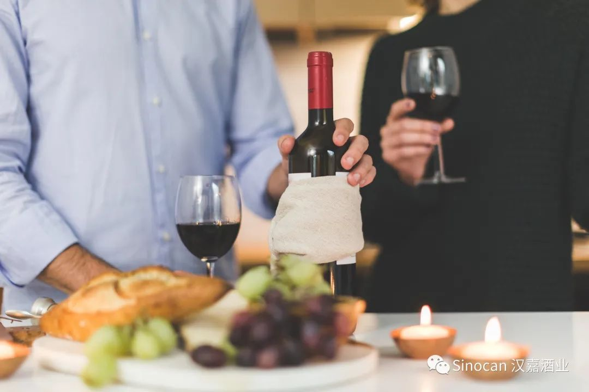
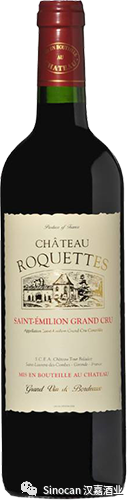
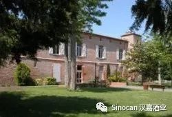
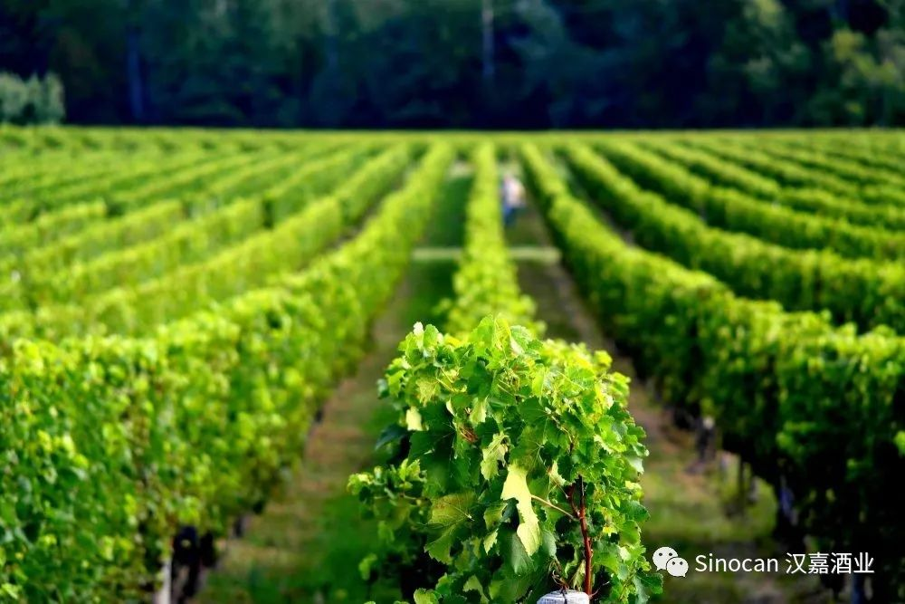
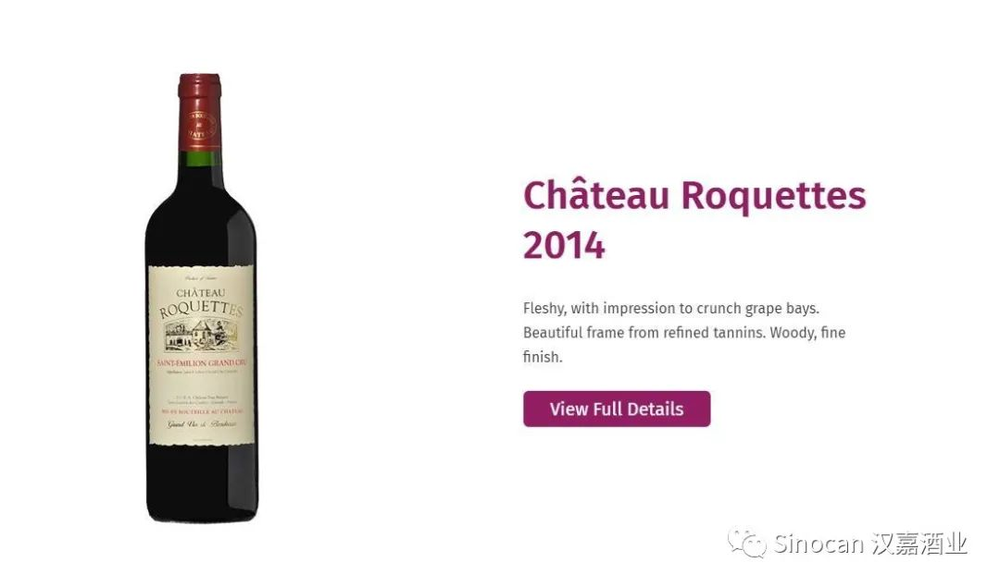
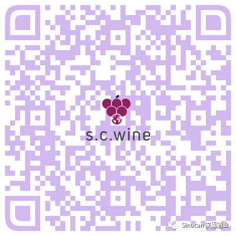

# 无标题

**链接地址:** http://mp.weixin.qq.com/s?__biz=MzIyMzU4OTc0MQ==&mid=2247484443&idx=2&sn=23c147aefc865691a73b9ea8790f75af&chksm=e81aa019df6d290f13b318e5bede53c1a1c4d61c80895d036791b6e1dc4f14ffa521594a7cb8&mpshare=1&scene=2&srcid=09283IjLVnBMWVmKwsnh2KdD&sharer_sharetime=1601230406223&sharer_shareid=be1c8edd6c93eec155a61c876e41d26a#rd
**作者:** 
**获取时间:** 2025/8/28 20:06:00
**图片数量:** 8

---

## 原始HTML内容

<section style="box-sizing: border-box;font-size: 16px;"><section style="margin: 17px 0%;box-sizing: border-box;" powered-by="xiumi.us"><section style="display: inline-block;width: 100%;vertical-align: top;border-left: 3px solid rgb(166, 54, 49);border-bottom-left-radius: 0px;padding-right: 5px;padding-left: 5px;border-right: 3px solid rgb(166, 54, 49);border-top-right-radius: 0px;box-sizing: border-box;"><section style="margin: -7px 0%;box-sizing: border-box;" powered-by="xiumi.us"><section style="display: inline-block;width: 100%;vertical-align: top;background-color: rgb(255, 255, 255);padding: 5px 10px;box-sizing: border-box;"><section style="color: rgb(0, 0, 0);font-size: 14px;box-sizing: border-box;" powered-by="xiumi.us">
<strong style="box-sizing: border-box;">点击蓝字 关注我们</strong>
</section></section></section></section></section><section style="box-sizing: border-box;" powered-by="xiumi.us">
 
</section><section style="text-align: right;justify-content: flex-end;margin-top: 10px;margin-right: 0%;margin-left: 0%;box-sizing: border-box;" powered-by="xiumi.us"><section style="display: inline-block;width: auto;vertical-align: top;min-width: 10%;max-width: 100%;height: auto;background-color: rgb(166, 54, 49);padding: 5px 10px;box-sizing: border-box;"><section style="text-align: justify;color: rgb(255, 255, 255);font-size: 14px;box-sizing: border-box;" powered-by="xiumi.us">
<strong style="box-sizing: border-box;">特别专题《红酒品鉴》系列 Vol.1.2</strong>
</section></section></section><section style="display: inline-block;width: 100%;vertical-align: top;border-left: 2px none rgb(195, 163, 142);border-bottom-left-radius: 0px;background-color: rgba(255, 213, 195, 0);padding: 10px;border-right: 2px solid rgb(0, 0, 0);border-top-right-radius: 0px;box-sizing: border-box;" powered-by="xiumi.us"><section style="text-align: center;margin-right: 0%;margin-left: 0%;box-sizing: border-box;" powered-by="xiumi.us"><section style="max-width: 100%;vertical-align: middle;display: inline-block;line-height: 0;box-sizing: border-box;"></section></section></section><section style="text-align: right;justify-content: flex-end;margin-right: 0%;margin-bottom: 10px;margin-left: 0%;font-size: 0px;box-sizing: border-box;" powered-by="xiumi.us"><section style="display: inline-block;width: 50%;vertical-align: top;height: auto;line-height: 0;box-sizing: border-box;"><section style="margin-top: 0.5em;margin-bottom: 0.5em;box-sizing: border-box;" powered-by="xiumi.us"><section style="background-color: rgb(0, 0, 0);height: 2px;box-sizing: border-box;"><svg viewBox="0 0 1 1" style="float:left;line-height:0;width:0;vertical-align:top;"></svg></section></section></section></section><section style="box-sizing: border-box;" powered-by="xiumi.us"><section style="display: flex;flex-flow: row nowrap;margin: -10px 0% 10px;box-sizing: border-box;"><section style="display: inline-block;vertical-align: top;width: auto;flex: 0 0 auto;align-self: flex-start;min-width: 10%;max-width: 100%;height: auto;box-sizing: border-box;"><section style="color: rgb(0, 0, 0);font-size: 12px;box-sizing: border-box;" powered-by="xiumi.us">
专题出品 |&nbsp;加拿大汉嘉酒业&nbsp;
</section></section><section style="display: inline-block;vertical-align: top;width: auto;align-self: flex-start;flex: 100 100 0%;box-sizing: border-box;"><section style="margin-top: 0.5em;margin-bottom: 0.5em;box-sizing: border-box;" powered-by="xiumi.us"><section style="background-color: rgba(255, 213, 195, 0);height: 1px;box-sizing: border-box;"><svg viewBox="0 0 1 1" style="float:left;line-height:0;width:0;vertical-align:top;"></svg></section></section></section></section></section><section style="box-sizing: border-box;" powered-by="xiumi.us">
 
</section><section style="text-align: right;justify-content: flex-end;margin: 10px 0%;box-sizing: border-box;" powered-by="xiumi.us"><section style="display: inline-block;width: auto;vertical-align: top;min-width: 10%;max-width: 100%;height: auto;box-shadow: rgb(0, 0, 0) 0px 0px 0px;box-sizing: border-box;"><section style="justify-content: flex-end;margin-right: 0%;margin-left: 0%;font-size: 0px;box-sizing: border-box;" powered-by="xiumi.us"><section style="display: inline-block;width: 50%;vertical-align: top;height: auto;line-height: 0;box-sizing: border-box;"><section style="margin-top: 0.5em;margin-bottom: 0.5em;box-sizing: border-box;" powered-by="xiumi.us"><section style="background-color: rgba(255, 213, 195, 0);height: 2px;box-sizing: border-box;"><svg viewBox="0 0 1 1" style="float:left;line-height:0;width:0;vertical-align:top;"></svg></section></section></section></section><section style="display: inline-block;width: 100%;vertical-align: top;background-color: rgba(255, 213, 195, 0);padding: 3px 10px;border-style: solid;border-width: 0px;border-radius: 0px;border-color: rgb(62, 62, 62);box-sizing: border-box;" powered-by="xiumi.us"><section style="text-align: justify;color: rgb(0, 0, 0);font-size: 14px;box-sizing: border-box;" powered-by="xiumi.us">
<strong style="box-sizing: border-box;">酒款介绍</strong>
</section></section></section></section><section style="margin-top: -3px;margin-right: 0%;margin-left: 0%;box-sizing: border-box;" powered-by="xiumi.us"><section style="display: inline-block;width: 100%;vertical-align: top;border-left: 3px solid rgb(0, 0, 0);border-bottom-left-radius: 0px;padding-left: 5px;box-sizing: border-box;"><section style="margin: -7px 0%;box-sizing: border-box;" powered-by="xiumi.us"><section style="display: inline-block;width: 100%;vertical-align: top;background-color: rgba(255, 213, 195, 0);padding: 5px 10px;box-sizing: border-box;"><section style="color: rgb(158, 114, 84);font-size: 14px;box-sizing: border-box;" powered-by="xiumi.us">
<strong style="box-sizing: border-box;">Château RoquettesSaint-Emilion Grand Cru</strong>

<strong style="box-sizing: border-box;">禄禧酒庄干红 2014</strong>

 
</section></section></section></section></section><section style="margin-right: 0%;margin-bottom: 10px;margin-left: 0%;box-sizing: border-box;" powered-by="xiumi.us"><section style="display: inline-block;width: 100%;vertical-align: top;padding-left: 8px;box-sizing: border-box;"><section style="margin-right: 0%;margin-left: 0%;box-sizing: border-box;" powered-by="xiumi.us"><section style="display: inline-block;width: 100%;vertical-align: top;background-color: rgba(255, 213, 195, 0);padding-bottom: 10px;box-sizing: border-box;"><section style="box-sizing: border-box;" powered-by="xiumi.us">
 
</section><section style="margin-right: 0%;margin-bottom: 20px;margin-left: 0%;box-sizing: border-box;" powered-by="xiumi.us"><section style="display: inline-block;width: 100%;vertical-align: top;padding: 10px;box-sizing: border-box;"><section style="box-sizing: border-box;" powered-by="xiumi.us"><section style="display: inline-block;vertical-align: top;width: 40%;border-style: solid;border-width: 0px;border-radius: 0px;border-color: rgb(213, 181, 113);padding-right: 6px;height: auto;box-sizing: border-box;"><section style="text-align: center;margin-right: 0%;margin-left: 0%;box-sizing: border-box;" powered-by="xiumi.us"><section style="max-width: 100%;vertical-align: middle;display: inline-block;line-height: 0;width: 55%;height: auto;box-sizing: border-box;"></section></section></section><section style="display: inline-block;vertical-align: top;width: 60%;height: auto;box-sizing: border-box;"><section style="font-size: 12px;box-sizing: border-box;" powered-by="xiumi.us">
AB SKU:&nbsp;#792781

年份&nbsp;:&nbsp;2014

产区 :&nbsp;Saint-Emilion

产地&nbsp;:&nbsp;法国

净含量&nbsp;:&nbsp;750 ml

种类&nbsp;:&nbsp;红葡萄酒

酒精度&nbsp;:&nbsp;13％

含糖量&nbsp;:&nbsp;干型

瓶塞&nbsp;:&nbsp;原木

酒庄&nbsp;:&nbsp;禄禧酒庄 (Chateau Gromel Bel Air)

葡萄品种&nbsp;: 80% Merlot 梅洛、15% Cabernet Franc 品丽珠、5%&nbsp;Cabernet Sauvignon 赤霞珠

适饮期：2022-2027
</section></section></section></section></section></section></section></section></section><section style="box-sizing: border-box;" powered-by="xiumi.us">
 
</section><section style="text-align: right;justify-content: flex-end;margin: 10px 0%;box-sizing: border-box;" powered-by="xiumi.us"><section style="display: inline-block;width: auto;vertical-align: top;min-width: 10%;max-width: 100%;height: auto;box-shadow: rgb(0, 0, 0) 0px 0px 0px;box-sizing: border-box;"><section style="justify-content: flex-end;margin-right: 0%;margin-left: 0%;font-size: 0px;box-sizing: border-box;" powered-by="xiumi.us"><section style="display: inline-block;width: 50%;vertical-align: top;height: auto;line-height: 0;box-sizing: border-box;"><section style="margin-top: 0.5em;margin-bottom: 0.5em;box-sizing: border-box;" powered-by="xiumi.us"><section style="background-color: rgba(255, 213, 195, 0);height: 2px;box-sizing: border-box;"><svg viewBox="0 0 1 1" style="float:left;line-height:0;width:0;vertical-align:top;"></svg></section></section></section></section><section style="display: inline-block;width: 100%;vertical-align: top;background-color: rgba(255, 213, 195, 0);padding: 3px 10px;border-style: solid;border-width: 0px;border-radius: 0px;border-color: rgb(62, 62, 62);box-shadow: rgb(0, 0, 0) 0px 0px 0px;box-sizing: border-box;" powered-by="xiumi.us"><section style="text-align: justify;color: rgb(166, 54, 49);font-size: 14px;box-sizing: border-box;" powered-by="xiumi.us">
<strong style="box-sizing: border-box;">酒款综述</strong>
</section></section></section></section><section style="margin: 10px 0% 15px;box-sizing: border-box;" powered-by="xiumi.us"><section style="display: inline-block;width: 100%;vertical-align: top;box-shadow: rgb(0, 0, 0) 0px 0px 0px;padding-right: 5px;padding-left: 5px;border-width: 0px;box-sizing: border-box;"><section style="text-align: right;justify-content: flex-end;margin-right: 0%;margin-bottom: -1px;margin-left: 0%;font-size: 0px;transform: translate3d(-1px, 0px, 0px);box-sizing: border-box;" powered-by="xiumi.us"><section style="display: inline-block;width: 50%;vertical-align: top;height: auto;line-height: 0;box-sizing: border-box;"><section style="box-sizing: border-box;" powered-by="xiumi.us"><section style="display: flex;flex-flow: row nowrap;box-sizing: border-box;"><section style="display: inline-block;vertical-align: top;width: auto;padding-right: 5px;padding-left: 5px;background-color: rgb(255, 255, 255);flex: 1 1 0%;align-self: flex-start;height: auto;box-sizing: border-box;"><section style="margin-top: 0.5em;margin-bottom: 0.5em;box-sizing: border-box;" powered-by="xiumi.us"><section style="background-color: rgb(0, 0, 0);height: 1px;box-sizing: border-box;"><svg viewBox="0 0 1 1" style="float:left;line-height:0;width:0;vertical-align:top;"></svg></section></section></section><section style="display: inline-block;vertical-align: top;width: auto;background-color: rgb(255, 255, 255);flex: 1 1 0%;height: auto;align-self: flex-start;box-sizing: border-box;"><section style="margin-top: 0.5em;margin-bottom: 0.5em;box-sizing: border-box;" powered-by="xiumi.us"><section style="background-color: rgb(0, 0, 0);height: 1px;box-sizing: border-box;"><svg viewBox="0 0 1 1" style="float:left;line-height:0;width:0;vertical-align:top;"></svg></section></section></section></section></section></section></section><section style="color: rgb(97, 97, 97);font-size: 14px;padding-right: 10px;padding-left: 10px;box-sizing: border-box;" powered-by="xiumi.us">
 

深邃迷人的深红酒体略带一丝庄重神秘的紫色。富含黑樱桃和李子的圆润与莓类水果的甜蜜芬芳。若隐若现的橡木香气和巧克力般的丝滑浓郁的口味更增添多重层次感。单宁柔和，酸度适中，口感平衡，表现力丰富。适合与口味浓重的牛羊肉和风趣的野味搭配饮用。”

 
</section><section style="text-align: left;justify-content: flex-start;margin-top: -1px;margin-right: 0%;margin-left: 0%;font-size: 0px;box-sizing: border-box;" powered-by="xiumi.us"><section style="display: inline-block;width: 50%;vertical-align: top;height: auto;line-height: 0;box-sizing: border-box;"><section style="box-sizing: border-box;" powered-by="xiumi.us"><section style="display: flex;flex-flow: row nowrap;box-sizing: border-box;"><section style="display: inline-block;vertical-align: top;width: auto;padding-right: 5px;background-color: rgb(255, 255, 255);flex: 2 2 0%;align-self: flex-start;height: auto;box-sizing: border-box;"><section style="margin-top: 0.5em;margin-bottom: 0.5em;box-sizing: border-box;" powered-by="xiumi.us"><section style="background-color: rgb(0, 0, 0);height: 1px;box-sizing: border-box;"><svg viewBox="0 0 1 1" style="float:left;line-height:0;width:0;vertical-align:top;"></svg></section></section></section><section style="display: inline-block;vertical-align: top;width: auto;background-color: rgb(255, 255, 255);padding-right: 5px;flex: 1 1 0%;height: auto;align-self: flex-start;box-sizing: border-box;"><section style="margin-top: 0.5em;margin-bottom: 0.5em;box-sizing: border-box;" powered-by="xiumi.us"><section style="background-color: rgb(0, 0, 0);height: 1px;box-sizing: border-box;"><svg viewBox="0 0 1 1" style="float:left;line-height:0;width:0;vertical-align:top;"></svg></section></section></section></section></section></section></section></section></section><section style="box-sizing: border-box;" powered-by="xiumi.us">
 
</section><section style="text-align: right;justify-content: flex-end;margin: 10px 0%;box-sizing: border-box;" powered-by="xiumi.us"><section style="display: inline-block;width: auto;vertical-align: top;min-width: 10%;max-width: 100%;height: auto;box-shadow: rgb(0, 0, 0) 0px 0px 0px;box-sizing: border-box;"><section style="justify-content: flex-end;margin-right: 0%;margin-left: 0%;font-size: 0px;box-sizing: border-box;" powered-by="xiumi.us"><section style="display: inline-block;width: 50%;vertical-align: top;height: auto;line-height: 0;box-sizing: border-box;"><section style="margin-top: 0.5em;margin-bottom: 0.5em;box-sizing: border-box;" powered-by="xiumi.us"><section style="background-color: rgba(255, 213, 195, 0);height: 2px;box-sizing: border-box;"><svg viewBox="0 0 1 1" style="float:left;line-height:0;width:0;vertical-align:top;"></svg></section></section></section></section><section style="display: inline-block;width: 100%;vertical-align: top;background-color: rgba(255, 213, 195, 0);padding: 3px 10px;border-style: solid;border-width: 0px;border-radius: 0px;border-color: rgb(62, 62, 62);box-sizing: border-box;" powered-by="xiumi.us"><section style="text-align: justify;color: rgb(166, 54, 49);font-size: 14px;box-sizing: border-box;" powered-by="xiumi.us">
<strong style="box-sizing: border-box;">酒庄介绍</strong>
</section></section></section></section><section style="margin: -10px 0% 10px;box-sizing: border-box;" powered-by="xiumi.us"><section style="display: inline-block;width: 100%;vertical-align: top;border-style: solid;border-width: 1px;border-radius: 0px;border-color: rgba(255, 213, 195, 0);padding: 10px;box-sizing: border-box;"><section style="box-sizing: border-box;" powered-by="xiumi.us"><section style="display: flex;flex-flow: row nowrap;box-sizing: border-box;"><section style="display: inline-block;vertical-align: top;width: 40px;flex: 0 0 auto;align-self: stretch;height: auto;background-color: rgba(255, 213, 195, 0);border-width: 0px;box-sizing: border-box;"><svg viewBox="0 0 1 1" style="float:left;line-height:0;width:0;vertical-align:top;"></svg></section><section style="display: inline-block;vertical-align: top;width: auto;flex: 100 100 0%;align-self: stretch;height: auto;padding-top: 10px;padding-bottom: 10px;margin-left: -25px;box-sizing: border-box;"><section style="text-align: center;box-sizing: border-box;" powered-by="xiumi.us"><section style="max-width: 100%;vertical-align: middle;display: inline-block;line-height: 0;width: 100%;height: auto;box-sizing: border-box;"></section></section></section></section></section></section></section><section style="margin-top: -15px;margin-right: 0%;margin-left: 0%;box-sizing: border-box;" powered-by="xiumi.us"><section style="font-size: 12px;color: rgb(179, 179, 179);box-sizing: border-box;">
禄禧酒庄庄园实景 （图片来源：www.roquettes.fr）
</section></section><section style="box-sizing: border-box;" powered-by="xiumi.us">
 
</section><section style="font-size: 14px;color: rgb(115, 115, 114);letter-spacing: 0px;padding-right: 15px;padding-left: 15px;box-sizing: border-box;" powered-by="xiumi.us">
“禄禧”(Roquettes)&nbsp;来自法国波尔多最著名的葡萄酒产区圣艾美隆(St.Emilion)。这是法国唯一入选联合国教科文组织世界文化遗产的葡萄酒产区，同时也是法国史记中的“王室御用酒产区”。2009年款“禄禧”获得2011年布鲁塞尔世界大赛的金奖。

 

&nbsp;
</section><section style="margin: -10px 0% 10px;box-sizing: border-box;" powered-by="xiumi.us"><section style="display: inline-block;width: 100%;vertical-align: top;border-style: solid;border-width: 1px;border-radius: 0px;border-color: rgba(255, 213, 195, 0);padding: 10px;box-sizing: border-box;"><section style="box-sizing: border-box;" powered-by="xiumi.us"><section style="display: flex;flex-flow: row nowrap;box-sizing: border-box;"><section style="display: inline-block;vertical-align: top;width: 40px;flex: 0 0 auto;align-self: stretch;height: auto;background-color: rgba(255, 213, 195, 0);border-width: 0px;box-sizing: border-box;"><svg viewBox="0 0 1 1" style="float:left;line-height:0;width:0;vertical-align:top;"></svg></section><section style="display: inline-block;vertical-align: top;width: auto;flex: 100 100 0%;align-self: stretch;height: auto;padding-top: 10px;padding-bottom: 10px;margin-left: -25px;box-sizing: border-box;"><section style="text-align: center;box-sizing: border-box;" powered-by="xiumi.us"><section style="max-width: 100%;vertical-align: middle;display: inline-block;line-height: 0;width: 100%;height: auto;box-sizing: border-box;"></section></section></section></section></section></section></section><section style="margin-top: -15px;margin-right: 0%;margin-left: 0%;box-sizing: border-box;" powered-by="xiumi.us"><section style="font-size: 12px;color: rgb(179, 179, 179);box-sizing: border-box;">
圣艾美隆(St.Emilion)实景 （图片来源：getyourguide）
</section></section><section style="font-size: 14px;color: rgb(115, 115, 114);letter-spacing: 0px;padding-right: 15px;padding-left: 15px;box-sizing: border-box;" powered-by="xiumi.us">
 

&nbsp;“禄禧”红酒来自于圣艾美隆Schepper 家族的禄禧城堡酒庄（Chateau Roquettes）。该酒庄是圣艾美隆地区的顶级酒庄(Grand Cru)。酒庄座落在小镇最高点，可以俯瞰整个圣艾美隆。

 

第十版的最具权威的波尔多红酒杂志《Cocks &amp; Feret》指出“禄禧酒庄”(Chateau Roquettes)是出产最优秀的红酒酒庄。将该酒庄所处的位置描述为“极品地段”(Remarkably well-sited)，最适合高品质葡萄的种植。“该酒庄出产高端，大气，果香浓郁，圆润，极致的好酒，它体现出一个顶级酒庄的所有特色”。

 

 
</section><section style="margin: -10px 0% 10px;box-sizing: border-box;" powered-by="xiumi.us"><section style="display: inline-block;width: 100%;vertical-align: top;border-style: solid;border-width: 1px;border-radius: 0px;border-color: rgba(255, 213, 195, 0);padding: 10px;box-sizing: border-box;"><section style="box-sizing: border-box;" powered-by="xiumi.us"><section style="display: flex;flex-flow: row nowrap;box-sizing: border-box;"><section style="display: inline-block;vertical-align: top;width: 40px;flex: 0 0 auto;align-self: stretch;height: auto;background-color: rgba(255, 213, 195, 0);border-width: 0px;box-sizing: border-box;"><svg viewBox="0 0 1 1" style="float:left;line-height:0;width:0;vertical-align:top;"></svg></section><section style="display: inline-block;vertical-align: top;width: auto;flex: 100 100 0%;align-self: stretch;height: auto;padding-top: 10px;padding-bottom: 10px;margin-left: -25px;box-sizing: border-box;"><section style="text-align: center;box-sizing: border-box;" powered-by="xiumi.us"><section style="max-width: 100%;vertical-align: middle;display: inline-block;line-height: 0;width: 100%;height: auto;box-sizing: border-box;"></section></section></section></section></section></section></section><section style="margin-top: -15px;margin-right: 0%;margin-left: 0%;box-sizing: border-box;" powered-by="xiumi.us"><section style="font-size: 12px;color: rgb(179, 179, 179);box-sizing: border-box;">
禄禧酒庄葡萄园实景 （图片来源：vins-saint-emilion.com）
</section></section><section style="font-size: 14px;color: rgb(115, 115, 114);letter-spacing: 0px;padding-right: 15px;padding-left: 15px;box-sizing: border-box;" powered-by="xiumi.us">
 

据史记，历代国王对禄禧酒庄都爱慕有加。法国瓦卢瓦王朝的亨利二世（1547-1559在位）便常来此地饮酒，饱览美景。拿破仑三世童年时代也曾在此地度过，酒庄的美酒加美景曾让他们流连忘返。

 

城堡的主人对红酒的制作极其严格，酒窖经历了数次升级，葡萄的种类与酒桶的样式也经过精挑细选，正是由于酒庄历史的悠久、土质的优良以及从葡萄园的维护到每一步生产环节的严格控制及精心打理，从而确保了禄禧酒庄红酒高端品质的传承和发展。

 
</section><section style="box-sizing: border-box;" powered-by="xiumi.us"><section style="display: flex;flex-flow: row nowrap;box-sizing: border-box;"><section style="display: inline-block;vertical-align: top;width: auto;flex: 10 10 0%;height: auto;align-self: flex-start;box-sizing: border-box;"><section style="margin-top: 0.5em;margin-bottom: 0.5em;box-sizing: border-box;" powered-by="xiumi.us"><section style="background-color: rgb(166, 54, 49);height: 2px;box-sizing: border-box;"><svg viewBox="0 0 1 1" style="float:left;line-height:0;width:0;vertical-align:top;"></svg></section></section></section><section style="display: inline-block;vertical-align: top;width: auto;flex: 100 100 0%;align-self: flex-start;height: auto;padding-right: 4px;padding-left: 4px;box-sizing: border-box;"><section style="margin-top: 0.5em;margin-bottom: 0.5em;box-sizing: border-box;" powered-by="xiumi.us"><section style="background-color: rgb(166, 54, 49);height: 2px;box-sizing: border-box;"><svg viewBox="0 0 1 1" style="float:left;line-height:0;width:0;vertical-align:top;"></svg></section></section></section><section style="display: inline-block;vertical-align: top;width: auto;flex: 10 10 0%;align-self: flex-start;height: auto;box-sizing: border-box;"><section style="margin-top: 0.5em;margin-bottom: 0.5em;box-sizing: border-box;" powered-by="xiumi.us"><section style="background-color: rgb(166, 54, 49);height: 2px;box-sizing: border-box;"><svg viewBox="0 0 1 1" style="float:left;line-height:0;width:0;vertical-align:top;"></svg></section></section></section></section></section><section style="box-sizing: border-box;" powered-by="xiumi.us">
 
</section><section style="margin-top: -10px;margin-right: 0%;margin-left: 0%;box-sizing: border-box;" powered-by="xiumi.us"><section style="display: inline-block;width: 100%;vertical-align: top;border-left: 2px solid rgba(255, 213, 195, 0);border-bottom-left-radius: 0px;background-color: rgba(255, 213, 195, 0);padding: 10px;box-sizing: border-box;"><section style="margin: 17px 0%;box-sizing: border-box;" powered-by="xiumi.us"><section style="display: inline-block;width: 100%;vertical-align: top;border-left: 3px solid rgba(255, 213, 195, 0);border-bottom-left-radius: 0px;padding-left: 5px;box-sizing: border-box;"><section style="text-align: center;margin-top: 10px;margin-bottom: 10px;box-sizing: border-box;" powered-by="xiumi.us"><section style="max-width: 100%;vertical-align: middle;display: inline-block;line-height: 0;width: 35%;height: auto;box-sizing: border-box;"></section></section><section style="font-size: 12px;color: rgb(195, 163, 142);padding-right: 10px;padding-left: 10px;box-sizing: border-box;" powered-by="xiumi.us">
With roots in Edmonton, Alberta, S.C. Wine is a budding importation agency that prides itself on bringing only the best premium, quality wines to Western Canada at an exceptional value.
</section></section></section><section style="margin: 10px 0%;box-sizing: border-box;" powered-by="xiumi.us"><section style="display: inline-block;width: 100%;vertical-align: top;border-style: solid;border-width: 1px;border-radius: 0px;border-color: rgba(255, 213, 195, 0);padding: 10px;box-sizing: border-box;"><section style="text-align: left;justify-content: flex-start;margin-top: 10px;margin-right: 0%;margin-left: 0%;font-size: 0px;box-sizing: border-box;" powered-by="xiumi.us"><section style="display: inline-block;width: 50%;vertical-align: top;height: auto;line-height: 0;box-sizing: border-box;"><section style="margin-top: 0.5em;margin-bottom: 0.5em;box-sizing: border-box;" powered-by="xiumi.us"><section style="background-color: rgba(254, 213, 195, 0);height: 2px;box-sizing: border-box;"><svg viewBox="0 0 1 1" style="float:left;line-height:0;width:0;vertical-align:top;"></svg></section></section></section></section><section style="display: inline-block;width: 100%;vertical-align: top;border-left: 2px none rgb(195, 163, 142);border-bottom-left-radius: 0px;background-color: rgba(254, 213, 195, 0);padding: 10px;border-right: 2px none rgb(195, 163, 142);border-top-right-radius: 0px;box-sizing: border-box;" powered-by="xiumi.us"><section style="text-align: center;margin-right: 0%;margin-left: 0%;box-sizing: border-box;" powered-by="xiumi.us"><section style="max-width: 100%;vertical-align: middle;display: inline-block;line-height: 0;box-sizing: border-box;"></section></section></section><section style="text-align: right;justify-content: flex-end;margin-right: 0%;margin-bottom: 10px;margin-left: 0%;font-size: 0px;box-sizing: border-box;" powered-by="xiumi.us"><section style="display: inline-block;width: 50%;vertical-align: top;height: auto;line-height: 0;box-sizing: border-box;"><section style="margin-top: 0.5em;margin-bottom: 0.5em;box-sizing: border-box;" powered-by="xiumi.us"><section style="background-color: rgba(254, 213, 195, 0);height: 2px;box-sizing: border-box;"><svg viewBox="0 0 1 1" style="float:left;line-height:0;width:0;vertical-align:top;"></svg></section></section></section></section></section></section><section style="color: rgb(158, 114, 84);font-size: 14px;padding-right: 10px;padding-left: 10px;box-sizing: border-box;" powered-by="xiumi.us">
<strong style="box-sizing: border-box;">Château Roquettes Saint-Emilion Grand Cru</strong>

<strong style="box-sizing: border-box;">禄禧酒庄干红 2014</strong>

 

http://www.scwineimport.com/products-2/2015-chateau-roquettes/

 
</section><section style="box-sizing: border-box;" powered-by="xiumi.us"><section style="text-align: center;justify-content: center;display: flex;flex-flow: row nowrap;margin: 10px 0%;box-sizing: border-box;"><section style="display: inline-block;vertical-align: top;width: 33%;flex: 0 0 auto;height: auto;align-self: stretch;padding-right: 10px;padding-left: 10px;box-sizing: border-box;"><section style="margin-right: 0%;margin-left: 0%;opacity: 0.99;box-sizing: border-box;" powered-by="xiumi.us"><section style="max-width: 100%;vertical-align: middle;display: inline-block;line-height: 0;width: 100%;height: auto;box-sizing: border-box;"></section></section></section><section style="display: inline-block;vertical-align: top;width: auto;align-self: stretch;flex: 100 100 0%;height: auto;border-style: solid none;border-width: 2px;border-radius: 0px;border-color: rgba(255, 213, 195, 0) rgb(222, 222, 222);margin-top: 2px;margin-bottom: 2px;margin-left: 8px;padding-left: 10px;box-sizing: border-box;"><section style="margin-right: 0%;margin-bottom: 2px;margin-left: 0%;box-sizing: border-box;" powered-by="xiumi.us"><section style="font-size: 14px;line-height: 1;letter-spacing: 0px;box-sizing: border-box;">
<strong style="box-sizing: border-box;">请扫描二维码&nbsp;</strong>

<strong style="box-sizing: border-box;">联系我们获取更多信息</strong>
</section></section><section style="margin-top: 10px;margin-right: 0%;margin-left: 0%;box-sizing: border-box;" powered-by="xiumi.us"><section style="font-size: 14px;color: rgb(166, 54, 49);line-height: 1.6;letter-spacing: 0px;box-sizing: border-box;">
欢迎访问我们的官方网站 

浏览更多法国名庄红酒
</section></section></section></section></section></section></section><section style="box-sizing: border-box;" powered-by="xiumi.us">
 
</section><section style="text-align: left;justify-content: flex-start;margin-right: 0%;margin-bottom: 10px;margin-left: 0%;font-size: 0px;box-sizing: border-box;" powered-by="xiumi.us"><section style="display: inline-block;width: 50%;vertical-align: top;height: auto;line-height: 0;box-sizing: border-box;"><section style="margin-top: 0.5em;margin-bottom: 0.5em;box-sizing: border-box;" powered-by="xiumi.us"><section style="background-color: rgba(255, 213, 195, 0);height: 2px;box-sizing: border-box;"><svg viewBox="0 0 1 1" style="float:left;line-height:0;width:0;vertical-align:top;"></svg></section></section></section></section><section style="margin-top: 10px;margin-right: 0%;margin-left: 0%;box-sizing: border-box;" powered-by="xiumi.us"><section style="display: inline-block;width: auto;vertical-align: top;min-width: 10%;max-width: 100%;height: auto;box-sizing: border-box;"><section style="margin-right: 0%;margin-bottom: 3px;margin-left: 0%;box-sizing: border-box;" powered-by="xiumi.us"><section style="background-color: rgb(0, 0, 0);height: 2px;box-sizing: border-box;"><svg viewBox="0 0 1 1" style="float:left;line-height:0;width:0;vertical-align:top;"></svg></section></section><section style="margin-right: 0%;margin-left: 0%;box-sizing: border-box;" powered-by="xiumi.us"><section style="font-size: 14px;color: rgb(166, 54, 49);letter-spacing: 2px;line-height: 1.4;box-sizing: border-box;">
<strong style="box-sizing: border-box;">更多名庄红酒推荐</strong>
</section></section></section></section><section style="min-height: 40px;margin-right: 0%;margin-bottom: 10px;margin-left: 0%;box-sizing: border-box;" powered-by="xiumi.us"><section style="width: 100%;margin-right: auto;margin-bottom: -10px;margin-left: auto;box-sizing: border-box;"><table width="100%"><tbody style="box-sizing: border-box;"><tr opera-tn-ra-comp="_$.pages:0.layers:0.comps:31.classicTable1:0" style="box-sizing: border-box;" powered-by="xiumi.us"><td colspan="1" opera-tn-ra-cell="_$.pages:0.layers:0.comps:31.classicTable1:0.td@@0" rowspan="2" style="border-color: rgb(62, 62, 62);border-radius: 0px;border-style: none;background-position: 50% 50%;background-repeat: no-repeat;background-size: cover;background-attachment: scroll;vertical-align: bottom;background-image: url(&quot;https://mmbiz.qpic.cn/mmbiz_png/7CNdqYbqvBKqeDMzB2edLwibQiapCgl00MIR36r8JtDTmhNm203HOPHQAZ816RW3k9HPD9Qf7sTtNR2smulOKw0Q/640?wx_fmt=png&quot;);box-sizing: border-box;padding: 0px;" width="30.0000%"><section style="margin-right: 0%;margin-bottom: 4px;margin-left: 0%;box-sizing: border-box;" powered-by="xiumi.us"><section style="text-align: right;padding-right: 4px;padding-left: 4px;letter-spacing: 0px;color: rgb(255, 255, 255);font-size: 32px;line-height: 1;box-sizing: border-box;">
 
<section style="line-height: 0;color:rgba(0,0,0,0);width:0;"><svg viewBox="0 0 1 1" style="vertical-align:top;"><text x="-10" y="-10">_</text></svg></section></section></section></td><td colspan="1" rowspan="1" opera-tn-ra-cell="_$.pages:0.layers:0.comps:31.classicTable1:0.td@@1" style="border-color: rgb(62, 62, 62);border-radius: 0px;border-style: none;padding-top: 0px;padding-bottom: 0px;background-color: rgb(249, 249, 249);box-sizing: border-box;" width="70.0000%"><section style="margin-top: 10px;margin-right: 0%;margin-left: 0%;box-sizing: border-box;" powered-by="xiumi.us"><section style="font-size: 14px;letter-spacing: 1px;line-height: 1.6;color: rgb(140, 140, 140);box-sizing: border-box;">
●&nbsp;<a target="_blank" href="http://mp.weixin.qq.com/s?__biz=MzIyMzU4OTc0MQ==&amp;mid=2247484381&amp;idx=2&amp;sn=b3c18413f93a4d56a68b51a7b3b7c5b3&amp;chksm=e81aa7dfdf6d2ec954c478fe9a17984749720f9af08dc4ded0899572c950e9460eba97653af1&amp;scene=21#wechat_redirect" textvalue="Château Gromel Bel Air 歌美酒庄贝爱尔干红" data-itemshowtype="0" tab="innerlink" data-linktype="2"><strong style="box-sizing: border-box;">Château Gromel Bel Air 歌美酒庄贝爱尔干红</strong></a><strong style="box-sizing: border-box;"></strong>

 
</section></section></td></tr><tr opera-tn-ra-comp="_$.pages:0.layers:0.comps:31.classicTable1:1" style="box-sizing: border-box;" powered-by="xiumi.us"><td colspan="1" rowspan="1" opera-tn-ra-cell="_$.pages:0.layers:0.comps:31.classicTable1:1.td@@0" style="border-color: rgb(62, 62, 62);border-radius: 0px;border-style: none;padding-top: 0px;padding-bottom: 0px;background-color: rgb(249, 249, 249);box-sizing: border-box;" width="70.0000%"><section style="margin: 10px 0%;box-sizing: border-box;" powered-by="xiumi.us"><section style="font-size: 14px;letter-spacing: 1px;line-height: 1;color: rgb(140, 140, 140);box-sizing: border-box;">
<a target="_blank" href="http://mp.weixin.qq.com/s?__biz=MzIyMzU4OTc0MQ==&amp;mid=2247484381&amp;idx=2&amp;sn=b3c18413f93a4d56a68b51a7b3b7c5b3&amp;chksm=e81aa7dfdf6d2ec954c478fe9a17984749720f9af08dc4ded0899572c950e9460eba97653af1&amp;scene=21#wechat_redirect" textvalue="► 点击阅读" data-itemshowtype="0" tab="innerlink" data-linktype="2">► 点击阅读</a>
</section></section></td></tr></tbody></table></section></section></section>
 

---

## 纯文本内容

点击蓝字 关注我们特别专题《红酒品鉴》系列 Vol.1.2专题出品 | 加拿大汉嘉酒业 酒款介绍Château RoquettesSaint-Emilion Grand Cru禄禧酒庄干红 2014AB SKU: #792781年份 : 2014产区 : Saint-Emilion产地 : 法国净含量 : 750 ml种类 : 红葡萄酒酒精度 : 13％含糖量 : 干型瓶塞 : 原木酒庄 : 禄禧酒庄 (Chateau Gromel Bel Air)葡萄品种 : 80% Merlot 梅洛、15% Cabernet Franc 品丽珠、5% Cabernet Sauvignon 赤霞珠适饮期：2022-2027酒款综述深邃迷人的深红酒体略带一丝庄重神秘的紫色。富含黑樱桃和李子的圆润与莓类水果的甜蜜芬芳。若隐若现的橡木香气和巧克力般的丝滑浓郁的口味更增添多重层次感。单宁柔和，酸度适中，口感平衡，表现力丰富。适合与口味浓重的牛羊肉和风趣的野味搭配饮用。”酒庄介绍禄禧酒庄庄园实景 （图片来源：www.roquettes.fr）“禄禧”(Roquettes) 来自法国波尔多最著名的葡萄酒产区圣艾美隆(St.Emilion)。这是法国唯一入选联合国教科文组织世界文化遗产的葡萄酒产区，同时也是法国史记中的“王室御用酒产区”。2009年款“禄禧”获得2011年布鲁塞尔世界大赛的金奖。 圣艾美隆(St.Emilion)实景 （图片来源：getyourguide） “禄禧”红酒来自于圣艾美隆Schepper 家族的禄禧城堡酒庄（Chateau Roquettes）。该酒庄是圣艾美隆地区的顶级酒庄(Grand Cru)。酒庄座落在小镇最高点，可以俯瞰整个圣艾美隆。第十版的最具权威的波尔多红酒杂志《Cocks & Feret》指出“禄禧酒庄”(Chateau Roquettes)是出产最优秀的红酒酒庄。将该酒庄所处的位置描述为“极品地段”(Remarkably well-sited)，最适合高品质葡萄的种植。“该酒庄出产高端，大气，果香浓郁，圆润，极致的好酒，它体现出一个顶级酒庄的所有特色”。禄禧酒庄葡萄园实景 （图片来源：vins-saint-emilion.com）据史记，历代国王对禄禧酒庄都爱慕有加。法国瓦卢瓦王朝的亨利二世（1547-1559在位）便常来此地饮酒，饱览美景。拿破仑三世童年时代也曾在此地度过，酒庄的美酒加美景曾让他们流连忘返。城堡的主人对红酒的制作极其严格，酒窖经历了数次升级，葡萄的种类与酒桶的样式也经过精挑细选，正是由于酒庄历史的悠久、土质的优良以及从葡萄园的维护到每一步生产环节的严格控制及精心打理，从而确保了禄禧酒庄红酒高端品质的传承和发展。With roots in Edmonton, Alberta, S.C. Wine is a budding importation agency that prides itself on bringing only the best premium, quality wines to Western Canada at an exceptional value.Château Roquettes Saint-Emilion Grand Cru禄禧酒庄干红 2014http://www.scwineimport.com/products-2/2015-chateau-roquettes/请扫描二维码 联系我们获取更多信息欢迎访问我们的官方网站浏览更多法国名庄红酒更多名庄红酒推荐_● Château Gromel Bel Air 歌美酒庄贝爱尔干红► 点击阅读

---

## 图片列表

-  (原始链接: https://mmbiz.qpic.cn/mmbiz_jpg/7CNdqYbqvBKqeDMzB2edLwibQiapCgl00MHBNF41whWiaGia1HavH7ghcriadRJLE94XI74fRpwKTpNsZmYicG1Op1hQ/640?wx_fmt=jpeg)
-  (原始链接: https://mmbiz.qpic.cn/mmbiz_png/7CNdqYbqvBKqeDMzB2edLwibQiapCgl00MFKoVfTUekdETmsUjjFLLgVpcNQyDxtnrQVvIYz3ibJUDNBWP2wSD7cQ/640?wx_fmt=png)
-  (原始链接: https://mmbiz.qpic.cn/mmbiz_jpg/7CNdqYbqvBKqeDMzB2edLwibQiapCgl00MsQYQcTTaYOlYN483HknFaBGhRnwVlsLLcWibqxfFzJmrBAPE0IGotlA/640?wx_fmt=jpeg)
-  (原始链接: https://mmbiz.qpic.cn/mmbiz_jpg/7CNdqYbqvBKqeDMzB2edLwibQiapCgl00MVaxRHu4t35iblricnL6Ld44JhF9geH2OARqhianBicrxctG6F8nxWicSYOA/640?wx_fmt=jpeg)
-  (原始链接: https://mmbiz.qpic.cn/mmbiz_jpg/7CNdqYbqvBKqeDMzB2edLwibQiapCgl00MaPRibyHxpEVF5MM9x4tEd19vSiabN65RZcJcFXYAxpeLBibkRib6ysTsUQ/640?wx_fmt=jpeg)
-  (原始链接: https://mmbiz.qpic.cn/mmbiz_png/7CNdqYbqvBIXHDqmSFchg3iaiazf3dESricTzqOxkGVYYuQ1gqxx1jGTcNPBNZWgQyHOHLSibG5RTBqiaZSCxR2C3hQ/640?wx_fmt=png)
-  (原始链接: https://mmbiz.qpic.cn/mmbiz_jpg/7CNdqYbqvBKqeDMzB2edLwibQiapCgl00McCibkhtfciaBTjKxqz2xicvpSjOLemSN64ngB7qGysptzgqcsWCk5rSAw/640?wx_fmt=jpeg)
-  (原始链接: https://mmbiz.qpic.cn/mmbiz_png/7CNdqYbqvBKqeDMzB2edLwibQiapCgl00Ma8UibmgAMg7Q1xmzk7PBNrhQAja2BkPVJIUhicUToVYuuTffE6w4787A/640?wx_fmt=png)
