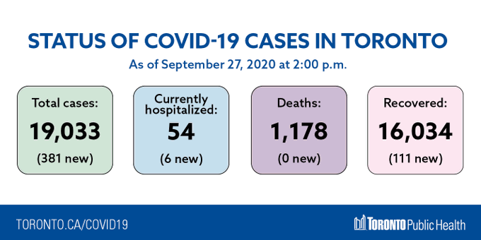
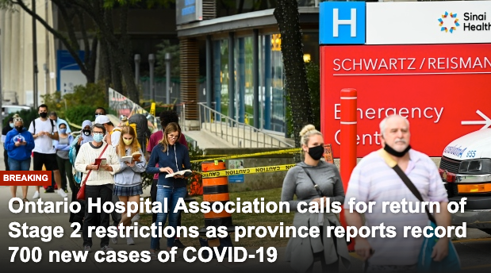
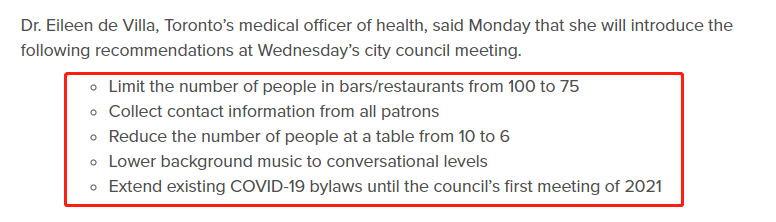
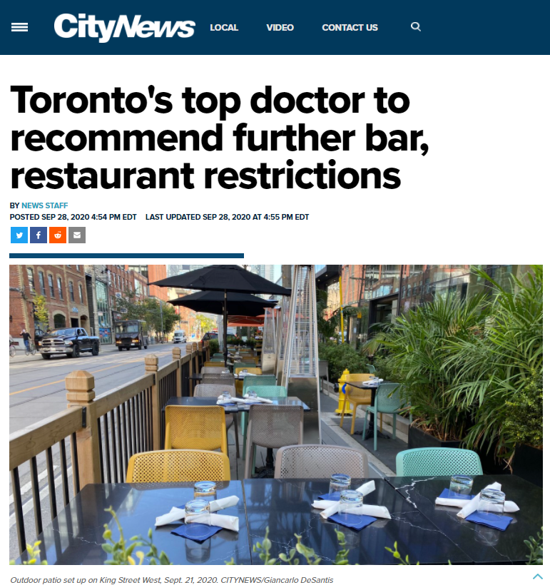
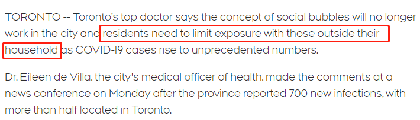
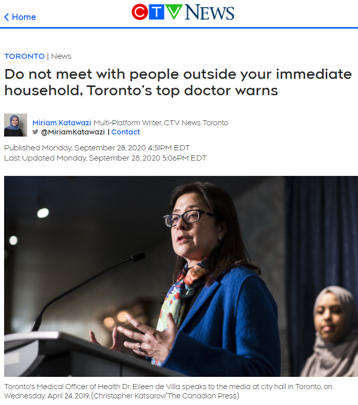
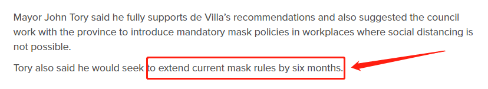
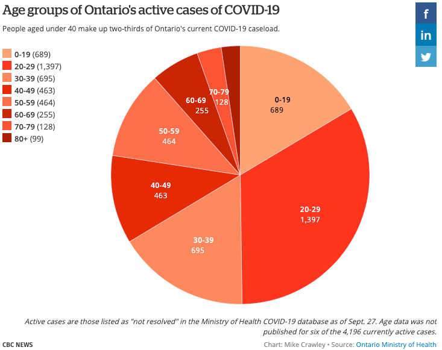

# 无标题

**链接地址:** http://mp.weixin.qq.com/s?__biz=MzIzODc2NzU4NA==&mid=2247527822&idx=1&sn=a8d9acc94aaa75a1c98a3079cc76caf3&chksm=e9367101de41f817c6798f39069390641f30f3b753592d53347d16aec0623950a3e3e659ba11&mpshare=1&scene=2&srcid=0929BV0tTXX2lTv9Jy6ssCJS&sharer_sharetime=1601331017811&sharer_shareid=be1c8edd6c93eec155a61c876e41d26a#rd
**作者:** 丁其/晓晨
**获取时间:** 2025/8/28 20:05:46
**图片数量:** 15

---

## 原始HTML内容

+++上方是广告+++

<strong style="letter-spacing: 0.544px;text-indent: 0em;">安省今天</strong><strong style="letter-spacing: 0.544px;text-indent: 0em;">新增700例</strong>，打破大流行4月份创下的640例最高记录！<strong>而</strong><strong>多伦多更是高达381例</strong><strong>！同样创历史新高。目前光多伦多总病例<strong style="letter-spacing: 0.544px;">已经达到19,033。</strong></strong>

 

更加让人揪心的是，专家说，目前还没到高峰，预计10月中旬前破千！而第二波峰值预计在10月中下旬到达。安省医院协议呼吁大多伦多地区及渥太华再次封城，返回第二阶段封锁。

 

 

<strong>&nbsp;餐馆限制令有大变化！</strong>

 

多伦多卫生官Dr. Eileen de Villa已经急了！在今天下午刚刚举行的新闻会上，她表示<strong>将说服市议会进一步限制酒吧和餐馆</strong>，在周三的市议会上会提出以下建议：

 
<ul class="list-paddingleft-2" style="list-style-type: square;"><li>
将酒吧/餐厅最多容纳人数从100<strong>降低至75人</strong>；
</li><li>
<strong>强制收集所有顾客的联系信息</strong>；
</li><li>
每个餐桌上的人数从10人<strong>减少到6人</strong>；
</li><li>
<strong>降低背景音乐音量</strong>到谈话声级别；
</li><li>
将现有的<strong>COVID-19法规延长到2021年</strong>理事会第一次会议。
</li></ul>
 

 

Dr. Eileen de Villa建议多伦多应该以省长福特上周五采取的省级行动基础上更加强。所以，<strong>多伦多餐馆限制令很可能从后天起就有大变化。</strong>

<strong> </strong>

<strong></strong>

 

省府的新规是除外卖和送货外，酒吧和餐馆将在午夜关闭，11点前必须停止所有酒精饮料供应。而所有脱衣舞俱乐部已被勒令关闭。而多伦多餐馆的最多人数和每桌人数都会大大缩减。

 

<strong>&nbsp;不要于家人以外的人接触</strong>

<strong>口罩强制令延长6个月&nbsp;</strong> 

 

在新闻会上，Dr. Eileen de Villa还警告：<strong>在城市里生活的人们，10人社交圈的概念已经没用了！</strong>COVID-19病例数已经爆发到空前水平，所以除了一同居住的家人之外不要见其他人。

 

这样的话，其实就是<strong>同居的家人自我封锁</strong>，不见任何外人。

 

 

她表示“<strong>我们必须回到春季时严格隔离和限制的明智方法。</strong>那才是人与人之间联系的有效模型，时间和疫情现况改变了一切！”

 

 

多伦多市长<strong>庄德利表示完全支持卫生官的建议！</strong>他更表示市议会将与安省合作，在无法进行社会疏远的工作场所继续引入强制性口罩政策。

 

 

他还说，希望<strong>将目前的口罩强制令延长至少6个月。 </strong>

 

<strong>&nbsp;第二波高峰有多糟：我们不知道！</strong>

 

安省今天（9月28日）宣布新增700例，打破安省新增的历史最高记录。其中多伦多占安省大约一半，皮尔区104例，渥太华89例，约克区56例。

 

 

而今天下午1点，福特省长首次承认第二波疫情已经来临，并且称比第一波更糟。

 

福特说：“我们知道我们正在第二波中，我们知道它将比第一波更糟。” 但是，我们还不知道第二波将会有多糟糕。”

 

“事实是，这取决于我们每个人，我们的集体行动将共同决定我们将面对是波浪还是海啸。”

 

虽然今天安省的新增病例已经破记录，但多伦多的一组科学家和医生的最新预测表明，<strong>第二波峰值还没到，安省将在10月中下旬看到第二波高峰。</strong>

<strong> </strong>

<strong>&nbsp;安省可能日增1000+</strong>

 

专家们警告，如果不采取更严格的公共卫生措施，<strong>安省可能会以日增1000+的幅度大幅攀升。</strong>

 

根据多伦多大学、大学卫生网络专家已经sunnybrook医院共同研究的COVID-19 Modeling Collaborative数据预测模型显示，<strong>全省每日病例几乎再次达到500，但到10月中旬之前，这个数字可能会增加一倍至1000+，</strong>除非我们立即严厉采取限制措施阻止病毒蔓延。

 

 

目前，安省每天报告的新增病例平均数是8月底的四倍。周一，安省又报告了700例COVID-19病例，是自1月下旬爆发以来单日新增病例最多的一天。该数字超过了4月24日创下的最高点640。

 

 

截至9月27日，目前安省但活跃病例4196人中，20-29岁所占但比例最高，有1397例，占33.3%（三分之一）。40岁以下有2781人，占66%（三分之二），50岁以下则占高达77%。 

 

多伦多传染病专家艾萨克·波哥奇（Isaac Bogoch）博士告诉加拿大广播公司（CBC），他们知道随着我们进入秋冬季节，新增病例将会有所增加，但是，对于目前新增病例的上升速度以及如此之快感到惊讶。

 

研究人员说，最好的情况是模仿安省的第一波疫情，当时数字呈指数增长，但由于封锁而趋于平缓。

 

<strong>餐馆酒吧频频爆疫情！</strong>

<strong>赌场却重开了</strong> 

 

安省最近收紧了关于酒吧和餐馆的规定，多伦多一些餐馆因违反规定而关闭。

 

脱衣舞俱乐部也已经关闭，尽管案件数量有所增加，<strong>但是安省关闭6个月的赌场将从今天早上10点开始允许重新开门开业。</strong>

 

今天多伦多和安省均已破历史新高，但未来20天却还将上升，如果再不出台有效措施，加拿大恐怕会失控！

 

 

与此同时，最新数据表明，新冠严重患者住院率也在上升。现在安省有128名COVID-19患者需要住院，大约是8月份的三倍。

 

<strong>&nbsp;专家呼吁：</strong>

<strong>立即重新封锁大多伦多和渥太华</strong>

 

安省医院协会今天公布这些数字后发表一份声明，呼吁安省政府采取进一步行动，并立即恢复整个大多伦多GTA地区和渥太华返回第二阶段封锁限制。

 

 

在第二阶段中，酒吧和餐馆仅限于外卖和露台服务，并且禁止包括健身房和电影院在内的许多其他业务完全营业。

 

安省医院协会主席Anthony Dale在声明中警告说。“没有适当的公共卫生措施来限制新冠病毒传播会，安省很快将有更多的病人住院治疗，更多需要进入ICU和更多的死亡数字。”

 

---大家快来关注爆料君↓↓---
<section powered-by="xiumi.us" style="margin-top: 10px;margin-bottom: 10px;font-family: -apple-system-font, BlinkMacSystemFont, &quot;Helvetica Neue&quot;, &quot;PingFang SC&quot;, &quot;Hiragino Sans GB&quot;, &quot;Microsoft YaHei UI&quot;, &quot;Microsoft YaHei&quot;, Arial, sans-serif;letter-spacing: 0.544px;white-space: normal;font-size: 16px;background-color: rgb(255, 255, 255);"><section style="padding-right: 15px;padding-left: 15px;font-size: 15px;letter-spacing: 0px;line-height: 2;">

</section></section><section style="margin-top: 10px;margin-bottom: 10px;font-family: -apple-system-font, BlinkMacSystemFont, &quot;Helvetica Neue&quot;, &quot;PingFang SC&quot;, &quot;Hiragino Sans GB&quot;, &quot;Microsoft YaHei UI&quot;, &quot;Microsoft YaHei&quot;, Arial, sans-serif;letter-spacing: 0.544px;white-space: normal;font-size: 16px;background-color: rgb(255, 255, 255);text-align: right;"><section style="display: inline-block;vertical-align: middle;"><section style="margin-bottom: 2px;padding-right: 5px;padding-left: 5px;display: inline-block;vertical-align: bottom;line-height: 1;color: rgb(223, 21, 21);font-size: 14px;">
我知道你<strong>在看</strong>哟
</section><section style="display: inline-block;vertical-align: bottom;line-height: 0;width: 52.0156px;"></section></section></section>

---

## 纯文本内容

+++上方是广告+++安省今天新增700例，打破大流行4月份创下的640例最高记录！而多伦多更是高达381例！同样创历史新高。目前光多伦多总病例已经达到19,033。更加让人揪心的是，专家说，目前还没到高峰，预计10月中旬前破千！而第二波峰值预计在10月中下旬到达。安省医院协议呼吁大多伦多地区及渥太华再次封城，返回第二阶段封锁。 餐馆限制令有大变化！多伦多卫生官Dr. Eileen de Villa已经急了！在今天下午刚刚举行的新闻会上，她表示将说服市议会进一步限制酒吧和餐馆，在周三的市议会上会提出以下建议：将酒吧/餐厅最多容纳人数从100降低至75人；强制收集所有顾客的联系信息；每个餐桌上的人数从10人减少到6人；降低背景音乐音量到谈话声级别；将现有的COVID-19法规延长到2021年理事会第一次会议。Dr. Eileen de Villa建议多伦多应该以省长福特上周五采取的省级行动基础上更加强。所以，多伦多餐馆限制令很可能从后天起就有大变化。省府的新规是除外卖和送货外，酒吧和餐馆将在午夜关闭，11点前必须停止所有酒精饮料供应。而所有脱衣舞俱乐部已被勒令关闭。而多伦多餐馆的最多人数和每桌人数都会大大缩减。 不要于家人以外的人接触口罩强制令延长6个月 在新闻会上，Dr. Eileen de Villa还警告：在城市里生活的人们，10人社交圈的概念已经没用了！COVID-19病例数已经爆发到空前水平，所以除了一同居住的家人之外不要见其他人。这样的话，其实就是同居的家人自我封锁，不见任何外人。她表示“我们必须回到春季时严格隔离和限制的明智方法。那才是人与人之间联系的有效模型，时间和疫情现况改变了一切！”多伦多市长庄德利表示完全支持卫生官的建议！他更表示市议会将与安省合作，在无法进行社会疏远的工作场所继续引入强制性口罩政策。他还说，希望将目前的口罩强制令延长至少6个月。 第二波高峰有多糟：我们不知道！安省今天（9月28日）宣布新增700例，打破安省新增的历史最高记录。其中多伦多占安省大约一半，皮尔区104例，渥太华89例，约克区56例。而今天下午1点，福特省长首次承认第二波疫情已经来临，并且称比第一波更糟。福特说：“我们知道我们正在第二波中，我们知道它将比第一波更糟。” 但是，我们还不知道第二波将会有多糟糕。”“事实是，这取决于我们每个人，我们的集体行动将共同决定我们将面对是波浪还是海啸。”虽然今天安省的新增病例已经破记录，但多伦多的一组科学家和医生的最新预测表明，第二波峰值还没到，安省将在10月中下旬看到第二波高峰。 安省可能日增1000+专家们警告，如果不采取更严格的公共卫生措施，安省可能会以日增1000+的幅度大幅攀升。根据多伦多大学、大学卫生网络专家已经sunnybrook医院共同研究的COVID-19 Modeling Collaborative数据预测模型显示，全省每日病例几乎再次达到500，但到10月中旬之前，这个数字可能会增加一倍至1000+，除非我们立即严厉采取限制措施阻止病毒蔓延。目前，安省每天报告的新增病例平均数是8月底的四倍。周一，安省又报告了700例COVID-19病例，是自1月下旬爆发以来单日新增病例最多的一天。该数字超过了4月24日创下的最高点640。截至9月27日，目前安省但活跃病例4196人中，20-29岁所占但比例最高，有1397例，占33.3%（三分之一）。40岁以下有2781人，占66%（三分之二），50岁以下则占高达77%。多伦多传染病专家艾萨克·波哥奇（Isaac Bogoch）博士告诉加拿大广播公司（CBC），他们知道随着我们进入秋冬季节，新增病例将会有所增加，但是，对于目前新增病例的上升速度以及如此之快感到惊讶。研究人员说，最好的情况是模仿安省的第一波疫情，当时数字呈指数增长，但由于封锁而趋于平缓。餐馆酒吧频频爆疫情！赌场却重开了安省最近收紧了关于酒吧和餐馆的规定，多伦多一些餐馆因违反规定而关闭。脱衣舞俱乐部也已经关闭，尽管案件数量有所增加，但是安省关闭6个月的赌场将从今天早上10点开始允许重新开门开业。今天多伦多和安省均已破历史新高，但未来20天却还将上升，如果再不出台有效措施，加拿大恐怕会失控！与此同时，最新数据表明，新冠严重患者住院率也在上升。现在安省有128名COVID-19患者需要住院，大约是8月份的三倍。 专家呼吁：立即重新封锁大多伦多和渥太华安省医院协会今天公布这些数字后发表一份声明，呼吁安省政府采取进一步行动，并立即恢复整个大多伦多GTA地区和渥太华返回第二阶段封锁限制。在第二阶段中，酒吧和餐馆仅限于外卖和露台服务，并且禁止包括健身房和电影院在内的许多其他业务完全营业。安省医院协会主席Anthony Dale在声明中警告说。“没有适当的公共卫生措施来限制新冠病毒传播会，安省很快将有更多的病人住院治疗，更多需要进入ICU和更多的死亡数字。”---大家快来关注爆料君↓↓---我知道你在看哟

---

## 图片列表

-  (原始链接: https://mmbiz.qpic.cn/mmbiz_jpg/4kibCXA1QiblQ4dwYxH5bWOeyiaABpLsngBicmZ3Oic1CSsQaG9JMdT0Qnh7tf2C35wMmdUfWaWLmjAODDGB90EEZBw/640?wx_fmt=jpeg)
-  (原始链接: https://mmbiz.qpic.cn/mmbiz_png/4kibCXA1QiblQ4dwYxH5bWOeyiaABpLsngBsic39k5fAQpjiaN606rvjry2qkuiblj1GpjpLgRPd1pY321T7bE8obsAg/640?wx_fmt=png)
-  (原始链接: https://mmbiz.qpic.cn/mmbiz_png/szJas1pFaJeP0y8WZaMpsIyzbCLKSfxGQAS2fMKbw9yesc3XwKVT52uD90v6YfTCaSuLwy6MzVMr9eQYABW97A/640?wx_fmt=png)
-  (原始链接: https://mmbiz.qpic.cn/mmbiz_png/4kibCXA1QiblQ4dwYxH5bWOeyiaABpLsngBoyFXFiaWUiciacn994QSbvGzwiccJGrnQfH79H1QDodJuXfsf1BsicFibVsQ/640?wx_fmt=png)
-  (原始链接: https://mmbiz.qpic.cn/mmbiz_png/4kibCXA1QiblQ4dwYxH5bWOeyiaABpLsngBcKYZeCjcb0s4ky9icKVVsEicmc3847F0mSufEFA1wVOWCmQp9LibNTzow/640?wx_fmt=png)
-  (原始链接: https://mmbiz.qpic.cn/mmbiz_png/4kibCXA1QiblQ4dwYxH5bWOeyiaABpLsngBvfbUaR7EbO38YNicHNY7SvV72Hic2voLiaQicQIlVgsdia8XpxfQL2NuvUg/640?wx_fmt=png)
-  (原始链接: https://mmbiz.qpic.cn/mmbiz_png/4kibCXA1QiblQ4dwYxH5bWOeyiaABpLsngBRmgtjhTOIcalh5wAtfHoMXfNNkianwxht68w445hF9dcngkOAth4VGw/640?wx_fmt=png)
-  (原始链接: https://mmbiz.qpic.cn/mmbiz_png/4kibCXA1QiblQ4dwYxH5bWOeyiaABpLsngB5RYwVXE8pRicU2woVPMK7W1Pakf7yrsPAibWiagS7qcyWHh5sH2KluJUw/640?wx_fmt=png)
-  (原始链接: https://mmbiz.qpic.cn/mmbiz_png/szJas1pFaJeP0y8WZaMpsIyzbCLKSfxGz4rMuLTkSlo1aohDsLBgzCI3HyOialabtHaSRUmP0xKpENLKVPfo4rg/640?wx_fmt=png)
-  (原始链接: https://mmbiz.qpic.cn/mmbiz_png/icDcCacWsN1VKGoSP8tjkAiayibGwibNYct2GxZHZ0nxUlrg7npfCgq2osibyNsqw9TroFyedhmxuGDk1DMicNPicJPBQ/640?wx_fmt=png)
-  (原始链接: https://mmbiz.qpic.cn/mmbiz_png/icDcCacWsN1VKGoSP8tjkAiayibGwibNYct2icXa4EZO8fQcJ6aAGd5qUdOvfYGsiahoeWJPjUew5HLkvZBIL1GlaUaA/640?wx_fmt=png)
-  (原始链接: https://mmbiz.qpic.cn/mmbiz_png/szJas1pFaJeP0y8WZaMpsIyzbCLKSfxGabqYEBC2ItEg2dWAF5gQFdkjRvkCgibytPZiaT43QFQnkKfgQibQAc2og/640?wx_fmt=png)
-  (原始链接: https://mmbiz.qpic.cn/mmbiz_jpg/szJas1pFaJeP0y8WZaMpsIyzbCLKSfxGzZZgX7eOt54rTNGBTcmfDZI1Csq6NsJJxKMXuL1sDstfUvDovPBUPQ/640?wx_fmt=jpeg)
-  (原始链接: https://mmbiz.qpic.cn/mmbiz_jpg/4kibCXA1QiblTBL8UtNoK5vrCnUIExUibiaLiaOAuocR7LvibeeabkEDRFqeMdiaxsZ18icWNc2Aoh8MVcFLyBQUIR3zxw/640?wx_fmt=jpeg)
-  (原始链接: https://mmbiz.qpic.cn/mmbiz_png/4kibCXA1QiblTCePmlRrEViaT39pQRvHteQHCJX0E0pQibzDrweJvHhgqYKeAdE0FnUnqiafEPWrYaNQNibb29KoDHCg/640?wx_fmt=png)
