# 无标题

**链接地址:** http://mp.weixin.qq.com/s?__biz=MjM5MDEzNzY2NQ==&mid=2652795435&idx=7&sn=4cd15b19dc67e5b9d3b868cdfd70d9c4&chksm=bda3be058ad43713f14da3a6109f6e555b8105ec9fadc0be017dcfafec12c71d4a15b7215f65&mpshare=1&scene=2&srcid=1101HnpZcc1O0Vr4hrZPqgDc&sharer_sharetime=1604176383220&sharer_shareid=be1c8edd6c93eec155a61c876e41d26a#rd
**作者:** 妮娜
**获取时间:** 2025/8/28 20:02:54
**图片数量:** 15

---

## 原始HTML内容

<section style="box-sizing: border-box;font-style: normal;font-weight: 400;text-align: justify;font-size: 16px;" data-mpa-powered-by="yiban.io"><section style="box-sizing: border-box;" powered-by="xiumi.us"><section style="text-align: left;justify-content: flex-start;display: flex;flex-flow: row nowrap;margin: 10px 0%;box-sizing: border-box;"><section style="display: inline-block;vertical-align: top;width: 80px;border-style: solid;border-width: 2px;border-radius: 0px;border-color: rgb(178, 211, 218);flex: 0 0 auto;height: auto;padding: 8px 0px 0px;align-self: flex-start;box-sizing: border-box;"><section style="transform: translate3d(8px, 0px, 0px);-webkit-transform: translate3d(8px, 0px, 0px);-moz-transform: translate3d(8px, 0px, 0px);-o-transform: translate3d(8px, 0px, 0px);margin: 0px 0% -8px;text-align: right;justify-content: flex-end;box-sizing: border-box;" powered-by="xiumi.us"><section style="display: inline-block;width: 100%;vertical-align: top;border-width: 0px;background-color: rgba(113, 178, 198, 0.25);box-shadow: rgb(0, 0, 0) 0px 0px 0px;padding: 6px;box-sizing: border-box;"><section style="text-align: center;font-size: 17px;font-family: Optima-Regular, PingFangTC-light;box-sizing: border-box;" powered-by="xiumi.us">
<strong style="box-sizing: border-box;">01</strong>
</section></section></section></section><section style="display: inline-block;vertical-align: bottom;width: auto;align-self: flex-end;flex: 100 100 0%;border-width: 0px 0px 2px;height: auto;border-bottom-style: solid;border-bottom-right-radius: 0px;border-bottom-color: rgb(178, 211, 218);padding: 0px 10px 0px 15px;box-sizing: border-box;"><section style="margin: 0px 0%;box-sizing: border-box;" powered-by="xiumi.us"><section style="text-align: right;color: rgb(106, 106, 106);padding: 0px;letter-spacing: 0px;box-sizing: border-box;">
<strong style="box-sizing: border-box;">12年缔造的商业神话，“房子塌了”。</strong>
</section></section></section></section></section><section style="margin: 10px 0%;box-sizing: border-box;" powered-by="xiumi.us"><section style="font-size: 15px;letter-spacing: 0px;line-height: 2;padding: 0px 15px;box-sizing: border-box;">
 

说起加拿大疫情期间倒闭的企业和破产的品牌，那可真是海了去了。但只花了几年时间就风靡全北美的蒙特利尔品牌&nbsp;<strong style="box-sizing: border-box;">DavidsTea ，</strong>算是其中最令人惋惜的一个。

 
</section></section><section style="text-align: center;margin-top: 10px;margin-bottom: 10px;box-sizing: border-box;" powered-by="xiumi.us"><section style="max-width: 100%;vertical-align: middle;display: inline-block;line-height: 0;box-sizing: border-box;"></section></section><section style="margin: 10px 0%;box-sizing: border-box;" powered-by="xiumi.us"><section style="font-size: 15px;letter-spacing: 0px;line-height: 2;padding: 0px 15px;box-sizing: border-box;">
 

2008年，DavidsTea的创始人戴维·西格尔（David Segal）和他的表弟在<strong style="box-sizing: border-box;">多伦多的皇后街开启了第一家DavidsTea的茶饮店</strong>。

 

不到12年时间内，这个品牌迅速在加拿大和北美境内扩张至<strong style="box-sizing: border-box;">240个分店</strong>，并于2015年6月5日开始在纳斯达克全球股市上市交易。

 
</section></section><section style="text-align: center;margin-top: 10px;margin-bottom: 10px;box-sizing: border-box;" powered-by="xiumi.us"><section style="max-width: 100%;vertical-align: middle;display: inline-block;line-height: 0;box-sizing: border-box;"></section></section><section style="margin: 10px 0%;box-sizing: border-box;" powered-by="xiumi.us"><section style="font-size: 15px;letter-spacing: 0px;line-height: 2;padding: 0px 15px;box-sizing: border-box;">
 

然而好景不长，上市后的DavidsTea股票持续走低。在今年6月甚至传出经济丑闻：该公司自三月因疫情暂时停业以来就开始<strong style="box-sizing: border-box;">拖欠铺面租金</strong>；并于今年7月彻底进入<strong style="box-sizing: border-box;">破产清算的程序</strong>，<strong style="box-sizing: border-box;">关闭了旗下200余家分店，转而专攻线上销售的模式</strong>。

 

那么问题来了，作为曾经盘踞了无数商场优越地理位置的DavidsTea，这些闲置下来的店面要怎么处理呢？在如今低迷的经济大环境体系下，又有哪家<strong style="box-sizing: border-box;">勇敢且不差钱的接盘侠愿意承担起如此巨额的房租呢</strong>？

 
</section></section><section style="text-align: center;margin-top: 10px;margin-bottom: 10px;box-sizing: border-box;" powered-by="xiumi.us"><section style="max-width: 100%;vertical-align: middle;display: inline-block;line-height: 0;box-sizing: border-box;"></section></section><section style="margin: 10px 0%;box-sizing: border-box;" powered-by="xiumi.us"><section style="font-size: 15px;letter-spacing: 0px;line-height: 2;padding: 0px 15px;box-sizing: border-box;">
 

您还真别说，真就有这么<strong style="box-sizing: border-box;">头铁的土豪</strong>，不仅<strong style="box-sizing: border-box;">一口气盘下位于极佳位置的45家DavidsTea的原址，还不撞南墙不回头地准备继续卖茶</strong>，续写<strong style="box-sizing: border-box;">DavidsTea人走茶不凉的商业神话。</strong>

<strong style="box-sizing: border-box;"> </strong>

<strong style="box-sizing: border-box;"> </strong>
</section></section><section style="box-sizing: border-box;" powered-by="xiumi.us"><section style="text-align: left;justify-content: flex-start;display: flex;flex-flow: row nowrap;margin: 10px 0%;box-sizing: border-box;"><section style="display: inline-block;vertical-align: top;width: 80px;border-style: solid;border-width: 2px;border-radius: 0px;border-color: rgb(178, 211, 218);flex: 0 0 auto;height: auto;padding: 8px 0px 0px;align-self: flex-start;box-sizing: border-box;"><section style="transform: translate3d(8px, 0px, 0px);-webkit-transform: translate3d(8px, 0px, 0px);-moz-transform: translate3d(8px, 0px, 0px);-o-transform: translate3d(8px, 0px, 0px);margin: 0px 0% -8px;text-align: right;justify-content: flex-end;box-sizing: border-box;" powered-by="xiumi.us"><section style="display: inline-block;width: 100%;vertical-align: top;border-width: 0px;background-color: rgba(113, 178, 198, 0.25);box-shadow: rgb(0, 0, 0) 0px 0px 0px;padding: 6px;box-sizing: border-box;"><section style="text-align: center;font-size: 17px;font-family: Optima-Regular, PingFangTC-light;box-sizing: border-box;" powered-by="xiumi.us">
<strong style="box-sizing: border-box;">02</strong>
</section></section></section></section><section style="display: inline-block;vertical-align: bottom;width: auto;align-self: flex-end;flex: 100 100 0%;border-width: 0px 0px 2px;height: auto;border-bottom-style: solid;border-bottom-right-radius: 0px;border-bottom-color: rgb(178, 211, 218);padding: 0px 10px 0px 15px;box-sizing: border-box;"><section style="margin: 0px 0%;box-sizing: border-box;" powered-by="xiumi.us"><section style="text-align: right;color: rgb(106, 106, 106);padding: 0px;letter-spacing: 0px;box-sizing: border-box;">
<strong style="box-sizing: border-box;">大卫茶，人走茶不凉</strong>
</section></section></section></section></section><section style="margin: 10px 0%;box-sizing: border-box;" powered-by="xiumi.us"><section style="font-size: 15px;letter-spacing: 0px;line-height: 2;padding: 0px 15px;box-sizing: border-box;">
 

那么这位<strong style="box-sizing: border-box;">传奇的接盘侠</strong>又是谁呢？

 
</section></section><section style="text-align: center;margin-top: 10px;margin-bottom: 10px;box-sizing: border-box;" powered-by="xiumi.us"><section style="max-width: 100%;vertical-align: middle;display: inline-block;line-height: 0;box-sizing: border-box;"></section></section><section style="margin: 10px 0%;box-sizing: border-box;" powered-by="xiumi.us"><section style="font-size: 15px;letter-spacing: 0px;line-height: 2;padding: 0px 15px;box-sizing: border-box;">
 

来自加拿大汉密尔顿的企业家，Sunrise Records的老板<strong style="box-sizing: border-box;">道格·普特曼（Doug Putman）</strong>将于本周末，<strong style="box-sizing: border-box;">在加拿大9个省和美国6个州原有的DavidsTea店址上开设共45个新的营业地点，还是卖茶！</strong>

<strong style="box-sizing: border-box;"> </strong>
</section></section><section style="text-align: center;margin-top: 10px;margin-bottom: 10px;box-sizing: border-box;" powered-by="xiumi.us"><section style="max-width: 100%;vertical-align: middle;display: inline-block;line-height: 0;box-sizing: border-box;"></section></section><section style="margin: 10px 0%;box-sizing: border-box;" powered-by="xiumi.us"><section style="font-size: 15px;letter-spacing: 0px;line-height: 2;padding: 0px 15px;box-sizing: border-box;">
 

这个名为<strong style="box-sizing: border-box;">T. Kettle</strong>的茶饮连锁店预计将收编大约<strong style="box-sizing: border-box;">250名</strong>员工，于<strong style="box-sizing: border-box;">11月1日（星期日）隆重开业</strong>！而且这还是首批开业的名单，这个品牌还将在疫情肆虐的情况下持续强劲的扩张计划！

 

小编看到这里不得不服气，这位神人也玩太大了吧！再这样不景气的经济环境下，一举开出45个<strong style="box-sizing: border-box;">连品牌都还没建立的新店</strong>，就像抽到一把“无中生有”手牌的高级玩家！<strong style="box-sizing: border-box;">这，这，这钱该不会是大风刮来的吧？</strong>

<strong style="box-sizing: border-box;"> </strong>
</section></section><section style="text-align: center;margin-top: 10px;margin-bottom: 10px;box-sizing: border-box;" powered-by="xiumi.us"><section style="max-width: 100%;vertical-align: middle;display: inline-block;line-height: 0;box-sizing: border-box;"></section></section><section style="margin: 10px 0%;box-sizing: border-box;" powered-by="xiumi.us"><section style="font-size: 15px;letter-spacing: 0px;line-height: 2;padding: 0px 15px;box-sizing: border-box;">
 

这么豪放的手笔，该不会又是哪个<strong style="box-sizing: border-box;">行业大佬或者超级Old Money</strong>随便撒撒零花钱来降维打击吧！就连<strong style="box-sizing: border-box;">国民老公 撕葱·王&nbsp;</strong>可能都不敢这么胡来吧！

 

 
</section></section><section style="box-sizing: border-box;" powered-by="xiumi.us"><section style="text-align: left;justify-content: flex-start;display: flex;flex-flow: row nowrap;margin: 10px 0%;box-sizing: border-box;"><section style="display: inline-block;vertical-align: top;width: 80px;border-style: solid;border-width: 2px;border-radius: 0px;border-color: rgb(178, 211, 218);flex: 0 0 auto;height: auto;padding: 8px 0px 0px;align-self: flex-start;box-sizing: border-box;"><section style="transform: translate3d(8px, 0px, 0px);-webkit-transform: translate3d(8px, 0px, 0px);-moz-transform: translate3d(8px, 0px, 0px);-o-transform: translate3d(8px, 0px, 0px);margin: 0px 0% -8px;text-align: right;justify-content: flex-end;box-sizing: border-box;" powered-by="xiumi.us"><section style="display: inline-block;width: 100%;vertical-align: top;border-width: 0px;background-color: rgba(113, 178, 198, 0.25);box-shadow: rgb(0, 0, 0) 0px 0px 0px;padding: 6px;box-sizing: border-box;"><section style="text-align: center;font-size: 17px;font-family: Optima-Regular, PingFangTC-light;box-sizing: border-box;" powered-by="xiumi.us">
<strong style="box-sizing: border-box;">03</strong>
</section></section></section></section><section style="display: inline-block;vertical-align: bottom;width: auto;align-self: flex-end;flex: 100 100 0%;border-width: 0px 0px 2px;height: auto;border-bottom-style: solid;border-bottom-right-radius: 0px;border-bottom-color: rgb(178, 211, 218);padding: 0px 10px 0px 15px;box-sizing: border-box;"><section style="margin: 0px 0%;box-sizing: border-box;" powered-by="xiumi.us"><section style="text-align: right;color: rgb(106, 106, 106);padding: 0px;letter-spacing: 0px;box-sizing: border-box;">
<strong style="box-sizing: border-box;">没上完大学的商业奇才</strong>
</section></section></section></section></section><section style="margin: 10px 0%;box-sizing: border-box;" powered-by="xiumi.us"><section style="font-size: 15px;letter-spacing: 0px;line-height: 2;padding: 0px 15px;box-sizing: border-box;">
 

说起来，这个<strong style="box-sizing: border-box;">年仅36岁的连大学都没读完的企业家背后的故事，可能比我们想象的还要精彩。</strong>

<strong style="box-sizing: border-box;"> </strong>
</section></section><section style="text-align: center;margin-top: 10px;margin-bottom: 10px;box-sizing: border-box;" powered-by="xiumi.us"><section style="max-width: 100%;vertical-align: middle;display: inline-block;line-height: 0;width: 65%;height: auto;box-sizing: border-box;"></section></section><section style="margin: 10px 0%;box-sizing: border-box;" powered-by="xiumi.us"><section style="font-size: 15px;letter-spacing: 0px;line-height: 2;padding: 0px 15px;box-sizing: border-box;">
 

普特曼来自一个富有商业头脑的家庭。他的父亲曾经是钢铁公司Stelco的<strong style="box-sizing: border-box;">普通雇员</strong>。25年通过抵押房屋来筹集初始资金获得了50,000加币。并通过推出一款大卖特卖的玩具品牌，获得了第一桶金。

 

因此，他<strong style="box-sizing: border-box;">算不上严格意义上的富二代</strong>，因为直到青春期开始他的家庭经济状况才逐渐好转。不过普特曼家族目前的商业帝国已拥有约<strong style="box-sizing: border-box;">40家横跨不同领域公司</strong>，包括餐馆，航海用品商店，房地产等等。

 
</section></section><section style="text-align: center;margin-top: 10px;margin-bottom: 10px;box-sizing: border-box;" powered-by="xiumi.us"><section style="max-width: 100%;vertical-align: middle;display: inline-block;line-height: 0;box-sizing: border-box;"></section></section><section style="margin: 10px 0%;box-sizing: border-box;" powered-by="xiumi.us"><section style="font-size: 15px;letter-spacing: 0px;line-height: 2;padding: 0px 15px;box-sizing: border-box;">
 

果然是精英阶层统治世界的惯梗吗？打扰了，告辞！小编我们这种贫下中农的子弟们默默回去996了。等等，且慢！剧情不是这样的！藤校杰出校友神马的，不存在！<strong style="box-sizing: border-box;">这位大哥，他，连大一都没读完！</strong>

 

和一般富人家庭培养后代的观念不同的是，普特曼没有在名牌大学完成商学院的学业，而是选择<strong style="box-sizing: border-box;">从18岁开始就在家族企业里工作。</strong>

<strong style="box-sizing: border-box;"> </strong>
</section></section><section style="text-align: center;margin-top: 10px;margin-bottom: 10px;box-sizing: border-box;" powered-by="xiumi.us"><section style="max-width: 100%;vertical-align: middle;display: inline-block;line-height: 0;box-sizing: border-box;"></section></section><section style="margin: 10px 0%;box-sizing: border-box;" powered-by="xiumi.us"><section style="font-size: 15px;letter-spacing: 0px;line-height: 2;padding: 0px 15px;box-sizing: border-box;">
 

<strong style="box-sizing: border-box;">直到23岁</strong>，一般人刚刚大学毕业，正在公司里累得像狗一样地做着月薪2000多的入门级工作的年纪，这位商业投资奇才，已经<strong style="box-sizing: border-box;">接管了公司的总裁职位</strong>，走上了迎娶白富美的人生巅峰之路……

 

 
</section></section><section style="box-sizing: border-box;" powered-by="xiumi.us"><section style="text-align: left;justify-content: flex-start;display: flex;flex-flow: row nowrap;margin: 10px 0%;box-sizing: border-box;"><section style="display: inline-block;vertical-align: top;width: 80px;border-style: solid;border-width: 2px;border-radius: 0px;border-color: rgb(178, 211, 218);flex: 0 0 auto;height: auto;padding: 8px 0px 0px;align-self: flex-start;box-sizing: border-box;"><section style="transform: translate3d(8px, 0px, 0px);-webkit-transform: translate3d(8px, 0px, 0px);-moz-transform: translate3d(8px, 0px, 0px);-o-transform: translate3d(8px, 0px, 0px);margin: 0px 0% -8px;text-align: right;justify-content: flex-end;box-sizing: border-box;" powered-by="xiumi.us"><section style="display: inline-block;width: 100%;vertical-align: top;border-width: 0px;background-color: rgba(113, 178, 198, 0.25);box-shadow: rgb(0, 0, 0) 0px 0px 0px;padding: 6px;box-sizing: border-box;"><section style="text-align: center;font-size: 17px;font-family: Optima-Regular, PingFangTC-light;box-sizing: border-box;" powered-by="xiumi.us">
<strong style="box-sizing: border-box;">03</strong>
</section></section></section></section><section style="display: inline-block;vertical-align: bottom;width: auto;align-self: flex-end;flex: 100 100 0%;border-width: 0px 0px 2px;height: auto;border-bottom-style: solid;border-bottom-right-radius: 0px;border-bottom-color: rgb(178, 211, 218);padding: 0px 10px 0px 15px;box-sizing: border-box;"><section style="margin: 0px 0%;box-sizing: border-box;" powered-by="xiumi.us"><section style="text-align: right;color: rgb(106, 106, 106);padding: 0px;letter-spacing: 0px;box-sizing: border-box;">
<strong style="box-sizing: border-box;">和夕阳产业死磕到底</strong>
</section></section></section></section></section><section style="margin: 10px 0%;box-sizing: border-box;" powered-by="xiumi.us"><section style="font-size: 15px;letter-spacing: 0px;line-height: 2;padding: 0px 15px;box-sizing: border-box;">
 

尽管普特曼在DavidsTea的基础上直接开新店的这样的冒险玩法，<strong style="box-sizing: border-box;">看似非常得不着边际</strong>，但这实际上都<strong style="box-sizing: border-box;">称不上他干得最大的一票</strong><strong style="box-sizing: border-box;">。</strong>

<strong style="box-sizing: border-box;"> </strong>
</section></section><section style="text-align: center;margin-top: 10px;margin-bottom: 10px;box-sizing: border-box;" powered-by="xiumi.us"><section style="max-width: 100%;vertical-align: middle;display: inline-block;line-height: 0;box-sizing: border-box;"></section></section><section style="margin: 10px 0%;box-sizing: border-box;" powered-by="xiumi.us"><section style="font-size: 15px;letter-spacing: 0px;line-height: 2;padding: 0px 15px;box-sizing: border-box;">
 

2014年，他购买了濒临破产的安大略音乐连锁店Sunrise Records。2017年，他又<strong style="box-sizing: border-box;">收购了加拿大全境70个HMV唱片店</strong>。

 

这还不够，2019年，他在其英国本土市场购买了HMV品牌的所有权。虽然关闭了几个营业地点，但仍有近100个还在坚持营业中。然后在去年下半年，他斥资<strong style="box-sizing: border-box;">1000万美元</strong>收购了美国的电影唱片零售品牌For You Entertainment。让家族的商业版图全面覆盖了欧美。

 
</section></section><section style="text-align: center;margin-top: 10px;margin-bottom: 10px;box-sizing: border-box;" powered-by="xiumi.us"><section style="max-width: 100%;vertical-align: middle;display: inline-block;line-height: 0;box-sizing: border-box;"></section></section><section style="margin: 10px 0%;box-sizing: border-box;" powered-by="xiumi.us"><section style="font-size: 15px;letter-spacing: 0px;line-height: 2;padding: 0px 15px;box-sizing: border-box;">
 

这位大神不跟着掺和大热的互联网、新能源和人工智能产业，愣是在<strong style="box-sizing: border-box;">濒临破产边缘的夕阳产业</strong>中畅快地遨游，<strong style="box-sizing: border-box;">游得如鱼得水</strong>，<strong style="box-sizing: border-box;">游得憨畅淋漓</strong>，<strong style="box-sizing: border-box;">游得不亦乐乎</strong>！

 

这样反其道而行之的魄力，真是让我们普通吃瓜群众<strong style="box-sizing: border-box;">“直呼内行”</strong>啊！

 

 
</section></section><section style="box-sizing: border-box;" powered-by="xiumi.us"><section style="text-align: left;justify-content: flex-start;display: flex;flex-flow: row nowrap;margin: 10px 0%;box-sizing: border-box;"><section style="display: inline-block;vertical-align: top;width: 80px;border-style: solid;border-width: 2px;border-radius: 0px;border-color: rgb(178, 211, 218);flex: 0 0 auto;height: auto;padding: 8px 0px 0px;align-self: flex-start;box-sizing: border-box;"><section style="transform: translate3d(8px, 0px, 0px);-webkit-transform: translate3d(8px, 0px, 0px);-moz-transform: translate3d(8px, 0px, 0px);-o-transform: translate3d(8px, 0px, 0px);margin: 0px 0% -8px;text-align: right;justify-content: flex-end;box-sizing: border-box;" powered-by="xiumi.us"><section style="display: inline-block;width: 100%;vertical-align: top;border-width: 0px;background-color: rgba(113, 178, 198, 0.25);box-shadow: rgb(0, 0, 0) 0px 0px 0px;padding: 6px;box-sizing: border-box;"><section style="text-align: center;font-size: 17px;font-family: Optima-Regular, PingFangTC-light;box-sizing: border-box;" powered-by="xiumi.us">
<strong style="box-sizing: border-box;">04</strong>
</section></section></section></section><section style="display: inline-block;vertical-align: bottom;width: auto;align-self: flex-end;flex: 100 100 0%;border-width: 0px 0px 2px;height: auto;border-bottom-style: solid;border-bottom-right-radius: 0px;border-bottom-color: rgb(178, 211, 218);padding: 0px 10px 0px 15px;box-sizing: border-box;"><section style="margin: 0px 0%;box-sizing: border-box;" powered-by="xiumi.us"><section style="text-align: right;color: rgb(106, 106, 106);padding: 0px;letter-spacing: 0px;box-sizing: border-box;">
<strong style="box-sizing: border-box;">因为，资本永不眠！</strong>
</section></section></section></section></section><section style="margin: 10px 0%;box-sizing: border-box;" powered-by="xiumi.us"><section style="font-size: 15px;letter-spacing: 0px;line-height: 2;padding: 0px 15px;box-sizing: border-box;">
 

普特曼表示：“每个人都在问我：为什么还要收购唱片连锁这种已经明显进入衰败的行业，但是我认为我们团队在<strong style="box-sizing: border-box;">逆势产业</strong>的经营方面一直做得很好，所以我们坚持这样做。”&nbsp;

 

另外，他还信心坚决地说到：“现在的情况对于茶饮产业绝对是艰难的时刻，但往往是在最艰难的时刻，我们才有机会<strong style="box-sizing: border-box;">抓住难得可贵的机遇</strong>。”

 
</section></section><section style="text-align: center;margin-top: 10px;margin-bottom: 10px;box-sizing: border-box;" powered-by="xiumi.us"><section style="max-width: 100%;vertical-align: middle;display: inline-block;line-height: 0;box-sizing: border-box;"></section></section><section style="margin: 10px 0%;box-sizing: border-box;" powered-by="xiumi.us"><section style="font-size: 15px;letter-spacing: 0px;line-height: 2;padding: 0px 15px;box-sizing: border-box;">
 

据悉 T. Kettle 将向北美的消费者们<strong style="box-sizing: border-box;">提供认证的纯素食，犹太洁食和有机混合茶饮</strong>，并拥有符合道德规范和可持续发展的供应链。 

 

虽然但是，有一说一，这些品牌标榜的特性，看起来不像是小编自己会消费（得起）的东西，但还是衷心地祝福这个在DavidTeas基础上<strong style="box-sizing: border-box;">凤凰涅槃</strong>而生的新品牌可以获得成功吧！

<strong style="box-sizing: border-box;"> </strong>

<strong style="box-sizing: border-box;">毕竟这个世界上留给加拿大品牌的出道位，已经不多了！</strong>

<strong style="box-sizing: border-box;"> </strong>
</section></section><section style="text-align: center;margin-top: 10px;margin-bottom: 10px;box-sizing: border-box;" powered-by="xiumi.us"><section style="max-width: 100%;vertical-align: middle;display: inline-block;line-height: 0;box-sizing: border-box;"></section></section><section style="margin: 10px 0%;box-sizing: border-box;" powered-by="xiumi.us"><section style="font-size: 15px;letter-spacing: 0px;line-height: 2;padding: 0px 15px;box-sizing: border-box;">
 

请大家保持好奇心，一起来见证这个没几天就要开业的却连官方网站都没放出来的神秘新品牌的诞生！

 

到底有没有<strong style="box-sizing: border-box;">换开水不换茶包</strong>，

到底<strong style="box-sizing: border-box;">茶壶里卖得是什么茶呢？</strong>

<strong style="box-sizing: border-box;"> </strong>

 

<strong style="box-sizing: border-box;">信息参考来源：</strong>

https://www.cbc.ca/news/business/t-kettle-doug-putman-1.5779901

 
<section style="margin-right: 16px;margin-left: 16px;font-family: -apple-system-font, BlinkMacSystemFont, &quot;Helvetica Neue&quot;, &quot;PingFang SC&quot;, &quot;Hiragino Sans GB&quot;, &quot;Microsoft YaHei UI&quot;, &quot;Microsoft YaHei&quot;, Arial, sans-serif;letter-spacing: 0.544px;white-space: normal;background-color: rgb(255, 255, 255);caret-color: rgb(51, 51, 51);text-size-adjust: auto;line-height: 2em;text-align: center;">+++下方是广告+++</section>

<section style="font-family: -apple-system-font, system-ui, &quot;Helvetica Neue&quot;, &quot;PingFang SC&quot;, &quot;Hiragino Sans GB&quot;, &quot;Microsoft YaHei UI&quot;, &quot;Microsoft YaHei&quot;, Arial, sans-serif;letter-spacing: 0.544px;white-space: normal;background-color: rgb(255, 255, 255);line-height: 2em;"> </section><section style="margin-right: 8px;margin-left: 8px;font-family: -apple-system-font, BlinkMacSystemFont, &quot;Helvetica Neue&quot;, &quot;PingFang SC&quot;, &quot;Hiragino Sans GB&quot;, &quot;Microsoft YaHei UI&quot;, &quot;Microsoft YaHei&quot;, Arial, sans-serif;letter-spacing: 0.544px;white-space: normal;background-color: rgb(255, 255, 255);font-size: 16px;text-size-adjust: auto;min-height: 1em;color: rgb(0, 0, 0);text-align: center;line-height: 2em;">+++全加拿大华人都在关注超级生活，就差你了+++</section><section style="margin-right: 8px;margin-left: 8px;font-family: -apple-system-font, BlinkMacSystemFont, &quot;Helvetica Neue&quot;, &quot;PingFang SC&quot;, &quot;Hiragino Sans GB&quot;, &quot;Microsoft YaHei UI&quot;, &quot;Microsoft YaHei&quot;, Arial, sans-serif;letter-spacing: 0.544px;white-space: normal;background-color: rgb(255, 255, 255);min-height: 1em;font-size: 16px;text-size-adjust: auto;color: rgb(0, 0, 0);text-align: center;line-height: 2em;"></section><section style="margin-right: 8px;margin-left: 8px;font-family: -apple-system-font, BlinkMacSystemFont, &quot;Helvetica Neue&quot;, &quot;PingFang SC&quot;, &quot;Hiragino Sans GB&quot;, &quot;Microsoft YaHei UI&quot;, &quot;Microsoft YaHei&quot;, Arial, sans-serif;letter-spacing: 0.544px;white-space: normal;background-color: rgb(255, 255, 255);font-size: 15px;text-align: right;line-height: 2em;"><strong style="font-size: 16px;letter-spacing: 0.544px;">喜欢点个“在看” ↓↓</strong></section>
  
</section></section></section>

---

## 纯文本内容

0112年缔造的商业神话，“房子塌了”。说起加拿大疫情期间倒闭的企业和破产的品牌，那可真是海了去了。但只花了几年时间就风靡全北美的蒙特利尔品牌 DavidsTea ，算是其中最令人惋惜的一个。2008年，DavidsTea的创始人戴维·西格尔（David Segal）和他的表弟在多伦多的皇后街开启了第一家DavidsTea的茶饮店。不到12年时间内，这个品牌迅速在加拿大和北美境内扩张至240个分店，并于2015年6月5日开始在纳斯达克全球股市上市交易。然而好景不长，上市后的DavidsTea股票持续走低。在今年6月甚至传出经济丑闻：该公司自三月因疫情暂时停业以来就开始拖欠铺面租金；并于今年7月彻底进入破产清算的程序，关闭了旗下200余家分店，转而专攻线上销售的模式。那么问题来了，作为曾经盘踞了无数商场优越地理位置的DavidsTea，这些闲置下来的店面要怎么处理呢？在如今低迷的经济大环境体系下，又有哪家勇敢且不差钱的接盘侠愿意承担起如此巨额的房租呢？您还真别说，真就有这么头铁的土豪，不仅一口气盘下位于极佳位置的45家DavidsTea的原址，还不撞南墙不回头地准备继续卖茶，续写DavidsTea人走茶不凉的商业神话。02大卫茶，人走茶不凉那么这位传奇的接盘侠又是谁呢？来自加拿大汉密尔顿的企业家，Sunrise Records的老板道格·普特曼（Doug Putman）将于本周末，在加拿大9个省和美国6个州原有的DavidsTea店址上开设共45个新的营业地点，还是卖茶！这个名为T. Kettle的茶饮连锁店预计将收编大约250名员工，于11月1日（星期日）隆重开业！而且这还是首批开业的名单，这个品牌还将在疫情肆虐的情况下持续强劲的扩张计划！小编看到这里不得不服气，这位神人也玩太大了吧！再这样不景气的经济环境下，一举开出45个连品牌都还没建立的新店，就像抽到一把“无中生有”手牌的高级玩家！这，这，这钱该不会是大风刮来的吧？这么豪放的手笔，该不会又是哪个行业大佬或者超级Old Money随便撒撒零花钱来降维打击吧！就连国民老公 撕葱·王 可能都不敢这么胡来吧！03没上完大学的商业奇才说起来，这个年仅36岁的连大学都没读完的企业家背后的故事，可能比我们想象的还要精彩。普特曼来自一个富有商业头脑的家庭。他的父亲曾经是钢铁公司Stelco的普通雇员。25年通过抵押房屋来筹集初始资金获得了50,000加币。并通过推出一款大卖特卖的玩具品牌，获得了第一桶金。因此，他算不上严格意义上的富二代，因为直到青春期开始他的家庭经济状况才逐渐好转。不过普特曼家族目前的商业帝国已拥有约40家横跨不同领域公司，包括餐馆，航海用品商店，房地产等等。果然是精英阶层统治世界的惯梗吗？打扰了，告辞！小编我们这种贫下中农的子弟们默默回去996了。等等，且慢！剧情不是这样的！藤校杰出校友神马的，不存在！这位大哥，他，连大一都没读完！和一般富人家庭培养后代的观念不同的是，普特曼没有在名牌大学完成商学院的学业，而是选择从18岁开始就在家族企业里工作。直到23岁，一般人刚刚大学毕业，正在公司里累得像狗一样地做着月薪2000多的入门级工作的年纪，这位商业投资奇才，已经接管了公司的总裁职位，走上了迎娶白富美的人生巅峰之路……03和夕阳产业死磕到底尽管普特曼在DavidsTea的基础上直接开新店的这样的冒险玩法，看似非常得不着边际，但这实际上都称不上他干得最大的一票。2014年，他购买了濒临破产的安大略音乐连锁店Sunrise Records。2017年，他又收购了加拿大全境70个HMV唱片店。这还不够，2019年，他在其英国本土市场购买了HMV品牌的所有权。虽然关闭了几个营业地点，但仍有近100个还在坚持营业中。然后在去年下半年，他斥资1000万美元收购了美国的电影唱片零售品牌For You Entertainment。让家族的商业版图全面覆盖了欧美。这位大神不跟着掺和大热的互联网、新能源和人工智能产业，愣是在濒临破产边缘的夕阳产业中畅快地遨游，游得如鱼得水，游得憨畅淋漓，游得不亦乐乎！这样反其道而行之的魄力，真是让我们普通吃瓜群众“直呼内行”啊！04因为，资本永不眠！普特曼表示：“每个人都在问我：为什么还要收购唱片连锁这种已经明显进入衰败的行业，但是我认为我们团队在逆势产业的经营方面一直做得很好，所以我们坚持这样做。” 另外，他还信心坚决地说到：“现在的情况对于茶饮产业绝对是艰难的时刻，但往往是在最艰难的时刻，我们才有机会抓住难得可贵的机遇。”据悉 T. Kettle 将向北美的消费者们提供认证的纯素食，犹太洁食和有机混合茶饮，并拥有符合道德规范和可持续发展的供应链。虽然但是，有一说一，这些品牌标榜的特性，看起来不像是小编自己会消费（得起）的东西，但还是衷心地祝福这个在DavidTeas基础上凤凰涅槃而生的新品牌可以获得成功吧！毕竟这个世界上留给加拿大品牌的出道位，已经不多了！请大家保持好奇心，一起来见证这个没几天就要开业的却连官方网站都没放出来的神秘新品牌的诞生！到底有没有换开水不换茶包，到底茶壶里卖得是什么茶呢？信息参考来源：https://www.cbc.ca/news/business/t-kettle-doug-putman-1.5779901+++下方是广告++++++全加拿大华人都在关注超级生活，就差你了+++喜欢点个“在看” ↓↓

---

## 图片列表

- 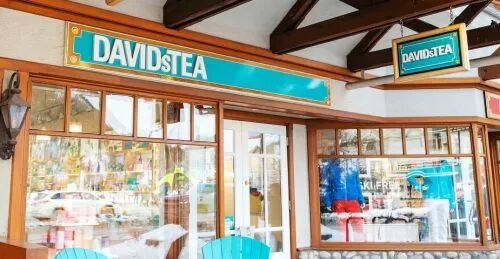 (原始链接: https://mmbiz.qpic.cn/mmbiz_jpg/4kibCXA1QiblTG2IP60z646ZW1ajfDAuDXFYlzaylKL60hx7icdVqIWRt33C2n24ZyD13ibsFgrwRdnibDlDHAXHgbw/640?wx_fmt=jpeg)
- 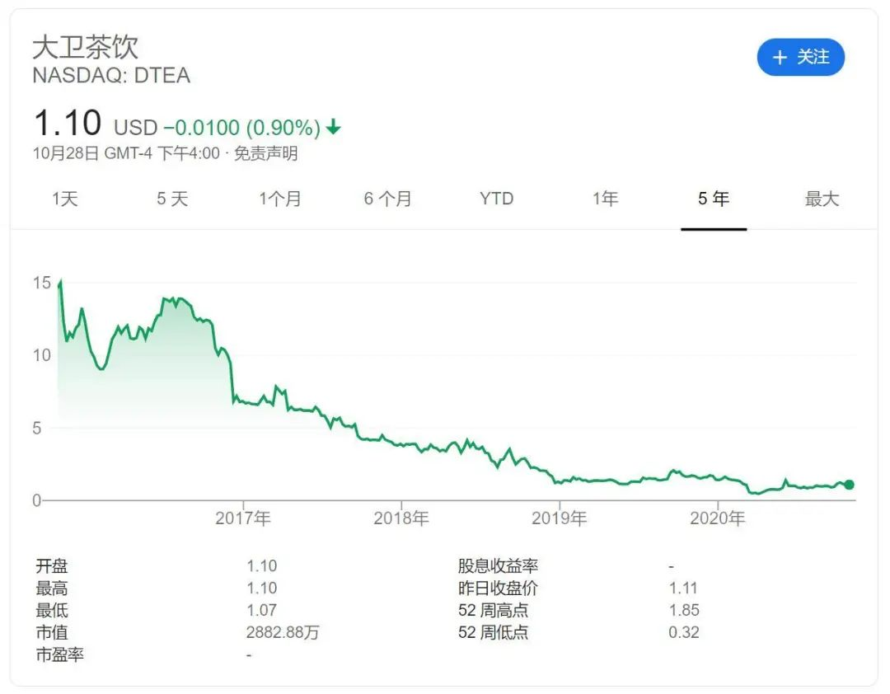 (原始链接: https://mmbiz.qpic.cn/mmbiz_jpg/4kibCXA1QiblTG2IP60z646ZW1ajfDAuDX5rbj8VvgcukI2LPIPMZic5nghx41niciabdo7oA5HqE7WGYkiaha8QImeg/640?wx_fmt=jpeg)
- 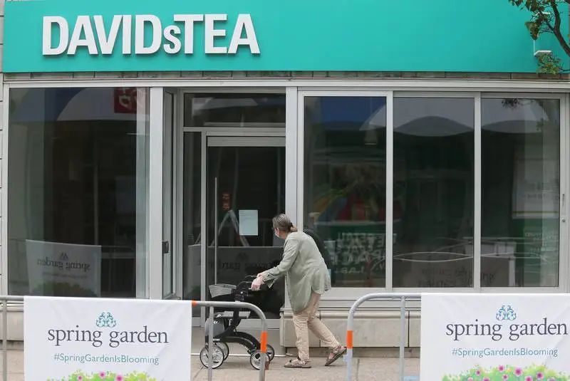 (原始链接: https://mmbiz.qpic.cn/mmbiz_jpg/4kibCXA1QiblTG2IP60z646ZW1ajfDAuDXm9VR264VLeZe4LBMGvLIzIFHcyBPicL9HlWbFiagJQAAuwKL9ao2yavA/640?wx_fmt=jpeg)
- 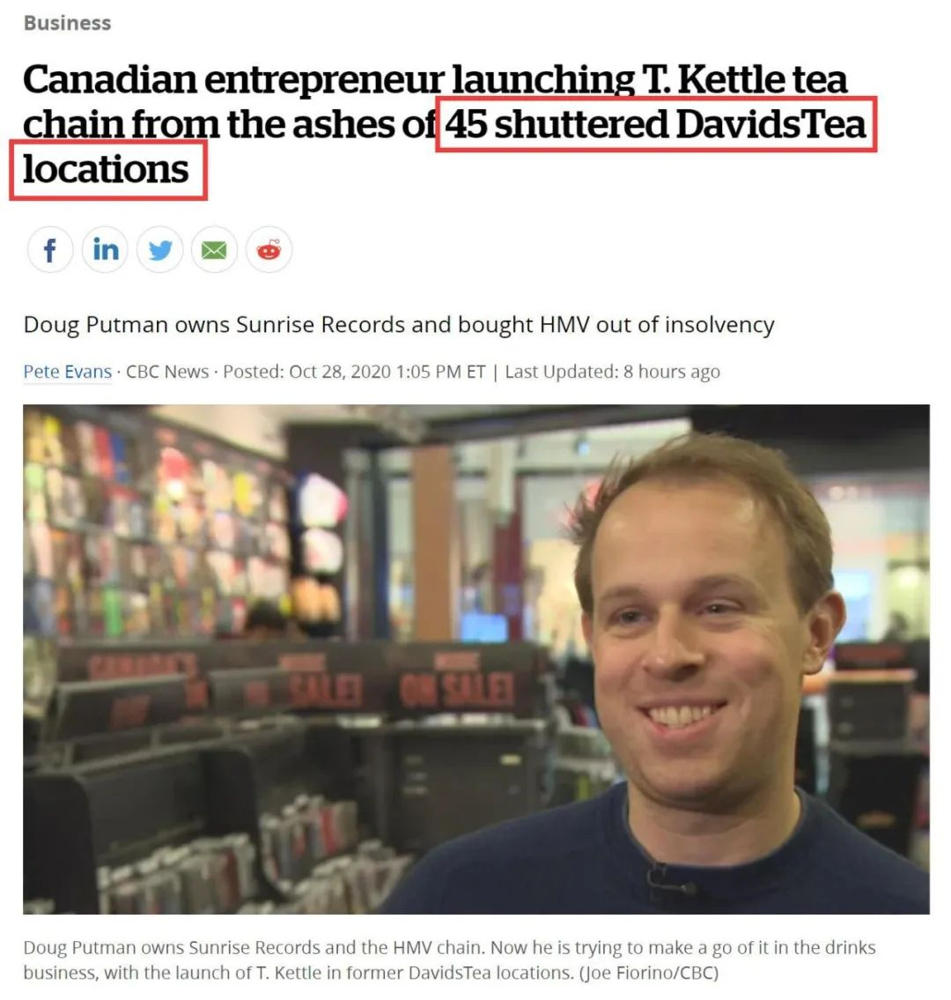 (原始链接: https://mmbiz.qpic.cn/mmbiz_jpg/4kibCXA1QiblTG2IP60z646ZW1ajfDAuDXPYgKM03LJL9flE2r1HDD7hT3MEyBibicyjY9GtA2V3ygAy1AluTAYc6g/640?wx_fmt=jpeg)
- 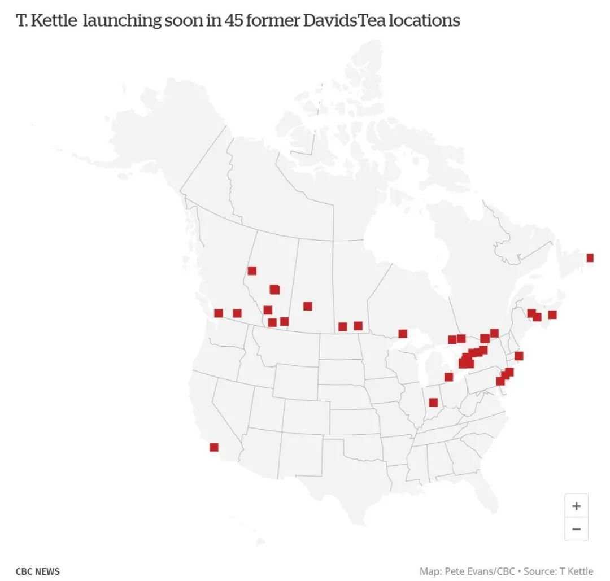 (原始链接: https://mmbiz.qpic.cn/mmbiz_jpg/4kibCXA1QiblTG2IP60z646ZW1ajfDAuDXfB7qXsRjXPCItfNFIASMspqyeUKCp8ZV866mWQEAkicpHHAOQXejHVw/640?wx_fmt=jpeg)
- 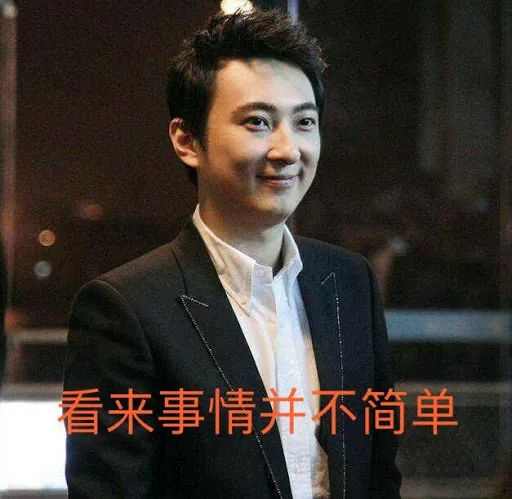 (原始链接: https://mmbiz.qpic.cn/mmbiz_jpg/4kibCXA1QiblTG2IP60z646ZW1ajfDAuDXrL5L41GvrxNWLvvs8IrwFwR2G1N6JPxGTeIaoFQnWkAU5WqIsgq6Ww/640?wx_fmt=jpeg)
-  (原始链接: https://mmbiz.qpic.cn/mmbiz_jpg/4kibCXA1QiblTG2IP60z646ZW1ajfDAuDXZHTsAN2Pbq1mq0klv7eQz8a4wxQnyw85T0O1HkGtZWuyE15mWCiamPA/640?wx_fmt=jpeg)
- 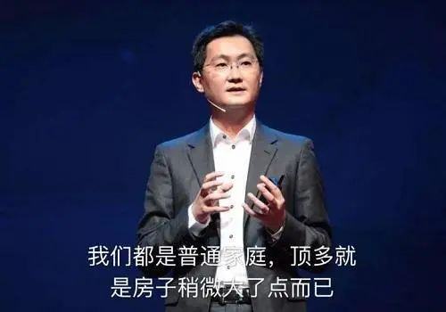 (原始链接: https://mmbiz.qpic.cn/mmbiz_jpg/4kibCXA1QiblTG2IP60z646ZW1ajfDAuDXrjRYSO3S7VBice0bdcI4G6Skf9CH65sn7uf8HLsJ0BDfib9kHk9kdfXw/640?wx_fmt=jpeg)
- 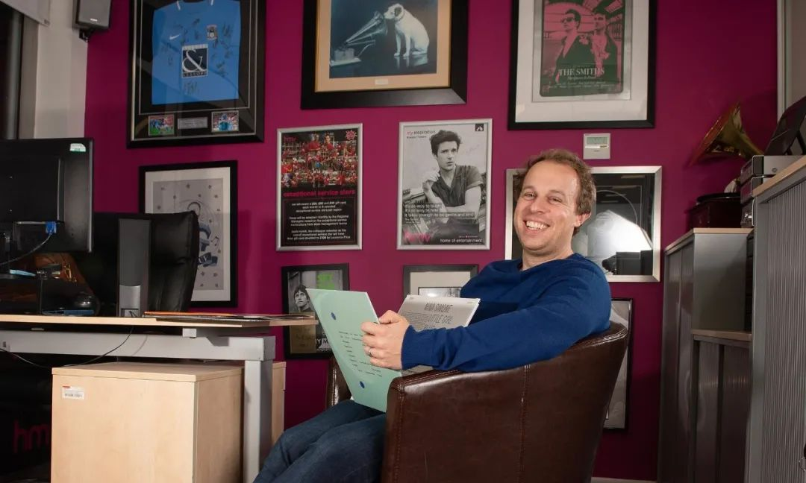 (原始链接: https://mmbiz.qpic.cn/mmbiz_jpg/4kibCXA1QiblTG2IP60z646ZW1ajfDAuDXc2eoMJiaibWqt0vjb4vzG5fzbhRV8t5SfHLJTj8pFJmWeNgNNOWEMwWQ/640?wx_fmt=jpeg)
- 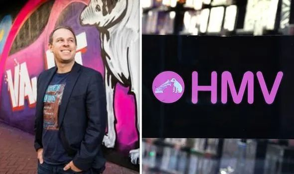 (原始链接: https://mmbiz.qpic.cn/mmbiz_jpg/4kibCXA1QiblTG2IP60z646ZW1ajfDAuDXMCw7Z0mQXL33aIuWHzYmfB2n7ulJ6SUqadnRHc07pV4jhzpChLFJkA/640?wx_fmt=jpeg)
-  (原始链接: https://mmbiz.qpic.cn/mmbiz_jpg/4kibCXA1QiblTG2IP60z646ZW1ajfDAuDXbRunSGqwwmRevIIFENYBr0sRicdudLtvUEJNibRWt1S11ViabVR7V7W6Q/640?wx_fmt=jpeg)
- 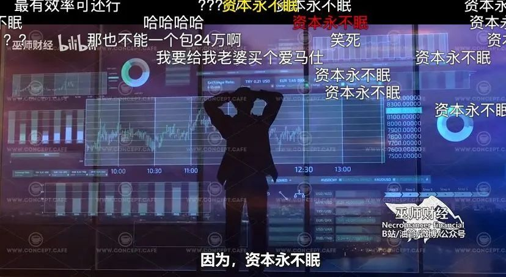 (原始链接: https://mmbiz.qpic.cn/mmbiz_jpg/4kibCXA1QiblTG2IP60z646ZW1ajfDAuDX2P6sibRqouZpVRib1mv42iawFJibv62aqK8FcToJXdnrjQXkatfCKDuEBQ/640?wx_fmt=jpeg)
- 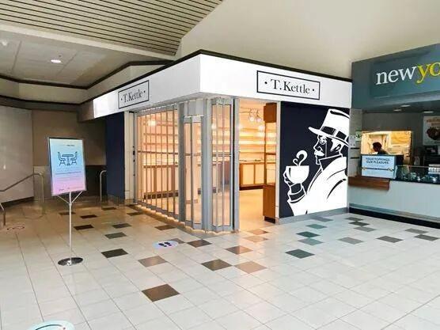 (原始链接: https://mmbiz.qpic.cn/mmbiz_jpg/4kibCXA1QiblTG2IP60z646ZW1ajfDAuDXqLyuSSpIUpIGIyJibKqG76aWFibtmVxn1O190EUicT1Rga2YTkTqtBXTA/640?wx_fmt=jpeg)
- 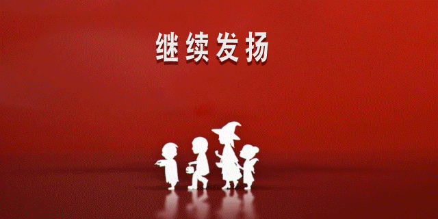 (原始链接: https://mmbiz.qpic.cn/mmbiz_gif/szJas1pFaJdJKL2h9vkEz23vMK0PicDwgicHg9ooOe1ictRBrib7ec9eMYSOJ9NPLNLVWbBP3NcCFQ2gwuvx3xjiayQ/640?wx_fmt=gif)
-  (原始链接: https://mmbiz.qpic.cn/mmbiz_gif/szJas1pFaJdUFDPEKnLrCyGC4WgrAvl6lSC2beZFt6icTnXfebnRzcRialMg5VZujw1AhX9ribkSDQNZZukk8HX9w/640?wx_fmt=gif)
