# 无标题

**链接地址:** http://mp.weixin.qq.com/s?__biz=MzIyMzU4OTc0MQ==&mid=2247484510&idx=1&sn=4007de27f8dc72efd91799f7971259c0&chksm=e81aa05cdf6d294a5c8938dbed4be9f3ffcd2185cb032c1acab0c8bd4efa0cd9597e343914d2&mpshare=1&scene=2&srcid=1101AlTkVEygxZ0iJemZ1hen&sharer_sharetime=1604194472659&sharer_shareid=be1c8edd6c93eec155a61c876e41d26a#rd
**作者:** 关注我们
**获取时间:** 2025/8/28 20:02:04
**图片数量:** 26

---

## 原始HTML内容

<section style="box-sizing: border-box;font-size: 16px;"><section style="text-align: center;margin-top: 10px;margin-right: 0%;margin-left: 0%;box-sizing: border-box;" powered-by="xiumi.us"><section style="max-width: 100%;vertical-align: middle;display: inline-block;line-height: 0;width: 100%;height: auto;box-sizing: border-box;"></section></section><section style="text-align: left;justify-content: flex-start;margin: -30px 0% 10px;opacity: 0.99;box-sizing: border-box;" powered-by="xiumi.us"><section style="display: inline-block;width: 100%;height: 30px;vertical-align: top;overflow: hidden;background-color: rgba(246, 247, 242, 0.74);padding-right: 10px;padding-left: 10px;box-sizing: border-box;"><section style="box-sizing: border-box;" powered-by="xiumi.us"><section style="display: flex;flex-flow: row nowrap;margin-top: 5px;margin-right: 0%;margin-left: 0%;box-sizing: border-box;"><section style="display: inline-block;vertical-align: middle;width: 19px;align-self: center;flex: 0 0 auto;line-height: 0;letter-spacing: 0px;height: auto;box-sizing: border-box;"><section style="text-align: center;margin-right: 0%;margin-left: 0%;box-sizing: border-box;" powered-by="xiumi.us"><section style="max-width: 100%;vertical-align: middle;display: inline-block;line-height: 0;box-sizing: border-box;"></section></section></section><section style="display: inline-block;vertical-align: middle;width: auto;flex: 100 100 0%;align-self: center;height: auto;margin-left: 6px;box-sizing: border-box;"><section style="margin-right: 0%;margin-left: 0%;box-sizing: border-box;" powered-by="xiumi.us"><section style="text-align: justify;font-size: 13px;color: rgb(0, 0, 0);line-height: 1;letter-spacing: 0px;box-sizing: border-box;">
<strong style="box-sizing: border-box;">【活动总结】庆祝洋河酒业爱城活动圆满成功！</strong>
</section></section></section></section></section></section></section><section style="text-align: right;font-size: 12px;color: rgba(0, 0, 0, 0.24);box-sizing: border-box;" powered-by="xiumi.us">
<strong style="box-sizing: border-box;">活动出品：汉嘉酒业</strong>
</section><section style="box-sizing: border-box;" powered-by="xiumi.us">
 
</section><section style="box-sizing: border-box;" powered-by="xiumi.us">
 
</section><section style="box-sizing: border-box;" powered-by="xiumi.us"><section style="margin-top: 10px;margin-right: 0%;margin-left: 0%;display: flex;flex-flow: row nowrap;box-sizing: border-box;"><section style="display: inline-block;vertical-align: bottom;width: auto;align-self: flex-end;flex: 0 0 0%;height: auto;border-width: 0px;z-index: 1;margin-right: -9px;line-height: 0;letter-spacing: 0px;box-sizing: border-box;"><svg viewBox="0 0 1 1" style="float:left;line-height:0;width:0;vertical-align:top;"></svg></section><section style="display: inline-block;vertical-align: bottom;width: auto;border-style: solid;border-width: 1px;border-radius: 0px;border-color: rgba(255, 213, 195, 0);padding: 10px 15px 14px;flex: 100 100 0%;align-self: flex-end;height: auto;box-sizing: border-box;"><section style="text-align: center;font-size: 18px;line-height: 1.8;letter-spacing: 1px;color: rgb(166, 54, 49);box-sizing: border-box;" powered-by="xiumi.us">
<strong style="box-sizing: border-box;">中秋国庆 双节同庆</strong>
</section><section style="margin: 3px 0% 8px;box-sizing: border-box;" powered-by="xiumi.us"><section style="background-color: rgb(179, 179, 179);height: 1px;box-sizing: border-box;"><svg viewBox="0 0 1 1" style="float:left;line-height:0;width:0;vertical-align:top;"></svg></section></section><section style="box-sizing: border-box;" powered-by="xiumi.us">
 
</section><section style="font-size: 14px;line-height: 1.8;letter-spacing: 1px;color: rgb(158, 114, 84);box-sizing: border-box;" powered-by="xiumi.us">
2020年的中秋可太不一般！中国文化的<strong style="box-sizing: border-box;">传统佳节</strong>和中华人民共和国的<strong style="box-sizing: border-box;">国庆之日</strong>重合在同一天，可谓普天同庆，双节齐乐，真是一个<strong style="box-sizing: border-box;">双喜临门</strong>的大日子！

 
</section><section style="box-sizing: border-box;" powered-by="xiumi.us"><section style="display: flex;flex-flow: row nowrap;margin: 10px 0%;box-sizing: border-box;"><section style="display: inline-block;vertical-align: middle;width: auto;flex: 100 100 0%;align-self: center;height: auto;box-sizing: border-box;"><section style="text-align: right;margin-right: 0%;margin-left: 0%;justify-content: flex-end;box-sizing: border-box;" powered-by="xiumi.us"><section style="max-width: 100%;vertical-align: middle;display: inline-block;line-height: 0;width: 74px;height: auto;box-sizing: border-box;"></section></section></section><section style="display: inline-block;vertical-align: middle;width: auto;align-self: center;flex: 0 0 0%;height: auto;margin-right: 10px;margin-left: 6px;box-sizing: border-box;"><section style="text-align: right;margin-top: 10px;margin-right: 0%;margin-left: 0%;justify-content: flex-end;box-sizing: border-box;" powered-by="xiumi.us"><section style="max-width: 100%;vertical-align: middle;display: inline-block;line-height: 0;width: 20px;height: auto;box-sizing: border-box;"></section></section></section><section style="display: inline-block;vertical-align: middle;width: auto;align-self: center;flex: 100 100 0%;box-sizing: border-box;"><section style="text-align: left;margin-top: 10px;margin-right: 0%;margin-left: 0%;justify-content: flex-start;box-sizing: border-box;" powered-by="xiumi.us"><section style="max-width: 100%;vertical-align: middle;display: inline-block;line-height: 0;width: 64px;height: auto;box-sizing: border-box;"></section></section></section></section></section><section style="font-size: 14px;line-height: 1.8;letter-spacing: 1px;color: rgb(158, 114, 84);box-sizing: border-box;" powered-by="xiumi.us">
 

然而今年突如其来的疫情，却让不少滞留海外的华人华侨们无法回到祖国家乡的怀抱，<strong style="box-sizing: border-box;">无法亲眼见证祖国华诞之日的繁荣昌盛兴旺发达，也不能亲身和至亲们团圆相聚，共度中秋佳节。</strong>

 
</section><section style="text-align: center;margin-top: 10px;margin-bottom: 10px;box-sizing: border-box;" powered-by="xiumi.us"><section style="max-width: 100%;vertical-align: middle;display: inline-block;line-height: 0;box-sizing: border-box;"></section></section><section style="font-size: 14px;line-height: 1.8;letter-spacing: 1px;color: rgb(158, 114, 84);box-sizing: border-box;" powered-by="xiumi.us">
 

因此，为了给埃德蒙顿的华人华侨朋友们增添举国相庆和美满团圆的节日氛围，<strong style="box-sizing: border-box;">汉嘉酒业携中国江苏洋河酒业</strong>，为他们带去了承载着祖国温暖和家乡亲情的<strong style="box-sizing: border-box;">洋河天之蓝</strong>！ 

 
</section><section style="box-sizing: border-box;" powered-by="xiumi.us">
 
</section><section style="text-align: center;font-size: 18px;line-height: 1.8;letter-spacing: 1px;color: rgb(166, 54, 49);box-sizing: border-box;" powered-by="xiumi.us">
<strong style="box-sizing: border-box;">海外畅饮，华韵悠扬</strong>
</section><section style="margin: 3px 0% 8px;box-sizing: border-box;" powered-by="xiumi.us"><section style="background-color: rgb(179, 179, 179);height: 1px;box-sizing: border-box;"><svg viewBox="0 0 1 1" style="float:left;line-height:0;width:0;vertical-align:top;"></svg></section></section><section style="font-size: 14px;line-height: 1.8;letter-spacing: 1px;color: rgb(158, 114, 84);box-sizing: border-box;" powered-by="xiumi.us">
 

本次活动由加拿大汉嘉酒业有限公司主办，于<strong style="box-sizing: border-box;">9月30日至10月7日</strong>在埃德蒙顿市的三家指定合作华人餐厅内举行。

 

活动参与方式为在指定餐厅内消费超过一定金额即可免费获得由<strong style="box-sizing: border-box;">汉嘉酒业提供的洋河天之蓝经典480ml装白酒一瓶</strong>！

 
</section><section style="text-align: center;margin-top: 10px;margin-bottom: 10px;box-sizing: border-box;" powered-by="xiumi.us"><section style="max-width: 100%;vertical-align: middle;display: inline-block;line-height: 0;width: 80%;height: auto;box-sizing: border-box;"></section></section><section style="font-size: 14px;line-height: 1.8;letter-spacing: 1px;color: rgb(158, 114, 84);box-sizing: border-box;" powered-by="xiumi.us">
 

为了照顾城市不同居住区域的活动参与者，活动指定餐厅分别坐落于城市北部、中部以及南部。

 
</section><section style="text-align: right;box-sizing: border-box;" powered-by="xiumi.us"><section style="display: inline-block;width: 90%;vertical-align: top;border-left: 6px none rgb(243, 243, 243);border-bottom-left-radius: 0px;padding-right: 20px;box-sizing: border-box;"><section style="margin-top: 10px;margin-right: 0%;margin-left: 0%;text-align: left;transform: translate3d(-25px, 0px, 0px);box-sizing: border-box;" powered-by="xiumi.us"><section style="padding: 3px;display: inline-block;border-bottom: 5px solid rgb(255, 165, 4);font-size: 21px;line-height: 1.5;box-sizing: border-box;">
<strong style="box-sizing: border-box;">北仔记北边店</strong>
</section></section></section></section><section style="text-align: right;box-sizing: border-box;" powered-by="xiumi.us"><section style="display: inline-block;width: 90%;vertical-align: top;border-left: 6px solid rgb(243, 243, 243);border-bottom-left-radius: 0px;padding-right: 20px;box-sizing: border-box;"><section style="text-align: justify;box-sizing: border-box;" powered-by="xiumi.us">
 
</section></section></section><section style="text-align: center;box-sizing: border-box;" powered-by="xiumi.us"><section style="display: inline-block;width: 95%;vertical-align: top;padding: 10px;border-width: 0px;border-radius: 10px;border-style: none;border-color: rgb(62, 62, 62);overflow: hidden;box-shadow: rgb(231, 231, 231) 0px 0px 6px;box-sizing: border-box;"><section style="box-sizing: border-box;" powered-by="xiumi.us"><section style="display: inline-block;vertical-align: middle;width: 50%;box-shadow: rgb(0, 0, 0) 0px 0px 0px;box-sizing: border-box;"><section style="transform: rotateZ(358deg);-webkit-transform: rotateZ(358deg);-moz-transform: rotateZ(358deg);-o-transform: rotateZ(358deg);box-sizing: border-box;" powered-by="xiumi.us"><section style="margin-top: 0.5em;margin-bottom: 0.5em;padding-left: 0.5em;padding-right: 0.5em;box-sizing: border-box;"><section style="box-sizing: border-box;width: 100%;border-width: 4px;border-style: solid;border-color: white;box-shadow: rgb(102, 102, 102) 3.5px 3.5px 8px;display: inline-block;line-height: 0;height: auto !important;"></section></section></section></section><section style="display: inline-block;vertical-align: middle;width: 50%;padding-left: 10px;box-sizing: border-box;"><section style="text-align: justify;font-size: 14px;color: rgb(114, 114, 114);padding-right: 5px;padding-left: 5px;line-height: 1.6;box-sizing: border-box;" powered-by="xiumi.us">
经营超过二十年的埃德蒙顿老字号粤菜餐厅。用现代手法诠释经典粤菜菜肴，深受埃德蒙顿当地人民喜爱。
</section></section></section></section></section><section style="font-size: 14px;line-height: 1.8;letter-spacing: 1px;color: rgb(158, 114, 84);box-sizing: border-box;" powered-by="xiumi.us">
 

这次活动的合作餐厅包括主打粤菜、川滇菜和火锅在内的不同口味。

 
</section><section style="text-align: right;box-sizing: border-box;" powered-by="xiumi.us"><section style="display: inline-block;width: 90%;vertical-align: top;border-left: 6px none rgb(243, 243, 243);border-bottom-left-radius: 0px;padding-right: 20px;box-sizing: border-box;"><section style="margin-top: 10px;margin-right: 0%;margin-left: 0%;text-align: left;transform: translate3d(-25px, 0px, 0px);box-sizing: border-box;" powered-by="xiumi.us"><section style="padding: 3px;display: inline-block;border-bottom: 5px solid rgb(255, 165, 4);font-size: 21px;line-height: 1.5;box-sizing: border-box;">
<strong style="box-sizing: border-box;">刘一手火锅埃德蒙顿店</strong>
</section></section></section></section><section style="text-align: right;box-sizing: border-box;" powered-by="xiumi.us"><section style="display: inline-block;width: 90%;vertical-align: top;border-left: 6px solid rgb(243, 243, 243);border-bottom-left-radius: 0px;padding-right: 20px;box-sizing: border-box;"><section style="text-align: justify;box-sizing: border-box;" powered-by="xiumi.us">
 
</section></section></section><section style="text-align: center;box-sizing: border-box;" powered-by="xiumi.us"><section style="display: inline-block;width: 95%;vertical-align: top;padding: 10px;border-width: 0px;border-radius: 10px;border-style: none;border-color: rgb(62, 62, 62);overflow: hidden;box-shadow: rgb(231, 231, 231) 0px 0px 6px;box-sizing: border-box;"><section style="box-sizing: border-box;" powered-by="xiumi.us"><section style="display: inline-block;vertical-align: middle;width: 50%;box-shadow: rgb(0, 0, 0) 0px 0px 0px;padding-right: 10px;box-sizing: border-box;"><section style="text-align: justify;font-size: 14px;color: rgb(114, 114, 114);padding-right: 5px;padding-left: 5px;line-height: 1.6;box-sizing: border-box;" powered-by="xiumi.us">
亲友聚餐吃什么？火锅是最具有仪式感的好选择。跨出国门的国际连锁，品质有保障，口味更没得挑！
</section></section><section style="display: inline-block;vertical-align: middle;width: 50%;box-shadow: rgb(0, 0, 0) 0px 0px 0px;box-sizing: border-box;"><section style="transform: rotateZ(2deg);-webkit-transform: rotateZ(2deg);-moz-transform: rotateZ(2deg);-o-transform: rotateZ(2deg);box-sizing: border-box;" powered-by="xiumi.us"><section style="margin-top: 0.5em;margin-bottom: 0.5em;padding-left: 0.5em;padding-right: 0.5em;box-sizing: border-box;"><section style="box-sizing: border-box;width: 100%;border-width: 4px;border-style: solid;border-color: white;box-shadow: rgb(102, 102, 102) 3.53553px 3.53553px 8px;display: inline-block;line-height: 0;height: auto !important;"></section></section></section></section></section></section></section><section style="font-size: 14px;line-height: 1.8;letter-spacing: 1px;color: rgb(158, 114, 84);box-sizing: border-box;" powered-by="xiumi.us">
 

另外考虑到疫情期间大家对于外出聚餐的顾虑，我们也提供了灵活的包含洋河天之蓝礼品的<strong style="box-sizing: border-box;">外卖形式</strong>供活动参与者选择。

 
</section><section style="text-align: right;box-sizing: border-box;" powered-by="xiumi.us"><section style="display: inline-block;width: 90%;vertical-align: top;border-left: 6px none rgb(243, 243, 243);border-bottom-left-radius: 0px;padding-right: 20px;box-sizing: border-box;"><section style="margin-top: 10px;margin-right: 0%;margin-left: 0%;text-align: left;transform: translate3d(-25px, 0px, 0px);box-sizing: border-box;" powered-by="xiumi.us"><section style="padding: 3px;display: inline-block;border-bottom: 5px solid rgb(255, 165, 4);font-size: 21px;line-height: 1.5;box-sizing: border-box;">
<strong style="box-sizing: border-box;">云之南埃德蒙顿店</strong>
</section></section></section></section><section style="text-align: right;box-sizing: border-box;" powered-by="xiumi.us"><section style="display: inline-block;width: 90%;vertical-align: top;border-left: 6px solid rgb(243, 243, 243);border-bottom-left-radius: 0px;padding-right: 20px;box-sizing: border-box;"><section style="text-align: justify;box-sizing: border-box;" powered-by="xiumi.us">
 
</section></section></section><section style="text-align: center;box-sizing: border-box;" powered-by="xiumi.us"><section style="display: inline-block;width: 95%;vertical-align: top;padding: 10px;border-width: 0px;border-radius: 10px;border-style: none;border-color: rgb(62, 62, 62);overflow: hidden;box-shadow: rgb(231, 231, 231) 0px 0px 6px;box-sizing: border-box;"><section style="box-sizing: border-box;" powered-by="xiumi.us"><section style="display: inline-block;vertical-align: middle;width: 50%;box-shadow: rgb(0, 0, 0) 0px 0px 0px;box-sizing: border-box;"><section style="transform: rotateZ(358deg);-webkit-transform: rotateZ(358deg);-moz-transform: rotateZ(358deg);-o-transform: rotateZ(358deg);box-sizing: border-box;" powered-by="xiumi.us"><section style="margin-top: 0.5em;margin-bottom: 0.5em;padding-left: 0.5em;padding-right: 0.5em;box-sizing: border-box;"><section style="box-sizing: border-box;width: 100%;border-width: 4px;border-style: solid;border-color: white;box-shadow: rgb(102, 102, 102) 3.5px 3.5px 8px;display: inline-block;line-height: 0;height: auto !important;"></section></section></section></section><section style="display: inline-block;vertical-align: middle;width: 50%;padding-left: 10px;box-sizing: border-box;"><section style="text-align: justify;font-size: 14px;color: rgb(114, 114, 114);padding-right: 5px;padding-left: 5px;line-height: 1.6;box-sizing: border-box;" powered-by="xiumi.us">
甭管你口味多小众刁钻，云之南一定满足你挑剔的味蕾！想吃中国南部特色菜，找准阿省旅游局推荐中餐厅云之南！
</section></section></section></section></section><section style="font-size: 14px;line-height: 1.8;letter-spacing: 1px;color: rgb(158, 114, 84);box-sizing: border-box;" powered-by="xiumi.us">
 

这次活动的主旨就是，无论你住在城市的什么地方，喜欢吃什么口味，想要在哪里进餐，我们都希望能用一瓶洋河天之蓝为<strong style="box-sizing: border-box;">你的节日聚餐增加更多欢庆团聚的氛围</strong>。

 

好菜还得配好酒，不能忘记咱们今天的主角——洋河天之蓝！

 

 
</section><section style="text-align: center;font-size: 18px;line-height: 1.8;letter-spacing: 1px;color: rgb(166, 54, 49);box-sizing: border-box;" powered-by="xiumi.us">
<strong style="box-sizing: border-box;">好菜配好酒 好酒天之蓝</strong>
</section><section style="margin: 3px 0% 8px;box-sizing: border-box;" powered-by="xiumi.us"><section style="background-color: rgb(179, 179, 179);height: 1px;box-sizing: border-box;"><svg viewBox="0 0 1 1" style="float:left;line-height:0;width:0;vertical-align:top;"></svg></section></section><section style="font-size: 14px;line-height: 1.8;letter-spacing: 1px;color: rgb(158, 114, 84);box-sizing: border-box;" powered-by="xiumi.us">
 

在活动举办的这几日中，我们的合作商家接到了无数顾客的咨询，同时也收到了积极参与活动的<strong style="box-sizing: border-box;">群众们发来的各种反馈</strong>：

 
</section><section style="margin: 10px 0% 8px;box-sizing: border-box;" powered-by="xiumi.us"><section style="display: inline-block;width: 100%;vertical-align: top;border-left: 3px solid rgb(219, 219, 219);border-bottom-left-radius: 0px;padding-left: 8px;box-sizing: border-box;"><section style="color: rgba(0, 0, 0, 0.5);font-size: 14px;box-sizing: border-box;" powered-by="xiumi.us">
“这个酒我在国内看过很多次广告，没想到第一次喝上竟然是在海外！”
</section></section></section><section style="margin: 10px 0% 8px;box-sizing: border-box;" powered-by="xiumi.us"><section style="display: inline-block;width: 100%;vertical-align: top;border-left: 3px solid rgb(219, 219, 219);border-bottom-left-radius: 0px;padding-left: 8px;box-sizing: border-box;"><section style="color: rgba(0, 0, 0, 0.5);font-size: 14px;box-sizing: border-box;" powered-by="xiumi.us">
“平时我们年轻人聚会不大喝白酒，今天还是第一次！没成想还挺好喝的！”
</section></section></section><section style="box-sizing: border-box;" powered-by="xiumi.us">
 
</section><section style="box-sizing: border-box;" powered-by="xiumi.us"><section style="display: flex;flex-flow: row nowrap;margin: 10px 0%;box-sizing: border-box;"><section style="display: inline-block;vertical-align: top;width: auto;flex: 100 100 0%;align-self: stretch;height: auto;margin-right: -40px;box-sizing: border-box;"><section style="margin-right: 0%;margin-left: 0%;box-sizing: border-box;" powered-by="xiumi.us"><section style="display: inline-block;width: 100%;vertical-align: top;padding-right: 50px;box-sizing: border-box;"><section style="text-align: center;margin-right: 0%;margin-left: 0%;box-sizing: border-box;" powered-by="xiumi.us"><section style="max-width: 100%;vertical-align: middle;display: inline-block;line-height: 0;box-sizing: border-box;"></section></section></section></section><section style="text-align: center;margin-right: 0%;margin-left: 0%;opacity: 0.99;box-sizing: border-box;" powered-by="xiumi.us"><section style="max-width: 100%;vertical-align: middle;display: inline-block;line-height: 0;border-style: solid solid none none;border-width: 10px;border-radius: 0px;border-color: rgb(255, 255, 255);box-sizing: border-box;"></section></section></section><section style="display: inline-block;vertical-align: top;width: auto;align-self: stretch;flex: 70 70 0%;background-color: rgba(255, 164, 30, 0.2);height: auto;box-sizing: border-box;"><section style="text-align: center;margin-right: 0%;margin-left: 0%;box-sizing: border-box;" powered-by="xiumi.us"><section style="max-width: 100%;vertical-align: middle;display: inline-block;line-height: 0;border-bottom: 10px solid rgb(255, 255, 255);border-bottom-right-radius: 0px;box-sizing: border-box;"></section></section></section></section></section><section style="text-align: center;font-size: 12px;color: rgb(115, 115, 114);box-sizing: border-box;" powered-by="xiumi.us">
在北仔记的活动参与者畅饮天之蓝
</section><section style="box-sizing: border-box;" powered-by="xiumi.us">
 
</section><section style="margin: 10px 0% 8px;box-sizing: border-box;" powered-by="xiumi.us"><section style="display: inline-block;width: 100%;vertical-align: top;border-left: 3px solid rgb(219, 219, 219);border-bottom-left-radius: 0px;padding-left: 8px;box-sizing: border-box;"><section style="color: rgba(0, 0, 0, 0.5);font-size: 14px;box-sizing: border-box;" powered-by="xiumi.us">
“我就是江苏人！在海外飘了这么多年，能在这儿喝到一口家乡酒，我感到又感动，又自豪！家乡的文化都传播到这北美大地上来了！”
</section></section></section><section style="margin: 10px 0% 8px;box-sizing: border-box;" powered-by="xiumi.us"><section style="display: inline-block;width: 100%;vertical-align: top;border-left: 3px solid rgb(219, 219, 219);border-bottom-left-radius: 0px;padding-left: 8px;box-sizing: border-box;"><section style="color: rgba(0, 0, 0, 0.5);font-size: 14px;box-sizing: border-box;" powered-by="xiumi.us">
“这酒不错，入口挺顺溜的。哪里有卖的？我给我家老爷子再提两瓶回去！他肯定爱喝！”

 
</section></section></section><section style="margin: 10px 0%;box-sizing: border-box;" powered-by="xiumi.us"><section style="display: inline-block;width: 100%;vertical-align: top;border-width: 1px;border-radius: 0px;border-style: solid;border-color: rgba(255, 213, 195, 0);box-sizing: border-box;"><section style="box-sizing: border-box;" powered-by="xiumi.us"><section style="display: flex;flex-flow: row nowrap;margin: 20px 0%;box-sizing: border-box;"><section style="display: inline-block;vertical-align: top;width: auto;flex: 100 100 0%;align-self: stretch;height: auto;padding-right: 10px;padding-left: 10px;border-width: 0px;box-sizing: border-box;"><section style="text-align: center;margin: -10px 0%;box-sizing: border-box;" powered-by="xiumi.us"><section style="max-width: 100%;vertical-align: middle;display: inline-block;line-height: 0;border-width: 0px;border-radius: 5px;border-style: none;border-color: rgb(62, 62, 62);overflow: hidden;box-sizing: border-box;"></section></section></section><section style="display: inline-block;vertical-align: top;width: auto;align-self: stretch;flex: 100 100 0%;border-left: 1px solid rgba(255, 213, 195, 0);border-bottom-left-radius: 0px;padding-right: 10px;padding-left: 10px;box-sizing: border-box;"><section style="text-align: center;margin: -10px 0%;box-sizing: border-box;" powered-by="xiumi.us"><section style="max-width: 100%;vertical-align: middle;display: inline-block;line-height: 0;border-width: 0px;border-radius: 5px;border-style: none;border-color: rgb(62, 62, 62);overflow: hidden;box-sizing: border-box;"></section></section></section></section></section><section style="box-sizing: border-box;" powered-by="xiumi.us"><section style="display: flex;flex-flow: row nowrap;box-sizing: border-box;"><section style="display: inline-block;vertical-align: top;width: auto;flex: 100 100 0%;align-self: flex-start;height: auto;padding-right: 20px;padding-left: 20px;box-sizing: border-box;"><section style="margin-right: 0%;margin-left: 0%;box-sizing: border-box;" powered-by="xiumi.us"><section style="background-color: rgba(255, 213, 195, 0);height: 1px;box-sizing: border-box;"><svg viewBox="0 0 1 1" style="float:left;line-height:0;width:0;vertical-align:top;"></svg></section></section></section><section style="display: inline-block;vertical-align: top;width: auto;align-self: flex-start;flex: 100 100 0%;padding-right: 20px;padding-left: 20px;box-sizing: border-box;"><section style="margin-right: 0%;margin-left: 0%;box-sizing: border-box;" powered-by="xiumi.us"><section style="background-color: rgba(255, 213, 195, 0);height: 1px;box-sizing: border-box;"><svg viewBox="0 0 1 1" style="float:left;line-height:0;width:0;vertical-align:top;"></svg></section></section></section></section></section><section style="box-sizing: border-box;" powered-by="xiumi.us"><section style="display: flex;flex-flow: row nowrap;margin: 20px 0%;box-sizing: border-box;"><section style="display: inline-block;vertical-align: top;width: auto;flex: 100 100 0%;align-self: stretch;height: auto;padding-right: 10px;padding-left: 10px;border-width: 0px;box-sizing: border-box;"><section style="text-align: center;margin: -10px 0%;box-sizing: border-box;" powered-by="xiumi.us"><section style="max-width: 100%;vertical-align: middle;display: inline-block;line-height: 0;border-width: 0px;border-radius: 5px;border-style: none;border-color: rgb(62, 62, 62);overflow: hidden;box-sizing: border-box;"></section></section></section><section style="display: inline-block;vertical-align: top;width: auto;align-self: stretch;flex: 100 100 0%;border-left: 1px solid rgba(255, 213, 195, 0);border-bottom-left-radius: 0px;padding-right: 10px;padding-left: 10px;box-sizing: border-box;"><section style="text-align: center;margin: -10px 0%;box-sizing: border-box;" powered-by="xiumi.us"><section style="max-width: 100%;vertical-align: middle;display: inline-block;line-height: 0;border-width: 0px;border-radius: 5px;border-style: none;border-color: rgb(62, 62, 62);overflow: hidden;box-sizing: border-box;"></section></section></section></section></section></section></section><section style="text-align: center;font-size: 12px;color: rgb(115, 115, 114);box-sizing: border-box;" powered-by="xiumi.us">
刘一手劲辣的火锅搭配绵软的天之蓝，绝啦！
</section><section style="box-sizing: border-box;" powered-by="xiumi.us">
 
</section><section style="font-size: 14px;line-height: 1.8;letter-spacing: 1px;color: rgb(158, 114, 84);box-sizing: border-box;" powered-by="xiumi.us">
不仅如此，我们还迎来了这样一拨看了我们的活动宣传文章，为了品尝天之蓝的绵软醇香，<strong style="box-sizing: border-box;">特意远道而来的顾客</strong>。

 

因为活动当时已经接近尾声，受欢迎的天之蓝早就被<strong style="box-sizing: border-box;">一抢而空</strong>。但合作商家不希望看到顾客失望而归，于是紧急联系我们调动货源，<strong style="box-sizing: border-box;">用最后一瓶天之蓝向顾客传达了我们美好的祝福与感谢</strong>。 

 
</section><section style="margin: 10px 0%;box-sizing: border-box;" powered-by="xiumi.us"><section style="display: inline-block;width: 100%;vertical-align: top;border-width: 0px;border-radius: 1px;border-style: none;border-color: rgb(62, 62, 62);overflow: hidden;box-sizing: border-box;"><section style="text-align: left;margin-right: 0%;margin-bottom: -30px;margin-left: 0%;justify-content: flex-start;box-sizing: border-box;" powered-by="xiumi.us"><section style="display: inline-block;width: 10px;height: 40px;vertical-align: top;overflow: hidden;border-right: 1px solid rgb(198, 171, 136);border-top-right-radius: 0px;box-sizing: border-box;"><svg viewBox="0 0 1 1" style="float:left;line-height:0;width:0;vertical-align:top;"></svg></section></section><section style="margin-right: 0%;margin-left: 0%;transform: translate3d(-10px, 0px, 0px);box-sizing: border-box;" powered-by="xiumi.us"><section style="background-color: rgb(213, 196, 173);height: 1px;box-sizing: border-box;"><svg viewBox="0 0 1 1" style="float:left;line-height:0;width:0;vertical-align:top;"></svg></section></section><section style="display: inline-block;width: 100%;vertical-align: top;padding-right: 20px;padding-left: 20px;box-sizing: border-box;" powered-by="xiumi.us"><section style="margin: 10px 0%;box-sizing: border-box;" powered-by="xiumi.us"><section style="display: inline-block;vertical-align: middle;width: 50%;padding-right: 5px;box-sizing: border-box;"><section style="text-align: center;margin-right: 0%;margin-left: 0%;width: 100%;box-sizing: border-box;" powered-by="xiumi.us"><section style="max-width: 100%;vertical-align: middle;display: inline-block;line-height: 0;width: 100%;box-sizing: border-box;"></section></section><section style="text-align: center;margin-top: 10px;margin-right: 0%;margin-left: 0%;width: 100%;box-sizing: border-box;" powered-by="xiumi.us"><section style="max-width: 100%;vertical-align: middle;display: inline-block;line-height: 0;width: 100%;box-sizing: border-box;"></section></section></section><section style="display: inline-block;vertical-align: middle;width: 50%;padding-left: 5px;box-sizing: border-box;"><section style="text-align: center;margin-right: 0%;margin-left: 0%;width: 100%;box-sizing: border-box;" powered-by="xiumi.us"><section style="max-width: 100%;vertical-align: middle;display: inline-block;line-height: 0;width: 100%;box-sizing: border-box;"></section></section><section style="text-align: center;margin-top: 10px;margin-right: 0%;margin-left: 0%;width: 100%;box-sizing: border-box;" powered-by="xiumi.us"><section style="max-width: 100%;vertical-align: middle;display: inline-block;line-height: 0;width: 100%;box-sizing: border-box;"></section></section></section></section></section><section style="margin-right: 0%;margin-left: 0%;transform: translate3d(10px, 0px, 0px);box-sizing: border-box;" powered-by="xiumi.us"><section style="background-color: rgb(213, 196, 173);height: 1px;box-sizing: border-box;"><svg viewBox="0 0 1 1" style="float:left;line-height:0;width:0;vertical-align:top;"></svg></section></section><section style="text-align: right;margin-top: -30px;margin-right: 0%;margin-left: 0%;justify-content: flex-end;transform: translate3d(-10px, 0px, 0px);box-sizing: border-box;" powered-by="xiumi.us"><section style="display: inline-block;width: 10px;height: 40px;vertical-align: top;overflow: hidden;border-right: 1px solid rgb(198, 171, 136);border-top-right-radius: 0px;box-sizing: border-box;"><svg viewBox="0 0 1 1" style="float:left;line-height:0;width:0;vertical-align:top;"></svg></section></section></section></section><section style="text-align: center;font-size: 12px;color: rgb(115, 115, 114);box-sizing: border-box;" powered-by="xiumi.us">
无论是堂食还是外卖，天之蓝都与您相伴

（拍摄地点：云之南）
</section><section style="box-sizing: border-box;" powered-by="xiumi.us">
 
</section><section style="font-size: 14px;line-height: 1.8;letter-spacing: 1px;color: rgb(158, 114, 84);box-sizing: border-box;" powered-by="xiumi.us">
在这个特殊的关头，大家愿意通过参与我们线下活动的方式，<strong style="box-sizing: border-box;">为本地华人企业度过难关</strong>贡献自己的力量，让我们感受到了海外华人华侨的那份可贵的凝聚力。

 

同时，这些承载着祖国温暖和家乡亲情的洋河天之蓝，通过汉嘉酒业的传递，漂洋过海，像一阵暖流汇聚到这里，既丰富了海外华人华侨的餐桌，同时<strong style="box-sizing: border-box;">歌颂弘扬了中华民族的传统文化</strong>，更是让我们每一位炎黄子孙感到无比自豪！

 
</section><section style="text-align: center;margin-top: 10px;margin-bottom: 10px;box-sizing: border-box;" powered-by="xiumi.us"><section style="max-width: 100%;vertical-align: middle;display: inline-block;line-height: 0;box-sizing: border-box;"></section></section><section style="text-align: center;font-size: 12px;color: rgb(115, 115, 114);box-sizing: border-box;" powered-by="xiumi.us">
摆放在餐厅酒架上的天之蓝，是这几日店里询问度最高的饮品

（拍摄地点：刘一手火锅埃德蒙顿店）
</section><section style="font-size: 14px;line-height: 1.8;letter-spacing: 1px;color: rgb(158, 114, 84);box-sizing: border-box;" powered-by="xiumi.us">
 

如果你没能及时参加我们这次的活动，错过了畅饮洋河天之蓝的机会，别担心，你<strong style="box-sizing: border-box;">还是可以在加国和这远道而来的美酒相遇！</strong>

 
</section><section style="margin: 10px 0%;box-sizing: border-box;" powered-by="xiumi.us"><section style="display: inline-block;width: 100%;vertical-align: top;padding-right: 20px;padding-left: 20px;box-sizing: border-box;"><section style="box-sizing: border-box;" powered-by="xiumi.us"><section style="display: flex;flex-flow: row nowrap;margin-right: 0%;margin-bottom: -30px;margin-left: 0%;transform: translate3d(-10px, 0px, 0px);box-sizing: border-box;"><section style="display: inline-block;vertical-align: middle;width: auto;min-width: 10%;max-width: 100%;flex: 0 0 auto;height: auto;align-self: center;box-shadow: rgb(0, 0, 0) 0px 0px 0px;box-sizing: border-box;"><section style="text-align: left;margin-right: 0%;margin-left: 0%;justify-content: flex-start;opacity: 0.95;box-sizing: border-box;" powered-by="xiumi.us"><section style="display: inline-block;width: 80px;height: 60px;vertical-align: top;overflow: hidden;background-position: 50% 50%;background-repeat: no-repeat;background-size: contain;background-attachment: scroll;background-image: url(&quot;https://mmbiz.qpic.cn/mmbiz_png/7CNdqYbqvBIibDaF5LlZcicDv0h0FwutJuyWd7p9j7UXwqX2zhmcHrCoOR9LaIpgQpd4fznxibGvmS9sBhmIico75A/640?wx_fmt=png&quot;);box-sizing: border-box;"><section style="text-align: justify;font-size: 12px;box-sizing: border-box;" powered-by="xiumi.us">
 

<strong style="box-sizing: border-box;">&nbsp; &nbsp; &nbsp;活动礼品</strong>
</section></section></section></section><section style="display: inline-block;vertical-align: middle;width: auto;flex: 0 0 auto;align-self: center;min-width: 10%;max-width: 100%;height: auto;padding-right: 10px;padding-left: 10px;box-sizing: border-box;"><section style="margin-right: 0%;margin-left: 0%;transform: translate3d(-20px, 0px, 0px);box-sizing: border-box;" powered-by="xiumi.us"><section style="font-size: 17px;color: rgb(100, 65, 37);letter-spacing: 2px;padding-right: 30px;padding-left: 30px;line-height: 1.5;box-sizing: border-box;">
<strong style="box-sizing: border-box;">洋河天之蓝</strong>
</section></section><section style="margin-right: 0%;margin-left: 0%;box-sizing: border-box;" powered-by="xiumi.us"><section style="background-image: linear-gradient(90deg, rgba(158, 78, 10, 0) 0%, rgb(158, 78, 10) 35%, rgb(158, 78, 10) 66%, rgba(158, 78, 10, 0) 100%);height: 1px;box-sizing: border-box;"><svg viewBox="0 0 1 1" style="float:left;line-height:0;width:0;vertical-align:top;"></svg></section></section></section></section></section><section style="display: inline-block;width: 100%;vertical-align: top;background-color: rgba(255, 255, 255, 0);border-style: none solid;border-width: 1px;border-radius: 1px;border-color: rgb(100, 65, 37) rgb(158, 78, 10);overflow: hidden;box-sizing: border-box;" powered-by="xiumi.us"><section style="margin-right: 0%;margin-left: 0%;box-sizing: border-box;" powered-by="xiumi.us"><section style="background-image: linear-gradient(90deg, rgb(158, 78, 10) 0%, rgba(158, 78, 10, 0) 35%, rgba(158, 78, 10, 0) 66%, rgb(158, 78, 10) 100%);height: 1px;box-sizing: border-box;"><svg viewBox="0 0 1 1" style="float:left;line-height:0;width:0;vertical-align:top;"></svg></section></section><section style="font-size: 0px;box-sizing: border-box;" powered-by="xiumi.us"><section style="display: inline-block;vertical-align: top;width: 50%;box-sizing: border-box;"><section style="text-align: left;justify-content: flex-start;margin-right: 0%;margin-left: 0%;box-sizing: border-box;" powered-by="xiumi.us"><section style="display: inline-block;width: 5px;height: 5px;vertical-align: top;overflow: hidden;border-width: 1px;border-radius: 0px;border-style: none solid solid none;border-color: rgb(158, 78, 10);box-sizing: border-box;"><svg viewBox="0 0 1 1" style="float:left;line-height:0;width:0;vertical-align:top;"></svg></section></section></section><section style="display: inline-block;vertical-align: top;width: 50%;box-sizing: border-box;"><section style="text-align: right;justify-content: flex-end;transform: translate3d(1px, 0px, 0px);margin-top: -1px;margin-right: 0%;margin-left: 0%;box-sizing: border-box;" powered-by="xiumi.us"><section style="display: inline-block;width: 6px;height: 6px;vertical-align: top;overflow: hidden;border-width: 1px;border-radius: 0px;border-style: solid;border-color: rgb(158, 78, 10);box-sizing: border-box;"><svg viewBox="0 0 1 1" style="float:left;line-height:0;width:0;vertical-align:top;"></svg></section></section></section></section><section style="margin-top: 0.5em;margin-bottom: 0.5em;box-sizing: border-box;" powered-by="xiumi.us"><section style="float: right;border-width: 0px;width: 150px;height: auto;line-height: 1;letter-spacing: 0px;box-sizing: border-box;"><section style="text-align: center;margin-top: 10px;margin-bottom: 10px;box-sizing: border-box;" powered-by="xiumi.us"><section style="max-width: 100%;vertical-align: middle;display: inline-block;line-height: 0;box-sizing: border-box;"></section></section><section style="box-sizing: border-box;" powered-by="xiumi.us">
 
</section></section><section style="padding-right: 20px;padding-left: 20px;box-sizing: border-box;"><section style="margin-top: 30px;margin-right: 0%;margin-left: 0%;box-sizing: border-box;" powered-by="xiumi.us"><section style="font-size: 12px;color: rgb(100, 65, 37);letter-spacing: 1.8px;line-height: 1.8;box-sizing: border-box;">
产地：中国，江苏

成份：高粱，小麦，水

酒精度：52% alc./vol.

供应商：江苏洋河酒厂股份有限公司 

AB SKU#：823638 &nbsp;&nbsp; 

 

<strong style="box-sizing: border-box;">详细信息：</strong>http://www.sinocansupply.com/pd.jsp?id=39#_pp=103_332
</section></section></section><section style="clear: both;box-sizing: border-box;"><svg viewBox="0 0 1 1" style="float:left;line-height:0;width:0;vertical-align:top;"></svg></section></section><section style="font-size: 0px;box-sizing: border-box;" powered-by="xiumi.us"><section style="display: inline-block;vertical-align: top;width: 50%;box-sizing: border-box;"><section style="text-align: left;justify-content: flex-start;transform: translate3d(-1px, 0px, 0px);margin-right: 0%;margin-bottom: -1px;margin-left: 0%;box-sizing: border-box;" powered-by="xiumi.us"><section style="display: inline-block;width: 6px;height: 6px;vertical-align: top;overflow: hidden;border-width: 1px;border-radius: 0px;border-style: solid;border-color: rgb(158, 78, 10);box-sizing: border-box;"><svg viewBox="0 0 1 1" style="float:left;line-height:0;width:0;vertical-align:top;"></svg></section></section></section><section style="display: inline-block;vertical-align: top;width: 50%;box-sizing: border-box;"><section style="text-align: right;justify-content: flex-end;transform: translate3d(1px, 0px, 0px);margin-right: 0%;margin-bottom: -1px;margin-left: 0%;box-sizing: border-box;" powered-by="xiumi.us"><section style="display: inline-block;width: 6px;height: 6px;vertical-align: top;overflow: hidden;border-width: 1px;border-radius: 0px;border-style: solid;border-color: rgb(158, 78, 10);box-sizing: border-box;"><svg viewBox="0 0 1 1" style="float:left;line-height:0;width:0;vertical-align:top;"></svg></section></section></section></section><section style="margin-right: 0%;margin-left: 0%;box-sizing: border-box;" powered-by="xiumi.us"><section style="background-image: linear-gradient(90deg, rgb(158, 78, 10) 0%, rgba(158, 78, 10, 0) 35%, rgba(158, 78, 10, 0) 66%, rgb(158, 78, 10) 100%);height: 1px;box-sizing: border-box;"><svg viewBox="0 0 1 1" style="float:left;line-height:0;width:0;vertical-align:top;"></svg></section></section></section></section></section><section style="font-size: 14px;line-height: 1.8;letter-spacing: 1px;color: rgb(158, 114, 84);box-sizing: border-box;" powered-by="xiumi.us">
 

欢迎访问以上<strong style="box-sizing: border-box;">详细信息</strong>所示地址，浏览我们的官方网站，查询我们的经销商列表，订购酒香悠然，绵柔爽喉的洋河酒厂系列白酒！
</section><section style="font-size: 14px;line-height: 1.8;letter-spacing: 1px;color: rgb(158, 114, 84);box-sizing: border-box;" powered-by="xiumi.us">
 
</section><section style="text-align: center;margin-top: 10px;margin-bottom: 10px;box-sizing: border-box;" powered-by="xiumi.us"><section style="max-width: 100%;vertical-align: middle;display: inline-block;line-height: 0;box-sizing: border-box;"></section></section><section style="font-size: 14px;line-height: 1.8;letter-spacing: 1px;color: rgb(158, 114, 84);box-sizing: border-box;" powered-by="xiumi.us">
 
</section><section style="font-size: 14px;line-height: 1.8;letter-spacing: 1px;color: rgb(158, 114, 84);box-sizing: border-box;" powered-by="xiumi.us">
 
</section><section style="text-align: center;font-size: 18px;line-height: 1.8;letter-spacing: 1px;color: rgb(158, 114, 84);box-sizing: border-box;" powered-by="xiumi.us">
<strong style="box-sizing: border-box;">热烈庆祝活动圆满结束</strong>
</section><section style="margin: 3px 0% 8px;box-sizing: border-box;" powered-by="xiumi.us"><section style="background-color: rgb(179, 179, 179);height: 1px;box-sizing: border-box;"><svg viewBox="0 0 1 1" style="float:left;line-height:0;width:0;vertical-align:top;"></svg></section></section><section style="font-size: 14px;line-height: 1.8;letter-spacing: 1px;color: rgb(158, 114, 84);box-sizing: border-box;" powered-by="xiumi.us">
 

持续时间超过一周的“洋河金秋礼，好礼送不停！”活动于10月7日在参与者高涨的热情和良好的反馈中圆满落幕。

 

首先，我们要<strong style="box-sizing: border-box;">感谢积极参与活动的朋友们</strong>，是你们热情的参与和忠实的反馈，鼓舞我们汉嘉酒业以后去举办更多，更丰富的的活动，去更好地服务于本地华人和企业。

 

同时，也<strong style="box-sizing: border-box;">感谢我们的餐厅合作方对活动举办的大力支持</strong>。这次活动的圆满举办，离不开他们在宣传和服务上的紧密配合。 

 
</section><section style="text-align: center;margin-top: 10px;margin-bottom: 10px;box-sizing: border-box;" powered-by="xiumi.us"><section style="max-width: 100%;vertical-align: middle;display: inline-block;line-height: 0;box-sizing: border-box;"></section></section><section style="font-size: 14px;line-height: 1.8;letter-spacing: 1px;color: rgb(158, 114, 84);box-sizing: border-box;" powered-by="xiumi.us">
 

最后，我们要恭祝这次活动的圆满成功！汉嘉酒业将携手洋河酒业，为加国朋友们带去更多优质的白酒，让中华传统白酒文化的芬芳飘向加国的土地，让炎黄子孙的血脉中流淌着自豪的那份民族之魂！

 
</section><section style="font-size: 14px;line-height: 1.8;letter-spacing: 1px;color: rgb(158, 114, 84);box-sizing: border-box;" powered-by="xiumi.us">
 
</section><section style="margin: 10px 0%;box-sizing: border-box;" powered-by="xiumi.us"><section style="display: inline-block;width: 100%;vertical-align: top;background-color: rgba(255, 213, 195, 0.26);border-width: 1px 4px;border-radius: 0px;border-style: solid none;border-color: rgba(255, 213, 195, 0.26) rgb(205, 240, 255);box-sizing: border-box;"><section style="box-sizing: border-box;" powered-by="xiumi.us"><section style="display: inline-block;vertical-align: middle;width: 33%;align-self: center;height: auto;box-shadow: rgba(255, 213, 195, 0.26) 0px 0px 0px;box-sizing: border-box;"><section style="text-align: right;margin: -4px 0%;justify-content: flex-end;box-sizing: border-box;" powered-by="xiumi.us"><section style="max-width: 100%;vertical-align: middle;display: inline-block;line-height: 0;width: 90%;height: auto;box-shadow: rgb(219, 123, 123) 0px 0px 0px;border-style: solid none;border-width: 6px 4px;border-radius: 0px;border-color: rgb(219, 123, 123) rgb(255, 211, 44);box-sizing: border-box;"></section></section></section><section style="display: inline-block;vertical-align: middle;width: 66%;height: auto;align-self: center;box-sizing: border-box;"><section style="margin-right: 0%;margin-left: 0%;box-sizing: border-box;" powered-by="xiumi.us"><section style="text-align: center;font-size: 14px;color: rgb(124, 119, 219);letter-spacing: 0px;line-height: 1.6;padding-right: 20px;padding-left: 20px;box-sizing: border-box;">
<strong style="box-sizing: border-box;">汉嘉酒业</strong>

<strong style="box-sizing: border-box;">扫描二维码</strong><strong style="letter-spacing: 0px;box-sizing: border-box;">关注我们</strong>

http://www.sinocansupply.com/

Email: info@sinocansupply.com
</section></section></section></section></section></section></section></section></section></section>
 

---

## 纯文本内容

【活动总结】庆祝洋河酒业爱城活动圆满成功！活动出品：汉嘉酒业中秋国庆 双节同庆2020年的中秋可太不一般！中国文化的传统佳节和中华人民共和国的国庆之日重合在同一天，可谓普天同庆，双节齐乐，真是一个双喜临门的大日子！然而今年突如其来的疫情，却让不少滞留海外的华人华侨们无法回到祖国家乡的怀抱，无法亲眼见证祖国华诞之日的繁荣昌盛兴旺发达，也不能亲身和至亲们团圆相聚，共度中秋佳节。因此，为了给埃德蒙顿的华人华侨朋友们增添举国相庆和美满团圆的节日氛围，汉嘉酒业携中国江苏洋河酒业，为他们带去了承载着祖国温暖和家乡亲情的洋河天之蓝！海外畅饮，华韵悠扬本次活动由加拿大汉嘉酒业有限公司主办，于9月30日至10月7日在埃德蒙顿市的三家指定合作华人餐厅内举行。活动参与方式为在指定餐厅内消费超过一定金额即可免费获得由汉嘉酒业提供的洋河天之蓝经典480ml装白酒一瓶！为了照顾城市不同居住区域的活动参与者，活动指定餐厅分别坐落于城市北部、中部以及南部。北仔记北边店经营超过二十年的埃德蒙顿老字号粤菜餐厅。用现代手法诠释经典粤菜菜肴，深受埃德蒙顿当地人民喜爱。这次活动的合作餐厅包括主打粤菜、川滇菜和火锅在内的不同口味。刘一手火锅埃德蒙顿店亲友聚餐吃什么？火锅是最具有仪式感的好选择。跨出国门的国际连锁，品质有保障，口味更没得挑！另外考虑到疫情期间大家对于外出聚餐的顾虑，我们也提供了灵活的包含洋河天之蓝礼品的外卖形式供活动参与者选择。云之南埃德蒙顿店甭管你口味多小众刁钻，云之南一定满足你挑剔的味蕾！想吃中国南部特色菜，找准阿省旅游局推荐中餐厅云之南！这次活动的主旨就是，无论你住在城市的什么地方，喜欢吃什么口味，想要在哪里进餐，我们都希望能用一瓶洋河天之蓝为你的节日聚餐增加更多欢庆团聚的氛围。好菜还得配好酒，不能忘记咱们今天的主角——洋河天之蓝！好菜配好酒 好酒天之蓝在活动举办的这几日中，我们的合作商家接到了无数顾客的咨询，同时也收到了积极参与活动的群众们发来的各种反馈：“这个酒我在国内看过很多次广告，没想到第一次喝上竟然是在海外！”“平时我们年轻人聚会不大喝白酒，今天还是第一次！没成想还挺好喝的！”在北仔记的活动参与者畅饮天之蓝“我就是江苏人！在海外飘了这么多年，能在这儿喝到一口家乡酒，我感到又感动，又自豪！家乡的文化都传播到这北美大地上来了！”“这酒不错，入口挺顺溜的。哪里有卖的？我给我家老爷子再提两瓶回去！他肯定爱喝！”刘一手劲辣的火锅搭配绵软的天之蓝，绝啦！不仅如此，我们还迎来了这样一拨看了我们的活动宣传文章，为了品尝天之蓝的绵软醇香，特意远道而来的顾客。因为活动当时已经接近尾声，受欢迎的天之蓝早就被一抢而空。但合作商家不希望看到顾客失望而归，于是紧急联系我们调动货源，用最后一瓶天之蓝向顾客传达了我们美好的祝福与感谢。无论是堂食还是外卖，天之蓝都与您相伴（拍摄地点：云之南）在这个特殊的关头，大家愿意通过参与我们线下活动的方式，为本地华人企业度过难关贡献自己的力量，让我们感受到了海外华人华侨的那份可贵的凝聚力。同时，这些承载着祖国温暖和家乡亲情的洋河天之蓝，通过汉嘉酒业的传递，漂洋过海，像一阵暖流汇聚到这里，既丰富了海外华人华侨的餐桌，同时歌颂弘扬了中华民族的传统文化，更是让我们每一位炎黄子孙感到无比自豪！摆放在餐厅酒架上的天之蓝，是这几日店里询问度最高的饮品（拍摄地点：刘一手火锅埃德蒙顿店）如果你没能及时参加我们这次的活动，错过了畅饮洋河天之蓝的机会，别担心，你还是可以在加国和这远道而来的美酒相遇！     活动礼品洋河天之蓝产地：中国，江苏成份：高粱，小麦，水酒精度：52% alc./vol.供应商：江苏洋河酒厂股份有限公司AB SKU#：823638   详细信息：http://www.sinocansupply.com/pd.jsp?id=39#_pp=103_332欢迎访问以上详细信息所示地址，浏览我们的官方网站，查询我们的经销商列表，订购酒香悠然，绵柔爽喉的洋河酒厂系列白酒！热烈庆祝活动圆满结束持续时间超过一周的“洋河金秋礼，好礼送不停！”活动于10月7日在参与者高涨的热情和良好的反馈中圆满落幕。首先，我们要感谢积极参与活动的朋友们，是你们热情的参与和忠实的反馈，鼓舞我们汉嘉酒业以后去举办更多，更丰富的的活动，去更好地服务于本地华人和企业。同时，也感谢我们的餐厅合作方对活动举办的大力支持。这次活动的圆满举办，离不开他们在宣传和服务上的紧密配合。最后，我们要恭祝这次活动的圆满成功！汉嘉酒业将携手洋河酒业，为加国朋友们带去更多优质的白酒，让中华传统白酒文化的芬芳飘向加国的土地，让炎黄子孙的血脉中流淌着自豪的那份民族之魂！汉嘉酒业扫描二维码关注我们http://www.sinocansupply.com/Email: info@sinocansupply.com

---

## 图片列表

-  (原始链接: https://mmbiz.qpic.cn/mmbiz_jpg/7CNdqYbqvBIibDaF5LlZcicDv0h0FwutJuTNqhf7WbrltD97UoNyklMtBePr7lTXZfJ2QQA60ggtbJBCvz9eictrA/640?wx_fmt=jpeg)
-  (原始链接: https://mmbiz.qpic.cn/mmbiz_svg/0sDCa2E8S1tCfqKJD2H6dOI5bxPxecDgFjsIhBl7licXlgBEzwfJgd3S50FFqtQpiap9vkIs0dySfEwCgZWiaNA7iaxXfhW8rzqn/640?wx_fmt=svg)
-  (原始链接: https://mmbiz.qpic.cn/mmbiz_png/7CNdqYbqvBIibDaF5LlZcicDv0h0FwutJuz9dMLQKYScfLFzfKTxuqO7KIXibY9UVmkjy4VYLXIRG2jicZhJfnWPgg/640?wx_fmt=png)
- 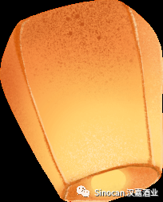 (原始链接: https://mmbiz.qpic.cn/mmbiz_png/7CNdqYbqvBIibDaF5LlZcicDv0h0FwutJu92ic5DfmCnSzGBBy4A8bAdCCkeRFK4KWrDlIHplhBUTQUHPe5soq8xQ/640?wx_fmt=png)
-  (原始链接: https://mmbiz.qpic.cn/mmbiz_png/7CNdqYbqvBIibDaF5LlZcicDv0h0FwutJuqeYtqHxL9L79xdDRomtwiaOHANWfCGLHEoFEe78dqtycicicfcnYZrRRw/640?wx_fmt=png)
- 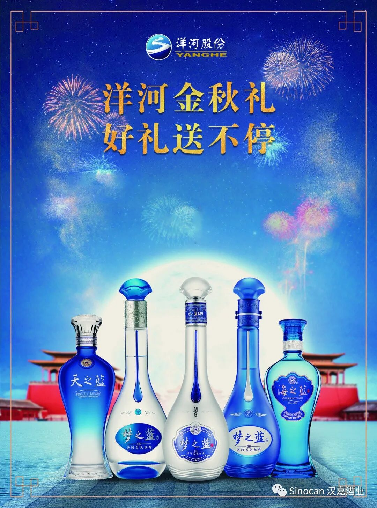 (原始链接: https://mmbiz.qpic.cn/mmbiz_jpg/7CNdqYbqvBIibDaF5LlZcicDv0h0FwutJu6kIHyB0AUiaicJHCOFiaPiacVDibKTCbtia82eSMe1lML4D5YIs6xojjqqng/640?wx_fmt=jpeg)
- 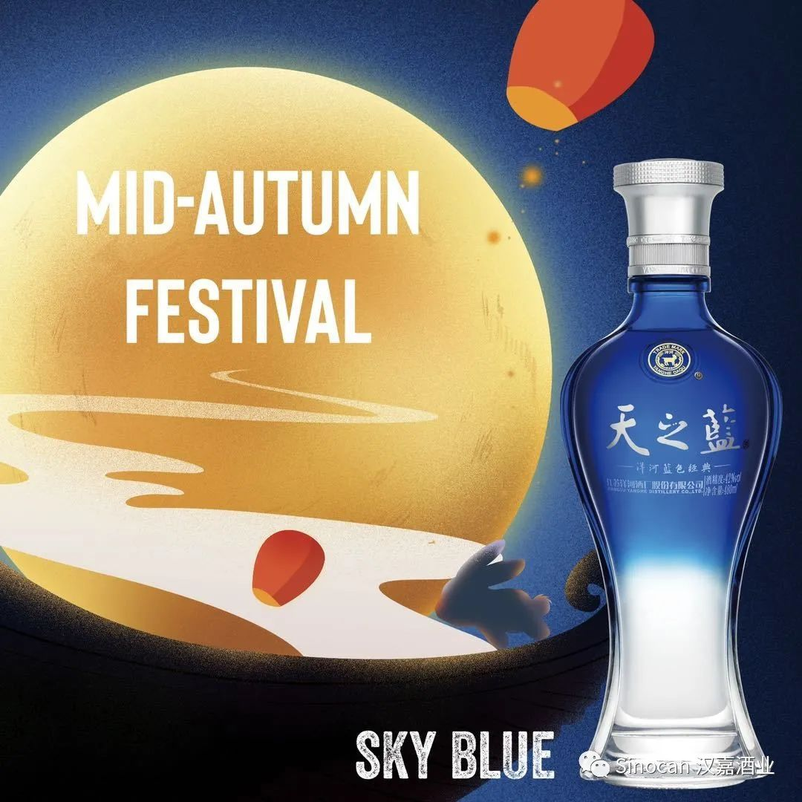 (原始链接: https://mmbiz.qpic.cn/mmbiz_jpg/7CNdqYbqvBIibDaF5LlZcicDv0h0FwutJuTNqhf7WbrltD97UoNyklMtBePr7lTXZfJ2QQA60ggtbJBCvz9eictrA/640?wx_fmt=jpeg)
- 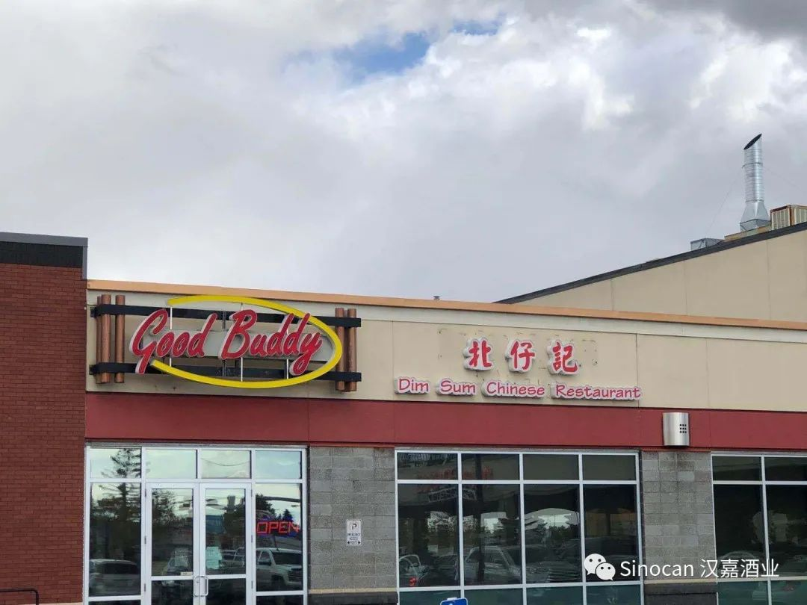 (原始链接: https://mmbiz.qpic.cn/mmbiz_jpg/7CNdqYbqvBIibDaF5LlZcicDv0h0FwutJuTFZAf7QuHclNNScdspvq1vY4YteYjW2Y8ibVLwcIlINuWPYFElFkf0Q/640?wx_fmt=jpeg)
- 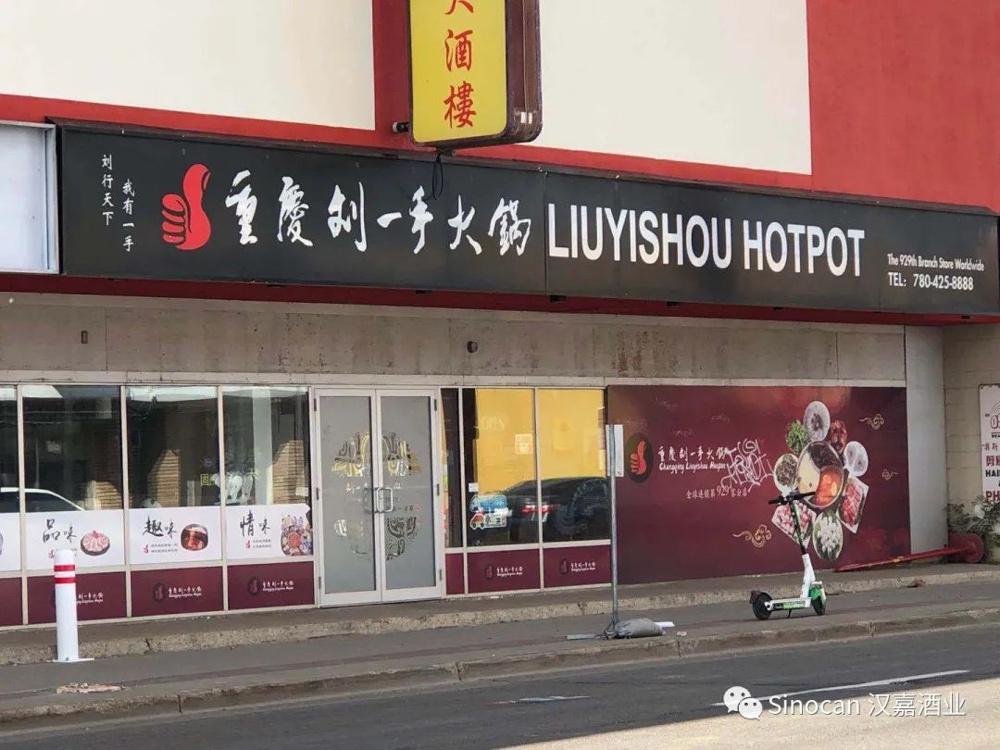 (原始链接: https://mmbiz.qpic.cn/mmbiz_jpg/7CNdqYbqvBIibDaF5LlZcicDv0h0FwutJuwFiaEtZtQ67b21oj5eoQdzAMd8fK1s9fehpiaQBehniacjuNvc7elZD2A/640?wx_fmt=jpeg)
- 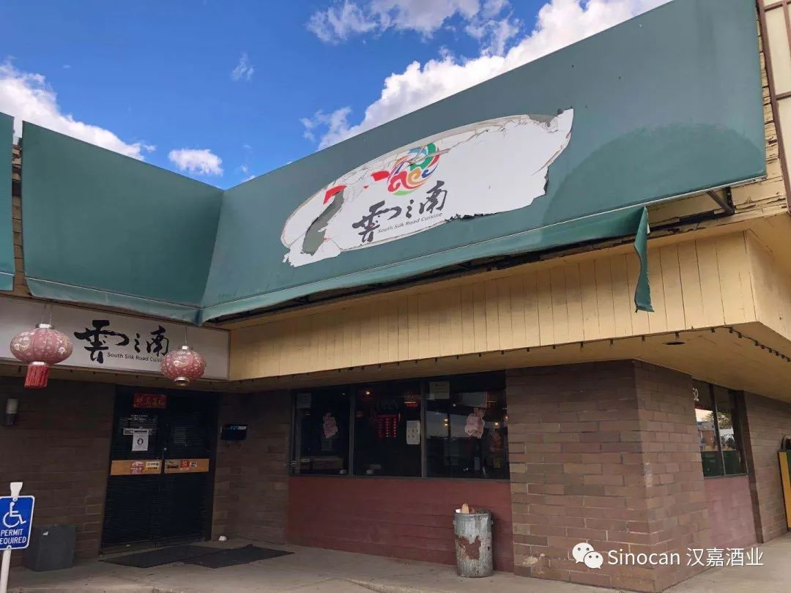 (原始链接: https://mmbiz.qpic.cn/mmbiz_jpg/7CNdqYbqvBIibDaF5LlZcicDv0h0FwutJuOAdJ4uSu8AptJalLYa4KQG2Tic6Vzz6kAFFN3RibZfOZxMokzUx615eA/640?wx_fmt=jpeg)
- 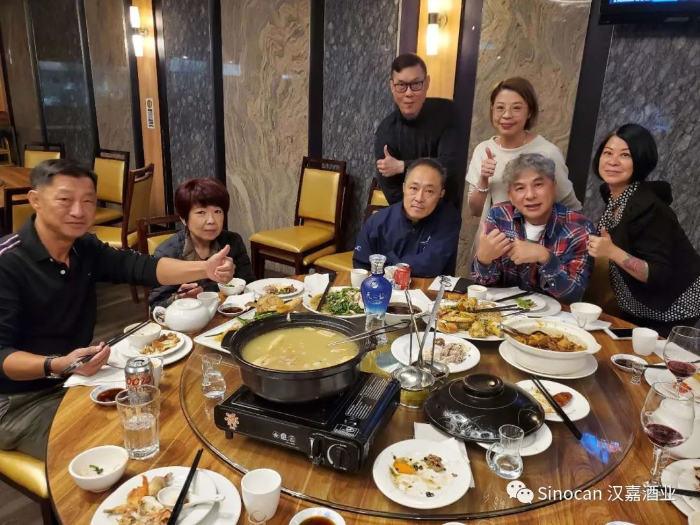 (原始链接: https://mmbiz.qpic.cn/mmbiz_jpg/7CNdqYbqvBIibDaF5LlZcicDv0h0FwutJu0Gtyv6QIH9gzokX3fLBy80J3PbMssTW5gwQ9xn229IL21ibcytQB7MQ/640?wx_fmt=jpeg)
- 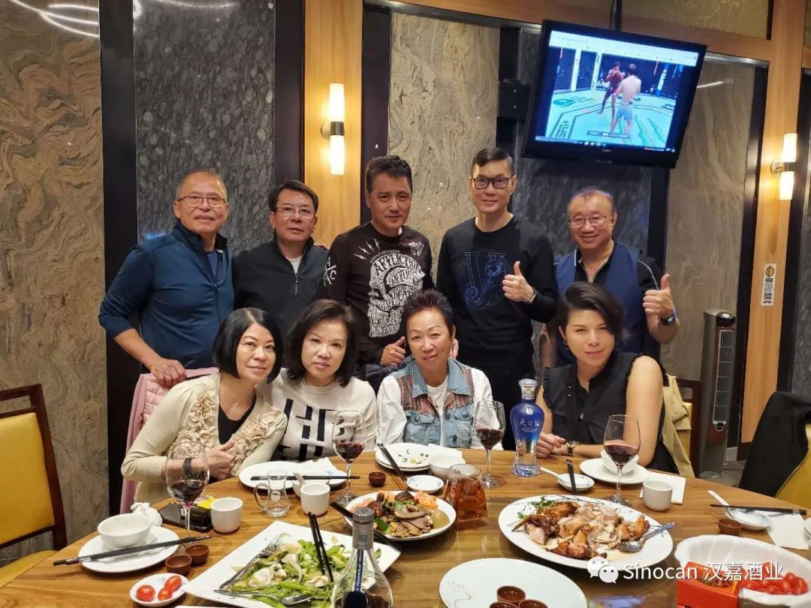 (原始链接: https://mmbiz.qpic.cn/mmbiz_jpg/7CNdqYbqvBIibDaF5LlZcicDv0h0FwutJuo3HeCknS2DI67TBPkKAVtJpdUmsH0Aj5UzY7mGWYYLcPQ6292LfpGg/640?wx_fmt=jpeg)
- 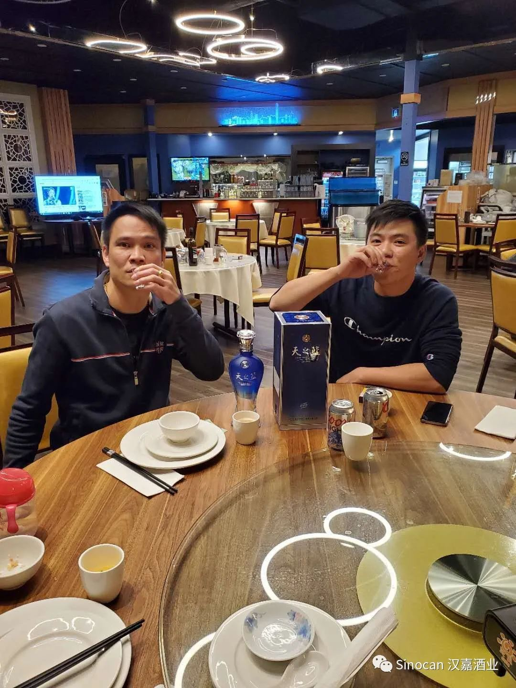 (原始链接: https://mmbiz.qpic.cn/mmbiz_jpg/7CNdqYbqvBIibDaF5LlZcicDv0h0FwutJugwsFQq1ibCjFibGJicViaLNdv7NvzZr6jD2jJrTHjAyHoic6e9aqruDnZNQ/640?wx_fmt=jpeg)
- 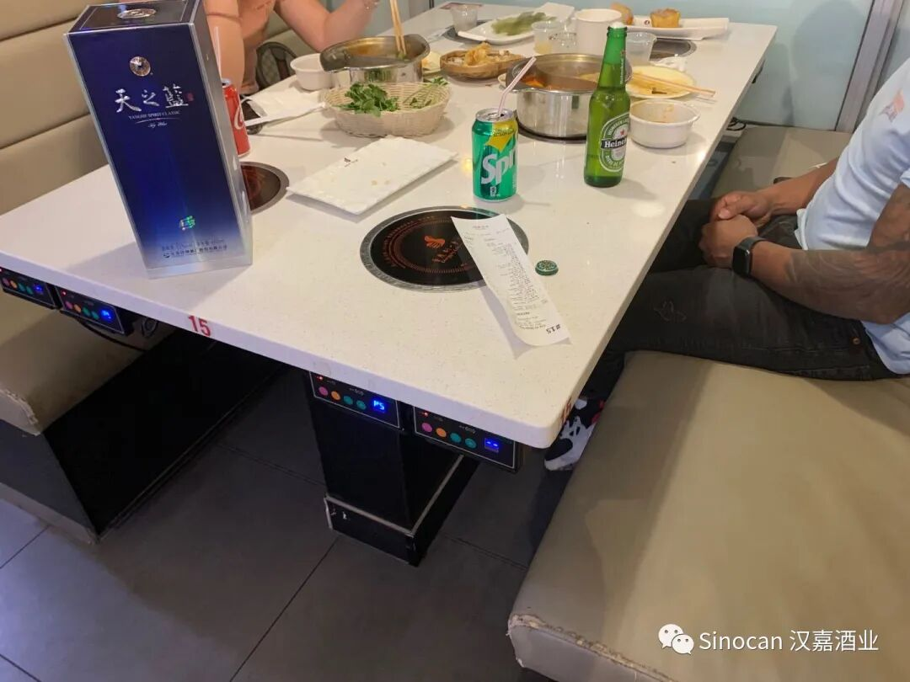 (原始链接: https://mmbiz.qpic.cn/mmbiz_jpg/7CNdqYbqvBIibDaF5LlZcicDv0h0FwutJuq7r7HOic6EflaicfxPamUI7ZhCiap2ibm6WxvquVe76arZx9c55tVnYQ2w/640?wx_fmt=jpeg)
- 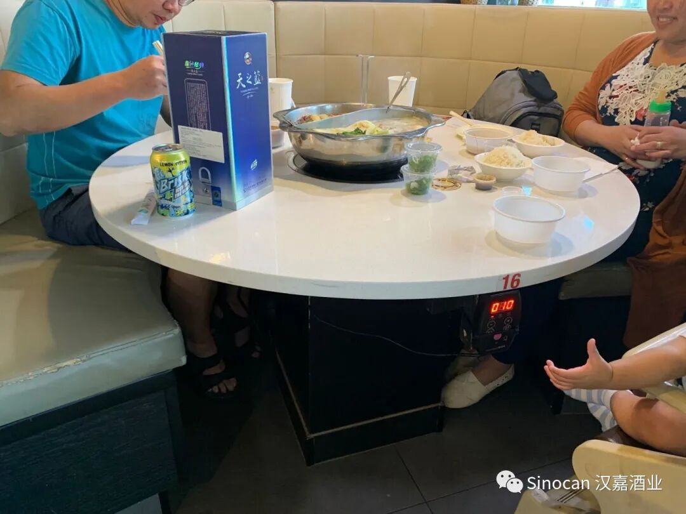 (原始链接: https://mmbiz.qpic.cn/mmbiz_jpg/7CNdqYbqvBIibDaF5LlZcicDv0h0FwutJuPNvMYPa7ZhxgJIhGicypdZ5fPsbEbXJPe2ycm4jgBHq5ibnuSiccIZJsg/640?wx_fmt=jpeg)
- 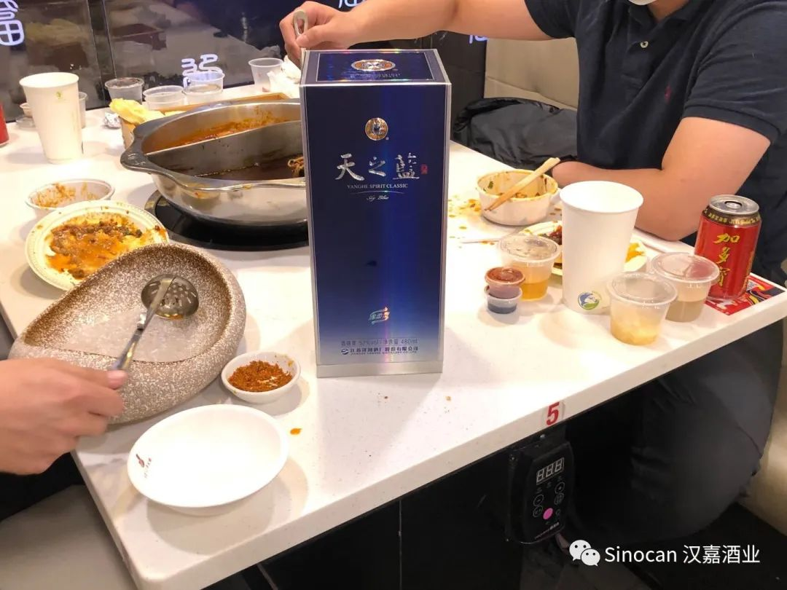 (原始链接: https://mmbiz.qpic.cn/mmbiz_jpg/7CNdqYbqvBIibDaF5LlZcicDv0h0FwutJuiaBLchPAsickVkBZZa0Ayooet3ZVKjuKXK3CELtuibP6iaBItczQdbsJzg/640?wx_fmt=jpeg)
- 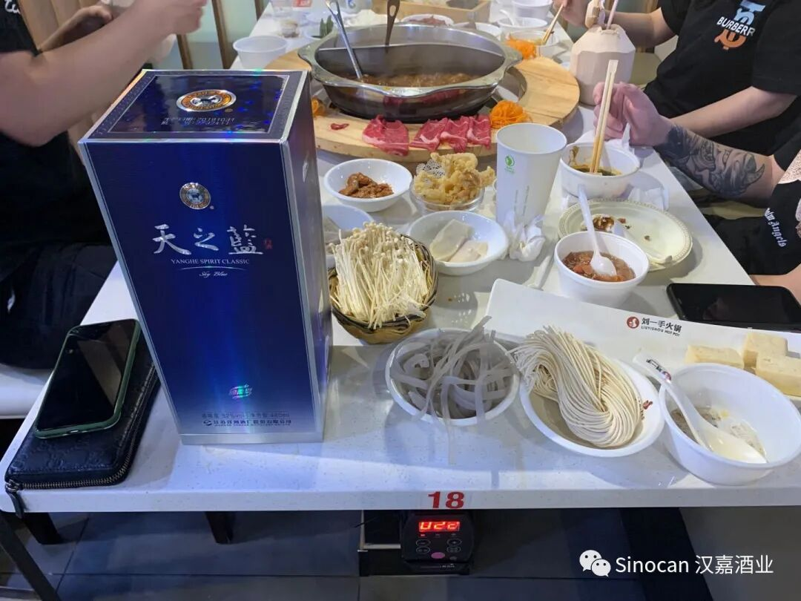 (原始链接: https://mmbiz.qpic.cn/mmbiz_jpg/7CNdqYbqvBIibDaF5LlZcicDv0h0FwutJuqiaXYQqJmaBfr0IoMTQjB3gAj2VyQoFAIwPBTmIbnpaLicVlqMwMyDeg/640?wx_fmt=jpeg)
- 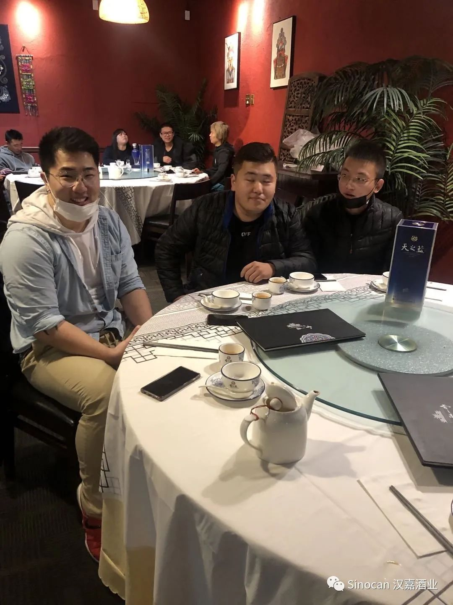 (原始链接: https://mmbiz.qpic.cn/mmbiz_jpg/7CNdqYbqvBIibDaF5LlZcicDv0h0FwutJusTcvXAwlhqzFXspM4f9bhAiaeVia3DOQwcuNjtAvxiba4bVmCYKJCOvrQ/640?wx_fmt=jpeg)
- 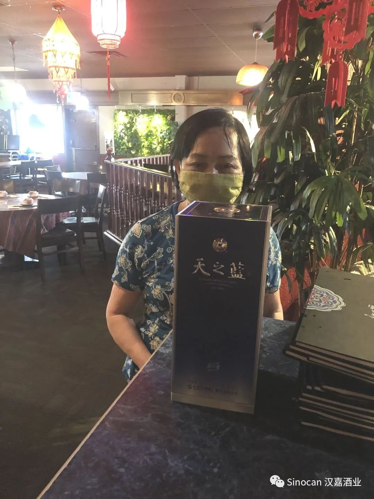 (原始链接: https://mmbiz.qpic.cn/mmbiz_jpg/7CNdqYbqvBIibDaF5LlZcicDv0h0FwutJu61GlJeS0SxlMo4XtcibyrBruKnpdd96klmyTMtat9BXNpyVlK1rMteA/640?wx_fmt=jpeg)
- 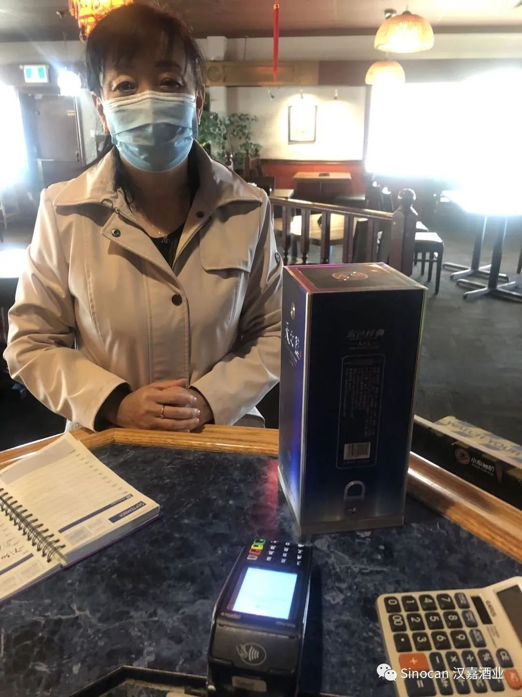 (原始链接: https://mmbiz.qpic.cn/mmbiz_jpg/7CNdqYbqvBIibDaF5LlZcicDv0h0FwutJun4dlg3Yy1PxmxCeFic5gBbick2mpgQvGZEysfqJmcarCcXdx5DmBL6ibw/640?wx_fmt=jpeg)
- 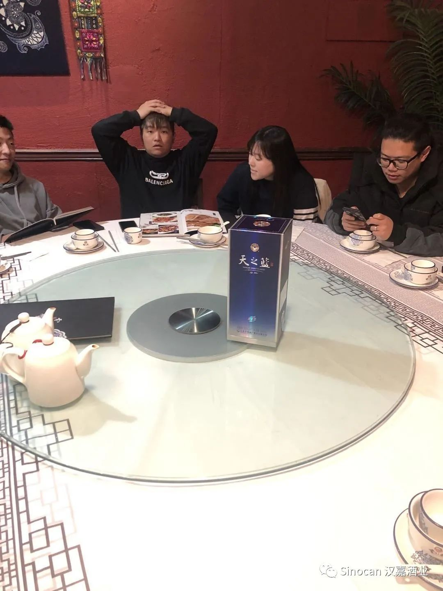 (原始链接: https://mmbiz.qpic.cn/mmbiz_jpg/7CNdqYbqvBIibDaF5LlZcicDv0h0FwutJuf6wFpHS4sMeCibVfB0yOIfdtO4DzEmibW7ibrrEZlibFChJabCUg5aiamDg/640?wx_fmt=jpeg)
- 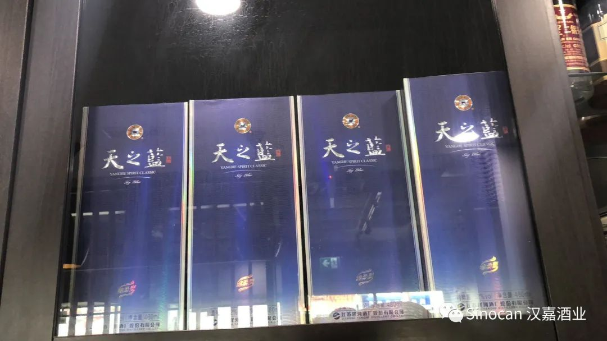 (原始链接: https://mmbiz.qpic.cn/mmbiz_jpg/7CNdqYbqvBIibDaF5LlZcicDv0h0FwutJuZxJuczTkVTYvaUYWhN9aeib1FvhdLibhwsEXiaLlniaHhu8STibTC07r0ibA/640?wx_fmt=jpeg)
- 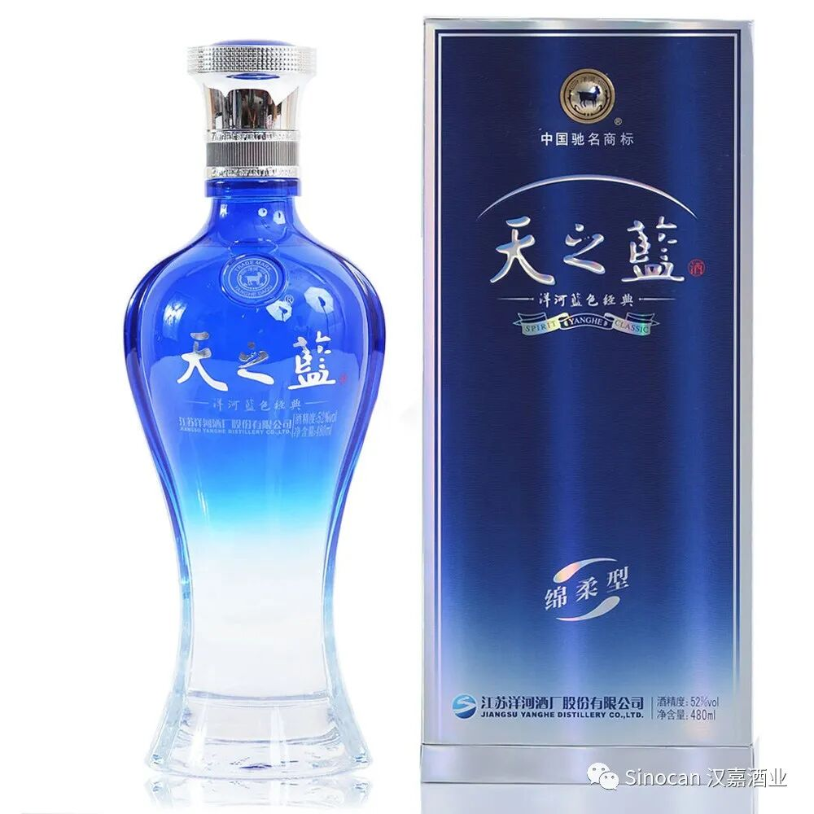 (原始链接: https://mmbiz.qpic.cn/mmbiz_jpg/7CNdqYbqvBIibDaF5LlZcicDv0h0FwutJuDBFItwMygOFibzRIU6l6z2GmQyvrwce0XpIwYMr9a9HR5AN2EggoEkQ/640?wx_fmt=jpeg)
-  (原始链接: https://mmbiz.qpic.cn/mmbiz_jpg/7CNdqYbqvBIibDaF5LlZcicDv0h0FwutJu2c0aeM30MC1WYN0LB9R6gNWSv76SSppXbj9pN1oRibwnSELqicyloUdg/640?wx_fmt=jpeg)
- 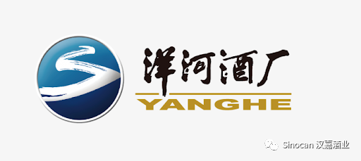 (原始链接: https://mmbiz.qpic.cn/mmbiz_png/7CNdqYbqvBIibDaF5LlZcicDv0h0FwutJuftKL0fEKzFeHhSeKSiavoSbb1007BtBcTddqFhGdGZ3zv77QicjZpQibA/640?wx_fmt=png)
-  (原始链接: https://mmbiz.qpic.cn/mmbiz_jpg/7CNdqYbqvBIibDaF5LlZcicDv0h0FwutJulTfUYaPXupiacCfGziaX2J9Wtkwbl9pvRIIibDshT8lBhf0SwOO1Y92jw/640?wx_fmt=jpeg)
