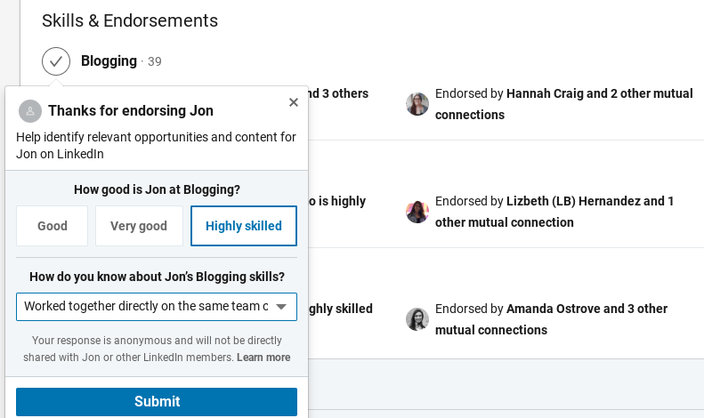
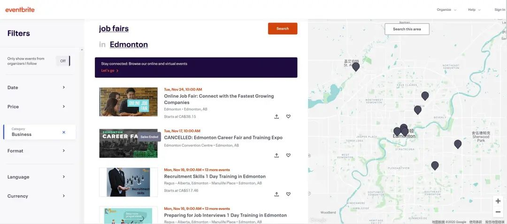
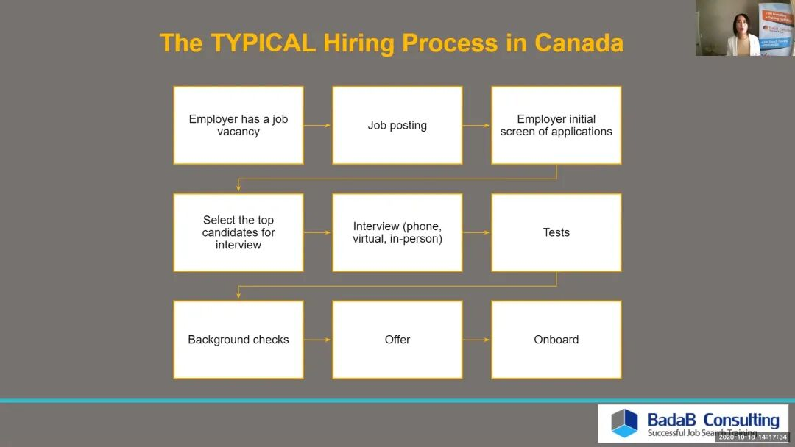
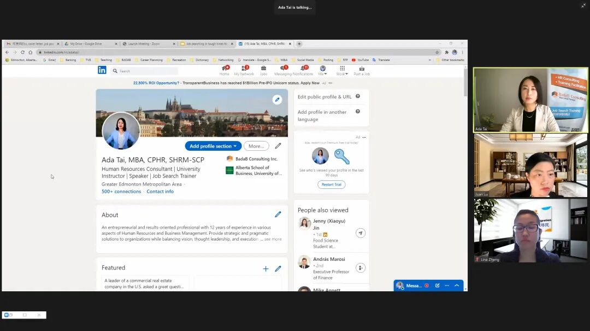
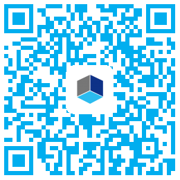

# 无标题

**链接地址:** http://mp.weixin.qq.com/s?__biz=MzI4NDYyNjAwNw==&mid=2247484516&idx=1&sn=6b2823c9a4848a14394238fd245fa198&chksm=ebf9d95cdc8e504aaa11e5e9248e2da102ccbbfa72a82715221df519cfe658dd0cdbc3f2b8d1&mpshare=1&scene=2&srcid=1121xxJCoMso9EvMcTAv6Yoq&sharer_sharetime=1605908613242&sharer_shareid=be1c8edd6c93eec155a61c876e41d26a#rd
**作者:** 关注我们
**获取时间:** 2025/8/28 20:01:02
**图片数量:** 24

---

## 原始HTML内容

<section style="box-sizing: border-box;font-size: 16px;"><section style="margin: 10px 0%;box-sizing: border-box;" powered-by="xiumi.us"><section style="display: inline-block;width: 100%;vertical-align: top;background-color: rgba(211, 226, 242, 0.89);padding: 3px;box-sizing: border-box;"><section style="box-sizing: border-box;" powered-by="xiumi.us"><section style="display: flex;flex-flow: row nowrap;box-sizing: border-box;"><section style="display: inline-block;vertical-align: top;width: auto;flex: 50 50 0%;align-self: stretch;height: auto;background-color: rgb(255, 255, 255);padding: 3px;box-sizing: border-box;"><section style="display: inline-block;width: 100%;vertical-align: middle;border-style: solid;border-width: 1px;border-radius: 0px;border-color: rgba(211, 226, 242, 0.89);padding: 3px 10px 5px;align-self: center;box-sizing: border-box;" powered-by="xiumi.us"><section style="margin-top: 3px;margin-right: 0%;margin-left: 0%;box-sizing: border-box;" powered-by="xiumi.us"><section style="text-align: center;color: rgb(106, 106, 106);line-height: 1.2;font-size: 14px;box-sizing: border-box;">
<strong style="box-sizing: border-box;">点击蓝字</strong>
</section></section></section></section><section style="display: inline-block;vertical-align: middle;width: auto;padding-left: 3px;background-color: rgba(255, 255, 255, 0);flex: 50 50 0%;align-self: center;height: auto;box-sizing: border-box;"><section style="margin-top: 3px;margin-right: 0%;margin-left: 0%;box-sizing: border-box;" powered-by="xiumi.us"><section style="text-align: center;font-size: 14px;color: rgb(106, 106, 106);line-height: 1.2;box-sizing: border-box;">
<strong style="box-sizing: border-box;">关注我们</strong>
</section></section></section></section></section></section></section><section style="margin: 10px 0%;box-sizing: border-box;" powered-by="xiumi.us"><section style="display: inline-block;width: 100%;vertical-align: top;background-color: rgb(255, 255, 255);padding: 15px;box-sizing: border-box;"><section style="margin: 7px 0% 20px;box-sizing: border-box;" powered-by="xiumi.us"><section style="border-top: 4px solid rgba(211, 226, 242, 0.89);box-sizing: border-box;"><section><svg viewBox="0 0 1 1" style="float:left;line-height:0;width:0;vertical-align:top;"></svg></section></section><section style="margin-top: 3px;border-top: 1px solid rgba(211, 226, 242, 0.89);box-sizing: border-box;"><section><svg viewBox="0 0 1 1" style="float:left;line-height:0;width:0;vertical-align:top;"></svg></section></section></section><section style="text-align: center;margin: 10px 0%;box-sizing: border-box;" powered-by="xiumi.us"><section style="max-width: 100%;vertical-align: middle;display: inline-block;line-height: 0;box-sizing: border-box;"></section></section><section style="margin-right: 0%;margin-left: 0%;box-sizing: border-box;" powered-by="xiumi.us"><section style="color: rgb(77, 182, 172);font-size: 14px;line-height: 1.8;letter-spacing: 2px;box-sizing: border-box;">
 

从今年年初 BadaB 开始推出关于<strong style="box-sizing: border-box;">疫情期间应该如何求职就业的专题以来</strong>，已经过去了9个多月时间。

 

第二波疫情凶猛的反扑，再加上第一场冬雪的来临，更是将<strong style="box-sizing: border-box;">延缓了不少朋友们的职场进程</strong>。

 
</section></section><section style="text-align: center;margin-top: 10px;margin-bottom: 10px;box-sizing: border-box;" powered-by="xiumi.us"><section style="max-width: 100%;vertical-align: middle;display: inline-block;line-height: 0;box-sizing: border-box;"></section></section><section style="margin-right: 0%;margin-left: 0%;box-sizing: border-box;" powered-by="xiumi.us"><section style="color: rgb(77, 182, 172);font-size: 14px;line-height: 1.8;letter-spacing: 2px;box-sizing: border-box;">
 

求职者们纷纷反映，<strong style="box-sizing: border-box;">职场社交活动大批取消，面试机会几乎为零</strong>，在这样的求职寒冬，我们到底应该怎样扩展自己的社交圈，为自己<strong style="box-sizing: border-box;">开拓更广阔的职业前景</strong>呢？

 

在今天的专题文章中，我们就将带领大家参考学习几个让你<strong style="box-sizing: border-box;">坐在家中就可以拓展人脉的好办法</strong>。对这个话题感兴趣的朋友们，请赶紧学起来吧！
</section></section><section style="margin: 20px 0% 10px;box-sizing: border-box;" powered-by="xiumi.us"><section style="border-top: 1px solid rgba(211, 226, 242, 0.89);box-sizing: border-box;"><section><svg viewBox="0 0 1 1" style="float:left;line-height:0;width:0;vertical-align:top;"></svg></section></section><section style="margin-top: 3px;border-top: 4px solid rgba(211, 226, 242, 0.89);box-sizing: border-box;"><section><svg viewBox="0 0 1 1" style="float:left;line-height:0;width:0;vertical-align:top;"></svg></section></section></section></section></section><section style="box-sizing: border-box;" powered-by="xiumi.us">
 
</section><section style="margin: 10px 0%;box-sizing: border-box;" powered-by="xiumi.us"><section style="display: inline-block;width: 100%;vertical-align: top;background-color: rgba(211, 226, 242, 0.89);padding: 3px;box-sizing: border-box;"><section style="box-sizing: border-box;" powered-by="xiumi.us"><section style="display: flex;flex-flow: row nowrap;box-sizing: border-box;"><section style="display: inline-block;vertical-align: top;width: auto;flex: 14 14 0%;align-self: stretch;height: auto;box-sizing: border-box;"><section style="margin-top: 3px;margin-right: 0%;margin-left: 0%;box-sizing: border-box;" powered-by="xiumi.us"><section style="text-align: center;font-size: 26px;color: rgb(106, 106, 106);box-sizing: border-box;">
<em style="box-sizing: border-box;"><strong style="box-sizing: border-box;">1.</strong></em>
</section></section></section><section style="display: inline-block;vertical-align: top;width: auto;padding: 3px;background-color: rgb(255, 255, 255);flex: 100 100 0%;align-self: stretch;height: auto;box-sizing: border-box;"><section style="display: inline-block;width: 100%;vertical-align: middle;border-style: solid;border-width: 1px;border-radius: 0px;border-color: rgba(211, 226, 242, 0.89);padding: 3px 10px 5px;align-self: center;box-sizing: border-box;" powered-by="xiumi.us"><section style="margin-top: 3px;margin-right: 0%;margin-left: 0%;box-sizing: border-box;" powered-by="xiumi.us"><section style="color: rgb(106, 106, 106);box-sizing: border-box;">
<strong style="box-sizing: border-box;">打造一个漂亮的LinkedIn主页</strong>
</section></section></section></section></section></section></section></section><section style="margin: 12px 0%;box-sizing: border-box;" powered-by="xiumi.us"><section style="font-size: 14px;color: rgb(121, 121, 121);padding-right: 15px;padding-left: 15px;line-height: 1.8;letter-spacing: 2px;box-sizing: border-box;">
 

现代社会网络信息化技术发达，而疫情又让大家无法面对面相见，因此<strong style="box-sizing: border-box;">网络上的沟通联系就变得更加重要</strong>。

 
</section></section><section style="text-align: center;margin-top: 10px;margin-bottom: 10px;box-sizing: border-box;" powered-by="xiumi.us"><section style="max-width: 100%;vertical-align: middle;display: inline-block;line-height: 0;box-sizing: border-box;"></section></section><section style="margin: 12px 0%;box-sizing: border-box;" powered-by="xiumi.us"><section style="font-size: 14px;color: rgb(121, 121, 121);padding-right: 15px;padding-left: 15px;line-height: 1.8;letter-spacing: 2px;box-sizing: border-box;">
 

而LinkedIn这样的以职业社交为主的网络社交平台，就成为了<strong style="box-sizing: border-box;">疫情期间扩展人脉的主战场</strong>。

 

 
</section></section><section style="box-sizing: border-box;" powered-by="xiumi.us"><section style="text-align: center;justify-content: center;margin: 10px 0%;display: flex;flex-flow: row nowrap;box-sizing: border-box;"><section style="display: inline-block;vertical-align: bottom;width: auto;align-self: flex-end;flex: 0 0 0%;height: auto;line-height: 0;box-sizing: border-box;"><section style="text-align: right;justify-content: flex-end;box-sizing: border-box;" powered-by="xiumi.us"><section style="display: inline-block;width: 22px;height: 22px;vertical-align: top;overflow: hidden;background-color: rgba(198, 224, 252, 0.35);box-sizing: border-box;"><section><svg viewBox="0 0 1 1" style="float:left;line-height:0;width:0;vertical-align:top;"></svg></section></section></section></section><section style="display: inline-block;vertical-align: bottom;width: auto;min-width: 10%;max-width: 100%;flex: 0 0 auto;height: auto;align-self: flex-end;box-sizing: border-box;"><section style="text-align: justify;color: rgb(127, 127, 127);font-size: 17px;padding-right: 4px;padding-left: 4px;line-height: 1;box-sizing: border-box;" powered-by="xiumi.us">
<strong style="box-sizing: border-box;">建立起你的个人主页</strong>
</section></section><section style="display: inline-block;vertical-align: bottom;width: auto;align-self: flex-end;min-width: 10%;max-width: 100%;flex: 0 0 auto;height: auto;line-height: 0;box-sizing: border-box;"><section style="text-align: left;justify-content: flex-start;box-sizing: border-box;" powered-by="xiumi.us"><section style="display: inline-block;width: 15px;height: 15px;vertical-align: top;overflow: hidden;background-color: rgba(198, 224, 252, 0.35);box-sizing: border-box;"><section><svg viewBox="0 0 1 1" style="float:left;line-height:0;width:0;vertical-align:top;"></svg></section></section></section></section></section></section><section style="margin: 12px 0%;box-sizing: border-box;" powered-by="xiumi.us"><section style="font-size: 14px;color: rgb(121, 121, 121);padding-right: 15px;padding-left: 15px;line-height: 1.8;letter-spacing: 2px;box-sizing: border-box;">
 

如果你还没有为自己创建打造一个<strong style="box-sizing: border-box;">整洁又正式的LinkedIn个人主页</strong>，那现在就是完成这项任务的最佳时间！

 
</section></section><section style="text-align: center;margin-top: 10px;margin-bottom: 10px;box-sizing: border-box;" powered-by="xiumi.us"><section style="max-width: 100%;vertical-align: middle;display: inline-block;line-height: 0;box-sizing: border-box;"></section></section><section style="margin: 12px 0%;box-sizing: border-box;" powered-by="xiumi.us"><section style="font-size: 14px;color: rgb(121, 121, 121);padding-right: 15px;padding-left: 15px;line-height: 1.8;letter-spacing: 2px;box-sizing: border-box;">
 

请趁着这些日子抽点时间去<strong style="box-sizing: border-box;">丰富和美化一下上面的内容</strong>，把它当做你的<strong style="box-sizing: border-box;">电子名片</strong>，给联系你的人留下更好的印象。

 

 
</section></section><section style="box-sizing: border-box;" powered-by="xiumi.us"><section style="text-align: center;justify-content: center;margin: 10px 0%;display: flex;flex-flow: row nowrap;box-sizing: border-box;"><section style="display: inline-block;vertical-align: bottom;width: auto;align-self: flex-end;flex: 0 0 0%;height: auto;line-height: 0;box-sizing: border-box;"><section style="text-align: right;justify-content: flex-end;box-sizing: border-box;" powered-by="xiumi.us"><section style="display: inline-block;width: 22px;height: 22px;vertical-align: top;overflow: hidden;background-color: rgba(198, 224, 252, 0.35);box-sizing: border-box;"><section><svg viewBox="0 0 1 1" style="float:left;line-height:0;width:0;vertical-align:top;"></svg></section></section></section></section><section style="display: inline-block;vertical-align: bottom;width: auto;min-width: 10%;max-width: 100%;flex: 0 0 auto;height: auto;align-self: flex-end;box-sizing: border-box;"><section style="text-align: justify;color: rgb(127, 127, 127);font-size: 17px;padding-right: 4px;padding-left: 4px;line-height: 1;box-sizing: border-box;" powered-by="xiumi.us">
<strong style="box-sizing: border-box;">丰富自己的主页</strong>
</section></section><section style="display: inline-block;vertical-align: bottom;width: auto;align-self: flex-end;min-width: 10%;max-width: 100%;flex: 0 0 auto;height: auto;line-height: 0;box-sizing: border-box;"><section style="text-align: left;justify-content: flex-start;box-sizing: border-box;" powered-by="xiumi.us"><section style="display: inline-block;width: 15px;height: 15px;vertical-align: top;overflow: hidden;background-color: rgba(198, 224, 252, 0.35);box-sizing: border-box;"><section><svg viewBox="0 0 1 1" style="float:left;line-height:0;width:0;vertical-align:top;"></svg></section></section></section></section></section></section><section style="margin: 12px 0%;box-sizing: border-box;" powered-by="xiumi.us"><section style="font-size: 14px;color: rgb(121, 121, 121);padding-right: 15px;padding-left: 15px;line-height: 1.8;letter-spacing: 2px;box-sizing: border-box;">
 

邀请你的同事和客户们为你的技能和专长慷慨地按下一个<strong style="box-sizing: border-box;">“endorsement”</strong>，恳请你的上司和工作伙伴用简短但真挚的文字为你继续扩充<strong style="box-sizing: border-box;">“reference”</strong>界面。

 
</section></section><section style="text-align: center;margin-top: 10px;margin-bottom: 10px;box-sizing: border-box;" powered-by="xiumi.us"><section style="max-width: 100%;vertical-align: middle;display: inline-block;line-height: 0;box-sizing: border-box;"></section></section><section style="box-sizing: border-box;" powered-by="xiumi.us">
 
</section><section style="margin-top: 10px;margin-bottom: 10px;text-align: center;justify-content: center;box-sizing: border-box;" powered-by="xiumi.us"><section style="padding-left: 1em;padding-right: 1em;display: inline-block;box-sizing: border-box;">
<strong style="box-sizing: border-box;">小贴士</strong>
 </section><section style="border-width: 1px;border-style: solid;border-color: rgb(203, 220, 244);margin-top: -1em;padding: 20px 10px 10px;background-color: rgb(239, 239, 239);width: 100%;height: auto;box-sizing: border-box;"><section style="margin-right: 0%;margin-left: 0%;justify-content: center;box-sizing: border-box;" powered-by="xiumi.us"><section style="text-align: left;font-size: 14px;color: rgb(121, 121, 121);padding-right: 10px;padding-left: 10px;letter-spacing: 2px;box-sizing: border-box;">
 

技能栏这里可以最多填写<strong style="box-sizing: border-box;">50项</strong>！所以请绞尽脑汁地把自己所擅长的所有<strong style="box-sizing: border-box;"> hard skills 和 soft skills </strong>一口气把这个展示框填满吧！这些技能条就像是<strong style="box-sizing: border-box;">“权重标签”</strong>，可以<strong style="box-sizing: border-box;">大大增加你被雇主或者猎头用关键字搜索到的机会哦！</strong>

 
</section></section></section></section><section style="margin: 12px 0%;box-sizing: border-box;" powered-by="xiumi.us"><section style="font-size: 14px;color: rgb(121, 121, 121);padding-right: 15px;padding-left: 15px;line-height: 1.8;letter-spacing: 2px;box-sizing: border-box;">
 

当然，<strong style="box-sizing: border-box;">社交是有来有往的事情</strong>，别忘记也通过同样的方式对他们的工作给与支持！ 

 

另外，如果时<strong style="box-sizing: border-box;">长保持主页的更新</strong>也是十分必要的。工作中的感悟和新获取的成就，对于新闻事件和活动的看法建议等等，都是用来丰富主页的好素材。

 
</section></section><section style="text-align: center;margin-top: 10px;margin-bottom: 10px;box-sizing: border-box;" powered-by="xiumi.us"><section style="max-width: 100%;vertical-align: middle;display: inline-block;line-height: 0;box-sizing: border-box;"></section></section><section style="margin: 12px 0%;box-sizing: border-box;" powered-by="xiumi.us"><section style="font-size: 14px;color: rgb(121, 121, 121);padding-right: 15px;padding-left: 15px;line-height: 1.8;letter-spacing: 2px;box-sizing: border-box;">
 

如果你在文字上的功力没有那么成熟，不妨试着多添加一些图像上的信息，有时候<strong style="box-sizing: border-box;">视觉冲击更能给他人留下深刻的映像</strong>。

 

 
</section></section><section style="box-sizing: border-box;" powered-by="xiumi.us"><section style="text-align: center;justify-content: center;margin: 10px 0%;display: flex;flex-flow: row nowrap;box-sizing: border-box;"><section style="display: inline-block;vertical-align: bottom;width: auto;align-self: flex-end;flex: 0 0 0%;height: auto;line-height: 0;box-sizing: border-box;"><section style="text-align: right;justify-content: flex-end;box-sizing: border-box;" powered-by="xiumi.us"><section style="display: inline-block;width: 22px;height: 22px;vertical-align: top;overflow: hidden;background-color: rgba(198, 224, 252, 0.35);box-sizing: border-box;"><section><svg viewBox="0 0 1 1" style="float:left;line-height:0;width:0;vertical-align:top;"></svg></section></section></section></section><section style="display: inline-block;vertical-align: bottom;width: auto;min-width: 10%;max-width: 100%;flex: 0 0 auto;height: auto;align-self: flex-end;box-sizing: border-box;"><section style="text-align: justify;color: rgb(127, 127, 127);font-size: 17px;padding-right: 4px;padding-left: 4px;line-height: 1;box-sizing: border-box;" powered-by="xiumi.us">
<strong style="box-sizing: border-box;">让好工作找上门来</strong>
</section></section><section style="display: inline-block;vertical-align: bottom;width: auto;align-self: flex-end;min-width: 10%;max-width: 100%;flex: 0 0 auto;height: auto;line-height: 0;box-sizing: border-box;"><section style="text-align: left;justify-content: flex-start;box-sizing: border-box;" powered-by="xiumi.us"><section style="display: inline-block;width: 15px;height: 15px;vertical-align: top;overflow: hidden;background-color: rgba(198, 224, 252, 0.35);box-sizing: border-box;"><section><svg viewBox="0 0 1 1" style="float:left;line-height:0;width:0;vertical-align:top;"></svg></section></section></section></section></section></section><section style="margin: 12px 0%;box-sizing: border-box;" powered-by="xiumi.us"><section style="font-size: 14px;color: rgb(121, 121, 121);padding-right: 15px;padding-left: 15px;line-height: 1.8;letter-spacing: 2px;box-sizing: border-box;">
 

可千万别小瞧打造一个漂亮LinkedIn主页的用途！要知道，在<strong style="box-sizing: border-box;">加拿大不少HR和猎头都会通过在LinkedIn上去检索关键字去寻找潜在的就职者</strong>。

 
</section></section><section style="text-align: center;margin-top: 10px;margin-bottom: 10px;box-sizing: border-box;" powered-by="xiumi.us"><section style="max-width: 100%;vertical-align: middle;display: inline-block;line-height: 0;box-sizing: border-box;"></section></section><section style="margin: 12px 0%;box-sizing: border-box;" powered-by="xiumi.us"><section style="font-size: 14px;color: rgb(121, 121, 121);padding-right: 15px;padding-left: 15px;line-height: 1.8;letter-spacing: 2px;box-sizing: border-box;">
 

你的LinkedIn主页内容越是丰富，越能够增加你被他们发觉的机会。这样也就潜在地增加了<strong style="box-sizing: border-box;">让好工作来找你的机会！</strong>

 

关于如何打造自己的LinkedIn主页，请参考我们往期的文章：

 
</section></section><section style="min-height: 40px;margin: 10px 0%;box-sizing: border-box;" powered-by="xiumi.us"><section style="width: 100%;margin-right: auto;margin-bottom: -10px;margin-left: auto;box-sizing: border-box;"><table width="100%"><tbody style="box-sizing: border-box;"><tr opera-tn-ra-comp="_$.pages:0.layers:0.comps:23.classicTable1:0" style="box-sizing: border-box;" powered-by="xiumi.us"><td colspan="1" rowspan="1" opera-tn-ra-cell="_$.pages:0.layers:0.comps:23.classicTable1:0.td@@0" style="border-width: 0px;border-color: rgb(62, 62, 62) rgb(62, 62, 62) rgb(255, 255, 255);border-radius: 0px;border-style: none;box-sizing: border-box;padding: 0px;" width="100.0000%"><section style="min-height: 40px;margin-right: 0%;margin-bottom: 10px;margin-left: 0%;box-sizing: border-box;" powered-by="xiumi.us"><section style="width: 100%;margin-right: auto;margin-bottom: -10px;margin-left: auto;box-sizing: border-box;"><table width="100%"><tbody style="box-sizing: border-box;"><tr opera-tn-ra-comp="_$.pages:0.layers:0.comps:23.classicTable1:0.td@@0:0.classicTable1:0" style="box-sizing: border-box;" powered-by="xiumi.us"><td colspan="1" opera-tn-ra-cell="_$.pages:0.layers:0.comps:23.classicTable1:0.td@@0:0.classicTable1:0.td@@0" rowspan="2" style="border-color: rgb(62, 62, 62);border-radius: 0px;border-style: none;background-position: 83.3388% 0%;background-repeat: repeat-x;background-size: auto 100%;background-attachment: scroll;vertical-align: bottom;background-image: url(&quot;https://mmbiz.qpic.cn/mmbiz_jpg/cY0qSDjdkFdQBhN7REZllwLaQCysXGfbbjjaNe5mxdzn4K9Cp7HiaoXX3HVvO1qXyJEdibPtdibC5w9MQOvvTISKg/640?wx_fmt=jpeg&quot;);box-sizing: border-box;padding: 0px;" width="30.0000%"> </td><td colspan="1" rowspan="1" opera-tn-ra-cell="_$.pages:0.layers:0.comps:23.classicTable1:0.td@@0:0.classicTable1:0.td@@1" style="border-color: rgb(62, 62, 62);border-radius: 0px;border-style: none;padding-top: 0px;padding-bottom: 0px;background-color: rgb(249, 249, 249);box-sizing: border-box;" width="70.0000%"><section style="margin-top: 10px;margin-right: 0%;margin-left: 0%;box-sizing: border-box;" powered-by="xiumi.us"><section style="font-size: 14px;letter-spacing: 1px;line-height: 1.6;color: rgb(140, 140, 140);box-sizing: border-box;">
<a target="_blank" href="http://mp.weixin.qq.com/s?__biz=MzI4NDYyNjAwNw==&amp;mid=2247483868&amp;idx=1&amp;sn=234a8d704664ab64402ebe01160197b7&amp;chksm=ebf9dce4dc8e55f2d55c474a0bb5ec0ef1bf9434d43cfe5a9eed0ed276291049f365d4a11d8c&amp;scene=21#wechat_redirect" textvalue="●北美求职神器LinkedIn到底怎么用？让这10个小Tips来告诉你！" data-itemshowtype="0" tab="innerlink" data-linktype="2">●北美求职神器LinkedIn到底怎么用？让这10个小Tips来告诉你！</a>

 
</section></section></td></tr><tr opera-tn-ra-comp="_$.pages:0.layers:0.comps:23.classicTable1:0.td@@0:0.classicTable1:1" style="box-sizing: border-box;" powered-by="xiumi.us"><td colspan="1" rowspan="1" opera-tn-ra-cell="_$.pages:0.layers:0.comps:23.classicTable1:0.td@@0:0.classicTable1:1.td@@0" style="border-color: rgb(62, 62, 62);border-radius: 0px;border-style: none;padding-top: 0px;padding-bottom: 0px;background-color: rgb(249, 249, 249);box-sizing: border-box;" width="70.0000%"><section style="margin: 10px 0%;box-sizing: border-box;" powered-by="xiumi.us"><section style="font-size: 14px;letter-spacing: 1px;line-height: 1;color: rgb(140, 140, 140);box-sizing: border-box;">
<a target="_blank" href="http://mp.weixin.qq.com/s?__biz=MzI4NDYyNjAwNw==&amp;mid=2247483868&amp;idx=1&amp;sn=234a8d704664ab64402ebe01160197b7&amp;chksm=ebf9dce4dc8e55f2d55c474a0bb5ec0ef1bf9434d43cfe5a9eed0ed276291049f365d4a11d8c&amp;scene=21#wechat_redirect" textvalue="► 点击阅读" data-itemshowtype="0" tab="innerlink" data-linktype="2">► 点击阅读</a>
</section></section></td></tr></tbody></table></section></section></td></tr></tbody></table></section></section><section style="margin: 12px 0%;box-sizing: border-box;" powered-by="xiumi.us"><section style="font-size: 14px;color: rgb(121, 121, 121);padding-right: 15px;padding-left: 15px;line-height: 1.8;letter-spacing: 2px;box-sizing: border-box;">
 

在线求职课程的<strong style="box-sizing: border-box;">“求职入门必看”新手篇</strong>中，我们的资深人力资源顾问也详细地讲解过关于<strong style="box-sizing: border-box;">LinkedIn使用的诀窍</strong>，请大家扫描二维码进入学习：

 
</section></section><section style="text-align: center;margin-top: 10px;margin-bottom: 10px;box-sizing: border-box;" powered-by="xiumi.us"><section style="max-width: 100%;vertical-align: middle;display: inline-block;line-height: 0;box-sizing: border-box;"></section></section><section style="box-sizing: border-box;" powered-by="xiumi.us"><section style="display: flex;flex-flow: row nowrap;margin: 10px 0%;box-sizing: border-box;"><section style="display: inline-block;width: auto;vertical-align: top;line-height: 0;flex: 100 100 0%;align-self: flex-start;height: auto;border-top: 1px dotted rgb(213, 194, 248);border-top-left-radius: 0px;box-sizing: border-box;"><section style="text-align: right;margin-top: -4px;margin-right: 0%;margin-left: 0%;transform: translate3d(-17px, 0px, 0px);justify-content: flex-end;box-sizing: border-box;" powered-by="xiumi.us"><section style="display: inline-block;width: 7px;height: 7px;vertical-align: top;overflow: hidden;border-width: 1px;border-radius: 10px;border-style: solid;border-color: rgb(203, 220, 244);box-shadow: rgb(255, 255, 255) 0px 3px 0px inset;box-sizing: border-box;"><section><svg viewBox="0 0 1 1" style="float:left;line-height:0;width:0;vertical-align:top;"></svg></section></section></section></section></section></section><section style="box-sizing: border-box;" powered-by="xiumi.us">
 
</section><section style="box-sizing: border-box;" powered-by="xiumi.us">
 
</section><section style="margin: 10px 0%;box-sizing: border-box;" powered-by="xiumi.us"><section style="display: inline-block;width: 100%;vertical-align: top;background-color: rgba(211, 226, 242, 0.89);padding: 3px;box-sizing: border-box;"><section style="box-sizing: border-box;" powered-by="xiumi.us"><section style="display: flex;flex-flow: row nowrap;box-sizing: border-box;"><section style="display: inline-block;vertical-align: top;width: auto;flex: 14 14 0%;align-self: stretch;height: auto;box-sizing: border-box;"><section style="margin-top: 3px;margin-right: 0%;margin-left: 0%;box-sizing: border-box;" powered-by="xiumi.us"><section style="text-align: center;font-size: 26px;color: rgb(106, 106, 106);box-sizing: border-box;">
<em style="box-sizing: border-box;"><strong style="box-sizing: border-box;">2.</strong></em>
</section></section></section><section style="display: inline-block;vertical-align: top;width: auto;padding: 3px;background-color: rgb(255, 255, 255);flex: 100 100 0%;align-self: stretch;height: auto;box-sizing: border-box;"><section style="display: inline-block;width: 100%;vertical-align: middle;border-style: solid;border-width: 1px;border-radius: 0px;border-color: rgba(211, 226, 242, 0.89);padding: 3px 10px 5px;align-self: center;box-sizing: border-box;" powered-by="xiumi.us"><section style="margin-top: 3px;margin-right: 0%;margin-left: 0%;box-sizing: border-box;" powered-by="xiumi.us"><section style="color: rgb(106, 106, 106);box-sizing: border-box;">
<strong style="box-sizing: border-box;">在社交平台发展人脉</strong>
</section></section></section></section></section></section></section></section><section style="box-sizing: border-box;" powered-by="xiumi.us">
 
</section><section style="box-sizing: border-box;" powered-by="xiumi.us">
 
</section><section style="box-sizing: border-box;" powered-by="xiumi.us"><section style="text-align: center;justify-content: center;margin: 10px 0%;display: flex;flex-flow: row nowrap;box-sizing: border-box;"><section style="display: inline-block;vertical-align: bottom;width: auto;align-self: flex-end;flex: 0 0 0%;height: auto;line-height: 0;box-sizing: border-box;"><section style="text-align: right;justify-content: flex-end;box-sizing: border-box;" powered-by="xiumi.us"><section style="display: inline-block;width: 22px;height: 22px;vertical-align: top;overflow: hidden;background-color: rgba(198, 224, 252, 0.35);box-sizing: border-box;"><section><svg viewBox="0 0 1 1" style="float:left;line-height:0;width:0;vertical-align:top;"></svg></section></section></section></section><section style="display: inline-block;vertical-align: bottom;width: auto;min-width: 10%;max-width: 100%;flex: 0 0 auto;height: auto;align-self: flex-end;box-sizing: border-box;"><section style="text-align: justify;color: rgb(127, 127, 127);font-size: 17px;padding-right: 4px;padding-left: 4px;line-height: 1;box-sizing: border-box;" powered-by="xiumi.us">
<strong style="box-sizing: border-box;">增加自己的“影响力”</strong>
</section></section><section style="display: inline-block;vertical-align: bottom;width: auto;align-self: flex-end;min-width: 10%;max-width: 100%;flex: 0 0 auto;height: auto;line-height: 0;box-sizing: border-box;"><section style="text-align: left;justify-content: flex-start;box-sizing: border-box;" powered-by="xiumi.us"><section style="display: inline-block;width: 15px;height: 15px;vertical-align: top;overflow: hidden;background-color: rgba(198, 224, 252, 0.35);box-sizing: border-box;"><section><svg viewBox="0 0 1 1" style="float:left;line-height:0;width:0;vertical-align:top;"></svg></section></section></section></section></section></section><section style="box-sizing: border-box;" powered-by="xiumi.us">
 
</section><section style="margin: 12px 0%;box-sizing: border-box;" powered-by="xiumi.us"><section style="font-size: 14px;color: rgb(121, 121, 121);padding-right: 15px;padding-left: 15px;line-height: 1.8;letter-spacing: 2px;box-sizing: border-box;">
创建好自己的LinkedIn页面仅仅相当于<strong style="box-sizing: border-box;">职业社交之路的开始</strong>。更重要的是，你需要花费大量的时间和精力去<strong style="box-sizing: border-box;">经营自己的页面</strong>，并利用这个平台去帮助自己拓展交际圈！ 

 
</section></section><section style="text-align: center;margin-top: 10px;margin-bottom: 10px;box-sizing: border-box;" powered-by="xiumi.us"><section style="max-width: 100%;vertical-align: middle;display: inline-block;line-height: 0;box-sizing: border-box;"></section></section><section style="margin: 12px 0%;box-sizing: border-box;" powered-by="xiumi.us"><section style="font-size: 14px;color: rgb(121, 121, 121);padding-right: 15px;padding-left: 15px;line-height: 1.8;letter-spacing: 2px;box-sizing: border-box;">
 

首先，你可以尝试搜索一下过去的同学和同事，把他们加入你的人脉圈里！LinkedIn平台会根据算法去为你推荐<strong style="box-sizing: border-box;">可能认识的人</strong>，这样你就拥有了<strong style="box-sizing: border-box;">精准定位的人际扩展方向</strong>。

 

和其他社交平台相似的一点是，你在LinkedIn上的人际圈子越大，看起来也就越有<strong style="box-sizing: border-box;">影响力</strong>。而在<strong style="box-sizing: border-box;">LinkedIn上都能当上网红</strong>的人，还愁没有好工作吗？

 

 
</section></section><section style="box-sizing: border-box;" powered-by="xiumi.us"><section style="text-align: center;justify-content: center;margin: 10px 0%;display: flex;flex-flow: row nowrap;box-sizing: border-box;"><section style="display: inline-block;vertical-align: bottom;width: auto;align-self: flex-end;flex: 0 0 0%;height: auto;line-height: 0;box-sizing: border-box;"><section style="text-align: right;justify-content: flex-end;box-sizing: border-box;" powered-by="xiumi.us"><section style="display: inline-block;width: 22px;height: 22px;vertical-align: top;overflow: hidden;background-color: rgba(198, 224, 252, 0.35);box-sizing: border-box;"><section><svg viewBox="0 0 1 1" style="float:left;line-height:0;width:0;vertical-align:top;"></svg></section></section></section></section><section style="display: inline-block;vertical-align: bottom;width: auto;min-width: 10%;max-width: 100%;flex: 0 0 auto;height: auto;align-self: flex-end;box-sizing: border-box;"><section style="text-align: justify;color: rgb(127, 127, 127);font-size: 17px;padding-right: 4px;padding-left: 4px;line-height: 1;box-sizing: border-box;" powered-by="xiumi.us">
<strong style="box-sizing: border-box;">从已有的人脉开始</strong>
</section></section><section style="display: inline-block;vertical-align: bottom;width: auto;align-self: flex-end;min-width: 10%;max-width: 100%;flex: 0 0 auto;height: auto;line-height: 0;box-sizing: border-box;"><section style="text-align: left;justify-content: flex-start;box-sizing: border-box;" powered-by="xiumi.us"><section style="display: inline-block;width: 15px;height: 15px;vertical-align: top;overflow: hidden;background-color: rgba(198, 224, 252, 0.35);box-sizing: border-box;"><section><svg viewBox="0 0 1 1" style="float:left;line-height:0;width:0;vertical-align:top;"></svg></section></section></section></section></section></section><section style="margin: 12px 0%;box-sizing: border-box;" powered-by="xiumi.us"><section style="font-size: 14px;color: rgb(121, 121, 121);padding-right: 15px;padding-left: 15px;line-height: 1.8;letter-spacing: 2px;box-sizing: border-box;">
 

另外，别忘记<strong style="box-sizing: border-box;">花点心思去稳固一下现有人脉关系</strong>。

 
</section></section><section style="text-align: center;margin-top: 10px;margin-bottom: 10px;box-sizing: border-box;" powered-by="xiumi.us"><section style="max-width: 100%;vertical-align: middle;display: inline-block;line-height: 0;box-sizing: border-box;"></section></section><section style="margin: 12px 0%;box-sizing: border-box;" powered-by="xiumi.us"><section style="font-size: 14px;color: rgb(121, 121, 121);padding-right: 15px;padding-left: 15px;line-height: 1.8;letter-spacing: 2px;box-sizing: border-box;">
 

你可以尝试着和同事发送一封真挚的问候邮件，关心一下他们在疫情期间的工作生活；或者在联系人分享的更新下认真地互动，让他们<strong style="box-sizing: border-box;">感受到你对他们的支持与关心</strong>。

 
</section></section><section style="text-align: center;margin-top: 10px;margin-bottom: 10px;box-sizing: border-box;" powered-by="xiumi.us"><section style="max-width: 100%;vertical-align: middle;display: inline-block;line-height: 0;box-sizing: border-box;"></section></section><section style="margin: 12px 0%;box-sizing: border-box;" powered-by="xiumi.us"><section style="font-size: 14px;color: rgb(121, 121, 121);padding-right: 15px;padding-left: 15px;line-height: 1.8;letter-spacing: 2px;box-sizing: border-box;">
 

总之，<strong style="box-sizing: border-box;">尽可能地保持自己的活跃度</strong>！不要吝惜任何一个<strong style="box-sizing: border-box;">“刷存在感”</strong>的机会！这样当他们有任何的就业机会可以offer给联系人时，也总是会第一个想起你来。
</section></section><section style="box-sizing: border-box;" powered-by="xiumi.us">
 
</section><section style="box-sizing: border-box;" powered-by="xiumi.us">
 
</section><section style="box-sizing: border-box;" powered-by="xiumi.us"><section style="text-align: center;justify-content: center;margin: 10px 0%;display: flex;flex-flow: row nowrap;box-sizing: border-box;"><section style="display: inline-block;vertical-align: bottom;width: auto;align-self: flex-end;flex: 0 0 0%;height: auto;line-height: 0;box-sizing: border-box;"><section style="text-align: right;justify-content: flex-end;box-sizing: border-box;" powered-by="xiumi.us"><section style="display: inline-block;width: 22px;height: 22px;vertical-align: top;overflow: hidden;background-color: rgba(198, 224, 252, 0.35);box-sizing: border-box;"><section><svg viewBox="0 0 1 1" style="float:left;line-height:0;width:0;vertical-align:top;"></svg></section></section></section></section><section style="display: inline-block;vertical-align: bottom;width: auto;min-width: 10%;max-width: 100%;flex: 0 0 auto;height: auto;align-self: flex-end;box-sizing: border-box;"><section style="text-align: justify;color: rgb(127, 127, 127);font-size: 17px;padding-right: 4px;padding-left: 4px;line-height: 1;box-sizing: border-box;" powered-by="xiumi.us">
<strong style="box-sizing: border-box;">尝试“抱团取暖”</strong>
</section></section><section style="display: inline-block;vertical-align: bottom;width: auto;align-self: flex-end;min-width: 10%;max-width: 100%;flex: 0 0 auto;height: auto;line-height: 0;box-sizing: border-box;"><section style="text-align: left;justify-content: flex-start;box-sizing: border-box;" powered-by="xiumi.us"><section style="display: inline-block;width: 15px;height: 15px;vertical-align: top;overflow: hidden;background-color: rgba(198, 224, 252, 0.35);box-sizing: border-box;"><section><svg viewBox="0 0 1 1" style="float:left;line-height:0;width:0;vertical-align:top;"></svg></section></section></section></section></section></section><section style="margin: 12px 0%;box-sizing: border-box;" powered-by="xiumi.us"><section style="font-size: 14px;color: rgb(121, 121, 121);padding-right: 15px;padding-left: 15px;line-height: 1.8;letter-spacing: 2px;box-sizing: border-box;">
 

如果你已经完成了上述步骤，试着加入不同的<strong style="box-sizing: border-box;">社团</strong>看看。这是一个帮助你扩展人际关系网络的好地方！

 
</section></section><section style="text-align: center;margin-top: 10px;margin-bottom: 10px;box-sizing: border-box;" powered-by="xiumi.us"><section style="max-width: 100%;vertical-align: middle;display: inline-block;line-height: 0;width: 80%;height: auto;box-sizing: border-box;"></section></section><section style="margin: 12px 0%;box-sizing: border-box;" powered-by="xiumi.us"><section style="font-size: 14px;color: rgb(121, 121, 121);padding-right: 15px;padding-left: 15px;line-height: 1.8;letter-spacing: 2px;box-sizing: border-box;">
 

在不同的社团圈子中可以轻松地找到和你<strong style="box-sizing: border-box;">志同道合的朋友</strong>，会更高效地帮助你提高技能以及扩展人脉，甚至<strong style="box-sizing: border-box;">发掘更多潜在的工作机会</strong>！
</section></section><section style="box-sizing: border-box;" powered-by="xiumi.us"><section style="display: flex;flex-flow: row nowrap;box-sizing: border-box;"><section style="display: inline-block;vertical-align: top;width: auto;flex: 10 10 0%;height: auto;align-self: flex-start;box-sizing: border-box;"><section style="margin-top: 0.5em;margin-bottom: 0.5em;box-sizing: border-box;" powered-by="xiumi.us"><section style="background-color: rgba(211, 226, 242, 0.89);height: 2px;box-sizing: border-box;"><section><svg viewBox="0 0 1 1" style="float:left;line-height:0;width:0;vertical-align:top;"></svg></section></section></section></section><section style="display: inline-block;vertical-align: top;width: auto;flex: 100 100 0%;align-self: flex-start;height: auto;padding-right: 4px;padding-left: 4px;box-sizing: border-box;"><section style="margin-top: 0.5em;margin-bottom: 0.5em;box-sizing: border-box;" powered-by="xiumi.us"><section style="background-color: rgba(211, 226, 242, 0.89);height: 2px;box-sizing: border-box;"><section><svg viewBox="0 0 1 1" style="float:left;line-height:0;width:0;vertical-align:top;"></svg></section></section></section></section><section style="display: inline-block;vertical-align: top;width: auto;flex: 10 10 0%;align-self: flex-start;height: auto;box-sizing: border-box;"><section style="margin-top: 0.5em;margin-bottom: 0.5em;box-sizing: border-box;" powered-by="xiumi.us"><section style="background-color: rgba(211, 226, 242, 0.89);height: 2px;box-sizing: border-box;"><section><svg viewBox="0 0 1 1" style="float:left;line-height:0;width:0;vertical-align:top;"></svg></section></section></section></section></section></section><section style="margin: 12px 0%;box-sizing: border-box;" powered-by="xiumi.us"><section style="font-size: 14px;color: rgb(121, 121, 121);padding-right: 15px;padding-left: 15px;line-height: 1.8;letter-spacing: 2px;box-sizing: border-box;">
 

 
</section></section><section style="margin: 10px 0%;box-sizing: border-box;" powered-by="xiumi.us"><section style="display: inline-block;width: 100%;vertical-align: top;background-color: rgba(211, 226, 242, 0.89);padding: 3px;box-sizing: border-box;"><section style="box-sizing: border-box;" powered-by="xiumi.us"><section style="display: flex;flex-flow: row nowrap;box-sizing: border-box;"><section style="display: inline-block;vertical-align: top;width: auto;flex: 14 14 0%;align-self: stretch;height: auto;box-sizing: border-box;"><section style="margin-top: 3px;margin-right: 0%;margin-left: 0%;box-sizing: border-box;" powered-by="xiumi.us"><section style="text-align: center;font-size: 26px;color: rgb(106, 106, 106);box-sizing: border-box;">
<em style="box-sizing: border-box;"><strong style="box-sizing: border-box;">3.</strong></em>
</section></section></section><section style="display: inline-block;vertical-align: top;width: auto;padding: 3px;background-color: rgb(255, 255, 255);flex: 100 100 0%;align-self: stretch;height: auto;box-sizing: border-box;"><section style="display: inline-block;width: 100%;vertical-align: middle;border-style: solid;border-width: 1px;border-radius: 0px;border-color: rgba(211, 226, 242, 0.89);padding: 3px 10px 5px;align-self: center;box-sizing: border-box;" powered-by="xiumi.us"><section style="margin-top: 3px;margin-right: 0%;margin-left: 0%;box-sizing: border-box;" powered-by="xiumi.us"><section style="color: rgb(106, 106, 106);box-sizing: border-box;">
<strong style="box-sizing: border-box;">积极参加在线社交活动</strong>
</section></section></section></section></section></section></section></section><section style="margin: 12px 0%;box-sizing: border-box;" powered-by="xiumi.us"><section style="font-size: 14px;color: rgb(121, 121, 121);padding-right: 15px;padding-left: 15px;line-height: 1.8;letter-spacing: 2px;box-sizing: border-box;">
 

许多朋友们都在抱怨由于社交距离的规定，所有的线下社交活动都被取消了。而线下社交活动往往是拓展人际交往最快捷的方式，那么疫情期间还有什么社交的好渠道呢？

 

千万别忘了参加<strong style="box-sizing: border-box;">五花八门的线上活动</strong>！

 

 
</section></section><section style="box-sizing: border-box;" powered-by="xiumi.us"><section style="text-align: center;justify-content: center;margin: 10px 0%;display: flex;flex-flow: row nowrap;box-sizing: border-box;"><section style="display: inline-block;vertical-align: bottom;width: auto;align-self: flex-end;flex: 0 0 0%;height: auto;line-height: 0;box-sizing: border-box;"><section style="text-align: right;justify-content: flex-end;box-sizing: border-box;" powered-by="xiumi.us"><section style="display: inline-block;width: 22px;height: 22px;vertical-align: top;overflow: hidden;background-color: rgba(198, 224, 252, 0.35);box-sizing: border-box;"><section><svg viewBox="0 0 1 1" style="float:left;line-height:0;width:0;vertical-align:top;"></svg></section></section></section></section><section style="display: inline-block;vertical-align: bottom;width: auto;min-width: 10%;max-width: 100%;flex: 0 0 auto;height: auto;align-self: flex-end;box-sizing: border-box;"><section style="text-align: justify;color: rgb(127, 127, 127);font-size: 17px;padding-right: 4px;padding-left: 4px;line-height: 1;box-sizing: border-box;" powered-by="xiumi.us">
<strong style="box-sizing: border-box;">社交活动哪里找</strong>
</section></section><section style="display: inline-block;vertical-align: bottom;width: auto;align-self: flex-end;min-width: 10%;max-width: 100%;flex: 0 0 auto;height: auto;line-height: 0;box-sizing: border-box;"><section style="text-align: left;justify-content: flex-start;box-sizing: border-box;" powered-by="xiumi.us"><section style="display: inline-block;width: 15px;height: 15px;vertical-align: top;overflow: hidden;background-color: rgba(198, 224, 252, 0.35);box-sizing: border-box;"><section><svg viewBox="0 0 1 1" style="float:left;line-height:0;width:0;vertical-align:top;"></svg></section></section></section></section></section></section><section style="margin: 12px 0%;box-sizing: border-box;" powered-by="xiumi.us"><section style="font-size: 14px;color: rgb(121, 121, 121);padding-right: 15px;padding-left: 15px;line-height: 1.8;letter-spacing: 2px;box-sizing: border-box;">
 

刚才我们在上一个章节中提到的LinkedIn社团就是一个寻找线上活动的好地方！另外，多关注LinkedIn上联系人的<strong style="box-sizing: border-box;">转发和更新</strong>，也可以发现不少在线社交活动的信息！

 
</section></section><section style="text-align: center;margin-top: 10px;margin-bottom: 10px;box-sizing: border-box;" powered-by="xiumi.us"><section style="max-width: 100%;vertical-align: middle;display: inline-block;line-height: 0;box-sizing: border-box;"></section></section><section style="margin: 12px 0%;box-sizing: border-box;" powered-by="xiumi.us"><section style="font-size: 14px;color: rgb(121, 121, 121);padding-right: 15px;padding-left: 15px;line-height: 1.8;letter-spacing: 2px;box-sizing: border-box;">
 

同时，Google、Facebook、Eventbrite，甚至微信朋友圈这些大家熟悉的搜索引擎或网络平台也是搜索类似活动的好地方。总之，<strong style="box-sizing: border-box;">活用各种渠道，不愁活动没地儿找！</strong>

 
</section></section><section style="text-align: center;margin-top: 10px;margin-bottom: 10px;box-sizing: border-box;" powered-by="xiumi.us"><section style="max-width: 100%;vertical-align: middle;display: inline-block;line-height: 0;box-sizing: border-box;"></section></section><section style="font-size: 12px;color: rgba(0, 0, 0, 0.24);padding-right: 10px;padding-left: 10px;box-sizing: border-box;" powered-by="xiumi.us">
活动地址：

https://www.eventbrite.ca/e/online-job-fair-connect-with-the-fastest-growing-companies-tickets-127512700921?aff=ebdssbdestsearch
</section><section style="margin: 12px 0%;box-sizing: border-box;" powered-by="xiumi.us"><section style="font-size: 14px;color: rgb(121, 121, 121);padding-right: 15px;padding-left: 15px;line-height: 1.8;letter-spacing: 2px;box-sizing: border-box;">
 

另外，急于求职的朋友们，也可以尝试参加一下<strong style="box-sizing: border-box;">在线Job Fair</strong>。今年的求职活动数量确实因为疫情和经济关系大幅缩水，但正是如此，<strong style="box-sizing: border-box;">大家更要抓住每一个拓展自己职业前景的活动机会！</strong>

 

 
</section></section><section style="box-sizing: border-box;" powered-by="xiumi.us"><section style="text-align: center;justify-content: center;margin: 10px 0%;display: flex;flex-flow: row nowrap;box-sizing: border-box;"><section style="display: inline-block;vertical-align: bottom;width: auto;align-self: flex-end;flex: 0 0 0%;height: auto;line-height: 0;box-sizing: border-box;"><section style="text-align: right;justify-content: flex-end;box-sizing: border-box;" powered-by="xiumi.us"><section style="display: inline-block;width: 22px;height: 22px;vertical-align: top;overflow: hidden;background-color: rgba(198, 224, 252, 0.35);box-sizing: border-box;"><section><svg viewBox="0 0 1 1" style="float:left;line-height:0;width:0;vertical-align:top;"></svg></section></section></section></section><section style="display: inline-block;vertical-align: bottom;width: auto;min-width: 10%;max-width: 100%;flex: 0 0 auto;height: auto;align-self: flex-end;box-sizing: border-box;"><section style="text-align: justify;color: rgb(127, 127, 127);font-size: 17px;padding-right: 4px;padding-left: 4px;line-height: 1;box-sizing: border-box;" powered-by="xiumi.us">
<strong style="box-sizing: border-box;">事半功倍的好方法</strong>
</section></section><section style="display: inline-block;vertical-align: bottom;width: auto;align-self: flex-end;min-width: 10%;max-width: 100%;flex: 0 0 auto;height: auto;line-height: 0;box-sizing: border-box;"><section style="text-align: left;justify-content: flex-start;box-sizing: border-box;" powered-by="xiumi.us"><section style="display: inline-block;width: 15px;height: 15px;vertical-align: top;overflow: hidden;background-color: rgba(198, 224, 252, 0.35);box-sizing: border-box;"><section><svg viewBox="0 0 1 1" style="float:left;line-height:0;width:0;vertical-align:top;"></svg></section></section></section></section></section></section><section style="margin: 12px 0%;box-sizing: border-box;" powered-by="xiumi.us"><section style="font-size: 14px;color: rgb(121, 121, 121);padding-right: 15px;padding-left: 15px;line-height: 1.8;letter-spacing: 2px;box-sizing: border-box;">
 

 

相比起线下活动，线上活动的组织成本更低，因此对于参与者的<strong style="box-sizing: border-box;">门槛要求也宽泛了许多</strong>。有时间一定要选择多参加一些这样<strong style="box-sizing: border-box;">既能提高自己职业技能，开拓视野增长阅历，获取行业最新动向，又能结交新朋友的活动！</strong>

 
</section></section><section style="text-align: center;margin-top: 10px;margin-bottom: 10px;box-sizing: border-box;" powered-by="xiumi.us"><section style="max-width: 100%;vertical-align: middle;display: inline-block;line-height: 0;box-sizing: border-box;"></section></section><section style="margin: 12px 0%;box-sizing: border-box;" powered-by="xiumi.us"><section style="font-size: 14px;color: rgb(121, 121, 121);padding-right: 15px;padding-left: 15px;line-height: 1.8;letter-spacing: 2px;box-sizing: border-box;">
 

多尝试几次下来你就会惊喜地发现，参加线上活动对于人脉拓展的增长<strong style="box-sizing: border-box;">甚至比线下活动的效率更高</strong>！

 

 
</section></section><section style="box-sizing: border-box;" powered-by="xiumi.us"><section style="text-align: center;justify-content: center;margin: 10px 0%;display: flex;flex-flow: row nowrap;box-sizing: border-box;"><section style="display: inline-block;vertical-align: bottom;width: auto;align-self: flex-end;flex: 0 0 0%;height: auto;line-height: 0;box-sizing: border-box;"><section style="text-align: right;justify-content: flex-end;box-sizing: border-box;" powered-by="xiumi.us"><section style="display: inline-block;width: 22px;height: 22px;vertical-align: top;overflow: hidden;background-color: rgba(198, 224, 252, 0.35);box-sizing: border-box;"><section><svg viewBox="0 0 1 1" style="float:left;line-height:0;width:0;vertical-align:top;"></svg></section></section></section></section><section style="display: inline-block;vertical-align: bottom;width: auto;min-width: 10%;max-width: 100%;flex: 0 0 auto;height: auto;align-self: flex-end;box-sizing: border-box;"><section style="text-align: justify;color: rgb(127, 127, 127);font-size: 17px;padding-right: 4px;padding-left: 4px;line-height: 1;box-sizing: border-box;" powered-by="xiumi.us">
<strong style="box-sizing: border-box;">“社交恐惧”也不是事儿</strong>
</section></section><section style="display: inline-block;vertical-align: bottom;width: auto;align-self: flex-end;min-width: 10%;max-width: 100%;flex: 0 0 auto;height: auto;line-height: 0;box-sizing: border-box;"><section style="text-align: left;justify-content: flex-start;box-sizing: border-box;" powered-by="xiumi.us"><section style="display: inline-block;width: 15px;height: 15px;vertical-align: top;overflow: hidden;background-color: rgba(198, 224, 252, 0.35);box-sizing: border-box;"><section><svg viewBox="0 0 1 1" style="float:left;line-height:0;width:0;vertical-align:top;"></svg></section></section></section></section></section></section><section style="margin: 12px 0%;box-sizing: border-box;" powered-by="xiumi.us"><section style="font-size: 14px;color: rgb(121, 121, 121);padding-right: 15px;padding-left: 15px;line-height: 1.8;letter-spacing: 2px;box-sizing: border-box;">
 

可以在自己<strong style="box-sizing: border-box;">更熟悉也更舒适的环境中进行职业社交</strong>，听起来是不是已经轻松了不少？

 
</section></section><section style="text-align: center;margin-top: 10px;margin-bottom: 10px;box-sizing: border-box;" powered-by="xiumi.us"><section style="max-width: 100%;vertical-align: middle;display: inline-block;line-height: 0;box-sizing: border-box;"></section></section><section style="margin: 12px 0%;box-sizing: border-box;" powered-by="xiumi.us"><section style="font-size: 14px;color: rgb(121, 121, 121);padding-right: 15px;padding-left: 15px;line-height: 1.8;letter-spacing: 2px;box-sizing: border-box;">
 

特别是对于英语不自信，又有些“社交恐惧”的朋友们来说，这样的活动能够提供给你充裕的思考准备时间，有效<strong style="box-sizing: border-box;">帮助你克服不敢张口，羞于举手的恐惧！</strong>

 
</section></section><section style="box-sizing: border-box;" powered-by="xiumi.us"><section style="display: flex;flex-flow: row nowrap;box-sizing: border-box;"><section style="display: inline-block;vertical-align: top;width: auto;flex: 10 10 0%;height: auto;align-self: flex-start;box-sizing: border-box;"><section style="margin-top: 0.5em;margin-bottom: 0.5em;box-sizing: border-box;" powered-by="xiumi.us"><section style="background-color: rgba(211, 226, 242, 0.89);height: 2px;box-sizing: border-box;"><section><svg viewBox="0 0 1 1" style="float:left;line-height:0;width:0;vertical-align:top;"></svg></section></section></section></section><section style="display: inline-block;vertical-align: top;width: auto;flex: 100 100 0%;align-self: flex-start;height: auto;padding-right: 4px;padding-left: 4px;box-sizing: border-box;"><section style="margin-top: 0.5em;margin-bottom: 0.5em;box-sizing: border-box;" powered-by="xiumi.us"><section style="background-color: rgba(211, 226, 242, 0.89);height: 2px;box-sizing: border-box;"><section><svg viewBox="0 0 1 1" style="float:left;line-height:0;width:0;vertical-align:top;"></svg></section></section></section></section><section style="display: inline-block;vertical-align: top;width: auto;flex: 10 10 0%;align-self: flex-start;height: auto;box-sizing: border-box;"><section style="margin-top: 0.5em;margin-bottom: 0.5em;box-sizing: border-box;" powered-by="xiumi.us"><section style="background-color: rgba(211, 226, 242, 0.89);height: 2px;box-sizing: border-box;"><section><svg viewBox="0 0 1 1" style="float:left;line-height:0;width:0;vertical-align:top;"></svg></section></section></section></section></section></section><section style="margin: 12px 0%;box-sizing: border-box;" powered-by="xiumi.us"><section style="font-size: 14px;color: rgb(121, 121, 121);padding-right: 15px;padding-left: 15px;line-height: 1.8;letter-spacing: 2px;box-sizing: border-box;">
 

说到线上社交活动，之前BadaB参与联合组织的两场<strong style="box-sizing: border-box;">加国移民、理财和求职Zoom在线视频讲座</strong>大家都参与了吗？

 
</section></section><section style="margin: 10px 0%;box-sizing: border-box;" powered-by="xiumi.us"><section style="display: inline-block;width: 100%;vertical-align: top;box-sizing: border-box;"><section style="text-align: center;margin: -25px 0%;transform: translate3d(1px, 0px, 0px);-webkit-transform: translate3d(1px, 0px, 0px);-moz-transform: translate3d(1px, 0px, 0px);-o-transform: translate3d(1px, 0px, 0px);box-sizing: border-box;" powered-by="xiumi.us"><section style="display: inline-block;width: 80px;height: 60px;vertical-align: top;overflow: hidden;box-shadow: rgb(0, 0, 0) 0px 0px 0px;box-sizing: border-box;"><section><svg viewBox="0 0 1 1" style="float:left;line-height:0;width:0;vertical-align:top;"></svg></section></section></section><section style="box-sizing: border-box;" powered-by="xiumi.us"><section style="display: inline-block;vertical-align: top;width: 50%;padding-right: 5px;box-sizing: border-box;"><section style="text-align: center;margin-right: 0%;margin-left: 0%;box-sizing: border-box;" powered-by="xiumi.us"><section style="max-width: 100%;vertical-align: middle;display: inline-block;line-height: 0;box-sizing: border-box;"></section></section></section><section style="display: inline-block;vertical-align: top;width: 50%;padding-left: 5px;box-sizing: border-box;"><section style="text-align: center;margin-right: 0%;margin-left: 0%;box-sizing: border-box;" powered-by="xiumi.us"><section style="max-width: 100%;vertical-align: middle;display: inline-block;line-height: 0;box-sizing: border-box;"></section></section></section></section><section style="margin-top: 10px;margin-right: 0%;margin-left: 0%;box-sizing: border-box;" powered-by="xiumi.us"><section style="font-size: 12px;color: rgba(121, 121, 121, 0.68);box-sizing: border-box;">
上半场 -&nbsp; Ada Tai 为活动参与者梳理在加拿大求职的步骤和在疫情期间求职所需要注意的事项
</section></section><section style="box-sizing: border-box;" powered-by="xiumi.us">
 
</section><section style="margin: 10px 0%;box-sizing: border-box;" powered-by="xiumi.us"><section style="display: inline-block;width: 100%;vertical-align: top;box-sizing: border-box;"><section style="text-align: center;margin: -25px 0%;transform: translate3d(1px, 0px, 0px);-webkit-transform: translate3d(1px, 0px, 0px);-moz-transform: translate3d(1px, 0px, 0px);-o-transform: translate3d(1px, 0px, 0px);box-sizing: border-box;" powered-by="xiumi.us"><section style="display: inline-block;width: 80px;height: 60px;vertical-align: top;overflow: hidden;box-shadow: rgb(0, 0, 0) 0px 0px 0px;box-sizing: border-box;"><section><svg viewBox="0 0 1 1" style="float:left;line-height:0;width:0;vertical-align:top;"></svg></section></section></section><section style="box-sizing: border-box;" powered-by="xiumi.us"><section style="display: inline-block;vertical-align: top;width: 50%;padding-right: 5px;box-sizing: border-box;"><section style="text-align: center;margin-right: 0%;margin-left: 0%;box-sizing: border-box;" powered-by="xiumi.us"><section style="max-width: 100%;vertical-align: middle;display: inline-block;line-height: 0;box-sizing: border-box;"></section></section></section><section style="display: inline-block;vertical-align: top;width: 50%;padding-left: 5px;box-sizing: border-box;"><section style="text-align: center;margin-right: 0%;margin-left: 0%;box-sizing: border-box;" powered-by="xiumi.us"><section style="max-width: 100%;vertical-align: middle;display: inline-block;line-height: 0;box-sizing: border-box;"></section></section></section></section><section style="margin-top: 10px;margin-right: 0%;margin-left: 0%;box-sizing: border-box;" powered-by="xiumi.us"><section style="font-size: 12px;color: rgba(121, 121, 121, 0.68);box-sizing: border-box;">
下半场 - Ada Tai 为活动参与者讲解参与在线社交活动的一些方式和建议，以及展示LinkedIn的使用方法
</section></section></section></section><section style="box-sizing: border-box;" powered-by="xiumi.us">
 
</section></section></section><section style="margin: 12px 0%;box-sizing: border-box;" powered-by="xiumi.us"><section style="font-size: 14px;color: rgb(121, 121, 121);padding-right: 15px;padding-left: 15px;line-height: 1.8;letter-spacing: 2px;box-sizing: border-box;">
我们将 Ada 部分的两场演讲内容做了一个小总结，制作了一部<strong style="box-sizing: border-box;">短视频</strong>给大家观看。没有及时参与活动的朋友们，请戳：

 

<iframe class="video_iframe rich_pages" data-vidtype="2" data-mpvid="wxv_1610161755358363649" data-cover="http%3A%2F%2Fmmbiz.qpic.cn%2Fmmbiz_jpg%2FcY0qSDjdkFdQBhN7REZllwLaQCysXGfbgkg1Iia80VkDE2NoYSsRhjSHu7ic9c1ElPpYF05UMicYC0lp6HDy8jJug%2F0%3Fwx_fmt%3Djpeg" allowfullscreen="" frameborder="0" data-ratio="1.7777777777777777" data-w="1920" data-src="https://mp.weixin.qq.com/mp/readtemplate?t=pages/video_player_tmpl&amp;action=mpvideo&amp;auto=0&amp;vid=wxv_1610161755358363649"></iframe>

 
</section></section><section style="margin: 12px 0%;box-sizing: border-box;" powered-by="xiumi.us"><section style="font-size: 14px;color: rgb(121, 121, 121);padding-right: 15px;padding-left: 15px;line-height: 1.8;letter-spacing: 2px;box-sizing: border-box;">
希望大家能够关注我们的微信和微博，这样你<strong style="box-sizing: border-box;">就不会错过下次我们组织的在线社交活动啦！</strong>

 

另外，如果你想<strong style="box-sizing: border-box;">快速学习更多关于北美职业社交的知识技能</strong>，欢迎点击浏览 BadaB 推出的<strong style="box-sizing: border-box;">在线求职课程</strong>。我们在课程的“职业晋升之路”章节，着重讲解了大家最关心的关于<strong style="box-sizing: border-box;">社交礼仪、社交方法和渠道</strong>等问题，都是帮助你少走许多职场弯路的实用Tips！

 
</section></section><section style="text-align: center;margin-top: 10px;margin-bottom: 10px;box-sizing: border-box;" powered-by="xiumi.us"><section style="max-width: 100%;vertical-align: middle;display: inline-block;line-height: 0;box-sizing: border-box;"></section></section><section style="margin: 10px 0% 20px;box-sizing: border-box;" powered-by="xiumi.us"><section style="font-size: 14px;color: rgb(121, 121, 121);line-height: 2;letter-spacing: 0px;padding-right: 15px;padding-left: 15px;box-sizing: border-box;">
（点击图片，观看清晰课程列表） 
</section></section><section style="text-align: center;justify-content: center;margin: 10px 0%;box-sizing: border-box;" powered-by="xiumi.us"><section style="display: inline-block;width: 95%;vertical-align: top;height: auto;border-width: 0px;border-radius: 5px;border-style: none;border-color: rgb(115, 115, 115);overflow: hidden;background-color: rgba(241, 247, 255, 0.92);box-shadow: rgba(183, 217, 255, 0.39) 0px 5px 5px;box-sizing: border-box;"><section style="justify-content: center;margin-right: 0%;margin-bottom: 5px;margin-left: 0%;box-sizing: border-box;" powered-by="xiumi.us"><section style="display: inline-block;width: 100%;vertical-align: top;height: auto;border-width: 0px;border-radius: 5px;border-style: none;border-color: rgb(115, 115, 115);overflow: hidden;background-color: rgba(240, 247, 255, 0.92);box-shadow: rgb(183, 217, 255) 0px 0px 4px;padding-right: 20px;padding-left: 20px;box-sizing: border-box;"><section style="text-align: justify;box-sizing: border-box;" powered-by="xiumi.us">
 
</section><section style="margin-top: 10px;margin-bottom: 10px;box-sizing: border-box;" powered-by="xiumi.us"><section style="padding-left: 1em;padding-right: 1em;display: inline-block;box-sizing: border-box;">
<strong style="box-sizing: border-box;">课程哪里找？</strong>
 </section><section style="border-width: 1px;border-style: solid;border-color: rgb(255, 255, 255);margin-top: -1em;padding: 20px 10px 10px;background-color: rgb(255, 255, 255);box-shadow: rgb(0, 0, 0) 0px 0px 0px;box-sizing: border-box;"><section style="text-align: justify;box-sizing: border-box;" powered-by="xiumi.us">
 
</section><section style="font-size: 14px;color: rgb(40, 115, 200);box-sizing: border-box;" powered-by="xiumi.us">
<strong style="box-sizing: border-box;">访问我们的官方网站</strong>
</section><section style="text-align: left;font-size: 14px;color: rgb(121, 121, 121);box-sizing: border-box;" powered-by="xiumi.us">
<strong style="box-sizing: border-box;">https://www.badab101.com/onlineclassforjobseekers</strong>
</section><section style="text-align: justify;box-sizing: border-box;" powered-by="xiumi.us">
 
</section><section style="color: rgb(121, 121, 121);font-size: 12px;box-sizing: border-box;" powered-by="xiumi.us">
或者扫描下方二维码访问网页
</section><section style="justify-content: center;margin: 10px 0%;opacity: 0.99;box-sizing: border-box;" powered-by="xiumi.us"><section style="display: inline-block;vertical-align: middle;width: auto;min-width: 10%;max-width: 100%;height: auto;align-self: center;line-height: 0;letter-spacing: 0px;box-sizing: border-box;"><section><svg viewBox="0 0 1 1" style="float:left;line-height:0;width:0;vertical-align:top;"></svg></section></section><section style="display: inline-block;vertical-align: middle;width: auto;min-width: 10%;max-width: 100%;height: auto;align-self: center;line-height: 0;letter-spacing: 0px;border-bottom: 1px solid rgb(255, 255, 255);border-bottom-right-radius: 0px;box-sizing: border-box;"><section style="box-sizing: border-box;" powered-by="xiumi.us"><section style="display: inline-block;width: 120px;height: 120px;vertical-align: top;overflow: hidden;box-sizing: border-box;"><section style="margin-right: 0%;margin-left: 0%;box-sizing: border-box;" powered-by="xiumi.us"><section style="max-width: 100%;vertical-align: middle;display: inline-block;line-height: 0;width: 100%;height: auto;box-sizing: border-box;"></section></section></section></section></section><section style="display: inline-block;vertical-align: middle;width: auto;min-width: 10%;max-width: 100%;height: auto;align-self: center;box-shadow: rgb(0, 0, 0) 0px 0px 0px;line-height: 0;letter-spacing: 0px;box-sizing: border-box;"><section><svg viewBox="0 0 1 1" style="float:left;line-height:0;width:0;vertical-align:top;"></svg></section></section></section><section style="text-align: justify;box-sizing: border-box;" powered-by="xiumi.us">
 
</section></section></section></section></section></section></section><section style="margin: 12px 0%;box-sizing: border-box;" powered-by="xiumi.us"><section style="font-size: 14px;color: rgb(121, 121, 121);padding-right: 15px;padding-left: 15px;line-height: 1.8;letter-spacing: 2px;box-sizing: border-box;">
 

需要求职的朋友别忘了<strong style="box-sizing: border-box;">联系我们</strong>！我们提供一对一修改简历和Cover Letter, 制作精美的LinkedIn profile，面试培训，及职业规划咨询等。 

 
</section></section><section style="text-align: center;margin-top: 10px;margin-bottom: 10px;box-sizing: border-box;" powered-by="xiumi.us"><section style="max-width: 100%;vertical-align: middle;display: inline-block;line-height: 0;width: 50%;height: auto;box-sizing: border-box;"></section></section><section style="margin: 12px 0%;box-sizing: border-box;" powered-by="xiumi.us"><section style="font-size: 14px;color: rgb(121, 121, 121);padding-right: 15px;padding-left: 15px;line-height: 1.8;letter-spacing: 2px;box-sizing: border-box;">
 

<strong style="box-sizing: border-box;">非常时期，更要一起加油！不要害羞，让我们活跃起来，向着更广阔的职场前景，冲冲冲！</strong>

 

 

 
</section></section><section style="box-sizing: border-box;" powered-by="xiumi.us"><section style="display: flex;flex-flow: row nowrap;margin: 10px 0%;box-sizing: border-box;"><section style="display: inline-block;vertical-align: middle;width: auto;flex: 0 0 0%;align-self: center;height: auto;box-sizing: border-box;"><section style="text-align: center;box-sizing: border-box;" powered-by="xiumi.us"><section style="display: inline-block;width: 90px;height: 150px;vertical-align: top;overflow: hidden;border-style: solid;border-width: 4px;border-radius: 0px;border-color: rgb(15, 76, 129);box-sizing: border-box;"><section><svg viewBox="0 0 1 1" style="float:left;line-height:0;width:0;vertical-align:top;"></svg></section></section></section></section><section style="display: inline-block;vertical-align: middle;width: auto;flex: 89.2857 89.2857 0%;align-self: center;height: auto;background-color: rgb(255, 255, 255);margin-left: -65px;box-sizing: border-box;"><section style="box-sizing: border-box;" powered-by="xiumi.us"><section style="display: flex;flex-flow: row nowrap;box-sizing: border-box;"><section style="display: inline-block;vertical-align: middle;width: auto;padding-right: 5px;flex: 0 0 0%;height: auto;align-self: center;box-sizing: border-box;"><section style="box-sizing: border-box;" powered-by="xiumi.us"><section style="display: flex;flex-flow: row nowrap;box-sizing: border-box;"><section style="display: inline-block;width: 120px;vertical-align: top;flex: 0 0 auto;height: auto;align-self: flex-start;box-sizing: border-box;"><section style="text-align: center;margin-right: 0%;margin-left: 0%;box-sizing: border-box;" powered-by="xiumi.us"><section style="max-width: 100%;vertical-align: middle;display: inline-block;line-height: 0;width: 100%;border-color: rgba(118, 178, 124, 0);border-width: 5px;border-radius: 0px;border-style: solid;box-shadow: rgb(0, 0, 0) 0px 0px 0px;box-sizing: border-box;"></section></section></section></section></section></section><section style="display: inline-block;vertical-align: middle;width: auto;padding-left: 5px;flex: 100 100 0%;height: auto;align-self: center;box-sizing: border-box;"><section style="margin-right: 0%;margin-left: 0%;box-sizing: border-box;" powered-by="xiumi.us"><section style="color: rgb(121, 121, 121);font-size: 15px;box-sizing: border-box;">
<strong style="box-sizing: border-box;">Badab Consulting Inc.</strong>

微信号 : badab101

新浪微博：BadaB_Consulting
</section></section></section></section></section></section></section></section><section style="box-sizing: border-box;" powered-by="xiumi.us">
 
</section><section style="box-sizing: border-box;" powered-by="xiumi.us">
 
</section><section style="margin-top: 10px;margin-right: 0%;margin-left: 0%;box-sizing: border-box;" powered-by="xiumi.us"><section style="display: inline-block;width: auto;vertical-align: top;min-width: 10%;max-width: 100%;height: auto;box-sizing: border-box;"><section style="margin-right: 0%;margin-bottom: 3px;margin-left: 0%;box-sizing: border-box;" powered-by="xiumi.us"><section style="background-color: rgb(125, 192, 232);height: 2px;box-sizing: border-box;"><section><svg viewBox="0 0 1 1" style="float:left;line-height:0;width:0;vertical-align:top;"></svg></section></section></section><section style="margin-right: 0%;margin-left: 0%;box-sizing: border-box;" powered-by="xiumi.us"><section style="color: rgb(125, 192, 232);letter-spacing: 1px;line-height: 1.4;box-sizing: border-box;">
<strong style="box-sizing: border-box;">更多优秀文章</strong>
</section></section></section></section><section style="min-height: 40px;margin-top: 10px;margin-right: 0%;margin-left: 0%;box-sizing: border-box;" powered-by="xiumi.us"><section style="width: 100%;margin-right: auto;margin-bottom: -10px;margin-left: auto;box-sizing: border-box;"><table width="100%"><tbody style="box-sizing: border-box;"><tr opera-tn-ra-comp="_$.pages:0.layers:0.comps:84.classicTable1:0" style="box-sizing: border-box;" powered-by="xiumi.us"><td colspan="1" rowspan="1" opera-tn-ra-cell="_$.pages:0.layers:0.comps:84.classicTable1:0.td@@0" style="border-width: 0px;border-color: rgb(62, 62, 62) rgb(62, 62, 62) rgb(255, 255, 255);border-radius: 0px;border-style: none;padding: 0px;box-sizing: border-box;" width="100.0000%"><section style="min-height: 40px;margin-right: 0%;margin-bottom: 10px;margin-left: 0%;box-sizing: border-box;" powered-by="xiumi.us"><section style="width: 100%;margin-right: auto;margin-bottom: -10px;margin-left: auto;box-sizing: border-box;"><table width="100%"><tbody style="box-sizing: border-box;"><tr opera-tn-ra-comp="_$.pages:0.layers:0.comps:84.classicTable1:0.td@@0:0.classicTable1:0" style="box-sizing: border-box;" powered-by="xiumi.us"><td colspan="1" opera-tn-ra-cell="_$.pages:0.layers:0.comps:84.classicTable1:0.td@@0:0.classicTable1:0.td@@0" rowspan="2" style="border-color: rgb(62, 62, 62);border-radius: 0px;border-style: none;background-position: 50% 50%;background-repeat: no-repeat;background-size: cover;background-attachment: scroll;vertical-align: bottom;background-image: url(&quot;https://mmbiz.qpic.cn/mmbiz_jpg/cY0qSDjdkFdQBhN7REZllwLaQCysXGfbpibPcoqEGA0Iico8LwwJLaxMcs5QH2NsdtEcvoPic3NpfRaKZ7uIjLntg/640?wx_fmt=jpeg&quot;);box-sizing: border-box;padding: 0px;" width="30.0000%"><section style="margin-right: 0%;margin-bottom: 4px;margin-left: 0%;box-sizing: border-box;" powered-by="xiumi.us"><section style="text-align: right;padding-right: 4px;padding-left: 4px;letter-spacing: 0px;color: rgb(255, 255, 255);font-size: 32px;line-height: 1;box-sizing: border-box;">
<strong style="box-sizing: border-box;">01</strong>
</section></section></td><td colspan="1" rowspan="1" opera-tn-ra-cell="_$.pages:0.layers:0.comps:84.classicTable1:0.td@@0:0.classicTable1:0.td@@1" style="border-color: rgb(62, 62, 62);border-radius: 0px;border-style: none;padding-top: 0px;padding-bottom: 0px;background-color: rgb(249, 249, 249);box-sizing: border-box;" width="70.0000%"><section style="margin-top: 10px;margin-right: 0%;margin-left: 0%;box-sizing: border-box;" powered-by="xiumi.us"><section style="font-size: 14px;letter-spacing: 1px;line-height: 1.6;color: rgb(140, 140, 140);box-sizing: border-box;">
<a target="_blank" href="http://mp.weixin.qq.com/s?__biz=MzI4NDYyNjAwNw==&amp;mid=2247484428&amp;idx=1&amp;sn=12393aea83cd0d5e2584af206ea8ee4b&amp;chksm=ebf9d934dc8e502220f2ab1ac6720fd775e4286f9b1e1782794068408e2324e75c6c4bbf89ab&amp;scene=21#wechat_redirect" textvalue="●&nbsp;我被Lay off了怎么办？几个步骤帮你搞定！记得还有补助可拿！" data-itemshowtype="0" tab="innerlink" data-linktype="2">●&nbsp;我被Lay off了怎么办？几个步骤帮你搞定！记得还有补助可拿！</a>

 
</section></section></td></tr><tr opera-tn-ra-comp="_$.pages:0.layers:0.comps:84.classicTable1:0.td@@0:0.classicTable1:1" style="box-sizing: border-box;" powered-by="xiumi.us"><td colspan="1" rowspan="1" opera-tn-ra-cell="_$.pages:0.layers:0.comps:84.classicTable1:0.td@@0:0.classicTable1:1.td@@0" style="border-color: rgb(62, 62, 62);border-radius: 0px;border-style: none;padding-top: 0px;padding-bottom: 0px;background-color: rgb(249, 249, 249);box-sizing: border-box;" width="70.0000%"><section style="margin: 10px 0%;box-sizing: border-box;" powered-by="xiumi.us"><section style="font-size: 14px;letter-spacing: 1px;line-height: 1;color: rgb(140, 140, 140);box-sizing: border-box;">
<a target="_blank" href="http://mp.weixin.qq.com/s?__biz=MzI4NDYyNjAwNw==&amp;mid=2247484428&amp;idx=1&amp;sn=12393aea83cd0d5e2584af206ea8ee4b&amp;chksm=ebf9d934dc8e502220f2ab1ac6720fd775e4286f9b1e1782794068408e2324e75c6c4bbf89ab&amp;scene=21#wechat_redirect" textvalue="► 点击阅读" data-itemshowtype="0" tab="innerlink" data-linktype="2">► 点击阅读</a>
</section></section></td></tr></tbody></table></section></section></td></tr></tbody></table></section></section><section style="min-height: 40px;margin-top: 10px;margin-right: 0%;margin-left: 0%;box-sizing: border-box;" powered-by="xiumi.us"><section style="width: 100%;margin-right: auto;margin-bottom: -10px;margin-left: auto;box-sizing: border-box;"><table width="100%"><tbody style="box-sizing: border-box;"><tr opera-tn-ra-comp="_$.pages:0.layers:0.comps:85.classicTable1:0" style="box-sizing: border-box;" powered-by="xiumi.us"><td colspan="1" rowspan="1" opera-tn-ra-cell="_$.pages:0.layers:0.comps:85.classicTable1:0.td@@0" style="border-width: 0px;border-color: rgb(62, 62, 62) rgb(62, 62, 62) rgb(255, 255, 255);border-radius: 0px;border-style: none;padding: 0px;box-sizing: border-box;" width="100.0000%"><section style="min-height: 40px;margin-top: -10px;margin-right: 0%;margin-left: 0%;box-sizing: border-box;" powered-by="xiumi.us"><section style="width: 100%;margin-right: auto;margin-bottom: -10px;margin-left: auto;box-sizing: border-box;"><table width="100%"><tbody style="box-sizing: border-box;"><tr opera-tn-ra-comp="_$.pages:0.layers:0.comps:85.classicTable1:0.td@@0:0.classicTable1:0" style="box-sizing: border-box;" powered-by="xiumi.us"><td colspan="1" opera-tn-ra-cell="_$.pages:0.layers:0.comps:85.classicTable1:0.td@@0:0.classicTable1:0.td@@0" rowspan="2" style="border-color: rgb(62, 62, 62);border-radius: 0px;border-style: none;background-position: 50% 50%;background-repeat: no-repeat;background-size: cover;background-attachment: scroll;vertical-align: bottom;background-image: url(&quot;https://mmbiz.qpic.cn/mmbiz_jpg/cY0qSDjdkFdQBhN7REZllwLaQCysXGfbcEncvACm36hRVSDxjDK45kjRRCPibCAuCSpCQIjicdYicKbSm9G29hmVg/640?wx_fmt=jpeg&quot;);box-sizing: border-box;padding: 0px;" width="30.0000%"><section style="margin-right: 0%;margin-bottom: 4px;margin-left: 0%;box-sizing: border-box;" powered-by="xiumi.us"><section style="text-align: right;padding-right: 4px;padding-left: 4px;letter-spacing: 0px;color: rgb(255, 255, 255);font-size: 32px;line-height: 1;box-sizing: border-box;">
<strong style="box-sizing: border-box;">02</strong>
</section></section></td><td colspan="1" rowspan="1" opera-tn-ra-cell="_$.pages:0.layers:0.comps:85.classicTable1:0.td@@0:0.classicTable1:0.td@@1" style="border-color: rgb(62, 62, 62);border-radius: 0px;border-style: none;padding-top: 0px;padding-bottom: 0px;background-color: rgb(249, 249, 249);box-sizing: border-box;" width="70.0000%"><section style="margin-top: 10px;margin-right: 0%;margin-left: 0%;box-sizing: border-box;" powered-by="xiumi.us"><section style="font-size: 14px;letter-spacing: 1px;line-height: 1.6;color: rgb(140, 140, 140);box-sizing: border-box;">
<a target="_blank" href="http://mp.weixin.qq.com/s?__biz=MzI4NDYyNjAwNw==&amp;mid=2247484386&amp;idx=1&amp;sn=49a66242a8ee6ce7366917376209c015&amp;chksm=ebf9dedadc8e57ccb189b1a89481a48c0edfe11456d2ab8ee7e23234bcccc9890755a4027aed&amp;scene=21#wechat_redirect" textvalue="●&nbsp;自由职业真香吗？对话四位自由职业从业者，你最想了解的信息都在这儿啦！" data-itemshowtype="0" tab="innerlink" data-linktype="2">●&nbsp;自由职业真香吗？对话四位自由职业从业者，你最想了解的信息都在这儿啦！</a>
</section></section></td></tr><tr opera-tn-ra-comp="_$.pages:0.layers:0.comps:85.classicTable1:0.td@@0:0.classicTable1:1" style="box-sizing: border-box;" powered-by="xiumi.us"><td colspan="1" rowspan="1" opera-tn-ra-cell="_$.pages:0.layers:0.comps:85.classicTable1:0.td@@0:0.classicTable1:1.td@@0" style="border-color: rgb(62, 62, 62);border-radius: 0px;border-style: none;padding-top: 0px;padding-bottom: 0px;background-color: rgb(249, 249, 249);box-sizing: border-box;" width="70.0000%"><section style="margin: 10px 0%;box-sizing: border-box;" powered-by="xiumi.us"><section style="font-size: 14px;letter-spacing: 1px;line-height: 1;color: rgb(140, 140, 140);box-sizing: border-box;">
<a target="_blank" href="http://mp.weixin.qq.com/s?__biz=MzI4NDYyNjAwNw==&amp;mid=2247484386&amp;idx=1&amp;sn=49a66242a8ee6ce7366917376209c015&amp;chksm=ebf9dedadc8e57ccb189b1a89481a48c0edfe11456d2ab8ee7e23234bcccc9890755a4027aed&amp;scene=21#wechat_redirect" textvalue="► 点击阅读" data-itemshowtype="0" tab="innerlink" data-linktype="2">► 点击阅读</a>
</section></section></td></tr></tbody></table></section></section></td></tr></tbody></table></section></section><section style="min-height: 40px;margin-top: 10px;margin-right: 0%;margin-left: 0%;box-sizing: border-box;" powered-by="xiumi.us"><section style="width: 100%;margin-right: auto;margin-bottom: -10px;margin-left: auto;box-sizing: border-box;"><table width="100%"><tbody style="box-sizing: border-box;"><tr opera-tn-ra-comp="_$.pages:0.layers:0.comps:86.classicTable1:0" style="box-sizing: border-box;" powered-by="xiumi.us"><td colspan="1" rowspan="1" opera-tn-ra-cell="_$.pages:0.layers:0.comps:86.classicTable1:0.td@@0" style="border-width: 0px;border-color: rgb(62, 62, 62) rgb(62, 62, 62) rgb(255, 255, 255);border-radius: 0px;border-style: none;padding: 0px;box-sizing: border-box;" width="100.0000%"><section style="min-height: 40px;margin-right: 0%;margin-bottom: 10px;margin-left: 0%;box-sizing: border-box;" powered-by="xiumi.us"><section style="width: 100%;margin-right: auto;margin-bottom: -10px;margin-left: auto;box-sizing: border-box;"><table><tbody style="box-sizing: border-box;"><tr opera-tn-ra-comp="_$.pages:0.layers:0.comps:86.classicTable1:0.td@@0:0.classicTable1:0" style="box-sizing: border-box;" powered-by="xiumi.us"><td colspan="1" opera-tn-ra-cell="_$.pages:0.layers:0.comps:86.classicTable1:0.td@@0:0.classicTable1:0.td@@0" rowspan="2" style="border-color: rgb(62, 62, 62);border-radius: 0px;border-style: none;background-position: 50% 50%;background-repeat: no-repeat;background-size: cover;background-attachment: scroll;vertical-align: bottom;background-image: url(&quot;https://mmbiz.qpic.cn/mmbiz_jpg/cY0qSDjdkFdQBhN7REZllwLaQCysXGfbnEV76Nrnre4FIosyUuJnOVjRqHUvNRfuSTeeeMyO17QjJibrRXPeFng/640?wx_fmt=jpeg&quot;);box-sizing: border-box;padding: 0px;" width="5"><section style="margin-right: 0%;margin-bottom: 4px;margin-left: 0%;box-sizing: border-box;" powered-by="xiumi.us"><section style="text-align: right;padding-right: 4px;padding-left: 4px;letter-spacing: 0px;color: rgb(255, 255, 255);font-size: 32px;line-height: 1;box-sizing: border-box;">
<strong style="box-sizing: border-box;">03</strong>
</section></section></td><td colspan="1" rowspan="1" opera-tn-ra-cell="_$.pages:0.layers:0.comps:86.classicTable1:0.td@@0:0.classicTable1:0.td@@1" style="border-color: rgb(62, 62, 62);border-radius: 0px;border-style: none;padding-top: 0px;padding-bottom: 0px;background-color: rgb(249, 249, 249);box-sizing: border-box;" width="70.0000%"><section style="margin-top: 10px;margin-right: 0%;margin-left: 0%;box-sizing: border-box;" powered-by="xiumi.us"><section style="font-size: 14px;letter-spacing: 1px;line-height: 1.6;color: rgb(140, 140, 140);box-sizing: border-box;">
<a target="_blank" href="http://mp.weixin.qq.com/s?__biz=MzI4NDYyNjAwNw==&amp;mid=2247484218&amp;idx=1&amp;sn=eefd4f1cfdfa4db1a8f9ec2e3da5136f&amp;chksm=ebf9de02dc8e57141b654eb6ccb5c2c726e38c0b49515c00911d66326f4c8e009ae95c18cc3e&amp;scene=21#wechat_redirect" textvalue="●&nbsp;继续读书是好的选择吗？几种用学习提升自己的方法你都了解吗？" data-itemshowtype="0" tab="innerlink" data-linktype="2">●&nbsp;继续读书是好的选择吗？几种用学习提升自己的方法你都了解吗？</a>

 
</section></section></td></tr><tr opera-tn-ra-comp="_$.pages:0.layers:0.comps:86.classicTable1:0.td@@0:0.classicTable1:1" style="box-sizing: border-box;" powered-by="xiumi.us"><td colspan="1" rowspan="1" opera-tn-ra-cell="_$.pages:0.layers:0.comps:86.classicTable1:0.td@@0:0.classicTable1:1.td@@0" style="border-color: rgb(62, 62, 62);border-radius: 0px;border-style: none;padding-top: 0px;padding-bottom: 0px;background-color: rgb(249, 249, 249);box-sizing: border-box;" width="235.99999999999997"><section style="margin: 10px 0%;box-sizing: border-box;" powered-by="xiumi.us"><section style="font-size: 14px;letter-spacing: 1px;line-height: 1;color: rgb(140, 140, 140);box-sizing: border-box;">
<a target="_blank" href="http://mp.weixin.qq.com/s?__biz=MzI4NDYyNjAwNw==&amp;mid=2247484218&amp;idx=1&amp;sn=eefd4f1cfdfa4db1a8f9ec2e3da5136f&amp;chksm=ebf9de02dc8e57141b654eb6ccb5c2c726e38c0b49515c00911d66326f4c8e009ae95c18cc3e&amp;scene=21#wechat_redirect" textvalue="► 点击阅读" data-itemshowtype="0" tab="innerlink" data-linktype="2">► 点击阅读</a>
</section></section></td></tr></tbody></table></section></section></td></tr></tbody></table></section></section></section>
 

---

## 纯文本内容

点击蓝字关注我们从今年年初 BadaB 开始推出关于疫情期间应该如何求职就业的专题以来，已经过去了9个多月时间。第二波疫情凶猛的反扑，再加上第一场冬雪的来临，更是将延缓了不少朋友们的职场进程。求职者们纷纷反映，职场社交活动大批取消，面试机会几乎为零，在这样的求职寒冬，我们到底应该怎样扩展自己的社交圈，为自己开拓更广阔的职业前景呢？在今天的专题文章中，我们就将带领大家参考学习几个让你坐在家中就可以拓展人脉的好办法。对这个话题感兴趣的朋友们，请赶紧学起来吧！1.打造一个漂亮的LinkedIn主页现代社会网络信息化技术发达，而疫情又让大家无法面对面相见，因此网络上的沟通联系就变得更加重要。而LinkedIn这样的以职业社交为主的网络社交平台，就成为了疫情期间扩展人脉的主战场。建立起你的个人主页如果你还没有为自己创建打造一个整洁又正式的LinkedIn个人主页，那现在就是完成这项任务的最佳时间！请趁着这些日子抽点时间去丰富和美化一下上面的内容，把它当做你的电子名片，给联系你的人留下更好的印象。丰富自己的主页邀请你的同事和客户们为你的技能和专长慷慨地按下一个“endorsement”，恳请你的上司和工作伙伴用简短但真挚的文字为你继续扩充“reference”界面。小贴士 技能栏这里可以最多填写50项！所以请绞尽脑汁地把自己所擅长的所有 hard skills 和 soft skills 一口气把这个展示框填满吧！这些技能条就像是“权重标签”，可以大大增加你被雇主或者猎头用关键字搜索到的机会哦！当然，社交是有来有往的事情，别忘记也通过同样的方式对他们的工作给与支持！另外，如果时长保持主页的更新也是十分必要的。工作中的感悟和新获取的成就，对于新闻事件和活动的看法建议等等，都是用来丰富主页的好素材。如果你在文字上的功力没有那么成熟，不妨试着多添加一些图像上的信息，有时候视觉冲击更能给他人留下深刻的映像。让好工作找上门来可千万别小瞧打造一个漂亮LinkedIn主页的用途！要知道，在加拿大不少HR和猎头都会通过在LinkedIn上去检索关键字去寻找潜在的就职者。你的LinkedIn主页内容越是丰富，越能够增加你被他们发觉的机会。这样也就潜在地增加了让好工作来找你的机会！关于如何打造自己的LinkedIn主页，请参考我们往期的文章：●北美求职神器LinkedIn到底怎么用？让这10个小Tips来告诉你！► 点击阅读在线求职课程的“求职入门必看”新手篇中，我们的资深人力资源顾问也详细地讲解过关于LinkedIn使用的诀窍，请大家扫描二维码进入学习：2.在社交平台发展人脉增加自己的“影响力”创建好自己的LinkedIn页面仅仅相当于职业社交之路的开始。更重要的是，你需要花费大量的时间和精力去经营自己的页面，并利用这个平台去帮助自己拓展交际圈！首先，你可以尝试搜索一下过去的同学和同事，把他们加入你的人脉圈里！LinkedIn平台会根据算法去为你推荐可能认识的人，这样你就拥有了精准定位的人际扩展方向。和其他社交平台相似的一点是，你在LinkedIn上的人际圈子越大，看起来也就越有影响力。而在LinkedIn上都能当上网红的人，还愁没有好工作吗？从已有的人脉开始另外，别忘记花点心思去稳固一下现有人脉关系。你可以尝试着和同事发送一封真挚的问候邮件，关心一下他们在疫情期间的工作生活；或者在联系人分享的更新下认真地互动，让他们感受到你对他们的支持与关心。总之，尽可能地保持自己的活跃度！不要吝惜任何一个“刷存在感”的机会！这样当他们有任何的就业机会可以offer给联系人时，也总是会第一个想起你来。尝试“抱团取暖”如果你已经完成了上述步骤，试着加入不同的社团看看。这是一个帮助你扩展人际关系网络的好地方！在不同的社团圈子中可以轻松地找到和你志同道合的朋友，会更高效地帮助你提高技能以及扩展人脉，甚至发掘更多潜在的工作机会！3.积极参加在线社交活动许多朋友们都在抱怨由于社交距离的规定，所有的线下社交活动都被取消了。而线下社交活动往往是拓展人际交往最快捷的方式，那么疫情期间还有什么社交的好渠道呢？千万别忘了参加五花八门的线上活动！社交活动哪里找刚才我们在上一个章节中提到的LinkedIn社团就是一个寻找线上活动的好地方！另外，多关注LinkedIn上联系人的转发和更新，也可以发现不少在线社交活动的信息！同时，Google、Facebook、Eventbrite，甚至微信朋友圈这些大家熟悉的搜索引擎或网络平台也是搜索类似活动的好地方。总之，活用各种渠道，不愁活动没地儿找！活动地址：https://www.eventbrite.ca/e/online-job-fair-connect-with-the-fastest-growing-companies-tickets-127512700921?aff=ebdssbdestsearch另外，急于求职的朋友们，也可以尝试参加一下在线Job Fair。今年的求职活动数量确实因为疫情和经济关系大幅缩水，但正是如此，大家更要抓住每一个拓展自己职业前景的活动机会！事半功倍的好方法相比起线下活动，线上活动的组织成本更低，因此对于参与者的门槛要求也宽泛了许多。有时间一定要选择多参加一些这样既能提高自己职业技能，开拓视野增长阅历，获取行业最新动向，又能结交新朋友的活动！多尝试几次下来你就会惊喜地发现，参加线上活动对于人脉拓展的增长甚至比线下活动的效率更高！“社交恐惧”也不是事儿可以在自己更熟悉也更舒适的环境中进行职业社交，听起来是不是已经轻松了不少？特别是对于英语不自信，又有些“社交恐惧”的朋友们来说，这样的活动能够提供给你充裕的思考准备时间，有效帮助你克服不敢张口，羞于举手的恐惧！说到线上社交活动，之前BadaB参与联合组织的两场加国移民、理财和求职Zoom在线视频讲座大家都参与了吗？上半场 -  Ada Tai 为活动参与者梳理在加拿大求职的步骤和在疫情期间求职所需要注意的事项下半场 - Ada Tai 为活动参与者讲解参与在线社交活动的一些方式和建议，以及展示LinkedIn的使用方法我们将 Ada 部分的两场演讲内容做了一个小总结，制作了一部短视频给大家观看。没有及时参与活动的朋友们，请戳：希望大家能够关注我们的微信和微博，这样你就不会错过下次我们组织的在线社交活动啦！另外，如果你想快速学习更多关于北美职业社交的知识技能，欢迎点击浏览 BadaB 推出的在线求职课程。我们在课程的“职业晋升之路”章节，着重讲解了大家最关心的关于社交礼仪、社交方法和渠道等问题，都是帮助你少走许多职场弯路的实用Tips！（点击图片，观看清晰课程列表）课程哪里找？ 访问我们的官方网站https://www.badab101.com/onlineclassforjobseekers或者扫描下方二维码访问网页需要求职的朋友别忘了联系我们！我们提供一对一修改简历和Cover Letter, 制作精美的LinkedIn profile，面试培训，及职业规划咨询等。非常时期，更要一起加油！不要害羞，让我们活跃起来，向着更广阔的职场前景，冲冲冲！Badab Consulting Inc.微信号 : badab101新浪微博：BadaB_Consulting更多优秀文章01● 我被Lay off了怎么办？几个步骤帮你搞定！记得还有补助可拿！► 点击阅读02● 自由职业真香吗？对话四位自由职业从业者，你最想了解的信息都在这儿啦！► 点击阅读03● 继续读书是好的选择吗？几种用学习提升自己的方法你都了解吗？► 点击阅读

---

## 图片列表

-  (原始链接: https://mmbiz.qpic.cn/mmbiz_jpg/cY0qSDjdkFdQBhN7REZllwLaQCysXGfbuibzEglyUnyjPsawbxvMTXmvgAP0ibNlLvwxswrRI4iblZVB1GXiaPZ0rQ/640?wx_fmt=jpeg)
-  (原始链接: https://mmbiz.qpic.cn/mmbiz_jpg/cY0qSDjdkFdQBhN7REZllwLaQCysXGfbWZa9rp9JmlJPUpYofmBibXl7kTYPlDOm230TYt8XiaOJS0Ff5QXUxFwg/640?wx_fmt=jpeg)
-  (原始链接: https://mmbiz.qpic.cn/mmbiz_jpg/cY0qSDjdkFdQBhN7REZllwLaQCysXGfbHrI2FDGQbw6JO3tFk9SCjJaMOD6UibW8QfAibVwyOpbqhW6ZZzib2hZpg/640?wx_fmt=jpeg)
-  (原始链接: https://mmbiz.qpic.cn/mmbiz_png/cY0qSDjdkFdQBhN7REZllwLaQCysXGfbrySwHW3t9srBxnmVFtibmyXpKqm7zyuUjODdtmhrVv9I3HZpb9JXkQw/640?wx_fmt=png)
-  (原始链接: https://mmbiz.qpic.cn/mmbiz_png/cY0qSDjdkFdQBhN7REZllwLaQCysXGfblC3viaAwibIV88kQoVffPIuw0NwpCiat9lNtFRuib9t4AXXkeyhXyqg59Q/640?wx_fmt=png)
-  (原始链接: https://mmbiz.qpic.cn/mmbiz_jpg/cY0qSDjdkFdQBhN7REZllwLaQCysXGfbHUZk9jH0GfAtYDsbQaanfBoGdPIw3HW9oUf7gjypR2MujXVIyu8Xibg/640?wx_fmt=jpeg)
-  (原始链接: https://mmbiz.qpic.cn/mmbiz_png/cY0qSDjdkFdQBhN7REZllwLaQCysXGfb4ImpN81AvOTnNezib4Fia47mlJ5fiaft3ohaSRau9VDVK6WQLxPmTyVXg/640?wx_fmt=png)
-  (原始链接: https://mmbiz.qpic.cn/mmbiz_jpg/cY0qSDjdkFdQBhN7REZllwLaQCysXGfbq6CtEYzcVvSiawQYsLu3PJsoaXiaFzlmvbOhFoDGuUy3QoVFwJRiaAjicw/640?wx_fmt=jpeg)
-  (原始链接: https://mmbiz.qpic.cn/mmbiz_png/cY0qSDjdkFdQBhN7REZllwLaQCysXGfbl0z2YcWSIbwoso1T8VH39ZDD2hWaibyDy1Ibck8fCAOTpLKFs0OvZZw/640?wx_fmt=png)
-  (原始链接: https://mmbiz.qpic.cn/mmbiz_jpg/cY0qSDjdkFdQBhN7REZllwLaQCysXGfbaCHO5Fw0gscIVAMrJJbv9zhUVicOdwWVexQkWgjUE6AdBZFY3TYntfw/640?wx_fmt=jpeg)
-  (原始链接: https://mmbiz.qpic.cn/mmbiz_gif/cY0qSDjdkFdQBhN7REZllwLaQCysXGfbuyIGJO4nV6cyJsdVYTwk6fP6n6ibkcv0qSUnHebAWK5VsaKuCLwOlAg/640?wx_fmt=gif)
-  (原始链接: https://mmbiz.qpic.cn/mmbiz_png/cY0qSDjdkFdQBhN7REZllwLaQCysXGfb6yEkZVyYkU49oia9yqibtqhbf96B5o0zSBib471ZXf0YViaw8Bh3micSDhA/640?wx_fmt=png)
-  (原始链接: https://mmbiz.qpic.cn/mmbiz_jpg/cY0qSDjdkFdQBhN7REZllwLaQCysXGfbgBGLMIIzdqrTDUicic89OiaGhQsaWaBrPHQkg5bBNQKcI5usNiaVa09hZw/640?wx_fmt=jpeg)
-  (原始链接: https://mmbiz.qpic.cn/mmbiz_jpg/cY0qSDjdkFdQBhN7REZllwLaQCysXGfb22phElmOEkzlicviblLkAHN5Jiayle71ibyD1G43Vib69VYElw9A6q3raCg/640?wx_fmt=jpeg)
-  (原始链接: https://mmbiz.qpic.cn/mmbiz_jpg/cY0qSDjdkFdQBhN7REZllwLaQCysXGfbGoZmbibC217PZl5uaKKKQ3Rsu4gBagibXgFY1tpEpLjGrrkp1lYkicDwA/640?wx_fmt=jpeg)
-  (原始链接: https://mmbiz.qpic.cn/mmbiz_jpg/cY0qSDjdkFdQBhN7REZllwLaQCysXGfbNnvjx8NXD9TgibaAHRweaxKwPR5icYUpqekjs4BBzkDvhIDOzX6pPqOQ/640?wx_fmt=jpeg)
-  (原始链接: https://mmbiz.qpic.cn/mmbiz_jpg/cY0qSDjdkFdQBhN7REZllwLaQCysXGfbyJSR6vKAGyEibsXke20cFicMTDm5wTwNwV3yhvicNdJRSDrK9UXmMFN5A/640?wx_fmt=jpeg)
-  (原始链接: https://mmbiz.qpic.cn/mmbiz_jpg/cY0qSDjdkFdQBhN7REZllwLaQCysXGfbLyeXYiaCeiaNKkNOxaGHZ99icAovF6m4vdzoUboshrrQJbZLNNKCSGoCA/640?wx_fmt=jpeg)
-  (原始链接: https://mmbiz.qpic.cn/mmbiz_jpg/cY0qSDjdkFdQBhN7REZllwLaQCysXGfbwvMBqL3Xag68xLkaIjPkx05v5ibpcic4Fiae2boNicHBibvXBzBIlk5yQHQ/640?wx_fmt=jpeg)
-  (原始链接: https://mmbiz.qpic.cn/mmbiz_jpg/cY0qSDjdkFdQBhN7REZllwLaQCysXGfb2hsUs63cpXlWobbVZiagBE4XJVVragKMNhj0zB1obUHhpEPHicWpL6AA/640?wx_fmt=jpeg)
-  (原始链接: https://mmbiz.qpic.cn/mmbiz_jpg/cY0qSDjdkFdQBhN7REZllwLaQCysXGfbZ48aduThYFZ3KQtr4o3zPgM7UZI1YkP9iat0NqjRECezuuZ0gJCM8EA/640?wx_fmt=jpeg)
-  (原始链接: https://mmbiz.qpic.cn/mmbiz_png/cY0qSDjdkFdQBhN7REZllwLaQCysXGfbNZZ47Kz4wFTmwjCXZ8nic3KLib9CibicUDDbboh2b15yz0EZ8EcA8G1JTA/640?wx_fmt=png)
-  (原始链接: https://mmbiz.qpic.cn/mmbiz_jpg/cY0qSDjdkFdQBhN7REZllwLaQCysXGfbKmFvIibohWUiccTRayIkJRr9pibdCmuW5NMpA2CcmQ5EYlvjFuZjrlmlg/640?wx_fmt=jpeg)
-  (原始链接: https://mmbiz.qpic.cn/mmbiz_jpg/cY0qSDjdkFdQBhN7REZllwLaQCysXGfbWV0UhUsRIZlbDmNJH8887P5QTzk4MBibHrobS3ejW0bicqsYztfYg9SA/640?wx_fmt=jpeg)
