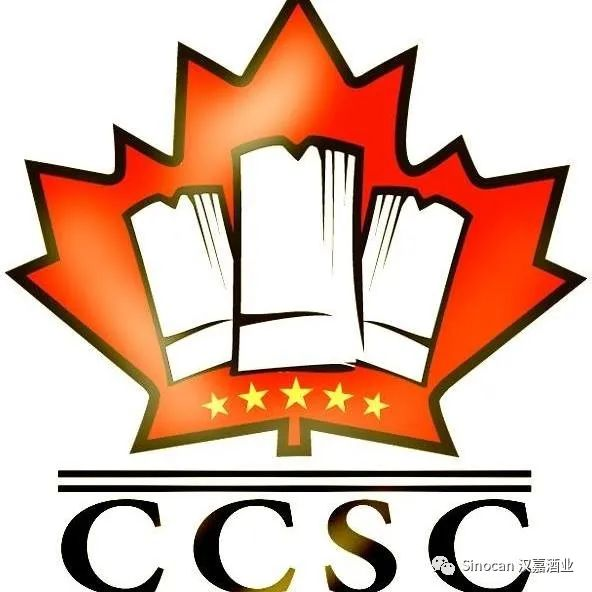

# 无标题

**链接地址:** http://mp.weixin.qq.com/s?__biz=MzIyMzU4OTc0MQ==&mid=2247484746&idx=1&sn=2e728f2e2adb4a2050a576f76550c803&chksm=e81aa148df6d285e4e7f0e2e78adf164a7cf2c935d030a116b41a084c8562a02aeac85e22b9d&mpshare=1&scene=2&srcid=1216Fn6VfhFKAflm9mKQRwyK&sharer_sharetime=1608081749730&sharer_shareid=be1c8edd6c93eec155a61c876e41d26a#rd
**作者:** 
**获取时间:** 2025/8/28 20:00:03
**图片数量:** 22

---

## 原始HTML内容

<section style="box-sizing: border-box;font-size: 16px;"><section style="margin: 10px 0%;box-sizing: border-box;" powered-by="xiumi.us"><section style="display: inline-block;width: 100%;vertical-align: top;background-color: rgb(166, 54, 49);padding: 3px;box-sizing: border-box;"><section style="box-sizing: border-box;" powered-by="xiumi.us"><section style="display: flex;flex-flow: row nowrap;box-sizing: border-box;"><section style="display: inline-block;vertical-align: top;width: auto;flex: 50 50 0%;align-self: stretch;height: auto;background-color: rgb(255, 247, 244);padding: 3px;box-sizing: border-box;"><section style="display: inline-block;width: 100%;vertical-align: middle;border-style: solid;border-width: 1px;border-radius: 0px;border-color: rgb(166, 54, 49);padding: 3px 10px 5px;align-self: center;box-sizing: border-box;" powered-by="xiumi.us"><section style="margin-top: 3px;margin-right: 0%;margin-left: 0%;box-sizing: border-box;" powered-by="xiumi.us"><section style="text-align: center;color: rgb(106, 106, 106);line-height: 1.2;font-size: 14px;box-sizing: border-box;">
<strong style="box-sizing: border-box;">点击蓝字</strong>
</section></section></section></section><section style="display: inline-block;vertical-align: middle;width: auto;padding-left: 3px;background-color: rgba(255, 255, 255, 0);flex: 50 50 0%;align-self: center;height: auto;box-sizing: border-box;"><section style="margin-top: 3px;margin-right: 0%;margin-left: 0%;box-sizing: border-box;" powered-by="xiumi.us"><section style="text-align: center;font-size: 14px;color: rgb(255, 255, 255);line-height: 1.2;box-sizing: border-box;">
<strong style="box-sizing: border-box;">关注我们</strong>
</section></section></section></section></section></section></section><section style="box-sizing: border-box;" powered-by="xiumi.us">
 
</section><section style="text-align: center;justify-content: center;margin: 10px 0%;box-sizing: border-box;" powered-by="xiumi.us"><section style="display: inline-block;width: 90%;vertical-align: top;background-color: rgba(255, 255, 255, 0);border-left: 1px solid rgb(158, 78, 10);border-bottom-left-radius: 0px;border-right: 1px solid rgb(158, 78, 10);border-top-right-radius: 0px;height: auto;box-sizing: border-box;"><section style="margin-right: 0%;margin-left: 0%;box-sizing: border-box;" powered-by="xiumi.us"><section style="background-image: linear-gradient(90deg, rgb(158, 78, 10) 0%, rgba(158, 78, 10, 0) 35%, rgba(158, 78, 10, 0) 66%, rgb(158, 78, 10) 100%);height: 1px;box-sizing: border-box;"><section><svg viewBox="0 0 1 1" style="float:left;line-height:0;width:0;vertical-align:top;"></svg></section></section></section><section style="font-size: 0px;box-sizing: border-box;" powered-by="xiumi.us"><section style="display: inline-block;vertical-align: top;width: 50%;box-sizing: border-box;"><section style="text-align: left;justify-content: flex-start;margin-right: 0%;margin-left: 0%;box-sizing: border-box;" powered-by="xiumi.us"><section style="display: inline-block;width: 5px;height: 5px;vertical-align: top;overflow: hidden;border-width: 1px;border-radius: 0px;border-style: none solid solid none;border-color: rgb(158, 78, 10);box-sizing: border-box;"><section><svg viewBox="0 0 1 1" style="float:left;line-height:0;width:0;vertical-align:top;"></svg></section></section></section></section><section style="display: inline-block;vertical-align: top;width: 50%;box-sizing: border-box;"><section style="text-align: right;justify-content: flex-end;transform: translate3d(1px, 0px, 0px);margin-top: -1px;margin-right: 0%;margin-left: 0%;box-sizing: border-box;" powered-by="xiumi.us"><section style="display: inline-block;width: 6px;height: 6px;vertical-align: top;overflow: hidden;border-width: 1px;border-radius: 0px;border-style: solid;border-color: rgb(158, 78, 10);box-sizing: border-box;"><section><svg viewBox="0 0 1 1" style="float:left;line-height:0;width:0;vertical-align:top;"></svg></section></section></section></section></section><section style="display: inline-block;width: 100%;vertical-align: top;height: auto;padding-right: 5px;padding-left: 5px;box-sizing: border-box;" powered-by="xiumi.us"><section style="margin-right: 0%;margin-left: 0%;box-sizing: border-box;" powered-by="xiumi.us"><section style="max-width: 100%;vertical-align: middle;display: inline-block;line-height: 0;box-sizing: border-box;"></section></section></section><section style="font-size: 0px;box-sizing: border-box;" powered-by="xiumi.us"><section style="display: inline-block;vertical-align: top;width: 50%;box-sizing: border-box;"><section style="text-align: left;justify-content: flex-start;transform: translate3d(-1px, 0px, 0px);margin-right: 0%;margin-bottom: -1px;margin-left: 0%;box-sizing: border-box;" powered-by="xiumi.us"><section style="display: inline-block;width: 6px;height: 6px;vertical-align: top;overflow: hidden;border-width: 1px;border-radius: 0px;border-style: solid;border-color: rgb(158, 78, 10);box-sizing: border-box;"><section><svg viewBox="0 0 1 1" style="float:left;line-height:0;width:0;vertical-align:top;"></svg></section></section></section></section><section style="display: inline-block;vertical-align: top;width: 50%;box-sizing: border-box;"><section style="text-align: right;justify-content: flex-end;transform: translate3d(1px, 0px, 0px);margin-right: 0%;margin-bottom: -1px;margin-left: 0%;box-sizing: border-box;" powered-by="xiumi.us"><section style="display: inline-block;width: 6px;height: 6px;vertical-align: top;overflow: hidden;border-width: 1px;border-radius: 0px;border-style: solid;border-color: rgb(158, 78, 10);box-sizing: border-box;"><section><svg viewBox="0 0 1 1" style="float:left;line-height:0;width:0;vertical-align:top;"></svg></section></section></section></section></section><section style="margin-right: 0%;margin-left: 0%;box-sizing: border-box;" powered-by="xiumi.us"><section style="background-image: linear-gradient(90deg, rgb(158, 78, 10) 0%, rgba(158, 78, 10, 0) 35%, rgba(158, 78, 10, 0) 66%, rgb(158, 78, 10) 100%);height: 1px;box-sizing: border-box;"><section><svg viewBox="0 0 1 1" style="float:left;line-height:0;width:0;vertical-align:top;"></svg></section></section></section></section></section><section style="box-sizing: border-box;" powered-by="xiumi.us">
 
</section><section style="box-sizing: border-box;" powered-by="xiumi.us">
 
</section><section style="transform: translate3d(20px, 0px, 0px);-webkit-transform: translate3d(20px, 0px, 0px);-moz-transform: translate3d(20px, 0px, 0px);-o-transform: translate3d(20px, 0px, 0px);margin: 10px 0% 3px;box-sizing: border-box;" powered-by="xiumi.us"><section style="display: inline-block;width: auto;vertical-align: top;border-width: 0px;border-radius: 10px 10px 0px 0px;border-style: none;border-color: rgb(62, 62, 62);padding-right: 20px;padding-left: 20px;min-width: 10%;max-width: 100%;height: auto;background-color: rgb(166, 54, 49);box-sizing: border-box;"><section style="font-size: 17px;color: rgb(255, 255, 255);line-height: 2;letter-spacing: 1px;box-sizing: border-box;" powered-by="xiumi.us">
<strong style="box-sizing: border-box;">特殊的寒冬，人间烟火有人情</strong>
</section></section></section><section style="margin-right: 0%;margin-left: 0%;box-sizing: border-box;" powered-by="xiumi.us"><section style="width: 100%;height: 5px;background-color: rgb(115, 115, 114);box-sizing: border-box;"><section><svg viewBox="0 0 1 1" style="float:left;line-height:0;width:0;vertical-align:top;"></svg></section></section></section><section style="margin: 3px 0% 10px;box-sizing: border-box;" powered-by="xiumi.us"><section style="display: inline-block;width: 100%;vertical-align: top;background-color: rgb(246, 246, 246);padding: 15px 20px 20px;border-left: 0px none rgb(62, 62, 62);border-bottom-left-radius: 10px;overflow: hidden;border-bottom: 0px none rgb(62, 62, 62);border-bottom-right-radius: 10px;box-sizing: border-box;"><section style="font-size: 14px;color: rgb(142, 142, 142);line-height: 2;letter-spacing: 2px;box-sizing: border-box;" powered-by="xiumi.us">
随着全球新冠病例在陆续反弹，直线上涨的确诊病例无时无刻不牵动着<strong style="box-sizing: border-box;">每个人的心</strong>。

 

柴米油盐酱醋茶，人间烟火有人情。不如在这个特殊的寒冬里，<strong style="box-sizing: border-box;">一起约做饭吧！</strong>

 
</section><section style="box-sizing: border-box;" powered-by="xiumi.us"><section style="display: flex;flex-flow: row nowrap;box-sizing: border-box;"><section style="display: inline-block;vertical-align: middle;width: auto;flex: 100 100 0%;align-self: center;height: auto;z-index: 1;box-sizing: border-box;"><section style="text-align: center;margin-top: 10px;margin-bottom: 10px;box-sizing: border-box;" powered-by="xiumi.us"><section style="max-width: 100%;vertical-align: middle;display: inline-block;line-height: 0;box-sizing: border-box;"></section></section><section style="text-align: center;margin-top: 10px;margin-bottom: 10px;box-sizing: border-box;" powered-by="xiumi.us"><section style="max-width: 100%;vertical-align: middle;display: inline-block;line-height: 0;box-sizing: border-box;"></section></section></section><section style="display: inline-block;vertical-align: middle;width: 210px;flex: 0 0 auto;height: auto;border-width: 0px;align-self: center;margin-right: -100px;margin-left: -100px;z-index: 2;box-sizing: border-box;"><section style="box-sizing: border-box;" powered-by="xiumi.us"><section style="display: inline-block;vertical-align: top;width: 50%;padding-right: 5px;box-sizing: border-box;"><section style="text-align: right;justify-content: flex-end;margin-right: 0%;margin-left: 0%;box-sizing: border-box;" powered-by="xiumi.us"><section style="display: inline-block;width: 100px;height: 100px;vertical-align: top;overflow: hidden;border-style: solid none none solid;border-width: 4px;border-radius: 0px;border-color: rgb(255, 255, 255);box-sizing: border-box;"><section style="margin-top: 75px;margin-right: 0%;margin-left: 0%;box-sizing: border-box;" powered-by="xiumi.us"><section style="color: rgb(166, 54, 49);font-size: 34px;text-shadow: rgb(255, 255, 255) 1px -1px, rgb(255, 255, 255) 1px 1px, rgb(255, 255, 255) -1px 1px, rgb(255, 255, 255) -1px -1px, rgb(255, 255, 255) 1px 0px, rgb(255, 255, 255) 0px 1px, rgb(255, 255, 255) -1px 0px, rgb(255, 255, 255) 0px -1px;letter-spacing: 4px;line-height: 0;box-sizing: border-box;">
<strong style="box-sizing: border-box;">人</strong>
</section></section></section></section></section><section style="display: inline-block;vertical-align: top;width: 50%;padding-left: 5px;box-sizing: border-box;"><section style="text-align: left;justify-content: flex-start;box-sizing: border-box;" powered-by="xiumi.us"><section style="display: inline-block;width: 100px;height: 100px;vertical-align: top;overflow: hidden;border-style: solid solid none none;border-width: 4px;border-radius: 0px;border-color: rgb(255, 255, 255);padding-left: 4px;box-sizing: border-box;"><section style="margin-top: 75px;margin-right: 0%;margin-left: 0%;box-sizing: border-box;" powered-by="xiumi.us"><section style="text-align: right;font-size: 34px;color: rgb(166, 54, 49);text-shadow: rgb(255, 255, 255) 1px -1px, rgb(255, 255, 255) 1px 1px, rgb(255, 255, 255) -1px 1px, rgb(255, 255, 255) -1px -1px, rgb(255, 255, 255) 1px 0px, rgb(255, 255, 255) 0px 1px, rgb(255, 255, 255) -1px 0px, rgb(255, 255, 255) 0px -1px;letter-spacing: 4px;line-height: 0;box-sizing: border-box;">
<strong style="box-sizing: border-box;">间</strong>
</section></section></section></section></section></section><section style="margin-top: 10px;margin-right: 0%;margin-left: 0%;box-sizing: border-box;" powered-by="xiumi.us"><section style="display: inline-block;vertical-align: top;width: 50%;padding-right: 5px;box-sizing: border-box;"><section style="text-align: right;justify-content: flex-end;box-sizing: border-box;" powered-by="xiumi.us"><section style="display: inline-block;width: 100px;height: 100px;vertical-align: top;overflow: hidden;border-style: none none solid solid;border-width: 4px;border-radius: 0px;border-color: rgb(255, 255, 255);box-sizing: border-box;"><section style="margin-top: 20px;margin-right: 0%;margin-left: 0%;box-sizing: border-box;" powered-by="xiumi.us"><section style="color: rgb(166, 54, 49);font-size: 34px;text-shadow: rgb(255, 255, 255) 1px -1px, rgb(255, 255, 255) 1px 1px, rgb(255, 255, 255) -1px 1px, rgb(255, 255, 255) -1px -1px, rgb(255, 255, 255) 1px 0px, rgb(255, 255, 255) 0px 1px, rgb(255, 255, 255) -1px 0px, rgb(255, 255, 255) 0px -1px;letter-spacing: 4px;line-height: 0;box-sizing: border-box;">
<strong style="box-sizing: border-box;">烟</strong>
</section></section></section></section></section><section style="display: inline-block;vertical-align: top;width: 50%;padding-left: 5px;box-sizing: border-box;"><section style="text-align: left;justify-content: flex-start;box-sizing: border-box;" powered-by="xiumi.us"><section style="display: inline-block;width: 100px;height: 100px;vertical-align: top;overflow: hidden;border-style: none solid solid none;border-width: 4px;border-radius: 0px;border-color: rgb(255, 255, 255);padding-left: 4px;box-sizing: border-box;"><section style="margin-top: 20px;margin-right: 0%;margin-left: 0%;box-sizing: border-box;" powered-by="xiumi.us"><section style="text-align: right;font-size: 34px;color: rgb(166, 54, 49);text-shadow: rgb(255, 255, 255) 1px -1px, rgb(255, 255, 255) 1px 1px, rgb(255, 255, 255) -1px 1px, rgb(255, 255, 255) -1px -1px, rgb(255, 255, 255) 1px 0px, rgb(255, 255, 255) 0px 1px, rgb(255, 255, 255) -1px 0px, rgb(255, 255, 255) 0px -1px;letter-spacing: 4px;line-height: 0;box-sizing: border-box;">
<strong style="box-sizing: border-box;">火</strong>
</section></section></section></section></section></section></section><section style="display: inline-block;vertical-align: middle;width: auto;flex: 100 100 0%;align-self: center;height: auto;z-index: 1;box-sizing: border-box;"><section style="text-align: center;margin-top: 10px;margin-bottom: 10px;box-sizing: border-box;" powered-by="xiumi.us"><section style="max-width: 100%;vertical-align: middle;display: inline-block;line-height: 0;box-sizing: border-box;"></section></section><section style="text-align: center;margin-top: 10px;margin-bottom: 10px;box-sizing: border-box;" powered-by="xiumi.us"><section style="max-width: 100%;vertical-align: middle;display: inline-block;line-height: 0;box-sizing: border-box;"></section></section></section></section></section><section style="font-size: 14px;color: rgb(142, 142, 142);line-height: 2;letter-spacing: 2px;box-sizing: border-box;" powered-by="xiumi.us">
 

宅家用心做好一道菜，将美食送给你身边的人，一起度过这个压抑的日子，<strong style="box-sizing: border-box;">用美食传递家人之间的温暖！</strong>

 

让我们我们一起热烈地来一场<strong style="box-sizing: border-box;">“宅家线上厨艺大赛“</strong>，晒一次不一样的你，分享你的艺术作品，还有精美的奖品等您来拿！
</section><section style="box-sizing: border-box;" powered-by="xiumi.us">
 
</section><section style="text-align: center;justify-content: center;margin: 10px 0%;box-sizing: border-box;" powered-by="xiumi.us"><section style="display: inline-block;width: 90%;vertical-align: top;background-color: rgba(255, 255, 255, 0);border-left: 1px solid rgb(158, 78, 10);border-bottom-left-radius: 0px;border-right: 1px solid rgb(158, 78, 10);border-top-right-radius: 0px;height: auto;box-sizing: border-box;"><section style="margin-right: 0%;margin-left: 0%;box-sizing: border-box;" powered-by="xiumi.us"><section style="background-image: linear-gradient(90deg, rgb(158, 78, 10) 0%, rgba(158, 78, 10, 0) 35%, rgba(158, 78, 10, 0) 66%, rgb(158, 78, 10) 100%);height: 1px;box-sizing: border-box;"><section><svg viewBox="0 0 1 1" style="float:left;line-height:0;width:0;vertical-align:top;"></svg></section></section></section><section style="font-size: 0px;box-sizing: border-box;" powered-by="xiumi.us"><section style="display: inline-block;vertical-align: top;width: 50%;box-sizing: border-box;"><section style="text-align: left;justify-content: flex-start;margin-right: 0%;margin-left: 0%;box-sizing: border-box;" powered-by="xiumi.us"><section style="display: inline-block;width: 5px;height: 5px;vertical-align: top;overflow: hidden;border-width: 1px;border-radius: 0px;border-style: none solid solid none;border-color: rgb(158, 78, 10);box-sizing: border-box;"><section><svg viewBox="0 0 1 1" style="float:left;line-height:0;width:0;vertical-align:top;"></svg></section></section></section></section><section style="display: inline-block;vertical-align: top;width: 50%;box-sizing: border-box;"><section style="text-align: right;justify-content: flex-end;transform: translate3d(1px, 0px, 0px);margin-top: -1px;margin-right: 0%;margin-left: 0%;box-sizing: border-box;" powered-by="xiumi.us"><section style="display: inline-block;width: 6px;height: 6px;vertical-align: top;overflow: hidden;border-width: 1px;border-radius: 0px;border-style: solid;border-color: rgb(158, 78, 10);box-sizing: border-box;"><section><svg viewBox="0 0 1 1" style="float:left;line-height:0;width:0;vertical-align:top;"></svg></section></section></section></section></section><section style="display: inline-block;width: 100%;vertical-align: top;height: auto;padding-right: 5px;padding-left: 5px;box-sizing: border-box;" powered-by="xiumi.us"><section style="margin-right: 0%;margin-left: 0%;box-sizing: border-box;" powered-by="xiumi.us"><section style="max-width: 100%;vertical-align: middle;display: inline-block;line-height: 0;box-sizing: border-box;"></section></section></section><section style="font-size: 0px;box-sizing: border-box;" powered-by="xiumi.us"><section style="display: inline-block;vertical-align: top;width: 50%;box-sizing: border-box;"><section style="text-align: left;justify-content: flex-start;transform: translate3d(-1px, 0px, 0px);margin-right: 0%;margin-bottom: -1px;margin-left: 0%;box-sizing: border-box;" powered-by="xiumi.us"><section style="display: inline-block;width: 6px;height: 6px;vertical-align: top;overflow: hidden;border-width: 1px;border-radius: 0px;border-style: solid;border-color: rgb(158, 78, 10);box-sizing: border-box;"><section><svg viewBox="0 0 1 1" style="float:left;line-height:0;width:0;vertical-align:top;"></svg></section></section></section></section><section style="display: inline-block;vertical-align: top;width: 50%;box-sizing: border-box;"><section style="text-align: right;justify-content: flex-end;transform: translate3d(1px, 0px, 0px);margin-right: 0%;margin-bottom: -1px;margin-left: 0%;box-sizing: border-box;" powered-by="xiumi.us"><section style="display: inline-block;width: 6px;height: 6px;vertical-align: top;overflow: hidden;border-width: 1px;border-radius: 0px;border-style: solid;border-color: rgb(158, 78, 10);box-sizing: border-box;"><section><svg viewBox="0 0 1 1" style="float:left;line-height:0;width:0;vertical-align:top;"></svg></section></section></section></section></section><section style="margin-right: 0%;margin-left: 0%;box-sizing: border-box;" powered-by="xiumi.us"><section style="background-image: linear-gradient(90deg, rgb(158, 78, 10) 0%, rgba(158, 78, 10, 0) 35%, rgba(158, 78, 10, 0) 66%, rgb(158, 78, 10) 100%);height: 1px;box-sizing: border-box;"><section><svg viewBox="0 0 1 1" style="float:left;line-height:0;width:0;vertical-align:top;"></svg></section></section></section></section></section><section style="box-sizing: border-box;" powered-by="xiumi.us">
 
</section><section style="text-align: right;justify-content: flex-end;margin: 30px 0% 10px;box-sizing: border-box;" powered-by="xiumi.us"><section style="display: inline-block;width: 100%;vertical-align: top;background-color: rgba(255, 213, 195, 0);height: auto;padding: 30px 30px 50px;border-left: 1px dashed rgb(62, 62, 62);border-bottom-left-radius: 0px;box-sizing: border-box;"><section style="box-sizing: border-box;" powered-by="xiumi.us"><section style="margin-top: -30px;margin-right: 0%;margin-left: 0%;display: flex;flex-flow: row nowrap;transform: translate3d(-31px, 0px, 0px);box-sizing: border-box;"><section style="display: inline-block;width: auto;vertical-align: top;background-color: rgb(166, 54, 49);min-width: 10%;max-width: 100%;flex: 0 0 auto;height: auto;padding-top: 2px;padding-bottom: 2px;padding-left: 2px;align-self: flex-start;z-index: 2;box-sizing: border-box;"><section style="font-size: 15px;letter-spacing: 0px;color: rgb(255, 255, 255);line-height: 1;padding-right: 10px;padding-left: 10px;box-sizing: border-box;" powered-by="xiumi.us">
<strong style="box-sizing: border-box;">组织单位</strong>
</section></section><section style="display: inline-block;vertical-align: top;width: auto;flex: 100 100 0%;height: auto;align-self: flex-start;box-sizing: border-box;"><section style="text-align: left;margin-top: -18px;margin-right: 0%;margin-left: 0%;justify-content: flex-start;transform: translate3d(-18px, 0px, 0px);box-sizing: border-box;" powered-by="xiumi.us"><section style="display: inline-block;vertical-align: top;overflow: hidden;height: 33px;width: 33px;background-color: rgba(254, 213, 195, 0);border-width: 0px;border-radius: 60px;border-style: none;border-color: rgb(62, 62, 62);box-sizing: border-box;"><section><svg viewBox="0 0 1 1" style="float:left;line-height:0;width:0;vertical-align:top;"></svg></section></section></section></section></section></section><section style="margin-top: 15px;margin-right: 0%;margin-left: 0%;box-sizing: border-box;" powered-by="xiumi.us"><section style="text-align: justify;color: rgb(90, 90, 90);font-size: 15px;line-height: 1.8;letter-spacing: 1px;box-sizing: border-box;">
 
</section></section><section style="text-align: justify;color: rgb(142, 142, 142);font-size: 14px;letter-spacing: 2px;line-height: 2;box-sizing: border-box;" powered-by="xiumi.us">
<strong style="box-sizing: border-box;">主办:</strong>
</section><section style="text-align: center;margin-top: 10px;margin-bottom: 10px;box-sizing: border-box;" powered-by="xiumi.us"><section style="max-width: 100%;vertical-align: middle;display: inline-block;line-height: 0;box-sizing: border-box;"></section></section><section style="text-align: justify;color: rgb(142, 142, 142);font-size: 14px;letter-spacing: 2px;line-height: 2;box-sizing: border-box;" powered-by="xiumi.us">
加拿大多伦多贵州同乡会 

 

<strong style="box-sizing: border-box;">协办:</strong>

加拿大贵州商会

天下贵州人俱乐部

加拿大茅台文化协会

加拿大温哥华贵州同乡会

加拿大渥太华贵州同乡会

加拿大蒙特利尔贵州同乡会
</section></section></section><section style="text-align: right;justify-content: flex-end;margin: -10px 0% 10px;box-sizing: border-box;" powered-by="xiumi.us"><section style="display: inline-block;width: 100%;vertical-align: top;background-color: rgba(255, 213, 195, 0);height: auto;padding: 30px 30px 50px;border-left: 1px dashed rgb(62, 62, 62);border-bottom-left-radius: 0px;box-sizing: border-box;"><section style="box-sizing: border-box;" powered-by="xiumi.us"><section style="margin-top: -30px;margin-right: 0%;margin-left: 0%;display: flex;flex-flow: row nowrap;transform: translate3d(-31px, 0px, 0px);box-sizing: border-box;"><section style="display: inline-block;width: auto;vertical-align: top;background-color: rgb(166, 54, 49);min-width: 10%;max-width: 100%;flex: 0 0 auto;height: auto;padding-top: 2px;padding-bottom: 2px;padding-left: 2px;align-self: flex-start;z-index: 2;box-sizing: border-box;"><section style="font-size: 15px;letter-spacing: 0px;color: rgb(255, 255, 255);line-height: 1;padding-right: 10px;padding-left: 10px;box-sizing: border-box;" powered-by="xiumi.us">
<strong style="box-sizing: border-box;">赞助单位</strong>
</section></section><section style="display: inline-block;vertical-align: top;width: auto;flex: 100 100 0%;height: auto;align-self: flex-start;box-sizing: border-box;"><section style="text-align: left;margin-top: -18px;margin-right: 0%;margin-left: 0%;justify-content: flex-start;transform: translate3d(-18px, 0px, 0px);box-sizing: border-box;" powered-by="xiumi.us"><section style="display: inline-block;vertical-align: top;overflow: hidden;height: 33px;width: 33px;background-color: rgba(254, 213, 195, 0);border-width: 0px;border-radius: 60px;border-style: none;border-color: rgb(62, 62, 62);box-sizing: border-box;"><section><svg viewBox="0 0 1 1" style="float:left;line-height:0;width:0;vertical-align:top;"></svg></section></section></section></section></section></section><section style="margin-top: 15px;margin-right: 0%;margin-left: 0%;box-sizing: border-box;" powered-by="xiumi.us"><section style="text-align: justify;color: rgb(90, 90, 90);font-size: 15px;line-height: 1.8;letter-spacing: 1px;box-sizing: border-box;">
 
</section></section><section style="text-align: center;margin-top: 10px;margin-bottom: 10px;box-sizing: border-box;" powered-by="xiumi.us"><section style="max-width: 100%;vertical-align: middle;display: inline-block;line-height: 0;box-sizing: border-box;"></section></section><section style="text-align: center;font-size: 14px;color: rgb(142, 142, 142);line-height: 2;letter-spacing: 2px;box-sizing: border-box;" powered-by="xiumi.us">
加拿大联邦政府 

 
</section><section style="text-align: center;margin-top: 10px;margin-bottom: 10px;box-sizing: border-box;" powered-by="xiumi.us"><section style="max-width: 100%;vertical-align: middle;display: inline-block;line-height: 0;box-sizing: border-box;"></section></section><section style="text-align: center;font-size: 14px;color: rgb(142, 142, 142);line-height: 2;letter-spacing: 2px;box-sizing: border-box;" powered-by="xiumi.us">
<strong style="box-sizing: border-box;">加拿大汉嘉酒业有限公司</strong>

（茅台经销商） 

 
</section><section style="text-align: center;margin-top: 10px;margin-bottom: 10px;box-sizing: border-box;" powered-by="xiumi.us"><section style="max-width: 100%;vertical-align: middle;display: inline-block;line-height: 0;width: 80%;height: auto;box-sizing: border-box;"></section></section><section style="text-align: center;font-size: 14px;color: rgb(142, 142, 142);line-height: 2;letter-spacing: 2px;box-sizing: border-box;" powered-by="xiumi.us">
中国贵州一品仙有机茶业有限公司 
</section></section></section><section style="text-align: right;justify-content: flex-end;margin: -10px 0% 10px;box-sizing: border-box;" powered-by="xiumi.us"><section style="display: inline-block;width: 100%;vertical-align: top;background-color: rgba(255, 213, 195, 0);height: auto;padding: 30px 30px 50px;border-left: 1px dashed rgb(62, 62, 62);border-bottom-left-radius: 0px;box-sizing: border-box;"><section style="box-sizing: border-box;" powered-by="xiumi.us"><section style="margin-top: -30px;margin-right: 0%;margin-left: 0%;display: flex;flex-flow: row nowrap;transform: translate3d(-31px, 0px, 0px);box-sizing: border-box;"><section style="display: inline-block;width: auto;vertical-align: top;background-color: rgb(166, 54, 49);min-width: 10%;max-width: 100%;flex: 0 0 auto;height: auto;padding-top: 2px;padding-bottom: 2px;padding-left: 2px;align-self: flex-start;z-index: 2;box-sizing: border-box;"><section style="font-size: 15px;letter-spacing: 0px;color: rgb(255, 255, 255);line-height: 1;padding-right: 10px;padding-left: 10px;box-sizing: border-box;" powered-by="xiumi.us">
<strong style="box-sizing: border-box;">组织单位</strong>
</section></section><section style="display: inline-block;vertical-align: top;width: auto;flex: 100 100 0%;height: auto;align-self: flex-start;box-sizing: border-box;"><section style="text-align: left;margin-top: -18px;margin-right: 0%;margin-left: 0%;justify-content: flex-start;transform: translate3d(-18px, 0px, 0px);box-sizing: border-box;" powered-by="xiumi.us"><section style="display: inline-block;vertical-align: top;overflow: hidden;height: 33px;width: 33px;background-color: rgba(254, 213, 195, 0);border-width: 0px;border-radius: 60px;border-style: none;border-color: rgb(62, 62, 62);box-sizing: border-box;"><section><svg viewBox="0 0 1 1" style="float:left;line-height:0;width:0;vertical-align:top;"></svg></section></section></section></section></section></section><section style="margin-top: 15px;margin-right: 0%;margin-left: 0%;box-sizing: border-box;" powered-by="xiumi.us"><section style="text-align: justify;color: rgb(90, 90, 90);font-size: 15px;line-height: 1.8;letter-spacing: 1px;box-sizing: border-box;">
 
</section></section><section style="box-sizing: border-box;" powered-by="xiumi.us"><section style="text-align: center;margin-top: 10px;margin-bottom: 10px;box-sizing: border-box;"><section style="max-width: 100%;vertical-align: middle;display: inline-block;line-height: 0;width: 35%;height: auto;box-sizing: border-box;"></section></section></section><section style="text-align: center;font-size: 14px;color: rgb(142, 142, 142);letter-spacing: 2px;line-height: 2;box-sizing: border-box;" powered-by="xiumi.us">
加拿大中华烹饪协会
</section></section></section><section style="text-align: right;justify-content: flex-end;margin: -10px 0% 10px;box-sizing: border-box;" powered-by="xiumi.us"><section style="display: inline-block;width: 100%;vertical-align: top;background-color: rgba(255, 213, 195, 0);height: auto;padding: 30px 30px 50px;border-left: 1px dashed rgb(62, 62, 62);border-bottom-left-radius: 0px;box-sizing: border-box;"><section style="box-sizing: border-box;" powered-by="xiumi.us"><section style="margin-top: -30px;margin-right: 0%;margin-left: 0%;display: flex;flex-flow: row nowrap;transform: translate3d(-31px, 0px, 0px);box-sizing: border-box;"><section style="display: inline-block;vertical-align: top;width: auto;background-color: rgb(166, 54, 49);min-width: 10%;max-width: 100%;flex: 0 0 auto;height: auto;padding-top: 2px;padding-bottom: 2px;padding-left: 2px;align-self: flex-start;z-index: 2;box-sizing: border-box;"><section style="font-size: 15px;letter-spacing: 0px;color: rgb(255, 255, 255);line-height: 1;padding-right: 10px;padding-left: 10px;box-sizing: border-box;" powered-by="xiumi.us">
<strong style="box-sizing: border-box;">活动主题</strong>
</section></section><section style="display: inline-block;vertical-align: top;width: auto;flex: 100 100 0%;height: auto;align-self: flex-start;box-sizing: border-box;"><section style="text-align: left;margin-top: -18px;margin-right: 0%;margin-left: 0%;justify-content: flex-start;transform: translate3d(-18px, 0px, 0px);box-sizing: border-box;" powered-by="xiumi.us"><section style="display: inline-block;width: 33px;height: 33px;vertical-align: top;overflow: hidden;background-color: rgba(254, 213, 195, 0);border-width: 0px;border-radius: 60px;border-style: none;border-color: rgb(62, 62, 62);box-sizing: border-box;"><section><svg viewBox="0 0 1 1" style="float:left;line-height:0;width:0;vertical-align:top;"></svg></section></section></section></section></section></section><section style="margin-top: 15px;margin-right: 0%;margin-left: 0%;box-sizing: border-box;" powered-by="xiumi.us"><section style="text-align: justify;color: rgb(90, 90, 90);font-size: 15px;line-height: 1.8;letter-spacing: 1px;box-sizing: border-box;">
 
</section></section><section style="text-align: center;justify-content: center;margin: 10px 0%;box-sizing: border-box;" powered-by="xiumi.us"><section style="display: inline-block;width: 90%;vertical-align: top;background-color: rgba(255, 255, 255, 0);border-left: 1px solid rgb(158, 78, 10);border-bottom-left-radius: 0px;border-right: 1px solid rgb(158, 78, 10);border-top-right-radius: 0px;height: auto;box-sizing: border-box;"><section style="margin-right: 0%;margin-left: 0%;box-sizing: border-box;" powered-by="xiumi.us"><section style="background-image: linear-gradient(90deg, rgb(158, 78, 10) 0%, rgba(158, 78, 10, 0) 35%, rgba(158, 78, 10, 0) 66%, rgb(158, 78, 10) 100%);height: 1px;box-sizing: border-box;"><section><svg viewBox="0 0 1 1" style="float:left;line-height:0;width:0;vertical-align:top;"></svg></section></section></section><section style="font-size: 0px;box-sizing: border-box;" powered-by="xiumi.us"><section style="display: inline-block;vertical-align: top;width: 50%;box-sizing: border-box;"><section style="text-align: left;justify-content: flex-start;margin-right: 0%;margin-left: 0%;box-sizing: border-box;" powered-by="xiumi.us"><section style="display: inline-block;width: 5px;height: 5px;vertical-align: top;overflow: hidden;border-width: 1px;border-radius: 0px;border-style: none solid solid none;border-color: rgb(158, 78, 10);box-sizing: border-box;"><section><svg viewBox="0 0 1 1" style="float:left;line-height:0;width:0;vertical-align:top;"></svg></section></section></section></section><section style="display: inline-block;vertical-align: top;width: 50%;box-sizing: border-box;"><section style="text-align: right;justify-content: flex-end;transform: translate3d(1px, 0px, 0px);margin-top: -1px;margin-right: 0%;margin-left: 0%;box-sizing: border-box;" powered-by="xiumi.us"><section style="display: inline-block;width: 6px;height: 6px;vertical-align: top;overflow: hidden;border-width: 1px;border-radius: 0px;border-style: solid;border-color: rgb(158, 78, 10);box-sizing: border-box;"><section><svg viewBox="0 0 1 1" style="float:left;line-height:0;width:0;vertical-align:top;"></svg></section></section></section></section></section><section style="display: inline-block;width: 100%;vertical-align: top;height: auto;padding-right: 5px;padding-left: 5px;box-sizing: border-box;" powered-by="xiumi.us"><section style="margin-right: 0%;margin-left: 0%;box-sizing: border-box;" powered-by="xiumi.us"><section style="max-width: 100%;vertical-align: middle;display: inline-block;line-height: 0;box-sizing: border-box;"></section></section></section><section style="font-size: 0px;box-sizing: border-box;" powered-by="xiumi.us"><section style="display: inline-block;vertical-align: top;width: 50%;box-sizing: border-box;"><section style="text-align: left;justify-content: flex-start;transform: translate3d(-1px, 0px, 0px);margin-right: 0%;margin-bottom: -1px;margin-left: 0%;box-sizing: border-box;" powered-by="xiumi.us"><section style="display: inline-block;width: 6px;height: 6px;vertical-align: top;overflow: hidden;border-width: 1px;border-radius: 0px;border-style: solid;border-color: rgb(158, 78, 10);box-sizing: border-box;"><section><svg viewBox="0 0 1 1" style="float:left;line-height:0;width:0;vertical-align:top;"></svg></section></section></section></section><section style="display: inline-block;vertical-align: top;width: 50%;box-sizing: border-box;"><section style="text-align: right;justify-content: flex-end;transform: translate3d(1px, 0px, 0px);margin-right: 0%;margin-bottom: -1px;margin-left: 0%;box-sizing: border-box;" powered-by="xiumi.us"><section style="display: inline-block;width: 6px;height: 6px;vertical-align: top;overflow: hidden;border-width: 1px;border-radius: 0px;border-style: solid;border-color: rgb(158, 78, 10);box-sizing: border-box;"><section><svg viewBox="0 0 1 1" style="float:left;line-height:0;width:0;vertical-align:top;"></svg></section></section></section></section></section><section style="margin-right: 0%;margin-left: 0%;box-sizing: border-box;" powered-by="xiumi.us"><section style="background-image: linear-gradient(90deg, rgb(158, 78, 10) 0%, rgba(158, 78, 10, 0) 35%, rgba(158, 78, 10, 0) 66%, rgb(158, 78, 10) 100%);height: 1px;box-sizing: border-box;"><section><svg viewBox="0 0 1 1" style="float:left;line-height:0;width:0;vertical-align:top;"></svg></section></section></section></section></section><section style="text-align: center;font-size: 14px;color: rgb(142, 142, 142);line-height: 2;letter-spacing: 2px;box-sizing: border-box;" powered-by="xiumi.us">
寻家乡的味道
</section></section></section><section style="text-align: right;justify-content: flex-end;margin: -10px 0% 10px;box-sizing: border-box;" powered-by="xiumi.us"><section style="display: inline-block;width: 100%;vertical-align: top;background-color: rgba(255, 213, 195, 0);height: auto;padding: 30px 30px 50px;border-left: 1px dashed rgb(62, 62, 62);border-bottom-left-radius: 0px;box-sizing: border-box;"><section style="box-sizing: border-box;" powered-by="xiumi.us"><section style="margin-top: -30px;margin-right: 0%;margin-left: 0%;display: flex;flex-flow: row nowrap;transform: translate3d(-31px, 0px, 0px);box-sizing: border-box;"><section style="display: inline-block;vertical-align: top;width: auto;background-color: rgb(166, 54, 49);min-width: 10%;max-width: 100%;flex: 0 0 auto;height: auto;padding-top: 2px;padding-bottom: 2px;padding-left: 2px;align-self: flex-start;z-index: 2;box-sizing: border-box;"><section style="font-size: 15px;letter-spacing: 0px;color: rgb(255, 255, 255);line-height: 1;padding-right: 10px;padding-left: 10px;box-sizing: border-box;" powered-by="xiumi.us">
<strong style="box-sizing: border-box;">参赛对象</strong>
</section></section><section style="display: inline-block;vertical-align: top;width: auto;flex: 100 100 0%;height: auto;align-self: flex-start;box-sizing: border-box;"><section style="text-align: left;margin-top: -18px;margin-right: 0%;margin-left: 0%;justify-content: flex-start;transform: translate3d(-18px, 0px, 0px);box-sizing: border-box;" powered-by="xiumi.us"><section style="display: inline-block;width: 33px;height: 33px;vertical-align: top;overflow: hidden;background-color: rgba(254, 213, 195, 0);border-width: 0px;border-radius: 60px;border-style: none;border-color: rgb(62, 62, 62);box-sizing: border-box;"><section><svg viewBox="0 0 1 1" style="float:left;line-height:0;width:0;vertical-align:top;"></svg></section></section></section></section></section></section><section style="margin-top: 15px;margin-right: 0%;margin-left: 0%;box-sizing: border-box;" powered-by="xiumi.us"><section style="text-align: justify;color: rgb(90, 90, 90);font-size: 15px;line-height: 1.8;letter-spacing: 1px;box-sizing: border-box;">
 
</section></section><section style="text-align: center;font-size: 14px;color: rgb(142, 142, 142);line-height: 2;letter-spacing: 2px;box-sizing: border-box;" powered-by="xiumi.us">
加拿大境内

 
</section></section></section><section style="text-align: right;justify-content: flex-end;margin: -10px 0% 10px;box-sizing: border-box;" powered-by="xiumi.us"><section style="display: inline-block;width: 100%;vertical-align: top;background-color: rgba(255, 213, 195, 0);height: auto;padding: 30px 30px 50px;border-left: 1px dashed rgb(62, 62, 62);border-bottom-left-radius: 0px;box-sizing: border-box;"><section style="box-sizing: border-box;" powered-by="xiumi.us"><section style="margin-top: -30px;margin-right: 0%;margin-left: 0%;display: flex;flex-flow: row nowrap;transform: translate3d(-31px, 0px, 0px);box-sizing: border-box;"><section style="display: inline-block;vertical-align: top;width: auto;background-color: rgb(166, 54, 49);min-width: 10%;max-width: 100%;flex: 0 0 auto;height: auto;padding-top: 2px;padding-bottom: 2px;padding-left: 2px;align-self: flex-start;z-index: 2;box-sizing: border-box;"><section style="font-size: 15px;letter-spacing: 0px;color: rgb(255, 255, 255);line-height: 1;padding-right: 10px;padding-left: 10px;box-sizing: border-box;" powered-by="xiumi.us">
<strong style="box-sizing: border-box;">活动时间</strong>
</section></section><section style="display: inline-block;vertical-align: top;width: auto;flex: 100 100 0%;height: auto;align-self: flex-start;box-sizing: border-box;"><section style="text-align: left;margin-top: -18px;margin-right: 0%;margin-left: 0%;justify-content: flex-start;transform: translate3d(-18px, 0px, 0px);box-sizing: border-box;" powered-by="xiumi.us"><section style="display: inline-block;width: 33px;height: 33px;vertical-align: top;overflow: hidden;background-color: rgba(254, 213, 195, 0);border-width: 0px;border-radius: 60px;border-style: none;border-color: rgb(62, 62, 62);box-sizing: border-box;"><section><svg viewBox="0 0 1 1" style="float:left;line-height:0;width:0;vertical-align:top;"></svg></section></section></section></section></section></section><section style="margin-top: 15px;margin-right: 0%;margin-left: 0%;box-sizing: border-box;" powered-by="xiumi.us"><section style="text-align: justify;color: rgb(90, 90, 90);font-size: 15px;line-height: 1.8;letter-spacing: 1px;box-sizing: border-box;">
 
</section></section><section style="text-align: center;font-size: 14px;color: rgb(142, 142, 142);line-height: 2;letter-spacing: 2px;box-sizing: border-box;" powered-by="xiumi.us">
<strong style="box-sizing: border-box;">投稿时间</strong>：2020年12月1日-2021年1月3日 

<strong style="box-sizing: border-box;">网上投票</strong>：2021年1月4日-2021年1月10日 

<strong style="box-sizing: border-box;">评审揭晓</strong>：2021年1月15日星期五
</section><section style="text-align: justify;box-sizing: border-box;" powered-by="xiumi.us">
 
</section><section style="box-sizing: border-box;" powered-by="xiumi.us"><section style="display: flex;flex-flow: row nowrap;margin: 10px 0%;box-sizing: border-box;"><section style="display: inline-block;vertical-align: top;width: auto;padding-right: 5px;flex: 40 40 0%;align-self: flex-start;height: auto;box-sizing: border-box;"><section style="text-align: center;margin-right: 0%;margin-left: 0%;box-sizing: border-box;" powered-by="xiumi.us"><section style="max-width: 100%;vertical-align: middle;display: inline-block;line-height: 0;box-sizing: border-box;"></section></section></section><section style="display: inline-block;vertical-align: top;width: auto;flex: 100 100 0%;align-self: flex-start;height: auto;box-sizing: border-box;"><section style="margin-right: 0%;margin-bottom: 5px;margin-left: 0%;box-sizing: border-box;" powered-by="xiumi.us"><section style="display: inline-block;width: 100%;vertical-align: top;border-left: 2px none rgb(106, 106, 106);border-bottom-left-radius: 0px;padding-right: 10px;padding-left: 10px;background-color: rgb(166, 54, 49);box-sizing: border-box;"><section style="margin-right: 0%;margin-left: 0%;box-sizing: border-box;" powered-by="xiumi.us"><section style="text-align: justify;font-size: 18px;color: rgb(255, 255, 255);box-sizing: border-box;">
<strong style="box-sizing: border-box;">扫码进入投票通道</strong>
</section></section></section></section><section style="display: inline-block;width: 100%;vertical-align: top;border-left: 2px solid rgba(255, 213, 195, 0);border-bottom-left-radius: 0px;padding-right: 10px;padding-left: 10px;box-sizing: border-box;" powered-by="xiumi.us"><section style="margin-top: 6px;margin-right: 0%;margin-left: 0%;box-sizing: border-box;" powered-by="xiumi.us"><section style="font-size: 14px;color: rgb(0, 0, 0);box-sizing: border-box;">
<strong style="box-sizing: border-box;">每个微信账号可投30张票</strong>
</section></section></section></section></section></section></section></section><section style="text-align: right;justify-content: flex-end;margin: -10px 0% 10px;box-sizing: border-box;" powered-by="xiumi.us"><section style="display: inline-block;width: 100%;vertical-align: top;background-color: rgba(255, 213, 195, 0);height: auto;padding: 30px 30px 50px;border-left: 1px dashed rgb(62, 62, 62);border-bottom-left-radius: 0px;box-sizing: border-box;"><section style="box-sizing: border-box;" powered-by="xiumi.us"><section style="margin-top: -30px;margin-right: 0%;margin-left: 0%;display: flex;flex-flow: row nowrap;transform: translate3d(-31px, 0px, 0px);box-sizing: border-box;"><section style="display: inline-block;vertical-align: top;width: auto;background-color: rgb(166, 54, 49);min-width: 10%;max-width: 100%;flex: 0 0 auto;height: auto;padding-top: 2px;padding-bottom: 2px;padding-left: 2px;align-self: flex-start;z-index: 2;box-sizing: border-box;"><section style="font-size: 15px;letter-spacing: 0px;color: rgb(255, 255, 255);line-height: 1;padding-right: 10px;padding-left: 10px;box-sizing: border-box;" powered-by="xiumi.us">
<strong style="box-sizing: border-box;">比赛形式</strong>
</section></section><section style="display: inline-block;vertical-align: top;width: auto;flex: 100 100 0%;height: auto;align-self: flex-start;box-sizing: border-box;"><section style="text-align: left;margin-top: -18px;margin-right: 0%;margin-left: 0%;justify-content: flex-start;transform: translate3d(-18px, 0px, 0px);box-sizing: border-box;" powered-by="xiumi.us"><section style="display: inline-block;width: 33px;height: 33px;vertical-align: top;overflow: hidden;background-color: rgba(254, 213, 195, 0);border-width: 0px;border-radius: 60px;border-style: none;border-color: rgb(62, 62, 62);box-sizing: border-box;"><section><svg viewBox="0 0 1 1" style="float:left;line-height:0;width:0;vertical-align:top;"></svg></section></section></section></section></section></section><section style="margin-top: 15px;margin-right: 0%;margin-left: 0%;box-sizing: border-box;" powered-by="xiumi.us"><section style="text-align: justify;color: rgb(90, 90, 90);font-size: 15px;line-height: 1.8;letter-spacing: 1px;box-sizing: border-box;">
 
</section></section><section style="text-align: center;font-size: 14px;color: rgb(142, 142, 142);line-height: 2;letter-spacing: 2px;box-sizing: border-box;" powered-by="xiumi.us">
1、本次比赛为<strong style="box-sizing: border-box;">线上参赛</strong>。

2、参赛选手须<strong style="box-sizing: border-box;">独立完成一道菜肴</strong>，参赛菜品不限，并按照作品要求提交相关材料参赛。

3、参赛作品要求：<strong style="box-sizing: border-box;">文稿+照片+视频</strong>。文稿为100字以内作品介绍（参赛选手居住城市，菜名，材料、制作时间、制作理念、创意及做菜的技巧、菜品的寓意以及背后的小故事等）、3-5张作品照片（原材料、制作过程、成品等）、视频（制作过程、成品、个人感受等，可配音）3分钟以内。

4、提交形式：参赛选手将以上材料打包压缩，以<strong style="box-sizing: border-box;">“姓名或笔名+电话号码+微信号”</strong>命名上传第三方云盘，将下载链接或材料直接发送至

<strong style="box-sizing: border-box;">info@guizhoucanada.org</strong>，提交完成后不得更改，由主办方将作品上传到第三方专业投票站。

5、投稿者应保证其为所投送作品的<strong style="box-sizing: border-box;">原创</strong>作者，并对该作品的整体及组成部分均拥有独立、完整、明确、无争议的著作权，并同意主办方对提交作品相片视频等材料有公布权。所有参赛作品如发生侵犯他人著作权、肖像权、名誉权等行为及由此产生的一切法律纠纷由参赛作者自行承担，作品可以通过软件在不改变作品原貌的前提下，做适当的后期处理，但不可进行合成等手法改变作品原貌，例如拼接、删除、修改照片素材。

 

<strong style="box-sizing: border-box;">注：活动解释权属于主办方所有，凡参展的作者，均视为同意并遵守以上规则。</strong>
</section></section></section><section style="text-align: right;justify-content: flex-end;margin: -10px 0% 10px;box-sizing: border-box;" powered-by="xiumi.us"><section style="display: inline-block;width: 100%;vertical-align: top;background-color: rgba(255, 213, 195, 0);height: auto;padding: 30px 30px 50px;border-left: 1px dashed rgb(62, 62, 62);border-bottom-left-radius: 0px;box-sizing: border-box;"><section style="box-sizing: border-box;" powered-by="xiumi.us"><section style="margin-top: -30px;margin-right: 0%;margin-left: 0%;display: flex;flex-flow: row nowrap;transform: translate3d(-31px, 0px, 0px);box-sizing: border-box;"><section style="display: inline-block;vertical-align: top;width: auto;background-color: rgb(166, 54, 49);min-width: 10%;max-width: 100%;flex: 0 0 auto;height: auto;padding-top: 2px;padding-bottom: 2px;padding-left: 2px;align-self: flex-start;z-index: 2;box-sizing: border-box;"><section style="font-size: 15px;letter-spacing: 0px;color: rgb(255, 255, 255);line-height: 1;padding-right: 10px;padding-left: 10px;box-sizing: border-box;" powered-by="xiumi.us">
<strong style="box-sizing: border-box;">评分标准</strong>
</section></section><section style="display: inline-block;vertical-align: top;width: auto;flex: 100 100 0%;height: auto;align-self: flex-start;box-sizing: border-box;"><section style="text-align: left;margin-top: -18px;margin-right: 0%;margin-left: 0%;justify-content: flex-start;transform: translate3d(-18px, 0px, 0px);box-sizing: border-box;" powered-by="xiumi.us"><section style="display: inline-block;width: 33px;height: 33px;vertical-align: top;overflow: hidden;background-color: rgba(254, 213, 195, 0);border-width: 0px;border-radius: 60px;border-style: none;border-color: rgb(62, 62, 62);box-sizing: border-box;"><section><svg viewBox="0 0 1 1" style="float:left;line-height:0;width:0;vertical-align:top;"></svg></section></section></section></section></section></section><section style="margin-top: 15px;margin-right: 0%;margin-left: 0%;box-sizing: border-box;" powered-by="xiumi.us"><section style="text-align: justify;color: rgb(90, 90, 90);font-size: 15px;line-height: 1.8;letter-spacing: 1px;box-sizing: border-box;">
 
</section></section><section style="text-align: center;font-size: 14px;color: rgb(142, 142, 142);line-height: 2;letter-spacing: 2px;box-sizing: border-box;" powered-by="xiumi.us">
<strong style="box-sizing: border-box;">1，群众投</strong><strong style="box-sizing: border-box;">票：</strong>

<strong style="box-sizing: border-box;">人气</strong>：线上投票，所有作品在第三方专业投票站进行公众投票，选出前30名进行组委会打分评选。

 

<strong style="box-sizing: border-box;">2，评审组委会评选：</strong>

<strong style="box-sizing: border-box;">外观</strong>（40分）：食物层次清晰、色泽自然、搭配协调、装盘美观

<strong style="box-sizing: border-box;">营养</strong>（10分）：成分丰富，健康消化吸收利用程度高

<strong style="box-sizing: border-box;">创意</strong>（10分）：菜品新颖，富有创意

<strong style="box-sizing: border-box;">表达</strong>（10分）：文字介绍清晰得当

<strong style="box-sizing: border-box;">难度</strong>（15分）：工作量大、用心程度高、难度大

<strong style="box-sizing: border-box;">照片</strong>（15分）：完整反应作品，角度、光线等运用得当

<strong style="box-sizing: border-box;">视频</strong>（15分）：片头片尾完整、视频剪辑处理得当，画面清晰度高

 

<strong style="box-sizing: border-box;">相片和视频二选一，选最高项计分。</strong>
</section></section></section><section style="text-align: right;justify-content: flex-end;margin: -10px 0% 10px;box-sizing: border-box;" powered-by="xiumi.us"><section style="display: inline-block;width: 100%;vertical-align: top;background-color: rgba(255, 213, 195, 0);height: auto;padding: 30px 30px 50px;border-left: 1px dashed rgb(62, 62, 62);border-bottom-left-radius: 0px;box-sizing: border-box;"><section style="box-sizing: border-box;" powered-by="xiumi.us"><section style="margin-top: -30px;margin-right: 0%;margin-left: 0%;display: flex;flex-flow: row nowrap;transform: translate3d(-31px, 0px, 0px);box-sizing: border-box;"><section style="display: inline-block;vertical-align: top;width: auto;background-color: rgb(166, 54, 49);min-width: 10%;max-width: 100%;flex: 0 0 auto;height: auto;padding-top: 2px;padding-bottom: 2px;padding-left: 2px;align-self: flex-start;z-index: 2;box-sizing: border-box;"><section style="font-size: 15px;letter-spacing: 0px;color: rgb(255, 255, 255);line-height: 1;padding-right: 10px;padding-left: 10px;box-sizing: border-box;" powered-by="xiumi.us">
<strong style="box-sizing: border-box;">专家团组评委成员</strong>
</section></section><section style="display: inline-block;vertical-align: top;width: auto;flex: 100 100 0%;height: auto;align-self: flex-start;box-sizing: border-box;"><section style="text-align: left;margin-top: -18px;margin-right: 0%;margin-left: 0%;justify-content: flex-start;transform: translate3d(-18px, 0px, 0px);box-sizing: border-box;" powered-by="xiumi.us"><section style="display: inline-block;width: 33px;height: 33px;vertical-align: top;overflow: hidden;background-color: rgba(254, 213, 195, 0);border-width: 0px;border-radius: 60px;border-style: none;border-color: rgb(62, 62, 62);box-sizing: border-box;"><section><svg viewBox="0 0 1 1" style="float:left;line-height:0;width:0;vertical-align:top;"></svg></section></section></section></section></section></section><section style="margin-top: 15px;margin-right: 0%;margin-left: 0%;box-sizing: border-box;" powered-by="xiumi.us"><section style="text-align: justify;color: rgb(90, 90, 90);font-size: 15px;line-height: 1.8;letter-spacing: 1px;box-sizing: border-box;">
 
</section></section><section style="text-align: center;margin-top: 10px;margin-bottom: 10px;box-sizing: border-box;" powered-by="xiumi.us"><section style="max-width: 100%;vertical-align: middle;display: inline-block;line-height: 0;box-sizing: border-box;"></section></section><section style="text-align: center;font-size: 14px;color: rgb(142, 142, 142);line-height: 2;letter-spacing: 2px;box-sizing: border-box;" powered-by="xiumi.us">
评审组委会由主办方、协办方及社区美食爱好者组成美食团组和10名烹饪专业人员组成的专家团组共同组成，通过打分来评选。
</section></section></section><section style="text-align: right;justify-content: flex-end;margin: -10px 0% 10px;box-sizing: border-box;" powered-by="xiumi.us"><section style="display: inline-block;width: 100%;vertical-align: top;background-color: rgba(255, 213, 195, 0);height: auto;padding: 30px 30px 50px;border-left: 1px dashed rgb(62, 62, 62);border-bottom-left-radius: 0px;box-sizing: border-box;"><section style="box-sizing: border-box;" powered-by="xiumi.us"><section style="margin-top: -30px;margin-right: 0%;margin-left: 0%;display: flex;flex-flow: row nowrap;transform: translate3d(-31px, 0px, 0px);box-sizing: border-box;"><section style="display: inline-block;vertical-align: top;width: auto;background-color: rgb(166, 54, 49);min-width: 10%;max-width: 100%;flex: 0 0 auto;height: auto;padding-top: 2px;padding-bottom: 2px;padding-left: 2px;align-self: flex-start;z-index: 2;box-sizing: border-box;"><section style="font-size: 15px;letter-spacing: 0px;color: rgb(255, 255, 255);line-height: 1;padding-right: 10px;padding-left: 10px;box-sizing: border-box;" powered-by="xiumi.us">
<strong style="box-sizing: border-box;">奖项设置</strong>
</section></section><section style="display: inline-block;vertical-align: top;width: auto;flex: 100 100 0%;height: auto;align-self: flex-start;box-sizing: border-box;"><section style="text-align: left;margin-top: -18px;margin-right: 0%;margin-left: 0%;justify-content: flex-start;transform: translate3d(-18px, 0px, 0px);box-sizing: border-box;" powered-by="xiumi.us"><section style="display: inline-block;width: 33px;height: 33px;vertical-align: top;overflow: hidden;background-color: rgba(254, 213, 195, 0);border-width: 0px;border-radius: 60px;border-style: none;border-color: rgb(62, 62, 62);box-sizing: border-box;"><section><svg viewBox="0 0 1 1" style="float:left;line-height:0;width:0;vertical-align:top;"></svg></section></section></section></section></section></section><section style="margin-top: 15px;margin-right: 0%;margin-left: 0%;box-sizing: border-box;" powered-by="xiumi.us"><section style="text-align: justify;color: rgb(90, 90, 90);font-size: 15px;line-height: 1.8;letter-spacing: 1px;box-sizing: border-box;">
 
</section></section><section style="font-size: 14px;color: rgb(166, 54, 49);line-height: 2;letter-spacing: 2px;text-align: center;box-sizing: border-box;" powered-by="xiumi.us">
<strong style="box-sizing: border-box;">（1）金奖1名</strong>
</section><section style="text-align: center;margin-top: 10px;margin-bottom: 10px;box-sizing: border-box;" powered-by="xiumi.us"><section style="max-width: 100%;vertical-align: middle;display: inline-block;line-height: 0;box-sizing: border-box;"></section></section><section style="text-align: center;font-size: 14px;color: rgb(142, 142, 142);line-height: 2;letter-spacing: 2px;box-sizing: border-box;" powered-by="xiumi.us">
<strong style="box-sizing: border-box;">奖品：</strong><strong style="box-sizing: border-box;">珍藏版“贵州茅台醇星座酒”2瓶 </strong>

 

 

<strong style="box-sizing: border-box;">（2）银奖2名</strong>
</section><section style="text-align: center;font-size: 14px;color: rgb(142, 142, 142);line-height: 2;letter-spacing: 2px;box-sizing: border-box;" powered-by="xiumi.us">
<strong style="background-color: rgba(254, 213, 195, 0);box-sizing: border-box;">奖品：</strong><strong style="box-sizing: border-box;">银奖获得珍藏版“贵州茅台醇星座酒”1瓶＋贵州名茶</strong> 

 

 

<strong style="box-sizing: border-box;">（3）铜奖5名、</strong><strong style="background-color: rgba(254, 213, 195, 0);box-sizing: border-box;">最佳图片奖1名、最佳短视频奖1名，</strong>

<strong style="box-sizing: border-box;">奖品：珍藏版“贵州茅台醇星座酒”1瓶</strong>

 

 

<strong style="box-sizing: border-box;">（4）最佳小厨神奖3名（12岁以下）</strong>

<strong style="box-sizing: border-box;">奖品：价值$50礼包1份</strong>

 

 

<strong style="box-sizing: border-box;">（5）优秀奖18名</strong>

<strong style="box-sizing: border-box;">奖品：贵州名茶</strong>

 

 

<strong style="box-sizing: border-box;">获奖者均可获得加拿大中华烹饪协会荣誉证书</strong>
</section></section></section><section style="text-align: right;justify-content: flex-end;margin: -10px 0% 10px;box-sizing: border-box;" powered-by="xiumi.us"><section style="display: inline-block;width: 100%;vertical-align: top;background-color: rgba(255, 213, 195, 0);height: auto;padding: 30px 30px 50px;border-left: 1px dashed rgba(255, 213, 195, 0);border-bottom-left-radius: 0px;box-sizing: border-box;"><section style="box-sizing: border-box;" powered-by="xiumi.us"><section style="margin-top: -30px;margin-right: 0%;margin-left: 0%;display: flex;flex-flow: row nowrap;transform: translate3d(-31px, 0px, 0px);box-sizing: border-box;"><section style="display: inline-block;vertical-align: top;width: auto;background-color: rgb(166, 54, 49);min-width: 10%;max-width: 100%;flex: 0 0 auto;height: auto;padding-top: 2px;padding-bottom: 2px;padding-left: 2px;align-self: flex-start;z-index: 2;box-sizing: border-box;"><section style="font-size: 15px;letter-spacing: 0px;color: rgb(255, 255, 255);line-height: 1;padding-right: 10px;padding-left: 10px;box-sizing: border-box;" powered-by="xiumi.us">
<strong style="box-sizing: border-box;">更多惊喜</strong>
</section></section><section style="display: inline-block;vertical-align: top;width: auto;flex: 100 100 0%;height: auto;align-self: flex-start;box-sizing: border-box;"><section style="text-align: left;margin-top: -18px;margin-right: 0%;margin-left: 0%;justify-content: flex-start;transform: translate3d(-18px, 0px, 0px);box-sizing: border-box;" powered-by="xiumi.us"><section style="display: inline-block;width: 33px;height: 33px;vertical-align: top;overflow: hidden;background-color: rgba(254, 213, 195, 0);border-width: 0px;border-radius: 60px;border-style: none;border-color: rgb(62, 62, 62);box-sizing: border-box;"><section><svg viewBox="0 0 1 1" style="float:left;line-height:0;width:0;vertical-align:top;"></svg></section></section></section></section></section></section><section style="margin-top: 15px;margin-right: 0%;margin-left: 0%;box-sizing: border-box;" powered-by="xiumi.us"><section style="text-align: justify;color: rgb(90, 90, 90);font-size: 15px;line-height: 1.8;letter-spacing: 1px;box-sizing: border-box;">
 
</section></section><section style="font-size: 14px;color: rgb(142, 142, 142);line-height: 2;letter-spacing: 2px;text-align: justify;box-sizing: border-box;" powered-by="xiumi.us">
为了配合这次比赛，在活动期间我们邀请食品营养专家、烹饪大师开办疫情期间<strong style="box-sizing: border-box;">云讲座</strong>。请关注我们的公众号，获取更多讲座信息。
</section></section></section><section style="margin: 10px 0%;box-sizing: border-box;" powered-by="xiumi.us"><section style="display: inline-block;width: 100%;vertical-align: top;background-color: rgba(162, 162, 162, 0.36);border-width: 1px 4px;border-radius: 0px;border-style: solid none;border-color: rgba(162, 162, 162, 0.36) rgb(205, 240, 255);box-sizing: border-box;"><section style="box-sizing: border-box;" powered-by="xiumi.us"><section style="display: inline-block;vertical-align: middle;width: 33%;align-self: center;height: auto;box-shadow: rgba(255, 213, 195, 0) 0px 0px 0px;box-sizing: border-box;"><section style="text-align: right;margin: -4px 0%;justify-content: flex-end;box-sizing: border-box;" powered-by="xiumi.us"><section style="max-width: 100%;vertical-align: middle;display: inline-block;line-height: 0;width: 90%;height: auto;box-shadow: rgb(166, 54, 49) 0px 0px 0px;border-style: solid none;border-width: 6px 4px;border-radius: 0px;border-color: rgb(166, 54, 49) rgb(255, 211, 44);box-sizing: border-box;"></section></section></section><section style="display: inline-block;vertical-align: middle;width: 66%;height: auto;align-self: center;box-sizing: border-box;"><section style="margin-right: 0%;margin-left: 0%;box-sizing: border-box;" powered-by="xiumi.us"><section style="text-align: center;font-size: 14px;color: rgb(124, 119, 219);letter-spacing: 0px;line-height: 1.6;padding-right: 20px;padding-left: 20px;box-sizing: border-box;">
<strong style="box-sizing: border-box;">汉嘉酒业</strong>

<strong style="box-sizing: border-box;">扫描二维码</strong><strong style="letter-spacing: 0px;box-sizing: border-box;">关注我们</strong>

http://www.sinocansupply.com/

Email: info@sinocansupply.com
</section></section></section></section></section></section><section style="box-sizing: border-box;" powered-by="xiumi.us">
 
</section><section style="box-sizing: border-box;" powered-by="xiumi.us">
 

<strong style="box-sizing: border-box;">奖品介绍</strong>
</section><section style="box-sizing: border-box;" powered-by="xiumi.us"><section style="display: flex;flex-flow: row nowrap;margin: 10px 0% 40px;box-sizing: border-box;"><section style="display: inline-block;vertical-align: middle;width: auto;flex: 100 100 0%;align-self: center;height: auto;margin-right: -150px;z-index: auto;box-sizing: border-box;"><section style="text-align: center;margin-right: 0%;margin-left: 0%;box-sizing: border-box;" powered-by="xiumi.us"><section style="max-width: 100%;vertical-align: middle;display: inline-block;line-height: 0;box-sizing: border-box;"></section></section></section><section style="display: inline-block;width: auto;border-style: none;border-width: 0px;border-radius: 0px;border-color: rgb(255, 255, 255);flex: 50 50 0%;vertical-align: bottom;align-self: flex-end;height: auto;padding: 5px 10px;margin-bottom: -35px;background-color: rgb(166, 54, 49);box-sizing: border-box;"><section style="display: inline-block;width: 100%;vertical-align: top;border-left: 2px none rgb(255, 255, 255);border-bottom-left-radius: 0px;border-top: 2px solid rgb(255, 255, 255);border-top-left-radius: 0px;box-sizing: border-box;" powered-by="xiumi.us"><section style="color: rgb(255, 255, 255);box-sizing: border-box;" powered-by="xiumi.us">
<strong style="box-sizing: border-box;">茅台醇 · 星座酒</strong>
</section><section style="margin-top: 6px;margin-right: 0%;margin-left: 0%;box-sizing: border-box;" powered-by="xiumi.us"><section style="text-align: right;font-size: 15px;color: rgb(255, 255, 255);box-sizing: border-box;">
开启神秘的星运传奇
</section></section></section></section></section></section><section style="box-sizing: border-box;" powered-by="xiumi.us">
 
</section><section style="min-height: 40px;margin-top: 10px;margin-right: 0%;margin-left: 0%;box-sizing: border-box;" powered-by="xiumi.us"><section style="width: 100%;margin-right: auto;margin-bottom: -10px;margin-left: auto;box-sizing: border-box;"><table width="100%"><tbody style="box-sizing: border-box;"><tr opera-tn-ra-comp="_$.pages:0.layers:0.comps:7.col1:22.classicTable1:0" style="box-sizing: border-box;" powered-by="xiumi.us"><td colspan="1" rowspan="1" opera-tn-ra-cell="_$.pages:0.layers:0.comps:7.col1:22.classicTable1:0.td@@0" style="border-width: 0px;border-color: rgb(62, 62, 62) rgb(62, 62, 62) rgb(255, 255, 255);border-radius: 0px;border-style: none;padding: 0px;box-sizing: border-box;" width="100.0000%"><section style="min-height: 40px;margin-right: 0%;margin-bottom: 10px;margin-left: 0%;box-sizing: border-box;" powered-by="xiumi.us"><section style="width: 100%;margin-right: auto;margin-bottom: -10px;margin-left: auto;box-sizing: border-box;"><table width="100%"><tbody style="box-sizing: border-box;"><tr opera-tn-ra-comp="_$.pages:0.layers:0.comps:7.col1:22.classicTable1:0.td@@0:0.classicTable1:0" style="box-sizing: border-box;" powered-by="xiumi.us"><td colspan="1" opera-tn-ra-cell="_$.pages:0.layers:0.comps:7.col1:22.classicTable1:0.td@@0:0.classicTable1:0.td@@0" rowspan="2" style="border-color: rgb(62, 62, 62);border-radius: 0px;border-style: none;background-position: 50% 50%;background-repeat: no-repeat;background-size: cover;background-attachment: scroll;vertical-align: bottom;background-image: url(&quot;https://mmbiz.qpic.cn/mmbiz_jpg/7CNdqYbqvBKiaK0VoXxFsw0bF5iciaGQY9rHdldbE9YqXibbUoBNMkkxicXTpQlxIvIvXc5SuumxnMg3ws7P0ryfjnQ/640?wx_fmt=jpeg&quot;);box-sizing: border-box;padding: 0px;" width="30.0000%"><section style="margin-right: 0%;margin-bottom: 4px;margin-left: 0%;box-sizing: border-box;" powered-by="xiumi.us"><section style="text-align: right;padding-right: 4px;padding-left: 4px;letter-spacing: 0px;color: rgb(255, 255, 255);font-size: 32px;line-height: 1;box-sizing: border-box;">
 
<section style="line-height: 0;color:rgba(0,0,0,0);width:0;"><svg viewBox="0 0 1 1" style="vertical-align:top;"><text x="-10" y="-10">_</text></svg></section></section></section></td><td colspan="1" rowspan="1" opera-tn-ra-cell="_$.pages:0.layers:0.comps:7.col1:22.classicTable1:0.td@@0:0.classicTable1:0.td@@1" style="border-color: rgb(62, 62, 62);border-radius: 0px;border-style: none;padding-top: 0px;padding-bottom: 0px;background-color: rgb(255, 255, 255);box-sizing: border-box;" width="70.0000%"><section style="margin-top: 10px;margin-right: 0%;margin-left: 0%;box-sizing: border-box;" powered-by="xiumi.us"><section style="font-size: 14px;letter-spacing: 0px;line-height: 1.6;color: rgb(140, 140, 140);box-sizing: border-box;">
<a target="_blank" href="http://mp.weixin.qq.com/s?__biz=MzIyMzU4OTc0MQ==&amp;mid=2247484567&amp;idx=1&amp;sn=9356483ddd56b57d04a40aba14bf990f&amp;chksm=e81aa095df6d2983ef581ba039430715c478458da443675e4af3c2ceb230aa13f209417b0f15&amp;scene=21#wechat_redirect" textvalue="●&nbsp;浪漫邂逅“来自星星的你”，茅台醇“星座酒”强势登陆加拿大，开启你的星运传奇！" data-itemshowtype="0" tab="innerlink" data-linktype="2">●&nbsp;浪漫邂逅“来自星星的你”，茅台醇“星座酒”强势登陆加拿大，开启你的星运传奇！</a>

 
</section></section></td></tr><tr opera-tn-ra-comp="_$.pages:0.layers:0.comps:7.col1:22.classicTable1:0.td@@0:0.classicTable1:1" style="box-sizing: border-box;" powered-by="xiumi.us"><td colspan="1" rowspan="1" opera-tn-ra-cell="_$.pages:0.layers:0.comps:7.col1:22.classicTable1:0.td@@0:0.classicTable1:1.td@@0" style="border-color: rgb(62, 62, 62);border-radius: 0px;border-style: none;padding-top: 0px;padding-bottom: 0px;background-color: rgb(255, 255, 255);box-sizing: border-box;" width="70.0000%"><section style="margin: 10px 0%;box-sizing: border-box;" powered-by="xiumi.us"><section style="font-size: 14px;letter-spacing: 1px;line-height: 1;color: rgb(140, 140, 140);box-sizing: border-box;">
<a target="_blank" href="http://mp.weixin.qq.com/s?__biz=MzIyMzU4OTc0MQ==&amp;mid=2247484567&amp;idx=1&amp;sn=9356483ddd56b57d04a40aba14bf990f&amp;chksm=e81aa095df6d2983ef581ba039430715c478458da443675e4af3c2ceb230aa13f209417b0f15&amp;scene=21#wechat_redirect" textvalue="► 点击阅读" data-itemshowtype="0" tab="innerlink" data-linktype="2">► 点击阅读</a>
</section></section></td></tr></tbody></table></section></section></td></tr></tbody></table></section></section><section style="box-sizing: border-box;" powered-by="xiumi.us">
 
</section><section style="font-size: 14px;color: rgb(142, 142, 142);line-height: 2;letter-spacing: 2px;box-sizing: border-box;" powered-by="xiumi.us">
 
</section><section style="text-align: center;justify-content: center;margin: 10px 0%;box-sizing: border-box;" powered-by="xiumi.us"><section style="display: inline-block;width: auto;vertical-align: top;min-width: 10%;max-width: 100%;height: auto;border-style: solid;border-width: 2px;border-radius: 0px;border-color: rgb(166, 54, 49);padding: 3px 5px;box-sizing: border-box;"><section style="display: inline-block;width: 100%;vertical-align: top;border-top: 1px solid rgb(166, 54, 49);border-top-left-radius: 0px;border-bottom: 1px solid rgb(166, 54, 49);border-bottom-right-radius: 0px;padding: 3px 10px;box-sizing: border-box;" powered-by="xiumi.us"><section style="color: rgb(166, 54, 49);text-align: left;letter-spacing: 2px;box-sizing: border-box;" powered-by="xiumi.us">
<strong style="box-sizing: border-box;">友情提示</strong>
</section></section></section></section><section style="font-size: 14px;color: rgb(142, 142, 142);line-height: 2;letter-spacing: 2px;box-sizing: border-box;" powered-by="xiumi.us">
 

<strong style="box-sizing: border-box;">活动已经开始</strong>

请想要参赛的朋友们

赶紧准备提交作品吧

让<strong style="box-sizing: border-box;">全球的朋友们欣赏到你的厨艺才华</strong>

 
</section><section style="text-align: center;justify-content: center;margin: 10px 0%;box-sizing: border-box;" powered-by="xiumi.us"><section style="display: inline-block;width: 90%;vertical-align: top;height: auto;box-shadow: rgba(162, 162, 162, 0.72) 0px 0px 6px;box-sizing: border-box;"><section style="box-sizing: border-box;" powered-by="xiumi.us"><section style="display: inline-block;vertical-align: top;width: 50%;padding: 4px 2px 4px 4px;box-sizing: border-box;"><section style="text-align: right;margin-right: 0%;margin-left: 0%;justify-content: flex-end;box-sizing: border-box;" powered-by="xiumi.us"><section style="max-width: 100%;vertical-align: middle;display: inline-block;line-height: 0;box-shadow: rgb(0, 0, 0) 0px 0px 0px;border-width: 2px;border-radius: 0px;border-style: solid;border-color: rgba(255, 255, 255, 0.99);width: 100%;height: auto;box-sizing: border-box;"></section></section></section><section style="display: inline-block;vertical-align: top;width: 50%;padding: 4px 4px 4px 2px;box-shadow: rgb(0, 0, 0) 0px 0px 0px;box-sizing: border-box;"><section style="text-align: right;margin-right: 0%;margin-left: 0%;justify-content: flex-end;box-sizing: border-box;" powered-by="xiumi.us"><section style="max-width: 100%;vertical-align: middle;display: inline-block;line-height: 0;box-shadow: rgb(0, 0, 0) 0px 0px 0px;border-width: 2px;border-radius: 0px;border-style: solid;border-color: rgba(255, 255, 255, 0.99);width: 100%;height: auto;box-sizing: border-box;"></section></section></section></section><section style="box-sizing: border-box;" powered-by="xiumi.us"><section style="display: inline-block;vertical-align: top;width: 50%;padding: 2px 2px 4px 4px;box-sizing: border-box;"><section style="text-align: right;margin-right: 0%;margin-left: 0%;justify-content: flex-end;box-sizing: border-box;" powered-by="xiumi.us"><section style="max-width: 100%;vertical-align: middle;display: inline-block;line-height: 0;box-shadow: rgb(0, 0, 0) 0px 0px 0px;border-width: 2px;border-radius: 0px;border-style: solid;border-color: rgba(255, 255, 255, 0.99);width: 100%;height: auto;box-sizing: border-box;"></section></section></section><section style="display: inline-block;vertical-align: top;width: 50%;padding: 2px 4px 4px 2px;border-width: 0px;box-sizing: border-box;"><section style="text-align: right;margin-right: 0%;margin-left: 0%;justify-content: flex-end;box-sizing: border-box;" powered-by="xiumi.us"><section style="max-width: 100%;vertical-align: middle;display: inline-block;line-height: 0;box-shadow: rgb(0, 0, 0) 0px 0px 0px;border-width: 2px;border-radius: 0px;border-style: solid;border-color: rgba(255, 255, 255, 0.99);width: 100%;height: auto;box-sizing: border-box;"></section></section></section></section></section></section><section style="font-size: 14px;color: rgb(142, 142, 142);line-height: 2;letter-spacing: 2px;box-sizing: border-box;" powered-by="xiumi.us">
 

透过手机的屏幕

将<strong style="box-sizing: border-box;">色香味俱全的祝福传达</strong>

别忘记叫上你的亲友团

用<strong style="box-sizing: border-box;">投票的方式给你助力</strong>哦！

 

<strong style="box-sizing: border-box;">我们期待着你的参与！</strong>
</section></section></section><section style="font-size: 12px;padding-right: 15px;padding-left: 15px;letter-spacing: 0px;box-sizing: border-box;" powered-by="xiumi.us">
 

 

<strong style="box-sizing: border-box;">文案来源：</strong>

http://news.cgctv.com/2020/12/03/%e8%8c%85%e5%8f%b0%e9%86%87%e6%98%9f%e5%ba%a7%e9%85%92%e5%a4%a7%e5%a5%96%e7%ad%89%e6%82%a8%e6%8b%bf%ef%bc%81%e8%b4%b5%e5%b7%9e%e8%8c%85%e5%8f%b02021%e5%af%bb%e5%ae%b6%e4%b9%a1%e7%9a%84/
</section><section style="box-sizing: border-box;" powered-by="xiumi.us">
 
</section></section>

 

Indeed

https://ca.indeed.com/job/marketing-representative-wine-spirits-7e6e6de200532c09

 

<strong>简历请发送至：sales@sinocansupply.com</strong>

 

---

## 纯文本内容

点击蓝字关注我们特殊的寒冬，人间烟火有人情随着全球新冠病例在陆续反弹，直线上涨的确诊病例无时无刻不牵动着每个人的心。柴米油盐酱醋茶，人间烟火有人情。不如在这个特殊的寒冬里，一起约做饭吧！人间烟火宅家用心做好一道菜，将美食送给你身边的人，一起度过这个压抑的日子，用美食传递家人之间的温暖！让我们我们一起热烈地来一场“宅家线上厨艺大赛“，晒一次不一样的你，分享你的艺术作品，还有精美的奖品等您来拿！组织单位主办:加拿大多伦多贵州同乡会协办:加拿大贵州商会天下贵州人俱乐部加拿大茅台文化协会加拿大温哥华贵州同乡会加拿大渥太华贵州同乡会加拿大蒙特利尔贵州同乡会赞助单位加拿大联邦政府加拿大汉嘉酒业有限公司（茅台经销商）中国贵州一品仙有机茶业有限公司组织单位加拿大中华烹饪协会活动主题寻家乡的味道参赛对象加拿大境内活动时间投稿时间：2020年12月1日-2021年1月3日网上投票：2021年1月4日-2021年1月10日评审揭晓：2021年1月15日星期五扫码进入投票通道每个微信账号可投30张票比赛形式1、本次比赛为线上参赛。2、参赛选手须独立完成一道菜肴，参赛菜品不限，并按照作品要求提交相关材料参赛。3、参赛作品要求：文稿+照片+视频。文稿为100字以内作品介绍（参赛选手居住城市，菜名，材料、制作时间、制作理念、创意及做菜的技巧、菜品的寓意以及背后的小故事等）、3-5张作品照片（原材料、制作过程、成品等）、视频（制作过程、成品、个人感受等，可配音）3分钟以内。4、提交形式：参赛选手将以上材料打包压缩，以“姓名或笔名+电话号码+微信号”命名上传第三方云盘，将下载链接或材料直接发送至info@guizhoucanada.org，提交完成后不得更改，由主办方将作品上传到第三方专业投票站。5、投稿者应保证其为所投送作品的原创作者，并对该作品的整体及组成部分均拥有独立、完整、明确、无争议的著作权，并同意主办方对提交作品相片视频等材料有公布权。所有参赛作品如发生侵犯他人著作权、肖像权、名誉权等行为及由此产生的一切法律纠纷由参赛作者自行承担，作品可以通过软件在不改变作品原貌的前提下，做适当的后期处理，但不可进行合成等手法改变作品原貌，例如拼接、删除、修改照片素材。注：活动解释权属于主办方所有，凡参展的作者，均视为同意并遵守以上规则。评分标准1，群众投票：人气：线上投票，所有作品在第三方专业投票站进行公众投票，选出前30名进行组委会打分评选。2，评审组委会评选：外观（40分）：食物层次清晰、色泽自然、搭配协调、装盘美观营养（10分）：成分丰富，健康消化吸收利用程度高创意（10分）：菜品新颖，富有创意表达（10分）：文字介绍清晰得当难度（15分）：工作量大、用心程度高、难度大照片（15分）：完整反应作品，角度、光线等运用得当视频（15分）：片头片尾完整、视频剪辑处理得当，画面清晰度高相片和视频二选一，选最高项计分。专家团组评委成员评审组委会由主办方、协办方及社区美食爱好者组成美食团组和10名烹饪专业人员组成的专家团组共同组成，通过打分来评选。奖项设置（1）金奖1名奖品：珍藏版“贵州茅台醇星座酒”2瓶（2）银奖2名奖品：银奖获得珍藏版“贵州茅台醇星座酒”1瓶＋贵州名茶（3）铜奖5名、最佳图片奖1名、最佳短视频奖1名，奖品：珍藏版“贵州茅台醇星座酒”1瓶（4）最佳小厨神奖3名（12岁以下）奖品：价值$50礼包1份（5）优秀奖18名奖品：贵州名茶获奖者均可获得加拿大中华烹饪协会荣誉证书更多惊喜为了配合这次比赛，在活动期间我们邀请食品营养专家、烹饪大师开办疫情期间云讲座。请关注我们的公众号，获取更多讲座信息。汉嘉酒业扫描二维码关注我们http://www.sinocansupply.com/Email: info@sinocansupply.com奖品介绍茅台醇 · 星座酒开启神秘的星运传奇_● 浪漫邂逅“来自星星的你”，茅台醇“星座酒”强势登陆加拿大，开启你的星运传奇！► 点击阅读友情提示活动已经开始请想要参赛的朋友们赶紧准备提交作品吧让全球的朋友们欣赏到你的厨艺才华透过手机的屏幕将色香味俱全的祝福传达别忘记叫上你的亲友团用投票的方式给你助力哦！我们期待着你的参与！文案来源：http://news.cgctv.com/2020/12/03/%e8%8c%85%e5%8f%b0%e9%86%87%e6%98%9f%e5%ba%a7%e9%85%92%e5%a4%a7%e5%a5%96%e7%ad%89%e6%82%a8%e6%8b%bf%ef%bc%81%e8%b4%b5%e5%b7%9e%e8%8c%85%e5%8f%b02021%e5%af%bb%e5%ae%b6%e4%b9%a1%e7%9a%84/Indeedhttps://ca.indeed.com/job/marketing-representative-wine-spirits-7e6e6de200532c09简历请发送至：sales@sinocansupply.com

---

## 图片列表

-  (原始链接: https://mmbiz.qpic.cn/mmbiz_jpg/7CNdqYbqvBKiaK0VoXxFsw0bF5iciaGQY9rW4KhCiaXfsiaf0a3RK0OxopbaNZrRbag11bqicQYJQjZEMc179nOYYJyA/640?wx_fmt=jpeg)
-  (原始链接: https://mmbiz.qpic.cn/mmbiz_jpg/7CNdqYbqvBKiaK0VoXxFsw0bF5iciaGQY9r4hTiccoKVo9DAJBatXTuqySoBga3GtiaEOESaVEHJib7PMxbr1YWTV3sQ/640?wx_fmt=jpeg)
-  (原始链接: https://mmbiz.qpic.cn/mmbiz_jpg/7CNdqYbqvBKiaK0VoXxFsw0bF5iciaGQY9rdAuiaKm22vqMr9RIH4rgJscUq5yOKqFlpTGcPjI7orEpibxicjz9m1PRQ/640?wx_fmt=jpeg)
-  (原始链接: https://mmbiz.qpic.cn/mmbiz_jpg/7CNdqYbqvBKiaK0VoXxFsw0bF5iciaGQY9ribvXMSVWHZyr5Q92hcq3aM4D5BoIXxcnNt36ZslTicSiaLJYFZT8xibrDg/640?wx_fmt=jpeg)
-  (原始链接: https://mmbiz.qpic.cn/mmbiz_jpg/7CNdqYbqvBKiaK0VoXxFsw0bF5iciaGQY9rId7L8CwibrgyxiaO6h1TcJ75UtmicxlOquicndDDMXhxhbnqFzVTOOaYqA/640?wx_fmt=jpeg)
-  (原始链接: https://mmbiz.qpic.cn/mmbiz_jpg/7CNdqYbqvBKiaK0VoXxFsw0bF5iciaGQY9rzVq6Rjbw6xyX8jdmKRfwnLkI8fO7yFb7c5MYNqnAPMdavichZwMzvrQ/640?wx_fmt=jpeg)
-  (原始链接: https://mmbiz.qpic.cn/mmbiz_png/7CNdqYbqvBKiaK0VoXxFsw0bF5iciaGQY9r4VicrQUWVptMBiaasL7G7CjTiaz0hMEIPe2b6l9jQkd5NHNxhoM4vF7xA/640?wx_fmt=png)
-  (原始链接: https://mmbiz.qpic.cn/mmbiz_png/7CNdqYbqvBKiaK0VoXxFsw0bF5iciaGQY9rOsSp8rYKCOOrSsMHy1So9U0ZnrOKRR9PyS6t7n3VEeIF7wXojM4saA/640?wx_fmt=png)
-  (原始链接: https://mmbiz.qpic.cn/mmbiz_jpg/7CNdqYbqvBKiaK0VoXxFsw0bF5iciaGQY9rytHhtXUrgYsHwed6EpO2hCaxT9Riah0pthMdIjy3RljytBtwZg08d7w/640?wx_fmt=jpeg)
-  (原始链接: https://mmbiz.qpic.cn/mmbiz_png/7CNdqYbqvBKiaK0VoXxFsw0bF5iciaGQY9rJgpZ8GFofzKjIiacwr5ojjKqhdD0Id4iav3VkemiaTXrgtl9NibhkOC8rA/640?wx_fmt=png)
-  (原始链接: https://mmbiz.qpic.cn/mmbiz_jpg/7CNdqYbqvBKiaK0VoXxFsw0bF5iciaGQY9rThcaSAkqSjNXtX0530MjMs8Zm67HyVmezJV5IhVm3rjAw3XribRdeRw/640?wx_fmt=jpeg)
-  (原始链接: https://mmbiz.qpic.cn/mmbiz_jpg/7CNdqYbqvBKiaK0VoXxFsw0bF5iciaGQY9rW4KhCiaXfsiaf0a3RK0OxopbaNZrRbag11bqicQYJQjZEMc179nOYYJyA/640?wx_fmt=jpeg)
-  (原始链接: https://mmbiz.qpic.cn/mmbiz_png/7CNdqYbqvBKiaK0VoXxFsw0bF5iciaGQY9riaBzxX07U2K6tUaCA54kJDbtVxWfUp2E94VpZicE2487HoddibREicibib7g/640?wx_fmt=png)
-  (原始链接: https://mmbiz.qpic.cn/mmbiz_jpg/7CNdqYbqvBKiaK0VoXxFsw0bF5iciaGQY9rtmn2B6YTuuLfTQ0jYaauPXpV4GvyotU3em4LmShnjzJUgibWhquT30A/640?wx_fmt=jpeg)
-  (原始链接: https://mmbiz.qpic.cn/mmbiz_jpg/7CNdqYbqvBKiaK0VoXxFsw0bF5iciaGQY9rHdldbE9YqXibbUoBNMkkxicXTpQlxIvIvXc5SuumxnMg3ws7P0ryfjnQ/640?wx_fmt=jpeg)
-  (原始链接: https://mmbiz.qpic.cn/mmbiz_jpg/7CNdqYbqvBKiaK0VoXxFsw0bF5iciaGQY9rYOu4lP2PtVibDEByyjsQm22ibe5XHvwWhPN31QpQTQq1FPCMnTDIPQFw/640?wx_fmt=jpeg)
-  (原始链接: https://mmbiz.qpic.cn/mmbiz_jpg/7CNdqYbqvBKiaK0VoXxFsw0bF5iciaGQY9r39ujOPm724kJnMSocGWBgX6zCCTBy8RWj3WGh64KjxlXiajUwltLaqQ/640?wx_fmt=jpeg)
-  (原始链接: https://mmbiz.qpic.cn/mmbiz_jpg/7CNdqYbqvBKiaK0VoXxFsw0bF5iciaGQY9rGemibg5BlbwTHTgOp6Lbgn9rWe3AyWq4A6eov8PXiajz0lUvibELu007g/640?wx_fmt=jpeg)
-  (原始链接: https://mmbiz.qpic.cn/mmbiz_jpg/7CNdqYbqvBKiaK0VoXxFsw0bF5iciaGQY9rSltERKtBFzHVlsx89E2sWcJ4UsIKHmzqJxHtka85XPuia2v2mKnTWpg/640?wx_fmt=jpeg)
-  (原始链接: https://mmbiz.qpic.cn/mmbiz_jpg/7CNdqYbqvBKiaK0VoXxFsw0bF5iciaGQY9rEg7vRls0QpLv20VNh62FFpKPDgzhGNln3CGlzmhbjVgZzKFs4pY95A/640?wx_fmt=jpeg)
-  (原始链接: https://mmbiz.qpic.cn/mmbiz_jpg/7CNdqYbqvBKiaK0VoXxFsw0bF5iciaGQY9rlcXqU8I0fsxhftVrIaibfYZrMyoLoFFHzx4eibZHlVwmUAON70sHOVGg/640?wx_fmt=jpeg)
-  (原始链接: https://mmbiz.qpic.cn/mmbiz_jpg/7CNdqYbqvBL694aXKvsIgtSA05Pjd7pYvUAgIJY8aZl5mVnG8rJxpfnSFVpghlKmO0BYmfxmialjwy7ID5HYs8A/640?wx_fmt=jpeg)
