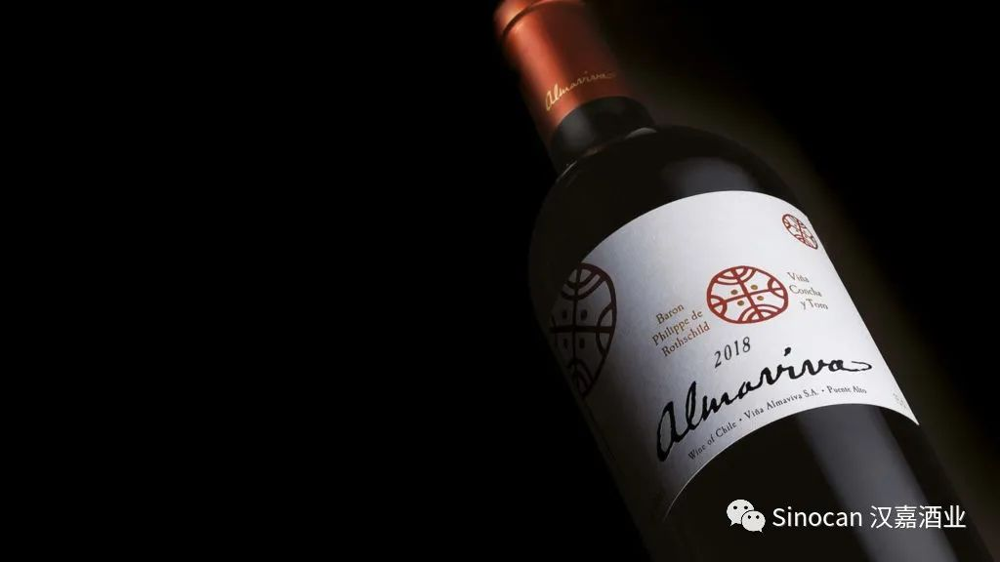
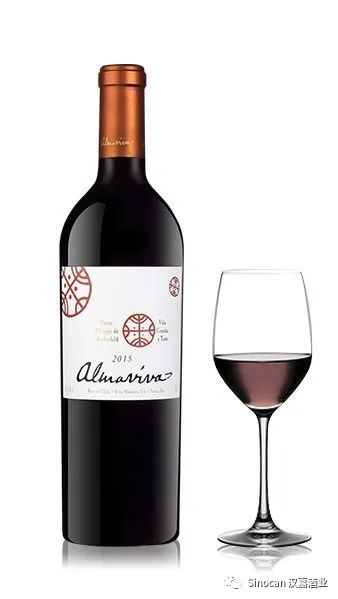
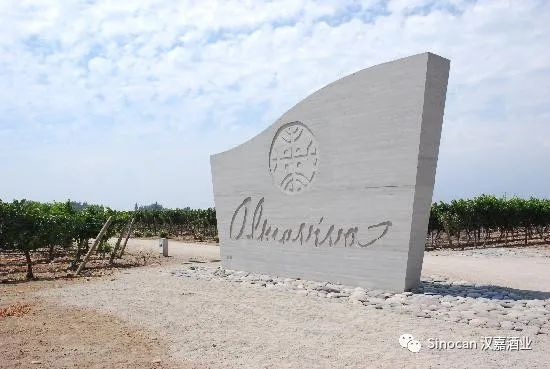
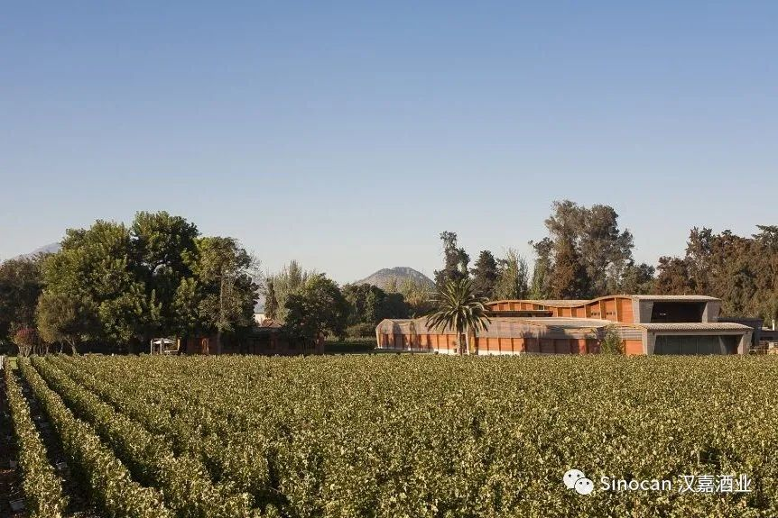
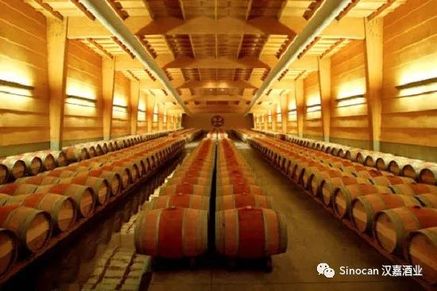
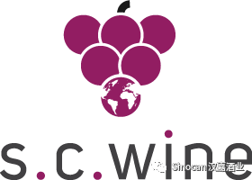
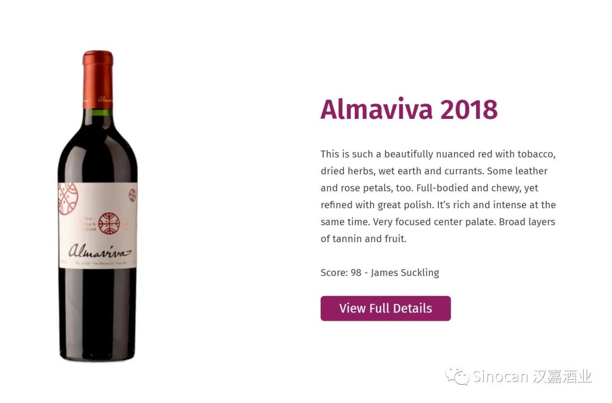
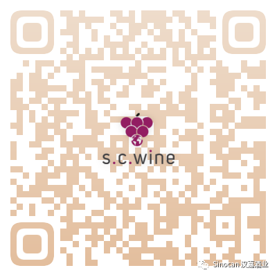

# 无标题

**链接地址:** http://mp.weixin.qq.com/s?__biz=MzIyMzU4OTc0MQ==&mid=2247484808&idx=1&sn=c503c4373749858cad7b42663340a7fa&chksm=e81aa18adf6d289c3b4726943e0c1c07b84b8498fa80eaec6c7af79364601d6c5220ec49cca8&mpshare=1&scene=2&srcid=0115njDOs4A6rWAOvlETWUGO&sharer_sharetime=1610678183644&sharer_shareid=be1c8edd6c93eec155a61c876e41d26a#rd
**作者:** 
**获取时间:** 2025/8/28 19:58:19
**图片数量:** 9

---

## 原始HTML内容

<section style="box-sizing: border-box;font-size: 16px;"><section style="margin: 17px 0%;box-sizing: border-box;" powered-by="xiumi.us"><section style="display: inline-block;width: 100%;vertical-align: top;border-left: 3px solid rgb(166, 54, 49);border-bottom-left-radius: 0px;padding-right: 5px;padding-left: 5px;border-right: 3px solid rgb(166, 54, 49);border-top-right-radius: 0px;box-sizing: border-box;"><section style="margin: -7px 0%;box-sizing: border-box;" powered-by="xiumi.us"><section style="display: inline-block;width: 100%;vertical-align: top;background-color: rgb(255, 255, 255);padding: 5px 10px;box-sizing: border-box;"><section style="color: rgb(0, 0, 0);font-size: 14px;box-sizing: border-box;" powered-by="xiumi.us">
<strong style="box-sizing: border-box;">点击蓝字 关注我们</strong>
</section></section></section></section></section><section style="box-sizing: border-box;" powered-by="xiumi.us">
 
</section><section style="text-align: right;justify-content: flex-end;margin-top: 10px;margin-right: 0%;margin-left: 0%;box-sizing: border-box;" powered-by="xiumi.us"><section style="display: inline-block;width: auto;vertical-align: top;min-width: 10%;max-width: 100%;height: auto;background-color: rgb(166, 54, 49);padding: 5px 10px;box-sizing: border-box;"><section style="text-align: justify;color: rgb(255, 255, 255);font-size: 14px;box-sizing: border-box;" powered-by="xiumi.us">
<strong style="box-sizing: border-box;">特别专题《红酒品鉴》系列 Vol.2.2</strong>
</section></section></section><section style="display: inline-block;width: 100%;vertical-align: top;border-left: 2px none rgb(195, 163, 142);border-bottom-left-radius: 0px;background-color: rgba(255, 213, 195, 0);padding: 10px;border-right: 2px solid rgb(0, 0, 0);border-top-right-radius: 0px;box-sizing: border-box;" powered-by="xiumi.us"><section style="text-align: center;margin-right: 0%;margin-left: 0%;box-sizing: border-box;" powered-by="xiumi.us"><section style="max-width: 100%;vertical-align: middle;display: inline-block;line-height: 0;box-sizing: border-box;"></section></section></section><section style="text-align: right;justify-content: flex-end;margin-right: 0%;margin-bottom: 10px;margin-left: 0%;font-size: 0px;box-sizing: border-box;" powered-by="xiumi.us"><section style="display: inline-block;width: 50%;vertical-align: top;height: auto;line-height: 0;box-sizing: border-box;"><section style="margin-top: 0.5em;margin-bottom: 0.5em;box-sizing: border-box;" powered-by="xiumi.us"><section style="background-color: rgb(0, 0, 0);height: 2px;box-sizing: border-box;"><section><svg viewBox="0 0 1 1" style="float:left;line-height:0;width:0;vertical-align:top;"></svg></section></section></section></section></section><section style="box-sizing: border-box;" powered-by="xiumi.us"><section style="display: flex;flex-flow: row nowrap;margin: -10px 0% 10px;box-sizing: border-box;"><section style="display: inline-block;vertical-align: top;width: auto;flex: 0 0 auto;align-self: flex-start;min-width: 10%;max-width: 100%;height: auto;box-sizing: border-box;"><section style="color: rgb(0, 0, 0);font-size: 12px;box-sizing: border-box;" powered-by="xiumi.us">
专题出品 |&nbsp;加拿大汉嘉酒业&nbsp;
</section></section><section style="display: inline-block;vertical-align: top;width: auto;align-self: flex-start;flex: 100 100 0%;box-sizing: border-box;"><section style="margin-top: 0.5em;margin-bottom: 0.5em;box-sizing: border-box;" powered-by="xiumi.us"><section style="background-color: rgba(255, 213, 195, 0);height: 1px;box-sizing: border-box;"><section><svg viewBox="0 0 1 1" style="float:left;line-height:0;width:0;vertical-align:top;"></svg></section></section></section></section></section></section><section style="box-sizing: border-box;" powered-by="xiumi.us">
 
</section><section style="text-align: right;justify-content: flex-end;margin: 10px 0%;box-sizing: border-box;" powered-by="xiumi.us"><section style="display: inline-block;width: auto;vertical-align: top;min-width: 10%;max-width: 100%;height: auto;box-shadow: rgb(0, 0, 0) 0px 0px 0px;box-sizing: border-box;"><section style="justify-content: flex-end;margin-right: 0%;margin-left: 0%;font-size: 0px;box-sizing: border-box;" powered-by="xiumi.us"><section style="display: inline-block;width: 50%;vertical-align: top;height: auto;line-height: 0;box-sizing: border-box;"><section style="margin-top: 0.5em;margin-bottom: 0.5em;box-sizing: border-box;" powered-by="xiumi.us"><section style="background-color: rgba(255, 213, 195, 0);height: 2px;box-sizing: border-box;"><section><svg viewBox="0 0 1 1" style="float:left;line-height:0;width:0;vertical-align:top;"></svg></section></section></section></section></section><section style="display: inline-block;width: 100%;vertical-align: top;background-color: rgba(255, 213, 195, 0);padding: 3px 10px;border-style: solid;border-width: 0px;border-radius: 0px;border-color: rgb(62, 62, 62);box-sizing: border-box;" powered-by="xiumi.us"><section style="text-align: justify;color: rgb(0, 0, 0);font-size: 14px;box-sizing: border-box;" powered-by="xiumi.us">
<strong style="box-sizing: border-box;">酒款介绍</strong>
</section></section></section></section><section style="margin-top: -3px;margin-right: 0%;margin-left: 0%;box-sizing: border-box;" powered-by="xiumi.us"><section style="display: inline-block;width: 100%;vertical-align: top;border-left: 3px solid rgb(0, 0, 0);border-bottom-left-radius: 0px;padding-left: 5px;box-sizing: border-box;"><section style="margin: -7px 0%;box-sizing: border-box;" powered-by="xiumi.us"><section style="display: inline-block;width: 100%;vertical-align: top;background-color: rgba(255, 213, 195, 0);padding: 5px 10px;box-sizing: border-box;"><section style="text-align: left;color: rgb(158, 114, 84);font-size: 14px;box-sizing: border-box;" powered-by="xiumi.us">
<strong style="box-sizing: border-box;">Vina&nbsp;Almaviva, Puente Alto, Chile, 2018</strong>

<strong style="box-sizing: border-box;"></strong>

活灵魂干红葡萄酒 2018
</section></section></section></section></section><section style="margin-right: 0%;margin-bottom: 10px;margin-left: 0%;box-sizing: border-box;" powered-by="xiumi.us"><section style="display: inline-block;width: 100%;vertical-align: top;padding-left: 8px;box-sizing: border-box;"><section style="margin-right: 0%;margin-left: 0%;box-sizing: border-box;" powered-by="xiumi.us"><section style="display: inline-block;width: 100%;vertical-align: top;background-color: rgba(255, 213, 195, 0);padding-bottom: 10px;box-sizing: border-box;"><section style="box-sizing: border-box;" powered-by="xiumi.us">
 
</section><section style="margin-right: 0%;margin-bottom: 20px;margin-left: 0%;box-sizing: border-box;" powered-by="xiumi.us"><section style="display: inline-block;width: 100%;vertical-align: top;padding: 10px;box-sizing: border-box;"><section style="box-sizing: border-box;" powered-by="xiumi.us"><section style="display: inline-block;vertical-align: top;width: 40%;border-style: solid;border-width: 0px;border-radius: 0px;border-color: rgb(213, 181, 113);padding-right: 6px;height: auto;box-sizing: border-box;"><section style="text-align: center;margin-right: 0%;margin-left: 0%;box-sizing: border-box;" powered-by="xiumi.us"><section style="max-width: 100%;vertical-align: middle;display: inline-block;line-height: 0;width: 100%;height: auto;box-sizing: border-box;"></section></section></section><section style="display: inline-block;vertical-align: top;width: 60%;height: auto;box-sizing: border-box;"><section style="font-size: 12px;box-sizing: border-box;" powered-by="xiumi.us">
AB SKU: 841899 

年份&nbsp;:&nbsp;2018

产区 :&nbsp;Maipo Valley

产地&nbsp;: 智利

净含量&nbsp;:&nbsp;750 ml

种类&nbsp;: 干红葡萄酒

酒精度&nbsp;:&nbsp;14％vol

酒庄&nbsp;:&nbsp;Almaviva（活灵魂酒庄）

葡萄品种&nbsp;: 赤霞珠 72% 、&nbsp;佳美娜&nbsp;19% 、&nbsp;品丽珠&nbsp;&nbsp;6% 、小维多&nbsp;3%
</section></section></section></section></section></section></section></section></section><section style="box-sizing: border-box;" powered-by="xiumi.us">
 
</section><section style="text-align: right;justify-content: flex-end;margin: 10px 0%;box-sizing: border-box;" powered-by="xiumi.us"><section style="display: inline-block;width: auto;vertical-align: top;min-width: 10%;max-width: 100%;height: auto;box-shadow: rgb(0, 0, 0) 0px 0px 0px;box-sizing: border-box;"><section style="justify-content: flex-end;margin-right: 0%;margin-left: 0%;font-size: 0px;box-sizing: border-box;" powered-by="xiumi.us"><section style="display: inline-block;width: 50%;vertical-align: top;height: auto;line-height: 0;box-sizing: border-box;"><section style="margin-top: 0.5em;margin-bottom: 0.5em;box-sizing: border-box;" powered-by="xiumi.us"><section style="background-color: rgba(255, 213, 195, 0);height: 2px;box-sizing: border-box;"><section><svg viewBox="0 0 1 1" style="float:left;line-height:0;width:0;vertical-align:top;"></svg></section></section></section></section></section><section style="display: inline-block;width: 100%;vertical-align: top;background-color: rgba(255, 213, 195, 0);padding: 3px 10px;border-style: solid;border-width: 0px;border-radius: 0px;border-color: rgb(62, 62, 62);box-shadow: rgb(0, 0, 0) 0px 0px 0px;box-sizing: border-box;" powered-by="xiumi.us"><section style="text-align: justify;color: rgb(166, 54, 49);font-size: 14px;box-sizing: border-box;" powered-by="xiumi.us">
<strong style="box-sizing: border-box;">酒款综述</strong>
</section></section></section></section><section style="margin: 10px 0% 15px;box-sizing: border-box;" powered-by="xiumi.us"><section style="display: inline-block;width: 100%;vertical-align: top;box-shadow: rgb(0, 0, 0) 0px 0px 0px;padding-right: 5px;padding-left: 5px;border-width: 0px;box-sizing: border-box;"><section style="text-align: right;justify-content: flex-end;margin-right: 0%;margin-bottom: -1px;margin-left: 0%;font-size: 0px;transform: translate3d(-1px, 0px, 0px);box-sizing: border-box;" powered-by="xiumi.us"><section style="display: inline-block;width: 50%;vertical-align: top;height: auto;line-height: 0;box-sizing: border-box;"><section style="box-sizing: border-box;" powered-by="xiumi.us"><section style="display: flex;flex-flow: row nowrap;box-sizing: border-box;"><section style="display: inline-block;vertical-align: top;width: auto;padding-right: 5px;padding-left: 5px;background-color: rgb(255, 255, 255);flex: 1 1 0%;align-self: flex-start;height: auto;box-sizing: border-box;"><section style="margin-top: 0.5em;margin-bottom: 0.5em;box-sizing: border-box;" powered-by="xiumi.us"><section style="background-color: rgb(0, 0, 0);height: 1px;box-sizing: border-box;"><section><svg viewBox="0 0 1 1" style="float:left;line-height:0;width:0;vertical-align:top;"></svg></section></section></section></section><section style="display: inline-block;vertical-align: top;width: auto;background-color: rgb(255, 255, 255);flex: 1 1 0%;height: auto;align-self: flex-start;box-sizing: border-box;"><section style="margin-top: 0.5em;margin-bottom: 0.5em;box-sizing: border-box;" powered-by="xiumi.us"><section style="background-color: rgb(0, 0, 0);height: 1px;box-sizing: border-box;"><section><svg viewBox="0 0 1 1" style="float:left;line-height:0;width:0;vertical-align:top;"></svg></section></section></section></section></section></section></section></section><section style="color: rgb(97, 97, 97);font-size: 14px;padding-right: 10px;padding-left: 10px;box-sizing: border-box;" powered-by="xiumi.us">
 

<strong style="box-sizing: border-box;">颜色深浓，酒体高雅、馥郁醇和，既有旧世界的优雅平衡，又具备新世界的果香和浓烈，单宁细滑如丝，是令人一饮难忘的智利顶级佳酿。</strong>

 <strong style="box-sizing: border-box;">色泽：</strong>紫红色泽，不带粘稠，色泽非常透彻，不愧是 智利活灵魂干红葡萄酒。

 <strong style="box-sizing: border-box;">香气：</strong>具有浓郁黑莓及奶油，香料和草莓的香气，香味非常吸引人，特别适合喜欢女士们，属于典型的奶香型葡萄酒 。

 <strong style="box-sizing: border-box;">口感：</strong>浓郁黑莓及香料味道，单宁柔顺，回味持久，略带奶油味道非常特别，形成了这款智利活灵魂干红葡萄酒的特点。深红宝石的色泽，高雅的酒体馥郁醇和，既有旧世界的优雅平衡，又具备新世界的果香和浓烈，单宁细滑如丝，令人一饮难忘。

 
</section><section style="text-align: left;justify-content: flex-start;margin-top: -1px;margin-right: 0%;margin-left: 0%;font-size: 0px;box-sizing: border-box;" powered-by="xiumi.us"><section style="display: inline-block;width: 50%;vertical-align: top;height: auto;line-height: 0;box-sizing: border-box;"><section style="box-sizing: border-box;" powered-by="xiumi.us"><section style="display: flex;flex-flow: row nowrap;box-sizing: border-box;"><section style="display: inline-block;vertical-align: top;width: auto;padding-right: 5px;background-color: rgb(255, 255, 255);flex: 2 2 0%;align-self: flex-start;height: auto;box-sizing: border-box;"><section style="margin-top: 0.5em;margin-bottom: 0.5em;box-sizing: border-box;" powered-by="xiumi.us"><section style="background-color: rgb(0, 0, 0);height: 1px;box-sizing: border-box;"><section><svg viewBox="0 0 1 1" style="float:left;line-height:0;width:0;vertical-align:top;"></svg></section></section></section></section><section style="display: inline-block;vertical-align: top;width: auto;background-color: rgb(255, 255, 255);padding-right: 5px;flex: 1 1 0%;height: auto;align-self: flex-start;box-sizing: border-box;"><section style="margin-top: 0.5em;margin-bottom: 0.5em;box-sizing: border-box;" powered-by="xiumi.us"><section style="background-color: rgb(0, 0, 0);height: 1px;box-sizing: border-box;"><section><svg viewBox="0 0 1 1" style="float:left;line-height:0;width:0;vertical-align:top;"></svg></section></section></section></section></section></section></section></section></section></section><section style="box-sizing: border-box;" powered-by="xiumi.us">
 
</section><section style="text-align: right;justify-content: flex-end;margin: 10px 0%;box-sizing: border-box;" powered-by="xiumi.us"><section style="display: inline-block;width: auto;vertical-align: top;min-width: 10%;max-width: 100%;height: auto;box-shadow: rgb(0, 0, 0) 0px 0px 0px;box-sizing: border-box;"><section style="justify-content: flex-end;margin-right: 0%;margin-left: 0%;font-size: 0px;box-sizing: border-box;" powered-by="xiumi.us"><section style="display: inline-block;width: 50%;vertical-align: top;height: auto;line-height: 0;box-sizing: border-box;"><section style="margin-top: 0.5em;margin-bottom: 0.5em;box-sizing: border-box;" powered-by="xiumi.us"><section style="background-color: rgba(255, 213, 195, 0);height: 2px;box-sizing: border-box;"><section><svg viewBox="0 0 1 1" style="float:left;line-height:0;width:0;vertical-align:top;"></svg></section></section></section></section></section><section style="display: inline-block;width: 100%;vertical-align: top;background-color: rgba(255, 213, 195, 0);padding: 3px 10px;border-style: solid;border-width: 0px;border-radius: 0px;border-color: rgb(62, 62, 62);box-sizing: border-box;" powered-by="xiumi.us"><section style="text-align: justify;color: rgb(166, 54, 49);font-size: 14px;box-sizing: border-box;" powered-by="xiumi.us">
<strong style="box-sizing: border-box;">酒庄介绍</strong>
</section></section></section></section><section style="font-size: 14px;color: rgb(115, 115, 114);letter-spacing: 0px;padding-right: 15px;padding-left: 15px;box-sizing: border-box;" powered-by="xiumi.us">
活灵魂酒庄（Almaviva Winery）位于智利迈坡谷（Maipo Valley）葡萄酒产区，<strong style="box-sizing: border-box;">1997年由法国木桐酒庄（Chateau Mouton Rothschild）与智利产量第一的干露酒庄（Concha y Toro）合作建立。</strong>

 
</section><section style="margin-top: 10px;margin-bottom: 10px;box-sizing: border-box;" powered-by="xiumi.us"><section style="box-shadow: rgb(170, 170, 170) 0px 0px 10px inset;border-color: rgb(192, 200, 209);padding: 10px;border-width: 1px;border-style: solid;background-color: rgb(250, 250, 239);box-sizing: border-box;"><section style="text-align: center;margin-right: 0%;margin-left: 0%;box-sizing: border-box;" powered-by="xiumi.us"><section style="max-width: 100%;vertical-align: middle;display: inline-block;line-height: 0;border-width: 0px;box-shadow: rgb(0, 0, 0) 0px 0px 0px;box-sizing: border-box;"></section></section></section></section><section style="font-size: 14px;color: rgb(115, 115, 114);letter-spacing: 0px;padding-right: 15px;padding-left: 15px;box-sizing: border-box;" powered-by="xiumi.us">
 
</section><section style="font-size: 14px;color: rgb(115, 115, 114);letter-spacing: 0px;padding-right: 15px;padding-left: 15px;box-sizing: border-box;" powered-by="xiumi.us">
 

“Almaviva”意为“活灵魂”。从字面来看，在西班牙文中“alma”是“灵魂、生命”的意思，那么合起来翻译成“活灵魂”并不难理解。

 

活灵魂酒庄为什么会取这个名字呢？据说，智利有着得天独厚的气候、水土，是酿造葡萄酒的天堂，但酿出的酒却无法摆脱“廉价”的标签，干露酒庄决心打破这一怪论。

 
</section><section style="margin-top: 10px;margin-bottom: 10px;box-sizing: border-box;" powered-by="xiumi.us"><section style="box-shadow: rgb(170, 170, 170) 0px 0px 10px inset;border-color: rgb(192, 200, 209);padding: 10px;border-width: 1px;border-style: solid;background-color: rgb(250, 250, 239);box-sizing: border-box;"><section style="text-align: center;margin-right: 0%;margin-left: 0%;box-sizing: border-box;" powered-by="xiumi.us"><section style="max-width: 100%;vertical-align: middle;display: inline-block;line-height: 0;box-sizing: border-box;"></section></section></section></section><section style="font-size: 14px;color: rgb(115, 115, 114);letter-spacing: 0px;padding-right: 15px;padding-left: 15px;box-sizing: border-box;" powered-by="xiumi.us">
 

他们清楚认识到智利葡萄酒的质量没有问题，缺少的就是那画龙点睛般的灵魂。于是，干露酒庄邀请了红葡萄酒界独一无二的“灵魂人物”罗斯柴尔德男爵 （Baron Philippe de Rothschild）来智利一起共同酿造举世闻名的好酒，于是双方很快便达成一致，创建了活灵魂酒庄。

 
</section><section style="margin-top: 10px;margin-bottom: 10px;box-sizing: border-box;" powered-by="xiumi.us"><section style="box-shadow: rgb(170, 170, 170) 0px 0px 10px inset;border-color: rgb(192, 200, 209);padding: 10px;border-width: 1px;border-style: solid;background-color: rgb(250, 250, 239);box-sizing: border-box;"><section style="text-align: center;margin-right: 0%;margin-left: 0%;box-sizing: border-box;" powered-by="xiumi.us"><section style="max-width: 100%;vertical-align: middle;display: inline-block;line-height: 0;box-sizing: border-box;"></section></section></section></section><section style="font-size: 14px;color: rgb(115, 115, 114);letter-spacing: 0px;padding-right: 15px;padding-left: 15px;box-sizing: border-box;" powered-by="xiumi.us">
 

活灵魂酒诞生之后掀起了购买的热潮，《葡萄酒观察者》对2001年的活灵魂也打出了95分的高分。<strong style="box-sizing: border-box;">活灵魂被誉为“智利酒王”</strong>，由波尔多经典的葡萄品种混酿而成，以赤霞珠（Cabernet Sauvignon）为主。

 

可以说，活灵魂是两种文化巧妙的相遇：智利提供土壤、气候及葡萄园，而法国贡献出酿酒技术和传统，最终酿造出异常雅致和复杂的葡萄酒。

 
</section><section style="box-sizing: border-box;" powered-by="xiumi.us"><section style="display: flex;flex-flow: row nowrap;box-sizing: border-box;"><section style="display: inline-block;vertical-align: top;width: auto;flex: 10 10 0%;height: auto;align-self: flex-start;box-sizing: border-box;"><section style="margin-top: 0.5em;margin-bottom: 0.5em;box-sizing: border-box;" powered-by="xiumi.us"><section style="background-color: rgb(166, 54, 49);height: 2px;box-sizing: border-box;"><section><svg viewBox="0 0 1 1" style="float:left;line-height:0;width:0;vertical-align:top;"></svg></section></section></section></section><section style="display: inline-block;vertical-align: top;width: auto;flex: 100 100 0%;align-self: flex-start;height: auto;padding-right: 4px;padding-left: 4px;box-sizing: border-box;"><section style="margin-top: 0.5em;margin-bottom: 0.5em;box-sizing: border-box;" powered-by="xiumi.us"><section style="background-color: rgb(166, 54, 49);height: 2px;box-sizing: border-box;"><section><svg viewBox="0 0 1 1" style="float:left;line-height:0;width:0;vertical-align:top;"></svg></section></section></section></section><section style="display: inline-block;vertical-align: top;width: auto;flex: 10 10 0%;align-self: flex-start;height: auto;box-sizing: border-box;"><section style="margin-top: 0.5em;margin-bottom: 0.5em;box-sizing: border-box;" powered-by="xiumi.us"><section style="background-color: rgb(166, 54, 49);height: 2px;box-sizing: border-box;"><section><svg viewBox="0 0 1 1" style="float:left;line-height:0;width:0;vertical-align:top;"></svg></section></section></section></section></section></section><section style="box-sizing: border-box;" powered-by="xiumi.us">
 
</section><section style="margin-top: -10px;margin-right: 0%;margin-left: 0%;box-sizing: border-box;" powered-by="xiumi.us"><section style="display: inline-block;width: 100%;vertical-align: top;border-left: 2px solid rgba(255, 213, 195, 0);border-bottom-left-radius: 0px;background-color: rgba(255, 213, 195, 0);padding: 10px;box-sizing: border-box;"><section style="margin: 17px 0%;box-sizing: border-box;" powered-by="xiumi.us"><section style="display: inline-block;width: 100%;vertical-align: top;border-left: 3px solid rgba(255, 213, 195, 0);border-bottom-left-radius: 0px;padding-left: 5px;box-sizing: border-box;"><section style="text-align: center;margin-top: 10px;margin-bottom: 10px;box-sizing: border-box;" powered-by="xiumi.us"><section style="max-width: 100%;vertical-align: middle;display: inline-block;line-height: 0;width: 35%;height: auto;box-sizing: border-box;"></section></section><section style="font-size: 12px;color: rgb(195, 163, 142);padding-right: 10px;padding-left: 10px;box-sizing: border-box;" powered-by="xiumi.us">
With roots in Edmonton, Alberta, S.C. Wine is a budding importation agency that prides itself on bringing only the best premium, quality wines to Western Canada at an exceptional value.
</section></section></section><section style="color: rgb(158, 114, 84);font-size: 14px;padding-right: 10px;padding-left: 10px;box-sizing: border-box;" powered-by="xiumi.us">
<strong style="box-sizing: border-box;">Vina&nbsp;Almaviva, Puente Alto, Chile, 2018</strong>

<strong style="box-sizing: border-box;">活灵魂干红葡萄酒 2018</strong>
</section><section style="text-align: center;margin-top: 10px;margin-bottom: 10px;box-sizing: border-box;" powered-by="xiumi.us"><section style="max-width: 100%;vertical-align: middle;display: inline-block;line-height: 0;box-sizing: border-box;"></section></section><section style="color: rgb(158, 114, 84);font-size: 14px;padding-right: 10px;padding-left: 10px;box-sizing: border-box;" powered-by="xiumi.us">
http://www.scwineimport.com/chilean-wines/almaviva-2018/ 

 
</section><section style="box-sizing: border-box;" powered-by="xiumi.us"><section style="text-align: center;justify-content: center;display: flex;flex-flow: row nowrap;margin: 10px 0%;box-sizing: border-box;"><section style="display: inline-block;vertical-align: top;width: 33%;flex: 0 0 auto;height: auto;align-self: stretch;padding-right: 10px;padding-left: 10px;box-sizing: border-box;"><section style="margin-right: 0%;margin-left: 0%;opacity: 0.99;box-sizing: border-box;" powered-by="xiumi.us"><section style="max-width: 100%;vertical-align: middle;display: inline-block;line-height: 0;width: 100%;height: auto;box-sizing: border-box;"></section></section></section><section style="display: inline-block;vertical-align: top;width: auto;align-self: stretch;flex: 100 100 0%;height: auto;border-style: solid none;border-width: 2px;border-radius: 0px;border-color: rgba(255, 213, 195, 0) rgb(222, 222, 222);margin-top: 2px;margin-bottom: 2px;margin-left: 8px;padding-left: 10px;box-sizing: border-box;"><section style="margin-right: 0%;margin-bottom: 2px;margin-left: 0%;box-sizing: border-box;" powered-by="xiumi.us"><section style="font-size: 14px;line-height: 1;letter-spacing: 0px;box-sizing: border-box;">
<strong style="box-sizing: border-box;">请扫描二维码&nbsp;</strong>

<strong style="box-sizing: border-box;">联系我们获取更多信息</strong>
</section></section><section style="margin-top: 10px;margin-right: 0%;margin-left: 0%;box-sizing: border-box;" powered-by="xiumi.us"><section style="font-size: 14px;color: rgb(166, 54, 49);line-height: 1.6;letter-spacing: 0px;box-sizing: border-box;">
欢迎访问我们的官方网站 

浏览更多全球名庄红酒
</section></section></section></section></section></section></section><section style="box-sizing: border-box;" powered-by="xiumi.us">
 
</section><section style="text-align: left;justify-content: flex-start;margin-right: 0%;margin-bottom: 10px;margin-left: 0%;font-size: 0px;box-sizing: border-box;" powered-by="xiumi.us"><section style="display: inline-block;width: 50%;vertical-align: top;height: auto;line-height: 0;box-sizing: border-box;"><section style="margin-top: 0.5em;margin-bottom: 0.5em;box-sizing: border-box;" powered-by="xiumi.us"><section style="background-color: rgba(255, 213, 195, 0);height: 2px;box-sizing: border-box;"><section><svg viewBox="0 0 1 1" style="float:left;line-height:0;width:0;vertical-align:top;"></svg></section></section></section></section></section><section style="margin-top: 10px;margin-right: 0%;margin-left: 0%;box-sizing: border-box;" powered-by="xiumi.us"><section style="display: inline-block;width: auto;vertical-align: top;min-width: 10%;max-width: 100%;height: auto;box-sizing: border-box;"><section style="margin-right: 0%;margin-bottom: 3px;margin-left: 0%;box-sizing: border-box;" powered-by="xiumi.us"><section style="background-color: rgb(0, 0, 0);height: 2px;box-sizing: border-box;"><section><svg viewBox="0 0 1 1" style="float:left;line-height:0;width:0;vertical-align:top;"></svg></section></section></section><section style="margin-right: 0%;margin-left: 0%;box-sizing: border-box;" powered-by="xiumi.us"><section style="font-size: 14px;color: rgb(166, 54, 49);letter-spacing: 2px;line-height: 1.4;box-sizing: border-box;">
<strong style="box-sizing: border-box;">更多名庄佳酿推荐</strong>
</section></section></section></section><section style="min-height: 40px;margin-right: 0%;margin-bottom: 10px;margin-left: 0%;box-sizing: border-box;" powered-by="xiumi.us"><section style="width: 100%;margin-right: auto;margin-bottom: -10px;margin-left: auto;box-sizing: border-box;"><table width="100%"><tbody style="box-sizing: border-box;"><tr opera-tn-ra-comp="_$.pages:0.layers:0.comps:29.classicTable1:0" style="box-sizing: border-box;" powered-by="xiumi.us"><td colspan="1" opera-tn-ra-cell="_$.pages:0.layers:0.comps:29.classicTable1:0.td@@0" rowspan="2" style="border-color: rgb(62, 62, 62);border-radius: 0px;border-style: none;background-position: 48.3862% 68.3749%;background-repeat: repeat;background-size: 168.291%;background-attachment: scroll;vertical-align: bottom;background-image: url(&quot;https://mmbiz.qpic.cn/mmbiz_jpg/7CNdqYbqvBLymd8eZB6ibkSbfOOh6NV7ibmphyS4ib8phWIkSqUjrJz4FJvL9q6DfVibqic0micrSPspB6RL98BicgygA/640?wx_fmt=jpeg&quot;);box-sizing: border-box;padding: 0px;" width="30.0000%"><section style="margin-right: 0%;margin-bottom: 4px;margin-left: 0%;box-sizing: border-box;" powered-by="xiumi.us"><section style="text-align: right;padding-right: 4px;padding-left: 4px;letter-spacing: 0px;color: rgb(255, 255, 255);font-size: 32px;line-height: 1;box-sizing: border-box;">
 
<section style="line-height: 0;color:rgba(0,0,0,0);width:0;"><svg viewBox="0 0 1 1" style="vertical-align:top;"><text x="-10" y="-10">_</text></svg></section></section></section></td><td colspan="1" rowspan="1" opera-tn-ra-cell="_$.pages:0.layers:0.comps:29.classicTable1:0.td@@1" style="border-color: rgb(62, 62, 62);border-radius: 0px;border-style: none;padding-top: 0px;padding-bottom: 0px;background-color: rgb(249, 249, 249);box-sizing: border-box;" width="70.0000%"><section style="margin-top: 10px;margin-right: 0%;margin-left: 0%;box-sizing: border-box;" powered-by="xiumi.us"><section style="font-size: 14px;letter-spacing: 0px;line-height: 1.6;color: rgb(140, 140, 140);box-sizing: border-box;">
<a target="_blank" href="http://mp.weixin.qq.com/s?__biz=MzIyMzU4OTc0MQ==&amp;mid=2247484600&amp;idx=1&amp;sn=fc9f8a573ef8f059c0b93ec2eeecf777&amp;chksm=e81aa0badf6d29ac92fea9c28469c07ea97fe65cf2e3753b239d5856844ffa32574eff38984e&amp;scene=21#wechat_redirect" textvalue="●&nbsp;Chateau Pedesclaux柏德诗歌酒庄干红" data-itemshowtype="0" tab="innerlink" data-linktype="2">●&nbsp;<strong style="box-sizing: border-box;">Chateau Pedesclaux</strong></a>

<a target="_blank" href="http://mp.weixin.qq.com/s?__biz=MzIyMzU4OTc0MQ==&amp;mid=2247484600&amp;idx=1&amp;sn=fc9f8a573ef8f059c0b93ec2eeecf777&amp;chksm=e81aa0badf6d29ac92fea9c28469c07ea97fe65cf2e3753b239d5856844ffa32574eff38984e&amp;scene=21#wechat_redirect" textvalue="●&nbsp;Chateau Pedesclaux柏德诗歌酒庄干红" data-itemshowtype="0" tab="innerlink" data-linktype="2"><strong style="box-sizing: border-box;">柏德诗歌酒庄干红</strong></a><strong style="box-sizing: border-box;"></strong>

 
</section></section></td></tr><tr opera-tn-ra-comp="_$.pages:0.layers:0.comps:29.classicTable1:1" style="box-sizing: border-box;" powered-by="xiumi.us"><td colspan="1" rowspan="1" opera-tn-ra-cell="_$.pages:0.layers:0.comps:29.classicTable1:1.td@@0" style="border-color: rgb(62, 62, 62);border-radius: 0px;border-style: none;padding-top: 0px;padding-bottom: 0px;background-color: rgb(249, 249, 249);box-sizing: border-box;" width="70.0000%"><section style="margin: 10px 0%;box-sizing: border-box;" powered-by="xiumi.us"><section style="font-size: 14px;letter-spacing: 1px;line-height: 1;color: rgb(140, 140, 140);box-sizing: border-box;">
<a target="_blank" href="http://mp.weixin.qq.com/s?__biz=MzIyMzU4OTc0MQ==&amp;mid=2247484600&amp;idx=1&amp;sn=fc9f8a573ef8f059c0b93ec2eeecf777&amp;chksm=e81aa0badf6d29ac92fea9c28469c07ea97fe65cf2e3753b239d5856844ffa32574eff38984e&amp;scene=21#wechat_redirect" textvalue="► 点击阅读" data-itemshowtype="0" tab="innerlink" data-linktype="2">► 点击阅读</a>
</section></section></td></tr></tbody></table></section></section><section style="min-height: 40px;margin-right: 0%;margin-bottom: 10px;margin-left: 0%;box-sizing: border-box;" powered-by="xiumi.us"><section style="width: 100%;margin-right: auto;margin-bottom: -10px;margin-left: auto;box-sizing: border-box;"><table width="100%"><tbody style="box-sizing: border-box;"><tr opera-tn-ra-comp="_$.pages:0.layers:0.comps:30.classicTable1:0" style="box-sizing: border-box;" powered-by="xiumi.us"><td colspan="1" opera-tn-ra-cell="_$.pages:0.layers:0.comps:30.classicTable1:0.td@@0" rowspan="2" style="border-color: rgb(62, 62, 62);border-radius: 0px;border-style: none;background-position: 50% 50%;background-repeat: no-repeat;background-size: cover;background-attachment: scroll;vertical-align: bottom;background-image: url(&quot;https://mmbiz.qpic.cn/mmbiz_png/7CNdqYbqvBLymd8eZB6ibkSbfOOh6NV7ib5coic75fhFwuvnFAIwcUYoWu2st7hHE6TZOyd2OaQlqLzBSFgTd9K1A/640?wx_fmt=png&quot;);box-sizing: border-box;padding: 0px;" width="30.0000%"><section style="margin-right: 0%;margin-bottom: 4px;margin-left: 0%;box-sizing: border-box;" powered-by="xiumi.us"><section style="text-align: right;padding-right: 4px;padding-left: 4px;letter-spacing: 0px;color: rgb(255, 255, 255);font-size: 32px;line-height: 1;box-sizing: border-box;">
 
<section style="line-height: 0;color:rgba(0,0,0,0);width:0;"><svg viewBox="0 0 1 1" style="vertical-align:top;"><text x="-10" y="-10">_</text></svg></section></section></section></td><td colspan="1" rowspan="1" opera-tn-ra-cell="_$.pages:0.layers:0.comps:30.classicTable1:0.td@@1" style="border-color: rgb(62, 62, 62);border-radius: 0px;border-style: none;padding-top: 0px;padding-bottom: 0px;background-color: rgb(249, 249, 249);box-sizing: border-box;" width="70.0000%"><section style="margin-top: 10px;margin-right: 0%;margin-left: 0%;box-sizing: border-box;" powered-by="xiumi.us"><section style="font-size: 14px;letter-spacing: 0px;line-height: 1.6;color: rgb(140, 140, 140);box-sizing: border-box;">
<a target="_blank" href="http://mp.weixin.qq.com/s?__biz=MzIyMzU4OTc0MQ==&amp;mid=2247484381&amp;idx=2&amp;sn=b3c18413f93a4d56a68b51a7b3b7c5b3&amp;chksm=e81aa7dfdf6d2ec954c478fe9a17984749720f9af08dc4ded0899572c950e9460eba97653af1&amp;scene=21#wechat_redirect" textvalue="●&nbsp;Château Gromel Bel Air&nbsp;" data-itemshowtype="0" tab="innerlink" data-linktype="2">●&nbsp;<strong style="box-sizing: border-box;">Château Gromel Bel Air&nbsp;</strong></a>

<a target="_blank" href="http://mp.weixin.qq.com/s?__biz=MzIyMzU4OTc0MQ==&amp;mid=2247484381&amp;idx=2&amp;sn=b3c18413f93a4d56a68b51a7b3b7c5b3&amp;chksm=e81aa7dfdf6d2ec954c478fe9a17984749720f9af08dc4ded0899572c950e9460eba97653af1&amp;scene=21#wechat_redirect" textvalue="●&nbsp;Château Gromel Bel Air&nbsp;" data-itemshowtype="0" tab="innerlink" data-linktype="2"><strong style="box-sizing: border-box;">歌美酒庄贝爱尔干红</strong></a><strong style="box-sizing: border-box;"></strong>

 
</section></section></td></tr><tr opera-tn-ra-comp="_$.pages:0.layers:0.comps:30.classicTable1:1" style="box-sizing: border-box;" powered-by="xiumi.us"><td colspan="1" rowspan="1" opera-tn-ra-cell="_$.pages:0.layers:0.comps:30.classicTable1:1.td@@0" style="border-color: rgb(62, 62, 62);border-radius: 0px;border-style: none;padding-top: 0px;padding-bottom: 0px;background-color: rgb(249, 249, 249);box-sizing: border-box;" width="70.0000%"><section style="margin: 10px 0%;box-sizing: border-box;" powered-by="xiumi.us"><section style="font-size: 14px;letter-spacing: 1px;line-height: 1;color: rgb(140, 140, 140);box-sizing: border-box;">
<a target="_blank" href="http://mp.weixin.qq.com/s?__biz=MzIyMzU4OTc0MQ==&amp;mid=2247484381&amp;idx=2&amp;sn=b3c18413f93a4d56a68b51a7b3b7c5b3&amp;chksm=e81aa7dfdf6d2ec954c478fe9a17984749720f9af08dc4ded0899572c950e9460eba97653af1&amp;scene=21#wechat_redirect" textvalue="► 点击阅读" data-itemshowtype="0" tab="innerlink" data-linktype="2">► 点击阅读</a>
</section></section></td></tr></tbody></table></section></section><section style="min-height: 40px;margin-right: 0%;margin-bottom: 10px;margin-left: 0%;box-sizing: border-box;" powered-by="xiumi.us"><section style="width: 100%;margin-right: auto;margin-bottom: -10px;margin-left: auto;box-sizing: border-box;"><table width="100%"><tbody style="box-sizing: border-box;"><tr opera-tn-ra-comp="_$.pages:0.layers:0.comps:31.classicTable1:0" style="box-sizing: border-box;" powered-by="xiumi.us"><td colspan="1" opera-tn-ra-cell="_$.pages:0.layers:0.comps:31.classicTable1:0.td@@0" rowspan="2" style="border-color: rgb(62, 62, 62);border-radius: 0px;border-style: none;background-position: 50% 58.2051%;background-repeat: repeat;background-size: 110.435%;background-attachment: scroll;vertical-align: bottom;background-image: url(&quot;https://mmbiz.qpic.cn/mmbiz_png/7CNdqYbqvBLymd8eZB6ibkSbfOOh6NV7ibGhiboWNTvG3FDnvzvh0vb3NrSkvSTMh1rYc8dVOj7GQJ766LibG8Dibcg/640?wx_fmt=png&quot;);box-sizing: border-box;padding: 0px;" width="30.0000%"><section style="margin-right: 0%;margin-bottom: 4px;margin-left: 0%;box-sizing: border-box;" powered-by="xiumi.us"><section style="text-align: right;padding-right: 4px;padding-left: 4px;letter-spacing: 0px;color: rgb(255, 255, 255);font-size: 32px;line-height: 1;box-sizing: border-box;">
 
<section style="line-height: 0;color:rgba(0,0,0,0);width:0;"><svg viewBox="0 0 1 1" style="vertical-align:top;"><text x="-10" y="-10">_</text></svg></section></section></section></td><td colspan="1" rowspan="1" opera-tn-ra-cell="_$.pages:0.layers:0.comps:31.classicTable1:0.td@@1" style="border-color: rgb(62, 62, 62);border-radius: 0px;border-style: none;padding-top: 0px;padding-bottom: 0px;background-color: rgb(249, 249, 249);box-sizing: border-box;" width="70.0000%"><section style="margin-top: 10px;margin-right: 0%;margin-left: 0%;box-sizing: border-box;" powered-by="xiumi.us"><section style="font-size: 14px;letter-spacing: 0px;line-height: 1.6;color: rgb(140, 140, 140);box-sizing: border-box;">
<a target="_blank" href="http://mp.weixin.qq.com/s?__biz=MzIyMzU4OTc0MQ==&amp;mid=2247484443&amp;idx=2&amp;sn=23c147aefc865691a73b9ea8790f75af&amp;chksm=e81aa019df6d290f13b318e5bede53c1a1c4d61c80895d036791b6e1dc4f14ffa521594a7cb8&amp;scene=21#wechat_redirect" textvalue="●&nbsp;Château Roquettes Saint-Emilion Grand Cru&nbsp;禄禧酒庄干红&nbsp;" data-itemshowtype="0" tab="innerlink" data-linktype="2">●&nbsp;<strong style="box-sizing: border-box;">Château Roquettes Saint-Emilion Grand Cru&nbsp;</strong></a>

<a target="_blank" href="http://mp.weixin.qq.com/s?__biz=MzIyMzU4OTc0MQ==&amp;mid=2247484443&amp;idx=2&amp;sn=23c147aefc865691a73b9ea8790f75af&amp;chksm=e81aa019df6d290f13b318e5bede53c1a1c4d61c80895d036791b6e1dc4f14ffa521594a7cb8&amp;scene=21#wechat_redirect" textvalue="●&nbsp;Château Roquettes Saint-Emilion Grand Cru&nbsp;禄禧酒庄干红&nbsp;" data-itemshowtype="0" tab="innerlink" data-linktype="2"><strong style="letter-spacing: 0px;box-sizing: border-box;">禄禧酒庄干红&nbsp;</strong></a><strong style="letter-spacing: 0px;box-sizing: border-box;"></strong>
</section></section></td></tr><tr opera-tn-ra-comp="_$.pages:0.layers:0.comps:31.classicTable1:1" style="box-sizing: border-box;" powered-by="xiumi.us"><td colspan="1" rowspan="1" opera-tn-ra-cell="_$.pages:0.layers:0.comps:31.classicTable1:1.td@@0" style="border-color: rgb(62, 62, 62);border-radius: 0px;border-style: none;padding-top: 0px;padding-bottom: 0px;background-color: rgb(249, 249, 249);box-sizing: border-box;" width="70.0000%"><section style="margin: 10px 0%;box-sizing: border-box;" powered-by="xiumi.us"><section style="font-size: 14px;letter-spacing: 1px;line-height: 1;color: rgb(140, 140, 140);box-sizing: border-box;">
<a target="_blank" href="http://mp.weixin.qq.com/s?__biz=MzIyMzU4OTc0MQ==&amp;mid=2247484443&amp;idx=2&amp;sn=23c147aefc865691a73b9ea8790f75af&amp;chksm=e81aa019df6d290f13b318e5bede53c1a1c4d61c80895d036791b6e1dc4f14ffa521594a7cb8&amp;scene=21#wechat_redirect" textvalue="► 点击阅读" data-itemshowtype="0" tab="innerlink" data-linktype="2">► 点击阅读</a>
</section></section></td></tr></tbody></table></section></section><section style="box-sizing: border-box;" powered-by="xiumi.us"><section style="text-align: left;justify-content: flex-start;margin: -10px 0% 10px;display: flex;flex-flow: row nowrap;box-sizing: border-box;"><section style="display: inline-block;vertical-align: top;width: auto;flex: 100 100 0%;height: auto;align-self: flex-start;box-sizing: border-box;"><section style="margin-top: 0.5em;margin-bottom: 0.5em;box-sizing: border-box;" powered-by="xiumi.us"><section style="background-color: rgb(0, 0, 0);height: 1px;box-sizing: border-box;"><section><svg viewBox="0 0 1 1" style="float:left;line-height:0;width:0;vertical-align:top;"></svg></section></section></section></section><section style="display: inline-block;vertical-align: top;width: 20%;flex: 0 0 auto;height: auto;align-self: flex-start;margin-right: 10px;margin-left: 10px;box-sizing: border-box;"><section style="margin-top: 0.5em;margin-bottom: 0.5em;box-sizing: border-box;" powered-by="xiumi.us"><section style="background-color: rgb(166, 54, 49);height: 1px;box-sizing: border-box;"><section><svg viewBox="0 0 1 1" style="float:left;line-height:0;width:0;vertical-align:top;"></svg></section></section></section></section><section style="display: inline-block;vertical-align: top;width: auto;flex: 100 100 0%;height: auto;align-self: flex-start;box-sizing: border-box;"><section style="margin-top: 0.5em;margin-bottom: 0.5em;box-sizing: border-box;" powered-by="xiumi.us"><section style="background-color: rgb(0, 0, 0);height: 1px;box-sizing: border-box;"><section><svg viewBox="0 0 1 1" style="float:left;line-height:0;width:0;vertical-align:top;"></svg></section></section></section></section></section></section><section style="box-sizing: border-box;" powered-by="xiumi.us">
 
</section><section style="box-sizing: border-box;" powered-by="xiumi.us">
 
</section><section style="margin: 10px 0%;box-sizing: border-box;" powered-by="xiumi.us"><section style="display: inline-block;width: 100%;vertical-align: top;background-color: rgba(162, 162, 162, 0.36);border-width: 1px 4px;border-radius: 0px;border-style: solid none;border-color: rgba(162, 162, 162, 0.36) rgb(205, 240, 255);box-sizing: border-box;"><section style="box-sizing: border-box;" powered-by="xiumi.us"><section style="display: inline-block;vertical-align: middle;width: 33%;align-self: center;height: auto;box-shadow: rgba(255, 213, 195, 0) 0px 0px 0px;box-sizing: border-box;"><section style="text-align: right;margin: -4px 0%;justify-content: flex-end;box-sizing: border-box;" powered-by="xiumi.us"><section style="max-width: 100%;vertical-align: middle;display: inline-block;line-height: 0;width: 90%;height: auto;box-shadow: rgb(166, 54, 49) 0px 0px 0px;border-style: solid none;border-width: 6px 4px;border-radius: 0px;border-color: rgb(166, 54, 49) rgb(255, 211, 44);box-sizing: border-box;"></section></section></section><section style="display: inline-block;vertical-align: middle;width: 66%;height: auto;align-self: center;box-sizing: border-box;"><section style="margin-right: 0%;margin-left: 0%;box-sizing: border-box;" powered-by="xiumi.us"><section style="text-align: center;font-size: 14px;color: rgb(124, 119, 219);letter-spacing: 0px;line-height: 1.6;padding-right: 20px;padding-left: 20px;box-sizing: border-box;">
<strong style="box-sizing: border-box;">汉嘉酒业</strong>

<strong style="box-sizing: border-box;">扫描二维码</strong><strong style="letter-spacing: 0px;box-sizing: border-box;">关注我们</strong>

http://www.sinocansupply.com/

Email: info@sinocansupply.com
</section></section></section></section></section></section></section>
 

---

## 纯文本内容

点击蓝字 关注我们特别专题《红酒品鉴》系列 Vol.2.2专题出品 | 加拿大汉嘉酒业 酒款介绍Vina Almaviva, Puente Alto, Chile, 2018活灵魂干红葡萄酒 2018AB SKU: 841899年份 : 2018产区 : Maipo Valley产地 : 智利净含量 : 750 ml种类 : 干红葡萄酒酒精度 : 14％vol酒庄 : Almaviva（活灵魂酒庄）葡萄品种 : 赤霞珠 72% 、 佳美娜 19% 、 品丽珠  6% 、小维多 3%酒款综述颜色深浓，酒体高雅、馥郁醇和，既有旧世界的优雅平衡，又具备新世界的果香和浓烈，单宁细滑如丝，是令人一饮难忘的智利顶级佳酿。色泽：紫红色泽，不带粘稠，色泽非常透彻，不愧是 智利活灵魂干红葡萄酒。香气：具有浓郁黑莓及奶油，香料和草莓的香气，香味非常吸引人，特别适合喜欢女士们，属于典型的奶香型葡萄酒 。口感：浓郁黑莓及香料味道，单宁柔顺，回味持久，略带奶油味道非常特别，形成了这款智利活灵魂干红葡萄酒的特点。深红宝石的色泽，高雅的酒体馥郁醇和，既有旧世界的优雅平衡，又具备新世界的果香和浓烈，单宁细滑如丝，令人一饮难忘。酒庄介绍活灵魂酒庄（Almaviva Winery）位于智利迈坡谷（Maipo Valley）葡萄酒产区，1997年由法国木桐酒庄（Chateau Mouton Rothschild）与智利产量第一的干露酒庄（Concha y Toro）合作建立。“Almaviva”意为“活灵魂”。从字面来看，在西班牙文中“alma”是“灵魂、生命”的意思，那么合起来翻译成“活灵魂”并不难理解。活灵魂酒庄为什么会取这个名字呢？据说，智利有着得天独厚的气候、水土，是酿造葡萄酒的天堂，但酿出的酒却无法摆脱“廉价”的标签，干露酒庄决心打破这一怪论。他们清楚认识到智利葡萄酒的质量没有问题，缺少的就是那画龙点睛般的灵魂。于是，干露酒庄邀请了红葡萄酒界独一无二的“灵魂人物”罗斯柴尔德男爵 （Baron Philippe de Rothschild）来智利一起共同酿造举世闻名的好酒，于是双方很快便达成一致，创建了活灵魂酒庄。活灵魂酒诞生之后掀起了购买的热潮，《葡萄酒观察者》对2001年的活灵魂也打出了95分的高分。活灵魂被誉为“智利酒王”，由波尔多经典的葡萄品种混酿而成，以赤霞珠（Cabernet Sauvignon）为主。可以说，活灵魂是两种文化巧妙的相遇：智利提供土壤、气候及葡萄园，而法国贡献出酿酒技术和传统，最终酿造出异常雅致和复杂的葡萄酒。With roots in Edmonton, Alberta, S.C. Wine is a budding importation agency that prides itself on bringing only the best premium, quality wines to Western Canada at an exceptional value.Vina Almaviva, Puente Alto, Chile, 2018活灵魂干红葡萄酒 2018http://www.scwineimport.com/chilean-wines/almaviva-2018/请扫描二维码 联系我们获取更多信息欢迎访问我们的官方网站浏览更多全球名庄红酒更多名庄佳酿推荐_● Chateau Pedesclaux柏德诗歌酒庄干红► 点击阅读_● Château Gromel Bel Air 歌美酒庄贝爱尔干红► 点击阅读_● Château Roquettes Saint-Emilion Grand Cru 禄禧酒庄干红 ► 点击阅读汉嘉酒业扫描二维码关注我们http://www.sinocansupply.com/Email: info@sinocansupply.com

---

## 图片列表

-  (原始链接: https://mmbiz.qpic.cn/mmbiz_jpg/7CNdqYbqvBLymd8eZB6ibkSbfOOh6NV7ibib68rbzvlUh0Lic9xUZxZHt0U3R4qIyiaeGL5O495rCRyfuI0RwMv0aVQ/640?wx_fmt=jpeg)
-  (原始链接: https://mmbiz.qpic.cn/mmbiz_jpg/7CNdqYbqvBLymd8eZB6ibkSbfOOh6NV7ibjpaR6OAlI8z1icAG47ZiclkSC4FcdsojOEqXKvwdnuDEjqBlO4o8fXDw/640?wx_fmt=jpeg)
-  (原始链接: https://mmbiz.qpic.cn/mmbiz_jpg/7CNdqYbqvBLymd8eZB6ibkSbfOOh6NV7ibjN4sMwdBCzkVRAmbuSxX9l0QrRuNtdEKzDzfwmic30rLDU5MUFbgG8g/640?wx_fmt=jpeg)
-  (原始链接: https://mmbiz.qpic.cn/mmbiz_jpg/7CNdqYbqvBLymd8eZB6ibkSbfOOh6NV7ibQcM5PyQuMMgaKkThsMuCialOibciaofsv3U6Ges8Wto1VoMAsV7VjvSibw/640?wx_fmt=jpeg)
-  (原始链接: https://mmbiz.qpic.cn/mmbiz_jpg/7CNdqYbqvBLymd8eZB6ibkSbfOOh6NV7ibzTMcIZiczsE56IdIgWAJ94AreficJqYQAuZvXRQiaGvglqJz4azrR1NEQ/640?wx_fmt=jpeg)
-  (原始链接: https://mmbiz.qpic.cn/mmbiz_png/7CNdqYbqvBIXHDqmSFchg3iaiazf3dESricTzqOxkGVYYuQ1gqxx1jGTcNPBNZWgQyHOHLSibG5RTBqiaZSCxR2C3hQ/640?wx_fmt=png)
-  (原始链接: https://mmbiz.qpic.cn/mmbiz_jpg/7CNdqYbqvBLymd8eZB6ibkSbfOOh6NV7ib0uf9v6sJu60BmDSiasicQDOwoBeZ1ggEMY4RPttQoEkHaNvEVqNia9ianA/640?wx_fmt=jpeg)
-  (原始链接: https://mmbiz.qpic.cn/mmbiz_png/7CNdqYbqvBLymd8eZB6ibkSbfOOh6NV7ibA6eEPmWiaIibTLJ9jEe6eEaTicL948VsyUgFNf1j31WB3tefxaGlYILxQ/640?wx_fmt=png)
-  (原始链接: https://mmbiz.qpic.cn/mmbiz_jpg/7CNdqYbqvBLymd8eZB6ibkSbfOOh6NV7ibKYg4vbA2aOcT2GmL9NaPVLGY6xmCtfyVYZBvIicXNvev3HAfFA78j5g/640?wx_fmt=jpeg)
