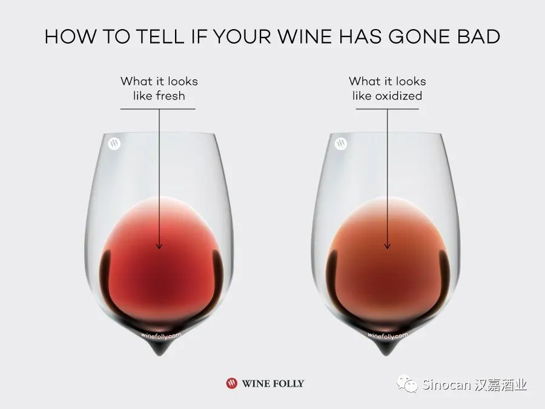
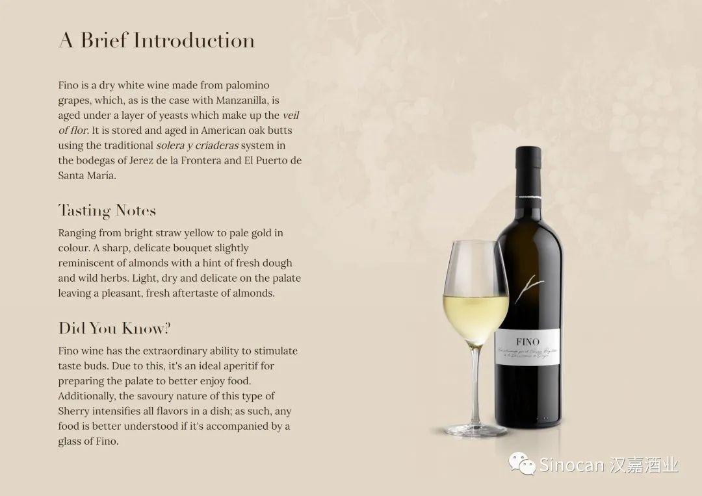
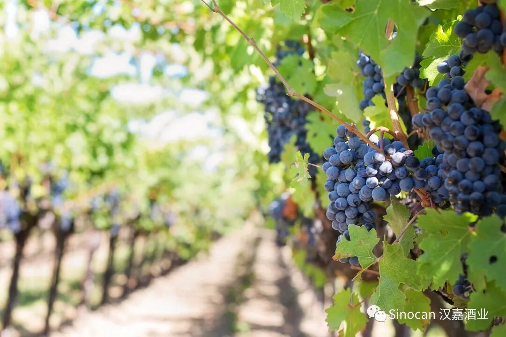
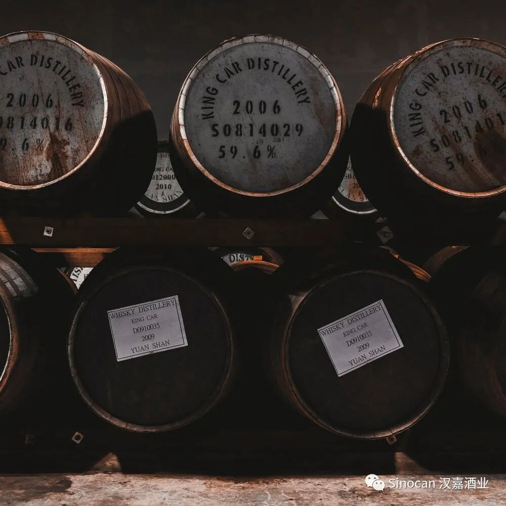
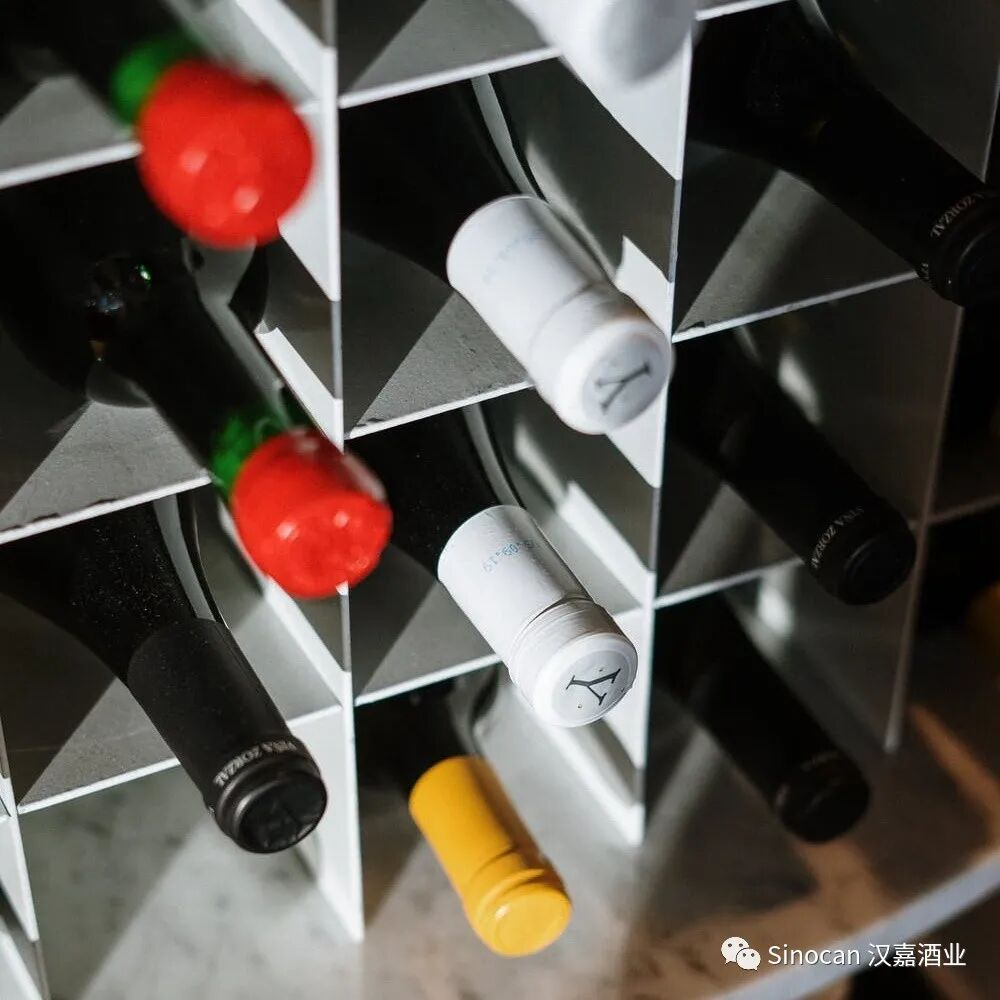
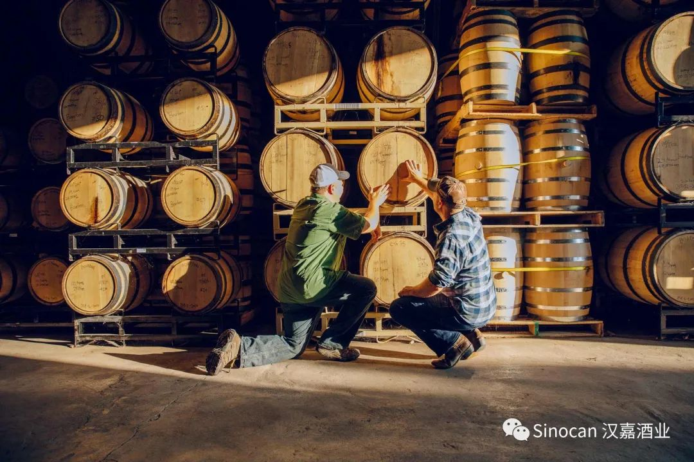
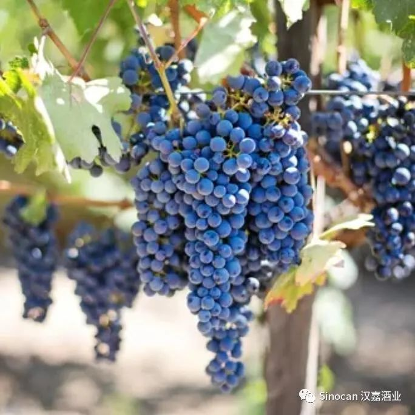
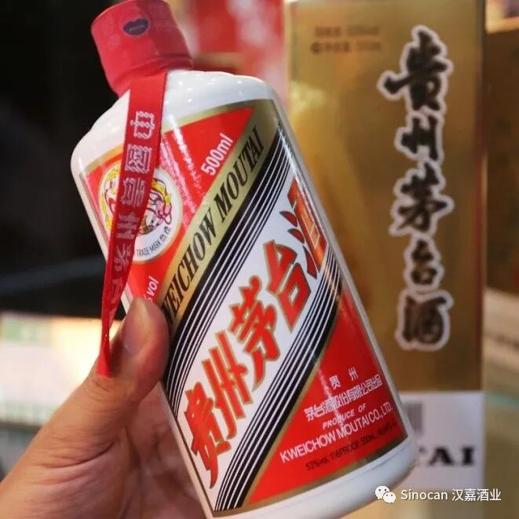
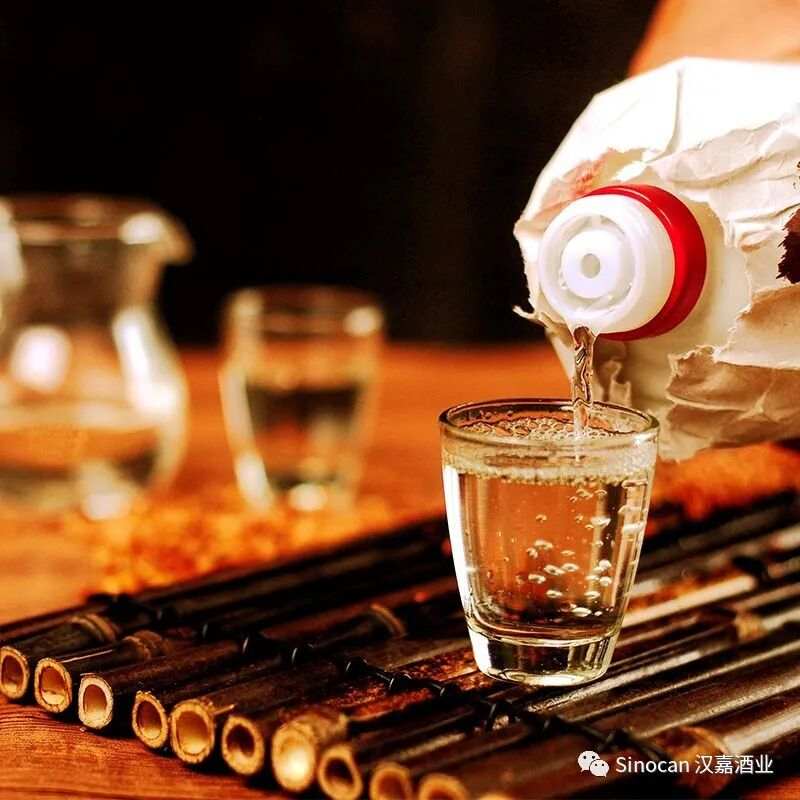

# 无标题

**链接地址:** http://mp.weixin.qq.com/s?__biz=MzIyMzU4OTc0MQ==&mid=2247484808&idx=2&sn=dd97dd2f0bc2a381c2c245944f3f139d&chksm=e81aa18adf6d289c709c45d79cba88a7f8d70b6a923dd2a20f897059b39fbdef732ceca7b74b&mpshare=1&scene=2&srcid=01158CVLGi0pXafyxj4dfV9U&sharer_sharetime=1610678204679&sharer_shareid=be1c8edd6c93eec155a61c876e41d26a#rd
**作者:** 
**获取时间:** 2025/8/28 19:58:11
**图片数量:** 17

---

## 原始HTML内容

<section style="box-sizing: border-box;font-size: 16px;"><section style="margin: 17px 0%;box-sizing: border-box;" powered-by="xiumi.us"><section style="display: inline-block;width: 100%;vertical-align: top;border-left: 3px solid rgb(166, 54, 49);border-bottom-left-radius: 0px;padding-right: 5px;padding-left: 5px;border-right: 3px solid rgb(166, 54, 49);border-top-right-radius: 0px;box-sizing: border-box;"><section style="margin: -7px 0%;box-sizing: border-box;" powered-by="xiumi.us"><section style="display: inline-block;width: 100%;vertical-align: top;background-color: rgb(255, 255, 255);padding: 5px 10px;box-sizing: border-box;"><section style="color: rgb(0, 0, 0);font-size: 14px;box-sizing: border-box;" powered-by="xiumi.us">
<strong style="box-sizing: border-box;">点击蓝字 关注我们</strong>
</section></section></section></section></section><section style="box-sizing: border-box;" powered-by="xiumi.us">
 
</section><section style="text-align: right;justify-content: flex-end;margin-top: 10px;margin-right: 0%;margin-left: 0%;box-sizing: border-box;" powered-by="xiumi.us"><section style="display: inline-block;width: auto;vertical-align: top;min-width: 10%;max-width: 100%;height: auto;background-color: rgb(166, 54, 49);padding: 5px 10px;border-width: 0px;box-sizing: border-box;"><section style="text-align: justify;color: rgb(255, 255, 255);font-size: 14px;box-sizing: border-box;" powered-by="xiumi.us">
<strong style="box-sizing: border-box;">特别专题《红酒百科》系列 Vol.1.2</strong>
</section></section></section><section style="display: inline-block;width: 100%;vertical-align: top;border-left: 2px none rgb(195, 163, 142);border-bottom-left-radius: 0px;background-color: rgba(255, 213, 195, 0);padding: 10px;border-right: 2px solid rgb(0, 0, 0);border-top-right-radius: 0px;box-sizing: border-box;" powered-by="xiumi.us"><section style="text-align: center;margin-right: 0%;margin-left: 0%;box-sizing: border-box;" powered-by="xiumi.us"><section style="max-width: 100%;vertical-align: middle;display: inline-block;line-height: 0;box-sizing: border-box;"></section></section></section><section style="text-align: right;justify-content: flex-end;margin-right: 0%;margin-bottom: 10px;margin-left: 0%;font-size: 0px;box-sizing: border-box;" powered-by="xiumi.us"><section style="display: inline-block;width: 50%;vertical-align: top;height: auto;line-height: 0;box-sizing: border-box;"><section style="margin-top: 0.5em;margin-bottom: 0.5em;box-sizing: border-box;" powered-by="xiumi.us"><section style="background-color: rgb(0, 0, 0);height: 2px;box-sizing: border-box;"><section><svg viewBox="0 0 1 1" style="float:left;line-height:0;width:0;vertical-align:top;"></svg></section></section></section></section></section><section style="box-sizing: border-box;" powered-by="xiumi.us"><section style="display: flex;flex-flow: row nowrap;margin: -10px 0% 10px;box-sizing: border-box;"><section style="display: inline-block;vertical-align: top;width: auto;flex: 0 0 auto;align-self: flex-start;min-width: 10%;max-width: 100%;height: auto;box-sizing: border-box;"><section style="color: rgb(0, 0, 0);font-size: 12px;box-sizing: border-box;" powered-by="xiumi.us">
专题出品 |&nbsp;加拿大汉嘉酒业&nbsp;
</section></section><section style="display: inline-block;vertical-align: top;width: auto;align-self: flex-start;flex: 100 100 0%;box-sizing: border-box;"><section style="margin-top: 0.5em;margin-bottom: 0.5em;box-sizing: border-box;" powered-by="xiumi.us"><section style="background-color: rgba(255, 213, 195, 0);height: 1px;box-sizing: border-box;"><section><svg viewBox="0 0 1 1" style="float:left;line-height:0;width:0;vertical-align:top;"></svg></section></section></section></section></section></section><section style="box-sizing: border-box;" powered-by="xiumi.us">
 
</section><section style="text-align: left;margin: 10px 0%;justify-content: flex-start;transform: translate3d(15px, 0px, 0px);-webkit-transform: translate3d(15px, 0px, 0px);-moz-transform: translate3d(15px, 0px, 0px);-o-transform: translate3d(15px, 0px, 0px);box-sizing: border-box;" powered-by="xiumi.us"><section style="display: inline-block;width: auto;vertical-align: top;min-width: 10%;max-width: 100%;height: auto;border-left: 3px solid rgb(0, 0, 0);border-bottom-left-radius: 0px;padding-left: 10px;line-height: 0;box-sizing: border-box;"><section style="margin-right: 0%;margin-left: 0%;transform: translate3d(-13px, 0px, 0px);box-sizing: border-box;" powered-by="xiumi.us"><section style="display: inline-block;width: 25px;height: 10px;vertical-align: top;overflow: hidden;line-height: 0;border-style: solid solid none;border-width: 3px 3px 2px;border-radius: 0px;border-color: rgb(0, 0, 0) rgb(0, 0, 0) rgb(15, 76, 129);box-sizing: border-box;"><section><svg viewBox="0 0 1 1" style="float:left;line-height:0;width:0;vertical-align:top;"></svg></section></section></section><section style="transform: translate3d(-1px, 0px, 0px);-webkit-transform: translate3d(-1px, 0px, 0px);-moz-transform: translate3d(-1px, 0px, 0px);-o-transform: translate3d(-1px, 0px, 0px);box-sizing: border-box;" powered-by="xiumi.us"><section style="text-align: justify;color: rgb(166, 54, 49);font-size: 20px;line-height: 1.5;box-sizing: border-box;">
<strong style="box-sizing: border-box;">前言</strong>
</section></section><section style="margin-right: 0%;margin-left: 0%;transform: translate3d(-13px, 0px, 0px) rotateX(180deg);box-sizing: border-box;" powered-by="xiumi.us"><section style="display: inline-block;width: 24px;height: 10px;vertical-align: top;overflow: hidden;line-height: 0;border-style: solid solid none;border-width: 3px 3px 2px;border-radius: 0px;border-color: rgb(0, 0, 0) rgb(0, 0, 0) rgb(15, 76, 129);box-sizing: border-box;"><section><svg viewBox="0 0 1 1" style="float:left;line-height:0;width:0;vertical-align:top;"></svg></section></section></section></section></section><section style="margin: 10px 0%;box-sizing: border-box;" powered-by="xiumi.us"><section style="font-size: 14px;letter-spacing: 2px;line-height: 2;padding-right: 15px;padding-left: 15px;box-sizing: border-box;">
不管我们是出于专业葡萄酒品鉴的需要，或者是个人的好奇心使然，我们在喝葡萄酒的时候闻酒香，能为我们<strong style="box-sizing: border-box;">做出正确的评价</strong>、选择个人的喜好倾向提供十分重要的依据。

 

那么，到底我们在闻香识酒的过程中，<strong style="box-sizing: border-box;">闻到的是什么？</strong>又能怎样帮助我们认识葡萄酒呢？ 

 
</section></section><section style="box-sizing: border-box;" powered-by="xiumi.us"><section style="display: flex;flex-flow: row nowrap;margin: 10px 0%;box-sizing: border-box;"><section style="display: inline-block;vertical-align: top;width: auto;flex: 0 0 0%;align-self: stretch;height: auto;background-position: 50% 50%;background-repeat: no-repeat;background-size: 100% 100%;background-attachment: scroll;background-image: url(&quot;https://mmbiz.qpic.cn/mmbiz_png/7CNdqYbqvBLymd8eZB6ibkSbfOOh6NV7ibfsKC6CcWrlHKZ6TR5DLCuJgiagQHe2cUvF8HJhMVSibXf3fHKOm8Q64Q/640?wx_fmt=png&quot;);box-sizing: border-box;"><section style="text-align: center;box-sizing: border-box;" powered-by="xiumi.us"><section style="display: inline-block;width: 15px;height: 15px;vertical-align: top;overflow: hidden;box-sizing: border-box;"><section><svg viewBox="0 0 1 1" style="float:left;line-height:0;width:0;vertical-align:top;"></svg></section></section></section></section><section style="display: inline-block;vertical-align: top;width: auto;flex: 100 100 0%;align-self: stretch;height: auto;box-sizing: border-box;"><section style="display: inline-block;width: 100%;vertical-align: top;border-width: 7px;border-radius: 0px;border-style: solid;border-color: rgb(255, 254, 251);box-shadow: rgb(218, 203, 158) 0px 0px 10px;box-sizing: border-box;" powered-by="xiumi.us"><section style="text-align: center;margin-right: 0%;margin-left: 0%;box-sizing: border-box;" powered-by="xiumi.us"><section style="max-width: 100%;vertical-align: middle;display: inline-block;line-height: 0;box-shadow: rgb(0, 0, 0) 0px 0px 0px;box-sizing: border-box;"></section></section></section></section><section style="display: inline-block;vertical-align: top;width: auto;flex: 0 0 0%;align-self: stretch;height: auto;background-position: 50% 50%;background-repeat: no-repeat;background-size: 100% 100%;background-attachment: scroll;background-image: url(&quot;https://mmbiz.qpic.cn/mmbiz_png/7CNdqYbqvBLymd8eZB6ibkSbfOOh6NV7ibpXqR41qPJyRNnpZ7QgrCrffLFmcHU4ySL2KU3dfI9EQ4TKEjusD9Og/640?wx_fmt=png&quot;);box-sizing: border-box;"><section style="text-align: center;box-sizing: border-box;" powered-by="xiumi.us"><section style="display: inline-block;width: 15px;height: 15px;vertical-align: top;overflow: hidden;box-sizing: border-box;"><section><svg viewBox="0 0 1 1" style="float:left;line-height:0;width:0;vertical-align:top;"></svg></section></section></section></section></section></section><section style="margin: 10px 0%;box-sizing: border-box;" powered-by="xiumi.us"><section style="font-size: 14px;letter-spacing: 2px;line-height: 2;padding-right: 15px;padding-left: 15px;box-sizing: border-box;">
 

通常来说，闻葡萄酒，我们需要区分出<strong style="box-sizing: border-box;">两种不同的香气</strong>：一种能告知我们葡萄酒的储存状况，即葡萄酒的<strong style="box-sizing: border-box;">缺陷香味</strong>；

 

另一种则展现出葡萄酒因为品种、酿造工艺和陈年上的不同而拥有的香气，即我们平常所说的<strong style="box-sizing: border-box;">一类（Primary aromas）、二类（Secondary aromas）和三类（Tertiary aromas）香气</strong>。 

 

 
</section></section><section style="transform: translate3d(1px, 0px, 0px);margin-top: 10px;margin-right: 0%;margin-left: 0%;box-sizing: border-box;" powered-by="xiumi.us"><section style="color: rgb(166, 54, 49);font-size: 17px;line-height: 1;letter-spacing: 2px;padding-right: 21px;padding-left: 21px;box-sizing: border-box;">
<strong style="box-sizing: border-box;">缺陷气味</strong>
</section></section><section style="box-sizing: border-box;" powered-by="xiumi.us"><section style="display: flex;flex-flow: row nowrap;box-sizing: border-box;"><section style="display: inline-block;vertical-align: top;width: auto;flex: 100 100 0%;align-self: flex-start;height: auto;margin-left: 10px;box-sizing: border-box;"><section style="margin-top: 6px;margin-right: 0%;margin-left: 0%;box-sizing: border-box;" powered-by="xiumi.us"><section style="background-color: rgb(0, 0, 0);height: 1px;box-sizing: border-box;"><section><svg viewBox="0 0 1 1" style="float:left;line-height:0;width:0;vertical-align:top;"></svg></section></section></section></section></section></section><section style="margin: 10px 0%;box-sizing: border-box;" powered-by="xiumi.us"><section style="font-size: 14px;letter-spacing: 2px;line-height: 2;padding-right: 15px;padding-left: 15px;box-sizing: border-box;">
一款葡萄酒如果有了缺陷，我们除了通过葡萄酒的颜色变化和光泽差异来识别，还能从鼻子的嗅闻中感受出来。

 
</section></section><section style="text-align: center;margin-top: 10px;margin-bottom: 10px;box-sizing: border-box;" powered-by="xiumi.us"><section style="max-width: 100%;vertical-align: middle;display: inline-block;line-height: 0;box-sizing: border-box;"></section></section><section style="margin: 10px 0%;box-sizing: border-box;" powered-by="xiumi.us"><section style="font-size: 14px;letter-spacing: 2px;line-height: 2;padding-right: 15px;padding-left: 15px;box-sizing: border-box;">
 

<strong style="box-sizing: border-box;">葡萄酒的常见的缺陷包括过度老化、过度氧化和木塞污染等</strong>。由这些缺陷产生的香气，即是葡萄酒的缺陷香味。

 

 
</section></section><section style="box-sizing: border-box;" powered-by="xiumi.us"><section style="display: flex;flex-flow: row nowrap;margin: 10px 0%;box-sizing: border-box;"><section style="display: inline-block;vertical-align: top;width: auto;flex: 0 0 auto;align-self: stretch;min-width: 10%;max-width: 100%;height: auto;background-color: rgb(166, 54, 49);box-sizing: border-box;"><section style="line-height: 1.5;letter-spacing: 0px;color: rgb(255, 255, 255);padding-right: 10px;padding-left: 10px;box-sizing: border-box;" powered-by="xiumi.us">
<strong style="box-sizing: border-box;">01</strong>
</section></section><section style="display: inline-block;vertical-align: top;width: auto;flex: 0 0 0%;align-self: stretch;height: auto;line-height: 0;box-sizing: border-box;"><section style="text-align: center;box-sizing: border-box;" powered-by="xiumi.us"><section style="display: inline-block;width: 6px;height: 12px;vertical-align: top;overflow: hidden;border-style: solid;border-width: 6px 3px;border-radius: 0px;border-color: rgb(166, 54, 49) rgba(255, 255, 255, 0) rgba(255, 255, 255, 0) rgb(166, 54, 49);box-sizing: border-box;"><section><svg viewBox="0 0 1 1" style="float:left;line-height:0;width:0;vertical-align:top;"></svg></section></section></section><section style="transform: perspective(0px);-webkit-transform: perspective(0px);-moz-transform: perspective(0px);-o-transform: perspective(0px);transform-style: flat;box-sizing: border-box;" powered-by="xiumi.us"><section style="text-align: center;transform: rotateX(180deg);-webkit-transform: rotateX(180deg);-moz-transform: rotateX(180deg);-o-transform: rotateX(180deg);box-sizing: border-box;"><section style="display: inline-block;width: 6px;height: 12px;vertical-align: top;overflow: hidden;border-style: solid;border-width: 6px 3px;border-radius: 0px;border-color: rgb(166, 54, 49) rgba(255, 255, 255, 0) rgba(255, 255, 255, 0) rgb(166, 54, 49);box-sizing: border-box;"><section><svg viewBox="0 0 1 1" style="float:left;line-height:0;width:0;vertical-align:top;"></svg></section></section></section></section></section><section style="display: inline-block;vertical-align: middle;width: auto;min-width: 10%;max-width: 100%;flex: 0 0 auto;height: auto;align-self: center;box-sizing: border-box;"><section style="color: rgb(120, 120, 120);line-height: 1;letter-spacing: 0px;padding-right: 10px;padding-left: 10px;box-sizing: border-box;" powered-by="xiumi.us">
<strong style="box-sizing: border-box;">木塞味</strong>
</section></section><section style="display: inline-block;vertical-align: middle;width: auto;flex: 100 100 0%;height: auto;align-self: center;box-sizing: border-box;"><section style="margin-right: 0%;margin-left: 0%;box-sizing: border-box;" powered-by="xiumi.us"><section style="background-color: rgb(223, 223, 223);height: 1px;box-sizing: border-box;"><section><svg viewBox="0 0 1 1" style="float:left;line-height:0;width:0;vertical-align:top;"></svg></section></section></section></section></section></section><section style="margin: 10px 0%;box-sizing: border-box;" powered-by="xiumi.us"><section style="font-size: 14px;letter-spacing: 2px;line-height: 2;padding-right: 15px;padding-left: 15px;box-sizing: border-box;">
 

如果在葡萄酒中闻到了类似湿纸板、湿动物皮毛的味道，那么这瓶葡萄酒就是<strong style="box-sizing: border-box;">受TCA（三氯苯甲醚Trichloranisole）污染</strong>的，产生的味道就是我们常说的木塞味。

 
</section></section><section style="box-sizing: border-box;" powered-by="xiumi.us"><section style="display: flex;flex-flow: row nowrap;margin: 10px 0%;box-sizing: border-box;"><section style="display: inline-block;vertical-align: top;width: auto;flex: 0 0 0%;align-self: stretch;height: auto;background-position: 50% 50%;background-repeat: no-repeat;background-size: 100% 100%;background-attachment: scroll;background-image: url(&quot;https://mmbiz.qpic.cn/mmbiz_png/7CNdqYbqvBLymd8eZB6ibkSbfOOh6NV7ibfsKC6CcWrlHKZ6TR5DLCuJgiagQHe2cUvF8HJhMVSibXf3fHKOm8Q64Q/640?wx_fmt=png&quot;);box-sizing: border-box;"><section style="text-align: center;box-sizing: border-box;" powered-by="xiumi.us"><section style="display: inline-block;width: 15px;height: 15px;vertical-align: top;overflow: hidden;box-sizing: border-box;"><section><svg viewBox="0 0 1 1" style="float:left;line-height:0;width:0;vertical-align:top;"></svg></section></section></section></section><section style="display: inline-block;vertical-align: top;width: auto;flex: 100 100 0%;align-self: stretch;height: auto;box-sizing: border-box;"><section style="display: inline-block;width: 100%;vertical-align: top;border-width: 7px;border-radius: 0px;border-style: solid;border-color: rgb(255, 254, 251);box-shadow: rgb(218, 203, 158) 0px 0px 10px;box-sizing: border-box;" powered-by="xiumi.us"><section style="text-align: center;margin-right: 0%;margin-left: 0%;box-sizing: border-box;" powered-by="xiumi.us"><section style="max-width: 100%;vertical-align: middle;display: inline-block;line-height: 0;box-shadow: rgb(0, 0, 0) 0px 0px 0px;box-sizing: border-box;"></section></section></section></section><section style="display: inline-block;vertical-align: top;width: auto;flex: 0 0 0%;align-self: stretch;height: auto;background-position: 50% 50%;background-repeat: no-repeat;background-size: 100% 100%;background-attachment: scroll;background-image: url(&quot;https://mmbiz.qpic.cn/mmbiz_png/7CNdqYbqvBLymd8eZB6ibkSbfOOh6NV7ibpXqR41qPJyRNnpZ7QgrCrffLFmcHU4ySL2KU3dfI9EQ4TKEjusD9Og/640?wx_fmt=png&quot;);box-sizing: border-box;"><section style="text-align: center;box-sizing: border-box;" powered-by="xiumi.us"><section style="display: inline-block;width: 15px;height: 15px;vertical-align: top;overflow: hidden;box-sizing: border-box;"><section><svg viewBox="0 0 1 1" style="float:left;line-height:0;width:0;vertical-align:top;"></svg></section></section></section></section></section></section><section style="margin: 10px 0%;box-sizing: border-box;" powered-by="xiumi.us"><section style="font-size: 14px;letter-spacing: 2px;line-height: 2;padding-right: 15px;padding-left: 15px;box-sizing: border-box;">
 

木塞味通常来自于软木塞生产过程中必不可少的<strong style="box-sizing: border-box;">氯化物清洁剂</strong>，其被微生物腐蚀之后产生了难闻的气味分子TCA。

 

葡萄酒的TCA污染一般由橡木塞带来，但也有一些由酿酒厂里<strong style="box-sizing: border-box;">受污染的橡木桶带来</strong>。受TCA影响而变坏的酒虽然对身体无害，但气味闻起来却让人不适，缺少了一款葡萄酒所应该拥有的果香和新鲜度。 

 

 
</section></section><section style="box-sizing: border-box;" powered-by="xiumi.us"><section style="display: flex;flex-flow: row nowrap;margin: 10px 0%;box-sizing: border-box;"><section style="display: inline-block;vertical-align: top;width: auto;flex: 0 0 auto;align-self: stretch;min-width: 10%;max-width: 100%;height: auto;background-color: rgb(166, 54, 49);box-sizing: border-box;"><section style="line-height: 1.5;letter-spacing: 0px;color: rgb(255, 255, 255);padding-right: 10px;padding-left: 10px;box-sizing: border-box;" powered-by="xiumi.us">
<strong style="box-sizing: border-box;">02</strong>
</section></section><section style="display: inline-block;vertical-align: top;width: auto;flex: 0 0 0%;align-self: stretch;height: auto;line-height: 0;box-sizing: border-box;"><section style="text-align: center;box-sizing: border-box;" powered-by="xiumi.us"><section style="display: inline-block;width: 6px;height: 12px;vertical-align: top;overflow: hidden;border-style: solid;border-width: 6px 3px;border-radius: 0px;border-color: rgb(166, 54, 49) rgba(255, 255, 255, 0) rgba(255, 255, 255, 0) rgb(166, 54, 49);box-sizing: border-box;"><section><svg viewBox="0 0 1 1" style="float:left;line-height:0;width:0;vertical-align:top;"></svg></section></section></section><section style="transform: perspective(0px);-webkit-transform: perspective(0px);-moz-transform: perspective(0px);-o-transform: perspective(0px);transform-style: flat;box-sizing: border-box;" powered-by="xiumi.us"><section style="text-align: center;transform: rotateX(180deg);-webkit-transform: rotateX(180deg);-moz-transform: rotateX(180deg);-o-transform: rotateX(180deg);box-sizing: border-box;"><section style="display: inline-block;width: 6px;height: 12px;vertical-align: top;overflow: hidden;border-style: solid;border-width: 6px 3px;border-radius: 0px;border-color: rgb(166, 54, 49) rgba(255, 255, 255, 0) rgba(255, 255, 255, 0) rgb(166, 54, 49);box-sizing: border-box;"><section><svg viewBox="0 0 1 1" style="float:left;line-height:0;width:0;vertical-align:top;"></svg></section></section></section></section></section><section style="display: inline-block;vertical-align: middle;width: auto;min-width: 10%;max-width: 100%;flex: 0 0 auto;height: auto;align-self: center;box-sizing: border-box;"><section style="color: rgb(120, 120, 120);line-height: 1;letter-spacing: 0px;padding-right: 10px;padding-left: 10px;box-sizing: border-box;" powered-by="xiumi.us">
<strong style="box-sizing: border-box;">臭鸡蛋味</strong>
</section></section><section style="display: inline-block;vertical-align: middle;width: auto;flex: 100 100 0%;height: auto;align-self: center;box-sizing: border-box;"><section style="margin-right: 0%;margin-left: 0%;box-sizing: border-box;" powered-by="xiumi.us"><section style="background-color: rgb(223, 223, 223);height: 1px;box-sizing: border-box;"><section><svg viewBox="0 0 1 1" style="float:left;line-height:0;width:0;vertical-align:top;"></svg></section></section></section></section></section></section><section style="margin: 10px 0%;box-sizing: border-box;" powered-by="xiumi.us"><section style="font-size: 14px;letter-spacing: 2px;line-height: 2;padding-right: 15px;padding-left: 15px;box-sizing: border-box;">
 

在葡萄酒中闻到的臭鸡蛋味，其实是<strong style="box-sizing: border-box;">硫化氢</strong>（Sulfuretted Hydrogen）的味道。

 

几乎所有的葡萄酒都会人为地<strong style="box-sizing: border-box;">加入二氧化硫（Sulfur）用来灭菌</strong>，二氧化硫同时也抑制葡萄酒过早发生氧化作用。

 
</section></section><section style="box-sizing: border-box;" powered-by="xiumi.us"><section style="display: flex;flex-flow: row nowrap;margin: 10px 0%;box-sizing: border-box;"><section style="display: inline-block;vertical-align: top;width: auto;flex: 0 0 0%;align-self: stretch;height: auto;background-position: 50% 50%;background-repeat: no-repeat;background-size: 100% 100%;background-attachment: scroll;background-image: url(&quot;https://mmbiz.qpic.cn/mmbiz_png/7CNdqYbqvBLymd8eZB6ibkSbfOOh6NV7ibfsKC6CcWrlHKZ6TR5DLCuJgiagQHe2cUvF8HJhMVSibXf3fHKOm8Q64Q/640?wx_fmt=png&quot;);box-sizing: border-box;"><section style="text-align: center;box-sizing: border-box;" powered-by="xiumi.us"><section style="display: inline-block;width: 15px;height: 15px;vertical-align: top;overflow: hidden;box-sizing: border-box;"><section><svg viewBox="0 0 1 1" style="float:left;line-height:0;width:0;vertical-align:top;"></svg></section></section></section></section><section style="display: inline-block;vertical-align: top;width: auto;flex: 100 100 0%;align-self: stretch;height: auto;box-sizing: border-box;"><section style="display: inline-block;width: 100%;vertical-align: top;border-width: 7px;border-radius: 0px;border-style: solid;border-color: rgb(255, 254, 251);box-shadow: rgb(218, 203, 158) 0px 0px 10px;box-sizing: border-box;" powered-by="xiumi.us"><section style="text-align: center;margin-right: 0%;margin-left: 0%;box-sizing: border-box;" powered-by="xiumi.us"><section style="max-width: 100%;vertical-align: middle;display: inline-block;line-height: 0;box-shadow: rgb(0, 0, 0) 0px 0px 0px;box-sizing: border-box;"></section></section></section></section><section style="display: inline-block;vertical-align: top;width: auto;flex: 0 0 0%;align-self: stretch;height: auto;background-position: 50% 50%;background-repeat: no-repeat;background-size: 100% 100%;background-attachment: scroll;background-image: url(&quot;https://mmbiz.qpic.cn/mmbiz_png/7CNdqYbqvBLymd8eZB6ibkSbfOOh6NV7ibpXqR41qPJyRNnpZ7QgrCrffLFmcHU4ySL2KU3dfI9EQ4TKEjusD9Og/640?wx_fmt=png&quot;);box-sizing: border-box;"><section style="text-align: center;box-sizing: border-box;" powered-by="xiumi.us"><section style="display: inline-block;width: 15px;height: 15px;vertical-align: top;overflow: hidden;box-sizing: border-box;"><section><svg viewBox="0 0 1 1" style="float:left;line-height:0;width:0;vertical-align:top;"></svg></section></section></section></section></section></section><section style="margin: 10px 0%;box-sizing: border-box;" powered-by="xiumi.us"><section style="font-size: 14px;letter-spacing: 2px;line-height: 2;padding-right: 15px;padding-left: 15px;box-sizing: border-box;">
 

在葡萄酒的发酵过程中，二氧化硫发生了还原反应而产生硫化氢气体。这种硫化氢气体属于葡萄酒的<strong style="box-sizing: border-box;">还原性气味</strong>，闻起来就是我们常说的臭鸡蛋味。 

 

需要注意的是，葡萄酒中少量的还原反应会产生令人愉悦的复杂香气，在这种情况下的硫化氢气味，<strong style="box-sizing: border-box;">大多被称之为矿物质味</strong>。

 

 
</section></section><section style="box-sizing: border-box;" powered-by="xiumi.us"><section style="display: flex;flex-flow: row nowrap;margin: 10px 0%;box-sizing: border-box;"><section style="display: inline-block;vertical-align: top;width: auto;flex: 0 0 auto;align-self: stretch;min-width: 10%;max-width: 100%;height: auto;background-color: rgb(166, 54, 49);box-sizing: border-box;"><section style="line-height: 1.5;letter-spacing: 0px;color: rgb(255, 255, 255);padding-right: 10px;padding-left: 10px;box-sizing: border-box;" powered-by="xiumi.us">
<strong style="box-sizing: border-box;">03</strong>
</section></section><section style="display: inline-block;vertical-align: top;width: auto;flex: 0 0 0%;align-self: stretch;height: auto;line-height: 0;box-sizing: border-box;"><section style="text-align: center;box-sizing: border-box;" powered-by="xiumi.us"><section style="display: inline-block;width: 6px;height: 12px;vertical-align: top;overflow: hidden;border-style: solid;border-width: 6px 3px;border-radius: 0px;border-color: rgb(166, 54, 49) rgba(255, 255, 255, 0) rgba(255, 255, 255, 0) rgb(166, 54, 49);box-sizing: border-box;"><section><svg viewBox="0 0 1 1" style="float:left;line-height:0;width:0;vertical-align:top;"></svg></section></section></section><section style="transform: perspective(0px);-webkit-transform: perspective(0px);-moz-transform: perspective(0px);-o-transform: perspective(0px);transform-style: flat;box-sizing: border-box;" powered-by="xiumi.us"><section style="text-align: center;transform: rotateX(180deg);-webkit-transform: rotateX(180deg);-moz-transform: rotateX(180deg);-o-transform: rotateX(180deg);box-sizing: border-box;"><section style="display: inline-block;width: 6px;height: 12px;vertical-align: top;overflow: hidden;border-style: solid;border-width: 6px 3px;border-radius: 0px;border-color: rgb(166, 54, 49) rgba(255, 255, 255, 0) rgba(255, 255, 255, 0) rgb(166, 54, 49);box-sizing: border-box;"><section><svg viewBox="0 0 1 1" style="float:left;line-height:0;width:0;vertical-align:top;"></svg></section></section></section></section></section><section style="display: inline-block;vertical-align: middle;width: auto;min-width: 10%;max-width: 100%;flex: 0 0 auto;height: auto;align-self: center;box-sizing: border-box;"><section style="color: rgb(120, 120, 120);line-height: 1;letter-spacing: 0px;padding-right: 10px;padding-left: 10px;box-sizing: border-box;" powered-by="xiumi.us">
<strong style="box-sizing: border-box;">氧化味</strong>
</section></section><section style="display: inline-block;vertical-align: middle;width: auto;flex: 100 100 0%;height: auto;align-self: center;box-sizing: border-box;"><section style="margin-right: 0%;margin-left: 0%;box-sizing: border-box;" powered-by="xiumi.us"><section style="background-color: rgb(223, 223, 223);height: 1px;box-sizing: border-box;"><section><svg viewBox="0 0 1 1" style="float:left;line-height:0;width:0;vertical-align:top;"></svg></section></section></section></section></section></section><section style="margin: 10px 0%;box-sizing: border-box;" powered-by="xiumi.us"><section style="font-size: 14px;letter-spacing: 2px;line-height: 2;padding-right: 15px;padding-left: 15px;box-sizing: border-box;">
 

葡萄酒受到了过度氧化，除了能从色泽上观察到酒液的浑浊黯淡之外，也会产生<strong style="box-sizing: border-box;">乙醛和乙酸气体</strong>。

 

乙醛闻起来就像是<strong style="box-sizing: border-box;">过熟的苹果、甜玉米</strong>的味道，而乙酸则当然是<strong style="box-sizing: border-box;">醋</strong>的味道。这种氧化味非常让人不快，过度氧化的葡萄酒也不适合饮用了。

 
</section></section><section style="box-sizing: border-box;" powered-by="xiumi.us"><section style="display: flex;flex-flow: row nowrap;margin: 10px 0%;box-sizing: border-box;"><section style="display: inline-block;vertical-align: top;width: auto;flex: 0 0 0%;align-self: stretch;height: auto;background-position: 50% 50%;background-repeat: no-repeat;background-size: 100% 100%;background-attachment: scroll;background-image: url(&quot;https://mmbiz.qpic.cn/mmbiz_png/7CNdqYbqvBLymd8eZB6ibkSbfOOh6NV7ibfsKC6CcWrlHKZ6TR5DLCuJgiagQHe2cUvF8HJhMVSibXf3fHKOm8Q64Q/640?wx_fmt=png&quot;);box-sizing: border-box;"><section style="text-align: center;box-sizing: border-box;" powered-by="xiumi.us"><section style="display: inline-block;width: 15px;height: 15px;vertical-align: top;overflow: hidden;box-sizing: border-box;"><section><svg viewBox="0 0 1 1" style="float:left;line-height:0;width:0;vertical-align:top;"></svg></section></section></section></section><section style="display: inline-block;vertical-align: top;width: auto;flex: 100 100 0%;align-self: stretch;height: auto;box-sizing: border-box;"><section style="display: inline-block;width: 100%;vertical-align: top;border-width: 7px;border-radius: 0px;border-style: solid;border-color: rgb(255, 254, 251);box-shadow: rgb(218, 203, 158) 0px 0px 10px;box-sizing: border-box;" powered-by="xiumi.us"><section style="text-align: center;margin-right: 0%;margin-left: 0%;box-sizing: border-box;" powered-by="xiumi.us"><section style="max-width: 100%;vertical-align: middle;display: inline-block;line-height: 0;box-shadow: rgb(0, 0, 0) 0px 0px 0px;box-sizing: border-box;"></section></section></section></section><section style="display: inline-block;vertical-align: top;width: auto;flex: 0 0 0%;align-self: stretch;height: auto;background-position: 50% 50%;background-repeat: no-repeat;background-size: 100% 100%;background-attachment: scroll;background-image: url(&quot;https://mmbiz.qpic.cn/mmbiz_png/7CNdqYbqvBLymd8eZB6ibkSbfOOh6NV7ibpXqR41qPJyRNnpZ7QgrCrffLFmcHU4ySL2KU3dfI9EQ4TKEjusD9Og/640?wx_fmt=png&quot;);box-sizing: border-box;"><section style="text-align: center;box-sizing: border-box;" powered-by="xiumi.us"><section style="display: inline-block;width: 15px;height: 15px;vertical-align: top;overflow: hidden;box-sizing: border-box;"><section><svg viewBox="0 0 1 1" style="float:left;line-height:0;width:0;vertical-align:top;"></svg></section></section></section></section></section></section><section style="margin: 10px 0%;box-sizing: border-box;" powered-by="xiumi.us"><section style="font-size: 14px;letter-spacing: 2px;line-height: 2;padding-right: 15px;padding-left: 15px;box-sizing: border-box;">
 

不过，微量乙醛在葡萄酒中常常能让人联想到太妃糖、蜂蜜和焦糖的气息；而微量的乙酸则显得葡萄酒香气更加浓郁和清新。因此，也有人认为<strong style="box-sizing: border-box;">微量的氧化气味可以当成葡萄酒的特别香气来欣赏</strong>。

 

而对于某些葡萄酒而言，<strong style="box-sizing: border-box;">氧化味更被视作独有的风格和工艺所成。</strong>

 
</section></section><section style="box-sizing: border-box;" powered-by="xiumi.us"><section style="display: flex;flex-flow: row nowrap;margin: 10px 0%;box-sizing: border-box;"><section style="display: inline-block;vertical-align: top;width: auto;flex: 0 0 0%;align-self: stretch;height: auto;background-position: 50% 50%;background-repeat: no-repeat;background-size: 100% 100%;background-attachment: scroll;background-image: url(&quot;https://mmbiz.qpic.cn/mmbiz_png/7CNdqYbqvBLymd8eZB6ibkSbfOOh6NV7ibfsKC6CcWrlHKZ6TR5DLCuJgiagQHe2cUvF8HJhMVSibXf3fHKOm8Q64Q/640?wx_fmt=png&quot;);box-sizing: border-box;"><section style="text-align: center;box-sizing: border-box;" powered-by="xiumi.us"><section style="display: inline-block;width: 15px;height: 15px;vertical-align: top;overflow: hidden;box-sizing: border-box;"><section><svg viewBox="0 0 1 1" style="float:left;line-height:0;width:0;vertical-align:top;"></svg></section></section></section></section><section style="display: inline-block;vertical-align: top;width: auto;flex: 100 100 0%;align-self: stretch;height: auto;box-sizing: border-box;"><section style="display: inline-block;width: 100%;vertical-align: top;border-width: 7px;border-radius: 0px;border-style: solid;border-color: rgb(255, 254, 251);box-shadow: rgb(218, 203, 158) 0px 0px 10px;box-sizing: border-box;" powered-by="xiumi.us"><section style="text-align: center;margin-right: 0%;margin-left: 0%;box-sizing: border-box;" powered-by="xiumi.us"><section style="max-width: 100%;vertical-align: middle;display: inline-block;line-height: 0;box-shadow: rgb(0, 0, 0) 0px 0px 0px;box-sizing: border-box;"></section></section></section></section><section style="display: inline-block;vertical-align: top;width: auto;flex: 0 0 0%;align-self: stretch;height: auto;background-position: 50% 50%;background-repeat: no-repeat;background-size: 100% 100%;background-attachment: scroll;background-image: url(&quot;https://mmbiz.qpic.cn/mmbiz_png/7CNdqYbqvBLymd8eZB6ibkSbfOOh6NV7ibpXqR41qPJyRNnpZ7QgrCrffLFmcHU4ySL2KU3dfI9EQ4TKEjusD9Og/640?wx_fmt=png&quot;);box-sizing: border-box;"><section style="text-align: center;box-sizing: border-box;" powered-by="xiumi.us"><section style="display: inline-block;width: 15px;height: 15px;vertical-align: top;overflow: hidden;box-sizing: border-box;"><section><svg viewBox="0 0 1 1" style="float:left;line-height:0;width:0;vertical-align:top;"></svg></section></section></section></section></section></section><section style="margin: 10px 0%;box-sizing: border-box;" powered-by="xiumi.us"><section style="font-size: 14px;letter-spacing: 2px;line-height: 2;padding-right: 15px;padding-left: 15px;box-sizing: border-box;">
 

比如菲诺雪莉酒（Fino Sherry）中明显的过度氧化的乙醛味；波特酒（Port）、奔富葛兰许（Penfolds Grange）和贝加西西里亚酒庄（Vega Sicilia）葡萄酒的高挥发酸（大部分是乙酸）风格。<strong style="box-sizing: border-box;">这样的氧化味不能算是一种缺陷。</strong> 

 

 
</section></section><section style="box-sizing: border-box;" powered-by="xiumi.us"><section style="display: flex;flex-flow: row nowrap;margin: 10px 0%;box-sizing: border-box;"><section style="display: inline-block;vertical-align: top;width: auto;flex: 0 0 auto;align-self: stretch;min-width: 10%;max-width: 100%;height: auto;background-color: rgb(166, 54, 49);box-sizing: border-box;"><section style="line-height: 1.5;letter-spacing: 0px;color: rgb(255, 255, 255);padding-right: 10px;padding-left: 10px;box-sizing: border-box;" powered-by="xiumi.us">
<strong style="box-sizing: border-box;">04</strong>
</section></section><section style="display: inline-block;vertical-align: top;width: auto;flex: 0 0 0%;align-self: stretch;height: auto;line-height: 0;box-sizing: border-box;"><section style="text-align: center;box-sizing: border-box;" powered-by="xiumi.us"><section style="display: inline-block;width: 6px;height: 12px;vertical-align: top;overflow: hidden;border-style: solid;border-width: 6px 3px;border-radius: 0px;border-color: rgb(166, 54, 49) rgba(255, 255, 255, 0) rgba(255, 255, 255, 0) rgb(166, 54, 49);box-sizing: border-box;"><section><svg viewBox="0 0 1 1" style="float:left;line-height:0;width:0;vertical-align:top;"></svg></section></section></section><section style="transform: perspective(0px);-webkit-transform: perspective(0px);-moz-transform: perspective(0px);-o-transform: perspective(0px);transform-style: flat;box-sizing: border-box;" powered-by="xiumi.us"><section style="text-align: center;transform: rotateX(180deg);-webkit-transform: rotateX(180deg);-moz-transform: rotateX(180deg);-o-transform: rotateX(180deg);box-sizing: border-box;"><section style="display: inline-block;width: 6px;height: 12px;vertical-align: top;overflow: hidden;border-style: solid;border-width: 6px 3px;border-radius: 0px;border-color: rgb(166, 54, 49) rgba(255, 255, 255, 0) rgba(255, 255, 255, 0) rgb(166, 54, 49);box-sizing: border-box;"><section><svg viewBox="0 0 1 1" style="float:left;line-height:0;width:0;vertical-align:top;"></svg></section></section></section></section></section><section style="display: inline-block;vertical-align: middle;width: auto;min-width: 10%;max-width: 100%;flex: 0 0 auto;height: auto;align-self: center;box-sizing: border-box;"><section style="color: rgb(120, 120, 120);line-height: 1;letter-spacing: 0px;padding-right: 10px;padding-left: 10px;box-sizing: border-box;" powered-by="xiumi.us">
<strong style="box-sizing: border-box;">酒香酵母味（Brettanomyces or Brett）</strong>
</section></section><section style="display: inline-block;vertical-align: middle;width: auto;flex: 100 100 0%;height: auto;align-self: center;box-sizing: border-box;"><section style="margin-right: 0%;margin-left: 0%;box-sizing: border-box;" powered-by="xiumi.us"><section style="background-color: rgb(223, 223, 223);height: 1px;box-sizing: border-box;"><section><svg viewBox="0 0 1 1" style="float:left;line-height:0;width:0;vertical-align:top;"></svg></section></section></section></section></section></section><section style="margin: 10px 0%;box-sizing: border-box;" powered-by="xiumi.us"><section style="font-size: 14px;letter-spacing: 2px;line-height: 2;padding-right: 15px;padding-left: 15px;box-sizing: border-box;">
 

酒香酵母是一类酿酒酵母，这种酵母的出现和发挥作用与酿酒<strong style="box-sizing: border-box;">环境的洁净度不够</strong>有关系。受酒香酵母的影响严重的葡萄酒会散发出臭袜子、湿狗和马骚味。

 
</section></section><section style="box-sizing: border-box;" powered-by="xiumi.us"><section style="display: flex;flex-flow: row nowrap;margin: 10px 0%;box-sizing: border-box;"><section style="display: inline-block;vertical-align: top;width: auto;flex: 0 0 0%;align-self: stretch;height: auto;background-position: 50% 50%;background-repeat: no-repeat;background-size: 100% 100%;background-attachment: scroll;background-image: url(&quot;https://mmbiz.qpic.cn/mmbiz_png/7CNdqYbqvBLymd8eZB6ibkSbfOOh6NV7ibfsKC6CcWrlHKZ6TR5DLCuJgiagQHe2cUvF8HJhMVSibXf3fHKOm8Q64Q/640?wx_fmt=png&quot;);box-sizing: border-box;"><section style="text-align: center;box-sizing: border-box;" powered-by="xiumi.us"><section style="display: inline-block;width: 15px;height: 15px;vertical-align: top;overflow: hidden;box-sizing: border-box;"><section><svg viewBox="0 0 1 1" style="float:left;line-height:0;width:0;vertical-align:top;"></svg></section></section></section></section><section style="display: inline-block;vertical-align: top;width: auto;flex: 100 100 0%;align-self: stretch;height: auto;box-sizing: border-box;"><section style="display: inline-block;width: 100%;vertical-align: top;border-width: 7px;border-radius: 0px;border-style: solid;border-color: rgb(255, 254, 251);box-shadow: rgb(218, 203, 158) 0px 0px 10px;box-sizing: border-box;" powered-by="xiumi.us"><section style="text-align: center;margin-right: 0%;margin-left: 0%;box-sizing: border-box;" powered-by="xiumi.us"><section style="max-width: 100%;vertical-align: middle;display: inline-block;line-height: 0;box-shadow: rgb(0, 0, 0) 0px 0px 0px;box-sizing: border-box;"></section></section></section></section><section style="display: inline-block;vertical-align: top;width: auto;flex: 0 0 0%;align-self: stretch;height: auto;background-position: 50% 50%;background-repeat: no-repeat;background-size: 100% 100%;background-attachment: scroll;background-image: url(&quot;https://mmbiz.qpic.cn/mmbiz_png/7CNdqYbqvBLymd8eZB6ibkSbfOOh6NV7ibpXqR41qPJyRNnpZ7QgrCrffLFmcHU4ySL2KU3dfI9EQ4TKEjusD9Og/640?wx_fmt=png&quot;);box-sizing: border-box;"><section style="text-align: center;box-sizing: border-box;" powered-by="xiumi.us"><section style="display: inline-block;width: 15px;height: 15px;vertical-align: top;overflow: hidden;box-sizing: border-box;"><section><svg viewBox="0 0 1 1" style="float:left;line-height:0;width:0;vertical-align:top;"></svg></section></section></section></section></section></section><section style="margin: 10px 0%;box-sizing: border-box;" powered-by="xiumi.us"><section style="font-size: 14px;letter-spacing: 2px;line-height: 2;padding-right: 15px;padding-left: 15px;box-sizing: border-box;">
 

而受影响没那么严重的葡萄酒则会<strong style="box-sizing: border-box;">缺乏果味</strong>，并散发出酒精味、石膏味和牲畜圈味等。

 

染上酒香酵母的红葡萄酒在舌头后端表现有苦涩的金属味，白葡萄酒则闻起来有类似金枪鱼的味道。值得一提的是，和氧化味相似，<strong style="box-sizing: border-box;">酒香酵母味的存在也受到了部分人的青睐。</strong> 

 

 

 
</section></section><section style="transform: translate3d(1px, 0px, 0px);margin-top: 10px;margin-right: 0%;margin-left: 0%;box-sizing: border-box;" powered-by="xiumi.us"><section style="color: rgb(166, 54, 49);font-size: 17px;line-height: 1;letter-spacing: 2px;padding-right: 21px;padding-left: 21px;box-sizing: border-box;">
<strong style="box-sizing: border-box;">葡萄酒的三类香气</strong>
</section></section><section style="box-sizing: border-box;" powered-by="xiumi.us"><section style="display: flex;flex-flow: row nowrap;box-sizing: border-box;"><section style="display: inline-block;vertical-align: top;width: auto;flex: 100 100 0%;align-self: flex-start;height: auto;margin-left: 10px;box-sizing: border-box;"><section style="margin-top: 6px;margin-right: 0%;margin-left: 0%;box-sizing: border-box;" powered-by="xiumi.us"><section style="background-color: rgb(0, 0, 0);height: 1px;box-sizing: border-box;"><section><svg viewBox="0 0 1 1" style="float:left;line-height:0;width:0;vertical-align:top;"></svg></section></section></section></section></section></section><section style="margin: 10px 0%;box-sizing: border-box;" powered-by="xiumi.us"><section style="font-size: 14px;letter-spacing: 2px;line-height: 2;padding-right: 15px;padding-left: 15px;box-sizing: border-box;">
一款健康的、没有缺陷的葡萄酒，因为葡萄品种、酿造工艺和陈年方式的不同，通常可以区分成<strong style="box-sizing: border-box;">三类香气</strong>。

 

这三类香气在我们闻香识酒的过程中，便是我们最主要、也是最需要去明辨出来的香气，这能够帮助我们对一款葡萄酒做出合理的评价。 

 

 
</section></section><section style="box-sizing: border-box;" powered-by="xiumi.us"><section style="display: flex;flex-flow: row nowrap;margin: 10px 0%;box-sizing: border-box;"><section style="display: inline-block;vertical-align: top;width: auto;flex: 0 0 auto;align-self: stretch;min-width: 10%;max-width: 100%;height: auto;background-color: rgb(166, 54, 49);box-sizing: border-box;"><section style="line-height: 1.5;letter-spacing: 0px;color: rgb(255, 255, 255);padding-right: 10px;padding-left: 10px;box-sizing: border-box;" powered-by="xiumi.us">
<strong style="box-sizing: border-box;">01</strong>
</section></section><section style="display: inline-block;vertical-align: top;width: auto;flex: 0 0 0%;align-self: stretch;height: auto;line-height: 0;box-sizing: border-box;"><section style="text-align: center;box-sizing: border-box;" powered-by="xiumi.us"><section style="display: inline-block;width: 6px;height: 12px;vertical-align: top;overflow: hidden;border-style: solid;border-width: 6px 3px;border-radius: 0px;border-color: rgb(166, 54, 49) rgba(255, 255, 255, 0) rgba(255, 255, 255, 0) rgb(166, 54, 49);box-sizing: border-box;"><section><svg viewBox="0 0 1 1" style="float:left;line-height:0;width:0;vertical-align:top;"></svg></section></section></section><section style="transform: perspective(0px);-webkit-transform: perspective(0px);-moz-transform: perspective(0px);-o-transform: perspective(0px);transform-style: flat;box-sizing: border-box;" powered-by="xiumi.us"><section style="text-align: center;transform: rotateX(180deg);-webkit-transform: rotateX(180deg);-moz-transform: rotateX(180deg);-o-transform: rotateX(180deg);box-sizing: border-box;"><section style="display: inline-block;width: 6px;height: 12px;vertical-align: top;overflow: hidden;border-style: solid;border-width: 6px 3px;border-radius: 0px;border-color: rgb(166, 54, 49) rgba(255, 255, 255, 0) rgba(255, 255, 255, 0) rgb(166, 54, 49);box-sizing: border-box;"><section><svg viewBox="0 0 1 1" style="float:left;line-height:0;width:0;vertical-align:top;"></svg></section></section></section></section></section><section style="display: inline-block;vertical-align: middle;width: auto;min-width: 10%;max-width: 100%;flex: 0 0 auto;height: auto;align-self: center;box-sizing: border-box;"><section style="color: rgb(120, 120, 120);line-height: 1;letter-spacing: 0px;padding-right: 10px;padding-left: 10px;box-sizing: border-box;" powered-by="xiumi.us">
<strong style="box-sizing: border-box;">一类香气（品种香或果香）</strong>
</section></section><section style="display: inline-block;vertical-align: middle;width: auto;flex: 100 100 0%;height: auto;align-self: center;box-sizing: border-box;"><section style="margin-right: 0%;margin-left: 0%;box-sizing: border-box;" powered-by="xiumi.us"><section style="background-color: rgb(223, 223, 223);height: 1px;box-sizing: border-box;"><section><svg viewBox="0 0 1 1" style="float:left;line-height:0;width:0;vertical-align:top;"></svg></section></section></section></section></section></section><section style="margin: 10px 0%;box-sizing: border-box;" powered-by="xiumi.us"><section style="font-size: 14px;letter-spacing: 2px;line-height: 2;padding-right: 15px;padding-left: 15px;box-sizing: border-box;">
 一类香气，是葡萄品种带来的香气，<strong style="box-sizing: border-box;">由葡萄浆果中的固有的芳香物质和香气浓郁度等决定</strong>。

 

在经过了破皮、压榨和萃取之后，葡萄果串中的风味物质在葡萄酒中得以释放，形成了葡萄酒的一类香气。

 
</section></section><section style="box-sizing: border-box;" powered-by="xiumi.us"><section style="display: flex;flex-flow: row nowrap;margin: 10px 0%;box-sizing: border-box;"><section style="display: inline-block;vertical-align: top;width: auto;flex: 0 0 0%;align-self: stretch;height: auto;background-position: 50% 50%;background-repeat: no-repeat;background-size: 100% 100%;background-attachment: scroll;background-image: url(&quot;https://mmbiz.qpic.cn/mmbiz_png/7CNdqYbqvBLymd8eZB6ibkSbfOOh6NV7ibfsKC6CcWrlHKZ6TR5DLCuJgiagQHe2cUvF8HJhMVSibXf3fHKOm8Q64Q/640?wx_fmt=png&quot;);box-sizing: border-box;"><section style="text-align: center;box-sizing: border-box;" powered-by="xiumi.us"><section style="display: inline-block;width: 15px;height: 15px;vertical-align: top;overflow: hidden;box-sizing: border-box;"><section><svg viewBox="0 0 1 1" style="float:left;line-height:0;width:0;vertical-align:top;"></svg></section></section></section></section><section style="display: inline-block;vertical-align: top;width: auto;flex: 100 100 0%;align-self: stretch;height: auto;box-sizing: border-box;"><section style="display: inline-block;width: 100%;vertical-align: top;border-width: 7px;border-radius: 0px;border-style: solid;border-color: rgb(255, 254, 251);box-shadow: rgb(218, 203, 158) 0px 0px 10px;box-sizing: border-box;" powered-by="xiumi.us"><section style="text-align: center;margin-right: 0%;margin-left: 0%;box-sizing: border-box;" powered-by="xiumi.us"><section style="max-width: 100%;vertical-align: middle;display: inline-block;line-height: 0;box-shadow: rgb(0, 0, 0) 0px 0px 0px;box-sizing: border-box;"></section></section></section></section><section style="display: inline-block;vertical-align: top;width: auto;flex: 0 0 0%;align-self: stretch;height: auto;background-position: 50% 50%;background-repeat: no-repeat;background-size: 100% 100%;background-attachment: scroll;background-image: url(&quot;https://mmbiz.qpic.cn/mmbiz_png/7CNdqYbqvBLymd8eZB6ibkSbfOOh6NV7ibpXqR41qPJyRNnpZ7QgrCrffLFmcHU4ySL2KU3dfI9EQ4TKEjusD9Og/640?wx_fmt=png&quot;);box-sizing: border-box;"><section style="text-align: center;box-sizing: border-box;" powered-by="xiumi.us"><section style="display: inline-block;width: 15px;height: 15px;vertical-align: top;overflow: hidden;box-sizing: border-box;"><section><svg viewBox="0 0 1 1" style="float:left;line-height:0;width:0;vertical-align:top;"></svg></section></section></section></section></section></section><section style="margin: 10px 0%;box-sizing: border-box;" powered-by="xiumi.us"><section style="font-size: 14px;letter-spacing: 2px;line-height: 2;padding-right: 15px;padding-left: 15px;box-sizing: border-box;">
 

这类香气最常见的便是<strong style="box-sizing: border-box;">葡萄的果香、花香和其他水果香气</strong>。特别是在年轻的葡萄酒中，一类香气很容易就能感受得到。  

 
</section></section><section style="box-sizing: border-box;" powered-by="xiumi.us"><section style="display: flex;flex-flow: row nowrap;margin: 10px 0%;box-sizing: border-box;"><section style="display: inline-block;vertical-align: top;width: auto;flex: 0 0 auto;align-self: stretch;min-width: 10%;max-width: 100%;height: auto;background-color: rgb(166, 54, 49);box-sizing: border-box;"><section style="line-height: 1.5;letter-spacing: 0px;color: rgb(255, 255, 255);padding-right: 10px;padding-left: 10px;box-sizing: border-box;" powered-by="xiumi.us">
<strong style="box-sizing: border-box;">02</strong>
</section></section><section style="display: inline-block;vertical-align: top;width: auto;flex: 0 0 0%;align-self: stretch;height: auto;line-height: 0;box-sizing: border-box;"><section style="text-align: center;box-sizing: border-box;" powered-by="xiumi.us"><section style="display: inline-block;width: 6px;height: 12px;vertical-align: top;overflow: hidden;border-style: solid;border-width: 6px 3px;border-radius: 0px;border-color: rgb(166, 54, 49) rgba(255, 255, 255, 0) rgba(255, 255, 255, 0) rgb(166, 54, 49);box-sizing: border-box;"><section><svg viewBox="0 0 1 1" style="float:left;line-height:0;width:0;vertical-align:top;"></svg></section></section></section><section style="transform: perspective(0px);-webkit-transform: perspective(0px);-moz-transform: perspective(0px);-o-transform: perspective(0px);transform-style: flat;box-sizing: border-box;" powered-by="xiumi.us"><section style="text-align: center;transform: rotateX(180deg);-webkit-transform: rotateX(180deg);-moz-transform: rotateX(180deg);-o-transform: rotateX(180deg);box-sizing: border-box;"><section style="display: inline-block;width: 6px;height: 12px;vertical-align: top;overflow: hidden;border-style: solid;border-width: 6px 3px;border-radius: 0px;border-color: rgb(166, 54, 49) rgba(255, 255, 255, 0) rgba(255, 255, 255, 0) rgb(166, 54, 49);box-sizing: border-box;"><section><svg viewBox="0 0 1 1" style="float:left;line-height:0;width:0;vertical-align:top;"></svg></section></section></section></section></section><section style="display: inline-block;vertical-align: middle;width: auto;min-width: 10%;max-width: 100%;flex: 0 0 auto;height: auto;align-self: center;box-sizing: border-box;"><section style="color: rgb(120, 120, 120);line-height: 1;letter-spacing: 0px;padding-right: 10px;padding-left: 10px;box-sizing: border-box;" powered-by="xiumi.us">
<strong style="box-sizing: border-box;">二类香气（发酵香或酒香）</strong>
</section></section><section style="display: inline-block;vertical-align: middle;width: auto;flex: 100 100 0%;height: auto;align-self: center;box-sizing: border-box;"><section style="margin-right: 0%;margin-left: 0%;box-sizing: border-box;" powered-by="xiumi.us"><section style="background-color: rgb(223, 223, 223);height: 1px;box-sizing: border-box;"><section><svg viewBox="0 0 1 1" style="float:left;line-height:0;width:0;vertical-align:top;"></svg></section></section></section></section></section></section><section style="margin: 10px 0%;box-sizing: border-box;" powered-by="xiumi.us"><section style="font-size: 14px;letter-spacing: 2px;line-height: 2;padding-right: 15px;padding-left: 15px;box-sizing: border-box;">
 葡萄酒的二类香气是由<strong style="box-sizing: border-box;">葡萄浆液经过发酵等工艺后逐渐形成的</strong>。

 

在发酵的过程中，酵母将葡萄浆液中带有的糖分分解，形成了酒精和二氧化碳，同时也释放出一些可闻的气体，这便是我们常说的酒香，在此称为葡萄酒的二类香气。

 
</section></section><section style="box-sizing: border-box;" powered-by="xiumi.us"><section style="display: flex;flex-flow: row nowrap;margin: 10px 0%;box-sizing: border-box;"><section style="display: inline-block;vertical-align: top;width: auto;flex: 0 0 0%;align-self: stretch;height: auto;background-position: 50% 50%;background-repeat: no-repeat;background-size: 100% 100%;background-attachment: scroll;background-image: url(&quot;https://mmbiz.qpic.cn/mmbiz_png/7CNdqYbqvBLymd8eZB6ibkSbfOOh6NV7ibfsKC6CcWrlHKZ6TR5DLCuJgiagQHe2cUvF8HJhMVSibXf3fHKOm8Q64Q/640?wx_fmt=png&quot;);box-sizing: border-box;"><section style="text-align: center;box-sizing: border-box;" powered-by="xiumi.us"><section style="display: inline-block;width: 15px;height: 15px;vertical-align: top;overflow: hidden;box-sizing: border-box;"><section><svg viewBox="0 0 1 1" style="float:left;line-height:0;width:0;vertical-align:top;"></svg></section></section></section></section><section style="display: inline-block;vertical-align: top;width: auto;flex: 100 100 0%;align-self: stretch;height: auto;box-sizing: border-box;"><section style="display: inline-block;width: 100%;vertical-align: top;border-width: 7px;border-radius: 0px;border-style: solid;border-color: rgb(255, 254, 251);box-shadow: rgb(218, 203, 158) 0px 0px 10px;box-sizing: border-box;" powered-by="xiumi.us"><section style="text-align: center;margin-right: 0%;margin-left: 0%;box-sizing: border-box;" powered-by="xiumi.us"><section style="max-width: 100%;vertical-align: middle;display: inline-block;line-height: 0;box-shadow: rgb(0, 0, 0) 0px 0px 0px;box-sizing: border-box;"></section></section></section></section><section style="display: inline-block;vertical-align: top;width: auto;flex: 0 0 0%;align-self: stretch;height: auto;background-position: 50% 50%;background-repeat: no-repeat;background-size: 100% 100%;background-attachment: scroll;background-image: url(&quot;https://mmbiz.qpic.cn/mmbiz_png/7CNdqYbqvBLymd8eZB6ibkSbfOOh6NV7ibpXqR41qPJyRNnpZ7QgrCrffLFmcHU4ySL2KU3dfI9EQ4TKEjusD9Og/640?wx_fmt=png&quot;);box-sizing: border-box;"><section style="text-align: center;box-sizing: border-box;" powered-by="xiumi.us"><section style="display: inline-block;width: 15px;height: 15px;vertical-align: top;overflow: hidden;box-sizing: border-box;"><section><svg viewBox="0 0 1 1" style="float:left;line-height:0;width:0;vertical-align:top;"></svg></section></section></section></section></section></section><section style="margin: 10px 0%;box-sizing: border-box;" powered-by="xiumi.us"><section style="font-size: 14px;letter-spacing: 2px;line-height: 2;padding-right: 15px;padding-left: 15px;box-sizing: border-box;">
 

葡萄酒最常见的二类香气包括果脯、坚果和酵母自溶带来的<strong style="box-sizing: border-box;">酵母味</strong>等。

 

此外，一些<strong style="box-sizing: border-box;">特殊的酿酒工艺</strong>也会带来特有的二类香气，比如苹果酸-乳酸发酵带来的黄油和奶油味；酒泥接触带来的面包和蛋糕香气；二氧化碳浸渍法带来的香蕉和泡泡糖的香气等。  

 
</section></section><section style="box-sizing: border-box;" powered-by="xiumi.us"><section style="display: flex;flex-flow: row nowrap;margin: 10px 0%;box-sizing: border-box;"><section style="display: inline-block;vertical-align: top;width: auto;flex: 0 0 auto;align-self: stretch;min-width: 10%;max-width: 100%;height: auto;background-color: rgb(166, 54, 49);box-sizing: border-box;"><section style="line-height: 1.5;letter-spacing: 0px;color: rgb(255, 255, 255);padding-right: 10px;padding-left: 10px;box-sizing: border-box;" powered-by="xiumi.us">
<strong style="box-sizing: border-box;">03</strong>
</section></section><section style="display: inline-block;vertical-align: top;width: auto;flex: 0 0 0%;align-self: stretch;height: auto;line-height: 0;box-sizing: border-box;"><section style="text-align: center;box-sizing: border-box;" powered-by="xiumi.us"><section style="display: inline-block;width: 6px;height: 12px;vertical-align: top;overflow: hidden;border-style: solid;border-width: 6px 3px;border-radius: 0px;border-color: rgb(166, 54, 49) rgba(255, 255, 255, 0) rgba(255, 255, 255, 0) rgb(166, 54, 49);box-sizing: border-box;"><section><svg viewBox="0 0 1 1" style="float:left;line-height:0;width:0;vertical-align:top;"></svg></section></section></section><section style="transform: perspective(0px);-webkit-transform: perspective(0px);-moz-transform: perspective(0px);-o-transform: perspective(0px);transform-style: flat;box-sizing: border-box;" powered-by="xiumi.us"><section style="text-align: center;transform: rotateX(180deg);-webkit-transform: rotateX(180deg);-moz-transform: rotateX(180deg);-o-transform: rotateX(180deg);box-sizing: border-box;"><section style="display: inline-block;width: 6px;height: 12px;vertical-align: top;overflow: hidden;border-style: solid;border-width: 6px 3px;border-radius: 0px;border-color: rgb(166, 54, 49) rgba(255, 255, 255, 0) rgba(255, 255, 255, 0) rgb(166, 54, 49);box-sizing: border-box;"><section><svg viewBox="0 0 1 1" style="float:left;line-height:0;width:0;vertical-align:top;"></svg></section></section></section></section></section><section style="display: inline-block;vertical-align: middle;width: auto;min-width: 10%;max-width: 100%;flex: 0 0 auto;height: auto;align-self: center;box-sizing: border-box;"><section style="color: rgb(120, 120, 120);line-height: 1;letter-spacing: 0px;padding-right: 10px;padding-left: 10px;box-sizing: border-box;" powered-by="xiumi.us">
<strong style="box-sizing: border-box;">三类香气（陈年香或醇香）</strong>
</section></section><section style="display: inline-block;vertical-align: middle;width: auto;flex: 100 100 0%;height: auto;align-self: center;box-sizing: border-box;"><section style="margin-right: 0%;margin-left: 0%;box-sizing: border-box;" powered-by="xiumi.us"><section style="background-color: rgb(223, 223, 223);height: 1px;box-sizing: border-box;"><section><svg viewBox="0 0 1 1" style="float:left;line-height:0;width:0;vertical-align:top;"></svg></section></section></section></section></section></section><section style="margin: 10px 0%;box-sizing: border-box;" powered-by="xiumi.us"><section style="font-size: 14px;letter-spacing: 2px;line-height: 2;padding-right: 15px;padding-left: 15px;box-sizing: border-box;">
 三类香气指的是葡萄酒酿成之后经过<strong style="box-sizing: border-box;">陈年带来的香气</strong>。

 

在葡萄酒的熟化过程中，葡萄酒的一类和二类香气会有部分<strong style="box-sizing: border-box;">与空气接触发生氧化反应</strong>，葡萄酒的香气也向更醇厚平衡的趋势发展。在这其中，清新的果香可能会演化成果酱的气息，动物皮革、蘑菇、森林地表和野肉等香气也有可能渐渐形成。

 
</section></section><section style="box-sizing: border-box;" powered-by="xiumi.us"><section style="display: flex;flex-flow: row nowrap;margin: 10px 0%;box-sizing: border-box;"><section style="display: inline-block;vertical-align: top;width: auto;flex: 0 0 0%;align-self: stretch;height: auto;background-position: 50% 50%;background-repeat: no-repeat;background-size: 100% 100%;background-attachment: scroll;background-image: url(&quot;https://mmbiz.qpic.cn/mmbiz_png/7CNdqYbqvBLymd8eZB6ibkSbfOOh6NV7ibfsKC6CcWrlHKZ6TR5DLCuJgiagQHe2cUvF8HJhMVSibXf3fHKOm8Q64Q/640?wx_fmt=png&quot;);box-sizing: border-box;"><section style="text-align: center;box-sizing: border-box;" powered-by="xiumi.us"><section style="display: inline-block;width: 15px;height: 15px;vertical-align: top;overflow: hidden;box-sizing: border-box;"><section><svg viewBox="0 0 1 1" style="float:left;line-height:0;width:0;vertical-align:top;"></svg></section></section></section></section><section style="display: inline-block;vertical-align: top;width: auto;flex: 100 100 0%;align-self: stretch;height: auto;box-sizing: border-box;"><section style="display: inline-block;width: 100%;vertical-align: top;border-width: 7px;border-radius: 0px;border-style: solid;border-color: rgb(255, 254, 251);box-shadow: rgb(218, 203, 158) 0px 0px 10px;box-sizing: border-box;" powered-by="xiumi.us"><section style="text-align: center;margin-right: 0%;margin-left: 0%;box-sizing: border-box;" powered-by="xiumi.us"><section style="max-width: 100%;vertical-align: middle;display: inline-block;line-height: 0;box-shadow: rgb(0, 0, 0) 0px 0px 0px;box-sizing: border-box;"></section></section></section></section><section style="display: inline-block;vertical-align: top;width: auto;flex: 0 0 0%;align-self: stretch;height: auto;background-position: 50% 50%;background-repeat: no-repeat;background-size: 100% 100%;background-attachment: scroll;background-image: url(&quot;https://mmbiz.qpic.cn/mmbiz_png/7CNdqYbqvBLymd8eZB6ibkSbfOOh6NV7ibpXqR41qPJyRNnpZ7QgrCrffLFmcHU4ySL2KU3dfI9EQ4TKEjusD9Og/640?wx_fmt=png&quot;);box-sizing: border-box;"><section style="text-align: center;box-sizing: border-box;" powered-by="xiumi.us"><section style="display: inline-block;width: 15px;height: 15px;vertical-align: top;overflow: hidden;box-sizing: border-box;"><section><svg viewBox="0 0 1 1" style="float:left;line-height:0;width:0;vertical-align:top;"></svg></section></section></section></section></section></section><section style="margin: 10px 0%;box-sizing: border-box;" powered-by="xiumi.us"><section style="font-size: 14px;letter-spacing: 2px;line-height: 2;padding-right: 15px;padding-left: 15px;box-sizing: border-box;">
 

当然，葡萄酒的陈年可以是在橡木桶中熟化，也可以是瓶中陈年，<strong style="box-sizing: border-box;">不同的陈年方式也会影响到葡萄酒的三类香气</strong>。 

 
</section></section><section style="box-sizing: border-box;" powered-by="xiumi.us"><section style="text-align: center;justify-content: center;display: flex;flex-flow: row nowrap;margin: 15px 0%;box-sizing: border-box;"><section style="display: inline-block;vertical-align: middle;width: auto;align-self: center;flex: 100 100 0%;height: auto;box-sizing: border-box;"><section style="margin-top: 0.5em;margin-bottom: 0.5em;box-sizing: border-box;" powered-by="xiumi.us"><section style="border-top: 1px dashed rgb(0, 0, 0);box-sizing: border-box;"><section><svg viewBox="0 0 1 1" style="float:left;line-height:0;width:0;vertical-align:top;"></svg></section></section></section></section><section style="display: inline-block;vertical-align: middle;width: auto;min-width: 10%;max-width: 100%;flex: 0 0 auto;height: auto;line-height: 0;align-self: center;box-sizing: border-box;"><section style="transform: perspective(0px);-webkit-transform: perspective(0px);-moz-transform: perspective(0px);-o-transform: perspective(0px);transform-style: flat;box-sizing: border-box;" powered-by="xiumi.us"><section style="transform: rotateX(180deg);justify-content: center;margin-right: 0%;margin-left: 0%;box-sizing: border-box;"><section style="display: inline-block;width: 14px;height: 14px;vertical-align: top;overflow: hidden;background-color: rgb(166, 54, 49);box-sizing: border-box;"><section><svg viewBox="0 0 1 1" style="float:left;line-height:0;width:0;vertical-align:top;"></svg></section></section></section></section></section><section style="display: inline-block;vertical-align: middle;width: auto;flex: 100 100 0%;align-self: center;height: auto;box-sizing: border-box;"><section style="margin-top: 0.5em;margin-bottom: 0.5em;box-sizing: border-box;" powered-by="xiumi.us"><section style="border-top: 1px dashed rgb(0, 0, 0);box-sizing: border-box;"><section><svg viewBox="0 0 1 1" style="float:left;line-height:0;width:0;vertical-align:top;"></svg></section></section></section></section></section></section><section style="margin: 10px 0%;box-sizing: border-box;" powered-by="xiumi.us"><section style="font-size: 14px;letter-spacing: 2px;line-height: 2;padding-right: 15px;padding-left: 15px;box-sizing: border-box;">
 除了以上这三类香气，<strong style="box-sizing: border-box;">橡木桶</strong>给葡萄酒带来的香气也不能忽视。

 

由于酿酒师有自己的酿酒风格和习惯，其所选择的橡木桶也会有所差别。

 
</section></section><section style="box-sizing: border-box;" powered-by="xiumi.us"><section style="display: flex;flex-flow: row nowrap;margin: 10px 0%;box-sizing: border-box;"><section style="display: inline-block;vertical-align: top;width: auto;flex: 0 0 0%;align-self: stretch;height: auto;background-position: 50% 50%;background-repeat: no-repeat;background-size: 100% 100%;background-attachment: scroll;background-image: url(&quot;https://mmbiz.qpic.cn/mmbiz_png/7CNdqYbqvBLymd8eZB6ibkSbfOOh6NV7ibfsKC6CcWrlHKZ6TR5DLCuJgiagQHe2cUvF8HJhMVSibXf3fHKOm8Q64Q/640?wx_fmt=png&quot;);box-sizing: border-box;"><section style="text-align: center;box-sizing: border-box;" powered-by="xiumi.us"><section style="display: inline-block;width: 15px;height: 15px;vertical-align: top;overflow: hidden;box-sizing: border-box;"><section><svg viewBox="0 0 1 1" style="float:left;line-height:0;width:0;vertical-align:top;"></svg></section></section></section></section><section style="display: inline-block;vertical-align: top;width: auto;flex: 100 100 0%;align-self: stretch;height: auto;box-sizing: border-box;"><section style="display: inline-block;width: 100%;vertical-align: top;border-width: 7px;border-radius: 0px;border-style: solid;border-color: rgb(255, 254, 251);box-shadow: rgb(218, 203, 158) 0px 0px 10px;box-sizing: border-box;" powered-by="xiumi.us"><section style="text-align: center;margin-right: 0%;margin-left: 0%;box-sizing: border-box;" powered-by="xiumi.us"><section style="max-width: 100%;vertical-align: middle;display: inline-block;line-height: 0;box-shadow: rgb(0, 0, 0) 0px 0px 0px;box-sizing: border-box;"></section></section></section></section><section style="display: inline-block;vertical-align: top;width: auto;flex: 0 0 0%;align-self: stretch;height: auto;background-position: 50% 50%;background-repeat: no-repeat;background-size: 100% 100%;background-attachment: scroll;background-image: url(&quot;https://mmbiz.qpic.cn/mmbiz_png/7CNdqYbqvBLymd8eZB6ibkSbfOOh6NV7ibpXqR41qPJyRNnpZ7QgrCrffLFmcHU4ySL2KU3dfI9EQ4TKEjusD9Og/640?wx_fmt=png&quot;);box-sizing: border-box;"><section style="text-align: center;box-sizing: border-box;" powered-by="xiumi.us"><section style="display: inline-block;width: 15px;height: 15px;vertical-align: top;overflow: hidden;box-sizing: border-box;"><section><svg viewBox="0 0 1 1" style="float:left;line-height:0;width:0;vertical-align:top;"></svg></section></section></section></section></section></section><section style="margin: 10px 0%;box-sizing: border-box;" powered-by="xiumi.us"><section style="font-size: 14px;letter-spacing: 2px;line-height: 2;padding-right: 15px;padding-left: 15px;box-sizing: border-box;">
 

常见的橡木桶包括法国橡木桶、美国橡木桶、匈牙利橡木桶和斯洛文尼亚橡木桶等。葡萄酒在橡木桶中发酵或陈年，常常带来辛香料、香草、可可和丁香等香气。

 

 
</section></section><section style="margin: 10px 0%;box-sizing: border-box;" powered-by="xiumi.us"><section style="display: inline-block;width: 100%;vertical-align: top;background-color: rgba(162, 162, 162, 0.36);border-width: 1px 4px;border-radius: 0px;border-style: solid none;border-color: rgba(162, 162, 162, 0.36) rgb(205, 240, 255);box-sizing: border-box;"><section style="box-sizing: border-box;" powered-by="xiumi.us"><section style="display: inline-block;vertical-align: middle;width: 33%;align-self: center;height: auto;box-shadow: rgba(255, 213, 195, 0) 0px 0px 0px;box-sizing: border-box;"><section style="text-align: right;margin: -4px 0%;justify-content: flex-end;box-sizing: border-box;" powered-by="xiumi.us"><section style="max-width: 100%;vertical-align: middle;display: inline-block;line-height: 0;width: 90%;height: auto;box-shadow: rgb(166, 54, 49) 0px 0px 0px;border-style: solid none;border-width: 6px 4px;border-radius: 0px;border-color: rgb(166, 54, 49) rgb(255, 211, 44);box-sizing: border-box;"></section></section></section><section style="display: inline-block;vertical-align: middle;width: 66%;height: auto;align-self: center;box-sizing: border-box;"><section style="margin-right: 0%;margin-left: 0%;box-sizing: border-box;" powered-by="xiumi.us"><section style="text-align: center;font-size: 14px;color: rgb(124, 119, 219);letter-spacing: 0px;line-height: 1.6;padding-right: 20px;padding-left: 20px;box-sizing: border-box;">
<strong style="box-sizing: border-box;">汉嘉酒业</strong>

<strong style="box-sizing: border-box;">扫描二维码</strong><strong style="letter-spacing: 0px;box-sizing: border-box;">关注我们</strong>

http://www.sinocansupply.com/

Email: info@sinocansupply.com
</section></section></section></section></section></section><section style="font-size: 12px;color: rgb(179, 179, 179);box-sizing: border-box;" powered-by="xiumi.us">
文章来源：酒通社
</section><section style="box-sizing: border-box;" powered-by="xiumi.us">
 
</section><section style="margin: 10px 0%;box-sizing: border-box;" powered-by="xiumi.us"><section style="display: inline-block;width: 100%;vertical-align: top;box-shadow: rgb(0, 0, 0) 0px 0px 0px;background-color: rgb(241, 241, 241);padding: 10px;box-sizing: border-box;"><section style="text-align: center;justify-content: center;box-sizing: border-box;" powered-by="xiumi.us"><section style="display: inline-block;width: 100%;vertical-align: top;background-color: rgb(255, 255, 255);padding: 20px 10px;height: auto;box-shadow: rgb(198, 198, 198) 0px 0px 2px;border-width: 0px;border-radius: 6px;border-style: none;border-color: rgb(62, 62, 62);overflow: hidden;box-sizing: border-box;"><section style="text-align: justify;color: rgb(189, 189, 189);box-sizing: border-box;" powered-by="xiumi.us">
<a target="_blank" href="http://mp.weixin.qq.com/s?__biz=MzIyMzU4OTc0MQ==&amp;mid=2247484070&amp;idx=2&amp;sn=f1d9b20ceb2a467012e4a8742f477a00&amp;chksm=e81aa6a4df6d2fb2638d2922ea8a3743c180dac85cef0a38945908c141b0ec413269ff7205aa&amp;scene=21#wechat_redirect" textvalue="你已选中了添加链接的内容" data-itemshowtype="0" tab="innerlink" data-linktype="2"><strong style="box-sizing: border-box;">往期精品</strong></a>
</section><section style="text-align: justify;box-sizing: border-box;" powered-by="xiumi.us">
 
</section><section style="box-sizing: border-box;" powered-by="xiumi.us"><section style="display: flex;flex-flow: row nowrap;box-sizing: border-box;"><section style="display: inline-block;vertical-align: top;width: auto;flex: 100 100 0%;align-self: flex-start;height: auto;box-shadow: rgb(0, 0, 0) 0px 0px 0px;border-bottom: 1px dashed rgba(106, 106, 106, 0.25);border-bottom-right-radius: 0px;margin-right: 10px;box-sizing: border-box;"><section style="text-align: justify;font-size: 14px;box-sizing: border-box;" powered-by="xiumi.us">
<a target="_blank" href="http://mp.weixin.qq.com/s?__biz=MzIyMzU4OTc0MQ==&amp;mid=2247484070&amp;idx=2&amp;sn=f1d9b20ceb2a467012e4a8742f477a00&amp;chksm=e81aa6a4df6d2fb2638d2922ea8a3743c180dac85cef0a38945908c141b0ec413269ff7205aa&amp;scene=21#wechat_redirect" textvalue="你已选中了添加链接的内容" data-itemshowtype="0" tab="innerlink" data-linktype="2">葡萄酒为什么会有那么多的味道：主要的红葡萄品种解析</a>
</section></section><section style="display: inline-block;vertical-align: top;width: auto;flex: 20 20 0%;align-self: flex-start;height: auto;border-width: 0px;margin-left: 5px;box-sizing: border-box;"><section style="margin-right: 0%;margin-left: 0%;box-sizing: border-box;" powered-by="xiumi.us"><section style="max-width: 100%;vertical-align: middle;display: inline-block;line-height: 0;box-shadow: rgb(0, 0, 0) 0px 0px 0px;box-sizing: border-box;"><a target="_blank" href="http://mp.weixin.qq.com/s?__biz=MzIyMzU4OTc0MQ==&amp;mid=2247484070&amp;idx=2&amp;sn=f1d9b20ceb2a467012e4a8742f477a00&amp;chksm=e81aa6a4df6d2fb2638d2922ea8a3743c180dac85cef0a38945908c141b0ec413269ff7205aa&amp;scene=21#wechat_redirect" textvalue="你已选中了添加链接的内容" data-itemshowtype="0" tab="innerlink" data-linktype="1"></a></section></section></section></section></section><section style="text-align: justify;box-sizing: border-box;" powered-by="xiumi.us">
 
</section><section style="box-sizing: border-box;" powered-by="xiumi.us"><section style="display: flex;flex-flow: row nowrap;margin-right: 0%;margin-bottom: 20px;margin-left: 0%;box-sizing: border-box;"><section style="display: inline-block;vertical-align: top;width: auto;flex: 100 100 0%;align-self: flex-start;height: auto;box-shadow: rgb(0, 0, 0) 0px 0px 0px;border-bottom: 1px dashed rgba(106, 106, 106, 0.25);border-bottom-right-radius: 0px;margin-right: 10px;box-sizing: border-box;"><section style="text-align: justify;font-size: 14px;box-sizing: border-box;" powered-by="xiumi.us">
<a target="_blank" href="http://mp.weixin.qq.com/s?__biz=MzIyMzU4OTc0MQ==&amp;mid=2247484070&amp;idx=2&amp;sn=f1d9b20ceb2a467012e4a8742f477a00&amp;chksm=e81aa6a4df6d2fb2638d2922ea8a3743c180dac85cef0a38945908c141b0ec413269ff7205aa&amp;scene=21#wechat_redirect" textvalue="你已选中了添加链接的内容" data-itemshowtype="0" tab="innerlink" data-linktype="2">醇香扑鼻， 幽雅悦人…白酒香气来自哪里？</a>

 
</section></section><section style="display: inline-block;vertical-align: top;width: auto;flex: 20 20 0%;align-self: flex-start;height: auto;border-width: 0px;margin-left: 5px;box-sizing: border-box;"><section style="margin-right: 0%;margin-left: 0%;box-sizing: border-box;" powered-by="xiumi.us"><section style="max-width: 100%;vertical-align: middle;display: inline-block;line-height: 0;box-sizing: border-box;"><a target="_blank" href="http://mp.weixin.qq.com/s?__biz=MzIyMzU4OTc0MQ==&amp;mid=2247484070&amp;idx=2&amp;sn=f1d9b20ceb2a467012e4a8742f477a00&amp;chksm=e81aa6a4df6d2fb2638d2922ea8a3743c180dac85cef0a38945908c141b0ec413269ff7205aa&amp;scene=21#wechat_redirect" textvalue="你已选中了添加链接的内容" data-itemshowtype="0" tab="innerlink" data-linktype="1"></a></section></section></section></section></section><section style="box-sizing: border-box;" powered-by="xiumi.us"><section style="display: flex;flex-flow: row nowrap;margin-right: 0%;margin-bottom: 20px;margin-left: 0%;box-sizing: border-box;"><section style="display: inline-block;vertical-align: top;width: auto;flex: 100 100 0%;align-self: flex-start;height: auto;box-shadow: rgb(0, 0, 0) 0px 0px 0px;border-bottom: 1px dashed rgba(106, 106, 106, 0.25);border-bottom-right-radius: 0px;margin-right: 10px;box-sizing: border-box;"><section style="text-align: justify;font-size: 14px;box-sizing: border-box;" powered-by="xiumi.us">
<a target="_blank" href="http://mp.weixin.qq.com/s?__biz=MzIyMzU4OTc0MQ==&amp;mid=2247484070&amp;idx=2&amp;sn=f1d9b20ceb2a467012e4a8742f477a00&amp;chksm=e81aa6a4df6d2fb2638d2922ea8a3743c180dac85cef0a38945908c141b0ec413269ff7205aa&amp;scene=21#wechat_redirect" textvalue="你已选中了添加链接的内容" data-itemshowtype="0" tab="innerlink" data-linktype="2">有哪些因素，会让你收藏的老酒贬值？</a>

 
</section></section><section style="display: inline-block;vertical-align: top;width: auto;flex: 20 20 0%;align-self: flex-start;height: auto;border-width: 0px;margin-left: 5px;box-sizing: border-box;"><section style="margin-right: 0%;margin-left: 0%;box-sizing: border-box;" powered-by="xiumi.us"><section style="max-width: 100%;vertical-align: middle;display: inline-block;line-height: 0;box-sizing: border-box;"><a target="_blank" href="http://mp.weixin.qq.com/s?__biz=MzIyMzU4OTc0MQ==&amp;mid=2247484070&amp;idx=2&amp;sn=f1d9b20ceb2a467012e4a8742f477a00&amp;chksm=e81aa6a4df6d2fb2638d2922ea8a3743c180dac85cef0a38945908c141b0ec413269ff7205aa&amp;scene=21#wechat_redirect" textvalue="你已选中了添加链接的内容" data-itemshowtype="0" tab="innerlink" data-linktype="1"></a></section></section></section></section></section><section style="box-sizing: border-box;" powered-by="xiumi.us"><section style="display: flex;flex-flow: row nowrap;box-sizing: border-box;"><section style="display: inline-block;vertical-align: top;width: auto;flex: 100 100 0%;align-self: flex-start;height: auto;box-shadow: rgb(0, 0, 0) 0px 0px 0px;border-bottom: 1px dashed rgba(106, 106, 106, 0.25);border-bottom-right-radius: 0px;margin-right: 10px;box-sizing: border-box;"><section style="text-align: justify;font-size: 14px;box-sizing: border-box;" powered-by="xiumi.us">
<a target="_blank" href="http://mp.weixin.qq.com/s?__biz=MzIyMzU4OTc0MQ==&amp;mid=2247483776&amp;idx=1&amp;sn=ff5ec56539f1c09476f6ea5fdbef1f5d&amp;chksm=e81aa582df6d2c943a004105daad68341280324442125b2053bfdfde9c34b852efbdb0359fa5&amp;scene=21#wechat_redirect" textvalue="如何正确储存白酒？明白三大要素，在家也能让酒升值！" data-itemshowtype="0" tab="innerlink" data-linktype="2">如何正确储存白酒？明白三大要素，在家也能让酒升值！</a>
</section></section><section style="display: inline-block;vertical-align: top;width: auto;flex: 20 20 0%;align-self: flex-start;height: auto;border-width: 0px;margin-left: 5px;box-sizing: border-box;"><section style="margin-right: 0%;margin-left: 0%;box-sizing: border-box;" powered-by="xiumi.us"><section style="max-width: 100%;vertical-align: middle;display: inline-block;line-height: 0;box-sizing: border-box;"><a target="_blank" href="http://mp.weixin.qq.com/s?__biz=MzIyMzU4OTc0MQ==&amp;mid=2247483776&amp;idx=1&amp;sn=ff5ec56539f1c09476f6ea5fdbef1f5d&amp;chksm=e81aa582df6d2c943a004105daad68341280324442125b2053bfdfde9c34b852efbdb0359fa5&amp;scene=21#wechat_redirect" textvalue="你已选中了添加链接的内容" data-itemshowtype="0" tab="innerlink" data-linktype="1"></a></section></section></section></section></section></section></section></section></section></section>

---

## 纯文本内容

点击蓝字 关注我们特别专题《红酒百科》系列 Vol.1.2专题出品 | 加拿大汉嘉酒业 前言不管我们是出于专业葡萄酒品鉴的需要，或者是个人的好奇心使然，我们在喝葡萄酒的时候闻酒香，能为我们做出正确的评价、选择个人的喜好倾向提供十分重要的依据。那么，到底我们在闻香识酒的过程中，闻到的是什么？又能怎样帮助我们认识葡萄酒呢？通常来说，闻葡萄酒，我们需要区分出两种不同的香气：一种能告知我们葡萄酒的储存状况，即葡萄酒的缺陷香味；另一种则展现出葡萄酒因为品种、酿造工艺和陈年上的不同而拥有的香气，即我们平常所说的一类（Primary aromas）、二类（Secondary aromas）和三类（Tertiary aromas）香气。缺陷气味一款葡萄酒如果有了缺陷，我们除了通过葡萄酒的颜色变化和光泽差异来识别，还能从鼻子的嗅闻中感受出来。葡萄酒的常见的缺陷包括过度老化、过度氧化和木塞污染等。由这些缺陷产生的香气，即是葡萄酒的缺陷香味。01木塞味如果在葡萄酒中闻到了类似湿纸板、湿动物皮毛的味道，那么这瓶葡萄酒就是受TCA（三氯苯甲醚Trichloranisole）污染的，产生的味道就是我们常说的木塞味。木塞味通常来自于软木塞生产过程中必不可少的氯化物清洁剂，其被微生物腐蚀之后产生了难闻的气味分子TCA。葡萄酒的TCA污染一般由橡木塞带来，但也有一些由酿酒厂里受污染的橡木桶带来。受TCA影响而变坏的酒虽然对身体无害，但气味闻起来却让人不适，缺少了一款葡萄酒所应该拥有的果香和新鲜度。02臭鸡蛋味在葡萄酒中闻到的臭鸡蛋味，其实是硫化氢（Sulfuretted Hydrogen）的味道。几乎所有的葡萄酒都会人为地加入二氧化硫（Sulfur）用来灭菌，二氧化硫同时也抑制葡萄酒过早发生氧化作用。在葡萄酒的发酵过程中，二氧化硫发生了还原反应而产生硫化氢气体。这种硫化氢气体属于葡萄酒的还原性气味，闻起来就是我们常说的臭鸡蛋味。需要注意的是，葡萄酒中少量的还原反应会产生令人愉悦的复杂香气，在这种情况下的硫化氢气味，大多被称之为矿物质味。03氧化味葡萄酒受到了过度氧化，除了能从色泽上观察到酒液的浑浊黯淡之外，也会产生乙醛和乙酸气体。乙醛闻起来就像是过熟的苹果、甜玉米的味道，而乙酸则当然是醋的味道。这种氧化味非常让人不快，过度氧化的葡萄酒也不适合饮用了。不过，微量乙醛在葡萄酒中常常能让人联想到太妃糖、蜂蜜和焦糖的气息；而微量的乙酸则显得葡萄酒香气更加浓郁和清新。因此，也有人认为微量的氧化气味可以当成葡萄酒的特别香气来欣赏。而对于某些葡萄酒而言，氧化味更被视作独有的风格和工艺所成。比如菲诺雪莉酒（Fino Sherry）中明显的过度氧化的乙醛味；波特酒（Port）、奔富葛兰许（Penfolds Grange）和贝加西西里亚酒庄（Vega Sicilia）葡萄酒的高挥发酸（大部分是乙酸）风格。这样的氧化味不能算是一种缺陷。04酒香酵母味（Brettanomyces or Brett）酒香酵母是一类酿酒酵母，这种酵母的出现和发挥作用与酿酒环境的洁净度不够有关系。受酒香酵母的影响严重的葡萄酒会散发出臭袜子、湿狗和马骚味。而受影响没那么严重的葡萄酒则会缺乏果味，并散发出酒精味、石膏味和牲畜圈味等。染上酒香酵母的红葡萄酒在舌头后端表现有苦涩的金属味，白葡萄酒则闻起来有类似金枪鱼的味道。值得一提的是，和氧化味相似，酒香酵母味的存在也受到了部分人的青睐。葡萄酒的三类香气一款健康的、没有缺陷的葡萄酒，因为葡萄品种、酿造工艺和陈年方式的不同，通常可以区分成三类香气。这三类香气在我们闻香识酒的过程中，便是我们最主要、也是最需要去明辨出来的香气，这能够帮助我们对一款葡萄酒做出合理的评价。01一类香气（品种香或果香）一类香气，是葡萄品种带来的香气，由葡萄浆果中的固有的芳香物质和香气浓郁度等决定。在经过了破皮、压榨和萃取之后，葡萄果串中的风味物质在葡萄酒中得以释放，形成了葡萄酒的一类香气。这类香气最常见的便是葡萄的果香、花香和其他水果香气。特别是在年轻的葡萄酒中，一类香气很容易就能感受得到。02二类香气（发酵香或酒香）葡萄酒的二类香气是由葡萄浆液经过发酵等工艺后逐渐形成的。在发酵的过程中，酵母将葡萄浆液中带有的糖分分解，形成了酒精和二氧化碳，同时也释放出一些可闻的气体，这便是我们常说的酒香，在此称为葡萄酒的二类香气。葡萄酒最常见的二类香气包括果脯、坚果和酵母自溶带来的酵母味等。此外，一些特殊的酿酒工艺也会带来特有的二类香气，比如苹果酸-乳酸发酵带来的黄油和奶油味；酒泥接触带来的面包和蛋糕香气；二氧化碳浸渍法带来的香蕉和泡泡糖的香气等。03三类香气（陈年香或醇香）三类香气指的是葡萄酒酿成之后经过陈年带来的香气。在葡萄酒的熟化过程中，葡萄酒的一类和二类香气会有部分与空气接触发生氧化反应，葡萄酒的香气也向更醇厚平衡的趋势发展。在这其中，清新的果香可能会演化成果酱的气息，动物皮革、蘑菇、森林地表和野肉等香气也有可能渐渐形成。当然，葡萄酒的陈年可以是在橡木桶中熟化，也可以是瓶中陈年，不同的陈年方式也会影响到葡萄酒的三类香气。除了以上这三类香气，橡木桶给葡萄酒带来的香气也不能忽视。由于酿酒师有自己的酿酒风格和习惯，其所选择的橡木桶也会有所差别。常见的橡木桶包括法国橡木桶、美国橡木桶、匈牙利橡木桶和斯洛文尼亚橡木桶等。葡萄酒在橡木桶中发酵或陈年，常常带来辛香料、香草、可可和丁香等香气。汉嘉酒业扫描二维码关注我们http://www.sinocansupply.com/Email: info@sinocansupply.com文章来源：酒通社往期精品葡萄酒为什么会有那么多的味道：主要的红葡萄品种解析醇香扑鼻， 幽雅悦人…白酒香气来自哪里？有哪些因素，会让你收藏的老酒贬值？如何正确储存白酒？明白三大要素，在家也能让酒升值！

---

## 图片列表

-  (原始链接: https://mmbiz.qpic.cn/mmbiz_jpg/7CNdqYbqvBLymd8eZB6ibkSbfOOh6NV7ibvRicgFchStJ1awFrTw5SsOskjQLTX8lmiaHqsF8FAOhDG8goLVVXRtWQ/640?wx_fmt=jpeg)
-  (原始链接: https://mmbiz.qpic.cn/mmbiz_jpg/7CNdqYbqvBLymd8eZB6ibkSbfOOh6NV7ib3ibgbZUMh364fvEVTLpPbeBlMkBCwyRzn9lejmd4SHUkHgZaIHuuIfA/640?wx_fmt=jpeg)
-  (原始链接: https://mmbiz.qpic.cn/mmbiz_jpg/7CNdqYbqvBLymd8eZB6ibkSbfOOh6NV7ibckCIoQKdCOn4laK7vribZECrByvYPubgbuA5sYhjSLjpias3PoEXXsuA/640?wx_fmt=jpeg)
-  (原始链接: https://mmbiz.qpic.cn/mmbiz_jpg/7CNdqYbqvBLymd8eZB6ibkSbfOOh6NV7ibCHVUgpg7JETFnuf3mtTAz1gvTaU7OujI9y2t4k81VyUklrmibL4gDlw/640?wx_fmt=jpeg)
-  (原始链接: https://mmbiz.qpic.cn/mmbiz_jpg/7CNdqYbqvBLymd8eZB6ibkSbfOOh6NV7ibJlOTiaNhGvR8SNYva6rFKEIQt0w15eU8OoLk6qBrJcaNO9YDISEicd2Q/640?wx_fmt=jpeg)
-  (原始链接: https://mmbiz.qpic.cn/mmbiz_jpg/7CNdqYbqvBLymd8eZB6ibkSbfOOh6NV7ibjwfg1GaVNSsRpd2sRzibk5MEjx3qNianTjlUdGoQ3TXDrEXgwXYWbT4g/640?wx_fmt=jpeg)
-  (原始链接: https://mmbiz.qpic.cn/mmbiz_jpg/7CNdqYbqvBLymd8eZB6ibkSbfOOh6NV7ibvImE8MPpXmibxaQN2MjiaHMJUI9I0VHdozbWumATCS9fSl4bibCwA3xew/640?wx_fmt=jpeg)
-  (原始链接: https://mmbiz.qpic.cn/mmbiz_jpg/7CNdqYbqvBLymd8eZB6ibkSbfOOh6NV7ibgoiaQEgtywc28KFarbftkNXcbSAjSmVDJEG6eMbpTsfjJibDbZWYvogA/640?wx_fmt=jpeg)
-  (原始链接: https://mmbiz.qpic.cn/mmbiz_jpg/7CNdqYbqvBLymd8eZB6ibkSbfOOh6NV7ibrLLWoq9n5gzibOqnicbwyuAYIbgjnXNgTKpXv5JChVnWLcOUcneEnEicA/640?wx_fmt=jpeg)
-  (原始链接: https://mmbiz.qpic.cn/mmbiz_jpg/7CNdqYbqvBLymd8eZB6ibkSbfOOh6NV7ibdHzEKGlwLiaibFMibibNUtXl8PgOtClMutLk3GFru7Kicnux0ALCRYia7MMg/640?wx_fmt=jpeg)
-  (原始链接: https://mmbiz.qpic.cn/mmbiz_jpg/7CNdqYbqvBLymd8eZB6ibkSbfOOh6NV7ib8h0ouiaMeXJUQcSGrKVHfmxVxDqglib1I7oNP1NOIRQmSq58cTnlUpmQ/640?wx_fmt=jpeg)
-  (原始链接: https://mmbiz.qpic.cn/mmbiz_jpg/7CNdqYbqvBLymd8eZB6ibkSbfOOh6NV7ib1Q3H20SFBIEAibyr8cLnRWmC9UZWZVap5dgRAhsSNynrRjohiciaw39YQ/640?wx_fmt=jpeg)
-  (原始链接: https://mmbiz.qpic.cn/mmbiz_jpg/7CNdqYbqvBLymd8eZB6ibkSbfOOh6NV7ibKYg4vbA2aOcT2GmL9NaPVLGY6xmCtfyVYZBvIicXNvev3HAfFA78j5g/640?wx_fmt=jpeg)
-  (原始链接: https://mmbiz.qpic.cn/mmbiz_jpg/7CNdqYbqvBLymd8eZB6ibkSbfOOh6NV7ibibT7sBFqGurTBbicH586lSsuPyu54iakhgMkCSGfHxwxH9fvHRV5t4QNQ/640?wx_fmt=jpeg)
-  (原始链接: https://mmbiz.qpic.cn/mmbiz_jpg/7CNdqYbqvBLymd8eZB6ibkSbfOOh6NV7ibazACb0DNIdR5GdOV99djFkvW3WThfmA2HV0gVgdxY3pX8Vnh5w4WIA/640?wx_fmt=jpeg)
-  (原始链接: https://mmbiz.qpic.cn/mmbiz_jpg/7CNdqYbqvBLymd8eZB6ibkSbfOOh6NV7ib9XN27754hdiaTiaiaeRcdnjEtRmsxcGujKBUQ0MQdiau2NlpfyJgRudmuA/640?wx_fmt=jpeg)
-  (原始链接: https://mmbiz.qpic.cn/mmbiz_jpg/7CNdqYbqvBLymd8eZB6ibkSbfOOh6NV7ib0eGSln500v0MspKvGqByTaicr6R5l7mkYHIBicXlCcc4h9xcDg8g83Fw/640?wx_fmt=jpeg)
